# Bundle Adjustment — A Modern Synthesis

Bill Triggs1, Philip F. McLauchlan2, Richard I. Hartley3, and Andrew W. Fitzgibbon4

1 INRIA Rhone-Alpes, 655 avenue de l’Europe, 38330 Montbonnot, France ˆ Bill.Triggs@inrialpes.fr

http://www.inrialpes.fr/movi/people/Triggs 2 School of Electrical Engineering, Information Technology & Mathematics University of Surrey, Guildford, GU2 5XH, U.K.

3 General Electric CRD, Schenectady, NY, 12301 hartley@crd.ge.com

Dept of Engineering Science, University of Oxford, 19 Parks Road, OX1 3PJ, U.K. awf@robots.ox.ac.uk

Abstract. This paper is a survey of the theory and methods of photogrammetric bundle adjustment, aimed at potential implementors in the computer vision community. Bundle adjustment is the problem of refining a visual reconstruction to produce jointly optimal structure and viewing parameter estimates. Topics covered include: the choice of cost function and robustness; numerical optimization including sparse Newton methods, linearly convergent approximations, updating and recursive methods; gauge (datum) invariance; and quality control. The theory is developed for general robust cost functions rather than restricting attention to traditional nonlinear least squares.

Keywords: Bundle Adjustment, Scene Reconstruction, Gauge Freedom, Sparse Matrices, Optimization.

## 1 Introduction

This paper is a survey ofthe theory and methods ofbundle adjustment aimed at the computer vision community, and more especially at potential implementors who already know a little about bundle methods. Most of the results appeared long ago in the photogrammetry and geodesy literatures, but many seem to be little known in vision, where they are gradually being reinvented. By providing an accessible modern synthesis, we hope to forestall some of this duplication of effort, correct some common misconceptions, and speed progress in visual reconstruction by promoting interaction between the vision and photogrammetry communities.

Bundle adjustment is the problem ofrefining a visual reconstruction to producejointly optimal 3D structure and viewing parameter (camera pose and/or calibration) estimates. Optimal means that the parameter estimates are found by minimizing some cost function that quantifies the model fitting error, and jointly that the solution is simultaneously optimal with respect to both structure and camera variations. The name refers to the ‘bundles’

This work was supported in part by the European Commission Esprit LTR project Cumuli (B. Triggs), the UK EPSRC project GR/L34099 (P. McLauchlan), and the Royal Society (A. Fitzgibbon). We would like to thank A. Zisserman, A. Grun and W. F¨ orstner for valuable¨ comments and references.

of light rays leaving each 3D feature and converging on each camera centre, which are ‘adjusted’ optimally with respect to both feature and camera positions. Equivalently — unlike independent model methods, which merge partial reconstructions without updating their internal structure — all of the structure and camera parameters are adjusted together ‘in one bundle’.

Bundle adjustment is really just a large sparse geometric parameter estimation problem, the parameters being the combined 3D feature coordinates, camera poses and calibrations. Almost everything that we will say can be applied to many similar estimation problems in vision, photogrammetry, industrial metrology, surveying and geodesy. Adjustment computations are a major common theme throughout the measurement sciences, and once the basic theory and methods are understood, they are easy to adapt to a wide variety of problems. Adaptation is largely a matter of choosing a numerical optimization scheme that exploits the problem structure and sparsity. We will consider several such schemes below for bundle adjustment.

Classically, bundle adjustment and similar adjustment computations are formulated as nonlinear least squares problems [19, 46, 100, 21, 22, 69, 5, 73, 109]. The cost function is assumed to be quadratic in the feature reprojection errors, and robustness is provided by explicit outlier screening. Although it is already very flexible, this model is not really general enough. Modern systems often use non-quadratic M-estimator-like distributional models to handle outliers more integrally, and many include additional penalties related to overfitting, model selection and system performance (priors, MDL). For this reason, we will not assume a least squares / quadratic cost model. Instead, the cost will be modelled as a sum of opaque contributions from the independent information sources (individual observations, prior distributions, overfitting penalties . . . ). The functional forms of these contributions and their dependence on fixed quantities such as observations will usually be left implicit. This allows many different types ofrobust and non-robust cost contributions to be incorporated, without unduly cluttering the notation or hiding essential model structure. It fits well with modern sparse optimization methods (cost contributions are usually sparse functions of the parameters) and object-centred software organization, and it avoids many tedious displays of chain-rule results. Implementors are assumed to be capable of choosing appropriate functions and calculating derivatives themselves.

One aim of this paper is to correct a number of misconceptions that seem to be common in the vision literature:

• “Optimization / bundle adjustment is slow”: Such statements often appear in papers introducing yet another heuristic Structure from Motion (SFM) iteration. The claimed slowness is almost always due to the unthinking use of a general-purpose optimization routine that completely ignores the problem structure and sparseness. Real bundle routines are much more efficient than this, and usually considerably more efficient and flexible than the newly suggested method (§6, 7). That is why bundle adjustment remains the dominant structure refinement technique for real applications, after 40 years of research.

• “Only linear algebra is required”: This is a recent variant of the above, presumably meant to imply that the new technique is especially simple. Virtually all iterative refinement techniques use only linear algebra, and bundle adjustment is simpler than many in that it only solves linear systems: it makes no use of eigen-decomposition or SVD, which are themselves complex iterative methods.

• “Any sequence can be used”: Many vision workers seem to be very resistant to the idea that reconstruction problems should be planned in advance (§11), and results checked afterwards to verify their reliability (§10). System builders should at least be aware of the basic techniques for this, even if application constraints make it difficult to use them. The extraordinary extent to which weak geometry and lack of redundancy can mask gross errors is too seldom appreciated, c.f . [34, 50, 30, 33].

• “Point P is reconstructed accurately”: In reconstruction, just as there are no absolute references for position, there are none for uncertainty. The 3D coordinate frame is itself uncertain, as it can only be located relative to uncertain reconstructed features or cameras. All other feature and camera uncertainties are expressed relative to the frame and inherit its uncertainty, so statements about them are meaningless until the frame and its uncertainty are specified. Covariances can look completely different in different frames, particularly in object-centred versus camera-centred ones. See §9.

There is a tendency in vision to develop a profusion of ad hoc adjustment iterations. Why should you use bundle adjustment rather than one of these methods? :

• Flexibility: Bundle adjustment gracefully handles a very wide variety of different 3D feature and camera types (points, lines, curves, surfaces, exotic cameras), scene types (including dynamic and articulated models, scene constraints), information sources (2D features, intensities, 3D information, priors) and error models (including robust ones). It has no problems with missing data.

• Accuracy: Bundle adjustment gives precise and easily interpreted results because it uses accurate statistical error models and supports a sound, well-developed quality control methodology.

• Efficiency: Mature bundle algorithms are comparatively efficient even on very large problems. They use economical and rapidly convergent numerical methods and make near-optimal use of problem sparseness.

In general, as computer vision reconstruction technology matures, we expect that bundle adjustment will predominate over alternative adjustment methods in much the same way as it has in photogrammetry. We see this as an inevitable consequence ofa greater appreciation of optimization (notably, more effective use of problem structure and sparseness), and of systems issues such as quality control and network design.

Coverage: We will touch on a good many aspects of bundle methods. We start by considering the camera projection model and the parametrization of the bundle problem §2, and the choice of error metric or cost function §3. §4 gives a rapid sketch of the optimization theory we will use. §5 discusses the network structure (parameter interactions and characteristic sparseness) of the bundle problem. The following three sections consider three types of implementation strategies for adjustment computations: §6 covers second order Newton-like methods, which are still the most often used adjustment algorithms; §7 covers methods with only first order convergence (most of the ad hoc methods are in this class); and §8 discusses solution updating strategies and recursive filtering bundle methods. §9 returns to the theoretical issue of gauge freedom (datum deficiency), including the theory of inner constraints. §10 goes into some detail on quality control methods for monitoring the accuracy and reliability of the parameter estimates. §11 gives some brief hints on network design, i.e. how to place your shots to ensure accurate, reliable reconstruction. §12 completes the body of the paper by summarizing the main conclusions and giving some provisional recommendations for methods. There are also several appendices. §A gives a brief historical overview of the development of bundle methods, with literature references.

§B gives some technical details of matrix factorization, updating and covariance calculation methods. §C gives some hints on designing bundle software, and pointers to useful resources on the Internet. The paper ends with a glossary and references.

General references: Cultural differences sometimes make it difficult for vision workers to read the photogrammetry literature. The collection edited by Atkinson [5] and the manual by Karara [69] are both relatively accessible introductions to close-range (rather than aerial) photogrammetry. Other accessible tutorial papers include [46, 21, 22]. Kraus [73] is probably the most widely used photogrammetry textbook. Brown’s early survey of bundle methods [19] is well worth reading. The often-cited manual edited by Slama [100] is now quite dated, although its presentation of bundle adjustment is still relevant. Wolf & Ghiliani [109] is a text devoted to adjustment computations, with an emphasis on surveying. Hartley & Zisserman [62] is an excellent recent textbook covering vision geometry from a computer vision viewpoint. For nonlinear optimization, Fletcher [29] and Gill et al [42] are the traditional texts, and Nocedal & Wright [93] is a good modern introduction. For linear least squares, Bjorck [11] is superlative, and Lawson & Hanson is¨ a good older text. For more general numerical linear algebra, Golub & Van Loan [44] is the standard. Duff et al [26] and George & Liu [40] are the standard texts on sparse matrix techniques. We will not discuss initialization methods for bundle adjustment in detail, but appropriate reconstruction methods are plentiful and well-known in the vision community. See, e.g., [62] for references.

Notation: The structure, cameras, etc., being estimated will be parametrized by a single large state vector x. In general the state belongs to a nonlinear manifold, but we linearize this locally and work with small linear state displacements denoted δx. Observations (e.g. measured image features) are denoted z. The corresponding predicted values at parameter value x are denoted ${ \boldsymbol { z } } = { \boldsymbol { z } } ( { \boldsymbol { \mathsf { x } } } )$ , with residual prediction error $\bigtriangleup z ( \mathbf { x } ) \equiv \underline { { z } } - z ( \mathbf { x } )$ . However, observations and prediction errors usually only appear implicitly, through their influence on the cost function $\mathsf { f } ( \mathsf { x } ) = \mathsf { f } ( p r e d z ( \mathsf { x } ) )$ . The cost function’s gradient is $\begin{array} { r } { \mathfrak { g } \equiv \frac { \mathbb { d f } } { \mathbb { d } \times } } \end{array}$ , and its Hessian is $\begin{array} { r } { { \mathsf { H } } \equiv \frac { { \mathsf { d } } ^ { 2 } { \mathsf { f } } } { { \mathsf { d } } { \mathsf { x } } ^ { 2 } } } \end{array}$ . The observation-state Jacobian is $\begin{array} { r } { \mathsf { J } \equiv \frac { \mathsf { d } z } { \mathsf { d } \mathsf { x } } } \end{array}$ . The dimensions of $\delta \mathsf { x } , \delta \mathsf { z }$ are $n _ { \tt X } , n _ { z }$

## 2 Projection Model and Problem Parametrization

## 2.1 The Projection Model

We begin the development of bundle adjustment by considering the basic image projection model and the issue ofproblem parametrization. Visual reconstruction attempts to recover a model of a 3D scene from multiple images. As part of this, it usually also recovers the poses (positions and orientations) of the cameras that took the images, and information about their internal parameters. A simple scene model might be a collection of isolated 3D features, e.g., points, lines, planes, curves, or surface patches. However, far more complicated scene models are possible, involving, e.g., complex objects linked by constraints or articulations, photometry as well as geometry, dynamics, etc. One of the great strengths of adjustment computations — and one reason for thinking that they have a considerable future in vision — is their ability to take such complex and heterogeneous models in their stride. Almost any predictive parametric model can be handled, i.e. any model that predicts the values of some known measurements or descriptors on the basis of some continuous parametric representation of the world, which is to be estimated from the measurements.

Similarly, many possible camera models exist. Perspective projection is the standard, but the affine and orthographic projections are sometimes useful for distant cameras, and more exotic models such as push-broom and rational polynomial cameras are needed for certain applications [56, 63]. In addition to pose (position and orientation), and simple internal parameters such as focal length and principal point, real cameras also require various types of additional parameters to model internal aberrations such as radial distortion [17–19, 100, 69, 5].

For simplicity, suppose that the scene is modelled by individual static 3D features $\mathbf { X } _ { p } ,$ $p = 1 \ldots n$ , imaged in m shots with camera pose and internal calibration parameters $\mathbf { P } _ { i } ,$ $i = 1 \dots m$ . There may also be further calibration parameters $\mathbf { C } _ { c } , c = 1 \ldots k .$ , constant across several images $( e . g .$ , depending on which of several cameras was used). We are given uncertain measurements $\underline { { \boldsymbol { { \mathbf { x } } } } } _ { i p }$ of some subset of the possible image features $\boldsymbol { x } _ { i p }$ (the true image of feature $\mathbf { X } _ { p }$ in image i). For each observation $\underline { { \boldsymbol { x } } } _ { i p } ,$ we assume that we have a predictive model $\begin{array} { r } { \hat { \mathbf { \theta } } _ { \pmb { x } _ { i p } } \mathrm { ~ \hat { \psi } ~ } = \mathbf { \eta } _ { \pmb { x } } ( \mathbf { C } _ { c } , \mathbf { P } _ { i } , \mathbf { X } _ { p } ) } \end{array}$ based on the parameters, that can be used to derive a feature prediction error:

$$
\begin{array} { r } { \triangle { \bf x } _ { i p } ( { \bf C } _ { c } , { \bf P } _ { i } , { \bf X } _ { p } ) \ \equiv \ { \bf x } _ { i p } - { \bf x } ( { \bf C } _ { c } , { \bf P } _ { i } , { \bf X } _ { p } ) } \end{array}\tag{1}
$$

In the case of image observations the predictive model is image projection, but other observation types such as 3D measurements can also be included.

To estimate the unknown 3D feature and camera parameters from the observations, and hence reconstruct the scene, we minimize some measure (discussed in §3) of their total prediction error. Bundle adjustment is the model refinement part of this, starting from given initial parameter estimates $( e . g .$ , from some approximate reconstruction method). Hence, it is essentially a matter of optimizing a complicated nonlinear cost function (the total prediction error) over a large nonlinear parameter space (the scene and camera parameters).

We will not go into the analytical forms of the various possible feature and image projection models, as these do not affect the general structure of the adjustment network, and only tend to obscure its central simplicity. We simply stress that the bundle framework is flexible enough to handle almost any desired model. Indeed, there are so many different combinations of features, image projections and measurements, that it is best to regard them as black boxes, capable of giving measurement predictions based on their current parameters. (For optimization, first, and possibly second, derivatives with respect to the parameters are also needed).

For much of the paper we will take quite an abstract view of this situation, collecting the scene and camera parameters to be estimated into a large state vector x, and representing the cost (total fitting error) as an abstract function f(x). The cost is really a function of the feature prediction errors $\begin{array} { r } { \triangle \pmb { x } _ { i p } = \underline { { \mathbf { x } } } _ { i p } - \pmb { x } ( \mathbf { C } _ { c } , \mathbf { P } _ { i } , \mathbf { X } _ { p } ) } \end{array}$ . But as the observations $\underline { { \boldsymbol { { x } } } } _ { i p }$ are constants during an adjustment calculation, we leave the cost’s dependence on them and on the projection model $x ( \cdot )$ implicit, and display only its dependence on the parameters x actually being adjusted.

## 2.2 Bundle Parametrization

The bundle adjustment parameter space is generally a high-dimensional nonlinear manifold — a large Cartesian product of projective 3D feature, 3D rotation, and camera calibration manifolds, perhaps with nonlinear constraints, etc. The state x is not strictly speaking a vector, but rather a point in this space. Depending on how the entities that it contains are represented, x can be subject to various types of complications including singularities, internal constraints, and unwanted internal degrees of freedom. These arise because geometric entities like rotations, 3D lines and even projective points and planes, do not have simple global parametrizations. Their local parametrizations are nonlinear, with singularities that prevent them from covering the whole parameter space uniformly $( e . g .$ . the many variants on Euler angles for rotations, the singularity of affine point coordinates at infinity). And their global parametrizations either have constraints (e.g. quaternions with $\| \pmb q \| ^ { 2 } = 1 )$ , or unwanted internal degrees of freedom (e.g. homogeneous projective quantities have a scale factor freedom, two points defining a line can slide along the line). For more complicated compound entities such as matching tensors and assemblies of 3D features linked by coincidence, parallelism or orthogonality constraints, parametrization becomes even more delicate.

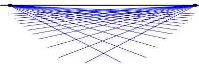  
Fig. 1. Vision geometry and its error model are essentially projective. Affine parametrization introduces an artificial singularity at projective infinity, which may cause numerical problems for distant features.

Although they are in principle equivalent, different parametrizations often have profoundly different numerical behaviours which greatly affect the speed and reliability of the adjustment iteration. The most suitable parametrizations for optimization are as uniform, finite and well-behaved as possible near the current state estimate. Ideally, they should be locally close to linear in terms of their effect on the chosen error model, so that the cost function is locally nearly quadratic. Nonlinearity hinders convergence by reducing the accuracy of the second order cost model used to predict state updates (§6). Excessive correlations and parametrization singularities cause ill-conditioning and erratic numerical behaviour. Large or infinite parameter values can only be reached after excessively many finite adjustment steps.

Any given parametrization will usually only be well-behaved in this sense over a relatively small section of state space. So to guarantee uniformly good performance, however the state itself may be represented, state updates should be evaluated using a stable local parametrization based on incrementsfrom the current estimate. As examples we consider 3D points and rotations.

3D points: Even for calibrated cameras, vision geometry and visual reconstructions are intrinsically projective. If a 3D $( X Y Z ) ^ { \intercal }$ parametrization (or equivalently a homogeneous affine $( X Y Z 1 ) ^ { \top }$ one) is used for very distant 3D points, large X, $Y , Z$ displacements are needed to change the image significantly. I.e., in $( X Y Z )$ space the cost function becomes very flat and steps needed for cost adjustment become very large for distant points. In comparison, with a homogeneous projective parametrization (X $Y Z W ) ^ { \top }$ , the behaviour near infinity is natural, finite and well-conditioned so long as the normalization keeps the homogeneous 4-vector finite at infinity (by sending $W  0$ there). In fact, there is no immediate visual distinction between the images of real points near infinity and virtual ones ‘beyond’ it (all camera geometries admit such virtual points as bonafide projective constructs). The optimal reconstruction of a real 3D point may even be virtual in this sense, if image noise happens to push it ‘across infinity’. Also, there is nothing to stop a reconstructed point wandering beyond infinity and back during the optimization. This sounds bizarre at first, but it is an inescapable consequence of the fact that the natural geometry and error model for visual reconstruction is projective rather than affine.

Projectively, infinity is just like any other place. Affine parametrization $( X Y Z 1 ) ^ { \top }$ is acceptable for points near the origin with close-range convergent camera geometries, but it is disastrous for distant ones because it artificially cuts away half of the natural parameter space, and hides the fact by sending the resulting edge to infinite parameter values. Instead, you should use a homogeneous parametrization $( X Y Z W ) ^ { \top }$ for distant points, $e . g .$ with spherical normalization $\sum X _ { i } ^ { 2 } = 1$

Rotations: Similarly, experience suggests that quasi-global 3 parameter rotation parametrizations such as Euler angles cause numerical problems unless one can be certain to avoid their singularities and regions of uneven coverage. Rotations should be parametrized using either quaternions subject to $\| \pmb q \| ^ { 2 } = 1$ , or local perturbations R δR or δR R of an existing rotation R, where δR can be any well-behaved 3 parameter small rotation approximation, e.g. $\pmb { \delta R } = ( \pmb { I } + [ \pmb { \delta r } ] _ { \times } )$ , the Rodriguez formula, local Euler angles, etc.

State updates: Just as state vectors x represent points in some nonlinear space, state updates ${ \bf x }  { \bf x } + \delta { \bf x }$ represent displacements in this nonlinear space that often can not be represented exactly by vector addition. Nevertheless, we assume that we can locally linearize the state manifold, locally resolving any internal constraints and freedoms that it may be subject to, to produce an unconstrained vector $\delta { \sf x }$ parametrizing the possible local state displacements. We can then, e.g., use Taylor expansion in $\delta { \sf x }$ to form a local cost model $\begin{array} { r } { \mathbf { \boldsymbol { \mathsf { f } } } ( \mathbf { \boldsymbol { x } } + \delta \mathbf { \boldsymbol { x } } ) \approx \mathbf { \boldsymbol { \mathsf { f } } } ( \mathbf { \boldsymbol { x } } ) + \frac { \mathrm { d } \mathbf { \boldsymbol { \mathsf { f } } } } { \mathrm { d } \mathbf { \boldsymbol { x } } } \delta \mathbf { \boldsymbol { x } } + \frac { 1 } { 2 } \delta \mathbf { \boldsymbol { x } } ^ { \top } \frac { \mathrm { d } ^ { 2 } \mathbf { \boldsymbol { \mathsf { f } } } } { \mathrm { d } \mathbf { \boldsymbol { x } } ^ { 2 } } \delta \mathbf { \boldsymbol { x } } } \end{array}$ , from which we can estimate the state update δx that optimizes this model $( \ S 4 )$ . The displacement $\delta { \sf x }$ need not have the same structure or representation as x — indeed, if a well-behaved local parametrization is used to represent $\delta { \sf x } .$ , it generally will not have — but we must at least be able to update the state with the displacement to produce a new state estimate. We write this operation as ${ \bf x }  { \bf x } + \delta { \bf x }$ , even though it may involve considerably more than vector addition. For example, apart from the change of representation, an updated quaternion ${ \pmb q }  { \pmb q } + d { \pmb q }$ will need to have its normalization $\| \pmb q \| ^ { 2 } = 1$ corrected, and a small rotation update of the form $\pmb { R }  \pmb { R } ( \mathbb { 1 } + [ r ] _ { \times } )$ will not in general give an exact rotation matrix.

## 3 Error Modelling

We now turn to the choice of the cost function $\mathsf { f } ( \mathsf { x } )$ , which quantifies the total prediction (image reprojection) error of the model parametrized by the combined scene and camera parameters x. Our main conclusion will be that robust statistically-based error metrics based on total (inlier + outlier) log likelihoods should be used, to correctly allow for the presence of outliers. We will argue this at some length as it seems to be poorly understood. The traditional treatments of adjustment methods consider only least squares (albeit with data trimming for robustness), and most discussions of robust statistics give the impression that the choice of robustifier or M-estimator is wholly a matter of personal whim rather than data statistics.

Bundle adjustment is essentially a parameter estimation problem. Any parameter estimation paradigm could be used, but we will consider only optimal point estimators, whose output is by definition the single parameter vector that minimizes a predefined cost function designed to measure how well the model fits the observations and background knowledge. This framework covers many practical estimators including maximum likelihood (ML) and maximum a posteriori (MAP), but not explicit Bayesian model averaging. Robustification, regularization and model selection terms are easily incorporated in the cost.

A typical ML cost function would be the summed negative log likelihoods of the prediction errors of all the observed image features. For Gaussian error distributions, this reduces to the sum of squared covariance-weighted prediction errors (§3.2). A MAP estimator would typically add cost terms giving certain structure or camera calibration parameters a bias towards their expected values.

The cost function is also a tool for statistical interpretation. To the extent that lower costs are uniformly ‘better’, it provides a natural model preference ordering, so that cost iso-surfaces above the minimum define natural confidence regions. Locally, these regions are nested ellipsoids centred on the cost minimum, with size and shape characterized by the dispersion matrix (the inverse of the cost function Hessian ${ \mathsf { H } } = { \frac { { \mathsf { d } } ^ { 2 } { \mathsf { f } } } { { \mathsf { d } } { \mathsf { x } } ^ { 2 } } }$ at the minimum). Also, the residual cost at the minimum can be used as a test statistic for model validity (§10). E.g., for a negative log likelihood cost model with Gaussian error distributions, twice the residual is a $\chi ^ { 2 }$ variable.

## 3.1 Desiderata for the Cost Function

In adjustment computations we go to considerable lengths to optimize a large nonlinear cost model, so it seems reasonable to require that the refinement should actually improve the estimates in some objective (albeit statistical) sense. Heuristically motivated cost functions can not usually guarantee this. They almost always lead to biased parameter estimates, and often severely biased ones. A large body of statistical theory points to maximum likelihood (ML) and its Bayesian cousin maximum a posteriori (MAP) as the estimators of choice. ML simply selects the model for which the total probability of the observed data is highest, or saying the same thing in different words, for which the total posteriorprobability of the model given the observations is highest. MAP adds a prior term representing background information. ML could just as easily have included the prior as an additional ‘observation’: so far as estimation is concerned, the distinction between ML / MAP and prior / observation is purely terminological.

Information usually comes from many independent sources. In bundle adjustment these include: covariance-weighted reprojection errors of individual image features; other measurements such as 3D positions of control points, GPS or inertial sensor readings; predictions from uncertain dynamical models (for ‘Kalman filtering’ of dynamic cameras or scenes); prior knowledge expressed as soft constraints (e.g. on camera calibration or pose values); and supplementary sources such as overfitting, regularization or description length penalties. Note the variety. One of the great strengths of adjustment computations is their ability to combine information from disparate sources. Assuming that the sources are statistically independent of one another given the model, the total probability for the model given the combined data is the product of the probabilities from the individual sources. To get an additive cost function we take logs, so the total log likelihood for the model given the combined data is the sum of the individual source log likelihoods.

Properties of ML estimators: Apart from their obvious simplicity and intuitive appeal, ML and MAP estimators have strong statistical properties. Many of the most notable ones are asymptotic, i.e. they apply in the limit of a large number of independent measurements, or more precisely in the central limit where the posterior distribution becomes effectively Gaussian1. In particular:

• Under mild regularity conditions on the observation distributions, the posterior distribution of the ML estimate converges asymptotically in probability to a Gaussian with covariance equal to the dispersion matrix.

• The ML estimate asymptotically has zero bias and the lowest variance that any unbiased estimator can have. So in this sense, ML estimation is at least as good as any other method2.

Non-asymptotically, the dispersion is not necessarily a good approximation for the covariance of the ML estimator. The asymptotic limit is usually assumed to be a valid for well-designed highly-redundant photogrammetric measurement networks, but recent sampling-based empirical studies of posterior likelihood surfaces [35, 80, 68] suggest that the case is much less clear for small vision geometry problems and weaker networks. More work is needed on this.

The effect ofincorrect error models: It is clear that incorrect modelling ofthe observation distributions is likely to disturb the ML estimate. Such mismodelling is to some extent inevitable because error distributions stand for influences that we can not fully predict or control. To understand the distortions that unrealistic error models can cause, first realize that geometric fitting is really a special case of parametric probability density estimation. For each set of parameter values, the geometric image projection model and the assumed observation error models combine to predict a probability density for the observations. Maximizing the likelihood corresponds to fitting this predicted observation density to the observed data. The geometry and camera model only enter indirectly, via their influence on the predicted distributions.

Accurate noise modelling is just as critical to successful estimation as accurate geometric modelling. The most important mismodelling is failure to take account of the possibility of outliers (aberrant data values, caused $e . g .$ , by blunders such as incorrect feature correspondences). We stress that so long as the assumed error distributions model the behaviour of all of the data used in the fit (including both inliers and outliers), the above properties of ML estimation including asymptotic minimum variance remain valid in the presence of outliers. In other words, ML estimation is naturally robust: there is no need to robustify it so long as realistic error distributions were used in the first place. A distribution that models both inliers and outliers is called a total distribution. There is no need to separate the two classes, as ML estimation does not care about the distinction. If the total distribution happens to be an explicit mixture of an inlier and an outlier distribution (e.g., a Gaussian with a locally uniform background of outliers), outliers can be labeled after fitting using likelihood ratio tests, but this is in no way essential to the estimation process.

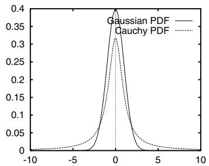

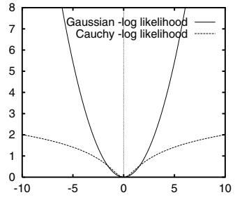

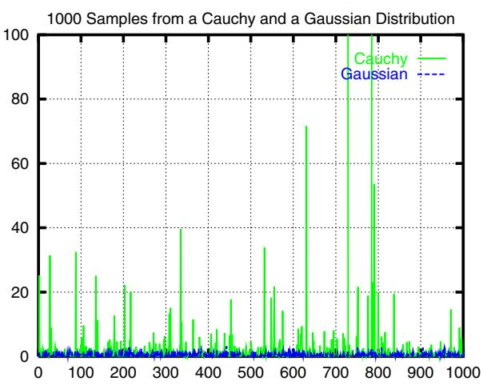  
Fig. 2. Beware of treating any bell-shaped observation distribution as a Gaussian. Despite being narrower in the peak and broader in the tails, the probability density function of a Cauchy distribution, $p ( x ) = \bigl ( \pi ( 1 + x ^ { 2 } ) \bigr ) ^ { - 1 }$ , does not look so very different from that of a Gaussian (top left). But their negative log likelihoods are very different (bottom $l e f t )$ , and large deviations (“outliers”) are much more probable for Cauchy variates than for Gaussian ones (right). In fact, the Cauchy distribution has infinite covariance.

It is also important to realize the extent to which superficially similar distributions can differ from a Gaussian, or equivalently, how extraordinarily rapidly the tails of a Gaussian distribution fall away compared to more realistic models of real observation errors. See figure 2. In fact, unmodelled outliers typically have very severe effects on the fit. To see this, suppose that the real observations are drawn from a fixed (but perhaps unknown) underlying distribution $p _ { 0 } ( \underline { { z } } )$ . The law oflarge numbers says that their empirical distributions (the observed distribution of each set of samples) converge asymptotically in probability to $p _ { 0 } ( \underline { { z } } )$ So for each model, the negative log likelihood cost sum $\begin{array} { r } { - \sum _ { i } \log p _ { \mathrm { m o d e l } } ( \mathbf { Z } _ { i } | \mathbf { x } ) } \end{array}$ converges $\begin{array} { r } { \mathrm { t o } - n _ { z } \int p _ { 0 } ( \mathbf { z } ) \log \left( p _ { \mathrm { m o d e l } } ( \mathbf { \boldsymbol { z } } | \mathbf { x } ) \right) } \end{array}$ dz. Up to a model-independent constant, this is $n _ { z }$ times -the relative entropy or Kullback-Leibler divergence $\textstyle \int p _ { 0 } ( z )$ log $( p _ { 0 } ( { \pmb z } ) / p _ { \mathrm { m o d e l } } ( { \pmb z } | { \pmb x } ) )$ dz of the model distribution w.r.t. the true one $p _ { 0 } ( \underline { { z } } )$ -. Hence, even if the model family does not include $p _ { 0 }$ , the ML estimate converges asymptotically to the model whose predicted observation distribution has minimum relative entropy w.r.t. $p _ { 0 }$ . (See, e.g. [96, proposition 2.2]). It follows that ML estimates are typically very sensitive to unmodelled outliers, as regions which are relatively probable under $p _ { 0 }$ but highly improbable under the model make large contributions to the relative entropy. In contrast, allowing for outliers where none actually occur causes relatively little distortion, as no region which is probable under $p _ { 0 }$ will have large − log pmodel.

In summary, if there is a possibility of outliers, non-robust distribution models such as Gaussians should be replaced with more realistic long-tailed ones such as: mixtures of a narrow ‘inlier’ and a wide ‘outlier’ density, Cauchy or α-densities, or densities defined piecewise with a central peaked ‘inlier’ region surrounded by a constant ‘outlier’ region3. We emphasize again that poor robustness is due entirely to unrealistic distributional assumptions: the maximum likelihood framework itself is naturally robust provided that the total observation distribution including both inliers and outliers is modelled. In fact, real observations can seldom be cleanly divided into inliers and outliers. There is a hard core of outliers such as feature correspondence errors, but there is also a grey area of features that for some reason (a specularity, a shadow, poor focus, motion blur . . . ) were not as accurately located as other features, without clearly being outliers.

## 3.2 Nonlinear Least Squares

One of the most basic parameter estimation methods is nonlinear least squares. Suppose that we have vectors of observations $\underline { { \mathbf { Z } } } _ { i }$ predicted by a model $z _ { i } = z _ { i } ( \mathbf { x } )$ , where x is a vector of model parameters. Then nonlinear least squares takes as estimates the parameter values that minimize the weighted Sum of Squared Error (SSE) cost function:

$$
{ \bf f } ( { \bf x } ) \equiv { \textstyle \frac { 1 } { 2 } } \sum _ { i } \triangle { \sf z } _ { i } ( { \bf x } ) ^ { \top } \sf W  _ { i } \triangle { \sf z } _ { i } ( { \bf x } ) , \qquad \triangle { \sf z } _ { i } ( { \bf x } ) \equiv { \textstyle { \frac { 1 } { 2 } } } _ { i } - { \sf z } _ { i } ( { \bf x } )\tag{2}
$$

Here, $\triangle z _ { i } ( \mathsf { x } )$ is the feature prediction error and $\mathsf { W } _ { i }$ is an arbitrary symmetric positive definite (SPD) weight matrix. Modulo normalization terms independent of x, the weighted SSE cost function coincides with the negative log likelihood for observations $\underline { { \mathbf { Z } } } _ { i }$ perturbed by Gaussian noise of mean zero and covariance $\mathsf { \bar { W } } _ { i } ^ { - 1 }$ . So for least squares to have a useful statistical interpretation, the $\mathsf { W } _ { i }$ should be chosen to approximate the inverse measurement covariance of $\underline { { \mathbf { Z } } } _ { i }$ . Even for non-Gaussian noise with this mean and covariance, the Gauss-Markov theorem [37, 11] states that if the models $z _ { i } ( { \bf x } )$ are linear, least squares gives the Best Linear Unbiased Estimator (BLUE), where ‘best’ means minimum variance4.

Any weighted least squares model can be converted to an unweighted one $( \mathsf { W } _ { i } = 1 )$ by pre-multiplying $\underline { { z } } _ { i } , z _ { i } , \triangle z _ { i }$ by any $\mathsf { L } _ { i } ^ { \top }$ satisfying $\mathsf { W } _ { i } = \mathsf { L } _ { i } \mathsf { L } _ { i } ^ { \top }$ . Such an $\mathsf { L } _ { i }$ can be calculated efficiently from ${ \sf W } _ { i }$ or $\mathsf { W } _ { i } ^ { - 1 }$ using Cholesky decomposition (§B.1). $\overline { { \triangle { z } } } _ { i } = \mathsf { L } _ { i } ^ { \top } \triangle { z } _ { i }$ is called a standardized residual, and the resulting unweighted least squares problem minx $\begin{array} { r } { \frac { 1 } { 2 } \sum _ { i } \| \overline { { \triangle { z } } } _ { i } ( { \bf x } ) \| ^ { 2 } } \end{array}$ is said to be in standard form. One advantage of this is that opti-mization methods based on linear least squares solvers can be used in place of ones based on linear (normal) equation solvers, which allows ill-conditioned problems to be handled more stably (§B.2).

Another peculiarity of the SSE cost function is its indifference to the natural boundaries between the observations. If observations $\underline { { \underline { { Z } } } } _ { i }$ from any sources are assembled into a compound observation vector $\underline { { \ b { z } } } \equiv ( \underline { { \ b { z } } } _ { 1 } ^ { \top } , \dots , \underline { { \ b { z } } } _ { k } ^ { \top } ) ^ { \top }$ , and their weight matrices ${ \sf W } _ { i }$ are assembled into compound block diagonal weight matrix $\mathsf { W } \equiv \mathrm { d i a g } ( \mathsf { W } _ { 1 } , \ldots , \mathsf { W } _ { k } )$ , the weighted squared error $\begin{array} { r } { \mathsf { \bar { f } } ( \mathsf { x } ) \equiv \frac { 1 } { 2 } \triangle \mathsf { z } ( \mathsf { x } ) ^ { \top } \mathsf { W } \triangle \mathsf { z } ( \bar { \mathsf { x } } ) } \end{array}$ is the same as the original SSE cost function, $\begin{array} { r } { \frac { 1 } { 2 } \sum _ { i } \bigtriangleup z _ { i } ( { \mathsf { x } } ) ^ { \top } { \mathsf { W } } _ { i } \bigtriangleup z _ { i } ^ { - } ( { \mathsf { x } } ) } \end{array}$ . The general quadratic form of the SSE cost is preserved under such compounding, and also under arbitrary linear transformations of $\supseteqq$ that mix components from different observations. The only place that the underlying structure is visible is in the block structure of W. Such invariances do not hold for essentially any other cost function, but they simplify the formulation of least squares considerably.

## 3.3 Robustified Least Squares

The main problem with least squares is its high sensitivity to outliers. This happens because the Gaussian has extremely small tails compared to most real measurement error distributions. For robust estimates, we must choose a more realistic likelihood model (§3.1). The exact functional form is less important than the general way in which the expected types of outliers enter. A single blunder such as a correspondence error may affect one or a few of the observations, but it will usually leave all of the others unchanged. This locality is the whole basis of robustification. If we can decide which observations were affected, we can down-weight or eliminate them and use the remaining observations for the parameter estimates as usual. If all of the observations had been affected about equally (e.g. as by an incorrect projection model), we might still know that something was wrong, but not be able to fix it by simple data cleaning.

We will adopt a ‘single layer’ robustness model, in which the observations are partitioned into independent groups $\underline { { \mathbf { Z } } } _ { i }$ , each group being irreducible in the sense that it is accepted, down-weighted or rejected as a whole, independently of all the other groups. The partitions should reflect the types of blunders that occur. For example, if feature correspondence errors are the most common blunders, the two coordinates of a single image point would naturally form a group as both would usually be invalidated by such a blunder, while no other image point would be affected. Even if one of the coordinates appeared to be correct, if the other were incorrect we would usually want to discard both for safety. On the other hand, in stereo problems, the four coordinates of each pair of corresponding image points might be a more natural grouping, as a point in one image is useless without its correspondent in the other one.

Henceforth, when we say observation we mean irreducible group of observations treated as a unit by the robustifying model. $I . e .$ , our observations need not be scalars, but they must be units, probabilistically independent of one another irrespective of whether they are inliers or outliers.

As usual, each independent observation $\underline { { \mathbf { Z } } } _ { i }$ contributes an independent term $\mathsf { f } _ { i } ( \mathsf { x } | \mathsf { z } _ { i } )$ to the total cost function. This could have more or less any form, depending on the expected total distribution of inliers and outliers for the observation. One very natural family are the radial distributions, which have negative log likelihoods of the form:

$$
\begin{array} { r } { \mathsf { f } _ { i } ( \mathsf { x } ) \equiv \frac { 1 } { 2 } \rho _ { i } \big ( \triangle \mathsf { z } _ { i } ( \mathsf { x } ) ^ { \top } \mathsf { W } _ { i } \triangle \mathsf { z } _ { i } ( \mathsf { x } ) \big ) } \end{array}\tag{3}
$$

Here, $\rho _ { i } ( s )$ can be any increasing function with $\rho _ { i } ( 0 ) = 0$ and $\begin{array} { r } { \frac { d } { d s } \rho _ { i } ( 0 ) = 1 } \end{array}$ . (These guarantee that at $\triangle z _ { i } = 0 .$ , f vanishes and $\frac { \mathrm { d ^ { 2 } } \mathsf { f } _ { i } } { \mathrm { d } z _ { i } ^ { 2 } } = \mathsf { W } _ { i } )$ . Weighted SSE has $\rho _ { i } ( s ) = s$ , while more robust variants have sublinear $\rho _ { i }$ , often tending to a constant at ∞ so that distant outliers are entirely ignored. The dispersion matrix $\mathsf { W } _ { i } ^ { - 1 }$ determines the spatial spread of $\underline { { \mathbf { Z } } } _ { i }$ and up to scale its covariance (if this is finite). The radial form is preserved under arbitrary affine transformations of $\underline { { \underline { { Z } } } } _ { i } .$ , so within a group, all of the observations are on an equal footing in the same sense as in least squares. However, non-Gaussian radial distributions are almost never separable: the observations in $\underline { { \mathbf { Z } } } _ { i }$ can neither be split into independent subgroups, nor combined into larger groups, without destroying the radial form. Radial cost models do not have the remarkable isotropy of non-robust SSE, but this is exactly what we wanted, as it ensures that all observations in a group will be either left alone, or down-weighted together.

As an example of this, for image features polluted with occasional large outliers caused by correspondence errors, we might model the error distribution as a Gaussian central peak plus a uniform background of outliers. This would give negative log likelihood contributions of the form $\mathsf { f } ( \bar { \mathsf { x } } ) = - \log \left( \exp ( - \textstyle \frac { 1 } { 2 } \chi _ { i p } ^ { 2 } ) + \epsilon \right)$ instead of the non-robust weighted SSE model $\begin{array} { r } { { \sf f } ( { \sf x } ) = \frac { 1 } { 2 } \chi _ { i p } ^ { 2 } , } \end{array}$ , where $\begin{array} { r } { \chi _ { i p } ^ { 2 } = \triangle \bar { \mathbf { x } _ { i p } ^ { \intercal } } \grave { \mathsf { W } _ { i p } } \triangle \mathbf { x } _ { i p } } \end{array}$ is the squared weighted residual error (which is a $\chi ^ { 2 }$ variable for a correct model and Gaussian error distribution), and  parametrizes the frequency of outliers.

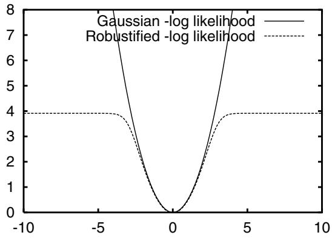

## 3.4 Intensity-Based Methods

The above models apply not only to geometric image features, but also to intensity-based matching of image patches. In this case, the observables are image gray-scales or colors I rather than feature coordinates u, and the error model is based on intensity residuals. To get from a point projection model $\mathsf { u } = \mathsf { u } ( \mathsf { x } )$ to an intensity based one, we simply compose with the assumed local intensity model ${ \mathbf I } = { \mathbf I } ( { \mathbf u } )$ (e.g. obtained from an image template or another image that we are matching against), premultiply point Jacobians by point-to-intensity Jacobians $\textstyle { \frac { \mathrm { d } \mathbf { I } } { \mathrm { d u } } } , e t c$ . The full range of intensity models can be implemented within this framework: pure translation, affine, quadratic or homographic patch deformation models, 3D model based intensity predictions, coupled affine or spline patches for surface coverage, etc., [1, 52, 55, 9, 110, 94, 53, 97, 76, 104, 102]. The structure of intensity based bundle problems is very similar to that of feature based ones, so all of the techniques studied below can be applied.

We will not go into more detail on intensity matching, except to note that it is the real basis of feature based methods. Feature detectors are optimized for detection not localization. To localize a detected feature accurately we need to match (some function of)

the image intensities in its region against either an idealized template or another image of the feature, using an appropriate geometric deformation model, etc. For example, suppose that the intensity matching model is $\begin{array} { r } { \mathbf { \boldsymbol { \mathsf { f } } } ( \mathbf { \boldsymbol { \mathsf { u } } } ) = \frac { 1 } { 2 } \iint \rho ( \| \delta \mathbf { \boldsymbol { \mathsf { I } } } ( \mathbf { \boldsymbol { \mathsf { u } } } ) \| ^ { 2 } ) } \end{array}$ where the integration is --over some image patch, δI is the current intensity prediction error, u parametrizes the local geometry (patch translation & warping), and $\rho ( \cdot )$ is some intensity error robustifier. Then the cost gradient in terms of u is $\begin{array} { r } { \mathfrak { g } _ { \mathtt { u } } ^ { \mathtt { T } } = \frac { \mathtt { d f } } { \mathtt { d } \mathfrak { u } } = \int \int \rho ^ { \prime } \delta \mathbf { I } ^ { \top } \frac { \mathtt { d } \mathbf { I } } { \mathtt { d } \mathfrak { u } } } \end{array}$ . Similarly, the cost Hessian in u in a Gauss-Newton approximation is $\begin{array} { r } { \mathsf { H } _ { \mathsf { u } } = \frac { \mathsf { d } ^ { 2 } \mathsf { f } } { \mathsf { d } \mathsf { u } ^ { 2 } } \approx \int \int \rho ^ { \prime \prime } ( \frac { \mathsf { d } \mathbf { I } } { \mathsf { d } \mathsf { u } } ) ^ { \top } \frac { \mathsf { d } \mathbf { I } } { \mathsf { d } \mathsf { u } } } \end{array}$ . In a feature based model, we express ${ \sf u } = { \sf u } ( { \sf x } )$ as a function of the bundle parameters, so if $\begin{array} { r } { { \mathsf { J } } _ { \mathsf { u } } = \frac { \mathsf { d } \mathsf { u } } { \mathsf { d } \mathsf { x } } } \end{array}$ we have a corresponding cost gradient and Hessian contribution $\mathfrak { g } _ { \mathtt { x } } ^ { \top } = \mathfrak { g } _ { \mathtt { u } } ^ { \top } \mathfrak { d } _ { \mathtt { u } }$ and $\mathsf { H } _ { \mathsf { x } } = \mathsf { J } _ { \mathsf { u } } ^ { \top } \mathsf { H } _ { \mathsf { u } } \mathsf { J } _ { \mathsf { u } }$ In other words, the intensity matching model is locally equivalent to a quadratic feature matching one on the ‘features’ u(x), with effective weight (inverse covariance) matrix ${ \sf W } _ { \sf u } = { \sf H } _ { \sf u }$ . All image feature error models in vision are ultimately based on such an underlying intensity matching model. As feature covariances are a function of intensity gradients $\iint \rho ^ { \prime \prime } ( \frac { \mathrm { d } \mathbf { I } } { \mathrm { d } \mathbf { u } } ) ^ { \top } \frac { \mathrm { d } \mathbf { I } } { \mathrm { d } \mathbf { u } }$ , they can be both highly variable between features (depending --on how much local gradient there is), and highly anisotropic (depending on how directional the gradients are). $E . g .$ , for points along a 1D intensity edge, the uncertainty is large in the along edge direction and small in the across edge one.

## 3.5 Implicit Models

Sometimes observations are most naturally expressed in terms of an implicit observationconstraining model ${ \mathfrak { h } } ( \mathbf { x } , z ) = 0$ , rather than an explicit observation-predicting one $z =$ $\boldsymbol { z } ( \mathsf { x } )$ . (The associated image error still has the form $\boldsymbol { \mathsf { f } } ( \boldsymbol { \mathsf { z } } - \boldsymbol { \mathsf { z } } ) )$ ). For example, if the model is a 3D curve and we observe points on it (the noisy images of 3D points that may lie anywhere along the 3D curve), we can predict the whole image curve, but not the exact position of each observation along it. We only have the constraint that the noiseless image of the observed point would lie on the noiseless image of the curve, if we knew these. There are basically two ways to handle implicit models: nuisance parameters and reduction.

Nuisance parameters: In this approach, the model is made explicit by adding additional ‘nuisance’ parameters representing something equivalent to model-consistent estimates of the unknown noise free observations, i.e. to z with $\begin{array} { r } { \mathsf { h } ( \mathsf { x } , z ) = 0 } \end{array}$ . The most direct way to do this is to include the entire parameter vector z as nuisance parameters, so that we have to solve a constrained optimization problem on the extended parameter space $( \mathsf { x } , \mathsf { z } )$ minimizing $\mathbf { f } ( \underline { { z } } - z )$ over $( \mathsf { x } , \mathsf { z } )$ subject to h $( { \pmb x } , { \pmb z } ) = 0 .$ . This is a sparse constrained problem, which can be solved efficiently using sparse matrix techniques $( \ S 6 . 3 )$ . In fact, for image observations, the subproblems in z (optimizing $\boldsymbol { \mathsf { f } } ( \boldsymbol { \mathsf { z } } - \boldsymbol { \mathsf { z } } )$ over z for fixed z and x) are small and for typical f rather simple. So in spite of the extra parameters z, optimizing this model is not significantly more expensive than optimizing an explicit one ${ \boldsymbol { z } } = { \boldsymbol { z } } ( { \boldsymbol { \mathsf { x } } } )$ [14, 13, 105, 106]. For example, when estimating matching constraints between image pairs or triplets [60, 62], instead of using an explicit 3D representation, pairs or triplets of corresponding image points can be used as features $z _ { i } ,$ subject to the epipolar or trifocal geometry contained in x [105, 106].

However, if a smaller nuisance parameter vector than z can be found, it is wise to use it. In the case of a curve, it suffices to include just one nuisance parameter per observation, saying where along the curve the corresponding noise free observation is predicted to lie. This model exactly satisfies the constraints, so it converts the implicit model to an unconstrained explicit one ${ \pmb z } = { \pmb z } ( { \pmb x } , { \pmb \lambda } )$ , where λ are the along-curve nuisance parameters.

The advantage of the nuisance parameter approach is that it gives the exact optimal parameter estimate for x, and jointly, optimal x-consistent estimates for the noise free observations z.

Reduction: Alternatively, we can regard h $( \mathsf { x } , \mathsf { z } )$ rather than z as the observation vector, and hence fit the parameters to the explicit log likelihood model for $\mathsf { h } ( \mathsf { x } , \mathsf { z } )$ . To do this, we must transfer the underlying error model / distribution $\mathfrak { f } ( \triangle z )$ on z to one f(h) on $\mathsf { h } ( \mathsf { x } , \mathsf { z } )$ . In principle, this should be done by marginalization: the density for h is given by integrating that for $\triangle z$ over all $\triangle z$ giving the same h. Within the point estimation framework, it can be approximated by replacing the integration with maximization. Neither calculation is easy in general, but in the asymptotic limit where first order Taylor expansion $\begin{array} { r } { \mathsf { h } ( \mathsf { x } , \mathsf { \underline { { z } } } ) = \mathsf { h } ( \mathsf { x } , \mathsf { z } + \triangle \mathsf { z } ) \approx 0 + \frac { \mathrm { d } \mathsf { h } } { \mathrm { d } \mathsf { z } } \triangle \mathsf { z } } \end{array}$ is valid, the distribution of h is a marginalization or maximization of that of $\triangle z$ over affine subspaces. This can be evaluated in closed form for some robust distributions. Also, standard covariance propagation gives (more precisely, this applies to the h and $\triangle z$ dispersions):

$$
\begin{array} { r } { \langle \mathsf { h } ( \mathbf { x } , \underline { { z } } ) \rangle \approx 0 , \qquad \langle \mathsf { h } ( \mathbf { x } , \underline { { z } } ) \mathsf { h } ( \mathbf { x } , \underline { { z } } ) ^ { \top } \rangle \approx \frac { \mathrm { d } \mathsf { h } } { \mathrm { d } z } \langle \triangle \mathbf { z } \triangle \underline { { z } } ^ { \top } \rangle \frac { \mathrm { d } \mathsf { h } ^ { \top } } { \mathrm { d } z } = \frac { \mathrm { d } \mathsf { h } } { \mathrm { d } z } \mathsf { W } ^ { - 1 } \frac { \mathrm { d } \mathsf { h } ^ { \top } } { \mathrm { d } z } } \end{array}\tag{4}
$$

where $\mathsf { W } ^ { - 1 }$ is the covariance of $\triangle z$ . So at least for an outlier-free Gaussian model, the reduced distribution remains Gaussian (albeit with x-dependent covariance).

## 4 Basic Numerical Optimization

Having chosen a suitable model quality metric, we must optimize it. This section gives a very rapid sketch of the basic local optimization methods for differentiable functions. See [29, 93, 42] for more details. We need to minimize a cost function f(x) over parameters x, starting from some given initial estimate x of the minimum, presumably supplied by some approximate visual reconstruction method or prior knowledge ofthe approximate situation. As in §2.2, the parameter space may be nonlinear, but we assume that local displacements can be parametrized by a local coordinate system / vector of free parameters δx. We try to find a displacement ${ \bf x }  { \bf x } + \delta { \bf x }$ that locally minimizes or at least reduces the cost function. Real cost functions are too complicated to minimize in closed form, so instead we minimize an approximate local model for the function, e.g. based on Taylor expansion or some other approximation at the current point x. Although this does not usually give the exact minimum, with luck it will improve on the initial parameter estimate and allow us to iterate to convergence. The art of reliable optimization is largely in the details that make this happen even without luck: which local model, how to minimize it, how to ensure that the estimate is improved, and how to decide when convergence has occurred. If you not are interested in such subjects, use a professionally designed package (§C.2): details are important here.

## 4.1 Second Order Methods

The reference for all local models is the quadratic Taylor series one:

$$
{ \begin{array} { r l r l } { { \mathfrak { f } } ( \mathbf { x } + \delta \mathbf { x } ) \approx \mathbf { f } ( \mathbf { x } ) + \mathbf { g } ^ { \intercal } \delta \mathbf { x } + { \frac { 1 } { 2 } } \delta \mathbf { x } ^ { \intercal } { \mathsf { H } } \delta \mathbf { x } } & & { \quad \mathbf { g } \equiv { \frac { \mathrm { d } \mathbf { f } } { \mathrm { d } \mathbf { x } } } ( \mathbf { x } ) } & & { \quad \mathsf { H } \equiv { \frac { \mathrm { d } ^ { 2 } \mathbf { f } } { \mathrm { d } \mathbf { x } ^ { 2 } } } ( \mathbf { x } ) } \\ { { \mathrm { q u a d r a t i c ~ l o c a l ~ m o d e l } } } & & { \quad { \mathrm { g r a d i e n t ~ v e c t o r } } } & & { \quad \mathbf { H } { \mathrm { e s s i a n ~ m a t r i x } } } \end{array} }\tag{5}
$$

For now, assume that the Hessian H is positive definite (but see below and §9). The local model is then a simple quadratic with a unique global minimum, which can be found explicitly using linear algebra. Setting $\frac { \mathrm { d } \mathbf { f } } { \mathrm { d }  { \mathbf { x } } } (  { \mathbf { x } } + \delta  { \mathbf { x } } ) \approx \mathsf { H } \delta  { \mathbf { x } } + \mathsf { g }$ to zero for the stationary point gives the Newton step:

$$
\delta { \sf x } = - { \sf H } ^ { - 1 } \sf g\tag{6}
$$

The estimated new function value is $\begin{array} { r } { \mathfrak { f } ( \mathbf { x } + \delta \mathbf { x } ) \approx \mathfrak { f } ( \mathbf { x } ) - \frac { 1 } { 2 } \delta \mathbf { x } ^ { \top } \mathsf { H } \delta \mathbf { x } = \mathfrak { f } ( \mathbf { x } ) - \frac { 1 } { 2 } \mathfrak { g } ^ { \top } \mathsf { H } ^ { - 1 } \mathfrak { g } . } \end{array}$ Iterating the Newton step gives Newton’s method. This is the canonical optimization method for smooth cost functions, owing to its exceptionally rapid theoretical and practical convergence near the minimum. For quadratic functions it converges in one iteration, and for more general analytic ones its asymptotic convergence is quadratic: as soon as the estimate gets close enough to the solution for the second order Taylor expansion to be reasonably accurate, the residual state error is approximately squared at each iteration. This means that the number of significant digits in the estimate approximately doubles at each iteration, so starting from any reasonable estimate, at most about $\log _ { 2 } ( 1 6 ) + 1 \approx 5 - 6$ iterations are needed for full double precision (16 digit) accuracy. Methods that potentially achieve such rapid asymptotic convergence are called second order methods. This is a high accolade for a local optimization method, but it can only be achieved if the Newton step is asymptotically well approximated. Despite their conceptual simplicity and asymptotic performance, Newton-like methods have some disadvantages:

• To guarantee convergence, a suitable step control policy must be added (§4.2).

• Solving the $n \times n$ Newton step equations takes time $\mathcal { O } ( n ^ { 3 } )$ for a dense system (§B.1),  which can be prohibitive for large n. Although the cost can often be reduced (very substantially for bundle adjustment) by exploiting sparseness in H, it remains true that Newton-like methods tend to have a high cost per iteration, which increases relative to that of other methods as the problem size increases. For this reason, it is sometimes worthwhile to consider more approximate first order methods (§7), which are occasionally more efficient, and generally simpler to implement, than sparse Newton-like methods.

• Calculating second derivatives H is by no means trivial for a complicated cost function, both computationally, and in terms of implementation effort. The Gauss-Newton method (§4.3) offers a simple analytic approximation to H for nonlinear least squares problems. Some other methods build up approximations to H from the way the gradient g changes during the iteration are in use (see §7.1, Krylov methods).

• The asymptotic convergence of Newton-like methods is sometimes felt to be an expensive luxury when far from the minimum, especially when damping (see below) is active. However, it must be said that Newton-like methods generally do require significantly fewer iterations than first order ones, even far from the minimum.

## 4.2 Step Control

Unfortunately, Newton’s method can fail in several ways. It may converge to a saddle point rather than a minimum, and for large steps the second order cost prediction may be inaccurate, so there is no guarantee that the true cost will actually decrease. To guarantee convergence to a minimum, the step must follow a local descent direction (a direction with a non-negligible component down the local cost gradient, or if the gradient is zero near a saddle point, down a negative curvature direction of the Hessian), and it must make reasonable progress in this direction (neither so little that the optimization runs slowly or stalls, nor so much that it greatly overshoots the cost minimum along this direction). It is also necessary to decide when the iteration has converged, and perhaps to limit any over-large steps that are requested. Together, these topics form the delicate subject of step control.

To choose a descent direction, one can take the Newton step direction if this descends (it may not near a saddle point), or more generally some combination of the Newton and gradient directions. Damped Newton methods solve a regularized system to find the step:

$$
\left( \mathsf { H } + \lambda \mathsf { W } \right) \delta \mathsf { x } = - \mathsf { g }\tag{7}
$$

Here, λ is some weighting factor and W is some positive definite weight matrix (often the identity, so $\lambda \to \infty$ becomes gradient descent $\delta \mathsf { x } \propto - \mathsf { g } )$ . λ can be chosen to limit the step to a dynamically chosen maximum size (trust region methods), or manipulated more heuristically, to shorten the step if the prediction is poor (Levenberg-Marquardt methods).

Given a descent direction, progress along it is usually assured by a line search method, of which there are many based on quadratic and cubic 1D cost models. If the suggested (e.g. Newton) step is $\delta { \sf x } .$ , line search finds the α that actually minimizes f along the line ${ \mathbf x } + \alpha \delta { \mathbf x } .$ , rather than simply taking the estimate $\alpha = 1$

There is no space for further details on step control here (again, see [29, 93, 42]). However note that poor step control can make a huge difference in reliability and convergence rates, especially for ill-conditioned problems. Unless you are familiar with these issues, it is advisable to use professionally designed methods.

## 4.3 Gauss-Newton and Least Squares

Consider the nonlinear weighted SSE cost model $\begin{array} { r } { \mathsf { f } ( \mathsf { x } ) \equiv \frac { 1 } { \hbar } \triangle \mathsf { z } ( \mathsf { x } ) ^ { \top } \mathsf { W } \triangle \mathsf { z } ( \mathsf { x } ) } \end{array}$ (§3.2) with prediction error $\bigtriangleup z ( \mathbf { x } ) = \underline { { z } } - z ( \mathbf { x } )$ and weight matrix W. Differentiation gives the gradient and Hessian in terms of the Jacobian or design matrix of the predictive model, $\begin{array} { r } { \mathsf { J } \equiv \frac { \mathsf { d } \boldsymbol { z } } { \mathsf { d } \mathsf { x } } : } \end{array}$

$$
\begin{array} { r } { \mathfrak { g } \equiv \frac { \mathrm { d } \mathbf { f } } { \mathrm { d } \mathbf { x } } = \triangle \mathbf { z } ^ { \top } \mathbb { W } \mathbf { J } \qquad \forall \equiv \frac { \mathrm { d } ^ { 2 } \mathbf { f } } { \mathrm { d } \mathbf { x } ^ { 2 } } = \mathbf { J } ^ { \top } \mathbb { W } \mathbf { J } + \sum _ { i } ( \triangle \mathbf { z } ^ { \top } \mathbb { W } ) _ { i } \frac { \mathrm { d } ^ { 2 } \mathbf { z } _ { i } } { \mathrm { d } \mathbf { x } ^ { 2 } } } \end{array}\tag{8}
$$

These formulae could be used directly in a damped Newton method, but the $\frac { \mathsf { d } ^ { 2 } \mathsf { z } _ { i } } { \mathsf { d } \mathsf { x } ^ { 2 } }$ term in H is likely to be small in comparison to the corresponding components of J W J if either: (i) the prediction error $\bigtriangleup z ( { \sf x } )$ is small; or (ii) the model is nearly linear, $\frac { \mathsf { d } ^ { 2 } z _ { i } } { \mathsf { d } \mathsf { x } ^ { 2 } } \approx 0$ . Dropping the second term gives the Gauss-Newton approximation to the least squares Hessian, $\mathsf { H } \approx \mathsf { J } ^ { \top } \mathsf { W } \mathsf { J }$ . With this approximation, the Newton step prediction equations become the Gauss-Newton or normal equations:

$$
\left( \mathsf { J } ^ { \top } \mathsf { W } \mathsf { J } \right) \delta \mathsf { x } \ = \ - \mathsf { J } ^ { \top } \mathsf { W } \triangle \mathsf { z }\tag{9}
$$

The Gauss-Newton approximation is extremely common in nonlinear least squares, and practically all current bundle implementations use it. Its main advantage is simplicity: the second derivatives ofthe projection model $z ( { \boldsymbol { \mathsf { x } } } )$ are complex and troublesome to implement.

In fact, the normal equations are just one of many methods of solving the weighted linear least squares problem5 min $\begin{array} { r } { \delta { \bf x } \ \frac { 1 } { 2 } ( { \bf J } \delta { \bf x } - \bigtriangleup { \bf z } ) ^ { \top } { \bf W } ( { \bf J } \delta { \bf x } - \bigtriangleup { \bf z } ) } \end{array}$ . Another notable method is that based on QR decomposition (§B.2, [11, 44]), which is up to a factor of two slower than the normal equations, but much less sensitive to ill-conditioning in $\mathsf { J } ^ { 6 }$

Whichever solution method is used, the main disadvantage of the Gauss-Newton approximation is that when the discarded terms are not negligible, the convergence rate is greatly reduced (§7.2). In our experience, such reductions are indeed common in highly nonlinear problems with (at the current step) large residuals. For example, near a saddle point the Gauss-Newton approximation is never accurate, as its predicted Hessian is always at least positive semidefinite. However, for well-parametrized (i.e. locally near linear, §2.2) bundle problems under an outlier-free least squares cost model evaluated near the cost minimum, the Gauss-Newton approximation is usually very accurate. Feature extraction errors and hence $\triangle z$ and $\mathsf { W } ^ { - 1 }$ have characteristic scales of at most a few pixels. In contrast, the nonlinearities of $\boldsymbol { z } ( \mathsf { x } )$ are caused by nonlinear 3D feature-camera geometry (perspective effects) and nonlinear image projection (lens distortion). For typical geometries and lenses, neither effect varies significantly on a scale of a few pixels. So the nonlinear corrections are usually small compared to the leading order linear terms, and bundle adjustment behaves as a near-linear small residual problem.

However note that this does not extend to robust cost models. Robustification works by introducing strong nonlinearity into the cost function at the scale of typical feature reprojection errors. For accurate step prediction, the optimization routine must take account of this. For radial cost functions (§3.3), a reasonable compromise is to take account of the exact second order derivatives of the robustifiers $\rho _ { i } ( \cdot )$ , while retaining only the first order Gauss-Newton approximation for the predicted observations $z _ { i } ( { \bf x } )$ . If $\rho _ { i } ^ { \prime }$ and $\rho ^ { \prime \prime }$ are respectively the first and second derivatives of $\rho _ { i }$ at the current evaluation point, we have a robustified Gauss-Newton approximation:

$$
{ \bf g } _ { i } = \rho _ { i } ^ { \prime } \ J _ { i } ^ { \top } { \sf W } _ { i } \triangle { \sf z } _ { i } \quad \quad { \sf H } _ { i } \approx \ J _ { i } ^ { \top } ( \rho _ { i } ^ { \prime } \sf W _ { i } + 2 \rho _ { i } ^ { \prime \prime } ( \sf W _ { i } \triangle { \sf z } _ { i } ) ( \sf W _ { i } \triangle { \sf z } _ { i } ) ^ { \top } ) { \bf J } _ { i }\tag{10}
$$

So robustification has two effects: (i) it down-weights the entire observation (both ${ \mathfrak { g } } _ { i }$ and $\mathsf { H } _ { i } )$ by $\rho _ { i } ^ { \prime }$ ; and (ii) it makes a rank-one reduction7 of the curvature $\mathsf { H } _ { i }$ in the radial $( \triangle z _ { i } )$ direction, to account for the way in which the weight changes with the residual. There are reweighting-based optimization methods that include only the first effect. They still find the true cost minimum ${ \mathfrak { g } } = 0$ as the ${ \mathfrak { g } } _ { i }$ are evaluated exactl $\mathrm { \cdot ^ { \ 8 } }$ , but convergence may be slowed owing to inaccuracy of H, especially for the mainly radial deviations produced by non-robust initializers containing outliers. $\mathsf { H } _ { i }$ has a direction of negative curvature if $\rho _ { i } ^ { \prime \prime } \triangle \mathsf { z } _ { i } ^ { \top } \mathsf { W } _ { i } \triangle \mathsf { z } _ { i } < - \frac { 1 } { 2 } \rho _ { i } ^ { \prime }$ , but if not we can even reduce the robustified Gauss-Newton model to a local unweighted SSE one for which linear least squares methods can be used. For simplicity suppose that ${ \sf W } _ { i }$ has already reduced to 1 by premultiplying $\boldsymbol { z } _ { i }$ and $\mathsf { J } _ { i }$ by $\mathsf { L } _ { i } ^ { \top }$ where $\mathsf { L } _ { i } \mathsf { L } _ { i } ^ { \top } = \mathsf { W } _ { i }$ . Then minimizing the effective squared error $\frac { 1 } { \gamma } \| \overline { { \delta \pmb { z } } } _ { i } - \overline { { \mathsf { J } } } _ { i } \delta \pmb { \times } \| ^ { 2 }$ gives the correct second order robust state update, where $\alpha \equiv { \mathrm { R o o t O f } } ( \frac { 1 } { 2 } \alpha ^ { \bar { 2 } } - \alpha - \rho _ { i } ^ { \prime \prime } / \rho _ { i } ^ { \prime } \left. \triangle \mathbf { z } _ { i } \right. ^ { 2 } )$ and:

$$
\overline { { \delta { \bf z } } } _ { i } \equiv \frac { \sqrt { \rho _ { i } ^ { \prime } } } { 1 - \alpha } \triangle { \bf z } _ { i } ( { \bf x } ) { \bar { \bf J } } _ { i } \equiv \sqrt { \rho _ { i } ^ { \prime } } \left( 1 - \alpha \frac { \triangle { \bf z } _ { i } \triangle { \bf z } _ { i } ^ { \top } } { \| \triangle { \bf z } _ { i } \| ^ { 2 } } \right) { \bf J } _ { i }\tag{11}
$$

In practice, if $\rho _ { i } ^ { \prime \prime } \parallel \triangle \mathbf { z } _ { i } \parallel ^ { 2 } \lesssim - \frac { 1 } { 2 } \rho _ { i } ^ { \prime }$ , we can use the same formulae but limit $\alpha \leq 1 - \epsilon$ for some small . However, the full curvature correction is not applied in this case.

## 4.4 Constrained Problems

More generally, we may want to minimize a function f(x) subject to a set of constraints $\mathbf { c } ( \mathbf { x } ) = 0$ on x. These might be scene constraints, internal consistency constraints on the parametrization (§2.2), or constraints arising from an implicit observation model (§3.5). Given an initial estimate x of the solution, we try to improve this by optimizing the quadratic local model for f subject to a linear local model of the constraints c. This linearly constrained quadratic problem has an exact solution in linear algebra. Let g, H be the gradient and Hessian of f as before, and let the first order expansion of the constraints be $\begin{array} { r } { \mathsf { c } ( \mathsf { x } + \delta \mathsf { x } ) \approx \mathsf { c } ( \mathsf { x } ) + \mathsf { C } \delta \mathsf { x } \mathrm { w h e r e } \mathsf { C } \equiv \frac { \mathsf { d c } } { \mathsf { d } \mathsf { x } } } \end{array}$ . Introduce a vector ofLagrange multipliers λ for c. We seek the $\times + \delta \times$ that optimizes ${ \pmb { \mathrm { c } } } ^ { \top } { \pmb { \lambda } }$ subject to $\begin{array} { r } { \mathsf { c } = 0 , i . e . 0 = \frac { \mathsf { d } } { \mathsf { d } \mathsf { x } } ( \mathsf { f } + \mathsf { c } ^ { \top } \pmb { \lambda } ) ( \mathsf { x } + \pmb { \delta } \mathsf { x } ) \approx } \end{array}$ $\mathsf { \mathfrak { g } } + \mathsf { H } \delta \mathsf { x } + \mathsf { C } ^ { \top }$ λ and $0 = { \mathsf { c } } ( { \mathsf { x } } + \delta { \mathsf { x } } ) \approx { \mathsf { c } } ( { \mathsf { x } } ) + { \mathsf { C } } \delta { \mathsf { x } }$ . Combining these gives the Sequential Quadratic Programming (SQP) step:

$$
{ \binom { \mathsf { H } \mathsf { C } ^ { \top } } { \mathsf { C } } } \left( { \binom { \delta \mathbf { x } } { \lambda } } \right) = - \left( { \binom { 9 } { \mathsf { c } } } \right) , \quad \mathbf { f } ( \mathbf { x } + \delta \mathbf { x } ) \approx \mathbf { f } ( \mathbf { x } ) - { \frac { 1 } { 2 } } \left( \mathbf { g } ^ { \top } \mathbf { c } ^ { \top } \right) { \binom { \mathsf { H } \mathbf { C } ^ { \top } } { \mathsf { C } \mathbf { \Lambda } 0 } } ^ { - 1 } { \binom { 9 } { \mathsf { c } } }\tag{12}
$$

$$
\begin{array} { r l } { \left( \stackrel { \mathsf { H } } { \mathsf { C } } ^ { \top } \right) ^ { - 1 } = } & { \left( \stackrel { \mathsf { H } ^ { - 1 } - \mathsf { H } ^ { - 1 } \mathsf { C } ^ { \top } \mathsf { D } ^ { - 1 } \mathsf { C } \mathsf { H } ^ { - 1 } \mathsf { H } ^ { - 1 } \mathsf { C } ^ { \top } \mathsf { D } ^ { - 1 } } { \mathsf { D } ^ { - 1 } \mathsf { C } \mathsf { H } ^ { - 1 } } \right) , \qquad \mathsf { D } \equiv \mathsf { C } \mathsf { H } ^ { - 1 } \mathsf { C } ^ { \top } } \end{array}\tag{13}
$$

At the optimum $\delta { \sf x }$ and c vanish, but ${ \mathsf { C } } ^ { \top } \lambda = - { \mathsf { g } }$ , which is generally non-zero.

An alternative constrained approach uses the linearized constraints to eliminate some of the variables, then optimizes over the rest. Suppose that we can order the variables to give partitions ${ \bf x } = ( { \bf x } _ { 1 } \times _ { 2 } ) ^ { \top }$ and $\mathsf C = ( \mathsf C _ { 1 } \mathsf C _ { 2 } )$ , where $\mathsf { C } _ { 1 }$ is square and invertible. Then using $\mathsf C _ { 1 } \mathsf x _ { 1 } + \mathsf C _ { 2 } \mathsf x _ { 2 } = \mathsf C \mathsf x = - \mathsf c$ , we can solve for $\mathsf { x } _ { 1 }$ in terms of $\mathsf { X } _ { 2 }$ and c: ${ \pmb x } _ { 1 } = - { \pmb C } _ { 1 } ^ { - 1 } ( { \pmb C } _ { 2 } { \pmb x } _ { 2 } + { \pmb c } )$ . Substituting this into the quadratic cost model has the effect of eliminating $\mathsf { x } _ { 1 }$ , leaving a smaller unconstrained reduced problem $\overline { { { \mathsf { H } } } } _ { 2 2 } \mathsf { x } _ { 2 } = - \overline { { { \mathsf { g } } } } _ { 2 }$ , where:

$$
\begin{array} { r } { \mathsf { \bar { H } } _ { 2 2 } \equiv \mathsf { H } _ { 2 2 } - \mathsf { H } _ { 2 1 } \mathsf { C } _ { 1 } ^ { - 1 } \mathsf { C } _ { 2 } - \mathsf { C } _ { 2 } ^ { \top } \mathsf { C } _ { 1 } ^ { - \top } \mathsf { H } _ { 1 2 } + \mathsf { C } _ { 2 } ^ { \top } \mathsf { C } _ { 1 } ^ { - \top } \mathsf { H } _ { 1 1 } \mathsf { C } _ { 1 } ^ { - 1 } \mathsf { C } _ { 2 } } \end{array}\tag{14}
$$

$$
\bar { \bf g } _ { 2 } \equiv { \bf g } _ { 2 } - { \bf C } _ { 2 } ^ { \top } { \bf C } _ { 1 } ^ { - \top } { \bf g } _ { 1 } - ( { \sf H } _ { 2 1 } - { \bf C } _ { 2 } ^ { \top } { \bf C } _ { 1 } ^ { - \top } { \sf H } _ { 1 1 } ) { \bf C } _ { 1 } ^ { - 1 } { \bf c }\tag{15}
$$

(These matrices can be evaluated efficiently using simple matrix factorization schemes [11]). This method is stable provided that the chosen $\mathsf { C } _ { 1 }$ is well-conditioned. It works well

for dense problems, but is not always suitable for sparse ones because if C is dense, the reduced Hessian $\overline { { \mathsf { H } } } _ { 2 2 }$ becomes dense too.

For least squares cost models, constraints can also be handled within the linear least squares framework, e.g. see [11].

## 4.5 General Implementation Issues

Before going into details, we mention a few points of good numerical practice for largescale optimization problems such as bundle adjustment:

Exploit the problem structure: Large-scale problems are almost always highly structured and bundle adjustment is no exception. In professional cartography and photogrammetric site-modelling, bundle problems with thousands of images and many tens of thousands of features are regularly solved. Such problems would simply be infeasible without a thorough exploitation of the natural structure and sparsity of the bundle problem. We will have much to say about sparsity below.

Use factorization effectively: Many of above formulae contain matrix inverses. This is a convenient short-hand for theoretical calculations, but numerically, matrix inversion is almost never used. Instead, the matrix is decomposed into its Cholesky, LU, QR, etc., factors and these are used directly, e.g. linear systems are solved using forwards and backwards substitution. This is much faster and numerically more accurate than explicit use of the inverse, particularly for sparse matrices such as the bundle Hessian, whose factors are still quite sparse, but whose inverse is always dense. Explicit inversion is required only occasionally, e.g. for covariance estimates, and even then only a few of the entries may be needed (e.g. diagonal blocks of the covariance). Factorization is the heart of the optimization iteration, where most of the time is spent and where most can be done to improve efficiency (by exploiting sparsity, symmetry and other problem structure) and numerical stability (by pivoting and scaling). Similarly, certain matrices (subspace projectors, Householder matrices) have (diagonal)+(low rank) forms which should not be explicitly evaluated as they can be applied more efficiently in pieces.

Use stable local parametrizations: As discussed in §2.2, the parametrization used for step prediction need not coincide with the global one used to store the state estimate. It is more important that it should be finite, uniform and locally as nearly linear as possible. If the global parametrization is in some way complex, highly nonlinear, or potentially ill-conditioned, it is usually preferable to use a stable local parametrization based on perturbations of the current state for step prediction.

Scaling and preconditioning: Another parametrization issue that has a profound and toorarely recognized influence on numerical performance is variable scaling (the choice of ‘units’ or reference scale to use for each parameter), and more generally preconditioning (the choice of which linear combinations of parameters to use). These represent the linear part of the general parametrization problem. The performance of gradient descent and most other linearly convergent optimization methods is critically dependent on preconditioning, to the extent that for large problems, they are seldom practically useful without it.

One of the great advantages of the Newton-like methods is their theoretical independence of such scaling issues9. But even for these, scaling makes itself felt indirectly in several ways: (i) Step control strategies including convergence tests, maximum step size limitations, and damping strategies (trust region, Levenberg-Marquardt) are usually all based on some implicit norm $\| \bar { \delta } \mathsf { x } \| ^ { 2 }$ , and hence change under linear transformations of x (e.g., damping makes the step more like the non-invariant gradient descent one). (ii) Pivoting strategies for factoring H are highly dependent on variable scaling, as they choose ‘large’ elements on which to pivot. Here, ‘large’ should mean ‘in which little numerical cancellation has occurred’ but with uneven scaling it becomes ‘with the largest scale’. (iii) The choice of gauge (datum, §9) may depend on variable scaling, and this can significantly influence convergence [82, 81].

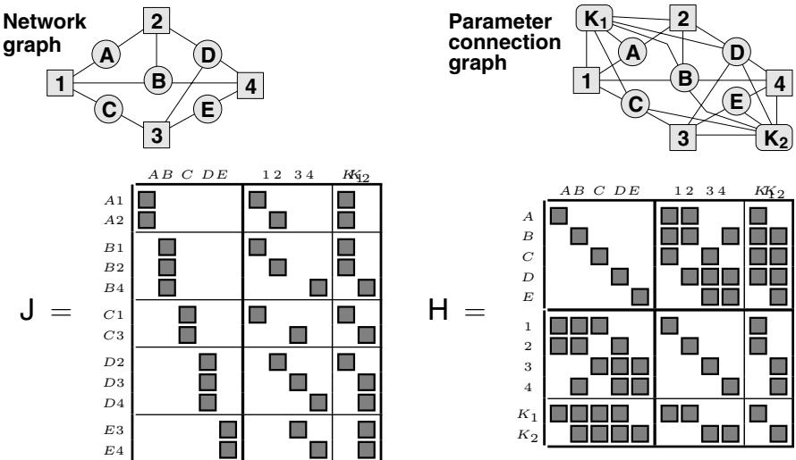  
Fig. 3. The network graph, parameter connection graph, Jacobian structure and Hessian structure for a toy bundle problem with five 3D features A–E, four images 1–4 and two camera calibrations $K _ { 1 }$ (shared by images 1,2) and $K _ { 2 }$ (shared by images 3,4). Feature A is seen in images 1,2; B in 1,2,4; C in 1,3; D in 2–4; and E in 3,4.

For all of these reasons, it is important to choose variable scalings that relate meaningfully to the problem structure. This involves a judicious comparison of the relative influence of, e.g., a unit of error on a nearby point, a unit of error on a very distant one, a camera rotation error, a radial distortion error, etc. For this, it is advisable to use an ‘ideal’ Hessian or weight matrix rather than the observed one, otherwise the scaling might break down if the Hessian happens to become ill-conditioned or non-positive during a few iterations before settling down.

## 5 Network Structure

Adjustment networks have a rich structure, illustrated in figure 3 for a toy bundle problem. The free parameters subdivide naturally into blocks corresponding to: 3D feature coordinates $\mathbf { A } , \ldots , \mathbf { E }$ ; camera poses and unshared (single image) calibration parameters 1, $\cdots , 4$ ; and calibration parameters shared across several images $K _ { 1 } , K _ { 2 }$ . Parameter blocks interact only via their joint influence on image features and other observations, i.e. via their joint appearance in cost function contributions. The abstract structure of the measurement network can be characterized graphically by the network graph (top left), which shows which features are seen in which images, and the parameter connection graph (top right) which details the sparse structure by showing which parameter blocks have direct interactions. Blocks are linked if and only if they jointly influence at least one observation. The cost function Jacobian (bottom left) and Hessian (bottom right) reflect this sparse structure. The shaded boxes correspond to non-zero blocks of matrix entries. Each block of rows in the Jacobian corresponds to an observed image feature and contains contributions from each of the parameter blocks that influenced this observation. The Hessian contains an off-diagonal block for each edge of the parameter connection graph, i.e. for each pair of parameters that couple to at least one common feature / appear in at least one common cost contribution10.

Two layers of structure are visible in the Hessian. The primary structure consists of the subdivision into structure (A–E) and camera $( 1 { - } 4 , K _ { 1 } { - } K _ { 2 } )$ submatrices. Note that the structure submatrix is block diagonal: 3D features couple only to cameras, not to other features. (This would no longer hold if inter-feature measurements such as distances or angles between points were present). The camera submatrix is often also block diagonal, but in this example the sharing of unknown calibration parameters produces off-diagonal blocks. The secondary structure is the internal sparsity pattern of the structure-camera Hessian submatrix. This is dense for small problems where all features are seen in all images, but in larger problems it often becomes quite sparse because each image only sees a fraction of the features.

All worthwhile bundle methods exploit at least the primary structure of the Hessian, and advanced methods exploit the secondary structure as well. The secondary structure is particularly sparse and regular in surface coverage problems such grids of photographs in aerial cartography. Such problems can be handled using a fixed ‘nested dissection’ variable reordering (§6.3). But for the more irregular connectivities of close range problems, general sparse factorization methods may be required to handle secondary structure.

Bundle problems are by no means limited to the above structures. For example, for more complex scene models with moving or articulated objects, there will be additional connections to object pose or joint angle nodes, with linkages reflecting the kinematic chain structure of the scene. It is often also necessary to add constraints to the adjustment, e.g. coplanarity of certain points. One of the greatest advantages of the bundle technique is its ability to adapt to almost arbitrarily complex scene, observation and constraint models.

## 6 Implementation Strategy 1: Second Order Adjustment Methods

The next three sections cover implementation strategies for optimizing the bundle adjustment cost function $\mathsf { f } ( \mathsf { x } )$ over the complete set of unknown structure and camera parameters x. This section is devoted to second-order Newton-style approaches, which are the basis of the great majority of current implementations. Their most notable characteristics are rapid (second order) asymptotic convergence but relatively high cost per iteration, with an emphasis on exploiting the network structure (the sparsity of the Hessian H $\begin{array} { r } { { \bf \Pi } = \frac { { \bf d } ^ { 2 } { \bf f } } { { \bf d } { \bf x } ^ { 2 } } ) } \end{array}$ for efficiency. In fact, the optimization aspects are more or less standard (§4, [29, 93, 42]), so we will concentrate entirely on efficient methods for solving the linearized Newton step prediction equations $\delta { \sf x } = - { \sf H } ^ { - 1 } { \sf g }$ , (6). For now, we will assume that the Hessian H is non-singular. This will be amended in $\ S 9$ on gauge freedom, without changing the conclusions reached here.

## 6.1 The Schur Complement and the Reduced Bundle System

Schur complement: Consider the following block triangular matrix factorization:

$$
\begin{array} { r l r } { { \bf M } = ( \begin{array} { l } { { \bf A } { \bf B } } \\ { { \bf C } { \bf D } } \end{array} ) \mathrm { \Omega } = } & { { } ( \begin{array} { l } { 1 \quad 0 } \\ { { \bf C } { \bf A } ^ { - 1 } \mathrm { \Omega } ^ { 0 } } \end{array} ) ( \begin{array} { l } { { \bf A } } \\ { 0 \quad \overline { { \mathsf { D } } } } \end{array} ) ( \begin{array} { l } { 1 { \bf A } ^ { - 1 } { \bf B } } \\ { 0 \quad \mathrm { \Omega } ^ { 1 } } \end{array} ) \mathrm { \Omega } , } & { { } \quad \overline { { \mathsf { D } } } \equiv { \bf D } - { \bf C } { \bf A } ^ { - 1 } { \bf B } \quad \mathrm { \Omega } ( 1 6 ) \mathrm { \Omega } , } \\ { \big ( \begin{array} { l } { { \bf A } { \bf B } } \\ { { \bf C } { \bf D } } \end{array} \big ) ^ { - 1 } = ( \begin{array} { l l } { 1 - { \bf A } ^ { - 1 } { \bf B } } \\ { 0 \quad \mathrm { \Omega } ^ { 1 } } \end{array} ) ( \begin{array} { l } { { \bf A } ^ { - 1 } \quad 0 } \\ { 0 \quad \overline { { \mathsf { D } } } ^ { - 1 } } \end{array} ) \big ( \begin{array} { l } { 1 { \bf A } ^ { - 1 } { \bf B } \overline { { \mathsf { D } } } ^ { - 1 } { \bf C } { \bf A } ^ { - 1 } } \\ { - { \bf C } { \bf A } ^ { - 1 } \quad - \overline { { \mathsf { D } } } ^ { - 1 } { \bf C } { \bf A } ^ { - 1 } } \end{array} - { \bf A } ^ { - 1 } { \bf B } \overline { { \mathsf { D } } } ^ { - 1 } ) \mathrm { \Omega } } \end{array}\tag{6}
$$

(17)

Here A must be square and invertible, and for (17), the whole matrix must also be square and invertible. D is called the Schur complement of A in M. If both A and D are invertible, complementing on D rather than A gives

$$
\begin{array} { r } { \big ( \frac { \mathsf { A } } { \mathsf { C } } \mathsf { \Xi } { \mathsf { D } } \big ) ^ { - 1 } = \left( \begin{array} { c c } { \overline { { \mathsf { A } } } ^ { - 1 } } & { - \overline { { \mathsf { A } } } ^ { - 1 } \mathsf { B } \mathsf { D } ^ { - 1 } } \\ { - \mathsf { D } \mathsf { C } \overline { { \mathsf { A } } } ^ { - 1 } } & { \mathsf { D } ^ { - 1 } + \mathsf { D } ^ { - 1 } \mathsf { C } \overline { { \mathsf { A } } } ^ { - 1 } \mathsf { B } \mathsf { D } ^ { - 1 } } \end{array} \right) , \qquad \overline { { \mathsf { A } } } = \mathsf { A } - \mathsf { B } \mathsf { D } ^ { - 1 } \mathsf { C } } \end{array}
$$

Equating upper left blocks gives the Woodbury formula:

$$
( \mathsf { A } \pm \mathsf { B } \mathsf { D } ^ { - 1 } \mathsf { C } ) ^ { - 1 } = \mathsf { A } ^ { - 1 } \mp \mathsf { A } ^ { - 1 } \mathsf { B } ( \mathsf { D } \pm \mathsf { C } \mathsf { A } ^ { - 1 } \mathsf { B } ) ^ { - 1 } \mathsf { C } \mathsf { A } ^ { - 1 }\tag{18}
$$

This is the usual method of updating the inverse of a nonsingular matrix A after an update (especially a low rank one) $\bar { \mathsf { A } }  \mathsf { A } \bar { \pm } \mathsf { B } \mathsf { D } ^ { - 1 } \mathsf { C }$ . (See §8.1).

Reduction: Now consider the linear system $\begin{array} { r } { \big ( \begin{array} { l } { \mathsf { A } \ \mathsf { B } } \\ { \mathsf { C } \ \mathsf { D } } \end{array} \big ) \big ( \begin{array} { l } { \mathsf { x } _ { 1 } } \\ { \mathsf { x } _ { 2 } } \end{array} \big ) = \big ( \begin{array} { l } { \mathsf { b } _ { 1 } } \\ { \mathsf { b } _ { 2 } } \end{array} \big ) } \end{array}$ . Pre-multiplying by $\left( \mathbf { \Sigma } _ { - \mathbb { C } \mathbb { A } ^ { - 1 } \ \mathbf { 1 } } ^ { 1 } \right) \operatorname { g i v e s } \left( \mathbf { \Sigma } _ { 0 } ^ { \mathsf { A } } \frac { \mathsf { B } } { \mathsf { D } } \right) \left( \mathbf { \Sigma } _ { \mathbf { x } _ { 2 } } ^ { \mathbf { x } _ { 1 } } \right) = \left( \mathbf { \Sigma } _ { \bar { \mathsf { b } } _ { 2 } } ^ { \mathsf { b } _ { 1 } } \right)$ where $\overline { { { \mathsf { b } } } } _ { 2 } \equiv { \mathsf { b } } _ { 2 } - { \mathsf { C } } { \mathsf { A } } ^ { - 1 } { \mathsf { b } } _ { 1 }$ . Hence we can use Schur complement and forward substitution to find a reduced system $\overline { { \mathsf { D } } } \mathsf { x } _ { 2 } = \overline { { \mathsf { b } } } _ { 2 }$ , solve this for $\mathsf { X } _ { 2 }$ , then back-substitute and solve to find $\mathsf { x } _ { 1 }$ :

$$
\begin{array} { r l } { \overline { { \mathsf { D } } } ~ \equiv ~ \mathsf { D } - \mathsf { C A } ^ { - 1 } \mathsf { B } } & { \qquad } \\ { \overline { { \mathsf { b } } } _ { 2 } ~ \equiv ~ \mathsf { b } _ { 2 } - \mathsf { C A } ^ { - 1 } \mathsf { b } _ { 1 } } & { \qquad \overline { { \mathsf { D } } } \mathsf { x } _ { 2 } ~ = ~ \overline { { \mathsf { b } } } _ { 2 } } \\ { \mathsf { S c h u r ~ c o m p l e m e n t } + } & { \qquad \mathrm { r e d u c e d ~ s y s t e m } } \\ { \mathrm { f o r w a r d ~ s u b s t i t u t i o n } } & { } \end{array} \qquad \begin{array} { r l } { \mathsf { A } \mathsf { x } _ { 1 } ~ = ~ \mathsf { b } _ { 1 } - \mathsf { B } \mathsf { x } _ { 2 } } \\ { \mathsf { b a c k - s u b s t i t u t i o n } } & { \qquad } \end{array}\tag{19}
$$

Note that the reduced system entirely subsumes the contribution ofthe $\mathsf { x } _ { 1 }$ rows and columns to the network. Once we have reduced, we can pretend that the problem does not involve $\mathsf { x } _ { 1 }$ at all — it can be found later by back-substitution if needed, or ignored if not. This is the basis of all recursive filtering methods. In bundle adjustment, if we use the primary subdivision into feature and camera variables and subsume the structure ones, we get the reduced camera system $\overline { { { \sf H } } } _ { C C } { \bf x } _ { C } = \overline { { { \sf g } } } _ { C }$ , where:

$$
\begin{array} { l } { { \overline { { { \mathsf { H } } } } _ { C C } \equiv \mathsf { H } _ { C C } - \mathsf { H } _ { C S } \mathsf { H } _ { S S } ^ { - 1 } \mathsf { H } _ { S C } = \mathsf { H } _ { C C } - \sum _ { p } \mathsf { H } _ { C p } \mathsf { H } _ { p p } ^ { - 1 } \mathsf { H } _ { p C } } } \\ { { \overline { { \mathsf { g } } } _ { C } \equiv \mathsf { g } _ { C } - \mathsf { H } _ { C S } \mathsf { H } _ { S S } ^ { - 1 } \mathsf { g } _ { S } = \mathsf { g } _ { C } - \sum _ { p } \mathsf { H } _ { C p } \mathsf { H } _ { p p } ^ { - 1 } \mathsf { g } _ { p } } } \end{array}\tag{20}
$$

Here, $^ { \circ } S ^ { \prime }$ selects the structure block and $\cdot _ { C } ,$ the camera one. $\mathsf { H } _ { S S }$ is block diagonal, so the reduction can be calculated rapidly by a sum of contributions from the individual 3D features $\cdot _ { p } ,$ in S. Brown’s original 1958 method for bundle adjustment [16, 19, 100] was based on finding the reduced camera system as above, and solving it using Gaussian elimination. Profile Cholesky decomposition (§B.3) offers a more streamlined method of achieving this.

Occasionally, long image sequences have more camera parameters than structure ones. In this case it is more efficient to reduce the camera parameters, leaving a reduced structure system.

## 6.2 Triangular Decompositions

If D in (16) is further subdivided into blocks, the factorization process can be continued recursively. In fact, there is a family of block (lower triangular)\*(diagonal)\*(upper triangular) factorizations $\mathsf { A } = \mathsf { L D U }$

$$
\left( \begin{array} { l l l l } { \mathsf { A } _ { 1 1 } } & { \mathsf { A } _ { 1 2 } } & { \ldots } & { \mathsf { A } _ { 1 n } } \\ { \mathsf { A } _ { 2 1 } } & { \mathsf { A } _ { 2 2 } } & { \ldots } & { \mathsf { A } _ { 2 n } } \\ { \vdots } & { \vdots } & { \ddots } & { \vdots } \\ { \mathsf { A } _ { m 1 } } & { \mathsf { A } _ { m 2 } } & { \ldots } & { \mathsf { A } _ { m n } } \end{array} \right) = \left( \begin{array} { l l l l } { \mathsf { L } _ { 1 1 } } & & & \\ { \mathsf { L } _ { 2 1 } } & { \mathsf { L } _ { 2 2 } } & & \\ { \vdots } & { \vdots } & { \ddots } & \\ { \vdots } & { \vdots } & & \\ { \vdots } & { \vdots } & & \\ { \vdots } & { \vdots } & { \ldots } & { \vdots } \end{array} \right) \left( \begin{array} { l } { \mathsf { D } _ { 1 } } \\ { \mathsf { D } _ { 2 } } \\ & { \ddots } \\ & & { \ddots } \\ & & { \mathsf { D } _ { r } } \end{array} \right) \left( \begin{array} { l l l l } { \mathsf { U } _ { 1 1 } } & { \mathsf { U } _ { 1 2 } } & { \ldots } & { \mathsf { U } _ { 1 n } } \\ & { \mathsf { U } _ { 2 2 } } & { \ldots } & { \ldots } & { \mathsf { U } _ { 2 n } } \\ & & { \ddots } & \\ & & & { \vdots } \\ & & & { \ddots } \end{array} \right)\tag{21}
$$

See §B.1 for computational details. The main advantage of triangular factorizations is that they make linear algebra computations with the matrix much easier. In particular, if the input matrix A is square and nonsingular, linear equations $\mathsf { A } \mathsf { x } = \mathsf { b }$ can be solved by a sequence ofthree recursions that implicitly implement multiplication by $\mathsf { A } ^ { - 1 } = \mathsf { U } ^ { - 1 } \mathsf { D } ^ { - 1 } \dot { \mathsf { L } } ^ { - 1 }$

$$
\begin{array} { r } { \mathsf { L c } = \mathsf { b } \qquad \mathsf { c } _ { i } \gets \mathsf { L } _ { i i } ^ { - 1 } \left( \mathsf { b } _ { i } - \sum _ { j < i } \mathsf { L } _ { i j } \mathsf { c } _ { j } \right) } \end{array}
$$

$$
\mathrm { f o r w a r d s u b s t i t u t i o n }\tag{22}
$$

$$
\begin{array} { r } { \mathsf { D } \mathsf { d } = \mathsf { c } \qquad \mathsf { d } _ { i } \gets \mathsf { D } _ { i } ^ { - 1 } \mathsf { c } _ { i } } \end{array}
$$

$$
\mathrm { d i a g o n a l s o l u t i o n }\tag{23}
$$

$$
\begin{array} { r } { { \mathsf { U } } { \mathbf { x } } = { \mathsf { d } } \qquad { \mathbf { x } } _ { i } \gets { \mathsf { U } } _ { i i } ^ { - 1 } \Big ( { \mathsf { d } } _ { i } - \sum _ { j > i } { \mathsf { U } } _ { i j } { \mathsf { x } } _ { j } \Big ) } \end{array}
$$

back-substitution

(24)

Forward substitution corrects for the influence of earlier variables on later ones, diagonal solution solves the transformed system, and back-substitution propagates corrections due to later variables back to earlier ones. In practice, this is usual method of solving linear equations such as the Newton step prediction equations. It is stabler and much faster than explicitly inverting A and multiplying by $\mathsf { A } ^ { - 1 }$

The diagonal blocks $\mathsf { L } _ { i i } , \mathsf { D } _ { i } , \mathsf { U } _ { i i }$ can be set arbitrarily provided that the product $\mathsf { L } _ { i i } \mathsf { D } _ { i } \mathsf { U } _ { i i }$ remains constant. This gives a number of well-known factorizations, each optimized for a different class of matrices. Pivoting (row and/or column exchanges designed to improve the conditioning of L and/or U, §B.1) is also necessary in most cases, to ensure stability. Choosing $\mathsf { L } _ { i i } = \mathsf { D } _ { i i } = 1$ gives the (block) LU decomposition $\mathsf { A } = \mathsf { L } \mathsf { U }$ , the matrix representation of (block) Gaussian elimination. Pivoted by rows, this is the standard method for non-symmetric matrices. For symmetric A, roughly half of the work of factorization can be saved by using a symmetry-preserving $\mathrm { L D L ^ { \top } }$ factorization, for which D is symmetric and $\mathsf { U } = \mathsf { L } ^ { \top }$ . The pivoting strategy must also preserve symmetry in this case, so it has to permute columns in the same way as the corresponding rows. If A is symmetric positive definite we can further set $\mathsf { D } = 1$ to get the Cholesky decomposition $\mathsf { A } = \mathsf { L } \mathsf { L } ^ { \top }$ . This is stable even without pivoting, and hence extremely simple to implement. It is the standard decomposition method for almost all unconstrained optimization problems including bundle adjustment, as the Hessian is positive definite near a non-degenerate cost minimum (and in the Gauss-Newton approximation, almost everywhere else, too). If A is symmetric but only positive semidefinite, diagonally pivoted Cholesky decomposition can be used. This is the case, $e . g .$ in subset selection methods of gauge fixing (§9.5). Finally, if A is symmetric but indefinite, it is not possible to reduce D stably to 1. Instead, the Bunch-Kaufman method is used. This is a diagonally pivoted $\mathrm { L D L ^ { \top } }$ method, where D has a mixture of $1 \times 1$ and $2 \times 2$ diagonal blocks. The augmented Hessian $\bigl ( \mathsf { \Pi } _ { \mathsf { C } ^ { \top } } ^ { \mathsf { H } } \mathsf { \Pi } _ { 0 } ^ { \mathsf { C } } \bigr )$ of the La- grange multiplier method for constrained optimization problems (12) is always symmetric indefinite, so Bunch-Kaufman is the recommended method for solving constrained bundle problems. (It is something like 40% faster than Gaussian elimination, and about equally stable).

Another use of factorization is matrix inversion. Inverses can be calculated by factoring, inverting each triangular factor by forwards or backwards substitution (52), and multiplying out: $\mathsf { A } ^ { - 1 } = \mathsf { U } ^ { - 1 } \mathsf { D } ^ { - 1 } \mathsf { L } ^ { - 1 }$ . However, explicit inverses are rarely used in numerical analysis, it being both stabler and much faster in almost all cases to leave them implicit and work by forward/backward substitution w.r.t. a factorization, rather than multiplication by the inverse. One place where inversion is needed in its own right, is to calculate the dispersion matrix (inverse Hessian, which asymptotically gives the posterior covariance) as a measure of the likely variability of parameter estimates. The dispersion can be calculated by explicit inversion of the factored Hessian, but often only a few of its entries are needed, $e . g$ . the diagonal blocks and a few key off-diagonal parameter covariances. In this case (53) can be used, which efficiently calculates the covariance entries corresponding to just the nonzero elements of L, D, U.

## 6.3 Sparse Factorization

To apply the above decompositions to sparse matrices, we must obviously avoid storing and manipulating the zero blocks. But there is more to the subject than this. As a sparse matrix is decomposed, zero positions tend to rapidly fill in (become non-zero), essentially because decomposition is based on repeated linear combination of matrix rows, which is generically non-zero wherever any one of its inputs is. Fill-in depends strongly on the order in which variables are eliminated, so efficient sparse factorization routines attempt to minimize either operation counts or fill-in by re-ordering the variables. (The Schur process is fixed in advance, so this is the only available freedom). Globally minimizing either operations or fill-in is NP complete, but reasonably good heuristics exist (see below).

Variable order affects stability (pivoting) as well as speed, and these two goals conflict to some extent. Finding heuristics that work well on both counts is still a research problem.

Algorithmically, fill-in is characterized by an elimination graph derived from the parameter coupling / Hessian graph [40, 26, 11]. To create this, nodes (blocks of parameters) are visited in the given elimination ordering, at each step linking together all unvisited nodes that are currently linked to the current node. The coupling of block i to block $j$ via visited block k corresponds to a non-zero Schur contribution $\mathsf { L } _ { i k } \mathsf { D } _ { k } ^ { - 1 } \mathsf { U } _ { k j }$ , and at each stage the subgraph on the currently unvisited nodes is the coupling graph of the current reduced Hessian. The amount of fill-in is the number of new graph edges created in this process.

Pattern Matrices We seek variable orderings that approximately minimize the total operation count or fill-in over the whole elimination chain. For many problems a suitable ordering can be fixed in advance, typically giving one of a few standard pattern matrices such as band or arrowhead matrices, perhaps with such structure at several levels.

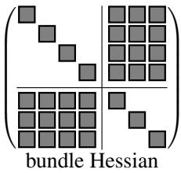

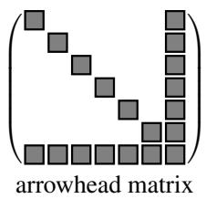

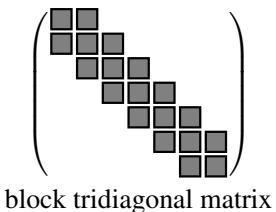

(25)

The most prominent pattern structure in bundle adjustment is the primary subdivision of the Hessian into structure and camera blocks. To get the reduced camera system (19), we treat the Hessian as an arrowhead matrix with a broad final column containing all of the camera parameters. Arrowhead matrices are trivial to factor or reduce by block $2 \times 2$ Schur complementation, $c . f$ . (16, 19). For bundle problems with many independent images and only a few features, one can also complement on the image parameter block to get a reduced structure system.

Another very common pattern structure is the block tridiagonal one which characterizes all singly coupled chains (sequences of images with only pairwise overlap, Kalman filtering and other time recursions, simple kinematic chains). Tridiagonal matrices are factored or reduced by recursive block 2 × 2 Schur complementation starting from one end. The L and U factors are also block tridiagonal, but the inverse is generally dense.

Pattern orderings are often very natural but it is unwise to think of them as immutable: structure often occurs at several levels and deeper structure or simply changes in the relative sizes of the various parameter classes may make alternative orderings preferable. For more difficult problems there are two basic classes of on-line ordering strategies. Bottom-up methods try to minimize fill-in locally and greedily at each step, at the risk of global shortsightedness. Top-down methods take a divide-and-conquer approach, recursively splitting the problem into smaller sub-problems which are solved quasi-independently and later merged.

Top-Down Ordering Methods The most common top-down method is called nested dissection or recursive partitioning [64, 57, 19, 38, 40, 11]. The basic idea is to recursively split the factorization problem into smaller sub-problems, solve these independently, and then glue the solutions together along their common boundaries. Splitting involves choosing a separating set of variables, whose deletion will separate the remaining variables into two or more independent subsets. This corresponds to finding a (vertex) graph cut of the elimination graph, i.e. a set of vertices whose deletion will split it into two or more disconnected components. Given such a partitioning, the variables are reordered into connected components, with the separating set ones last. This produces an ‘arrowhead’ matrix, e.g. :

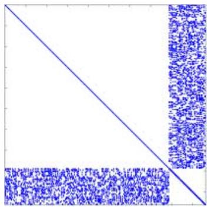

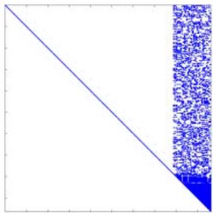

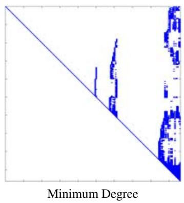

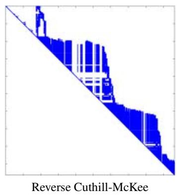  
Fig. 4. A bundle Hessian for an irregular coverage problem with only local connections, and its Cholesky factor in natural (structure-then-camera), minimum degree, and reverse Cuthill-McKee ordering.

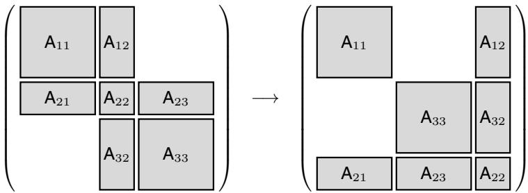  
The arrowhead matrix is factored by blocks, as in reduction or profile Cholesky, taking account of any internal sparsity in the diagonal blocks and the borders. Any suitable factorization method can be used for the diagonal blocks, including further recursive partitionings.

(26)

Nested dissection is most useful when comparatively small separating sets can be found. A trivial example is the primary structure of the bundle problem: the camera variables separate the 3D structure into independent features, giving the standard arrowhead form of the bundle Hessian. More interestingly, networks with good geometric or temporal locality (surface- and site-covering networks, video sequences) tend to have small separating sets based on spatial or temporal subdivision. The classic examples are geodesic and aerial cartography networks with their local 2D connections — spatial bisection gives simple and very efficient recursive decompositions for these [64, 57, 19].

For sparse problems with less regular structure, one can use graph partitioning algorithms to find small separating sets. Finding a globally minimal partition sequence is NP complete but several effective heuristics exist. This is currently an active research field. One promising family are multilevel schemes [70, 71, 65, 4] which decimate (subsample) the graph, partition using e.g. a spectral method, then refine the result to the original graph. (These algorithms should also be very well-suited to graph based visual segmentation and matching).

Bottom-Up Ordering Methods Many bottom-up variable ordering heuristics exist. Probably the most widespread and effective is minimum degree ordering. At each step, this eliminates the variable coupled to the fewest remaining ones (i.e. the elimination graph node with the fewest unvisited neighbours), so it minimizes the number $\mathcal { O } ( n _ { \mathrm { n e i g h b o u r s } } ^ { 2 } )$ of changed matrix elements and hence FLOPs for the step. The minimum degree ordering can also be computed quite rapidly without explicit graph chasing. A related ordering, minimum deficiency, minimizes the fill-in (newly created edges) at each step, but this is considerably slower to calculate and not usually so effective.

Fill-in or operation minimizing strategies tend to produce somewhat fragmentary matrices that require pointer- or index-based sparse matrix implementations (see fig. 4). This increases complexity and tends to reduce cache locality and pipeline-ability. An alternative is to use profile matrices which (for lower triangles) store all elements in each row between the first non-zero one and the diagonal in a contiguous block. This is easy to implement (see §B.3), and practically efficient so long as about 30% or more of the stored elements are actually non-zero. Orderings for this case aim to minimize the sum of the profile lengths rather than the number of non-zero elements. Profiling enforces a multiply-linked chain structure on the variables, so it is especially successful for linear / chain-like / one dimensional problems, e.g. space or time sequences. The simplest profiling strategy is reverse Cuthill-McKee which chooses some initial variable (very preferably one from one ‘end’ of the chain), adds all variables coupled to that, then all variables coupled to those, etc., then reverses the ordering (otherwise, any highly-coupled variables get eliminated early on, which causes disastrous fill-in). More sophisticated are the so-called banker’s strategies, which maintain an active set of all the variables coupled to the already-eliminated ones, and choose the next variable — from the active set (King [72]), it and its neighbours (Snay [101]) or all uneliminated variables (Levy [75]) — to minimize the new size of the active set at each step. In particular, Snay’s banker’s algorithm is reported to perform well on geodesy and aerial cartography problems [101, 24].

For all of these automatic ordering methods, it often pays to do some of the initial work by hand, e.g. it might be appropriate to enforce the structure / camera division beforehand and only order the reduced camera system. If there are nodes of particularly high degree such as inner gauge constraints, the ordering calculation will usually run faster and the quality may also be improved by removing these from the graph and placing them last by hand.

The above ordering methods apply to both Cholesky $/ \mathrm { \ L D L ^ { \top } }$ decomposition of the Hessian and QR decomposition of the least squares Jacobian. Sparse QR methods can be implemented either with Givens rotations or (more efficiently) with sparse Householder transformations. Row ordering is important for the Givens methods [39]. For Householder ones (and some Givens ones too) the multifrontal organization is now usual [41, 11], as it captures the natural parallelism of the problem.

## 7 Implementation Strategy 2: First Order Adjustment Methods

We have seen that for large problems, factoring the Hessian H to compute the Newton step can be both expensive and (if done efficiently) rather complex. In this section we consider alternative methods that avoid the cost of exact factorization. As the Newton step can not be calculated, such methods generally only achieve first order (linear) asymptotic convergence: when close to the final state estimate, the error is asymptotically reduced by a constant (and in practice often depressingly small) factor at each step, whereas quadratically convergent Newton methods roughly double the number of significant digits at each step. So first order methods require more iterations than second order ones, but each iteration is usually much cheaper. The relative efficiency depends on the relative sizes of these two effects, both of which can be substantial. For large problems, the reduction in work per iteration is usually at least ${ \mathcal { O } } ( n )$ , where n is the problem size. But whereas Newton methods converge from $\mathcal { O } ( 1 )$ to $\dot { \mathcal { O } } \big ( 1 0 ^ { - 1 6 } \big )$ in about $1 + \log _ { 2 } 1 6 = 5$ iterations, linearly convergent ones take respectively log $1 0 ^ { - 1 6 } / \log ( 1 - \gamma ) = 1 6 , 3 5 0 , 3 7 0 0$ iterations for reduction $\gamma = 0 . 9 , 0 . 1 , 0 . 0 1$ per iteration. Unfortunately, reductions of only 1% or less are by no means unusual in practice (§7.2), and the reduction tends to decrease as n increases.

## 7.1 First Order Iterations

We first consider a number of common first order methods, before returning to the question of why they are often slow.

Gradient descent: The simplest first order method is gradient descent, which “slides down the gradient” by taking $\delta { \mathbf { x } } \sim { \mathfrak { g } } \operatorname { o r } { \mathsf { H } } _ { a } = 1$ . Line search is needed, to find an appropriate scale for the step. For most problems, gradient descent is spectacularly inefficient unless the Hessian actually happens to be very close to a multiple of 1. This can be arranged by preconditioning with a linear transform L, $\mathsf { x } \to \mathsf { L x } , \mathsf { g } \to \mathsf { L } ^ { - \top } \mathsf { g }$ and $\mathsf { H } \to \mathsf { L } ^ { - \top } \mathsf { H } \bar { \mathsf { L } } ^ { - 1 }$ where $L L ^ { \top } \sim$ H is an approximate Cholesky factor (or other left square root) of H, so that $\mathsf { H } \to \mathsf { L } ^ { - \top } \mathsf { H } \mathsf { L } ^ { - 1 } \sim \mathsf { 1 }$ . In this very special case, preconditioned gradient descent approximates the Newton method. Strictly speaking, gradient descent is a cheat: the gradient is a covector (linear form on vectors) not a vector, so it does not actually define a direction in the search space. Gradient descent’s sensitivity to the coordinate system is one symptom of this.

Alternation: Another simple approach is alternation: partition the variables into groups and cycle through the groups optimizing over each in turn, with the other groups held fixed. This is most appropriate when the subproblems are significantly easier to optimize than the full one. A natural and often-rediscovered alternation for the bundle problem is resection-intersection, which interleaves steps of resection (finding the camera poses and if necessary calibrations from fixed 3D features) and intersection (finding the 3D features from fixed camera poses and calibrations). The subproblems for individual features and cameras are independent, so only the diagonal blocks of H are required.

Alternation can be used in several ways. One extreme is to optimize (or perhaps only perform one step of optimization) over each group in turn, with a state update and reevaluation of (the relevant components of) g, H after each group. Alternatively, some of the re-evaluations can be simulated by evaluating the linearized effects of the parameter group update on the other groups. $E . g .$ , for resection-intersection with structure update $\delta { \bf x } _ { S } = - { \sf H } _ { S S } { \sf g } _ { S } ( { \bf x } _ { S } , { \bf x } _ { C } )$ (where $^ { \circ } S ^ { \prime }$ selects the structure variables and $\cdot _ { C } ,$ the camera ones), the updated camera gradient is exactly the gradient of the reduced camera system, ${ \bf g } _ { C } ( { \bf x } _ { S } + \delta { \bf x } _ { S } , { \bf x } _ { C } ) \approx { \bf g } _ { C } ( { \bf x } _ { S } , { \bf x } _ { C } ) + { \sf H } _ { C S } \delta { \bf x } _ { S } = { \bf g } _ { C } - { \sf H } _ { C S } { \sf H } _ { S S } ^ { - 1 } { \bf g } _ { C }$ . So the total update for the cycle is $\left( \frac { \delta { \bf x } _ { S } } { \delta { \bf x } _ { C } } \right) = - \left( \frac { { \sf H } _ { S S } ^ { - 1 } } { - { \sf H } _ { C C } ^ { - 1 } { \sf H } _ { C S } { \sf H } _ { \mathrm { c s } } ^ { - 1 } \sf H } _ { \mathrm { c e } } ^ { 0 } \right) \left( \frac { 9 s } { 9 c } \right) = \left( \frac { { \sf H } _ { S S } } { { \sf H } _ { C S } } \frac { 0 } { { \sf H } _ { C C } } \right) ^ { - 1 } \left( \frac { 9 s } { 9 c } \right)$ . In general, this correction propagation amounts to solving the system as if the above-diagonal triangle of H were zero. Once we have cycled through the variables, we can update the full state and relinearize. This is the nonlinear Gauss-Seidel method. Alternatively, we can split the above-diagonal triangle of H off as a correction (back-propagation) term and continue iterating $\begin{array} { r } { \tilde { \Big ( } _ { \mathsf { H } _ { C S } } ^ { \mathsf { H } _ { S S } } \mathsf { \Pi } _ { \mathsf { H } _ { C C } } ^ { 0 } \tilde { \Big ) } \Big ( \frac { \delta \mathsf { x } _ { S } } { \delta \mathsf { x } _ { C } } \Big ) _ { ( k ) } = - \Big ( \frac { \mathfrak { g } _ { S } } { \mathfrak { g } _ { C } } \Big ) - \Big ( \frac { 0 \ \mathsf { H } _ { S C } } { 0 \ 0 } \Big ) \tilde { \Big ( } \frac { \delta \hat { \mathbf { x } } _ { S } } { \delta \mathsf { x } _ { C } } \Big ) _ { ( k - 1 ) } } \end{array}$ until (hopefully) $\left( \begin{array} { l } { \delta \mathbf { x } _ { S } } \\ { \delta \mathbf { x } _ { C } } \end{array} \right)$ converges to the full Newton step $\delta { \sf x } = - { \sf H } ^ { - 1 } { \sf g }$ . This is the linear  Gauss-Seidel method applied to solving the Newton step prediction equations. Finally, alternation methods always tend to underestimate the size of the Newton step because they fail to account for the cost-reducing effects of including the back-substitution terms. Successive Over-Relaxation (SOR) methods improve the convergence rate by artificially lengthening the update steps by a heuristic factor $1 < \gamma < 2$

Most if not all of the above alternations have been applied to both the bundle problem and the independent model one many times, e.g. [19, 95, 2, 108, 91, 20]. Brown considered the relatively sophisticated SOR method for aerial cartography problems as early as 1964, before developing his recursive decomposition method [19]. None of these alternations are very effective for traditional large-scale problems, although §7.4 below shows that they can sometimes compete for smaller highly connected ones.

Krylov subspace methods: Another large family of iterative techniques are the Krylov subspace methods, based on the remarkable properties of the power subspaces $\operatorname { S p a n } ( \{ \mathbf { A } ^ { k } b | k = 0 \ldots n \} )$ for fixed A, b as n increases. Krylov iterations predominate in many large-scale linear algebra applications, including linear equation solving.

The earliest and greatest Krylov method is the conjugate gradient iteration for solving a positive definite linear system or optimizing a quadratic cost function. By augmenting the gradient descent step with a carefully chosen multiple of the previous step, this manages to minimize the quadratic model function over the entire $k ^ { t h }$ Krylov subspace at the $\mathbf { \bar { \mathbf { k } } } ^ { t h }$ iteration, and hence (in exact arithmetic) over the whole space at the $n _ { \mathbf { x } } ^ { t \bar { h } }$ one. This no longer holds when there is round-off error, but $\mathcal { O } ( n _ { \mathsf { X } } )$ iterations usually still suffice to find the Newton step. Each iteration is $\mathcal { O } ( n _ { \mathbf { x } } ^ { 2 } )$ so this is not in itself a large gain over explicit  factorization. However convergence is significantly faster if the eigenvalues of H are tightly clustered away from zero: if the eigenvalues are covered by intervals $[ a _ { i } , b _ { i } ] _ { i = 1 \dots k }$ , convergence occurs in $\scriptstyle { \mathcal { O } } \left( \sum _ { i = 1 } ^ { k } { \sqrt { b _ { i } / a _ { i } } } \right)$ iterations [99, 47, 48]11. Preconditioning (see below)

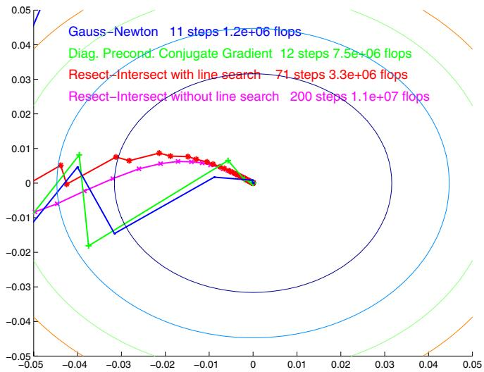  
Fig. 5. An example of the typical behaviour of first and second order convergent methods near the minimum. This is a 2D projection of a small but ill-conditioned bundle problem along the two most variable directions. The second order methods converge quite rapidly, whether they use exact (Gauss-Newton) or iterative (diagonally preconditioned conjugate gradient) linear solver for the Newton equations. In contrast, first order methods such as resection-intersection converge slowly near the minimum owing to their inaccurate model of the Hessian. The effects of mismodelling can be reduced to some extent by adding a line search.

aims at achieving such clustering. As with alternation methods, there is a range of possible update / re-linearization choices, ranging from a fully nonlinear method that relinearizes after each step, to solving the Newton equations exactly using many linear iterations. One major advantage of conjugate gradient is its simplicity: there is no factorization, all that is needed is multiplication by H. For the full nonlinear method, H is not even needed — one simply makes a line search to find the cost minimum along the direction defined by g and the previous step.

One disadvantage of nonlinear conjugate gradient is its high sensitivity to the accuracy of the line search. Achieving the required accuracy may waste several function evaluations at each step. One way to avoid this is to make the information obtained by the conjugation process more explicit by building up an explicit approximation to H or H−1. Quasi-Newton methods such as the BFGS method do this, and hence need less accurate line searches. The quasi-Newton approximation to H or H−1 is dense and hence expensive to store and manipulate, but Limited Memory Quasi-Newton (LMQN) methods often get much of the desired effect by maintaining only a low-rank approximation.

There are variants ofall ofthese methods for least squares (Jacobian rather than Hessian based) and for constrained problems (non-positive definite matrices).

## 7.2 Why Are First Order Methods Slow?

To understand why first order methods often have slow convergence, consider the effect of approximating the Hessian in Newton’s method. Suppose that in some local parametrization x centred at a cost minimum x = 0, the cost function is well approximated by a quadratic near ${ \sf 0 \colon f ( \pmb { x } ) } \approx \frac { 1 } { 2 } \pmb { x } ^ { \top }$ H x and hence ${ \mathfrak { g } } ( { \mathfrak { x } } ) \equiv { \mathsf { H } } { \mathfrak { x } } .$ , where H is the true Hessian. For most first order methods, the predicted step is linear in the gradient g. If we adopt a Newton-like state update $\pmb { \delta } \pmb { \times } = - \mathsf { H } _ { a } ^ { - 1 } \pmb { \mathfrak { g } } ( \pmb { \times } )$ based on some approximation ${ \mathsf { H } } _ { a }$ to H, we get an iteration:

$$
\mathsf { x } _ { k + 1 } = \mathsf { x } _ { k } - \mathsf { H } _ { a } ^ { - 1 } \mathsf { g } ( \mathsf { x } _ { k } ) \approx ( 1 - \mathsf { H } _ { a } ^ { - 1 } \mathsf { H } ) \mathsf { x } _ { k } \approx ( 1 - \mathsf { H } _ { a } ^ { - 1 } \mathsf { H } ) ^ { k + 1 } \mathsf { x } _ { 0 }\tag{27}
$$

The numerical behaviour is determined by projecting $\mathsf { x } _ { \mathrm { 0 } }$ along the eigenvectors of $ 1 { \mathrm { - } } \mathsf { H } _ { a } ^ { \mathrm { - 1 } } \mathsf { H } .$ The components corresponding to large-modulus eigenvalues decay slowly and hence asymptotically dominate the residual error. For generic $\mathsf { x } _ { \mathrm { 0 } }$ , the method converges ‘linearly (i.e. exponentially) at rate $\lVert { \mathsf { 1 } } - { \mathsf { H } } _ { a } ^ { - 1 } { \mathsf { H } } \rVert _ { 2 }$ , or diverges if this is greater than one. (Of course, the exact Newton step $\delta { \sf x } = - { \sf H } ^ { - 1 } { \sf g }$ converges in a single iteration, as ${ \sf H } _ { a } = { \sf H } )$ . Along eigen-directions corresponding to positive eigenvalues (for which $\mathsf { H } _ { a }$ overestimates H), the iteration is over-damped and convergence is slow but monotonic. Conversely, along directions corresponding to negative eigenvalues (for which ${ \mathsf { H } } _ { a }$ underestimates H), the iteration is under-damped and zigzags towards the solution. If H is underestimated by a factor greater than two along any direction, there is divergence. Figure 5 shows an example of the typical asymptotic behaviour of first and second order methods in a small bundle problem.

Ignoring the camera-feature coupling: As an example, many approximate bundle methods ignore or approximate the off-diagonal feature-camera blocks of the Hessian. This amounts to ignoring the fact that the cost of a feature displacement can be partially offset by a compensatory camera displacement and vice versa. It therefore significantly overestimates the total ‘stiffness’ of the network, particularly for large, loosely connected networks. The fact that off-diagonal blocks are not negligible compared to the diagonal ones can be seen in several ways:

• Looking forward to §9, before the gauge is fixed, the full Hessian is singular owing to gauge freedom. The diagonal blocks by themselves are well-conditioned, but including the off-diagonal ones entirely cancels this along the gauge orbit directions. Although gauge fixing removes the resulting singularity, it can not change the fact that the offdiagonal blocks have enough weight to counteract the diagonal ones.

• In bundle adjustment, certain well-known ambiguities (poorly-controlled parameter combinations) often dominate the uncertainty. Camera distance and focal length estimates, and structure depth and camera baseline ones (bas-relief), are both strongly correlated whenever the perspective is weak and become strict ambiguities in the affine limit. The well-conditioned diagonal blocks of the Hessian give no hint of these ambiguities: when both features and cameras are free, the overall network is much less rigid than it appears to be when each treats the other as fixed.

• During bundle adjustment, local structure refinements cause ‘ripples’ that must be propagated throughout the network. The camera-feature coupling information carried in the off-diagonal blocks is essential to this. In the diagonal-only model, ripples can propagate at most one feature-camera-feature step per iteration, so it takes many iterations for them to cross and re-cross a sparsely coupled network.

These arguments suggest that any approximation $\mathsf { H } _ { a }$ to the bundle Hessian H that suppresses or significantly alters the off-diagonal terms is likely to have large $\| \mathsfit { 1 } - \mathsf { H } _ { a } ^ { - 1 } \mathsf { H } \|$ and hence slow convergence. This is exactly what we have observed in practice for all such methods that we have tested: near the minimum, convergence is linear and for large problems often extremely slow, with $\| { \bf 1 } - { \sf H } _ { a } ^ { - 1 } { \sf H } \| _ { 2 }$ very close to 1. The iteration may either zigzag or converge slowly and monotonically, depending on the exact method and parameter values.

Line search: The above behaviour can often be improved significantly by adding a line search to the method. In principle, the resulting method converges for any positive definite $\mathsf { H } _ { a }$ . However, accurate modelling of H is still highly desirable. Even with no rounding errors, an exactly quadratic (but otherwise unknown) cost function and exact line searches (i.e. the minimum along the line is found exactly), the most efficient generic line search based methods such as conjugate gradient or quasi-Newton require at least $\mathcal { O } ( n _ { \mathsf { X } } )$ iterations to converge. For large bundle problems with thousands of parameters, this can already be prohibitive. However, if knowledge about H is incorporated via a suitable preconditioner, the number of iterations can often be reduced substantially.

## 7.3 Preconditioning

Gradient descent and Krylov methods are sensitive to the coordinate system and their practical success depends critically on good preconditioning. The aim is to find a linear transformation x → T x and hence ${ \mathfrak { g } } \to { \mathsf { T } } ^ { - \top }$ g and H → T− H T for which the transformed H is near 1, or at least has only a few clusters of eigenvalues well separated from the origin. Ideally, T should be an accurate, low-cost approximation to the left Cholesky factor of H. (Exactly evaluating this would give the expensive Newton method again). In the experiments below, we tried conjugate gradient with preconditioners based on the diagonal blocks of H, and on partial Cholesky decomposition, dropping either all filled-in elements, or all that are smaller than a preset size when performing Cholesky decomposition. These methods were not competitive with the exact Gauss-Newton ones in the ‘strip experiments below, but for large enough problems it is likely that a preconditioned Krylov method would predominate, especially if more effective preconditioners could be found.

An exact Cholesky factor of H from a previous iteration is often a quite effective preconditioner. This gives hybrid methods in which H is only evaluated and factored every few iterations, with the Newton step at these iterations and well-preconditioned gradient descent or conjugate gradient at the others.

## 7.4 Experiments

Figure 6 shows the relative performance of several methods on two synthetic projective bundle adjustment problems. In both cases, the number of 3D points increases in proportion to the number of images, so the dense factorization time is $\bar { \mathcal { O } } ( n ^ { 3 } )$ where n is the number  of points or images. The following methods are shown: ‘Sparse Gauss-Newton’ — sparse Cholesky decomposition with variables ordered naturally (features then cameras); ‘Dense Gauss-Newton’ — the same, but (inefficiently) ignoring all sparsity of the Hessian; ‘Diag. Conj. Gradient’ — the Newton step is found by an iterative conjugate gradient linear system solver, preconditioned using the Cholesky factors of the diagonal blocks of the Hessian; ‘Resect-Intersect’ — the state is optimized by alternate steps of resection and intersection, with relinearization after each. In the ‘spherical cloud’ problem, the points are uniformly distributed within a spherical cloud, all points are visible in all images, and the camera geometry is strongly convergent. These are ideal conditions, giving a low diameter network graph and a well-conditioned, nearly diagonal-dominant Hessian. All of the methods converge quite rapidly. Resection-intersection is a competitive method for larger problems owing to its low cost per iteration. Unfortunately, although this geometry is often used for testing computer vision algorithms, it is atypical for large-scale bundle problems. The ‘strip’ experiment has a more representative geometry. The images are arranged in a long strip, with each feature seen in about 3 overlapping images. The strip’s long thin weakly-connected network structure gives it large scale low stiffness ‘flexing’ modes, with correspondingly poor Hessian conditioning. The off-diagonal terms are critical here, so the approximate methods perform very poorly. Resection-intersection is slower even than dense Cholesky decomposition ignoring all sparsity. For 16 or more images it fails to converge even after 3000 iterations. The sparse Cholesky methods continue to perform reasonably well, with the natural, minimum degree and reverse Cuthill-McKee orderings all giving very similar run times in this case. For all of the methods that we tested, including resection-intersection with its linear per-iteration cost, the total run time for long chain-like geometries scaled roughly as $\mathcal { O } \big ( n ^ { \bar { 3 } } \big )$

Computation vs. Bundle Size -- Strong Geometry  
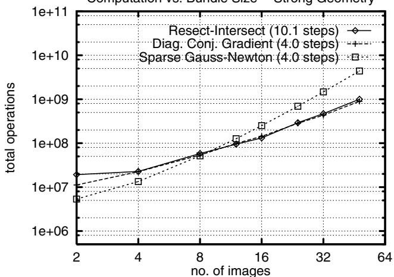

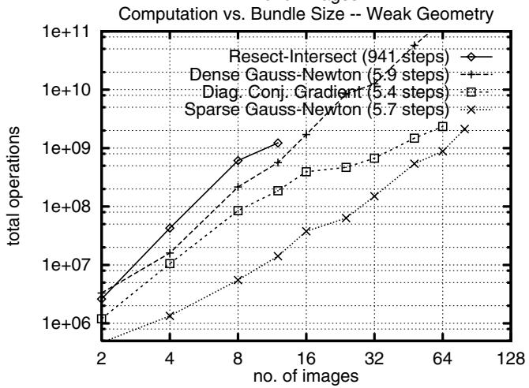  
Fig. 6. Relative speeds of various bundle optimization methods for strong ‘spherical cloud’ and weak ‘strip’ geometries.

## 8 Implementation Strategy 3: Updating and Recursion

## 8.1 Updating Rules

It is often convenient to be able to update a state estimate to reflect various types of changes, e.g. to incorporate new observations or to delete erroneous ones (‘downdating’). Parameters may have to be added or deleted too. Updating rules are often used recursively, to incorporate a series ofobservations one-by-one rather than solving a single batch system. This is useful in on-line applications where a rapid response is needed, and also to provide preliminary predictions, e.g. for correspondence searches. Much of the early development of updating methods was aimed at on-line data editing in aerial cartography workstations.

The main challenge in adding or deleting observations is efficiently updating either a factorization of the Hessian H, or the covariance H−1. Given either of these, the state update δx is easily found by solving the Newton step equations H $\delta { \sf x } = - { \sf g }$ , where (assuming that we started at an un-updated optimum g = 0) the gradient g depends only on the newly added terms. The Hessian update $\mathsf { H } \to \mathsf { H } \pm \mathsf { B } \mathsf { W } \mathsf { B } ^ { \intercal }$ needs to have relatively low rank, otherwise nothing is saved over recomputing the batch solution. In least squares the rank is the number of independent observations added or deleted, but even without this the rank is often low in bundle problems because relatively few parameters are affected by any given observation.

One limitation of updating is that it is seldom as accurate as a batch solution owing to build-up of round-off error. Updating (adding observations) itself is numerically stable, but downdating (deleting observations) is potentially ill-conditioned as it reduces the positivity of the Hessian, and may cause previously good pivot choices to become arbitrarily bad. This is particularly a problem if all observations relating to a parameter are deleted, or if there are repeated insertion-deletion cycles as in time window filtering. Factorization updating methods are stabler than Woodbury formula / covariance updating ones.

Consider first the case where no parameters need be added nor deleted, e.g. adding or deleting an observation ofan existing point in an existing image. Several methods have been suggested [54, 66]. Mikhail & Helmering [88] use the Woodbury formula (18) to update the covariance $\mathsf { H } ^ { - 1 }$ . This simple approach becomes inefficient for problems with many features because the sparse structure is not exploited: the full covariance matrix is dense and we would normally avoid calculating it in its entirety. Grun [51, 54] avoids this problem¨ by maintaining a running copy of the reduced camera system (20), using an incremental Schur complement / forward substitution (16) to fold each new observation into this, and then re-factorizing and solving as usual after each update. This is effective when there are many features in a few images, but for larger numbers of images it becomes inefficient owing to the re-factorization step. Factorization updating methods such as (55, 56) are currently the recommended update methods for most applications: they allow the existing factorization to be exploited, they handle any number of images and features and arbitrary problem structure efficiently, and they are numerically more accurate than Woodbury formula methods. The Givens rotation method [12, 54], which is equivalent to the rank 1 Cholesky update (56), is probably the most common such method. The other updating methods are confusingly named in the literature. Mikhail & Helmering’s method [88] is sometimes called ‘Kalman filtering’, even though no dynamics and hence no actual filtering is involved. Grun’s reduced camera system method [51] is called ‘triangular factor¨ update (TFU)’, even though it actually updates the (square) reduced Hessian rather than its triangular factors.

For updates involving a previously unseen 3D feature or image, new variables must also be added to the system. This is easy. We simply choose where to put the variables in the elimination sequence, and extend H and its L,D,U factors with the corresponding rows and columns, setting all of the newly created positions to zero (except for the unit diagonals of LDL’s and $\mathrm { L U } ^ { \prime } \mathrm { s } \mathrm { L }$ factor). The factorization can then be updated as usual, presumably adding enough cost terms to make the extended Hessian nonsingular and couple the new parameters into the old network. If a direct covariance update is needed, the Woodbury formula (18) can be used on the old part of the matrix, then (17) to fill in the new blocks (equivalently, invert (54), with $\mathsf { D } _ { 1 } \gets \mathsf { A }$ representing the old blocks and $\mathsf { D } _ { 2 } \gets 0$ the new ones).

Conversely, it may be necessary to delete parameters, e.g. if an image or 3D feature has lost most or all of its support. The corresponding rows and columns of the Hessian H (and rows of g, columns of J) must be deleted, and all cost contributions involving the deleted parameters must also be removed using the usual factorization downdates (55, 56). To delete the rows and columns of block b in a matrix A, we first delete the b rows and columns of L, D, U. This maintains triangularity and gives the correct trimmed A, except that the blocks in the lower right corner $\begin{array} { r } { \mathsf { A } _ { i j } = \sum _ { k < \operatorname* { m i n } ( i , j ) } \mathsf { L } _ { i k } \mathsf { D } _ { k } \mathsf { U } _ { k j } , i , j > b } \end{array}$ are missing a term $\mathsf { L } _ { i b } \mathsf { D } _ { b } \mathsf { U } _ { b j }$ from the deleted column b of L / row b of U. This is added using an update $+ \mathsf { L } _ { * b } \mathsf { D } _ { b } \mathsf { U } _ { b * } , * > b$ . To update $\mathsf { A } ^ { - 1 }$ when rows and columns of A are deleted, permute the deleted rows and columns to the end and use (17) backwards: $( \mathsf { A } _ { 1 1 } ) ^ { - 1 } =$ $( \mathsf { A } ^ { - 1 } ) _ { 1 1 } - ( \mathsf { A } ^ { - 1 } ) _ { 1 2 } ( \mathsf { A } ^ { - 1 } ) _ { 2 2 } ^ { - 1 } ( \mathsf { A } ^ { - 1 } ) _ { 2 1 }$

It is also possible to freeze some live parameters at fixed (current or default) values, or to add extra parameters / unfreeze some previously frozen ones, c.f. (48, 49) below. In this case, rows and columns corresponding to the frozen parameters must be deleted or added, but no other change to the cost function is required. Deletion is as above. To insert rows and columns $\mathsf { A } _ { b * } , \mathsf { A } _ { * b }$ at block b of matrix A, we open space in row and column b of L, D, U and fill these positions with the usual recursively defined values (51). For $i , j > b ,$ the sum (51) will now have a contribution $\mathsf { L } _ { i b } \mathsf { D } _ { b } \mathsf { U } _ { b j }$ that it should not have, so to correct this we downdate the lower right submatrix $* \textgreater b$ with a cost cancelling contribution $- \mathsf { L } _ { * b } \mathsf { D } _ { b } \mathsf { U } _ { b * }$

## 8.2 Recursive Methods and Reduction

Each update computation is roughly quadratic in the size of the state vector, so if new features and images are continually added the situation will eventually become unmanageable. We must limit what we compute. In principle parameter refinement never stops: each observation update affects all components of the state estimate and its covariance. However, the refinements are in a sense trivial for parameters that are not directly coupled to the observation. If these parameters are eliminated using reduction (19), the observation update can be applied directly to the reduced Hessian and gradient12. The eliminated parameters can then be updated by simple back-substitution (19) and their covariances by (17). In particular, if we cease to receive new information relating to a block of parameters (an image that has been fully treated, a 3D feature that has become invisible), they and all the observations relating to them can be subsumed once-and-for-all in a reduced Hessian and gradient on the remaining parameters. If required, we can later re-estimate the eliminated parameters by back-substitution. Otherwise, we do not need to consider them further.

This elimination process has some limitations. Only ‘dead’ parameters can be eliminated: to merge a new observation into the problem, we need the current Hessian or factorization entries for all parameter blocks relating to it. Reduction also commits us to a linearized / quadratic cost approximation for the eliminated variables at their current estimates, although to the extent that this model is correct, the remaining variables can still be treated nonlinearly. It is perhaps best to view reduction as the first half-iteration of a full nonlinear optimization: by (19), the Newton method for the full model can be implemented by repeated cycles of reduction, solving the reduced system, and back-substitution, with relinearization after each cycle, whereas for eliminated variables we stop after solving the first reduced system. Equivalently, reduction evaluates just the reduced components of the full Newton step and the full covariance, leaving us the option of computing the remaining eliminated ones later if we wish.

Reduction can be used to refine estimates of relative camera poses (or fundamental matrices, $e t c . )$ for a fixed set of images, by reducing a sequence of feature correspondences to their camera coordinates. Or conversely, to refine 3D structure estimates for a fixed set of features in many images, by reducing onto the feature coordinates.

Reduction is also the basis of recursive (Kalman) filtering. In this case, one has a (e.g. time) series of system state vectors linked by some probabilistic transition rule (‘dynamical model’), for which we also have some observations (‘observation model’). The parameter space consists of the combined state vectors for all times, i.e. it represents a path through the states. Both the dynamical and the observation models provide “observations” in the sense of probabilistic constraints on the full state parameters, and we seek a maximum likelihood (or similar) parameter estimate / path through the states. The full Hessian is block tridiagonal: the observations couple only to the current state and give the diagonal blocks, and dynamics couples only to the previous and next ones and gives the off-diagonal blocks (differential observations can also be included in the dynamics likelihood). So the model is large (if there are many time steps) but very sparse. As always with a tridiagonal matrix, the Hessian can be decomposed by recursive steps of reduction, at each step Schur complementing to get the current reduced block $\overline { { \mathsf { H } } } _ { t }$ from the previous one $\overline { { \mathsf { H } } } _ { t - 1 }$ , the off-diagonal (dynamical) coupling $\mathsf { H } _ { t t - 1 }$ and the current unreduced block (observation Hessian) ${ \sf H } _ { t }$ $\overline { { \mathsf { H } } } _ { t } = \mathsf { H } _ { t } - \mathsf { H } _ { t t - 1 } \overline { { \mathsf { H } } } _ { t - 1 } ^ { - 1 } \mathsf { H } _ { t t - 1 } ^ { \top }$ . Similarly, for the gradient $\overline { { \mathfrak { g } } } _ { t } = \mathfrak { g } _ { t } - \mathsf { H } _ { t t - 1 } \overline { { \mathsf { H } } } _ { t - 1 } ^ { - 1 } \overline { { \mathfrak { g } } } _ { t - 1 } $ and as usual the reduced state update is $\delta { \sf x } _ { t } = - \overline { { { \sf H } } } _ { t } ^ { - 1 } \overline { { { \sf g } } } _ { t }$

This forwards reduction process is called filtering. At each time step it finds the optimal (linearized) current state estimate given all of the previous observations and dynamics. The corresponding unwinding of the recursion by back-substitution, smoothing, finds the optimal state estimate at each time given both past and future observations and dynamics. The usual equations of Kalman filtering and smoothing are easily derived from this recursion, but we will not do this here. We emphasize that filtering is merely the first half-iteration of a nonlinear optimization procedure: even for nonlinear dynamics and observation models, we can find the exact maximum likelihood state path by cyclic passes of filtering and smoothing, with relinearization after each.

For long or unbounded sequences it may not be feasible to run the full iteration, but it can still be very helpful to run short sections of it, e.g. smoothing back over the last 3–4 state estimates then filtering forwards again, to verify previous correspondences and anneal the effects of nonlinearities. (The traditional extended Kalman filter optimizes nonlinearly over just the current state, assuming all previous ones to be linearized). The effects of variable window size on the Variable State Dimension Filter (VSDF) sequential bundle algorithm [85, 86, 83, 84] are shown in figure 7.

Reconstruction Error vs. Time Window Size  
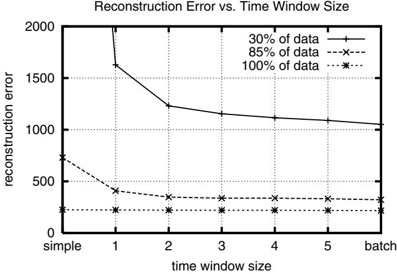  
Fig. 7. The residual state estimation error of the VSDF sequential bundle algorithm for progressively increasing sizes of rolling time window. The residual error at image t = 16 is shown for rolling windows of 1–5 previous images, and also for a ‘batch’ method (all previous images) and a ‘simple one (reconstruction / intersection is performed independently of camera location / resection). To simulate the effects of decreasing amounts of image data, 0%, 15% and 70% of the image measurements are randomly deleted to make runs with 100%, 85% and only 30% of the supplied image data. The main conclusion is that window size has little effect for strong data, but becomes increasingly important as the data becomes weaker.

## 9 Gauge Freedom

Coordinates are a very convenient device for reducing geometry to algebra, but they come at the price of some arbitrariness. The coordinate system can be changed at any time, without affecting the underlying geometry. This is very familiar, but it leaves us with two problems: (i) algorithmically, we need some concrete way of deciding which particular coordinate system to use at each moment, and hence breaking the arbitrariness; (ii) we need to allow for the fact that the results may look quite different under different choices, even though they represent the same underlying geometry.

Consider the choice of 3D coordinates in visual reconstruction. The only objects in the 3D space are the reconstructed cameras and features, so we have to decide where to place the coordinate system relative to these . . . Or in coordinate-centred language, where to place the reconstruction relative to the coordinate system. Moreover, bundle adjustment updates and uncertainties can perturb the reconstructed structure almost arbitrarily, so we must specify coordinate systems not just for the current structure, but also for every possible nearby one. Ultimately, this comes down to constraining the coordinate values of certain aspects of the reconstructed structure — features, cameras or combinations of these — whatever the rest of the structure might be. Saying this more intrinsically, the coordinate frame is specified and held fixed with respect to the chosen reference elements, and the rest of the geometry is then expressed in this frame as usual. In measurement science such a set of coordinate system specifying rules is called a datum, but we will follow the wider mathematics and physics usage and call it a gauge13. The freedom in the choice of coordinate fixing rules is called gauge freedom.

As a gauge anchors the coordinate system rigidly to its chosen reference elements, perturbing the reference elements has no effect on their own coordinates. Instead, it changes the coordinate system itself and hence systematically changes the coordinates of all the other features, while leaving the reference coordinates fixed. Similarly, uncertainties in the reference elements do not affect their own coordinates, but appear as highly correlated uncertainties in all of the other reconstructed features. The moral is that structural perturbations and uncertainties are highly relative. Their form depends profoundly on the gauge, and especially on how this changes as the state varies (i.e. which elements it holds fixed). The effects of disturbances are not restricted to the coordinates of the features actually disturbed, but may appear almost anywhere depending on the gauge.

In visual reconstruction, the differences between object-centred and camera-centred gauges are often particularly marked. In object-centred gauges, object points appear to be relatively certain while cameras appear to have large and highly correlated uncertainties. In camera-centred gauges, it is the camera that appears to be precise and the object points that appear to have large correlated uncertainties. One often sees statements like “the reconstructed depths are very uncertain”. This may be true in the camera frame, yet the object may be very well reconstructed in its own frame — it all depends on what fraction of the total depth fluctuations are simply due to global uncertainty in the camera location, and hence identical for all object points.

Besides 3D coordinates, many other types of geometric parametrization in vision involve arbitrary choices, and hence are subject to gauge freedoms [106]. These include the choice of: homogeneous scale factors in homogeneous-projective representations; supporting points in supporting-point based representations of lines and planes; reference plane in plane + parallax representations; and homographies in homography-epipole representations of matching tensors. In each case the symptoms and the remedies are the same.

## 9.1 General Formulation

The general set up is as follows: We take as our state vector x the set of all of the 3D feature coordinates, camera poses and calibrations, etc., that enter the problem. This state space has internal symmetries related to the arbitrary choices of 3D coordinates, homogeneous scale factors, etc., that are embedded in x. Any two state vectors that differ only by such choices represent the same underlying 3D geometry, and hence have exactly the same image projections and other intrinsic properties. So under change-of-coordinates equivalence, the state space is partitioned into classes of intrinsically equivalent state vectors, each class representing exactly one underlying 3D geometry. These classes are called gauge orbits. Formally, they are the group orbits of the state space action of the relevant gauge group (coordinate transformation group), but we will not need the group structure below. A state space function represents an intrinsic function of the underlying geometry if and only if it is constant along each gauge orbit (i.e. coordinate system independent). Such quantities are called gauge invariants. We want the bundle adjustment cost function to quantify ‘intrinsic merit’, so it must be chosen to be gauge invariant.

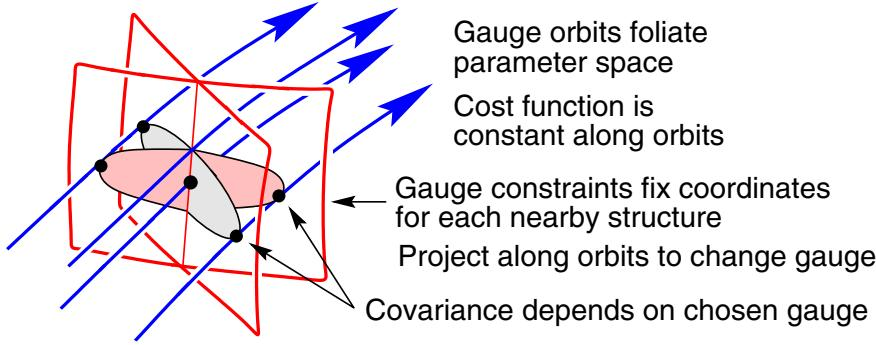  
Fig. 8. Gauge orbits in state space, two gauge cross-sections and their covariances.

In visual reconstruction, the principal gauge groups are the $3 + 3 + 1 = 7$ dimensional group of 3D similarity (scaled Euclidean) transformations for Euclidean reconstruction, and the 15 dimensional group of projective 3D coordinate transformations for projective reconstruction. But other gauge freedoms are also present. Examples include: (i) The arbitrary scale factors of homogeneous projective feature representations, with their 1D rescaling gauge groups. (ii) The arbitrary positions of the points in ‘two point’ line parametrizations, with their two 1D motion-along-line groups. (iii) The underspecified 3×3 homographies used for ‘homography + epipole’ parametrizations of matching tensors [77, 62, 106]. For example, the fundamental matrix can be parametrized as $\boldsymbol { F } = [ \boldsymbol { e } ] _ { \times }$ H where e is its left epipole and H is the inter-image homography induced by any 3D plane. The choice of plane gives a freedom $\pmb { H }  \pmb { H } + \pmb { e a } ^ { \top }$ where a is an arbitrary 3-vector, and hence a 3D linear gauge group.

Now consider how to specify a gauge, i.e. a rule saying how each possible underlying geometry near the current one should be expressed in coordinates. Coordinatizations are represented by state space points, so this is a matter of choosing exactly one point (structure coordinatization) from each gauge orbit (underlying geometry). Mathematically, the gauge orbits foliate (fill without crossing) the state space, and a gauge is a local transversal ‘cross-section’ G through this foliation. See fig. 8. Different gauges represent different but geometrically equivalent coordinatization rules. Results can be mapped between gauges by pushing them along gauge orbits, i.e. by applying local coordinate transformations that vary depending on the particular structure involved. Such transformations are called Stransforms (‘similarity’ transforms) [6, 107, 22, 25]. Different gauges through the same central state represent coordinatization rules that agree for the central geometry but differ for perturbed ones — the S-transform is the identity at the centre but not elsewhere.

Given a gauge, only state perturbations that lie within the gauge cross-section are authorized. This is what we want, as such state perturbations are in one-to-one correspondence with perturbations of the underlying geometry. Indeed, any state perturbation is equivalent to some on-gauge one under the gauge group (i.e. under a small coordinate transformation that pushes the perturbed state along its gauge orbit until it meets the gauge cross-section). State perturbations along the gauge orbits are uninteresting, because they do not change the underlying geometry at all.

Covariances are averages of squared perturbations and must also be based on on-gauge perturbations (they would be infinite if we permitted perturbations along the gauge orbits, as there is no limit to these — they do not change the cost at all). So covariance matrices are gauge-dependent and in fact represent ellipsoids tangent to the gauge cross-section at the cost minimum. They can look very different for different gauges. But, as with states, Stransforms map them between gauges by projecting along gauge orbits / state equivalence classes.

Note that there is no intrinsic notion of orthogonality on state space, so it is meaningless to ask which state-space directions are ‘orthogonal’ to the gauge orbits. This would involve deciding when two different structures have been “expressed in the same coordinate system”, so every gauge believes its own cross section to be orthogonal and all others to be skewed.

## 9.2 Gauge Constraints

We will work near some point x of state space, perhaps a cost minimum or a running state estimate. Let $n _ { \mathsf { X } }$ be the dimension of x and $n _ { 9 }$ the dimension of the gauge orbits. Let f, g, H be the cost function and its gradient and Hessian, and G be any $n _ { \tt X } \times n _ { \tt S }$ matrix whose columns span the local gauge orbit directions at x 14. By the exact gauge invariance of f, its gradient and Hessian vanish along orbit directions: $\mathfrak { g } ^ { \top } \mathsf { G } = 0$ and ${ \mathsf { H G } } = 0$ . Note that the gauged Hessian H is singular with (at least) rank deficiency $n _ { 9 }$ and null space G. This is called gauge deficiency. Many numerical optimization routines assume nonsingular H, and must be modified to work in gauge invariant problems. The singularity is an expression of indifference: when we come to calculate state updates, any two updates ending on the same gauge orbit are equivalent, both in terms of cost and in terms of the change in the underlying geometry. All that we need is a method of telling the routine which particular update to choose.

Gauge constraints are the most direct means of doing this. A gauge cross-section G can be specified in two ways: (i) constrained form: specify $n _ { 9 }$ local constraints ${ \mathsf { d } } ( { \mathsf { x } } )$ with ${ \sf d } ( { \sf x } ) = 0$ for points on $\mathcal { G } ; ( i i )$ parametric form: specify a function $\mathsf { \pmb { x } } ( \mathsf { \pmb { y } } )$ of $n _ { \tt X } - n _ { \tt S }$ independent local parameters y, with $\mathsf { \pmb { x } } = \mathsf { \pmb { x } } ( \mathsf { \pmb { y } } )$ being the points of $\mathcal { G }$ . For example, a trivial gauge is one that simply freezes the values of $n _ { 9 }$ of the parameters in x (usually feature or camera coordinates). In this case we can take $\bar { \mathsf { d } } ( \mathsf { \pmb { x } } )$ to be the parameter freezing constraints and y to be the remaining unfrozen parameters. Note that once the gauge is fixed the problem is no longer gauge invariant — the whole purpose of ${ \mathsf { d } } ( { \mathsf { x } } ) , { \mathsf { x } } ( { \mathsf { y } } )$ is to break the underlying gauge invariance.

Examples of trivial gauges include: (i) using several visible 3D points as a ‘projective basis’ for reconstruction (i.e. fixing their projective 3D coordinates to simple values, as in [27]); and (ii) fixing the components of one projective $3 \times 4$ camera matrix as $( I \ \pmb { \theta } )$ as in [61] (this only partially fixes the 3D projective gauge — 3 projective 3D degrees of freedom remain unfixed).

Linearized gauge: Let the local linearizations of the gauge functions be:

$$
\begin{array} { r } { \mathbf { d } ( \mathbf { x } + \delta \mathbf { x } ) \approx \mathbf { d } ( \mathbf { x } ) + \mathsf { D } \delta \mathbf { x } \qquad \mathsf { D } \equiv \frac { \mathrm { d } \mathbf { d } } { \mathrm { d } \mathbf { x } } } \end{array}\tag{28}
$$

$$
\begin{array} { r } { \mathbf { x } ( \mathbf { y } + \delta \mathbf { y } ) \approx \mathbf { x } ( \mathbf { y } ) + \mathsf { Y } \delta \mathbf { y } \qquad \forall \equiv \frac { \mathsf { d } \mathbf { x } } { \mathsf { d } \mathbf { y } } } \end{array}\tag{29}
$$

Compatibility between the two gauge specification methods requires ${ \mathsf { d } } ( \mathsf { x } ( \mathsf { y } ) ) = 0$ for all y, and hence $\mathsf { D } \mathsf { Y } = 0$ . Also, since $\mathcal { G }$ must be transversal to the gauge orbits, D G must have full rank $n _ { 9 }$ and $( Y G )$ must have full rank $n _ { \mathsf { X } }$ . Assuming that x itself is on $\mathcal { G }$ , a perturbation $\mathbf { \boldsymbol { x } } + \delta { \mathbf { \boldsymbol { x } } } _ { \boldsymbol { \mathcal { G } } }$ is on G to first order iff $\mathsf { D } \delta \mathsf { x } _ { \mathcal { G } } = 0$ or $\delta \mathsf { x } _ { \mathcal { G } } = \mathsf { Y } \delta \mathsf { y }$ for some $\delta \mathsf { y }$

Two $n _ { \tt X } \times n _ { \tt X }$ rank $n _ { \tt X } - n _ { \tt S }$ matrices characterize $\mathcal { G }$ . The gauge projection matrix $\mathsf { P } _ { \mathcal { G } }$ implements linearized projection of state displacement vectors $\delta { \sf x }$ along their gauge orbits onto the local gauge cross-section: $\delta { \mathbf { x } } \to \delta { \mathbf { x } } _ { \mathcal { G } } = { \mathsf { P } } _ { \mathcal { G } } \delta { \mathbf { x } }$ . (The projection is usually nonorthogonal: $\mathsf { P } _ { \mathcal { G } } ^ { \top } \neq \mathsf { P } _ { \mathcal { G } } )$ . The gauged covariance matrix $\mathsf { V } _ { \mathcal G }$ plays the role of the inverse Hessian. It gives the cost-minimizing Newton step within G, $\delta { \sf x } _ { \mathcal { G } } = - { \sf V } _ { \mathcal { G } } { \sf g }$ , and also the asymptotic covariance of $\delta \mathsf { x } _ { \mathcal { G } } . \mathsf { P } _ { \mathcal { G } }$ and $\mathsf { V } _ { \mathcal G }$ have many special properties and equivalent forms. For convenience, we display some of these now15 — let $\mathsf { V } \equiv \mathsf { \bar { \Gamma } } ( \mathsf { H } + \mathsf { D } ^ { \top } \mathsf { B } \mathsf { D } ) ^ { - 1 }$ where B is any nonsingular symmetric $n _ { \mathfrak { g } } \times n _ { \mathfrak { g } }$ matrix, and let $\mathcal { G } ^ { \prime }$ be any other gauge:

$$
\mathsf { V } _ { \mathcal { G } } \equiv \mathsf { Y } ( \mathsf { Y } ^ { \top } \mathsf { H } \mathsf { Y } ) ^ { - 1 } \mathsf { Y } ^ { \top } = \mathsf { V } \mathsf { H } \mathsf { V } = \mathsf { V } - \mathsf { G } ( \mathsf { D } \mathsf { G } ) ^ { - 1 } \mathsf { B } ^ { - 1 } ( \mathsf { D } \mathsf { G } ) ^ { - \top } \mathsf { G } ^ { \top }\tag{30}
$$

$$
\mathbf { \Psi } = \mathsf { P } _ { \mathcal { G } } \mathsf { V } = \mathsf { P } _ { \mathcal { G } } \mathsf { V } _ { \mathcal { G } } = \mathsf { P } _ { \mathcal { G } } \mathsf { V } _ { \mathcal { G } ^ { \prime } } \mathsf { P } _ { \mathcal { G } } ^ { \top }\tag{31}
$$

$$
\mathsf { P } _ { \mathcal { G } } \equiv 1 - \mathbb { G } ( \mathsf { D } \mathbb { G } ) ^ { - 1 } \mathsf { D } = \mathsf { Y } ( \mathsf { Y } ^ { \top } \mathsf { H } \mathsf { Y } ) ^ { - 1 } \mathsf { Y } ^ { \top } \mathsf { H } = \mathsf { V } \mathsf { H } = \mathsf { V } _ { \mathcal { G } } \mathsf { H } = \mathsf { P } _ { \mathcal { G } } \mathsf { P } _ { \mathcal { G } } ,\tag{32}
$$

$$
\mathsf { P } _ { \mathcal { G } } \mathsf { G } = 0 , \qquad \mathsf { P } _ { \mathcal { G } } \mathsf { Y } = \mathsf { Y } , \qquad \mathsf { D } \mathsf { P } _ { \mathcal { G } } = \mathsf { D } \mathsf { V } _ { \mathcal { G } } = 0\tag{33}
$$

$$
{ \mathfrak { g } } ^ { \intercal } { \mathsf { P } } _ { \mathcal { G } } = { \mathfrak { g } } ^ { \intercal } , \qquad { \mathsf { H } } { \mathsf { P } } _ { \mathcal { G } } = { \mathsf { H } } , \qquad { \mathsf { V } } _ { \mathcal { G } } { \mathsf { g } } = { \mathsf { V } } { \mathfrak { g } }\tag{34}
$$

These relations can be summarized by saying that $\mathsf { V } _ { \mathcal G }$ is the ${ \mathcal { G } } .$ -supported generalized inverse of H and that ${ \sf P } _ { \mathcal { G } } : ( i )$ projects along gauge orbits $( \mathsf { P } _ { \mathcal { G } } \mathsf { G } = 0 ) ; ( i i )$ projects onto the gauge cross-section $\mathcal { G } _ { \mathbf { \Phi } } ( \mathbf { D } \mathbf { P } _ { \mathcal { G } } = 0 , \mathbf { \Phi } \mathbf { P } _ { \mathcal { G } } \forall = \forall , \mathbf { \Phi } \mathsf { P } _ { \mathcal { G } } \delta \mathbf { x } = \delta \mathsf { x } _ { \mathcal { G } }$ and $\mathsf { V } _ { \mathcal { G } } = \mathsf { P } _ { \mathcal { G } } \mathsf { V } _ { \mathcal { G } ^ { \prime } } \mathsf { P } _ { \mathcal { G } } ^ { \top } )$ ; and (iii) preserves gauge invariants $( e . g . \mathsf { f } ( \mathsf { x } + \mathsf { P } _ { \mathcal { G } } \delta \mathsf { x } ) = \mathsf { f } ( \mathsf { x } + \delta \mathsf { x } ) , \mathsf { g } ^ { \top } \mathsf { P } _ { \mathcal { G } } = \mathsf { g } ^ { \top }$ and $\mathsf { \check { H } P } _ { \mathcal { G } } = \mathsf { H } )$ Both $\mathsf { V } _ { \mathcal G }$ and H have rank $n _ { \mathsf { X } } - n _ { \mathsf { S } }$ . Their null spaces $\mathsf { D } ^ { \top }$ and $\sf G$ are transversal but otherwise unrelated. $\mathsf { P } _ { \mathcal { G } }$ has left null space D and right null space G.

State updates: It is straightforward to add gauge fixing to the bundle update equations. First consider the constrained form. Enforcing the gauge constraints d $( { \bf { x } } + \delta { \bf { x } } _ { \mathcal { G } } ) = 0$ with Lagrange multipliers λ gives an SQP step:

$$
\left( { \mathsf { H } } { \mathsf { D } } ^ { \top } \right) \left( { \mathsf { S } } { \mathsf { x } } _ { G } \right) = - \left( { \mathsf { g } } \right) , \qquad \left( { \mathsf { H } } { \mathsf { D } } ^ { \top } \right) ^ { - 1 } = \left( { \mathsf { V } } _ { G } { \mathsf { \tiny { C } } } { \mathsf { G } } { \mathsf { \tiny { C } } } { \mathsf { \tiny { C } } } \right) ^ { - 1 }\tag{35}
$$

$$
\begin{array} { r l } { \mathrm { s o } } & { { } \delta { \pmb { \times } } _ { \mathcal { G } } = - ( { \mathsf { V } } _ { \mathcal { G } } { \mathsf { g } } + { \mathsf { G } } ( { \mathsf { D } } { \mathsf { G } } ) ^ { - 1 } { \mathsf { d } } ) \ , \qquad \lambda = 0 } \end{array}\tag{36}
$$

This is a rather atypical constrained problem. For typical cost functions the gradient has a component pointing away from the constraint surface, so ${ \mathfrak { g } } \neq 0$ at the constrained minimum

15 These results are most easily proved by inserting strategic factors of $( \textsf { Y } \texttt { G } ) ( \textsf { Y } \texttt { G } ) ^ { - 1 }$ and using H $\mathsf { G } = 0 , \mathsf { D } \mathsf { Y } = 0$ and $\begin{array} { r } { ( \mathsf { Y \subseteq \breve { \mathsf { G } } } ) ^ { - 1 } = \left( \begin{array} { c } { ( \mathsf { Y } ^ { \top } \mathsf { H } \mathsf { Y } ) ^ { - 1 } \mathsf { Y } ^ { \top } \mathsf { H } } \\ { ( \mathsf { D } \mathsf { G } ) ^ { - 1 } \mathsf { D } } \end{array} \right) } \end{array}$ . For any $n _ { 9 } \times n _ { 9 }$ B including 0, $\left( \mathsf { \mathsf { \mathsf { Y } } } ^ { \top } \right) \left( \mathsf { H } + \mathsf { D } ^ { \top } \mathsf { B D } \right) \left( \mathsf { Y } \mathsf {  { \mathsf { G } } } \right) = \left( \mathsf { \mathsf { Y } } ^ { \top } \mathsf { H } \mathsf { Y } _ { \left( \mathsf { D } \mathsf { \mathsf { G } } \right) ^ { \top } \mathsf { B } \left( \mathsf { D } \mathsf { G } \right) } \right)$ . If B is nonsingular, $\mathsf { V } = \left( \mathsf { H } + \mathsf { D } ^ { \top } \mathsf { B } \mathsf { D } \right) ^ { - 1 } = \mathsf { Y } ( \mathsf { Y } ^ { \top } \mathsf { H } \mathsf { Y } ) ^ { - 1 } \mathsf { Y } ^ { \top } + \mathsf { G } ( \mathsf { D } \mathsf { G } ) ^ { - 1 } \mathsf { B } ^ { - 1 } ( \mathsf { D } \mathsf { G } ) ^ { - \top } \mathsf { G } ^ { \top } .$

and a non-vanishing force $\lambda \neq 0$ is required to hold the solution on the constraints. Here, the cost function and its derivatives are entirely indifferent to motions along the orbits. Nothing actively forces the state to move off the gauge, so the constraint force λ vanishes everywhere, g vanishes at the optimum, and the constrained minimum value of f is identical to the unconstrained minimum. The only effect of the constraints is to correct any gradual drift away from G that happens to occur, via the d term in $\delta { \bf { x } } _ { \mathcal { G } }$

A simpler way to get the same effect is to add a gauge-invariance breaking term such as $\begin{array} { r } { \frac { 1 } { 2 } \mathsf { d } ( \mathsf { x } ) ^ { \top } \mathsf { B } \mathsf { d } ( \mathsf { x } ) } \end{array}$ to the cost function, where B is some positive $n _ { \mathfrak { g } } \times n _ { \mathfrak { g } }$ weight matrix. Note that $\begin{array} { r } { \frac 1 2 { \mathsf { d } } ( { \mathsf { x } } ) ^ { \top } { \mathsf { B } } { \mathsf { d } } ( { \mathsf { x } } ) } \end{array}$ has a unique minimum of 0 on each orbit at the point d $( \mathsf { x } ) = 0$ $i . e .$ for x on ${ \mathcal { G } } .$ . As f is constant along gauge orbits, optimization of $\begin{array} { r } { \mathbf { f } ( \mathbf { x } ) + \frac { 1 } { 2 } \mathbf { d } ( \mathbf { x } ) ^ { \top } \mathbf { B } \mathbf { d } ( \mathbf { x } ) } \end{array}$ along each orbit enforces $\mathcal { G }$ and hence returns the orbit’s f value, so global optimization will find the global constrained minimum of f. The cost function $\begin{array} { r } { \mathbf { \boldsymbol { \mathsf { f } } } ( \mathbf { \boldsymbol { \mathsf { x } } } ) + \frac { 1 } { 2 } \mathbf { \boldsymbol { \mathsf { d } } } ( \mathbf { \boldsymbol { \mathsf { x } } } ) ^ { \top } \mathbf { \boldsymbol { \mathsf { B } } } \mathbf { \boldsymbol { \mathsf { d } } } ( \mathbf { \boldsymbol { \mathsf { x } } } ) } \end{array}$ is nonsingular with Newton step $\delta { \sf x } _ { \mathcal G } = \sf V \left( { \sf g } + { \sf D } ^ { \top } { \sf B } { \sf d } \right)$ where $\mathsf { V } = ( \mathsf { H } + \mathsf { D } ^ { \top } \mathsf { B } \mathsf { D } ) ^ { - 1 }$ is the new inverse Hessian. By (34, 30), this is identical to the SQP step (36), so the SQP and cost-modifying methods are equivalent. This strategy works only because no force is required to keep the state on-gauge — if this were not the case, the weight B would have to be infinite. Also, for dense D this form is not practically useful because $\mathsf { H } + \mathsf { D } ^ { \top } \mathsf { B } \mathsf { D }$ is dense and hence slow to factorize, although updating formulae can be used.

Finally, consider the parametric form $\mathsf { \pmb { x } } = \mathsf { \pmb { x } } ( \mathsf { \pmb { y } } )$ of G. Suppose that we already have a current reduced state estimate y. We can approximate $\pmb { \mathrm { f } } ( \pmb { \mathrm { x } } ( \pmb { \mathrm { y } } + \pmb { \delta } \pmb { \mathrm { y } } ) )$ to get a reduced system for $\delta \mathsf { y }$ , solve this, and find $\delta { \bf { x } } _ { \mathcal { G } }$ afterwards if necessary:

$$
( \mathsf { Y } ^ { \top } \mathsf { H } \mathsf { Y } ) \ \delta \mathsf { y } = - \mathsf { Y } ^ { \top } \mathsf { g } , \qquad \delta \mathsf { x } _ { \mathcal { G } } = \mathsf { Y } \delta \mathsf { y } = - \mathsf { V } _ { \mathcal { G } } \mathsf { g }\tag{37}
$$

The $( n _ { \mathsf { X } } - n _ { \mathsf { 9 } } ) \times ( n _ { \mathsf { X } } - n _ { \mathsf { 9 } } )$ matrix Y H Y is generically nonsingular despite the singularity of H. In the case of a trivial gauge, Y simply selects the submatrices of g, H corresponding to the unfrozen parameters, and solves for these. For less trivial gauges, both Y and D are often dense and there is a risk that substantial fill-in will occur in all of the above methods.

Gauged covariance: By (30) and standard covariance propagation in (37), the covariance of the on-gauge fluctuations $\delta { \bf { x } } _ { \mathcal { G } }$ is $\mathsf { E } \left[ \delta \mathsf { x } _ { \mathcal { G } } \delta \mathsf { x } _ { \mathcal { G } } ^ { \top } \right] = \bar { \mathsf { Y } } ( \bar { \mathsf { Y } } ^ { \top } \bar { \mathsf { H } } \mathsf { Y } ) ^ { - 1 } \mathsf { Y } ^ { \top } = \mathsf { V } _ { \mathcal { G } } . \delta \mathsf { x } _ { \mathcal { G } }$ never moves off G, so $\mathsf { V } _ { \mathcal G }$ represents a rank $n _ { \tt X } - n _ { \tt S }$ covariance ellipsoid ‘flattened onto $\vec { \mathcal { G } } ^ { \bullet }$ . In a trivial gauge, $\mathsf { V } _ { \mathcal G }$ is the covariance $( \mathsf { Y } ^ { \top } \mathsf { H } \mathsf { Y } ) ^ { - 1 }$ of the free variables, padded with zeros for the fixed ones.

Given $\mathsf { V } _ { \mathcal G }$ , the linearized gauged covariance of a function h(x) is $\frac { \mathrm { d } \mathsf { h } } { \mathrm { d } \mathsf { x } } \mathsf { V } _ { \mathcal { G } } \frac { \mathrm { d } \mathsf { h } } { \mathrm { d } \mathsf { x } } ^ { \top }$ as usual. If h(x) is gauge invariant (constant along gauge orbits) this is just its ordinary covariance. Intuitively, $\mathsf { V } _ { \mathcal G }$ and $\frac { \sf d h } { \sf d x } \sf V _ { \mathcal { G } } \frac { \sf d h } { \sf d x } ^ { \top }$ depend on the gauge because they measure not absolute uncertainty, but uncertainty relative to the reference features on which the gauge is based. Just as there are no absolute reference frames, there are no absolute uncertainties. The best we can do is relative ones.

Gauge transforms: We can change the gauge at will during a computation, e.g. to improve sparseness or numerical conditioning or re-express results in some standard gauge. This is simply a matter of an S-transform [6], i.e. pushing all gauged quantities along their gauge orbits onto the new gauge cross-section G. We will assume that the base point x is unchanged. If not, a fixed (structure independent) change of coordinates achieves this. Locally, an S-transform then linearizes into a linear projection along the orbits spanned by G onto the new gauge constraints given by D or Y. This is implemented by the $n _ { \mathsf { X } } \times n _ { \mathsf { X } }$ rank $n _ { \mathsf { X } } - n _ { \mathsf { 9 } }$ non-orthogonal projection matrix $\mathsf { P } _ { \mathcal { G } }$ defined in (32). The projection preserves all gauge invariants — $e . g . \mathsf { f } ( \mathsf { x } + \mathsf { P } _ { \mathcal { G } } \delta \mathsf { x } ) = \mathsf { f } ( \mathsf { x } + \delta \mathsf { x } )$ — and it cancels the effects of projection onto any other gauge: $\mathsf { P } _ { \mathcal { G } } \mathsf { P } _ { \mathcal { G } ^ { \prime } } = \mathsf { P } _ { \mathcal { G } }$

## 9.3 Inner Constraints

Given the wide range of gauges and the significant impact that they have on the appearance of the state updates and covariance matrix, it is useful to ask which gauges give the “smallest” or “best behaved” updates and covariances. This is useful for interpreting and comparing results, and it also gives beneficial numerical properties. Basically it is a matter of deciding which features or cameras we care most about and tying the gauge to some stable average of them, so that gauge-induced correlations in them are as small as possible. For object reconstruction the resulting gauge will usually be object-centred, for vehicle navigation camera-centred. We stress that such choices are only a matter of superficial appearance: in principle, all gauges are equivalent and give identical values and covariances for all gauge invariants.

Another way to say this is that it is only for gauge invariants that we can find meaningful (coordinate system independent) values and covariances. But one of the most fruitful ways to create invariants is to locate features w.r.t. a basis of reference features, i.e. w.r.t. the gauge based on them. The choice of inner constraints is thus a choice of a stable basis of compound features w.r.t. which invariants can be measured. By including an average of many features in the compound, we reduce the invariants’ dependence on the basis features.

As a performance criterion we can minimize some sort of weighted average size, either of the state update or of the covariance. Let W be an $n _ { \mathsf { X } } \times n _ { \mathsf { X } }$ information-like weight matrix encoding the relative importance of the various error components, and L be any left square root for it, $\mathsf { L } \mathsf { L } ^ { \top } = \mathsf { W }$ . The local gauge at x that minimizes the weighted size of the state update $\delta \mathsf { x } _ { \mathcal { G } } ^ { \top } \mathsf { W } \delta \mathsf { x } _ { \mathcal { G } }$ , the weighted covariance sum Trace $( \mathsf { W } \mathsf { V } _ { \mathcal { G } } ) = \bar { \mathrm { T r a c e } } ( \mathsf { L } ^ { \top } \mathsf { V } _ { \mathcal { G } } \bar { \mathsf { L } } )$ , and the $L _ { 2 }$ or Frobenius norm $o f L ^ { \top } \mathsf { V } _ { \mathcal { G } } \mathsf { L }$ , is given by the inner constraints $[ 8 7 , 8 9 , 6 , 2 2 , 2 5 ] ^ { 1 6 }$

$$
{ \mathsf { D } } \delta \mathbf { x } = 0 \qquad { \mathrm { w h e r e } } \qquad { \mathsf { D } } \equiv { \mathsf { G } } ^ { \mathsf { T } } \mathsf { W }\tag{38}
$$

The corresponding covariance $\mathsf { V } _ { \mathcal G }$ is given by (30) with $\mathsf { D } = \mathsf { G } ^ { \top } \mathsf { W }$ , and the state update is $\delta { \sf x } _ { \mathcal { G } } = - \sf V _ { \mathcal { G } }$ g as usual. Also, if W is nonsingular, $\mathsf { V } _ { \mathcal G }$ is given by the weighted rank $n _ { \mathsf { X } } - n _ { \mathsf { 9 } }$ pseudo-inverse $\mathsf { L } ^ { - \top } \left( \mathsf { L } ^ { - 1 } \mathsf { H L } ^ { - \top } \right) ^ { \dagger } \mathsf { L } ^ { - 1 }$ , where $\mathsf { W } = \mathsf { L } \mathsf { L } ^ { \top }$ is the Cholesky decomposition of W and $( \cdot ) ^ { \dagger }$ is the Moore-Penrose pseudo-inverse.

16 Sketch proof: For $\textsf { W } = \textsf { 1 } ( \mathrm { w h e n c e } \textsf { L } = \textsf { 1 } )$ and diagonal $\mathsf { H } = \left( \begin{array} { l } { A \mathrm { ~ } 0 } \\ { 0 \mathrm { ~ } 0 } \end{array} \right)$ , we have $\mathsf { G } = \left( \mathsf { 0 } \right)$ and ${ \mathfrak { g } } = \left( { \mathfrak { g ^ { \prime } } } \right)$ as $\mathfrak { g } ^ { \top } \mathbb { G } = 0$ . Any gauge $\mathcal { G }$ transversal to G has the form $\overline { { \mathsf { D } } } = \left( - \overline { { \mathsf { B } } } \overline { { \mathsf { C } } } \right)$ with nonsingular C. Premultiplying by $\overline { { \mathsf { C } } } ^ { - 1 }$ reduces D to the form $\mathsf { D } = \left( - \mathsf { B } \mathrm { \Omega } 1 \right)$ for some $n _ { 9 } \times \left( n _ { \mathbf { x } } - n _ { 9 } \right)$ matrix B. It follows that $\mathsf { P } _ { \mathcal { G } } = \bigl ( \begin{array} { l l } { 1 } & { 0 } \\ { \mathsf { B } } & { 0 } \end{array} \bigr )$ and $\mathsf { V } _ { \mathcal { G } } = \left( \begin{array} { l } { 1 } \\ { \mathsf { B } } \end{array} \right) \boldsymbol { A } ^ { - 1 } ( 1 \quad \mathsf { B } ^ { \top } )$ , whence $\delta { \bf x } _ { \mathcal { G } } ^ { \top } \mathsf { W } \delta { \bf x } _ { \mathcal { G } } \ =$ ${ \mathfrak { g } } ^ { \top } { \mathsf { V } } _ { \mathcal { G } } { \mathsf { W } } { \mathsf { V } } _ { \mathcal { G } } { \mathfrak { g } } = { \mathfrak { g ^ { \prime } } } ^ { \top } { \mathbf { A } } ^ { - 1 } \left( 1 + { \mathsf { B } } ^ { \top } { \bar { \mathbf { B } } } \right) { \overline { { { \mathbf { A } } ^ { - 1 } } } } { \mathfrak { g ^ { \prime } } }$ and Trace $( \mathsf { V } _ { \mathcal { G } } ) = \operatorname { T r a c e } ( A ^ { - 1 } ) +$ Trace $\left( \mathsf { B } A ^ { - 1 } \mathsf { B } ^ { \top } \right)$ Both criteria are clearly minimized by taking $\mathsf { B } = 0$ , so $\mathsf { D } = ( 0 \quad 1 ) = \mathsf { G } ^ { \top } \mathsf { W }$ as claimed. For nonsingular $\mathsf { W } = \mathsf { L } \mathsf { L } ^ { \top }$ , scaling the coordinates by $\mathsf { x } \to \mathsf { L x }$ reduces us to $\mathsf { W } \to 1 , \mathsf { g } ^ { \top } \to \mathsf { g } ^ { \top } \mathsf { L } ^ { - 1 }$ and H $\bar {  } \mathsf { L } ^ { - 1 } \mathsf { H } \mathsf { L } ^ { - \top }$ . Eigen-decomposition then reduces us to diagonal H. Neither transformation affects $\delta \times _ { \mathcal G } ^ { \top } \mathsf { W } \delta \mathsf { x } _ { \mathcal G }$ or Trace $( \mathsf { W } \mathsf { V } _ { \mathcal { G } } )$ , and back substituting gives the general result. For singular W, use a limiting argument on $\mathsf { D } = \mathsf { G } ^ { \top } \mathsf { W }$ . Similarly, using $\mathsf { V } _ { \mathcal G }$ as above, $\mathsf { B } \to 0$ , and hence the inner constraint, minimizes the $L _ { 2 }$ and Frobenius norms of $\mathsf { L } ^ { \top } \mathsf { V } _ { \mathcal { G } } \mathsf { L }$ . Indeed, by the interlacing property of eigenvalues [44, §8.1], B → 0 minimizes any strictly non-decreasing rotationally invariant function of $\mathsf { L } ^ { \top } \mathsf { V } _ { \mathcal { G } } \mathsf { L }$ (i.e. any strictly non-decreasing function of its eigenvalues). 

The inner constraints are covariant under global transformations $\mathsf { \pmb { x } } \to \mathsf { t } ( \mathsf { \pmb { x } } )$ provided that W is transformed in the usual information matrix / Hessian way $\mathsf { W } \to \mathsf { T } ^ { - \top } \mathsf { W } \mathsf { T } ^ { - 1 }$ where ${ \mathsf { T } } = { \frac { \mathsf { d } { \mathsf { t } } } { \mathsf { d } { \mathsf { x } } } } \ ^ { 1 7 }$ . However, such transformations seldom preserve the form of W (diagonality, $\mathsf { W } = 1 , e t c . )$ . If W represents an isotropic weighted sum over 3D points18, its form is preserved under global 3D Euclidean transformations, and rescaled under scalings. But this extends neither to points under projective transformations, nor to camera poses, 3D planes and other non-point-like features even under Euclidean ones. (The choice of origin has a significant influence For poses, planes, etc. : changes of origin propagate rotational uncertainties into translational ones).

Inner constraints were originally introduced in geodesy in the case $\mathsf { W } = \mathsf { 1 } \ [ 8 7 ]$ . The meaning of this is entirely dependent on the chosen 3D coordinates and variable scaling. In bundle adjustment there is little to recommend W = 1 unless the coordinate origin has been carefully chosen and the variables carefully pre-scaled as above, i.e. ${ \mathsf { x } }  { \mathsf { L } } ^ { \bar { \top } } { \mathsf { x } }$ and hence $\mathsf { H } \to \mathsf { L } ^ { - 1 } \mathsf { H } \mathsf { L } ^ { - \top }$ , where $\mathsf { W } \sim \mathsf { L } \mathsf { L } ^ { \top }$ is a fixed weight matrix that takes account of the fact that the covariances of features, camera translations and rotations, focal lengths, aspect ratios and lens distortions, all have entirely different units, scales and relative importances. For $W = 1$ , the gauge projection $\mathsf { P } _ { \mathcal { G } }$ becomes orthogonal and symmetric.

## 9.4 Free Networks

Gauges can be divided roughly into outer gauges, which are locked to predefined external reference features giving a fixed network adjustment, and inner gauges, which are locked only to the recovered structure giving a free network adjustment. (If their weight W is concentrated on the external reference, the inner constraints give an outer gauge). As above, well-chosen inner gauges do not distort the intrinsic covariance structure so much as most outer ones, so they tend to have better numerical conditioning and give a more representative idea of the true accuracy of the network. It is also useful to make another, slightly different fixed / free distinction. In order to control the gauge deficiency, any gauge fixing method must at least specify which motions are locally possible at each iteration. However, it is not indispensable for these local decisions to cohere to enforce a global gauge. A method is globally fixed if it does enforce a global gauge (whether inner or outer), and globally free if not. For example, the standard photogrammetric inner constraints [87, 89, 22, 25] give a globally free inner gauge. They require that the cloud of reconstructed points should not be translated, rotated or rescaled under perturbations (i.e. the centroid and average directions and distances from the centroid remain unchanged). However, they do not specify where the cloud actually is and how it is oriented and scaled, and they do not attempt to correct for any gradual drift in the position that may occur during the optimization iterations, e.g. owing to accumulation of truncation errors. In contrast, McLauchlan globally fixes the inner gauge by locking it to the reconstructed centroid and scatter matrix [82, 81]. This seems to give good numerical properties (although more testing is required to determine whether there is much improvement over a globally free inner gauge), and it has the advantage of actually fixing the coordinate system so that direct comparisons of solutions, covariances, etc., are possible. Numerically, a globally fixed gauge can be implemented either by including the $\cdot _ { \mathsf { d } } ,$ term in (36), or simply by applying a rectifying gauge transformation to the estimate, at each step or when it drifts too far from the chosen gauge.

## 9.5 Implementation of Gauge Constraints

Given that all gauges are in principle equivalent, it does not seem worthwhile to pay a high computational cost for gauge fixing during step prediction, so methods requiring large dense factorizations or (pseudo-)inverses should not be used directly. Instead, the main computation can be done in any convenient, low cost gauge, and the results later transformed into the desired gauge using the gauge $\mathrm { p r o j e c t o r } ^ { \overline { { 1 9 } } } \ \bar { \mathsf { P } } _ { \mathcal { G } } = 1 - \mathsf { G } ( \mathsf { D } \mathsf { G } ) ^ { - 1 } \mathsf { D }$ It is probably easiest to use a trivial gauge for the computation. This is simply a matter of deleting the rows and columns of g, H corresponding to $n _ { 9 }$ preselected parameters, which should be chosen to give a reasonably well-conditioned gauge. The choice can be made automatically by a subset selection method $( c . f . , e . g $ [11]). H is left intact and factored as usual, except that the final dense (owing to fill-in) submatrix is factored using a stable pivoted method, and the factorization is stopped $n _ { 9 }$ columns before completion. The remaining $n _ { \mathfrak { g } } \times n _ { \mathfrak { g } }$ block (and the corresponding block of the forward-substituted gradient g) should be zero owing to gauge deficiency. The corresponding rows of the state update are set to zero (or anything else that is wanted) and back-substitution gives the remaining update components as usual. This method effectively finds the $n _ { 9 }$ parameters that are least well constrained by the data, and chooses the gauge constraints that freeze these by setting the corresponding $\delta { \bf { x } } _ { \mathcal { G } }$ components to zero.

## 10 Quality Control

This section discusses quality control methods for bundle adjustment, giving diagnostic tests that can be used to detect outliers and characterize the overall accuracy and reliability of the parameter estimates. These techniques are not well known in vision so we will go into some detail. Skip the technical details if you are not interested in them.

Quality control is a serious issue in measurement science, and it is perhaps here that the philosophical differences between photogrammetrists and vision workers are greatest: the photogrammetrist insists on good equipment, careful project planning, exploitation of prior knowledge and thorough error analyses, while the vision researcher advocates a more casual, flexible ‘point-and-shoot’ approach with minimal prior assumptions. Many applications demand a judicious compromise between these virtues.

A basic maxim is “quality = accuracy + reliability”20. The absolute accuracy of the system depends on the imaging geometry, number of measurements, etc. But theoretical precision by itself is not enough: the system must also be reliable in the face of outliers, small modelling errors, and so forth. The key to reliability is the intelligent use of redundancy: the results should represent an internally self-consistent consensus among many independent observations, no aspect of them should rely excessively on just a few observations.

The photogrammetric literature on quality control deserves to be better known in vision, especially among researchers working on statistical issues. Forstner [33, 34] and Gr¨ un¨ [49, 50] give introductions with some sobering examples of the effects of poor design. See also [7, 8, 21, 22]. All of these papers use least squares cost functions and scalar measurements. Our treatment generalizes this to allow robust cost functions and vector measurements, and is also slightly more self-consistent than the traditional approach. The techniques considered are useful for data analysis and reporting, and also to check whether design requirements are realistically attainable during project planning. Several properties should be verified. Internal reliability is the ability to detect and remove large aberrant observations using internal self-consistency checks. This is provided by traditional outlier detection and/or robust estimation procedures. External reliability is the extent to which any remaining undetected outliers can affect the estimates. Sensitivity analysis gives useful criteria for the quality of a design. Finally, model selection tests attempt to decide which of several possible models is most appropriate and whether certain parameters can be eliminated.

## 10.1 Cost Perturbations

We start by analyzing the approximate effects of adding or deleting an observation, which changes the cost function and hence the solution. We will use second order Taylor expansion to characterize the effects of this. Let $\boldsymbol { \mathsf { f } } _ { - } ( \boldsymbol { \mathsf { x } } )$ and ${ \sf f } _ { + } ( { \sf x } ) \equiv { \sf f } _ { - } ( { \sf x } ) + \delta { \sf f } ( { \sf x } )$ be respectively the total cost functions without and with the observation included, where $\delta { \sf f } ( { \sf x } )$ is the cost contribution of the observation itself. Let g , δg be the gradients and $\mathsf { H } _ { \pm }$ , δH the Hessians of $\mathbf { f } _ { \pm } , \delta \mathsf { f }$ . Let $\mathsf { x } _ { \mathrm { 0 } }$ be the unknown true underlying state and $\mathsf { x } _ { \pm }$ be the minima of $\mathfrak { f } _ { \pm } ( \mathbf { x } )$ (i.e. the optimal state estimates with and without the observation included). Residuals at $\mathsf { x } _ { \mathrm { 0 } }$ are the most meaningful quantities for outlier decisions, but $\mathsf { x } _ { \mathrm { 0 } }$ is unknown so we will be forced to use residuals at $\mathsf { \pm }$ instead. Unfortunately, as we will see below, these are biased. The bias is small for strong geometries but it can become large for weaker ones, so to produce uniformly reliable statistical tests we will have to correct for it. The fundamental result is: For any sufficiently well behaved costfunction, the difference in fitted residuals ${ \sf f } _ { + } ( { \sf x } _ { + } ) - { \sf f } _ { - } ( { \sf x } _ { - } )$ is asymptotically an unbiased and accurate estimate $o f \delta { \sf f } ( { \sf x } _ { 0 } ) \ ^ { 2 1 }$

$$
\delta { \sf f } ( { \bf x } _ { 0 } ) \approx { \sf f } _ { + } ( { \bf x } _ { + } ) - { \sf f } _ { - } ( { \bf x } _ { - } ) + \nu , \quad \nu \sim { \cal O } \big ( \| \delta { \bf g } \| / \sqrt { n _ { z } - n _ { \bf x } } \big ) , \quad \langle \nu \rangle \sim 0\tag{39}
$$

2 1 Sketch proof : From the Newton steps $\delta { \pmb x } _ { \pm } \equiv { \pmb x } _ { \pm } - { \pmb x } _ { 0 } \approx - { \pmb H } _ { \pm } ^ { - 1 } { \pmb g } _ { \pm } ( { \pmb x } _ { 0 } )$ at $\mathsf { x } _ { \mathrm { 0 } }$ , we find that $\mathbf { \boldsymbol { \mathsf { f } } } _ { \pm } ( \mathbf { \boldsymbol { x } } _ { \pm } ) - \mathbf { \boldsymbol { \mathsf { f } } } _ { \pm } ( \mathbf { \boldsymbol { x } } _ { 0 } ) \approx - \frac { 1 } { 2 } \delta \mathbf { \boldsymbol { x } } _ { \pm } ^ { \top } \mathbf { \boldsymbol { \mathsf { H } } } _ { \pm } \delta \mathbf { \boldsymbol { x } } _ { \pm }$ and hence $\nu \equiv \mathfrak { f } _ { + } ( \mathsf { x } _ { + } ) - \mathfrak { f } _ { - } ( \mathsf { x } _ { - } ) - \delta \mathfrak { f } ( \mathsf { x } _ { 0 } ) \approx $ $\begin{array} { r l } { \frac { 1 } { 2 } \left( \delta \mathsf { X } _ { - } ^ { \top } \mathsf { H } _ { - } \delta \mathsf { x } _ { - } - \delta \mathsf { x } _ { + } ^ { \top } \mathsf { H } _ { + } \delta \bar { \mathsf { x } } _ { + } \right) } & { { } } \end{array}$ . ν is unbiased to relatively high order: by the central limit property of ML estimators, the asymptotic distributions of $\delta { \bf x } _ { \pm }$ are Gaussian $\mathcal { N } ( 0 , \mathsf { H } _ { \pm } ^ { - 1 } )$ , so the expectation of both $\delta \mathsf { x } _ { \pm } ^ { \top } \mathsf { H } _ { \pm } \delta \mathsf { x } _ { \pm }$ is asymptotically the number of free model parameters $n _ { \mathsf { X } }$ Expanding $\delta { \bf x } _ { \pm }$ and using ${ \mathfrak { g } } _ { + } = { \mathfrak { g } } _ { - } + \delta { \mathfrak { g } }$ , the leading term is $\begin{array} { r } { \nu \approx - \delta \mathfrak { g } ( \mathbf { x } _ { 0 } ) ^ { \top } \mathbf { x } _ { - } } \end{array}$ , which asymptotically has normal distribution $\nu \sim \mathcal { N } ( 0 , \delta \mathfrak { g } ( \times _ { 0 } ) ^ { \top } \mathsf { H } _ { - } ^ { - 1 } \delta \mathfrak { g } ( \mathsf { x } _ { 0 } ) )$ with standard deviation of order $\mathcal { O } \big ( \| \delta \mathsf { g } \| / \sqrt { n _ { z } - n _ { \mathsf { X } } } \big )$ , as $\mathbf { x } _ { - } \sim \mathcal { N } ( 0 , \mathsf { H } _ { - } ^ { - 1 } )$ and $\| \mathsf { H } _ { - } \| \sim \mathcal { O } ( n _ { z } - n _ { \mathsf { X } } )$ 

Note that by combining values at two known evaluation points $\mathsf { \pm }$ , we simulate a value at a third unknown one $\mathsf { x } _ { \mathrm { 0 } }$ . The estimate is not perfect, but it is the best that we can do in the circumstances.

There are usually many observations to test, so to avoid having to refit the model many times we approximate the effects of adding or removing observations. Working at $\mathsf { \pm }$ and using the fact that $\mathfrak { g } _ { \pm } ( \mathfrak { x } _ { \pm } ) = 0$ , the Newton step $\delta { \mathbf { x } } \equiv { \mathbf { x } } _ { + } - { \mathbf { x } } _ { - } \approx - { \mathsf { H } } _ { \mp } ^ { - 1 } \delta { \mathsf { g } } ( { \mathsf { x } } _ { \pm } )$ implies a change in fitted residual of:

$$
\begin{array} { r l } & { \mathfrak { f } _ { + } ( \mathbf { x } _ { + } ) - \mathfrak { f } _ { - } ( \mathbf { x } _ { - } ) \approx \delta \mathbf { f } ( \mathbf { x } _ { \pm } ) \pm \frac { 1 } { 2 } \delta \mathbf { x } ^ { \top } \mathsf { H } _ { \mp } \delta \mathbf { x } } \\ { = } & { \delta \mathbf { f } ( \mathbf { x } _ { \pm } ) \pm \frac { 1 } { 2 } \delta \mathbf { g } ( \mathbf { x } _ { \pm } ) ^ { \top } \mathsf { H } _ { \mp } ^ { - 1 } \delta \mathbf { g } ( \mathbf { x } _ { \pm } ) } \end{array}\tag{40}
$$

So $\delta { \sf f } ( { \sf x } _ { + } )$ systematically underestimates ${ \sf f } _ { + } ( { \sf x } _ { + } ) - { \sf f } _ { - } ( { \sf x } _ { - } )$ and hence $\delta { \sf f } ( { \sf x } _ { \mathrm { 0 } } )$ by about $^ { 1 } _ { \negmedspace \delta \mathbf { X } ^ { \intercal } } \dot { \mathsf { H } } _ { - } \delta \mathsf { X }$ , and $\delta { \bf f } ( { \bf x } _ { - } )$ overestimates it by about $^ { 1 } _ { \cdot } \delta \mathbf { x } ^ { \top } \mathsf { H } _ { + } \delta \mathbf { x }$ . These biases are of order $\bar { \mathcal { O } } ( 1 / ( n _ { z } - n _ { \mathbf { x } } ) )$ and hence negligible when there is plenty of data, but they become large at low redundancies. Intuitively, including δf improves the estimate on average, bringing about a ‘good’ reduction of $\delta \mathsf { f } ,$ but it also overfits δf slightly, bringing about a further ‘bad’ reduction. Alternatively, the reduction in δf on moving from x to $\mathsf { x } _ { + }$ is bought at the cost of a slight increase in f (since x was already the minimum of f ), which should morally also be ‘charged’ to δf.

When deleting observations, we will usually have already evaluated $\mathsf { H } _ { + } ^ { - 1 }$ (or a corresponding factorization of $\mathsf { H } _ { + } )$ to find the Newton step near $\mathsf { x } _ { + }$ , whereas (40) requires $\mathsf { H } _ { - } ^ { - 1 }$ And vice versa for addition. Provided that $\delta \mathsf { H } \ll \mathsf { H }$ , it is usually sufficient to use $\mathsf { H } _ { \pm } ^ { - 1 }$ in place of ${ \sf H } _ { \mp } ^ { - 1 }$ in the simple tests below. However if the observation couples to relatively few state variables, it is possible to calculate the relevant components of $\mathsf { H } _ { \mp } ^ { - 1 }$ fairly economically. $\mathrm { I f } \ ^ { \star } * ^ { \star }$ means ‘select the k variables on which δH, δg are non-zero’, then $\delta \mathfrak { g } ^ { \top } \mathsf { H } ^ { - 1 } \delta \mathfrak { g } =$ $( \delta \mathfrak { g } ^ { * } ) ^ { \top } ( \mathsf { H } ^ { - 1 } ) ^ { * } \delta \mathfrak { g } ^ { * } \ \mathrm { a n d } ^ { 2 2 } \ ( \mathsf { H } _ { \mp } ^ { - 1 } ) ^ { * } = \left( \big ( ( \mathsf { H } _ { \pm } ^ { - 1 } ) ^ { * } \big ) ^ { - 1 } \mp \delta \mathsf { H } ^ { * } \right) ^ { - 1 } \approx ( \mathsf { H } _ { \pm } ^ { - 1 } ) ^ { * } \pm ( \mathsf { H } _ { \pm } ^ { - 1 } ) ^ { * } \delta \mathsf { H } ^ { * } ( \mathsf { H } _ { \pm } ^ { - 1 } ) ^ { * }$ Even without the approximation, this involves at most a $k \times k$ factorization or inverse. Indeed, for least squares δH is usually of even lower rank (= the number of independent observations in δf), so the Woodbury formula (18) can be used to calculate the inverse even more efficiently.

## 10.2 Inner Reliability and Outlier Detection

In robust cost models nothing special needs to be done with outliers — they are just normal measurements that happen be downweighted owing to their large deviations. But in non-robust models such as least squares, explicit outlier detection and removal are essential for inner reliability. An effective diagnostic is to estimate $\delta { \sf f } ( { \sf x } _ { \mathrm { 0 } } )$ using (39, 40), and significance-test it against its distribution under the null hypothesis that the observation is an inlier. For the least squares cost model, the null distribution of $2 \delta \mathsf { f } ( \mathsf { x } _ { 0 } )$ is $\chi _ { k } ^ { 2 }$ where k is the number of independent observations contributing to δf. So if α is a suitable $\chi _ { k } ^ { 2 }$ significance threshold, the typical one-sided significance test is:

$$
\begin{array} { r l r } { \alpha } & { \stackrel { ? } { \le } } & { 2 \left( { \bf f } ( { \bf x } _ { + } ) - { \bf f } ( { \bf x } _ { - } ) \right) \approx 2 \delta { \bf f } ( { \bf x } _ { \pm } ) \pm \delta { \bf g } ( { \bf x } _ { \pm } ) ^ { \top } { \bf H } _ { \mp } ^ { - 1 } \delta { \bf g } ( { \bf x } _ { \pm } ) } \end{array}\tag{41}
$$

$$
\approx \triangle \mathsf { z } _ { i } ( \mathsf { x } _ { \pm } ) ^ { \top } \left( \mathsf { W } _ { i } \pm \mathsf { W } _ { i } \mathsf { J } _ { i } ^ { \top } \mathsf { H } _ { \mp } ^ { - 1 } \mathsf { J } _ { i } \mathsf { W } _ { i } \right) \triangle \mathsf { z } _ { i } ( \mathsf { x } _ { \pm } )\tag{42}
$$

As usual we approximate $\mathsf { H } _ { \mp } ^ { - 1 } \approx \mathsf { H } _ { \pm } ^ { - 1 }$ and use $\pmb { \times } _ { - }$ results for additions and $\mathsf { x } _ { + }$ ones for deletions. These tests require the fitted covariance matrix $\mathsf { H } _ { \pm } ^ { - 1 }$ (or, if relatively few tests will be run, an equivalent factorization of $\mathsf { H } _ { \pm } )$ , but given this they are usually fairly economical owing to the sparseness of the observation gradients $\delta \mathfrak { g } ( \mathsf { x } _ { \pm } )$ . Equation (42) is for the nonlinear least squares model with residual error $\bigtriangleup z _ { i } ( { \bf x } ) \equiv \underline { { { z } } } _ { i } - \mathsf { z } _ { i } ( { \bf x } )$ , cost $\begin{array} { r } { \frac { 1 } { 2 } \triangle \pmb { z } _ { i } ( \pmb { \mathsf { x } } ) ^ { \top } \pmb { \mathsf { W } } _ { i } \triangle \pmb { z } _ { i } ( \pmb { \mathsf { x } } ) } \end{array}$ and Jacobian $\begin{array} { r } { { \mathsf J } _ { i } = \frac { { \mathsf d } { \mathsf z } _ { i } } { { \mathsf d } { \mathsf x } } } \end{array}$ . Note that even though $\underline { { \mathbf { Z } } } _ { i }$ induces a change in all components ofthe observation residual $\triangle z$ via its influence on $\delta { \sf x } .$ , only the immediately involved components $\triangle z _ { i }$ are required in (42). The bias-correction-induced change of weight matrix $\mathsf { W } _ { i } \to \mathsf { W } _ { i } \overset { \cdot } { \pm } \mathsf { W } _ { i } \mathsf { J } _ { i } ^ { \top } \mathsf { H } _ { \mp } ^ { - 1 } \mathsf { J } _ { i } \mathsf { W } _ { i }$ accounts for the others. For non-quadratic cost functions, the above framework still applies but the cost function’s native distribution of negative log likelihood values must be used instead of the Gaussian’s ${ \frac { 1 } { 2 } } \chi ^ { 2 }$

In principle, the above analysis is only valid when at most one outlier causes a relatively small perturbation $\delta { \sf x }$ . In practice, the observations are repeatedly scanned for outliers, at each stage removing any discovered outliers (and perhaps reinstating previously discarded observations that have become inliers) and refitting. The net result is a form of M-estimator routine with an abruptly vanishing weight function: outlier deletion is just a roundabout way $o f$ simulating a robust cost function. (Hard inlier/outlier rules correspond to total likelihood functions that become strictly constant in the outlier region).

The tests (41, 42) give what is needed for outlier decisions based on fitted state estimates $\mathsf { \pm }$ , but for planning purposes it is also useful to know how large a gross error must typically be w.r.t. the true state $\mathsf { x } _ { \mathrm { 0 } }$ before it is detected. Outlier detection is based on the uncertain fitted state estimates, so we can only give an average case result. No adjustment for $\mathsf { x } _ { \pm }$ is needed in this case, so the average minimum detectable gross error is simply:

$$
\begin{array} { r l r } { \alpha } & { { } \stackrel { ? } { \leq } } & { 2 \delta { \bf f } ( { \bf x } _ { 0 } ) \approx \triangle { \bf z } ( { \bf x } _ { 0 } ) ^ { \top } { \bf W } \triangle { \bf z } ( { \bf x } _ { 0 } ) } \end{array}\tag{43}
$$

## 10.3 Outer Reliability

Ideally, the state estimate should be as insensitive as possible to any remaining errors in the observations. To estimate how much a particular observation influences the final state estimate, we can directly monitor the displacement $\delta { \bf x } \equiv { \bf x } _ { + } - { \bf x } _ { - } \approx { \sf H } _ { \mp } ^ { - 1 } \delta { \sf g } _ { \pm } ( { \bf x } _ { \pm } )$ For example, we might define an importance weighting on the state parameters with a criterion matrix U and monitor absolute displacements $\lvert | \mathsf { U } \delta \mathsf { x } \rvert | \ \approx \ \lvert | \mathsf { U } \mathsf { H } _ { \mp } ^ { - 1 } \delta \mathsf { g } ( \mathsf { x } _ { \pm } ) \rvert |$ , or compare the displacement $\delta { \sf x }$ to the covariance $\mathsf { H } _ { \pm } ^ { - 1 }$ of $\mathsf { \pm }$ by monitoring $\bar { \delta } \mathsf { x } ^ { \top } \mathsf { H } _ { \mp } \delta \mathsf { x }$ ≈ $\delta \mathfrak { g } _ { \pm } ( \mathbf { x } _ { \pm } ) ^ { \top } \mathsf { H } _ { \mp } ^ { - 1 } \delta \mathfrak { g } _ { \pm } ( \mathbf { x } _ { \pm } )$ . A bound on $\delta \mathsf { g } ( \mathsf { x } _ { \pm } )$ of the form23 δg $\delta \mathsf { g } ^ { \top } \preceq \mathsf { V }$ for some positive semidefinite $\dot { \mathsf { V } }$ implies a bound δx $\delta \mathsf { x } ^ { \top } \preceq \mathsf { H } _ { \mp } ^ { - 1 } \mathsf { V } \mathsf { H } _ { \mp } ^ { - 1 }$ on δx and hence a bound $\| \mathsf { U } \bar { \delta } \mathsf { x } \| ^ { 2 } \leq$ $\mathcal { N } ( \mathsf { U } \mathsf { H } _ { \mp } ^ { - 1 } \mathsf { V } \mathsf { H } _ { \mp } ^ { - 1 } \mathsf { U } ^ { \dagger } )$ where $\mathcal { N } ( \cdot )$ can be $L _ { 2 }$ norm, trace or Frobenius norm. For a robust

23 This is a convenient intermediate form for deriving bounds. For positive semidefinite matrices A, B, we say that B dominates A, $\mathsf { B } \succeq \mathsf { A } , \mathrm { i f } \mathsf { B } - \mathsf { A }$ is positive semidefinite. It follows that $\mathcal { N } ( \mathsf { U A U } ^ { \top } ) \top \le \mathcal { N } ( \mathsf { U B U } ^ { \top } )$ for any matrix U and any matrix function $\mathcal { N } ( \cdot )$ that is nondecreasing under positive additions. Rotationally invariant non-decreasing functions $\mathcal { N } ( \cdot )$ include all non-decreasing functions of the eigenvalues, e.g. L2 norm max $\lambda _ { i }$ , trace $\sum \lambda _ { i }$ , Frobenius norm $\sqrt { \sum \lambda _ { i } ^ { 2 } } .$ For a vector a and positive $\mathsf { B } , \mathsf { a } ^ { \top } \mathsf { B } \mathsf { a } \le k$ if and only if $\mathsf { a } \mathsf { a } ^ { \top } \preceq k \mathsf { B } ^ { - 1 }$ . (Proof: Conjugate by $\mathsf { B } ^ { 1 / 2 }$ and then by a $( \mathsf { B } ^ { 1 / 2 } \mathsf { a } )$ -reducing Householder rotation to reduce the question to the equivalence of $0 \preceq \operatorname { D i a g } \left( k - u ^ { 2 } , k , \ldots , k \right)$ and $u ^ { 2 } \leq k$ , where $u ^ { 2 } = \lVert \mathsf { B } ^ { 1 / 2 } \mathsf { a } \rVert ^ { 2 } )$ . Bounds of the form $\| \mathsf { U } \mathsf { a } \| ^ { 2 } \leq k \mathcal { N } ( \mathsf { U } \mathsf { B } ^ { - 1 } \mathsf { U } ^ { \top } )$ follow for any U and any $\mathcal { N } ( \cdot )$ for which $\mathcal { N } ( \boldsymbol { \mathsf { v } } \boldsymbol { \mathsf { v } } ^ { \top } ) = \| \boldsymbol { \mathsf { v } } \| ^ { 2 }$ $e . g . L _ { 2 }$ norm, trace, Frobenius norm.

cost model in which $\delta \mathfrak { g }$ is globally bounded, this already gives asymptotic bounds of order $\mathcal { O } ( \| \mathsf { H } ^ { - 1 } \| \| \delta \mathsf { g } \| ) ~ \sim ~ \mathcal { O } ( \| \delta \mathsf { g } \| / \sqrt { n _ { \mathsf { z } } - n _ { \mathsf { x } } } )$ for the state perturbation, regardless of whether an outlier occurred. For non-robust cost models we have to use an inlier criterion to limit ${ \delta } { \mathfrak { g } } .$ . For the least squares observation model with rejection test (42), $\Delta { \sf z } \triangle { \sf z } ^ { \top } \preceq$ $\alpha \left( \mathsf { W } _ { i } \pm \bar { \mathsf { W } } _ { i } \mathsf { J } _ { i } ^ { \top } \mathsf { H } _ { \mp } ^ { - 1 } \mathsf { J } _ { i } \mathsf { W } _ { i } \right) ^ { - \bar { \mathsf { 1 } } }$ and hence the maximum state perturbation due to a declared-inlying observation $\underline { { \mathbf { Z } } } _ { i }$ is :

$$
\begin{array} { r c l } { \delta \times \delta \mathsf { x } ^ { \top } } & { \preceq } & { \alpha \mathsf { H } _ { \mp } ^ { - 1 } \mathsf { J } _ { i } \mathsf { W } _ { i } \left( \mathsf { W } _ { i } \pm \mathsf { W } _ { i } \mathsf { J } _ { i } ^ { \top } \mathsf { H } _ { \mp } ^ { - 1 } \mathsf { J } _ { i } \mathsf { W } _ { i } \right) ^ { - 1 } \mathsf { W } _ { i } \mathsf { J } _ { i } ^ { \top } \mathsf { H } _ { \mp } ^ { - 1 } } \\ & { = } & { \alpha \left( \mathsf { H } _ { - } ^ { - 1 } - \mathsf { H } _ { + } ^ { - 1 } \right) } \\ & { \approx } & { \alpha \mathsf { H } _ { \pm } ^ { - 1 } \mathsf { J } _ { i } \mathsf { W } _ { i } ^ { - 1 } \mathsf { J } _ { i } ^ { \top } \mathsf { H } _ { \pm } ^ { - 1 } } \end{array}\tag{44}
$$

(45)

so, e.g., δx H δx ≤ α Trace Ji H−1 J W−1 and $\begin{array} { r l r l } { \| \mathsf { U } \delta \mathsf { x } \| ^ { 2 } } & { { } } & { \leq } & { { } \alpha } \end{array}$ Trace $\mathsf { J } _ { i } \mathsf { H } _ { \pm } ^ { - 1 } \bar { \mathsf { U } } ^ { \top } \mathsf { U } \mathsf { H } _ { \pm } ^ { - 1 } \mathsf { J } _ { i } ^ { \top } \mathsf { W } _ { i } ^ { - 1 }$ , where $\mathsf { W } _ { i } ^ { - 1 }$  is the nominal covariance of $\underline { { \boldsymbol { z } } } _ { i }$ . Note that these bounds are based on changes in the estimated state $\mathsf { x } _ { \pm }$ . They do not directly control perturbations w.r.t. the true one $\mathsf { x } _ { \mathrm { 0 } }$ . The combined influence of several $( k \ll n _ { z } - n _ { \mathsf { X } } )$ observations is given by summing their $\delta { \sf g } ^ { \prime } { \sf s }$

## 10.4 Sensitivity Analysis

This section gives some simple figures of merit that can be used to quantify network redundancy and hence reliability. First, in $\begin{array} { r l r } { \delta { \bf f } ( { \bf x } _ { 0 } ) } & { { } \approx } & { \delta { \bf f } ( { \bf x } _ { + } ) + \frac { 1 } { 2 } \delta { \bf g } ( \bar { \bf x } _ { + } ) ^ { \top } { \bf H } _ { - } ^ { - 1 } \delta { \bf g } ( { \bf x } _ { + } ) } \end{array}$ each cost contribution $\delta { \sf f } ( { \sf x } _ { \mathrm { 0 } } )$ is split into two parts: the visible residual $\delta { \bf f } ( { \bf x } _ { + } )$ at the fitted state $\mathsf { x } _ { + } ;$ and $\begin{array} { r } { \frac { 1 } { \Omega } \delta \pmb { x } ^ { \top } \mathsf { H } _ { - } \delta \pmb { x } . } \end{array}$ , the change in the base cost ${ \sf f } _ { - } ( { \sf x } )$ due to the state perturbation $\delta { \bf x } = \mathsf { H } _ { - } ^ { - 1 } \delta { \mathsf { g } } ( { \bar { \bf x } } _ { + } )$ induced by the observation. Ideally, we would like the state perturbation to be small (for stability) and the residual to be large (for outlier detectability). In other words, we would like the following masking factor to be small $( m _ { i } ~ \ll ~ 1 )$ for each observation:

$$
\begin{array} { r l } & { m _ { i } \equiv \frac { \delta \mathfrak { g } ( \mathbf { x } _ { + } ) ^ { \top } \mathsf { H } _ { - } ^ { - 1 } \delta \mathfrak { g } ( \mathsf { x } _ { + } ) } { 2 \delta \mathfrak { f } ( \mathbf { x } _ { + } ) + \delta \mathfrak { g } ( \mathbf { x } _ { + } ) ^ { \top } \mathsf { H } _ { - } ^ { - 1 } \delta \mathfrak { g } ( \mathsf { x } _ { + } ) } } \\ & { \quad = \frac { \triangle \mathsf { z } _ { i } ( \mathbf { x } _ { + } ) ^ { \top } \mathsf { W } _ { i } \mathsf { J } _ { i } \mathsf { H } _ { - } ^ { - 1 } \mathsf { J } _ { i } ^ { \top } \mathsf { W } _ { i } \triangle \mathsf { z } _ { i } ( \mathsf { x } _ { + } ) } { \triangle \mathsf { z } _ { i } ( \mathsf { x } _ { + } ) ^ { \top } \left( \mathsf { W } _ { i } + \mathsf { W } _ { i } \mathsf { J } _ { i } \mathsf { H } _ { - } ^ { - 1 } \mathsf { J } _ { i } ^ { \top } \mathsf { W } _ { i } \right) \triangle \mathsf { z } _ { i } ( \mathsf { x } _ { + } ) } } \end{array}\tag{46}
$$

(47)

(Here, δf should be normalized to have minimum value 0 for an exact fit). If $m _ { i }$ is known, the outlier test becomes $\delta { \sf f } ( { \sf x } _ { + } ) / ( 1 - m _ { i } ) \geq \alpha$ . The masking $m _ { i }$ depends on the relative size of $\delta \mathfrak { g }$ and $\delta \mathsf { f } ,$ which in general depends on the functional form of δf and the specific deviation involved. For robust cost models, a bound on $\delta \mathfrak { g }$ may be enough to bound $m _ { i }$ for outliers. However, for least squares case $( \triangle z \mathrm { f o r m } )$ , and more generally for quadratic cost models (such as robust models near the origin), $m _ { i }$ depends only on the direction of $\triangle z _ { i }$ , not on its size, and we have a global $L _ { 2 }$ matrix norm based bound $\begin{array} { r } { m _ { i } \le \frac { \nu } { 1 + \nu } } \end{array}$ where $\nu = \| \mathsf { L } ^ { \top } \mathsf { J } _ { i } \mathsf { H } _ { - } ^ { - 1 } \mathsf { J } _ { i } ^ { \top } \mathsf { L } \| _ { 2 } \leq \operatorname { T r a c e } \bigl ( \mathsf { J } _ { i } \mathsf { H } _ { - } ^ { - 1 } \mathsf { J } _ { i } ^ { \top } \mathsf { W } \bigr )$ and $\mathsf { L } \mathsf { L } ^ { \top } = \mathsf { W } _ { i }$ is a Cholesky decomposition of ${ \sf W } _ { i }$  . (These bounds become equalities for scalar observations).

The stability of the state estimate is determined by the total cost Hessian (information matrix) H. A large H implies a small state estimate covariance $\mathsf { H } ^ { - 1 }$ and also small responses $\delta { \sf x } \approx - { \sf H } ^ { - 1 } \delta { \sf g }$ to cost perturbations $\delta \mathfrak { g }$ . The sensitivity numbers $s _ { i } \equiv \mathrm { T r a c e } ( \mathsf { H } _ { + } ^ { - 1 } \delta \mathsf { H } _ { i } )$ are a useful measure of the relative amount of information contributed to $\mathsf { H } _ { + }$ by each observation. They sum to the model dimension $\begin{array} { r } { - \sum _ { i } s _ { i } = n _ { \mathbf { x } } } \end{array}$ because $\begin{array} { r } { \sum _ { i } \delta \mathsf { H } _ { i } = \mathsf { H } _ { + } } \end{array}$ — so they count “how many parameters worth” of the total information the observation contributes. Some authors prefer to quote redundancy numbers $r _ { i } ~ \equiv ~ n _ { i } - s _ { i }$ , where $n _ { i }$ is the effective number of independent observations contained in $\underline { { \underline { { Z } } } } _ { i }$ . The redundancy numbers sum to $n _ { z } - n _ { \tt X }$ , the total redundancy of the system. In the least squares case, $s _ { i } =$ Trace $\left( \mathsf { J } _ { i } \mathsf { H } _ { + } ^ { - 1 } \mathsf { J } _ { i } ^ { \top } \mathsf { W } \right)$ and $m _ { i } = s _ { i }$ for scalar observations, so the scalar outlier test becomes $\delta \mathsf { f } ( \mathsf { x } _ { + } ) / \dot { r } _ { i } \geq \alpha$ . Sensitivity numbers can also be defined for subgroups of the parameters in the form Trace $( \mathsf { U } \mathsf { H } ^ { - 1 } \delta \mathsf { H } )$ , where U is an orthogonal projection matrix that selects the parameters of interest. Ideally, the sensitivities of each subgroup should be spread evenly across the observations: a large $s _ { i }$ indicates a heavily weighted observation, whose incorrectness might significantly compromise the estimate.

## 10.5 Model Selection

It is often necessary to chose between several alternative models of the cameras or scene, e.g. additional parameters for lens distortion, camera calibrations that may or may not have changed between images, coplanarity or non-coplanarity of certain features. Over-special models give biased results, while over-general ones tend to be noisy and unstable. We will consider only nested models, for which a more general model is specialized to a more specific one by freezing some of its parameters at default values (e.g. zero skew or lens distortion, equal calibrations, zero deviation from a plane). Let: x be the parameter vector of the more general model; f(x) be its cost function; ${ \sf c } ( { \sf x } ) = 0$ be the parameter freezing constraints enforcing the specialization; k be the number of parameters frozen; $\mathsf { x } _ { \mathrm { 0 } }$ be the true underlying state; $\mathsf { x } _ { g }$ be the optimal state estimate for the general model (i.e. the unconstrained minimum of $\mathsf { f } ( \mathsf { x } ) )$ ; and $\mathsf { X } _ { s }$ be the optimal state estimate for the specialized one (i.e. the minimum of f(x) subject to the constraints ${ \sf c } ( { \sf x } ) \mathrm { ~  ~ \Gamma ~ } = \mathrm { ~  ~ 0 ~ }$ . Then, under the null hypothesis that the specialized model is correct, ${ \sf c } ( { \sf x } _ { \mathrm { 0 } } ) = 0$ , and in the asymptotic limit in which ${ \sf x } _ { g } - { \sf x } _ { \mathrm { 0 } }$ and ${ \sf X } _ { s } - { \sf X } _ { \mathrm { 0 } }$ become Gaussian and the constraints become locally approximately linear across the width of this Gaussian, the difference in fitted residuals $2 \left( \mathsf { f } ( \mathsf { x } _ { s } ) - \mathsf { f } ( \mathsf { x } _ { g } ) \right)$ has $\mathbf { a } \ \chi _ { k } ^ { 2 }$ distribution24. So if $\begin{array} { r l } { \textrm { 2 } ( \mathbf { f } ( \mathbf { x } _ { s } ) - \mathbf { f } ( \mathbf { x } _ { g } ) ) } \end{array}$ is less than some suitable $\chi _ { k } ^ { 2 }$ decision threshold $\alpha .$ , we can accept the hypothesis that the additional parameters take their default values, and use the specialized model rather than the more general one25.

As before, we can avoid fitting one of the models by using a linearized analysis. First suppose that we start with a fit of the more general model $\mathsf { x } _ { g }$ . Let the linearized constraints at $\mathsf { x } _ { g }$ be ${ \sf c } ( { \sf x } _ { g } + \delta { \sf x } ) \approx { \sf c } ( { \sf x } _ { g } ) + { \sf C } \delta { \sf x }$ , where ${ \mathsf { C } } ~ \equiv ~ { \frac { \mathsf { d c } } { \mathsf { d x } } }$ . A straightforward Lagrange multiplier calculation gives:

$$
\begin{array} { r l } & { 2 \left( { \bf f } ( { \bf x } _ { s } ) - { \bf f } ( { \bf x } _ { g } ) \right) \approx { \sf c } ( { \bf x } _ { g } ) ^ { \top } \left( { \sf C } { \sf H } ^ { - 1 } { \sf C } ^ { \top } \right) ^ { - 1 } { \sf c } ( { \bf x } _ { g } ) } \\ & { \quad \quad \quad \quad { \sf x } _ { s } \approx { \sf x } _ { g } - { \sf H } ^ { - 1 } { \sf C } ^ { \top } \left( { \sf C } { \sf H } ^ { - 1 } { \sf C } ^ { \top } \right) ^ { - 1 } { \sf c } ( { \bf x } _ { g } ) } \end{array}\tag{48}
$$

Conversely, starting from a fit ofthe more specialized model, the unconstrained minimum is given by the Newton step: $\mathsf { X } _ { g } \approx \mathsf { X } _ { s } - \mathsf { H } ^ { - 1 } \mathsf { \ P } ( \mathsf { X } _ { s } )$ , and ${ \sf 2 } \left( { \sf f } ( { \sf x } _ { s } ) - { \sf f } ( { \sf x } _ { q } ) \right) \approx { \sf g } ( { \sf x } _ { s } ) ^ { \top } { \sf H } ^ { - 1 } { \sf g } ( { \sf x } _ { s } )$ where ${ \mathfrak { g } } ( { \mathsf { x } } _ { s } )$ is the residual cost gradient at $\mathsf { X } _ { s }$ . This requires the general-model covariance $\mathsf { H } ^ { - 1 }$ (or an equivalent factorization of H), which may not have been worked out. Suppose that the additional parameters were simply appended to the model, ${ \pmb x }  ( { \pmb x } , { \pmb y } )$ where x is now the reduced parameter vector of the specialized model and y contains the additional parameters. Let the general-model cost gradient at $( \mathsf { x } _ { s } , \mathsf { y } _ { s } )$ be $\left( ^ { 0 } _ { \mathfrak { h } } \right)$ where $\mathsf { h } \ \ b = \ \frac { \mathsf { d } \mathsf { f } } { \mathsf { d } \mathsf { y } }$ , and its Hessian be $\left( \mathsf { \Pi } _ { \mathsf { A } } ^ { \mathsf { H } } \mathsf { \Pi } _ { \mathsf { B } } ^ { \mathsf { A } ^ { \top } } \right)$ . A straightforward calculation shows that:

$$
\begin{array} { r l } & { 2 \left( \mathfrak { f } ( \mathsf { x } _ { s } , \mathsf { y } _ { s } ) - \mathfrak { f } ( \mathsf { x } _ { g } , \mathsf { y } _ { g } ) \right) \approx \mathsf { h } ^ { \top } \left( \mathsf { B } - \mathsf { A } \mathsf { H } ^ { - 1 } \mathsf { A } ^ { \top } \right) ^ { - 1 } \mathsf { h } } \\ & { \qquad \left( \begin{array} { l } { \mathsf { x } _ { g } } \\ { \mathsf { y } _ { g } } \end{array} \right) \approx \left( \mathsf { \mathtt { y } } _ { s } ^ { \mathtt { x } _ { s } } \right) + \left( \mathsf { \mathtt { H } } _ { - 1 } ^ { - 1 } \mathsf { A } ^ { \top } \right) ( \mathsf { B } - \mathsf { A } \mathsf { H } ^ { - 1 } \mathsf { A } ^ { \top } ) ^ { - 1 } \mathsf { h } } \end{array}\tag{49}
$$

Given $\mathsf { H } ^ { - 1 }$ or an equivalent factorization of H, these tests are relatively inexpensive for small k. They amount respectively to one step of Sequential Quadratic Programming and one Newton step, so the results will only be accurate when these methods converge rapidly.

Another, softer, way to handle nested models is to apply a prior $\delta \mathsf { f } _ { \mathrm { p r i o r } } ( \mathsf { x } )$ peaked at the zero of the specialization constraints $\mathsf { c } ( \mathsf { x } )$ . If this is weak the data will override it when necessary, but the constraints may not be very accurately enforced. If it is stronger, we can either apply an ‘outlier’ test (39, 41) to remove it if it appears to be incorrect, or use a sticky prior — a prior similar to a robust distribution, with a concentrated central peak and wide flat tails, that will hold the estimate near the constraint surface for weak data, but allow it to ‘unstick’ if the data becomes stronger.

Finally, more heuristic rules are often used for model selection in photogrammetry, for example deleting any additional parameters that are excessively correlated (correlation coefficient greater than $\sim 0 . 9 )$ with other parameters, or whose introduction appears to cause an excessive increase in the covariance of other parameters [49, 50].

## 11 Network Design

Network design is the problem of planning camera placements and numbers of images before a measurement project, to ensure that sufficiently accurate and reliable estimates of everything that needs to be measured are found. We will not say much about design, merely outlining the basic considerations and giving a few useful rules of thumb. See [5, chapter 6], [79, 78], [73, Vol.2 §4] for more information.

Factors to be considered in network design include: scene coverage, occlusion / visibility and feature viewing angle; field of view, depth of field, resolution and workspace constraints; and geometric strength, accuracy and redundancy. The basic quantitative aids to design are covariance estimation in a suitably chosen gauge (see §9) and the quality control tests from §10. Expert systems have been developed [79], but in practice most designs are still based on personal experience and rules of thumb.

In general, geometric stability is best for ‘convergent’ (close-in, wide baseline, high perspective) geometries, using wide angle lenses to cover as much of the object as possible, and large film or CCD formats to maximize measurement precision. The wide coverage maximizes the overlap between different sub-networks and hence overall network rigidity, while the wide baselines maximize the sub-network stabilities. The practical limitations on closeness are workspace, field of view, depth of field, resolution and feature viewing angle constraints.

Maximizing the overlap between sub-networks is very important. For objects with several faces such as buildings, images should be taken from corner positions to tie the face sub-networks together. For large projects, large scale overview images can be used to tie together close-in densifying ones. When covering individual faces or surfaces, overlap and hence stability are improved by taking images with a range of viewing angles rather than strictly fronto-parallel ones (e.g., for the same number of images, pan-move-pan-move or interleaved left-looking and right-looking images are stabler than a simple fronto-parallel track). Similarly, for buildings or turntable sequences, using a mixture of low and high viewpoints helps stability.

For reliability, one usually plans to see each feature point in at least four images. Although two images in principle suffice for reconstruction, they offer little redundancy and no resistance against feature extraction failures. Even with three images, the internal reliability is still poor: isolated outliers can usually be detected, but it may be difficult to say which of the three images they occurred in. Moreover, 3–4 image geometries with widely spaced (i.e. non-aligned) centres usually give much more isotropic feature error distributions than two image ones.

If the bundle adjustment will include self-calibration, it is important to include a range of viewing angles. For example for a flat, compact object, views might be taken at regularly spaced points along a 30–45◦ half-angle cone centred on the object, with 90◦ optical axis rotations between views.

## 12 Summary and Recommendations

This survey was written in the hope of making photogrammetric know-how about bundle adjustment — the simultaneous optimization of structure and camera parameters in visual reconstruction — more accessible to potential implementors in the computer vision community. Perhaps the main lessons are the extraordinary versatility of adjustment methods, the critical importance of exploiting the problem structure, and the continued dominance of second order (Newton) algorithms, in spite of all efforts to make the simpler first order methods converge more rapidly.

We will finish by giving a series of recommendations for methods. At present, these must be regarded as very provisional, and subject to revision after further testing.

Parametrization: (§2.2, 4.5) During step prediction, avoid parameter singularities, infinities, strong nonlinearities and ill-conditioning. Use well-conditioned local (current value + offset) parametrizations of nonlinear elements when necessary to achieve this: the local step prediction parametrization can be different from the global state representation one. The ideal is to make the parameter space error function as isotropic and as near-quadratic as possible. Residual rotation or quaternion parametrizations are advisable for rotations, and projective homogeneous parametrizations for distant points, lines and planes (i.e. 3D features near the singularity of their affine parametrizations, affine infinity).

Cost function: (§3) The cost should be a realistic approximation to the negative log likelihood of the total (inlier + outlier) error distribution. The exact functional form of the distribution is not too critical, however: (i) Undue weight should not be given to outliers by making the tails of the distribution (the predicted probability of outliers) unrealistically small. (NB: Compared to most real-world measurement distributions, the tails of a Gaussian are unrealistically small). (ii) The dispersion matrix or inlier covariance should be a realistic estimate of the actual inlier measurement dispersion, so that the transition between inliers and outliers is in about the right place, and the inlier errors are correctly weighted during fitting.

Optimization method: (§4, 6, 7) For batch problems use a second order Gauss-Newton method with sparse factorization (see below) of the Hessian, unless:

• The problem is so large that exact sparse factorization is impractical. In this case consider either iterative linear system solvers such as Conjugate Gradient for the Newton step, or related nonlinear iterations such as Conjugate Gradient, or preferably Limited Memory Quasi-Newton or (if memory permits) full Quasi-Newton (§7, [29, 93, 42]). (None of these methods require the Hessian). If you are in this case, it would pay to investigate professional large-scale optimization codes such as MINPACK-2, LANCELOT, or commercial methods from NAG or IMSL (see §C.2).

• If the problem is medium or large but dense (which is unusual), and if it has strong geometry, alternation of resection and intersection may be preferable to a second order method. However, in this case Successive Over-Relaxation (SOR) would be even better, and Conjugate Gradient is likely to be better yet.

• In all of the above cases, good preconditioning is critical (§7.3).

For on-line problems (rather than batch ones), use factorization updating rather than matrix inverse updating or re-factorization (§B.5). In time-series problems, investigate the effect of changing the time window (§8.2, [83, 84]), and remember that Kalman filtering is only the first half-iteration of a full nonlinear method.

Factorization method: (§6.2, B.1) For speed, preserve the symmetry of the Hessian during factorization by using: Cholesky decomposition for positive definite Hessians (e.g. unconstrained problems in a trivial gauge); pivoted Cholesky decomposition for positive semi-definite Hessians (e.g. unconstrained problems with gauge fixing by subset selection §9.5); and Bunch-Kauffman decomposition (§B.1) for indefinite Hessians (e.g. the augmented Hessians of constrained problems, §4.4). Gaussian elimination is stable but a factor of two slower than these.

Variable ordering: (§6.3) The variables can usually be ordered by hand for regular networks, but for more irregular ones (e.g. close range site-modelling) some experimentation may be needed to find the most efficient overall ordering method. If reasonably compact profiles can be found, profile representations (§6.3, B.3) are simpler to implement and faster than general sparse ones (§6.3).

• For dense networks use a profile representation and a “natural” variable ordering: either features then cameras, or cameras then features, with whichever has the fewest parameters last. An explicit reduced system based implementation such as Brown’s method [19] can also be used in this case (§6.1, A).

• If the problem has some sort of 1D temporal or spatial structure (e.g. image streams, turntable problems), try a profile representation with natural (simple connectivity) or Snay’s banker’s (more complex connectivity) orderings (§6.3, [101, 24]). A recursive on-line updating method might also be useful in this case.

• If the problem has 2D structure (e.g. cartography and other surface coverage problems) try nested dissection, with hand ordering for regular problems (cartographic blocks), and a multilevel scheme for more complex ones (§6.3). A profile representation may or may not be suitable.

• For less regular sparse networks, the choice is not clear. Try minimum degree ordering with a general sparse representation, Snay’s Banker’s with a profile representation, or multilevel nested dissection.

For all of the automatic variable ordering methods, try to order any especially highly connected variables last by hand, before invoking the method.

Gauge fixing: (§9) For efficiency, use either a trivial gauge or a subset selection method as a working gauge for calculations, and project the results into whatever gauge you want later by applying a suitable gauge projector $\mathsf { P } _ { \mathcal { G } }$ (32). Unless you have a strong reason to use an external reference system, the output gauge should probably be an inner gauge centred on the network elements you care most about, i.e. the observed features for a reconstruction problem, and the cameras for a navigation one.

Quality control and network design: (§10) A robust cost function helps, but for overall system reliability you still need to plan your measurements in advance (until you have developed a good intuition for this), and check the results afterwards for outlier sensitivity and over-modelling, using a suitable quality control procedure. Do not underestimate the extent to which either low redundancy, or weak geometry, or over-general models can make gross errors undetectable.

## A Historical Overview

This appendix gives a brief history of the main developments in bundle adjustment, including literature references.

Least squares: The theory of combining measurements by minimizing the sum of their squared residuals was developed independently by Gauss and Legendre around 1795–1820 [37, 74], [36, Vol.IV, 1–93], about 40 years after robust $L _ { 1 }$ estimation [15]. Least squares was motivated by estimation problems in astronomy and geodesy and extensively applied to both fields by Gauss, whose remarkable 1823 monograph [37, 36] already contains almost the complete modern theory of least squares including elements of the theory of probability distributions, the definition and properties of the Gaussian distribution, and a discussion of bias and the “Gauss-Markov” theorem, which states that least squares gives the Best Linear Unbiased Estimator (BLUE) [37, 11]. It also introduces the LDL form of symmetric Gaussian elimination and the Gauss-Newton iteration for nonlinear problems, essentially in their modern forms although without explicitly using matrices. The 1828 supplement on geodesy introduced the Gauss-Seidel iteration for solving large nonlinear systems. The economic and military importance of surveying lead to extensive use of least squares and several further developments: Helmert’s nested dissection [64] — probably the first systematic sparse matrix method — in the 1880’s, Cholesky decomposition around 1915, Baarda’s theory of reliability of measurement networks in the 1960’s [7, 8], and Meissl [87, 89] and Baarda’s [6] theories of uncertain coordinate frames and free networks [22, 25]. We will return to these topics below.

Second order bundle algorithms: Electronic computers capable of solving reasonably large least squares problems first became available in the late 1950’s. The basic photogrammetric bundle method was developed for the U.S. Air Force by Duane C. Brown and his co-workers in 1957–9 [16, 19]. The initial focus was aerial cartography, but by the late 1960’s bundle methods were also being used for close-range measurements26. The links with geodesic least squares and the possibility of combining geodesic and other types of measurements with the photogrammetric ones were clear right from the start. Initially the cameras were assumed to be calibrated27, so the optimization was over object points and camera poses only. Self calibration (the estimation of internal camera parameters during bundle adjustment) was first discussed around 1964 and implemented by 1968 [19]. Camera models were greatly refined in the early 1970’s, with the investigation of many alternative sets of additional (distortion) parameters [17–19]. Even with stable and carefully calibrated aerial photogrammetry cameras, self calibration significantly improved accuracies (by factors of around 2–10). This lead to rapid improvements in camera design as previously unmeasurable defects like film platten non-flatness were found and corrected. Much of this development was lead by Brown and his collaborators. See [19] for more of the history and references.

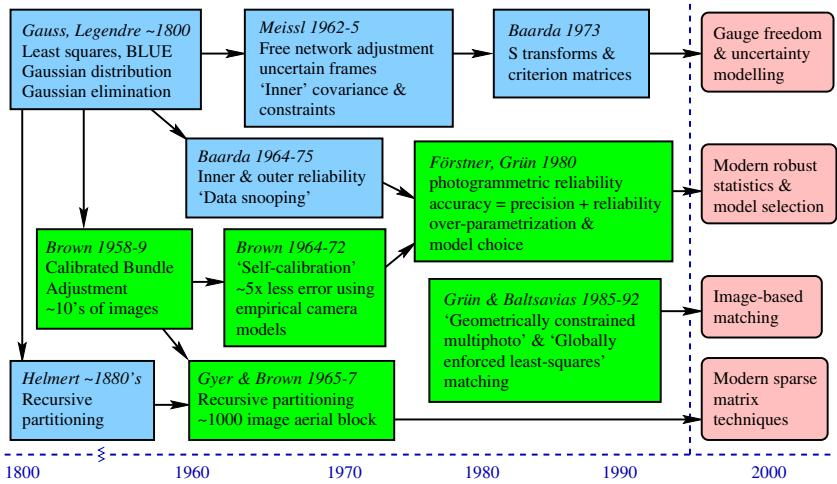  
Fig. 9. A schematic history of bundle adjustment.

Brown’s initial 1958 bundle method [16, 19] uses block matrix techniques to eliminate the structure parameters from the normal equations, leaving only the camera pose parameters. The resulting reduced camera subsystem is then solved by dense Gaussian elimination, and back-substitution gives the structure. For self-calibration, a second reduction from pose to calibration parameters can be added in the same way. Brown’s method is probably what most vision researchers think of as ‘bundle adjustment’, following descriptions by Slama [100] and Hartley [58, 59]. It is still a reasonable choice for small dense networks28, but it rapidly becomes inefficient for the large sparse ones that arise in aerial cartography and large-scale site modelling.

For larger problems, more of the natural sparsity has to be exploited. In aerial cartography, the regular structure makes this relatively straightforward. The images are arranged in blocks — rectangular or irregular grids designed for uniform ground coverage, formed from parallel 1D strips of images with about 50–70% forward overlap giving adjacent stereo pairs or triplets, about 10–20% side overlap, and a few known ground control points sprinkled sparsely throughout the block. Features are shared only between neighbouring images, and images couple in the reduced camera subsystem only if they share common features. So if the images are arranged in strip or cross-strip ordering, the reduced camera system has a triply-banded block structure (the upper and lower bands representing, e.g., right and left neighbours, and the central band forward and backward ones). Several efficient numerical schemes exist for such matrices. The first was Gyer & Brown’s 1967 recursive partitioning method [57, 19], which is closely related to Helmert’s 1880 geodesic method [64]. (Generalizations of these have become one of the major families of modern sparse matrix methods [40, 26, 11]). The basic idea is to split the rectangle into two halves, recursively solving each half and gluing the two solutions together along their common boundary. Algebraically, the variables are reordered into left-half-only, right-half-only and boundary variables, with the latter (representing the only coupling between the two halves) eliminated last. The technique is extremely effective for aerial blocks and similar problems where small separating sets of variables can be found. Brown mentions adjusting a block of 162 photos on a machine with only 8k words of memory, and 1000 photo blocks were already feasible by mid-1967 [19]. For less regular networks such as site modelling ones it may not be feasible to choose an appropriate variable ordering beforehand, but efficient on-line ordering methods exist [40, 26, 11] (see §6.3).

Independent model methods: These approximate bundle adjustment by calculating a number of partial reconstructions independently and merging them by pairwise 3D alignment. Even when the individual models and alignments are separately optimal, the result is suboptimal because the the stresses produced by alignment are not propagated back into the individual models. (Doing so would amount to completing one full iteration of an optimal recursive decomposition style bundle method — see §8.2). Independent model methods were at one time the standard in aerial photogrammetry [95, 2, 100, 73], where they were used to merge individual stereo pair reconstructions within aerial strips into a global reconstruction of the whole block. They are always less accurate than bundle methods, although in some cases the accuracy can be comparable.

First order & approximate bundle algorithms: Another recurrent theme is the use of approximations or iterative methods to avoid solving the full Newton update equations. Most of the plausible approximations have been rediscovered several times, especially variants ofalternate steps ofresection (finding the camera poses from known 3D points) and intersection (finding the 3D points from known camera poses), and the linearized version of this, the block Gauss-Seidel iteration. Brown’s group had already experimented with Block Successive Over-Relaxation (BSOR — an accelerated variant of Gauss-Seidel) by 1964 [19], before they developed their recursive decomposition method. Both Gauss-Seidel and BSOR were also applied to the independent model problem around this time [95, 2]. These methods are mainly of historical interest. For large sparse problems such as aerial blocks, they can not compete with efficiently organized second order methods. Because some of the inter-variable couplings are ignored, corrections propagate very slowly across the network (typically one step per iteration), and many iterations are required for convergence (see §7).

Quality control: In parallel with this algorithmic development, two important theoretical developments took place. Firstly, the Dutch geodesist W. Baarda led a long-running working group that formulated a theory of statistical reliability for least squares estimation [7, 8]. This greatly clarified the conditions (essentially redundancy) needed to ensure that outliers could be detected from their residuals (inner reliability), and that any remaining undetected outliers had only a limited effect on the final results (outer reliability). A. Grun¨ [49, 50] and W. Forstner [30, 33, 34] adapted this theory to photogrammetry around 1980,¨ and also gave some early correlation and covariance based model selection heuristics designed to control over-fitting problems caused by over-elaborate camera models in self calibration.

Datum / gauge freedom: Secondly, as problem size and sophistication increased, it became increasingly difficult to establish sufficiently accurate control points for large geodesic and photogrammetric networks. Traditionally, the network had been viewed as a means of ‘densifying’ a fixed control coordinate system — propagating control-system coordinates from a few known control points to many unknown ones. But this viewpoint is suboptimal when the network is intrinsically more accurate than the control, because most of the apparent uncertainty is simply due to the uncertain definition of the control coordinate system itself. In the early 1960’s, Meissl studied this problem and developed the first free network approach, in which the reference coordinate system floated freely rather than being locked to any given control points [87, 89]. More precisely, the coordinates are pinned to a sort of average structure defined by so-called inner constraints. Owing to the removal of control-related uncertainties, the nominal structure covariances become smaller and easier to interpret, and the numerical bundle iteration also converges more rapidly. Later, Baarda introduced another approach to this theory based on S-transforms — coordinate transforms between uncertain frames [6, 21, 22, 25].

Least squares matching: All of the above developments originally used manually extracted image points. Automated image processing was clearly desirable, but it only gradually became feasible owing to the sheer size and detail of photogrammetric images. Both feature based, e.g. [31, 32], and direct (region based) [1, 52, 55, 110] methods were studied, the latter especially for matching low-contrast natural terrain in cartographic applications. Both rely on some form of least squares matching (as image correlation is called in photogrammetry). Correlation based matching techniques remain the most accurate methods of extracting precise translations from images, both for high contrast photogrammetric targets and for low contrast natural terrain. Starting from around 1985, Grun and his co-¨ workers combined region based least squares matching with various geometric constraints. Multi-photo geometrically constrained matching optimizes the match over multiple images simultaneously, subject to the inter-image matching geometry [52, 55, 9]. For each surface patch there is a single search over patch depth and possibly slant, which simultaneously moves it along epipolar lines in the other images. Initial versions assumed known camera matrices, but a full patch-based bundle method was later investigated [9]. Related methods in computer vision include [94, 98, 67]. Globally enforced least squares matching [53, 97, 76] further stabilizes the solution in low-signal regions by enforcing continuity constraints between adjacent patches. Patches are arranged in a grid and matched using local affine or projective deformations, with additional terms to penalize mismatching at patch boundaries. Related work in vision includes [104, 102]. The inter-patch constraints give a sparsely-coupled structure to the least squares matching equations, which can again be handled efficiently by recursive decomposition.

## B Matrix Factorization

This appendix covers some standard material on matrix factorization, including the technical details of factorization, factorization updating, and covariance calculation methods. See [44, 11] for more details.

Terminology: Depending on the factorization, ‘L’ stands for lower triangular, $\cdot _ { \mathrm { U } } ,$ or $ { \mathbf { \hat { R } } }  { \mathbf { \hat { \rho } } }$ for upper triangular, ‘D’ or ‘S’ for diagonal, $\mathbf { \bar { Q } } ^ { \prime }$ or ‘U’,‘V’ for orthogonal factors.

## B.1 Triangular Decompositions

Any matrix A has a family of block (lower triangular)\*(diagonal)\*(upper triangular) factorizations $\mathsf { A } = \mathsf { L D U }$ :

$$
\begin{array} { r l } & { \textbf { A } = \textbf { L } ^ { \textbf { U } } \textbf { \textup { U } } } \\ & { \left( \begin{array} { l l l l } { \mathtt { A } _ { 1 1 } } & { \mathtt { A } _ { 1 2 } } & { \cdots } & { \mathtt { A } _ { 1 n } } \\ { \mathtt { A } _ { 2 1 } } & { \mathtt { A } _ { 2 2 } } & { \cdots } & { \mathtt { A } _ { 2 n } } \\ { \vdots } & { \vdots } & { \ddots } & { \vdots } \\ { \mathtt { A } _ { m 1 } } & { \mathtt { A } _ { m 2 } } & { \cdots } & { \mathtt { A } _ { m n } } \end{array} \right) = \left( \begin{array} { l l l l } { \mathtt { L } _ { 1 1 } } & & { \textbf { U } } & { \textbf { U } } \\ { \mathtt { L } _ { 2 1 } } & { \mathtt { L } _ { 2 2 } } & & \\ { \vdots } & { \vdots } & { \ddots } & \\ { \vdots } & { \vdots } & & { \vdots } \\ { \mathtt { L } _ { m 1 } } & { \mathtt { L } _ { m 2 } } & { \cdots } & { \mathtt { L } _ { m r } } \end{array} \right) \left( \begin{array} { l l l l } { \mathtt { D } _ { 1 } } & & { \mathtt { U } _ { 1 2 } } & { \cdots } & { \mathtt { U } _ { 1 n } } \\ & { \mathtt { U } _ { 2 } } & & { \ddots } & { \mathtt { U } _ { 2 n } } \\ & & { \ddots } & \\ & & & { \ddots } & \\ & & & { \underbrace { \textbf { U } _ { r n } } } \end{array} \right) } \end{array}\tag{50}
$$

$$
\begin{array}{c} \begin{array} { r l } { \mathsf { L } _ { i i } \mathsf { D } _ { i } \mathsf { U } _ { i i } = \overline { { \mathsf { A } } } _ { i i } , \quad i = j } \\ { \mathsf { L } _ { i j } \equiv \overline { { \mathsf { A } } } _ { i j } \mathsf { U } _ { j j } ^ { - 1 } \mathsf { D } _ { j } ^ { - 1 } , } & { i > j } \\ { \mathsf { U } _ { i j } \equiv \mathsf { D } _ { i } ^ { - 1 } \mathsf { L } _ { i i } ^ { - 1 } \overline { { \mathsf { A } } } _ { i j } , } & { i < j } \end{array} \} \qquad \overline { { \mathsf { A } } } _ { i j } \mathrm { ~ \equiv ~ \mathsf { A } } _ { i j } - \sum _ { k < \operatorname* { m i n } ( i , j ) } \mathsf { L } _ { i k } \mathsf { D } _ { k } \mathsf { U } _ { k j }  \end{array}\tag{51}
$$

Here, the diagonal blocks $\mathsf { D } _ { 1 } \ldots \mathsf { D } _ { r - 1 }$ must be chosen to be square and invertible, and $r$ is determined by the rank of A. The recursion (51) follows immediately from the product $\begin{array} { r } { \mathsf { A } _ { i j } = ( \mathsf { L } \mathsf { D } \mathsf { U } ) _ { i j } = \sum _ { k < \mathrm { m i n } ( i , j ) } \mathsf { L } _ { i k } \mathsf { D } _ { k } \mathsf { U } _ { k j } } \end{array}$ . Given such a factorization, linear equations can be solved by forwards and backwards substitution as in (22–24).

The diagonal blocks of L, D, U can be chosen freely subject to $\mathsf { L } _ { i i } \mathsf { D } _ { i i } \mathsf { U } _ { i i } = \overline { { \mathsf { A } } } _ { i i }$ but once this is done the factorization is uniquely defined. Choosing $\mathsf { L } _ { i i } = \mathsf { D } _ { i i } = 1$ so that $\mathsf { U } _ { i i } = \overline { { \mathsf { A } } } _ { i i }$ gives the (block) LU decomposition $\mathsf { A } = \mathsf { L } \mathsf { U }$ , the matrix representation of (block) Gaussian elimination. Choosing $\mathsf { L } _ { i i } = \mathsf { U } _ { i i } = 1$ so that $\mathsf { D } _ { i } = \overline { { \mathsf { A } } } _ { i i }$ gives the LDU decomposition. If A is symmetric, the LDU decomposition preserves the symmetry and becomes the LDL decomposition $\mathsf { A } = \mathsf { L } \mathsf { D } \mathsf { L } ^ { \top }$ where $\mathsf { U } = \mathsf { L } ^ { \top }$ and $\mathsf { D } = \mathsf { D } ^ { \top }$ . If A is symmetric positive definite we can set $0 = 1$ to get the Cholesky decomposition $\mathsf { A } \overset { = } \mathsf { L } \mathsf { L } ^ { \top }$ , where $\mathsf { L } _ { i i } \mathsf { L } _ { i i } ^ { \top } = \overline { { \mathsf { A } } } _ { i i }$ (recursively) defines the Cholesky factor $\mathsf { L } _ { i i }$ of the positive definite matrix $\overline { { \mathsf { A } } } _ { i i }$ . (For a scalar, Chol $( a ) = { \sqrt { a } } )$ . If all of the blocks are chosen to be $1 \times 1$ , we get the conventional scalar forms of these decompositions. These decompositions are obviously equivalent, but for speed and simplicity it is usual to use the most specific one that applies: LU for general matrices, $\mathrm { L D L ^ { \top } }$ for symmetric ones, and Cholesky for symmetric positive definite ones. For symmetric matrices such as the bundle Hessian, $\mathrm { L D L } ^ { \top } /$ Cholesky are 1.5–2 times faster than LDU / LU. We will use the general form (50) below as it is trivial to specialize to any of the others.

Loop ordering: From (51), the $i j$ block of the decomposition depends only on the the upper left $( m - 1 ) \times ( m - 1 )$ submatrix and the first m elements of row i and column $j$ of A, where $m = \operatorname* { m i n } ( i , j )$ . This allows considerable freedom in the ordering of operations during decomposition, which can be exploited to enhance parallelism and improve memory cache locality.

Fill in: If A is sparse, its L and U factors tend to become ever denser as the decomposition progresses. Recursively expanding $\overline { { \mathsf { A } } } _ { i k }$ and $\overline { { \mathsf { A } } } _ { k j }$ in (51) gives contributions of the form $\pm \mathsf { A } _ { i k } \overline { { \mathsf { A } } } _ { k k } ^ { - 1 } \mathsf { A } _ { k l } \cdot \cdot \cdot \mathsf { A } _ { p q } \overline { { \mathsf { A } } } _ { q q } ^ { - 1 } \mathsf { A } _ { q j }$ for $k , l \ldots p , q < \operatorname* { m i n } ( i , j )$ . So even if $\mathsf { A } _ { i j }$ is zero, if there is any path of the form $i \to k \to l \to \ldots \to p \to q \to j$ via non-zero $\mathsf { A } _ { k l }$ with $k , l \ldots p , q < \operatorname* { m i n } ( i , j )$ , the $i j$ block of the decomposition will generically fill-in (become non-zero). The amount of fill-in is strongly dependent on the ordering of the variables (i.e. of the rows and columns of $\mathsf { A } )$ . Sparse factorization methods (§6.3) manipulate this ordering to minimize either fill-in or total operation counts.

Pivoting: For positive definite matrices, the above factorizations are very stable because the pivots $\overline { { \mathsf { A } } } _ { i i }$ must themselves remain positive definite. More generally, the pivots may become ill-conditioned causing the decomposition to break down. To deal with this, it is usual to search the undecomposed part of the matrix for a large pivot at each step, and permute this into the leading position before proceeding. The stablest policy is full pivoting which searches the whole submatrix, but usually a less costly partial pivoting search over just the current column (column pivoting) or row (row pivoting) suffices. Pivoting ensures that L and/or U are relatively well-conditioned and postpones ill-conditioning in D for as long as possible, but it can not ultimately make D any better conditioned than A is. Column pivoting is usual for the LU decomposition, but if applied to a symmetric matrix it destroys the symmetry and hence doubles the workload. Diagonal pivoting preserves symmetry by searching for the largest remaining diagonal element and permuting both its row and its column to the front. This suffices for positive semidefinite matrices (e.g. gauge deficient Hessians). For general symmetric indefinite matrices (e.g. the augmented Hessians $\left( \begin{array} { l l } { \mathsf { H } } & { \mathsf { C } } \\ { \mathsf { C } ^ { \top } } & { 0 } \end{array} \right)$ of constrained problems (12)), off-diagonal pivots can not be avoided29,  but there are fast, stable, symmetry-preserving pivoted $\mathrm { L D L ^ { \top } }$ decompositions with block diagonal D having $1 \times 1$ and $2 \times 2$ blocks. Full pivoting is possible (Bunch-Parlett decomposition), but Bunch-Kaufman decomposition which searches the diagonal and only one or at most two columns usually suffices. This method is nearly as fast as pivoted Cholesky decomposition (to which it reduces for positive matrices), and as stable LU decomposition with partial pivoting. ˚Asen’s method has similar speed and stability but produces a tridiagonal D. The constrained Hessian $\left( \begin{array} { l l } { \mathsf { H } } & { \mathsf { C } } \\ { \mathsf { C } ^ { \top } } & { 0 } \end{array} \right)$ has further special properties  owing to its zero block, but we will not consider these here — see [44, §4.4.6 Equilibrium Systems].

## B.2 Orthogonal Decompositions

For least squares problems, there is an alternative family of decompositions based on orthogonal reduction of the Jacobian $\begin{array} { r } { \mathsf { J } = \frac { \mathsf { d } \boldsymbol { z } } { \mathsf { d } \mathsf { x } } } \end{array}$ . Given any rectangular matrix A, it can be decomposed as $\mathsf { A } = \mathsf { Q } \mathsf { R }$ where R is upper triangular and Q is orthogonal $( i . e .$ , its columns are orthonormal unit vectors). This is called the QR decomposition of A. R is identical to the right Cholesky factor of $\mathsf { A } ^ { \top } \mathsf { A } = ( \mathsf { R } ^ { \top } \mathsf { \pmb { Q } } ^ { \top } ) ( \mathsf { \pmb { Q } } \mathsf { \pmb { R } } ) = \mathsf { R } ^ { \top } \mathsf { \pmb { R } }$ . The solution of the linear least squares problem minx $\| \mathsf { A } \mathsf { x } - \mathsf { b } \| ^ { 2 } \operatorname { i s } \mathsf { x } = \mathsf { R } ^ { \scriptscriptstyle - 1 } \mathsf { Q } ^ { \scriptscriptstyle \top } \mathsf { b }$ , and $\mathsf { R } ^ { - 1 } \mathsf { Q } ^ { \top }$ is the Moore-Penrose pseduo-inverse of A. The QR decomposition is calculated by finding a series of simple rotations that successively zero below diagonal elements of A to form R, and accumulating the rotations in $\mathsf Q , \mathsf Q ^ { \top } \mathsf A = \mathsf R$ . Various types of rotations can be used. Givens rotations are the fine-grained extreme: one-parameter $2 \times 2$ rotations that zero a single element of A and affect only two of its rows. Householder reflections are coarser-grained reflections in hyperplanes $\begin{array} { r } { 1 \mathrm { ~ - ~ } 2 \frac { \mathsf { v } \mathsf { v } ^ { \top } } { \| \mathsf { v } \| ^ { 2 } } } \end{array}$ , designed to zero an entire below-diagonal column of A and affecting all elements of A in or below the diagonal row of that column. Intermediate sizes of Householder reflections can also be used, the $2 \times 2$ case being computationally equivalent, and equal up to a sign, to the corresponding Givens rotation. This is useful for sparse QR decompositions, e.g. multifrontal methods (see §6.3 and [11]). The Householder method is the most common one for general use, owing to its speed and simplicity. Both the Givens and Householder methods calculate R explicitly, but Q is not calculated directly unless it is explicitly needed. Instead, it is stored in factorized form (as a series of $2 \times 2$ rotations or Householder vectors), and applied piecewise when needed. In particular, Q b is needed to solve the least squares system, but it can be calculated progressively as part of the decomposition process. As for Cholesky decomposition, QR decomposition is stable without pivoting so long as A has full column rank and is not too ill-conditioned. For degenerate A, Householder QR decomposition with column exchange pivoting can be used. See [11] for more information about QR decomposition.

Both QR decomposition of A and Cholesky decomposition of the normal matrix A A can be used to calculate the Cholesky / QR factor R and to solve least squares problems with design matrix / Jacobian A. The QR method runs about as fast as the normal / Cholesky one for square A, but becomes twice as slow for long thin A (i.e. many observations in relatively few parameters). However, the QR is numerically much stabler than the normal / Cholesky one in the following sense: if A has condition number (ratio of largest to smallest singular value) c and the machine precision is $\epsilon ,$ the QR solution has relative error $\mathcal { O } ( c \epsilon )$ whereas the normal matrix A A has condition number $c ^ { 2 }$ and its solution has relative error $\mathcal { O } ( c ^ { 2 } \epsilon )$ . This matters only if $c ^ { 2 } \epsilon$ approaches the relative accuracy to which the solution  is required. For example, even in accurate bundle adjustments, we do not need relative accuracies greater than about 1 : $1 0 ^ { 6 } . \mathrm { A s } \epsilon \sim 1 0 ^ { - 1 6 }$ for double precision floating point, we can safely use the normal equation method for $c ( \mathsf { J } ) \lesssim 1 0 ^ { 5 }$ , whereas the QR method is safe up to $c ( \mathsf { J } ) \lesssim 1 0 ^ { 1 0 }$ , where J is the bundle Jacobian. In practice, the Gauss-Newton / normal equation approach is used in most bundle implementations.

Individual Householder reflections are also useful for projecting parametrizations of geometric entities orthogonal to some constraint vector. For example, for quaternions or homogeneous projective vectors X, we often want to enforce spherical normalization $\| \mathbf { X } \| ^ { 2 } = { \bar { 1 } }$ . To first order, only displacements δX orthogonal to X are allowed, $\mathbf { X } ^ { \top } \delta \mathbf { X } = 0$ To parametrize the directions we can move in, we need a basis for the vectors orthogonal to X. A Householder reflection Q based on X converts X to $( 1 0 \ldots 0 ) ^ { \top }$ and hence the orthogonal directions to vectors of the form $( 0 * \ldots * ) ^ { \intercal }$ . So if U contains rows $_ { 2 - n }$ of Q, we can reduce Jacobians $\frac { \mathsf { d } } { \mathsf { d } \mathbf { X } }$ to the $n - 1$ independent parameters $\delta \mathfrak { u }$ of the orthogonal subspace by post-multiplying by $\mathsf { U } ^ { \top }$ , and once we have solved for $\delta \mathsf { u } .$ , we can recover the orthogonal $\delta \mathbf { X } \approx \mathsf { U } \delta \mathsf { u }$ by premultiplying by U. Multiple constraints can be enforced by successive Householder reductions of this form. This corresponds exactly to the LQ method for solving constrained least squares problems [11].

$$
\begin{array} { r } { \mathbf { x } = \mathbf { p r o f l e . c h o l e s k y . f o r w a r d . s u b s } ( \mathsf { A } , \mathsf { b } ) } \\ { \mathbf { f o r } i = \mathbf { f r s t } ( \mathsf { b } ) \mathbf { t o } n \mathbf { d o } } \\ { \mathbf { x } _ { i } = \left( \mathsf { b } _ { i } - \sum _ { k = 1 } ^ { i - 1 } \mathsf { L } _ { i k } \mathsf { x } _ { k } \right) / \mathsf { L } i i } \\ { k = \operatorname* { m a x } ( \mathsf { f i r s t } ( i ) , \mathsf { f i r s t } ( \mathsf { b } ) ) } \end{array}
$$

Fig. 10. A complete implementation of profile Cholesky decomposition.

## B.3 Profile Cholesky Decomposition

One of the simplest sparse methods suitable for bundle problems is profile Cholesky decomposition. With natural (features then cameras) variable ordering, it is as efficient as any method for dense networks (i.e. most features visible in most images, giving dense camera-feature coupling blocks in the Hessian). With suitable variable ordering30, it is also efficient for some types of sparse problems, particularly ones with chain-like connectivity.

Figure 10 shows the complete implementation of profile Cholesky, including decomposition $\mathsf { L } \mathsf { L } ^ { \top } = \mathsf { A }$ , forward substitution $\mathsf { x } = \mathsf { L } ^ { - 1 } \mathsf { b }$ , and back substitution $\mathsf { y } = \mathsf { L } ^ { - \top } \mathsf { x }$ first(b), last(b) are the indices of the first and last nonzero entries of b, and $\mathrm { f i r s t } ( i )$ is the index of the first nonzero entry in row i of A and hence L. If desired, L, x, y can overwrite A, b, x during decomposition to save storage. As always with factorizations, the loops can be reordered in several ways. These have the same operation counts but different access patterns and hence memory cache localities, which on modern machines can lead to significant performance differences for large problems. Here we store and access A and L consistently by rows.

## B.4 Matrix Inversion and Covariances

When solving linear equations, forward-backward substitutions (22, 24) are much faster than explicitly calculating and multiplying by $\mathsf { A } ^ { - 1 }$ , and numerically stabler too. Explicit inverses are only rarely needed, $e . g .$ . to evaluate the dispersion $( ^ {  } \mathrm { c o v a r i a n c e } ^ { , 9 } )$ matrix H−1. Covariance calculation is expensive for bundle adjustment: no matter how sparse H may be, $\mathsf { H } ^ { - 1 }$ is always dense. Given a triangular decomposition $\mathsf { A } = \mathsf { L D U }$ , the most obvious way to calculate $\mathsf { A } ^ { - 1 }$ is via the product $\bar { \mathsf { A } } ^ { - 1 } = \mathsf { U } ^ { - 1 } \mathsf { D } ^ { - 1 } \mathsf { L } ^ { - 1 }$ , where ${ \mathsf { L } } ^ { - 1 }$ (which is lower triangular) is found using a recurrence based on either $\mathsf { L } ^ { - 1 } \mathsf { L } = \mathsf { 1 } \thinspace \mathrm { o r } \mathsf { L } \mathsf { L } ^ { - 1 } = \mathsf { 1 }$ as follows (and similarly but transposed for U):

$$
( \mathsf { L } ^ { - 1 } ) _ { i i } = ( \mathsf { L } _ { i i } ) ^ { - 1 } , \qquad ( \mathsf { L } ^ { - 1 } ) _ { j i } = - \mathsf { L } _ { j j } ^ { - 1 } \left( \sum _ { k = i } ^ { j - 1 } \mathsf { L } _ { j k } ( \mathsf { L } ^ { - 1 } ) _ { k i } \right) = - \left( \sum _ { k = i + 1 } ^ { j } ( \mathsf { L } ^ { - 1 } ) _ { j k } \mathsf { L } _ { k i } \right) \mathsf { L } _ { i i } ^ { - 1 }\tag{52}
$$

Alternatively [45, 11], the diagonal and the (zero) upper triangle of the linear system $\mathsf { U } \mathsf { A } ^ { - 1 } = \mathsf { D } ^ { - \mathrm { i } } \mathsf { L } ^ { - 1 }$ can be combined with the (zero) lower triangle of $\mathsf { A } ^ { - 1 } \mathsf { L } = \mathsf { U } ^ { - 1 } \mathsf { D } ^ { - 1 }$ to give the direct recursion $( i = n \dots 1$ and $j = n \dots i + 1 )$ :

$$
\begin{array} { l } { { \displaystyle ( { \pmb { \mathsf { A } } } ^ { - 1 } ) _ { j i } = - \left( \sum _ { k = i + 1 } ^ { n } ( { \pmb { \mathsf { A } } } ^ { - 1 } ) _ { j k } { \mathsf { L } } _ { k i } \right) { \mathsf { L } } _ { i i } ^ { - 1 } , \qquad ( { \pmb { \mathsf { A } } } ^ { - 1 } ) _ { i j } = - { \mathsf { U } } _ { i i } ^ { - 1 } \left( \sum _ { k = i + 1 } ^ { n } { \mathsf { U } } _ { i k } ( { \pmb { \mathsf { A } } } ^ { - 1 } ) _ { k j } \right) } } \\ { { \displaystyle ( { \pmb { \mathsf { A } } } ^ { - 1 } ) _ { i i } = { \mathsf { U } } _ { i i } ^ { - 1 } \left( { \pmb { \mathsf { D } } } _ { i } ^ { - 1 } { \mathsf { L } } _ { i i } ^ { - 1 } - \sum _ { k = i + 1 } ^ { n } { \mathsf { U } } _ { i k } ( { \pmb { \mathsf { A } } } ^ { - 1 } ) _ { k i } \right) = \left( { \mathsf { U } } _ { i i } ^ { - 1 } { \mathsf { D } } _ { i } ^ { - 1 } - \sum _ { k = i + 1 } ^ { n } ( { \pmb { \mathsf { A } } } ^ { - 1 } ) _ { i k } { \mathsf { L } } _ { k i } \right) { \mathsf { L } } _ { i i } ^ { - 1 } } } \end{array}\tag{53}
$$

In the symmetric case $( \mathsf { A } ^ { - 1 } ) _ { j i } = ( \mathsf { A } ^ { - 1 } ) _ { i j }$ so we can avoid roughly half of the work. If only a few blocks of $\mathsf { A } ^ { - 1 }$ are required (e.g. the diagonal ones), this recursion has the property that the blocks of $\mathsf { A } ^ { - 1 }$ associated with the filled positions of L and U can be calculated without calculating any blocks associated with unfilled positions. More precisely, to calculate $( \mathsf { A } ^ { - 1 } ) _ { i j }$ for which $\mathsf { L } _ { j i } \ ( j \ > \ i )$ or $\mathsf { U } _ { j i } \mathrm { ~ ( ~ } j \mathrm { ~ < ~ } i )$ is non-zero, we do not need any block $( \mathsf { A } ^ { - 1 } ) _ { k l }$ for which $\mathsf { L } _ { l k } = 0 ( l > k )$ or $\dot { \mathsf { U } _ { l k } } = 0 ( \boldsymbol { l } < k ) ^ { \frac { 3 1 } { 3 1 } }$ . This is a significant saving if L, U are sparse, as in bundle problems. In particular, given the covariance of the reduced camera system, the 3D feature variances and feature-camera covariances can be calculated efficiently using (53) (or equivalently (17), where $\mathsf { A } \gets \mathsf { H } _ { s s }$ is the block diagonal feature Hessian and $\mathsf { D } _ { 2 }$ is the reduced camera one).

## B.5 Factorization Updating

For on-line applications (§8.2), it is useful to be able to update the decomposition $\mathsf { A } =$ L D U to account for a (usually low-rank) change ${ \sf A }  \overline { { \sf A } } \equiv { \sf A } \pm { \sf B } { \sf W } { \sf C } . \mathrm { L e t } \overline { { \sf B } } \equiv { \sf L } ^ { - 1 } { \sf B }$ and ${ \overline { { \mathsf { C } } } } \equiv \mathsf { C } \mathsf { U } ^ { - 1 }$ so that $\mathsf { L } ^ { - 1 } \overline { { \mathsf { A } } } \bar { \mathsf { U } } ^ { - 1 } = \mathsf { D } \pm \overline { { \mathsf { B } } } \mathsf { W } \overline { { \mathsf { C } } }$ . This low-rank update of D can be LDU decomposed efficiently. Separating the first block of D from the others we have:

$$
\begin{array} { r l } & { \left( \begin{array} { c } { { \mathsf { D } _ { 1 } } } \\ { { \mathsf { D } _ { 2 } } } \end{array} \right) \pm \left( \frac { \overline { { \mathsf { B } } } _ { 1 } } { \overline { { \mathsf { B } } } _ { 2 } } \right) { \mathsf { W } } \left( \overline { { \mathsf { C } } } _ { 1 } \overline { { \mathsf { C } } } _ { 2 } \right) = \left( \pm \overline { { \mathsf { B } } } _ { 2 } { \mathsf { W } } \overline { { \mathsf { C } } } _ { 1 } \overline { { \mathsf { D } } } _ { 1 } ^ { - 1 } \mathbf { \Lambda } _ { 1 } \right) \left( \overline { { \mathsf { D } } } _ { 1 } \mathbf { \Lambda } _ { \overline { { \mathsf { D } } } _ { 2 } } \right) \left( \begin{array} { c } { { \mathsf { 1 } } \pm \overline { { \mathsf { D } } } _ { 1 } ^ { - 1 } \overline { { \mathsf { B } } } _ { 1 } { \mathsf { W } } \overline { { \mathsf { C } } } _ { 2 } } \\ { 1 } \end{array} \right) } \\ & { \qquad \overline { { \mathsf { D } } } _ { 1 } \equiv \mathsf { D } _ { 1 } \pm \overline { { \mathsf { B } } } _ { 1 } { \mathsf { W } } \overline { { \mathsf { C } } } _ { 1 } \qquad \overline { { \mathsf { D } } } _ { 2 } \equiv \mathsf { D } _ { 2 } \pm \overline { { \mathsf { B } } } _ { 2 } \left( { \mathsf { W } } \mp { \mathsf { W } } \overline { { \mathsf { C } } } _ { 1 } \overline { { \mathsf { D } } } _ { 1 } ^ { - 1 } \overline { { \mathsf { B } } } _ { 1 } { \mathsf { W } } \right) \overline { { \mathsf { C } } } _ { 2 } } \end{array}\tag{54}
$$

$\overline { { \mathsf { D } } } _ { 2 }$ is a low-rank update of $\mathsf { D } _ { 2 }$ with the same $\overline { { \mathsf { C } } } _ { 2 }$ and $\overline { { \mathsf { B } } } _ { 2 }$ but a different W. Evaluating this recursively and merging the resulting L and U factors into L and U gives the updated

decomposition $\mathsf { I } ^ { 2 } \overline { { \mathsf { A } } } = \overline { { \mathsf { L } } } \overline { { \mathsf { D } } } \overline { { \mathsf { U } } }$

$$
\begin{array} { r l } & { \mathbb { W } ^ { ( 1 ) } \ \gets \ \pm \mathsf { W } ; \quad \mathsf { B } ^ { ( 1 ) } \ \gets \ \mathsf { B } ; \quad \mathsf { C } ^ { ( 1 ) } \ \gets \mathsf { C } ; } \\ & { \mathbf { f o r } \ i = 1 \ \mathbf { t o } \ n \ \mathbf { d } \mathbf { 0 } } \\ & { \qquad \overline { { \mathsf { B } } } _ { i } \gets \mathsf { B } _ { i } ^ { ( i ) } ; \quad \overline { { \mathsf { C } } } _ { i } \gets \mathsf { C } _ { i } ^ { ( i ) } ; \quad \overline { { \mathsf { D } } } _ { i } \gets \mathsf { D } _ { i } + \overline { { \mathsf { B } } } _ { i } \mathsf { W } ^ { ( i ) } \overline { { \mathsf { C } } } _ { i } ; } \\ & { \qquad \forall ^ { ( i + 1 ) } \ \gets \mathsf { W } ^ { ( i ) } - \mathsf { W } ^ { ( i ) } \overline { { \mathsf { C } } } _ { i } \overline { { \mathsf { D } } } _ { i } ^ { - 1 } \overline { { \mathsf { B } } } _ { i } \mathsf { W } ^ { ( i ) } \ = \ \left( ( \mathsf { W } ^ { ( i ) } ) ^ { - 1 } + \overline { { \mathsf { C } } } _ { i } \mathsf { D } _ { i } ^ { - 1 } \overline { { \mathsf { B } } } _ { i } \right) ^ { - 1 } ; } \\ & { \qquad \mathbf { f o r } j = i + 1 \ \mathbf { t o } \ n \ \mathbf { d } \mathbf { 0 } } \\ & { \qquad \mathsf { B } _ { j } ^ { ( i + 1 ) } \gets \mathsf { B } _ { j } ^ { ( i ) } - \mathsf { L } _ { j i } \overline { { \mathsf { B } } } _ { i } ; \quad \overline { { \mathsf { L } } } _ { j i } \gets \mathsf { L } _ { j i } + \mathsf { B } _ { j } ^ { ( i + 1 ) } \mathsf { W } ^ { ( i + 1 ) } \overline { { \mathsf { C } } } _ { i } \mathsf { D } _ { i } ^ { - 1 } ; } \\ &  \qquad \mathsf { C } _ { j } ^ { ( i + 1 ) } \gets \mathsf { C } _ { j } ^ \end{array}\tag{55}
$$

The $\mathsf { W } ^ { - 1 }$ form of the W update is numerically stabler for additions $( \sp { \bullet } + \sp { \bullet }$ sign in $\mathsf { A } \pm \mathsf { B } \mathsf { W } \mathsf { C }$ with positive W), but is not usable unless $\mathsf { \dot { W } } ^ { ( i ) }$ is invertible. In either case, the update takes time $\mathcal { O } \big ( ( k ^ { 2 } + b ^ { 2 } ) N ^ { 2 } \big )$ where A is $N \times N$ , W is $k \times k$ and the $\mathsf { D } _ { i }$ are $b \times b .$ So other  things being equal, k should be kept as small as possible $( e . g \cdot$ . by splitting the update into independent rows using an initial factorization of W, and updating for each row in turn). The scalar Cholesky form of this method for a rank one update $\mathsf { A } \to \mathsf { A } + w \mathsf { b } \mathsf { b } ^ { \intercal }$ is :

$$
\begin{array} { r l } & { w ^ { ( 1 ) } \gets w ; \quad { \mathbf b } ^ { ( 1 ) } \gets { \mathbf b } ; } \\ & { { \mathbf f } { \mathbf o r } i = 1 { \mathbf t o } n { \mathbf d } { \mathbf o } } \\ & { \qquad \overline { { { \mathbf b } } } _ { i } \gets { \mathbf b } _ { i } ^ { ( i ) } / { \boldsymbol \mathbf L } _ { i i } ; \quad \overline { { d } } _ { i } \gets 1 + w ^ { ( i ) } \overline { { { \mathbf b } } } _ { i } ^ { 2 } ; \quad \overline { { { \mathbf L } } } _ { i i } \gets { \mathbf L } _ { i i } \sqrt { \overline { { d } } } _ { i } ; } \\ & { \qquad w ^ { ( i + 1 ) } \gets w ^ { ( i ) } / \overline { { d } } _ { i } ; } \\ & { \qquad { \mathbf f } { \mathbf o r } j = i + 1 { \mathbf t o } n { \mathbf d } { \mathbf o } } \\ & { \qquad { \mathbf b } _ { j } ^ { ( i + 1 ) } \gets { \mathbf b } _ { j } ^ { ( i ) } - { \mathbf L } _ { j i } \overline { { { \mathbf b } } } _ { i } ; \quad \overline { { \mathsf L } } _ { j i } \gets \left( { \mathbf L } _ { j i } + { \mathbf b } _ { j } ^ { ( i + 1 ) } w ^ { ( i + 1 ) } \overline { { { \mathbf b } } } _ { i } \right) \sqrt { \overline { { d } } } _ { i } ; } \end{array}\tag{56}
$$

This takes $O ( n ^ { 2 } )$ operations. The same recursion rule (and several equivalent forms) can  be derived by reducing $( \mathsf { L } \mathsf { \Lambda } \mathsf { b } ) ^ { \top }$ to an upper triangular matrix using Givens rotations or Householder transformations [43, 11].

## C Software

## C.1 Software Organization

For a general purpose bundle adjustment code, an extensible object-based organization is natural. The measurement network can be modelled as a network of objects, representing measurements and their error models and the different types of 3D features and camera models that they depend on. It is obviously useful to allow the measurement, feature and camera types to be open-ended. Measurements may be 2D or 3D, implicit or explicit, and many different robust error models are possible. Features may range from points through curves and homographies to entire 3D object models. Many types of camera and lens

32 Here, $\begin{array} { r } { \mathsf { B } _ { j } ^ { ( i ) } \ = \ \mathsf { B } _ { j } \ - \ \sum _ { k = 1 } ^ { i - 1 } \mathsf { L } _ { j k } \ \overline { { \mathsf { B } } } _ { k } \ = \ \sum _ { k = i } ^ { j } \mathsf { L } _ { j k } \ \overline { { \mathsf { B } } } _ { k } } \end{array}$ and $\begin{array} { r } { \mathsf { C } _ { j } ^ { ( i ) } \ = \ \mathsf { C } _ { j } \ - \ \sum _ { k = 1 } ^ { i - 1 } \overline { { \mathsf { C } } } _ { k } \mathsf { L } _ { k j } \ = \ } \end{array}$ $\sum _ { k = i } ^ { j } \overline { { \mathsf { C } } } _ { k } \mathsf { U } _ { k j }$ accumulate ${ \mathsf { L } } ^ { - 1 } { \mathsf { B } }$ and $\mathsf { C } \mathsf { U } ^ { - 1 }$ . For the L, U updates one can also use $\mathsf { W } ^ { ( i + 1 ) } \overline { { \mathsf { C } } } _ { i } \mathsf { D } _ { i } ^ { - 1 } =$ $\mathsf { W } ^ { ( i ) } \overline { { \mathsf { C } } } _ { i } \overline { { \mathsf { D } } } _ { i } ^ { - 1 }$ and $\mathsf { D } _ { i } ^ { - 1 } \overline { { \mathsf { B } } } _ { i } \mathsf { W } ^ { ( i + 1 ) } = \overline { { \mathsf { D } } } _ { i } ^ { - 1 } \overline { { \mathsf { B } } } _ { i } \mathsf { W } ^ { ( i ) }$

distortion models exist. If the scene is dynamic or articulated, additional nodes representing 3D transformations (kinematic chains or relative motions) may also be needed.

The main purpose of the network structure is to predict observations and their Jacobians w.r.t. the free parameters, and then to integrate the resulting first order parameter updates back into the internal 3D feature and camera state representations. Prediction is essentially a matter of systematically propagating values through the network, with heavy use of the chain rule for derivative propagation. The network representation must interface with a numerical linear algebra one that supports appropriate methods for forming and solving the sparse, damped Gauss-Newton (or other) step prediction equations. A fixed-order sparse factorization may suffice for simple networks, while automatic variable ordering is needed for more complicated networks and iterative solution methods for large ones.

Several extensible bundle codes exist, but as far as we are aware, none of them are currently available as freeware. Our own implementations include:

• Carmen [59] is a program for camera modelling and scene reconstruction using iterative nonlinear least squares. It has a modular design that allows many different feature, measurement and camera types to be incorporated (including some quite exotic ones [56, 63]). It uses sparse matrix techniques similar to Brown’s reduced camera system method [19] to make the bundle adjustment iteration efficient.

• Horatio (http://www.ee.surrey.ac.uk/Personal/P.McLauchlan/horatio/html, [85], [86], [83], [84]) is a C library supporting the development of efficient computer vision applications. It contains support for image processing, linear algebra and visualization, and will soon be made publicly available. The bundle adjustment methods in Horatio, which are based on the Variable State Dimension Filter (VSDF) [83, 84], are being commercialized. These algorithms support sparse block matrix operations, arbitrary gauge constraints, global and local parametrizations, multiple feature types and camera models, as well as batch and sequential operation.

• vxl: This modular C++ vision environment is a new, lightweight version of the TargetJr/IUE environment, which is being developed mainly by the Universities of Oxford and Leuven, and General Electric CRD. The initial public release on http://www.robots.ox.ac.uk/∼vxl will include an OpenGL user interface and classes for multiple view geometry and numerics (the latter being mainly C++ wrappers to well established routines from Netlib — see below). A bundle adjustment code exists for it but is not currently planned for release [28, 62].

## C.2 Software Resources

A great deal of useful numerical linear algebra and optimization software is available on the Internet, although more commonly in Fortran than in C/C++. The main repository is Netlib at http://www.netlib.org/. Other useful sites include: the ‘Guide to Available Mathematical Software’ GAMS at http://gams.nist.gov; the NEOS guide http://wwwfp.mcs.anl.gov/otc/Guide/, which is based in part on More & Wright’s guide book [90]; and ´ the Object Oriented Numerics page http://oonumerics.org. For large-scale dense linear algebra, LAPACK (http://www.netlib.org/lapack, [3]) is the best package available. However it is optimized for relatively large problems (matrices of size 100 or more), so if you are solving many small ones (size less than 20 or so) it may be faster to use the older LINPACK and EISPACK routines. These libraries all use the BLAS (Basic Linear Algebra Subroutines) interface for low level matrix manipulations, optimized versions ofwhich are available from most processor vendors. They are all Fortran based, but C/C++ versions and interfaces exist (CLAPACK,

http://www.netlib.org/clapack; LAPACK++, http://math.nist.gov/lapack++). For sparse matrices there is a bewildering array of packages. One good one is Boeing’s SPOOLES (http://www.netlib.org/linalg/spooles/spooles.2.2.html) which implements sparse Bunch-Kaufman decomposition in C with several ordering methods. For iterative linear system solvers implementation is seldom difficult, but there are again many methods and implementations. The ‘Templates’ book [10] contains potted code. For nonlinear optimization there are various older codes such as MINPACK, and more recent codes designed mainly for very large problems such as MINPACK-2 (ftp://info.mcs.anl.gov/pub/MINPACK-2) and LANCELOT (http://www.cse.clrc.ac.uk/Activity/LANCELOT). (Both of these latter codes have good reputations for other large scale problems, but as far as we are aware they have not yet been tested on bundle adjustment). All of the above packages are freely available. Commercial vendors such as NAG (ttp://www.nag.co.uk) and IMSL (www.imsl.com) have their own optimization codes.

## Glossary

This glossary includes a few common terms from vision, photogrammetry, numerical optimization and statistics, with their translations.

Additional parameters: Parameters added to the basic perspective model to represent lens distortion and similar small image deformations.

α-distribution: A family of wide tailed probability distributions, including the Cauchy distribution (α = 1) and the Gaussian (α = 2).

Alternation: A family of simplistic and largely outdated strategies for nonlinear optimization (and also iterative solution of linear equations). Cycles through variables or groups of variables, optimizing over each in turn while holding all the others fixed. Nonlinear alternation methods usually relinearize the equations after each group, while Gauss-Seidel methods propagate first order corrections forwards and relinearize only at the end of the cycle (the results are the same to first order). Successive over-relaxation adds momentum terms to speed convergence. See separable problem. Alternation of resection and intersection is a na¨ıve and often-rediscovered bundle method.

Asymptotic limit: In statistics, the limit as the number of independent measurements is increased to infinity, or as the second order moments dominate all higher order ones so that the posterior distribution becomes approximately Gaussian.

Asymptotic convergence: In optimization, the limit of small deviations from the solution, i.e. as the solution is reached. Second order or quadratically convergent methods such as Newton’s method square the norm of the residual at each step, while first order or linearly convergent methods such as gradient descent and alternation only reduce the error by a constant factor at each step.

Banker’s strategy: See fill in, §6.3.

Block: A (possibly irregular) grid of overlapping photos in aerial cartography.

Bunch-Kauffman: A numerically efficient factorization method for symmetric indefinite matrices, A = L D L where L is lower triangular and D is block diagonal with 1 × 1 and 2 × 2 blocks (§6.2, B.1).

Bundle adjustment: Any refinement method for visual reconstructions that aims to produce jointly optimal structure and camera estimates.

Calibration: In photogrammetry, this always means internal calibration of the cameras. See inner orientation.

Central limit theorem: States that maximum likelihood and similar estimators asymptotically have Gaussian distributions. The basis of most of our perturbation expansions.

Cholesky decomposition: A numerically efficient factorization method for symmetric positive definite matrices, $\bar { \mathsf { A } } = { \mathsf { L } } { \mathsf { L } } ^ { \top }$ where L is lower triangular.

Close Range: Any photogrammetric problem where the scene is relatively close to the camera, so that it has significant depth compared to the camera distance. Terrestrial photogrammetry as opposed to aerial cartography.

Conjugate gradient: A cleverly accelerated first order iteration for solving positive definite linear systems or minimizing a nonlinear cost function. See Krylov subspace.

Cost function: The function quantifying the total residual error that is minimized in an adjustment computation.

Cramer-Rao bound:´ See Fisher information.

Criterion matrix: In network design, an ideal or desired form for a covariance matrix.

Damped Newton method: Newton’s method with a stabilizing step control policy added. See Levenberg-Marquardt.

Data snooping: Elimination of outliers based on examination of their residual errors.

Datum: A reference coordinate system, against which other coordinates and uncertainties are measured. Our principle example of a gauge.

Dense: A matrix or system of equations with so few known-zero elements that it may as well be treated as having none. The opposite of sparse. For photogrammetric networks, dense means that the off-diagonal structure-camera block of the Hessian is dense, i.e. most features are seen in most images.

Descent direction: In optimization, any search direction with a downhill component, i.e. that locally reduces the cost.

Design: The process of defining a measurement network (placement of cameras, number of images, etc.) to satisfy given accuracy and quality criteria.

Design matrix: The observation-state Jacobian $\mathsf { J } = \frac { \mathsf { d } \boldsymbol { z } } { \mathsf { d } \boldsymbol { x } }$

Direct method: Dense correspondence or reconstruction methods based directly on cross-correlating photometric intensities or related descriptor images, without extracting geometric features. See least squares matching, feature based method.

Dispersion matrix: The inverse of the cost function Hessian, a measure of distribution spread. In the asymptotic limit, the covariance is given by the dispersion.

Downdating: On-the-fly removal of observations, without recalculating everything from scratch. The inverse of updating.

Elimination graph: A graph derived from the network graph, describing the progress of fill in during sparse matrix factorization.

Empirical distribution: A set of samples from some probability distribution, viewed as an sumof-delta-function approximation to the distribution itself. The law of large numbers asserts that the approximation asymptotically converges to the true distribution in probability.

Fill-in: The tendency of zero positions to become nonzero as sparse matrix factorization progresses. Variable ordering strategies seek to minimize fill-in by permuting the variables before factorization. Methods include minimum degree, reverse Cuthill-McKee, Banker’s strategies, and nested dissection. See §6.3.

Fisher information: In parameter estimation, the mean curvature of the posterior log likelihood function, regarded as a measure of the certainty of an estimate. The Cramer-Rao bound´ says that any unbiased estimator has covariance $\geq$ the inverse of the Fisher information.

Free gauge / free network: A gauge or datum that is defined internally to the measurement network, rather than being based on predefined reference features like a fixed gauge.

Feature based: Sparse correspondence / reconstruction methods based on geometric image features (points, lines, homographies . . . ) rather than direct photometry. See direct method.

Filtering: In sequential problems such as time series, the estimation of a current value using all of the previous measurements. Smoothing can correct this afterwards, by integrating also the information from future measurements.

First order method / convergence: See asymptotic convergence.

Gauge: An internal or external reference coordinate system defined for the current state and (at least) small variations of it, against which other quantities and their uncertainties can be measured. The 3D coordinate gauge is also called the datum. A gauge constraint is any constraint fixing a specific gauge, e.g. for the current state and arbitrary (small) displacements of it. The fact that the gauge can be chosen arbitrarily without changing the underlying structure is called gauge freedom or gauge invariance. The rank-deficiency that this transformation-invariance of the cost function induces on the Hessian is called gauge deficiency. Displacements that violate the gauge constraints can be corrected by applying an S-transform, whose linear form is a gauge projection matrix $\mathsf { P } _ { \mathcal { G } }$

Gauss-Markov theorem: This says that for a linear system, least squares weighted by the true measurement covariances gives the Best (minimum variance) Linear Unbiased Estimator or BLUE.

Gauss-Newton method: A Newton-like method for nonlinear least squares problems, in which the Hessian is approximated by the Gauss-Newton one $\mathsf { H } \approx \mathsf { J } ^ { \top } \mathsf { W } \mathsf { J }$ where J is the design matrix and W is a weight matrix. The normal equations are the resulting Gauss-Newton step prediction equations $( \mathsf { J } ^ { \top } \mathsf { W } \mathsf { J } ) \delta \mathsf { x } = - ( \mathsf { J } \mathsf { W } \triangle \mathsf { z } )$

Gauss-Seidel method: See alternation.

Givens rotation: $\textup { A 2 } \times 2$ rotation used to as part of orthogonal reduction of a matrix, $e . g . \mathrm { { Q R } }$ SVD. See Householder reflection.

Gradient: The derivative of the cost function w.r.t. the parameters ${ \mathfrak { g } } = { \frac { \mathrm { d } { \mathfrak { f } } } { \mathrm { d } { \mathfrak { x } } } }$

Gradient descent: Na¨ıve optimization method which consists of steepest descent (in some given coordinate system) down the gradient of the cost function.

Hessian: The second derivative matrix ofthe cost function $\mathsf { H } = \frac { \mathsf { d } ^ { 2 } \mathsf { f } } { \mathsf { d } \mathsf { x } ^ { 2 } }$ . Symmetric and positive (semi-)definite at a cost minimum. Measures how ‘stiff’ the state estimate is against perturbations. Its inverse is the dispersion matrix.

Householder reflection: A matrix representing reflection in a hyperplane, used as a tool for orthogonal reduction of a matrix, e.g. QR, SVD. See Givens rotation.

Independent model method: A suboptimal approximation to bundle adjustment developed for aerial cartography. Small local 3D models are reconstructed, each from a few images, and then glued together via tie features at their common boundaries, without a subsequent adjustment to relax the internal stresses so caused.

Inner: Internal or intrinsic.

Inner constraints: Gauge constraints linking the gauge to some weighted average of the reconstructed features and cameras (rather than to an externally supplied reference system).

Inner orientation: Internal camera calibration, including lens distortion, etc.

Inner reliability: The ability to either resist outliers, or detect and reject them based on their residual errors.

Intersection: (of optical rays). Solving for 3D feature positions given the corresponding image features and known 3D camera poses and calibrations. See resection, alternation.

Jacobian: See design matrix.

Krylov subspace: The linear subspace spanned by the iterated products $\{ \mathsf { A } ^ { k } \mathsf { b } | k = 0 \ldots n \}$ of some square matrix A with some vector b, used as a tool for generating linear algebra and nonlinear optimization iterations. Conjugate gradient is the most famous Krylov method.

Kullback-Leibler divergence: See relative entropy.

Least squares matching: Image matching based on photometric intensities. See direct method.

Levenberg-Marquardt: A common damping (step control) method for nonlinear least squares problems, consisting of adding a multiple λD of some positive definite weight matrix D to the Gauss-Newton Hessian before solving for the step. Levenberg-Marquardt uses a simple rescaling based heuristic for setting λ, while trust region methods use a more sophisticated step-length based one. Such methods are called damped Newton methods in general optimization.

Local model: In optimization, a local approximation to the function being optimized, which is easy enough to optimize that an iterative optimizer for the original function can be based on it. The second order Taylor series model gives Newton’s method.

Local parametrization: A parametrization of a nonlinear space based on offsets from some current point. Used during an optimization step to give better local numerical conditioning than a more global parametrization would.

LU decomposition: The usual matrix factorization form of Gaussian elimination.

Minimum degree ordering: One of the most widely used automatic variable ordering methods for sparse matrix factorization.

Minimum detectable gross error: The smallest outlier that can be detected on average by an outlier detection method.

Nested dissection: A top-down divide-and-conquer variable ordering method for sparse matrix factorization. Recursively splits the problem into disconnected halves, dealing with the separating set of connecting variables last. Particularly suitable for surface coverage problems. Also called recursive partitioning.

Nested models: Pairs of models, of which one is a specialization of the other obtained by freezing certain parameters(s) at prespecified values.

Network: The interconnection structure of the 3D features, the cameras, and the measurements that are made of them (image points, etc.). Usually encoded as a graph structure.

Newton method: The basic iterative second order optimization method. The Newton step state update $\delta { \sf x } = - { \sf H } ^ { - 1 } { \sf g }$ minimizes a local quadratic Taylor approximation to the cost function at each iteration.

Normal equations: See Gauss-Newton method.

Nuisance parameter: Any parameter that had to be estimated as part of a nonlinear parameter estimation problem, but whose value was not really wanted.

Outer: External. See inner.

Outer orientation: Camera pose (position and angular orientation).

Outer reliability: The influence of unremoved outliers on the final parameter estimates, i.e. the extent to which they are reliable even though some (presumably small or lowly-weighted) outliers may remain undetected.

Outlier: An observation that deviates significantly from its predicted position. More generally, any observation that does not fit some preconceived notion of how the observations should be distributed, and which must therefore be removed to avoid disturbing the parameter estimates. See total distribution.

Pivoting: Row and/or column exchanges designed to promote stability during matrix factorization.

Point estimator: Any estimator that returns a single “best” parameter estimate, e.g. maximum likelihood, maximum a posteriori.

Pose: 3D position and orientation (angle), e.g. of a camera.

Preconditioner: A linear change of variables designed to improve the accuracy or convergence rate of a numerical method, $e . g .$ a first order optimization iteration. Variable scaling is the diagonal part of preconditioning.

Primary structure: The main decomposition of the bundle adjustment variables into structure and camera ones.

Profile matrix: A storage scheme for sparse matrices in which all elements between the first and the last nonzero one in each row are stored, even if they are zero. Its simplicity makes it efficient even if there are quite a few zeros.

Quality control: The monitoring of an estimation process to ensure that accuracy requirements were met, that outliers were removed or down-weighted, and that appropriate models were used, $e . g .$ . for additional parameters.

Radial distribution: An observation error distribution which retains the Gaussian dependence on a squared residual error $r = { \bf x } ^ { \top } \mathsf { W } { \bf x } .$ , but which replaces the exponential $e ^ { - r / 2 }$ form with a more robust long-tailed one.

Recursive: Used of filtering-based reconstruction methods that handle sequences of images or measurements by successive updating steps.

Recursive partitioning: See nested dissection.

Reduced problem: Any problem where some of the variables have already been eliminated by partial factorization, leaving only the others. The reduced camera system (20) is the result of reducing the bundle problem to only the camera variables. (§6.1, 8.2, 4.4).

Redundancy: The extent to which any one observation has only a small influence on the results, so that it could be incorrect or missing without causing problems. Redundant consenses are the basis of reliability. Redundancy numbers r are a heuristic measure of the amount of redundancy in an estimate.

Relative entropy: An information-theoretic measure of how badly a model probability density $p _ { 1 }$ fits an actual one $p _ { 0 }$ : the mean (w.r.t. p0) log likelihood contrast of $p _ { 0 }$ to $p _ { 1 } , \langle \log ( p _ { 0 } / p _ { 1 } ) \rangle _ { p _ { 0 } }$

Resection: (of optical rays). Solving for 3D camera poses and possibly calibrations, given image features and the corresponding 3D feature positions. See intersection.

Resection-intersection: See alternation.

Residual: The error $\triangle z$ in a predicted observation, or its cost function value.

S-transformation: A transformation between two gauges, implemented locally by a gauge projection matrix $\mathsf { P } _ { \mathcal { G } }$

Scaling: See preconditioner.

Schur complement: Of A in $\big ( \mathsf { \Pi } _ { \mathsf { C } } ^ { \mathsf { A } } \mathsf { \Pi } _ { \mathsf { D } } ^ { \mathsf { B } } \big )$ is $\mathsf { D } - \mathsf { C A } ^ { - 1 } \mathsf { B }$ . See $\ S 6 . 1$

Second order method / convergence: See asymptotic convergence.

Secondary structure: Internal structure or sparsity of the off-diagonal feature-camera coupling block of the bundle Hessian. See primary structure.

Self calibration: Recovery of camera (internal) calibration during bundle adjustment.

Sensitivity number: A heuristic number s measuring the sensitivity of an estimate to a given observation.

Separable problem: Any optimization problem in which the variables can be separated into two or more subsets, for which optimization over each subset given all of the others is significantly easier than simultaneous optimization over all variables. Bundle adjustment is separable into 3D structure and cameras. Alternation (successive optimization over each subset) is a na¨ıve approach to separable problems.

Separating set: See nested dissection.

Sequential Quadratic Programming (SQP): An iteration for constrained optimization problems, the constrained analogue of Newton’s method. At each step optimizes a local model based on a quadratic model function with linearized constraints.

Sparse: “Any matrix with enough zeros that it pays to take advantage of them” (Wilkinson).

State: The bundle adjustment parameter vector, including all scene and camera parameters to be estimated.

Sticky prior: A robust prior with a central peak but wide tails, designed to let the estimate ‘unstick’ from the peak if there is strong evidence against it.

Subset selection: The selection of a stable subset of ‘live’ variables on-line during pivoted factorization. E.g., used as a method for selecting variables to constrain with trivial gauge constraints (§9.5).

Successive Over-Relaxation (SOR): See alternation.

Sum of Squared Errors (SSE): The nonlinear least squares cost function. The (possibly weighted) sum of squares of all of the residual feature projection errors.

Total distribution: The error distribution expected for all observations of a given type, including both inliers and outliers. I.e. the distribution that should be used in maximum likelihood estimation.

Trivial gauge: A gauge that fixes a small set of predefined reference features or cameras at given coordinates, irrespective of the values of the other features.

Trust region: See Levenberg-Marquardt.

Updating: Incorporation of additional observations without recalculating everything from scratch.

Variable ordering strategy: See fill-in.

Weight matrix: An information (inverse covariance) like matrix matrix W, designed to put the correct relative statistical weights on a set of measurements.

Woodbury formula: The matrix inverse updating formula (18).

## References

[1] F. Ackermann. Digital image correlation: Performance and potential applications in photogrammetry. Photogrammetric Record, 11(64):429–439, 1984.

[2] F. Amer. Digital block adjustment. Photogrammetric Record, 4:34–47, 1962.

[3] E. Anderson, Z. Bai, C. Bischof, S. Blackford, J. Demmel, J. Dongarra, J. Du Croz, A. Greenbaum, S. Hammarling, A. McKenney, and D. Sorensen. LAPACK Users’ Guide, Third Edition. SIAM Press, Philadelphia, 1999. LAPACK home page: http://www.netlib.org/lapack.

[4] C. Ashcraft and J. W.-H. Liu. Robust ordering of sparse matrices using multisection. SIAM J. Matrix Anal. Appl., 19:816–832, 1998.

[5] K. B. Atkinson, editor. Close Range Photogrammetry and Machine Vision. Whittles Publishing, Roseleigh House, Latheronwheel, Caithness, Scotland, 1996.

[6] W. Baarda. S-transformations and criterion matrices. Netherlands Geodetic Commission, Publications on Geodesy, New Series, Vol.5, No.1 (168 pages), 1967.

[7] W. Baarda. Statistical concepts in geodesy. Netherlands Geodetic Commission Publications on Geodesy, New Series, Vol.2, No.4 (74 pages), 1967.

[8] W. Baarda. A testing procedure for use in geodetic networks. Netherlands Geodetic Commission Publications on Geodesy, New Series, Vol.2, No.5 (97 pages), 1968.

[9] E. P. Baltsavias. Multiphoto Geometrically Constrained Matching. PhD thesis, ETH-Zurich, 1992.

[10] R. Barrett, M. W. Berry, T. F. Chan, J. Demmel, J. Donato, J. Dongarra, V. Eijkhout, R. Pozo, C. Romine, and H. van der Vorst. Templates for the Solution of Linear Systems: Building Blocksfor Iterative Methods. SIAM Press, Philadelphia, 1993.

[11] ˚Ake Bjorck. ¨ Numerical Methods for Least Squares Problems. SIAM Press, Philadelphia, PA, 1996.

[12] J. A. R. Blais. Linear least squares computations using Givens transformations. Canadian Surveyor, 37(4):225–233, 1983.

[13] P. T. Boggs, R. H. Byrd, J. E. Rodgers, and R. B. Schnabel. Users reference guide for ODR-PACK 2.01: Software for weighted orthogonal distance regression. Technical Report NISTIR 92-4834, NIST, Gaithersburg, MD, June 1992.

[14] P. T. Boggs, R. H. Byrd, and R. B. Schnabel. A stable and efficient algorithm for nonlinear orthogonal regression. SIAM J. Sci. Statist. Comput, 8:1052–1078, 1987.

[15] R. J. Boscovich. De litteraria expeditione per pontificiam ditionem, et synopsis amplioris operis, ac habentur plura ejus ex exemplaria etiam sensorum impressa. Bononiensi Scientarum et Artum Instituto Atque Academia Commentarii, IV:353–396, 1757.

[16] D. C. Brown. A solution to the general problem of multiple station analytical stereotriangulation. Technical Report RCA-MTP Data Reduction Technical Report No. 43 (or AFMTC TR 58-8), Patrick Airforce Base, Florida, 1958.

[17] D. C. Brown. Close range camera calibration. Photogrammetric Engineering, XXXVII(8), August 1971.

[18] D. C. Brown. Calibration of close range cameras. Int. Archives Photogrammetry, 19(5), 1972. Unbound paper (26 pages).

[19] D. C. Brown. The bundle adjustment — progress and prospects. Int. Archives Photogrammetry, 21(3), 1976. Paper number 3–03 (33 pages).

[20] Q. Chen and G. Medioni. Efficient iterative solutions to m-view projective reconstruction problem. In Int. Conf. Computer Vision & Pattern Recognition, pages II:55–61. IEEE Press, 1999.

[21] M. A. R. Cooper and P. A. Cross. Statistical concepts and their application in photogrammetry and surveying. Photogrammetric Record, 12(71):637–663, 1988.

[22] M. A. R. Cooper and P. A. Cross. Statistical concepts and their application in photogrammetry and surveying (continued). Photogrammetric Record, 13(77):645–678, 1991.

[23] D. R. Cox and D. V. Hinkley. Theoretical Statistics. Chapman & Hall, 1974.

[24] P. J. de Jonge. A comparative study of algorithms for reducing the fill-in during Cholesky factorization. Bulletin Geod´ esique´ , 66:296–305, 1992.

[25] A. Dermanis. The photogrammetric inner constraints. J. Photogrammetry & Remote Sensing, 49(1):25–39, 1994.

[26] I. Duff, A. M. Erisman, and J. K. Reid. Direct Methods for Sparse Matrices. Oxford University Press, 1986.

[27] O. Faugeras. What can be seen in three dimensions with an uncalibrated stereo rig? In G. Sandini, editor, European Conf. Computer Vision, Santa Margherita Ligure, Italy, May 1992. Springer-Verlag.

[28] A. W. Fitzgibbon and A. Zisserman. Automatic camera recovery for closed or open image sequences. In European Conf. Computer Vision, pages 311–326, Freiburg, 1998.

[29] R. Fletcher. Practical Methods ofOptimization. John Wiley, 1987.

[30] W. Forstner. Evaluation of block adjustment results. ¨ Int. Arch. Photogrammetry, 23-III, 1980.

[31] W. Forstner. On the geometric precision of digital correlation. ¨ Int. Arch. Photogrammetry & Remote Sensing, 24(3):176–189, 1982.

[32] W. Forstner. A feature-based correspondence algorithm for image matching.¨ Int.Arch. Photogrammetry & Remote Sensing, 26 (3/3):150–166, 1984.

[33] W. Forstner. The reliability of block triangulation. ¨ Photogrammetric Engineering & Remote Sensing, 51(8):1137–1149, 1985.

[34] W. Forstner. Reliability analysis of parameter estimation in linear models with applications to ¨ mensuration problems in computer vision. Computer Vision, Graphics & Image Processing, 40:273–310, 1987.

[35] D. A. Forsyth, S. Ioffe, and J. Haddon. Bayesian structure from motion. In Int. Conf. Computer Vision, pages 660–665, Corfu, 1999.

[36] C. F. Gauss. Werke. Koniglichen Gesellschaft der Wissenschaften zu G¨ ottingen, 1870–1928.¨

[37] C. F. Gauss. Theoria Combinationis Observationum Erroribus Minimis Obnoxiae (Theory of the Combination of Observations Least Subject to Errors). SIAM Press, Philadelphia, PA, 1995. Originally published in Commentatines Societas Regiae Scientarium Gottingensis Recentiores 5, 1823 (Pars prior, Pars posterior), 6, 1828 (Supplementum). Translation and commentary by G. W. Stewart.

[38] J. A. George. Nested dissection of a regular finite element mesh. SIAM J. Numer. Anal., 10:345–363, 1973.

[39] J. A. George, M. T. Heath, and E. G. Ng. A comparison of some methods for solving sparse linear least squares problems. SIAM J. Sci. Statist. Comput., 4:177–187, 1983.

[40] J. A. George and J. W.-H. Liu. Computer Solution ofLarge Sparse Positive Definite Systems. Prentice-Hall, 1981.

[41] J. A. George and J. W.-H. Liu. Householder reflections versus Givens rotations in sparse orthogonal decomposition. Lin. Alg. Appl., 88/89:223–238, 1987.

[42] P. Gill, W. Murray, and M. Wright. Practical Optimization. Academic Press, 1981.

[43] P. E. Gill, G. H. Golub, W. Murray, and M. Saunders. Methods for modifying matrix factorizations. Math. Comp., 28:505–535, 1974.

[44] G. Golub and C. F. Van Loan. Matrix Computations. Johns Hopkins University Press, 3rd edition, 1996.

[45] G. Golub and R. Plemmons. Large-scale geodetic least squares adjustment by dissection and orthogonal decomposition. Linear Algebra Appl., 34:3–28, 1980.

[46] S. Granshaw. Bundle adjustment methods in engineering photogrammetry. Photogrammetric Record, 10(56):181–207, 1980.

[47] A. Greenbaum. Behaviour of slightly perturbed Lanczos and conjugate-gradient recurrences. Linear Algebra Appl., 113:7–63, 1989.

[48] A. Greenbaum. Iterative Methods for Solving Linear Systems. SIAM Press, Philadelphia, 1997.

[49] A. Grun. Accuracy, reliability and statistics in close range photogrammetry. In¨ Inter-Congress Symposium of ISP Commission V, page Presented paper. Unbound paper No.9 (24 pages), Stockholm, 1978.

[50] A. Grun. Precision and reliability aspects in close range photogrammetry. ¨ Int. Arch. Photogrammetry, 11(23B):378–391, 1980.

[51] A. Grun. An optimum algorithm for on-line triangulation. In¨ Symposium ofCommission III of the ISPRS, Helsinki, 1982.

[52] A. Grun. Adaptive least squares correlation — concept and first results. Intermediate Research¨ Report to Helava Associates, Ohio State University. 13 pages, March 1984.

[53] A. Grun. Adaptive kleinste Quadrate Korrelation and geometrische Zusatzinformationen.¨ Vermessung, Photogrammetrie, Kulturtechnik, 9(83):309–312, 1985.

[54] A. Grun. Algorithmic aspects of on-line triangulation.¨ Photogrammetric Engineering & Remote Sensing, 4(51):419–436, 1985.

[55] A. Grun and E. P. Baltsavias. Adaptive least squares correlation with geometrical constraints. ¨ In SPIE Computer Vision for Robots, volume 595, pages 72–82, Cannes, 1985.

[56] R. Gupta and R. I. Hartley. Linear pushbroom cameras. IEEE Trans. Pattern Analysis & Machine Intelligence, September 1997.

[57] M. S. Gyer. The inversion of the normal equations of analytical aerotriangulation by the method of recursive partitioning. Technical report, Rome Air Development Center, Rome, New York, 1967.

[58] R. Hartley. Euclidean reconstruction from multiple views. In $2 ^ { n d }$ Europe-U.S. Workshop on Invariance, pages 237–56, Ponta Delgada, Azores, October 1993.

[59] R. Hartley. An object-oriented approach to scene reconstruction. In IEEE Conf. Systems, Man & Cybernetics, pages 2475–2480, Beijing, October 1996.

[60] R. Hartley. Lines and points in three views and the trifocal tensor. Int. J. Computer Vision, 22(2):125–140, 1997.

[61] R. Hartley, R. Gupta, and T. Chang. Stereo from uncalibrated cameras. In Int. Conf. Computer Vision & Pattern Recognition, pages 761–4, Urbana-Champaign, Illinois, 1992.

[62] R. Hartley and A. Zisserman. Multiple View Geometry in Computer Vision. Cambridge University Press, 2000.

[63] R. I. Hartley and T. Saxena. The cubic rational polynomial camera model. In Image Understanding Workshop, pages 649–653, 1997.

[64] F. Helmert. Die Mathematischen und Physikalischen Theorien der hoheren Geod¨ asie¨ , volume 1 Teil. Teubner, Leipzig, 1880.

[65] B. Hendrickson and E. Rothberg. Improving the run time and quality of nested dissection ordering. SIAM J. Sci. Comput., 20:468–489, 1998.

[66] K. R. Holm. Test of algorithms for sequential adjustment in on-line triangulation. Photogrammetria, 43:143–156, 1989.

[67] M. Irani, P. Anadan, and M. Cohen. Direct recovery of planar-parallax from multiple frames. In Vision Algorithms: Theory and Practice. Springer-Verlag, 2000.

[68] K. Kanatani and N. Ohta. Optimal robot self-localization and reliability evaluation. In European Conf. Computer Vision, pages 796–808, Freiburg, 1998.

[69] H. M. Karara. Non-Topographic Photogrammetry. Americal Society for Photogrammetry and Remote Sensing, 1989.

[70] G. Karypis and V. Kumar. Multilevel k-way partitioning scheme for irregular graphs. J. Parallel & Distributed Computing, 48:96–129, 1998.

[71] G. Karypis and V. Kumar. A fast and highly quality multilevel scheme for partitioning irregular graphs. SIAM J. Scientific Computing, 20(1):359–392, 1999. For Metis code see http://wwwusers.cs.umn.edu/ karypis/.

[72] I. P. King. An automatic reordering scheme for simultaneous equations derived from network systems. Int. J. Numer. Meth. Eng., 2:479–509, 1970.

[73] K. Kraus. Photogrammetry. Dummler, Bonn, 1997. Vol.1: Fundamentals and Standard¨ Processes. Vol.2: Advanced Methods and Applications. Available in German, English & several other languages.

[74] A. M. Legendre. Nouvelles methodespour la d´ etermination des orbites des com´ etes\` . Courcier, Paris, 1805. Appendix on least squares.

[75] R. Levy. Restructuring the structural stiffness matrix to improve computational efficiency. Jet Propulsion Lab. Technical Review, 1:61–70, 1971.

[76] M. X. Li. Hierarchical Multi-point Matching with Simultaneous Detection and Location of Breaklines. PhD thesis, KTH Stockholm, 1989.

[77] Q.-T. Luong, R. Deriche, O. Faugeras, and T. Papadopoulo. On determining the fundamental matrix: Analysis of different methods and experimental results. Technical Report RR-1894, INRIA, Sophia Antipolis, France, 1993.

[78] S. Mason. Expert system based design of close-range photogrammetric networks. J. Photogrammetry & Remote Sensing, 50(5):13–24, 1995.

[79] S. O. Mason. Expert System Based Design of Photogrammetric Networks. Ph.D. Thesis, Institut fur Geod¨ asie und Photogrammetrie, ETH Z¨ urich, May 1994.¨

[80] B. Matei and P. Meer. Bootstrapping a heteroscedastic regression model with application to 3D rigid motion evaluation. In Vision Algorithms: Theory and Practice. Springer-Verlag, 2000.

[81] P. F. McLauchlan. Gauge independence in optimization algorithms for 3D vision. In Vision Algorithms: Theory and Practice, Lecture Notes in Computer Science, Corfu, September 1999. Springer-Verlag.

[82] P. F. McLauchlan. Gauge invariance in projective 3D reconstruction. In Multi-View Modeling and Analysis ofVisual Scenes, Fort Collins, CO, June 1999. IEEE Press.

[83] P. F. McLauchlan. The variable state dimension filter. Technical Report VSSP 5/99, University of Surrey, Dept of Electrical Engineering, December 1999.

[84] P. F. McLauchlan. A batch/recursive algorithm for 3D scene reconstruction. In Int. Conf. Computer Vision & Pattern Recognition, Hilton Head, South Carolina, 2000.

[85] P. F. McLauchlan and D. W. Murray. A unifying framework for structure and motion recovery from image sequences. In E. Grimson, editor, Int. Conf. Computer Vision, pages 314–20, Cambridge, MA, June 1995.

[86] P. F. McLauchlan and D. W. Murray. Active camera calibration for a Head-Eye platform using the Variable State-Dimension filter. IEEE Trans. Pattern Analysis & Machine Intelligence, 18(1):15–22, 1996.

[87] P. Meissl. Die innere Genauigkeit eines Punkthaufens. Osterreichische Zeitschrift f ¨ ur Ver- ¨ messungswesen, 50(5): 159–165 and 50(6): 186–194, 1962.

[88] E. Mikhail and R. Helmering. Recursive methods in photogrammetric data reduction. Photogrammetric Engineering, 39(9):983–989, 1973.

[89] E. Mittermayer. Zur Ausgleichung freier Netze. Zeitschrift fur Vermessungswesen ¨ , 97(11):481–489, 1962.

[90] J. J. More and S. J. Wright.´ Optimization Software Guide. SIAM Press, Philadelphia, 1993.

[91] D. D. Morris and T. Kanade. A unified factorization algorithm for points, line segments and planes with uncertainty. In Int. Conf. Computer Vision, pages 696–702, Bombay, 1998.

[92] D. D. Morris, K. Kanatani, and T. Kanade. Uncertainty modelling for optimal structure and motion. In Vision Algorithms: Theory and Practice. Springer-Verlag, 2000.

[93] J. Nocedal and S. J. Wright. Numerical Optimization. Springer-Verlag, 1999.

[94] M. Okutomi and T. Kanade. A multiple-baseline stereo. IEEE Trans. Pattern Analysis & Machine Intelligence, 15(4):353–363, 1993.

[95] D. W. Proctor. The adjustment of aerial triangulation by electronic digital computers. Photogrammetric Record, 4:24–33, 1962.

[96] B. D. Ripley. Pattern Recongition and Neural Networks. Cambridge University Press, 1996.

[97] D. Rosenholm. Accuracy improvement of digital matching for elevation of digital terrain models. Int. Arch. Photogrammetry & Remote Sensing, 26(3/2):573–587, 1986.

[98] S. Roy and I. Cox. A maximum-flow formulation of the n-camera stereo correspondence problem. In Int. Conf. Computer Vision, Bombay, 1998.

[99] Y. Saad. On the rates of convergence of Lanczos and block-Lanczos methods. SIAM J. Numer. Anal., 17:687–706, 1980.

[100] C. C. Slama, editor. Manual of Photogrammetry. American Society of Photogrammetry and Remote Sensing, Falls Church, Virginia, USA, 1980.

[101] R. A. Snay. Reducing the profile of sparse symmetric matrices. Bulletin Geod´ esique´ , 50:341– 352, 1976. Also NOAA Technical Memorandum NOS NGS-4, National Geodetic Survey, Rockville, MD.

[102] R. Szeliski, S. B. Kang, and H. Y. Shum. A parallel feature tracker for extended image sequences. Technical Report CRL 95/2, DEC Cambridge Research Labs, May 1995.

[103] R. Szeliski and S.B. Kang. Shape ambiguities in structure from motion. In European Conf. Computer Vision, pages 709–721, Cambridge, 1996.

[104] R. Szeliski and H.Y. Shum. Motion estimation with quadtree splines. In Int. Conf. Computer Vision, pages 757–763, Boston, 1995.

[105] B. Triggs. A new approach to geometric fitting. Available from http://www.inrialpes.fr/movi/people/Triggs, 1997.

[106] B. Triggs. Optimal estimation of matching constraints. In R. Koch and L. Van Gool, editors, 3D Structure from Multiple Images of Large-scale Environments SMILE’98, Lecture Notes in Computer Science. Springer-Verlag, 1998.

[107] G. L. Strang van Hees. Variance-covariance transformations of geodetic networks. Manuscripta Geodaetica, 7:1–20, 1982.

[108] X. Wang and T. A. Clarke. Separate adjustment of close range photogrammetric measurements. Int. Symp. Photogrammetry & Remote Sensing, XXXII, part 5:177–184, 1998.

[109] P. R. Wolf and C. D. Ghilani. Adjustment Computations: Statistics and Least Squares in Surveying and GIS. John Wiley & Sons, 1997.

[110] B. P. Wrobel. Facets stereo vision (FAST vision) — a new approach to computer stereo vision and to digital photogrammetry. In ISPRS Intercommission Conf. Fast Processing of Photogrammetric Data, pages 231–258, Interlaken, Switzerland, June 1987.