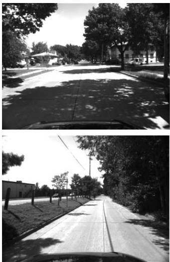
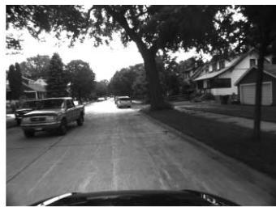
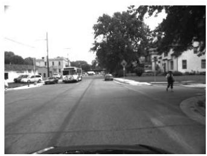
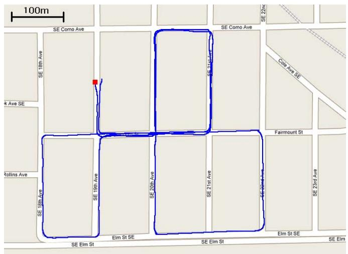
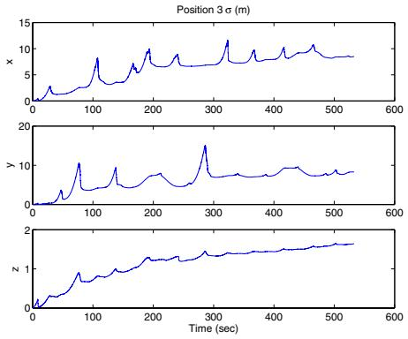
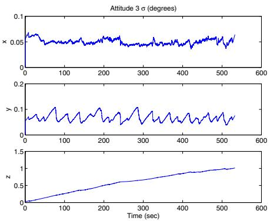
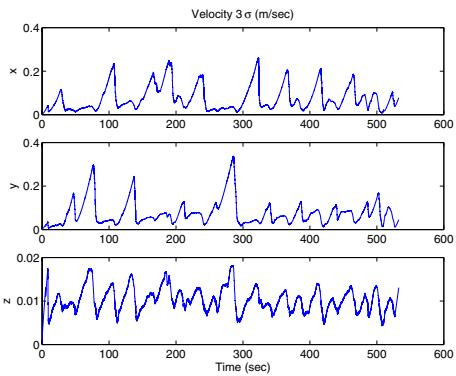

# A Multi-State Constraint Kalman Filter for Vision-aided Inertial Navigation

Anastasios I. Mourikis and Stergios I. Roumeliotis

Abstract— In this paper, we present an Extended Kalman Filter (EKF)-based algorithm for real-time vision-aided inertial navigation. The primary contribution of this work is the derivation of a measurement model that is able to express the geometric constraints that arise when a static feature is observed from multiple camera poses. This measurement model does not require including the 3D feature position in the state vector of the EKF and is optimal, up to linearization errors. The vision-aided inertial navigation algorithm we propose has computational complexity only linear in the number of features, and is capable of high-precision pose estimation in large-scale real-world environments. The performance of the algorithm is demonstrated in extensive experimental results, involving a camera/IMU system localizing within an urban area.

## I. INTRODUCTION

In the past few years, the topic of vision-aided inertial navigation has received considerable attention in the research community. Recent advances in the manufacturing of MEMS-based inertial sensors have made it possible to build small, inexpensive, and very accurate Inertial Measurement Units (IMUs), suitable for pose estimation in small-scale systems such as mobile robots and unmanned aerial vehicles. These systems often operate in urban environments where GPS signals are unreliable (the “urban canyon”), as well as indoors, in space, and in several other environments where global position measurements are unavailable. The low cost, weight, and power consumption of cameras make them ideal alternatives for aiding inertial navigation, in cases where GPS measurements cannot be relied upon.

An important advantage of visual sensing is that images are high-dimensional measurements, with rich information content. Feature extraction methods can typically detect and track hundreds of features in images, which, if properly used, can result is excellent localization results. However, the high volume of data also poses a significant challenge for estimation algorithm design. When real-time localization performance is required, one is faced with a fundamental trade-off between the computational complexity of an algorithm and the resulting estimation accuracy.

In this paper we present an algorithm that is able to optimally utilize the localization information provided by multiple measurements of visual features. Our approach is motivated by the observation that, when a static feature is viewed from several camera poses, it is possible to define

geometric constraints involving all these poses. The primary contribution of our work is a measurement model that expresses these constraints without including the 3D feature position in the filter state vector, resulting in computational complexity only linear in the number of features. After a brief discussion of related work in the next section, the details of the proposed estimator are presented in Section III. In Section IV we describe the results of a large-scale experiment in an uncontrolled urban environment, which demonstrate that the proposed estimator enables accurate, real-time pose estimation. Finally, in Section V the conclusions of this work are drawn.

## II. RELATED WORK

One family of algorithms for fusing inertial measurements with visual feature observations follows the Simultaneous Localization and Mapping (SLAM) paradigm. In these methods, the current IMU pose, as well as the 3D positions of all visual landmarks are jointly estimated [1]–[4]. These approaches share the same basic principles with SLAMbased methods for camera-only localization (e.g., [5], [6], and references therein), with the difference that IMU measurements, instead of a statistical motion model, are used for state propagation. The fundamental advantage of SLAMbased algorithms is that they account for the correlations that exist between the pose of the camera and the 3D positions of the observed features. On the other hand, the main limitation of SLAM is its high computational complexity; properly treating these correlations is computationally costly, and thus performing vision-based SLAM in environments with thousands of features remains a challenging problem.

Several algorithms exist that, contrary to SLAM, estimate the pose of the camera only (i.e., do not jointly estimate the feature positions), with the aim of achieving real-time operation. The most computationally efficient of these methods utilize the feature measurements to derive constraints between pairs of images. For example in [7], an imagebased motion estimation algorithm is applied to consecutive pairs of images, to obtain displacement estimates that are subsequently fused with inertial measurements. Similarly, in [8], [9] constraints between current and previous image are defined using the epipolar geometry, and combined with IMU measurements in an Extended Kalman Filter (EKF). In [10], [11] the epipolar geometry is employed in conjunction with a statistical motion model, while in [12] epipolar constraints are fused with the dynamical model of an airplane. The use of feature measurements for imposing constraints between pairs of images is similar in philosophy to the method proposed in this paper. However, one fundamental difference is that our algorithm can express constraints between multiple camera poses, and can thus attain higher estimation accuracy, in cases where the same feature is visible in more than two images.

Pairwise constraints are also employed in algorithms that maintain a state vector comprised of multiple camera poses. In [13], an augmented-state Kalman filter is implemented, in which a sliding window of robot poses is maintained in the filter state. On the other hand, in [14], all camera poses are simultaneously estimated. In both of these algorithms, pairwise relative-pose measurements are derived from the images, and used for state updates. The drawback of this approach is that when a feature is seen in multiple images, the additional constraints between the multiple poses are discarded, thus resulting in loss of information. Furthermore, when the same image measurements are processed for computing several displacement estimates, these are not statistically independent, as shown in [15].

One algorithm that, similarly to the method proposed in this paper, directly uses the landmark measurements for imposing constraints between multiple camera poses is presented in [16]. This is a visual odometry algorithm that temporarily initializes landmarks, uses them for imposing constraints on windows of consecutive camera poses, and then discards them. This method, however, does not incorporate inertial measurements. Moreover, the correlations between the landmark estimates and the camera trajectory are not properly accounted for, and as a result, the algorithm does not provide any measure of the covariance of the state estimates.

A window of camera poses is also maintained in the Variable State Dimension Filter (VSDF) [17]. The VSDF is a hybrid batch/recursive method, that (i) uses delayed linearization to increase robustness against linearization inaccuracies, and (ii) exploits the sparsity of the information matrix, that naturally arises when no dynamic motion model is used. However, in cases where a dynamic motion model is available (such as in vision-aided inertial navigation) the computational complexity of the VSDF is at best quadratic in the number of features [18].

In contrast to the VSDF, the multi-state constraint filter that we propose in this paper is able to exploit the benefits of delayed linearization while having complexity only linear in the number of features. By directly expressing the geometric constraints between multiple camera poses it avoids the computational burden and loss of information associated with pairwise displacement estimation. Moreover, in contrast to SLAM-type approaches, it does not require the inclusion of the 3D feature positions in the filter state vector, but still attains optimal pose estimation. As a result of these properties, the described algorithm is very efficient, and as shown in Section IV, is capable of high-precision visionaided inertial navigation in real time.

## III. ESTIMATOR DESCRIPTION

The goal of the proposed EKF-based estimator is to track the 3D pose of the IMU-affixed frame {I} with respect to a global frame of reference {G}. In order to simplify the

<table><tr><td colspan="2">Algorithm 1 Multi-State Constraint Filter</td></tr><tr><td>Propagation: For each IMU measurement received,</td><td></td></tr><tr><td colspan="2">propagate the filter state and covariance (cf. Section III-B).</td></tr></table>

Image registration: Every time a new image is recorded,

augment the state and covariance matrix with a copy of the current camera pose estimate (cf. Section III-C).

image processing module begins operation.

Update: When the feature measurements of a given image become available, perform an EKF update (cf. Sections III-D and III-E).

treatment of the effects of the earth’s rotation on the IMU measurements (cf. Eqs. (7)-(8)), the global frame is chosen as an Earth-Centered, Earth-Fixed (ECEF) frame in this paper. An overview of the algorithm is given in Algorithm 1. The IMU measurements are processed immediately as they become available, for propagating the EKF state and covariance (cf. Section III-B). On the other hand, each time an image is recorded, the current camera pose estimate is appended to the state vector (cf. Section III-C). State augmentation is necessary for processing the feature measurements, since during EKF updates the measurements of each tracked feature are employed for imposing constraints between all camera poses from which the feature was seen. Therefore, at any time instant the EKF state vector comprises (i) the evolving IMU state, $\mathbf { X } _ { \mathrm { I M U } }$ , and (ii) a history of up to $N _ { \mathrm { m a x } }$ past poses of the camera. In the following, we describe the various components of the algorithm in detail.

## A. Structure of the EKF state vector

The evolving IMU state is described by the vector:

$$
\begin{array} { r } { \mathbf { X } _ { \mathrm { I M U } } = \left[ \mathbf { \Pi } _ { G } ^ { I } \mathbf { \bar { q } } ^ { T } \mathbf { \Sigma } \mathbf { \textbf { b } } _ { g } ^ { T } \mathbf { \Sigma } ^ { G } \mathbf { v } _ { I } ^ { \phantom { } T } \mathbf { \Sigma } \mathbf { \textbf { b } } _ { a } ^ { T } \mathbf { \Sigma } ^ { G } \mathbf { p } _ { I } ^ { T } \right] ^ { T } } \end{array}\tag{1}
$$

where $_ { G } ^ { I } \bar { q }$ is the unit quaternion [19] describing the rotation from frame {G} to frame $\{ I \} , \mathbf { \Sigma } ^ { G } \mathbf { p } _ { I }$ and $G _ { \mathbf { V } _ { I } }$ are the IMU position and velocity with respect to {G}, and finally ${ \bf b } _ { g }$ and $ { \mathbf { b } } _ { a }$ are $3 \times 1$ vectors that describe the biases affecting the gyroscope and accelerometer measurements, respectively. The IMU biases are modeled as random walk processes, driven by the white Gaussian noise vectors $\mathbf { n } _ { w g }$ and ${ \bf n } _ { w a } ,$ respectively. Following Eq. (1), the IMU error-state is defined as:

$$
\widetilde { \mathbf { X } } _ { \mathrm { I M U } } = \left[ \delta \pmb { \theta } _ { I } ^ { T } \quad \widetilde { \mathbf { b } } _ { g } ^ { T } \quad { \cal G } _ { \widetilde { \mathbf { v } } _ { I } ^ { T } } \quad \widetilde { \mathbf { b } } _ { a } ^ { T } \quad { \cal G } _ { \widetilde { \mathbf { p } } _ { I } ^ { T } } \right] ^ { T }\tag{2}
$$

For the position, velocity, and biases, the standard additive error definition is used (i.e., the error in the estimate xˆ of a quantity x is defined as $\widetilde { \boldsymbol { x } } \ : = \ : \boldsymbol { x } \ : - \ : \hat { \boldsymbol { x } } )$ . However, for the quaternion a different error definition is employed. In particular, if $\hat { \bar { q } }$ is the estimated value of the quaternion ${ \bar { q } } ,$ then the orientation error is described by the error quaternion $\delta \bar { q } ,$ which is defined by the relation $\bar { q } = \delta \bar { q } \otimes \hat { \bar { q } } .$ In this expression, the symbol $\otimes$ denotes quaternion multiplication. The error quaternion is

$$
\begin{array} { c c c } { { \delta \bar { q } } } & { { \simeq } } & { { \left[ \frac 1 2 \delta { \pmb \theta } ^ { T } \quad 1 \right] ^ { T } } } \end{array}\tag{3}
$$

Intuitively, the quaternion $\delta \bar { q }$ describes the (small) rotation that causes the true and estimated attitude to coincide. Since attitude corresponds to 3 degrees of freedom, using δθ to describe the attitude errors is a minimal representation.

Assuming that N camera poses are included in the EKF state vector at time-step k, this vector has the following form:

$$
\hat { \mathbf { X } } _ { k } = \left[ \hat { \mathbf { X } } _ { \mathrm { I M U } _ { k } } ^ { T } \quad \mathbf { \Xi } _ { G } ^ { C _ { 1 } } \hat { \bar { q } } ^ { T } \quad { } ^ { G } \hat { \mathbf { p } } _ { C _ { 1 } } ^ { T } \quad \dots \quad \mathbf { \Xi } _ { G } ^ { C _ { N } } \hat { \bar { q } } ^ { T } \quad { } ^ { G } \hat { \mathbf { p } } _ { C _ { N } } ^ { T } \right] ^ { T }\tag{4}
$$

where $\mathbf { \Pi } _ { G } ^ { C _ { i } } \hat { \hat { q } }$ and ${ { \bf \Lambda } ^ { G } } \hat { \bf p } _ { C _ { i } } , i = 1 , . . . N$ are the estimates of the camera attitude and position, respectively. The EKF errorstate vector is defined accordingly:

$$
\widetilde { \mathbf { X } } _ { k } = \left[ \widetilde { \mathbf { X } } _ { \mathrm { I M U } _ { k } } ^ { T } \quad \delta \pmb { \theta } _ { C _ { 1 } } ^ { T } \quad ^ { G } \widetilde { \mathbf { p } } _ { C _ { 1 } } ^ { T } \quad \dots \quad \delta \pmb { \theta } _ { C _ { N } } ^ { T } \quad ^ { G } \widetilde { \mathbf { p } } _ { C _ { N } } ^ { T } \right] ^ { T }\tag{5}
$$

## B. Propagation

The filter propagation equations are derived by discretization of the continuous-time IMU system model, as described in the following:

1) Continuous-time system modeling: The time evolution of the IMU state is described by [20]:

$$
\begin{array} { r } { \phantom { \frac { 1 } { 2 } } _ { G } ^ { I } \dot { \overline { { q } } } ( t ) = \frac { 1 } { 2 } \Omega \big ( \omega ( t ) \big ) _ { G } ^ { I } \bar { q } ( t ) , \dot { \mathbf { b } } _ { g } ( t ) = \mathbf { n } _ { w g } ( t ) } \\ { \phantom { \frac { 1 } { 2 } } _ { G } ^ { \phantom { \dagger } } \dot { \overline { { q } } } ( t ) = \phantom { \frac { 1 } { 2 } } _ { \mathbf { a } } ^ { \dagger } \mathbf { a } ( t ) , \dot { \mathbf { b } _ { a } } ( t ) = \mathbf { n } _ { w a } ( t ) , \dot { \mathbf { \xi } } _ { G } ^ { \phantom { \dagger } } \mathbf { p } _ { I } ( t ) = \mathbf { \xi } ^ { G } \mathbf { v } _ { I } ( t ) } \end{array}\tag{6}
$$

In these expressions ${ \cal G } _ { \mathbf { a } }$ is the body acceleration in the global frame, ${ \boldsymbol { \omega } } = [ \omega _ { x } \ \omega _ { y } \ \omega _ { z } ] ^ { T }$ is the rotational velocity expressed in the IMU frame, and

$$
\pmb { \Omega } ( \omega ) = \left[ \begin{array} { c c } { - | \omega \times \rfloor } & { \omega } \\ { - \omega ^ { T } } & { 0 } \end{array} \right] , \quad | \pmb { \omega } \times \rfloor = \left[ \begin{array} { c c c } { 0 } & { - \omega _ { z } } & { \omega _ { y } } \\ { \omega _ { z } } & { 0 } & { - \omega _ { x } } \\ { - \omega _ { y } } & { \omega _ { x } } & { 0 } \end{array} \right]
$$

The gyroscope and accelerometer measurements, $\omega _ { m }$ and $\mathbf { a } _ { m }$ respectively, are given by [20]:

$$
\pmb { \omega } _ { m } = \pmb { \omega } + \mathbf { C } ( _ { G } ^ { I } \bar { q } ) \pmb { \omega } _ { G } + \mathbf { b } _ { g } + \mathbf { n } _ { g }\tag{7}
$$

$$
\begin{array} { r } { \begin{array} { c } { { \bf { a } } _ { m } = { \bf C } ( { \bf \Xi } _ { G } ^ { I } { \bar { q } } ) ( { \bf \Xi } ^ { G } { \bf { a } } - { \bf \Xi } ^ { G } { \bf g } + 2 | \omega _ { G } \times { \bf \Xi } | { \bf \Lambda } ^ { G } { \bf v } _ { I } + | \omega _ { G } \times { \bf \Xi } | ^ { 2 } { \bf \Lambda } ^ { G } { \bf p } _ { I } ) } \\ { + { \bf b } _ { a } + { \bf n } _ { a } \qquad ( 8 ) } \end{array} } \end{array}
$$

where $\mathbf { C } ( \cdot )$ denotes a rotational matrix, and $\mathbf { n } _ { g }$ and ${ \bf n } _ { a }$ are zero-mean, white Gaussian noise processes modeling the measurement noise. It is important to note that the IMU measurements incorporate the effects of the planet’s rotation, $\omega _ { G }$ . Moreover, the accelerometer measurements include the gravitational acceleration, $G _ { \mathbf { g } } .$ , expressed in the local frame.

Applying the expectation operator in the state propagation equations (Eq. (6)) we obtain the equations for propagating the estimates of the evolving IMU state:

$$
\begin{array} { c } { { I \dot { \hat { q } } = \frac { 1 } { 2 } \Omega ( \hat { \omega } ) _ { G } ^ { I } \hat { \hat { q } } , \quad \dot { \hat { \mathbf { b } } } _ { g } = \mathbf { 0 } _ { 3 \times 1 } , } } \\ { { G \dot { \hat { \mathbf { v } } } _ { I } = \mathbf { C } _ { \hat { q } } ^ { T } \hat { \mathbf { a } } - 2 \lfloor \omega _ { G } \times \rfloor ^ { G } \hat { \mathbf { v } } _ { I } - \lfloor \omega _ { G } \times \rfloor ^ { 2 } \ ^ { G } \hat { \mathbf { p } } _ { I } + { } ^ { G } \mathbf { g } } } \\ { { \dot { \hat { \mathbf { b } } } _ { a } = \mathbf { 0 } _ { 3 \times 1 } , \quad \stackrel { G } { \hat { \mathbf { p } } _ { I } } = { } ^ { G } \hat { \mathbf { v } } _ { I } } } \end{array}\tag{9}
$$

where for brevity we have denoted $\mathbf { C } _ { \hat { q } } = \mathbf { C } ( _ { G } ^ { I } \hat { \bar { q } } ) , \hat { \mathbf { a } } = \mathbf { a } _ { m } -$ $\hat { { \bf b } } _ { a }$ and $\hat { \omega } = \omega _ { m } - \hat { \mathbf { b } } _ { q } - \mathbf { C } _ { \hat { q } } \omega _ { G }$ . The linearized continuoustime model for the IMU error-state is:

$$
\begin{array} { r l r } { \dot { \widetilde { \bf X } } _ { \mathrm { I M U } } } & { { } = } & { { \bf F } \widetilde { \bf X } _ { \mathrm { I M U } } + { \bf G } { \bf n } _ { \mathrm { I M U } } } \end{array}\tag{10}
$$

where $\begin{array} { l l l l } { \mathbf { n } _ { \mathrm { I M U } } } & { = } & { \left[ \mathbf { n } _ { g } ^ { T } } & { \mathbf { n } _ { w g } ^ { T } } & { \mathbf { n } _ { a } ^ { T } } & { \mathbf { n } _ { w a } ^ { T } \right] ^ { T } } \end{array}$ is the system noise. The covariance matrix of nIMU, QIMU, depends on the IMU noise characteristics and is computed off-line during sensor calibration. Finally, the matrices F and G that appear in Eq. (10) are given by:

$$
\mathbf { F } = \left[ \begin{array} { c c c c c } { - \lfloor \hat { \omega } \times \rfloor } & { - \mathbf { I } _ { 3 } } & { \mathbf { 0 } _ { 3 \times 3 } } & { \mathbf { 0 } _ { 3 \times 3 } } & { \mathbf { 0 } _ { 3 \times 3 } } \\ { \mathbf { 0 } _ { 3 \times 3 } } & { \mathbf { 0 } _ { 3 \times 3 } } & { \mathbf { 0 } _ { 3 \times 3 } } & { \mathbf { 0 } _ { 3 \times 3 } } & { \mathbf { 0 } _ { 3 \times 3 } } \\ { - \mathbf { C } _ { \hat { q } } ^ { T } \lfloor \hat { \mathbf { a } } \times \rfloor } & { \mathbf { 0 } _ { 3 \times 3 } } & { - 2 \lfloor \omega _ { G } \times \rfloor } & { - \mathbf { C } _ { \hat { q } } ^ { T } } & { - \lfloor \omega _ { G } \times \rfloor ^ { 2 } } \\ { \mathbf { 0 } _ { 3 \times 3 } } & { \mathbf { 0 } _ { 3 \times 3 } } & { \mathbf { 0 } _ { 3 \times 3 } } & { \mathbf { 0 } _ { 3 \times 3 } } & { \mathbf { 0 } _ { 3 \times 3 } } \\ { \mathbf { 0 } _ { 3 \times 3 } } & { \mathbf { 0 } _ { 3 \times 3 } } & { \mathbf { I } _ { 3 } } & { \mathbf { 0 } _ { 3 \times 3 } } & { \mathbf { 0 } _ { 3 \times 3 } } \end{array} \right]
$$

where $\mathbf { I } _ { 3 }$ is the $3 \times 3$ identity matrix, and

$$
\mathbf G = \left[ \begin{array} { c c c c c } { - \mathbf I _ { 3 } } & { \mathbf 0 _ { 3 \times 3 } } & { \mathbf 0 _ { 3 \times 3 } } & { \mathbf 0 _ { 3 \times 3 } } \\ { \mathbf 0 _ { 3 \times 3 } } & { \mathbf I _ { 3 } } & { \mathbf 0 _ { 3 \times 3 } } & { \mathbf 0 _ { 3 \times 3 } } \\ { \mathbf 0 _ { 3 \times 3 } } & { \mathbf 0 _ { 3 \times 3 } } & { - \mathbf C _ { \hat { q } } ^ { T } } & { \mathbf 0 _ { 3 \times 3 } } \\ { \mathbf 0 _ { 3 \times 3 } } & { \mathbf 0 _ { 3 \times 3 } } & { \mathbf 0 _ { 3 \times 3 } } & { \mathbf I _ { 3 } } \\ { \mathbf 0 _ { 3 \times 3 } } & { \mathbf 0 _ { 3 \times 3 } } & { \mathbf 0 _ { 3 \times 3 } } & { \mathbf 0 _ { 3 \times 3 } } \end{array} \right]
$$

2) Discrete-time implementation: The IMU samples the signals $\omega _ { m }$ and $\mathbf { a } _ { m }$ with a period T, and these measurements are used for state propagation in the EKF. Every time a new IMU measurement is received, the IMU state estimate is propagated using 5th order Runge-Kutta numerical integration of Eqs. (9). Moreover, the EKF covariance matrix has to be propagated. For this purpose, we introduce the following partitioning for the covariance:

$$
\mathbf { P } _ { k | k } = \left[ \mathbf { P } _ { I I _ { k | k } } \quad \mathbf { P } _ { I C _ { k | k } } \right]\tag{11}
$$

where $\mathbf { P } _ { I I _ { k | k } }$ is the $1 5 \times 1 5$ covariance matrix of the evolving IMU state, $\mathbf { P } _ { C C _ { k | k } }$ is the $6 N \times 6 N$ covariance matrix of the camera pose estimates, and $\mathbf { P } _ { I C _ { k | k } }$ is the correlation between the errors in the IMU state and the camera pose estimates. With this notation, the covariance matrix of the propagated state is given by:

$$
\mathbf { P } _ { k + 1 | k } = \left[ \begin{array} { c c } { \mathbf { P } _ { I I _ { k + 1 | k } } } & { \boldsymbol { \Phi } ( t _ { k } + T , t _ { k } ) \mathbf { P } _ { I C _ { k | k } } } \\ { \mathbf { P } _ { I C _ { k | k } } ^ { T } \boldsymbol { \Phi } ( t _ { k } + T , t _ { k } ) ^ { T } } & { \mathbf { P } _ { C C _ { k | k } } } \end{array} \right]
$$

where $\mathbf { P } _ { I I _ { k + 1 | k } }$ is computed by numerical integration of the Lyapunov equation:

$$
\dot { \mathbf { P } } _ { I I } = \mathbf { F } \mathbf { P } _ { I I } + \mathbf { P } _ { I I } \mathbf { F } ^ { T } + \mathbf { G } \mathbf { Q } _ { \mathrm { I M U } } \mathbf { G } ^ { T }\tag{12}
$$

Numerical integration is carried out for the time interval $( t _ { k } , t _ { k } + T )$ , with initial condition $\mathbf { P } _ { I I _ { k | k } }$ . The state transition matrix $\Phi ( t _ { k } + T , t _ { k } )$ is similarly computed by numerical integration of the differential equation

$$
{ \dot { \Phi } } ( t _ { k } + \tau , t _ { k } ) = \mathbf { F } \Phi ( t _ { k } + \tau , t _ { k } ) , ~ \tau \in [ 0 , T ]\tag{13}
$$

with initial condition $\Phi ( t _ { k } , t _ { k } ) = { \bf I } _ { 1 5 }$

## C. State Augmentation

Upon recording a new image, the camera pose estimate is computed from the IMU pose estimate as:

$$
{ } _ { G } ^ { C } \hat { \bar { q } } = { } _ { I } ^ { C } \bar { q } \otimes { } _ { G } ^ { I } \hat { \bar { q } } , \quad \mathrm { a n d } \quad { } ^ { G } \hat { \bf p } _ { C } = { } ^ { G } \hat { \bf p } _ { I } + { } _ { \hat { q } } ^ { T } { } ^ { I } { \bf p } _ { C }\tag{14}
$$

where $\mathbf { \Sigma } _ { I } ^ { C } \bar { q }$ is the quaternion expressing the rotation between the IMU and camera frames, and $\bar { I _ { \mathbf { p } _ { C } } }$ is the position of the origin of the camera frame with respect to $\{ I \}$ , both of which are known. This camera pose estimate is appended to the state vector, and the covariance matrix of the EKF is augmented accordingly:

$$
\mathbf { P } _ { k | k }  [ \mathbf { \bar { I } } _ { 6 N + 1 5 } ] \mathbf { P } _ { k | k } [ \mathbf { \bar { I } } _ { 6 N + 1 5 } ] ^ { T }\tag{15}
$$

where the Jacobian J is derived from Eqs. (14) as:

$$
\mathbf { J } = \left[ \underset { \bar { q } } { \mathbf { C } } \left( \underset { I } { C } \bar { q } \right) \quad \begin{array} { l l l } { \mathbf { 0 } _ { 3 \times 9 } } & { \mathbf { 0 } _ { 3 \times 3 } } & { \mathbf { 0 } _ { 3 \times 6 N } } \\ { \mathbf { 0 } _ { 3 \times 9 } } & { \mathbf { I } _ { 3 } } & { \mathbf { 0 } _ { 3 \times 6 N } } \end{array} \right]\tag{16}
$$

## D. Measurement Model

We now present the measurement model employed for updating the state estimates, which is the primary contribution of this paper. Since the EKF is used for state estimation, for constructing a measurement model it suffices to define a residual, r, that depends linearly on the state errors, $\widetilde { \mathbf { X } } ,$ according to the general form:

$$
\mathbf { r } = \mathbf { H } \widetilde { \mathbf { X } } + \mathrm { n o i s e }\tag{17}
$$

In this expression H is the measurement Jacobian matrix, and the noise term must be zero-mean, white, and uncorrelated to the state error, for the EKF framework to be applied.

To derive our measurement model, we are motivated by the fact that viewing a static feature from multiple camera poses results in constraints involving all these poses. In our work, the camera observations are grouped per tracked feature, rather than per camera pose where the measurements were recorded (the latter is the case, for example, in methods that compute pairwise constraints between poses [7], [13], [14]). All the measurements of the same 3D point are used to define a constraint equation (cf. Eq. (24)), relating all the camera poses at which the measurements occurred. This is achieved without including the feature position in the filter state vector.

We present the measurement model by considering the case of a single feature, $f _ { j } ,$ that has been observed from a set of $M _ { j }$ camera poses $( \mathbf { \Gamma } _ { G } ^ { ' C _ { i } } \bar { q } , \mathbf { \Gamma } ^ { G } \mathbf { p } _ { C _ { i } } ) , i \in \mathcal { S } _ { j }$ . Each of the $M _ { j }$ observations of the feature is described by the model:

$$
\mathbf { z } _ { i } ^ { ( j ) } = \frac { 1 } { C _ { i } } \sum _ { { j } _ { j } } \left[ { ^ { C _ { i } } X _ { j } } \right] + \mathbf { n } _ { i } ^ { ( j ) } , \qquad i \in \mathcal { S } _ { j }\tag{18}
$$

where $\mathbf { n } _ { i } ^ { ( j ) }$ is the $2 \times 1$ image noise vector, with covariance matrix $\dot { \bf R } _ { i } ^ { ( j ) } = \sigma _ { \mathrm { i m } } ^ { 2 } { \bf I } _ { 2 }$ . The feature position expressed in the camera frame, $C _ { ^ i } { \bf p } _ { f _ { j } }$ , is given by:

$$
{ } ^ { C _ { i } } \mathbf { p } _ { f _ { j } } = \left[ { \overset { C _ { i } } { C _ { i } } } Y _ { j } \right] = \mathbf { C } ( { \overset { C _ { i } } { _ { G } } } { \bar { q } } ) ( { } ^ { G } \mathbf { p } _ { f _ { j } } - { \overset { G } { - } } \mathbf { p } _ { C _ { i } } )\tag{19}
$$

where ${ { \bf \Pi } ^ { G } } { \bf { p } } _ { f _ { j } }$ is the 3D feature position in the global frame. Since this is unknown, in the first step of our algorithm we employ least-squares minimization to obtain an estimate, ${ ^ G } \hat { \mathbf p } _ { f _ { j } }$ , of the feature position. This is achieved using the measurements $\mathbf { z } _ { i } ^ { ( j ) } , \ i \ \in \ S _ { j }$ , and the filter estimates of the camera poses at the corresponding time instants (cf. Appendix).

Once the estimate of the feature position is obtained, we

compute the measurement residual:

$$
\mathbf { r } _ { i } ^ { ( j ) } = \mathbf { z } _ { i } ^ { ( j ) } - \hat { \mathbf { z } } _ { i } ^ { ( j ) }\tag{20}
$$

where

$$
\hat { \mathbf { z } } _ { i } ^ { ( j ) } = \frac { 1 } { C _ { i } \hat { Z } _ { j } } \left[ { ^ C _ { i } } \hat { X } _ { j } \right] \mathrm { ~ , ~ } \left[ { ^ C _ { i } } \hat { X } _ { j } \right] = \mathbf { C } ( _ { G } ^ { C _ { i } } \hat { \bar { q } } ) \big ( { ^ G _ { } \hat { \mathbf { p } } _ { f _ { j } } } - { ^ G _ { \hat { \mathbf { p } } C _ { i } } } \big )
$$

Linearizing about the estimates for the camera pose and for the feature position, the residual of Eq. (20) can be approximated as:

$$
\mathbf { r } _ { i } ^ { ( j ) } \simeq \mathbf { H } _ { \mathbf { X } _ { i } } ^ { ( j ) } \widetilde { \mathbf { X } } + \mathbf { H } _ { f _ { i } } ^ { ( j ) G } \widetilde { \mathbf { p } } _ { f _ { j } } + \mathbf { n } _ { i } ^ { ( j ) }\tag{21}
$$

In the preceding expression $\mathbf { H } _ { \mathbf { X } _ { i } } ^ { ( j ) }$ and $\mathbf { H } _ { f _ { i } } ^ { ( j ) }$ are the Jacobians of the measurement $\mathbf { z } _ { i } ^ { ( j ) }$ with respect to the state and the feature position, respectively, and $\mathbf { \widetilde { \mathbf { \Gamma } } } _ { G _ { \mathbf { \widetilde { p } } _ { f _ { j } } } } ^ { G }$ is the error in the position estimate of $f _ { j }$ . The exact values of the Jacobians in this expression are provided in [21]. By stacking the residuals of all $M _ { j }$ measurements of this feature, we obtain:

$$
\mathbf { r } ^ { ( j ) } \simeq \mathbf { H } _ { \mathbf { X } } ^ { ( j ) } \widetilde { \mathbf { X } } + \mathbf { H } _ { f } ^ { ( j ) G } \widetilde { \mathbf { p } } _ { f _ { j } } + \mathbf { n } ^ { ( j ) }\tag{22}
$$

where $\mathbf { r } ^ { ( j ) } , \mathbf { H } _ { \mathbf { X } } ^ { ( j ) } , \mathbf { H } _ { f } ^ { ( j ) }$ , and $\mathbf { n } ^ { ( j ) }$ are block vectors or matrices with elements $\mathbf { r } _ { i } ^ { ( j ) } , \mathbf { \dot { H } } _ { \mathbf { X } _ { i } } ^ { ( j ) } , \mathbf { H } _ { f _ { i } } ^ { ( j ) }$ , and $\mathbf { n } _ { i } ^ { ( j ) }$ , for $i \in S _ { j }$ . Since the feature observations in different images are independent, the covariance matrix of $\mathbf { n } ^ { ( j ) }$ is $\mathbf { R } ^ { ( j ) } = \sigma _ { \mathrm { i m } } ^ { 2 } \mathbf { I } _ { 2 M _ { j } }$

Note that since the state estimate, X, is used to compute the feature position estimate (cf. Appendix), the error $\tilde { G } _ { \widetilde { \mathbf { p } } _ { f _ { j } } }$ in Eq. (22) is correlated with the errors $\widetilde { \mathbf { X } } .$ . Thus, the residual $\mathbf { r } ^ { ( j ) }$ is not in the form of Eq. (17), and cannot be directly applied for measurement updates in the EKF. To overcome this problem, we define a residual $\mathbf { r } _ { o } ^ { ( j ) }$ , by projecting $\mathbf { r } ^ { ( j ) }$ on the left nullspace of the matrix $\mathbf { H } _ { f } ^ { ( j ) }$ . Specifically, if we let A denote the unitary matrix whose columns form the basis of the left nullspace of $\mathbf { H } _ { f }$ , we obtain:

$$
\begin{array} { r } { \mathbf { r } _ { o } ^ { ( j ) } = \mathbf { A } ^ { T } ( \mathbf { z } ^ { ( j ) } - \hat { \mathbf { z } } ^ { ( j ) } ) \simeq \mathbf { A } ^ { T } \mathbf { H } _ { \mathbf { X } } ^ { ( j ) } \widetilde { \mathbf { X } } + \mathbf { A } ^ { T } \mathbf { n } ^ { ( j ) } } \\ { = \mathbf { H } _ { o } ^ { ( j ) } \widetilde { \mathbf { X } } ^ { ( j ) } + \mathbf { n } _ { o } ^ { ( j ) } \qquad } \end{array}\tag{23}
$$

(24)

Since the $2 M _ { j } \times 3$ matrix $\mathbf { H } _ { f } ^ { ( j ) }$ has full column rank, its left nullspace is of dimension $2 M _ { j } \mathrm { ~ - ~ } 3 { \it \Psi }$ . Therefore, $\mathbf { r } _ { o } ^ { ( j ) }$ is a $( 2 M _ { j } \mathrm { ~ - ~ } 3 ) \times 1$ vector. This residual is independent of the errors in the feature coordinates, and thus EKF updates can be performed based on it. Eq. (24) defines a linearized constraint between all the camera poses from which the feature $f _ { j }$ was observed. This expresses all the available information that the measurements $\mathbf { z } _ { i } ^ { ( j ) }$ provide for the $M _ { j }$ states, and thus the resulting EKF update is optimal, except for the inaccuracies caused by linearization.

It should be mentioned that in order to compute the residual $\mathbf { r } _ { o } ^ { ( j ) }$ and the measurement matrix $\mathbf { H } _ { o } ^ { ( j ) }$ , the unitary matrix A does not need to be explicitly evaluated. Instead, the projection of the vector r and the matrix $\mathbf { H } _ { \mathbf { X } } ^ { ( j ) }$ on the nullspace of $\mathbf { H } _ { f } ^ { ( j ) }$ can be computed very efficiently using Givens rotations [22], in $O ( M _ { j } ^ { 2 } )$ operations. Additionally, since the matrix A is unitary, the covariance matrix of the noise vector $\mathbf { n } _ { o } ^ { ( j ) }$ is given by:

$$
E \{ \mathbf { n } _ { o } ^ { ( j ) } \mathbf { n } _ { o } ^ { ( j ) T } \} = \sigma _ { \mathrm { i m } } ^ { 2 } \mathbf { A } ^ { T } \mathbf { A } = \sigma _ { \mathrm { i m } } ^ { 2 } \mathbf { I } _ { 2 M _ { j } - 3 }
$$

The residual defined in Eq. (23) is not the only possible expression of the geometric constraints that are induced by observing a static feature in $M _ { j }$ images. An alternative approach would be, for example, to employ the epipolar constraints that are defined for each of the $M _ { j } ( M _ { j } - 1 ) / 2$ pairs of images. However, the resulting $\bar { M _ { j } } ( M _ { j } ^ { - } \textrm { -- } 1 ) / 2$ equations would still correspond to only $2 M _ { j } - 3$ independent constraints, since each measurement is used multiple times, rendering the equations statistically correlated. Our experiments have shown that employing linearization of the epipolar constraints results in a significantly more complex implementation, and yields inferior results compared to the approach described above.

## E. EKF Updates

In the preceding section, we presented a measurement model that expresses the geometric constraints imposed by observing a static feature from multiple camera poses. We now present in detail the update phase of the EKF, in which the constraints from observing multiple features are used. EKF updates are triggered by one of the following two events:

When a feature that has been tracked in a number of images is no longer detected, then all the measurements of this feature are processed using the method presented in Section III-D. This case occurs most often, as features move outside the camera’s field of view.

Every time a new image is recorded, a copy of the current camera pose estimate is included in the state vector (cf. Section III-C). If the maximum allowable number of camera poses, $N _ { \mathrm { m a x } } .$ , has been reached, at least one of the old ones must be removed. Prior to discarding states, all the feature observations that occurred at the corresponding time instants are used, in order to utilize their localization information. In our algorithm, we choose $N _ { \mathrm { m a x } } / 3$ poses that are evenly spaced in time, starting from the second-oldest pose. These are discarded after carrying out an EKF update using the constraints of features that are common to these poses. We have opted to always keep the oldest pose in the state vector, because the geometric constraints that involve poses further back in time typically correspond to larger baseline, and hence carry more valuable positioning information. This approach was shown to perform very well in practice.

We hereafter discuss the update process in detail. Consider that at a given time step the constraints of L features, selected by the above two criteria, must be processed. Following the procedure described in the preceding section, we compute a residual vector $\begin{array} { r } { \mathbf { r } _ { o } ^ { ( j ) } , j = 1 \dot { \bf \Phi } _ { \cdot \cdot \cdot } { \cal L } , } \end{array}$ as well as a corresponding measurement matrix $\mathbf { H } _ { o } ^ { ( j ) } , ~ j ~ = ~ 1 \ldots L$ for each of these features (cf. Eq. (23)). By stacking all residuals in a single vector, we obtain:

$$
\mathbf { r } _ { o } = \mathbf { H } _ { \mathbf { X } } \widetilde { \mathbf { X } } + \mathbf { n } _ { o }\tag{25}
$$

where $\mathbf { r } _ { o }$ and $\mathbf { n } _ { o }$ are vectors with block elements $\mathbf { r } _ { o } ^ { ( j ) }$ and $\mathbf { n } _ { o } ^ { ( j ) } , \ j \ = \ 1 \ldots \bar { L } .$ , respectively, and $\mathbf { H } _ { \mathbf { X } }$ is a matrix with block rows $\mathbf { H } _ { \mathbf { X } } ^ { ( j ) } , j = \bar { 1 } \ldots L$

Since the feature measurements are statistically independent, the noise vectors $\mathbf { n } _ { o } ^ { ( j ) }$ are uncorrelated. Therefore, the covariance matrix of the noise vector $\mathbf { n } _ { o }$ is equal to ${ \bf R } _ { o } = \sigma _ { \mathrm { i m } } ^ { 2 } { \bf I } _ { d }$ , where $\begin{array} { r } { d = \sum _ { i = 1 } ^ { L } ( 2 M _ { j } - 3 ) } \end{array}$ is the dimension of the residual $\mathbf { r } _ { o } .$ One issue that arises in practice is that d can be a quite large number. For example, if 10 features are seen in 10 camera poses each, the dimension of the residual is 170. In order to reduce the computational complexity of the EKF update, we employ the QR decomposition of the matrix $\mathbf { H } _ { \mathbf { X } }$ [9]. Specifically, we denote this decomposition as

$$
\mathbf { H } _ { \mathbf { X } } = \left[ \mathbf { Q } _ { 1 } \quad \mathbf { Q } _ { 2 } \right] \left[ \begin{array} { c } { \mathbf { T } _ { H } } \\ { \mathbf { 0 } } \end{array} \right]
$$

where $\mathbf { Q } _ { 1 }$ and $\mathbf { Q } _ { 2 }$ are unitary matrices whose columns form bases for the range and nullspace of $\mathbf { H } _ { \mathbf { X } } ,$ respectively, and $\mathbf { T } _ { H }$ is an upper triangular matrix. With this definition, Eq. (25) yields:

$$
\mathbf { r } _ { o } = \left[ \mathbf { Q } _ { 1 } \quad \mathbf { Q } _ { 2 } \right] \left[ \mathbf { T } _ { H } \right] \widetilde { \mathbf { X } } + \mathbf { n } _ { o } \Rightarrow\tag{26}
$$

$$
\left[ { \bf Q } _ { 1 } ^ { T } { \bf r } _ { o } \right] = \left[ { \bf T } _ { H } \right] \widetilde { \bf X } + \left[ { \bf Q } _ { 1 } ^ { T } { \bf n } _ { o } \right]\tag{27}
$$

From the last equation it becomes clear that by projecting the residual $\mathbf { r } _ { o }$ on the basis vectors of the range of $\mathbf { H } _ { \mathbf { X } } .$ , we retain all the useful information in the measurements. The residual $\mathbf { Q } _ { 2 } ^ { T } \mathbf { r } _ { o }$ is only noise, and can be completely discarded. For this reason, instead of the residual shown in Eq. (25), we employ the following residual for the EKF update:

$$
\mathbf { r } _ { n } = \mathbf { Q } _ { 1 } ^ { T } \mathbf { r } _ { o } = \mathbf { T } _ { H } \widetilde { \mathbf { X } } + \mathbf { n } _ { n }\tag{28}
$$

In this expression ${ \bf n } _ { n } ~ = ~ { \bf Q } _ { 1 } ^ { T } { \bf n } _ { o }$ is a noise vector whose covariance matrix is equal to ${ \bf R } _ { n } = { \bf Q } _ { 1 } ^ { T } { \bf R } _ { o } { \bf Q } _ { 1 } = \sigma _ { \mathrm { i m } } ^ { 2 } { \bf I } _ { r }$ with $r$ being the number of columns in $\mathbf { Q } _ { 1 }$ . The EKF update proceeds by computing the Kalman gain:

$$
{ \bf K } = { \bf P } { \bf T } _ { H } ^ { T } \left( { \bf T } _ { H } { \bf P } { \bf T } _ { H } ^ { T } + { \bf R } _ { n } \right) ^ { - 1 }\tag{29}
$$

while the correction to the state is given by the vector

$$
\Delta \mathbf { X } = \mathbf { K } \mathbf { r } _ { n }\tag{30}
$$

Finally, the state covariance matrix is updated according to:

$$
\mathbf { P } _ { k + 1 | k + 1 } = \left( \mathbf { I } _ { \boldsymbol { \xi } } - \mathbf { K } \mathbf { T } _ { H } \right) \mathbf { P } _ { k + 1 | k } \left( \mathbf { I } _ { \boldsymbol { \xi } } - \mathbf { K } \mathbf { T } _ { H } \right) ^ { T } + \mathbf { K } \mathbf { R } _ { n } \mathbf { K } ^ { T }\tag{31}
$$

where $\xi = 6 N { + } 1 5$ is the dimension of the covariance matrix.

It is interesting to examine the computational complexity of the operations needed during the EKF update. The residual $\mathbf { r } _ { n } .$ as well as the matrix $\mathbf { T } _ { H }$ , can be computed using Givens rotations in $O ( r ^ { 2 } d )$ operations, without the need to explicitly form $\mathbf { Q } _ { 1 }$ . On the other hand, Eq. (31) involves multiplication of square matrices of dimension $\xi ,$ an $O ( \xi ^ { 3 } )$ operation. Therefore, the cost of the EKF update is max $( \dot { O } ( r ^ { 2 } d ) , O ( \xi ^ { 3 } ) )$ ). If, on the other hand, the residual vector $\mathbf { r } _ { o }$ was employed, without projecting it on the range of $\mathbf { H } _ { \mathbf { X } }$ , the computational cost of computing the Kalman gain would have been $O ( d ^ { 3 } )$ . Since typically $d \gg \xi , r .$ , we see that the use of the residual ${ \bf r } _ { n }$ results in substantial savings in computation.

## F. Discussion

We now study some of the properties of the described algorithm. As shown in the previous section, the filter’s computational complexity is linear in the number of observed features, and at most cubic in the number of states that are included in the state vector. Thus, the number of poses that are included in the state is the most significant factor in determining the computational cost of the algorithm. Since this number is a selectable parameter, it can be tuned according to the available computing resources, and the accuracy requirements of a given application. If required, the length of the filter state can be also adaptively controlled during filter operation, to adjust to the varying availability of resources.

One source of difficulty in recursive state estimation with camera observations is the nonlinear nature of the measurement model. Vision-based motion estimation is very sensitive to noise, and, especially when the observed features are at large distances, false local minima can cause convergence to inconsistent solutions [23]. The problems introduced by nonlinearity have been addressed in the literature using techniques such as Sigma-point Kalman filtering [24], particle filtering [4], and the inverse depth representation for features [25]. Two characteristics of the described algorithm increase its robustness to linearization inaccuracies: (i) the inverse feature depth parametrization used in the measurement model (cf. Appendix) and (ii) the delayed linearization of measurements [17]. By the algorithm’s construction, multiple observations of each feature are collected, prior to using them for EKF updates, resulting in more accurate evaluation of the measurement Jacobians.

One interesting observation is that in typical image sequences, most features can only be reliably tracked over a small number of frames (“opportunistic” features), and only few can be tracked for long periods of time, or when revisiting places (persistent features). This is due to the limited field of view of cameras, as well as occlusions, image noise, and viewpoint changes, that result in failures of the feature tracking algorithms. As previously discussed, if all the poses in which a feature has been seen are included in the state vector, then the proposed measurement model is optimal, except for linearization inaccuracies. Therefore, for realistic image sequences, the proposed algorithm is able to optimally use the localization information of the opportunistic features. Moreover, we note that the state vector ${ \bf X } _ { k }$ is not required to contain only the IMU and camera poses. If desired, the persistent features can be included in the filter state, and used for SLAM. This would further improve the attainable localization accuracy, within areas with lengthy loops.

## IV. EXPERIMENTAL RESULTS

The algorithm described in the preceding sections has been tested extensively both in simulation and with real data. Our simulation experiments have verified that the algorithm produces pose and velocity estimates that are consistent, and can operate reliably over long trajectories, with varying motion profiles and density of visual features. Unfortunately, simulation data cannot be included in this paper, due to space limitations. Instead, we here present the results of the algorithm in an outdoor experiment, which demonstrates that the method is capable of long-term operation in a realworld setting. Additional datasets of real-world experiments, as well as simulation results of the use of our algorithm, can be found in [21].

The experimental setup consisted of a camera/IMU system, placed on a car that was moving on the streets of a typical residential area in Minneapolis, MN. The system comprised a Pointgrey FireFly camera, registering images of resolution 640 × 480 pixels at 3Hz, and an Inertial Science ISIS IMU, providing inertial measurements at a rate of 100Hz. During the experiment all data were stored on a computer and processing was done off-line. Some example images from the recorded sequence are shown in Fig. 1, while a video of all 1598 images, which were recorded in about 9 minutes of driving, can be found online at [26].

For the results shown here, feature extraction and matching was performed using the SIFT algorithm [27]. During this run, a maximum of 30 camera poses was maintained in the filter state vector. Since features were rarely tracked for more than 30 images, this number was sufficient for utilizing most of the available constraints between states, while attaining real-time performance. Even though images were only recorded at 3Hz due to limited hard disk space on the test system, the estimation algorithm is able to process the dataset at 14Hz, on a single core of an Intel T7200 processor (2GHz clock rate). During the experiment, a total of 142903 features were successfully tracked and used for EKF updates, along a 3.2km-long trajectory. A GPS sensor was not available during the experiment, and therefore no ground-truth trajectory data exists. However, the quality of the position estimates can be evaluated using a map of the area.

In Fig. 2, the estimated trajectory is plotted on a map of the neighborhood where the experiment took place. We observe that this trajectory follows the street layout quite accurately and, additionally, the position errors that can be inferred from this plot agree with the 3σ bounds shown in Fig 3(a). The final position estimate, expressed with respect to the starting pose, is $\begin{array} { r l } { \hat { \mathbf { X } } _ { \mathrm { f i n a l } } = [ - 7 . 9 2 \ } & { { } 1 3 . 1 4 \ \quad \ - \ 0 . 7 8 ] ^ { T } \mathbf { m } } \end{array}$ . From the initial and final parking spot of the vehicle it is known that the true final position expressed with respect to the initial pose is approximately $\bar { \bf X } _ { \mathrm { f i n a l } } = [ 0 \mathrm { ~  ~ \omega ~ } ^ { \top } \mathrm { ~  ~ \omega ~ } ^ { \top } \mathrm { m ~ }$ . Thus, the final position error is approximately 10m in a trajectory of 3.2km, i.e., an error of 0.31% of the travelled distance. This is remarkable, given that the algorithm does not utilize loop closing, and uses no prior information (for example, nonholonomic constraints or a street map) about the car motion. Moreover, it is worth pointing out that the camera motion is almost parallel to the optical axis, a condition which is particularly adverse for image-based motion estimation algorithms [23]. In Figs. 3(b) and 3(c), the 3σ bounds for the errors in the IMU attitude and velocity along the three axes are shown. From these, we observe that the algorithm obtains accuracy (3σ) better than 1o for attitude, and better than 0.35m/sec for velocity in this particular experiment.

  
Fig. 1. Some images from the dataset used for the experiment. The entire video sequence can be found at [26].

The results shown here demonstrate that the proposed algorithm is capable of operating in a real-world environment, and producing very accurate pose estimates in real-time. We should point out that in the dataset presented here several moving objects appear, such as cars, pedestrians, and trees whose leaves move in the wind. The algorithm is able to discard the outliers which arise from visual features detected on these objects, using a simple Mahalanobis distance test. Robust outlier rejection is facilitated by the fact that multiple observations of each feature are available, and thus visual features that do not correspond to static objects become easier to detect. As a final remark, we note that the described method can be used either as a stand-alone pose estimation algorithm, or combined with additional sensing modalities to provide increased accuracy. For example, if a GPS sensor was available during this experiment, its measurements could be used to compensate for position drift.

## V. CONCLUSIONS

In this paper we have presented an EKF-based estimation algorithm for real-time vision-aided inertial navigation. The main contribution of this work is the derivation of a measurement model that is able to express the geometric constraints that arise when a static feature is observed from multiple camera poses. This measurement model does not require including the 3D feature positions in the state vector of the EKF, and is optimal, up to the errors introduced by linearization. The resulting EKF-based pose estimation algorithm has computational complexity linear in the number of features, and is capable of very accurate pose estimation in large-scale real environments. In this paper the presentation has only focused on fusing inertial measurements with visual measurements from a monocular camera. However, the approach is general and can be adapted to different sensing modalities both for the proprioceptive, as well as for the exteroceptive measurements (e.g., for fusing wheel odometry

  
Fig. 2. The estimated trajectory overlaid on a map of the area where the experiment took place. The initial position of the car is denoted by a red square, and the scale of the map is shown on the top left corner.

and laser scanner data).

## APPENDIX

To compute an estimate of the position of a tracked feature $f _ { j }$ we employ intersection [28]. To avoid local minima, and for better numerical stability, during this process we use an inverse-depth parametrization of the feature position [25]. In particular, if $\left\{ C _ { n } \right\}$ is the camera frame in which the feature was observed for the first time, then the feature coordinates with respect to the camera at the i-th time instant are:

$$
{ } ^ { C _ { i } } \mathbf { p } _ { f _ { j } } = \mathbf { C } ( _ { C _ { n } } ^ { C _ { i } } \bar { q } ) ^ { C _ { n } } \mathbf { p } _ { f _ { j } } + { } ^ { C _ { i } } \mathbf { p } _ { C _ { n } } , \quad i \in \mathcal { S } _ { j }\tag{32}
$$

In this expression ${ \bf C } ( _ { C _ { n } } ^ { C _ { i } } \bar { q } )$ and $^ C _ { ^ i } { \bf p } _ { C _ { n } }$ are the rotation and translation between the camera frames at time instants n and i, respectively. Eq. (32) can be rewritten as:

$$
{ } ^ { C _ { i } } \mathbf { p } _ { f _ { j } } = { } ^ { C _ { n } } Z _ { j } \left( \mathbf { C } { \binom { C _ { i } } { C _ { n } } } \left[ { \frac { { \overline { { C _ { n } } } } { \overline { { Z _ { j } } } } } { C _ { n } } } \right] + { \frac { 1 } { C _ { n } } } { \binom { C _ { i } } { C _ { j } } } \right)\tag{33}
$$

$$
= ^ { C _ { n } } Z _ { j } \left( \mathbf { C } ( _ { C _ { n } } ^ { C _ { i } } \bar { q } ) \left[ \beta _ { j } \right] + \rho _ { j } ^ { ~ C _ { i } } \mathbf { p } _ { C _ { n } } \right)\tag{34}
$$

$$
\mathbf { \Sigma } = ^ { C _ { n } } Z _ { j } \left[ \begin{array} { l } { h _ { i 1 } ( \alpha _ { j } , \beta _ { j } , \rho _ { j } ) } \\ { h _ { i 2 } ( \alpha _ { j } , \beta _ { j } , \rho _ { j } ) } \\ { h _ { i 3 } ( \alpha _ { j } , \beta _ { j } , \rho _ { j } ) } \end{array} \right]\tag{35}
$$

In the last expression $h _ { i 1 } , h _ { i 2 }$ and $h _ { i 3 }$ are scalar functions of the quantities $\alpha _ { j } , \beta _ { j } , \rho _ { j }$ , which are defined as:

$$
\alpha _ { j } = \frac { C _ { n } } { C _ { n } } X _ { j } , ~ \beta _ { j } = \frac { C _ { 1 } } { C _ { n } } Z _ { j } , ~ \rho _ { j } = \frac { 1 } { C _ { n } Z _ { j } } ,\tag{36}
$$

Substituting from Eq. (35) into Eq. (18) we can express the measurement equations as functions of $\alpha _ { j } , \beta _ { j }$ and $\rho _ { j }$ only:

$$
\mathbf { z } _ { i } ^ { ( j ) } = \frac { 1 } { h _ { i 3 } ( \alpha _ { j } , \beta _ { j } , \rho _ { j } ) } \left[ h _ { i 1 } ( \alpha _ { j } , \beta _ { j } , \rho _ { j } ) \right] + \mathbf { n } _ { i } ^ { ( j ) }\tag{37}
$$

Given the measurements $\mathbf { z } _ { i } ^ { ( j ) } , i \in \mathcal { S } _ { j }$ , and the estimates for the camera poses in the state vector, we can obtain

  
(a)

  
(b)

  
(c)  
Fig. 3. The 3σ bounds for the errors in the position, attitude, and velocity. The plotted values are 3-times the square roots of the corresponding diagonal elements of the state covariance matrix. Note that the EKF state is expressed in ECEF frame, but for plotting we have transformed all quantities in the initial IMU frame, whose x axis is pointing approximately south, and its y axis east.

estimates for ${ \hat { \alpha } } _ { j } , { \hat { \beta } } _ { j }$ , and $\hat { \rho } _ { j } { \mathrm { : } }$ , using Gauss-Newton leastsquares minimization. Then, the global feature position is computed by:

$$
^ G \hat { \mathbf { p } } _ { f _ { j } } = \frac { 1 } { \hat { \rho } _ { j } } \mathbf { C } ^ { T } ( _ { G } ^ { C _ { n } } \hat { \bar { q } } ) \left[ \hat { \boldsymbol { \beta } } _ { j } \right] + { } ^ { G } \hat { \mathbf { p } } _ { C _ { n } }\tag{38}
$$

We note that during the least-squares minimization process the camera pose estimates are treated as known constants, and their covariance matrix is ignored. As a result, the minimization can be carried out very efficiently, at the expense of the optimality of the feature position estimates. Recall, however, that up to a first-order approximation, the errors in these estimates do not affect the measurement residual (cf. Eq. (23)). Thus, no significant degradation of performance is inflicted.

## REFERENCES

[1] J. W. Langelaan, “State estimation for autonomous flight in cluttered environments,” Ph.D. dissertation, Stanford University, Department of Aeronautics and Astronautics, 2006.

[2] D. Strelow, “Motion estimation from image and inertial measurements,” Ph.D. dissertation, Carnegie Mellon University, 2004.

[3] L. L. Ong, M. Ridley, J. H. Kim, E. Nettleton, and S. Sukkarieh, “Six DoF decentralised SLAM,” in Australasian Conf. on Robotics and Automation, Brisbane, Australia, December 2003, pp. 10–16.

[4] E. Eade and T. Drummond, “Scalable monocular SLAM,” in IEEE Computer Society Conference on Computer Vision and Pattern Recognition, June 17-26 2006, pp. 469 – 476.

[5] A. Chiuso, P. Favaro, H. Jin, and S. Soatto, “Structure from motion causally integrated over time,” IEEE Transactions on Pattern Analysis and Machine Intelligence, vol. 24, no. 4, pp. 523–535, April 2002.

[6] A. J. Davison and D. W. Murray, “Simultaneous localisation and mapbuilding using active vision,” IEEE Transactions on Pattern Analysis and Machine Intelligence, vol. 24, no. 7, pp. 865 – 880, July 2002.

[7] S. Roumeliotis, A. Johnson, and J. Montgomery, “Augmenting inertial navigation with image-based motion estimation,” in IEEE International Conference on Robotics and Automation, Washington D.C., 2002, pp. 4326–33.

[8] D. D. Diel, “Stochastic constraints for vision-aided inertial navigation,” Master’s thesis, MIT, January 2005.

[9] D. S. Bayard and P. B.Brugarolas, “An estimation algorithm for visionbased exploration of small bodies in space,” in American Control Conference, June 8-10 2005, pp. 4589 – 4595.

[10] S. Soatto, R. Frezza, and P. Perona, “Motion estimation via dynamic vision,” IEEE Transactions on Automatic Control, vol. 41, no. 3, pp. 393–413, March 1996.

[11] S. Soatto and P. Perona, “Recursive 3-d visual motion estimation using subspace constraints,” IEEE Transactions on Automatic Control, vol. 22, no. 3, pp. 235–259, 1997.

[12] R. J. Prazenica, A. Watkins, and A. J. Kurdila, “Vision-based kalman filtering for aircraft state estimation and structure from motion,” in Proceedings of the AIAA Guidance, Navigation, and Control Conference, no. AIAA 2005-6003, San Fransisco, CA, Aug. 15-18 2005.

[13] R. Garcia, J. Puig, P. Ridao, and X. Cufi, “Augmented state Kalman filtering for AUV navigation,” in IEEE International Conference on Robotics and Automation, Washington D.C., 2002, pp. 4010–4015.

[14] R. Eustice, H. Singh, J. Leonard, M. Walter, and R. Ballard, “Visually navigating the RMS Titanic with SLAM information filters,” in Proceedings of Robotics: Science and Systems, Cambridge, MA, June 2005.

[15] A. I. Mourikis and S. I. Roumeliotis, “On the treatment of relative-pose measurements for mobile robot localization,” in Proceedings of the IEEE International Conference on Robotics and Automation, Orlando, FL, May 15-19 2006, pp. 2277 – 2284.

[16] D. Nister, O. Naroditsky, and J. Bergen, “Visual odometry for ground vehicle applications,” Journal of Field Robotics, vol. 23, no. 1, pp. 3–20, January 2006.

[17] P. McLauchlan, “The variable state dimension filter,” Centre for Vision, Speech and Signal Processing, University of Surrey, UK, Tech. Rep., 1999.

[18] M. C. Deans, “Maximally informative statistics for localization and mapping,” in IEEE International Conference on Robotics and Automation, Washington D.C., May 2002, pp. 1824–1829.

[19] W. G. Breckenridge, “Quaternions proposed standard conventions,” JPL, Tech. Rep. INTEROFFICE MEMORANDUM IOM 343-79- 1199, 1999.

[20] A. B. Chatfield, Fundamentals of High Accuracy Inertial Navigation. Reston, VA: AIAA, 1997.

[21] A. I. Mourikis and S. I. Roumeliotis, “A multi-state constraint kalman filter for vision-aided inertial navigation,” Dept. of Computer Science and Engineering, University of Minnesota, Tech. Rep., 2006, www.cs.umn.edu/ mourikis/tech reports/TR MSCKF.pdf.

[22] G. Golub and C. van Loan, Matrix computations. The Johns Hopkins University Press, London, 1996.

[23] J. Oliensis, “A new structure-from-motion ambiguity,” IEEE Transactions on Pattern Analysis and Machine Intelligence, vol. 22, no. 7, pp. 685–700, July 2000.

[24] A. Huster, “Relative position sensing by fusing monocular vision and inertial rate sensors,” Ph.D. dissertation, Department of Electrical Engineering, Stanford University, 2003.

[25] A. D. J. Montiel, J. Civera, “Unified inverse depth parametrization for monocular slam,” in Proceedings of Robotics: Science and Systems, Philadelphia, PA, June 2006.

[26] http://www.cs.umn.edu/ mourikis/icra07video.htm.

[27] D. G. Lowe, “Distinctive image features from scale-ivnariant keypoints,” International Journal of Computer Vision, vol. 60, no. 2, pp. 91–100, 2004.

[28] B. Triggs, P. McLauchlan, R. Hartley, and Fitzgibbon, “Bundle adjustment – a modern synthesis,” in Vision Algorithms: Theory and Practice. Springer Verlag, 2000, pp. 298–375.