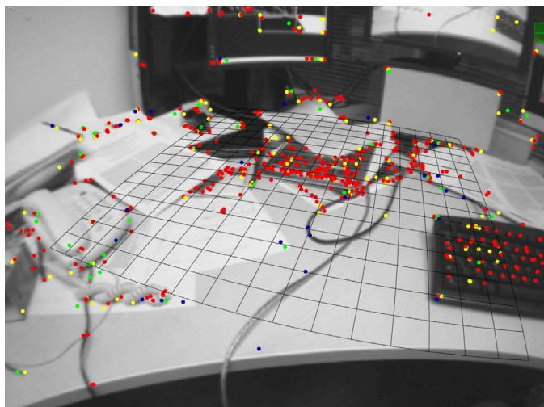
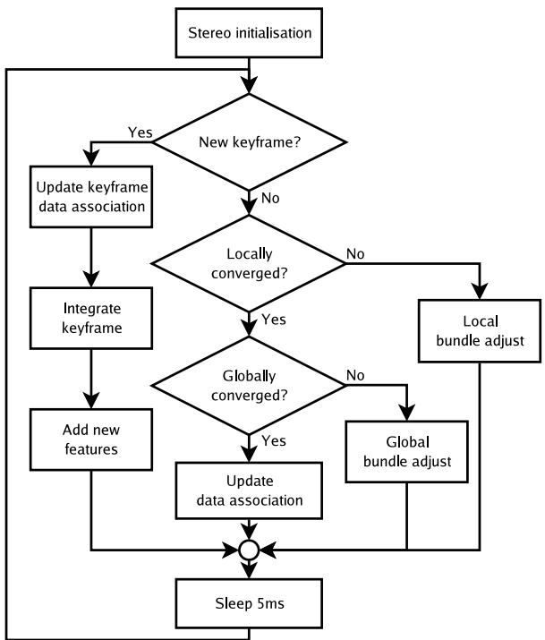
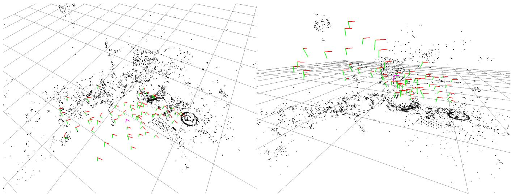
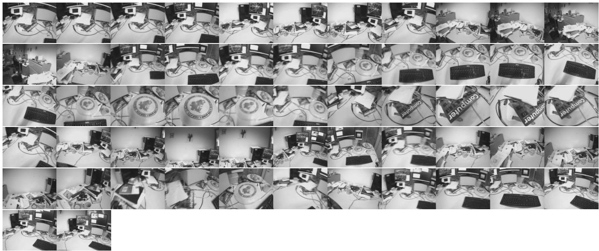
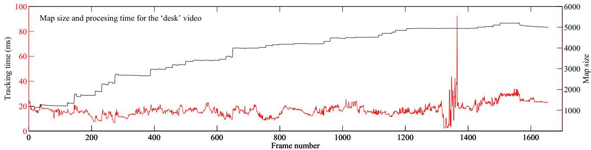
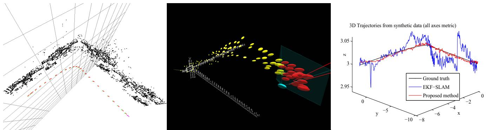
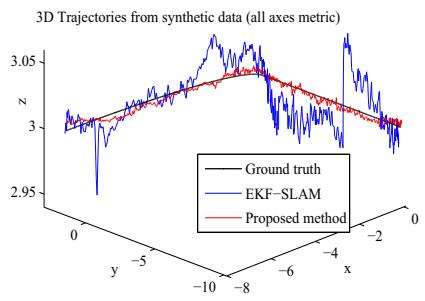
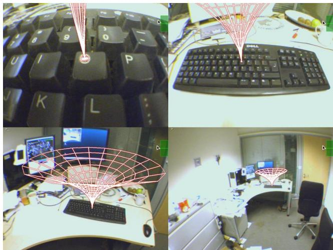
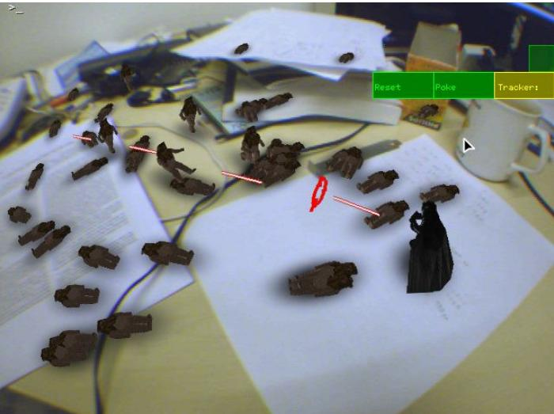
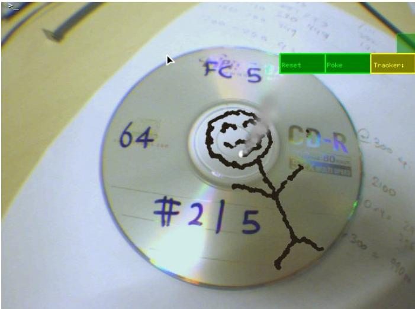

# Parallel Tracking and Mapping for Small AR Workspaces

Georg Klein∗

David Murray†

Active Vision Laboratory

Department of Engineering Science

University of Oxford

## ABSTRACT

This paper presents a method of estimating camera pose in an unknown scene. While this has previously been attempted by adapting SLAM algorithms developed for robotic exploration, we propose a system specifically designed to track a hand-held camera in a small AR workspace. We propose to split tracking and mapping into two separate tasks, processed in parallel threads on a dual-core computer: one thread deals with the task of robustly tracking erratic hand-held motion, while the other produces a 3D map of point features from previously observed video frames. This allows the use of computationally expensive batch optimisation techniques not usually associated with real-time operation: The result is a system that produces detailed maps with thousands of landmarks which can be tracked at frame-rate, with an accuracy and robustness rivalling that of state-of-the-art model-based systems.

## 1 INTRODUCTION

The majority of Augmented Reality (AR) systems operate with prior knowledge of the user’s environment - i.e, some form of map. This could be a map of a city, CAD model of a component requiring maintenance, or even a sparse map of fiducials known to be present in the scene. The application then allows the user to interact with this environment based on prior information on salient parts of this model (e.g. “This location is of interest” or “remove this nut from this component”). If the map or model provided is comprehensive, registration can be performed directly from it, and this is the common approach to camera-based AR tracking.

Unfortunately, a comprehensive map is often not available, often a small map of only an object of interest is available - for example, a single physical object in a room or a single fiducial marker. Tracking is then limited to the times when this known feature can be measured by some sensor, and this limits range and quality of registration. This has led to the development of a class of techniques known (in the AR context) as extensible tracking [21, 14, 4, 28, 2] in which the system attempts to add previously unknown scene elements to its initial map, and these then provide registration even when the original map is out of sensing range. In [4], the initial map is minimal, consisting only of a template which provides metric scale; later versions of this monocular SLAM algorithm can now operate without this initialisation template.

The logical extension of extensible tracking is to track in scenes without any prior map, and this is the focus of this paper. Specifically, we aim to track a calibrated hand-held camera in a previously unknown scene without any known objects or initialisation target, while building a map of this environment. Once a rudimentary map has been built, it is used to insert virtual objects into the scene, and these should be accurately registered to real objects in the environment.

Since we do not use a prior map, the system has no deep understanding of the user’s environment and this precludes many taskbased AR applications. One approach for providing the user with meaningful augmentations is to employ a remote expert [4, 16] who can annotate the generated map. In this paper we take a different approach: we treat the generated map as a sandbox in which virtual simulations can be created. In particular, we estimate a dominant plane (a virtual ground plane) from the mapped points - an example of this is shown in Figure 1 - and allow this to be populated with virtual characters. In essence, we would like to transform any flat (and reasonably textured) surface into a playing field for VR simulations (at this stage, we have developed a simple but fast-paced action game). The hand-held camera then becomes both a viewing device and a user interface component.

  
Figure 1: Typical operation of the system: Here, a desktop is tracked. The on-line generated map contains close to 3000 point features, of which the system attempted to find 1000 in the current frame. The 660 successful observations are shown as dots. Also shown is the map’s dominant plane, drawn as a grid, on which virtual characters can interact. This frame was tracked in 18ms.

To further provide the user with the freedom to interact with the simulation, we require fast, accurate and robust camera tracking, all while refining the map and expanding it ifnew regions are explored. This is a challenging problem, and to simplify the task somewhat we have imposed some constraints on the scene to be tracked: it should be mostly static, i.e. not deformable, and it should be small. By small we mean that the user will spend most of his or her time in the same place: for example, at a desk, in one corner of a room, or in front of a single building. We consider this to be compatible with a large number of workspace-related AR applications, where the user is anyway often tethered to a computer. Exploratory tasks such as running around a city are not supported.

The next section outlines the proposed method and contrasts this to previous methods. Subsequent sections describe in detail the method used, present results and evaluate the method’s performance.

## 2 METHOD OVERVIEW IN THE CONTEXT OF SLAM

Our method can be summarised by the following points:

• Tracking and Mapping are separated, and run in two parallel threads.

• Mapping is based on keyframes, which are processed using batch techniques (Bundle Adjustment).

• The map is densely intialised from a stereo pair (5-Point Algorithm)

• New points are initialised with an epipolar search.

• Large numbers (thousands) of points are mapped.

To put the above in perspective, it is helpful to compare this approach to the current state-of-the-art. To our knowledge, the two most convincing systems for tracking-while-mapping a single hand-held camera are those of Davison et al [5] and Eade and Drummond [8, 7]. Both systems can be seen as adaptations of algorithms developed for SLAM in the robotics domain (respectively, these are EKF-SLAM [26] and FastSLAM 2.0 [17]) and both are incremental mapping methods: tracking and mapping are intimately linked, so current camera pose and the position of every landmark are updated together at every single video frame.

Here, we argue that tracking a hand-held camera is more difficult than tracking a moving robot: firstly, a robot usually receives some form of odometry; secondly a robot can be driven at arbitrarily slow speeds. By contrast, this is not the case for hand-held monocular SLAM and so data-association errors become a problem, and can irretrievably corrupt the maps generated by incremental systems. For this reason, both monocular SLAM methods mentioned go to great lengths to avoid data association errors. Starting with covariance-driven gating (“active search”), they must further perform binary inlier/outlier rejection with Joint Compatibility Branch and Bound (JCBB) [19] (in the case of[5]) or Random Sample Consensus (RANSAC) [10] (in the case of [7]). Despite these efforts, neither system provides the robustness we would like for AR use.

This motivates a split between tracking and mapping. If these two processes are separated, tracking is no longer probabilistically slaved to the map-making procedure, and any robust tracking method desired can be used (here, we use a coarse-to-fine approach with a robust estimator.) Indeed, data association between tracking and mapping need not even be shared. Also, since modern computers now typically come with more than one processing core, we can split tracking and mapping into two separately-scheduled threads. Freed from the computational burden of updating a map at every frame, the tracking thread can perform more thorough image processing, further increasing performance.

Next, if mapping is not tied to tracking, it is not necessary to use every single video frame for mapping. Many video frames contain redundant information, particularly when the camera is not moving. While most incremental systems will waste their time refiltering the same data frame after frame, we can concentrate on processing some smaller number of more useful keyframes. These new keyframes then need not be processed within strict real-time limits (although processing should be finished by the time the next keyframe is added) and this allows operation with a larger numerical map size. Finally, we can replace incremental mapping with a computationally expensive but highly accurate batch method, i.e. bundle adjustment.

While bundle adjustment has long been a proven method for offline Structure-from-Motion (SfM), we are more directly inspired by its recent successful applications to real-time visual odometry and tracking [20, 18, 9]. These methods build an initial map from five-point stereo [27] and then track a camera using local bundle adjustment over the N most recent camera poses (where N is selected to maintain real-time performance), achieving exceptional accuracy over long distances. While we adopt the stereo initialisation, and occasionally make use of local bundle updates, our method is different in that we attempt to build a long-term map in which features are constantly re-visited, and we can afford expensive full-map optimisations. Finally, in our hand-held camera scenario, we cannot rely on long 2D feature tracks being available to initialise features and we replace this with an epipolar feature search.

## 3 FURTHER RELATED WORK

Efforts to improve the robustness of monocular SLAM have recently been made by [22] and [3]. [22] replace the EKF typical of many SLAM problems with a particle filter which is resilient to rapid camera motions; however, the mapping procedure does not in any way consider feature-to-feature or camera-to-feature correlations. An alternative approach is taken by [3] who replace correlation-based search with a more robust image descriptor which greatly reduces the probabilities of outlier measurements. This allows the system to operate with large feature search regions without compromising robustness. The system is based on the unscented Kalman filter which scales poorly (O(N3)) with map size and hence no more than a few dozen points can be mapped. However the replacement of intensity-patch descriptors with a more robust alternative appears to have merit.

Extensible tracking using batch techniques has previously been attempted by [11, 28]. An external tracking system or fiducial markers are used in a learning stage to triangulate new feature points, which can later be used for tracking. [11] employs classic bundle adjustment in the training stage and achieve respectable tracking performance when later tracking the learned features, but no attempt is made to extend the map after the learning stage. [28] introduces a different estimator which is claimed to be more robust and accurate, however this comes at a severe performance penalty, slowing the system to unusable levels. It is not clear if the latter system continues to grow the map after the initial training phase.

Most recently, [2] triangulate new patch features on-line while tracking a previously known CAD model. The system is most notable for the evident high-quality patch tracking, which uses a high-DOF minimisation technique across multiple scales, yielding convincingly better patch tracking results than the NCC search often used in SLAM. However, it is also computationally expensive, so the authors simplify map-building by discarding feature-feature covariances – effectively an attempt at FastSLAM 2.0 with only a single particle.

We notice that [15] have recently described a system which also employs SfM techniques to map and track an unknown environment - indeed, it also employs two processors, but in a different way: the authors decouple 2D feature tracking from 3D pose estimation. Robustness to motion is obtained through the use ofinertial sensors and a fish-eye lens. Finally, our implementation of an AR application which takes place on a planar playing field may invite a comparison with [25] in which the authors specifically choose to track and augment a planar structure: It should be noted that while the AR game described in this system uses a plane, the focus lies on the tracking and mapping strategy, which makes no fundamental assumption of planarity.

## 4 THE MAP

This section describes the system’s representation of the user’s environment. Section 5 will describe how this map is tracked, and Section 6 will describe how the map is built and updated.

The map consists of a collection of M point features located in a world coordinate frame W. Each point feature represents a locally planar textured patch in the world. The jth point in the map $( p _ { j } )$ has coordinates ${ \pmb p } _ { j } { \pmb w } = ( x _ { j } w y _ { j } w z _ { j } w 1 ) ^ { T }$ in coordinate frame

W. Each point also has a unit patch normal $\mathbf { \Delta } _ { n _ { j } }$ and a reference to the patch source pixels.

The map also contains N keyframes: These are snapshots taken by the handheld camera at various points in time. Each keyframe has an associated camera-centred coordinate frame, denoted $\kappa _ { i }$ for the ith keyframe. The transformation between this coordinate frame and the world is then $E \kappa _ { i } w .$ Each keyframe also stores a fourlevel pyramid of greyscale 8bpp images; level zero stores the full 640×480 pixel camera snapshot, and this is sub-sampled down to level three at $8 0 \times 6 0$ pixels.

The pixels which make up each patch feature are not stored individually, rather each point feature has a source keyframe - typically the first keyframe in which this point was observed. Thus each map point stores a reference to a single source keyframe, a single source pyramid level within this keyframe, and pixel location within this level. In the source pyramid level, patches correspond to $8 \times 8$ pixel squares; in the world, the size and shape of a patch depends on the pyramid level, distance from source keyframe camera centre, and orientation of the patch normal.

In the examples shown later the map might contain some M=2000 to 6000 points and N=40 to 120 keyframes.

## 5 TRACKING

This section describes the operation of the point-based tracking system, with the assumption that a map of 3D points has already been created. The tracking system receives images from the hand-held video camera and maintains a real-time estimate of the camera pose relative to the built map. Using this estimate, augmented graphics can then be drawn on top of the video frame. At every frame, the system performs the following two-stage tracking procedure:

1. A new frame is acquired from the camera, and a prior pose estimate is generated from a motion model.

2. Map points are projected into the image according to the frame’s prior pose estimate.

3. A small number (50) of the coarsest-scale features are searched for in the image.

4. The camera pose is updated from these coarse matches.

5. A larger number (1000) of points is re-projected and searched for in the image.

6. A final pose estimate for the frame is computed from all the matches found.

## 5.1 Image acquisition

Images are captured from a Unibrain Fire-i video camera equipped with a 2.1mm wide-angle lens. The camera delivers 640×480 pixel YUV411 frames at 30Hz. These frames are converted to 8bpp greyscale for tracking and an RGB image for augmented display.

The tracking system constructs a four-level image pyramid as described in section 4. Further, we run the FAST-10 [23] corner detector on each pyramid level. This is done without non-maximal suppression, resulting in a blob-like clusters of corner regions.

A prior for the frame’s camera pose is estimated. We use a decaying velocity model; this is similar to a simple alpha-beta constant velocity model, but lacking any new measurements, the estimated camera slows and eventually stops.

## 5.2 Camera pose and projection

To project map points into the image plane, they are first transformed from the world coordinate frame to the camera-centred coordinate frame $\mathcal { C } .$ This is done by left-multiplication with $\mathbf { a ~ } 4 \times 4$ matrix denoted $E _ { C W }$ , which represents camera pose.

$$
\pmb { p } _ { j \mathcal { C } } = E _ { \mathcal { C } \mathcal { W } } \pmb { p } _ { j \mathcal { W } }\tag{1}
$$

The subscript $c w$ may be read as “frame C from frame $\mathcal { W }$ . The matrix $E _ { C w }$ contains a rotation and a translation component and is a member of the Lie group SE(3), the set of 3D rigid-body transformations.

To project points in the camera frame into image, a calibrated camera projection model CamProj() is used:

$$
\left( \begin{array} { l } { u _ { i } } \\ { v _ { i } } \end{array} \right) = \mathrm { C a m P r o j } ( E c w \pmb { p } _ { i } \nu )\tag{2}
$$

We employ a pin-hole camera projection function which supports lenses exhibiting barrel radial distortion. The radial distortion model which transforms $r \to r ^ { \prime }$ is the FOV-model of [6]. The camera parameters for focal length $( f _ { u } , f _ { v } )$ , principal point $( u _ { 0 } , v _ { 0 } )$ and distortion $( \omega )$ are assumed to be known:

$$
\mathrm { C a m P r o j } \left( \begin{array} { c } { x } \\ { y } \\ { z } \\ { 1 } \end{array} \right) = \left( \begin{array} { c } { u _ { 0 } } \\ { v _ { 0 } } \end{array} \right) + \left[ \begin{array} { c c } { f _ { u } } & { 0 } \\ { 0 } & { f _ { v } } \end{array} \right] \frac { \mathrm { r } ^ { \prime } } { \mathrm { r } } \left( \begin{array} { c } { \frac { x } { z } } \\ { \frac { y } { z } } \end{array} \right)\tag{3}
$$

$$
r = { \sqrt { \frac { x ^ { 2 } + y ^ { 2 } } { z ^ { 2 } } } }\tag{4}
$$

$$
r ^ { \prime } = \frac { 1 } { \omega } \arctan ( 2 r \tan \frac { \omega } { 2 } )\tag{5}
$$

A fundamental requirement of the tracking (and also the mapping) system is the ability to differentiate Eq. 2 with respect to changes in camera pose $\dot { E } c w$ . Changes to camera pose are represented by left-multiplication with a 4×4 camera motion M:

$$
E _ { c w } ^ { \prime } = M E _ { c w } = \exp ( \pmb { \mu } ) E _ { c w }\tag{6}
$$

where the camera motion is also a member of SE(3) and can be minimally parametrised with a six-vector μ using the exponential map. Typically the first three elements of $\pmb { \mu }$ represent a translation and the latter three elements represent a rotation axis and magnitude. This representation of camera state and motion allows for trivial differentiation of Eq. $^ { 6 , }$ and from this, partial differentials of Eq. 2 of the form $\textstyle { \frac { \partial u } { \partial \mu _ { i } } } , { \frac { \partial v } { \partial \mu _ { i } } }$ are readily obtained in closed form. Details of the Lie group SE(3) and its representation may be found in [29].

## 5.3 Patch Search

To find a single map point $p$ in the current frame, we perform a fixed-range image search around the point’s predicted image location. To perform this search, the corresponding patch must first be warped to take account of viewpoint changes between the patch’s first observation and the current camera position. We perform an affine warp characterised by a warping matrix $A ,$ where

$$
A = \left[ \begin{array} { l l } { \frac { \partial u _ { c } } { \partial u _ { s } } } & { \frac { \partial u _ { c } } { \partial v _ { s } } } \\ { \frac { \partial v _ { c } } { \partial u _ { s } } } & { \frac { \partial v _ { c } } { \partial v _ { s } } } \end{array} \right]\tag{7}
$$

and $\{ u _ { s } , v _ { s } \}$ correspond to horizontal and vertical pixel displacements in the patch’s source pyramid level, and $\{ u _ { c } , v _ { c } \}$ correspond to pixel displacements in the current camera frame’s zeroth (fullsize) pyramid level. This matrix is found by back-projecting unit pixel displacements in the source keyframe pyramid level onto the patch’s plane, and then projecting these into the current (target) frame. Performing these projections ensures that the warping matrix compensates (to first order) not only changes in perspective and scale but also the variations in lens distortion across the image.

The determinant of matrix A is used to decide at which pyramid level of the current frame the patch should be searched. The determinant of A corresponds to the area, in square pixels, a single source pixel would occupy in the full-resolution image; de $( A ) / 4$ is the corresponding area in pyramid level one, and so on. The target pyramid level l is chosen so that de ${ \mathrm { ; } } ( A ) / 4 ^ { l }$ is closest to unity, i.e. we attempt to find the patch in the pyramid level which most closely matches its scale.

An 8×8-pixel patch search template is generated from the source level using the warp $A / 2 ^ { l }$ and bilinear interpolation. The mean pixel intensity is subtracted from individual pixel values to provide some resilience to lighting changes. Next, the best match for this template within a fixed radius around its predicted position is found in the target pyramid level. This is done by evaluating zero-mean SSD scores at all FAST corner locations within the circular search region and selecting the location with the smallest difference score. If this is beneath a preset threshold, the patch is considered found.

In some cases, particularly at high pyramid levels, an integer pixel location is not sufficiently accurate to produce smooth tracking results. The located patch position can be refined by performing an iterative error minimisation. We use the inverse compositional approach of [1], minimising over translation and mean patch intensity difference. However, this is too computationally expensive to perform for every patch tracked.

## 5.4 Pose update

Given a set $S$ of successful patch observations, a camera pose update can be computed. Each observation yields a found patch position $( \hat { u } \hat { v } ) ^ { T }$ (referred to level zero pixel units) and is assumed to have measurement noise of $\sigma ^ { 2 } = 2 ^ { 2 l }$ times the $2 \times 2$ identity matrix (again in level zero pixel units). The pose update is computed iteratively by minimising a robust objective function of the reprojection error:

$$
\mu ^ { \prime } = \underset { \mu } { \mathrm { a r g m i n } } \sum _ { j \in S } \mathrm { O b j } \left( \frac { | e _ { j } | } { \sigma _ { j } } , \sigma _ { T } \right)\tag{8}
$$

where $e _ { j }$ is the reprojection error vector:

$$
\begin{array} { r } { \pmb { e } _ { j } = \left( \begin{array} { l } { \hat { u } _ { j } } \\ { \hat { v } _ { j } } \end{array} \right) - \mathrm { C a m P r o j } \left( \mathrm { e x p } \left( \pmb { \mu } \right) E c \nu \pmb { p } _ { j } \right) . } \end{array}\tag{9}
$$

$\mathrm { O b j } ( \cdot , \sigma _ { T } )$ is the Tukey biweight objective function [13] and $\sigma _ { T }$ a robust (median-based) estimate of the distribution’s standard deviation derived from all the residuals. We use ten iterations of reweighted least squares to allow the M-estimator to converge from any one set of measurements.

## 5.5 Two-stage coarse-to-fine tracking

To increase the tracking system’s resilience to rapid camera accelerations, patch search and pose update are done twice. An initial coarse search searches only for 50 map points which appear at the highest levels of the current frame’s image pyramid, and this search is performed (with subpixel refinement) over a large search radius. A new pose is then calculated from these measurements. After this, up to 1000 of the remaining potentially visible image patches are re-projected into the image, and now the patch search is performed over a far tighter search region. Subpixel refinement is performed only on a high-level subset of patches. The final frame pose is calculated from both coarse and fine sets of image measurements together.

## 5.6 Tracking quality and failure recovery

Despite efforts to make tracking as robust as possible, eventual tracking failure can be considered inevitable. For this reason, the tracking system estimates the quality of tracking at every frame, using the fraction of feature observations which have been successful.

If this fraction falls below a certain threshold, tracking quality is considered poor. Tracking continues as normal, but the system is not allowed to send new keyframes to the map. Such frames would likely be of poor quality, i.e. compromised by motion blur, occlusion, or an incorrect position estimate.

If the fraction falls below an even lower threshold for more than a few frames (during which the motion model might successfully bridge untrackable frames) then tracking is considered lost, and a tracking recovery procedure is initiated. We implement the recovery method of [30]. After this method has produced a pose estimate, tracking proceeds as normal.

## 6 MAPPING

This section describes the process by which the 3D point map is built. Map-building occurs in two distinct stages: First, an initial map is built using a stereo technique. After this, the map is continually refined and expanded by the mapping thread as new keyframes are added by the tracking systems. The operation of the mapping thread is illustrated in Figure 2. The map-making steps are now individually described in detail.

  
Figure 2: The asynchronous mapping thread. After initialisation, this thread runs in an endless loop, occasionally receiving new frames from the tracker.

## 6.1 Map initialisation

When the system is first started, we employ the five-point stereo algorithm of [27] to initialise the map in a manner similar to [20, 18, 9]. User cooperation is required: the user first places the camera above the workspace to be tracked and presses a key. At this stage, they system’s first keyframe is stored in the map, and 1000 2D patch-tracks are initialised in the lowest pyramid level at salient image locations (maximal FAST corners.) The user then smoothly translates (and possibly rotates) the camera to a slightly offset position makes a further key-press. The 2D patches are tracked through the smooth motion, and the second key-press thus provides a second keyframe and feature correspondences from which the five-point algorithm and RANSAC can estimate an essential matrix and triangulate the base map. The resulting map is refined through bundle adjustment.

This initial map has an arbitrary scale and is aligned with one camera at the origin. To enable augmentations in a meaningful place and scale, the map is first scaled to metric units. This is done by assuming that the camera translated 10cm between the stereo pair. Next, the map is rotated and translated so that the dominant detected plane lies at z=0 in the world. This is done by RANSAC: many sets of three points are randomly selected to hypothesise a plane while the remaining points are tested for consensus. The winning hypothesis is refined by evaluating the spatial mean and variance of the consensus set, and the smallest eigenvector of the covariance matrix forms the detected plane normal.

Including user interaction, map initialisation takes around three seconds.

## 6.2 Keyframe insertion and epipolar search

The map initially contains only two keyframes and describes a relatively small volume of space. As the camera moves away from its initial pose, new keyframes and map features are added to the system, to allow the map to grow.

Keyframes are added whenever the following conditions are met: Tracking quality must be good; time since the last keyframe was added must exceed twenty frames; and the camera must be a minimum distance away from the nearest keypoint already in the map. The minimum distance requirement avoids the common monocular SLAM problem of a stationary camera corrupting the map, and ensures a stereo baseline for new feature triangulation. The minimum distance used depends on the mean depth of observed features, so that keyframes are spaced closer together when the camera is very near a surface, and further apart when observing distant walls.

Each keyframe initially assumes the tracking system’s camera pose estimate, and all feature measurements made by the tracking system. Owing to real-time constraints, the tracking system may only have measured a subset of the potentially visible features in the frame; the mapping thread therefore re-projects and measures the remaining map features, and adds successful observations to its list of measurements.

The tracking system has already calculated a set of FAST corners for each pyramid level of the keyframe. Non-maximal suppression and thresholding based on Shi-Tomasi [24] score are now used to narrow this set to the most salient points in each pyramid level. Next, salient points near successful observations of existing features are discarded. Each remaining salient point is a candidate to be a new map point.

New map points require depth information. This is not available from a single keyframe, and triangulation with another view is required. We select the closest (in terms ofcamera position) keyframe already existing in the map as the second view. Correspondences between the two views are established using epipolar search: pixel patches around corners points which lie along the epipolar line in the second view are compared to the candidate map points using zero-mean SSD. No template warping is performed, and matches are searched in equal pyramid levels only. Further, we do not search an infinite epipolar line, but use a prior hypothesis on the likely depth of new candidate points (which depends on the depth distribution of existing points in the new keyframe). If a match has been found, the new map point is triangulated and inserted into the map.

## 6.3 Bundle adjustment

Associated with the the ith keyframe in the map is a set $S _ { i }$ of image measurements. For example, the jth map point measured in keyframe i would have been found at $\left( \hat { u } _ { j i } \hat { v } _ { j i } \right) ^ { T }$ with standard deviation of $\sigma _ { j i }$ pixels. Writing the current state of the map as $\{ E \kappa _ { 1 } \boldsymbol { w } , . . . E \kappa _ { N } \overset { \cdot } { \boldsymbol { w } } \}$ and $\{ p _ { 1 } , . . . p _ { M } \}$ , each image measurement also has an associated reprojection error $e _ { j i }$ calculated as for equation (9). Bundle adjustment iteratively adjusts the map so as to minimise the robust objective function:

$$
\left\{ \{ \mu _ { 2 } . . \mu _ { N } \} , \{ p _ { 1 } ^ { \prime } . . p _ { M } ^ { \prime } \} \right\} = \underset { \{ \{ \mu \} , \{ p \} \} } { \mathrm { a r g m i n } } \sum _ { i = 1 } ^ { N } \sum _ { j \in S _ { i } } \mathrm { O b j } \left( \frac { \left| e _ { j i } \right| } { \sigma _ { j i } } , \sigma _ { T } \right)\tag{10}
$$

Apart from the inclusion of the Tukey M-estimator, we use an almost textbook implementation of Levenberg-Marquardt bundle adjustment (as described in Appendix 6.6 of [12]).

Full bundle adjustment as described above adjusts the pose for all keyframes (apart from the first, which is a fixed datum) and all map point positions. It exploits the sparseness inherent in the structure-from-motion problem to reduce the complexity of cubiccost matrix factorisations from ${ \mathrm { O } } ( ( N + M ) ^ { 3 } ) { \mathrm { t o } } { \dot { \mathrm { O } } } ( N ^ { 3 } )$ , and so the system ultimately scales with the cube of keyframes; in practice, for the map sizes used here, computation is in most cases dominated by $\dot { \mathrm { O } ( N ^ { 2 } M ) }$ camera-point-camera outer products. One way or the other, it becomes an increasingly expensive computation as map size increases: For example, tens of seconds are required for a map with more than 150 keyframes to converge. This is acceptable if the camera is not exploring (i.e. the tracking system can work with the existing map) but becomes quickly limiting during exploration, when many new keyframes and map features are initialised (and should be bundle adjusted) in quick succession.

For this reason we also allow the mapping thread to perform local bundle adjustment; here only a subset of keyframe poses are adjusted. Writing the set of keyframes to adjust as X, a further set of fixed keyframes Y and subset of map points Z, the minimisation (abbreviating the objective function) becomes

$$
\left\{ \{ \pmb { \mu } _ { x \in X } \} , \{ \pmb { p } _ { z \in Z } ^ { \prime } \} \right\} = \underset { \{ \{ \mu \} , \{ \pmb { \mu } \} \} } { \mathrm { a r g m i n } } \ \sum _ { i \in X \cup Y } \sum _ { j \in Z \cap S _ { i } } \mathrm { O b j } ( i , j ) .\tag{11}
$$

This is similar to the operation of constantly-exploring visual odometry implementations [18] which optimise over the last (say) 3 frames using measurements from the last 7 before that. However there is an important difference in the selection of parameters which are optimised, and the selection of measurements used for constraints.

The set X of keyframes to optimise consists of five keyframes: the newest keyframe and the four other keyframes nearest to it in the map. All of the map points visible in any of these keyframes forms the set $Z .$ Finally, Y contains any keyframe for which a measurement of any point in Z has been made. That is, local bundle adjustment optimises the pose of the most recent keyframe and its closest neighbours, and all of the map points seen by these, using all of the measurements ever made of these points.

The complexity of local bundle adjustment still scales with map size, but does so at approximately O(NM) in the worst case, and this allows a reasonable rate of exploration. Should a keyframe be added to the map while bundle adjustment is in progress, adjustment is interrupted so that the new keyframe can be integrated in the shortest possible time.

## 6.4 Data association refinement

When bundle adjustment has converged and no new keyframes are needed - i.e. when the camera is in well-explored portions of the map - the mapping thread has free time which can be used to improve the map. This is primarily done by making new measurements in old key-frames; either to measure newly created map features in older keyframes, or to re-measure outlier measurements.

When a new feature is added by epipolar search, measurements for it initially exist only in two keyframes. However it is possible that this feature is visible in other keyframes as well. If this is the case then measurements are made and if they are successful added to the map.

Likewise, measurements made by the tracking system may be incorrect. This frequently happens in regions of the world containing repeated patterns. Such measurements are given low weights by the M-estimator used in bundle adjustment. If they lie in the zeroweight region of the Tukey estimator, they are flagged as outliers. Each outlier measurement is given a ‘second chance’ before deletion: it is re-measured in the keyframe using the feature’s predicted position and a far tighter search region than used for tracking. If a new measurement is found, this is re-inserted into the map. Should such a measurement still be considered an outlier, it is permanently removed from the map.

These data association refinements are given a low priority in the mapping thread, and are only performed if there is no other more pressing task at hand. Like bundle adjustment, they are interrupted as soon as a new keyframe arrives.

## 6.5 General implementation notes

The system described above was implemented on a desktop PC with an Intel Core 2 Duo 2.66 GHz processor running Linux. Software was written in C++ using the libCVD and TooN libraries. It has not been highly optimised, although we have found it beneficial to implement two tweaks: A row look-up table is used to speed up access to the array of FAST corners at each pyramid level, and the tracker only re-calculates full nonlinear point projections and jacobians every fourth M-estimator iteration (this is still multiple times per single frame.)

Some aspects of the current implementation of the mapping system are rather low-tech: we use a simple set of heuristics to remove outliers from the map; further, patches are initialised with a normal vector parallel to the imaging plane of the first frame they were observed in, and the normal vector is currently not optimised.

Like any method attempting to increase a tracking system’s robustness to rapid motion, the two-stage approach described section 5.5 can lead to increased tracking jitter. We mitigate this with the simple method of turning off the coarse tracking stage when the motion model believes the camera to be nearly stationary. This can be observed in the results video by a colour change in the reference grid.

## 7 RESULTS

Evaluation was mostly performed during live operation using a hand-held camera, however we also include comparative results using a synthetic sequence read from disk. All results were obtained with identical tunable parameters.

## 7.1 Tracking performance on live video

An example of the system’s operation is provided in the accompanying video file1. The camera explores a cluttered desk and its immediate surroundings over 1656 frames of live video input. The camera performs various panning motions to produce an overview of the scene, and then zooms closer to some areas to increase detail in the map. The camera then moves rapidly around the mapped scene. Tracking is purposefully broken by shaking the camera, and the system recovers from this. This video represents the size of a typical working volume which the system can handle without great difficulty. Figure 3 illustrates the map generated during tracking. At the end of the sequence the map consists of 57 keyframes and 4997 point features: from finest level to coarsest level, the feature distributions are 51%, 33%, 9% and 7% respectively.

The sequence can mostly be tracked in real-time. Figure 4 shows the evolution of tracking time with frame number. Also plotted is the size of the map. For most of the sequence, tracking can be performed in around 20ms despite the map increasing in size. There are two apparent exceptions: tracking is lost around frame 1320, and the system attempts to relocalise for several frames, which takes up to 90ms per frame. Also, around frame 1530, tracking takes around 30ms per frame during normal operation; this is when the camera moves far away from the desk at the end ofthe sequence, and a very large number of features appear in the frame. Here, the time taken to decide which features to measure becomes significant.

<table><tr><td>Keyframe preparation Feature projection Patch search Iterative pose update</td><td>2.2 ms 3.5 ms 9.8 ms</td></tr><tr><td>Total</td><td>3.7 ms 19.2 ms</td></tr></table>

Table 1: Tracking timings for a map of size M=4000.

Table 1 shows a break-down of the time required to track a typical frame. Keyframe preparation includes frame capture, YUV411 to greyscale conversion, building the image pyramid and detecting FAST corners. Feature projection is the time taken to initially project all features in to the frame, decide which are visible, and decide which features to measure. This step scales linearly with map size, but is also influenced by the number of features currently in the camera’s field-of-view, as the determinant of the warping matrix is calculated for these points. The bulk of a frame’s budget is spent on the 1000 image searches for patch correspondences, and the time spent for this is influenced by corner density in the image, and the distribution of features over pyramid levels.

## 7.2 Mapping scalability

While the tracking system scales fairly well with increasing map size, this is not the case for the mapping thread. The largest map we have produced is a full 360◦ map of a single office containing 11000 map points and 280 keyframes. This is beyond our “small workspace” design goal and at this map size the system’s ability to add new keyframes and map points is impaired (but tracking still runs at frame-rate). A more practical limit at which the system remains well usable is around 6000 points and 150 keyframes.

Timings of individual mapping steps are difficult to obtain, they vary wildly not only with map size but also scene structure (both global and local); further, the asynchronous nature of our method does not facilitate obtaining repeatable results from disk sequences. Nevertheless, ‘typical’ timings for bundle adjustment are presented in Table 2.

<table><tr><td>Keyframes</td><td>2-49</td><td>50-99</td><td>100-149</td></tr><tr><td>Local Bundle Adjustment Global Bundle Adjustment</td><td>170ms 380ms</td><td>270ms 1.7s</td><td>440ms 6.9s</td></tr></table>

Table 2: Bundle adjustment timings with various map sizes.

The above timings are mean quantities. As the map grows beyond 100 keyframes, global bundle adjustment cannot keep up with exploration and is almost always aborted, converging only when the camera remains stationary (or returns to a well-mapped area) for some time. Global convergence for maps larger than 150 keyframes can require tens of seconds.

Compared with bundle adjustment, the processing time required for epipolar search and occasional data association refinement is small. Typically all other operations needed to insert a keyframe require less than 40ms.

## 7.3 Synthetic comparison with EKF-SLAM

To evaluate the system’s accuracy, we compare it to an implementation [30] of EKF-SLAM based on Davison’s SceneLib library with up-to-date enhancements such as JCBB [19]. We use a synthetic scene produced in a 3D rendering package. The scene consists of two textured walls at right angles, plus the initialisation target for the SLAM system. The camera moves sideways along one wall toward the corner, then along the next wall, for a total of 600 frames at 600×480 resolution.

  
Figure 3: The map and keyframes produced in the desk video. Top: two views of the map with point features and keyframes drawn. Certain parts of the scene are clearly distinguishable, e.g. the keyboard and the frisbee. Bottom: the 57 keyframes used to generate the map.

  
Figure 4: Map size (right axis) and tracking timings (left axis) for the desk video included in the video attachment. The timing spike occurs when tracking is lost and is attempting relocalisation.

  
Figure 5: Comparison with EKF-SLAM on a synthetic sequence. The left image shows the map produced by the system described here, the centre image shows the map produced by an up-to-date implementation of EKF-SLAM [30]. Trajectories compared to ground truth are shown on the right. NB. the different scale of the z-axis, as ground truth lies on z=3.

The synthetic scenario tested here (continual exploration with no re-visiting of old features, pauses or ‘slam wiggles’) is neither system’s strong point, and not typical usage in an AR context. Nevertheless it effectively demonstrates some of the differences in the systems’ behaviours. Figure 5 illustrates the maps output from the two systems. The method proposed here produces a relatively dense map of 6600 features, of which several are clearly outliers. By contrast, EKF-SLAM produces a sparse map of 114 features with fully accessible covariance information (our system also implicitly encodes the full covariance, but it is not trivial to access) of which all appear to be inliers.

To compare the calculated trajectories, these are first aligned so as to minimise their sum-squared error to ground truth. This is necessary because our system uses an (almost) arbitrary coordinate frame and scale. Both trajectories are aligned by minimising error over a 6-DOF rigid body transformation and 1-DOF scale change. The resulting trajectories are shown in the right panel of figure 5. For both trajectories, the error is predominantly in the z-direction (whose scale is exaggerated in the plot) although EKF-SLAM also fractionally underestimates the angle between the walls. Numerically, the standard deviation from ground truth is 135mm for EKF-SLAM and 6mm for our system (the camera travels 18.2m through the virtual sequence). Frames are tracked in a relatively constant 20ms by our system, whereas EKF-SLAM scales quadratically from 3ms when the map is empty to 40ms at the end ofthe sequence (although of course this includes mapping as well as tracking.)

## 7.4 Subjective comparison with EKF-SLAM

When used on live video with a hand-held camera, our system handles quite differently than iterative SLAM implementations, and this affects the way in which an operator will use the system to achieve effective mapping and tracking.

This system does not require the ‘SLAM wiggle’: incremental systems often need continual smooth camera motion to effectively initialise new features at their correct depth. If the camera is stationary, tracking jitter can initialise features at the wrong depth. By contrast, our system works best if the camera is focused on a point of interest, the user then pauses briefly, and then proceeds (not necessarily smoothly) to the next point of interest, or a different view of the same point.

The use of multiple pyramid levels greatly increases the system’s tolerance to rapid motions and associated motion blur. Further, it allows mapped points to be useful across a wide range of distances. In practice, this means that our system allows a user to ‘zoom in’ much closer (and more rapidly) to objects in the environment. This is illustrated in Figure 6 and also in the accompanying video file. At the same time, the use of a larger number of features reduces visible tracking jitter and improves performance when some features are occluded or otherwise corrupted.

The system scales with map size in a different way. In EKF-SLAM, the frame-rate will start to drop; in our system, the framerate is not as affected, but the rate at which new parts of the environment can be explored slows down.

## 7.5 AR with a hand-held camera

To investigate the suitability of the proposed system for AR tasks, we have developed two simple table-top applications. Both assume a flat operating surface, and use the hand-held camera as a tool for interaction. AR applications are usable as soon as the map has been initialised from stereo; mapping proceeds in the background in a manner transparent to the user, unless particularly rapid exploration causes tracking failure.

The first application is “Ewok Rampage”, which gives the player control over Darth Vader, who is assaulted by a horde of ewoks. The player can control Darth Vader’s movements using the keyboard, while a laser pistol can be aimed with the camera: The projection of the camera’s optical axis onto the playing surface forms the player’s cross-hairs. This game demonstrates the system’s ability to cope with fast camera translations as the user rapidly changes aim.

The second application simulates the effects of a virtual magnifying glass and sun. A virtual convex lens is placed at the camera centre and simple ray-tracing used to render the caustics onto the playing surface. When the light converges onto a small enough dot – i.e., when user has the camera at the correct height and angle – virtual burn-marks (along with smoke) are added to the surface. In this way the user can annotate the environment using just the camera. This game demonstrates tracking accuracy.

These applications are illustrated in Figure 7 and are also demonstrated in the accompanying video file.

## 8 LIMITATIONS AND FUTURE WORK

This section describes some of the known issues with the system presented. This system requires fairly powerful computing hardware and this has so far limited live experiments to a single office; we expect that with some optimisations we will be able to run at frame-rate on mobile platforms and perform experiments in a wider range of environments. Despite current experimental limitations some failure modes – and some avenues for further work – have become evident.

  
Figure 6: The system can easily track across multiple scales. Here, the map is initialised at the top-right scale; the user moves closer in and places a label, which is still accurately registered when viewed from far away.

## 8.1 Failure modes

There are various ways in which tracking can fail. Some of these are due to the system’s dependence on corner features: rapid camera motions produce large levels of motion blur which can decimate most corners features in the image, and this will cause tracking failure. In general, tracking can only proceed when the FAST corner detector fires, and this limits the types of textures and environments supported. Future work might aim to include other types of features – for example, image intensity edges are not as affected by motion blur, and often conveniently delineate geometric entities in the map.

The system is somewhat robust to repeated structure and lighting changes (as illustrated by figures showing a keyboard and CD-ROM disc being tracked) but such this is purely the happy result of the system using many features with a robust estimator. Repeated structure in particular still produces large numbers of outliers in the map (due to the epipolar search making incorrect correspondences) and can make the whole system fragile: if tracking falls into a local minimum and a keyframe is then inserted, the whole map could be corrupted.

We experience three types of mapping failure: the first is a failure of the initial stereo algorithm. This is merely a nuisance, as it is immediately noticed by the user, who then just repeats the procedure; nevertheless it is an obstacle to a fully automatic initialisation of the whole system. The second is the insertion of incorrect information into the map. This happens if tracking has failed (or reached an incorrect local minimum as described above) but the tracking quality heuristics have not detected this failure. A more robust tracking quality assessment might prevent such failures; alternatively, a method of automatically removing outlier keyframes from the map might be viable. Finally, while the system is very tolerant of temporary partial occlusions, it will fail if the real-world scene is substantially and permanently changed.

## 8.2 Mapping inadequacies

Currently, the system’s map consists only of a point cloud. While the statistics of feature points are linked through common observations in the bundle adjustment, the system currently makes little effort to extract any geometric understanding from the map: after initially extracting the dominant plane as an AR surface, the map becomes purely a tool for camera tracking. This is not ideal: virtual entities should be able to interact with features in the map in some way. For example, out-of-plane real objects should block and occlude virtual characters running into or behind them. This is a very complex and important area for future research.

Several aspects of mapping could be improved to aid tracking performance: the system currently has no notion of self-occlusion by the map. While the tracking system is robust enough to track a map despite self-occlusion, the unexplained absence of features it expects to be able to measure impacts tracking quality estimates, and may unnecessarily remove features as outliers. Further, an efficient on-line estimation of patch normals would likely be of benefit (our initial attempts at this have been too slow.)

Finally, the system is not designed to close large loops in the SLAM sense. While the mapping module is statistically able to handle loop closure (and loops can indeed be closed by judicious placement of the camera near the boundary), the problem lies in the fact that the tracker’s M-Estimator is not informed of feature-map uncertainties. In practical AR use, this is not an issue.

## 9 CONCLUSION

This paper has presented an alternative to the SLAM approaches previously employed to track and map unknown environments. Rather then being limited by the frame-to-frame scalability of incremental mapping approaches which mandate “a sparse map of high quality features” [5], we implement the alternative approach, using a far denser map of lower-quality features.

Results show that on modern hardware, the system is capable of providing tracking quality adequate for small-workspace AR applications - provided the scene tracked is reasonably textured, relatively static, and not substantially self-occluding. No prior model of the scene is required, and the system imposes only a minimal initialisation burden on the user (the procedure takes three seconds.) We believe the level oftracking robustness and accuracy we achieve significantly advances the state-of-the art.

Nevertheless, performance is not yet good enough for any untrained user to simply pick up and use in an arbitrary environment. Future work will attempt to address some of the shortcomings of the system and expand its potential applications.

## ACKNOWLEDGEMENTS

This work was supported by EPSRC grant GR/S97774/01.

## REFERENCES

[1] S. Baker and I. Matthews. Equivalence and efficiency of image alignment algorithms. In Proc. IEEE Intl. Conference on Computer Vision and Pattern Recognition (CVPR’01), Hawaii, Dec 2001.

[2] G. Bleser, H. Wuest, and D. Stricker. Online camera pose estimation in partially known and dynamic scenes. In Proc. 5th IEEE and ACMInternational Symposium on Mixed and Augmented Reality (IS-MAR’06), San Diego, CA, October 2006.

[3] D. Chekhlov, M. Pupilli, W. Mayol-Cuevas, and A. Calway. Realtime and robust monocular SLAM using predictive multi-resolution descriptors. In 2nd International Symposium on Visual Computing, November 2006.

[4] A. Davison, W. Mayol, and D. Murray. Real-time localisation and mapping with wearable active vision. In Proc. 2ndIEEE andACMInternational Symposium on Mixed andAugmented Reality (ISMAR’03), Tokyo, October 2003.

[5] A. Davison, I. Reid, N. D. Molton, and O. Stasse. MonoSLAM: Realtime single camera SLAM. to appear in IEEE Trans. Pattern Analysis and Machine Intelligence, 2007.

[6] F. Devernay and O. D. Faugeras. Straight lines have to be straight. Machine Vision and Applications, 13(1):14–24, 2001.

  
Figure 7: Sample AR applications using tracking as a user interface. Left: Darth Vader’s laser gun is aimed by the camera’s optical axis to defend against a rabid ewok horde. Right: The user employs a virtual camera-centred magnifying glass and the heat of a virtual sun to burn a tasteful image onto a CD-R. These applications are illustrated in the accompanying video.

[7] E. Eade and T. Drummond. Edge landmarks in monocular slam. In Proc. British Machine Vision Conference (BMVC’06), Edinburgh, September 2006. BMVA.

[8] E. Eade and T. Drummond. Scalable monocular slam. In Proc. IEEE Intl. Conference on Computer Vision and Pattern Recognition (CVPR ’06), pages 469–476, New York, NY, 2006.

[9] C. Engels, H. Stew´enius, and D. Nist´er. Bundle adjustment rules. In Photogrammetric Computer Vision (PCV’06), 2006.

[10] M. Fischler and R. Bolles. Random sample consensus: A paradigm for model fitting with applications to image analysis and automated cartography. Communcations ofthe ACM, 24(6):381–395, June 1981.

[11] Y. Genc, S. Riedel, F. Souvannavong, C. Akinlar, and N. Navab. Marker-less tracking for AR: A learning-based approach. In Proc. IEEE and ACM International Symposium on Mixed and Augmented Reality (ISMAR’02), Darmstadt, Germany, September 2002.

[12] R. I. Hartley and A. Zisserman. Multiple View Geometry in Computer Vision. Cambridge University Press, second edition, 2004.

[13] P. Huber. Robust Statistics. Wiley, 1981.

[14] B. Jiang and U. Neumann. Extendible tracking by line autocalibration. In Proc. IEEE and ACM International Symposium on Augmented Reality (ISAR’01), pages 97–103, New York, October 2001.

[15] R. Koch, K. Koeser, B. Streckel, and J.-F. Evers-Senne. Markerless image-based 3d tracking for real-time augmented reality applications. In WIAMIS, Montreux, 2005.

[16] T. Kurata, N. Sakata, M. Kourogi, H. Kuzuoka, and M. Billinghurst. Remote collaboration using a shoulder-worn active camera/laser. In 8th International Symposium on Wearable Computers (ISWC’04), pages 62–69, Arlington, VA, USA, 2004.

[17] M. Montemerlo, S. Thrun, D. Koller, and B. Wegbreit. FastSLAM 2.0: An improved particle filtering algorithm for simultaneous localization and mapping that provably converges. In Proc. International Joint Conference on Artificial Intelligence, pages 1151–1156, 2003.

[18] E. Mouragnon, F. Dekeyser, P. Sayd, M. Lhuillier, and M. Dhome. Real time localization and 3d reconstruction. In Proc. IEEE Intl. Conference on Computer Vision andPattern Recognition (CVPR ’06), pages 363–370, New York, NY, 2006.

[19] J. Neira and J. Tardos. Data association in stochastic mapping using the joint compatibility test. In IEEE Trans. on Robotics and Automation, 2001.

[20] D. Nist´er, O. Naroditsky, and J. R. Bergen. Visual odometry. In Proc. IEEE Intl. Conference on Computer Vision andPattern Recognition (CVPR ’04), pages 652–659, Washington, D.C., June 2005. IEEE Computer Society.

[21] J. Park, S. You, and U. Neumann. Natural feature tracking for extendible robust augmented realities. In Proc. Int. Workshop on Augmented Reality, 1998.

[22] M. Pupilli and A. Calway. Real-time camera tracking using a particle filter. In Proc. British Machine Vision Conference (BMVC’05), pages 519–528, Oxford, September 2005. BMVA.

[23] E. Rosten and T. Drummond. Machine learning for high-speed corner detection. In Proc. 9th European Conference on Computer Vision (ECCV’06), Graz, May 2006.

[24] J. Shi and C. Tomasi. Good features to track. In Proc. IEEE Intl. Conference on Computer Vision and Pattern Recognition (CVPR ’94), pages 593–600. IEEE Computer Society, 1994.

[25] G. Simon, A. Fitzgibbon, and A. Zisserman. Markerless tracking using planar structures in the scene. In Proc. IEEE and ACM International Symposium on Augmented Reality (ISAR’00), Munich, October 2000.

[26] R. C. Smith and P. Cheeseman. On the representation and estimation of spatial uncertainty. International Journal of Robotics Research, 5(4):56–68, 1986.

[27] H. Stew´enius, C. Engels, and D. Nist´er. Recent developments on direct relative orientation. ISPRS Journal ofPhotogrammetry and Remote Sensing, 60:284–294, June 2006.

[28] R. Subbarao, P. Meer, and Y. Genc. A balanced approach to 3d tracking from image streams. In Proc. 4th IEEE and ACM International Symposium on Mixed and Augmented Reality (ISMAR’05), pages 70– 78, Vienna, October 2005.

[29] V. Varadarajan. Lie Groups, Lie Algebras and Their Representations. Number 102 in Graduate Texts in Mathematics. Springer-Verlag, 1974.

[30] B. Williams, G. Klein, and I. Reid. Real-time SLAM relocalisation. In Proc. 11th IEEE International Conference on Computer Vision (ICCV’07), Rio de Janeiro, October 2007.