# Stereo Processing by Semiglobal Matching and Mutual Information

Heiko Hirschmu¨ ller

Abstract—This paper describes the Semiglobal Matching (SGM) stereo method. It uses a pixelwise, Mutual Information (MI)-based matching cost for compensating radiometric differences of input images. Pixelwise matching is supported by a smoothness constraint that is usually expressed as a global cost function. SGM performs a fast approximation by pathwise optimizations from all directions. The discussion also addresses occlusion detection, subpixel refinement, and multibaseline matching. Additionally, postprocessing steps for removing outliers, recovering from specific problems of structured environments, and the interpolation of gaps are presented. Finally, strategies for processing almost arbitrarily large images and fusion of disparity images using orthographic projection are proposed. A comparison on standard stereo images shows that SGM is among the currently top-ranked algorithms and is best, if subpixel accuracy is considered. The complexity is linear to the number of pixels and disparity range, which results in a runtime of just 1-2 seconds on typical test images. An in depth evaluation of the MI-based matching cost demonstrates a tolerance against a wide range of radiometric transformations. Finally, examples of reconstructions from huge aerial frame and pushbroom images demonstrate that the presented ideas are working well on practical problems.

Index Terms—Stereo, mutual information, global optimization, multibaseline.

## 1 INTRODUCTION

CCURATE dense stereo matching is an important requiredifficult are often occlusions, object boundaries, and fine structures, which can appear blurred. Matching is also challenging due to low or repetitive textures, which are typical for structured environments. Additional practical problems originate from recording and illumination differences. Furthermore, fast calculations are often required, either because of real-time applications or because of large images or many images that have to be processed efficiently.

A comparison of current stereo algorithms is given on the Middlebury Stereo Pages.1 It is based on the taxonomy of Scharstein and Szeliski [1]. They distinguish between four steps that most stereo methods perform, that is, matching cost computation, cost aggregation, disparity computation/optimization, and disparity refinement. Matching cost computation is very often based on the absolute, squared, or sampling insensitive difference [2] of intensities or colors. Since these costs are sensitive to radiometric differences, costs based on image gradients are also used [3]. Mutual Information (MI) has been introduced in computer vision [4] for handling complex radiometric relationships between images. It has been adapted for stereo matching [5], [6] and approximated for faster computation [7].

Cost aggregation connects the matching costs within a certain neighborhood. Often, costs are simply summed over a

1. www.middlebury.edu/stereo.

fixed sized window at constant disparity [3], [5], [8], [9]. Some methods additionally weight each pixel within the window according to color similarity and proximity to the center pixel [10], [11]. Another possibility is to select the neighborhood according to segments of constant intensity or color [7], [12].

Disparity computation is done for local algorithms by selecting the disparity with the lowest matching cost [5], [8], [10], that is, winner takes all. Global algorithms typically skip the cost aggregation step and define a global energy function that includes a data term and a smoothness term. The former sums pixelwise matching costs, whereas the latter supports piecewise smooth disparity selection. Some methods use more terms for penalizing occlusions [9], [13], alternatively treating visibility [11], [12], [14], enforcing a left/right or symmetric consistency between images [7], [11], [12], [14], or weight the smoothness term according to segmentation information [14]. The strategies for finding the minimum of the global energy function differ. Dynamic programming (DP) approaches [2], [15] perform the optimization in one dimension for each scan line individually, which commonly leads to streaking effects. This is avoided by tree-based DP approaches [12], [16]. A two dimensional optimization is reached by Graph Cuts [13] or Belief Propagation [3], [11], [14]. Layered approaches [3], [9], [11] perform image segmentation and model planes in disparity space, which are iteratively optimized.

Disparity refinement is often done for removing peaks [17], checking the consistency [8], [11], [12], interpolating gaps [17], or increasing the accuracy by subpixel interpolation [1], [8].

Almost all of the currently top-ranked algorithms [2], [3], [7], [9], [11], [12], [13], [14], [15] on the Tsukuba, Venus, Teddy, and Cones data set [18] optimize a global energy function. The complexity of most top-ranked algorithms is usually high and can depend on the scene complexity [9]. Consequently, most of these methods have runtimes of more than 20 sec [3], [12] to more than a minute [9], [10], [11], [13], [14] on the test images.

This paper describes the Semiglobal Matching (SGM) method [19], [20], which calculates the matching cost hierarchically by Mutual Information (Section 2.1). Cost aggregation is performed as approximation of a global energy function by pathwise optimizations from all directions through the image (Section 2.2). Disparity computation is done by winner takes all and supported by disparity refinements like consistency checking and subpixel interpolation (Section 2.3). Multibaseline matching is handled by fusion of disparities (Section 2.4). Further disparity refinements include peak filtering, intensity consistent disparity selection, and gap interpolation (Section 2.5). Previously unpublished is the extension for matching almost arbitrarily large images (Section 2.6) and the fusion of several disparity images using orthographic projection (Section 2.7). Section 3 shows results on standard test images, as well as previously unpublished extensive evaluations of the MI-based matching cost. Finally, two examples of 3D reconstructions from huge aerial frame and pushbroom images are given.

## 2 Semiglobal Matching

The Semiglobal Matching (SGM) method is based on the idea of pixelwise matching of Mutual Information and approximating a global, 2D smoothness constraint by combining many 1D constraints. The algorithm is described in distinct processing steps. Some of them are optional, depending on the application.

## 2.1 Pixelwise Matching Cost Calculation

Input images are assumed to have a known epipolar geometry, but it is not required that they are rectified as this may not always be possible. This is the case with pushbroom images. A linear movement causes epipolar lines to be hyperbolas [21], due to parallel projection in the direction of movement and perspective projection orthogonally to it. Nonlinear movements, as unavoidable in aerial imaging, causes epipolar lines to be general curves and images that cannot be rectified [22].

The matching cost is calculated for a base image pixel p from its intensity $I _ { b \mathbf { p } }$ and the suspected correspondence $I _ { m \mathbf { q } }$ with $\mathbf { q } = e _ { b m } ( \mathbf { p } , d )$ of the match image. The function $e _ { b m } ( \mathbf { p } , d )$ symbolizes the epipolar line in the match image for the base image pixel p with the line parameter d. For rectified images, with the match image on the right of the base image, $e _ { b m } ( { \bf p } , d ) = \left[ p _ { x } - d , p _ { y } \right] ^ { T }$ with d as disparity.

An important aspect is the size and shape of the area that is considered for matching. The robustness of matching is increased with large areas. However, the implicit assumption of constant disparity inside the area is violated at discontinuities, which leads to blurred object borders and fine structures. Certain shapes and techniques can be used to reduce blurring, but it cannot be avoided [8]. Therefore, the assumption of constant disparities in the vicinity of $\mathbf { p }$ is discarded. This means that only the intensities $I _ { b \mathbf { p } }$ and $I _ { m \mathbf { q } }$ itself can be used for calculating the matching cost.

One choice of pixelwise cost calculation is the sampling insensitive measure of Birchfield and Tomasi [2]. The cost $C _ { B T } ( \mathbf { p } , d )$ is calculated as the absolute minimum difference of intensities at p and $\mathbf { q } = e _ { b m } ( \mathbf { p } , d )$ in the range of half a pixel in each direction along the epipolar line.

Alternatively, the matching cost calculation can be based on Mutual Information (MI) [4], which is insensitive to recording and illumination changes. It is defined from the entropy H of two images (that is, their information content), as well as their joint entropy:

$$
M I _ { I _ { 1 } , I _ { 2 } } = H _ { I _ { 1 } } + H _ { I _ { 2 } } - H _ { I _ { 1 } , I _ { 2 } } .\tag{ð1Þ}
$$

The entropies are calculated from the probability distributions $P$ of intensities of the associated images:

$$
H _ { I } = - \int _ { 0 } ^ { 1 } P _ { I } ( i ) \log P _ { I } ( i ) d i ,\tag{ð2Þ}
$$

$$
H _ { I _ { 1 } , I _ { 2 } } = - \int _ { 0 } ^ { 1 } \int _ { 0 } ^ { 1 } P _ { I _ { 1 } , I _ { 2 } } ( i _ { 1 } , i _ { 2 } ) \log P _ { I _ { 1 } , I _ { 2 } } ( i _ { 1 } , i _ { 2 } ) d i _ { 1 } d i _ { 2 } .\tag{ð3Þ}
$$

For well-registered images, the joint entropy $H _ { I _ { 1 } , I _ { 2 } }$ is low because one image can be predicted by the other, which corresponds to low information. This increases their Mutual Information. In the case of stereo matching, one image needs to be warped according to the disparity image D for matching the other image, such that corresponding pixels are at the same location in both images, that is, $I _ { 1 } = \bar { I } _ { b }$ and $I _ { 2 } = f _ { D } ( I _ { m } )$

Equation (1) operates on full images and requires the disparity image a priori. Both prevent the use of MI as pixelwise matching cost. Kim et al. [6] transformed the calculation of the joint entropy $H _ { I _ { 1 } , I _ { 2 } }$ into a sum over pixels using Taylor expansion. It is referred to their paper for details of the derivation. As a result, the joint entropy is calculated as a sum of data terms that depend on corresponding intensities of a pixel p:

$$
H _ { I _ { 1 } , I _ { 2 } } = \sum _ { \bf p } h _ { I _ { 1 } , I _ { 2 } } ( I _ { 1 \bf p } , I _ { 2 \bf p } ) .\tag{ð4Þ}
$$

The data term $h _ { I _ { 1 } , I _ { 2 } }$ is calculated from the joint probability distribution $P _ { I _ { 1 } , I _ { 2 } }$ of corresponding intensities. The number of corresponding pixels is n. Convolution with a 2D Gaussian (indicated by $\otimes g ( i , k ) )$ effectively performs Parzen estimation [6]:

$$
h _ { I _ { 1 } , I _ { 2 } } ( i , k ) = - \frac { 1 } { n } \mathrm { l o g } ( P _ { I _ { 1 } , I _ { 2 } } ( i , k ) \otimes g ( i , k ) ) \otimes g ( i , k ) .\tag{ð5Þ}
$$

The probability distribution of corresponding intensities is defined with the operator $T [ ]$ , which is 1 if its argument is true and 0, otherwise,

$$
P _ { I _ { 1 } , I _ { 2 } } ( i , k ) = \frac { 1 } { n } \sum _ { \bf p } \mathrm { T } [ ( i , k ) = ( I _ { 1 \bf p } , I _ { 2 \bf p } ) ] .\tag{ð6Þ}
$$

The calculation is visualized in Fig. 1. The match image $I _ { m }$ is warped according to the initial disparity image D. This can be implemented by a simple lookup in image $I _ { m }$ with $e _ { b m } ( \mathbf { p } , D _ { \mathbf { p } } )$ for all pixels p. However, care should to be taken to avoid possible double mappings due to occlusions in $I _ { m } .$ Calculation of P according to (6) is done by counting the number of pixels of all combinations of intensities, divided by the number of all correspondences. Next, according to (5), Gaussian smoothing is applied by convolution. It has been found that using a small kernel (that is, $7 \times 7 )$ gives practically the same results as larger kernels, but is calculated faster. The logarithm is computed for each element of the result. Since the logarithm of 0 is undefined, all 0 elements are replaced by a very small number. Another Gaussian smoothing effectively leads to a lookup table for the term $h _ { I _ { 1 } , I _ { 2 } }$

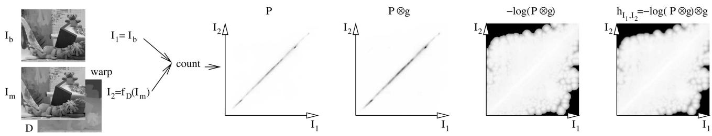  
Fig. 1. Calculation of the MI-based matching cost. Values are scaled linearly for visualization. Darker points have larger values than brighter points.

Kim et al. argued that the entropy $H _ { I _ { 1 } }$ is constant and $H _ { I _ { 2 } }$ is almost constant as the disparity image merely redistributes the intensities of $I _ { 2 }$ . Thus, $\bar { h } _ { I _ { 1 } , I _ { 2 } } ( \bar { I } _ { 1 \bf p } , I _ { 2 \bf p } )$ serves as cost for matching two intensities. However, if occlusions are considered then some intensities of $I _ { 1 }$ and $I _ { 2 }$ do not have a correspondence. These intensities should not be included in the calculation, which results in nonconstant entropies $H _ { I _ { 1 } }$ and $H _ { I _ { 2 } }$ . Apart from this theoretical justification, it has been found that including these entropies in the cost calculation slightly improves object borders. Therefore, it is suggested to calculate these entropies analog to the joint entropy:

$$
H _ { I } = \sum _ { \bf p } h _ { I } ( I _ { \bf p } ) ,\tag{ð7aÞ}
$$

$$
h _ { I } ( i ) = - \frac { 1 } { n } \mathrm { l o g } ( P _ { I } ( i ) \otimes g ( i ) ) \otimes g ( i ) .\tag{ð7bÞ}
$$

The probability distribution $P _ { I }$ must not be calculated over the whole images $I _ { 1 }$ and $I _ { 2 }$ but only over the corresponding parts (otherwise, occlusions would be ignored and $H _ { I _ { 1 } }$ and $H _ { I _ { 2 } }$ would be almost constant). That is easily done by just summing the corresponding rows and columns of the joint probability distribution, that is, $\begin{array} { r } { P _ { I _ { 1 } } ( i ) = \sum _ { k } P _ { I _ { 1 } , I _ { 2 } } ( i , k ) } \end{array}$ . The resulting definition of Mutual Information is

$$
M I _ { I _ { 1 } , I _ { 2 } } = \sum _ { \bf p } m i _ { I _ { 1 } , I _ { 2 } } ( I _ { \mathrm { 1 p } } , I _ { \mathrm { 2 p } } ) ,\tag{ð8aÞ}
$$

$$
m i _ { I _ { 1 } , I _ { 2 } } ( i , k ) = h _ { I _ { 1 } } ( i ) + h _ { I _ { 2 } } ( k ) - h _ { I _ { 1 } , I _ { 2 } } ( i , k ) .\tag{ð8bÞ}
$$

This leads to the definition of the MI matching cost:

$$
C _ { M I } ( { \bf p } , d ) = - m i _ { I _ { b } , f _ { D } ( I _ { m } ) } ( I _ { b { \bf p } } , I _ { m { \bf q } } ) ,\tag{ð9aÞ}
$$

$$
\mathbf { q } = e _ { b m } ( \mathbf { p } , d ) .\tag{ð9bÞ}
$$

The remaining problem is that the disparity image is required for warping $I _ { m }$ before miðÞ can be calculated. Kim et al. suggested an iterative solution, which starts with a random disparity image for calculating the cost $C _ { M I }$ . This cost is then used for matching both images and calculating a new disparity image, which serves as the base of the next iteration. The number of iterations is rather low (for example, 3), because even wrong disparity images (for example, random) allow a good estimation of the probability distribution $P ,$ due to a high number of pixels. This solution is well suited for iterative stereo algorithms like Graph Cuts [6], but it would increase the runtime of noniterative algorithms unnecessarily.

Since a rough estimate of the initial disparity is sufficient for estimating ${ \bar { P } } ,$ a fast correlation base method could be used in the first iterations. In this case, only the last iteration would be done by a more accurate and time consuming method. However, this would involve the implementation of two different stereo methods. Utilizing a single method appears more elegant.

Therefore, a hierarchical calculation is suggested, which recursively uses the (up-scaled) disparity image, which has been calculated at half resolution, as the initial disparity. If the overall complexity of the algorithm is $O ( W { \hat { H } } D )$ (that is, width  height  disparity range), then the runtime at half resolution is reduced by factor $2 ^ { 3 } = 8$ . Starting with a random disparity image at a resolution of 1/16 and initially calculating three iterations increases the overall runtime by the factor

$$
1 + { \frac { 1 } { 2 ^ { 3 } } } + { \frac { 1 } { 4 ^ { 3 } } } + { \frac { 1 } { 8 ^ { 3 } } } + 3 { \frac { 1 } { 1 6 ^ { 3 } } } \approx 1 . 1 4 .\tag{ð10Þ}
$$

Thus, the theoretical runtime of the hierarchically calculated $C _ { M I }$ would be just 14 percent slower than that of $C _ { B T . }$ ignoring the overhead of MI calculation and image scaling. It is noteworthy that the disparity image of the lower resolution level is used only for estimating the probability distribution P and calculating the costs $C _ { M I }$ of the higher resolution level. Everything else is calculated from scratch to avoid passing errors from lower to higher resolution levels.

An implementation of the hierarchical MI computation (HMI) would collect all alleged correspondences defined by an initial disparity (that is, up-scaled from previous hierarchical level or random in the beginning). From the correspondences, the probability distribution $P$ is calculated according to (6). The size of $P$ is the square of the number of intensities, which is constant (for example, 256  256). The subsequent operations consist of Gaussian convolutions of $P$ and calculating the logarithm. The complexity depends only on the collection of alleged correspondences due to the constant size of P. Thus, OðWHÞ with W as image width and H as image height.

## 2.2 Cost Aggregation

Pixelwise cost calculation is generally ambiguous and wrong matches can easily have a lower cost than correct ones, due to noise, and so forth. Therefore, an additional constraint is added that supports smoothness by penalizing changes of neighboring disparities. The pixelwise cost and the smoothness constraints are expressed by defining the energy EðDÞ that depends on the disparity image D:

$$
\begin{array} { l } { { \displaystyle { \cal E } ( D ) = \sum _ { \bf p } \Big ( C ( { \bf p } , D _ { \bf p } ) + \sum _ { { \bf q } \in N _ { \bf p } } P _ { 1 } \mathrm { T } [ | D _ { \bf p } - D _ { \bf q } | = 1 ] } } \\ { { \displaystyle ~ + \sum _ { { \bf q } \in N _ { \bf p } } P _ { 2 } \mathrm { T } [ | D _ { \bf p } - D _ { \bf q } | > 1 ] \Big ) . } } \end{array}\tag{ð11Þ}
$$

The first term is the sum of all pixel matching costs for the disparities of D. The second term adds a constant penalty $P _ { 1 }$ for all pixels $\mathbf { q }$ in the neighborhood $N _ { \mathbf { p } }$ of $\mathbf { p , }$ for which the disparity changes a little bit (that is, 1 pixel). The third term d on September 16,2026 at 03:27:22 UTC from IEEE Xplore. Restrictions apply.

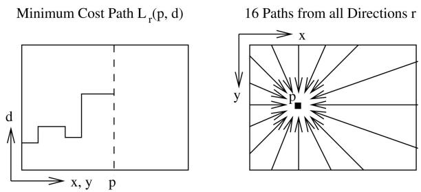  
Fig. 2. Aggregation of costs in disparity space.

adds a larger constant penalty $P _ { 2 } ,$ for all larger disparity changes. Using a lower penalty for small changes permits an adaptation to slanted or curved surfaces. The constant penalty for all larger changes (that is, independent of their size) preserves discontinuities [23]. Discontinuities are often visible as intensity changes. This is exploited by adapting $P _ { 2 }$ to the intensity gradient, that is, $\begin{array} { r } { P _ { 2 } = \frac { P _ { 2 } ^ { \prime } } { | I _ { b \mathbf { p } } - I _ { b \mathbf { q } } | } } \end{array}$ for neighboring pixels p and q in the base image $I _ { b } .$ However, it has always to be ensured that $P _ { 2 } \geq P _ { 1 }$

The problem of stereo matching can now be formulated as finding the disparity image D that minimizes the energy $E ( D )$ . Unfortunately, such a global minimization, that is, in 2D, is NP-complete for many discontinuity preserving energies [23]. In contrast, the minimization along individual image rows, that is, in 1D, can be performed efficiently in polynomial time using DP [2], [15]. However, DP solutions easily suffer from streaking [1], due to the difficulty of relating the 1D optimizations of individual image rows to each other in a 2D image. The problem is that very strong constraints in one direction, that is, along image rows, are combined with none or much weaker constraints in the other direction, that is, along image columns.

This leads to the new idea of aggregating matching costs in 1D from all directions equally. The aggregated (smoothed) cost $S ( \mathbf { p } , d )$ for a pixel p and disparity d is calculated by summing the costs of all 1D minimum cost paths that end in pixel p at disparity $d ,$ as shown in Fig. 2. These paths through disparity space are projected as straight lines into the base image but as nonstraight lines into the corresponding match image, according to disparity changes along the paths. It is noteworthy that only the cost of the path is required and not the path itself.

The cost $L _ { \mathbf { r } } ^ { \prime } ( \mathbf { p } , d )$ along a path traversed in the direction r of the pixel p at disparity d is defined recursively as

$$
\begin{array} { c } { { L _ { \mathbf { r } } ^ { \prime } ( \mathbf { p } , d ) { } = { } C ( \mathbf { p } , d ) + { } \operatorname* { m i n } ( L _ { \mathbf { r } } ^ { \prime } ( \mathbf { p } - \mathbf { r } , d ) , } } \\ { { L _ { \mathbf { r } } ^ { \prime } ( \mathbf { p } - \mathbf { r } , d - 1 ) + { } P _ { 1 } , } } \\ { { L _ { \mathbf { r } } ^ { \prime } ( \mathbf { p } - \mathbf { r } , d + 1 ) + { } P _ { 1 } , } } \\ { { \displaystyle { } \operatorname* { m i n } { } L _ { \mathbf { r } } ^ { \prime } ( \mathbf { p } - \mathbf { r } , i ) + { } P _ { 2 } ) . } } \end{array}\tag{ð12Þ}
$$

The pixelwise matching cost C can be either $C _ { B T }$ or $C _ { M I } .$ The remainder of the equation adds the lowest cost of the previous pixel $\mathbf p - \mathbf r$ of the path, including the appropriate penalty for discontinuities. This implements the behavior of (11) along an arbitrary 1D path. This cost does not enforce the visibility or ordering constraint, because both concepts cannot be realized for paths that are not identical to epipolar lines. Thus, the approach is more similar to Scan line Optimization [1] than traditional DP solutions.

The values of L0 permanently increase along the path, which may lead to very large values. However, (12) can be modified by subtracting the minimum path cost of the previous pixel from the whole term:

$$
\begin{array} { r l } & { L _ { \mathbf { r } } ( \mathbf { p } , d ) = C ( \mathbf { p } , d ) + \operatorname* { m i n } ( L _ { \mathbf { r } } ( \mathbf { p } - \mathbf { r } , d ) , } \\ & { \quad \quad \quad L _ { \mathbf { r } } ( \mathbf { p } - \mathbf { r } , d - 1 ) + P _ { 1 } , } \\ & { \quad \quad \quad L _ { \mathbf { r } } ( \mathbf { p } - \mathbf { r } , d + 1 ) + P _ { 1 } , } \\ & { \quad \quad \quad \operatorname* { m i n } L _ { \mathbf { r } } ( \mathbf { p } - \mathbf { r } , i ) + P _ { 2 } ) - \underset { k } { \operatorname* { m i n } } L _ { \mathbf { r } } ( \mathbf { p } - \mathbf { r } , k ) . } \end{array}\tag{ð13Þ}
$$

This modification does not change the actual path through disparity space, since the subtracted value is constant for all disparities of a pixel p. Thus, the position of the minimum does not change. However, the upper limit can now be given as $L \leq C _ { m a x } + P _ { 2 }$

The costs $L _ { \mathbf { r } }$ are summed over paths in all directions r. The number of paths must be at least eight and should be 16 for providing a good coverage of the 2D image. In the latter case, paths that are not horizontal, vertical, or diagonal are implemented by going one step horizontal or vertical followed by one step diagonally:

$$
S ( \mathbf { p } , d ) = \sum _ { \mathbf { r } } L _ { \mathbf { r } } ( \mathbf { p } , d ) .\tag{ð14Þ}
$$

The upper limit for $S$ is easily determined as $S \leq$ $1 6 ( C _ { m a x } + \bar { P } _ { 2 } )$ , for 16 paths.

An efficient implementation would precalculate the pixelwise matching costs $C ( \mathbf { p } , d )$ down scaled to 11-bit integer values, that is, $C _ { m a x } < 2 ^ { 1 1 } ,$ , by a factor s if necessary as in the case of MI values. Scaling to 11-bit guarantees that the aggregated costs in subsequent calculations do not exceed the 16-bit limit. All costs are stored in a 16-bit array C½ of size $W \times H \times D$ . Thus, $C [ \mathbf { p } , d ] = s C ( \mathbf { p } , d )$ . A second 16-bit integer array S½ of the same size is used for storing the aggregated cost values. The array is initialized by 0 values. The calculation starts for each direction r at all pixels b of the image border with $L _ { \mathbf { r } } ( \mathbf { b } , d ) = C [ \mathbf { b } , d ]$ . The path is traversed in forward direction according to (13). For each visited pixel p along the path, the costs $L _ { \mathbf { r } } ( \mathbf { p } , d )$ are added to the values S½b; d for all disparities d.

The calculation of (13) requires $O ( \bar { D } )$ steps at each pixel, since the minimum cost of the previous pixel, for example, mink $L _ { \mathbf { r } } ( \mathbf { p } - \mathbf { r } , k )$ , is constant for all disparities of a pixel and can be precalculated. Each pixel is visited exactly 16 times, which results in a total complexity of OðWHDÞ. The regular structure and simple operations, that is, additions and comparisons, permit parallel calculations using integerbased SIMD2 assembly language instructions.

## 2.3 Disparity Computation

The disparity image $D _ { b }$ that corresponds to the base image Ib is determined as in local stereo methods by selecting for each pixel p the disparity d that corresponds to the minimum cost, that is, mind S½p; d. For subpixel estimation, a quadratic curve is fitted through the neighboring costs, that ${ \mathrm { i } } \mathbf { s } ,$ at the next higher and lower disparity, and the position of the minimum is calculated. Using a quadratic curve is theoretically justified only for correlation using the sum of squared differences. However, it is used as an approximation due to the simplicity of calculation. This supports fast computation.

The disparity image $D _ { m }$ that corresponds to the match image $I _ { m }$ can be determined from the same costs by traversing the epipolar line that corresponds to the pixel q of the match image. Again, the disparity d is selected, which corresponds to the minimum cost, that is, min $S [ e _ { m b } ( \mathbf { q } , d ) , d ]$ . However, the cost aggregation step does not treat the base and match images symmetrically. Slightly better results can be expected, if $D _ { m }$ is calculated from scratch, that is, by performing pixelwise matching and aggregation again, but with $I _ { m }$ as base and $I _ { b }$ as match image. It depends on the application whether or not an increased runtime is acceptable for slightly better object borders. Outliers are filtered from $D _ { b }$ and $D _ { m }$ using a median filter with a small window, that is, $3 \times 3 .$

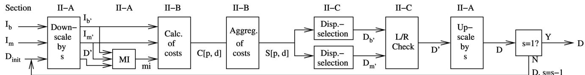  
Fig. 3. Summary of processing steps of Sections 2.1, 2.2, and 2.3.

The calculation of $D _ { b } ,$ as well as $D _ { m } ,$ permits the determination of occlusions and false matches by performing a consistency check. Each disparity of $D _ { b }$ is compared to its corresponding disparity of $D _ { m }$ . The disparity is set to invalid $( D _ { i n v } )$ if both differ:

$$
D _ { \mathbf { p } } = \left\{ \begin{array} { l l } { D _ { b \mathbf { p } } } & { \mathrm { i f } ~ | D _ { b \mathbf { p } } - D _ { m \mathbf { q } } | \leq 1 , } \\ { D _ { i n v } } & { \mathrm { o t h e r w i s e } . } \end{array} \right.\tag{ð15aÞ}
$$

$$
\begin{array} { r } { \mathbf { q } = e _ { b m } ( \mathbf { p } , D _ { b \mathbf { p } } ) . } \end{array}\tag{ð15bÞ}
$$

The consistency check enforces the uniqueness constraint, by permitting one to one mappings only. The disparity computation and consistency check require visiting each pixel at each disparity a constant number of times. Thus, the complexity of this step is again OðWHDÞ.

A summary of all processing steps of the core SGM method including hierarchical calculation of MI is given in Fig. 3.

## 2.4 Multibaseline Matching

The algorithm could be extended for multibaseline matching by calculating a combined pixelwise matching cost of correspondences between the base image and all match images. However, the occlusion problem would have to be solved on the pixelwise matching level, that is, before aggregation, which is very unstable. Therefore, multibaseline matching is performed by pairwise matching between the base and all match images individually. The consistency check (Section 2.3) is used after pairwise matching for eliminating wrong matches at occlusions and many other mismatches. Finally, the resulting disparity images are fused by considering individual scalings.

Let the disparity $D _ { k }$ be the result of matching the base image $I _ { b }$ against a match image $I _ { m k } .$ . The disparities of the images $D _ { k }$ are scaled differently, according to some factor $t _ { k } .$ This factor is linear to the length of the baseline between $I _ { b }$ and $I _ { m k }$ if all images are rectified against each other, that is, if all images are projected onto a common plane that has the same distance to all optical centers. Thus, disparities are normalized by $\frac { D _ { k \mathbf { p } } } { t _ { k } }$

Fusion of disparity values is performed by calculating the weighted mean of disparities using the factors $t _ { k }$ as weights. Possible outliers are discarded by considering only those disparities that are within a 1 pixel interval around the median of all disparity values for a certain pixel:

$$
D _ { \mathbf { p } } = \frac { \sum _ { k \in V _ { \mathbf { p } } } D _ { k \mathbf { p } } } { \sum _ { k \in V _ { \mathbf { p } } } t _ { k } } ,\tag{ð16aÞ}
$$

$$
V _ { \mathbf { p } } = \left\{ k | \bigg | \frac { D _ { k \mathbf { p } } } { t _ { k } } - \mathrm { m e d } \frac { D _ { i \mathbf { p } } } { t _ { i } } \bigg | \leq \frac { 1 } { t _ { k } } \right\} .\tag{ð16bÞ}
$$

This solution increases robustness due to the median, as well as accuracy due to the weighted mean. Additionally, if enough match images are available, a certain minimum size of the set $V _ { \mathbf { p } }$ can be enforced for increasing the reliability of the resulting disparities. Pixel that do not fulfill the criteria are set to invalid. If hierarchical computation is performed for MI-based matching then the presented fusion of disparity images is performed within each hierarchical level for computing the disparity image of the next level.

An implementation would pairwise match the base image against all k match images and combine them by visiting each pixel once. Thus, the overall complexity of all steps that are necessary for multibaseline matching is OðKWHDÞ with K as the number of match images.

## 2.5 Disparity Refinement

The resulting disparity image can still contain certain kinds of errors. Furthermore, there are generally areas of invalid values that need to be recovered. Both can be handled by postprocessing of the disparity image.

## 2.5.1 Removal of Peaks

Disparity images can contain outliers, that is, completely wrongdisparities,duetolowtexture, reflections, noise,andso forth. They usually show up as small patches of disparity that is very different to the surrounding disparities, that is, peaks, as shown in Fig. 4. It depends on the scene, what sizes of small disparity patches can also represent valid structures. Often, a threshold can be predefined on their size such that smaller patches are unlikely to represent valid scene structure.

For identifying peaks, the disparity image is segmented [24] by allowing neighboring disparities within one segment to vary by one pixel, considering a 4-connected image grid. The disparities of all segments below a certain size are set to invalid [17]. This kind of simple segmentation and peak filtering can be implemented in $\overset { \cdot } { O } ( W \overset { \cdot } { H } )$ steps.

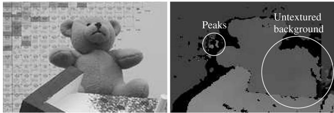  
Fig. 4. Possible errors in disparity images (black is invalid).

## 2.5.2 Intensity Consistent Disparity Selection

In structured indoor environments, it often happens that foreground objects are in front of a low or untextured background, for example, wall, as shown in Fig. 4. The energy function $E ( D )$ , as shown in (11), does not include a preference on the location of a disparity step. Thus, $E ( D )$ does not differentiate between placing a disparity step correctly just next to a foreground object or a bit further away within an untextured background. Section 2.2 suggested adapting the cost $P _ { 2 }$ according to the intensity gradient. This helps placing the disparity step correctly just next to a foreground object, because this location coincides with an intensity gradient in contrast to a location within an untextured area.

However, SGM applies the energy function not in 2D over the whole image but along individual 1D paths from all directions, which are summed. If an untextured area is encountered along a 1D path, a disparity change is only preferred if matching of textured areas on both sides of the untextured area requires it. Untextured areas may have different shapes and sizes and can extend beyond image borders, as quite common for walls in indoor scenes (Fig. 4). Depending on the location and direction of 1D paths, they may encounter texture of foreground and background objects around an untextured part, in which case a correct disparity step would be expected. They may also encounter either foreground or background texture or leave the image with the untextured area in which cases no disparity step would be placed. Summing all those inconsistent paths may easily lead to fuzzy discontinuities around foreground objects in front of untextured background.

It is noteworthy, that this problem is a special case that only applies to certain scenes in structured environments. However, it appears important enough for presenting a solution. First, some assumptions are made:

1. Discontinuities in the disparity image do not occur within untextured areas.

2. On the same physical surface as the untextured area is also some texture visible.

3. The surface of the untextured area can be approximated by a plane.

The first assumption is mostly correct, as depth discontinuities usually cause at least some visual change in intensities. Otherwise, the discontinuity would be undetectable. The second assumption is necessary as the disparity of an absolutely untextured background surface would be indeterminable. The third assumption is the weakest. Its justification is that untextured surfaces with varying distance usually appear with varying intensities. Thus, piecewise constant intensity can be treated as piecewise planar.

The identification of untextured areas is done by a fixed bandwidth Mean Shift Segmentation [25] on the intensity image $I _ { b } .$ The radiometric bandwidth $\sigma _ { r }$ is set to $P _ { 1 . }$ , which is usually 4. Thus, intensity changes below the smoothness penalty are treated as noise. The spatial bandwidth $\sigma _ { s }$ is set to a rather low value for fast processing (that is, 5). Furthermore, all segments that are smaller than a certain threshold (that is, 100 pixels) are ignored, because small untextured areas are expected to be handled well by SGM.

As described above, the expected problem is that discontinuities are placed fuzzily within untextured areas. Thus, untextured areas are expected to contain incorrect disparities of the foreground object but also correct disparities of the background, as long as the background surface contains some texture, that is, assumption 2. This leads to the realization that some disparities within each segment $S _ { i }$ should be correct. Thus, several hypotheses for the correct disparity of $S _ { i }$ can be identified by segmenting the disparity within each segment $S _ { i } .$ . This is done by simple segmentation, as also discussed in Section 2.5.1, that is, by allowing neighboring disparities within one segment to vary by one pixel. This fast segmentation results in several segments $S _ { i k }$ for each segment $S _ { i }$

Next, the surface hypotheses $F _ { i k }$ are created by calculating the best fitting planes through the disparities of $S _ { i k }$ . The choice for planes is based on assumption 3. Very small segments, that is,  12 pixel, are ignored, as it is unlikely that such small patches belong to the correct hypothesis. Then, each hypothesis is evaluated within $S _ { i }$ by replacing all pixel of $S _ { i }$ by the surface hypothesis and calculating $E _ { i k }$ as defined in (11) for all unoccluded pixel of $S _ { i } . \mathrm { A }$ pixel p is occluded, if another pixel with higher disparity maps to the same pixel q in the match image. This detection is performed by first mapping p into the match image by $\mathbf { q } = e _ { b m } ( \mathbf { p } , D _ { \mathbf { p } } ^ { \prime } )$ . Then, the epipolar line of q in the base image $e _ { m b } ( \mathbf { q } , d )$ is followed for $\bar { d } > \bar { D _ { \mathbf { p } } ^ { \prime } }$ . Pixel p is occluded if the epipolar line passes a pixel with a disparity larger than d.

For each constant intensity segment $S _ { i }$ the surface hypothesis $F _ { i k }$ with the minimum cost $E _ { i k }$ is chosen. All disparities within $S _ { i }$ are replaced by values on the chosen surface for making the disparity selection consistent to the intensities of the base image, that is, fulfilling Assumption 1:

$$
F _ { i } = F _ { i k ^ { \prime } } \mathrm { ~ w i t h ~ } k ^ { \prime } = \underset { k } { \operatorname { a r g m i n } } E _ { i k } ,\tag{ð17aÞ}
$$

$$
D _ { \mathbf { p } } ^ { \prime } = { \left\{ \begin{array} { l l } { F _ { i } ( \mathbf { p } ) } & { { \mathrm { i f ~ } } \mathbf { p } \in S _ { i } } \\ { D _ { \mathbf { p } } } & { { \mathrm { o t h e r w i s e . } } } \end{array} \right. }\tag{ð17bÞ}
$$

The presented approach is similar to some other methods [7], [9], [11] as it uses image segmentation and plane fitting for refining an initial disparity image. In contrast to other methods, the initial disparity image is due to SGM already quite accurate so that only untextured areas above a certain size are modified. Thus, only critical areas are tackled without the danger of corrupting probably wellmatched areas. Another difference is that disparities of the considered areas are selected by considering a small number of hypotheses that are inherent in the initial disparity image. There is no time consuming iteration.

The complexity of fixed bandwidth Mean Shift Segmentation of the intensity image and the simple segmentation of the disparity image is linear in the number of pixels. Calculating the best fitting planes involves visiting all segmented pixels. Testing of all hypotheses requires visiting all pixels of all segments for all hypotheses (that is, maximum N). Additionally, the occlusion test requires going through at most D disparities for each pixel.

Thus, the upper bound of the complexity is $O ( W H D N )$ However, segmented pixels are usually just a fraction of the whole image and the maximum number of hypotheses N for a segment is commonly small and often just 1. In the latter case, it is not even necessary to calculate the cost of the hypothesis. d on September 16,2026 at 03:27:22 UTC from IEEE Xplore. Restrictions apply.

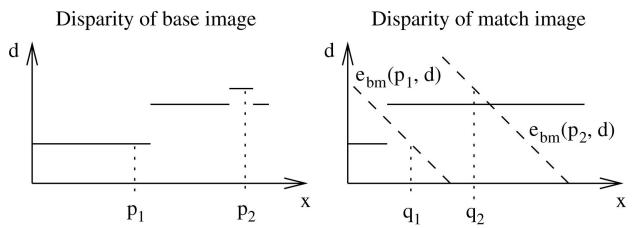  
Fig. 5. Distinguishing between occluded and mismatched pixels.

## 2.5.3 Discontinuity Preserving Interpolation

The consistency check of Section 2.3, as well as fusion of disparity images of Section 2.4 or peak filtering of Section 2.5.1 may invalidate some disparities. This leads to holes in the disparity image, as shown in black in Fig. 4, which need to be interpolated for a dense result.

Invalid disparities are classified into occlusions and mismatches. The interpolation of both cases must be performed differently. Occlusions must not be interpolated from the occluder but only from the occludee to avoid incorrect smoothing of discontinuities. Thus, an extrapolation of the background into occluded regions is necessary. In contrast, holes due to mismatches can be smoothly interpolated from all neighboring pixels.

Occlusions and mismatches can be distinguished as part of the left/right consistency check. Fig. 5 shows that the epipolar line of the occluded pixel $\mathbf { p } _ { 1 }$ goes through the discontinuity that causes the occlusion and does not intersect the disparity function $D _ { m }$ . In contrast, the epipolar line of the mismatch $\mathbf { p } _ { 2 }$ intersects with $D _ { m } .$ . Thus, for each invalidated pixel, an intersection of the corresponding epipolar line with $D _ { m }$ is sought, for marking it as either occluded or mismatched.

For interpolation purposes, mismatched pixel areas that are direct neighbors of occluded pixels are treated as occlusions, because these pixels must also be extrapolated from valid background pixels. Interpolation is performed by propagating valid disparities through neighboring invalid disparity areas. This is done similarly to SGM along paths from eight directions. For each invalid pixel, all eight values $v _ { \mathbf { p } i }$ are stored. The final disparity image D0 is created by

$$
D _ { \mathbf { p } } ^ { \prime } = \left\{ \begin{array} { l l } { \mathrm { s e c l o w } _ { i } v _ { \mathbf { p } i } } & { \mathrm { i f ~ \mathbf { p } ~ i s ~ o c c l u d e d , } } \\ { \mathrm { m e d } _ { i } v _ { \mathbf { p } i } } & { \mathrm { i f ~ \mathbf { p } ~ i s ~ m i s m a t c h e d , } } \\ { D _ { \mathbf { p } } } & { \mathrm { o t h e r w i s e . } } \end{array} \right.\tag{ð18Þ}
$$

The first case ensures that occlusions are interpolated from the lower background by selecting the second lowest value, whereas the second case emphasizes the use of all information without a preference to foreground or background. The median is used instead of the mean for maintaining discontinuities in cases where the mismatched area is at an object border.

The presented interpolation method has the advantage that it is independent of the used stereo matching method. The only requirements are a known epipolar geometry and the calculation of the disparity images for the base and match image for distinguishing between occlusions and mismatches.

Finally, median filtering can be useful for removing remaining irregularities and additionally smoothes the resulting disparity image. The complexity of interpolation is linear to the number of pixels, that is, OðWHÞ, as there is a constant number of operations for each invalid pixel.

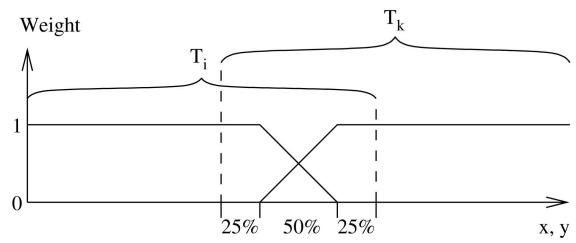  
Fig. 6. Definition of weights for merging overlapping tiles $T _ { i } , T _ { k } .$

## 2.6 Processing of Huge Images

The SGM method requires temporary memory for storing pixelwise matching costs C½, aggregated costs S½, disparity images before fusion, and so forth. The size of temporary memory depends either on the image size W 	 H, the disparity range D, or both as in the case of C½ and S½. Thus, even moderate image sizes of 1 MPixel with disparity ranges of several 100 pixel require large temporary arrays that can exceed the available memory. The proposed solution is to divide the base image into tiles, computing the disparity of each tile individually as described in Sections 2.1 until 2.3 and merging the tiles together into the full disparity image before multibaseline fusion (Section 2.4).

Tiles are chosen overlapping, because the cost aggregation step (Section 2.2) can only use paths from one side for pixels near tile borders, which leads to lower matching accuracy or even mismatches. This can especially be critical at low textured areas near tile borders. Merging of tiles is done by calculating a weighted mean of disparities from all tiles at overlapping areas. The weights are chosen such that pixels near the tile border are ignored, and those further away are blended linearly, as shown in Fig. 6. The tile size is chosen as large as possible such that all required temporary arrays just fit into the available main memory. Thus, the available memory automatically determines the internally used tile size.

This strategy allows matching of larger images. However, there are some technologies like aerial pushbroom cameras that can produce single images of 1 billion pixel or more [22]. Thus, it may be impossible to even load two full images into the main memory not to mention matching of them. For such cases, additionally to the discussed internal tiling, an external tiling of the base image is suggested, for example, with overlapping tiles of size 3; 000  3; 000 pixels. Every base image tile together with the disparity range and the known camera geometry immediately define the corresponding parts of the match images. All steps including multibaseline fusion (Section 2.4) and, optionally, postprocessing (Section 2.5) are performed, and the resulting disparity is stored for each tile individually. Merging of external tiles is done in the same way as merging of internal tiles.

Depending on the kind of scene, it is likely that the disparity range that is required for each tile is just a fraction of the disparity range of the whole images. Therefore, an automatic disparity range reduction in combination with HMI-based matching is suggested. The full disparity range is applied for matching at the lowest resolution. Thereafter, a refined disparity range is determined from the resulting disparity image. The range is extended by a certain fixed amount to account for small structures that are possibly undetected while matching in low resolution. The refined upscaled disparity range is used for matching at the next higher resolution.

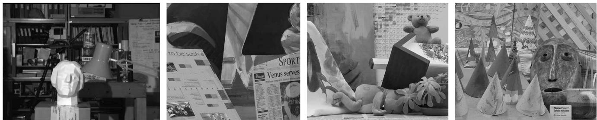  
Fig. 7. The Tsukuba (384  288), Venus (484  383), Teddy (450  375), and Cones (450  375) stereo test images [1], [18].

The internal and external tiling mechanism allow stereo matching of almost arbitrarily large images. Another advantage of external tiling is that all tiles can be computed in parallel on different computers.

## 2.7 Fusion of Disparity Images

Disparity images can be seen as 2.5D representations of the scene geometry. The interpretation of disparity images always requires the corresponding geometrical camera model. Furthermore, in multiple image configurations, several disparity images from different viewpoints may have been computed for representing a scene. It is often desirable to fuse the information of all disparity images into one consistent representation of the scene. The optimal scene representation depends on the locations and viewing directions of all cameras. An important special case, for example, for aerial imaging [22], is that the optical centers of all cameras are approximately in a plane, and the orientations of all cameras are approximately the same. In this case, an orthographic 2.5D projection onto a common plane can be done.

The common plane is chosen parallel to the optical centers of all cameras. A coordinate system $R _ { o } , T _ { o }$ is defined such that the origin is in the plane, and the z-axis is orthogonal to the plane. The x,y-plane is divided into equally spaced cells. Each disparity image is transformed separately into orthographic projection by reconstructing all pixels, transforming them using $R _ { o } , T _ { o } ,$ and storing the z-values in the cells in which the transformed points fall into. The change to orthographic projection can cause some points to occlude others. This is considered by always keeping the value that is closest to the camera in case of double mappings. After transforming each disparity image individually, the resulting orthographic projections are fused by selecting the median of all values that fall into each cell (Fig. 8). This is useful for eliminating remaining outliers.

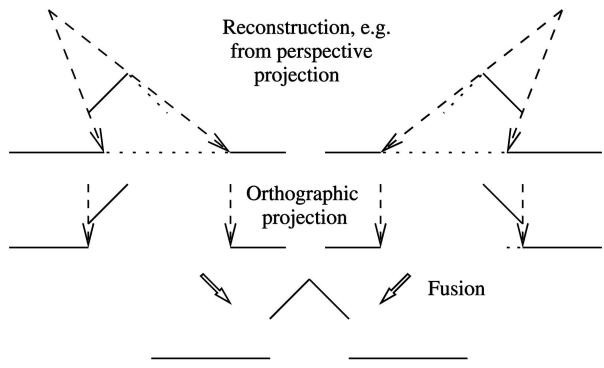  
Fig. 8. Orthographic reprojection of disparity images and fusion.

It is advisable not to interpolate missing disparities in individual disparity images (Section 2.5.3) before performing fusion, because missing disparities may be filled in from other views. This is expected to be more accurate than using interpolated values. Furthermore, the orthographic reprojection can lead to new holes that have to be interpolated. Thus, interpolation is required anyway. However, after orthographic projection, the information about occlusions and mismatches that is used for pathwise interpolation (Section 2.5.3) is lost. Therefore, a different method is suggested for interpolating orthographic 2.5D height data.

First, the height data is segmented in the same way as described in Section 2.5.1 by allowing height values of neighboring grid cells within one segment to vary by a certain predefined amount. Each segment is considered to be a physical surface. Holes can exist within or between segments. The former are filled by Inverse Distance Weighted (IDW) interpolation from all valid pixels just next to the hole. The latter case is handled by only considering valid pixels of the segment whose pixel have the lowest mean compared to the valid bordering pixel of all other segments next to the hole. This strategy performs smooth interpolation but maintains height discontinuities by extrapolating the background. Using IDW instead of pathwise interpolation is computationally more expensive, but it is performed only once on the fused result and not on each disparity image individually.

## 3 EXPERIMENTAL RESULTS

The SGM method has been evaluated extensively on common stereo test image sets, as well as real images.

## 3.1 Evaluation on Middlebury Stereo Images

Fig. 7 shows the left images of four stereo image pairs [1], [18]. This image set is used in an ongoing comparison of stereo algorithms on the Middlebury Stereo Pages. The image sets of Venus, Teddy, and Cones consist of nine multibaseline images. For stereo matching, the image number 2 is used as the left image and the image number 6 as the right image. This is different to an earlier publication [19] but consistent with the procedure of the new evaluation on Middlebury Stereo Pages. The disparity range is 16 pixel for the Tsukuba pair, 32 pixel for the Venus pair, and 64 pixel for the Teddy and Cones pair.

Disparity images have been computed in two different configurations. The first configuration called SGM, uses the basic steps like cost calculation using HMI, cost aggregation, and disparity computation (Sections 2.1, 2.2, and 2.3). Furthermore, small disparity peaks where removed (Section 2.5.1) and gaps interpolated (Section 2.5.3). The second configuration is called C-SGM, which uses the same steps as SGM but, additionally, the intensity consistent disparity selection (Section 2.5.2). All parameters have been selected for the best performance and kept constant. The threshold of the disparity peak filter has been lowered for C-SGM, because intensity consistent disparity selection helps eliminating peaks, if they are in untextured areas.

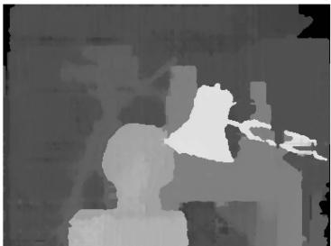

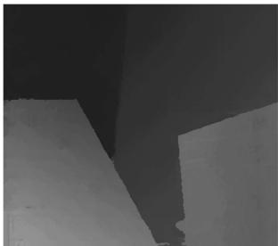

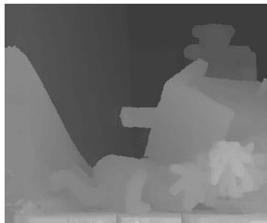

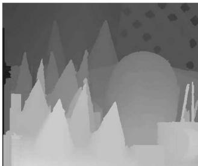

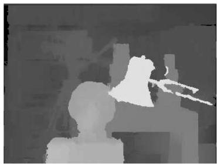

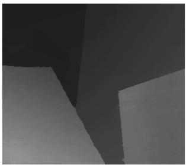

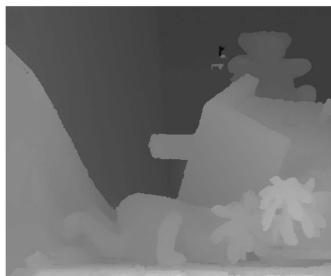

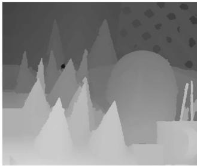  
Fig. 9. Disparity images calculated by SGM (top) and C-SGM (bottom), which includes the intensity consistent disparity selection postprocessing step.

TABLE 1  
Comparison Using Standard Threshold of (a) 1 Pixel and (b) 0.5 Pixel from October 2006
<table><tr><td>Algorithm</td><td>Rank</td><td>Tsuk.</td><td>Venus</td><td>Teddy</td><td>Cones</td></tr><tr><td>AdaptingBP [3] DoubleBP [11] Segm+visib [9] SymBP+occ [14]</td><td>1.7 2.3 5.1 5.1</td><td>1.11 0.88 1.30 0.97</td><td>0.10 0.14 0.79 0.16</td><td>4.22 3.55 5.00 6.47</td><td>2.48 2.90 3.72 4.79</td></tr><tr><td>C-SGM RegTreeDP [12]</td><td>6.2</td><td>2.61</td><td>0.25</td><td>5.14</td><td>2.77</td></tr><tr><td></td><td>7.0 7.3</td><td>1.39 1.38</td><td>0.22 0.71</td><td>7.42</td><td>6.31</td></tr><tr><td colspan="4">AdaptWeight [10]</td><td></td><td></td></tr><tr><td colspan="4">SGM 9.3 3.26 1.00</td><td>7.88</td><td>3.97</td></tr><tr><td colspan="5">Currently 16 more entries ...</td><td>6.02</td><td>3.06</td></tr><tr><td colspan="5"></td><td></td><td></td></tr></table>

(a)

Fig. 9 shows the results of SGM and C-SGM. Differences can be best seen on the right side of the Teddy image. SGM produces foreground disparities between the arm and the leg of the Teddy, because there are no straight paths from this area to structured parts of the background. In contrast, C-SGM recovers the shape of the Teddy correctly. The mismatches on the left of Teddy are due to repetitive texture and are not filtered by C-SGM, because the disparity peak filter threshold had been lowered as described above, for a better overall performance.

The disparity images are numerically evaluated by counting the disparities that differ by more than a certain threshold from the ground truth. Only pixels that are unoccluded according to the ground truth are compared. The result is given as percentage of erroneous pixels. Table 1 is a reproduction of the upper part of the new evaluation at the Middlebury Stereo Pages. A standard threshold of 1 pixel has been used for the left table. Both, SGM and C-SGM are among the best performing stereo algorithms at the upper part of the table. C-SGM performs better, because it recovers from errors at untextured background areas. Lowering the threshold to 0.5 pixel makes SGM and C-SGM the topperforming algorithms, as shown in Table 1b. The reason seams to be a better subpixel performance.

<table><tr><td>Algorithm</td><td>Rank</td><td>Tsuk.</td><td>Venus</td><td>Teddy</td><td>Cones</td></tr><tr><td>C-SGM SGM</td><td>3.6 5.0</td><td>13.9</td><td>3.30</td><td>9.82 11.0</td><td>5.37 4.93</td></tr><tr><td rowspan="3">AdaptingBP [3] Segm+visib [9] DoubleBP [11]</td><td></td><td>13.4 19.1</td><td>4.55 4.84</td><td>12.8</td><td>7.02</td></tr><tr><td>5.3 5.8</td><td>12.7</td><td>10.4</td><td>11.0</td><td>8.12</td></tr><tr><td>7.1</td><td>18.7</td><td>7.85</td><td>14.3</td><td>11.9</td></tr><tr><td rowspan="3">GenModel [26] SymBP+occ [14]</td><td>8.1 8.8</td><td>7.89</td><td>4.59</td><td>14.8</td><td>10.2</td></tr><tr><td></td><td>20.7</td><td>5.96</td><td>15.7</td><td></td></tr><tr><td>9.3</td><td>26.3</td><td>2.92</td><td>12.3</td><td>11.4 6.33</td></tr><tr><td colspan="6">Currently 16 more entries ...</td></tr></table>

(b)

SGM and C-SGM have been prepared for working with unrectified images with known epipolar geometry by defining a function that calculates epipolar lines point by point. This is a processing time overhead for rectified images but permits working on pushbroom images that cannot be rectified [22]. The most time consuming cost aggregation step has been implemented using Single Instruction Multiple Data (SIMD) assembly language commands, that is, SSE2 instruction set. The processing time on the Teddy pair was 1.8 seconds for SGM and 2.7 seconds for C-SGM on a 2.2 GHz Opteron CPU. This is much faster than most other methods of the comparison.

## 3.2 Evaluation of MI as Matching Cost Function

MI-based matching has been discussed in Section 2.1 for compensating radiometric differences between the images while matching. Such differences are minimal in carefully prepared test images as those in Fig. 7, but they often occur in practice. Several transformations have been tested on the four image pairs in Fig. 7. The left image has been kept constant while the right image has been transformed. The ed on September 16,2026 at 03:27:22 UTC from IEEE Xplore. Restrictions apply matching cost has been calculated by sampling insensitive absolute difference of intensities (BT), iteratively calculated MI, and HMI. The mean error over the four pairs is used for the evaluation.

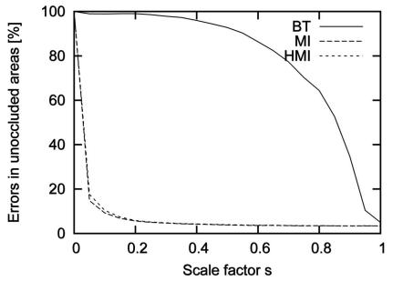  
(a)

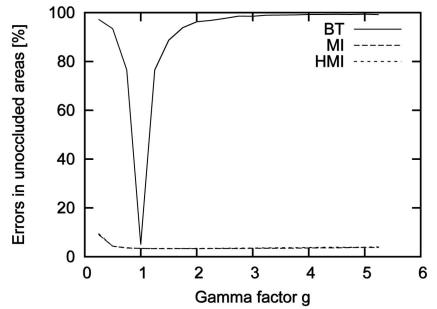  
(b)

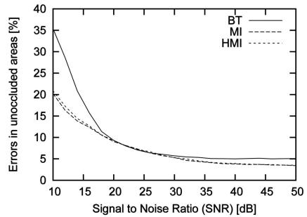  
(c)

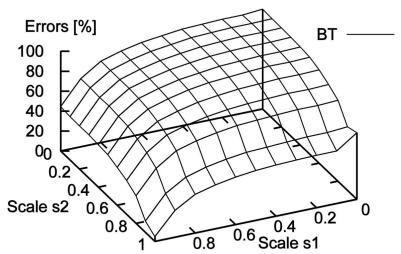  
(d)

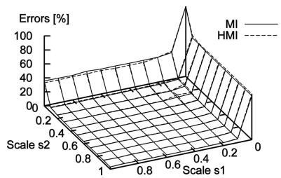  
(e)

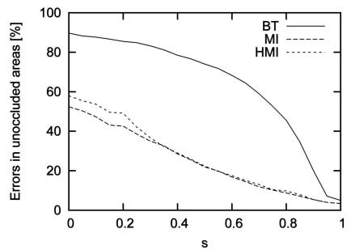  
(f)  
Fig. 10. Effect of applying radiometric changes or adding noise to the right match images using SGM with different matching cost calculations. (a) Global scale change, that is, ${ { I } ^ { \prime } } = s I$ . (b) Global gamma change. (c) Adding Gaussian noise. (d) Different scaling of image halves. (e) Different scaling of image halves. (f) Linear down-scaling from center.

Figs. 10a and 10b show the result of globally scaling intensities linearly or nonlinearly. BT breaks down very quickly, while the performance of MI and HMI is almost constant. They break down only due to the severe loss of image information when transformed intensities are stored into 8 bit. Fig. 10c shows the effect of adding Gaussian noise. MI and HMI are affected but perform better than BT for high noise levels. Ten dB means that the noise level is about 1 rd of the signal level.

Thus, global transformations are well handled by MI and HMI. The next test scales the left and right image halves differently for simulating a more complex case with two different radiometric mappings within one image. This may happen, if the illumination changes in a part of the image. Fig. 11a demonstrates the effect. The result is shown in

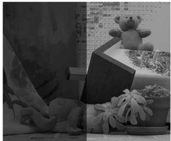  
(a)

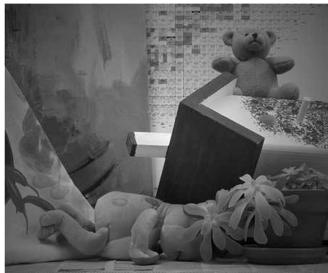  
(b)  
Fig. 11. Examples of (a) local scaling of intensities with $s _ { 1 } = 0 . 3$ and $s _ { 2 } = 0 . 7$ and (b) linear down-scaling from the image center with $s = 0 . 5 .$ Authorized licensed use limited to: Jiangnan University. Download

Figs. 10d and 10e. Again, BT breaks down very quickly, whereas MI and HMI are almost constant. Fig. 10f shows the results of decreasing the intensity linearly from the image center to the border. This is a locally varying transformation, which mimics a vignetting effect that is often found in camera lenses (Fig. 11b). MI and HMI have more problems than in the other experiments but compensate the effect much better than BT, especially for large s, which can be expected in practice.

The matching costs have also been tested on the Art data set, which is a courtesy of Daniel Scharstein. The data set offers stereo images that have been taken with different exposures and under different illuminations, that is, with changed position of the light source, as shown in Figs. 12a and 12b. There is also a ground truth disparity available. The errors that occur when matching images of different exposures are shown in Fig. 12c. It can be seen that BT fails completely, whereas HMI is nearly unaffected by the severe changes of exposure. Fig. 12d gives the result of matching images that are taken under different illuminations. This time, also HMI is affected but to a lower extent than BT. It should be noted that illumination changes in these images are very severe and cause many local changes.

BT-based matching takes 1.5 seconds on the Teddy images, whereas MI-based matching requires three iterations, which takes 4 seconds. This is 164 percent slower than BT. The suggested HMI-based matching needs 1.8 seconds, which is just 18 percent slower than BT. The values are similar for the other image pairs.

All of the experiments demonstrate that the performance of MI and HMI is almost identical. Both tolerate global changes like different exposure times without any problems. Local changes like vignetting are also handled quite well. Changes in lighting of the scene seem to be tolerated d on September 16,2026 at 03:27:22 UTC from IEEE Xplore. Restrictions apply.

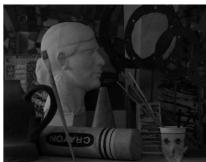

  
(a)

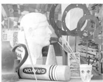

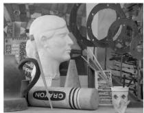

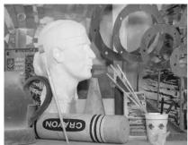  
(b)

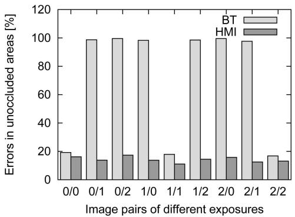

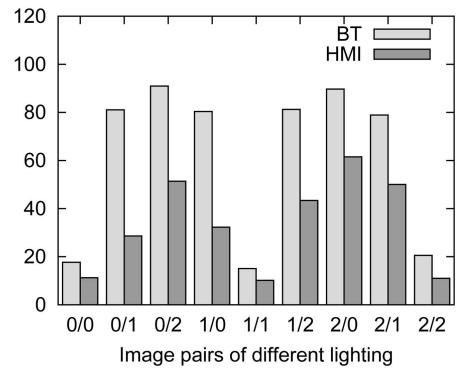  
(d)

(c)  
Fig. 12. Matching of images with different exposure and lighting. The Art data set is a courtesy of Daniel Scharstein. (a) Left images of Art data set with varying exposure. (b) Left images of Art data set with varying illuminations. (c) Result of matching images with different exposure. (d) Result of matching images with different illuminations.  
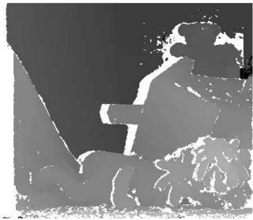

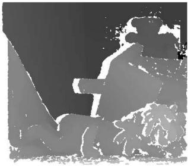

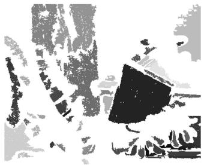

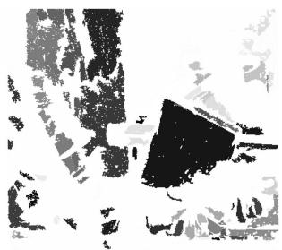

(a)  
(b)  
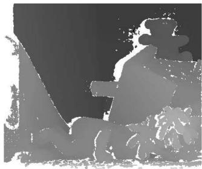  
(e)

(d)  
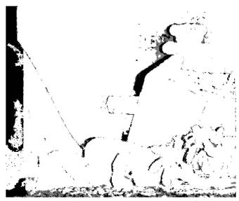  
(f)

(c)  
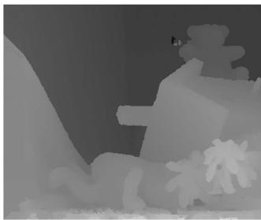  
(g)

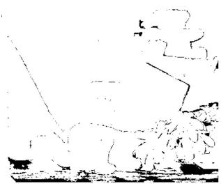  
(h)  
Fig. 13. Demonstration of the effect of the proposed postprocessing steps on the Teddy images. (a) Result after basic SGM. (b) Result after peak filtering. (c) Low textured segments. (d) Disparity segments. (e) Intensity Consistent Sel. (f) Occlusions (black) and mismatches (gray). (g) Result after interpolation. (h) Errors against ground truth.

to some extent. In contrast, BT breaks down very quickly. Thus, using BT is only advisable on images that are carefully taken under exactly the same conditions. Since HMI performed better in all experiments and just requires a small, constant fraction of the total processing time, it is always recommended for stereo matching.

## 3.3 Evaluation of Postprocessing

Postprocessing is necessary for fixing errors that the stereo algorithm has caused and providing a dense disparity image without gaps. The effects of the proposed postprocessing steps are shown in Fig. 13.

Fig. 13a shows raw result of SGM, that is, Sections 2.1, 2.2, and 2.3. Peak filtering, that is, Section 2.5.1, removes some isolated small patches of different disparity as given in Fig.13b.Figs.13cand13dshowthesegmentationresultsofthe intensity and disparity image that are used by the intensity consistent disparity selection method, that is, Section 2.5.2. The result in Fig. 13e shows that disparities in critical untextured areas have been recovered. Fig. 13f gives the classification result for interpolation.Occlusions areblack and other mismatches are gray. The result of pathwise interpolation, that is, Section 2.5.3, is presented in Fig. 13g. Finally, Fig. 13h gives the errors when comparing Fig. 13g against the ground truth with the standard threshold of 1 pixel.

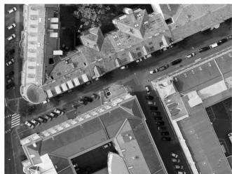  
(a)

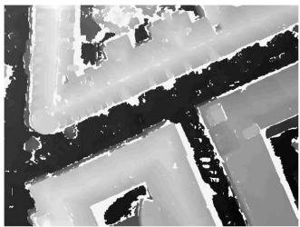  
(b)

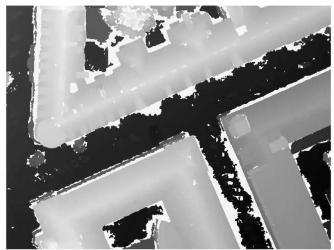  
(c)

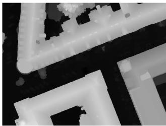  
(d)  
Fig. 14. SGM matching results from aerial UltraCam images of Graz. The input image block is a courtesy of Vexcel Imaging Graz. (a) Small part of aerial image. (b) Matching against one image. (c) Matching against six images. (d) Orthographic reprojection.

## 3.4 Example 1: Reconstruction from Aerial Full Frame Images

The SGM method has been designed for calculating accurate Digital Surface Models (DSM) from high-resolution aerial images. Graz in Austria has been captured by Vexcel Imaging with an UltraCam, which has a 54 degrees field of view and offers panchromatic images of 11; 500  7; 500 pixels, that is, 86 MPixel. Color and infrared are captured as well, but at a lower resolution. A block of 3  15 images has been provided as courtesy of Vexcel Imaging Graz. The images were captured 900 m above ground with an overlap of approximately 85 percent in flight direction and 75 percent orthogonal to it. The ground resolution was 8 cm/pixel. The image block was photogrammetrically oriented by bundle adjustment using GPS/INS data that was recorded during the flight, as well as ground control points.

The SGM method using HMI as matching cost has been applied with the same parameters as used for the comparison in Section 3.1, except for postfiltering. The peak filter threshold has been increased to 300 pixel. Furthermore, the intensity consistent disparity selection is not used as aerial images do typically not include any untextured background surfaces. This may also be due to the quality of images, that is, sharpness. Finally, interpolation has not been done. The disparity range of this data set is up to 2,000 pixel. The size of the images and the disparity range required internal and external tiling, as well as dynamic disparity range adaptation as described in Section 2.6.

A small part of one image is given in Fig. 14a. Fig. 14b shows the result of matching against one image to the left and Fig. 14c the result of multibaseline matching against six surrounding images. It can be seen that the matching of two images results already in a good disparity image. Matching against all surrounding images helps to fill in gaps that are caused by occlusions and removing remaining mismatches. After matching, all images are fused into an orthographic projection and interpolated, as described in Section 2.7. The result can be seen in Fig. 14d. The roof structures and boundaries appear very precise. Matching of one image against six neighbors took around 5.5 hours on one 2.2 GHz Opteron CPU. The 22 CPUs of a processing cluster were used for parallel matching of the 45 images. The orthographic reprojection and true orthoimage generation requires a few more hours but only on one CPU.

Fig. 15 presents 3D reconstructions from various viewpoints. The texture is taken from UltraCam images as well. Mapping texture onto all walls of buildings is possible due to the relatively large field of view of the camera and high overlap of images. The given visualizations are high-quality results of fully automatic processing steps without any manual cleanup.

## 3.5 Example 2: Reconstruction from Aerial Pushbroom Images

The SGM method has also been applied to images of the High Resolution Stereo Camera (HRSC) that has been built by the Institute of Planetary Research at the German Aerospace Center (DLR), Berlin, for stereo mapping of Mars. The camera is currently operating onboard the European Space Agency (ESA) probe Mars-Express that is orbiting Mars. Another version of the camera is used onboard airplanes for mapping the Earth’s cities and landscapes from flight altitudes between 1,500-5,000 m above ground [27]. The camera has nine 12-bit sensor arrays with 12,000 pixels, which are mounted orthogonally to the flight direction and look downwards in different angles up to 20.5 degrees. Five of the sensor arrays are panchromatic and used for stereo matching. The other four capture red, green, blue, and infrared. The position and orientation of the camera is continuously measured by a GPS/INS system. The ground resolution of the images is 15-20 cm/pixel.

The SGM method has been applied to HRSC images that have been radiometrically and geometrically corrected at the Institute of Planetary Research at DLR Berlin. The result are 2D images from the data captured by each of the nine sensor arrays. However, despite geometric rectification, epipolar lines are in general not straight, as this is not possible for aerial pushbroom images. Thus, epipolar lines are calculated during image matching as described previously [22].

SGM using HMI as matching cost has been applied again as in Section 3.4 with the same parameters. Matching is performed between the five panchromatic images of each flight strip individually. Each of these images can have a size of up to several gigabytes, which requires internal and external tiling, as well as dynamic disparity range adaptation, as described in Section 2.6. Matching between strips is not done as the overlap of strips is typically less than 50 percent.

The fully automatic method has been implemented on a cluster of 40 2.0 GHz and 2.2 GHz Opteron CPUs. The cluster is able to process an area of 400 km2 in a resolution of 20 cm/pixel within three to four days, resulting in around 50 GB of height and image data. A total of more than 20,000 km2 has been processed within one year.

Fig. 16 shows a reconstruction of a small part of one scene. The visualizations were calculated fully automatically, including mapping of the wall texture from HRSC images. It should be noted that the ground resolution of the HRSC images is almost three times lower than that of the UltraCam d on September 16,2026 at 03:27:22 UTC from IEEE Xplore. Restrictions apply.

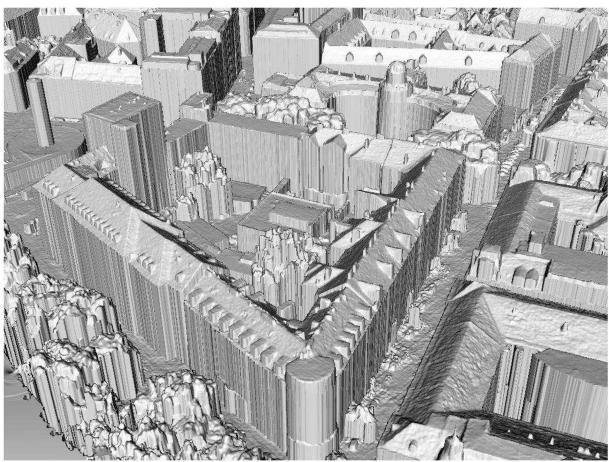

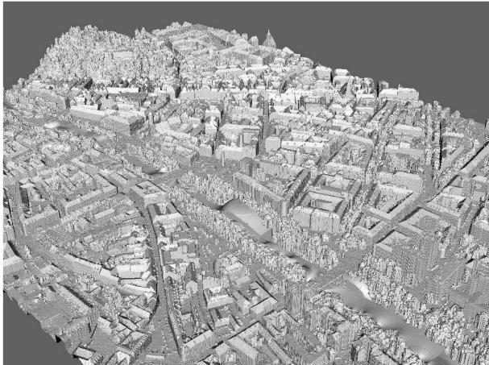

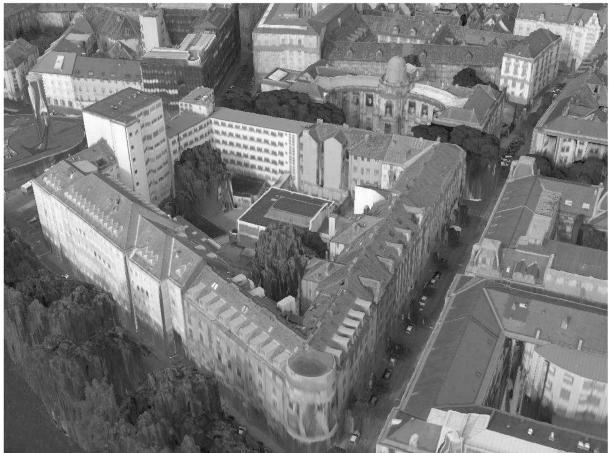

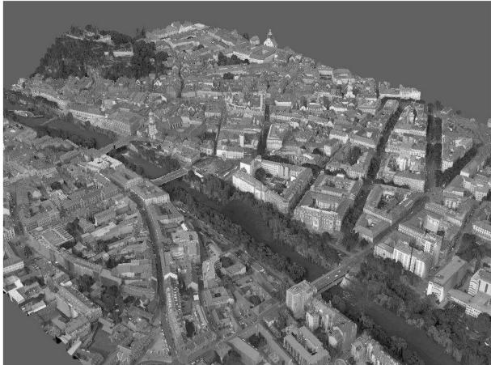

Fig. 15. Untextured and textured 3D reconstructions from aerial UltraCam images of Graz.  
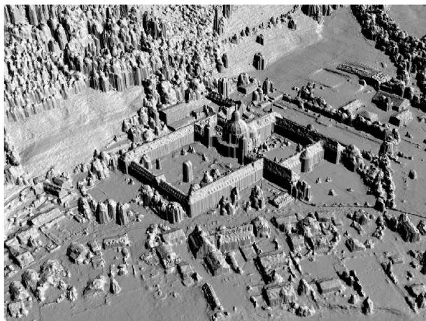

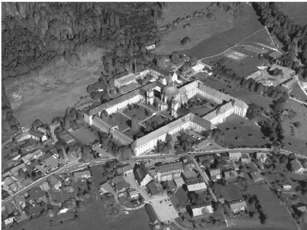  
Fig. 16. Untextured and textured reconstructions from images of the DLR HRSC of Ettal.

images in Fig. 15. Nevertheless, a good quality of reconstruction with sharp object boundaries can be achieved on huge amounts of data. This demonstrates that the proposed ideas are working very stable on practical problems.

## 4 CONCLUSION

The SGM stereo method has been presented. Extensive tests show that it is tolerant against many radiometric changes that occur in practical situations due to an HMI-based matching cost. Matching is done accurately on a pixel level by pathwise optimization of a global cost function. The presented postfiltering methods optionally help by tackling remaining individual problems. An extension for matching huge images has been presented, as well as a strategy for fusing disparity images using orthographic projection.

The method has been evaluated on the Middlebury Stereo Pages. It has been shown that SGM can compete with the currently best stereo methods. It even performs superior to all other methods when the threshold for comparing the results against ground truth is lowered from 1 to 0.5 pixel, which shows an excellent subpixel performance. All of this

Authorized licensed use limited to: Jiangnan University. Downloaded on September 16,2026 at 03:27:22 UTC from IEEE Xplore. Restrictions apply.

is done with a complexity of OðWHDÞ that is rather common for local methods. The runtime is just 1-2 seconds on typical test images, which is much lower than that of most other methods with comparable results. Experiences of applying SGM on huge amounts of aerial full frame and pushbroom images demonstrate the practical applicability of all presented ideas. All of these advantages make SGM a prime choice for solving many practical stereo problems.

## ACKNOWLEDGMENTS

The author would like to thank Daniel Scharstein for making the Art data set available, Vexcel Imaging Graz for providing the UltraCam data set of Graz, and the members of the Institute of Planetary Research at the German Aerospace Center (DLR), Berlin, for capturing and preprocessing HRSC data.

## REFERENCES

[1] D. Scharstein and R. Szeliski, “A Taxonomy and Evaluation of Dense Two-Frame Stereo Correspondence Algorithms,” Int’l J. Computer Vision, vol. 47, nos. 1/2/3, pp. 7-42, Apr.-June 2002.

[2] S. Birchfield and C. Tomasi, “Depth Discontinuities by Pixel-to-Pixel Stereo,” Proc. Sixth IEEE Int’l Conf. Computer Vision, pp. 1073- 1080, Jan. 1998.

[3] A. Klaus, M. Sormann, and K. Karner, “Segment-Based Stereo Matching Using Belief Propagation and a Self-Adapting Dissimilarity Measure,” Proc. Int’l Conf. Pattern Recognition, 2006.

[4] P. Viola and W.M. Wells, “Alignment by Maximization of Mutual Information,” Int’l J. Computer Vision, vol. 24, no. 2, pp. 137-154, 1997.

[5] G. Egnal, “Mutual Information as a Stereo Correspondence Measure,” Technical Report MS-CIS-00-20, Computer and Information Science, Univ. of Pennsylvania, 2000.

[6] J. Kim, V. Kolmogorov, and R. Zabih, “Visual Correspondence Using Energy Minimization and Mutual Information,” Proc. Int’l Conf. Computer Vision, Oct. 2003.

[7] C.L. Zitnick, S.B. Kang, M. Uyttendaele, S. Winder, and R. Szeliski, “High-Quality Video View Interpolation Using a Layered Representation,” Proc. ACM SIGGRAPH ’04, 2004.

[8] H. Hirschmu¨ ller, P.R. Innocent, and J.M. Garibaldi, “Real-Time Correlation-Based Stereo Vision with Reduced Border Errors,” Int’l J. Computer Vision, vol. 47, nos. 1/2/3, pp. 229-246, Apr.-June 2002.

[9] M. Bleyer and M. Gelautz, “A Layered Stereo Matching Algorithm Using Image Segmentation and Global Visibility Constraints,” ISPRS J. Photogrammetry and Remote Sensing, vol. 59, no. 3, pp. 128- 150, 2005.

[10] K.-J. Yoon and I.-S. Kweon, “Adaptive Support-Weight Approach for Correspondence Search,” IEEE Trans. Pattern Matching and Machine Intelligence, vol. 28, no. 4, pp. 650-656, Apr. 2006.

[11] Q. Yang, L. Wang, R. Yang, H. Stewenius, and D. Nister, “Stereo Matching with Color-Weighted Correlation, Hierarchical Belief Propagation and Occlusion Handling,” Proc. IEEE Conf. Computer Vision and Pattern Recognition, June 2006.

[12] C. Lei, J. Selzer, and Y.-H. Yang, “Region-Tree Based Stereo Using Dynamic Programming Optimization,” Proc. IEEE Conf. Computer Vision and Pattern Recognition, June 2006.

[13] V. Kolmogorov and R. Zabih, “Computing Visual Correspondence with Occlusions Using Graph Cuts,” Proc. Int’l Conf. Computer Vision, vol. 2, pp. 508-515, 2001.

[14] J. Sun, Y. Li, S. Kang, and H.-Y. Shum, “Symmetric Stereo Matching for Occlusion Handling,” Proc. IEEE Conf. Computer Vision and Pattern Recognition, vol. 2, pp. 399-406, June 2005.

[15] G. Van Meerbergen, M. Vergauwen, M. Pollefeys, and L. Van Gool, “A Hierarchical Symmetric Stereo Algorithm Using Dynamic Programming,” Int’l J. Computer Vision, vol. 47, nos. 1/2/3, pp. 275-285, Apr.-June 2002.

[16] O. Veksler, “Stereo Correspondence by Dynamic Programming on a Tree,” Proc. IEEE Conf. Computer Vision and Pattern Recognition, vol. 2, pp. 384-390, June 2005.

[17] H. Hirschmu¨ ller, “Stereo Vision Based Mapping and Immediate Virtual Walkthroughs,” PhD dissertation, School of Computing, De Montfort Univ., June 2003.

[18] D. Scharstein and R. Szeliski, “High-Accuracy Stereo Depth Maps Using Structured Light,” Proc. IEEE Conf. Computer Vision and Pattern Recognition, vol. 1, pp. 195-202, June 2003.

[19] H. Hirschmu¨ ller, “Accurate and Efficient Stereo Processing by Semi-Global Matching and Mutual Information,” Proc. IEEE Conf. Computer Vision and Pattern Recognition, vol. 2, pp. 807-814, June 2005.

[20] H. Hirschmu¨ ller, “Stereo Vision in Structured Environments by Consistent Semi-Global Matching,” Proc. IEEE Conf. Computer Vision and Pattern Recognition, June 2006.

[21] R. Gupta and R.I. Hartley, “Linear Pushbroom Cameras,” IEEE Trans. Pattern Analysis and Machine Intelligence, vol. 19, no. 9, pp. 963-975, Sept. 1997.

[22] H. Hirschmu¨ ller, F. Scholten, and G. Hirzinger, “Stereo Vision Based Reconstruction of Huge Urban Areas from an Airborne Pushbroom Camera (HRSC),” Proc. 27th Symp. German Assoc. for Pattern Recognition, pp. 58-66, Aug./Sept. 2005.

[23] Y. Boykov, O. Veksler, and R. Zabih, “Fast Approximate Energy Minimization via Graph Cuts,” IEEE Trans. Pattern Analysis and Machine Intelligence, vol. 23, no. 11, pp. 1222-1239, 2001.

[24] E.R. Davis, Machine Vision: Theory, Algorithms, Practicalities, second ed. Academic Press, 1997.

[25] D. Comaniciu and P. Meer, “Mean Shift: A Robust Approach Toward Feature Space Analysis,” IEEE Trans. Pattern Analysis and Machine Intelligence, vol. 24, no. 5, pp. 1-18, May 2002.

[26] C. Strecha, R. Fransens, and L. Van Gool, “Combined Depth and Outlier Estimation in Multi-View Stereo,” Proc. IEEE Conf. Computer Vision and Pattern Recognition, June 2006.

[27] F. Wewel, F. Scholten, and K. Gwinner, “High Resolution Stereo Camera (HRSC)—Multispectral 3D-Data Acquisition and Photogrammetric Data Processing,” Canadian J. Remote Sensing, vol. 26, no. 5, pp. 466-474, 2000.

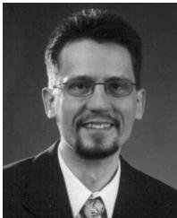  
Heiko Hirschmu¨ller received the Dipl-Inform (FH) degree at Fachhochschule Mannheim, Germany, in 1996, the MSc degree in human computer systems at De Montfort University Leicester, United Kingdom, in 1997, and the PhD degree in real-time stereo vision at De Montfort University Leicester, United Kingdom, in 2003. From 1997 to 2000, he worked as software engineer at Siemens Mannheim, Germany. Since 2003, he is working as a computer

vision researcher at the Institute of Robotics and Mechatronics of the German Aerospace Center (DLR) in Oberpfaffenhofen near Munich. His research interests are stereo vision algorithms and 3D reconstruction from multiple images.

. For more information on this or any other computing topic, please visit our Digital Library at www.computer.org/publications/dlib.