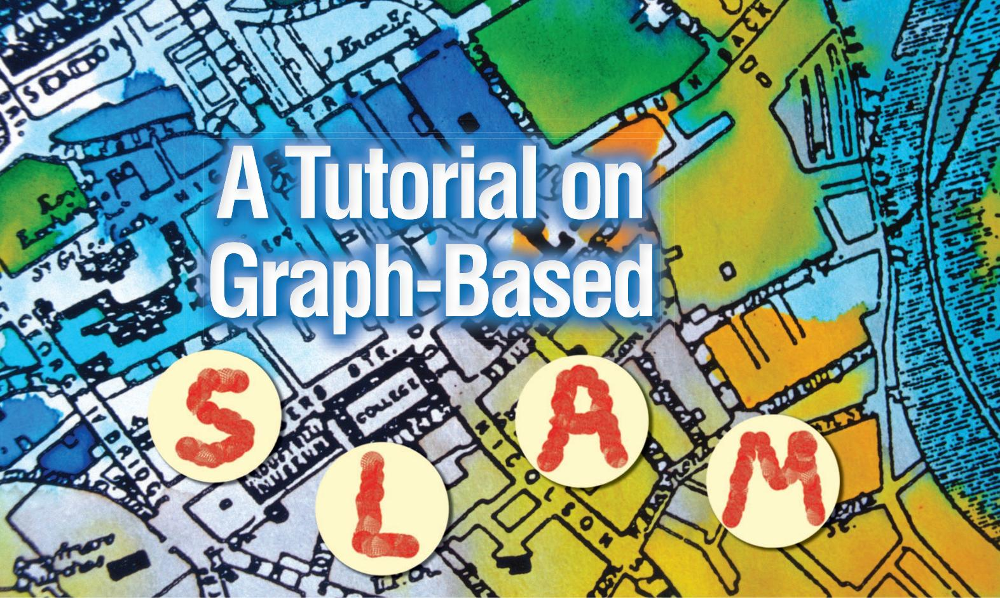

Giorgio Grisetti, Rainer Kümmerle, Cyrill Stachniss, and Wolfram Burgard

## I. Introduction

o efficiently solve many tasks envisioned to be carried out by mobile robots including transportation, search and rescue, or automated vacuum cleaning robots need a map of the environment.   
The availability of an accurate map allows for the   
design of systems that can operate in complex envi  
ronments only based on their on-board sensors and   
without relying on external reference system like, e.g.,   
GPS. The acquisition of maps of indoor environments,   
where typically no GPS is available, has been a major   
research focus in the robotics community over the last   
decades. Learning maps under pose uncertainty is of  
ten referred to as the simultaneous localization and   
mapping (SLAM) problem. In the literature, a large   
variety of solutions to this problem is available. These   
approaches can be classified either as filtering or   
smoothing. Filtering approaches model the problem   
as an on-line state estimation where the state of the

© ARTVILLE

Abstract—Being able to build a map of the environment and to simultaneously localize within this map is an essential skill for mobile robots navigating in unknown environments in absence of external referencing systems such as GPS. This so-called simultaneous localization and mapping (SLAM) problem has been one of the most popular research topics in mobile robotics for the last two decades and efficient approaches for solving this task have been proposed. One intuitive way of formulating SLAM is to use a graph whose nodes correspond to the poses of the robot at different points in time and whose edges represent constraints between the poses. The latter are obtained from observations of the environment or from movement actions carried out by the robot. Once such a graph is constructed, the map can be computed by finding the spatial configuration of the nodes that is mostly consistent with the measurements modeled by the edges. In this paper, we provide an introductory description to the graph-based SLAM problem. Furthermore, we discuss a state-ofthe-art solution that is based on least-squares error minimization and exploits the structure of the SLAM problems during optimization. The goal of this tutorial is to enable the reader to implement the proposed methods from scratch.

Digital Object Identifier 10.1109/MITS.2010.939925   
Date of publication: 4 February 2011

## Graph-based SLAM methods have undergone a renaissance and currently belong to the state-of-the-art techniques with respect to speed and accuracy.

system consists in the current robot position and the map. The estimate is augmented and refined by incorporating the new measurements as they become available. Popular techniques like Kalman and information filters [28], [3], particle filters [22], [12], [9], or information filters [7], [31] fall into this category. To highlight their incremental nature, the filtering approaches are usually referred to as on-line SLAM methods. Conversely, smoothing approaches estimate the full trajectory of the robot from the full set of measurements [21], [5], [27]. These approaches address the so-called full SLAM problem, and they typically rely on least-square error minimization techniques.

Figure 1 shows three examples of real robotic systems that use SLAM technology: an autonomous car, a tour-guide robot, and an industrial mobile manipulation robot. Image (a) shows the autonomous car Junior as well as a model of a parking garage that has been mapped with that car. Thanks to the acquired model, the car is able to park itself autonomously at user selected locations in the garage. Image (b) shows the TPR-Robina robot developed by Toyota which is also used in the context of guided tours in museums. This robot uses SLAM technology to update its map whenever the environment has been changed. Robot manufacturers such as KUKA, recently presented mobile manipulators as shown in Image (c). Here, SLAM technology is needed to operate such devices in flexible way in changing industrial environments. Figure 2 illustrates 2D and 3D maps that can be estimated by the SLAM algorithm discussed in this paper.

An intuitive way to address the SLAM problem is via its so-called graph-based formulation. Solving a graph-based SLAM problem involves to construct a graph whose

nodes represent robot poses or landmarks and in which an edge between two nodes encodes a sensor measurement that constrains the connected poses. Obviously, such constraints can be contradictory since observations are always affected by noise. Once such a graph is constructed, the crucial problem is to find a configuration of the nodes that is maximally consistent with the measurements. This involves solving a large error minimization problem.

The graph-based formulation of the SLAM problem has been proposed by Lu and Milios in 1997 [21]. However, it took several years to make this formulation popular due to the comparably high complexity of solving the error minimization problem using standard techniques. Recent insights into the structure of the SLAM problem and advancements in the fields of sparse linear algebra resulted in efficient approaches to the optimization problem at hand. Consequently, graph-based SLAM methods have undergone a renaissance and currently belong to the state-of-the-art techniques with respect to speed and accuracy. The aim of this tutorial is to introduce the SLAM problem in its probabilistic form and to guide the reader to the synthesis of an effective and state-of-the-art graph-based SLAM method. To understand this tutorial a good knowledge of linear algebra, multivariate minimization, and probability theory are required.

  
(a)

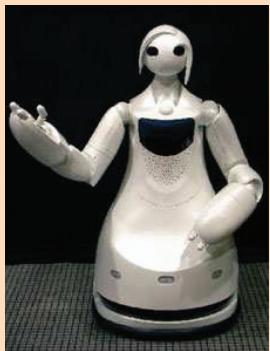  
(b)

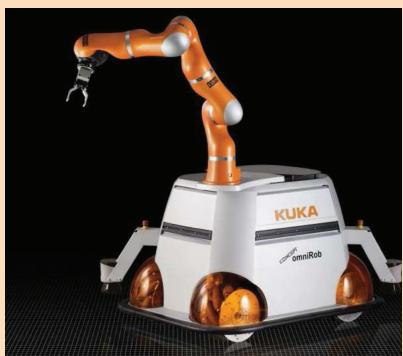  
(c)  
FIG 1 Applications of SLAM technology. (a) An autonomous instrumented car developed at Stanford. This car can acquire maps by utilizing only its on-board sensors. These maps can be subsequently used for autonomous navigation. (b) The museum guide robot TPR-Robina developed by Toyota (picture courtesy of Toyota Motor Company). This robot acquires a new map every time the museum is reconfigured. (c) The KUKA Concept robot “Omnirob”, a mobile manipulator designed autonomously navigate and operate in the environment with the sole use of its on-board sensors (picture courtesy of KUKA Roboter GmbH).

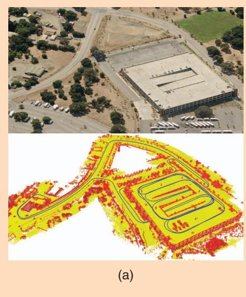

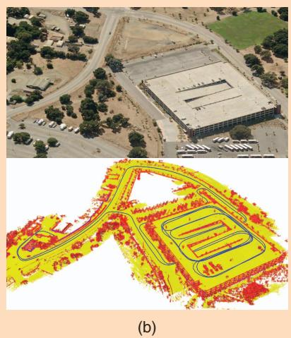

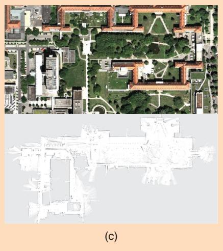  
FIG 2 (a) A 3D map of the Stanford parking garage acquired with an instrumented car (bottom), and the corresponding satellite view (top). This map has been subsequently used to realize an autonomous parking behavior. (b) Point cloud map acquired at the university of Freiburg (courtesy of Kai. M. Wurm) and relative satellite image. (c) Occupancy grid map acquired at the hospital of Freiburg. Top: a bird’s eye view of the area, bottom: the occupancy grid representation. The gray areas represent unobserved regions, the white part represents traversable space while the black points indicate occupied regions.

## II. Probabilistic Formulation of SLAM

Solving the SLAM problem consists of estimating the robot trajectory and the map of the environment as the robot moves in it. Due to the inherent noise in the sensor measurements, a SLAM problem is usually described by means of probabilistic tools. The robot is assumed to move in an unknown environment, along a trajectory described by the sequence of random variables $\mathbf { x } _ { 1 : T } = \{ \mathbf { x } _ { 1 } , \dots , \mathbf { x } _ { T } \}$ . While moving, it acquires a sequence of odometry measurements $\mathbf { u } _ { 1 : T } = \{ \mathbf { u } _ { 1 } , \dots , \mathbf { u } _ { T } \}$ and perceptions of the environment $\mathbf { z } _ { 1 : T } = \{ \mathbf { z } _ { 1 } , \dots , \mathbf { z } _ { T } \}$ . Solving the full SLAM problem consists of estimating the posterior probability of the robot’s trajectory $\mathbf { X } _ { 1 : T }$ and the map m of the environment given all the measurements plus an initial position $\mathbf { X } _ { 0 } \mathbf { : }$

$$
p ( \mathbf { x } _ { 1 : T } , \mathbf { m } \mid \mathbf { z } _ { 1 : T } , \mathbf { u } _ { 1 : T } , \mathbf { x } _ { 0 } ) .
$$

ment, and on the estimation algorithm. Landmark maps [28], [22] are often preferred in environments where locally distinguishable features can be identified and especially when cameras are used. In contrast, dense representations [33], [12], [9] are usually used in conjunction with range sensors. Independently of the type of the representation, the map is defined by the measurements and the locations where these measurements have been acquired [17], [18]. Figure 2 illustrates three typical dense map representations for 3D and 2D: multilevel surface maps, point clouds and occupancy grids. Figure 3 shows a typical 2D landmark based map.

(1)

Estimating the posterior given in (1) involves operating in high dimensional state spaces. This would not be tractable if the SLAM problem would not have a well defined structure. This structure arises from certain and commonly done assumptions, namely the static world

The initial position $\mathbf { X } _ { 0 }$ defines the position of the map and can be chosen arbitrarily. For convenience of notation, in the remainder of this document we will omit $\mathbf { X } _ { 0 } .$ The poses $\mathbf { X } _ { 1 : T }$ and the odometry $\mathbf { u } _ { 1 : T }$ are usually represented as 2D or 3D transformations in SE12 2 or in SE132, while the map can be represented in different ways. Maps can be parametrized as a set of spatially located landmarks, by dense representations like occupancy grids, surface maps, or by raw sensor measurements. The choice of a particular map representation depends on the sensors used, on the characteristics of the environassumption and the Markov assumption. A convenient way to describe this structure is via the dynamic Bayesian network (DBN) depicted in Figure 4. A Bayesian network is a graphical model that describes a stochastic process as a directed graph. The graph has one node for each random variable in the process, and a directed edge (or arrow) between two nodes models a conditional dependence between them.

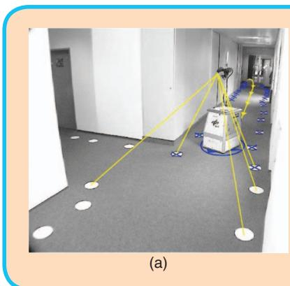

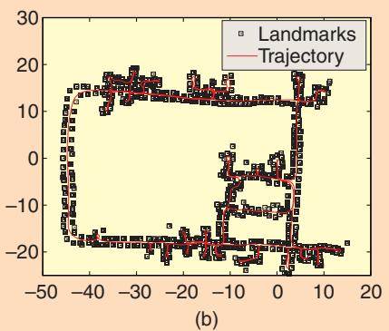  
FIG 3 Landmark based maps acquired at the German Aerospace Center. In this setup the landmarks consist in white circles painted on the ground that are detected by the robot through vision, as shown in the left image. The right image illustrates the trajectory of the robot and the estimated positions of the landmarks. These images are courtesy of Udo Frese and Christoph Hertzberg.

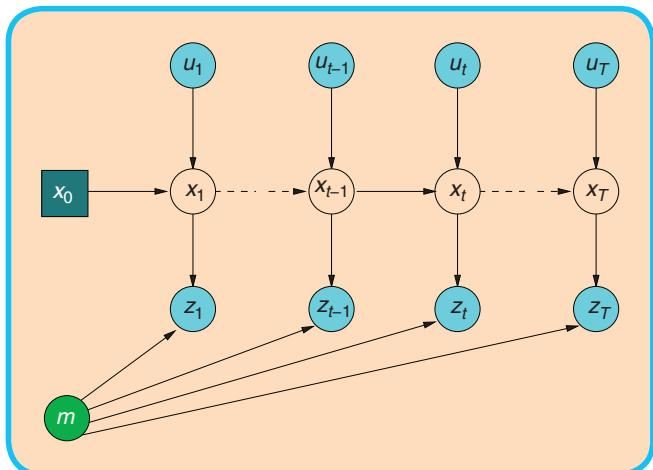  
FIG 4 Dynamic Bayesian Network of the SLAM process.

In Figure 4, one can distinguish blue/gray nodes indicating the observed variables (here $\mathbf { z } _ { 1 : T }$ and $\mathbf { u } _ { 1 : T } )$ and white nodes which are the hidden variables. The hidden variables $\mathbf { X } _ { 1 : T }$ and m model the robot’s trajectory and the map of the environment. The connectivity of the DBN follows a recurrent pattern characterized by the state transition model and by the observation model. The transition model $p ( \mathbf { x } _ { t } | \mathbf { x } _ { t - 1 } , \mathbf { u } _ { t } )$ is represented by the two edges leading to $\mathbf { X } _ { t }$ and represents the probability that the robot at time t is in $\mathbf { X } _ { t }$ given that at time t 2 1 it was in $\mathbf { X } _ { t }$ and it acquired an odometry measurement $\mathbf { u } _ { t } .$

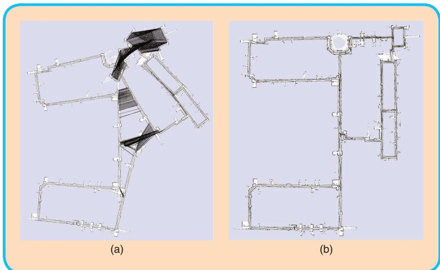  
FIG 5 Pose-graph corresponding to a data-set recorded at MIT Killian Court (courtesy of Mike Bosse and John Leonard) (left) and after (right) optimization. The maps are obtained by rendering the laser scans according to the robot positions in the graph.

The observation model $p ( \mathbf { z } _ { t } | \mathbf { x } _ { t } , \mathbf { m } _ { t } )$ models the probability of performing the observation $\mathbf { z } _ { t }$ given that the robot is at location $\mathbf { X } _ { t }$ in the map. It is represented by the arrows entering in $\mathbf { z } _ { t } .$ The exteroceptive observation $\mathbf { z } _ { t }$ depends only on the current location $\mathbf { X } _ { t }$ of the robot and on the (static) map m. Expressing SLAM as a DBN highlights its temporal structure, and therefore this formalism is well suited to describe filtering processes that can be used to tackle the SLAM problem.

An alternative representation to the DBN is via the socalled “graph-based” or “network-based” formulation of the SLAM problem, that highlights the underlying spatial structure. In graph-based SLAM, the poses of the robot are modeled by nodes in a graph and labeled with their position in the environment [21], [18]. Spatial constraints between poses that result from observations $z _ { t }$ or from odometry measurements $\mathbf { u } _ { t }$ are encoded in the edges between the nodes. More in detail, a graph-based SLAM algorithm constructs a graph out of the raw sensor measurements. Each node in the graph represents a robot position and a measurement acquired at that position. An edge between two nodes represents a spatial constraint relating the two robot poses. A constraint consists in a probability distribution over the relative transformations between the two poses. These transformations are either odometry measurements between sequential robot positions or are determined by aligning the observations acquired at the two robot locations. Once the graph is constructed one seeks to find the configuration of the robot poses that best satisfies the constraints. Thus, in graph-based SLAM the problem is decoupled in two tasks: constructing the graph from the raw measurements (graph construction), determining the

most likely configuration of the poses given the edges of the graph (graph optimization). The graph construction is usually called front-end and it is heavily sensor dependent, while the second part is called back-end and relies on an abstract representation of the data which is sensor agnostic. A short example of a front-end for 2D laser SLAM is described in Section A. In this tutorial we will describe an easy-to-implement but efficient backend for graph-based SLAM. Figure 5 depicts an uncorrected pose-graph and the corresponding corrected one.

## III. Related Work

There is a large variety of SLAM approaches available in the robotics community. Throughout this tutorial we focus on graph-based approaches and therefore will consider such approaches in the discussion of related work. Lu and Milios [21] were the first to refine a map by globally optimizing the system of equations to reduce the error introduced by constraints. Gutmann and Konolige [11] proposed an effective way for constructing such a network and for detecting loop closures while running an incremental estimation algorithm. Since then, many approaches for minimizing the error in the constraint network have been proposed. For example, Howard et al. [15] apply relaxation to localize the robot and build a map. Frese et al. [8] propose a variant of Gauss-Seidel relaxation called multi-level relaxation (MLR). It applies relaxation at different resolutions. Dellaert and Kaess [5] were the first to exploit sparse matrix factorizations to solve the linearized problem in off-line SLAM. Subsequently Kaess et al. [16] presented iSAM, an online version that exploits partial reorderings to compute the sparse factorization.

Recently, Konolige et al. [19] proposed an open-source implementation of a pose-graph method that constructs the linearized system in an efficient way. Olson et al. [27] presented an efficient optimization approach which is based on the stochastic gradient descent and can efficiently correct even large pose-graphs. Grisetti et al. proposed an extension of Olson’s approach that uses a tree parametrization of the nodes in 2D and 3D. In this way, they increase the convergence speed [10].

GraphSLAM [32] applies variable elimination techniques to reduce the dimensionality of the optimization problem. The ATLAS framework [2] constructs a two-level hierarchy of graphs and employs a Kalman filter to construct the bottom level. Then, a global optimization approach aligns the local maps at the second level. Similar to ATLAS, Estrada et al. proposed Hierarchical SLAM [6] as a technique for using independent local maps.

Most optimization techniques focus on computing the best map given the constraints and are called SLAM back-ends. In contrast to that, SLAM front-ends seek to interpret the sensor data to obtain the constraints that are the basis for the optimization approaches. Olson [25], for example, presented a front-end with outlier rejection based on spectral clustering. For making data associations in the SLAM front-ends statistical tests such as the $\chi ^ { 2 }$ test or joint compatibility test [23] are often applied. The work of Nüchter et al. [24] aims at building an integrated SLAM system for 3D mapping. The main focus lies on the SLAM front-end for finding constraints. For optimization, a variant of the approach of Lu and Milios [21] for 3D settings is applied. The methods proposed in this paper can be effectively applied to all these front-ends.

## IV. Graph-Based SLAM

A graph-based SLAM approach constructs a simplified estimation problem by abstracting the raw sensor measurements. These raw measurements are replaced by the edges in the graph which can then be seen as “virtual measurements”. More in detail an edge between two nodes is labeled with a probability distribution over the relative locations of the two poses, conditioned to their mutual measurements. In general, the observation model $p ( \mathbf { z } _ { t } | \mathbf { x } _ { t } , \mathbf { m } _ { t } )$ is multimodal and therefore the Gaussian assumption does not hold. This means that a single observation $\mathbf { z } _ { t }$ might result in multiple potential edges connecting different poses in the graph and the graph connectivity needs itself to be described as a probability distribution. Directly dealing with this multi-modality in the estimation process would lead to a combinatorial explosion of the complexity. As a result of that, most practical approaches restrict the estimate to the most likely topology. Thus, one needs to determine the most likely constraint resulting from an observation. This decision depends on the probability distribution over the robot poses. This problem is known as data association and is usually addressed by the SLAM front-end. To compute the correct data-association, a front-end usually requires a consistent estimate of the conditional prior over the robot trajectory $p ( \mathbf { x } _ { 1 : T } | \mathbf { z } _ { 1 : T } , \mathbf { u } _ { 1 : T } )$ . This requires to interleave the execution of the front-end and of the back-end while the robot explores the environment. Therefore, the accuracy and the efficiency of the back-end is crucial to the design of a good SLAM system. In this tutorial, we will not describe sophisticated approaches to the data association problem. Such methods tackle association by means of spectral clustering [27], joint compatibility branch and bound [23], or backtracking [13]. We rather assume that the given frontend provides consistent estimates.

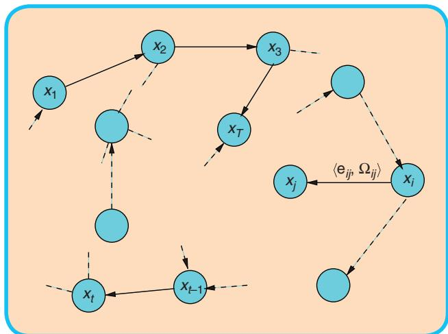  
FIG 6 A pose-graph representation of a SLAM process. Every node in the graph corresponds to a robot pose. Nearby poses are connected by edges that model spatial constraints between robot poses arising from measurements. Edges $\pmb { \mathsf { e } } _ { t - 1 }$ between consecutive poses model odometry measurements, while the other edges represent spatial constraints arising from multiple observations of the same part of the environment.

If the observations are affected by (locally) Gaussian noise and the data association is known, the goal of a graph-based mapping algorithm is to compute a Gaussian approximation of the posterior over the robot trajectory. This involves computing the mean of this Gaussian as the configuration of the nodes that maximizes the likelihood of the observations. Once this mean is known the information matrix of the Gaussian can be obtained in a straightforward fashion, as explained in Section IV-B. In the following we will characterize the task of finding this maximum as a constraint optimization problem. We will also introduce parts of the notation illustrated in Figure 6.

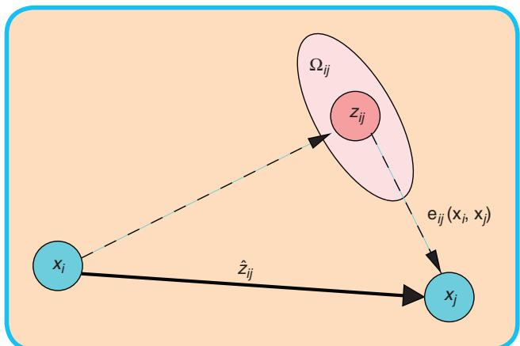  
FIG 7 Aspects of an edge connecting the vertex x and the vertex $\mathbf { \delta x } _ { j } .$ . This edge originates from the measurement $\mathbf { \delta } _ { \mathbf { z } _ { j j } }$ From the relative position of the two nodes, it is possible to compute the expected measurement $\hat { \mathbf { z } } _ { i j }$ that represents x seen in the frame of $\pmb { \chi } _ { j } .$ The error $\pmb { \mathsf { e } } _ { i j } ( \pmb { \mathsf { x } } _ { i } , \pmb { \mathsf { x } } _ { j } )$ depends on the displacement between the expected and the real measurement. An edge is fully characterized by its error function $\pmb { \mathsf { e } } _ { i j } ( \pmb { \mathsf { x } } _ { i } , \pmb { \mathsf { x } } _ { j } )$ and by the information matrix $\Omega _ { j j }$ of the measurement that accounts for its uncertainty.

Let $\mathbf { x } = ( \mathbf { x } _ { 1 } , \ldots , \mathbf { x } _ { T } ) ^ { T }$ be a vector of parameters, where $\mathbf { X } _ { i }$ describes the pose of node i. Let $\mathbf { z } _ { i j }$ and $\Omega _ { i j }$ be respectively the mean and the information matrix of a virtual measurement between the node i and the node j. This virtual measurement is a transformation that makes the observations acquired from i maximally overlap with the observation acquired from $j .$ Let $\hat { \mathbf { z } } _ { i j } ( \mathbf { x } _ { i } , \mathbf { x } _ { j } )$ be the prediction of a virtual measurement given a configuration of the nodes $\mathbf { X } _ { i }$ and $\mathbf { X } _ { j } .$ Usually this prediction is the relative transformation between the two nodes. The log-likelihood $\mathrm { l } _ { i j }$ of a measurement $\mathbf { z } _ { i j }$ is therefore

$$
\begin{array} { r } { \boldsymbol { \mathbf { l } } _ { i j } \propto \big [ \mathbf { z } _ { i j } - \hat { \mathbf { z } } _ { i j } ( \mathbf { x } _ { i } , \mathbf { x } _ { j } ) \big ] ^ { T } \boldsymbol { \Omega } _ { i j } \big [ \mathbf { z } _ { i j } - \hat { \mathbf { z } } _ { i j } ( \mathbf { x } _ { i } , \mathbf { x } _ { j } ) \big ] . } \end{array}\tag{2}
$$

Let $\mathbf { e } ( \mathbf { x } _ { i } , \mathbf { x } _ { j } , \mathbf { z } _ { i j } )$ be a function that computes a difference between the expected observation $\hat { \mathbf { z } } _ { i j }$ and the real observation $\mathbf { z } _ { i j }$ gathered by the robot. For simplicity of notation, we will encode the indices of the measurement in the indices of the error function

$$
\mathbf { e } _ { i j } ( \mathbf { x } _ { i } , \mathbf { x } _ { j } ) = \mathbf { z } _ { i j } - \hat { \mathbf { z } } _ { i j } ( \mathbf { x } _ { i } , \mathbf { x } _ { j } ) .\tag{3}
$$

Figure 7 illustrates the functions and the quantities that play a role in defining an edge of the graph. Let C be the set of pairs of indices for which a constraint (observation) z exists.

The goal of a maximum likelihood approach is to find the configuration of the nodes $\mathbf { x } ^ { * }$ that minimizes the negative log likelihood $\mathbf { F } ( \mathbf { x } )$ of all the observations

$$
\mathbf { F } ( \mathbf { x } ) = \sum _ { \langle i , j \rangle \in { \mathcal { C } } } \mathbf { e } _ { i j } ^ { T } \boldsymbol { \Omega } _ { i j } \mathbf { e } _ { i j }\tag{4}
$$

thus, it seeks to solve the following equation:

$$
\mathbf { x } ^ { * } = \underset { \mathbf { X } } { \mathrm { a r g m i n } } ~ \mathbf { F } ( \mathbf { x } ) .\tag{5}
$$

In the remainder of this section we will describe an approach to solve Eq. 5 and to compute a Gaussian approximation of the posterior over the robot trajectory. Whereas the proposed approach utilizes standard optimization methods, like the Gauss-Newton or the Levenberg- Marquardt algorithms, it is particularly efficient because it effectively exploits the structure of the problem.

We first describe a direct implementation of traditional nonlinear least-squares optimization. Subsequently, we introduce a workaround that allows to deal with the singularities in the representation of the robot poses in an elegant manner.

## A. Error Minimization via Iterative Local Linearizations

If a good initial guess x<sup>˘</sup> of the robot’s poses is known, the numerical solution of Eq. (5) can be obtained by using the popular Gauss-Newton or Levenberg-Marquardt algorithms. The idea is to approximate the error function by its first order Taylor expansion around the current initial guess $\breve { \mathbf { X } }$

$$
\mathbf { e } _ { i j } ( \check { \mathbf { x } } _ { i } + \Delta \mathbf { x } _ { i } , \check { \mathbf { x } } _ { j } + \Delta \mathbf { x } _ { j } ) = \mathbf { e } _ { i j } ( \check { \mathbf { x } } + \Delta \mathbf { x } )\tag{6}
$$

$$
\begin{array} { r } { \simeq \mathbf { e } _ { i j } + \mathbf { J } _ { i j } \pmb { \Delta x } . } \end{array}\tag{7}
$$

Here, $\mathbf { J } _ { i j }$ is the Jacobian of $\mathbf { e } _ { i j } ( \mathbf { x } )$ computed in $\breve { \mathbf { X } }$ and $\mathbf { e } _ { i j }$ def. ${ \bf e } _ { i j } ( \breve { \bf x } )$ . Substituting Eq. (7) in the error terms $\mathrm { \bf F } _ { i j }$ of Eq. (4), we obtain:

$$
\begin{array} { r l } & { \mathbf { F } _ { i j } ( \breve { \mathbf { x } } + \Delta \mathbf { x } ) } \\ & { \qquad = e _ { i j } ( \breve { \mathbf { x } } + \Delta \mathbf { x } ) ^ { T } \boldsymbol { \Omega } _ { i j } \mathbf { e } _ { i j } ( \breve { \mathbf { x } } + \Delta \mathbf { x } ) } \end{array}\tag{8}
$$

$$
\mathbf { \Omega } \simeq ( \mathbf { e } _ { i j } + \mathbf { J } _ { i j } \pmb { \Delta x } ) ^ { T } \pmb { \Omega } _ { i j } ( \mathbf { e } _ { i j } + \mathbf { J } _ { i j } \pmb { \Delta x } )\tag{9}
$$

$$
= \underbrace { \mathbf { e } _ { i j } ^ { T } \Omega _ { i j } \mathbf { e } _ { i j } } _ { \mathbf { C } _ { i j } } + 2 \mathbf { e } _ { i j } ^ { T } \Omega _ { i j } \mathbf { J } _ { i j } \underbrace { \Delta \mathbf { x } + \Delta \mathbf { x } ^ { T } \mathbf { J } _ { i j } ^ { T } \Omega _ { i j } \mathbf { J } _ { i j } } _ { \mathbf { b } _ { i j } } \Delta \mathbf { x }\tag{10}
$$

$$
= \mathbf { c } _ { i j } + 2 \mathbf { b } _ { i j } \Delta \mathbf { x } + \Delta \mathbf { x } ^ { T } \mathbf { H } _ { i j } \Delta \mathbf { x }\tag{11}
$$

With this local approximation, we can rewrite the function F 1 x 2 in Eq. (4) as

$$
\mathbf { F } \big ( \breve { \mathbf { x } } + \mathbf { \Delta } \mathbf { \Delta } \mathbf { x } \big ) = \sum _ { \langle i , j \rangle \in \mathcal { C } } \mathbf { F } _ { i j } \big ( \breve { \mathbf { x } } + \mathbf { \Delta } \mathbf { \Delta } \mathbf { x } \big )\tag{12}
$$

$$
\simeq \sum _ { \langle i , j \rangle \in \mathcal { C } } \mathrm { c } _ { i j } + 2 \mathbf { b } _ { i j } \pm \Delta \mathbf { x } + \Delta \mathbf { x } ^ { T } \mathbf { H } _ { i j } \Delta \mathbf { x }\tag{13}
$$

$$
\mathbf { \Sigma } = \mathbf { c } + 2 \mathbf { b } ^ { T } \mathbf { \Delta } \mathbf { A } \mathbf { x } + \mathbf { \Delta } \mathbf { A } ^ { T } \mathbf { H } \mathbf { \Delta } \mathbf { \Delta } \mathbf { x } .\tag{14}
$$

The quadratic form in Eq. (14) is obtained from Eq. (13) by setting $\mathrm { c } = \sum \mathrm { c } _ { i j } , \ \mathbf { b } = \sum \mathbf { b } _ { i j } ,$ and $\mathbf { H } = \sum \mathbf { H } _ { i j } .$ It can be minimized in Dx by solving the linear system

$$
\mathbf { H } \Delta \mathbf { x } ^ { * } = \mathbf { \nabla } - \mathbf { b } .\tag{15}
$$

The matrix H is the information matrix of the system, since it is obtained by projecting the measurement error in the space of the trajectories via the Jacobians. It is sparse by construction, having non-zeros between poses connected by a constraint. Its number of non-zero blocks is twice the number of constrains plus the number of nodes. This allows to solve Eq. (15) by sparse Cholesky factorization. An efficient yet compact implementation of sparse Cholesky factorization can be found in the library CSparse [4].

The linearized solution is then obtained by adding to the initial guess the computed increments

$$
\mathbf { x } ^ { * } = \breve { \mathbf { x } } + \mathbf { \Delta } \mathbf { \Delta } \mathbf { \Delta } \cdot\tag{16}
$$

The popular Gauss-Newton algorithm iterates the linearization in Eq. (14), the solution in Eq. (15), and the update step in Eq. (16). In every iteration, the previous solution is used as the linearization point and the initial guess.

The procedure described above is a general approach to multivariate function minimization, here derived for the special case of the SLAM problem. The general approach, however, assumes that the space of parameters x is Euclidean, which is not valid for SLAM and may lead to sub-optimal solutions.

## B. Considerations about the

## Structure of the Linearized System

According to Eq. (14), the matrix H and the vector b are obtained by summing up a set of matrices and vectors, one for every constraint. Every constraint will contribute to the system with an addend term. The structure of this addend depends on the Jacobian of the error function. Since the error function of a constraint depends only on the values of two nodes, the Jacobian in Eq. (7) has the following form:

$$
{ \bf J } _ { i j } = \left( \mathbf { 0 } \cdots \mathbf { 0 } \underbrace { { \bf A } _ { i j } } _ { \mathrm { n o d e } i } \mathbf { 0 } \cdots \mathbf { 0 } \underbrace { { \bf B } _ { i j } } _ { \mathrm { n o d e } j } \mathbf { 0 } \cdots \mathbf { 0 } \right) .\tag{17}
$$

Here $\mathbf { A } _ { i j }$ and $\mathbf { B } _ { i j }$ are the derivatives of the error function with respect to $\mathbf { { X } } _ { i }$ and $\mathbf { X } _ { j } .$ From Eq. (10) we obtain the following structure for the block matrix $\mathbf { H } _ { i j } \mathbf { : }$

$$
\mathbf { H } _ { i j } = \left( \begin{array} { c c c c c } { \ddots } & & & & \\ & { \mathbf { A } _ { i j } ^ { T } \pmb { \Omega } _ { i j } \mathbf { A } _ { i j } } & { \ddots } & { \mathbf { A } _ { i j } ^ { T } \pmb { \Omega } _ { i j } \mathbf { B } _ { i j } } & \\ & { \vdots } & { \ddots } & { \vdots } \\ & { \mathbf { B } _ { i j } ^ { T } \pmb { \Omega } _ { i j } \mathbf { A } _ { i j } } & { \ddots } & { \mathbf { B } _ { i j } ^ { T } \pmb { \Omega } _ { i j } \mathbf { B } _ { i j } } & \\ & & & & { \ddots } \end{array} \right)\tag{18}
$$

$$
\mathbf { b } _ { i j } = \left( \begin{array} { c } { \vdots } \\ { \mathbf { A } _ { i j } ^ { T } \pmb { \Omega } _ { i j } \mathbf { e } _ { i j } } \\ { \vdots } \\ { \mathbf { B } _ { i j } ^ { T } \pmb { \Omega } _ { i j } \mathbf { e } _ { i j } } \\ { \vdots } \end{array} \right)\tag{19}
$$

For simplicity of notation we omitted the zero blocks.

Algorithm 1 summarizes an iterative Gauss-Newton procedure to determine both the mean and the information matrix of the posterior over the robot poses. Since most of the structures in the system are sparse, we recommend to use memory efficient representations to store the Hessian H of the system. Since the structure of the Hessian is known in advance from the connectivity of the graph, we recommend to pre-allocate the Hessian once at the beginning of the iterations and to update it in place by looping over all edges whenever a new linearization is required. Each edge contributes to the blocks ${ \bf H } _ { [ i i ] } , { \bf H } _ { [ i j ] } , { \bf H } _ { [ j i ] } ,$ and $\mathbf { H } _ { [ j j ] }$ and to the blocks $\mathbf { b } _ { [ i ] }$ and $\mathbf { b } _ { [ j ] }$ of the coefficient vector. An additional optimization is to compute only the upper triangular part of H, since it is symmetric. Note that the error of a constraint $\mathbf { e } _ { i j }$ depends only on the relative position of the connected poses $\mathbf { { X } } _ { i }$ and $\mathbf { X } _ { j } .$ Accordingly, the error $\mathbf { F } ( \mathbf { x } )$ of a particular configuration of the poses x is invariant under a rigid transformation of all the poses. This results in Eq. 15 being under determined. To numerically solve this system it is therefore common practice to constrain one of the increments $\Delta \mathbf { X } _ { k }$ to be zero. This can be done by adding the identity matrix to the kth diagonal block H3kk4. Without loss of generality in Algorithm 1 we fix the first node $\mathbf { X } _ { 1 } .$ An alternative way to fix a particular node of the pose-graph consists in suppressing the kth block row and the kth block column of the linear system in Eq. 15.

## C. Least Squares on a Manifold

A common approach in numeric to deal with non-Euclidean spaces is to perform the optimization on a manifold. A manifold is a mathematical space that is not necessarily Euclidean on a global scale, but can be seen as Euclidean on a local scale [20]. Note that the manifold-based approach described here is similar to the way of minimizing functions in SO13 2 as described by Taylor and Kriegman [30].

In the context of the SLAM problem, each parameter block $\mathbf { X } _ { i }$ consists of a translation vector $\mathbf { t } _ { i }$ and a rotational component $\alpha _ { i } .$ The translation $\mathbf { t } _ { i }$ clearly forms a Euclidean space, while the rotational components $\alpha _ { i }$ span over the non-Euclidean 2D or 3D rotation group SO122 or $S O ( 5 )$ . To avoid singularities, these spaces are usually described in an over-parametrized way, e.g., by rotation matrices or quaternions. Directly applying Eq. (16) to these over-parametrized representations breaks the constraints induced by the overparametrization. The over-parametrization results in additional degrees of freedom and thus introduces errors in the solution. To overcome this problem, one can use a minimal representation for the rotation (like, e.g., Euler angles in 3D). This, however, is subject to singularities. The singularities in the 2D case can be easily recovered by normalizing the angle, however in 3D this procedure is not straightforward.

```latex
Algorithm 1 Computes the mean $\mathbf { x } ^ { * }$ and the information
matrix $\mathbf { H } ^ { * }$ of the multivariate Gaussian approximation of
the robot pose posterior from a graph of constraints.
Require: $\breve { \mathbf { x } } = \breve { \mathbf { x } } _ { 1 : T } :$ initial guess. $\mathcal { C } = \{ \langle { \bf e } _ { i j } ( { \bf \cdot }  \bf \} ) , \Omega _ { i j } \rangle \}$ :
constraints
Ensure: $\mathbf { x } ^ { * } \colon$ new solution, $\mathbf { H } ^ { * }$ new information matrix
// find the maximum likelihood solution
while ¬ converged do
b d 0 H d 0
for all $\langle \mathbf { e } _ { i j } , \pmb { \Omega } _ { i j } \rangle > \in \mathcal { C }$ do
$/ /$ Compute the Jacobians $\mathbf { A } _ { i j }$ and $\mathbf { B } _ { i j }$ of the error
function
$\mathbf { A } _ { i j } \longleftarrow { \frac { \partial \mathbf { e } _ { i j } ( \mathbf { x } ) } { \partial \mathbf { X } _ { i } } } \bigg | _ { \mathbf { x } = \breve { \mathbf { x } } } \quad \mathbf { B } _ { i j } \longleftarrow { \frac { \partial \mathbf { e } _ { i j } ( \mathbf { x } ) } { \partial \mathbf { X } _ { j } } } \bigg | _ { \mathbf { x } = \breve { \mathbf { x } } }$
$/ /$ compute the contribution of this constraint to
the linear system
$\begin{array} { r } { \mathbf { H } _ { [ i i ] } + = \mathbf { A } _ { i j } ^ { T } \pmb { \Omega } _ { i j } \mathbf { A } _ { i j } \quad \mathbf { H } _ { [ i j ] } + = \mathbf { A } _ { i j } ^ { T } \pmb { \Omega } _ { i j } \mathbf { B } _ { i j } } \end{array}$
$\mathbf { H } _ { [ j i ] } + = \mathbf { B } _ { i j } ^ { T } \pmb { \Omega } _ { i j } \mathbf { A } _ { i j } \quad \mathbf { H } _ { [ j j ] } + = \mathbf { B } _ { i j } ^ { T } \pmb { \Omega } _ { i j } \mathbf { B } _ { i j }$
$/ /$ compute the coefficient vector
$\mathbf { b } _ { [ i ] } + = \mathbf { A } _ { i j } ^ { T } \pmb { \Omega } _ { i j } \mathbf { e } _ { i j } \mathbf { b } _ { [ j ] } + = \mathbf { B } _ { i j } ^ { T } \pmb { \Omega } _ { i j } \mathbf { e } _ { i j }$
end for
// keep the first node fixed
$\mathbf { H } _ { [ 1 1 ] } + = \mathbf { I }$
$/ /$ solve the linear system using sparse Cholesky
factorization
Dx d solve1H Dx 5 2 b2
// update the parameters
$\Breve { \mathbf { x } } + = \Delta \mathbf { x }$
end while
$\mathbf { x } ^ { * } \gets \breve { \mathbf { x } }$
H<sup>*</sup> d H
// release the first node
$\mathbf { H } _ { [ 1 1 ] } ^ { * } - = \mathbf { I }$
return $\langle \mathbf { x } ^ { * } , \mathbf { H } ^ { * } \rangle$
```

An alternative idea is to consider the underlying space as a manifold and to define an operator that maps a local variation Dx in the Euclidean space to a variation on the manifold, DxAx Dx. We refer the reader to the work of Hertzberg [14] for the mathematical details. With this operator, a new error function can be defined as

$$
\begin{array} { r } { \check { \mathbf { e } } _ { i j } ( \Delta \widetilde { \mathbf { x } } _ { i } , \Delta \widetilde { \mathbf { x } } _ { j } ) \stackrel { \mathrm { d e f . } } { = } \mathbf { e } _ { i j } ( \check { \mathbf { x } } _ { i } \boxplus \Delta \widetilde { \mathbf { x } } _ { i } , \check { \mathbf { x } } _ { j } \boxplus \Delta \widetilde { \mathbf { x } } _ { j } ) } \end{array}\tag{20}
$$

$$
\mathbf { \Sigma } = \mathbf { e } _ { i j } ( \breve { \mathbf { x } } \boxplus \mathbf { \Delta \Delta \Delta \widetilde { \mathbf { x } } } ) \simeq \breve { \mathbf { e } } _ { i j } + \widetilde { \mathbf { J } } _ { i j } \mathbf { \Delta \Delta \widetilde { \mathbf { x } } } ,\tag{21}
$$

where $\breve { \mathbf { X } }$ spans over the original over-parametrized space, for instance quaternions. The term Dx<sup>|</sup> is a small increment around the original position x<sup>˘</sup> and is expressed in a minimal representation.

As an example, in 3D SLAM a good choice of the parametrization of the rotations is the vector part of the unit quaternion. In more detail, one can represent the increments $\Delta \widetilde { \mathbf { x } }$ as 6D vectors $\pmb { \Delta } \widetilde { \mathbf { x } } ^ { T } = ( \pmb { \Delta } \widetilde { \mathbf { t } } ^ { T } \widetilde { \mathbf { q } } ^ { T } )$ , where $\Delta \widetilde { \mathbf { t } }$ denotes the translation and $\widetilde { \mathbf { q } } ^ { T } = ( \Delta q _ { x } \Delta q _ { y } \Delta q _ { z } ) ^ { T }$ is the vector part of the unit quaternion representing the 3D rotation. Conversely, $\check { \mathbf { x } } ^ { T } = ( \check { \mathbf { t } } ^ { T } \check { \mathbf { q } } ^ { T } )$ uses a quaternion $\breve { \mathfrak { q } }$ to encode the rotational part. Thus, the operator can be expressed by first converting $\Delta \widetilde { \mathbf { q } }$ to a full quaternion $\pmb { \Delta q }$ and then applying the transformation $\Delta \mathbf { x } ^ { T } = ( \Delta \mathbf { t } ^ { T } \Delta \mathbf { q } ^ { T } )$ to $\breve { \mathbf { X } } .$ In the equations describing the error minimization, these operations can nicely be encapsulated by the operator. The Jacobian $\widetilde { { \mathbf J } } _ { i j }$ can be expressed by

$$
\widetilde { \mathbf { J } } _ { i j } = \frac { \partial \mathbf { e } _ { i j } ( \breve { \mathbf { x } } \boxplus \mathbf { \Delta } \mathbf { \Delta } \mathbf { \Delta } \mathbf { \widetilde { x } } ) } { \partial \mathbf { \Delta } \widetilde { \mathbf { x } } } \bigg \vert _ { \Delta \widetilde { \mathbf { x } } = \mathbf { 0 } }\tag{22}
$$

Since in the previous equation e depends only on $\Delta \widetilde { \mathbf { X } } _ { i }$ and $\Delta \widetilde { \mathbf { X } } _ { j }$ we can further expand it as follows:

$$
\widetilde { \mathbf { J } } _ { i j } = ( \cdot \cdot \cdot \underbrace { \frac { \partial \mathbf { e } _ { i j } ( \breve { \mathbf { x } } \boxplus \Delta \widetilde { \mathbf { x } } ) } { \partial \Delta \widetilde { \mathbf { x } } _ { i } } } _ { \widetilde { \mathbf { A } } _ { i j } } | _ { \Delta \widetilde { \mathbf { x } } = \mathbf { 0 } } \cdot \cdot \cdot \cdot \underbrace { \frac { \partial \mathbf { e } _ { i j } ( \breve { \mathbf { x } } \boxplus \Delta \widetilde { \mathbf { x } } ) } { \partial \Delta \widetilde { \mathbf { x } } _ { j } } } _ { \widetilde { \mathbf { B } } _ { i j } } \Bigr | _ { \Delta \widetilde { \mathbf { x } } = \mathbf { 0 } } \cdot \cdot \cdot \cdot )\tag{23}
$$

Using the rule for the partial derivatives and exploiting the fact that the Jacobian is evaluated in $\begin{array} { r } { \Delta \widetilde { \mathbf { X } } = \mathbf { 0 } , } \end{array}$ , the nonzero blocks become:

$$
\frac { \partial \mathbf { e } _ { i j } ( \breve { \mathbf { x } } \boxplus \mathbf { \Delta } \mathbf { \Delta } \widetilde { \mathbf { x } } _ { i } ) } { \partial \mathbf { \Delta } \widetilde { \mathbf { x } } _ { i } } = \underbrace { \frac { \partial \mathbf { e } _ { i j } ( \breve { \mathbf { x } } ) } { \partial \check { \mathbf { x } } _ { i } } } _ { \mathbf { A } _ { i j } } \cdot \underbrace { \frac { \check { \mathbf { x } } _ { i } \boxplus \mathbf { \Delta } \widetilde { \mathbf { x } } _ { i } } { \partial \mathbf { \Delta } \widetilde { \mathbf { x } } _ { i } } } _ { \mathbf { M } _ { i } } \Bigr | _ { \Delta \widetilde { \mathbf { x } } = 0 }\tag{24}
$$

$$
\frac { \partial \mathbf { e } _ { i j } ( \breve { \mathbf { x } } \boxplus \mathbf { { \Delta } } \mathbf { { \Delta } } \widetilde { \mathbf { x } } _ { j } ) } { \partial \mathbf { { \Delta } } \widetilde { \mathbf { x } } _ { j } } = \underbrace { \frac { \partial \mathbf { e } _ { i j } ( \breve { \mathbf { x } } ) } { \partial \check { \mathbf { x } } _ { j } } } _ { \mathbf { { \Delta } } \mathbf { { \Delta } } \mathbf { { \ B { B } } } _ { i j } } \cdot \underbrace { \frac { \check { \mathbf { x } } _ { j } \boxplus \mathbf { { \Delta } } \mathbf { { \widetilde { x } } } _ { j } } { \partial \mathbf { { \Delta } } \widetilde { \mathbf { x } } _ { j } } } _ { \mathbf { { \Delta } } \mathbf { { \ M } } _ { j } } .\tag{25}
$$

Accordingly, one can easily derive from the Jacobian not defined on a manifold of Eq. 17 a Jacobian on a manifold just by multiplying its non-zero blocks with the derivative of the operator computed in $\breve { \mathbf { X } } _ { i }$ and $\breve { \mathbf { X } } _ { j } .$

With a straightforward extension of the notation, we can insert Eq. (21) in Eq. (9). This leads to the following linear system:

$$
\widetilde { { \bf H } } \pmb { \Delta } \widetilde { \bf x } ^ { * } = - \widetilde { { \bf b } } .\tag{26}
$$

Since the increments $\Delta \widetilde { \mathbf { x } } ^ { * }$ are computed in the local Euclidean surroundings of the initial guess $\breve { \mathbf { X } } ,$ they need to be re-mapped into the original over-parametrized space by the operator. Accordingly, the update rule of Eq. (16) becomes

$$
\mathbf { x } ^ { * } = \breve { \mathbf { x } } \boxplus \mathbf { \Delta \Delta \widetilde { \mathbf { x } } ^ { * } } .\tag{27}
$$

Thus, formalizing the minimization problem on a manifold consists of first computing a set of increments in a local Euclidean approximation around the initial guess by Eq. (26), and second accumulating the increments in the global non-Euclidean space by Eq. (27). Note that the linear system computed on a manifold representation has the same structure of the linear system computed on an Euclidean space. One can easily derive a manifold version of a graph minimization from a non-manifold version, only by defining an operator and its Jacobian $\mathbf { M } _ { i }$ w.r.t. the corresponding parameter block. Algorithm 2 provides a manifold version of the Gauss-Newton method for SLAM.

The Hessian H<sup>|</sup> of the manifold problem no longer represents the information matrix of the trajectories but of the trajectory increments Dx<sup>|</sup>. To obtain the information matrix of the trajectory Algorithm 2 computes H in the original space of the poses x.

## V. Practical Applications

In this section we describe some applications of the proposed methods. In the first scenario we describe a complete 2D mapping system, and in the second scenario we briefly describe a 3D mapping system and we highlight the advantages of a manifold representation.

## A. 2D Laser Based Mapping

We processed the data recorded with the mobile robot equipped with a laser range finder illustrated in Figure 8 at

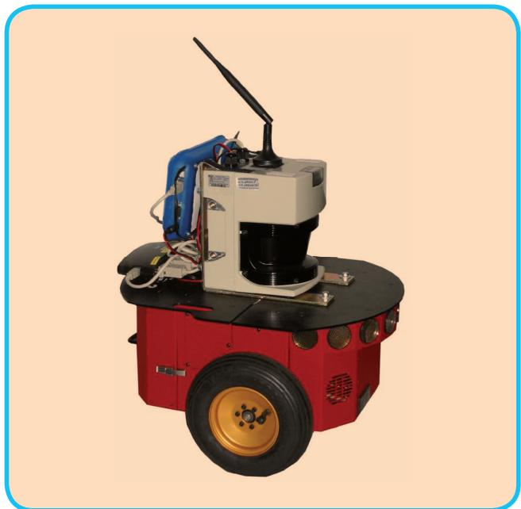  
FIG 8 A typical robot used in 2D mapping experiments. The platform is a standard ActivMedia Pioneer 2 equipped with a SICK-LMS range finder.

```latex
Algorithm 2 Manifold version of Algorithm 1. While this
algorithm has the same computational complexity, it is
substantially more robust than the non-manifold version,
especially in the 3D case.
Require: $\breve { \mathbf { X } } = \breve { \mathbf { X } } _ { 1 : T } :$ initial guess. $\mathcal { C } = \{ \langle { \bf e } _ { i j } ( { \bf \cdot }  \bf \} ) , \Omega _ { i j } \rangle \}$ : constraints
Ensure: $\mathbf { x } ^ { * } \colon$ : new solution, $\breve { \mathbf { H } } ^ { * }$ new information matrix
//find the maximum likelihood solution
while ¬ converged do
//Compute the auxiliary Jacobians $M _ { 1 : T }$ over the mani
fold
for all $\breve { \mathbf { X } } _ { i } \in \breve { \mathbf { X } }$ do
$\mathbf { M } _ { i } \gets \frac { \check { \mathbf { x } } _ { i } \boxplus \Delta \widetilde { \mathbf { x } } _ { i } } { \partial \Delta \widetilde { \mathbf { x } } _ { i } } \Big | _ { \Delta \widetilde { \mathbf { x } } = }$ 0
end for
$\widetilde { \mathbf { b } } \gets \mathbf { 0 } \quad \widetilde { \mathbf { H } } \gets \mathbf { 0 }$
for all $\langle \mathbf { e } _ { i j } , \pmb { \Omega } _ { i j } \rangle \in \mathcal { C }$ do
//Compute the Jacobians $\mathbf { A } _ { i j }$ and $\mathbf { B } _ { i j }$ of the error
function
$\mathbf { A } _ { i j }  \frac { \partial \mathbf { e } _ { i j } ( \mathbf { x } ) } { \partial \mathbf { x } _ { i } } \bigg | _ { \mathbf { x } = \mathbf { \check { x } } } \mathbf { B } _ { i j }  \frac { \partial \mathbf { e } _ { i j } ( \mathbf { x } ) } { \partial \mathbf { x } _ { j } } \bigg | _ { \mathbf { x } = \mathbf { \check { x } } }$
//Project the Jacobians through the manifold
$\widetilde { \mathbf { A } } _ { i j }  \mathbf { A } _ { i j } \mathbf { M } _ { i } \quad \widetilde { \mathbf { B } } _ { i j }  \mathbf { B } _ { i j } \mathbf { M } _ { j }$
// compute the nonzero Hessian blocks
$\widetilde { \mathbf { H } } _ { [ i i ] } + = \mathbf { \nabla } \widetilde { \mathbf { A } } _ { i j } ^ { T } \mathbf { \Omega } _ { i j } \widetilde { \mathbf { A } } _ { i j } \quad \widetilde { \mathbf { H } } _ { [ i j ] } + = \mathbf { \nabla } \widetilde { \mathbf { A } } _ { i j } ^ { T } \pmb { \Omega } _ { i j } \widetilde { \mathbf { B } } _ { i j }$
$\widetilde { \mathbf { H } } _ { [ j i ] } + = \mathbf { \widetilde { B } } _ { i j } ^ { T } \pmb { \Omega } _ { i j } \widetilde { \mathbf { A } } _ { i j } \quad \widetilde { \mathbf { H } } _ { [ j j ] } + = \mathbf { \widetilde { B } } _ { i j } ^ { T } \pmb { \Omega } _ { i j } \widetilde { \mathbf { B } } _ { i j }$
$/ /$ compute the coefficient vector
$\widetilde { \mathbf { b } } _ { [ i ] } + = \mathbf { \nabla } \widetilde { \mathbf { A } } _ { i j } ^ { T } \mathbf { \Omega } _ { i j } \mathbf { e } _ { i j } \quad \widetilde { \mathbf { b } } _ { [ j ] } + = \mathbf { \nabla } \widetilde { \mathbf { B } } _ { i j } ^ { T } \pmb { \Omega } _ { i j } \mathbf { e } _ { i j }$
end for
//keep the first node fixed
$\mathbf { H } _ { [ 1 1 ] } + = \mathbf { I }$
//solve the linear system using sparse Cholesky fac
torization
Dx| d solve1H| $\pmb { \Delta } \widetilde { \mathbf { X } } = - \widetilde { \mathbf { b } } )$
//update the parameters
for all $\breve { \mathbf { X } } _ { i } \in \breve { \mathbf { X } }$ do
$\check { \mathbf { x } } _ { i } \gets \check { \mathbf { x } } _ { i } \mathbb { E } \Delta \widetilde { \mathbf { x } } _ { \mathrm { i } }$
end for
end while
$\mathbf { x } ^ { * } \gets \breve { \mathbf { x } }$
//the maximum is found, now compute the Hessian in
the original space
$\mathbf { H } ^ { * }  \mathbf { 0 }$
for all $\langle \mathbf { e } _ { i j } , \pmb { \Omega } _ { i j } \rangle \in \mathcal { C }$ do
$\mathbf { H } _ { [ i i ] } + = \mathbf { \Delta } \mathbf { A } _ { i j } ^ { T } \pmb { \Omega } _ { i j } \mathbf { A } _ { i j }$ $\mathbf { H } _ { [ i j ] } + = \mathbf { \Delta A } _ { i j } ^ { T } \pmb { \Omega } _ { i j } \mathbf { B } _ { i j }$
$\mathbf { H } _ { [ j i ] } + = \mathbf { \Delta B } _ { i j } ^ { T } \pmb { \Omega } _ { i j } \mathbf { A } _ { i j }$ $\mathbf { H } _ { [ j j ] } + = \mathbf { \Delta B } _ { i j } ^ { T } \pmb { \Omega } _ { i j } \mathbf { B } _ { i j }$
end for
return $\langle \mathbf { x } ^ { * } , \mathbf { H } ^ { * } \rangle$
```

the Intel Research Laboratory in Seattle. This data consists of odometry measurements describing 2D transformations

Since the robot travels at a velocity of around 1 m/s the graph optimization could be executed after adding every node instead of after detecting a loop closure.

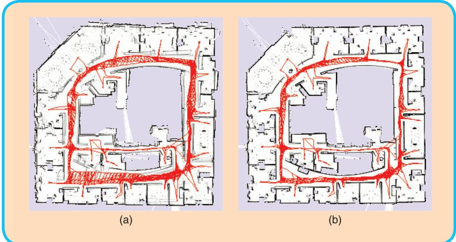  
FIG 9 Intel Research Lab. Left: Unoptimized pose graph overlayed on top of the resulting map. Right: The optimized pose graph and the resulting consistent map.

vertex to the graph and labels it with the current laser observation.

■ This laser scan is matched with the previously acquired one to improve the odometry estimate and the corresponding edge is added to the graph. We use a variant of the scan-matcher described by Olson [26].

■ When the robot reenters a known area after traveling for a long time in a previously unknown region, the algorithm seeks for matches of the current scan with the past measurements (loop closing). If a matching between the current observation and the observation of another node succeeds, the algorithm adds a new edge to the graph. The edge is labeled with the relative transformation that makes the two scans to overlap best. Matching the current measurement with all previous scans would be extremely inefficient and error prone, since it does not consider the known prior about the robot location. Instead, the algorithm selects the candidate nodes in the past as the ones

corresponding to the movements of the platform between consecutive time frames, and 2D laser range data.

The graph is constructed in the following way:

■ Whenever the robot moves more than 0.5 meters or rotates more than 0.5 radians, the algorithm adds a new whose 3s marginal covariances contains the current robot pose. These covariances can be obtained as the diagonal blocks of the inverse of a reduced Hessian $\mathbf { H } _ { \mathrm { r e d } } . \mathbf { H } _ { \mathrm { r e d } }$ is obtained from H by removing rows and the columns of the newly inserted robot pose. $\mathbf { H } _ { \mathrm { r e d } }$ is the information matrix of all the trajectory when assuming fixed the current position.

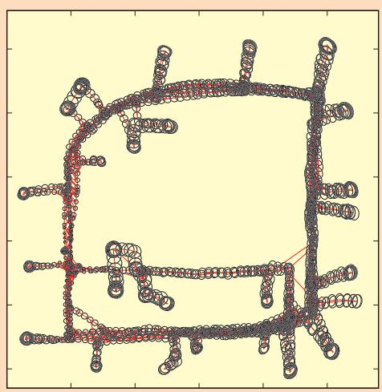  
FIG 10 Pose uncertainty estimate for a real-world data set.

■ The algorithm performs the optimization whenever a loop closure is detected.

At the end of the run, the graph consists of 1,802 nodes and 3,546 edges. Even for this relatively large problem the optimization can be carried on in 100 ms on a standard laptop (Intel Core2@2.4 GhZ). Since the robot travels at a velocity of around 1 m/s the graph optimization could be executed after adding every node instead of after detecting a loop closure. Figure 9 shows the effect of the optimization proc ess on the trajectory, while Figure 10 illustrates the uncertainty ellipses. The robot is located in the region where the ellipse become small. Note that the poses in SE122 do not need to be over parameterized, so in this case there is no advantage in utilizing manifolds.

## B. 3D Laser Based Mapping

Extending to 3D the SLAM algorithm presented in the previous section is rather straightforward. One has only to replace the 2D scan matching and loop closure detection with t heir 3D counterparts that operate on 3D point clouds instead than on single laser scans. In our implementation we utilize the popular ICP algorithm [1] and for determining the loop closures we use the algorithm by Steder et al. [29]. Additionally, each node of the graph and each constraint lives in

SE(3). Typical outputs of this algorithm are illustrated in Figures 2(a) and (b).

The minimum number of parameters required to represent an e lement of SE13 2 is 6, a possible choice consists in

## Appendix

In the following we will provide the definitions and the derivations for the Jacobians to implement the suggested algorithm. Due to space limitations we do not expand the Jacobians in the 3D case. However, these Jacobians can either be computed numerically or by using a computer algebra system.

Error Functions and Jacobians for the 2D case The basic entities in the 2D case are defined as

$$
\mathbf { \boldsymbol { \mathsf { x } } } _ { i } ^ { \top } = ( \mathbf { \boldsymbol { \mathsf { t } } } _ { i } ^ { \top } , \boldsymbol { \theta } _ { i } )\tag{28}
$$

$$
\mathbf { z } _ { i j } ^ { \top } = \big ( \mathbf { t } _ { i j } ^ { \top } , \theta _ { i j } \big )\tag{29}
$$

where t<sub>i</sub> and $\mathbf { t } _ { i j }$ are 2D vectors and $\theta _ { j }$ and $\theta _ { j j }$ are rotation angles which are normalized to $[ - \pi , \pi )$ . The error function is

$$
\begin{array} { r } { \mathsf { e } _ { i j } ( \mathsf { x } ) \ = \biggl ( \begin{array} { c } { \mathsf { R } _ { i j } ^ { \top } \left( \mathsf { R } _ { i } ^ { \top } \left( \mathsf { t } _ { j } - \mathsf { t } _ { i } \right) - \mathsf { t } _ { i j } \right) } \\ { \theta _ { j } - \theta _ { i } - \theta _ { i j } } \end{array} \biggr ) , } \end{array}\tag{30}
$$

where R and $\mathsf { R } _ { i j }$ are the $2 \times 2$ rotation matrices of u and $\theta _ { i j }$

$$
\begin{array} { r } { \pmb { \mathrm { R } } _ { i } = \left( \begin{array} { l l l } { \cos ( \theta _ { i } ) } & { } & { - \sin ( \theta _ { i } ) } \\ { \sin ( \theta _ { i } ) } & { } & { \cos ( \theta _ { i } ) } \end{array} \right) . } \end{array}\tag{31}
$$

The Jacobians of the error function are

$$
\pmb { \Delta } _ { i j } = \frac { \partial \pmb { \mathrm { e } } _ { i j } ( \pmb { \mathrm { x } } ) } { \partial \pmb { \mathrm { x } } _ { i } } = \left( \begin{array} { c c } { - \pmb { \mathrm { R } } _ { i j } ^ { \top } \pmb { \mathrm { R } } _ { i } ^ { \top } } & { \pmb { \mathrm { R } } _ { i j } ^ { \top } \frac { \partial \pmb { \mathrm { R } } _ { i } ^ { \top } } { \partial \theta _ { i } } ( \pmb { \mathrm { t } } _ { j } - \pmb { \mathrm { t } } _ { i } ) } \\ { \pmb { 0 } ^ { \top } } & { - 1 } \end{array} \right)\tag{32}
$$

$$
\mathbf { B } _ { i j } \ = \frac { \partial \bar { \mathbf { e } } _ { i j } ( \mathbf { x } ) } { \partial \mathbf { x } _ { j } } = \biggl ( \begin{array} { c c } { \mathbf { R } _ { i j } ^ { \top } \mathbf { R } _ { j } ^ { \top } } & { \mathbf { 0 } } \\ { \mathbf { 0 } ^ { \top } } &  1 \biggr ) . \end{array}\tag{33}
$$

The operator is defined as

$$
{ \pmb { \mathrm { x } } } \boxplus \pmb { \Delta } \tilde { { \pmb { \mathrm { x } } } } = { \pmb { \mathrm { x } } } + \pmb { \Delta } \tilde { { \pmb { \mathrm { x } } } }\tag{34}
$$

The angles are normalized to $[ - \pi , \pi )$ after applying the increments. The Jacobians of the manifold in the 2D case evaluate to the identity matrix:

$$
M _ { i } = \frac { \mathbf { x } _ { i } \mathbb { H } \Delta \widetilde { \mathbf { x } } _ { i } } { \partial \Delta \widetilde { \mathbf { x } } _ { i } } \frac { = \mathbf { l } _ { 3 } } { \Delta \widetilde { \mathbf { x } } = 0 }\tag{35}
$$

$$
M _ { j } = \frac { \mathbf { x } _ { j } \mathbb { E } \Delta \widetilde { \mathbf { x } } _ { j } } { \partial \Delta \widetilde { \mathbf { x } } _ { j } } \Bigg | _ { \Delta \widetilde { \mathbf { x } } = 0 } = \mathbf { l } _ { 3 }\tag{36}
$$

The time to compute the linear system is negligible compared to the time to solve it. Accordingly, the choice of the parametrization mainly affects the convergence speed, not the time required to performone iteration.

a 3D translation vector plus the three Euler angles. Utilizing this parametrization leads to Algo rithm 1. However, this minimal representation is subject to singularities that can be avoided by utilizing an over-parametrized state space.

## Error Functions for the 3D case

The basic entities in the 3D case are defined as

$$
\pmb { \mathrm { x } } _ { i } ^ { \top } = ( \mathbf { t } _ { i } ^ { \top } , \pmb { \mathrm { q } } _ { i } ^ { \top } )
$$

$$
\begin{array} { r } { \pmb { z } _ { i j } ^ { \top } = ( \mathbf { t } _ { i j } ^ { \top } , \pmb { \mathsf { q } } _ { i j } ^ { \top } ) , } \end{array}\tag{37}
$$

(38)

where q denotes the unit quaternion $\mathbf { q } ^ { \top } = ( q _ { x } , q _ { y } , q _ { z } , q _ { w } ) ^ { \top }$ , i.e., i ${ \mathfrak { q } } \parallel = 1$ . The error function is

$$
\begin{array} { r } { \pmb { \mathscr { e } } _ { i j } ( \pmb { \mathscr { x } } ) = ( \pmb { \mathscr { z } } _ { i j } ^ { - 1 } \textcircled { + } ( \pmb { \mathscr { x } } _ { i } ^ { - 1 } \textcircled { + } \pmb { \mathscr { x } } _ { j } ) ) _ { [ 1 : 6 ] } , } \end{array}\tag{39}
$$

where ! is the motion composition operator

$$
\begin{array} { r } { \mathbf { x } _ { i } \bigoplus \mathbf { x } _ { j } = \binom { \mathbf { q } _ { i } ( \mathbf { t } _ { j } ) } { \mathbf { q } _ { i } \cdot \mathbf { q } _ { j } } } \end{array}\tag{40}
$$

and the operator $( \cdot \ ) _ { [ 1 : 6 ] }$ selects the first 6 elements of its vector argument.

The Jacobians of the error function are:

$$
\pmb { \Delta } _ { i j } = \frac { \partial \pmb { \ e } _ { i j } ( \pmb { x } ) } { \partial \pmb { x } _ { j } }\tag{41}
$$

$$
\mathbf { \mathsf { B } } _ { i j } = \frac { \partial \pmb { \mathsf { e } } _ { i j } ( \mathbf { x } ) } { \partial \pmb { \mathsf { x } } _ { j } } .\tag{42}
$$

The operator maps $\Delta \widetilde { \mathbf { x } } _ { i } ^ { \top } = ( \Delta \widetilde { \mathbf { t } } _ { i } ^ { \top } , \Delta \widetilde { \mathbf { q } } _ { i } ^ { \top } )$ to the original space

$$
\mathbf { x } _ { i } \boxplus \Delta \widetilde { \mathbf { x } } _ { i } = \mathbf { x } _ { i } \oplus \left( \begin{array} { c } { \Delta \widetilde { \mathbf { t } } _ { i } } \\ { \Delta \widetilde { \mathbf { q } } _ { i } } \\ { \sqrt { 1 - \| \Delta \widetilde { \mathbf { q } } _ { i } \| ^ { 2 } } } \end{array} \right) ,\tag{43}
$$

where $\Delta \widetilde { \mathbf { t } } _ { j }$ denotes the translation and $\Delta \widetilde { \mathbf q } ^ { \intercal } \ = ( \Delta q _ { x } , \Delta q _ { y } , \Delta q _ { z } ) ^ { \intercal }$ is the vector part of the unit quaternion representing the 3D rotation and thus $\| \pmb { \Delta } \widetilde { \pmb q } _ { i } \| \leq 1$

The Jacobians of the manifold in the 3D case are given by

$$
M _ { i } = \frac { \mathbf { x } _ { i } \mathbb { H } \Delta \widetilde { \mathbf { x } } _ { i } } { \partial \Delta \widetilde { \mathbf { x } } _ { i } } \Bigg \vert _ { \Delta \widetilde { \mathbf { x } } = 0 }\tag{44}
$$

$$
M _ { j } = \frac { \mathbf { x } _ { j } \mathbb { E } \mathbb { \Delta } \widetilde { \mathbf { x } } _ { j } } { \partial \Delta \widetilde { \mathbf { x } } _ { j } } \Bigg \vert _ { \Delta \widetilde { \mathbf { x } } = 0 } .\tag{45}
$$

The algorithms presented in this paper can be used as a building blocks of more sophisticated methods, however optimized implementations of these algorithms can deal with surprisingly large problems.

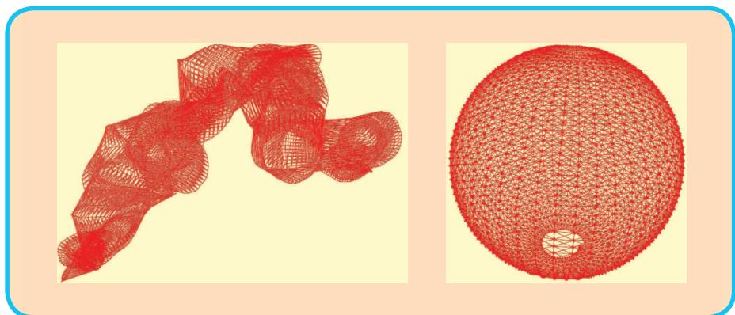  
FIG 11 Pose-graph obtained by simulating a robot moving on a sphere. Left: Initial configuration. Right: After optimizing the pose graph the sphere h as accurately been recovered by Algorithm 2.

Alternativ ely, one can describe the relative perturbations of the optimization problem Dx in a minimal representation while leaving the poses in the original over- pa rametrized space. This leads to Algorithm 2. In this section we compare these two variants of the optimization algorithm on a posegraph obtained by a simulated robot. Note that the sparsity pattern of the Hessian is the same in both cases. Furthermore, the time to compute the linear system is negligible compared to the time to solve it. Accordingly, the choice of the parametrization mainly affects the convergence speed, not the time required to perform one iteration. To highlight this effect we show the evolution of the error per iteration during one optimization run by using the two algorithms.

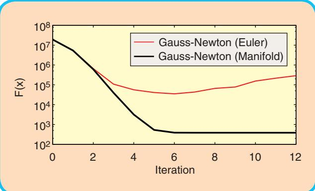  
FIG 12 Evolution of the error F (x) for Gauss-Newton optimization with Euler angles and with manifold linearization to the 3D sphere data set.

We use a simulated 3D data set of a robot traveling on the surface of a sphere. The measurements were affected by a significant error, and in itializing the system by using the odometry information resulted in the graph illustrated in the left part of Figure 11. Starting from this initial guess we executed the Gauss-Newton Algorith m with and without the manifold linearization, i.e., here by using Euler angles. Figure 12 shows the evolution of the error duri ng the iterations of the two approaches. First both approaches are able to decrease the error. However, not appropriately considering the sin gularities leads to a divergence of Algorithm 1 while Algorithm 2 converges to the right solution.

## VI. Conclusions

In this paper we presented a tutorial on graph-based SLAM. Our aim

was to provide the re ader with sufficient details and insights to allow for an easy implementation of the proposed methods. The algorithms presented in this pape r can be used as a building blocks of more sophisticated methods, however optimized implementations of these algorithms can deal with surprisingly large problems.

## About the Authors


Giorgio Grisetti is working as a postdoctoral researcher in the Autonomous Intelligent Systems Lab at Freiburg University. He was a Ph.D. student at University of Rome “La Sapienza” in the Intelligent Systems Lab headed by Daniele Nardi where he

received his Ph.D. degree in April 2006. He is currently member of Department of Systems and Computer Engineering at “La Sapienza” University of Rome, as assistant professor. His research interests lie in the areas of mobile robotics. His previous and current contributions in robotics aims to provide effective solutions to various mobile robot navigation problems including SLAM, localization, and path planning.

Wolfram Burgard is a professor for computer science at the University of Freiburg where he heads of the Laboratory for Autonomous Intelligent Systems. He received his Ph.D. degree in Computer Science from the University of


Bonn in 1991. His areas of interest lie in artificial intelligence and mobile robots. In the past, Wolfram Burgard and his group developed several innovative probabilistic techniques for robot navigation and control. They cover different aspects such as localization,

map-building, path-planning, and exploration. For his work, Wolfram Burgard received several best paper awards from outstanding national and international conferences. In 2008, Wolfram Burgard became Fellow of the European Coordinating Committee for Artificial Intelligence.


Rainer Kuemmerle studied computer science at the University of Freiburg and received his Master degree in April 2007. He is currently working as a PhD-student in the Autonomous Intelligent Systems Lab of the University of Freiburg headed by Wolfram Burgard.

His research interests lie in the areas of outdoor navigation, 3D mapping, and localization.

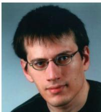

Cyrill Stachniss is working as an academic advisor in the Lab for Autonomous Intelligent Systems at the University of Freiburg. He is an associate editor of the IEEE Transactions on Robotics and a Microsoft Research Faculty Fellow. In his research, he focuses on probabilis-

tic techniques in the context of mobile robotics. His areas of research include autonomous exploration in combination with simultaneous localization and mapping, classification and learning approaches including scene analysis as well as computer controlled cars, vision, and navigation techniques.

## References

[1] P. J. Besl and N. D. McKay, “A method for registration of 3-d shapes,” IEEE Trans. Pattern Anal. Machine Intell., vol. 14, no. 2, pp. 239–256, 1992.

[2] M. Bosse, P. M. Newman, J. J. Leonard, and S. Teller, “An ATLAS framework for scalable mapping,” in Proc. IEEE Int. Conf. Robotics and Automation (ICRA), 2003, pp. 1899–1906.

[3] J. A. Castellanos, J. M. M. Montiel, J. Neira, and J. D. Tardós, “The SPmap: A probabilistic framework for simultaneous localization and map building,” IEEE Trans. Robot. Automat., vol. 15, no. 5, pp. 948–953, 1999.

[4] T. A. Davis, Direct Methods for Sparse Linear Systems (SIAM Book Series on the Fundamentals of Algorithms). Philadelphia, PA: SIAM, 2006.

[5] F. Del laert and M. Kaess, “Square root SAM: Simultaneous location and mapping via square root information smoothing,” Int. J. Robot. Res., 2006.

[6] C. Est rada, J. Neira, and J. D. Tardós, “Hierachical SLAM: Real-time accurate mapping of large environments,” IEEE Trans. Robot., vol. 21, no. 4, pp. 588–596, 2005.

[7] R. Eustice, H. Singh, and J. J. Leonard, “Exactly sparse delayed-state filters,” in Proc. IEEE Int. Conf. Robotics and Automation (ICRA), Barcelona, Spain, 2005, pp. 2428–2435.

[8] U. Frese, P. Larsson, and T. Duckett, “A multilevel relaxation algorithm for simultaneous localisation and mapping,” IEEE Trans. Robot., vol. 21, no. 2, pp. 1–12, 2005.

[9] G. Grisetti, C. Stachniss, and W. Burgard, “Improved techniques for grid mapping with rao-blackwellized particle filters,” IEEE Trans. Robot., vol. 23, no. 1, pp. 34–46, 2007.

[10] G. Grisetti, C. Stachniss, and W. Burgard, “Non-linear constraint network optimization for efficient map learning,” IEEE Trans. Intell. Transport. Syst., 2009.

[11] J.-S. Gutman n and K. Konolige, “Incremental mapping of large cyclic environments,” in Proc. IEEE Int. Symp. Computational Intelligence in Robotics and Automation (CIRA), 1999.

[12] D. Hähnel, W . Burgard, D. Fox, and S. Thrun, “An efficient FastSLAM algorithm for generating maps of large-scale cyclic environments from raw laser range measurements,” in Proc. IEEE/RSJ Int. Conf. Intelligen Robots and Systems (IROS), Las Vegas, NV, 2003, pp. 206–211.

[13] D. Hähnel, W. Burga rd, B. Wegbreit, and S. Thrun, “Towards lazy data association in slam,” in Proc. Int. Symp. Robotics Research (ISRR), Siena, Italy, 2003, pp. 421–431.

[14] C. Hertzberg, “A framework for sparse, non-linear least squares prob lems on manifolds,” Master’s thesis, Univ. Bremen, 2008.

[15] A. Howard, M. J. Mataric´, and G. Sukhatme, “Relaxation on a mesh: A formalism for generalized localization,” in Proc. IEEE/RSJ Int. Conf. Intelligent Robots and Systems (IROS), 2001.

[16] M. Kaess, A. Ranganathan, and F. Dellaert, “iSAM: Fa st incremental smoothing and mapping with efficient data association,” in Proc. IEEE Int. Conf. Robotics and Automation (ICRA), Rome, Italy, 2007.

[17] K. Konolige, “A gradient method for realtime robot c ontrol,” in Proc. IEEE/RSJ Int. Conf. Intelligent Robots and Systems (IROS), 2000.

[18] K. Konolige, J. Bowman, J. D. Chen, P. Mihelich, M. Calonder, V. Lepetit, and P. Fua, “View-based maps,” Int. J. Robot. Res., vol. 29, no. 10, 2010.

[19] K. Konolige, G. Grisetti, R. Kümmerle, W. Burgard, B . Limketkai, and R. Vincent, “Sparse pose adjustment for 2d mapping,” in Proc. IEEE/ RSJ Int. Conf. Intelligent Robots and Systems (IROS), 2010.

[20] J. M. Lee, Introduction to Smooth Manifolds (Graduate Texts i n Mathematics, vol. 218). Berlin: Springer-Verlag, 2003.

[21] F. Lu and E. Milios, “Globally consistent range scan alignmen t for environment mapping,” Autonom. Robots, vol. 4, pp. 333–349, 1997.

[22] M. Montemerlo, S. Thrun, D. Koller, and B. Wegbreit, “FastSLA M: A factored solution to simultaneous localization and mapping,” in Proc. Nat. Conf. Artificial Intelligence (AAAI), Edmonton, Canada, 2002, pp. 593–598.

[23] J. Neira and J. D. Tardós, “Data association in stochastic ma pping using the joint compatibility test,” IEEE Trans. Robot. Automat., vol. 17, no. 6, pp. 890–897, 2001.

[24] A. Nüchter, K. Lingemann, J. Hertzberg, and H. Surmann, “6D SLAM wi th approximate data association,” in Proc. Int. Conf. Advanced Ro botics (ICAR), 2005, pp. 242–249.

[25] E. Olson, “Robust and efficient robotic mapping,” Ph.D. thesis, MIT, Cambri dge, MA, June 2008.

[26] E. Olson, “Real-time correlative scan matching,” in Proc. IEEE Int. Conf. R obotics and Automation (ICRA), 2009.

[27] E. Olson, J. Leonard, and S. Teller, “Fast iterative optimization of pose g raphs with poor initial estimates,” in Proc. IEEE Int. Conf. Robotics and Automation (ICRA), 2006, pp. 2262–2269.

[28] R. Smith, M. Self, and P. Cheeseman, “Estimating uncertain spatial realtion ships in robotics,” in Autonomous Robot Vehicles, I. Cox and G. Wilfong, Eds. Berlin: Springer-Verlag, 1990, pp. 167–193.

[29] B. Steder, G. Grisetti, and W. Burgard, “Robust place recognition for 3D ra nge data based on point features,” in Proc. IEEE Int. Conf. Robot ics and Automation (ICRA), 2010.

[30] C. J. Taylor and D. J. Kriegman, “Minimization on the Lie group SO(3) and r elated manifolds,” Yale Univ., Tech. Rep. 9405, 1994.

[31] S. Thrun, Y. Liu, D. Koller, A. Y. Ng, Z. Ghahramani, and H. Durrant-Whyte, “Simultaneous localization and mapping with sparse extended information filters,” Int. J. Robot. Res., vol. 23, no. 7/8, pp. 693–716, 2004.

[32] S. Thrun and M. Montemerlo, “The graph SLAM algorithm with applications to large-scale mapping of urban structures,” Int. J. Robot. Res., vol. 25, no. 5-6, p. 403, 2006.

[33] R. Triebel, P. Pfaff, and W. Burgard, “Multi-level surface maps for outdoor terrain mapping and loop closing,” in Proc. IEEE/RSJ Int. Conf. Intelligent Robots and Systems (IROS), 2006.