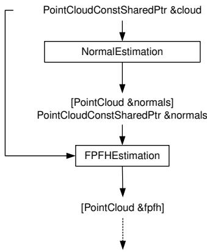
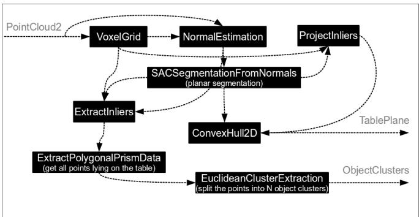
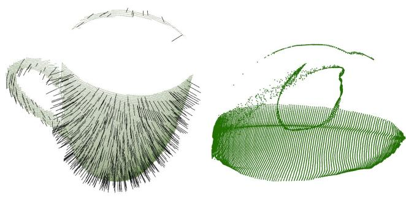
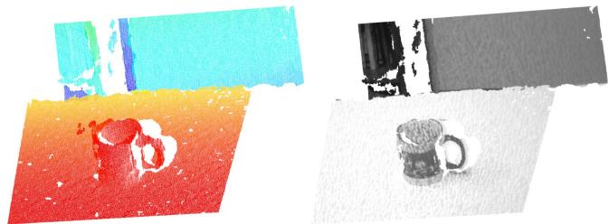
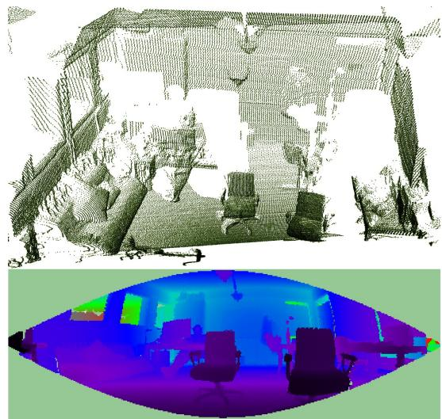
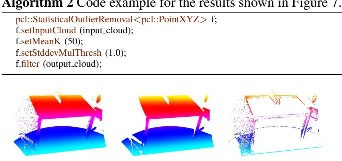
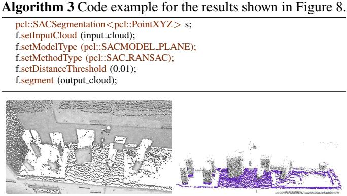
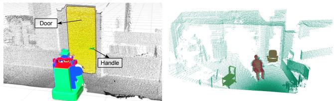
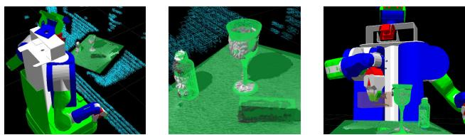

# 3D is here: Point Cloud Library (PCL)

Radu Bogdan Rusu and Steve Cousins

Willow Garage

68 Willow Rd., Menlo Park, CA 94025, USA

{rusu,cousins}@willowgarage.com

Abstract— With the advent of new, low-cost 3D sensing hardware such as the Kinect, and continued efforts in advanced point cloud processing, 3D perception gains more and more importance in robotics, as well as other fields.

In this paper we present one of our most recent initiatives in the areas of point cloud perception: PCL (Point Cloud Library – http://pointclouds.org). PCL presents an advanced and extensive approach to the subject of 3D perception, and it’s meant to provide support for all the common 3D building blocks that applications need. The library contains state-ofthe art algorithms for: filtering, feature estimation, surface reconstruction, registration, model fitting and segmentation. PCL is supported by an international community of robotics and perception researchers. We provide a brief walkthrough of PCL including its algorithmic capabilities and implementation strategies.

## I. INTRODUCTION

For robots to work in unstructured environments, they need to be able to perceive the world. Over the past 20 years, we’ve come a long way, from simple range sensors based on sonar or IR providing a few bytes of information about the world, to ubiquitous cameras to laser scanners. In the past few years, sensors like the Velodyne spinning LIDAR used in the DARPA Urban Challenge and the tilting laser scanner used on the PR2 have given us high-quality 3D representations of the world - point clouds. Unfortunately, these systems are expensive, costing thousands or tens of thousands of dollars, and therefore out of the reach of many robotics projects.

Very recently, however, 3D sensors have become available that change the game. For example, the Kinect sensor for the Microsoft XBox 360 game system, based on underlying technology from PrimeSense, can be purchased for under \$150, and provides real time point clouds as well as 2D images. As a result, we can expect that most robots in the future will be able to ”see” the world in 3D. All that’s needed is a mechanism for handling point clouds efficiently, and that’s where the open source Point Cloud Library, PCL, comes in. Figure 1 presents the logo of the project.

PCL is a comprehensive free, BSD licensed, library for n-D Point Clouds and 3D geometry processing. PCL is fully integrated with ROS, the Robot Operating System (see http://ros.org), and has been already used in a variety of projects in the robotics community.

## II. ARCHITECTURE AND IMPLEMENTATION

PCL is a fully templated, modern C++ library for 3D point cloud processing. Written with efficiency and performance in mind on modern CPUs, the underlying data structures in PCL make use of SSE optimizations heavily. Most mathematical operations are implemented with and based on Eigen, an open-source template library for linear algebra [1]. In addition, PCL provides support for OpenMP (see http://openmp.org) and Intel Threading Building Blocks (TBB) library [2] for multi-core parallelization. The backbone for fast k-nearest neighbor search operations is provided by FLANN (Fast Library for Approximate Nearest Neighbors) [3]. All the modules and algorithms in PCL pass data around using Boost shared pointers (see Figure 2), thus avoiding the need to re-copy data that is already present in the system. As of version 0.6, PCL has been ported to Windows, MacOS, and Linux, and Android ports are in the works.

  
Fig. 1. The Point Cloud Library logo.

From an algorithmic perspective, PCL is meant to incorporate a multitude of 3D processing algorithms that operate on point cloud data, including: filtering, feature estimation, surface reconstruction, model fitting, segmentation, registration, etc. Each set of algorithms is defined via base classes that attempt to integrate all the common functionality used throughout the entire pipeline, thus keeping the implementations of the actual algorithms compact and clean. The basic interface for such a processing pipeline in PCL is:

• create the processing object (e.g., filter, feature estimator, segmentation);

• use setInputCloud to pass the input point cloud dataset to the processing module;

• set some parameters;

• call compute (or filter, segment, etc) to get the output.

The sequence of pseudo-code presented in Figure 2 shows a standard feature estimation process in two steps, where a NormalEstimation object is first created and passed an input dataset, and the results together with the original input are then passed together to an FPFH [4] estimation object.

To further simplify development, PCL is split into a series of smaller code libraries, that can be compiled separately:

• libpcl filters: implements data filters such as downsampling, outlier removal, indices extraction, projections, etc;

  
Fig. 2. An example of the PCL implementation pipeline for Fast Point Feature Histogram (FPFH) [4] estimation.

• libpcl features: implements many 3D features such as surface normals and curvatures, boundary point estimation, moment invariants, principal curvatures, PFH and FPFH descriptors, spin images, integral images, NARF descriptors, RIFT, RSD, VFH, SIFT on intensity data, etc;

• libpcl io: implements I/O operations such as writing to/reading from PCD (Point Cloud Data) files;

• libpcl segmentation: implements cluster extraction, model fitting via sample consensus methods for a variety of parametric models (planes, cylinders, spheres, lines, etc), polygonal prism extraction, etc

• libpcl surface: implements surface reconstruction techniques, meshing, convex hulls, Moving Least Squares, etc;

• libpcl registration: implements point cloud registration methods such as ICP, etc;

• libpcl keypoints: implements different keypoint extraction methods, that can be used as a preprocessing step to decide where to extract feature descriptors;

• libpcl range image: implements support for range images created from point cloud datasets.

To ensure the correctness of operations in PCL, the methods and classes in each of the above mentioned libraries contain unit and regression tests. The suite of unit tests is compiled on demand and verified frequently by a dedicated build farm, and the respective authors of a specific component are being informed immediately when that component fails to test. This ensures that any changes in the code are tested throughly and any new functionality or modification will not break already existing code that depends on PCL.

In addition, a large number of examples and tutorials are available either as C++ source files, or as step-by-step instructions on the PCL wiki web pages.

## III. PCL AND ROS

One of the corner stones in the PCL design philosophy is represented by Perception Processing Graphs (PPG). The rationality behind PPGs are that most applications that deal with point cloud processing can be formulated as a concrete set of building blocks that are parameterized to achieve different results. For example, there is no algorithmic difference between a wall detection algorithm, or a door detection, or a table detection – all of them share the same building block, which is in this case, a constrained planar segmentation algorithm. What changes in the above mentioned cases is a subset of the parameters used to run the algorithm.

With this in mind, and based on the previous experience of designing other 3D processing libraries, and most recently, ROS, we decided to make each algorithm from PCL available as a standalone building block, that can be easily connected with other blocks, thus creating processing graphs, in the same way that nodes connect together in a ROS ecosystem. Furthermore, because point clouds are extremely large in nature, we wanted to guarantee that there would be no unnecessary data copying or serialization/deserialization for critical applications that can afford to run in the same process. For this we created nodelets, which are dynamically loadable plugins that look and operate like ROS nodes, but in a single process (as single or multiple threads).

A concrete nodelet PPG example for the problem of identifying a set of point clusters supported by horizontal planar areas is shown in Figure 3.

  
Fig. 3. A ROS nodelet graph for the problem of object clustering on planar surfaces.

## IV. VISUALIZATION

PCL comes with its own visualization library, based on VTK [5]. VTK offers great multi-platform support for rendering 3D point cloud and surface data, including visualization support for tensors, texturing, and volumetric methods.

The PCL Visualization library is meant to integrate PCL with VTK, by providing a comprehensive visualization layer for n-D point cloud structures. Its purpose is to be able to quickly prototype and visualize the results of algorithms operating on such hyper-dimensional data. As of version 0.2, the visualization library offers:

• methods for rendering and setting visual properties (colors, point sizes, opacity, etc) for any n-D point cloud dataset;

• methods for drawing basic 3D shapes on screen (e.g., cylinders, spheres, lines, polygons, etc) either from sets of points or from parametric equations;

• a histogram visualization module (PCLHistogramVisualizer) for 2D plots;

• a multitude of geometry and color handlers. Here, the user can specify what dimensions are to be used for the point positions in a 3D Cartesian space (see Figure 4), or what colors should be used to render the points (see Figure 5);

• RangeImage visualization modules (see Figure 6).

The handler interactors are modules that describe how colors and the 3D geometry at each point in space are computed, displayed on screen, and how the user interacts with the data. They are designed with simplicity in mind, and are easily extendable. A code snippet that produces results similar to the ones shown in Figure 4 is presented in Algorithm 1.

Algorithm 1 Code example for the results shown in Figure 4.   
using namespace pcl visualization;   
PCLVisualizer p (“Test”);   
PointCloudColorHandlerRandom handler (cloud);   
p.addPointCloud (cloud, handler, ”cloud random”);   
p.spin ();   
p.removePointCloud (”cloud random”);   
PointCloudGeometryHandlerSurfaceNormal handler2 (cloud);   
p.addPointCloud (cloud, handler2, ”cloud random”);   
p.spin ();

The library also offers a few general purpose tools for visualizing PCD files, as well as for visualizing streams of data from a sensor in real-time in ROS.

Fig. 4. An example of two different geometry handers applied to the same dataset. Left: the 3D Cartesian space represents XYZ data, with the arrows representing surface normals estimated at each point in the cloud, right: the Cartesian space represents the 3 dimensions of the normal vector at each point for the same dataset.  
  
Fig. 5. An example of two different color handers applied to the same dataset. Left: the colors represent the distance from the acquisition viewpoint, right: the color represent the RGB texture acquired at each point.

  
Fig. 6. An example of a RangeImage display using PCL Visualization (bottom) for a given 3D point cloud dataset (top).

## V. USAGE EXAMPLES

In this section we present two code snippets that exhibit the flexibility and simplicity of using PCL for filtering and segmentation operations, followed by three application examples that make use of PCL for solving the perception problem: i) navigation and mapping, ii) object recognition, and iii) manipulation and grasping.

Filtering constitutes one of the most important operations that any raw point cloud dataset usually goes through, before any higher level operations are applied to it. Algorithm 2 and Figure 7 present a code snippet and the results obtained after running it on the point cloud dataset from the left part of the figure. The filter is based on estimating a set of statistics for the points in a given neighborhood (k = 50 here), and using them to select all points within 1.0·σ distance from the mean distance µ, as inliers (see [6] for more information).

  
Fig. 7. Left: a raw point cloud acquired using a tilting laser scanner, middle: the resultant filtered point cloud (i.e., inliers) after a StatisticalOutlierRemoval operator was applied, right: the rejected points (i.e., outliers).

The second example constitutes a segmentation operation for planar surfaces, using a RANSAC [7] model, as shown in Algorithm 3. The input and output results are shown in Figure 8. In this example, we are using a robust RANSAC estimator to randomly select 3 non-collinear points and calculate the best possible model in terms of the overall number of inliers. The inlier thresholding criterion is set to a maximum distance of 1cm of each point to the plane model.

  
Fig. 8. Left: the input point cloud, right: the segmented plane represented by the inliers of the model marked with purple color.

An example of a more complex navigation and mapping application is shown in the left part of Figure 9, where the PR2 robot had to autonomously identify doors and their handles [8], in order to explore rooms and find power sockets [9]. Here, the modules used included constrained planar segmentation, region growing methods, convex hull estimation, and polygonal prism extractions. The results of these methods were then used to extract certain statistics about the shape and size of the door and the handle, in order to uniquely identify them and to reject false positives.

The right part of Figure 9 shows an experiment with real-time object identification from complex 3D scenes [10]. Here, a set of complex 3D keypoints and feature descriptors are used in a segmentation and registration framework, that aims to identify previously seen objects in the world.

Figure 10 presents a grasping and manipulation application [11], where objects are first segmented from horizontal planar tables, clustered into individual units, and a registration operation is applied that attaches semantic information to each cluster found.

## VI. COMMUNITY AND FUTURE PLANS

PCL is a large collaborative effort, and it would not exist without the contributions of several people. Though the community is larger, and we accept patches and improvements from many users, we would like to acknowledge the following institutions for their core contributions to the development of the library: AIST, UC Berkeley, University of

  
Fig. 9. Left: example of door and handle identification [8] during a navigation and mapping experiment [9] with the PR2 robot. Right: object recognition experiments (chair, person sitting down, cart) using Normal Aligned Radial Features (NARF) [10] with the PR2 robot.

  
Fig. 10. Experiments with PCL in grasping applications [11], from left to right: a visualization of the collision environment including points associated with unrecognized objects (blue), and obstacles with semantic information (green); detail showing 3D point cloud data (grey) with 3D meshes superimposed for recognized objects; successful grasping showing the bounding box associated with an unrecognized object (brown) attached to the gripper.

Bonn, University of British Columbia, ETH Zurich, University of Freiburg, Intel Reseach Seattle, LAAS/CNRS, MIT, University of Osnabruck, Stanford University, University of¨ Tokyo, TUM, Vienna University of Technolog, and Washington University in St. Louis.

Our current plan for PCL is to improve the documentation, unit tests, and tutorials and release a 1.0 version. We will continue to add functionality and make the system available on other platforms such as Android, and we plan to add support for GPUs using CUDA and OpenCL.

We welcome any new contributors to the project, and we hope to emphasize the importance of code sharing for 3D processing, which is becoming crucial for advancing the robotics field.

## REFERENCES

[1] G. Guennebaud, B. Jacob, et al., “Eigen v3,” http://eigen.tuxfamily.org, 2010.

[2] J. Reinders, Intel threading building blocks : outfitting C++ for multicore processor parallelism. O’Reilly, 2007.

[3] M. Muja and D. G. Lowe, “Fast approximate nearest neighbors with automatic algorithm configuration,” in International Conference on Computer Vision Theory and Application VISSAPP’09). INSTICC Press, 2009, pp. 331–340.

[4] R. B. Rusu, N. Blodow, and M. Beetz, “Fast Point Feature Histograms (FPFH) for 3D Registration,” in Proceedings ofthe IEEE International Conference on Robotics and Automation (ICRA), Kobe, Japan, May 12-17 2009.

[5] W. Schroeder, K. Martin, and B. Lorensen, Visualization Toolkit: An Object-Oriented Approach to 3D Graphics, 4th Edition. Kitware, December 2006.

[6] R. B. Rusu, Z. C. Marton, N. Blodow, M. Dolha, and M. Beetz, “Towards 3D Point Cloud Based Object Maps for Household Environments,” Robotics and Autonomous Systems Journal (Special Issue on Semantic Knowledge), 2008.

[7] A. M. Fischler and C. R. Bolles, “Random sample consensus: a paradigm for model fitting with applications to image analysis and automated cartography,” Communications of the ACM, vol. 24, no. 6, pp. 381–395, June 1981.

[8] R. B. Rusu, W. Meeussen, S. Chitta, and M. Beetz, “Laser-based Perception for Door and Handle Identification,” in International Conference on Advanced Robotics (ICAR), June 22-26 2009.

[9] W. Meeussen, M. Wise, S. Glaser, S. Chitta, C. McGann, P. Mihelich, E. Marder-Eppstein, M. Muja, V. Eruhimov, T. Foote, J. Hsu, R. Rusu, B. Marthi, G. Bradski, K. Konolige, B. Gerkey, and E. Berger, “Autonomous Door Opening and Plugging In with a Personal Robot,” in Proceedings of the IEEE International Conference on Robotics and Automation (ICRA), Anchorage, Alaska, May 3-8 2010.

[10] B. Steder, R. B. Rusu, K. Konolige, and W. Burgard, “Point Feature Extraction on 3D Range Scans Taking into Account Object Boundaries,” in Submitted to the IEEE International Conference on Robotics and Automation (ICRA), Shanghai, China, May 9-13 2010.

[11] M. Ciocarlie, K. Hsiao, E. G. Jones, S. Chitta, R. B. Rusu, and I. A. Sucan, “Towards reliable grasping and manipulation in household environments,” New Delhi, India, 12/2010 2010.