# DTAM: Dense Tracking and Mapping in Real-Time

Richard A. Newcombe, Steven J. Lovegrove and Andrew J. Davison Department of Computing, Imperial College London, UK

[rnewcomb,sl203,ajd]@doc.ic.ac.uk

## Abstract

DTAM is a systemfor real-time camera tracking and reconstruction which relies not on feature extraction but dense, every pixel methods. As a single hand-held RGB camera flies over a static scene, we estimate detailed textured depth maps at selected keyframes to produce a surface patchwork with millions of vertices. We use the hundreds of images available in a video stream to improve the quality of a simple photometric data term, and minimise a global spatially regularised energy functional in a novel non-convex optimisation framework. Interleaved, we track the camera’s 6DOF motion precisely by frame-rate whole image alignment against the entire dense model. Our algorithms are highly parallelisable throughout and DTAM achieves realtime performance using current commodity GPU hardware. We demonstrate that a dense model permits superior tracking performance under rapid motion compared to a state of the art method usingfeatures; and also show the additional usefulness of the dense model for real-time scene interaction in a physics-enhanced augmented reality application.

## 1. Introduction

Algorithms for real-time SFM (Structure from Motion), a problem alternatively referred to as Monocular SLAM, have almost always worked by generating and tracking sparse feature-based models of the world. However, it is increasingly clear that in both reconstruction and tracking it is possible to get more complete, accurate and robust results using dense methods which make use of all of the data in an image. Methods for high quality dense stereo reconstruction from multiple images (e.g. [15, 4]) are becoming real-time capable due to their high parallelisability, allowing them to track the currently dominant GPGPU hardware curve. Meanwhile, the first live dense reconstruction systems working with a hand-held camera have recently appeared (e.g. [9, 13]), but these still rely on feature tracking.

Here we present a new algorithm, DTAM (Dense Tracking and Mapping), which unlike all previous real-time monocular SLAM systems both creates a dense 3D surface model and immediately uses it for dense camera tracking via whole image registration. As a hand-held camera browses a scene interactively, a texture-mapped scene model with millions of vertices is generated. This model is composed of depth maps built from bundles of frames by dense and sub-pixel accurate multi-view stereo reconstruction. The reconstruction framework is targeted at our live setting, where hundreds of narrow-baseline video frames are the input to each depth map. We gather photometric information sequentially in a cost volume, and incrementally solve for regularised depth maps via a novel non-convex optimisation framework with elements including accelerated exact exhaustive search to avoid coarse-to-fine warping and the loss of small details, and an interleaved Newton step to achieve fine accuracy.

Meanwhile, in an interleaved fashion, the camera’s pose is tracked at frame-rate by whole image alignment against the dense textured model. This tracking benefits from the predictive capabilities of a dense model with regard to occlusion handling and multi-scale operation, making it much more robust and at least as accurate as any feature-based method; in particular, performance degrades remarkably gracefully in reaction to motion blur or camera defocus.

The limited processing resources imposed by real-time operation seemed to preclude dense methods in previous monocular SLAM systems, and indeed the recent availability of powerful commodity GPGPU processors is a major enabler of our approach in both the reconstruction and tracking components. However, we also believe that there has been a lack of understanding of the power of bringing dense methods fully ‘into the loop’ of tracking and reconstruction. The availability of a dense scene model, all the time, enables many simplifications of issues with pointbased systems, for instance with regard to multiple scales and rotations, occlusions or blur due to rapid motion. Also, our view is that the high quality correspondence required by both tracking and reconstruction will always be most robustly and accurately enabled by dense methods, where matching at every pixel is supported by the totality of data across an image and model.

## 2. Method

The overall structure of our algorithm is straightforward. Given a dense model of the scene, we use dense whole image alignment against that model to track camera motion at frame-rate. And tightly interleaved with this, given images from tracked camera poses, we update and expand the model by building and refining dense textured depth maps. Once bootstrapped, the system is fully self-supporting and no feature-based skeleton or tracking is required.

## 2.1. Preliminaries

We refer to the pose of a camera c with respect to the world frame of reference w as

$$
{ \mathrm { T } } _ { w c } = \left( \begin{array} { c c } { { \mathrm { R } _ { w c } } } & { { { \bf c } _ { w } } } \\ { { { \bf 0 } ^ { T } } } & { { 1 } } \end{array} \right) \ ,\tag{1}
$$

where $\mathrm { T } _ { w c } \in \mathbb { S E } ( 3 )$ is the matrix describing point transfer between the camera’s frame of reference and that of the world, such that ${ \bf x } _ { w } = \mathrm { T } _ { w c } { \bf x } _ { c } . \mathrm { R } _ { w c } \in \mathbb { S } \mathbb { O } ( 3 )$ is the rotation matrix describing directional transfer, and ${ \bf c } _ { w }$ is the location of the optic center of camera c in the frame of reference $w .$ . Our camera has fixed and pre-calibrated intrinsic matrix K and all images are pre-warped to remove radial distortion. We describe perspective projection of a 3D point $\mathbf { x } _ { c } = ( x , y , z ) ^ { \top }$ including dehomogenisation by $\pi ( \mathbf { x } _ { c } ) = ( x / z , y / z ) ^ { \top }$

Our dense model is composed of overlapping keyframes. Illustrated in Figure 1, a keyframe r with world-camera frame transform $\mathrm { T } _ { r w } ,$ contains an inverse depth map $\pmb { \xi } _ { r } : \Omega $ R and RGB reference image $\mathbf { I } _ { r } : \Omega \to \mathbb { R } ^ { 3 }$ where $\Omega \subset \mathbb { R } ^ { 2 }$ is the image domain. For a pixel u $: = ~ ( u , v ) ^ { \top } ~ \in ~ \Omega .$ we can back-project an inverse depth value $d = \pmb { \xi } ( \mathbf { u } )$ to $\textbf { a } 3 D$ point ${ \bf x } = \pi ^ { - 1 } ( { \bf u } , d )$ where $\textstyle \pi ^ { - 1 } ( \mathbf { u } , d ) \ = \ { \frac { 1 } { d } } \mathrm { K } ^ { - 1 } \dot { \mathbf { u } }$ The dot notation is used to define the homogeneous vector $\dot { \mathbf { u } } : = ( u , v , 1 ) ^ { \top }$

## 2.2. Dense Mapping

We follow a global energy minimisation framework to estimate $\xi _ { r }$ iteratively from any number of short baseline frames m $\in \mathcal { T } ( r )$ , where our energy is the sum of a photometric error data term and robust spatial regularisation term. We make each keyframe available for use in pose estimation after initial solution convergence.

We now define a projective photometric cost volume $\mathbf { C } _ { r }$ for the keyframe as illustrated in Figure 1. A row ${ \bf C } _ { r } ( { \bf u } )$ in the cost volume (called a disparity space image in stereo matching [14], and generalised more recently in [10] for any discrete per pixel labelling) stores the accumulated photometric error as a function of inverse depth $d .$ The average photometric error ${ \bf C } _ { r } ( { \bf u } , d )$ is computed by projecting a point in the volume into each of the overlapping images and summing the $L _ { 1 }$ norm of the individual photometric errors obtained:

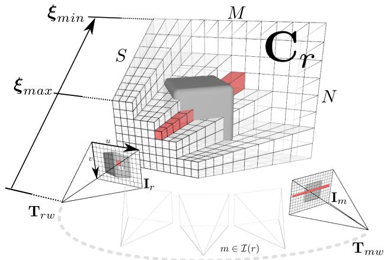  
Figure 1. A keyframe r consists of a reference image I with pose $\mathrm { T } _ { r w }$ and data cost volume $\mathbf { C } _ { r }$ . Each pixel of the reference frame $\mathbf { u } _ { r }$ has an associated row of entries ${ \bf C } _ { r } ( { \bf u } )$ (shown in red) that store the average photometric error or cost ${ \bf C } _ { r } ( { \bf u } , d )$ computed for each inverse depth $d \in { \mathcal { D } }$ in the inverse depth range $\mathcal { D } =$ $[ \pmb { \xi } _ { m i n } , \pmb { \xi } _ { m a x } ]$ . We use tens to hundreds of video frames indexed as $m \in \mathbb { Z } ( r )$ , where $\mathcal { T } ( r )$ is the set of frames nearby and overlapping $r ,$ to compute the values stored in the cost volume.

$$
\mathbf { C } _ { r } ( \mathbf { u } , d ) = \frac { 1 } { | \mathcal { T } ( r ) | } \sum _ { m \in \mathcal { Z } ( r ) } \parallel \rho _ { r } \left( \mathbf { I } _ { m } , \mathbf { u } , d \right) \parallel _ { 1 } ,\tag{2}
$$

where the photometric error for each overlapping image is:

$$
\rho _ { r } \left( \mathbf { I } _ { m } , \mathbf { u } , d \right) = \mathbf { I } _ { r } \left( \mathbf { u } \right) - \mathbf { I } _ { m } \left( \pi \left( \mathrm { K T } _ { m r } \pi ^ { - 1 } \left( \mathbf { u } , d \right) \right) \right) .\tag{3}
$$

Under the brightness constancy assumption, we hope for $\rho$ to be smallest at the inverse depth corresponding to the true surface. Generally, this does not hold for images captured over a wide baseline and even for the same viewpoint when lighting changes significantly. Here, rather than using a patch-based normalised score, or pre-processing the input data to increase illumination invariance over wide baselines, we take the opposite approach and show the advantage of reconstruction from a large number of video frames taken from very close viewpoints where very high quality matching is possible. We are particularly interested in real-time applications where a robot or human is in the reconstruction loop, and so could purposefully restrict the collection of images to within a relatively narrow region.

In Figure 2, we show plots for three reference pixels where the function $\rho$ (Equation 3) has been computed and averaged to form ${ \bf C } ( { \bf u } )$ (Equation 2). It is clear that while an individual data term ρ can have many minima, the total cost generally has very few and often a clear minimum. Each single ρ is a simple two view stereo data term, and as such has no useful information for scene regions which are occluded in the second view. As noted in [13], while increasing signal to noise ratio, using many views with a robust $L _ { 1 }$ norm enables the occlusions to be treated as outliers, while increasing the chance that a region has at least one useful non occluding data term.

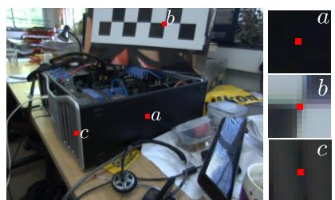

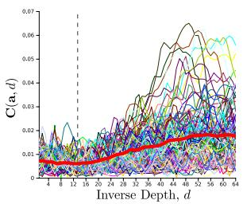

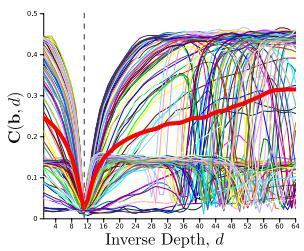

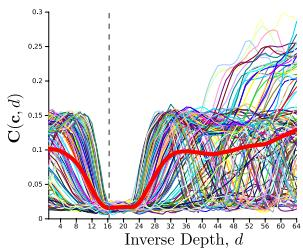  
Figure 2. Plots for the single pixel photometric functions ρ(u) and the resulting total data cost row C(u) are shown for three example pixels in the reference frame, chosen in regions of differing discernibility. Pixel (a) is in a textureless region and not well localisable; (b) is within a strongly textured region where a point feature might be detected; and (c) is in a region of linear repeating texture. While the individual costs exhibit many local minima, the total cost shows clear a clear minimum in all except nearly homogeneous regions.

Shown in Figure 3, an inverse depth map can be extracted from the cost volume by computing arg $\mathrm { m i n } _ { d } { \bf C } ( { \bf u } , d )$ for each pixel u in the reference frame. It is clear that the estimates obtained in featureless regions are prone to false minima. Fortunately, the sum of individual photometric errors in these regions leads to a flatter total cost. We will therefore seek an inverse depth map which minimises an energy functional comprising the photometric error cost as a data term and a regularisation term that penalises deviation from a spatially smooth inverse depth map solution.

## 2.2.1 Regularised Cost

We assume that the inverse depth solution being reconstructed consists of regions that vary smoothly together with discontinuities due to occlusion boundaries. We use a regulariser comprising a weighted Huber norm over the gradient of the inverse depth map, $g ( \mathbf { u } ) \| \nabla \xi ( \mathbf { u } ) \| _ { \epsilon }$ . The Huber norm is a composite of two convex functions:

$$
\| x \| _ { \epsilon } = { \left\{ \begin{array} { l l } { { \frac { \| x \| _ { 2 } ^ { 2 } } { 2 \epsilon } } } & { \quad { \mathrm { i f ~ } } \| x \| _ { 2 } \leq \epsilon } \\ { \| x \| _ { 1 } - { \frac { \epsilon } { 2 } } } & { \quad { \mathrm { o t h e r w i s e } } } \end{array} \right. }\tag{4}
$$

Within $\lVert \nabla \xi _ { r } \rVert _ { 2 } \leq \epsilon \mathrm { a n } L _ { 2 } ^ { 2 }$ norm is used, promoting smooth reconstruction, while otherwise the norm is $L _ { 1 }$ forming the total variation (TV) regulariser which allows discontinuities to form at depth edges. More specifically, TV allows discontinuities to form without the need for a thresholdspecific non-convex norm that would depend on the reconstruction scale which is not available in a monocular setting.

In this case  is set to a very small value ≈ $1 . 0 e ^ { - 4 }$ to reduce the stair-casing effect obtained by the pure TV regulariser. As depth discontinuities often coincide with edges in the reference image, the per pixel weight g(u) we use is:

$$
g ( \mathbf { u } ) = e ^ { - \alpha \| \nabla \mathbf { I } _ { r } ( \mathbf { u } ) \| _ { 2 } ^ { \beta } } \ ,\tag{5}
$$

reducing the regularisation strength where the edge magnitude is high, thereby limiting solution smoothing across region boundaries. The resulting energy functional therefore contains a non-convex photometric error data term and a convex regulariser:

$$
E _ { \pmb { \xi } } = \int _ { \Omega } \Big \{ g ( \mathbf { u } ) \| \nabla \pmb { \xi } ( \mathbf { u } ) \| _ { \epsilon } + \lambda \mathbf { C } \left( \mathbf { u } , \pmb { \xi } ( \mathbf { u } ) \right) \Big \} \mathrm { d } \mathbf { u } .\tag{6}
$$

In many optical flow and variational depth map methods, a convex approximation to the data term can be obtained by linearising the cost volume and solving the resulting approximation iteratively within a coarse-to-fine warping scheme that can lead to loss of reconstruction detail. If the linearisation is performed directly in image space as in [13], all images used in the data term must be kept increasing computational cost as more overlapping images are used. Instead, following the large displacement optic flow method of [12] we approximate the energy functional by coupling the data and regularisation terms through an auxiliary variable $\alpha : \Omega  \mathbb { R }$

$$
\begin{array} { l } { \displaystyle { \bf E } _ { \xi , \alpha } = \int _ { \Omega } \Big \{ { g ( { \bf u } ) } \| \nabla \xi ( { \bf u } ) \| _ { \epsilon } + \frac { 1 } { 2 \theta } \left( \xi ( { \bf u } ) - \alpha ( { \bf u } ) \right) ^ { 2 } } \\ { \displaystyle ~ + \lambda { \bf C } \left( { \bf u } , \alpha ( { \bf u } ) \right) \Big \} \mathrm { d } { \bf u } . } \end{array}\tag{7}
$$

The coupling term $\begin{array} { r } { { \bf Q } ( { \bf u } ) = \frac { 1 } { 2 \theta } ( { \boldsymbol \xi } ( { \bf u } ) - \alpha ( { \bf u } ) ) ^ { 2 } } \end{array}$ serves to drive the original and auxiliary variables together, enforcing $\xi ~ = ~ \alpha ~ \mathrm { a s } ~ \theta ~ \to ~ 0$ , resulting in the original energy (6). As a function of ξ, the convex sum $g ( \mathbf { u } ) \lVert \nabla \xi ( \mathbf { u } ) \rVert _ { \epsilon } +$ $\mathbf { Q } ( \mathbf { u } )$ is a small modification of the TV- $L _ { 2 } ^ { 2 }$ ROF image denoising model term [11], and can be efficiently optimised using a primal-dual approach [1][16][3]. Also, although still non-convex in the auxiliary variable $_ { \alpha , \beta }$ each $\mathbf { Q } ( \mathbf { u } ) + \lambda \mathbf { C } \left( \mathbf { u } , \alpha ( \mathbf { u } ) \right)$ is now trivially point-wise optimisable and can be solved using an exhaustive search over a finite range of discretely sampled inverse depth values. The lack of coarse-to-fine warping means that smaller scene details can be correctly picked out from their surroundings. Importantly, the discrete cost volume C, can be computed by keeping the average cost up to date as each overlapping frame from $\mathbf { I } _ { \boldsymbol { m } \in \mathcal { T } ( \boldsymbol { r } ) }$ arrives removing the need to store images or poses and enabling constant time optimisation for any number of overlapping images.

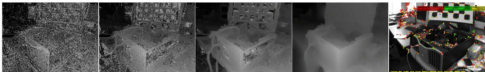  
Figure 3. Incremental cost volume construction; we show the current inverse depth map extracted as the current minimum cost for each pixel row $d _ { \mathbf { u } } ^ { m i n } = \arg \operatorname* { m i n } _ { d } \mathbf { C } ( \mathbf { u } , d )$ as 2, 10 and 30 overlapping images are used in the data term (left). Also shown is the regularised solution that we solve to provide each keyframe inverse depth map (4th from left). In comparison to the nearly $3 0 0 \times 1 0 ^ { 3 }$ points estimated in our keyframe, we show the ≈ 1000 point features used in the same frame for localisation in PTAM ([6]). Estimating camera pose from such a fully dense model enables tracking robustness during rapid camera motion.

## 2.2.2 Discretisation of the Cost Volume and Solution

The discrete cost volume is implemented as an $M \times N \times S$ element array, where $M \times N$ is the reference image resolution and S is the number of points linearly sampling the inverse depth range between $\xi _ { m a x }$ and $\pmb { \xi } _ { m i n }$ . Linear sampling in inverse depth leads to a linear sampling along epipolar lines when computing $\rho .$

In the next section we will use $M N \times 1$ stacked rasterised column vector versions of the inverse depth ξ and auxiliary α variables (see [16] for more details of similar schemes). d is the vector version of $\xi ;$ and a is the vector version of α. We will also use g to denote the $M N \times 1$ constant vector containing the stacked reference image per-pixel weights computed by Equation 5 for image weighted regularisation.

## 2.2.3 Solution

We now detail our iterative minimisation solution for (7). Following [1][16][3], we use duality principles to arrive at the primal-dual form of $g ( \mathbf { u } ) \| \nabla \xi ( \mathbf { u } ) \| _ { \epsilon } + \mathbf { Q } ( \mathbf { u } )$ . Using the vector notation, we replace the weighted Huber regulariser (4) by its conjugate using the Legendre-Fenchel transform,

$$
\| A G \mathbf { d } \| _ { \epsilon } = \underset { \mathbf { q } , \| \mathbf { q } \| _ { 2 } \leq 1 } { \arg \operatorname* { m a x } } \Big \{ \langle A G \mathbf { d } , \mathbf { q } \rangle - \delta _ { q } ( \mathbf { q } ) - \frac { \epsilon } { 2 } \| \mathbf { q } \| _ { 2 } ^ { 2 } \Big \} ,\tag{8}
$$

where the matrix multiplication Ad computes the $2 M N \times 1$ element gradient vector, $G = \mathrm { d i a g } ( \mathbf { g } )$ is the element-wise weighting matrix and $\delta _ { q } ( \mathbf { q } )$ is the indicator function such that for each element $q , { \dot { \delta } } _ { q } ( q ) = 0 \operatorname { i f } \| q \| _ { 1 } \leq 1$ and otherwise ∞.

Replacing the regulariser with the dual form, the saddlepoint problem in primal variable d and dual variable q is coupled with the data term giving the sum of convex and non-convex functions we minimise,

$$
\begin{array} { r l } & { \underset { \mathbf { q } , \mathbf { \Psi } \parallel \mathbf { q } \parallel _ { 2 } \leq 1 } { \arg \operatorname* { m a x } } \{ \arg \operatorname* { m i n } \mathbf { \Psi } \mathbf { E } \left( \mathbf { d } , \mathbf { a } , \mathbf { q } \right) \} } \\ & { \mathbf { q } , \mathbf { \Psi } \| \mathbf { q } \| _ { 2 } \leq 1 \qquad \mathbf { \dot { d } } , \mathbf { a } } \end{array}\tag{9}
$$

$$
\begin{array} { r } { \mathbf { E } \left( \mathbf { d } , \mathbf { a } , \mathbf { q } \right) = \bigg \lbrace \langle A G \mathbf { d } , \mathbf { q } \rangle + \frac { 1 } { 2 \theta } \| \mathbf { d } - \mathbf { a } \| _ { 2 } ^ { 2 } \phantom { x x x x x x x x x x x x x x x x x x } } \\ { + \lambda \mathbf { C } \left( \mathbf { a } \right) - \delta _ { q } ( \mathbf { q } ) - \frac { \epsilon } { 2 } \| \mathbf { q } \| _ { 2 } ^ { 2 } \bigg \rbrace . } \end{array}\tag{10}
$$

Fixing the auxillary variable a, the condition of optimality is met when $\partial _ { \mathbf { d } , \mathbf { q } } ( \mathbf { E } \left( \mathbf { d } , \mathbf { a } , \mathbf { q } \right) ) = 0$ . For the dual variable $\mathbf { q } ,$

$$
\frac { \partial { \bf E } \left( { \bf d } , { \bf a } , { \bf q } \right) } { \partial { \bf q } } = { \cal A } G { \bf d } - \epsilon { \bf q } .\tag{11}
$$

Using the divergence theorem, differentiation with respect to primal variable d can be performed by noting that $\langle A G \mathbf { d } , \mathbf { q } \rangle = \langle A ^ { \top } \mathbf { q } , G \mathbf { d } \rangle$ , where $A ^ { \top }$ forms the negative divergence operator,

$$
{ \frac { \partial \mathbf { E } \left( \mathbf { d } , \mathbf { a } , \mathbf { q } \right) } { \partial \mathbf { d } } } = G { A ^ { \top } } \mathbf { q } + { \frac { 1 } { \theta } } \left( \mathbf { d } - \mathbf { a } \right) ~ .\tag{12}
$$

For a fixed value d we obtain the solution for each $a _ { \mathbf { u } } =$ $\mathbf { a } ( \mathbf { u } ) \in \mathbf { D }$ in the remaining non-convex function using a point-wise search to solve,

$$
\operatorname { a r g m i n } _ { a _ { \mathbf { u } } \in \mathbf { D } } \mathbf { E } ^ { \mathrm { a u x } } ( \mathbf { u } , d _ { \mathbf { u } } , a _ { \mathbf { u } } ) ,\tag{13}
$$

$$
{ \bf E } ^ { \mathrm { a u x } } ( { \bf u } , d _ { \bf u } , a _ { \bf u } ) = \frac { 1 } { 2 \theta } \left( d _ { \bf u } - a _ { \bf u } \right) ^ { 2 } + \lambda { \bf C } \left( { \bf u } , a _ { \bf u } \right) .\tag{14}
$$

The complete optimisation starting at iteration $n = 0$ begins by setting dual variable $\mathbf { q } ^ { 0 } = 0$ and initialising each element of the primal variable with the data cost minimum, $\begin{array} { r } { d _ { \mathbf { u } } ^ { 0 } = a _ { \mathbf { u } } ^ { 0 } = \arg \operatorname* { m i n } _ { a _ { \mathbf { u } } \in \mathbf { D } } \mathbf { C } ( \mathbf { u } , a _ { \mathbf { u } } ) } \end{array}$ , iterating:

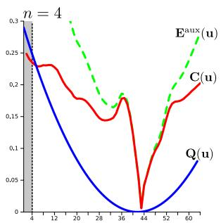

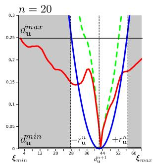

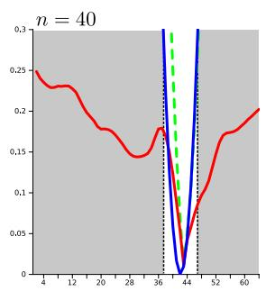  
Figure 4. Accelerated exhaustive search: at each pixel we wish to minimise the total depth energy ${ \bf E } ^ { a u x } ( { \bf u } )$ (green), which is the sum of the fixed data energy ${ \bf C } ( { \bf u } )$ (red) and the current convex coupling between primal and auxiliary variables Q(u) (blue). This latter term is a parabola which gets narrower as optimisation progresses, setting a bound on the region within which a minimum of ${ \bf E } ^ { a u x } ( { \bf u } )$ can possibly lie and allowing the search region (unshaded) to get smaller and smaller.

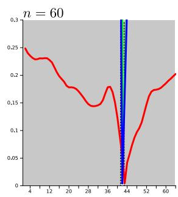

1. Fixing the current value of $\mathbf { a } ^ { n }$ perform a semi-implicit gradient ascent on $\partial _ { \mathbf { q } } = 0 ( 1 1 )$ ) and descent on $\partial _ { \mathbf { d } } = 0$ (12) :

$$
\begin{array} { r l } & { \frac { \mathbf { q } ^ { n + 1 } - \mathbf { q } ^ { n } } { \sigma _ { \mathbf { q } } } = A G \mathbf { d } ^ { n } - \epsilon \mathbf { q } ^ { n + 1 } } \\ & { \frac { \mathbf { d } ^ { n + 1 } - \mathbf { d } ^ { n } } { \sigma _ { \mathbf { d } } } = - \frac { 1 } { \theta ^ { n } } \left( \mathbf { d } ^ { n + 1 } - \mathbf { a } ^ { n } \right) - G A ^ { \top } \mathbf { q } ^ { n + 1 } , } \end{array}
$$

resulting in the following primal-dual update step,

$$
\begin{array} { r l } & { \mathbf { q } ^ { n + 1 } = \Pi _ { \mathbf { q } } \left( ( \mathbf { q } ^ { n } + \sigma _ { \mathbf { q } } G A \mathbf { d } ^ { n } ) / ( 1 + \sigma _ { \mathbf { q } } \epsilon ) \right) , } \\ & { \mathbf { d } ^ { n + 1 } = ( \mathbf { d } ^ { n } + \sigma _ { \mathbf { d } } ( G A ^ { \top } \mathbf { q } ^ { n + 1 } + \frac { 1 } { \theta ^ { n } } \mathbf { a } ^ { n } ) ) / ( 1 + \frac { \sigma _ { \mathbf { d } } } { \theta ^ { n } } ) } \end{array}
$$

where $\Pi _ { \mathbf { q } } ( x ) = x / \operatorname* { m a x } ( 1 , \| x \| _ { 2 } )$ projects the gradient ascent step back onto the constraint $\| \mathbf { q } \| _ { 1 } \leq 1$

2. Fixing $\mathbf { d } ^ { n + 1 }$ , perform a point-wise exhaustive search for each $a _ { \mathbf { u } } ^ { n + 1 } \mathbf { \bar { \Psi } } \in \mathbf { D } \left( 1 3 \right)$

3. If $\theta ^ { n } > \theta _ { e n d }$ update $\theta ^ { n + 1 } = \theta ^ { n } ( 1 - \beta n ) , n  n + 1$ and goto (1), otherwise end.

In practice, the update steps for $\mathbf { q } ^ { n + 1 }$ and $\mathbf { d } ^ { n + 1 }$ can be performed efficiently and in parallel on modern GPU hardware using equivalent in-place computations for operators ∇ and $- \mathbf { v } .$ · in place of the matrix-vector multiplication involving A and $A ^ { \top }$

## 2.2.4 Accelerating the Non-Convex Solution

The exhaustive search over all S samples of Q to solve (13) ensures global optimality of the iteration (within the sampling limit). We now demonstrate in Figure 4 that there exists a deterministically decreasing feasible region within which the global minimum of (14) must exist, considerably reducing the number of samples that need to be tested.

For a pixel u, the known data cost minimum and maximum are $C _ { \bf u } ^ { m a x } = { \bf C } ( d _ { \bf u } ^ { m a x } )$ and $C _ { \bf u } ^ { m i n } = { \bf C } ( d _ { \bf u } ^ { m i n } )$ . These are trivial to maintain when building the cost volume. As both terms in (14) are positive, we know that the minimum value of any cost volume row is just $C _ { \mathbf { u } } ^ { m i n }$ . This occurs if the quadratic component is zero when $\mathbf { \bar { \rho } } a _ { \mathbf { u } } ^ { n + 1 } = d _ { \mathbf { u } } ^ { n + 1 } = d _ { \mathbf { u } } ^ { m i n }$ In any case, if we set $a _ { \mathbf { u } } ^ { n + 1 } = d _ { \mathbf { u } } ^ { n + 1 }$ then we can not exceed $C _ { \bf u } ^ { m a x }$ resulting in the energy bound,

$$
C _ { \mathbf { u } } ^ { m i n } + \frac { 1 } { 2 \theta ^ { n } } \left( a _ { \mathbf { u } } ^ { n + 1 } - d _ { \mathbf { u } } ^ { n + 1 } \right) ^ { 2 } \leq C _ { \mathbf { u } } ^ { m a x }\tag{15}
$$

Rearranging for $a _ { \mathbf { u } } ^ { n + 1 }$ we find a feasible region either side of the current fixed point $d _ { \mathbf { u } } ^ { n + 1 }$ within which the solution of the optimisation must exist,

$$
\begin{array} { r l r } { a _ { \bf u } ^ { n + 1 } } & { { } \in } & { \left[ d _ { \bf u } ^ { n + 1 } - r _ { \bf u } ^ { n + 1 } , d _ { \bf u } ^ { n + 1 } + r _ { \bf u } ^ { n + 1 } \right] } \end{array}\tag{16}
$$

$$
\begin{array} { r c l } { r _ { \mathbf { u } } ^ { n + 1 } } & { = } & { 2 \theta ^ { n } \lambda \left( C _ { \mathbf { u } } ^ { m a x } - C _ { \mathbf { u } } ^ { m i n } \right) } \end{array}\tag{17}
$$

As shown in Figure (4), the search region size drastically decreases after only a small number of iterations, reducing the number of sample points that need to be tested in the cost volume to ensure optimally of (13).

## 2.2.5 Increasing Solution Accuracy

In the large displacement optical flow method of [12] an increased sampling density of the cost function is used to achieve sub-pixel flows. Likewise, it is possible to increase the density of inverse depth samples S to increase surface reconstruction accuracy and the acceleration method introduced in the previous section would go a long way to mitigating the increased computational cost. However, as can be seen in Figure 4 the sampled point-wise energy $\mathbf { Q } ( \mathbf { u } )$ is typically well modelled around the discrete minimum with a parabola. We can therefore achieve sub-sample accuracy by performing a single Newton step using numerical derivatives of $\mathbf { Q } ( \mathbf { u } )$ around the current discrete minimium $a _ { \mathbf { u } } ^ { n + 1 }$

$$
\hat { a } _ { \bf u } ^ { n + 1 } = a _ { \bf u } ^ { n + 1 } - \frac { \nabla { \bf E } ^ { \mathrm { a u x } } ( { \bf u } , d _ { \bf u } ^ { n + 1 } , a _ { \bf u } ^ { n + 1 } ) } { { \nabla ^ { 2 } } { \bf E } ^ { \mathrm { a u x } } ( { \bf u } , d _ { \bf u } ^ { n + 1 } , a _ { \bf u } ^ { n + 1 } ) } \mathrm { ~ . ~ }\tag{18}
$$

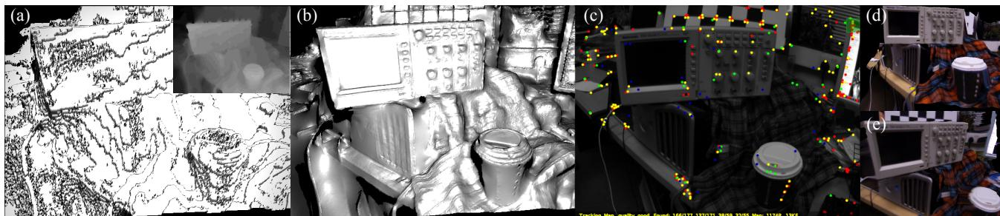  
Figure 5. Example inverse depth map reconstructions obtained from DTAM using a single low sample cost volume with S = 32. (a) Regularised solution obtained without the sub-sample refinement is shown as a 3D mesh model with Phong shading (inverse depth map solution shown in inset). (b) Regularised solution with sub-sample refinement using the same cost volume also shown as a 3D mesh model. (c) The video frame as used in PTAM, with the point model projections of features found in the current frame and used in tracking. (d,e) Novel wide baseline texture mapped views of the reconstructed scene used for tracking in DTAM.

The refinement step is embedded in the iterative optimisation scheme by replacing the located $a _ { \mathbf { u } } ^ { n + 1 }$ with the subsample accurate version. It is not possible to perform this refinement post-optimisation, as at that point the quadratic coupling energy is large (due to a very small $\theta ) ,$ , and so the fitted parabola is a spike situated at the minimum. As demonstrated in Figure 5 embedding the refinement step inside each iteration results in vastly increased reconstruction quality, and enables detailed reconstructions even for low sample rates, e.g. $S \leq 6 4$

## 2.2.6 Setting Parameter Values and Post Processing

Gradient ascent/descent time-steps $\sigma _ { \mathbf { q } } , \sigma _ { \mathbf { d } }$ are set optimally for the update scheme provided as detailed in [3]. Various values of β can be used to drive θ towards 0 as iterations increase while ensuring $\theta ^ { n + 1 } < \theta ^ { n } \left( 1 - \beta n \right)$ . Larger values result in lower quality reconstructions, while smaller values of $\beta$ with increased iterations result in higher quality. In our experiments we have set $\beta = 0 . 0 0 1$ while $\theta ^ { n } \geq 0 . 0 0 1$ else $\beta = 0 . 0 0 0 1$ resulting in a faster initial convergence. We use $\theta ^ { 0 } = 0 . 2$ and $\theta _ { e n d } = 1 . 0 e \mathrm { ~ - ~ } 4$ . λ should reflect the data term quality and is set dynamically to $1 / ( 1 + 0 . 5 \bar { d } )$ where ¯d is the minimum scene depth predicted by the current scene model. For the first key-frame we set λ = 1. This dynamically altered data term weighting sensibly increases regularisation power for more distant scene reconstructions that, assuming similar camera motions for both closer and further scenes, will have a poorer quality data term.

Finally, we note that optimisation iterations can be interleaved with updating the cost volume average, enabling the surface (though in a non fully converged state) to be made available for use in tracking after only a single $\rho$ computation. For use in tracking, we compute a triangle mesh from the inverse depth map, culling oblique edges as described in [9].

## 2.3. Dense Tracking

Given a dense model consisting of one or more keyframes, we can synthesise realistic novel views over wide baselines by projecting the entire model into a virtual camera. Since such a model is maintained live, we benefit from a fully predictive surface representation, handling occluded regions and back faces naturally. We estimate the pose of a live camera by finding the parameters of motion which generate a synthetic view which best matches the live video image.

We refine the live camera pose in two stages; first with a constrained inter-frame rotation estimation, and second with an accurate 6DOF full pose refinement against the model. Both are formulated as iterative Lucas-Kanade style non-linear least-squares problems, iteratively minimising an every-pixel photometric cost function. To converge to the global minimum, we must initialise the system within the convex basin of the true solution. We use a coarse-fine strategy over a power of two image pyramid for efficiency and to increase our range of convergence.

## 2.3.1 Pose Estimation

We first follow the alignment method of [8] between consecutive frames to obtain rotational odometry at lower levels within the pyramid, offering resilience to motion blur since consecutive images are similarly blurred. This optimisation is more stable than 6DOF estimation when the number of pixels considered is low, helping to converge for large pixel motions, even when the true rotation is not strictly rotational (Figure 6). A similar step is performed before feature matching in PTAM’s tracker, computing first the interframe 2D image transform and fitting a 3D rotation [7].

The rotation estimate helps inform our current best estimate of the live camera pose, $\hat { \mathrm { T } } _ { w l }$ . We project the dense model in to a virtual camera v at location $\mathrm { T } _ { w v } = \hat { \mathrm { T } } _ { w l }$ , with colour image ${ \mathbf I } _ { v }$ and inverse depth image $\xi _ { v }$ . Assuming that v is close to the true pose of the live camera, we perform a 2.5D alignment between ${ \mathbf I } _ { v }$ and the live image $\mathbf { I } _ { l }$ to estimate $\mathrm { T } _ { l v } ,$ and hence the true pose $\mathrm { T } _ { w l } = \mathrm { T } _ { w v } \mathrm { T } _ { v l }$ . We parametrise an update to $\hat { \mathrm { T } } _ { v l }$ by $\psi \in \mathbb { R } ^ { 6 }$ belonging to the Lie Algebra ${ \mathfrak { s e } } _ { 3 }$ and define a forward-compositional [2] cost function relating photometric error to changing parameters:

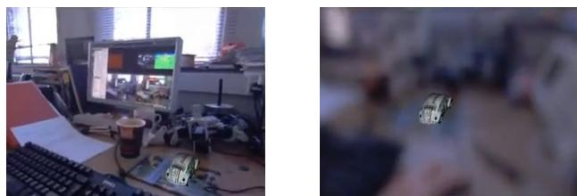

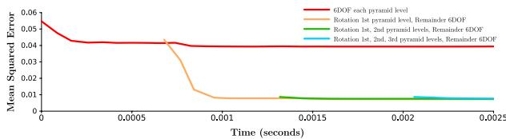  
Figure 6. MSE convergence plots over time for an illustrative tracking step using different combinations of rotation and full pose iterations. Estimating rotation first can help to avoid local minima.

$$
F ( \psi ) = \frac { 1 } { 2 } \sum _ { \mathbf { u } \in \Omega } \Big ( f _ { \mathbf { u } } ( \psi ) \Big ) ^ { 2 } = \frac { 1 } { 2 } \| f ( \psi ) \| _ { 2 } ^ { 2 } ,\tag{19}
$$

$$
f _ { \mathbf { u } } ( \psi ) = \mathbf { I } _ { l } \left( \pi \left( \mathrm { K T } _ { l v } ( \psi ) \pi ^ { - 1 } \left( \mathbf { u } , \xi _ { v } \left( \mathbf { u } \right) \right) \right) \right) - \mathbf { I } _ { v } \left( \mathbf { u } \right)\tag{20}
$$

$$
\mathrm { T } _ { l v } ( \pmb { \psi } ) = \exp \left( \sum _ { i = 1 } ^ { 6 } \pmb { \psi } _ { i } \mathbf { g } \mathbf { e } \mathbf { n } _ { i } \right) .\tag{21}
$$

This cost function does not take into account occluded surfaces directly; instead we assume that the optimisation operates over only a narrow baseline from the original model prediction. We could perform a full prediction setting $\mathrm { T } _ { w v } = \hat { \mathrm { T } } _ { w l }$ at every iteration but find it is not required.

$\psi ^ { \circ } ~ = ~ \mathrm { a r g }$ min ${ } _ { \psi } F ( \psi )$ represents a stationary point of $F ( \psi )$ such that $\overleftarrow { \nabla } F ( \psi ^ { \circ } ) ~ = ~ 0$ . We approximate $F ( \psi )$ with $\hat { F } ( \psi ) = { \textstyle \frac { 1 } { 2 } } \hat { f } ( \psi ) ^ { \top } \hat { f } ( \psi )$ where ${ \hat { f } } ( \psi ) \approx f ( \psi )$ is the Taylor series expansion of $f ( \psi )$ about 0 up to first order. Via the product rule, $\nabla \hat { F } ( \psi ) = \nabla \hat { f } ( \psi ) ^ { \top } \hat { f } ( \psi )$ and we can find the approximate minimiser $\hat { \psi } \approx \psi ^ { \circ }$ by solving $\nabla f ( \hat { \psi } ) ^ { \top } \hat { f } ( \hat { \psi } ) = 0$ . Equivalently, we can solve the overdetermined linear system $\nabla f ( \mathbf { 0 } ) { \hat { \psi } } = - f ( 0 )$ or its normal equations. We then apply the update $\hat { \mathrm { T } } _ { l v } \gets \hat { \mathrm { T } } _ { l v } \mathrm { T } ( \hat { \psi } )$ and repeat until $\hat { \boldsymbol { \psi } } \approx \mathbf { 0 }$ marking convergence.

## 2.3.2 Robustified Tracking

Any observed pixels which do not belong to our model may have a large impact on tracking quality. We robustify our method by disregarding pixels whose photometric error falls above some threshold. In each least squares iteration, our coarse-fine method ramps down this threshold as we converge to achieve greater accuracy. This scheme makes it practical to track densely whilst observing unmodelled objects.

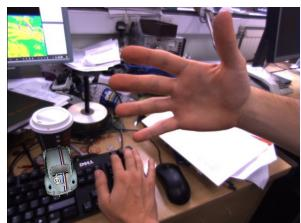

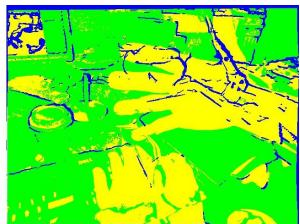  
Figure 7. Augmented Reality car appears fixed rigidly to the world as an unmodelled hand is waved in front of the camera. Pixels in green are used for tracking whilst blue do not exist in the original prediction and yellow are rejected (hand / monitor / shadow).  
Figure 8. DTAM tracking throughout camera defocus.

## 2.4. Model Initialisation and Management

The system is initialised using a standard point feature based stereo method, which continues until the first keyframe is acquired, when we switch to a fully dense tracking and mapping pipeline. We are investigating a fully general dense initialisation scheme.

A new keyframe is added when the number of pixels in the previous predicted image without visible surface information falls below some threshold. This is possible due to the fully dense nature of the system and is arguably better founded than the heuristics used in feature based systems.

## 3. Evaluation

We have evaluated DTAM in the same desktop setting where PTAM has been successful. In all experiments, we have used a Point Grey Flea2 camera, operating at 30Hz with 640×480 resolution and 24bit RGB colour. The camera has pre-calibrated intrinsics. We run on a commodity system consisting of an NVIDIA GTX 480 GPU hosted by an i7 quad-core CPU. We present a qualitative comparison of the live running system including extensive tracking comparisons with PTAM and augmented reality demonstrations in an accompanying video:

http://youtu.be/Df9WhgibCQA.

## 3.1. Quantitative Tracking Performance

We have evaluated the tracking performance of our system against the openly available PTAM system, which includes many state of the art point feature tracking methods (Figure 9). Our results highlight both DTAM’s local accuracy and extreme resilience to degraded images and rapid motion.

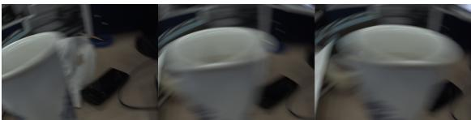

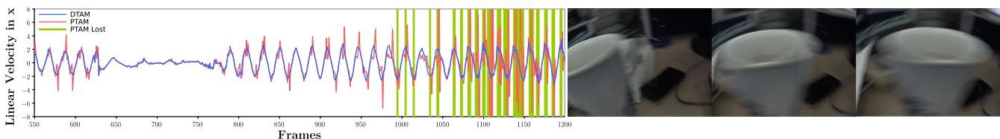  
Figure 9. Linear velocities for DTAM (blue) and PTAM (red) over a challenging high acceleration back-and-forth trajectory close to a cup. Areas where PTAM lost tracking and resorted to relocalisation are shown in green. In comparison, DTAM’s relocaliser was disabled. Notice that DTAM’s linear velocity plot reflects smoother motion estimation.

## 3.2. Failure Modes and Future Work

We assume brightness constancy in all stages of reconstruction and tracking. Although section 2.3.2 describes how we can handle local illumination changes whilst tracking, we are not robust to real-world global illumination changes that can occur. Irani and Anandan [5] showed how a normalised cross correlation measure can be integrated into the objective function for more robustness to local and global lighting changes. As an alternative to this, in future work, we are interested in joint modelling of the dense lighting and reflectance properties of the scene to enable more accurate photometric cost functions to be used. We see this as a route forward in attempting to recover a more complete physically predictive description of a scene.

## 4. Conclusions

We believe that DTAM represents a significant advance in real-time geometrical vision, with potential applications in augmented reality, robotics and other fields. Dense modelling and dense tracking feed back on each other to make a system with modelling and tracking performance beyond any point-based method.

## References

[1] J.-F. Aujol. Some first-order algorithms for total variation based image restoration. Journal of Mathematical Imaging and Vision, 34(3):307–327, 2009. 3, 4

[2] S. Baker and I. Matthews. Lucas-Kanade 20 years on: A unifying framework: Part 1. International Journal ofComputer Vision (IJCV), 56(3):221–255, 2004. 7

[3] A. Chambolle and T. Pock. A first-order primal-dual algorithm for convex problems with applications to imaging. Journal of Mathematical Imaging and Vision, 40(1):120– 145, 2011. 3, 4, 6

[4] D. Gallup, M. Pollefeys, and J. M. Frahm. 3D reconstruction using an n-layer heightmap. In Proceedings of the DAGM Symposium on Pattern Recognition, 2010. 1

[5] M. Irani and P. Anandan. Robust multi-sensor image alignment. In Proceedings of the International Conference on Computer Vision (ICCV), pages 959–966, 1998. 8

[6] G. Klein and D. W. Murray. Parallel tracking and mapping for small AR workspaces. In Proceedings of the International Symposium on Mixed and Augmented Reality (IS-MAR), 2007. 4

[7] G. Klein and D. W. Murray. Improving the agility of keyframe-based SLAM. In Proceedings of the European Conference on Computer Vision (ECCV), 2008. 6

[8] S. J. Lovegrove and A. J. Davison. Real-time spherical mosaicing using whole image alignment. In Proceedings of the European Conference on Computer Vision (ECCV), 2010. 6

[9] R. A. Newcombe and A. J. Davison. Live dense reconstruction with a single moving camera. In Proceedings of the IEEE Conference on Computer Vision and Pattern Recognition (CVPR), 2010. 1, 6

[10] C. Rhemann, A. Hosni, M. Bleyer, C. Rother, and M. Gelautz. Fast cost-volume filtering for visual correspondence and beyond. In Proceedings of the IEEE Conference on Computer Vision and Pattern Recognition (CVPR), 2011. 2

[11] L. I. Rudin, S. Osher, and E. Fatemi. Nonlinear total variation based noise removal algorithms. Physica D, 60:259– 268, November 1992. 3

[12] F. Steinbrucker, T. Pock, and D. Cremers. Large displacement optical flow computation without warping. In Proceedings of the International Conference on Computer Vision (ICCV), 2009. 3, 5

[13] J. Stuehmer, S. Gumhold, and D. Cremers. Real-time dense geometry from a handheld camera. In Proceedings of the DAGM Symposium on Pattern Recognition, 2010. 1, 3

[14] R. Szeliski and D. Scharstein. Sampling the disparity space image. IEEE Transactions on Pattern Analysis and Machine Intelligence (PAMI), 26:419–425, 2004. 2

[15] C. Zach. Fast and high quality fusion of depth maps. In Proceedings of the International Symposium on 3D Data Processing, Visualization and Transmission (3DPVT), 2008. 1

[16] M. Zhu. Fast numerical algorithms for total variation based image restoration. PhD thesis, University of California at Los Angeles, 2008. 3, 4