# KinectFusion: Real-Time Dense Surface Mapping and Tracking

Richard A. Newcombe Imperial College London

Andrew J. Davison Imperial College London

Shahram Izadi Microsoft Research

Pushmeet Kohli Microsoft Research

Otmar Hilliges Microsoft Research

Jamie Shotton Microsoft Research

David Molyneaux Microsoft Research Lancaster University Steve Hodges Microsoft Research

David Kim Microsoft Research Newcastle University Andrew Fitzgibbon Microsoft Research

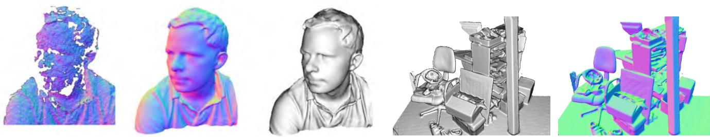  
Figure 1: Example output from our system, generated in real-time with a handheld Kinect depth camera and no other sensing infrastructure. Normal maps (colour) and Phong-shaded renderings (greyscale) from our dense reconstruction system are shown. On the left for comparison is an example of the live, incomplete, and noisy data from the Kinect sensor (used as input to our system).

## ABSTRACT

We present a system for accurate real-time mapping of complex and arbitrary indoor scenes in variable lighting conditions, using only a moving low-cost depth camera and commodity graphics hardware. We fuse all of the depth data streamed from a Kinect sensor into a single global implicit surface model of the observed scene in real-time. The current sensor pose is simultaneously obtained by tracking the live depth frame relative to the global model using a coarse-to-fine iterative closest point (ICP) algorithm, which uses all of the observed depth data available. We demonstrate the advantages of tracking against the growing full surface model compared with frame-to-frame tracking, obtaining tracking and mapping results in constant time within room sized scenes with limited drift and high accuracy. We also show both qualitative and quantitative results relating to various aspects of our tracking and mapping system. Modelling of natural scenes, in real-time with only commodity sensor and GPU hardware, promises an exciting step forward in augmented reality (AR), in particular, it allows dense surfaces to be reconstructed in real-time, with a level of detail and robustness beyond any solution yet presented using passive computer vision.

Keywords: Real-Time, Dense Reconstruction, Tracking, GPU, SLAM, Depth Cameras, Volumetric Representation, AR

Index Terms: I.3.3 [Computer Graphics] Picture/Image Generation - Digitizing and Scanning; I.4.8 [Image Processing and Computer Vision] Scene Analysis - Tracking, Surface Fitting; H.5.1 [Information Interfaces and Presentation]: Multimedia Information Systems - Artificial, augmented, and virtual realities

## 1 INTRODUCTION

Real-time infrastructure-free tracking of a handheld camera whilst simultaneously mapping the physical scene in high-detail promises new possibilities for augmented and mixed reality applications.

In computer vision, research on structure from motion (SFM) and multi-view stereo (MVS) has produced many compelling results, in particular accurate camera tracking and sparse reconstructions (e.g. [10]), and increasingly reconstruction of dense surfaces (e.g. [24]). However, much of this work was not motivated by realtime applications.

Research on simultaneous localisation and mapping (SLAM) has focused more on real-time markerless tracking and live scene reconstruction based on the input of a single commodity sensor—a monocular RGB camera. Such ‘monocular SLAM’ systems such as MonoSLAM [8] and the more accurate Parallel Tracking and Mapping (PTAM) system [17] allow researchers to investigate flexible infrastructure- and marker-free AR applications. But while these systems perform real-time mapping, they were optimised for efficient camera tracking, with the sparse point cloud models they produce enabling only rudimentary scene reconstruction.

In the past year, systems have begun to emerge that combine PTAM’s handheld camera tracking capability with dense surface MVS-style reconstruction modules, enabling more sophisticated occlusion prediction and surface interaction [19, 26]. Most recently in this line of research, iterative image alignment against dense reconstructions has also been used to replace point features for camera tracking [20]. While this work is very promising for AR, dense scene reconstruction in real-time remains a challenge for passive monocular systems which assume the availability of the right type of camera motion and suitable scene illumination.

But while algorithms for estimating camera pose and extracting geometry from images have been evolving at pace, so have the camera technologies themselves. New depth cameras based either on time-of-flight (ToF) or structured light sensing offer dense measurements of depth in an integrated device. With the arrival of Microsoft’s Kinect, such sensing has suddenly reached wide consumer-level accessibility. The opportunities for SLAM and AR with such sensors are obvious, but algorithms to date have not fully leveraged the fidelity and speed of sensing that such devices offer.

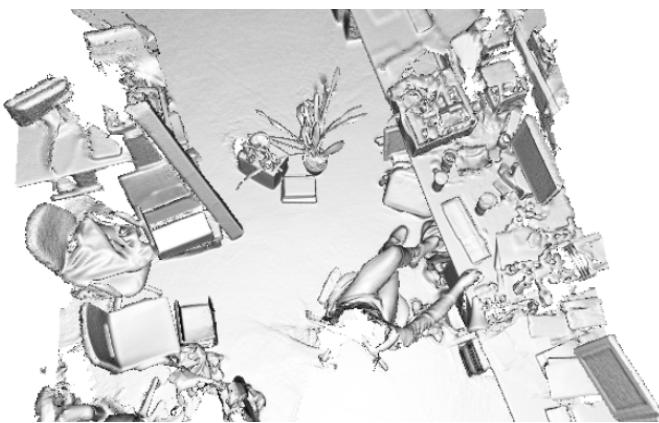  
Figure 2: A larger scale reconstruction obtained in real-time.

In this paper we present a detailed method with analysis of what we believe is the first system which permits real-time, dense volumetric reconstruction of complex room-sized scenes using a handheld Kinect depth sensor. Users can simply pick up and move a Kinect device to generate a continuously updating, smooth, fully fused 3D surface reconstruction. Using only depth data, the system continuously tracks the 6 degrees-of-freedom (6DOF) pose of the sensor using all of the live data available from the Kinect sensor rather than an abstracted feature subset, and integrates depth measurements into a global dense volumetric model. A key novelty is that tracking, performed at 30Hz frame-rate, is always relative to the fully up-to-date fused dense model, and we demonstrate the advantages this offers. By using only depth data, our system can work in complete darkness mitigating any issues concerning low light conditions, problematic for passive camera [17, 19, 26] and RGB-D based systems [14]. Examples of live reconstructions generated from our system are shown throughout the paper ranging in scale including Figures 1 and 2.

The use of highly parallel general purpose GPU (GPGPU) techniques is at the core of all of our design decisions, allowing both tracking and mapping to perform at the frame-rate of the Kinect sensor (and even at higher rates) and in constant time. Qualitative and quantitative results in this paper demonstrate various aspects of the tracking and mapping system performance.

We believe that the resulting system will become an enabler for many AR and interaction scenarios. In particular, the high quality, real time, reconstruction and tracking will enable a fuller physically predictive interaction between the virtual and the real scene, as well as providing the high quality occlusion handling required for complex mixed reality geometry.

## 2 BACKGROUND

## 2.1 The Kinect Sensor

Kinect is a new and widely-available commodity sensor platform that incorporates a structured light based depth sensor. Using an on-board ASIC a 11-bit 640x480 depth map is generated at 30Hz.

While the quality of this depth map is generally remarkable given the cost of the device, a number of challenges remain. In particular, the depth images contain numerous ‘holes’ where no structuredlight depth reading was possible. This can be due to certain materials or scene structures which do not reflect infra-red (IR) light, very thin structures or surfaces at glancing incidence angles. When moved fast the device will also experience motion blur (like any camera) and this can also lead to missing data.

Our system takes the real-time stream of noisy depth maps from Kinect and performs real-time dense SLAM, producing a consistent 3D scene model incrementally while simultaneously tracking the sensor’s agile motion using all of the depth data in each frame. In the following sections we review important related work on SLAM, dense tracking, surface representations and previous work on joint tracking and modelling with active depth sensors.

## 2.2 Drift-Free SLAM for AR

Most SLAM algorithms must be capable of producing selfconsistent scene maps and performing drift-free sensor tracking in a sequential, real-time fashion. Early SFM algorithms capable of dealing with a large number of images had either tracked camera motion incrementally, accumulating drift [2], or required off-line optimisation [10] to close loops. The first ‘monocular SLAM’ system capable of producing a globally consistent maps in real-time with a handheld camera was based on probabilistic filtering of a joint state consisting of camera and scene feature position estimates [8]. This system was targeted at small-scale workspaces compatible with some AR applications, but was in fact limited to these due the high computational cost of filtering a large state vector containing the many features that would be needed to map larger areas. Even in small spaces, this issue meant that the tracking accuracy which could practically be achieved in real-time was relatively poor due to the sparse feature maps built.

Later, it was discovered to be practically advantageous to abandon the propagation of a full probabilistic state and instead to run two procedures in alternation or in parallel: tracking, estimating the pose of the sensor on the assumption that the current scene model is perfectly accurate; and mapping, improving and expanding the map using a form of global optimisation. This approach was pioneered by the PTAM system [17] which demonstrated quality real-time SLAM with a monocular camera in small workspaces. PTAM’s mapping component is nothing but bundle adjustment, the classical least-squares solution to camera and feature optimisation, but implemented judiciously over an automatically selected set of spatially-distributed keyframes and running repeatedly as often as computing resources will allow. PTAM’s highly engineered live tracking component runs in parallel at frame-rate, and performs feature matching and robust n-point pose estimation. Compared to filters, this architecture means that an order of magnitude more scene features could be packed into the map [25], and the result was realtime accuracy now comparable to results in off-line reconstruction.

But PTAM’s principle of splitting tracking and mapping can be taken much further, since it allows a flexible choice of the components used for each of those processes. PTAM, as a featurebased system, achieves excellent accuracy for camera tracking in previously unknown scenes, but the sparse point map it generates is still not useful for much beyond providing localisation landmarks. A number of recent approaches have concentrated on this point, and have demonstrated live reconstruction of dense geometry using multi-view stereo techniques while relying on sparse models for estimating the sensor motion. [19], using a monocular camera and dense variational optical flow matching between selected frames, were able to reconstruct a patchwork of depth maps to form a dense scene model live; but relied on camera pose estimates coming from PTAM. [26] presented another system with many of the same ideas but further demonstrated near-real-time depth map creation.

## 2.3 Dense Tracking and Mapping by Scan Alignment

Alongside mapping and tracking work using passive cameras, a line of research has continued using active laser and depth imaging sensors in the fields of robotics and graphics. These methods have had at their core the alignment of multiple scans by minimising distance measures between all of the data in each rather than feature extraction and matching.

Some of the first useful algorithms for obtaining both full 6DOF scan alignment (robot pose) and surface reconstruction (environment mapping) were developed in the graphics domain for the detailed reconstruction of individual objects. The most important class of algorithms have been based on the ICP concept introduced in [3] which poses data alignment as a nonlinear optimisation problem in which correspondences between scans are approximated using the closest pairs of points found between scans at the previous iteration. Distance metrics have been investigated including the point-plane metric [5] which was shown to improve convergence rates and is the preferred algorithm when surface normal measurements are available. The process of obtaining the closest point correspondences is expensive; a drastic speed up introduced by the projective data association algorithm [4] is available for depth data obtained in projective image form where measurements are given as a function of pixel location. A number of ICP variants perform early iterations on a subset of possibly corresponding points or operate within a coarse-to-fine scheme [31], speeding up both the data association and final pose optimisation.

Some SLAM algorithms have also made use of depth data alignment and ICP (often referred to in robotics as scan matching), originally in 2D using laser range-finder sensors, to produce effective robot localisation algorithms which can also autonomously map detailed space occupancy in large areas [12]. ICP is used to estimate relative robot motion between consecutive poses, which together with loop closure detection and correction can produce large scale metrically consistent maps.

## 2.4 Dense Scene Representations

Dense depth measurements from active sensors, once aligned, can be used to produce fused representations of space which are better than simply overlapping scans. Occupancy mapping has been popular in robotics, and represents space using a grid of cells, within each of which a probability of occupancy is accumulated via Bayesian updates every time a new range scan provides an informative observation [9]. Such non-parametric environment models provide vital free space information together with arbitrary genus surface representation with orientation information, important when physical interaction predictions are required (as is the case in robotics and augmented reality).

A related non-parametric representation used in graphics is the signed distance function (SDF) introduced in [7] for the purpose of fusing partial depth scans while mitigating problems related to mesh-based reconstruction algorithms. The SDF represents surface interfaces as zeros, free space as positive values that increase with distance from the nearest surface, and (possibly) occupied space with a similarly negative value. It has been shown in [15], that Bayesian probabilistic inference of the optimal surface reconstruction, under a simple Gaussian noise model on the depth measurements with a surface visibility predicate that every surface point is visible from all sensor viewpoints, results in a simple algorithm of averaging weighted signed distance function into the global frame. In practice the result is only locally true due to surface occlusions and truncation of the SDF as detailed in [7] is required to avoid surfaces interfering. For higher fidelity reconstructions, at the cost of extra computation, when depth maps are contaminated with heavytailed noise or outliers, the more recent work of [30] uses the more robust L1 norm on the truncated SDF data term together with a total variation regularisation to obtain globally optimal surface reconstructions.

An advantage of the SDF over basic probabilistic occupancy grids is that the surface interface is readily extractable as the zero crossings of the function in contrast to seeking the modes of a probability distribution in the occupancy grid. This was noted in [7] and has an important consequence in our work where we utilise the full currently reconstructed surface model to obtain a prediction for use in live sensor pose estimation. Given a SDF representation two main approaches to obtaining a view (rendering) of the surface exist, and have been extensively studied within the graphics community. One option is to extract the connected surfaces using a marching cubes type algorithm [18], followed by a standard rasterising rendering pipeline. Alternatively the surface can be directly raycast, avoiding the need to visit areas of the function that are outside the desired view frustum. This is attractive due to the scene complexity-independent nature of the algorithm [21], a factor that is becoming increasingly important as the requirement for real-time photo-realistic rendering increases [1].

## 2.5 Dense SLAM with Active Depth Sensing

Rusinkiewicz et al. [23] combined a real-time frame-to-frame ICP implementation using the point-plane metric and projective data association together with a point based occupancy averaging and splat rendering of the aligned scans to demonstrate the first live reconstruction results of small models. In their system a user manoeuvres an object by hand and sees a continuously-updated model as the object is scanned. The system was able to fuse depth images from the range finder for rendering purposes at rates up to 10Hz. The restrictive non mobile range sensor prototype and lack of global pose optimisation to reduce drift prevented them from using the system for reconstructing larger scenes. The final models were optimised off-line using [7]. They conclude that with substantial increases in computational power, it might be possible to instead perform live volumetric SDF fusion. More notably, they suggest the possibility of using such an accumulated global reconstruction for resolving ambiguities that occur with frame-to-frame ICP. With the advent of GPU hardware and our efficient implementation thereon we are able to achieve both these goals in our system.

The introduction of commercially available depth cameras has inspired other related real-time 3D reconstruction. For example, the work of Weise et al. [28] produces high quality scans using a fixed ToF sensor and moving object, whereas Cui et al. [6] demonstrate a moving handheld ToF object scanner. These systems are motivated by small scale high quality scanning of objects. Whilst our system supports such reconstructions, the main focus of our work is on reconstruction of larger scale scenes from higher speed camera motions.

More recently, SLAM work has focused on large scale reconstruction (mapping) including an impressive recent 3D version of the occupancy mapping approach, relying on 3D laser range-finder data and using octrees to enable scaling to large volumes is the Octomap algorithm [29]. RGB-D approaches that combine depth representations are also beginning to appear with the advent of the affordable Microsoft Kinect RGB-D sensor. [14] estimated the live 3D motion of the sensor (1 – 2Hz update) by obtaining relative frame alignment via ICP alignment between depth scans initialised by RGB feature matching. Global consistency was achieved using a pose graph optimisation by using loop closures detected using RGB feature correspondences. This system, while impressive, was targeted at large scale building mapping; the tracking front end was not designed to provide real-time performance needed for useful augmented reality; and the dense modelling (based on a surface patch representation) provides a less refined reconstruction than can be achieved by using a full global fusion approach.

## 3 METHOD

We now describe the components that make up our system. Figure 3 provides an overview of our whole method in block form. It is comprised of the following four components:

Surface measurement: A pre-processing stage, where a dense vertex map and normal map pyramid are generated from the raw depth measurements obtained from the Kinect device.

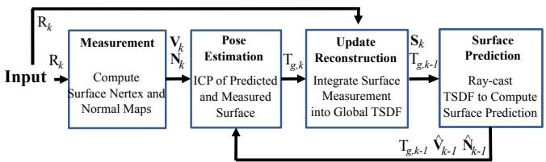  
Figure 3: Overall system workflow.

Surface reconstruction update: The global scene fusion process, where given the pose determined by tracking the depth data from a new sensor frame, the surface measurement is integrated into the scene model maintained with a volumetric, truncated signed distance function (TSDF) representation.

Surface prediction: Unlike frame-to-frame pose estimation as performed in [15], we close the loop between mapping and localisation by tracking the live depth frame against the globally fused model. This is performed by raycasting the signed distance function into the estimated frame to provide a dense surface prediction against which the live depth map is aligned.

Sensor pose estimation: Live sensor tracking is achieved using a multi-scale ICP alignment between the predicted surface and current sensor measurement. Our GPU based implementation uses all the available data at frame-rate.

## 3.1 Preliminaries

We represent the live 6DOF camera pose estimated for a frame at time k by a rigid body transformation matrix:

$$
\begin{array} { r } { \boldsymbol { \mathsf { T } } _ { g , k } = \left[ \begin{array} { c c } { \mathbb { R } _ { g , k } } & { \boldsymbol { \mathsf { t } } _ { g , k } } \\ { \boldsymbol { \mathsf { 0 } } ^ { \top } } & { 1 } \end{array} \right] \in \mathbb { S } \mathbb { E } _ { 3 } , } \end{array}\tag{1}
$$

where the Euclidean group $\mathbb { S } \mathbb { E } _ { 3 } : = \{ \mathbb { R } , \mathbf { t } \mid \mathbb { R } \in \mathbb { S } \mathbb { O } _ { 3 } , \mathbf { t } \in \mathbb { R } ^ { 3 } \}$ . This maps the camera coordinate frame at time k into the global frame g, such that a point $\mathbf { p } _ { k } \in \mathbb { R } ^ { 3 }$ in the camera frame is transferred into the global co-ordinate frame via $\mathbf { p } _ { g } = \mathbf { T } _ { g , k } \mathbf { p } _ { k }$

We will also use a single constant camera calibration matrix K that transforms points on the sensor plane into image pixels. The function ${ \bf q } = \pi ( { \bf p } )$ performs perspective projection of $\mathbf { p } \in$ $\mathbb { R } ^ { 3 } = ( x , y , z ) ^ { \top }$ including dehomogenisation to obtain $ { \mathbf { q } } \in \mathbb { R } ^ { 2 } =$ $( x / z , y / z ) ^ { \top }$ . We will also use a dot notation to denote homogeneous $\dot { \mathbf { u } } : = ( \mathbf { u } ^ { \top } | 1 ) ^ { - }$ > vectors

## 3.2 Surface Measurement

At time k a measurement comprises a raw depth map ${ \mathrm { R } } _ { k }$ which provides calibrated depth measurements $\mathbf { R } _ { k } ( \mathbf { u } ) \in$ R at each image pixel $\mathbf { u } = ( u , \nu ) ^ { \top }$ in the image domain u $\mathsf { \Omega } _ { \mathsf { l } } \in \mathcal { U } \subset \mathbb { R } ^ { 2 }$ such that $\mathbf { p } _ { k } =$ $\mathrm { R } _ { k } ( { \mathbf { u } } ) \mathrm { K } ^ { - 1 } \dot { \mathbf { u } }$ is a metric point measurement in the sensor frame of reference k. We apply a bilateral filter [27] to the raw depth map to obtain a discontinuity preserved depth map with reduced noise $\mathrm { D } _ { k }$

$$
\mathrm { D } _ { k } ( \mathbf { u } ) = \frac { 1 } { W _ { \mathbf { p } } } \sum _ { \mathbf { q } \in \mathcal { U } } \mathcal { N } _ { \sigma _ { s } } \left( \lVert \mathbf { u - q } \rVert _ { 2 } \right) \mathcal { N } _ { \sigma _ { r } } \left( \lVert \mathbf { R } _ { k } ( \mathbf { u } ) - \mathbf { R } _ { k } ( \mathbf { q } ) \rVert _ { 2 } \right) \mathbf { R } _ { k } ( \mathbf { q } )\tag{2}
$$

where $\mathcal { N } _ { \sigma } ( t ) = \exp ( - t ^ { 2 } \sigma ^ { - 2 } )$ and $W _ { \mathbf { p } }$ is a normalizing constant.

We back-project the filtered depth values into the sensor’s frame of reference to obtain a vertex map $\mathbf { V } _ { k }$

$$
\mathbf { V } _ { k } ( \mathbf { u } ) = \mathrm { D } _ { k } ( \mathbf { u } ) \mathbf { K } ^ { - 1 } \dot { \mathbf { u } } .\tag{3}
$$

Since each frame from the depth sensor is a surface measurement on a regular grid, we compute, using a cross product between neigh-

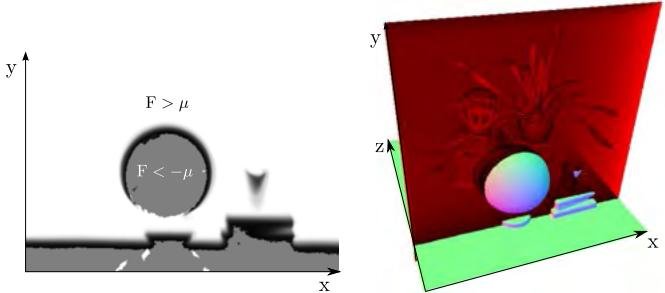  
Figure 4: A slice through the truncated signed distance volume showing the truncated function $\operatorname { F } > \mu$ (white), the smooth distance field around the surface interface $\mathrm { F } = 0$ and voxels that have not yet had a valid measurement(grey) as detailed in eqn. 9.

bouring map vertices, the corresponding normal vectors,

$$
{ \bf N } _ { k } ( { \bf u } ) = \nu \big [ ( { \bf V } _ { k } ( u + 1 , \nu ) - { \bf V } _ { k } ( u , \nu ) ) \times ( { \bf V } _ { k } ( u , \nu + 1 ) - { \bf V } _ { k } ( u , \nu ) ) \big ] ,\tag{4}
$$

where $\nu [ \mathbf { x } ] = \mathbf { x } / \| \mathbf { x } \| _ { 2 }$

We also define a vertex validity mask: $\mathbf { M } _ { k } ( \mathbf { u } ) \mapsto 1$ for each pixel where a depth measurement transforms to a valid vertex; otherwise if a depth measurement is missing $\mathbf { M } _ { k } ( \mathbf { u } ) \mapsto 0$ . The bilateral filtered version of the depth map greatly increases the quality of the normal maps produced, improving the data association required in tracking described in Section 3.5.

We compute an L = 3 level multi-scale representation of the surface measurement in the form of a vertex and normal map pyramid. First a depth map pyramid $\mathbf { D } ^ { l \in [ 1 \dots L ] }$ is computed. Setting the bottom depth map pyramid level equal to the original bilateral filtered depth map, the sub-sampled version $\mathbf { D } ^ { l + 1 }$ is computed from $\mathbf { D } ^ { l }$ by block averaging followed by sub-sampling to half the resolution. Depth values are used in the average only if they are within $3 \sigma _ { r }$ of the central pixel to ensure smoothing does not occur over depth boundaries. Subsequently each level in a vertex and normal map pyramid $\mathbf { V } ^ { l \in [ 1 \ldots L ] } , \mathbf { N } ^ { l \in [ 1 \ldots L ] }$ is computed with Equations 3 and 4 using the corresponding depth map level. We note that given the camera to global co-ordinate frame transform $\mathbb { T } _ { g , k }$ associated with the surface measurement, the global frame vertex is $\mathbf { V } _ { k } ^ { g } ( \mathbf { u } ) = \mathbb { T } _ { g , k } \dot { \mathbf { V } } _ { k } ( \mathbf { u } )$ and the equivalent mapping of normal vectors into the global frame is $\mathbf { N } _ { k } ^ { g } ( \mathbf { u } ) = \mathrm { R } _ { g , k } \mathbf { N } _ { k } ( \hat { \mathbf { u } _ { } } )$

## 3.3 Mapping as Surface Reconstruction

Each consecutive depth frame, with an associated live camera pose estimate, is fused incrementally into one single 3D reconstruction using the volumetric truncated signed distance function (TSDF) [7]. In a true signed distance function, the value corresponds to the signed distance to the closest zero crossing (the surface interface), taking on positive and increasing values moving from the visible surface into free space, and negative and decreasing values on the non-visible side. The result of averaging the SDF’s of multiple 3D point clouds (or surface measurements) that are aligned into a global frame is a global surface fusion.

An example given in Figure 4 demonstrates how the TSDF allows us to represent arbitrary genus surfaces as zero crossings within the volume. We will denote the global TSDF that contains a fusion of the registered depth measurements from frames $1 \ldots k$ as $\mathbf { S } _ { k } ( \mathbf { p } )$ where p $\doteq \mathbb { R } ^ { 3 }$ is a global frame point in the 3D volume to be reconstructed. $\mathbf { A }$ discretization of the TSDF with a specified resolution is stored in global GPU memory where all processing will reside. From here on we assume a fixed bijective mapping between voxel/memory elements and the continuous TSDF representation and will refer only to the continuous TSDF S. Two components are stored at each location of the TSDF: the current truncated signed distance value $\mathrm { F } _ { k } ( \mathbf { p } )$ and a weight $\mathbf { W } _ { k } ( \mathbf { p } )$

$$
\mathbf { S } _ { k } ( \mathbf { p } ) \mapsto [ \mathbb { F } _ { k } ( \mathbf { p } ) , \mathbb { W } _ { k } ( \mathbf { p } ) ] \ .\tag{5}
$$

A dense surface measurement (such as the raw depth map ${ \sf R } _ { k } )$ provides two important constraints on the surface being reconstructed. First, assuming we can truncate the uncertainty of a depth measurement such that the true value lies within $\pm \mu$ of the measured value, then for a distance r from the camera center along each depth map ray, $r < ( \lambda \mathbf { R } _ { k } ( \mathbf { u } ) - \boldsymbol { \mu } )$ is a measurement of free space (here $\lambda = \lVert \mathbf { K } ^ { - 1 } \dot { \mathbf { u } } \rVert _ { 2 }$ scales the measurement along the pixel ray). Second, we assume that no surface information is obtained in the reconstruction volume at $r > ( \lambda \mathbf { R } _ { k } ( \mathbf { u } ) + \mu )$ along the camera ray. Therefore the SDF need only represent the region of uncertainty where the surface measurement exists $| r - \lambda \mathbf { R } _ { k } ( \mathbf { u } ) | \leq \mu .$ . A TSDF allows the asymmetry between free space, uncertain measurement and unknown areas to be represented. Points that are within visible space at distance greater than $\mu$ from the nearest surface interface are truncated to a maximum distance $\mu .$ Non-visible points farther than µ from the surface are not measured. Otherwise the SDF represents the distance to the nearest surface point.

Although efficient algorithms exist for computing the true discrete SDF for a given set of point measurements (complexity is linear in the the number of voxels) [22], sophisticated implementations are required to achieve top performance on GPU hardware, without which real-time computation is not possible for a reasonable size volume. Instead, we use a projective truncated signed distance function that is readily computed and trivially parallelisable. For a raw depth map ${ \mathrm { R } } _ { k }$ with a known pose $\mathbb { T } _ { g , k }$ , its global frame projective TSDF $[ \bar { \mathrm { F } } _ { \mathrm { R } _ { k } } , \mathrm { W } _ { \mathrm { R } _ { k } } ]$ at a point p in the global frame g is computed as,

$$
\begin{array} { r l r } { \mathrm { F } _ { \mathrm { R } _ { k } } ( \mathbf { p } ) } & { = } & { \Psi \left( \lambda ^ { - 1 } \| ( \mathbf { t } _ { g , k } - \mathbf { p } \| _ { 2 } - \mathrm { R } _ { k } ( \mathbf { x } ) \right) , } \end{array}\tag{6}
$$

$$
\begin{array} { r l r } { \lambda } & { { } = } & { \| \mathbf { K } ^ { - 1 } \dot { \mathbf { x } } \| _ { 2 } , } \end{array}\tag{7}
$$

$$
\begin{array} { r l r } { { \bf x } } & { { } = } & { \left\lfloor \pi \left( { \bf K } { \bf T } _ { g , k } ^ { - 1 } { \bf p } \right) \right\rfloor , } \end{array}\tag{8}
$$

$$
\Psi ( \eta ) \quad = \quad \left\{ \begin{array} { c c } { \displaystyle \operatorname* { m i n } \left( 1 , \frac { \eta } { \mu } \right) \mathrm { s g n } ( \eta ) } & { \mathrm { i f f } \eta \geq - \mu } \\ { \displaystyle n u l l } & { o t h e r w i s e } \end{array} \right.\tag{9}
$$

We use a nearest neighbour lookup b.c instead of interpolating the depth value, to prevent smearing of measurements at depth discontinuities. $1 / \lambda$ converts the ray distance to p to a depth (we found no considerable difference in using SDF values computed using distances along the ray or along the optical axis). Ψ performs the SDF truncation. The truncation function is scaled to ensure that a surface measurement (zero crossing in the SDF) is represented by at least one non truncated voxel value in the discretised volume either side of the surface. Also, the support is increased linearly with distance from the sensor center to support correct representation of noisier measurements. The associated weight $\mathrm { W } _ { \mathrm { R } _ { I } }$ (p) is proportional to cos $( \theta ) / \ R _ { k } ( \mathbf { x } )$ , where θ is the angle between the associated pixel ray direction and the surface normal measurement in the local frame.

The projective TSDF measurement is only correct exactly at the surface $\mathrm { F } _ { \mathrm { R } _ { k } } ( \mathbf { p } ) = 0$ or if there is only a single point measurement in isolation. When a surface is present the closest point along a ray could be another surface point not on the ray associated with the pixel in Equation 8. It has been shown that for points close to the surface, a correction can be applied by scaling the SDF by cos(θ) [11]. However, we have found that approximation within the truncation region for 100s or more fused TSDFs from multiple viewpoints (as performed here) converges towards an SDF with a pseudo-Euclidean metric that does not hinder mapping and tracking performance.

The global fusion of all depth maps in the volume is formed by the weighted average of all individual TSDFs computed for each depth map, which can be seen as de-noising the global TSDF from multiple noisy TSDF measurements. Under an $\mathcal { L } _ { 2 }$ norm the denoised (fused) surface results as the zero-crossings of the point-wise SDF F minimising:

$$
\operatorname* { m i n } _ { \mathbb { F } \in \mathcal { F } } ~ \sum _ { k } \| \mathbf { W } _ { \mathrm { R } _ { k } } \mathrm { F } _ { \mathrm { R } _ { k } } - \mathrm { F } ) \| _ { 2 } .\tag{10}
$$

Given that the focus of our work is on real-time sensor tracking and surface reconstruction we must maintain interactive frame-rates. (For a 640x480 depth stream at 30fps the equivalent of over 9 million new point measurements are made per second). Storing a weight $\mathbf { W } _ { k } ( \mathbf { p } )$ with each value allows an important aspect of the global minimum of the convex $\mathcal { L } _ { 2 }$ de-noising metric to be exploited for real-time fusion; that the solution can be obtained incrementally as more data terms are added using a simple weighted running average [7], defined point-wise $\{ \mathbf { p } \vert \mathrm { F } _ { \mathrm { R } _ { k } } ( \mathbf { p } ) \neq n u l l \}$

$$
\begin{array} { r l r } { \mathrm { F } _ { k } ( \mathbf { p } ) } & { = } & { \frac { \mathrm { W } _ { k - 1 } ( \mathbf { p } ) \mathrm { F } _ { k - 1 } ( \mathbf { p } ) + \mathrm { W } _ { \mathrm { R } _ { k } } ( \mathbf { p } ) \mathrm { F } _ { \mathrm { R } _ { k } } ( \mathbf { p } ) } { \mathrm { W } _ { k - 1 } ( \mathbf { p } ) + \mathrm { W } _ { \mathrm { R } _ { k } } ( \mathbf { p } ) } } \end{array}\tag{11}
$$

$$
\begin{array} { r l r } { \mathbf { W } _ { k } ( \mathbf { p } ) } & { { } = } & { \mathbf { W } _ { k - 1 } ( \mathbf { p } ) + \mathbf { W } _ { \mathbf { R } _ { k } } ( \mathbf { p } ) } \end{array}\tag{12}
$$

No update on the global TSDF is performed for values resulting from unmeasurable regions specified in Equation 9. While $\mathbf { W } _ { k } ( \mathbf { p } )$ provides weighting of the TSDF proportional to the uncertainty of surface measurement, we have also found that in practice simply letting $\mathbf { W } _ { \mathbf { R } _ { k } } ( \mathbf { p } ) = 1$ , resulting in a simple average, provides good results. Moreover, by truncating the updated weight over some value $\mathrm { w } _ { \eta }$

$$
{ \bf W } _ { k } ( { \bf p } )  \mathrm { m i n } ( { \bf W } _ { k - 1 } ( { \bf p } ) + { \bf W } _ { { \mathrm R } _ { k } } ( { \bf p } ) , { \bf W } _ { \eta } ) \ ,\tag{13}
$$

a moving average surface reconstruction can be obtained enabling reconstruction in scenes with dynamic object motion.

Although a large number of voxels can be visited that will not project into the current image, the simplicity of the kernel means operation time is memory, not computation, bound and with current GPU hardware over 65 gigavoxels/second (≈ 2ms per full volume update for a $5 1 2 ^ { 3 }$ voxel reconstruction) can be updated. We use 16 bits per component in $\mathbf { S } ( \mathbf { p } )$ , although experimentally we have verified that as few as 6 bits are required for the SDF value. Finally, we note that the raw depth measurements are used for TSDF fusion rather than the bilateral filtered version used in the tracking component, described later in section 3.5. The early filtering removes desired high frequency structure and noise alike which would reduce the ability to reconstruct finer scale structures.

## 3.4 Surface Prediction from Ray Casting the TSDF

With the most up-to-date reconstruction available comes the ability to compute a dense surface prediction by rendering the surface encoded in the zero level set $\bar { \mathrm { F } _ { k } } = 0$ into a virtual camera with the current estimate $\mathbb { T } _ { g , k }$ . The surface prediction is stored as a vertex and normal map $\hat { \mathbf { V } } _ { k }$ and $\hat { \bf N } _ { k }$ in frame of reference k and is used in the subsequent camera pose estimation step.

As we have a dense surface reconstruction in the form of a global SDF, a per pixel raycast can be performed [21]. Each pixel’s corresponding ray, $\bar { \mathrm { T } } _ { g , k } \bar { \mathrm { K } } ^ { - 1 } \dot { \mathbf { u } } .$ , is marched starting from the minimum depth for the pixel and stopping when a zero crossing (+ve to −ve for a visible surface) is found indicating the surface interface. Marching also stops if a −ve to +ve back face is found, or ultimately when exiting the working volume, both resulting in non surface measurement at the pixel u.

For points on or very close to the surface interface $\mathrm { F } _ { k } ( { \mathbf { p } } ) = 0$ it is assumed that the gradient of the TSDF at p is orthogonal to the zero level set, and so the surface normal for the associated pixel u along which p was found can be computed directly from $\mathrm { F } _ { k }$ using a numerical derivative of the SDF:

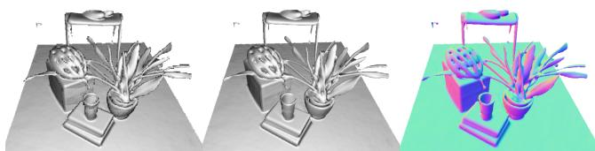  
Figure 5: Reconstructed of a scene showing raycasting of the TSDF (left) without and (middle and right) with interpolation of the TSDF at the surface interface using eqn. 15.

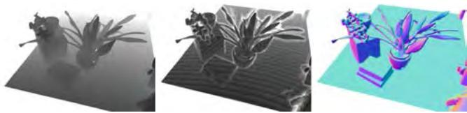  
Figure 6: Demonstration of the space skipping ray casting. (Left) pixel iteration count are shown where for each pixel the ray is traversed in steps of at most one voxel (white equals 480 increments and black 60). (middle) ray marching steps are drastically reduced by skipping empty space according to the minimum truncation µ (white equals 70 iterations and black 10 ≈ $6 \times$ speedup). Marching steps can be seen to increase around the surface interface where the signed distance function has not been truncated. (Right) Normal map at resulting surface intersection.

$$
\mathtt { R } _ { g , k } \hat { \mathbf { N } } _ { k } = \hat { \mathbf { N } } _ { k } ^ { g } ( \mathbf { u } ) = \nu \big [ \nabla \mathrm { F } ( \mathbf { p } ) \big ] , \ \nabla \mathrm { F } = \left[ \frac { \partial \mathrm { F } } { \partial x } , \frac { \partial \mathrm { F } } { \partial y } , \frac { \partial \mathrm { F } } { \partial z } \right] ^ { \top }\tag{14}
$$

Further, this derivative is scaled in each dimension to ensure correct isotropy given potentially arbitrary voxel resolutions and reconstruction dimensions.

Since the rendering of the surface is restricted to provide physically plausible measurement predictions, there is a minimum and maximum rendering range the ray needs to traverse corresponding to conservative minimum and maximum sensor range (≈ [0.4, 8] meters for the Kinect). This results in the desirable property of the proposed surface prediction requiring a bounded time per pixel computation for any size or complexity of scene with a fixed volumetric resolution.

Classically a min/max block acceleration structure [21] can be used to speed up marching through empty space. However, due to continual updating of the TSDF (which would require a constant update to the min/max macro blocks) we found that simple ray skipping provides a more useful acceleration. In ray skipping we utilise the fact that near $\mathrm { F } ( \mathbf { p } ) = 0$ the fused volume holds a good approximation to the true signed distance from p to the nearest surface interface. Using our known truncation distance we can march along the ray in steps with size $< \mu$ while values of F(p) have +ve truncated values, as we can assume a step µ must pass through at least one non-truncated +ve value before stepping over the surface zero crossing. The speed-up obtained is demonstrated in Figure 6 by measuring the number of steps required for each pixel to intersect the surface relative to standard marching.

Higher quality intersections can be obtained by solving a ray/trilinear cell intersection [21] that requires solving a cubic polynomial. As this is expensive we use a simple approximation. Given a ray has been found to intersect the SDF where $\mathrm { F _ { t } ^ { + } }$ and $\mathrm { F } _ { \mathrm { t + } \Delta t } ^ { + }$ are trilinearly interpolated SDF values either side of the zero crossing at points along the ray t and t + ∆t from its starting point, we find parameter $\mathbf { t } ^ { * }$ at which the intersection occurs more precisely:

$$
\mathbf { t } ^ { * } = \mathbf { t } - \frac { \Delta t \mathbf { F } _ { \mathrm { t } } ^ { + } } { \mathbf { F } _ { \mathrm { t } + \Delta t } ^ { + } - \mathbf { F } _ { \mathrm { t } } ^ { + } } .\tag{15}
$$

The predicted vertex and normal maps are computed at the interpolated location in the global frame. Figure 5 shows a typical reconstruction, the interpolation scheme described achieves high quality occlusion boundaries at a fraction of the cost of full interpolation.

## 3.5 Sensor Pose Estimation

Live camera localisation involves estimating the current camera pose $\mathbb { T } _ { w , k } \in \mathbb { S E } _ { ? }$ 3 (Equation 1) for each new depth image. Many tracking algorithms use feature selection to improve speed by reducing the number of points for which data association need be performed. In this work, we take advantage of two factors to allow us instead to make use of all of the data in a depth image for a dense iterated close point based pose estimation. First, by maintaining a high tracking frame-rate, we can assume small motion from one frame to the next. This allows us to use the fast projective data association algorithm [4] to obtain correspondence and the point-plane metric [5] for pose optimisation. Second, modern GPU hardware enables a fully parrallelised processing pipeline, so that the data association and point-plane optimisation can use all of the available surface measurements.

The point-plane error metric in combination with correspondences obtained using projective data association was first demonstrated in a real time modelling system by [23] where frame-toframe tracking was used (with a fixed camera) for depth map alignment. In our system we instead track the current sensor frame by aligning a live surface measurement $( \mathbf { V } _ { k } , \mathbf { N } _ { k } )$ against the model prediction from the previous frame $( \hat { \mathbf { V } } _ { k - 1 } , \hat { \mathbf { N } } _ { k - 1 } )$ . We note that frameto-frame tracking is obtained simply by setting $( \hat { \mathbf { V } } _ { k - 1 } , \hat { \mathbf { N } } _ { k - 1 } ) \gets$ $( \mathbf { V } _ { k - 1 } , \mathbf { N } _ { k - 1 } )$ which is used in our experimental section for a comparison between frame-to-frame and frame-model tracking.

Utilising the surface prediction, the global point-plane energy, under the $\mathcal { L } _ { 2 }$ norm for the desired camera pose estimate $\mathbb { T } _ { g , k }$ is:

$$
\mathbf { E } ( \mathbb { T } _ { g , k } ) = \sum _ { \mathbf { u } \in \mathcal { U } } \left. \left( \mathbb { T } _ { g , k } \dot { \mathbf { V } } _ { k } ( \mathbf { u } ) - \hat { \mathbf { V } } _ { k - 1 } ^ { g } \left( \hat { \mathbf { u } } \right) \right) ^ { \top } \hat { \mathbf { N } } _ { k - 1 } ^ { g } \left( \hat { \mathbf { u } } \right) \right. _ { 2 } ,\tag{16}
$$

where each global frame surface prediction is obtained using the previous fixed pose estimate $\begin{array} { r } { \mathrm { T } _ { g , k - 1 } . } \end{array}$ The projective data association algorithm produces the set of vertex correspondences $\{ \mathbf { V } _ { k } ( \mathbf { u } ) , \hat { \mathbf { V } } _ { k - 1 } ( \hat { \mathbf { u } } ) | \Omega ( \bar { \mathbf { u } } ) \neq$ null} by computing the perspectively projected point, $\hat { \mathbf { u } } = \pi ( \mathrm { K } \widetilde { \boldsymbol { \mathrm { T } } } _ { k - 1 , k } \dot { \mathbf { V } } _ { k } ( \mathbf { u } ) )$ using an estimate for the frameframe transform $\widetilde \mathbb { T } _ { k - 1 , k } ^ { z } = \mathbb { T } _ { g , k - 1 } ^ { - 1 } \widetilde \mathbb { T } _ { g , k } ^ { z }$ and testing the predicted and measured vertex and normal for compatibility. A threshold on the distance of vertices and difference in normal values suffices to reject grossly incorrect correspondences, also illustrated in Figure 7:

$$
\Omega ( \mathbf u ) \neq \mathrm { n u l l ~ i f f } \left\{ \begin{array} { c c c } { \mathbf { M } _ { k } ( \mathbf u ) } & { = } & { 1 , } & { \mathrm { ~ a n d } } \\ { \| \widetilde { \boldsymbol { \Upsilon } } _ { g , k } ^ { z } \dot { \mathbf { V } } _ { k } ( \mathbf u ) - \hat { \mathbf { V } } _ { k - 1 } ^ { g } \left( \hat { \mathbf { u } } \right) \| _ { 2 } } & { \leq } & { \varepsilon _ { d } , } & { \mathrm { ~ a n d } } \\ { \langle \widetilde { \mathbf { R } } _ { g , k } ^ { z } \mathbf { N } _ { k } ( \mathbf u ) , \hat { \mathbf { N } } _ { k - 1 } ^ { g } \left( \hat { \mathbf { u } } \right) \rangle } & { \leq } & { \varepsilon _ { \theta } . } \end{array} \right.\tag{17}
$$

where $\varepsilon _ { d }$ and $\varepsilon _ { \theta }$ are threshold parameters of our system. $\widetilde { \boldsymbol { \mathrm { T } } } _ { g , k } ^ { z = 0 }$ is initialised with the previous frame pose $\mathbb { T } _ { g , k }$

An iterative solution, $\widetilde { \mathbb { T } } _ { g , k } ^ { z }$ for $z > 0$ is obtained by minimising the energy of a linearised version of (16) around the previous estimate $\widetilde { \mathbb { T } } _ { g , k } ^ { z - 1 }$ . Using the small angle assumption for an incremental transform:

$$
\widetilde { \boldsymbol { \Upsilon } } _ { i n c } ^ { z } = [ \widetilde { \boldsymbol { \mathsf { R } } } ^ { z } | \widetilde { \mathbf { t } } ^ { z } ] = [ \begin{array} { c c c c } { 1 } & { \alpha } & { - \gamma } & { t _ { x } } \\ { - \alpha } & { 1 } & { \beta } & { t _ { y } } \\ { \gamma } & { - \beta } & { 1 } & { t _ { z } } \end{array} ] ,\tag{18}
$$

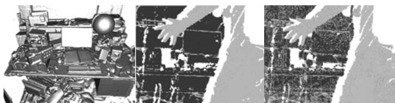  
Figure 7: Example of point-plane outliers as person steps into partially reconstructed scene (left). Outliers from compatibility checks (Equation 17) using a surface measurement with (center) and without (right) bilateral filtering applied to the raw depth map. Ω(u) = null are light grey with unpredicted/unmeasured points shown in white.

an updated transform is simply $\widetilde { \mathrm { T } } _ { g , k } ^ { z } = \widetilde { \mathrm { T } } _ { i n c } ^ { z } \widetilde { \mathrm { T } } _ { g , k } ^ { z - 1 }$ . Writing the update $\widetilde { \mathtt { T } } _ { i n c } ^ { z }$ as a parameter vector,

$$
\mathbf { x } = ( \beta , \gamma , \alpha , t _ { x } , t _ { y } , t _ { z } ) ^ { \top } \in \mathbb { R } ^ { 6 }\tag{19}
$$

and updating the current global frame vertex estimates for all pixels $\{ \mathbf { u } | \Omega ( \mathbf { u } ) \neq \mathrm { n u l l } \} , \widetilde { \mathbf { V } } _ { k } ^ { g } ( \mathbf { u } ) = \widetilde { \mathrm { T } } _ { g , k } ^ { z - 1 } \dot { \mathbf { V } } _ { k } ( \mathbf { u } )$ , we minimise the linearised error function using the incremental point transfer:

$$
\widetilde { \mathrm { T } } _ { g , k } ^ { z } \dot { \mathbf { V } } _ { k } ( \mathbf { u } ) = \widetilde { \mathrm { R } } ^ { z } \widetilde { \mathbf { V } } _ { k } ^ { g } ( \mathbf { u } ) + \widetilde { \mathbf { t } } ^ { z } = \mathbf { G } ( \mathbf { u } ) \mathbf { x } + \widetilde { \mathbf { V } } _ { k } ^ { g } ( \mathbf { u } ) \ ,\tag{20}
$$

where the $3 \times 6$ matrix G is formed with the skew-symmetric matrix form of $\widetilde { \mathbf { V } } _ { k } ^ { g } ( \mathbf { u } )$ :

$$
\mathbf G ( \mathbf u ) = \left[ \left[ \widetilde { \mathbf { V } } _ { k } ^ { g } ( \mathbf u ) \right] _ { \times } \big | \mathbf { I } _ { 3 \times 3 } \right] .\tag{21}
$$

An iteration is obtained by solving:

$$
\begin{array} { r } { \underset { \mathbf { x } \in \mathbb { R } ^ { 6 } } { \operatorname* { m i n } } \displaystyle \sum _ { \Omega _ { k } ( \mathbf { u } ) \neq \mathrm { n u l l } } \| E \| _ { 2 } ^ { 2 } } \\ { E = \hat { \mathbf { N } } _ { k - 1 } ^ { g } ( \hat { \mathbf { u } } ) ^ { \top } \left( \mathbf { G } ( \mathbf { u } ) \mathbf { x } + \widetilde { \mathbf { V } } _ { k } ^ { g } ( \mathbf { u } ) - \hat { \mathbf { V } } _ { k - 1 } ^ { g } ( \hat { \mathbf { u } } ) \right) } \end{array}\tag{22}
$$

(23)

By computing the derivative of the objective function with respect to the parameter vector x and setting to zero, a $6 \times 6$ symmetric linear system is generated for each vertex-normal element correspondence:

$$
\begin{array} { r l r } { \displaystyle \sum _ { \Omega _ { k } ( \mathbf { u } ) \neq \mathrm { n u l l } } \left( \mathbf { A } ^ { \top } \mathbf { A } \right) \mathbf { x } } & { = } & { \sum \mathbf { A } ^ { \top } \mathbf { b } , } \end{array}\tag{24}
$$

$$
\begin{array} { r l r } { { \bf A } ^ { \top } } & { { } = } & { { \bf G } ^ { \top } ( { \bf u } ) \hat { \bf N } _ { k - 1 } ^ { g } ( \hat { \bf u } ) , } \end{array}\tag{25}
$$

$$
\begin{array} { r l r } { \mathbf { b } } & { { } = } & { \hat { \mathbf { N } } _ { k - 1 } ^ { g } ( \hat { \mathbf { u } } ) ^ { \top } \left( \hat { \mathbf { V } } _ { k - 1 } ^ { g } ( \hat { \mathbf { u } } ) - \widetilde { \mathbf { V } } _ { k } ^ { g } ( \mathbf { u } ) \right) } \end{array}\tag{.(26}
$$

In our GPU implementation each summand of the normal system is computed in parallel. The symmetry of the system enables operations and memory to be saved and the final sum is obtained using a parallel tree-based reduction [13], to obtain the upper triangular component of the symmetric system. The solution vector x is efficiently computed using a Cholesky decomposition on the host (CPU) and coerced back into an $\mathbb { S } \mathbb { E } _ { 3 }$ transform which we compose onto the previous pose estimate, obtaining $\widetilde { \mathbb { T } } _ { g , k } ^ { z } .$ . The data association and pose minimisation is embedded into a coarse to fine framework using the bottom 3 levels of a vertex and normal map pyramid. We iterate for a maximum of $z _ { m a x } = [ 4 , 5$ , 10] iterations in levels [3, 2, 1] respectively, starting with the coarsest level 3. After all iterations are completed we fix the final camera pose $\mathbb { T } _ { g , k } \gets \widetilde { \mathbb { T } } _ { g , k } ^ { z _ { m a x } }$

Stability and validity check for transformation update Ideally we would only like to perform a surface update if we are sure that tracking has not failed or is highly erroneous. As inter-frame sensor motion increases the assumptions made in both linearisation of the point-plane error metric and the projective data association can be broken. Also, if the currently observable surface geometry does not provide point-plane pairs that constrain the full 6DOF of the linear system then an arbitrary solution within the remaining free DOFs can be obtained. Both outcomes will lead to a reduced quality reconstruction and tracking failure. We therefore perform a check on the null space of the normal system to ensure it is adequately constrained. We also perform a simple threshold check on the magnitude of incremental transform parameters x, to ensure the small angle assumption was not drastically broken. If either test fails, the system is placed into re-localisation mode.

Relocalisation Our current implementation uses an interactive re-localisation scheme, whereby if the sensor loses track, the last known sensor pose is used to provide a surface prediction, and the user instructed to align the incoming depth frame with what is displayed. While running the pose optimisation, if the stability and validity checks are passed tracking and mapping are resumed.

## 4 EXPERIMENTS

We have conducted a number of experiments to investigate the performance of our system. These and other aspects, such as the system’s ability to keep track during very rapid motion, are illustrated extensively in our submitted video.

## 4.1 Metrically Consistent Reconstruction

Our tracking and mapping system provides a constant time algorithm for a given area of reconstruction, and we are interested in investigating its ability to form metrically consistent models from trajectories containing local loop closures without requiring explicit global joint-estimation. We are also interested in the ability of the system to scale gracefully with different processing and memory resources.

To investigate these properties we conducted the following experiment. The Kinect sensor was placed in a fixed location observing a tabletop scene mounted on a turntable. The turntable was then spun through a full rotation as depth data was captured over ≈ 19 seconds, resulting in $N = 5 6 0$ frames. For the purposes of our system, if the reconstruction volume is set to span solely the region of the rotating scene, the resulting depth image sequence obtained is obviously equivalent to the Kinect having been moved on a precise circular track around a static table, and this allows us to easily evaluate the quality of tracking. All parameters of the system are kept constant using a reconstruction resolution of $2 5 6 ^ { 3 }$ voxels unless stated otherwise.

The N frames of depth data captured were then processed in each of the following ways:

1. Frames 1 ...N were fused together within the TSDF using sensor pose estimates obtained with our frame-to-frame only ICP implementation.

2. Frames $1 \ldots L , L < N$ were fed through our standard tracking and mapping pipeline forming an incomplete loop closure. Here, sensor pose estimates are obtained by the full framemodel ICP method.

3. Frames $1 \ldots N$ were fed through our standard tracking and mapping pipeline resulting in a complete loop closure around the table. Again, sensor pose estimates are obtained by framemodel ICP.

4. Frames 1 ...N were fed not just once but repeatedly for M = 4 loops to the standard tracking and mapping pipeline. This was possible because the sensor motion was such that frame 1 and frame N were captured from almost the same place.

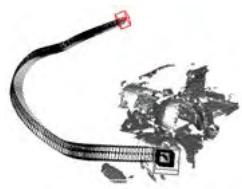

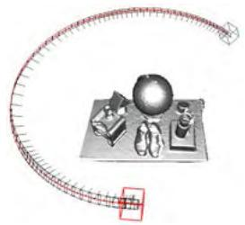

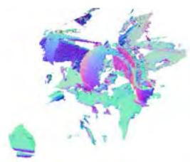  
(a) Frame to frame tracking

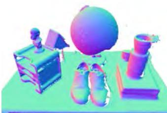  
(b) Partial loop

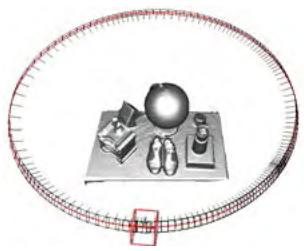

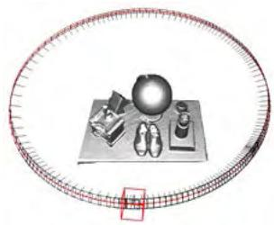

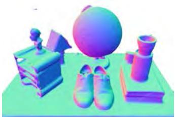  
(c) Full loop

  
(d) M times duplicated loop  
Figure 8: Circular motion experiment to highlight the SLAM characteristics of our system as the sensor orbits a table. For each column, the top row shows a wide view showing the estimated sensor trajectory (every 4th of N frames is shown), and the bottom row a closer view highlighting reconstruction quality with normal mapping. (a) Frame-to-frame tracking, where the pose of each new frame is estimated by registration against just the last frame. Rapid accumulation of errors results in the non-circular trajectory and poor reconstruction is apparent (though see later Figure 11 where frame-skipping is shown to improve this). (b),(c),(d) show our full frame-to-model tracking approach. In (b) processing is halted with the loop two-thirds complete. (c) shows loop closure, where the last frame processed is a duplication of the first frame and should have an identical ground truth location. We highlight these two frames, and they are seen almost overlapping (red and black) alongside excellent trajectory and scene reconstruction quality. Some small artefacts in the reconstruction induced by loop closure can be seen (the diagonal slash across the books in the bottom-right). In (d) we have taken the same data from (c) and fed it repeatedly (M = 4 times) to the algorithm to investigate the convergence properties of our system. We now see even better alignment between the loop closing frames, and reconstruction artefacts reduced. Note that this can be compared with the reconstruction from the same number of MN different frames of the same scene obtained from hand-held sensor motion in Figure 9.

5. Finally, for comparison, a new longer dataset of MN frames was processed, where a user moved the sensor over the scene without precise repetition.

Our main motivation in performing experiments (2 ... 4) is to investigate the convergence properties of the tracking and mapping scheme, as no explicit joint optimisation is performed. The resulting sensor trajectories and reconstructions are given and explained in Figure 8. In all experiments, we display with increased size the sensor pose estimate for frame 1 — but also in experiment 3, where only a single loop is performed, we continue tracking through frame N and render a comparison sensor pose for the 1st frame of the next loop. As shown in the close-up view in Figure 10, this allows us to inspect the drift that has occurred as loops proceed. The ground truth poses for both of these poses are equal.

While the turntable experiments demonstrate interesting convergence of the system without an explicit global optimisation, the real power in integrating every frame of data is the ability to rapidly assimilate as many measurements of the surfaces as are possible, (experiment 5). Figure 9 shows the surface reconstruction where NM = 560 × 4 different frames were acquired from a free moving Kinect sensor. While the same algorithmic parameters were used, including reconstruction volume, the increased view points result in a reconstruction quality superior to the turntable sequence.

A natural extension to a frame-to-frame (scan matching) ICPbased SLAM system is to drop keyframes and perform tracking relative to the keyframe. Using such anchor scans reduces drift. This is clearly demonstrated in Figure 11 where we sub-sample the N frames to use every $8 ^ { t h }$ frame only. While the drift is drastically reduced in comparison to Figure 8(a) the frame-model tracking approach presents a drift free result. Our frame-model matching approach mitigates a number of hard problems that arise in a fully fledged keyframing system including deciding where to drop keyframes, and how to detect which keyframe(s) to track from.

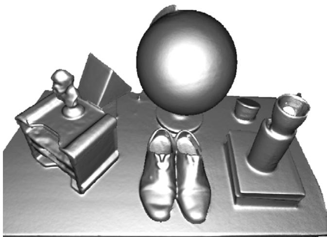  
Figure 9: Agile sensor motion based reconstruction of the same scene, with the same reconstruction volume but MN different images. Here we see better reconstruction quality due to each depth map offering independent data and a greater range of viewpoints.

An important aspect of a useful system is its ability to scale with available GPU memory and processing resources. Figure 12 shows the reconstruction result where the the N frames are sub-sampled in time to use every $6 ^ { t h }$ frame, and 64 times less GPU memory is used by reducing the reconstruction resolution to $6 4 ^ { 3 }$

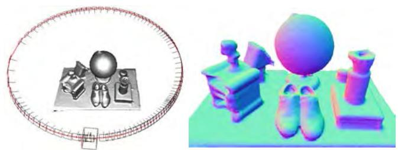

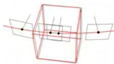  
(a) M=1

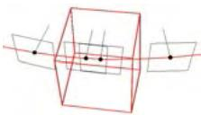  
(b) M=2

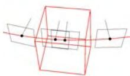  
(c) M=4

Figure 10: Close up view of loop closing frames in circular experiment as the data from a single loop is repeatedly fed to our system. We see (a) initially good alignment after one pass improving through (b) two passes to finally (c) the frames are extremely closely registered after four passes.  
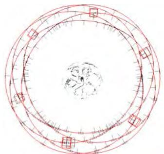  
(a) Frame to frame tracking

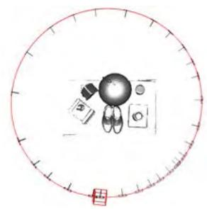

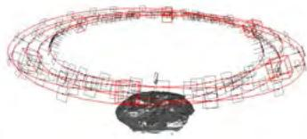

(b) Frame to model tracking  
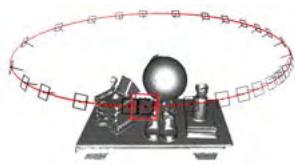  
Figure 11: (a) Frame to frame vs. (b) frame to model tracking, both using every 8th frame. There is a drastic reduction in drift compared to Figure 8(a) where all frames are used. But the frame-model tracking results in drift-free operation without explicit global optimisation.

## 4.2 Processing Time

Figure 13 shows results from an experiment where timings were taken of the main system components and the reconstruction voxel resolution was increased in steps. We note the constant time operation of tracking and mapping for a given voxel resolution.

## 4.3 Observations and Failure Modes

Our system is robust to a wide range of practical conditions in terms of scene structure and camera motion. Most evidently, by using only depth data it is completely robust to indoor lighting scenarios. Our video demonstrates a good variety of agile motion tracking successfully through even rapid motion. The main failure case in standard indoor scenes is when the sensor is faced by a large planar scene which fills most of its field of view. A planar scene leaves three of the sensor’s 6DOF motion unconstrained in the linear systems null space, resulting in tracking drifting or failure.

## 5 GEOMETRY AWARE AR

The dense accurate models obtained in real-time open up many new possibilities for AR, human-computer-interaction, robotics and beyond. For example, the ability to reason about changes in the scene, utilising outliers from ICP data association (see Figure 7), allows for new object segmentation methods; these segmented objects can be tracked independently using other instances of ICP allowing piece-wise rigid tracking techniques; and physics can be simulated in real-time on acquired models directly from the TSDF volumetric representation (see Figure 14 and accompanying video). For AR, the dense model also provides an ability to handle truer occlusion boundaries between real and virtual for rendering. In [16] we discuss all these possibilities in detail.

Figure 12: A reconstruction result using $\frac { 1 } { 6 4 }$ the memory (643 voxels) of the previous figures, and using only every 6th sensor frame, demonstrating graceful degradation with drastic reductions in memory and processing resources.  
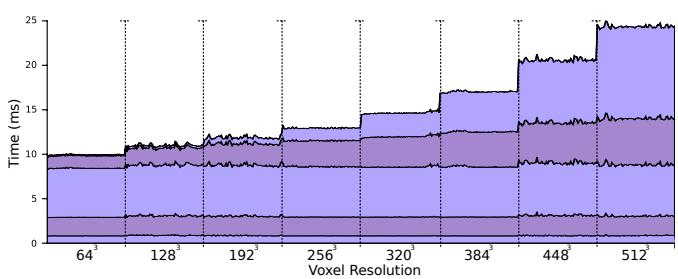  
Figure 13: Real-time cumulative timing results of system components, evaluated over a range of resolutions (from 643 to 5123 voxels) as the sensor reconstructs inside a volume of 3m3. Timings are shown (from bottom to top of the plot) for: pre-processing raw data, multi-scale data-associations; multi-scale pose optimisations; raycasting the surface prediction and finally surface measurement integration.

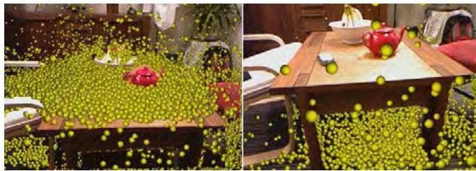  
Figure 14: Thousands of particles interact live with surfaces as they are reconstructed. Notice how fine-grained occlusions are handled between the real and virtual. Simulation works on the TSDF volumetric representation, and runs on the GPU alongside tracking and mapping, all in real-time.

## 6 CONCLUSIONS

The availability of commodity depth sensors such as Kinect has the potential to revolutionise the fields of AR, robotics and humancomputer interaction. In this work we have taken a step towards bringing the ability to reconstruct and interact with a 3D environment to the masses. The key concepts in our real-time tracking and mapping system are (1) always up-to-date surface representation fusing all registered data from previous scans using the truncated signed distance function; (2) accurate and robust tracking of the camera pose by aligning all depth points with the complete scene model; and (3) fully parallel algorithms for both tracking and mapping, taking full advantage of commodity GPGPU processing hardware. Most importantly, each of the components has a trivially parallelisable structure and scales naturally with processing and memory resources.

There are several ways in which the system could be extended. The current system works well for mapping medium sized rooms with volumes of $\leq 7 m ^ { 3 }$ However, the reconstruction of largescale models such as the interior of a whole building would raise a number of additional challenges. Firstly, the current dense volumetric representation would require too much memory and more importantly, very large exploratory sequences would lead to reconstructions with inevitable drift which would be apparent in the form of misalignments upon trajectory loop closures. These are classic problems in SLAM with good solutions for sparse representations, but will require new thinking for dense modelling. A clear possibility is to use KinectFusion within a sub-mapping framework. Addressing memory issues further, it would be possible to exploit sparsity in the TSDF using an adaptive grid representation. As shown in Figure 4, there is only a relatively thin crust of non truncated values near the surface, and techniques based on octrees [32] could exploit the compressibility of such a function. Another important challenge is to efficiently perform automatic relocalisation when the tracking has failed in such large models.

One final interesting direction is to perform automatic semantic segmentation over the volumetric representation that would enable adaptation of reconstruction quality for specific objects or tasks.

## REFERENCES

[1] NVIDIA OptiX 2 Ray Tracing Engine http://developer.nvidia.com/optix. 2.4

[2] P. A. Beardsley, A. Zisserman, and D. W. Murray. Sequential updating of projective and affine structure from motion. International Journal ofComputer Vision (IJCV), 23(3):235–259, 1997. 2.2

[3] P. Besl and N. McKay. A method for registration of 3D shapes. IEEE Transactions on Pattern Analysis and Machine Intelligence (PAMI), 14(2):239–256, 1992. 2.3

[4] G. Blais and M. D. Levine. Registering multiview range data to create 3D computer objects. IEEE Transactions on Pattern Analysis and Machine Intelligence (PAMI), 17(8):820–824, 1995. 2.3, 3.5

[5] Y. Chen and G. Medioni. Object modeling by registration of multiple range images. Image and Vision Computing (IVC), 10(3):145–155, 1992. 2.3, 3.5

[6] Y. Cui, S. Schuon, D. Chan, and S. Thrun. 3D shape scanning with a time-of-flight camera. In Proceedings of the IEEE Conference on Computer Vision and Pattern Recognition (CVPR), 2010. 2.5

[7] B. Curless and M. Levoy. A volumetric method for building complex models from range images. In ACM Transactions on Graphics (SIGGRAPH), 1996. 2.4, 2.5, 3.3, 3.3

[8] A. J. Davison. Real-time simultaneous localisation and mapping with a single camera. In Proceedings of the International Conference on Computer Vision (ICCV), 2003. 1, 2.2

[9] A. Elfes and L. Matthies. Sensor integration for robot navigation: combining sonar and range data in a grid-based representation. In Proceedings of the IEEE Conference on Decision and Control, 1987. 2.4

[10] A. W. Fitzgibbon and A. Zisserman. Automatic camera recovery for closed or open image sequences. In Proceedings of the European Conference on Computer Vision (ECCV), pages 311–326. Springer-Verlag, June 1998. 1, 2.2

[11] S. F. Frisken and R. N. Perry. Efficient estimation of 3D euclidean distance fields from 2D range images. In Proceedings of the IEEE Symposium on Volume Visualization and Graphics, 2002. 3.3

[12] J.-S. Gutmann and K. Konolige. Incremental mapping of large cyclic environments. In International Symposium on Computational Intelligence in Robotics and Automation (CIRA), 1999. 2.3

[13] M. Harris, S. Sengupta, and J. D. Owens. Parallel prefix sum (scan) with CUDA. In H. Nguyen, editor, GPU Gems 3, chapter 39, pages 851–876. Addison Wesley, August 2007. 3.5

[14] P. Henry, M. Krainin, E. Herbst, X. Ren, and D. Fox. RGB-D mapping: Using depth cameras for dense 3D modeling of indoor environments. In Proceedings of the International Symposium on Experimental Robotics (ISER), 2010. 1, 2.5

[15] C. Hernandez, G. Vogiatzis, and R. Cipolla. Probabilistic visibility for ´ multi-view stereo. In Proceedings of the IEEE Conference on Computer Vision and Pattern Recognition (CVPR), 2007. 2.4

[16] S. Izadi, D. Kim, O. Hilliges, D. Molyneaux, R. A. Newcombe, P. Kohli, J. Shotton, S. Hodges, D. Freeman, A. J. Davison, and A. Fitzgibbon. KinectFusion: Real-time 3D reconstruction and interaction using a moving depth camera. In Symposium on User Interface Software and Technology (UIST), 2011. 5

[17] G. Klein and D. W. Murray. Parallel tracking and mapping for small AR workspaces. In Proceedings of the International Symposium on Mixed and Augmented Reality (ISMAR), 2007. 1, 2.2

[18] W. E. Lorensen and H. E. Cline. Marching cubes: A high resolution 3D surface construction algorithm. In ACM Transactions on Graphics (SIGGRAPH), 1987. 2.4

[19] R. A. Newcombe and A. J. Davison. Live dense reconstruction with a single moving camera. In Proceedings of the IEEE Conference on Computer Vision and Pattern Recognition (CVPR), 2010. 1, 2.2

[20] R. A. Newcombe, S. J. Lovegrove, and A. J. Davison. DTAM: Dense tracking and mapping in real-time. In Proceedings of the International Conference on Computer Vision (ICCV), 2011. 1

[21] S. Parker, P. Shirley, Y. Livnat, C. Hansen, and P. Sloan. Interactive ray tracing for isosurface rendering. In Proceedings of Visualization, 1998. 2.4, 3.4, 3.4

[22] C. Rasch and T. Satzger. Remarks on the O(N) implementation of the fast marching method. IMA Journal of Numerical Analysis, 29(3):806–813, 2009. 3.3

[23] S. Rusinkiewicz, O. Hall-Holt, and M. Levoy. Real-time 3D model acquisition. In ACM Transactions on Graphics (SIGGRAPH), 2002. 2.5, 3.5

[24] S. M. Seitz, B. Curless, J. Diebel, D. Scharstein, and R. Szeliski. A comparison and evaluation of multi-view stereo reconstruction algorithms. In Proceedings of the IEEE Conference on Computer Vision and Pattern Recognition (CVPR), 2006. 1

[25] H. Strasdat, J. M. M. Montiel, and A. J. Davison. Real-time monocular SLAM: Why filter? In Proceedings of the IEEE International Conference on Robotics and Automation (ICRA), 2010. 2.2

[26] J. Stuehmer, S. Gumhold, and D. Cremers. Real-time dense geometry from a handheld camera. In Proceedings of the DAGM Symposium on Pattern Recognition, 2010. 1, 2.2

[27] C. Tomasi and R. Manduchi. Bilateral filtering for gray and color images. In Proceedings ofthe International Conference on Computer Vision (ICCV), 1998. 3.2

[28] T. Weise, T. Wismer, B. Leibe, and L. V. Gool. Inhand scanning with online loop closure. In Proceedings of the IEEE International Workshop on 3D Digital Imaging and Modeling (3DIM), 2009. 2.5

[29] K. M. Wurm, A. Hornung, M. Bennewitz, C. Stachniss, and W. Burgard. OctoMap: A probabilistic, flexible, and compact 3D map representation for robotic systems. In Proceedings of the ICRA Workshop on Best Practice in 3D Perception and Modeling for Mobile Manipulation, 2010. 2.5

[30] C. Zach, T. Pock, and H. Bischof. A globally optimal algorithm for robust TV-L1 range image integration. In Proceedings ofthe International Conference on Computer Vision (ICCV), 2007. 2.4

[31] Z. Zhang. Iterative point matching for registration of free-form curves and surfaces. International Journal ofComputer Vision (IJCV), 13(2):119–152, 1994. 2.3

[32] K. Zhou, M. Gong, X. Huang, and B. Guo. Data-parallel octrees for surface reconstruction. IEEE Transactions on Visualization and Computer Graphics (VGC), 17(5):669–681, 2011. 6