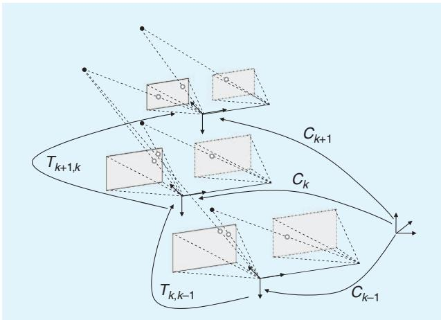
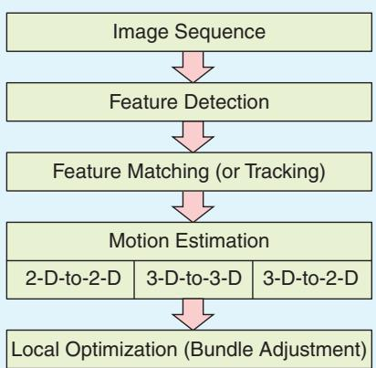
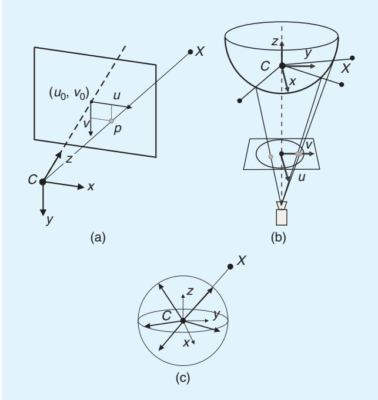
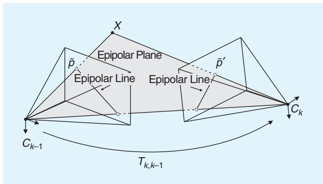
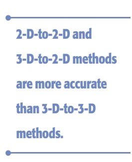

# Visual Odometry

# Part I: The First 30 Years and Fundamentals

By Davide Scaramuzza and Friedrich Fraundorfer

isual odometry (VO) is the process of estimating the egomotion of an agent (e.g., vehicle, human, and robot) using only the input of a single or multiple cameras attached to it. Application domains include robotics, wearable computing, augmented reality, and automotive. The term VO was coined in 2004 by Nister in his landmark paper [1]. The term was chosen for its similarity to wheel odometry, which incrementally estimates the motion of a vehicle by integrating the number of turns of its wheels over time. Likewise, VO operates by incrementally estimating the pose of the vehicle through examination of the changes that motion induces on the images of its onboard cameras. For VO to work effectively, there should be sufficient illumination in the environment and a static scene with enough texture to allow apparent motion to be extracted. Furthermore, consecutive frames should be captured by ensuring that they have sufficient scene overlap.

The advantage of VO with respect to wheel odometry is that VO is not affected by wheel slip in uneven terrain or other adverse conditions. It has been demonstrated that compared to wheel odometry, VO provides more accurate trajectory estimates, with relative position error ranging from 0.1 to 2%. This capability makes VO an interesting supplement to wheel odometry and, additionally, to other navigation systems such as global positioning system (GPS), inertial measurement units (IMUs), and laser odometry (similar to VO, laser odometry estimates the egomotion of a vehicle by scan-matching of consecutive laser scans). In GPS-denied environments, such as underwater and aerial, VO has utmost importance.

This two-part tutorial and survey provides a broad introduction to VO and the research that has been undertaken from 1980 to 2011. Although the first two decades witnessed many offline implementations, only in the third decade did real-time working systems flourish, which has led VO to be used on another planet by two Mars-exploration rovers for the first time. Part I (this tutorial) presents a historical review of the first 30 years of research in this field and its fundamentals. After a brief discussion on camera

Digital Object Identifier 10.1109/MRA.2011.943233   
Date ofpublication: 8 December 2011

modeling and calibration, it describes the main motionestimation pipelines for both monocular and binocular scheme, outlining pros and cons of each implementation. Part II will deal with feature matching, robustness, and applications. It will review the main point-feature detectors used in VO and the different outlier-rejection schemes. Particular emphasis will be given to the random sample consensus (RANSAC), and the distinct tricks devised to speed it up will be discussed. Other topics covered will be error modeling, location recognition (or loop-closure detection), and bundle adjustment.

This tutorial provides both the experienced and nonexpert user with guidelines and references to algorithms to build a complete VO system. Since an ideal and unique VO solution for every possible working environment does not exist, the optimal solution should be chosen carefully according to the specific navigation environment and the given computational resources.

## History of Visual Odometry

The problem of recovering relative camera poses and three-dimensional (3-D) structure from a set of camera images (calibrated or noncalibrated) is known in the computer vision community as structure from motion (SFM). Its origins can be dated back to works such as [2] and [3]. VO is a particular case of SFM. SFM is more general and tackles the problem of 3-D reconstruction of both the structure and camera poses from sequentially ordered or unordered image sets. The final structure and camera poses are typically refined with an offline optimization (i.e., bundle adjustment), whose computation time grows with the number of images [4]. Conversely, VO focuses on estimating the 3-D motion of the camera sequentially—as a new frame arrives—and in real time. Bundle adjustment can be used to refine the local estimate of the trajectory.

The problem of estimating a vehicle’s egomotion from visual input alone started in the early 1980s and was described by Moravec [5]. It is interesting to observe that most of the early research in VO [5]–[9] was done for planetary rovers and was motivated by the NASA Mars exploration program in the endeavor to provide all-terrain rovers with the capability to measure their 6-degree-offreedom (DoF) motion in the presence of wheel slippage in uneven and rough terrains.

The work of Moravec stands out not only for presenting the first motion-estimation pipeline—whose main functioning blocks are still used today—but also for describing one of the earliest corner detectors (after the first one proposed in 1974 by Hannah [10]) which is known today as the Moravec corner detector [11], a predecessor of the one proposed by Forstner [12] and Harris and Stephens [3], [82].

Moravec tested his work on a planetary rover equipped with what he termed a slider stereo: a single camera sliding on a rail. The robot moved in a stop-and-go fashion, digitizing and analyzing images at every location. At each stop, the camera slid horizontally taking nine pictures at equidistant intervals. Corners were detected in an image using his operator and matched along the epipolar lines of the other eight frames using normalized cross correlation.

Potential matches at the next robot locations were found again by correlation using a coarse-to-fine strategy to account for large-scale changes. Outliers were subsequently removed by checking for depth inconsistencies in the eight stereo pairs. Finally, motion was computed as the rigid body transformation to align the triangulated 3-D points seen at two consecutive robot positions. The system of equation was solved via a weighted least square, where the weights were inversely proportional to the distance from the 3-D point.

The advantage of VO with respect to wheel odometry is that VO is not affected by wheel slip in uneven terrain or other adverse conditions.

Although Moravec used a single sliding camera, his work belongs to the class of stereo VO algorithms. This terminology accounts for the fact that the relative 3-D position of the features is directly measured by triangulation at every robot location and used to derive the relative motion. Trinocular methods belong to the same class of algorithms. The alternative to stereo vision is to use a single camera. In this case, only bearing information is available. The disadvantage is that motion can only be recovered up to a scale factor. The absolute scale can then be determined from direct measurements (e.g., measuring the size of an element in the scene), motion constraints, or from the integration with other sensors, such as IMU, airpressure, and range sensors. The interest in monocular methods is due to the observation that stereo VO can degenerate to the monocular case when the distance to the scene is much larger than the stereo baseline (i.e., the distance between the two cameras). In this case, stereo vision becomes ineffective and monocular methods must be used. Over the years, monocular and stereo VOs have almost progressed as two independent lines of research. In the remainder of this section, we have surveyed the related work in these fields.

## Stereo VO

Most of the research done in VO has been produced using stereo cameras. Building upon Moravec’s work, Matthies and Shafer [6], [7] used a binocular system and Moravec’s procedure for detecting and tracking corners. Instead of using a scalar representation of the uncertainty as Moravec did, they took advantage of the error covariance matrix of the triangulated features and incorporated it into the motion estimation step. Compared to Moravec, they demonstrated superior results in trajectory recovery for a planetary rover, with 2% relative error on a 5.5-m path. Olson et al. [9], [13] later extended that work by introducing an absolute orientation sensor (e.g., compass or omnidirectional camera) and using the Forstner corner detector, which is significantly faster to compute than

• Keyframe selection is a very important step in VO and should always be done before updating the motion.

Moravec’s operator. They showed that the use of camera egomotion estimates alone results in accumulation errors with superlinear growth in the distance traveled, leading to increased orientation errors. Conversely, when an absolute orientation sensor is incorporated, the error growth can be reduced to a linear function of the distance traveled. This led them to a relative position error of 1:2% on a 20-m path.

Lacroix et al. [8] implemented a stereo VO approach for planetary rovers similar to those explained earlier. The difference lies in the selection of key points. Instead of using the Forstner detector, they used dense stereo and, then, selected the candidate key points by analyzing the correlation function around its peaks—an approach that was later exploited in [14], [15], and other works. This choice was based on the observation that there is a strong correlation between the shape of the correlation curve and the standard deviation of the feature depth. This observation was later used by Cheng et al. [16], [17] in their final VO implementation onboard the Mars rovers. They improved on the earlier implementation by Olson et al. [9], [13] in two areas. First, after using the Harris corner detector, they utilized the curvature of the correlation function around the feature—as proposed by Lacroix et al.—to define the error covariance matrix of the image point. Second, as proposed by Nister et al. [1], they used the random sample consensus (RAN-SAC) RANSAC [18] in the least-squares motion estimation step for outlier rejection.

A different approach to motion estimation and outlier removal for an all-terrain rover was proposed by Milella and Siegwart [14]. They used the Shi-Tomasi approach [19] for corner detection, and similar to Lacroix, they retained those points with high confidence in the stereo disparity map. Motion estimation was then solved by first using least squares, as in the methods earlier, and then the iterative closest point (ICP) algorithm [20]—an algorithm popular for 3-D registration of laser scans—for pose refinement. For robustness, an outlier removal stage was incorporated into the ICP.

The works mentioned so far have in common that the 3-D points are triangulated for every stereo pair, and the relative motion is solved as a 3-D-to-3-D point registration (alignment) problem. A completely different approach was proposed in 2004 by Nister et al. [1]. Their paper is known not only for coining the term VO but also for providing the first real-time long-run implementation with a robust outlier rejection scheme. Nister et al. improved the earlier implementations in several areas. First, contrary to all previous works, they did not track features among frames but detected features (Harris corners) independently in all frames and only allowed matches between features. This has the benefit of avoiding feature drift during cross-correlation-based tracking. Second, they did not compute the relative motion as a 3-D-to-3-D point registration problem but as a 3-D-to-two-dimensional (2-D) camera-pose estimation problem (these methods are described in the “Motion Estimation” section). Finally, they incorporated RANSAC outlier rejection into the motion estimation step.

A different motion estimation scheme was introduced by Comport et al. [21]. Instead of using 3-D-to-3-D point registration or 3-D-to-2-D camera-pose estimation techniques, they relied on the quadrifocal tensor, which allows motion to be computed from 2-D-to-2-D image matches without having to triangulate 3-D points in any of the stereo pairs. The benefit of using directly raw 2-D points in lieu of triangulated 3-D points lays in a more accurate motion computation.

## Monocular VO

The difference from the stereo scheme is that in the monocular VO, both the relative motion and 3-D structure must be computed from 2-D bearing data. Since the absolute scale is unknown, the distance between the first two camera poses is usually set to one. As a new image arrives, the relative scale and camera pose with respect to the first two frames are determined using either the knowledge of 3-D structure or the trifocal tensor [22].

Successful results with a single camera over long distances (up to several kilometers) have been obtained in the last decade using both perspective and omnidirectional cameras [23]–[29]. Related works can be divided into three categories: feature-based methods, appearance-based methods, and hybrid methods. Feature-based methods are based on salient and repeatable features that are tracked over the frames; appearance-based methods use the intensity information of all the pixels in the image or subregions of it; and hybrid methods use a combination ofthe previous two.

In the first category are the works by the authors in [1], [24], [25], [27], and [30]–[32]. The first real-time, largescale VO with a single camera was presented by Nister et al. [1]. They used RANSAC for outlier rejection and 3-Dto-2-D camera-pose estimation to compute the new upcoming camera pose. The novelty of their paper is the use of a five-point minimal solver [33] to calculate the motion hypotheses in RANSAC. After that paper, fivepoint RANSAC became very popular in VO and was used in several other works [23], [25], [27]. Corke et al. [24] provided an approach for monocular VO based on omnidirectional imagery from a catadioptric camera and optical flow. Lhuillier [25] and Mouragnon et al. [30] presented an approach based on local windowed-bundle adjustment to recover both the motion and the 3-D map (this means that bundle adjustment is performed over a window of the last m frames). Again, they used the five-point RANSAC in [33] to remove the outliers. Tardif et al. [27] presented an approach for VO on a car over a very long run (2.5 km) without bundle adjustment. Contrary to the previous work, they decoupled the rotation and translation estimation. The rotation was estimated by using points at infinity and the translation from the recovered 3-D map. Erroneous correspondences were removed with five-point RANSAC.

Among the appearance-based or hybrid approaches are the works by the authors in [26], [28], and [29]. Goecke et al. [26] used the Fourier–Mellin transform for registering perspective images of the ground plane taken from a car. Milford and Wyeth [28] presented a method to extract approximate rotational and translational velocity information from a single perspective camera mounted on a car, which was then used in a RatSLAM scheme [34]. They used template tracking on the center of the scene. A major drawback with appearance-based approaches is that they are not robust to occlusions. For this reason, Scaramuzza and Siegwart [29] used image appearance to estimate the rotation of the car and features from the ground plane to estimate the translation and the absolute scale. The feature-based approach was also used to detect failures of the appearancebased method.

All the approaches mentioned earlier are designed for unconstrained motion in 6 DoF. However, several VO works have been specifically designed for vehicles with motion constraints. The advantage is decreased computation time and improved motion accuracy. For instance, Liang and Pears [35], Ke and Kanade [36], Wang et al. [37], and Guerrero et al. [38] took advantage of homographies for estimating the egomotion on a dominant ground plane. Scaramuzza et al. [31], [39] introduced a one-point RANSAC outlier rejection based on the vehicle nonholonomic constraints to speed up egomotion estimation to 400 Hz. In the follow-up work, they showed that nonholonomic constraints allow the absolute scale to be recovered from a single camera whenever the vehicle makes a turn [40]. Following that work, vehicle nonholonomic constraints have also been used by Pretto et al. [32] for improving feature tracking and by Fraundorfer et al. [41] for windowed bundle adjustment (see the following section).

## Reducing the Drift

Since VO works by computing the camera path incrementally (pose after pose), the errors introduced by each new frame-to-frame motion accumulate over time. This generates a drift of the estimated trajectory from the real path. For some applications, it is of utmost importance to keep drift as small as possible, which can be done through local optimization over the last m camera poses. This approach—called sliding window bundle adjustment or windowed bundle adjustment—has been used in several works, such as [41]–[44]. In particular, on a 10-km VO experiment, Konolige et al. [43] demonstrated that windowed-bundle adjustment can decrease the final position error by a factor of 2–5. Obviously, the VO drift can also be reduced through combination with other sensors, such as GPS and laser, or even with only an IMU [43], [45], [46].

## V-SLAM

Although this tutorial focuses on VO, it is worth mentioning the parallel line of research undertaken by visual simultaneous localization and mapping (V-SLAM). For an indepth study of the SLAM problem, the reader is referred to two tutorials on this topic by Durrant-Whyte and Bailey [47], [48]. Two methodologies have become predominant in V-SLAM: 1) filtering methods fuse the information from all the images with a probability distribution [49] and 2) nonfiltering methods (also called keyframe methods) retain the optimization of global bundle adjustment to selected keyframes [50]. The main advantages of either approach have been evaluated and summarized in [51].

In the last few years, successful results have been obtained using both single and stereo cameras [49], [52]–

[62]. Most of these works have been limited to small, indoor workspaces and only a few of them have recently been designed for large-scale areas [54], [60], [62]. Some of the early works in real-time V-SLAM were presented by Chiuso et al. [52], Deans [53], and Davison [49] using a full-covariance Kalman approach. The advantage of Davison’s work was to account for repeatable localization after an arbitrary amount of time. Later, Handa et al. [59] improved on that work using an active matching technique based on a probabilistic framework. Civera et al. [60] built upon that work by proposing a combination of one-point RANSAC within the Kalman filter that uses the available prior probabilistic information from the filter in the RAN-SAC model-hypothesis stage. Finally, Strasdat et al. [61] presented a new framework for large-scale V-SLAM that takes advantage of the keyframe optimization approach [50] while taking into account the special character of SLAM.

## VO Versus V-SLAM

In this section, the relationship of VO with V-SLAM is analyzed. The goal of SLAM in general (and V-SLAM in particular) is to obtain a global, consistent estimate of the robot path. This implies keeping a track of a map of the environment (even in the case where the map is not needed per se) because it is needed to realize when the robot returns to a previously visited area. (This is called loop closure. When a loop closure is detected, this information is used to reduce the drift in both the map and camera path. Understanding when a loop closure occurs and efficiently integrating this new constraint into the current map are two of the main issues in SLAM.) Conversely, VO aims at recovering the path incrementally, pose after pose, and potentially optimizing only over the last n poses of the path (this is also called windowed bundle adjustment). This sliding window optimization can be considered equivalent to building a local map in SLAM; however, the philosophy is different: in VO, we only care about local consistency of the trajectory and the local map is used to obtain a more accurate estimate of the local trajectory (for example, in bundle adjustment), whereas SLAM is concerned with the global map consistency.

VO can be used as a building block for a complete SLAM

In the motion estimation step, the camera motion between the current and the previous image is computed.

algorithm to recover the incremental motion of the camera; however, to make a complete SLAM method, one must also add some way to detect loop closing and possibly a global optimization step to obtain a metrically consistent map (without this step, the map is still topologically consistent).

If the user is only interested in the camera path and not in the environment map, there is still the possibility of using a complete V-SLAM method instead of one of the VO techniques

described in this tutorial. A V-SLAM method is potentially much more precise, because it enforces many more constraints on the path, but not necessarily more robust $( \mathrm { e . g . }$ outliers in loop closing can severely affect the map consistency). In addition, it is more complex and computationally expensive.

In the end, the choice between VO and V-SLAM depends on the tradeoff between performance and consistency, and simplicity in implementation. Although the global consistency of the camera path is sometimes desirable, VO trades off consistency for real-time performance, without the need to keep track of all the previous history of the camera.

  
Figure 1. An illustration of the visual odometry problem. The relative poses $T _ { k , k - 1 }$ of adjacent camera positions (or positions of a camera system) are computed from visual features and concatenated to get the absolute poses $C _ { k }$ with respect to the initial coordinate frame at $k = 0$

## Formulation of the VO Problem

An agent is moving through an environment and taking images with a rigidly attached camera system at discrete time instants k. In case of a monocular system, the set of images taken at times k is denoted by $I _ { 0 : n } = \{ I _ { 0 } , \ldots , I _ { n } \}$ In case of a stereo system, there are a left and a right image at every time instant, denoted by $I _ { l , 0 ; n } = \{ I _ { l , 0 } , \dots , I _ { l , n } \}$ and $I _ { r , 0 : n } = \{ I _ { r , 0 } , \ldots , I _ { r , n } \}$ . Figure 1 shows an illustration of this setting.

For simplicity, the camera coordinate frame is assumed to be also the agent’s coordinate frame. In case of a stereo system, without loss of generality, the coordinate system of the left camera can be used as the origin.

Two camera positions at adjacent time instants $k - 1$ and k are related by the rigid body transformation $T _ { k , k - 1 } \in \mathbb { R } ^ { 4 \times 4 }$ of the following form:

$$
T _ { k , k - 1 } = { \left[ \begin{array} { l l } { R _ { k , k - 1 } } & { t _ { k , k - 1 } } \\ { 0 } & { 1 } \end{array} \right] } ,\tag{1}
$$

where $R _ { k , k - 1 } \in S O ( 3 )$ is the rotation matrix, and $t _ { k , k - 1 } \in \mathbb { R } ^ { 3 \times 1 }$ the translation vector. The set $T _ { 1 : n } =$ $\left\{ T _ { 1 , 0 } , \dots , T _ { n , n - 1 } \right\}$ contains all subsequent motions. To simplify the notation, from now on, $T _ { k }$ will be used instead of $T _ { k , k - 1 }$ . Finally, the set of camera poses $C _ { 0 : n } =$ $\left\{ C _ { 0 } , \ldots , C _ { n } \right\}$ contains the transformations of the camera with respect to the initial coordinate frame at $k = 0 .$ . The current pose $C _ { n }$ can be computed by concatenating all the transformations $T _ { k } ( k = 1 \ldots n )$ , and, therefore, $C _ { n } =$ $C _ { n - 1 } T _ { n } ,$ with $C _ { 0 }$ being the camera pose at the instant $k = 0$ , which can be set arbitrarily by the user.

The main task in VO is to compute the relative transformations $T _ { k }$ from the images $I _ { k }$ and $I _ { k - 1 }$ and then to concatenate the transformations to recover the full trajectory $C _ { 0 : n }$ of the camera. This means that VO recovers the path incrementally, pose after pose. An iterative refinement over the last m poses can be performed after this step to obtain a more accurate estimate of the local trajectory. This iterative refinement works by minimizing the sum of the squared reprojection errors of the reconstructed 3-D points (i.e., the 3-D map) over the last m images (this is called windowed-bundle adjustment, because it is performed on a window of m frames. Bundle adjustment will be described in Part II of this tutorial). The 3-D points are obtained by triangulation of the image points (see the “Triangulation and Keyframe Selection” section).

As mentioned in the “Monocular $\mathrm { V O } ^ { \mathrm { \mathfrak { n } } }$ section, there are two main approaches to compute the relative motion $T _ { k } { \mathrm { : } }$ appearance-based (or global) methods, which use the intensity information of all the pixels in the two input images, and feature-based methods, which only use salient and repeatable features extracted (or tracked) across the images. Global methods are less accurate than featurebased methods and are computationally more expensive. (As observed in the “History of VO” section, most appearance-based methods have been applied to monocular VO. This is due to ease of implementation compared with the stereo camera case.) Feature-based methods require the ability to robustly match (or track) features across frames but are faster and more accurate than global methods. Therefore, most VO implementations are feature based.

The VO pipeline is summarized in Figure 2. For every new image $I _ { k }$ (or image pair in the case of a stereo camera), the first two steps consist of detecting and matching 2-D features with those from the previous frames. Two-dimensional features that are the reprojection of the same 3-D feature across different frames are called image correspondences. (As will be explained in Part II of this tutorial, we distinguish between feature matching and feature tracking. The first one consists of detecting features independently in all the images and then matching them based on some similarity metrics; the second one consists of finding features in one image and then tracking them in the next images using a local search technique, such as correlation.) The third step consists of computing the relative motion $T _ { k }$ between the time instants $k - 1$ and k. Depending on whether the correspondences are specified in three or two dimensions, there are three distinct approaches to tackle this problem (see the “Motion Estimation” section). The camera pose $C _ { k }$ is then computed by concatenation of $T _ { k }$ with the previous pose. Finally, an iterative refinement (bundle adjustment) can be done over the last m frames to obtain a more accurate estimate of the local trajectory.

Motion estimation is explained in this tutorial (see “Motion Estimation” section). Feature detection and matching and bundle adjustment will be described in Part II. Also, notice that for an accurate motion computation, feature correspondences should not contain outliers (i.e., wrong data associations). Ensuring accurate motion estimation in the presence of outliers is the task of robust estimation, which will be described in Part II of this tutorial. Most VO implementations assume that the camera is calibrated. To this end, the next section reviews the standard models and calibration procedures for perspective and omnidirectional cameras.

## Camera Modeling and Calibration

VO can be done using both perspective and omnidirectional cameras. In this section, we review the main models.

## Perspective Camera Model

The most used model for perspective camera assumes a pinhole projection system: the image is formed by the intersection of the light rays from the objects through the center of the lens (projection center), with the focal plane [Figure $3 ( \mathrm { a } ) ]$ . Let $\overset { \cdot } { X } = \left[ x , y , z \right] ^ { \top }$ be a scene point in the camera reference frame and $\begin{array} { r } { p = [ u , \nu ] ^ { \mathrm { ~ } } } \end{array}$ its projection on the image plane measured in pixels. The mapping from the 3-D world to the 2-D image is given by the perspective projection equation:

$$
\lambda \left[ \begin{array} { c } { { u } } \\ { { \nu } } \\ { { 1 } } \end{array} \right] = K X = \left[ \begin{array} { c c c } { { \alpha _ { u } } } & { { 0 } } & { { u _ { 0 } } } \\ { { 0 } } & { { \alpha _ { \nu } } } & { { \nu _ { 0 } } } \\ { { 0 } } & { { 0 } } & { { 1 } } \end{array} \right] \left[ \begin{array} { c } { { x } } \\ { { y } } \\ { { z } } \end{array} \right] ,\tag{2}
$$

where k is the depth factor, $\alpha _ { u }$ and $\mathsf { \Omega } \mathsf { \Omega } \propto _ { \nu }$ the focal lengths, and $u _ { 0 } , \nu _ { 0 }$ the image coordinates of the projection center. These parameters are called intrinsic parameters. When the field of view of the camera is larger than $4 5 ^ { \circ }$ , the effects of the radial distortion may become visible and can be modeled using a second- (or higher)-order polynomial. The derivation of the complete model can be found in computer vision textbooks, such as [22] and [63]. Let $\tilde { p } = [ \tilde { u } , \tilde { \nu } , \hat { 1 } ] ^ { \top } =$ $K ^ { - 1 } \big [ u , \nu , 1 \big ] ^ { \top }$ be the normalized image coordinates. Normalized coordinates will be used throughout in the following sections.

  
Figure 2. A block diagram showing the main components of a VO system.

  
Figure 3. (a) Perspective projection, (b) catadioptric projection, and (c) a spherical model for perspective and omnidirectional cameras. Image points are represented as directions to the viewed points normalized on the unit sphere.

## Omnidirectional Camera Model

Omnidirectional cameras are cameras with wide field of view (even more than 180-) and can be built using fish-eye

In GPS-denied environments, VO becomes of utmost importance.

lenses or by combining standard cameras with mirrors [the latter are called catadioptric cameras, Figure 3(b)]. Typical mirror shapes in catadioptric cameras are quadratic surfaces of revolution (e.g., paraboloid or hyperboloid), because they guarantee a single projection center, which makes it possible to use the motion estimation theory presented in the “Motion

Estimation” section.

Currently, there are two accepted models for omnidirectional cameras. The first one proposed by Geyer and Daniilidis [64] is for general catadioptric cameras (parabolic or hyperbolic), while the second one proposed by Scaramuzza et al. [65] is a unified model for both fish-eye and catadioptric cameras. A survey of these two models can be found in [66] and [67]. The projection equation of the unified model is as follows:

$$
\lambda \left[ \begin{array} { c } { { u } } \\ { { \nu } } \\ { { a _ { 0 } + a _ { 1 } \rho + \cdot \cdot \cdot + a _ { n - 1 } \rho ^ { n - 1 } } } \end{array} \right] = \left[ \begin{array} { c } { { x } } \\ { { y } } \\ { { z } } \end{array} \right] ,\tag{3}
$$

where $\textstyle \rho = \sqrt { u ^ { 2 } + \nu ^ { 2 } }$ and $a _ { 0 } , \ a _ { 1 } , \ . . . , \ a _ { n }$ are intrinsic parameters that depend on the type of mirror or fish-eye lens. As shown in [65], n ¼ 4 is a reasonable choice for a large variety of mirrors and fish-eye lenses. Finally, this model assumes that the image plane satisfies the ideal property that the axes of symmetry of the camera and mirror are aligned. Although this assumption holds for most catadioptric and fish-eye cameras, misalignments can be modeled by introducing a perspective projection between the ideal and real-image plane [66].

## Spherical Model

As mentioned earlier, it is desirable that the camera possesses a single projection center (also called single effective viewpoint). In a catadioptric camera, this happens when the rays reflected by the mirror intersect all in a single point (namely C). The existence of this point allows us to model any omnidirectional projection as a mapping from the single viewpoint to a sphere. For convenience, a unit sphere is usually adopted.

It is important to notice that the spherical model applies not only to omnidirectional cameras but also to perspective cameras. If the camera is calibrated, any point in the perspective or omnidirectional image can be mapped into a vector on the unit sphere. As can be observed in Figure 3(c), these unit vectors represent the directions to the viewed scene points. These vectors are called normalized image points on the unit sphere.

## Camera Calibration

The goal of calibration is to accurately measure the intrinsic and extrinsic parameters of the camera system. In a multicamera system (e.g., stereo and trinocular), the extrinsic parameters describe the mutual position and orientation between each camera pair. The most popular method uses a planar checkerboard-like pattern. The position of the squares on the board is known. To compute the calibration parameters accurately, the user must take several pictures of the board shown at different positions and orientations by ensuring that the field of view of the camera is filled as much as possible. The intrinsic and extrinsic parameters are then found through a least-square minimization method. The input data are the 2-D positions of the corners of the squares of the board and their corresponding pixel coordinates in each image.

Many camera calibration toolboxes have been devised for MATLAB and C. An up-to-date list can be found in [68]. Among these, the most popular ones for MATLAB are given in [69] and [70]–[72]—for perspective and omnidirectional cameras, respectively. A C implementation of camera calibration for perspective cameras can be found in OpenCV [73], the open-source computer vision library.

## Motion Estimation

Motion estimation is the core computation step performed for every image in a VO system. More precisely, in the motion estimation step, the camera motion between the current image and the previous image is computed. By concatenation of all these single movements, the full trajectory of the camera and the agent (assuming that the camera is rigidly mounted) can be recovered. This section explains how the transformation $T _ { k }$ between two images $I _ { k - 1 }$ and $I _ { k }$ can be computed from two sets of corresponding features $f _ { k - 1 } , f _ { k }$ at time instants $k - 1$ and $k ,$ respectively. Depending on whether the feature correspondences are specified in two or three dimensions, there are three different methods.

l 2-D-to-2-D: In this case, both $f _ { k - 1 }$ and $f _ { k }$ are specified in 2-D image coordinates.

l 3-D-to-3-D: In this case, both $f _ { k - 1 }$ and $f _ { k }$ are specified in 3-D. To do this, it is necessary to triangulate 3-D points at each time instant; for instance, by using a stereo camera system.

3-D-to-2-D: In this case, $f _ { k - 1 }$ are specified in 3-D and $f _ { k }$ are their corresponding 2-D reprojections on the image $I _ { k } .$ In the monocular case, the 3-D structure needs to be triangulated from two adjacent camera views $( \mathrm { e . g . , } I _ { k - 2 }$ and $I _ { k - 1 } )$ and then matched to 2-D image features in a third view $( \mathrm { e } . \mathrm { g } . , I _ { k } )$ . In the monocular scheme, matches over at least three views are necessary.

Notice that features can be points or lines. In general, due to the lack of lines in unstructured scenes, point features are used in VO. An in-depth review of these three approaches for both point and line features can be found in [74]. The formulation given in this tutorial is for point features only.

## 2-D to 2-D: Motion from Image Feature Correspondences

## Estimating the Essential Matrix

The geometric relations between two images $I _ { k }$ and $I _ { k - 1 }$ of a calibrated camera are described by the so-called essential matrix E. E contains the camera motion parameters up to an unknown scale factor for the translation in the following form:

$$
E _ { k } \simeq \hat { t } _ { k } R _ { k } ,\tag{4}
$$

where $t _ { k } = \left[ t _ { x } , t _ { y } , t _ { z } \right] ^ { \top }$ and

$$
\hat { t } _ { k } = \left[ \begin{array} { c c c } { 0 } & { - t _ { z } } & { t _ { y } } \\ { t _ { z } } & { 0 } & { - t _ { x } } \\ { - t _ { y } } & { t _ { x } } & { 0 } \end{array} \right] .\tag{5}
$$

The symbol $\simeq$ is used to denote that the equivalence is valid up to a multiplicative scalar.

The essential matrix can be computed from 2-D-to-2-D feature correspondences, and rotation and translation can directly be extracted from $E .$ The main property of 2-D-to-2-D-based motion estimation is the epipolar constraint, which determines the line on which the corresponding feature point $\tilde { p } ^ { \prime }$ of $\tilde { \boldsymbol { p } }$ lies in the other image (Figure 4). This constraint can be formulated by $\tilde { p } ^ { \prime \top } E \tilde { p } = 0 ;$ where $\tilde { p } ^ { \prime }$ is a feature location in one image $( \mathrm { e } . \mathrm { g } . , I _ { k } )$ and $\tilde { p }$ is the location of its corresponding feature in another image $( \mathrm { e . g . , } I _ { k - 1 } ) . \tilde { \phi }$ and $\tilde { p } ^ { \prime }$ are normalized image coordinates. For the sake of simplicity, throughout the following sections, normalized coordinates in the form $\tilde { \boldsymbol { p } } = [ \tilde { u } , \tilde { \boldsymbol { \nu } } , 1 ] ^ { \top }$ will be used (see the Perspective Camera Model” section). However, very similar equations can also be derived for normalized coordinates on the unit sphere (see the “Spherical Model” section).

The essential matrix can be computed from 2-D-to-2- D feature correspondences using the epipolar constraint. The minimal case solution involves five 2-D-to-2-D correspondences [75] and an efficient implementation proposed by Nister in [76]. Nister’s five-point algorithm has become the standard for 2-D-to-2-D motion estimation in the presence of outliers (the problem of robust estimation will be tackled in Part II of this tutorial). A simple and straightforward solution for $n \geq 8$ noncoplanar points is the Longuet-Higgins’ eight-point algorithm [2], which is summarized here. Each feature match gives a constraint ofthe following form:

$$
\begin{array} { r l } { \big [ \tilde { u } \tilde { u } ^ { \prime } } & { \tilde { u } ^ { \prime } \tilde { \nu } \quad \tilde { u } ^ { \prime } \quad \tilde { u } \tilde { \nu } ^ { \prime } \quad \tilde { \nu } \tilde { \nu } ^ { \prime } \quad \tilde { \nu } ^ { \prime } \quad \tilde { u } \quad \tilde { \nu } \quad 1 \big ] { \cal E } = 0 , } \end{array}\tag{6}
$$

where $E = \left[ e _ { 1 } e _ { 2 } e _ { 3 } e _ { 4 } e _ { 5 } e _ { 6 } e _ { 7 } e _ { 8 } e _ { 9 } \right] ^ { \top }$

Stacking the constraints from eight points gives the linear equation system $A E = 0 ;$ , and by solving the system, the parameters of E can be computed. This homogeneous equation system can easily be solved using singular value decomposition (SVD) [2]. Having more than eight points leads to an overdetermined system to solve in the leastsquares sense and provides a degree of robustness to noise. The SVD of A has the form $\bar { \boldsymbol { A } } = \boldsymbol { U } \boldsymbol { S } \boldsymbol { V } ^ { \top }$ , and the leastsquares estimate of $E$ with $| | E | | = 1$ can be found as the last column of V. However, this linear estimation of E does not fulfill the inner constraints of an essential matrix, which come from the multiplication of the rotation matrix R and the skew-symmetric translation matrix ^t. These constraints are visible in the singular values of the essential matrix. A valid essential matrix after SVD is $E = U S V ^ { \top }$ and has $\mathrm { d i a g } ( S ) = \{ s , s , 0 \}$ , which means that the first and second singular values are equal and the third one is zero. To get a valid E that fulfills the constraints, the solution needs to be projected onto the space of valid essential matrices. The projected essential matrix is $\bar { \boldsymbol { E } } = U \mathrm { d i a g } \{ 1 , 1 , 0 \} \boldsymbol { V } ^ { \top }$

Observe that the solution of the eight-point algorithm is degenerate when the 3-D points are coplanar. Conversely, the five-point algorithm works also for coplanar points. Finally, observe that the eight-point algorithm works for both calibrated (perspective or omnidirectional) and uncalibrated (only perspective) cameras, whereas the five-point algorithm assumes that the camera (perspective or omnidirectional) is calibrated.

## Extracting R and t from E

From the estimate of ${ \bar { E } } ,$ the rotation and translation parts can be extracted. In general, there are four different solutions for R, t for one essential matrix; however, by triangulation of a single point, the correct R, t pair can be identified. The four solutions are

$$
\begin{array} { r } { R = U ( \pm W ^ { \top } ) V ^ { \top } , } \\ { \hat { t } = U ( \pm W ) S U ^ { \top } , } \end{array}
$$

where

$$
\boldsymbol { W } ^ { \intercal } = \left[ \begin{array} { c c c } { \boldsymbol { 0 } } & { \pm \boldsymbol { 1 } } & { \boldsymbol { 0 } } \\ { \mp \boldsymbol { 1 } } & { \boldsymbol { 0 } } & { \boldsymbol { 0 } } \\ { \boldsymbol { 0 } } & { \boldsymbol { 0 } } & { \boldsymbol { 1 } } \end{array} \right] .\tag{7}
$$

An efficient decomposition of E into R and t is described in [76].

  
Figure 4. An illustration of the epipolar constraint.

After selecting the correct solution by triangulation of a point and choosing the solution where the point is in front of both cameras, a nonlinear optimization of the rotation and translation parameters should be performed using the estimate $R ,$ t as initial values. The function to minimize is the reprojection error defined in (10).

## Computing the Relative Scale

To recover the trajectory of an image sequence, the different transformations $T _ { 0 : n }$ have to be concatenated. To do

Bundle adjustment can be used to refine the local estimate of the trajectory.

this, the proper relative scales need to be computed as the absolute scale of the translation cannot be computed from two images. However, it is possible to compute relative scales for the subsequent transformations. One way of doing this is to triangulate 3-D points $X _ { k - 1 }$ and $X _ { k }$ from two subsequent image pairs. From the corresponding 3-D points, the relative

distances between any combination of two 3-D points can be computed. The proper scale can then be determined from the distance ratio r between a point pair in $X _ { k - 1 }$ and a pair in $X _ { k }$

$$
r = \frac { | | X _ { k - 1 , i } - X _ { k - 1 , j } | | } { | | X _ { k , i } - X _ { k , j } | | } .\tag{8}
$$

For robustness, the scale ratios for many point pairs are computed and the mean (or in presence of outliers, the median) is used. The translation vector t is then scaled with this distance ratio. Observe that the relative-scale computation requires features to be matched (or tracked) over multiple frames (at least three). Instead of performing explicit triangulation of the 3-D points, the scale can also be recovered by exploiting the trifocal constraint between three-view matches of2-D features [22].

The VO algorithm with the 2-D-to-2-D correspondences is summarized in Algorithm 1.

Algorithm 1. VO from 2-D-to-2-D   
correspondences.   
1) Capture new frame $I _ { k }$   
2) Extract and match features between $I _ { k - 1 }$ and $I _ { k }$   
3) Compute essential matrix for image pair $I _ { k - 1 } , I _ { k }$   
4) Decompose essential matrix into $R _ { k }$ and $t _ { k } ,$ and form $T _ { k }$   
5) Compute relative scale and rescale $t _ { k }$ accordingly   
6) Concatenate transformation by computing $C _ { k } = C _ { k - 1 } T _ { k }$   
7) Repeat from 1).

## 3D-to-3D: Motion from 3-D Structure Correspondences

For the case of corresponding 3-D-to-3-D features, the camera motion $T _ { k }$ can be computed by determining the aligning transformation of the two 3-D feature sets.

Corresponding 3-D-to-3-D features are available in the stereo vision case.

The general solution consists of finding the $T _ { k }$ that minimizes the $L _ { 2 }$ distance between the two 3-D feature sets

$$
\arg \operatorname* { m i n } _ { T _ { k } } \sum _ { i } | | \tilde { X } _ { k } ^ { i } - T _ { k } \tilde { X } _ { k - 1 } ^ { i } | | ,\tag{9}
$$

where the superscript i denotes the i th feature, and $\tilde { X } _ { k } ,$ $\tilde { X } _ { k - 1 }$ are the homogeneous coordinates of the 3-D points, $\mathrm { i . e . , } \tilde { X } = \left[ x , y , z , 1 \right] ^ { \top }$

As shown in [77], the minimal case solution involves three 3-D-to-3-D noncollinear correspondences, which can be used for robust estimation in the presence of outliers (Part II of this tutorial). For the case of $n \geq 3$ correspondences, one possible solution (according to Arun et al. [78]) is to compute the translation part as the difference of the centroids of the 3-D feature sets and the rotation part using SVD. The translation is given by

$$
t _ { k } = \overline { { X _ { k } } } - R \overline { { X } } _ { k - 1 } ,
$$

where - stands for the arithmetic mean value.

The rotation can be efficiently computed using SVD as

$$
R _ { k } = V U ^ { \top } ,
$$

where ${ \mathrm { U S V } } ^ { \top } = { \mathrm { s v d } } ( ( X _ { k - 1 } - { \overline { { X } } } _ { k - 1 } ) ( X _ { k } - { \overline { { X } } } _ { k } ) ^ { \top } )$ and $X _ { k - 1 }$ and $X _ { k }$ are sets of corresponding 3-D points.

If the measurement uncertainties of the 3-D points are known, they can be added as weights into the estimation as described by Maimone et al. [17]. The computed transformations have absolute scale, and thus, the trajectory of a sequence can be computed by directly concatenating the transformations.

The VO algorithm with the 3-D-to-3-D correspondences is summarized in Algorithm 2.

Algorithm 2. VO from 3-D-to-3-D   
correspondences.   
1) Capture two stereo image pairs $I _ { I , k - 1 } , I _ { r , k - 1 }$ and $I _ { I , k } , I _ { r , k }$   
2) Extract and match features between $I _ { I , k - 1 }$ and $I _ { I , k }$   
3) Triangulate matched features for each stereo pair   
4) Compute $T _ { k }$ from 3-D features $\ X _ { k - 1 }$ and $\chi _ { k }$   
5) Concatenate transformation by computing   
$C _ { k } = C _ { k - 1 } T _ { k }$   
6) Repeat from 1).

To compute the transformation, it is also possible to avoid the triangulation of the 3-D points in the stereo camera and use quadrifocal constraints instead. This method was pointed out by Comport et al. [21]. The quadrifocal tensor allows computing the transformation directly from 2-Dto-2-D stereo correspondences.

## 3-D-to-2-D: Motion from 3-D Structure and Image Feature Correspondences

As pointed out by Nister et al. [1], motion estimation from 3-D-to-2-D correspondences is more accurate than from 3-D-to-3-D correspondences because it minimizes the image reprojection error (10) instead of the 3-D-to-3-D feature position error (9). The transformation $T _ { k }$ is computed from the 3-D-to-2-D correspondences $X _ { k - 1 }$ and ${ p } _ { k }$ $X _ { k - 1 }$ can be estimated from stereo data or, in the monocular case, from triangulation of the image measurements $\phi _ { k - 1 }$ and $\scriptstyle { p _ { k - 2 } }$ . The latter, however, requires image correspondences across three views.

The general formulation in this case is to find $T _ { k }$ that minimizes the image reprojection error

$$
\arg \operatorname* { m i n } _ { T _ { k } } \sum _ { i } \| p _ { k } ^ { i } - \hat { p } _ { k - 1 } ^ { i } \| ^ { 2 } ,\tag{10}
$$

where $\hat { p } _ { k - 1 } ^ { i }$ is the reprojection of the 3-D point $X _ { k - 1 } ^ { i }$ into image $I _ { k }$ according to the transformation $T _ { k } .$ This problem is known as perspective from n points (PnP) (or resection), and there are many different solutions to it in the literature [79]. As shown in [18], the minimal case involves three 3- D-to-2-D correspondences. This is called perspective from three points (P3P) and returns four solutions that can be disambiguated using one or more additional points. (A fast implementation of P3P is described in [80], and C code can be freely downloaded from the authors’ Web page.) In the 3-D-to-2-D case, P3P is the standard method for robust motion estimation in the presence of outliers [18]. Robust estimation will be described in Part II of this tutorial.

A simple and straightforward solution to the PnP problem for $n \geq 6$ points is the direct linear transformation algorithm [22]. One 3-D-to-2-D point correspondence provides two constraints of the following form for the entries of $P _ { k } = [ R | t ]$

$$
\left[ { \begin{array} { l l l l l l l } { 0 ~ 0 ~ 0 ~ 0 ~ - x ~ - y ~ - z ~ - 1 } & { x \tilde { \nu } } & { y \tilde { \nu } } & { z \tilde { \nu } } & { \tilde { \nu } } \\ { x ~ y ~ z ~ 1 } & { 0 } & { 0 } & { 0 } & { - x \tilde { u } ~ - y \tilde { u } ~ - z \tilde { u } ~ - \tilde { u } } \end{array} } \right] \left[ { \begin{array} { l } { P ^ { 1 } } \\ { P ^ { 2 } } \\ { P ^ { 3 } } \end{array} } \right] = 0 ,\tag{11}
$$

where each $P ^ { j ^ { \top } }$ is a four vector (the jth row of $P _ { k } )$ and $x , y _ { ; }$ z are the coordinates of the 3-D points $X _ { k - 1 }$

Stacking the constraints of six-point correspondences gives a linear system of equations of the form $A P = 0$ . The entries of P can be computed from the nullvector of A, e.g., by using SVD. The rotation and translation parts can easily be extracted from $P _ { k } = [ R | t ]$ . The resulting rotation R is not necessarily orthonormal. However, this is not a problem since both R and t can be refined by nonlinear optimization of the reprojection error as defined in (10).

The 3-D-to-2-D motion estimation assumes that the 2- D image points only come from one camera. This means that for the case of a stereo camera, the 2-D image points are those of either the left or the right camera. Obviously, it is desirable to make use of the image points of both cameras at the same time. A generalized version of the 3- D-to-2-D motion estimation algorithm for nonconcurrent rays (i.e., 2-D image points from multiple cameras) was proposed by Nister in [81] for extrinsically calibrated cameras (i.e., the mutual position and orientation between the cameras is known).

For the monocular case, it is necessary to triangulate 3- D points and estimate the pose from 3-D-to-2-D matches in an alternating fashion. This alternating scheme is often

referred to as SFM. Starting from two views, the initial set of 3-D points and the first transformation are computed from 2-D-to-2-D feature matches. Subsequent transformations are then computed from 3-D-to-2-D feature matches. To do this, features need to be matched (or tracked) over multiple frames (at least three). New 3-D features are again triangulated when a new transformation is computed and

added to the set of 3-D features. The main challenge of this method is to maintain a consistent and accurate set of triangulated 3-D features and to create 3-D-to-2-D feature matches for at least three adjacent frames.

The VO algorithm with 3-D-to-2-D correspondences is summarized in Algorithm 3.

Algorithm 3. VO from 3-D-to-2-D   
Correspondences.   
1) Do only once:   
1.1) Capture two frames $I _ { k - 2 } , I _ { k - 1 }$   
1.2) Extract and match features between them   
1.3) Triangulate features from Ik-2, Ik-1   
2) Do at each iteration:   
2.1) Capture new frame $I _ { k }$   
2.2) Extract features and match with previous frame $I _ { k - 1 }$   
2.3) Compute camera pose (PnP) from 3-D-to-2-D matches   
2.4) Triangulate all new feature matches between $I _ { k }$ and $I _ { k - 1 }$   
2.5) Iterate from 2.1).

## Triangulation and Keyframe Selection

Some of the previous motion estimation methods require triangulation of 3-D points (structure) from 2-D image correspondences. Structure computation is also needed by bundle adjustment (Part II of this tutorial) to compute a more accurate estimate of the local trajectory.

Triangulated 3-D points are determined by intersecting back-projected rays from 2-D image correspondences of at least two image frames. In perfect conditions, these rays would intersect in a single 3-D point. However, because of image noise, camera model and calibration errors, and feature matching uncertainty, they never intersect. Therefore, the point at a minimal distance, in the least-squares

VO trades off consistency for real-time performance.

sense, from all intersecting rays can be taken as an estimate of the 3-D point position. Notice that the standard deviation of the distances of the triangulated 3-D point from all rays gives an idea of the quality of the 3-D point. Three-dimensional points with large uncertainty will be thrown out. This happens especially when frames are taken at very nearby intervals com-

pared with the distance to the scene points. When this occurs, 3-D points exhibit very large uncertainty. One way to avoid this consists of skipping frames until the average uncertainty of the 3-D points decreases below a certain threshold. The selected frames are called keyframes. Keyframe selection is a very important step in VO and should always be done before updating the motion.

## Discussion

According to Nister et al. [1], there is an advantage in using the 2-D-to-2-D and 3-D-to-2-D methods compared to the 3-D-to-3-D method for motion computation. Nister compared the VO performance of the 3-D-to-3-D case to that of the 3-D-to-2-D case for a stereo camera system and found the latter being greatly superior to the former. The reason is due to the triangulated 3-D points being much more uncertain in the depth direction. When 3-D-to-3-D feature correspondences are used in motion computation, their uncertainty may have a devastating effect on the motion estimate. In fact, in the 3-D-to-3-D case, the 3-D position error, (9), is minimized whereas in the 3-D-to-2- D case the image reprojection error, (10).

In the monocular scheme, the 2-D-to-2-D method is preferable compared to the 3-D-to-2-D case since it avoids point triangulation. However, in practice, the 3-Dto-2-D method is used more often than the 2-D-to-2-D method. The reason lies in its faster data association. As will be described in Part II of this tutorial, for accurate motion computation, it is of utmost importance that the input data do not contain outliers. Outlier rejection is a very delicate step, and the computation time of this operation is strictly linked to the minimum number of points necessary to estimate the motion. As mentioned previously, the 2-D-to-2-D case requires a minimum of fivepoint correspondences (see the five-point algorithm); however, only three correspondences are necessary in the 3-D-to-2-D motion case (see P3P). As will be shown in Part II of this tutorial, this lower number of points results in a much faster motion estimation.

An advantage of the stereo camera scheme compared to the monocular one, besides the property that 3-D features are computed directly in the absolute scale, is that matches need to be computed only between two views instead of three views as in the monocular scheme. Additionally, since the 3-D structure is computed directly from a single stereo pair rather than from adjacent frames as in the monocular case, the stereo scheme exhibits less drift than the monocular one in case of small motions. Monocular methods are interesting because stereo VO degenerates into the monocular case when the distance to the scene is much larger than the stereo baseline (i.e., the distance between the two cameras). In this case, stereo vision becomes ineffective and monocular methods must be used.

Regardless of the chosen motion computation method, local bundle adjustment (over the last m frames) should always be performed to compute a more accurate estimate of the trajectory. After bundle adjustment, the effects of the motion estimation method are much more alleviated.

## Conclusions

This tutorial has described the history of VO, the problem formulation, and the distinct approaches to motion computation. VO is a well-understood and established part of robotics. Part II of this tutorial will summarize the remaining building blocks of the VO pipeline: how to detect and match salient and repeatable features across frames, robust estimation in the presence of outliers, and bundle adjustment. In addition, error propagation, applications, and links to free-to-download code will be included.

## Acknowledgments

The authors thank Konstantinos Derpanis, Oleg Naroditsky, Carolin Baez, and Andrea Censi for their fruitful comments and suggestions.

## References

[1] D. Nister, O. Naroditsky, and J. Bergen, “Visual odometry,” in Proc. Int. Conf. Computer Vision and Pattern Recognition, 2004, pp. 652–659.

[2] H. Longuet-Higgins, “A computer algorithm for reconstructing a scene from two projections,” Nature, vol. 293, no. 10, pp. 133–135, 1981.

[3] C. Harris and J. Pike, “3d positional integration from image sequences,” in Proc. Alvey Vision Conf., 1988, pp. 87–90.

[4] J.-M. Frahm, P. Georgel, D. Gallup, T. Johnson, R. Raguram, C. Wu, Y.-H. Jen, E. Dunn, B. Clipp, S. Lazebnik, and M. Pollefeys, “Building rome on a cloudless day,” in Proc. European Conf. Computer Vision, 2010, pp. 368–381.

[5] H. Moravec, “Obstacle avoidance and navigation in the real world by a seeing robot rover,” Ph.D. dissertation, Stanford Univ., Stanford, CA, 1980.

[6] L. Matthies and S. Shafer, “Error modeling in stereo navigation,” IEEE J. Robot. Automat., vol. 3, no. 3, pp. 239–248, 1987.

[7] L. Matthies, “Dynamic stereo vision,” Ph.D. dissertation, Carnegie Mellon Univ., Pittsburgh, PA, 1989.

[8] S. Lacroix, A. Mallet, R. Chatila, and L. Gallo, “Rover self localization in planetary-like environments,” in Proc. Int. Symp. Articial Intelligence, Robotics, and Automationfor Space (i-SAIRAS), 1999, pp. 433–440.

[9] C. Olson, L. Matthies, M. Schoppers, and M. W. Maimone, “Robust stereo ego-motion for long distance navigation,” in Proc. IEEE Conf. Computer Vision and Pattern Recognition, 2000, pp. 453–458.

[10] M. Hannah, “Computer matching of areas in stereo images,” Ph.D. dissertation, Stanford Univ., Stanford, CA, 1974.

[11] H. Moravec, “Towards automatic visual obstacle avoidance,” in Proc. 5th Int. Joint Conf. Artificial Intelligence, Aug. 1977, p. 584.

[12] W. Forstner, “A feature based correspondence algorithm for image matching,” Int. Arch. Photogrammetry, vol. 26, no. 3, pp. 150–166, 1986.

[13] C. Olson, L. Matthies, M. Schoppers, and M. Maimone, “Rover navigation using stereo ego-motion,” Robot. Autonom. Syst., vol. 43, no. 4, pp. 215–229, 2003.

[14] A. Milella and R. Siegwart, “Stereo-based ego-motion estimation using pixel tracking and iterative closest point,” in Proc. IEEE Int. Conf. Vision Systems, pp. 21–24, 2006.

[15] A. Howard, “Real-time stereo visual odometry for autonomous ground vehicles,” in Proc. IEEE/RSJ Int. Conf. Intelligent Robots and Systems, 2008, pp. 3946–3952.

[16] Y. Cheng, M. W. Maimone, and L. Matthies, “Visual odometry on the mars exploration rovers,” IEEE Robot. Automat. Mag., vol. 13, no. 2, pp. 54–62, 2006.

[17] M. Maimone, Y. Cheng, and L. Matthies, “Two years of visual odometry on the mars exploration rovers: Field reports,” J. Field Robot., vol. 24, no. 3, pp. 169–186, 2007.

[18] M. A. Fischler and R. C. Bolles, “Random sample consensus: A paradigm for model fitting with applications to image analysis and automated cartography,” Commun. ACM, vol. 24, no. 6, pp. 381–395, 1981.

[19] C. Tomasi and J. Shi, “Good features to track,” in Proc. Computer Vision and Pattern Recognition (CVPR ’94), 1994, pp. 593–600.

[20] P. Besl and N. McKay, “A method for registration of3-d shapes,” IEEE Trans. Pattern Anal. Machine Intell., vol. 14, no. 2, pp. 239–256, 1992.

[21] A. Comport, E. Malis, and P. Rives, “Accurate quadrifocal tracking for robust 3d visual odometry,” in Proc. IEEE Int. Conf. Robotics and Automation, 2007, pp. 40–45.

[22] R. Hartley and A. Zisserman, Multiple View Geometry in Computer Vision, 2nd ed. Cambridge U.K.: Cambridge Univ. Press, 2004.

[23] D. Nister, O. Naroditsky, and J. Bergen, “Visual odometry for ground vehicle applications,” J. Field Robot., vol. 23, no. 1, pp. 3–20, 2006.

[24] P. I. Corke, D. Strelow, and S. Singh, “Omnidirectional visual odometry for a planetary rover,” in Proc. IEEE/RSJ Int. Conf. Intelligent Robots and Systems, 2005, pp. 4007–4012.

[25] M. Lhuillier, “Automatic structure and motion using a catadioptric camera,” in Proc. IEEE Workshop Omnidirectional Vision, 2005, pp. 1–8.

[26] R. Goecke, A. Asthana, N. Pettersson, and L. Petersson, “Visual vehicle egomotion estimation using the Fourier-Mellin transform,” in Proc. IEEE Intelligent Vehicles Symp., 2007, pp. 450–455.

[27] J. Tardif, Y. Pavlidis, and K. Daniilidis, “Monocular visual odometry in urban environments using an omnidirectional camera,” in Proc. IEEE/ RSJ Int. Conf. Intelligent Robots and Systems, 2008, pp. 2531–2538.

[28] M. J. Milford and G. Wyeth, “Single camera vision-only SLAM on a suburban road network,” in Proc. IEEE Int. Conf. Robotics and Automation (ICRA ’08), 2008, pp. 3684–3689.

[29] D. Scaramuzza and R. Siegwart, “Appearance-guided monocular omnidirectional visual odometry for outdoor ground vehicles,” IEEE Trans. Robot. (Special Issue on Visual SLAM), vol. 24, no. 5, pp. 1015– 1026, Oct. 2008.

[30] E. Mouragnon, M. Lhuillier, M. Dhome, F. Dekeyser, and P. Sayd, “Real time localization and 3d reconstruction,” in Proc. Int. Conf. Computer Vision and Pattern Recognition, 2006, pp. 363–370.

[31] D. Scaramuzza, F. Fraundorfer, and R. Siegwart, “Real-time monocular visual odometry for on-road vehicles with 1-point RANSAC,” in Proc. IEEE Int. Conf. Robotics and Automation (ICRA ’09), 2009, pp. 4293–4299.

[32] A. Pretto, E. Menegatti, and E. Pagello, “Omnidirectional dense large-scale mapping and navigation based on meaningful triangulation,” in Proc. IEEE Int. Conf. Robotics and Automation, 2011, pp. 3289–3296.

[33] D. Nister, “An efficient solution to the five-point relative pose problem,” in Proc. Int. Conf. Computer Vision and Pattern Recognition, 2003, pp. 195–202.

[34] M. Milford, G. Wyeth, and D. Prasser, “RatSLAM: A hippocampal model for simultaneous localization and mapping,” in Proc. IEEE Int. Conf. Robotics and Automation (ICRA ’04), 2004, pp. 403–408.

[35] B. Liang and N. Pears, “Visual navigation using planar homographies,” in Proc. IEEE Int. Conf. Robotics and Automation (ICRA ’02), 2002, pp. 205–210.

[36] Q. Ke and T. Kanade, “Transforming camera geometry to a virtual downward-looking camera: Robust ego-motion estimation and groundlayer detection,” in Proc. Computer Vision and Pattern Recognition (CVPR), June 2003, pp. 390–397.

[37] H. Wang, K. Yuan, W. Zou, and Q. Zhou, “Visual odometry based on locally planar ground assumption,” in Proc. IEEE Int. Conf. Information Acquisition, 2005, pp. 59–64.

[38] J. Guerrero, R. Martinez-Cantin, and C. Sagues, “Visual map-less navigation based on homographies,” J. Robot. Syst., vol. 22, no. 10, pp. 569–581, 2005.

[39] D. Scaramuzza, “1-point-RANSAC structure from motion for vehicle-mounted cameras by exploiting non-holonomic constraints,” Int. J. Comput. Vis., vol. 95, no. 1, pp. 74–85, 2011.

[40] D. Scaramuzza, F. Fraundorfer, M. Pollefeys, and R. Siegwart, “Absolute scale in structure from motion from a single vehicle mounted camera by exploiting nonholonomic constraints,” in Proc. IEEE Int. Conf. Computer Vision (ICCV), Kyoto, Oct. 2009, pp. 1413–1419.

[41] F. Fraundorfer, D. Scaramuzza, and M. Pollefeys, “A constricted bundle adjustment parameterization for relative scale estimation in visual odometry,” in Proc. IEEE Int. Conf. Robotics and Automation, 2010, pp. 1899–1904.

[42] N. Sunderhauf, K. Konolige, S. Lacroix, and P. Protzel, “Visual odometry using sparse bundle adjustment on an autonomous outdoor vehicle,” in Tagungsband Autonome Mobile Systeme, Reihe Informatik aktuell. Levi, Schanz, Lafrenz, and Avrutin, Eds. Berlin, Springer-Verlag, 2005, pp. 157–163.

[43] K. Konolige, M. Agrawal, and J. Sol, “Large scale visual odometry for rough terrain,” in Proc. Int. Symp. Robotics Research, 2007.

[44] J. Tardif, M. G. M. Laverne, A. Kelly, and M. Laverne, “A new approach to vision-aided inertial navigation,” in Proc. IEEE/RSJ Int. Conf. Intelligent Robots and Systems, 2010, pp. 4161–4168.

[45] A. I. Mourikis and S. Roumeliotis, “A multi-state constraint kalman filter for vision-aided inertial navigation,” in Proc. IEEE Int. Conf. Robotics and Automation, 2007, pp. 3565–3572.

[46] E. Jones and S. Soatto, “Visual-inertial navigation, mapping and localization: A scalable real-time causal approach,” Int. J. Robot. Res., vol. 30, no. 4, pp. 407–430, 2010.

[47] H. Durrant-Whyte and T. Bailey, “Simultaneous localization and mapping (SLAM): Part I. The essential algorithms,” Robot. Automat. Mag., vol. 13, no. 2, pp. 99–110, 2006.

[48] T. Bailey and H. Durrant-Whyte, “Simultaneous localisation and mapping (SLAM): Part II. State of the art,” Robot. Automat. Mag., vol. 13, no. 3, pp. 108–117, 2006.

[49] A. Davison, “Real-time simultaneous localisation and mapping with a single camera,” in Proc. Int. Conf. Computer Vision, 2003, pp. 1403– 1410.

[50] G. Klein and D. Murray, “Parallel tracking and mapping for small ar workspaces,” in Proc. Int. Symp. Mixed and Augmented Reality, 2007, pp. 225–234.

[51] H. Strasdat, J. Montiel, and A. Davison, “Real time monocular SLAM: Why filter?” in Proc. IEEE Int. Conf. Robotics and Automation, 2010, pp. 2657–2664.

[52] A. Chiuso, P. Favaro, H. Jin, and S. Soatto, “3-D motion and struc ture from 2-D motion causally integrated over time: Implementation,” in Proc. European Conf. Computer Vision, 2000, pp. 734–750.

[53] M. C. Deans, “Bearing-only localization and mapping,” Ph.D. dissertation, Carnegie Mellon Univ., Pittsburgh, 2002.

[54] L. A. Clemente, A. J. Davison, I. Reid, J. Neira, and J. D. Tardos, “Mapping large loops with a single hand-held camera,” in Proc. Robotics Science and Systems, 2007.

[55] T. Lemaire and S. Lacroix, “Vision-based SLAM: Stereo and monocular approaches,” Int. J. Computer Vision, vol. 74, no. 3, pp. 343–364, 2006.

[56] E. Eade and T. Drummond, “Monocular SLAM as a graph of coalesced observations,” in Proc. IEEE Int. Conf. Computer Vision, 2007, pp. 1–8.

[57] G. Klein and D. Murray, “Improving the agility of keyframe-based SLAM,” in Proc. European Conf. Computer Vision, 2008, pp. 802–815.

[58] K. Konolige and M. Agrawal, “FrameSLAM: From bundle adjustment to real-time visual mappping,” IEEE Trans. Robot., vol. 24, no. 5, pp. 1066–1077, 2008.

[59] A. Handa, M. Chli, H. Strasdat, and A. J. Davison, “Scalable active matching,” in Proc. Int. Conf. Computer Vision and Pattern Recognition, 2010, pp. 1546–1553.

[60] J. Civera, O. Grasa, A. Davison, and J. Montiel, “1-point RANSAC for ekf filtering: Application to real-time structure from motion and visual odometry,” J. Field Robot., vol. 27, no. 5, pp. 609–631, 2010.

[61] H. Strasdat, J. Montiel, and A. J. Davison, “Scale drift-aware large scale monocular SLAM,” in Proc. Robotics Science and Systems, 2010.

[62] C. Mei, G. Sibley, M. Cummins, P. Newman, and I. Reid, “RSLAM: A system for large-scale mapping in constant-time using stereo,” Int. J. Computer Vision, vol. 94, no. 2, pp. 198–214, 2010.

[63] Y. Ma, S. Soatto, J. Kosecka, and S. Sastry, An Invitation to 3D Vision, from Images to Models. Berlin: Springer-Verlag, 2003.

[64] C. Geyer and K. Daniilidis, “A unifying theory for central panoramic systems and practical applications,” in Proc. European Conf. Computer Vision, 2000, pp. 445–461.

[65] D. Scaramuzza, A. Martinelli, and R. Siegwart, “A flexible technique for accurate omnidirectional camera calibration and structure from motion,” in Proc. IEEE Int. Conf. Computer Vision Systems (ICVS) 2006, Jan. 2006, pp. 45–53.

[66] D. Scaramuzza, “Omnidirectional vision: From calibration to robot motion estimation” Ph.D. dissertation, ETH Zurich, 2008.

[67] D. Scaramuzza, “Omnidirectional camera,” in Encyclopedia ofComputer Vision, K. Ikeuchi, Ed. Berlin: Springer-Verlag, 2012.

[68] J. Bouguet (2011). List of camera calibration toolboxes. [Online]. Available: http://www.vision.caltech.edu/bouguetj/calib. doc/htmls/links.html

[69] J. Bouguet. Camera calibration toolbox for Matlab. [Online]. Available: http://www.vision.caltech.edu/bouguetj/calib.doc/index.html

[70] D. Scaramuzza. (2006). Ocamcalib toolbox: Omnidirectional camera calibration toolbox for Matlab (uses planar grids) google for “ocamcalib.” [Online]. Available: https://sites.google.com/site/scarabotix/ocamcalibtoolbox

[71] C. Mei. (2006). Omnidirectional camera calibration toolbox for Matlab (uses planar grids). [Online]. Available: http://homepages.laas.fr/\~cmei/index.php/Toolbox

[72] J. Barreto. Omnidirectional camera calibration toolbox for Matlab (uses lines). [Online]. Available: http://www.isr.uc.pt/\~jpbar/CatPack/ pag1.htm

[73] Opencv: Open-source computer vision library. [Online]. Available: http://opencv.willowgarage.com/wiki/

[74] T. Huang and A. Netravalli, “Motion and structure from feature correspondences: A review,” Proc. IEEE, vol. 82, no. 2, pp. 252–268, 1994.

[75] E. Kruppa, “Zur ermittlung eines objektes aus zwei perspektiven mit innerer orientierung,” Sitzungsberichte der Akademie der Wissenschaften, Wien, Mathematisch-Naturwissenschaftlichen Klasse, Abteilung IIa, vol. 122, pp. 1939–1948, 1913.

[76] D. Nister, “An efficient solution to the five-point relative pose problem,” in Proc. Computer Vision and Pattern Recognition (CVPR ’03), 2003, pp. II: 195–202.

[77] H. Goldstein, Classical Mechanics. Reading, MA: Addison-Wesley, 1981.

[78] K. S. Arun, T. S. Huang, and S. D. Blostein, “Least-squares fitting of two 3-d point sets,” IEEE Trans. Pattern Anal. Machine Intell., vol. 9, no. 5, pp. 698–700, 1987.

[79] F. Moreno-Noguer, V. Lepetit, and P. Fua, “Accurate non-iterative O(n) solution to the PnP problem,” in Proc. IEEE Int. Conf. Computer Vision, 2007, pp. 1–8.

[80] L. Kneip, D. Scaramuzza, and R. Siegwart, “A novel parameterization of the perspective-three-point problem for a direct computation of absolute camera position and orientation,” in Proc. IEEE Conf. Computer Vision and Pattern Recognition, 2011, pp. 2969–2976.

[81] D. Nister, “A minimal solution to the generalised 3-point pose problem,” in Proc. IEEE Conf. Computer Vision and Pattern Recognition, 2004, pp. 560–567.

[82] C. Harris and M. Stephens, “A combined corner and edge detector,” in Proc. Alvey Vision Conf., 1988, pp. 147–151.

Davide Scaramuzza, GRASP Lab, Department of Computer and Information Science, School of Engineering and Applied Science, University of Pennsylvania, Philadelphia. E-mail: davide.scaramuzza@ieee.org.

Friedrich Fraundorfer, Computer Vision and Geometry Lab, Institute of Visual Computing, Department of Computer Science, ETH Zurich, Switzerland. E-mail: fraundorfer@ inf.ethz.ch.