# $\mathbf { g } ^ { 2 } \mathbf { o } \colon$ A General Framework for Graph Optimization

Rainer Kummerle¨

Giorgio Grisetti

Hauke Strasdat

Kurt Konolige

Wolfra m Burgard

Abstract— Many popular problems in robotics and computer vision including various types of simultaneous localization and mapping (SLAM) or bundle adjustment (BA) can be phrased as least squares optimization of an error function that can be represented by a graph. This paper describes the general structure of such problems and presents $\mathbf { g } ^ { 2 } \mathbf { o } ,$ an open-source C++ framework for optimizing graph-based nonlinear error functions. Our system has been designed to be easily extensible to a wide range of problems and a new problem typically can be specified in a few lines of code. The current implementation provides solutions to several variants of SLAM and BA. We provide evaluations on a wide range of real-world and simulated datasets. The results demonstrate that while being general $\mathbf { g } ^ { 2 }$ o offers a performance comparable to implementations of stateof-the-art approaches for the specific problems.

## I. INTRODUCTION

A wide range of problems in robotics as well as in computer-vision involve the minimization of a nonlinear error function that can be represented as a graph. Typical instances are simultaneous localization and mapping (SLAM) [19], [5], [22], [10], [16], [26] or bundle adjustment (BA) [27], [15], [18]. The overall goal in these problems is to find the configuration of parameters or state variables that maximally explain a set of measurements affected by Gaussian noise. For instance, in graph-based SLAM the state variables can be either the positions of the robot in the environment or the location of the landmarks in the map that can be observed with the robot’s sensors. Thereby, a measurement depends only on the relative location of two state variables, e.g., an odometry measurement between two consecutive poses depends only on the connected poses. Similarly, in BA or landmark-based SLAM a measurement of a 3D point or landmark depends only on the location of the observed point in the world and the position of the sensor.

All these problems can be represented as a graph. Whereas each node of the graph represents a state variable to optimize, each edge between two variables represents a pairwise observation of the two nodes it connects. In the literature, many approaches have been proposed to address this class of problems. A naive implementation using standard methods like Gauss-Newton, Levenberg-Marquardt (LM), Gauss-Seidel relaxation, or variants of gradient descent typically provides acceptable results for most applications. However, to achieve the maximum performance substantial efforts and domain knowledge are required.

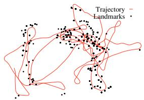

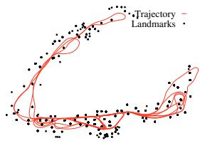

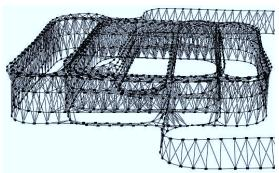

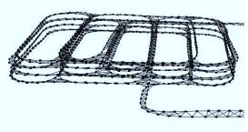

(a)  
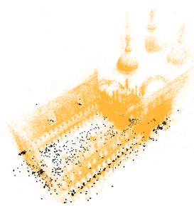

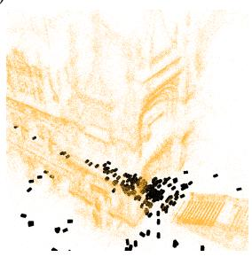  
(b)  
Fig. 1. Real-world datasets processed with our system: The first row of (a) shows the Victoria Park dataset which consists of 2D odometry and 2D landmark measurements. The second row of (a) depicts a 3D pose graph of a multi-level parking garage. While the left images shows the initial states, the right column depicts the respective result of the optimization process. Full and zoomed view of the Venice bundle adjustment dataset after being optimized by our system (b). The dataset consists of 871 camera poses and 2,838,740 projections.

In this paper, we describe a general framework for performing the optimization of nonlinear least squares problems that can be represented as a graph. We call this framework $\mathbf { g ^ { 2 } o }$ (for “general graph optimization”). Figure 1 gives an overview of the variety of problems that can be solved by using $\mathbf { g ^ { 2 } o }$ as an optimization back-end. The proposed system achieves a performance that is comparable with implementations of state-of-the-art algorithms, while being able to accept general forms of nonlinear measurements. We achieve efficiency by utilizing algorithms that

• exploit the sparse connectivity of the graph,

• take advantage of the special structures of the graph that often occur in the problems mentioned above,

• use advanced methods to solve sparse linear systems,

• and utilize the features of modern processors like SIMD instructions and optimize the cache usage.

Despite its efficiency, $\mathbf { g ^ { 2 } o }$ is highly general and extensible:

a 2D SLAM algorithm can be implemented in less than 30 lines of C++ code. The user only has to specify the error function and its parameters.

In this paper, we apply $\mathbf { g ^ { 2 } o }$ to different classes of least squares optimization problems and compare its performance with different implementations of problem-specific algorithms. We present evaluations carried out on a large set of real-world and simulated data-sets; in all experiments $\mathbf { g } ^ { 2 } \mathbf { \ell }$ o offered a performance comparable with the state-of-the-art approaches and in several cases even outperformed them.

The remainder of this paper is organized as follows. We first discuss the related work with a particular emphasis on solutions to the problems of SLAM and bundle adjustment. Subsequently, in Section III we characterize the graphembeddable optimization problems that are addressed by our system and discuss nonlinear least-squares via Gauss-Newton or LM. In Section IV we then discuss the features provided by our implementation. Finally, in Section V, we present an extensive experimental evaluation of $\mathbf { g ^ { 2 } o }$ and compare it to other state-of-the-art, problem-specific methods.

## II. RELATED WORK

In the past, the graph optimization problems have been studied intensively in the area of robotics and computer vision. One seminal work is that of Lu and Milios [19] where the relative motion between two scans was measured by scan-matching and the resulting graph was optimized by iterative linearization. While at that time, optimization of the graph was regarded as too time-consuming for realtime performance, recent advancements in the development of direct linear solvers (e.g., [4]), graph-based SLAM has regained popularity and a huge variety of different approaches to solve SLAM by graph optimization have been proposed. For example, Howard et al. [12] apply relaxation to build a map. Duckett $e t$ al. [6] propose the usage of Gauss-Seidel relaxation to minimize the error in the network of constraints. Frese et al. [8] introduced multi-level relaxation (MLR), a variant of Gauss-Seidel relaxation that applies the relaxation at different levels of resolution. Recently, Olson et al. [22] suggested a gradient descent approach to optimize pose graphs. Later, Grisetti et al. [10] extended this approach by applying a tree-based parameterization that increases the convergence speed. Both approaches are robust to the initial guess and rather easy to implement. However, they assume that the covariance is roughly spherical and thus have difficulties in optimizing pose-graphs where some constraints have covariances with null spaces or substantial differences in the eigenvalues.

Graph optimization can be viewed as a nonlinear leastsquares problem, which typically is solved by forming a linear system around the current state, solving, and iterating. One promising technique for solving the linear system is preconditioned conjugate gradient (PCG), which was used by Konolige [17] as well as Montemerlo and Thrun [20] as an efficient solver for large sparse pose constraint systems. Because of its high efficiency on certain problems, $\mathbf { g } ^ { 2 } { \mathsf { e } }$ o includes an implementation of a sparse PCG solver which applies a block-Jacobi pre-conditioner [13].

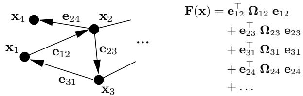  
Fig. 2. This example illustrates how to represent an objective function by a graph.

More recently, Dellaert and colleagues suggested a system called √SAM [5] which they implement using sparse direct linear solvers [4]. Kaess et al. [14] introduced a variant of this called iSAM that is able to update the linear matrix associated with the nonlinear least-squares problem. Konolige $e t$ al. [16] showed how to construct the linear matrix efficiently by exploiting the typical sparse structure of the linear system. However, the latter approach is restricted to 2D pose graphs. In $\mathbf { g ^ { 2 } o }$ we share similar ideas with these systems. Our system can be applied to both SLAM and BA optimization problems in all their variants, e.g., 2D SLAM with landmarks, BA using a monocular camera, or BA using stereo vision. However, $\mathbf { g ^ { \bar { 2 } } o }$ showed a substantially improved performance compared these systems on all the data we used for evaluation purposes.

In computer vision, Sparse Bundle Adjustment [27] is a nonlinear least-squares method that takes advantage of the sparsity of the Jacobian pattern between points and camera poses. Very recently, there have been several systems [15], [13] that advance similar concepts of sparse linear solvers and efficient calculation of the Schur reduction (see Section III-D) for large systems ( 100M sparse matrix elements). There are also new systems based on nonlinear conjugate gradient that never form the linear system explicitly [1], [2]; these converge more slowly, but can work with extremely large datasets ( 1000M matrix elements). In this paper we compare $\mathbf { g ^ { 2 } o }$ to the SSBA system of [15], which is the best performing publicly available system to date.

## III. NONLINEAR GRAPH OPTIMIZATION USING LEAST-SQUARES

Many problems in robotics or in computer vision can be solved by finding the minimum of a function of this form:

$$
\begin{array} { r l r } { { \bf F } ( { \bf x } ) } & { = } & { \displaystyle \sum _ { \langle i , j \rangle \in { \mathcal C } } \underbrace { { \bf e } ( { \bf x } _ { i } , { \bf x } _ { j } , { \bf z } _ { i j } ) ^ { \top } \Omega _ { i j } { \bf e } ( { \bf x } _ { i } , { \bf x } _ { j } , { \bf z } _ { i j } ) } _ { { \bf F } _ { i j } } } \end{array}\tag{1}
$$

$$
\begin{array} { r l r } { { \bf x } ^ { * } } & { { } = } & { \underset { \bf x } { \mathrm { a r g m i n } } { \bf F } ( { \bf x } ) . } \end{array}\tag{2}
$$

Here, $\mathbf { x } ~ = ~ ( \mathbf { x } _ { 1 } ^ { \top } , ~ \ldots ~ , \mathbf { x } _ { n } ^ { \top } ) ^ { \top }$ is a vector of parameters, where each $\mathbf { x } _ { i }$ represents a generic parameter block, $\mathbf { z } _ { i j }$ and $\Omega _ { i j }$ represent respectively the mean and the information matrix of a constraint relating the parameters $\mathbf { x } _ { j }$ and $\mathbf { x } _ { i } .$ , and $\mathbf { e } ( \mathbf { x } _ { i } , \mathbf { x } _ { j } , \mathbf { z } _ { i j } )$ is a vector error function that measures how well the parameter blocks $\mathbf { x } _ { i }$ and $\mathbf { x } _ { j }$ satisfy the constraint $\mathbf { z } _ { i j }$ . It is 0 when $\mathbf { x } _ { i }$ and $\mathbf { x } _ { j }$ perfectly match the constraint.

For simplicity of notation, in the rest of this paper we will encode the measurement in the indices of the error function:

$$
\mathbf { e } ( \mathbf { x } _ { i } , \mathbf { x } _ { j } , \mathbf { z } _ { i j } ) \stackrel { \mathrm { d e f . } } { = } \mathbf { e } _ { i j } ( \mathbf { x } _ { i } , \mathbf { x } _ { j } ) \stackrel { \mathrm { d e f . } } { = } \mathbf { e } _ { i j } ( \mathbf { x } ) .\tag{3}
$$

Note that each error function, each parameter block, and each error function can span a different space. A problem in this form can be effectively represented by a directed graph. A node i of the graph represents the parameter block $\mathbf { x } _ { i }$ and an edge between the nodes i and j represents an ordered constraint between the two parameter blocks x and $\mathbf { x } _ { j }$ . Figure 2 shows an example of mapping between a graph and an objective function.

## A. Least Squares Optimization

If a good initial guess x˘ of the parameters is known, a numerical solution of Eq. (2) can be obtained by using the popular Gauss-Newton or LM algorithms [23, 15.5]. The idea is to approximate the error function by its first order Taylor expansion around the current initial guess x˘

$$
\begin{array} { r l r } { \mathbf { e } _ { i j } \big ( \breve { \mathbf { x } } _ { i } + \Delta \mathbf { x } _ { i } , \breve { \mathbf { x } } _ { j } + \Delta \mathbf { x } _ { j } \big ) } & { = } & { \mathbf { e } _ { i j } \big ( \breve { \mathbf { x } } + \Delta \mathbf { x } \big ) } \end{array}\tag{4}
$$

$$
\begin{array} { r l } { \simeq } & { { } { \bf e } _ { i j } + { \bf J } _ { i j } \Delta { \bf x } . } \end{array}\tag{5}
$$

Here, $\mathbf { J } _ { i j }$ is the Jacobian of ${ \bf e } _ { i j } ( { \bf x } )$ computed in x˘ and ${ \bf e } _ { i j }$ def. ${ \bf e } _ { i j } ( \breve { \bf x } )$ . Substituting Eq. (5) in the error terms $\mathbf { F } _ { i j }$ of Eq. (1), we obtain

$$
\mathbf { F } _ { i j } ( \breve { \mathbf { x } } + \Delta \mathbf { x } )\tag{6}
$$

$$
\begin{array} { r l } { = } & { { } { \bf e } _ { i j } \left( \breve { \bf x } + \Delta { \bf x } \right) ^ { \top } \Omega _ { i j } { \bf e } _ { i j } \left( \breve { \bf x } + \Delta { \bf x } \right) } \end{array}\tag{7}
$$

$$
\begin{array} { r l } { \simeq } & { { } \left( { \bf e } _ { i j } + { \bf J } _ { i j } \Delta { \bf x } \right) ^ { \top } \Omega _ { i j } \left( { \bf e } _ { i j } + { \bf J } _ { i j } \Delta { \bf x } \right) } \end{array}\tag{8}
$$

$$
\begin{array} { r l } { = } & { { } \underbrace { \mathbf { e } _ { i j } ^ { \top } \pmb { \Omega } _ { i j } \mathbf { e } _ { i j } } _ { \mathrm { c } _ { i j } } + 2 \underbrace { \mathbf { e } _ { i j } ^ { \top } \pmb { \Omega } _ { i j } \mathbf { J } _ { i j } } _ { \mathbf { b } _ { i j } } \Delta \mathbf { x } + \Delta \mathbf { x } ^ { \top } \underbrace { \mathbf { J } _ { i j } ^ { \top } \pmb { \Omega } _ { i j } \mathbf { J } _ { i j } } _ { \mathbf { H } _ { i j } } \Delta \mathbf { x } \left( 9 \right) } \end{array}
$$

$$
\begin{array} { r l } { = } & { { } \mathrm { c } _ { i j } + 2 \mathrm { b } _ { i j } \Delta \mathbf { x } + \Delta \mathbf { x } ^ { \top } \mathbf { H } _ { i j } \Delta \mathbf { x } } \end{array}\tag{10}
$$

With this local approximation, we can rewrite the function $\mathbf { F } ( \mathbf { x } )$ given in Eq. (1) as

$$
\begin{array} { c c l } { \mathbf { F } ( \breve { \mathbf { x } } + \pmb { \Delta } \mathbf { x } ) } & { = } & { \displaystyle \sum _ { \langle i , j \rangle \in { \mathcal C } } \mathbf { F } _ { i j } ( \breve { \mathbf { x } } + \pmb { \Delta } \mathbf { x } ) } \end{array}\tag{11}
$$

$$
\simeq \sum _ { \langle i , j \rangle \in \mathcal { C } } \mathbf { c } _ { i j } + 2 \mathbf { b } _ { i j } \pmb { \Delta } \mathbf { x } + \pmb { \Delta } \mathbf { x } ^ { \top } \mathbf { H } _ { i j } \pmb { \Delta } \mathbf { x } ( 1 2 )
$$

$$
\begin{array} { r l } { = } & { { } \mathbf { { c } } + 2 \mathbf { b } ^ { \top } \mathbf { \Delta } \mathbf { { A } } \mathbf { { x } } + \mathbf { { A } } \mathbf { { x } } ^ { \top } \mathbf { { H } } \mathbf { \Delta } \mathbf { { A } } \mathbf { { x } } . } \end{array}\tag{13}
$$

The quadratic form in Eq. (13) is obtained from Eq. (12) by setting $\begin{array} { r } { \mathrm { { c } } = \sum { \mathrm { c } } _ { i j } , \mathbf { b } = \sum { \mathbf { b } } _ { i j } } \end{array}$ and $\mathbf { H } = \sum \mathbf { H } _ { i j }$ . It can be minimized in $\Delta \mathbf { x }$ by solving the linear system

$$
\begin{array} { r l r } { \mathbf { H } \Delta \mathbf { x } ^ { * } } & { { } = } & { - \mathbf { b } . } \end{array}\tag{14}
$$

Here, H is the information matrix of the system. The solution is obtained by adding the increments $\Delta \mathbf { x } ^ { * }$ to the initial guess

$$
\begin{array} { r l r } { { \bf x } ^ { * } } & { { } = } & { \breve { \bf x } + \Delta { \bf x } ^ { * } . } \end{array}\tag{15}
$$

The popular Gauss-Newton algorithm iterates the linearization in Eq. (13), the solution in Eq. (14), and the update step in Eq. (15). In every iteration, the previous solution is used as the linearization point and the initial guess until a given termination criterion is met.

The LM algorithm introduces a damping factor and backup actions to Gauss-Newton to control the convergence. Instead of solving Eq. 14, LM solves a damped version

$$
\begin{array} { r l r } { \left( \mathbf { H } + \lambda \mathbf { I } \right) \Delta \mathbf { x } ^ { * } } & { { } = } & { - \mathbf { b } . } \end{array}\tag{16}
$$

Here λ is a damping factor: the higher λ is the smaller the ∆x are. This is useful to control the step size in case of non-linear surfaces. The idea behind the LM algorithm is to dynamically control the damping factor. At each iteration the error of the new configuration is monitored. If the new error is lower than the previous one, λ is decreased for the next iteration. Otherwise, the solution is reverted and lambda is increased. For a more detailed explanation of the LM algorithm implemented in our framework we refer to [18].

## B. Alternative Parameterizations

The procedures described above are general approaches to multivariate function minimization. They assume that the space of parameters x is Euclidean, which is not valid for several problems like SLAM or bundle adjustment. To deal with state variables that span over non-Euclidean space, a common approach is to express the increments $\Delta { \bf x } _ { i }$ in a space different from the one of the parameters xi.

For example, in the context of SLAM problem, each parameter block $\mathbf { x } _ { i }$ consists of a translation vector $\mathbf { t } _ { i }$ and a rotational component $\alpha _ { i } .$ . The translation $\mathbf { t } _ { i }$ clearly forms a Euclidean space. In contrast to that, the rotational com ponents $\alpha _ { i }$ span over the non-Euclidean 2D or 3D rotation group $S O ( 2 )$ or $S O ( 3 )$ . To avoid singularities, these spaces are usually described in an over-parameterized way, e.g., by rotation matrices or quaternions. Directly applying Eq. (15) to these over-parameterized representations breaks the constraints induced by the over-parameterization. To overcome this problem, one can use a minimal representation for the rotation (like Euler angles in 3D). This, however, is then subject to singularities.

An alternative idea is to compute a new error function where the $\Delta { \bf x } _ { i }$ are perturbations around the current variable $\breve { \mathbf { x } } _ { i } . \quad \Delta \mathbf { x } _ { i }$ uses a minimal representation for the rotations, while $\mathbf { x } _ { i }$ utilizes an over-parameterized one. Since the $\Delta { \bf x } _ { i }$ are usually small, they are far from the singularities. The new value of a variable $\mathbf { x } _ { i } ^ { * }$ after the optimization can be obtained by applying the increment through a nonlinear operator $\boxed { \pmb { \Sigma } } : \mathrm { D o m } ( \mathbf { x } _ { i } ) \times \mathrm { D o m } ( \mathbf { \Delta \Delta x } _ { i } )  \mathrm { D o m } ( \mathbf { x } _ { i } )$ as follows:

$$
\begin{array} { r l r } { { \bf x } _ { i } ^ { * } } & { { } = } & { \breve { \bf x } _ { i } \boxplus \Delta { \bf x } _ { i } ^ { * } . } \end{array}\tag{17}
$$

For instance, in case of 3D SLAM one can represent the increments $\Delta { \bf x } _ { i }$ by the translation vector and the axis of a normalized quaternion. The poses $\mathbf { x } _ { i }$ are represented as a translation vector and a full quaternion. The ⊞ operator applies the increment $\pmb { \Delta x } _ { i }$ to $\mathbf { x } _ { i }$ by using the standard motion composition operator  (see [25]) after converting the increment to the same representation as the state variable:

$$
\begin{array} { r } { \check { \mathbf { x } } _ { i } \boxplus \pmb { \Delta } \mathbf { x } _ { i } ^ { * } \quad \stackrel { \mathrm { d e f . } } { = } \quad \check { \mathbf { x } } _ { i } \oplus \pmb { \Delta } \mathbf { x } _ { i } ^ { * } . } \end{array}\tag{18}
$$

With this operator, a new error function can be defined as

$$
\begin{array} { r l } & { \mathbf { e } _ { i j } ( \Delta \mathbf { x } _ { i } , \Delta \mathbf { x } _ { j } ) \stackrel { \mathrm { d e f . } } { = } \mathbf { e } _ { i j } ( \breve { \mathbf { x } } _ { i } \boxplus \Delta \mathbf { x } _ { i } , \breve { \mathbf { x } } _ { j } \boxplus \Delta \mathbf { x } _ { j } ) } \\ & { \qquad = \mathbf { e } _ { i j } ( \breve { \mathbf { x } } \boxplus \Delta \mathbf { x } ) \simeq \mathbf { e } _ { i j } + \mathbf { J } _ { i j } \Delta \mathbf { x } , } \end{array}\tag{19}
$$

(20)

where $\breve { \mathbf { x } }$ spans over the original over-parameterized space. The Jacobian $\mathbf { J } _ { i j }$ becomes

$$
\begin{array} { r l r } { { \bf J } _ { i j } } & { = } & { \frac { \partial { \bf e } _ { i j } ( \breve { \bf x } \boxplus \underline { { \bf \bf \delta } } { \bf \bf \bf \bf \underline { { \bf \delta } } } { \bf \bf \bf \underline { { \bf \delta } } } ) } { \partial { \bf \underline { { \bf \delta } } } { \bf \bf \bf \underline { { \bf \delta } } } } \Big \vert _ { { \bf \Delta } { \bf x } = { \bf 0 } } . } \end{array}\tag{21}
$$

Since the increments $\pmb { \Delta } \tilde { \mathbf { x } } ^ { * }$ are computed in the local Euclidean surroundings of the initial guess x˘, they need to be re-mapped into the original redundant space by the ⊞ operator.

Our framework allows for the easy definition of different spaces for the increments and the state variables and thus transparently supports arbitrary parameterizations within the same problem. Regardless the choice of the parameterization, the structure of the Hessian H is in general preserved.

## C. Structure of the Linearized System

According to Eq. (13), the matrix H and the vector b are obtained by summing up a set of matrices and vectors, one for every constraint. If we set $\mathbf { b } _ { i j } = \mathbf { J } _ { i j } ^ { \top } \pmb { \Omega } _ { i j } \mathbf { e } _ { i j }$ and $\mathbf { H } _ { i j } = \mathbf { J } _ { i j } ^ { \top } \pmb { \Omega } _ { i j } \mathbf { J } _ { i j }$ we can rewrite b and H as

$$
\mathbf { b } = \sum _ { \langle i , j \rangle \in { \mathcal C } } \mathbf { b } _ { i j } \qquad \mathbf { H } = \sum _ { \langle i , j \rangle \in { \mathcal C } } \mathbf { H } _ { i j } .\tag{22}
$$

Every constraint will contribute to the system with an addend term. The structure of this addend depends on the Jacobian of the error function. Since the error function of a constraint depends only on the values of two nodes, the Jacobian in Eq. (5) has the following form:

$$
\begin{array} { r l r } { { \bf J } _ { i j } } & { = } & { \left( \bf 0 \ldots \tt _ { d } \underbrace { { A } _ { i j } } _ { i } \bf 0 \ldots \underbrace { { 0 } _ { i j } } _ { j } \bf 0 \ldots \bf 0 \underbrace { { B } _ { i j } } _ { j } \bf 0 \ldots \bf 0 \right) . } \end{array}\tag{23}
$$

Here $\mathbf { A } _ { i j }$ and $\mathbf { B } _ { i j }$ are the derivatives of the error function with respect to ∆x and $\Delta \mathbf { x } _ { j }$ . From Eq. (9) we obtain the following structure for the block matrix $\mathbf { \dot { H } } _ { i j } \mathbf { : }$

$$
\mathbf { H } _ { i j } = \left( \begin{array} { c } { \ddots } \\ { \mathbf { A } _ { i j } ^ { \top } \pmb { \Omega } _ { i j } \mathbf { A } _ { i j } \ \cdots \ \mathbf { A } _ { i j } ^ { \top } \pmb { \Omega } _ { i j } \mathbf { B } _ { i j } } \\ { \vdots } \\ { \mathbf { B } _ { i j } ^ { \top } \pmb { \Omega } _ { i j } \mathbf { A } _ { i j } \ \cdots \ \mathbf { B } _ { i j } ^ { \top } \pmb { \Omega } _ { i j } \mathbf { B } _ { i j } } \\ { \vdots } \end{array} \right) \mathbf { b } _ { i j } = \left( \begin{array} { c } { \vdots } \\ { \mathbf { A } _ { i j } ^ { \top } \pmb { \Omega } _ { i j } \mathbf { e } _ { i j } } \\ { \vdots } \\ { \mathbf { B } _ { i j } ^ { \top } \pmb { \Omega } _ { i j } \mathbf { e } _ { i j } } \\ { \vdots } \end{array} \right)
$$

For simplicity of notation we omitted the zero blocks. The reader might notice that the block structure of the matrix H is the adjacency matrix of the graph. Thus, it has a number of non-zero blocks proportional to number of edges in the graph. This typically results in sparse H matrices. In $\mathbf { g ^ { 2 } o }$ we take advantage of this characteristic of H by utilizing stateof-the-art approaches to solve the linear system of Eq. (14).

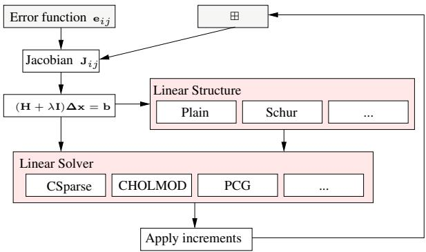  
Fig. 3. Overview of our framework. For addressing a new optimization problem, only the boxes in gray need to specified. Furthermore, the framework allows to add different linear solvers.

## D. Systems Having Special Structure

Certain problems (for instance, BA) result in an H matrix that has an even more characteristic structure. Our system can take advantage of these special structures to improve the performance. In BA there are in general two types of variables, namely the poses p of the camera and the poses l of the landmarks observed by the camera. By reordering the variables in $\operatorname { E q . }$ (14) so that the camera poses have the lower indices we obtain the system

$$
\begin{array} { r l r } { \left( \mathbf { H } _ { \mathbf { p } \mathbf { p } } \quad \mathbf { H } _ { \mathbf { p } \mathbf { l } } \right) \left( \mathbf { \Delta } \mathbf { x } _ { \mathbf { p } } ^ { * } \right) } & { = } & { \left( \mathbf { - b } _ { \mathbf { p } } \right) . } \\ { \left( \mathbf { H } _ { \mathbf { p } \mathbf { l } } ^ { \top } \quad \mathbf { H } _ { \mathbf { l } \mathbf { l } } \right) \left( \mathbf { \Delta } \mathbf { \Delta } \mathbf { x } _ { \mathbf { l } } ^ { * } \right) } & { = } & { \left( \mathbf { - b } _ { \mathbf { l } } \right) . } \end{array}\tag{24}
$$

It can be shown that an equivalent reduced system is formed by taking the Schur complement of the H matrix [7]

$$
\left( \mathbf { H _ { p p } } - \mathbf { H _ { p l } } \mathbf { H _ { \mathrm { l l } } ^ { - 1 } } \mathbf { H _ { p l } ^ { \top } } \right) \ \Delta \mathbf { x _ { p } ^ { * } } \ = \ - \mathbf { b _ { p } } + \mathbf { H _ { p l } } \mathbf { H _ { l l } ^ { - 1 } } \mathbf { b _ { l } } .\tag{25}
$$

Note that calculating ${ \bf { H } } _ { \mathrm { { I I } } } ^ { - 1 }$ is easy, since $\mathbf { H } _ { \mathrm { l l } }$ is a blockdiagonal matrix. Solving Eq. (25) yields the increments $\Delta \mathbf { x } _ { \mathbf { p } } ^ { * }$ for the cameras and using this we can solve

$$
\begin{array} { r l r } { \mathbf { H } _ { \mathrm { 1 1 } } \Delta \mathbf { x } _ { \mathrm { 1 } } ^ { \ast } } & { = } & { - \mathbf { b } _ { \mathrm { 1 } } - \mathbf { H } _ { \mathrm { p 1 } } ^ { \top } \Delta \mathbf { x } _ { \mathbf { p } } ^ { \ast } , } \end{array}\tag{26}
$$

which results in $\Delta \mathbf { x } _ { \mathrm { 1 } } ^ { \ast }$ for adjusting the observed world features. Typically the world features outnumber the camera poses, therefore Eq. (25) can be solved faster than Eq. (14) despite the additional time spent to calculate the left-hand side matrix in Eq. (25).

## IV. IMPLEMENTATION

Our C++ implementation aims to be as fast as possible while remaining general. We achieve this goal by implementing abstract base classes for vertices and edges in our graph. Both base classes provide a set of virtual functions for easy user subclassing, while most of the internal operations are implemented using template arguments for efficiency. We use the Eigen linear algebra package [11] which applies SSE instructions among other optimization techniques, such lazy evaluation and loop unrolling to achieve high performance.

Figure 3 depicts the design of our system. Only the boxes in gray need to be defined to address a new optimization problem. Using the provided base class, deriving a new type of node only requires defining the ⊞ operator for applying the increments. An edge connecting two nodes $\mathbf { x } _ { i }$ and $\mathbf { x } _ { j }$ requires the definition of the error function $\mathbf { e } _ { i j } ( \cdot )$ . The Jacobian $\mathbf { J } _ { i j }$ is then evaluated numerically, or, for higher efficiency, the user can specify $\mathbf { J } _ { i j }$ explicitly by overwriting the virtual base-class function. Thus, implementing new types for addressing a new optimization problem or comparing different parameterizations is a matter of writing a few lines of code.

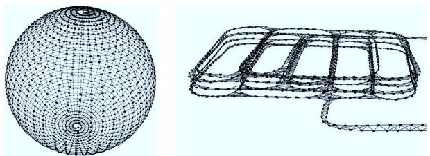  
Fig. 4. 3D pose-graph datasets used for evaluating $\mathbf { g } ^ { 2 } \mathbf { o } \colon$ the left image shows a simulated sphere, the right image depicts a partial view of a realworld dataset of a multi-level parking garage.

The computation of H in the general case uses matrices of a variable size. If the dimension of the variables, i.e., the dimension of $\mathbf { x } _ { i } ,$ , is known in advance, our framework allows fixed-size matrix computations. Exploiting the a-priori known dimensions enables compile-time optimizations such as loop unrolling to carry out matrix multiplications.

Special care has been taken in implementing matrix multiplications required for the Schur reduction in Eq. (25). The sparse structure of the underlying graph is exploited to only multiply non-zero entries required to form the extra entries of $\bf { H _ { p p } }$ . Additionally, we operate on the block structures of the underlying matrix (see [15]), which results in a cache efficient matrix multiplication compared to a scalar matrix multiplication.

Our framework is agnostic with respect to the embedded linear solver, so we can apply appropriate ones for different problems. We have used two solvers for experiments. Since H is positive semi-definite and symmetric, sparse Cholesky decomposition results in a an efficient solver [4], [3]. Note that the non-zero pattern during the least-squares iterations is constant. We therefore are able to reuse a symbolic decomposition computed within the first iteration, which results in a reduced fill-in and reduces the overall computation time in subsequent iterations. Note that this Cholesky decomposition does not take advantage of the block structure of the parameters. The second method is Preconditioned Conjugate Gradient (PCG) with a block Jacobi pre-conditioner [13], which takes advantage of block matrix operations throughout. As PCG itself is an iterative method, solving a linear system requires n iterations for a n n matrix. Since carrying out n iterations of PCG is typically slower than Cholesky decomposition, we limit the number of iterations based on the relative decrease in the squared residual of PCG. By this we are able to quantify the loss in the accuracy of the solution introduced by terminating PCG early. In the experiments we will compare the different solvers.

## V. EXPERIMENTS

In this section, we present experiments in which we compare $\mathbf { g } ^ { 2 } { \mathsf { e } }$ o with other state-of-the-art optimization approaches using both real-world and synthetic datasets. Figure 4 depict the 3D pose-graph data sets, in Figure 5 the BA datasets and the pose-graph of the Keble college, which is used to perform scale drift-aware SLAM using 7 DoF similarity constraints [26], are visualized, and Figure 6 shows the 2D datasets. The number of variables and constraints is given in Table I for each of the datasets. All experiments are executed on one core of an Intel Core i7-930 running at 2.8 Ghz.

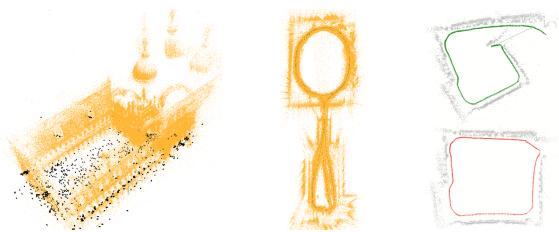  
Fig. 5. The BA real world datasets and the scale-drift dataset used for evaluating $\mathbf { g } ^ { 2 }$ o: the left image shows the Venice dataset, whereas the middle image depicts the New College dataset [24]. The pair of images on the right shows the Keble college dataset which was processed by monocular SLAM. Here, scale drift occurs (top) which can be corrected when closing the loop using 7 DoF similarity transformations (bottom).

TABLE I  
OVERVIEW OF THE TEST DATASETS.
<table><tr><td rowspan=1 colspan=1>Dataset</td><td rowspan=1 colspan=1># poses</td><td rowspan=1 colspan=1># landmarks</td><td rowspan=1 colspan=1># constraints</td></tr><tr><td rowspan=1 colspan=1>Intel</td><td rowspan=1 colspan=1>943</td><td rowspan=1 colspan=1></td><td rowspan=1 colspan=1>1837</td></tr><tr><td rowspan=1 colspan=1>MIT</td><td rowspan=1 colspan=1>5489</td><td rowspan=1 colspan=1>1</td><td rowspan=1 colspan=1>7629</td></tr><tr><td rowspan=1 colspan=1>Manhattan3500</td><td rowspan=1 colspan=1>3500</td><td rowspan=1 colspan=1>=</td><td rowspan=1 colspan=1>5598</td></tr><tr><td rowspan=1 colspan=1>Victoria</td><td rowspan=1 colspan=1>6969</td><td rowspan=1 colspan=1>151</td><td rowspan=1 colspan=1>10608</td></tr><tr><td rowspan=1 colspan=1>Grid5000</td><td rowspan=1 colspan=1>5000</td><td rowspan=1 colspan=1>6412</td><td rowspan=1 colspan=1>82486</td></tr><tr><td rowspan=1 colspan=1>Sphere</td><td rowspan=1 colspan=1>2500</td><td rowspan=1 colspan=1></td><td rowspan=1 colspan=1>4949</td></tr><tr><td rowspan=1 colspan=1>Garage</td><td rowspan=1 colspan=1>1661</td><td rowspan=1 colspan=1>=</td><td rowspan=1 colspan=1>6275</td></tr><tr><td rowspan=1 colspan=1>Venice</td><td rowspan=1 colspan=1>871</td><td rowspan=1 colspan=1>530304</td><td rowspan=1 colspan=1>2838740</td></tr><tr><td rowspan=1 colspan=1>New College</td><td rowspan=1 colspan=1>3500</td><td rowspan=1 colspan=1>488141</td><td rowspan=1 colspan=1>2124449</td></tr><tr><td rowspan=1 colspan=1>Scale Drift</td><td rowspan=1 colspan=1>740</td><td rowspan=1 colspan=1>=</td><td rowspan=1 colspan=1>740</td></tr></table>

We compare $\mathbf { g ^ { 2 } o }$ with other state-of-the-art implementations: $\sqrt { \mathbf { S A M } }$ [5] using the open-source implementation by M. Kaess, SPA [16], sSBA [15], and RobotVision [26]. Note that these approaches are only targeting a subset of optimization problems while $\mathbf { g ^ { 2 } o }$ is able to solve all of them, and also extends easily to new problems.

## A. Runtime Comparison

In the following, we report the time needed by each approach to carry out one iteration. We provided each approach with the full optimization problem and carried out 10 iterations, and measured the average time spent per iteration. In this set of experiments $\mathbf { g ^ { 2 } o }$ applies Cholesky decomposition to solve the linear system using CHOLMOD, which is also used by the approaches we compare to. Therefore, the time required to solve the linear system is similar for all approaches and the difference reflects the efficiency in constructing the linear system. The results are summarized in Figure 7.

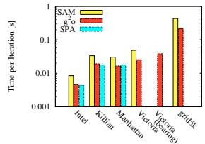

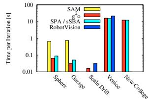  
Fig. 7. Time per iteration for each approach on each dataset.

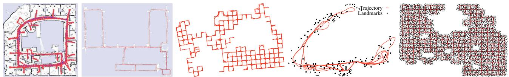

Fig. 6. 2D Datasets used for evaluating $\mathbf { g } ^ { 2 } \mathbf { o } .$ . From left to right: 2D pose-graph of the Intel Research Lab; 2D pose-graph of the Killian Court; Manhattan3500, a simulated pose-graph; 2D dataset with landmarks of the Victoria Park; and Grid5000, a simulated landmark dataset.  
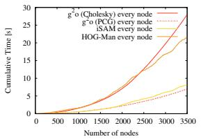

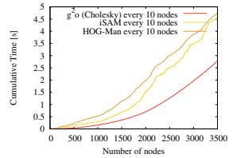  
Fig. 8. Online processing of the Manhattan3500 dataset. The left image shows the runtime for optimizing after inserting a single node whereas the right image show the runtime for optimizing after inserting 10 nodes.

Our system $\mathbf { g ^ { 2 } o }$ is faster than the implementation of $\sqrt { \mathrm { S A M } }$ on all the 2D and 3D datasets we tested. While in principle they implement the same algorithm, $\mathbf { g ^ { 2 } o }$ takes advantage of an efficient front end to generate the linearized problem. On the 2D pose graph datasets the runtime of our framework is comparable to the highly optimized SPA implementation. On the BA datasets $\mathbf { g ^ { 2 } { \bar { o } } }$ achieves a similar performance to sSBA, which is slightly faster than our general framework. Compared to RobotVision, $\mathbf { g ^ { 2 } o }$ is on average two times faster.

Note that while $\mathbf { g ^ { 2 } o }$ focuses on batch optimization, it can be used to process the data incrementally by optimizing after adding nodes to the graph. The efficiency of $\mathbf { g ^ { 2 } o }$ yields performance similar to approaches that are designed for incremental use, such as iSAM [14] or HOG-Man [9]. As visualized in Figure 8, by optimizing every 10 nodes or by relaxing the termination criterion of PCG for optimizing after inserting a single node $\mathbf { g ^ { 2 } o }$ can achieve acceptable run-times. Furthermore, it can be used as an efficient building block of more complex online systems [21], [9].

As mentioned, $\mathbf { g ^ { 2 } o }$ can compute the Jacobian $\mathbf { J } _ { i j }$ numerically, which allows rapid prototyping of a new optimization problem or a new error function. However, by specifying the Jacobians analytically one can achieve a substantial speed-up. For instance, the time required by one iteration of $\mathbf { g ^ { 2 } o }$ on the Garage dataset drops from 80 ms to 40 ms when specifying the analytic Jacobian. Despite the reduced efficiency we did not observe a decrease in the accuracy when using the numeric Jacobian.

## B. Testing different Parameterizations

Since our framework only requires to implement the error function and the update step, we are able to easily compare different parameterizations. To this end, we implemented two different parameterizations for representing poses in BA. In the first parametrization, the increment $\Delta x _ { i }$ is represented by a translation vector and the axis of a unit quaternion. Whereas in the second one, the increments $\pmb { \Delta x } _ { i }$ are represented by members of the Lie algebra se(3) [26]. We applied the different parameterizations to the New College and Venice datasets. The evolution of the error is depicted in Figure 9. Both parameterizations converge to the same solution, but convergence occurs faster using se(3).

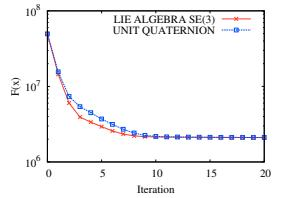

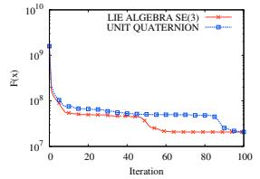  
Fig. 9. Evolution of F(x) using unit quaternions versus the Lie algebra se(3) on the New College dataset (left) and Venice (right) dataset.  
TABLE II

COMPARISON OF DIFFERENT LINEAR SOLVERS (TIME IN SECONDS).
<table><tr><td rowspan=1 colspan=1>Dataset</td><td rowspan=1 colspan=1>CHOLMOD</td><td rowspan=1 colspan=1>CSparse</td><td rowspan=1 colspan=1>PCG</td></tr><tr><td rowspan=1 colspan=1>Intel</td><td rowspan=1 colspan=1>0.0028</td><td rowspan=1 colspan=1>0.0025</td><td rowspan=1 colspan=1> $0 . 0 0 6 4 \pm 0 . 0 0 2 6$ </td></tr><tr><td rowspan=1 colspan=1>MIT</td><td rowspan=1 colspan=1>0.0086</td><td rowspan=1 colspan=1>0.0077</td><td rowspan=1 colspan=1> $0 . 3 8 1 \pm 0 . 3 6 4$ </td></tr><tr><td rowspan=1 colspan=1>Manhattan3500</td><td rowspan=1 colspan=1>0.018</td><td rowspan=1 colspan=1>0.018</td><td rowspan=1 colspan=1> $\mathbf { 0 . 0 1 1 \pm 0 . 0 0 0 9 }$ </td></tr><tr><td rowspan=1 colspan=1>Victoria</td><td rowspan=1 colspan=1>0.026</td><td rowspan=1 colspan=1>0.023</td><td rowspan=1 colspan=1> $1 . 5 5 9 \pm 0 . 6 8 3$ </td></tr><tr><td rowspan=1 colspan=1>Grid5000</td><td rowspan=1 colspan=1>0.178</td><td rowspan=1 colspan=1>0.484</td><td rowspan=1 colspan=1> $1 . 9 9 6 \pm 1 . 1 8 5$ </td></tr><tr><td rowspan=1 colspan=1>Sphere</td><td rowspan=1 colspan=1>0.055</td><td rowspan=1 colspan=1>0.398</td><td rowspan=1 colspan=1> $\mathbf { 0 . 0 2 2 \ : \pm { \ : 0 . 0 1 9 } }$ </td></tr><tr><td rowspan=1 colspan=1>Garage</td><td rowspan=1 colspan=1>0.019</td><td rowspan=1 colspan=1>0.032</td><td rowspan=1 colspan=1> $\mathbf { 0 . 0 1 7 \ : \pm { \ : 0 . 0 1 6 } }$ </td></tr><tr><td rowspan=1 colspan=1>New College</td><td rowspan=1 colspan=1>6.19</td><td rowspan=1 colspan=1>200.6</td><td rowspan=1 colspan=1> $\mathbf { 0 . 7 7 8 \pm 0 . 2 0 1 }$ </td></tr><tr><td rowspan=1 colspan=1>Venice</td><td rowspan=1 colspan=1>1.86</td><td rowspan=1 colspan=1>39.1</td><td rowspan=1 colspan=1> $\mathbf { 0 . 2 8 7 \ : \pm 0 . 1 3 5 }$ </td></tr><tr><td rowspan=1 colspan=1>Scale Drift</td><td rowspan=1 colspan=1>0.0034</td><td rowspan=1 colspan=1>0.0032</td><td rowspan=1 colspan=1> $\overline { { 0 . 0 0 5 \pm 0 . 0 1 } }$ </td></tr></table>

## C. Comparison of Linear Solvers

Our system allows different linear solvers to solve either Eq. (14) or Eq. (25). We currently have implemented two solvers based on Cholesky decomposition, namely CHOLMOD and CSparse [4]. Additionally, we implemented PCG as an iterative method using a block-Jacobi preconditioner. Table II summarizes the time required for solving the linear system on several datasets. PCG performs very well on the New College and Venice datasets, where it is around 7 times faster than CHOLMOD. The PCG convergence depends on how close the initial guess is to the optimum. We terminate PCG if the relative residual is below a given threshold $( 1 0 ^ { - 8 }$ in the experiments). Therefore, PCG requires more time to converge, for example, on the MIT or Victoria datasets. CHOLMOD is faster by up to a factor of 30 than CSparse on the larger datasets. But surprisingly CSparse is the fastest solver on the smaller instances like the MIT dataset where it outperforms both CHOLMOD and PCG.

## D. Utilizing the Knowledge about the Structure

As discussed in Section III-D, certain problems have a characteristic structure. Using this structure may result in substantial improvements in the solution of the linear system. Landmark-based SLAM and BA have the same linear structure: the landmarks/points can be only connected with the robot poses/cameras, resulting in a block diagonal structure for the landmark part of the Hessian $\mathbf { H } _ { l l }$

TABLE III  
COMPARISON OF DIFFERENT LINEAR SOLVERS. WE MEASURED THE AVERAGE TIME PER ITERATION OF $\mathbf { g ^ { 2 } o }$ (IN SECONDS).
<table><tr><td rowspan=1 colspan=1>Dataset</td><td rowspan=1 colspan=1>direct solutionsolve</td><td rowspan=1 colspan=1>Schur decompositionbuild / solve / total</td></tr><tr><td rowspan=1 colspan=1>Victoria</td><td rowspan=1 colspan=1>0.026</td><td rowspan=1 colspan=1>0.029 / 0.121 / 0.150</td></tr><tr><td rowspan=1 colspan=1>Grid5000</td><td rowspan=1 colspan=1>0.18</td><td rowspan=1 colspan=1>0.12 / 0.16 / 0.28</td></tr><tr><td rowspan=1 colspan=1>New College</td><td rowspan=1 colspan=1>15.18</td><td rowspan=1 colspan=1>3.37 / 7.07 / 10.44</td></tr><tr><td rowspan=1 colspan=1>Venice</td><td rowspan=1 colspan=1>33.87</td><td rowspan=1 colspan=1>11.25 / 1.78 / 13.03</td></tr></table>

In this experiment we evaluate the advantages of using this specific decomposition for landmark based-SLAM and BA. Table III shows the timing for the different datasets where we enabled and disabled the decomposition. From the table it is evident that preforming the decomposition results in a substantial speedup when the landmarks outnumber the poses, which is the typically the case in BA. However, when the number of poses becomes dominant, performing the Schur marginalization leads to a highly connected system that is only slightly reduced in size, and requires more effort to be solved.

## VI. CONCLUSIONS

In this paper we presented $\mathbf { g ^ { 2 } o }$ , an extensible and efficient open-source framework for batch optimization of functions that can be embedded in a graph. Relevant problems falling into this class are graph-based SLAM and bundle adjustment, two fundamental and highly related problems in robotics and computer vision. To utilize $\mathbf { g ^ { 2 } o }$ one simply has to define the error function and a procedure for applying a perturbation to the current solution. Furthermore, one can easily embed in the system new linear solvers and thus verify the characteristics of the specific solver for a wide range of problems sharing this graph structure. We showed the applicability of $\mathbf { g ^ { 2 } o }$ to various variants of SLAM (2D, 3D, pose-only, and with landmarks) and to bundle adjustment. Practical experiments carried out on extensive datasets demonstrate that $\mathbf { g } ^ { 2 } \mathbf { c }$ achieves performance comparable to implementations of problem-specific algorithms and often even outperforms them. An open-source implementation of the entire system is freely available as part of ROS and on OpenSLAM.org.

## ACKNOWLEDGMENTS

We thank E. Olson for the Manhattan3500 dataset, E. Nebot and H. Durrant-Whyte for the Victoria Park dataset, N. Snavely for the Venice dataset, and M. Kaess for providing a highly efficient implementation of iSAM.

## REFERENCES

[1] S. Agarwal, N. Snavely, S. M. Seitz, and R. Szeliski, “Bundle adjustment in the large,” in Proc. of the European Conf. on Computer Vision (ECCV), 2010.

[2] M. Byrod and K. Astroem, “Conjgate gradient bundle adjustment,” in Proc. of the European Conf. on Computer Vision (ECCV), 2010.

[3] Y. Chen, T. A. Davis, W. W. Hager, and S. Rajamanickam, “Algorithm 887: Cholmod, supernodal sparse cholesky factorization and update/downdate,” ACM Trans. Math. Softw., vol. 35, no. 3, pp. 1– 14, 2008.

[4] T. A. Davis, Direct Methods for Sparse Linear Systems. SIAM, 2006, part of the SIAM Book Series on the Fundamentals of Algorithms.

[5] F. Dellaert and M. Kaess, “Square Root SAM: Simultaneous localization and mapping via square root information smoothing,” Int. Journal of Robotics Research, vol. 25, no. 12, pp. 1181–1204, Dec 2006.

[6] T. Duckett, S. Marsland, and J. Shapiro, “Fast, on-line learning of globally consistent maps,” Autonomous Robots, vol. 12, no. 3, pp. 287 – 300, 2002.

[7] U. Frese, “A proof for the approximate sparsity of SLAM information matrices,” in Proc. of the IEEE Int. Conf. on Robotics & Automation (ICRA), 2005.

[8] U. Frese, P. Larsson, and T. Duckett, “A multilevel relaxation algorithm for simultaneous localisation and mapping,” IEEE Transactions on Robotics, vol. 21, no. 2, pp. 1–12, 2005.

[9] G. Grisetti, R. Kummerle, C. Stachniss, U. Frese, and C. Hertzberg, ¨ “Hierarchical optimization on manifolds for online 2d and 3d mapping,” in Proc. of the IEEE Int. Conf. on Robotics & Automation (ICRA), 2010.

[10] G. Grisetti, C. Stachniss, and W. Burgard, “Non-linear constraint network optimization for efficient map learning,” IEEE Trans. on Intelligent Transportation Systems, 2009.

[11] G. Guennebaud, B. Jacob, et al., “Eigen v3,” http://eigen.tuxfamily.org, 2010.

[12] A. Howard, M. Mataric, and G. Sukhatme, “Relaxation on a mesh:´ a formalism for generalized localization,” in Proc. of the IEEE/RSJ Int. Conf. on Intelligent Robots and Systems (IROS), 2001.

[13] Y. Jeong, D. Nister, D. Steedly, R. Szeliski, and I. Kweon, “Pushing the envelope of modern methods for bundle adjustment,” in Proc. of the IEEE Conf. on Comp. Vision and Pattern Recognition (CVPR), 2010.

[14] M. Kaess, A. Ranganathan, and F. Dellaert, “iSAM: Incremental smoothing and mapping,” IEEE Trans. on Robotics, vol. 24, no. 6, pp. 1365–1378, Dec 2008.

[15] K. Konolige, “Sparse sparse bundle adjustment,” in Proc. ofthe British Machine Vision Conference (BMVC), 2010.

[16] K. Konolige, G. Grisetti, R. Kummerle, W. Burgard, B. Limketkai,¨ and R. Vincent, “Sparse pose adjustment for 2d mapping,” in Proc. of the IEEE/RSJ Int. Conf. on Intelligent Robots and Systems (IROS), 2010.

[17] K. Konolige, “Large-scale map-making,” in Proc. of the National Conference on Artificial Intelligence (AAAI), 2004.

[18] M. A. Lourakis and A. Argyros, “SBA: A Software Package for Generic Sparse Bundle Adjustment,” ACM Trans. Math. Software, vol. 36, no. 1, pp. 1–30, 2009.

[19] F. Lu and E. Milios, “Globally consistent range scan alignment for environment mapping,” Autonomous Robots, vol. 4, pp. 333–349, 1997.

[20] M. Montemerlo and S. Thrun, “Large-scale robotic 3-d mapping of urban structures,” in Proc. of the Int. Symposium on Experimental Robotics (ISER), 2004.

[21] K. Ni and F. Dellaert, “Multi-level submap based SLAM using nested dissection,” in Proc. of the IEEE/RSJ Int. Conf. on Intelligent Robots and Systems (IROS), 2010.

[22] E. Olson, J. Leonard, and S. Teller, “Fast iterative optimization of pose graphs with poor initial estimates,” in Proc. of the IEEE Int. Conf. on Robotics & Automation (ICRA), 2006, pp. 2262–2269.

[23] W. Press, S. Teukolsky, W. Vetterling, and B. Flannery, Numerical Recipes, 2nd Edition. Cambridge Univ. Press, 1992.

[24] M. Smith, I. Baldwin, W. Churchill, R. Paul, and P. Newman, “The new college vision and laser data set,” Int. Journal of Robotics Research, vol. 28, no. 5, pp. 595–599, May 2009.

[25] R. Smith, M. Self, and P. Cheeseman, “Estimating uncertain spatial realtionships in robotics,” in Autonomous Robot Vehicles, I. Cox and G. Wilfong, Eds. Springer Verlag, 1990, pp. 167–193.

[26] H. Strasdat, J. M. M. Montiel, and A. Davison, “Scale drift-aware large scale monocular SLAM,” in Proc. of Robotics: Science and Systems (RSS), 2010.

[27] B. Triggs, P. F. McLauchlan, R. I. Hartley, and A. W. Fitzibbon, “Bundle adjustment - a modern synthesis,” in Vision Algorithms: Theory and Practice, ser. LNCS. Springer Verlag, 2000, pp. 298–375.