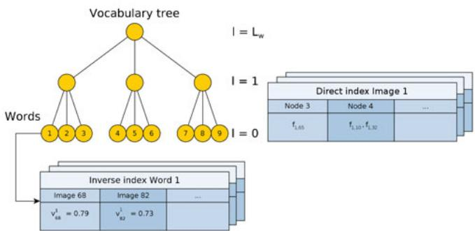
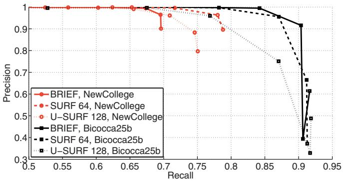
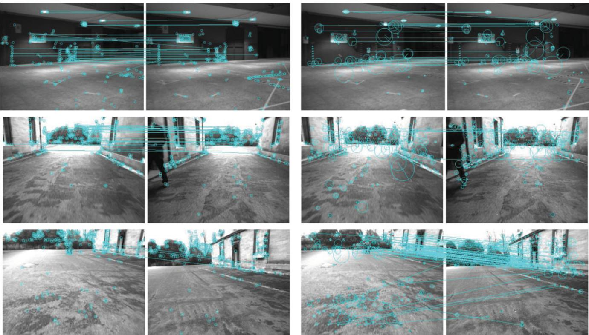
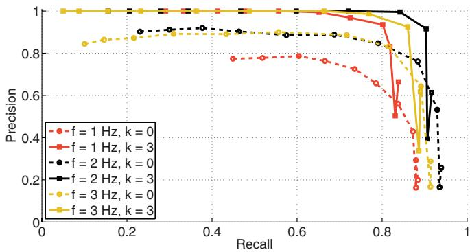
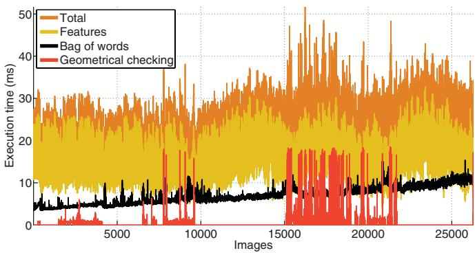
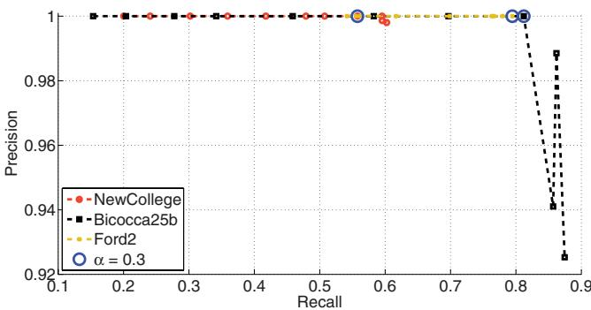
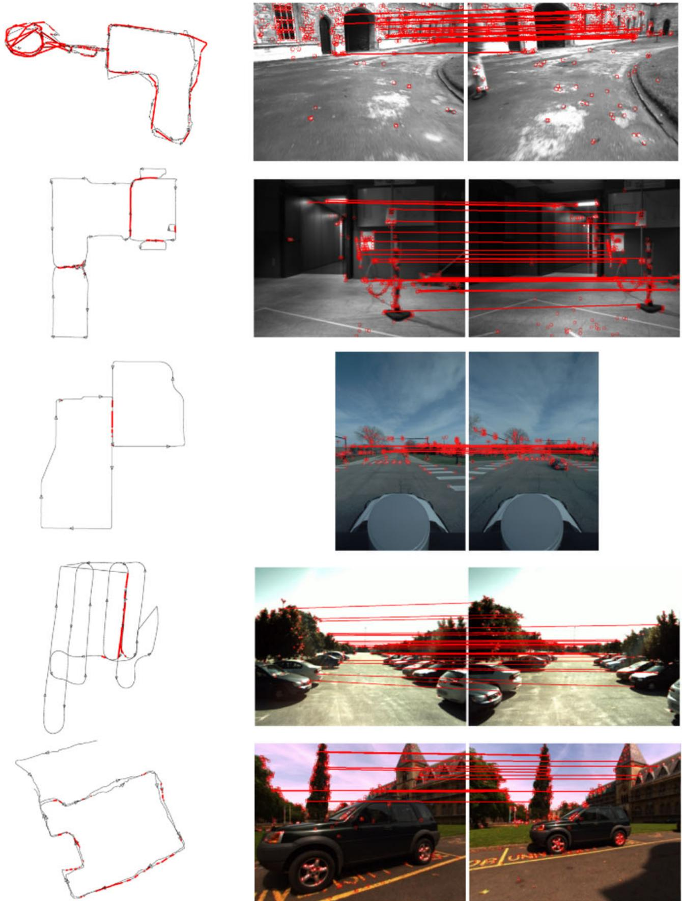

$( y _ { 1 } D M ) _ { j } = 1 { \mathrm { ~ i f ~ } } j = ( m + 1 ) ^ { 2 }$ , and $( y _ { 1 } D M ) _ { j } = 0$ otherwise. Let $( y _ { 2 } ) _ { j } = 1 \mathrm { i f } j = m + 1$ , and $\left( y _ { 2 } \right) _ { j } = 0$ otherwise. The statement follows from Motzkin’s Theorem since $y _ { 1 } D M - y _ { 2 } N = 0$ 

Proof of Theorem 3.1: Let $V _ { \mathrm { m i n } } = \emptyset , V = V _ { \mathrm { m a x } }$ , and $| V | = n =$ $m + 1$ . Let $\delta ^ { * }$ be the vector of waiting intervals and arrival times defined in Trajectory 1. Note that the specification of the robots initial positions implies the specification of the arrival times $\mathcal { A } _ { \mathrm { m i n } }$ . Suppose that $\delta ^ { * }$ is not an optimal solution to the optimization problem A4, and let δ be a minimizer of A4. Then, $\lVert b + D M \delta \rVert _ { \infty } < \lVert b + D M \delta ^ { * } \rVert _ { \infty } .$ It can be verified that the entries of $b + D M \delta ^ { * }$ indexed by $V _ { \mathrm { m a x } }$ are all equal to each other. In addition, $b + D M \delta \succeq 0 , b + D M \delta ^ { * } \succeq 0$ Hence

$$
D M ( \delta - \delta ^ { * } ) \prec 0 .\tag{A5}
$$

Notice that, since $\delta _ { 1 } ^ { i } ( k ) ^ { * } = 0$ and $\delta _ { 1 } ^ { i } \left( k \right) \geq 0$ due to the constraint in $\mathbf { A 4 } ,$ it follows that $\delta _ { 1 } ^ { i } \left( k \right) - \delta _ { 1 } ^ { i } \left( k \right) ^ { * } \geq 0$ . Because of Lemma 6.2, the inequalities A5 with the constraint $\delta _ { 1 } ^ { i } \left( k \right) - \delta _ { 1 } ^ { i } \left( k \right) ^ { * } \geq 0$ are infeasible. Due to convexity, we conclude that $\delta ^ { * }$ is a global minimizer of A4 with $V _ { \mathrm { m i n } } = \emptyset$

Let $V _ { \mathrm { m i n } } \neq \emptyset$ , and observe that, because of Lemma 2.2, the weighted refresh time for the set of viewpoints $V _ { \mathrm { m a x } } \cup V _ { \mathrm { m i n } }$ cannot be smaller than the weighted refresh time for the set of viewpoints $V _ { \mathrm { m a x } }$ . Then, the vector $\delta ^ { * }$ that is defined in Trajectory 1 is a global minimizer of the optimization problem A4.

We now characterize the performance of Trajectory 1. Notice that $\begin{array} { r } { x _ { i } ( t ) = x _ { i + 1 } ( t + \frac { \mathrm { R T _ { \mathrm { ~ T ~ } } ^ { * } } } { \phi _ { 1 } } ) } \end{array}$ . Hence, the viewpoint $v _ { \alpha }$ is not visited for an interval of length $\frac { \mathrm { R T _ { T } ^ { * } } } { \phi _ { 1 } } - \delta _ { \alpha }$ , where $\delta _ { \alpha }$ is the waiting interval at the viewpoint $v _ { \alpha }$ . We have

$$
\frac { \mathrm { R T } _ { \mathrm { T } } ^ { * } } { \phi _ { 1 } } - \delta _ { \alpha } = \frac { \mathrm { R T } _ { \mathrm { T } } ^ { * } } { \phi _ { 1 } } - \frac { \mathrm { R T } _ { \mathrm { T } } ^ { * } \left( \phi _ { \alpha } - \phi _ { 1 } \right) } { \phi _ { \alpha } \phi _ { 1 } } = \frac { \mathrm { R T } _ { \mathrm { T } } ^ { * } } { \phi _ { \alpha } } .
$$

From (1), we have $\begin{array} { r } { \operatorname { R T } ( X ) = \operatorname* { m a x } _ { \alpha } \phi _ { \alpha } \frac { \operatorname { R T } _ { \mathrm { ~ T ~ } } ^ { * } } { \phi _ { \alpha } } = \operatorname { R T } _ { \mathrm { ~ T ~ } } ^ { * } } \end{array}$ . Note that

$$
\frac { \Delta _ { 1 } ^ { m } \left( 1 \right) } { \phi _ { 1 } } = L + \mathcal { A } _ { \operatorname* { m i n } } \left( 1 \right) + \sum _ { \alpha = 1 } ^ { n } \delta _ { \alpha } ^ { 1 } \left( 1 \right) - \mathcal { A } _ { \operatorname* { m i n } } \left( m \right) - \delta _ { 1 } ^ { m } \left( 1 \right)
$$

where $\Delta _ { 1 } ^ { m } \left( 1 \right) = \mathrm { R T } _ { \mathrm { T } } ^ { * } , \delta _ { 1 } ^ { m } \left( 1 \right) = 0 ,$ , and

$$
\begin{array} { l } { { \displaystyle { \cal A } _ { \mathrm { m i n } } ( 1 ) - { \cal A } _ { \mathrm { m i n } } ( m ) = - ( m - 1 ) { \cal R } \Gamma _ { \mathrm { T } } ^ { \ast } / \phi _ { 1 } } } \\ { { \displaystyle ~ \sum _ { \alpha = 1 } ^ { n } \delta _ { \alpha } ^ { 1 } ( 1 ) = m { \cal R } \Gamma _ { \mathrm { T } } ^ { \ast } / \phi _ { 1 } - \sum _ { \phi \in \Phi _ { \mathrm { m a x } } } { \cal R } \Gamma _ { \mathrm { T } } ^ { \ast } \phi ^ { - 1 } . } } \end{array}
$$

Hence, $\begin{array} { r } { \mathrm { R T } _ { \mathrm { T } } ^ { * } = \frac { L } { \sum _ { \phi \in \Phi _ { \operatorname* { m a x } } } \phi ^ { - 1 } } } \end{array}$ . Finally, for the Equal-Time-Spacing trajectory, it holds $\mathrm { R T _ { 1 } } = \mathrm { \overline { { R } } T _ { 2 } } = \mathrm { { R T _ { T } ^ { * } } } = \mathrm { { R T } } ( X )$

## REFERENCES

[1] J. Clark and R. Fierro, “Mobile robotic sensors for perimeter detection and tracking,” ISA Trans., vol. 46, no. 1, pp. 3–13, 2007.

[2] D. B. Kingston, R. W. Beard, and R. S. Holt, “Decentralized perimeter surveillance using a team of UAVs,” IEEE Trans. Robot., vol. 24, no. 6, pp. 1394–1404, Dec. 2008.

[3] S. Susca, S. Mart´ınez, and F. Bullo, “Monitoring environmental boundaries with a robotic sensor network,” IEEE Trans. Control Syst. Technol., vol. 16, no. 2, pp. 288–296, Mar. 2008.

[4] Y. Elmaliach, A. Shiloni, and G. A. Kaminka, “A realistic model of frequency-based multi-robot polyline patrolling,” in Proc. Int. Conf. Auton. Agents, Estoril, Portugal, May 2008, pp. 63–70.

[5] I. I. Hussein and D. M. Stipanovic, “Effective coverage control for mo- \` bile sensor networks with guaranteed collision avoidance,” IEEE Trans. Control Syst. Technol., vol. 15, no. 4, pp. 642–657, Jul. 2007.

[6] C. G. Cassandras, X. C. Ding, and X. Lin. (2011, Aug.) An optimal control approach for the persistent monitoring problem [Online]. Available at: http://arxiv.org/pdf/1108.3221

[7] Y. Chevaleyre, “Theoretical analysis of the multi-agent patrolling problem,” in Proc. IEEE/WIC/ACM Int. Conf. Intell. Agent Technol., Beijing, China, Sep. 2004, pp. 302–308.

[8] D. B. Kingston, R. S. Holt, R. W. Beard, T. W. McLain, and D. W. Casbeer, “Decentralized perimeter surveillance using a team of UAVs,” presented at the AIAA Conf. Guid., Navigat. Control, San Francisco, CA, Aug. 2005.

[9] F. Pasqualetti, A. Franchi, and F. Bullo, “On cooperative patrolling: Optimal trajectories, complexity analysis and approximation algorithms,” IEEE Trans. Robot., 2012, DOI: 10.1109/TRO.2011.2179580.

[10] G. Cannata and A. Sgorbissa, “A minimalist algorithm for multirobot continuous coverage,” IEEE Trans. Robot., vol. 27, no. 2, pp. 297–312, Apr. 2011.

[11] S. L. Smith and D. Rus, “Multi-robot monitoring in dynamic environments with guaranteed currency of observations,” in Proc. IEEE Conf. Decis. Control, Atlanta, GA, Dec. 2010, pp. 514–521.

[12] S. L. Smith, M. Schwager, and D. Rus, “Persistent robotic tasks: Monitoring and sweeping in changing environments,” IEEE Trans. Robot., vol. 28, no. 2, pp. 410–426, 2012, DOI: 10.1109/TRO.2011.2174493.

[13] D. Peleg, Distributed Computing. A Locality-Sensitive Approac (ser. Monographs on Discrete Mathematics and Applications). Philadelphia, PA: SIAM, 2000.

[14] A. Davoodi, P. Fazli, P. Pasquier, and A. K. Mackworth, “On multirobot area coverage,” in Proc. Japan Conf. Comput. Geometry Graphs, Kanazawa, Japan, Nov. 2009, pp. 75–76.

[15] F. Bullo, J. Cortes, and S. Mart´ ´ınez, Distributed Control of Robotic Network (ser. Applied Mathematics Series). Princeton, NJ: Princeton Univ. Press, 2009.

[16] B. Gerkey, R. T. Vaughan, and A. Howard, “The Player/Stage Project: Tools for multi-robot and distributed sensor systems,” in Proc. Int. Conf. Adv. Robot., Coimbra, Portugal, Jun. 2003, pp. 317–323.

[17] S. Thrun, D. Fox, W. Burgard, and F. Dellaert, “Robust Monte Carlo localization for mobile robots,” Artif. Intell., vol. 128, nos. 1–2, pp. 99– 141, 2001.

[18] J. W. Durham and F. Bullo, “Smooth nearness-diagram navigation,” in Proc. IEEE/RSJ Int. Conf. Intell. Robots Syst., Nice, France, Sep. 2008, pp. 690–695.

[19] O. L. Mangasarian, Nonlinear Programming. Philadelphia, PA: SIAM, 1994.

# Bags of Binary Words for Fast Place Recognition in Image Sequences

Dorian Galvez-L ´ opez and Juan D. Tard ´ os´

Abstract—We propose a novel method for visual place recognition using bag of words obtained from accelerated segment test (FAST)+BRIEF features. For the first time, we build a vocabulary tree that discretizes a binary descriptor space and use the tree to speed up correspondences for geometrical verification. We present competitive results with no false positives in very different datasets, using exactly the same vocabulary and settings. The whole technique, including feature extraction, requires 22 ms/frame in a sequence with 26 300 images that is one order of magnitude faster than previous approaches.

Index Terms—Bag of binary words, computer vision, place recognition, simultaneous localization and mapping (SLAM).

Manuscript received September 23, 2011; revised February 13, 2012; accepted April 18, 2012. Date of publication May 18, 2012; date of current version September 28, 2012. This paper was recommended for publication by Associate Editor C. Stachniss and Editor D. Fox upon evaluation of the reviewers’ comments. This work was supported by the European Union under Projec RoboEarth FP7-ICT-248942, the Direccion General de Investigaci´ on of Spain´ under Project DPI2009-13710 and Project DPI2009-07130, and the Ministerio de Educacion Scholarship FPU-AP2008-02272. ´

The authors are with the Instituto de Investigacion en Ingenier´ ´ıa de Aragon,´ Universidad de Zaragoza, 50018 Zaragoza, Spain (e-mail: dorian@unizar.es; tardos@unizar.es).

Color versions of one or more of the figures in this paper are available online at http://ieeexplore.ieee.org.

Digital Object Identifier 10.1109/TRO.2012.2197158

## I. INTRODUCTION

One of the most significant requirements for long-term visual simultaneous localization and mapping (SLAM) is robust place recognition. After an exploratory period, when areas nonobserved for long are reobserved, standard matching algorithms fail. When they are robustly detected, loop closures provide correct data association to obtain consistent maps. The same methods used for loop detection can be used for robot relocation after track lost, due, for example, to sudden motions, severe occlusions, or motion blur. In [1], we concluded that, for small environments, map-to-image methods achieve nice performance, but for large environments, image-to-image (or appearance-based) methods, such as fast appearance-based mapping (FAB-MAP) [2] scale better. The basic technique consists in building a database from the images collected online by the robot so that the most similar one can be retrieved when a new image is acquired. If they are similar enough, a loop closure is detected.

In recent years, many algorithms that exploit this idea have appeared [2]–[6], basing the image matching on comparing them as numerical vectors in the bag-of-words space [7]. Bags of words result in very effective and quick image matchers [8], but they are not a perfect solution for closing loops, due mainly to perceptual aliasing [6]. For this reason, a verification step is performed later by checking the matching images to be geometrically consistent, requiring feature correspondences. The bottleneck of the loop closure algorithms is usually the extraction of features, which is around ten times more expensive in computation cycles than the rest of the steps. This may cause SLAM algorithms to run in two decoupled threads: one to perform the main SLAM functionality, and the other just to detect loop closures, as in [5].

In this paper, we present a novel algorithm to detect loops and establish point correspondences between images in real time, with a conventional central processing unit and a single camera. Our approach is based on bag of words and geometrical check, with several important novelties that make it much faster than current approaches. The main speed improvement comes from the use of a slightly modified version of the BRIEF descriptor [9] with features from accelerated segment test (FAST) keypoints [10], as explained in Section III. The BRIEF descriptor is a binary vector where each bit is the result of an intensity comparison between a given pair of pixels around the keypoint. Although BRIEF descriptors are hardly invariant to scale and rotation, our experiments show that they are very robust for loop closing with planar camera motions, which is the usual case in mobile robotics, offering a good compromise between distinctiveness and computation time.

We introduce a bag of words that discretizes a binary space, and augment it with a direct index, in addition to the usual inverse index, as explained in Section IV. To the best of our knowledge, this is the first time a binary vocabulary is used for loop detection. The inverse index is used for fast retrieval of images potentially similar to a given one. We show a novel use of the direct index to efficiently obtain point correspondences between images, speeding up the geometrical check during the loop verification.

The complete loop-detection algorithm is detailed in Section V. Similar to our previous work [5], [6], to decide that a loop has been closed, we verify the temporal consistency of the image matches obtained. One of the novelties in this paper is a technique to prevent images collected in the same place from competing among them when the database is queried. We achieve this by grouping together those images that depict the same place during the matching.

Section VI contains the experimental evaluation of our study, including a detailed analysis of the relative merits of the different parts in our algorithm. We present comparisons between the effectiveness of BRIEF and two versions of speeded up robust features (SURFs) [11], the descriptors most used for loop closing. We also analyze the performance of the temporal and geometrical consistency tests for loop verification. We, finally, present the results achieved by our technique after evaluating it in five public datasets with 0.7–4-km-long trajectories. We demonstrate that we can run the whole loop-detection procedure, including the feature extraction, in 52 ms with 26 300 images (22 ms on average), outperforming previous techniques by more than one order of magnitude.

A preliminary version of this study was presented in [12]. In this paper, we enhance the direct index technique and extend the experimental evaluation of our approach. We also report results in new datasets and make a comparison with the state-of-the-art FAB-MAP 2.0 algorithm [13].

## II. RELATED WORK

Place recognition based on appearance has obtained great attention in the robotics community because of the excellent results achieved [4], [5], [13], [14]. An example of this is the FAB-MAP system [13], which detects loops with an omnidirectional camera, obtaining a recall of 48.4% and 3.1%, with no false positives, in trajectories 70 and 1000 km in length. FAB-MAP represents images with a bag of words, and uses a Chow–Liu tree to learn offline the words’ covisibility probability. FAB-MAP has become the gold standard regarding loop detection, but its robustness decreases when the images depict very similar structures for a long time, which can be the case when using frontal cameras [5]. In the work of Angeli et al. [4], two visual vocabularies (for appearance and color) are created online in an incremental fashion. The two bag-of-words representations are used together as input of a Bayesian filter that estimates the matching probability between two images, taking into account the matching probability of previous cases. In contrast with these probabilistic approaches, we rely on a temporal consistency check to consider previous matches and enhance the reliability of the detections. This technique has proven successful in our previous works [5], [6]. Our work also differs from the earlier ones in that we use a bag of binary words for the first time, as well as propose a technique to prevent images collected close in time and depicting the same place from competing between them during the matching so that we can work at a higher frequency.

To verify loop-closing candidates, a geometrical check is usually performed. We apply an epipolar constraint to the best matching candidate as done in [4], but we take advantage of a direct index to calculate correspondence points faster. Konolige et al. [3] use visual odometry with a stereo camera to create in real time a view map of the environment, detecting loop closures with a bag-of-words approach as well. Their geometrical check consists in computing a spatial transformation between the matching images. However, they do not consider consistency with previous matches, and this leads them to apply the geometrical check to several loop-closing candidates.

In most loop-closing works [4]–[6], [14], the features used are scaleinvariant feature transform (SIFT) [15] or SURF [11]. They are popular because they are invariant to lighting, scale and rotation changes, and show a good behavior in view of slight perspective changes. However, these features usually require between 100 and 700 ms to be computed, as reported by the aforementioned publications. Apart from graphics processing unit implementations [16], there are other similar features that try to reduce this computation time by, for example, approximating the SIFT descriptor [17] or reducing the dimensionality [18]. The work of Konolige et al. [3] offers a qualitative change, since it uses compact randomized tree signatures [19]. This approach calculates the similarity between an image patch and other patches previously trained in an offline stage. The descriptor vector of the patch is computed by concatenating these similarity values, and its dimensionality is finally reduced with random orthoprojections. This yields a very fast descriptor that is suitable for real-time applications [19]. Our study bears a resemblance with [3] in that we also reduce the execution time by using efficient features. BRIEF descriptors, along with other recent descriptors such as the binary robust invariant scalable keypoints (BRISK) [20] or the oriented FAST with uncorrelated BRIEF features (ORB) [21], are binary and require very little time to be computed. As an advantage, their information is very compact so that they occupy less memory and are faster to compare. This allows a much faster conversion into the bag-of-words space.

## III. BINARY FEATURES

Extracting local features (keypoints and their descriptor vectors) is usually very expensive in terms of computation time when comparing images. This is often the bottleneck when these kinds of techniques are applied to real-time scenarios. To overcome this problem, in this paper, we use FAST keypoints [10] and the state-of-the-art BRIEF descriptors [9]. FAST keypoints are corner-like points detected by comparing the gray intensity of some pixels in a Bresenham circle of radius 3. Since only a few pixels are checked, these points are very fast to obtain, proving successful for real-time applications.

For each FAST keypoint, we draw a square patch around them and compute a BRIEF descriptor. The BRIEF descriptor of an image patch is a binary vector where each bit is the result of an intensity comparison between two of the pixels of the patch. The patches are previously smoothed with a Gaussian kernel to reduce noise. Given before the size of the patch $S _ { b }$ , the pairs of pixels to test are randomly selected in an offline stage. In addition to $S _ { b } ,$ we must set the parameter $L _ { b } \colon$ The number of tests to perform $( \mathrm { i . e . }$ , the length of the descriptor). For a point p in an image, its BRIEF descriptor vector $\mathbf { B } ( \mathbf { p } )$ is given by

$$
B ^ { i } ( \mathbf { p } ) = \left\{ \begin{array} { l l } { 1 , } & { \mathrm { i f } I ( \mathbf { p } + \mathbf { a } _ { i } ) < I ( \mathbf { p } + \mathbf { b } _ { i } ) } \\ { 0 , } & { \mathrm { o t h e r w i s e } } \end{array} \right. \forall i \in [ 1 , L _ { b } ]\tag{1}
$$

where $B ^ { i } \left( \mathbf { p } \right)$ is the ith bit of the descriptor, $I ( \cdot )$ is the intensity of the pixel in the smoothed image, and ${ \bf a } _ { i }$ and $\mathbf { b } _ { i }$ are the 2-D offset of the ith test points with respect to the center of the patch, with value in $\begin{array} { r } { \left[ - \frac { S _ { b } } { 2 } \cdot \cdot \cdot \frac { \hat { S } _ { b } } { 2 } \right] \times \left[ - \frac { S _ { b } } { 2 } \cdot \cdot \cdot \frac { \hat { S } _ { b } } { 2 } \right] , } \end{array}$ , randomly selected in advance. Note that this descriptor does not need training; it just needs an offline stage to select random points that hardly takes time. The original BRIEF descriptor proposed by Calonder et al. [9] selects each coordinate of the test points ${ \bf a } _ { i }$ and $\mathbf { b } _ { i }$ according to a normal distribution $\begin{array} { r } { \mathcal { N } ( 0 , \frac { 1 } { 2 5 } S _ { b } ^ { 2 } ) } \end{array}$ . However, we found that using close test pairs yielded better results [12]. We select each coordinate j of these pairs by sampling the distributions $\begin{array} { r } { a _ { i } ^ { j } \sim \mathcal { N } ( 0 , \frac { 1 } { 2 5 } S _ { b } ^ { 2 } ) } \end{array}$ ) and $\begin{array} { r } { b _ { i } ^ { j } \sim \mathcal { N } ( a _ { i } ^ { j } , \frac { 4 } { 6 2 5 } S _ { b } ^ { 2 } ) } \end{array}$ Note that this approach was also proposed by Calonder et al. [9] but not used in their final experiments. For the descriptor and patch sizes, we chose $L _ { b } = 2 5 6$ and $S _ { b } = 4 8$ , because they resulted in a good compromise between distinctiveness and computation time [12].

The main advantage of BRIEF descriptors is that they are very fast to compute (Calonder et al. [9] reported $1 7 . 3 \mu \mathrm { s }$ per keypoint when $L _ { b } = 2 5 6$ bits) and to compare. Since one of these descriptors is just a vector of bits, measuring the distance between two vectors can be done by counting the amount of different bits between them (Hamming distance), which is implemented with an xor operation. This is more suitable in this case than calculating the Euclidean distance, as is usually done with SIFT or SURF descriptors, which are composed of floating point values.

  
Fig. 1. Example ofvocabulary tree and direct and inverse indexes that compose the image database. The vocabulary words are the leaf nodes of the tree. The inverse index stores the weight of the words in the images in which they appear. The direct index stores the features of the images and their associated nodes at a certain level of the vocabulary tree.

## IV. IMAGE DATABASE

In order to detect revisited places, we use an image database composed of a hierarchical bag of words [7], [8] and direct and inverse indexes, as shown in Fig. 1.

The bag of words is a technique that uses a visual vocabulary to convert an image into a sparse numerical vector, allowing us to manage big sets of images. The visual vocabulary is created offline by discretizing the descriptor space into W visual words. Unlike with other features like SIFT or SURF, we discretize a binary descriptor space, creating a more compact vocabulary. In the case of the hierarchical bag of words, the vocabulary is structured as a tree. To build it, we extract a rich set of features from some training images, independently of those processed online later. The descriptors extracted are first discretized into $k _ { w }$ binary clusters by performing k-medians clustering with the k-means++ seeding [22]. The medians that result in a nonbinary value are truncated to 0. These clusters form the first level of nodes in the vocabulary tree. Subsequent levels are created by repeating this operation with the descriptors associated with each node, up to $L _ { w }$ times. We, finally, obtain a tree with W leaves, which are the words of the vocabulary. Each word is given a weight according to its relevance in the training corpus, decreasing the weight of those words which are very frequent and, thus, less discriminative. For this, we use the term frequency–inverse document frequency $( t f { - } i d f )$ , as proposed by Sivic and Zisserman [7]. Then, to convert an image $I _ { t } ,$ , taken at time $t ,$ into a bag-of-words vector $\mathbf { v } _ { t } \in \mathbb { R } ^ { W }$ , the binary descriptors of its features traverse the tree from the root to the leaves, by selecting at each level the intermediate nodes that minimize the Hamming distance.

To measure the similarity between two bag-of-words vectors v and $\mathbf { v } _ { 2 }$ , we calculate a $L _ { 1 }$ -score $s ( \mathbf { v } _ { 1 } , \mathbf { v } _ { 2 } )$ , whose value lies in [0, 1]:

$$
s ( \mathbf { v } _ { 1 } , \mathbf { v } _ { 2 } ) = 1 - \frac { 1 } { 2 } \left| \frac { \mathbf { v } _ { 1 } } { | \mathbf { v } _ { 1 } | } - \frac { \mathbf { v } _ { 2 } } { | \mathbf { v } _ { 2 } | } \right| .\tag{2}
$$

Along with the bag of words, an inverse index is maintained. This structure stores for each word $w _ { i }$ in the vocabulary a list of images $I _ { t }$ where it is present. This is very useful when querying the database, since it allows us to perform comparisons only against those images that have some word in common with the query image. We augment the inverse index to store pairs $< I _ { t } , v _ { t } ^ { i } >$ to quickly access the weight of the word in the image. The inverse index is updated when a new image $I _ { t }$ is added to the database and accessed when the database is searched for some image.

These two structures (the bag of words and the inverse index) are often the only ones used in the bag-of-words approach for searching images. However, as a novelty in this general approach, we also make use of a direct index to conveniently store the features of each image. We separate the nodes of the vocabulary according to their level l in the tree, starting at leaves, with level $l = 0 .$ , and finishing in the root, $l = L _ { w }$ . For each image $I _ { t }$ , we store, in the direct index, the nodes at level l that are ancestors of the words present in $I _ { t } ,$ , as well as the list of local features $f _ { t j }$ associated with each node. We take advantage of the direct index and the bag-of-words tree to use them as a means to approximate nearest neighbors in the BRIEF descriptor space. The direct index allows us to speed up the geometrical verification by computing correspondences only between those features that belong to the same words or to words with common ancestors at level l. The direct index is updated when a new image is added to the database, and accessed when a candidate matching is obtained and geometrical check is necessary.

## V. LOOP-DETECTION ALGORITHM

To detect loop closures, we use a method based on our previous work [5], [6] that follows the four stages detailed next.

## A. Database Query

We use the image database to store and retrieve images similar to any given one. When the last image $I _ { t }$ is acquired, it is converted into the bag-of-words vector $\mathbf { v } _ { t }$ . The database is searched for $\mathbf { v } _ { t }$ , resulting in a list of matching candidates $\langle \mathbf { v } _ { t } , \mathbf { v } _ { t _ { 1 } } \rangle , \langle \mathbf { v } _ { t } , \mathbf { v } _ { t _ { 2 } } \rangle , . . . ,$ , associated with their scores $s ( \mathbf { v } _ { t } , \mathbf { v } _ { t _ { i } } )$ . The range these scores varies is very dependent on the query image and the distribution of words it contains. We then normalize these scores with the best score we expect to obtain in this sequence for the vector $\mathbf { v } _ { t }$ , obtaining the normalized similarity score $\eta \left[ 6 \right]$

$$
\eta ( \mathbf { v } _ { t } , \mathbf { v } _ { t _ { j } } ) = \frac { s ( \mathbf { v } _ { t } , \mathbf { v } _ { t _ { j } } ) } { s ( \mathbf { v } _ { t } , \mathbf { v } _ { t - \Delta t } ) } .\tag{3}
$$

Here, we approximate the expected score of $\mathbf { v } _ { t }$ with $s ( \mathbf { v } _ { t } , \mathbf { v } _ { t - \Delta t } )$ where $\mathbf { v } _ { t - \Delta t }$ is the bag-of-words vector of the previous image. Those cases where $s ( \mathbf { v } _ { t } , \mathbf { v } _ { t - \Delta t } )$ is small $\left( \mathrm { e . g . } \right.$ . when the robot is turning) can erroneously cause high scores. Thus, we skip the images that do not reach a minimum $s ( \mathbf { v } _ { t } , \mathbf { v } _ { t - \Delta t } )$ or a required number of features. This minimum score trades off the number of images that can be used to detect loops with the correctness of the resulting score $\eta .$ . We use a small value to prevent valid images from being discarded. We then reject those matches whose $\eta ( \mathbf { v } _ { t } , \mathbf { v } _ { t _ { j } } )$ does not achieve a minimum threshold, which is denoted α.

## B. Match Grouping

To prevent images that are close in time to compete among them when the database is queried, we group them into islands and treat them as only one match. We use the notation $T _ { i }$ to represent the interval composed of timestamps $t _ { n _ { i } } , \ldots , t _ { m _ { i } }$ , and $V _ { T _ { i } }$ for an island that groups together the matches with entries $\mathbf { v } _ { t _ { n _ { i } } } , \ldots , \mathbf { v } _ { t _ { m _ { i } } }$ . Therefore, several matches $\langle \mathbf { v } _ { t } , \mathbf { v } _ { t _ { n _ { i } } } \rangle , \dots , \langle \mathbf { v } _ { t } , \mathbf { v } _ { t _ { m _ { i } } } \rangle$ are converted into a single match $\langle \mathbf { v } _ { t } , V _ { T _ { i } } \rangle$ if the gaps between consecutive timestamps in $t _ { n _ { i } } , \ldots , t _ { m _ { i } }$ are small. The islands are also ranked according to a score $H$

$$
H ( { \bf v } _ { t } , V _ { T _ { i } } ) = \sum _ { j = n _ { i } } ^ { m _ { i } } \eta ( { \bf v } _ { t } , { \bf v } _ { t _ { j } } ) .\tag{4}
$$

The island with the highest score is selected as matching group and continues to the temporal consistency step. Besides avoiding clashes between consecutive images, the islands can help establish correct matches. If $I _ { t }$ and $I _ { t ^ { \prime } }$ represent a real loop closure, $I _ { t }$ is very likely to be similar to $I _ { t ^ { \prime } \pm \Delta t } , I _ { t ^ { \prime } \pm 2 \Delta t } , . . . ,$ producing long islands. Since we define H as the sum of scores η, the H score favors matches with long islands as well.

## C. Temporal Consistency

After obtaining the best matching island $V _ { T ^ { \prime } }$ , we check it for temporal consistency with previous queries. In this paper, we extend the temporal constraint applied in [5] and [6] to support islands. The match $\left. \mathbf { v } _ { t } , V _ { T ^ { \prime } } \right.$ must be consistent with k previous matches $\left. \mathbf { v } _ { t - \Delta t } , V _ { T _ { 1 } } \right. , \dotsc , \left. \mathbf { v } _ { t - k \Delta t } , V _ { T _ { k } } \right.$ , such that the intervals $T _ { j }$ and $T _ { j + 1 }$ are close to overlap. If an island passes the temporal constraint, we keep only the match $\langle \mathbf { v } _ { t } , \mathbf { v } _ { t ^ { \prime } } \rangle$ , for the $t ^ { \prime } \in T ^ { \prime }$ that maximizes the score $\eta ,$ and consider it a loop-closing candidate, which finally has to be accepted by the geometrical verification stage.

## D. Efficient Geometrical Consistency

We apply a geometrical check between any pair of images of a loop-closing candidate. This check consists in finding with random sample consensus (RANSAC) a fundamental matrix between $I _ { t }$ and $I _ { t ^ { \prime } }$ supported by at least 12 correspondences. To compute these correspondences, we must compare the local features of the query image with those of the matched one. There are several approaches to perform this comparison. The easiest and slowest one is the exhaustive search, which consists in measuring the distance of each feature of $I _ { t }$ to the features of $I _ { t ^ { \prime } }$ in the descriptor space, to select correspondences later according to the nearest neighbor distance ratio [15] policy. This is a $\Theta ( n ^ { 2 } )$ operation in the number of features per image. A second technique consists in calculating approximate nearest neighbors by arranging the descriptor vectors in k-dimensional (k-d) trees [27].

Following the latter idea, we take advantage of our bag-of-words vocabulary and reuse it to approximate nearest neighbors. For this reason, when adding an image to the database, we store a list of pairs of nodes and features in the direct index. To obtain correspondences between $I _ { t }$ and $I _ { t ^ { \prime } } ,$ we look up $I _ { t ^ { \prime } }$ in the direct index and perform the comparison only between those features that are associated with the same nodes at level l in the vocabulary tree. This condition speeds up the correspondence computation. The parameter l is fixed beforehand and entails a tradeoff between the number of correspondences obtained between $I _ { t }$ and $I _ { t ^ { \prime } }$ and the time consumed for this purpose. When $l = 0 ,$ , only features belonging to the same word are compared (as we presented in [12]) so that the highest speedup is achieved, but fewer correspondences can be obtained. This makes the recall of the complete loop-detection process decrease due to some correct loops being rejected because of the lack of correspondence points. On the other hand, when $l = L _ { w } ,$ , the recall is not affected but the execution time is not improved either.

We only require the fundamental matrix for verification, but note that after calculating it, we could provide the data association between the images matched to any SLAM algorithm that would run beneath, with no extra cost.

## VI. EXPERIMENTAL EVALUATION

We evaluate the different aspects of our proposal in the following sections. In Section VI-A, we introduce the methodology we followed to evaluate our algorithm. Next, we compare the reliability of BRIEF and SURF in our system in Section VI-B. In Section ${ \mathrm { V I - C } } .$ we analyze the effect of the temporal consistency of our algorithm, and the efficiency of our geometrical verification based on the direct index is checked in Section VI-D. Finally, the execution time and the performance of our complete system are evaluated in Sections VI-E and F.

TABLE I DATASETS
<table><tr><td>Dataset</td><td>Camera</td><td>Description</td><td>Total length (m)</td><td>Revisited length (m)</td><td>Avg. Speed  $( \mathbf { m } \cdot \mathbf { s } ^ { - 1 } )$ </td><td>Image size (px × px)</td></tr><tr><td>New College [23]</td><td>Frontal</td><td>Outdoors, dynamic</td><td>2260</td><td>1570</td><td>1.5</td><td>512×384</td></tr><tr><td>Bicocca 2009-02-25b [24]</td><td>Frontal</td><td>Indoors, static</td><td>760</td><td>113</td><td>0.5</td><td>640×480</td></tr><tr><td>Ford Campus 2 [25]</td><td>Frontal</td><td>Urban, slightly dynamic</td><td>4004</td><td>280</td><td>6.9</td><td>600×1600</td></tr><tr><td>Malaga 2009 Parking 6L [26]</td><td>Frontal</td><td>Outdoors, slightly dynamic</td><td>1192</td><td>162</td><td>2.8</td><td>1024×768</td></tr><tr><td>City Centre [2]</td><td>Lateral</td><td>Urban, dynamic</td><td>2025</td><td>801</td><td></td><td>640×480</td></tr></table>

## A. Methodology

The aspects to evaluate loop-detection results are usually assumed to be of general knowledge. However, little detail is given in the literature. Here, we explain the methodology we followed to evaluate our system.

1) Datasets: We tested our system in five publicly available datasets (see Table I). These present independent indoor and outdoor environments, and were collected at different speed by several platforms, with in-plane camera motion. CityCentre is a collection of images gathered at low frequency, with little overlap. The others provide images at high frequency (8–20 Hz).

2) Ground Truth: To measure the correctness of our results, we compare them with a ground-truth reference. Most of the datasets used here do not provide direct information about loop closures; therefore, we manually created a list of the actual loop closures. This list is composed of time intervals, where each entry in the list encodes a query interval associated with a matching interval.

3) Correctness Measure: We measure the correctness of the loopdetection results with the precision and recall metrics. The precision is defined as the ratio between the number of correct detections and all the detections fired and the recall as the ratio between the correct detections and all the loop events in the ground truth. A match fired by the loop detector is a pair of query and matching timestamps. To check if it is a true positive, the ground truth is searched for an interval that contains these timestamps. The number of loop events in the ground truth is computed as the length of all the query intervals in the ground truth multiplied by the frequency at which the images of the dataset are processed. When a query timestamp is associated with more than one matching timestamps in the ground truth because of multiple traversals, only one of them is considered to compute the amount of loop events.

4) Selection ofSystem Parameters: It is a common practice to tune system parameters according to the evaluation data, but we think that using different data to choose the configuration of our algorithm and to evaluate it demonstrates the robustness of our approach. We then separate the datasets shown in Table I into two groups. We use three of them that present heterogeneous environments with many difficulties (NewCollege, Bicocca25b, and Ford2) as training datasets to find the best set of parameters of our algorithm. The other two datasets (City-Centre and Malaga6L) are used as evaluation data to validate our final configuration. In these cases, we only use our algorithm as a black box with a predefined configuration.

5) Settings: Our algorithm is used with the same settings throughout all the experiments. The same vocabulary tree was used to process all the datasets. This was built with $k _ { w } = 1 0$ branches and $L _ { w } = 6$ depth levels, yielding one million words, and trained with nine million features acquired from 10 000 images of an independent dataset (Bovisa 2008-09-01 [24]). We used a threshold of 10 units in the response function of FAST, and 500 in the Hessian response of SURF. For each processed image, we kept only the 300 features with highest response.

  
Fig. 2. Precision–recall curves achieved by BRIEF, SURF64, and U-SURF128 in the training datasets, without geometrical check.

## B. Descriptor Effectiveness

A BRIEF descriptor encodes much less information than a SURF descriptor, since BRIEF is not scale or rotation invariant. In order to check if BRIEF is reliable enough to perform loop detection, we compared its effectiveness with that of SURF. We selected two versions of SURF features: 64-D descriptors with rotation invariance (SURF64) and 128-D descriptor without rotation invariance (U-SURF128). We selected these features because they are the usual choices to solve the loop-detection problem [5], [13].

We created vocabulary trees for SURF64 and U-SURF128 in the same way we built it for BRIEF and ran our system on Bicocca25b and NewCollege, processing the image sequences at f = 2 Hz. We deactivated the geometrical verification, fixed the required temporal consistency matches k to 3, and varied the value of the normalized similarity threshold α to obtain the precision–recall curves shown in Fig. 2. The first remark is that the curve of SURF64 dominates that of U-SURF128 on both datasets. We can also see that BRIEF offers a very competent performance compared with SURF. In Bicocca25b, BRIEF outperforms U-SURF128 and is slightly better than SURF64. In NewCollege, SURF64 achieves better results than BRIEF, but BRIEF still gives very good precision and recall rates.

To better illustrate the different abilities of BRIEF and SURF64 to find correspondences, we have selected some loop events from the previous experiments. In Fig. 3, the features that are associated with the same word of our vocabulary are connected with lines. These are the only matches taken into account to compute the normalized similarity score. In most cases, BRIEF obtains as many correct word correspondences as SURF64, in spite of the slight perspective changes, as shown in the first example (first row). In the second example, only BRIEF is able to close the loop, since SURF64 does not obtain enough word correspondences. These two examples show that BRIEF finds correspondences in objects that are at a middle or large distance, such as the signs on the wall or the trees in the background. In general, distant objects are present in most of the imagery of our datasets. Since the scale of the keypoints extracted from distant objects hardly varies, BRIEF is suitable to match their patches. In cases where objects are close to the camera, SURF64 is more suitable because of its invariance to scale changes. However, we observed very few cases where this happened. In the third example in Fig. 3, the camera tilted, making the image appear rotated in some areas. This along with the scale change prevented BRIEF from obtaining word correspondences. In this case, SURF64 overcame these difficulties and detected the loop.

  
Fig. 3. Examples of words matched by using (pair on the left) BRIEF and (pair on the right) SURF64 descriptors.

Our results show that FAST features with BRIEF descriptors are almost as reliable as SURF features for loop-detection problems with in-plane camera motion. As advantages, not only they are much faster to obtain (13 ms/image instead of 100–400 ms), but they also occupy less memory (32 MB instead of 256 MB to store a one million word vocabulary) and are faster to compare, speeding up the use of the hierarchical vocabulary.

## C. Temporal Consistency

After selecting the features, we tested the number k of temporally consistent matches required to accept a loop closure candidate. For this, we ran our system in the training datasets with f = 2 Hz, for several values of k and α and with no geometrical constraint. We tested k for values between 0 (i.e., disabling the temporal consistency) and 4. We observed a big improvement between $k = 0$ and $k > 0$ for all the working frequencies. As k increases, a higher recall is attained with 100% precision, but this behavior does not hold for very high values of k, since only very long closures would be found. We chose k = 3 since it showed a good precision–recall balance in the three training datasets. We repeated this test in Bicocca25b for frequencies $f = 1$ and 3 Hz, as well to check how dependent parameter k is on the processing frequency. We show, in Fig. 4, the precision–recall curves obtained in Bicocca25b by varying the parameter α; for clarity, only $k = 0$ and 3 are shown. This shows that the temporal consistency is a valuable mechanism to avoid mismatches, as previously seen in [12]. We can also see that k = 3 behaves well even for different frequency values so that we can consider this parameter stable.

  
Fig. 4. Precision–recall curve in Bicocca25b with no geometrical check, for several values of similarity threshold α, number of temporally consistent matches k, and processing frequency f.

## D. Geometrical Consistency

According to Fig. 4, we could select a restrictive value of α to obtain 100% precision, but this would require to tune this parameter for each dataset. Instead, we set a generic value and verify matches with a geometrical constraint consisting in finding a fundamental matrix between two images $I _ { t }$ and $I _ { t ^ { \prime } }$ of a loop-closing candidate. Computing the corresponding points between $I _ { t }$ and $I _ { t ^ { \prime } }$ is the most time-consuming step of this stage. We compared our proposal of using the direct index to compute correspondences, coined DI , with the exhaustive search and a Flann-based approach [27]. The parameter l stands for the level in the vocabulary tree at which the ancestor nodes are checked. In the Flann approach, the Flann library [27] (as implemented in the OpenCV library) is used to build a set of k-d trees with the feature descriptors of $I _ { t }$ . This allows us to obtain, for descriptors of $I _ { t ^ { \prime } } .$ , the approximate nearest neighbors in $I _ { t }$ . After computing distances with any of these methods, the nearest neighbor distance ratio, with a threshold of 0.6 units, was applied. Although both the Flann and the vocabulary tree approaches are useful to approximate nearest neighbors, they are conceptually different here: Our vocabulary tree was created with training data, so that the neighbor search is based on independent data, whereas the k-d trees are tailored to each $I _ { t ^ { \prime } }$

TABLE II  
PERFORMANCE OF DIFFERENT APPROACHES TO OBTAIN CORRESPONDENCESIN NEWCOLLEGE
<table><tr><td rowspan="2">Technique</td><td rowspan="2">Recall  $( \% )$ </td><td colspan="3">Execution time (ms / / query)</td></tr><tr><td>Median</td><td>Min</td><td>Max</td></tr><tr><td>DI0</td><td>38.3</td><td>0.43</td><td>0.25</td><td>16.50</td></tr><tr><td>DI1</td><td>48.5</td><td>0.70</td><td>0.44</td><td>17.14</td></tr><tr><td> $\mathrm { D I _ { 2 } }$ </td><td>56.1</td><td>0.78</td><td>0.50</td><td>19.26</td></tr><tr><td> $\mathrm { D I _ { 3 } }$ </td><td>57.0</td><td>0.80</td><td>0.48</td><td>19.34</td></tr><tr><td>Flann</td><td>53.6</td><td>14.09</td><td>13.79</td><td>25.07</td></tr><tr><td>Exhaustive</td><td>61.2</td><td>14.17</td><td>13.65</td><td>24.68</td></tr></table>

We ran each of the methods in the NewCollege dataset with $f = 2$ Hz, $k = 3 ,$ and $\alpha = 0 . 3$ . We selected this dataset because it presents the longest revisited trajectory and many perceptual aliasing cases. In Table II, we show the execution time of the geometrical check per query, along with the recall of the loop detector in each case. The precision was 100% in all the cases. The time includes the computation of correspondence points, the RANSAC loops, and the computation of the fundamental matrices. The highest execution time of all the methods was obtained when the maximum number of RANSAC iterations was reached. The exhaustive search achieves higher recall than the other methods, which are approximate, but exhibits the highest execution time as well. We see that the Flann method takes nearly as long as the exhaustive search method. The speedup obtained when computing the correspondences is not worth the cost of building a Flann structure per image. On the other hand, $\mathrm { D I _ { 0 } }$ presents not only the smallest execution time but the lowest recall level as well. As we noticed previously [12], selecting correspondences only from features belonging to the same word is very restrictive when the vocabulary is big (one million words). We finally chose the method $\mathrm { D I _ { 2 } }$ for our geometrical check since it showed a good balance between recall and execution time.

## E. Execution Time

To measure the execution time, we ran our system in the NewCollege dataset with $k = 3 , \alpha = 0 . 3$ , and $\mathrm { D I _ { 2 } }$ . By setting the working frequency to $f = 2 \operatorname { H z }$ , a total of 5266 images were processed, yielding a system execution time of 16 ms/image on average and a peak of less than 38 ms. However, in order to test the scalability of the system, we set the frequency $\operatorname { t o } f = 1 0$ Hz and obtained 26 292 images. Even with $k = 3 .$ the system yielded no false positives. This shows that the behavior ofthe temporal consistency parameter k is stable even for high frequencies.

The execution time consumed per image in that case is shown in Fig. 5. This was measured on a Intel Core i7 @2.67 GHz machine. We also show, in Table III, the required time of each stage for this number of images. Thefeatures’ time involves computing FAST keypoints and removing those with lower corner response when there are too many, as well as smoothing the image with a Gaussian kernel and computing

  
Fig. 5. Execution time in NewCollege with 26 292 images.

TABLE III  
EXECUTION TIME IN NEWCOLLEGE WITH 26 292 IMAGES
<table><tr><td colspan="2"></td><td colspan="3">Execution time (ms query)</td></tr><tr><td colspan="2">FAST</td><td>Mean 11.67</td><td>Std 4.15</td><td>Min</td><td>Max 30.16</td></tr><tr><td rowspan="2">Features</td><td>Smoothing</td><td>0.96</td><td>0.37</td><td>1.74 0.79</td><td>2.51</td></tr><tr><td>BRIEF Conversion</td><td>1.72 3.59</td><td>0.49 0.35</td><td>1.51 3.27</td><td>4.62 8.81</td></tr><tr><td rowspan="2">Bag of words</td><td>Query Islands</td><td>3.08 0.12</td><td>1.91</td><td>0.01</td><td>9.19</td></tr><tr><td>Insertion</td><td>0.11</td><td>0.04 0.02</td><td>0.08 0.06</td><td>0.97 0.28</td></tr><tr><td>Verification</td><td>Correspondences and RANSAC</td><td>1.60</td><td>2.64</td><td>0.61</td><td>18.55</td></tr><tr><td colspan="2">Whole system</td><td>21.60</td><td>4.82</td><td>8.22</td><td>51.68</td></tr></table>

BRIEF descriptors. The bag-of-words time is split into four steps: The conversion of image features into a bag-of-words vector, the database query to retrieve similar images, the creation and matching of islands, and the insertion of the current image into the database (this also involves updating the direct and inverse indexes). The verification time includes both computing correspondences between the matching images, by means of the direct index, and the RANSAC loop to calculate fundamental matrices.

We see that all the steps are very fast, including extracting the features and the maintenance of the direct and inverse indexes. This allows us to obtain a system that runs in 22 ms/image, with a peak of less than 52 ms. The feature extraction stage presents the highest execution time, most of it due to the overhead produced when there are too many features and only the best 300 ones must be considered. Even so, we have achieved a reduction of more than one order of magnitude with respect to other features, such as SIFT or SURF, removing the bottleneck of these loop closure detection algorithms. In the bag-of-words stage, the required time of managing the islands and the indexes is negligible, and the conversion of image features into bag-of-words vectors takes as long as the database query. Its execution time depends on the number of features and the size of the vocabulary. We could reduce it by using a smaller vocabulary, since we are using a relatively big one (one million words instead of 10 000–40 000 [5], [14]). However, we found that a big vocabulary produces more sparse inverse indexes associated with words. Therefore, when querying, fewer database entries must be traversed to obtain the results. This reduces the execution time strikingly when querying, trading off, by far, the time required when converting a new image. We conclude that big vocabularies can improve the computation time when using large image collections. Furthermore, note that querying a database with more than 26 000 images takes 9 ms only, suggesting this step scales well with tens of thousands images. The geometrical verification exhibits a long execution time in the worst case, but as we saw in the previous section, this rarely occurs, whereas the 75% of the cases require less than 1.6 ms.

  
Fig. 6. Final precision–recall curves in the training datasets with $f = 2$ Hz, with the selected working point α = 0.3.

TABLE IV PARAMETERS
<table><tr><td rowspan=1 colspan=1>FAST thresholdBRIEF descriptor length $( L _ { b } )$ BRIEF patch size $( S _ { b } )$ Max. features per image</td><td rowspan=1 colspan=1>1025648300</td></tr><tr><td rowspan=1 colspan=1>Vocabulary branch factor $\overline { { ( k _ { w } ) } }$ Vocabulary depth levels $( L _ { w } )$ </td><td rowspan=1 colspan=1>106</td></tr><tr><td rowspan=1 colspan=1>Min. score with previous image $( s ( \mathbf { v } _ { t } , \mathbf { v } _ { t - \Delta t } ) )$ Temporally consistent matches (k)Normalized similarity score threshold (α)</td><td rowspan=1 colspan=1>0.00530.3</td></tr><tr><td rowspan=1 colspan=1>Direct index level (l)Min. matches after RANSAC</td><td rowspan=1 colspan=1>212</td></tr></table>

TABLE V

PRECISION AND RECALL OF OUR SYSTEM
<table><tr><td rowspan=1 colspan=1>Dataset</td><td rowspan=1 colspan=1># Images</td><td rowspan=1 colspan=1>Precision (%)</td><td rowspan=1 colspan=1>Recall (%)</td></tr><tr><td rowspan=1 colspan=1>NewCollegeBicocca25bFord2</td><td rowspan=1 colspan=1>526649241182</td><td rowspan=1 colspan=1>100100100</td><td rowspan=1 colspan=1>55.9281.2079.45</td></tr><tr><td rowspan=1 colspan=1>Malaga6LCityCentre</td><td rowspan=1 colspan=1>8692474</td><td rowspan=1 colspan=1>100100</td><td rowspan=1 colspan=1>74.7530.61</td></tr></table>

Our results show that we can reliably detect loops against databases with 26 000 images in 52 ms (22 ms on average). This represents an improvement of one order of magnitude with respect to the 300–700 ms required by algorithms based on SIFT or SURF [4]–[6], [13], [14]. For example, the state-of-the-art algorithm FAB-MAP 2.0 [13] needs 423 ms to extract SURF, 60 ms for conversion into bag of words, 10 ms to retrieve matching candidates against 25 000 images, and 120 ms (worst case) for RANSAC geometric verification. Our algorithm also outperforms the extremely efficient loop detector developed by Konolige et al. [3], based on compact randomized tree signatures. According to [3, Fig. 6], the method requires around 300 ms to perform the complete loop detection against a database with 4000 images.

## F. Performance ofthe Final System

In previous sections, we showed the effect of the parameters of our system in the correctness of the results. For our algorithm, we chose the generic parameters $k = 3 , \alpha = 0 . 3$ , and the $\mathrm { D I _ { 2 } }$ method to compute correspondences, since they proved effective under several kinds of environments in the training datasets. A summary with the parameters of the algorithm and the vocabulary is shown in Table IV. In Fig. 6, we show the precision–recall curves obtained in these datasets with these parameters, processing the sequences at f = 2 Hz. In Table V, we show the figures of those curves with the final configuration. We achieved a high recall rate in the three datasets with no false positives.

TABLE VI  
PRECISION AND RECALL OF FAB-MAP 2.0
<table><tr><td>Dataset</td><td># Images</td><td>Min. p</td><td>Precision (%)</td><td>Recall (%)</td></tr><tr><td>Malaga6L</td><td>462</td><td>98%</td><td>100</td><td>68.52</td></tr><tr><td>CityCentre</td><td>2474</td><td>98%</td><td>100</td><td>38.77</td></tr></table>

In order to check the reliability of our algorithm with new datasets, we used Malaga6L and CityCentre as evaluation datasets. For these, we used our algorithm as a black box, with the default configuration given previously and the same vocabulary. For Malaga6L, we processed the sequence at $f = 2 \mathrm { H z }$ , and for CityCentre, we used all the images, since these are already taken far apart. We also compared our algorithm with the state-of-the-art FAB-MAP 2.0 algorithm [13], configured by default as it is available in its authors’ website.1 Given a query image, FAB-MAP returns a vector with the probability p of being at the same place than some previous image. Only those matches with $p$ higher than a threshold are accepted. This parameter must be set by the user. We chose $p \geq 9 8 \%$ because it showed the highest recall for 100% precision in these datasets. Tables V and VI show the results in the evaluation datasets. For sake of fairness, we remark on how this comparison was performed: FAB-MAP 2.0 software does not apply any geometrical constraint to the returned matches by default; therefore, we applied a verification stage similar to ours, consisting of computing a fundamental matrix with the exhaustive search method. The input for FAB-MAP 2.0 must be a sequence of disjoint images. For Malaga6L, we fed it with images taken at frequency 1 Hz. We also tried 0.25 and 0.5 Hz, but 1 Hz yielded better results. For CityCentre, we used all the available images. Finally, FAB-MAP 2.0 provides a vocabulary of 11 000 words of 128 float values, built from outdoor disjoint images, whereas our vocabulary contains one million words of 256 bits, created from a sequence of images.

As shown in Table V, our algorithm with the parameters by default is able to achieve large recall with no false positives in both evaluation datasets. Our recall level is similar to that yielded by FAB-MAP 2.0, but with lower execution time. In the Malaga6L dataset, all the loops are correct in spite of the illumination difficulties and the depth of the views. The results in CityCentre differ between our method and FAB-MAP 2.0 because the change between loop closure images is bigger than that in other datasets. This hinders the labor of the $\mathrm { D I _ { 2 } }$ technique because features are usually more distinct and are separated in early levels in the vocabulary tree. Note that this highlights the little invariance of BRIEF, since others as SURF may be able to produce more similar features between the images. Anyhow, we see that our method is still able to find a large amount of loop events in this dataset. This test shows that our method can work fine out of the box in many environments and situations and that it is able to cope with sequences of images taken at low or high frequency, as long as they overlap. We can also remark that the same vocabulary sufficed to process all the datasets. This suggests that the source of the vocabulary is not so important when it is big enough.

We show, in Fig. 7, the detected loops in each dataset. No false detections were fired. The trajectory in NewCollege is based on partially corrected GPS data so that some paths are inaccurately depicted. Note that part of the vehicle where the camera is mounted is present in all the images of Ford2; we removed the features that lay on it. We see that detecting 55.92% of the loop events is enough to, for example, widely cover all the loop areas in a long trajectory as that of NewCollege.

  
Fig. 7. Loops detected by our system in the five datasets (Top to bottom: NewCollege, Bicocca25b, Ford2, Malaga6L, and CityCentre), with some examples of correct loops detected in scenes with motion blur and slight scale and perspective change. On the right-hand side, lines depict final corresponding features. On the left-hand side, the trajectory of the robot is depicted with thin black lines in new places and with thick red lines in revisited areas. There are no false positives in any case.

On the right-hand side of Fig. 7, we show examples of correct loop detections in the training and evaluation datasets, with the final corresponding features. These examples make the limited scale invariance of BRIEF descriptors apparent. Most of the features matched are distant, as we noticed in Section VI-B. The scale change that BRIEF tolerates is shown in the correspondences that are close to the camera in NewCollege and Bicocca25b, as well as those on the cars in Malaga6L. However, BRIEF cannot handle such a large-scale change as that produced on the car in CityCentre, where all correspondences were obtained from distant features. On the other hand, whenever features are matched in background objects, a loop can be detected despite medium translations. This is visible in CityCentre and Ford2, where the vehicle moved along different lanes of the road.

## VII. CONCLUSION

We have presented a novel technique to detect loops in monocular sequences. The main conclusion of our study is that binary features are very effective and extremely efficient in the bag-of-words approach. In particular, our results demonstrate that FAST+BRIEF features are as reliable as SURF (either with 64 dimensions or with 128 and without rotation invariance) to solve the loop-detection problem with in-plane camera motion, the usual case in mobile robots. The execution time and memory requirements are one order of magnitude smaller, requiring no special hardware.

The reliability and efficiency of our proposal have been shown on five very different public datasets depicting indoor, outdoor, static, and dynamic environments, with frontal or lateral cameras. Departing from most previous works, to avoid overtuning, we restricted ourselves to present all results using the same vocabulary obtained from an independent dataset and the same parameter configuration obtained from a set of training datasets without peeking on the evaluation datasets. Therefore, we can claim that our system offers robust and efficient performance in a wide range of real situations, with no additional tuning.

The main limitation of our technique is the use of features that lack rotation and scale invariance. It is enough for place recognition in indoor and urban robots but surely not for all-terrain or aerial vehicles, humanoid robots, wearable cameras, or object recognition. However, our demonstration of the effectiveness of the binary bag-of-words approach paves the road for the use of new and promising binary features such as ORB [21] or BRISK [20], which outperform the computation time of SIFT and SURF, maintaining rotation and scale invariance.

As a final contribution to the community, the implementation of our algorithm is publicly available online.2

## REFERENCES

[1] B. Williams, M. Cummins, J. Neira, P. Newman, I. Reid, and J. D. Tardos, ´ “A comparison of loop closing techniques in monocular SLAM,” Robot. Auton. Syst., vol. 57, pp. 1188–1197, Dec. 2009.

[2] M. Cummins and P. Newman, “FAB-MAP: Probabilistic localization and mapping in the space of appearance,” Int. J. Robot. Res., vol. 27, no. 6, pp. 647–665, 2008.

[3] C. Cadena, D. Galvez-L´ opez, J. D. Tard´ os, and J. Neira, “Robust´ place recognition with stereo sequences,” IEEE Trans. Robot., DOI 10.1109/TRO.2012.2189497, to be published.

[4] A. Angeli, D. Filliat, S. Doncieux, and J. Meyer, “Fast and incremental method for loop-closure detection using bags of visual words,” IEEE Trans. Robot., vol. 24, no. 5, pp. 1027–1037, Oct. 2008.

[5] P. Pinies, L. M. Paz, D. G´ alvez-L´ opez, and J. D. Tard´ os, “CI-graph SLAM´ for 3D reconstruction of large and complex environments using a multicamera system,” Int. J. Field Robot., vol. 27, no. 5, pp. 561–586, Sep./Oct. 2010.

[6] C. Cadena, D. Galvez-L ´ opez, J. D. Tard ´ os, and J. Neira, “Robust place ´ recognition with stereo sequences,” IEEE Trans. Robot., vol. 28, no. 4, 2012, to be published.

[7] J. Sivic and A. Zisserman, “Video Google: A text retrieval approach to object matching in videos,” in Proc. IEEE Int. Conf. Comput. Vis., Oct. 2003, vol. 2, pp. 1470–1477.

[8] D. Nister and H. Stewenius, “Scalable recognition with a vocabulary tree,” in Proc. IEEE Conf. Comput. Vis. Pattern Recognit., 2006, vol. 2, pp. 2161–2168.

[9] M. Calonder, V. Lepetit, C. Strecha, and P. Fua, “BRIEF: Binary robust independent elementary features,” in Proc. Eur. Conf. Comput. Vis., Sep. 2010, vol. 6314, pp. 778–792.

[10] E. Rosten and T. Drummond, “Machine learning for high-speed corner detection,” in Proc. Eur. Conf. Comput. Vis., May 2006, vol. 1, pp. 430– 443.

[11] H. Bay, A. Ess, T. Tuytelaars, and L. V. Gool, “SURF: Speeded up robust features,” Comput. Vis. Image Understand., vol. 110, no. 3, pp. 346–359, Jun. 2008.

[12] D. Galvez-L ´ opez and J. D. Tard ´ os, “Real-time loop detection with bags ´ of binary words,” in Proc. IEEE/RSJ Int. Conf. Intell. Robots Syst., Sep. 2011, pp. 51–58.

[13] M. Cummins and P. Newman, “Appearance-only SLAM at large scale with FAB-MAP 2.0,” Int. J. Robot. Res., vol. 30, no. 9, pp. 1100–1123, Aug. 2011.

[14] R. Paul and P. Newman, “FAB-MAP 3D: Topological mapping with spatial and visual appearance,” in Proc. IEEE Int. Conf. Robot.Autom., May 2010, pp. 2649–2656.

[15] D. Lowe, “Distinctive image features from scale-invariant keypoints,” Int. J. Comput. Vis., vol. 60, no. 2, pp. 91–110, Nov. 2004.

[16] S. Heymann, K. Maller, A. Smolic, B. Froehlich, and T. Wiegand, “SIFT implementation and optimization for general-purpose GPU,” presented at the Int. Conf. Central Eur. Comput. Graph., Vis. Comput. Vis., Plzen, Czech Republic, Jan. 2007.

[17] M. Grabner, H. Grabner, and H. Bischof, “Fast approximated SIFT,” in Proc. Asian Conf. Comput. Vis., 2006, pp. 918–927.

[18] Y. Ke and R. Sukthankar, “PCA-SIFT: A more distinctive representation for local image descriptors,” in Proc. IEEE Conf. Comput. Vis. Pattern Recognit., Jun. 2004, vol. 2, pp. 506–513.

[19] M. Calonder, V. Lepetit, P. Fua, K. Konolige, J. Bowman, and P. Mihelich, “Compact signatures for high-speed interest point description and matching,” in Proc. IEEE Int. Conf. Comput. Vis., Oct. 2010, pp. 357–364.

[20] S. Leutenegger, M. Chli, and R. Y. Siegwart, “BRISK: Binary robust invariant scalable keypoints,” in Proc. IEEE Int. Conf. Comput. Vis., Nov. 2011, pp. 2548–2555.

[21] E. Rublee, V. Rabaud, K. Konolige, and G. Bradski, “ORB: An efficient alternative to SIFT or SURF,” in Proc. IEEE Int. Conf. Comput. Vis., Nov. 2011, pp. 2564–2571.

[22] D. Arthur and S. Vassilvitskii, “k-means++: The advantages of careful seeding,” in Proc. ACM-SIAM Symp. Discr. Algorithms, Jan. 2007, pp. 1027–1035.

[23] M. Smith, I. Baldwin, W. Churchill, R. Paul, and P. Newman, “The new college vision and laser data set,” Int. J. Robot. Res., vol. 28, no. 5, pp. 595–599, May 2009.

[24] RAWSEEDS. (2007–2009). Robotics advancement through webpublishing of sensorial and elaborated extensive data sets (Project FP6- IST-045144). [Online]. Available: http://www.rawseeds.org/rs/datasets

[25] G. Pandey, J. R. McBride, and R. M. Eustice, “Ford campus vision and lidar data set,” Int. J. Robot. Res., vol. 30, no. 13, pp. 1543–1552, Nov. 2011.

[26] J.-L. Blanco, F.-A. Moreno, and J. Gonzalez, “A collection of outdoor´ robotic datasets with centimeter-accuracy ground truth,” Auton. Robots, vol. 27, no. 4, pp. 327–351, Nov. 2009.

[27] M. Muja and D. G. Lowe, “Fast approximate nearest neighbors with automatic algorithm configuration,” in Proc. Int. Conf. Comput. Vis. Theory Appl., Feb. 2009, pp. 331–340.