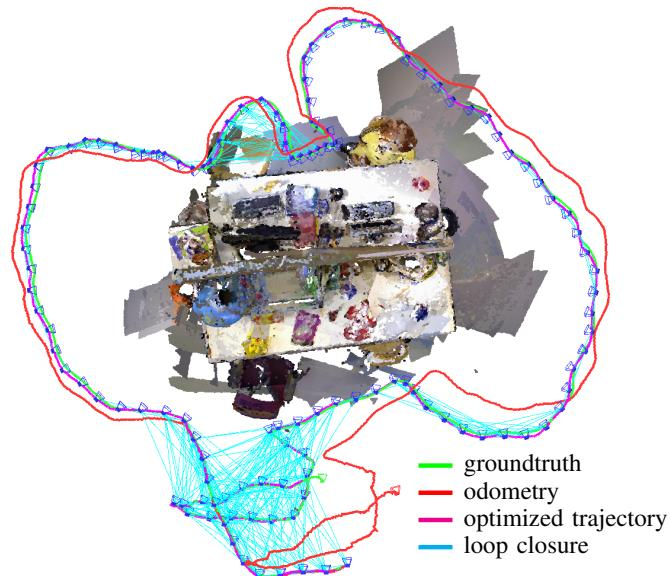
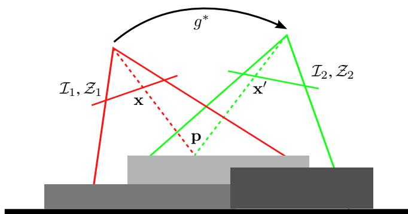
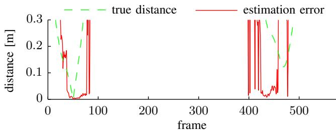
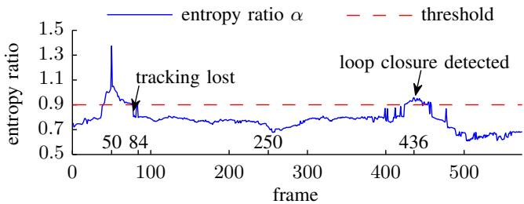
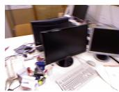
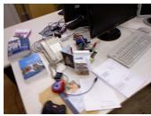
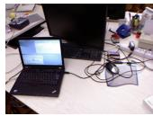
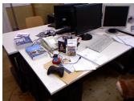
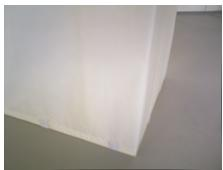
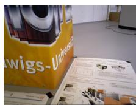

# Dense Visual SLAM for RGB-D Cameras

Christian Kerl, Jurgen Sturm, and Daniel Cremers¨

Abstract— In this paper, we propose a dense visual SLAM method for RGB-D cameras that minimizes both the photometric and the depth error over all pixels. In contrast to sparse, feature-based methods, this allows us to better exploit the available information in the image data which leads to higher pose accuracy. Furthermore, we propose an entropy-based similarity measure for keyframe selection and loop closure detection. From all successful matches, we build up a graph that we optimize using the g2o framework. We evaluated our approach extensively on publicly available benchmark datasets, and found that it performs well in scenes with low texture as well as low structure. In direct comparison to several stateof-the-art methods, our approach yields a significantly lower trajectory error. We release our software as open-source.

## I. INTRODUCTION

Many robotics applications such as navigation and mapping require accurate and drift-free pose estimates of a moving camera. Previous solutions favor approaches based on visual features in combination with bundle adjustment or pose graph optimization [1], [2]. Although these methods are state-of-the-art, the process of selecting relevant keypoints discards substantial parts of the acquired image data. Therefore, our goal is to develop a dense SLAM method that (1) better exploits the available data acquired by the sensor, (2) still runs in real-time, (3) effectively eliminates drift, and corrects accumulated errors by global map optimization.

Visual odometry approaches with frame-to-frame matching are inherently prone to drift. In recent years, dense tracking and mapping methods have appeared whose performance is comparable to feature-based methods [3], [4]. While frame-to-model approaches such as KinectFusion [5], [6] jointly estimate a persistent model of the world, they still accumulate drift (although slower than visual odometry methods), and therefore only work for the reconstruction of a small workspace (such as a desk, or part of a room). Although this problem can be delayed using more elaborate cost functions [7], [8] and alignment procedures [9], a more fundamental solution is desirable.

In this paper, we extend our dense visual odometry [7] by several key components that significantly reduce the drift and pave the way for a globally optimal map. Figure 1 shows an example of an optimized trajectory and the resulting consistent point cloud model. The implementation of our approach is available at:

vision.in.tum.de/data/software/dvo The main contributions of this paper are:

All authors are with the Computer Vision Group, Department of Computer Science, Technical University of Munich {christian.kerl, juergen.sturm, daniel.cremers}@in.tum.de This work has partially been supported by the DFG under contract number FO 180/17-1 in the Mapping on Demand (MOD) project.

  
Fig. 1: We propose a dense SLAM method for RGB-D cameras that uses keyframes and an entropy-based loop closure detection to eliminate drift. The figure shows the groundtruth, frame-to-keyframe odometry, and the optimized trajectory for the fr3/office dataset.

a fast frame-to-frame registration method that optimizes both intensity and depth errors,

an entropy-based method to select keyframes, which significantly decreases the drift,

a method to validate loop closures based on the same entropy metric, and

the integration of all of the above techniques into a general graph SLAM solver that further reduces drift.

Through extensive evaluation on a publicly available RGB-D benchmark [10], we demonstrate that our approach achieves higher accuracy on average than existing feature-based methods [1], [2]. Furthermore, we demonstrate that our method outperforms existing dense SLAM systems such as [5], [11].

## II. RELATED WORK

The estimation of the camera motion is known as visual odometry [12]. Most state-of-the-art methods establish correspondences between sparsely selected visual features to estimate the camera motion [13]–[16].

As an alternative to these classical approaches to visual odometry dense methods have emerged in past years. Comport et al. proposed a method to directly minimize the photometric error between consecutive stereo pairs [4]. Steinbrucker et al. [ ¨ 3] and Audras et al. [17] applied this approach to images obtained from recent RGB-D cameras like the Microsoft Kinect. In our own recent work we embedded the photometric error formulation into a probabilistic framework and showed how to robustify the cost function based on a sensor model and motion priors [7].

Instead of a photometric error one can also minimize a geometric error between 3D points. This class of algorithms is known as iterative closest point (ICP) [18], and many variations of the algorithm have been explored [19], [20].

Combined minimization of photometric and geometric error was proposed by Morency et al. [21] for head tracking and more recently for camera motion estimation by Tykkal¨ a¨ et al. [8] and Whelan et al. [9]. Meilland et al. recently extended this method to localize the camera with respect to a reference frame and simultaneously compute a superresolved version of it [22].

All odometry methods are inherently prone to drift, because the error of the frame-to-frame motion estimation accumulates over time. This can be resolved by simultaneously estimating a consistent map. Then the camera can be localized with respect to the consistent model eliminating the drift.

Newcombe et al. proposed to incrementally build a dense model of the scene and registering every new measurement to this model [5], [23]. Whelan et al. extended the KinectFusion algorithm of Newcombe et al. to arbitrarily large scenes [24]. As KinectFusion does not optimize previous camera poses, there is no possibility to correct accumulated errors in the model. The goal for Simultaneous Localization and Mapping (SLAM) or Structure from Motion (SfM) approaches is to jointly optimize the model and the camera trajectory. In this way, it is even possible to correct large accumulated errors after detecting a loop closure. In feature-based methods, the scene is often represented as a collection of previously observed 3D feature points. For joint optimisation two main groups of approaches exist. One group comprises filteringbased methods, which include the camera pose and feature locations in the state of a filter, e.g. an extended Kalman filter [25], [26], and incrementally refine them. The second group uses batch optimization to refine feature locations and camera poses [27], [28]. Pose SLAM does not optimize the scene structure in conjunction with the sensor poses, but only optimizes the sensor poses [29], [30]. In Pose SLAM the map is represented as a graph in which the vertices represent absolute sensor poses and the edges represent relative transformations between them. These transformations are calculated from sensor measurements. Recently, several Pose SLAM-based algorithms utilizing RGB-D cameras have been proposed [1], [11], [31].

In this paper we propose a visual SLAM system, which combines dense visual odometry based on a joint photometric and geometric error minimization and Pose SLAM. We show that our system outperforms comparable sparse feature-based methods [1], [31] and dense frame-to-model tracking approaches [5]. In contrast to recent work of Tykkal¨ a et al. [¨ 32], we acquire keyframes and optimize the map simultaneously. Furthermore, we do not require user interaction.

  
Fig. 2: The general idea of our dense RGB-D alignment approach: We estimate the camera motion $g ^ { * }$ between two RGB-D images by minimizing photometric and the geometric error.

## III. DENSE VISUAL ODOMETRY

Our goal is to estimate the motion of the camera solely from its image stream. At every timestep t the camera provides an RGB-D image comprising an intensity image $\mathcal { T } _ { t }$ and a corresponding depth map $\mathcal { Z } _ { t } .$ . Given the RGB-D images at two consecutive timesteps we want to calculate the rigid body motion $g$ of the camera.

Figure 2 illustrates the idea. Given a 3D point p in the scene and the correct motion $g ^ { * }$ we can compute its corresponding pixel coordinates in the first image x and in the second image $\mathbf { x } ^ { \prime } .$ The measured intensity at these two pixels should be identical, i.e., $\mathcal { T } _ { 1 } ( \mathbf { x } ) = \mathcal { T } _ { 2 } ( \mathbf { x } ^ { \prime } )$ . In general, this should be true for every point. This assumption is also known as photo-consistency and holds as long as the sensor is noiseless, the scene is static, and the illumination is constant. Using this principle we find the camera motion by maximizing the photo-consistency between the two images.

A similar assumption can be formulated for the depth measurements. Given a point p and the correct motion $g ^ { * }$ we can predict its depth measurement in the second depth map $\mathcal { Z } _ { 2 }$ . Ideally the predicted depth measurement and the actual measurement are equal. Generalizing, every point should satisfy this constraint. Therefore, the motion can be estimated by minimizing the difference between the predicted and the actual depth measurements. In the following we formalize our approach.

## A. Camera Model

A 3D point is defined in homogeneous coordinates as $\mathbf { p } = ( X , Y , Z , 1 ) ^ { \mathsf { T } }$ . We reconstruct a point from its pixel coordinates $\mathbf { x } = ( x , y ) ^ { \mathsf { T } }$ and a corresponding depth measurement $Z = { \mathcal { Z } } ( \mathbf { x } )$ using the inverse projection function $\pi ^ { - 1 }$ , i.e.,

$$
\mathbf { p } = \pi ^ { - 1 } ( \mathbf { x } , Z ) = \left( \frac { x - o _ { x } } { f _ { x } } Z , \frac { y - o _ { y } } { f _ { y } } Z , Z , 1 \right) ^ { \top }\tag{1}
$$

where $f _ { x } , \ f _ { y }$ are the focal lengths and $\mathit { o _ { x } } , \mathit { o _ { y } }$ are the coordinates of the camera center in the standard pinhole camera model. The pixel coordinates for a point can be

computed using the projection function π:

$$
\mathbf { x } = \pi ( \mathbf { p } ) = \left( { \frac { X f _ { x } } { Z } } + o _ { x } , { \frac { Y f _ { y } } { Z } } + o _ { y } \right) ^ { \mathsf { T } } .\tag{2}
$$

## B. Rigid Body Motion

We restrict the camera motion g to the class of rigid body motions forming the special euclidean group $\operatorname { S E } ( 3 )$ A common representation for rigid body motions g is a transformation matrix T,

$$
\pmb { T } _ { 4 \times 4 } = \left[ \begin{array} { c c } { \pmb { R } _ { 3 \times 3 } } & { \pmb { t } _ { 3 \times 1 } } \\ { \mathbf { 0 } } & { 1 } \end{array} \right]\tag{3}
$$

comprising a rotation matrix and a translation vector. The transformation of a point p with g represented as transformation matrix is defined as:

$$
g ( \mathbf { p } ) = \mathbf { p } ^ { \prime } = T \mathbf { p } .\tag{4}
$$

The transformation matrix T is an overparamatrized representation of $^ { g , }$ i.e., T has twelve parameters where as g only has six degrees of freedom. Therefore, we use the representation as twist coordinates ξ given by the Lie algebra se(3) associated with the group SE(3). ξ is a six-vector. The transformation matrix T can be calculated from ξ using the matrix exponential $\pmb { T } = \exp ( \pmb { \hat { \xi } } )$

## C. Warping Function

With the previously defined projection function and rigid body motion we can derive a warping function τ, which computes the location of a pixel from the first image in the second image given a rigid body motion:

$$
\begin{array} { r } { \mathbf { x } ^ { \prime } = \tau ( \mathbf { x } , \pmb { T } ) = \pi \Big ( \pmb { T } \pi ^ { - 1 } \big ( \mathbf { x } , \mathcal { Z } _ { 1 } ( \mathbf { x } ) \big ) \Big ) . } \end{array}\tag{5}
$$

## D. Error Functions

Based on the warping function τ we define the photometric error $r _ { \mathcal { T } }$ for a pixel x as

$$
r _ { \mathcal { T } } = \mathcal { I } _ { 2 } \big ( \tau ( \mathbf { x } , \pmb { T } ) \big ) - \mathcal { I } _ { 1 } ( \mathbf { x } ) .\tag{6}
$$

Similarly, the depth error is given as

$$
r _ { \mathcal { Z } } = \mathcal { Z } _ { 2 } \bigl ( \tau ( \mathbf { x } , \pmb { T } ) \bigr ) - \bigl [ \pmb { T } \pi ^ { - 1 } \bigl ( \mathbf { x } , \mathcal { Z } _ { 1 } ( \mathbf { x } ) \bigr ) \bigr ] _ { Z }\tag{7}
$$

where $[ \cdot ] _ { Z }$ returns the $Z$ component of a point, i.e., $[ { \bf p } ] _ { Z } =$ Z. Therefore, the second term is the depth of the transformed point, which was reconstructed from the first depth image. It can be shown that the depth error is equivalent to the formulation of point-to-plane ICP with projective lookup.

## E. Probabilistic Formulation

In our previous work [7] we gave a probabilistic formulation for the estimation of the camera motion ξ given the photometric error $r _ { \mathcal { L } } .$ . The formulation allows the use of different probability distributions for the photometric error and priors for the motion parameters $\xi .$ In the following we give a short summary of the derivation. We seek to determine the motion $\xi ^ { * }$ by maximizing the probability given the pixelwise error, i.e.,

$$
\pmb { \xi } ^ { * } = \arg \operatorname* { m a x } _ { \pmb { \xi } } \operatorname { p } _ { } ( \pmb { \xi } \mid r _ { \mathbb { Z } } ) .\tag{8}
$$

After applying Bayes’ rule, assuming all errors are independent and identically distributed (i.i.d.) and using the negative log-likelihood, we get

$$
\pmb { \xi } ^ { * } = \underset { \pmb { \xi } } { \arg \operatorname* { m i n } } - \sum _ { i } ^ { n } \log \left( \mathrm { p } ( r _ { \mathbb { Z } , i } \mid \pmb { \xi } ) \right) - \log \left( \mathrm { p } ( \pmb { \xi } ) \right) .\tag{9}
$$

In case $\mathrm { p } ( r _ { \mathbb { Z } , i } \ \mid \ \pmb { \xi } )$ is defined as a Gaussian distribution, this results in a standard least-squares problem. However, we found the photometric error to follow a t-distribution $\mathrm { p } _ { t } ( 0 , \sigma ^ { 2 } , \nu )$ with zero mean, variance $\sigma ^ { 2 }$ and ν degrees of freedom. We find the t-distribution to be a suitable model, because it can be interpreted as an infinite mixture of Gaussians with different variances [33]. Therefore, it relaxes the i.i.d. assumption in (9). Large errors stem from components with large variance and get low weights. Conversely, small errors belong to components with small variance and get higher influence. Defining $\mathrm { p } ( r _ { \mathbb { Z } , i } \mid \pmb { \xi } )$ as a t-distribution leads to an iteratively re-weighted least squares formulation:

$$
\pmb { \xi } ^ { * } = \underset { \pmb { \xi } } { \arg \operatorname* { m i n } } \sum _ { i } ^ { n } w _ { i } r _ { \mathcal { T } , i } ^ { 2 } .\tag{10}
$$

In this paper, we extend our previous formulation by incorporating the depth error $r _ { \mathcal { Z } }$ . Therefore, we model the photometric and the depth error as a bivariate random variable $\boldsymbol { r } = ( r _ { \mathcal { I } } , r _ { \mathcal { Z } } ) ^ { \top }$ , which follows a bivariate t-distribution $\mathrm { p } _ { t } ( \mathbf { 0 } , \pmb { \Sigma } , \nu )$ . For the bivariate case, (10) becomes:

$$
\pmb { \xi } ^ { * } = \underset { \pmb { \xi } } { \arg \operatorname* { m i n } } \sum _ { i } ^ { n } w _ { i } \pmb { r } _ { i } ^ { \top } \pmb { \Sigma } ^ { - 1 } \pmb { r } _ { i } .\tag{11}
$$

The weights $w _ { i }$ based on the t-distribution are:

$$
w _ { i } = \frac { \nu + 1 } { \nu + r _ { i } ^ { \top } \Sigma ^ { - 1 } r _ { i } } .\tag{12}
$$

Note that our formulation is substantially different from previous formulations [8], [9], [21], because they only combine the photometric and depth error linearly. To balance the two error terms they used a manually chosen [9] or heuristically computed weight [8]. Furthermore, the linear combination assumes independence between the two errors. In contrast, our model down-weights errors, which have either a large photometric, or a large depth error, or both as they are likely to be outliers. Additionally, the weighting of the error terms by Σ is automatically adapted.

## F. Linearization and Optimization

The error function (11) we seek to minimize is not linear in the motion parameters $\xi .$ Therefore, we linearize it around the current motion estimate $\xi _ { k }$ using a first order Taylor expansion. The resulting normal equations of this non-linear least squares problem are:

$$
\begin{array} { c } { A \Delta \xi = b } \\ { \displaystyle \sum _ { i } ^ { n } w _ { i } { \bf J } _ { i } ^ { \top } { \bf \Sigma } ^ { - 1 } J _ { i } \Delta \xi = - \sum _ { i } ^ { n } w _ { i } { \bf J } _ { i } ^ { \top } { \bf \Sigma } ^ { - 1 } r _ { i } } \end{array}\tag{13}
$$

where $J _ { i }$ is the $2 \times 6$ Jacobian matrix containing the derivatives of $\mathbf { \nabla } _ { \mathbf { r } _ { i } }$ with respect to $\xi ,$ , and n is the number of pixels.

We iteratively solve the normal equations for increments $\Delta \xi .$ At each iteration we re-estimate the scale matrix Σ and the weights $w _ { i }$ using a standard expectation maximization algorithm for the t-distribution [34]. Furthermore, we employ a coarse-to-fine scheme to account for a larger range of camera motions.

## G. Parameter Uncertainty

We assume that the estimated parameters ξ are normally distributed with mean $\xi ^ { * }$ and covariance $\Sigma _ { \xi }$ , i.e., $\xi \sim \mathcal { N } ( \xi ^ { * } , \Sigma _ { \xi } )$ . The approximate Hessian matrix A in the normal equations (cf. (13)) is equivalent to the Fisher information matrix. Its inverse gives a lower bound for the variance of the estimated parameters $\xi , \mathrm { c . q . } , \Sigma _ { \xi } = A ^ { - 1 }$

To summarize, the method presented in this section allows us to align two RGB-D images by minimizing the photometric and geometric error. By using the t-distribution, our method is robust to small deviations from the model.

## IV. KEYFRAME-BASED VISUAL SLAM

The incremental frame-to-frame alignment method presented above inherently accumulates drift, because there is always a small error in the estimate. This error is caused by sensor noise and inaccuracies of the error model, which does not capture all variations in the sensor data.

To overcome this limitation we adapt the idea of keyframebased pose SLAM methods [1], [11], [28] and integrate it with our dense visual odometry approach. To limit local drift we estimate the transformation between the current image and a keyframe. As long as the camera stays close enough to the keyframe no drift is accumulated. Every keyframe is inserted into a map and connected to its predecessor through a constraint. When previously seen regions of the scene are revisited additional constraints to older keyframes can be established to correct for the accumulated drift. These additional constraints are called loop closures. Therefore, a SLAM system needs to additionally perform:

keyframe selection,

loop closure detection and validation, and

• map optimization.

In the following sections we describe our solutions to these sub problems.

## A. Keyframe Selection

When the current image can no longer be matched against the latest keyframe a new one has to be used. There exist several strategies to decide when to choose a new keyframe. Common strategies are to create a new keyframe: every n frames, at a certain rotational and translational distance [11], [27], when the number of features visible in both images is below a threshold [1]. The dense approach for omnidirectional cameras of Meilland et al. uses a threshold on the variance and total value of the error [35].

In our approach we found that the values of the error computed by (11) are not directly comparable, because it depends on the scale Σ of the error distribution, which varies between image pairs. Furthermore, we want to reduce the number of user defined parameters. Therefore, we use the following strategy.

(a) estimate error w.r.t. frame 50  
  
(b) estimate uncertainty w.r.t. frame 50

  
(c) Frame 50

  
(d) Frame 84

  
(e) Frame 250  
(f) Frame 436  
Fig. 3: Frame 50 of the freiburg1/desk dataset matched against all frames of the dataset. Plot (a) shows the translational distance of each frame to frame 50 and the translational error in the estimate. Plot (b) displays the entropy ratio α. Note how high entropy ratio values coincide with low error in the estimate. The second peak in the entropy ratio indicates a loop closure detection.

The differential entropy of a multivariate normal distribution $\pmb { x } \sim \mathcal { N } ( \pmb { \mu } , \pmb { \Sigma } )$ with m dimensions is defined as:

$$
H ( \pmb { x } ) = 0 . 5 m \big ( 1 + \ln ( 2 \pi ) \big ) + 0 . 5 \ln ( | \pmb { \Sigma } | ) .\tag{14}
$$

Dropping the constant terms the entropy is proportional to the natural logarithm of the determinant of the covariance matrix, i.e., $H ( \pmb { x } ) \propto \ln ( | \pmb { \Sigma } | )$ . Therefore, it abstracts the uncertainty encoded in the covariance matrix into a scalar value.

We observed a relationship between the parameter entropy $H ( \pmb { \xi } )$ and the error of the estimated trajectory. As the entropy changes over the course of a trajectory and between different scenes, simple thresholding is not applicable. To overcome this limitation we compute the entropy ratio between the motion estimate $\xi _ { k , k + j }$ from the last keyframe k to the current frame $j$ and the motion $\xi _ { k , k + 1 }$ from keyframe k to the very next frame k + 1, i.e.,

$$
\alpha = \frac { H ( \pmb { \xi } _ { k : k + j } ) } { H ( \pmb { \xi } _ { k : k + 1 } ) } .\tag{15}
$$

The rational is that the first frame matched against a new keyframe has the smallest distance and the estimate is most certainly accurate. As a result, we can take this entropy as a reference value for future comparisons. When the distance between current frame and keyframe grows the entropy increases, i.e, α decreases. Figure 3 shows the entropy ratios for the 50’th frame registered to all other frames of the fr1/desk dataset. In this example the denominator in (15) is the entropy of the relative transformation from frame 50 to 51, i.e., $H ( \xi _ { k : k + 1 } ) = H ( \xi _ { 5 0 : 5 1 } )$ . In case α is below a predefined threshold for the current frame, the previous frame is selected as a new keyframe and inserted into the map. Our ratio test is similar to the likelihood ratio test for loop closure validation described by Stuckler et al. [¨ 11].

## B. Loop Closure Detection

As for the keyframe selection step several approaches exist for the detection of loop closures. The simplest strategy is a linear search over all existing keyframes, i.e., a new keyframe is matched against all others. This quickly becomes intractable as the number of keyframes grows. Therefore, it is important to prune the search space efficiently and only match against the most likely candidates. One common class of methods are place recognition systems extracting visual feature descriptors from images and training efficient data structures for fast search and candidate retrieval [36]. Other approaches use metrical [1] or probabilistic [11] nearest neighbour search.

For our application we chose a metrical nearest neighbour search, because we operate in space restricted indoor environments and our visual odometry is sufficiently accurate. We search loop closure candidates in a sphere with predefined radius around the keyframe position. We compute for every candidate the relative transformation between the two keyframes and the associated covariance matrix on a coarse resolution. To validate a candidate we employ the same entropy ratio test as for keyframe selection (see (15)). However, instead of the entropy of the transformation of the first frame to the keyframe $H ( \pmb { \xi } _ { k : k + 1 } )$ we use the average entropy of all successful matches of intermediate frames to the keyframe. The intuition behind this criterion is that intermediate frames are spatially and temporally closest to the keyframe and therefore yield the best possible registration results with the lowest uncertainty. If the parameter estimate obtained from the low resolution images passes the test, we compute an improved estimate using higher resolutions as well. Finally, the same entropy ratio test is applied again. In case this test is also successful we insert a new edge with the relative pose constraint into the graph. Figure 3 shows that the entropy ratio increases again, when the camera returns to the vicinity where frame 50 was captured (frames 420- 450). Furthermore, Figure 3 shows that a high entropy ratio coincides with a low error in the estimate.

## C. Map Representation and Optimization

We represent the map as a graph of camera poses, where every vertex is a pose of a keyframe. The edges represent relative transformations between the keyframes. As we add new keyframes to the map a chain of keyframes linked by relative transformations is created. To correct for the accumulated error in the trajectory we search for loop closures to previously visited keyframes. Valid loop closures become new edges in the graph. Afterwards, the error can be corrected by solving a non-linear least squares optimization problem. The error correction is distributed over the edges in the loop. Every edge is weighted with the covariance matrix $\Sigma _ { \xi }$ of the relative motion estimate. Therefore, the estimates of edges with higher uncertainty change more to compensate the error than the ones of edges with low uncertainty. We use the g2o framework of Kummerle et al. as implementation for¨ the map representation and optimization [37]. At the end of a dataset we search for additional loop closure constraints for every keyframe and optimize the whole graph again.

Figure 1 shows an optimized pose graph. The blue camera frustums represent the keyframe poses. The cyan links indicate loop closures. The loop closures and map optimization correct the accumulated drift of the frame-to-keyframe odometry shown in red. The corrected trajectory allows to construct a consistent point cloud model of the scene.

In this section, we described a method to assess the quality of a motion estimate based on the entropy of the parameter distribution, which we use to select keyframes, detect loop closures, and to construct a pose graph.

## V. EVALUATION

For evaluation we use the RGB-D benchmark provided by the Technical University of Munich [10]. The benchmark contains multiple real datasets captured with an RGB-D camera. Every dataset accompanies an accurate groundtruth trajectory obtained with an external motion capture system.

In a first set of experiments we evaluated the benefit of combined photometric and geometric error minimization. The RGB-D datasets with a varying amount of texture and structure are suitable for this purpose. Figure 4 shows representative images of the different datasets. Table I displays the results of the experiments. The first two columns indicate whether the dataset contains structure/texture (x) or not (-). The third column displays the qualitative distance of the camera to the scene. The last three columns show the root mean square error (RMSE) of the translational drift (RPE) in m/s for the three different estimation methods, RGBonly, depth-only and combined. The RGB-only odometry works better on structureless scenes with texture than the depth-only variant and vice versa. The combined variant outperforms both methods on these datasets. However, the combined RGB and depth odometry performs slightly worse than the RGB-only odometry on the datasets with structure and texture. Nevertheless, it shows a better generalization over the different scene types. The depth term also helps to stabilize the estimate in case of sudden intensity changes due to auto-exposure.

In a second set of experiments we compared the performance of frame-to-frame (RGB+D), frame-to-keyframe (RGB+D+KF) and frame-to-keyframe tracking with pose graph optimization (RGB+D+KF+Opt). We used all of the freiburg1 (fr1) datasets. Table II displays the results. On 11 out of 16 datasets our visual SLAM system has the lowest drift. The high drift values on the fr1/floor and fr1/plant (v) datasets stem from incorrect loop closures. Note that the frame-to-frame tracking failed on the fr1/floor dataset due to missing frames over multiple seconds. The average improvement due to the use of keyframes is 16%. The inclusion of pose graph optimization increases this to 20%. This experiment shows that frame-to-keyframe tracking is already highly accurate. However, the main benefit of pose graph optimization lies in the correction of the long term drift. The average of the RMSE values of the absolute trajectory error (ATE) for the freiburg1 sequences (excluding fr1/floor) for frame-to-frame tracking is 0.19m. In contrast, the average of the ATE RMSE values for the frame-tokeyframe tracking algorithm with pose graph optimization is 0.07m. Yielding an improvement of 170%.

  
(a) texture

  
(b) structure  
(c) structure + texture  
Fig. 4: Example images of the datasets with varying structure and texture, which we use to compare the different visual odometry variants.

TABLE I: Comparison of RGB-only, depth-only and combined visual odometry methods based on the RMSE of the translational drift (m/s) for different scene content and distance. The combined method yields best results for scenes with only structure or texture. The RGB-only method performs best in highly structured and textured scenes. Nevertheless, the combined method generalizes better to different scene content.
<table><tr><td>structure</td><td>texture</td><td>distance</td><td>RGB</td><td>Depth</td><td>RGB+Depth</td></tr><tr><td>=</td><td>X</td><td>near</td><td>0.0591</td><td>0.2438</td><td>0.0275</td></tr><tr><td>=</td><td>X</td><td>far</td><td>0.1620</td><td>0.2870</td><td>0.0730</td></tr><tr><td>X</td><td>=</td><td>near</td><td>0.1962</td><td>0.0481</td><td>0.0207</td></tr><tr><td>X</td><td>-</td><td>far</td><td>0.1021</td><td>0.0840</td><td>0.0388</td></tr><tr><td>X</td><td>X</td><td>near</td><td>0.0176</td><td>0.0677</td><td>0.0407</td></tr><tr><td>X</td><td>X</td><td>far</td><td>0.0170</td><td>0.0855</td><td>0.0390</td></tr></table>

Finally, we compare our approach to recent state-of-the-art visual SLAM approaches, namely the RGB-D SLAM system [2], [31], the multi-resolution surfel maps (MRSMap) [11], and the PCL implementation of KinectFusion (KinFu) [5]. Table III summarizes the results. The first column contains the dataset name, the second column shows the number of keyframes our system created. The following columns show the RMSE of the absolute trajectory error for our system, RGB-D SLAM, MRSMap and KinectFusion. Our system performs best on five of eight datasets for which results of all systems are available. The difference to the best system on the three other datasets is small. In contrast, our improvement on long and complex trajectories, e.g. fr1/room, fr1/teddy, over the other systems is notable.

TABLE II: RMSE of translational drift (RPE) in m/s for frame-to-frame, frame-to-keyframe odometry and frame-tokeyframe odometry with pose graph optimization for all freiburg1 datasets. Note that (v) marks validation datasets without public groundtruth that we evaluated using the online tool. The use of keyframes improves the performance by 16% in comparison to frame-to-frame odometry. Pose graph optimization reduces the drift further, resulting in an average improvement of 20%.
<table><tr><td>Dataset</td><td>RGB+D</td><td>RGB+D+KF</td><td>RGB+D+KF+Opt</td></tr><tr><td>fr1/desk</td><td>0.036</td><td>0.030</td><td>0.024</td></tr><tr><td>fr1/desk (v)</td><td>0.035</td><td>0.037</td><td>0.035</td></tr><tr><td>fr1/desk2</td><td>0.049</td><td>0.055</td><td>0.050</td></tr><tr><td>fr1/desk2 (v)</td><td>0.020</td><td>0.020</td><td>0.017</td></tr><tr><td>fr1/room</td><td>0.058</td><td>0.048</td><td>0.043</td></tr><tr><td>fr1/room (v)</td><td>0.076</td><td>0.042</td><td>0.094</td></tr><tr><td>fr1/360</td><td>0.119</td><td>0.119</td><td>0.092</td></tr><tr><td>fr1/360 (v)</td><td>0.097</td><td>0.125</td><td>0.096</td></tr><tr><td>fr1/teddy</td><td>0.060</td><td>0.067</td><td>0.043</td></tr><tr><td>fr1/floor</td><td>fail</td><td>0.090</td><td>0.232</td></tr><tr><td>fr1/xyz</td><td>0.026</td><td>0.024</td><td>0.018</td></tr><tr><td>fr1/xyz (v)</td><td>0.047</td><td>0.051</td><td>0.058</td></tr><tr><td>fr1/rpy</td><td>0.040</td><td>0.043</td><td>0.032</td></tr><tr><td>fr1/rpy (v)</td><td>0.103</td><td>0.082</td><td>0.044</td></tr><tr><td>fr1/plant</td><td>0.036</td><td>0.036</td><td>0.025</td></tr><tr><td>fr1/plant (v)</td><td>0.063</td><td>0.062</td><td>0.191</td></tr><tr><td>avg. improvement</td><td>0%</td><td>16%</td><td>20%</td></tr></table>

TABLE III: RMSE of absolute trajectory error (m) for our visual SLAM system in comparison to three state-of-art systems. The second column shows the number of keyframes used by our system. Our system performs best on the majority of datasets. Note especially the improvement on datasets with long and complex trajectories (e.g. fr1/room, fr1/teddy).
<table><tr><td>Dataset</td><td>#KF</td><td>Ours</td><td>RGB-D SLAM</td><td>MRSMap</td><td>KinFu</td></tr><tr><td>fr1/xyz</td><td>68</td><td>0.011</td><td>0.014</td><td>0.013</td><td>0.026</td></tr><tr><td>fr1/rpy</td><td>73</td><td>0.020</td><td>0.026</td><td>0.027</td><td>0.133</td></tr><tr><td>fr1/desk</td><td>67</td><td>0.021</td><td>0.023</td><td>0.043</td><td>0.057</td></tr><tr><td>fr1/desk2</td><td>93</td><td>0.046</td><td>0.043</td><td>0.049</td><td>0.420</td></tr><tr><td>fr1/room</td><td>186</td><td>0.053</td><td>0.084</td><td>0.069</td><td>0.313</td></tr><tr><td>fr1/360</td><td>126</td><td>0.083</td><td>0.079</td><td>0.069</td><td>0.913</td></tr><tr><td>fr1/teddy</td><td>181</td><td>0.034</td><td>0.076</td><td>0.039</td><td>0.154</td></tr><tr><td>fr1/plant</td><td>156</td><td>0.028</td><td>0.091</td><td>0.026</td><td>0.598</td></tr><tr><td>fr2/desk</td><td>181</td><td>0.017</td><td></td><td>0.052</td><td></td></tr><tr><td>fr3/office</td><td>168</td><td>0.035</td><td>=</td><td></td><td>0.064</td></tr><tr><td>average</td><td></td><td>0.034</td><td>0.054</td><td>0.043</td><td>0.297</td></tr></table>

We performed all experiments on a PC with Intel Core i7-2600 CPU with 3.40GHz and 16GB RAM. The visual odometry and the SLAM component run in separate threads. The time for frame-to-keyframe tracking is almost constant around 32ms. The time for loop closure detection and optimization depends on the number of keyframes and edges in the graph. The average processing time for this map update is 135ms. In the coarse-to-fine optimization for motion estimation we use three different image resolutions up to 320  240 pixels.

## VI. CONCLUSION

In this paper, we presented a novel approach that combines dense tracking with keyframe selection and pose graph optimization. In our experiments on publicly available datasets, we showed that the use of keyframes already reduces the drift (16%). We introduced an entropy-based criterion to select suitable keyframes. Furthermore, we showed that the same entropy-based measure can be used to efficiently detect loop closures. By optimizing the resulting pose graph, we showed that the global trajectory error can be reduced significantly by 170%. All our experimental evaluations were conducted on publicly available benchmark sequences. We publish our software as open-source and plan to provide the estimated trajectories to stimulate further comparison.

As a next step, we plan to generate high quality 3D models based on the optimized camera trajectories. Furthermore, we want to improve the keyframe quality through the fusion of intermediary frames similar to [22], [32]. More sophisticated techniques could be used to detect loop closures, such as covariance propagation or inverse indexing similar to [36].

## REFERENCES

[1] P. Henry, M. Krainin, E. Herbst, X. Ren, and D. Fox, “RGB-D mapping: Using depth cameras for dense 3D modeling of indoor environments,” in Intl. Symp. on Experimental Robotics (ISER), 2010.

[2] N. Engelhard, F. Endres, J. Hess, J. Sturm, and W. Burgard, “Realtime 3D visual SLAM with a hand-held camera,” in RGB-D Workshop on 3D Perception in Robotics at the European Robotics Forum (ERF), 2011.

[3] F. Steinbrucker, J. Sturm, and D. Cremers, “Real-time visual odometry¨ from dense RGB-D images,” in Workshop on Live Dense Reconstruction with Moving Cameras at the Intl. Conf. on Computer Vision (ICCV), 2011.

[4] A. Comport, E. Malis, and P. Rives, “Accurate Quadri-focal Tracking for Robust 3D Visual Odometry,” in IEEE Intl. Conf. on Robotics and Automation (ICRA), 2007.

[5] R. A. Newcombe, S. Izadi, O. Hilliges, D. Molyneaux, D. Kim, A. J. Davison, P. Kohli, J. Shotton, S. Hodges, and A. Fitzgibbon, “KinectFusion: Real-time dense surface mapping and tracking,” in IEEE Intl. Symp. on Mixed and Augmented Reality (ISMAR), 2011.

[6] M. Zeng, F. Zhao, J. Zheng, and X. Liu, “A Memory-Efficient KinectFusion using Octree,” in Computational Visual Media, ser. Lecture Notes in Computer Science. Springer Berlin Heidelberg, 2012, vol. 7633, pp. 234–241.

[7] C. Kerl, J. Sturm, and D. Cremers, “Robust odometry estimation for RGB-D cameras,” in IEEE Intl. Conf. on Robotics and Automation (ICRA), 2013.

[8] T. Tykkal¨ a, C. Audras, and A. Comport, “Direct iterative closest point ¨ for real-time visual odometry,” in Workshop on Computer Vision in Vehicle Technology: From Earth to Mars at the Intl. Conf. on Computer Vision (ICCV), 2011.

[9] T. Whelan, H. Johannsson, M. Kaess, J. Leonard, and J. McDonald, “Robust real-time visual odometry for dense RGB-D mapping,” in IEEE Intl. Conf. on Robotics and Automation (ICRA), Karlsruhe, Germany, 2013.

[10] J. Sturm, N. Engelhard, F. Endres, W. Burgard, and D. Cremers, “A benchmark for the evaluation of RGB-D SLAM systems,” in Intl. Conf. on Intelligent Robot Systems (IROS), 2012.

[11] J. Stuckler and S. Behnke, “Integrating depth and color cues for dense¨ multi-resolution scene mapping using rgb-d cameras,” in IEEE Intl. Conf. on Multisensor Fusion and Information Integration (MFI), 2012.

[12] D. Nister, O. Naroditsky, and J. Bergen, “Visual odometry,” in IEEE Conf. on Computer Vision and Pattern Recognition (CVPR), 2004.

[13] A. Chiuso, P. Favaro, H. Jin, and S. Soatto, “3-D motion and structure from 2-D motion causally integrated over time: Implementation,” in European Conf. on Computer Vision (ECCV), 2000.

[14] A. J. Davison, I. D. Reid, N. D. Molton, and O. Stasse, “MonoSLAM: Real-time single camera SLAM,” IEEE Transactions on Pattern Analysis and Machine Intelligence, vol. 29, no. 6, pp. 1052–1067, 2007.

[15] K. Konolige, M. Agrawal, R. Bolles, C. Cowan, M. Fischler, and B. Gerkey, “Outdoor mapping and navigation using stereo vision,” in Intl. Symp. on Experimental Robotics (ISER), 2007.

[16] A. S. Huang, A. Bachrach, P. Henry, M. Krainin, D. Maturana, D. Fox, and N. Roy, “Visual odometry and mapping for autonomous flight using an RGB-D camera,” in Intl. Symp. of Robotics Research (ISRR), 2011.

[17] C. Audras, A. Comport, M. Meilland, and P. Rives, “Real-time dense RGB-D localisation and mapping,” in Australian Conference on Robotics and Automation, 2011.

[18] P. J. Besl and N. D. McKay, “A method for registration of 3-D shapes,” IEEE Trans. Pattern Anal. Mach. Intell. (PAMI), vol. 14, no. 2, 1992.

[19] S. Rusinkiewicz and M. Levoy, “Efficient variants of the ICP algorithm,” in Intl. Conf. on 3-D Digital Imaging and Modeling (3DIM), 2001.

[20] A. Segal, D. Haehnel, and S. Thrun, “Generalized-icp,” in Robotics: Science and Systems (RSS), vol. 25, 2009, pp. 26–27.

[21] L.-P. Morency and T. Darrell, “Stereo tracking using icp and normal flow constraint,” in IEEE Intl. Conf. on Pattern Recognition, 2002.

[22] M. Meilland and A. I. Comport, “Simultaneous super-resolution, tracking and mapping,” CNRS-I3S/UNS, Sophia-Antipolis, France, Research Report RR-2012-05, 2012.

[23] R. A. Newcombe, S. Lovegrove, and A. J. Davison, “DTAM: Dense tracking and mapping in real-time,” in Intl. Conf. on Computer Vision (ICCV), 2011.

[24] T. Whelan, M. Kaess, M. Fallon, H. Johannsson, J. Leonard, and J. McDonald, “Kintinuous: Spatially extended KinectFusion,” in RSS Workshop on RGB-D: Advanced Reasoning with Depth Cameras, 2012.

[25] R. Smith, M. Self, and P. Cheeseman, “A stochastic map for uncertain spatial relationships,” in Intl. Symp. on Robotics Research, 1987.

[26] H. Durrant-Whyte and T. Bailey, “Simultaneous localization and mapping: part i,” Robotics & Automation Magazine, IEEE, vol. 13, no. 2, pp. 99–110, 2006.

[27] G. Klein and D. Murray, “Parallel tracking and mapping for small AR workspaces,” in IEEE and ACM Intl. Symp. on Mixed and Augmented Reality (ISMAR), 2007.

[28] H. Strasdat, J. M. M. Montiel, and A. Davison, “Scale drift-aware large scale monocular SLAM,” in Robotics: Science and Systems, 2010.

[29] F. Lu and E. Milios, “Globally consistent range scan alignment for environment mapping,” Autonomous robots, vol. 4, no. 4, pp. 333– 349, 1997.

[30] J.-S. Gutmann and K. Konolige, “Incremental mapping of large cyclic environments,” in IEEE Intl. Symp. on Computational Intelligence in Robotics and Automation, 1999.

[31] F. Endres, J. Hess, N. Engelhard, J. Sturm, D. Cremers, and W. Burgard, “An evaluation of the RGB-D SLAM system,” in IEEE Intl. Conf. on Robotics and Automation (ICRA), 2012.

[32] T. Tykkal¨ a, A. I. Comport, J.-K. K¨ am¨ ar¨ ainen, and H. Hartikainen,¨ “Live RGB-D Camera Tracking for Television Production Studios,” Elsvier Journal of Visual Communication and Image Representation, 2012.

[33] C. M. Bishop et al., Pattern recognition and machine learning. Springer New York, 2006, vol. 4, no. 4.

[34] C. Liu and D. B. Rubin, “Ml estimation of the t distribution using em and its extensions, ecm and ecme,” Statistica Sinica, vol. 5, no. 1, pp. 19–39, 1995.

[35] M. Meilland, A. Comport, and P. Rives, “Dense visual mapping of large scale environments for real-time localisation,” in IEEE/RSJ Intl. Conf. on Intelligent Robots and Systems, 2011.

[36] M. Cummins and P. Newman, “Invited Applications Paper FAB-MAP: Appearance-Based Place Recognition and Mapping using a Learned Visual Vocabulary Model,” in Intl. Conf. on Machine Learning (ICML), 2010.

[37] R. Kummerle, G. Grisetti, H. Strasdat, K. Konolige, and W. Burgard,¨ “g2o: A general framework for graph optimization,” in IEEE Intl. Conf. on Robotics and Automation (ICRA), 2011.