# Real-time 3D Reconstruction at Scale using Voxel Hashing

Matthias Nießner1,3 Michael Zollhöfer¹ Shahram Izadi² Marc Stamminger¹ 1University of Erlangen-Nuremberg 2Microsoft Research Cambridge 3Stanford University

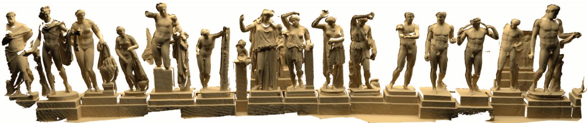  
Figure 1: Example output from our reconstruction system without any geometry post-processing. Scene is about 20m wide and 4m high and captured online in less than 5 minutes with live feedback of the reconstruction.

## Abstract

Online 3D reconstruction is gaining newfound interest due to the availability of real-time consumer depth cameras. The basic problem takes live overlapping depth maps as input and incrementally fuses these into a single 3D model. This is challenging particularly when real-time performance is desired without trading quality or scale. We contribute an online system for large and fine scale volumetric reconstruction based on a memory and speed efficient data structure. Our system uses a simple spatial hashing scheme that compresses space, and allows for real-time access and updates of implicit surface data, without the need for a regular or hierarchical grid data structure. Surface data is only stored densely where measurements are observed. Additionally, data can be streamed efficiently in or out of the hash table, allowing for further scalability during sensor motion. We show interactive reconstructions of a variety of scenes, reconstructing both fine-grained details and large scale environments. We illustrate how all parts of our pipeline from depth map pre-processing, camera pose estimation, depth map fusion, and surface rendering are performed at real-time rates on commodity graphics hardware. We conclude with a comparison to current state-of-the-art online systems, illustrating improved performance and reconstruction quality.

CR Categories: I.3.3 [Computer Graphics]: Picture/Image Generation—Digitizing and Scanning

Keywords: real-time reconstruction, scalable, data structure, GPU

Links: DL PDF

## 1 Introduction

While 3D reconstruction is an established field in computer vision and graphics, it is now gaining newfound momentum due to the wide availability of depth cameras (such as the Microsoft Kinect and Asus Xtion). Since these devices output live but noisy depth maps, a particular focus of recent work is online surface reconstruction using such consumer depth cameras. The ability to obtain reconstructions in real-time opens up various interactive applications including: augmented reality (AR) where real-world geometry can be fused with 3D graphics and rendered live to the user; autonomous guidance for robots to reconstruct and respond rapidly to their environment; or even to provide immediate feedback to users during 3D scanning.

Online reconstruction requires incremental fusion of many overlapping depth maps into a single 3D representation that is continuously refined. This is challenging particularly when real-time performance is required without trading fine-quality reconstructions and spatial scale. Many state-of-the-art online techniques therefore employ different types of underlying data structures accelerated using graphics hardware. These however have particular trade-offs in terms of reconstruction speed, scale, and quality.

Point-based methods (e.g., [Rusinkiewicz et al. 2002; Weise et al. 2009]) use simple unstructured representations that closely map to range and depth sensor input, but lack the ability to directly reconstruct connected surfaces. High-quality online scanning of small objects has been demonstrated [Weise et al. 2009], but largerscale reconstructions clearly trade quality and/or speed [Henry et al. 2012; Stückler and Behnke 2012]. Height-map based representations [Pollefeys et al. 2008; Gallup et al. 2010] support efficient compression of connected surface data, and can scale efficiently to larger scenes, but fail to reconstruct complex 3D structures.

For active sensors, implicit volumetric approaches, in particular the method of Curless and Levoy [1996], have demonstrated compelling results [Curless and Levoy 1996; Levoy et al. 2000; Zhou and Koltun 2013], even at real-time rates [Izadi et al. 2011; Newcombe et al. 2011]. However, these rely on memory inefficient regular voxel grids, in turn restricting scale. This has led to either moving volume variants [Roth and Vona 2012; Whelan et al. 2012], which stream voxel data out-of-core as the sensor moves, but still constrain the size of the active volume. Or hierarchical data structures that subdivide space more effectively, but do not parallelize efficiently given added computational complexity [Zeng et al. 2012; Chen et al. 2013].

We contribute a new real-time surface reconstruction system which supports fine-quality reconstructions at scale. Our approach carries the benefits of volumetric approaches, but does not require either a memory constrained voxel grid or the computational overheads of a hierarchical data structure. Our method is based on a simple memory and speed efficient spatial hashing technique that compresses space, and allows for real-time fusion of referenced implicit surface data, without the need for a hierarchical data structure. Surface data is only stored densely in cells where measurements are observed. Additionally, data can be streamed efficiently in or out of the hash table, allowing for further scalability during sensor motion.

While these types of efficient spatial hashing techniques have been proposed for a variety of rendering and collision detection tasks [Teschner et al. 2003; Lefebvre and Hoppe 2006; Bastos and Celes 2008; Alcantara et al. 2009; Pan and Manocha 2011; García et al. 2011], we describe the use of such data structures for surface reconstruction, where the underlying data needs to be continuously updated. We show interactive reconstructions of a variety of scenes, reconstructing both fine-grained and large-scale environments. We illustrate how all parts of our pipeline from depth map pre-processing, sensor pose estimation, depth map fusion, and surface rendering are performed at real-time rates on commodity graphics hardware. We conclude with a comparison to current state-of-the-art systems, illustrating improved performance and reconstruction quality.

## 2 Related work

There is over three decades of research on 3D reconstruction. In this section we review relevant systems, with a focus on online reconstruction methods and active sensors. Unlike systems that focus on reconstruction from a complete set of 3D points [Hoppe et al. 1992; Kazhdan et al. 2006], online methods require incremental fusion of many overlapping depth maps into a single 3D representation that is continuously refined. Typically methods first register or align sequential depth maps using variants of the Iterative Closest Point (ICP) algorithm [Besl and McKay 1992; Chen and Medioni 1992].

Parametric methods [Chen and Medioni 1992; Higuchi et al. 1995] simply average overlapping samples, and connect points by assuming a simple surface topology (such as a cylinder or a sphere) to locally fit polygons. Extensions such as mesh zippering [Turk and Levoy 1994] select one depth map per surface region, remove redundant triangles in overlapping regions, and stitch meshes. These methods handle some denoising by local averaging of points, but are fragile in the presence of outliers and areas with high curvature. These challenges associated with working directly with polygon meshes have led to many other reconstruction methods.

Point-based methods perform reconstruction by merging overlapping points, and avoid inferring connectivity. Rendering the final model is performed using point-based rendering techniques [Gross and Pfister 2007]. Given the output from most depth sensors are 3D point samples, it is natural for reconstruction methods to work directly with such data. Examples include in-hand scanning systems [Rusinkiewicz et al. 2002; Weise et al. 2009], which support reconstruction of only single small objects. At this small scale, high-quality [Weise et al. 2009] reconstructions have been achieved. Larger scenes have been reconstructed by trading real-time speed and quality [Henry et al. 2012; Stückler and Behnke 2012]. These methods lack the ability to directly model connected surfaces, requiring additional expensive and often offline steps to construct surfaces; e.g., using volumetric data structures [Rusinkiewicz et al. 2002].

Height-map based representations explore the use of more compact 2.5D continuous surface representations for reconstruction [Pollefeys et al. 2008; Gallup et al. 2010]. These techniques are particularly useful for modeling large buildings with floors and walls, since these appear as clear discontinuities in the height-map. Multilayered height-maps have been explored to support reconstruction of more complex 3D shapes such as balconies, doorways, and arches [Gallup et al. 2010]. While these methods support more efficient compression of surface data, the 2.5D representation fails to reconstruct many types of complex 3D structures.

An alternative method is to use a fully volumetric data structure to implicitly store samples of a continuous function [Hilton et al. 1996; Curless and Levoy 1996; Wheeler et al. 1998]. In these methods, depth maps are converted into signed distance fields and cumulatively averaged into a regular voxel grid. The final surface is extracted as the zero-level set of the implicit function using isosurface polygonisation (e.g., [Lorensen and Cline 1987]) or raycasting. A well-known example is the method of Curless and Levoy [1996], which for active triangulation-based sensors such as laser range scanners and structured light cameras, can generate very high quality results [Curless and Levoy 1996; Levoy et al. 2000; Zhou and Koltun 2013]. KinectFusion [Newcombe et al. 2011; Izadi et al. 2011] recently adopted this volumetric method and demonstrated compelling real-time reconstructions using a commodity GPU.

While shown to be a high quality reconstruction method, particularly given the computational cost, this approach suffers from one major limitation: the use of a regular voxel grid imposes a large memory footprint, representing both empty space and surfaces densely, and thus fails to reconstruct larger scenes without compromising quality

Scaling-up Volumetric Fusion Recent work begins to address this spatial limitation of volumetric methods in different ways. [Keller et al. 2013] use a point-based representation that captures qualities of volumetric fusion but removes the need for a spatial data structure. While demonstrating compelling scalable real-time reconstructions, the quality is not on-par with true volumetric methods.

Moving volume methods [Roth and Vona 2012; Whelan et al. 2012] extend the GPU-based pipeline of KinectFusion. While still operating on a very restricted regular grid, these methods stream out voxels from the GPU based on camera motion, freeing space for new data to be stored. In these methods the streaming is one-way and lossy. Surface data is compressed to a mesh, and once moved to host cannot be streamed back to the GPU. While offering a simple approach for scalability, at their core these systems still use a regular grid structure, which means that the active volume must remain small to ensure fine-quality reconstructions. This limits reconstructions to scenes with close-by geometric structures, and cannot utilize the full range of data for active sensors such as the Kinect.

This limit of regular grids has led researcher to investigate more efficient volumetric data structures. This is a well studied topic in the volume rendering literature, with efficient methods based on sparse voxel octrees [Laine and Karras 2011; Kämpe et al. 2013] simpler multi-level hierarchies and adaptive data structures [Kraus and Ertl 2002; Lefebvre et al. 2005; Bastos and Celes 2008; Reichl et al. 2012] and out-of-core streaming architectures for large datasets [Hadwiger et al. 2012; Crassin et al. 2009]. These approaches have begun to be explored in the context of online reconstruction, where the need to support real-time updates of the underlying data adds a fundamentally new challenge.

For example, [Zhou et al. 2011] demonstrate a GPU-based octree which can perform Poisson surface reconstruction on 300K vertices at interactive rates. [Zeng et al. 2012] implement a 9- to 10-level octree on the GPU, which extends the KinectFusion pipeline to a larger 8m × 8m × 2m indoor office space. The method however requires a complex octree structure to be implemented, with additional computational complexity and pointer overhead, with only limited gains in scale.

In an octree, the resolution in each dimension increases by a factor of two at each subdivision level. This results in the need for a deep tree structure for efficient subdivision, which conversely impacts performance, in particular on GPUs where tree traversal leads to thread divergence. The rendering literature has proposed many alternative hierarchical data structures [Lefebvre et al. 2005; Kraus and Ertl 2002; Laine and Karras 2011; Kämpe et al. 2013; Reichl et al. 2012]. In [Chen et al. 2013] an N³ hierarchy [Lefebvre et al. 2005] was adopted for 3D reconstruction at scale, and the optimal tree depth and branching factor were empirically derived (showing large branching factors and a shallow tree optimizes GPU performance). While avoiding the use of an octree, the system still carries computational overheads in realizing such a hierarchical data structure on the GPU. As such this leads to performance that is only real-time on specific scenes, and on very high-end graphics hardware.

## 3 Algorithm Overview

We extend the volumetric method of Curless and Levoy [1996] to reconstruct high-quality 3D surfaces in real-time and at scale, by incrementally fusing noisy depth maps into a memory and speed efficient data structure. Curless and Levoy have proven to produce compelling results given a simple cumulative average of samples. The method supports incremental updates, makes no topological assumptions regarding surfaces, and approximates the noise characteristics of triangulation based sensors effectively. Further, while an implicit representation, stored isosurfaces can be readily extracted. Our method addresses the main drawback of Curless and Levoy: supporting efficient scalability. Next, we review the Curless and Levoy method, before the description of our new approach.

Implicit Volumetric Fusion Curless and Levoy's method is based on storing an implicit signed distance field (SDF) within a volumetric data structure. Let us consider a regular dense voxel grid, and assume the input is a sequence of depth maps. The depth sensor is initialized at some origin relative to this grid (typically the center of the grid). First, the rigid six degree-of-freedom (6DoF) ego-motion of the sensor is estimated, typically using variants of ICP [Besl and McKay 1992; Chen and Medioni 1992].

Each voxel in the grid contains two values: a signed distance and weight. For a single depth map, data is integrated into the grid by uniformly sweeping through the volume, culling voxels outside of the view frustum, projecting all voxel centers into the depth map, and updating stored SDF values. All voxels that project onto the same pixel are considered part of the depth sample's footprint. At each of these voxels a signed distance from the voxel center to the observed surface measurement is stored, with positive distances in front, negative behind, and nearing zero at the surface interface.

To reduce computational cost, support sensor motion, and approximate sensor noise, Curless and Levoy introduce the notion of a truncated SDF (TSDF) which only stores the signed distance in a region around the observed surface. This region can be adapted in size, approximating sensor noise as a Gaussian with variance based on depth [Chang et al. 1994; Nguyen et al. 2012]. Only TSDF values stored in voxels within these regions are updated using a weighted average to obtain an estimate of the surface. Finally, voxels (in front of the surface) that are part of each depth sample's footprint, but outside of the truncation region are explicitly marked as free-space. This allows removal of outliers based on free-space violations.

Voxel Hashing Given Curless and Levoy truncate SDFs around the surface, the majority of data stored in the regular voxel grid is marked either as free space or as unobserved space rather than surface data. The key challenge becomes how to design a data structure that exploits this underlying sparsity in the TSDF representation.

Our approach specifically avoids the use of a dense or hierarchical data structure, removing the need for a memory intensive regular grid or computationally complex hierarchy for volumetric fusion. Instead, we use a simple hashing scheme to compactly store, access and update an implicit surface representation.

In the graphics community, efficient spatial hashing methods have been explored in the context of a variety of 2D/3D rendering and collision detection tasks [Teschner et al. 2003; Lefebvre and Hoppe 2006; Bastos and Celes 2008; Alcantara et al. 2009; Pan and Manocha 2011; García et al. 2011]. Sophisticated methods have been proposed for efficient GPU-based hashing that greatly reduce the number of hash entry collisions.

Our goal is to build a real-time system that employs a spatial hashing scheme for scalable volumetric reconstruction. This is non-trivial for 3D reconstruction as the geometry is unknown ahead of time and continually changing. Therefore, our hashing technique must support dynamic allocations and updates, while minimizing and resolving potential hash entry collisions, without requiring a-priori knowledge of the contained surface geometry. In approaching the design of our data structure, we have purposefully chosen and extended a simple hashing scheme [Teschner et al. 2003], and while more sophisticated methods exist, we show empirically that our method is efficient in terms of speed, quality, and scalability.

The hash table sparsely and efficiently stores and updates TSDFs. In the following we describe the data structure in more detail, and demonstrate how it can be efficiently implemented on the GPU. We highlight some of the core features of our data structure, including:

• The ability to efficiently compress volumetric TSDFs, while maintaining surface resolution, without the need for a hierarchical spatial data structure.

• Fusing new TSDF samples efficiently into the hash table, based on insertions and updates, while minimizing collisions.

• Removal and garbage collection of voxel blocks, without requiring costly reorganization of the data structure.

• Lightweight bidirectional streaming of voxel blocks between host and GPU, allowing unbounded reconstructions.

• Extraction of isosurfaces from the data structure efficiently using standard raycasting or polygonization operations, for rendering and camera pose estimation.

System Pipeline Our pipeline is depicted in Fig. 2. Central is a hash table data structure that stores sub-blocks containing SDFs, called voxel blocks. Each occupied entry in our hash table refers to an allocated voxel block. At each voxel we store a TSDF, weight, and an additional color value. The hash table is unstructured; i.e., neighboring voxel blocks are not stored spatially, but can be in different parts of the hash table. Our hashing function allows an efficient look-up of voxel blocks, using specified (integer rounded) world coordinates. Our hash function aims to minimize the number of collisions and ensures no duplicates exist in the table.

Given a new input depth map, we begin by performing fusion (also referred to as integration). We first allocate new voxel blocks and insert block descriptors into the hash table, based on an input depth map. Only occupied voxels are allocated and empty space is not stored. Next we sweep each allocated voxel block to update the SDF, color and weight of each contained voxel, based on the input depth and color samples. In addition, we garbage collect voxel blocks which are too far from the isosurface and contain no weight. This involves freeing allocated memory as well as removing the voxel block entry from the hash table. These steps ensure that our data structure remains sparse over time.

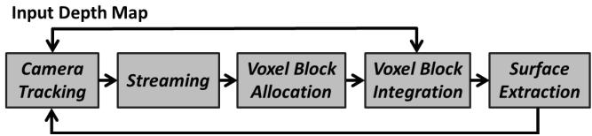  
Figure 2: Pipeline overview.

After integration, we raycast the implicit surface from the current estimated camera pose to extract the isosurface, including associated colors. This extracted depth and color buffer is used as input for camera pose estimation: given the next input depth map, a projective point-plane ICP [Chen and Medioni 1992] is performed to estimate the new 6DoF camera pose. This ensures that pose estimation is performed frame-to-model rather than frame-to-frame mitigating some of the issues of drift (particularly for small scenes) [Newcombe et al. 2011]. Finally, our algorithm performs bidirectional streaming between GPU and host. Hash entries (and associated voxel blocks) are streamed to the host as their world positions exit the estimated camera view frustum. Previously streamed out voxel blocks can also be streamed back to the GPU data structure when revisiting areas.

## 4 Data Structure

Fig. 3 shows our voxel hashing data structure. Conceptually, an infinite uniform grid subdivides the world into voxel blocks. Each block is a small regular voxel grid. In our current implementation a voxel block is composed of $8 ^ { \overset { \triangledown } { 3 } }$ voxels. Each voxel stores a TSDF, color, and weight and requires 8 bytes of memory:

struct Voxel {   
float sdf;   
uchar colorRGB[3];   
uchar weight;   
}i

To exploit sparsity, voxel blocks are only allocated around reconstructed surface geometry. We use an efficient GPU accelerated hash table to manage allocation and retrieval of voxel blocks. The hash table stores hash entries, each containing a pointer to an allocated voxel block. Voxel blocks can be retrieved from the hash table using integer world coordinates (x, y, z). Finding the coordinates for a 3D point in world space is achieved by simple multiplication and rounding. We map from a world coordinate $( x , y , z )$ to hash value $H ( x , y , z )$ using the following hashing function:

$$
H ( x , y , z ) = ( x \cdot p _ { 1 } \oplus y \cdot p _ { 2 } \oplus z \cdot p _ { 3 } ) m o d n
$$

where p1, p2, and p3 are large prime numbers (in our case 73856093, 19349669, 83492791 respectively, based on [Teschner et al. 2003]), and n is the hash table size. In addition to storing a pointer to the voxel block, each hash entry also contains the associated world position, and an offset pointer to handle collisions efficiently (described in the next section).

struct HashEntry {   
short position[3];   
short offset;   
int pointer;   
}i

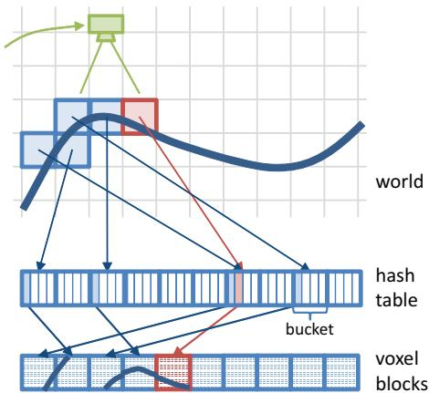  
Figure 3: Our voxel hashing data structure. Conceptually, an infinite uniform grid partitions the world. Using our hash function, we map from integer world coordinates to hash buckets, which store a small array of pointers to regular grid voxel blocks. Each voxel block contains an $8 ^ { 3 }$ grid of SDF values. When information for the red block gets added, a collision appears which is resolved by using the second element in the hash bucket.

## 4.1 Resolving Collisions

Collisions appear if multiple allocated blocks are mapped to the same hash value (see red block in Fig. 3). We handle collisions by uniformly organizing the hash table into buckets, one per unique hash value. Each bucket sequentially stores a small number of hash entries. When a collision occurs, we store the block pointer in the next available sequential entry in the bucket (see Fig. 4). To find the voxel block for a particular world position, we first evaluate our hash function, and lookup and traverse the associated bucket until our block entry is found. This is achieved by simply comparing the stored hash entry world position with the query position.

With a reasonable selection of the hash table and bucket size (see later), rarely will a bucket overflow. However, if this happens, we append a linked list entry, filling up other free spots in the next available buckets. The (relative) pointers for the linked lists are stored in the offset field of the hash table entries. Such a list is appended to a full bucket by setting the offset pointer for the last entry in the bucket. All following entries are then chained using the offset field. In order to create additional links for a bucket, we linearly search across the hash table for a free slot to store our entry, appending to the link list accordingly. We avoid the last entry in each bucket, as this is locally reserved for the link list head.

As shown later, we choose a table and bucket size that keeps the number of collisions and therefore appended linked lists to a minimum for most scenes, as to not impact overall performance.

## 4.2 Hashing operations

Insertion To insert new hash entries, we first evaluate the hash function and determine the target bucket. We then iterate over all bucket elements including possible lists attached to the last entry. If we find an element with the same world space position we can immediately return a reference. Otherwise, we look for the first empty position within the bucket. If a position in the bucket is available, we insert the new hash entry. If the bucket is full, we append an element to its linked list element (see Fig. 4).

To avoid race conditions when inserting hash entries in parallel, we lock a bucket atomically for writing when a suitable empty position is found. This eliminates duplicate entries and ensures linked list consistency. If a bucket is locked for writing, all other allocations for the same bucket are staggered until the next frame is processed. This may delay some allocations marginally. However, in practice this causes no degradation in reconstruction quality (as observed in the results and supplementary video), particularly as the Curless and Levoy method supports order independent updates.

Retrieval To read the hash entry for a query position, we compute the hash value and perform a linear search within the corresponding bucket. If no entry is found, and the bucket has a linked list associated (the offset value of the last entry is set), we also have to traverse this list. Note that we do not require a bucket to be filled from left to right. As described below, removing values can lead to fragmentation, so traversal does not stop when empty entries are found in the bucket.

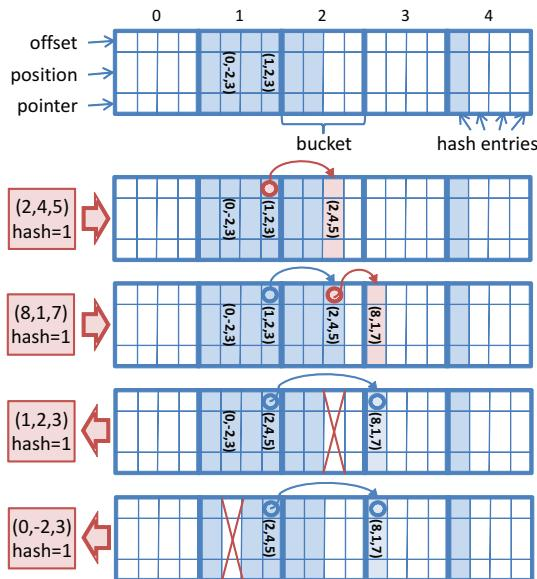  
Figure 4: The hash table is broken down into a set of buckets. Each slot is either unallocated (white) or contains an entry (blue) storing the query world position, pointer to surface data, and an offset pointer for dealing with bucket overflow. Example hashing operations: for illustration, we insert and remove four entries that all map to hash = 1 and update entries and pointers accordingly.

Deletion Deleting a hash entry is similar to insertion. For a given world position we first compute the hash and then linearly search the corresponding hash bucket including list traversal. If we have found the matching entry without list traversal we can simply delete it. If it is the last element of the bucket and there was a non-zero offset stored (i.e., the element is a list head), we copy the hash entry pointed to by the offset into the last element of the bucket, and delete it from its current position. Otherwise if the entry is a (non-head) element in the linked list, we delete it and correct list pointers accordingly (see Fig. 4). Synchronization is not required for deletion directly within the bucket. However, in the case we need to modify the linked list, we lock the bucket atomically and stagger further list operations for this bucket until the next frame.

## 5 Voxel Block Allocation

Before integration of new TSDFs, voxel blocks must be allocated that fall within the footprint of each input depth sample, and are also within the truncation region of the surface measurement. We process depth samples in parallel, inserting hash entries and allocating voxel blocks within the truncation region around the observed surface. The size of the truncation is adapted based on the variance of depth to compensate for larger uncertainty in distant measurements [Chang et al. 1994; Nguyen et al. 2012].

For each input depth sample, we instantiate a ray with an interval bound to the truncation region. Given the predefined voxel resolution and block size, we use DDA [Amanatides and Woo 1987] to determine all the voxel blocks that intersect with the ray. For each candidate found, we insert a new voxel block entry into the hash table. In an idealized case, each depth sample would be modeled as an entire frustum rather than a single ray. We would then allocate all voxel blocks within the truncation region that intersect with this frustum. In practice however, this leads to degradation in performance (currently 10-fold). Our ray-based approximation provides a balance between performance and precision. Given the continuous nature of the reconstruction, the frame rate of the sensor, and the mobility of the user, this in practice leads to no holes appearing between voxel blocks at larger distances (see results and accompanying video).

Once we have successfully inserted an entry into the hash table, we allocate a portion of preallocated heap memory on the GPU to store voxel block data. The heap is a linear array of memory, allocated once upon initialization. It is divided into contiguous blocks (mapping to the size of voxel blocks), and managed by maintaining a list of available blocks. This list is a linear buffer with indices to all unallocated blocks. A new block is allocated using the last index in the list. If a voxel block is subsequently freed, its index is appended to the end of the list. Since the list is accessed in parallel, synchronization is necessary, by incrementing or decrementing the end of list pointer using an atomic operation.

## 6 Voxel Block Integration

We update all allocated voxel blocks that are currently within the camera view frustum. After the previous step (see Section 5), all voxel blocks in the truncation region of the visible surface are allocated. However, a large fraction of the hash table will be empty (i.e., not refer to any voxel blocks). Further, a significant amount of voxel blocks will be outside the viewing frustum. Under these assumptions, TSDF integration can be done very efficiently by only selecting available blocks inside the current camera frustum.

Voxel Block Selection To select voxel blocks for integration, we first in parallel access all hash table entries, and store a corresponding binary flag in an array for an occupied and visible voxel block, or zero otherwise. We then scan this array using a parallel prefix sum technique [Harris et al. 2007]. To facilitate large scan sizes (our hash table can have millions of entries) we use a three level up and down sweep. Using the scan results we compact the hash table into another buffer, which contains all hash entries that point to voxel blocks within the view frustum (see Fig. 5). Note that voxel blocks are not copied, just their associated hash entries.

Implicit Surface Update The generated list of hash entries is then processed in parallel to update TSDF values. A single GPGPU kernel is executed for each of the associated blocks, with one thread allocated per voxel. That means that a voxel block will be processed on a single GPU multiprocessor, thus maximizing cache hits and minimizing code divergence. In practice, this is more efficient than assigning a single thread to process an entire voxel block.

Updating voxel blocks involves re-computation of the associated TSDFs, weights and colors. Distance values are integrated using a running average as in Curless and Levoy [Curless and Levoy 1996].

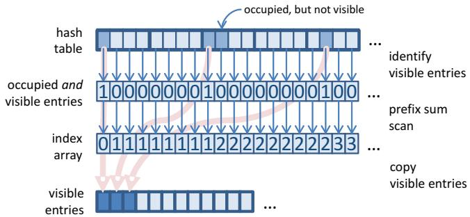  
Figure 5: Voxel Block Selection: in a first step, all occupied and visible hash entries are identified. By using a parallel prefix sum scan and a simple copy kernel, these are copied to a much smaller, contiguous array that can be efficiently traversed in parallel in subsequent operations.

We set the integration weights according to the depth values in order to incorporate the noise characteristics of the sensor; i.e., more weight is given to nearer depth measurements for which we assume less noise. Colors are also updated according to a running average, but with much more weight given to recent color samples (to reduce washing out colors).

One important part of the integration step is to update all voxel blocks that fall into the current frustum, irrespective of whether they reside in the current truncation region. This can be due to surfaces being physically moved, or small outliers in the depth map being allocated previously, which are no longer observed. These blocks are not treated any differently, and continuously updated. As shown next however, we evaluate all voxel blocks after integration to identify such candidates for potential garbage collection.

Garbage Collection Garbage collection removes voxel blocks allocated due to noisy outliers and moved surfaces. This step operates on the compacted hash table we obtained previously. For each associated voxel block we perform a summarization step to obtain both the minimum absolute TSDF value and the maximum weight. If the maximum weight of a voxel block is zero or the minimum TSDF is larger than a threshold we flag the block for deletion. In a second pass, in parallel we delete all flagged entries using the hash table delete operation described previously. When a hash entry gets deleted successfully, we also free the corresponding voxel block by appending the voxel block pointer to the heap (cf. Section 5).

## 7 Surface Extraction

We perform raycasting to extract the implicitly stored isosurface. First, we compute the start and end points for each ray by conservatively rasterizing the entire bounding box of all allocated voxel blocks in the current view frustum. In parallel, we rasterize each voxel block (retrieved from the compact hash table buffer computed during integration) in two passes, and generate two z-buffers for the minimum and maximum depth. This demonstrates another benefit for our linear hash table data structure (over hierarchical data structures), allowing fast parallel access to all allocated blocks for operations such as rasterization.

For each output pixel, we march a ray from the associated minimum to the maximum depth values. During marching we must evaluate the TSDF at neighboring world positions along the current ray. In this step, unallocated voxel blocks are also considered as empty space. Within occupied voxel blocks, we apply tri-linear interpolation by looking up the eight neighboring voxels. One special case that needs to be considered is sampling across voxel block boundaries. To deal with this, we retrieve neighboring voxels by lookup via the hash table rather than sampling the voxel block directly. In practice, we use hash table lookups irrespective of whether the voxel is on a block boundary. Due to caching, reduced register count per thread, and non-divergent code, this increases performance over direct block sampling. We have also tried using a one-voxel overlap region around blocks in order to simplify tri-linear reads without the need of accessing multiple voxel blocks. However, that approximately doubled the memory footprint and we found that required overlap synchronization for surface integration bears significant computational overhead.

To locate the surface interface (zero-crossing) we determine sign changes for current and previous (tri-linearly-interpolated) TSDF values. We ignore zero-crossings from negative to positive as this refers to back-facing surface geometry. In order to speed up ray marching, we skip a predefined interval (half the minimum truncation value). This avoids missing isosurfaces but provides only coarse zero-crossing positions. To refine further, we use iterative line search once a zero-crossing is detected to estimate the true surface location.

Camera Tracking Once the surface is extracted via raycasting, it can be shaded for rendering, or used for frame-to-model camera pose estimation [Newcombe et al. 2011]. We use the next input frame along with the raycasted depth map to estimate pose. This ensures that the new pose is estimated prior to depth map fusion. Pose is estimated using the point-plane variant of ICP [Chen and Medioni 1992] with projective data association. The point-plane energy function is linearized [Low 2004] on the GPU to a 6 × 6 matrix using a parallel reduction and solved via Singular Value Decomposition on the CPU. As our data structure also stores associated color data, we incorporate a weighting factor in the point-plane error-metric based on color consistency between extracted and input RGB values [Johnson and Bing Kang 1999].

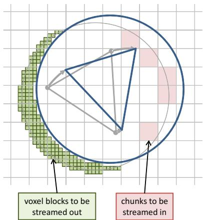  
Figure 6: Streaming: camera moves from left to right. Voxel blocks leaving the camera frustum are streamed out (green). Streaming in happens on a chunk basis (red blocks).

## 8 Streaming

The basic data structure described so far allows for high-resolution voxel blocks to be modeled beyond the resolution and range of current commodity depth cameras (see Section 9). However, GPU memory and performance become a consideration when we attempt to maintain surface data far outside of the view frustum in the hash table. To deal with this issue and allow unbounded reconstructions, we utilize a bidirectional GPU-Host streaming scheme.

Our unstructured data structure is well-suited for this purpose, since streaming voxel blocks in or out does not require any reorganization of the hash table. We create an active region defined as a sphere containing the current camera view frustum and a safety region around it. For a standard Kinect, we assume a depth range up to eight meters. We locate the center of the sphere four meters from the camera position and use a radius of eight meters (see Figure 6). Bidirectional streaming of voxel blocks happens every frame at the beginning of the pipeline directly after pose estimation.

## 8.1 GPU-to-Host Streaming

To stream voxel blocks out of the active region, we first access the hash table in parallel and mark voxel blocks which moved out of the active region. For all these candidates we delete corresponding hash entries, and append them efficiently to an intermediate buffer. In a second pass, for all these hash entries, corresponding voxel blocks are copied to another intermediate buffer. The original voxel blocks are then cleared and corresponding locations are appended back to the heap, so they can be reused. Finally, these intermediate buffers are copied back to the host for access.

On the host, voxel data is no longer organized into a hash table. Instead, we logically subdivide the world space uniformly into chunks (in our current implementation each set to 1m3). Voxel blocks are appended to these chunks using a linked list. For each voxel block we store the voxel block descriptor which corresponds to hash entry data, as well as the voxel data.

## 8.2 Host-to-GPU Streaming

For Host-to-GPU streaming we first identify chunks that completely fall into the spherical active region again, due to the user moving back to a previously reconstructed region. In contrast to GPUto-CPU streaming which works on a per voxel block level, CPUto-GPU streaming operates on a per chunk basis. So if a chunk is identified for streaming all voxel blocks in that chunk will be streamed to the GPU. This enhances performance, given the high host-GPU bandwidth and ability to efficiently cull voxel blocks outside of the view frustum.

Due to limited CPU compute per frame, streaming from host-to-GPU is staggered, one chunk per frame. We select the chunk tagged for streaming that is most near to the camera frustum center. We then copy the chunk to the GPU via the intermediate buffers created for GPU-to-Host streaming. After copying to the GPU, in parallel we insert voxel block descriptors as entries into the hash table, allocating voxel block memory from the heap, and copy voxel data accordingly. This is similar to the allocation phase (see Section 5), however, when streaming data, all hash entries must be inserted within a single frame, rather than staggering the insertions.

For a streamed voxel block we check the descriptor and atomically compare whether the position is occupied in the table. If an entry exists, we proceed to search for the next available free position in the bucket (as described below, we ensure that there are no duplicates). Otherwise we write the streamed hash entry at that position into the hash table. If the bucket is full, the entry is appended at the end of the list. Both writing a free entry directly in the bucket or appending it to the end of a linked list must be performed atomically.

## 8.3 Stream and Allocation Synchronization

One important consideration for streaming is to ensure that voxel blocks are never duplicated on host or GPU, leading to potential memory leaks. Given that Host-to-GPU streaming is staggered, there are rare cases where voxel blocks waiting to be streamed may enter the view frustum. We must verify that there is no new allocation of these voxel blocks in these staggered regions. To this end we store a binary occupancy grid on the GPU, where each entry corresponds to a particular chunk. Setting the bit indicates that the chunk resides on the GPU and allocations can occur in this region. Otherwise the chunk should be assumed to be on the host and allocations should be avoided. This binary grid carries little GPU memory overhead 512KB for $2 5 6 ^ { 3 } m ^ { 3 }$ , and can be easily re-allocated on-the-fly to extend to larger scenes.

## 9 Results

We have implemented our data structure using DirectX 11 Compute Shaders. We use an Asus Xtion for scenes in Fig. 10 and a Kinect for Windows camera for all other scenes, both providing RGB-D data at 30Hz. Results of live scene captures for our test scenes are shown in Figures 1 and 11 as well as supplementary material. We captured a variety of indoor and outdoor scenes under a variety of lighting conditions. While the quality of active infrared sensors is affected significantly in outdoor scenes, our system still manages to reconstruct large-scale outdoor scenes with fine quality. STATUES in Fig. 1 shows the result after an online scan of a \~ 20m long corridor in a museum with about 4m high statues, which was captured and reconstructed live in under 5 minutes. PASSAGEWAY (Fig. 11 top) shows a pathway of shops \~ 30m long reconstructed live. QUEENS (Fig. 11 middle) shows a large courtyard (stretching \~ 16m × 12m × 2m) reconstructed in approximately 4 minutes. Finally, BOOKSHOP (Fig. 11 bottom) shows three levels of a bookstore reconstructed in under 6 minutes.

These reconstructions demonstrate both scale and quality, and were all reconstructed well above the 30Hz frame rate of the Kinect as shown in Figure 7. This allows for potential increase of voxel resolution and additional ICP steps for more robust camera tracking We use a voxel size of 4mm for Fig. 8, 10 and 10mm for Fig. 1, 9, 11. We also tested our system with < 2mm voxels without visible improvements in overall reconstruction quality. While this highlights limits of current depth sensing technology, we believe that this opens up new possibilities for future depth acquisition hardware.

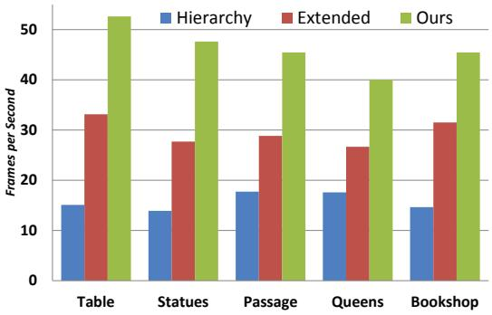  
Figure 7: Performance Comparison: frame rate measurements across our test scenes compared against two state-of-the-art reconstruction methods. Extended (or moving volume) regular grids and the hierarchical approach of [Chen et al. 2013].

## 9.1 Performance

We measured performance of our entire pipeline including run-time overhead (such as display rendering) on an Intel Core i7 3.4GHz CPU, 16GB of RAM, and a single NVIDIA GeForce GTX Titan. Average timings among all test scenes is 21.8ms $( \sim 4 6 f p s )$ with 8.0ms (37% of the overall pipeline) for ICP pose estimation (15 iterations), 4.6ms (21%) for surface integration, 4.8ms (22%) for surface extraction and shading (including colored phong shading), and 4.4ms (20%) for streaming and input data processing. Separate timings for each test scene are provided in Fig. 7.

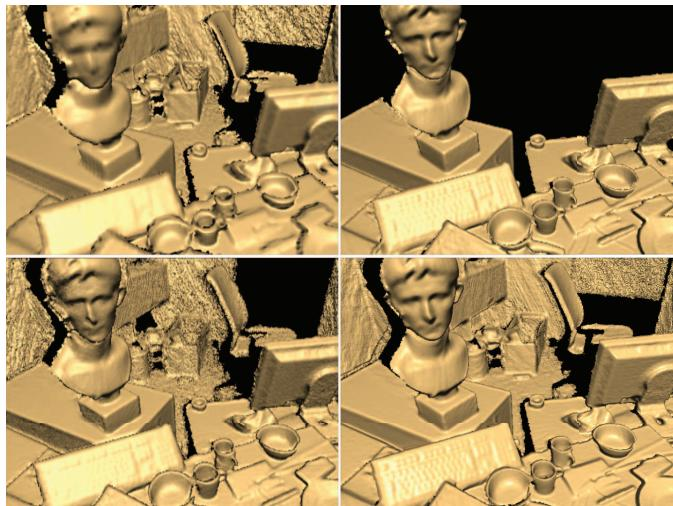  
Figure 8: Quality and scale comparison with related systems. Bottom right: Our method maintains a large working volume with streaming at frame-rate (in this example 4mm voxels). Top: moving volumes based on regular grids. With the same physical extent, the voxel resolution is coarse and quality is reduced (top left), but to maintain the same voxel resolution, the size of the volume must be decreased significantly (top right). Bottom left: the performance bottleneck of hierarchical grids leads to more tracking drift, and reduces overall quality.

Our data structure uses a total of 34MB for the hash table and all auxiliary buffers. This allows a hash table with $2 ^ { 2 1 }$ entries, each containing 12 bytes. Our experiments show that a bucket size of two provides best performance leaving us with about 1 million buckets. We pre-allocate 1GB of heap memory to provide space for voxel data on the GPU. With $8 ^ { 3 }$ voxels per block (8 byte per voxel) this corresponds to $2 ^ { 1 8 }$ voxel blocks. Note that $\cdot 2 ^ { 2 1 }$ hash entries only index to $2 ^ { 1 8 }$ voxel blocks resulting in a low hash occupancy, thus minimizing hash collisions.

On average we found that about 140K voxel blocks are allocated when capturing our test scenes at a voxel size of 8mm (varying with scene complexity). This corresponds to an equal amount of occupied hash entries, resulting in a hash table occupancy with 120K buckets with a single entry, and 10K buckets with two entries. With a bucket size of two and hash table size of $: 2 ^ { 2 1 }$ , all test scenes run with only 0.1% bucket overflow. These are handled by linked lists and across all scenes the largest list length is three. In total \~700 linked list entries are allocated across all scenes, which is negligible compared to the hash table size.

On average less than 300MB memory is allocated for surface data (less than 600MB with color). This compares favorably to a regular grid that would require well over 5GB (including color) at the same voxel resolution (8mm) and spatial extent (8m in depth). This also leaves enough space to encode RGB data directly into the stored voxels (see Fig. 11).

In practice this simple hashing scheme with small bucket size and large hash table size works well. In our scenario we can tolerate larger and sparser $( 2 ^ { 2 1 } )$ hash table sizes, because the memory footprint of the hash table is insignificant (\~34MB) compared to the voxel block buffer (which is pre-allocated to 1GB). Smaller hash table sizes cause higher occupancy and decrease performance. For example, in the STATUES scene our standard settings $( 2 ^ { 2 1 }$ elements) occupies \~6.4% of the hash table and runs at \~21ms, with 200K elements occupancy rises to \~65% and performance is reduced to \~24.8ms, and with 160K elements occupancy rises to \~81% with performance further falling to 25.6ms. In our live system, we chose larger table sizes as we favored performance over the small memory gains. Our pipeline currently uses atomic operations per hash bucket for allocation and streaming. As shown by our timings across all scenes, these sequential operations cause negligible performance overheads, due to hash collisions being minimal.

More sophisticated hashing approaches [Lefebvre and Hoppe 2006; Bastos and Celes 2008; Alcantara et al. 2009; Pan and Manocha 2011; García et al. 2011] could further reduce collisions and allow smaller hash tables. However, how these methods deal with the high throughput of data, fusion and streaming is unclear. It is also important to stress that our simple hashing method works well in practice, handling scalability and quality at framerates >40fps across all scenes.

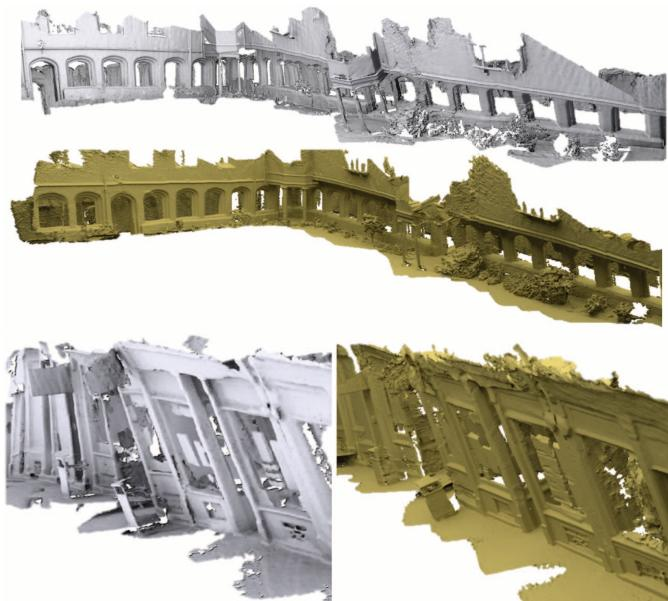  
Figure 9: Comparison of camera tracking drift: in gray the results of the hierarchical approach of Chen et al. [2013] and in yellow our results. Note the twisting in the final models for Chen's approach; e.g., the center of the QUEENS and left hand side of the PASSAGEWAY reconstruction.

## 9.2 Comparison

In Fig. 9 we show the quality and performance of our method compared to previous work. All code was tested on the same hardware (see above) with a fixed number of ICP iterations (15). As our algorithm supports real-time streaming, we conducted comparisons with similar moving volume approaches. First, we compare against Extended Fusion [Roth and Vona 2012; Whelan et al. 2012] that use a regular uniform grid including streaming to scale-up volumetric fusion. Second, we compare against Hierarchical Fusion [Chen et al. 2013] that supports larger moving volumes than other approaches. Corresponding timings are shown in Fig. 7. The most significant limitation of the hierarchy is the data structure overhead causing a performance drop, particularly in complex scenes. In our test scenes the entire hierarchy pipeline (including pose estimation, fusion, and streaming) runs at \~ 15Hz, which is lower than the input frame rate.

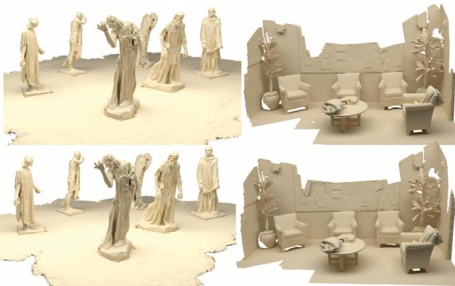  
Figure 10: Comparison of output meshes from our online method (top) with the offline method of [Zhou and Koltun 2013] (bottom).

Note that these measurements are based on the reference implementation by Chen et al. [2013]. Our system also performs favorably compared to streaming regular grids in terms of frame-rate (labeled Extended in Fig. 7). We attribute this to processing of empty voxels in the regular grid (particularly during random GPU memory access; e.g., raycasting) and streaming overhead.

Further, as shown in Fig. 8, our reconstruction quality is higher than these approaches. The quality of Extended Fusion is limited by the small spatial extent of the moving volume, which means much of the Kinect data is out of range and not integrated. Hierarchical Fusion suffers from the poor frame rate causing input data to be skipped. This severely affects pose estimation quality resulting in inaccurate surface integration and drift. In large-scale scenes this type of drift might cause unnaturally twisted models as shown in Fig. 9.

Given our more efficient data structure, which runs faster than the Kinect camera frame rate, additional time can be spent improving the accuracy of the pose estimation by increasing the number of ICP iterations. We find our results encouraging, particularly given no drift correction is explicitly handled. In Fig. 10 scenes captured and processed offline using the method of [Zhou and Koltun 2013], which uses a multi-pass global optimization to mitigate drift, are compared to our online method. While our method does suffer from small drifts, our system produces comparable results, and can be used for real-time applications. Our online method can also be used as a live preview, and combined with such approaches for higher-quality offline reconstruction.

## 10 Conclusion

We have presented a new data structure designed specifically for online reconstruction using widely-available consumer depth cameras. Our approach leverages the power of implicit surfaces and volumetric fusion for reconstruction, but does so using a compact spatial hashing scheme, which removes both the overhead of regular grids and hierarchical data structures. Our hashing scheme supports real-time performance without forgoing scale or finer quality reconstruction. All operations are designed to be efficient for parallel graphics hardware. The inherent unstructured nature of our method removes the overhead of hierarchical spatial data structures, but captures the key qualities of volumetric fusion. To further extend the bounds of reconstruction, our method supports lightweight streaming without major data structure reorganization.

We have demonstrated performance increases over the state-of-theart, even regular grid implementations. The data structure is memory efficient and can allow color data to be directly incorporated in the reconstruction, which can also be used to improve the robustness of registration. Due to the high performance of our data structure, the available time budget can be utilized for further improving camera pose estimation, which directly improves reconstruction quality over existing online approaches.

We believe the advantages of our method will be even more evident when future depth cameras with higher resolution sensing emerge, as our data structure is already capable of reconstructing surfaces beyond the resolution of existing depth sensors such as Kinect.

## Acknowledgements

We thank Dennis Bautembach, Jiawen Chen, Vladlen Koltun and Qian-Yi Zhou for code/data, Christoph Buchenau for mesh rendering, and Universities of Cambridge and Erlangen-Nuremberg for filming access. This work was part funded by the German Research Foundation (DFG), grant GRK-1773 Heterogeneous Image Systems.

## References

ALCANTARA, D. A., SHARF, A., ABBASINEJAD, F., SENGUPTA, S., MITZENMACHER, M., OWENS, J. D., AND AMENTA, N. 2009. Real-time parallel hashing on the GPU. ACM Transactions on Graphics (TOG) 28, 5, 154.

AMANATIDES, J., AND WOO, A. 1987. A fast voxel traversal algorithm for ray tracing. In Proc. Eurographics, vol. 87, 3–10.

BASTOS, T., AND CELES, W. 2008. Gpu-accelerated adaptively sampled distance fields. In Shape Modeling and Applications, 2008. SMI 2008. IEEE International Conference on, IEEE, 171– 178.

BESL, P., AND MCKAY, N. 1992. A method for registration of 3-D shapes. IEEE Trans. Pattern Anal. and Mach. Intell. 14, 2, 239–256.

CHANG, C., CHATTERJEE, S., AND KUBE, P. R. 1994. A quantization error analysis for convergent stereo. In Proc. ICIP 94, vol. 2, IEEE, 735–739.

CHEN, Y., AND MEDIONI, G. 1992. Object modelling by registration of multiple range images. Image and Vision Computing 10, 3, 145–155.

CHEN, J., BAUTEMBACH, D., AND IZADI, S. 2013. Scalable real-time volumetric surface reconstruction. ACM Transactions on Graphics (TOG) 32, 4, 113.

CRASSIN, C., NEYRET, F., LEFEBVRE, S., AND EISEMANN, E. 2009. Gigavoxels: Ray-guided streaming for efficient and detailed voxel rendering. In Proc. Symp. Interactive 3D Graphics and Games, ACM, 15–22.

CURLESS, B., AND LEVOY, M. 1996. A volumetric method for building complex models from range images. In In Proc. Computer graphics and interactive techniques, ACM, 303–312.

GALLUP, D., POLLEFEYS, M., AND FRAHM, J.-M. 2010. 3D reconstruction using an n-layer heightmap. In Pattern Recognition. Springer, 1–10.

GARCÍA, I., LEFEBVRE, S., HORNUS, S., AND LASRAM, A. 2011. Coherent parallel hashing. ACM Transactions on Graphics (TOG) 30, 6, 161.

GROSS, M., AND PFISTER, H. 2007. Point-based graphics. Morgan Kaufmann.

ACM Transactions on Graphics, Vol. 32, No. 6, Article 169, Publication Date: November 2013

HADWIGER, M., BEYER, J., JEONG, W.-K., AND PFISTER, H. 2012. Interactive volume exploration of petascale microscopy data streams using a visualization-driven virtual memory approach. Visualization and Computer Graphics, IEEE Transactions on 18, 12, 2285–2294.

HARRIS, M., SENGUPTA, S., AND OWENS, J. D. 2007. Parallel prefix sum (scan) with cuda. GPU gems 3, 39, 851–876.

HENRY, P., KRAININ, M., HERBST, E., REN, X., AND FOX, D. 2012. RGB-D mapping: Using Kinect-style depth cameras for dense 3D modeling of indoor environments. Int. J. Robotics Research 31 (Apr.), 647–663.

HIGUCHI, K., HEBERT, M., AND IKEUCHI, K. 1995. Building 3-D models from unregistered range images. Graphical Models and Image Processing 57, 4, 315–333.

HILTON, A., STODDART, A., ILLINGWORTH, J., AND WINDEATT, T. 1996. Reliable surface reconstruction from multiple range images. J. Computer Vision (Proc. ECCV), 117–126.

HOPPE, H., DEROSE, T., DUCHAMP, T., MCDONALD, J., AND STUETZLE, W. 1992. Surface reconstruction from unorganized points. ACM SIGGRAPH Computer Graphics 26, 2, 71–78.

IZADI, S., KIM, D., HILLIGES, O., MOLYNEAUX, D., NEW-COMBE, R., KOHLI, P., SHOTTON, J., HODGES, S., FREEMAN, D., DAVISON, A., AND FITZGIBBON, A. 2011. KinectFusion: Real-time 3D reconstruction and interaction using a moving depth camera. In Proc. ACM Symp. User Interface Software and Technology, 559–568.

JOHNSON, A. E., AND BING KANG, S. 1999. Registration and integration of textured 3d data. Image and vision computing 17, 2, 135–147.

KÄMPE, V., SINTORN, E., AND ASSARSSON, U. 2013. High resolution sparse voxel dags. ACM Transactions on Graphics (TOG) 32, 4, 101.

KAZHDAN, M., BOLITHO, M., AND HOPPE, H. 2006. Poisson surface reconstruction. In Proc. EG Symp. Geometry Processing.

KELLER, M., LEFLOCH, D., LAMBERS, M., IZADI, S., WEYRICH, T., AND KoLB, A. 2013. Real-time 3d reconstruction in dynamic scenes using point-based fusion. In Proc. of Joint 3DIM/3DPVT Conference (3DV), IEEE, 1–8.

KRAUS, M., AND ERTL, T. 2002. Adaptive texture maps. In Proc. of the ACM SIGGRAPH/EUROGRAPHICS conference on Graphics hardware, Eurographics Association, 7–15.

LAINE, S., AND KARRAS, T. 2011. Efficient sparse voxel octrees. Visualization and Computer Graphics, IEEE Transactions on 17, 8, 1048–1059.

LEFEBVRE, S., AND HOPPE, H. 2006. Perfect spatial hashing. ACM Transactions on Graphics (TOG) 25, 3, 579–588.

LEFEBVRE, S., HORNUS, S., AND NEYRET, F., 2005. Gpu gems 2. chapter 37: Octree textures on the gpu.

LEVOY, M., PULLI, K., CURLESS, B., RUSINKIEWICZ, S., KOLLER, D., PEREIRA, L., GINZTON, M., ANDERSON, S., DAVIS, J., GINSBERG, J., ET AL. 2000. The digital michelangelo project: 3D scanning of large statues. In In Proc. Computer graphics and interactive techniques, ACM Press/Addison-Wesley Publishing Co., 131–144.

LORENSEN, W., AND CLINE, H. 1987. Marching cubes: A high resolution 3D surface construction algorithm. Computer Graphics 21, 4, 163–169.

ACM Transactions on Graphics, Vol. 32, No. 6, Article 169, Publication Date: November 2013

Low, K.-L. 2004. Linear least-squares optimization for point-toplane icp surface registration. Tech. rep., Chapel Hill, University of North Carolina.

NEWCOMBE, R. A., IZADI, S., HILLIGES, O., MOLYNEAUX, D., KIM, D., DAVISON, A. J., KOHLI, P., SHOTTON, J., HODGES, S., AND FITZGIBBON, A. 2011. KinectFusion: Real-time dense surface mapping and tracking. In Proc. IEEE Int. Symp. Mixed and Augmented Reality, 127–136.

NGUYEN, C., IZADI, S., AND LOVELL, D. 2012. Modeling Kinect sensor noise for improved 3D reconstruction and tracking. In Proc. Int. Conf. 3D Imaging, Modeling, Processing, Visualization and Transmission, 524–530.

PAN, J., AND MANOCHA, D. 2011. Fast gpu-based locality sensitive hashing for k-nearest neighbor computation. In Proc. of the 19th ACM SIGSPATIAL International Conference on Advances in Geographic Information Systems, ACM, 211–220.

POLLEFEYS, M., NISTÉR, D., FRAHM, J., AKBARZADEH, A., MORDOHAI, P., CLIPP, B., ENGELS, C., GALLUP, D., KIM, S., MERRELL, P., ET AL. 2008. Detailed real-time urban 3D reconstruction from video. Int. J. Comp. Vision 78, 2, 143–167.

REICHL, F., CHAJDAS, M. G., BÜRGER, K., AND WESTERMANN, R. 2012. Hybrid sample-based surface rendering. In Vision Modeling & Visualization, The Eurographics Association, 47–54.

ROTH, H., AND VoNA, M. 2012. Moving volume KinectFusion. In British Machine Vision Conf.

RUSINKIEWICZ, S., HALL-HOLT, O., AND LEVOY, M. 2002. Real-time 3D model acquisition. ACM Transactions on Graphics (TOG) 21, 3, 438–446.

STÜCKLER, J., AND BEHNKE, S. 2012. Integrating depth and color cues for dense multi-resolution scene mapping using rgb-d cameras. In Proc. of the IEEE Int. Conf. on Multisensor Fusion and Information Integration (MFI),(Hamburg, Germany).

TESCHNER, M., HEIDELBERGER, B., MÜLLER, M., POMER-ANETS, D., AND GROSS, M. 2003. Optimized spatial hashing for collision detection of deformable objects. In Proc.of Vision Modeling, Visualization VMV03, 47–54.

TURK, G., AND LEVOY, M. 1994. Zippered polygon meshes from range images. In In Proc. Computer graphics and interactive techniques, 311–318.

WEISE, T., WISMER, T., LEIBE, B., AND VAN GOOL, L. 2009. In-hand scanning with online loop closure. In Proc. IEEE Int. Conf. Computer Vision Workshops, 1630–1637.

WHEELER, M., SATO, Y., AND IKEUCHI, K. 1998. Consensus surfaces for modeling 3D objects from multiple range images. In Proc. IEEE Int. Conf. Computer Vision, 917–924.

WHELAN, T., JOHANNSSON, H., KAESS, M., LEONARD, J., AND McDoNALD, J. 2012. Robust tracking for real-time dense rgb-d mapping with kintinuous. Tech. rep. Query date: 2012-10-25.

ZENG, M., ZHAO, F., ZHENG, J., AND LIU, X. 2012. Octree-based fusion for realtime 3D reconstruction. Graphical Models.

ZHOU, Q.-Y., AND KOLTUN, V. 2013. Dense scene reconstruction with points of interest. ACM Transactions on Graphics (TOG) 32, 4, 112.

ZHOU, K., GONG, M., HUANG, X., AND GUO, B. 2011. Dataparallel octrees for surface reconstruction. IEEE Trans. Vis. and Comp. Graph. 17, 5, 669–681.

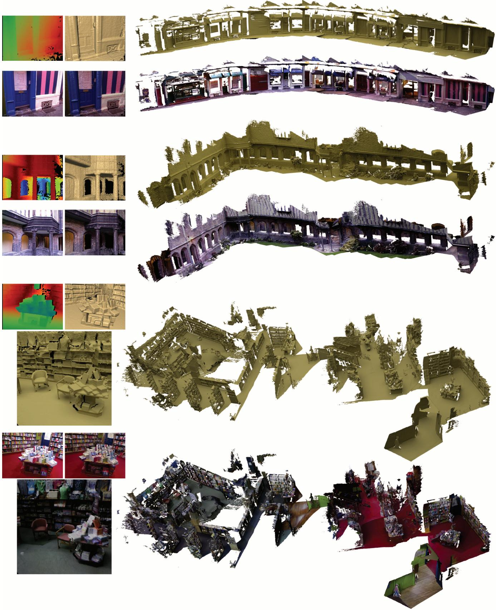  
Figure 11: Reconstructions of the captured test scenes: a pathway of shops (PASSAGEWAY), a large courtyard (QUEENS) and a three level bookstore (BOOKSHOP). Shown left: the input data from the Kinect sensor (depth and color) and the live raycasted view of our system (shaded and shaded color). ACM Transactions on Graphics, Vol. 32, No. 6, Article 169, Publication Date: November 2013