# LSD-SLAM: Large-Scale Direct Monocular SLAM

Jakob Engel, Thomas Sch¨ops, and Daniel Cremers

Technical University Munich, Germany

Abstract We propose a direct (feature-less) monocular SLAM algorithm which, in contrast to current state-of-the-art regarding direct methods, allows to build large-scale, consistent maps of the environment. Along with highly accurate pose estimation based on direct image alignment, the 3D environment is reconstructed in real-time as pose-graph of keyframes with associated semi-dense depth maps. These are obtained by filtering over a large number of pixelwise small-baseline stereo comparisons. The explicitly scale-drift aware formulation allows the approach to operate on challenging sequences including large variations in scene scale. Major enablers are two key novelties: (1) a novel direct tracking method which operates on sim(3), thereby explicitly detecting scale-drift, and (2) an elegant probabilistic solution to include the efect of noisy depth values into tracking. The resulting direct monocular SLAM system runs in real-time on a CPU.

## 1 Introduction

Real-time monocular Simultaneous Localization and Mapping (SLAM) and 3D reconstruction have become increasingly popular research topics. Two major reasons are (1) their use in robotics, in particular to navigate unmanned aerial vehicles (UAVs) [10,8,1], and (2) augmented and virtual reality applications slowly making their way into the mass-market.

One of the major benefits of monocular SLAM – and simultaneously one of the biggest challenges – comes with the inherent scale-ambiguity: The scale of the world cannot be observed and drifts over time, being one of the major error sources. The advantage is that this allows to seamlessly switch between diferently scaled environments, such as a desk environment indoors and large-scale outdoor environments. Scaled sensors on the other hand, such as depth or stereo cameras, have a limited range at which they can provide reliable measurements and hence do not provide this flexibility.

## 1.1 Related Work

Feature-Based Methods. The fundamental idea behind feature-based approaches (both filtering-based [15,19] and keyframe-based [15]) is to split the overall problem – estimating geometric information from images – into two sequential steps: First, a set of feature observations is extracted from the image.

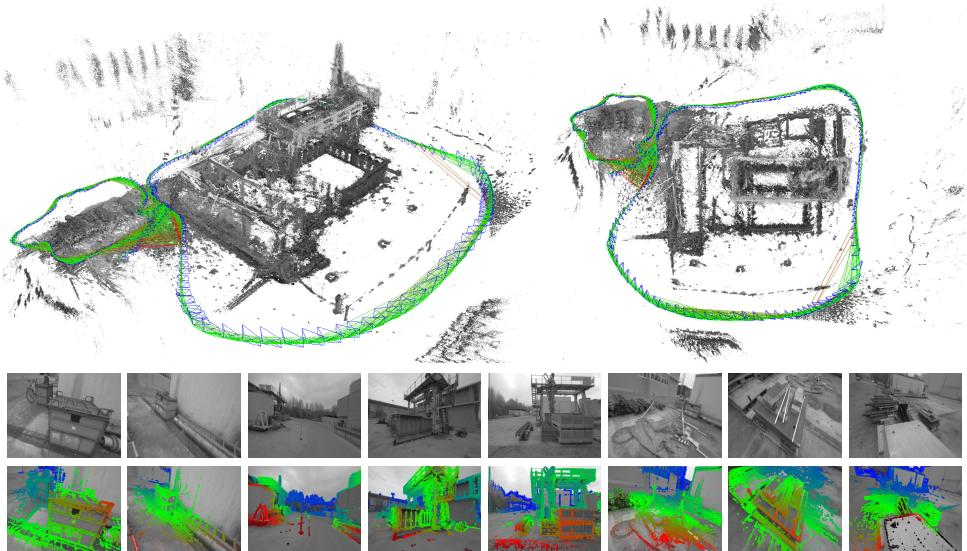  
Fi 1 Large-Scale Direct Monocular SLAM: LSD-SLAM generates a consistent global map, using direct image alignment and probabilistic, semi-dense depth maps instead of keypoints. Top: Accumulated pointclouds of all keyframes of a medium-sized trajectory (from a hand-held monocular camera), generated in real-time. Bottom: A selection of keyframes with color-coded semi-dense inverse depth map. See also the supplementary video.

Second, the camera position and scene geometry is computed as a function of these feature observations only.

While this decoupling simplifies the overall problem, it comes with an important limitation: Only information that conforms to the feature type can be used. In particular, when using keypoints, information contained in straight or curved edges – which especially in man-made environments make up a large part of the image – is discarded. Several approaches have been made in the past to remedy this by including edge-based [16,6] or even region-based [5] features. Yet, since the estimation of the high-dimensional feature space is tedious, they are rarely used in practice. To obtain dense reconstructions, the estimated camera poses can be used to subsequently reconstruct dense maps, using multiview stereo [2].

Direct Methods. Direct visual odometry (VO) methods circumvent this limitation by optimizing the geometry directly on the image intensities, which enables using all information in the image. In addition to higher accuracy and robustness in particular in environments with little keypoints, this provides substantially more information about the geometry of the environment, which can be very valuable for robotics or augmented reality applications.

While direct image alignment is well-established for RGB-D or stereo sensors [14,4], only recently monocular direct VO algorithms have been proposed: In [24,20,21], accurate and fully dense depth maps are computed using a variational formulation, which however is computationally demanding and requires a state-of-the-art GPU to run in real-time. In [9], a semi-dense depth filtering formulation was proposed which significantly reduces computational complexity, allowing real-time operation on a CPU and even on a modern smartphone [22]. By combining direct tracking with keypoints, [10] achieves high framerates even on embedded platforms. All these approaches however are pure visual odometries, they only locally track the motion of the camera and do not build a consistent, global map of the environment including loop-closures.

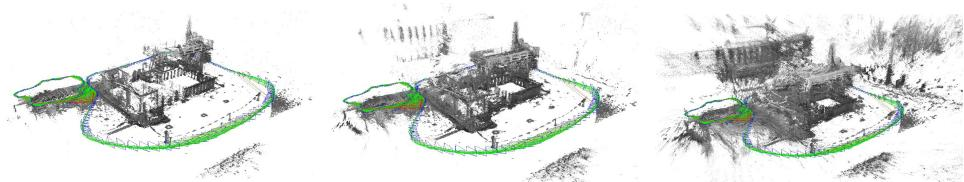  
Fig 2 In addition to accurate, semi-dense 3D reconstructions, LSD-SLAM also estimates the associated uncertainty. From left to right: Accumulated pointcloud thesholded with diferent maximum variance. Note how the reconstruction becomes significantly more dense, but at the same time includes more noise.

Pose Graph Optimization. This is a well-known SLAM technique to build a consistent, global map: The world is represented as a number of keyframes connected by pose-pose constraints, which can be optimized using a generic graph optimization framework like g2o [18].

In [14], a pose graph based RGB-D SLAM method is proposed, which also incorporates geometric error to allow tracking through scenes with little texture. To account for scale-drift arising in monocular SLAM, [23] proposed a keypointbased monocular SLAM system which represents camera poses as 3D similarity transforms instead of rigid body movements.

## 1.2 Contributions and Outline

We propose a Large-Scale Direct monocular SLAM (LSD-SLAM) method, which not only locally tracks the motion of the camera, but allows to build consistent, large-scale maps of the environment (see Fig. 1 and 2). The method uses direct image alignment coupled with filtering-based estimation of semi-dense depth maps as originally proposed in [9]. The global map is represented as a pose graph consisting of keyframes as vertices with 3D similarity transforms as edges, elegantly incorporating changing scale of the environment and allowing to detect and correct accumulated drift. The method runs in real-time on a CPU, and as odometry even on a modern smartphone [22]. The main contributions of this paper are (1) a framework for large-scale, direct monocular SLAM, in particular a novel scale-aware image alignment algorithm to directly estimate the similarity transform ξ sim(3) between two keyframes, and (2) probabilistically consistent incorporation of uncertainty of the estimated depth into tracking.

## 2 Preliminaries

In this chapter we give a condensed summary of the relevant mathematical concepts and notation. In particular, we summarize the representation of 3D poses as elements of Lie-Algebras (Sec. 2.1), derive direct image alignment as weighted least-squares minimization on Lie-manifolds (Sec. 2.2), and briefly introduce propagation of uncertainty (Sec. 2.3).

Notation. We denote matrices by bold, capital letters (R) and vectors as bold, lower case letters (ξ). The n’th row of a matrix is denoted by $[ \cdot ] _ { n }$ . Images $I \colon \varOmega $ $\mathbb { R }$ , the per-pixel inverse depth map $D \colon \varOmega \to \mathbb { R } ^ { + }$ and the inverse depth variance map $V \colon \varOmega \to \mathbb { R } ^ { + }$ are written as functions, where $\varOmega \subset \mathbb { R } ^ { 2 }$ is the set of normalized pixel coordinates, i.e., they include the intrinsic camera calibration. Throughout the paper we use d to denote the inverse of the depth z of a point, i.e., $d = z ^ { - 1 }$

## 2.1 3D Rigid Body and Similarity Transformations

3D Rigid Body Transformations. A 3D rigid body transform $\mathbf { G } \in \mathrm { S E } ( 3 )$ denotes rotation and translation in 3D, i.e. is defined by

$$
\mathbf { G } = \left( \mathbf { R } \thinspace \mathbf { t } \right) \quad \mathrm { w i t h } \quad \mathbf { R } \in \mathrm { S O ( 3 ) ~ a n d ~ } \mathbf { t } \in \mathbb { R } ^ { 3 } .\tag{1}
$$

During optimization, a minimal representation for the camera pose is required, which is given by the corresponding element $\xi \in \mathfrak { s e } ( 3 )$ of the associated Liealgebra. Elements are mapped to $\operatorname { S E } ( 3 )$ by the exponential map $\mathbf { G } = \exp _ { \mathfrak { s e } ( 3 ) } ( \pmb { \xi } )$ its inverse being denoted by $\pmb { \xi } = \log _ { \mathrm { S E } ( 3 ) } ( \mathbf { G } )$ . With a slight abuse of notation, we consistently use elements of $\mathfrak { s e } ( 3 )$ to represent poses, which we directly write as vector $\pmb { \xi } \in \mathbb { R } ^ { 6 }$ . The transformation moving a point from frame i to frame $j$ is written as $\pmb { \xi } _ { j i }$ . For convenience, we define the pose concatenation operator $\circ \colon \mathfrak { s e } ( 3 ) \times \mathfrak { s e } ( 3 ) \ \overset { \circ } { \to } \mathfrak { s e } ( 3 )$ as

$$
\begin{array} { r } { \pmb { \xi } _ { k i } : = \pmb { \xi } _ { k j } \circ \pmb { \xi } _ { j i } : = \log _ { \mathrm { S E } ( 3 ) } \left( \exp _ { \mathfrak { s e } ( 3 ) } ( \pmb { \xi } _ { k j } ) \cdot \exp _ { \mathfrak { s e } ( 3 ) } ( \pmb { \xi } _ { j i } ) \right) . } \end{array}\tag{2}
$$

Further, we define the 3D projective warp function ω, which projects an image point $\mathbf { p }$ and its inverse depth d into a by $\boldsymbol { \xi }$ transformed camera frame

$$
\begin{array} { r } { \omega ( \mathbf { p } , d , \pmb { \xi } ) : = \left( \begin{array} { l } { x ^ { \prime } / z ^ { \prime } } \\ { y ^ { \prime } / z ^ { \prime } } \\ { 1 / z ^ { \prime } } \end{array} \right) \qquad \mathrm { w i t h } \qquad \left( \begin{array} { l } { x ^ { \prime } } \\ { y ^ { \prime } } \\ { z ^ { \prime } } \\ { 1 } \end{array} \right) : = \exp _ { \mathfrak { s e } ( 3 ) } ( \pmb { \xi } ) \left( \begin{array} { l } { \mathbf { p } _ { x } / d } \\ { \mathbf { p } _ { y } / d } \\ { 1 / d } \\ { 1 } \end{array} \right) . } \end{array}\tag{3}
$$

3D Similarity Transformations. A 3D similarity transform $\mathbf { S } \in \mathrm { S i m } ( 3 )$ denotes rotation, scaling and translation, i.e. is defined by

$$
\mathbf { S } = \left( \mathbf { \sigma } _ { \mathbf { 0 } } ^ { s \mathbf { R } } \mathbf { \sigma } _ { 1 } ^ { \mathbf { t } } \right) \quad \mathrm { w i t h } \quad \mathbf { R } \in \mathrm { S O } ( 3 ) , \ \mathbf { t } \in \mathbb { R } ^ { 3 } \ \mathrm { a n d } \ s \in \mathbb { R } ^ { + } .\tag{4}
$$

As for rigid body transformations, a minimal representation is given by elements of the associated Lie-algebra $\pmb { \xi } \in \mathfrak { s i m } ( 3 )$ , which now have an additional degree of freedom, that is $\pmb { \xi } \in \mathbb { R } ^ { 7 }$ . The exponential and logarithmic map, pose concatenation and a projective warp function $\omega _ { s }$ can be defined analogously to the se(3) case, for further details see [23].

## 2.2 Weighted Gauss-Newton Optimization on Lie-Manifolds

Two images are aligned by Gauss-Newton minimization of the photometric error

$$
E ( \pmb { \xi } ) = \sum _ { i } \underbrace { ( I _ { \mathrm { r e f } } ( \mathbf { p } _ { i } ) - I ( \omega ( \mathbf { p } _ { i } , D _ { \mathrm { r e f } } ( \mathbf { p } _ { i } ) , \pmb { \xi } ) ) ) ^ { 2 } } _ { = : r _ { i } ^ { 2 } ( \pmb { \xi } ) } ,\tag{5}
$$

which gives the maximum-likelihood estimator for $\boldsymbol { \xi }$ assuming i.i.d. Gaussian residuals. We use a left-compositional formulation: Starting with an initial estimate $\pmb { \xi } ^ { ( 0 ) }$ , in each iteration a left-multiplied increment $\delta \check { \xi } ^ { ( n ) }$ is computed by solving for the minimum of a Gauss-Newton second-order approximation of $E { : }$

$$
\delta \pmb { \xi } ^ { ( n ) } = - ( \mathbf { J } ^ { T } \mathbf { J } ) ^ { - 1 } \mathbf { J } ^ { T } \mathbf { r } ( \pmb { \xi } ^ { ( n ) } ) \mathrm { w i t h } \mathbf { J } = \frac { \partial \mathbf { r } ( \epsilon \circ \pmb { \xi } ^ { ( n ) } ) } { \partial \epsilon } \bigg \vert _ { \epsilon = 0 } ,\tag{6}
$$

where J is the derivative of the stacked residual vector ${ \bf r } = ( r _ { 1 } , \ldots , r _ { n } ) ^ { T }$ with respect to a left-multiplied increment, and $\mathbf { J } ^ { T } \mathbf { J }$ the Gauss-Newton approximation of the Hessian of $E .$ . The new estimate is then obtained by multiplication with the computed update

$$
\pmb { \xi } ^ { ( n + 1 ) } = \delta \pmb { \xi } ^ { ( n ) } \circ \pmb { \xi } ^ { ( n ) } .\tag{7}
$$

In order to be robust to outliers arising e.g. from occlusions or reflections, different weighting-schemes [14] have been proposed, resulting in an iteratively reweighted least-squares problem: In each iteration, a weight matrix $\mathbf { W } = \mathbf { W } ( \pmb { \xi } ^ { ( n ) } )$ is computed which down-weights large residuals. The iteratively solved error function then becomes

$$
E ( \pmb { \xi } ) = \sum _ { i } w _ { i } ( \pmb { \xi } ) r _ { i } ^ { 2 } ( \pmb { \xi } ) ,\tag{8}
$$

and the update is computed as

$$
\delta \pmb { \xi } ^ { ( n ) } = - ( \mathbf { J } ^ { T } \mathbf { W } \mathbf { J } ) ^ { - 1 } \mathbf { J } ^ { T } \mathbf { W } r ( \pmb { \xi } ^ { ( n ) } ) .\tag{9}
$$

Assuming the residuals to be independent, the inverse of the Hessian from the last iteration $( \mathbf { J } ^ { T } \mathbf { W } \mathbf { J } ) ^ { - 1 }$ is an estimate for the covariance $\Sigma _ { \xi }$ of a left-multiplied error onto the final result, that is

$$
\pmb { \xi } ^ { ( n ) } = \epsilon \circ \pmb { \xi } _ { \mathrm { t r u e } } \mathrm { w i t h } \epsilon \sim \mathcal { N } ( \mathbf { 0 } , \pmb { \Sigma } _ { \pmb { \xi } } ) .\tag{10}
$$

In practice, the residuals are highly correlated, such that $\Sigma _ { \xi }$ is only a lower bound - yet it contains valuable information about the correlation between noise on the diferent degrees of freedom. Note that we follow a left-multiplication convention, equivalent results can be obtained using a right-multiplication convention. However, the estimated covariance $\Sigma _ { \xi }$ depends on the multiplication order – when used in a pose graph optimization framework, this has to be taken into account. The left-multiplication convention used here is consistent with [23], while e.g. the default type-implementation in g2o [18] assumes rightmultiplication.

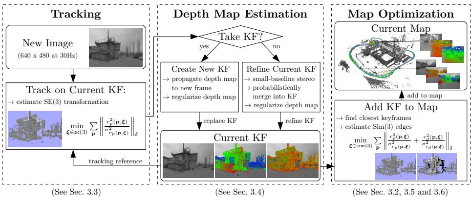  
Fig 3 Overview over the complete LSD-SLAM algorithm

## 2.3 Propagation of Uncertainty

Propagation of uncertainty is a statistical tool to derive the uncertainty of the output of a function f(X), caused by uncertainty on its input X. Assuming X to be Gaussian distributed with covariance $\pmb { \Sigma } _ { \mathbf { X } }$ , the covariance of f(X) can be approximated (using the Jacobian $\mathbf { J } _ { f }$ of $f )$ by

$$
\begin{array} { r } { \pmb { \mathscr { D } } _ { f } \approx \mathbf { J } _ { f } \pmb { \Sigma } _ { \mathbf { X } } \mathbf { J } _ { f } ^ { T } . } \end{array}\tag{11}
$$

## 3 Large-Scale Direct Monocular SLAM

We start by giving an overview of the complete algorithm in Sec. 3.1, and briefly introduce the representation for the global map in Sec. 3.2. The three main components of the algorithm are then described in Sec. 3.3 (tracking of new frames), Sec. 3.4 (depth map estimation), Sec. 3.5 (keyframe-to-keyframe tracking) and finally Sec. 3.6 (map optimization).

## 3.1 The Complete Method

The algorithm consists of three major components: tracking, depth map estimation and map optimization as visualized in Fig. 3:

– The tracking component continuously tracks new camera images. That is, it estimates their rigid body pose $\xi \in \mathfrak { s e } ( 3 )$ with respect to the current keyframe, using the pose of the previous frame as initialization.

The depth map estimation component uses tracked frames to either refine or replace the current keyframe. Depth is refined by filtering over many per-pixel, small-baseline stereo comparisons coupled with interleaved spatial regularization as originally proposed in [9]. If the camera has moved too far, a new keyframe is initialized by projecting points from existing, close-by keyframes into it.

– Once a keyframe is replaced as tracking reference – and hence its depth map will not be refined further – it is incorporated into the global map by the map optimization component. To detect loop closures and scale-drift, a similarity transform $\xi \in \mathfrak { s i m } ( 3 )$ to close-by existing keyframes (including its direct predecessor) is estimated using scale-aware, direct sim(3)-image alignment.

Initialization. To bootstrap the LSD-SLAM system, it is suficient to initialize a first keyframe with a random depth map and large variance. Given suficient translational camera movement in the first seconds, the algorithm “locks” to a certain configuration, and after a couple of keyframe propagations converges to a correct depth configuration. Some examples are shown in the attached video. A more thorough evaluation of this ability to converge without dedicated initial bootstrapping is outside the scope of this paper, and remains for future work.

## 3.2 Map Representation

The map is represented as a pose graph of keyframes: Each keyframe $\kappa _ { i }$ consists of a camera image $I _ { i } \colon \varOmega _ { i }  \mathbb { R }$ , an inverse depth map $D _ { i } \colon \varOmega _ { D i }  \mathbb { R } ^ { + }$ , and the variance of the inverse depth $V _ { i } \colon \varOmega _ { D { i } } \to \mathbb { R } ^ { + }$ . Note that the depth map and variance are only defined for a subset of pixels $\Omega _ { D i } \subset \Omega _ { i }$ , containing all image regions in the vicinity of suficiently large intensity gradient, hence semi-dense. Edges $\mathcal { E } _ { j i }$ between keyframes contain their relative alignment as similarity transform $\pmb { \xi } _ { j i } \in \mathfrak { s i m } ( 3 )$ , as well as the corresponding covariance matrix $\Sigma _ { j i }$

## 3.3 Tracking New Frames: Direct se(3) Image Alignment

Starting from an existing keyframe $\boldsymbol { \mathscr { K } } _ { i } = ( I _ { i } , D _ { i } , V _ { i } )$ , the relative 3D pose $\pmb { \xi } _ { j i } \in$ $\mathfrak { s e } ( 3 )$ of a new image $I _ { j }$ is computed by minimizing the variance-normalized photometric error

$$
E _ { p } ( \pmb { \xi } _ { j i } ) = \sum _ { \mathbf { p } \in \Omega _ { D _ { i } } } \left\| \frac { r _ { p } ^ { 2 } ( \mathbf { p } , \pmb { \xi } _ { j i } ) } { \sigma _ { r _ { p } ( \mathbf { p } , \pmb { \xi } _ { j i } ) } ^ { 2 } } \right\| _ { \delta }\tag{12}
$$

$$
\begin{array} { r l } { \mathrm { w i t h } } & { { } r _ { p } ( \mathbf { p } , \pmb { \xi } _ { j i } ) : = I _ { i } ( \mathbf { p } ) - I _ { j } ( \omega ( \mathbf { p } , D _ { i } ( \mathbf { p } ) , \pmb { \xi } _ { j i } ) ) } \end{array}\tag{13}
$$

$$
\sigma _ { r _ { p } ( \mathbf { p } , \pmb { \xi } _ { j i } ) } ^ { 2 } : = 2 \sigma _ { I } ^ { 2 } + \left( \frac { \partial r _ { p } ( \mathbf { p } , \pmb { \xi } _ { j i } ) } { \partial D _ { i } ( \mathbf { p } ) } \right) ^ { 2 } V _ { i } ( \mathbf { p } )\tag{14}
$$

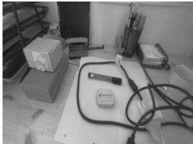  
(a) reference image

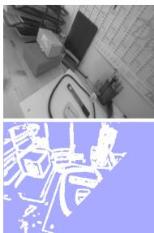  
(b) rotation

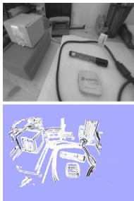  
(c) z trans.

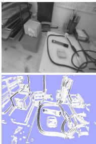  
(d) x trans.  
Fi 4 Statistic normalization: (a) reference image. (b-d): tracked images and inverse variance $\sigma _ { r _ { p } } ^ { - 2 }$ of the residual. For pure rotation, depth noise has no efect on the residual noise and hence all normalization factors are the same. For z translation depth noise has no efect for pixels in the center of the image, while for x translation it only afects residuals with intensity-gradient in x direction.

where $\| \cdot \| _ { \delta }$ is the Huber norm

$$
\| r ^ { 2 } \| _ { \delta } : = \left\{ { \begin{array} { l l } { { \frac { r ^ { 2 } } { 2 \delta } } } & { { \mathrm { i f ~ } } | r | \leq \delta } \\ { | r | - { \frac { \delta } { 2 } } } & { { \mathrm { o t h e r w i s e . } } } \end{array} } \right.\tag{15}
$$

applied to the normalized residual. The residual’s variance $\sigma _ { r _ { p } ( \mathbf { p } , \pmb { \xi } _ { j i } ) } ^ { 2 }$ is computed using covariance propagation as described in Sec. 2.3, and utilizing the inverse depth variance $V _ { i }$ . Further, we assume Gaussian image intensity noise $\sigma _ { I } ^ { 2 }$ . Minimization is performed using iteratively re-weighted Gauss-Newton optimization as described in Sec. 2.2.

In contrast to previous direct methods, the proposed formulation explicitly takes into account varying noise on the depth estimates: This is of particular relevance as for direct, monocular SLAM, this noise difers significantly for different pixels, depending on how long they were visible – which is in contrast to approaches working on RGB-D data, for which the uncertainty on the inverse depth is approximately constant. Figure 4 shows how this weighting behaves for diferent types of motion. Note that no depth information for the new camera image is available – therefore, the scale of the new image is not defined, and the minimization is performed on se(3).

## 3.4 Depth Map Estimation

Keyframe Selection. If the camera moves too far away from the existing map, a new keyframe is created from the most recent tracked image. We threshold a weighted combination of relative distance and angle to the current keyframe:

$$
\mathrm { d i s t } ( \pmb { \xi } _ { j i } ) : = \pmb { \xi } _ { j i } ^ { T } \mathbf { W } \pmb { \xi } _ { j i }\tag{16}
$$

where W is a diagonal matrix containing the weights. Note that, as described in the following section, each keyframe is scaled such that its mean inverse depth is one. This threshold is therefore relative to the current scale of the scene, and ensures suficient possibilities for small-baseline stereo comparisons.

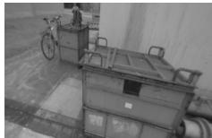

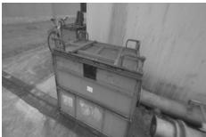  
(a) camera images I

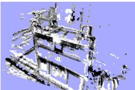  
(d) normalized photometric residual rp/σrp

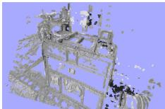

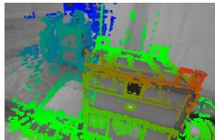

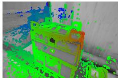  
(b) estimated inverse depth maps D

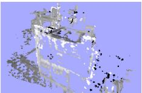

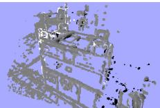  
(e) normalized depth residual rd/σr

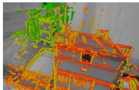

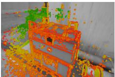  
(c) inverse depth variance V

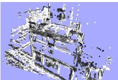

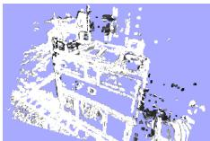  
(f) robust Huber weights  
Fig 5 Direct keyframe alignment on sim(3): (a)-(c): two keyframes with associated depth and depth variance. (d)-(f): photometric residual, depth residual and Huber weights, before minimization (left), and after minimization (right).

Depth Map Creation. Once a new frame is chosen to become a keyframe, its depth map is initialized by projecting points from the previous keyframe into it, followed by one iteration of spatial regularization and outlier removal as proposed in [9]. Afterwards, the depth map is scaled to have a mean inverse depth of one - this scaling factor is directly incorporated into the sim(3) camera pose. Finally, it replaces the previous keyframe and is used for tracking subsequent new frames.

Depth Map Refinement. Tracked frames that do not become a keyframe are used to refine the current keyframe: A high number of very eficient smallbaseline stereo comparisons is performed for image regions where the expected stereo accuracy is suficiently large, as described in [9]. The result is incorporated into the existing depth map, thereby refining it and potentially adding new pixels – this is done using the filtering approach proposed in [9].

## 3.5 Constraint Acquisition: Direct sim(3) Image Alignment

Direct Image Alignment on sim(3). Monocular SLAM is – in contrast to RGB-D or Stereo-SLAM – inherently scale-ambivalent, i.e., the absolute scale of the world is not observable. Over long trajectories this leads to scale-drift, which is one of the major sources of error [23]. Further, all distances are only defined up to scale, which causes threshold-based outlier rejection or parametrized robust kernels (e.g. Huber) to be ill-defined. We solve this by using the inherent correlation between scene depth and tracking accuracy: The depth map of each created keyframe is scaled such that the mean inverse depth is one. In return, edges between keyframes are estimated as elements of sim(3), elegantly incorporating the scaling diference between keyframes, and, in particular for large loop-closures, allowing an explicit detection of accumulated scale-drift.

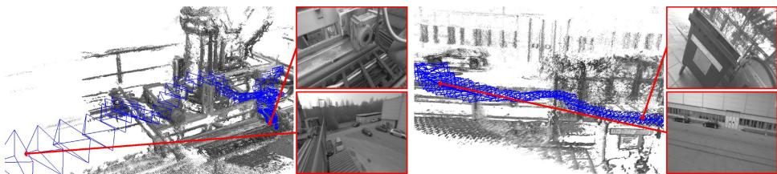  
Fig 6 Two scenes with high scale variation. Camera frustums are displayed for each keyframe with their size corresponding to the keyframe’s scale.

For this, we propose a novel method to perform direct, scale-drift aware image alignment on sim(3), which is used to align two diferently scaled keyframes. In addition to the photometric residual $r _ { p }$ , we incorporate a depth residual $r _ { d }$ which penalizes deviations in inverse depth between keyframes, allowing to directly estimate the scaled transformation between them. The total error function that is minimized becomes

$$
E ( \pmb { \xi } _ { j i } ) : = \sum _ { \mathbf { p } \in \varOmega _ { D _ { i } } } \left\| \frac { r _ { p } ^ { 2 } ( \mathbf { p } , \pmb { \xi } _ { j i } ) } { \sigma _ { r _ { p } ( \mathbf { p } , \pmb { \xi } _ { j i } ) } ^ { 2 } } + \frac { r _ { d } ^ { 2 } ( \mathbf { p } , \pmb { \xi } _ { j i } ) } { \sigma _ { r _ { d } ( \mathbf { p } , \pmb { \xi } _ { j i } ) } ^ { 2 } } \right\| _ { \delta } ,\tag{17}
$$

where the photometric residual $r _ { p } ^ { 2 }$ and $\sigma _ { r _ { p } } ^ { 2 }$ is defined as in (13) - (14). The depth residual and its variance is computed as

$$
r _ { d } (  { \mathbf { p } } , \pmb { \xi } _ { j i } ) : = [  { \mathbf { p } } ^ { \prime } ] _ { 3 } - D _ { j } ( [  { \mathbf { p } } ^ { \prime } ] _ { 1 , 2 } )\tag{18}
$$

$$
\sigma _ { r _ { d } ( \mathbf { p } , \xi _ { j i } ) } ^ { 2 } : = V _ { j } ( [ \mathbf { p ^ { \prime } } ] _ { 1 , 2 } ) \left( \frac { \partial r _ { d } ( \mathbf { p } , \xi _ { j i } ) } { \partial D _ { j } ( [ \mathbf { p ^ { \prime } } ] _ { 1 , 2 } ) } \right) ^ { 2 } + V _ { i } ( \mathbf { p } ) \left( \frac { \partial r _ { d } ( \mathbf { p } , \xi _ { j i } ) } { \partial D _ { i } ( \mathbf { p } ) } \right) ^ { 2 } ,\tag{19}
$$

where $\mathbf { p } ^ { \prime } : = \omega _ { s } ( \mathbf { p } , D _ { i } ( \mathbf { p } ) , \pmb { \xi } _ { j i } )$ denotes the transformed point. Note that the Huber norm is applied to the sum of the normalized photometric and depth residual – which accounts for the fact that if one is an outlier, the other typically is as well. Note that for tracking on sim(3), the inclusion of the depth error is required as the photometric error alone does not constrain the scale. Minimization is performed analogously to direct image alignment on se(3) using the iteratively re-weighted Gauss-Newton algorithm (Sec. 2.2). In practice, sim(3) tracking is computationally only marginally more expensive than tracking on se(3), as only little additional computations are needed1.

Constraint Search. After a new keyframe $\kappa _ { i }$ is added to the map, a number of possible loop closure keyframes $\kappa _ { j _ { 1 } } , . . . , \kappa _ { j _ { n } }$ is collected: We use the closest ten keyframes, as well as a suitable candidate proposed by an appearance-based mapping algorithm [11] to detect large-scale loop closures. To avoid insertion of false or falsely tracked loop closures, we then perform a reciprocal tracking check: For each candidate $\kappa _ { j _ { k } }$ we independently track $\xi _ { j _ { k } i }$ and $\xi _ { i j _ { k } }$ . Only if the two estimates are statistically similar, i.e., if

$$
\begin{array} { r } { e ( \pmb { \xi } _ { j _ { k } i } , \pmb { \xi } _ { i j _ { k } } ) : = ( \pmb { \xi } _ { j _ { k } i } \circ \pmb { \xi } _ { i j _ { k } } ) ^ { T } \left( \pmb { \Sigma } _ { j _ { k } i } + \mathrm { A d j } _ { j _ { k } i } \pmb { \Sigma } _ { i j _ { k } } \mathrm { A d j } _ { j _ { k } i } ^ { T } \right) ^ { - 1 } ( \pmb { \xi } _ { j _ { k } i } \circ \pmb { \xi } _ { i j _ { k } } ) } \end{array}\tag{20}
$$

is suficiently small, they are added to the global map. For this, the adjoint $\operatorname { A d j } _ { j _ { k } i }$ is used to transform $\pmb { \Sigma } _ { i j _ { k } }$ into the correct tangent space.

Convergence Radius for sim(3) Tracking. An important limitation of direct image alignment lies in the inherent non-convexity of the problem, and hence the need for a suficiently accurate initialization. While for the tracking of new camera frames a suficiently good initialization is available (given by the pose of the previous frame), this is not the case when finding loop closure constraints, in particular for large loop closures.

One solution for this consists in using a very small number of keypoints to compute a better initialization: Using the depth values from the existing inverse depth maps, this requires aligning two sets of 3D points with known correspondences, which can be done eficiently in closed form using e.g. the method of Horn [13]. Still, we found that in practice the convergence radius is suficiently large even for large-scale loop closures - in particular we found that the convergence radius can be substantially increased by the following measures:

– Eficient Second Order Minimization (ESM) [3]: While our results confirm previous work [17] in that ESM does not significantly increase the precision of dense image alignment, we observed that it does slightly increase the convergence radius.

– Coarse-to-Fine Approach: While a pyramid approach is commonly used for direct image alignment, we found that starting at a very low resolution of only 20 15 pixels – much smaller than usually done – already helps to increase the convergence radius.

An evaluation of the efect of these measures is given in Sec. 4.3.

## 3.6 Map Optimization

The map, consisting of a set of keyframes and tracked sim(3)-constraints, is continuously optimized in the background using pose graph optimization [18]. The error function that is minimized is – in accordance with the left-multiplication convention from Sec. 2.2 – defined by (W defining the world frame)

$$
E ( \pmb { \xi } _ { W 1 } \dots \pmb { \xi } _ { W n } ) : = \sum _ { ( \pmb { \xi } _ { j i } , \pmb { \Sigma } _ { j i } ) \in \pmb { \mathscr { E } } } ( \pmb { \xi } _ { j i } \circ \pmb { \xi } _ { W i } ^ { - 1 } \circ \pmb { \xi } _ { W j } ) ^ { T } \pmb { \Sigma } _ { j i } ^ { - 1 } ( \pmb { \xi } _ { j i } \circ \pmb { \xi } _ { W i } ^ { - 1 } \circ \pmb { \xi } _ { W j } ) .\tag{21}
$$

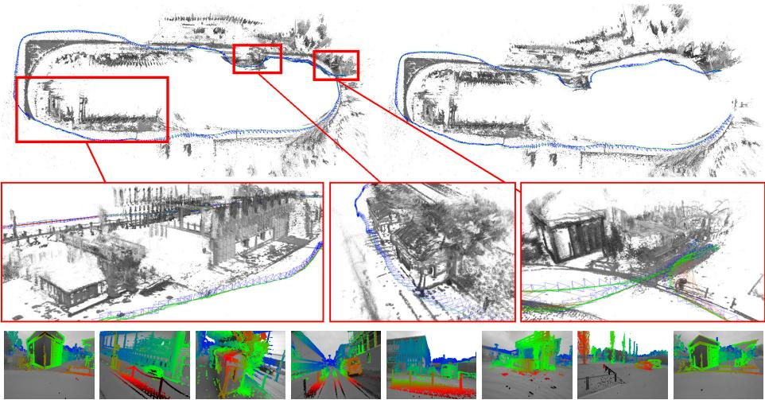  
Fig 7 Loop closure for a long and challenging outdoor trajectory (after the loop closure on the left, before on the right). Also shown are three selected close-ups of the generated pointcloud, and semi-dense depth maps for selected keyframes.

## 4 Results

We evaluate LSD-SLAM both quantitatively on publicly available datasets [25,12] as well as on challenging outdoor trajectories, recorded with a hand-held monocular camera. Some of the evaluated trajectories are shown in full in the supplementary video.

## 4.1 Qualitative Results on Large Trajectories

We tested the algorithm on several long and challenging trajectories, which include many camera rotations, large scale changes and major loop closures. Figure 7 shows a roughly 500 m long trajectory which takes 6 minutes just before and after the large loop closure is found. Figure 8 shows a challenging trajectory with large variations in scene depth, which also includes a loop closure.

## 4.2 Quantitative Evaluation

We evaluate LSD-SLAM on the publicly available RGB-D dataset [25]. Note that for monocular SLAM this is a very challenging benchmark, as it contains fast rotational movement, strong motion blur and rolling shutter artifacts. We use the very first depth map to bootstrap the system and get the correct initial scale. Table 9 shows the resulting absolute trajectory error, and compares it to other approaches.

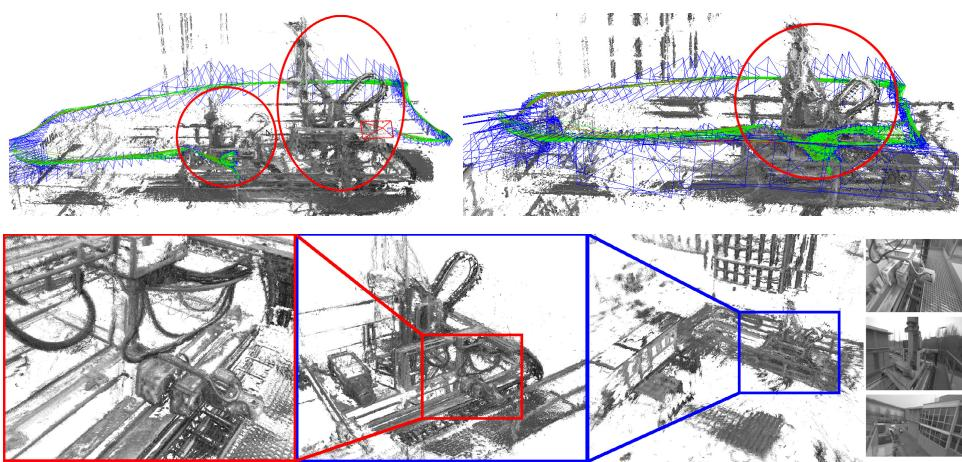  
Fig 8 Accumulated pointcloud of a trajectory with large scale variation, including views with an average inverse depth of less than 20 cm to more than 10 m. After the loop closure (top-right), the geometry is consistently aligned, while before (top-left) parts of the scene existed twice, at diferent scales. The bottom row shows diferent close-ups of the scene. The proposed scale-aware formulation allows to accurately estimate both fine details and large-scale geometry – this flexibility is one of the major benefits of a monocular approach.

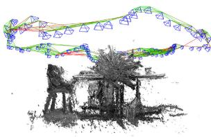

<table><tr><td>LSD-SLAM (#KF)</td><td>[9]</td><td>[15]</td><td>[14]</td><td>[7]</td></tr><tr><td>fr2/desk</td><td>4.52 (116)</td><td>13.50</td><td>X</td><td>1.77</td><td>9.5</td></tr><tr><td>fr2/xyz</td><td>1.47 (38)</td><td>3.79</td><td>24.28</td><td>1.18</td><td>2.6</td></tr><tr><td>sim/desk</td><td>0.04 (39)</td><td>1.53</td><td>-</td><td>0.27</td><td>1</td></tr><tr><td>sim/slowmo</td><td>0.35 (12)</td><td>2.21</td><td>-</td><td>0.13</td><td></td></tr></table>

Fig 9 Results on the TUM RGB-D benchmark [25], and two simulated sequences from [12], measured as absolute trajectory RMSE (cm). For LSD-SLAM, we also show the number of keyframes created. ’x’ denotes tracking failure, ’-’ no available data. For comparison we show respective results from semi-dense mono-VO [9], keypoint-based mono-SLAM [15], direct RGB-D SLAM [14] and keypoint-based RGB-D SLAM [7]. Note that [14] and [7] use depth information from the sensor, while the others do not.

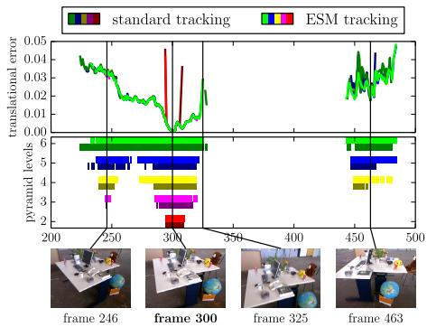

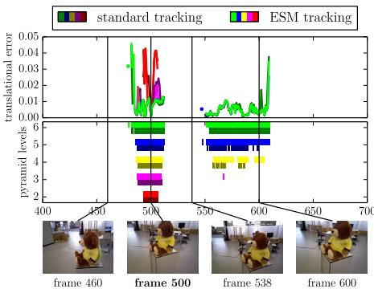  
Fi 10 Convergence radius and accuracy of sim(3) direct image alignment with and without ESM minimization (indicated by light / dark) for a diferent number of pyramid levels (color). All frames of the respective sequence are tracked on frame 300 (left) and frame 500 (right), using the identity as initialization. The bottom plots show for which frames tracking succeeds; the top plots show the final translational error. ESM and more pyramid levels clearly increase the convergence radius, however these measures have no notable efect on tracking precision: if tracking converges, it almost always converges to the same minimum.

## 4.3 Convergence Radius for sim(3) Tracking

We evaluate the convergence radius on two exemplary sequences, the result is shown in Fig. 10. Even though direct image alignment is non-convex, we found that with the steps proposed in Sec. 3.5, surprisingly large camera movements can be tracked. It can also be observed that these measures only increase the convergence radius, and have no notable efect on tracking precision.

## 5 Conclusion

We have presented a novel direct (feature-less) monocular SLAM algorithm which we call LSD-SLAM, which runs in real-time on a CPU. In contrast to existing direct approaches – which are all pure odometries – it maintains and tracks on a global map of the environment, which contains a pose-graph of keyframes with associated probabilistic semi-dense depth maps. Major components of the proposed method are two key novelties: (1) a direct method to align two keyframes on sim(3), explicitly incorporating and detecting scale-drift and (2) a novel, probabilistic approach to incorporate noise on the estimated depth maps into tracking. Represented as point clouds, the map gives a semi-dense and highly accurate 3D reconstruction of the environment. We experimentally showed that the approach reliably tracks and maps even challenging hand-held trajectories with a length of over 500 m, in particular including large variations in scale within the same sequence (average inverse depth of less than 20 cm to more than 10 m) and large rotations – demonstrating its versatility, robustness and flexibility.

## References

1. Achtelik, M., Weiss, S., Siegwart, R.: Onboard IMU and monocular vision based control for MAVs in unknown in- and outdoor environments. In: Intl. Conf. on Robotics and Automation (ICRA) (2011)

2. Akbarzadeh, A., Frahm, J.M., Mordohai, P., Engels, C., Gallup, D., Merrell, P., Phelps, M., Sinha, S., Talton, B., Wang, L., Yang, Q., Stewenius, H., Yang, R., Welch, G., Towles, H., Nist´er, D., Pollefeys, M.: Towards urban 3d reconstruction from video. In: 3DPVT, pp. 1–8 (2006)

3. Benhimane, S., Malis, E.: Real-time image-based tracking of planes using eficient second-order minimization (2004)

4. Comport, A., Malis, E., Rives, P.: Accurate quadri-focal tracking for robust 3d visual odometry. In: Intl. Conf. on Robotics and Automation (ICRA) (2007)

5. Concha, A., Civera, J.: Using superpixels in monocular SLAM. In: Intl. Conf. on Robotics and Automation (ICRA) (2014)

6. Eade, E., Drummond, T.: Edge landmarks in monocular slam. In: British Machine Vision Conf. (2006)

7. Endres, F., Hess, J., Engelhard, N., Sturm, J., Cremers, D., Burgard, W.: An evaluation of the RGB-D slam system. In: Intl. Conf. on Robotics and Automation (ICRA) (2012)

8. Engel, J., Sturm, J., Cremers, D.: Camera-based navigation of a low-cost quadrocopter. In: Intl. Conf. on Intelligent Robot Systems (IROS) (2012)

9. Engel, J., Sturm, J., Cremers, D.: Semi-dense visual odometry for a monocular camera. In: Intl. Conf. on Computer Vision (ICCV) (2013)

10. Forster, C., Pizzoli, M., Scaramuzza, D.: SVO: Fast semi-direct monocular visual odometry. In: Intl. Conf. on Robotics and Automation (ICRA) (2014)

11. Glover, A., Maddern, W., Warren, M., Stephanie, R., Milford, M., Wyeth, G.: OpenFABMAP: an open source toolbox for appearance-based loop closure detection. In: Intl. Conf. on Robotics and Automation (ICRA), pp. 4730–4735 (2012)

12. Handa, A., Newcombe, R.A., Angeli, A., Davison, A.J.: Real-time camera tracking: When is high frame-rate best? In: Fitzgibbon, A., Lazebnik, S., Perona, P., Sato, Y., Schmid, C. (eds.) ECCV 2012, Part VII. LNCS, vol. 7578, pp. 222–235. Springer, Heidelberg (2012)

13. Horn, B.: Closed-form solution of absolute orientation using unit quaternions. Journal of the Optical Society of America (1987)

14. Kerl, C., Sturm, J., Cremers, D.: Dense visual SLAM for RGB-D cameras. In: Intl. Conf. on Intelligent Robot Systems (IROS) (2013)

15. Klein, G., Murray, D.: Parallel tracking and mapping for small AR workspaces. In: Intl. Symp. on Mixed and Augmented Reality (ISMAR) (2007)

16. Klein, G., Murray, D.: Improving the agility of keyframe-based SLAM. In: Forsyth, D., Torr, P., Zisserman, A. (eds.) ECCV 2008, Part II. LNCS, vol. 5303, pp. 802–815. Springer, Heidelberg (2008)

17. Klose, S., Heise, P., Knoll, A.: Eficient compositional approaches for real-time robust direct visual odometry from RGB-D data. In: Intl. Conf. on Intelligent Robot Systems (IROS) (2013)

18. K¨ummerle, R., Grisetti, G., Strasdat, H., Konolige, K., Burgard, W.: g2o: A general framework for graph optimization. In: Intl. Conf. on Robotics and Automation (ICRA) (2011)

19. Li, M., Mourikis, A.: High-precision, consistent EKF-based visual-inertial odometry. International Journal of Robotics Research 32, 690–711 (2013)

20. Newcombe, R., Lovegrove, S., Davison, A.: DTAM: Dense tracking and mapping in real-time. In: Intl. Conf. on Computer Vision (ICCV) (2011)

21. Pizzoli, M., Forster, C., Scaramuzza, D.: REMODE: Probabilistic, monocular dense reconstruction in real time. In: Intl. Conf. on Robotics and Automation (ICRA) (2014)

22. Sch¨ops, T., Engel, J., Cremers, D.: Semi-dense visual odometry for AR on a smartphone. In: Intl. Symp. on Mixed and Augmented Reality (ISMAR) (2014)

23. Strasdat, H., Montiel, J., Davison, A.: Scale drift-aware large scale monocular slam. In: Robotics: Science and Systems (RSS) (2010)

24. St¨uhmer, J., Gumhold, S., Cremers, D.: Real-time dense geometry from a handheld camera. In: Goesele, M., Roth, S., Kuijper, A., Schiele, B., Schindler, K. (eds.) Pattern Recognition. LNCS, vol. 6376, pp. 11–20. Springer, Heidelberg (2010)

25. Sturm, J., Engelhard, N., Endres, F., Burgard, W., Cremers, D.: A benchmark for the evaluation of RGB-D SLAM systems. In: Intl. Conf. on Intelligent Robot Systems (IROS) (2012)