# SVO: Fast Semi-Direct Monocular Visual Odometry

Christian Forster, Matia Pizzoli, Davide Scaramuzza∗

Abstract— We propose a semi-direct monocular visual odometry algorithm that is precise, robust, and faster than current state-of-the-art methods. The semi-direct approach eliminates the need of costly feature extraction and robust matching techniques for motion estimation. Our algorithm operates directly on pixel intensities, which results in subpixel precision at high frame-rates. A probabilistic mapping method that explicitly models outlier measurements is used to estimate 3D points, which results in fewer outliers and more reliable points. Precise and high frame-rate motion estimation brings increased robustness in scenes of little, repetitive, and high-frequency texture. The algorithm is applied to micro-aerial-vehicle stateestimation in GPS-denied environments and runs at 55 frames per second on the onboard embedded computer and at more than 300 frames per second on a consumer laptop. We call our approach SVO (Semi-direct Visual Odometry) and release our implementation as open-source software.

## I. INTRODUCTION

Micro Aerial Vehicles (MAVs) will soon play a major role in disaster management, industrial inspection and environment conservation. For such operations, navigating based on GPS information only is not sufficient. Precise fully autonomous operation requires MAVs to rely on alternative localization systems. For minimal weight and powerconsumption it was therefore proposed [1]–[5] to use only a single downward-looking camera in combination with an Inertial Measurement Unit. This setup allowed fully autonomous way-point following in outdoor areas [1]–[3] and collaboration between MAVs and ground robots [4], [5].

To our knowledge, all monocular Visual Odometry (VO) systems for MAVs [1], [2], [6], [7] are featurebased. In RGB-D and stereo-based SLAM systems however, direct methods [8]–[11]—based on photometric error minimization—are becoming increasingly popular.

In this work, we propose a semi-direct VO that combines the success-factors of feature-based methods (tracking many features, parallel tracking and mapping, keyframe selection) with the accurracy and speed of direct methods. High framerate VO for MAVs promises increased robustness and faster flight maneuvres.

An open-source implementation and videos of this work are available at: http://rpg.ifi.uzh.ch/software

## A. Taxonomy of Visual Motion Estimation Methods

Methods that simultaneously recover camera pose and scene structure from video can be divided into two classes:

a) Feature-Based Methods: The standard approach is to extract a sparse set of salient image features (e.g. points, lines) in each image; match them in successive frames using invariant feature descriptors; robustly recover both camera motion and structure using epipolar geometry; finally, refine the pose and structure through reprojection error minimization. The majority of VO algorithms [12] follows this procedure, independent of the applied optimization framework. A reason for the success of these methods is the availability of robust feature detectors and descriptors that allow matching between images even at large inter-frame movement. The disadvantage of feature-based approaches is the reliance on detection and matching thresholds, the neccessity for robust estimation techniques to deal with wrong correspondences, and the fact that most feature detectors are optimized for speed rather than precision, such that drift in the motion estimate must be compensated by averaging over many feature-measurements.

b) Direct Methods: Direct methods [13] estimate structure and motion directly from intensity values in the image. The local intensity gradient magnitude and direction is used in the optimisation compared to feature-based methods that consider only the distance to some feature-location. Direct methods that exploit all the information in the image, even from areas where gradients are small, have been shown to outperform feature-based methods in terms of robustness in scenes with little texture [14] or in the case of cameradefocus and motion blur [15]. The computation of the photometric error is more intensive than the reprojection error, as it involves warping and integrating large image regions. However, since direct methods operate directly on the intensitiy values of the image, the time for feature detection and invariant descriptor computation can be saved.

## B. Related Work

Most monocular VO algorithms for MAVs [1], [2], [7] rely on PTAM [16]. PTAM is a feature-based SLAM algorithm that achieves robustness through tracking and mapping many (hundreds) of features. Simultaneously, it runs in real-time by parallelizing the motion estimation and mapping tasks and by relying on efficient keyframe-based Bundle Adjustment (BA) [17]. However, PTAM was designed for augmented reality applications in small desktop scenes and multiple modifications (e.g., limiting the number of keyframes) were necessary to allow operation in large-scale outdoor environments [2].

Early direct monocular SLAM methods tracked and mapped few—sometimes manually selected—planar patches [18]–[21]. While the first approaches [18], [19] used filtering algorithms to estimate structure and motion, later methods [20]–[22] used nonlinear least squares optimization. All these methods estimate the surface normals of the patches, which allows tracking a patch over a wide range of viewpoints, thus, greatly reducing drift in the estimation. The authors of [19]–[21] reported real-time performance, however, only with few selected planar regions and on small datasets. A VO algorithm for omnidirectional cameras on cars was proposed in [22]. In [8], the local planarity assumption was relaxed and direct tracking with respect to arbitrary 3D structures computed from stereo cameras was proposed. In [9]–[11], the same approach was also applied to RGB-D sensors. With DTAM [15], a novel direct method was introduced that computes a dense depthmap for each keyframe through minimisation of a global, spatially-regularised energy functional. The camera pose is found through direct whole image alignment using the depth-map. This approach is computationally very intensive and only possible through heavy GPU parallelization. To reduce the computational demand, the method described in [23], which was published during the review process of this work, uses only pixels characterized by strong gradient.

## C. Contributions and Outline

The proposed Semi-Direct Visual Odometry (SVO) algorithm uses feature-correspondence; however, featurecorrespondence is an implicit result of direct motion estimation rather than of explicit feature extraction and matching. Thus, feature extraction is only required when a keyframe is selected to initialize new 3D points (see Figure 1). The advantage is increased speed due to the lack of featureextraction at every frame and increased accuracy through subpixel feature correspondence. In contrast to previous direct methods, we use many (hundreds) of small patches rather than few (tens) large planar patches [18]–[21]. Using many small patches increases robustness and allows neglecting the patch normals. The proposed sparse model-based image alignment algorithm for motion estimation is related to model-based dense image alignment [8]–[10], [24]. However, we demonstrate that sparse information of depth is sufficient to get a rough estimate of the motion and to find featurecorrespondences. As soon as feature correspondences and an initial estimate of the camera pose are established, the algorithm continues using only point-features; hence, the name “semi-direct”. This switch allows us to rely on fast and established frameworks for bundle adjustment (e.g., [25]).

A Bayesian filter that explicitly models outlier measurements is used to estimate the depth at feature locations. A 3D point is only inserted in the map when the corresponding depth-filter has converged, which requires multiple measurements. The result is a map with few outliers and points that can be tracked reliably.

The contributions of this paper are: (1) a novel semidirect VO pipeline that is faster and more accurate than the current state-of-the-art for MAVs, (2) the integration of a probabilistic mapping method that is robust to outlier measurements.

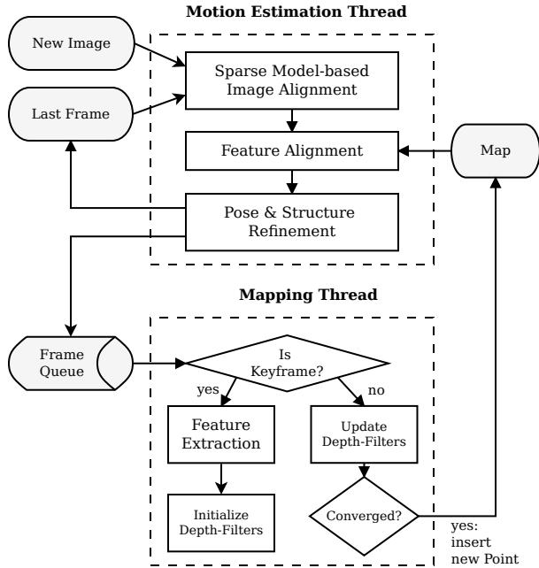  
Fig. 1: Tracking and mapping pipeline

Section II provides an overview of the pipeline and Section III, thereafter, introduces some required notation. Section IV and V explain the proposed motion-estimation and mapping algorithms. Section VII provides experimental results and comparisons.

## II. SYSTEM OVERVIEW

Figure 1 provides an overview of SVO. The algorithm uses two parallel threads (as in [16]), one for estimating the camera motion, and a second one for mapping as the environment is being explored. This separation allows fast and constant-time tracking in one thread, while the second thread extends the map, decoupled from hard real-time constraints.

The motion estimation thread implements the proposed semi-direct approach to relative-pose estimation. The first step is pose initialisation through sparse model-based image alignment: the camera pose relative to the previous frame is found through minimizing the photometric error between pixels corresponding to the projected location of the same 3D points (see Figure 2). The 2D coordinates corresponding to the reprojected points are refined in the next step through alignment of the corresponding feature-patches (see Figure 3). Motion estimation concludes by refining the pose and the structure through minimizing the reprojection error introduced in the prevous feature-alignment step.

In the mapping thread, a probabilistic depth-filter is initialized for each 2D feature for which the corresponding 3D point is to be estimated. New depth-filters are initialised whenever a new keyframe is selected in regions of the image where few 3D-to-2D correspondences are found. The filters are initialised with a large uncertainty in depth. At every subsequent frame the depth estimate is updated in a Bayesian fashion (see Figure 5). When a depth filter’s uncertainty becomes small enough, a new 3D point is inserted in the map and is immediately used for motion estimation.

## III. NOTATION

Before the algorithm is detailed, we briefly define the notation that is used throughout the paper.

The intensity image collected at timestep k is denoted with $I _ { k } : \Omega \subset \mathbb { R } ^ { 2 } \mapsto \dot { \mathbb { R } }$ , where Ω is the image domain. Any 3D point $\mathbf { p } = ( x , y , z ) ^ { \top } \in \mathcal { S }$ on the visible scene surface $\mathcal { S } \subset \mathbb { R } ^ { 3 }$ maps to the image coordinates $\mathbf { u } = ( u , \nu ) ^ { \top } \in \Omega$ through the camera projection model $\pi : \mathbb { R } ^ { 3 } \mapsto \mathbb { R } ^ { 2 }$

$$
\mathbf { u } = \pi ( \mathbf { \rho } _ { k } \mathbf { p } ) ,\tag{1}
$$

where the prescript k denotes that the point coordinates are expressed in the camera frame of reference k. The projection π is determined by the intrinsic camera parameters which are known from calibration. The 3D point corresponding to an image coordinate u can be recovered, given the inverse projection function $\pi ^ { - 1 }$ and the depth $d _ { \mathbf { u } } \in \mathcal { R }$

$$
\mathbf { \Phi } _ { k } \mathbf { p } = \pi ^ { - 1 } ( \mathbf { u } , d _ { \mathbf { u } } ) ,\tag{2}
$$

where $\mathcal { R } \subseteq \Omega$ is the domain for which the depth is known.

The camera position and orientation at timestep k is expressed with the rigid-body transformation $\mathbf { T } _ { k , w } \in S E ( 3 )$ . It allows us to map a 3D point from the world coordinate frame to the camera frame of reference: $\mathbf { \nabla } _ { k \mathbf { P } } = \mathbf { T } _ { k , w } \cdot \mathbf { \nabla } _ { w } \mathbf { p } .$ The relative transformation between two consecutive frames can be computed with $\mathbf { T } _ { k , k - 1 } = \mathbf { T } _ { k , w } \cdot \mathbf { T } _ { k - 1 , w } ^ { - 1 } .$ During the optimization, we need a minimal representation of the transformation and, therefore, use the Lie algebra $\mathfrak { s e } ( 3 )$ corresponding to the tangent space of $S E ( 3 )$ at the identity. We denote the algebra elements—also named twist coordinates—with $\xi =$ $( \bar { \omega } , \nu ) ^ { T } \in \mathbb { R } ^ { 6 }$ , where ω is called the angular velocity and ν the linear velocity. The twist coordinates $\xi$ are mapped to $S E ( 3 )$ by the exponential map [26]:

$$
\mathbf { T } ( { \boldsymbol { \xi } } ) = \exp ( { \hat { \boldsymbol { \xi } } } ) .\tag{3}
$$

## IV. MOTION ESTIMATION

SVO computes an initial guess of the relative camera motion and the feature correspondences using direct methods and concludes with a feature-based nonlinear reprojectionerror refinement. Each step is detailed in the following sections and illustrated in Figures 2 to 4.

## A. Sparse Model-based Image Alignment

The maximum likelihood estimate of the rigid body transformation $\mathbf { T } _ { k , k - 1 }$ between two consecutive camera poses minimizes the negative log-likelihood of the intensity residuals:

$$
\mathbf { T } _ { k , k - 1 } = \arg \operatorname* { m i n } _ { \mathbf { T } } \iint _ { \bar { \mathcal { R } } } \rho \left[ \delta I ( \mathbf { T } , \mathbf { u } ) \right] d \mathbf { u } .\tag{4}
$$

The intensity residual δI is defined by the photometric difference between pixels observing the same 3D point. It can be computed by back-projecting a 2D point u from the previous image $I _ { k - 1 }$ and subsequently projecting it into the current camera view:

$$
\delta I \big ( \mathbf { T } , \mathbf { u } \big ) = I _ { k } \bigg ( \pi \big ( \mathbf { T } \cdot \pi ^ { - 1 } ( \mathbf { u } , d _ { \mathbf { u } } ) \big ) \bigg ) - I _ { k - 1 } ( \mathbf { u } ) \quad \forall \ \mathbf { u } \in \bar { \mathcal { R } } ,\tag{5}
$$

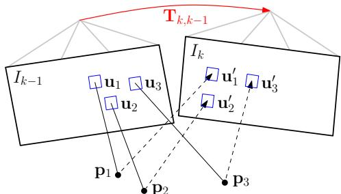

Fig. 2: Changing the relative pose $\mathbf { T } _ { k , k - 1 }$ between the current and the previous frame implicitly moves the position of the reprojected points in the new image $\mathbf { u } _ { i } ^ { \prime } .$ Sparse image alignment seeks to find $\mathbf { T } _ { k , k - 1 }$ that minimizes the photometric difference between image patches corresponding to the same 3D point (blue squares). Note, in all figures, the parameters to optimize are drawn in red and the optimization cost is highlighted in blue.  
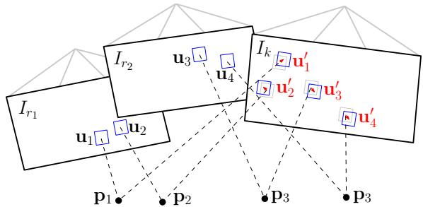  
Fig. 3: Due to inaccuracies in the 3D point and camera pose estimation, the photometric error between corresponding patches (blue squares) in the current frame and previous keyframes ri can further be minimised by optimising the 2D position of each patch individually.

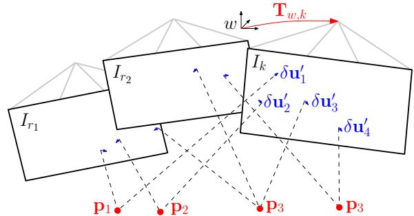  
Fig. 4: In the last motion estimation step, the camera pose and the structure (3D points) are optimized to minimize the reprojection error that has been established during the previous feature-alignment step.

where $\bar { \mathcal { R } }$ is the image region for which the depth $d _ { \mathbf { u } }$ is known at time k − 1 and for which the back-projected points are visible in the current image domain:

$$
\bar { \mathscr { R } } = \left\{  { \mathbf { u } } \ \middle | \  { \mathbf { u } } \in \mathscr { R } _ { k - 1 } \ \wedge \ \pi \big (  { \mathbf { T } } \cdot \pi ^ { - 1 } (  { \mathbf { u } } , d _ {  { \mathbf { u } } } ) \big ) \in \Omega _ { k } \right\} .\tag{6}
$$

For the sake of simplicity, we assume in the following that the intensity residuals are normally distributed with unit variance. The negative log likelihood minimizer then corresponds to the least squares problem: $\rho [ . ] { \hat { = } } { \frac { 1 } { 2 } } \parallel . \parallel ^ { 2 }$ . In practice, the distribution has heavier tails due to occlusions and thus, a robust cost function must be applied [10].

In contrast to previous works, where the depth is known for large regions in the image [8]–[10], [24], we only know the depth $d _ { \mathbf { u } _ { i } }$ at sparse feature locations $\mathbf { u } _ { i }$ . We denote small patches of 4 × 4 pixels around the feature point with the vector $\mathbf { I } ( \mathbf { u } _ { i } )$ . We seek to find the camera pose that minimizes the photometric error of all patches (see Figure 2):

$$
\mathbf { T } _ { k , k - 1 } = \arg \operatorname* { m i n } _ { \mathbf { T } _ { k , k - 1 } } \frac { 1 } { 2 } \sum _ { i \in \mathcal { \hat { R } } } \parallel \delta \mathbf { I } ( \mathbf { T } _ { k , k - 1 } , \mathbf { u } _ { i } ) \parallel ^ { 2 } .\tag{7}
$$

Since Equation (7) is nonlinear in $\mathbf { T } _ { k , k - 1 }$ , we solve it in an iterative Gauss-Newton procedure. Given an estimate of the relative transformation $\bar { \hat { \mathbf { T } } } _ { k , k - 1 }$ , an incremental update $\mathbf { T } ( \boldsymbol { \xi } )$ to the estimate can be parametrised with a twist $\xi \in \mathfrak { s e } ( 3 )$ We use the inverse compositional formulation [27] of the intensity residual, which computes the update step $\mathbf { T } ( \boldsymbol { \xi } )$ for the reference image at time $k - 1$

$$
\delta \mathbf { I } ( \boldsymbol { \xi } , \mathbf { u } _ { i } ) = \mathbf { I } _ { k } \Big ( \pi \big ( \mathbf { \hat { T } } _ { k , k - 1 } \cdot \mathbf { p } _ { i } \big ) \Big ) - \mathbf { I } _ { k - 1 } \Big ( \pi \big ( \mathbf { T } ( \boldsymbol { \xi } ) \cdot \mathbf { p } _ { i } \big ) \Big ) ,\tag{8}
$$

with $\mathbf { p } _ { i } = \pi ^ { - 1 } ( \mathbf { u } _ { i } , d _ { \mathbf { u } _ { i } } )$ . The inverse of the update step is then applied to the current estimate using Equation (3):

$$
\hat { \mathbf { T } } _ { k , k - 1 } \longleftarrow \hat { \mathbf { T } } _ { k , k - 1 } \cdot \mathbf { T } ( \boldsymbol { \xi } ) ^ { - 1 } .\tag{9}
$$

Note that we do not warp the patches for computing speedreasons. This assumption is valid in case of small frame-toframe motions and for small patch-sizes.

To find the optimal update step $\mathbf { T } ( \boldsymbol { \xi } )$ , we compute the derivative of (7) and set it to zero:

$$
\begin{array} { r } { \displaystyle \sum _ { i \in \bar { \mathcal { R } } } \nabla \delta \mathbf { I } ( \boldsymbol { \xi } , \mathbf { u } _ { i } ) ^ { \top } \ \delta \mathbf { I } ( \boldsymbol { \xi } , \mathbf { u } _ { i } ) = 0 . } \end{array}\tag{10}
$$

To solve this system, we linearize around the current state:

$$
\delta { \bf { I } } ( \xi , { \bf { u } } _ { i } ) \approx \delta { \bf { I } } ( 0 , { \bf { u } } _ { i } ) + \nabla \delta { \bf { I } } ( 0 , { \bf { u } } _ { i } ) \cdot \xi\tag{11}
$$

The Jacobian $\mathbf { J } _ { i } : = \nabla \delta \mathbf { I } ( 0 , \mathbf { u } _ { i } )$ has the dimension $1 6 \times 6$ because of the 4 × 4 patch-size and is computed with the chain-rule:

$$
\frac { \partial \delta \mathbf { I } ( \boldsymbol { \xi } , \mathbf { u } _ { i } ) } { \partial \boldsymbol { \xi } } = \frac { \partial \mathbf { I } _ { k - 1 } ( \mathbf { a } ) } { \partial \mathbf { a } } \Big \lvert _ { \mathbf { a } = \mathbf { u } _ { i } } \cdot \frac { \partial \boldsymbol { \pi } ( \mathbf { b } ) } { \partial \mathbf { b } } \Big \lvert _ { \mathbf { b } = \mathbf { p } _ { i } } \cdot \frac { \partial \mathbf { T } ( \boldsymbol { \xi } ) } { \partial \boldsymbol { \xi } } \Big \lvert _ { \boldsymbol { \xi } = 0 } \cdot \mathbf { p } _ { i }
$$

By inserting (11) into (10) and by stacking the Jacobians in a matrix J, we obtain the normal equations:

$$
\mathbf { J } ^ { T } \mathbf { J } \boldsymbol { \xi } = - \mathbf { J } ^ { T } \delta \mathbf { I } ( 0 ) ,\tag{12}
$$

which can be solved for the update twist $\xi .$ . Note that by using the inverse compositional approach, the Jacobian can be precomputed as it remains constant over all iterations (the reference patch $\mathbf { I } _ { k - 1 } ( \mathbf { u } _ { i } )$ and the point pi do not change), which results in a significant speedup [27].

## B. Relaxation Through Feature Alignment

The last step aligned the camera with respect to the previous frame. Through back-projection, the found relative pose $\mathbf { T } _ { k , k - 1 }$ implicitly defines an initial guess for the feature positions of all visible 3D points in the new image. Due to inaccuracies in the 3D points’ positions and, thus, the camera pose, this initial guess can be improved. To reduce the drift, the camera pose should be aligned with respect to the map, rather than to the previous frame.

All 3D points of the map that are visible from the estimated camera pose are projected into the image, resulting in an estimate of the corresponding 2D feature positions $\mathbf { u } _ { i } ^ { \prime }$ (see Figure 3). For each reprojected point, the keyframe r that observes the point with the closest observation angle is identified. The feature alignment step then optimizes all 2D feature-positions $\mathbf { u } _ { i }$ in the new image individually by minimizing the photometric error of the patch in the current image with respect to the reference patch in the keyframe r:

$$
\mathbf { u } _ { i } ^ { \prime } = \arg \operatorname* { m i n } _ { \mathbf { u } _ { i } ^ { \prime } } \frac { 1 } { 2 } \parallel \mathbf { I } _ { k } ( \mathbf { u } _ { i } ^ { \prime } ) - \mathbf { A } _ { i } \cdot \mathbf { I } _ { r } ( \mathbf { u } _ { i } ) \parallel ^ { 2 } , \quad \forall ~ i .\tag{13}
$$

This alignment is solved using the inverse compositional Lucas-Kanade algorithm [27]. Contrary to the previous step, we apply an affine warping A to the reference patch, since a larger patch size is used $( 8 \times 8$ pixels) and the closest keyframe is typically farther away than the previous image.

This step can be understood as a relaxation step that violates the epipolar constraints to achieve a higher correlation between the feature-patches.

## C. Pose and Structure Refinement

In the previous step, we have established feature correspondence with subpixel accuracy at the cost of violating the epipolar constraints. In particular, we have generated a reprojection residual $\lvert \lvert \delta \mathbf { u } _ { i } \rvert \rvert = \lvert \lvert \mathbf { u } _ { i } - \pi ( \mathbf { T } _ { k , w \ w } \mathbf { p } _ { i } ) \rvert \rvert \neq 0$ , which on average is around 0.3 pixels (see Figure 11). In this final step, we again optimize the camera pose $\mathbf { T } _ { k , w }$ to minimize the reprojection residuals (see Figure 4):

$$
\mathbf { T } _ { k , w } = \mathop { \arg \operatorname* { m i n } } _ { \mathbf { T } _ { k , w } } \frac { 1 } { 2 } \sum _ { i } \parallel \mathbf { u } _ { i } - \pi ( \mathbf { T } _ { k , w } \mathbf { \nabla } _ { w } \mathbf { p } _ { i } ) \parallel ^ { 2 } .\tag{14}
$$

This is the well known problem of motion-only BA [17] and can efficiently be solved using an iterative non-linear least squares minimization algorithm such as Gauss Newton.

Subsequently, we optimize the position of the observed 3D points through reprojection error minimization (structureonly BA). Finally, it is possible to apply local BA, in which both the pose of all close keyframes as well as the observed 3D points are jointly optimized. The BA step is ommitted in the fast parameter settings of the algorithm (Section VII).

## D. Discussion

The first (Section IV-A) and the last (Section IV-C) optimization of the algorithm seem to be redundant as both optimize the 6 DoF pose of the camera. Indeed, one could directly start with the second step and establish featurecorrespondence through Lucas-Kanade tracking [27] of all feature-patches, followed by nonlinear pose refinement (Section IV-C). While this would work, the processing time would be higher. Tracking all features over large distances (e.g., 30 pixels) requires a larger patch and a pyramidal implementation. Furthermore, some features might be tracked inaccurately, which would require outlier detection. In SVO however, feature alignment is efficiently initialized by only optimizing six parameters—the camera pose—in the sparse image alignment step. The sparse image alignment step satisfies implicitly the epipolar constraint and ensures that there are no outliers.

One may also argue that the first step (sparse image alignment) would be sufficient to estimate the camera motion. In fact, this is what recent algorithms developed for RGB-D cameras do [10], however, by aligning the full depth-map rather than sparse patches. We found empirically that using the first step only results in significantly more drift compared to using all three steps together. The improved accuracy is due to the alignment of the new image with respect to the keyframes and the map, whereas sparse image alignment aligns the new frame only with respect to the previous frame.

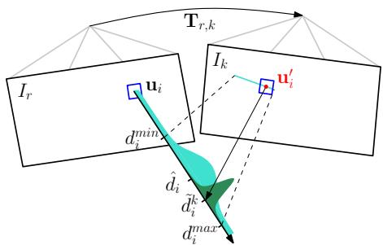  
Fig. 5: Probabilistic depth estimate $\hat { d _ { i } }$ for feature i in the reference frame r. The point at the true depth projects to similar image regions in both images (blue squares). Thus, the depth estimate is updated with the triangulated depth $\tilde { d } _ { i } ^ { \hat { k } }$ computed from the point u′ of highest correlation with the reference patch. The point of highest correlation lies always on the epipolar line in the new image.

## V. MAPPING

Given an image and its pose $\left\{ I _ { k } , \mathbf { T } _ { k , w } \right\}$ , the mapping thread estimates the depth of 2D features for which the corresponding 3D point is not yet known. The depth estimate of a feature is modeled with a probability distribution. Every subsequent observation $\left\{ I _ { k } , \mathbf { T } _ { k , w } \right\}$ is used to update the distribution in a Bayesian framework (see Figure 5) as in [28]. When the variance of the distribution becomes small enough, the depth-estimate is converted to a 3D point using (2), the point is inserted in the map and immediately used for motion estimation (see Figure 1). In the following we report the basic results and our modifications to the original implementation in [28].

Every depth-filter is associated to a reference keyframe $r _ { \ast }$ The filter is initialized with a high uncertainty in depth and the mean is set to the average scene depth in the reference frame. For every subsequent observation $\left\{ I _ { k } , \mathbf { T } _ { k , w } \right\}$ we search for a patch on the epipolar line in the new image $I _ { k }$ that has the highest correlation with the reference patch. The epipolar line can be computed from the relative pose between the frames $\mathbf { T } _ { r , k }$ and the optical ray that passes through ${ \bf { u } } _ { i } .$ The point of highest correlation $\mathbf { u } _ { i } ^ { \prime }$ corresponds to the depth $\tilde { d } _ { i } ^ { k }$ that can be found by triangulation (see Figure 5).

The measurement $\tilde { d } _ { i } ^ { k }$ is modeled with a Gaussian + Uniform mixture model distribution [28]: a good measurement is normally distributed around the true depth $d _ { i }$ while an outlier measurement arises from a uniform distribution in the interval $[ d _ { i } ^ { \operatorname* { m i n } } , d _ { i } ^ { \operatorname* { m a x } } ]$

$$
p ( \tilde { d } _ { i } ^ { k } | d _ { i } , \rho _ { i } ) = \rho _ { i } \mathcal { N } \big ( \tilde { d } _ { i } ^ { k } \big | d _ { i } , \tau _ { i } ^ { 2 } \big ) + ( 1 - \rho _ { i } ) \mathcal { U } \big ( \tilde { d } _ { i } ^ { k } \big | d _ { i } ^ { \mathrm { m i n } } , d _ { i } ^ { \mathrm { m a x } } \big ) ,
$$

where $\rho _ { i }$ is the inlier probability and $\tau _ { i } ^ { 2 }$ the variance of a good measurement that can be computed geometrically by assuming a photometric disparity variance of one pixel in the image plane [29].

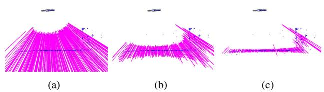  
Fig. 6: Very little motion is required by the MAV (seen from the side at the top) for the uncertainty of the depth-filters (shown as mangenta lines) to converge.

The recursive Bayesian update step for this model is described in detail in [28]. In contrast to [28], we use inverse depth coordinates to deal with large scene depths.

The proposed depth estimation is very efficient when only a small range around the current depth estimate on the epipolar line is searched; in our case the range corresponds to twice the standard deviation of the current depth estimate. Figure 6 demonstrates how little motion is required to significantly reduce the uncertainty in depth. The main advantage of the proposed methods over the standard approach of triangulating points from two views is that we observe far fewer outliers as every filter undergoes many measurements until convergence. Furthermore, erroneous measurements are explicitly modeled, which allows the depth to converge even in highly-similar environments. In [29] we demonstrate how the same approach can be used for dense mapping.

## VI. IMPLEMENTATION DETAILS

The algorithm is bootstrapped to obtain the pose of the first two keyframes and the initial map. Like in [16], we assume a locally planar scene and estimate a homography. The inital map is triangulated from the first two views.

In order to cope with large motions, we apply the sparse image alignment algorithm in a coarse-to-fine scheme. The image is halfsampled to create an image pyramid of five levels. The intensity residual is then optimized at the coarsest level until convergence. Subsequently, the optimization is initialized at the next finer level. To save processing time, we stop after convergence on the third level, at which stage the estimate is accurate enough to initialize feature alignment.

The algorithm keeps for efficiency reasons a fixed number of keyframes in the map, which are used as reference for feature-alignment and for structure refinement. A keyframe is selected if the Euclidean distance of the new frame relative to all keyframes exceeds 12% of the average scene depth. When a new keyframe is inserted in the map, the keyframe farthest apart from the current position of the camera is removed.

In the mapping thread, we divide the image in cells of fixed size (e.g., 30 × 30 pixels). A new depth-filter is initialized at the FAST corner [30] with highest Shi-Tomasi score in the cell unless there is already a 2D-to-3D correspondence present. This results in evenly distributed features in the image. The same grid is also used for reprojecting the map before feature alignment. Note that we extract FAST corners at every level of the image pyramid to find the best corners independent of the scale.

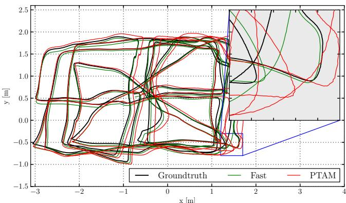  
Fig. 7: Comparison against the ground-truth of SVO with the fast parameter setting (see Table I) and of PTAM. Zooming-in reveals that the proposed algorithm generates a smoother trajectory than PTAM.

## VII. EXPERIMENTAL RESULTS

Experiments were performed on datasets recorded from a downward-looking camera1 attached to a MAV and sequences from a handheld camera. The video was processed on both a laptop2 and on an embedded platform3 that is mounted on the MAV (see Figure 17). Note that at maximum 2 CPU cores are used for the algorithm. The experiments on the consumer laptop were run with two different parameters settings, one optimised for speed and one for accuracy (Table I). On the embedded platform only the fast parameters setting is used.

<table><tr><td></td><td>Fast</td><td>Accurate</td></tr><tr><td>Max number of features per image</td><td>120</td><td>200</td></tr><tr><td>Max number of keyframes</td><td>10</td><td>50</td></tr><tr><td>Local Bundle Adjustment</td><td>no</td><td>yes</td></tr></table>

TABLE I: Two different parameter settings of SVO.

We compare the performance of SVO with the modified PTAM algorithm of [2]. The reason we do not compare with the original version of PTAM [16] is because it does not handle large environments and is not robust enough in scenes of high-frequency texture [2]. The version of [2] solves these problems and constitutes to our knowledge the best performing monocular SLAM algorithm for MAVs.

## A. Accuracy

We evaluate the accuracy on a dataset that has also been used in [2] and is illustrated in Figure 7. The ground-truth for the trajectory originates from a motion capture system. The trajectory is 84 meters long and the MAV flew on average 1.2 meters above the flat ground.

Figures 8 and 9 illustrate the position and attitude error over time. In order to generate the plots, we aligned the first 10 frames with the ground-truth using [31]. The results of PTAM are in a similar range as reported in [2]. Since the plots are highly dependent on the accuracy of alignment of the first 10 frames, we also report the drift in meters per second in Table II as proposed and motivated in [32]. Overall, both versions of SVO are more accurate than PTAM. We suspect the main reason for this result to originate from the fact that the PTAM version of [2] does not extract features on the pyramid level of highest resolution and subpixel refinement is not performed for all features in PTAM. Neglecting the highest resolution image inevitably results in less accuracy which is clearly visible in the closeup of Figure 7. In [2], the use of lower resolution images is motivated by the fact that high-frequency self-similar texture in the image results in too many outlier 3D points. SVO efficiently copes with this problem by using the depth-filters which results in very few outliers.

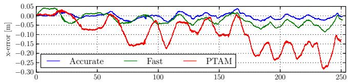

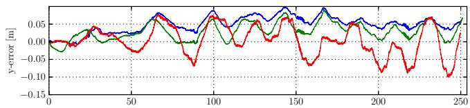

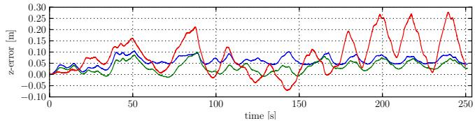

Fig. 8: Position drift of SVO with fast and accurate parameter setting and comparison against PTAM.  
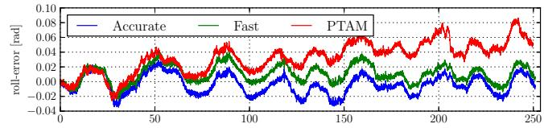

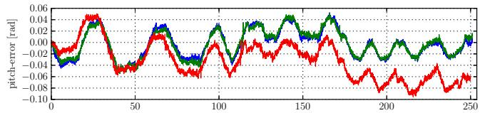

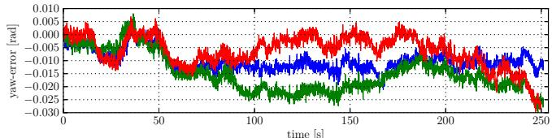  
Fig. 9: Attitutde drifts of SVO with fast and accurate parameter setting and comparison against PTAM.

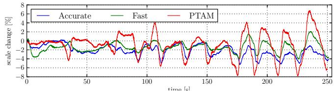

Fig. 10: Scale-drift over time of the trajectory shown in Figure 7  
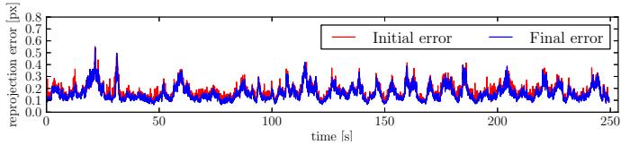

Fig. 11: Average reprojection error over time of the trajectory shown in Figure 7. The initial error is after sparse image alignment (Section IV-A) and the final error after pose refinement (Section IV-C).  
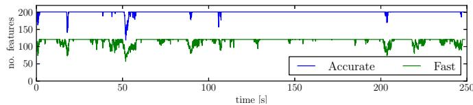  
Fig. 12: Number of tracked features over time for two different parameter settings. For the accurate parameter setting, the number of features is limited to 200 and for the fast setting to 120.

<table><tr><td></td><td>Pos-RMSE [m/s]</td><td>Pos-Median [m/s]</td><td>Rot-RMSE [deg/s]</td><td>Rot-Median [deg/s]</td></tr><tr><td>fast</td><td>0.0059</td><td>0.0047</td><td>0.4295</td><td>0.3686</td></tr><tr><td>accurate</td><td>0.0051</td><td>0.0038</td><td>0.4519</td><td>0.3858</td></tr><tr><td>PTAM</td><td>0.0164</td><td>0.0142</td><td>0.4585</td><td>0.3808</td></tr></table>

TABLE II: Relative pose and rotation error of the trajectory in Figure 7

Since a camera is only an angle-sensor, it is impossible to obtain the scale of the map through a Structure from Motion pipeline. Hence, in the above evaluation we also align the scale of the first 10 measurements with the ground-truth. The proposed pipeline propagates the scale, however with some drift that is shown in Figure 10. The scale drift is computed by comparing the euclidean norm of the relative translation against the ground-truth. The unknown scale and the scale drift motivate the need for a camera-IMU state estimation system for MAV control, as described in [33].

Figure 11 illustrates the average reprojection error. The sparse image alignment step brings the frame very close to the final pose, as the refinement step reduces the error only marginally. The reprojection error is “generated” in the feature-alignment step; hence, this plot also shows that patches move only a fraction of a pixel during this step.

The difference in accuracy between the fast and accurate parameter setting is not significant. Optimizing the pose and the observed 3D points separately at every iteration (fast parameter setting) is accurate enough for MAV motion estimation.

## B. Runtime Evaluation

Figures 13 and 14 show a break-up of the time required to compute the camera motion on the specified laptop and embedded platform respectively with the fast-parameter setting. The laptop is capable to process the frames faster than 300 frames per second (fps) while the embedded platform runs at 55 fps. The corresponding time for PTAM is 91 fps and 27 fps respectively. The main difference is that SVO does not require feature extraction during motion estimation which constitutes the bulk of time in PTAM (7 ms on the laptop, 16 ms on the embedded computer). Additionally, PTAM tracks between 160 and 220 features while in the fast parameter setting, this value is limited to 120. The reason why we can reliably track the camera with less features is the use of depth-filters, which assures that the features being tracked are reliable. Motion estimation for the accurate parameter setting takes on average 6ms on the laptop. The increase in time is mainly due to local BA, which is run at every keyframe and takes 14ms. The time required by the mapping thread to update all depth-filters with the new frame is highly dependent on the number of filters. The number of filters is high after a keyframe is selected and reduces quickly as filters converge. On average, the mapping thread is faster than the motion estimation thread, thus it is not a limiting factor.

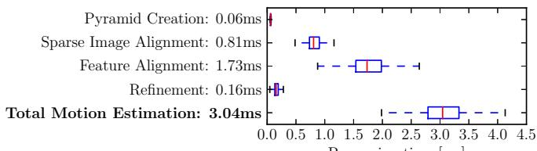  
Processing time [ms]  
Fig. 13: Timing results on a laptop computer.

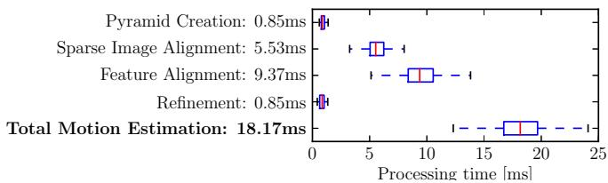  
Fig. 14: Timing results on the embedded platform.

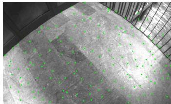

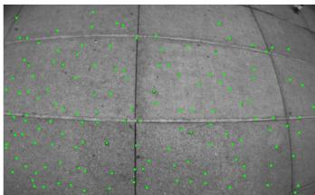

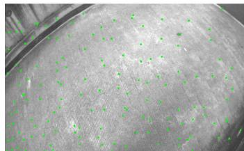

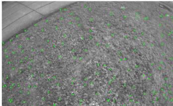  
Fig. 15: Successful tracking in scenes of high-frequency texture.

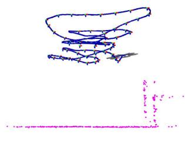  
(a) SVO

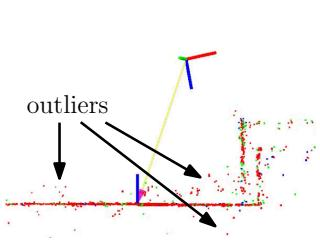  
(b) PTAM  
Fig. 16: Sideview of a piecewise-planar map created by SVO and PTAM. The proposed method has fewer outliers due to the depth-filter.

## C. Robustness

The speed and accuracy of SVO is partially due to the depth-filter, which produces only a minimal number of outlier 3D points. Also the robustness is due to the depthfilter: precise, high frame-rate tracking allows the filter to converge even in scenes of repetitive and high-frequency texture (e.g., asphalt, grass), as it is best demonstrated in the video accompanying this paper. Screenshots of the video are shown in Figure 15. Figure 16 shows a comparison of the map generated with PTAM and SVO in the same scene. While PTAM generates outlier 3D points, by contrast SVO has almost no outliers thanks to the use of the depth-filter.

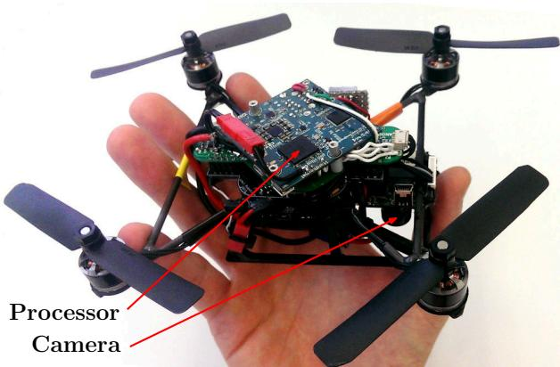  
Fig. 17: “Nano+” by KMel Robotics, customized with embedded processor and downward-looking camera. SVO runs at 55 frames per second on the platform and is used for stabilization and control.

## VIII. CONCLUSION

In this paper, we proposed the semi-direct VO pipeline $\mathrm { \bf { \ddot { S } } V O \vec { \Sigma } }$ that is precise and faster than the current state-of-theart. The gain in speed is due to the fact that feature-extraction and matching is not required for motion estimation. Instead, a direct method is used, which is based directly on the image intensities. The algorithm is particularly useful for stateestimation onboard MAVs as it runs at more than 50 frames per second on current embedded computers. High framerate motion estimation, combined with an outlier resistant probabilistic mapping method, provides increased robustness in scenes of little, repetitive, and high frequency-texture.

## REFERENCES

[1] M. Blosch, S. Weiss, D. Scaramuzza, and R. Siegwart, “Vision based¨ MAV navigation in unknown and unstructured environments,” Proc. IEEE Int. Conf. on Robotics and Automation, 2010.

[2] S. Weiss, M. W. Achtelik, S. Lynen, M. C. Achtelik, L. Kneip, M. Chli, and R. Siegwart, “Monocular Vision for Long-term Micro Aerial Vehicle State Estimation: A Compendium,” Journal of Field Robotics, vol. 30, no. 5, 2013.

[3] D. Scaramuzza, M. Achtelik, L. Doitsidis, F. Fraundorfer, E. Kosmatopoulos, A. Martinelli, M. Achtelik, M. Chli, S. Chatzichristofis, L. Kneip, D. Gurdan, L. Heng, G. Lee, S. Lynen, L. Meier, M. Pollefeys, A. Renzaglia, R. Siegwart, J. Stumpf, P. Tanskanen, C. Troiani, and S. Weiss, “Vision-Controlled Micro Flying Robots: from System Design to Autonomous Navigation and Mapping in GPS-denied Environments,” IEEE Robotics and Automation Magazine, 2014.

[4] C. Forster, S. Lynen, L. Kneip, and D. Scaramuzza, “Collaborative Monocular SLAM with Multiple Micro Aerial Vehicles,” in Proc. IEEE/RSJ Int. Conf. on Intelligent Robots and Systems, 2013.

[5] C. Forster, M. Pizzoli, and D. Scaramuzza, “Air-Ground Localization and Map Augmentation Using Monocular Dense Reconstruction,” in Proc. IEEE/RSJ Int. Conf. on Intelligent Robots and Systems, 2013.

[6] L. Kneip, M. Chli, and R. Siegwart, “Robust Real-Time Visual Odometry with a Single Camera and an IMU,” Proc. British Machine Vision Conference, 2011.

[7] J. Engel, J. Sturm, and D. Cremers, “Accurate Figure Flying with a Quadrocopter Using Onboard Visual and Inertial Sensing,” in Proc. ViCoMoR Workshop at IEEE/RJS IROS, 2012.

[8] A. Comport, E. Malis, and P. Rives, “Real-time Quadrifocal Visual Odometry,” The International Journal of Robotics Research, vol. 29, no. 2-3, pp. 245–266, Jan. 2010.

[9] T. Tykkal¨ a, C. Audras, and A. I. Comport, “Direct Iterative Closest¨ Point for Real-time Visual Odometry,” in Int. Conf. on Computer Vision, 2011.

[10] C. Kerl, J. Sturm, and D. Cremers, “Robust Odometry Estimation for RGB-D Cameras,” in Proc. IEEE Int. Conf. on Robotics and Automation, 2013.

[11] M. Meilland and A. I. Comport, “On unifying key-frame and voxelbased dense visual SLAM at large scales,” in Proc. IEEE/RSJ Int. Conf. on Intelligent Robots and Systems, 2013.

[12] D. Scaramuzza and F. Fraundorfer, “Visual Odometry, Part I: The First 30 Years and Fundamentals [Tutorial],” IEEE RAM, 2011.

[13] M. Irani and P. Anandan, “All About Direct Methods,” in Proc. Workshop Vis. Algorithms: Theory Pract., 1999, pp. 267–277.

[14] S. Lovegrove, A. J. Davison, and J. Ibanez-Guzman, “Accurate visual odometry from a rear parking camera,” in Intelligent Vehicle, IEEE Symposium, 2011.

[15] R. a. Newcombe, S. J. Lovegrove, and A. J. Davison, “DTAM: Dense Tracking and Mapping in Real-Time,” IEEE Int. Conf. on Computer Vision, pp. 2320–2327, Nov. 2011.

[16] G. Klein and D. Murray, “Parallel Tracking and Mapping for Small AR Workspaces,” IEEE and ACM International Symposium on Mixed and Augmented Reality, pp. 1–10, Nov. 2007.

[17] H. Strasdat, J. M. M. Montiel, and A. J. Davison, “Real-time Monocular SLAM: Why Filter?” Proc. IEEE Int. Conf. on Robotics and Automation, pp. 2657 – 2664, 2010.

[18] H. Jin, P. Favaro, and S. Soatto, “A semi-direct approach to structure from motion,” The Visual Computer, vol. 19, no. 6, pp. 377–394, 2003.

[19] N. D. Molton, A. J. Davison, and I. Reid, “Locally Planar Patch Features for Real-Time Structure from Motion,” in Proc. British Machine Vision Conference, 2004.

[20] G. Silveira, E. Malis, and P. Rives, “An Efficient Direct Approach to Visual SLAM,” IEEE Transactions on Robotics, 2008.

[21] C. Mei, S. Benhimane, E. Malis, and P. Rives, “Efficient Homographybased Tracking and 3-D Reconstruction for Single Viewpoint Sensors,” IEEE Transactions on Robotics, vol. 24, no. 6, pp. 1352 – 1364, 2008.

[22] A. Pretto, E. Menegatti, and E. Pagello, “Omnidirectional Dense Large-Scale Mapping and Navigation Based on Meaningful Triangulation,” in Proc. IEEE Int. Conf. on Robotics and Automation, 2011.

[23] J. Engel, J. Sturm, and D. Cremers, “Semi-Dense Visual Odometry for a Monocular Camera,” in Proc. IEEE Int. Conf. on Computer Vision.

[24] S. Benhimane and E. Malis, “Integration of Euclidean constraints in template based visual tracking of piecewise-planar scenes,” in Proc. IEEE/RSJ Int. Conf. on Intelligent Robots and Systems, 2006.

[25] R. Kummerle, G. Grisetti, and K. Konolige, “g2o: A General Frame-¨ work for Graph Optimization,” Proc. IEEE Int. Conf. on Robotics and Automation, 2011.

[26] Y. Ma, S. Soatto, J. Kosecka, and S. S. Sastry, An Invitation to 3-D Vision: From Images to Geometric Models. Springer Verlag, 2005.

[27] S. Baker and I. Matthews, “Lucas-Kanade 20 Years On: A Unifying Framework: Part 1,” International Journal ofComputer Vision, vol. 56, no. 3, pp. 221–255, 2002.

[28] G. Vogiatzis and C. Hernandez, “Video-based, Real-Time Multi View´ Stereo,” Image and Vision Computing, vol. 29, no. 7, 2011.

[29] M. Pizzoli, C. Forster, and D. Scaramuzza, “REMODE: Probabilistic, Monocular Dense Reconstruction in Real Time,” in Proc. IEEE Int. Conf. on Robotics and Automation, 2014.

[30] E. Rosten, R. Porter, and T. Drummond, “FASTER and better: A machine learning approach to corner detection,” IEEE Trans. Pattern Analysis and Machine Intelligence, vol. 32, pp. 105–119, 2010.

[31] S. Umeyama, “Least-Squares Estimation of Transformation Parameters Between Two Point Patterns,” IEEE Trans. Pattern Anal. Mach. Intell., vol. 13, no. 4, 1991.

[32] J. Sturm, N. Engelhard, F. Endres, W. Burgard, and D. Cremers, “A Benchmark for the Evaluation of RGB-D SLAM Systems,” in Proc. IEEE/RSJ Int. Conf. on Intelligent Robots and Systems, 2012.

[33] S. Lynen, M. W. Achtelik, S. Weiss, M. Chli, and R. Siegwart, “A Robust and Modular Multi-Sensor Fusion Approach Applied to MAV Navigation,” in Proc. IEEE/RSJ Int. Conf. on Intelligent Robots and Systems, 2013.