# ORB-SLAM: A Versatile and Accurate Monocular SLAM System

Raul Mur-Artal, J. M. M. Montiel´ , Member, IEEE, and Juan D. Tardos´ , Member, IEEE

Abstract—This paper presents ORB-SLAM, a feature-based monocular simultaneous localization and mapping (SLAM) system that operates in real time, in small and large indoor and outdoor environments. The system is robust to severe motion clutter, allows wide baseline loop closing and relocalization, and includes full automatic initialization. Building on excellent algorithms of recent years, we designed from scratch a novel system that uses the same features for all SLAM tasks: tracking, mapping, relocalization, and loop closing. A survival of the fittest strategy that selects the points and keyframes of the reconstruction leads to excellent robustness and generates a compact and trackable map that only grows if the scene content changes, allowing lifelong operation. We present an exhaustive evaluation in 27 sequences from the most popular datasets. ORB-SLAM achieves unprecedented performance with respect to other state-of-the-art monocular SLAM approaches. For the benefit of the community, we make the source code public.

Index Terms—Lifelong mapping, localization, monocular vision, recognition, simultaneous localization and mapping (SLAM).

## I. INTRODUCTION

B UNDLE adjustment (BA) is known to provide accurateestimates of camera localizations as well as a sparse geo- estimates of camera localizations as well as a sparse geometrical reconstruction [1], [2], given that a strong network of matches and good initial guesses are provided. For a long time, this approach was considered unaffordable for real-time applications such as visual simultaneous localization and mapping (visual SLAM). Visual SLAM has the goal of estimating the camera trajectory while reconstructing the environment. Now, we know that to achieve accurate results at nonprohibitive computational cost, a real-time SLAM algorithm has to provide BA with the following.

1) Corresponding observations of scene features (map points) among a subset of selected frames (keyframes).

2) As complexity grows with the number of keyframes, their selection should avoid unnecessary redundancy.

3) A strong network configuration of keyframes and points to produce accurate results, that is, a well spread set of keyframes observing points with significant parallax and with plenty of loop closure matches.

4) An initial estimation of the keyframe poses and point locations for the nonlinear optimization.

5) A local map in exploration where optimization is focused to achieve scalability.

6) The ability to perform fast global optimizations (e.g., pose graph) to close loops in real time.

The first real-time application of BA was the visual odometry work of Mouragon et al. [3], followed by the ground-breaking SLAM work of Klein and Murray [4], known as parallel tracking and mapping (PTAM). This algorithm, while limited to small-scale operation, provides simple but effective methods for keyframe selection, feature matching, point triangulation, camera localization for every frame, and relocalization after tracking failure. Unfortunately, several factors severely limit its application: lack of loop closing and adequate handling of occlusions, low invariance to viewpoint of the relocalization, and the need of human intervention for map bootstrapping.

In this study, we build on the main ideas of PTAM, the place recognition work of Galvez-L ´ opez and Tard ´ os [5], the scale- ´ aware loop closing of Strasdat et al. [6], and the use of covisibility information for large-scale operation [7], [8], to design from scratch ORB-SLAM, i.e., a novel monocular SLAM system whose main contributions are as follows.

1) Use of the same features for all tasks: tracking, mapping, relocalization, and loop closing. This makes our system more efficient, simple, and reliable. We use ORB features [9], which allow real-time performance without GPUs, providing good invariance to changes in viewpoint and illumination.

2) Real-time operation in large environments. Thanks to the use of a covisibility graph, tracking and mapping are focused in a local covisible area, independent of global map size.

3) Real-time loop closing based on the optimization of a pose graph that we call the Essential Graph. It is built from a spanning tree maintained by the system, loop closure links, and strong edges from the covisibility graph.

4) Real-time camera relocalization with significant invariance to viewpoint and illumination. This allows recovery from tracking failure and also enhances map reuse.

5) A new automatic and robust initialization procedure based on model selection that permits to create an initial map of planar and nonplanar scenes.

6) A survival of the fittest approach to map point and keyframe selection that is generous in the spawning but very restrictive in the culling. This policy improves tracking robustness and enhances lifelong operation because redundant keyframes are discarded.

We present an extensive evaluation in popular public datasets from indoor and outdoor environments, including hand-held, car, and robot sequences. Notably, we achieve better camera localization accuracy than the state of the art in direct methods [10], which optimize directly over pixel intensities instead of feature reprojection errors. We include a discussion in Section IX-B on the possible causes that can make feature-based methods more accurate than direct methods.

The loop closing and relocalization methods here presented are based on our previous work [11]. A preliminary version of the system was presented in [12]. In the current paper, we add the initialization method, the Essential Graph, and perfect all methods involved. We also describe in detail all building blocks and perform an exhaustive experimental validation.

To the best of our knowledge, this is the most complete and reliable solution to monocular SLAM, and for the benefit of the community, we make the source code public. Demonstration videos and the code can be found in our project webpage.1

## II. RELATED WORK

## A. Place Recognition

The survey by Williams et al. [13] compared several approaches for place recognition and concluded that techniques based on appearance, that is, image-to-image matching, scale better in large environments than map-to-map or image-tomap methods. Within appearance-based methods, bags of words techniques [14], such as the probabilistic approach FAB-MAP [15], are to the fore because of their high efficiency. DBoW2 [5] used for the first time bags of binary words obtained from BRIEF descriptors [16] along with the very efficient FAST feature detector [17]. This reduced in more than one order of magnitude the time needed for feature extraction, compared with SURF [18] and SIFT [19] features that were used in bags of words approaches so far. Although the system demonstrated to be very efficient and robust, the use of BRIEF, neither rotation nor scale invariant, limited the system to in-plane trajectories and loop detection from similar viewpoints. In our previous work [11], we proposed a bag of words place recognizer built on DBoW2 with ORB [9]. ORB are binary features invariant to rotation and scale (in a certain range), resulting in a very fast recognizer with good invariance to viewpoint. We demonstrated the high recall and robustness of the recognizer in four different datasets, requiring less than 39 ms (including feature extraction) to retrieve a loop candidate from a 10 K image database. In this study, we use an improved version of that place recognizer, using covisibility information and returning several hypotheses when querying the database instead of just the best match.

## B. Map Initialization

Monocular SLAM requires a procedure to create an initial map because depth cannot be recovered from a single image. One way to solve the problem is to initially track a known structure [20]. In the context of filtering approaches, points can be initialized with high uncertainty in depth using an inverse depth parameterization [21], which hopefully will later converge to their real positions. The recent semidense work of Engel et al. [10] follows a similar approach initializing the depth of the pixels to a random value with high variance.

Initialization methods from two views either assume locally scene planarity [4], [22] and recover the relative camera pose from a homography using the method of Faugeras and Lustman [23], or compute an essential matrix [24], [25] that models planar and general scenes, using the five-point algorithm of Nister´ [26], which requires to deal with multiple solutions. Both reconstruction methods are not well constrained under low parallax and suffer from a twofold ambiguity solution if all points of a planar scene are closer to one of the camera centers [27]. On the other hand, if a nonplanar scene is seen with parallax, a unique fundamental matrix can be computed with the eight-point algorithm [2], and the relative camera pose can be recovered without ambiguity.

In Section IV, we present a new automatic approach based on model selection between a homography for planar scenes and a fundamental matrix for nonplanar scenes. A statistical approach to model selection was proposed by Torr et al. [28]. Under a similar rationale, we have developed a heuristic initialization algorithm that takes into account the risk of selecting a fundamental matrix in close to degenerate cases (i.e., planar, nearly planar, and low parallax), favoring the selection of the homography. In the planar case, for the sake of safe operation, we refrain from initializing if the solution has a twofold ambiguity, as a corrupted solution could be selected. We delay the initialization until the method produces a unique solution with significant parallax.

## C. Monocular Simultaneous Localization and Mapping

Monocular SLAM was initially solved by filtering [20], [21], [29], [30]. In that approach, every frame is processed by the filter to jointly estimate the map feature locations and the camera pose. It has the drawbacks of wasting computation in processing consecutive frames with little new information and the accumulation of linearization errors. On the other hand, keyframe-based approaches [3], [4] estimate the map using only selected frames (keyframes) allowing to perform more costly but accurate BA optimizations, as mapping is not tied to frame rate. Strasdat et al. [31] demonstrated that keyframe-based techniques are more accurate than filtering for the same computational cost.

The most representative keyframe-based SLAM system is probably PTAM by Klein and Murray [4]. It was the first work to introduce the idea of splitting camera tracking and mapping in parallel threads and demonstrated to be successful for realtime augmented reality applications in small environments. The original version was later improved with edge features, a rotation estimation step during tracking, and a better relocalization method [32]. The map points of PTAM correspond to FAST corners matched by patch correlation. This makes the points only useful for tracking but not for place recognition. In fact, PTAM does not detect large loops, and the relocalization is based on the correlation of low-resolution thumbnails of the keyframes, yielding a low invariance to viewpoint.

Strasdat et al. [6] presented a large-scale monocular SLAM system with a front-end based on optical flow implemented on a GPU, followed by FAST feature matching and motion-only BA, and a back-end based on sliding-window BA. Loop closures were solved with a pose graph optimization with similarity constraints [7 degrees of freedom (DoF)], which was able to correct the scale drift appearing in monocular SLAM. From this work, we take the idea of loop closing with 7-DoF pose graph optimization and apply it to the Essential Graph defined in Section III-D.

Strasdat et al. [7] used the front-end of PTAM, but performed the tracking only in a local map retrieved from a covisibility graph. They proposed a double-window optimization back-end that continuously performs BA in the inner window and pose graph in a limited-size outer window. However, loop closing is only effective if the size of the outer window is large enough to include the whole loop. In our system, we take advantage of the excellent ideas of using a local map based on covisibility and building the pose graph from the covisibility graph, but apply them in a totally redesigned front-end and back-end. Another difference is that, instead of using specific features for loop detection (SURF), we perform the place recognition on the same tracked and mapped features, obtaining robust frame-rate relocalization and loop detection.

Pirker et al. [33] proposed CD-SLAM, i.e., a very complete system including loop closing, relocalization, large-scale operation, and efforts to work on dynamic environments. However, map initialization is not mentioned. The lack of a public implementation does not allow us to perform a comparison of accuracy, robustness, or large-scale capabilities.

The visual odometry of Song et al. [34] uses ORB features for tracking and a temporal sliding window BA back-end. In comparison, our system is more general as they do not have global relocalization, loop closing, and do not reuse the map. They are also using the known distance from the camera to the ground to limit monocular scale drift.

Lim et al. [25], work published after we submitted our preliminary version of this work [12], use also the same features for tracking, mapping, and loop detection. However, the choice of BRIEF limits the system to in-plane trajectories. Their system only tracks points from the last keyframe; therefore, the map is not reused if revisited (similar to visual odometry) and has the problem of growing unbounded. We compare qualitatively our results with this approach in Section VIII-E.

The recent work ofEngel et al. [10], known as LSD-SLAM, is able to build large-scale semidense maps, using direct methods (i.e., optimization directly over image pixel intensities) instead of BA over features. Their results are very impressive as the system is able to operate in real time, without GPU acceleration, building a semidense map, with more potential applications for robotics than the sparse output generated by featurebased SLAM. Nevertheless, they still need features for loop detection, and their camera localization accuracy is significantly lower than in our system and PTAM, as we show experimentally in Section VIII-B. This surprising result is discussed in Section IX-B.

In a halfway between direct and feature-based methods is the semidirect visual odometry SVO of Forster et al. [22]. Without requiring to extract features in every frame, they are able to operate at high frame rates obtaining impressive results in quadracopters. However, no loop detection is performed, and the current implementation is mainly thought for downward looking cameras.

Finally, we want to discuss about keyframe selection. All visual SLAM works in the literature agree that running BA with all the points and all the frames is not feasible. The work of Strasdat et al. [31] showed that the most cost-effective approach is to keep as much points as possible, while keeping only nonredundant keyframes. The PTAM approach was to insert keyframes very cautiously to avoid an excessive growth of the computational complexity. This restrictive keyframe insertion policy makes the tracking fail in hard exploration conditions. Our survival of the fittest strategy achieves unprecedented robustness in difficult scenarios by inserting keyframes as quickly as possible, and removing later the redundant ones, to avoid the extra cost.

## III. SYSTEM OVERVIEW

## A. Feature Choice

One of the main design ideas in our system is that the same features used by the mapping and tracking are used for place recognition to perform frame-rate relocalization and loop detection. This makes our system efficient and avoids the need to interpolate the depth of the recognition features from near SLAM features as in previous works [6], [7]. We require features that need for extraction much less than 33 ms per image, which excludes the popular SIFT (∼ 300 ms) [19], SURF (∼ 300 ms) [18], or the recent A-KAZE (∼ 100 ms) [35]. To obtain general place recognition capabilities, we require rotation invariance, which excludes BRIEF [16] and LDB [36].

We chose ORB [9], which are oriented multiscale FAST corners with a 256-bit descriptor associated. They are extremely fast to compute and match, while they have good invariance to viewpoint. This allows us to match them with wide baselines, boosting the accuracy of BA. We already shown the good performance of ORB for place recognition in [11]. While our current implementation makes use of ORB, the techniques proposed are not restricted to these features.

## B. Three Threads: Tracking, Local Mapping, and Loop Closing

Our system, see an overview in Fig. 1, incorporates three threads that run in parallel: tracking, local mapping, and loop closing. The tracking is in charge of localizing the camera with every frame and deciding when to insert a new keyframe. We perform first an initial feature matching with the previous frame and optimize the pose using motion-only BA. If the tracking is lost (e.g., due to occlusions or abrupt movements), the place recognition module is used to perform a global relocalization. Once there is an initial estimation of the camera pose and feature matchings, a local visible map is retrieved using the covisibility graph of keyframes that is maintained by the system [see Fig. 2(a) and (b)]. Then, matches with the local map points are searched by reprojection, and camera pose is optimized again with all matches. Finally, the tracking thread decides if a new keyframe is inserted. All the tracking steps are explained in detail in Section V. The novel procedure to create an initial map is presented in Section IV.

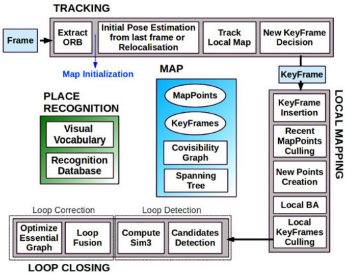  
Fig. 1. ORB-SLAM system overview, showing all the steps performed by the tracking, local mapping, and loop closing threads. The main components of the place recognition module and the map are also shown.

The local mapping processes new keyframes and performs local BA to achieve an optimal reconstruction in the surroundings of the camera pose. New correspondences for unmatched ORB in the new keyframe are searched in connected keyframes in the covisibility graph to triangulate new points. Some time after creation, based on the information gathered during the tracking, an exigent point culling policy is applied in order to retain only high quality points. The local mapping is also in charge of culling redundant keyframes. We explain in detail all local mapping steps in Section VI.

The loop closing searches for loops with every new keyframe. If a loop is detected, we compute a similarity transformation that informs about the drift accumulated in the loop. Then, both sides of the loop are aligned and duplicated points are fused. Finally, a pose graph optimization over similarity constraints [6] is performed to achieve global consistency. The main novelty is that we perform the optimization over the Essential Graph, i.e., a sparser subgraph of the covisibility graph which is explained in Section III-D. The loop detection and correction steps are explained in detail in Section VII.

We use the Levenberg–Marquardt algorithm implemented in g2o [37] to carry out all optimizations. In the Appendix, we describe the error terms, cost functions, and variables involved in each optimization.

## C. Map Points, Keyframes, and Their Selection

Each map point $p _ { i }$ stores the following:

1) its 3-D position $\mathbf { X } _ { w , i }$ in the world coordinate system;

2) the viewing direction ni, which is the mean unit vector of all its viewing directions (the rays that join the point with the optical center of the keyframes that observe it);

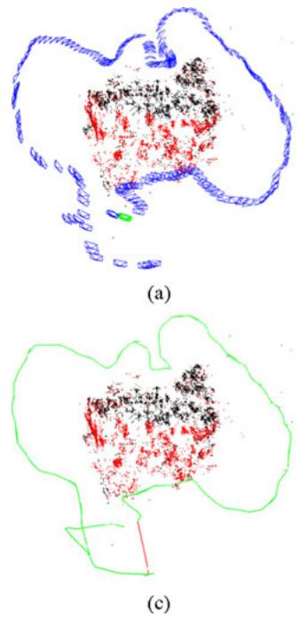

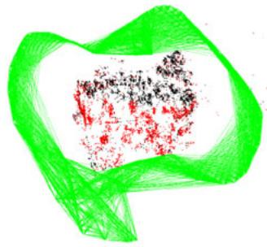

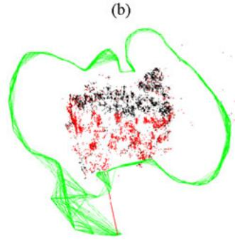  
Fig. 2. Reconstruction and graphs in the sequence fr3 long office household from the TUM RGB-D Benchmark [38]. (a) Keyframes (blue), current camera (green), map points (black, red), current local map points (red). (b) Covisibility graph. (c) Spanning tree (green) and loop closure (red). (d) Essential graph.

3) a representative ORB descriptor $\mathbf { D } _ { i }$ , which is the associated ORB descriptor whose hamming distance is minimum with respect to all other associated descriptors in the keyframes in which the point is observed;

4) the maximum $d _ { \mathrm { m a x } }$ and minimum $d _ { \mathrm { m i n } }$ distances at which the point can be observed, according to the scale invariance limits of the ORB features.

Each keyframe $K _ { i }$ stores the following:

1) the camera pose $\mathbf { T } _ { i w }$ , which is a rigid body transformation that transforms points from the world to the camera coordinate system;

2) the camera intrinsics, including focal length and principal point;

3) all the ORB features extracted in the frame, associated or not with a map point, whose coordinates are undistorted if a distortion model is provided.

Map points and keyframes are created with a generous policy, while a later very exigent culling mechanism is in charge of detecting redundant keyframes and wrongly matched or not trackable map points. This permits a flexible map expansion during exploration, which boost tracking robustness under hard conditions (e.g., rotations, fast movements), while its size is bounded in continual revisits to the same environment, i.e., lifelong operation. Additionally, our maps contain very few outliers compared with PTAM, at the expense of containing less points. Culling procedures of map points and keyframes are explained in Sections VI-B and VI-E, respectively.

## D. Covisibility Graph and Essential Graph

Covisibility information between keyframes is very useful in several tasks of our system and is represented as an undirected weighted graph as in [7]. Each node is a keyframe, and an edge between two keyframes exists if they share observations of the same map points (at least 15), being the weight θ of the edge the number of common map points.

In order to correct a loop, we perform a pose graph optimization [6] that distributes the loop closing error along the graph. In order not to include all the edges provided by the covisibility graph, which can be very dense, we propose to build an Essential Graph that retains all the nodes (keyframes), but less edges, still preserving a strong network that yields accurate results. The system builds incrementally a spanning tree from the initial keyframe, which provides a connected subgraph of the covisibility graph with minimal number of edges. When a new keyframe is inserted, it is included in the tree linked to the keyframe which shares most point observations, and when a keyframe is erased by the culling policy, the system updates the links affected by that keyframe. The Essential Graph contains the spanning tree, the subset of edges from the covisibility graph with high covisibility $( \theta _ { \mathrm { m i n } } = 1 0 0 )$ , and the loop closure edges, resulting in a strong network of cameras. Fig. 2 shows an example of a covisibility graph, spanning tree, and associated essential graph. As shown in the experiments of Section VIII-E, when performing the pose graph optimization, the solution is so accurate that an additional full BA optimization barely improves the solution. The efficiency of the essential graph and the influence of the $\theta _ { \mathrm { m i n } }$ is shown at the end of Section VIII-E.

## E. Bags of Words Place Recognition

The system has embedded a bags of words place recognition module, based on $\mathrm { D B o W } 2 ^ { 2 }$ [5], to perform loop detection and relocalization. Visual words are just a discretization of the descriptor space, which is known as the visual vocabulary. The vocabulary is created offline with the ORB descriptors extracted from a large set of images. If the images are general enough, the same vocabulary can be used for different environments getting a good performance, as shown in our previous work [11]. The system builds incrementally a database that contains an invert index, which stores for each visual word in the vocabulary, in which keyframes it has been seen, so that querying the database can be done very efficiently. The database is also updated when a keyframe is deleted by the culling procedure.

Because there exists visual overlap between keyframes, when querying the database, there will not exist a unique keyframe with a high score. The original DBoW2 took this overlapping into account, adding up the score of images that are close in time. This has the limitation of not including keyframes viewing the same place but inserted at a different time. Instead, we group those keyframes that are connected in the covisibility graph. In addition, our database returns all keyframe matches whose scores are higher than the 75% of the best score.

An additional benefit of the bags of words representation for feature matching was reported in [5]. When we want to compute the correspondences between two sets of ORB features, we can constraint the brute force matching only to those features that belong to the same node in the vocabulary tree at a certain level (we select the second out of six), speeding up the search. We use this trick when searching matches for triangulating new points, and at loop detection and relocalization. We also refine the correspondences with an orientation consistency test (see [11] for details) that discards outliers ensuring a coherent rotation for all correspondences.

## IV. AUTOMATIC MAP INITIALIZATION

The goal of the map initialization is to compute the relative pose between two frames to triangulate an initial set of map points. This method should be independent of the scene (planar or general) and should not require human intervention to select a good two-view configuration, i.e., a configuration with significant parallax. We propose to compute in parallel two geometrical models: a homography assuming a planar scene and a fundamental matrix assuming a nonplanar scene. We then use a heuristic to select a model and try to recover the relative pose with a specific method for the selected model. Our method only initializes when it is certain that the two-view configuration is safe, detecting low-parallax cases and the well-known twofold planar ambiguity [27], avoiding to initialize a corrupted map. The steps of our algorithm are as follows.

1) Find initial correspondences: Extract ORB features (only at the finest scale) in the current frame $F _ { c }$ and search for matches $\mathbf { x } _ { c }  \mathbf { x } _ { r }$ in the reference frame $F _ { r }$ . If not enough matches are found, reset the reference frame.

2) Parallel computation of the two models: Compute in parallel threads a homography $\mathbf { H } _ { c r }$ and a fundamental matrix $\mathbf { F } _ { c r }$ as

$$
\mathbf { x } _ { c } = \mathbf { H } _ { c r } \mathbf { x } _ { r } , \mathbf { x } _ { c } ^ { T } \mathbf { F } _ { c r } \mathbf { x } _ { r } = 0\tag{1}
$$

with the normalized DLT and eight-point algorithms, respectively, as explained in [2] inside a RANSAC scheme. To make homogeneous the procedure for both models, the number of iterations is prefixed and the same for both models, along with the points to be used at each iteration: eight for the fundamental matrix, and four of them for the homography. At each iteration, we compute a score $S _ { M }$ for each model M (H for the homography, $F$ for the fundamental matrix)

$$
\begin{array} { l } { S _ { M } = \displaystyle \sum _ { i } \left( \rho _ { M } \left( d _ { c r } ^ { 2 } ( \mathbf { x } _ { c } ^ { i } , \mathbf { x } _ { r } ^ { i } , M ) \right) \right. } \\ { \displaystyle \left. + \rho _ { M } ( d _ { r c } ^ { 2 } ( \mathbf { x } _ { c } ^ { i } , \mathbf { x } _ { r } ^ { i } , M ) ) \right) } \end{array}
$$

$$
\rho _ { M } ( d ^ { 2 } ) = \begin{array} { l l l } { \displaystyle \int \Gamma - d ^ { 2 } , } & { \mathrm { i f } } & { \displaystyle d ^ { 2 } < T _ { M } } \\ { \displaystyle 0 , } & { \mathrm { i f } } & { \displaystyle d ^ { 2 } \geq T _ { M } } \end{array}\tag{2}
$$

where $d _ { c r } ^ { 2 }$ and $d _ { r c } ^ { 2 }$ are the symmetric transfer errors [2] from one frame to the other. $T _ { M }$ is the outlier rejection threshold based on the $\chi ^ { 2 }$ test at 95% $( T _ { H } = 5 . 9 9 $ $T _ { F } = 3 . 8 4$ , assuming a standard deviation of 1 pixel in the measurement error). Γ is defined equal to $T _ { H }$ so that both models score equally for the same d in their inlier region, again to make the process homogeneous.

We keep the homography and fundamental matrix with the highest score. If no model could be found (not enough inliers), we restart the process again from step 1.

3) Model selection: If the scene is planar, nearly planar or there is low parallax, it can be explained by a homography. However, a fundamental matrix can also be found, but the problem is not well constrained [2], and any attempt to recover the motion from the fundamental matrix would yield wrong results. We should select the homography as the reconstruction method will correctly initialize from a plane or it will detect the low parallax case and refuse the initialization. On the other hand, a nonplanar scene with enough parallax can only be explained by the fundamental matrix, but a homography can also be found explaining a subset of the matches if they lie on a plane or they have low parallax (they are far away). In this case, we should select the fundamental matrix. We have found that a robust heuristic is to compute

$$
R _ { H } = \frac { S _ { H } } { S _ { H } + S _ { F } }\tag{3}
$$

and select the homography if $R _ { H } > 0 . 4 5$ , which adequately captures the planar and low parallax cases. Otherwise, we select the fundamental matrix.

4) Motion and structurefrom motion recovery: Once a model is selected, we retrieve the motion hypotheses associated. In the case of the homography, we retrieve eight motion hypotheses using the method of Faugeras and Lustman [23]. The method proposes cheriality tests to select the valid solution. However, these tests fail if there is low parallax as points easily go in front or back of the cameras, which could yield the selection of a wrong solution. We propose to directly triangulate the eight solutions and check if there is one solution with most points seen with parallax, in front of both cameras and with low reprojection error. If there is not a clear winner solution, we do not initialize and continue from step 1. This technique to disambiguate the solutions makes our initialization robust under low parallax and the twofold ambiguity configuration and could be considered the key of the robustness of our method.

In the case of the fundamental matrix, we convert it in an essential matrix using the calibration matrix K as

$$
{ \bf E } _ { r c } = { \bf K } ^ { T } { \bf F } _ { r c } { \bf K }\tag{4}
$$

and then retrieve four motion hypotheses with the singular value decomposition method explained in [2]. We triangulate the four solutions and select the reconstruction as done for the homography.

5) Bundle adjustment: Finally, we perform afull BA (see the Appendix for details) to refine the initial reconstruction.

An example of a challenging initialization in the outdoor NewCollege robot sequence [39] is shown in Fig. 3. It can be seen how PTAM and LSD-SLAM have initialized all points in a plane, while our method has waited until there is enough parallax, initializing correctly from the fundamental matrix.

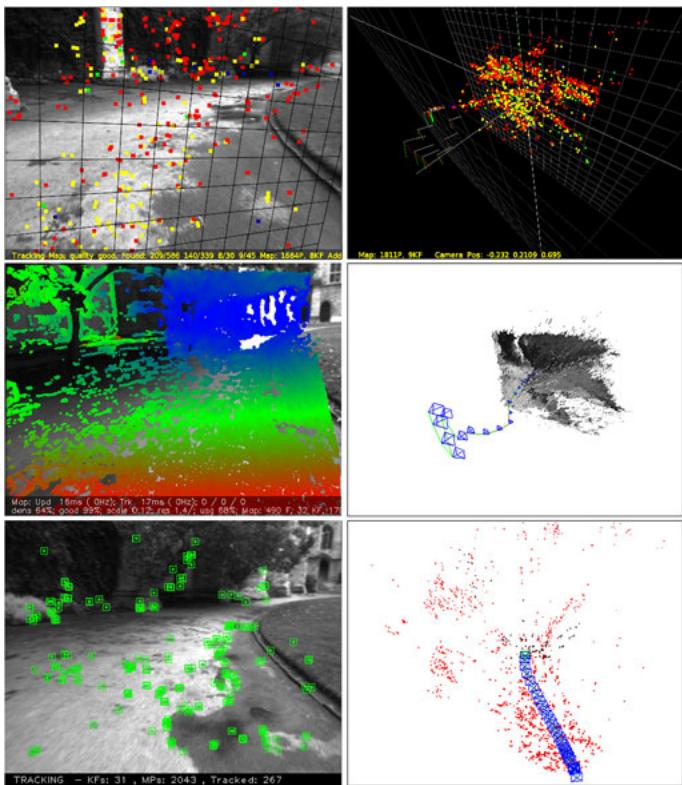  
Fig. 3. Top: PTAM, middle: LSD-SLAM, bottom: ORB-SLAM, some time after initialization in the NewCollege sequence [39]. PTAM and LSD-SLAM initialize a corrupted planar solution, while our method has automatically initialized from the fundamental matrix when it has detected enough parallax. Depending on which keyframes are manually selected, PTAM is also able to initialize well.

## V. TRACKING

In this section, we describe the steps of the tracking thread that are performed with every frame from the camera. The camera pose optimizations, mentioned in several steps, consist in motion-only BA, which is described in the Appendix.

## A. ORB Extraction

We extract FAST corners at eight-scale levels with a scale factor of 1.2. For image resolutions from 512 × 384 to 752 × 480 pixels we found suitable to extract 1000 corners, for higher resolutions, as the 1241 × 376 in the KITTI dataset [40], we extract 2000 corners. In order to ensure an homogeneous distribution, we divide each scale level in a grid, trying to extract at least five corners per cell. Then, we detect corners in each cell, adapting the detector threshold if not enough corners are found. The amount of corners retained per cell is also adapted if some cells contains no corners (textureless or low contrast). The orientation and ORB descriptor are then computed on the retained FAST corners. The ORB descriptor is used in all feature matching, in contrast with the search by patch correlation in PTAM.

## B. Initial Pose Estimation From Previous Frame

If tracking was successful for last frame, we use a constant velocity motion model to predict the camera pose and perform a guided search of the map points observed in the last frame. If not enough matches were found (i.e., motion model is clearly violated), we use a wider search of the map points around their position in the last frame. The pose is then optimized with the found correspondences.

## C. Initial Pose Estimation via Global Relocalization

If the tracking is lost, we convert the frame into bag of words and query the recognition database for keyframe candidates for global relocalization. We compute correspondences with ORB associated with map points in each keyframe, as explained in Section III-E. We then perform alternatively RANSAC iterations for each keyframe and try to find a camera pose using the PnP algorithm [41]. If we find a camera pose with enough inliers, we optimize the pose and perform a guided search of more matches with the map points of the candidate keyframe. Finally, the camera pose is again optimized, and if supported with enough inliers, tracking procedure continues.

## D. Track Local Map

Once we have an estimation of the camera pose and an initial set of feature matches, we can project the map into the frame and search more map point correspondences. To bound the complexity in large maps, we only project a local map. This local map contains the set of keyframes $\kappa _ { 1 }$ , which share map points with the current frame, and a set $\displaystyle { \mathcal { K } } _ { 2 }$ with neighbors to the keyframes $\kappa _ { 1 }$ in the covisibility graph. The local map also has a reference keyframe $K _ { \mathrm { r e f } } \in \mathcal { K } _ { 1 }$ , which shares most map points with current frame. Now, each map point seen in $\mathcal { K } _ { 1 }$ and $\displaystyle \mathcal { K } _ { 2 }$ is searched in the current frame as follows.

1) Compute the map point projection x in the current frame. Discard if it lays out of the image bounds.

2) Compute the angle between the current viewing ray v and the map point mean viewing direction n. Discard if $\mathbf { v } \cdot \mathbf { n } < \cos ( 6 0 ^ { \circ } )$

3) Compute the distance d from map point to camera center. Discard if it is out of the scale invariance region of the map point d $\not \in [ d _ { \operatorname* { m i n } } , d _ { \operatorname* { m a x } } ]$

4) Compute the scale in the frame by the ratio $d / d _ { \mathrm { { m i n } } }$

5) Compare the representative descriptor D of the map point with the still unmatched ORB features in the frame, at the predicted scale, and near $\mathbf { x } ,$ and associate the map point with the best match.

The camera pose is finally optimized with all the map points found in the frame.

## E. New Keyframe Decision

The last step is to decide if the current frame is spawned as a new keyframe. As there is a mechanism in the local mapping to cull redundant keyframes, we will try to insert keyframes as fast as possible, because that makes the tracking more robust to challenging camera movements, typically rotations. To insert a new keyframe, all the following conditions must be met.

1) More than 20 frames must have passed from the last global relocalization.

2) Local mapping is idle, or more than 20 frames have passed from last keyframe insertion.

3) Current frame tracks at least 50 points.

4) Current frame tracks less than 90% points than $K _ { \mathrm { r e f } }$

Instead of using a distance criterion to other keyframes as PTAM, we impose a minimum visual change (condition 4). Condition 1 ensures a good relocalization and condition 3 a good tracking. If a keyframe is inserted when the local mapping is busy (second part of condition 2), a signal is sent to stop local BA so that it can process as soon as possible the new keyframe.

## VI. LOCAL MAPPING

In this section, we describe the steps performed by the local mapping with every new keyframe $K _ { i }$

## A. Keyframe Insertion

First, we update the covisibility graph, adding a new node for $K _ { i }$ and updating the edges resulting from the shared map points with other keyframes. We then update the spanning tree linking $K _ { i }$ with the keyframe with most points in common. We then compute the bags of words representation of the keyframe, which will help in the data association for triangulating new points.

## B. Recent Map Points Culling

Map points, in order to be retained in the map, must pass a restrictive test during the first three keyframes after creation, which ensures that they are trackable and not wrongly triangulated, i.e., due to spurious data association. A point must fulfill these two conditions.

1) The tracking must find the point in more than the 25% of the frames in which it is predicted to be visible.

2) If more than one keyframe have passed from map point creation, it must be observed from at least three keyframes.

Once a map point have passed this test, it can only be removed if at any time it is observed from less than three keyframes. This can happen when keyframes are culled and when local BA discards outlier observations. This policy makes our map contain very few outliers.

## C. New Map Point Creation

New map points are created by triangulating ORB from connected keyframes $\displaystyle \mathcal { K } _ { c }$ in the covisibility graph. For each unmatched ORB in $K _ { i }$ , we search a match with other unmatched point in other keyframe. This matching is done as explained in Section III-E and discard those matches that do not fulfill the epipolar constraint. ORB pairs are triangulated, and to accept the new points, positive depth in both cameras, parallax, reprojection error, and scale consistency is checked. Initially, a map point is observed from two keyframes, but it could be matched in others; therefore, it is projected in the rest of connected keyframes, and correspondences are searched as detailed in Section V-D.

## D. Local Bundle Adjustment

The local BA optimizes the currently processed keyframe $K _ { i }$ , all the keyframes connected to it in the covisibility graph $\displaystyle \kappa _ { c }$ , and all the map points seen by those keyframes. All other keyframes that see those points but are not connected to the currently processed keyframe are included in the optimization but remain fixed. Observations that are marked as outliers are discarded at the middle and at the end of the optimization. See the Appendix for more details about this optimization.

## E. Local Keyframe Culling

In order to maintain a compact reconstruction, the local mapping tries to detect redundant keyframes and delete them. This is beneficial as BA complexity grows with the number of keyframes, but also because it enables lifelong operation in the same environment as the number of keyframes will not grow unbounded, unless the visual content in the scene changes. We discard all the keyframes in $\displaystyle \kappa _ { c }$ whose 90% of the map points have been seen in at least other three keyframes in the same or finer scale. The scale condition ensures that map points maintain keyframes from which they are measured with most accuracy. This policy was inspired by the one proposed in the work of Tan et al. [24], where keyframes were discarded after a process of change detection.

## VII. LOOP CLOSING

The loop closing thread takes $K _ { i }$ , the last keyframe processed by the local mapping, and tries to detect and close loops. The steps are next described.

## A. Loop Candidates Detection

First, we compute the similarity between the bag of words vector of $K _ { i }$ and all its neighbors in the covisibility graph $( \theta _ { m i n } = 3 0 )$ and retain the lowest score $s _ { \mathrm { m i n } }$ . Then, we query the recognition database and discard all those keyframes whose score is lower than $s _ { \mathrm { m i n } }$ . This is a similar operation to gain robustness as the normalizing score in DBoW2, which is computed from the previous image, but here we use covisibility information. In addition, all those keyframes directly connected to $K _ { i }$ are discarded from the results. To accept a loop candidate, we must detect consecutively three loop candidates that are consistent (keyframes connected in the covisibility graph). There can be several loop candidates if there are several places with similar appearance to $K _ { i }$

## B. Compute the Similarity Transformation

In monocular SLAM, there are seven DoFs in which the map can drift: three translations, three rotations, and a scale factor [6]. Therefore, to close a loop, we need to compute a similarity transformation from the current keyframe $K _ { i }$ to the loop keyframe $K _ { l }$ that informs us about the error accumulated in the loop. The computation of this similarity will serve also as geometrical validation of the loop.

We first compute correspondences between ORB associated with map points in the current keyframe and the loop candidate keyframes, following the procedure explained in Section III-E. At this point, we have 3-D-to-3-D correspondences for each loop candidate. We alternatively perform RANSAC iterations with each candidate, trying to find a similarity transformation using the method of Horn [42]. If we find a similarity $\mathbf { S } _ { i l }$ with enough inliers, we optimize it (see the Appendix) and perform a guided search of more correspondences. We optimize it again, and if $\mathbf { S } _ { i l }$ is supported by enough inliers, the loop with $K _ { l }$ is accepted.

## C. Loop Fusion

The first step in the loop correction is to fuse duplicated map points and insert new edges in the covisibility graph that will attach the loop closure. First, the current keyframe pose $\mathbf { T } _ { i w }$ is corrected with the similarity transformation $\mathbf { S } _ { i l }$ , and this correction is propagated to all the neighbors of $K _ { i }$ , concatenating transformations, so that both sides of the loop get aligned. All map points seen by the loop keyframe and its neighbors are projected into $K _ { i }$ , and its neighbors and matches are searched in a narrow area around the projection, as done in Section V-D. All those map points matched and those that were inliers in the computation of $\mathbf { S } _ { i l }$ are fused. All keyframes involved in the fusion will update their edges in the covisibility graph effectively creating edges that attach the loop closure.

## D. Essential Graph Optimization

To effectively close the loop, we perform a pose graph optimization over the Essential Graph, described in Section III-D, that distributes the loop closing error along the graph. The optimization is performed over similarity transformations to correct the scale drift [6]. The error terms and cost function are detailed in the Appendix. After the optimization, each map point is transformed according to the correction of one of the keyframes that observes it.

## VIII. EXPERIMENTS

We have performed an extensive experimental validation of our system in the large robot sequence of NewCollege [39], evaluating the general performance of the system, in 16 handheld indoor sequences of the TUM RGB-D benchmark [38], evaluating the localization accuracy, relocalization, and lifelong capabilities, and in 10 car outdoor sequences from the KITTI dataset [40], evaluating real-time large scale operation, localization accuracy, and efficiency of the pose graph optimization.

Our system runs in real time and processes the images exactly at the frame rate they were acquired. We have carried out all experiments with an Intel Core i7-4700MQ (four cores @ 2.40 GHz) and 8 GB RAM. ORB-SLAM has three main threads, that run in parallel with other tasks from ROS and the operating system, which introduces some randomness in the results. For this reason, in some experiments, we report the median from several runs.

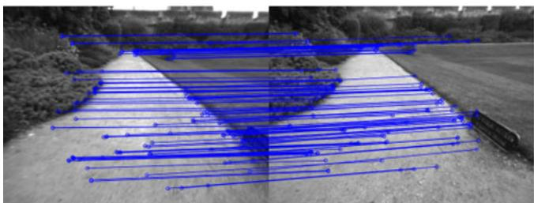  
Fig. 4. Example of loop detected in the NewCollege sequence. We draw the inlier correspondences supporting the similarity transformation found.

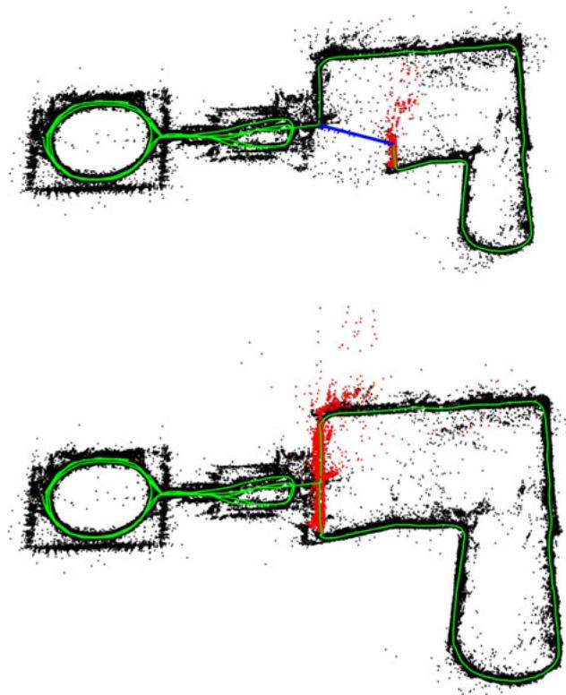  
Fig. 5. Map before and after a loop closure in the NewCollege sequence. The loop closure match is drawn in blue, the trajectory in green, and the local map for the tracking at that moment in red. The local map is extended along both sides of the loop after it is closed.

## A. System Performance in the NewCollege Dataset

The NewCollege dataset [39] contains a 2.2-km sequence from a robot traversing a campus and adjacent parks. The sequence is recorded by a stereo camera at 20 frames/s and a resolution $5 1 2 \times 3 8 2$ . It contains several loops and fast rotations that makes the sequence quite challenging for monocular vision. To the best of our knowledge, there is no other monocular system in the literature able to process this whole sequence. For example Strasdat et al. [7], despite being able to close loops and work in large-scale environments, only showed monocular results for a small part of this sequence.

As an example of our loop closing procedure, we show in Fig. 4 the detection of a loop with the inliers that support the similarity transformation. Fig. 5 shows the reconstruction before and after the loop closure. In red, the local map is shown, which after the loop closure extends along both sides of the loop closure. The whole map after processing the full sequence at its real frame rate is shown in Fig. 6. The big loop on the right does not perfectly align because it was traversed in opposite directions, and the place recognizer was not able to find loop closures.

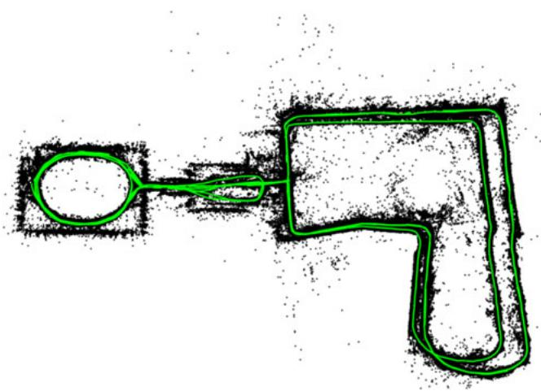  
Fig. 6. ORB-SLAM reconstruction of the full sequence of NewCollege. The bigger loop on the right is traversed in opposite directions and not visual loop closures were found; therefore, they do not perfectly align.

TABLE I  
TRACKING AND MAPPING TIMES IN NEWCOLLEGE
<table><tr><td>Thread</td><td>Operation</td><td>Median (ms)</td><td>Mean (ms)</td><td>Std (ms)</td></tr><tr><td>TRACKING</td><td>ORB extraction</td><td>11.10</td><td>11.42</td><td>1.61</td></tr><tr><td></td><td>Initial Pose Est.</td><td>3.38</td><td>3.45</td><td>0.99</td></tr><tr><td></td><td>Track Local Map</td><td>14.84</td><td>16.01</td><td>9.98</td></tr><tr><td></td><td>Total</td><td>30.57</td><td>31.60</td><td>10.39</td></tr><tr><td>LOCAL MAPPING</td><td>KeyFrame Insertion</td><td>10.29</td><td>11.88</td><td>5.03</td></tr><tr><td></td><td>Map Point Culling</td><td>0.10</td><td>3.18</td><td>6.70</td></tr><tr><td></td><td>Map Point Creation</td><td>66.79</td><td>72.96</td><td>31.48</td></tr><tr><td></td><td>Local BA</td><td>296.08</td><td>360.41</td><td>171.11</td></tr><tr><td></td><td>KeyFrame Culling</td><td>8.07</td><td>15.79</td><td>18.98</td></tr><tr><td></td><td>Total</td><td>383.59</td><td>464.27</td><td>217.89</td></tr></table>

We have extracted statistics of the times spent by each thread in this experiment. Table I shows the results for the tracking and the local mapping. Tracking works at frame rates around 25–30 Hz, being the most demanding task to track the local map. If needed, this time could be reduced limiting the number of keyframes that are included in the local map. In the local mapping thread, the most demanding task is local BA. The local BA time varies if the robot is exploring or in a well-mapped area, because during exploration, BA is interrupted if tracking inserts a new keyframe, as explained in Section V-E. In case of not needing new keyframes, local BA performs a generous number of prefixed iterations.

Table II shows the results for each of the six loop closures found. It can be seen how the loop detection increases sublinearly with the number of keyframes. This is due to the efficient querying of the database that only compares the subset of images with words in common, which demonstrates the potential of bag of words for place recognition. Our Essential Graph includes edges around five times the number of keyframes, which is a quite sparse graph.

TABLE II  
LOOP CLOSING TIMES IN NEWCOLLEGE
<table><tr><td></td><td></td><td></td><td colspan="2">Loop Detection (ms)</td><td colspan="2">Loop Correction (s)</td><td></td></tr><tr><td>Loop</td><td>KeyFrames</td><td>Essential Graph Edges</td><td>Candidates Detection</td><td>Similarity Transformation</td><td>Fusion</td><td>Essential Graph Optimization</td><td>Total (s)</td></tr><tr><td>1</td><td>287</td><td>1347</td><td>4.71</td><td>20.77</td><td>0.20</td><td>0.26</td><td>0.51</td></tr><tr><td>2</td><td>1082</td><td>5950</td><td>4.14</td><td>17.98</td><td>0.39</td><td>1.06</td><td>1.52</td></tr><tr><td>3</td><td>1279</td><td>7128</td><td>9.82</td><td>31.29</td><td>0.95</td><td>1.26</td><td>2.27</td></tr><tr><td>4</td><td>2648</td><td>12547</td><td>12.37</td><td>30.36</td><td>0.97</td><td>2.30</td><td>3.33</td></tr><tr><td>5</td><td>3150</td><td>16033</td><td>14.71</td><td>41.28</td><td>1.73</td><td>2.80</td><td>4.60</td></tr><tr><td>6</td><td>4496</td><td>21797</td><td>13.52</td><td>48.68</td><td>0.97</td><td>3.62</td><td>4.69</td></tr></table>

## B. Localization Accuracy in the TUM RGB-D Benchmark

The TUM RGB-D benchmark [38] is an excellent dataset to evaluate the accuracy of camera localization as it provides several sequences with accurate ground truth obtained with an external motion capture system. We have discarded all those sequences that we consider that are not suitable for pure monocular SLAM systems, as they contain strong rotations, no texture, or no motion.

For comparison, we have also executed the novel, direct, semidense LSD-SLAM [10] and PTAM [4] in the benchmark. We compare also with the trajectories generated by RGBD-SLAM [43], which are provided for some of the sequences in the benchmark website. In order to compare ORB-SLAM, LSD-SLAM, and PTAM with the ground truth, we align the keyframe trajectories using a similarity transformation, as scale is unknown, and measure the absolute trajectory error [38]. In the case of RGBD-SLAM, we align the trajectories with a rigid body transformation, but also a similarity to check if the scale was well recovered. LSD-SLAM initializes from random depth values and takes time to converge; therefore, we have discarded the first ten keyframes when comparing with the ground truth. For PTAM, we manually selected two frames from which we get a good initialization. Table III shows the median results over five executions in each of the 16 sequences selected.

It can be seen that ORB-SLAM is able to process all the sequences, except for fr3\_nostructure\_texture\_far (fr3\_nstr\_tex\_ far). This is a planar scene that because the camera trajectory with respect to the plane has two possible interpretations, i.e., the twofold ambiguity described in [27]. Our initialization method detects the ambiguity and for safety refuses to initialize. PTAM initializes selecting sometimes the true solution and others the corrupted one, in which case the error is unacceptable. We have not noticed two different reconstructions from LSD-SLAM, but the error in this sequence is very high. In the rest of the sequences, PTAM and LSD-SLAM exhibit less robustness than our method, loosing track in eight and three sequences, respectively.

In terms of accuracy, ORB-SLAM and PTAM are similar in open trajectories, while ORB-SLAM achieves higher accuracy when detecting large loops as in the sequencefr3\_nostructure\_ texture\_near\_withloop (fr3\_nstr\_tex\_near). The most surprising results is that both PTAM and ORB-SLAM are clearly more accurate than LSD-SLAM and RGBD-SLAM. One of the possible causes can be that they reduce the map optimization to a posegraph optimization where sensor measurements are discarded, while we perform BA and jointly optimize cameras and map over sensor measurements, which is the gold standard algorithm to solve structure from motion [2]. We further discuss this result in Section IX-B. Another interesting result is that LSD-SLAM seems to be less robust to dynamic objects than our system as seen in fr2\_desk\_with\_person and fr3\_walking\_xyz.

TABLE III  
KEYFRAME LOCALIZATION ERROR COMPARISON IN THE TUM RGB-D BENCHMARK [38]
<table><tr><td rowspan="2"></td><td colspan="4">Absolute KeyFrame Trajectory RMSE (cm)</td></tr><tr><td>ORB-SLAM</td><td>PTAM</td><td>LSD-SLAM</td><td>RGBD- SLAM</td></tr><tr><td>fr1_xyz</td><td>0.90</td><td>1.15</td><td>9.00</td><td>1.34 (1.34)</td></tr><tr><td>fr2_xyz</td><td>0.30</td><td>0.20</td><td>2.15</td><td>2.61 (1.42)</td></tr><tr><td>fr1_floor</td><td>2.99</td><td>X</td><td>38.07</td><td>3.51 (3.51)</td></tr><tr><td>fr1_desk</td><td>1.69</td><td>X</td><td>10.65</td><td>2.58 (2.52)</td></tr><tr><td>fr2_360 _kidnap</td><td>3.81</td><td>2.63</td><td>X</td><td>393.3 (100.5)</td></tr><tr><td>fr2_desk</td><td>0.88</td><td>X</td><td>4.57</td><td>9.50 (3.94)</td></tr><tr><td>fr3_long _office</td><td>3.45</td><td>X</td><td>38.53</td><td></td></tr><tr><td>fr3_nstr_tex_far</td><td>ambiguity detected4.92 / 34.74</td><td></td><td>18.31</td><td></td></tr><tr><td>fr3_nstr_ tex_near</td><td>1.39</td><td>2.74</td><td>7.54</td><td></td></tr><tr><td>fr3_str_tex_far</td><td>0.77</td><td>0.93</td><td>7.95</td><td></td></tr><tr><td>fr3_str_ tex_near</td><td>1.58</td><td>1.04</td><td>X</td><td></td></tr><tr><td>fr2_desk_person</td><td>0.63</td><td>X</td><td>31.73</td><td>6.97 (2.00)</td></tr><tr><td>fr3_sit_xyz</td><td>0.79</td><td>0.83</td><td>7.73</td><td></td></tr><tr><td>fr3_sit_halfsph</td><td>1.34</td><td>X</td><td>5.87</td><td></td></tr><tr><td>fr3_walk_xyz</td><td>1.24</td><td>X</td><td>12.44</td><td></td></tr><tr><td>fr3_walk_halfsph</td><td>1.74</td><td>X</td><td>X</td><td>一</td></tr></table>

Results for ORB-SLAM, PTAM, and LSD-SLAM are the median over five executions in each sequence. The trajectories have been aligned with 7 DoFs with the ground truth. Trajectories for RGBD-SLAM are taken from the benchmark website, only available for fr1 and fr2 sequences, and have been aligned with 6 DoFs and 7 DoFs (results between brackets). X means that the tracking is lost at some point and a significant portion of the sequence is not processed by the system.

We have noticed that RGBD-SLAM has a bias in the scale in fr2 sequences, as aligning the trajectories with 7 DoFs significantly reduces the error. Finally, it should be noted that Engel et al. [10] reported that PTAM has less accuracy than LSD-SLAM in fr2\_xyz with an RMSE of 24.28 cm. However, the paper does not give enough details on how those results were obtained, and we have been unable to reproduce them.

## C. Relocalization in the TUM RGB-D Benchmark

We perform two relocalization experiments in the TUM RGB-D benchmark. In the first experiment, we build a map with the first 30 s of the sequence fr2\_xyz and perform global relocalization with every successive frame and evaluate the accuracy of the recovered poses. We perform the same experiment with PTAM for comparison. Fig. 7 shows the keyframes used to create the initial map, the poses of the relocalized frames, and the ground truth for those frames. It can be seen that PTAM is only able to relocalize frames, which are near to the keyframes due to the little invariance of its relocalization method. Table IV shows the recall and the error with respect to the ground truth. ORB-SLAM accurately relocalizes more than the double of frames than PTAM. In the second experiment, we create an initial map with sequence fr3\_sitting\_xyz and try to relocalize all frames from fr3\_walking\_xyz. This is a challenging experiment as there are big occlusions due to people moving in the scene. Here, PTAM finds no relocalizations, while our system relocalizes 78% of the frames, as can be seen in Table IV. Fig. 8 shows some examples of challenging relocalizations performed by our system in these experiments.

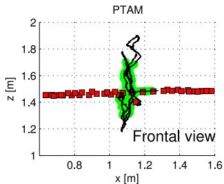  
PTAM

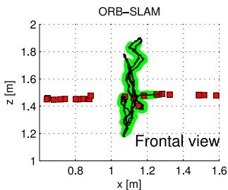  
ORB-SLAM

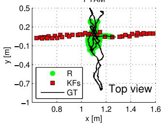

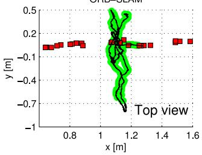  
Fig. 7. Relocalization experiment in fr2\_xyz. Map is initially created during the first 30 s of the sequence (KFs). The goal is to relocalize subsequent frames. Successful relocalizations (R) of our system and PTAM are shown. The ground truth (GT) is only shown for the frames to relocalize.

TABLE IV  
RESULTS FOR THE RELOCALIZATION EXPERIMENTS
<table><tr><td></td><td colspan="2">Initial Map</td><td colspan="3">Relocalization</td></tr><tr><td>System</td><td>KFs</td><td>RMSE (cm)</td><td>Recall (%)</td><td>RMSE (cm)</td><td>Max. Error (cm)</td></tr><tr><td colspan="6">fr2_xyz. 2769 frames to relocalize</td></tr><tr><td>PTAM</td><td>37</td><td>0.19</td><td>34.9</td><td>0.26</td><td>1.52</td></tr><tr><td>ORB-SLAM</td><td>24</td><td>0.19</td><td>78.4</td><td>0.38</td><td>1.67</td></tr><tr><td colspan="6">fr3_walking_xyz. 859 frames to relocalize</td></tr><tr><td>PTAM</td><td>34</td><td>0.83</td><td>0.0</td><td>一</td><td></td></tr><tr><td>ORB-SLAM</td><td>31</td><td>0.82</td><td>77.9</td><td>1.32</td><td>4.95</td></tr></table>

## D. Lifelong Experiment in the TUM RGB-D Benchmark

Previous relocalization experiments have shown that our system is able to localize in a map from very different viewpoints and robustly under moderate dynamic changes. This property in conjunction with our keyframe culling procedure allows us to operate lifelong in the same environment under different viewpoints and some dynamic changes.

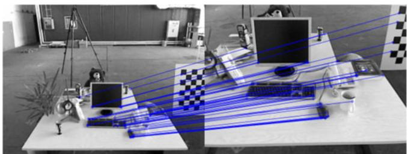

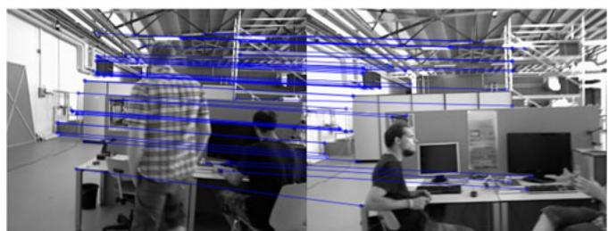  
Fig. 8. Example of challenging relocalizations (severe scale change, dynamic objects) that our system successfully found in the relocalization experiments.

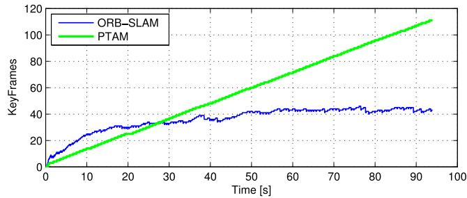  
Fig. 9. Lifelong experiment in a static environment where the camera is always looking at the same place from different viewpoints. PTAM is always inserting keyframes, while ORB-SLAM is able to prune redundant keyframes and maintains a bounded-size map.

In the case of a completely static scenario, our system is able to maintain the number of keyframes bounded even if the camera is looking at the scene from different viewpoints. We demonstrate it in a custom sequence where the camera is looking at the same desk during 93 s but performing a trajectory so that the viewpoint is always changing. We compare the evolution of the number of keyframes in our map and those generated by PTAM in Fig. 9. It can be seen how PTAM is always inserting keyframes, while our mechanism to prune redundant keyframes makes its number to saturate.

While the lifelong operation in a static scenario should be a requirement of any SLAM system, more interesting is the case where dynamic changes occur. We analyze the behavior of our system in such a scenario by running consecutively the dynamic sequences from fr3: sitting\_xyz, sitting\_halfsphere, sitting\_rpy, walking\_xyz, walking\_halfspehere, and walking\_rpy. All the sequences focus the camera on the same desk but perform different trajectories, while people are moving and change some objects like chairs. Fig. 10(a) shows the evolution of the total number of keyframes in the map, and Fig. 10(b) shows for each keyframe its frame of creation and destruction, showing how long the keyframes have survived in the map. It can be seen that during the first two sequences, the map size grows as all the views of the scene are being seen for the first time. In Fig. 10(b), we can see that several keyframes created during these two first sequences are maintained in the map during the whole experiment. During the sequences sitting\_rpy and walking\_xyz, the map does not grow, because the map created so far explains well the scene. In contrast, during the last two sequences, more keyframes are inserted showing that there are some novelties in the scene that were not yet represented, due probably to dynamic changes. Finally, Fig. 10(c) shows a histogram of the keyframes according to the time they have survived with respect to the remaining time of the sequence from its moment of creation. It can be seen that most of the keyframes are destroyed by the culling procedure soon after creation, and only a small subset survive until the end of the experiment. On one hand, this shows that our system has a generous keyframe spawning policy, which is very useful when performing abrupt motions in exploration. On the other hand, the system is eventually able to select a small representative subset of those keyframes.

In these lifelong experiments, we have shown that our map grows with the content of the scene but not with the time and is able to store the dynamic changes of the scene, which could be useful to perform some scene understanding by accumulating experience in an environment.

## E. Large-Scale and Large Loop Closing in the KITTI Dataset

The odometry benchmark from the KITTI dataset [40] contains 11 sequences from a car driven around a residential area with accurate ground truth from GPS and a Velodyne laser scanner. This is a very challenging dataset for monocular vision due to fast rotations, areas with lot of foliage, which make more difficult data association, and relatively high car speed, being the sequences recorded at 10 frames/s. We play the sequences at the real frame rate they were recorded, and ORB-SLAM is able to process all the sequences by the exception of sequence 01, which is a highway with few trackable close objects. Sequences 00, 02, 05, 06, 07, and 09 contain loops that were correctly detected and closed by our system. Sequence 09 contains a loop that can be detected only in a few frames at the end of the sequence, and our system not always detects it (the results provided are for the executions in which it was detected).

Qualitative comparisons of our trajectories and the ground truth are shown in Figs. 11 and 12. As in the TUM RGB-D benchmark, we have aligned the keyframe trajectories of our system and the ground truth with a similarity transformation. We can compare qualitatively our results from Figs. 11 and 12 with the results provided for sequences 00, 05, 06, 07, and 08 by the recent monocular SLAM approach of Lim et al. [25, Fig. 10]. ORB-SLAM produces clearly more accurate trajectories for all those sequences by the exception of sequence 08 in which they seem to suffer less drift.

Table V shows the median RMSE error of the keyframe trajectory over five executions in each sequence. We also provide the dimensions of the maps to put in context the errors. The results demonstrate that our system is very accurate, being the trajectory error typically around the 1% of its dimensions, sometimes less as in sequence 03 with an error of the 0.3% or higher as in sequence 08 with the 5%. In sequence 08, there are no loops, and drift cannot be corrected, which makes clear the need of loop closures to achieve accurate reconstructions.

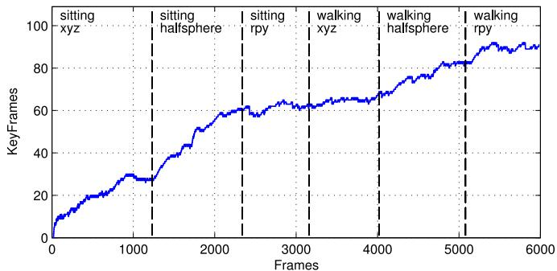

(a)  
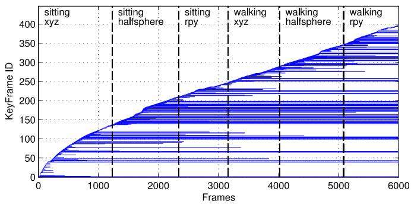

(b)  
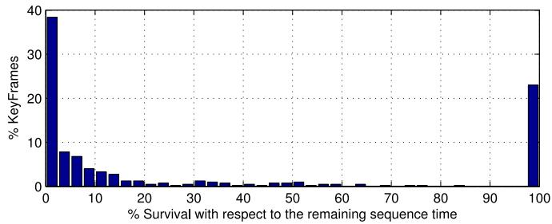  
(c)  
Fig. 10. Lifelong experiment in a dynamic environment from the TUM RGB-D Benchmark. (a) Evolution of the number of keyframes in the map. (b) Keyframe creation and destruction. Each horizontal line corresponds to a keyframe, from its creation frame until its destruction. (c) Histogram of the survival time of all spawned keyframes with respect to the remaining time of the experiment.

In this experiment, we have also checked how much the reconstruction can be improved by performing 20 iterations of full BA (see the Appendix for details) at the end of each sequence. We have noticed that some iterations offull BA slightly improves the accuracy in the trajectories with loops, but it has negligible effect in open trajectories, which means that the output of our system is already very accurate. In any case, if the most accurate results are needed, our algorithm provides a set of matches, which define a strong camera network, and an initial guess, so thatfull BA converge in few iterations.

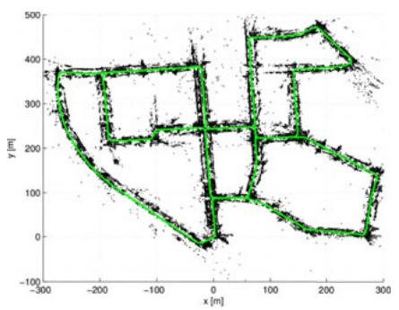

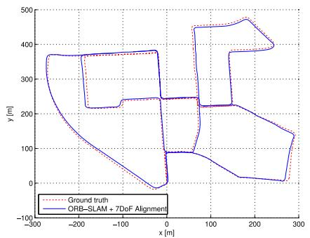

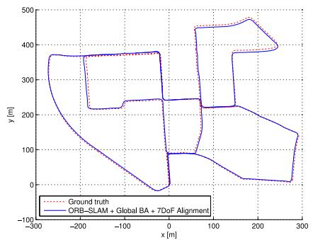

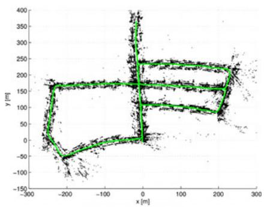

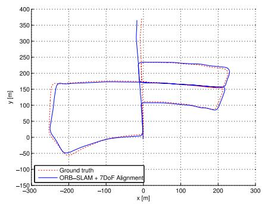

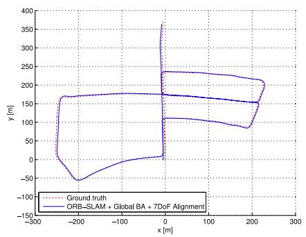

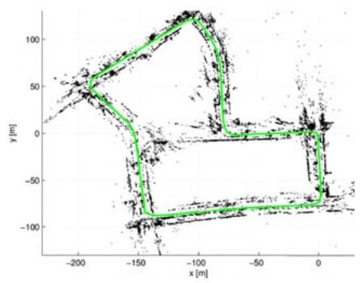

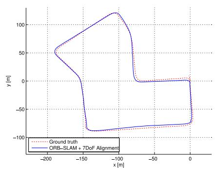

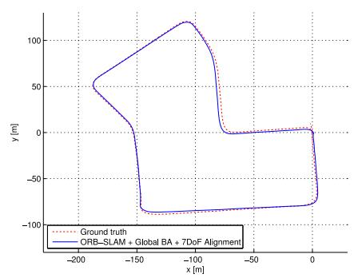  
Fig. 11. Sequences 00, 05, and 07 from the odometry benchmark of the KITTI dataset. (Left) Points and keyframe trajectory. (Center) trajectory and ground truth. (Right) Trajectory after 20 iterations of full BA. The output of our system is quite accurate, while it can be slightly improved with some iterations of BA.

Finally, we wanted to show the efficacy of our loop closing approach and the influence of the $\theta _ { \mathrm { m i n } }$ used to include edges in the essential graph. We have selected the sequence 09 (a very long sequence with a loop closure at the end), and in the same execution, we have evaluated different loop closing strategies. In Table VI, we show the keyframe trajectory RMSE and the time spent in the optimization in different cases: without loop closing, if we directly apply a full BA (20 or 100 iterations), if we apply only pose graph optimization (ten iterations with different number of edges), and if we apply pose graph optimization and full BA afterwards. Fig. 13 shows the output trajectory of the different methods. The results clearly show that before loop closure, the solution is so far from the optimal that BA has convergence problems. Even after 100 iterations, still the error is very high. On the other hand, essential graph optimization shows fast convergence and more accurate results. It can be seen that the choice of $\theta _ { \mathrm { m i n } }$ has not significant effect in accuracy, but decreasing the number of edges, the time can be significantly reduced. Performing an additional BA after the pose graph optimization slightly improves the accuracy while increasing substantially the time.

## IX. CONCLUSION AND DISCUSSION

## A. Conclusions

In this study, we have presented a new monocular SLAM system with a detailed description of its building blocks and an exhaustive evaluation in public datasets. Our system has demonstrated that it can process sequences from indoor and outdoor scenes and from car, robot, and hand-held motions. The accuracy of the system is typically below 1 cm in small indoor scenarios and of a few meters in large outdoor scenarios (once we have aligned the scale with the ground truth).

Currently, PTAM by Klein and Murray [4] is considered the most accurate SLAM method from monocular video in real time. It is not coincidence that the back-end of PTAM is BA, which is well known to be the gold standard method for the offline Structure From Motion problem [2]. One of the main successes of PTAM, and the earlier work of Mouragnon [3], was to bring that knowledge into the robotics SLAM community and demonstrate its real-time performance. The main contribution of our work is to expand the versatility of PTAM to environments that are intractable for that system. To achieve this, we have designed from scratch a new monocular SLAM system with some new ideas and algorithms, but also incorporating excellent works developed in the past few years, such as the loop detection of Galvez-L´ opez and Tard´ os [5], the loop closing procedure and´ covisibility graph of Strasdat et al. [6], [7], the optimization framework g2o by Kuemmerle et al. [37], and ORB features by Rubble et al. [9]. To the best of our knowledge, no other system has demonstrated to work in as many different scenarios and with such accuracy. Therefore, our system is currently the most reliable and complete solution for monocular SLAM. Our novel policy to spawn and cull keyframes permits to create keyframes every few frames, which are eventually removed when considered redundant. This flexible map expansion is really useful in poorly conditioned exploration trajectories, i.e., close to pure rotations or fast movements. When operating repeatedly in the same environment, the map only grows if the visual content of the scene changes, storing a history of its different visual appearances. Interesting results for long-term mapping could be extracted analyzing this history.

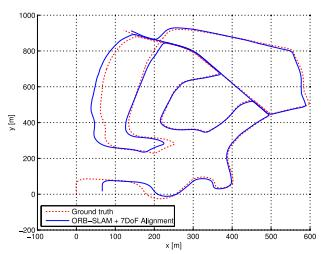  
(a)

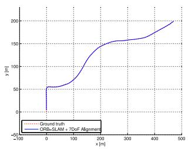  
(b)

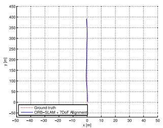  
(c)

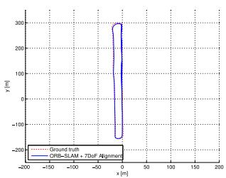  
(d)

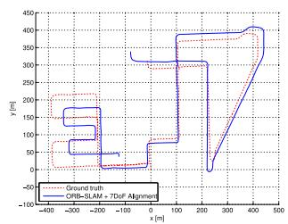  
(e)

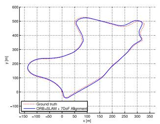  
(f)

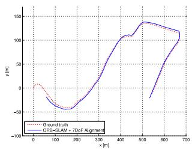  
(g)  
Fig. 12. ORB-SLAM keyframe trajectories in sequences 02, 03, 04 ,06, 08, 09, and 10 from the odometry benchmark of the KITTI dataset. Sequence 08 does not contains loops and drift (especially scale) is not corrected. (a) Sequence 02. (b) Sequence 03. (c) Sequence 04. (d) Sequence 06. (e) Sequence 08 (f) Sequence 09. (g) Sequence 10.  
RESULTS OF OUR SYSTEM IN THE KITTI DATASET  
TABLE V

## B. Sparse/Feature-Based Versus Dense/Direct Methods

Finally, we have also demonstrated that ORB features have enough recognition power to enable place recognition from severe viewpoint change. Moreover, they are so fast to extract and match (without the need of multithreading or GPU acceleration) that enable real-time accurate tracking and mapping.

Recent real-time monocular SLAM algorithms such as DTAM [44] and LSD-SLAM [10] are able to perform dense or semidense reconstructions of the environment, while the camera is localized by optimizing directly over image pixel intensities. These direct approaches do not need feature extraction and thus avoid the corresponding artifacts. They are also more robust to blur, low-texture environments and high-frequency texture like asphalt [45]. Their denser reconstructions, as compared with the sparse point map of our system or PTAM, could be more useful for other tasks than just camera localization.

<table><tr><td></td><td></td><td colspan="2">ORB-SLAM</td><td colspan="2">+ Global BA (20 its.)</td></tr><tr><td>Sequence</td><td>Dimension (m×m)</td><td>KFs</td><td>RMSE (m)</td><td>RMSE (m)</td><td>Time BA (s)</td></tr><tr><td>KITTI 00</td><td> $5 6 4 \times 4 9 6$ </td><td>1391</td><td>6.68</td><td>5.33</td><td>24.83</td></tr><tr><td>KITTI 01</td><td> $1 1 5 7 \times 1 8 2 7$ </td><td>X</td><td>X</td><td>X</td><td>X</td></tr><tr><td>KITTI 02</td><td> $5 9 9 \times 9 4 6$ </td><td>1801</td><td>21.75</td><td>21.28</td><td>30.07</td></tr><tr><td>KITTI 03</td><td> $4 7 1 \times 1 9 9$ </td><td>250</td><td>1.59</td><td>1.51</td><td>4.88</td></tr><tr><td>KITTI 04</td><td> $0 . 5 \times 3 9 4$ </td><td>108</td><td>1.79</td><td>1.62</td><td>1.58</td></tr><tr><td>KITTI 05</td><td> $4 7 9 \times 4 2 6$ </td><td>820</td><td>8.23</td><td>4.85</td><td>15.20</td></tr><tr><td>KITTI 06</td><td> $2 3 \times 4 5 7$ </td><td>373</td><td>14.68</td><td>12.34</td><td>7.78</td></tr><tr><td>KITTI 07</td><td> $1 9 1 \times 2 0 9$ </td><td>351</td><td>3.36</td><td>2.26</td><td>6.28</td></tr><tr><td>KITTI 08</td><td> $8 0 8 \times 3 9 1$ </td><td>1473</td><td>46.58</td><td>46.68</td><td>25.60</td></tr><tr><td>KITTI 09</td><td> $4 6 5 \times 5 6 8$ </td><td>653</td><td>7.62</td><td>6.62</td><td>11.33</td></tr><tr><td>KITTI 10</td><td> $6 7 1 \times 1 7 7$ </td><td>411</td><td>8.68</td><td>8.80</td><td>7.64</td></tr></table>

However, direct methods have their own limitations. First, these methods assume a surface reflectance model that in real scenes produces its own artifacts. The photometric consistency limits the baseline of the matches, typically narrower than those that features allow. This has a great impact in reconstruction accuracy, which requires wide baseline observations to reduce depth uncertainty. Direct methods, if not correctly modeled, are quite affected by rolling-shutter, autogain, and autoexposure artifacts (as in the TUM RGB-D Benchmark). Finally, because direct methods are, in general, very computationally demanding, the map is just incrementally expanded as in DTAM, or map optimization is reduced to a pose graph, discarding all sensor measurements as in LSD-SLAM.

TABLE VI  
COMPARISON OF LOOP CLOSING STRATEGIES IN KITTI 09
<table><tr><td>Method</td><td>Time (s)</td><td>Pose Graph Edges</td><td>RMSE (m)</td></tr><tr><td></td><td></td><td></td><td>48.77</td></tr><tr><td>BA (20)</td><td>14.64</td><td>一</td><td>49.90</td></tr><tr><td>BA (100)</td><td>72.16</td><td>一</td><td>18.82</td></tr><tr><td>EG (200)</td><td>0.38</td><td>890</td><td>8.84</td></tr><tr><td>EG (100)</td><td>0.48</td><td>1979</td><td>8.36</td></tr><tr><td>EG (50)</td><td>0.59</td><td>3583</td><td>8.95</td></tr><tr><td>EG (15)</td><td>0.94</td><td>6663</td><td>8.88</td></tr><tr><td>EG (100) + BA (20)</td><td>13.40</td><td>1979</td><td>7.22</td></tr></table>

The first row shows results without loop closing. The number between brackets for BA means number ofLevenberg–Marquardt (LM) iterations while, for EG (essential graph), it is $\theta _ { \mathrm { m i n } }$ to build the essential graph. All EG optimizations perform ten LM iterations.

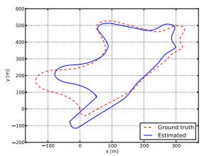  
(a)

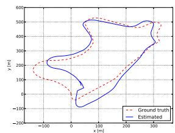  
(b)

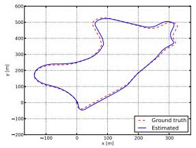  
(c)

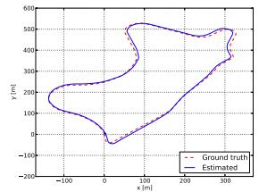  
(d)  
Fig. 13. Comparison of different loop closing strategies in KITTI 09. (a) Without Loop Closing. (b) BA (20). (c) EG (100). (d) EG (100) + BA (20).

In contrast, feature-based methods are able to match features with a wide baseline, thanks to their good invariance to viewpoint and illumination changes. BA jointly optimizes camera poses and points over sensor measurements. In the context of structure and motion estimation, Torr and Zisserman [46] already pointed the benefits of feature-based against direct methods. In this study, we provide experimental evidence (see Section VIII-B) of the superior accuracy of feature-based methods in real-time SLAM. We consider that the future of monocular SLAM should incorporate the best of both approaches.

## C. Future Work

The accuracy of our system can still be improved incorporating points at infinity in the tracking. These points, which are not seen with sufficient parallax and our system does not include in the map, are very informative of the rotation of the camera [21].

Another open way is to upgrade the sparse map of our system to a denser and more useful reconstruction. Thanks to our keyframe selection, keyframes comprise a compact summary of the environment with a very high pose accuracy and rich information of covisibility. Therefore, the ORB-SLAM sparse map can be an excellent initial guess and skeleton, on top of which a dense and accurate map of the scene can be built. A first effort in this line is presented in [47].

## APPENDIX

## NONLINEAR OPTIMIZATIONS

1) Bundle Adjustment [1]: Map point 3-D locations $\mathbf { X } _ { w , j } \in$ $\mathbb { R } ^ { 3 }$ and keyframe poses $\mathbf { T } _ { i w } \in \mathrm { S E } ( 3 )$ , where w stands for the world reference, are optimized minimizing the reprojection error with respect to the matched keypoints $\mathbf x _ { i , j } \in \mathbb R ^ { 2 }$ . The error term for the observation of a map point j in a keyframe i is

$$
\mathbf { e } _ { i , j } = \mathbf { x } _ { i , j } - \pi _ { i } ( \mathbf { T } _ { i w } , \mathbf { X } _ { w , j } )\tag{5}
$$

where $\pi _ { i }$ is the projection function

$$
\begin{array} { r l r } & { } & { \pi _ { i } ( { \bf T } _ { i w } , { \bf X } _ { w , j } ) = \left[ \begin{array} { c } { f _ { i , u } \frac { { x _ { i , j } } } { z _ { i , j } } + c _ { i , u } } \\ { f _ { i , v } \frac { y _ { i , j } } { z _ { i , j } } + c _ { i , v } } \end{array} \right] } \\ & { } & { \left[ x _ { i , j } \quad y _ { i , j } \quad z _ { i , j } \right] ^ { T } = \mathrm { \bf { R } } _ { i w } { \bf X } _ { w , j } + { \bf t } _ { i w } } \end{array}\tag{6}
$$

where $\mathbf { R } _ { i w } \in \mathrm { S O } ( 3 )$ and $\mathbf { t } _ { i w } \in \mathbb { R } ^ { 3 }$ are, respectively, the rotation and translation parts of $\mathbf { T } _ { i w }$ , and $( f _ { i , u } , f _ { i , v } )$ and $\left( c _ { i , u } , c _ { i , v } \right)$ are the focal length and principle point associated with camera i. The cost function to be minimized is

$$
C = \sum _ { i , j } \rho _ { h } ( \mathbf { e } _ { i , j } ^ { T } \Omega _ { i , j } ^ { - 1 } \mathbf { e } _ { i , j } )\tag{7}
$$

where $\rho _ { h }$ is the Huber robust cost function, and $\Omega _ { i , j } =$ $\sigma _ { i , j } ^ { 2 } { \bf I } _ { 2 \times 2 }$ is the covariance matrix associated with the scale at which the keypoint was detected. In case offull BA (used in the map initialization explained in Section IV and in the experiments in Section VIII-E), we optimize all points and keyframes, by the exception of the first keyframe which remain fixed as the origin. In local BA (see Section VI-D), all points included in the local area are optimized, while a subset of keyframes is fixed. In pose optimization, or motion-only BA (see Section V), all points are fixed, and only the camera pose is optimized.

2) Pose Graph Optimization over Sim(3) Constraints [6]: Given a pose graph of binary edges (see Section VII-D), we define the error in an edge as

$$
\mathbf { e } _ { i , j } = \log _ { \mathrm { S i m ( 3 ) } } \bigl ( \mathbf { S } _ { i j } \ \mathbf { S } _ { j w } \ \mathbf { S } _ { i w } ^ { - 1 } \bigr )\tag{8}
$$

where $\mathbf { S } _ { i j }$ is the relative Sim(3) transformation between both keyframes computed from the SE(3) poses just before the pose graph optimization and setting the scale factor to 1. In the case of the loop closure edge, this relative transformation is computed with the method of Horn [42]. The $\mathrm { l o g } _ { \mathrm { S i m } 3 }$ [48] transforms to the tangent space so that the error is a vector in $\mathbb { R } ^ { 7 }$ . The goal is to optimize the Sim(3) keyframe poses minimizing the cost function as

$$
C = \sum _ { i , j } ( { \bf e } _ { i , j } ^ { T } { \bf { \Lambda } } _ { { i , j } } { \bf e } _ { i , j } )\tag{9}
$$

where $\Lambda _ { i , j }$ is the information matrix of the edge, which, as in [48], we set to the identity. We fix the loop closure keyframe to fix the 7 degrees of gauge freedom. Although this method is a rough approximation of a full BA, we demonstrate experimentally in Section VIII-E that it has significantly faster and better convergence than BA.

3) Relative Sim(3) Optimization: Given a set of n matches $i \Rightarrow j$ (keypoints and their associated 3-D map points) between keyframe 1 and keyframe 2, we want to optimize the relative Sim(3) transformation $\mathbf { S } _ { 1 2 }$ (see Section VII-B) that minimizes the reprojection error in both images as

$$
\begin{array} { r } { \mathbf { e } _ { 1 } = \mathbf { x } _ { 1 , i } - \pi _ { 1 } ( \mathbf { S } _ { 1 2 } , \mathbf { X } _ { 2 , j } ) } \\ { \mathbf { e } _ { 2 } = \mathbf { x } _ { 2 , j } - \pi _ { 2 } ( \mathbf { S } _ { 1 2 } ^ { - 1 } , \mathbf { X } _ { 1 , i } ) } \end{array}\tag{10}
$$

and the cost function to minimize is

$$
C = \sum _ { n } \left( \rho _ { h } ( { \bf e } _ { 1 } ^ { T } \Omega _ { 1 , i } ^ { - 1 } { \bf e } _ { 1 } ) + \rho _ { h } ( { \bf e } _ { 2 } ^ { T } \Omega _ { 2 , j } ^ { - 1 } { \bf e } _ { 2 } ) \right)\tag{11}
$$

where $\Omega _ { 1 , i }$ and $\Omega _ { 2 , \ L }$ i are the covariance matrices associated with the scale in which keypoints in images 1 and 2 were detected. In this optimization, the points are fixed.

## REFERENCES

[1] B. Triggs, P. F. McLauchlan, R. I. Hartley, and A. W. Fitzgibbon, “Bundle adjustment a modern synthesis,” in Vision Algorithms: Theory and Practice. New York, NY, USA: Springer, 2000, pp. 298–372.

[2] R. Hartley and A. Zisserman, Multiple View Geometry in Computer Vision, 2nd ed., Cambridge, U.K.: Cambridge Univ. Press, 2004.

[3] E. Mouragnon, M. Lhuillier, M. Dhome, F. Dekeyser, and P. Sayd, “Real time localization and 3D reconstruction,” in Proc. IEEE Comput. Soc. Conf. Comput. Vision Pattern Recog., 2006, vol. 1, pp. 363–370.

[4] G. Klein and D. Murray, “Parallel tracking and mapping for small AR workspaces,” in Proc. IEEE ACM Int. Symp. Mixed Augmented Reality, Nara, Japan, Nov. 2007, pp. 225–234.

[5] D. Galvez-L ´ opez and J. D. Tard ´ os, “Bags of binary words for fast place ´ recognition in image sequences,” IEEE Trans. Robot., vol. 28, no. 5, pp. 1188–1197, Oct. 2012.

[6] H. Strasdat, J. M. M. Montiel, and A. J. Davison, “Scale drift-aware large scale monocular SLAM,” presented at the Proc. Robot.: Sci. Syst., Zaragoza, Spain, Jun. 2010.

[7] H. Strasdat, A. J. Davison, J. M. M. Montiel, and K. Konolige, “Double window optimisation for constant time visual SLAM,” in Proc. IEEE Int. Conf. Comput. Vision, Barcelona, Spain, Nov. 2011, pp. 2352–2359.

[8] C. Mei, G. Sibley, and P. Newman, “Closing loops without places,” in Proc. IEEE/RSJ Int. Conf. Intell. Robots Syst., Taipei, Taiwan, Oct. 2010, pp. 3738–3744.

[9] E. Rublee, V. Rabaud, K. Konolige, and G. Bradski, “ORB: An efficient alternative to SIFT or SURF,” in Proc. IEEE Int. Conf. Comput. Vision, Barcelona, Spain, Nov. 2011, pp. 2564–2571.

[10] J. Engel, T. Schops, and D. Cremers, “LSD-SLAM: Large-scale direct¨ monocular SLAM,” in Proc. Eur. Conf. Comput. Vision, Zurich, Switzerland, Sep. 2014, pp. 834–849.

[11] R. Mur-Artal and J. D. Tardos, “Fast relocalisation and loop closing in´ keyframe-based SLAM,” in Proc. IEEE Int. Conf. Robot. Autom., Hong Kong, Jun. 2014, pp. 846–853.

[12] R. Mur-Artal and J. D. Tardos, “ORB-SLAM: Tracking and mapping ´ recognizable features,” presented at the MVIGRO Workshop Robot. Sci. Syst., Berkeley, CA, USA, Jul. 2014.

[13] B. Williams, M. Cummins, J. Neira, P. Newman, I. Reid, and J. D. Tardos, ´ “A comparison of loop closing techniques in monocular SLAM,” Robot. Auton. Syst., vol. 57, no. 12, pp. 1188–1197, 2009.

[14] D. Nister and H. Stewenius, “Scalable recognition with a vocabulary tree,” in Proc. IEEE Comput. Soc. Conf. Comput. Vision Pattern Recog., New York, NY, USA, Jun. 2006, vol. 2, pp. 2161–2168.

[15] M. Cummins and P. Newman, “Appearance-only SLAM at large scale with FAB-MAP 2.0,” Int. J. Robot. Res., vol. 30, no. 9, pp. 1100–1123, 2011.

[16] M. Calonder, V. Lepetit, C. Strecha, and P. Fua, “BRIEF: Binary robust independent elementary features,” in Proc. Eur. Conf. Comput. Vision, Hersonissos, Greece, Sep. 2010, pp. 778–792.

[17] E. Rosten and T. Drummond, “Machine learning for high-speed corner detection,” in Proc. Eur. Conf. Comput. Vision, Graz, Austria, May 2006, pp. 430–443.

[18] H. Bay, T. Tuytelaars, and L. Van Gool, “SURF: Speeded up robust features,” in Proc. Eur. Conf. Comput. Vision, Graz, Austria, May 2006, pp. 404–417.

[19] D. G. Lowe, “Distinctive image features from scale-invariant keypoints,” Int. J. Comput. Vision, vol. 60, no. 2, pp. 91–110, 2004.

[20] A. J. Davison, I. D. Reid, N. D. Molton, and O. Stasse, “MonoSLAM: Real-time single camera SLAM,” IEEE Trans. Pattern Anal. Mach. Intell., vol. 29, no. 6, pp. 1052–1067, Jun. 2007.

[21] J. Civera, A. J. Davison, and J. M. M. Montiel, “Inverse depth parametrization for monocular SLAM,” IEEE Trans. Robot., vol. 24, no. 5, pp. 932–945, Oct. 2008.

[22] C. Forster, M. Pizzoli, and D. Scaramuzza, “SVO: Fast semi-direct monocular visual odometry,” in Proc. IEEE Int. Conf. Robot. Autom., Hong Kong, Jun. 2014, pp. 15–22.

[23] O. D. Faugeras and F. Lustman, “Motion and structure from motion in a piecewise planar environment,” Int. J. Pattern Recog. Artif. Intell., vol. 2, no. 03, pp. 485–508, 1988.

[24] W. Tan, H. Liu, Z. Dong, G. Zhang, and H. Bao, “Robust monocular SLAM in dynamic environments,” in Proc. IEEE Int. Symp. Mixed Augmented Reality, Adelaide, Australia, Oct. 2013, pp. 209–218.

[25] H. Lim, J. Lim, and H. J. Kim, “Real-time 6-DOF monocular visual SLAM in a large-scale environment,” in Proc. IEEE Int. Conf. Robot. Autom., Hong Kong, Jun. 2014, pp. 1532–1539.

[26] D. Nister, “An efficient solution to the five-point relative pose problem,” ´ IEEE Trans. Pattern Anal. Mach. Intell., vol. 26, no. 6, pp. 756–770, Jun. 2004.

[27] H. Longuet-Higgins, “The reconstruction of a plane surface from two perspective projections,” Proc. Royal Soc. London Ser. B, Biol, Sci., vol. 227, no. 1249, pp. 399–410, 1986.

[28] P. H. Torr, A. W. Fitzgibbon, and A. Zisserman, “The problem of degeneracy in structure and motion recovery from uncalibrated image sequences,” Int. J. Comput. Vision, vol. 32, no. 1, pp. 27–44, 1999.

[29] A. Chiuso, P. Favaro, H. Jin, and S. Soatto, “Structure from motion causally integrated over time,” IEEE Trans. Pattern Anal. Mach. Intell., vol. 24, no. 4, pp. 523–535, Apr. 2002.

[30] E. Eade and T. Drummond, “Scalable monocular SLAM,” in Proc. IEEE Comput. Soc. Conf. Comput. Vision Pattern Recog., New York, NY, USA, Jun. 2006, vol. 1, pp. 469–476.

[31] H. Strasdat, J. M. M. Montiel, and A. J. Davison, “Visual SLAM: Why filter?” Image Vision Comput., vol. 30, no. 2, pp. 65–77, 2012.

[32] G. Klein and D. Murray, “Improving the agility of keyframe-based SLAM,” in Proc. Eur. Conf. Comput. Vision, Marseille, France, Oct. 2008, pp. 802–815.

[33] K. Pirker, M. Ruther, and H. Bischof, “CD SLAM-continuous localization and mapping in a dynamic world,” in Proc. IEEE/RSJ Int. Conf. Intell. Robots Syst., San Francisco, CA, USA, Sep. 2011, pp. 3990–3997.

[34] S. Song, M. Chandraker, and C. C. Guest, “Parallel, real-time monocular visual odometry,” in Proc. IEEE Int. Conf. Robot. Autom., 2013, pp. 4698–4705.

[35] P. F. Alcantarilla, J. Nuevo, and A. Bartoli, “Fast explicit diffusion for accelerated features in nonlinear scale spaces,” presented at the Brit. Mach. Vision Conf., Bristol, U.K., 2013.

[36] X. Yang and K.-T. Cheng, “LDB: An ultra-fast feature for scalable augmented reality on mobile devices,” in Proc. IEEE Int. Symp. Mixed Augmented Reality, 2012, pp. 49–57.

[37] R. Kuemmerle, G. Grisetti, H. Strasdat, K. Konolige, and W. Burgard, “g2o: A general framework for graph optimization,” in Proc. IEEE Int. Conf. Robot. Autom., Shanghai, China, May 2011, pp. 3607–3613.

[38] J. Sturm, N. Engelhard, F. Endres, W. Burgard, and D. Cremers, “A benchmark for the evaluation of RGB-D SLAM systems,” in Proc. IEEE/RSJ Int. Conf. Intell. Robots Syst., Vilamoura, Portugal, Oct. 2012, pp. 573–580.

[39] M. Smith, I. Baldwin, W. Churchill, R. Paul, and P. Newman, “The new college vision and laser data set,” Int. J. Robot. Res., vol. 28, no. 5, pp. 595–599, 2009.

[40] A. Geiger, P. Lenz, C. Stiller, and R. Urtasun, “Vision meets robotics: The KITTI dataset,” Int. J. Robot. Res., vol. 32, no. 11, pp. 1231–1237, 2013.

[41] V. Lepetit, F. Moreno-Noguer, and P. Fua, “EPnP: An accurate O(n) solution to the PnP problem,” Int. J. Comput. Vision, vol. 81, no. 2, pp. 155–166, 2009.

[42] B. K. P. Horn, “Closed-form solution of absolute orientation using unit quaternions,” J. Opt. Soc. Amer. A, vol. 4, no. 4, pp. 629–642, 1987.

[43] F. Endres, J. Hess, J. Sturm, D. Cremers, and W. Burgard, “3-D mapping with an RGB-D camera,” IEEE Trans. Robot., vol. 30, no. 1, pp. 177–187, Feb. 2014.

[44] R. A. Newcombe, S. J. Lovegrove, and A. J. Davison, “DTAM: Dense tracking and mapping in real-time,” in Proc. IEEE Int. Conf. Comput. Vision, Barcelona, Spain, Nov. 2011, pp. 2320–2327.

[45] S. Lovegrove, A. J. Davison, and J. Ibanez-Guzman, “Accurate visual´ odometry from a rear parking camera,” in Proc. IEEE Intell. Vehicles Symp., 2011, pp. 788–793.

[46] P. H. Torr and A. Zisserman, “Feature based methods for structure and motion estimation,” in Vision Algorithms: Theory and Practice. New York, NY, USA: Springer, 2000, pp. 278–294.

[47] R. Mur-Artal and J. D. Tardos, “Probabilistic semi-dense mapping from highly accurate feature-based monocular SLAM,” presented at the Proc. Robot.: Sci. Syst., Rome, Italy, Jul. 2015.

[48] H. Strasdat, “Local accuracy and global consistency for efficient visual SLAM,” Ph.D. dissertation, Imperial College London, London, U.K., Oct. 2012.

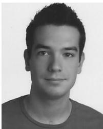  
Raul Mur-Artal´ was born in Zaragoza, Spain, in 1989. He received the Industrial Engineering degree (in industrial automation and robotics) in 2012 and the M.S. degree in systems and computer engineering in 2013 from University of Zaragoza, Zaragoza, where he is currently working toward the Ph.D. degree with the I3A Robotics, Perception and Real-Time Group.

His research interests include visual localization and long-term mapping.

J. M . M. Montiel (M’15) was born in Arnedo, Spain, in 1967. He received the M.S. and Ph.D. degrees in electrical engineering from Universidad de Zaragoza, Zaragoza, Spain, in 1992 and 1996, respectively.

He is currently a Full Professor with the Departamento de Informatica e Ingenier´ ´ıa de Sistemas, Universidad de Zaragoza, where he is in charge of perception and computer vision research grants and courses. His interests include real-time vision localization and semantic mapping for rigid and nonrigid environments, and the transference of this technology

to robotic and nonrobotic application domains.

Dr. Montiel is a Member of the I3A Robotics, Perception, and Real-Time Group, Universidad de Zaragoza. He has been awarded several Spanish MEC grants to fund research with the University of Oxford, U.K., and with Imperial College London, U.K.

Juan D. Tardos´ (M’05) was born in Huesca, Spain, in 1961. He received the M.S. and Ph.D. degrees in electrical engineering from University of Zaragoza, Zaragoza, Spain, in 1985 and 1991, respectively.

He is a Full Professor with the Departamento de Informatica e Ingenier´ ´ıa de Sistemas, University of Zaragoza, where he is in charge of courses in robotics, computer vision, and artificial intelligence. His research interests include simultaneous localization and mapping, perception, and mobile robotics.

Dr. Tardos is a member of the I3A Robotics, Per-´