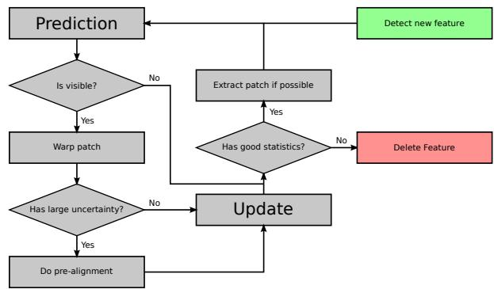
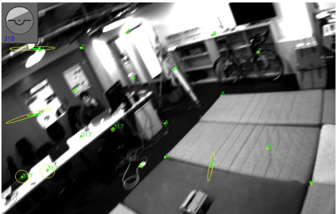
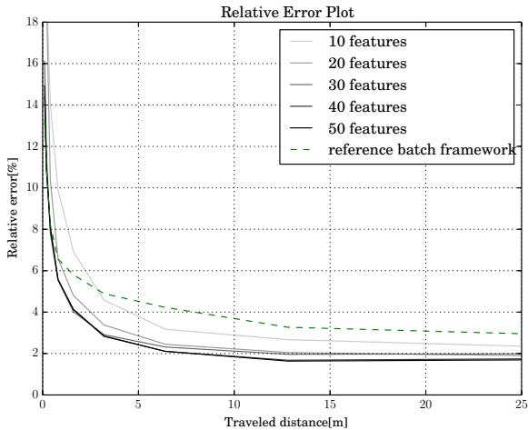
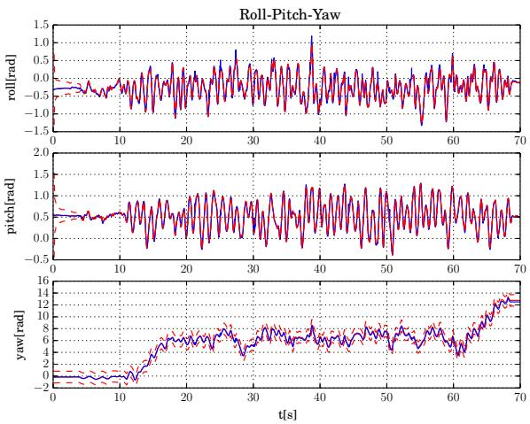
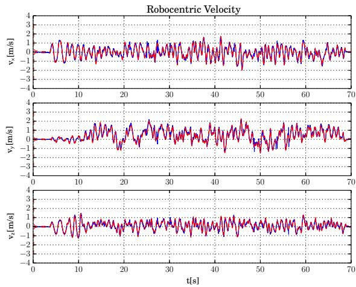
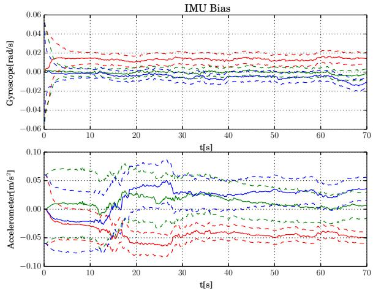
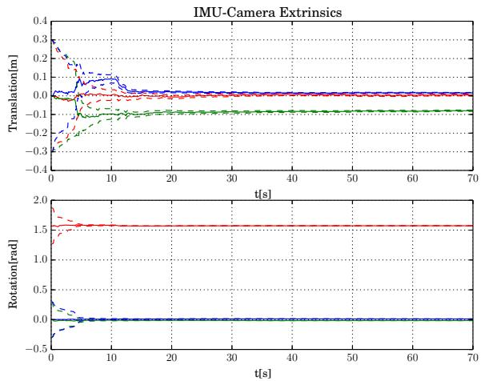
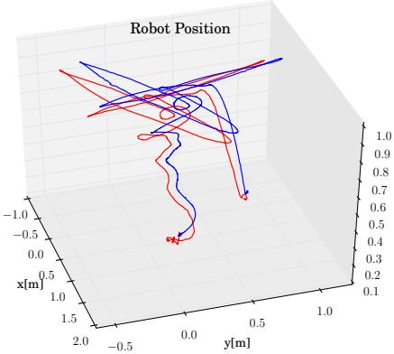

# Robust Visual Inertial Odometry Using a Direct EKF-Based Approach

Michael Bloesch, Sammy Omari, Marco Hutter, Roland Siegwart Autonomous Systems Lab, ETH Zurich, Switzerland, bloeschm@ethz.ch¨

Abstract— In this paper, we present a monocular visualinertial odometry algorithm which, by directly using pixel intensity errors of image patches, achieves accurate tracking performance while exhibiting a very high level of robustness. After detection, the tracking of the multilevel patch features is closely coupled to the underlying extended Kalman filter (EKF) by directly using the intensity errors as innovation term during the update step. We follow a purely robocentric approach where the location of 3D landmarks are always estimated with respect to the current camera pose. Furthermore, we decompose landmark positions into a bearing vector and a distance parametrization whereby we employ a minimal representation of differences on a corresponding σ-Algebra in order to achieve better consistency and to improve the computational performance. Due to the robocentric, inversedistance landmark parametrization, the framework does not require any initialization procedure, leading to a truly powerup-and-go state estimation system. The presented approach is successfully evaluated in a set of highly dynamic hand-held experiments as well as directly employed in the control loop of a multirotor unmanned aerial vehicle (UAV).

## I. INTRODUCTION

Navigation and control of autonomous robots in rough and highly unstructured environments requires high-bandwidth and precise knowledge of position and orientation. Especially in dynamic operation of robots, the underlying state estimation can quickly become the bottleneck in terms of achievable bandwidth, robustness and speed. To enable the required performance for highly dynamic operation of robots, we combine complementary information from vision- and inertial sensors. This approach has a long history and has been successfully applied to navigate unmanned aerial robots [24], [21], walking robots [23], [25] or cars [8].

Within the field of computer vision, Davison et al. [5] proposed one of the first real-time 3D monocular localization and mapping frameworks. Since then, a lot of improvements have been contributed from various research groups and further approaches have been proposed. A key issue is to improve the consistency of the estimation framework which is affected by its inherent nonlinearity [13], [3]. One approach is to make use of a robocentric representation for the tracked features and thereby significantly reduce the effect of nonlinearities [3], [4]. As alternative, Huang et al. [11] propose the use of a so-called observability constrained extended Kalman filter, whereby the inconsistencies can be avoided by using special linearization points while evaluating the system Jacobians.

A somewhat related problem is the choice of the specific representation of the features. Since for monocular setups, the depth of a newly detected feature is unknown the initial 3D location estimate of the feature exhibits a high (infinite) uncertainty along the corresponding axis. In order to integrate this feature from the beginning into the estimation framework, Montiel et al. [18] proposed the use of an inverse-depth parametrization (IDP). With this parametrization, each feature location is represented by the camera position where the feature was initially detected, by a bearing vector (parametrized with azimuth and elevation angle), as well as the inverse depth of the feature. The resulting increase in consistency was analyzed in more detail for the IDP and other feature parametrization in [22].

While most standard visual odometry approaches are based on detected and tracked point features as source of visual information, so-called direct approaches directly use the image intensities in their estimation framework. Especially with the recent advent of RGBD cameras, so called dense approaches, where the intensity error over the full image is considered, have gained a lot of attention [1], [15]. In comparison to traditional vision-based state estimators, dense approaches have a significantly larger error term count and require appropriate methods in order to tackle the additional computational load. By employing highly optimized SSEvectorized implementations, first real-time, CPU-based approaches for dense- or semi-dense motion estimation using a RGBD [15] or a monocular RGB camera [6], [7] have recently been proposed.

Incorporating inertial measurements in the estimation can significantly improve the robustness of the system, provides the estimation process with the notion of gravity, and allows for a more accurate and high bandwidth estimation of the velocities and rotational rates. By adapting the original EKF proposed by Davison et al. [5], additional IMU measurements can be relatively simply integrated into the ego-motion estimation, whereby calibration parameters can be co-estimated online [14], [12]. Leutenegger et al. [16] describe a tightly coupled approach in which the robot trajectory and sparse 3D landmarks are estimated in a joint optimization problem using inertial error terms as well as the reprojection error of the landmarks in the camera image. This is done in a windowed bundle adjustment approach over a set of keyframe images and a temporal inertial measurement window. Similarly, in [19] the authors estimate the trajectory in an IMU-driven filtering framework using the reprojection error of 3D landmarks as measurement updates. Instead of adding the landmarks to the filter state, they immediately marginalize them out using a nullspace decomposition, thus leading to a small filter state size.

In the present paper we propose a visual-inertial odometry framework which combines and extends several of the above mentioned approaches. While targeting a simple and consistent approach and avoiding ad-hoc solutions, we adapt the structure of the standard visual-inertial EKF-SLAM formulation [14], [12]. The following keypoints are integrated into the proposed framework:

• Point features are parametrized by a bearing vector and a distance parameter with respect to the current frame. A suitable σ-Algebra is used for deriving the corresponding dynamics and performing filtering operations.

• Multilevel patch features are directly tracked within the EKF, whereby the intensity errors are used as innovation terms during the update step.

• A QR-decomposition is employed in order to reduce the high dimensional error terms and thus keep the Kalman update computationally tractable.

• A purely robocentric representation of the full filter state is employed. The camera extrinsics as well as the additive IMU biases are also co-estimated.

Together this yields a fully robocentric and direct monocular visual-inertial odometry framework which can be run realtime on a single standard CPU core. In several experiments on real data we show its reliable and accurate tracking performance while exhibiting a high robustness against fast motions and various disturbances. The framework is implemented in c++ and is available as open-source software [2].

## II. FILTER SETUP

## A. Overall Filter Structure and State Parametrization

The overall structure of the filter is derived from the one employed in [14], [12]: The inertial measurements are used to propagate the state of the filter, while the visual information is taken into account during the filter update steps. As a fundamental difference we make use of a fully robocentric representation of the filter state which can be seen as an adaptation of [4] (which is vision-only). One advantage of this formulation is that problems with unobservable states can inherently be avoided and thus the consistency of the estimates can be improved. On the other hand noise from the gyroscope will affect all states that need to be rotated during the state propagation (see section II-B). However, since the gyroscope noise is relatively small and because most states are observable this does not represent a significant issue.

Three different coordinate frames are used throughout the paper: the inertial world coordinate frame, , the IMU fixed coordinate frame, , as well as the camera fixed coordinate frame, . For tracking N visual features, we use the following filter state:

$$
\begin{array} { r } { \pmb { x } : = \left( r , v , q , b _ { f } , b _ { \omega } , c , z , \mu _ { 0 } , \ldots , \pmb { \mu } _ { N } , \rho _ { 0 } , \ldots , \rho _ { N } \right) , } \end{array}\tag{1}
$$

with:

• r: robocentric position of IMU (expressed in ),

• v: robocentric velocity of IMU (expressed in ),

• q: attitude of IMU (map from  to ),

• $\begin{array} { r } { \pmb { b } _ { f } \mathbf { 1 } } \end{array}$ additive bias on accelerometer (expressed in ),

$\mathbf { \Gamma } _ { b _ { \omega } : \mathbf { \Gamma } }$ additive bias on gyroscope (expressed in ),

• c: translational part of IMU-camera extrinsics (expressed in ),

• z: rotational part of IMU-camera extrinsics (map from to ),

$\textstyle \mu _ { i } \colon$ bearing vector to feature i (expressed in ),

$\rho _ { i } \colon$ distance parameter of feature i.

The generic parametrization for the distance $d _ { i }$ of a feature i is given by the mapping $d _ { i } = d ( \rho _ { i } )$ (with derivative $d ^ { \prime } ( \rho _ { i } ) )$ In the context of this work we mainly tested the inverse distance parametrization, $d ( \rho _ { i } ) = 1 / \rho _ { i }$ . The investigation of further parametrization will be part of future work.

Rotations $( \pmb { q } , z \in S O ( 3 ) )$ and unit vectors $( \mu _ { i } \in S ^ { 2 } )$ are parametrized by following the approach of Hertzberg et al. [10]. This is required in order to perform operations like computing differences or derivatives as well as representing the uncertainty of the state in a minimal manner. For parametrizing unit vectors we employ rotations as underlying representation, whereby we define a -operator which returns a difference between two unit vectors within a 2D linear subspace. The advantage of this parametrization is that the tangent space can be easily computed (which is used for defining the -operator).

By using the combined bearing vector and distance parameterization, features can be initialized in an undelayed manner, i.e., the features are integrated into the filter at detection. The distance of a feature is initialized with a fixed value $^ { \mathrm { o r , } }$ if sufficiently converged, with an estimate of the current average scene distance. The corresponding covariance is set to a very large value. In comparison to other parameterizations we do not over-parametrize the 3D feature location estimates, whereby each feature corresponds to 3 columns in the covariance matrix of the state (2 for the bearing vector and 1 for the distance parameter). This also avoids the need for re-parameterization [22].

## B. State Propagation

Based on the proper acceleration measurement, ${ \tilde { \pmb f } } ,$ and the rotational rate measurement, ω˜ , the evaluation of the IMU driven state propagation results in the following set of continuous differential equations (the superscript × denotes the skew symmetric matrix of a vector):

$$
\dot { \pmb r } = - \hat { \omega } ^ { \times } \pmb r + \pmb v + \pmb w _ { r } ,\tag{2}
$$

$$
\begin{array} { r } { \dot { \pmb { v } } = - \hat { \omega } ^ { \times } \pmb { v } + \hat { \pmb { f } } + \pmb { q } ^ { - 1 } ( \pmb { g } ) , } \end{array}\tag{3}
$$

$$
\dot { \pmb q } = - \pmb q ( \hat { \omega } ) ,\tag{4}
$$

$$
\begin{array} { r } { \dot { \pmb b } _ { f } = \pmb w _ { b f } , } \end{array}\tag{5}
$$

$$
\begin{array} { r } { \dot { \pmb { b } } _ { \omega } = \pmb { w } _ { b \omega } , } \end{array}\tag{6}
$$

$$
\dot { \mathbf { c } } = \pmb { w } _ { c } ,\tag{7}
$$

$$
\dot { z } = w _ { z } ,\tag{8}
$$

$$
\dot { \pmb { \mu } } _ { i } = \pmb { N } ^ { T } ( \pmb { \mu } _ { i } ) \hat { \pmb { \omega } } _ { \mathcal { V } } - \left[ \begin{array} { l l } { 0 } & { 1 } \\ { - 1 } & { 0 } \end{array} \right] \pmb { N } ^ { T } ( \pmb { \mu } _ { i } ) \frac { \hat { \pmb { v } } _ { \mathcal { V } } } { d ( \rho _ { i } ) } + \pmb { w } _ { \mu , i } ,\tag{9}
$$

$$
\dot { \rho } _ { i } = \mathrm { ~ - ~ } \mu _ { i } ^ { T } \hat { v } _ { \mathcal { V } } / d ^ { \prime } ( \rho _ { i } ) + w _ { \rho , i } ,\tag{10}
$$

where $\mathbf { \boldsymbol { N } } ^ { T } ( \boldsymbol { \mu } )$ linearly projects a 3D vector onto the 2D tangent space around the bearing vector ${ \pmb \mu } ,$ with the bias corrected and noise affected IMU measurements:

$$
\hat { \pmb f } = \tilde { \pmb f } - \pmb b _ { f } - \pmb w _ { f } ,\tag{11}
$$

$$
\begin{array} { r } { \hat { \omega } = \tilde { \omega } - b _ { \omega } - w _ { \omega } , } \end{array}\tag{12}
$$

and with the camera linear velocity and rotational rate:

$$
\hat { \pmb { v } } _ { \mathcal { V } } = z ( \pmb { v } + \hat { \pmb { \omega } } ^ { \times } \pmb { c } ) ,\tag{13}
$$

$$
\hat { \omega } _ { \nu } = z ( \hat { \omega } ) .\tag{14}
$$

Furthermore, g is the gravity vector expressed in the world coordinate frame, and the terms of the form w are white Gaussian noise processes. The corresponding covariance parameters can either be taken from the IMU specifications or have to be tuned manually. Using an appropriate Euler forward integration scheme, i.e., using the -operator where appropriate, the above time continuous equation can be transformed into a set of discrete prediction equations which are used during the prediction of the filter state [10].

Please note that the derivatives of bearing vectors and rotations lie within 2D and 3D vector spaces, respectively. This is required for achieving a minimal and consistent representation of the filter state and covariance.

## C. Filter Update

For every captured image we perform a state update. We assume that we know the intrinsic calibration of the camera and can therefore compute the projection of a bearing µ to the corresponding pixel coordinate $p = \pi ( \mu )$ . As will be described in section III-B, we derive a 2D linear constraint, $\pmb { b } _ { i } ( \pmb { \pi } ( \hat { \pmb { \mu } } _ { i } ) )$ , for each feature i which is predicted to be visible in the current frame with bearing vector $\hat { \pmb { \mu } } _ { i }$ . This linear constraint encompasses the intensity errors associated with a specific feature and can be directly employed as innovation term within the Kalman update (affected by additive discrete Gaussian pixel intensity noise ${ \mathbf { } } n _ { i } )$

$$
\pmb { y } _ { i } = \pmb { b } _ { i } ( \pmb { \pi } ( \hat { \pmb { \mu } } _ { i } ) ) + \pmb { n } _ { i } ,\tag{15}
$$

together with the Jacobian:

$$
H _ { i } = A _ { i } ( \pi ( \hat { \pmb { \mu } } _ { i } ) ) \frac { d \pi } { d \pmb { \mu } } ( \hat { \pmb { \mu } } _ { i } ) .\tag{16}
$$

By stacking the above terms for all visible features we can directly perform a standard EKF update. However, if the initial guess for a certain bearing vector $\hat { \pmb { \mu } } _ { i }$ has a large uncertainty the update will potentially fail. This typically occurs if features get newly initialized and exhibit a large distance uncertainty. In order to avoid this issue we improve the initial guess for a bearing vector with large uncertainty by performing a patch based search of the feature (section III-B). This basically improves the linearization point of the EKF by using the bearing vector obtained from the patch search $\bar { \pmb { \mu } } _ { i }$ for evaluating the terms in eqs. (15) and (16). Please note that the EKF update equations have to be slightly adapted in order to account for the altered linearization point. A similar alternative would be to directly employ an iterative EKF.

In order to account for moving objects or other disturbances, a simple Mahalanobis based outlier detection is implemented within the update step. It compares the obtained innovation with the predicted innovation covariance and rejects the measurement whenever the weighted norm exceeds a certain threshold. This method inherently takes into account the covariance of the state and measurements. For instance it also considers the image gradients and thereby tends to reject gradient-less image patches easier.

## III. MULTILEVEL PATCH FEATURE HANDLING

Along the lines of other visual-inertial EKF approaches ([14], [12]) we fully integrate visual features into the state of the Kalman filter (see also section II-A). Within the prediction step the new locations of the multilevel patch features are estimated by considering the IMU-driven motion model (eq. (9)). Especially if the calibration of the extrinsics and the feature distance parameters have converged, this yields high quality predictions for the feature locations. Additionally, the covariance of the predicted pixel location can be easily computed and the computational effort of a possible pre-alignment strategy can be adapted accordingly. The subsequent update step computes an innovation term by evaluating the discrepancy between the projection of the multilevel patch into the image frame and the image itself. Considering the cross-correlation between the states the EKF spreads the resulting corrections throughout the filter state. In the following the different steps and algorithms involving feature handling are discussed in more details. The overall workflow for a single feature is depicted in fig. 1.

  
Fig. 1. Overview on the workflow of a feature in the filter state. The heuristics for adding and removing features are adapted to the total number of possible features.

## A. Structure and Warping

For a given image pyramid (factor 2 down-sampling) and a given bearing vector µ a multilevel patch is obtained by extracting constant size (here 8x8 pixels) patches, Pl, for each image level l at the corresponding pixel coordinate $\mathbf { \nabla } _ { \pmb { p } } =$ $\pi ( \mu )$ . The advantage is that tracking such features is robust against bad initial guesses and image blur. Furthermore such patch features allow a direct intensity error feedback into the filter. In comparison to reprojection error based algorithms this allows to formulate a more accurate error model which inherently takes into account the texture of the tracked image patch. For instance it also enables the use of edge features, whereby the gained information would be along the perpendicular to the edge.

By tracking two additional bearing vectors within the patch, we can compute an affine warping matrix $W \in \mathbb { R } ^ { 2 \times 2 }$ in order to account for the local distortion of the patches between subsequent images. We assume that the distance of the feature is large w.r.t. the size of the patch and can thus choose the normal of the patches to point towards the center of the camera. Also, when a feature was successfully tracked within a frame, the multilevel patch is re-extracted in order to avoid the accumulation of errors.

## B. Alignment Equations and QR-decomposition

Throughout the framework we make use of intensity errors in order to pre-align features or update the filter state. For a given image pyramid with images $I _ { l }$ and a given multilevel patch feature (with coordinates $\pmb { p }$ and patches $P _ { l } )$ the following intensity errors can be evaluated for image level l and patch pixel $\mathbf { \delta } _ { \mathbf { \mathcal { P } } _ { j } }$

$$
e _ { l , j } = P _ { l } ( \pmb { p } _ { j } ) - I _ { l } ( \pmb { p } s _ { l } + \pmb { W } \pmb { p } _ { j } ) - m ,\tag{17}
$$

where the scalar $s _ { l } = 0 . 5 ^ { l }$ accounts for the down-sampling between the images of the image pyramid. Furthermore, by subtracting the mean intensity error m we can account for inter-frame illumination changes.

For regular patch alignment, the squared error terms of eq. (17) can be summed over all image levels and patch pixels and combined into a single Gauss-Newton optimization in order to find the optimal patch coordinates. However, the direct use of such a large number of error terms within an EKF would make it computationally intractable. In order to tackle this issue we apply a QR-decomposition on the linear equation system resulting from stacking all error terms in eq. (17) together for given estimated coordinates ${ \hat { p } } { : }$

$$
\begin{array} { r } { \bar { \pmb { b } } ( \hat { \pmb { p } } ) = \bar { \pmb { A } } ( \hat { \pmb { p } } ) \delta \pmb { p } , } \end{array}\tag{18}
$$

where $\bar { \pmb { A } } ( \hat { \pmb { p } } )$ can be computed based on the patch intensity gradients. Independent of the rank of the matrix $\bar { \pmb { A } } ( \hat { \pmb { p } } )$ the QR-decomposition of $\bar { \pmb { A } } ( \hat { \pmb { p } } )$ can be used to obtain an equivalent reduced linear equation system:

$$
\begin{array} { r } { \pmb { b } ( \hat { \pmb { p } } ) = \pmb { A } ( \hat { \pmb { p } } ) \delta \pmb { p } , } \end{array}\tag{19}
$$

with $A ( \hat { p } ) \in \mathbb { R } ^ { 2 \times 2 }$ and $\pmb { b } ( \hat { \pmb { p } } ) \in \mathbb { R } ^ { 2 }$ . Since we assume that the additive noise magnitude on the intensities is equal for every patch pixel we can leave it out of the above derivations (it will remain constant for every entry).

One interesting remark is, that due to the scaling factor $s _ { l }$ in eq. (17), error terms for higher image levels will a have weaker corrective influence on the filter state or the patch alignment. On the other hand, their increased robustness w.r.t. image blur or bad initial alignment strongly increases the robustness of the overall alignment method for multilevel patch features.

## C. Feature Detection and Removal

The detection of new features is based on a standard fast corner detector which provides a large amount of candidate feature locations. After removing candidates which are close to current tracked features, we compute an adapted Shi-Tomasi score for selecting new features which will be added to the state. The adapted Shi-Tomasi score basically considers the combined Hessian on multiple image levels, instead of only a single level. It directly approximates the Hessian of the above gradient matrix with $\pmb { H } = \bar { \pmb { A } } ^ { T } ( \hat { \pmb { p } } ) \bar { \pmb { A } } ( \hat { \pmb { p } } )$ and extracts the minimal eigenvalue. The advantage is that a high score is directly correlated with the alignment accuracy of the corresponding multilevel patch feature. Instead of returning the minimal eigenvalue, the method can return other eigenvalue based scores like the 1- or 2-norm. This could be useful in environments with scarce corner data, whereby the presented filter could be complemented by available edge-shaped features. Finally, the detection process is also coupled to a bucketing technique in order to achieve a good distribution of the features within the image frame.

Due to the fact that we can only track a limited number of features in the EKF, we have to implement a landmark management system to ensure that only reliable landmarks are inserted and kept in the filter state. Here, we fall back to heuristic methods, where we compute quality scores in order to decide whether a feature should be kept or not. The overall idea is to evaluate a local (only last few frames) and a global (how good was the feature tracked since it has been detected) quality score and remove the features below a certain threshold. Using an adaptive threshold we can control the total amount of features which are currently in the frame.

## IV. RESULTS AND DISCUSSION

## A. Experimental Setup

The data for the experiments were recorded with the VI-Sensor [20], equipped with two time-synchronized, globalshutter, wide-VGA $1 / 3$ inch imagers in a fronto-parallel stereo configuration. The cameras are equipped with lenses with a diagonal field of view of 120 degrees and are factory-calibrated by the manufacturer for a standard pinhole projection model and a radial-tangential distortion model. The imagers are hardware time-synchronized to the IMU to ensure mid-exposure IMU triggering. In the context of this work only the image stream from one camera is required.

Ground truth is provided through an external motion capture system for the pose of the sensor. The rate of the IMU measurements is 200 Hz and the image frame rate is 20Hz. The employed IMU is an industrial-grade ADIS 16448, with an angular random walk of 0.66 deg/ Hz and a velocity random walk of 0.11 m $/ \mathrm { s } / \sqrt { \mathrm { H z } }$ The maximal number of features in the state is set to 50 and the algorithm is run using image pyramids with 4 levels. Whenever possible, covariance parameters are selected based on hardware specifications. Strong tuning was not necessary, and the framework works well for a large range of parameters. The initial IMU-camera extrinsics are only roughly guessed (the translation is set to zero), and the initial inverse distance parameter for a feature is set to $0 . 5 \mathrm { m ^ { - 1 } }$ with a standard deviation of $1 \mathrm { m } ^ { - 1 }$ . A screenshot of the running framework is depicted in fig. 2.

  
Fig. 2. Screenshot of the running visual-inertial odometry framework. The 2-σ uncertainty ellipses of the predicted feature locations are in yellow, whereby only features which are newly initialized (stretched ellipses) and features which re-enter the frame have a significant uncertainty. Green points are the locations after the update step. Green numbers are the tracking counts (1 for newly initialized features). In the top left a virtual horizon is depicted.

## B. Experiment with Slow Motions

An experiment with slow to medium fast hand-held motions of about 1 min was carried out to evaluate the performance of the framework with different numbers of total features (from 10 to 50 in steps of 10). The performance was assessed by computing the relative position error w.r.t. the traveled distance [9]. Furthermore we compared the obtained results to a batch optimization framework along the lines of [16]. Figure 3 depicts the extracted relative error values. The achieved performance tends to be similar to the one of the batch optimization framework and often achieves slightly higher accuracy. While these results depend on the specific dataset and parameter tuning, we also have to mention that the relatively high rotational motion (average of around 1.5 rad/s) favors approaches which can handle arbitrarily short feature tracks. Given the undelayed initialization of feature within our approach, the resulting filter is able to extract visual information from a feature’s second observation onwards.

Surprisingly, the performance was relatively independent of the total amount of tracked features. A significant drop in accuracy could only be observed with feature counts below 20. This observation can have different reasons. One could be the type of sensor motions with relatively high rotational rates, which can lead to more bad features or outliers. Another point is also that our approach considers $2 5 6 = 4 \times 8 \times 8$ intensity errors per tracked features and thus we cannot directly compare to standard feature tracking based visual odometry frameworks, which typically require much higher feature counts. More in-depth evaluation of this effect will be part of future work. The timings of the proposed framework are listed in table I for a single core of an Intel i7-2760QM. The setup with 50 features uses an average processing time of 29.72 ms per processed image and can thus easily be run at 20 Hz.

  
Fig. 3. Gray lines are the relative errors of the presented approach, where the darkest lines corresponds to 50 features and the brightest line to 10 features respectively. The dashed green line represents the performance of the reference batch optimization framework.

TABLE I  
TIMINGS OF PRESENTED APPROACH PER PROCESSED IMAGE
<table><tr><td>Tot. Features</td><td>10</td><td>20</td><td>30</td><td>40</td><td>50</td></tr><tr><td>Timing [ms]</td><td>6.65</td><td>10.50</td><td>14.87</td><td>21.48</td><td>29.72</td></tr></table>

## C. Experiment with Fast Motions

Here, we evaluate the robustness of the proposed approach w.r.t. very fast motions. We recorded a hand-held dataset with mean rotational rate of around 3.5 rad/s and with peaks of up to 8 rad/s. The motion capture system exhibited a relative high number of bad tracking, whereby we filtered them out as good as possible. We investigate the tracking performance of the attitude and of the robocentric velocities, where the corresponding estimates with 3σ-bounds are plotted in figs. 4 and 5 respectively. It can clearly be seen that the estimates nicely fit the ground truth data from the motion capture. As known from previous work the inclination angles and the robocentric velocities of visual-inertial setups are fully observable [17], and we can nicely observe the initial decrease of the corresponding covariance (especially when the system gets excited). On the other hand the yaw angle is unobservable and drifts slowly with time.

Figures 6 and 7 depict the estimation of the calibration parameters. Again, the estimates together with their 3σ- bounds are plotted. Depending on the excitation of the system the estimated values converge relatively quickly. It can be observed, that the translational term of the IMUcamera calibration requires a lot of rotational motion in order to converge appropriately. For the presented experiment, the accelerometer bias exhibits the worse convergence rate but is still within a reasonable range.

Furthermore, we also observed a divergence mode for the presented approach. It can occur when the velocity estimate diverge, e.g., due to missing motion or too many outliers. The problem is then, that the filter attempts to minimize the effect of the erroneous velocity on the bearing vectors by setting the distance of the features to infinity. This again lowers any corrective effect on the diverging velocity resulting in further divergence. All in all this was very rarely observed for regular usage, especially if the system was properly excited at the start.

  
Fig. 4. Euler angle estimates. Red: estimate, blue: motion capture, red dashed: 3σ-bound. Only the yaw angle is not observable and exhibits a growing covariance. The inclination angles (roll and pitch) exhibit a high quality tracking accuracy.

  
Fig. 5. Velocity estimates. Red: estimate, blue: motion capture, red dashed: 3σ-bound. The robocentric velocity is fully observable and thus exhibits a bounded uncertainty. It very nicely tracks the reference from the motion capture system (and probably also exhibits a higher precision).

## D. Flying Experiments

Implementing the framework on-board a UAV with a forward oriented visual-inertial sensor, we also performed preliminary experiments on a real robot. The special aspect here is that the visual-inertial odometry framework was initialized on the ground without any previous calibration motions, i.e. the calibration parameters had to converge during take-off. The output of the filter was directly used for feedback control of the UAV. Figure 8 depicts the estimated position output of the framework during take-off, flying and landing. If compared to the motion capture system the filter exhibits a certain offset which can be mainly attributed to the online calibration of the filter.

  
Fig. 6. Estimated IMU biases. Top: gyroscope bias (red: x, blue: y, green: z), bottom: accelerometer bias (red: x, blue: y, green: z). The gyroscope biases exhibit a better convergence than the accelerometer biases, probably due to the more direct link of rotational rates to visual errors.

  
Fig. 7. Estimated IMU-camera extrinsics. Top: translation (red: x, blue: y, green: z), bottom: orientation (red: yaw, blue: pitch, green: roll). Especially when sufficiently excited, the estimates converge quickly. The reached values correspond approximately to the ones obtained from an offline calibration.

## V. CONCLUSION

In this paper we presented a visual-inertial filtering framework which uses direct intensity errors as visual measurements within the extended Kalman filter update. By choosing a fully robocentric representation of the filter state together with a numerically minimal bearing/distance representation of features, we avoid major consistency problems while exhibiting accurate tracking performance and high robustness. Especially in difficult situations with very fast motions or outliers the presented approach manages to keep track of the state with only minor drift of the yaw and position estimates. The framework can be run on-board a UAV with a feature count of 50 at a framerate of 20 Hz and was used to stabilize the flight of a UAV from take-off to landing.

  
Fig. 8. Estimated trajectory (red) on-board a UAV compared to groundtruth (blue) from the motion capture system. During take-off, flying, and landing the output of the filter is used to stabilize and control the UAV. Calibration is performed online.

Future work will include more extensive evaluation of the multilevel patch features in context of intensity error based visual-inertial odometry frameworks. Furthermore we would also like to try to extend the online calibration in order to include the camera intrinsics. Also, the framework could be relatively easily adapted in order to handle multiple cameras. This could improve the filter performance, especially for cases with lack of translational motion. Another option to avoid divergence would be to use some heuristics based methods in order to detect such modes and to add zerovelocity pseudo-measurements in order to stabilize the filter. A detailed observability analysis could also be performed, where the dependency of unobservable modes w.r.t. sensor motions would be of high interest.

## REFERENCES

[1] C. Audras, A. I. Comport, M. Meilland, and P. Rives, “Real-time dense appearance-based SLAM for RGB-D sensors,” in Australasian Conf. on Robotics and Automation., 2011.

[2] M. Bloesch, S. Omari, and A. Jaeger, “ROVIO,” 2015. [Online]. Available: https://github.com/ethz-asl/rovio

[3] J. A. Castellanos, J. Neira, and J. D. Tardos, “Limits to the consistency of EKF-based SLAM,” in 5th IFAC Symp. on Intelligent Autonomous Vehicles, 2004.

[4] J. Civera, O. G. Grasa, A. J. Davison, and J. M. M. Montiel, “1-point RANSAC for EKF-based Structure from Motion,” in IEEE/RSJ Int. Conf. on Intelligent Robots and Systems, 2009.

[5] A. J. Davison, “Real-Time Simultaneous Localisation and Mapping with a Single Camera,” in IEEE Int. Conference on Computer Vision, 2003.

[6] J. Engel, T. Schops, and D. Cremers, “LSD-SLAM: Large-Scale¨ Direct Monocular SLAM,” in European Conf. on Computer Vision, 2014.

[7] C. Forster, M. Pizzoli, and D. Scaramuzza, “SVO : Fast Semi-Direct Monocular Visual Odometry,” in IEEE Int. Conf. on Robotics and Automation, 2014.

[8] S. Gehrig, F. Eberli, and T. Meyer, “A Real-Time Low-Power Stereo Vision Engine Using Semi-Global Matching,” Computer Vision Systems, vol. 5815, pp. 134–143, 2009.

[9] A. Geiger, P. Lenz, C. Stiller, and R. Urtasun, “Vision meets robotics: The KITTI dataset,” The International Journal of Robotics Research, vol. 32, no. October, pp. 1231–1237, 2013.

[10] C. Hertzberg, R. Wagner, U. Frese, and L. Schroder, “Integrating ¨ generic sensor fusion algorithms with sound state representations through encapsulation of manifolds,” Information Fusion, vol. 14, no. 1, pp. 57–77, 2011.

[11] G. P. Huang, A. I. Mourikis, and S. I. Roumeliotis, “Analysis and improvement of the consistency of extended Kalman filter based SLAM,” in IEEE Int. Conf. on Robotics and Automation, May 2008.

[12] E. S. Jones and S. Soatto, “Visual-inertial navigation, mapping and localization: A scalable real-time causal approach,” The International Journal of Robotics Research, vol. 30, no. 4, pp. 407–430, 2011.

[13] S. J. Julier and J. K. Uhlmann, “A counter example to the theory of simultaneous localization and map building,” in IEEE Int. Conf. on Robotics and Automation, May 2001.

[14] J. Kelly and G. S. Sukhatme, “Visual-Inertial Sensor Fusion: Localization, Mapping and Sensor-to-Sensor Self-calibration,” Int. Journal of Robotics Research, vol. 30, no. 1, pp. 56–79, Nov. 2011.

[15] C. Kerl, J. Sturm, and D. Cremers, “Robust odometry estimation for RGB-D cameras,” in IEEE Int. Conf. on Robotics and Automation. Ieee, May 2013.

[16] S. Leutenegger, P. Furgale, V. Rabaud, M. Chli, K. Konolige, and R. Siegwart, “Keyframe-Based Visual-Inertial SLAM using Nonlinear Optimization,” in Proceedings of Robotics: Science and Systems, Berlin, Germany, June 2013.

[17] M. Li and a. I. Mourikis, “High-precision, consistent EKF-based visual-inertial odometry,” The International Journal of Robotics Research, vol. 32, no. 6, pp. 690–711, 2013.

[18] J. Montiel, J. Civera, and A. Davison, “Unified Inverse Depth Parametrization for Monocular SLAM,” in Proceedings of Robotics: Science and Systems, Philadelphia, USA, Aug. 2006.

[19] A. I. Mourikis and S. I. Roumeliotis, “A Multi-State Constraint Kalman Filter for Vision-aided Inertial Navigation,” in IEEE Int. Conf. on Robotics and Automation, 2007.

[20] J. Nikolic, J. Rehder, M. Burri, P. Gohl, S. Leutenegger, P. T. Furgale, and R. Siegwart, “A Synchronized Visual-Inertial Sensor System with FPGA Pre-Processing for Accurate Real-Time SLAM,” in IEEE Int. Conf. on Robotics and Automation, 2014.

[21] S. Shen, M. N. Mulgaonkar Y, and V. Kumar, “Initialization-free monocular visual-inertial estimation with application to autonomous MAVs,” in International Symposium on Experimental Robotics, 2014.

[22] J. Sola, T. Vidal-Calleja, J. Civera, and J. M. M. Montiel, “Impact of\` landmark parametrization on monocular EKF-SLAM with points and lines,” International Journal ofComputer Vision, vol. 97, pp. 339–368, 2012.

[23] A. Stelzer, H. Hirschmuller, and M. Gorner, “Stereo-vision-based¨ navigation of a six-legged walking robot in unknown rough terrain,” The International Journal of Robotics Research, vol. 31, no. 4, pp. 381–402, Feb. 2012.

[24] S. Weiss, M. Achtelik, S. Lynen, L. Kneip, M. Chli, and R. Siegwart, “Monocular Vision for Long-term Micro Aerial Vehicle State Estimation: A Compendium,” Journal of Field Robotics, vol. 30, no. 5, pp. 803–831, 2013.

[25] D. Wooden, M. Malchano, K. Blankespoor, A. Howardy, A. A. Rizzi, and M. Raibert, “Autonomous navigation for BigDog,” in IEEE Int. Conf. on Robotics and Automation, 2010.