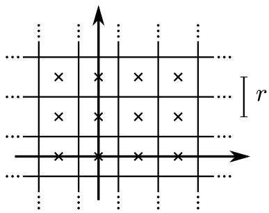
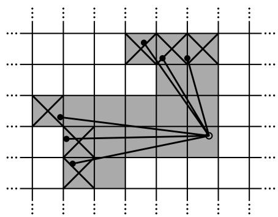
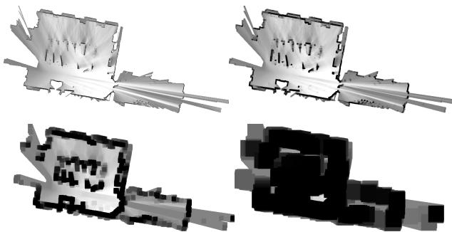
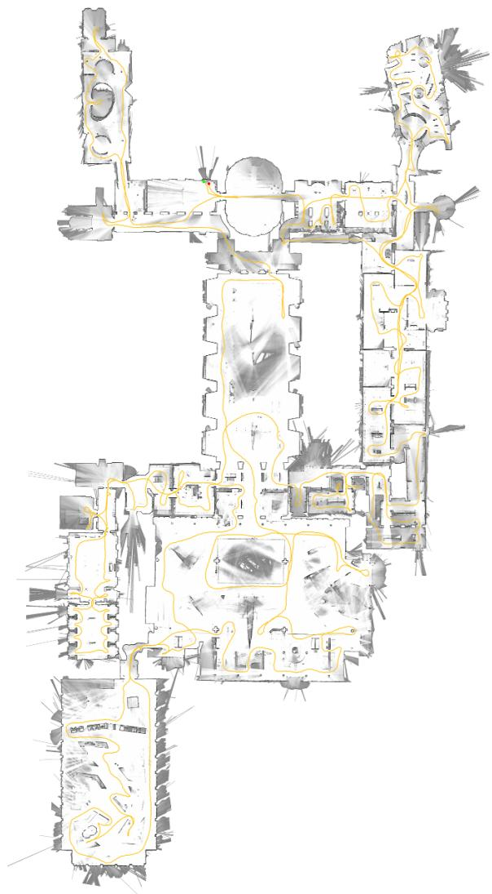
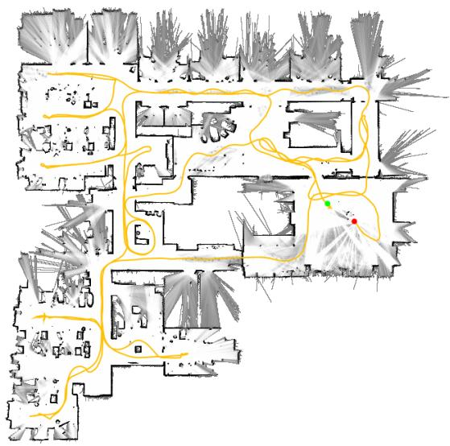

# Real-Time Loop Closure in 2D LIDAR SLAM

Wolfgang Hess<sup>1</sup>, Damon Kohler<sup>1</sup>, Holger Rapp<sup>1</sup>, Daniel Andor<sup>1</sup>

Abstract— Portable laser range-finders, further referred to as LIDAR, and simultaneous localization and mapping (SLAM) are an efficient method of acquiring as-built floor plans. Generating and visualizing floor plans in real-time helps the operator assess the quality and coverage of capture data. Building a portable capture platform necessitates operating under limited computational resources. We present the approach used in our backpack mapping platform which achieves real-time mapping and loop closure at a 5 cm resolution. To achieve realtime loop closure, we use a branch-and-bound approach for computing scan-to-submap matches as constraints. We provide experimental results and comparisons to other well known approaches which show that, in terms of quality, our approach is competitive with established techniques.

## I. INTRODUCTION

As-built floor plans are useful for a variety of applications. Manual surveys to collect this data for building management tasks typically combine computed-aided design (CAD) with laser tape measures. These methods are slow and, by employing human preconceptions of buildings as collections of straight lines, do not always accurately describe the true nature of the space. Using SLAM, it is possible to swiftly and accurately survey buildings of sizes and complexities that would take orders of magnitude longer to survey manually.

Applying SLAM in this field is not a new idea and is not the focus of this paper. Instead, the contribution of this paper is a novel method for reducing the computational requirements of computing loop closure constraints from laser range data. This technique has enabled us to map very large floors, tens-of-thousands of square meters, while providing the operator fully optimized results in real-time.

## II. RELATED WORK

Scan-to-scan matching is frequently used to compute relative pose changes in laser-based SLAM approaches, for example [1]–[4]. On its own, however, scan-to-scan matching quickly accumulates error.

Scan-to-map matching helps limit this accumulation of error. One such approach, which uses Gauss-Newton to find local optima on a linearly interpolated map, is [5]. In the presence of good initial estimates for the pose, provided in this case by using a sufficiently high data rate LIDAR, locally optimized scan-to-map matching is efficient and robust. On unstable platforms, the laser fan is projected onto the horizontal plane using an inertial measurement unit (IMU) to estimate the orientation of gravity.

Pixel-accurate scan matching approaches, such as [1], further reduce local error accumulation. Although computationally more expensive, this approach is also useful for loop closure detection. Some methods focus on improving on the computational cost by matching on extracted features from the laser scans [4]. Other approaches for loop closure detection include histogram-based matching [6], feature detection in scan data, and using machine learning [7].

Two common approaches for addressing the remaining local error accumulation are particle filter and graph-based SLAM [2], [8].

Particle filters must maintain a representation of the full system state in each particle. For grid-based SLAM, this quickly becomes resource intensive as maps become large; e.g. one of our test cases is 22,000 m<sup>2</sup> collected over a 3 km trajectory. Smaller dimensional feature representations, such as [9], which do not require a grid map for each particle, may be used to reduce resource requirements. When an up-todate grid map is required, [10] suggests computing submaps, which are updated only when necessary, such that the final map is the rasterization of all submaps.

Graph-based approaches work over a collection of nodes representing poses and features. Edges in the graph are constraints generated from observations. Various optimization methods may be used to minimize the error introduced by all constraints, e.g. [11], [12]. Such a system for outdoor SLAM that uses a graph-based approach, local scan-to-scan matching, and matching of overlapping local maps based on histograms of submap features is described in [13].

## III. SYSTEM OVERVIEW

Google’s Cartographer provides a real-time solution for indoor mapping in the form of a sensor equipped backpack that generates 2D grid maps with a r = 5 cm resolution. The operator of the system can see the map being created while walking through a building. Laser scans are inserted into a submap at the best estimated position, which is assumed to be sufficiently accurate for short periods of time. Scan matching happens against a recent submap, so it only depends on recent scans, and the error of pose estimates in the world frame accumulates.

To achieve good performance with modest hardware requirements, our SLAM approach does not employ a particle filter. To cope with the accumulation of error, we regularly run a pose optimization. When a submap is finished, that is no new scans will be inserted into it anymore, it takes part in scan matching for loop closure. All finished submaps and scans are automatically considered for loop closure. If they are close enough based on current pose estimates, a scan matcher tries to find the scan in the submap. If a sufficiently good match is found in a search window around the currently estimated pose, it is added as a loop closing constraint to the optimization problem. By completing the optimization every few seconds, the experience of an operator is that loops are closed immediately when a location is revisited. This leads to the soft real-time constraint that the loop closure scan matching has to happen quicker than new scans are added, otherwise it falls behind noticeably. We achieve this by using a branch-and-bound approach and several precomputed grids per finished submap.

## IV. LOCAL 2D SLAM

Our system combines separate local and global approaches to 2D SLAM. Both approaches optimize the pose, $\xi \ =$ $\left( \xi _ { x } , \xi _ { y } , \xi _ { \theta } \right)$ consisting of a $( x , y )$ translation and a rotation $\xi _ { \theta } ,$ , of LIDAR observations, which are further referred to as scans. On an unstable platform, such as our backpack, an IMU is used to estimate the orientation of gravity for projecting scans from the horizontally mounted LIDAR into the 2D world.

In our local approach, each consecutive scan is matched against a small chunk of the world, called a submap M, using a non-linear optimization that aligns the scan with the submap; this process is further referred to as scan matching. Scan matching accumulates error over time that is later removed by our global approach, which is described in Section V.

## A. Scans

Submap construction is the iterative process of repeatedly aligning scan and submap coordinate frames, further referred to as frames. With the origin of the scan at $\mathbf { 0 _ { \lambda } \in \mathbb { R } ^ { 2 } }$ , we now write the information about the scan points as $H =$ $\{ h _ { k } \} _ { k = 1 , \dots , K } , h _ { k } \in \mathbb { R } ^ { 2 }$ . The pose ξ of the scan frame in the submap frame is represented as the transformation $T _ { \xi }$ , which rigidly transforms scan points from the scan frame into the submap frame, defined as

$$
T _ { \xi } p = \underbrace { \left( \cos \xi _ { \theta } \quad - \sin \xi _ { \theta } \right) } _ { R _ { \xi } } p + \underbrace { \left( \xi _ { x } \right) } _ { t _ { \xi } } .\tag{1}
$$

## B. Submaps

A few consecutive scans are used to build a submap. These submaps take the form of probability grids $M : r \mathbb { Z } \times r \mathbb { Z } \to$ $[ p _ { \mathrm { m i n } } , p _ { \mathrm { m a x } } ]$ which map from discrete grid points at a given resolution r, for example 5 cm, to values. These values can be thought of as the probability that a grid point is obstructed. For each grid point, we define the corresponding pixel to consist of all points that are closest to that grid point.

  
Fig. 1. Grid points and associated pixels.

Whenever a scan is to be inserted into the probability grid, a set of grid points for hits and a disjoint set for misses are computed. For every hit, we insert the closest grid point into the hit set. For every miss, we insert the grid point associated with each pixel that intersects one of the rays between the scan origin and each scan point, excluding grid points which are already in the hit set. Every formerly unobserved grid point is assigned a probability $p _ { \mathrm { { h i t } } }$ or $p _ { \mathrm { m i s s } }$ if it is in one of these sets. If the grid point x has already been observed, we update the odds for hits and misses as

$$
{ \begin{array} { r l } & { \operatorname { o d d s } ( p ) = { \frac { p } { 1 - p } } , } \\ & { M _ { \mathrm { n e w } } ( x ) = \operatorname { c l a m p } ( \operatorname { o d d s } ^ { - 1 } ( \operatorname { o d d s } ( M _ { \mathrm { o l d } } ( x ) ) \cdot \operatorname { o d d s } ( p _ { \mathrm { h i t } } ) ) ) } \end{array} }\tag{2}
$$

(3)

and equivalently for misses.

  
Fig. 2. A scan and pixels associated with hits (shaded and crossed out) and misses (shaded only).

## C. Ceres scan matching

Prior to inserting a scan into a submap, the scan pose ξ is optimized relative to the current local submap using a Ceresbased [14] scan matcher. The scan matcher is responsible for finding a scan pose that maximizes the probabilities at the scan points in the submap. We cast this as a nonlinear least squares problem

$$
\underset { \xi } { \mathrm { a r g m i n } } \quad \sum _ { k = 1 } ^ { K } \big ( 1 - { \cal M } _ { \mathrm { s m o o t h } } ( T _ { \xi } h _ { k } ) \big ) ^ { 2 }\tag{CS}
$$

where $T _ { \xi }$ transforms $h _ { k }$ from the scan frame to the submap frame according to the scan pose. The function $M _ { \mathrm { s m o o t h } }$ $\mathbb { R } ^ { 2 } $ R is a smooth version of the probability values in the local submap. We use bicubic interpolation. As a result, values outside the interval [0, 1] can occur but are considered harmless.

Mathematical optimization of this smooth function usually gives better precision than the resolution of the grid. Since this is a local optimization, good initial estimates are required. An IMU capable of measuring angular velocities can be used to estimate the rotational component θ of the pose between scan matches. A higher frequency of scan matches or a pixel-accurate scan matching approach, although more computationally intensive, can be used in the absence of an IMU.

## V. CLOSING LOOPS

As scans are only matched against a submap containing a few recent scans, the approach described above slowly accumulates error. For only a few dozen consecutive scans, the accumulated error is small.

Larger spaces are handled by creating many small submaps. Our approach, optimizing the poses of all scans and submaps, follows Sparse Pose Adjustment [2]. The relative poses where scans are inserted are stored in memory for use in the loop closing optimization. In addition to these relative poses, all other pairs consisting of a scan and a submap are considered for loop closing once the submap no longer changes. A scan matcher is run in the background and if a good match is found, the corresponding relative pose is added to the optimization problem.

## A. Optimization problem

Loop closure optimization, like scan matching, is also formulated as a nonlinear least squares problem which allows easily adding residuals to take additional data into account. Once every few seconds, we use Ceres [14] to compute a solution to

$$
\underset { \Xi ^ { \mathrm { m } } , \Xi ^ { \mathrm { s } } } { \mathrm { a r g m i n } } \quad \frac 1 2 \sum _ { i j } \rho \big ( E ^ { 2 } ( \xi _ { i } ^ { \mathrm { m } } , \xi _ { j } ^ { \mathrm { s } } ; \Sigma _ { i j } , \xi _ { i j } ) \big )\tag{SPA}
$$

where the submap poses $\Xi ^ { \mathrm { m } } = \{ \xi _ { i } ^ { \mathrm { m } } \} _ { i = 1 , \dots , m }$ and the scan poses $\Xi ^ { \mathrm { s } } = \{ \xi _ { i } ^ { \mathrm { s } } \} _ { j = 1 , \dots , n }$ in the world are optimized given some constraints. These constraints take the form of relative poses $\xi _ { i j }$ and associated covariance matrices $\Sigma _ { i j }$ . For a pair of submap i and scan $j ,$ the pose $\xi _ { i j }$ describes where in the submap coordinate frame the scan was matched. The covariance matrices $\Sigma _ { i j }$ can be evaluated, for example, following the approach in [15], or locally using the covariance estimation feature of Ceres [14] with (CS). The residual E for such a constraint is computed by

$$
\begin{array} { r } { E ^ { 2 } ( \xi _ { i } ^ { \mathrm { m } } , \xi _ { j } ^ { \mathrm { s } } ; \Sigma _ { i j } , \xi _ { i j } ) = e ( \xi _ { i } ^ { \mathrm { m } } , \xi _ { j } ^ { \mathrm { s } } ; \xi _ { i j } ) ^ { T } \Sigma _ { i j } ^ { - 1 } e ( \xi _ { i } ^ { \mathrm { m } } , \xi _ { j } ^ { \mathrm { s } } ; \xi _ { i j } ) , } \end{array}\tag{4}
$$

$$
e ( \xi _ { i } ^ { \mathrm { m } } , \xi _ { j } ^ { \mathrm { s } } ; \xi _ { i j } ) = \xi _ { i j } - \left( { R } _ { \xi _ { i } ^ { \mathrm { m } } } ^ { - 1 } ( t _ { \xi _ { i } ^ { \mathrm { m } } } - t _ { \xi _ { j } ^ { \mathrm { s } } } ) \right) .\tag{5}
$$

A loss function $\rho ,$ for example Huber loss, is used to reduce the influence of outliers which can appear in (SPA) when scan matching adds incorrect constraints to the optimization problem. For example, this may happen in locally symmetric environments, such as office cubicles. Alternative approaches to outliers include [16].

## B. Branch-and-bound scan matching

We are interested in the optimal, pixel-accurate match

$$
\xi ^ { \star } = \underset { \xi \in \mathcal { W } } { \operatorname { a r g m a x } } \sum _ { k = 1 } ^ { K } M _ { \mathrm { n e a r e s t } } ( T _ { \xi } h _ { k } ) ,\tag{BBS}
$$

where W is the search window and $M _ { \mathrm { n e a r e s t } }$ is M extended to all of $\mathbb { R } ^ { 2 }$ by rounding its arguments to the nearest grid point first, that is extending the value of a grid points to the corresponding pixel. The quality of the match can be improved further using (CS).

Efficiency is improved by carefully choosing step sizes. We choose the angular step size $\delta _ { \theta }$ so that scan points at the maximum range $d _ { \mathrm { m a x } }$ do not move more than $r ,$ the width of one pixel. Using the law of cosines, we derive

$$
d _ { \operatorname* { m a x } } = \operatorname* { m a x } _ { k = 1 , . . . , K } { \| h _ { k } \| } ,\tag{6}
$$

$$
\delta _ { \theta } = \operatorname { a r c c o s } ( 1 - \frac { r ^ { 2 } } { 2 d _ { \operatorname * { m a x } } ^ { 2 } } ) .\tag{7}
$$

We compute an integral number of steps covering given linear and angular search window sizes, e.g., $W _ { x } = W _ { y } =$ 7 m and $W _ { \theta } = 3 0 ^ { \circ }$

$$
w _ { x } = \left\lceil \frac { W _ { x } } { r } \right\rceil , \quad w _ { y } = \left\lceil \frac { W _ { y } } { r } \right\rceil , \quad w _ { \theta } = \left\lceil \frac { W _ { \theta } } { \delta _ { \theta } } \right\rceil .\tag{8}
$$

This leads to a finite set W forming a search window around an estimate $\xi _ { 0 }$ placed in its center,

$$
\begin{array} { r } { \overline { { \mathcal { W } } } = \{ - w _ { x } , \ldots , w _ { x } \} \times \{ - w _ { y } , \ldots , w _ { y } \} \times \{ - w _ { \theta } , \ldots , w _ { \theta } \} , } \end{array}\tag{9}
$$

$$
\mathcal { W } = \{ \xi _ { 0 } + ( r j _ { x } , r j _ { y } , \delta _ { \theta } j _ { \theta } ) : ( j _ { x } , j _ { y } , j _ { \theta } ) \in \overline { { \mathcal { W } } } \} .\tag{10}
$$

A naive algorithm to find $\xi ^ { \star }$ can easily be formulated, see Algorithm 1, but for the search window sizes we have in mind it would be far too slow.

```latex
Algorithm 1 Naive algorithm for (BBS)
best score ← −∞
for $j _ { x } = - w _ { x }$ to $w _ { x }$ do
for $j _ { y } = - w _ { y }$ to $w _ { y }$ do
for $j _ { \theta } = - w _ { \theta }$ to w<sub>θ</sub> do
score $\begin{array} { r } {  \sum _ { k = 1 } ^ { K } M _ { \mathrm { { n e a r e s t } } } ( T _ { \xi _ { 0 } + ( r j _ { x } , r j _ { y } , \delta _ { \theta } j _ { \theta } ) } h _ { k } ) } \end{array}$
if score > best score then
match $ \xi _ { 0 } + ( r j _ { x } , r j _ { y } , \delta _ { \theta } j _ { \theta } )$
best score ← score
end if
end for
end for
end for
return best score and match when set.
```

Instead, we use a branch and bound approach to efficiently compute $\xi ^ { \star }$ over larger search windows. See Algorithm 2 for the generic approach. This approach was first suggested in the context of mixed integer linear programs [17]. Literature on the topic is extensive; see [18] for a short overview.

The main idea is to represent subsets of possibilities as nodes in a tree where the root node represents all possible solutions, W in our case. The children of each node form a partition of their parent, so that they together represent the same set of possibilities. The leaf nodes are singletons; each represents a single feasible solution. Note that the algorithm is exact. It provides the same solution as the naive approach, as long as the $s c o r e ( c )$ of inner nodes c is an upper bound on the score of its elements. In that case, whenever a node is bounded, a solution better than the best known solution so far does not exist in this subtree.

To arrive at a concrete algorithm, we have to decide on the method of node selection, branching, and computation of upper bounds.

1) Node selection: Our algorithm uses depth-first search (DFS) as the default choice in the absence of a better alternative: The efficiency of the algorithm depends on a large part of the tree being pruned. This depends on two things: a good upper bound, and a good current solution. The latter part is helped by DFS, which quickly evaluates many leaf nodes. Since we do not want to add poor matches as loop closing constraints, we also introduce a score threshold below which we are not interested in the optimal solution. Since in practice the threshold will not often be surpassed, this reduces the importance of the node selection or finding an initial heuristic solution. Regarding the order in which the children are visited during the DFS, we compute the upper bound on the score for each child, visiting the most promising child node with the largest bound first. This method is Algorithm 3.

2) Branching rule: Each node in the tree is described by a tuple of integers $c = ( c _ { x } , c _ { y } , c _ { \theta } , c _ { h } ) \in \mathbb { Z } ^ { 4 }$ . Nodes at height $c _ { h }$ combine up to $2 ^ { c _ { h } } \times 2 ^ { c _ { h } }$ possible translations but represent a specific rotation:

$$
\begin{array} { r l r } { \overline { { \mathscr { W } } } _ { c } = \bigg ( \bigg \{ ( j _ { x } , j _ { y } ) \in \mathbb { Z } ^ { 2 } : } & { } & \\ { c _ { x } \leq j _ { x } < c _ { x } + 2 ^ { c _ { h } } \bigg \} \times \{ c _ { \theta } \} \bigg ) , } & { } & \\ { c _ { y } \leq j _ { y } < c _ { y } + 2 ^ { c _ { h } } \bigg \} \times \{ c _ { \theta } \} \bigg ) , } \end{array}\tag{11}
$$

$$
\overline { { { \mathscr { W } } } } _ { c } = \overline { { \overline { { \mathscr { W } } } } } _ { c } \cap \overline { { \mathscr { W } } } .\tag{12}
$$

```latex
Algorithm 2 Generic branch and bound
best score ← −∞
${ \mathcal { C } } \gets { \mathcal { C } } _ { 0 }$
while ${ \mathcal { C } } \neq \emptyset$ do
Select a node $c \in { \mathcal { C } }$ and remove it from the set.
if c is a leaf node then
if score(c) > best score then
solution ← n
best score ← score(c)
end if
else
if score(c) > best score then
Branch: Split c into nodes $\mathcal { C } _ { c } .$
${ \mathcal { C } } \gets { \mathcal { C } } \cup { \mathcal { C } } _ { c }$
else
Bound.
end if
end if
end while
return best score and solution when set.
```

```latex
Algorithm 3 DFS branch and bound scan matcher for (BBS)
best score ← score threshold
Compute and memorize a score for each element in $\mathcal { C } _ { 0 } .$
Initialize a stack $\mathcal { C }$ with $\mathcal { C } _ { 0 }$ sorted by score, the maximum
score at the top.
while C is not empty do
Pop c from the stack $\mathcal { C } .$
if score(c) > best score then
if c is a leaf node then
match $ \xi _ { c }$
best score ← score(c)
else
Branch: Split c into nodes $\mathcal { C } _ { c } .$
Compute and memorize a score for each element
in $\mathcal { C } _ { c } .$
Push $\mathcal { C } _ { c }$ onto the stack ${ \mathcal { C } } ,$ sorted by score, the
maximum score last.
end if
end if
end while
return best score and match when set.
```

Leaf nodes have height $c _ { h } = 0 ,$ and correspond to feasible solutions $\mathcal { W } \ni \xi _ { c } = \xi _ { 0 } + \left( r c _ { x } , r c _ { y } , \delta _ { \theta } c _ { \theta } \right)$

In our formulation of Algorithm 3, the root node, encompassing all feasible solutions, does not explicitly appear and branches into a set of initial nodes $\mathcal { C } _ { 0 }$ at a fixed height $h _ { 0 }$ covering the search window

$$
\begin{array} { r l } & { \overline { { \mathscr { W } } } _ { 0 , x } = \{ - w _ { x } + 2 ^ { h _ { 0 } } j _ { x } : j _ { x } \in \mathbb { Z } , 0 \leq 2 ^ { h _ { 0 } } j _ { x } \leq 2 w _ { x } \} , } \\ & { \overline { { \mathscr { W } } } _ { 0 , y } = \{ - w _ { y } + 2 ^ { h _ { 0 } } j _ { y } : j _ { y } \in \mathbb { Z } , 0 \leq 2 ^ { h _ { 0 } } j _ { y } \leq 2 w _ { y } \} , } \\ & { \overline { { \mathscr { W } } } _ { 0 , \theta } = \{ j _ { \theta } \in \mathbb { Z } : - w _ { \theta } \leq j _ { \theta } \leq w _ { \theta } \} , } \\ & { \qquad \mathscr { C } _ { 0 } = \overline { { \mathscr { W } } } _ { 0 , x } \times \overline { { \mathscr { W } } } _ { 0 , y } \times \overline { { \mathscr { W } } } _ { 0 , \theta } \times \{ h _ { 0 } \} . } \end{array}\tag{13}
$$

At a given node c with $c _ { h } > 1$ , we branch into up to four children of height $c _ { h } - 1$

$$
\begin{array} { c } { { \mathcal { C } _ { c } = \Big ( \big ( \{ c _ { x } , c _ { x } + 2 ^ { c _ { h } - 1 } \} \times \{ c _ { y } , c _ { y } + 2 ^ { c _ { h } - 1 } \} } } \\ { { \times c _ { \theta } \big ) \cap \overline { { { \mathcal { W } } } } \Big ) \times \{ c _ { h } - 1 \} . } } \end{array}\tag{14}
$$

3) Computing upper bounds: The remaining part of the branch and bound approach is an efficient way to compute upper bounds at inner nodes, both in terms of computational effort and in the quality of the bound. We use

$$
\begin{array} { r } { s c o r e ( c ) = \displaystyle \sum _ { k = 1 } ^ { K } \operatorname* { m a x } _ { j \in \overline { { \mathscr { W } } } _ { c } } M _ { \mathrm { n e a r e s t } } ( T _ { \xi _ { j } } h _ { k } ) } \\ { \geq \displaystyle \sum _ { k = 1 } ^ { K } \operatorname* { m a x } _ { j \in \mathscr { W } _ { c } } M _ { \mathrm { n e a r e s t } } ( T _ { \xi _ { j } } h _ { k } ) } \\ { \geq \operatorname* { m a x } _ { j \in \overline { { \mathscr { W } } } _ { c } } \displaystyle \sum _ { k = 1 } ^ { K } M _ { \mathrm { n e a r e s t } } ( T _ { \xi _ { j } } h _ { k } ) . } \end{array}\tag{15}
$$

To be able to compute the maximum efficiently, we use precomputed grids $M _ { \mathrm { p r e c o m p } } ^ { c _ { h } } .$ . Precomputing one grid per possible height $c _ { h }$ allows us to compute the score with effort

linear in the number of scan points. Note that, to be able to do this, we also compute the maximum over $\overline { { \overline { { \mathcal { W } } } } } _ { c }$ which can be larger than $\overline { { \mathcal { W } } } _ { c }$ near the boundary of our search space.

$$
s c o r e ( c ) = \sum _ { k = 1 } ^ { K } M _ { \mathrm { p r e c o m p } } ^ { c _ { h } } ( T _ { \xi _ { c } } h _ { k } ) ,\tag{16}
$$

$$
M _ { \mathrm { p r e c o m p } } ^ { h } ( x , y ) = \operatorname* { m a x } _ { x ^ { \prime } \in [ x , x + r ( 2 ^ { h } - 1 ) ] } M _ { \mathrm { n e a r e s t } } ( x ^ { \prime } , y ^ { \prime } )\tag{17}
$$

with $\xi _ { c }$ as before for the leaf nodes. Note that $M _ { \mathrm { p r e c o m p } } ^ { h }$ has the same pixel structure as $M _ { \mathrm { n e a r e s t } } ,$ , but in each pixel storing the maximum of the values of the $2 ^ { h } \times 2 ^ { h }$ box of pixels beginning there. An example of such precomputed grids is given in Figure 3.

  
Fig. 3. Precomputed grids of size 1, 4, 16 and 64.

To keep the computational effort for constructing the precomputed grids low, we wait until a probability grid will receive no further updates. Then we compute a collection of precomputed grids, and start matching against it.

For each precomputed grid, we compute the maximum of a $2 ^ { h }$ pixel wide row starting at each pixel. Using this intermediate result, the next precomputed grid is then constructed.

The maximum of a changing collection of values can be kept up-to-date in amortized O(1) if values are removed in the order in which they have been added. Successive maxima are kept in a deque that can be defined recursively as containing the maximum of all values currently in the collection followed by the list of successive maxima of all values after the first occurrence of the maximum. For an empty collection of values, this list is empty. Using this approach, the precomputed grids can be computed in O(n) where n is the number of pixels in each precomputed grids.

An alternative way to compute upper bounds is to compute lower resolution probability grids, successively halving the resolution, see [1]. Since the additional memory consumption of our approach is acceptable, we prefer it over using lower resolution probability grids which lead to worse bounds than (15) and thus negatively impact performance.

## VI. EXPERIMENTAL RESULTS

In this section, we present some results of our SLAM algorithm computed from recorded sensor data using the same online algorithms that are used interactively on the backpack. First, we show results using data collected by the sensors of our Cartographer backpack in the Deutsches Museum in Munich. Second, we demonstrate that our algorithms work well with inexpensive hardware by using data collected from a robotic vacuum cleaner sensor. Lastly, we show results using the Radish data set [19] and compare ourselves to published results.

  
Fig. 4. Cartographer map of the 2nd floor of the Deutsches Museum.

## A. Real-World Experiment: Deutsches Museum

Using data collected at the Deutsches Museum spanning 1,913 s of sensor data or 2,253 m (according to the computed solution), we computed the map shown in Figure 4. On a workstation with an Intel Xeon E5-1650 at 3.2 GHz, our SLAM algorithm uses 1,018 s CPU time, using up to 2.2 GB of memory and up to 4 background threads for loop closure scan matching. It finishes after 360 s wall clock time, meaning it achieved 5.3 times real-time performance.

The generated graph for the loop closure optimization consists of 11,456 nodes and 35,300 edges. The optimization problem (SPA) is run every time a few nodes have been added to the graph. A typical solution takes about 3 iterations, and finishes in about 0.3 s.

  
Fig. 5. Cartographer map generated using Revo LDS sensor data.

TABLE I  
QUANTITATIVE ERRORS WITH REVO LDS
<table><tr><td>Laser Tape</td><td>Cartographer</td><td>Error (absolute)</td><td>Error (relative)</td></tr><tr><td>4.09</td><td>4.08</td><td>-0.01</td><td>-0.2%</td></tr><tr><td>5.40</td><td>5.43</td><td>+0.03</td><td> $+ 0 . 6 \%$ </td></tr><tr><td>8.67</td><td>8.74</td><td>+0.07</td><td> $+ 0 . 8 \%$ </td></tr><tr><td>15.09</td><td>15.20</td><td>+0.11</td><td> $+ 0 . 7 \%$ </td></tr><tr><td>15.12</td><td>15.23</td><td>+0.11</td><td> $+ 0 . 7 \%$ </td></tr></table>

## B. Real-World Experiment: Neato’s Revo LDS

Neato Robotics uses a laser distance sensor (LDS) called Revo LDS [20] in their vacuum cleaners which costs under \$ 30. We captured data by pushing around the vacuum cleaner on a trolley while taking scans at approximately 2 Hz over its debug connection. Figure 5 shows the resulting 5 cm resolution floor plan. To evaluate the quality of the floor plan, we compare laser tape measurements for 5 straight lines to the pixel distance in the resulting map as computed by a drawing tool. The results are presented in Table I, all values are in meters. The values are roughly in the expected order of magnitude of one pixel at each end of the line.

## C. Comparisons using the Radish data set

We compare our approach to others using the benchmark measure suggested in [21], which compares the error in relative pose changes to manually curated ground truth relations. Table II shows the results computed by our Cartographer SLAM algorithm. For comparison, we quote results for Graph Mapping (GM) from [21]. Additionally, we quote more recently published results from [9] in Table III. All errors are given in meters and degrees, either absolute or squared, together with their standard deviation.

Each public data set was collected with a unique sensor configuration that differs from our Cartographer backpack. Therefore, various algorithmic parameters needed to be adapted to produce reasonable results. In our experience, tuning Cartographer is only required to match the algorithm to the sensor configuration and not to the specific surroundings.

TABLE II  
QUANTITATIVE COMPARISON OF ERROR WITH [21]
<table><tr><td></td><td>Cartographer</td><td>GM</td></tr><tr><td>Aces</td><td></td><td></td></tr><tr><td>Absolute translational</td><td> $0 . 0 3 7 5 \pm 0 . 0 4 2 6$ </td><td> $0 . 0 4 4 \pm 0 . 0 4 4$ </td></tr><tr><td>Squared translational</td><td> $0 . 0 0 3 2 \pm 0 . 0 2 8 5$ </td><td> $0 . 0 0 4 \pm 0 . 0 0 9$ </td></tr><tr><td>Absolute rotational</td><td> $0 . 3 7 3 \pm 0 . 4 6 9$ </td><td> $0 . 4 \pm 0 . 4$ </td></tr><tr><td>Squared rotational</td><td> $0 . 3 5 9 \pm 3 . 6 9 6$ </td><td> $0 . 3 \pm 0 . 8$ </td></tr><tr><td>Intel</td><td></td><td></td></tr><tr><td>Absolute translational</td><td> $0 . 0 2 2 9 \pm 0 . 0 2 3 9$ </td><td> $0 . 0 3 1 \pm 0 . 0 2 6$ </td></tr><tr><td>Squared translational</td><td> $0 . 0 0 1 1 \pm 0 . 0 0 4 0$ </td><td> $0 . 0 0 2 \pm 0 . 0 0 4$ </td></tr><tr><td>Absolute rotational</td><td> $0 . 4 5 3 \pm 1 . 3 3 5$ </td><td> $1 . 3 \pm 4 . 7$ </td></tr><tr><td>Squared rotational</td><td> $1 . 9 8 6 \pm 2 3 . 9 8 8$ </td><td> $2 4 . 0 \pm 1 6 6 . 1$ </td></tr><tr><td>MIT Killian Court</td><td></td><td></td></tr><tr><td>Absolute translational</td><td> $0 . 0 3 9 5 \pm 0 . 0 4 8 8$ </td><td> $0 . 0 5 0 \pm 0 . 0 5 6$ </td></tr><tr><td>Squared translational</td><td> $0 . 0 0 3 9 \pm 0 . 0 1 4 4$ </td><td> $0 . 0 0 6 \pm 0 . 0 2 9$ </td></tr><tr><td>Absolute rotational</td><td> $0 . 3 5 2 \pm 0 . 3 5 3$ </td><td> $0 . 5 \pm 0 . 5$ </td></tr><tr><td>Squared rotational</td><td> $0 . 2 4 8 \pm 0 . 6 1 0$ </td><td> $0 . 9 \pm 0 . 9$ </td></tr><tr><td>MIT CSAIL</td><td></td><td></td></tr><tr><td>Absolute translational</td><td> $0 . 0 3 1 9 \pm 0 . 0 3 6 3$ </td><td> $0 . 0 0 4 \pm 0 . 0 0 9$ </td></tr><tr><td>Squared translational</td><td> $0 . 0 0 2 3 \pm 0 . 0 0 9 9$ </td><td> $0 . 0 0 0 1 \pm 0 . 0 0 0 5$ </td></tr><tr><td>Absolute rotational</td><td> $0 . 3 6 9 \pm 0 . 3 6 5$ </td><td> $0 . 0 5 \pm 0 . 0 8$ </td></tr><tr><td>Squared rotational</td><td> $0 . 2 7 0 \pm 0 . 6 3 7$ </td><td> $0 . 0 1 \pm 0 . 0 4$ </td></tr><tr><td>Freiburg bldg 79</td><td></td><td></td></tr><tr><td>Absolute translational</td><td> $0 . 0 4 5 2 \pm 0 . 0 3 5 4$ </td><td> $0 . 0 5 6 \pm 0 . 0 4 2$ </td></tr><tr><td>Squared translational</td><td> $0 . 0 0 3 3 \pm 0 . 0 0 5 5$ </td><td> $0 . 0 0 5 \pm 0 . 0 1 1$ </td></tr><tr><td>Absolute rotational</td><td> $0 . 5 3 8 \pm 0 . 7 1 8$ </td><td> $0 . 6 \pm 0 . 6$ </td></tr><tr><td>Squared rotational</td><td> $0 . 8 0 4 \pm 3 . 6 2 7$ </td><td> $0 . 7 \pm 1 . 7$ </td></tr><tr><td>Freiburg hospital (local)</td><td></td><td></td></tr><tr><td>Absolute translational</td><td> $0 . 1 0 7 8 \pm 0 . 1 9 4 3$ </td><td> $0 . 1 4 3 \pm 0 . 1 8 0$ </td></tr><tr><td>Squared translational</td><td> $0 . 0 4 9 4 \pm 0 . 2 8 3 1$ </td><td> $0 . 0 5 3 \pm 0 . 2 7 2$ </td></tr><tr><td>Absolute rotational</td><td> $0 . 7 4 7 \pm 2 . 0 4 7$ </td><td> $0 . 9 \pm 2 . 2$ </td></tr><tr><td>Squared rotational</td><td> $4 . 7 4 5 \pm 4 0 . 0 8 1$ </td><td> $5 . 5 \pm 4 6 . 2$ </td></tr><tr><td>Freiburg hospital (global)</td><td></td><td></td></tr><tr><td>Absolute translational</td><td> $5 . 2 2 4 2 \pm 6 . 6 2 3 0$ </td><td> $1 1 . 6 \pm 1 1 . 9$ </td></tr><tr><td>Squared translational</td><td> $7 1 . 0 2 8 8 \pm 2 6 7 . 7 7 1 5$ </td><td> $2 7 6 . 1 \pm 5 1 6 . 5$ </td></tr><tr><td>Absolute rotational</td><td> $3 . 3 4 1 \pm 4 . 7 9 7$ </td><td> $6 . 3 \pm 6 . 2$ </td></tr><tr><td>Squared rotational</td><td> $3 4 . 1 0 7 \pm 1 2 7 . 2 2 7$ </td><td> $7 7 . 2 \pm 1 5 4 . 8$ </td></tr></table>

Since each public data set has a unique sensor configuration, we cannot be sure that we did not also fit our parameters to the specific locations. The only exception being the Freiburg hospital data set where there are two separate relations files. We tuned our parameters using the local relations but also see good results on the global relations.

TABLE III  
QUANTITATIVE COMPARISON OF ERROR WITH [9]
<table><tr><td></td><td>Cartographer</td><td>Graph FLIRT</td></tr><tr><td>Intel</td><td></td><td></td></tr><tr><td>Absolute translational</td><td> $0 . 0 2 2 9 \pm 0 . 0 2 3 9$ </td><td> $0 . 0 2 \pm 0 . 0 2$ </td></tr><tr><td>Absolute rotational</td><td> $0 . 4 5 3 \pm 1 . 3 3 5$ </td><td> $0 . 3 \pm 0 . 3$ </td></tr><tr><td>Freiburg bldg 79</td><td></td><td></td></tr><tr><td>Absolute translational</td><td> $0 . 0 4 5 2 \pm 0 . 0 3 5 4$ </td><td> $0 . 0 6 \pm 0 . 0 9$ </td></tr><tr><td>Absolute rotational</td><td> $0 . 5 3 8 \pm 0 . 7 1 8$ </td><td> $0 . 8 \pm 1 . 1$ </td></tr><tr><td>Freiburg hospital (local)</td><td></td><td></td></tr><tr><td>Absolute translational</td><td> $0 . 1 0 7 8 \pm 0 . 1 9 4 3$ </td><td> $0 . 1 8 \pm 0 . 2 7$ </td></tr><tr><td>Absolute rotational</td><td> $0 . 7 4 7 \pm 2 . 0 4 7$ </td><td> $0 . 9 \pm 2 . 0$ </td></tr><tr><td>Freiburg hospital (global)</td><td></td><td></td></tr><tr><td>Absolute translational</td><td> $5 . 2 2 4 2 \pm 6 . 6 2 3 0$ </td><td> $8 . 3 \pm 8 . 6$ </td></tr><tr><td>Absolute rotational</td><td> $3 . 3 4 1 \pm 4 . 7 9 7$ </td><td> $5 . 0 \pm 5 . 3$ </td></tr></table>

TABLE IV  
LOOP CLOSURE PRECISION
<table><tr><td>Test case</td><td>No. of constraints</td><td>Precision</td></tr><tr><td>Aces</td><td>971</td><td>98.1 %</td></tr><tr><td>Intel</td><td>5786</td><td>97.2 %</td></tr><tr><td>MIT Killian Court</td><td>916</td><td>93.4%</td></tr><tr><td>MIT CSAIL</td><td>1857</td><td>94.1 %</td></tr><tr><td>Freiburg bldg 79</td><td>412</td><td>99.8%</td></tr><tr><td>Freiburg hospital</td><td>554</td><td>77.3%</td></tr></table>

TABLE V

PERFORMANCE
<table><tr><td>Test case</td><td>Data duration (s)</td><td>Wall clock (s)</td></tr><tr><td>Aces</td><td>1366</td><td>41</td></tr><tr><td>Intel</td><td>2691</td><td>179</td></tr><tr><td>MIT Killian Court</td><td>7678</td><td>190</td></tr><tr><td>MIT CSAIL</td><td>424</td><td>35</td></tr><tr><td>Freiburg bldg 79</td><td>1061</td><td>62</td></tr><tr><td>Freiburg hospital</td><td>4820</td><td>10</td></tr></table>

The most significant differences between all data sets is the frequency and quality of the laser scans as well as the availability and quality of odometry.

Despite the relatively outdated sensor hardware used in the public data sets, Cartographer SLAM consistently performs within our expectations, even in the case of MIT CSAIL, where we perform considerably worse than Graph Mapping. For the Intel data set, we outperform Graph Mapping, but not Graph FLIRT. For MIT Killian Court we outperform Graph Mapping in all metrics. In all other cases, Cartographer outperforms both Graph Mapping and Graph FLIRT in most but not all metrics.

Since we add loop closure constraints between submaps and scans, the data sets contain no ground truth for them. It is also difficult to compare numbers with other approaches based on scan-to-scan. Table IV shows the number of loop closure constraints added for each test case (true and false positives), as well as the precision, that is the fraction of true positives. We determine the set of true positive constraints to be the subset of all loop closure constraints which are not violated by more than 20 cm or 1<sup>◦</sup> when we compute (SPA). We see that while our scan-to-submap matching procedure produces false positives which have to be handled in the optimization (SPA), it manages to provide a sufficient number of loop closure constraints in all test cases. Our use of the Huber loss in (SPA) is one of the factors that renders loop closure robust to outliers. In the Freiburg hospital case, the choice of a low resolution and a low minimum score for the loop closure detection produces a comparatively high rate of false positives. The precision can be improved by raising the minimum score for loop closure detection, but this decreases the solution quality in some dimensions according to ground truth. The authors believe that the ground truth remains the better benchmark of final map quality.

The parameters of Cartographer’s SLAM were not tuned for CPU performance. We still provide the wall clock times in Table V which were again measured on a workstation with an Intel Xeon E5-1650 at 3.2 GHz. We provide the duration of the sensor data for comparison.

## VII. CONCLUSIONS

In this paper, we presented and experimentally validated a 2D SLAM system that combines scan-to-submap matching with loop closure detection and graph optimization. Individual submap trajectories are created using our local, grid-based SLAM approach. In the background, all scans are matched to nearby submaps using pixel-accurate scan matching to create loop closure constraints. The constraint graph of submap and scan poses is periodically optimized in the background. The operator is presented with an upto-date preview of the final map as a GPU-accelerated combination of finished submaps and the current submap. We demonstrated that it is possible to run our algorithms on modest hardware in real-time.

## ACKNOWLEDGMENTS

This research has been validated through experiments in the Deutsches Museum, Munich. The authors thank its administration for supporting our work.

Comparisons were done using manually verified relations and results from [21] which uses data from the Robotics Data Set Repository (Radish) [19]. Thanks go to Patrick Beeson, Dieter Fox, Dirk Hahnel, Mike Bosse, John Leonard,¨ Cyrill Stachniss for providing this data. The data for the Freiburg University Hospital was provided by Bastian Steder, Rainer Kummerle, Christian Dornhege, Michael Ruhnke,¨ Cyrill Stachniss, Giorgio Grisetti, and Alexander Kleiner.

## REFERENCES

[1] E. Olson, “M3RSM: Many-to-many multi-resolution scan matching,” in Proceedings of the IEEE International Conference on Robotics and Automation (ICRA), June 2015.

[2] K. Konolige, G. Grisetti, R. Kummerle, W. Burgard, B. Limketkai,¨ and R. Vincent, “Sparse pose adjustment for 2D mapping,” in IROS, Taipei, Taiwan, 10/2010 2010.

[3] F. Lu and E. Milios, “Globally consistent range scan alignment for environment mapping,” Autonomous robots, vol. 4, no. 4, pp. 333– 349, 1997.

[4] F. Mart´ın, R. Triebel, L. Moreno, and R. Siegwart, “Two different tools for three-dimensional mapping: DE-based scan matching and feature-based loop detection,” Robotica, vol. 32, no. 01, pp. 19–41, 2014.

[5] S. Kohlbrecher, J. Meyer, O. von Stryk, and U. Klingauf, “A flexible and scalable SLAM system with full 3D motion estimation,” in Proc. IEEE International Symposium on Safety, Security and Rescue Robotics (SSRR). IEEE, November 2011.

[6] M. Himstedt, J. Frost, S. Hellbach, H.-J. Bohme, and E. Maehle,¨ “Large scale place recognition in 2D LIDAR scans using geometrical landmark relations,” in Intelligent Robots and Systems (IROS 2014), 2014 IEEE/RSJ International Conference on. IEEE, 2014, pp. 5030– 5035.

[7] K. Granstrom, T. B. Sch¨ on, J. I. Nieto, and F. T. Ramos, “Learning to¨ close loops from range data,” The International Journal of Robotics Research, vol. 30, no. 14, pp. 1728–1754, 2011.

[8] G. Grisetti, C. Stachniss, and W. Burgard, “Improving grid-based SLAM with Rao-Blackwellized particle filters by adaptive proposals and selective resampling,” in Robotics and Automation, 2005. ICRA 2005. Proceedings of the 2005 IEEE International Conference on. IEEE, 2005, pp. 2432–2437.

[9] G. D. Tipaldi, M. Braun, and K. O. Arras, “FLIRT: Interest regions for 2D range data with applications to robot navigation,” in Experimental Robotics. Springer, 2014, pp. 695–710.

[10] J. Strom and E. Olson, “Occupancy grid rasterization in large environments for teams of robots,” in Intelligent Robots and Systems (IROS), 2011 IEEE/RSJ International Conference on. IEEE, 2011, pp. 4271– 4276.

[11] R. Kummerle, G. Grisetti, H. Strasdat, K. Konolige, and W. Burgard,¨ “g2o: A general framework for graph optimization,” in Robotics and Automation (ICRA), 2011 IEEE International Conference on. IEEE, 2011, pp. 3607–3613.

[12] L. Carlone, R. Aragues, J. A. Castellanos, and B. Bona, “A fast and accurate approximation for planar pose graph optimization,” The International Journal of Robotics Research, pp. 965–987, 2014.

[13] M. Bosse and R. Zlot, “Map matching and data association for largescale two-dimensional laser scan-based SLAM,” The International Journal of Robotics Research, vol. 27, no. 6, pp. 667–691, 2008.

[14] S. Agarwal, K. Mierle, and Others, “Ceres solver,” http://ceres-solver. org.

[15] E. B. Olson, “Real-time correlative scan matching,” in Robotics and Automation, 2009. ICRA’09. IEEE International Conference on. IEEE, 2009, pp. 4387–4393.

[16] P. Agarwal, G. D. Tipaldi, L. Spinello, C. Stachniss, and W. Burgard, “Robust map optimization using dynamic covariance scaling,” in Robotics and Automation (ICRA), 2013 IEEE International Conference on. IEEE, 2013, pp. 62–69.

[17] A. H. Land and A. G. Doig, “An automatic method of solving discrete programming problems,” Econometrica, vol. 28, no. 3, pp. 497–520, 1960.

[18] J. Clausen, “Branch and bound algorithms-principles and examples,” Department of Computer Science, University of Copenhagen, pp. 1– 30, 1999.

[19] A. Howard and N. Roy, “The robotics data set repository (Radish),” 2003. [Online]. Available: http://radish.sourceforge.net/

[20] K. Konolige, J. Augenbraun, N. Donaldson, C. Fiebig, and P. Shah, “A low-cost laser distance sensor,” in Robotics and Automation, 2008. ICRA 2008. IEEE International Conference on. IEEE, 2008, pp. 3002–3008.

[21] R. Kummerle, B. Steder, C. Dornhege, M. Ruhnke, G. Grisetti,¨ C. Stachniss, and A. Kleiner, “On measuring the accuracy of SLAM algorithms,” Autonomous Robots, vol. 27, no. 4, pp. 387–407, 2009.