# Structure-from-Motion Revisited

Johannes L. Schonberger¨ 1,2∗, Jan-Michael Frahm1 1University of North Carolina at Chapel Hill 2Eidgenossische Technische Hochschule Z ¨ urich ¨

jsch@inf.ethz.ch, jmf@cs.unc.edu

## Abstract

Incremental Structure-from-Motion is a prevalent strategy for 3D reconstruction from unordered image collections. While incremental reconstruction systems have tremendously advanced in all regards, robustness, accuracy, completeness, and scalability remain the key problems towards building a truly general-purpose pipeline. We propose a new SfM technique that improves upon the state of the art to make a further step towards this ultimate goal. The full reconstruction pipeline is released to the public as an open-source implementation.

## 1. Introduction

Structure-from-Motion (SfM) from unordered images has seen tremendous evolution over the years. The early self-calibrating metric reconstruction systems [42, 6, 19, 16, 46] served as the foundation for the first systems on unordered Internet photo collections [47, 53] and urban scenes [45]. Inspired by these works, increasingly largescale reconstruction systems have been developed for hundreds of thousands [1] and millions [20, 62, 51, 50] to recently a hundred million Internet photos [30]. A variety of SfM strategies have been proposed including incremental [53, 1, 20, 62], hierarchical [23], and global approaches [14, 61, 56]. Arguably, incremental SfM is the most popular strategy for reconstruction of unordered photo collections. Despite its widespread use, we still have not accomplished to design a truly general-purpose SfM system. While the existing systems have advanced the state of the art tremendously, robustness, accuracy, completeness, and scalability remain the key problems in incremental SfM that prevent its use as a general-purpose method. In this paper, we propose a new SfM algorithm to approach this ultimate goal. The new method is evaluated on a variety of challenging datasets and the code is contributed to the research community as an open-source implementation named COLMAP available at https://github.com/colmap/colmap.

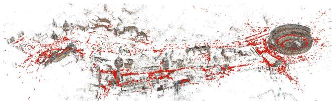  
Figure 1. Result of Rome with 21K registered out of 75K images.

## 2. Review of Structure-from-Motion

SfM is the process of reconstructing 3D structure from its projections into a series of images taken from different viewpoints. Incremental SfM (denoted as SfM in this paper) is a sequential processing pipeline with an iterative reconstruction component (Fig. 2). It commonly starts with feature extraction and matching, followed by geometric verification. The resulting scene graph serves as the foundation for the reconstruction stage, which seeds the model with a carefully selected two-view reconstruction, before incrementally registering new images, triangulating scene points, filtering outliers, and refining the reconstruction using bundle adjustment (BA). The following sections elaborate on this process, define the notation used throughout the paper, and introduce related work.

## 2.1. Correspondence Search

The first stage is correspondence search which finds scene overlap in the input images $\mathcal { T } = \{ I _ { i } ~ | ~ i = 1 . . . N _ { I } \}$ and identifies projections of the same points in overlapping images. The output is a set of geometrically verified image pairs C¯ and a graph of image projections for each point.

Feature Extraction. For each image I , SfM detects sets $\mathcal { F } _ { i } = \{ ( \mathbf { x } _ { j } , \mathbf { f } _ { j } ) | j = 1 . . . N _ { F _ { i } } \}$ of local features at location $\mathbf { x } _ { j } \in \mathbb { R } ^ { 2 }$ represented by an appearance descriptor fj. The features should be invariant under radiometric and geometric changes so that SfM can uniquely recognize them in multiple images [41]. SIFT [39], its derivatives [59], and more recently learned features [9] are the gold standard in terms of robustness. Alternatively, binary features provide better efficiency at the cost of reduced robustness [29].

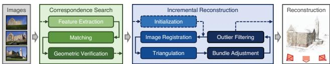  
Figure 2. Incremental Structure-from-Motion pipeline.

Matching. Next, SfM discovers images that see the same scene part by leveraging the features ${ \mathcal { F } } _ { i }$ as an appearance description of the images. The na¨ıve approach tests every image pair for scene overlap; it searches for feature correspondences by finding the most similar feature in image $I _ { a }$ for every feature in image $I _ { b } ,$ using a similarity metric comparing the appearance $\mathbf { f } _ { j }$ of the features. This approach has computational complexity $O ( N _ { I } ^ { 2 } N _ { F _ { i } } ^ { 2 } )$ and is prohibitive for large image collections. A variety of approaches tackle the problem of scalable and efficient matching [1, 20, 37, 62, 28, 49, 30]. The output is a set of potentially overlapping image pairs $\mathcal { C } = \{ \{ I _ { a } , I _ { b } \} | I _ { a } , I _ { b } \in$ ${ \mathcal { T } } , \ a \ < \ b \}$ and their associated feature correspondences $\mathcal { M } _ { a b } \in \mathcal { F } _ { a } \times \mathcal { F } _ { b }$

Geometric Verification. The third stage verifies the potentially overlapping image pairs C. Since matching is based solely on appearance, it is not guaranteed that corresponding features actually map to the same scene point. Therefore, SfM verifies the matches by trying to estimate a transformation that maps feature points between images using projective geometry. Depending on the spatial configuration of an image pair, different mappings describe their geometric relation. A homography H describes the transformation of a purely rotating or a moving camera capturing a planar scene [26]. Epipolar geometry [26] describes the relation for a moving camera through the essential matrix E (calibrated) or the fundamental matrix F (uncalibrated), and can be extended to three views using the trifocal tensor [26]. If a valid transformation maps a sufficient number of features between the images, they are considered geometrically verified. Since the correspondences from matching are often outlier-contaminated, robust estimation techniques, such as RANSAC [18], are required. The output of this stage is a set of geometrically verified image pairs ${ \bar { \mathcal { C } } } ,$ their associated inlier correspondences $\bar { \mathcal { M } } _ { a b } ,$ and optionally a description of their geometric relation $G _ { a b }$ . To decide on the appropriate relation, decision criterions like GRIC [57] or methods like QDEGSAC [21] can be used. The output of this stage is a so-called scene graph [54, 37, 48, 30] with images as nodes and verified pairs of images as edges.

## 2.2. Incremental Reconstruction

The input to the reconstruction stage is the scene graph. The outputs are pose estimates $\mathscr { P } = \{ \mathbf { P } _ { c } \in \mathbf { S } \mathbf { E } ( 3 ) \mid c =$ $1 . . . N _ { P } \}$ for registered images and the reconstructed scene structure as a set of points $\bar { \mathcal { X } } = \left\{ \mathbf { X } _ { k } \in \mathbb { R } ^ { 3 } \mid k = 1 . . . N _ { X } \right\}$ Initialization. SfM initializes the model with a carefully selected two-view reconstruction [7, 52]. Choosing a suitable initial pair is critical, since the reconstruction may never recover from a bad initialization. Moreover, the robustness, accuracy, and performance of the reconstruction depends on the seed location of the incremental process. Initializing from a dense location in the image graph with many overlapping cameras typically results in a more robust and accurate reconstruction due to increased redundancy. In contrast, initializing from a sparser location results in lower runtimes, since BAs deal with overall sparser problems accumulated over the reconstruction process.

Image Registration. Starting from a metric reconstruction, new images can be registered to the current model by solving the Perspective-n-Point (PnP) problem [18] using feature correspondences to triangulated points in already registered images (2D-3D correspondences). The PnP problem involves estimating the pose $\mathbf { P } _ { c }$ and, for uncalibrated cameras, its intrinsic parameters. The set $\mathcal { P }$ is thus extended by the pose $\mathbf { P } _ { c }$ of the newly registered image. Since the 2D-3D correspondences are often outlier-contaminated, the pose for calibrated cameras is usually estimated using RANSAC and a minimal pose solver, $e . g .$ [22, 34]. For uncalibrated cameras, various minimal solvers, $e . g .$ [10], or sampling-based approaches, $e . g .$ [31], exist. We propose a novel robust next best image selection method for accurate pose estimation and reliable triangulation in Sec. 4.2.

Triangulation. A newly registered image must observe existing scene points. In addition, it may also increase scene coverage by extending the set of points X through triangulation. A new scene point ${ \bf X } _ { k }$ can be triangulated and added to X as soon as at least one more image, also covering the new scene part but from a different viewpoint, is registered. Triangulation is a crucial step in SfM, as it increases the stability of the existing model through redundancy [58] and it enables registration of new images by providing additional 2D-3D correspondences. A large number of methods for multi-view triangulation exist [27, 5, 25, 35, 40, 3, 44, 32]. These methods suffer from limited robustness or high computational cost for use in SfM, which we address by proposing a robust and efficient triangulation method in Sec. 4.3.

Bundle Adjustment. Image registration and triangulation are separate procedures, even though their products are highly correlated – uncertainties in the camera pose propagate to triangulated points and vice versa, and additional triangulations may improve the initial camera pose through increased redundancy. Without further refinement, SfM usually drifts quickly to a non-recoverable state. BA [58] is the joint non-linear refinement of camera parameters $\mathbf { P } _ { c }$ and point parameters $\mathbf { X } _ { k }$ that minimizes the reprojection error

$$
E = \sum _ { j } \rho _ { j } \left( \left\| \pi \left( \mathbf { P } _ { c } , \mathbf { X } _ { k } \right) - \mathbf { x } _ { j } \right\| _ { 2 } ^ { 2 } \right)\tag{1}
$$

using a function π that projects scene points to image space and a loss function $\rho _ { j }$ to potentially down-weight outliers. Levenberg-Marquardt [58, 26] is the method of choice for solving BA problems. The special structure of parameters in BA problems motivates the Schur complement trick [8], in which one first solves the reduced camera system and then updates the points via back-substitution. This scheme is commonly more efficient, since the number of cameras is usually smaller than the number of points. There are two choices for solving the system: exact and inexact step algorithms. Exact methods solve the system by storing and factoring it as a dense or sparse matrix [13, 38] with a space complexity of $O ( N _ { P } ^ { 2 } )$ and a time complexity of $O ( N _ { P } ^ { 3 } )$ . Inexact methods approximately solve the system, usually by using an iterative solver, $e . g .$ preconditioned conjugate gradients (PCG), which has $O ( N _ { P } )$ time and space complexity [4, 63]. Direct algorithms are the method of choice for up to a few hundred cameras but they are too expensive in large-scale settings. While sparse direct methods reduce the complexity by a large factor for sparse problems, they are prohibitive for large unstructured photo collections due to typically much denser connectivity graphs [54, 4]. In this case, indirect algorithms are the method of choice. Especially for Internet photos, BA spends significant time on optimizing many near-duplicate images. In Sec. 4.5, we propose a method to identify and parameterize highly overlapping images for efficient BA of dense collections.

## 3. Challenges

While the current state-of-the-art SfM algorithms can handle the diverse and complex distribution of images in large-scale Internet photo collections, they frequently fail to produce fully satisfactory results in terms of completeness and robustness. Oftentimes, the systems fail to register a large fraction of images that empirically should be registrable [20, 30], or the systems produce broken models due to mis-registrations or drift. First, this may be caused by correspondence search producing an incomplete scene graph, $e . g .$ . due to matching approximations, and therefore providing neither the necessary connectivity for complete models nor sufficient redundancy for reliable estimation. Second, this may be caused by the reconstruction stage failing to register images due to missing or inaccurate scene structure – image registration and triangulation have a symbiotic relationship in that images can only be registered to existing scene structure and scene structure can only be triangulated from registered images [64]. Maximizing the accuracy and completeness of both at each step during the incremental reconstruction is a key challenge in SfM. In this paper, we address this challenge and significantly improve results over the current state of the art (Sec. 5) in terms of completeness, robustness, and accuracy while boosting efficiency.

## 4. Contributions

This section presents a new algorithm that improves on the main challenges in SfM. First, we introduce a geometric verification strategy that augments the scene graph with information subsequently improving the robustness of the initialization and triangulation components. Second, a next best view selection maximizing the robustness and accuracy of the incremental reconstruction process. Third, a robust triangulation method that produces significantly more complete scene structure than the state of the art at reduced computational cost. Fourth, an iterative BA, retriangulation, and outlier filtering strategy that significantly improves completeness and accuracy by mitigating drift effects. Finally, a more efficient BA parameterization for dense photo collections through redundant view mining. This results in a system that clearly outperforms the current state of the art in terms of robustness and completeness while preserving its efficiency. We contrast our contributions to the current state-of-the-art systems Bundler (opensource) [52] and VisualSFM (closed-source) [62]. The proposed system is released as an open-source implementation.

## 4.1. Scene Graph Augmentation

We propose a multi-model geometric verification strategy to augment the scene graph with the appropriate geometric relation. First, we estimate a fundamental matrix. If at least $N _ { F }$ inliers are found, we consider the image pair as geometrically verified. Next, we classify the transformation by determining the number of homography inliers $N _ { H }$ for the same image pair. To approximate model selection methods like GRIC, we assume a moving camera in a general scene if $N _ { H } / N _ { F } < \epsilon _ { H F }$ . For calibrated images, we also estimate an essential matrix and its number of inliers $N _ { E }$ . If $N _ { E } / N _ { F } > \epsilon _ { E F }$ , we assume correct calibration. In case of correct calibration and $N _ { H } / N _ { F } < \epsilon _ { H F } .$ we decompose the essential matrix, triangulate points from inlier correspondences, and determine the median triangulation angle $\alpha _ { m }$ . Using $\alpha _ { m }$ , we distinguish between the case of pure rotation (panoramic) and planar scenes (planar). Furthermore, a frequent problem in Internet photos are watermarks, timestamps, and frames (WTFs) [60, 30] that incorrectly link images of different landmarks. We detect such image pairs by estimating a similarity transformation with $N _ { S }$ inliers at the image borders. Any image pair with $N _ { S } / N _ { F } > \epsilon _ { S F } \lor N _ { S } / N _ { E } > \epsilon _ { S E }$ is considered a WTF and not inserted to the scene graph. For valid pairs, we label the scene graph with the model type (general, panoramic, planar) alongside the inliers of the model with maximum support $N _ { H } , N _ { E }$ , or $N _ { F }$ . The model type is leveraged to seed the reconstruction only from non-panoramic and preferably calibrated image pairs. An already augmented scene graph enables to efficiently find an optimal initialization for a robust reconstruction process. In addition, we do not triangulate from panoramic image pairs to avoid degenerate points and thereby improve robustness of triangulation and subsequent image registrations.

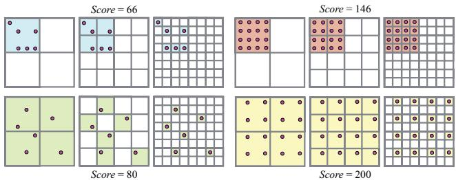  
Figure 3. Scores for different number of points (left and right) with different distributions (top and bottom) in the image for L = 3.

## 4.2. Next Best View Selection

Next best view planning has been studied in the fields of computer vision, photogrammetry, and robotics [12]. Choosing the next best view in robust SfM aims to minimize the reconstruction error [17, 24]. Here, we propose an efficient next best view strategy following an uncertaintydriven approach that maximizes reconstruction robustness.

Choosing the next best view is critical, as every decision impacts the remaining reconstruction. A single bad decision may lead to a cascade of camera mis-registrations and faulty triangulations. In addition, choosing the next best view greatly impacts both the quality of pose estimates and the completeness and accuracy of triangulation. An accurate pose estimate is essential for robust SfM, as point triangulations may fail if the pose is inaccurate. The decision about choosing the next best view is challenging, since for Internet photo collections there is usually no a priori information about scene coverage and camera parameters, and therefore the decision is based entirely on information derived from appearance [17], two-view correspondences, and the incrementally reconstructed scene [53, 24].

A popular strategy is to choose the image that sees most triangulated points [52] with the aim of minimizing the uncertainty in camera resection. Haner et al. [24] propose an uncertainty-driven approach that minimizes the reconstruction error. Usually, the camera that sees the largest number of triangulated points is chosen, except when the configuration of observations is not well-conditioned. To this end, Lepetit et al. [34] experimentally show that the accuracy of the camera pose using PnP depends on the number of observations and their distribution in the image. For Internet photos, the standard PnP problem is extended to the estimation of intrinsic parameters in the case of missing or inaccurate prior calibration. A large number of 2D-3D correspondences provides this estimation with redundancy [34], while a uniform distribution of points avoids bad configurations and enables reliable estimation of intrinsics [41].

The candidates for the next best view are not the yet registered images that see at least $N _ { t } \ > \ 0$ triangulated points. Keeping track of this statistic can be efficiently implemented using a graph of feature tracks. For Internet datasets, this graph can be very dense, since many images may see the same structure. Hence, there are many candidate views to choose from at each step in the reconstruction. Exhaustive covariance propagation as proposed by Haner et $a l .$ is not feasible, as the covariance would need to be computed and analyzed for each candidate at each step. Our proposed method approximates their uncertainty-driven approach using an efficient multi-resolution analysis.

We must simultaneously keep track of the number of visible points and their distribution in each candidate image. More visible points and a more uniform distribution of these points should result in a higher score S [31], such that images with a better-conditioned configuration of visible points are registered first. To achieve this goal, we discretize the image into a fixed-size grid with $K _ { l }$ bins in both dimensions. Each cell takes two different states: empty and full. Whenever a point within an empty cell becomes visible during the reconstruction, the cell’s state changes to full and the score $S _ { i }$ of the image is increased by a weight $w _ { l }$ With this scheme, we quantify the number of visible points. Since cells only contribute to the overall score once, we favor a more uniform distribution over the case when the points are clustered in one part of the image (i.e. only a few cells contain all visible points). However, if the number of visible points is $N _ { t } \ll K _ { l } ^ { 2 }$ , this scheme may not capture the distribution of points well as every point is likely to fall into a separate cell. Consequently, we extend the previously described approach to a multi-resolution pyramid with $l = 1 . . . L$ levels by partitioning the image using higher resolutions $K _ { l } \ = \ 2 ^ { l }$ at each successive level. The score is accumulated over all levels with a resolution-dependent weight $w _ { l } = K _ { l } ^ { 2 }$ This data structure and its score can be efficiently updated online. Fig. 3 shows scores for different configurations, and Sec. 5 demonstrates improved reconstruction robustness and accuracy using this strategy.

## 4.3. Robust and Efficient Triangulation

Especially for sparsely matched image collections, exploiting transitive correspondences boosts triangulation completeness and accuracy, and hence improves subsequent image registrations. Approximate matching techniques usually favor image pairs similar in appearance, and as a result two-view correspondences often stem from image pairs with a small baseline. Leveraging transitivity establishes correspondences between images with larger baselines and thus enables more accurate triangulation. Hence, we form feature tracks by concatenating two-view correspondences.

A variety of approaches have been proposed for multiview triangulation from noisy image observations [27, 40, 5]. While some of the proposed methods are robust to a certain degree of outlier contamination [25, 35, 3, 44, 32], to the best of our knowledge none of the approaches can handle the high outlier ratio often present in feature tracks (Fig. 6). We refer to Kang et al. [32] for a detailed overview of existing multi-view triangulation methods. In this section, we propose an efficient, sampling-based triangulation method that can robustly estimate all points within an outlier-contaminated feature track.

Feature tracks often contain a large number of outliers due to erroneous two-view verification of ambiguous matches along the epipolar line. A single mismatch merges the tracks of two or more independent points. For example, falsely merging four feature tracks with equal length results in an outlier ratio of 75%. In addition, inaccurate camera poses may invalidate track elements due to high reprojection errors. Hence, for robust triangulation, it is necessary to find a consensus set of track elements before performing a refinement using multiple views. Moreover, to recover the potentially multiple points of a feature track from a faulty merge, a recursive triangulation scheme is necessary.

Bundler samples all pairwise combinations of track elements, performs two-view triangulation, and then checks if at least one solution has a sufficient triangulation angle. If a well-conditioned solution is found, multi-view triangulation is performed on the whole track, and it is accepted if all observations pass the cheirality constraint [26]. This method is not robust to outliers, as it is not possible to recover independent points merged into one track. Also, it has significant computational cost due to exhaustive pairwise triangulation. Our method overcomes both limitations.

To handle arbitrary levels of outlier contamination, we formulate the problem of multi-view triangulation using RANSAC. We consider the feature track $\mathcal { T } = \{ T _ { n } ~ | ~ n =$ $1 . . . N _ { T } \}$ as a set of measurements with an a priori unknown ratio  of inliers. A measurement $T _ { n }$ consists of the normalized image observation $\bar { \mathbf { x } } _ { n } ~ \in ~ \mathbb { R } ^ { 2 }$ and the corresponding camera pose ${ \bf P } _ { n } \in { \bf S } { \bf E } ( 3 )$ defining the projection from world to camera frame $\mathbf { \bar { P } } = \mathbf { \bar { \Pi } } \mathbf { R } ^ { T ^ { - } } \mathbf { \Pi } - \mathbf { \bar { R } } ^ { T } \mathbf { t } ]$ with $\mathbf { R } \in \mathbf { S O } ( 3 )$ and $\textbf { t } \in \mathbb { R } ^ { 3 }$ . Our objective is to maximize the support of measurements conforming with a wellconditioned two-view triangulation

$$
{ \bf X } _ { a b } \sim \tau \left( \bar { \bf x } _ { a } , \bar { \bf x } _ { b } , { \bf P } _ { a } , { \bf P } _ { b } \right) \mathrm { ~ w i t h ~ } a \ne b ,\tag{2}
$$

where $\tau$ is any chosen triangulation method (in our case the DLT method [26]) and ${ \bf X } _ { a b }$ is the triangulated point. Note, that we do not triangulate from panoramic image pairs (Sec. 4.1) to avoid erroneous triangulation angles due to inaccurate pose estimates. A well-conditioned model satisfies two constraints. First, a sufficient triangulation angle α

$$
\cos \alpha = \frac { \mathbf { t } _ { a } - \mathbf { X } _ { a b } } { \left. \mathbf { t } _ { a } - \mathbf { X } _ { a b } \right. _ { 2 } } \cdot \frac { \mathbf { t } _ { b } - \mathbf { X } _ { a b } } { \left. \mathbf { t } _ { b } - \mathbf { X } _ { a b } \right. _ { 2 } } .\tag{3}
$$

Second, positive depths $d _ { a }$ and $d _ { b }$ w.r.t. the views ${ \mathbf { P } } _ { a }$ and

$\mathbf { P } _ { b }$ (cheirality constraint), with the depth being defined as

$$
d = \left[ p _ { 3 1 } \quad p _ { 3 2 } \quad p _ { 3 3 } \quad p _ { 3 4 } \right] \left[ { \bf X } _ { a b } ^ { T } \quad 1 \right] ^ { T } ,\tag{4}
$$

where $p _ { m n }$ denotes the element in row m and column n of P. A measurement $T _ { n }$ is considered to conform with the model if it has positive depth $d _ { n }$ and if its reprojection error

$$
e _ { n } = \left. \bar { \mathbf { x } } _ { n } - \left[ { x ^ { \prime } / z ^ { \prime } } \right] \right. _ { 2 } \mathrm { { w i t h } } \left[ \begin{array} { l } { x ^ { \prime } } \\ { y ^ { \prime } } \\ { z ^ { \prime } } \end{array} \right] = \mathbf { P } _ { n } \left[ \begin{array} { l } { \mathbf { X } _ { a b } } \\ { 1 } \end{array} \right]\tag{5}
$$

is smaller than a certain threshold t. RANSAC maximizes $\kappa$ as an iterative approach and generally it uniformly samples the minimal set of size two at random. However, since it is likely to sample the same minimal set multiple times for small $N _ { T }$ , we define our random sampler to only generate unique samples. To ensure with confidence η that at least one outlier-free minimal set has been sampled, RANSAC must run for at least K iterations. Since the a priori inlier ratio is unknown, we set it to a small initial value $\epsilon _ { 0 }$ and adapt K whenever we find a larger consensus set (adaptive stopping criterion). Because a feature track may contain multiple independent points, we run this procedure recursively by removing the consensus set from the remaining measurements. The recursion stops if the size of the latest consensus set is smaller than three. The evaluations in Sec. 5 demonstrate increased triangulation completeness at reduced computational cost for the proposed method.

## 4.4. Bundle Adjustment

To mitigate accumulated errors, we perform BA after image registration and triangulation. Usually, there is no need to perform global BA after each step, since incremental SfM only affects the model locally. Hence, we perform local BA on the set of most-connected images after each image registration. Analogous to VisualSFM, we perform global BA only after growing the model by a certain percentage, resulting in an amortized linear run-time of SfM.

Parameterization. To account for potential outliers, we employ the Cauchy function as the robust loss function $\rho _ { j }$ in local BA. For problems up to a few hundred cameras, we use a sparse direct solver, and for larger problems, we rely on PCG. We use Ceres Solver [2] and provide the option to share camera models of arbitrary complexity among any combination of images. For unordered Internet photos, we rely on a simple camera model with one radial distortion parameter, as the estimation relies on pure self-calibration.

Filtering. After BA, some observations do not conform with the model. Accordingly, we filter observations with large reprojection errors [53, 62]. Moreover, for each point, we check for well-conditioned geometry by enforcing a minimum triangulation angle over all pairs of viewing rays [53]. After global BA, we also check for degenerate cameras, e.g. those caused by panoramas or artificially enhanced images. Typically, those cameras only have outlier observations or their intrinsics converge to a bogus minimum. Hence, we do not constrain the focal length and distortion parameters to an a priori fixed range but let them freely optimize in BA. Since principal point calibration is an illposed problem [15], we keep it fixed at the image center for uncalibrated cameras. Cameras with an abnormal field of view or a large distortion coefficient magnitude are considered incorrectly estimated and filtered after global BA.

Re-Triangulation. Analogous to VisualSfM, we perform re-triangulation (RT) to account for drift effects prior to global BA (pre-BA RT). However, BA often significantly improves camera and point parameters. Hence, we propose to extend the very effective pre-BA RT with an additional post-BA RT step. The purpose of this step is to improve the completeness of the reconstruction (compare Sec. 4.3) by continuing the tracks of points that previously failed to triangulate, $e . g .$ , due to inaccurate poses etc. Instead of increasing the triangulation thresholds, we only continue tracks with observations whose errors are below the filtering thresholds. In addition, we attempt to merge tracks and thereby provide increased redundancy for the next BA step.

Iterative Refinement. Bundler and VisualSfM perform a single instance of BA and filtering. Due to drift or the pre-BA RT, usually a significant portion of the observations in BA are outliers and subsequently filtered. Since BA is severely affected by outliers, a second step of BA can significantly improve the results. We therefore propose to perform BA, RT, and filtering in an iterative optimization until the number of filtered observations and post-BA RT points diminishes. In most cases, after the second iteration results improve dramatically and the optimization converges. Sec. 5 demonstrates that the proposed iterative refinement significantly boosts reconstruction completeness.

## 4.5. Redundant View Mining

BA is a major performance bottleneck in SfM. In this section, we propose a method that exploits the inherent characteristics of incremental SfM and dense photo collections for a more efficient parameterization of BA by clustering redundant cameras into groups of high scene overlap.

Internet photo collections usually have a highly nonuniform visibility pattern due to varying popularity of points of interest. Moreover, unordered collections are usually clustered into fragments of points that are co-visible in many images. A number of previous works exploit this fact to improve the efficiency of BA, including Kushal et al. [33] who analyze the visibility pattern for efficient preconditioning of the reduced camera system. Ni et al. [43] partition the cameras and points into submaps, which are connected through separator variables, by posing the partitioning as a graph cut problem on the graph of connected camera and point parameters. BA then alternates between fixing the cameras and points and refining the separator variables, and vice versa. Another approach by Carlone et al. [11] collapses multiple points with a low-rank into a single factor imposing a high-rank constraint on the cameras, providing a computational advantage when cameras share many points.

Our proposed method is motivated by these previous works. Similar to Ni et al., we partition the problem into submaps whose internal parameters are factored out. We have three main contributions: First, an efficient camera grouping scheme leveraging the inherent properties of SfM and replacing the expensive graph-cut employed by Ni et al. Second, instead of clustering many cameras into one submap, we partition the scene into many small, highly overlapping camera groups. The cameras within each group are collapsed into a single camera, thereby reducing the cost of solving the reduced camera system. Third, as a consequence of the much smaller, highly overlapping camera groups, we eliminate the alternation scheme of Ni et al. by skipping the separator variable optimization.

SfM groups images and points into two sets based on whether their parameters were affected by the latest incremental model extension. For large problems, most of the scene remains unaffected since the model usually extends locally. BA naturally optimizes more for the newly extended parts while other parts only improve in case of drift [62]. Moreover, Internet photo collections often have an uneven camera distribution with many redundant viewpoints. Motivated by these observations, we partition the unaffected scene parts into groups $\mathcal { G } = \{ G _ { r } ~ | ~ r = 1 . . . N _ { G } \}$ of highly overlapping images and parameterize each group $G _ { r }$ as a single camera. Images affected by the latest extension are grouped independently to allow for an optimal refinement of their parameters. Note that this results in the standard BA parameterization (Eq. 1). For unaffected images, we create groups of cardinality $N _ { G _ { \tau } }$ . We consider an image as affected if it was added during the latest model extension or if more than a ratio $\epsilon _ { r }$ of its observations have a reprojection error larger than r pixels (to refine re-triangulated cameras).

Images within a group should be as redundant as possible [43], and the number of co-visible points between images is a measure to describe their degree of mutual interaction [33]. For a scene with $N _ { X }$ points, each image can be described by a binary visibility vector $\mathbf { v } _ { i } \in \{ 0 , 1 \} ^ { N _ { X } }$ , where the n-th entry in $\mathbf { v } _ { i }$ is 1 if point ${ \bf X } _ { n }$ is visible in image i and 0 otherwise. The degree of interaction between image a and b is calculated using bitwise operations on their vectors $\mathbf { v } _ { i }$

$$
V _ { a b } = \left\| \mathbf { v } _ { a } \wedge \mathbf { v } _ { b } \right\| / \left\| \mathbf { v } _ { a } \vee \mathbf { v } _ { b } \right\| .\tag{6}
$$

To build groups, we sort the images as ${ \bar { \mathcal { Z } } } = \{ I _ { i } | \| \mathbf { v } _ { i } \| \geq$ $\| \mathbf { v } _ { i + 1 } \| \}$ . We initialize a group $G _ { r }$ by removing the first image $I _ { a }$ from $\bar { \mathcal { T } }$ and finding the image $I _ { b }$ that maximizes $V _ { a b }$

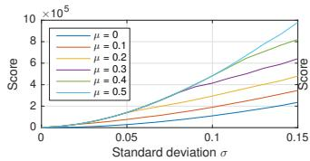

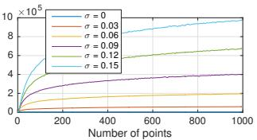  
Figure 4. Next best view scores for Gaussian distributed points $\mathbf { x } _ { j } \in [ 0 , 1 ] \times [ 0 , 1 ]$ with mean $\mu$ and std. dev. $\sigma .$ Score $s$ w.r.t. uniformity (left) and number of points for $\mu = 0 . 5$ (right).

If $V _ { a b } > V$ and $| G _ { r } | < S$ , image $I _ { b }$ is removed from $\bar { \mathcal { T } }$ and added to group $G _ { r }$ . Otherwise, a new group is initialized. To reduce the time of finding $I _ { b } ,$ , we employ the heuristic of limiting the search to the $K _ { r }$ spatial nearest neighbors with a common viewing direction in the range of $\pm \beta$ degrees, motivated by the fact that those images have a high likelihood of sharing many points.

Each image within a group is then parameterized w.r.t. a common group-local coordinate frame. The BA cost function (Eq. 1) for grouped images is

$$
E _ { g } = \sum _ { j } \rho _ { j } \left( \left\| \pi _ { g } \left( \mathbf { G } _ { r } , \mathbf { P } _ { c } , \mathbf { X } _ { k } \right) - \mathbf { x } _ { j } \right\| _ { 2 } ^ { 2 } \right)\tag{7}
$$

using the extrinsic group parameters $\mathbf { G } _ { r } \in \mathbf { S } \mathbf { E } ( 3 )$ and fixed $\mathbf { P } _ { c } .$ The projection matrix of an image in group r is then defined as the concatenation of the group and image pose $\mathbf { P } _ { c r } = \mathbf { P } _ { c } \mathbf { G } _ { \imath }$ . The overall cost $\bar { E }$ is the sum of the grouped and ungrouped cost contributions. For efficient concatenation of the rotational components of $\mathbf { G } _ { r }$ and $\mathbf { P } _ { i } ,$ , we rely on quaternions. A larger group size leads to a greater performance benefit due to a smaller relative overhead of computing $\pi _ { g }$ over $\pi .$ . Note that even for the case of a group size of two, we observe a computational benefit. In addition, the performance benefit depends on the problem size, as a reduction in the number of cameras affects the cubic computational complexity of direct methods more than the linear complexity of indirect methods (Sec. 2).

## 5. Experiments

We run experiments on a large variety of datasets to evaluate both the proposed components and the overall system compared to state-of-the-art incremental (Bundler [53], VisualSFM [62]) and global SfM systems (DISCO [14], Theia [55]1). The 17 datasets contain a total of 144,953 unordered Internet photos, distributed over a large area and with highly varying camera density. In addition, Quad [14] has groundtruth camera locations. Throughout all experiments, we use RootSIFT features and match each image against its 100 nearest neighbors using a vocabulary tree trained on unrelated datasets. To ensure comparability between the different methods, correspondence search is not included in the timings on a 2.7GHz machine with 256GB RAM.

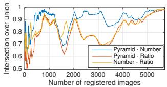

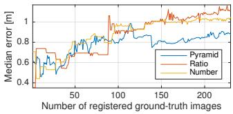  
Figure 5. Next best view results for Quad: Shared number of registered images and reconstruction error during incremental SfM.

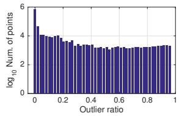

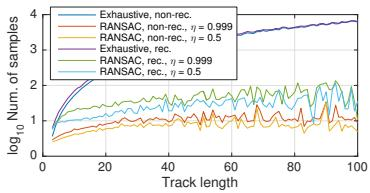

Figure 6. Triangulation statistics for Dubrovnik dataset. Left: Outlier ratio distribution of feature tracks. Right: Average number of samples required to triangulate N-view point.  
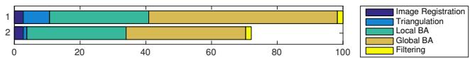  
Figure 7. Average relative runtimes using standard global BA and exhaustive, rec. triangulation (1), and grouped BA and RANSAC, rec. triangulation (2). Runtime for Initialization and Next Best View Selection (all strategies) is smaller than 0.1%.

Next Best View Selection. A synthetic experiment (Fig. 4) evaluates how well the score S reflects the number and distribution of points. We use $L \ = \ 6$ pyramid levels, and we generate Gaussian-distributed image points with spread σ and location $\mu .$ A larger $\sigma$ and a more central $\mu$ corresponds to a more uniform distribution and correctly produces a higher score. Similarly, the score is dominated by the number of points when there are few and otherwise by their distribution in the image. Another experiment (Fig. 5) compares our method $( P y r a m i d )$ to existing strategies in terms of the reconstruction error. The other methods are Number [53], which maximizes the number of triangulated points, and Ratio which maximizes the ratio of visible over potentially visible points. After each image registration, we measure the number of registered images shared between the strategies (intersection over union) and the reconstruction error as the median distance to the ground-truth camera locations. While all strategies converge to the same set of registered images, our method produces the most accurate reconstruction by choosing a better registration order for the images.

Robust and Efficient Triangulation. An experiment on the Dubrovnik dataset (Fig. 6 and Table 2) evaluates our method on 2.9M feature tracks composed from 47M verified matches. We compare against Bundler and an exhaustive strategy that samples all pairwise combinations in a track. We set $\alpha = 2 ^ { \circ } , t = 8 \mathbf { p } \mathbf { x }$ , and $\epsilon _ { 0 } = 0 . 0 3$ . To avoid combinatorial explosion, we limit the exhaustive approach to 10K iterations, $i . e . \epsilon _ { m i n } \approx 0 . 0 2$ with $\eta = 0 . 9 9 9$ . The diverse inlier ratio distribution (as determined with the recursive, exhaustive approach) evidences the need for a robust triangulation method. Our proposed recursive approaches recover significantly longer tracks and overall more track elements than their non-recursive counterparts. Note that the higher number of points for the recursive RANSAC-based methods corresponds to the slightly reduced track lengths. The RANSAC-based approach yields just marginally inferior tracks but is much faster (10-40x). By varying η, it is easy to balance speed against completeness.

<table><tr><td></td><td># Images</td><td colspan="4"># Registered</td><td colspan="4"># Points (Avg. Track Length)</td><td colspan="4">Time [s]</td><td colspan="4">Avg. Reproj. Error [px]</td></tr><tr><td></td><td>Theia</td><td></td><td>Bundler</td><td>VSFM</td><td>Ours</td><td>Theia</td><td>Bundler</td><td>VSFM</td><td>Ours</td><td>Theia</td><td>Bundler</td><td>VSFM</td><td>Ours</td><td>Theia</td><td>Bundler</td><td>VSFM</td><td>Ours</td></tr><tr><td>Rome [14]</td><td>74,394</td><td></td><td>13,455</td><td>14,797</td><td>20,918</td><td></td><td>5.4M</td><td>12.9M</td><td>5.3M</td><td></td><td>295,200</td><td>6,012</td><td>10,912</td><td></td><td></td><td></td><td></td></tr><tr><td>Quad [14]</td><td>6,514</td><td></td><td>5,028</td><td>5,624</td><td>5,860</td><td></td><td>10.5M</td><td>0.8M</td><td>1.2M</td><td></td><td>223,200</td><td>2,124</td><td>3,791</td><td></td><td></td><td></td><td></td></tr><tr><td>Dubrovnik [36]</td><td>6,044</td><td></td><td>一</td><td></td><td>5,913</td><td></td><td>1</td><td></td><td>1.35M</td><td></td><td></td><td></td><td>3,821</td><td></td><td></td><td></td><td></td></tr><tr><td>Alamo [61]</td><td>2,915</td><td>582</td><td>647</td><td>609</td><td>666</td><td>146K (6.0)</td><td>127K (4.5)</td><td>124K (8.9)</td><td>94K (11.6)</td><td>874</td><td>22,025</td><td>495</td><td>882</td><td>1.47</td><td>2.29</td><td>0.70</td><td>0.68</td></tr><tr><td>Ellis Island [61]</td><td>2,587</td><td>231</td><td>286</td><td>297</td><td>315</td><td>29K (4.9)</td><td>39K (4.1)</td><td>61K (5.5)</td><td>64K (6.8)</td><td>94</td><td>12,798</td><td>240</td><td>332</td><td>2.41</td><td>2.24</td><td>0.71</td><td>0.70</td></tr><tr><td>Gendarmenmarkt [61]</td><td>1,463</td><td>703</td><td>302</td><td>807</td><td>861</td><td>87K (3.8)</td><td>93K (3.7)</td><td>138K (4.9)</td><td>123K (6.1)</td><td>202</td><td>465,213</td><td>412</td><td>627</td><td>2.19</td><td>1.59</td><td>0.71</td><td>0.68</td></tr><tr><td>Madrid Metropolis [61]</td><td>1,344</td><td>351</td><td>330</td><td>309</td><td>368</td><td>47K (5.0)</td><td>27K (3.2)</td><td>48K (5.2)</td><td>43K (6.6)</td><td>95</td><td>21,633</td><td>203</td><td>251</td><td>1.48</td><td>1.62</td><td>0.59</td><td>0.60</td></tr><tr><td>Montreal Notre Dame [61]</td><td>2,298</td><td>464</td><td>501</td><td>491</td><td>506</td><td>154K (5.4)</td><td>135K (4.6)</td><td>110K (7.1)</td><td>98K (8.7)</td><td>207</td><td>112,171</td><td>418</td><td>723</td><td>2.01</td><td>1.92</td><td>0.88</td><td>0.81</td></tr><tr><td>NYC Library [61]</td><td>2,550</td><td>339</td><td>400</td><td>411</td><td>453</td><td>66K (4.1)</td><td>71K (3.7)</td><td>95K (5.5)</td><td>77K (7.1)</td><td>194</td><td>36,462</td><td>327</td><td>420</td><td>1.89</td><td>1.84</td><td>0.67</td><td>0.69</td></tr><tr><td>Piazza del Popolo [61]</td><td>2,251</td><td>335</td><td>376</td><td>403</td><td>437</td><td>36K (5.2)</td><td>34K (3.7)</td><td>50K (7.2)</td><td>47K (8.8)</td><td>89</td><td>33,805</td><td>275</td><td>380</td><td>2.11</td><td>1.76</td><td>0.76</td><td>0.72</td></tr><tr><td>Piccadilly [61]</td><td>7,351</td><td>2,270</td><td>1,087</td><td>2,161</td><td>2,336</td><td>197K (4.9)</td><td>197K (3.9)</td><td>245K (6.9)</td><td>260K (7.9)</td><td>1,427</td><td>478,956</td><td>1,236</td><td>1,961</td><td>2.33</td><td>1.79</td><td>0.79</td><td>0.75</td></tr><tr><td>Roman Forum [61]</td><td>2,364</td><td>1,074</td><td>885</td><td>1,320</td><td>1,409</td><td>261K (4.9)</td><td>281K (4.4)</td><td>278K (5.7)</td><td>222K (7.8)</td><td>1,302</td><td>587,451</td><td>748</td><td>1,041</td><td>2.07</td><td>1.66</td><td>0.69</td><td>0.70 0.61</td></tr><tr><td>Tower of London [61]</td><td>1,576</td><td>468</td><td>569</td><td>547</td><td>578</td><td>140K (5.2)</td><td>151K (4.8)</td><td>143K (5.7)</td><td>109K (7.4)</td><td>201</td><td>184,905</td><td>497</td><td>678</td><td>1.86</td><td>1.54</td><td>0.59</td><td>0.74</td></tr><tr><td>Trafalgar [61]</td><td>15,685</td><td>5,067</td><td>1,257</td><td>5,087</td><td>5,211</td><td>381K (4.8)</td><td>196K (3.7)</td><td>497K (8.7)</td><td>450K (10.1)</td><td>1,494</td><td>612,452</td><td>3,921</td><td>5,122</td><td>2.09 2.36</td><td>2.07 3.22</td><td>0.79</td><td>0.67</td></tr><tr><td>Union Square [61]</td><td>5,961</td><td>720</td><td>649</td><td>658</td><td>763</td><td>35K (5.3)</td><td>48K (3.7)</td><td>43K (7.1)</td><td>53K (8.2)</td><td>131</td><td>56,317</td><td>556</td><td>693</td><td></td><td></td><td>0.68</td><td>0.74</td></tr><tr><td>Vienna Cathedral [61]</td><td>6,288</td><td>858</td><td>853</td><td>890</td><td>933</td><td>259K (4.9)</td><td>276K (4.6)</td><td>231K (7.6)</td><td>190K (9.8)</td><td>764</td><td>567,213</td><td>899</td><td>1,244</td><td>2.45</td><td>1.69</td><td>0.80</td><td></td></tr><tr><td>Yorkminster [61]</td><td>3,368</td><td>429</td><td>379</td><td>427</td><td>456</td><td>143K (4.5)</td><td>71K (3.9)</td><td>130K (5.2)</td><td>105K (6.8)</td><td>164</td><td>34,641</td><td>661</td><td>997</td><td>2.38</td><td>2.61</td><td>0.72</td><td>0.70</td></tr></table>

Table 1. Reconstruction results for state-of-the-art SfM systems on large-scale unordered Internet photo collections.

<table><tr><td></td><td>#Points</td><td>#Elements</td><td>Avg. Track Length</td><td>#Samples</td></tr><tr><td>Bundler</td><td>713,824</td><td>5.58 M</td><td>7.824</td><td>136.34 M</td></tr><tr><td>Non-recursive</td><td></td><td></td><td></td><td></td></tr><tr><td>Exhaustive</td><td>861,591</td><td>7.64 M</td><td>8.877</td><td>120.44 M</td></tr><tr><td>RANSAC, η1</td><td>861,591</td><td>7.54M</td><td>8.760</td><td>3.89 M</td></tr><tr><td>RANSAC, η2</td><td>860,422</td><td>7.46 M</td><td>8.682</td><td>3.03 M</td></tr><tr><td>Recursive</td><td></td><td></td><td></td><td></td></tr><tr><td>Exhaustive</td><td>894,294</td><td>8.05 M</td><td>9.003</td><td>145.22 M</td></tr><tr><td>RANSAC, η1</td><td>902,844</td><td>8.03 M</td><td>8.888</td><td>12.69 M</td></tr><tr><td>RANSAC, η2</td><td>906,501</td><td>7.98 M</td><td>8.795</td><td>7.82 M</td></tr></table>

Table 2. Triangulation results using $\eta _ { 1 } = 0 . 9 9$ and $\eta _ { 2 } = 0 . 5$  
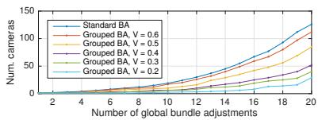  
Figure 8. Number of cameras in standard and grouped BA using $\epsilon _ { r } = 0 . 0 2 , S = 1 0$ , and varying scene overlap V .

Redundant View Mining. We evaluate redundant view mining on an unordered collection of densely distributed images. Fig. 8 shows the growth rate of the parameterized cameras in global BA using a fixed number of BA iterations. Depending on the enforced scene overlap V, we can reduce the time for solving the reduced camera system by a significant factor. The effective speedup of the total runtime is 5% $( V = 0 . 6 )$ , 14% (V = 0.3) and 32% $( V = 0 . 1 )$ while the average reprojection error degrades from 0.26px (standard BA) to 0.27px, 0.28px, and 0.29px, respectively. The reconstruction quality is comparable for all choices of $V > 0 . 3$ and increasingly degrades for a smaller V. Using $V = 0 . 4 .$ , the runtime of the entire pipeline for Colosseum reduces by 36% yet results in an equivalent reconstruction. System. Table 1 and Fig. 1 demonstrate the performance of the overall system and thereby also evaluate the performance of the individual proposed components of the system. For each dataset, we report the largest reconstructed component. Theia is the fastest method, while our method achieves slightly worse timings than VisualSFM and is more than 50 times faster than Bundler. Fig. 7 shows the relative timings of the individual modules. For all datasets, we significantly outperform any other method in terms of completeness, especially for the larger models. Importantly, the increased track lengths result in higher redundancy in BA. In addition, we achieve the best pose accuracy for the Quad dataset: DISCO 1.16m, Bundler 1.01m, VisualSFM 0.89m, and Ours 0.85m. Fig. 9 shows a result of Bundler compared to our method. We encourage readers to view the supplementary material for additional visual comparisons of the results, demonstrating the superior robustness, completeness, and accuracy of our method.

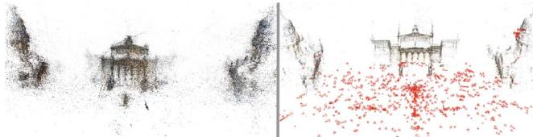  
Figure 9. Reconstruction of Gendarmenmarkt [61] for Bundler (left) and our method (right).

## 6. Conclusion

This paper proposes a SfM algorithm that overcomes key challenges to make a further step towards a general-purpose SfM system. The proposed components of the algorithm improve the state of the art in terms of completeness, robustness, accuracy, and efficiency. Comprehensive experiments on challenging large-scale datasets demonstrate the performance of the individual components and the overall system. The entire algorithm is released to the public as an open-source implementation.

Acknowledgements. We thank J. Heinly and T. Price for proofreading. We also thank C. Sweeney for producing the Theia experiments. Supported in part by the NSF No. IIS-1349074, No. CNS-1405847, and the MITRE Corp.

## References

[1] S. Agarwal, Y. Furukawa, N. Snavely, I. Simon, B. Curless, S. Seitz, and R. Szeliski. Building rome in a day. ICCV, 2009. 1, 2

[2] S. Agarwal, K. Mierle, and Others. Ceres Solver. http: //ceres-solver.org. 5

[3] S. Agarwal, N. Snavely, and S. Seitz. Fast algorithms for $L _ { \infty }$ problems in multiview geometry. CVPR, 2008. 2, 4

[4] S. Agarwal, N. Snavely, S. Seitz, and R. Szeliski. Bundle adjustment in the large. ECCV, 2010. 3

[5] C. Aholt, S. Agarwal, and R. Thomas. A QCQP Approach to Triangulation. ECCV, 2012. 2, 4

[6] P. Beardsley, P. Torr, and A. Zisserman. 3d model acquisition from extended image sequences. 1996. 1

[7] C. Beder and R. Steffen. Determining an initial image pair for fixing the scale of a 3d reconstruction from an image sequence. Pattern Recognition, 2006. 2

[8] D. C. Brown. A solution to the general problem of multiple station analytical stereotriangulation. 1958. 3

[9] M. Brown, G. Hua, and S. Winder. Discriminative learning of local image descriptors. IEEE PAMI, 2011. 1

[10] M. Bujnak, Z. Kukelova, and T. Pajdla. A general solution to the P4P problem for camera with unknown focal length. CVPR, 2008. 2

[11] L. Carlone, P. Fernandez Alcantarilla, H.-P. Chiu, Z. Kira, and F. Dellaert. Mining structure fragments for smart bundle adjustment. BMVC, 2014. 6

[12] S. Chen, Y. F. Li, J. Zhang, and W. Wang. Active Sensor Planningfor Multiview Vision Tasks. 2008. 4

[13] Y. Chen, T. A. Davis, W. W. Hager, and S. Rajamanickam. Algorithm 887: Cholmod, supernodal sparse cholesky factorization and update/downdate. ACM TOMS, 2008. 3

[14] D. Crandall, A. Owens, N. Snavely, and D. P. Huttenlocher. Discrete-Continuous Optimization for Large-Scale Structure from Motion. CVPR, 2011. 1, 7, 8

[15] L. de Agapito, E. Hayman, and I. Reid. Self-calibration of a rotating camera with varying intrinsic parameters. BMVC, 1998. 6

[16] F. Dellaert, S. Seitz, C. E. Thorpe, and S. Thrun. Structure from motion without correspondence. CVPR. 1

[17] E. Dunn and J.-M. Frahm. Next best view planning for active model improvement. BMVC, 2009. 4

[18] M. A. Fischler and R. C. Bolles. Random sample consensus: a paradigm for model fitting with applications to image analysis and automated cartography. ACM, 1981. 2

[19] A. Fitzgibbon and A. Zisserman. Automatic camera recovery for closed or open image sequences. ECCV, 1998. 1

[20] J.-M. Frahm, P. Fite-Georgel, D. Gallup, T. Johnson, R. Raguram, C. Wu, Y.-H. Jen, E. Dunn, B. Clipp, S. Lazebnik, and M. Pollefeys. Building Rome on a Cloudless Day. ECCV, 2010. 1, 2, 3

[21] J.-M. Frahm and M. Pollefeys. RANSAC for (quasi-) degen erate data (QDEGSAC). CVPR, 2006. 2

[22] X.-S. Gao, X.-R. Hou, J. Tang, and H.-F. Cheng. Complete solution classification for the perspective-three-point problem. IEEE PAMI, 2003. 2

[23] R. Gherardi, M. Farenzena, and A. Fusiello. Improving the efficiency of hierarchical structure-and-motion. CVPR, 2010. 1

[24] S. Haner and A. Heyden. Covariance propagation and next best view planning for 3d reconstruction. ECCV, 2012. 4

[25] R. Hartley and F. Schaffalitzky. $L _ { \infty }$ minimization in geometric reconstruction problems. CVPR, 2004. 2, 4

[26] R. Hartley and A. Zisserman. Multiple view geometry in computer vision. 2003. 2, 3, 5

[27] R. I. Hartley and P. Sturm. Triangulation. 1997. 2, 4

[28] M. Havlena and K. Schindler. Vocmatch: Efficient multiview correspondence for structure from motion. ECCV, 2014. 2

[29] J. Heinly, E. Dunn, and J.-M. Frahm. Comparative evaluation of binary features. ECCV. 1

[30] J. Heinly, J. L. Schonberger, E. Dunn, and J.-M. Frahm. Re-¨ constructing the World\* in Six Days \*(As Captured by the Yahoo 100 Million Image Dataset). CVPR, 2015. 1, 2, 3

[31] A. Irschara, C. Zach, J.-M. Frahm, and H. Bischof. From structure-from-motion point clouds to fast location recognition. CVPR, 2009. 2, 4

[32] L. Kang, L. Wu, and Y.-H. Yang. Robust multi-view l2 triangulation via optimal inlier selection and 3d structure refinement. Pattern Recognition, 2014. 2, 4, 5

[33] A. Kushal and S. Agarwal. Visibility based preconditioning for bundle adjustment. CVPR, 2012. 6

[34] V. Lepetit, F. Moreno-Noguer, and P. Fua. EPnP: An accurate O(n) solution to the PnP problem. IJCV, 2009. 2, 4

[35] H. Li. A practical algorithm for L triangulation with outliers. CVPR, 2007. 2, 4

[36] Y. Li, N. Snavely, and D. P. Huttenlocher. Location recognition using prioritized feature matching. ECCV, 2010. 8

[37] Y. Lou, N. Snavely, and J. Gehrke. MatchMiner: Efficient Spanning Structure Mining in Large Image Collections. ECCV, 2012. 2

[38] M. I. Lourakis and A. A. Argyros. SBA: A software package for generic sparse bundle adjustment. ACM TOMS, 2009. 3

[39] D. G. Lowe. Distinctive image features from scale-invariant keypoints. IJCV, 2004. 1

[40] F. Lu and R. Hartley. A fast optimal algorithm for $L _ { 2 }$ triangulation. ACCV, 2007. 2, 4

[41] C. McGlone, E. Mikhail, and J. Bethel. Manual of photogrammetry. 1980. 1, 4

[42] R. Mohr, L. Quan, and F. Veillon. Relative 3d reconstruction using multiple uncalibrated images. IJR, 1995. 1

[43] K. Ni, D. Steedly, and F. Dellaert. Out-of-core bundle adjustment for large-scale 3d reconstruction. ICCV, 2007. 6

[44] C. Olsson, A. Eriksson, and R. Hartley. Outlier removal using duality. CVPR, 2010. 2, 4

[45] M. Pollefeys, D. Nister, J.-M. Frahm, A. Akbarzadeh,´ P. Mordohai, B. Clipp, C. Engels, D. Gallup, S.-J. Kim, P. Merrell, et al. Detailed real-time urban 3d reconstruction from video. IJCV, 2008. 1

[46] M. Pollefeys, L. Van Gool, M. Vergauwen, F. Verbiest, K. Cornelis, J. Tops, and R. Koch. Visual modeling with a hand-held camera. IJCV, 2004. 1

[47] F. Schaffalitzky and A. Zisserman. Multi-view matching for unordered image sets, or How do I organize my holiday snaps? ECCV, 2002. 1

[48] J. L. Schonberger, A. C. Berg, and J.-M. Frahm. Efficient ¨ two-view geometry classification. GCPR, 2015. 2

[49] J. L. Schonberger, A. C. Berg, and J.-M. Frahm. PAIGE:¨ PAirwise Image Geometry Encoding for Improved Efficiency in Structure-from-Motion. CVPR, 2015. 2

[50] J. L. Schonberger, D. Ji, J.-M. Frahm, F. Radenovi¨ c,´ O. Chum, and J. Matas. From Dusk Till Dawn: Modeling in the Dark. CVPR, 2016. 1

[51] J. L. Schonberger, F. Radenovi¨ c, O. Chum, and J.-M. Frahm.´ From Single Image Query to Detailed 3D Reconstruction. CVPR, 2015. 1

[52] N. Snavely. Scene reconstruction and visualization from internet photo collections. PhD thesis, 2008. 2, 3, 4

[53] N. Snavely, S. Seitz, and R. Szeliski. Photo tourism: exploring photo collections in 3d. ACM TOG, 2006. 1, 4, 5, 6, 7

[54] N. Snavely, S. Seitz, and R. Szeliski. Skeletal graphs for efficient structure from motion. CVPR, 2008. 2, 3

[55] C. Sweeney. Theia multiview geometry library: Tutorial & reference. http://theia-sfm.org. 7

[56] C. Sweeney, T. Sattler, T. Hollerer, M. Turk, and M. Pollefeys. Optimizing the viewing graph for structure-frommotion. CVPR, 2015. 1

[57] P. H. Torr. An assessment of information criteria for motion model selection. CVPR, 1997. 2

[58] B. Triggs, P. F. McLauchlan, R. I. Hartley, and A. Fitzgibbon. Bundle adjustment a modern synthesis. 2000. 2, 3

[59] T. Tuytelaars and K. Mikolajczyk. Local invariant feature detectors: a survey. CGV, 2008. 1

[60] T. Weyand, C.-Y. Tsai, and B. Leibe. Fixing wtfs: Detecting image matches caused by watermarks, timestamps, and frames in internet photos. WACV, 2015. 3

[61] K. Wilson and N. Snavely. Robust global translations with 1dsfm. ECCV, 2014. 1, 8

[62] C. Wu. Towards linear-time incremental structure from motion. 3DV, 2013. 1, 2, 3, 5, 6, 7

[63] C. Wu, S. Agarwal, B. Curless, and S. Seitz. Multicore bundle adjustment. CVPR, 2011. 3

[64] E. Zheng and C. Wu. Structure from motion using structureless resection. ICCV, 2015. 3