# Co-Fusion: Real-time Segmentation, Tracking and Fusion of Multiple Objects

Martin Rünz and Lourdes Agapito Department of Computer Science, University College London, UK {martin.runz.15,1.agapito}@cs.ucl.ac.uk http://visual.cs.ucl.ac.uk/pubs/cofusion/index.html

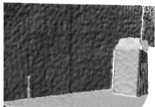  
(a) Frame 99

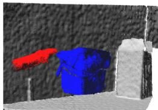  
(b) Frame 129

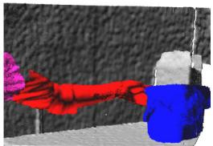  
(c) Frame 159

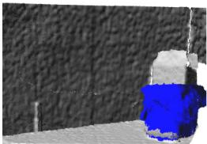  
(d) Frame 259

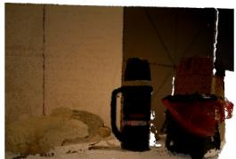  
(e) Final color

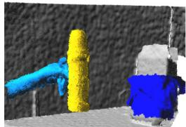  
(f) Frame 539

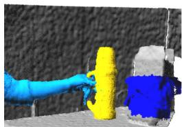  
(g) Frame 599

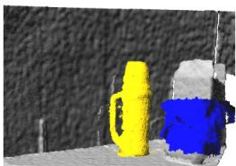  
(h) Frame 679

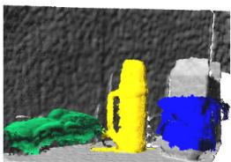  
(i) Frame 929

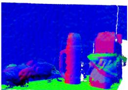  
(j) Final normals  
Fig. 1: A sequence demonstrating our dynamic SLAM system. Three objects were sequentially placed on a table: first a small bin (blue label), a flask (yellow) and a teddy bear (green). The results show that all objects were successfully segmented, tracked and modeled

Abstract—In this paper we introduce Co-Fusion, a dense SLAM system that takes a live stream of RGB-D images as input and segments the scene into different objects (using either motion or semantic cues) while simultaneously tracking and reconstructing their 3D shape in real time. We use a multiple model fitting approach where each object can move independently from the background and still be effectively tracked and its shape fused over time using only the information from pixels associated with that object label. Previous attempts to deal with dynamic scenes have typically considered moving regions as outliers, and consequently do not model their shape or track their motion over time. In contrast, we enable the robot to maintain 3D models for each of the segmented objects and to improve them over time through fusion. As a result, our system can enable a robot to maintain a scene description at the object level which has the potential to allow interactions with its working environment; even in the case of dynamic scenes.

## I. INTRODUCTION

The wide availability of affordable structured light and time of flight depth sensors has had enormous impact both on the democratization of the acquisition of 3D models in real time from hand-held cameras and on providing robots with powerful but low-cost 3D sensing capabilities. Tracking the motion of a camera while maintaining a dense representation of the 3D geometry of its environment in real time has become more important than ever [14], [31], [30], [13].

While solid progress has been made towards solving this problem in the case of static environments, where the only motion is that of the camera, dealing with dynamic scenes where an unknown number of objects might be moving independently is significantly harder. The typical strategy adopted by most systems is to track only the motion of the camera relative to the static background and treat moving objects as outliers whose 3D geometry and motion is not modeled over time. However, in robotics applications often it is precisely the objects moving in the foreground that are of most interest to the robot. If we want to design robots that can interact with dynamic scenes it is crucial to equip them with the capability to (i) discover objects in the scene via segmentation (ii) track and estimate the 3D geometry of each object independently. These high level object-based representations of the scene would greatly enhance the perception and physical interaction capabilities of a robot.

Consider for instance a SLAM system on-board a selfdriving car – tracking and maintaining 3D models of all the moving cars around it and not just the static parts of the scene could be critical to avoid collisions. Or think of a robot that arrives at a scene without a priori 3D knowledge about the objects it must interact with – the ability to segment, track and fuse different objects would allow it actively to discover and learn accurate 3D models of them on the fly through motion, by picking them up, pushing them around or simply observing how they move. An object level scene description of this kind, has the potential to enable the robot to interact physically with the scene.

In this paper we introduce Co-FUSION a new RGB-D based SLAM system that can segment a scene into the background and different foreground objects, using either motion or semantic cues, while simultaneously tracking and reconstructing their 3D geometry over time. Our underlying assumption is that objects of interest can be detected and segmented in real-time using efficient segmentation algorithms and then tracked independently over time. Our system offers two alternative grouping strategies – motion segmentation that groups together points that move consistently in 3D and object instance segmentation that both detects and segments individual objects of interest (at the pixel level) in an RGB image given a semantic label. These two forms of segmentation allow us not only to detect objects due to their motion but also objects that might be static but are semantically of interest to the robot.

Once detected and segmented, objects are added to the list of active models and are subsequently tracked and their 3D shape model updated by fusing only the data labeled as belonging to that object. The tracking and fusion threads for each object are based on recent surfel-based approaches [8] [30]. The main contribution of this paper is a system that would allow a robot not only to reconstruct its surrounding environment but also to acquire the detailed 3D geometry of unknown objects that move in the scene. Moreover, our system would equip a robot with the capability to discover new objects in the scene and learn accurate 3D models of them through active motion. We demonstrate Co-Fusion on different scenarios – placing different previously unseen objects on a table and learning their geometry (see Figure 1) handing over an object from one person to another (see Figure 3), hand-held 3D capture of a moving object with a moving camera (see Figure 9) and on a car driving scenario (see Figure 5a). We also demonstrate quantitatively the robustness of the tracking and the reconstruction on some synthetic and ground truth sequences of dynamic scenes.

## II. RELATED WORK

The arrival of the Microsoft Kinect device and the sudden availability of inexpensive depth sensors to consumers, triggered a flurry of research aimed at real-time 3D scanning. Systems such as KinectFusion [14] first made it possible to map the 3D geometry of arbitrary indoor scenes accurately and in real time, by fusing the images acquired by the depth camera simply by moving the sensor around the environment Access to accurate and dense 3D geometry in real time opens up applications to rapid scanning or prototyping, augmented/virtual reality and mobile robotics that were previously not possible with offline or sparse techniques. Successors to KinectFusion have quickly addressed some of its shortcomings. While some have focused on extending its capabilities to handle very large scenes [7], [29], [15], [31] or to include loop closure [30] others have robustified the tracking [31] or improved memory and scale efficiency by using pointbased instead of volumetric representations [8] that lead to increased 3D reconstruction quality [10]. Achieving higher level semantic scene descriptions by using a dense planar representation [21] or real-time 3D object recognition [22] further improved tracking performance while opening the door to virtual or even real interaction with the scene. More recent approaches such as [25], [11] incorporate semantic segmentation and even recognition within a SLAM system in real time. While they show impressive performance, they are still limited to static scenes.

The core underlying assumption behind many traditional SLAM and dense reconstruction systems is that the scene is largely static. How can these dense systems be extended to track and reconstruct more than one model without compromising real time performance? The SLAMMOT project [28] represented an important step towards extending the SLAM framework to dynamic environments by incorporating the detection and tracking of moving objects into the SLAM operation. It was mostly demonstrated on driving scenarios and limited to sparse reconstructions. It is only very recently that the problem of reconstruction of dense dynamic scenes in real time has been addressed. Most of the work has been devoted to capturing non-rigid geometry in real time with RGB-D sensors. The assumption here is that the camera is observing a single object that deforms freely over time. DynamicFusion [13] is a prime example of a monocular real time system that can fuse together scans of deformable objects captured from depth sensors without the need for any pre-trained model or shape template. With the use of a sophisticated multi-camera rig of RGB-D sensors 4DFusion [2] can capture live deformable shapes with an exceptional level of detail and can deal with large deformations and changes in topology. On the other hand template based techniques can also obtain high levels of realism but are limited by their need to add a preliminary step to capture the template [32] or are dedicated to tracking specific objects by their use of handcrafted or pre-trained models [26]. These include general articulated tracking methods that either require a geometric template of the object in a rest pose [27], or prior knowledge of the skeletal structure [23].

In contrast, capturing the full geometry of dynamic scenes that might contain more than one moving object has received more limited attention. Ren et al. [18] propose a method to track and reconstruct 3D objects simultaneously by refining an initial simple shape primitive. However, in contrast to our approach, it can only track one moving object and requires a manual initialization. [12] propose a combined approach for estimating pose, shape, and the kinematic structure of articulated objects based on motion segmentation. While it is also based on joint tracking and segmentation, the focus is on discovering the articulated structure, only foreground objects are reconstructed and its performance is not real time. Stückler and Behnke [24] propose a dense rigid-body motion segmentation algorithm for RGB-D sequences. They only segment the RGB-D images and estimate the motion but do not simultaneously reconstruct the objects. Finally [3] build a model of the environment and consider as new objects parts of the scene that become inconsistent with this model using change detection. However, this approach requires a human in the loop to acquire known-correct segmentation and does not provide real time operation.

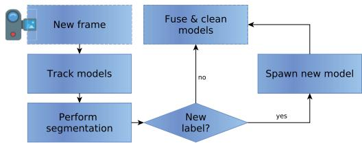  
Fig. 2: Overview of our method showing the data-flow starting from a new RGBD-frame. A detailed description can be found in Section III

Several recent RGB-only methods have also addressed the problem of monocular 3D reconstruction of dynamic scenes. Works such as [20], [4], [19] are similar in spirit to our simultaneous segmentation, tracking and reconstruction approach. Russell et al. [20] perform multiple model fitting to decompose a scene into piecewise rigid parts that are then grouped to form distinct objects. The strength of their approach is the flexibility to deal with a mixture of nonrigid, articulated or rigid objects. Fragkiadaki et al. [4] follow a pipeline approach that first performs clustering of long term tracks into different objects followed by non-rigid reconstruction. However, both of these approaches act on sparse tracks and are batch methods that require all the frames to have been captured in advance. Our method also shares commonality with the dense RGB multi-body reconstruction approach of [19], who also perform simultaneous segmentation, tracking and 3D reconstruction of multiple rigid models, with the notable difference that our approach is online and real time while theirs is batch and takes several seconds per frame.

## III. OVERVIEW OF OUR METHOD

Co-Fusion is a live RGB-D SLAM system that processes each new frame in real time. As well as maintaining a global model of the detailed geometry of the background our system stores models for each object segmented in the scene and is capable of tracking their motions independently. Each model is stored simply as a set of 3D points. Our system maintains two sets of object models: while active models are objects that are currently visible in the live frame, inactive models are objects that were once visible, therefore their geometry is known, but are currently out of view.

Figure 2 illustrates the frame-to-frame operation of our system. At the start of live capture, the scene is initialized to contain a single active model – the background. Once the fused 3D model of the background and the camera pose are stable after a few frames our system follows the pipeline approach described below. For each new frame acquired by the camera the following steps are performed:

Tracking First, we track the 6DOF rigid pose of each active model in the current frame. This is achieved by minimizing an objective function independently for each model that combines a geometric error based on dense iterative closest point (ICP) alignment and a photometric cost based on the difference in color between points in the current live frame and the stored 3D model.

Segmentation In this step we segment the current live frame associating each of its pixels with one of the active models/objects. Our system can perform segmentation based on two different cues: (i) motion and (ii) semantic labels. We now describe each of these two grouping strategies.

(i) Motion segmentation We formulate motion segmentation as a labeling problem using a fully connected Conditional Random Field and optimize it in real time on the CPU with the efficient approach of [9]. The unary potentials encode the geometric ICP cost incurred when associating a pixel with a rigid motion model. The optimization is followed by the extraction of connected components in the segmented image. If the connected region occupied by outliers has sufficient support an object is assumed to have entered the scene and a new model is spawned and added to the list.

(ii) Multi-class image segmentation As an alternative to motion segmentation our system can segment object instances at the pixel level given a class label using an efficient state of the art approach [16] based on deep learning. This allows us to segment objects based on semantic cues. For instance, in an autonomous driving application our system could segment not just moving but also stationary cars.

Fusion Using the newly estimated 6-DOF pose, the dense 3D geometry of each active model is updated by fusing the points labeled as belonging to that model. We used a surfelbased fusion approach related to the methods of [8] and [30].

While the tracking and fusion steps of our pipeline run on the GPU, the segmentation step runs on the CPU. The result is an RGB-D SLAM system that can maintain an upto-date 3D map of the static background as well as detailed 3D models for up to 5 different objects at 12 frames per second.

## IV. NOTATION AND PRELIMINARIES

We use Ω to refer to the 2D image domain that contains all the valid image coordinates. These are denoted as ${ \bf u } =$ $( u _ { x } , u _ { y } ) ^ { T } \in \Omega$ and their homogeneous coordinates as $\dot { \bf u } =$ $( \mathbf { u } ^ { T } , \bar { 1 } ) ^ { T }$ . An RGB-D frame contains both a depth image D of depth pixels $d ( \mathbf { u } ) : \Omega \to \mathbb { R }$ and an RGB image C of color pixels $c ( \mathbf { u } ) : \Omega \to \mathbb { N } ^ { 3 }$ . The greyscale intensity value of pixel u given color $c ( \mathbf { u } ) = [ c _ { r } , c _ { g } , c _ { b } ]$ in image C is given by $\begin{array} { r } { \mathbf { I } ( \mathbf { u } ) = \frac { ( c _ { r } + c _ { g } + c _ { b } ) } { 3 } \in } \end{array}$ R. The perspective projection of a 3D point $\mathbf { p } = ( x , y , z ) ^ { T }$ is specified as $\mathbf { u } = \pi ( \mathbf { K } \mathbf { p } )$ where $\pi : \mathbb { R } ^ { 3 } \to \mathbb { R } ^ { 2 } \pi ( \mathbf { p } ) = ( x / z , y / z ) ^ { T }$ . The back-projection of a point $\textbf { u } \in { \Omega }$ given its depth $d ( \mathbf { u } )$ can be expressed as $\pi ^ { - 1 } ( \mathbf { u } , \mathcal { D } ) = \mathbf { K } ^ { - 1 } \dot { \mathbf { u } } d ( \mathbf { u } ) \in \mathbb { R } ^ { 3 }$

Similarly to [8] and [30], we use a surfel-based map representation. For each active and inactive model a list of unordered surfels $\mathcal { M } _ { m }$ is maintained, where each surfel $\mathscr { M } _ { m } ^ { s } \in ( \mathbf { p } \in \mathbb { R } ^ { 3 } , \mathbf { n } \in \mathbb { R } ^ { 3 } , \mathbf { c } \in \mathbb { N } ^ { 3 } , \mathbf { w } \in \mathbb { R } , \mathbf { r } \in \mathbb { R } , \mathbf { t } \in \mathbb { R } ^ { 2 } )$

is a tuple of position, normal, color, weight, radius and two timestamps.

Given that we are modeling dynamic scenes where not just the camera but other objects might move, we use $\mathcal { T } _ { t } =$ $\{ \mathbf { T _ { t m } } ( \cdot ) \}$ to describe the the set of $M _ { t }$ rigid transformations that encode the pose of each active model $\mathcal { M } _ { m }$ at time instant t with respect to the global reference frame. In other words, $\mathbf { T _ { t m } }$ is the rigid transform $\mathbf { T _ { t m } } ( \mathbf { p } _ { m } ) = R _ { t m } \mathbf { p } _ { m } +$ $\mathbf { \Delta } \mathbf { \cdot } \mathbf { \Delta } \mathbf { \cdot } \mathbf { \Delta } \mathbf { \cdot } \mathbf { \Delta } \mathbf { \cdot } \mathbf { \Delta } \mathbf { \cdot } \mathbf { \Delta } \mathbf { \cdot } \mathbf { \Delta } \mathbf { \cdot } \mathbf { \Delta } \mathbf { \cdot } \mathbf { \Delta } \mathbf { \Delta } \mathbf { \cdot } \mathbf { \Delta } \mathbf { \Delta } \mathbf { \cdot } \mathbf { \Delta } \mathbf { \Delta } \mathbf { \cdot } \mathbf { \Delta } \mathbf { \Delta } \mathbf { \cdot } \mathbf { \Delta } \mathbf { \Delta } \mathbf { \cdot } \mathbf { \Delta } \mathbf { \Delta } \mathbf { \cdot } \mathbf { \Delta } \mathbf { \Delta } \mathbf { \cdot } \mathbf { \Delta } \mathbf { \Delta } \mathbf { \cdot } \mathbf { \Delta } \mathbf { \Delta } \mathbf { \cdot } \mathbf { \Delta } \mathbf { \Delta } \mathbf { \Delta } \mathbf { \cdot } \mathbf { \Delta } \mathbf { \Delta } \mathbf { \Delta } \mathbf { \Delta } \mathbf { \cdot } \mathbf { \Delta } \mathbf { \Delta } \mathbf { \Delta } \mathbf { \Delta } \mathbf { \Delta } \mathbf { \Delta } \mathbf \mathbf { \Delta } \mathbf { \Delta } \mathbf \mathbf { \Delta } \mathbf \mathbf { } \mathrm \Delta \mathbf { } \Delta \mathbf \mathbf { } \Delta \mathbf \Delta \mathbf { } \mathbf \Delta \mathbf \Delta \mathbf { } \mathbf \Delta \mathbf \Delta \mathbf { } \Delta \mathbf \mathbf \Delta \mathbf \Delta \mathbf \Delta \mathbf { } \Delta \mathbf \mathbf \Delta \mathbf \Delta \mathbf \Delta \mathbf \Delta \mathbf \Delta \mathbf \Delta \mathbf \mathbf \Delta \Delta \mathbf \mathbf \Delta \Delta \mathbf \Delta \mathbf \Delta \mathbf \mathbf \Delta \Delta \mathbf \mathbf \Delta \mathbf \Delta \mathbf \Delta \mathbf \mathbf \Delta \Delta \mathbf \mathbf \Delta \Delta \mathbf \mathbf \Delta \mathbf \mathbf \Delta \Delta \mathbf \Delta \mathbf \Delta \mathbf \mathbf \Delta \Delta \Delta \mathbf \mathbf \Delta \mathbf \mathbf \Delta \Delta \mathbf \mathbf \Delta \Delta \mathbf \Delta \mathbf \mathbf \Delta \mathbf \Delta \mathbf \Delta \Delta \mathbf \mathbf \mathbf \Delta \Delta \mathbf \Delta \mathbf \Delta \mathbf \mathbf \Delta \Delta \mathbf \mathbf \Delta \Delta \mathbf \mathrm \Delta \Delta \mathbf \Delta \mathrm \mathrm \mathrm \mathrm \mathrm \mathrm \mathrm \mathrm \mathrm \mathrm \mathrm \mathrm \mathrm \mathrm \mathrm \mathrm \mathrm \mathrm \mathrm \mathrm \mathrm \mathrm \mathrm \mathrm \mathrm \mathrm \mathrm \mathrm \mathrm \mathrm \mathrm \mathrm \mathrm $ that aligns a 3D point $\mathbf { p } _ { m }$ lying on model m expressed in the global reference frame, to its current position at time $t . \ R _ { t m } \ \in \mathbb { S } \mathbb { O } _ { 3 }$ and $\pmb { t } _ { t m } \in \mathbb { R } ^ { 3 }$ are respectively the rotation matrix and translation vector. We reserve the notation $\mathbf { T _ { t b } }$ to refer specifically to the rigid transforms associated with the background model.

## V. TRACKING ACTIVE MODELS

For each input frame at time t and for each active model $\mathcal { M } _ { m }$ we track its global pose $\mathbf { T _ { t m } }$ by registering the current live depth map with the predicted depth map in the previous frame, obtained by projecting the stored 3D model using the estimated pose for t - 1. We track each active model independently by running the optimization described below selecting only the 3D map points that are labeled as belonging to that specific model.

## A. Energy

For each active model $\mathcal { M } _ { m } ,$ we minimize a cost function that combines a geometric term based on point-to-plane ICP alignment and a photometric color term that minimizes differences in brightness between the predicted color image resulting from projecting the stored 3D model in the previous frame and the current live color frame.

$$
E _ { t r a c k } ^ { m } = \operatorname* { m i n } _ { \mathbf { T _ { m } } } \left( E _ { i c p } ^ { m } + \lambda E _ { r g b } ^ { m } \right)\tag{1}
$$

This cost function is closely related to the tracking threads of other RGB-D based SLAM systems [30], [8]. However, the most notable difference is that while [30], [8] assume that the scene is static and only track a single model, Co-Fusion can track various models while maintaining real-time performance.

## B. Geometry Term

For each active model m in the current frame t we seek to minimize the cost of the point-to-plane ICP registration error between (i) the 3D back-projected vertices of the current live depth map and (ii) the predicted depth map of model m from the previous frame t — 1:

$$
E _ { i c p } ^ { m } = \sum _ { i } ( ( \mathbf { v ^ { i } } - \mathbf { T _ { m } } \mathbf { v _ { t } ^ { i } } ) \cdot \mathbf { n ^ { i } } ) ^ { 2 }\tag{2}
$$

where $\mathbf { v _ { t } ^ { i } }$ is the back-projection of the i-th vertex in the current depth-map $\mathcal { D } _ { t } \mathbf { ; }$ and $\mathbf { v } ^ { \mathbf { i } }$ and $\mathbf { n } ^ { \mathbf { i } }$ are respectively the back-projection of the i-th vertex of the predicted depth-map of model m from the previous frame t — 1 and its normal. $\mathbf { T _ { m } }$ describes the transformation that aligns model m in the previous frame t — 1 with the current frame t.

## C. Photometric Color Term

Given (i) the current depth image; (ii) the current estimate of the 3D geometry of each active model; and (iii) the estimated rigid motion parameters that align each model with respect to the previous frame $t - 1 ,$ it is possible to synthesize projections of the scene onto a virtual camera aligned with the previous frame.

The tracking problem then becomes one of photometric image registration where we minimize the brightness constancy between the live frame and the synthesized view of the 3D models in frame t — 1. The cost takes the form

$$
E _ { r g b } ^ { m } = \sum _ { \mathbf { u } \in \Omega _ { m } } ( \mathbf { I _ { t } } ( \mathbf { u } ) - \mathbf { I _ { t - 1 } } ( \pi ( \mathbf { K } \mathbf { T _ { m } } \pi ^ { - 1 } ( \mathbf { u } , \mathcal { D } _ { t } ) ) ^ { 2 }\tag{3}
$$

where $\mathbf { T _ { m } }$ is the rigid transformation that aligns active model $\mathcal { M } _ { m }$ between the previous frame t — 1 and the current frame and $\mathbf { I _ { t - 1 } } ( \cdot )$ is a function that provides the color attached to a vertex on the model in the previous frame $t - 1$

For reasons of robustness and efficiency this optimization is embedded in a coarse-to-fine approach using a 4-layer spatial pyramid. Our GPU implementation builds on the open source code release of [30].

## VI. MOTION SEGMENTATION

Following the tracking step we have new estimates for the $M _ { t }$ rigid transformations $\{ \mathbf { T _ { t m } } \}$ that describe the absolute pose of each active model with respect to the global reference frame at time t.

We now formulate the motion segmentation problem for a new input frame t as a labeling problem, where the labels are the $M _ { t }$ rigid transformations $\left\{ \mathbf { T _ { t m } } \right\}$ . We seek a labeling $\mathbf { x ( u ) } : \Omega  \mathcal { L } _ { t }$ that assigns a label $\ell \in \mathcal L _ { t } = \{ 1 , \dots , | M _ { t } | +$ 1} to each point u in the current frame associating it with the motion of one of the $M _ { t }$ currently active rigid models or an outlier label $\ell _ { | M _ { t } | + 1 }$ . Note that the number of active models (labels) $M _ { t }$ will vary per frame as new objects may appear or disappear in the scene.

In practice, to allow the motion segmentation to run in real time on the CPU, we first over segment the current frame into SLIC super-pixels [1] using the fast implementation of [17] and apply the labeling algorithm at the super-pixel level. The position, color and depth of each super-pixel is estimated by averaging those of the pixels inside it.

We follow the energy minimization approach of [9] that optimizes the following cost function with respect to the labeling $\mathbf { x _ { t } } \in \mathcal { L } ^ { S }$

$$
E ( \mathbf { x _ { t } } ) = \sum _ { i } \psi _ { u } ( x _ { i } ) + \sum _ { i < j } \psi _ { p } ( x _ { i } , x _ { j } )\tag{4}
$$

where i and j are indices over the image super-pixels ranging from 1 to $S$ (the total number of super-pixels).

The unary potentials $\psi _ { u } ( x _ { i } )$ denote the cost associated with a label assignment $x _ { i }$ for super-pixel $\mathbf { s } _ { i } .$ Given that we are solving a motion segmentation problem, the unary potentials are the estimated ICP alignment costs incurred when applying the rigid transformation associated with each label to the back-projection of the center of each super-pixel si as defined in (2). Note that this is a purely geometric cost. If computing the cost $\psi _ { u } ( x _ { i } )$ fails due to lack of geometry projecting to $s _ { i } .$ we assign a fixed cost corresponding to a misalignment of 1% of the depth-range of the current frame. This prevents labels from growing outside of the object bounds. For each super-pixel, the unary cost associated with the outlier label $\ell _ { | M _ { t } | + 1 }$ is determined by the cost of the best fitting label and as a result receives low values only if none of the rigid models can explain the motion of the super-pixel.

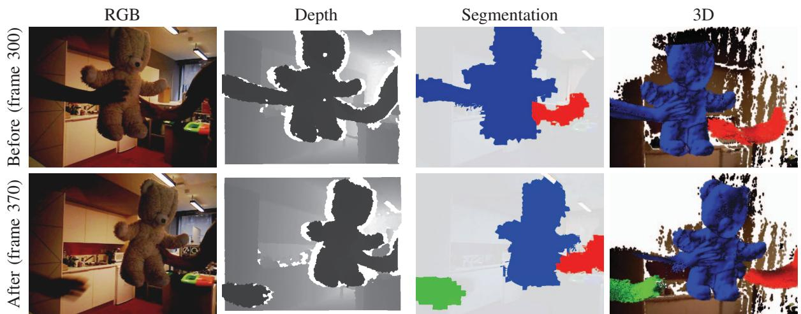  
Fig. 3: In this handover sequence a toy teddy bear is handed from one person to another. Co-Fusion can correctly segment and model four bodies: The background, the teddy-bear and two arms. At the start, the left arm and teddy are represented by the same model, since they move together. When the handover occurs, however, the arm becomes separated from the teddy and all four objects are tracked independently.

background  
teddy  
arm 1  
arm 2  
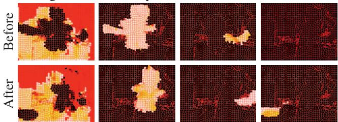  
Fig. 4: Heat-map visualization of the unary potentials for each of the four model labels in the handover scene (see Figure 3). Brighter values correspond to a higher probability of each label being assigned to a super-pixel.

The pairwise potentials $\psi _ { p } ( x _ { i } , x _ { j } )$ can be expressed as

$$
\psi _ { p } ( x _ { i } , x _ { j } ) = \mu ( x _ { i } , x _ { j } ) \sum _ { m = 1 } ^ { K } \omega _ { m } k _ { m } ( f _ { i } , f _ { j } ) .\tag{5}
$$

where $\mu ( x _ { i } , x _ { j } )$ encapsulates the classic Potts model that penalizes nearby pixels taking different labels, and $k _ { m } ( f _ { i } , f _ { j } )$ are contrast-sensitive potentials that measure the similarity between the appearance of pixels. This results in a cost that encourages super-pixels i and j to take the same label if the distance between their feature vectors $f _ { i }$ and $f _ { j }$ is small. In practice we characterize each super-pixel i with the 6D feature vector $f _ { i }$ that encodes its 2D location, RGB color and depth value. We set $k _ { m }$ to be Gaussian kernels $k _ { m } ( f _ { i } , f _ { j } ) = \mathrm { e x p } ( - \frac { 1 } { 2 } ( f _ { i } - f _ { j } ) ^ { T } \Lambda _ { m } ( f _ { i } - f _ { j } ) )$ with $\Lambda _ { m }$ the inverse covariance matrix 1.

We use the efficient inference method of [9] to optimize the labeling, which can be computed in real time on the CPU. The output of this optimization is a soft assignment of labels to each super-pixel i. To convert this into a hard assignment we simply take the maximum of all the label assignments and associate each super-pixel with the motion of a single active model.

Post-processing. Following the segmentation we perform a series of post-processing steps to obtain more robust results. First we perform connected components for all the labels and we merge models that have similar rigid transformations. Secondly we ensure that disconnected regions are modeled separately by suppressing all except the largest component with the same label. In a similar way, components whose size falls below a threshold τ are removed.

## A. Addition of New Models

If the connected region occupied by outliers is larger than 3% of the total number of pixels, an object is assumed to have entered the scene and a new label/object is spawned. If part of the geometry of this new object was already in the map (for instance, if an object started moving after having been part of the background map for a while) we attempt to remove the duplicate reconstruction. In practice we found that a good strategy is to remove areas with a high ICP error from the background. This is illustrated in Figure 6.

On the other hand, if a label disappeared and does not reappear within a certain number of frames, it is assumed that the respective model left the scene. In this case the model

1 In practice we set $\begin{array} { r l r l } { K } & { { } = } & { 2 } \end{array}$ and the inverse covariance matrices to $\begin{array} { r l r } { \Lambda _ { 1 } } & { { } } & { = \mathrm { d i a g } ( 1 / \theta _ { \alpha } ^ { 2 } , 1 / \theta _ { \alpha } ^ { 2 } , 1 / \theta _ { \beta } ^ { 2 } , 1 / \theta _ { \beta } ^ { 2 } , 1 / \theta _ { \beta } ^ { 2 } , 1 / \theta _ { \beta } ^ { 2 } , 1 / \theta _ { \gamma } ^ { 2 } ) } \end{array}$ and $\Lambda _ { 2 } = \mathrm { d i a g } ( 1 / \theta _ { \delta } ^ { 2 } , 1 / \theta _ { \delta } ^ { 2 } , 0 , 0 , 0 , 0 )$

will be added to the inactive list, if it contains enough surfels with a high confidence and is deleted otherwise.

## VII. OBJECT INSTANCE SEGMENTATION

In this section we investigate the use of semantic cues to segment objects in the scene which allows to deal both with moving and static objects. We use the top performing state of the art method for object instance segmentation [16] to segment objects of interest. SharpMask [16] is an augmented feed-forward network able to predict object proposals and object masks simultaneously. The architecture has 3 elements: A pre-trained network for feature map extraction, a segmentation branch and a branch that scores the objectness of an image patch. The results of SharpMask (an example segmentation can be seen in Figure 5a) can be given directly to Co-Fusion after temporal consistency is imposed between consecutive frames. The segmentation can be run on a limited set of labels to segment only objects of a chosen class, for instance all the tools lying on a table. We used the publicly available models pre-trained on the COCO dataset [?].

## VIII. FUSION

During the tracking stage, active models $\mathcal { M } _ { m }$ are projected to the camera view using splat rendering in order to align individual model poses. In the subsequent fusion stage the surfel maps are updated by merging the newly available RGB-D frame into the existing models. After projectively associating image coordinates u with corresponding surfels in the model $\mathcal { M } _ { m }$ , an update scheme similar to [8] is used.

## IX. EVALUATION

We carried out a quantitative evaluation both on synthetic and real sequences with ground truth data. Appropriate synthetic sequences with Kinect-like noise [6] were specifically created for this work (ToyCar3 and Room4) and have been made publicly available, along with evaluation tools. For the ground truth experiments on real data we attached markers to a set of objects, as shown in Figure 10, and accurately reconstructed them using a NextEngine 3D-scanner. The scenes were recorded with a motion-capture system (OptiTrack) to obtain ground-truth data for the trajectories. An Asus Xtion was used to acquire the real sequences. Although the quality of each stage in our pipeline depends on the performance of every other stage, i.e. a poor segmentation might be accountable for a poor reconstruction, it is valuable to evaluate the different elements.

Pose estimation We compared the estimated and groundtruth trajectories by computing the absolute trajectory (AT) root-mean-square errors (RMSE) for each of the objects in the scene. Results on synthetic sequences are shown in table II and Figure 7. Results on the real GT sequences comparing estimated and GT trajectories (given by OptiTrack) can be found in supplementary material 2.

Motion segmentation As the result of the segmentation stage is purely 2D, conventional metrics for segmentation quality can be used. We calculated the intersection-overunion measure per label for each frame of the synthetic sequences (we did not have ground truth segmentation for the real sequence). Figure 7 shows the IoU for each frame in the ToyCar3 and Room4 sequences.

<table><tr><td>Object</td><td></td><td>Error (avg/std, in mm)</td><td>Outlier-1cm</td><td>Outlier-5cm</td></tr><tr><td rowspan="3">Esoonel</td><td>Head</td><td>3.216 / 5.94</td><td>4.38%</td><td>0.016%</td></tr><tr><td>Dice</td><td>5.805 / 7.27</td><td>19.86%</td><td>0.0%</td></tr><tr><td>Gnome</td><td>5.051 / 6.10</td><td>12.39%</td><td>0.0%</td></tr></table>

TABLE I: Average error and standard deviation of the 3D reconstruction (mm) for the Esone1 ground truth scene (column 1). Percentage of surfels with reconstruction errors larger than 1cm (column 2) and 5cm (column 3).
<table><tr><td rowspan=1 colspan=1></td><td rowspan=1 colspan=1>Co-Fusion</td><td rowspan=1 colspan=1>ElasticFusion</td><td rowspan=1 colspan=1>Kintinuous</td></tr><tr><td rowspan=1 colspan=1>Toyar3  CameraCar1 $\mathrm { C a r } 2$ </td><td rowspan=1 colspan=1>6.12677.81814.403</td><td rowspan=1 colspan=1>5.917=</td><td rowspan=1 colspan=1>0.999=</td></tr><tr><td rowspan=1 colspan=1>CameraRom4  Airship $\mathrm { C a r }$ Rockinghorse</td><td rowspan=1 colspan=1>9.3269.108 / 10.1182.86258.007</td><td rowspan=1 colspan=1>12.169</td><td rowspan=1 colspan=1>1.630</td></tr></table>

TABLE II: AT-RMSEs of estimated trajectories for our synthetic sequences (mm). Two trajectories are associated with the airship, since this object was split into two parts.

Fusion To assess the quality of the fusion, one could either inspect the 3D reconstruction errors of each object separately or jointly, by exporting the geometry in a unified coordinate system. We used the latter on the synthetic sequences. This error is strongly conditioned on the tracking, but nicely highlights the quality of the overall system. For each surfel in the unified map of active models, we compute the distance to the closest point on the ground-truth meshes after aligning the two representations. Figure 8 visualizes the reconstruction error as a heat-map and highlights differences to Elastic-Fusion. For the real scene Esone1 we computed the 3D reconstruction errors of each object independently. The results are shown in Table I and Figure 10.

Qualitative results We performed a set of qualitative experiments to demonstrate the capabilities of Co-Fusion. One of its advantages is that it eases the 3D scanning process, since we do not need to rely on the static-world assumption. In particular, a user can hold and rotate an object in one hand while using the other to move a depth-sensor around the object. This mode of operation offers more flexibility, when compared to methods that require a turntable, for instance. Figure 9 shows the result of such an experiment.

Our final demonstration shows Co-Fusion continuously tracking and refining objects as they are placed on a table one after the other, as depicted in Figure 1. This functionality can be useful in robotics applications, where objects have to be moved by an actuator. The result of the successful segmentation is shown in Figure 1(b).

## X. CONCLUSIONS

We have presented Co-Fusion, a real time RGB-D SLAM system capable of segmenting a scene into multiple objects using motion or semantic cues, tracking and modeling them accurately while also maintaining a model of the environment. We have demonstrated its use in robotics and 3D scanning applications. The resulting system could enable a robot to maintain a scene description at the object; even in the case of dynamic scenes.

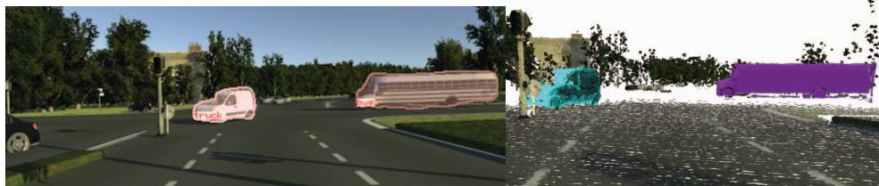  
(a) Semantic labels

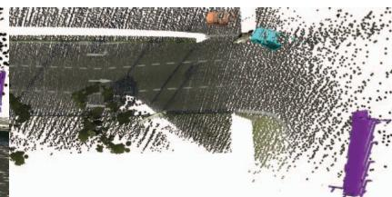  
(b) Labels in 3D (front view)  
(c) Labels in 3D (top view)  
Fig. 5: Results based on the semantic labeling. Here we show a scene from the virtual KITTI dataset [5], which would be difficult for our motion based segmentation. While 5a shows semantic labels generated by a CNN, the remaining images show the reconstruction and highlight the object labels.

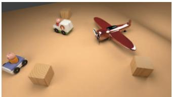  
(a) Color image

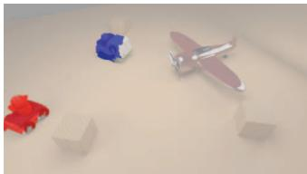  
(b) Motion segmentation

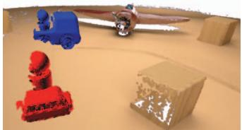  
(c) Colored 3D models

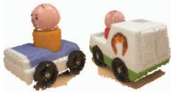  
(d) Reconstruction result

Fig. 6: Visualization of the stages of Co-Fusion based on our synthetic ToyCar3 sequence.  
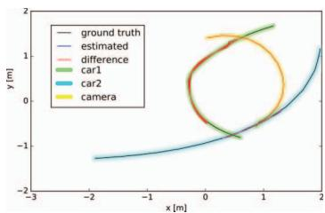  
(a) ATE (ToyCar3)

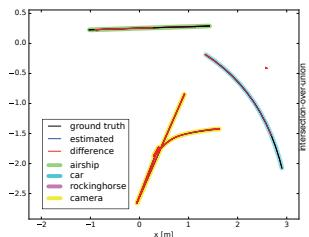  
(b) ATE (Room4)

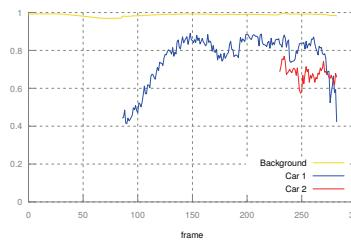  
(c) IoU (ToyCar3)

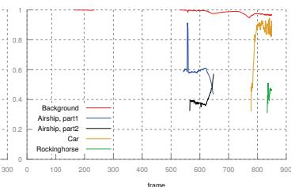  
(d) IoU (Room4)  
Fig. 7: Comparison between the ground truth and estimated trajectories for each of the objects in the (a) ToyCar3 and (b) Room4 sequences. Intersection-over-union measure for each label and each frame in the (c) ToyCar3 and (d) Room4 sequences. The graphs for car1 and car2 start to appear later in time, since the objects were not segmented before.

## ACKNOWLEDGMENT

This work has been supported by the SeconHands project, funded from the EU Horizon 2020 Research and Innovation programme under grant agreement No 643950.

## REFERENCES

[1] R Achanta, A. Shaji, K. Smith, A. Lucchi, P. Fua, and S. Susstrunk. Slic superpixels compared to state-of-the-art superpixel methods. IEEE Trans. Pattern Anal. Mach. Intell., 34(11), 2012.

[2] M. Dou, S. Khamis, Y. Degtyarev, P. Davidson, S. Fanello, A. Kowdle, S. Orts Escolano, C. Rhemann, D. Kim, J. Taylor, P. Kohli, V. Tankovich, and S. Izadi. Fusion4d: Real-time performance capture of challenging scenes. In ACM SIGGRAPH Conference on Computer Graphics and Interactive Techniques, 2016.

[3] Herbst E., P. Henry, and Dieter Fox. Toward online 3-d object segmentation and mapping. In IEEE Conference on Robotics & Automation (ICRA), 2014.

[4] K Fragkiadaki, M Salas, P Arbelez, and J Malik. Grouping-based low-rank trajectory completion and 3d reconstruction. In Advances in Neural Information Processing Systems (NIPS), 2014.

[5] A Gaidon, Q Wang, Y Cabon, and E Vig. Virtual worlds as proxy for multi-object tracking analysis. In CVPR, 2016.

[6] A. Handa, T. Whelan, J.B. McDonald, and A.J. Davison. A benchmark for RGB-D visual odometry, 3D reconstruction and SLAM. In IEEE Intl. Conf. on Robotics and Automation, ICRA, Hong Kong, China, May 2014.

[7] P. Henry, D. Fox, A. Bhowmik, and R. Mongi. Patch volumes: Segmentation-based consistent mapping with rgb- d cameras. In International Conference on 3D Vision (3DV), 2013.

[8] M. Keller, D. Lefloch, M. Lambers, S. Izadi, T. Weyrich, and A. Kolb. Real-time 3d reconstruction in dynamic scenes using point-based fusion. In International Conference on 3D Vision, 3DV, Washington, DC, USA, 2013. IEEE Computer Society.

[9] P. Krähenbühl and V. Koltun. Efficient inference in fully connected crfs with gaussian edge potentials. In Advances in Neural Information Processing Systems. Curran Associates, Inc., 2011.

[10] Damien Lefloch, Tim Weyrich, and Andreas Kolb. Anisotropic pointbased fusion. In Intl. Conference on Information Fusion (Fusion), 2015.

[11] C. Li, H. Xiao, K. Tateno, F. Tombari, N. Navab, and G. D., Hager. Incremental scene understanding on dense slam. In IEEE/RSJ International Conference on Intelligent Robots and Systems (IROS), October 2016.

[12] R Martín-Mart'in, S. Hofer, and O. Brock. An integrated approach to visual perception of articulated objects. In IEEE Conference on Robotics & Automation (ICRA), 2016.

[13] R. A. Newcombe, D. Fox, and S. M. Seitz. Dynamicfusion: Reconstruction and tracking of non-rigid scenes in real-time. In The IEEE Conference on Computer Vision and Pattern Recognition (CVPR), June 2015.

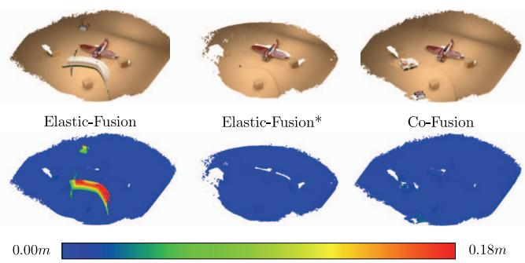  
Fig. 8: This heat map compares the reconstruction error of Elastic-Fusion and Co-Fusion. As the original Elastic-Fusion implementation does not reject the geometry of moving objects completely, we added the outlier removal step described in Section VIII for fair comparison (marked with \*). Note that while the geometry of the toy cars is ignored by Elastic-Fusion\*, it does appear in the reconstruction of Co-Fusion associated with low errors.

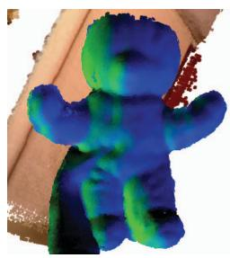  
(a) Front

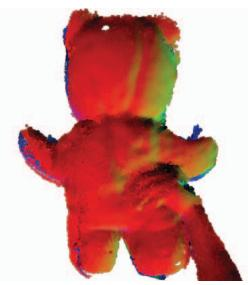  
(b) Back  
Fig. 9: Hand-held reconstruction of a teddy bear: While the left hand was used rotate the teddy, the right one was holding the RGBD-sensor, which requires tracking of two independent motions.

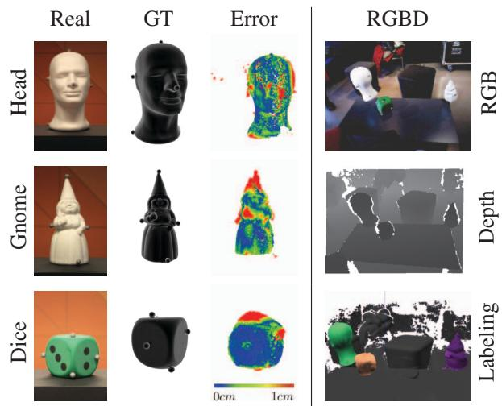  
Fig. 10: Illustration of the Esone1 sequence. Markers were added to real 3D objects and tracked with an OptiTrack mocap system. A highly accurate 3D scanner was used to obtain ground-truth data of the geometry of the objects to allow a quantitative evaluation.

[14] R. A. Newcombe, S. Izadi, O. Hilliges, D. Molyneaux, D. Kim, A. J. Davison, P. Kohli, J. Shotton, S. Hodges, and A. W. Fitzgibbon. Kinectfusion: Real-time dense surface mapping and tracking. In 10th IEEE International Symposium on Mixed and Augmented Reality, ISMAR. IEEE Computer Society, 2011.

[15] M. Niessner, M. Zollhöfer, S. Izadi, and M. Stamminger. Real-time 3d reconstruction at scale using voxel hashing. In ACM Transactions on Graphics (TOG), 2013.

[16] L. Zitnick P. Dollar. Microsoft coco: Common objects in context. In ECCV. European Conference on Computer Vision, September 2014.

[17] P. O. Pinheiro, T.-Y. Lin, R. Collobert, and P. Dollr. Learning to refine object segments. In ECCV, 2016.

[18] C. Y. Ren, V. A. Prisacariu, and I. D. Reid. gSLICr: SLIC superpixels at over 250Hz. ArXiv e-prints, September 2015.

[19] Carl Ren, Victor Prisacariu, David Murray, and Ian Reid. star3d: Simultaneous tracking and reconstruction of 3d objects using rgb-d data. In International Conference on Computer Vision, ICCV, 2013.

[20] A. Roussos, C. Russell, R. Garg, and L. Agapito. Dense multibody motion estimation and reconstruction from a handheld camera. In IEEE International Symposium on Mixed and Augmented Reality (ISMAR), 2012.

[21] C. Russell, R. Yu, and L. Agapito. Video pop-up: Monocular 3d reconstruction of dynamic scenes. In European Conference on Computer Vision (ECCV), 2014.

[22] R. F. Salas-Moreno, B. Glocker, P. H. J. Kelly, and A. J. Davison. Dense planar slam. In International Symposium on Mixed and Augmented Reality (ISMAR), 2014.

[23] R. F. Salas-Moreno, R. A. Newcombe, H. Strasdat, P. H.J. Kelly, and A. J. Davison. Slam++: Simultaneous localisation and mapping at the level of objects. In IEEE Conference on Computer Vision and Pattern Recognition (CVPR), 2013.

[24] T. Schmidt, R. A. Newcombe, and D. Fox. DART: dense articulated real-time tracking with consumer depth cameras. Auton. Robots, 2015.

[25] J. Stückler and S. Behnke. Efficient dense rigid-body motion segmentation and estimation in RGB-D video. International Journal of Computer Vision, 113(3), 2015.

[26] K. Tateno and N. Tombari, F.and Navab. When 2.5d is not enough: Simultaneous reconstruction, segmentation and recognition on dense slam. In In. Proc. Int. Conf. on Robotics and Automation (ICRA), May 2016.

[27] J. Taylor, L. Bordeaux, T. J. Cashman, B. Corish, C. Keskin, T. Sharp, E. Soto, D. Sweeney, J. P. C. Valentin, B. Luff, A. Topalian, E. Wood, S. Khamis, P. Kohli, S. Izadi, R. Banks, A. W. Fitzgibbon, and J. Shotton. Efficient and precise interactive hand tracking through joint, continuous optimization of pose and correspondences. ACM Trans. Graph., 2016.

[28] D. Tzionas and J. Gall. Reconstructing articulated rigged models from rgb-d video. In German Conference on Pattern Recognition, 2016.

[29] Chieh-Chih Wang, Charles Thorpe, Sebastian Thrun, Martial Hebert, and Hugh Durrant-Whyte. Simultaneous localization, mapping and moving object tracking. The International Journal of Robotics Research, 26(9):889–916.

[30] T. Whelan, M. Kaess, J. J. Leonard, and J. B. McDonald. Deformationbased loop closure for large scale dense rgb- d slam. In Intelligent Robots and Systems (IROS), 2013.

[31] T. Whelan, S. Leutenegger, R. F. Salas-Moreno, B. Glocker, and A. J. Davison. ElasticFusion: Dense SLAM without a pose graph. In Robotics: Science and Systems (RSS), Rome, Italy, July 2015.

[32] T. Whelan, J. B. McDonald, M. Kaess, M. Fallon, H. Johannsson, and J. J. Leonard. Kintinuous: Spatially extended kinectfusion. In Workshop on RGB-D: Advanced Reasoning with Depth Cameras, in conjunction with Robotics: Science and Systems, 2012.

[33] M. Zollhöfer, M. Niessner, S. Izadi, C. Rehmann, C. Zach, M. Fisher, C. Wu, A. Fitzgibbon, C. Loop, C. Theobalt, and M. Stamminger. Real-time non-rigid reconstruction using an rgb-d camera. ACM Trans. Graph., 33(4), 2014.