# Multi-UAV Collaborative Monocular SLAM

Patrik Schmuck and Margarita Chli Vision for Robotics Lab, ETH Zurich, Switzerland

Abstract— With systems performing Simultaneous Localization And Mapping (SLAM) from a single robot reaching considerable maturity, the possibility of employing a team of robots to collaboratively perform a task has been attracting increasing interest. Promising great impact in a plethora of tasks ranging from industrial inspection to digitization of archaeological structures, collaborative scene perception and mapping are key in efficient and effective estimation. In this paper, we propose a novel, centralized architecture for collaborative monocular SLAM employing multiple small Unmanned Aerial Vehicles (UAVs) to act as agents. Each agent is able to independently explore the environment running limited-memory SLAM onboard, while sending all collected information to a central server, a ground station with increased computational resources. The server manages the maps of all agents, triggering loop closure, map fusion, optimization and distribution of information back to the agents. This allows an agent to incorporate observations from others in its SLAM estimates on the fly. We put the proposed framework to the test employing a nominal keyframe-based monocular SLAM algorithm, demonstrating the applicability of this system in multi-UAV scenarios.

## SUPPLEMENTARY MATERIAL

Video — https://youtu.be/L9rHht8fE5E

## I. INTRODUCTION

The problem of Simultaneous Localization And Mapping (SLAM) is fundamental in Robotics, since ego-motion estimation and map-building are key in enabling autonomous navigation. Aiming for sensors that are able to provide rich information about their environment during SLAM, while exhibiting portability and low power, it is no surprise that vision has become a very popular sensing modality onboard constraint platforms, such as small Unmanned Aerial Vehicles (UAVs) as the one depicted in Figure 1. Their agility and ability to swiftly reach remote places render small UAVs very practical for missions, such as inspection, search and rescue or crop monitoring.

With important advancements in monocular SLAM (e.g. [1]), it was not long before vision-based SLAM approaches able to run onboard a UAV started emerging, such as [2], providing UAVs with basic autonomy. With the biggest body of the literature focusing on SLAM from a single UAV, some systems investigated the fusion of information from multiple robotic agents to construct a single, global map and the selflocalization of agents relative to each other on the go. It is only very few systems, however, that address collaborative

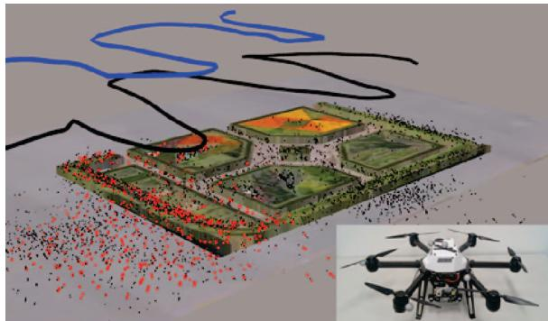  
Fig. 1: Our collaborative SLAM system in action, combining information from two UAVs (i.e. AscTec Neos visible in the inset) flying over a garden area, here augmented with the Google Earth's view for clarity. Following a loop-closure detection across the estimated trajectories (in blue and black) the red map points, as opposed to the black ones, are used by both UAVs for position tracking

SLAM (i.e. localization and mapping) from multiple robots. With the potential of boosting the efficiency of a mission, centralized collaborative SLAM permits sharing the workload of tasks, such as mapping an environment, amongst all agents, while passing computationally demanding tasks, such as map optimization, from an agent to the ground station. Furthermore, the presence of multiple agents can increase the robustness of the SLAM estimation process, since via sharing of information across the agents, every agent can profit from the measurements taken by the others.

Ensuring network connectivity, dealing with time delays and enabling transparent information access among all agents and the ground station pose great challenges in ensuring the consistency of collaborative SLAM. In this spirit, this paper proposes a powerful collaborative SLAM architecture designed for multiple small UAVs, each equipped with the same sensor-suite and computationally-constraint processing unit, and a central ground station (“server") with potentially much more computational capabilities, which communicates with all agents. Figure 1 illustrates a snapshot of our system in action, performing collaborative SLAM using two UAVs in an outdoor environment. Employing an open-source keyframe-based monocular SLAM algorithm, we perform a thorough experimental analysis of the proposed architecture on indoor and outdoor missions. Our evaluation demonstrates that sharing information across agents via the proposed approach can improve not only the global map, but also the trajectories of the agents on the go. Attesting to the power of the proposed approach to effectively deal with the time-delays and consistency issues arising in a real scenario, we employ four UAVs to map an outdoor area, evaluating estimates against accurate ground-truth position data from a Leica Total Station.

## II. RELATED WORK

Several works in the literature tackle the localization problem in a multi-robot scenario. Martinelli et al. [3] use an Extended Kalman Filter (EKF) based estimation of relative robot configuration based on mutual observations. In [4], the authors show a system for two UAVs with monocular cameras and IMU, forming a flexible stereo rig. This system is then used to estimate the relative pose of the UAVs on a simple experimental setup. Piasco et al. [5] also use a distributed stereo-vision system with multiple UAVs for collaborative localization, based on an EKF filtering scheme. Another subject closely related to collaborative SLAM is cooperative mapping with multiple robots. In [6], the authors present a collaborative mapping system for ground-based robots and UAVs. Other works, such as Google's “Project Tango"[7] and the recent work of Guo et al. [8] do not directly target robotic application scenarios, but collect data with multiple hand-held platforms, such as tablets or mobile phones to build a common map with the input from these devices.

While these systems address either mapping or localization in a collaborative manner, only few existing works are able to perform collaborative SLAM with multiple agents. A centralized architecture is usually used in the literature when it comes to systems applied practically in robotics, however some works tackle collaborative SLAM with a decentralized system, such as Cunningham et al. [9], who propose a fully distributed SLAM system and evaluate it in simulation. The biggest challenge with decentralized systems is that it is much more difficult to assure data consistency and avoid double-counting of information, compared to centralized client-server-architectures. Furthermore, a system with a central server offers the advantage that computationally expensive algorithms, that are not necessarily constraint to real-time operation, such as Bundle Adjustment and Place Recognition, can be handled on the server's side. This allows for the robotic agents to only dedicate their potentially limited resources to performing the most critical tasks, such as real-time visual odometry.

Instead of using a central server present in the environment of the robotic mission, some works propose to use a cloud server for storing data and sharing it between the robots. In [10], the authors present how such a system can be used for collaborative SLAM with low-cost ground robots. The agents do not see the global map stored in the cloud, but get updated keyframe pose information for the keyframes in the agent's local map as a feedback from the cloud system. Moving the algorithms of the central server of a collaborative system to the cloud is an option that becomes particularly appealing when using many agents.

Zou and Tan [11] present a collaborative monocular SLAM system with a focus on handling dynamic environments. It takes image feeds from multiple monocular cameras as input and uses a Place Recognition system to group cameras with scene overlap. Yet, it requires the cameras to be synchronized, since for example a keyframe is captured by all cameras at the same time, restricting the autonomy of the agents. Furthermore, this algorithm needs a GPU for calculation, and requires all cameras to observe the same scene at the initialization step. These drawbacks make this system impractical to use on UAVs.

Forster et al. [12] show a collaborative SLAM system based on a structure from motion pipeline. Each agent runs a keyframe-based visual odometry system onboard, that sends new keyframes to a central server. If a correspondence between two maps is found on the server, the maps are merged and globally optimized. While this was probably the first system to address a multi-UAV setup, it does not send any information back to the agent, so that it can profit from the optimized map and pose estimation. “Collaborative SLAM" is used in a rather loose sense in literature, with systems like [12] being basically collaborative mapping, since the map on the server is not used for pose tracking on the agent at any later stage.

In [13], the authors present C2TAM for 2 RGB-D cameras running PTAM [1] on the image streams for SLAM estimation, where only the position tracking is executed on the agents. The agents send their keyframes to the server, where all mapping tasks are executed. The complete map is then sent back to the agents for further tracking steps. This enables the usage of the system with very limited computational resources, however it does not allow the agents to autonomously operate without relying on the server. Furthermore, while PTAM was a seminal work for keyframebased SLAM, current state-of-the-art outperforms it, with more robust and precise estimates in larger areas. C²TAM was only tested in a small office environment, and the assumption of repeatedly sending whole maps is doomed to become problematic in larger areas.

Morrison et al. [14] designed a collaborative SLAM system to be used with hand-held devices The target of this system is to enable multi-device mapping. They perform full SLAM on each agent, the server is used as a central memory for storing and sharing the agents' maps. This architecture of this system does not make use of many advantages a collaborative system offers, since the expensive optimization algorithms are still run on the agent.

The recent work of Deutsch et al. [15] presents a system that can be run on a server and is able to combine different SLAM systems in a collaborative framework. The SLAM systems that can be combined in this approach, however, are restricted to such that operate on a pose graph, where each keyframe has an image and its absolute scale linked to it. This excludes, for instance, all pure monocular SLAM systems. Furthermore, as in [14], a full SLAM system runs on the agent. The server informs an agent about updates in its pose graph, the global map on the server and the submaps of other agents are not visible to the agents.

The system presented in this work overcomes the need for the agents to rely on information from the server as in [13] to operate autonomously, but still outsources computationally expensive tasks to the server and does not perform full SLAM onboard like [14]. Unlike [12], we communicate information from the server back to the agents, and also augment the agents' local maps with information from other agents, in contrast to [15] and [10].

## III. METHODOLOGY

The system architecture of our collaborative SLAM approach is depicted in Figure 2. It comprises multiple agents, each equipped with a monocular camera, and one central server that is able to communicate with all agents. Any communication is established via a wireless network. In this centralized architecture, all communication across agents goes via the server. The system does not assume any prior knowledge on the initial configuration of the agents. Each agent operates in its local odometry frame with the origin of that frame lying at the starting position of the agent.

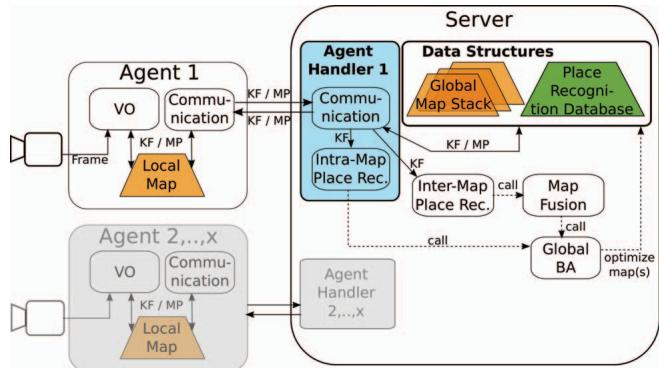  
Fig. 2: Overview of the system architecture. An agent (e.g. a UAV) runs real-time Visual Odometry (VO) maintaining a Local Map, and a Communication module to exchange data (KeyFrames (KF) and Map Points (MP)) with the server. The server is a ground station that executes non time-critical and computationally expensive processes: Place Recognition, Map Fusion, and Bundle Adjustment (BA).

The design of the proposed architecture focuses on enabling each robotic agent to run all algorithms necessary to provide it with simple autonomy, allowing it to move on without requiring any information from the server. For this purpose, each agent runs real-time Visual Odometry for pose estimation, which holds a Local Map of its surrounding (limited to the N closest keyframes in the vicinity of the agent, with N primarily depending on the computational capacity available onboard the agent), and a Communication module, on a separate thread to enable both modules to work in parallel. Since the onboard computation capabilities of the agents are limited, an agent cannot keep the whole map when operating in a large environment. In this case, the server also acts as a bookkeeper, keeping track of all acquired data. As a result, the server can provide an agent with past experiences that are not included in its Local Map, when returning to a previously visited location and a loop closure is detected. The server runs non time-critical and computationally expensive processes, which comprise of Intra-Map Place Recognition,

Inter-Map Place Recognition, Map Fusion across the maps from different agents and Global Map optimization (aka Bundle Adjustment – BA).

While this system is designed to work with any keyframebased SLAM approach using image features, here we put it to the test using ORB-SLAM2 [16], as one of best performing monocular SLAM systems currently available in the literature. Consequently, some building blocks of our system (i.e. Visual Odometry and Place Recognition) are based on the ORB-SLAM2 implementation¹, however their descriptions remain generic to demonstrate the wide applicability of the proposed architecture.

## A. Visual Odometry (VO)

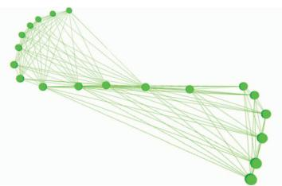  
Fig. 3: A small pose graph, the map created by the VO system. Keyframes (i.e. nodes) that share enough map points (here 14) are connected by an edge.

Incoming camera frames are processed by a Visual Odometry (VO) system based in the underlying SLAM approach. The goal of this system is to calculate for each frame the movement of the camera, by tracking scene landmarks that later serve as Map Points (MP) inside the agent's Local Map. The Local Map keeps a series of KeyFrames (KF) in a pose graph (Figure 3), which is later subject to optimization. New MPs enter the map by triangulation with the past observations of them. Traditionally, in KF-based SLAM the most representative frames are maintained (KFs), in order to reduce the amount of data in the map to improve computation time, permitting real-time behavior. The decision whether a frame is inserted in the map as a KF can be based e.g. on the traveled distance with respect to the last inserted KF or on feature points overlap – this decision depends on the underlying SLAM approach.

The VO block also incorporates local mapping running on a separate thread, which is activated when a new KF is created by VO. This establishes the pose graph connections for each new KF before inserting it in the Local Map. Local mapping can include additional steps depending on the SLAM system used, e.g. local optimization or the search for more MP matches for the current KF. In the case that two or more agents contribute to the same map of the Map Stack on the server's side, the VO of each agent runs on a local copy of an extract of the merged map, i.e. limiting the size of each Local Map to N KFs. This Local Map incorporates KFs and MPs from all the agents who contributed to this merged map. In the case that two agents simultaneously change the same KF or MP in their local copy, we use our resolving scheme described in section III-D. Unlike previous works tackling collaborative SLAM with a client-server-architecture [10], [12], [15], we send the KFs and MPs created by other agents from the server back to the agents, thus augmenting the Local Map of an agent by information gathered by other agents. This allows the agent to not only use its own map data for pose tracking, but also use data from other agents that visited the same location before. By this, we ensure that no information is lost and we enable collaboration to perform SLAM.

## B. Agent Handler

An Agent Handler serves to interface the server and the agent. This Handler runs a Communication module that is in charge of data exchange with the agent, and an Intra-Map Place Recognition module detects loop closures in this agent's map stored on the server's side (which stores all past information, as opposed to the Local Map. Details of its structure follow in section II-C.2). Each Agent Handler runs Intra-Map Place Recognition and Communication on a separate thread, to allow the Handlers of different agents to work independently and in parallel. The Handler manages the links to the rest of the modules of the server. Furthermore, it holds a Sim(3)-transformation, that transforms poses in the map frame on the server's side to the map frame on the agent's side. This Sim(3)-alignment between the agent and the server is necessary, since after a Map Fusion step, the scale and the frame of origin of the merged map on the server and the Local Map can be different.

## C. Data Structures

1) Local Map: The pose graph generated by KF-based SLAM consisting of the KFs and MPs currently known to the agent, like the pose graph shown in Figure 3. In large environments, the Local Map is restricted to N KFs of the surroundings of the agent, to limit the onboard computation load. Each KF is augmented with a globally unique identifier when it is created by the agent. The Local Map is maintained in a local reference system (the VO frame).

2) Server Maps and Global Map Stack: The Map Stack contains all the Maps constructed by the agents, without the restriction of keeping the N last KFs. Instead, all past information is kept in “Server Maps" on the server's side. For example, in the case of four agents, the Map Stack contains at least one and up to four Server Maps. When starting the system, one Server Map is initialized for each agent, accessible only by its corresponding Handler. When two maps inside the Map Stack are merged, these maps are removed from the Stack and a new Server Map resulting from their fusion is added to the Stack and associated to all participating Handlers. In a Map Fusion (III-G), the two Server Maps being merged are aligned and subsequently share a local reference frame. Therefore, the system never makes use of a global reference frame.

3) Keyframe Database for Place Recognition: Our KF database is incrementally built from all acquired KFs (i.e. from all agents) during runtime. This database implements an efficient look-up procedure to allow for a new KF to query other, past KFs with the same features. For each KF in this database, the information about which agent created this KF is stored. This allows the Place Recognition to query the database for KFs independently of the map they are kept in.

## D. Communication

A Communication module on the agent's or the server's side handles all communication between them. To exchange messages, we use the ROS infrastructure [17]. This ROSbased communication infrastructure does not guarantee realtime message passing, yet since neither the agents nor the server need information updates from each other at a fixed frequency, this is not necessary for our approach. The Communication module runs at a pre-defined frequency, ensuring consistency and real-time behavior on the agent. For every iteration, it bundles all KFs and MPs, which were either newly created or changed since the last communication in a message and publishes this message. Furthermore, it processes any messages that came in in-between information exchanges. For MPs and KFs already existing in the associated map, these changes are applied. For MPs and KFs that do not exist in the map, the Communication module constructs these data structures from the messages, establishes the connections in the pose graph, and inserts them in the respective map. This happens at two points of the system: either on the agent to update the Local Map with information from the server, or on the server to incorporate new information from the agent in its related Server Map inside the Map Stack. On the server's side, the Communication module forwards the KFs to the Intra-Map and the Inter-Map Place Recognition modules. Furthermore, for incoming data, the Communication performs multiple security checks to assure that the data on the server and the agent is consistent, which includes e.g. a check whether a message is lost, and to verify that the same KF or MP is not inserted twice in the map.

The communication is bidirectional: the agents send new, deleted or changed KFs and MPs to the server. The server sends KFs and MPs that were changed or deleted to the agent. If an agent A shares a map with another agent B, the communication from the server to the agent A also incorporates the communication of new, changed and deleted KFs created by agent B. If a conflict occurs between an agent and the server, for example because both changed the pose of a MP or a KF, we favor the information from the server. Since the server performs a global BA on the data occasionally, we consider its information to be more precise than the information of the agent. Since the Local Map of agent A is augmented with the data from agent B, A can also use and apply changes to this data, e.g. change the pose, add MPs to KFs or use MPs from B in the VO module. In the case that both agents perform an update e.g. the pose of the same KF simultaneously, and there is no superior pose estimate from the global BA, the latest incoming pose is used. A locking scheme using unique locks prevents errors due to race conditions throughout the whole system

We process incoming KFs and MPs in a first-in-first-outscheme. Furthermore, an agent can work independently and does not need any feedback from the server to operate. Therefore, this system architecture does not suffer from problems caused by delays from the network or time-consuming optimization steps. While it is possible that information arrives later at the recipient, potentially leading to a situation, where one agent cannot use information from another agent about its current location due to late arrival, time delays would not cause the system to crash. As a result, absence of communication leads to an agent performing VO, keeping only the last N KFs in its local map, while forgetting all older ones.

## E. Bundle Adjustment (BA)

We use Bundle Adjustment for optimization of the pose graphs of Server Maps inside the Map Stack. BA optimizes a graph by minimizing the re-projection error for all KFs and MPs taken into account for the optimization. After Inter-Map Place Recognition and Map Merging, we perform a global 7 Degrees-of-Freedom (DoF) optimization of the pose graph to improve the graph and reduce scale drift, incorporating all information in the map. Since global BA is time-consuming and computationally demanding, it is only performed on the server. The Communication modules associated with the map to optimize are suspended during the optimization step. The modules, therefore, contain input and output buffers to make sure that no data is lost. In the experiments we present in this paper, the implementation of the global BA uses the Levenberg-Marquardt implementation of g2o [18].

## F. Place Recognition

The Place Recognition system detects whether an agent is at a location, where itself or another agent has already been in the past. Therefore, it takes a newly arrived KF and queries the database for similar KFs in the database, returning a set of candidate KFs that share a sufficient amount of common features with the current KF. These candidates are evaluated by appearance and/or geometric checks (depending on the algorithm of choice) and finally a decision whether the current KF matches another KF is made. Such loop closure detection allows adding new constraints to the pose graph that can be used to optimize the graph and may significantly improve the quality of the map. We distinguish two Place Recognition modules in our system:

1) Intra-Map Place Recognition: a query KF $K _ { q }$ considers for matching only KF candidates from the same Server Map in the Map Stack. Consequently, success means new constraints inside one Server Map of the Stack. Subsequently, global BA is performed on this map.

2) Inter-Map Place Recognition (Map Matching): a query KF $K _ { q }$ is tested for matches with KFs from other Server Maps. Success means new constraints between two Server Maps of the Stack and is followed by a Map Fusion.

## G. Map Fusion

The Map Fusion module takes a pair of matching KFs $( K _ { q } , K _ { m } )$ belonging to two different maps $M _ { q }$ and $M _ { m }$ respectively. A Sim(3)-transformation between the two maps is calculated, also taking into account the different scales of the maps, transforming the MPs and KFs of $M _ { q }$ into the coordinate frame of a third, merged map $M _ { f }$ Thereby, the scale of $M _ { m }$ remains, while $M _ { q }$ (the map of the query KF $K _ { q } )$ is scaled according to the Sim(3) transformation. New links in the pose graph are derived from the matching KF pair. Then global BA is run to optimize the full map. Finally, the Map Stack is updated: $M _ { q }$ and $M _ { m }$ are deleted from the Stack, $M _ { f }$ is added.

## IV. EXPERIMENTAL RESULTS

The proposed collaborative SLAM framework is evaluated on two separate scenarios. In experiment 1, two hand-held agents move independently in an indoor office environment, while in experiment 2, four UAVs, each equipped with a single downward-looking camera, navigate over an outdoor garden area, while being laser-tracked by a Leica Total Station, providing accurate position ground truth for each UAV. For both experiments, a Thinkpad T460s notebook with a Core i7-6600U @ 2.60GHz × 4 and 20 GB RAM is used as the server. In experiment 1, the same machine is used for each agent, while in experiment 2, the Neo platform from Ascending Technologies (Figure 1) equipped with an Intel NUC 5i7RYH is used. ORB-SLAM2 [16] is used as the underlying SLAM system for both experiments. Consequently, Visual Odometry and Place Recognition are based on the ORB-SLAM2 implementation.

## A. Experiment 1: Two hand-held cameras, indoors

Two hand-held cameras are used as agents to explore an office environment of around 50 m × 25 m, with the views of each agent shown in Figures 4a and 4b. Figure 4c shows the superimposed trajectories of agent A (red) and agent B (green) estimated without using a collaborative SLAM system, after a scale-adjustment to the size of the floor plan As ORB-SLAM2 is a monocular system, it does not recover scale, so in order to enable an analysis of the proposed system architecture, the scale is manually fitted to the floor plan. While the smaller trajectory of agent A fits to the plan, agent B moves along a longer trajectory through the office floor and therefore suffers more from drift than agent A. This can be seen in Figure 4c at the end of the trajectory of agent B: the agent should have reached the end of the indicated true trajectory (dotted green line), yet the estimated trajectory of agent B intersects the wall at Position 1. Figure 4d shows the same situation, now using the proposed approach for collaborative SLAM on the following scenario: first, Agent A's trajectory successfully closes a loop at Position 2 and subsequently, agent B moves through the office floor. A match between the Server Maps of the two agents inside the Map Stack is detected at Position 3, which results to their merging. As agent B moves on along the corridor to reach Position 4, the Inter-Map Place Recognition detects that agent B is revisiting a place that agent A has visited before, and by that Global BA is triggered, improving the Global Map. The end of the estimated trajectory of agent B now aligns with the corridor and building and ends at the true end point of the trajectory. The improved pose estimates are communicated back to both agents, so that they can use the improved map estimate on their motion and map estimation further on.

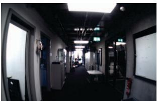  
(a)

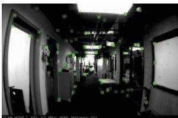

(b)  
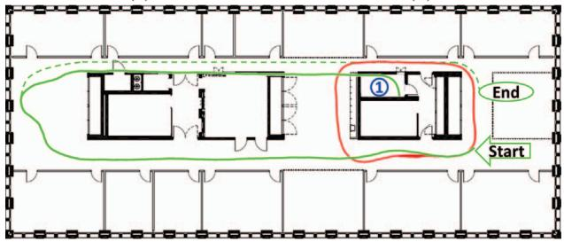

(c)  
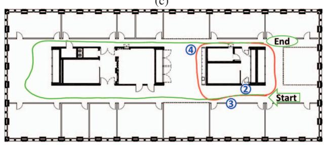  
(d)  
Fig. 4: Experiment 1, showing the trajectories of two agents moving consecutively in an office environment. (a) View from the agent, with scene landmarks for tracking superimposed in (b). (c) Trajectory estimate of both agents A (red) and B (green) without using collaborative information. The trajectory from agent B suffers from drift and intersects the wall. The dotted green line indicates the real trajectory of agent B. (d) The same situation with two agents using collaborative SLAM: a loop closure at pos. (4) between the trajectories of agent A and B allows to optimize the trajectory of agent B, aligning now with the true trajectory.

This experiment demonstrates that sharing information across the two agents via the server as they are moving, following the proposed framework, they are able to achieve a globally consistent common map during the mission and in time to aid consistent SLAM estimates on the agents side in real-time. As opposed to simply offline processing of experiences from both agents post-mission, in this scheme, the agents can benefit from each other's experiences on the go, while consistency of estimates is constantly ensured.

## B. Experiment 2: Four UAVs, outdoors

Using an AscTec Neo UAV to capture four datasets over the same area and subsequently playing back all four datasets simultaneously, the scenario tested in this experiment involves four UAVs flying over an outdoor garden area (visible in Figures 5a and 5b) at the same time, thus processing all captured information in parallel. During these experiments, $N ~ = ~ 7 0$ is used as upper limit of KeyFrames (KFs) in the local maps on the agents. Figures 5c to 5h show the evolution of the Map Stack throughout the experiment. When the system is started, one Server Map is initialized for each agent. Agent D (green) starts at time $t = 1 0 [ s ]$ , agent A (black) at $t = 6 0$ , agent B (blue) at $t = 7 0$ , and agent C (purple) at $t = 1 0 0$ $\mathbf { A } \mathbf { t } t = 8 0$ (Figure 5c), no match between Server Maps is found, therefore all agents still operate on their own Server Maps. Between $t = 8 0$ and $t = 8 5$ (Figure 5d), a match between the Server Maps of agent A and D is found, an these maps are merged. Consequently, only three maps remain from now on in the Stack, since A and D share one Server Map now (Server Map AD).

The Map Fusion from 5c to 5d also shows the handling of scale differences by the collaborative SLAM system: The ratio of the size of the trajectories of agent A and D changes between these two time steps. Since we assume no prior knowledge on the environment or other agents, each agent estimates a different scale factor when starting its SLAM system. This results in maps of different size of the same environment, therefore the Map Fusion performs a scale alignment of the Server Maps that are merged.

Between $t ~ = ~ 8 5$ and $t ~ = ~ 1 0 0$ (Figure 5e), a match between the Server Maps of B and Server Map AD is found, resulting in a merged Server Map ABD. Incoming KFs from the agents A, B and D enter this map. Figure 5f shows the Map Stack at $t = 1 5 0$ , just before the Server Map of agent C and the Server Map ABD are merged, resulting in one Server Map ABCD incorporating the KFs from all agents (Figure 5g). Figure 5h shows the Map Stack at the end of the experiment, containing one single Server Map with all four agent trajectories. Figure 6 shows a merged Server Map from the data of agent A and B (not incorporating information provided by C and D) with 3 Degrees of Freedom position ground truth, manually scale-aligned to the global map.

Figure 7 shows how the map of agent B on the agent's side is augmented with the information from agent A. The map includes the trajectory of agent B (solid blue), the KFs from agent A (black camera frusta) augmenting the map, and the Map Points (MPs) of agent B (blue) and agent A (gray). To visualize the information coming from the different agents, all KFs and MPs are displayed in this example, no parts of the map are forgotten. Red MPs are MPs that are used by VO of both agents, i.e. they were generated by agent A, sent to agent B, and then in a further step were used by VO of agent B when a new KF was created by VO. This shows that our system enables an agent to not only to receive information collected by other agents, but also use this information in further processing.

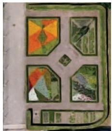  
(a) Small park

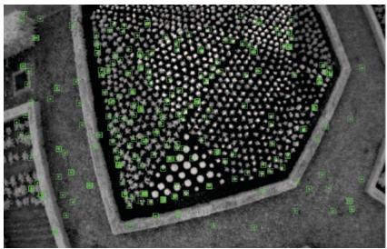  
(b) Agent view

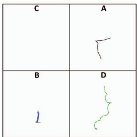

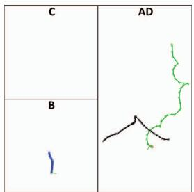  
(d) t=85s

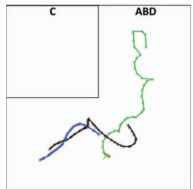  
(e) t=100s

(c) t=80s  
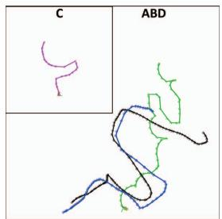  
(f) t=150s

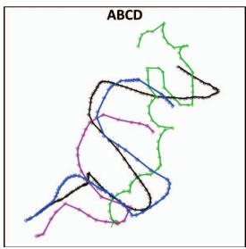  
(g) t=165s

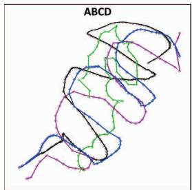  
(h) t=220s

Fig. 5: Experiment 2: 4 UAVs simultaneously flying over a small park, performing collaborative SLAM. (a) Top view from Google Earth of the test area. (b) View from UAV with scene landmarks superimposed. (c) to (h) Evolution of the Map Stack containing the maps on the server's side associated to the agents A to D. At the beginning, one map is generated for each agent. Then, during the mission, overlap between the maps is detected and the maps are merged, finishing with one map incorporating all information from all agents.  
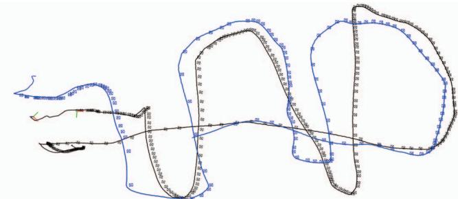  
Fig. 6: Global Map with KFs from two agents (blue and black camera frusta) and position ground truth (solid lines). Absolute trajectory error (RMSE): 0.22m

## C. Scaling and Complexity

We limit the number of agents in the current implementation to four, yet architecture-wise our system is not constraint regarding the number of agents. This section shows how the number of agents affects the timing behavior of the proposed system. We pay particular attention on the communication, since the communication effort increases with more agents participating in the system. The VO onboard the agents always remains real-time, as the number of KFs is bounded no N. Table I shows how the communication scales with the number of agents.

The timings are averaged over three runs for each case of having 1 to 4 agents in the system and recorded the time, during which the communication module was busy. The communication time increases only very little with each additional agent, as the system only sends KFs and MPs that changed, instead of the whole Local or Server Map, avoiding the otherwise linear complexity with the number of agents. The largest portion of these timings is spent right after a Bundle Adjustment step, when a map has its most KFs and MPs changed, and consequently, updates for almost the whole map need to be sent to the relevant agents. An evaluation of the tracking frequency on each agent reveals that the input stream rate (i.e. the frame rate of the camera onboard a UAV) can be processed in real-time. Namely, for the setup in experiment 1 this is a maximum frame rate of 30Hz, while in experiment 2 the equivalent is 20Hz.

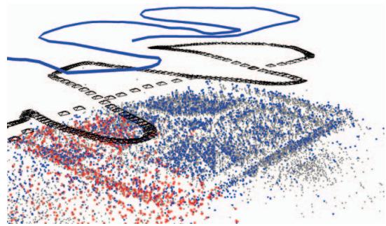  
Fig. 7: Map of agent B (blue) on the agent's side, showing the trajectory of the agent and its map points. The map is augmented with agent A's KFs (black camera frusta) and MPs (gray). Red MPs indicate that this point was used for position estimation by the VO of agent A and B.

TABLE I: Agent Communication Module Timings. Time for communication comprises of bundling relevant KFs and MPs in a ROS message that is sent to the server and processing incoming messages, as described in section III-D.
<table><tr><td rowspan=1 colspan=1>No. Agents:</td><td rowspan=1 colspan=1>1</td><td rowspan=1 colspan=1>2</td><td rowspan=1 colspan=1>3</td><td rowspan=1 colspan=1>4</td></tr><tr><td rowspan=1 colspan=1>Time for comm. [s]</td><td rowspan=1 colspan=1>1.99</td><td rowspan=1 colspan=1>2.75</td><td rowspan=1 colspan=1>3.09</td><td rowspan=1 colspan=1>3.37</td></tr><tr><td rowspan=1 colspan=1>Time of experiment [s]</td><td rowspan=1 colspan=1>100</td><td rowspan=1 colspan=1>110</td><td rowspan=1 colspan=1>122</td><td rowspan=1 colspan=1>132</td></tr></table>

TABLE II: Timings for Global Optimization
<table><tr><td rowspan=1 colspan=1>No. KFs</td><td rowspan=1 colspan=1>47</td><td rowspan=1 colspan=1>113</td><td rowspan=1 colspan=1>138</td><td rowspan=1 colspan=1>236</td><td rowspan=1 colspan=1>330</td><td rowspan=1 colspan=1>407</td></tr><tr><td rowspan=1 colspan=1>No. Agents</td><td rowspan=1 colspan=1>2</td><td rowspan=1 colspan=1>3</td><td rowspan=1 colspan=1>3</td><td rowspan=1 colspan=1>4</td><td rowspan=1 colspan=1>3</td><td rowspan=1 colspan=1>4</td></tr><tr><td rowspan=1 colspan=1>BA Time [s]</td><td rowspan=1 colspan=1>0.7</td><td rowspan=1 colspan=1>4.5</td><td rowspan=1 colspan=1>8.9</td><td rowspan=1 colspan=1>16.9</td><td rowspan=1 colspan=1>32.8</td><td rowspan=1 colspan=1>40.3</td></tr></table>

Table II shows the timings of global BA, ordered by ascending number of KFs taken into account in the optimization, as well as the number of agents contributing to this optimization. The time necessary for BA depends on the number of participating KFs, and therefore, indirectly on the number of agents contributing to a map, since more agents result in more KFs entering the map, and the same KF-creation strategy is used across all agents. As expected, global BA is fast for a small number of KFs, but takes more than 10s when more than 200 KFs are taken into account. As explained in Section III-D, long optimization processes can be performed with our architecture, since all incoming messages are stored in buffers during the optimization, yet it delays the communication of information from one agent to another, albeit without influencing the real-time performance of the onboard SLAM estimation. The effect of these delays is on the collaboration aspect; the updates from an optimized map are communicated to the agents with delays increasing with the number of KFs considered. As this is bound to become problematic in larger maps, a more powerful ground station can be considered, while follow-up directions will explore short-cuts in the optimization by discriminating KFs that will have most influence in the current state of the agents.

## V. CONCLUSION

This paper proposes a novel and powerful architecture for collaborative keyframe-based SLAM following a centralized paradigm. While the robotic agents (e.g. small UAVs) run real-time visual odometry onboard independently, the computationally more powerful central server aggregates their experiences, searches for loop closures and merges maps, if necessary. Communicating merged and optimized information back to the agents, the agents are able to operate on updated information, enabling better and more consistent estimates. A thorough evaluation of the proposed system on two scenarios reveals its practicality in real missions and ability to cope with time delays and consistency issues. An indoor experiment with two hand-held agents demonstrates how trajectories for single agents can be improved by using a collaborative system that shares information between the agents, while an outdoor experiment shows the system working with four UAVs at the same time, demonstrating how the maps on the server are consecutively merged and further on associated with more than one agent, augmenting each agent's maps with information from others.

In contrast to existing works, the proposed system enables collaboration not only in mapping the robots' workspace, but also in perceiving it. While the real-time estimation onboard each agent is never compromised and the system was demonstrated to operate successfully over a medium-sized outdoor area, with larger areas, the size of the accumulated experiences on the server is bound to become the bottleneck preventing effective collaboration amongst the agents. While this can be addressed with a more powerful server, future research will focus on investigating the restriction of the participating keyframes in the optimization step, to include only the ones most relevant to the current agents’ poses.

## REFERENCES

[1] G. Klein and D. Murray, "Parallel tracking and mapping for small AR workspaces," in IEEE and ACM International Symposium on Mixed and Augmented Reality (ISMAR), 2007.

[2] S. Weiss, M. W. Achtelik, S. Lynen, M. C. Achtelik, L. Kneip, M. Chli, and R. Siegwart, “Monocular Vision for Long-term MAV Navigation: A Compendium," Journal of Field Robotics (JFR), vol. 30, pp. 803– 831, 2013.

[3] A. Martinelli, F. Pont, and R. Siegwart, "Multi-robot localization using relative observations," in Proceedings of the IEEE International Conference on Robotics and Automation (ICRA), 2005.

[4] M. W. Achtelik, S. Weiss, M. Chli, F. Dellaert, and R. Siegwart, “Collaborative stereo," in Proceedings of the IEEE/RSJ International Conference on Intelligent Robots and Systems (IROS), 2011.

[5] N. Piasco, J. Marzat, and M. Sanfourche, "Collaborative localization and formation flying using distributed stereo-vision," in IEEE International Conference on Robotics and Automation (ICRA), 2016.

[6] T. A. Vidal-Calleja, C. Berger, J. Solà, and S. Lacroix, "Large scale multiple robot visual mapping with heterogeneous landmarks in semistructured terrain," Robotics and Autonomous Systems (RAS), vol. 59, no. 9, pp. 654–674, 2011.

[7] Google Inc. (2014) Project Tango. [Online]. Available: http: //www.google.com/atap/projecttango

[8] C. X. Guo, K. Sartipi, R. C. DuToit, G. Georgiou, R. Li, J. OLeary, E. D. Nerurkar, J. A. Hesch, and S. I. Roumeliotis, "Large-scale cooperative 3D visual-inertial mapping in a Manhattan world," in IEEE International Conference on Robotics and Automation (ICRA), 2016.

[9] A. Cunningham, V. Indelman, and F. Dellaert, "DDF-SAM 2.0: Consistent distributed smoothing and mapping," in Proceedings of the IEEE International Conference on Robotics and Automation (ICRA), 2013.

[10] G. Mohanarajah, V. Usenko, M. Singh, R. D'Andrea, and M. Waibel, "Cloud-based collaborative 3D mapping in real-time with low-cost robots," IEEE Transactions on Automation Science and Engineering, vol. 12, no. 2, pp. 423–431, 2015.

[11] D. Zou and P. Tan, "CoSLAM: Collaborative visual SLAM in dynamic environments," IEEE Transactions on Pattern Analysis and Machine Intelligence (PAMI), vol. 35, no. 2, pp. 354–366, 2013.

[12] C. Forster, S. Lynen, L. Kneip, and D. Scaramuzza, "Collaborative monocular SLAM with multiple micro aerial vehicles," in Proceedings of the IEEE/RSJ Conference on Intelligent Robots and Systems (IROS), 2013.

[13] L. Riazuelo, J. Civera, and J. Montiel, “C2TAM: A cloud framework for cooperative tracking and mapping," Robotics and Autonomous Systems (RAS), vol. 62, no. 4, pp. 401–413, 2014.

[14] J. G. Morrison, D. Gálvez-López, and G. Sibley, "MOARSLAM: Multiple Operator Augmented RSLAM," in Distributed Autonomous Robotic Systems, 2016, vol. 112, pp. 119–132.

[15] I. Deutsch, M. Liu, and R. Siegwart, "A Framework for Multi-Robot Pose Graph SLAM," in IEEE International Conference on Real-time Computing and Robotics (RCAR), 2016.

[16] R. Mur-Artal, J. Montiel, and J. D. Tardós, "ORB-SLAM: a versatile and accurate monocular SLAM system," IEEE Transactions on Robotics (T-RO), vol. 31, no. 5, pp. 1147–1163, 2015.

[17] M. Quigley, K. Conley, B. Gerkey, J. Faust, T. Foote, J. Leibs, R. Wheeler, and A. Y. Ng, "ROS: an open-source Robot Operating System," in ICRA workshop on open source software, 2009.

[18] R. Kümmerle, G. Grisetti, H. Strasdat, K. Konolige, and W. Burgard, “g2o: A general framework for graph optimization," in Proceedings of the IEEE International Conference on Robotics and Automation (ICRA), 2011.