# On-Manifold Preintegration for Real-Time Visual–Inertial Odometry

Christian Forster, Luca Carlone, Frank Dellaert, and Davide Scaramuzza

Abstract—Current approaches for visual–inertial odometry (VIO) are able to attain highly accurate state estimation via nonlinear optimization. However, real-time optimization quickly becomes infeasible as the trajectory grows over time; this problem is further emphasized by the fact that inertial measurements come at high rate, hence, leading to the fast growth of the number of variables in the optimization. In this paper, we address this issue by preintegrating inertial measurements between selected keyframes into single relative motion constraints. Our first contribution is apreintegration theory that properly addresses the manifold structure of the rotation group. We formally discuss the generative measurement model as well as the nature of the rotation noise and derive the expression for the maximum a posteriori state estimator. Our theoretical development enables the computation of all necessary Jacobians for the optimization and a posteriori bias correction in analytic form. The second contribution is to show that the preintegrated inertial measurement unit model can be seamlessly integrated into a visual–inertial pipeline under the unifying framework of factor graphs. This enables the application of incremental-smoothing algorithms and the use of a structureless model for visual measurements, which avoids optimizing over the 3-D points, further accelerating the computation. We perform an extensive evaluation of our monocular VIO pipeline on real and simulated datasets. The results confirm that our modeling effort leads to an accurate state estimation in real time, outperforming state-of-the-art approaches.

Index Terms—Computer vision, sensor fusion, visual–inertial odometry (VIO).

## I. INTRODUCTION

dimensional (3-D) structure and motion estimation has received considerable attention from the robotics community. Both sensor types are cheap, ubiquitous, and complementary. A single moving camera is an exteroceptive sensor that allows us to measure appearance and geometry of a 3-D scene, up to an unknown metric scale; an inertial measurement unit (IMU) is a proprioceptive sensor that renders metric scale of monocular vision and gravity observable [1] and provides robust and accurate interframe motion estimates. Applications of a visual– inertial odometry (VIO) range from the autonomous navigation in GPS-denied environments, to the 3-D reconstruction, and augmented reality.

The existing literature on VIO imposes a tradeoff between the accuracy and computational efficiency (a detailed review is given in Section II). On one hand, filtering approaches enable a fast inference, but their accuracy is deteriorated by the accumulation of linearization errors. On the other hand, full smoothing approaches, based on nonlinear optimization, are accurate, but computationally demanding. Fixed-lag smoothing offers a compromise between accuracy for efficiency; however, it is not clear how to set the length of the estimation window so to guarantee a given level of performance.

In this study, we show that it is possible to overcome this tradeoff. We design a VIO system that enables fast incremental smoothing and computes the optimal maximum a posteriori (MAP) estimate in real time. An overview of our approach is given in Section IV.

The first step toward this goal is the development of a novel preintegration theory. The use of preintegrated IMU measurements was first proposed in [2] and consists of combining many inertial measurements between two keyframes into a single relative motion constraint. We build upon this study and present a preintegration theory that properly addresses the manifold structure of the rotation group SO(3). Our preintegration theory is presented in Sections V–VI. Compared with [2], our theory offers a more formal treatment of the rotation noise, and avoids singularities in the representation of rotations. Furthermore, we are able to derive all necessary Jacobians in analytic form: specifically, we report the analytic Jacobians of the residuals, the noise propagation, and the a posteriori bias correction in the appendix of this paper.

Our second contribution is to frame the IMU preintegration theory into a factor graph model. This enables the application of incremental smoothing algorithms, as iSAM2 [3], which avoid the accumulation of linearization errors and offer an elegant way to tradeoff accuracy with efficiency. Inspired by [4] and [5], we also adopt a structureless model for the visual measurements, which allows us to eliminate a large number of variables (i.e., all 3-D points) during incremental smoothing, further accelerating the computation (see Section VII). In contrast to [5], we use the structureless model in an incremental smoothing framework. This has two main advantages: we do not need to delay the processing of visual measurements, and we can relinearize the visual measurements multiple times.

In order to demonstrate the effectiveness of our model, we integrated the proposed IMU preintegration in a state-of-the-art VIO pipeline and tested it on real and simulated datasets (see Sections VIII). Our theoretical development leads to tangible practical advantages: an implementation of the approach proposed in this paper performs full smoothing at a rate of 100 Hz and achieves superior accuracy with respect to competitive stateof-the-art filtering and optimization approaches.

Besides the technical contribution, the paper also provides a tutorial contribution for practitioners. In Section III and across the paper, we provide a short but concise summary of uncertainty representation on manifolds and exemplary derivations for uncertainty propagation and Jacobian computation. The complete derivation of all equations and Jacobians—necessary to implement our model—are given in the appendix.

This paper is an extension of our previous work [6] with additional experiments, an in-depth discussion of related work, and comprehensive technical derivations. The results of the new experiments highlight the accuracy of bias estimation, demonstrate the consistency of our approach, and provide comparisons against full-batch estimation. We release our implementation of the preintegrated IMU and structureless vision factors in the GTSAM 4.0 optimization toolbox [7].

## II. RELATED WORK

Related work on VIO can be sectioned along three main dimensions. The first dimension is the number of camera poses involved in the estimation. Whilefull smoothers (or batch nonlinear least-squares algorithms) estimate the complete history of poses, fixed-lag smoothers (or sliding window estimators) consider a window of the latest poses, and filtering approaches only estimate the latest state. Both fixed-lag smoothers and filters marginalize older states and absorb the corresponding information in a Gaussian prior.

The second dimension regards the representation of the uncertainty for the measurements and the Gaussian priors: the Extended Kalman Filter (EKF) represents the uncertainty using a covariance matrix; instead, information filters and smoothers resort to the information matrix (the inverse of the covariance) or the square root of the information matrix [3], [8].

Finally, the third dimension distinguishes existing approaches by looking at the number of times in which the measurement model is linearized. While a standard EKF (in contrast to the iterated EKF) processes a measurement only once, a smoothing approach allows linearizing multiple times.

While the terminology is vast, the underlying algorithms are tightly related. For instance, it can be shown that the iterated

EKF equations are equivalent to the Gauss–Newton algorithm, commonly used for smoothing [9].

## A. Filtering

Filtering algorithms enable the efficient estimation by restricting the inference process to the latest state of the system. The complexity of the EKF grows quadratically in the number of estimated landmarks, therefore, a small number of landmarks (in the order of 20) are typically tracked to allow real-time operation [10]–[12]. An alternative is to adopt a “structureless” approach where landmark positions are marginalized out of the state vector. An elegant example of this strategy is the multistate constraint Kalman filter (MSC-KF) [5]. The structureless approach requires to keep previous poses in the state vector, by means of a stochastic cloning [13].

A drawback of using a structureless approach for filtering, is that the processing of landmark measurements needs to be delayed until all measurements of a landmark are obtained [5]. This hinders accuracy as the filter cannot use all current visual information. Marginalization is also a source of errors as it locks in linearization errors and erroneous outlier measurements. Therefore, it is particularly important to filter out spurious measurements as a single outlier can irreversibly corrupt the filter [14]. Further, linearization errors introduce drift in the estimate and render the filter inconsistent. An effect of inconsistency is that the estimator becomes overconfident, resulting in a nonoptimal information fusion. Generally, the VIO problem has four unobservable directions: the global position and the orientation around the gravity direction (yaw) [15], [16]. In [16], it is shown that the linearization at the wrong estimate results in only three unobservable directions (the global position); hence, an erroneous linearization adds spurious information in the yaw direction to the Gaussian prior, which renders the filter inconsistent. This problem was addressed with thefirst-estimates Jacobian approach [17], which ensures that a state is not updated with different linearization points—a source of inconsistency. In the observability-constrained EKF (OC-EKF) an estimate of the unobservable directions is maintained which allows to update the filter only in directions that are observable [16], [18]. A thorough analysis of the VIO observability properties is given in [1], [15], and [19].

## B. Fixed-Lag Smoothing

Fixed-lag smoothers estimate the states that fall within a given time window, while marginalizing out older states [20]–[24]. In a maximum likelihood estimation setup, fixed-lag smoothers lead to an optimization problem over a set of recent states. For nonlinear problems, smoothing approaches are generally more accurate than filtering, since they relinearize past measurements [25]. Moreover, these approaches are more resilient to outliers, which can be discarded aposteriori (i.e., after the optimization), or can be alleviated by using robust cost functions. On the downside, the marginalization of the states outside the estimation window leads to dense Gaussian priors which hinder efficient inference. For this reason, it has been proposed to drop certain measurements in the interest of sparsity [24]. Furthermore, due to marginalization, fixed-lag smoothers share part of the issues of filtering (consistency, build-up of linearization errors) [18], [22], [26].

## C. Full Smoothing

Full smoothing methods estimate the entire history of the states (camera trajectory and 3-D landmarks), by solving a large nonlinear optimization problem [27]–[31]. Full smoothing guarantees the highest accuracy; however, real-time operation quickly becomes infeasible as the trajectory and the map grow over time. Therefore, it has been proposed to discard frames except selected keyframes [24], [32]–[34] or to run the optimization in a parallel thread, using a tracking and mapping dual architecture [20], [35]. A breakthrough has been the development of incremental smoothing techniques (iSAM [36], iSAM2 [3]), which leverage the expressiveness of factor graphs to maintain sparsity and to identify and update only the typically small subset of variables affected by a new measurement.

Nevertheless, the high rate of inertial measurements (usually 100 Hz to 1 kHz) still constitutes a challenge for smoothing approaches. A naive implementation would require adding a new state at every IMU measurement, which quickly becomes impractically slow [37]. Therefore, inertial measurements are typically integrated between frames to form relative motion constraints [24], [30], [38]–[40]. For standard IMU integration between two frames, the initial condition is given by the state estimate at the first frame. However, at every iteration of the optimization, the state estimate changes, which requires to repeat the IMU integration between all frames [24]. Lupton and Sukkarieh [2] show that this repeated integration can be avoided by a reparametrization of the relative motion constraints. Such reparametrization is called IMU preintegration.

In this study, we build upon the seminal work [2] and bring the theory of the IMU preintegration to maturity by properly addressing the manifold structure of the rotation group $\mathrm { S O ( 3 ) }$ . The work [2] adopted Euler angles as the global parametrization for rotations. Using Euler angles and applying the usual averaging and smoothing techniques of Euclidean spaces for state propagation and covariance estimation is not properly invariant under the action of rigid transformations [41], [42]. Moreover, Euler angles are known to have singularities. Our study, on the other hand, provides a formal treatment of the rotation measurements (and the corresponding noise), and provides a complete derivation of the MAP estimator. We also derive analytic expressions for the Jacobians (needed for the optimization), which, to the best of our knowledge, have not been previously reported in the literature. In the experimental section, we show that a proper representation of the rotation manifold results in a higher accuracy and robustness, leading to tangible advantages over the original proposal [2].

## III. PRELIMINARIES

In this paper, we formulate VIO in terms of the MAP estimation. In our model, MAP estimation leads to a nonlinear optimization problem that involves quantities living on smooth manifolds (e.g., rotations, poses). Therefore, before delving into details, we conveniently review some useful geometric concepts. This section can be skipped by the expert reader.

We structure this section as follows: Section III-A provides useful notions related to two main Riemannian manifolds: the Special Orthogonal Group SO(3) and the Special Euclidean Group SE(3). Our presentation is based on [43] and [44]. Section III-B describes a suitable model to describe uncertain rotations in $\mathrm { S O ( 3 ) }$ . Section III-C reviews optimization on manifolds, following standard references [45].

## A. Notions of Riemannian Geometry

1) Special Orthogonal Group: SO(3) describes the group of 3-D rotation matrices and it is formally defined as $\mathrm { S O } ( 3 ) \doteq$ $\{ \mathtt { R } \in \mathbb { R } ^ { 3 \times 3 } : \mathtt { R } ^ { \mathsf { T } } \mathtt { R } = \mathbf { I } , \det ( \mathtt { R } ) = 1 \}$ . The group operation is the usual matrix multiplication, and the inverse is the matrix transpose. The group $\mathrm { S O ( 3 ) }$ also forms a smooth manifold. The tangent space to the manifold (at the identity) is denoted as $\mathfrak { s o } ( 3 )$ , which is also called the Lie algebra and coincides with the space of $3 \times 3$ skew symmetric matrices. We can identify every skew symmetric matrix with a vector in $\mathbb { R } ^ { 3 }$ using the hat operator

$$
{ \pmb { \omega } } ^ { \wedge } = \left[ \begin{array} { c } { \omega _ { 1 } } \\ { \omega _ { 2 } } \\ { \omega _ { 3 } } \end{array} \right] ^ { \wedge } = \left[ \begin{array} { c c c } { 0 } & { - \omega _ { 3 } } & { \omega _ { 2 } } \\ { \omega _ { 3 } } & { 0 } & { - \omega _ { 1 } } \\ { - \omega _ { 2 } } & { \omega _ { 1 } } & { 0 } \end{array} \right] \in \mathfrak { s o } ( 3 ) .\tag{1}
$$

Similarly, we can map a skew symmetric matrix to a vector in $\mathbb { R } ^ { 3 }$ using the vee operator $( \cdot ) ^ { \vee } \colon$ for a skew symmetric matrix $\mathsf { S } = \omega ^ { \wedge }$ , the vee operator is such that $\mathsf { S } ^ { \vee } = \omega$ . A property of skew symmetric matrices that will be useful later on is

$$
\mathbf { a } ^ { \wedge } \mathbf { b } = - \mathbf { b } ^ { \wedge } \mathbf { a } \quad \forall \mathbf { a } , \mathbf { b } \in \mathbb { R } ^ { 3 } .\tag{2}
$$

The exponential map (at the identity) $\exp : { \mathfrak { s o } } ( 3 ) \to \mathrm { S O } ( 3 )$ associates an element of the Lie Algebra to a rotation and coincides with the standard matrix exponential (Rodrigues’ formula)

$$
\exp ( \phi ^ { \wedge } ) = { \bf I } + { \frac { \sin ( \| \phi \| ) } { \| \phi \| } } \phi ^ { \wedge } + { \frac { 1 - \cos ( \| \phi \| ) } { \| \phi \| ^ { 2 } } } \left( \phi ^ { \wedge } \right) ^ { 2 } .\tag{3}
$$

A first-order approximation of the exponential map that we will use later on is

$$
\exp ( \phi ^ { \wedge } ) \approx { \bf I } + \phi ^ { \wedge } \ .\tag{4}
$$

The logarithm map (at the identity) associates a matrix R $\neq \mathbf { I }$ in $\mathrm { S O ( 3 ) }$ to a skew symmetric matrix

$$
\log ( \mathsf { R } ) = \frac { \varphi \cdot ( \mathsf { R } - \mathsf { R } ^ { \mathsf { T } } ) } { 2 \sin ( \varphi ) } \mathrm { ~ w i t h ~ } \varphi = \cos ^ { - 1 } \left( \frac { \operatorname { t r } \left( \mathsf { R } \right) - 1 } { 2 } \right) .\tag{5}
$$

Note that $\begin{array} { r } { \log ( \mathtt { R } ) ^ { \vee } = \mathbf { a } \varphi _ { : } } \end{array}$ , where a and ϕ are the rotation axis and the rotation angle of R, respectively. $\mathrm { I f } \ \mathbb { R } = \mathbf { I }$ , then $\varphi = 0$ and a is undetermined and can therefore be chosen arbitrarily.

The exponential map is a bijection if restricted to the open ball $\| \phi \| < \pi$ , and the corresponding inverse is the logarithm map. However, if we do not restrict the domain, the exponential map becomes surjective as every vector $\phi = ( \varphi + 2 k \pi ) \mathbf { a }$ $k \in \mathbb { Z }$ would be an admissible logarithm of R.

For notational convenience, we adopt “vectorized” versions of the exponential and logarithm map

$$
\begin{array} { r } { \mathrm { E x p : ~ } \quad \mathbb { R } ^ { 3 } \quad \longrightarrow \mathrm { S O ( 3 ) } ; \phi \mapsto \exp ( \phi ^ { \wedge } ) } \\ { \mathrm { L o g : ~ } \mathrm { S O ( 3 ) } \to \mathrm { ~ } \mathbb { R } ^ { 3 } \quad ; \mathrm { ~ } \mathbb { R } \mapsto \mathrm { ~ } \log ( \mathbb { R } ) ^ { \vee } } \end{array}\tag{6}
$$

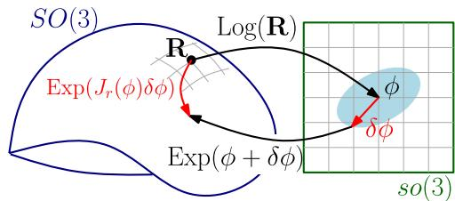  
Fig. 1. Right Jacobian ${ { \mathbb J } _ { r } }$ relates an additive perturbation δφ in the tangent space to a multiplicative perturbation on the manifold SO(3), as per (7).

which operate directly on vectors, rather than on skew symmetric matrices in $\mathfrak { s o } ( 3 )$ .

Later, we will use the following first-order approximation:

$$
\operatorname { E x p } ( \phi + \delta \phi ) \approx \operatorname { E x p } ( \phi ) \operatorname { E x p } ( \operatorname { J } _ { r } ( \phi ) \delta \phi ) .\tag{7}
$$

The term $\bar { \mathsf { J } } _ { r } \left( \phi \right)$ is the right Jacobian of $\mathrm { S O ( 3 ) }$ [43, p. 40] and relates additive increments in the tangent space to multiplicative increments applied on the right-hand side (see Fig. 1)

$$
\mathbf { J } _ { r } ( \phi ) = \mathbf { I } - \frac { 1 - \cos ( \| \phi \| ) } { \| \phi \| ^ { 2 } } \phi ^ { \wedge } + \frac { \| \phi \| - \sin ( \| \phi \| ) } { \| \phi ^ { 3 } \| } ( \phi ^ { \wedge } ) ^ { 2 } .\tag{8}
$$

A similar first-order approximation holds for the logarithm

$$
\operatorname { L o g } \ ( \operatorname { E x p } ( \phi ) \operatorname { E x p } ( \delta \phi ) \ ) \approx \phi + \ J _ { r } ^ { - 1 } ( \phi ) \delta \phi\tag{9}
$$

where the inverse of the right Jacobian is

$$
\boldsymbol { \mathrm { J } } _ { r } ^ { - 1 } ( \phi ) = \mathbf { I } + \frac { 1 } { 2 } \phi ^ { \wedge } + \left( \frac { 1 } { \| \phi \| ^ { 2 } } + \frac { 1 + \cos ( \| \phi \| ) } { 2 \| \phi \| \sin ( \| \phi \| ) } \right) ( \phi ^ { \wedge } ) ^ { 2 } .
$$

The right Jacobian $\bar { \mathsf { J } } _ { r } \left( \phi \right)$ and its inverse $J _ { r } ^ { - 1 } ( \phi )$ reduce to the identity matrix for $\| \phi \| = 0$

Another useful property of the exponential map is

$$
{ \mathrm { R E x p } } ( \phi ) { \mathrm { R } } ^ { \mathsf { T } } = \exp ( { \mathrm { R } } \phi ^ { \wedge } { \mathrm { R } } ^ { \mathsf { T } } ) = { \mathrm { E x p } } ( { \mathrm { R } } \phi )\tag{10}
$$

$$
\iff \quad \operatorname { E x p } ( \phi ) \ : \mathrm { R } = \mathrm { R } \ : \operatorname { E x p } ( \mathrm { R } ^ { \mathsf { T } } \phi ) .\tag{11}
$$

2) Special Euclidean Group: SE(3) describes the group of rigid motion in 3-D, which is the semidirect product of $\mathrm { S O ( 3 ) }$ and $\mathbb { R } ^ { 3 }$ , and it is defined as ${ \mathrm { S E } } ( 3 ) \doteq \{ ( { \mathbb { R } } , { \mathbf { p } } ) : { \mathbb { R } } \in { \mathrm { S O } } ( 3 ) , { \mathbf { p } } \in$ $\mathbb { R } ^ { 3 } \}$ . Given $\mathrm { T _ { 1 } } , \mathrm { T _ { 2 } } \in \mathrm { S E } ( 3 )$ , the group operation is $\boldsymbol { \mathrm { T } } _ { 1 } \boldsymbol { \cdot } \boldsymbol { \mathrm { T } } _ { 2 } =$ $\left( \mathbb { R } _ { 1 } \mathbb { R } _ { 2 } , \ \mathbf { p } _ { 1 } + \mathbb { R } _ { 1 } \mathbf { p } _ { 2 } \right)$ ), and the inverse is $\mathrm { { T } _ { 1 } ^ { - 1 } = \left( \mathbf { R } _ { 1 } ^ { \mathsf { T } } , \ - \mathbf { R } _ { 1 } ^ { \mathsf { T } } \mathbf { p } _ { 1 } \right) }$ . The exponential map and the logarithm map for $\operatorname { S E } ( 3 )$ are defined in [44]. However, these are not needed in this paper for reasons that will be clear in Section III-C.

## B. Uncertainty Description in SO(3)

A natural definition of uncertainty in $\mathrm { S O ( 3 ) }$ is to define a distribution in the tangent space, and then map it to $\mathrm { S O ( 3 ) }$ via the exponential map (6) [44], [46], [47]:

$$
\tilde { \mathtt { R } } = \mathtt { R } \operatorname { E x p } ( \varepsilon ) , \quad \varepsilon \sim \mathcal { N } ( 0 , \Sigma )\tag{12}
$$

where R is a given noise-free rotation (the mean) and  is a small normally distributed perturbation with zero mean and covariance Σ.

To obtain an explicit expression for the distribution of ${ \tilde { \mathbb { R } } } ,$ we start from the integral of the Gaussian distribution in $\mathbb { R } ^ { 3 }$

$$
\int _ { { \mathbb R } ^ { 3 } } p ( \epsilon ) d \epsilon = \int _ { { \mathbb R } ^ { 3 } } \alpha e ^ { - \frac { 1 } { 2 } \| \epsilon \| _ { \Sigma } ^ { 2 } } \mathrm { { } } \mathrm { { } } \mathrm { { + } } 1\tag{13}
$$

where $\alpha = 1 / \sqrt { ( 2 \pi ) ^ { 3 } \operatorname* { d e t } ( \Sigma ) }$ and $\| \epsilon \| _ { \Sigma } ^ { 2 } \doteq \epsilon ^ { \top } \Sigma ^ { - 1 } \epsilon$ is the squared Mahalanobis distance with covariance $\Sigma$ . Then, applying the change of coordinates $\epsilon = \mathrm { L o g } ( \mathtt { R } ^ { - 1 } \tilde { \mathtt { R } } )$ (this is the inverse of (12) when $\| \epsilon \| < \pi )$ ), the integral (13) becomes

$$
\int _ { \mathrm { S O ( 3 ) } } \beta ( \tilde { \mathtt { R } } ) e ^ { - \frac { 1 } { 2 } \left\| \mathtt { L o g } ( \mathtt { R } ^ { - 1 } \tilde { \mathtt { R } } ) \right\| _ { \Sigma } ^ { 2 } } \mathtt { d } \tilde { \mathtt { R } } = 1\tag{14}
$$

where $\beta ( { \tilde { \tt R } } )$ is a normalization factor. The normalization factor assumes the form $\beta ( \tilde { \mathbb { R } } ) = \alpha / | \operatorname* { d e t } ( \mathcal { I } ( \tilde { \mathbb { R } } ) |$ , where $\mathcal { I } ( \tilde { \mathbb { R } } ) \doteq$ $\mathbb { J } _ { r } \left( \mathrm { L o g } ( \mathtt { R } ^ { - 1 } \tilde { \mathtt { R } } ) \right)$ ) and $\bar { \mathsf { J } } _ { r } ( \cdot )$ is the right Jacobian $( 8 ) ; { \mathcal { I } } ( { \tilde { \mathbb { R } } } )$ is a by-product of the change of variables, see [46] for a derivation.

From the argument of (14), we can directly read our “Gaussian” distribution in $\mathrm { S O ( 3 ) }$ as

$$
p \left( \tilde { \mathsf { R } } \right) = \beta ( \tilde { \mathsf { R } } ) e ^ { - \frac { 1 } { 2 } \left\| \mathsf { L o g } \left( \mathtt { R } ^ { - 1 } \tilde { \mathsf { R } } \right) \right\| _ { \Sigma } ^ { 2 } } .\tag{15}
$$

For small covariances, we can approximate $\beta \simeq \alpha .$ , as ${ \boldsymbol { \mathrm { J } } } _ { r }$ $\left( \mathrm { L o g ( R ^ { - 1 } \tilde { R } ) } \right)$ ) is well approximated by the identity matrix when R˜ is close to R. Note that (14) already assumes relatively a small covariance $\Sigma ,$ since it “clips” the probability tails outside the open ball of radius $\pi$ (this is due to the reparametrization $\epsilon = \mathrm { L o g } ( \mathtt { R } ^ { - 1 } \tilde { \mathtt { R } } )$ , which restricts  to $\| \epsilon \| < \pi )$ . Approximating $\beta$ as a constant, the negative log-likelihood of a rotation R, given a measurement R˜ distributed as in (15), is

$$
\begin{array} { r } { \mathcal { L } ( \mathsf { R } ) = \displaystyle \frac { 1 } { 2 } \left\| \mathrm { L o g } \left( \mathsf { R } ^ { - 1 } \tilde { \mathsf { R } } \right) \right\| _ { \Sigma } ^ { 2 } + \mathrm { c o n s t } } \\ { = \displaystyle \frac { 1 } { 2 } \left\| \mathrm { L o g } ( \tilde { \mathsf { R } } ^ { - 1 } \mathsf { R } ) \right\| _ { \Sigma } ^ { 2 } + \mathrm { c o n s t } } \end{array}\tag{16}
$$

which geometrically can be interpreted as the squared angle (geodesic distance in $\mathrm { S O ( 3 ) } )$ between R˜ and R weighted by the inverse uncertainty $\Sigma ^ { - 1 }$

## C. Gauss–Newton Method on Manifold

A standard Gauss–Newton method in Euclidean space works by repeatedly optimizing a quadratic approximation of the (generally nonconvex) objective function. Solving the quadratic approximation reduces to solving a set of linear equations (normal equations), and the solution of this local approximation is used to update the current estimate. Here, we recall how to extend this approach to (unconstrained) optimization problems whose variables belong to some manifold M.

Let us consider the optimization problem

$$
\operatorname* { m i n } _ { x \in \mathcal { M } } f ( x )\tag{17}
$$

where the variable $x$ belongs to a manifold $\mathcal { M } ;$ for the sake of simplicity we consider a single variable in (17), while the description easily generalizes to multiple variables.

Contrarily to the Euclidean case, one cannot directly approximate (17) as a quadratic function of x. This is due to two main reasons. First, working directly on x leads to an overparametrization of the problem (e.g., we parametrize a rotation matrix with nine elements, while a 3-D rotation is completely defined by a vector in $\mathbb { R } ^ { 3 } )$ and this can make the normal equations underdetermined. Second, the solution of the resulting approximation does not belong to M in general.

A standard approach for optimization on manifold [45], [48], consists of defining a retraction $\mathcal { R } _ { x }$ , which is a bijective map between an element δx of the tangent space (at x) and a neighborhood of $x \in \mathcal { M }$ . Using the retraction, we can reparametrize our problem as

$$
\operatorname* { m i n } _ { x \in \mathcal { M } } f ( x ) \quad \Rightarrow \quad \operatorname* { m i n } _ { \delta x \in \mathbb { R } ^ { n } } f ( \mathcal { R } _ { x } ( \delta x ) ) .\tag{18}
$$

The reparametrization is usually called lifting [45]. Roughly speaking, we work in the tangent space defined at the current estimate, which locally behaves as an Euclidean space. The use of the retraction allows us to frame the optimization problem over an Euclidean space of suitable dimension $( \mathrm { e . g . , ~ } \delta x \in \mathbb { R } ^ { 3 }$ when we work in $\mathrm { S O ( 3 ) } )$ . We can now apply standard optimization techniques to the problem on the right-hand side of (18). In the Gauss–Newton framework, we square the cost around the current estimate. Then, we solve the quadratic approximation to get a vector $\delta x ^ { \star }$ in the tangent space. Finally, the current guess on the manifold is updated as

$$
\hat { x } \gets \mathcal { R } _ { \hat { x } } ( \delta x ^ { \star } ) .\tag{19}
$$

This “lift-solve-retract” scheme can be generalized to any trustregion method [45]. Moreover, it provides a grounded and unifying generalization of the error state model, commonly used in the aerospace literature for filtering [49] and recently adopted in robotics for optimization [23], [34].

We conclude this section by discussing the choice of the retraction $\mathcal { R } _ { x }$ . A possible retraction is the exponential map. It is known that, computationally, this may not be the most convenient choice (see [50]).

In this study, we use the following retraction for SO(3):

$$
\mathcal { R } _ { \mathtt { R } } ( \phi ) = \mathtt { R } \mathrm { E x p } ( \delta \phi ) , \qquad \delta \phi \in \mathbb { R } ^ { 3 }\tag{20}
$$

and for SE(3), we use the retraction at ${ \boldsymbol { \mathbf { T } } } \doteq ( { \boldsymbol { \mathbf { R } } } , \mathbf { p } )$

$$
\mathcal { R } _ { \mathbb { T } } ( \delta \phi , \delta \mathbf { p } ) = ( \mathtt { R } \operatorname { E x p } ( \delta \phi ) , \ \mathbf { p } + \mathtt { R } \ \delta \mathbf { p } ) , \quad [ \delta \phi \ \delta \mathbf { p } ] \in \mathbb { R } ^ { 6 }\tag{21}
$$

which explains why in Section III-A we only defined the exponential map for $\mathrm { S O ( 3 ) }$ : with this choice of retraction, we never need to compute the exponential map for SE(3).

## IV. MAP VISUAL–INERTIAL STATE ESTIMATION

We consider a VIO problem in which we want to track the state of a sensing system (e.g., a mobile robot, a UAV, or a handheld device), equipped with an IMU and a monocular camera. We assume that the IMU frame $\mathbf { \ddot { \delta } } \mathbf { \bar { B } } ^ { \flat }$ coincides with the body frame we want to track, and that the transformation between the camera and the IMU is fixed and known from prior calibration (see Fig. 2). Furthermore, we assume that a front-end provides image measurements of 3-D landmarks at unknown position. The front end also selects a subset of images, called keyframes [32], for which we want to compute a pose estimate. Section VIII-B1 discusses implementation aspects, including the choice of the front end in our experiments.

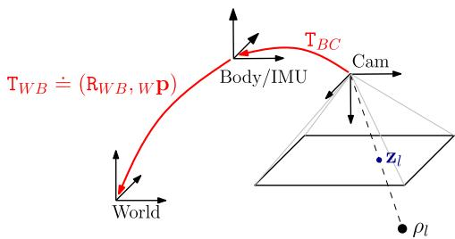  
Fig. 2. ${ \boldsymbol \mathrm { T } } _ { \mathrm { W B } } \doteq ( \mathrm { R } _ { \mathrm { W B } } , \mathrm { w } \mathbf { p } )$ is the pose of the body frame B w.r.t. the world frame W. We assume that the body frame coincides with the IMU frame. T is the pose of the camera in the body frame, known from prior calibration.

## A. State

The state of the system at time i is described by the IMU orientation, position, velocity, and biases

$$
\mathbf { x } _ { i } \doteq [ \mathrm { R } _ { i } , \mathbf { p } _ { i } , \mathbf { v } _ { i } , \mathbf { b } _ { i } ] .\tag{22}
$$

The pose $\left( \mathbb { R } _ { i } , \mathbf { p } _ { i } \right)$ belongs to SE(3), while velocities live in a vector space, i.e., $\mathbf { v } _ { i } \in \mathbb { R } ^ { 3 }$ . IMU biases can be written as $\mathbf { b } _ { i } = [ \mathbf { b } _ { i } ^ { g } \mathbf { b } _ { i } ^ { a } ] \in \mathbb { R } ^ { 6 }$ , where $\mathbf { b } _ { i } ^ { g } , \mathbf { b } _ { i } ^ { a } \in \mathbb { R } ^ { 3 }$ are the gyroscope and accelerometer bias, respectively.

Let $\mathcal { K } _ { k }$ denote the set of all keyframes up to time k. In our approach, we estimate the state of all keyframes

$$
\mathcal { X } _ { k } \doteq \{ \mathbf { x } _ { i } \} _ { i \in \mathcal { K } _ { k } } .\tag{23}
$$

In our implementation, we adopt a structureless approach (cf., Section VII), hence, the 3-D landmarks are not part of the variables to be estimated. However, the proposed approach generalizes in a straightforward manner to also estimate the landmarks and the camera intrinsic and extrinsic calibration parameters.

## B. Measurements

The input to our estimation problem are the measurements from the camera and the IMU. We denote with $\mathcal { C } _ { i }$ the image measurements at keyframe i. At time $i ,$ the camera can observe multiple landmarks $l ,$ hence, $\mathcal { C } _ { i }$ contains multiple image measurements $\mathbf { z } _ { \mathrm { i l } }$ . With slight abuse of notation, we write $l \in \mathcal { C } _ { i }$ when a landmark l is seen at time i.

We denote with $\mathcal { T } _ { \mathrm { i j } }$ the set of IMU measurements acquired between two consecutive keyframes i and $j .$ Depending on the IMU measurement rate and the frequency of selected keyframes, each set $\mathcal { T } _ { \mathrm { i j } }$ can contain from a small number to hundreds of IMU measurements. The set of measurements collected up to time k is

$$
\mathcal { Z } _ { k } \doteq \{ \mathcal { C } _ { i } , \mathcal { T } _ { \mathrm { i j } } \} _ { ( i , j ) \in \mathcal { K } _ { k } } .\tag{24}
$$

## C. Factor Graphs and MAP Estimation

The posterior probability of the variables $\mathcal { X } _ { k }$ , given the available visual and inertial measurements $\mathcal { Z } _ { k }$ and priors $p \left( \mathcal { X } _ { 0 } \right)$ is

$$
p \left( \mathcal { X } _ { k } \vert \mathcal { Z } _ { k } \right) \propto \ p \left( \mathcal { X } _ { 0 } \right) p \left( \mathcal { Z } _ { k } \vert \mathcal { X } _ { k } \right) \overset { \left( a \right) } { = } p \left( \mathcal { X } _ { 0 } \right) \prod _ { \left( i , j \right) \in { \cal K } _ { k } } p \left( \mathcal { C } _ { i } , \mathcal { Z } _ { \mathrm { i j } } \vert \mathcal { X } _ { k } \right)
$$

$$
\overset { ( b ) } { = } p ( \mathcal { X } _ { 0 } ) \prod _ { ( i , j ) \in \mathcal { K } _ { k } } p ( \mathcal { T } _ { \mathrm { i j } } | \mathbf { x } _ { i } , \mathbf { x } _ { j } ) \prod _ { i \in \mathcal { K } _ { k } } \prod _ { l \in \mathcal { C } _ { i } } p ( \mathbf { z } _ { \mathrm { i l } } | \mathbf { x } _ { i } ) .\tag{25}
$$

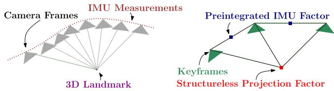  
Fig. 3. Left: visual and inertial measurements in VIO. Right: factor graph in which several IMU measurements are summarized in a single preintegrated IMU factor and a structureless vision factor constraints keyframes observing the same landmark.

The factorizations (a) and (b) follow from a standard independence assumption among the measurements. Furthermore, the Markovian property is applied in (b) (e.g., an image measurement at time i only depends on the state at time i).

As the measurements $\mathcal { Z } _ { k }$ are known, we are free to eliminate them as variables and consider them as parameters of the joint probability factors over the actual unknowns. This naturally leads to the well known factor graph representation, a class of bipartite graphical models that can be used to represent such factored densities [51], [52]. A schematic representation of the connectivity of the factor graph underlying the VIO problem is given in Fig. 3 (the connectivity of the structureless vision factors will be clarified in Section VII). The factor graph is composed of nodes for unknowns and nodes for the probability factors defined on them, and the graph structure expresses which unknowns are involved in each factor.

The MAP estimate $\mathcal { X } _ { k } ^ { \star }$ corresponds to the maximum of (25), or equivalently, the minimum of the negative log-posterior. Under the assumption of zero-mean Gaussian noise, the negative log-posterior can be written as a sum of squared residual errors

$$
\begin{array} { r l r } {  { \mathcal { X } _ { k } ^ { \star } \doteq \arg \operatorname* { m i n } _ { \mathcal { X } _ { k } } - \log _ { e } \ p ( \mathcal { X } _ { k } | \mathcal { Z } _ { k } ) } } \\ & { } & { = \arg \operatorname* { m i n } _ { \mathcal { X } _ { k } } \| \mathbf { r } _ { 0 } \| _ { \Sigma _ { 0 } } ^ { 2 } + \sum _ { ( i , j ) \in { \cal K } _ { k } } \| \mathbf { r } _ { \mathcal { T } _ { \mathrm { i j } } } \| _ { \Sigma _ { \mathrm { i j } } } ^ { 2 } + \sum _ { i \in \mathcal { K } _ { k } } \sum _ { l \in \mathcal { C } _ { i } } \| \mathbf { r } _ { \mathcal { C } _ { i 1 } } \| _ { \Sigma _ { \mathcal { C } } } ^ { 2 } } \end{array}
$$

where $\mathbf { r } _ { 0 } , \mathbf { r } _ { \mathrm { Z _ { i j } } } , \mathbf { r } _ { \mathcal { C _ { \mathrm { i l } } } }$ are the residual errors associated to the measurements, and $\Sigma _ { \mathrm { 0 } } , \Sigma _ { \mathrm { i j } }$ , and $\Sigma _ { \mathcal { C } }$ are the corresponding covariance matrices. Roughly speaking, the residual error is a function of $\mathcal { X } _ { k }$ that quantifies the mismatch between a measured quantity and the predicted value of this quantity given the state $\mathcal { X } _ { k }$ and the priors. The goal of the following sections is to provide expressions for the residual errors and the covariances.

## V. IMU MODEL AND MOTION INTEGRATION

An IMU commonly includes a three-axis accelerometer and a three-axis gyroscope and allows us to measure the rotation rate and the acceleration of the sensor with respect to an inertial frame. The measurements, namely $\mathbf { \boldsymbol { \mathrm { B } } } \tilde { \mathbf { a } } ( t )$ , and ${ \bf \delta } _ { \mathrm { B } } \tilde { \omega } _ { \mathrm { W B } } ( t )$ , are affected by additive white noise η and a slowly varying sensor bias b

$$
{ \bf \Gamma } _ { \mathrm { B } } \tilde { \omega } _ { \mathrm { W B } } ( t ) = { \bf \Gamma } _ { \mathrm { B } } \omega _ { \mathrm { W B } } ( t ) + { \bf b } ^ { g } ( t ) + \pmb { \eta } ^ { g } ( t )\tag{27}
$$

$$
\begin{array} { r } { \mathbf { \Sigma } _ { \mathrm { B } } \tilde { \mathbf { a } } ( t ) = \mathrm { \normalfont ~ R } _ { \mathrm { W B } } ^ { \top } ( t ) \left( \mathrm { w } \mathbf { a } ( t ) - \mathrm { w } \mathbf { g } \right) + \mathbf { b } ^ { a } ( t ) + \pmb { \eta } ^ { a } ( t ) . } \end{array}\tag{28}
$$

In our notation, the prefix B denotes that the corresponding quantity is expressed in the frame B (cf., Fig. 2). The pose of the IMU is described by the transformation $\left\{ \operatorname { R w B } , \operatorname { w p } \right\}$ , which maps a point from sensor frame B to W. The vector $\mathrm { \Delta _ { B } } \omega _ { \mathrm { W B } } ( t ) \in \mathbb { R } ^ { 3 }$ is the instantaneous angular velocity of B relative to W expressed in coordinate frame B, while $\mathrm { w } \mathbf { a } ( t ) \in \mathbb { R } ^ { 3 }$ is the acceleration of the sensor; $\mathbf { w } \mathbf { g }$ is the gravity vector in world coordinates. We neglect the effects due to earth’s rotation, which amounts to assuming that W is an inertial frame.

The goal now is to infer the motion of the system from IMU measurements. For this purpose, we introduce the following kinematic model [49], [53]:

$$
\dot { \mathrm { R } } _ { \mathrm { W B } } = \mathrm { R } _ { \mathrm { W B } \mathrm { ~ B } } \boldsymbol \omega _ { \mathrm { W B } } ^ { \wedge } , \qquad \mathrm { w } \dot { \bf v } = \mathrm { w } { \bf a } , \qquad \mathrm { w } \dot { \bf p } = \mathrm { w } { \bf v }\tag{29}
$$

which describes the evolution of the pose and velocity of B.

The state at time $t + \Delta t$ is obtained by integrating (29):

$$
\begin{array} { l } { \displaystyle \mathtt { R w B } ( t + \Delta t ) = \mathtt { R w B } ( t ) \exp \left( \int _ { t } ^ { t + \Delta t } \mathtt { B } ^ { \omega _ { \mathbb { W } \mathrm { B } } ( \tau ) d \tau } \right) } \\ { \displaystyle \mathbf { w } \mathbf { v } ( t + \Delta t ) = \mathbf { w v } ( t ) + \int _ { t } ^ { t + \Delta t } \mathbf { w a } ( \tau ) d \tau } \\ { \displaystyle \mathbf { w p } ( t + \Delta t ) = \mathbf { w p } ( t ) + \int _ { t } ^ { t + \Delta t } \mathbf { w v } ( \tau ) d \tau + \int _ { t } ^ { t + \Delta t } \mathbf { w a } ( \tau ) d \tau ^ { 2 } . } \end{array}
$$

Assuming that a and ω remain constant in the time interval $[ t , t + \Delta t ]$ , we can write

$$
\begin{array} { r l } & { \mathrm { R } _ { \mathrm { W B } } ( t + \Delta t ) = \mathrm { R } _ { \mathrm { W B } } ( t ) \ \mathrm { E x p } \left( \mathrm { } _ { \mathrm { B } } \omega _ { \mathrm { W B } } ( t ) \Delta t \right) } \\ & { \mathrm { w } \mathbf { v } ( t + \Delta t ) = \mathrm { w } \mathbf { v } ( t ) + \mathrm { w } \mathbf { a } ( t ) \Delta t } \\ & { \mathrm { w } \mathbf { p } ( t + \Delta t ) = \mathrm { w } \mathbf { p } ( t ) + \mathrm { w } \mathbf { v } ( t ) \Delta t + \frac { 1 } { 2 } \mathrm { w } \mathbf { a } ( t ) \Delta t ^ { 2 } . } \end{array}\tag{30}
$$

Using (27) and (28), we can write a and ω as a function of the IMU measurements, hence, (30) becomes

$$
\begin{array} { l } { { \displaystyle { \mathbb { R } } ( t + \Delta t ) = { \mathrm { \bf ~ R } } ( t ) \mathrm { \bf ~ E x p } \left( \left( \tilde { \omega } ( t ) - { \bf { b } } ^ { g } ( t ) - \eta ^ { \mathrm { g d } } ( t ) \right) \Delta t \right) } } \\ { ~ } \\ { { \displaystyle { \bf { v } } ( t + \Delta t ) = { \mathrm { \bf ~ v } } ( t ) + { \bf { g } } \Delta t + { \mathrm { \bf ~ R } } ( t ) \left( \tilde { { \bf { a } } } ( t ) - { \bf { b } } ^ { a } ( t ) - \eta ^ { \mathrm { a d } } ( t ) \right) \Delta t } } \\ { ~ } \\ { { \displaystyle { \bf { p } } ( t + \Delta t ) = { \mathrm { \bf ~ p } } ( t ) + { \bf { v } } ( t ) \Delta t + \frac { 1 } { 2 } { \bf { g } } \Delta t ^ { 2 } \qquad } } \\ { ~ } \\ { { \displaystyle ~ + \frac { 1 } { 2 } { \mathrm { \bf ~ R } } ( t ) \left( \tilde { { \bf { a } } } ( t ) - { \bf { b } } ^ { a } ( t ) - \eta ^ { \mathrm { a d } } ( t ) \right) \Delta t ^ { 2 } \qquad ( 3 1 ) } } \end{array}
$$

where we dropped the coordinate frame subscripts for readability (the notation should be unambiguous from now on). This numeric integration of the velocity and position assumes a constant orientation $\mathtt { R } ( t )$ for the time of integration between two measurements, which is not an exact solution of the differential equation (29) for measurements with the nonzero rotation rate. In practice, the use of a high-rate IMU mitigates the effects of this approximation. We adopt the integration scheme (31) as it is simple and amenable for modeling and uncertainty propagation. While we show that this integration scheme performs very well in practice, we remark that for slower IMU measurement rates, one may consider using higher order numerical integration methods [54]–[57].

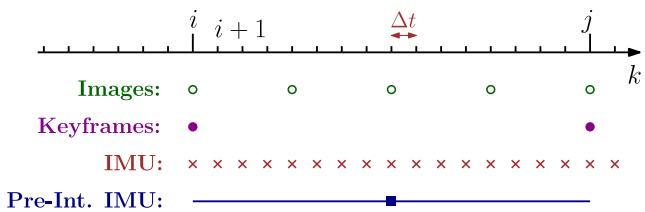  
Fig. 4. Different rates for IMU and camera.

The covariance of the discrete-time noise $\eta ^ { \mathrm { g d } }$ is a function of the sampling rate and relates to the continuous-time spectral noise $\eta ^ { g }$ via $\begin{array} { r } { \dot { \mathrm { C o v } } ( \pmb { \eta } ^ { \mathrm { g d } } ( t ) ) = \frac { 1 } { \Delta t } \mathbf { C o v } ( \pmb { \eta } ^ { g } ( t ) ) } \end{array}$ . The same relation holds for $\eta ^ { \mathrm { a d } }$ (cf., [58, Appendix]).

## VI. IMU PREINTEGRATION ON MANIFOLD

While (31) could be readily seen as a probabilistic constraint in a factor graph, it would require to include states in the factor graph at a high rate. Intuitively, (31) relates states at time t and $t + \Delta t .$ , where Δt is the sampling period of the IMU, hence, we would have to add new states in the estimation at every new IMU measurement [37].

Here, we show that all measurements between two keyframes at times $k = i$ and $k = j$ (see Fig. 4) can be summarized in a single compound measurement, namedpreintegrated IMU measurement, which constrains the motion between the consecutive keyframes. This concept was first proposed in [2] using Euler angles and we extend it, by developing a suitable theory for preintegration on the manifold SO(3).

We assume that the IMU is synchronized with the camera and provides measurements at discrete times k (cf., Fig. 4).1 Iterating the IMU integration (31) for all $\Delta t$ intervals between two consecutive keyframes at times $k = i$ and k = j (cf., Fig. 4), we find

$$
\begin{array} { l } { { \displaystyle { \mathbb { R } _ { j } = \mathbb { R } _ { i } \prod _ { k = i } ^ { j - 1 } \mathrm { E x p } \left( \left( \tilde { \omega } _ { k } - \mathbf { b } _ { k } ^ { g } - \eta _ { k } ^ { \mathrm { g d } } \right) \Delta t \right) } \ ~ } } \\ { { \displaystyle ~ } } \\  { \displaystyle { \mathbf { v } _ { j } = \mathbf { v } _ { i } + \mathbf { g } \Delta t _ { \mathrm { i j } } + \sum _ { k = i } ^ { j - 1 } \mathbf { R } _ { k } \left( \tilde { \mathbf { a } } _ { k } - \mathbf { b } _ { k } ^ { a } - \eta _ { k } ^ { \mathrm { a d } } \right) \Delta t } \ ~ } \\ { { \displaystyle ~ } } \\ { { \displaystyle { \mathbf { p } _ { j } = \mathbf { p } _ { i } + \sum _ { k = i } ^ { j - 1 } \left[ \mathbf { v } _ { k } \Delta t + \frac { 1 } { 2 } \mathbf { g } \Delta t ^ { 2 } + \frac { 1 } { 2 } \mathbf { R } _ { k } \left( \tilde { \mathbf { a } } _ { k } - \mathbf { b } _ { k } ^ { a } - \eta _ { k } ^ { \mathrm { a d } } \right) \Delta t ^ { 2 } \right] } \ ~ } } \end{array}
$$

where we introduced the shorthands $\Delta t _ { \mathrm { i j } } \doteq \sum _ { k = i } ^ { j - 1 } \Delta t$ and $( \cdot ) _ { i } \doteq ( \cdot ) ( t _ { i } )$ for readability. While (32) already provides an estimate of the motion between time $t _ { i }$ and $t _ { j }$ , it has the drawback that the integration in (32) has to be repeated whenever the linearization point at time $t _ { i }$ changes [24] [intuitively, a change in the rotation $\mathtt { R } _ { i }$ implies a change in all future rotations $\mathtt { R } _ { k }$ $k = i , \ldots , j - 1$ , and makes necessary to re-evaluate summations and products in (32)].

We want to avoid to recompute the above integration whenever the linearization point at time $t _ { i }$ changes. Therefore, we follow [2] and define the following relative motion increments that are independent of the pose and velocity at $t _ { i } { \mathrm { : } }$

$$
\begin{array} { r l } { \displaystyle \Delta \mathbf { R } _ { i j } \equiv \mathbf { R } _ { i } ^ { \mathrm { T } } \mathbf { R } _ { j } = \prod _ { k = i } ^ { j - 1 } \mathrm { E x p } \left( \left( \tilde { \omega } _ { k } - \mathbf { b } _ { k } ^ { \theta } - \boldsymbol { \eta } _ { k } ^ { \mathrm { r d } } \right) \Delta t \right) } & { } \\ { \displaystyle \Delta \mathbf { v } _ { i j } \doteq \mathbf { R } _ { i } ^ { \mathrm { T } } \left( \mathbf { v } _ { j } - \mathbf { v } _ { i } - \mathbf { g } \Delta L _ { i j } \right) = \sum _ { k = i } ^ { j - 1 } \Delta \mathbf { R } _ { i k } \left( \tilde { \mathbf { a } } _ { k } - \mathbf { b } _ { k } ^ { \alpha } - \boldsymbol { \eta } _ { k } ^ { \mathrm { u d } } \right) \Delta L } & { } \\ { \displaystyle \Delta \mathbf { p } _ { \parallel } \doteq \mathbf { R } _ { i } ^ { \mathrm { T } } \left( \mathbf { p } _ { j } - \mathbf { p } _ { i } - \mathbf { v } _ { i } \Delta L _ { i j } - \frac { 1 } { 2 } \mathbf { g } \Delta L _ { i j } ^ { 2 } \right) } & { } \\ { = \displaystyle \sum _ { k = i } ^ { j - 1 } \left[ \Delta \mathbf { v } _ { \parallel k } \Delta L + \frac { 1 } { 2 } \Delta \mathbf { R } _ { \mathrm { k l } } \left( \tilde { \mathbf { a } } _ { k } - \mathbf { b } _ { k } ^ { \alpha } - \boldsymbol { \eta } _ { k } ^ { \mathrm { u d } } \right) \Delta L ^ { 2 } \right] } & { ( 3 3 ) } \end{array}
$$

where $\Delta \mathrm { R i k } \doteq \mathrm { R } _ { i } ^ { \top } \mathrm { R } _ { k }$ and $\Delta \mathbf { v } _ { \mathrm { i k } } \doteq \mathsf { R } _ { i } ^ { \mathsf { T } } \left( \mathbf { v } _ { k } - \mathbf { v } _ { i } - \mathbf { g } \Delta t _ { \mathrm { i k } } \right)$ . We highlight that, in contrast to the “delta” rotation $\Delta \mathtt { R } _ { \mathrm { i j } }$ , neither $\Delta \mathbf { v } _ { \mathrm { i j } }$ nor $\Delta \mathbf { p } _ { \mathrm { i j } }$ correspond to the truephysical change in velocity and position but are defined in a way that make the right-hand side of (33) independent from the state at time i as well as gravitational effects. Indeed, we will be able to compute the right-hand side of (33) directly from the inertial measurements between the two keyframes.

Unfortunately, summations and products in (33) are still the function of the bias estimate. We tackle this problem in two steps. In Section VI-A, we assume $\mathbf { b } _ { i }$ is known; then, in Section VI-C we show how to avoid repeating the integration when the bias estimate changes.

In the rest of the paper, we assume that the bias remains constant between two keyframes:

$$
\mathbf { b } _ { i } ^ { g } = \mathbf { b } _ { i + 1 } ^ { g } = \cdots = \mathbf { b } _ { j - 1 } ^ { g } , \mathbf { b } _ { i } ^ { a } = \mathbf { b } _ { i + 1 } ^ { a } = \cdots = \mathbf { b } _ { j - 1 } ^ { a } .\tag{34}
$$

## A. Preintegrated IMU Measurements

Equation (33) relates the states of keyframes i and j (left-hand side) to the measurements (right-hand side). In this sense, it can be already understood as a measurement model. Unfortunately, it has a fairly intricate dependence on the measurement noise and this complicates a direct application of MAP estimation; intuitively, the MAP estimator requires to clearly define the densities (and their log-likelihood) of the measurements. In this section, we manipulate (33) so to make easier the derivation of the measurement log-likelihood. In practice, we isolate the noise terms of the individual inertial measurements in (33). As discussed above, across this section assume that the bias at time $t _ { i }$ is known.

Let us start with the rotation increment $\Delta \mathtt { R } _ { \mathrm { i j } }$ in (33). We use the first-order approximation (7) (rotation noise is “small”) and rearrange the terms, by “moving” the noise to the end, using the

relation (11):

$$
\begin{array} { r l r } {  { \Delta \mathbb { R } _ { \mathrm { i j } } \stackrel { \mathrm { e q . } ( \vec { \tau } ) } { \simeq } \prod _ { k = i } ^ { j - 1 } [ \mathrm { E x p } ( ( \tilde { \omega } _ { k } - \mathbf { b } _ { i } ^ { g } ) \Delta t ) \mathrm { E x p } ( - \boldsymbol { J } _ { r } ^ { k } \ \boldsymbol { \eta } _ { k } ^ { \mathrm { g d } } \Delta t ) ] } } \\ & { } & \\ & { } & { \stackrel { \mathrm { e q . } ( 1 1 ) } { = } \Delta \tilde { \mathbb { R } } _ { \mathrm { i j } } \prod _ { k = i } ^ { j - 1 } \mathrm { E x p } ( - \Delta \tilde { \mathbb { R } } _ { k + 1 j } ^ { \mathsf { T } } \ \mathsf { J } _ { r } ^ { k } \ \boldsymbol { \eta } _ { k } ^ { \mathrm { g d } } \Delta t ) } \\ & { } & \\ & { } & { \doteq \Delta \tilde { \mathbb { R } } _ { \mathrm { i j } } \mathrm { E x p } ( - \delta \phi _ { \mathrm { i j } } ) } & { ( 3 . } \end{array}\tag{5}
$$

with $\mathsf { J } _ { r } ^ { k } \doteq \mathsf { J } _ { r } ^ { k } \bigl ( ( \tilde { \omega } _ { k } - \mathbf { b } _ { i } ^ { g } ) \Delta t \bigr )$ . In the last line of (35), we defined the preintegrated rotation measurement $\Delta \tilde { \mathbb { R } } _ { \mathrm { i j } } \doteq$ $\Pi _ { k = i } ^ { j - 1 }$ Exp $( ( \tilde { \omega } _ { k } - \mathbf { b } _ { i } ^ { g } ) \Delta t )$ , and its noise $\delta \phi _ { \mathrm { i j } }$ , which will be further analyzed in the next section.

Substituting (35) back into the expression of $\Delta \mathbf { v } _ { \mathrm { i j } }$ in (33), using the first-order approximation (4) for $\mathrm { E x p } \left( - \delta \phi _ { \mathrm { i j } } \right)$ , and dropping higher-order noise terms, we obtain

$$
\begin{array} { r l r } {  { \Delta \mathbf { v } _ { \mathrm { i j } } \overset { \mathrm { e q . } ( 4 ) } { \simeq } \sum _ { k = i } ^ { j - 1 } \Delta \widetilde { \mathbf { R } } _ { \mathrm { i k } } \bigl ( \mathbf { I } - \delta \phi _ { \mathrm { i k } } ^ { \wedge } \bigr ) \bigl ( \widetilde { \mathbf { a } } _ { k } - \mathbf { b } _ { i } ^ { a } \bigr ) \Delta t - \Delta \widetilde { \mathbf { R } } _ { \mathrm { i k } } \eta _ { k } ^ { \mathrm { a d } } \Delta t } } \\ & { } & { \overset { \mathrm { e q . } ( 2 ) } { = } \Delta \widetilde { \mathbf { v } } _ { \mathrm { i j } } + \sum _ { k = i } ^ { j - 1 } \Bigl [ \Delta \widetilde { \mathbf { R } } _ { \mathrm { i k } } \bigl ( \widetilde { \mathbf { a } } _ { k } - \mathbf { b } _ { i } ^ { a } \bigr ) ^ { \wedge } \delta \phi _ { \mathrm { i k } } \Delta t - \Delta \widetilde { \mathbf { R } } _ { \mathrm { i k } } \eta _ { k } ^ { \mathrm { a d } } \Delta t \Bigr ] } \\ & { } & { \doteq \Delta \widetilde { \mathbf { v } } _ { \mathrm { i j } } - \delta \mathbf { v } _ { \mathrm { i j } } \qquad ( 3 6 ) } \end{array}
$$

where we defined the preintegrated velocity measurement $\begin{array} { r } { \Delta \tilde { \mathbf { v } } _ { \mathrm { i j } } \doteq \sum _ { k = i } ^ { j - 1 } \Delta \tilde { \mathsf { R } } _ { \mathrm { i k } } \bigl ( \tilde { \mathbf { a } } _ { k } - \mathbf { \bar { b } } _ { i } ^ { a } \bigr ) \Delta t } \end{array}$ and its noise $\delta \mathbf { v } _ { \mathrm { i j } }$

Similarly, substituting (35) and (36) in the expression of $\Delta \mathbf { p } _ { \mathrm { i j } }$ in (33), and using the first-order approximation (4), we obtain

$$
\begin{array} { r l r } {  { \sum _ { \tilde { \mathbf { p } } _ { \parallel } } \mathbf { \Phi } _ { \infty } ^ { \mathrm { e q } ( \mathbf { A } ) } \overbrace { \sum _ { k = i } } ^ { \infty } [ ( \Delta \tilde { \mathbf { v } } _ { \mathrm { i k } } - \delta \mathbf { v } _ { \mathrm { i k } } ) \Delta t + \frac { 1 } { 2 } \Delta \tilde { \mathbf { R } } _ { \mathrm { i k } } ( \mathbf { I } - \delta \phi _ { \mathrm { i k } } ^ { \mathrm { A } } )  } } \\ & { } & {  ( \tilde { \mathbf { a } } _ { k } - \mathbf { b } _ { i } ^ { u } ) \Delta t ^ { 2 } - \frac { 1 } { 2 } \Delta \tilde { \mathbf { R } } _ { \mathrm { i k } } \eta _ { k } ^ { u u } \Delta t ^ { 2 } ] } \\ & { } & { \displaystyle \mathrm { e } \frac { 4 ( 2 ) } { = } \Delta \tilde { \mathbf { p } } _ { \parallel } + \sum _ { k = i } ^ { j - 1 } [ - \delta \mathbf { v } _ { \mathrm { i k } } \Delta l + \frac { 1 } { 2 } \Delta \tilde { \mathbf { R } } _ { \mathrm { i k } } ( \tilde { \mathbf { a } } _ { k } - \mathbf { b } _ { i } ^ { u } ) ^ { \wedge } \delta \phi _ { \mathrm { i k } } \Delta l ^ { 2 }  } \\ & { } & {  - \frac { 1 } { 2 } \Delta \tilde { \mathbf { R } } _ { \mathrm { i k } } \eta _ { k } ^ { \mathrm { u d } } \Delta t ^ { 2 } ] } \\ & { } & { \displaystyle \equiv \Delta \tilde { \mathbf { p } } _ { \parallel } - \delta \mathbf { p } _ { \mathrm { i j } } \quad ( 3 7 , \Delta \mathbf { 0 } ) , } \end{array}
$$

where we defined the preintegrated position measurement $\Delta \tilde { \bf p } _ { \mathrm { i j } }$ and its noise $\delta \mathbf { p } _ { \mathrm { i j } }$

Substituting the expressions (35), (36), and (37) back in the original definition of $\Delta \mathrm { R } _ { \mathrm { i j } } , \Delta \mathbf { v } _ { \mathrm { i j } } , \Delta \mathbf { p } _ { \mathrm { i j } }$ in (33), we finally get our preintegrated measurement model (remember Exp $\left( - \delta \phi _ { \mathrm { i j } } \right) ^ { \mathsf { T } } =$ Exp $\left( \delta \phi _ { \mathrm { i j } } \right) .$ )

$$
\begin{array} { r l } & { \Delta \tilde { \bf R } _ { \mathrm { i j } } = \mathrm { R } _ { i } ^ { \mathsf { T } } \mathrm { R } _ { j } \mathrm { E x p } \left( \delta \phi _ { \mathrm { i j } } \right) } \\ & { \Delta \tilde { \bf v } _ { \mathrm { i j } } = \mathrm { R } _ { i } ^ { \mathsf { T } } \left( { \bf v } _ { j } - { \bf v } _ { i } - \bf g \Delta \Delta t _ { \mathrm { i j } } \right) + \delta { \bf v } _ { \mathrm { i j } } } \\ & { \Delta \tilde { \bf p } _ { \mathrm { i j } } = \mathrm { R } _ { i } ^ { \mathsf { T } } \left( { \bf p } _ { j } - { \bf p } _ { i } - { \bf v } _ { i } \Delta t _ { \mathrm { i j } } - \frac { 1 } { 2 } \mathbf { g } \Delta t _ { \mathrm { i j } } ^ { 2 } \right) + \delta { \bf p } _ { \mathrm { i j } } } \end{array}\tag{38}
$$

where our compound measurements are written as a function of the (to-be-estimated) state “plus” a random noise, described by the random vector $[ \delta \phi _ { \mathrm { i j } } ^ { \mathsf { T } } , \delta \mathbf { v } _ { \mathrm { i j } } ^ { \mathsf { T } } , \delta \mathbf { p } _ { \mathrm { i j } } ^ { \mathsf { T } } ] ^ { \mathsf { T } }$

To wrap-up the discussion in this section, we manipulated the measurement model (33) and rewrote it as (38). The advantage of (38) is that, for a suitable distribution of the noise, it makes the definition of the log-likelihood straightforward. For instance, the (negative) log-likelihood of measurements with zero-mean additive Gaussian noise [last two lines in (38)] is a quadratic function. Similarly, if $\delta \phi _ { \mathrm { i j } }$ is a zero-mean Gaussian noise, we compute the (negative) log-likelihood associated with $\Delta \tilde { \mathbb { R } } _ { \mathrm { i j } }$ . The nature of the noise terms is discussed in the following section.

## B. Noise Propagation

In this section, we derive the statistics of the noise vector $[ \delta \phi _ { \mathrm { i j } } ^ { \mathsf { T } } , \delta \mathbf { v } _ { \mathrm { i j } } ^ { \mathsf { T } } , \delta \mathbf { p } _ { \mathrm { i j } } ^ { \mathsf { T } } ] ^ { \mathsf { T } }$ . While we already observed that it is convenient to approximate the noise vector to be zero-mean Normally distributed, it is of paramount importance to accurately model the noise covariance. Indeed, the noise covariance has a strong influence on the MAP estimator [the inverse noise covariance is used to weight the terms in the optimization (26)]. In this section, we therefore provide a derivation of the covariance $\pmb { \Sigma } _ { \mathrm { i j } }$ of the preintegrated measurements

$$
\eta _ { \mathrm { i j } } ^ { \Delta } \doteq \left[ \delta \phi _ { \mathrm { i j } } ^ { \mathsf { T } } , \delta { \mathbf { v } _ { \mathrm { i j } } ^ { \mathsf { T } } } , \delta { \mathbf { p } _ { \mathrm { i j } } ^ { \mathsf { T } } } \right] ^ { \mathsf { T } } \sim \mathcal { N } ( \mathbf { 0 } _ { 9 \times 1 } , \pmb { \Sigma } _ { \mathrm { i j } } ) .\tag{39}
$$

We first consider the preintegrated rotation noise $\delta \phi _ { \mathrm { i j } }$ . Recall from (35) that

$$
\mathrm { E x p } \left( - \delta \phi _ { \mathrm { i j } } \right) \doteq \prod _ { k = i } ^ { j - 1 } \mathrm { E x p } \left( - \Delta \tilde { \mathrm { R } } _ { k + 1 j } ^ { \mathsf { T } } \mathrm { J } _ { r } ^ { k } \mathrm { \Delta } \eta _ { k } ^ { \mathrm { g d } } \Delta t \right) .\tag{40}
$$

Taking the Log on both sides and changing signs, we get

$$
\delta \phi _ { \mathrm { i j } } = - \mathrm { L o g } \left( \prod _ { k = i } ^ { j - 1 } \mathrm { E x p } \left( - \Delta \tilde { \mathrm { R } } _ { k + 1 j } ^ { \mathsf { T } } \mathrm { J } _ { r } ^ { k } \mathrm { \pmb { \eta } } _ { k } ^ { \mathrm { g d } } \Delta t \right) \right) .\tag{41}
$$

Repeated application of the first-order approximation (9) (recall that $\eta _ { k } ^ { \mathrm { g d } }$ as well as $\delta \phi _ { \mathrm { i j } }$ are small rotation noises, hence the right Jacobians are close to the identity) produces

$$
\delta \phi _ { \mathrm { i j } } \simeq \sum _ { k = i } ^ { j - 1 } \Delta \tilde { \mathsf { R } } _ { k + 1 j } ^ { \mathsf { T } } \mathsf { J } _ { r } ^ { k } \pmb { \eta } _ { k } ^ { \mathrm { g d } } \Delta t .\tag{42}
$$

Up to first order, the noise $\delta \phi _ { \mathrm { i j } }$ is zero-mean and Gaussian, as it is a linear combination of zero-mean noise terms $\eta _ { k } ^ { \mathrm { g d } }$ . This is desirable, since it brings the rotation measurement model (38) exactly in the form (12).

Dealing with the noise terms $\delta \mathbf { v } _ { \mathrm { i j } }$ and $\delta \mathbf { p } _ { \mathrm { i j } }$ is now easy: these are linear combinations of the acceleration noise $\eta _ { k } ^ { \mathrm { a d } }$ and the preintegrated rotation noise $\delta \phi _ { \mathrm { i j } }$ , hence they are also zero-mean and Gaussian. Simple manipulation leads to

$$
\begin{array} { r l } & { \delta \mathbf { v } _ { \mathrm { i j } } \simeq \displaystyle \sum _ { k = i } ^ { j - 1 } \left[ - \Delta \tilde { \mathrm { R } } _ { \mathrm { i k } } \left( \tilde { \mathbf { a } } _ { k } - \mathbf { b } _ { i } ^ { a } \right) ^ { \wedge } \delta \phi _ { \mathrm { i k } } \Delta t + \Delta \tilde { \mathrm { R } } _ { \mathrm { i k } } \eta _ { k } ^ { \mathrm { a d } } \Delta t \right] } \\ & { \delta \mathbf { p } _ { \mathrm { i j } } \simeq \displaystyle \sum _ { k = i } ^ { j - 1 } \left[ \delta \mathbf { v } _ { \mathrm { i k } } \Delta t - \frac { 1 } { 2 } \Delta \tilde { \mathrm { R } } _ { \mathrm { i k } } \left( \tilde { \mathbf { a } } _ { k } - \mathbf { b } _ { i } ^ { a } \right) ^ { \wedge } \delta \phi _ { \mathrm { i k } } \Delta t ^ { 2 } \right. } \\ & { \left. \qquad + \frac { 1 } { 2 } \Delta \tilde { \mathrm { R } } _ { \mathrm { i k } } \eta _ { k } ^ { \mathrm { a d } } \Delta t ^ { 2 } \right] } \end{array}\tag{43}
$$

where the relations are valid up to the first order.

Equations (42)–(43) express the preintegrated noise $\eta _ { \mathrm { i j } } ^ { \Delta }$ as a linear function of the IMU measurement noise $\pmb { \eta } _ { k } ^ { d } \doteq [ \pmb { \eta } _ { k } ^ { \mathrm { g d } } , \pmb { \eta } _ { k } ^ { \mathrm { a d } } ]$ $k = 1 , \ldots , j - 1$ . Therefore, from the knowledge of the covariance of $\eta _ { k } ^ { d }$ (given in the IMU specifications), we can compute the covariance of $\eta _ { \mathrm { i j } } ^ { \Delta }$ , namely $\pmb { \Sigma } _ { \mathrm { i j } }$ , by a simple linear propagation.

In Appendix IX-A, we provide a more clever way to compute $\pmb { \Sigma } _ { \mathrm { i j } }$ . In particular, we show that $\pmb { \Sigma } _ { \mathrm { i j } }$ can be conveniently computed in iterative form: as a new IMU measurement arrive we only update $\pmb { \Sigma } _ { \mathrm { i j } }$ , rather than recomputing it from scratch. The iterative computation leads to simpler expressions and is more amenable for online inference.

## C. Incorporating Bias Updates

In the previous section, we assumed that the bias $\{ \bar { \mathbf { b } } _ { i } ^ { a } , \bar { \mathbf { b } } _ { i } ^ { g } \}$ that is used during preintegration between $k = i$ and $k = j$ is correct and does not change. However, more likely, the bias estimate changes by a small amount δb during optimization. One solution would be to recompute the delta measurements when the bias changes; however, that is computationally expensive. Instead, given a bias update $\mathbf { b } \gets \bar { \mathbf { b } } + \delta \mathbf { b }$ , we can update the delta measurements using a first-order expansion

$$
\begin{array} { r } { \Delta \tilde { \bf R } _ { \mathrm { i j } } ( { \bf b } _ { i } ^ { g } ) \simeq \Delta \tilde { \bf R } _ { \mathrm { i j } } ( { \bar { \bf b } } _ { i } ^ { g } ) \mathrm { E x p } \Bigg ( \frac { \partial \Delta \bar { \bf R } _ { \mathrm { i j } } } { \partial { \bf b } ^ { g } } \delta { \bf b } ^ { g } \Bigg ) \mathrm { ~ } ( 4 / \mathrm { ~ } \mathrm { ~ } \mathrm { ~ } \mathrm { ~ } \mathrm { ~ } \mathrm { ~ } \mathrm { ~ } \mathrm { ~ } ( 4 / \mathrm { ~ } \mathrm { ~ } \mathrm { ~ } \mathrm { ~ } ) ) \mathrm { ~ } ( \mathrm { ~ } \mathrm { ~ } \mathrm { ~ } \mathrm { ~ } \mathrm { ~ } \mathrm { ~ } \mathrm { ~ } \mathrm { ~ } \mathrm { ~ } \mathrm { ~ } ( \mathrm { ~ } \mathrm { ~ } \mathrm { ~ } \mathrm { ~ } \mathrm { ~ } \mathrm { ~ } \mathrm { ~ } \mathrm { ~ } \mathrm { ~ } ) ) } \\  \Delta \tilde { \bf v } _ { \mathrm { i j } } ( { \bf b } _ { i } ^ { g } , { \bf b } _ { i } ^ { a } ) \simeq \Delta \tilde { \bf v } _ { \mathrm { i j } } ( { \bar { \bf b } } _ { i } ^ { g } , { \bar { \bf b } } _ { i } ^ { a } ) + \frac { \partial \Delta \bar { \bf v } _ { \mathrm { i j } } } { \partial { \bf b } ^ { g } } \delta { \bf b } _ { i } ^ { g } + \frac { \partial \Delta \bar { \bf v } _ { \mathrm { i j } } } { \partial { \bf b } ^ { a } } \delta { \bf b } _ { i } ^ { a } \mathrm { ~ } \mathrm { ~ } \mathrm { ~ } \mathrm { ~ } \mathrm { ~ } \mathrm { ~ } \mathrm { ~ } \mathrm { ~ } \mathrm { ~ } \mathrm { ~ } \mathrm { ~ } \mathrm { ~ } \mathrm { ~ } \mathrm { ~ } \mathrm { ~ } \mathrm { ~ } \mathrm { ~ } \mathrm { ~ } \mathrm { ~ } \mathrm { ~ } \mathrm { ~ } \mathrm { ~ } \mathrm { ~ } \mathrm { ~ } \mathrm { ~ } \mathrm { ~ } \mathrm  ~  \end{array}
$$

This is similar to the bias correction in [2] but operates directly on $\mathrm { S O ( 3 ) }$ . The Jacobians $\begin{array} { r }  \{ \frac { \partial \Delta \bar { \bf R } _ { \mathrm { i j } } } { \partial { \bf b } ^ { g } } , \frac { \partial \Delta \bar { \bf v } _ { \mathrm { i j } } } { \partial { \bf b } ^ { g } } , \bf { \sigma } , \bf { \sigma } \cdot { \bf \sigma } \cdot \bf { \sigma } \} \end{array}$ (computed at $\bar { \mathbf { b } } _ { i }$ the bias estimate at integration time) describe how the measurements change due to a change in the bias estimate. The Jacobians remain constant and can be precomputed during the preintegration. The derivation of the Jacobians is very similar to the one we used in Section VI-A to express the measurements as a large value plus a small perturbation and is given in Appendix IX-B.

## D. Preintegrated IMU Factors

Given the preintegrated measurement model in (38) and since measurement noise is zero mean and Gaussian (with covariance $\pmb { \Sigma } _ { \mathrm { i j } } )$ up to first order (39), it is now easy to write the residual

errors as $\mathbf { r } _ { \mathcal { T } _ { \mathrm { i j } } } \doteq [ \mathbf { r } _ { \Delta \mathbf { R } _ { \mathrm { i j } } } ^ { \mathsf { T } } , \mathbf { r } _ { \Delta \mathbf { v } _ { \mathrm { i j } } } ^ { \mathsf { T } } , \mathbf { r } _ { \Delta \mathbf { p } _ { \mathrm { i j } } } ^ { \mathsf { T } } ] ^ { \mathsf { T } } \in \mathbb { R } ^ { 9 }$ , where

$$
\begin{array} { r l } & { \mathbf { r } _ { \Delta \mathbf { R } _ { i j } } = \mathrm { L o g } ( ( \Delta \tilde { \mathbf { R } } _ { i j } ( \bar { \mathbf { b } } _ { i } ^ { g } ) \mathrm { E x p } ( \frac { \partial \Delta \tilde { \mathbf { R } } _ { i j } } { \partial \mathbf { b } ^ { g } } \delta \mathbf { b } ^ { p } ) ) ^ { \top } \mathbf { R } _ { i } ^ { \top } \mathbf { R } _ { j } ) } \\ & { \mathbf { r } _ { \Delta \mathbf { v } _ { i j } } \doteq \mathbf { R } _ { i } ^ { \top } ( \mathbf { v } _ { j } - \mathbf { v } _ { i } - \mathbf { g } \Delta t _ { i j } ) } \\ & { \qquad - [ \Delta \tilde { \mathbf { v } } _ { \mathrm { i j } } ( \bar { \mathbf { b } } _ { i } ^ { g } , \bar { \mathbf { b } } _ { i } ^ { a } ) + \frac { \partial \Delta \tilde { \mathbf { v } } _ { \mathrm { i j } } } { \partial \mathbf { b } ^ { g } } \delta \mathbf { b } ^ { g } + \frac { \partial \Delta \tilde { \mathbf { v } } _ { \mathrm { i j } } } { \partial \mathbf { b } ^ { a } } \delta \mathbf { b } ^ { a } ] } \\ & { \mathbf { r } _ { \Delta \mathbf { p } _ { i j } } \doteq \mathbf { R } _ { i } ^ { \top } ( \mathbf { p } _ { j } - \mathbf { p } _ { i } - \mathbf { v } _ { i } \Delta t _ { i j } - \frac { 1 } { 2 } \mathbf { g } \Delta t _ { i j } ^ { 2 } ) } \\ &  \qquad - [ \Delta \tilde { \mathbf { p } } _ { \mathrm { i j } } ( \bar { \mathbf { b } } _ { i } ^ { g } , \bar { \mathbf { b } } _ { i } ^ { a } ) + \frac { \partial \Delta \tilde { \mathbf { p } } _ { \mathrm { i j } } } { \partial \mathbf { b } ^ { g } } \delta \mathbf { b } ^ { a } + \frac { \partial \Delta \tilde { \mathbf { p } } _ { \mathrm { i j } } } { \partial \mathbf { b } _ { a } } \delta \mathbf  b  \end{array}\tag{45}
$$

in which we also included the bias updates of (44).

According to the “lift-solve-retract” method (see Section III-C), at each Gauss–Newton iteration we need to reparametrize (45) using the retraction (21). Then, the “solve” step requires to linearize the resulting cost around the current estimate. For the purpose of linearization, it is convenient to compute analytic expressions of the Jacobians of the residual errors, which we derive in the Appendix IX-C.

## E. Bias Model

When presenting the IMU model (27), we said that biases are slowly time-varying quantities. Hence, we model them with a “Brownian motion,” i.e., integrated white noise

$$
\dot {  { \mathbf { b } } } ^ { g } ( t ) = \pmb { \eta } ^ { \mathrm { b g } } , \qquad \dot {  { \mathbf { b } } } ^ { a } ( t ) = \pmb { \eta } ^ { \mathrm { b a } } .\tag{46}
$$

Integrating (46) over the time interva $[ t _ { i } , t _ { j } ]$ between the two consecutive keyframes i and $j$ we get

$$
{ \bf b } _ { j } ^ { g } = { \bf b } _ { i } ^ { g } + \eta ^ { \mathrm { b g d } } , \qquad { \bf b } _ { j } ^ { a } = { \bf b } _ { i } ^ { a } + \eta ^ { \mathrm { b a d } }\tag{47}
$$

where, as done before, we use the shorthand $\mathbf { b } _ { i } ^ { g } \doteq \mathbf { b } ^ { g } ( t _ { i } )$ and we define the discrete noises $\eta ^ { \mathrm { b g d } }$ and $\eta ^ { \mathrm { b a d } }$ , which have zero mean and covariance $\pmb { \Sigma } ^ { \mathrm { b g d } } \doteq \Delta t _ { \mathrm { i j } } \mathbf { C o v } ( \pmb { \eta } ^ { \mathrm { b g } } )$ and $\pmb { \Sigma } ^ { \mathrm { b a d } } \dot { = }$ $\Delta t _ { \mathrm { i j } } \mathrm { C o v } ( \pmb { \eta } ^ { \mathrm { b a } } )$ , respectively (cf., [58, Appendix]).

The model (47) can be readily included in our factor graph, as a further additive term in (26) for all consecutive keyframes

$$
\| \mathbf { r _ { b \scriptscriptstyle \mathrm { i j } } } \| ^ { 2 } \doteq \| \mathbf { b } _ { j } ^ { g } - \mathbf { b } _ { i } ^ { g } \| _ { \Sigma ^ { \mathrm { b g d } } } ^ { 2 } + \| \mathbf { b } _ { j } ^ { a } - \mathbf { b } _ { i } ^ { a } \| _ { \Sigma ^ { \mathrm { b a d } } } ^ { 2 } .\tag{48}
$$

## VII. STRUCTURELESS VISION FACTORS

In this section, we introduce our structureless model for vision measurements. The key feature of our approach is the linear elimination of landmarks. Note that the elimination is repeated at each Gauss–Newton iteration, hence, we are still guaranteed to obtain the optimal MAP estimate.

Visual measurements contribute to the cost (26) via the sum

$$
\sum _ { i \in \mathcal { K } _ { k } } \sum _ { l \in \mathcal { C } _ { i } } \| \mathbf { r } _ { \mathcal { C } _ { \mathrm { i l } } } \| _ { \Sigma _ { \mathcal { C } } } ^ { 2 } = \sum _ { l = 1 } ^ { L } \sum _ { i \in \mathcal { X } ( l ) } \| \mathbf { r } _ { \mathcal { C } _ { \mathrm { i l } } } \| _ { \Sigma _ { \mathcal { C } } } ^ { 2 }\tag{49}
$$

which, on the right-hand side, we rewrote as a sum of contributions of each landmark $l = 1 , \ldots , L$ . In (49), X(l) denotes the subset of keyframes in which l is seen.

A fairly standard model for the residual error of a singleimage measurement $\mathbf { z } _ { \mathrm { i l } }$ is the reprojection error

$$
{ \bf r } _ { \mathcal { C } _ { \mathrm { i l } } } = { \bf z } _ { \mathrm { i l } } - \pi ( { \bf R } _ { i } , { \bf p } _ { i } , \rho _ { l } )\tag{50}
$$

where ${ \rho _ { l } } \in \mathbb { R } ^ { 3 }$ denotes the position of the lth landmark, and $\pi ( \cdot )$ is a standard perspective projection, which also encodes the (known) IMU-camera transformation $\mathrm { T _ { B C } }$

Direct use of (50) would require to include the landmark positions $\rho _ { l } , l = 1 , \ldots , L$ in the optimization, and this impacts negatively on the computation. Therefore, in the following, we adopt a structureless approach that avoids optimization over the landmarks, thus ensuring to retrieve the MAP estimate.

As recalled in Section III-C, at each GN iteration, we lift the cost function, using the retraction (21). For the vision factors, this means that the original residuals (49) become

$$
\sum _ { l = 1 } ^ { L } \sum _ { i \in \mathcal { X } ( l ) } \Vert \mathbf { z } _ { \mathrm { i l } } - \check { \pi } ( \delta \phi _ { i } , \delta \mathbf { p } _ { i } , \delta \rho _ { l } ) \Vert _ { \Sigma _ { c } } ^ { 2 }\tag{51}
$$

where $\delta \phi _ { i } , \delta \mathbf { p } _ { i } , \delta \rho _ { l }$ are now Euclidean corrections, and $\check { \pi } ( \cdot )$ is the lifted cost function. The “solve” step in the GN method is based on linearization of the residuals

$$
\sum _ { l = 1 } ^ { L } \sum _ { i \in \mathcal { X } ( l ) } \| \mathbf { F } _ { \mathrm { i l } } \delta \mathbf { T } _ { i } + \mathbf { E } _ { \mathrm { i l } } \delta \rho _ { l } - \mathbf { b } _ { \mathrm { i l } } \| ^ { 2 }\tag{52}
$$

where $\delta { \bf { T } } _ { i } \doteq [ \delta \phi _ { i } \delta { \bf { p } } _ { i } ] ^ { \sf { T } } \mathrm { ; }$ ; the Jacobians $\mathbf { F } _ { \mathrm { i l } } , \mathbf { E } _ { \mathrm { i l } }$ , and the vector $\mathbf { b } _ { \mathrm { i l } }$ (both normalized by $\Sigma _ { \mathcal { C } } ^ { 1 / 2 } )$ result from the linearization. The vector $\mathbf { b } _ { \mathrm { i l } }$ is the residual error at the linearization point.

Writing the second sum in (52) in matrix form we get

$$
\sum _ { l = 1 } ^ { L } \| \mathbf { F } _ { l } ~ \delta \mathbf { T } _ { \mathbf { \mathcal { X } ( \mathit { l } ) } } + \mathbf { E } _ { l } ~ \delta \rho _ { l } - \mathbf { b } _ { l } \| ^ { 2 }\tag{53}
$$

where $\mathbf { F } _ { l } , \mathbf { E } _ { l }$ , bl are obtained by stacking $\mathbf { F } _ { \mathrm { i l } } , \mathbf { E } _ { \mathrm { i l } } , \mathbf { b } _ { \mathrm { i l } }$ , respectively, for all $i \in \mathcal { X } ( l )$

Since a landmark l appears in a single term of the sum (53), for any given choice of the pose perturbation $\delta \mathbf { T } _ { \mathcal { X } ( l ) }$ , the landmark perturbation $\delta \rho _ { l }$ that minimizes the quadratic cost $\Vert \mathbf { F } _ { l } \ \delta \mathbf { T } _ { \mathcal { X } ( l ) } +$ $\mathbf { E } _ { l } \ \delta \rho _ { l } - \mathbf { b } _ { l } \big \| ^ { 2 }$ is

$$
\delta \rho _ { l } = - \left( \mathbf { E } _ { l } ^ { \mathsf { T } } \mathbf { E } _ { l } \right) ^ { - 1 } \mathbf { E } _ { l } ^ { \mathsf { T } } \big ( \mathbf { F } _ { l } \delta \mathbf { T } _ { \mathcal { X } ( l ) } - \mathbf { b } _ { l } \big ) .\tag{54}
$$

Substituting (54) back into (53) we can eliminate the variable $\delta \rho _ { l }$ from the optimization problem

$$
\sum _ { l = 1 } ^ { L } \Vert \left( \mathbf { I } - \mathbf { E } _ { l } \bigl ( \mathbf { E } _ { l } ^ { \mathsf { T } } \mathbf { E } _ { l } \bigr ) ^ { - 1 } \mathbf { E } _ { l } ^ { \mathsf { T } } \right) \left( \mathbf { F } _ { l } \delta \mathbf { T } _ { \mathcal { X } ( l ) } - \mathbf { b } _ { l } \right) \Vert ^ { 2 }\tag{55}
$$

where $\mathbf { I } - \mathbf { E } _ { l } ( \mathbf { E } _ { l } ^ { \mathsf { T } } \mathbf { E } _ { l } ) ^ { - 1 } \mathbf { E } _ { l } ^ { \mathsf { T } }$ is an orthogonal projector of $\mathbf { E } _ { l }$ In Appendix IX-D, we show that the cost (55) can be further manipulated, leading to a more efficient implementation.

This approach is well known in the bundle adjustment literature as the Schur complement trick, where a standard practice is to update the linearization point of $\rho _ { l }$ via back-substitution [61]. In contrast, we obtain the updated landmark positions from the linearization point of the poses using a fast linear triangulation. Using this approach, we reduced a large set of factors (51) which involve poses and landmarks into a smaller set of L factors (55), which only involve poses. In particular, the factor corresponding to the landmark l only involves the states $\mathcal { X } ( l )$ observing l, creating the connectivity pattern of Fig. 3. The same approach is also used in MSC-KF [5] to avoid the inclusion of landmarks in the state vector. However, since MSC-KF can only linearize and absorb a measurement once, the processing of measurements needs to be delayed until all measurements of the same landmark are observed. This does not apply to the proposed optimization-based approach, which allows for multiple relinearizations and the incremental inclusion of new measurements.

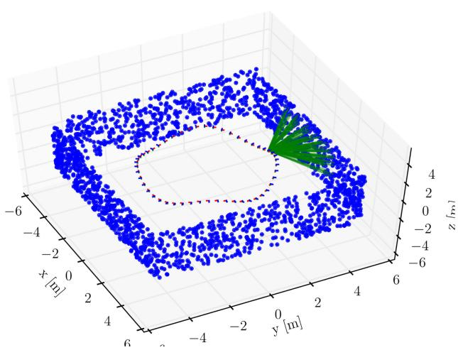  
Fig. 5. Simulation setup: The camera moves along a circular trajectory while observing features (green lines) on the walls of a square environment.

## VIII. EXPERIMENTAL ANALYSIS

We tested the proposed approach on both simulated and real data. Section VIII-A reports simulation results, showing that our approach is accurate, fast, and consistent. Section VIII-B compares our approach against the state of the art, confirming its superior accuracy in real indoor and outdoor experiments.

## A. Simulation Experiments

We simulated a camera following a circular trajectory of a 3 m radius with a sinusoidal vertical motion. The total length of the trajectory is 120 m. While moving, the camera observes landmarks as depicted in Fig. 5. The number of landmark observations per frame is limited to 50. To simulate a realistic feature tracker, we corrupt the landmark measurements with isotropic Gaussian noise with standard deviation $\sigma _ { \mathrm { p x } } = 1$ pixel. The camera has a focal length of 315 pixels and runs at a rate of 2.5 Hz (simulating keyframes). The simulated acceleration and gyroscope measurements are computed from the analytic derivatives of the parametric trajectory and additionally corrupted by white noise and a slowly time-varying bias terms, according to the IMU model in (27).2 To evaluate our approach, we performed a Monte Carlo analysis with 50 simulation runs, each with different realizations of process and measurement noise. In each run, we compute the MAP estimate using the IMU and the vision models presented in this paper. The optimization (whose solution is the MAP estimate) is solved using the incremental smoothing algorithm iSAM2 [3]. iSAM2 uses the Bayes tree [62] data structure to obtain efficient variable ordering that minimizes fill-in in the square-root information matrix and, thus, minimizes computation time. Further, iSAM2 exploits the fact that new measurements often have only local effect on the MAP estimate, hence applies incremental updates directly to the square-root information matrix, only resolving for the variables affected by a new measurement.

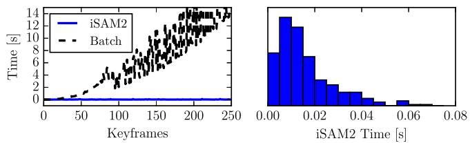  
Fig. 6. Left: CPU time required for inference, comparing batch estimation against iSAM2. Right: histogram plot of CPU time for the proposed approach.

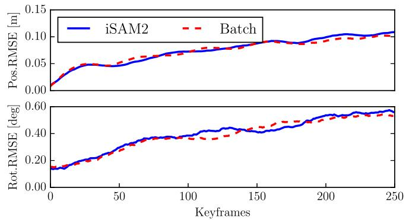  
Fig. 7. Root-mean-squared error averaged over 50 Monte Carlo experiments, comparing batch nonlinear optimization and iSAM2.

In the following, we present the results of our experiments, organized in four sections:

1) pose estimation accuracy and timing;

2) consistency;

3) bias estimation accuracy; and

4) first-order bias correction.

Then, in Section VIII-A5, we compare our approach against the original proposal of [2].

1) Pose EstimationAccuracy and Timing: The optimal MAP estimate is given by the batch nonlinear optimization of the least-squares objective in (26). However, as shown on the left in Fig. $^ { 6 , }$ the computational cost of the batch optimization quickly increases as the trajectory length grows. A key ingredient that makes our approach extremely efficient is the use of the incremental smoothing algorithm iSAM2 [3], which performs close-to-optimal inference, while preserving real-time capability. Fig. 7 shows that the accuracy of iSAM2 is practically the same as the batch estimate. In odometry problems, the iSAM2 algorithm results in approximately constant update time per frame (see Fig. 6, left), which in our experiment is approximately 10 ms per update (see Fig. 6, right).

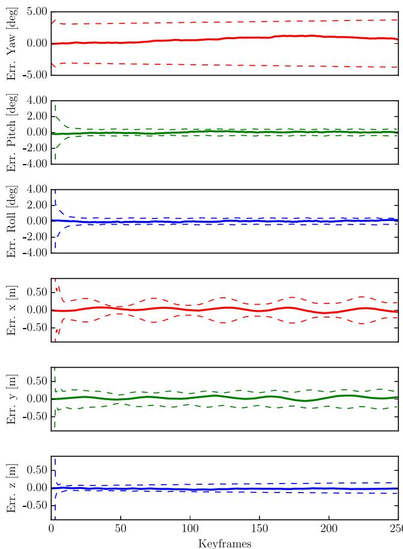  
Fig. 8. Orientation and position errors with 3σ bounds (single simulation).

2) Consistency: For generic motion, the VIO problem has four unobservable degrees of freedom, three corresponding to the global translation and one to the global orientation around the gravity direction (yaw), see [16]. A VIO algorithm must preserve these observability properties and avoid inclusion of spurious information along the unobservable directions, which would result in inconsistency [16]. Fig. 8 reports orientation and position errors with the corresponding 3σ bounds, confirming that our approach is consistent. In the VIO problem, the gravity direction is observable, hence, the uncertainty on roll and pitch remains bounded. In contrast, global yaw and position cannot be measured and the uncertainty slowly grows over time.

To present more substantial evidence of the fact that our estimator is consistent, we recall a standard measure of consistency, the average normalized estimation error squared (NEES) [63]. The NEES is the squared estimation error $\epsilon _ { k }$ normalized by the estimator-calculated covariance $\Sigma _ { k }$

$$
\eta _ { k } \doteq \epsilon _ { k } ^ { \mathsf { T } } \hat { \Sigma } _ { k } ^ { - 1 } \epsilon _ { k } \qquad \mathrm { ( N E E S ) } .\tag{56}
$$

The error in estimating the current pose is computed as

$$
\begin{array} { r } { \ \epsilon _ { k } \doteq \left[ \mathrm { L o g } \left( \hat { \mathrm { R } } _ { k } ^ { \mathsf { T } } \mathrm { R } _ { k } ^ { \mathrm { g t } } \right) , \ \hat { \mathrm { R } } _ { k } ^ { \mathsf { T } } ( \hat { \mathrm { p } } _ { k } - \mathrm { \mathbf { p } } _ { k } ^ { \mathrm { g t } } ) \right] ^ { \mathsf { T } } } \end{array}\tag{57}
$$

where the exponent $ { \mathrm { ^ 6 \mathrm { \ : } g t } } ^ { \prime \prime }$ denotes ground-truth states and $( \hat { \textmd R } _ { k } , \hat { \textmd p } _ { k } )$ denotes the estimated pose at time k. Note that the

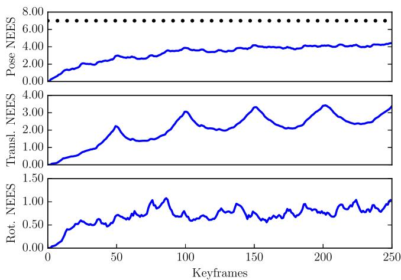  
Fig. 9. NEES averaged over 50 Monte Carlo runs. The average NEES is reported for the current pose (top), current position (middle), and current rotation (bottom).

error (57) is expressed in the body frame and it is consistent with our choice of the retraction in (21) (intuitively, the retraction applies the perturbation in the body frame).

The average NEES over N independent Monte Carlo runs, can be computed by averaging the NEES values

$$
\bar { \eta } _ { k } = \frac { 1 } { N } \sum _ { i = 1 } ^ { N } \eta _ { k } ^ { ( i ) } \qquad \mathrm { ( a v e r a g e ~ N E E S ) }\tag{58}
$$

where $\eta _ { k } ^ { \left( i \right) }$ is the NEES computed at the ith Monte Carlo run. If the estimator is consistent, then $N \bar { \eta } _ { k }$ is $\chi _ { n } ^ { 2 }$ chi-square distributed with $n = \dim ( \epsilon _ { k } ) \cdot N$ degrees of freedom [63, p. 234]. We evaluate this hypothesis with a $\chi _ { n } ^ { 2 }$ acceptance test [63, p. 235]. For a significance level $\alpha = 2 . 5 \%$ and $n = \dim ( \epsilon _ { k } ) \cdot N = 6 \times ~ 5 0 .$ the acceptance region of the test is given by the two-sided probability concentration region $\bar { \eta } _ { k } \in [ 5 . 0 , 7 . 0 ]$ . If $\bar { \eta } _ { k }$ rises significantly higher than the upper bound, the estimator is overconfident, if it tends below the lower bound, it is conservative. In VIO, one usually wants to avoid overconfident estimators: the fact that $\bar { \eta } _ { k }$ exceeds the upper bound is an indicator of the fact that the estimator is including spurious information in the inference process.

In Fig. 9, we report the average NEES of the proposed approach. The average NEES approaches the lower bound but, more importantly, it remains below the upper bound at 7.0 (black dots), which assures that the estimator is not overconfident. We also report the average rotational and translational NEES to allow a comparison with the OC-EKF in [16] and [18], which obtains similar results by enforcing explicitly the observability properties in EKF.

3) Bias Estimation Accuracy: Our simulations allow us to compare the estimated gyroscope and accelerometer bias with the true biases that were used to corrupt the simulated inertial measurements. Fig. 10 shows that the biases estimated by our approach (in blue) correctly track the ground truth biases (in red). Note that, since we use a smoothing approach, at each step, we potentially change the entire history of the bias estimates, hence, we visualize the bias estimates using multiple curves.

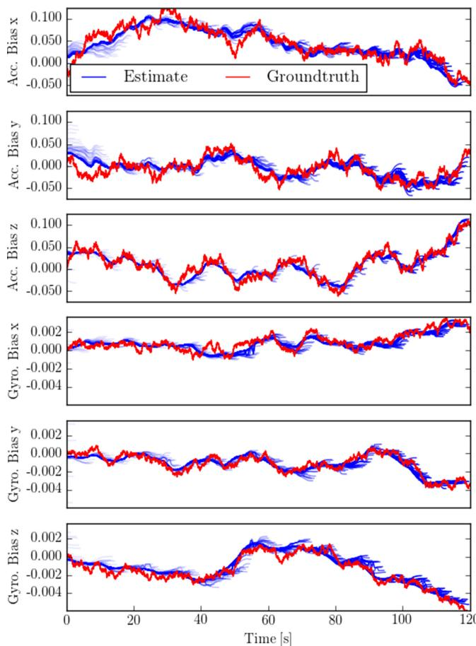

Fig. 10. Comparison between ground truth bias (red line) and estimated bias (blue lines) in a Monte Carlo run.  
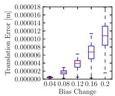

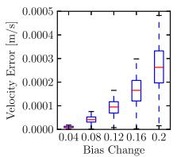

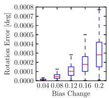  
Fig. 11. Error committed when using the first-order approximation (44) instead of repeating the integration, for different bias perturbations. Left: $\Delta \tilde { \bf p } _ { \mathrm { i j } } ( \bar { \bf b } _ { i } + \delta \bar { \bf b } _ { i } )$ error; Center: $\Delta \tilde { \mathbf { v } } _ { \mathrm { i j } } ( \bar { \mathbf { b } } _ { i } + \delta \mathbf { b } _ { i } )$ error; Right: $\Delta \tilde { \mathrm { R } } _ { \mathrm { i j } } ( \bar { \mathbf { b } } _ { i } \ - $ + $\delta \mathbf { b } _ { i } )$ error. Statistics are computed over 1000 Monte Carlo runs.

Each curve represents the history of the estimated biases from time zero (left-most extreme of the blue curve) to the current time (right-most extreme of the blue curve).

4) First-Order Bias Correction: We performed an additional Monte Carlo analysis to evaluate the a posteriori bias correction proposed in Section VI-C. The preintegrated measurements are computed with the bias estimate at the time of integration. However, as seen in Fig. 10, the bias estimate for an older preintegrated measurement may change when more information becomes available. To avoid repeating the integration when the bias estimate changes, we perform a firstorder correction of the preintegrated measurement according to (44). The accuracy of this first-order bias correction is reported in Fig. 11. To compute the statistics, we integrated 100 random IMU measurements with a given bias estimate $\bar { \mathbf { b } } _ { i }$ , which results in the preintegrated measurements $\Delta \tilde { \mathbb { R } } _ { \mathrm { i j } } ( \bar { \bf b } _ { i } ) , \Delta \tilde { \bf v } _ { \mathrm { i j } } ( \bar { \bf b } _ { i } )$ and $\Delta \tilde { \bf p } _ { \mathrm { i j } } ( \bar { \bf b } _ { i } )$ . Subsequently, a random perturbation δbi with magnitude between 0.04 and 0.2 was applied to both the gyroscope and accelerometer bias. We repeated the integration at $\bar { \mathbf { b } } _ { i } + \delta \mathbf { b } _ { i }$ to obtain $\Delta \tilde { \mathbb { R } } _ { \mathrm { i j } } ( \bar { \mathbf { b } } _ { i } + \delta \mathbf { b } _ { i } ) , \Delta \tilde { \mathbf { v } } _ { \mathrm { i j } } ( \bar { \mathbf { b } } _ { i } + \delta \mathbf { b } _ { i } )$ , and $\Delta \tilde { \bf p } _ { \mathrm { i j } } ( \bar { \bf b } _ { i } + \delta { \bf b } _ { i } )$ . This ground-truth result was then compared against the first-order correction in (44) to compute the error of the approximation. The errors resulting from the first-order approximation are negligible, even for the relatively large bias perturbations.

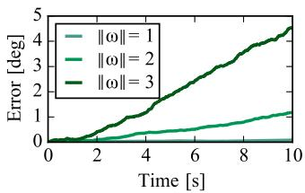  
(a)

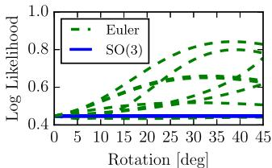  
(b)  
Fig. 12. (a) Integration errors committed with the Euler angle parametrization for angular velocities ω of increasing magnitude [rad/s]. (b) Negative loglikelihood of a rotation measurement under the action of random rigid body transformations.

5) Advantages Over the Euler-Angle-Based Formulation: In this section, we compare the proposed IMU preintegration with the original formulation of [2], based on Euler angles. We observe three main problems with the preintegration using Euler angles, which are avoided in our formulation.

The first drawback is that, in contrast to the integration using the exponential map in (30), the rotation integration based on Euler angles is only exact up to the first order. For the interested reader, we recall the rotation rate integration using Euler angles in Appendix IX-E. On the left of Fig. 12, we report the integration errors committed by the Euler angle parametrization when integrating angular rates with randomly selected rotation axes and magnitude in the range from 1 to 3 rad/s. The integration error in Euler angles accumulates quickly when the sampling time Δt or the angular rate ω˜ are large. On the other hand, the proposed approach, which performs integration directly on the rotation manifold, is exact, regardless the values of Δt and $\tilde { \omega }$

The second drawback is that the Euler parametrization is not fair [64], which means that, given the preintegrated Euler angles θ˜, the negative log-likelihood $\begin{array} { r } { \mathcal { L } ( \boldsymbol { \theta } ) = \frac { 1 } { 2 } \Vert \bar { \boldsymbol { \theta } } - \boldsymbol { \theta } \Vert _ { \Sigma } ^ { 2 } } \end{array}$ is not invariant under the action of rigid body transformations. On the right of Fig. 12, we show experimentally how the log-likelihood changes when the frame of reference is rotated around randomly selected rotation axes. This essentially means that an estimator using Euler angles may give different results for different choices of the world frame (cf., with Fig. 2). On the other hand, the SO(3) parametrization can be easily seen to be fair (the negative likelihood (16) can be promptly seen to be left invariant), and this is confirmed by Fig. 12 (right).

The third drawback is the existence of so-called gimball lock singularities. For a zyx Euler angle parametrization, the singularity is reached at pitch values of $\textstyle { \theta = { \frac { \pi } { 2 } } + n \pi }$ , for $n \in \mathbb { Z }$ To evaluate the effect of the singularity and how it affects the computation of preintegrated measurement noise, we performed the following Monte Carlo analysis. We simulated a set of trajectories that reach maximum pitch values $\theta _ { \mathrm { m a x } }$ of increasing magnitude. For each trajectory, we integrate the rotation uncertainty using the Euler parametrization and the proposed on-manifold approach. The ground-truth covariance is instead obtained through sampling. We use the Kullback–Leibler (KL) divergence to quantify the mismatch between the estimated covariances and the ground-truth one. The results of this experiment are shown in Fig. 13, where we observe that the closer we get to the singularity, the worse is the noise propagation using Euler angles. On the other hand, the proposed approach can accurately estimate the measurement covariance, independently on the motion of the platform.

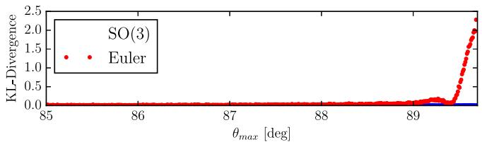  
Fig. 13. KL divergence between the preintegrated rotation covariance— computed using Euler angles (red) and the proposed approach (blue)—and the ground-truth covariance. The Euler angle parametrization degrades close to the singularity at $\theta _ { \mathrm { m a x } } = 9 0 ^ { \circ }$ while the proposed on-manifold approach is accurate regardless of the motion.

## B. Real Experiments

We integrated the proposed inertial factors in a monocular VIO pipeline to benchmark its performance against the state of the art. In the following, we first discuss our implementation, and then present the results from an indoor experiment with a motion-capture ground truth. Finally, we show results from longer trajectories in outdoor experiments. The results confirm that our approach is more accurate than the state-of-the-art filtering and fixed-lag smoothing algorithms, and enables fast inference in real-world problems.

1) Implementation: Our implementation consists of a high frame rate tracking front end based on SVO3 [65] and an optimization back-end based on iSAM2 [3].4 The front-end tracks salient features in the image at camera rate, while the back-end optimizes in parallel the state of selected keyframes as described in this paper.

SVO [65] is a precise and robust monocular visual odometry system that employs sparse image alignment to estimate incremental motion and tracks features by minimizing the photometric error between subsequent frames. The difference to tracking features individually, as in standard Lucas–Kanade tracking, is that we exploit the known depth of features from previous triangulations. This allows us to track all features as a bundle in a single optimization that satisfies epipolar constraints; hence, outliers only originate from erroneous triangulations. In the visual–inertial setting, we further exploit the availability of accurate rotation increments, obtained by integrating angular velocity measurements from the gyroscope. These increments are used as rotation priors in the sparse-image-alignment algorithm, and this increases the overall robustness of the system. The motion estimation is combined with an outlier resistant probabilistic triangulation method that is implemented with a recursive Bayesian filter. The high frame-rate motion estimation combined with the robust depth estimation results in increased robustness in scenes with repetitive and high-frequency texture (e.g., asphalt). The output of SVO are selected keyframes with feature-tracks corresponding to triangulated landmarks. This data is passed to the back end that computes the visual–inertial MAP estimate in (26) using iSAM2 [3].

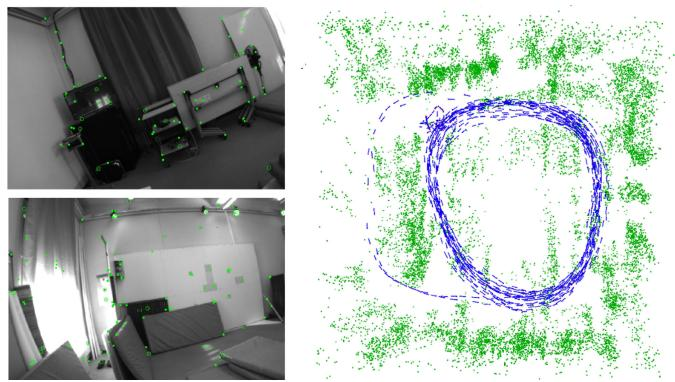  
Fig. 14. Left: two images from the indoor trajectory dataset with tracked features in green. Right: top view of the trajectory estimate produced by our approach (blue) and 3-D landmarks triangulated from the trajectory (green).

We remark that our approach does not marginalize out past states. Therefore, while the approach is designed for fast VIO, if desired, it could be readily extended to incorporate loop closures.

2) Indoor Experiments: The indoor experiment shows that the proposed approach is more accurate than two competitive state-of-the-art approaches, namely OKVIS5 [24] and MSCKF [5]. The experiment is performed on the 430-m-long indoor trajectory of Fig. 14. The dataset was recorded with a forward-looking VI-Sensor [66] that consists of an ADIS16448 MEMS IMU and two embedded WVGA monochrome cameras (we only use the left camera). Intrinsic and extrinsic calibration was obtained using [59]. The camera runs at 20 Hz and the IMU at 800 Hz. Ground truth poses are provided by a Vicon system mounted in the room; the hand-eye calibration between the Vicon markers and the camera is computed using a least-squares method [67].

Fig. 15 compares the proposed system against the OKVIS algorithm [24], and an implementation of the MSCKF filter [5]. Both these algorithms currently represent the state-of-the-art in VIO, OKVIS for optimization-based approaches, and MSCKF for filtering methods. We obtained the datasets as well as the trajectories computed with OKVIS and MSCKF from the authors of [24]. We use the relative error metrics proposed in [68] to obtain error statistics. The metric evaluates the relative error by averaging the drift over trajectory segments of different length ({10, 40, 90, 160, 250, 360} m in Fig. 15). Our approach exhibits less drift than the state of the art, achieving 0.3 m drift on average over 360 m traveled distance; OKVIS and MSCKF accumulate an average error of 0.7 m. We observe significantly less drift in yaw direction in the proposed approach while the error in pitch and roll direction is constant for all methods due to the observability of the gravity direction.

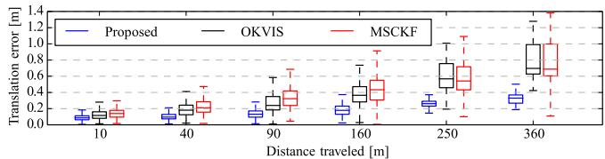

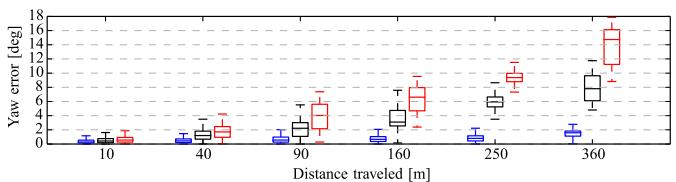

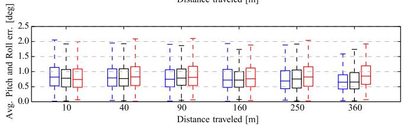  
Fig. 15. Comparison of the proposed approach versus the OKVIS algorithm [24] and an implementation of the MSCKF filter [5]. Relative errors are measured over different segments of the trajectory, of length { 10,40,90,160,250,360} m, according to the odometric error metric in [68].

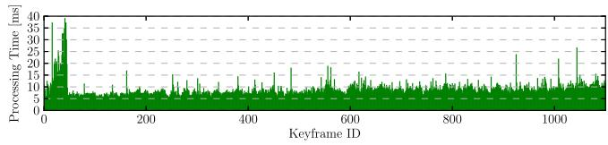  
Fig. 16. Processing-time per keyframe for the proposed VIO approach.

We highlight that these three algorithms use different frontend feature tracking systems, which influence the overall performance of the approach. Therefore, while in Section VIII-A, we discussed only aspects that are related to the preintegration theory, in this section, we evaluate the proposed system as a whole (SVO, preintegration, structureless vision factors, iSAM2).

Evaluating the consistency in real experiments by means of analyzing the average NEES is difficult as one would have to evaluate and average the results of multiple runs of the same trajectory with different realizations of the sensor noise. In Fig. 17, we show the error plots with the three-sigma bounds for a single run. The result is consistent as the estimation errors remain within the bounds of the estimated uncertainty. In this experiment, we aligned only the first frame of the trajectory with the vicon trajectory. Therefore, analyzing the drift over 400 m is very prone to errors in the initial pose from the ground truth or errors in the hand-eye calibration of the system.

Fig. 16 illustrates the time required by the back end to compute the full MAP estimate, by running iSAM2 with ten optimization iterations. The experiment was performed on a

y [m]

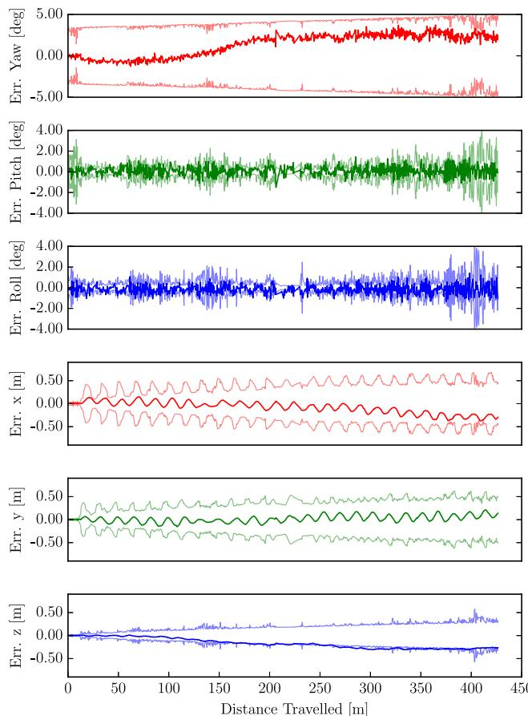  
Fig. 17. Orientation and position errors with 3σ bounds for the real indoor experiment in Fig. 14.

standard laptop (Intel i7, 2.4 GHz). The average update time for iSAM2 is 10 ms. The peak corresponds to the start of the experiment in which the camera was not moving. In this case, the number of tracked features becomes very large making the back end slightly slower. The SVO front end requires approximately 3 ms to process a frame on the laptop while the back-end runs in a parallel thread and optimizes only keyframes. Although the processing times of OKVIS were not reported, the approach is described as computationally demanding [24]. OKVIS needs to repeat IMU integration at every change ofthe linearization point, which we avoid by using the preintegrated IMU measurements.

3) Outdoor Experiments: The second experiment is performed on an outdoor trajectory, and compares the proposed approach against the Google Tango Peanut sensor (mapper version 3.15), which is an engineered VIO system. We rigidly attached the VI-Sensor to a Tango device and walked around an office building. Fig. 18 depicts the trajectory estimates for our approach and Google Tango. The trajectory starts and ends at the same location, hence, we can report the end-to-end error which is 1.5 m for the proposed approach and 2.2 m for the Google Tango sensor.

In Fig. 18, we also show the estimated landmark positions (in green). 3-D points are not estimated by our approach (which uses a structureless vision model), but are triangulated from our trajectory estimate for visualization purposes.

The third experiment is the one in Fig. 19. The trajectory goes across three floors of an office building and eventually returns to the initial location on the ground floor. Also, in this case, the proposed approach guarantees a very small end-to-end error (0.5 m), while Tango accumulates 1.4 m error.

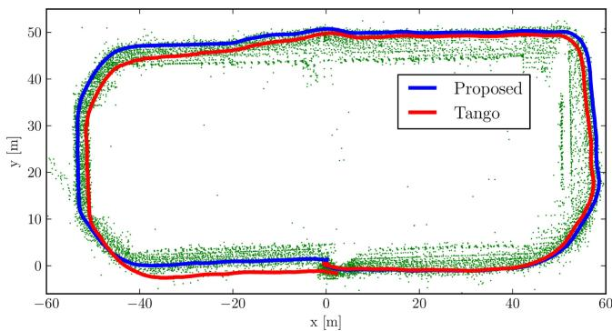

Fig. 18. Outdoor trajectory (length: 300 m) around a building with an identical start and end point at coordinates (0,0,0). The end-to-end error of the proposed approach is 1.0 m. Google Tango accumulated 2.2 m drift. The green dots are the 3-D points triangulated from our trajectory estimate.  
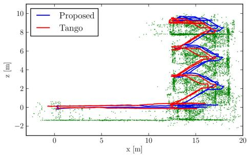

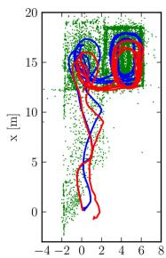  
Fig. 19. Real test comparing the proposed VIO approach against Google Tango. The 160-m-long trajectory starts at (0, 0, 0) (ground floor), goes up till the third floor of a building, and returns to the initial point. The figure shows a side view (left) and a top view (right) of the trajectory estimates for our approach (blue) and Tango (red). Google Tango accumulates 1.4 m error, while the proposed approach only has 0.5 m drift. 3-D points triangulated from our trajectory estimate are shown in green for visualization purposes.

We remark that Tango and our system use different sensors, hence, the reported end-to-end errors only allow for a qualitative comparison. However, the IMUs of both sensors exhibit similar noise characteristics [69], [70] and the Tango camera has a significantly larger field-of-view and better shutter speed control than our sensor. Therefore, the comparison is still valuable to assess the accuracy of the proposed approach.

A video demonstrating the execution of our approach for the real experiments discussed in this section can be viewed at https://youtu.be/CsJkci5lfco.

## IX. CONCLUSION

This paper proposes a novel preintegration theory, which provides a grounded way to model a large number of IMU measurements as a single motion constraint. Our proposal improves over related works that perform integration in a global frame, e.g., [5], [23], as we do not commit to a linearization point during integration. Moreover, it leverages the seminal work on preintegration [2], bringing to maturity the preintegration and uncertainty propagation in SO(3).

As a second contribution, we discuss how to use the preintegrated IMU model in a VIO pipeline; we adopt a structureless model for visual measurements which avoids optimizing over 3-D landmarks. Our VIO approach uses iSAM2 to perform constant-time incremental smoothing.

An efficient implementation of our approach requires 10 ms to perform inference (back end), and 3 ms for feature tracking (front end). Experimental results also confirm that our approach is more accurate than the state-of-the-art alternatives, including filtering- and optimization-based techniques.

We release the source-code of the IMU preintegration and the structurless vision factors in the GTSAM 4.0 optimization toolbox [7] and provide additional theoretical derivations and implementation details in the Appendix of this paper.

## APPENDIX

## A. Iterative Noise Propagation

In this section, we show that the computation of the preintegrated noise covariance, discussed in Section VI-B, can be carried out in iterative form, which leads to simpler expressions and is more amenable for online inference.

Let us start from the preintegrated rotation noise in (42). To write $\delta \phi _ { \mathrm { i j } }$ in iterative form, we simply take the last term $( k = j - 1 )$ ) out of the sum and rearrange the terms as follows:

$$
\begin{array} { r l } { \delta \phi _ { i } \Bigl > } & { \displaystyle \sum _ { k = 1 } ^ { j - 1 } \Delta \tilde { \mathbf { f } } _ { i + 1 , j } ^ { \intercal } y _ { \tau _ { k } ^ { 0 } } ^ { k , 0 } \Delta t } \\ & { \displaystyle - \sum _ { k = i - 1 } ^ { j - 1 } \Delta \tilde { \mathbf { f } } _ { i + 1 , j } ^ { \intercal } y _ { \tau _ { k } ^ { 0 } } ^ { k , 1 } \Delta t + \Delta \overline { { \mathbf { f } _ { i , j } ^ { \intercal } } } _ { j + 1 } ^ { \intercal } y _ { \tau _ { j - 1 } ^ { 0 } } ^ { k , 1 } \Delta t } \\ & { = \displaystyle \sum _ { k = i - 1 } ^ { j - 2 } \Delta \tilde { \mathbf { f } } _ { i + 1 , j } ^ { \intercal } y _ { \tau _ { k } ^ { 0 } } ^ { k , 1 } \Delta t + \Delta \overline { { \mathbf { f } _ { i , j } ^ { \intercal } } } _ { j + 1 } ^ { \intercal } y _ { \tau _ { j - 1 } ^ { 0 } } ^ { k , 1 } \Delta t } \\ & { \displaystyle - \sum _ { k = i - 1 } ^ { j - 2 } \frac { \Delta \tilde { \mathbf { f } } _ { k - 1 , j } } { \Delta \tilde { \mathbf { f } } _ { i + 1 , j - 1 } \Delta \tilde { \mathbf { f } } _ { i - 1 , j } } \Delta y _ { \tau _ { j , k } ^ { 0 } } ^ { k , 1 } \Delta t + y _ { \tau } ^ { - 1 } y _ { \tau _ { j - 1 } ^ { 0 } } ^ { \intercal } \Delta t } \\ & { = \Delta \overline { { \mathbf { f } _ { i - 1 , j } ^ { \intercal } } } _ { j - 1 } \Delta \overline { { \mathbf { f } _ { i + 1 , j - 1 } ^ { \intercal } } } _ { j + 1 , j - 1 } \Delta y _ { \tau _ { j - 1 } ^ { 0 } } ^ { k , 1 } \Delta t + \overline { { \mathbf { g } _ { i - 1 , j } ^ { \intercal } } } _ { j + 1 } ^ { \intercal } \Delta t } \\ &  = \Delta \overline   \mathbf { f } _  i - 1 \end{array}\tag{9}
$$

Repeating the same process for $\delta \mathbf { v } _ { \mathrm { i j } }$ in (43)

$$
\begin{array} { l } { { \displaystyle { \delta { \bf { v } } _ { \mathrm { i j } } } = \sum _ { k = i } ^ { j - 1 } \left[ - \Delta { \tilde { \bf { R } } } _ { \mathrm { i k } } \left( { \tilde { \bf { a } } } _ { k } - { { \bf { b } } _ { i } ^ { a } } \right) ^ { \wedge } \delta \phi _ { \mathrm { i k } } \Delta t + \Delta { \tilde { \bf { R } } } _ { \mathrm { i k } } { \eta } _ { k } ^ { \mathrm { a d } } \Delta t \right] } } \\ { ~ } \\ { = \displaystyle { \sum _ { k = i } ^ { j - 2 } \left[ - \Delta { \tilde { \bf { R } } } _ { \mathrm { i k } } \left( { \tilde { \bf { a } } } _ { k } - { { \bf { b } } _ { i } ^ { a } } \right) ^ { \wedge } \delta \phi _ { \mathrm { i k } } \Delta t + \Delta { \tilde { \bf { R } } } _ { \mathrm { i k } } { \eta } _ { k } ^ { \mathrm { a d } } \Delta t \right] } } \\ { ~ } \\ { { \displaystyle ~ - \Delta { \tilde { \bf { R } } } _ { \mathrm { i j - 1 } } \left( { \tilde { \bf { a } } } _ { j - 1 } - { { \bf { b } } _ { i } ^ { a } } \right) ^ { \wedge } \delta \phi _ { i j - 1 } \Delta t + \Delta { \tilde { \bf { R } } } _ { i j - 1 } { \eta } _ { j - 1 } ^ { \mathrm { a d } } \Delta t } } \\ { ~ } \\ { { \displaystyle = \delta { \bf { v } } _ { \mathrm { i j - 1 } } - \Delta { \tilde { \bf { R } } } _ { \mathrm { i j - 1 } } \left( { \tilde { \bf { a } } } _ { j - 1 } - { { \bf { b } } _ { i } ^ { a } } \right) ^ { \wedge } \delta \phi _ { i j - 1 } \Delta t } } \\ { ~ } \\ { { \displaystyle ~ + \Delta { \tilde { \bf { R } } } _ { i j - 1 } { \eta } _ { j - 1 } ^ { \mathrm { a d } } \Delta t } . } \end{array}
$$

Doing the same for $\delta \mathbf { p } _ { \mathrm { i j } }$ in (43), and noting that $\delta \mathbf { p } _ { \mathrm { i j } }$ can be written as a function of $\delta \mathbf { v } _ { \mathrm { i j } }$ [cf., with the expression of $\delta \mathbf { v } _ { \mathrm { i j } }$

in (43)]

$$
\begin{array} { r l } { \Phi _ { 1 9 } } & { = \frac { \lambda ^ { 2 } } { 2 \lambda ^ { 3 } } \Bigg [ ( 8 \kappa _ { 1 } \Delta - \frac { 1 } { 2 } \Delta \Phi _ { 1 , 1 } ( \hat { R } - \mathrm { B } _ { 1 , 1 } ^ { \mathrm { s y } } ) ^ { 2 } \delta \phi _ { 1 , 2 } \Delta x ^ { 2 } } \\ & { - \frac { 1 } { 2 } \Delta \Phi _ { 1 , 1 } \eta ^ { 4 } \Delta x ^ { 2 } \Bigg ] ^ { 2 } } \\ & { - \frac { \lambda ^ { 2 } } { 2 } \Bigg [ \frac { \Delta } { 2 } \Delta \Phi _ { 1 , 1 } \Delta ^ { 2 } \hat { R } + \mathrm { B } _ { 1 , 1 } ^ { \mathrm { s y } } \Bigg ] ^ { 2 } , } \\ & { - \frac { \lambda ^ { 2 } } { 2 } \Bigg [ \mathrm { s u b } _ { \mathrm { a d d } , 2 } \Delta - \frac { 1 } { 2 } \Delta \Phi _ { 1 , 1 } ( \hat { R } - \mathrm { B } _ { 1 , 1 } ^ { \mathrm { s y } } ) ^ { 2 } \delta \phi _ { 1 , 2 } \Delta x ^ { 2 } } \\ & { + \frac { 1 } { 2 } \Delta \Phi _ { 1 , 1 } \eta ^ { 4 } \Delta x ^ { 2 } \Bigg ] ^ { 2 } } \\ & { + \frac { \lambda ^ { 2 } } { 2 } \Delta \Phi _ { 1 , 1 } \Delta \Psi _ { 1 , 2 } ^ { \mathrm { s y } } \Bigg ] ^ { 2 } , } \\ & { + \frac { \lambda ^ { 2 } } { 2 } \Delta \eta _ { 1 , 1 } \Delta ^ { 2 } \Phi _ { 1 , 2 } \Delta ^ { 2 } \Phi _ { 1 , 1 } ^ { 2 } \Bigg ] ^ { 3 / 2 } \Phi _ { 1 , 2 } - \mathrm { b y } _ { 1 , 2 } ^ { 2 } \delta \phi _ { 1 , 2 } \Delta ^ { 2 } } \\ &  + \frac { \lambda ^ { 2 } } { 2 } \Delta \Phi _ { 1 , 1 } \Delta ^ { 2 } \hat { R } + \mathrm { B } _ { 1 , 1 } ^ { \mathrm { s y } } \Bigg ] ^ { 3 / 2 } \Phi _  1 ,  \end{array}\tag{1}
$$

Recalling that $\pmb { \eta } _ { \mathrm { i k } } ^ { \Delta } \doteq [ \delta \phi _ { \mathrm { i k } } , \delta \mathbf { v } _ { \mathrm { i k } } , \delta \mathbf { p } _ { \mathrm { i k } } ]$ , and defining the IMU measurement noise $\pmb { \eta } _ { k } ^ { d } \doteq [ \pmb { \eta } _ { k } ^ { \mathrm { g d } } \pmb { \eta } _ { k } ^ { \mathrm { a d } } ] , ^ { 6 }$ we can finally write (59)– (61) in compact matrix form as

$$
\pmb { \eta } _ { \mathrm { i j } } ^ { \Delta } = \mathbf { A } _ { j - 1 } \pmb { \eta } _ { \mathrm { i j - 1 } } ^ { \Delta } + \mathbf { B } _ { j - 1 } \pmb { \eta } _ { j - 1 } ^ { d } .\tag{62}
$$

From the linear model (62) and given the covariance $\Sigma _ { \eta } \in \mathbb { R } ^ { 6 \times 6 }$ of the raw IMU measurements noise $\eta _ { k } ^ { d }$ , it is now possible to compute the preintegrated measurement covariance iteratively

$$
\begin{array} { r } { \pmb { \Sigma } _ { \mathrm { i j } } = \mathbf { A } _ { j - 1 } \pmb { \Sigma } _ { \mathrm { i j - 1 } } \mathbf { A } _ { j - 1 } ^ { \top } + \mathbf { B } _ { j - 1 } \pmb { \Sigma } _ { \eta } \mathbf { B } _ { j - 1 } ^ { \top } } \end{array}\tag{63}
$$

starting from initial conditions $\pmb { \Sigma } _ { i i } = \mathbf { 0 } _ { 9 \times 9 }$

## B. Bias Correction via First-Order Updates

In this section, we provide a complete derivation of the firstorder bias correction proposed in Section VI-C.

Let us assume that we have computed the preintegrated variables at a given bias estimate $\bar { \bf b } _ { i } \doteq [ \bar { \bf b } _ { i } ^ { g } \bar { \bf \Delta b } _ { i } ^ { a } ]$ , and let us denote the corresponding preintegrated measurements as

$$
\Delta \bar { \mathsf { R } } _ { \mathrm { i j } } \doteq \Delta \tilde { \mathsf { R } } _ { \mathrm { i j } } ( \bar { \mathbf { b } } _ { i } ) , \Delta \bar { \mathbf { v } } _ { \mathrm { i j } } \doteq \Delta \tilde { \mathbf { v } } _ { \mathrm { i j } } ( \bar { \mathbf { b } } _ { i } ) , \Delta \bar { \mathbf { p } } _ { \mathrm { i j } } \doteq \Delta \tilde { \mathbf { p } } _ { \mathrm { i j } } ( \bar { \mathbf { b } } _ { i } ) .\tag{64}
$$

In this section, we want to devise an expression to “update” $\Delta \bar { \mathrm { R } } _ { \mathrm { i j } } , \Delta \bar { \bf v } _ { \mathrm { i j } } , \Delta \bar { \bf p } _ { \mathrm { i j } }$ when our bias estimate changes.

Consider the case in which we get a new estimate $\hat { \mathbf { b } } _ { i } \gets$ $\bar { \mathbf { b } } _ { i } + \delta \mathbf { b } _ { i }$ , where $\delta \mathbf { { b } } _ { i }$ is a small correction w.r.t. the previous estimate $\bar { \mathbf { b } } _ { i }$

We start with the bias correction for the preintegrated rotation measurement. The key idea here is to write $\Delta \tilde { \mathrm { R } } _ { \mathrm { i j } } ( \hat { \mathbf { b } } _ { i } )$ (the preintegrated measurement at the new bias estimate) as a function of $\Delta \bar { \mathrm { R } } _ { \mathrm { i j } }$ (the preintegrated measurement at the old bias estimate), “plus” a first-order correction. Recalling (35), we write

Δ $\tilde { \mathrm { R } } _ { \mathrm { i j } } ( \hat { \mathbf { b } } _ { i } )$ as

$$
\Delta \tilde { \mathrm { R } } _ { \mathrm { i j } } ( \hat { \mathbf { b } } _ { i } ) = \prod _ { k = i } ^ { j - 1 } \mathrm { E x p } \big ( \big ( \tilde { \omega } _ { k } - \hat { \mathbf { b } } _ { i } ^ { g } \big ) \Delta t \big ) .\tag{65}
$$

Substituting $\hat { \mathbf { b } } _ { i } = \bar { \mathbf { b } } _ { i } + \delta \mathbf { b } _ { i }$ in the previous expression and using the first-order approximation (4) in each factor (we assumed small $\delta \mathbf { b } _ { i } )$

$$
\begin{array} { l } { \displaystyle \Delta \tilde { \mathbb { R } } _ { \mathrm { i j } } ( \hat { \mathbf { b } } _ { i } ) = \prod _ { k = i } ^ { j - 1 } \mathrm { E x p } \big ( \big ( \tilde { \omega } _ { k } - ( \bar { \mathbf { b } } _ { i } ^ { g } + \delta \mathbf { b } _ { i } ^ { g } ) \big ) \Delta t \big ) } \\ { \displaystyle \simeq \prod _ { k = i } ^ { j - 1 } \mathrm { E x p } \big ( \big ( \tilde { \omega } _ { k } - \bar { \mathbf { b } } _ { i } ^ { g } \big ) \Delta t \big ) \mathrm { E x p } \big ( - \mathbf { J } _ { r } ^ { k } \delta \mathbf { b } _ { i } ^ { g } \Delta t \big ) . } \end{array}
$$

Now, we rearrange the terms in the product, by “moving” the terms including $\delta \mathbf { { b } } _ { i } ^ { \mathrm { { g d } } }$ to the end, using the relation (11)

$$
\Delta \tilde { \mathrm { R } } _ { \mathrm { i j } } ( \hat { \mathbf { b } } _ { i } ) = \Delta \bar { \mathrm { R } } _ { \mathrm { i j } } \prod _ { k = i } ^ { j - 1 } \mathrm { E x p } \big ( - \Delta \tilde { \mathrm { R } } _ { k + 1 j } \big ( \bar { \mathbf { b } } _ { i } \big ) ^ { \mathsf { T } } \mathbf { J } _ { r } ^ { k } \delta \mathbf { b } _ { i } ^ { g } \Delta t \big )\tag{67}
$$

where we used the fact that by definition it holds that $\Delta \bar { \mathrm { R } } _ { \mathrm { i j } } =$ $\begin{array} { r l } {  { \prod _ { k = i } ^ { j - 1 } \mathrm { E x p } ( ( \tilde { \omega } _ { k } - \bar { \mathbf { b } } _ { i } ^ { g } ) \Delta t ) } } & { { } } \end{array}$ . Repeated application of the firstorder approximation (7) (recall that $\delta \mathbf { b } _ { i } ^ { g }$ is small, hence, the right Jacobians are close to the identity) produces

$$
\begin{array} { r l r } {  { \Delta \tilde { \mathrm { R } } _ { \mathrm { i j } } ( \hat { \mathbf { b } } _ { i } ) \simeq \Delta \bar { \mathrm { R } } _ { \mathrm { i j } } \mathrm { E x p } ( \sum _ { k = i } ^ { j - 1 } - \Delta \tilde { \mathrm { R } } _ { k + 1 j } ( \bar { \mathbf { b } } _ { i } ) ^ { \top } \mathbf { J } _ { r } ^ { k } \delta \mathbf { b } _ { i } ^ { g } \Delta t ) } } \\ & { } & { = \Delta \bar { \mathrm { R } } _ { \mathrm { i j } } \mathrm { E x p } \Big ( \frac { \partial \Delta \bar { \mathrm { R } } _ { \mathrm { i j } } } { \partial \mathbf { b } ^ { g } } \delta \mathbf { b } _ { i } ^ { g } \Big ) . } \end{array}\tag{68}
$$

Using (68), we can now update the preintegrated rotation measurement $\Delta \tilde { \mathrm { R } } _ { \mathrm { i j } } ( \bar { \bf b } _ { i } )$ to get $\Delta \tilde { \mathrm { R } } _ { \mathrm { i j } } ( \hat { \mathbf { b } } _ { i } )$ without repeating the integration.

Let us now focus on the bias correction of the preintegrated velocity $\Delta \tilde { \mathbf { v } } _ { \mathrm { i j } } ( \hat { \mathbf { b } } _ { i } )$

$$
\begin{array} { r l } { \left. \hat { N } _ { \xi } \right. _ { \xi } ^ { \prime } } & { = \displaystyle \sum _ { k = 1 } ^ { N } \Delta \hat { E } _ { \xi , k } \left[ \hat { \Gamma } _ { \xi } \right] \left. \hat { a } _ { k } - \hat { N } _ { \xi } ^ { \prime } - \hat { N } _ { \xi } ^ { \prime } \right. \Delta t } \\ & { \overset { \mathrm { O } } { \underset { \xi \in \mathbb { Z } } { \longrightarrow } } \displaystyle \sum _ { k = 1 } ^ { N } \Delta \hat { E } _ { \xi , k } \log \left( \frac { \partial \Delta \hat { N } _ { k , k } } { \partial \psi } \hat { \mathcal { O } } _ { \xi } ^ { k } \right) \left( \Delta \hat { a } _ { k } - \mathrm { B } _ { \xi } ^ { \prime } - \partial \hat { N } _ { \xi } ^ { \prime } \right) \Delta t } \\ & { \overset { \mathrm { O } } { \underset { \xi \in \mathbb { Z } } { \longrightarrow } } \displaystyle \sum _ { k = 1 } ^ { N } \Delta \hat { N } _ { k } \left( { \bf 1 } + \left( \frac { \partial \Delta \hat { N } _ { k , k } } { \partial \psi } \Delta \hat { \Gamma } _ { \xi } \right) ^ { \prime } \right) \left( \Delta z - \bar { \bf B } _ { \xi } ^ { \prime } - \Delta \hat { \bf B } _ { \xi } ^ { \prime } \right) \Delta t } \\ & { \overset { \mathrm { O } } { \underset { \xi \in \mathbb { Z } } { \longrightarrow } } \displaystyle \sum _ { k = 1 } ^ { N } \Delta \hat { N } _ { \xi } \left( { \bf 1 } - \left( \frac { \partial \Delta \hat { N } _ { k , k } } { \partial \psi } \Delta \hat { \bf f } _ { \xi } \right) ^ { \prime } \right) \left( \Delta z - \bar { \bf B } _ { \xi } ^ { \prime } - \Delta \hat { \bf B } _ { \xi } ^ { \prime } \right) \Delta t } \\ &  \overset { \mathrm { O } } { \underset { \xi \in \mathbb { Z } } { \longrightarrow } } \Delta \hat { \bf O } _ { \xi } \frac  \partial ^  - 1  \end{array}
$$

$$
\begin{array} { r l } { \displaystyle } & { - \sum _ { k = i } ^ { j - 1 } \Delta \bar { \mathsf { R } } _ { \mathrm { i k } } \left( \tilde { \mathbf { a } } _ { k } - \bar { \mathbf { b } } _ { i } ^ { a } \right) ^ { \wedge } \frac { \partial \Delta \bar { \mathbf { R } } _ { \mathrm { i k } } } { \partial { \mathbf { b } } ^ { g } } \Delta t \delta \mathbf { b } _ { i } ^ { g } } \\ & { = \Delta \bar { \mathbf { v } } _ { \mathrm { i j } } + \frac { \partial \Delta \bar { \mathbf { v } } _ { \mathrm { i j } } } { \partial { \mathbf { b } } ^ { a } } \delta { \mathbf { b } } _ { i } ^ { a } + \frac { \partial \Delta \bar { \mathbf { v } } _ { \mathrm { i j } } } { \partial { \mathbf { b } } ^ { g } } \delta { \mathbf { b } } _ { i } ^ { g } } \end{array}\tag{69}
$$

where for (a), we used $\begin{array} { r } { \Delta \bar { \bf v } _ { \mathrm { i j } } = \sum _ { k = i } ^ { j - 1 } \Delta \bar { \sf R } _ { \mathrm { i k } } \left( \tilde { \bf a } _ { k } - \bar { \bf b } _ { i } ^ { a } \right) \Delta t . } \end{array}$ Exactly the same derivation can be repeated for $\Delta \tilde { \bf p } _ { \mathrm { i j } } ( \hat { \bf b } _ { i } )$ . Summarizing, the Jacobians used for the a posteriori bias update in (44) are

$$
\begin{array} { r l } & { \frac { \partial \Delta \bar { \mathbf { R } } _ { \mathrm { i j } } } { \partial \mathbf { b } ^ { g } } = \ - \sum _ { k = i } ^ { j - 1 } \left[ \Delta \bar { \mathbf { R } } _ { k + 1 j } ( \bar { \mathbf { b } } _ { i } ) ^ { \top } \mathbf { J } _ { r } ^ { k } \Delta t \right] } \\ & { \frac { \partial \Delta \bar { \mathbf { v } } _ { \mathrm { i j } } } { \partial \mathbf { b } ^ { a } } = \ - \sum _ { k = i } ^ { j - 1 } \Delta \bar { \mathbf { R } } _ { \mathrm { i k } } \Delta t } \\ & { \frac { \partial \Delta \bar { \mathbf { v } } _ { \mathrm { i j } } } { \partial \mathbf { b } ^ { g } } = \ - \sum _ { k = i } ^ { j - 1 } \Delta \bar { \mathbf { R } } _ { \mathrm { i k } } \left( \bar { \mathbf { a } } _ { k } - \bar { \mathbf { b } } _ { i } ^ { a } \right) ^ { \wedge } \frac { \partial \Delta \bar { \mathbf { R } } _ { \mathrm { i k } } } { \partial \mathbf { b } ^ { g } } \Delta t } \\ & { \frac { \partial \Delta \bar { \mathbf { p } } _ { \mathrm { i j } } } { \partial \mathbf { b } ^ { a } } = \ \sum _ { k = i } ^ { j - 1 } \frac { \partial \Delta \bar { \mathbf { v } } _ { \mathrm { i k } } } { \partial \mathbf { b } ^ { a } } \Delta t - \frac { 1 } { 2 } \Delta \bar { \mathbf { R } } _ { \mathrm { i k } } \Delta t ^ { 2 } } \\ &  \frac { \partial \Delta \bar { \mathbf { p } } _ { \mathrm { i j } } } { \partial \mathbf { b } ^ { g } } = \ \sum _ { k = i } ^ { j - 1 } \frac { \partial \Delta \bar { \mathbf { v } } _ { \mathrm { i k } } } { \partial \mathbf { b } ^ { g } } \Delta t - \frac { 1 } { 2 } \Delta \bar { \mathbf { R } } _ { \mathrm { i k } } \left( \bar { \mathbf { a } } _ { k } - \bar { \mathbf { b } } _ { i } ^ { a } \right) ^ { \wedge } \frac  \end{array}
$$

Note that the Jacobians can be computed incrementally, as new measurements arrive.

## C. Jacobians of Residual Errors

In this section, we provide analytic expressions for the Jacobian matrices of the residual errors in (45). These Jacobians are crucial when using iterative optimization techniques (e.g., the Gauss–Newton method of Section III-C) to minimize the cost in (26).

“Lifting” the cost function (see Section III-C) consists of substituting the following retractions:

$$
\begin{array} { r l } & {  { \mathbb { R } } _ { i } \gets  { \mathbb { R } } _ { i }  { \mathrm { E x p } } ( \delta \phi _ { i } ) , \quad  { \mathbb { R } } _ { j } \gets  { \mathbb { R } } _ { j }  { \mathrm { E x p } } ( \delta \phi _ { j } ) } \\ & {  { \mathbf { p } } _ { i } \gets  { \mathbf { p } } _ { i } +  { \mathbb { R } } _ { i } \delta  { \mathbf { p } } _ { i } , \quad  { \mathbf { p } } _ { j } \gets  { \mathbf { p } } _ { j } +  { \mathbb { R } } _ { j } \delta  { \mathbf { p } } _ { j } } \\ & {  { \mathbf { v } } _ { i } \gets  { \mathbf { v } } _ { i } + \delta  { \mathbf { v } } _ { i } , \qquad { \mathbf { v } } _ { j } \gets  { \mathbf { v } } _ { j } + \delta  { \mathbf { v } } _ { i } } \\ & { \delta  { \mathbf { b } } _ { i } ^ { g } \gets \delta  { \mathbf { b } } _ { i } ^ { g } + \tilde { \delta }  { \mathbf { b } } _ { i } ^ { g } , \quad \delta  { \mathbf { b } } _ { i } ^ { a } \gets \delta  { \mathbf { b } } _ { i } ^ { a } + \tilde { \delta }  { \mathbf { b } } _ { i } ^ { a } . } \end{array}\tag{70}
$$

The process of lifting makes the residual errors a function defined on a vector space, on which it is easy to compute Jacobians. Therefore, in the following sections, we derive the Jacobians w.r.t. the vectors $\delta \phi _ { i } , \delta \mathbf { p } _ { i } , \bar { \delta } \mathbf { v } _ { i } , \delta \phi _ { j } , \delta \mathbf { p } _ { j } , \delta \mathbf { v } _ { j } , \tilde { \delta } \mathbf { b } _ { i } ^ { g } , \tilde { \delta } \mathbf { b } _ { i } ^ { a }$

1) Jacobians of $\mathbf { \dot { r } } _ { \Delta \mathbf { p } _ { \mathrm { i j } } } .$ Since $\mathbf { r } _ { \Delta \mathbf { p } _ { \mathrm { i j } } }$ is linear in $\delta \mathbf { b } _ { i } ^ { g }$ and $\delta \mathbf { b } _ { i } ^ { a }$ and the retraction is simply a vector sum, the Jacobians of $\mathbf { r } _ { \Delta \mathbf { p } _ { \mathrm { i } } }$ $\mathrm { w . r . t . } \ \tilde { \delta } \mathbf { b } _ { i } ^ { g } , \tilde { \delta } \mathbf { b } _ { i } ^ { a }$ are simply the matrix coefficients of $\delta \mathbf { b } _ { i } ^ { g }$ and δba . Moreover, $\mathtt { R } _ { j }$ and $\mathbf { v } _ { j }$ do not appear in $\mathbf { r } _ { \Delta \mathbf { p } _ { \mathrm { i j } } } .$ , hence, the Jacobians w.r.t. $\delta \phi _ { j } , \delta \mathbf { v } _ { j }$ are zero. Let us focus on the following remaining Jacobians:

$$
\begin{array} { l } { \mathbf { r } _ { \Delta \mathbf { p } _ { \mathrm { i j } } } \left( \mathbf { p } _ { i } + \mathbf { R } _ { i } \delta \mathbf { p } _ { i } \right) } \\ { = \mathbf { R } _ { i } ^ { \top } \left( \mathbf { p } _ { j } - \mathbf { p } _ { i } - \mathbf { R } _ { i } \delta \mathbf { p } _ { i } - \mathbf { v } _ { i } \Delta t _ { \mathrm { i j } } - \frac 1 2 \mathbf { g } \Delta t _ { \mathrm { i j } } ^ { 2 } \right) - C } \\ { = \mathbf { r } _ { \Delta \mathbf { p } _ { \mathrm { i j } } } \left( \mathbf { p } _ { i } \right) + \left( - \mathbf { I } _ { 3 \times 1 } \right) \delta \mathbf { p } _ { i } } \end{array}\tag{71}
$$

$$
\begin{array} { r l } & { \mathbb { E } _ { \xi \sim \phi _ { 0 } } ( \mathbf { S } _ { \xi } \mid \mathcal { S } _ { \xi } , \phi _ { 0 } ) } \\ & { = \mathbb { E } _ { \xi \sim \phi _ { 0 } } ( \int _ { \mathbb { R } _ { 0 } } ^ { \infty } \mathbf { R } _ { \xi } ( \phi _ { 0 } , \phi _ { 0 } ) - \mathbb { E } _ { \xi \sim \phi _ { 0 } } \mathbb { E } _ { \xi \sim \frac { 1 } { 2 } } \mathbb { E } _ { \xi \sim \frac { 1 } { 2 } } \mathbb { E } _ { \xi \sim \frac { 1 } { 2 } } \mathbb { E } _ { \xi } ^ { 2 } ) - C } \\ & { - \mathbb { E } _ { \phi \sim \phi _ { 0 } } ( \mathbf { E } _ { \xi } ) \mid ( \mathbf { R } _ { \xi } ^ { \xi } \mid \phi _ { 0 } ) } \\ & { \mathbb { E } _ { \phi \sim \phi _ { 0 } } ( \mathbf { S } _ { \xi } \mid \phi _ { 0 } ) } \\ & { = \mathbb { E } _ { \xi \sim \phi _ { 0 } } ( \int _ { \mathbb { R } _ { 0 } } ^ { \infty } \mathbf { R } _ { \xi } ( \phi _ { 0 } , \phi _ { 0 } ) - \mathbb { E } _ { \xi \sim \frac { 1 } { 2 } } \mathbb { E } _ { \xi \sim \frac { 1 } { 2 } } \mathbb { E } _ { \xi \sim \frac { 1 } { 2 } } \mathbb { E } _ { \xi \sim \frac { 1 } { 2 } } \mathbb { E } _ { \xi \sim \frac { 1 } { 2 } } ^ { 2 } ) - C } \\ & { - \mathbb { E } _ { \xi \sim \frac { 1 } { 2 } } ( \int _ { \mathbb { R } _ { 0 } } ^ { \infty } \mathbf { R } _ { \xi } ( \phi _ { 0 } , \phi _ { 0 } ) ) } \\ &  = \mathbb { E } _ { \phi \sim \phi _ { 0 } } ( \mathbf { S } _ { \xi } \mid \mathcal { S } _ { \xi } \mid + ( - \mathbf { U } _ { 0 }  \end{array}\tag{72}
$$

(73)

(74)

where we used the shorthand $\begin{array} { r } { C \doteq \Delta \tilde { \bf p } _ { \mathrm { i j } } + \frac { \partial \Delta \bar { \bf p } _ { \mathrm { i j } } } { \partial { \bf b } _ { i } ^ { g } } \delta { \bf b } _ { i } ^ { g } + } \end{array}$ $\frac { \partial \Delta \bar { \bf p } _ { \mathrm { i j } } } { \partial { \bf b } _ { i } ^ { a } } \delta { \bf b } _ { i } ^ { a }$ . Summarizing, the Jacobians of $\mathbf { r } _ { \Delta \mathbf { p } _ { \mathrm { i j } } }$ are

$$
\begin{array} { r l } & { \frac { \partial \mathbf { r } _ { \Delta \mathbf { p } _ { \mathrm { i j } } } } { \partial \delta \phi _ { i } } = \left( \mathbf { R } _ { i } ^ { \intercal } \left( \mathbf { p } _ { j } - \mathbf { p } _ { i } - \mathbf { v } _ { i } \Delta t _ { \mathrm { i j } } - \frac { 1 } { 2 } \mathbf { g } \Delta t _ { \mathrm { i j } } ^ { 2 } \right) \right) ^ { \wedge } \frac { \partial \mathbf { r } _ { \Delta \mathbf { p } _ { \mathrm { i j } } } } { \partial \delta \phi _ { j } } = \mathbf { 0 } } \\ & { \frac { \partial \mathbf { r } _ { \Delta \mathbf { p } _ { \mathrm { i j } } } } { \partial \delta \mathbf { p } _ { i } } = - \mathbf { I } _ { 3 \times 1 } } \\ & { \frac { \partial \mathbf { r } _ { \Delta \mathbf { p } _ { \mathrm { i j } } } } { \partial \delta \mathbf { v } _ { i } } = - \mathbf { R } _ { i } ^ { \intercal } \Delta t _ { \mathrm { i j } } } \\ & { \frac { \partial \mathbf { r } _ { \Delta \mathbf { p } _ { \mathrm { i j } } } } { \partial \delta \mathbf { v } _ { j } } = - \mathbf { R } _ { i } ^ { \intercal } \Delta t _ { \mathrm { i j } } } \\ & { \frac { \partial \mathbf { r } _ { \Delta \mathbf { p } _ { \mathrm { i j } } } } { \partial \tilde { \delta } \mathbf { p } _ { \mathrm { i j } } ^ { a } } = - \frac { \partial \Delta \bar { \mathbf { p } } _ { \mathrm { i j } } } { \partial \tilde { \mathbf { p } } _ { \mathrm { i j } } ^ { a } } } \end{array} ,
$$

2) Jacobians of $\mathbf { r } _ { \Delta \mathbf { v } _ { \mathrm { i j } } } \colon \mathrm { A s }$ in the previous section, $\mathbf { r } _ { \Delta \mathbf { v } _ { \mathrm { i j } } }$ is linear in $\delta \mathbf { b } _ { i } ^ { g }$ and $\delta \mathbf { b } _ { i } ^ { a }$ , hence, the Jacobians of $\mathbf { r } _ { \Delta \mathbf { v } _ { \mathrm { i j } } }$ w.r.t. $\tilde { \delta } \mathbf { b } _ { i } ^ { g } , \tilde { \delta } \mathbf { b } _ { i } ^ { a }$ are simply the matrix coefficients of $\delta \mathbf { b } _ { i } ^ { g }$ and $\delta \mathbf { b } _ { i } ^ { a }$ Moreover, $\mathbb { R } _ { j } , \textbf { p } _ { i }$ , and $\mathbf { p } _ { j }$ do not appear in $\mathbf { r } _ { \Delta \mathbf { v } _ { \mathrm { i j } } }$ , hence, the Jacobians w.r.t. $\delta \phi _ { j } , \delta \mathbf { p } _ { i } , \delta \mathbf { p } _ { j }$ are zero. The remaining Jacobias are computed as

$$
\begin{array} { c } { \displaystyle \mathbf { r } _ { \Delta \mathbf { v } _ { \mathrm { i j } } } ( \mathbf { v } _ { i } + \delta \mathbf { v } _ { i } ) = \mathrm { R } _ { i } ^ { \top } \left( \mathbf { v } _ { j } - \mathbf { v } _ { i } - \delta \mathbf { v } _ { i } - \mathbf { g } \Delta t _ { \mathrm { i j } } \right) - D } \\ { \displaystyle = \mathbf { r } _ { \Delta \mathbf { v } } \left( \mathbf { v } _ { i } \right) - \mathrm { R } _ { i } ^ { \top } \delta \mathbf { v } _ { i } } \end{array}\tag{75}
$$

$$
\begin{array} { c } { \displaystyle \mathbf { r } _ { \Delta \mathbf { v } _ { \mathrm { i j } } } ( \mathbf { v } _ { j } + \delta \mathbf { v } _ { j } ) = \mathrm { R } _ { i } ^ { \mathsf { T } } \left( \mathbf { v } _ { j } + \delta \mathbf { v } _ { j } - \mathbf { v } _ { i } - \mathbf { g } \Delta t _ { \mathrm { i j } } \right) - D } \\ { = \displaystyle \mathbf { r } _ { \Delta \mathbf { v } } ( \mathbf { v } _ { j } ) + \mathrm { R } _ { i } ^ { \mathsf { T } } \delta \mathbf { v } _ { j } } \end{array}\tag{76}
$$

$$
\begin{array} { r l } & { \mathbf { r } _ { \Delta \mathbf { v } _ { i j } } ( \mathtt { R } _ { i } \ \mathrm { E x p } ( \delta \phi _ { i } ) ) = ( \mathtt { R } _ { i } \ \mathrm { E x p } ( \delta \phi _ { i } ) ) ^ { \top } ( \mathbf { v } _ { j } - \mathbf { v } _ { i } - \mathbf { g } \Delta t _ { \mathrm { i j } } ) - D } \\ & { \quad \overset { ( 4 ) } { \simeq } ( \mathbf { I } - \delta \phi _ { i } ^ { \wedge } ) \mathtt { R } _ { i } ^ { \top } ( \mathbf { v } _ { j } - \mathbf { v } _ { i } - \mathbf { g } \Delta t _ { \mathrm { i j } } ) - D } \\ & { \quad \overset { ( 2 ) } { = } \mathbf { r } _ { \Delta \mathbf { v } } ( \mathtt { R } _ { i } ) + \left( \mathtt { R } _ { i } ^ { \top } ( \mathbf { v } _ { j } - \mathbf { v } _ { i } - \mathbf { g } \Delta t _ { \mathrm { i j } } ) \right) ^ { \wedge } \delta \phi _ { i } } \\ & { \quad \qquad ( 7 7 ) } \end{array}
$$

with $\begin{array} { r } { D \doteq \left[ \Delta \tilde { \mathbf { v } } _ { \mathrm { i j } } + \frac { \partial \Delta \bar { \mathbf { v } } _ { \mathrm { i j } } } { \partial \mathbf { b } _ { i } ^ { g } } \delta \mathbf { b } _ { i } ^ { g } + \frac { \partial \Delta \bar { \mathbf { v } } _ { \mathrm { i j } } } { \partial \mathbf { b } _ { i } ^ { a } } \delta \mathbf { b } _ { i } ^ { a } \right] } \end{array}$ . Summarizing, the Jacobians of $\mathbf { r } _ { \Delta \mathbf { v } _ { \mathrm { i j } } }$ are

$$
\begin{array} { r l } & { \frac { \partial \mathbf { r } _ { \Delta \mathbf { v } _ { \mathrm { i j } } } } { \partial \delta \phi _ { i } } = \left( \mathbf { R } _ { i } ^ { \mathsf { T } } \left( \mathbf { v } _ { j } - \mathbf { v } _ { i } - \mathbf { g } \Delta t _ { \mathrm { i j } } \right) \right) ^ { \wedge } \frac { \partial \mathbf { r } _ { \Delta \mathbf { v } _ { \mathrm { i j } } } } { \partial \delta \phi _ { j } } = \mathbf { 0 } } \\ & { \frac { \partial \mathbf { r } _ { \Delta \mathbf { v } _ { \mathrm { i j } } } } { \partial \delta \mathbf { p } _ { i } } = \mathbf { 0 } } \\ & { \frac { \partial \mathbf { r } _ { \Delta \mathbf { v } _ { \mathrm { i j } } } } { \partial \delta \mathbf { v } _ { i } } = - \mathbf { R } _ { i } ^ { \mathsf { T } } } \\ & { \frac { \partial \mathbf { r } _ { \Delta \mathbf { v } _ { \mathrm { i j } } } } { \partial \delta \mathbf { v } _ { i } } = - \frac { \partial \Delta \bar { \mathbf { v } } _ { \mathrm { i j } } } { \partial \mathbf { b } _ { i } } } \\ & { \frac { \partial \mathbf { r } _ { \Delta \mathbf { v } _ { \mathrm { i j } } } } { \partial \tilde { \delta } \mathbf { b } _ { i } ^ { q } } = - \frac { \partial \Delta \bar { \mathbf { v } } _ { \mathrm { i j } } } { \partial \mathbf { b } _ { i } ^ { q } } } \end{array} , \frac { \partial \mathbf { r } _ { \Delta \mathbf { v } _ { \mathrm { i j } } } } { \partial \tilde { \delta } \mathbf { b } _ { j } ^ { q } } = - \frac { \partial \Delta \bar { \mathbf { v } } _ { \mathrm { i j } } } { \partial \mathbf { b } _ { i } ^ { q } } .
$$

3) Jacobians of ${ \bf r } _ { \Delta \ R _ { \mathrm { i j } } } .$ : The derivation of the Jacobians of $\mathbf { r } _ { \Delta \mathrm { R } _ { \mathrm { i j } } }$ is slightly more involved. We first note that $\mathbf { p } _ { i } , \mathbf { p } _ { j } , \mathbf { v } _ { i } , \mathbf { v } _ { j } , \delta \mathbf { b } _ { i } ^ { a }$ do not appear in the expression of ${ \bf r } _ { \Delta \mathrm { R _ { i j } } } .$ hence, the corresponding Jacobians are zero. The remaining Jacobians can be computed as

$$
\begin{array} { r l } & { \mathbf { r } _ { \Delta \phi _ { \phi } } ( \mathbf { R } , \mathbf { \tilde { r } } \mathbf { u p } ( \delta \phi _ { \phi } ) ) } \\ & { \quad = \mathrm { L o g } \left( \left( \Delta \tilde { \mathbf { u } } _ { \phi } \left( \tilde { \mathbf { b } } _ { \phi } ^ { * } \right) \right) ^ { \top } \left( \mathbf { r } _ { \delta } \cdot \mathbb { E x p } \left( \delta \phi _ { \phi } \right) \right) ^ { \top } \mathbf { \tilde { B } } _ { \phi } \right) } \\ & { \quad = \mathrm { L o g } \left( \left( \Delta \tilde { \mathbf { u } } _ { \phi } \left( \tilde { \mathbf { b } } _ { \phi } ^ { * } \right) \right) ^ { \top } \mathrm { E x p } \left( - \delta \phi _ { \phi } \right) \mathrm { d } \mathbf { \tilde { B } } _ { \phi } ^ { \top } \right) } \\ & { \quad \quad \quad \quad \quad \quad \quad \quad \quad \quad \quad \quad \quad \quad \quad \quad \quad \quad \quad \quad } \\ & { \quad \quad \quad \quad \quad \quad \quad \quad \quad \quad \quad \quad \quad \quad \quad \quad \quad \quad \quad \quad \quad \quad \quad \quad \quad \quad \quad \quad \quad \quad \quad \quad \quad \quad \quad } \\ & { \quad \quad \quad \quad \quad \quad \quad \quad \quad \quad \quad \quad \quad \quad \quad \quad \quad \quad \quad \quad \quad \quad \quad \quad \quad \quad \quad \quad \quad \quad \quad \quad \quad \quad \quad \quad } \\ & { \quad \quad \quad \quad \quad \quad \quad \quad \quad \quad \quad \quad \quad \quad \quad \quad \quad \quad \quad \quad \quad \quad \quad \quad \quad \quad \quad \quad \quad \quad \quad \quad \quad \quad \quad } \\ & { \quad \quad \quad \quad \quad \quad \quad \quad \quad \quad \quad \quad \quad \quad \quad \quad \quad \quad \quad \quad \quad \quad \quad \quad \quad \quad \quad \quad \quad \quad \quad \quad \quad \quad } \\ & { \quad \quad \quad \quad \quad \quad \quad \quad \quad \quad \quad \quad \quad \quad \quad \quad \quad \quad \quad \quad \quad \quad \quad \quad \quad \quad \quad \quad \quad \quad \quad \quad \quad } \\ &  \quad \quad \quad \quad \quad \end{array}\tag{78}
$$

$$
\begin{array} { r l } & { \mathbb { F } _ { \Delta \mathcal { R } _ { 1 } } ( \delta { \mathbf { b } _ { i } ^ { \alpha } } + \delta { \mathbf { b } _ { 2 } ^ { \alpha } } ) } \\ & { \qquad = \mathrm { L o g } ( ( \Delta \bar { \mathbf { R } } _ { i j } ( \bar { \mathbf { b } } _ { i } ^ { \alpha } ) \mathrm { E x p } ( \frac { \partial \Delta \bar { \mathbf { R } } _ { i j } } { \partial \mathrm { R e } ^ { \theta } } ( \delta { \mathbf { b } _ { i } ^ { \alpha } } + \bar { \Delta } { \mathbf { b } _ { i } ^ { \alpha } } ) ) ^ { \top } \mathrm { R } _ { i } ^ { \top } \mathrm { R } _ { j } )  } \\ & { \qquad \langle \boldsymbol { \mathcal { Q } }  _ { 1 \mathrm { L e g } } ( ( \Delta \bar { \mathbf { R } } _ { i j } ( \bar { \mathbf { b } } _ { i } ^ { \alpha } ) E \mathrm { E x p } ( \underline { { y } } _ { i } ^ { \alpha } \partial \bar { \mathbf { R } } _ { 1 } ^ { \alpha } ) ) ^ { \top } \mathrm { R } _ { i } ^ { \top } \mathrm { R } _ { j } )  } \\ & { \qquad \mathbb { F } _ { \Delta \mathcal { R } _ { 1 } } ^ { \top } ( \delta { \mathbf { b } _ { i } ^ { \alpha } } ( \bar { \mathbf { b } } _ { i } ^ { \alpha } ) E \mathrm { R x p } ( \underline { { y } } _ { i } ^ { \alpha } \partial \bar { \mathbf { R } } _ { 1 } ( \bar { \mathbf { b } } _ { i } ^ { \alpha } ) ) ^ { \top } \mathrm { R } _ { i } ^ { \top } \mathrm { R } _ { j } )  } \\ &  \qquad = \mathrm { I . o g } ( \mathrm { R e p } ( - \frac { 1 } { \mathcal { T } _ { i } } \frac { \partial \Delta \bar { \mathbf { R } } _ { i j } } { \partial \mathrm { R e } ^ { \theta } } \delta { \mathbf { b } _ { i } ^ { \alpha } } ) ( \ \end{array}\tag{79}
$$

$$
\begin{array} { r l } & { \mathbf { \eta } _ { \mathrm { = } } ^ { \left( \mathrm { 1 } \right) } \operatorname { L o g } \Bigg ( \mathrm { E x p } \big ( \mathbf { r } _ { \Delta \mathrm { R } _ { \mathrm { i j } } } \left( \delta \mathbf { b } _ { i } ^ { g } \right) \big ) } \\ & { \qquad \cdot \mathrm { E x p } \Bigg ( - \mathrm { E x p } \big ( \mathbf { r } _ { \Delta \mathrm { R } _ { \mathrm { i j } } } \left( \delta \mathbf { b } _ { i } ^ { g } \right) \big ) ^ { \mathsf { T } } \mathbf { J } _ { r } ^ { b } \frac { \partial \Delta \bar { \mathbf { R } } _ { \mathrm { i j } } } { \partial \mathbf { b } ^ { g } } \tilde { \delta } \mathbf { b } _ { i } ^ { g } \Bigg ) \Bigg ) } \end{array}
$$

$$
\begin{array} { r l } & { \stackrel { \mathrm { \scriptsize ( 9 ) } } { \simeq } { \bf r } _ { \Delta \mathrm { R } _ { \mathrm { i j } } } \left( \delta { \bf b } _ { i } ^ { g } \right) } \\ & { \quad - \ : \mathrm { J } _ { r } ^ { - 1 } \left( { \bf r } _ { \Delta \mathrm { R } _ { \mathrm { i j } } } ( \delta { \bf b } _ { i } ^ { g } ) \right) \mathrm { E x p } \left( { \bf r } _ { \Delta \mathrm { R } _ { \mathrm { i j } } } ( \delta { \bf b } _ { i } ^ { g } ) \right) ^ { \top } \mathrm { \bf J } _ { r } ^ { b } \frac { \partial \Delta \bar { \mathrm { R } } _ { \mathrm { i j } } } { \partial { \bf b } ^ { g } } \ : \tilde { \delta } { \bf b } _ { i } ^ { g } } \end{array}\tag{80}
$$

where we used the shorthands $\begin{array} { r } { E \doteq \exp \left( \frac { \partial \Delta \bar { \mathbf { R } } _ { \mathrm { i j } } } { \partial \mathbf { b } ^ { g } } \delta \mathbf { b } ^ { g } \right) } \end{array}$ and $\bar { \mathbf { J } } _ { r } ^ { b } \dot { = }$ $\mathbf { J } _ { r } \left( \frac { \partial \Delta \bar { \mathbf { R } } _ { \mathrm { i j } } } { \partial \mathbf { b } ^ { g } } \delta \mathbf { b } _ { i } ^ { g } \right)$ . In summary, the Jacobians of $\mathbf { r } _ { \Delta \mathrm { R _ { i j } } }$ are

$$
\begin{array} { r l r l } & { \frac { \partial \mathbf { r } _ { \Delta \mathbf { R } _ { i j } } } { \partial \delta \phi _ { i } } = - \mathbf { J } _ { r } ^ { - 1 } ( \mathbf { r } _ { \Delta \mathbf { R } } ( \mathsf { R } _ { i } ) ) \mathbf { R } _ { j } ^ { \mathsf { T } } \mathbf { R } _ { i } } & { \frac { \partial \mathbf { r } _ { \Delta \mathbf { R } _ { i j } } } { \partial \delta \mathbf { p } _ { i } } = \mathbf { 0 } } \\ & { \frac { \partial \mathbf { r } _ { \Delta \mathbf { R } _ { i j } } } { \partial \delta \mathbf { v } _ { i } } = \mathbf { 0 } } & & { \frac { \partial \mathbf { r } _ { \Delta \mathbf { R } _ { i j } } } { \partial \delta \phi _ { j } } = \mathbf { J } _ { r } ^ { - 1 } ( \mathbf { r } _ { \Delta \mathbf { R } } ( \mathsf { R } _ { j } ) ) } \\ & { \frac { \partial \mathbf { r } _ { \Delta \mathbf { R } _ { i j } } } { \partial \delta \mathbf { p } _ { j } } = \mathbf { 0 } } & & { \frac { \partial \mathbf { r } _ { \Delta \mathbf { R } _ { i j } } } { \partial \delta \mathbf { v } _ { j } } = \mathbf { 0 } } \\ & { \frac { \partial \mathbf { r } _ { \Delta \mathbf { R } _ { i j } } } { \partial \delta \mathbf { p } _ { i } } = \mathbf { 0 } } & & { \frac { \partial \mathbf { r } _ { \Delta \mathbf { R } _ { i j } } } { \partial \delta \mathbf { b } _ { i } } = \boldsymbol { \alpha } } \end{array}\tag{81}
$$

$$
\begin{array} { r } { \mathrm { w i t h } \ \alpha = - { \bf J } _ { r } ^ { - 1 } \left( { \bf r } _ { \Delta \mathbb { R } _ { \mathrm { i j } } } \left( \delta { \bf b } _ { i } ^ { g } \right) \right) \mathrm { E x p } \left( { \bf r } _ { \Delta \mathbb { R } \mathrm { i j } } \left( \delta { \bf b } _ { i } ^ { g } \right) \right) ^ { \top } { \bf J } _ { r } ^ { b } \frac { \partial \Delta \bar { \bf R } _ { \mathrm { i j } } } { \partial { \bf b } ^ { g } } . } \end{array}
$$

## D. Structureless Vision Factors: Null Space Projection

In this section, we provide a more efficient implementation of the structureless vision factors, described in Section VII.

Let us consider (55). Recall that $\mathbf { Q } \doteq ( \mathbf { I } - \mathbf { E } _ { l } ( \mathbf { E } _ { l } ^ { \intercal }$ $\mathbf { E } _ { l } ) ^ { - 1 } \mathbf { E } _ { l } ^ { \mathsf { T } } ) \in \mathbb { R } ^ { 2 n _ { l } \times 2 n _ { l } }$ is an orthogonal projector of $\mathbf { E } _ { l }$ , where $n _ { l }$ is the number of cameras observing landmark l. Roughly speaking, Q projects any vector in $\mathbb { R } ^ { 2 n _ { l } }$ to the null space of the matrix El . Since $\mathbf { E } _ { l } \in \dot { \mathbb { R } } ^ { 2 n _ { l } \times 3 }$ has rank 3, the dimension of its null space is $2 n _ { l } - 3$ . Any basis ${ \bf E } _ { l } ^ { \perp } \in \mathbb { R } ^ { 2 n _ { l } \times 2 n _ { l } - 3 }$ of the null space of $\mathbf { E } _ { l }$ satisfies the following relation [71]:

$$
\mathbf { E } _ { l } ^ { \perp } \left( \left( \mathbf { E } _ { l } ^ { \perp } \right) ^ { \mathsf { T } } \mathbf { E } _ { l } ^ { \perp } \right) ^ { - 1 } ( \mathbf { E } _ { l } ^ { \perp } ) ^ { \mathsf { T } } = \mathbf { I } - \mathbf { E } _ { l } ( \mathbf { E } _ { l } ^ { \mathsf { T } } \mathbf { E } _ { l } ) ^ { - 1 } \mathbf { E } _ { l } ^ { \mathsf { T } } .\tag{82}
$$

A basis for the null space can be easily computed from $\mathbf { E } _ { l }$ using SVD. Such basis is unitary, i.e., satisfies $\mathbf { \bar { \rho } } ( \mathbf { E } _ { l } ^ { \perp } ) ^ { \mathsf { T } } \mathbf { E } _ { l } ^ { \perp } = \mathbf { I }$ Substituting (82) into (55), and recalling that $\mathbf { E } _ { l } ^ { \perp }$ is a unitary matrix, we obtain

$$
\begin{array} { r l } & { \displaystyle \sum _ { k = 1 } ^ { L } \big \lvert \mathbf { E } _ { j } ( \mathbf { E } _ { i } ^ { ( k ) ^ { \top } } \left( \mathbf { F } _ { i } \delta \mathbf { T } _ { X ( i ) } - \mathbf { b } _ { k j } \right) \big \rvert ) ^ { \top } } \\ & { \quad = \displaystyle \sum _ { k = 1 } ^ { L } \big ( \mathbf { E } _ { i } ^ { ( k ) } \big ( \mathbf { E } _ { k } ^ { ( k ) ^ { \top } } \big ( \mathbf { F } _ { i } \delta \mathbf { T } _ { X ( i ) } - \mathbf { b } _ { k j } \big ) \big ) ^ { \top } \big ( \mathbf { E } _ { i } ^ { ( k ) } \big ( \mathbf { E } _ { k } ^ { ( k ) ^ { \top } } \big ) ^ { \top } } \\ & { \quad \quad \quad \quad \quad \quad \quad \big ( \mathbf { F } _ { i } \delta \mathbf { T } _ { X ( i ) } - \mathbf { b } _ { k j } \big ) \big ) } \\ & { \quad = \displaystyle \sum _ { k = 1 } ^ { L } \big ( \mathbf { F } _ { i } \delta \mathbf { T } _ { X ( i ) } - \mathbf { b } _ { k j } \big ) ^ { \top } \frac { - \mathbf { F } _ { i } \delta } { \mathbf { E } _ { k } ^ { ( k ) } \big ( \mathbf { E } _ { i } \big ) ^ { \top } \mathbf { F } _ { k } ^ { ( j ) } \big ( \mathbf { E } _ { i } \big ) ^ { \top } } } \\ & { \quad \quad \quad \quad \quad \quad \quad \quad \quad \big ( \mathbf { F } _ { i } \delta \mathbf { T } _ { X ( i ) } - \mathbf { b } _ { k j } \big ) } \\ & { \quad \quad = \displaystyle \sum _ { k = 1 } ^ { L } \big \lVert ( \mathbf { E } _ { k } \big ) ^ { \top } \big ( \mathbf { F } _ { i } \delta \mathbf { T } _ { X ( i ) } - \mathbf { b } _ { k j } \big ) \big \rVert ^ { 2 } } \end{array}\tag{83}
$$

which is an alternative representation of the cost function (55). This representation is usually preferable from a computational

standpoint, as it does not include matrix inversion and can be computed using a smaller number of matrix multiplications.

## E. Rotation Rate Integration Using Euler Angles

In this section, we recall how to integrate rotation rate measurements using the Euler angle parametrization. Let $\tilde { \omega } _ { k }$ be the rotation rate measurement at time k and $\eta _ { k } ^ { g }$ be the corresponding noise. Then, given the vector of Euler angles at time $k ,$ namely ${ \pmb \theta } _ { k } \in \mathbb { R } ^ { 3 }$ , we can integrate the rotation rate measurement $\tilde { \omega } _ { k }$ and get $\pmb { \theta } _ { k + 1 }$ as

$$
\pmb { \theta } _ { k + 1 } = \pmb { \theta } _ { k } + \left[ E ^ { \prime } \big ( \pmb { \theta } _ { k } \big ) \right] ^ { - 1 } \big ( \tilde { \pmb { \omega } } _ { k } - \pmb { \eta } _ { k } ^ { g } \big ) \Delta t\tag{84}
$$

where the matrix $E ^ { \prime } ( \boldsymbol { \theta } _ { k } )$ is the conjugate Euler angle rate matrix [72]. The covariance of $\pmb { \theta } _ { k + 1 }$ 1 can be approximated by a first-order propagation as

$$
\boldsymbol { \Sigma } _ { k + 1 } ^ { \mathrm { E u l e r } } = \mathbf { A } _ { k } \boldsymbol { \Sigma } _ { k } ^ { \mathrm { E u l e r } } \mathbf { A } _ { k } ^ { \intercal } + \mathbf { B } _ { k } \boldsymbol { \Sigma } _ { \eta } \mathbf { B } _ { k } ^ { \intercal }\tag{85}
$$

where $\begin{array} { r } { \mathbf { A } _ { k } \doteq \mathbf { I } _ { 3 \times 3 } + \frac { \partial [ E ^ { \prime } ( \pmb { \theta } _ { k } ) ] ^ { - 1 } } { \partial \pmb { \theta } _ { k } } \Delta t , \mathbf { B } _ { k } = - [ E ^ { \prime } ( \pmb { \theta } _ { k } ) ] ^ { - 1 } \Delta t } \end{array}$ , and $\Sigma _ { \eta }$ is the covariance of the measurement noise $\eta _ { k } ^ { \mathrm { g d } }$

## ACKNOWLEDGEMENTS

The authors would like to S. Williams and R. Roberts for helping with an early implementation in GTSAM, and S. Lynen and S. Leutenegger for providing datasets and results of their algorithms. Furthermore, we are thankful to M. Chen for the detailed comments and suggestions on the previous version of this paper.

## REFERENCES

[1] A. Martinelli, “Vision and IMU data fusion: Closed-form solutions for attitude, speed, absolute scale, and bias determination,” IEEE Trans. Robot., vol. 28, no. 1, pp. 44–60, Feb. 2012.

[2] T. Lupton and S. Sukkarieh, “visual–inertial-aided navigation for highdynamic motion in built environments without initial conditions,” IEEE Trans. Robot., vol. 28, no. 1, pp. 61–76, Feb. 2012.

[3] M. Kaess, H. Johannsson, R. Roberts, V. Ila, J. Leonard, and F. Dellaert, “iSAM2: Incremental smoothing and mapping using the Bayes tree,” Int. J. Robot. Res., vol. 31, pp. 217–236, Feb. 2012.

[4] L. Carlone, Z. Kira, C. Beall, V. Indelman, and F. Dellaert, “Eliminating conditionally independent sets in factor graphs: A unifying perspective based on smart factors,” in Proc. IEEE Int. Conf. Robot. Autom., 2014.

[5] A. I. Mourikis and S. I. Roumeliotis, “A multi-state constraint Kalman filter for vision-aided inertial navigation,” in Proc. IEEE Int. Conf. Robot. Autom., Apr. 2007, pp. 3565–3572.

[6] C. Forster, L. Carlone, F. Dellaert, and D. Scaramuzza, “IMU preintegration on manifold for efficient visual-inertial maximum-a-posteriori estimation,” in Proc. Robot. Sci. Syst., 2015.

[7] F. Dellaert, “Factor graphs and GTSAM: A hands-on introduction,” Georgia Inst. of Technol., Atlanta, GA, USA, Tech. Rep. GT-RIM-CP&R-2012-002, Sep. 2012.

[8] K. J. Wu, A. M. Ahmed, G. A. Georgiou, and S. I. Roumeliotis, “A square root inverse filter for efficient vision-aided inertial navigation on mobile devices,” in Proc. Robot. Sci. Syst., 2015.

[9] B. M. Bell and F. W. Cathey, “The iterated kalman filter update as a Gauss– Newton method,” IEEE Trans.Autom. Control, vol. 38, no. 2, pp. 294–297, Feb. 1993.

[10] A. J. Davison, I. Reid, N. Molton, and O. Stasse, “MonoSLAM: Real-time single camera SLAM,” IEEE Trans. Pattern Anal. Mach. Intell., vol. 29, no. 6, pp. 1052–1067, Jun. 2007.

[11] M. Bloesch, S. Omari, M. Hutter, and R. Siegwart, “Robust visual inertial odometry using a direct EKF-based approach,” in Proc. IEEE/RSJ Int. Conf. Intell. Robot. Syst., 2015.

[12] E. S. Jones and S. Soatto, “Visual-inertial navigation, mapping and localization: A scalable real-time causal approach,” Intl. J. Robot. Res., vol. 30, no. 4, Apr. 2011.

[13] S. I. Roumeliotis and J. W. Burdick, “Stochastic cloning: A generalized framework for processing relative state measurements,” in Proc. IEEE Int. Conf. Robot. Autom., 2002.

[14] K. Tsotsos, A. Chiuso, and S. Soatto, “Robust inference for visual-inertial sensor fusion,” in Proc. IEEE Int. Conf. Robot. Autom., 2015.

[15] A. Martinelli, “Observability properties and deterministic algorithms in visual-inertial structure from motion,” Found. Trends Robot., vol. 3, no. 3, pp. 139–209, 2013.

[16] D. G. Kottas, J. A. Hesch, S. L. Bowman, and S. I. Roumeliotis, “On the consistency of vision-aided inertial navigation,” in Proc. 13th Int. Symp. Exp. Robot., 2012, pp. 303–317.

[17] G. P. Huang, A. I. Mourikis, and S. I. Roumeliotis, “A first-estimates jacobian EKF for improving SLAM consistency,” in Proc. Int. Symp. Exp. Robot., 2008.

[18] J. A. Hesch, D. G. Kottas, S. L. Bowman, and S. I. Roumeliotis, “Camera-IMU-based localization: Observability analysis and consistency improvement,” Int. J. Robot. Res., vol. 33, no. 1, pp. 182–201, 2014.

[19] J. Hernandez, K. Tsotsos, and S. Soatto, “Observability, identifiability and sensitivity of vision-aided inertial navigation,” in Proc. IEEE Int. Conf. Robot. Autom., 2015.

[20] A. I. Mourikis and S. I. Roumeliotis, “A dual-layer estimator architecture for long-term localization,” in Proc. Workshop Vis. Localization Mobile Platforms CVPR, Anchorage, Alaska, Jun. 2008.

[21] G. Sibley, L. Matthies, and G. Sukhatme, “Sliding window filter with application to planetary landing,” J. Field Robot., vol. 27, no. 5, pp. 587– 608, 2010.

[22] T-C. Dong-Si andA. I. Mourikis, “Motion tracking with fixed-lag smoothing: Algorithm consistency and analysis,” in Proc. IEEE Int. Conf. Robot. Autom., 2011, pp. 5655–5662.

[23] S. Leutenegger, P. Furgale, V. Rabaud, M. Chli, K. Konolige, and R. Siegwart, “Keyframe-based visual-inertial slam using nonlinear optimization,” in Proc. Robot. Sci. Syst., 2013.

[24] S. Leutenegger, S. Lynen, M. Bosse, R. Siegwart, and P. Furgale, “Keyframe-based visual-inertial slam using nonlinear optimization,” Int. J. Robot. Res., 2015.

[25] P. Maybeck, Stochastic Models, Estimation and Control, vol. 1. New York, NY, USA: Academic, 1979.

[26] G. P. Huang, A. I. Mourikis, and S. I. Roumeliotis, “An observabilityconstrained sliding window filter for SLAM,” in Proc. IEEE/RSJ Int. Conf. Intell. Robot. Syst., 2011, pp. 65–72.

[27] S-H. Jung and C. J. Taylor, “Camera trajectory estimation using inertial sensor measurements and structure fom motion results,” in Proc. IEEE Conf. Comput. Vis. Pattern Recognit., 2001.

[28] D. Sterlow and S. Singh, “Motion estimation from image and inertial measurements,” Int. J. Robot. Res., vol. 23, no. 12, pp. 1157–1195, 2004.

[29] M. Bryson, M. Johnson-Roberson, and S. Sukkarieh, “Airborne smoothing and mapping using vision and inertial sensors,” in IEEE Intl. Conf. Robot. Autom., 2009, pp. 3143–3148.

[30] V. Indelman, S. Wiliams, M. Kaess, and F. Dellaert, “Information fusion in navigation systems via factor graph based incremental smoothing,” Robot. Auton. Syst., vol. 61, no. 8, pp. 721–738, Aug. 2013.

[31] A. Patron-Perez, S. Lovegrove, and G. Sibley, “A spline-based trajectory representation for sensor fusion and rolling shutter cameras,” Intl. J. Comput. Vis., vol. 113, no. 3, pp. 208–219, Feb. 2015.

[32] H. Strasdat, J. M. M. Montiel, and A. J. Davison, “Real-time monocular SLAM: Why filter?” in Proc. IEEE Int. Conf. Robot. Autom., 2010, pp. 2657–2664.

[33] G. Klein and D. Murray, “Parallel tracking and mapping on a camera phone,” in Proc. IEEE ACM Int. Symp. Mixed Augmented Real., 2009.

[34] E. D. Nerurkar, K. J. Wu, and S. I. Roumeliotis, “C-KLAM: Constrained keyframe-based localization and mapping,” in Proc. IEEE Int. Conf. Robot. Autom., 2014.

[35] G. Klein and D. Murray, “Parallel tracking and mapping for small AR workspaces,” in Proc. IEEE ACM Int. Symp. Mixed Augmented Real., Nara, Japan, Nov. 2007, pp. 225–234.

[36] M. Kaess, A. Ranganathan, and F. Dellaert, “iSAM: Incremental smoothing and mapping,” IEEE Trans. Robot., vol. 24, no. 6, pp. 1365–1378, Dec. 2008.

[37] V. Indelman, S. Wiliams, M. Kaess, and F. Dellaert, “Factor graph based incremental smoothing in inertial navigation systems,” in Proc. Int. Conf. Inf. Fusion, 2012, pp. 2154–2161.

[38] V. Indelman, A. Melim, and F. Dellaert, “Incremental light bundle adjustment for robotics navigation,” in Proc. IEEE/RSJ Int. Conf. Intell. Robot. Syst., Nov. 2013, pp. 111–136.

[39] S. Shen, “Autonomous navigation in complex indoor and outdoor environments with micro aerial vehicles,” Ph.D. dissertation, Univ. of Pennsylvania, Philadelphia, PA, USA, 2014.

[40] N. Keivan, A. Patron-Perez, and G. Sibley, “Asynchronous adaptive conditioning for visual-inertial SLAM,” in Proc. Int. Symp. Exp. Robot., 2014.

[41] J. Hornegger and C. Tomasi, “Representation issues in the ML estimation of camera motion,” in Proc. Int. Conf. Comput. Vis., Kerkyra, Greece, Sep. 1999, pp. 640–647.

[42] M. Moakher, “Means and averaging in the group of rotations,” SIAM J. Matrix Anal. Appl., vol. 24, no. 1, pp. 1–16, 2002.

[43] G. S. Chirikjian, , Stochastic Models, Information Theory, and Lie Groups, Volume 2: Analytic Methods and Modern Applications (Applied and Numerical Harmonic Analysis). Cambridge, MA, USA: Birkhauser, 2012.

[44] Y. Wang and G. S. Chirikjian, “Nonparametric second-order theory of error propagation on motion groups,” Int. J. Robot. Res., vol. 27, nos. 11/12, pp. 1258–1273, 2008.

[45] P. A. Absil, C. G. Baker, and K. A. Gallivan, “Trust-region methods on Riemannian manifolds,” Found. Comput. Math., vol. 7, no. 3, pp. 303–330, 2007.

[46] T. D. Barfoot and P. T. Furgale, “Associating uncertainty with threedimensional poses for use in estimation problems,” IEEE Trans. Robot., vol. 30, no. 3, pp. 679–693, Jun. 2014.

[47] Y. Wang and G. S. Chirikjian, “Error propagation on the euclidean group with applications to manipulator kinematics,” IEEE Trans. Robot., vol. 22, no. 4, pp. 591–602, Aug. 2006.

[48] S. T. Smith, “Optimization techniques on Riemannian manifolds,” Hamiltonian Gradient Flows, Algorithms Control, Fields Inst. Commun., Amer. Math. Soc., vol. 3, pp. 113–136, 1994.

[49] J. A. Farrell, ,Aided Navigation: GPS With High Rate Sensors. New York, NY, USA: McGraw-Hill, 2008.

[50] J. H. Manton, “Optimization algorithms exploiting unitary constraints,” IEEE Trans. Signal Process., vol. 50, no. 3, pp. 63–650, Mar. 2002.

[51] F. R. Kschischang, B. J. Frey, and H-A. Loeliger, “Factor graphs and the sum-product algorithm,” IEEE Trans. Inf. Theory, vol. 47, no. 2, pp. 498– 519, Feb. 2001.

[52] F. Dellaert, “Square Root SAM: Simultaneous localization and mapping via square root information smoothing,” , Georgia Inst. of Technol., Atlanta, GA, USA, Tech. Rep. GIT-GVU-05-11, 2005.

[53] R. M. Murray, Z. Li, and S. Sastry, A Mathematical Introduction to Robotic Manipulation. Boca Raton, FL, USA: CRC Press, 1994.

[54] P. E. Crouch and R. Grossman, “Numerical integration of ordinary differential equations on manifolds,” J. Nonlinear Sci., vol. 3, pp. 1–22, 1993.

[55] H. Munthe-Kaas, “Higher order Runge–Kutta methods on manifolds,” Appl. Numer. Math., vol. 29, no. 1, pp. 115–127, 1999.

[56] J. Park and W.-K. Chung, “Geometric integration on euclidean group with application to articulated multibody systems,” IEEE Trans. Robot., vol. 21, no. 5, pp. 850–863, Oct. 2005.

[57] M. S. Andrle and J. L. Crassidis, “Geometric integration of quaternions,” J. Guid. Control Dyn., vol. 36, no. 6, pp. 1762–1757, 2013.

[58] J. L. Crassidis, “Sigma-point Kalman filtering for integrated GPS and inertial navigation,” IEEE Trans. Aerosp. Electron. Syst., vol. 42, no. 2, pp. 750–756, Apr. 2006.

[59] P. Furgale, J. Rehder, and R. Siegwart, “Unified temporal and spatial calibration for multi-sensor systems,” in Proc. IEEE/RSJ Int. Conf. Intell. Robot. Syst., 2013.

[60] M. Li and A. I. Mourikis, “Online temporal calibration for camera-IMU systems: Theory and algorithms,” Int. J. Robot. Res., vol. 33, no. 6, pp. 947–964, 2014.

[61] R. I. Hartley and A. Zisserman, Multiple View Geometry in Computer Vision, 2nd ed. Cambridge, U.K.: Cambridge Univ. Press, 2004.

[62] M. Kaess, V. Ila, R. Roberts, and F. Dellaert, “The Bayes tree: Enabling incremental reordering and fluid relinearization for online mapping,” Comput. Sci. Artif. Intell. Lab., Massachusetts Inst. of Technol., Cambridge, MA, USA, Tech. Rep. MIT-CSAIL-TR-2010-021, Jan. 2010.

[63] Y. Bar-Shalom, X. R. Li, and T. Kirubarajan, Estimation With Applications To Tracking and Navigation. New York, NY, USA: Wiley, 2001.

[64] J. Hornegger, “Statistical modeling of relations for 3-D object recognition,” in Proc. Int. Conf. Acoust., Speech, Signal Proc., Apr. 1997, vol. 4, pp. 3173–3176.

[65] C. Forster, M. Pizzoli, and D. Scaramuzza, “SVO: Fast semi-direct monocular visual odometry,” in Proc. IEEE Int. Conf. Robot. Autom., 2014, .

[66] J. Nikolic et al., “A synchronized visual-inertial sensor system with FPGA pre-processing for accurate real-time SLAM,” in Proc. IEEE Int. Conf. Robot. Autom., 2014, pp. 431–437.

[67] F. C. Park and B. J. Martin, “Robot sensor calibration: Solving AX=XB on the euclidean group,” IEEE Trans. Robot. Autom., vol. 10, no. 5, pp. 717– 721, Oct. 1994.

[68] A. Geiger, P. Lenz, and R. Urtasun, “Are we ready for autonomous driving? the KITTI vision benchmark suite,” in Proc. IEEE Conf. Comput. Vis. Pattern Recognit., Jun. 2012, pp. 3354–3361.

[69] Tango IMU specifications, [Online]. Available: http://ae-bst.resource. bosch.com/media/products/dokumente/bmx055/BST-BMX055-FL000– 00\_2013-05-07\_onl.pdf

[70] Adis IMU specifications, [Online]. Available: http://www.analog.com/ media/en/technical-documentation/data-sheets/ADIS16448.pdf

[71] C. D. Meyer, , Matrix Analysis and Applied Linear Algebra. Philadelphia, PA, USA: SIAM, 2000.

[72] J. Diebel, “Representing attitude: Euler angles, unit quaternions, and rotation vectors,” Stanford Univ., Stanford, CA, USA, Tech. Rep., 2006.

Christian Forster was born in Switzerland in 1986. He received the B.Sc. degree in mechanical engineering in 2009 and the M.Sc. degree in robotics, systems, and control from ETH Zurich, Zurich, Switzerland, in 2012. He received the Ph.D. degree in computer science in 2016 from University of Zurich, Zurich, Switzerland, under the supervision of Davide Scaramuzza.

In 2011, he was a Visiting Researcher with Council for Scientific and Industrial Research, South Africa, and, in 2014, with Georgia Institute of Technology,

Atlanta, GA, USA, in the group of Frank Dellaert. He is broadly interested in developing real-time computer vision algorithms that enable robots to perceive the three-dimensional environment.

Luca Carlone received the Ph.D. degree from Politecnico di Torino, Torino, Italy, in 2012.

He is a Research Scientist with the Laboratory for Information and Decision Systems, Massachusetts Institute of Technology (MIT), Cambridge, MA, USA. Before joining MIT, he was a Postdoctoral Fellow with Georgia Institute of Technology, Atlanta, GA, USA, from 2013 to 2015; a Visiting Researcher with University of California Santa Barbara in 2011; and a Visiting Researcher with University of Zaragoza, Zaragoza, Spain, in 2010. His research

interests include nonlinear estimation, optimization, and control applied to robotics, with special focus on localization, mapping, and decision making for navigation in single and multirobot systems.

Frank Dellaert received the Ph.D. degree in computer science from Carnegie Mellon, Pittsburgh, PA, USA, in 2001.

He is a Professor with the School of Interactive Computing, Georgia Institute of Technology, Atlanta, GA, USA. His research interests include large-scale inference for autonomous robot systems, on land, air, and in water. He pioneered the use of several probabilistic methods in both computer vision and robotics. With Dieter Fox and Sebastian Thrun, he has introduced the Monte Carlo localization method for esti-

mating and tracking the pose of robots, which is now a standard and popular tool in mobile robotics. Most recently, he has investigated 3-D reconstruction in large-scale environments by taking a graph-theoretic view, and pioneered the use of sparse factor graphs as a representation in robot navigation and mapping. He and his group released an open-source large-scale optimization toolbox, GTSAM.

Davide Scaramuzza was born in Italy in 1980. He received the Ph.D. degree in robotics and computer vision at ETH Zurich, Zurich, Switzerland, and the Postdoctoral degree from University of Pennsylvania, Philadelphia, PA, USA.

He is a Professor of robotics with University of Zurich, Zurich, Switzerland, where his research is focused on the intersection of robotics, computer vision, and neuroscience. From 2009 to 2012, he led the European project sFly, which introduced the world’s first autonomous navigation of micro drones in GPS-

denied environments using visual-inertial sensors as the only sensor modality. He coauthored the book Introduction to Autonomous Mobile Robots (MIT Press, 2011).

Dr. Scaramuzza received an SNSF-ERC Starting Grant, the IEEE Robotics and Automation Early Career Award, and a Google Research Award for his research contributions.