# Direct Sparse Odometry

Jakob Engel , Vladlen Koltun, and Daniel Cremers

Abstract—Direct Sparse Odometry (DSO) is a visual odometry method based on a novel, highly accurate sparse and direct structure and motion formulation. It combines a fully direct probabilistic model (minimizing a photometric error) with consistent, joint optimization of all model parameters, including geometry-represented as inverse depth in a reference frame-and camera motion. This is achieved in real time by omitting the smoothness prior used in other direct methods and instead sampling pixels evenly throughout the images. Since our method does not depend on keypoint detectors or descriptors, it can naturally sample pixels from across all image regions that have intensity gradient. including edges or smooth intensity variations on essentially featureless walls. The proposed model integrates a full photometric calibration, accounting for exposure time, lens vignetting, and non-linear response functions. We thoroughly evaluate our method on three different datasets comprising several hours of video. The experiments show that the presented approach significantly outperforms state-of-the-art direct and indirect methods in a variety of real-world settings, both in terms of tracking accuracy and robustness.

Index Terms—Visual odometry, SLAM, 3D reconstruction, structure from motion

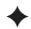

## 1 INTRODUCTION

IMULTANEOUS localization and mapping (SLAM) and Svisual odometry (VO) are fundamental building blocks for many emerging technologies-from autonomous cars and UAVs to virtual and augmented reality. Realtime methods for SLAM and VO have made significant progress in recent years. While for a long time the field was dominated by feature-based (indirect) methods, in recent years a number of different approaches have gained in popularity, namely direct and dense formulations.

Direct versus Indirect. Underlying all formulations is a probabilistic model that takes noisy measurements Y as input and computes an estimator X for the unknown, hidden model parameters (3D world model and camera motion). Typically a Maximum Likelihood approach is used, which finds the model parameters that maximize the probability of obtaining the actual measurements, i.e., X : argmax PðYjXÞ.

Indirect methods then proceed in two steps. First, the raw sensor measurements are pre-processed to generate an intermediate representation, solving part of the overall problem, such as computing the image coordinates of corresponding points. Second, the computed intermediate values are interpreted as noisy measurements Y in a probabilistic model to estimate geometry and camera motion. Note that the first step is typically approached by extracting and matching a sparse set of keypoints—however other options exist, like establishing correspondences in the form of dense, regularized optical flow. It can also include methods that extract and match parametric representations of other geometric primitives, such as line- or curve-segments.

Direct methods skip this pre-computation step and directly use the actual sensor values-light received from a certain direction over a certain time period-as measurements Y in a probabilistic model.

In the case of passive vision, the direct approach thus optimizes a photometric error, since the sensor provides photometric measurements. Indirect methods on the other hand optimize a geometric error, since the pre-computed valuespoint-positions or flow-vecors-are geometric quantities. Note that for other sensor modalities like depth cameras or laser scanners (which directly measure geometric quantities) direct formulations may also optimize a geometric error.

Dense versus Sparse. Sparse methods use and reconstruct only a selected set of independent points (traditionally corners), whereas dense methods attempt to use and reconstruct all pixels in the 2D image domain. Intermediate approaches (semi-dense) refrain from reconstructing the complete surface, but still aim at using and reconstructing a (largely connected and well-constrained) subset.

Apart from the extent of the used image region however, a more fundamental—and consequential—difference lies in the addition of a geometry prior. In the sparse formulation, there is no notion of neighborhood, and geometry parameters (keypoint positions) are conditionally independent given the camera poses & intrinsics.1 Dense (or semi-dense) approaches on the other hand exploit the connectedness of the used image region to formulate a geometry prior, typically favouring smoothness. In fact, such a prior is necessarily required to make a dense world model observable from passive vision alone. In general, this prior is formulated directly in the form of an additional log-likelihood energy term [21], [22], [26].

Note that the distinction between dense and sparse is not synonymous to direct and indirect—in fact, all four combinations exist:

Sparse + Indirect: This is the most widely-used formulation, estimating 3D geometry from a set of keypoint-matches, thereby using a geometric error without a geometry prior. Examples include the work of Jin et al. [12], monoSLAM [4], PTAM [16], and ORB-SLAM [20].

Dense + Indirect: This formulation estimates 3D geometry from-or in conjunction with-a dense, regularized optical flow field, thereby combining a geometric error (deviation from the flow field) with a geometry prior (smoothness of the flow field), examples include [23], [27].

Dense + Direct: This formulation employs a photometric error as well as a geometric prior to estimate dense or semi-dense geometry. Examples include DTAM [21], its precursor [26], REMODE [22], and LSD-SLAM [5].

Sparse + Direct: This is the formulation proposed in this paper. It optimizes a photometric error defined directly on the images, without incorporating a geometric prior. While we are not aware of any recent work using this formulation, a sparse and direct formulation was already proposed by Jin et al. in 2003 [13]. In contrast to their work however, which is based on an extended Kalman filter, our method uses a non-linear optimization framework. The motivation for exploring the combination of sparse and direct is laid out in the following section.

Furthermore there are hybrid approaches such as SVO [9], which use a direct formulation for initial alignment and to obtain correspondences, before switching to an indirect formulation for joint model optimization.

## 1.1 Motivation

The direct and sparse formulation for monocular visual odometry proposed in this paper is motivated by the following considerations.

(1) Direct: One of the main benefits of keypoints is their ability to provide robustness to photometric and geometric distortions present in images taken with offthe-shelf commodity cameras. Examples are automatic exposure changes, non-linear response functions (gamma correction/white-balancing), lens attenuation (vignetting), de-bayering artefacts, or even strong geometric distortions caused by a rolling shutter. This robustness or even invariance to photometric variations however comes at the cost of discarding potentially valuable information contained in exactly these variations.

At the same time, for all use-cases mentioned in the introduction, millions of devices will be (and already are) equipped with cameras solely meant to provide data for computer vision algorithms, instead of capturing images for human consumption. These cameras should and will be designed to provide a complete sensor model, and to capture data in a way that best serves the processing algorithms: Autoexposure and gamma correction for instance are not unknown noise sources, but features that provide better image data—and that can be incorporated into the model, making the obtained data more informative. Since the direct approach models the full image formation process down to pixel intensities, it greatly benefits from a more precise sensor model.

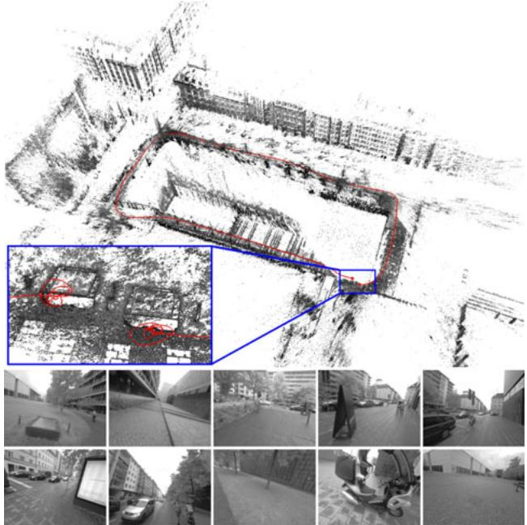  
Fig. 1. Directsparse odometry(DSO). 3D reconstruction and tracked trajectory for a 1:40 min video cycling around a building (monocular visual odometry only). The bottom-left inset shows a close-up of the start and end point, visualizing the drift accumulated over the course of the trajectory. The bottom row shows some video frames.

One of the main benefits of a direct formulation is that it does not require a point to be recognizable by itself, thereby allowing for a more finely grained geometry representation (pixelwise inverse depth). Furthermore, we can sample from across all available data—including edges and weak intensity variationsgenerating a more complete model and lending more robustness in sparsely textured environments.

Sparse: The main drawback of adding a geometry prior is the introduction of correlations between geometry parameters, which render a statistically consistent, joint optimization in real time infeasible (see Fig. 2). This is why existing dense or semi-dense approaches (a) neglect or coarsely approximate correlations between geometry parameters (orange), and / or between geometry parameters and camera poses (green), and (b) employ different optimization methods for the dense geometry part, such as a primal-dual formulation [21], [22], [26].

In addition, the expressive complexity of today’s priors is limited: While they make the 3D reconstruction denser, locally more accurate and more visually appealing, we found that priors can introduce a bias, and thereby reduce rather than increase long-term, large-scale accuracy. Note that in time this may well change with the introduction of more realistic, unbiased priors learnt from real-world data.

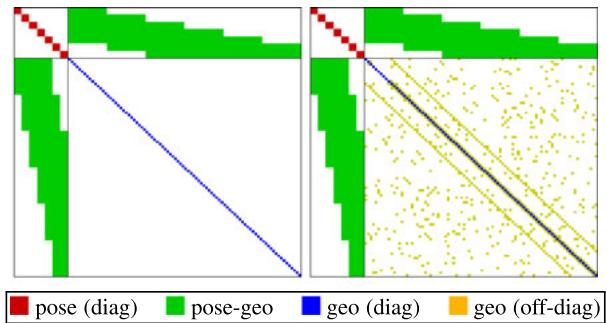  
Fig. 2. Sparse versus dense Hessian structure. Left: Hessian structure of sparse bundle adjustment: since the geometry-geometry block is diagonal, it can be solved efficiently using the Schur complement. Right: A geometry prior adds (partially unstructured) geometry-geometry correlations—the resulting system is hence not only much larger, but also becomes much harder to solve. For simplicity, we do not show the global camera intrinsic parameters.

## 1.2 Contribution

In this paper we propose a sparse and direct approach to monocular visual odometry, an example reconstruction is shown in Fig. 1. To our knowledge, it is the only fully direct method that jointly optimizes the full likelihood for all involved model parameters, including camera poses, camera intrinsics, and geometry parameters (inverse depth values). This is in contrast to hybrid approaches such as SVO [9], which revert to an indirect formulation for joint model optimization.

Optimization is performed in a sliding window, where old camera poses as well as points that leave the field of view of the camera are marginalized, in a manner inspired by [17]. In contrast to existing approaches, our method further takes full advantage of photometric camera calibration, including lens attenuation, gamma correction, and known exposure times. This integrated photometric calibration further increases accuracy and robustness.

Our CPU-based implementation runs in real time on a laptop computer. We show in extensive evaluations on three different datasets comprising several hours of video that it outperforms other state-of-the-art approaches (direct and indirect), both in terms of robustness and accuracy. With reduced settings (less points and active keyframes), it even runs at 5 real-time speed while still outperforming state-of-the-art indirect methods. On high, non-real-time settings in turn (more points and active keyframes), it creates semi-dense models similar in density to those of LSD-SLAM, but much more accurate.

## 2 DIRECT SPARSE MODEL

Our direct sparse odometry is based on continuous optimization of the photometric error over a window of recent frames, taking into account a photometrically calibrated model for image formation. In contrast to existing direct methods, we jointly optimize for all involved parameters (camera intrinsics, camera extrinsics, and inverse depth values), effectively performing the photometric equivalent of windowed sparse bundle adjustment. We keep the geometry representation employed by other direct approaches, i.e., 3D points are represented as inverse depth in a reference frame (and thus have one degree of freedom).

Notation. Throughout the paper, bold lower-case letters (x) represent vectors and bold upper-case letters (H)

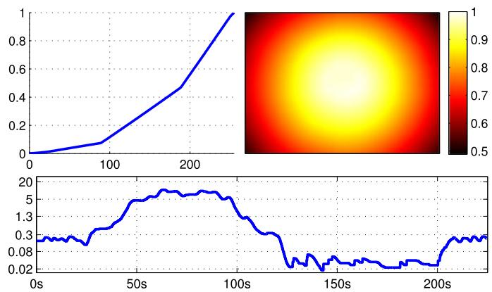  
Fig. 3. Photometric calibration. Top: Inverse response function $G ^ { - 1 }$ and lens attenuation V of the camera used for Fig. 1. Bottom: Exposure t in milliseconds for a sequence containing an indoor and an outdoor part. Note how it varies by a factor of more than 500, from 0.018 to 10.5 ms. Instead of treating these quantities as unknown noise sources, we explicitly account for them in the photometric error model.

represent matrices. Scalars will be represented by light lower-case letters (t), functions (including images) by light upper-case letters (I). Camera poses are represented as transformation matrices $\mathbf { T } _ { i } \in \mathrm { S E } ( 3 )$ , transforming a point from the world frame into the camera frame. Linearized pose-increments will be expressed as Lie-algebra elements $x _ { i } \in { \mathfrak { s e } } ( 3 )$ , which-with a slight abuse of notation-we directly write as vectors $\pmb { x } _ { i } \in \mathbb { R } ^ { 6 }$ . We further define the commonly used operator $\sharp : { \mathfrak { s e } } ( 3 ) \times { \mathrm { S E } } ( 3 ) \to { \mathrm { S E } } ( 3 )$ using a left-multiplicative formulation, i.e.,

$$
\begin{array} { r } { \pmb { x } _ { i } \oplus \pmb { \mathrm { T } } _ { i } : = e ^ { \pmb { \widehat { x } } _ { i } } \cdot \pmb { \mathrm { T } } _ { i } . } \end{array}
$$

## 2.1 Calibration

(1)

The direct approach comprehensively models the image formation process. In addition to a geometric camera modelwhich comprises the function that projects a 3D point onto the 2D image—it is hence beneficial to also consider a photometric camera model, which comprises the function that maps real-world energy received by a pixel on the sensor (irradiance) to the respective intensity value. Note that for indirect methods this is of little benefit and hence widely ignored, as common feature extractors and descriptors are invariant (or highly robust) to photometric variations.

## 2.1.1 Geometric Camera Calibration

For simplicity, we formulate our method for the well-known pinhole camera model—radial distortion is removed in a preprocessing step. While for wide-angle cameras this does reduce the field of view, it allows comparison across methods that only implement a limited choice of camera models. Throughout this paper, we will denote projection by $\Pi _ { \mathbf { c } }$ $\mathbb { R } ^ { 3 } \to \breve { \Omega }$ and back-projection with $\Pi _ { \mathbf { c } } ^ { - 1 } : \Omega \overset { \cdot } { \times } \mathbb { R } ^ { ^ { - } } \overset { } { \longrightarrow } \mathbb { R } ^ { 3 }$ , where c denotes the intrinsic camera parameters (for the pinhole model these are the focal length and the principal point). Note that analogously to [2], our approach can be extended to other (invertible) camera models, although this does increase computational demands.

## 2.1.2 Photometric Camera Calibration

We use the image formation model used in [8], which accounts for a non-linear response function $G : \mathbb { R } \longrightarrow [ 0 , 2 5 5 ] ,$ as well as lens attenuation (vignetting) $V : \Omega \to [ 0 , 1 ] . \mathrm { F i g . } \ \Omega$ 8

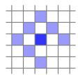  
Fig. 4. Residual pattern. Pattern $\mathcal { N } _ { \mathfrak { p } }$ used for energy computation. The bottom-right pixel is omitted to enable SSE-optimized processing. Note that since we have 1 unknown per point (its inverse depth), and do not use a regularizer, we require $| \mathcal { N } _ { \mathfrak { p } } | > 1$ in order for all model parameters to be well-constrained when optimizing over only two frames. Fig. 19 shows an evaluation of how this pattern affects tracking accuracy.

shows an example calibration from the TUM monoVO dataset. The combined model is then given by

$$
I _ { i } ( { \pmb x } ) = G \big ( t _ { i } V ( { \pmb x } ) B _ { i } ( { \pmb x } ) \big ) ,\tag{2}
$$

where $B _ { i }$ and $I _ { i }$ are the irradiance and the observed pixel intensity in frame $i ,$ and $t _ { i }$ is the exposure time. The model is applied by photometrically correcting each video frame as very first step, by computing

$$
I _ { i } ^ { \prime } ( \mathbf { x } ) : = t _ { i } B _ { i } ( \mathbf { x } ) = \frac { G ^ { - 1 } ( I _ { i } ( \mathbf { x } ) ) } { V ( \mathbf { x } ) } .\tag{3}
$$

In the remainder of this paper, $I _ { i }$ will always refer to the photometrically corrected image $I _ { i } ^ { \prime } ,$ except where otherwise stated.

## 2.2 Model Formulation

We define the photometric error of a point $\pmb { \mathrm { p } } \in \Omega _ { i }$ in reference frame $I _ { i } ,$ observed in a target frame $I _ { j } ,$ as the weighted SSD over a small neighborhood of pixels. Our experiments have shown that eight pixels, arranged in a slightly spread pattern (see Fig. 4) give a good trade-off between computations required for evaluation, robustness to motion blur, and providing sufficient information. Note that in terms of the contained information, evaluating the SSD over such a small neighborhood of pixels is similar to adding first- and second-order irradiance derivative constancy terms (in addition to irradiance constancy) for the central pixel. Let

$$
E _ { \mathtt { p } j } : = \sum _ { \mathtt { p } \in \mathcal { N } _ { \mathtt { p } } } w _ { \mathtt { p } } \Big \rVert \big ( I _ { j } [ \mathtt { p ^ { \prime } } ] - b _ { j } \big ) - \frac { t _ { j } e ^ { a _ { j } } } { t _ { i } e ^ { a _ { i } } } \big ( I _ { i } [ \mathtt { p } ] - b _ { i } \big ) \Big \rVert _ { \gamma } ,\tag{4}
$$

where $\mathcal { N } _ { \mathfrak { p } }$ is the set of pixels included in the SSD; $t _ { i } , t _ { j }$ the exposure times of the images $I _ { i } , I _ { j } ;$ and $\Vert \cdot \Vert _ { \gamma }$ the Huber norm. Further, $\boldsymbol { \mathsf { p } } ^ { \prime }$ stands for the projected point position of $\mathbf { p }$ with inverse depth $d _ { \mathbf { p } } ,$ given by

$$
\mathbf { p } ^ { \prime } = \Pi _ { \mathrm { c } } \big ( \mathbf { R } \Pi _ { \mathrm { c } } ^ { - 1 } ( \mathbf { p } , d _ { \mathbf { p } } ) + \mathbf { t } \big ) ,\tag{5}
$$

with

$$
\begin{array} { r } { \left[ \begin{array} { l l } { { \mathbf { R } } } & { \mathbf { t } } \\ { 0 } & { 1 } \end{array} \right] : = \mathbf { T } _ { j } \mathbf { T } _ { i } ^ { - 1 } . } \end{array}\tag{6}
$$

In order to allow our method to operate on sequences without known exposure times, we include an additional affine brightness transfer function given by $e ^ { - a _ { i } } ( I _ { i } - b _ { i } )$ . Note that in contrast to most previous formulations [6], [13], the scalar factor eai is parametrized logarithmically. This both prevents it from becoming negative and avoids numerical issues arising from multiplicative (i.e., exponentially increasing) drift.

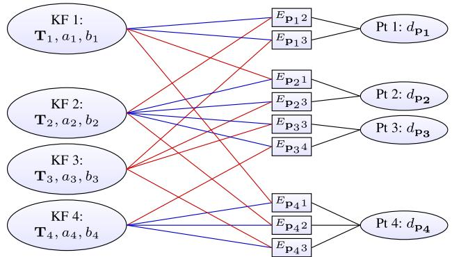  
Fig. 5. Factor graph for the direct sparse model. Example with four keyframes and four points; one in KF1, two in KF2, and one in KF4. Each energy term (defined in Eq. (4)) depends on the point’s host frame (blue), the frame the point is observed in (red), and the point’s inverse depth (black). Further, all terms depend on the global camera intrinsics vector c which is not shown.

In addition to using robust Huber penalties, we apply a gradient-dependent weighting $w _ { \mathbf { p } }$ given by

$$
w _ { \mathbf { p } } : = \frac { c ^ { 2 } } { c ^ { 2 } + \left. \nabla I _ { i } ( { \mathbf { p } } ) \right. _ { 2 } ^ { 2 } } ,\tag{7}
$$

which down-weights pixels with high gradient. This weighting function can be probabilistically interpreted as adding small, independent geometric noise on the projected point position $\mathbf { p ^ { \prime } } ,$ and immediately marginalizing it-approximating small geometric error. To summarize, the error $E _ { \mathfrak { p } j }$ depends on the following variables: (1) the point’s inverse depth $d _ { \mathbf { p } } ,$ (2) the camera intrinsics $\mathbf { c } , \mathbf { \Psi } ( 3 )$ the poses of the involved frames $\mathbf { T } _ { i } , \mathbf { T } _ { j } ,$ and (4) their brightness transfer function parameters $a _ { i } , b _ { i } , a _ { j } , b _ { j }$

The full photometric error over all frames and points is given by

$$
E _ { \mathrm { p h o t o } } : = \sum _ { i \in \mathcal { F } } \sum _ { \mathbf { p } \in \mathcal { P } _ { i } } \sum _ { j \in \mathrm { o b s } ( \mathbf { p } ) } E _ { \mathbf { p } j } ,\tag{8}
$$

where i runs over all frames ${ \mathcal { F } } ,$ p over all points $\mathcal { P } _ { i }$ in frame $i ,$ and $j$ over all frames obsðpÞ in which the point p is visible. Fig. 5 shows the resulting factor graph: The only difference to the classical reprojection error is the additional dependency of each residual on the pose of the host frame, i.e., each term depends on two frames instead of only one. While this adds off-diagonal entries to the pose-pose block of the Hessian, it does not affect the sparsity pattern after application of the Schur complement to marginalize point parameters. The resulting system can thus be solved analogously to the indirect formulation. Note that the Jacobians with respect to the two frames’ poses are linearly related by the adjoint of their relative pose. In practice, this factor can then be pulled out of the sum when computing the Hessian or its Schur complement, greatly reducing the additional computations caused by more variable dependencies.

If exposure times are known, we further add a prior pulling the affine brightness transfer function to zero

$$
E _ { \mathrm { p r i o r } } : = \sum _ { i \in \mathcal { F } } \bigl ( \lambda _ { a } a _ { i } ^ { 2 } + \lambda _ { b } b _ { i } ^ { 2 } \bigr ) .\tag{9}
$$

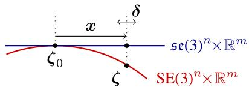  
Fig. 6. Windowed optimization. The red curve denotes the parameter space, composed of non-euclidean camera poses in SE(3), and the remaining euclidean parameters. The blue line corresponds to the tangent-space around $\zeta _ { \mathrm { 0 } } ,$ in which we (1) accumulate the quadratic marginalization-prior on x, and (2) compute Gauss-Newton steps d. For each parameter, the tangent space is fixed as soon as that parameter becomes part of the marginalization term. Note that while we treat all parameters equally in our notation, for euclidean parameters tangentspace and parameter-space coincide.

If no photometric calibration is available, we set $t _ { i } = 1$ and $\lambda _ { a } = \lambda _ { b } = 0 ,$ , as in this case they need to model the (unknown) changing exposure time of the camera. As a side-note it should be mentioned that the ML estimator for a multiplicative factor $\begin{array} { r } { a ^ { * } = a r g m a x _ { a } \sum _ { i } \left( a x _ { i } - y _ { i } \right) ^ { 2 } } \end{array}$ is biased if both $x _ { i }$ and $y _ { i }$ contain noisy measurements (see [7]); causing a to drift in the unconstrained case $\lambda _ { a } = 0$ . While this generally has little effect on the estimated poses, it may introduce a bias if the scene contains only few, weak intensity variations.

Point Dimensionality. In the proposed direct model, a point is parametrized by only one parameter (the inverse depth in the reference frame), in contrast to three unknowns as in the indirect model. To understand the reason for this difference, we first note that in both cases a 3D point is in fact an arbitrarily located discrete sample on a continuous, real-world 3D surface. The difference then lies in the way this 2D location on the surface is defined. In the indirect approach, it is implicitly defined as the point, which (projected into an image) generates a maximum in the used corner response function. This entails that both the surface, as well as the point’s location on the surface are unknowns, and need to be estimated. In our direct formulation, a point is simply defined as the point, where the source pixel’s ray hits the surface, thus only one unknown remains. In addition to a reduced number of parameters, this naturally enables an inverse depth parametrization, which—in a Gaussian framework— is better suited to represent uncertainty from stereo-based depth estimation, in particular for far-away points [3].

Consistency. Strictly speaking, the proposed direct sparse model does allow to use some observations (pixel values) multiple times, while others are not used at all. This is because—even though our point selection strategy attempts to avoid this by equally distributing points in space (see Section 3.2)—we allow point observations to overlap, and thus depend on the same pixel value(s). This particularly happens in scenes with little texture, where all points have to be chosen from a small subset of textured image regions. We however argue that this has negligible effect in practice, and—if desired—can be avoided by removing (or downweighting) observations that use the same pixel value.

## 2.3 Windowed Optimization

We follow the approach by Leutenegger et al. [17] and optimize the total error (8) in a sliding window using the Gauss-Newton algorithm, which gives a good trade-off between speed and flexibility.

For ease of notation, we extend the ( operator as defined in (1) to all optimized parameters—for parameters other than $\operatorname { S E } ( 3 )$ poses it denotes conventional addition. We will use $\zeta \in \mathrm { S E } ( 3 ) ^ { n } \times \mathbb { R } ^ { m }$ to denote all optimized variables, including camera poses, affine brightness parameters, inverse depth values, and camera intrinsics. As in [17], marginalizing a residual that depends on a parameter in z will fix the tangent space in which any future information (delta-updates) on that parameter is accumulated. We will denote the evaluation point for this tangent space with $\zeta _ { \mathrm { 0 } } ,$ and the accumulated delta-updates by $\pmb { x } \in \mathfrak { s e } ( \bar { 3 } ) ^ { n } \times \mathbb { R } ^ { m }$ . The current state estimate is hence given by $\pmb { \zeta } = \pmb { x } \oplus \pmb { \zeta } _ { 0 }$ . Fig. 6 visualizes the relation between the different variables.

Gauss-Newton Optimization. We compute the Gauss-Newton system as

$$
\mathbf { H } = \mathbf { J } ^ { T } \mathbf { W } \mathbf { J } \quad \quad { \mathrm { a n d } } \quad \quad \mathbf { b } = - \mathbf { J } ^ { T } \mathbf { W } \mathbf { r } ,\tag{10}
$$

where $\mathbf { W } \in \mathbb { R } ^ { n \times n }$ is the diagonal matrix containing the weights, $\mathbf { r } \in \mathbb { R } ^ { n }$ is the stacked residual vector, and $\ b { \mathrm { J } } \in \mathbb { R } ^ { n \times d }$ is the Jacobian of r.

Note that each point contributes $| \mathcal { N } _ { p } | = 8$ residuals to the energy. For notational simplicity, we will in the following consider only a single residual $r _ { k } ,$ , and the associated row of the Jacobian $\mathrm { J } _ { k }$ . During optimization—as well as when marginalizing—residuals are always evaluated at the current state estimate, i.e.,

$$
\begin{array} { l } { { \displaystyle r _ { k } = r _ { k } ( { \pmb x } \oplus { \pmb \zeta } _ { 0 } ) } } \\ { ~ = \big ( I _ { j } [ { \pmb p } ^ { \prime } ( { \bf T } _ { i } , { \bf T } _ { j } , d , { \bf c } ) ] - b _ { j } \big ) - \frac { t _ { j } e ^ { a _ { j } } } { t _ { i } e ^ { a _ { i } } } \big ( I _ { i } [ { \bf p } ] - b _ { i } \big ) , } \end{array}\tag{11}
$$

where $( \mathbf { T } _ { i } , \mathbf { T } _ { j } , d , \mathbf { c } , a _ { i } , a _ { j } , b _ { i } , b _ { j } ) : = { \pmb x } \oplus \zeta _ { 0 }$ are the current state variables the residual depends on. The Jacobian $\mathrm { J } _ { k }$ is evaluated with respect to an additive increment to x, i.e.,

$$
\mathbf { J } _ { k } = \frac { \partial r _ { k } ( ( \pmb { \delta } + \pmb { x } ) \oplus \pmb { \zeta } _ { 0 } ) } { \partial \pmb { \delta } } .\tag{12}
$$

It can be decomposed as

$$
\mathbf { J } _ { k } = \underbrace { \Bigg [ \frac { \partial I _ { j } } { \partial \mathbf { p } ^ { \prime } } \underbrace { \frac { \partial \mathbf { p } ^ { \prime } ( ( \delta + x ) \cdot \mathbb { E } _ { 0 } \zeta _ { 0 } ) } { \partial \pmb { \delta } _ { \mathrm { g e o } } } } _ { \mathbf { J } _ { \mathrm { g e o } } } , \quad \underbrace { \frac { \partial r _ { k } ( ( \delta + x ) \cdot \mathbb { E } _ { 0 } \zeta _ { 0 } ) } { \partial \pmb { \delta } _ { \mathrm { p h o t o } } } } _ { \mathbf { J } _ { \mathrm { p h o t o } } } \Bigg ] } _ { \mathbf { J } _ { \mathrm { g e o } } } ,\tag{13}
$$

where $\delta _ { \mathrm { g e o } }$ denotes the “geometric” parameters $( \mathbf { T } _ { i } , \mathbf { T } _ { j } , d , \mathbf { c } ) .$ and $\delta _ { \mathrm { p h o t o } }$ denotes the “photometric” parameters $( a _ { i } , a _ { j } , b _ { i } , b _ { j } )$ . We employ two approximations, described below.

First, both $\mathrm { { J _ { p h o t o } } }$ and $\mathrm { J _ { g e o } }$ are evaluated at $x = 0$ . This technique is called “First Estimate Jacobians” [11], [17], and is required to maintain consistency of the system and prevent the accumulation of spurious information. In particular, in the presence of non-linear null-spaces in the energy (in our formulation absolute pose and scale), adding linearizations around different evaluation points eliminates these and thus slowly corrupts the system. In practice, this approximation is very good, since $\mathrm { \mathbf { J } _ { \mathrm { { p h o t o } } } , \mathbf { J } _ { \mathrm { { g e o } } } }$ are smooth compared to the size of the increment x. In contrast, $\mathrm { J } _ { I }$ is much less smooth, but does not affect the null-spaces. Thus, it is evaluated at the current value for $x , \mathrm { i . e . , }$ , at the same point as the residual $r _ { k } .$ We use centred differences to compute the image derivatives at integer positions, which are then bilinearly interpolated.

Second, $\mathrm { J _ { g e o } }$ is assumed to be the same for all residuals belonging to the same point, and evaluated only for the center pixel. Again, this approximation is very good in practice. While it significantly reduces the required computations, we have not observed a notable effect on accuracy for any of the used datasets.

From the resulting linear system, an increment is computed as $\pmb { \delta } = \mathbf { H } ^ { - 1 }$ b and added to the current state

$$
{ \pmb x } ^ { \mathrm { n e w } }  \delta + { \pmb x } .\tag{14}
$$

Note that due to the First Estimate Jacobian approximation, a multiplicative formulation (replacing $( { \pmb \delta } + { \pmb x } ) \mathbb { \oplus } \pmb \zeta _ { 0 }$ with $\pmb { \delta } \equiv \left( \pmb { x } \oplus \pmb { \zeta } _ { 0 } \right)$ in (12)) results in the exact same Jacobian, thus a multiplicative update step ${ \boldsymbol { x } } ^ { \mathrm { n e w } } \gets \log \left( \delta \operatorname { \mathbb { { E } } } e ^ { \pmb { x } } \right)$ is equally valid.

After each update step, we update $\xi _ { 0 }$ for all variables that are not part of the marginalization term, using $\zeta _ { 0 } ^ { \mathrm { n e w } } \ \gets \ x \boxplus \ \zeta _ { 0 }$ and $x \gets 0$ . In practice, this includes all depth values, as well as the pose of the newest keyframe. Each time a new keyframe is added, we perform up to 6 Gauss-Newton iterations, breaking early if d is sufficiently small. We found that-since we never start far-away from the minimum—a Levenberg-Marquardt dampening (which slows down convergence) is not required.

Marginalization. When the active set of variables becomes too large, old variables are removed by marginalization using the Schur complement. Similar to [17], we drop any residual terms that would affect the sparsity pattern of H: When marginalizing frame $i ,$ we first marginalize all points in $\mathcal { P } _ { i } ,$ as well as points that have not been observed in the last two keyframes. Remaining observations of active points in frame i are dropped from the system.

Marginalization proceeds as follows: Let $E ^ { \prime }$ denote the part of the energy containing all residuals that depend on state variables to be marginalized. We first compute a Gauss-Newton approximation of $E ^ { \prime }$ around the current state estimate ${ \boldsymbol { \zeta } } = { \boldsymbol { \mathbf { { x } } } } \boxplus { \boldsymbol { \zeta } } _ { 0 }$ . This gives

$$
\begin{array} { r l } & { E ^ { \prime } ( { \pmb x } \oplus { \pmb \zeta } _ { 0 } ) } \\ & { \quad \approx 2 ( { \pmb x } - { \pmb x } _ { 0 } ) ^ { T } { \pmb b } + ( { \pmb x } - { \pmb x } _ { 0 } ) ^ { T } { \pmb { \mathrm H } } ( { \pmb x } - { \pmb x } _ { 0 } ) + c } \\ & { \quad = 2 { \pmb x } ^ { T } \underbrace { ( { \pmb b } - { \pmb { \mathrm H } } { \pmb x } _ { 0 } ) } _ { = : { \pmb b } ^ { \prime } } + { \pmb x } ^ { T } { \pmb { \mathrm H } } { \pmb x } + \underbrace { ( c + x _ { 0 } ^ { T } { \pmb { \mathrm H } } { \pmb x } _ { 0 } - { \pmb x } _ { 0 } ^ { T } { \pmb b } ) } _ { = : c ^ { \prime } } , } \end{array}\tag{15}
$$

where $x _ { 0 }$ denotes the current value (evaluation point for r) of $x .$ The constants $c , c ^ { \prime }$ can be dropped, and H; b are defined as in (10), (11), (12), and (13). This is a quadratic function on $x ,$ and we can apply the Schur complement to marginalize a subset of variables. Written as a linear system, it becomes

$$
\begin{array} { r } { [ \mathbf { H } _ { \alpha \alpha } \quad \mathbf { H } _ { \alpha \beta } ] [ \pmb { x } _ { \alpha } ] = [ \mathbf { b } _ { \alpha } ^ { \prime } ] , } \\ { \mathbf { H } _ { \beta \alpha } \quad \mathbf { H } _ { \beta \beta } ] [ \pmb { x } _ { \beta } ] = [ \mathbf { b } _ { \beta } ^ { \prime } ] , } \end{array}\tag{16}
$$

where $\beta$ denotes the block of variables we would like to marginalize, and a the block of variables we would like to keep. Applying the Schur complement yields $\widehat { \mathbf { H } _ { \alpha \alpha } } \pmb { x } _ { \alpha } = \widehat { \mathbf { b } _ { \alpha } ^ { \prime } }$ with

$$
\widehat { \mathbf { H } _ { \alpha \alpha } } = \mathbf { H } _ { \alpha \alpha } - \mathbf { H } _ { \alpha \beta } \mathbf { H } _ { \beta \beta } ^ { - 1 } \mathbf { H } _ { \beta \alpha }\tag{17}
$$

$$
\widehat { { \bf b } _ { \alpha } ^ { \prime } } = { \bf b } _ { \alpha } ^ { \prime } - { \bf H } _ { \alpha \beta } { \bf H } _ { \beta \beta } ^ { - 1 } { \bf b } _ { \beta } ^ { \prime } .\tag{18}
$$

The residual energy on $x _ { \alpha }$ can hence be written as

$$
E ^ { \prime } \big ( \boldsymbol { x } _ { \alpha } \in ( \zeta _ { 0 } ) _ { \alpha } \big ) = 2 x _ { \alpha } ^ { T } \widehat { \mathbf { b } _ { \alpha } ^ { \prime } } + x _ { \alpha } ^ { T } \widehat { \mathbf { H } _ { \alpha \alpha } } x _ { \alpha } .\tag{19}
$$

This is a quadratic function on x and can be trivially added to the full photometric error $E _ { \mathrm { p h o t o } }$ during all subsequent optimization and marginalization operations, replacing the corresponding non-linear terms. Note that this requires the tangent space for $\xi _ { 0 }$ to remain the same for all variables that appear in $E ^ { \prime }$ during all subsequent optimization and marginalization steps.

## 3 VISUAL ODOMETRY FRONT-END

The front end is the part of the algorithm that

determines the sets $\mathcal { F } , \mathcal { P } _ { i } ,$ and obsðpÞ that make up the error terms of $E _ { \mathrm { p h o t o } } .$ . It decides which points and frames are used, and in which frames a point is visible-in particular, this includes outlier removal and occlusion detection.

provides initializations for new parameters, required for optimizing the highly non-convex energy function $\bar { E } _ { \mathrm { p h o t o } }$ . As a rule of thumb, a linearization of the image I is only valid in a 1-2 pixel radius; hence all parameters involved in computing $\boldsymbol { \mathsf { p } } ^ { \prime }$ should be initialized sufficiently accurately for p0 to be off by no more than 1-2 pixels.

 decides when a point/frame should be marginalized.

As such, the front-end needs to replace many operations that in the indirect setting are accomplished by keypoint detectors (determining visibility, point selection) and initialization procedures such as RANSAC. Note that many procedures described here are specific to the monocular case. For instance, using a stereo camera makes obtaining initial depth values more straightforward, while integration of an IMU can significantly robustify—or even directly provide—a pose initialization for new frames.

## 3.1 Frame Management

Our method always keeps a window of up to $N _ { f }$ active keyframes (we use $N _ { f } = 7 )$ . Every new frame is initially tracked with respect to these reference frames (Step 1). It is then either discarded or used to create a new keyframe (Step 2). Once a new keyframe-and respective new pointsare created, the total photometric error (8) is optimized. Afterwards, we marginalize one or more frames (Step 3).

Step 1: Initial Frame Tracking. When a new keyframe is created, all active points are projected into it and slightly dilated, creating a semi-dense depth map. New frames are tracked with respect to only this frame using conventional two-frame direct image alignment, a multi-scale image pyramid and a constant motion model to initialize. Fig. 7 shows some examples—we found that further increasing the density has little to no benefit in terms of accuracy or robustness, while significantly increasing runtime. Note that when down-scaling the images, a pixel is assigned a depth value if at least one of the source pixels has a depth value as in [24], significantly increasing the density on coarser resolutions.

If the final RMSE for a frame is more than twice that of the frame before, we assume that direct image alignment failed and attempt to recover by initializing with up to 27 different small rotations in different directions. This recovery-tracking is done on the coarsest pyramid level only, and takes approximately 0.5 ms per try. Note that this RAN-SAC-like procedure is only rarely invoked, such as when the camera moves very quickly or shakily. Tightly integrating an IMU would likely render this unnecessary.

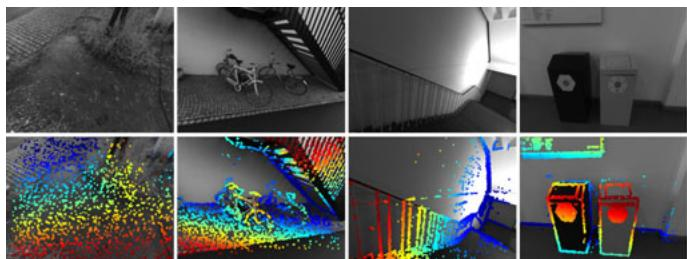  
Fig. 7. Example depth maps used for initial frame tracking. The top row shows the original images, the bottom row the color-coded depth maps. Since we aim at a fixed number of points in the active optimization, they become more sparse in densely textured scenes (left), while becoming similar in density to those of LSD-SLAM in scenes where only few informative image regions are available to sample from (right).

Step 2: Keyframe Creation. Similar to ORB-SLAM, our strategy is to initially take many keyframes (around 5-10 keyframes per second), and sparsify them afterwards by early marginalizing redundant keyframes. We combine three criteria to determine if a new keyframe is required:

1) New keyframes need to be created as the field of view changes. We measure this by the mean square optical flow (from the last keyframe to the latest frame) $\begin{array} { r } { f : = ( \frac { 1 } { n } \sum _ { i = 1 } ^ { n } \| \mathbf { p } - \mathbf { p } ^ { \prime } \| ^ { 2 } ) ^ { \frac { 1 } { 2 } } } \end{array}$ during initial coarse tracking.

2) Camera translation causes occlusions and disocclusions, which requires more keyframes to be taken (even though $\dot { f }$ may be small). This is measured by the mean flow without rotation, i.e., $\begin{array} { r } { f _ { t } : = ( \frac { 1 } { n } { \sum _ { i = 1 } ^ { n } \| { \bf p } - { \bf p } _ { t } ^ { \prime } \| ^ { 2 } } ) ^ { \frac { 1 } { 2 } } } \end{array}$ , where $\mathbf { p } _ { t }$ is the warped point position with ${ \bf R } = { \bf I } _ { 3 \times 3 }$

3) If the camera exposure time changes significantly, a new keyframe should be taken. This is measured by the relative brightness factor between two frames $a : = | \log \left( e ^ { a _ { j } - a _ { i } } t _ { j } \bar { t } _ { i } ^ { - 1 } \right) |$

These three quantities can be obtained easily as a byproduct of initial alignment. Finally, a new keyframe is taken if $w _ { f } f + w _ { f _ { t } } f _ { t } + w _ { a } a > T _ { \mathrm { k f } } .$ , where $w _ { f } , w _ { f _ { t } } , w _ { a }$ provide a relative weighting of these three indicators, and $T _ { \mathrm { k f } } = 1$ by default.

Step 3: Keyframe Marginalization. Our marginalization strategy is as follows (let $I _ { 1 } \ldots I _ { n }$ be the set of active keyframes, with $I _ { 1 }$ being the newest and $I _ { n }$ being the oldest):

1) We always keep the latest two keyframes $( I _ { 1 }$ and $I _ { 2 } )$

2) Frames with less than 5 percent of their points visible in $I _ { 1 }$ are marginalized.

3) If more than $N _ { f }$ frames are active, we marginalize the one (excluding $I _ { 1 }$ and $I _ { 2 } )$ which maximizes a “distance score $\because \textit { s } ( I _ { i } )$ , computed as

$$
s ( I _ { i } ) = \sqrt { d ( i , 1 ) } \sum _ { j \in [ 3 , n ] \backslash \{ i \} } ( d ( i , j ) + \epsilon ) ^ { - 1 } ,\tag{20}
$$

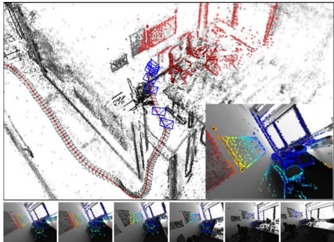  
Fig. 8. Keyframe management. Bottom: The six old keyframes in the optimization window, overlaid with the points hosted in them (already marginalized points are shown in black). The top image shows the full point cloud, as well as the positions of all keyframes (black camera frustums)—active points and keyframes are shown in red and blue respectively. The inlay shows the newly added keyframe, overlaid with all forward-warped active points, which will be used for initial alignment of subsequent frames.

where $d ( i , j )$ is the euclidean distance between keyframes $I _ { i }$ and $I _ { j } ,$ and  a small constant. This scoring function is heuristically designed to keep active keyframes well-distributed in 3D space, with more keyframes close to the most recent one.

A keyframe is marginalized by first marginalizing all points represented in it, and then the frame itself, using the marginalization procedure from Section 2.3. To preserve the sparsity structure of the Hessian, all observations of still existing points in the frame are dropped from the system. While this is clearly suboptimal (in practice about half of all residuals are dropped for this reason), it allows to efficiently optimize the energy function. Fig. 8 shows an example of a scene, highlighting the active set of points and frames.

## 3.2 Point Management

Most existing direct methods focus on utilizing as much image data as possible. To achieve this in real time, they accumulate early, sub-optimal estimates (linearizations / depth triangulations), and ignore-or approximate-correlations between different parameters. In this work, we follow a different approach, and instead heavily sub-sample data to allow processing it in real time in a joint optimization framework. In fact, our experiments show that image data is highly redundant, and the benefit of simply using more data points quickly flattens off. Note that in contrast to indirect methods, our direct framework still allows to sample from across all available data, including weakly textured or repetitive regions and edges, which does provide a real benefit (see Section 4).

We aim at always keeping a fixed number $N _ { p }$ of active points (we use $N _ { p } = 2 \small { , } 0 0 0 )$ , equally distributed across space and active frames, in the optimization. In a first step, we identify $N _ { p }$ candidate points in each new keyframe (Step 1). Candidate points are not immediately added into the optimization, but instead are tracked individually in subsequent frames, generating a coarse depth value which will serve as initialization (Step 2). When new points need to be added to the optimization, we choose a number of candidate points (from across all frames in the optimization window) to be activated, i.e., added into the optimization (Step 3). Note that we choose $N _ { p }$ candidates in each frame, however only keep $N _ { p }$ active points across all active frames combined. This assures that we always have sufficient candidates to activate, even though some may become invalid as they leave the field of view or are identified as outliers.

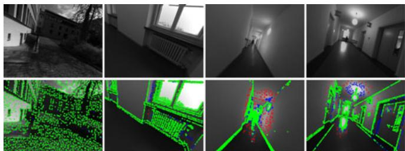  
Fig. 9. Candidate selection. The top row shows the original images, the bottom row shows the points chosen as candidates to be added to the map (2,000 in each frame). Points selected on the first pass are shown in green, those selected on the second and third pass in blue and red respectively. Green candidates are evenly spread across gradient-rich areas, while points added on the second and third pass also cover regions with very weak intensity variations, but are much sparser.

Step 1: Candidate Point Selection. Our point selection strategy aims at selecting points that are (1) well-distributed in the image and (2) have sufficiently high image gradient magnitude with respect to their immediate surroundings. We obtain a region-adaptive gradient threshold by splitting the image into 32  32 blocks. For each block, we then compute the threshold as $\bar { g } + g _ { \mathrm { t h } }$ , where g- is the median absolute gradient over all pixels in that block, and $g _ { \mathrm { t h } }$ a global constant (we use $g _ { \mathrm { t h } } = 7 )$

To obtain an equal distribution of points throughout the image, we split it into d  d blocks, and from each block select the pixel with largest gradient if it surpasses the region-adaptive threshold. Otherwise, we do not select a pixel from that block. We found that it is often beneficial to also include some points with weaker gradient from regions where no high-gradient points are present, capturing information from weak intensity variations originating for example from smoothly changing illumination across white walls. To achieve this, we repeat this procedure twice more, with decreased gradient threshold and block-size 2d and 4d, respectively. The block-size d is continuously adapted such that this procedure generates the desired amount of points (if too many points were created it is increased for the next frame, otherwise it is decreased). Fig. 9 shows the selected point candidates for some example scenes. Note that for for candidate point selection, we use the raw images prior to photometric correction.

Step 2: Candidate Point Tracking. Point candidates are tracked in subsequent frames using a discrete search along the epipolar line, minimizing the photometric error (4). From the best match we compute a depth and associated variance, which is used to constrain the search interval for the subsequent frame. This tracking strategy is inspired by LSD-SLAM. Note that the computed depth only serves as initialization once the point is activated.

Step 3: Candidate Point Activation. After a set of old points is marginalized, new point candidates are activated to replace them. Again, we aim at maintaining a uniform spatial distribution across the image. To this end, we first project all active points onto the most recent keyframe. We then activate candidate points which—also projected into this keyframe—maximize the distance to any existing point (requiring larger distance for candidates created during the second or third block-run). Fig. 7 shows the resulting distribution of points in a number of scenes.

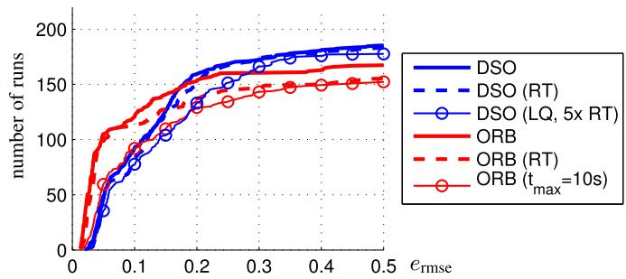

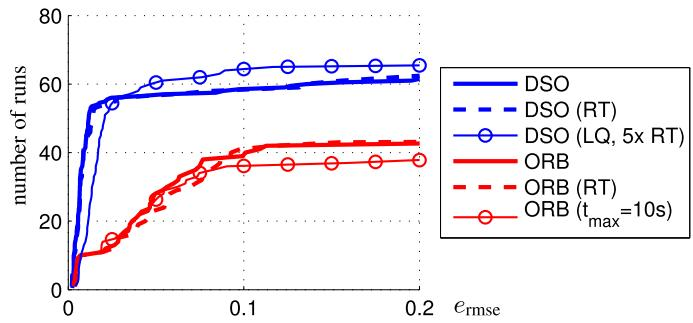  
Fig. 10. Results on EuRoC MAV(top) and ICL\_NUIM (bottom) datasets. Translational RMSE after Sim(3) alignment. RT (dashed) denotes hardenforced real-time execution. Further, we evaluate DSO with low settings at 5 times real-time speed, and ORB-SLAM when restricting local loop-closures to points that have been observed at least once within the last $t _ { \mathrm { m a x } } { = } 1 0 \ : s$

Outlier and Occlusion Detection. Since the available image data generally contains much more information than can be used in real time, we attempt to identify and remove potential outliers as early as possible. First, when searching along the epipolar line during candidate tracking, points for which the minimum is not sufficiently distinct are permanently discarded, greatly reducing the number of false matches in repetitive areas. Second, point observations for which the photometric error (4) surpasses a threshold are removed. The threshold is continuously adapted with respect to the median residual in the respective frame. For “bad” frames (e.g., frames that contain a lot of motion blur), the threshold will be higher, such that not all observations are removed. For good frames, in turn, the threshold will be lower, as we can afford to be more strict.

## 4 RESULTS

In this section we will extensively evaluate our Direct Sparse mono-VO algorithm (DSO). We both compare it to other monocular SLAM/VO methods, as well as evaluate the effect of important design and parameter choices. We use three datasets for evaluation:

(1) The TUM monoVO dataset [8], which provides 50 photometrically calibrated sequences, comprising 105 minutes of video recorded in dozens of different environments, indoors and outdoors (see Fig. 11). Since the dataset only provides loop-closure-ground-truth (allowing to evaluate tracking accuracy via the accumulated drift after a large loop), we evaluate using the alignment error $( e _ { \mathrm { a l i g n } } )$ as defined in the respective publication.

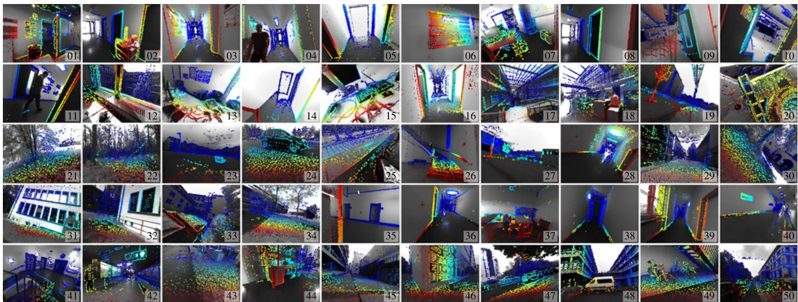  
Fig. 11. TUM mono-VO Dataset. A single image from each of the 50 TUM mono-VO dataset sequences (s\_01 to s\_50) used for evaluation and parameter studies, overlayed with the predicted depth map from DSO. The full dataset contains over 105 minutes of video (190’000 frames). Note the wide range of environments covered, ranging from narrow indoor corridores to wide outdoor areas, including forests.

(2) The EuRoC MAV dataset [1], which contains 11 stereo-inertial sequences comprising 19 minutes of video, recorded in three different indoor environments. For this dataset, no photometric calibration or exposure times are available, hence we omit photometric image correction and set $( \lambda _ { a } = \lambda _ { b } = 0 )$ . We evaluate in terms of the absolute trajectory error $( e _ { \mathrm { a t e } } ) _ { \it \perp }$ , which is the translational RMSE after Simð3Þ alignment. For this dataset we crop the beginning of each sequence since they contain very shaky motion meant to initialize the IMU biases—we only use the parts of the sequence where the MAV is in the air.

(3) The ICL-NUIM dataset [10], which contains eight raytraced sequences comprising 4.5 minutes of video, from two indoor environments. For this dataset, photometric image correction is not required, and all exposure times can be set to t 1. Again, we evaluate in terms of the absolute trajectory error $( e _ { \mathrm { a t e } } )$

Methodology. We aim at an evaluation as comprehensive as possible given the available data, and thus run all sequences both forwards and backwards, 5 times each (to account for non-deterministic behaviour). For the EuRoC MAV dataset we further run both the left and the right video separately. In total, this gives 500 runs for the TUMmonoVO dataset, 220 runs for the EuRoC MAV dataset, and 80 runs for the ICL-NUIM dataset, which we run on 20 dedicated workstations. We remove the dependency on the host machine’s CPU speed by not enforcing real-time execution, except where stated otherwise: for ORB-SLAM we play the video at 20 percent speed, whereas DSO is run in a sequentialized, single-threaded implementation that runs approximately four times slower than real time. Note that even though we do not enforce real-time execution for most of the experiments, we use the exact same parameter settings as for the real-time comparisons.

The results are summarized in the form of cumulative error plots (see, e.g., Fig. 10), which visualize for how many tracked sequences the respective error value $( e _ { \mathrm { a t e } } / e _ { \mathrm { a l i g n } } )$ was below a certain threshold;2 thereby showing both accuracy on sequences where a method works well, as well as robustness, i.e., on how many sequences the method does not fail. The raw tracking results for all runs-as well as scripts to compute the figures-are provided in the supplementary material.3 Additional interesting analysis using the TUMmonoVO dataset—e.g., the influence of the camera’s field of view, the image resolution or the camera’s motion direction-can be found in [8].

Evaluated Methods and Parameter Settings. We compare our method to the open-source implementation of (monocular) ORB-SLAM [20]. We also attempted to evaluate against the open-source implementations of LSD-SLAM [5] and SVO [9], however both methods consistently fail on most of the sequences. A major reason for this is that they assume brightness constancy (ignoring exposure changes), while both real-world datasets used contain heavy exposure variations.

To facilitate a fair comparison and allow application of the loop-closure metric from the TUM-monoVO dataset, we disable explicit loop-closure detection and re-localization for ORB-SLAM. Note that everything else (including local and global BA) remains unchanged, still allowing ORB-SLAM to detect incremental loop-closures that can be found via the co-visibility representation alone. All parameters are set to the same value across all sequences and datasets. The only exception is the ICL-NUIM dataset: For this dataset we set $g _ { \mathrm { t h } } = 3$ for DSO, and lower the FAST threshold for ORB-SLAM to 2, which we found to give best results.

## 4.1 Quantitative Comparison

Fig. 10 shows the absolute trajectory RMSE $e _ { \mathrm { a t e } }$ on the EuRoC MAV dataset and the ICL-NUIM dataset for both methods (if an algorithm gets lost within a sequence, we set $e _ { \mathrm { a t e } } = \infty )$ . Fig. 12 shows the alignment error $e _ { \mathrm { a l i g n } } ,$ , as well as the rotation-drift $e _ { r }$ and scale-drift $e _ { s }$ for the TUM-monoVO dataset. The full set of results for each evaluated trajectory is visualized in Fig. 13 and Fig. 14.

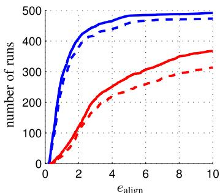

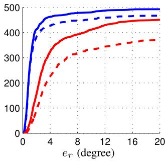

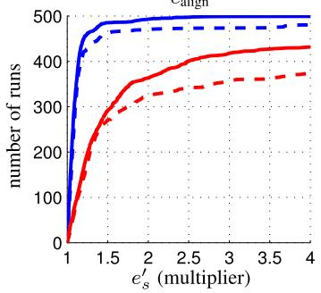  
Fig. 12. Results on TUM-monoVO Dataset. Accumulated rotational drift e and scale drift $e _ { s }$ after a large loop, as well as the alignment error as defined in [8]. Since $e _ { s }$ is a multiplicative factor, we aggregate $e _ { s } ^ { \prime } = \operatorname* { m a x } ( e _ { s } , e _ { s } ^ { - 1 } )$ Þ. The solid line corresponds to sequentialized, nonreal-time execution, the dashed line to hard enforced real-time processing. For DSO, we also show results obtained at low parameter settings, running at 5 times real-time speed.

In addition to the non-real-time evaluation (bold lines), we evaluate both algorithms in a hard-enforced real-time setting on an Intel i7-4910MQ CPU (dashed lines). In this mode, we enforce real-time by allowing both ORB-SLAM and DSO to skip frames if tracking cannot keep up-increasing the drift or potentially leading to complete loss of track. The direct, sparse approach clearly outperforms ORB-SLAM in accuracy and robustness both on the TUM-monoVO dataset, as well as the synthetic ICL\_NUIM dataset. On the EuRoC MAV dataset, ORB-SLAM achieves a better accuracy (but lower robustness). This is due to two major reasons: (1) there is no photometric calibration available, and (2) the sequences contain many small loops or segments where the quadrocopter “back-tracks” the way it came, allowing ORB-SLAM’s local mapping component to implicitly close many small and some large loops, whereas our visual odometry formulation permanently marginalizes all points and frames that leave the field of view. We can validate this by prohibiting ORB-SLAM from matching against any keypoints that have not been observed for more than $t _ { \mathrm { m a x } } = 1 0 s$ (lines with circle markers in Fig. 10): In this case, ORB-SLAM performs similar to DSO in terms of accuracy, but is less robust. The slight difference in robustness for DSO comes from the fact that for real-time execution, tracking new frames and keyframecreation are parallelized, thus new frames are tracked on the second-latest keyframe, instead of the latest. In some rare cases—in particular during strong exposure changes-this causes initial image alignment to fail.

ORB-SLAM:  
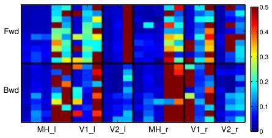

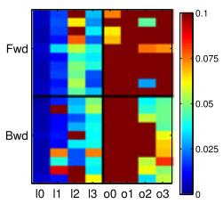

DSO:  
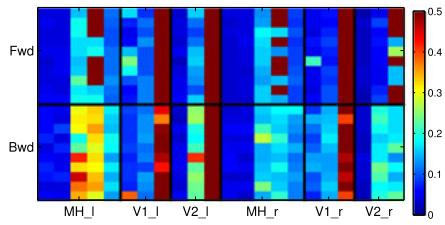

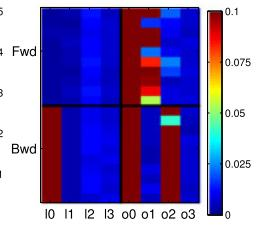  
Fig. 13. Full evaluation results. All error values for the EuRoC MAV dataset (left) and the ICL\_NUIM dataset (right): Each square corresponds to the (color-coded) absolute trajectory error $e _ { \mathrm { a t e } }$ over the full sequence. We run each of the 11 + 8 sequences (horizontal axis) forwards (“Fwd”) and backwards (“Bwd”), 10 times each (vertical axis); for the EuRoC MAV dataset we further use the left and the right image stream. Fig. 10 shows these error values aggregated as cumulative error plot (bold, continuous lines).

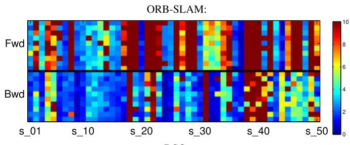

DSO:  
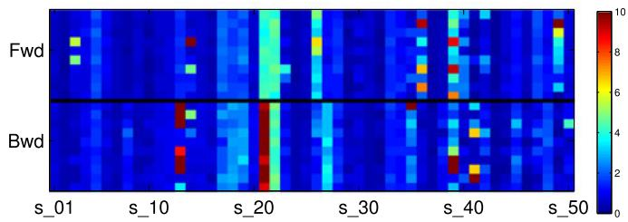  
Fig. 14. Full evaluation results. All error values for the TUM-monoVO dataset (also see Fig. 11). Each square corresponds to the (color-coded) alignment error $e _ { \mathrm { a l i g n } } ,$ as defined in [8]. We run each of the 50 sequences (horizontal axis) forwards (“Fwd”) and backwards (“Bwd”), 10 times each (vertical axis). Fig. 12 shows all these error values aggregated as cumulative error plot (bold, continuous lines).

To show the flexibility of DSO, we include results when running at 5 times the speed they were recorded $\mathsf { a t } , ^ { 4 }$ with reduced settings $( N _ { \mathbf { p } } = 8 0 0$ points, $N _ { f } = 6$ active frames, $4 2 4 \times 3 2 0$ image resolution, $\leq 4$ Gauss-Newton iterations after a keyframe is created): Even with such extreme settings, DSO achieves very good accuracy and robustness on all three datasets.

Note that DSO is designed as a pure visual adometry while ORB-SLAM constitutes a full SLAM system, including loop-closure detection & correction and re-localization—all these additional abilities are neglected or switched off in this comparison.

4. All images are loaded, decoded, and pinhole-rectified beforehand.

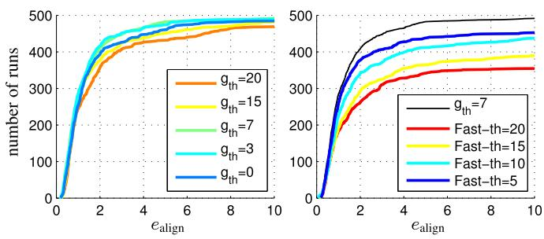

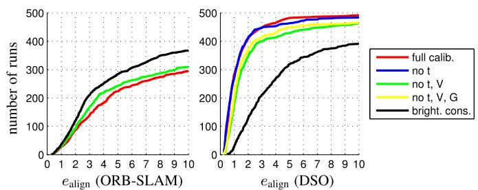  
Fig. 15. Photometric calibration. Errors on the TUM-monoVO dataset for ORB-SLAM and DSO, when incrementally disabling photometric calibration. While DSO as a direct method clearly benefits from photometric calibration, ORB-SLAM as an indirect approach performs better on the original images. We therefore use the original images for all other ORB-SLAM evaluations.

Runtime. The required compute depends both on the number of tracked frames, as well as the number of keyframes created $( \mathrm { i . e . } ,$ , on how far the camera moves). On the TUM monoVO dataset, the average single-threaded runtime for initial frame alignment and candidate point tracking (performed for each frame) is 18 ms (6.5 ms on “reduced” settings). Creating a new keyframe takes 143 ms (43 ms on “reduced” settings), also in a single thread.

## 4.2 Parameter Studies

This section aims at evaluating a number of different parameter and algorithm design choices, using the TUM-monoVO dataset.

Photometric Calibration. We analyze the influence of photometric calibration, verifying that it in fact increases accuracy and robustness for direct methods. To this end, we incrementally disable the different components:

1) exposure (blue): set $t _ { i } = 1$ and $\lambda _ { a } = \lambda _ { b } = 0$

2) vignette (green): set $V ( \mathbf { x } ) = 1$ (and 1.).

3) response (yellow): set G1 ¼ identity (and 1-2.).

4) brightness constancy (black): set $\lambda _ { a } = \lambda _ { b } = \infty ,$ i.e., disable affine brightness correction (and 1-3.).

Fig. 15 shows the result. As expected, DSO performs significantly better with full photometric calibration, in particular compared to a basic brightness constancy assumption (as used in many other direct or semi-direct approaches like LSD-SLAM or SVO). In turn, ORB-SLAM performs worse when using photometrically calibrated images. In fact, the photometric calibration only affects the keypoint selection (FAST thresholding): For this step, using the original images—in particular with enabled gamma correction—lead to a better point distribution. Note that we observed the same behaviour for DSO, and thus also perform point selection on the original images (see Section 3.2). In all remaining experiments we use the original images for ORB-SLAM, and (if available) a full photometric calibration for DSO.

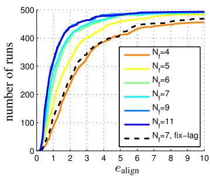

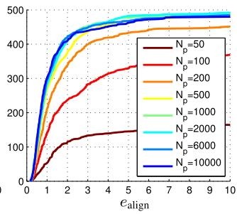  
Fig. 16. Amount of data used. Errors on the TUM-monoVO dataset, when changing the size of the optimization window (top) and the number of points (bottom). Using more than $N _ { p } = 5 0 0$ points or $N _ { f } = 7$ active frames has only marginal impact. Note that as real-time default setting, we use $N _ { p } = 2 , 0 0 0$ and $N _ { f } = 7 _ { : }$ , mainly to obtain denser reconstructions.  
Fig. 17. Selection of data used. Errors on the TUM-monoVO dataset, when changing the type of data used. Left: Errors for different gradient thresholds g , which seems to have a limited impact on the algorithms accuracy. Right: Errors when only using FAST corners, at different thresholds. Using only FAST corners significantly reduces accuracy and robustness, showing that the ability to use data from edges and weakly textured surfaces does have a real benefit.

Amount of Data. We analyze the effect of changing the amount of data used, by varying the number of active points $N _ { p } ,$ as well as the number of frames in the active window $N _ { f }$ . Note that increasing $N _ { f }$ allows to keep more observations per point: For any point we only ever keep observations in active frames; thus the number of observations when marginalizing a point is limited to $N _ { f }$ (see Section 2.3). Fig. 16 summarizes the result. We can observe that the benefit of simply using more data quickly flattens off after $N _ { p } = 5 0 0$ points. At the same time, the number of active frames has little influence after $N _ { f } = 7 ,$ , while increasing the runtime quadratically. We further evaluate a fixedlag marginalization strategy (i.e., always marginalize the oldest keyframe, instead of using the proposed distance score) as in [17]: this performs significantly worse.

Selection of Data. In addition to evaluating the effect of the number of residuals used, it is interesting to look at which data is used—in particular since one of the main benefits of a direct approach is the ability to sample from all points, instead of only using corners. To this end, we vary the gradient threshold for point selection, $g _ { \mathrm { t h } } ;$ the result is summarized in Fig. 17. While there seems to be a sweet spot around $g _ { \mathrm { t h } } = 7 ~ \mathrm { ( i f } ~ g _ { \mathrm { t h } }$ is too large, for some scenes not enough welldistributed points are available to sample from—if it is too low, too much weight will be given to data with a low signalto-noise ratio), the overall impact is relatively low.

More interestingly, we analyse the effect of only using corners, by restricting point candidates to FAST corners only. We can clearly see that only using corners significantly decreases performance. Note that for lower FAST thresholds, many false “corners” will be detected along edges, which our method can still use, in contrast to indirect methods for which such points will be outliers. In fact, ORB-SLAM achieves best performance using the default threshold of 20.

Number of Keyframes. We analyze the number of keyframes taken by varying $T _ { \mathrm { k f } }$ (see Section 3.1). For each value of $T _ { \mathrm { k f } }$ we give the resulting average number of keyframes per second; the default setting $T _ { \mathrm { k f } } = 1$ results in eight keyframes per second, which is easily achieved in real time.

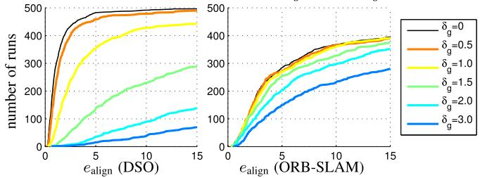

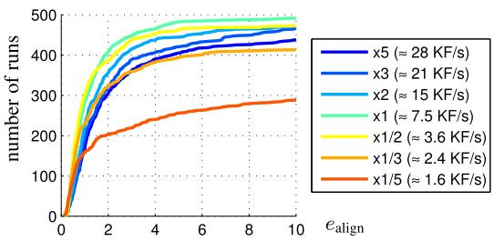  
Fig. 18. Number of keyframes. Errors on the TUM-monoVO dataset, when changing the number of keyframes taken via the threshold $T _ { \mathrm { k f } }$

The result is summarized in Fig. 18. Taking too few keyframes (less than 4 per second) reduces the robustness, mainly in situations with strong occlusions / dis-occlusions, e.g., when walking through doors. Taking too many keyframes, on the other hand (more than 15 per second), decreases accuracy. This is because taking more keyframes causes them to be marginalized earlier (since $N _ { f }$ is fixed), thereby accumulating linearizations around earlier (and less accurate) linearization points.

Residual Pattern. We test different residual patterns for $\mathcal { N } _ { \mathfrak { p } } ,$ covering smaller or larger areas. The result is shown in Fig. 19.

## 4.3 Geometric versus Photometric Noise Study

The fundamental difference between the proposed direct model and the indirect model is the noise assumption. The direct approach models photometric noise, i.e., additive noise on pixel intensities. In contrast, the indirect approaches models geometric noise, i.e., additive noise on the ðu; vÞ-position of a point in the image plane, assuming that keypoint descriptors are robust to photometric noise. It therefore comes at no surprise that the indirect approach is significantly more robust to geometric noise in the data. In turn, the direct approach performs better in the presence of strong photometric noise—which keypoint-descriptors (operating on a purely local level) fail to filter out. We verify this by analyzing tracking accuracy on the TUM-monoVO dataset, when artificially adding (a) geometric noise, and (b) photometric noise to the images.

Geometric Noise. For each frame, we separately generate a low-frequency random flow-map $N _ { g } : \dot { \Omega } \to \dot { \mathbb { R } } ^ { 2 }$ by upsampling a 33 grid filled with uniformly distributed random values from $[ - \delta _ { g } , \delta _ { g } ] ^ { 2 }$ (using bicubic interpolation).

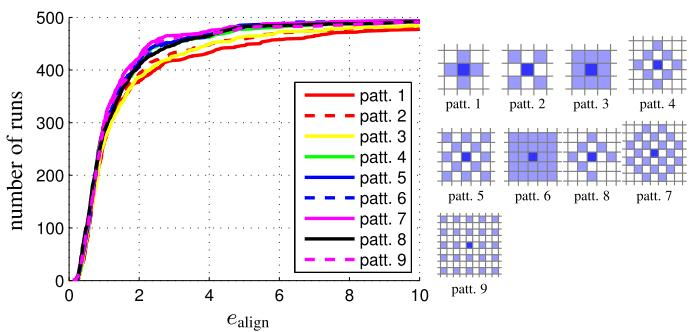  
Fig. 19. Residual pattern. Errors on the TUM-monoVO dataset for some of the evaluated patterns $\mathcal { N } _ { \mathfrak { p } }$ . Using only a 3 3 neighborhood seems to perform slightly worse—using more than the proposed 8-pixel pattern however seems to have little benefit—at the same time, using a larger neighbourhood increases the computational demands. Note that these results may vary with low-level properties of the used camera and lens, such as the point spread function.

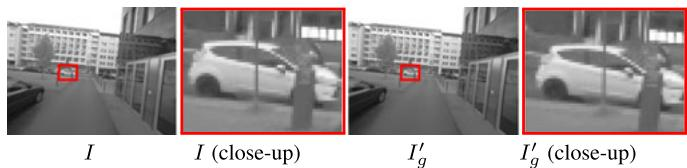  
Fig. 20. Geometricnoise. Effect of applying low-frequency geometric noise to the image, simulating geometric distortions such as a rolling shutter (evaluated on the TUM-monoVO dataset). The top row shows an example image with $\delta _ { g } = 2 .$ . While the effect is hardly visible to the human eye (observe that the close-up is slightly shifted), it has a severe impact on SLAM accuracy, in particular when using a direct model. Note that the distortion caused by a standard rolling shutter camera easily surpasses $\delta _ { g } = 3 \AA$

We then perturb the original image by shifting each pixel x by $N _ { g } ( \mathbf { x } )$

$$
I _ { g } ^ { \prime } ( { \pmb x } ) : = I ( { \pmb x } + N _ { g } ( { \pmb x } ) ) .\tag{21}
$$

This procedure simulates noise originating from (unmodeled) rolling shutter or inaccurate geometric camera calibration. Fig. 20 visualizes an example of the resulting noise pattern, as well as the accuracy of ORB-SLAM and DSO for different values of $\delta _ { g } .$ As expected, we can clearly observe how DSO’s performance quickly deteriorates with added geometric noise, whereas ORB-SLAM is much less affected. This is because the first step in the indirect pipeline— keypoint detection and extraction—is not affected by lowfrequency geometric noise, as it operates on a purely local level. The second step then optimizes a geometric noise model-which not surprisingly deals well with geometric noise. In the direct approach, in turn, geometric noise is not modeled, and thus has a much more severe effect—in fact, for $\delta _ { g } > 1 . 5$ there likely exists no state for which all residuals are within the validity radius of the linearization of $I ;$ thus optimization fails entirely (which can be alleviated by using a coarser pyramid level). Note that this result also suggests that the proposed direct model is more susceptible to inaccurate intrinsic camera calibration than the indirect approach—in turn, it may benefit more from accurate, nonparametric intrinsic calibration.

Photometric Noise. For each frame, we separately generate a high-frequency random blur-map $N _ { p } : \bar { \Omega } \to \dot { \mathbb { R } } ^ { 2 }$ by upsampling a 300300 grid filled with uniformly distributed random values in $[ - \bar { \delta } _ { p } , \delta _ { p } ] ^ { 2 }$ . We then perturb the original image by adding anisotropic blur with standard deviation $N _ { p } ( { \bf \bar { x } } )$ to pixel x

$$
I _ { p } ^ { \prime } ( \mathbf { x } ) : = \int _ { \mathbb { R } ^ { 2 } } \phi ( \pmb { \delta } ; N _ { p } ( \mathbf { x } ) ^ { 2 } ) I ( \mathbf { x } + \pmb { \delta } ) \quad d \pmb { \delta } ,\tag{22}
$$

where $\phi ( \cdot ; N _ { p } ( \mathbf { x } ) ^ { 2 } )$ denotes a 2D Gaussian kernel with standard deviation $N _ { p } ( { \bf x } )$ . Fig. 21 shows the result. We can observe that DSO is slightly more robust to photometric noise than ORB-SLAM—this is because (purely local) keypoint matching fails for high photometric noise, whereas a joint optimization of the photometric error better overcomes the introduced distortions.

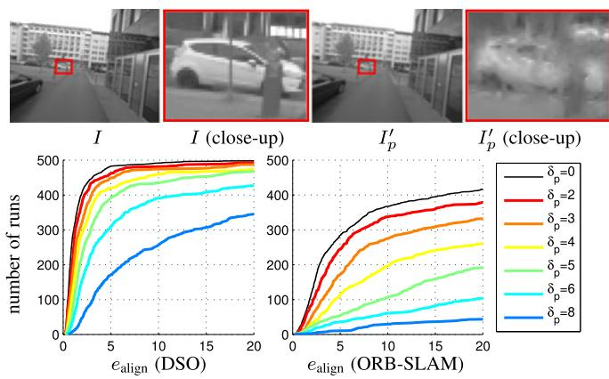  
Fig. 21. Photometricnoise. Effect of applying high-frequent, non-isotropic blur to the image, simulating photometric noise (evaluated on the TUMmonoVO dataset). The top row shows an example image with $\delta _ { p } = 6$ , the effect is clearly visible. Since the direct approach models a photometric error, it is more robust to this type of noise than indirect methods.

To summarize: While the direct approach outperforms the indirect approach on well-calibrated data, it is ill-suited in the presence of strong geometric noise, e.g., originating from a rolling shutter or inaccurate intrinsic calibration. In practice, this makes the indirect model superior for smartphones or off-the-shelf webcams, since these were designed to capture videos for human consumption-prioritizing resolution and light-sensitivity over geometric precision. In turn, the direct approach offers superior performance on data captured with dedicated cameras for machine-vision, since these put more importance on geometric precision, rather than capturing appealing images for human consumption. Note that this can be resolved by tightly integrating the rolling shutter into the model, as done, e.g., in [15], [18], [19].

## 4.4 Qualitative Results

In addition to accurate camera tracking, DSO computes 3D points on all gradient-rich areas, including edges—resulting in point-cloud reconstructions similar to the semi-dense reconstructions of LSD-SLAM. The density then directly corresponds to how many points we keep in the active window $N _ { p } .$ . Fig. 23 shows some examples. Fig. 22 shows three more scenes (one from each dataset), together with some corresponding depth maps. Note that our approach is able to track through scenes with very little texture, whereas indirect approaches fail. All reconstructions shown are simply accumulated from the odometry, without integrating loop-closures. See the supplementary video for more qualitative results, available online.

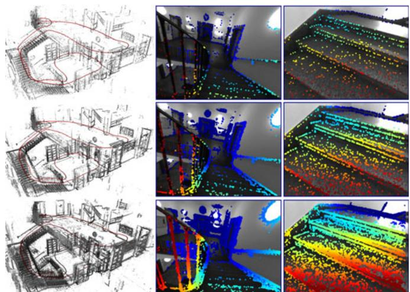  
Fig. 23. Point density. 3D point cloud and some coarse depth maps, i.e., the most recent keyframe with all $N _ { p }$ active points projected into it) for $N _ { p } = 5 0 0 ( { \mathsf { t o p } } )$ , $N _ { p } \stackrel { \cdot } { = } 2 { , } 0 0 0$ (middle), and $N _ { p } = 1 0 \small { , } 0 0 0$ (bottom).

Failure Modes. As for all monocular methods, the predominant cause of failure is degenerate motion in the form of almost-pure rotation, since no new points can be triangulated. This issue is amplified since DSO is designed as pure visual odometry, and does not reuse points once they leave the field of view. In contrast, a full SLAM formulation (as used by ORB-SLAM) allows to recycle previously triangulated points once they re-enter the field of view (implicit loop-closures as discussed in Section 4.1), and thereby bridge over some periods of degenerate camera motion. Note that this issue stems from the employed windowed optimization strategy (Section 2.3) and is not inherent to the proposed direct sparse model formulation (Section 2.2).

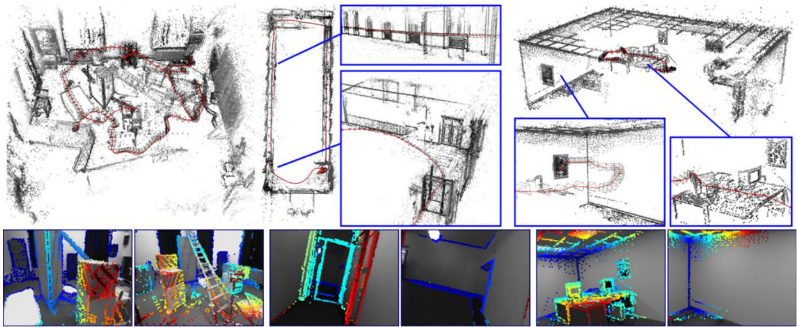  
Fig. 22. Qualitative examples. One scene from each dataset (left to right: V2\_01\_easy [1], seq\_38 [8] and office\_1 [10]), computed in real time with default settings. The bottom shows some corresponding (sparse) depth maps-some scenes contain very little texture, making them very challenging for indirect approaches.

We have not observed significant issues with non-Lambertian surfaces, likely due to the concentration on high-gradient points. However, the proposed direct model will fail when the scene lighting change drastically, e.g., in the presence of moving light sources or when the time of day changes. While this is typically unproblematic for shortterm visual odometry, it needs to be addressed to facilitate life-long mapping, for instance by changing the energy (4) to penalize gradient direction or magnitude differences instead of absolute intensity.

## 5 CONCLUSION

We have presented a novel direct and sparse formulation for Structure from Motion. It combines the benefits of direct methods (seamless ability to use & reconstruct all points instead of only corners) with the flexibility of sparse approaches (efficient, joint optimization of all model parameters). This is possible in real time by omitting the geometric prior used by other direct methods, and instead evaluating the photometric error for each point over a small neighborhood of pixels, to well-constrain the overall problem. Furthermore, we incorporate full photometric calibration, completing the intrinsic camera model that traditionally only reflects the geometric component of the image formation process.

We have implemented our direct & sparse model in the form of a monocular visual odometry algorithm, incrementally marginalizing / eliminating old states to maintain real-time performance. To this end we have developed a front-end that performs data-selection and provides accurate initialization for optimizing the highly non-convex energy function. Our comprehensive evaluation on several hours of video shows the superiority of the presented formulation relative to state-of-the-art indirect methods. We furthermore present an exhaustive parameter study, indicating that (1) simply using more data does not increase tracking accuracy (although it makes the 3D models denser), (2) using all points instead of only corners does provide a real gain in accuracy and robustness, and (3) incorporating photometric calibration does increase performance, in particular compared to the basic “brightness constancy” assumption.

We have also shown experimentally that the indirect approach—modeling a geometric error—is much more robust to geometric noise, e.g., originating from a poor intrinsic camera calibration or a rolling shutter. The direct approach is in turn more robust to photometric noise, and achieves superior accuracy on well-calibrated data. We believe this to be one of the main explanations for the recent revival of direct formulations after a dominance of indirect approaches for more than a decade: For a long time, the predominant source of digital image data were cameras, which originally were designed to capture images for human viewing (such as off-the-shelf webcams or integrated smartphone cameras). In this setting, the strong geometric distortions caused by rolling shutters and imprecise lenses favored the indirect approach. In turn, with 3D computer vision becoming an integral part of mass-market products (including autonomous cars and drones, as well as mobile devices for VR and AR), cameras are being developed specifically for this purpose, featuring global shutters, precise lenses, and high frame-rates—which allows direct formulations to realize their full potential.

Since the structure of the proposed direct sparse energy formulation is the same as that of indirect methods, it can be integrated with other optimization frameworks like (double-windowed) bundle adjustment [25] or incremental smoothing and mapping [14]. The main challenge here is the greatly increased degree of non-convexity compared to the indirect model, which originates from the inclusion of the image in the error function-this is likely to restrict the use of our model to video processing.

## ACKNOWLEDGMENTS

This work was supported through the ERC Consolidator Grant “3D Reloaded” and through a Google Faculty Research Award.

## REFERENCES

[1] M. Burri, et al., “The EuRoC micro aerial vehicle datasets,” Int. J. Robot. Res., vol. 35, pp. 1157–1163, 2016.

[2] D. Caruso, J. Engel, and D. Cremers, “Large-scale direct SLAM for omnidirectional cameras,” in Proc. Int. Conf. Intell. Robot Syst., 2015, pp. 141–148.

[3] J. Civera, A. Davison, and J. Montiel, “Inverse depth parametrization for monocular SLAM,” IEEE Trans. Robot., vol. 24, no. 5, pp. 932–945, Oct. 2008.

[4] A. Davison, I. Reid, N. Molton, and O. Stasse, “MonoSLAM: Realtime single camera SLAM,” IEEE Trans. Pattern Anal. Mach. Intell., vol. 29, no. 6, pp. 1052–1067, Jun. 2007.

[5] J. Engel, T. Schops, and D. Cremers, “LSD-SLAM: Large-scale€ direct monocular SLAM,” in Proc. Eur. Conf. Comput. Vis., 2014, pp. 834–849.

[6] J. Engel, J. Stueckler, and D. Cremers, “Large-scale direct slam with stereo cameras,” in Proc. IEEE/RSJ Int. Conf. Intell. Robot Syst., 2015, pp. 1935–1942.

[7] J. Engel, J. Sturm, and D. Cremers, “Scale-aware navigation of a low-cost quadrocopter with a monocular camera,” Robot. Auton. Syst., vol. 62, no. 11, pp. 1646–1656, 2014.

[8] J. Engel, V. Usenko, and D. Cremers, “A photometrically calibrated benchmark for monocular visual odometry,” arXiv:1607.02555, 2016.

[9] C. Forster, M. Pizzoli, and D. Scaramuzza, “SVO: Fast semi-direct monocular visual odometry,” in Proc. IEEE Int. Conf. Robot. Autom.

[10] A. Handa, T. Whelan, J. McDonald, and A. Davison, "A benchmark for RGB-D visual odometry, 3D reconstruction and SLAM,” in Proc. IEEE Int. Conf. Robot. Autom., 2014, pp. 1524–1531.

[11] G. P. Huang, A. I. Mourikis, and S. I. Roumeliotis, “A first-estimates Jacobian EKF for improving SLAM consistency,” in Proc. IEEE/ASME Int. Symp. Exp. Robot., 2008, pp. 619–624.

[12] H. Jin, P. Favaro, and S. Soatto, “Real-time 3-D motion and structure of point features: Front-end system for vision-based control and interaction,” in Proc. IEEE Conf. Comput. Vis. Pattern Recognit., 2000, pp. 778–779.

[13] H. Jin, P. Favaro, and S. Soatto, “A semi-direct approach to structure from motion,” Visual Comput., vol. 19, no. 6, pp. 377–394, 2003.

[14] M. Kaess, H. Johannsson, R. Roberts, V. Ila, J. Leonard, and F. Dellaert, “iSAM2: Incremental smoothing and mapping using the Bayes tree,” Int. J. Robot. Res., vol. 31, no. 2, pp. 217–236, Feb. 2012.

[15] C. Kerl, J. Stueckler, and D. Cremers, “Dense continuous-time tracking and mapping with rolling shutter RGB-D cameras,” in Proc. IEEE Int. Conf. Comput. Vis., 2015, pp. 2264–2272.

[16] G. Klein and D. Murray, “Parallel tracking and mapping for small AR workspaces,” in Proc. 6th IEEE ACM Int. Symp. Mixed Augmented Reality, 2007, pp. 225–234.

[17] S. Leutenegger, S. Lynen, M. Bosse, R. Siegwart, and P. Furgale, “Keyframe-based visual–inertial odometry using nonlinear optimization,” Int. J. Robot. Res., vol. 34, no. 3, pp. 314–334, 2015.

[18] M. Li, B. Kim, and A. Mourikis, “Real-time motion estimation on a cellphone using inertial sensing and a rolling-shutter camera,” in Proc. IEEE Int. Conf. Robot. Autom., 2013, pp. 4712–4719.

[19] S. Lovegrove, A. Patron-Perez, and G. Sibley, “Spline fusion: A continuous-time representation for visual-inertial fusion with application to rolling shutter cameras,” in Proc. British Mach. Vis. Conf., 2013, pp. 93.1–93.12.

[20] R. Mur-Artal, J. Montiel, and J. Tardos, “ORB-SLAM: A versatile and accurate monocular SLAM system,” IEEE Trans. Robot., vol. 31, no. 5, pp. 1147–1163, Oct. 2015.

[21] R. Newcombe, S. Lovegrove, and A. Davison, “DTAM: Dense tracking and mapping in real-time,” in Proc. IEEE Int. Conf. Comput. Vis., 2011, pp. 2320–2327.

[22] M. Pizzoli, C. Forster, and D. Scaramuzza, “REMODE: Probabilistic, monocular dense reconstruction in real time," in Proc. IEEE Int. Conf. Robot. Autom., 2014, pp. 2609–2616.

[23] R. Ranftl, V. Vineet, Q. Chen, and V. Koltun, “Dense monocular depth estimation in complex dynamic scenes,” in Proc. IEEE Conf. Comput. Vis. Pattern Recognit., 2016, pp. 4058–4066.

[24] T. Schops, J. Engel, and D. Cremers, “Semi-dense visual odometry€ for AR on a smartphone,” in Proc. IEEE Int. Symp. Mixed Augmented Reality, 2014, pp. 145–150.

[25] H. Strasdat, A. J. Davison, J. M. M. Montiel, and K. Konolige, “Double window optimisation for constant time visual SLAM,” in Proc. IEEE Int. Conf. Comput. Vis., 2011, pp. 2352–2359.

[26] J. Stuhmer, S. Gumhold, and D. Cremers, “Real-time dense geom-€ etry from a handheld camera,” in Proc. 32nd DAGM Conf. Pattern Recognit., 2010, pp. 11–20.

[27] L. Valgaerts, A. Bruhn, M. Mainberger, and J. Weickert, “Dense versus sparse approaches for estimating the fundamental matrix,” Int. J. Comput. Vis., vol. 96, no. 2, pp. 212–234, 2012.

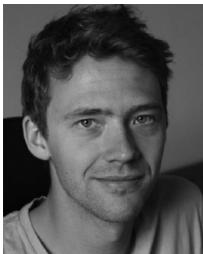

Jakob Engel received the master’s degree in computer science from the Technical University of Munich, in 2011, where he also spent 2012 to 2016 as full-time PhD degree at the chair for Computer Vision and Pattern Recognition. He is a senior research scientist with Oculus. In 2015, he became a Google PhD Fellow. In 2015, he spent half a year at the Intel Visual Computing Lab. He joined Oculus Research in July 2016.

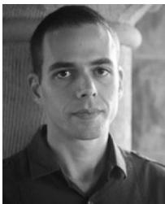

Vladlen Koltun received the PhD degree in 2002 for new results in theoretical computational geometry, spent three years at UC Berkeley as a postdoc in the theory group, and joined the Stanford Computer Science faculty, in 2005 as a theoretician. He is the director of the Intel Visual Computing Lab. He switched to research in visual computing in 2007 and joined Intel as a principal researcher in 2015 to establish the Visual Computing Lab.

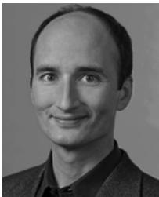

Daniel Cremers received the PhD degree in computer science from the University of Mannheim, Germany. Subsequently, he spent two years as a postdoctoral researcher with UCLA and one year as a permanent researcher at Siemens Corporate Research, Princeton, New Jersey. From 2005 until 2009, he was associate professor with the University of Bonn, Germany. Since 2009 he holds the chair for computer vision and pattern recognition with Technical University of Munich. In 2016, he received the Gottfried-Wilhelm Leibniz Award, the biggest award in German academia.

" For more information on this or any other computing topic, please visit our Digital Library at www.computer.org/publications/dlib.