# LeGO-LOAM: Lightweight and Ground-Optimized Lidar Odometry and Mapping on Variable Terrain

Tixiao Shan and Brendan Englot

Abstract— We propose a lightweight and ground-optimized lidar odometry and mapping method, LeGO-LOAM, for realtime six degree-of-freedom pose estimation with ground vehicles. LeGO-LOAM is lightweight, as it can achieve realtime pose estimation on a low-power embedded system. LeGO-LOAM is ground-optimized, as it leverages the presence of a ground plane in its segmentation and optimization steps. We first apply point cloud segmentation to filter out noise, and feature extraction to obtain distinctive planar and edge features. A two-step Levenberg-Marquardt optimization method then uses the planar and edge features to solve different components of the six degree-of-freedom transformation across consecutive scans. We compare the performance of LeGO-LOAM with a state-of-the-art method, LOAM, using datasets gathered from variable-terrain environments with ground vehicles, and show that LeGO-LOAM achieves similar or better accuracy with reduced computational expense. We also integrate LeGO-LOAM into a SLAM framework to eliminate the pose estimation error caused by drift, which is tested using the KITTI dataset.

## I. INTRODUCTION

Among the capabilities of an intelligent robot, mapbuilding and state estimation are among the most fundamental prerequisites. Great efforts have been devoted to achieving real-time 6 degree-of-freedom simultaneous localization and mapping (SLAM) with vision-based and lidar-based methods. Although vision-based methods have advantages in loop-closure detection, their sensitivity to illumination and viewpoint change may make such capabilities unreliable if used as the sole navigation sensor. On the other hand, lidarbased methods will function even at night, and the high resolution of many 3D lidars permits the capture of the fine details of an environment at long ranges, over a wide aperture. Therefore, this paper focuses on using 3D lidar to support real-time state estimation and mapping.

The typical approach for finding the transformation between two lidar scans is iterative closest point (ICP) [1]. By finding correspondences at a point-wise level, ICP aligns two sets of points iteratively until stopping criteria are satisfied. When the scans include large quantities of points, ICP may suffer from prohibitive computational cost. Many variants of ICP have been proposed to improve its efficiency and accuracy [2]. [3] introduces a point-to-plane ICP variant that matches points to local planar patches. Generalized-ICP [4] proposes a method that matches local planar patches from both scans. In addition, several ICP variants have leveraged parallel computing for improved efficiency [5]–[8].

Feature-based matching methods are attracting more attention, as they require less computational resources by extracting representative features from the environment. These features should be suitable for effective matching and invariant of point-of-view. Many detectors, such as Point Feature Histograms (PFH) [9] and Viewpoint Feature Histograms (VFH) [10], have been proposed for extracting such features from point clouds using simple and efficient techniques. A method for extracting general-purpose features from point clouds using a Kanade-Tomasi corner detector is introduced in [11]. A framework for extracting line and plane features from dense point clouds is discussed in [12].

Many algorithms that use features for point cloud registration have also been proposed. [13] and [14] present a keypoint selection algorithm that performs point curvature calculations in a local cluster. The selected keypoints are then used to perform matching and place recognition. By projecting a point cloud onto a range image and analyzing the second derivative of the depth values, [15] selects features from points that have high curvature for matching and place recognition. Assuming the environment is composed of planes, a plane-based registration algorithm is proposed in [16]. An outdoor environment, e.g., a forest, may limit the application of such a method. A collar line segments (CLS) method, which is especially designed for Velodyne lidar, is presented in [17]. CLS randomly generates lines using points from two consecutive “rings” of a scan. Thus two line clouds are generated and used for registration. However, this method suffers from challenges arising from the random generation of lines. A segmentation-based registration algorithm is proposed in [18]. SegMatch first applies segmentation to a point cloud. Then a feature vector is calculated for each segment based on its eigenvalues and shape histograms. A random forest is used to match the segments from two scans. Though this method can be used for online pose estimation, it can only provide localization updates at about 1Hz.

A low-drift and real-time lidar odometry and mapping (LOAM) method is proposed in [19] and [20]. LOAM performs point feature to edge/plane scan-matching to find correspondences between scans. Features are extracted by calculating the roughness of a point in its local region. The points with high roughness values are selected as edge features. Similarly, the points with low roughness values are designated planar features. Real-time performance is achieved by novelly dividing the estimation problem across two individual algorithms. One algorithm runs at high frequency and estimates sensor velocity at low accuracy. The other algorithm runs at low frequency but returns high-

T. Shan and B. Englot are with the Department of Mechanical Engineering, Stevens Institute of Technology, Castle Point on Hudson, Hoboken NJ 07030 USA, {TShan3, BEnglot}@stevens.edu.

accuracy motion estimation. The two estimates are fused together to produce a single motion estimate at both high frequency and high accuracy. LOAM’s resulting accuracy is the best achieved by a lidar-only estimation method on the KITTI odometry benchmark site [21].

In this work, we pursue reliable, real-time six degreeof-freedom pose estimation for ground vehicles equipped with 3D lidar, in a manner that is amenable to efficient implementation on a small-scale embedded system. Such a task is non-trivial for several reasons. Many unmanned ground vehicles (UGVs) do not have suspensions or powerful computational units due to their limited size. Non-smooth motion is frequently encountered by small UGVs driving on variable terrain, and as a result, the acquired data is often distorted. Reliable feature correspondences are also hard to find between two consecutive scans due to large motions with limited overlap. Besides that, the large quantities of points received from a 3D lidar poses a challenge to real-time processing using limited on-board computational resources.

When we implement LOAM for such tasks, we can obtain low-drift motion estimation when a UGV is operated with smooth motion admist stable features, and supported by sufficient computational resources. However, the performance of LOAM deteriorates when resources are limited. Due to the need to compute the roughness of every point in a dense 3D point cloud, the update frequency of feature extraction on a lightweight embedded system cannot always keep up with the sensor update frequency. Operation of UGVs in noisy environments also poses challenges for LOAM. Since the mounting position of a lidar is often close to the ground on a small UGV, sensor noise from the ground may be a constant presence. For example, range returns from grass may result in high roughness values. As a consequence, unreliable edge features may be extracted from these points. Similarly, edge or planar features may also be extracted from points returned from tree leaves. Such features are usually not reliable for scan-matching, as the same grass blade or leaf may not be seen in two consecutive scans. Using these features may lead to inaccurate registration and large drift.

We therefore propose a lightweight and ground-optimized LOAM (LeGO-LOAM) for pose estimation of UGVs in complex environments with variable terrain. LeGO-LOAM is lightweight, as real-time pose estimation and mapping can be achieved on an embedded system. Point cloud segmentation is performed to discard points that may represent unreliable features after ground separation. LeGO-LOAM is also ground-optimized, as we introduce a two-step opti mization for pose estimation. Planar features extracted from the ground are used to obtain $[ t _ { z } , \theta _ { r o l l } , \theta _ { p i t c h } ]$ during the first step. In the second step, the rest of the transformation $[ t _ { x } , t _ { y } , \theta _ { y a w } ]$ is obtained by matching edge features extracted from the segmented point cloud. We also integrate the ability to perform loop closures to correct motion estimation drift. The rest of the paper is organized as follows. Section II introduces the hardware used for experiments. Section III describes the proposed method in detail. Section IV presents a set of experiments over a variety of outdoor environments.

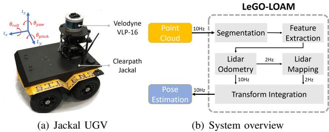  
Fig. 1: Hardware and system overview of LeGO-LOAM.

## II. SYSTEM HARDWARE

The framework proposed in this paper is validated using datasets gathered from Velodyne VLP-16 and HDL-64E 3D lidars. The VLP-16 measurement range is up to 100m with an accuracy of ± 3cm. It has a vertical field of view (FOV) of $3 0 ^ { \circ } ( \pm 1 5 ^ { \circ } )$ and a horizontal FOV of $3 6 0 ^ { \circ }$ . The 16-channel sensor provides a vertical angular resolution of 2◦. The horizontal angular resolution varies from $0 . 1 ^ { \circ }$ to $0 . 4 ^ { \circ }$ based on the rotation rate. Throughout the paper, we choose a scan rate of 10Hz, which provides a horizontal angular resolution of 0.2◦. The HDL-64E (explored in this work via the KITTI dataset) also has a horizontal FOV of $3 6 0 ^ { \circ }$ but 48 more channels. The vertical FOV of the HDL-64E is 26.9◦.

The UGV used in this paper is the Clearpath Jackal. Powered by a 270 Watt hour Lithium battery, it has a maximum speed of 2.0m/s and maximum payload of 20kg. The Jackal is also equipped with a low-cost inertial measurement unit (IMU), the CH Robotics UM6 Orientation Sensor.

The proposed framework is validated on two computers: an Nvidia Jetson TX2 and a laptop with a 2.5GHz i7- 4710MQ CPU. The Jetson TX2 is an embedded computing device that is equipped with an ARM Cortex-A57 CPU. The laptop CPU was selected to match the computing hardware used in [19] and [20]. The experiments shown in this paper use the CPUs of these systems only.

## III. LIGHTWEIGHT LIDAR ODOMETRY AND MAPPING

## A. System Overview

An overview of the proposed framework is shown in Figure 1. The system receives input from a 3D lidar and outputs 6 DOF pose estimation. The overall system is divided into five modules. The first, segmentation, takes a single scan’s point cloud and projects it onto a range image for segmentation. The segmented point cloud is then sent to the feature extraction module. Then, lidar odometry uses features extracted from the previous module to find the transformation relating consecutive scans. The features are further processed in lidar mapping, which registers them to a global point cloud map. At last, the transform integration module fuses the pose estimation results from lidar odometry and lidar mapping and outputs the final pose estimate. The proposed system seeks improved efficiency and accuracy for ground vehicles, with respect to the original, generalized LOAM framework of [19] and [20]. The details of these modules are introduced below.

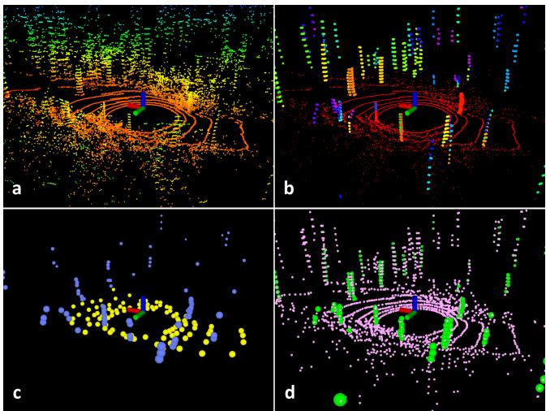  
Fig. 2: Feature extraction process for a scan in noisy environment. The original point cloud is shown in (a). In (b), the red points are labeled as ground points. The rest of the points are the points that remain after segmentation. In $( \mathrm { c } ) .$ , blue and yellow points indicate edge and planar features in $F _ { e }$ and $F _ { p } .$ In (d), the green and pink points represent edge and planar features in $\mathbb { F } _ { e }$ and $\mathbb { F } _ { p }$ respectively.

## B. Segmentation

Let $P _ { t } = \{ p _ { 1 } , p _ { 2 } , . . . , p _ { n } \}$ be the point cloud acquired at time t, where $p _ { i }$ is a point in $P _ { t }$ $P _ { t }$ is first projected onto a range image. The resolution of the projected range image is 1800 by 16, since the VLP-16 has horizontal and vertical angular resolution of $0 . 2 ^ { \circ }$ and $2 ^ { \circ }$ respectively. Each valid point $p _ { i }$ in $P _ { t }$ is now represented by a unique pixel in the range image. The range value $r _ { i }$ that is associated with $p _ { i }$ represents the Euclidean distance from the corresponding point $p _ { i }$ to the sensor. Since sloped terrain is common in many environments, we do not assume the ground is flat. A column-wise evaluation of the range image, which can be viewed as ground plane estimation [22], is conducted for ground point extraction before segmentation. After this process, points that may represent the ground are labeled as ground points and not used for segmentation.

Then, an image-based segmentation method [23] is applied to the range image to group points into many clusters. Points from the same cluster are assigned a unique label. Note that the ground points are a special type of cluster. Applying segmentation to the point cloud can improve processing efficiency and feature extraction accuracy. Assuming a robot operates in a noisy environment, small objects, e.g., tree leaves, may form trivial and unreliable features, as the same leaf is unlikely to be seen in two consecutive scans. In order to perform fast and reliable feature extraction using the segmented point cloud, we omit the clusters that have fewer than 30 points. A visualization of a point cloud before and after segmentation is shown in Fig. 2. The original point cloud includes many points, which are obtained from surrounding vegetation that may yield unreliable features.

After this process, only the points (Fig. 2(b)) that may represent large objects, e.g., tree trunks, and ground points are preserved for further processing. At the same time, only these points are saved in the range image. We also obtain three properties for each point: (1) its label as a ground point or segmented point, (2) its column and row index in the range image, and (3) its range value. These properties will be utilized in the following modules.

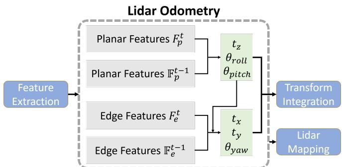  
Fig. 3: Two-step optimization for the lidar odometry module. $[ t _ { z } , \theta _ { r o l l } , \theta _ { p i t c h } ]$ is first obtained by matching the planar features extracted from ground points. $[ t _ { x } , t _ { y } , \theta _ { y a w } ]$ are then estimated using the edge features extracted from segmented points while applying $[ t _ { z } , \theta _ { r o l l } , \theta _ { p i t c h } ]$ as constraints.

## C. Feature Extraction

The feature extraction process is similar to the method used in [20]. However, instead of extracting features from raw point clouds, we extract features from ground points and segmented points. Let $S$ be the set of continuous points of $p _ { i }$ from the same row of the range image. Half of the points in $S$ are on either side of $p _ { i } .$ In this paper, we set |S| to 10. Using the range values computed during segmentation, we can evaluate the roughness of point $p _ { i }$ in $S ,$

$$
c = { \frac { 1 } { | { \boldsymbol { S } } | \cdot \| r _ { i } \| } } \big \| \sum _ { j \in { \boldsymbol { S } } , j \neq i } ( r _ { j } - r _ { i } ) \big \| .\tag{1}
$$

To evenly extract features from all directions, we divide the range image horizontally into several equal sub-images. Then we sort the points in each row of the sub-image based on their roughness values c. Similar to LOAM, we use a threshold $c _ { t h }$ to distinguish different types of features. We call the points with c larger than $c _ { t h }$ edge features, and the points with c smaller than $c _ { t h }$ planar features. Then $n _ { \mathbb { F } _ { \epsilon } }$ edge feature points with the maximum $c ,$ which do not belong to the ground, are selected from each row in the sub-image. $n _ { \mathbb { F } _ { p } }$ planar feature points with the minimum c, which may be labeled as either ground or segmented points, are selected in the same way. Let $\mathbb { F } _ { e }$ and $\mathbb { F } _ { p }$ be the set of all edge and planar features from all sub-images. These features are visualized in Fig. 2(d). We then extract $n _ { F _ { e } }$ edge features with the maximum $c ,$ which do not belong to the ground, from each row in the sub-image. Similarly, we extract ${ n } _ { F _ { p } }$ planar features with the minimum $c ,$ which must be ground points, from each row in the sub-image. Let $F _ { e }$ and $F _ { p }$ be the set of all edge and planar features from this process. Here, we have $F _ { e } \subset \mathbb { F } _ { e }$ and $F _ { p } \subset \mathbb { F } _ { p } .$ . Features in $F _ { e }$ and $F _ { p }$ are shown in Fig. 2(c). In this paper, we divide the $3 6 0 ^ { \circ }$ range image into 6 sub-images. Each sub-image has a resolution of 300 by 16. $n _ { F _ { e } } , n _ { F _ { p } } , n _ { \mathbb { F } _ { \epsilon } }$ and $n _ { \mathbb { F } _ { p } }$ are chosen to be 2, 4, 40 and 80 respectively.

## D. Lidar Odometry

The lidar odometry module estimates the sensor motion between two consecutive scans. The transformation between two scans is found by performing point-to-edge and pointto-plane scan-matching. In other words, we need to find the corresponding features for points in $F _ { e } ^ { t }$ and $F _ { p } ^ { t }$ from feature sets $\mathbb { F } _ { e } ^ { t - 1 }$ and $\mathbb { F } _ { p } ^ { t - 1 }$ of the previous scan. For the sake of brevity, the detailed procedures of finding these correspondences can be found in [20].

However, we note that a few changes can be made to improve feature matching accuracy and efficiency:

1) Label Matching: Since each feature in $F _ { e } ^ { t }$ and $F _ { p } ^ { t }$ is encoded with its label after segmentation, we only find correspondences that have the same label from $\mathbb { F } _ { e } ^ { t - \mathrm { 1 } }$ and $\mathbb { F } _ { p } ^ { t - 1 }$ . For planar features in $F _ { p } ^ { t }$ , only points that are labeled as ground points in $\mathbb { F } _ { p } ^ { t - 1 }$ are used for finding a planar patch as the correspondence. For an edge feature in $F _ { e } ^ { t } ,$ , its corresponding edge line is found in the $\bar { \mathbb { F } } _ { e } ^ { t - 1 }$ from segmented clusters. Finding the correspondences in this way can help improve the matching accuracy. In other words, the matching correspondences for the same object are more likely to be found between two scans. This process also narrows down the potential candidates for correspondences.

2) Two-step L-M Optimization: In [20], a series of nonlinear expressions for the distances between the edge and planar feature points from the current scan and their correspondences from the previous scan are compiled into a single comprehensive distance vector. The Levenberg-Marquardt (L-M) method is applied to find the minimum-distance transformation between the two consecutive scans.

We introduce a two-step L-M optimization method here. The optimal transformation $T$ is found in two steps: (1) $[ t _ { z } , \theta _ { r o l l } , \theta _ { p i t c h } ]$ are estimated by matching the planar features in $F _ { p } ^ { t }$ and their correspondences in $\mathbb { F } _ { p } ^ { t - 1 }$ , (2) the remaining $[ t _ { x } , t _ { y } , \theta _ { y a w } ]$ are then estimated using the edge features in $F _ { e } ^ { t }$ and their correspondences in $\mathbb { F } _ { e } ^ { t - 1 }$ while using $[ t _ { z } , \theta _ { r o l l } , \theta _ { p i t c h } ]$ as constraints. It should be noted that though $[ t _ { x } , t _ { y } , \theta _ { y a w } ]$ can also be obtained from the first optimization step, they are less accurate and not used for the second step. Finally, the 6D transformation between two consecutive scans is found by fusing $[ t _ { z } , \theta _ { r o l l } , \theta _ { p i t c h } ]$ and $[ t _ { x } , t _ { y } , \theta _ { y a w } ]$ . By using the proposed two-step optimization method, we observe that similar accuracy can be achieved while computation time is reduced by about 35% (Table III).

## E. Lidar Mapping

The lidar mapping module matches features in $\{ \mathbb { F } _ { e } ^ { t } , \mathbb { F } _ { p } ^ { t } \}$ to a surrounding point cloud map $\overline { { Q } } ^ { t - 1 }$ to further refine the pose transformation, but runs at a lower frequency. Then the L-M method is used here again to obtain the final transformation. We refer the reader to the description from [20] for the detailed matching and optimization procedure.

The main difference in LeGO-LOAM is how the final point cloud map is stored. Instead of saving a single point cloud map, we save each individual feature set $\{ \mathbb { F } _ { e } ^ { t } , \mathbb { F } _ { p } ^ { t } \}$ . Let $M ^ { t - 1 } = \overset { \cdot } { \{ } \underset { e } { \mathbb { F } _ { e } ^ { 1 } , \mathbb { F } _ { p } ^ { 1 } \} } , . . . , \{ \mathbb { F } _ { e } ^ { t - 1 } , \mathbb { F } _ { p } ^ { t - 1 } \} \}$ be the set that saves all previous feature sets. Each feature set in $M ^ { t - 1 }$ is also associated with the pose of the sensor when the scan is taken. Then $\overline { { Q } } ^ { t - 1 }$ can be obtained from $M ^ { t - 1 }$ in two ways.

In the first approach, $\overline { { Q } } ^ { t - 1 }$ is obtained by choosing the feature sets that are in the field of view of the sensor. For simplicity, we can choose the feature sets whose sensor poses are within 100m of the current position of the sensor. The chosen feature sets are then transformed and fused into a single surrounding map $\overline { { Q } } ^ { t - 1 }$ . This map selection technique is similar to the method used in [20].

We can also integrate pose-graph SLAM into LeGO-LOAM. The sensor pose of each feature set can be modeled as a node in a pose graph. Feature set $\{ \mathbb { F } _ { e } ^ { t } , \mathbb { F } _ { p } ^ { t } \}$ can be viewed as a sensor measurement of this node. Since the pose estimation drift of the lidar mapping module is very low, we can assume that there is no drift over a short period of time. In this way, $\overline { { Q } } ^ { t - 1 }$ can be formed by choosing a recent group of feature sets, i.e., ${ \overline { { Q } } } ^ { t - 1 } =$ $\{ \mathbf { \bar { \{ F } }  _ { e } ^ { t - k } , \mathbb { F } _ { p } ^ { t - k } \} , . . . , \{ \mathbb { F } _ { e } ^ { t - 1 } , \mathbb { F } _ { p } ^ { \bar { t } - 1 } \} \}$ , where k defines the size of $\overline { { Q } } ^ { t - 1 }$ . Then, spatial constraints between a new node and the chosen nodes in $\overline { { Q } } ^ { t - 1 }$ can be added using the transformations obtained after L-M optimization. We can further eliminate drift for this module by performing loop closure detection. In this case, new constraints are added if a match is found between the current feature set and a previous feature set using ICP. The estimated pose of the sensor is then updated by sending the pose graph to an optimization system such as [24]. Note that only the experiment in Sec. IV(D) uses this technique to create its surrounding map.

## IV. EXPERIMENTS

We now describe a series of experiments to qualitatively and quantitatively analyze two competing methods, LOAM and LeGO-LOAM, on two hardware arrangements, a Jetson TX2 with a Cortex-A57, and a laptop with an i7-4710MQ. Both algorithms are implemented in C++ and executed using the robot operating system (ROS) [25] in Ubuntu Linux1.

## A. Small-Scale UGV Test

We manually drive the robot in an outdoor environment that is covered with vegetation. We first show qualitative comparisons of feature extraction in this environment. Edge and planar features that are extracted from the same scan using both methods are shown in Fig. 4. These features correspond to the $\{ \mathbb { F } _ { e } ^ { t } , \mathbb { F } _ { p } ^ { t } \}$ that are sent to the lidar mapping module in Section III. As is shown in Fig. 4(d), the number of features from LeGO-LOAM is reduced greatly after point cloud segmentation. The majority of points that are returned from tree leaves are discarded, as they are not stable features across multiple scans. On the other hand, since the points returned from grass are also very noisy, large roughness values will be derived after evaluation. As a result, edge features are unavoidably extracted from these points using the original LOAM. As is shown in Fig. 4(c), edge features that are extracted from the ground are often unreliable.

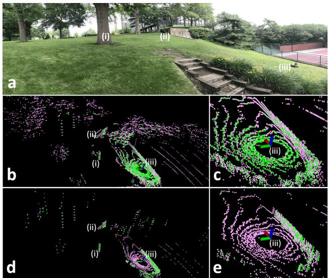

Fig. 4: Edge and planar features obtained from two different lidar odometry and mapping frameworks in an outdoor environment covered by vegetation. Edge and planar features are colored green and pink, respectively. The features obtained from LOAM are shown in (b) and (c). The features obtained from LeGO-LOAM are shown in (d) and (e). Label (i) indicates a tree, (ii) indicates a stone wall, and (iii) indicates the robot.  
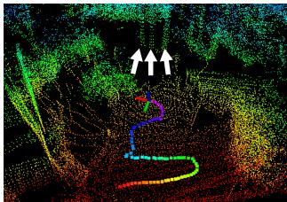  
(a) LOAM

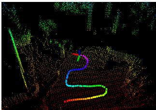  
(b) LeGO-LOAM  
Fig. 5: Maps from both LOAM and LeGO-LOAM over the terrain shown in Fig. 4(a). The trees marked by white arrows in (a) represent the same tree.

Though we can change the roughness threshold $c _ { t h }$ for extracting edge and planar features in LOAM to reduce the number of features and filter out unstable features from grass and leaves, we encounter worse results after applying such changes. For example, we can increase $c _ { t h }$ to extract more stable edge features from an environment, but this change may result in an insufficient number of useful edge features if the robot enters a relatively clean environment. Similarly, decreasing $c _ { t h }$ will also give rise to a lack of useful planar features when the robot moves from a clean environment to a noisy environment. Throughout all experiments here, we use the same $c _ { t h }$ for both LOAM and LeGO-LOAM.

Now we compare the mapping results from both methods over the test environment. To mimic a challenging potential UGV operational scenario, we perform a series of aggressive yaw maneuvers. Note that both methods are fed an identical initial translational and rotational guess, which is obtained from an IMU, throughout all experiments in the paper. The resulting point cloud map after 60 seconds of operation is shown in Fig. 5. Due to erroneous feature associations caused by unstable features, the map from LOAM diverges twice during operation. The three tree trunks that are highlighted by white arrows in Fig. 5(a) represent the same tree in reality. A visualization of the full mapping process for both odometry methods can be found in the video attachment2.

TABLE I: Large-Scale Outdoor Datasets
<table><tr><td>Experiment</td><td>Scan Number</td><td>Elevation Change (m)</td><td>Trajectory Length (km)</td></tr><tr><td>123</td><td>8077</td><td>11</td><td>1.09</td></tr><tr><td></td><td>8946</td><td>11</td><td>1.24</td></tr><tr><td></td><td>20834</td><td>19</td><td>2.71</td></tr></table>

## B. Large-Scale UGV Tests

We next perform quantitative comparisons of LOAM and LeGO-LOAM over three large-scale datasets, which will be referred to as experiments 1, 2 and 3. The first two were collected on the Stevens Institute of Technology campus, with numerous buildings, trees, roads and sidewalks. These experiments and their environment are illustrated in Fig. 6(a). Experiment 3 spans a forested hiking trail, which features trees, asphalt roads and trail paths covered by grass and soil. The environment in which experiment 3 was performed is shown in Fig. 8. The details of each experiment are listed in Table I. To perform a fair comparison, all of the performance and accuracy results shown for each experiment are averaged over 10 trials of real-time playback of each dataset.

1) Experiment 1: The first experiment is designed to show that both LOAM and LeGO-LOAM can achieve lowdrift pose estimation in an urban environment with smooth motion. We avoid aggressive yaw maneuvers, and we avoid driving the robot through sparse areas where only a few stable features can be acquired. The robot is operated on smooth roads during the whole data logging process. The initial position of the robot, which is marked in Fig. 6(b), is on a slope. The robot returns to the same position after 807 seconds of travel with an average speed of 1.35m/s.

To evaluate the pose estimation accuracy of both methods, we compare the translational and rotational difference between the final pose and the initial pose. Here, the initial pose is defined as [0, 0, 0, 0, 0, 0] through all experiments. As is shown in Table V, both LOAM and LeGO-LOAM achieve similar low-drift pose estimation over two different hardware arrangements. The final map from LeGO-LOAM, when run on a Jetson, is shown in Fig. 6(b).

2) Experiment 2: Though experiment 2 is carried out in the same environment as experiment 1, its trajectory is slightly different, driving across a sidewalk that is shown in Fig. 7(a). This sidewalk represents an environment where LOAM may often fail. A wall and pillars are on one end of the sidewalk - the edge and planar features that are extracted from these structures are stable. The other end of the sidewalk is an open area covered with noisy objects, i.e., grass and trees, which will result in unreliable feature extraction. As a result, LOAM’s pose estimation diverges after driving over this sidewalk (Fig. 7(b) and (d)). LeGO-LOAM has no such problem as: 1) no edge features are extracted from ground that is covered by grass, and 2) noisy sensor readings from tree leaves are filtered out after segmentation. An accuracy comparison of both methods is shown in Table V. In this experiment, LeGO-LOAM achieves higher accuracy than LOAM by an order of magnitude.

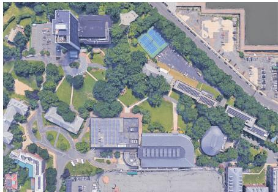  
(a) Satellite image

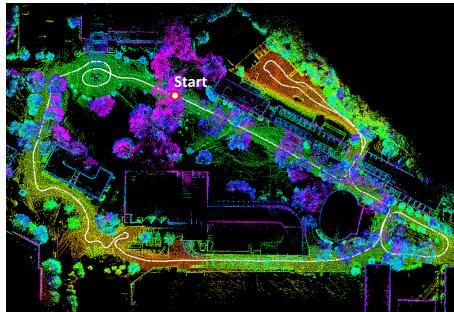  
(b) Experiment 1

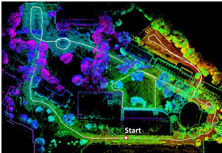  
(c) Experiment 2

Fig. 6: LeGO-LOAM maps from experiments 1 and 2. The color variation in (c) indicates true elevation change. Since the robot’s initial position in experiment 1 is on a slope, the color variation in (b) does not represent true elevation change.  
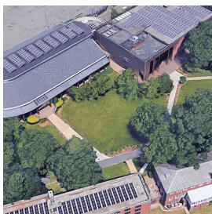  
(a) Satellite image

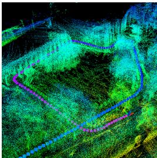  
(b) LOAM

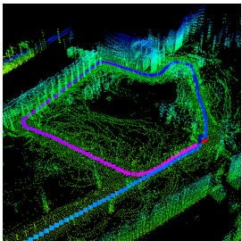  
(c) LeGO-LOAM

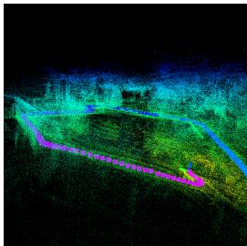  
(d) LOAM

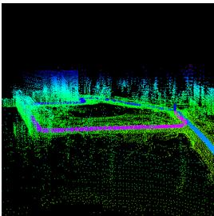  
(e) LeGO-LOAM

Fig. 7: A scenario where LOAM fails over a sidewalk crossing the Stevens campus in experiment 2 (the leftmost sidewalk in image (a) above). One end of the sidewalk is supported by features from a nearby building. The other end of the sidewalk is surrounded primarily by noisy objects, i.e., grass and trees. Without point cloud segmentation, unreliable edge and planar features will be extracted from such objects. Images (b) and (d) show that LOAM fails after passing over the sidewalk.  
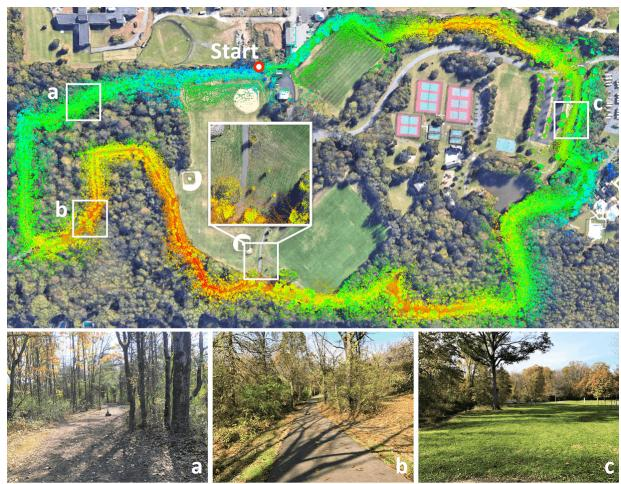  
Fig. 8: Experiment 3 LeGO-LOAM mapping result.

3) Experiment 3: The dataset for experiment 3 was logged from a forested hiking trail, where the UGV was driven at an average speed of 1.3m/s. The robot returns to the initial position after 35 minutes of driving. The elevation change in this environment is about 19 meters. The UGV is driven on three road surfaces: dirt-covered trails, asphalt, and ground covered by grass. Representative images of such surfacess are shown respectively at bottom of Fig. 8. Trees or bushes are present on at least one side of the road at all times.

We first test LOAM’s accuracy in this environment. The resulting maps diverge at various locations on both computers used. The final translational and rotational error with respect to the UGV’s initial position are 69.40m and 27.38◦ on the Jetson, and 62.11m and 8.50◦ on the laptop. The resulting trajectories from 10 trials on both hardware arrangements are shown in Fig. 9(a) and (b).

When LeGO-LOAM is applied to this dataset, the final relative translational and rotational errors are 13.93m and 7.73◦ on the Jetson, and 14.87m and 7.96◦ on the laptop. The final point cloud map from LeGO-LOAM on the Jetson is shown in Fig. 8 overlaid atop a satellite image. A local map, which is enlarged at the center of Fig. 8, shows that the point cloud map from LeGO-LOAM matches well with three trees visible in the open. High consistency is shown among all paths obtained from LeGO-LOAM on both computers. Fig. 9(c) and (d) show ten trials run on each computer.

## C. Benchmarking Results

1) Feature number comparison: We show a comparison of feature extraction across both methods in Table II. The feature content of each scan is averaged over 10 trials for each dataset. After point cloud segmentation, the number of features that need to be processed by LeGO-LOAM is reduced by at least 29%, 40%, 68% and 72% for sets $F _ { e }$ $F _ { p } , \mathbb { F } _ { e }$ and $\mathbb { F } _ { p }$ respectively.

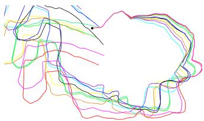  
(a) LOAM on Jetson

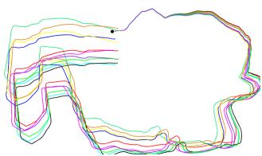  
(b) LOAM on laptop

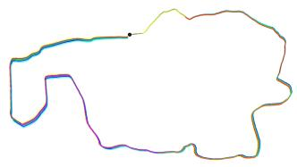

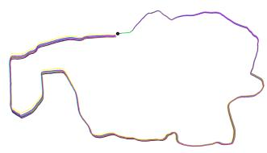  
(c) LeGO-LOAM on Jetson  
(d) LeGO-LOAM on laptop  
Fig. 9: Paths produced by LOAM and LeGO-LOAM across 10 trials, and 2 computers, with the experiment 3 dataset.

TABLE II: Average feature content of a scan after feature extraction
<table><tr><td rowspan="3">Seriıo</td><td colspan="2">Edge  $F _ { e }$ </td><td colspan="2">Planar  $F _ { \mathcal { P } }$ </td><td colspan="2">Edge</td><td colspan="2">Planar  $\mathbb { F } _ { \boldsymbol { \mathrm { Z } } }$ </td></tr><tr><td colspan="2">Features</td><td colspan="2">Features</td><td colspan="2">Features  $\mathbb { F } _ { e }$ </td><td colspan="2">Features</td></tr><tr><td>LOAM</td><td>LeGO- LOAM</td><td>LOAM</td><td> $\underbrace { \mathrm { L e G O _ { - } } } _ { - }$  LOAM</td><td>LOAM</td><td> $\scriptstyle \mathrm { L e G O - }$  LOAM</td><td>LOAM</td><td>LeGO- LOAM</td></tr><tr><td>1</td><td>157</td><td>102</td><td>323</td><td>152</td><td>878</td><td>253</td><td>4849</td><td>1319</td></tr><tr><td>2</td><td>145</td><td>102</td><td>331</td><td>154</td><td>798</td><td>254</td><td>4677</td><td>1227</td></tr><tr><td>3</td><td>174</td><td>101</td><td>172</td><td>103</td><td>819</td><td>163</td><td>6056</td><td>1146</td></tr></table>

2) Iteration number comparison: The results of applying the proposed two-step L-M optimization method are shown in Table III. We first apply the original L-M optimization with LeGO-LOAM, which means that we minimize the distance function obtained from edge and planar features together. Then we apply the two-step L-M optimization for LeGO-LOAM: 1) planar features in $F _ { p }$ are used to obtain $[ t _ { z } , \theta _ { r o l l } , \theta _ { p i t c h } ]$ and 2) edge features in $F _ { e }$ are used to obtain $[ t _ { x } , t _ { y } , \theta _ { y a w } ]$ . The average iteration number when the L-M method terminates after processing one scan is logged for comparison. When two-step optimization is used, the step-1 optimization is finished in 2 iterations in experiments 1 and 2. Though the iteration count of the step-2 optimization is similar to the quantity of the original L-M method, fewer features are processed. As a result, the runtime for lidar odometry is reduced by 34% to 48% after using two-step L-M optimization. The runtime for two-step optimization is shown in Table IV.

3) Runtime comparison: The runtime for each module of LOAM and LeGO-LOAM over two computers is shown in Table IV. Using the proposed framework, the runtime of the feature extraction and lidar odometry modules are reduced by one order of magnitude in LeGO-LOAM. Note that the runtime of these two modules in LOAM is more than 100ms on a Jetson. As a result, many scans are skipped because realtime performance is not achieved by LOAM on an embedded system. The runtime of lidar mapping is also reduced by at least 60% when LeGO-LOAM is used.

4) Pose error comparison: By setting the initial pose to [0, 0, 0, 0, 0, 0] in all experiments, we compute the relative pose estimation error by comparing the final pose with the initial pose. Rotational error (in degrees) and translational error (in meters) are listed in Table V for both methods over both computers. By using the proposed framework, LeGO-LOAM can achieve comparable or better position estimation accuracy with less computation time.

TABLE III: Iteration number comparison for LeGO-LOAM
<table><tr><td rowspan="2" colspan="2">Scenario</td><td colspan="2">Original Opt.</td><td colspan="2">Two-step Opt.</td></tr><tr><td>Iter. Num.</td><td>Time</td><td>Step 1 Iter. Num</td><td>Step 2 Iter. Num</td></tr><tr><td rowspan="3">etson</td><td>1</td><td>16.6</td><td>34.5</td><td>1.9</td><td>17.5</td></tr><tr><td></td><td>15.7</td><td>32.9</td><td>1.7</td><td>16.7</td></tr><tr><td>23</td><td>20.0</td><td>27.7</td><td>4.7</td><td>18.9</td></tr><tr><td rowspan="3">17</td><td></td><td>17.3</td><td>13.1</td><td>1.8</td><td>18.2</td></tr><tr><td></td><td>16.5</td><td>12.3</td><td>1.6</td><td>17.5</td></tr><tr><td>123</td><td>20.5</td><td>10.4</td><td>4.7</td><td>19.8</td></tr></table>

TABLE IV: Runtime of modules for processing one scan (ms)
<table><tr><td rowspan="2" colspan="2">Scenario</td><td colspan="2">Segmentation</td><td colspan="2">Extraction</td><td colspan="2">Odometry</td><td colspan="2">Mapping</td></tr><tr><td>LOAM</td><td>LeGO- LOAM</td><td>LOAM</td><td>LeGO- LOAM</td><td>LOAM</td><td>LeGO- LOAM</td><td>LOAM</td><td>LeGO- LOAM</td></tr><tr><td rowspan="3">fetson</td><td>123</td><td>N/A</td><td>29.3</td><td>105.1</td><td>9.1</td><td>133.4</td><td>19.3</td><td>702.3</td><td>266.7</td></tr><tr><td></td><td>N/A</td><td>29.9</td><td>106.7</td><td>9.9</td><td>124.5</td><td>18.6</td><td>793.6</td><td>278.2</td></tr><tr><td></td><td>N/A</td><td>36.8</td><td>104.6</td><td>6.1</td><td>122.1</td><td>18.1</td><td>850.9</td><td>253.3</td></tr><tr><td rowspan="3">17</td><td></td><td>N/A</td><td>16.7</td><td>50.4</td><td>4.0</td><td>69.8</td><td>6.8</td><td>289.4</td><td>108.2</td></tr><tr><td></td><td>N/A</td><td>17.0</td><td>49.3</td><td>4.4</td><td>66.5</td><td>6.5</td><td>330.5</td><td>116.7</td></tr><tr><td>123</td><td>N/A</td><td>20.0</td><td>48.5</td><td>2.3</td><td>63.0</td><td>6.1</td><td>344.9</td><td>101.7</td></tr></table>

## D. Loop Closure Test using KITTI Dataset

Our final experiment applies LeGO-LOAM to the KITTI dataset [21]. Since the tests of LOAM over the KITTI datasets in [20] run at 10% of the real-time speed, we only explore LeGO-LOAM and its potential for real-time applications with embedded systems, where the length of travel is significant enough to require a full SLAM solution. The results from LeGO-LOAM on a Jetson using sequence 00 are shown in Fig. 10. To achieve real-time performance on the Jetson, we downsample the scan from the HDL-64E to the same range image that is used in Section III for the VLP-16. In other words, 75% of the points of each scan are omitted before processing. ICP is used here for adding constraints between nodes in the pose graph. The graph is then optimized using iSAM2 [24]. At last, we use the optimized graph to correct the sensor pose and map. More loop closure tests can be found in the video attachment.

## V. CONCLUSIONS AND DISCUSSION

We have proposed LeGO-LOAM, a lightweight and ground-optimized lidar odometry and mapping method, for performing real-time pose estimation of UGVs in complex environments. LeGO-LOAM is lightweight, as it can be used on an embedded system and achieve real-time performance. LeGO-LOAM is also ground-optimized, leveraging ground separation, point cloud segmentation, and improved L-M optimization. Valueless points that may represent unreliable features are filtered out in this process. The two-step L-M optimization computes different components of a pose transformation separately. The proposed method is evaluated on a series of UGV datasets gathered in outdoor environments. The results show that LeGO-LOAM can achieve similar or better accuracy when compared with the state-of-the-art algorithm LOAM. The computation time of LeGO-LOAM is also greatly reduced. Future work involves exploring its application to other classes of vehicles.

TABLE V: Relative pose estimation error when returning to start
<table><tr><td>Scenario</td><td></td><td>Method</td><td>Roll</td><td>Pitch</td><td>Yaw</td><td> $\begin{array} { c } { { \mathrm { T o t a l } } } \\ { { \mathrm { R o t . } ( { } ^ { \circ } ) } } \end{array}$ </td><td>X</td><td>Y</td><td>Z</td><td>Total Trans.(m)</td></tr><tr><td rowspan="3">etson</td><td>1</td><td>LOAM LeGO-LOAM</td><td>1.16 0.46</td><td>2.63 0.91</td><td>2.5 1.98</td><td>3.81 2.23</td><td>1.33 0.12</td><td>2.91 0.07</td><td>0.43 1.26</td><td>3.23 1.27</td></tr><tr><td>2</td><td>LOAM LeGO-LOAM</td><td>7.05 0.61</td><td>5.06 0.70</td><td>9.4 0.32</td><td>12.80 0.99</td><td>7.71 0.04</td><td>6.31 0.10</td><td>4.32 0.34</td><td>10.86 0.36</td></tr><tr><td>3</td><td>LOAM LeGO-LOAM</td><td>7.55 4.62</td><td>3.20 5.45</td><td>26.12 2.95</td><td>27.38 7.73</td><td>34.61 5.35</td><td>56.19 7.95</td><td>21.46 10.11</td><td>69.40 13.93</td></tr><tr><td rowspan="3">17</td><td>1</td><td>LOAM LeGO-LOAM</td><td>0.28 0.33</td><td>1.98 0.17</td><td>1.74 2.06</td><td>2.65 2.09</td><td>0.39 0.03</td><td>0.03 0.02</td><td>0.21 0.22</td><td>0.44 0.22</td></tr><tr><td>2</td><td>LOAM LeGO-LOAM</td><td>21.49 0.18</td><td>4.86 0.85</td><td>4.34 0.64</td><td>22.46 1.08</td><td>1.39 0.04</td><td>2.59 0.12</td><td>11.63 0.04</td><td>11.99 0.14</td></tr><tr><td>3</td><td>LOAM LeGO-LOAM</td><td>6.27 4.57</td><td>3.08 5.39</td><td>4.83 3.68</td><td>8.50 7.96</td><td>16.84 6.69</td><td>58.81 7.79</td><td>10.74 10.76</td><td>62.11 14.87</td></tr></table>

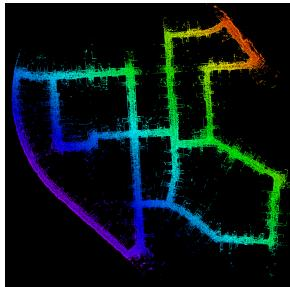  
(a)

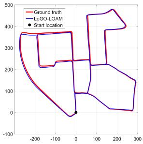  
(b)  
Fig. 10: LeGO-LOAM, KITTI dataset loop closure test, using the Jetson. Color variation indicates elevation change.

Though LeGO-LOAM is especially optimized for pose estimation on ground vehicles, its application could potentially be extended to other vehicles, e.g., unmanned aerial vehicles (UAVs), with minor changes. When applying LeGO-LOAM to a UAV, we would not assume the ground is present in a scan. A scan’s point cloud would be segmented without ground extraction. The feature extraction process would be the same for the selection of $F _ { e } , \mathbb { F } _ { e }$ and $\mathbb { F } _ { p } .$ . Instead of extracting planar features for $F _ { p }$ from points that are labeled as ground points, the features in $F _ { p }$ would be selected from all segmented points. Then the original L-M method would be used to obtain the transformation between two scans instead of using the two-step optimization method. Though the computation time will increase after these changes, LeGO-LOAM is still efficient, as a large number of points are omitted in noisy outdoor environments after segmentation. The accuracy of the estimated feature correspondences may improve, as they benefit from segmentation. In addition, the ability to perform loop closures with LeGO-LOAM online makes it a useful tool for long-duration navigation tasks.

## REFERENCES

[1] P.J. Besl and N.D. McKay, “A Method for Registration of 3D Shapes,” IEEE Transactions on Pattern Analysis and Machine Intelligence, vol. 14(2): 239-256, 1992.

[2] S. Rusinkiewicz and M. Levoy, “Efficient Variants of the ICP Algorithm,” Proceedings of the Third International Conference on 3-D Digital Imaging and Modeling, pp. 145-152, 2001.

[3] Y. Chen and G. Medioni, “Object Modelling by Registration of Multiple Range Images,” Image and Vision Computing, vol. 10(3): 145-155, 1992.

[4] A. Segal, D. Haehnel, and S. Thrun, “Generalized-ICP,” Proceedings of Robotics: Science and Systems, 2009.

[5] R.A. Newcombe, S. Izadi, O. Hilliges, D. Molyneaux, D. Kim, A.J. Davison, P. Kohi, J. Shotton, S. Hodges, and A. Fitzgibbon, “KinectFusion: Real-time Dense Surface Mapping and Tracking,” Proceedings of the IEEE International Symposium on Mixed and Augmented Reality, pp. 127-136, 2011.

[6] A. Nuchter, “Parallelization of Scan Matching for Robotic 3D Mapping,” Proceedings of the 3rd European Conference on Mobile Robots, 2007.

[7] D. Qiu, S. May, and A. Nuchter, “GPU-Accelerated Nearest Neighbor Search for 3D Registration,” Proceedings of the International Conference on Computer Vision Systems, pp. 194-203, 2009.

[8] D. Neumann, F. Lugauer, S. Bauer, J. Wasza, and J. Hornegger, “Realtime RGB-D Mapping and 3D Modeling on the GPU Using the Random Ball Cover Data Structure,” IEEE International Conference on Computer Vision Workshops, pp. 1161-1167, 2011.

[9] R.B. Rusu, Z.C. Marton, N. Blodow, and M. Beetz, “Learning Informative Point Classes for the Acquisition of Object Model Maps,” Proceedings of the IEEE International Conference on Control, Automation, Robotics and Vision, pp. 643-650, 2008.

[10] R.B. Rusu, G. Bradski, R. Thibaux, and J. Hsu, “Fast 3D Recognition and Pose Using the Viewpoint Feature Histogram,” Proceedings of the IEEE/RSJ International Conference on Intelligent Robots and Systems, pp. 2155-2162, 2010.

[11] Y. Li and E.B. Olson, “Structure Tensors for General Purpose LIDAR Feature Extraction,” Proceedings of the IEEE International Conference on Robotics and Automation, pp. 1869-1874, 2011.

[12] J. Serafin, E. Olson, and G. Grisetti, “Fast and Robust 3D Feature Extraction from Sparse Point Clouds,” Proceedings of the IEEE/RSJ International Conference on Intelligent Robots and Systems, pp. 4105- 4112, 2016.

[13] M. Bosse and R. Zlot, “Keypoint Design and Evaluation for Place Recognition in 2D Lidar Maps,” Robotics and Autonomous Systems, vol. 57(12): 1211-1224, 2009.

[14] R. Zlot and M. Bosse, “Efficient Large-scale 3D Mobile Mapping and Surface Reconstruction of an Underground Mine,” Proceedings of the 8th International Conference on Field and Service Robotics, 2012.

[15] B. Steder, G. Grisetti, and W. Burgard, ”Robust Place Recognition for 3D Range Data Based on Point Features,” Proceedings of the IEEE International Conference on Robotics and Automation, pp. 1400-1405, 2010.

[16] W.S. Grant, R.C. Voorhies, and L. Itti, “Finding Planes in LiDAR Point Clouds for Real-time Registration,” Proceedings ofthe IEEE/RSJ International Conference on Intelligent Robots and Systems, pp. 4347- 4354, 2013.

[17] M. Velas, M. Spanel, and A. Herout, “Collar Line Segments for Fast Odometry Estimation from Velodyne Point Clouds,” Proceedings of the IEEE International Conference on Robotics and Automation, pp. 4486-4495, 2016.

[18] R. Dube, D. Dugas, E. Stumm, J. Nieto, R. Siegwart, and C. Cadena, ”SegMatch: Segment Based Place Recognition in 3D Point Clouds,” Proceedings of the IEEE International Conference on Robotics and Automation, pp. 5266-5272, 2017.

[19] J. Zhang and S. Singh, “LOAM: Lidar Odometry and Mapping in Real-time,” Proceedings of Robotics: Science and Systems, 2014.

[20] J. Zhang and S. Singh, “Low-drift and Real-time Lidar Odometry and Mapping,” Autonomous Robots, vol. 41(2): 401-416, 2017.

[21] A. Geiger, P. Lenz, and R. Urtasun, “Are We Ready for Autonomous Driving? The KITTI Vision Benchmark Suite”, Proceedings of the IEEE International Conference on Computer Vision and Pattern Recognition, pp. 3354-3361, 2012.

[22] M. Himmelsbach, F.V. Hundelshausen, and H-J. Wuensche, “Fast Segmentation of 3D Point Clouds for Ground Vehicles,” Proceedings of the IEEE Intelligent Vehicles Symposium, pp. 560-565, 2010.

[23] I. Bogoslavskyi and C. Stachniss, “Fast Range Image-based Segmentation of Sparse 3D Laser Scans for Online Operation,” Proceedings of the IEEE/RSJ International Conference on Intelligent Robots and Systems, pp. 163-169, 2016.

[24] M. Kaess, H. Johannsson, R. Roberts, V. Ila, J.J. Leonard, and F. Dellaert, “iSAM2: Incremental Smoothing and Mapping Using the Bayes Tree,” The International Journal of Robotics Research 31, vol. 31(2): 216-235, 2012.

[25] M. Quigley, K. Conley, B. Gerkey, J. Faust, T. Foote, J. Leibs, R. Wheeler, and A.Y. Ng, “ROS: An Open-source Robot Operating System,” IEEE ICRA Workshop on Open Source Software, 2009.