# MaskFusion: Real-Time Recognition, Tracking and Reconstruction of Multiple Moving Objects

Martin Runz ¨ \*

Maud Buffier†

Lourdes Agapito‡

Department of Computer Science University College London, UK

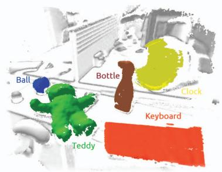  
(a) Frame 400

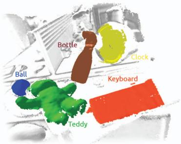  
(b) Frame 700

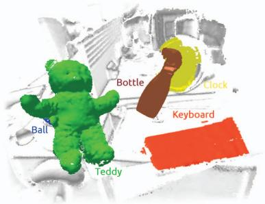  
(c) Frame 900

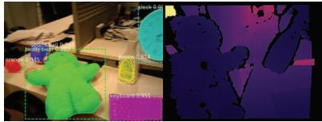

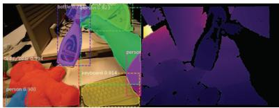

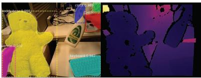  
Figure 1: A series of 3 frames illustrating the recognition, tracking and mapping capabilities of MaskFusion. The first row highlights the system’s output: A reconstruction of the background (white), keyboard (orange), clock (yellow), sports ball (blue), teddy-bear (green) and spray-bottle (brown). While the camera was in motion during the whole sequence, the bottle and the teddy started moving from frame 500 and 690 onwards, respectively. Note that MaskFusion explicitly avoided to reconstruct geometry related to the person holding the objects. The second row shows the input RGBD frames and semantic masks produced by the segmentation neural network as an overlay.

## ABSTRACT

We present MaskFusion, a real-time, object-aware, semantic and dynamic RGB-D SLAM system that goes beyond traditional systems which output a purely geometric map of a static scene. MaskFusion recognizes, segments and assigns semantic class labels to different objects in the scene, while tracking and reconstructing them even when they move independently from the camera. As an RGB-D camera scans a cluttered scene, image-based instance-level semantic segmentation creates semantic object masks that enable realtime object recognition and the creation of an object-level representation for the world map. Unlike previous recognition-based SLAM systems, MaskFusion does not require known models of the objects it can recognize, and can deal with multiple independent motions. MaskFusion takes full advantage of using instance-level semantic segmentation to enable semantic labels to be fused into an object-aware map, unlike recent semantics enabled SLAM systems that perform voxel-level semantic segmentation. We show augmented-reality applications that demonstrate the unique features of the map output by MaskFusion: instance-aware, semantic and dynamic. Code will be made available‡.

Index Terms: Visual SLAM—SLAM—Visualization—Tracking; Mapping—Fusion—RGBD—Multi-object Recognition—Context— Semantic—Detection Real-time—Augmented-Reality—Robotics

## 1 INTRODUCTION

Perceiving the world around us in 3D from image sequences acquired from a moving camera is a fundamental task in fields such as computer vision, robotics, human-computer and human-robot interaction. Visual SLAM (Simultaneous Localisation and Mapping) systems have focused, for decades now, on jointly solving the tasks of tracking the position of a camera as it explores unknown locations and creating a 3D map of the environment. Their real-time capability has turned SLAM methods into the cornerstone of ambitious applications such as autonomous driving, robot navigation and also augmented/virtual reality. Research in Visual SLAM has progressed at a fast pace, moving from early works that reconstructed sparse maps with just a few tens or hundreds of features using filtering techniques [11], to parallel tracking and mapping approaches that could take advantage of computationally expensive batch optimisation techniques for the mapping thread to produce accurate maps with thousands of landmarks [25, 30], to contemporary methods that allow instead to reconstruct completely dense maps of the environment [33, 34, 50]. The impact on augmented reality of this progression towards dense and robust real-time mapping has been immense with many SLAM enabled augmented reality applications making their way into consumer products and mobile phone apps.

Despite these advances, there are still two areas in which SLAM methods and their application to augmented reality are still very much in their infancy.

(a) Most SLAM methods rely on the assumption that the environment is mostly static and moving objects are, at best, detected as outliers and ignored. Although some first steps have been taken towards non-rigid and dynamic scene reconstruction, with exciting results in reconstruction of a single non-rigid object [12, 20, 32, 53] or multiple moving rigid objects [39], designing an accurate and robust SLAM system that can deal with arbitrary dynamic and non-rigid scenes remains an open challenge.

(b) The output provided by the majority of SLAM systems is a purely geometric map of the environment. The addition of semantic information is relatively recent [6, 8, 28, 40, 44] and is mostly limited to the recognition of a small number of known object instances for which a 3D model is available in advance [6, 8, 40, 46] or to classify each 3D map point into a fixed set of semantic categories without differentiating object instances [28, 44].

Contribution: the novelty of our approach is to make advances towards addressing both of these limitations within the same system. MaskFusion is a real-time capable SLAM system that can represent scenes at the level of objects. It can recognise, detect, track and reconstruct multiple moving rigid objects while precisely segmenting each instance and assigning it a semantic label. We take advantage of combining the outputs of: (i) Mask-RCNN [15], a powerful image-based instance level segmentation algorithm that can predict object category labels for 80 object classes, and (ii) a geometrybased segmentation algorithm, that generates an object edge map from depth and surface normal cues; to increase the accuracy of the object boundaries in the object masks.

Our dynamic SLAM framework takes these accurate object masks as input to track and fuse multiple moving objects (as well as the static background) while propagating the semantic image labels into temporally-consistent 3D map labels. The main advantage of using instance-aware semantic segmentation over standard pixellevel semantic segmentation (such as most previous semantic SLAM systems [6,8,28,40,44,46]) is that it provides accurate object masks and the ability to segment different object instances that belong to the same object category instead of treating them as a single blob.

The additional advantage of MaskFusion over previous semantic SLAM systems [6, 8, 28, 40, 44, 46] is that it does not require the scene to be static and so can detect, track and map multiple independently moving objects. Maintaining an internal 3D representation of moving objects (instead of treating them as outliers) substantially improves the overall SLAM system by providing a richer map that includes not just the background but also the detailed geometry of the moving objects, and by improving object and camera pose prediction and estimation.

On the other hand, the advantage of MaskFusion over previous dynamic SLAM systems [3, 39] is that it enhances the dynamic map with semantic information from a large number of object classes in real time. Not only can it detect individual objects (thanks to the use of Mask-RCNN [15]) and assign semantic labels to their corresponding 3D map points, but it can also accurately segment each individual object instance. Table 1 summarises our contributions in the context of other real-time semantic SLAM and dynamic SLAM systems.

The result is a versatile system that can represent a dynamic scene at the level of objects and their semantic labels, which has numerous applications in areas such as robotics and augmented reality. We demonstrate how the labels of objects can be used for different purposes. For instance, we show that often, being able to detect and segment people allows us to be aware of their presence, ignore those pixels and focus instead on the objects that they are manipulating. We show how this can be useful in object manipulation tasks, as it can improve object tracking even when objects are moved and occluded by a human hand.

## 2 RELATED WORK

The field of Visual SLAM has a long history of offering solutions to the problem of jointly tracking the pose of a moving camera (see [14] for a recent survey) while reconstructing a map of the environment. The advent of inexpensive, consumer-grade RGB-D cameras – such as the Microsoft Kinect – stimulated further research, and enabled the leap to dense real-time methods [23, 24, 33].

Dense RGB-D SLAM: Resulting methods are capable of accurately mapping indoor environments and gained popularity in augmented reality and robotics. KinectFusion [33] proved that a truncated signed distance function (TSDF) based map representation can achieve fast and robust mapping and tracking in small environments. Subsequent work [38, 51] showed that the same principles are applicable to large scale environments by choosing appropriate data structures.

Surface elements (surfels) have a long history in computer graphics [35] and have found many applications in computer vision [5,49]. More recently, surfel-based map representations were also introduced [18, 23] to the domain of RGBD-SLAM. A map of surfels is similar to a point cloud with the difference that each element encodes local surface properties – typically a radius and normal – in addition to its location. In contrast to a TSDF-based map, surfel clouds are naturally memory efficient and avoid the overhead due to switching representations between mapping and tracking that is typical of TSDF-based fusion methods. Whelan et al. [50] presented a surfel-based RGBD-SLAM system for large environments with local and global loop-closure.

Scene segmentation: The computer graphics [7] and vision [9, 17, 22, 28, 46] communities have devoted substantial effort to object and scene segmentation. Segmented data can broaden the functionality of visual tracking and mapping systems, for instance, by enabling robots to detect objects. Some methods have proposed to segment RGBD data based on geometric properties of surface normals [9, 13, 22, 45], mainly by assuming that objects are convex. While the clear strength of geometry-based segmentation systems is that they produce accurate object boundaries, their weakness is that they typically result in over-segmentations and they do not convey any semantic information.

Semantic scene segmentation: Another line of work [2, 26, 52] aims at segmenting 3D scenes semantically, using Markov Random Fields (MRFs). These methods require labelled 3D data, however, which in contrast to labelled 2D image data is not readily available. This is exemplified by the fact that all three works involved manual annotation of training data. Datasets containing isolated RGBD frames, such as NYUv2 [31], are not applicable here and it requires significant effort to build consistent reconstructed datasets for segmentation, as recently shown by Dai et al. [10].

Semantic SLAM: Motivated by the success of convolutional neural networks [15, 36, 37], Tateno et al. [44] and McCormac et al. [28] integrate deep neural networks in real-time SLAM systems. As inference is solely based on 2D information, the need for 3D annotated data is circumvented. The resulting systems offer strategies to fuse labelled image data into segmented 3D maps. Earlier work by Hermans et al. [19] implements a similar scheme, using a randomised decision forest classifier. However, since the systems are not considering object instances, tracking multiple models independently is unattainable.

Dynamic SLAM: There are two main scenarios in dynamic SLAM:

<table><tr><td rowspan=1 colspan=1>Method</td><td rowspan=1 colspan=1>Model-free</td><td rowspan=1 colspan=1>SceneSegmen-tation</td><td rowspan=1 colspan=1>Semantics</td><td rowspan=1 colspan=1>Multiplemovingobjects</td><td rowspan=1 colspan=1>Non-Rigid</td></tr><tr><td rowspan=1 colspan=1>Static-Fusion [41]</td><td rowspan=1 colspan=1>√</td><td rowspan=1 colspan=1>√</td><td rowspan=1 colspan=1></td><td rowspan=1 colspan=1></td><td rowspan=1 colspan=1></td></tr><tr><td rowspan=1 colspan=1>2.5D is notenough [46]</td><td rowspan=1 colspan=1></td><td rowspan=1 colspan=1>V</td><td rowspan=1 colspan=1>√</td><td rowspan=1 colspan=1></td><td rowspan=1 colspan=1></td></tr><tr><td rowspan=1 colspan=1>Slam++[40]</td><td rowspan=1 colspan=1></td><td rowspan=1 colspan=1>V</td><td rowspan=1 colspan=1>√</td><td rowspan=1 colspan=1></td><td rowspan=1 colspan=1></td></tr><tr><td rowspan=1 colspan=1>CNN-SLAM [44]</td><td rowspan=1 colspan=1>√</td><td rowspan=1 colspan=1>√</td><td rowspan=1 colspan=1>√</td><td rowspan=1 colspan=1></td><td rowspan=1 colspan=1></td></tr><tr><td rowspan=1 colspan=1>Semantic-Fusion [28]</td><td rowspan=1 colspan=1>√</td><td rowspan=1 colspan=1>V</td><td rowspan=1 colspan=1>√</td><td rowspan=1 colspan=1></td><td rowspan=1 colspan=1></td></tr><tr><td rowspan=1 colspan=1>Non-RigidRGBD [53]</td><td rowspan=1 colspan=1></td><td rowspan=1 colspan=1></td><td rowspan=1 colspan=1></td><td rowspan=1 colspan=1></td><td rowspan=1 colspan=1>√</td></tr><tr><td rowspan=1 colspan=1>Dynamic-Fusion [32]</td><td rowspan=1 colspan=1>√</td><td rowspan=1 colspan=1></td><td rowspan=1 colspan=1></td><td rowspan=1 colspan=1></td><td rowspan=1 colspan=1>√</td></tr><tr><td rowspan=1 colspan=1>Fusion4D[12]</td><td rowspan=1 colspan=1>V</td><td rowspan=1 colspan=1></td><td rowspan=1 colspan=1></td><td rowspan=1 colspan=1></td><td rowspan=1 colspan=1>√</td></tr><tr><td rowspan=1 colspan=1>Co-Fusion [39]</td><td rowspan=1 colspan=1>√</td><td rowspan=1 colspan=1>√</td><td rowspan=1 colspan=1></td><td rowspan=1 colspan=1>√</td><td rowspan=1 colspan=1></td></tr><tr><td rowspan=1 colspan=1>Mask-Fusion</td><td rowspan=1 colspan=1>√</td><td rowspan=1 colspan=1>√</td><td rowspan=1 colspan=1>√</td><td rowspan=1 colspan=1>√</td><td rowspan=1 colspan=1></td></tr></table>

Table 1: Comparison of the properties of MaskFusion with respect to other real-time SLAM systems. In contrast to previous semantic SLAM systems [28, 40, 44, 46], MaskFusion is both dynamic (it reconstructs objects even when their motion is different from the camera) and segments object instances. Unlike dense non-rigid reconstruction systems [12, 32, 53], it can reconstruct the entire scene and adds semantic labels to different objects. Note that while Co-Fusion [39] could use semantic cues to segment the scene, in that case the system was not real-time – only the non-semantic version of Co-Fusion was real-time capable.

non-rigid surface reconstruction and multibody formulations for independently moving rigid objects. In the first case, a deformable world is assumed [12, 32, 53] and as-rigid-as-possible registration is performed, while in the second, rigid object instances are identified [40, 46] and tracked sparsely [48, 54] or densely [39]. Both categories use template- or descriptor-based formulations [40,46,53], which require pre-observing objects of interest, and template-free methods. In the case when the dynamic parts of the scene are not of interest, it is valuable to recognise them as outliers to avoid errors in the optimisation back-end. Methods for the explicit detection of dynamic regions for static fusion were proposed by Jaimez et al. [21] and Scona et al. [41].

Table 1 provides an overview of related real-time capable methods comparing them under five important properties.

Only two dynamic SLAM system, to the best of our knowledge, have previously attempted incorporates semantic knowledge, but both fall short of the functionality of MaskFusion. Co-Fusion [39] demonstrated the ability to track, segment and reconstruct objects based on their semantic labels, but the overall system was not realtime capable and limited functionality was shown. DynSLAM [3] developed a mapping system for autonomous driving applications capable of separately reconstructing both the static environment and the moving vehicles. However, the overall system was not real-time (this is the reason it does not appear in Table 1) and vehicle was the only dynamic object-class it reconstructed, so its functionality was limited to road scenes.

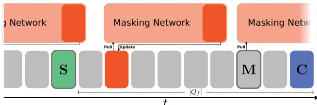  
(a) Timing of asynchronous components: In this timeline, frame S and frame M are highlighted with thick borders, as the SLAM and masking threads are working on them respectively. C, the current frame (tail of queue Q ) is shown in blue, the head of the queue is shaded in green, and frames with available object masks are marked orange.

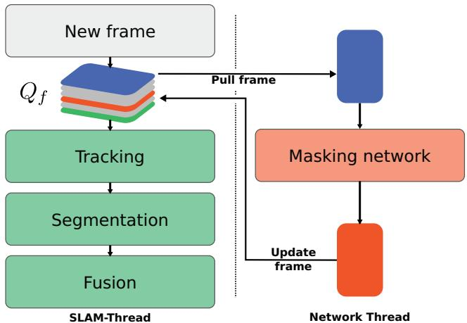  
(b) Dataflow in MaskFusion: Camera frames are added to a fixed length queue $\mathcal { Q } _ { f } .$ The SLAM system (green) operates on its head. The semantic masking DNN pulls input frames from the tail, and updates frames back to the queue as soon as results (semantic masks) are available.  
Figure 2: High-level overview of the SLAM back-end and masking network, and their interaction.

## 3 SYSTEM OVERVIEW

MaskFusion enables real-time dense dynamic RGBD SLAM at the level of objects. In essence, MaskFusion is a multi-model SLAM system that maintains a 3D representation for each object that it recognises in the scene (in addition to the background model). Each model is tracked and fused independently. Figure 2 illustrates its frame-to-frame operation. Each time a new frame is acquired by the camera, the following steps are performed:

Tracking: The 3D geometry of each object is represented as a set of surfels. The six degree of freedom pose of each model is tracked by minimizing an energy that combines a geometric iterative closest point (ICP) error with a photometric cost based on brightness constancy between corresponding points in the current frame and the stored 3D model, aligned with the pose in the previous frame. In order to lower computational demand and increase robustness, only non-static objects are tracked separately. Two different strategies were tested to decide whether an object is static or not: one based on motion inconsistency, similar to [39], and another that treats objects which are being touched by a person as dynamic.

Segmentation: MaskFusion combines two types of cues for segmentation: semantic and geometric cues. Mask-RCNN [15] is used to provide object masks with semantic labels. While this algorithm is impressive and provides good object masks, it suffers from two drawbacks. First, the algorithm does not run in real time and can only operate at a maximum of 5 Hz. Second, the object boundaries are not perfect – they tend to leak into the background. To overcome both of these limitations, we run a geometric segmentation algorithm, based on an analysis of depth discontinuities and surface normals. In contrast to the semantic instance segmentation, the geometric segmentation runs in real time and produces very accurate object boundaries (see Figures 3(d) and (e) for an example visualisation of the geometric edge map and the geometric components returned by the algorithm). On the negative side, geometry-based segmentation tends to oversegment objects. The combination of these two segmentation strategies – geometric segmentation on a per-frame basis and semantic segmentation as often as possible – provides the best of both worlds, allowing us to (1) run an overall system in real time (geometric segmentation is used for frames without semantic object masks, while the combination of both is used for frames with object masks) and (2) obtain semantic object masks with improved object boundaries, thanks to the geometric segmentation.

Fusion: The geometry of each object is fused over time by using the object labels to associate surfels with the correct model. Our fusion follows the same strategy as [23, 50].

The rest of the paper is organised as follows. We first describe the principles of our dynamic RGBD-SLAM method in Section 4; further details regarding the integration of the semantic and geometric segmentation results are provided in Section 5. A quantitative and qualitative evaluation of the proposed approach is presented in Section 6.

## 4 MULTI-OBJECT SLAM

MaskFusion maintains a set of independent 3D models, $\mathcal { M } _ { m } \ \forall m \ \in \ \{ 0 . . N \}$ , for each of the $\hat { N }$ objects recognised in the scene and a further model for the background. We adopt the surfel representation popularised by [23, 50], where a model $\mathcal { M } _ { m }$ is represented by a cloud of surfels $\mathcal { M } _ { m } ^ { s } \in ( \mathbf { p } \in \mathbb { R } ^ { 3 } , \mathbf { n } \in \mathbb { R } ^ { \ddot { 3 } } , \mathbf { c } \in \mathbb { N } ^ { 3 } , \mathbf { w } \in \mathbb { R } , \mathbf { r } \in \mathbb { R } , \mathbf { t } \in \mathbb { R } ^ { 2 } ) ~ \forall s < | \mathcal { M } _ { m } |$ which are tuples of position, normal, colour, weight, radius and two timestamps. Additionally, models are associated with a class ID $c _ { m } \in \{ 0 . . 8 0 \}$ and an object-label $l _ { m } = m \forall m \in \{ 0 . . N \}$ . Finally, for each time instance t, an is static indicator $s _ { t m } \in 0 ,$ 1 and a rigid pose $\mathbf { R } _ { t m } \in \mathbb { S } \mathbb { O } _ { 3 } , \mathbf { t } _ { t m } \in \mathbb { R } ^ { 3 }$ is stored.

## 4.1 Tracking

Assuming that a good estimate exists for the pose of model $\mathcal { M } _ { m }$ at time t 1, the pose at time t is inferred by aligning the current depthmap Dt and intensity-map $\mathcal { I } _ { t }$ with the projection $\mathcal { D } _ { t - 1 } ^ { a } , \mathcal { S } _ { t - 1 } ^ { a }$ of $\mathcal { M } _ { m }$ , which is generated by rendering its surfels using the OpenGL pipeline. Here, D and $\dot { \mathcal { I } } _ { t }$ are mappings from image-coordinates $\dot { \Omega } \subset \mathbb { N } ^ { 2 }$ to depth $\mathcal { D } _ { t } : \Omega $ R and grey-scale $\mathcal { I } _ { t } : \Omega \to \mathbb { N }$ , respectively. $\mathcal { I } _ { t }$ is derived by weighting RGB channels as follows: $r , g , b \mapsto$ $0 . 2 9 9 r + 0 . 5 8 7 g + 0 . 1 1 4 b$

The alignment is performed by minimising a joint geometric and photometric error function [39, 50]:

$$
E _ { m } = \operatorname* { m i n } _ { \boldsymbol { \xi } _ { m } } \big ( E _ { m } ^ { i c p } + \lambda E _ { m } ^ { r g b } \big ) ,\tag{1}
$$

where $E _ { m } ^ { i c p }$ and $E _ { m } ^ { r g b }$ are the geometric and photometric error terms respectively and $\xi _ { m }$ is the unknown rigid transformation, expressed in a minimal 6D Lie algebra representation ${ \mathfrak { s e } } _ { 3 }$ , which is subject to optimisation.

The first term in equation (1) is a sum of projective ICP residuals. Given a vertex $\mathbf { v } _ { t } ^ { i } ,$ , which is the back-projection of the i-th vertex in $\mathcal { D } _ { t } ;$ and $\mathbf { v } ^ { i }$ and ni, the corresponding vertex and normal in $\mathcal { D } _ { t - 1 } ^ { a }$ (the geometry expressed in the camera coordinate frame at time $t - 1 )$ $E _ { m } ^ { i c p }$ is written as:

$$
E _ { m } ^ { i c p } = \sum _ { i } \left( ( \mathbf { v } ^ { i } - \exp ( \xi _ { m } ) \mathbf { v } _ { t } ^ { i } ) \cdot \mathbf { n } ^ { i } \right) ^ { 2 }\tag{2}
$$

The photometric term, on the other hand, is a sum of photoconsistency residuals between $\mathcal { I } _ { t }$ and $\mathcal { I } _ { t - 1 } ^ { a }$ , and reads as follows:

$$
E _ { m } ^ { r g b } = \sum _ { \mathbf { u } \in \Omega } \Big ( \mathcal { I } _ { t } ( \mathbf { u } ) - \mathcal { I } _ { t - 1 } ^ { a } ( \pi ( \exp ( \xi _ { m } ) \pi ^ { - 1 } ( \mathbf { u } , \mathcal { D } _ { t } ) ) ) \Big ) ^ { 2 }\tag{3}
$$

Here, π performs a perspective projection $\pi : \mathbb { R } ^ { 3 }  \mathbb { R } ^ { 2 }$ , whereas $\pi ^ { - 1 }$ back-projects from a depth map with 2D coordinate. To optimise this non-linear least-squares cost we use a Gauss-Newton solver with a four level coarse-to-fine pyramid scheme. The CUDA accelerated implementation of the solver builds on the open source code releases of [50] and [39].

## 4.2 Fusion

Given $\mathbf { R } _ { t m }$ and $\mathbf { t } _ { t m } ,$ surfels for each model $\mathcal { M } _ { m }$ are updated by performing a projective data association with the current RGBD frame. This step is inspired by [23] but a stencilling based on the segmentation discussed in Section 5 is used to adhere to object boundaries. As a result, each newly created surfel is part of exactly one model. Further, we introduce a confidence penalty for surfels outside the stencil, which is required due to imperfect segmentations.

## 5 SEGMENTATION

MaskFusion reconstructs and tracks multiple objects simultaneously, maintaining separate models. As a consequence, new data has to be associated with the correct model before fusion is performed. Inspired by Co-Fusion [39], instead of associating data in 3D, segmentation is carried out in 2D and model-to-segment correspondences are established. Given these correspondences, new frames are masked and only subsets of the data are fused with existing models. Masking is based on the semantic instance segmentation labels proposed by a DNN [15], in conjunction with geometric segmentation, which improves the quality of object boundaries. Our semantic segmentation pipeline provides masks at 30Hz or more.

The design of the pipeline is based on the following observations: (i) Current semantic segmentation methods are good at detecting objects, but tend to provide imperfect object boundaries. (ii) The current state-of-the-art approach, Mask-RCNN [15], cannot be executed at frame rate. (iii) The information contained in RGBD frames enables fast over-segmentation of the image, for instance by assuming object convexity.

The second observation directly implies that to achieve overall real-time performance our system must execute instance level semantic segmentation in a parallel thread concurrently to the tracking and fusion threads. However, executing two programs at different frequencies concurrently requires a synchronisation strategy. We buffer new frames in a queue $Q _ { f }$ and refer the SLAM system to the head of the queue, while the semantic segmentation operates on the back of the queue, as illustrated in Figure 2a. This way, the execution of the SLAM pipeline is delayed by the worst-case processing time of the semantic segmentation. In our experiments we picked a queue length of 12 frames, which involves a delay of approx. 400ms. Whether this delay can be neglected or not, depends on the use-case of the system. Even though a latency exists, the system runs at a frame-rate of 30fps. Furthermore, a semantic segmentation is not available for most frames due to the lower execution frequency of the masking component, yet each frame requires a labelling in order to fuse new data. This issue is solved by associating regions of mask-less frames with existing models only, as discussed in Section 5.3.

To compensate for inexact boundaries, as mentioned in observation $^ { l , }$ we make use of observation 3 and map components from a geometric over-segmentation to semantic masks. This results in improved masks, due to higher-quality boundaries of the geometric segmentation.

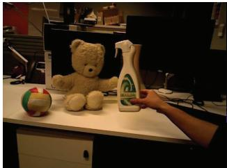  
(a) RGB input

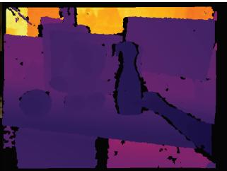  
(b) Depth map

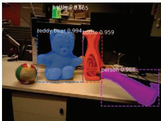  
(c) Semantic masks

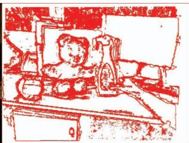  
(d) Geometric edges

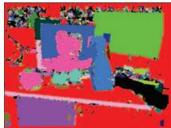  
(e) Components

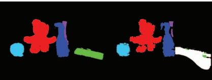  
(f) Projected labels  
(g) Final segmentation

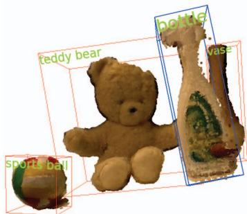

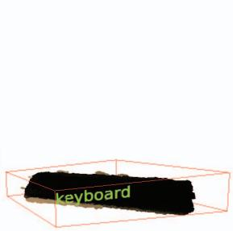  
(h) Reconstructed object  
Figure 3: Breakdown of the segmentation method. While (a) and (b) show an input RGBD frame, $\mathrm { ( c ) } { } \mathrm { - ( g ) }$ visualise the output of different stages.

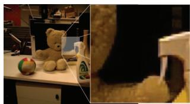  
(a) Segment of interest

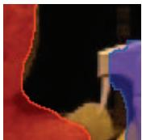  
(b) Semantic only

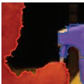  
(c) With geometric  
Figure 4: Comparison of boundaries produced by semantic labelling only and by merged semantic and geometric labelling. While the semantic segmentation is smooth, it lacks important details.

## 5.1 SEMANTIC INSTANCE SEGMENTATION

A variety [15, 27, 36] of recently proposed neural network architectures are tackling the problem of instance-level object segmentation. They outperform traditional methods and are capable of handling a large set of object classes. Of these methods, Mask-RCNN [15] is especially compelling, as it provides superior segmentation quality at a relatively high frame-rate of 5Hz. The semantic segmentation pipeline of MaskFusion is based on Mask-RCNN1, which maps RGB frames to a set of object masks $\mathcal { L } _ { t n } ^ { s } : \Omega \to \{ 0 , 1 \}$ , bounding boxes $ { \mathbf { b } } _ { t n } \in  { \mathbb { N } } ^ { 4 }$ and class IDs $c _ { t n } \in \{ 0 . . 8 0 \}$ , for all $n \in \{ 1 . . N _ { t } ^ { s } \}$ of the $N _ { t } ^ { s }$ instances detected in the frame at time t.

Mask-RCNN achieves this by extending the Faster-RCNN [37] architecture. Faster-RCNN is a two-stage approach that proposes regions of interest first and then predicts an object class and bounding box per region and in parallel. He et al. added a third branch to the second stage, which generates masks independently of class IDs and bounding boxes. Both stages rely on a feature map, which is extracted by a ResNet [16]-based backbone network, and apply convolutional layers for inference.

Figure 3c visualises the output of Mask-RCNN. Note that instances of the same class are highlighted with different colours, and also that masks are not perfectly aligned with object boundaries.

## 5.2 GEOMETRIC SEGMENTATION

Assuming that objects – especially man-made objects – are largely convex, it is possible to build fast segmentation methods that place edges in concave areas and depth discontinuities. In practice, such methods tend to oversegment data, due to the simplified premise. Moosmann et al. [29] successfully segment 3D laser data based on this assumption. The same principle is also used by other authors to segment objects in RGBD frames [13, 22, 42, 45, 47].

Our geometric segmentation method follows this approach and, similarly to [45], generates an edginess-map based on a depth discontinuity term $\phi _ { d }$ and concavity term φc. Specifically, a pixel is defined as an edge pixel if $\phi _ { d } + \hat { \lambda } \phi _ { c } > \tau .$ where τ is a threshold and $\hat { \lambda }$ a relative weight. Given a local neighbourhood $\mathcal { N } , \phi _ { d }$ and $\phi _ { c }$ are computed as follows:

$$
\phi _ { d } = \operatorname* { m a x } _ { i \in \mathcal { N } } \lvert ( \mathbf { v } _ { i } - \mathbf { v } ) \cdot \mathbf { n } \rvert\tag{4}
$$

$$
\phi _ { c } = \operatorname* { m a x } _ { i \in \mathcal { N } } \left\{ 0 \atop 1 - ( \mathbf { n } _ { i } \cdot \mathbf { n } ) \quad \quad \mathrm { e l s e }  \right. \quad \quad \mathrm { i f ~ } ( \mathbf { v } _ { i } - \mathbf { v } ) \cdot \mathbf { n } < 0\tag{5}
$$

Here, v and $\mathbf { v } _ { i }$ indicate vertex positions, while n and n represent normals, obtained by back-projecting $\mathcal { D } _ { t }$ . Since $\phi _ { d } + \hat { \lambda } \phi _ { c }$ depends on a local neighbourhood only, the edginess of a pixel can be evaluated quickly on a GPU. Figure 3d shows the edge map for a frame that was captured with an Asus Xtion RGBD-camera. Edge maps are converted to a geometric labelling $\mathcal { L } _ { t } ^ { g } : \Omega \to \{ 0 . . N _ { t } ^ { g } \}$ , where $\hat { N } _ { t } ^ { g }$ is the number of extracted components excluding the background, by running an out-of-the-box connected components algorithm, as illustrated in Figure 3e.

## 5.3 MERGED SEGMENTATION

For each frame that is processed by the SLAM system, the pipeline illustrated in Figure 5 is executed. While the geometric segmentation, shown on the left-hand-side, is performed for all frames, geometric labels are mapped to semantic masks only if these are available. In the absence of semantic masks, geometric labels are associated with existing models directly and the following steps are skipped:

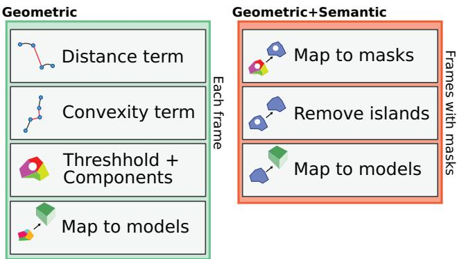  
Figure 5: Overview of performed segmentation steps. A geometric segmentation is performed for each frame and resulting components are mapped to masks if available, which in turn are mapped to existing models. Components that are not mapped to masks are directly associated with an object, if possible.

## 5.3.1 Mapping geometric labels to masks

After over-segmenting input frames geometrically, the resulting components $C _ { t i } \bar { \forall i } \in \{ 1 . . \bar { N } _ { t } ^ { g } \}$ are mapped to masks $\mathcal { L } _ { t n } ^ { s }$ by identifying the one with maximal overlap. Only if this overlap is greater than a threshold – in our experiments $6 5 \% \cdot | C _ { t i } |$ , where $\left| C _ { t i } \right|$ denotes the number of pixels belonging to component $C _ { t i } - \mathbf { a }$ mapping is assigned. Note that multiple components can be mapped to the same mask, but no more than a single mask is linked to a component. An updated labelling $\mathcal { L } _ { t } ^ { c } : \Omega \stackrel { \mathbf { \bar { \rho } } } { \to } 1 . . N _ { t } ^ { s }$ is computed, which replaces component with mask IDs, if an assignment was made.

## 5.3.2 Mapping masks to models

Next, a similar overlap between grouped components $C _ { t j }$ in $\mathcal { L } _ { t } ^ { c }$ and projected object labels ${ \mathcal { L } } ^ { a }$ , as shown in Figure 3f, is evaluated. Requiring that the camera and objects are tracked correctly, ${ \mathcal { L } } ^ { a }$ is generated by rendering all models using the OpenGL pipeline. Besides testing an analogous threshold to before $( 5 \% \cdot | C _ { t j } | ) .$ , it is verified that the object class IDs of model and mask coincide.

Components that are not yet assigned to a model are now considered to be assigned directly. This is necessary because Mask-RCNN can fail to recognise objects, and most frames are expected to not exhibit any masks. Once again, an overlap of 65% C between remaining components and labels in ${ \mathcal { L } } ^ { a }$ is evaluated.

The final segmentation $\mathcal { L } _ { t } : \Omega \to \{ 0 . . N \}$ contains the object ids of the models associated with relevant components. A special predefined value2 is used to specify areas that ought to be ignored during fusion. This is especially useful to explicitly prevent the reconstruction of certain object classes, such as the arm of the person in Figure 3g, highlighted in white.

## 6 EVALUATION

Since the mapping and tracking components of MaskFusion are based on the work of [39, 50], we focus on the ability to tackle challenging problems that are not solvable by traditional SLAM systems and refer the reader to the corresponding publications for additional details.

## 6.1 Quantitative results

## 6.1.1 Trajectory estimation

To objectively compare MaskFusion with other methods, we evaluate its performance on an established RGBD benchmark dataset [43].

<table><tr><td rowspan=1 colspan=1>Setting</td><td rowspan=1 colspan=1>Sequence</td><td rowspan=1 colspan=1>VO-SF</td><td rowspan=1 colspan=1>EF</td><td rowspan=1 colspan=1>CF</td><td rowspan=1 colspan=1>SF</td><td rowspan=1 colspan=1>MF</td></tr><tr><td rowspan=1 colspan=1>Slightlydynamic</td><td rowspan=1 colspan=1>f3s_staticf3s_xyzf3s_halfsphere</td><td rowspan=1 colspan=1>2.911.118.0</td><td rowspan=1 colspan=1>0.92.613.8</td><td rowspan=1 colspan=1>1.12.73.6</td><td rowspan=1 colspan=1>1.34.04.0</td><td rowspan=1 colspan=1>2.13.15.2</td></tr><tr><td rowspan=1 colspan=1>Highlydynamic</td><td rowspan=1 colspan=1>f3w_staticf3w_xyzf3w_halfsphere</td><td rowspan=1 colspan=1>32.787.473.9</td><td rowspan=1 colspan=1>6.221.620.9</td><td rowspan=1 colspan=1>55.169.680.3</td><td rowspan=1 colspan=1>1.412.739.1</td><td rowspan=1 colspan=1>3.510.410.6</td></tr></table>

(a) Comparison of AT-RMSEs (cm)

<table><tr><td rowspan=1 colspan=1>Setting</td><td rowspan=1 colspan=1>Sequence</td><td rowspan=1 colspan=1>VO-SF</td><td rowspan=1 colspan=1>EF</td><td rowspan=1 colspan=1>CF</td><td rowspan=1 colspan=1>SF</td><td rowspan=1 colspan=1>MF</td></tr><tr><td rowspan=2 colspan=1>Slightlydynamic</td><td rowspan=2 colspan=1>f3s_staticf3s_xyzf3s_halfsphere</td><td rowspan=2 colspan=1>2.45.77.5</td><td rowspan=2 colspan=1>1.02.810.2</td><td rowspan=1 colspan=1>1.1</td><td rowspan=2 colspan=1>1.12.83.0</td><td rowspan=2 colspan=1>1.74.64.1</td></tr><tr><td rowspan=1 colspan=1>2.73.0</td></tr><tr><td rowspan=3 colspan=1>Highlydynamic</td><td rowspan=3 colspan=1>f3w_staticf3w_xyzf3w_halfsphere</td><td rowspan=3 colspan=1>10.127.733.5</td><td rowspan=1 colspan=1>5.8</td><td rowspan=2 colspan=1>22.432.9</td><td rowspan=3 colspan=1>1.312.120.7</td><td rowspan=3 colspan=1>3.99.79.3</td></tr><tr><td rowspan=1 colspan=1>21.4</td></tr><tr><td rowspan=1 colspan=1>16.3</td><td rowspan=1 colspan=1>40.0</td></tr></table>

(b) Comparison of translational RP-RMSEs (cm/s)

<table><tr><td rowspan=1 colspan=1>Setting</td><td rowspan=1 colspan=1>Sequence</td><td rowspan=1 colspan=1>VO-SF</td><td rowspan=1 colspan=1>EF</td><td rowspan=1 colspan=1>CF</td><td rowspan=1 colspan=1>SF</td><td rowspan=1 colspan=1>MF</td></tr><tr><td rowspan=2 colspan=1>Slightlydynamic</td><td rowspan=2 colspan=1>f3s_staticf3s_xyzf3s_halfsphere</td><td rowspan=2 colspan=1>0.711.442.98</td><td rowspan=1 colspan=1>0.32</td><td rowspan=2 colspan=1>0.441.001.92</td><td rowspan=2 colspan=1>0.430.922.11</td><td rowspan=2 colspan=1>0.541.252.07</td></tr><tr><td rowspan=1 colspan=1>0.773.20</td></tr><tr><td rowspan=2 colspan=1>Highlydynamic</td><td rowspan=2 colspan=1>f3w_staticf3w_xyzf3w_halfsphere</td><td rowspan=2 colspan=1>1.685.116.69</td><td rowspan=1 colspan=1>1.06</td><td rowspan=1 colspan=1>4.01</td><td rowspan=2 colspan=1>0.382.665.04</td><td rowspan=2 colspan=1>0.762.003.35</td></tr><tr><td rowspan=1 colspan=1>4.314.47</td><td rowspan=1 colspan=1>5.5513.02</td></tr></table>

(c) Comparison of rotational RP-RMSEs (deg/s)  
Table 2: Quantitative comparison to other methods.

This dataset offers sequences of colour and depth frames and includes ground-truth camera poses to compare with. Measures commonly used for the analysis of visual SLAM or visual odometry methods are the absolute trajectory error (ATE) and the relative pose error (RPE). While the ATE evaluates the overall quality of a trajectory by summing positional offsets of ground-truth and reconstructed locations, the RPE considers local motion errors and therefore surrogates drift. To provide scene-length independent measures, both entities are usually expressed as root-mean-square-error (RMSE). Since MaskFusion is designed to work in dynamic environments, we chose according sequences from the dataset.

First, we estimate camera motion on scenes that involve rapid movement of persons. As our method – as with the methods to which we compare – is not capable of reconstructing deformable parts, we exploit the contextual knowledge of MaskFusion to neglect data associated with persons. Table 2 lists AT-RMSE and RP-RMSE measurements of five methods, including MaskFusion (MF):

• VO-SF [21]: A close to real-time method that computes piecewise-rigid scene flow to segment dynamic objects.

• ElasticFusion EF [50]: A visual SLAM system that assumes a static environment.

• Co-Fusion (CF) [39]: A visual SLAM system that separates objects by motion.

• StaticFusion (SF) [41]: A 3D reconstruction system that segments and ignores dynamic parts.

Note that Co-Fusion and MaskFusion are the only systems that maintain multiple object models. The sequences in Table 2 are roughly ordered by difficulty and latter rows exhibit an increasing amount of dynamic motion. While $f 3 s$ abbreviatesfreiburg3 sitting, f3w stands forfreiburg3 walking.

Interestingly, ElasticFusion performs best in the presence of slight motion, even though it assumes static scenes. Our interpretation of this is that other methods label points as dynamic / outlier that would still be beneficial for tracking, and hence show inferior performance.

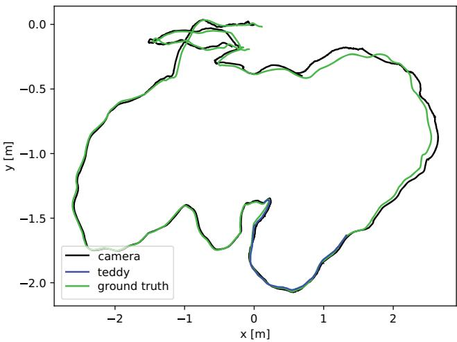  
Figure 6: Comparison of camera and object trajectories with groundtruth. The AT-RMSEs amount to 2.2cm and 8.9cm for the teddy bear and camera trajectory, respectively. Because the bear occupies a significant proportion of the field of view, tracking it independently affects the quality of the camera pose estimation. Treating the object as part of the background would reduce the camera AT-RMSE to 7.2cm.

Making use of context information proves to be especially useful in highly dynamic scenes, or when the beginning of a scene is difficult. These cases can be hard to tackle by energy minimisation, whereas semantic segmentation results are shown to be robust.

Further, we reconstruct and track the teddy bear in sequence f3 long office independently from the background motion. This way it is possible to compare the estimated object trajectory with the ground-truth camera trajectory, as highlighted in Figure 6. The trajectory of the bear is only available for a subsection of the sequence as it is out-of-view otherwise.

## 6.1.2 Reconstruction

We conducted a quantitative evaluation of the quality of the 3D reconstruction achieved by MaskFusion using objects from the YCB Object and Model Set [4], a benchmark designed to facilitate progress in robotic manipulation applications. The YCB set provides physi cal daily life objects of different categories, which are supplied to research teams, as well as a database with mesh models and highresolution RGB-D scans of the objects. We selected a ground truth model from the dataset (a bleach bottle), and acquired a dynamic sequence to quantitatively evaluate the errors in the 3D reconstruction. Figure 9 shows an image of the object, the ground truth 3D model, our reconstruction and a heatmap showing the 3D error per surfel. The average 3D error for the bleach bottle was 7.0mm with a standard deviation of 5.8mm (where the GT bottle is 250mm tall and 100mm across).

## 6.1.3 Segmentation

To assess the quality of the segmentation quantitatively we acquired a 600 frame long sequence and provided ground truth 2D annotations for the masks of one of the objects (teddy). Figure 8 shows the intersection over union (IoU) graphs for three different runs. The IoU of the per-frame segmentation masks obtained with MaskRCNN only and MaskRCNN combined with the geometric segmentation are shown in red and blue respectively. The blue curve shows the IoU obtained using our full method, where the object masks are obtained by reprojecting the reconstructed 3D model. This graph shows how combining semantic and geometric cues results in more accurate segmentations, but even better results are achieved when maintaining temporally consistent 3D models over the sequence through tracking and fusion.

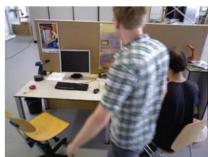  
(a) Input frame 515

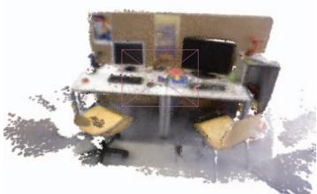  
(b) Reconstruction at frame 515  
Figure 7: Detecting persons allows MaskFusion to ignore them. In this challenging sequence (fr3 walking halfsphere), the reconstruction only contains static parts.

## 6.2 Qualitative results

We tested MaskFusion on a variety of dynamic sequences, which show that it presents an effective toolbox for different use cases.

## 6.2.1 Grasping

A common but challenging task in robotics is to grasp objects. Aside from requiring sophisticated actuators, a robot needs to identify grasping points on the correct object. MaskFusion is well suited to provide the relevant data, as it detects and reconstructs objects densely. Further, and in contrast to most other systems, it continues the tracking during interaction. If the appearance of the actuator is known in advance or if a person interacts with objects, the neural network can be trained to exclude these parts from the reconstruction. Figure 12 shows a timeline of frames that illustrate a grasping performance. In this example, the first 600 frames were used to detect and model 5 objects in the scene, while tracking the camera. We implemented a simple hand-detector that is used to recognise when an object is touched, and as soon as the person interacts with the spray-bottle, the object is tracked reliably until it is placed back on the table at frame 1100.

## 6.2.2 Augmented reality

Visual SLAM is a building block of many augmented reality systems and we believe that adding semantic information enables new kinds of applications. To illustrate that MaskFusion can be used for augmented reality applications, we implemented demos that rely and geometric as well as semantic data in dynamic scenes:

Calories demo This prototype aims at estimating the calories of an object-based on its class and shape. By estimating body volumes, using simple primitive fitting, and providing a database with calories per volume unit ratios for different classes, it is straightforward to augment footage with the desired information. Experiments based on this prototype are shown in Figure 11.

Skateboard demo Another demo program presents a virtual character that actively reacts to its environment. As soon as the skateboard appears in the scene the character jumps and remains on it, as depicted in Figure 10. Note that the character stays attached to the board even after a person kicks it and sets it into motion. This requires accurate tracking of the skateboard and camera at the same time.

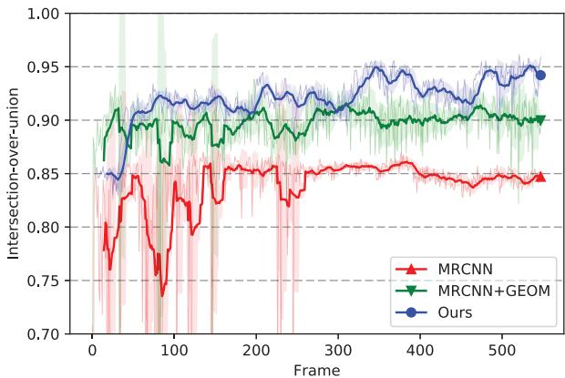  
Figure 8: Comparison of labelling performance over time. Results of Mask-RCNN (MRCNN) and Mask-RCNN followed by our geometric segmentation pipeline (MRCNN+GEOM) are frame-independent and variations in quality are only due to changes in camera perspective. The blue graph (Ours) shows the intersection-over-union correlating ground-truth 2D labels with the projection of the reconstructed 3D model.

  
(a) Real object

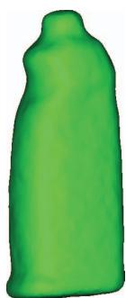  
(b) 3D model

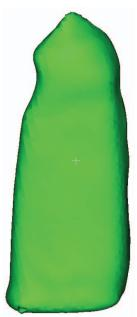  
(c) Ours

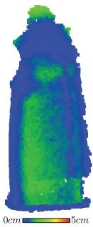  
(d) Error

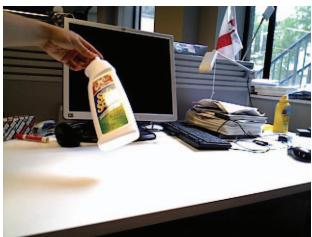  
(e) Frame 500

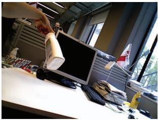  
(f) Frame 950  
Figure 9: Reconstruction of a bleach bottle from the YCB dataset. The average distance of a reconstructed surfel to a point on the ground-truth model is 7.0mm with a standard deviation of 5.8mm.

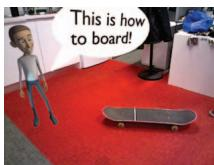  
(a) Semantic reaction

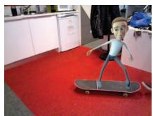  
(b) Object interaction

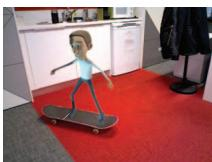  
(c) Obeying dynamics  
Figure 10: AR application that shows a virtual character interacting with the scene.

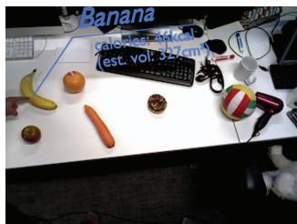  
(a) Showing estimated calories for a banana

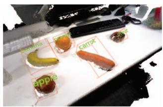  
(c) 3D reconstruction

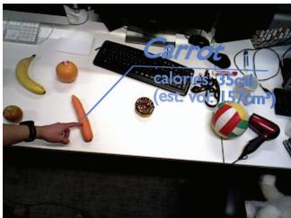  
(b) Showing estimated calories for a carrot

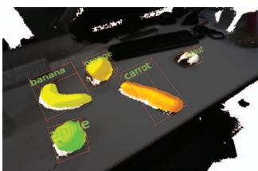  
(d) Object labels in 3D  
Figure 11: AR application that estimates the calories of groceries.

## 6.3 Performance

The convolutional masking component runs asynchronously to the rest of MaskFusion and requires a dedicated GPU. It operates at 5Hz, and since it is blocking the GPU for long periods of time, we use another GPU for the SLAM pipeline, which operates at >30Hz if a single model is tracked. In the presence of multiple non-static objects, the performance declines and results in a frame-rate of 20Hz for 3 models. Our test system is equipped with two Nvidia GTX Titan X and an Intel Core i7, 3.5GHz.

## 7 CONCLUSIONS

This paper introduced MaskFusion, a real-time visual SLAM system that utilises semantic scene understanding to map and track multiple objects. While inferring semantic labels from 2D image data, the system maintains independent 3D models for each object instance and for the background. We showed that MaskFusion can be used to implement novel augmented reality applications or perform common robotics tasks.

While MaskFusion makes meaningful progress towards achieving an accurate, robust and general dynamic and semantic SLAM system, it comes with limitations in the three main problems it addresses: recognition, reconstruction and tracking. Regarding the recognition, MaskFusion can only recognise objects from classes on which MaskRCNN [15] has been trained (currently the 80 classes of the MS-COCO dataset) and does not account for miss-classification of object labels. Secondly, although MaskFusion can cope with the presence of some non-rigid objects, such as humans, by removing them from the map, tracking and reconstruction is limited to rigid objects. Thirdly, tracking small objects with little geometric information when no 3D model is available can result in errors. Solving these limitations opens up opportunities for future work.

## ACKNOWLEDGMENTS

This work has been supported by the SecondHands project, funded from the EU Horizon 2020 Research and Innovation programme under grant agreement No 643950.

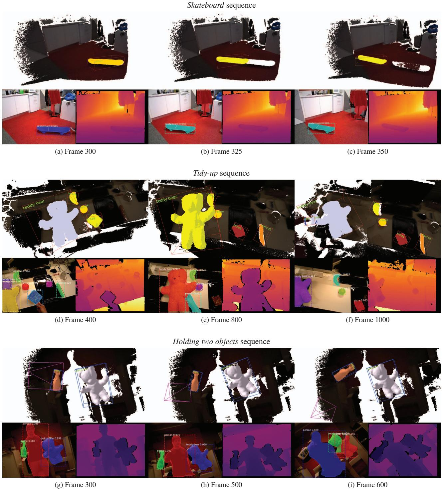  
Figure 12: Overview of evaluation sequences.

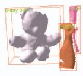  
(a) Frame 300

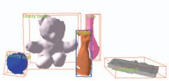  
(b) Frame 600

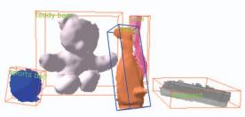

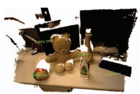

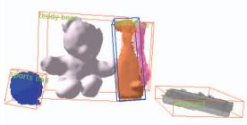  
(e) Frame 900

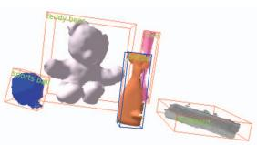  
(f) Frame 1000  
(d) Reconstruction

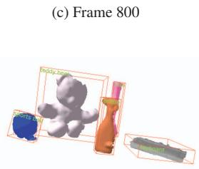  
(g) Frame 1160

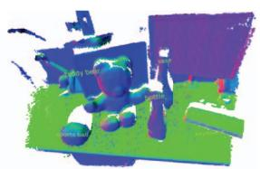  
(h) Normals

Figure 13: A series of 6 frames, illustrating the recognition, tracking and mapping capabilities of MaskFusion. While a keyboard (grey), vase (pink), teddy-bear (white) and spray-bottle (orange) were detected from the beginning, the ball (blue) appeared between frame 300 and 600. The right hand side shows the reconstruction and estimated normals. The spray-bottle was moved by a person between frame 600 and 1000, but MaskFusion explicitly avoided to reconstruct person-related geometry.

## REFERENCES

[1] Matterport implementation of mask-rcnn. https://github.com/ matterport/Mask RCNN. Accessed: 2018-02-02.

[2] Dragomir Anguelov, B Taskarf, Vassil Chatalbashev, Daphne Koller, Dinkar Gupta, Geremy Heitz, and Andrew Ng. Discriminative learning of markov random fields for segmentation of 3d scan data. In Computer Vision and Pattern Recognition, 2005. CVPR 2005. IEEE Computer Society Conference on, volume 2, pages 169–176. IEEE, 2005.

[3] Ioan Andrei Barsan. Simultaneous localization and mapping in dynamic scenes. Master’s thesis, ETH, Zurich, 2017.

[4] Berk Calli, Arjun Singh, James Bruce, Aaron Walsman, Kurt Konolige, Siddhartha Srinivasa, Pieter Abbeel, and Aaron M Dollar. Yale-cmuberkeley dataset for robotic manipulation research. The International Journal ofRobotics Research, 36(3):261 268, April 2017.

[5] Rodrigo L Carceroni and Kiriakos N Kutulakos. Multi-view scene capture by surfel sampling: From video streams to non-rigid 3d motion, shape and reflectance. International Journal ofComputer Vision, 49(2- 3):175–214, 2002.

[6] Robert Oliver Castle, Darren J Gawley, Georg Klein, and David W Murray. Towards simultaneous recognition, localization and mapping for hand-held and wearable cameras. In Robotics and Automation, 2007 IEEE International Conference on, pages 4102–4107. IEEE, 2007.

[7] Xiaobai Chen, Aleksey Golovinskiy, and Thomas Funkhouser. A benchmark for 3d mesh segmentation. In ACM SIGGRAPH 2009 Papers, SIGGRAPH ’09, pages 73:1–73:12, New York, NY, USA, 2009. ACM.

[8] Javier Civera, Dorian Galvez-L´ opez, Luis Riazuelo, Juan D Tard´ os, and´ JMM Montiel. Towards semantic slam using a monocular camera. In Intelligent Robots and Systems (IROS), 2011 IEEE/RSJ International Conference on, pages 1277–1284. IEEE, 2011.

[9] A. Collet, S. S. Srinivasay, and M. Hebert. Structure discovery in multimodal data: A region-based approach. In 2011 IEEE International Conference on Robotics and Automation, pages 5695–5702, May 2011.

[10] Angela Dai, Angel X. Chang, Manolis Savva, Maciej Halber, Thomas Funkhouser, and Matthias Nießner. Scannet: Richly-annotated 3d reconstructions of indoor scenes. In Proc. Computer Vision and Pattern Recognition (CVPR), IEEE, 2017.

[11] Andrew J Davison. Real-time simultaneous localisation and mapping with a single camera. In Proceedings of the Ninth IEEE International Conference on Computer Vision-Volume 2, page 1403. IEEE Computer Society, 2003.

[12] M. Dou, S. Khamis, Y. Degtyarev, P. Davidson, S. Fanello, A. Kowdle, S. Orts Escolano, C. Rhemann, D. Kim, J. Taylor, P. Kohli,

V. Tankovich, and S. Izadi. Fusion4d: Real-time performance capture of challenging scenes. In ACM SIGGRAPH Conference on Computer Graphics and Interactive Techniques, 2016.

[13] Ross Finman, Thomas Whelan, Michael Kaess, and John J. Leonard. Efficient incremental map segmentation in dense rgb-d maps. In IEEE Intl. Conf. on Robotics and Automation, ICRA, (Hong Kong), June 2014.

[14] Jorge Fuentes-Pacheco, Jose Ruiz-Ascencio, and Juan Manuel Rend´ on-´ Mancha. Visual simultaneous localization and mapping: a survey. Artificial Intelligence Review, 43(1):55–81, 2015.

[15] Kaiming He, Georgia Gkioxari, Piotr Dollar, and Ross Girshick. Mask r-cnn. In The IEEE International Conference on Computer Vision (ICCV), Oct 2017.

[16] Kaiming He, Xiangyu Zhang, Shaoqing Ren, and Jian Sun. Deep residual learning for image recognition. In Proceedings of the IEEE conference on computer vision andpattern recognition, pages 770–778, 2016.

[17] P. Henry, D. Fox, A. Bhowmik, and R. Mongia. Patch volumes: Segmentation-based consistent mapping with rgb-d cameras. In 2013 International Conference on 3D Vision - 3DV 2013, pages 398–405, June 2013.

[18] Peter Henry, Michael Krainin, Evan Herbst, Xiaofeng Ren, and Dieter Fox. Rgb-d mapping: Using kinect-style depth cameras for dense 3d modeling of indoor environments. The International Journal of Robotics Research, 31(5):647–663, 2012.

[19] A. Hermans, G. Floros, and B. Leibe. Dense 3d semantic mapping of indoor scenes from rgb-d images. In 2014 IEEE International Conference on Robotics and Automation (ICRA), pages 2631–2638, May 2014.

[20] Matthias Innmann, Michael Zollhofer, Matthias Nießner, Christian¨ Theobalt, and Marc Stamminger. Volumedeform: Real-time volumetric non-rigid reconstruction. In European Conference on Computer Vision, pages 362–379. Springer, 2016.

[21] Mariano Jaimez, Christian Kerl, Javier Gonzalez-Jimenez, and Daniel Cremers. Fast odometry and scene flow from rgb-d cameras based on geometric clustering. In Robotics and Automation (ICRA), 2017 IEEE International Conference on, pages 3992–3999. IEEE, 2017.

[22] Andrej Karpathy, Stephen Miller, and Li Fei-Fei. Object discovery in 3d scenes via shape analysis. In International Conference on Robotics and Automation (ICRA), 2013.

[23] M. Keller, D. Lefloch, M. Lambers, S. Izadi, T. Weyrich, and A. Kolb. Real-time 3d reconstruction in dynamic scenes using point-based fusion. In 2013 International Conference on 3D Vision - 3DV 2013, pages 1–8, June 2013.

[24] C. Kerl, J. Sturm, and D. Cremers. Dense visual slam for rgb-d cameras. In 2013 IEEE/RSJ International Conference on Intelligent Robots and Systems, pages 2100–2106, Nov 2013.

[25] Georg Klein and David Murray. Parallel tracking and mapping for small ar workspaces. In Mixed and Augmented Reality, 2007. ISMAR 2007. 6th IEEE and ACM International Symposium on, pages 225–234. IEEE, 2007.

[26] Hema S. Koppula, Abhishek Anand, Thorsten Joachims, and Ashutosh Saxena. Semantic labeling of 3d point clouds for indoor scenes. In J. Shawe-Taylor, R. S. Zemel, P. L. Bartlett, F. Pereira, and K. Q. Wein berger, editors, Advances in Neural Information Processing Systems 24, pages 244–252. Curran Associates, Inc., 2011.

[27] Yi Li, Haozhi Qi, Jifeng Dai, Xiangyang Ji, and Yichen Wei. Fully convolutional instance-aware semantic segmentation. In The IEEE Conference on Computer Vision and Pattern Recognition (CVPR), July 2017.

[28] J. McCormac, A. Handa, A. Davison, and S. Leutenegger. Semanticfusion: Dense 3d semantic mapping with convolutional neural networks. In 2017 IEEE International Conference on Robotics and Automation (ICRA), pages 4628–4635, May 2017.

[29] F. Moosmann, O. Pink, and C. Stiller. Segmentation of 3d lidar data in non-flat urban environments using a local convexity criterion. In 2009 IEEE Intelligent Vehicles Symposium, pages 215–220, June 2009.

[30] Raul Mur-Artal, Jose Maria Martinez Montiel, and Juan D Tardos. Orb-slam: a versatile and accurate monocular slam system. IEEE Transactions on Robotics, 31(5):1147–1163, 2015.

[31] Pushmeet Kohli Nathan Silberman, Derek Hoiem and Rob Fergus. Indoor segmentation and support inference from rgbd images. In ECCV, 2012.

[32] R. A. Newcombe, D. Fox, and S. M. Seitz. Dynamicfusion: Reconstruction and tracking of non-rigid scenes in real-time. In The IEEE Conference on Computer Vision and Pattern Recognition (CVPR), June 2015.

[33] R. A. Newcombe, S. Izadi, O. Hilliges, D. Molyneaux, D. Kim, A. J. Davison, P. Kohli, J. Shotton, S. Hodges, and A. W. Fitzgibbon. Kinectfusion: Real-time dense surface mapping and tracking. In 10th IEEE International Symposium on Mixed and Augmented Reality, ISMAR, 2011.

[34] Richard A Newcombe, Steven J Lovegrove, and Andrew J Davison. Dtam: Dense tracking and mapping in real-time. In Computer Vision (ICCV), 2011 IEEE International Conference on, pages 2320–2327. IEEE, 2011.

[35] Hanspeter Pfister, Matthias Zwicker, Jeroen van Baar, and Markus Gross. Surfels: Surface elements as rendering primitives. In Proceedings ofthe 27th Annual Conference on Computer Graphics and Interactive Techniques, SIGGRAPH ’00, pages 335–342, New York, NY, USA, 2000. ACM Press/Addison-Wesley Publishing Co.

[36] P. O. Pinheiro, T.-Y. Lin, R. Collobert, and P. Dollr. Learning to refine object segments. In ECCV, 2016.

[37] Shaoqing Ren, Kaiming He, Ross Girshick, and Jian Sun. Faster r-cnn: Towards real-time object detection with region proposal networks. In C. Cortes, N. D. Lawrence, D. D. Lee, M. Sugiyama, and R. Garnett, editors, Advances in Neural Information Processing Systems 28, pages 91–99. Curran Associates, Inc., 2015.

[38] Henry Roth and Marsette Vona. Moving volume kinectfusion. In BMVC, 2012.

[39] Martin Runz and Lourdes Agapito. Co-fusion: Real-time segmentation, ¨ tracking and fusion of multiple objects. In 2017 IEEE International Conference on Robotics and Automation (ICRA), pages 4471–4478, May 2017.

[40] Renato F Salas-Moreno, Richard A Newcombe, Hauke Strasdat, Paul HJ Kelly, and Andrew J Davison. Slam++: Simultaneous lo calisation and mapping at the level of objects. In Computer Vision and Pattern Recognition (CVPR), 2013 IEEE Conference on, pages 1352–1359. IEEE, 2013.

[41] Raluca Scona, Mariano Jaimez, Yvan R. Petillot, Maurice Fallon, and Daniel Cremers. StaticFusion: Background reconstruction for dense RGB-D SLAM in dynamic environments. In IEEE Intl. Conf. on Robotics and Automation (ICRA), Brisbane, 2018.

[42] S. C. Stein, M. Schoeler, J. Papon, and F. Wrgtter. Object partitioning

using local convexity. In 2014 IEEE Conference on Computer Vision and Pattern Recognition, pages 304–311, June 2014.

[43] Jurgen Sturm, Nikolas Engelhard, Felix Endres, Wolfram Burgard,¨ and Daniel Cremers. A benchmark for the evaluation of rgb-d slam systems. In Intelligent Robots and Systems (IROS), 2012 IEEE/RSJ International Conference on, pages 573–580. IEEE, 2012.

[44] K. Tateno, F. Tombari, I. Laina, and N. Navab. Cnn-slam: Real-time dense monocular slam with learned depth prediction. In 2017 IEEE Conference on Computer Vision and Pattern Recognition (CVPR), pages 6565–6574, July 2017.

[45] K. Tateno, F. Tombari, and N. Navab. Real-time and scalable incremental segmentation on dense slam. In IEEE/RSJ International Conference on Intelligent Robots and Systems, 2015.

[46] K. Tateno, F. Tombari, and N. Navab. When 2.5d is not enough: Simultaneous reconstruction, segmentation and recognition on dense slam. In In. Proc. Int. Conf. on Robotics and Automation (ICRA), May 2016.

[47] Andre Uckermann, Christof Elbrechter, Robert Haschke, and Helge¨ Ritter. 3d scene segmentation for autonomous robot grasping. In Intelligent Robots and Systems (IROS), 2012 IEEE/RSJ International Conference on, pages 1734–1740. IEEE, 2012.

[48] Chieh-Chih Wang, Charles Thorpe, Sebastian Thrun, Martial Hebert, and Hugh Durrant-Whyte. Simultaneous localization, mapping and moving object tracking. The International Journal of Robotics Research, 26(9):889–916, September 2007.

[49] Thibaut Weise, Thomas Wismer, Bastian Leibe, and Luc Van Gool. Inhand scanning with online loop closure. In Computer Vision Workshops (ICCVWorkshops), 2009 IEEE 12th International Conference on, pages 1630–1637. IEEE, 2009.

[50] T. Whelan, S. Leutenegger, R. F. Salas-Moreno, B. Glocker, and A. J. Davison. ElasticFusion: Dense SLAM without a pose graph. In Robotics: Science and Systems (RSS), Rome, Italy, July 2015.

[51] T. Whelan, J. B. McDonald, M. Kaess, M. Fallon, H. Johannsson, and J. J. Leonard. Kintinuous: Spatially extended kinectfusion. In Workshop on RGB-D: Advanced Reasoning with Depth Cameras, in conjunction with Robotics: Science and Systems, 2012.

[52] Xuehan Xiong and Daniel Huber. Using context to create semantic 3d models of indoor environments. In BMVC, pages 1–11, 2010.

[53] M. Zollhofer, M. Niessner, S. Izadi, C. Rehmann, C. Zach, M. Fisher,¨ C. Wu, A. Fitzgibbon, C. Loop, C. Theobalt, and M. Stamminger. Real-time non-rigid reconstruction using an rgb-d camera. ACM Trans. Graph., 33(4), 2014.

[54] Danping Zou and Ping Tan. Coslam: Collaborative visual slam in dynamic environments. IEEE Trans. on Pattern Analysis and Machine Intelligence, 2013.