# Scan Context: Egocentric Spatial Descriptor for Place Recognition within 3D Point Cloud Map

Giseop Kim1 and Ayoung Kim1∗

Abstract— Compared to diverse feature detectors and descriptors used for visual scenes, describing a place using structural information is relatively less reported. Recent advances in simultaneous localization and mapping (SLAM) provides dense 3D maps of the environment and the localization is proposed by diverse sensors. Toward the global localization based on the structural information, we propose Scan Context, a nonhistogram-based global descriptor from 3D Light Detection and Ranging (LiDAR) scans. Unlike previously reported methods, the proposed approach directly records a 3D structure of a visible space from a sensor and does not rely on a histogram or on prior training. In addition, this approach proposes the use of a similarity score to calculate the distance between two scan contexts and also a two-phase search algorithm to efficiently detect a loop. Scan context and its search algorithm make loopdetection invariant to LiDAR viewpoint changes so that loops can be detected in places such as reverse revisit and corner. Scan context performance has been evaluated via various benchmark datasets of 3D LiDAR scans, and the proposed method shows a sufficiently improved performance.

## I. INTRODUCTION

In many robotics applications, place recognition is the important problem. For SLAM, in particular, this recognition provides candidates for loop-closure, which is essential for correcting drift error and building a globally consistent map [1]. While the loop-closure is critical for robot navigation, wrong registration can be catastrophic and careful registration is required. Visual recognition is popular together with the widespread use of camera sensors, however, it is inherently difficult due to illumination variance and short-term (e.g., moving objects) or long-term (e.g., seasons) changes. Similar environments may occur at different locations often causing perception aliasing. Therefore, recent literature has focused on robust place recognition by examining representation [2] and resilient back-end [3].

Unlike these visual sensors, LiDARs have recently garnered attention due to their strong invariance to perceptual variance. In the early days, conventional local keypoint descriptors [4, 5, 6, 7], which were originally designed for the 3D model in computer vision, have been used for place recognition in spite of their vulnerability to noise. LiDARbased methods for place recognition have been widely proposed in robotics literature [8, 9, 10]. These works focus on developing descriptors from structural information (e.g., point clouds) in both local [8] and global manners [10].

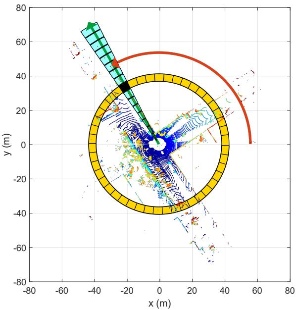  
(a) Bin division along azimuthal and radial directions

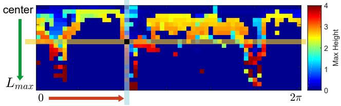  
(b) Scan context  
Fig. 1. Two-step scan context creation. Using the top view of a point cloud from a 3D scan (a), we partition ground areas into bins, which are split according to both azimuthal (from 0 to 2π within a LiDAR frame) and radial (from center to maximum sensing range) directions. We refer to the yellow area as a ring, the cyan area as a sector, and the black-filled area as a bin. Scan context is a matrix as in (b) that explicitly preserves the absolute geometrical structure of a point cloud. The ring and sector described in (a) are represented by the same-colored column and row, respectively, in (b). The representative value extracted from the points located in each bin is used as the corresponding pixel value of (b). In this paper, we use the maximum height of points in a bin.

There are two issues that the existing LiDAR-based place recognition methods have been trying to overcome. First, the descriptor is required to achieve rotational invariance regardless of the viewpoint changes. Second, noise handling is the another topic for these spatial descriptors because the resolution of a point cloud varies with distance and normals are noisy. The existing methods mainly use the histogram [9, 11, 12] to address the two aforementioned issues. However, since the histogram method only provides a stochastic index of the scene, describing the detailed structure of the scene is not straightforward. This limitation makes the descriptor less discernible for place recognition problem, causing potential false positives.

In this paper we present Scan Context, a novel spatial descriptor with a matching algorithm, specifically targeting outdoor place recognition using a single 3D scan. Our representation encodes a whole point cloud in a 3D scan into a matrix (Fig. 1). The proposed representation describes egocentric 2.5D information. Contribution points of the proposed method are:

• Efficient bin encoding function. Unlike existing point cloud descriptors [7, 10], the proposed method needs not count the number of points in a bin, instead it proposes a more efficient bin encoding function for place recognition. This encoding presents invariance to density and normals of a point cloud.

• Preservation of internal structure of a point cloud. As shown in Fig. 1, each element value of a matrix is determined by only the point cloud belonging to the bin. Thus, unlike [9], which depicts the relative geometry of points as a histogram and loses points’ absolute location information, our method preserves the absolute internal structure of a point cloud by intentionally avoiding using a histogram. This improves the discriminative capability and also enables viewpoint alignment of a query scan to a candidate scan (in our experiments, 6◦ azimuth resolution) while a distance is calculated. Therefore, detecting a reverse direction loop is also possible by using scan context.

• Effective two-phase matching algorithm. To achieve a feasible search time, we provide a rotational invariant subdescriptor for first nearest neighbor search and combine it with pairwise similarity scoring hierarchically, thus avoid searching all databases for loop-detection.

• Thorough validation against other state-of-the-art spatial descriptors. In the comparison to other existing global point cloud descriptors, such as M2DP [8], Ensemble of Shape Functions (ESF) [11], and Z-projection [12], the proposed approach presents a substantial improvement.

## II. RELATED WORK

Place recognition methods for mobile robots can be categorized into vision-based and LiDAR-based methods. Visual methods have been commonly used for place recognition in SLAM literatures [13, 14, 15]. FAB-MAP [13] increased robustness with the probabilistic approach by learning a generative model for the bag of visual words. However, visual representation has limitations such as vulnerability to light condition change [16]. Several methods have been proposed to overcome these issues. SeqSLAM [17] proposed the routebased approach and showed far improved performance than FAB-MAP. SRAL [2] fused several different representation such as color, GIST [18], and HOG [19] for long-term visual place recognition.

LiDAR presents strong robustness to these perceptual changes described above. LiDAR-based methods are further catagorized into local and global descriptors. Local descriptors, such as PFH [4], SHOT [5], shape context [7], or spin image [6], first find a keypoint, separate nearby points into bins, and encode a pattern of surrounding bins into a histogram. Steder et al. proposed the place recognition method [8] using point features and the gestalt descriptor [20] in bag of words manner.

These keypoint descriptors, however, revealed limitations since they were originally devised for 3D model part matching not for place recognition. For example, the density of a point cloud in a 3D scan (e.g., from VLP-16) varies with respect to the distance from a sensor, unlike the 3D model. Furthermore, normals of points are noisier than the model due to unstructured objects (e.g., trees) in the real world. Hence, local methods usually require normals of keypoints and thus are less suitable for place recognition in outdoor.

Global descriptors do not include the keypoint detecting phase. GLARE [9] and its variations [21, 22] encoded the geometric relationship between points into a histogram in lieu of searching for the keypoint and extracting the descriptor. ESF [11] used concatenation of histograms made from shape functions. Muhammad and Lacroix proposed Zprojection [12], which is a histogram of normal vectors, and a double threshold scheme with two distance functions. He et al. proposed M2DP [10], which projects a whole 3D point cloud of a scan to multiple 2D planes and extracts a 192 dimensional compact global representation. M2DP showed higher performance than the existing point cloud descriptors and robustness against noise and resolution changes. As introduced in this paragraph, global descriptors have typically used histograms. Recently, SegMatch [23] introduced a segment-based matching algorithm. This is a high-level perception but requires a training step, and points are needed to be represented in a global reference frame.

In this paper, we propose a novel place descriptor called Scan Context that encodes a point cloud of a 3D scan into a matrix. The scan context can be considered as an extension of the Shape Context [7] for place recognition targeting 3D LiDAR scan data. In detail, scan context has three components: the representation that preserves absolute location information of a point cloud in each bin, efficient bin encoding function, and two-step search algorithm.

## III. SCAN CONTEXT FOR PLACE RECOGNITION

In this section, we describe scan context creation given a point cloud from a 3D scan and propose a measure that calculates the distance between two scan contexts. Next, the two-step search process is introduced. The overall pipeline of place recognition using scan context is depicted in Fig. 2. The Scan Context creation and validation can also be found in scancontext.mp4.

## A. Scan Context

We define a place descriptor called Scan Context for outdoor place recognition. The key idea of a scan context is inspired by Shape Context [7] proposed by Belongie et al., which encodes the geometrical shape of the point cloud around a local keypoint into an image. While their method simply counts the number of points to summarize the distribution of points, ours differs from theirs in that we use a maximum height of points in each bin. The reason for using the height is to efficiently summarize the vertical shape of surrounding structures without requiring heavy computations to analyze the characteristics of the point cloud. In addition, the maximum height says which part of the surrounding structures is visible from the sensor. This egocentric visibility has been a well-known concept in the urban design literature for analyzing an identity of a place [24, 25].

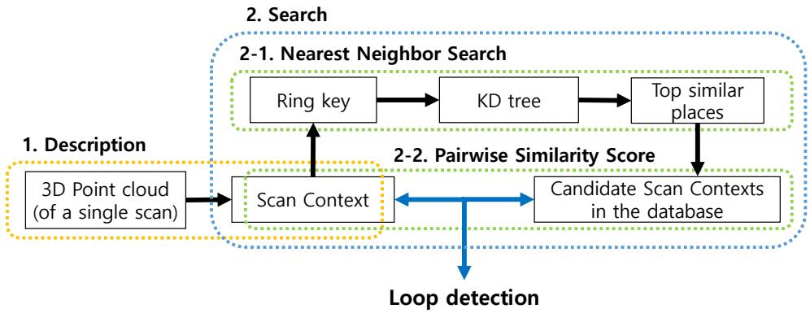  
Fig. 2. Algorithm overview. First, a point cloud in a single 3D scan is encoded into scan context. Then, $N _ { r }$ (the number of rings) dimensional vector is encoded from the scan context and is used for retrieving the nearest candidates as well as the construction of the KD tree. Finally, the retrieved candidates are compared to the query scan context. The candidate that satisfies the acceptance threshold and is closest to the query is considered the loop.

Similar to shape context [7], we first divide a 3D scan into azimuthal and radial bins in the sensor coordinate, but in an equally spaced manner as shown in Fig. 1(a). The center of a scan acts as a global keypoint and thus we refer to a scan context as an egocentric place descriptor. $N _ { s }$ and $N _ { r }$ are the number of sectors and rings, respectively. That is, if we set the maximum sensing range of a LiDAR sensor as $L _ { m a x } .$ the radial gap between rings is $\frac { L _ { m a x } } { N _ { r } }$ and the central angle of a sector is equal to $\frac { 2 \pi } { N _ { s } }$ . In this paper, we used $N _ { s } = 6 0$ and $N _ { r } = 2 0$

Therefore, the first process of making a scan context is to partition whole points of a 3D scan into mutually exclusively separated point clouds as shown in Fig. 1(a). $\mathcal { P } _ { i j }$ is the set of points belonging to the bin where the ith ring and jth sector overlapped. The symbol $[ N _ { s } ]$ is equal to $\{ 1 , 2 , . . . , N _ { s - 1 } , N _ { s } \}$ Therefore, the partition is mathematically

$$
\mathcal { P } = \bigcup _ { i \in [ N _ { r } ] , \ j \in [ N _ { s } ] } \mathcal { P } _ { i j } \ .\tag{1}
$$

Because the point cloud is divided at regular intervals, a bin far from a sensor has a physically wider area than a near bin. However, both are equally encoded into a single pixel of a scan context. Thus, a scan context compensates for the insufficient amount of information caused by the sparsity of far points and treats nearby dynamic objects as sparse noise.

After the point cloud partitioning, a single real value is assigned to each bin by using the point cloud in that bin:

$$
\phi \colon { \mathcal P } _ { i j }  { \mathbb R } \ ,\tag{2}
$$

and we use a maximum height, which is inspired from the urban visibility analysis [24, 25]. Thus, the bin encoding function is

$$
\phi ( \mathcal { P } _ { i j } ) = \operatorname* { m a x } _ { \mathbf { p } \in \mathcal { P } _ { i j } } z ( \mathbf { p } ) \mathrm { ~ , ~ }\tag{3}
$$

where $z ( \cdot )$ is the function that returns a z-coordinate value of a point p. We assign a zero for empty bins. For example, as seen in Fig. 1(b), a blue pixel in the scan context means that the space corresponding to its bin is either free or not observed due to occlusions.

From the foregoing processes, a scan context I is finally represented as a $N _ { r } \times N _ { s }$ matrix as

$$
\begin{array} { r } { I = ( a _ { i j } ) \in \mathbb { R } ^ { N _ { r } \times N _ { s } } , \ a _ { i j } = \phi ( \mathcal { P } _ { i j } ) \ . } \end{array}\tag{4}
$$

For robust recognition over translation, we leverage scan context augmentation through root shifting. By doing so, acquiring various scan contexts from the raw scan under a slight motion perturbance becomes feasible. A single scan context may be sensitive to the center location of a scan under translational motion during revisit. For example, the row order of a scan context may not be preserved when revisiting the same place in a different lane. To overcome this situation, we translate a raw point cloud into $N _ { t r a n s }$ neighbors $( N _ { t r a n s } = 8$ used in the paper) depending on the lane level interval and store scan contexts obtained from these root-shifted point clouds together. We assumed that a similar point cloud is obtained even at the actual moved location, which is valid except for a few cases such as an intersection access point where a new space suddenly appears.

## B. Similarity Score between Scan Contexts

Given a scan context pair, we then need a distance measure for the similarity of two places. Iq and $I ^ { c }$ are scan contexts acquired from a query point cloud and a candidate point cloud, respectively. They are compared in a columnwise manner. That is, the distance is the sum of distances between columns at a same index. A cosine distance is used to compute a distance between two column vectors at the same index, $c _ { j } ^ { q }$ and $c _ { j } ^ { c } .$ . In addition, we divide the summation by the number of columns $N _ { s }$ for normalization. Therefore, the distance function is

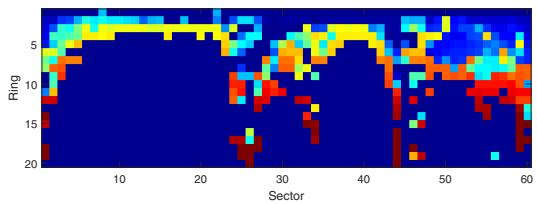  
(a) The query scan context $( 3 2 8 0 ^ { \mathrm { t h } }$ scan, KITTI00)

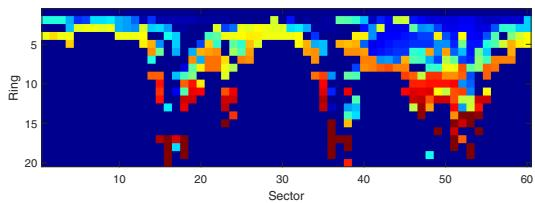  
(b) The detected scan context $( 2 3 4 5 ^ { \mathrm { t h } }$ scan, KITTI00)  
Fig. 3. Example of scan contexts from the same place with time interval. The change of the sensor viewpoint at the revisit causes column shifts of the scan context as in (a). However, the two matrices contain similar shapes and show the same row order.

$$
d ( I ^ { q } , I ^ { c } ) = \frac { 1 } { N _ { s } } \sum _ { j = 1 } ^ { N _ { s } } \left( 1 - \frac { c _ { j } ^ { q } \cdot c _ { j } ^ { c } } { \| c _ { j } ^ { q } \| \| c _ { j } ^ { c } \| } \right) .\tag{5}
$$

The column-wise comparison is particularly effective for dynamic objects by considering the consensus of throughout sectors. However, the column of the candidate scan context may be shifted even in the same place, since a viewpoint of a LiDAR changes for different places (e.g., revisit in an opposite direction or corner). Fig. 3 illustrates such cases. Since a scan context is the representation dependent on the sensor location, the row order is always consistent. However, the column order could be different if the LiDAR sensor coordinate with respect to the global coordinate changed.

To alleviate this problem, we calculate distances with all possible column-shifted scan contexts and find the minimum distance. $I _ { n } ^ { c }$ is a scan context whose n columns are shifted from the original one, Ic. This is the same task as roughly aligning two point clouds for yaw rotation at $\frac { 2 \pi } { N _ { s } }$ resolution. Then we decide that the number of column shift for the best alignment (7) and the distance (6) at that time:

$$
D ( I ^ { q } , I ^ { c } ) = \operatorname * { m i n } _ { n \in [ N _ { s } ] } d ( I ^ { q } , I _ { n } ^ { c } ) ,\tag{6}
$$

$$
\begin{array} { l c l } { { n ^ { * } } } & { { = } } & { { \arg \operatorname* { m i n } d ( I ^ { q } , I _ { n } ^ { c } ) ~ . } } \\ { { } } & { { } } & { { n \in [ N _ { s } ] } } \end{array}\tag{7}
$$

Note that this additional shift information may serve as a good initial value for further localization refinement such as Iterated Closest Point (ICP), as shown in Section IV-C.

## C. Two-phase Search Algorithm

Three main streams are typical when searching in the context of place recognition: pairwise similarity scoring, nearest neighbor search, and sparse optimization [26]. Our search algorithm fuses both pairwise scoring and nearest search hierarchically to achieve a reasonable searching time.

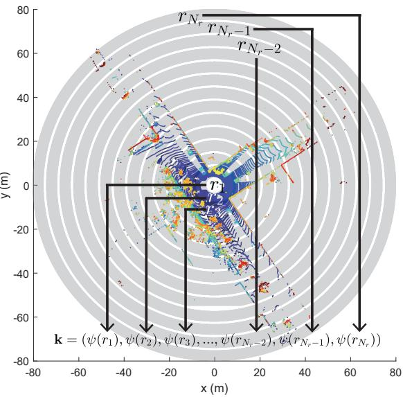  
Fig. 4. The ring key generation for the fast search.

Since our distance calculation in (6) is heavier than other global descriptors such as [12, 10], we provide a two-phase hierarchical search algorithm via introducing ring key. Ring key is a rotation-invariant descriptor, which is extracted from a scan context. Each row of a scan context, $r ,$ is encoded into a single real value via ring encoding function ψ. The first element of the vector k is from the nearest circle from a sensor, and following elements are from the next rings in order as illustrated in Fig. 4. Therefore, the ring key becomes a $N _ { r }$ -dimensional vector as (8):

$$
\mathbf { k } = ( \psi ( r _ { 1 } ) , . . . , \psi ( r _ { N _ { r } } ) ) , \mathrm { ~ w h e r e ~ } \psi : r _ { i } \to \mathbb { R } \ .\tag{8}
$$

The ring encoding function ψ we use is the occupancy ratio of a ring using $L _ { 0 }$ norm:

$$
\psi ( r _ { i } ) = \frac { \| r _ { i } \| _ { 0 } } { N _ { s } } ~ .\tag{9}
$$

Since the occupancy ratio is independent of the viewpoint, the ring key achieves rotation invariance.

Although being less informative than scan context, ring key enables fast search for finding possible candidates for loop. The vector k is used as a key to construct a KD tree. At the same time, the ring key of the query is used to find similar keys and their corresponding scan indexes. The number of top similar keys that will be retrieved is determined by a user. These constant number of candidates scan contexts are compared against the query scan context by using distance (6). The closest candidate to the query satisfying an acceptance threshold is selected as the revisited place:

$$
c ^ { * } = \underset { c _ { k } \in \mathcal { C } } { \mathrm { a r g m i n } } D ( I ^ { q } , I ^ { c _ { k } } ) , \mathrm { s . t } D < \tau \ ,\tag{10}
$$

where $\mathcal { C }$ is a set of indexes of candidates extracted from KD tree and $\tau$ is a given acceptance threshold. $c ^ { * }$ is the index of the place determined to be a loop.

TABLE I  
SELECTED DATASET LISTS USED IN VALIDATION
<table><tr><td rowspan="2">Sequence Index</td><td colspan="4">KITTI</td><td colspan="4">NCLT</td><td colspan="4">Complex Urban LiDAR</td></tr><tr><td>00</td><td>02</td><td>05 2223</td><td>08</td><td>20120526</td><td>20120820</td><td>20120928</td><td>20130405</td><td>00</td><td>01</td><td>02</td><td>04</td></tr><tr><td>Total Length (m)</td><td>3714</td><td>4268</td><td></td><td>3225</td><td>6345</td><td>6018</td><td>5579</td><td>4530</td><td>12020</td><td>11830</td><td>3020</td><td>6542</td></tr><tr><td># of Nodes</td><td>4541</td><td>4661</td><td>2761</td><td>4071</td><td>3164</td><td>3001</td><td>2781</td><td>2259</td><td>3630</td><td>3266</td><td>862</td><td>2140</td></tr><tr><td># of True Loops</td><td>790</td><td>309</td><td>493</td><td>332</td><td>810</td><td>526</td><td>635</td><td>275</td><td>361</td><td>383</td><td>125</td><td>150</td></tr><tr><td>Route Dir. on revisit</td><td>Same</td><td>Same</td><td>Same</td><td>Reverse</td><td>Both</td><td>Both</td><td>Both</td><td>Both</td><td>Same</td><td>Same</td><td>Both</td><td>Same</td></tr></table>

## IV. EXPERIMENTAL EVALUATION

In this section, our representation and algorithm are evaluated over various datasets and against other state-of-the-art algorithms. Since scan context is the global descriptor, the performance of our representation is compared to three other global representations using a 3D point cloud: M2DP [10], Zprojection [12], and ESF [11]. We use ESF in the Point Cloud Library (PCL) implemented in C++, Matlab codes of M2DP on the web1 from the authors He et al., and implement Zprojection on Matlab ourselves. All experiments are carried out on the same system with an Intel i7-6700 CPU at 3.40GHz and 16GB memory.

## A. Dataset and Experimental Settings

We use the KITTI dataset2 [27], the NCLT dataset3 [28], and the Complex Urban LiDAR dataset4 [29] for the validation of our method. These three datasets are selected considering diversity, such as the type of the 3D LiDAR sensor (e.g., the number of rays, sensor mount types such as surround and tilted) and the type of loops (e.g., occurred at the same direction or the opposite direction called reverse loop). Characteristics of each dataset are summarized in Table I. The term node means a single sampled place.

1) KITTI dataset: Among the 11 sequences having the ground truth of pose (from 00 to 10), the top four sequences whose the number of loop occurrences is highest are selected: 00, 02, 05, and 08. The sequence 08 has only reverse loops, and others have loop events with the same direction. The scans of the KITTI dataset had been obtained from the 64-ray LiDAR (Velodyne HDL-64E) located in the center of the car. Since the KITTI dataset provides scans with indexes, we use each bin file as a node directly.

2) NCLT dataset: The NCLT dataset provides long-term measurements of different days along similar routes. Scans of the NCLT dataset were obtained from the 32-ray LiDAR (Velodyne HDL-32E) attached to a segway mobile platform. Four sequences are selected considering the number of loop occurrences and seasonal diversity. In this experiment, the scans are sampled at equidistant (2 m) intervals, and only those sampled scans are used as nodes for convenience.

3) Complex Urban LiDAR dataset: The Complex Urban LiDAR dataset includes various complex urban environments from residential to metropolitan areas. Four sequences are selected considering the complexity and wide road rate provided by [29]. Among three sub-routes in the sequence 04, 04 0 and 04 1 are used in this experiment. The scans are sampled at 3 m intervals for convenience. The interesting fact is that this dataset uses two tilted LiDARs (Velodyne VLP-16 PUCK) for urban mapping. Thus, a single scan of this dataset is able to measure higher parts of structures but does not have a 360◦ surround view. To include more information in all directions, we merge the point clouds from both left and right tilted LiDARs and use them as a single scan to create a scan context.

If a ground truth pose distance between the query and the matched node is less than 4 m, the detection is considered as true positive. In total 50 previously adjacent nodes are excluded from the search. The experiments for scan context are conducted with 10 candidates and 50 candidates from the KD tree, thus each method is called scan context-10 and scan context-50, respectively. Unlike the scan context, which only compares with a constant number of candidates extracted from the KD tree, other methods (M2DP, ESF, and Z-projection) compare the query description to all in the database. In this paper, we set parameters of scan context as $N _ { s } = 6 0$ , Nr = 20, and $L _ { m a x } = 8 0$ m. That is, each sector has a 6◦ resolution and each ring has a 4 m gap. The number of bins of Z-projection is set as 100. We use the default parameters of the available codes for M2DP and ESF. For the computation efficiency, we downsample point cloud with 0.6 m3 grid for both scan context and M2DP, since He et al. [10] reported M2DP is robust to downsampling, whereas Z-projection and ESF use an original point cloud without downsampling because they are vulnerable to low density. We change only an acceptance threshold in the experiments.

## B. Precision Recall Evaluation

The performance of Scan Context is analyzed using the precision-recall curve as in Fig. 5. The histogram-based approaches, ESF and Z-projection, reported poor performances on all datasets. These methods rely on the histogram and distinguish places only when the structure of the visible space is substantially different. Unlike these histogram based methods, ours presented the meaningful performance for the entire data sequences. Overall, scan context-50 always reveals better performance than scan context-10. The performance of scan context depends on the number of candidates from the KD tree. Since ring key is less informative than scan context, inspecting a small number (e.g., 10 of more than 3000 nodes) of candidates is vulnerable if there are many similar structures.

The proposed method outperformed other approaches when applied to the outdoor urban dataset. This is due to the fact the motivation for using the vertical height is from urban analysis. However, the performance is limited when applied to an indoor environment where variation in vertical height is less significant. When applied to the NCLT dataset, the scan context presented low performance both for recall and precision (left part of each graph) because the trajectory of the NCLT dataset contains narrow indoor environments where an only small area is available.

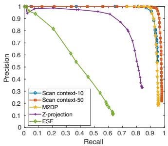  
(a) KITTI 00 (same)

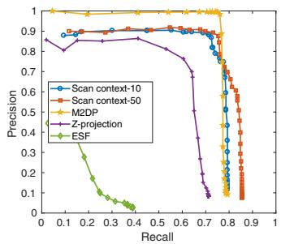  
(b) KITTI 02 (same)

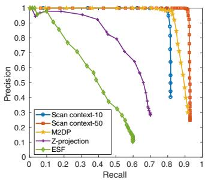  
(c) KITTI 05 (same)

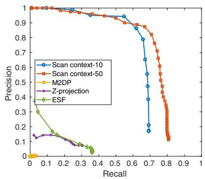  
(d) KITTI 08 (reverse)

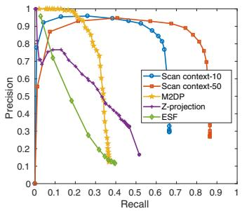  
(e) NCLT 2012-05-26 (both)

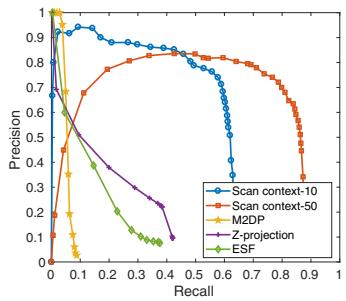  
(f) NCLT 2012-08-20 (both)

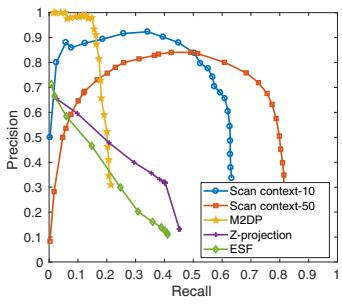  
(g) NCLT 2012-09-28 (both)

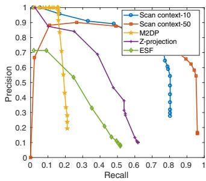  
(h) NCLT 2013-04-05 (both)

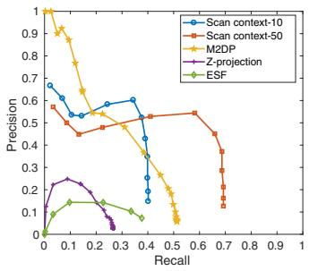  
(i) Complex Urban 00 (same)

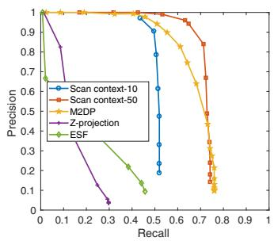  
(j) Complex Urban 01 (same)

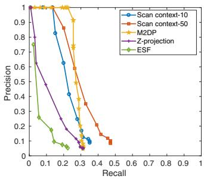  
(k) Complex Urban 02 (both)

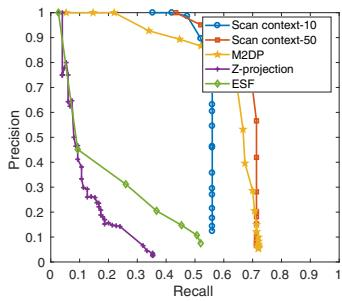  
(l) Complex Urban 04 (same)  
Fig. 5. Precision-recall curves for the evaluation dataset. The route direction during the revisit is shown in parentheses.

Evaluating with the Complex Urban LiDAR dataset, all methods show poorer performance than at the KITTI dataset. In particular, Urban 02 provides the most challenging case for all methods since this sequence has narrow roads and repeated structures with similar height and rectangle shapes5 compared to KITTI. The example of scan context from this challenging Urban 02 is given in Fig. 6. Despite some level of performance drop is reported in this challenging dataset, the proposed method still outperformed other existing methods.

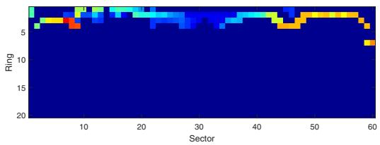  
Fig. 6. A challenging example captured from Complex Urban LiDAR dataset sequence 02. The road is so narrow in all directions that the amount of available information is too small.

The proposed descriptor presented a strong rotationinvariance even for a reversed revisit by using view alignment based matching. For example, M2DP failed to detect a reverse loop. Among the datasets, KITTI 08 has only reverse loops and the proposed method substantially outperformed others. This phenomenon is also observed in NCLT sequences having partial reverse loops. Therefore, at NCLT sequences, M2DP reports high precision at the very low recalls because the forward loops are detected correctly. However, since reverse loops are missed, the slope of the curve rapidly decreases.

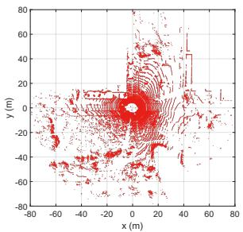  
(a) Query point cloud

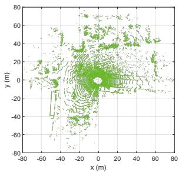  
(b) Detected point cloud

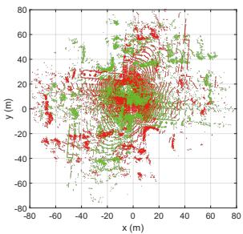  
(c) Registration without initial

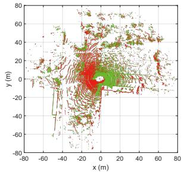  
(d) Registration with Scan Context

Fig. 7. An example of point-to-point ICP results from KITTI 08. The query and the detected point clouds are from the $1 7 8 5 ^ { \mathrm { t h } }$ and $1 0 9 ^ { \mathrm { t h } }$ scans, respectively. The LiDAR sensor frame represents the coordinates of the point clouds. Scoring the similarity between two scan contexts provides a coarse yaw rotation, which serves as an initial estimate to guide finer localization (i.e., ICP). In the case of this reverse loop, registration easily fails without such an initial estimate. By contrast, even this kind of unstructured environment can be registered with the use of an initial estimate obtained from the scan context.  
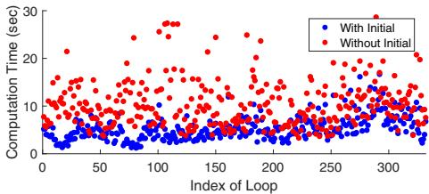  
(a) Computation Time (s)

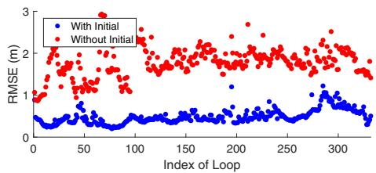  
(b) RMSE (m)  
Fig. 8. Computation time and RMSE with and without initial values. The x-axis represents the index of real loop events of KITTI 08. Blue and red indicate available and unavailable initial guesses, respectively.

## C. Localization Accuracy

The proposed method can also be used when providing robust initial estimate for other localization approaches such as ICP. We conducted the experiment using KITTI 08 having reverse loops. ICP is performed point-to-point without downsampling. The example of ICP results with and without initialization are depicted in Fig. 7. For this sequence, we further validate the improvement in terms of both computation time and root mean square error (RMSE). Fig. 8 shows the improved performance with the initial yaw rotation estimates using (7).

TABLE II  
AVERAGE TIME COSTS ON KITTI00.  
Calculating Descriptor (s) Searching Loop (s)
<table><tr><td>Scan</td><td>context-10</td><td>0.1291</td></tr><tr><td rowspan="3">Scan context-50</td><td>0.1291</td><td>0.0807 0.3331</td></tr><tr><td>0.0218</td><td>0.0032</td></tr><tr><td>0.0472</td><td>0.0035</td></tr><tr><td colspan="2">Z-projection ESF</td><td>0.0635 0.0043</td></tr></table>

## D. Computational Complexity

The average computation times evaluated on KITTI 00 are given in Table II. Point cloud downsampling with a $0 . 6 \mathrm { m ^ { 3 } }$ grid is used for all methods. In these experiments, the scan context creation takes longer because we employ scan context augmentation, which is non-mandatory. Thus, the time required to create a single scan context (0.0143 s, except for scan context augmentation) is shorter than it is with the other methods. The search time of the scan context includes both creation of the KD tree and computation of the distance. Scan context may require a longer search time than other global descriptors, but in a reasonable bound (2-5 Hz on Matlab).

## V. CONCLUSION

In this paper, we presented a spatial descriptor, Scan Context, summarizing a place as a matrix that explicitly describes the 2.5D structural information of an egocentric environment. Compared to existing global descriptors using a point cloud, scan context showed higher loop-detection performance across various datasets.

In future work, we plan to extend scan context by introducing additional layers. That is, other bin encoding functions (e.g., a bin’s semantic information) can be used to improve performance, even for datasets with highly repetitive structures such as the Complex Urban LiDAR dataset.

## REFERENCES

[1] C. Cadena, L. Carlone, H. Carrillo, Y. Latif, D. Scaramuzza, J. Neira, I. Reid, and J. J. Leonard, “Past, present, and future of simultaneous localization and

mapping: Toward the robust-perception age,” IEEE Trans. Robot., vol. 32, no. 6, pp. 1309–1332, 2016.

[2] F. Han, X. Yang, Y. Deng, M. Rentschler, D. Yang, and H. Zhang, “SRAL: Shared representative appearance learning for long-term visual place recognition,” IEEE Robot. and Automat. Lett., vol. 2, no. 2, pp. 1172–1179, 2017.

[3] Y. Latif, C. Cadena, and J. Neira, “Robust loop closing over time for pose graph SLAM,” Intl. J. of Robot. Research, vol. 32, no. 14, pp. 1611–1626, 2013.

[4] R. B. Rusu, N. Blodow, Z. C. Marton, and M. Beetz, “Aligning point cloud views using persistent feature histograms,” in Proc. IEEE/RSJ Intl. Conf. on Intell. Robots and Sys., 2008, pp. 3384–3391.

[5] S. Salti, F. Tombari, and L. Di Stefano, “SHOT: Unique signatures of histograms for surface and texture description,” Comput. Vision and Image Understanding, vol. 125, pp. 251–264, 2014.

[6] A. E. Johnson and M. Hebert, “Using spin images for efficient object recognition in cluttered 3D scenes,” IEEE Trans. Pattern Analysis and Machine Intell., vol. 21, no. 5, pp. 433–449, 1999.

[7] S. Belongie, J. Malik, and J. Puzicha, “Shape matching and object recognition using shape contexts,” IEEE Trans. Pattern Analysis and Machine Intell., vol. 24, no. 4, pp. 509–522, 2002.

[8] B. Steder, M. Ruhnke, S. Grzonka, and W. Burgard, “Place recognition in 3D scans using a combination of bag of words and point feature based relative pose estimation,” in Proc. IEEE/RSJ Intl. Conf. on Intell. Robots and Sys., 2011, pp. 1249–1255.

[9] M. Himstedt, J. Frost, S. Hellbach, H.-J. Bohme,¨ and E. Maehle, “Large scale place recognition in 2D LIDAR scans using geometrical landmark relations,” in Proc. IEEE/RSJ Intl. Conf. on Intell. Robots and Sys., 2014, pp. 5030–5035.

[10] L. He, X. Wang, and H. Zhang, “M2DP: a novel 3D point cloud descriptor and its application in loop closure detection,” in Proc. IEEE/RSJ Intl. Conf. on Intell. Robots and Sys., 2016, pp. 231–237.

[11] W. Wohlkinger and M. Vincze, “Ensemble of shape functions for 3D object classification,” 2011, pp. 2987– 2992.

[12] N. Muhammad and S. Lacroix, “Loop closure detection using small-sized signatures from 3D LIDAR data,” in Safety, Security, and Rescue Robot., IEEE Intl. Symp. on, 2011, pp. 333–338.

[13] M. Cummins and P. Newman, “FAB-MAP: Probabilistic localization and mapping in the space of appearance,” Intl. J. of Robot. Research, vol. 27, no. 6, pp. 647–665, 2008.

[14] A. Angeli, D. Filliat, S. Doncieux, and J.-A. Meyer, “Fast and incremental method for loop-closure detection using bags of visual words,” IEEE Trans. Robot., vol. 24, no. 5, pp. 1027–1037, 2008.

[15] D. Galvez-L´ opez and J. D. Tard´ os, “Bags of binary´ words for fast place recognition in image sequences,”

IEEE Trans. Robot., vol. 28, no. 5, pp. 1188–1197, 2012.

[16] C. Valgren and A. J. Lilienthal, “SIFT, SURF and Seasons: Long-term outdoor localization using local features.” in Proc. European Conf. on Mobile Robot., 2007, pp. 253–258.

[17] M. J. Milford and G. F. Wyeth, “SeqSLAM: Visual route-based navigation for sunny summer days and stormy winter nights,” in Proc. IEEE Intl. Conf. on Robot. and Automat., 2012, pp. 1643–1649.

[18] N. Sunderhauf and P. Protzel, “BRIEF-Gist-Closing the¨ loop by simple means,” in Proc. IEEE/RSJ Intl. Conf. on Intell. Robots and Sys., 2011, pp. 1234–1241.

[19] T. Naseer, L. Spinello, W. Burgard, and C. Stachniss, “Robust visual robot localization across seasons using network flows.” in Proc. AAAI National Conf. on Art. Intell., 2014, pp. 2564–2570.

[20] M. Bosse and R. Zlot, “Keypoint design and evaluation for place recognition in 2D lidar maps,” Robot. and Autonomous Sys., vol. 57, no. 12, pp. 1211–1224, 2009.

[21] F. Kallasi and D. L. Rizzini, “Efficient loop closure based on FALKO lidar features for online robot localization and mapping,” in Proc. IEEE/RSJ Intl. Conf. on Intell. Robots and Sys., 2016, pp. 1206–1213.

[22] D. L. Rizzini, “Place recognition of 3D landmarks based on geometric relations,” in Proc. IEEE/RSJ Intl. Conf. on Intell. Robots and Sys., 2017.

[23] R. Dube, D. Dugas, E. Stumm, J. Nieto, R. Sieg-´ wart, and C. Cadena, “SegMatch: Segment based place recognition in 3D point clouds,” in Proc. IEEE Intl. Conf. on Robot. and Automat., 2017, pp. 5266–5272.

[24] M. L. Benedikt, “To take hold of space: isovists and isovist fields,” Env. and Plan. B: Plan. and Design, vol. 6, no. 1, pp. 47–65, 1979.

[25] E. Morello and C. Ratti, “A digital image of the city: 3D isovists in lynch’s urban analysis,” Env. and Plan. B: Plan. and Design, vol. 36, no. 5, pp. 837–853, 2009.

[26] H. Zhang, F. Han, and H. Wang, “Robust multimodal sequence-based loop closure detection via structured sparsity.” in Proc. Robot.: Science & Sys. Conf., 2016.

[27] A. Geiger, P. Lenz, and R. Urtasun, “Are we ready for autonomous driving? the KITTI vision benchmark suite,” in Proc. IEEE Conf. on Comput. Vision and Pattern Recog., 2012, pp. 3354–3361.

[28] N. Carlevaris-Bianco, A. K. Ushani, and R. M. Eustice, “University of Michigan North Campus long-term vision and lidar dataset,” Intl. J. of Robot. Research, vol. 35, no. 9, pp. 1023–1035, 2015.

[29] J. Jeong, Y. Cho, Y.-S. Shin, H. Roh, and A. Kim, “Complex Urban LiDAR Data Set,” in Proc. IEEE Intl. Conf. on Robot. and Automat., 2018, in print.