# Direct Sparse Visual-Inertial Odometry using Dynamic Marginalization

Lukas von Stumberg1, Vladyslav Usenko1, Daniel Cremers1

Abstract— We present VI-DSO, a novel approach for visualinertial odometry, which jointly estimates camera poses and sparse scene geometry by minimizing photometric and IMU measurement errors in a combined energy functional. The visual part of the system performs a bundle-adjustment like optimization on a sparse set of points, but unlike key-point based systems it directly minimizes a photometric error. This makes it possible for the system to track not only corners, but any pixels with large enough intensity gradients. IMU information is accumulated between several frames using measurement preintegration, and is inserted into the optimization as an additional constraint between keyframes. We explicitly include scale and gravity direction into our model and jointly optimize them together with other variables such as poses. As the scale is often not immediately observable using IMU data this allows us to initialize our visual-inertial system with an arbitrary scale instead of having to delay the initialization until everything is observable. We perform partial marginalization of old variables so that updates can be computed in a reasonable time. In order to keep the system consistent we propose a novel strategy which we call ”dynamic marginalization”. This technique allows us to use partial marginalization even in cases where the initial scale estimate is far from the optimum. We evaluate our method on the challenging EuRoC dataset, showing that VI-DSO outperforms the state of the art.

## I. INTRODUCTION

Motion estimation and 3D reconstruction are crucial tasks for robots. In general, many different sensors can be used for these tasks: laser rangefinders, RGB-D cameras [14], GPS and others. Since cameras are cheap, lightweight and small passive sensors they have drawn a large attention of the community. Some examples of practical applications include robot navigation [25] and (semi)-autonomous driving [11]. However, current visual odometry methods suffer from a lack of robustness when confronted with low textured areas or fast maneuvers. To eliminate these effects a combination with another passive sensor - an inertial measurement unit (IMU) can be used. It provides accurate short-term motion constraints and, unlike vision, is not prone to outliers.

In this paper we propose a tightly coupled direct approach to visual-inertial odometry. It is based on Direct Sparse Odometry (DSO) [6] and uses a bundle-adjustment like photometric error function that simultaneously optimizes 3D geometry and camera poses in a combined energy functional. We complement the error function with IMU measurements. This is particularly beneficial for direct methods, since the error function is highly non-convex and a good initialization is important. A key drawback of monocular visual odometry is that it is not possible to obtain the metric scale of the environment. Adding an IMU enables us to observe the scale. Yet, depending on the performed motions this can take infinitely long, making the initialization a challenging task. Rather than relying on a separate IMU initialization we include the scale as a variable into the model of our system and jointly optimize it together with the other parameters.

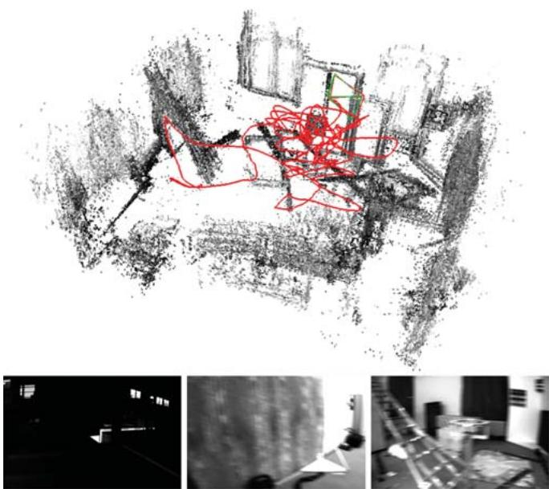  
Fig. 1: Bottom: Example images from the EuRoC-dataset: Low illumination, strong motion blur and little texture impose significant challenges for odometry estimation. Still our method is able to process all sequences with a rmse of less then 0.23m. Top: Reconstruction, estimated pose (blue camera) and groundtruth pose (green camera) at the end of V1 03 difficult.

Quantitative evaluation on the EuRoC dataset [2] demonstrates that we can reliably determine camera motion and sparse 3D structure (in metric units) from a visual-inertial system on a rapidly moving micro aerial vehicle (MAV) despite challenging illumination conditions (Fig. 1).

In summary, our contributions are:

a direct sparse visual-inertial odometry system.

a novel initialization strategy where scale and gravity direction are included into the model and jointly optimized after initialization.

we introduce ”dynamic marginalization” as a technique to adaptively employ marginalization strategies even in cases where certain variables undergo drastic changes.

an extensive evaluation on the challenging EuRoC dataset showing that both, the overall system and the initialization strategy outperform the state of the art.

## II. RELATED WORK

Motion estimation using cameras and IMUs has been a popular research topic for many years. In this section we will give a summary of visual, and visual-inertial odometry methods. We will also discuss approaches to the initialization of monocular visual-inertial odometry, where the initial orientation, velocity and scale are not known in advance.

The term visual odometry was introduced in the work of Nister et al. [24], who proposed to use frame-to-frame matching of the sparse set of points to estimate the motion of the cameras. Most of the early approaches were based on matching features detected in the images, in particular MonoSLAM [5], a real-time capable EKF-based method. Another prominent example is PTAM [15], which combines a bundle-adjustment backend for mapping with real-time capable tracking of the camera relative to the constructed map. Recently, a feature-based system capable of large-scale real-time SLAM was presented by Mur-Artal et al. [21].

Unlike feature-based methods, direct methods use unprocessed intensities in the image to estimate the motion of the camera. The first real-time capable direct approach for stereo cameras was presented in [4]. Several methods for motion estimation for RGB-D cameras were developed by Kerl et al. [14]. More recently, direct approaches were also applied to monocular cameras, in a dense [23], semi-dense [7], and sparse fashion [10] [6].

Due to the complementary nature of the IMU sensors, there were many attempts to combine them with vision. They provide good short-term motion prediction and make roll and pitch angles observable. At first, vision systems were used just as a provider of 6D pose measurements which were then inserted in the combined optimization. This, so-called loosely coupled approach, was presented in [20] and [8]. It is generally easier to implement, since the vision algorithm requires no modifications. On the other hand, tightly coupled approaches jointly optimize motion parameters in a combined energy function. They are able to capture more correlations in the multisensory data stream leading to more precision and robustness. Several prominent examples are filtering based approaches [17] [1] and energyminimization based approaches [16] [9] [26] [22].

Another issue relevant for the practical use of monocular visual-inertial odometry is initialization. Right after the start, the system has no prior information about the initial pose, velocities and depth values of observed points in the image. Since the energy functional that is being minimized is highly non-convex, a bad initialization might result in divergence of the system. The problem is even more complicated, since some types of motion do not allow to uniquely determine all these values. A closed form solution for initialization, together with analysis of the exceptional cases was presented in [19], and extended to consider IMU biases in [12].

## III. DIRECT SPARSE VISUAL-INERTIAL ODOMETRY

The following approach is based on iterative minimization of photometric and inertial errors in a non-linear optimization framework. To make the problem computationally feasible the optimization is performed on a window of recent frames while all older frames get marginalized out. Our approach is based on [6] and can be viewed as a direct formulation of [16]. In contrast to [26], we jointly determine poses and 3D geometry from a single optimization function. This results in better precision especially on hard sequences. Compared to [9] we perform a full bundle-adjustment like optimization instead of including structure-less vision error terms.

The proposed approach estimates poses and depths by minimizing the energy function

$$
E _ { \mathrm { t o t a l } } = \lambda \cdot E _ { \mathrm { p h o t o } } + E _ { \mathrm { i n e r t i a l } }\tag{1}
$$

which consists of the photometric error $E _ { \mathrm { p h o t o } }$ (section III-B) and an inertial error term $E _ { \mathrm { i n e r t i a l } }$ (section III-C).

The system contains two main parts running in parallel:

The coarse tracking is executed for every frame and uses direct image alignment combined with an inertial error term to estimate the pose of the most recent frame.

When a new keyframe is created we perform a visualinertial bundle adjustment like optimization that estimates the geometry and poses of all active keyframes.

In contrast to [22] we do not wait for a fixed amount of time before initializing the visual-inertial system but instead we jointly optimize all parameters including the scale. This yields a higher robustness as inertial measurements are used right from the beginning.

## A. Notation

Throughout the paper we will use the following notation: bold upper case letters H represent matrices, bold lower case x vectors and light lower case λ represent scalars. Transformations between coordinate frames are denoted as $\mathbf { T } _ { i - j } \ \in \ \mathbf { S } \mathbf { E } ( 3 )$ where point in coordinate frame i can be transformed to the coordinate frame $j$ using the following equation $\mathbf { p } _ { i } = \mathbf { T } _ { i _ { - } j } \mathbf { p } _ { j }$ . We denote Lie algebra elements as $\hat { \xi } \in \mathfrak { s e } ( 3 )$ , where $\boldsymbol { \xi } \in \mathbb { R } ^ { 6 }$ , and use them to apply small increments to the 6D pose $\pmb { \xi } _ { i _ { - } j } ^ { \prime } = \pmb { \xi } _ { i _ { - } j } \boxplus \pmb { \xi } : = \log \left( e ^ { \hat { \xi } _ { i _ { - } j } } \cdot e ^ { \hat { \pmb { \xi } } } \right) ^ { \vee }$

We define the world as a fixed inertial coordinate frame with gravity acting in negative Z axis. We also assume that the transformation from camera to IMU frame $T _ { \mathrm { i m u \_ c a m } }$ is fixed and calibrated in advance. Factor graphs are expressed as a set G of factors and we use $G _ { 1 } \cup G _ { 2 }$ to denote a factor graph containing all factors that are either in $G _ { 1 }$ or in $G _ { 2 }$

## B. Photometric Error

The photometric error of a point $p \in \Omega _ { i }$ in reference frame i observed in another frame $j$ is defined as follows:

$$
E _ { p j } = \sum _ { \mathbf { p } \in \mathcal { N } _ { p } } \omega _ { p } \Big | \Big | ( I _ { j } [ \pmb { p } ^ { \prime } ] - b _ { j } ) - \frac { t _ { j } e ^ { a _ { j } } } { t _ { i } e ^ { a _ { i } } } ( I _ { i } [ \pmb { p } ] - b _ { i } ) \Big | \Big | _ { \gamma } ,\tag{2}
$$

where $\mathcal { N } _ { p }$ is a small set of pixels around the point $p , I _ { i }$ and $I _ { j }$ are images of respective frames, $t _ { i } , t _ { j }$ are the exposure times, $a _ { i } , b _ { i } , a _ { j } , b _ { j }$ are the coefficients to correct for affine illumination changes, $\gamma$ is the Huber norm, $\omega _ { p }$ is a gradientdependent weighting and $p ^ { \prime }$ is the point projected into $I _ { j }$

With that we can formulate the photometric error as

$$
E _ { \mathrm { p h o t o } } = \sum _ { i \in \mathcal { F } } \sum _ { p \in \mathcal { P } _ { i } } \sum _ { j \in \mathrm { o b s } ( p ) } E _ { p j } ,\tag{3}
$$

where $\mathcal { F }$ is a set of keyframes that we are optimizing, $\mathcal { P } _ { i }$ is a sparse set of points in keyframe $i ,$ and $o b s ( \mathbf { p } )$ is a set of observations of the same point in other keyframes.

## C. Inertial Error

In order to construct the error term that depends on rotational velocities measured by the gyroscope and linear acceleration measured by the accelerometer we use the nonlinear dynamic model defined in [26, eq. (6), (7), (8)].

As IMU data is obtained with a much higher frequency than images we follow the preintegration approach proposed in [18] and improved in [3] and [9]. This allows us to add a single IMU factor describing the pose between two camera frames. For two states $s _ { i }$ and $s _ { j }$ (based on the state definition in Equation (9)), and IMU-measurements $\mathbf { } _ { a _ { i , j } }$ and $\omega _ { i , j }$ between the two images we obtain a prediction $\widehat { \mathbf { s } } _ { j }$ as well as an associated covariance matrix $\widehat { \Sigma } _ { s , j }$ . The corresponding error function is

$$
E _ { \mathrm { i n e r t i a l } } ( \pmb { s } _ { i } , \pmb { s } _ { j } ) : = ( \pmb { s } _ { j } \boxminus \widehat { \pmb { s } } _ { j } ) ^ { T } \widehat { \pmb { \Sigma } } _ { \pmb { s } , j } ^ { - 1 } ( \pmb { s } _ { j } \boxplus \widehat { \pmb { s } } _ { j } )\tag{4}
$$

where the operator $\boxminus$ applies $\xi _ { j } \ m \boxed { \xi _ { j } } ^ { - 1 }$ for poses and a normal subtraction for other components.

## D. IMU Initialization and the problem of observability

In contrast to a purely monocular system the usage of inertial data enables us to observe metric scale and gravity direction. This also implies that those values have to be properly initialized, otherwise optimization might diverge. Initialization of the monocular visual-inertial system is a well studied problem with an excellent summary provided in [19]. [19, Tables I and II] show that for certain motions immediate initialization is not possible, for example when moving with zero acceleration and constant non-zero velocity. To demonstrate that it is a real-world problem and not just a theoretical case we note that the state-of-the-art visualinertial SLAM system [22] uses the first 15 seconds of camera motion for the initialization on the EuRoC dataset to make sure that all values are observable.

Therefore we propose a novel strategy for handling this issue. We explicitly include scale (and gravity direction) as a parameter in our visual-inertial system and jointly optimize them together with the other values such as poses and geometry. This means that we can initialize with an arbitrary scale instead of waiting until it is observable. We initialize the various parameters as follows.

We use the same visual initializer as [6] which computes a rough pose estimate between two frames as well as approximate depths for several points. They are normalized so that the average depth is 1.

The initial gravity direction is computed by averaging up to 40 accelerometer measurements, yielding a sufficiently good estimate even in cases of high acceleration.

We initialize the velocity and IMU-biases with zero and the scale with 1.0.

All these parameters are then jointly optimized during a bundle adjustment like optimization.

## E. SIM(3)-based Representation of the World

In order to be able to start tracking and mapping with a preliminary scale and gravity direction we need to include them into our model. Therefore in addition to the metric coordinate frame we define the DSO coordinate frame to be a scaled and rotated version of it. The transformation from the DSO frame to the metric frame is defined as $\mathbf { T } _ { m - d } \in \mathbf { \Gamma } \{ \mathbf { T } \ \in \mathbf { \Gamma S I M } ( 3 )$ translation $\mathbf { \left( T \right) \Phi } = \mathbf { \Phi } 0 \}$ , together with the corresponding $\pmb { \xi } _ { m . d } = \log ( \mathbf { T } _ { m . d } ) \in \mathfrak { s i m } ( 3 )$ . We add a superscript D or M to all poses denoting in which coordinate frame they are expressed. In the optimization the photometric error is always evaluated in the DSO frame, making it independent of the scale and gravity direction, whereas the inertial error has to use the metric frame.

## F. Scale-aware Visual-inertial Optimization

We optimize the poses, IMU-biases and velocities of a fixed number of keyframes. Fig. 2a shows a factor graph of the problem. Note that there are in fact many separate visual factors connecting two keyframes each, which we have combined to one big factor connecting all the keyframes in this visualization. Each IMU-factor connects two subsequent keyframes using the preintegration scheme described in section III-C. As the error of the preintegration increases with the time between the keyframes we ensure that the time between two consecutive keyframes is not bigger than 0.5 seconds which is similar to what [22] have done. Note that in contrast to their method however we allow the marginalization procedure described in section III F.2 to violate this constraint which ensures that long-term relationships between keyframes can be properly observed.

An important property of our algorithm is that the optimized poses are not represented in the metric frame but in the DSO frame. This means that they do not depend on the scale of the environment.

1) Nonlinear Optimization: We perform nonlinear optimization using the Gauss-Newton algorithm. For each active keyframe we define a state vector

$$
\pmb { \mathscr { s } } _ { i } : = [ \left( \pmb { \xi } _ { c a m _ { i - } w } ^ { D } \right) ^ { T } , \pmb { v } _ { i } ^ { T } , \pmb { b } _ { i } ^ { T } , \pmb { a } _ { i } , \pmb { b } _ { i } , d _ { i } ^ { 1 } , d _ { i } ^ { 2 } , . . . , d _ { i } ^ { m } ] ^ { T }\tag{5}
$$

where $\boldsymbol { v } _ { i } \in \mathbb { R } ^ { 3 }$ is the velocity, $b _ { i } \in \mathbb { R } ^ { 6 }$ is the current IMU bias, $a _ { i }$ and $b _ { i }$ are the affine illumination parameters used in equation (2) and $d _ { i } ^ { j }$ are the inverse depths of the points hosted in this keyframe.

The full state vector is then defined as

$$
\pmb { s } = [ \pmb { c } ^ { T } , \pmb { \xi } _ { m . d } ^ { T } , \pmb { s } _ { 1 } ^ { T } , \pmb { s } _ { 2 } ^ { T } , . . . , \pmb { s } _ { n } ^ { T } ] ^ { T }\tag{6}
$$

where c contains the geometric camera parameters and $\xi _ { m , d }$ denotes the translation-free transformation between the DSO frame and the metric frame as defined in section III-E. We define the operator s - $s ^ { \prime }$ to work on state vectors by applying the concatenation operation $\pmb { \xi } \boxed { \mathrm { \bf ~ \ m } } \xi ^ { \prime }$ for Lie algebra components and a plain addition for other components.

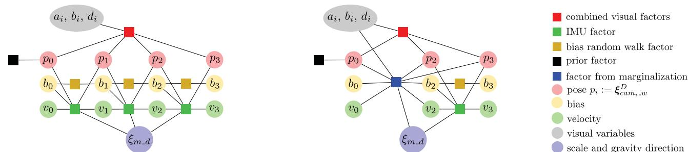  
(a) Factor graph for the visual-inertial optimization. (b) Factor graph after keyframe 1 was marginalized.  
Fig. 2: Factor graphs for the visual-inertial joint optimization before and after the marginalization of a keyframe.

Using the stacked residual vector r we define

$$
{ \bf J } = \left. \frac { d { \boldsymbol { r } } \left( s \equiv \epsilon \right) } { d \epsilon } \right| _ { \epsilon = 0 } , { \bf H } = { \bf J } ^ { T } { \bf W } { \bf J } \mathrm { ~ a n d ~ } b = - { \bf J } ^ { T } { \bf W } { \boldsymbol { r } }\tag{7}
$$

where W is a diagonal weight matrix. Then the update that we compute is $\delta = \mathbf { H } ^ { - 1 } b$

Note that the visual energy term $E _ { \mathrm { p h o t o } }$ and the inertial error term $E _ { \mathrm { i m u } }$ do not have common residuals. Therefore we can divide H and b each into two independent parts

$$
\mathbf { H } = \mathbf { H } _ { \mathrm { p h o t o } } + \mathbf { H } _ { \mathrm { i m u } } { \mathrm { ~ a n d ~ } } b = b _ { \mathrm { p h o t o } } + b _ { \mathrm { i m u } }\tag{8}
$$

As the inertial residuals compare the current relative pose to the estimate from the inertial data they need to use poses in the metric frame relative to the IMU. Therefore we define additional state vectors for the inertial residuals.

$$
\begin{array} { r } { \begin{array} { r } { s _ { i } ^ { \prime } : = [ \xi _ { w _ { - i m u _ { i } } , v _ { i } , b _ { i } } ^ { M } ] ^ { T } \mathrm { ~ a n d ~ } s ^ { \prime } = \left[ s _ { 1 } ^ { \prime T } , s _ { 2 } ^ { \prime T } , . . . , s _ { n } ^ { \prime T } \right] ^ { T } } \end{array} } \end{array}\tag{9}
$$

The inertial residuals lead to

$$
\mathbf { H } _ { \mathrm { i m u } } ^ { \prime } = \mathbf { J } _ { \mathrm { i m u } } ^ { \prime T } \mathbf { W } _ { \mathrm { i m u } } \mathbf { J } _ { \mathrm { i m u } } ^ { \prime } \mathrm { ~ a n d ~ } b _ { \mathrm { i m u } } ^ { \prime } = - \mathbf { J } _ { \mathrm { i m u } } ^ { \prime T } \mathbf { W } _ { \mathrm { i m u } } r _ { \mathrm { i m u } }\tag{10}
$$

For the joint optimization however we need to obtain $\mathbf { H } _ { \mathrm { i m u } }$ and $b _ { \mathrm { i m u } }$ based on the state definition in Equation (6). As the two definitions mainly differ in their representation of the poses we can compute $\mathbf { J } _ { \mathrm { r e l } }$ such that

$$
\mathbf { H } _ { \mathrm { i m u } } = \mathbf { J } _ { \mathrm { r e l } } ^ { T } \cdot \mathbf { H } _ { \mathrm { i m u } } ^ { \prime } \cdot \mathbf { J } _ { \mathrm { r e l } } \ \mathrm { a n d } \ b _ { \mathrm { i m u } } = \mathbf { J } _ { \mathrm { r e l } } ^ { T } \cdot { b _ { \mathrm { i m u } } ^ { \prime } }\tag{11}
$$

The computation of $\mathbf { J } _ { \mathrm { r e l } }$ is detailed in the supplementary material. Note that we represent all transformations as elements of sim(3) and fix the scale to 1 for all of them except $\pmb { \xi } _ { m _ { - } d } .$

2) Marginalization using the Schur-Complement: In order to compute Gauss-Newton updates in a reasonable time-frame we perform partial marginalization for older keyframes. This means that all variables corresponding to this keyframe (pose, bias, velocity and affine illumination parameters) are marginalized out using the Schur complement. Fig. 2b shows how marginalization changes the factor graph.

The marginalization of the visual factors is handled as in [6] by dropping residual terms that affect the sparsity of the system and by first marginalizing all points in the keyframe before marginalizing the keyframe itself.

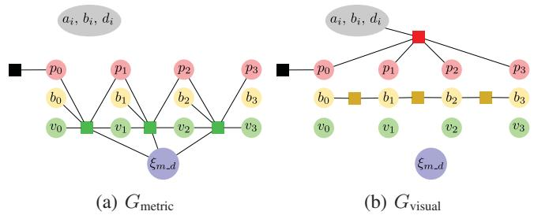  
Fig. 3: Partitioning of the factor graph from Fig. 2a into $G _ { \mathrm { m e t r i c } }$ and $G _ { \mathrm { v i s u a l } } . \ G _ { \mathrm { m e t r i c } }$ contains all IMU-factors while $G _ { \mathrm { v i s u a l } }$ contains the factors that do not depend on $\pmb { \xi } _ { m _ { - } d }$ . Note that both of them do not contain any marginalization factors.

Marginalization is performed using the Schur-complement [6, eq. (16), (17) and (18)]. As the factor resulting from marginalization requires the linearization point of all connected variables to remain fixed we apply [6, eq. (15)] to approximate the energy around further linearization points.

In order to maintain consistency of the system it is important that Jacobians are all evaluated at the same value for variables that are connected to a marginalization factor as otherwise the nullspaces get eliminated. Therefore we apply ”First Estimates Jacobians”. For the visual factors we follow [6] and evaluate $\mathbf { J } _ { \mathrm { p h o t o } }$ and $\mathbf { J } _ { \mathrm { { g e o } } }$ at the linearization point. When computing the inertial factors we fix the evaluation point of $\mathbf { J } _ { \mathrm { r e l } }$ for all variables which are connected to a marginalization factor. Note that this always includes $\xi _ { m , d } .$

3) Dynamic Marginalization for Delayed Scale Convergence: The marginalization procedure described in subsection III-F.2 has two purposes: reduce the computation complexity of the optimization by removing old states and maintain the information about the previous states of the system. This procedure fixes the linearization points of the states connected to the old states, so they should already have a good estimate. In our scenario this is the case for all variables except of scale.

The main idea of ”Dynamic marginalization” is to maintain several marginalization priors at the same time and reset the one we currently use when the scale estimate moves too far from the linearization point in the marginalization prior.

In our implementation we use three marginalization priors: $M _ { \mathrm { v i s u a l } } , ~ M _ { \mathrm { c u r r } }$ and $M _ { \mathrm { h a l f } } . ~ M _ { \mathrm { v i s u a l } }$ contains only scale independent information from previous states of the vision and cannot be used to infer the global scale. $M _ { \mathrm { c u r r } }$ contains all information since the time we set the linearization point for the scale and $M _ { \mathrm { h a l f } }$ contains only the recent states that have a scale close to the current estimate.

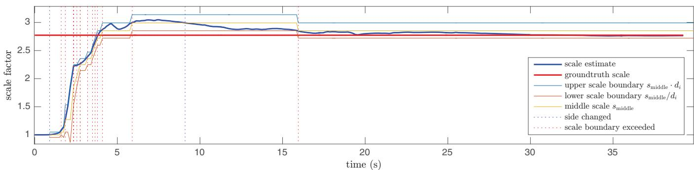  
Fig. 4: The scale estimation running on the V1 03 difficult sequence from the EuRoC dataset. We show the current scale estimate (bold blue), the groundtruth scale (bold red) and the current scale interval (light lines). The vertical dotted lines denote when the side changes (blue) and when the boundary of the scale interval is exceeded (red). In practice this means that $M _ { \mathrm { c u r r } }$ contains the inertial factors since the last blue or red dotted line that is before the last red dotted line. For example at 16s it contains all inertial data since the blue line at 9 seconds.

When the scale estimate deviates too much from the linearization point of $M _ { \mathrm { c u r r } }$ , the value of $M _ { \mathrm { c u r r } }$ is set to $M _ { \mathrm { h a l f } }$ and $M _ { \mathrm { h a l f } }$ is set to $M _ { \mathrm { v i s u a l } }$ with corresponding changes in the linearization points. This ensures that the optimization always has some information about the previous states with consistent scale estimates. In the remaining part of the section we provide the details of our implementation.

We define $G _ { \mathrm { m e t r i c } }$ to contain only the visual-inertial factors (which depend on $\xi _ { m , d } )$ and $G _ { \mathrm { v i s u a l } }$ to contain all other factors, except the marginalization priors. Then

$$
G _ { \mathrm { f u l l } } = G _ { \mathrm { m e t r i c } } \cup G _ { \mathrm { v i s u a l } }\tag{12}
$$

Fig. 3 depicts the partitioning of the factor graph.

We define three different marginalization factors $M _ { \mathrm { c u r r } } .$ $M _ { \mathrm { v i s u a l } }$ and $M _ { \mathrm { h a l f } }$ . For the optimization we always compute updates using the graph

$$
G _ { b a } = G _ { \mathrm { m e t r i c } } \cup G _ { \mathrm { v i s u a l } } \cup M _ { \mathrm { c u r r } }\tag{13}
$$

When keyframe i is marginalized we update $M _ { \mathrm { v i s u a l } }$ with the factor arising from marginalizing frame i in $G _ { \mathrm { v i s u a l } } \cup$ $M _ { \mathrm { v i s u a l } }$ . This means that $M _ { \mathrm { v i s u a l } }$ contains all marginalized visual factors and no marginalized inertial factors making it independent of the scale.

For each marginalized keyframe i we define

$s _ { i } : =$ scale estimate at the time, i was marginalized (14)

We define $i \in M$ if and only if M contains an inertial factor that was marginalized at time i. Using this we enforce the following constraints for inertial factors.

$$
\forall i \in M _ { \mathrm { c u r r } } : s _ { i } \in [ s _ { \mathrm { m i d d l e } } / d _ { i } , s _ { \mathrm { m i d d l e } } \cdot d _ { i } ]\tag{15}
$$

$$
\forall i \in M _ { \mathrm { h a l f } } : s _ { i } \in \left\{ \begin{array} { l l } { \left[ s _ { \mathrm { m i d d l e } } , s _ { \mathrm { m i d d l e } } \cdot d _ { i } \right] , } & { \mathrm { i f ~ } s _ { \mathrm { c u r r } } > s _ { \mathrm { m i d d l e } } } \\ { \left[ s _ { \mathrm { m i d d l e } } / d _ { i } , s _ { \mathrm { m i d d l e } } \right] , } & { \mathrm { o t h e r w i s e } } \end{array} \right.\tag{16}
$$

where $s _ { \mathrm { m i d d l e } }$ is the current middle of the allowed scale interval (initialized with $s _ { 0 } )$ , di is the size of the scale interval at time $i ,$ and $s _ { \mathrm { c u r r } }$ is the current scale estimate.

We update $M _ { \mathrm { c u r r } }$ by marginalizing frame i in $G _ { \mathrm { b a } }$ and we update $M _ { \mathrm { h a l f } }$ by marginalizing i in $G _ { \mathrm { m e t r i c } } \cup G _ { \mathrm { v i s u a l } } \cup M _ { \mathrm { h a l f } }$

In order to preserve the constraints in Equations (15) and (16) we apply Algorithm 1 everytime a marginalization happens. By following these steps on the one hand we make sure that the constraints are satisfied which ensures that the scale difference in the currently used marginalization factor stays smaller than $d _ { i } ^ { 2 } .$ . On the other hand the factor always contains some inertial factors so that the scale estimation works at all times. Note also that $M _ { \mathrm { c u r r } }$ and $M _ { \mathrm { h a l f } }$ have separate First Estimate Jacobians that are employed when the respective marginalization factor is used. Fig. 4 shows how the system works in practice.

Algorithm 1 Constrain Marginalization   
upper $ s _ { \mathrm { c u r r } } > s _ { \mathrm { 1 } }$ middle   
if upper = lastUpper then  Side changes.   
$M _ { \mathrm { h a l f } }  M _ { \mathrm { v i s u a l } }$   
end if   
if scurr $> s _ { \mathrm { m i d d l e } } \cdot d _ { i }$ then  Upper boundary exceeded.   
$M _ { \mathrm { c u r r } }  M _ { \mathrm { h a l f } }$   
$M _ { \mathrm { h a l f } }  M _ { \mathrm { v i s u a l } }$   
$s _ { \mathrm { m i d d l e } }  s _ { \mathrm { m i d d l e } } \cdot d _ { i }$   
end if   
if $s _ { \mathrm { c u r r } } < s _ { \mathrm { m i d d l e } } / d _ { i }$ then  Lower boundary exceeded.   
$M _ { \mathrm { c u r r } }  M _ { \mathrm { h a l f } }$   
$M _ { \mathrm { h a l f } }  M _ { \mathrm { v i s u a l } }$   
$s _ { \mathrm { m i d d l e } }  s _ { \mathrm { m i d d l e } } / d _ { i }$   
end if   
lastUpper  upper

An important part of this strategy is the choice of $d _ { i } .$ It should be small, in order to keep the system consistent, but not too small so that $M _ { \mathrm { c u r r } }$ always contains enough inertial factors. Therefore we chose to dynamically adjust the parameter as follows. At all time steps i we calculate

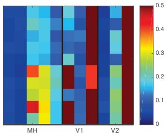  
(a) DSO [6] realtime gt-scaled

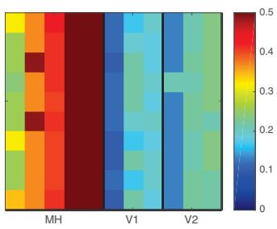

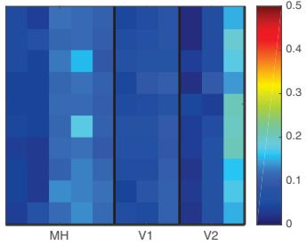  
(c) our method realtime gt-scaled

(b) ROVIO realtime [1]  
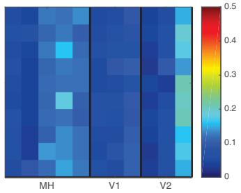  
(d) our method realtime  
Fig. 5: rmse for different methods run 10 times (lines) on each sequence (columns) of the EuRoC dataset.

$$
d _ { i } = \operatorname* { m i n } \left\{ d _ { \operatorname* { m i n } } ^ { j } \mid j \in \mathbb { N } \setminus \{ 0 \} , \frac { s _ { i } } { s _ { i - 1 } } < d _ { i } \right\}\tag{17}
$$

This ensures that it cannot happen that the $M _ { \mathrm { h a l f } }$ gets reset to $M _ { \mathrm { v i s u a l } }$ at the same time that $M _ { \mathrm { c u r r } }$ is exchanged with $M _ { \mathrm { h a l f } }$ . Therefore it prevents situations where $M _ { \mathrm { c u r r } }$ contains no inertial factors at all, making the scale estimation more reliable. In our experiments we chose $d _ { \operatorname* { m i n } } = \sqrt { 1 . 1 }$

## G. Coarse Visual-Inertial Tracking

The coarse tracking is responsible for computing a fast pose estimate for each frame that also serves as an initialization for the joint optimization detailed in III-F. We perform conventional direct image alignment between the current frame and the latest keyframe, while keeping the geometry and the scale fixed. Inertial residuals using the previously described IMU preintegration scheme are placed between subsequent frames. Everytime the joint optimization is finished for a new frame, the coarse tracking is reinitialized with the new estimates for scale, gravity direction, bias, and velocity as well as the new keyframe as a reference for the visual factors. Similar to the joint optimization we perform partial marginalization to keep the update time constrained. After estimating the variables for a new frame we marginalize out all variables except the keyframe pose and the variables of the newest frame. In contrast to the joint optimization we do not need to use dynamic marginalization because the scale is not included in the optimization.

## IV. RESULTS

We evaluate our approach on the publicly available EuRoC dataset [2]. The performance is compared to [6], [1], [21], [26], [16] and [13]. We also provide supplementary material with more evaluation and a video at vision.in.tum.de/vi-dso.

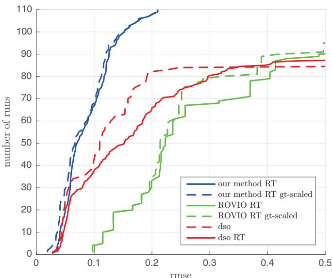  
Fig. 6: Cumulative error plot on the EuRoC-dataset (RT means realtime). This experiment demonstrates that the additional IMU not only provides a reliable scale estimate, but that it also significantly increases accuracy and robustness.

## A. Robust Quantitative Evaluation

In order to obtain an accurate evaluation we run our method 10 times for each sequence of the dataset (using the left camera). We directly compare the results to visualonly DSO [6] and ROVIO [1]. As DSO cannot observe the scale we evaluate using the optimal ground truth scale in some plots (with the description ”gt-scaled”) to enable a fair comparison. For all other results we scale the trajectory with the final scale estimate (our method) or with 1 (other methods). For DSO we use the results published together with their paper. We use the same start and end times for each sequence to run our method and ROVIO. Note that the drone has a high initial velocity in some sequences when using these start times making it especially challenging for our IMU initialization. Fig. 5 shows the root mean square error (rmse) for every run and Fig. 6 displays the cumulative error plot. Clearly our method significantly outperforms DSO and ROVIO. Without inertial data DSO is not able to work on all sequences especially on V1 03 difficult and V2 03 difficult and it is also not able to scale the results correctly. ROVIO on the other hand is very robust but as a filtering-based method it cannot provide sufficient accuracy.

Table I shows a comparison to several other methods. For our results we have displayed the median error for each sequence from the 10 runs plotted in Fig. 5c. This makes the results very meaningful. For the other methods unfortunately only one result was reported so we have to assume that they are representative as well. The results for [16] and [13] were taken from [13]. The results for [21] (as reported in their paper) differ slightly from the other methods as they show the error of the keyframe trajectory instead of the full trajectory. This is a slight advantage as keyframes are bundle-adjusted in their method which does not happen for the other frames.

TABLE I: Accuracy of the estimated trajectory on the EuRoC dataset for several methods. Note that ORB-SLAM does a convincing job showing leading performance on some of the sequences. Nevertheless, since our method directly works on the sensor data (colors and IMU measurements), we observe similar precision and a better robustness – even without loop closuring. Moreover, the proposed method is the only one not to fail on any of the sequences.
<table><tr><td>Sequence</td><td></td><td>MH1</td><td>MH2</td><td>MH3</td><td>MH4</td><td>MH5</td><td>V11</td><td>V12</td><td>V13</td><td>V21</td><td>V22</td><td>V23</td></tr><tr><td rowspan="4">VI-DSO (our method, RT) (median of 10 runs each)</td><td>RMSE</td><td>0.062</td><td>0.044</td><td>0.117</td><td>0.132</td><td>0.121</td><td>0.059</td><td>0.067</td><td>0.096</td><td>0.040</td><td>0.062</td><td>0.174</td></tr><tr><td>RMSE gt-scaled</td><td>0.041</td><td>0.041</td><td>0.116</td><td>0.129</td><td>0.106</td><td>0.057</td><td>0.066</td><td>0.095</td><td>0.031</td><td>0.060</td><td>0.173</td></tr><tr><td>Scale Error (%)</td><td>1.1</td><td>0.5</td><td>0.4</td><td>0.2</td><td>0.8</td><td>1.1</td><td>1.1</td><td>0.8</td><td>1.2</td><td>0.3</td><td>0.4</td></tr><tr><td>RMSE</td><td>0.075</td><td>0.084</td><td>0.087</td><td>0.217</td><td>0.082</td><td>0.027</td><td>0.028</td><td>X</td><td>0.032</td><td>0.041</td><td>0.074</td></tr><tr><td>VI ORB-SLAM (keyframe trajectory)</td><td>RMSE gt-scaled</td><td>0.072</td><td>0.078</td><td>0.067</td><td>0.081</td><td>0.077</td><td>0.019</td><td>0.024</td><td>X</td><td>0.031</td><td>0.026</td><td>0.073</td></tr><tr><td></td><td>Scale Error (%)</td><td>0.5</td><td>0.8</td><td>1.5</td><td>3.4</td><td>0.5</td><td>0.9</td><td>0.8</td><td>X</td><td>0.2</td><td>1.4</td><td>0.7</td></tr><tr><td>VI odometry [16], mono</td><td>RMSE</td><td>0.34</td><td>0.36</td><td>0.30</td><td>0.48</td><td>0.47</td><td>0.12</td><td>0.16</td><td>0.24</td><td>0.12</td><td>0.22</td><td>X</td></tr><tr><td>VI odometry [16], stereo</td><td>RMSE</td><td>0.23</td><td>0.15</td><td>0.23</td><td>0.32</td><td>0.36</td><td>0.04</td><td>0.08</td><td>0.13</td><td>0.10</td><td>0.17</td><td>X</td></tr><tr><td>VI SLAM [13], mono</td><td>RMSE</td><td>0.25</td><td>0.18</td><td>0.21</td><td>0.30</td><td>0.35</td><td>0.11</td><td>0.13</td><td>0.20</td><td>0.12</td><td>0.20</td><td>X</td></tr><tr><td>VI SLAM [13], stereo</td><td>RMSE</td><td>0.11</td><td>0.09</td><td>0.19</td><td>0.27</td><td>0.23</td><td>0.04</td><td>0.05</td><td>0.11</td><td>0.10</td><td>0.18</td><td>X</td></tr></table>

In comparison to VI ORB-SLAM our method outperforms it in terms of rmse on several sequences. As ORB-SLAM is a SLAM system while ours is a pure odometry method this is a remarkable achievement especially considering the differences in the evaluation. Note that the Vicon room sequences (V\*) are executed in a small room and contain a lot of loopy motions where the loop closures done by a SLAM system significantly improve the performance. Also our method is more robust as ORB-SLAM fails to track one sequence. Even considering only sequences where ORB-SLAM works our approach has a lower maximum rmse.

Compared to [16] and [13] our method obviously outperforms them. It is better than the monocular versions on every single sequence and it beats even the stereo and SLAMversions on 9 out of 11 sequences.

In summary our method is the only one which is able to track all the sequences successfully except ROVIO.

We also compare the Relative Pose Error to [21] and [26] on the V1 0\*-sequences of EuRoC (Fig. 7). While our method cannot beat the SLAM system and the stereo method on the easy sequence we outperform [26] and are as good as [21] on the medium sequence. On the hard sequence we outperform both of the contenders even though we neither use stereo nor loop-closures.

## B. Evaluation of the Initialization

There are only few methods we can compare our initialization to. Some approaches like [19] have not been tested on real data. While [12] provides results on real data, the dataset used was featuring a downward-looking camera and an environment with a lot of features which is not comparable to the EuRoC-dataset in terms of difficulty. Also they do not address the problem of late observability which suggests that a proper motion is performed in the beginning of their dataset. As a filtering-based method ROVIO does not need a specific initialization procedure but it also cannot compete in terms of accuracy making it less relevant for this discussion. Visual-inertial LSD-SLAM uses stereo and therefore does not face the main problem of scale estimation.

Therefore we compare our initialization procedure to visualinertial ORB-SLAM [21] as both of the methods work on the challenging EuRoC-dataset and have to estimate the scale, gravity direction, bias, and velocity.

In comparison to [21] our estimated scale is better overall (Table I). On most sequences our method provides a better scale, and our average scale error (0.7% compared to 1.0%) as well as our maximum scale error (1.2% compared to 3.4%) is lower. In addition our method is more robust as the initialization procedure of [21] fails on V1 03 difficult.

Apart from the numbers we argue that our approach is superior in terms of the general structure. While [21] have to wait for 15 seconds until the initialization is performed, our method provides an approximate scale and gravity direction almost instantly, that gets enhanced over time. Whereas in [21] the pose estimation has to work for 15 seconds without any IMU data, in our method the inertial data is used to improve the pose estimation from the beginning. This is probably one of the reasons why our method is able to process V1 03 difficult. Finally our method is better suited for robotics applications. For example an autonomous drone is not able to fly without gravity direction and scale for 15 seconds and hope that afterwards the scale was observable. In contrast our method offers both of them right from the start. The continuous rescaling is also not a big problem as an application could use the unscaled measurements for building a consistent map and for providing flight goals, whereas the scaled measurements can be used for the controller. Fig. 8 shows the scale estimation for MH 04.

Overall we argue that our initialization procedure exceeds the state of the art and think that the concept of initialization with a very rough scale estimate and jointly estimating it during pose estimation will be a useful concept in the future.

## V. CONCLUSION

We have presented a novel formulation of direct sparse visual-inertial odometry. We explicitely include scale and gravity direction in our model in order to deal with cases where the scale is not immediately observable. As the initial

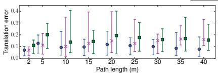  
(a) Translation error V1 01 easy

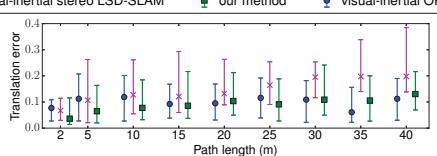

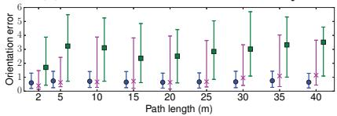  
(d) Orientation error V1 01 easy

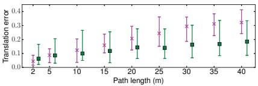

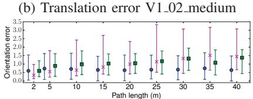  
(e) Orientation error V1 02 medium

(c) Translation error V1 03 difficult  
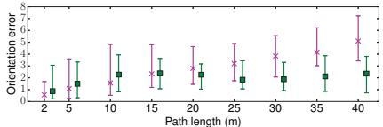  
(f) Orientation error V1 03 difficult

Fig. 7: Relative Pose Error evaluated on three sequences of the EuRoC-dataset for visual-inertial ORB-SLAM [21], visual inertial stereo LSD-SLAM [26] and our method. Although the proposed VI-DSO does not use loop closuring (like [21]) or stereo (like [26]), VI-DSO is quite competitive in terms of accuracy and robustness. Note that [21] with loop closures is slightly more accurate on average, yet it entirely failed on V1 03 difficult.

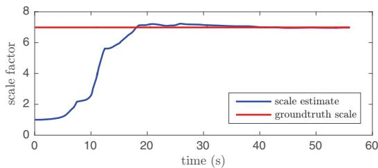  
Fig. 8: Scale estimate for MH 04 difficult (median result of 10 runs in terms of tracking accuracy). Note how the estimated scale converges to the correct value despite being initialized far from the optimum.

scale can be very far from the optimum we have proposed a novel technique called dynamic marginalization where we maintain multiple marginalization priors and constrain the maximum scale difference. Extensive quantitative evaluation demonstrates that the proposed visual-inertial odometry method outperforms the state of the art, both the complete system as well as the IMU initialization procedure. In particular, experiments confirm that the inertial information not only provides a reliable scale estimate, but it also drastically increases precision and robustness.

## ACKNOWLEDGEMENTS

We thank Jakob Engel for releasing the code of DSO and for his helpful comments on First Estimates Jacobians, and the authors of [21] for providing their numbers for the comparison in Fig. 7.

## REFERENCES

[1] M. Bloesch, S. Omari, M. Hutter, and R. Siegwart, “Robust visual inertial odometry using a direct EKF-based approach,” in IEEE/RSJ IROS, 2015.

[2] M. Burri, J. Nikolic, P. Gohl, T. Schneider, J. Rehder, S. Omari, M. W. Achtelik, and R. Siegwart, “The euroc micro aerial vehicle datasets,” IJRR, 2016.

[3] L. Carlone, Z. Kira, C. Beall, V. Indelman, and F. Dellaert, “Eliminating conditionally independent sets in factor graphs: A unifying perspective based on smart factors,” in IEEE ICRA, 2014.

[4] A. Comport, E. Malis, and P. Rives, “Accurate quadri-focal tracking for robust 3D visual odometry,” in IEEE ICRA, 2007.

[5] A. Davison, I. Reid, N. Molton, and O. Stasse, “MonoSLAM: Realtime single camera SLAM,” TPAMI, vol. 29, 2007.

[6] J. Engel, V. Koltun, and D. Cremers, “Direct sparse odometry,” TPAMI, vol. 40, 2018.

[7] J. Engel, T. Schops, and D. Cremers, “LSD-SLAM: Large-scale direct¨ monocular SLAM,” in Proc. of ECCV, 2014.

[8] J. Engel, J. Sturm, and D. Cremers, “Camera-based navigation of a low-cost quadrocopter,” in IEEE/RSJ IROS, 2012.

[9] C. Forster, L. Carlone, F. Dellaert, and D. Scaramuzza, “IMU preintegration on manifold for efficient visual-inertial maximum-a-posteriori estimation,” in Proc. of RSS, 2015.

[10] C. Forster, M. Pizzoli, and D. Scaramuzza, “SVO: fast semi-direct monocular visual odometry,” in IEEE ICRA, 2014.

[11] A. Geiger, P. Lenz, and R. Urtasun, “Are we ready for autonomous driving? The KITTI vision benchmark suite,” in IEEE CVPR, 2012.

[12] J. Kaiser, A. Martinelli, F. Fontana, and D. Scaramuzza, “Simultaneous state initialization and gyroscope bias calibration in visual inertial aided navigation,” IEEE Robot. and Autom. Lett., vol. 2, no. 1, 2017.

[13] A. Kasyanov, F. Engelmann, J. Stuckler, and B. Leibe, “Keyframe-¨ Based Visual-Inertial Online SLAM with Relocalization,” ArXiv eprints:1702.02175, 2017.

[14] C. Kerl, J. Sturm, and D. Cremers, “Robust odometry estimation for RGB-D cameras,” in IEEE ICRA, 2013.

[15] G. Klein and D. Murray, “Parallel tracking and mapping for small AR workspaces,” in Proc. of ISMAR, 2007.

[16] S. Leutenegger, S. Lynen, M. Bosse, R. Siegwart, and P. Furgale, “Keyframe-based visual-inertial odometry using nonlinear optimization,” IJRR, 2014.

[17] M. Li and A. Mourikis, “High-precision, consistent EKF-based visualinertial odometry,” IJRR, vol. 32, 2013.

[18] T. Lupton and S. Sukkarieh, “Visual-inertial-aided navigation for high-dynamic motion in built environments without initial conditions,” IEEE Trans. on Robotics, vol. 28, no. 1, pp. 61–76, 2012.

[19] A. Martinelli, “Closed-form solution of visual-inertial structure from motion,” IJCV, vol. 106, no. 2, 2014.

[20] L. Meier, P. Tanskanen, F. Fraundorfer, and M. Pollefeys, “Pixhawk: A system for autonomous flight using onboard computer vision,” in IEEE ICRA, 2011.

[21] R. Mur-Artal, J. M. M. Montiel, and J. D. Tardos, “Orb-slam: A´ versatile and accurate monocular slam system,” IEEE Trans. on Robotics, vol. 31, no. 5, pp. 1147–1163, Oct 2015.

[22] R. Mur-Artal and J. D. Tardos, “Visual-inertial monocular slam with´ map reuse,” IEEE Robot. and Autom. Lett., vol. 2, no. 2, 2017.

[23] R. Newcombe, S. Lovegrove, and A. Davison, “DTAM: Dense tracking and mapping in real-time,” in IEEE ICCV, 2011.

[24] D. Nister, O. Naroditsky, and J. Bergen, “Visual odometry,” in IEEE CVPR, vol. 1, June 2004, pp. I–652–I–659 Vol.1.

[25] A. Stelzer, H. Hirschmuller, and M. G¨ orner, “Stereo-vision-based¨ navigation of a six-legged walking robot in unknown rough terrain,” IJRR, 2012.

[26] V. Usenko, J. Engel, J. Stuckler, and D. Cremers, “Direct visual-inertial¨ odometry with stereo cameras,” in IEEE ICRA, May 2016.