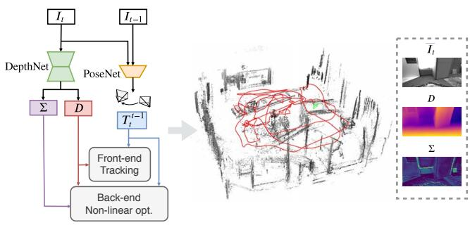
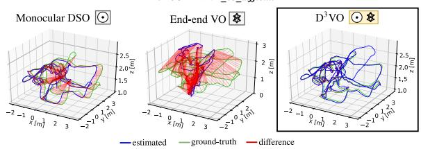
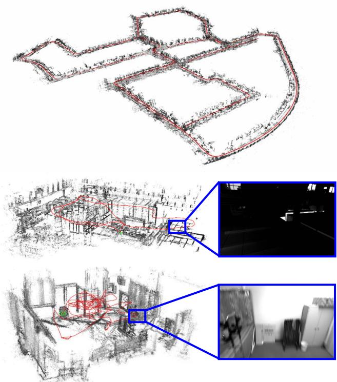
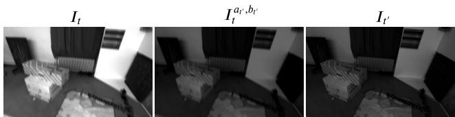
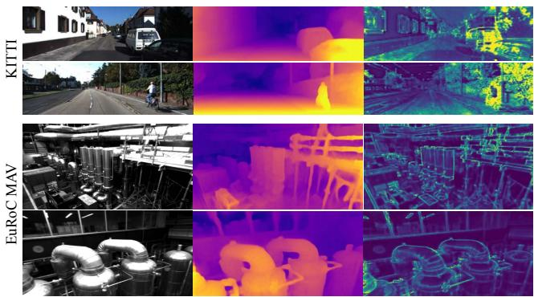
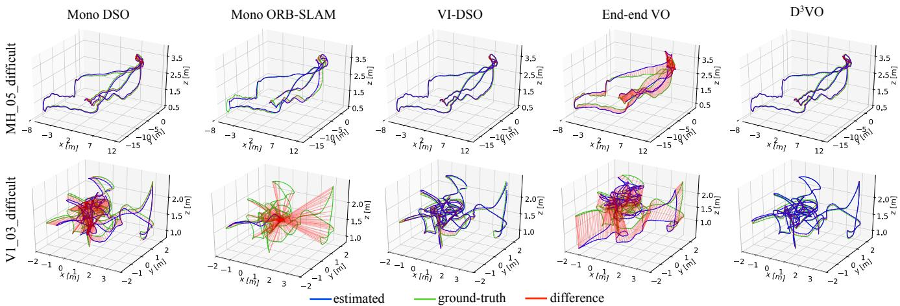

# D3VO: Deep Depth, Deep Pose and Deep Uncertainty for Monocular Visual Odometry

Nan Yang1,2 Lukas von Stumberg1,2 Rui Wang1,2 Daniel Cremers1,2 1 Technical University of Munich 2 Artisense

## Abstract

We propose D3VO as a novel framework for monocular visual odometry that exploits deep networks on three levels – deep depth, pose and uncertainty estimation. We first propose a novel self-supervised monocular depth estimation network trained on stereo videos without any external supervision. In particular, it aligns the training image pairs into similar lighting condition with predictive brightness transformation parameters. Besides, we model the photometric uncertainties of pixels on the input images, which improves the depth estimation accuracy and provides a learned weighting function for the photometric residuals in direct (feature-less) visual odometry. Evaluation results show that the proposed network outperforms state-ofthe-art self-supervised depth estimation networks. D3VO tightly incorporates the predicted depth, pose and uncertainty into a direct visual odometry method to boost both the front-end tracking as well as the back-end non-linear optimization. We evaluate D3VO in terms of monocular visual odometry on both the KITTI odometry benchmark and the EuRoC MAV dataset. The results show that D3VO outperforms state-of-the-art traditional monocular VO methods by a large margin. It also achieves comparable results to state-of-the-art stereo/LiDAR odometry on KITTI and to the state-of-the-art visual-inertial odometry on Eu-RoC MAV, while using only a single camera.

## 1. Introduction

Deep learning has swept most areas of computer vision – not only high-level tasks like object classification, detection and segmentation [30, 39, 58], but also low-level ones such as optical flow estimation [12, 65] and interest point detection and description [11, 13, 79]. Yet, in the field of Simultaneously Localization And Mapping (SLAM) or Visual Odometry (VO) which estimates the relative camera poses from image sequences, traditional geometric-based approaches [16, 17, 53] still dominate the field. While monocular methods [16,52] have the advantage of low hardware cost and less calibration effort, they cannot achieve competitive performance compared to stereo [53, 74] or visual-inertial odometry (VIO) [44, 54, 56, 72], due to the scale drift [62, 77] and low robustness. Recently, there have been many efforts to address this by leveraging deep neural networks [48, 68, 80, 83]. It has been shown that with deep monocular depth estimation networks [26, 27, 43, 78], the performance of monocular VO is boosted, since deep networks are able to estimate depth maps with consistent metric scale by learning a-priori knowledge from a large amount of data [42].

  
Figure 1: We propose D3VO – a novel monocular visual odometry (VO) framework which exploits deep neural networks on three levels: Deep depth (D), Deep pose $( T _ { t } ^ { \hat { t } - 1 } )$ and Deep uncertainty (Σ) estimation. D3VO integrates the three estimations tightly into both the front-end tracking and the back-end non-linear optimization of a sparse direct odometry framework [16].

In this way, however, deep neural networks are only used to a limited degree. Recent advances of self- and unsupervised monocular depth estimation networks [26, 86] show that the poses of the adjacent monocular frames can be predicted together with the depth. Since the pose estimation from deep neural networks shows high robustness, one question arises: Can the deep-predicted poses be employed to boost traditional VO? On the other hand, since

SLAM/VO is essentially a state estimation problem where uncertainty plays an important role [19, 63, 69] and meanwhile many learning based methods have started estimating uncertainties, the next question is, how can we incorporate such uncertainty-predictions into optimization-based VO?

In this paper, we propose D3VO as a framework for monocular direct (feature-less) visual VO that exploits selfsupervised monocular depth estimation network on three levels: deep depth, pose and uncertainty estimation, as shown in Fig. 1. To this end, we first propose a purely self-supervised network trained with stereo videos. The proposed self-supervised network predicts the depth from a single image with DepthNet and the pose between two adjacent frames with PoseNet. The two networks are bridged by minimizing the photometric error originated from both static stereo warping with the rectified baseline and temporal warping using the predicted pose. In this way, the temporal information is incorporated into the training of depth, which leads to more accurate estimation. To deal with the inconsistent illumination between the training image pairs, our network predicts the brightness transformation parameters which align the brightness of source and target images during training on the fly. The evaluation on the EuRoC MAV dataset shows that the proposed brightness transformation significantly improves the depth estimation accuracy. To integrate the deep depth into VO system, we firstly initialize every new 3D point with the predicted depth with a metric scale. Then we adopt the virtual stereo term proposed in Deep Virtual Stereo Odometry (DVSO) [78] to incorporate the predicted pose into the non-linear optimization. Unlike DVSO which uses a semi-supervised monocular depth estimation network relying on auxiliary depth extracted from state-of-the-art stereo VO system [74], our network uses only stereo videos without any external depth supervision.

Although the illumination change is explicitly modeled, it is not the only factor which may violate the brightness constancy assumption [40]. Other factors, e.g., non-Lambertian surfaces, high-frequency areas and moving objects, also corrupt it. Inspired by the recent research on aleatoric uncertainty by deep neural networks [35, 40], the proposed network estimates the photometric uncertainty as predictive variance conditioned on the input image. As a result, the errors originated from pixels which are likely to violate the brightness constancy assumption are downweighted. The learned weights of the photometric residuals also drive us to the idea of incorporating it into direct VO – since both the self-supervised training scheme and the direct VO share a similar photometric objective, we propose to use the learned weights to replace the weighting function of the photometric residual in traditional direct VO which is empirically set [61] or only accounts for the intrinsic uncertainty of the specific algorithm itself [16, 37].

Robustness is one of the most important factors in designing VO algorithm. However, traditional monocular visual VO suffers from a lack of robustness when confronted with low textured areas or fast movement [72]. The typical solution is to introduce an inertial measurement unit (IMU). But this increases the calibration effort and, more importantly, at constant velocity, IMUs cannot deliver the metric scale in constant velocity [50]. We propose to increase the robustness of monocular VO by incorporating the estimated pose from the deep network into both the front-end tracking and the back-end non-linear optimization. For the frontend tracking, we replace the pose from the constant velocity motion model with the estimated pose from the network. Besides, the estimated pose is also used as a squared regularizer in addition to direct image alignment [66]. For the back-end non-linear optimization, we propose a pose energy term which is jointly minimized with the photometric energy term of direct VO.

We evaluate the proposed monocular depth estimation network and D3VO on both KITTI [25] and EuRoC MAV [5]. We achieve state-of-the-art performances on both monocular depth estimation and camera tracking. In particular, by incorporating deep depth, deep uncertainty and deep pose, D3VO achieves comparable results to state-ofthe-art stereo/LiDAR methods on KITTI Odometry, and also comparable results to the state-of-the-art VIO methods on EuRoC MAV, while being a monocular method.

## 2. Related Work

Deep learning for monocular depth estimation. Supervised learning [15, 43, 45] shows great performance on monocular depth estimation. Eigen et al. [14, 15] propose to use multi-scale CNNs which directly regresses the pixel-wise depth map from a single input image. Laina et al. [43] propose a robust loss function to improve the estimation accuracy. Fu et al. [24] recast the monocular depth estimation network as an ordinal regression problem and achieve superior performance. More recent works start to tackle the problem in a self- and unsupervised way by learning the depth map using the photometric error [27, 28, 49, 73, 81, 82, 86] and adopting differentiable interpolation [32]. Our self-supervised depth estimation network builds upon MonoDepth2 [26] and extends it by predicting the brightness transformation parameters and the photometric uncertainty.

Deep learning for uncertainty estimation. The uncertainty estimation of deep learning has recently been investigated in [35, 36] where two types of uncertainties are proposed. Klodt et al. [40] propose to leverage the concept of aleatoric uncertainty to estimate the photometric and the depth uncertainties in order to improve the depth estimation accuracy. However, when formulating the photometric uncertainty, they do not consider brightness changes across different images which in fact can be modeled explicitly. Our method predicts the photometric uncertainty conditioned on the brightness-aligned image, which can deliver better photometric uncertainty estimation. Besides, we also seek to make better use of our learned uncertainties and propose to incorporate them into traditional VO systems [16].

Deep learning for VO / SLAM. End-to-end learned deep neural networks have been explored to directly predict the relative poses between images with supervised [70, 75, 85] or unsupervised learning [46, 73, 82, 86]. Besides pose estimation, CodeSLAM [2] delivers dense reconstruction by jointly optimizing the learned prior of the dense geometry together with camera poses. However, in terms of pose estimation accuracy all these end-to-end methods are inferior to classical stereo or visual inertial based VO methods. Building on the success of deep monocular depth estimation, several works integrate the predicted depth/disparity map into monocular VO systems [68, 78] to improve performance and eliminate the scale drift. CNN-SLAM [68] fuses the depth predicted by a supervised deep neural network into LSD-SLAM [17] and the depth maps are refined with Bayesian filtering, achieving superior performance in indoor environments [29, 64]. Other works [10, 67] explore the application of deep neural networks on feature based methods ,and [34] uses Generative Adversarial Networks (GANs) as an image enhancement method to improve the robustness of VO in low light. The most related work to ours is Deep Virtual Stereo Odometry (DVSO). DVSO proposes a virtual stereo term that incooperates the depth estimation from a semi-supervised network into a direct VO pipeline. In particular, DVSO outperforms other monocular VO systems by a large margin, and even achieves comparable performance to state-of-the-art stereo visual odometry systems [53, 74]. While DVSO merely leverages the depth, the proposed D3VO exploits the power of deep networks on multiple levels thereby incorporating more information into the direct VO pipeline.

## 3. Method

We first introduce a novel self-supervised neural network that predicts depth, pose and uncertainty. The network also estimates affine brightness transformation $p a \_$ rameters to align the illumination of the training images in a self-supervised manner. The photometric uncertainty is predicted based on a distribution over the possible brightness values [35, 40] for each pixel. Thereafter we introduce D3VO as a direct visual odometry framework that incorporates the predicted properties into both the tracking frontend and the photometric bundle adjustment backend.

## 3.1. Self-supervised Network

The core concept of the proposed monocular depth estimation network is the self-supervised training scheme which simultaneously learns depth with DepthNet and motion with PoseNet using video sequences [26, 86]. The selfsupervised training is realized by minimizing the minimum of the photometric re-projection errors between the temporal and static stereo images:

  
Figure 2: Examples of point clouds and trajectories delivered by D3VO on KITTI Odometry Seq. 00, EuRoC MH 05 difficult and V1 03 difficult. The insets on EuRoC show the scenarios with low illumination and motion blur which are among the main reasons causing failures of traditional purely vision-based VO systems.

$$
L _ { s e l f } = \frac { 1 } { | V | } \sum _ { \mathbf { p } \in V } \operatorname* { m i n } _ { t ^ { \prime } } r ( I _ { t } , I _ { t ^ { \prime } \to t } ) .\tag{1}
$$

where V is the set of all pixels on $I _ { t }$ and $t ^ { \prime }$ is the index of all source frames. In our setting $I _ { t }$ is the left image and $I _ { t ^ { \prime } }$ contains its two adjacent temporal frames and its opposite (right) frame, i.e., $I _ { t ^ { \prime } } \in \{ I _ { t - 1 } , I _ { t + 1 } , I _ { t ^ { s } } \}$ . The perpixel minimum loss is proposed in Monodepth2 [26] in order to handle the occlusion among different source frames. To simplify notation, we use I instead of $I ( \mathbf { p } )$ in the remainder of this section. $I _ { t ^ { \prime }  t }$ is the sythesized $I _ { t }$ by warping the temporal stereo images with the predicted depth $D _ { t }$ the camera pose $\mathbf { T } _ { t } ^ { t ^ { \prime } }$ , the camera intrinsics $K$ , and the differentialble bilinear sampler [32]. Note that for $I _ { t ^ { s }  t }$ , the transformation $\mathbf { T } _ { t } ^ { t ^ { s } }$ is known and constant. DepthNet also predicts the depth map $D _ { t ^ { s } }$ of the right image $I _ { t ^ { s } }$ by feeding only the left image $I _ { t }$ as proposed in [27]. The training of $D _ { t ^ { s } }$ requires to synthesize $I _ { t  t ^ { s } }$ and compare with $I _ { t ^ { s } }$ For simplicity, we will in the following only detail the loss

  
Figure 3: Examples of affine brightness transformation on EuRoC MAV [5]. Originally the source image $\left( I _ { t ^ { \prime } } \right)$ and the target image (It) show different brightness. With the predicted parameters a, b, the transformed target images ${ \cal I } ^ { a ^ { \prime } , b ^ { \prime } }$ have similar brightness as the source images, which facilitates the self-supervised training based on the brightness constancy assumption.

regarding the left image.

The common practice [27] is to formulate the photometric error as

$$
r ( I _ { a } , I _ { b } ) = \frac { \alpha } { 2 } ( 1 - \mathrm { S S I M } ( I _ { a } , I _ { b } ) ) + ( 1 - \alpha ) | | I _ { a } - I _ { b } | | _ { 1 }\tag{2}
$$

based on the brightness constancy assumption. However, it can be violated due to illumination changes and autoexposure of the camera to which both L1 and SSIM [76] are not invariant. Therefore, we propose to explicitly model the camera exposure change with predictive brightness transformation parameters.

Brightness transformation parameters. The change of the image intensity due to the adjustment of camera exposure can be modeled as an affine transformation with two parameters $^ { a , }$ b

$$
I ^ { a , b } = a I + b .\tag{3}
$$

Despite its simplicity, this formulation has been shown to be effective in direct VO/SLAM, e.g., [16, 18, 33, 74], which builds upon the brightness constancy assumption as well. Inspired by these works, we propose predicting the transformation parameters $^ { a , }$ b which align the brightness condition of $I _ { t }$ with $I _ { t ^ { \prime } }$ . We reformulate Eq. (1) as

$$
L _ { s e l f } = \frac { 1 } { | V | } \sum _ { \mathbf { p } \in V } \operatorname* { m i n } _ { t ^ { \prime } } r ( I _ { t } ^ { a _ { t ^ { \prime } } , b _ { t ^ { \prime } } } , I _ { t ^ { \prime }  t } )\tag{4}
$$

with

$$
I _ { t } ^ { a _ { t ^ { \prime } } , b _ { t ^ { \prime } } } = a _ { t  t ^ { \prime } } I _ { t } + b _ { t  t ^ { \prime } } ,\tag{5}
$$

where $a _ { t  t ^ { \prime } }$ and $b _ { t  t ^ { \prime } }$ are the transformation parameters aligning the illumination of $I _ { t }$ to $I _ { t ^ { \prime } }$ . Note that both parameters can be trained in a self-supervised way without any supervisional signal. Fig. 3 shows the affine transformation examples from EuRoC MAV [5].

Photometric uncertainty. Only modeling affine brightness change is not enough to capture all failure cases of the brightness constancy assumption. Other cases like non-Lambertian surfaces and moving objects, are caused by the intrinsic properties of the corresponding objects which are not trivial to model analytically [40]. Since these aspects can be seen as observation noise, we leverage the concept of heteroscedastic aleatoric uncertainty of deep neural networks proposed by Kendall et al. [35]. The key idea is to predict a posterior probability distribution for each pixel parameterized with its mean as well as its variance $p ( y | \tilde { y } , \sigma )$ over ground-truth labels $y .$ For instance, by assuming the noise is Laplacian, the negative log-likelihood to be minimized is

$$
- \log p ( y | \tilde { y } , \sigma ) = \frac { | y - \tilde { y } | } { \sigma } + \log \sigma + c o n s t .\tag{6}
$$

Note that no ground-truth label for $\sigma$ is needed for training. The predictive uncertainty allows the network to adapt the weighting of the residual dependent on the data input, which improves the robustness of the model to noisy data or erroneous labels [35].

In our case where the “ground-truth” y are the pixel intensities on the target images, the network will predict higher $\sigma$ for the pixel areas on $I _ { t }$ where the brightness constancy assumption may be violated. Similar to [40], we implement this by converting Eq. (4) to

$$
L _ { s e l f } = \frac { 1 } { | V | } \sum _ { \mathbf { p } \in V } \frac { \operatorname* { m i n } _ { t ^ { \prime } } r ( I _ { t } ^ { a _ { t ^ { \prime } } , b _ { t ^ { \prime } } } , I _ { t ^ { \prime }  t } ) } { \Sigma _ { t } } + \log \Sigma _ { t } ,\tag{7}
$$

where $\Sigma _ { t }$ is the uncertainty map of $I _ { t } .$ . Fig. 4 shows the qualitative results of the predicted uncertainty maps on KITTI [25] and EuRoC [5] datasets, respectively. In the next section, we will show that the learned $\Sigma _ { t }$ is useful for weighting the photometric residuals for D3VO.

The total loss function is the summation of the selfsupervised losses and the regularization losses on multiscale images:

$$
L _ { t o t a l } = \frac { 1 } { s } \sum _ { s } ( L _ { s e l f } ^ { s } + \lambda L _ { r e g } ^ { s } ) ,\tag{8}
$$

where $s = 4$ is the number of scales and

$$
{ L _ { r e g } } = { L _ { s m o o t h } } + \beta { L _ { a b } }\tag{9}
$$

with

$$
L _ { a b } = \sum _ { t ^ { \prime } } ( a _ { t ^ { \prime } } - 1 ) ^ { 2 } + b _ { t ^ { \prime } } ^ { 2 }\tag{10}
$$

is the regularizer of the brightness parameters and $L _ { s m o o t h }$ is the edge-aware smoothness on $D _ { t }$ [27].

To summarize, the proposed DepthNet predicts $D _ { t } , D _ { t ^ { s } }$ and $\Sigma _ { t }$ with one single input $I _ { t }$ . PoseNet predicts $\mathbf { T } _ { t } ^ { t ^ { \prime } }$ $a _ { t  t ^ { \prime } }$ and $b _ { t  t ^ { \prime } }$ with channel-wise concatenated $\left( I _ { t } , \ I _ { t ^ { \prime } } \right)$ as the input. Both DepthNet and PoseNet are convolutional networks following the widely used UNet-like architecture [59]. Please refer to our supplementary materials for network architecture and implementation details.

## 3.2. D3VO

In the previous section, we introduced the selfsupervised depth estimation network which predicts the depth map D, the uncertainty map Σ and the relative pose $\mathbf { T } _ { t } ^ { t ^ { \prime } }$ . In this section, we will describe how D3VO integrates these predictions into a windowed sparse photometric bundle adjustment formulation as proposed in [16]. Note that in the following we use denoting the predictions from the network as $\widetilde { D } , \widetilde { \Sigma }$ and $\widetilde { \mathbf { T } } _ { t } ^ { t ^ { \prime } }$ to avoid ambiguity.

Photometric energy. D3VO aims to minimize a total photometric error $E _ { p h o t o }$ defined as

$$
E _ { p h o t o } = \sum _ { i \in \mathcal { F } } \sum _ { \mathbf { p } \in \mathcal { P } _ { i } } \sum _ { j \in \mathrm { o b s } ( \mathbf { p } ) } \mathit { \Pi } _ { \mathit { \mathbf { E } } \mathbf { p } j } ,\tag{11}
$$

where $\mathcal { F }$ is the set of all keyframes, $\mathcal { P } _ { i }$ is the set of points hosted in keyframe i, obs(p) is the set of keyframes in which point p is observable and $E _ { \mathbf { p } j }$ is the weighted photometric energy term when p is projected onto keyframe $j \colon$

$$
E _ { \mathbf { p } j } : = \sum _ { \mathbf { p } \in \mathcal { N } _ { \mathbf { p } } } w _ { \mathbf { p } } \left. \left. \left( I _ { j } [ \mathbf { p ^ { \prime } } ] - b _ { j } \right) - \frac { e ^ { a _ { j } } } { e ^ { a _ { i } } } ( I _ { i } [ \mathbf { p } ] - b _ { i } ) \right. \right. _ { \gamma } ,\tag{12}
$$

where $\mathcal { N }$ is the set of 8 neighboring pixels of p defined in [16], $^ { a , b }$ are the affine brightness parameters jointly estimated by non-linear optimization as in [16] and   is the Huber norm. In [16], the residual is down-weighted when the pixels are with high image gradient to compensate small independent geometric noise [16]. In realistic scenarios, there are more sources of noise, e.g., reflection [40], that need to be modeled in order to deliver accurate and robust motion estimation. We propose to use the learned uncertainty $\widetilde { \Sigma }$ to formulate the weighting function

$$
w _ { { \bf p } } = \frac { \alpha ^ { 2 } } { \alpha ^ { 2 } + \left| \left| \widetilde { \Sigma } ( { \bf p } ) \right| \right| _ { 2 } ^ { 2 } } ,\tag{13}
$$

which may not only depend on local image gradient, but also on higher level noise pattern. As shown in Fig. $^ { 4 , }$ the proposed network is able to predict high uncertainty on the areas of reflectance, e.g., the windows of the vehicles, the moving object like the cyclist and the object boundaries where depth discontinuity occurs.

The projected point position of $\mathbf { p } ^ { \prime }$ is given by $\begin{array} { r l } { \mathbf { p } ^ { \prime } } & { { } = } \end{array}$ $\Pi ( \mathbf { T } _ { i } ^ { j } \Pi ^ { - 1 } ( \mathbf { p } , d _ { \mathbf { p } } ) )$ , where $d _ { \mathbf { p } }$ is the depth of the point p in the coordinate system of keyframe i and Π( ) is the projection function with the known camera intrinsics. Instead of randomly initializing $d _ { \mathbf { p } }$ as in traditional monocular direct methods [16, 17], we initialize the point with $d _ { \mathbf { p } } = { \widetilde { D } } _ { i } [ \mathbf { p } ]$ which provides the metric scale. Inspired by [78], we introduce a virtual stereo term $E _ { \mathbf { p } } ^ { \dagger }$ to Eq. (11)

$$
E _ { p h o t o } = \sum _ { i \in \mathcal { F } } \sum _ { \mathbf { p } \in \mathcal { P } _ { i } } \left( \lambda E _ { \mathbf { p } } ^ { \dagger } + \sum _ { j \in \mathrm { o b s } ( \mathbf { p } ) } E _ { \mathbf { p } j } \right)\tag{14}
$$

with

$$
E _ { \mathbf { p } } ^ { \dagger } = w _ { \mathbf { p } } \left. I _ { i } ^ { \dagger } [ \mathbf { p } ^ { \dagger } ] - I _ { i } [ \mathbf { p } ] \right. _ { \gamma } ,\tag{15}
$$

$$
I _ { i } ^ { \dagger } [ { \bf p } ^ { \dagger } ] = I _ { i } [ \Pi ( { \bf T _ { s } } ^ { - 1 } \Pi ^ { - 1 } ( { \bf p } ^ { \dagger } , D _ { i ^ { s } } [ { \bf p } ^ { \dagger } ] ) ) ]\tag{16}
$$

with $\mathbf { T _ { s } }$ the transformation matrix from the left to the right image used for training DepthNet and

$$
\mathbf { p } ^ { \dagger } = \Pi ( \mathbf { T _ { s } } \Pi ^ { - 1 } ( \mathbf { p } , d _ { \mathbf { p } } ) ) .\tag{17}
$$

The virtual stereo term optimizes the estimated depth $d _ { \mathbf { p } }$ from VO to be consistent with the depth predicted by the proposed deep network [78].

Pose energy. Unlike traditional direct VO approaches [19, 23] which initialize the front-end tracking for each new frame with a constant velocity motion model, we leverage the predicted poses between consecutive frames to build a non-linear factor graph [41, 47]. Specifically, we create a new factor graph whenever the newest keyframe, which is also the reference frame for the front-end tracking, is updated. Every new frame is tracked with respect to the reference keyframe with direct image alignment [66]. Additionally, the predicted relative pose from the deep network is used as a factor between the current frame and the last frame. After the optimization is finished, we marginalize the last frame and the factor graph will be used for the front-end tracking of the following frame. Please refer to our supp. materials for the visualization of the factor graph.

The pose estimated from the tracking front-end is then used to initialize the photometric bundle adjustment backend. We further introduce a prior for the relative keyframe pose $\mathbf { T } _ { i - 1 } ^ { i }$ using the predicted pose $\widetilde { \mathbf { T } } _ { i - 1 } ^ { i }$ . Note that $\widetilde { \mathbf { T } } _ { i - 1 } ^ { i }$ is calculated by concatenating all the predicted frame-toframe poses between keyframe i  1 and i. Let

$$
E _ { p o s e } = \sum _ { i \in \mathcal { F } - \{ 0 \} } \mathrm { L o g } ( \widetilde { \mathbf { T } } _ { i - 1 } ^ { i } \mathbf { T } _ { i } ^ { i - 1 } ) ^ { \top } \Sigma _ { \widetilde { \xi } _ { i - 1 } ^ { i } } ^ { - 1 } \mathrm { L o g } ( \widetilde { \mathbf { T } } _ { i - 1 } ^ { i } \mathbf { T } _ { i } ^ { i - 1 } ) ,\tag{18}
$$

where Log: $\mathrm { S E } ( 3 )  \mathbb { R } ^ { 6 }$ maps from the transformation matrix $\mathbf { T } \in \mathbb { R } ^ { 4 \times 4 }$ in the Lie group SE(3) to its corresponding twist coordinate $\pmb { \xi } \in \mathbb { R } ^ { 6 }$ in the Lie algebra $\mathfrak { s e } ( 3 )$ . The diagonal inverse covariance matrix $\pmb { \Sigma } _ { \widetilde { \pmb { \xi } } _ { i - 1 } ^ { i } } ^ { - 1 }$ is obtained by propagating the covariance matrix between each consecutive frame pairs that is modeled as a constant diagonal matrix.

The total energy function is defined as

$$
E _ { t o t a l } = E _ { p h o t o } + w E _ { p o s e } .\tag{19}
$$

Including the pose prior term $E _ { p o s e }$ in Eq. 19 can be considered as an analogy to integrating the pre-integrated IMU pose prior into the system with a Gaussian noise model. $E _ { t o t a l }$ is minimized using the Gauss-Newton method. To summarize, we boost the direct VO method by introducing the predicted poses as initializations to both the tracking front-end and the optimization backend, as well as adding them as a regularizer to the energy function of the photometric bundle adjustment.

## 4. Experiments

We evaluate the proposed self-supervised monocular depth estimation network as well as D3VO on both the KITTI [25] and the EuRoC MAV [5] datasets.

<table><tr><td colspan="2"></td><td>RMSE</td><td>RMSE (log)</td><td>ARD</td><td>SRD</td><td> $\delta < 1 . 2 5$ </td><td> $\delta < 1 . 2 5 ^ { 2 }$  higher is better</td><td> $\delta < 1 . 2 5 ^ { 3 }$ </td></tr><tr><td>Approach</td><td>Train</td><td colspan="3">lower is better</td><td colspan="3"></td></tr><tr><td>MonoDepth2 [27]</td><td>MS</td><td>4.750</td><td>0.196</td><td>0.106</td><td>0.818</td><td>0.874</td><td>0.957</td><td>0.979</td></tr><tr><td>Ours, uncer</td><td>MS</td><td>4.532</td><td>0.190</td><td>0.101</td><td>0.772</td><td>0.884</td><td>0.956</td><td>0.978</td></tr><tr><td>Ours, ab</td><td>MS</td><td>4.650</td><td>0.193</td><td>0.105</td><td>0.791</td><td>0.878</td><td>0.957</td><td>0.979</td></tr><tr><td>Ours, full</td><td>MS</td><td>4.485</td><td>0.185</td><td>0.099</td><td>0.763</td><td>0.885</td><td>0.958</td><td>0.979</td></tr><tr><td>Kuznietsov et al. [42]</td><td>DS</td><td>4.621</td><td>0.189</td><td>0.113</td><td>0.741</td><td>0.862</td><td>0.960</td><td>0.986</td></tr><tr><td>DVSO [78]</td><td>D*S</td><td>4.442</td><td>0.187</td><td>0.097</td><td>0.734</td><td>0.888</td><td>0.958</td><td>0.980</td></tr><tr><td>Ours</td><td>MS</td><td>4.485</td><td>0.185</td><td>0.099</td><td>0.763</td><td>0.885</td><td>0.958</td><td>0.979</td></tr></table>

Table 1: Depth evaluation results on the KITTI Eigen split [15]. M: self-supervised monocular supervision; S: self-supervised stereo supervision; D: ground-truth depth supervison; D\*: sparse auxiliary depth supervision. The upper part shows the comparison with the SOTA self-supervised network Monodepth2 [26] under the same setting and the ablation study of the brightness transformation parameters (ab) and the photometric uncertainty (uncer). The lower part shows the comparison with the SOTA semi-supervised methods using stereo as well as depth supervision. Our method outperforms Monodepth2 on all metrics and can also deliver comparable performance to the SOTA semi-supervised method DVSO [78] that additionally uses the depth from Stereo DSO [74] as sparse supervision signal.

## 4.1. Monocular Depth Estimation

KITTI. We train and evalutate the proposed selfsupervised depth estimation network on the split of Eigen at el. [15]. The network is trained on stereo sequences with the pre-processing proposed by Zhou et al. [86], which gives us 39,810 training quadruplets, each of which contains 3 (left) temporal images and 1 (right) stereo image, and 4,424 for validation. The upper part of Table 1 shows the comparison with Monodepth2 [26] which is the state-of-the-art method trained with stereo and monocular setting, and also the ablation study of the proposed brightness transformation prediction (ab) and the photometric uncertainty estimation (uncer). The results demonstrate that the proposed depth estimation network outperforms Monodepth2 on all metrics. The ablation studies unveil that the significant improvement over Monodepth2 comes largely with uncer, possibly because in KITTI there are many objects with non-Lambertian surfaces like windows and also objects that move independently such as cars and leaves which violate the brightness constancy assumption. The lower part of the table shows the comparison to the state-of-the-art semi-supervised methods and the results show that our method can achieve competitive performance without using any depth supervision.

In Figure 4 we show some qualitative results obtained from the Eigen test set [15]. From left to right, the original image, the depth maps and the uncertainty maps are shown respectively. For more qualitative results and the generalization capability on the Cityscapses dataset [8], please refer to our supp. materials.

EuRoC MAV. The EuRoC MAV Dataset [5] is a dataset containing 11 sequences categorized as easy, medium and difficult according to the illumination and camera motion. This dataset is very challenging due to the strong motion and significant illumination changes both between stereo and temporal images. We therefore consider it as a nice test bench for validating the effectiveness of our predictive brightness transformation parameters for depth prediction. Inspired by Gordon et al. [28] who recently generated ground truth depth maps for the sequence V2 01 by projecting the provided Vicon 3D scans and filtering out occluded points, we also use this sequence for depth evaluations1. Our first experiment is set up to be consistent as in [28], for which we train models with the monocular setting on all

Figure 4: Qualitative results from KITTI and EuRoC MAV. The original image, the predicted depth maps and the uncertainty maps are shown from the left to the right, respectively. In particular, the network is able to predict high uncertainty on object boundaries, moving objects, highly reflecting and high frequency areas.
<table><tr><td></td><td>RMSE</td><td>RMSE (log)</td><td>ARD</td><td>SRD</td><td>δ &lt; 1.25</td></tr><tr><td>Monodepth2</td><td>0.370</td><td>0.148</td><td>0.102</td><td>0.065</td><td>0.890</td></tr><tr><td>Ours, ab</td><td>0.339</td><td>0.130</td><td>0.086</td><td>0.054</td><td>0.929</td></tr><tr><td>Ours, uncer</td><td>0.368</td><td>0.144</td><td>0.100</td><td>0.065</td><td>0.892</td></tr><tr><td>Ours, full</td><td>0.337</td><td>0.128</td><td>0.082</td><td>0.051</td><td>0.931</td></tr></table>

Table 2: Evaluation results of V2 01 in EuRoC MAV [5]. The performance of monocular depth estimation is boosted largely by the proposed predictive brightness transformation parameters.

<table><tr><td></td><td>RMSE</td><td>RMSE (log)</td><td>ARD</td><td>SRD</td><td>δ &lt; 1.25</td></tr><tr><td>[28]</td><td>0.971</td><td>0.396</td><td>0.332</td><td>0.389</td><td>0.420</td></tr><tr><td>Ours</td><td>0.943</td><td>0.391</td><td>0.330</td><td>0.375</td><td>0.438</td></tr></table>

Table 3: Evaluation results of V2 01 in EuRoC MAV [5] with the model trained with all MH sequences.

MH sequences and test on V2 01 and show the results in Table 3.

In the second experiment, we use 5 sequences MH 01, MH 02, MH 04, V1 01 and V1 02 as the training set to check the performance of our method in a relatively loosened setting. We remove the static frames for training and this results in 12,691 images of which 11,422 images are used for training and 1269 images are used for validation. We train our model with different ablations, as well as Monodepth2 [26] as the baseline. The results in Table 2 show that all our variations outperform the baseline and, in contrast to the case in KITTI, the proposed ab improves the results on this dataset significantly. Please refer to the supp. materials for more experiments on ab. In fact, it is worth noting that the results in Table 3 (trained on one scene MH and tested on another scene V) are worse than the ones in Table 2 (trained on both MH and V), which implies that it is still a challenge to improve the generalization capability of monocular depth estimation among very different scenarios.

## 4.2. Monocular Visual Odometry

We evaluate the VO performance of D3VO on both KITTI Odometry and EuRoC MAV with the network trained on the splits described in the previous section.

KITTI Odometry. The KITTI Odometry Benchmark contains 11 (0-10) sequences with provided ground-truth poses. As summarized in [78], sequences 00, 03, 04, 05, 07 are in the training set of the Eigen split that the proposed network uses, so we consider the rest of the sequences as the testing set for evaluating the pose estimation of D3VO. We use the relative translational $\left( t _ { r e l } \right)$ error proposed in [25] as the main metric for evaluation. Table 4 shows the comparison with other state-of-the-art mono (M) as well as stereo (S) VO methods on the rest of the sequences. We refer to [78] for the results of the compared methods. Traditional monocular methods show high errors in the large-scale outdoor scene like the sequences in KITTI due to the scale drift. D3VO achieves the best performance on average, despite being a monocular methods as well. The table also contains the ablation study on the integration of deep depth (Dd), pose (Dp) and uncertainty (Du). It can be noticed that, consistent with the results in Table 1, the predicted uncertainty helps a lot on KITTI. We also submit the results on the testing sequences (11-20) to the KITTI Odometry evaluation server (link). At the time of submission, D3VO outperforms DVSO and achieves the best monocular VO performance and comparable to other state-of-the-art LiDAR and stereo methods.

We further compare D3VO with state-of-the-art end-toend deep learning methods and other recent hybrid methods and show the results in Table 5. Note that here we only show the results on Seq.09 and 10, since most of the end-to-end methods only provide the results on these two sequences.

<table><tr><td rowspan=1 colspan=4></td><td rowspan=1 colspan=1>01  02  06  08  09   10</td><td rowspan=1 colspan=1>mean</td></tr><tr><td rowspan=1 colspan=4>DSO [16]MORB [52]</td><td rowspan=1 colspan=1>9.17 114 42.2 177 28.1 24.0108 10.314.611.59.302.57</td><td rowspan=1 colspan=1>65.837.0</td></tr><tr><td rowspan=3 colspan=4>SORB2 [53]S. DSO [74]</td><td rowspan=1 colspan=1>S.</td><td rowspan=1 colspan=1>S. LSD [18]</td></tr><tr><td rowspan=2 colspan=1>1.38 0.810.821.07 0.82 0.581.43 0.780.670.980.98 0.49</td><td rowspan=1 colspan=1>0.91</td></tr><tr><td rowspan=1 colspan=1>0.89</td></tr><tr><td rowspan=1 colspan=4>Dd</td><td rowspan=1 colspan=1>1.160.840.71 1.01 0.82 0.73</td><td rowspan=1 colspan=1>0.88</td></tr><tr><td rowspan=1 colspan=4>Dd+Dp</td><td rowspan=1 colspan=1>1.150.840.70 1.030.800.72</td><td rowspan=1 colspan=1>0.87</td></tr><tr><td rowspan=1 colspan=4>Dd+Du</td><td rowspan=1 colspan=1>1.100.810.69 1.030.780.62</td><td rowspan=1 colspan=1>0.84</td></tr><tr><td rowspan=1 colspan=4>D3VO</td><td rowspan=1 colspan=1>1.07 0.800.67 1.000.780.62</td><td rowspan=1 colspan=1>0.82</td></tr></table>

Table 4: Results on our test split of KITTI Odometry. The results of the SOTA monocular (M) methods are shown as baselines. The comparison with the SOTA stereo (S) methods shows that D3VO achieves better average performance than other methods, while being a monocular VO. We also show the ablation study for the integration of deep depth(Dd), pose(Dp) as well as uncertainty(Du).
<table><tr><td rowspan=1 colspan=2></td><td rowspan=1 colspan=1>Seq. 09</td><td rowspan=1 colspan=1>Seq. 10</td></tr><tr><td rowspan=7 colspan=2>UnDeepVO [46]End--end SfMLearner [86]Zhan et al. [82]Struct2Depth [6]Bian et al. [1]SGANVO [21]Gordon et al. [28]</td><td rowspan=1 colspan=1>7.01</td><td rowspan=1 colspan=1>10.63</td></tr><tr><td rowspan=1 colspan=1>17.84</td><td rowspan=1 colspan=1>37.91</td></tr><tr><td rowspan=1 colspan=1>11.92</td><td rowspan=4 colspan=1>12.45</td></tr><tr><td rowspan=2 colspan=1>10.2</td></tr><tr><td rowspan=1 colspan=1>28.9</td></tr><tr><td rowspan=1 colspan=1>11.2</td><td rowspan=1 colspan=1>10.1</td></tr><tr><td rowspan=1 colspan=1>4.952.7</td><td rowspan=1 colspan=1>5.896.8</td></tr><tr><td rowspan=5 colspan=2>CNN-SVO [48]Hybrid  Yin et al. [80]Zhan et al. [83]DVSO [78]D3VO</td><td rowspan=1 colspan=1></td><td rowspan=1 colspan=1>10.69</td></tr><tr><td rowspan=4 colspan=1>4.142.610.830.78</td><td rowspan=1 colspan=1>.70</td></tr><tr><td rowspan=2 colspan=1>2.29</td></tr><tr><td rowspan=1 colspan=1>0.74</td></tr><tr><td rowspan=1 colspan=1>0.62</td></tr></table>

Table 5: Comparison to other hybrid methods as well as end-toend methods on Seq.09 and 10 of KITTI Odometry.

We refer to [28, 78, 83] for the results for the compared methods. D3VO achieves better performance than all the end-to-end methods by a notable margin. In general, hybrid methods which combine deep learning with traditional methods deliver better results than end-to-end methods.

EuRoC MAV. As introduced in Sec. 4.1, EuRoC MAV is very challenging for purely vision-based VO due to the strong motion and significant illumination changes. VIO methods [44, 56, 71, 72] dominate this benchmark by integrating IMU measurements to get a pose or motion prior and meanwhile estimating the absolute scale. We compare D3VO with other state-of-the-art monocular VIO (M+I) as well as stereo VIO (S+I) methods on sequences MH 03 medium, MH 05 difficult, V1 03 difficult, V2 02 medium and V2 03 difficult. All the other sequences are used for training. We refer to [9] for the results of the M+I methods. The results of DSO and ORB-SLAM are shown as baselines. We also show the results from the proposed PoseNet (End-end VO). For the evaluation metric, we use the root mean square (RMS) of the absolute trajectory error (ATE) after aligning the estimates with ground truth. The results in Table 6 show that with the proposed framework integrating depth, pose and uncertainty from the proposed deep neural network, D3VO shows high accuracy as well as robustness and is able to deliver comparable results to other state-of-the-art VIO methods with only a single camera. We also show the ablation study for the integration of predicted depth (Dd), pose (Dp) and uncertainty (Du) and the integration of pose prediction improves the performance significantly on V1 03 difficult and V2 03 difficult where violent camera motion occurs.

Figure 5: Qualitative comparison of the trajectories on MH 05 difficult and V1 03 difficult from EuRoC MAV.
<table><tr><td rowspan=1 colspan=1></td><td rowspan=1 colspan=3>M03M05V103V202V203</td><td rowspan=1 colspan=1>mean</td></tr><tr><td rowspan=1 colspan=1>DSO [16]MORB [52]</td><td rowspan=1 colspan=3>0.180.11 1.42 0.12  0.560.080.16 1.48 1.72 0.17</td><td rowspan=1 colspan=1>0.480.72</td></tr><tr><td rowspan=1 colspan=1>VINS [57]</td><td rowspan=1 colspan=3>0.130.35 0.13 0.08 0.21</td><td rowspan=1 colspan=1>0.18</td></tr><tr><td rowspan=1 colspan=1>OKVIS [44]</td><td rowspan=1 colspan=3>0.240.47 0.24 0.16 0.29</td><td rowspan=1 colspan=1>0.28</td></tr><tr><td rowspan=1 colspan=1>ROVIO [3]</td><td rowspan=1 colspan=3>0.25 0.52 0.14 0.14  0.14</td><td rowspan=1 colspan=1>0.24</td></tr><tr><td rowspan=4 colspan=1>I+WMSCKF [51]SVO [22]VI-ORB [54]VI-DSO [72]</td><td rowspan=1 colspan=3>0.230.48 0.24 0.16 0.13</td><td rowspan=4 colspan=1>0.250.14+X0.07+X0.11</td></tr><tr><td rowspan=1 colspan=1>0.12</td><td rowspan=1 colspan=2>0.16  X    X    X</td></tr><tr><td rowspan=1 colspan=3>0.090.08  X   0.04 0.07</td></tr><tr><td rowspan=1 colspan=3>0.120.12 0.10 0.06 0.17</td></tr><tr><td rowspan=3 colspan=1>End-end VODdDd+DpDd+DuD3VO</td><td rowspan=1 colspan=3>1.800.88 1.00 1.24 0.78</td><td rowspan=2 colspan=1>1.140.29</td></tr><tr><td rowspan=2 colspan=3>0.120.11 0.630.090.09 0.13  0.06  0.190.080.09 0.55 0.08 0.470.080.09 0.11 0.05 0.19</td><td rowspan=1 colspan=1>0.070.52</td></tr><tr><td rowspan=1 colspan=1>0.110.250.10</td></tr><tr><td rowspan=1 colspan=1>VINS [57]I+SOKVIS [44]Basalt [71]</td><td rowspan=1 colspan=3>0.230.19 0.11 0.10    -0.230.36 0.13  0.17    一0.060.12 0.10 0.05   -</td><td rowspan=1 colspan=1>0.170.220.08</td></tr><tr><td rowspan=1 colspan=1>D3VO</td><td rowspan=1 colspan=3>0.08 0.09 0.11  0.05    -</td><td rowspan=1 colspan=1>0.08</td></tr></table>

Table 6: Evaluation results on EuRoC MAV [5]. We show the results of DSO and ORB-SLAM as baselines and compare D3VO with other SOTA monocular VIO (M+I) and stereo VIO (S+I) methods. Note that for stereo methods, V2 03 difficult is excluded due to many missing images from one of the cameras [71]. Despite being a monocular method, D3VO shows comparable results to SOTA monocular/stereo VIO. The best results among the monocular methods are shown as black bold and the best among the stereo methods are shown as blue bold. The ablation study shows that $D d + D p$ delivers large improvement on V1 03 difficult and V2 03 difficult where the camera motions are very strong.

Figure 5 shows the qualitative comparison of trajectories obtained from DSO [16], ORB-SLAM [52], visual inertial DSO [72], the end-to-end predicted poses from our network and D3VO on the MH 03 and V1 03 sequences. All the 5 methods can deliver fairly good results on MH 05 difficult. On V1 03 difficult where the motions are stronger and there are many brightness inconsistencies between temporal and stereo images, D3VO can still deliver comparable results to VI-DSO, while using only a single camera.

## 5. Conclusion

We presented D3VO as a monocular VO method that enhances the performance of geometric VO methods by exploiting the predictive power of deep networks on three levels integrating predictions of monocular depth, photometric uncertainty and relative camera pose. To this end, we first introduced a novel self-supervised monocular depth estimation network which explicitly addresses the illumination change in the training set with predictive brightness transformation parameters. The network achieves state-ofthe-art results on KITTI and EuRoC MAV. The predicted depth, uncertainty and pose are then incorporated into both the front-end tracking and back-end non-linear optimization of a direct VO pipeline. We systematically evaluated the VO performance of D3VO on the two datasets. D3VO sets a new state-of-the-art on KITTI Odometry and also achieves state-of-the-art performance on the challenging EuRoC MAV, rivaling with leading mono-inertial and stereo-inertial methods while using only a single camera.

Acknowledgements We would like to thank Niclas Zeller, Lukas Kostler, Oleg Muratov and other colleagues from Ar-¨ tisense for their continuous feedbacks. Besides, we would like to thank Jakob Engel and Tao Wu for the fruitful discussions during the early stages of the project. Last but not least, we also would like to thank the reviewers and Klaus H. Strobl for their constructive comments.

## References

[1] Jia-Wang Bian, Zhichao Li, Naiyan Wang, Huangying Zhan, Chunhua Shen, Ming-Ming Cheng, and Ian Reid. Unsupervised scale-consistent depth and ego-motion learning from monocular video. In Thirty-third Conference on Neural Information Processing Systems (NeurIPS), 2019. 7

[2] Michael Bloesch, Jan Czarnowski, Ronald Clark, Stefan Leutenegger, and Andrew J Davison. CodeSLAM-learning a compact, optimisable representation for dense visual SLAM. arXiv preprint arXiv:1804.00874, 2018. 3

[3] Michael Bloesch, Sammy Omari, Marco Hutter, and Roland Siegwart. Robust visual inertial odometry using a direct EKF-based approach. In 2015 IEEE/RSJ international conference on intelligent robots and systems (IROS), pages 298– 304. IEEE, 2015. 8

[4] G. Bradski. The OpenCV Library. Dr. Dobb’s Journal of Software Tools, 2000. 14

[5] Michael Burri, Janosch Nikolic, Pascal Gohl, Thomas Schneider, Joern Rehder, Sammy Omari, Markus W Achtelik, and Roland Siegwart. The EuRoC micro aerial vehicle datasets. The International Journal of Robotics Research, 2016. 2, 4, 5, 6, 8, 13

[6] Vincent Casser, Soeren Pirk, Reza Mahjourian, and Anelia Angelova. Depth prediction without the sensors: Leveraging structure for unsupervised learning from monocular videos. In Proceedings of the AAAI Conference on Artificial Intelligence, volume 33, pages 8001–8008, 2019. 7

[7] Djork-Arne Clevert, Thomas Unterthiner, and Sepp Hochre- ´ iter. Fast and accurate deep network learning by exponential linear units (elus). arXiv preprint arXiv:1511.07289, 2015. 13

[8] Marius Cordts, Mohamed Omran, Sebastian Ramos, Timo Rehfeld, Markus Enzweiler, Rodrigo Benenson, Uwe Franke, Stefan Roth, and Bernt Schiele. The Cityscapes dataset for semantic urban scene understanding. In Proc. of the IEEE Conference on Computer Vision and Pattern Recognition (CVPR), 2016. 6, 15

[9] Jeffrey Delmerico and Davide Scaramuzza. A benchmark comparison of monocular visual-inertial odometry algorithms for flying robots. In 2018 IEEE International Conference on Robotics and Automation (ICRA), pages 2502–2509. IEEE, 2018. 7

[10] Daniel DeTone, Tomasz Malisiewicz, and Andrew Rabinovich. Self-improving visual odometry. arXiv preprint arXiv:1812.03245, 2018. 3

[11] Daniel DeTone, Tomasz Malisiewicz, and Andrew Rabinovich. SuperPoint: Self-supervised interest point detection and description. In Proceedings of the IEEE Conference on Computer Vision and Pattern Recognition Workshops, pages 224–236, 2018. 1

[12] Alexey Dosovitskiy, Philipp Fischer, Eddy Ilg, Philip Hausser, Caner Hazirbas, Vladimir Golkov, Patrick van der Smagt, Daniel Cremers, and Thomas Brox. FlowNet: Learning optical flow with convolutional networks. In Proceedings of the IEEE International Conference on Computer Vision, pages 2758–2766, 2015. 1

[13] Mihai Dusmanu, Ignacio Rocco, Tomas Pajdla, Marc Pollefeys, Josef Sivic, Akihiko Torii, and Torsten Sattler. D2-Net: A trainable CNN for joint detection and description of local features. 2019. 1

[14] David Eigen and Rob Fergus. Predicting depth, surface normals and semantic labels with a common multi-scale convolutional architecture. In Proceedings of the IEEE International Conference on Computer Vision, pages 2650–2658, 2015. 2

[15] David Eigen, Christian Puhrsch, and Rob Fergus. Depth map prediction from a single image using a multi-scale deep network. In Advances in neural information processing systems, pages 2366–2374, 2014. 2, 6

[16] Jakob Engel, Vladlen Koltun, and Daniel Cremers. Direct sparse odometry. IEEE transactions on pattern analysis and machine intelligence, 2017. 1, 2, 3, 4, 5, 7, 8

[17] Jakob Engel, Thomas Schops, and Daniel Cremers. LSD-¨ SLAM: Large-scale direct monocular SLAM. In European Conference on Computer Vision, pages 834–849. Springer, 2014. 1, 3, 5

[18] Jakob Engel, Jorg St¨ uckler, and Daniel Cremers. Large-scale¨ direct SLAM with stereo cameras. In Intelligent Robots and Systems (IROS), 2015 IEEE/RSJ International Conference on, pages 1935–1942. IEEE, 2015. 4, 7, 13

[19] J. Engel, J. Sturm, and D. Cremers. Semi-dense visual odometry for a monocular camera. In IEEE International Conference on Computer Vision (ICCV), 2013. 2, 5

[20] Gunnar Farneback. Two-frame motion estimation based on¨ polynomial expansion. In Scandinavian conference on Image analysis, pages 363–370. Springer, 2003. 14

[21] Tuo Feng and Dongbing Gu. SGANVO: Unsupervised deep visual odometry and depth estimation with stacked generative adversarial networks. IEEE Robotics and Automation Letters, 4(4):4431–4437, 2019. 7

[22] Christian Forster, Luca Carlone, Frank Dellaert, and Davide Scaramuzza. On-manifold preintegration for real-time visual–inertial odometry. IEEE Transactions on Robotics, 33(1):1–21, 2016. 8

[23] Christian Forster, Matia Pizzoli, and Davide Scaramuzza. SVO: Fast semi-direct monocular visual odometry. In 2014 IEEE international conference on robotics and automation (ICRA), pages 15–22. IEEE, 2014. 5

[24] Huan Fu, Mingming Gong, Chaohui Wang, Kayhan Batmanghelich, and Dacheng Tao. Deep ordinal regression network for monocular depth estimation. In IEEE Conference on Computer Vision and Pattern Recognition (CVPR), Salt Lake City, United States, 2018. 2

[25] Andreas Geiger, Philip Lenz, and Raquel Urtasun. Are we ready for autonomous driving? the KITTI vision benchmark suite. In Conference on Computer Vision and Pattern Recognition (CVPR), 2012. 2, 4, 5, 7, 13, 14

[26] Clement Godard, Oisin Mac Aodha, Michael Firman, and ´ Gabriel J. Brostow. Digging into self-supervised monocular depth estimation. In The IEEE International Conference on Computer Vision (ICCV), October 2019. 1, 2, 3, 6, 7, 13

[27] Clement Godard, Oisin Mac Aodha, and Gabriel J Bros-´ tow. Unsupervised monocular depth estimation with left-

right consistency. arXiv preprint arXiv:1609.03677, 2016. 1, 2, 3, 4, 6

[28] Ariel Gordon, Hanhan Li, Rico Jonschkowski, and Anelia Angelova. Depth from videos in the wild: Unsupervised monocular depth learning from unknown cameras. In The IEEE International Conference on Computer Vision (ICCV), October 2019. 2, 6, 7, 14

[29] Ankur Handa, Thomas Whelan, John McDonald, and Andrew J Davison. A benchmark for RGB-D visual odometry, 3D reconstruction and SLAM. In Robotics and automation (ICRA), 2014 IEEE international conference on, pages 1524–1531. IEEE, 2014. 3

[30] Kaiming He, Georgia Gkioxari, Piotr Dollar, and Ross Gir-´ shick. Mask R-CNN. In Proceedings of the IEEE international conference on computer vision, pages 2961–2969, 2017. 1

[31] Kaiming He, Xiangyu Zhang, Shaoqing Ren, and Jian Sun. Deep residual learning for image recognition. In Proceedings ofthe IEEE conference on computer vision and pattern recognition, pages 770–778, 2016. 13

[32] Max Jaderberg, Karen Simonyan, Andrew Zisserman, et al. Spatial transformer networks. In Advances in neural information processing systems, pages 2017–2025, 2015. 2, 3

[33] Hailin Jin, Paolo Favaro, and Stefano Soatto. Real-time feature tracking and outlier rejection with changes in illumination. In Proceedings Eighth IEEE International Conference on Computer Vision. ICCV 2001, volume 1, pages 684–689. IEEE, 2001. 4

[34] E. Jung, N. Yang, and D. Cremers. Multi-Frame GAN: Image Enhancement for Stereo Visual Odometry in Low Light. In Conference on Robot Learning (CoRL), 2019. 3

[35] Alex Kendall and Yarin Gal. What uncertainties do we need in bayesian deep learning for computer vision? In Advances in neural information processing systems, pages 5574–5584, 2017. 2, 3, 4

[36] Alex Kendall, Yarin Gal, and Roberto Cipolla. Multi-task learning using uncertainty to weigh losses for scene geometry and semantics. In Proceedings of the IEEE Conference on Computer Vision and Pattern Recognition (CVPR), 2018. 2

[37] Christian Kerl, Jurgen Sturm, and Daniel Cremers. Dense¨ visual SLAM for RGB-D cameras. In 2013 IEEE/RSJ International Conference on Intelligent Robots and Systems, pages 2100–2106. IEEE, 2013. 2

[38] Diederik P Kingma and Jimmy Ba. Adam: A method for stochastic optimization. arXiv preprint arXiv:1412.6980, 2014. 13

[39] Alexander Kirillov, Kaiming He, Ross Girshick, Carsten Rother, and Piotr Dollar. Panoptic segmentation. In ´ Proceedings of the IEEE Conference on Computer Vision and Pattern Recognition, pages 9404–9413, 2019. 1

[40] Maria Klodt and Andrea Vedaldi. Supervising the new with the old: learning SFM from SFM. In Proceedings ofthe European Conference on Computer Vision (ECCV), pages 698– 713, 2018. 2, 3, 4, 5

[41] Frank R Kschischang, Brendan J Frey, and H-A Loeliger. Factor graphs and the sum-product algorithm. IEEE Transactions on information theory, 47(2):498–519, 2001. 5

[42] Yevhen Kuznietsov, Jorg St¨ uckler, and Bastian Leibe. Semi-¨ supervised deep learning for monocular depth map prediction. arXiv preprint arXiv:1702.02706, 2017. 1, 6

[43] Iro Laina, Christian Rupprecht, Vasileios Belagiannis, Federico Tombari, and Nassir Navab. Deeper depth prediction with fully convolutional residual networks. In 3D Vision (3DV), 2016 Fourth International Conference on, pages 239– 248. IEEE, 2016. 1, 2

[44] Stefan Leutenegger, Simon Lynen, Michael Bosse, Roland Siegwart, and Paul Furgale. Keyframe-based visual-inertial odometry using nonlinear optimization. The International Journal ofRobotics Research, 34(3):314–334, 2015. 1, 7, 8

[45] Bo Li, Chunhua Shen, Yuchao Dai, Anton van den Hengel, and Mingyi He. Depth and surface normal estimation from monocular images using regression on deep features and hierarchical CRFs. In Proceedings of the IEEE Conference on Computer Vision and Pattern Recognition, pages 1119– 1127, 2015. 2

[46] Ruihao Li, Sen Wang, Zhiqiang Long, and Dongbing Gu. UnDeepVO: Monocular visual odometry through unsupervised deep learning. arXiv preprint arXiv:1709.06841, 2017. 3, 7

[47] H-A Loeliger. An introduction to factor graphs. IEEE Signal Processing Magazine, 21(1):28–41, 2004. 5

[48] Shing Yan Loo, Ali Jahani Amiri, Syamsiah Mashohor, Sai Hong Tang, and Hong Zhang. CNN-SVO: Improving the mapping in semi-direct visual odometry using singleimage depth prediction. In 2019 International Conference on Robotics and Automation (ICRA), pages 5218–5223. IEEE, 2019. 1, 7

[49] R. Mahjourian, M. Wicke, and A. Angelova. Unsupervised learning of depth and ego-motion from monocular video using 3d geometric constraints. In 2018 IEEE/CVF Conference on Computer Vision and Pattern Recognition, pages 5667– 5675, June 2018. 2

[50] Agostino Martinelli. Closed-form solution of visual-inertial structure from motion. International journal of computer vision, 106(2):138–152, 2014. 2

[51] Anastasios I Mourikis and Stergios I Roumeliotis. A multistate constraint Kalman filter for vision-aided inertial navigation. In Proceedings 2007 IEEE International Conference on Robotics and Automation, pages 3565–3572. IEEE, 2007. 8

[52] Raul Mur-Artal, Jose Maria Martinez Montiel, and Juan D Tardos. ORB-SLAM: a versatile and accurate monocular SLAM system. IEEE Transactions on Robotics, 31(5):1147– 1163, 2015. 1, 7, 8

[53] Raul Mur-Artal and Juan D Tardos. ORB-SLAM2: An´ open-source slam system for monocular, stereo, and rgb-d cameras. IEEE Transactions on Robotics, 33(5):1255–1262, 2017. 1, 3, 7, 14

[54] Raul Mur-Artal and Juan D Tard´ os. Visual-inertial monocu-´ lar SLAM with map reuse. IEEE Robotics and Automation Letters, 2(2):796–803, 2017. 1, 8

[55] Adam Paszke, Sam Gross, Soumith Chintala, Gregory Chanan, Edward Yang, Zachary DeVito, Zeming Lin, Alban Desmaison, Luca Antiga, and Adam Lerer. Automatic dif-

ferentiation in PyTorch. In NIPS Autodiff Workshop, 2017. 13

[56] Tong Qin, Peiliang Li, and Shaojie Shen. VINS-Mono: A robust and versatile monocular visual-inertial state estimator. IEEE Transactions on Robotics, 34(4):1004–1020, 2018. 1, 7

[57] Tong Qin, Jie Pan, Shaozu Cao, and Shaojie Shen. A general optimization-based framework for local odometry estimation with multiple sensors. arXiv preprint arXiv:1901.03638, 2019. 8

[58] Shaoqing Ren, Kaiming He, Ross Girshick, and Jian Sun. Faster R-CNN: Towards real-time object detection with region proposal networks. In Advances in neural information processing systems, pages 91–99, 2015. 1

[59] Olaf Ronneberger, Philipp Fischer, and Thomas Brox. U-Net: Convolutional networks for biomedical image segmentation. In International Conference on Medical image computing and computer-assisted intervention, pages 234–241. Springer, 2015. 4

[60] Olga Russakovsky, Jia Deng, Hao Su, Jonathan Krause, Sanjeev Satheesh, Sean Ma, Zhiheng Huang, Andrej Karpathy, Aditya Khosla, Michael Bernstein, et al. Imagenet large scale visual recognition challenge. International journal of computer vision, 115(3):211–252, 2015. 13

[61] Thomas Schops, Torsten Sattler, and Marc Pollefeys. BAD SLAM: Bundle adjusted direct RGB-D SLAM. In Proceedings of the IEEE Conference on Computer Vision and Pattern Recognition, pages 134–144, 2019. 2

[62] Hauke Strasdat, JMM Montiel, and Andrew J Davison. Scale drift-aware large scale monocular SLAM. Robotics: Science and Systems VI, 2, 2010. 1

[63] H. Strasdat, J. M. M. Montiel, and A. J. Davison. Real-time monocular SLAM: Why filter? In 2010 IEEE International Conference on Robotics and Automation, pages 2657–2664, May 2010. 2

[64] Jurgen Sturm, Nikolas Engelhard, Felix Endres, Wolfram¨ Burgard, and Daniel Cremers. A benchmark for the evaluation of RGB-D SLAM systems. In Intelligent Robots and Systems (IROS), 2012 IEEE/RSJ International Conference on, pages 573–580. IEEE, 2012. 3

[65] Deqing Sun, Xiaodong Yang, Ming-Yu Liu, and Jan Kautz. PWC-Net: CNNs for optical flow using pyramid, warping, and cost volume. In 2018 IEEE Conference on Computer Vision and Pattern Recognition, CVPR 2018, Salt Lake City, UT, USA, June 18-22, 2018, pages 8934–8943, 2018. 1

[66] Richard Szeliski. Image alignment and stitching: A tutorial. Foundations and Trends R in Computer Graphics and Vision, 2(1):1–104, 2006. 2, 5

[67] Jiexiong Tang, Ludvig Ericson, John Folkesson, and Patric Jensfelt. GCNv2: Efficient correspondence prediction for real-time slam. IEEE Robotics and Automation Letters, 4(4):3505–3512, 2019. 3

[68] Keisuke Tateno, Federico Tombari, Iro Laina, and Nassir Navab. CNN-SLAM: Real-time dense monocular SLAM with learned depth prediction. arXiv preprint arXiv:1704.03489, 2017. 1, 3

[69] Sebastian Thrun, Wolfram Burgard, and Dieter Fox. Probabilistic robotics. MIT press, 2005. 2

[70] Benjamin Ummenhofer, Huizhong Zhou, Jonas Uhrig, Nikolaus Mayer, Eddy Ilg, Alexey Dosovitskiy, and Thomas Brox. DeMon: Depth and motion network for learning monocular stereo. In Proceedings of the IEEE Conference on Computer Vision and Pattern Recognition, pages 5038– 5047, 2017. 3

[71] Vladyslav Usenko, Nikolaus Demmel, David Schubert, Jorg¨ Stuckler, and Daniel Cremers. Visual-inertial mapping with ¨ non-linear factor recovery. arXiv preprint arXiv:1904.06504, 2019. 7, 8

[72] Lukas Von Stumberg, Vladyslav Usenko, and Daniel Cremers. Direct sparse visual-inertial odometry using dynamic marginalization. In 2018 IEEE International Conference on Robotics and Automation (ICRA), pages 2510–2517. IEEE, 2018. 1, 2, 7, 8

[73] C. Wang, J. M. Buenaposada, R. Zhu, and S. Lucey. Learning depth from monocular videos using direct methods. In 2018 IEEE/CVF Conference on Computer Vision and Pattern Recognition, pages 2022–2030, June 2018. 2, 3

[74] R. Wang, M. Schworer, and D. Cremers. Stereo DSO: Large-¨ scale direct sparse visual odometry with stereo cameras. In International Conference on Computer Vision (ICCV), Venice, Italy, October 2017. 1, 2, 3, 4, 6, 7, 14

[75] Sen Wang, Ronald Clark, Hongkai Wen, and Niki Trigoni. DeepVO: Towards end-to-end visual odometry with deep recurrent convolutional neural networks. In Robotics and Automation (ICRA), 2017 IEEE International Conference on, pages 2043–2050. IEEE, 2017. 3

[76] Zhou Wang, Alan C Bovik, Hamid R Sheikh, and Eero P Simoncelli. Image quality assessment: from error visibility to structural similarity. IEEE transactions on image processing, 13(4):600–612, 2004. 4

[77] N. Yang, R. Wang, X. Gao, and D. Cremers. Challenges in monocular visual odometry: Photometric calibration, motion bias and rolling shutter effect. IEEE Robotics and Automation Letters (RA-L), 3:2878–2885, Oct 2018. 1

[78] Nan Yang, Rui Wang, Jorg Stuckler, and Daniel Cremers. Deep virtual stereo odometry: Leveraging deep depth prediction for monocular direct sparse odometry. In Proceedings of the European Conference on Computer Vision (ECCV), pages 817–833, 2018. 1, 2, 3, 5, 6, 7

[79] Kwang Moo Yi, Eduard Trulls, Vincent Lepetit, and Pascal Fua. LIFT: Learned invariant feature transform. In European Conference on Computer Vision, pages 467–483. Springer, 2016. 1

[80] Xiaochuan Yin, Xiangwei Wang, Xiaoguo Du, and Qijun Chen. Scale recovery for monocular visual odometry using depth estimated with deep convolutional neural fields. In Proceedings of the IEEE Conference on Computer Vision and Pattern Recognition, pages 5870–5878, 2017. 1, 7

[81] Zhichao Yin and Jianping Shi. GeoNet: Unsupervised learning of dense depth, optical flow and camera pose. In CVPR, 2018. 2

[82] H. Zhan, R. Garg, C. S. Weerasekera, K. Li, H. Agarwal, and I. M. Reid. Unsupervised learning of monocular depth estimation and visual odometry with deep feature reconstruction. In 2018 IEEE/CVF Conference on Computer Vision and Pattern Recognition, pages 340–349, June 2018. 2, 3, 7

[83] Huangying Zhan, Chamara Saroj Weerasekera, Jiawang Bian, and Ian Reid. Visual odometry revisited: What should be learnt? arXiv preprint arXiv:1909.09803, 2019. 1, 7

[84] Zichao Zhang and Davide Scaramuzza. A tutorial on quantitative trajectory evaluation for visual (-inertial) odometry. In 2018 IEEE/RSJ International Conference on Intelligent Robots and Systems (IROS), pages 7244–7251. IEEE, 2018. 14

[85] Huizhong Zhou, Benjamin Ummenhofer, and Thomas Brox. DeepTAM: Deep tracking and mapping. In Proceedings of the European Conference on Computer Vision (ECCV), pages 822–838, 2018. 3

[86] Tinghui Zhou, Matthew Brown, Noah Snavely, and David G Lowe. Unsupervised learning of depth and ego-motion from video. In CVPR, volume 2, page 7, 2017. 1, 2, 3, 6, 7, 13