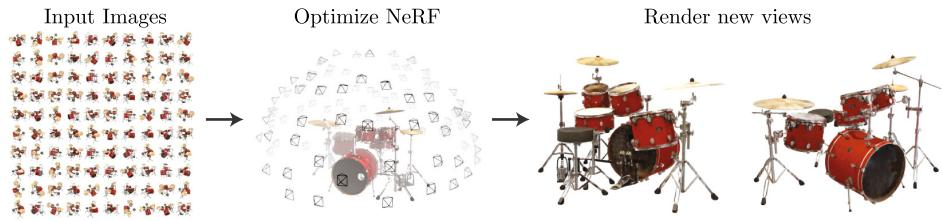
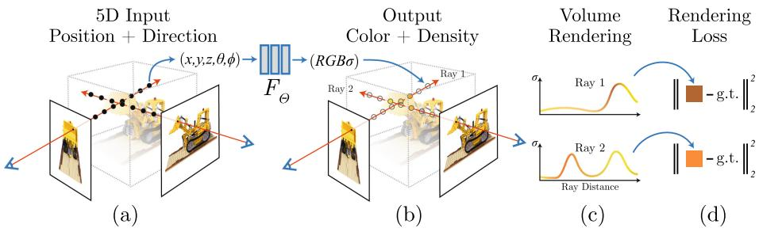
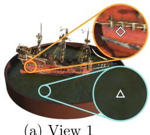
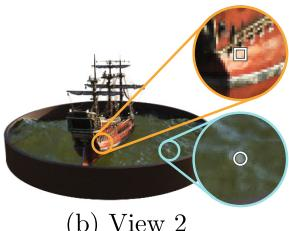
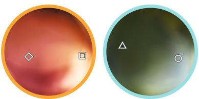
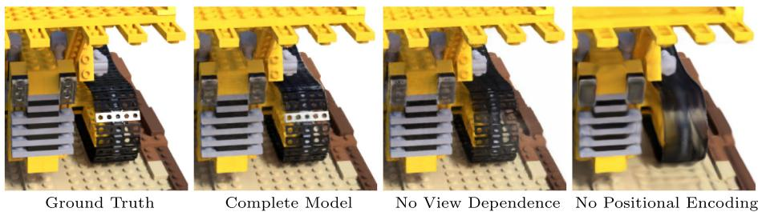
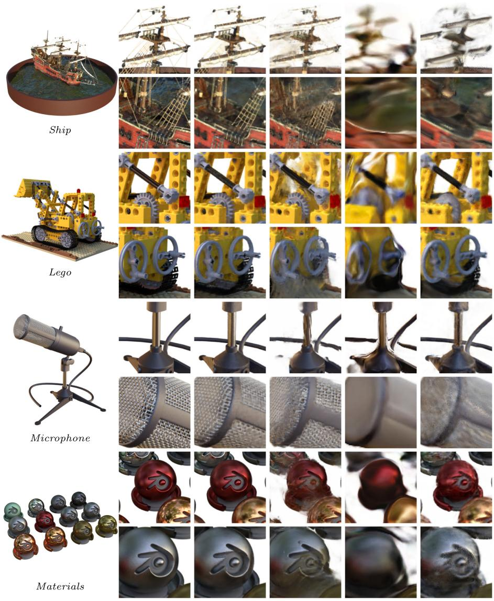
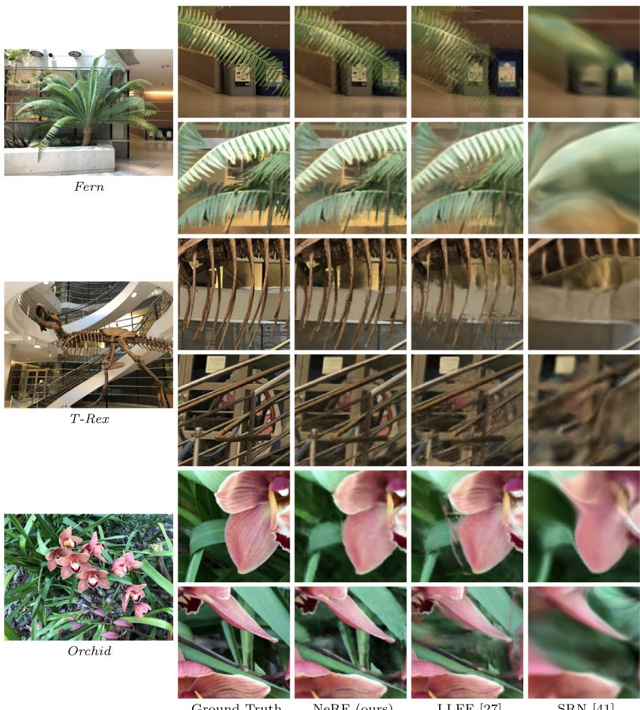

# NeRF: Representing Scenes as Neural Radiance Fields for View Synthesis

Ben Mildenhall1(B), Pratul P. Srinivasan1, Matthew Tancik1, Jonathan T. Barron2, Ravi Ramamoorthi3, and Ren Ng1

1 UC Berkeley, Berkeley, USA bmild@berkeley.edu123460409 2 Google Research, New York, USA 3 UC San Diego, San Diego, USA

Abstract. We present a method that achieves state-of-the-art results for synthesizing novel views of complex scenes by optimizing an underlying continuous volumetric scene function using a sparse set of input views. Our algorithm represents a scene using a fully-connected (nonconvolutional) deep network, whose input is a single continuous 5D coordinate (spatial location (x, y, z) and viewing direction (θ, φ)) and whose output is the volume density and view-dependent emitted radiance at that spatial location. We synthesize views by querying 5D coordinates along camera rays and use classic volume rendering techniques to project the output colors and densities into an image. Because volume rendering is naturally diferentiable, the only input required to optimize our representation is a set of images with known camera poses. We describe how to efectively optimize neural radiance fields to render photorealistic novel views of scenes with complicated geometry and appearance, and demonstrate results that outperform prior work on neural rendering and view synthesis. View synthesis results are best viewed as videos, so we urge readers to view our supplementary video for convincing comparisons.

Keywords: Scene representation View synthesis Image-based rendering Volume rendering 3D deep learning

## 1 Introduction

In this work, we address the long-standing problem of view synthesis in a new way by directly optimizing parameters of a continuous 5D scene representation to minimize the error of rendering a set of captured images.

We represent a static scene as a continuous 5D function that outputs the radiance emitted in each direction (θ, φ) at each point $( x , y , z )$ in space, and a

B. M. Pratul, P. Srinivasan and M. Tancik: Authors contributed equally to this work.

  
Fig. 1. We present a method that optimizes a continuous 5D neural radiance field representation (volume density and view-dependent color at any continuous location) of a scene from a set of input images. We use techniques from volume rendering to accumulate samples of this scene representation along rays to render the scene from any viewpoint. Here, we visualize the set of 100 input views of the synthetic Drums scene randomly captured on a surrounding hemisphere, and we show two novel views rendered from our optimized NeRF representation.

density at each point which acts like a diferential opacity controlling how much radiance is accumulated by a ray passing through $( x , y , z )$ . Our method optimizes a deep fully-connected neural network without any convolutional layers (often referred to as a multilayer perceptron or MLP) to represent this function by regressing from a single 5D coordinate $( x , y , z , \theta , \phi )$ to a single volume density and view-dependent RGB color. To render this neural radiance field (NeRF) from a particular viewpoint we: 1) march camera rays through the scene to generate a sampled set of 3D points, 2) use those points and their corresponding 2D viewing directions as input to the neural network to produce an output set of colors and densities, and 3) use classical volume rendering techniques to accumulate those colors and densities into a 2D image. Because this process is naturally diferentiable, we can use gradient descent to optimize this model by minimizing the error between each observed image and the corresponding views rendered from our representation. Minimizing this error across multiple views encourages the network to predict a coherent model of the scene by assigning high volume densities and accurate colors to the locations that contain the true underlying scene content. Figure 2 visualizes this overall pipeline.

We find that the basic implementation of optimizing a neural radiance field representation for a complex scene does not converge to a suficiently highresolution representation and is ineficient in the required number of samples per camera ray. We address these issues by transforming input 5D coordinates with a positional encoding that enables the MLP to represent higher frequency functions, and we propose a hierarchical sampling procedure to reduce the number of queries required to adequately sample this high-frequency scene representation.

Our approach inherits the benefits of volumetric representations: both can represent complex real-world geometry and appearance and are well suited for gradient-based optimization using projected images. Crucially, our method overcomes the prohibitive storage costs of discretized voxel grids when modeling complex scenes at high-resolutions. In summary, our technical contributions are:

– An approach for representing continuous scenes with complex geometry and materials as 5D neural radiance fields, parameterized as basic MLP networks.

– A diferentiable rendering procedure based on classical volume rendering techniques, which we use to optimize these representations from standard RGB images. This includes a hierarchical sampling strategy to allocate the MLP’s capacity towards space with visible scene content.

– A positional encoding to map each input 5D coordinate into a higher dimensional space, which enables us to successfully optimize neural radiance fields to represent high-frequency scene content.

We demonstrate that our resulting neural radiance field method quantitatively and qualitatively outperforms state-of-the-art view synthesis methods, including works that fit neural 3D representations to scenes as well as works that train deep convolutional networks to predict sampled volumetric representations. As far as we know, this paper presents the first continuous neural scene representation that is able to render high-resolution photorealistic novel views of real objects and scenes from RGB images captured in natural settings.

## 2 Related Work

A promising recent direction in computer vision is encoding objects and scenes in the weights of an MLP that directly maps from a 3D spatial location to an implicit representation of the shape, such as the signed distance [5] at that location. However, these methods have so far been unable to reproduce realistic scenes with complex geometry with the same fidelity as techniques that represent scenes using discrete representations such as triangle meshes or voxel grids. In this section, we review these two lines of work and contrast them with our approach, which enhances the capabilities of neural scene representations to produce state-of-the-art results for rendering complex realistic scenes.

A similar approach of using MLPs to map from low-dimensional coordinates to colors has also been used for representing other graphics functions such as images [43], textured materials [11,30,35,36], and indirect illumination values [37].

Neural 3D Shape Representations. Recent work has investigated the implicit representation of continuous 3D shapes as level sets by optimizing deep networks that map xyz coordinates to signed distance functions [14,31] or occupancy fields [10,26]. However, these models are limited by their requirement of access to ground truth 3D geometry, typically obtained from synthetic 3D shape datasets such as ShapeNet [2]. Subsequent work has relaxed this requirement of ground truth 3D shapes by formulating diferentiable rendering functions that allow neural implicit shape representations to be optimized using only 2D images. Niemeyer et al. [28] represent surfaces as 3D occupancy fields and use a numerical method to find the surface intersection for each ray, then calculate an exact derivative using implicit diferentiation. Each ray intersection location is provided as the input to a neural 3D texture field that predicts a difuse color for that point. Sitzmann et al. [41] use a less direct neural 3D representation that simply outputs a feature vector and RGB color at each continuous 3D coordinate, and propose a diferentiable rendering function consisting of a recurrent neural network that marches along each ray to decide where the surface is located.

Though these techniques can potentially represent complicated and highresolution geometry, they have so far been limited to simple shapes with low geometric complexity, resulting in oversmoothed renderings. We show that an alternate strategy of optimizing networks to encode 5D radiance fields (3D volumes with 2D view-dependent appearance) can represent higher-resolution geometry and appearance to render photorealistic novel views of complex scenes.

View Synthesis and Image-Based Rendering. Given a dense sampling of views, photorealistic novel views can be reconstructed by simple light field sample interpolation techniques [4,6,20]. For novel view synthesis with sparser view sampling, the computer vision and graphics communities have made significant progress by predicting traditional geometry and appearance representations from observed images. One popular class of approaches uses mesh-based representations of scenes with either difuse [47] or view-dependent [1,7,48] appearance. Diferentiable rasterizers [3,9,22,24] or pathtracers [21,29] can directly optimize mesh representations to reproduce a set of input images using gradient descent. However, gradient-based mesh optimization based on image reprojection is often dificult, likely because of local minima or poor conditioning of the loss landscape. Furthermore, this strategy requires a template mesh with fixed topology to be provided as an initialization before optimization [21], which is typically unavailable for unconstrained real-world scenes.

Another class of methods use volumetric representations to address the task of high-quality photorealistic view synthesis from a set of input RGB images. Volumetric approaches are able to realistically represent complex shapes and materials, are well-suited for gradient-based optimization, and tend to produce less visually distracting artifacts than mesh-based methods. Early volumetric approaches used observed images to directly color voxel grids [18,39,44]. More recently, several methods [8,12,16,27,32,42,45,51] have used large datasets of multiple scenes to train deep networks that predict a sampled volumetric representation from a set of input images, and then use either alpha-compositing [33] or learned compositing along rays to render novel views at test time. Other works have optimized a combination of convolutional networks (CNNs) and sampled voxel grids for each specific scene, such that the CNN can compensate for discretization artifacts from low resolution voxel grids [40] or allow the predicted voxel grids to vary based on input time or animation controls [23]. While these volumetric techniques have achieved impressive results for novel view synthesis, their ability to scale to higher resolution imagery is fundamentally limited by poor time and space complexity due to their discrete sampling—rendering higher resolution images requires a finer sampling of 3D space. We circumvent this problem by instead encoding a continuous volume within the parameters of a deep fully-connected neural network, which not only produces significantly higher quality renderings than prior volumetric approaches, but also requires just a fraction of the storage cost of those sampled volumetric representations.

  
Fig. 2. An overview of our neural radiance field scene representation and diferentiable rendering procedure. We synthesize images by sampling 5D coordinates (location and viewing direction) along camera rays (a), feeding those locations into an MLP to produce a color and volume density (b), and using volume rendering techniques to composite these values into an image (c). This rendering function is diferentiable, so we can optimize our scene representation by minimizing the residual between synthesized and ground truth observed images (d). (Color figure online)

## 3 Neural Radiance Field Scene Representation

We represent a continuous scene as a 5D vector-valued function whose input is a 3D location $\mathbf { x } = ( x , y , z )$ and 2D viewing direction $( \theta , \phi )$ , and whose output is an emitted color $\mathbf { c } = ( r , g , b )$ and volume density σ. In practice, we express direction as a 3D Cartesian unit vector d. We approximate this continuous 5D scene representation with an MLP network $F _ { \Theta } : \left( \mathbf { x } , \mathbf { d } \right) \to \left( \mathbf { c } , \sigma \right)$ and optimize its weights Θ to map from each input 5D coordinate to its corresponding volume density and directional emitted color.

We encourage the representation to be multiview consistent by restricting the network to predict the volume density $\sigma$ as a function of only the location x, while allowing the RGB color c to be predicted as a function of both location and viewing direction. To accomplish this, the MLP $F _ { \Theta }$ first processes the input 3D coordinate x with 8 fully-connected layers (using ReLU activations and 256 channels per layer), and outputs σ and a 256-dimensional feature vector. This feature vector is then concatenated with the camera ray’s viewing direction and passed to one additional fully-connected layer (using a ReLU activation and 128 channels) that output the view-dependent RGB color.

See Fig. 3 for an example of how our method uses the input viewing direction to represent non-Lambertian efects. As shown in Fig. 4, a model trained without view dependence (only x as input) has dificulty representing specularities.

## 4 Volume Rendering with Radiance Fields

Our 5D neural radiance field represents a scene as the volume density and directional emitted radiance at any point in space. We render the color of any ray passing through the scene using principles from classical volume rendering [15]. The volume density $\sigma ( \mathbf { x } )$ can be interpreted as the diferential probability of a ray terminating at an infinitesimal particle at location x. The expected color $C ( \mathbf { r } )$ of camera ray $\mathbf { r } ( t ) = \mathbf { o } + t \dot { \mathbf { c } }$ with near and far bounds $t _ { n }$ and $t _ { f }$ is:

  
(b) View 2

  
(c) Radiance Distributions  
Fig. 3. A visualization of view-dependent emitted radiance. Our neural radiance field representation outputs RGB color as a 5D function of both spatial position x and viewing direction d. Here, we visualize example directional color distributions for two spatial locations in our neural representation of the Ship scene. In (a) and (b), we show the appearance of two fixed 3D points from two diferent camera positions: one on the side of the ship (orange insets) and one on the surface of the water (blue insets). Our method predicts the changing specular appearance of these two 3D points, and in (c) we show how this behavior generalizes continuously across the whole hemisphere of viewing directions. (Color figure online)

$$
C ( \mathbf { r } ) = \int _ { t _ { n } } ^ { t _ { f } } T ( t ) \sigma ( \mathbf { r } ( t ) ) \mathbf { c } ( \mathbf { r } ( t ) , \mathbf { d } ) d t , { \mathrm { ~ w h e r e ~ } } T ( t ) = \exp \left( - \int _ { t _ { n } } ^ { t } \sigma ( \mathbf { r } ( s ) ) d s \right) .\tag{1}
$$

The function $T ( t )$ denotes the accumulated transmittance along the ray from $t _ { n }$ to t, i.e., the probability that the ray travels from $t _ { n }$ to t without hitting any other particle. Rendering a view from our continuous neural radiance field requires estimating this integral $C ( \mathbf { r } )$ for a camera ray traced through each pixel of the desired virtual camera.

We numerically estimate this continuous integral using quadrature. Deterministic quadrature, which is typically used for rendering discretized voxel grids, would efectively limit our representation’s resolution because the MLP would only be queried at a fixed discrete set of locations. Instead, we use a stratified sampling approach where we partition $[ t _ { n } , t _ { f } ]$ into N evenly-spaced bins and then draw one sample uniformly at random from within each bin:

$$
t _ { i } \sim \mathcal { U } \left[ t _ { n } + \frac { i - 1 } { N } ( t _ { f } - t _ { n } ) , \ t _ { n } + \frac { i } { N } ( t _ { f } - t _ { n } ) \right] .\tag{2}
$$

Although we use a discrete set of samples to estimate the integral, stratified sampling enables us to represent a continuous scene representation because it results in the MLP being evaluated at continuous positions over the course of optimization. We use these samples to estimate $C ( \mathbf { r } )$ with the quadrature rule discussed in the volume rendering review by Max [25]:

$$
{ \hat { C } } ( \mathbf { r } ) = \sum _ { i = 1 } ^ { N } T _ { i } ( 1 - \exp ( - \sigma _ { i } \delta _ { i } ) ) \mathbf { c } _ { i } , { \mathrm { ~ w h e r e ~ } } T _ { i } = \exp \left( - \sum _ { j = 1 } ^ { i - 1 } \sigma _ { j } \delta _ { j } \right) ,\tag{3}
$$

  
Fig. 4. Here we visualize how our full model benefits from representing view-dependent emitted radiance and from passing our input coordinates through a high-frequency positional encoding. Removing view dependence prevents the model from recreating the specular reflection on the bulldozer tread. Removing the positional encoding drastically decreases the model’s ability to represent high frequency geometry and texture, resulting in an oversmoothed appearance.

where $\delta _ { i } = t _ { i + 1 } - t _ { i }$ is the distance between adjacent samples. This function for calculating $\hat { C } ( { \bf r } )$ from the set of $( \mathbf { c } _ { i } , \sigma _ { i } )$ values is trivially diferentiable and reduces to traditional alpha compositing with alpha values $\alpha _ { i } = 1 - \exp ( - \sigma _ { i } \delta _ { i } )$

## 5 Optimizing a Neural Radiance Field

In the previous section we have described the core components necessary for modeling a scene as a neural radiance field and rendering novel views from this representation. However, we observe that these components are not suficient for achieving state-of-the-art quality, as demonstrated in Sect. 6.4). We introduce two improvements to enable representing high-resolution complex scenes. The first is a positional encoding of the input coordinates that assists the MLP in representing high-frequency functions, and the second is a hierarchical sampling procedure that allows us to eficiently sample this high-frequency representation.

## 5.1 Positional Encoding

Despite the fact that neural networks are universal function approximators [13], we found that having the network $F _ { \Theta }$ directly operate on xyzθφ input coordinates results in renderings that perform poorly at representing high-frequency variation in color and geometry. This is consistent with recent work by Rahaman et al. [34], which shows that deep networks are biased towards learning lower frequency functions. They additionally show that mapping the inputs to a higher dimensional space using high frequency functions before passing them to the network enables better fitting of data that contains high frequency variation.

We leverage these findings in the context of neural scene representations, and show that reformulating $F _ { \Theta }$ as a composition of two functions $F _ { \Theta } = F _ { \Theta } ^ { \prime } \circ \gamma$ , one learned and one not, significantly improves performance (see Fig. 4 and Table 2).

Here $\gamma$ is a mapping from R into a higher dimensional space $ { \mathbb { R } } ^ { 2 L }$ , and $F _ { \Theta } ^ { \prime }$ is still simply a regular MLP. Formally, the encoding function we use is:

$$
\gamma ( p ) = \left( \sin { \left( 2 ^ { 0 } \pi p \right) } , \cos { \left( 2 ^ { 0 } \pi p \right) } , \cdots , \sin { \left( 2 ^ { L - 1 } \pi p \right) } , \cos { \left( 2 ^ { L - 1 } \pi p \right) } \right) .\tag{4}
$$

This function $\gamma ( \cdot )$ is applied separately to each of the three coordinate values in x (which are normalized to lie in $[ - 1 , 1 ] )$ and to the three components of the Cartesian viewing direction unit vector d (which by construction lie in $[ - 1 , 1 ] )$ In our experiments, we set $L = 1 0$ for $\gamma ( \mathbf { x } )$ and $L = 4 \mathrm { f o r } \ \gamma ( \mathbf { d } )$

A similar mapping is used in the popular Transformer architecture [46], where it is referred to as a positional encoding. However, Transformers use it for a diferent goal of providing the discrete positions of tokens in a sequence as input to an architecture that does not contain any notion of order. In contrast, we use these functions to map continuous input coordinates into a higher dimensional space to enable our MLP to more easily approximate a higher frequency function. Concurrent work on a related problem of modeling 3D protein structure from projections [50] also utilizes a similar input coordinate mapping.

## 5.2 Hierarchical Volume Sampling

Our rendering strategy of densely evaluating the neural radiance field network at N query points along each camera ray is ineficient: free space and occluded regions that do not contribute to the rendered image are still sampled repeatedly. We draw inspiration from early work in volume rendering [19] and propose a hierarchical representation that increases rendering eficiency by allocating samples proportionally to their expected efect on the final rendering.

Instead of just using a single network to represent the scene, we simultaneously optimize two networks: one “coarse” and one “fine”. We first sample a set of $N _ { c }$ locations using stratified sampling, and evaluate the “coarse” network at these locations as described in Eqs. 2 and 3. Given the output of this “coarse” network, we then produce a more informed sampling of points along each ray where samples are biased towards the relevant parts of the volume. To do this, we first rewrite the alpha composited color from the coarse network $\hat { C } _ { c } ( \mathbf { r } )$ in Eq. 3 as a weighted sum of all sampled colors $c _ { i }$ along the ray:

$$
\hat { C } _ { c } ( { \bf r } ) = \sum _ { i = 1 } ^ { N _ { c } } w _ { i } c _ { i } , w _ { i } = T _ { i } ( 1 - \exp ( - \sigma _ { i } \delta _ { i } ) ) .\tag{5}
$$

Normalizing these weights as $\begin{array} { r } { \hat { w } _ { i } ~ = ~ w _ { i } / { \sum _ { j = 1 } ^ { N _ { c } } w _ { j } } } \end{array}$ produces a piecewise-constant PDF along the ray. We sample a second set of $N _ { f }$ locations from this distribution using inverse transform sampling, evaluate our “fine” network at the union of the first and second set of samples, and compute the final rendered color of the ray $\hat { C } _ { f } ( \mathbf { r } )$ using Eq. 3 but using all $N _ { c } + N _ { f }$ samples. This procedure allocates more samples to regions we expect to contain visible content. This addresses a similar goal as importance sampling, but we use the sampled values as a nonuniform discretization of the whole integration domain rather than treating each sample as an independent probabilistic estimate of the entire integral.

## 5.3 Implementation Details

We optimize a separate neural continuous volume representation network for each scene. This requires only a dataset of captured RGB images of the scene, the corresponding camera poses and intrinsic parameters, and scene bounds (we use ground truth camera poses, intrinsics, and bounds for synthetic data, and use the COLMAP structure-from-motion package [38] to estimate these parameters for real data). At each optimization iteration, we randomly sample a batch of camera rays from the set of all pixels in the dataset, and then follow the hierarchical sampling described in Sect. 5.2 to query $N _ { c }$ samples from the coarse network and $N _ { c } + N _ { f }$ samples from the fine network. We then use the volume rendering procedure described in Sect. 4 to render the color of each ray from both sets of samples. Our loss is simply the total squared error between the rendered and true pixel colors for both the coarse and fine renderings:

$$
\mathcal { L } = \sum _ { \mathbf { r } \in \mathcal { R } } \left[ \left\| \hat { C } _ { c } ( \mathbf { r } ) - C ( \mathbf { r } ) \right\| _ { 2 } ^ { 2 } + \left\| \hat { C } _ { f } ( \mathbf { r } ) - C ( \mathbf { r } ) \right\| _ { 2 } ^ { 2 } \right]\tag{6}
$$

where is the set of rays in each batch, and $C ( \mathbf { r } ) , \hat { C } _ { c } ( \mathbf { r } )$ , and $\hat { C } _ { f } ( \mathbf { r } )$ are the ground truth, coarse volume predicted, and fine volume predicted RGB colors for ray r respectively. Note that even though the final rendering comes from $\hat { C } _ { f } ( \mathbf { r } )$ , we also minimize the loss of $\hat { C } _ { c } ( \mathbf { r } )$ so that the weight distribution from the coarse network can be used to allocate samples in the fine network.

In our experiments, we use a batch size of 4096 rays, each sampled at $N _ { c } = 6 4$ coordinates in the coarse volume and $N _ { f } = 1 2 8$ additional coordinates in the fine volume. We use the Adam optimizer $[ 1 7 ]$ with a learning rate that begins at $5 \times 1 0 ^ { - 4 }$ and decays exponentially to $5 \times 1 0 ^ { - 5 }$ over the course of optimization (other Adam hyperparameters are left at default values of $\beta _ { 1 } = 0 . 9 , \beta _ { 2 } = 0 . 9 9 9$ and $\epsilon = 1 0 ^ { - 7 } )$ . The optimization for a single scene typically take around 100– 300k iterations to converge on a single NVIDIA V100 GPU (about 1–2 days).

## 6 Results

We quantitatively (Tables 1) and qualitatively (Figs. 5 and 6) show that our method outperforms prior work, and provide extensive ablation studies to validate our design choices (Table 2). We urge the reader to view our supplementary video to better appreciate our method’s significant improvement over baseline methods when rendering smooth paths of novel views.

## 6.1 Datasets

Synthetic Renderings of Objects. We first show experimental results on two datasets of synthetic renderings of objects (Table 1, “Difuse Synthetic $3 6 0 ^ { \circ \mathfrak { s } }$ and “Realistic Synthetic $3 6 0 ^ { \circ \mathfrak { N } } )$ . The DeepVoxels [40] dataset contains four Lambertian objects with simple geometry. Each object is rendered at $5 1 2 \times 5 1 2$ pixels from viewpoints sampled on the upper hemisphere (479 as input and 1000 for testing). We additionally generate our own dataset containing pathtraced images of eight objects that exhibit complicated geometry and realistic non-Lambertian materials. Six are rendered from viewpoints sampled on the upper hemisphere, and two are rendered from viewpoints sampled on a full sphere. We render 100 views of each scene as input and 200 for testing, all at 800 800 pixels.

Table 1. Our method quantitatively outperforms prior work on datasets of both synthetic and real images. We report PSNR/SSIM (higher is better) and LPIPS [49] (lower is better). The DeepVoxels [40] dataset consists of 4 difuse objects with simple geometry. Our realistic synthetic dataset consists of pathtraced renderings of 8 geometrically complex objects with complex non-Lambertian materials. The real dataset consists of handheld forward-facing captures of 8 real-world scenes (NV cannot be evaluated on this data because it only reconstructs objects inside a bounded volume). Though LLFF achieves slightly better LPIPS, we urge readers to view our supplementary video where our method achieves better multiview consistency and produces fewer artifacts than all baselines.
<table><tr><td rowspan=2 colspan=1>Method</td><td rowspan=1 colspan=3>Diffuse Synthetic $3 6 0 ^ { \circ }$ [40]</td><td rowspan=1 colspan=3>Realistic Synthetic $3 6 0 ^ { \circ }$ </td><td rowspan=1 colspan=3>Real Forward-Facing [27]</td></tr><tr><td rowspan=1 colspan=1>PSNR↑</td><td rowspan=1 colspan=1>SSIM↑</td><td rowspan=1 colspan=1>LPIPS↓</td><td rowspan=1 colspan=1>PSNR↑</td><td rowspan=1 colspan=1>SSIM↑</td><td rowspan=1 colspan=1>LPIPS↓</td><td rowspan=1 colspan=1>PSNR↑</td><td rowspan=1 colspan=1>SSIM↑</td><td rowspan=1 colspan=1>LPIPS↓</td></tr><tr><td rowspan=1 colspan=1>SRN [41]</td><td rowspan=1 colspan=1>33.20</td><td rowspan=1 colspan=1>0.963</td><td rowspan=1 colspan=1>0.073</td><td rowspan=1 colspan=1>22.26</td><td rowspan=1 colspan=1>0.846</td><td rowspan=1 colspan=1>0.170</td><td rowspan=1 colspan=1>22.84</td><td rowspan=1 colspan=1>0.668</td><td rowspan=1 colspan=1>0.378</td></tr><tr><td rowspan=1 colspan=1>NV [23]</td><td rowspan=1 colspan=1>29.62</td><td rowspan=1 colspan=1>0.929</td><td rowspan=1 colspan=1>0.099</td><td rowspan=1 colspan=1>26.05</td><td rowspan=1 colspan=1>0.893</td><td rowspan=1 colspan=1>0.160</td><td rowspan=1 colspan=1>1</td><td rowspan=1 colspan=1>一</td><td rowspan=1 colspan=1>一</td></tr><tr><td rowspan=1 colspan=1>LLFF [27]</td><td rowspan=1 colspan=1>34.38</td><td rowspan=1 colspan=1>0.985</td><td rowspan=1 colspan=1>0.048</td><td rowspan=1 colspan=1>24.88</td><td rowspan=1 colspan=1>0.911</td><td rowspan=1 colspan=1>0.114</td><td rowspan=1 colspan=1>24.13</td><td rowspan=1 colspan=1>0.798</td><td rowspan=1 colspan=1>0.212</td></tr><tr><td rowspan=1 colspan=1>Ours</td><td rowspan=1 colspan=1>40.15</td><td rowspan=1 colspan=1>0.991</td><td rowspan=1 colspan=1>0.023</td><td rowspan=1 colspan=1>31.01</td><td rowspan=1 colspan=1>0.947</td><td rowspan=1 colspan=1>0.081</td><td rowspan=1 colspan=1>26.50</td><td rowspan=1 colspan=1>0.811</td><td rowspan=1 colspan=1>0.250</td></tr></table>

Real Images of Complex Scenes. We show results on complex real-world scenes captured with roughly forward-facing images (Table 1, “Real Forward-Facing”). This dataset consists of 8 scenes captured with a handheld cellphone (5 taken from the LLFF paper and 3 that we capture), captured with 20 to 62 images, and hold out 1/8 of these for the test set. All images are 1008 756 pixels.

## 6.2 Comparisons

To evaluate our model we compare against current top-performing techniques for view synthesis, detailed below. All methods use the same set of input views to train a separate network for each scene except Local Light Field Fusion [27], which trains a single 3D convolutional network on a large dataset, then uses the same trained network to process input images of new scenes at test time.

Neural Volumes (NV). [23] synthesizes novel views of objects that lie entirely within a bounded volume in front of a distinct background (which must be separately captured without the object of interest). It optimizes a deep 3D convolutional network to predict a discretized RGBα voxel grid with $1 2 8 ^ { 3 }$ samples as well as a 3D warp grid with 323 samples. The algorithm renders novel views by marching camera rays through the warped voxel grid.

Scene Representation Networks (SRN). [41] represent a continuous scene as an opaque surface, implicitly defined by a MLP that maps each $( x , y , z )$

SRN [41]

NV [23]

  
LLFF [27]  
Ground Truth NeRF (ours)

Fig. 5. Comparisons on test-set views for scenes from our new synthetic dataset generated with a physically-based renderer. Our method is able to recover fine details in both geometry and appearance, such as Ship’s rigging, Lego’s gear and treads, Microphone’s shiny stand and mesh grille, and Material’s non-Lambertian reflectance. LLFF exhibits banding artifacts on the Microphone stand and Material’s object edges and ghosting artifacts in Ship’s mast and inside the Lego object. SRN produces blurry and distorted renderings in every case. Neural Volumes cannot capture the details on the Microphone’s grille or Lego’s gears, and it completely fails to recover the geometry of Ship’s rigging.

  
Ground Truth  
NeRF (ours)  
LLFF [27]  
SRN [41]  
Fig. 6. Comparisons on test-set views of real world scenes. LLFF is specifically designed for this use case (forward-facing captures of real scenes). Our method is able to represent fine geometry more consistently across rendered views than LLFF, as shown in Fern’s leaves and the skeleton ribs and railing in T-rex. Our method also correctly reconstructs partially occluded regions that LLFF struggles to render cleanly, such as the yellow shelves behind the leaves in the bottom Fern crop and green leaves in the background of the bottom Orchid crop. Blending between multiples renderings can also cause repeated edges in LLFF, as seen in the top Orchid crop. SRN captures the low-frequency geometry and color variation in each scene but is unable to reproduce any fine detail. (Color figure online)

coordinate to a feature vector. They train a recurrent neural network to march along a ray through the scene representation by using the feature vector at any 3D coordinate to predict the next step size along the ray. The feature vector from the final step is decoded into a single color for that point on the surface. Note that SRN is a better-performing followup to DeepVoxels [40] by the same authors, which is why we do not include comparisons to DeepVoxels.

Local Light Field Fusion (LLFF). [27] LLFF is designed for producing photorealistic novel views for well-sampled forward facing scenes. It uses a trained 3D convolutional network to directly predict a discretized frustum-sampled RGBα grid (multiplane image or MPI [51]) for each input view, then renders novel views by alpha compositing and blending nearby MPIs into the novel viewpoint.

## 6.3 Discussion

We thoroughly outperform both baselines that also optimize a separate network per scene (NV and SRN) in all scenarios. Furthermore, we produce qualitatively and quantitatively superior renderings compared to LLFF (across all except one metric) while using only their input images as our entire training set.

The SRN method produces heavily smoothed geometry and texture, and its representational power for view synthesis is limited by selecting only a single depth and color per camera ray. The NV baseline is able to capture reasonably detailed volumetric geometry and appearance, but its use of an underlying explicit 1283 voxel grid prevents it from scaling to represent fine details at high resolutions. LLFF specifically provides a “sampling guideline” to not exceed 64 pixels of disparity between input views, so it frequently fails to estimate correct geometry in the synthetic datasets which contain up to 400–500 pixels of disparity between views. Additionally, LLFF blends between diferent scene representations for rendering diferent views, resulting in perceptually-distracting inconsistency as is apparent in our supplementary video.

The biggest practical tradeofs between these methods are time versus space. All compared single scene methods take at least 12 h to train per scene. In contrast, LLFF can process a small input dataset in under 10 min. However, LLFF produces a large 3D voxel grid for every input image, resulting in enormous storage requirements (over 15 GB for one “Realistic Synthetic” scene). Our method requires only 5 MB for the network weights (a relative compression of 3000 compared to LLFF), which is even less memory than the input images alone for a single scene from any of our datasets.

## 6.4 Ablation Studies

We validate our algorithm’s design choices and parameters with an extensive ablation study in Table 2. We present results on our “Realistic Synthetic 360◦” scenes. Row 9 shows our complete model as a point of reference. Row 1 shows a minimalist version of our model without positional encoding (PE), viewdependence (VD), or hierarchical sampling (H). In rows 2–4 we remove these three components one at a time from the full model, observing that positional encoding (row 2) and view-dependence (row 3) provide the largest quantitative benefit followed by hierarchical sampling (row 4). Rows 5–6 show how our performance decreases as the number of input images is reduced. Note that our method’s performance using only 25 input images still exceeds NV, SRN, and LLFF across all metrics when they are provided with 100 images (see supplementary material). In rows 7–8 we validate our choice of the maximum frequency L used in our positional encoding for x (the maximum frequency used for d is scaled proportionally). Only using 5 frequencies reduces performance, but increasing the number of frequencies from 10 to 15 does not improve performance. We believe the benefit of increasing L is limited once $2 ^ { L }$ exceeds the maximum frequency present in the sampled input images (roughly 1024 in our data).

Table 2. An ablation study of our model. Metrics are averaged over the 8 scenes from our realistic synthetic dataset. See Sect. 6.4 for detailed descriptions.
<table><tr><td rowspan=1 colspan=1></td><td rowspan=1 colspan=1></td><td rowspan=1 colspan=1>Input</td><td rowspan=1 colspan=1>#Im</td><td rowspan=1 colspan=1> $L$ </td><td rowspan=1 colspan=1> $( N _ { c } , N _ { f } )$ </td><td rowspan=1 colspan=1>PSNR↑</td><td rowspan=1 colspan=1>SSIM↑</td><td rowspan=1 colspan=1>LPIPS↓</td></tr><tr><td rowspan=1 colspan=1>1)</td><td rowspan=1 colspan=1>No PE, VD, H</td><td rowspan=1 colspan=1>xyz</td><td rowspan=1 colspan=1>100</td><td rowspan=1 colspan=1></td><td rowspan=1 colspan=1>(256, - )</td><td rowspan=1 colspan=1>26.67</td><td rowspan=1 colspan=1>0.906</td><td rowspan=1 colspan=1>0.136</td></tr><tr><td rowspan=1 colspan=1>2)</td><td rowspan=1 colspan=1>No pos. encoding</td><td rowspan=1 colspan=1> $x y z \theta \phi$ </td><td rowspan=1 colspan=1>100</td><td rowspan=1 colspan=1>一</td><td rowspan=1 colspan=1>(64, 128)</td><td rowspan=1 colspan=1>28.77</td><td rowspan=1 colspan=1>0.924</td><td rowspan=1 colspan=1>0.108</td></tr><tr><td rowspan=1 colspan=1>3)</td><td rowspan=1 colspan=1>No view dependence</td><td rowspan=1 colspan=1>xyz</td><td rowspan=1 colspan=1>100</td><td rowspan=1 colspan=1>10</td><td rowspan=1 colspan=1>(64, 128)</td><td rowspan=1 colspan=1>27.66</td><td rowspan=1 colspan=1>0.925</td><td rowspan=1 colspan=1>0.117</td></tr><tr><td rowspan=1 colspan=1>4)</td><td rowspan=1 colspan=1>No hierarchical</td><td rowspan=1 colspan=1>xyzθφ</td><td rowspan=1 colspan=1>100</td><td rowspan=1 colspan=1>10</td><td rowspan=1 colspan=1>(256, -)</td><td rowspan=1 colspan=1>30.06</td><td rowspan=1 colspan=1>0.938</td><td rowspan=1 colspan=1>0.109</td></tr><tr><td rowspan=1 colspan=1>5)</td><td rowspan=1 colspan=1>Far fewer images</td><td rowspan=1 colspan=1>xyzθφ</td><td rowspan=1 colspan=1>25</td><td rowspan=1 colspan=1>10</td><td rowspan=1 colspan=1>(64, 128)</td><td rowspan=1 colspan=1>27.78</td><td rowspan=1 colspan=1>0.925</td><td rowspan=1 colspan=1>0.107</td></tr><tr><td rowspan=1 colspan=1>6)</td><td rowspan=1 colspan=1>Fewer images</td><td rowspan=1 colspan=1>xyzθφ</td><td rowspan=1 colspan=1>50</td><td rowspan=1 colspan=1>10</td><td rowspan=1 colspan=1>(64, 128)</td><td rowspan=1 colspan=1>29.79</td><td rowspan=1 colspan=1>0.940</td><td rowspan=1 colspan=1>0.096</td></tr><tr><td rowspan=1 colspan=1>7)</td><td rowspan=1 colspan=1>Fewer frequencies</td><td rowspan=1 colspan=1>xyzθφ</td><td rowspan=1 colspan=1>100</td><td rowspan=1 colspan=1>5</td><td rowspan=1 colspan=1>(64, 128)</td><td rowspan=1 colspan=1>30.59</td><td rowspan=1 colspan=1>0.944</td><td rowspan=1 colspan=1>0.088</td></tr><tr><td rowspan=1 colspan=1>8)</td><td rowspan=1 colspan=1>More frequencies</td><td rowspan=1 colspan=1>xyzθφ</td><td rowspan=1 colspan=1>100</td><td rowspan=1 colspan=1>15</td><td rowspan=1 colspan=1>(64, 128)</td><td rowspan=1 colspan=1>30.81</td><td rowspan=1 colspan=1>0.946</td><td rowspan=1 colspan=1>0.096</td></tr><tr><td rowspan=1 colspan=1>9)</td><td rowspan=1 colspan=1>Complete model</td><td rowspan=1 colspan=1>xyzθφ</td><td rowspan=1 colspan=1>100</td><td rowspan=1 colspan=1>10</td><td rowspan=1 colspan=1>(64, 128)</td><td rowspan=1 colspan=1>31.01</td><td rowspan=1 colspan=1>0.947</td><td rowspan=1 colspan=1>0.081</td></tr></table>

## 7 Conclusion

Our work directly addresses deficiencies of prior work that uses MLPs to represent objects and scenes as continuous functions. We demonstrate that representing scenes as 5D neural radiance fields (an MLP that outputs volume density and view-dependent emitted radiance as a function of 3D location and 2D viewing direction) produces better renderings than the previously-dominant approach of training deep convolutional networks to output discretized voxel representations.

Although we have proposed a hierarchical sampling strategy to make rendering more sample-eficient (for both training and testing), there is still much more progress to be made in investigating techniques to eficiently optimize and render neural radiance fields. Another direction for future work is interpretability: sampled representations such as voxel grids and meshes admit reasoning about the expected quality of rendered views and failure modes, but it is unclear how to analyze these issues when we encode scenes in the weights of a deep neural network. We believe that this work makes progress towards a graphics pipeline based on real world imagery, where complex scenes could be composed of neural radiance fields optimized from images of actual objects and scenes.

## References

1. Buehler, C., Bosse, M., McMillan, L., Gortler, S., Cohen, M.: Unstructured lumigraph rendering. In: SIGGRAPH (2001)

2. Chang, A.X., et al.: ShapeNet: an information-rich 3D model repository. arXiv:1512.03012 (2015)

3. Chen, W., et al.: Learning to predict 3D objects with an interpolation-based differentiable renderer. In: NeurIPS (2019)

4. Cohen, M., Gortler, S.J., Szeliski, R., Grzeszczuk, R., Szeliski, R.: The lumigraph. In: SIGGRAPH (1996)

5. Curless, B., Levoy, M.: A volumetric method for building complex models from range images. In: SIGGRAPH (1996)

6. Davis, A., Levoy, M., Durand, F.: Unstructured light fields. In: Eurographics (2012)

7. Debevec, P., Taylor, C.J., Malik, J.: Modeling and rendering architecture from photographs: a hybrid geometry-and image-based approach. In: SIGGRAPH (1996)

8. Flynn, J., et al.: DeepView: view synthesis with learned gradient descent. In: CVPR (2019)

9. Genova, K., Cole, F., Maschinot, A., Sarna, A., Vlasic, D., Freeman, W.T.: Unsupervised training for 3D morphable model regression. In: CVPR (2018)

10. Genova, K., Cole, F., Sud, A., Sarna, A., Funkhouser, T.: Local deep implicit functions for 3D shape. In: CVPR (2020)

11. Henzler, P., Mitra, N.J., Ritschel, T.: Learning a neural 3D texture space from 2D exemplars. In: CVPR (2020)

12. Henzler, P., Rasche, V., Ropinski, T., Ritschel, T.: Single-image tomography: 3D volumes from 2D cranial X-rays. In: Eurographics (2018)

13. Hornik, K., Stinchcombe, M., White, H.: Multilayer feedforward networks are universal approximators. Neural Netw. 2(5), 359–366 (1989)

14. Jiang, C., Sud, A., Makadia, A., Huang, J., Nießner, M., Funkhouser, T.: Local implicit grid representations for 3D scenes. In: CVPR (2020)

15. Kajiya, J.T., Herzen, B.P.V.: Ray tracing volume densities. Comput. Graph. (SIG-GRAPH) 18(3), 165–174 (1984)

16. Kar, A., H¨ane, C., Malik, J.: Learning a multi-view stereo machine. In: NeurIPS (2017)

17. Kingma, D.P., Ba, J.: Adam: a method for stochastic optimization. In: ICLR (2015)

18. Kutulakos, K.N., Seitz, S.M.: A theory of shape by space carving. Int. J. Comput. Vis. 1, 307–314 (2000)

19. Levoy, M.: Eficient ray tracing of volume data. ACM Trans. Graph. 9(3), 245–261 (1990)

20. Levoy, M., Hanrahan, P.: Light field rendering. In: SIGGRAPH (1996)

21. Li, T.M., Aittala, M., Durand, F., Lehtinen, J.: Diferentiable Monte Carlo ray tracing through edge sampling. ACM Trans. Graph. (SIGGRAPH Asia) 37(6), 1–11 (2018)

22. Liu, S., Li, T., Chen, W., Li, H.: Soft rasterizer: a diferentiable renderer for imagebased 3D reasoning. In: ICCV (2019)

23. Lombardi, S., Simon, T., Saragih, J., Schwartz, G., Lehrmann, A., Sheikh, Y.: Neural volumes: learning dynamic renderable volumes from images. ACM Trans. Graph. (SIGGRAPH) (2019)

24. Loper, M.M., Black, M.J.: OpenDR: an approximate diferentiable renderer. In: ECCV (2014)

25. Max, N.: Optical models for direct volume rendering. IEEE Trans. Visual. Comput. Graph. 1(2), 99–108 (1995)

26. Mescheder, L., Oechsle, M., Niemeyer, M., Nowozin, S., Geiger, A.: Occupancy networks: learning 3D reconstruction in function space. In: CVPR (2019)

27. Mildenhall, B., et al.: Local light field fusion: practical view synthesis with prescriptive sampling guidelines. ACM Trans. Graph. (SIGGRAPH) 38(4), 1–14 (2019)

28. Niemeyer, M., Mescheder, L., Oechsle, M., Geiger, A.: Diferentiable volumetric rendering: learning implicit 3D representations without 3D supervision. In: CVPR (2019)

29. Nimier-David, M., Vicini, D., Zeltner, T., Jakob, W.: Mitsuba 2: a retargetable forward and inverse renderer. ACM Trans. Graph. (SIGGRAPH Asia) 38(6), 1–17 (2019)

30. Oechsle, M., Mescheder, L., Niemeyer, M., Strauss, T., Geiger, A.: Texture fields: learning texture representations in function space. In: ICCV (2019)

31. Park, J.J., Florence, P., Straub, J., Newcombe, R., Lovegrove, S.: DeepSDF: learning continuous signed distance functions for shape representation. In: CVPR (2019)

32. Penner, E., Zhang, L.: Soft 3D reconstruction for view synthesis. ACM Trans. Graph. (SIGGRAPH Asia) 36(6), 1–11 (2017)

33. Porter, T., Duf, T.: Compositing digital images. Comput. Graph (SIGGRAPH) (1984)

34. Rahaman, N., et al.: On the spectral bias of neural networks. In: ICML (2018)

35. Rainer, G., Ghosh, A., Jakob, W., Weyrich, T.: Unified neural encoding of BTFs. Comput. Graph. Forum (Eurographics) (2020)

36. Rainer, G., Jakob, W., Ghosh, A., Weyrich, T.: Neural BTF compression and interpolation. Comput. Graph. Forum (Eurographics) 38(2), 235–244 (2019)

37. Ren, P., Wang, J., Gong, M., Lin, S., Tong, X., Guo, B.: Global illumination with radiance regression functions. ACM Trans. Graph. 32(4), 1–12 (2013)

38. Sch¨onberger, J.L., Frahm, J.M.: Structure-from-motion revisited. In: CVPR (2016)

39. Seitz, S.M., Dyer, C.R.: Photorealistic scene reconstruction by voxel coloring. Int. J. Comput. Vis. 35, 151–173 (1999). https://doi.org/10.1023/A:1008176507526

40. Sitzmann, V., Thies, J., Heide, F., Nießner, M., Wetzstein, G., Zollh¨ofer, M.: Deep-Voxels: learning persistent 3D feature embeddings. In: CVPR (2019)

41. Sitzmann, V., Zollhoefer, M., Wetzstein, G.: Scene representation networks: continuous 3D-structure-aware neural scene representations. In: NeurIPS (2019)

42. Srinivasan, P.P., Tucker, R., Barron, J.T., Ramamoorthi, R., Ng, R., Snavely, N.: Pushing the boundaries of view extrapolation with multiplane images. In: CVPR (2019)

43. Stanley, K.O.: Compositional pattern producing networks: a novel abstraction of development. Genet. Program. Evolvable Mach. 8, 131–162 (2007). https://doi. org/10.1007/s10710-007-9028-8

44. Szeliski, R., Golland, P.: Stereo matching with transparency and matting. In: ICCV (1998)

45. Tulsiani, S., Zhou, T., Efros, A.A., Malik, J.: Multi-view supervision for single-view reconstruction via diferentiable ray consistency. In: CVPR (2017)

46. Vaswani, A., et al.: Attention is all you need. In: NeurIPS (2017)

47. Waechter, M., Moehrle, N., Goesele, M.: Let there be color! large-scale texturing of 3D reconstructions. In: ECCV (2014)

48. Wood, D.N., et al.: Surface light fields for 3D photography. In: SIGGRAPH (2000)

49. Zhang, R., Isola, P., Efros, A.A., Shechtman, E., Wang, O.: The unreasonable efectiveness of deep features as a perceptual metric. In: CVPR (2018)

50. Zhong, E.D., Bepler, T., Davis, J.H., Berger, B.: Reconstructing continuous distributions of 3D protein structure from cryo-EM images. In: ICLR (2020)

51. Zhou, T., Tucker, R., Flynn, J., Fyfe, G., Snavely, N.: Stereo magnification: learning view synthesis using multiplane images. ACM Trans. Graph. (SIGGRAPH) (2018)