# The Newer College Dataset: Handheld LiDAR, Inertial and Vision with Ground Truth

Milad Ramezani, Yiduo Wang, Marco Camurri, David Wisth, Matias Mattamala and Maurice Fallon

Abstract— In this paper, we present a large dataset with a variety of mobile mapping sensors collected using a handheld device carried at typical walking speeds for nearly 2.2 km around New College, Oxford as well as a series of supplementary datasets with much more aggressive motion and lighting contrast. The datasets include data from two commercially available devices - a stereoscopic-inertial camera and a multibeam 3D LiDAR, which also provides inertial measurements. Additionally, we used a tripod-mounted survey grade LiDAR scanner to capture a detailed millimeter-accurate 3D map of the test location (containing ∼290 million points). Using the map, we generated a 6 Degrees of Freedom (DoF) ground truth pose for each LiDAR scan (with approximately 3 cm accuracy) to enable better benchmarking of LiDAR and vision localisation, mapping and reconstruction systems. This ground truth is the particular novel contribution of this dataset and we believe that it will enable systematic evaluation which many similar datasets have lacked. The large dataset combines both built environments, open spaces and vegetated areas so as to test localisation and mapping systems such as vision-based navigation, visual and LiDAR SLAM, 3D LiDAR reconstruction and appearance-based place recognition, while the supplementary datasets contain very dynamic motions to introduce more challenges for visual-inertial odometry systems. The datasets are available at:

ori.ox.ac.uk/datasets/newer-college-dataset

## I. INTRODUCTION

Research in robotics and autonomous navigation has benefited significantly from the public availability of standard datasets which enable systematic testing and validation of algorithms. Over the past 10 years, datasets such as KITTI [1], the New College [2] and EuRoC MAV [3] have been released and provided a transparent benchmark of performance. These datasets were collected on a variety of platforms (UGVs, UAVs and Autonomous Vehicles) with reference poses based upon GPS/INS [1], dead reckoning [2], and laser trackers/motion capture systems [3].

Many vehicular benchmarks use a form of GPS/INS fusion for ground truth but do not provide precise local accuracy. This is specially noted as a shortcoming of the KITTI odometry benchmark which does not use length scales of less than 100 m for this reason1. Tripod-mounted laser trackers follow a prism placed on the robot to achieve precise localisation. However, they cannot maintain line of sight to the robot for large experiments. Motion capture systems provide accurate 6 DoF ground truth but are limited to small indoor facilities.

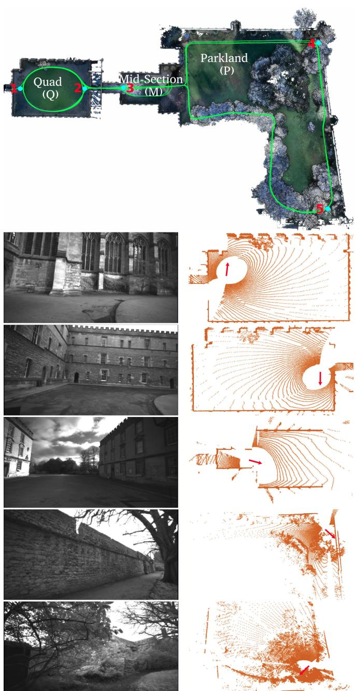  
Fig. 1: Top: A bird’s eye view of the 3D model of New College generated with a Leica BLK360 scanner and the ground truth trajectory obtained by the proposed approach. Bottom: Image samples and corresponding 3D LiDAR scans from the Quad (locations 1 and 2), the Mid-Section (location 3) and the Parkland (location 4 and 5) show varied environments suited for assessment of localisation and mapping algorithms in autonomous robot navigation.

We aim to provide a large-scale dataset which provides centimeter accuracy so as to enable evaluation of short length-scale odometry, as well as large scale drift. The raw data files are accompanied by a precise 3D model constructed using a survey-grade LiDAR scanner. Utilizing the 3D model, we inferred the location of the device using LiDAR ICP at 10 Hz across the entire location. Fig. 1 shows a plan view of the 3D model with vision and corresponding LiDAR samples of the data from different locations.

The data was collected by a handheld device carried by a person at walking speed, unlike the majority of the released datasets acquired from a robotics platforms. The handheld device comprises a 3D LiDAR and a stereo camera each with a self-contained IMU. In particular, we use commercially available low-cost sensors — the widely used Intel Realsense D435i and a 64-beam Ouster OS-1 LiDAR scanner. The walking motion can, to a degree, replicate the jerky motion of a flying drone or a quadruped.

This dataset revisits New College, Oxford — the location of the original Smith et al. [2] dataset. This dataset is particularly useful due to its variety of scenarios, including structured buildings, vegetation, and open space areas with lack of texture. We replicate the sequences of the original dataset and then go on to add more aggressive, faster sequences designed to test algorithms for visual navigation, LiDAR SLAM, reconstruction and place recognition.

The remainder of the paper is structured as follows: Sec. II reviews related work followed by a description of the device in Sec. III. Sec. IV details our dataset. Sec. V explains how we determined the ground truth. Sec. VI demonstrates example usage of our dataset for a set of navigation research topics in mobile robotics before a summary is presented in Sec. VII.

## II. RELATED WORK

Dataset papers can be divided into two subsections based on the platform carrying the sensor; a (self-driving) car is often used for outdoor, large-scale datasets while robots or humans-carried datasets are typically much smaller and often indoors. Focusing on vision, IMU and LiDAR modules, Tab. I, provides the basic details of the datasets discussed in the following.

## A. Vehicle-based Datasets

There is a large body of localisation and mapping data targeting autonomous navigation for ground vehicles.

The MIT DARPA Urban Challenge dataset [4] is one of the first major UGV datasets. It was collected using MIT’s Talos vehicle over the course of a 90 km traverse spanning 7 hours of self-driving. The ground truth was provided by the integration of a high-precision GPS and an INS.

The Marulan multi-modal datasets [5] were gathered by an unmanned ground vehicle, Argo, in which artificial dust, smoke and rain added extra challenges for on-board perception sensors.

Similarly to the MIT dataset, the Ford Campus dataset [6] was obtained along an almost 6 km traverse of a mock-up urban environment. The Malaga urban dataset [7] has the distinctive feature of high-resolution pair images captured for over an almost 37 km trajectory in urban scenarios.

The KITTI dataset [1] was collected on a car driving around the streets of Karlsruhe and it has significantly catalyzed autonomous vehicle navigation research. The dataset consists of stereoscopic image pairs for the sequences of 39.2 km length and has been used for a variety of SLAM/odometry and object detection tasks. KITTI provides 6 DoF ground truth trajectory for all the traversals using RTK-GPS/INS with accuracy below 10 cm. However, this accuracy is not guaranteed in GPS-deprived areas such as urban canyons. Furthermore, the IMU readings and images are not synchronized which effects the performance of many visual-inertial odometry algorithms.

The longest autonomous driving dataset we are familiar with is the Oxford RobotCar dataset [8] collected in all natural weather conditions over the course of 1000 km driven through central Oxford. Recently, the Complex Urban LiDAR dataset [9] was gathered and is targeted at multiple challenges in complex urban areas including GPS loss, multilane highways and dynamic entities such as pedestrians, bikes and cars. This multi-faceted dataset was acquired over the course of approximately 180 km of travel.

Nonetheless, the ground truth of the aforementioned driverless-car datasets is highly dependent on GPS observations and therefore, as noted in [8] and [9], the usage of ground truth is not recommended in GPS-deprived areas for the evaluation of localisation and mapping algorithms.

## B. Mobile Robot or Human-carried Datasets

The New College Vision and LiDAR dataset [2], which is a motivation for this dataset, provides carefully timestamped laser range data, stereo and omnidirectional imagery along with 5 DoF odometry (2D position and roll, pitch, heading). The data was collected using a wheeled robot, a Segway, over a 2.2 km traverse of the college’s grounds and the adjoining garden area. No ground truth is available for this dataset.

Similar to the New College, the North Campus Long-Term (NCLT) dataset [11] was gathered across a college campus, indoor and outdoor, over 147.4 km traverse and 15 months, again with a Segway. The significant difference is the provision of the ground truth using LiDAR scan matching and high-accuracy RTK-GPS. Although this approach potentially provides centimeter accuracy, it is susceptible to drift indoors or near buildings which cause GPS multi-path errors.

Recent datasets such as EuRoC MAV [3], Zurich Urban MAV [14] and PennCOSYVIO [13] specifically focused on visual-inertial odometry and visual SLAM. The data in EuRoC and Zurich was gathered using a micro aerial vehicle flying indoor and outdoor for 0.9 km and 2 km, respectively, while the data in PennCOSYVIO was obtained from a handheld device, similar to our platform, along 0.6 km trajectory outdoor.

To provide accurate ground truth at a millimeter level, EuRoC MAV employed a laser tracker and a motion capture system. However, a laser tracker only provides measurement of position but not orientation. Additionally, tracking is lost if the robot travels beyond the line of sight of the tracker. Motion capture systems are limited to the experiments within small areas and indoors. The ground truth in Zurich Urban and PennCOSYVIO was obtained using aerial photogrammetry and close-range photogrammetry, respectively. Nonetheless, because photogrammetric techniques rely on image observations, it is hard to achieve an accuracy below 10 cm, as reported in [13], if the observations are not within a few meters from the camera.

<table><tr><td>Dataset</td><td>Year Environment</td><td>Ground Truth</td><td>IMUs</td><td>Sensors LiDAR</td><td>Cameras</td><td>Platform</td></tr><tr><td>Rawseeds [10]</td><td>2009</td><td>Structured 2D+Yaw Visual Markers/Laser</td><td>accel/gyro @128Hz</td><td>2 2D-Hokuyo @10Hz 2 2D-SICK @75Hz</td><td>Trinocular Vision: 3×640×480 @30Hz RGB: 640×480 @30Hz</td><td>Wheeled Robot</td></tr><tr><td>New College [2]</td><td>2009</td><td>Structured N/A</td><td>gyro @28Hz</td><td>2 2D-SICK @75Hz</td><td>Fisheye RGB: 640×640 @15Hz BumbleBee: 2×512×384 @20Hz</td><td>Wheeled</td></tr><tr><td>DARPA [4]</td><td>2010</td><td>Vegetated Structured GPS/INS</td><td>N/A</td><td>12 2D-SICK @ 75Hz</td><td>LadyBug 2: 5×384×512 @3Hz 4 Point Grey: 4×376×240 @10Hz</td><td>Robot Car</td></tr><tr><td>Marulan [5]</td><td>Urban 2010 Open Area</td><td>DGPS/INS</td><td>accel/gyro @50Hz</td><td>3D-Velodyne HDL-64E @15Hz 42D-SICK @18Hz</td><td>Point Grey: 752×480 @22.8Hz, Wider FOV Mono Prosilica: 1360× 1024 @10Hz</td><td>Wheeled</td></tr><tr><td>Ford Campus [6]</td><td>2011 Urban</td><td>GPS/INS</td><td>accel/gyro @100Hz</td><td>3D-Velodyne HDL-64E @10Hz</td><td>Infrared Raytheon: 640×480 @12.5Hz LadyBug 3: 6×1600×600 @8Hz</td><td>Robot Car</td></tr><tr><td>KITTI [1]</td><td>2013 Structured</td><td>RTK GPS/INS</td><td>accel/gyro @10Hz</td><td>2 2D-Riegl LMS @ 3D-Velodyne HDL-64E @10Hz</td><td>2 Point Grey(gray): 2×1392×512 @10Hz</td><td>Car</td></tr><tr><td>Malaga [7]</td><td>Urban 2014</td><td>Structured N/A</td><td>accel/gyro @100Hz</td><td>3 2D-Hokuyo @40Hz</td><td>2 Point Grey(color): 2×1392×512 @10Hz BumbleBee: 2×1024×768 @20Hz</td><td></td></tr><tr><td>NCLT [11]</td><td>Urban 2015</td><td>Structured RTK-GPS</td><td>accel/gyro @100Hz</td><td>22D-SICK @75Hz 3D-Velodyne HDL-32E @10Hz</td><td>LadyBug 3: 6×1600×1200 @5Hz</td><td>Car</td></tr><tr><td>EuRoC MAV [12]</td><td>Urban 2016 Structured</td><td>LiDAR-SLAM 6DOF Vicon</td><td>accel/gyro @200Hz</td><td>2 2D-Hokuyo @10/40HZ N/A</td><td>2 MT9V034: 2×752×480 @20Hz</td><td>Wheeled Robot UAV</td></tr><tr><td>PennCOSYVIO [13]</td><td>2017</td><td>3D Laser Tracker Structured Visual Tags</td><td>ADIS accel/gyro @200Hz</td><td>N/A</td><td>3 GoPro (color): 3×1920× 1080 @30Hz</td><td></td></tr><tr><td>Zurich Urban MAV [14]</td><td>2017</td><td>Structured Aerial</td><td>2 Tango accel @128Hz 2 Tango gyro @100Hz accel/gyro @10Hz</td><td>N/A</td><td>2 MT9V034 (gray): 2×752×480 @20Hz GoPro (color): 1920× 1080 @30Hz</td><td>Handheld UAV</td></tr><tr><td>Oxford RobotCar [8</td><td>Urban 2017</td><td>Structured GPS/INS</td><td>Photogrammetry</td><td></td><td>BumbleBee: 2×1280×960 @16Hz</td><td></td></tr><tr><td>TUM VI [15]</td><td>Urban 2018 Structured</td><td>Not Recommended 6DOF MoCap</td><td>accel/gyro @50Hz accel/gyro @200Hz</td><td>2 2D-SICK @50Hz 3D-SICK @12.5Hz N/A</td><td>3 Grasshoper2: 3×1024× 1024 @11.1Hz IDS (gray): 2×1024×1024 @20Hz</td><td>Car</td></tr><tr><td>Complex Urban [9]</td><td>2019 Structured</td><td>SLAM</td><td>Available at Start/End</td><td></td><td>FLIR (color): 2×1280×560 @10Hz</td><td>Handheld</td></tr><tr><td>Our Dataset</td><td>Urban 2020</td><td>Not Recommended</td><td>accel/gyro @200Hz FOG @1000Hz</td><td>2 3D-Velodyne-16 @10Hz 2 2D-SICK @100Hz</td><td></td><td>Car</td></tr><tr><td></td><td>Structured Vegetated</td><td>6DOF ICP Localisation</td><td>accel @250Hz gyro @400Hz</td><td>3D-Ouster-64 @10Hz</td><td>D435i (Infrared): 2×848×480 @30Hz</td><td>Handheld</td></tr></table>

TABLE I: Comparison of related datasets used in robotics and autonomous systems research.

The Rawseeds dataset [10] was used to develop vision and LiDAR-based techniques for indoor navigation. By deploying multiple pre-calibrated cameras or laser scanners in the operating environments, an external network is formed from which the trajectory of the robot was estimated. However, these techniques require continuous line of sight limiting the scale of experiments.

We use a unique approach for determining ground truth that, to the best of our knowledge, has not been used in the published datasets. Our approach is based upon the registration of individual LiDAR scans with an accurate prior map, utilizing ICP. The method is properly explained in Sec. V.

## III. THE HANDHELD DEVICE

Our device is shown in Fig. 2 (top-left). The sensors are rigidly attached to a precisely 3D-printed base. The top-right figure shows a 3D model of the device from front view. A complete URDF model of the device is available as open source ROS package2 and it is shown in Fig. 2 (middle). The Ouster LiDAR is mounted on the top, with a clockwise rotation of 45 degrees for cable routing. Tab. II overviews the sensors used in our handheld device.

<table><tr><td>Sensor</td><td>Type</td><td>Rate</td><td>Characteristics</td></tr><tr><td>LiDAR</td><td>Ouster, OS1-64</td><td>10 Hz</td><td>64 Channels, 120 m Range 45°Vertical FOV 1024 Horizontal Resolution</td></tr><tr><td>Cameras</td><td>Intel Realsense-D435i</td><td>30 Hz</td><td>Global shutter (Infrared) 848×480</td></tr><tr><td>LiDAR IMU</td><td>ICM-20948</td><td>100 Hz</td><td>3-axis Gyroscope 3-axis Accelerometer</td></tr><tr><td>Camera IMU</td><td>Bosch BMI055</td><td>400 Hz 250 Hz</td><td>3-axis Gyroscope 3-axis Accelerometer</td></tr></table>

TABLE II: Overview of the sensors in our handheld device.

The Intel Realsense is a commodity-grade stereo-inertial camera while the Ouster LiDAR has 64 beams, which provides much denser data than many other LiDAR datasets. Both sensors have become commonly used in mobile robotics in the last 2 years, for example the ongoing DARPA Subterranean Challenge.

To distinguish the sensor frames, we use the following abbreviations:

• OS I: The IMU coordinate system in the LiDAR.

• OS L: The LiDAR coordinate system with respect to which the point clouds are read.

• RS C1: The left camera coordinate system which is considered as the base frame.

• RS I: The IMU coordinate system in the stereo setup.

• RS C2: The right camera coordinate system.

We use the open source camera and IMU calibration toolbox Kalibr [16], [17] to compute the intrinsic calibration of the Realsense cameras as well as their extrinsics. As our device is not hardware synchronized, it is crucial to leverage as much software/network synchronization as possible. We perform spatio-temporal calibration between the cameras and the two IMUs embedded in the Realsense and the Ouster sensor. As described in [16], the temporal offsets between measurements of the Realsense IMU and Ouster IMU with respect to the Realsense cameras are estimated using batch, continuous-time, maximum-likelihood estimation. In addition, by comparing the angular velocities of both IMUs, we found out the sensors drift relative to one another at about 58 ms per hour. We studied it and details are presented on the dataset website. We also provide the calibration dataset along with the main dataset. The Ouster LiDAR synchronizes with the recording computer using the Precision Time Protocol (PTP), which achieves sub-microsecond accuracy [18].

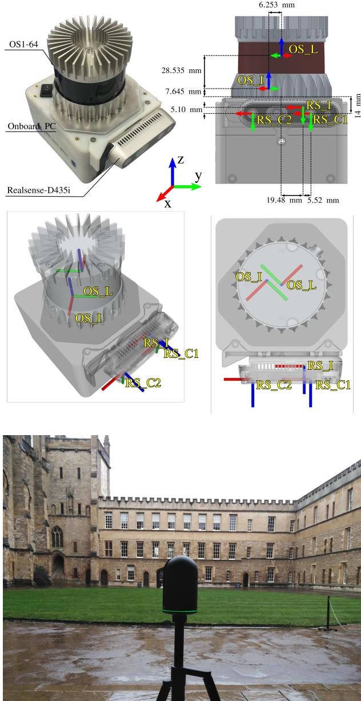  
Fig. 2: Devices used in our dataset. Top left: Our custom built handheld device; Top right: front view of the 3D CAD model with reference frames their relative distances; Middle (left to right): Isometric and top down views of the URDF model with reference frames; Bottom: Leica BLK360 for creating the ground truth map.

Our handheld device is equipped with an onboard Intel Core i7 NUC computer kit. To get the correct timestamps for IMU messages of the Realsense D435i, we use Ubuntu 18.04 with the Linux kernel of 4.15.0-74-generic and version 2.32.1.0 for Realsense libraries3. The firmware installed on the sensor was version 0.5.10.13.00. In our experience, we found the Realsense to be sensitive to the right combination of kernel, driver and firmwares to be used. In particular for the IMU messages, special care needs to be taken to achieve a reliable configuration. The device was powered by an 8000 mAh LI-PO battery.

## IV. DATA COLLECTION

We have collected a variety of datasets with different speeds of walking and turning. They are organised by the aggressiveness of the motion and described in more detail on our website.

Since this paper is motivated by the New College dataset [2], the longest experiment carefully followed the same path that the original data collection followed in 2009 in New College, Oxford, UK. Borrowing the terminology from [2], we break the dataset into 3 main sections: Quad (Q), Mid-Section (M) and Parkland (P). Quad has an oval lawn area at the center and is surrounded with medieval buildings with repeating architecture. The Mid-Section includes a short tunnel where illumination changes quickly, leading to an open area which is flanked by buildings on the northern and southern sides. Parkland is a garden area connected to the Mid-Section through a wrought iron gate from west.

The data was gathered during early February 2020 from morning to noon. The handheld device was held by a person walking at constant pace about 1 m/s. To reduce the number of blocked laser beams, the device was held above the shoulder throughout the dataset. It is worth mentioning that the movement was not intended to be highly dynamic. However, natural vibration caused by human walking and hand motion is inevitable. The motion induced by this walking gait would make the dataset similar to a flying UAV.

Following the same path as the original New College dataset, the data collection began from the west of the Quad. As illustrated in Fig. 3, after three and a half loops, clockwise, around the Quad with the duration of about 390 seconds (Q1), the Quad and the Mid-Section were traversed back and forth twice (M1-Q2 and M2-Q3), counterclockwise in periods M1, M2 and Q2 while clockwise in period Q3. These sections took until second 820 of the data collection, followed by a straight traversal in period M3 which took 60 seconds.

The data collection continued by entering the Parkland at second 1240 and it was circumnavigated twice clockwise in 610 seconds. Unlike the paved path in the Quad and the Mid-Section, the path in the Parkland was gravel and was muddy in parts due to the time of data collection. Since the path is adjacent to a vegetated border and partly passes along dense foliage, it is hard to see any building structure, posing a challenge to vision-based localisation techniques.

The data continued to be captured by walking straight back to the Quad (M4 with the same duration as M3) and this time the sensor was carried counter-clockwise for about 105 seconds, followed by walking straight back to the Parkland and taking in an extra loop in this area (but counter-clockwise). The traversal in the P3 ended at Second 2180. Finally, the data collection ended by walking back to starting point, i.e. passing through the Mid-Section (M6) and half circumnavigating the Quad (Q5) counter-clockwise. Altogether, the time duration of the entire dataset is 2300 seconds.

To extend the usefulness of the dataset, we carried out further experiments with faster walking and aggressive motions of the device. These datasets are listed as below:

• Shorter experiment (1500 seconds): A slightly shorter version of the main dataset, at the same walking speed.

• Quad with dynamics (398 seconds): 4 clockwise loops around the Quad at a faster walking speed (1.5msec/): for 2 loops the device was held flat; 1 loop had the device swinging from side to side; and 1 loop where the swinging speed varied.

• Dynamic spinning (120 seconds): Aggressive angular motions of the device, rotation rates of 2.5 rad/sec while pointing at a corner of the Quad. Useful for testing motion distortion.

• Parkland mound (500 seconds): Walking a few laps in the grassy area of the Parkland, up and down the Mound’s stairs and finally a loop around the Mound at a fast walking speed.

For more details regarding these datasets, we refer the readers to the dataset website.

## V. GROUND TRUTH

The ground truth poses of this dataset are obtained with an approach whose core uses Iterative Closest Point (ICP), a well-known method for registration of 3D shapes [19]. When provided with a prior pose from which the point clouds are captured, ICP minimizes the Euclidean distance between closest points, namely correspondences, to iteratively compute the relative displacement between the reading cloud and the reference cloud. The former refers to the cloud which is intended to be registered with the latter.

To provide the prior map of our dataset, we use a surveygrade 3D imaging laser scanner, Leica BLK3604 (Fig. 2 (bottom)). For the New College environment with approximately the size of $1 3 5 { \times } 2 2 5 \ \mathrm { m } ^ { 2 }$ , 47 static point clouds were captured to fully map the area. This took over 8 hours. The capture locations were decided to be closer together in the Parkland due to foliage and less structured features. All the point clouds were matched with over 90% of inliers. The fully merged map is seen in Fig. 1 (top). According to the Leica BLK360 datasheet4, the achievable accuracy for 3D points in the map is 6 mm at range 10 m and 8 mm at range 20 m. Hence, we can conclude that the accuracy of the majority of points of the entire map is better than 1 cm since the range of the points (in the Quad, Mid-Section and the perimeter of the Parkland) in the map is no more than 20 meters from at least one of the scanning stations. The final map consists of about 290 million points.

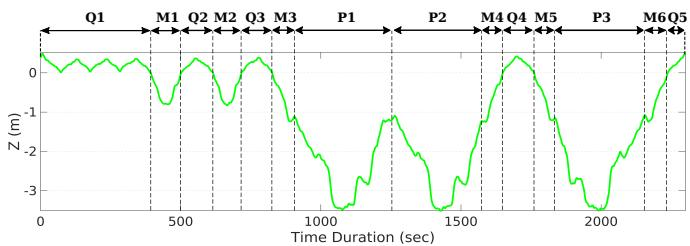

Fig. 3: Ground truth elevation in the entire dataset.  
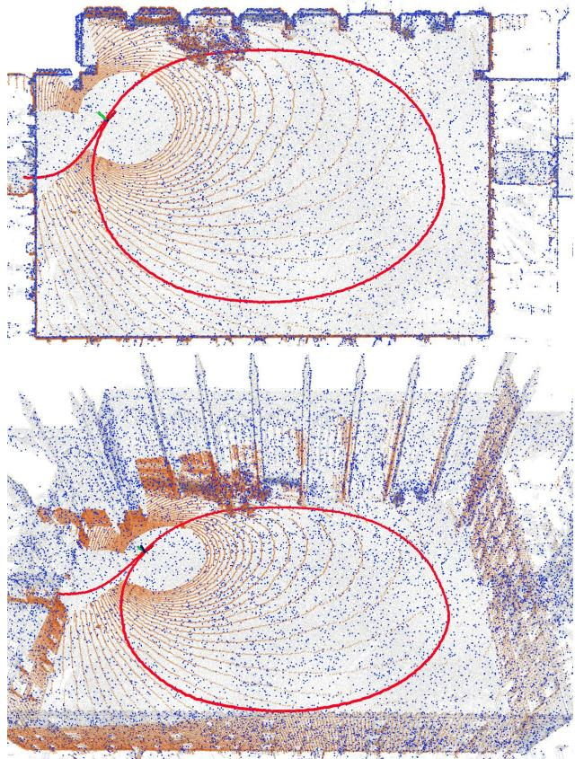  
Fig. 4: Plan and perspective view of the Quad when current laser scan (in maroon) is registered against the reference cloud (in blue). The reference cloud is part of the prior map (in gray) which is cropped around the pose.

Having generated the accurate prior map, we first downsample the map cloud to 1 cm resolution. This way, we reduce the map to about 17 million points enabling us to use it in our localisation approach without an observable drop in registration accuracy. Further, we dynamically crop the pointcloud to create a reference cloud in the area of 100 m by 100 m around the sensor’s pose. To localise individual scans, we use a libpointmatcher filter chain [20] to remove the outliers in the clouds and finally register the scans against the map. Fig. 4 demonstrates the ground truth registration procedure with a single Ouster scan. It is worth noting that the ground truth poses are with respect to the base frame which is the center of the left camera, as described in Sec. III. This facilitates the estimation of the camera poses at 30 Hz through interpolation.

Evaluation of ground truth accuracy is challenging for certain scenarios in the dataset – such as the confined areas in the Mid-section and the natural environment in the Parkland. Fig. 5 and Fig. 6 illustrate the accuracy of the ground truth. Fig. 5 shows the behaviour of the ICP ground truth procedure along x, y and z for the first 10 seconds of the dataset when the device was stationary. The standard deviations along x, y and z are 2 cm, 1.6 cm and 2 cm or approximately 3 cm overall. Evaluating the localisation performance when the device is in motion is more challenging. It involves dynamic effects such as LiDAR motion distortion and it’s accuracy likely to be reduced lower. Note Fig. 6 demonstrates the periodic behaviour of the trajectory over the course of the three Quad loops (Q1). A closer analysis of 12 seconds of the trajectory (Fig. 6, bottom) shows periodicity of the trajectory due to the walking motion — an indication of the accuracy.

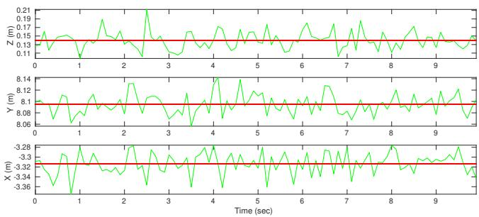  
Fig. 5: Ground truth position values for the first 10 seconds of the dataset when the device was stationary. Red lines show the mean values over this period of time.

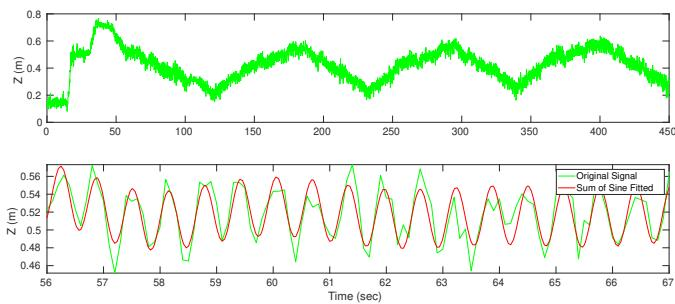  
Fig. 6: Top: Ground truth z values over the course of 450 seconds of the dataset when walking around the quad (Q1). Bottom: A closer analysis over 12 seconds. The fitted red curve shows the pattern of the walking gait.

## VI. EXAMPLE DATASET USAGE

This section presents example results for a series of potential uses of our dataset in localisation and mapping research areas: LiDAR-SLAM, Appearance-Based Loop-Closure, 3D Reconstruction and Visual (Inertial) Odometry.

## A. LiDAR SLAM

We use our LiDAR SLAM system detailed in [21] to estimate ego-motion at 2 Hz and find loop-closures geometrically. Fig. 9 (middle) shows the SLAM trajectory for the entire dataset. This demonstrates that our dataset is useful for LiDAR-based localisation systems.

## B. Visual Appearance-Based Loop-Closure

As an illustration of our dataset used in visual place recognition, we used DBoW2 [22] with ORB features [23]. We computed the similarity score against all the poses (spaced at 2 m intervals) traveled in the past and applied a threshold to obtain loop candidates. Fig. 7 shows the similarity matrix, a square matrix indicates whether the nodes in a pose graph are similar or not, and some examples of the most similar views captured at different times are shown.

## C. LiDAR 3D Reconstruction

Our dataset can also be used for 3D reconstruction, as demonstrated in Fig. 8. The top row represents the surface mesh generated from the Leica ground truth map using Poisson surface reconstruction [24]. The bottom row shows the mesh created by using the Ouster laser scans registered against the prior map (i.e. leveraging the ground truth localisation). We applied the filtering and mesh generation tools provided by PCL [25] including Moving Least Squares (MLS) smoothing [26], a voxel grid filter of 5 cm resolution and the greedy triangulation projection [27] for the reconstruction.

## D. Visual (Inertial) Odometry

We provide visual and inertial measurements which are software time synchronized, in our dataset, as well as providing calibration files to test on two visual odometry methods. We tested ORB-SLAM2 [28] for basic stereo odometry with loop closures disabled. Fig. 9 (bottom) shows the trajectory estimated by this approach using the image pairs for the first 1483 seconds of the dataset. We also used our visualinertial odometry approach, VILENS [29], which carries out windowed smoothing of the two measurements sources for the same period.

## VII. CONCLUSION AND FUTURE WORK

In this paper, we presented the Newer College Vision and LiDAR dataset. By leveraging a highly accurate and detailed prior map, we determined accurate 6 DoF ground truth for the entire dataset, which distinguishes our dataset from many others. We used a modern visual-inertial camera and a dense 3D LiDAR sensor and provide the dataset in both the original ROSbags and individual files (such as png images and csv files).

We also demonstrated the use of the dataset for different subproblems in mobile robotics and navigation. It is our intent to further extend our dataset with additional difficult sequences including aggressive motions and make them available publicly in the near future. A demonstration video is available at: https://youtu.be/aIeMPeHDUgs

## VIII. ACKNOWLEDGMENT

The authors would like to thank the members of the Oxford Robotics Institute (ORI) who helped with the creation of this dataset release, especially Chris Prahacs, Simon Venn and Benoit Casseau. We also thank the personnel of New College for facilitating our data collection.

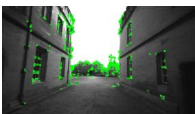

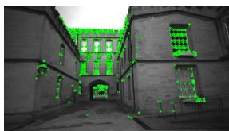  
Pose 798

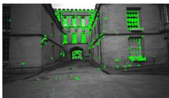  
Pose 1088

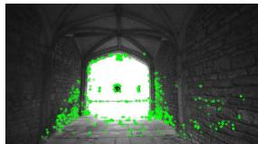  
Pose 191

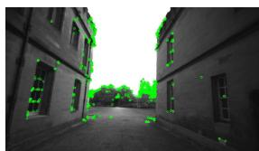  
Pose 237  
Pose 298

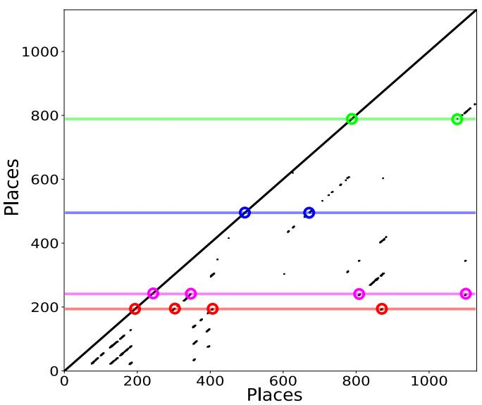

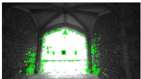

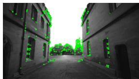  
Pose 344  
Pose 403

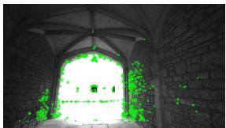  
Pose 807

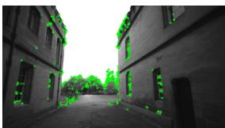  
Pose 867

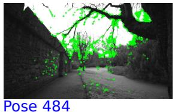

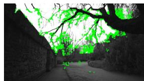

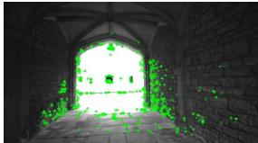  
Pose 661  
Pose 1098

Fig. 7: An example of dataset usage for appearance-based loop-closure detection.  
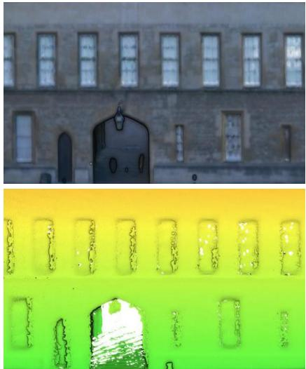

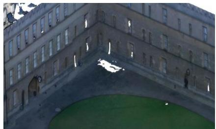

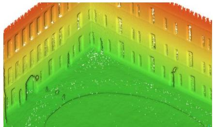

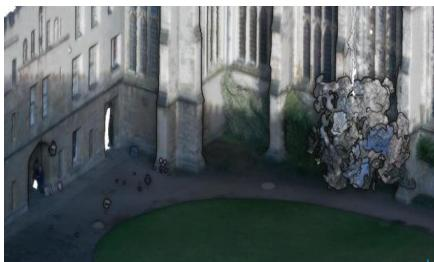

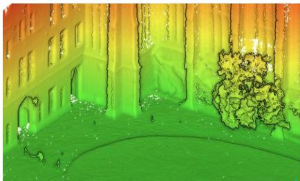  
Fig. 8: 3D reconstruction of the Quad from different view points using Ouster laser scans (bottom row) and using the ground truth map (top row). The heat map displays the height from the ground along z axis w.r.t. map frame.

This research was supported by the Innovate UK-funded ORCA Robotics Hub (EP/R026173/1) and the EU H2020 Project THING. Maurice Fallon is supported by a Royal Society University Research Fellowship. Matias Mattamala is supported by the National Agency for Research and Development (ANID) / Scholarship Program / DOCTORADO BECAS CHILE/2019 - 72200291

## REFERENCES

[1] A. Geiger, P. Lenz, C. Stiller, and R. Urtasun, “Vision meets Robotics: The KITTI Dataset,” International Journal of Robotics Research (IJRR), 2013.

[2] M. Smith, I. Baldwin, W. Churchill, R. Paul, and P. Newman, “The New College Vision and Laser Data Set,” The International Journal of Robotics Research, vol. 28, no. 5, pp. 595–599, 2009.

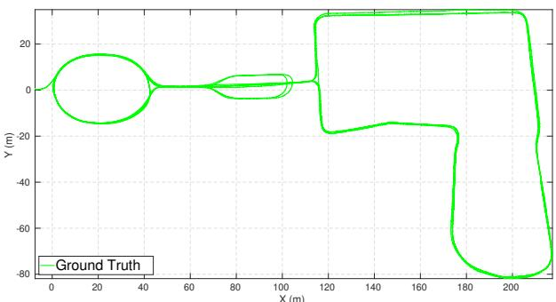

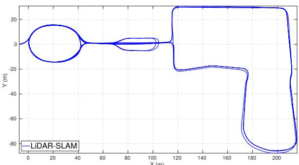

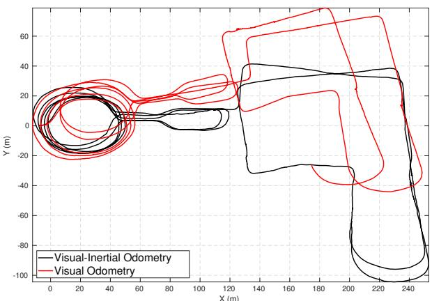  
Fig. 9: Ground truth trajectory (top) with our LiDAR-SLAM trajectory (middle) throughout the data. Bottom are the trajectory of vision-based localisation systems, ORB-SLAM2 (red) with loopclosure disabled and VILENS (black).

[3] M. Burri, J. Nikolic, P. Gohl, T. Schneider, J. Rehder, S. Omari, M. W. Achtelik, and R. Siegwart, “The EuRoC micro aerial vehicle datasets,” The International Journal of Robotics Research, 2016. [Online]. Available: http://ijr.sagepub.com/content/early/2016/01/21/ 0278364915620033.abstract

[4] A. S. Huang, M. Antone, E. Olson, L. Fletcher, D. Moore, S. Teller, and J. Leonard, “A High-rate, Heterogeneous Data Set From The DARPA Urban Challenge,” The International Journal of Robotics Research, vol. 29, no. 13, pp. 1595–1601, 2010.

[5] T. Peynot, S. Scheding, and S. Terho, “The Marulan Data Sets: Multi-sensor Perception in a Natural Environment with Challenging Conditions,” The International Journal of Robotics Research, vol. 29, no. 13, pp. 1602–1607, 2010.

[6] G. Pandey, J. R. McBride, and R. M. Eustice, “Ford Campus Vision and Lidar Data Set,” The International Journal of Robotics Research, vol. 30, no. 13, pp. 1543–1552, 2011.

[7] J.-L. Blanco-Claraco, F.-A. Moreno-Due´ nas, and J. Gonz˜ alez-Jim´ enez,´ “The Malaga urban dataset: High-rate stereo and LiDAR in a realistic´ urban scenario,” The International Journal of Robotics Research, vol. 33, no. 2, pp. 207–214, 2014.

[8] W. Maddern, G. Pascoe, C. Linegar, and P. Newman, “1 year, 1000 km: The Oxford RobotCar dataset,” The International Journal of Robotics Research, vol. 36, no. 1, pp. 3–15, 2017.

[9] J. Jeong, Y. Cho, Y.-S. Shin, H. Roh, and A. Kim, “Complex urban

dataset with multi-level sensors from highly diverse urban environments,” The International Journal ofRobotics Research, vol. 38, no. 6, pp. 642–657, 2019.

[10] S. Ceriani, G. Fontana, A. Giusti, D. Marzorati, M. Matteucci, D. Migliore, D. Rizzi, D. G. Sorrenti, and P. Taddei, “Rawseeds ground truth collection systems for indoor self-localization and mapping,” Autonomous Robots, vol. 27, no. 4, p. 353, 2009.

[11] N. Carlevaris-Bianco, A. K. Ushani, and R. M. Eustice, “University of Michigan North Campus Long-Term Vision and Lidar Dataset,” The International Journal of Robotics Research, vol. 35, no. 9, pp. 1023–1035, 2016.

[12] M. Burri, J. Nikolic, P. Gohl, T. Schneider, J. Rehder, S. Omari, M. W. Achtelik, and R. Siegwart, “The EuRoC micro aerial vehicle datasets,” The International Journal of Robotics Research, vol. 35, no. 10, pp. 1157–1163, 2016.

[13] B. Pfrommer, N. Sanket, K. Daniilidis, and J. Cleveland, “Penncosyvio: A Challenging Visual Inertial Odometry Benchmark,” in 2017 IEEE International Conference on Robotics and Automation (ICRA). IEEE, 2017, pp. 3847–3854.

[14] A. L. Majdik, C. Till, and D. Scaramuzza, “The Zurich Urban Micro Aerial Vehicle Dataset,” The International Journal of Robotics Research, vol. 36, no. 3, pp. 269–273, 2017.

[15] D. Schubert, T. Goll, N. Demmel, V. Usenko, J. Stuckler, and¨ D. Cremers, “The TUM VI Benchmark for Evaluating Visual-Inertial Odometry,” in 2018 IEEE/RSJ International Conference on Intelligent Robots and Systems (IROS), Oct 2018, pp. 1680–1687.

[16] P. Furgale, J. Rehder, and R. Siegwart, “Unified Temporal and Spatial Calibration for Multi-Sensor Systems,” in 2013 IEEE/RSJ International Conference on Intelligent Robots and Systems. IEEE, 2013, pp. 1280–1286.

[17] J. Rehder, J. Nikolic, T. Schneider, T. Hinzmann, and R. Siegwart, “Extending Kalibr: Calibrating the Extrinsics of Multiple IMUs and of Individual Axes,” in 2016 IEEE International Conference on Robotics and Automation (ICRA). IEEE, 2016, pp. 4304–4311.

[18] W. . Chin and S. . Chen, “Ieee 1588 clock synchronization using dual slave clocks in a slave,” IEEE Communications Letters, vol. 13, no. 6, pp. 456–458, June 2009.

[19] P. J. Besl and N. D. McKay, “A method for registration of 3-D shapes,” in Sensorfusion IV: control paradigms and data structures, vol. 1611. International Society for Optics and Photonics, 1992, pp. 586–606.

[20] F. Pomerleau, F. Colas, R. Siegwart, and S. Magnenat, “Comparing ICP Variants on Real-World Data Sets,” Autonomous Robots, vol. 34, no. 3, pp. 133–148, Feb. 2013.

[21] M. Ramezani, G. Tinchev, E. Iuganov, and M. Fallon, “Online LiDAR-SLAM for Legged Robots with Robust Registration and Deep-Learned Loop Closure,” IEEE International Conference on Robotics and Automation (ICRA), 2020.

[22] D. Galvez-Lpez and J. D. Tardos, “Bags of Binary Words for´ Fast Place Recognition in Image Sequences,” IEEE Transactions on Robotics, vol. 28, no. 5, pp. 1188–1197, oct 2012. [Online]. Available: http://ieeexplore.ieee.org/document/6202705/

[23] E. Rublee, V. Rabaud, K. Konolige, and G. Bradski, “ORB: An efficient alternative to SIFT or SURF,” in Proceedings of the IEEE International Conference on Computer Vision, 2011, pp. 2564–2571.

[24] M. Kazhdan, M. Bolitho, and H. Hoppe, “Poisson Surface Reconstruction,” in Proceedings of the Fourth Eurographics Symposium on Geometry Processing, ser. SGP 06. Goslar, DEU: Eurographics Association, 2006, p. 6170.

[25] R. B. Rusu and S. Cousins, “3D is here: Point Cloud Library (PCL),” in IEEE International Conference on Robotics and Automation (ICRA), Shanghai, China, May 9-13 2011.

[26] M. Alexa, J. Behr, D. Cohen-Or, S. Fleishman, D. Levin, and C. T. Silva, “Computing and Rendering Point Set Surfaces,” IEEE Transactions on Visualization and Computer Graphics, vol. 9, no. 1, pp. 3–15, Jan 2003.

[27] Z. C. Marton, R. B. Rusu, and M. Beetz, “On Fast Surface Reconstruction Methods for Large and Noisy Point Clouds,” in 2009 IEEE International Conference on Robotics and Automation, May 2009, pp. 3218–3223.

[28] R. Mur-Artal and J. D. Tardos, “ORB-SLAM2: An Open-Source´ SLAM System for Monocular, Stereo, and RGB-D Cameras,” IEEE Transactions on Robotics, vol. 33, no. 5, pp. 1255–1262, 2017.

[29] D. Wisth, M. Camurri, and M. Fallon, “Robust Legged Robot State Estimation Using Factor Graph Optimization,” IEEE Robotics and Automation Letters, vol. 4, no. 4, pp. 4507–4514, 2019.