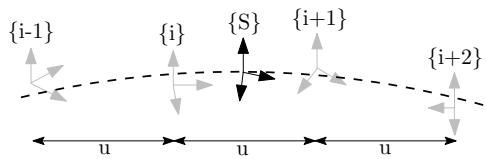
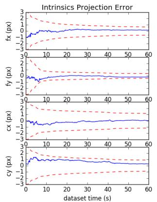
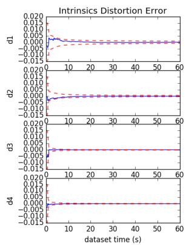
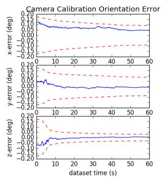
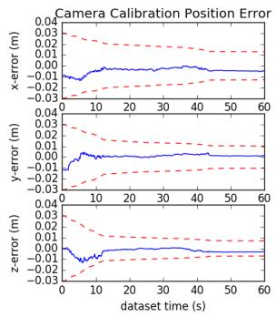
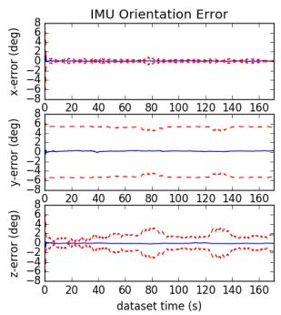
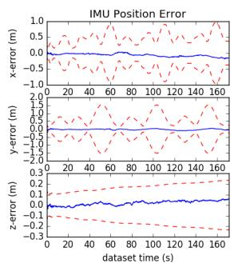
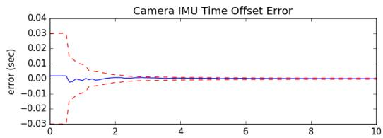

# OpenVINS: A Research Platform for Visual-Inertial Estimation

Patrick Geneva, Kevin Eckenhoff, Woosik Lee, Yulin Yang, and Guoquan Huang

Abstract— In this paper, we present an open platform, termed OpenVINS, for visual-inertial estimation research for both the academic community and practitioners from industry. The open sourced codebase provides a foundation for researchers and engineers to quickly start developing new capabilities for their visual-inertial systems. This codebase has out of the box support for commonly desired visual-inertial estimation features, which include: (i) on-manifold sliding window Kalman filter, (ii) online camera intrinsic and extrinsic calibration, (iii) camera to inertial sensor time offset calibration, (iv) SLAM landmarks with different representations and consistent First-Estimates Jacobian (FEJ) treatments, (v) modular type system for state management, (vi) extendable visual-inertial system simulator, and (vii) extensive toolbox for algorithm evaluation. Moreover, we have also focused on detailed documentation and theoretical derivations to support rapid development and research, which are greatly lacked in the current open sourced algorithms. Finally, we perform comprehensive validation of the proposed OpenVINS against state-of-the-art open sourced algorithms, showing its competing estimation performance.

• Open source:

https://github.com/rpng/open\_vins

• Documentation:

https://docs.openvins.com

## I. INTRODUCTION

Autonomous robots and consumer-grade mobile devices such as drones and smartphones are becoming ubiquitous, in part due to a large increase in computing ability and a simultaneous reduction in power consumption and cost. To endow these robots and mobile devices with the ability to perceive and understand their contextual locations within local environments, which is desired in many different ap plications from mobile AR/VR to autonomous navigation, visual-inertial navigation systems (VINS) are often used to provide accurate motion estimates by fusing the data from on-board camera and inertial sensors [1].

Developing a working VINS algorithm from scratch has proven to be challenging, and in the robotics research community, this has shown to be a significant hurdle for researchers due to the lack of VINS codebases that have comprehensive documentation and detailed derivations for which even users with little background can learn and extend a current state-of-the-art work to address their problems at hand. While there are several open sourced visual-inertial codebases [2]–[8], they are not developed for extensibility and lack proper documentation and evaluation tools, which, in our experience, are crucial for rapid development and deep understanding, thus accelerating VINS research and development in the field. Moreover, these systems have many hard-coded assumptions or features that require an intricate understanding of the codebases in order to adapt them to the sensor systems at hand. This, along with inadequate documentation and support, limits their wide adoption in different applications.

To fill the aforementioned void in the community and to promote the VINS research in robotics and beyond, in this paper, we present an extendable, open sourced codebase that is particularly designed for researchers and practitioners with either limited or extensive background knowledge of state estimation. We provide the necessary documentation, tools, and theory for those who are even new to visual-inertial estimation, and term this collection of utilities as OpenVINS (OV). This codebase has been the foundation of many of the recent visual-inertial estimation projects in our group at the University of Delaware, which include multi-camera [9], multi-IMU [10], visual-inertial moving object tracking [11], [12], Schmidt-based visual-inertial SLAM [13], [14], pointplane and point-line visual-inertial navigation [15], [16], among others [17]–[19]. We summarize the key functionality of the different components in OpenVINS as follows:

• ov core – Contains 2D image sparse visual feature tracking; linear and Gauss-Newton feature triangulation methods; visual-inertial simulator for arbitrary number of cameras and frequencies; and fundamental manifold math operations and utilities.

• ov eval – Contains trajectory alignment; plotting utilities for trajectory accuracy and consistency evaluation; Monte-Carlo evaluation of different accuracy metrics; and utility for recording ROS topics to file.

• ov msckf – Contains the extendable modular Extended Kalman Filter (EKF)-based sliding window visualinertial estimator with on-manifold type system for flexible state representation. Features include: First-Estimates Jacobains (FEJ) [20]–[22], IMU-camera time offset calibration [23], camera intrinsics and extrinsic online calibration [24], standard MSCKF [25], and 3D SLAM landmarks of different representations.

In what follows we describe our generalized modular on-manifold EKF-based estimator which, in its simplest form, estimates the current state of a camera-IMU pair. We then introduce the implemented features that provide the foundation for researchers to quickly build and extend on. Note that what we present here is only a brief introduction to the feature set and readers are referred to our thorough documentation website. We also provide an evaluation of the proposed EKF-based solution in simulations and then on real-world datasets, clearly demonstrating its competing performance against other open sourced algorithms.

## II. ON-MANIFOLD MODULAR EKF

The state vector of our visual-inertial system consists of the current inertial navigation state, a set of c historical IMU pose clones, a set of m environmental landmarks, and a set of w cameras’ extrinsic and intrinsic parameters.

$$
\mathbf { x } _ { k } = \left[ \mathbf { x } _ { I } ^ { \top } \quad \mathbf { x } _ { C } ^ { \top } \quad \mathbf { x } _ { M } ^ { \top } \quad \mathbf { x } _ { W } ^ { \top } \quad c _ { t _ { I } } \right] ^ { \top }\tag{1}
$$

$$
\begin{array} { r } { \mathbf { x } _ { I } = \left[ \mathbf { \Pi } _ { G } ^ { I _ { k } } \bar { q } ^ { \top } \mathbf { \Pi } ^ { G } \mathbf { p } _ { I _ { k } } ^ { \top } \mathbf { \Pi } ^ { G } \mathbf { v } _ { I _ { k } } ^ { \top } \mathbf { \quad } \mathbf { b } _ { \omega _ { k } } ^ { \top } \mathbf { \quad } \mathbf { b } _ { a _ { k } } ^ { \top } \right] ^ { \top } } \end{array}\tag{2}
$$

$$
\begin{array} { r } { \mathbf { x } _ { C } = \left[ _ { G } ^ { I _ { k - 1 } } \bar { q } ^ { \top } \quad { } ^ { G } \mathbf { p } _ { I _ { k - 1 } } ^ { \top } \quad \cdot \cdot \cdot \quad { } _ { G } ^ { I _ { k - c } } \bar { q } ^ { \top } \quad { } ^ { G } \mathbf { p } _ { I _ { k - c } } ^ { \top } \right] ^ { \top } } \end{array}\tag{3}
$$

$$
\mathbf { x } _ { M } = \left[ ^ { G } \mathbf { p } _ { f _ { 1 } } ^ { \top } \quad \cdot \cdot \quad ^ { G } \mathbf { p } _ { f _ { m } } ^ { \top } \right] ^ { \top }\tag{4}
$$

$$
\begin{array} { r } { \mathbf { x } _ { W } = \left[ \underset { C _ { 1 } } { I } \bar { q } ^ { \top } \quad C _ { 1 } \mathbf { p } _ { I } ^ { \top } \quad \zeta _ { 0 } ^ { \top } \cdot \cdot \cdot \quad \underset { C _ { w } } { I } \bar { q } ^ { \top } \quad C _ { w } \mathbf { p } _ { I } ^ { \top } \quad \zeta _ { w } ^ { \top } \right] ^ { \top } } \end{array}\tag{5}
$$

where $\mathbf { \Pi } _ { G } ^ { I _ { k } } \bar { q }$ is the unit quaternion parameterizing the rotation $\mathbf { R } ( ^ { I _ { k } } _ { G } \bar { q } ) = \mathbf { \Sigma } _ { G } ^ { I _ { k } } \mathbf { F }$ from the global frame of reference $\{ G \}$ to the IMU local frame $\{ I _ { k } \}$ at time k [26], $\mathbf { b } _ { \omega }$ and $ { \mathbf { b } } _ { a }$ are the gyroscope and accelerometer biases, and ${ { G } _ { { \bf { v } } _ { I _ { k } } } }$ and ${ { \bf \Pi } ^ { G } } _ { { \bf { p } } _ { I _ { k } } }$ are the velocity and position of the IMU expressed in the global frame, respectively. The inertial state $\mathbf { x } _ { I }$ lies on the manifold defined by the product of the unit quaternions H with the vector space $\mathbb { R } ^ { 1 \hat { 2 } } \ ( \mathrm { i . e . \ } \mathcal { M } = \mathbb { H } \times \mathbb { R } ^ { 1 \hat { 2 } } )$ and has 15 total degrees of freedom (DOF).

For vector variables, the “boxplus” and “boxminus” operations, which map elements to and from a given manifold [27], equate to simple addition and subtraction of their vectors. For quaternions, we define the quaternion boxplus operation as:

$$
{ \bar { q } } _ { 1 } \boxplus \delta \pmb { \theta } \triangleq { \left[ { \frac { \delta \pmb { \theta } } { 2 } } \right] } \otimes { \bar { q } } _ { 1 } \simeq { \bar { q } } _ { 2 }\tag{6}
$$

Note that although we have defined the orientations using the $l e f t$ quaternion error, it is not limited to this and any onmanifold representation in practice can be used (e.g., [28]).

The map of environmental landmarks $\mathbf { x } _ { M }$ contains global 3D positions only for simplicity, while in practice we offer support for different representations (e.g. inverse MSCKF [25], full inverse depth [29], and anchored 3D position [30]).

The calibration vector x contains the camera intrinsics $\zeta ,$ consisting of focal length, camera center, and distortion parameters, and the camera-IMU extrinsics, i.e., the spatial transformation (relative pose) from the IMU to each camera. Since we consider synchronized camera clocks, we include a single time offset $\mathbf { \dot { \rho } } _ { C _ { t _ { I } } }$ between the IMU and the camera clock in the calibration vector.

## A. Propagation

The inertial state $\mathbf { x } _ { I }$ is propagated forward using incoming IMU measurements of linear accelerations $\mathbf { \Delta } ^ { I } \mathbf { a } _ { m }$ and angular velocities ${ { I } _ { \omega _ { m } } }$ based on the following generic nonlinear IMU kinematics propagating the state from timestep $k - 1$ to k [31]:

$$
\mathbf { x } _ { k } = f ( \mathbf { x } _ { k - 1 } , \mathbf { \xi } ^ { I } \mathbf { a } _ { m } , \mathbf { \xi } ^ { I } \omega _ { m } , \mathbf { n } )\tag{7}
$$

where n contains the zero-mean white Gaussian noise of the IMU measurements along with random walk bias noise. This state estimate is evaluated at the current estimate:

$$
\hat { \mathbf { x } } _ { k | k - 1 } = f ( \hat { \mathbf { x } } _ { k - 1 | k - 1 } , \mathbf { \xi } ^ { I } \mathbf { a } _ { m } , \mathbf { \xi } ^ { I } \omega _ { m } , \mathbf { 0 } )\tag{8}
$$

where ˆ· denotes the estimated value and the subscript $k | k - 1$ denotes the predicted estimate at time k given the measurements up to time $k - 1$ . The state covariance matrix is propagated typically by linearizing the nonlinear model at the current estimate:

$$
\mathbf { P } _ { k | k - 1 } = \Phi _ { k - 1 } \mathbf { P } _ { k - 1 | k - 1 } \Phi _ { k - 1 } ^ { \top } + \mathbf { Q } _ { k - 1 }\tag{9}
$$

where $\Phi _ { k - 1 }$ and $\mathbf { Q } _ { k - 1 }$ are respectively the system Jacobian and discrete noise covariance matrices [25]. The clones $\mathbf { x } _ { C } ,$ environmental features $\mathbf { x } _ { M }$ , and calibration x<sub>W</sub> states do not evolve with time and thus the corresponding state Jacobian entries are identity with zero propagation noise and allow for exploitation of the sparsity for computational savings.

## B. On-Manifold Update

Consider the following nonlinear measurement function:

$$
{ \bf z } _ { m , k } = h ( { \bf x } _ { k } ) + { \bf n } _ { m , k }\tag{10}
$$

where we have the measurement noise $\mathbf { n } _ { m , k } \sim \mathcal { N } ( \mathbf { 0 } , \mathbf { R } _ { m , k } )$ For the standard EKF update, one linearizes the above equation at the current state estimate. In our case, as in the indirect EKF [26], we linearize (10) with respect to the current zero-mean error state $( \mathrm { i . e . } \ \tilde { \mathbf { x } } = \mathbf { x } \boxed { \hat { \mathbf { x } } } \sim \mathcal { N } ( \mathbf { 0 } , \mathbf { P } ) )$

$$
\begin{array} { r } { \mathbf { z } _ { m , k } = h ( \hat { \mathbf { x } } _ { k | k - 1 } \boxplus \tilde { \mathbf { x } } _ { k | k - 1 } + \mathbf { n } _ { m , k } } \end{array}\tag{11}
$$

$$
= h ( \hat { \mathbf { x } } _ { k | k - 1 } ) + \mathbf { H } _ { k } \tilde { \mathbf { x } } _ { k | k - 1 } + \mathbf { n } _ { m , k }\tag{12}
$$

$$
\Rightarrow \tilde { \mathbf { z } } _ { m , k } = \mathbf { H } _ { k } \tilde { \mathbf { x } } _ { k | k - 1 } + \mathbf { n } _ { m , k }\tag{13}
$$

where $\mathbf { H } _ { k }$ is the measurement Jacobian computed as follows:

$$
\mathbf { H } _ { k } = \frac { \partial h ( \hat { \mathbf { x } } _ { k | k - 1 } \boxplus \tilde { \mathbf { x } } _ { k | k - 1 } ) } { \partial \tilde { \mathbf { x } } _ { k | k - 1 } } \Bigg | _ { \tilde { \mathbf { x } } _ { k | k - 1 } = \mathbf { 0 } }\tag{14}
$$

Using this linearized measurement model, we can now perform the following standard EKF update to ensure the updated states remain on-manifold:

$$
\hat { \mathbf { x } } _ { k | k } = \hat { \mathbf { x } } _ { k | k - 1 } \boxplus \mathbf { K } _ { k } ( \mathbf { z } _ { m , k } - h ( \hat { \mathbf { x } } _ { k | k - 1 } ) )\tag{15}
$$

$$
\mathbf { P } _ { k | k } = \mathbf { P } _ { k | k - 1 } - \mathbf { K } _ { k } \mathbf { H } _ { k } \mathbf { P } _ { k | k - 1 }\tag{16}
$$

$$
{ \bf K } _ { k } = { \bf P } _ { k | k - 1 } { \bf H } _ { k } ^ { \top } ( { \bf H } _ { k } { \bf P } _ { k | k - 1 } { \bf H } _ { k } ^ { \top } + { \bf R } _ { m , k } ) ^ { - 1 }\tag{17}
$$

## III. OPENVINS RESEARCH PLATFORM

## A. Type-based Index System

At the core of the OpenVINS library is the type-based index system. Inspired by graph-based optimization frameworks such as GTSAM [32], we abstract away from the user the need to directly manipulate the covariance and instead provide the tools to automatically manage the state and its covariance. This offers many benefits such as reduced implementation time and being less prone to development errors due to explicit state and covariance access.

Each state variable “type” has internally the location of where it is in the error state which is automatically updated during initialization, cloning, or marginalization operations which affect variable ordering. A type is defined by its covariance location, its current estimate and its error state size. The current value does not have to be a vector, but could be a matrix in the case of an SO(3) rotation representation. The error state for all types is a vector and thus a type will need to define the boxplus mapping between its error state and its manifold representation (i.e. the update function).

```rust
c l a s s Type {
p r o t e c t e d :
// Cu rre n t b e s t e s t i m a t e
Eige n : : MatrixXd v a l u e ;
// In dex of e r r o r s t a t e i n c o v a r i a n c e
i n t i d = −1;
// Dimension of e r r o r s t a t e
i n t s i z e = −1;
// Ve c t o r c o r r e c t i o n , how t o up da te
v o i d u p d a t e ( c o n s t Eig en : : VectorXd dx ) ;
} ;
```

One of the main advantages of this type system is that it reduces the complexity of adding new features by allowing the user to construct sparse Jacobians. Instead of constructing a Jacobian for all state elements, the “sparse” Jacobian needs to only include the state elements that the measurement is a function of. This both saves computation in the cases where a measurement is a function of only a few state elements and allows for measurement functions to be state agnostic as long as their involved state variables are present.

## B. State Variable Initialization

Based on a set of linearized measurement equations (13), we aim to optimally compute the initial estimate of a new state variable and its covariance and correlations with the existing state variables. As a motivating example, we here describe how to initialize a new SLAM landmark ${ \displaystyle G _ { \mathbf { p } _ { f } } } .$ whose key logic can be used for any new state variable and is generalized to any type within the codebase. As in [33] we first perform QR decomposition (e.g., using computationally efficient in-place Givens rotations) to separate the linear system (13) into two subsystems: (i) one that depends on the new state $( \mathrm { i } . \mathrm { e } . , \ ^ { G } \mathbf { p } _ { f } )$ , and (ii) the other that does not.

$$
\tilde { \mathbf { z } } _ { m , k } = \left[ \mathbf { H } _ { x } \quad \mathbf { H } _ { f } \right] \left[ \tilde { \mathbf { x } } _ { k } \right] + \mathbf { n } _ { m , k }\tag{18}
$$

$$
\Rightarrow \left[ \tilde { \mathbf { z } } _ { m 1 , k } \right] = \left[ \mathbf { H } _ { x 1 } \quad \mathbf { H } _ { f 1 } \right] \left[ \tilde { \mathbf { x } } _ { k } \right] + \left[ \mathbf { n } _ { f 1 } \right]\tag{19}
$$

where $\mathbf { n } _ { f i } \sim \mathcal { N } ( \mathbf { 0 } , \mathbf { R } _ { f i } ) , i \in \{ 1 , 2 \}$ . Note that in the above expression $\tilde { \mathbf { z } } _ { m 1 , k }$ and $\tilde { \mathbf { z } } _ { m 2 , k }$ are orthonormally transformed measurement residuals, not the direct partitions of $\tilde { \mathbf { z } } _ { m , k }$ . With the top transformed linearized measurement residual $\tilde { \mathbf { z } } _ { m 1 , k }$ in (19), we now perform efficient EKF update to initialize the state estimate of $^ { G } \hat { \mathbf { p } } _ { f }$ and its covariance and correlations to $\mathbf { x } _ { k }$ [see (15)], which will then be augmented to the current state and covariance matrix.

$$
{ } ^ { G } \hat { \mathbf { p } } _ { f } = { } ^ { G } \hat { \mathbf { p } } _ { f } \boxplus \mathbf { H } _ { f 1 } ^ { - 1 } \tilde { \mathbf { z } } _ { m 1 , k }\tag{20}
$$

$$
\mathbf { P } _ { x f } = - \mathbf { P } _ { k } \mathbf { H } _ { x 1 } ^ { \top } \mathbf { H } _ { f 1 } ^ { - \top }\tag{21}
$$

$$
\mathbf P _ { f f } = \mathbf H _ { f 1 } ^ { - 1 } ( \mathbf H _ { x 1 } \mathbf P _ { k } \mathbf H _ { x 1 } ^ { \top } + \mathbf R _ { f 1 } ) \mathbf H _ { f 1 } ^ { - \top }\tag{22}
$$

It should be noted that a full-rank $\mathbf { H } _ { f 1 }$ is needed to perform the above initialization, which normally is the case if enough measurements are collected (i.e., delayed initialization). Note also that to utilize all available measurement information, we also perform EKF update using the bottom measurement residual $\tilde { \mathbf { z } } _ { m 2 , k }$ in (19), which essentially is equivalent to the Multi-State Constraint Kalman Filter (MSCKF) [25] update with nullspace projection [34].

## C. Landmark Update

We generalize the landmark measurement model as a series of nested functions to encompass different feature parameterizations such as 3D position and inverse depth and so on. Assuming a visual feature that has been tracked over the sliding window of stochastic clones [35], we can write the visual-bearing measurements (i.e., pixel coordinates) as the following series of nested functions:

$$
{ \bf z } _ { m , k } = h ( { \bf x } _ { k } ) + { \bf n } _ { m , k }\tag{23}
$$

$$
\mathbf { \xi } = h _ { d } ( \mathbf { z } _ { n , k } , \ \zeta ) + \mathbf { n } _ { m , k }\tag{24}
$$

$$
= h _ { d } ( h _ { p } ( ^ { C _ { k } } { \bf p } _ { f } ) , \ \zeta ) + { \bf n } _ { m , k }\tag{25}
$$

$$
= h _ { d } ( h _ { p } ( h _ { t } ( ^ { G } { \bf p } _ { f } , \mathbf { \Pi } _ { G } ^ { C _ { k } } { \bf R } , \mathbf { \Pi } ^ { G } { \bf p } _ { C _ { k } } ) ) , \ \zeta ) + { \bf n } _ { m , k }\tag{26}
$$

where $\mathbf { z } _ { m , k }$ is the raw uv pixel coordinate; $\mathbf { n } _ { m , k }$ the raw pixel noise and typically assumed to be zero-mean white Gaussian; ${ \bf z } _ { n , k }$ is the normalized undistorted uv measurement; $C _ { k } \mathbf { _ { p } } _ { f }$ is the landmark position in the current camera frame; $\ddot { G } _ { \mathbf { p } _ { f } }$ is the landmark position in the global frame and depending on its representation may also be a function of state elements; and $\{ _ { G } ^ { \mathbf { \hat { C } } _ { k } } \mathbf { R } , ^ { G } \mathbf { p } _ { C _ { k } } \}$ denotes the current camera pose (position and orientation) in the $\mathrm { g l }$ lobal frame.

The measurement functions $h _ { d } , h _ { p }$ , and $h _ { t }$ correspond to the intrinsic distortion, projection, and transformation functions and the corresponding measurement Jacobians can be computed through a simple chain rule. Note that we compute the errors on the raw uv pixels to allow for calibration of the camera intrinsics $\zeta$ and that the function $h _ { d }$ can be changed to support any camera model (e.g., radial-tangential and equidistant). We refer readers to the documentation website for the details of these measurement functions.

## D. Online Calibration

We perform online spatiotemporal calibration of the camera-IMU time offset and extrinsic transformation, and camera intrinsics. Looking at the landmark measurement (26), one can simply take the derivative with respect to the desired variables that they wish to calibrate online. In this case we will have additional Jacobians for the intrinsic $\zeta$ in function $h _ { d }$ and $\{ { \mathbf { } } _ { I } ^ { C } { \mathbf { R } } , { } ^ { C } { \mathbf { p } } _ { I } \}$ extrinsics that the global pose $\{ _ { G } ^ { C _ { k } } \mathbf { R } , ^ { G } \mathbf { p } _ { C _ { k } } \}$ is a function of. For derivations and Jacobian results, we refer the reader to our documentation.

We also co-estimate the time offset between the camera and IMU, which can commonly exist in low-cost devices due to sensor latency, clock skew, or data transmission delays. Consider the time $c _ { t }$ as expressed in the camera clock is related to the same instant represented in the IMU clock, $^ { I } t ,$ by a time offset $c _ { t _ { I } } .$

$$
\mathbf { \nabla } ^ { I } t = \mathbf { \nabla } ^ { C } t + \mathbf { \nabla } ^ { C } t _ { I }\tag{27}
$$

This offset is unknown and estimated online. We refer the reader to [23] for further details.

## E. Codebase Documentation

It is our belief that the documentation of this work in itself is one of the main contributions to the research community. Both researchers and practitioners with little background in estimation may struggle to grasp the core theoretical concepts and important implementation details when it comes to visual-inertial estimation algorithms. To bridge this gap the documentation of this codebase takes as much of a priority as new features that could improve the estimation performance. As compared to existing open sourced systems with limited documentation, we focus on providing additional dedicated derivation pages on how different parts of the code are derived and interact. The in-code and page documentation is automatically generated from the codebase using Doxygen [36] which is then post-processed using m.css [37] to provide high quality search functionality and mobile friendly layout. This tight-coupling of our documentation and derivations within the codebase also ensures that the documentation is up to date and that developers can easily find answers.

## IV. VISUAL-INERTIAL SIMULATOR

We now detail how our simulator generates visual-inertial measurements. We note that this simulator can be easily extended to include other measurements besides the inertial and visual-bearing measurements presented below.

## A. B-Spline Interpolation

  
Fig. 1: Illustrate the B-spline interpolation to a pose $_ { S } ^ { G } \mathbf { T }$ which is bounded by four control poses.

At the center of the simulator is an SE(3) B-spline which allows for the calculation of the pose, velocity, and accelerations at any given timestep along a given trajectory. We follow the work of Patron-Perez et al. [38] and Mueggler et al. [39] in which given a series of temporally uniformly distributed “control point” poses, the pose {S} at a given timestep $t _ { s }$ can be interpolated by:

$$
\mathbf { \Lambda } _ { S } ^ { G } \mathbf { T } ( u ( t _ { s } ) ) = \mathbf { \Lambda } _ { i - 1 } ^ { G } \mathbf { T } \mathrm { ~ } \mathbf { A } _ { 0 } \mathrm { ~ } \mathbf { A } _ { 1 } \mathrm { ~ } \mathbf { A } _ { 2 }\tag{28}
$$

$$
{ \bf A } _ { j } = \exp \left( B _ { j } ( u ( t ) ) \mathbf \Lambda _ { i + j } ^ { i - 1 + j } \pmb \Omega \right)\tag{29}
$$

$$
\mathbf { \Lambda } _ { i } ^ { i - 1 } \pmb { \Omega } = \log \left( \mathbf { \Lambda } _ { i - 1 } ^ { G } \mathbf { T } ^ { - 1 } \mathbf { \Lambda } _ { i } ^ { G } \mathbf { T } \right)\tag{30}
$$

where $B _ { j } ( u ( t ) )$ are our spline interpolation constants, exp(·), log(·) are the SE(3) matrix exponential and logarithm, and the frame notations are shown in Figure 1. Equation (28) can be interpreted as compounding the fraction portions of the bounding poses to the first pose $\mathbf { \Pi } _ { i - 1 } ^ { G } \mathbf { T }$ . It is then simple to take the time derivative to allow the computation of the velocity and acceleration at any point. The only needed input into the simulator is a pose trajectory which we uniformly sample to construct control points for the B-spline. This B-spline is then used to both generate the inertial measurements while also providing the pose information needed to generate visual-bearing measurements.

## B. Inertial Measurements

To incorporate inertial measurements from an IMU sensor, we can leverage the continuous nature and $C ^ { 2 }$ -continuity of

our cubic B-spline. To obtain the true measurements from our SE(3) B-spline we can do the following:

$$
{ \mathbf { } } ^ { I } \pmb { \omega } ( t ) = \mathrm { v e e } \Big ( { } _ { I } ^ { G } { \mathbf { R } } ( u ( t ) ) { \top } _ { I } ^ { G } \dot { \mathbf { R } } ( u ( t ) ) \Big )\tag{31}
$$

$$
{ \mathbf { } } ^ { I } { \mathbf { a } } ( t ) = { \mathbf { } } _ { I } ^ { G } { \mathbf { R } } ( u ( t ) ) ^ { \top } { } ^ { G } { \ddot { \mathbf { p } } } _ { I } ( u ( t ) )\tag{32}
$$

where vee(·) returns the vector portion of the skewsymmetric matrix. These are then corrupted using the random walk biases and corresponding white noises.

## C. Visual-Bearing Measurement

After creating the B-spline trajectory we generate environmental landmarks that can be later projected into the synthetic camera frames. To generate these landmarks, we increment along the spline at a fixed interval and ensure that all cameras see enough landmarks in the map. If there are not enough landmarks in the given camera frame, we generate new landmarks by sending out random rays from the camera and assigning a random depth. Landmarks are then added to the map so that they can be projected into future frames. We generate landmarks’ visual measurements by projecting them into the current frame. Projected landmarks are limited to being within the field of view, in front, and close in distance to the camera. Pixel noise can be directly added to the true pixel values.

## V. BENCHMARKS

## A. Simulation Results

With the proposed visual-inertial simulator, we evaluate the proposed online calibration and the consistency of our MSCKF estimator, which is implemented based on the First Estimate Jacobians (FEJ)-EKF [21], [22]. In particular, the system is run with a monocular camera, a window size of 11, a maximum of 100 feature tracks per frame, and a maximum of 50 SLAM landmarks kept in the state,<sup>1</sup> along with VIO feature tracks that are processed by the MSCKF update. The camera is simulated at 10Hz while the IMU is simulated at 400Hz. We inject one pixel noise and the IMU noise characteristics of an ADIS16448 MEMS IMU. To simulate bad initial calibration values, we randomly initialize the calibration values using the prior distribution values of the estimator. This ensures that during Monte-Carlo simulation we have both different measurement noises and initial calibration values for each run.

As summarized in Table I, the average Absolute Trajectory Error (ATE) and Normalized Estimation Error Squared (NEES) for each different scenario shows that when performing online calibration, estimation accuracy does not degrade if we are given the true calibration; while in the case that we have bad initial guesses, the estimator remains consistent and is able to estimate with reasonable accuracy. A representative run with uncertainty bounds is shown in Figure 3. When calibration is disabled and a bad initial guess is used, the NEES becomes large due to not modeling the uncertainty that these calibration parameters have, and in many cases the estimate diverges. We also plot the first ten and sixty seconds of all calibration parameters of a representative run in Figures 2 and 4, showing that these parameters rapidly converge from their initially poor guesses.









Fig. 2: Camera intrinsic projection and distortion along with extrinsic orientation and positions parameters error (blue-solid) and 3σ bounds (red-dashed) for a representative run. Note that we only plot the first sixty seconds of the dataset.  


  
Fig. 3: IMU pose errors (blue-solid) and 3σ bounds (reddashed) for a representative run of the proposed method with SLAM landmarks and online calibration.

  
Fig. 4: Camera to IMU time offset error (blue-solid) and 3σ bounds (red-dashed) for a representative run.

## B. Real-World Comparison

We evaluate the proposed visual-inertial FEJ-MSCKF estimator with and without SLAM landmarks on the Vicon room scenarios from the EurocMav dataset [41] which provides both 20Hz stereo images, 200Hz ADIS16448 MEMS IMU measurements, and optimized groundtruth trajectories. It should be noted that we have recalculated the V1 01 easy groundtruth due to the original having incorrect orientation values and have provided this corrected groundtruth trajectory to the community on our documentation website. All methods were run with the configuration files from their open sourced repositories with each algorithm being run ten times on each dataset to compensate for some randomness inherent to the visual front-ends. In this benchmarking test, we evaluate the following state-of-the-art visual-inertial estimation algorithms:

TABLE I: Average ATE and NEES over twenty runs with true or bad calibration, with and without online calibration.
<table><tr><td></td><td>ATE (deg)</td><td>ATE (m)</td><td>Ori. NEES</td><td>Pos. NEES</td></tr><tr><td>true w/ calib</td><td>0.212</td><td>0.134</td><td>2.203</td><td>1.880</td></tr><tr><td>true w/o calib</td><td>0.200</td><td>0.128</td><td>2.265</td><td>1.909</td></tr><tr><td>bad w/ calib</td><td>0.218</td><td>0.139</td><td>2.235</td><td>2.007</td></tr><tr><td>bad w/o calib</td><td>5.432</td><td>508.719</td><td>9.159</td><td>1045.174</td></tr></table>

OKVIS [2] – Keyframe-based fixed-lag smoother which optimizes arbitrarily spaced keyframe poses connected with inertial measurement factors and environmental landmarks. A fixed window size was enforced to ensure computational feasibility with the focus on selective marginalization to allow for problem sparsity.

VINS-Fusion VIO [3] – Extension of the original VINS-Mono [42] sliding optimization-based method that leverages IMU preintegration which is then loosely coupled with a secondary pose-graph optimization. VINS-Fusion extends the original codebase to support stereo cameras.

Basalt VIO [4] – Stereo keyframe-based fix-lag smoother with custom feature tracking frontend with focus on extracting relevant information from the VIO for later offline visual-inertial mapping.

R-VIO [5] – Robocentric MSCKF-based algorithm which estimates in a local frame and updates the global frame through a composition step. The direction of gravity is also estimated within the filter.

ROVIO [6] – We use the ROVIO implementation within maplab [43], which is a monocular iterative EKF-based approach that performs minimization on the direct image intensity patches allowing for tracking of non-corner features such as high gradient lines.

ICE-BA [7] – Stereo incremental bundle adjustment (BA) method which optimizes both a local siding window and global optimization problem in parallel. They exploited the sparseness of their formulation and introduced a relative marginalization procedure.

S-MSCKF [8] – An open sourced implementation of original

TABLE II: Ten runs mean absolute trajectory error (ATE) for each algorithm in units of degree/meters. Note that V2 03 dataset is excluded due the inability for some algorithms to run on it. Green denotes the best, while blue is second best.
<table><tr><td></td><td>V1_01_easy</td><td>V1_02_medium</td><td>V1_03_difficult</td><td>V2_01_easy</td><td>V2_02_medium</td><td>Average</td></tr><tr><td>mono_ov_slam</td><td>0.699 / 0.058</td><td>1.675 / 0.076</td><td>2.542 / 0.063</td><td>0.773 / 0.124</td><td>1.538 / 0.074</td><td>1.445 / 0.079</td></tr><tr><td>mono_ov_vio</td><td>0.642 / 0.076</td><td>1.766 / 0.096</td><td>2.391 / 0.344</td><td>1.164 / 0.121</td><td>1.248 / 0.106</td><td>1.442 / 0.148</td></tr><tr><td>mono_okvis</td><td>0.823 / 0.090</td><td>2.082 / 0.146</td><td>4.122 / 0.222</td><td>0.826 / 0.117</td><td>1.704 / 0.197</td><td>1.911 / 0.154</td></tr><tr><td>mono_rovioli</td><td>2.249 / 0.153</td><td>1.635 / 0.131</td><td>3.253 / 0.158</td><td>1.455 / 0.106</td><td>1.678 / 0.153</td><td>2.054 / 0.140</td></tr><tr><td>mono_rvio</td><td>0.994 / 0.094</td><td>2.288 / 0.129</td><td>1.757 / 0.147</td><td>1.735 / 0.144</td><td>1.690 / 0.233</td><td>1.693 / 0.149</td></tr><tr><td>mono_vinsfusion_vio</td><td>1.199 / 0.064</td><td>3.542 / 0.103</td><td>5.934 / 0.202</td><td>1.585 / 0.073</td><td>2.370 / 0.079</td><td>2.926 / 0.104</td></tr><tr><td>stereo_ov_slam</td><td>0.856 / 0.061</td><td>1.813 / 0.047</td><td>2.764 / 0.059</td><td>1.037 / 0.056</td><td>1.292 / 0.047</td><td>1.552 / 0.054</td></tr><tr><td>stereo_ov_vio</td><td>0.905 / 0.061</td><td>1.767 / 0.056</td><td>2.339 / 0.057</td><td>1.106 / 0.053</td><td>1.151 / 0.048</td><td>1.454 / 0.055</td></tr><tr><td>stereo_basalt</td><td>0.654 / 0.035</td><td>2.067 / 0.059</td><td>2.017 / 0.085</td><td>0.981 / 0.046</td><td>0.888 / 0.059</td><td>1.321 / 0.057</td></tr><tr><td>stereo_iceba</td><td>0.909 / 0.059</td><td>2.574 / 0.120</td><td>3.206 / 0.137</td><td>1.819 / 0.128</td><td>1.212 / 0.116</td><td>1.944 / 0.112</td></tr><tr><td>stereo_okvis</td><td>0.603 / 0.039</td><td>1.963 / 0.079</td><td>4.117 / 0.122</td><td>0.834 / 0.075</td><td>1.201 / 0.092</td><td>1.744 / 0.081</td></tr><tr><td>stereo_smsckf</td><td>1.108 / 0.086</td><td>2.147 / 0.121</td><td>3.918 / 0.198</td><td>1.181 / 0.083</td><td>2.142 / 0.164</td><td>2.099 / 0.130</td></tr><tr><td>stereo_vinsfusion_vio</td><td>1.073 / 0.054</td><td>2.695 / 0.089</td><td>3.643 / 0.132</td><td>2.499 / 0.071</td><td>2.006 / 0.074</td><td>2.383 / 0.084</td></tr></table>

TABLE III: Relative pose error (RPE) for different segment lengths for each algorithm variation over all datasets in units of degree/meters. Note that V2 03 dataset is excluded due the inability for some algorithms to run on it.
<table><tr><td></td><td>8m</td><td>16m</td><td>24m</td><td>32m</td><td>40m</td><td>48m</td></tr><tr><td>mono_ov_slam</td><td>0.661 / 0.074</td><td>0.802 / 0.086</td><td>0.979 / 0.097</td><td>1.061 / 0.105</td><td>1.145 / 0.120</td><td>1.289 / 0.122</td></tr><tr><td>mono_ov_vio</td><td>0.826 / 0.094</td><td>1.039 / 0.106</td><td>1.215 / 0.111</td><td>1.283 / 0.132</td><td>1.342 / 0.151</td><td>1.425 / 0.184</td></tr><tr><td>mono_okvis</td><td>0.662 / 0.107</td><td>0.870 / 0.161</td><td>1.031 / 0.190</td><td>1.225 / 0.213</td><td>1.384 / 0.240</td><td>1.603 / 0.251</td></tr><tr><td>mono_rovioli</td><td>1.136 / 0.095</td><td>1.585 / 0.135</td><td>1.847 / 0.184</td><td>2.078 / 0.226</td><td>2.218 / 0.263</td><td>2.402 / 0.295</td></tr><tr><td>mono_rvio</td><td>0.705 / 0.130</td><td>0.902 / 0.160</td><td>1.029 / 0.183</td><td>1.074 / 0.213</td><td>0.991 / 0.227</td><td>1.077 / 0.232</td></tr><tr><td>mono_vinsfusion_vio</td><td>0.940 / 0.070</td><td>1.298 / 0.103</td><td>1.680 / 0.118</td><td>1.822 / 0.146</td><td>1.833 / 0.153</td><td>1.860 / 0.171</td></tr><tr><td>stereo_ov_slam</td><td>0.685 / 0.069</td><td>0.876 / 0.080</td><td>1.064 / 0.087</td><td>1.169 / 0.087</td><td>1.275 / 0.098</td><td>1.488 / 0.105</td></tr><tr><td>stereo_ov_vio</td><td>0.722 / 0.068</td><td>0.892 / 0.077</td><td>1.089 / 0.087</td><td>1.218 / 0.088</td><td>1.342 / 0.101</td><td>1.489 / 0.106</td></tr><tr><td>stereo_basalt</td><td>0.538 / 0.063</td><td>0.576 / 0.070</td><td>0.649 / 0.078</td><td>0.715 / 0.086</td><td>0.647 / 0.097</td><td>0.758 / 0.111</td></tr><tr><td>stereo_iceba</td><td>0.955 / 0.096</td><td>1.227 / 0.114</td><td>1.415 / 0.120</td><td>1.658 / 0.152</td><td>1.856 / 0.173</td><td>1.803 / 0.180</td></tr><tr><td>stereo_okvis</td><td>0.611 / 0.066</td><td>0.772 / 0.089</td><td>0.916 / 0.103</td><td>1.089 / 0.119</td><td>1.173 / 0.136</td><td>1.404 / 0.141</td></tr><tr><td>stereo_smsckf</td><td>1.084 / 0.098</td><td>1.462 / 0.136</td><td>1.578 / 0.159</td><td>1.667 / 0.187</td><td>1.901 / 0.200</td><td>2.134 / 0.217</td></tr><tr><td>stereo_vinsfusion_vio</td><td>0.946 / 0.057</td><td>1.357 / 0.079</td><td>1.721 / 0.097</td><td>1.928 / 0.111</td><td>1.935 / 0.125</td><td>1.805 / 0.132</td></tr></table>

MSCKF [25] paper with stereo feature tracking and a focus on high-speed motion scenarios.

Note that we evaluate only the VIO portion of these codebases (i.e., not the non-realtime backend pose graph thread output of VINS-Fusion [3] and visual-inertial mapping of Basalt [4]), as one could simply append a pose graph optimizer after any of these odometry methods to improve long-term accuracy.

Table II shows the average ATE of all methods for each dataset. It is clear that the addition of SLAM landmarks in our OpenVINS greatly reduces the drift in the monocular case, while it has a smaller impact on the stereo performance; and more importantly, OpenVINS is able to perform competitively to other methods. We additionally compared the Relative Pose Error (RPE) of all methods. Shown in Table III, our monocular system clearly outperforms the current open sourced codebases, with our stereo system being able to perform second to Basalt. While we did not evaluate perframe timing rigorously, we found that Basalt outperformed all other algorithms, with our proposed method being limited by the visual-frontend implementation from OpenCV [44] and SLAM feature update equally. On the first EurocMav dataset we could process at 2.7x/4.3x and 1.2x/1.9x realtime for our monocular SLAM/VIO, and stereo SLAM/VIO, respectively, on an Intel(R) Xeon(R) CPU E3-1505M v6 @ 3.00GHz processor in single threaded execution.

## VI. CONCLUSION AND FUTURE WORK

In this paper we have presented our OpenVINS (OV) system as a platform for the research community. At the core we provide the visual processing frontend, full visual-inertial simulator, and modular on-manifold EKF. In particular, we have implemented the FEJ-based MSCKF with and without SLAM landmarks and demonstrated the competing performance of our estimator. We have heavily documented the project to allow for researchers and practitioners to quickly build on top of this work with minimal estimation theory background. In the future we plan to expand our system to provide a sliding window optimization-based estimator leveraging our closed-form preintegration [45]. We are also interested in integrating visual-inertial mapping and perception capabilities into OpenVINS.

[1] G. Huang, “Visual-inertial navigation: A concise review,” in Proc. International Conference on Robotics and Automation, Montreal, Canada, May 2019.

[2] S. Leutenegger, S. Lynen, M. Bosse, R. Siegwart, and P. Furgale, “Keyframe-based visual-inertial odometry using nonlinear optimization,” International Journal of Robotics Research, vol. 34, no. 3, pp. 314–334, 2015.

[3] T. Qin, J. Pan, S. Cao, and S. Shen, “A general optimization-based framework for local odometry estimation with multiple sensors,” CoRR, vol. abs/1901.03638, 2019.

[4] V. C. Usenko, N. Demmel, D. Schubert, J. Stuckler, and D. Cremers,¨ “Visual-inertial mapping with non-linear factor recovery,” CoRR, vol. abs/1904.06504, 2019.

[5] Z. Huai and G. Huang, “Robocentric visual-inertial odometry,” International Journal of Robotics Research, Apr. 2019, (to appear).

[6] M. Bloesch, M. Burri, S. Omari, M. Hutter, and R. Siegwart, “Iterated extended kalman filter based visual-inertial odometry using direct photometric feedback,” The International Journal of Robotics Research, vol. 36, no. 10, pp. 1053–1072, 2017.

[7] H. Liu, M. Chen, G. Zhang, H. Bao, and Y. Bao, “Ice-ba: Incremental, consistent and efficient bundle adjustment for visual-inertial slam,” in Proceedings of the IEEE Conference on Computer Vision and Pattern Recognition, 2018, pp. 1974–1982.

[8] K. Sun, K. Mohta, B. Pfrommer, M. Watterson, S. Liu, Y. Mulgaonkar, C. J. Taylor, and V. Kumar, “Robust stereo visual inertial odometry for fast autonomous flight,” IEEE Robotics and Automation Letters, vol. 3, no. 2, pp. 965–972, April 2018.

[9] K. Eckenhoff, P. Geneva, J. Bloecker, and G. Huang, “Multi-camera visual-inertial navigation with online intrinsic and extrinsic calibration,” in Proc. International Conference on Robotics and Automation, Montreal, Canada, May 2019.

[10] K. Eckenhoff, P. Geneva, and G. Huang, “Sensor-failure-resilient multi-imu visual-inertial navigation,” in Proc. International Conference on Robotics and Automation, Montreal, Canada, May 2019.

[11] K. Eckenhoff, Y. Yang, P. Geneva, and G. Huang, “Tightly-coupled visual-inertial localization and 3D rigid-body target tracking,” IEEE Robotics and Automation Letters (RA-L), vol. 4, no. 2, pp. 1541–1548, 2019.

[12] K. Eckenhoff, P. Geneva, N. Merrill, and G. Huang, “Schmidt-ekfbased visual-inertial moving object tracking,” in Proc. of the IEEE International Conference on Robotics and Automation, Paris, France, 2020.

[13] P. Geneva, K. Eckenhoff, and G. Huang, “A linear-complexity EKF for visual-inertial navigation with loop closures,” in Proc. International Conference on Robotics and Automation, Montreal, Canada, May 2019.

[14] P. Geneva, J. Maley, and G. Huang, “An efficient schmidt-ekf for 3D visual-inertial SLAM,” in Proc. Conference on Computer Vision and Pattern Recognition (CVPR), Long Beach, CA, June 2019, (accepted).

[15] Y. Yang, P. Geneva, X. Zuo, K. Eckenhoff, Y. Liu, and G. Huang, “Tightly-coupled aided inertial navigation with point and plane features,” in Proc. International Conference on Robotics and Automation, Montreal, Canada, May 2019.

[16] Y. Yang, P. Geneva, K. Eckenhoff, and G. Huang, “Visual-inertial navigation with point and line features,” Macau, China, Nov. 2019, (accepted).

[17] X. Zuo, P. Geneva, W. Lee, Y. Liu, and G. Huang, “LIC-Fusion: Lidarinertial-camera odometry,” Macau, China, Nov. 2019, (accepted).

[18] X. Zuo, P. Geneva, Y. Yang, W. Ye, Y. Liu, and G. Huang, “Visualinertial localization with prior lidar map constraints,” IEEE Robotics and Automation Letters (RA-L), 2019, (to appear).

[19] Y. Yang, P. Geneva, K. Eckenhoff, and G. Huang, “Degenerate motion analysis for aided INS with online spatial and temporal calibration,” IEEE Robotics and Automation Letters (RA-L), vol. 4, no. 2, pp. 2070– 2077, 2019.

[20] G. Huang, A. I. Mourikis, and S. I. Roumeliotis, “Analysis and improvement of the consistency of extended Kalman filter-based SLAM,” in Proc. of the IEEE International Conference on Robotics and Automation, Pasadena, CA, May 19-23 2008, pp. 473–479.

[21] ——, “A first-estimates Jacobian EKF for improving SLAM consistency,” in Proc. of the 11th International Symposium on Experimental Robotics, Athens, Greece, July 14–17, 2008.

[22] ——, “Observability-based rules for designing consistent EKF SLAM estimators,” International Journal ofRobotics Research, vol. 29, no. 5, pp. 502–528, Apr. 2010.

[23] M. Li and A. I. Mourikis, “Online temporal calibration for Camera-IMU systems: Theory and algorithms,” International Journal of Robotics Research, vol. 33, no. 7, pp. 947–964, June 2014.

[24] M. Li, H. Yu, X. Zheng, and A. I. Mourikis, “High-fidelity sensor modeling and self-calibration in vision-aided inertial navigation,” in IEEE International Conference on Robotics and Automation (ICRA), May 2014, pp. 409–416.

[25] A. I. Mourikis and S. I. Roumeliotis, “A multi-state constraint Kalman filter for vision-aided inertial navigation,” in Proceedings of the IEEE International Conference on Robotics and Automation, Rome, Italy, Apr. 10–14, 2007, pp. 3565–3572.

[26] N. Trawny and S. I. Roumeliotis, “Indirect Kalman filter for 3D attitude estimation,” University of Minnesota, Dept. of Comp. Sci. & Eng., Tech. Rep., Mar. 2005.

[27] C. Hertzberg, R. Wagner, U. Frese, and L. Schroder, “Integrating ¨ generic sensor fusion algorithms with sound state representations through encapsulation of manifolds,” Information Fusion, vol. 14, no. 1, pp. 57–77, 2013.

[28] K. Wu, T. Zhang, D. Su, S. Huang, and G. Dissanayake, “An invariant-ekf vins algorithm for improving consistency,” in Proc. of the IEEE/RSJ International Conference on Intelligent Robots and Systems, Sept 2017, pp. 1578–1585.

[29] J. Civera, A. Davison, and J. Montiel, “Inverse depth parametrization for monocular SLAM,” IEEE Transactions on Robotics, vol. 24, no. 5, pp. 932–945, Oct. 2008.

[30] M. K. Paul, K. Wu, J. A. Hesch, E. D. Nerurkar, and S. I. Roumeliotis, “A comparative analysis of tightly-coupled monocular, binocular, and stereo VINS,” in Proc. of the IEEE International Conference on Robotics and Automation, Singapore, July 2017, pp. 165–172.

[31] A. B. Chatfield, Fundamentals of High Accuracy Inertial Navigation. AIAA, 1997.

[32] F. Dellaert, “Factor graphs and gtsam: A hands-on introduction,” Georgia Institute of Technology, Tech. Rep., 2012.

[33] M. Li, “Visual-inertial odometry on resource-constrained systems,” Ph.D. dissertation, UC Riverside, 2014.

[34] Y. Yang, J. Maley, and G. Huang, “Null-space-based marginalization: Analysis and algorithm,” in Proc. IEEE/RSJ International Conference on Intelligent Robots and Systems, Vancouver, Canada, Sept. 24-28, 2017, pp. 6749–6755.

[35] S. I. Roumeliotis and J. W. Burdick, “Stochastic cloning: A generalized framework for processing relative state measurements,” in Proceedings of the IEEE International Conference on Robotics and Automation, Washington, DC, May 11-15, 2002, pp. 1788–1795.

[36] D. Van Heesch, “Doxygen: Source code documentation generator tool,” URL: http://www.doxygen.org, 2008.

[37] V. Vondrus, “m.css: A no-nonsense, no-javascript css frameworkˇ and pelican theme for content-oriented websites,” URL: https://mcss. mosra.cz/, 2018.

[38] A. Patron-Perez, S. Lovegrove, and G. Sibley, “A spline-based trajectory representation for sensor fusion and rolling shutter cameras,” International Journal of Computer Vision, vol. 113, no. 3, pp. 208– 219, 2015.

[39] E. Mueggler, G. Gallego, H. Rebecq, and D. Scaramuzza, “Continuous-time visual-inertial odometry for event cameras,” IEEE Transactions on Robotics, pp. 1–16, 2018.

[40] M. Li and A. I. Mourikis, “Optimization-based estimator design for vision-aided inertial navigation,” in Robotics: Science and Systems, Berlin, Germany, June 2013, pp. 241–248.

[41] M. Burri, J. Nikolic, P. Gohl, T. Schneider, J. Rehder, S. Omari, M. W. Achtelik, and R. Siegwart, “The euroc micro aerial vehicle datasets,” The International Journal of Robotics Research, vol. 35, no. 10, pp. 1157–1163, 2016.

[42] T. Qin, P. Li, and S. Shen, “VINS-Mono: A robust and versatile monocular visual-inertial state estimator,” IEEE Transactions on Robotics, vol. 34, no. 4, pp. 1004–1020, 2018.

[43] T. Schneider, M. Dymczyk, M. Fehr, K. Egger, S. Lynen, I. Gilitschenski, and R. Siegwart, “Maplab: An open framework for research in visual-inertial mapping and localization,” IEEE Robotics and Automation Letters, vol. 3, no. 3, pp. 1418–1425, July 2018.

[44] OpenCV Developers Team, “Open source computer vision (OpenCV) library,” Available: http://opencv.org.

[45] K. Eckenhoff, P. Geneva, and G. Huang, “Closed-form preintegration methods for graph-based visual-inertial navigation,” International Journal of Robotics Research, vol. 38, no. 5, pp. 563–586, 2019.