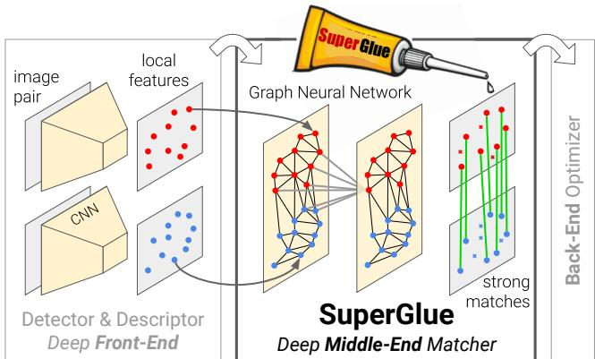
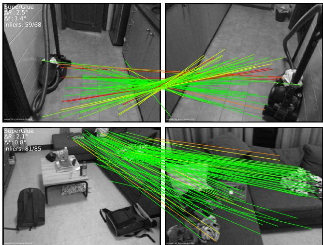
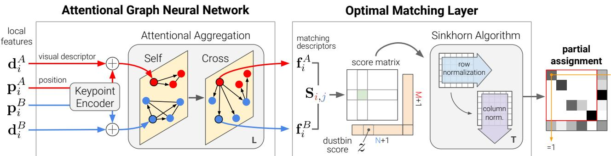
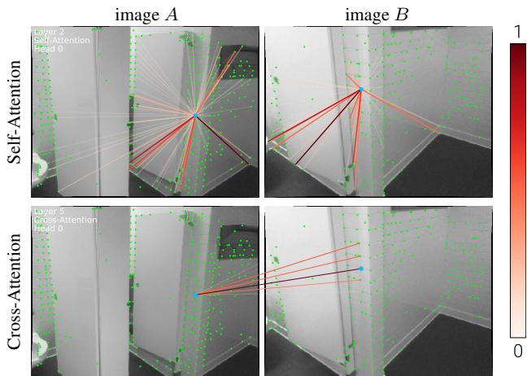
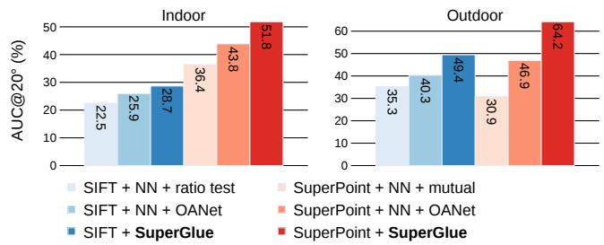
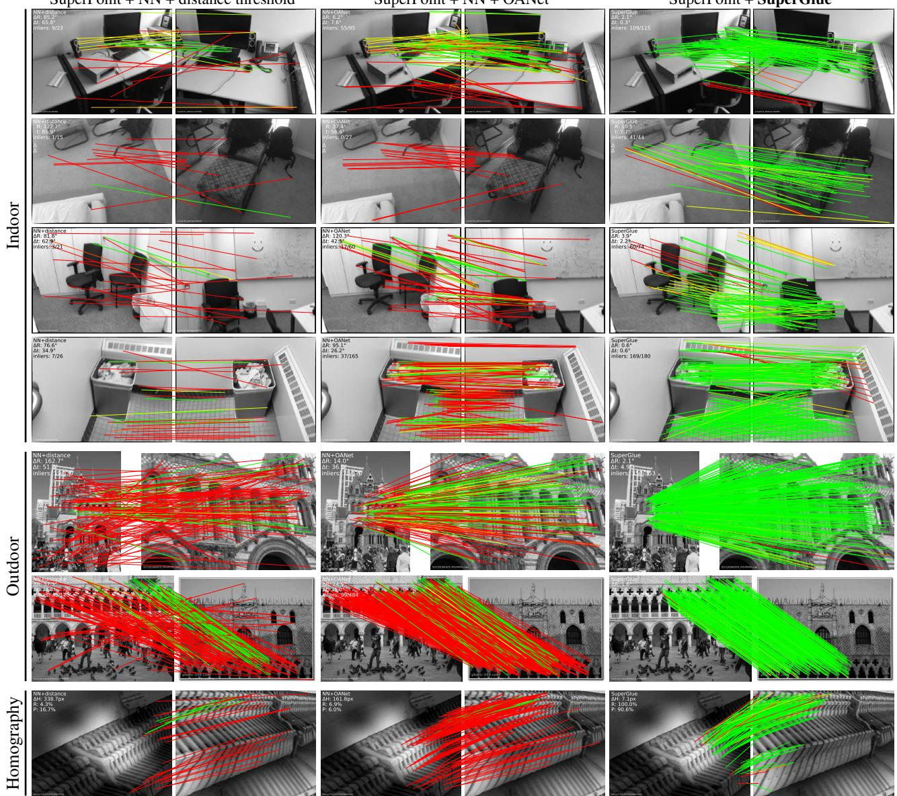
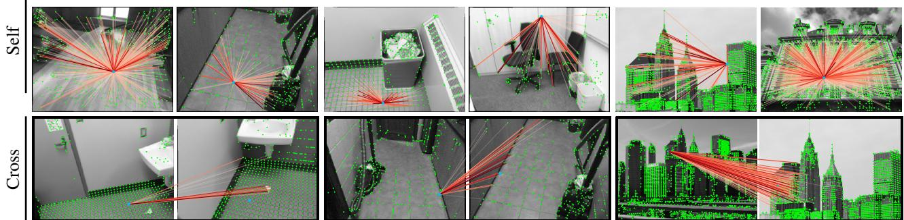

# SuperGlue: Learning Feature Matching with Graph Neural Networks

Paul-Edouard Sarlin¹\*Daniel DeTone2 Tomasz Malisiewicz2 Andrew Rabinovich² 1 ETH Zurich 2 Magic Leap, Inc.

## Abstract

This paper introduces SuperGlue, a neural network that matches two sets of local features by jointly nding correspondences and rejecting non-matchable points. Assignments are estimated by solving a differentiable optimal transport problem, whose costs are predicted by a graph neural network. We introduce a flexible context aggregation mechanism based on attention, enabling SuperGlue to reason about the underlying 3D scene and feature assignments jointly. Compared to traditional, hand-designed heuristics, our technique learns priors over geometric transformations and regularities of the 3D world through end-to-end training from image pairs. SuperGlue outperforms other learned approaches and achieves state-of-the-art results on the task of pose estimation in challenging real-world indoor and outdoor environments. The proposed method performs matching in real-time on a modern GPU and can be readily integrated into modern SfM or SLAM systems. The code and trained weights are publicly available at github.com/magicleap/SuperGluePretrainedNetwork.

## 1. Introduction

Correspondences between points in images are essential for estimating the 3D structure and camera poses in geometric computer vision tasks such as Simultaneous Localization and Mapping (SLAM) and Structure-from-Motion (SfM). Such correspondences are generally estimated by matching local features, a process known as data association. Large viewpoint and lighting changes, occlusion, blur, and lack of texture are factors that make 2D-to-2D data association particularly challenging.

In this paper, we present a new way of thinking about the feature matching problem. Instead of learning better taskagnostic local features followed by simple matching heuristics and tricks, we propose to learn the matching process from pre-existing local features using a novel neural architecture called SuperGlue. In the context of SLAM, which typically [7] decomposes the problem into the visual feature extraction front-end and the bundle adjustment or pose estimation back-end, our network lies directly in the middle – SuperGlue is a learnable middle-end (see Figure 1).

  
Figure 1: Feature matching with SuperGlue. Our approach establishes pointwise correspondences from off-theshelf local features: it acts as a middle-end between handcrafted or learned front-end and back-end. SuperGlue uses a graph neural network and attention to solve an assignment optimization problem, and handles partial point visibility and occlusion elegantly, producing a partial assignment.

In this work, learning feature matching is viewed as finding the partial assignment between two sets of local features. We revisit the classical graph-based strategy of matching by solving a linear assignment problem, which, when relaxed to an optimal transport problem, can be solved differentiably. The cost function of this optimization is predicted by a Graph Neural Network (GNN). Inspired by the success of the Transformer [55], it uses self- (intra-image) and cross- (inter-image) attention to leverage both spatial relationships of the keypoints and their visual appearance. This formulation enforces the assignment structure of the predictions while enabling the cost to learn complex priors, elegantly handling occlusion and non-repeatable keypoints. Our method is trained end-to-end from image pairs – we learn priors for pose estimation from a large annotated dataset, enabling SuperGlue to reason about the 3D scene and the assignment. Our work can be applied to a variety of multiple-view geometry problems that require high-quality feature correspondences (see Figure 2).

  
Figure 2: SuperGlue correspondences. For these two challenging indoor image pairs, matching with SuperGlue results in accurate poses while other learned or handcrafted methods fail (correspondences colored by epipolar error).

We show the superiority of SuperGlue compared to both handcrafted matchers and learned inlier classifiers. When combined with SuperPoint [16], a deep front-end, Super-Glue advances the state-of-the-art on the tasks of indoor and outdoor pose estimation and paves the way towards end-toend deep SLAM.

## 2. Related work

Local feature matching is generally performed by i) detecting interest points, ii) computing visual descriptors, iii) matching these with a Nearest Neighbor (NN) search iv) filtering incorrect matches, and finally v) estimating a geometric transformation. The classical pipeline developed in the 2000s is often based on SIFT [28], filters matches with Lowe's ratio test [28], the mutual check, and heuristics such as neighborhood consensus [53, 9, 5, 45], and finds a transformation with a robust solver like RANSAC [19, 40].

Recent works on deep learning for matching often focus on learning better sparse detectors and local descriptors [16, 17, 34, 42, 61] from data using Convolutional Neural Networks (CNNs). To improve their discriminativeness, some works explicitly look at a wider context using regional features [29] or log-polar patches [18]. Other approaches learn to filter matches by classifying them into inliers and outliers [30, 41, 6, 63]. These operate on sets of matches, still estimated by NN search, and thus ignore the assignment structure and discard visual information. Works that learn to perform matching have so far focused on dense matching [43] or 3D point clouds [59], and still exhibit the same limitations. In contrast, our learnable middle-end simultaneously performs context aggregation, matching, and filtering in a single end-to-end architecture.

Graph matching problems are usually formulated as quadratic assignment problems, which are NP-hard, requiring expensive, complex, and thus impractical solvers [27]. For local features, the computer vision literature of the 2000s [4, 24, 51] uses handcrafted costs with many heuristics, making it complex and brittle. Caetano et al. [8] learn the cost of the optimization for a simpler linear assignment, but only use a shallow model, while our SuperGlue learns a flexible cost using a deep neural network. Related to graph matching is the problem of optimal transport [57] – it is a generalized linear assignment with an efficient yet simple approximate solution, the Sinkhorn algorithm [49, 11, 36].

Deep learning for sets such as point clouds aims at designing permutation equi- or invariant functions by aggregating information across elements. Some works treat all elements equally, through global pooling [62, 37, 13] or instance normalization [54, 30, 29], while others focus on a local neighborhood in coordinate or feature space [38, 60]. Attention [55, 58, 56, 23] can perform both global and datadependent local aggregation by focusing on specific elements and attributes, and is thus more flexible. By observing that self-attention can be seen as an instance of a Message Passing Graph Neural Network [21, 3] on a complete graph, we apply attention to graphs with multiple types of edges, similar to [25, 64], and enable SuperGlue to learn complex reasoning about the two sets of local features.

## 3. The SuperGlue Architecture

Motivation: In the image matching problem, some regularities of the world could be leveraged: the 3D world is largely smooth and sometimes planar, all correspondences for a given image pair derive from a single epipolar transform if the scene is static, and some poses are more likely than others. In addition, 2D keypoints are usually projections of salient 3D points, like corners or blobs, thus correspondences across images must adhere to certain physical constraints: i) a keypoint can have at most a single correspondence in the other image; and ii) some keypoints will be unmatched due to occlusion and failure of the detector. An effective model for feature matching should aim at finding all correspondences between reprojections of the same 3D points and identifying keypoints that have no matches. We formulate SuperGlue (see Figure 3) as solving an optimization problem, whose cost is predicted by a deep neural network. This alleviates the need for domain expertise and heuristics – we learn relevant priors directly from the data.

Formulation: Consider two images A and B, each with a set of keypoint positions p and associated visual descriptors d – we refer to them jointly (p, d) as the local features. Positions consist of x and y image coordinates as well as a detection confidence c, $\mathbf { p } _ { i } : = ( x , y , c ) _ { i }$ . Visual descriptors $\mathbf { d } _ { i } \in \mathbb { R } ^ { D }$ can be those extracted by a CNN like SuperPoint or traditional descriptors like SIFT. Images A and B have M and N local features, indexed by $\mathcal { A } : = \{ 1 , . . . , M \}$ and $\boldsymbol { B } : = \{ 1 , . . . , N \}$ , respectively.

  
Figure 3: The SuperGlue architecture. SuperGlue is made up of two major components: the attentional graph neural network (Section3.1), and the optimal matching layer (Section 3.2). The first component uses a keypoint encoder to map keypoint positions p and their visual descriptors d into a single vector, and then uses alternating self- and cross-attention layers (repeated L times) to create more powerful representations f. The optimal matching layer creates an M by N score matrix, augments it with dustbins, then finds the optimal partial assignment using the Sinkhorn algorithm (for T iterations).

Partial Assignment: Constraints i) and ii) mean that correspondences derive from a partial assignment between the two sets of keypoints. For the integration into downstream tasks and better interpretability, each possible correspondence should have a confidence value. We consequently define a partial soft assignment matrix $\mathbf { P } \in [ 0 , 1 ] ^ { M \times N }$ as:

$$
\mathbf P \mathbf 1 _ { N } \leq \mathbf 1 _ { M } \quad \mathrm { a n d } \quad \mathbf P ^ { \top } \mathbf 1 _ { M } \leq \mathbf 1 _ { N } .\tag{1}
$$

Our goal is to design a neural network that predicts the assignment P from two sets of local features.

## 3.1. Attentional Graph Neural Network

Besides the position of a keypoint and its visual appearance, integrating other contextual cues can intuitively increase its distinctiveness. We can for example consider its spatial and visual relationship with other co-visible keypoints, such as ones that are salient [29], self-similar [48], statistically co-occurring [65], or adjacent [52]. On the other hand, knowledge of keypoints in the second image can help to resolve ambiguities by comparing candidate matches or estimating the relative photometric or geometric transformation from global and unambiguous cues.

When asked to match a given ambiguous keypoint, humans look back-and-forth at both images: they sift through tentative matching keypoints, examine each, and look for contextual cues that help disambiguate the true match from other self-similarities [10]. This hints at an iterative process that can focus its attention on specific locations.

We consequently design the first major block of Super-Glue as an Attentional Graph Neural Network (see Figure 3). Given initial local features, it computes matching descriptors $\mathbf { f } _ { i } \in \mathbb { R } ^ { D }$ by letting the features communicate with each other. As we will show, long-range feature aggregation within and across images is vital for robust matching.

Keypoint Encoder: The initial representation ${ { \bf \Pi } ^ { ( 0 ) } } { \bf { x } } _ { i }$ for each keypoint i combines its visual appearance and location. We embed the keypoint position into a highdimensional vector with a Multilayer Perceptron (MLP) as:

$$
{ { \bf \Pi } ^ { ( 0 ) } } { \bf { x } } _ { i } = { \bf { d } } _ { i } + { \bf { M L P } } _ { \mathrm { { e n c } } } \left( { \bf { p } } _ { i } \right) .\tag{2}
$$

This encoder enables the graph network to later reason about both appearance and position jointly, especially when combined with attention, and is an instance of the “positional encoder" popular in language processing [20, 55].

Multiplex Graph Neural Network: We consider a single complete graph whose nodes are the keypoints of both images. The graph has two types of undirected edges – it is a multiplex graph [31, 33]. Intra-image edges, or self edges, $\mathcal { E } _ { \mathrm { s e l f } } .$ , connect keypoints i to all other keypoints within the same image. Inter-image edges, or cross edges, $\mathcal { E } _ { \mathrm { c r o s s } }$ , connect keypoints i to all keypoints in the other image. We use the message passing formulation [21, 3] to propagate information along both types of edges. The resulting multiplex Graph Neural Network starts with a high-dimensional state for each node and computes at each layer an updated representation by simultaneously aggregating messages across all given edges for all nodes.

Let ${ { \bf \Pi } ^ { ( \ell ) } } { \bf { x } } _ { i } ^ { A }$ be the intermediate representation for element i in image A at layer l. The message $\mathbf { m } _ { \mathcal { E }  i }$ is the result of the aggregation from all keypoints $\{ j : ( i , j ) \in \mathcal { E } \}$ , where $\mathcal { E } \in \{ \mathcal { E } _ { \mathrm { s e l f } } , \mathcal { E } _ { \mathrm { c r o s s } } \}$ . The residual message passing update for all i in A is:

$$
^ { ( \ell + 1 ) } \mathbf { x } _ { i } ^ { A } = { } ^ { ( \ell ) } \mathbf { x } _ { i } ^ { A } + \mathbf { M L P } ( \lceil { } ^ { ( \ell ) } \mathbf { x } _ { i } ^ { A } \rceil | \mathbf { m } \varepsilon _ {  i } ] ) ,\tag{3}
$$

where [·‖ ·] denotes concatenation. A similar update can be simultaneously performed for all keypoints in image B. A fixed number of layers L with different parameters are chained and alternatively aggregate along the self and cross edges. As such, starting from $\ell = 1 , \mathcal { E } = \mathcal { E } _ { \mathrm { s e l f } } \mathrm { ~ i f ~ }$ l is odd and $\mathcal { E } = \mathcal { E } _ { \mathrm { c r o s s } }$ if l is even.

  
Figure 4: Visualizing self- and cross-attention. Attentional aggregation builds a dynamic graph between keypoints. Weights $\alpha _ { i j }$ are shown as rays. Self-attention (top) can attend anywhere in the same image, e.g. distinctive locations, and is thus not restricted to nearby locations. Crossattention (bottom) attends to locations in the other image, such as potential matches that have a similar appearance.

Attentional Aggregation: An attention mechanism performs the aggregation and computes the message $\mathbf { m } \varepsilon {  } i$ Self edges are based on self-attention [55] and cross edges are based on cross-attention. Akin to database retrieval, a representation of i, the query $\mathbf { q } _ { i }$ , retrieves the values $\mathbf { v } _ { j }$ of some elements based on their attributes, the keys $\mathbf { k } _ { j }$ The message is computed as a weighted average of the values:

$$
\mathbf { m } _ { \mathcal { E }  i } = \sum _ { j : ( i , j ) \in \mathcal { E } } \alpha _ { i j } \mathbf { v } _ { j } ,\tag{4}
$$

where the attention weight $\alpha _ { i j }$ is the Softmax over the keyquery similarities: $\alpha _ { i j } = \mathrm { S o f i m a x } _ { j } \left( \mathbf { q } _ { i } ^ { \top } \mathbf { k } _ { j } \right)$

The key, query, and value are computed as linear projections of deep features of the graph neural network. Considering that query keypoint i is in the image Q and all source keypoints are in image S, $( Q , S ) \in \{ A , \mathbf { \bar { B } } \} ^ { 2 }$ , we can write:

$$
\begin{array} { r } { \mathbf { q } _ { i } = \mathbf { W } _ { 1 } \mathbf { \Sigma } ^ { ( \ell ) } \mathbf { x } _ { i } ^ { Q } + \mathbf { b } _ { 1 } } \\ { \left[ \mathbf { k } _ { j } \right] = \left[ \mathbf { W } _ { 2 } \right] \mathbf { \Sigma } ^ { ( \ell ) } \mathbf { x } _ { j } ^ { S } + \left[ \mathbf { b } _ { 2 } \right] . } \end{array}\tag{5}
$$

Each layer l has its own projection parameters, learned and shared for all keypoints of both images. In practice, we improve the expressivity with multi-head attention [55].

Our formulation provides maximum flexibility as the network can learn to focus on a subset of keypoints based on specific attributes (see Figure 4). SuperGlue can retrieve or attend based on both appearance and keypoint location as they are encoded in the representation $\mathbf { x } _ { i }$ This includes attending to a nearby keypoint and retrieving the relative positions of similar or salient keypoints. This enables representations of the geometric transformation and the assignment. The final matching descriptors are linear projections:

$$
\mathbf { f } _ { i } ^ { A } = \mathbf { W } \cdot \mathbf { \mu } ^ { ( L ) } \mathbf { x } _ { i } ^ { A } + \mathbf { b } , \quad \forall i \in \mathcal { A } ,\tag{6}
$$

and similarly for keypoints in B.

## 3.2. Optimal matching layer

The second major block of SuperGlue (see Figure 3) is the optimal matching layer, which produces a partial assignment matrix. As in the standard graph matching formulation, the assignment P can be obtained by computing a score matrix $\mathbf { S } \in \mathbb { R } ^ { M \times N }$ for all possible matches and maximizing the total score $\textstyle \sum _ { i , j } \mathbf { S } _ { i , j } \mathbf { P } _ { i , j }$ under the constraints in Equation 1. This is equivalent to solving a linear assignment problem.

Score Prediction: Building a separate representation for all $M \times N$ potential matches would be prohibitive. We instead express the pairwise score as the similarity of matching descriptors:

$$
\mathbf { S } _ { i , j } = < \mathbf { f } _ { i } ^ { A } , \mathbf { f } _ { j } ^ { B } > , \forall ( i , j ) \in \mathcal { A } \times \mathcal { B } ,\tag{7}
$$

where $< \cdot , \cdot >$ is the inner product. As opposed to learned visual descriptors, the matching descriptors are not normalized, and their magnitude can change per feature and during training to reflect the prediction confidence.

Occlusion and Visibility: To let the network suppress some keypoints, we augment each set with a dustbin so that unmatched keypoints are explicitly assigned to it. This technique is common in graph matching, and dustbins have also been used by SuperPoint [16] to account for image cells that might not have a detection. We augment the scores S to S by appending a new row and column, the point-to-bin and bin-to-bin scores, filled with a single learnable parameter:

$$
\bar { \mathbf { S } } _ { i , N + 1 } = \bar { \mathbf { S } } _ { M + 1 , j } = \bar { \mathbf { S } } _ { M + 1 , N + 1 } = z \in \mathbb { R } .\tag{8}
$$

While keypoints in A will be assigned to a single keypoint in B or the dustbin, each dustbin has as many matches as there are keypoints in the other set: N, M for dustbins in A, B respectively. We denote as $\mathbf { a } = \left[ \mathbf { 1 } _ { M } ^ { \top } \quad N \right] ^ { \top }$ and $\mathbf { b } = \left[ \mathbf { 1 } _ { N } ^ { \top } \quad M \right] ^ { \top }$ the number of expected matches for each keypoint and dustbin in A and B. The augmented assignment P now has the constraints:

$$
\bar { \bf P } { \bf 1 } _ { N + 1 } = { \bf a } \quad \mathrm { a n d } \quad \bar { \bf P } ^ { \top } { \bf 1 } _ { M + 1 } = { \bf b } .\tag{9}
$$

Sinkhorn Algorithm: The solution of the above optimization problem corresponds to the optimal transport [36] between discrete distributions a and b with scores S. Its entropy-regularized formulation naturally results in the desired soft assignment, and can be efficiently solved on GPU with the Sinkhorn algorithm [49, 11]. It is a differentiable version of the Hungarian algorithm [32], classically used for bipartite matching, that consists in iteratively normalizing $\exp ( \bar { \bf S } )$ along rows and columns, similar to row and column Softmax. After $T$ iterations, we drop the dustbins and recover $\mathbf { P } = \bar { \mathbf { P } } _ { 1 : M , 1 : N }$

## 3.3. Loss

By design, both the graph neural network and the optimal matching layer are differentiable – this enables backpropagation from matches to visual descriptors. SuperGlue is trained in a supervised manner from ground truth matches $\mathcal { M } = \{ ( i , j ) \} \subset \mathcal { A } \times \mathcal { B }$ . These are estimated from ground truth relative transformations – using poses and depth maps or homographies. This also lets us label some keypoints $\mathcal { T } \subseteq A$ and $\mathcal { I } \subseteq \mathcal { B }$ as unmatched if they do not have any reprojection in their vicinity. Given these labels, we minimize the negative log-likelihood of the assignment $\bar { \mathbf { P } } \colon$

$$
\begin{array} { r c l } { { \displaystyle { \mathrm { L o s s } } = - \sum _ { ( i , j ) \in \mathcal { M } } \log \bar { \mathbf { P } } _ { i , j } } } \\ { { \displaystyle - \sum _ { i \in \mathcal { I } } \log \bar { \mathbf { P } } _ { i , N + 1 } - \sum _ { j \in \mathcal { I } } \log \bar { \mathbf { P } } _ { M + 1 , j } } } \end{array}\tag{10}
$$

This supervision aims at simultaneously maximizing the precision and the recall of the matching.

## 3.4. Comparisons to related work

The SuperGlue architecture is equivariant to permutation of the keypoints within an image. Unlike other handcrafted or learned approaches, it is also equivariant to permutation of the images, which better reflects the symmetry of the problem and provides a beneficial inductive bias. Additionally, the optimal transport formulation enforces reciprocity of the matches, like the mutual check, but in a soft manner, similar to [43], thus embedding it into the training process.

SuperGlue vs. Instance Normalization [54]: Attention, as used by SuperGlue, is a more flexible and powerful context aggregation mechanism than instance normalization, which treats all keypoints equally, as used by previous work on feature matching [30, 63, 29, 41, 6].

SuperGlue vs. ContextDesc [29]: SuperGlue can jointly reason about appearance and position while ContextDesc processes them separately. Moreover, ContextDesc is a front-end that additionally requires a larger regional extractor, and a loss for keypoints scoring. SuperGlue only needs local features, learned or handcrafted, and can thus be a simple drop-in replacement for existing matchers.

SuperGlue vs. Transformer [55]: SuperGlue borrows the self-attention from the Transformer, but embeds it into a graph neural network, and additionally introduces the crossattention, which is symmetric. This simplifies the architecture and results in better feature reuse across layers.

## 4. Implementation details

SuperGlue can be combined with any local feature detector and descriptor but works particularly well with Super-Point [16], which produces repeatable and sparse keypoints – enabling very efficient matching. Visual descriptors are bilinearly sampled from the semi-dense feature map. For a fair comparison to other matchers, unless explicitly mentioned, we do not train the visual descriptor network when training SuperGlue. At test time, one can use a confidence threshold (we choose 0.2) to retain some matches from the soft assignment, or use all of them and their confidence in a subsequent step, such as weighted pose estimation.

Architecture details: All intermediate representations (key, query value, descriptors) have the same dimension $D = 2 5 6$ as the SuperPoint descriptors. We use $L = 9$ layers of alternating multi-head self- and cross-attention with 4 heads each, and perform $T = 1 0 0$ Sinkhorn iterations. The model is implemented in $\mathrm { P y }$ Torch [35], contains 12M parameters, and runs in real-time on an NVIDIA GTX 1080 GPU: a forward pass takes on average 69 ms (15 FPS) for an indoor image pair (see Appendix C).

Training details: To allow for data augmentation, Super-Point detect and describe steps are performed on-the-fly as batches during training. A number of random keypoints are further added for efficient batching and increased robustness. More details are provided in Appendix E.

## 5. Experiments

## 5.1. Homography estimation

We perform a large-scale homography estimation experiment using real images and synthetic homographies with both robust (RANSAC) and non-robust (DLT) estimators.

Dataset: We generate image pairs by sampling random homographies and applying random photometric distortions to real images, following a recipe similar to [14, 16, 42, 41]. The underlying images come from the set of 1M distractor images in the Oxford and Paris dataset [39], split into training, validation, and test sets.

<table><tr><td rowspan="2">Local features</td><td rowspan="2">Matcher</td><td colspan="2">Homography estimation AUC</td><td rowspan="2">P</td><td rowspan="2">R</td></tr><tr><td>RANSAC</td><td>DLT</td></tr><tr><td rowspan="5"></td><td>NN</td><td>39.47</td><td>0.00</td><td>21.7</td><td>65.4</td></tr><tr><td>NN + mutual</td><td>42.45</td><td>0.24</td><td>43.8 56.5</td><td></td></tr><tr><td>SuperPoint NN + PointCN</td><td>43.02</td><td>45.40</td><td>76.2</td><td>64.2</td></tr><tr><td>NN + OANet</td><td>44.55</td><td>52.29</td><td>82.8</td><td>64.7</td></tr><tr><td>SuperGlue</td><td>53.67</td><td>65.85</td><td>90.7</td><td>98.3</td></tr></table>

Table 1: Homography estimation. SuperGlue recovers almost all possible matches while suppressing most outliers. Because SuperGlue correspondences are high-quality, the Direct Linear Transform (DLT), a least-squares based solution with no robustness mechanism, outperforms RANSAC.

Baselines: We compare SuperGlue against several matchers applied to SuperPoint local features – the Nearest Neighbor (NN) matcher and various outlier rejectors: the mutual NN constraint, PointCN [30], and Order-Aware Network (OANet) [63]. All learned methods, including SuperGlue, are trained on ground truth correspondences, found by projecting keypoints from one image to the other. We generate homographies and photometric distortions on-the-fly – an image pair is never seen twice during training.

Metrics: Match precision (P) and recall (R) are computed from the ground truth correspondences. Homography estimation is performed with both RANSAC and the Direct Linear Transformation [22] (DLT), which has a direct leastsquares solution. We compute the mean reprojection error of the four corners of the image and report the area under the cumulative error curve (AUC) up to a value of 10 pixels.

Results: SuperGlue is sufficiently expressive to master homographies, achieving 98% recall and high precision (see Table 1). The estimated correspondences are so good that a robust estimator is not required – SuperGlue works even better with DLT than RANSAC. Outlier rejection methods like PointCN and OANet cannot predict more correct matches than the NN matcher itself, overly relying on the initial descriptors (see Figure 6 and Appendix A).

## 5.2. Indoor pose estimation

Indoor image matching is very challenging due to the lack of texture, the abundance of self-similarities, the complex 3D geometry of scenes, and large viewpoint changes. As we show in the following, SuperGlue can effectively learn priors to overcome these challenges.

Dataset: We use ScanNet [12], a large-scale indoor dataset composed of monocular sequences with ground truth poses and depth images, and well-defined training, validation, and test splits corresponding to different scenes. Previous works select training and evaluation pairs based on time difference [34, 15] or SfM covisibility [30, 63, 6], usually computed using SIFT. We argue that this limits the difficulty of the pairs, and instead select these based on an overlap score computed for all possible image pairs in a given sequence using only ground truth poses and depth. This results in significantly wider-baseline pairs, which corresponds to the current frontier for real-world indoor image matching. Discarding pairs with too small or too large overlap, we select 230M training and 1500 test pairs.

Metrics: As in previous work [30, 63, 6], we report the AUC of the pose error at the thresholds $( 5 ^ { \circ } , 1 0 ^ { \circ } , 2 0 ^ { \circ } )$ where the pose error is the maximum of the angular errors in rotation and translation. Relative poses are obtained from essential matrix estimation with RANSAC. We also report the match precision and the matching score [16, 61], where a match is deemed correct based on its epipolar distance.

<table><tr><td rowspan="2">Local features</td><td rowspan="2">Matcher</td><td colspan="3">Pose estimation AUC</td><td rowspan="2">P</td><td rowspan="2">MS</td></tr><tr><td>@5°</td><td>@10°</td><td>@20°</td></tr><tr><td rowspan="3">ORB D2-Net</td><td>NN + GMS</td><td>5.21</td><td>13.65</td><td>25.36</td><td>72.0</td><td>5.7</td></tr><tr><td>NN + mutual</td><td>5.25</td><td>14.53</td><td>27.96</td><td>46.7</td><td>12.0</td></tr><tr><td>ContextDesc NN + ratio test</td><td>6.64</td><td>15.01</td><td>25.75</td><td>51.2</td><td>9.2</td></tr><tr><td rowspan="4">SIFT</td><td>NN + ratio test</td><td>5.83</td><td>13.06</td><td>22.47</td><td>40.3</td><td>1.0</td></tr><tr><td>NN + NG-RANSAC</td><td>6.19</td><td>13.80</td><td>23.73</td><td>61.9</td><td>0.7</td></tr><tr><td>NN + OANet</td><td>6.00</td><td>14.33</td><td>25.90</td><td>38.6</td><td>4.2</td></tr><tr><td>SuperGlue</td><td>6.71</td><td>15.70</td><td>28.67</td><td>74.2</td><td>9.8</td></tr><tr><td rowspan="6">SuperPoint</td><td>NN + mutual</td><td>9.43</td><td>21.53</td><td>36.40</td><td>50.4</td><td>18.8</td></tr><tr><td>NN + distance + mutual</td><td>9.82</td><td>22.42</td><td>36.83</td><td>63.9</td><td>14.6</td></tr><tr><td>NN + GMS</td><td>8.39</td><td>18.96</td><td>31.56</td><td>50.3</td><td>19.0</td></tr><tr><td>NN + PointCN</td><td>11.40</td><td>25.47</td><td>41.41</td><td>71.8</td><td>25.5</td></tr><tr><td>NN + OANet</td><td>11.76</td><td>26.90</td><td>43.85</td><td>74.0</td><td>25.7</td></tr><tr><td>SuperGlue</td><td>16.16</td><td>33.81</td><td>51.84</td><td>84.4</td><td>31.5</td></tr></table>

Table 2: Wide-baseline indoor pose estimation. We report the AUC of the pose error, the matching score (MS) and precision (P), all in percents %. SuperGlue outperforms all handcrafted and learned matchers when applied to both SIFT and SuperPoint.

  
Figure 5: Indoor and outdoor pose estimation. Super-Glue works with SIFT or SuperPoint local features and consistently improves by a large margin the pose accuracy over OANet, a state-of-the-art outlier rejection neural network.

Baselines: We evaluate SuperGlue and various baseline matchers using both root-normalized SIFT [28, 2] and SuperPoint [16] features. SuperGlue is trained with correspondences and unmatched keypoints derived from ground truth poses and depth. All baselines are based on the Nearest Neighbor (NN) matcher and potentially an outlier rejection method. In the “Handcrafted" category, we consider the mutual check, the ratio test [28], thresholding by descriptor distance, and the more complex GMS [5]. Methods in the “Learned" category are PointCN [30], and its follow-ups OANet [63] and NG-RANSAC [6]. We retrain PointCN and OANet on ScanNet for both SuperPoint and SIFT with the classification loss using the above-defined correctness criterion and their respective regression losses. For NG-RANSAC, we use the original trained model. We do not include any graph matching methods as they are orders of magnitude too slow for the number of keypoints that we consider (>500). Other local features are evaluated as reference: ORB [44] with GMS, D2-Net [17], and ContextDesc [29] using the publicly available trained models.

Results: SuperGlue enables significantly higher pose accuracy compared to both handcrafted and learned matchers (see Table 2 and Figure 5), and works well with both SIFT and SuperPoint. It has a significantly higher precision than other learned matchers, demonstrating its higher representation power. It also produces a larger number of correct matches – up to 10 times more than the ratio test when applied to SIFT, because it operates on the full set of possible matches, rather than the limited set of nearest neighbors. SuperGlue with SuperPoint achieves state-of-the-art results on indoor pose estimation. They complement each other well since repeatable keypoints make it possible to estimate a larger number of correct matches even in very challenging situations (see Figure 2, Figure 6, and Appendix A).

## 5.3. Outdoor pose estimation

As outdoor image sequences present their own set of challenges (e.g., lighting changes and occlusion), we train and evaluate SuperGlue for pose estimation in an outdoor setting. We use the same evaluation metrics and baseline methods as in the indoor pose estimation task.

Dataset: We evaluate on the PhotoTourism dataset, which is part of the CVPR'19 Image Matching Challenge [1]. It is a subset of the YFCC100M dataset [50] and has ground truth poses and sparse 3D models obtained from an off-theshelf SfM tool [34, 46, 47]. All learned methods are trained on the larger MegaDepth dataset [26], which also has depth maps computed with multi-view stereo. Scenes that are in the PhotoTourism test set are removed from the training set. Similarly as in the indoor case, we select challenging image pairs for training and evaluation using an overlap score computed from the SfM covisibility as in [17, 34].

Results: As shown in Table 3, SuperGlue outperforms all baselines, at all relative pose thresholds, when applied to both SuperPoint and SIFT. Most notably, the precision of the resulting matching is very high (84.9%), reinforcing the analogy that SuperGlue “glues" together local features.

<table><tr><td rowspan="2">Local features</td><td rowspan="2">Matcher</td><td colspan="3">Pose estimation AUC</td><td rowspan="2">P</td><td rowspan="2">MS</td></tr><tr><td>@5°</td><td>@10°</td><td>@20°</td></tr><tr><td>ContextDesc</td><td>NN + ratio test</td><td>20.16</td><td>31.65</td><td>44.05</td><td>56.2</td><td>3.3</td></tr><tr><td rowspan="4">SIFT</td><td>NN + ratio test</td><td>15.19</td><td>24.72</td><td>35.30</td><td>43.4</td><td>1.7</td></tr><tr><td>NN + NG-RANSAC</td><td>15.61</td><td>25.28</td><td>35.87</td><td>64.4</td><td>1.9</td></tr><tr><td>NN + OANet</td><td>18.02</td><td>28.76</td><td>40.31</td><td>55.0</td><td>3.7</td></tr><tr><td>SuperGlue</td><td>23.68</td><td>36.44</td><td>49.44</td><td>74.1</td><td>7.2</td></tr><tr><td rowspan="4">SuperPoint</td><td>NN + mutual</td><td>9.80</td><td>18.99</td><td>30.88</td><td>22.5</td><td>4.9</td></tr><tr><td>NN + GMS</td><td>13.96</td><td>24.58</td><td>36.53</td><td>47.1</td><td>4.7</td></tr><tr><td>NN + OANet</td><td>21.03</td><td>34.08</td><td>46.88</td><td>52.4</td><td>8.4</td></tr><tr><td>SuperGlue</td><td>34.18</td><td>50.32</td><td>64.16</td><td>84.9</td><td>11.1</td></tr></table>

Table 3: Outdoor pose estimation. Matching SuperPoint and SIFT features with SuperGlue results in significantly higher pose accuracy (AUC), precision (P), and matching score (MS) than with handcrafted or other learned methods.

<table><tr><td colspan="2">Matcher</td><td>Pose AUC@20°</td><td>Match precision</td><td>Matching score</td></tr><tr><td colspan="2">NN + mutual</td><td>36.40</td><td>50.4</td><td>18.8</td></tr><tr><td rowspan="5">SuperGlue</td><td>No Graph Neural Net</td><td>38.56</td><td>66.0</td><td>17.2</td></tr><tr><td>No cross-attention</td><td>42.57</td><td>74.0</td><td>25.3</td></tr><tr><td>No positional encoding</td><td>47.12</td><td>75.8</td><td>26.6</td></tr><tr><td>Smaller (3 layers)</td><td>46.93</td><td>79.9</td><td>30.0</td></tr><tr><td>Full (9 layers)</td><td>51.84</td><td>84.4</td><td>31.5</td></tr></table>

Table 4: Ablation of SuperGlue. While the optimal matching layer alone improves over the baseline Nearest Neighbor matcher, the Graph Neural Network explains the majority of the gains brought by SuperGlue. Both cross-attention and positional encoding are critical for strong gluing, and a deeper network further improves the precision.

## 5.4. Understanding SuperGlue

Ablation study: To evaluate our design decisions, we repeat the indoor experiments with SuperPoint features, but this time focusing on different SuperGlue variants. This ablation study, presented in Table 4, shows that all SuperGlue blocks are useful and bring substantial performance gains.

When we additionally backpropagate through the Super-Point descriptor network while training SuperGlue, we observe an improvement in AUC@20°from 51.84 to 53.38. This confirms that SuperGlue is suitable for end-to-end learning beyond matching.

Visualizing Attention: The extensive diversity of self- and cross-attention patterns is shown in Figure 7 and reflects the complexity of the learned behavior. A detailed analysis of the trends and inner-workings is performed in Appendix D.

## 6. Conclusion

This paper demonstrates the power of attention-based graph neural networks for local feature matching. Super-Glue's architecture uses two kinds of attention: (i) self-attention, which boosts the receptive field of local descriptors, and (ii) cross-attention, which enables cross-image communication and is inspired by the way humans look back--and-forth when matching images. Our method elegantly handles partial assignments and occluded points by solving an optimal transport problem. Our experiments show that SuperGlue achieves significant improvement over existing approaches, enabling highly accurate relative pose estimation on extreme wide-baseline indoor and outdoor image pairs. In addition, SuperGlue runs in real-time and works well with both classical and learned features.

In summary, our learnable middle-end replaces handcrafted heuristics with a powerful neural model that simultaneously performs context aggregation, matching, and filtering in a single unified architecture. We believe that, when combined with a deep front-end, SuperGlue is a major milestone towards end-to-end deep SLAM.

SuperPoint + NN + distance threshold  
SuperPoint + NN + OANet  
SuperPoint + SuperGlue  
  
Figure 6: Qualitative image matches. We compare SuperGlue to the Nearest Neighbor (NN) matcher with two outlier rejectors, handcrafted and learned, in three environments. SuperGlue consistently estimates more correct matches (green lines) and fewer mismatches (red lines), successfully coping with repeated texture, large viewpoint, and illumination changes.

  
Figure 7: Visualizing attention. We show self- and cross-attention weights αij at various layers and heads. SuperGlue exhibits a diversity of patterns: it can focus on global or local context, self-similarities, distinctive features, or match candidates.

## References

[1] Phototourism Challenge, CVPR 2019 Image Matching Workshop. https://image-matching-workshop. github. io. Accessed November 8, 2019. 7

[2] Relja Arandjelović and Andrew Zisserman. Three things everyone should know to improve object retrieval. In CVPR, 2012.6

[3] Peter W Battaglia, Jessica B Hamrick, Victor Bapst, Alvaro Sanchez-Gonzalez, Vinicius Zambaldi, Mateusz Malinowski, Andrea Tacchetti, David Raposo, Adam Santoro, Ryan Faulkner, et al. Relational inductive biases, deep learning, and graph networks. arXiv:1806.01261, 2018. 2, 3

[4] Alexander C Berg, Tamara L Berg, and Jitendra Malik. Shape matching and object recognition using low distortion correspondences. In CVPR, 2005. 2

[5] JiaWang Bian, Wen-Yan Lin, Yasuyuki Matsushita, Sai-Kit Yeung, Tan-Dat Nguyen, and Ming-Ming Cheng. GMS: Grid-based motion statistics for fast, ultra-robust feature correspondence. In CVPR, 2017. 2, 6

[6] Eric Brachmann and Carsten Rother. Neural-Guided RANSAC: Learning where to sample model hypotheses. In ICCV, 2019. 2, 5, 6

[7] Cesar Cadena, Luca Carlone, Henry Carrillo, Yasir Latif, Davide Scaramuzza, José Neira, Ian Reid, and John J Leonard. Past, present, and future of simultaneous localization and mapping: Toward the robust-perception age. IEEE Transactions on robotics, 32(6):1309–1332, 2016. 1

[8] Tibério S Caetano, Julian J McAuley, Li Cheng, Quoc V Le, and Alex J Smola. Learning graph matching. IEEE TPAMI, 31(6):1048–1058, 2009. 2

[9] Jan Cech, Jiri Matas, and Michal Perdoch. Efficient sequential correspondence selection by cosegmentation. IEEE TPAMI, 32(9):1568–1581, 2010. 2

[10] Marvin M Chun. Contextual cueing of visual attention Trends in cognitive sciences, 4(5):170–178, 2000. 3

[11] Marco Cuturi. Sinkhorn distances: Lightspeed computation of optimal transport. In NIPS, 2013. 2, 5

[12] Angela Dai, Angel X Chang, Manolis Savva, Maciej Halber, Thomas Funkhouser, and Matthias Nießner. ScanNet: Richly-annotated 3D reconstructions of indoor scenes. In CVPR, 2017. 6

[13] Haowen Deng, Tolga Birdal, and Slobodan Ilic. PPFNet: Global context aware local features for robust 3D point matching. In CVPR, 2018. 2

[14] Daniel DeTone, Tomasz Malisiewicz, and Andrew Rabinovich. Deep image homography estimation. In RSS Workshop: Limits and Potentials of Deep Learning in Robotics, 2016.5

[15] Daniel DeTone, Tomasz Malisiewicz, and Andrew Rabinovich. Self-improving visual odometry. arXiv:1812.03245, 2018.6

[16] Daniel DeTone, Tomasz Malisiewicz, and Andrew Rabinovich. SuperPoint: Self-supervised interest point detection and description. In CVPR Workshop on Deep Learning for Visual SLAM, 2018. 2, 4, 5, 6

[17] Mihai Dusmanu, Ignacio Rocco, Tomas Pajdla, Marc Pollefeys, Josef Sivic, Akihiko Torii, and Torsten Sattler. D2-Net:

A trainable CNN for joint detection and description of local features. In CVPR, 2019. 2, 6, 7

[18] Patrick Ebel, Anastasiia Mishchuk, Kwang Moo Yi, Pascal Fua, and Eduard Trulls. Beyond cartesian representations for local descriptors. In ICCV, 2019. 2

[19] Martin A Fischler and Robert C Bolles. Random sample consensus: a paradigm for model fitting with applications to image analysis and automated cartography. Communications of the ACM, 24(6):381–395, 1981. 2

[20] Jonas Gehring, Michael Auli, David Grangier, Denis Yarats, and Yann N Dauphin. Convolutional sequence to sequence learning. In ICML, 2017. 3

[21] Justin Gilmer, Samuel S Schoenholz, Patrick F Riley, Oriol Vinyals, and George E Dahl. Neural message passing for quantum chemistry. In ICML, 2017. 2, 3

[22] Richard Hartley and Andrew Zisserman. Multiple view geometry in computer vision. Cambridge university press, 2003.6

[23] Juho Lee, Yoonho Lee, Jungtaek Kim, Adam Kosiorek, Seungjin Choi, and Yee Whye Teh. Set Transformer: A framework for attention-based permutation-invariant neural networks. In ICML, 2019. 2

[24] Marius Leordeanu and Martial Hebert. A spectral technique for correspondence problems using pairwise constraints. In ICCV, 2005. 2

[25] Yujia Li, Chenjie Gu, Thomas Dullien, Oriol Vinyals, and Pushmeet Kohli. Graph matching networks for learning the similarity of graph structured objects. In ICML, 2019. 2

[26] Zhengqi Li and Noah Snavely. MegaDepth: Learning singleview depth prediction from internet photos. In CVPR, 2018. 7

[27] Eliane Maria Loiola, Nair Maria Maia de Abreu, Paulo Oswaldo Boaventura-Netto, Peter Hahn, and Tania Querido. A survey for the quadratic assignment problem. European journal of operational research, 176(2):657–690, 2007. 2

[28] David G Lowe. Distinctive image features from scaleinvariant keypoints. International Journal of Computer Vision, 60(2):91–110, 2004. 2, 6

[29] Zixin Luo, Tianwei Shen, Lei Zhou, Jiahui Zhang, Yao Yao, Shiwei Li, Tian Fang, and Long Quan. ContextDesc: Local descriptor augmentation with cross-modality context. In CVPR, 2019. 2, 3, 5, 6

[30] Kwang Moo Yi, Eduard Trulls, Yuki Ono, Vincent Lepetit, Mathieu Salzmann, and Pascal Fua. Learning to find good correspondences. In CVPR, 2018. 2, 5, 6

[31] Peter J Mucha, Thomas Richardson, Kevin Macon, Mason A Porter, and Jukka-Pekka Onnela. Community structure in time-dependent, multiscale, and multiplex networks. Science, 328(5980):876–878, 2010. 3

[32] James Munkres. Algorithms for the assignment and transportation problems. Journal of the society for industrial and applied mathematics, 5(1):32–38, 1957. 5

[33] Vincenzo Nicosia, Ginestra Bianconi, Vito Latora, and Marc Barthelemy. Growing multiplex networks. Physical review letters, 111(5):058701, 2013. 3

[34] Yuki Ono, Eduard Trulls, Pascal Fua, and Kwang Moo Yi. LF-Net: Learning local features from images. In NeurIPS, 2018.2,6, 7

[35] Adam Paszke, Sam Gross, Soumith Chintala, Gregory Chanan, Edward Yang, Zachary DeVito, Zeming Lin, Alban Desmaison, Luca Antiga, and Adam Lerer. Automatic differentiation in PyTorch. In NIPS Workshops, 2017. 5

[36] Gabriel Peyré and Marco Cuturi. Computational optimal transport. Foundations and Trends® in Machine Learning, 11(5-6):355–607, 2019. 2, 4

[37] Charles R Qi, Hao Su, Kaichun Mo, and Leonidas J Guibas. PointNet: Deep learning on point sets for 3D classification and segmentation. In CVPR, 2017. 2

[38] Charles Ruizhongtai Qi, Li Yi, Hao Su, and Leonidas J Guibas. Pointnet++: Deep hierarchical feature learning on point sets in a metric space. In NIPS, 2017. 2

[39] Filip Radenović, Ahmet Iscen, Giorgos Tolias, Yannis Avrithis, and Ondřej Chum. Revisiting Oxford and Paris: Large-scale image retrieval benchmarking. In CVPR, 2018. 5

[40] Rahul Raguram, Jan-Michael Frahm, and Marc Pollefeys. A comparative analysis of RANSAC techniques leading to adaptive real-time random sample consensus. In ECCV, 2008.2

[41] René Ranftl and Vladlen Koltun. Deep fundamental matrix estimation. In ECCV, 2018. 2, 5

[42] Jerome Revaud, Philippe Weinzaepfel, César De Souza, Noe Pion, Gabriela Csurka, Yohann Cabon, and Martin Humenberger. R2D2: Repeatable and reliable detector and descriptor. In NeurIPS, 2019. 2, 5

[43] Ignacio Rocco, Mircea Cimpoi, Relja Arandjelović, Akihiko Torii, Tomas Pajdla, and Josef Sivic. Neighbourhood consensus networks. In NeurIPS, 2018. 2, 5

[44] Ethan Rublee, Vincent Rabaud, Kurt Konolige, and Gary R Bradski. ORB: An efficient alternative to SIFT or SURF. In ICCV, 2011. 6

[45] Torsten Sattler, Bastian Leibe, and Leif Kobbelt. SCRAM-SAC: Improving RANSAC's efficiency with a spatial consistency filter. In ICCV, 2009. 2

[46] Johannes Lutz Schönberger and Jan-Michael Frahm. Structure-from-motion revisited. In CVPR, 2016. 7

[47] Johannes Lutz Schönberger, Enliang Zheng, Marc Pollefeys, and Jan-Michael Frahm. Pixelwise view selection for unstructured multi-view stereo. In ECCV, 2016. 7

[48] Eli Shechtman and Michal Irani. Matching local selfsimilarities across images and videos. In CVPR, 2007. 3

[49] Richard Sinkhorn and Paul Knopp. Concerning nonnegative matrices and doubly stochastic matrices. Pacific Journal of Mathematics, 1967. 2, 5

[50] Bart Thomee, David A Shamma, Gerald Friedland, Benjamin Elizalde, Karl Ni, Douglas Poland, Damian Borth, and Li-Jia Li. YFCC100M: The new data in multimedia research. Communications of the ACM, 59(2):64–73, 2016. 7

[51] Lorenzo Torresani, Vladimir Kolmogorov, and Carsten Rother. Feature correspondence via graph matching: Models and global optimization. In ECCV, 2008. 2

[52] Tomasz Trzcinski, Jacek Komorowski, Lukasz Dabala, Konrad Czarnota, Grzegorz Kurzejamski, and Simon Lynen. SConE: Siamese constellation embedding descriptor for image matching. In ECCV Workshops, 2018. 3

[53] Tinne Tuytelaars and Luc J Van Gool. Wide baseline stereo matching based on local, affinely invariant regions. In BMVC, 2000. 2

[54] Dmitry Ulyanov, Andrea Vedaldi, and Victor Lempitsky. Instance normalization: The missing ingredient for fast stylization. arXiv:1607.08022, 2016. 2, 5

[55] Ashish Vaswani, Noam Shazeer, Niki Parmar, Jakob Uszkoreit, Llion Jones, Aidan N Gomez, Łukasz Kaiser, and Illia Polosukhin. Attention is all you need. In NIPS, 2017. 1, 2, 3,4,5

[56] Petar Veličković, Guillem Cucurull, Arantxa Casanova, Adriana Romero, Pietro Liò, and Yoshua Bengio. Graph attention networks. In ICLR, 2018. 2

[57] Cédric Villani. Optimal transport: old and new, volume 338. Springer Science & Business Media, 2008. 2

[58] Xiaolong Wang, Ross Girshick, Abhinav Gupta, and Kaiming He. Non-local neural networks. In CVPR, 2018. 2

[59] Yue Wang and Justin M Solomon. Deep Closest Point: Learning representations for point cloud registration. In ICCV, 2019. 2

[60] Yue Wang, Yongbin Sun, Ziwei Liu, Sanjay E. Sarma, Michael M. Bronstein, and Justin M. Solomon. Dynamic Graph CNN for learning on point clouds. ACM Transactions on Graphics, 2019. 2

[61] Kwang Moo Yi, Eduard Trulls, Vincent Lepetit, and Pascal Fua. LIFT: Learned invariant feature transform. In ECCV, 2016.2,6

[62] Manzil Zaheer, Satwik Kottur, Siamak Ravanbakhsh, Barnabas Poczos, Ruslan R Salakhutdinov, and Alexander J Smola. Deep sets. In NIPS, 2017. 2

[63] Jiahui Zhang, Dawei Sun, Zixin Luo, Anbang Yao, Lei Zhou, Tianwei Shen, Yurong Chen, Long Quan, and Hongen Liao. Learning two-view correspondences and geometry using order-aware network. In ICCV, 2019. 2, 5, 6

[64] Li Zhang, Xiangtai Li, Anurag Arnab, Kuiyuan Yang, Yunhai Tong, and Philip HS Torr. Dual graph convolutional network for semantic segmentation. In BMVC, 2019. 2

[65] Yimeng Zhang, Zhaoyin Jia, and Tsuhan Chen. Image retrieval with geometry-preserving visual phrases. In CVPR, 2011.3