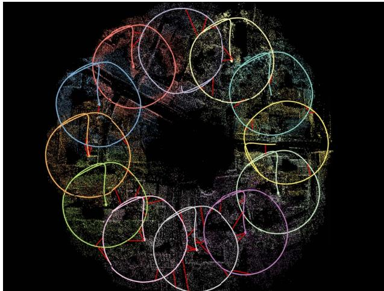
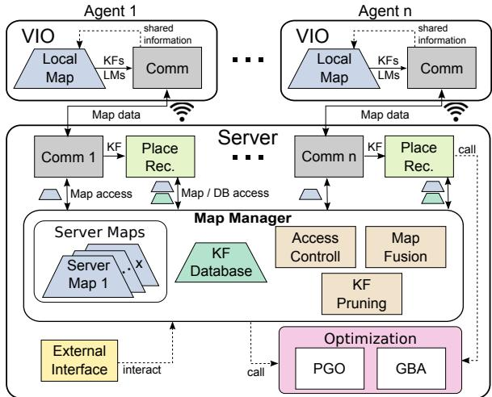
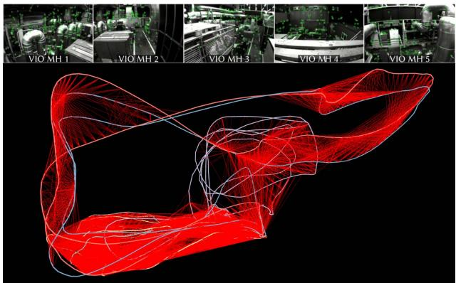
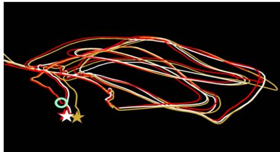
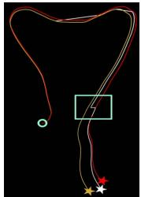

# COVINS: Visual-Inertial SLAM for Centralized Collaboration

Patrik Schmuck

Thomas Ziegler

Marco Karrer

Jonathan Perraudin

Margarita Chli \*

Vision for Robotics Lab, ETH Zurich, Switzerland

## ABSTRACT

Collaborative SLAM enables a group of agents to simultaneously co-localize and jointly map an environment, thus paving the way to wide-ranging applications of multi-robot perception and multi-user AR experiences by eliminating the need for external infrastructure or pre-built maps. This article presents COVINS, a novel collaborative SLAM system, that enables multi-agent, scalable SLAM in large environments and for large teams of more than 10 agents. The paradigm here is that each agent runs visual-inertial odomety independently onboard in order to ensure its autonomy, while sharing map information with the COVINS server back-end running on a powerful local PC or a remote cloud server. The server backend establishes an accurate collaborative global estimate from the contributed data, refining the joint estimate by means of place recognition, global optimization and removal of redundant data, in order to ensure an accurate, but also efficient SLAM process. A thorough evaluation of COVINS reveals increased accuracy of the collaborative SLAM estimates, as well as efficiency in both removing redundant information and reducing the coordination overhead, and demonstrates successful operation in a large-scale mission with 12 agents jointly performing SLAM.

Keywords: Collaborative SLAM, Computer Vision, Multi-Agent Systems, Augmented and Mixed Reality, Large-scale SLAM Index Terms: Computing methodologies—Artificial intelligence Computer vision—Tracking and Reconstruction

## 1 INTRODUCTION

With Simultaneous Localization And Mapping (SLAM) having reached significant maturity and robustness, not only it has started being employed in more costumer products, but also more complex, multi-agent applications have been gaining traction in the research community. Sharing information amongst participants and dividing up tasks between multiple agents promises to boost robustness, efficiency and accuracy of a robotic mission in various scenarios. Beyond robotics, recently emerging technologies, such as Augmented and Virtual Reality (AR/VR) depend on collaborative perception systems in order to create shared experiences for multiple users. Particularly, this vision of multi-user shared AR currently experiences high attention, with companies such as Microsoft, Magic Leap or Nreal actively researching and developing such solutions. Similar to single-agent scenarios, a large body of the collaborative perception literature focuses on either mapping [10] or localization [11] from multiple agents. However, it is only when addressing both challenges simultaneously, that collaborative SLAM can happen, and eventually enable the full spectrum of possibilities a multi-agent system has to offer. Seamless multi-user AR experience requires collaborative SLAM for maximum flexibility, avoiding tedious pre-mapping or putting up external tracking infrastructure, as well as the efficient deployment of robotic teams in search-and-rescue situations, where generating an initial map would significantly decrease response time.

  
Figure 1: Collaborative SLAM estimate from 12 drones flying over a village scenery covering approx. 500m2 with 1750m total trajectory length. Red lines indicate inter-trajectory constraints.

At the same time, multi-agent SLAM poses significant challenges, such as accurate co-localization, ensuring consistency with multiple agents simultaneously contributing information, and managing scalability with regard to the large amount of contributed data. Several works have shown good progress tackling one or more of these challenges over the last few years [3, 12, 13, 19,20]. However, collaborative SLAM is a relatively young research field, albeit a very promising one. In this spirit, this work presents COVINS, a collaborative Visual-Inertial (VI) SLAM system, enabling a group of agents, each equipped with a VI sensor suite, to establish collaborative scene understanding online during a mission, through co-localization and joint creation of a global map of the environment. Together with the ability to share data through the server, this provides the basis to deploy coordinated multi-robot missions and shared AR experiences. The core of COVINS constitutes a comprehensive revision of a wellestablished architecture approach for multi-agent SLAM [12] as well as of the individual system modules, distilling the best aspects of the highest performing modules from the state of the art, revisiting the key ideas behind them, as well as their interaction. This translates into increased versatility and efficiency of the framework, and enables scalability to larger groups of agents. This framework is shown to achieve improved accuracy, and allows to demonstrate collaborate SLAM in a scenario with up to 12 agents contributing simultaneously to the system (Fig. 1), which to the best of our knowledge is the most populous team demonstrating to perform collaborative VI SLAM to date. The implementation of COVINS is released for public use [6].

## 2 RELATED WORK

The literature in multi-agent perception systems distinguishes between centralized and distributed architectures. One of the first works to tackle collaborative SLAM in a fully decentralized manner was DDF-SAM [7], evaluating robotic collaboration in a simulated setup using visual, inertial and GPS data. Choudhary et al. [4] show a decentralized SLAM system with pre-trained objects enabling colocalization of the participating robots. Cieslewski et al. [5] combine this optimization approach with an efficient and scalable distributed solution for place recognition. Most recently, Lajoie et al. [13] and Chang et al. [3] proposed systems for distributed SLAM both using a distributed Pose-Graph Optimization (PGO) scheme, demonstrating superior performance compared to the Gauss-Seidel approach of [4]. While enabling a wide range of applications, and good scalability to large numbers of agents, guaranteeing data consistency and avoiding information double-counting are the biggest challenges for this architecture, whereas centralized systems have a more straightforward management of information, and usually exhibit a significantly higher accuracy [2, 12, 16] than state-of-the-art distributed SLAM approaches, such as [3, 13].

Zou and Tan have introduced CoSLAM [24], a powerful visiononly collaborative SLAM system, grouping cameras with scene overlap in order to handle dynamic environments. Forster at al. [8] demonstrated collaboration of up to three Unmanned Aerial Vehicles (UAVs) by extending a Structure from Motion (SfM) pipeline to collaborative SLAM. With $\mathbf { C } ^ { 2 } \mathrm { T A M }$ [17], Riazuelo et al. proposed a multi-agent system performing only position tracking onboard each agent, while all mapping tasks are offloaded to the server, enabling agents to cope with very limited computational resources, however, thereby also heavily restricting each agent's autonomy. CCM-SLAM [20] proposed to efficiently make use of the server by offloading computationally expensive tasks, while still ensuring each agent's autonomy at low computational resource requirements by running a visual odometry system onboard. CVI-SLAM [12] extends the approach of [20] to a visual-inertial setup, enabling higher accuracy as well as metric scale estimation and gravity alignment of the collaborative SLAM estimate, demonstrated with real data from up to four agents. However, while it was the first full VI collaborative SLAM system with two-way communication, CVI-SLAM also has practical limitations, such as limited flexibility, e.g. in terms of interfacing with custom Visual-Inertial Odometry (VIO) front-ends, and in terms of scalability to larger teams.

The ability to leverage VIO to enable AR experiences with mobile devices has been shown by multiple works over the last years, such as [14, 16]. Just recently, Platinsky et al. [15] have demonstrated a pipeline supporting city-scale shared augmented reality experiences on mobile devices. However, their approach relies on time-consuming and costly preparatory work, comprising extensive data collection using a car-based platform and offline map generation. On the other hand, the concept of spatial anchors can enable ad hoc multi-user AR, through co-localization with respect to the same anchor. However, this requires at least coarse prior knowledge of the location of the users, for example knowing all devices are in the same room, and does not directly give individual agents the ability to re-use maps created by other agents. Collaborative SLAM can bridge the gap between these two approaches, enabling shared AR experience in larger environments, such as entire factory halls or department stores in an ad hoc fashion, only using the AR devices' built-in sensors and without pre-mapping.

Multi-agent global collaborative estimates similar to those from collaborative SLAM can also be achieved by recent SLAM systems with multi-session capabilities, such as [2, 16]. The ability to reuse SLAM maps created in a previous run enables multi-session SLAM systems to achieve impressive levels of robustness [16] and accuracy [2], outperforming the single-session case. However, the circumstance that only one agent at a time can be active in multisession SLAM heavily restricts the level of collaboration amongst agents, and the situation that all parts of these multi-session SLAM systems run onboard the same computing unit prevents to offload information and computation load to a powerful server.

COVINS extends the well-established architecture for collaborative SLAM deployed in [12] towards a more flexible and efficient setup. Agents can connect to the system on-the-fly, the number of agents does not need to be known a priori, and a generic communication interface allows to interface the server back-end with different VIO systems. More efficient map management and optimization schemes and a state-of-the-art redundancy detection scheme translate into improved accuracy and better scalability, allowing to demonstrate collaborative SLAM with 12 agents, while to the best of our knowledge, other recent collaborative [8, 12, 20] and multi-session [2, 16] SLAM systems with comparable accuracy level are tested with no more than five agents so far.

  
Figure 2: Overview of the COVINS system architecture.

## 3 PRELIMINARIES

## 3.1 Notation, IMU Model and System States

In this work, we adopt the notation from [12] for mathematical notation. Small (e.g. a) and large (e.g. A) bold letters denote vectors and matrices, respectively. Coordinate frames are denoted as plain capital letters (e.g. A). For a vector x expressed in A, the notation $A ^ { \mathbf { X } }$ is used. A rigid body transformation from frame B to A is denoted as $\mathbf { T } _ { A B }$ , with t and R denoting the translational and rotational part, respectively. Throughout this work we denote the world frame as W, the Inertial Measurement Unit (IMU) body frame as S and the camera frame as $C .$

In order to incorporate IMU information into COVINS, we model the IMU using a standard model, assuming additive Gaussian noise and unknown, time varying sensor bias (cf. [21]). To account for this IMU model, the system state $\boldsymbol { \Theta }$ includes besides the Keyframe (KF) poses and Landmark (LM) positions also the linear velocities wv as well as the bias variables for each KF k:

$$
\begin{array} { r } { \Theta : = \{ \underset { \mathrm { K F } _ { k } } { \underbrace { \mathbf { R } _ { W S } ^ { k } , \mathbf { t } _ { W S } ^ { k } , _ { W } \mathbf { v } ^ { k } , \mathbf { b } _ { \mathbf { \Omega } } ^ { k } } } , _ { W } \mathbf { l } ^ { i } \} , \forall k \in \mathcal { V } , \forall i \in \mathcal { L } ~ , } \end{array}\tag{1}
$$

where the sets $\mathcal { V }$ and $\mathcal { L }$ denote the set of all KFs and LMs, respectively. In the following, whenever the context allows for it, we use $\theta _ { j }$ to denote an individual state variable.

## 4 METHODOLOGY

## 4.1 System Overview

The system architecture of COVINS is illustrated in Fig. 2. Running a VIO front-end maintaining a local map of limited size onboard each agent ensures basic autonomy of the individual agent. At the same time, global map maintenance and computation-heavy processes are transferred to the more powerful server. This underlying architectural principle was first introduced in [18], which is extended to a more flexible and efficient handling and maintenance of collaborative map data on the server in this work. On both the agents' and server's sides, we deploy a communication module for data exchange. The communication module establishes peer-to-peer (p2p) connection, allowing the server to run on a locally deployed computer as well as on a remote cloud service, as demonstrated in Sec. 5, furthermore removing the previous ROS dependency of the communication module in [12]. COVINS implements and exports a generic communication interface, providing the freedom to interface it with any custom-built keyframe-based VIO system, in order to enable collaboration amongst multiple agents. The core of the server modules forms a map manager, which controls access to the global map data present in the system. It maintains this map data in one or multiple maps, as well as a KF database for efficient place recognition. Moreover, it provides algorithms to merge maps once overlap is detected and the functionality to remove redundant KFs, altogether facilitating data routing compared to [12]. Place recognition modules process all incoming KFs from the agents to detect visual overlap between re-visited parts of the environment. As opposed to [12], COVINS does not distinguish between different place recognition modules for either loop closure or map fusion, so a single place recognition query for a KF triggers both events, reducing workload and system complexity. The server, furthermore, provides optimization routines, namely Pose-Graph Optimization (PGO) and Global Bundle Adjustment (GBA). In contrast to [12], COVINS implements an optimization strategy regularly performing PGO, while executing Global Bundle Adjustment (GBA) to further refine maps less frequently, in order to better balance restricted map access due to ongoing optimization with desired high map accuracy. In addition, the server provides an external interface, allowing a user to interact with the system.

## 4.2 Map Structure

The map structure used by the server back-end of COVINS (termed server map) maintains the data of the collaborative estimation process. A server map, $\mathcal { M } _ { x }$ is a SLAM graph, holding a set $\mathcal { V } _ { x }$ of KFs and a set ${ \mathcal { L } } _ { x }$ of LMs as vertices, and edges induced either between two KFs through IMU constraints or between a KF and a LM as a landmark observation. While multiple agents can contribute to one server map, multiple server maps exist simultaneously until all participating agents are co-localized. Together with the state definition from Sec. 3.1, this underling SLAM estimation problem induces a factor graph [21], which forms the basis of the GBA scheme explained in Sec. 4.8. The shared LM observations create dependencies between KFs from multiple agents, while IMU factors are only inserted between consecutive KFs created by the same agent. In an AR use-case, the map would furthermore store AR content created by users contributing to this map.

## 4.3 Error Residuals Formulation

By formulating a set of residuals, the optimization of state variables occurring in KF-based VI SLAM can be expressed as a weighted nonlinear least-squares problem. Each such residual e expresses the difference between the expected measurement based on the current state of the system and the actual measurement $\mathbf { z } _ { i } \mathbf { : }$

$$
\mathbf { e } _ { i } : = \mathbf { z } _ { i } - h _ { i } ( \mathcal { A } _ { i } ) ,\tag{2}
$$

where $\mathcal { A } _ { i }$ is the set of state variables $\theta _ { j }$ relevant for measurement $\mathbf { z } _ { i } ,$ and $h _ { i } ( \cdot )$ is the measurement function, predicting the measurement according to these state variables in ${ \mathcal { A } } _ { i } .$ By collecting all occurring residual terms, the objective of the optimization can be expressed as:

$$
\Theta ^ { * } = \underset { \Theta } { \mathrm { a r g m i n } } \left. \sum _ { i } \Vert \mathbf { z } _ { i } - h _ { i } ( \mathcal { A } _ { i } ) \Vert _ { \mathbf { W } _ { i } } ^ { 2 } \right. ,\tag{3}
$$

where $\| \mathbf { x } \| _ { W } ^ { 2 } = \mathbf { x } ^ { T }$ Wx denotes the squared Mahalanobis distance with the information matrix W. Within our system, we essentially use three different types of residuals: reprojection residuals $\mathbf { e } _ { r } ,$ relative pose residuals e∆T, and IMU pre-integration residuals eimU. A detailed description of the individual residuals can be found in [21].

## 4.4 Visual-Inertial Odometry Front-End

COVINS is able to generate accurate collaborative global estimates from map data contributed by a keyframe-based VIO system (also referred to as VIO front-end). To enable the sharing of map information between this VIO front-end running onboard the agent, and the server, this framework provides a communication interface that enables the combination of the server back-end with any indirect VIO system (i.e. using feature-based landmark correspondences, required for the reprojection residuals) as explained in Sec. 4.5. For handling the inertial data in GBA, we use the estimates of the metric scale as well as the IMU biases and the velocities of the VIO as an initialization point. In order to evaluate the performance of COVINS, in the experiments conducted for this paper, we employ the VIO front-end of ORB-SLAM3 [2], as a nominal open-source option.

## 4.5 Communication

The communication module is based on socket programming using the TCP protocol, and the header-only library cereal [23] for the serialization of messages. This allows to deploy the server on a local computational unit as well as on remote cloud servers The communication module on the server side listens to a pre-defined port for incoming connection requests by the agents, allowing them to join dynamically during the mission without any prior specification of the number of participating agents. A generic communication interface for usage on the agent side is exported by COVINS as a shared library, enabling an existing VIO system to share map data with the server back-end using pre-defined KF and LM messages.

## 4.5.1 Agent-to-Server Communication

For sharing map data from the agent to the server, COVINS adopts the efficient message passing scheme from [20], which accounts for static parts of KF and LMs, such as extracted 2D feature keypoints and related descriptors, and ensures this information is not repeatedly sent, in order to reduce the required network bandwidth. The communication scheme distinguishes between so-called full' messages, comprising all relevant information for a KF and LM, including also static measurements (e.g. 2D keypoints), and significantly smaller update messages, where only changes in the state (e.g. modified KF pose) are transmitted. All map data to be shared with the server is accumulated over a short time window, and communicated to the server batch-wise at a fixed frequency. The communication counterpart on the server side integrates the transmitted map information into the collaborative SLAM estimate.

## 4.5.2 Server-to-Agent Communication (Map Re-Use)

The communication interface of COVINS supports two-way communication between the agents and the server, in this article applied to estimate the drift of an agent's VIO. On the server, drift can be accounted for on a global scope through loop closure and subsequent optimization-based map refinement. In order to enable the agent to also account for this drift, we regularly share the server's estimated pose of the most recently created KF of an agent with this agent. Comparing this drift-corrected pose estimate from the server with the estimated pose of the KF in the local map allows to estimate a local odometry transformation $\mathrm { T } _ { o d o m }$ onboard the agent, quantifying the drift in the current pose estimate. With this scheme, the map of the local VIO is not modified, leaving the smoothness of the VIO unaffected, which is of substantial importance, for example when using the pose estimate in a feedback system for controlling a robot.

## 4.6 Multi-Map Management

The map manager maintains the data contributed by all agents in one or more server maps, as described in Sec. 4.2. A new map is initialized for every agent that enters the system. As soon as place recognition detects overlap between two distinct maps, the map fusion routine of the map manager is triggered. Furthermore, the map manager holds and maintains the KF database necessary for efficient place recognition. Besides providing routines for map fusion and graph compression through removal of redundant KFs (Sec. 4.8), the map manager is in charge of controlling access to the server maps and the KF database, in order to ensure global consistency. Storing all maps at a central point in the system with individual modules requesting access to either read from or also modify a specific map facilitates to coordinate map access from different system modules in order to keep maps consistent, e.g. when multiple agents contribute to a single server map, or to restrict map access in order to perform map fusion or optimization.

## 4.7 Place Recognition, Loop Closure & Map Fusion

To detect repeatedly visited locations with high precision, we employ a standard multi-stage place recognition pipeline which we briefly summarize here. For a query KF $K F _ { q } ,$ a bag-of-words approach [9] is employed to select a set $\dot { \mathcal { C } }$ of potential matching candidates from all KFs in the system. After establishing feature correspondences between $K F _ { q }$ and all KFs in €, a 3D-2D RANSAC scheme followed by a refinement step minimizing the reprojection error is applied to find a relative transformation $\pmb { T } _ { c q }$ between $K F _ { q }$ and a potential match $K F _ { c } \in \mathcal { C } .$ Finally, $\pmb { T } _ { c q }$ is used to find additional LM connections between $K F _ { q }$ and $K F _ { c } \mathbf { \dot { A } }$ place recognition match is accepted, if for 2 $1 K F _ { c }$ throughout all stages, enough inliers are found. In the case that $K F _ { q }$ and $K F _ { c }$ are part of the same server map, we perform loop closure, carrying out a PGO in order to optimize the poses of the KFs in the map, improving accuracy and reducing drift in the estimate. In the case that $K F _ { q }$ and $K F _ { c }$ reside in different server maps, the map fusion routine of the map manager is triggered, aligning the map $\mathcal { M } _ { q }$ of the query KF and the the map $\mathcal { M } _ { c }$ of the candidate KF using $\begin{array} { r } { \pmb { T } _ { c q } , } \end{array}$ finally replacing both maps with one new server map $\mathcal { M } _ { c q }$ containing all KFs from $\mathcal { M } _ { q }$ and $\mathcal { M } _ { c }$ . This involves also the fusion of duplicate LMs. In the process, potential AR content in $\mathcal { M } _ { q }$ would be transformed into the coordinate frame of $\mathcal { M } _ { c q } ,$ and combined together with the AR content contained in ${ \mathcal { M } } _ { c } .$ This also entails that after map fusion, AR content of. $\mathcal { M } _ { c }$ is now available to all users previously associated to $\mathcal { M } _ { q } ,$ and vice versa.

## 4.8 Map Refinement

## 4.8.1 Pose-Graph Optimization

PGO¹ is applied to a map when a new loop constraint between two KFs is added to this map after successful loop closure detection. We use the following objective function for PGO, optimizing the pose of all KFs of the server map:

$$
J _ { P G O } ( \Theta ) : = \sum _ { i \in \mathcal { V } } \sum _ { j \in \mathcal { V } } x ( i , j ) \cdot \Vert \mathbf { e } _ { \Delta \mathbf { T } } ^ { i , j } \Vert _ { \mathbf { W } _ { \Delta \mathbf { T } } } ^ { 2 } \ : ,\tag{4}
$$

where $x ( i , j )$ is an indicator function defined by

$$
x ( i , j ) = \left\{ \begin{array} { l l } { 1 , } & { \mathrm { i f } i < j \mathrm { a n d } \{ i , j \} \in ( \mathcal { E } \cup \mathcal { Q } ) } \\ { 0 } & { \mathrm { o t h e r w i s e } } \end{array} \right.\tag{5}
$$

and $\mathbf { e } _ { \Delta \mathbf { T } }$ denotes the relative pose residuals and $\mathbf { W } _ { \Delta \mathbf { T } }$ the information matrix of the relative pose constraints (Sec. 4.3). The sets $\mathcal { E }$ and $\mathcal { Q }$ denote the covisibility edges between KFs and loop closure edges, respectively. After the optimization, the positions of all LMs in the server map are propagated using the optimized KF-poses.

## 4.8.2 Global Bundle Adjustment

COVINS performs on-demand GBA, e.g. at the end of the mission when the agents are not actively sending further information to the server. This creates a highly accurate estimate, which can be re-used in a multi-session fashion for further collaborative SLAM session. For a specific server map, we perform GBA taking into account all KFs and LMs in the map, using the following objective function:

$$
\begin{array} { l } { { \displaystyle { \cal J } _ { G B A } ( \pmb { \Theta } ) : = \| e _ { p } ^ { c } \| _ { W _ { p } ^ { c } } ^ { 2 } + \sum _ { k \in \mathcal { V } } \sum _ { j \in \mathcal { L } ( k ) } \delta \left( \| e _ { r } ^ { k , j } \| _ { W _ { r } ^ { k , j } } ^ { 2 } \right) } } \\ { { \displaystyle ~ + \sum _ { k - 1 , k \in \mathcal { V } } \left( \| e _ { I M U } ^ { k - 1 , k } \| _ { W _ { I M U } ^ { k - 1 , k } } ^ { 2 } + \| e _ { b } ^ { k - 1 , k } \| _ { W _ { b } ^ { k - 1 , k } } ^ { 2 } \right) } ~ , } \end{array}\tag{6}
$$

where the first term corresponds to a prior added to the first KF in order to remove the Gauge degree of freedom, and ${ \mathcal { L } } ( k )$ denotes the set of LMs observed by $K F _ { k } .$ The function $\delta ( \cdot )$ denotes the use of a robust cost function to reduce the influence of outlier observations, in our case the Cauchy loss is used. The terms $\mathbf { e } _ { r }$ and eIMU correspond to the reprojection and IMU pre-integration residuals (Sec. 4.3) The term $\displaystyle \dot { \mathbf { e } } _ { b } ^ { k - 1 , k }$ penalizes changes in the bias variables between successive KFs. After the optimization, a outliers with large reprojection residuals are removed from the map. Note that the IMU constraints in Eq. (6) are only inserted between consecutive KFs created by the same agent.

## 4.8.3 Redundancy Removal (KF Pruning)

Creating a large number of KFs is beneficial for VIO to achieve a high level of robustness and accuracy. However, for the global SLAM estimate, an increasing number of KFs results in increasing runtime of the employed algorithms, notably of the optimization algorithms, scaling cubic with the number of KFs in the worst case. Therefore, it is desirable to remove redundant KFs from the SLAM graph to increase scalability of the system. For this reason, we employ the structure-based heuristic introduced in [19] to identify and remove redundant KFs. The underlying assumption of the heuristic is that with increasing number of observations of a specific LM (by different KFs), the information gained by an individual observation decreases. Therefore, with obs $( L M _ { i } )$ denoting the number of observations of $L M _ { i } ,$ a function $\tau ( x ) : \mathbb { N } ^ { 0 }  [ 0 , 1 ]$ assigns a value to each LM depending on its number of observations, with increasing number encoding increasing redundancy of an individual observation of this LM. The complete definition of τ can be found in [19, 21]. Using $\mathcal { L } ( k )$ , the set of LMs observed by $K F _ { k } ,$ we can calculate a redundancy value $\phi ( \cdot )$ for each $K F _ { k }$ in the map as

$$
\phi \left( K F _ { k } \right) = \frac { 1 } { \left| \mathscr { L } ( k ) \right| } \sum _ { i \in \mathcal { L } ( k ) } \tau ( \mathsf { o b s } ( L M _ { i } ) )\tag{7}
$$

This way, assigning a value to each KF estimating its information contributed to the SLAM estimate, the most redundant KFs can be removed from the estimate. Redundancy removal is performed before GBA, since the timing of GBA is affected the strongest by the number of KFs. LM pruning is implicitly handled: whenever a LM becomes under-observed (i.e. less than 2 observations), either from removal of outlier observations or through removing KFs, this LM is removed from the map.

## 5 EXPERIMENTAL RESULTS

We evaluate COVINS in a thorough testbed of experiments, investigating its accuracy using the EuRoC benchmark dataset [1] employing a local PC as well as an Amazon Web Services (AWS) cloud server (Sec. 5.1), scalabilty in large-scale experiments with 12 agents (Sec. 5.2), drift correction (Sec. 5.3), the influence of the redundancy removal (Sec. 5.4) and communication statistics (Sec. 5.5). All results were obtained by re-playing data in real-time, and values in this section are averaged over 5 runs for each experiment if not stated otherwise. For these experiments, the following setup is used:

• Local Server: Lenovo T480s (1.80 GHz × 8 (max 4.00 GHz))

• Cloud Server: AWS c5a.8xlarge (32 vCPUs at 3.3 GHz)

• Agents: Intel NUC 7i7BNH with 3.5 GHz × 4

Throughout all experiments, the pre-recorded datasets are processed onboard the agents, which are connected to the server via a wireless network, so that real communication takes place. This makes our evaluation across different runs more comparable and provides us with ground truth, while still using real network communication as it would be the case during a real-world application.

  
Figure 3: Collaborative SLAM estimate with five agents using Eu-RoC MH1-MH5. Top: Agent scene views.

## 5.1 Collaborative SLAM Estimation Accuracy

We evaluate the accuracy of the global collaborative SLAM estimate of COVINS using [1], where we use the five Machine Hall (MH) sequences, and the three Vicon Room 1 (V1) sequences to establish a collaborative estimation scenario with three and five participating agents. A global estimate jointly created by five agents is shown in Fig. 3. Table 1 reports the accuracy of the aligned global estimate in terms of absolute trajectory error (ATE) and scale error, as well as a comparison to ORB-SLAM3 [2], VINS-mono [16] (both having multi-session functionalities) and CVI-SLAM [12] using the Local Server for all experiments. COVINS shows generally high accuracy across all datasets, achieving similar or better performance than the state of the art. The high quality of COVINS’ estimate in multi-agent scenarios is due to the fact that the framework is able to establish a large number of accurate constraints between the data contributed by the individual agents, as visible from Fig. 3, where the red lines encode covisibility edges between separate trajectories. Furthermore, Table 1 reports the results for the same experimental setup for COVINS, except that an AWS cloud server is now used to run the server back-end of COVINS. The accuracy of this cloud-based estimation collaborative SLAM estimate is similar to the accuracy using a local server, attesting to the capability of the COVINS backend to be executed on remote cloud compute, with potentially much higher computational resources than a locally deployed PC.

## 5.2 Large-Scale Collaborative SLAM with 12 Agents

In this experiment, we evaluate the applicability of COVINS to a large-scale scene and a large team of participating agents. For this, we use a newly generated dataset with 12 UAVs equipped with a downward looking camera flying over a small village. In order to obtain accurate ground truth, the dataset was created using the visual-inertial simulator from [22], creating photo-realistic vision datasets for UAV flights using a high-quality 3D model of the scene. It comprises 12 circular UAV trajectories of 20m radius, covering an area of about 500m² with 1750m total trajectory length. Fig. 1 shows the final collaborative estimate generated by COVINS, consisting of over 3200 KFs and about 200k LMs. The average ATE of the estimate is 0.050m, the average scale error is 0.44%. An illustration of the 3D scene is shown in [21] and the accompanying video [6].

Table 1: Multi-agent map evaluation (ATE in m, scale error in %), using [1] (lowest error in bold). The front-end of [12] is not able to track the highly dynamic motions of the V10x sequences, therefore, no values are reported. Last row: results on the AWS cloud server.
<table><tr><td rowspan=2 colspan=1>System</td><td rowspan=1 colspan=3>Sequences</td></tr><tr><td rowspan=1 colspan=1>MH01-MH03</td><td rowspan=1 colspan=1>MH01-MH05</td><td rowspan=1 colspan=1>V101-V103</td></tr><tr><td rowspan=1 colspan=1>CVI-SLAM [12]</td><td rowspan=1 colspan=1>0.054 (0.47%)</td><td rowspan=1 colspan=1>0.091 (1.02%)</td><td rowspan=1 colspan=1>- (一)</td></tr><tr><td rowspan=1 colspan=1>ORB-SLAM3 [2]</td><td rowspan=1 colspan=1>0.041 (2.21%)</td><td rowspan=1 colspan=1>0.082 (1.13%)</td><td rowspan=1 colspan=1>0.048 (1.30%)</td></tr><tr><td rowspan=1 colspan=1>VINS-mono [16]</td><td rowspan=1 colspan=1>0.062 (0.31%)</td><td rowspan=1 colspan=1>0.100 (0.08%)</td><td rowspan=1 colspan=1>0.076 (1.34%)</td></tr><tr><td rowspan=1 colspan=1>COVINS</td><td rowspan=1 colspan=1>0.024 (0.24%)</td><td rowspan=1 colspan=1>0.036 (0.3%)</td><td rowspan=1 colspan=1>0.042 (1.01%)</td></tr><tr><td rowspan=1 colspan=1>COVINS AWS</td><td rowspan=1 colspan=1>0.025 (0.36%)</td><td rowspan=1 colspan=1>0.039 (0.42%)</td><td rowspan=1 colspan=1>0.049 (1.81%)</td></tr></table>

  
(a) Final VIO estimated location (gold) and drift-corrected estimate (white) onboard the agent on EuRoC MH3.

  
(b) Drift-correction after loop closure (MH5).  
Figure 4: Drift correction, with ground truth (red), VIO trajectory estimate (gold), and drift-corrected estimate (white). The star indicates the agent's current position. The green circle marks the origin.

## 5.3 Drift Correction

Fig. 4 visually demonstrates the effect of the drift estimation and correction scheme. Fig. 4a shows the final trajectory estimated by the agent's onboard VIO system using the MH3 sequence. Note that although the full trajectory is displayed, this trajectory was never globally optimized by the agent itself. As visible from Fig. 4a, the estimated trajectory (gold) is affected by some drift, so that the estimated final location of the agent deviates from the true location (red). However, based on the continuous estimation of the drift using the information received from the server, the agent can estimate a corrected trajectory (white), being noticeably closer to the true trajectory. A similar effect can be seen from Fig. 4b, which reflects a snapshot of the VIO estimate during an experiment using the MH5 sequence, with the green box highlighting a significant drift correction with information received from the server after loop closure.

## 5.4 Redundancy Detection & Removal

Using the maps created during the 5-agent experiments in Sec. 5.1, we evaluate the influence of the redundancy detection scheme implemented in COVINS. The evaluation is performed as follows: the five multi-agent maps created during the five 5-agent experiments on MH1-MH5 of Sec. 5.1 were saved to file storage after each experiment, so that they can be reloaded into COVINS for further experiments. For each map, which contains on average approximately 1700 KFs each, a reduction of the map to 1250, 1000 and 750 KFs is performed in separate experiments. The results (average ATE over all five maps) are reported in Table 2, demonstrating that COVINS is able to significantly reduce the number of KFs in the estimate at only a small loss in accuracy and a significant reduction of the GBA time. Even when compressing the map by more than 50%, the mean error increases by only 7mm.

Table 2: Evaluation of redundancy detection on the map accuracy.
<table><tr><td rowspan=1 colspan=1>Num. KFs</td><td rowspan=1 colspan=1>1681 (init. state)</td><td rowspan=1 colspan=1>1250</td><td rowspan=1 colspan=1>1000</td><td rowspan=1 colspan=1>750</td></tr><tr><td rowspan=1 colspan=1>ATE [m]</td><td rowspan=1 colspan=1>0.036</td><td rowspan=1 colspan=1>0.039</td><td rowspan=1 colspan=1>0.04</td><td rowspan=1 colspan=1>0.043</td></tr><tr><td rowspan=1 colspan=1>GBA Time [s]</td><td rowspan=1 colspan=1>133</td><td rowspan=1 colspan=1>53</td><td rowspan=1 colspan=1>34</td><td rowspan=1 colspan=1>20</td></tr></table>

## 5.5 Communication Statistics

Table 3 reports the network traffic generated by the communication between sever and agent. Each agent informs the server at a frequency of 5 Hz about new and modified map data since the previously sent data bundle. The server shares information with the agent at a 2 Hz frequency. As visible from Table 3, the generated network traffic from an individual agent to the server lies approximately between 400 and 600 KB/s, which can comfortably be covered by typical WiFi infrastructure. More challenging sequences require VIO to create more KFs for successful operation, translating to more transmitted data (e.g. MH1 (easiest): 2.9 KFs/s created, V103 (hardest): 6.9 KFs/s). The traffic from the server to the individual agent is significantly lower in our implementation, since only pose information for a single KF needs to be shared for the drift correction scheme. The average size of the individual message types is as follows: KF full: 97kB; KF update: 273 byte; LM full: 162 byte; LM update: 65 byte. Table 3 also reports the timings

Table 3: Network traffic of agent-to-server and vice-versa, and total time consumed for communication onboard the agent, averaged over all 8 EuRoC sequences used, and for selected individual sequences.
<table><tr><td rowspan=1 colspan=1>Sequence</td><td rowspan=1 colspan=1>Agent → Server</td><td rowspan=1 colspan=1>Server → Agent</td><td rowspan=1 colspan=1>Comm Time</td></tr><tr><td rowspan=1 colspan=1>Avg. (8 seq.)</td><td rowspan=1 colspan=1>493.36 kB/s</td><td rowspan=1 colspan=1>2.31 kB/s</td><td rowspan=1 colspan=1>792.91 ms</td></tr><tr><td rowspan=1 colspan=1>MH1</td><td rowspan=1 colspan=1>422.83 kB/s</td><td rowspan=1 colspan=1>2.29 kB/s</td><td rowspan=1 colspan=1>939.92 ms</td></tr><tr><td rowspan=1 colspan=1>MH5</td><td rowspan=1 colspan=1>540.37 kB/s</td><td rowspan=1 colspan=1>2.32 kB/s</td><td rowspan=1 colspan=1>776.33 ms</td></tr><tr><td rowspan=1 colspan=1>V103</td><td rowspan=1 colspan=1>609.22 kB/s</td><td rowspan=1 colspan=1>2.31 kB/s</td><td rowspan=1 colspan=1>850.24 ms</td></tr></table>

of the communication module on the agent. With approximately 1s of total communication time for each sequence, and the sequences containing flights between 84s (V102) and 144s (V101), the overhead of the communication is marginal (< 1%) compared to the total time of the estimation process and does not compromise the real-time capability of the VIO system.

## 6 CONCLUSION

In this paper, we present COVINS, a powerful and accurate back-end for collaborative SLAM. COVINS allows multiple agents to generate collaborative global SLAM estimates from their simultaneously contributed data online during the mission, eliminating the need for external infrastructure or pre-built maps in order to enable multiagent applications. The efficient architecture and system design of COVINS allows this framework to process data contributed by many agents simultaneously. Our experiments attest to the high accuracy of the collaborative SLAM estimates in large-scale multiagent missions, in particular demonstrating collaborative SLAM with up to 12 agents contributing to the system, which, to the best of our knowledge, is the highest number of participants demonstrated by any comparable system in the literature. Boosting applicability and scalability of the system, this framework can run locally on a PC as well as on a remote cloud server, furthermore, supported by a redundancy detection scheme that was demonstrated to be a able to significantly reduce the number of KFs in the estimate, while keeping a similar level of accuracy. Future work will focus on further leveraging the applicability and scalability of the system to potentially hundreds of agents, and interfacing COVINS with a front-end that is able to run on mobile devices, such as VINS-Mobile [16], furthermore enabled to display AR content, in order to leverage COVINS’ collaborative scene understanding to create and demonstrate a shared AR experience for multiple users.

## REFERENCES

[1] M. Burri, J. Nikolic, P. Gohl, T. Schneider, J. Rehder, S. Omari, M. W. Achtelik, and R. Siegwart. The EuRoC micro aerial vehicle datasets. International Journal of Robotics Research (IJRR), 2016.

[2] C. Campos, R. Elvira, J. J. G. Rodríguez, J. M. Montiel, and J. D. Tardós. ORB-SLAM3: An accurate open-source library for visual, visual-inertial and multi-map SLAM. IEEE Transactions on Robotics (T-RO), 2021.

[3] Y. Chang, Y. Tian, J. P. How, and L. Carlone. Kimera-Multi: a System for Distributed Multi-Robot Metric-Semantic Simultaneous Localization and Mapping. arXiv preprint arXiv:2011.04087, 2020.

[4] S. Choudhary, L. Carlone, C. Nieto, J. Rogers, H. I. Christensen, and F. Dellaert. Distributed mapping with privacy and communication constraints: Lightweight algorithms and object-based models. International Journal of Robotics Research (IJRR), 36(12):1286–1311, 2017.

[5] T. Cieslewski, S. Choudhary, and D. Scaramuzza. Data-Efficient Decentralized Visual SLAM. Proceedings of the IEEE International Conference on Robotics and Automation (ICRA), 2018.

[6] COVINS. https://github.com/VIS4ROB-lab/covins.

[7] A. Cunningham, V. Indelman, and F. Dellaert. DDF-SAM 2.0: Consistent distributed smoothing and mapping. In Proceedings of the IEEE International Conference on Robotics and Automation (ICRA), 2013.

[8] C. Forster, S. Lynen, L. Kneip, and D. Scaramuzza. Collaborative monocular SLAM with multiple micro aerial vehicles. In Proceedings of the IEEE/RSJ Conference on Intelligent Robots and Systems (IROS), 2013.

[9] D. Gálvez-López and J. D. Tardos. Bags of binary words for fast place recognition in image sequences. IEEE Transactions on Robotics (T-RO), 28(5):1188–1197, 2012.

[10] C. X. Guo, K. Sartipi, R. C. DuToit, G. A. Georgiou, R. Li, J. O'Leary, E. D. Nerurkar, J. A. Hesch, and S. I. Roumeliotis. Resource-Aware Large-Scale Cooperative Three-Dimensional Mapping Using Multiple Mobile Devices. IEEE Transactions on Robotics (T-RO), 2018.

[11] R. Jung, C. Brommer, and S. Weiss. Decentralized Collaborative State Estimation for Aided Inertial Navigation. In Proceedings of the IEEE International Conference on Robotics and Automation (ICRA), pp. 4673–4679. IEEE, 2020.

[12] M. Karrer, P. Schmuck, and M. Chli. CVI-SLAM - Collaborative Visual-Inertial SLAM. IEEE Robotics and Automation Letters (RA-L), 3(4):2762–2769, 2018.

[13] P.-Y. Lajoie, B. Ramtoula, Y. Chang, L. Carlone, and G. Beltrame. DOOR-SLAM: Distributed, Online, and Outlier Resilient SLAM for Robotic Teams. IEEE Robotics and Automation Letters (RA-L), 5(2):1656–1663, 2020.

[14] P. Li, T. Qin, B. Hu, F. Zhu, and S. Shen. Monocular visual-inertial state estimation for mobile augmented reality. In Proceedings of the International Symposium on Mixed and Augmented Reality (ISMAR), pp. 11–21. IEEE, 2017.

[15] L. Platinsky, M. Szabados, F. Hlasek, R. Hemsley, L. Del Pero, A. Pancik, B. Baum, H. Grimmett, and P. Ondruska. Collaborative augmented reality on smartphones via life-long city-scale maps. In Proceedings of the International Symposium on Mixed and Augmented Reality (IS-MAR), pp. 533–541. IEEE, 2020.

[16] T. Qin, P. Li, and S. Shen. VINS-Mono: A robust and versatile monocular visual-inertial state estimator. IEEE Transactions on Robotics (T-RO), 34(4):1004–1020, 2018.

[17] L. Riazuelo, J. Civera, and J. Montiel. C2TAM: A cloud framework for cooperative tracking and mapping. Robotics and Autonomous Systems (RAS), 62(4):401–413, 2014.

[18] P. Schmuck and M. Chli. Multi-UAV Collaborative Monocular SLAM. In Proceedings of the IEEE International Conference on Robotics and Automation (ICRA), 2017.

[19] P. Schmuck and M. Chli. On the Redundancy Detection in Keyframebased SLAM. In Proceedings of the International Conference on 3D Vision (3DV), 2019.

[20] P. Schmuck and M. Chli. CCM-SLAM: Robust and efficient centralized collaborative monocular Simultaneous Localization And Mapping for robotic teams. Journal of Field Robotics (JFR), 36(4):763–781, 2019.

[21] P. Schmuck, T. Ziegler, M. Karrer, J. Perraudin, and M. Chli. COVINS: Visual-inertial SLAM for centralized collaboration Supplementary Material, 2021.

[22] L. Teixeira, M. R. Oswald, M. Pollefeys, and M. Chli. Aerial Single-View Depth Completion With Image-Guided Uncertainty Estimation IEEE Robotics and Automation Letters (RA-L), 5(2):1055–1062, 2020.

[23] USCiLab. cereal. https://github.com/USCiLab/cereal.

[24] D. Zou and P. Tan. CoSLAM: Collaborative visual SLAM in dynamic environments. IEEE Transactions on Pattern Analysis and Machine Intelligence (PAMI), 35(2):354–366, 2013.