# DeepSLAM: A Robust Monocular SLAM System With Unsupervised Deep Learning

Ruihao Li , Sen Wang , Member, IEEE, and Dongbing Gu , Senior Member, IEEE

Abstract—In this article, we propose DeepSLAM, a novel unsupervised deep learning based visual simultaneous localization and mapping (SLAM) system. The DeepSLAM training is fully unsupervised since it only requires stereo imagery instead of annotating ground-truth poses. Its testing takes a monocular image sequence as the input. Therefore, it is a monocular SLAM paradigm. DeepSLAM consists of several essential components, including Mapping-Net, Tracking-Net, Loop-Net, and a graph optimization unit. Specifically, the Mapping-Net is an encoder and decoder architecture for describing the 3-D structure of environment, whereas the Tracking-Net is a recurrent convolutional neural network architecture for capturing the camera motion. The Loop-Net is a pretrained binary classifier for detecting loop closures. DeepSLAM can simultaneously generate pose estimate, depth map, and outlier rejection mask. In this article, we evaluate its performance on various datasets, and find that DeepSLAM achieves good performance in terms of pose estimation accuracy, and is robust in some challenging scenes.

Index Terms—Depth estimation, machine learning, recurrent convolutional neural network (RCNN), simultaneous localization and mapping (SLAM), unsupervised deep learning (DL).

## I. INTRODUCTION

ISUAL simultaneous localization and mapping (SLAM) is essential for robots operating autonomously with cameras,   
and is also the core of enormous vision-based applications, e.g.,   
virtual and augmented reality. Tremendous efforts have been   
made to visual SLAM in the robotics and computer vision

communities. Especially, over the past decade several stateof-the-art visual SLAM systems have been designed based on sparse feature points [1]–[5] and photometric consistency of dense pixels [6]–[8].

However, since most of these methods are geometric model based, they cannot learn automatically from raw images or benefit from continuously increased datasets. Some of them are also fragile under challenging scenes. There increasingly arises a question, particularly when encountering large-scale dataset, that whether it is possible to understand and tackle the visual SLAM problem from a data-driven perspective and whether data-driven approaches are beneficial.

Recently, deep learning (DL) based methods have demonstrated a promising performance on pose and depth estimation [9], [10]. Most of them learn from raw images with limited consideration of geometric models, which have been well understood over these years and been recognized as the fundamentals of visual SLAM systems. It has been demonstrated, however, that the learning representation for depth estimation is more efficient if geometric constraints are respected [11]. Therefore, it is interesting to see how the learning representation could be effectively exploited for visual SLAM by seamlessly incorporating the knowledge accumulated over decades on geometric models. How to combine the geometric models and constraints with the network architecture and the loss function is still a hard and open problem. Geometric constraints are related to the ego-motion and the structure of the environment, which implies that they could be exploited when designing spatio–temporal photometric loss and geometric loss for DL-based methods. Inappropriate use of geometric constraints in the loss function could lead to poor performance of the estimation, or even worse, nonconvergence of the learning process. On the contrary, an appropriate use could lead to an improved estimation accuracy in an unsupervised learning framework.

Most DL-based methods are based on supervised learning schemes that require datasets with annotated ground truth. However, labeling large amounts of data is difficult and expensive, which limits the potential application scenarios of DL-based methods. This is particularly true in the context of visual SLAM because robots typically operate in completely unknown environments. Moreover, it is very interesting for a visual SLAM system to learn under an unsupervised scheme so that the performance could be continuously improved by the increased size of datasets without annotated ground truth.

In this article, we propose DeepSLAM, an unsupervised DL-based monocular SLAM system. It takes monocular color images as input and outputs pose trajectory, depth map, and 3-D point cloud simultaneously (see Fig. 1). Our main contributions are summarized as follows.

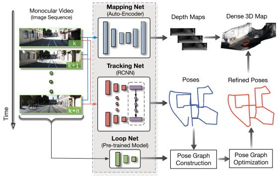

(a)  
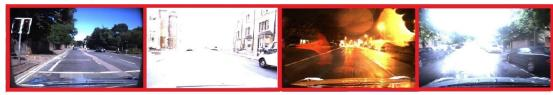  
(b)  
Fig. 1. (a) Testing framework of the proposed DeepSLAM. It takes monocular color images as input and produces depth maps, poses, and point clouds as outputs by using Mapping-Net, Tracking-Net, and Loop-Net. Mapping-Net is an autoencoder architecture for depth estimation. Tracking-Net is an RCNN-based architecture for pose estimation. Loop-Net is a CNN architecture for loop closure detection. Pose graph construction and optimization are implemented as the back end. (b) DeepSLAM demonstrates a robust performance in some challenging scenes.

1) A novel visual SLAM framework based on unsupervised DL is proposed. It exploits the combination of DL and geometric constraints.

2) Deep recurrent convolutional neural network (RCNN) is designed to model the ego-motion by leveraging both spatial and temporal properties of a sequence of stereo images during training.

3) DeepSLAM integrates the DL-based tracking result and loop closure detection with a graph-based optimization mechanism, forming a full visual SLAM system.

4) Outlier rejection is handled by the uncertainty derived from error maps of both geometric and photometric consistencies. This improves the robustness performance of DeepSLAM in challenging scenes.

Note that although DeepSLAM uses a stereo setup for training, only a monocular vision is required for testing. Therefore, DeepSLAM is a monocular visual SLAM system.

The rest of this article is organized as follows. Section II reviews related work. The system architecture of the proposed DeepSLAM is provided in Section III, followed by the presentation of training losses and outlier rejection in Section IV. Section V introduces the construction and optimization of a pose graph in our DeepSLAM. Section VI provides our experimental results. Finally, Section VII concludes this article.

## II. RELATED WORK

## A. Supervised DL for Pose Estimation

It is well known that convolutional neural networks (CNNs) are successful in object classification. A novel idea is to use

CNNs for pose regression. Kendall et al. [9] proposed the PoseNet to solve the pose regression problem with a CNN. It was trained with ground-truth poses and could be used for relocalization scenarios. Li et al. [12] then extended PoseNet to include a depth network in order to enhance the relocalization performance in challenging environments. Walch et al. [13] incorporated a spatial long short-term memory (LSTM) module into PoseNet to improve the performance. In order to estimate the uncertainty of pose estimation, Kendall and Cipolla [14] proposed Bayesian PoseNet by considering the Dropout in the network as a means of sampling. Clark et al. [15] proposed to use an RCNN to implement the pose regression with video clips by taking the temporal information into consideration.

Apart from pose regression, the ego-motion between two image frames could be estimated by using DL inspired by stereo geometric models. Costante et al. [16] developed a CNN to estimate the ego-motion with supervised training. Mohanty et al. [17] adopted a CNN to estimate the transformation between two consecutive frames. Wang et al. [18], [19] trained an RCNN to estimate the camera motion. Melekhov et al. [20] presented a relative camera pose estimation system with CNN. Oliveira et al. [21] constructed a metric net for ego-motion estimation and a topological net for topological location estimation. Then the predictions from these two networks were combined by a successive optimization. Ummenhofer et al. [22] proposed “DeMoN” to estimate ego-motion, image depth, surface normal, and optical flow simultaneously, but the ground-truth data were required. DeTone et al. [23] developed one network to predict the locations of feature points and another network to compute the homography with manually synthesized data. Instead of the above end-to-end pose estimation with CNNs, Tateno et al. [24] employed a CNN to estimate the depth map, then used a geometricmodel-based SLAM system to perform the pose estimation. Li et al. [25] combined a CNN-based depth prediction method with ORB-SLAM [5] to overcome the scale problem for monocular SLAM systems. Ji et al. [26] fused sparse map points from the SLAM system and dense predicted maps from CNN to deal with depth boundaries in 3-D reconstruction. Laidlow et al. [27] proposed a 3-D reconstruction system called Deepfusion. They introduced predicted dense depth maps into ORB-SLAM [5], and adopted the estimated depth gradients of keyframes as a constraint to ensure the global consistency of the 3-D reconstruction.

## B. Unsupervised DL for Depth and Ego-Motion Estimation

The main problem in the supervised pose estimation systems is the requirement of a large amount of data with annotated ground truth to train the networks. Currently, the size of datasets with annotated ground truth is limited and they are costly to collect. This restrains the performance of the supervised learning systems from further improvement. Recently unsupervised DL methods were successfully applied for depth estimation, inspired by the image wrap technique “spatial transformer” [28]. Garg et al. [11] proposed an unsupervised depth estimation method by exploiting left–right photometric constraint in stereo image pairs. The network training was fully unsupervised in an end-to-end manner and it even outperformed some supervised methods in terms of accuracy of depth estimation. Xie et al. [29] proposed a 2D-to-3D video conversion method with unsupervised learning. Godard et al. improved the method of Garg et al. [30] by wrapping left and right images across each other. Zhou et al. [31] proposed SfMLearner, which used a monocular image sequence for image alignment in order to estimate the depth and ego-motion simultaneously with unsupervised learning. However, the estimated depth map and ego-motion lacked scale information. Vijayanarasimhan et al. [32] proposed SfM-Net, which added motion masks to the photometric loss. It could estimate optical flow, depth map and ego-motion simultaneously. Li et al. [33] proposed a visual odometry method based on unsupervised learning. It used stereo images to train and monocular images to test, which could recover the scale of estimated trajectories.

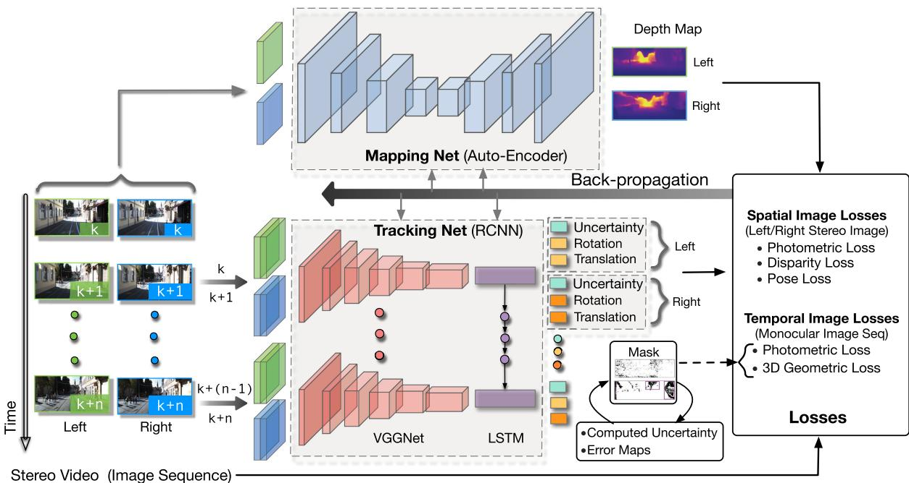  
Fig. 2. Training scheme of the proposed DeepSLAM system. We use stereo images to train the system in order to recover the scale information of the environment, which is similar to ones used in training. The spatial image losses between a stereo image pair and the temporal image losses between a sequence image pair are formulated to train the networks. The error map produced from the system is used as the loss masks for outlier rejection. The uncertainty produced from the system is also used to train the networks.

Outlier rejection, loop closure detection [34], [35], and pose graph optimization [36] are very important components for visual SLAM systems to reduce cumulative errors. However, only few papers introduced them into DL-based visual odometry systems. Recently, DL-based methods have also achieved a great success in place recognition and loop closure detection [37], [38]. It is essential to combine DL-based loop detection methods with DL-based visual odometry systems to improve the accuracy performance.

In summary, unsupervised DL techniques are promising a new research trend within the visual SLAM research field, potentially producing a new paradigm of visual SLAM systems and further improving their performance.

## III. SYSTEM OVERVIEW OF DEEPSLAM

According to the DeepSLAM testing framework in Fig. 1, the trained Tracking-Net, Mapping-Net, and Loop-Net can be viewed as the front end yielding a pose graph from a monocular image sequence. Specifically, Tracking-Net is an RCNN architecture constructed from a CNN part of the VGGNet [39] and a recurrent neural network (RNN) to estimate poses and uncertainties, Mapping-Net is an encoder–decoder architecture to produce dense depth maps, and Loop-Net produces sparse feature vectors for loop closure detection. Meanwhile, the pose graph optimization is employed to refine the poses as the back end.

The training scheme of DeepSLAM is shown in Fig. 2. Tracking-Net and Mapping-Net are trained unsupervisedly using stereo image pairs and geometric losses in Section IV. The purpose of using stereo image pairs instead of monocular ones for training is to recover the scale information of the environment. We found in our experiments that the scale information can be recovered when the environments of training and testing are similar. Loop-Net is a pretrained CNN for identifying loop closures.

As shown in Fig. 2, we utilize both spatial and temporal geometric consistencies of stereo image sequences to formulate the loss function. The spatial geometric consistency represents the geometric projective constraint between the corresponding points in left–right image pairs, whereas the temporal geometric consistency represents the geometric projective constraint between the corresponding points in two consecutive monocular images. By using these constraints to construct the loss functions and minimizing them all together, the networks learn to estimate scaled 6-DoF poses and depth maps in an end-to-end unsupervised manner. We are now in the position to discuss the details of various loss functions used for training.

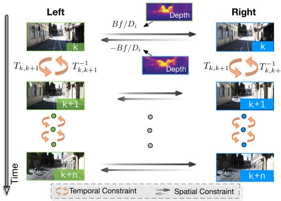  
Fig. 3. Spatial and temporal constraints used to formulate the spatial and temporal losses.

## IV. UNSUPERVISED TRAINING BASED ON SPATIAL AND TEMPORAL GEOMETRIC CONSISTENCIES

This section describes the losses designed for training Mapping-Net and Tracking-Net. In general, there are two kinds of losses to be minimized for training: spatial image loss and temporal image loss. The relationship between these two losses and a sequence of stereo images is shown in Fig. 3.

## A. Spatial Image Loss of a Pair of Stereo Images

The spatial image loss exploits the geometric constraints [shown in (1)] between stereo images to enable the Mapping-Net to produce meaningful depth maps that contain the scale information. For a pair of stereo images, every overlapped pixel i in one image can find its correspondence in the other image with a horizontal distance $H _ { i }$ [11]. Given its depth value $D _ { i }$ , the distance $H _ { i }$ can be calculated by

$$
H _ { i } = B f / D _ { i }\tag{1}
$$

where B is the baseline of the stereo camera and $f$ is the focal length. Therefore, by using the predicted depth map $\widehat { D _ { i } }$ from the Mapping-Net, a distance map H can be generated for the whole image. Based on H, we can synthesize a new image by warping an image from the other through spatial transformer [28]. Assume $I _ { l } ^ { \prime }$ and $I _ { r } ^ { \prime }$ are the synthesized left and right images from original right image $I _ { r }$ and left image $I _ { l } ,$ respectively.

The left–right photometric consistency losses can be constructed as

$$
L _ { l , r } ^ { p } = \sum \lambda _ { s } f _ { s } ( I _ { l } , I _ { l } ^ { \prime } ) + ( 1 - \lambda _ { s } ) \| I _ { l } - I _ { l } ^ { \prime } \| _ { 1 }\tag{2}
$$

$$
L _ { r , l } ^ { p } = \sum \lambda _ { s } f _ { s } ( I _ { r } , I _ { r } ^ { \prime } ) + ( 1 - \lambda _ { s } ) \| I _ { r } - I _ { r } ^ { \prime } \| _ { 1 }\tag{3}
$$

where $\| \cdot \| _ { 1 }$ is the L1 norm, $f _ { s } ( \cdot ) = ( 1 - \operatorname { S S I M } ( \cdot ) ) / 2$ and SSIM( ) is the Structural SIMilarity (SSIM) metric to evaluate the quality of a synthesized image [40], [41] with weight $\lambda _ { s }$

1) Disparity Consistency Loss: The disparity map is defined by

$$
Q = H \times w\tag{4}
$$

where w is the image width. Therefore, the estimated left and right disparity maps can also be constrained by $H .$ . Denote $Q _ { l }$ and $Q _ { r }$ r as the left and right disparity maps, respectively. Similar to the photometric consistency loss, we can use H to synthesize $Q _ { l } ^ { \prime }$ and $Q _ { r } ^ { \prime }$ from $Q _ { r }$ and $Q _ { l }$ , respectively. By using these disparity maps, the disparity consistency losses can be constructed as

$$
L _ { l , r } ^ { d } = \sum \| Q _ { l } - Q _ { l } ^ { \prime } \| _ { 1 }\tag{5}
$$

$$
L _ { r , l } ^ { d } = \sum \| Q _ { r } - Q _ { r } ^ { \prime } \| _ { 1 } .\tag{6}
$$

2) Pose Consistency Loss: If left and right image sequences are employed separately to estimate the 6-DoF transformations of camera motion through the Tracking-Net, ideally these relative translations should be approximate, and rotations should be exactly the same. Therefore, the differences between these two groups of pose estimates can be introduced as a left–right pose consistency loss as

$$
L ^ { o } = \lambda _ { p } \left\| \widehat { \mathbf { x } } _ { l } - \widehat { \mathbf { x } } _ { r } \right\| _ { 1 } + \lambda _ { r } \left\| \widehat { \boldsymbol { \varphi } } _ { l } - \widehat { \boldsymbol { \varphi } } _ { r } \right\| _ { 1 }\tag{7}
$$

where $[ \widehat { \mathbf { x } } _ { l } , \widehat { \varphi } _ { l } ]$ and $[ \widehat { \mathbf { x } } _ { r } , \widehat { \varphi } _ { r } ]$ are the estimated poses from left and right image sequences by the Tracking-Net, respectively. $\lambda _ { p }$ and $\lambda _ { r }$ are the position and rotation weights, and $\lambda _ { p }$ is much smaller than $\lambda _ { r } .$ Note that the length of image sequence can be variable thanks to the recurrent network in the Tracking-Net.

## B. Temporal Image Loss of a Sequence of Monocular Imagery

The temporal image loss exploits the geometric constraints (namely ego-motions) among multiple views of a monocular image sequence to enable the Mapping-Net to produce meaningful depth maps and the Tracking-Net to estimate the camera motion.

As shown in Fig. 3, the RCNN architecture enables correlation between two consecutive monocular images. It includes photometric consistency loss and 3-D geometric registration loss.

1) Photometric ConsistencyLoss: Different from the previous photometric consistency loss of a pair of stereo images, the photometric loss here focuses on the temporal information among a monocular image sequence. For each image pair $I _ { k } .$ $I _ { k + 1 }$ with some scene overlaps, we can obtain their synthesized images $I _ { k } ^ { \prime }$ and $I _ { k + 1 } ^ { \prime }$ by using a spatial transformer network [28]. Specifically, for an overlapped pixel $p _ { k }$ in the kth frame, we can derive its corresponding pixel $p _ { k + 1 } ^ { \prime }$ in the (k + 1)th frame through

$$
p _ { k + 1 } ^ { \prime } = K \widehat { T } _ { k , k + 1 } \widehat { D } _ { k } K ^ { - 1 } p _ { k }\tag{8}
$$

where $K$ is the camera intrinsics matrix, $\widehat { D } _ { k }$ is the pixel’s depth estimated from the Mapping-Net, $\widehat { T } _ { k , k + 1 }$ is the camera coordinate transformation matrix from the kth frame to the $( k + 1 ) \mathfrak { t }$ h frame predicted by the Tracking-Net. Based on this, $I _ { k } ^ { \prime }$ and $I _ { k + 1 } ^ { \prime }$ can be constructed from $I _ { k + 1 }$ and $I _ { k }$ , respectively. Define a temporal photometric error map between an image

$I _ { k }$ and its synthesized image $I _ { k } ^ { \prime }$ as $E _ { p } ^ { k } = I _ { k } - I _ { k } ^ { \prime }$ . Then, the photometric error maps for the $k { \mathord { - } } \mathrm { t o } { - } { \left( \bar { k } + 1 \right) }$ and $( k + 1 ) – \mathrm { t o } – k$ consistencies are

$$
\begin{array} { r } { E _ { p } ^ { k } = I _ { k } - I _ { k } ^ { \prime } , ~ E _ { p } ^ { k + 1 } = I _ { k + 1 } - I _ { k + 1 } ^ { \prime } . } \end{array}\tag{9}
$$

Then, the photometric losses of an image pair $I _ { k } , I _ { k + 1 }$ from the monocular image sequence are

$$
L _ { k , k + 1 } ^ { p } = \sum M _ { p } ^ { k } \left( \lambda _ { s } f _ { s } ( I _ { k } , I _ { k } ^ { \prime } ) + \left( 1 - \lambda _ { s } \right) \left. E _ { p } ^ { k } \right. _ { 1 } \right)\tag{10}
$$

$$
\begin{array} { r l } {  { L _ { k + 1 , k } ^ { p } = \sum M _ { p } ^ { k + 1 } \Big ( \lambda _ { s } f _ { s } ( I _ { k + 1 } , I _ { k + 1 } ^ { \prime } ) } \quad } & { { } } \\ { +  ( 1 - \lambda _ { s } ) \| E _ { p } ^ { k + 1 } \big \| _ { 1 } \Big ) } \end{array}\tag{11}
$$

where $M _ { p }$ denotes the bitwise mask of the corresponding photometric error map. We will discuss the mask in Section IV-C. Note that frames k and $k + 1$ are not necessarily consecutive but they should have overlapped pixels. Since DeepSLAM has an RNN architecture, the photometric losses are determined by several pairs of images in the image sequence, which facilities the construction of local graph. See more details on local graph in Section V-A.

2) 3-D Geometric Registration Loss: Geometric loss is used to constrain and estimate the transformations by considering 3-D point clouds. It is similar to iterative closest point, a well-known method to align point clouds. In DeepSLAM, we also use this loss for pose estimation.

Assuming $P _ { k }$ and $P _ { k + 1 }$ are the 3-D point clouds in the kth and (k + 1)th camera coordinations, and $P _ { k } ^ { \prime }$ and $P _ { k + 1 } ^ { \prime }$ are the transformed point clouds in these two coordinate frames. Then, we construct the geometric losses in the monocular image sequence as

$$
L _ { k , k + 1 } ^ { g } = \sum M _ { g } ^ { k } \left\| E _ { g } ^ { k } \right\| _ { 1 }\tag{12}
$$

$$
L _ { k + 1 , k } ^ { g } = \sum M _ { g } ^ { k + 1 } \left\| E _ { g } ^ { k + 1 } \right\| _ { 1 }\tag{13}
$$

where $E _ { g } ^ { k } = P _ { k } - P _ { k } ^ { \prime }$ and $E _ { g } ^ { k + 1 } = P _ { k + 1 } - P _ { k + 1 } ^ { \prime }$ are the temporal geometric error maps, and $M _ { g }$ is the mask of the corresponding geometric error map. For $P _ { k } , P _ { k } ^ { \prime } , P _ { k + 1 }$ , and $P _ { k + 1 } ^ { \prime } ,$ they are all tensors with size $h \times w \times 3$ , where h is the height of images, w is the width of images, and 3 denotes $( x , y , z )$ in the camera coordination. $E _ { g } ^ { k }$ and $E _ { g } ^ { k + 1 }$ are obtained through elementwise point cloud subtraction.

With regards to existing works, Garg et al. [11] and Godard et al. [30] used left–right photometric loss to estimate depth map, Godard et al. [30] used left–right disparity consistency loss, and Zhou et al. [31] used the photometric loss of image sequence to recover ego-motion and depth. However, little work has explored the combination of all these losses to estimate both scaled camera pose and depth map.

## C. Uncertainty Estimation and Outlier Rejection

Uncertainty estimation and outlier rejection are essential in SLAM systems. For the uncertainty estimation of supervised pose regression methods with DL, they either adopt a sampling method by using Dropout [14] or add a balance factor to the network as a mixture model [15] to obtain the uncertainty of pose estimation. Different from those supervised methods, DeepSLAM can produce the projected photometric error maps $E _ { p } ^ { k } , \bar { E } _ { p } ^ { k + 1 }$ and the projected geometric error maps $E _ { q } ^ { k } , E _ { q } ^ { k + 1 }$ for two consecutive images $I _ { k }$ and $I _ { k + 1 }$ . Assume $\mu _ { p } ^ { k } , \mu _ { p } ^ { k + 1 } , \bar { \mu } _ { g } ^ { k }$ , and $\mu _ { g } ^ { k + 1 }$ are the mean of $E _ { p } ^ { k } , E _ { p } ^ { k + 1 } , E _ { g } ^ { k }$ , and $E _ { g } ^ { k + 1 }$ , respectively. Then, the uncertainty of pose estimation and depth estimation with the kth frame and (k + 1)th frame can be represented as

$$
\sigma _ { k , k + 1 } = 2 \times S ( \mu _ { p } ^ { k } + \mu _ { p } ^ { k + 1 } + \lambda _ { e } ( \mu _ { g } ^ { k } + \mu _ { g } ^ { k + 1 } ) ) - 1\tag{14}
$$

where $S ( \cdot )$ is the sigmoid function and $\lambda _ { e }$ is the normalizing factor between the geometric and photometric errors. Because $\mu _ { p } ^ { k } , \mu _ { p } ^ { k + 1 } , \mu _ { g } ^ { k }$ , and $\mu _ { g } ^ { k + 1 }$ are all positive, sigmoid function here normalizes the uncertainty between 0.5 and 1 to represent the belief on the accuracy of pose estimate. We use $\sigma _ { k , k + 1 }$ to train the uncertainty estimation $\widehat { \sigma } _ { k , k + 1 }$ of the Tracking-Net

$$
L _ { k , k + 1 } ^ { u } = \left\| \sigma _ { k , k + 1 } - \widehat { \sigma } _ { k , k + 1 } \right\| _ { 1 }\tag{15}
$$

where $\widehat { \sigma } _ { k , k + 1 }$ is estimated by the Tracking-Net and represents the uncertainties of estimated poses and depth maps. Intuitively, $\widehat { \sigma } _ { k , k + 1 }$ is small when the estimated poses and depth maps are accurate enough to reduce the photometric and geometric errors.

In real-world environments, the photometric and geometric losses could be corrupted by dynamic objects. Therefore, we introduce the masks for the error maps in the previous temporal losses. We propose a novel method to construct bitwise masks to reject the outlier during training. According to the error values in the error maps, masks are constructed with a percentile $q _ { \mathrm { t h } }$ of pixels as 1 and a percentile $( 1 - q _ { \mathrm { t h } } )$ of pixels as 0. Specifically, based on the uncertainty $\sigma _ { k , k + 1 }$ , the percentile $q _ { \mathrm { t h } }$ of the pixels is determined by

$$
q _ { \mathrm { t h } } = q _ { 0 } + ( 1 - q _ { 0 } ) ( 1 - \sigma _ { k , k + 1 } )\tag{16}
$$

where $q _ { 0 } \in ( 0 , 1 )$ is the basic constant percentile. Then, we can construct the bitwise masks $M _ { p }$ and $M _ { g }$ to filter out $( 1 - q _ { \mathrm { t h } } )$ proportion of the big errors (as outliers) in the error maps. The generated masks not only automatically adapt to the different percentage of outlier, but also can be used to infer dynamic objects in the scene. This will be discussed in detail in Section VI-D.

## V. POSE GRAPH CONSTRUCTION AND OPTIMIZATION

Pose graph optimization plays an important role in SLAM systems due to its ability to reduce the cumulative pose drifts. In our system, we also perform a pose graph optimization with both local and global pose connections. The local pose graph is built upon a short sequence of consecutive images as a direct result of the recurrent model of the Tracking-Net considering an image sequence, i.e., the local pose graph is constructed from consecutive image frames. The global loop closures are detected by the Loop-Net from the historical images, which are usually nonconsecutive.

## A. RCNN-Based Local Pose Graph

The RCNN architecture ofthe Tracking-Net can learn the relationship between CNN features over time as the camera moves, modeling the motion dynamics of the camera from an image sequence. Therefore, based on the structure of Tracking-Net, we can construct the local pose graph directly. Assuming the length of an image sequence is $n ,$ each time the Tracking-Net can estimate (n 1) relative poses to build the local pose graph. An example of the pose graph built with sequence length 5 is shown in Fig. 4. As the camera moves over time, our system can gradually construct the pose graph with the local loops.

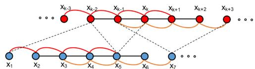  
Fig. 4. Pose graph with local and global connections. The dotted lines represent the global loops detected from Loop-Net, whereas the solid lines represent the local loops generated by Tracking-Net. The local graph with image sequence length 5 is shown here as an example.

## B. CNN-Based Global Loop Detection

For global pose graph, we use the Loop-Net to perform the place recognition and loop detection between nonneighboring frames. The Loop-Net in our DeepSLAM system is a CNN model pretrained on the ImageNet dataset for object recognition as it has shown a good performance in learning representations. Note that there is no training involved for the Loop-Net. The Inception ResNet V2 architecture [43] is adopted here. The Loop-Net maps images into feature vectors for loop closure detection. We can then compute the cosine distance of two feature vectors from an image pair to detect loop closures

$$
d _ { \mathrm { c o s } } = \mathrm { c o s } ( \bf v _ { 1 } , \bf v _ { 2 } )\tag{17}
$$

where $\mathbf { v _ { 1 } }$ and $\mathbf { v _ { 2 } }$ are the feature vector representations of an image pair. When $d _ { \mathrm { c o s } }$ is smaller than a threshold $d _ { \mathrm { c o s } } ^ { \mathrm { t h } }$ , the image pair is treated as a loop.

After the Loop-Net detects global loops, we use our Tracking-Net to calculate the transformation between detected image pairs. Since the recurrent structure makes the Tracking-Net flexible to the length ofimage sequence, we can use the sequence length 2 to compute the pose transformation. Once a global loop detected, g2o [36] is used as the back end for pose graph optimization.

## VI. EXPERIMENTAL EVALUATION

In this section, we demonstrate the tracking and mapping performance ofthe proposed DeepSLAM system. We conducted the evaluation on pose and depth accuracy separately in order to see how each network performs.

The proposed DeepSLAM was designed with the DL framework TensorFlow and trained on NVIDIA DGX-1 with Tesla P100. The Adam optimizer was employed to train the network for up to 20–30 epochs. The starting learning rate was 0.001 and decreased by half for every one-fifth of total iterations. The parameter $\beta _ { 1 }$ is 0.9 and $\beta _ { 2 }$ was 0.99. The sequence length of images feeding to the Tracking-Net was 5. The image size was $4 1 6 \times 1 2 8$ . We also resized the output images to a higher resolution to compute the losses and fine-tuned the networks in the end. For testing, a laptop equipped with an NVIDIA GeForce GTX 980 M GPU and Intel Core i7-6820HK 2.7 GHz CPU was used. The GPU memory required for the Tracking-Net was less than 400 MB with 40 Hz real-time performance. For the Mapping-Net and Loop-Net, we performed the dense depth prediction and loop closure detection every five frames. It took about 48 ms for Mapping-Net to predict a dense depth map per frame, and about 120 ms for Loop-Net to encode an image to the corresponding feature vector. The Tracking-Net, Mapping-Net, Loop-Net, and the pose graph optimization unit were run in separate threads. For the whole system, it can run at about 20 Hz.

To achieve a better training performance, some measures on data augmentation were taken, such as left–right image augmentation, rotational data augmentation and image color augmentation.

## A. Pose Accuracy Performance on KITTI

We first evaluated the accuracy performance of our Deep-SLAM system on the KITTI odometry dataset [44]. The full system of DeepSLAM includes the Tracking-Net with loop closure detection and graph optimization. The detailed quantitative results are listed in Table I. We used the standard evaluation method provided along with KITTI dataset: average translational root-mean-square error (RMSE) drift (%) and average rotational RMSE drift (◦/100 m) on length of 100–800 m. We also added two data-driven learning methods (ESP-VO and SfMLearner) and three model-based methods (monocular ORB-SLAM, monocular VISO2-M and stereo VISO2-S) into the table for comparison. VISO2-M and monocular ORB-SLAM did not work with resolution 416 128, and we used input images with size 1241 376. For stereo methods, VISO2-S also used input images with size 1241 376. All learning-based methods (DeepSLAM, ESP-VO and SfMlearner) used KITTI sequences 00–02, 08, 09 for network training, and KITTI sequences 03–07, 10 as the testing datasets. Our DeepSLAM is an unsupervised learning method and does not need the ground truth for training. In order to show the advantage of unsupervised learning and fully draw out the potential of DeepSLAM, we also used KITTI sequences 00–02, 08, 09, 11–21 to train the network. The best tracking results among learning methods are made in bold.

As shown in the table, our DeepSLAM outperforms ESP-VO and SfMLearner in terms of tracking accuracy. When compared with ESP-VO, we used more datasets (KITTI sequences 11–21) for network training as our DeepSLAM does not need datasets with annotated ground truth. ESP-VO is a supervised learning method and it cannot use KITTI sequences 11–21 for training. The result indicates that unsupervised learning methods can use more datasets for training and make the benefit in performance from it. When compared with SfMLearner, the DeepSLAM system adopts more carefully designed spatial and temporal losses functions and takes RCNN as Tracking-Net architecture. The DeepSLAM also outperforms monocular VISO2-M, but its performance is not as good as ORB-SLAM and stereo VISO2- S as DeepSLAM cannot maintain the local map and global map like ORB-SLAM. The estimated trajectories on sequences

TABLE I  
TRACKING RESULTS ON KITTI DATASET WITH OUR PROPOSED DEEPSLAM SYSTEM
<table><tr><td rowspan="3"> ${ \mathrm { S e q . } }$ </td><td colspan="10">Monocular DeepSLAM ESP-VO [19] SfMLearner [31]</td><td rowspan="2" colspan="3">Stereo VISO2-S [42]</td></tr><tr><td colspan="2"> $\mathbf { A } { + } \mathbf { B } \ ( 4 1 6 { \times } 1 2 8 )$ </td><td colspan="2"> $\mathrm { ~ A ~ } ( 4 \bar { 1 } 6 \times 1 2 8 )$ </td><td colspan="2"> $\mathrm { ~ A ~ } ( 1 2 4 2 \times 3 7 6 )$ </td><td colspan="2">ORB-SLAM [5]  $( 1 2 4 2 \times 3 7 6 )$ </td><td colspan="2">VISO2-M [42]  $( 1 2 4 2 \times 3 7 6 )$ </td></tr><tr><td colspan="2"> $t _ { \mathrm { r e l } } ( \% )$   $r _ { \mathrm { r e l } } ( { \mathrm { \circ } } )$ </td><td colspan="2"></td><td colspan="2"> $\underline { { r _ { \mathrm { r e l } } ( { \circ } ) } }$ </td><td colspan="2"> $\mathrm { ~ A ~ } ( 4 1 6 { \times } 1 2 8 )$ </td><td colspan="2"></td><td colspan="2">(1242×376)</td></tr><tr><td>7.66</td><td></td><td> $t _ { \mathrm { r e l } } ( \% )$  7.15</td><td> $\underline { { r _ { \mathrm { r e l } } ( { \circ } ) } }$  5.13</td><td> $t _ { \mathrm { r e l } } ( \% )$  6.72</td><td>6.46</td><td> $t _ { \mathrm { r e l } } ( \% )$  15.82</td><td> $\underline { { r _ { \mathrm { r e l } } ( { \circ } ) } }$  7.03</td><td> $t _ { \mathrm { r e l } } ( \% )$  0.67</td><td> $r _ { \mathrm { r e l } } ( { \mathrm { \% } } )$  0.18</td><td> $t _ { \mathrm { r e l } } ( \% )$  8.47</td><td> $\underline { { r _ { \mathrm { r e l } } ( { \circ } ) } }$ </td><td> $t _ { \mathrm { r e l } } ( \% )$ </td><td> $\underline { { r _ { \mathrm { r e l } } ( { } ^ { \circ } ) } }$ </td></tr><tr><td>03</td><td></td><td>4.30</td><td></td><td></td><td>6.33</td><td>6.08</td><td></td><td></td><td></td><td></td><td>8.82</td><td>3.21</td><td>3.25</td></tr><tr><td>04</td><td>4.56</td><td>1.90</td><td>5.22</td><td>2.27</td><td></td><td>5.25</td><td>2.32</td><td>0.65</td><td>0.18</td><td>4.69</td><td>4.49</td><td>2.12</td><td>2.12</td></tr><tr><td>05</td><td>3.25</td><td>1.31</td><td>4.04</td><td>1.40</td><td>3.35 4.93</td><td>13.47</td><td>4.41</td><td>3.28</td><td>0.46</td><td>19.22</td><td>17.58</td><td>1.53</td><td>1.60</td></tr><tr><td>06</td><td>4.97</td><td>1.53</td><td>5.99</td><td>1.54</td><td>7.24 7.29</td><td>30.32</td><td>7.47</td><td>6.14</td><td>0.17</td><td>7.30</td><td>6.14</td><td>1.48</td><td>1.58</td></tr><tr><td>07</td><td>4.71</td><td>1.84</td><td>4.88</td><td>2.14</td><td>3.52 5.02</td><td>15.08</td><td>5.96</td><td>1.23</td><td>0.22</td><td>23.61</td><td>29.11</td><td>1.85</td><td>1.91</td></tr><tr><td>10</td><td>8.35</td><td>3.93</td><td>10.77</td><td>4.45</td><td>9.77 10.2 6.66</td><td>18.45</td><td>6.77</td><td>7.27</td><td>1.00</td><td>41.56</td><td>32.99</td><td>1.17</td><td>1.30</td></tr><tr><td>mean</td><td>5.58</td><td>2.47</td><td>6.34</td><td>2.82</td><td>6.15</td><td>16.40</td><td>5.99</td><td>3.21</td><td>0.37</td><td>17.48</td><td>16.52</td><td>1.89</td><td>1.96</td></tr></table>

t : Average translational RMSE drift (%) on length of 100–800 m.  
r : Average rotational RMSE drif $( ^ { \circ } / 1 0 0$ m) on length of 100–800 m.  
A: KITTI sequences 00–02, 08, 09 as the training data.  
B: KITTI sequences 11–21 as the training data.

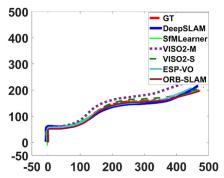  
(a)

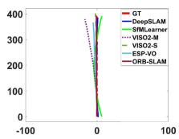  
(b)

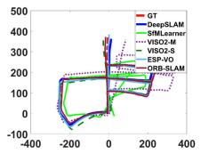  
(c)

(d)  
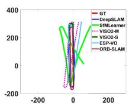

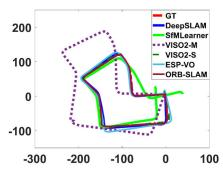  
(e)

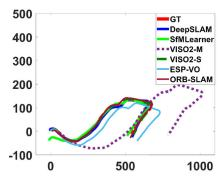  
(f)  
Fig. 5. Trajectories on KITTI sequences 03–07, 10 using our Deep-SLAM system (best viewed in color). Trajectories with ESP-VO [19], SfMLearner [31], ORB-SLAM [5], VISO2-M [42], and VISO2-S [42] are also plotted for comparison. (a) 03. (b) 04. (c) 05. (d) 06. (e) 07. (f) 10.

## B. Robustness Performance on Challenging Scenes

(a)  
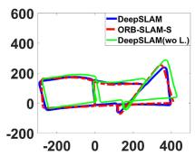  
(d)

Robustness is a significant factor for wider applications of visual SLAM. We used the public RobotCar [45] dataset to test the robustness of the proposed DeepSLAM system. The RobotCar dataset was collected in different environments over

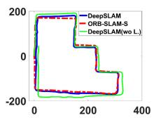

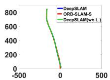

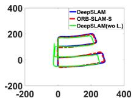

(b)  
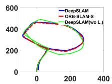  
(e)

In order to perform more experiments and comparisons, we also used KITTI sequences 00–08 for network training and the rest sequences for testing. There are no ground truths provided for KITTI sequences 11–21; thus, we plotted trajectories with stereo ORB-SLAM (ORB-SLAM-S) for reference. The trajectories of sequences 13 and 15–19 are plotted in the figure. As shown in Fig. 6, the trajectories produced by our DeepSLAM are similar with the ones produced by ORB-SLAM-S. In order to highlight the role of the loop closure in localization, we have added the results of our proposed system without Loop-Net in Fig. 6. As shown in the figure, for sequences 13, 15, 16, 18, and 19 that have loops, the system without Loop-Net cannot achieve the same performance as with loop closure due to the fact that the accumulated errors cannot be reduced.

03–07, 10 with above methods are plotted in Fig. 5. As shown in the figure, the trajectories from the DeepSLAM achieve good performance in terms of pose estimation.

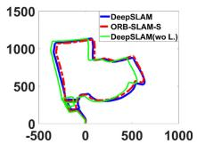  
(c)  
(f)  
Fig. 6. Trajectories on KITTI dataset using our DeepSLAM system. The trajectories using our DeepSLAM system without Loop-Net are also given. There is no ground truth for these trajectories. We plotted trajectories with ORB-SLAM-S for reference. KITTI sequences 00–08 are used for network training. (a) 13. (b) 15. (c) 16. (d) 17. (e) 18. (f) 19.

one year. We chose some datasets collected in challenging environments to test our trained models. Dataset (b) in Fig. 7 was used for training the Tracking-Net and Mapping-Net.

As shown in Fig. 7, the challenging scenes include image distortion, excessive exposure, night-time, bad white balance, and raining. These scenes are difficult for visual SLAM systems to perform accurately and robustly. Model-based SLAM methods (such as LSD-SLAM and ORB-SLAM) are sensitive to camera parameters, and not robust when performing feature extraction or transformation estimation under the above situations. So these methods are fragile when faced with challenging scenes. Fig. 7(a) shows the situation with image distortion. Fig. 7(b) shows the situation that there is excessive exposure in parts of the trajectory. Fig. 7(c) shows the situation that the data are collected at night while raining. Fig. 7(d) shows the situation that the images are collected while raining. No ground truth is provided. We compared our results with the trajectories collected by GPS/inertial navigation system (INS). For Fig. 7(c), the GPS signal was poor due to the rain. For Fig. 7(d), the GPS/INS almost did not work due to the terrible weather, and we plotted the trajectory with our DeepSLAM in Google Map for reference. As shown in Fig. 7, the DeepSLAM demonstrated a resilient behavior when encountering these challenging scenes.

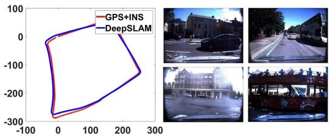

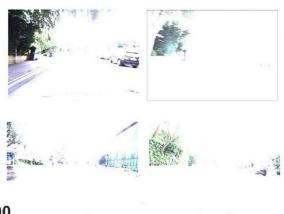

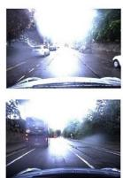

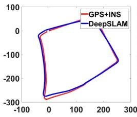  
(a)

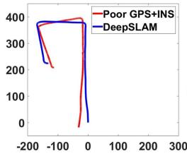

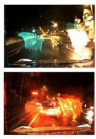  
(c)

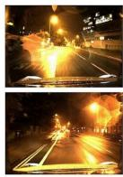

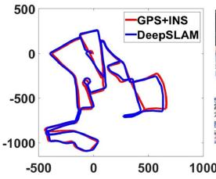  
(b)

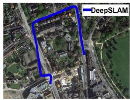

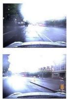  
(d)

Fig. 7. Robustness performance of our DeepSLAM on some challenging environments in RobotCar dataset. The left part of each subfigure shows the trajectory produced from our DeepSLAM, and the right part is the testing images taken in different locations. (a) Images with distortion. (b) Images with excessive exposure. (c) Images collected at night while raining. (d) Images collected while raining. Note that the GPS and INS data are very poor in RoboCar dataset 2015-05-29-09-36-29 (seq. 06) due to raining.  
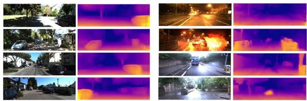  
Fig. 8. Estimated depth maps with our Mapping-Net. The left two columns are the images from the KITTI dataset. The right two columns are the images from challenging scenes in the RobotCar dataset.

Further, the right columns of the images in Fig. 8 provide the estimated depth images for the RoboCar dataset. It can be seen that the Mapping-Net demonstrates a robust performance on depth estimation (i.e., reconstruction/mapping of the environments) even facing challenging scenes, such as night-time and raining with underexposure and overexposure. For example, the depths of the cars on the right parts of both the sixth and the seventh images in Fig. 8 can be accurately estimated. Therefore, the Mapping-Net provides reliable scene mapping, which is used by the Tracking-Net to enhance the robustness for pose estimates during training. Meanwhile, as shown in Fig. 7, the Tracking-Net can keep estimating the 6-DoF poses when facing challenging environments in the RoboCar dataset, leveraging the accurate 3-D reconstruction from the Mapping-Net. In summary, it is believed that the Tracking-Net and Mapping-Net both play an important role in improving the robustness and work in tandem when facing challenging scenes.

Table II lists the results of DeepSLAM, LSD-SLAM, and ORB-SLAM-S on challenging scenes of RobotCar dataset. When encountering the challenging scenes such as raining, night-time, and bad white balance, LSD-SLAM and ORB-SLAM can hardly work, but our DeepSLAM works well by exploiting the prior knowledge learned through training.

TABLE II  
ROBUSTNESS PERFORMANCE ON CHALLENGING SCENES OF ROBOTCAR DATASET
<table><tr><td rowspan="2">Methods</td><td rowspan="2">Dataset</td><td colspan="4">Environments</td></tr><tr><td>Overcast Sun</td><td></td><td>Rain</td><td>Night</td></tr><tr><td>LSD-SLAM [7]</td><td>RobotCar</td><td>x/√</td><td>X</td><td>X</td><td>X</td></tr><tr><td>ORB-SLAM-S [5]</td><td>RobotCar</td><td>√</td><td>×</td><td>×</td><td>×</td></tr><tr><td>DeepSLAM</td><td>RobotCar</td><td>√</td><td>√</td><td>√</td><td>√</td></tr></table>

√ represents working well and × represents losing tracking.

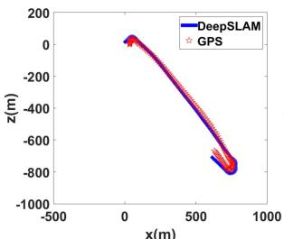

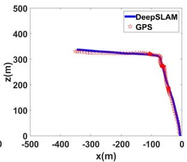

x(m)  
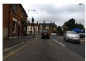

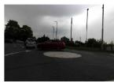

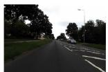

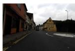  
Fig. 9. Testing on our self-collected dataset using a low-cost ZED camera.

## C. Testing With a Low-Cost Camera

We also used a low-cost stereo camera ZED to collect some data ourselves and tested our system. We used a laptop, a cheap GPS and a ZED camera to collect outdoor data. No other types of equipment were used, and we did not have the ground truth. We used the GPS data to provide the reference. The trajectories from our DeepSLAM and GPS are plotted in Fig. 9. The weather was cloudy when we collected the data, so the images are quite dim. As shown in Fig. 9, the DeepSLAM works well with this low-cost camera.

TABLE III  
DEPTH ESTIMATION RESULTS ON KITTI USING THE SPLIT OF EIGEN ET AL. [10]
<table><tr><td rowspan="2">Methods</td><td rowspan="2">Dataset</td><td rowspan="2">Input size</td><td rowspan="2">Supervision</td><td rowspan="2">Scale</td><td rowspan="2">Network</td><td rowspan="2">Capped depth</td><td colspan="4">Error metric</td></tr><tr><td>Abs Rel</td><td>Sq Rel</td><td>RMSE</td><td>RMSE log</td></tr><tr><td>Eigen [10]</td><td>K (raw)</td><td> $6 \pi \times 1 8 4$ </td><td>V</td><td>L</td><td>VGG</td><td>80m</td><td>0.214</td><td>1.605</td><td>6.563</td><td>0.292</td></tr><tr><td>Monodepth [30]</td><td>K (raw)</td><td> $5 1 2 \times 2 5 6$ </td><td>X</td><td>√</td><td>ResNet-50</td><td>80m</td><td>0.148</td><td>1.344</td><td>5.927</td><td>0.247</td></tr><tr><td>SfMLearner [31]</td><td>K (raw)</td><td> $4 1 6 \times 1 2 8$ </td><td>×</td><td>×</td><td>VGG</td><td>80m</td><td>0.208</td><td>1.768</td><td>6.856</td><td>0.283</td></tr><tr><td>SfMLearner [31]</td><td>K (raw)</td><td> $4 1 6 \times 1 2 8$ </td><td>×</td><td>×</td><td>VGG</td><td>50m</td><td>0.201</td><td>1.391</td><td>5.181</td><td>0.264</td></tr><tr><td>DeepSLAM</td><td>K (odo)</td><td> $4 1 6 \times 1 2 8$ </td><td>X</td><td>V</td><td>VGG</td><td>80m</td><td>0.1724</td><td>1.659</td><td>6.362</td><td>0.259</td></tr><tr><td>DeepSLAM</td><td>K (odo)</td><td> $4 1 6 \times 1 2 8$ </td><td>×</td><td></td><td>VGG</td><td>50m</td><td>0.164</td><td>1.288</td><td>4.782</td><td>0.204</td></tr><tr><td>DeepSLAM</td><td>K (odo)</td><td> $4 1 6 \times 1 2 8$ </td><td>×</td><td>V</td><td>VGG</td><td>30m</td><td>0.147</td><td>0.834</td><td>3.031</td><td>0.207</td></tr></table>

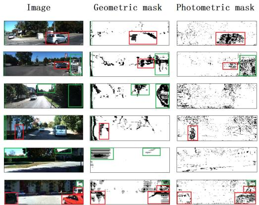  
Fig. 10. Geometric mask and photometric mask for outlier rejection. The red boxes represent moving objects and the green boxes represent depth values with high uncertainty.

## D. Outlier Rejection

As introduced above, We used the photometric error maps and geometric error maps (3-D point cloud registration error maps) from monocular image sequences to generate the loss mask and uncertainty. The loss mask can reject the outlier and refine the estimated poses. This is due to the fact that the 3-D registration error map includes depth and pose estimation information, and the photometric error map includes photometric information, depth and pose estimation information. The uncertainty is related to the mean of the error map, which is used to automatically select the size of the mask.

Fig. 10 shows the 3-D registration error mask and the photometric error mask. The red boxes in the figure are moving objects in the scenes, such as pedestrians and vehicles. The green boxes in the figure are depth values with high uncertainty. These values tend to be sky, extreme dark places, edges of objects or nonoverlap areas of left–right images. It is very hard for the network to estimate the real depth value of these places, and therefore the estimated depth value has a high uncertainty. In our system, the photometric mask is directly related to moving objects, and the geometric mask is related to estimated depth values with high uncertainty. We also plot the estimated uncertainty against the corresponding translational and rotational errors in Fig. 11. As shown in the figure, the estimated uncertainty values from our network are strongly correlated with both of them.

## E. Depth Estimation and 3-D Reconstruction

The Mapping-Net of the DeepSLAM can also produce the scaled dense depth map. Fig. 8 shows some raw RGB images and the dense depth maps generated by the DeepSLAM. The left two columns are the estimated depth maps selected from KITTI dataset, and the right two columns are the estimated depth maps of the challenging scenes selected from RobotCar dataset. As shown in the figure, the depths of cars, trees, and trunks are clearly visible.

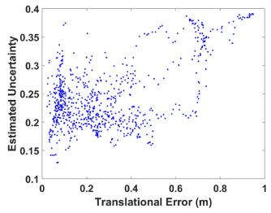

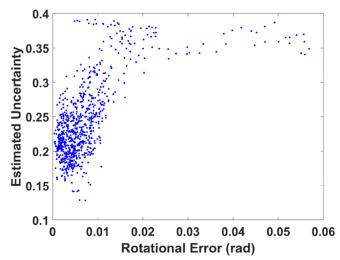  
(a)

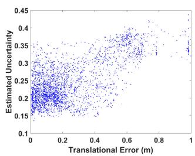

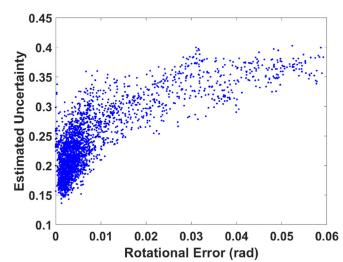  
(b)  
Fig. 11. Estimated uncertainty against the corresponding translational and rotational errors. It shows that the estimated uncertainty values are strongly correlated with both of them. (a) Seq. 03. (b) Seq. 05.

The detailed quantitative depth estimation results are listed in Table III. RobotCar dataset does not provide the ground truth for depth maps. We used KITTI dataset to evaluate the performance of the Mapping-Net quantitatively. As shown in the table, the DeepSLAM outperforms the supervised one [10] and the unsupervised one without scale [31], but performs not as good as [30]. This could be caused by a few reasons. First, we only used parts of KITTI dataset (KITTI odometry dataset) for training, whereas all other methods use full KITTI dataset to train their networks. Second, Godard et al. [30] used higher resolution $( 5 1 2 \times 2 5 6 )$ input and a more sophisticated deep neural network (ResNetbased architecture). Third, the temporal image loss we used could introduce some noise (such as moving objects) for depth estimation.

Exploiting the powerful ability of pose estimation and depth estimation with the DeepSLAM system, we can also reconstruct the dense 3-D point cloud of the scenes with a monocular camera. Fig. 12 shows some 3-D dense maps generated by the DeepSLAM system.

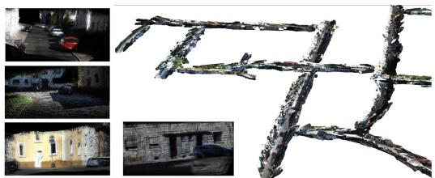  
Fig. 12. Reconstructed 3-D map with our DeepSLAM system.

## VII. CONCLUSION

Most state-of-the-art SLAM algorithms rely on geometric models and optimization engines to estimate the structure of environment and the motion of camera. This article approached to the problem from a data-driven perspective, i.e., training deep neural networks with existing datasets. The system architecture of DeepSLAM mimics that of model-based SLAMs. The important geometric models and constraints were respected and embedded into the network architecture and the loss function. This provided a guarantee for estimation accuracy. Our evaluation results showed that the data-driven approach DeepSLAM achieves good performance in terms of accuracy and robustness. Deep-SLAM falls within an unsupervised learning framework as no manual annotation was required for training. This distinguishes itself from supervised deep leaning approaches to SLAM. In the future, more unlabeled datasets will be made available as they are easy to collect. It is expected the DeepSLAM will have the opportunity to further improve the performance. Following this direction, our future work is planned to train DeepSLAM with more data.

## REFERENCES

[1] A. J. Davison, I. D. Reid, N. D. Molton, and O. Stasse, “MonoSLAM: Real-time single camera SLAM,” IEEE Trans. Pattern Anal. Mach. Intell., vol. 29, no. 6, pp. 1052–1067, Jun. 2007.

[2] G. Klein and D. Murray, “Parallel tracking and mapping for small AR workspaces,” in Proc. IEEE ACM Int. Symp. Mixed Augmented Reality, 2007, pp. 225–234.

[3] M. Lin, C. Yang, and D. Li, “An improved transformed unscented Fast-SLAM with adaptive genetic resampling,” IEEE Trans. Ind. Electron., vol. 66, no. 5, pp. 3583–3594, May 2019.

[4] T.-J. Lee, C.-H. Kim, and D.-I. D. Cho, “A monocular vision sensorbased efficient SLAM method for indoor service robots,” IEEE Trans. Ind. Electron., vol. 66, no. 1, pp. 318–328, Jan. 2019.

[5] R. Mur-Artal, J. Montiel, and J. D. Tardos, “ORB-SLAM: A versatile and accurate monocular SLAM system,” IEEE Trans. Robot., vol. 31, no. 5, pp. 1147–1163, Oct. 2015.

[6] R. A. Newcombe, S. J. Lovegrove, and A. J. Davison, “DTAM: Dense tracking and mapping in real-time,” in Proc. IEEE Int. Conf. Comput. Vision, 2011, pp. 2320–2327.

[7] J. Engel, T. Schöps, and D. Cremers, “LSD-SLAM: Large-scale direct monocular SLAM,” in Proc. Eur. Conf. Comput. Vision, 2014, pp. 834–849.

[8] J. Engel, V. Koltun, and D. Cremers, “Direct sparse odometry,” IEEE Trans. Pattern Anal. Mach. Intell., vol. 40, no. 3, pp. 611–625, Mar. 2018.

[9] A. Kendall, M. Grimes, and R. Cipolla, “PoseNet: A convolutional network for real-time 6-DoF camera relocalization,” in Proc. IEEE Int. Conf. Comput. Vision, 2015, pp. 2938–2946.

[10] D. Eigen, C. Puhrsch, and R. Fergus, “Depth map prediction from a single image using a multi-scale deep network,” in Proc. Adv. Neural Inf. Process. Syst., 2014, pp. 2366–2374.

[11] R. Garg, V. K. BG, G. Carneiro, and I. Reid, “Unsupervised CNN for single view depth estimation: Geometry to the rescue,” in Proc. Eur. Conf. Comput. Vision, 2016, pp. 740–756.

[12] R. Li, Q. Liu, J. Gui, D. Gu, and H. Hu, “Indoor relocalization in challenging environments with dual-stream convolutional neural networks,” IEEE Trans. Autom. Sci. Eng., vol. 15, no. 2, pp. 651–662, Apr. 2018.

[13] F. Walch, C. Hazirbas, L. Leal-Taixé, T. Sattler, S. Hilsenbeck, and D. Cremers, “Image-based localization using LSTMs for structured feature correlation,” in Proc. IEEE Int. Conf. Comput. Vision, 2017, pp. 627–637.

[14] A. Kendall and R. Cipolla, “Modelling uncertainty in deep learning for camera relocalization,” in Proc. IEEE Int. Conf. Robot. Autom., 2016, pp. 4762–4769.

[15] R. Clark, S. Wang, A. Markham, N. Trigoni, and H. Wen, “VidLoc: 6-DoF video-clip relocalization,” in Proc. Conf. Comput. Vision Pattern Recognit., 2017, pp. 6856–6864.

[16] G. Costante, M. Mancini, P. Valigi, and T. A. Ciarfuglia, “Exploring representation learning with CNNs for frame-to-frame ego-motion estimation,” IEEE Robot. Autom. Lett., vol. 1, no. 1, pp. 18–25, Jan. 2016.

[17] V. Mohanty, S. Agrawal, S. Datta, A. Ghosh, V. D. Sharma, and D. Chakravarty, “DeepVO: A deep learning approach for monocular visual odometry,” 2016, arXiv:1611.06069.

[18] S. Wang, R. Clark, H. Wen, and N. Trigoni, “DeepVO: Towards end-to-end visual odometry with deep recurrent convolutional neural networks,” in Proc. IEEE Int. Conf. Robot. Autom., 2017, pp. 2043–2050.

[19] S. Wang, R. Clark, H. Wen, and N. Trigoni, “End-to-end, sequence-tosequence probabilistic visual odometry through deep neural networks,” Int. J. Robot. Res., vol. 37, no. 4/5, pp. 513–542, 2018.

[20] I. Melekhov, J. Kannala, and E. Rahtu, “Relative camera pose estimation using convolutional neural networks,” in Int. Conf. Adv. Concepts Intell. Vision Syst., pp. 675–687, 2017.

[21] G. L. Oliveira, N. Radwan, W. Burgard, and T. Brox, “Topometric localization with deep learning,” in Robotics Res., pp. 505–520 2020, arXiv:1706.08775.

[22] B. Ummenhofer et al., “DeMoN: Depth and motion network for learning monocular stereo,” in Proc. Conf. Comput. Vision Pattern Recognit., 2017, pp. 5038–5047.

[23] D. DeTone, T. Malisiewicz, and A. Rabinovich, “Toward geometric deep SLAM,” 2017, arXiv:1707.07410.

[24] K. Tateno, F. Tombari, I. Laina, and N. Navab, “CNN-SLAM: Real-time dense monocular SLAM with learned depth prediction,” in Proc. Conf. Comput. Vision Pattern Recognit., 2017, pp. 6565–6574.

[25] Y. Li, C. Xie, H. Lu, X. Chen, J. Xiao, and H. Zhang, “Scale-aware monocular SLAM based on convolutional neural network,” in Proc. IEEE Int. Conf. Inf. Autom., 2018, pp. 51–56.

[26] X. Ji, X. Ye, H. Xu, and H. Li, “Dense reconstruction from monocular SLAM with fusion of sparse map-points and CNN-inferred depth,” in Proc. IEEE Int. Conf. Multimedia Expo., 2018, pp. 1–6.

[27] T. Laidlow, J. Czarnowski, and S. Leutenegger, “DeepFusion: Realtime dense 3D reconstruction for monocular SLAM using single-view depth and gradient predictions,” in Proc. Int. Conf. Robot. Autom., 2019, pp. 4068–4074.

[28] M. Jaderberg, K. Simonyan, and A. Zisserman, “Spatial transformer networks,” in Proc. Adv. Neural Inf. Process. Syst., 2015, pp. 2017–2025.

[29] J. Xie, R. Girshick, and A. Farhadi, “Deep3D: Fully automatic 2D-to-3D video conversion with deep convolutional neural networks,” in Proc. Eur. Conf. Comput. Vision, 2016, pp. 842–857.

[30] C. Godard, O. Mac Aodha, and G. J. Brostow, “Unsupervised monocular depth estimation with left-right consistency,” in Proc. Conf. Comput. Vision Pattern Recognit., 2017, pp. 270–279.

[31] T. Zhou, M. Brown, N. Snavely, and D. G. Lowe, “Unsupervised learning of depth and ego-motion from video,” in Proc. Conf. Comput. Vision Pattern Recognit., 2017, pp. 1851–1858.

[32] S. Vijayanarasimhan, S. Ricco, C. Schmid, R. Sukthankar, and K. Fragkiadaki, “SfM-Net: Learning of structure and motion from video,” 2017, arXiv:1704.07804.

[33] R. Li, S. Wang, Z. Long, and D. Gu, “UnDeepVO: Monocular visual odometry through unsupervised deep learning,” in Proc. IEEE Int. Conf. Robot. Autom., 2018, pp. 7286–7291.

[34] D. Gálvez-López and J. D. Tardos, “Bags of binary words for fast place recognition in image sequences,” IEEE Trans. Robot., vol. 28, no. 5, pp. 1188–1197, Oct. 2012.

[35] R. Mur-Artal and J. D. Tardós, “Fast relocalisation and loop closing in keyframe-based SLAM,” in Proc. IEEE Int. Conf. Robot. Autom., 2014, pp. 846–853.

[36] R. Kümmerle, G. Grisetti, H. Strasdat, K. Konolige, and W. Burgard, “g2o: A general framework for graph optimization,” in Proc. IEEE Int. Conf. Robot. Autom., 2011, pp. 3607–3613.

[37] X. Gao and T. Zhang, “Unsupervised learning to detect loops using deep neural networks for visual SLAM system,” Auton. Robots, vol. 41, no. 1, pp. 1–18, 2017.

[38] J. Li, H. Zhan, B. M. Chen, I. Reid, and G. H. Lee, “Deep learning for 2D scan matching and loop closure,” in Proc. IEEE/RSJ Int. Conf. Intell. Robots Syst., 2017, pp. 763–768.

[39] K. Simonyan and A. Zisserman, “Very deep convolutional networks for large-scale image recognition,” in Int. Conf. Learn. Representations, pp. 1–14, 2015.

[40] Z. Wang, A. C. Bovik, H. R. Sheikh, and E. P. Simoncelli, “Image quality assessment: From error visibility to structural similarity,” IEEE Trans. Image Process., vol. 13, no. 4, pp. 600–612, Apr. 2004.

[41] H. Zhao, O. Gallo, I. Frosio, and J. Kautz, “Loss functions for neural networks for image processing” IEEE Trans. Computational Imaging, vol. 3, no. 1, pp. 47–57, Mar. 2017.

[42] A. Geiger, J. Ziegler, and C. Stiller, “StereoScan: Dense 3D reconstruction in real-time,” in Proc. Intell. Veh. Symp., 2011, pp. 963–968.

[43] C. Szegedy, S. Ioffe, V. Vanhoucke, and A. A. Alemi, “Inception-v4, Inception-ResNet and the impact of residual connections on learning,” in Proc. AAAI Conf. Artif. Intell., 2017, pp. 4278–4284.

[44] A. Geiger, P. Lenz, and R. Urtasun, “Are we ready for autonomous driving? The KITTI vision benchmark suite,” in Proc. IEEE Conf. Comput. Vision Pattern Recognit., 2012, pp. 3354–3361.

[45] W. Maddern, G. Pascoe, C. Linegar, and P. Newman, “1 year, 1000 km: The Oxford RobotCar dataset,” Int. J. Robot. Res., vol. 36, no. 1, pp. 3–15, 2017, doi: 10.1177/0278364916679498.

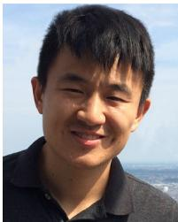  
Ruihao Li received the B.Sc. degree in automation from the Beijing Institute of Technology, Beijing, China, in 2012, the M.Sc. degree in control science and engineering from the National University of Defense Technology, Changsha, China, in 2014, and the Ph.D. degree in robotics from the University of Essex, Colchester, U.K., in 2018.

He is currently an Assistant Professor with the Artificial Intelligence Research Center, National Innovation Institute of Defense Tech-

nology, Academy of Military Sciences, Beijing. His research interests include robotics, simultaneous localization and mapping, deep learning, and semantic scene understanding.

Sen Wang (Member, IEEE) received the Ph.D. degree in robotics from the University of Essex, Colchester, U.K., in 2015. He is an Assistant Professor in Robotics and Autonomous Systems with Heriot-Watt University and a faculty member of the Edinburgh Centre for Robotics, Edinburgh, U.K. He was previously a Postdoctoral Researcher with the University of Oxford, Oxford, U.K. His current research focuses on robot perception and autonomy using probabilistic and learning approaches, especially autonomous navigation, robotic vision, simultaneous localization and mapping, and robot learning.

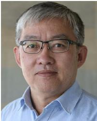

Dongbing Gu (Senior Member, IEEE) received the B.Sc. and M.Sc. degrees in control engineering from the Beijing Institute of Technology, Beijing, China, in 1985 and 1988, respectively, and the Ph.D. degree in robotics from the University of Essex, Colchester, U.K., in 2004.

From October 1996 to October 1997, he was an Academic Visiting Scholar with the Department of Engineering Science, University of Oxford, Oxford, U.K. In 2000, he joined the University of Essex as a Lecturer. He is currently a

Professor of Robotics with the School of Computer Science and Electronic Engineering, University of Essex. His research interests include robotics, multiagent systems, cooperative control, model predictive control, visual simultaneous localization and mapping, wireless sensor networks, and machine learning.