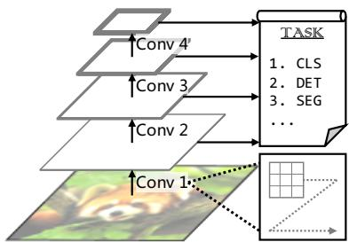
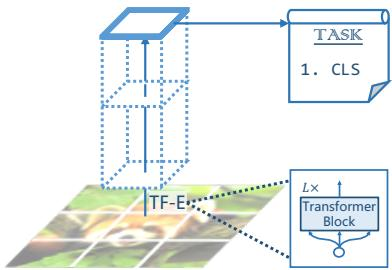
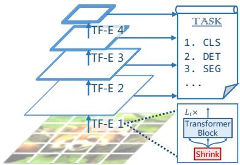
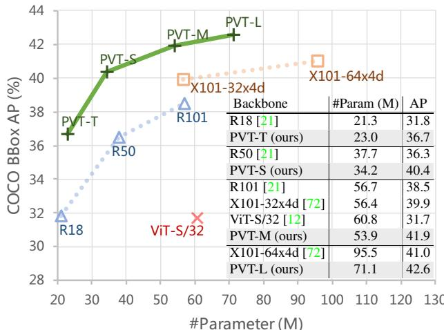
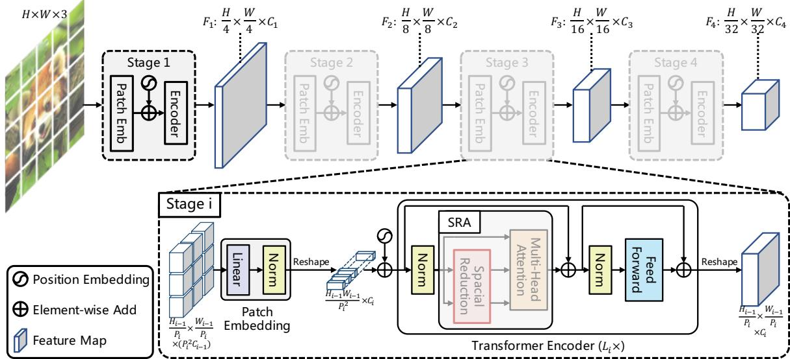
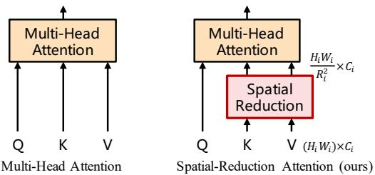
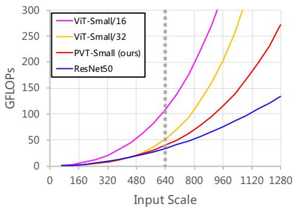

# Pyramid Vision Transformer: A Versatile Backbone for Dense Prediction without Convolutions

Wenhai Wang1, Enze Xie2, Xiang Li3, Deng-Ping Fan4B, Kaitao Song3, Ding Liang5, Tong Lu1B, Ping Luo2, Ling Shao4 1Nanjing University 2The University of Hong Kong 3Nanjing University of Science and Technology 4IIAI 5SenseTime Research

https://github.com/whai362/PVT

  
(a) CNNs: VGG [53], ResNet [21], etc.

  
(b) Vision Transformer [12]

  
(c) Pyramid Vision Transformer (ours)

Figure 1: Comparisons of different architectures, where “Conv” and “TF-E” stand for “convolution” and “Transformer encoder”, respectively. (a) Many CNN backbones use a pyramid structure for dense prediction tasks such as object detection (DET), instance and semantic segmentation (SEG). (b) The recently proposed Vision Transformer (ViT) [12] is a “columnar” structure specifically designed for image classification (CLS). (c) By incorporating the pyramid structure from CNNs, we present the Pyramid Vision Transformer (PVT), which can be used as a versatile backbone for many computer vision tasks, broadening the scope and impact of ViT. Moreover, our experiments also show that PVT can easily be combined with DETR [5] to build an end-to-end object detection system without convolutions.

## Abstract

Although convolutional neural networks (CNNs) have achieved great success in computer vision, this work investigates a simpler, convolution-free backbone network useful for many dense prediction tasks. Unlike the recentlyproposed Vision Transformer (ViT) that was designed for image classification specifically, we introduce the Pyramid Vision Transformer (PVT), which overcomes the difficulties ofporting Transformer to various dense prediction tasks. PVT has several merits compared to current state of the arts. (1) Different from ViT that typically yields lowresolution outputs and incurs high computational and memory costs, PVT not only can be trained on dense partitions of an image to achieve high output resolution, which is important for dense prediction, but also uses a progressive shrinking pyramid to reduce the computations of large feature maps. (2) PVT inherits the advantages of both CNN and Transformer, making it a unified backbone for vari-

ous vision tasks without convolutions, where it can be used as a direct replacement for CNN backbones. (3) We validate PVT through extensive experiments, showing that it boosts the performance of many downstream tasks, including object detection, instance and semantic segmentation. For example, with a comparable number of parameters, PVT+RetinaNet achieves 40.4 AP on the COCO dataset, surpassing ResNet50+RetinNet (36.3 AP) by 4.1 absolute AP (see Figure 2). We hope that PVT could serve as an alternative and useful backbone for pixel-level predictions andfacilitatefuture research.

## 1. Introduction

Convolutional neural network (CNNs) have achieved remarkable success in computer vision, making them a versatile and dominant approach for almost all tasks [53, 21, 72, 48, 20, 38, 8, 31]. Nevertheless, this work aims to explore an alternative backbone network beyond CNN, which can be used for dense prediction tasks such as object detection [39, 13], semantic [81] and instance segmentation [39], in addition to image classification [11].

  
Figure 2: Performance comparison on COCO val2017 of different backbones using RetinaNet for object detection, where “T”, “S”, “M” and “L” denote our PVT models with tiny, small, medium and large size. We see that when the number of parameters among different models are comparable, PVT variants significantly outperform their corresponding counterparts such as ResNets (R) [21], ResNeXts (X) [72], and ViT [12].

Inspired by the success of Transformer [63] in natural language processing, many researchers have explored its application in computer vision. For example, some works [5, 82, 71, 55, 23, 41] model the vision task as a dictionary lookup problem with learnable queries, and use the Transformer decoder as a task-specific head on top of the CNN backbone. Although some prior arts have also incorporated attention modules [69, 47, 78] into CNNs, as far as we know, exploring a clean and convolution-free Transformer backbone to address dense prediction tasks in computer vision is rarely studied.

Recently, Dosovitskiy et al. [12] introduced the Vision Transformer (ViT) for image classification. This is an interesting and meaningful attempt to replace the CNN backbone with a convolution-free model. As shown in Figure 1 (b), ViT has a columnar structure with coarse image patches as input.1 Although ViT is applicable to image classification, it is challenging to directly adapt it to pixel-level dense predictions such as object detection and segmentation, because (1) its output feature map is single-scale and low-resolution, and (2) its computational and memory costs are relatively high even for common input image sizes (e.g., shorter edge of 800 pixels in the COCO benchmark [39]).

To address the above limitations, this work proposes a pure Transformer backbone, termed Pyramid Vision Transformer (PVT), which can serve as an alternative to the CNN backbone in many downstream tasks, including image-level prediction as well as pixel-level dense predictions. Specifically, as illustrated in Figure 1 (c), our PVT overcomes the difficulties of the conventional Transformer by (1) taking fine-grained image patches (i.e., 4×4 pixels per patch) as input to learn high-resolution representation, which is essential for dense prediction tasks; (2) introducing a progressive shrinking pyramid to reduce the sequence length of Transformer as the network deepens, significantly reducing the computational cost, and (3) adopting a spatial-reduction attention (SRA) layer to further reduce the resource consumption when learning high-resolution features.

Overall, the proposed PVT possesses the following merits. Firstly, compared to the traditional CNN backbones (see Figure 1 (a)), which have local receptive fields that increase with the network depth, our PVT always produces a global receptive field, which is more suitable for detection and segmentation. Secondly, compared to ViT (see Figure 1 (b)), thanks to its advanced pyramid structure, our method can more easily be plugged into many representative dense prediction pipelines, e.g., RetinaNet [38] and Mask R-CNN [20]. Thirdly, we can build a convolutionfree pipeline by combining our PVT with other task-specific Transformer decoders, such as PVT+DETR [5] for object detection. To our knowledge, this is the first entirely convolution-free object detection pipeline.

Our main contributions are as follows:

(1) We propose Pyramid Vision Transformer (PVT), which is the first pure Transformer backbone designed for various pixel-level dense prediction tasks. Combining our PVT and DETR, we can construct an end-to-end object detection system without convolutions and handcrafted components such as dense anchors and non-maximum suppression (NMS).

(2) We overcome many difficulties when porting Transformer to dense predictions, by designing a progressive shrinking pyramid and a spatial-reduction attention (SRA). These are able to reduce the resource consumption of Transformer, making PVT flexible to learning multi-scale and high-resolution features.

(3) We evaluate the proposed PVT on several different tasks, including image classification, object detection, instance and semantic segmentation, and compare it with popular ResNets [21] and ResNeXts [72]. As presented in Figure 2, our PVT with different parameter scales can consistently archived improved performance compared to the prior arts. For example, under a comparable number of parameters, using RetinaNet [38] for object detection, PVT-Small achieves 40.4 AP on COCO val2017, outperforming ResNet50 by 4.1 points (40.4 vs. 36.3). Moreover, PVT-Large achieves 42.6 AP, which is 1.6 points better than ResNeXt101-64x4d, with 30% less parameters.

## 2. Related Work

## 2.1. CNN Backbones

CNNs are the work-horses of deep neural networks in visual recognition. The standard CNN was first introduced in [33] to distinguish handwritten numbers. The model contains convolutional kernels with a certain receptive field that captures favorable visual context. To provide translation equivariance, the weights of convolutional kernels are shared over the entire image space. More recently, with the rapid development of the computational resources (e.g., GPU), the successful training of stacked convolutional blocks [32, 53] on large-scale image classification datasets (e.g., ImageNet [50]) has become possible. For instance, GoogLeNet [58] demonstrated that a convolutional operator containing multiple kernel paths can achieve very competitive performance. The effectiveness of a multi-path convolutional block was further validated in Inception series [59, 57], ResNeXt [72], DPN [9], MixNet [64] and SKNet [35]. Further, ResNet [21] introduced skip connections into the convolutional block, making it possible to create/train very deep networks and obtaining impressive results in the field of computer vision. DenseNet [24] introduced a densely connected topology, which connects each convolutional block to all previous blocks. More recent advances can be found in recent survey/review papers [30, 52].

Unlike the full-blown CNNs, the vision Transformer backbone is still in its early stage of development. In this work, we try to extend the scope of Vision Transformer by designing a new versatile Transformer backbone suitable for most vision tasks.

## 2.2. Dense Prediction Tasks

Preliminary. The dense prediction task aims to perform pixel-level classification or regression on a feature map. Object detection and semantic segmentation are two representative dense prediction tasks.

Object Detection. In the era of deep learning, CNNs [33] have become the dominant framework for object detection, which includes single-stage detectors (e.g., SSD [42], RetinaNet [38], FCOS [61], GFL [36, 34], PolarMask [70] and OneNet [54]) and multi-stage detectors (Faster R-CNN [48], Mask R-CNN [20], Cascade R-CNN [4] and Sparse R-CNN [56]). Most of these popular object detectors are built on high-resolution or multi-scale feature maps to obtain good detection performance. Recently, DETR [5] and deformable DETR [82] combined the CNN backbone and the Transformer decoder to build an endto-end object detector. Likewise, they also require highresolution or multi-scale feature maps for accurate object detection.

Semantic Segmentation. CNNs also play an important role in semantic segmentation. In the early stages, FCN [43] introduced a fully convolutional architecture to generate a spatial segmentation map for a given image of any size. After that, the deconvolution operation was introduced by Noh et al. [46] and achieved impressive performance on the PASCAL VOC 2012 dataset [51]. Inspired by FCN, U-Net [49] was proposed for the medical image segmentation domain specifically, bridging the information flow between corresponding low-level and high-level feature maps of the same spatial sizes. To explore richer global context representation, Zhao et al. [79] designed a pyramid pooling module over various pooling scales, and Kirillov et al. [31] developed a lightweight segmentation head termed Semantic FPN, based on FPN [37]. Finally, the DeepLab family [7, 40] applies dilated convolutions to enlarge the receptive field while maintaining the feature map resolution. Similar to object detection methods, semantic segmentation models also rely on high-resolution or multi-scale feature maps.

## 2.3. Self-Attention and Transformer in Vision

As convolutional filter weights are usually fixed after training, they cannot be dynamically adapted to different inputs. Many methods have been proposed to alleviate this problem using dynamic filters [29] or self-attention operations [63]. The non-local block [69] attempts to model long-range dependencies in both space and time, which has been shown beneficial for accurate video classification. However, despite its success, the non-local operator suffers from the high computational and memory costs. Criss-cross [25] further reduces the complexity by generating sparse attention maps through a criss-cross path. Ramachandran et al. [47] proposed the stand-alone selfattention to replace convolutional layers with local selfattention units. AANet [3] achieves competitive results when combining the self-attention and convolutional operations. LambdaNetworks [2] uses the lambda layer, an efficient self-attention to replace the convolution in the CNN. DETR [5] utilizes the Transformer decoder to model object detection as an end-to-end dictionary lookup problem with learnable queries, successfully removing the need for handcrafted processes such as NMS. Based on DETR, deformable DETR [82] further adopts a deformable attention layer to focus on a sparse set of contextual elements, obtaining faster convergence and better performance. Recently, Vision Transformer (ViT) [12] employs a pure Transformer [63] model for image classification by treating an image as a sequence of patches. DeiT [62] further extends ViT using a novel distillation approach. Different from previous models, this work introduces the pyramid structure into Transformer to present a pure Transformer backbone for dense prediction tasks, rather than a taskspecific head or an image classification model.

## 3. Pyramid Vision Transformer (PVT)

## 3.1. Overall Architecture

Our goal is to introduce the pyramid structure into the Transformer framework, so that it can generate multi-scale feature maps for dense prediction tasks $( e . g .$ , object detection and semantic segmentation). An overview of PVT is depicted in Figure 3. Similar to CNN backbones [21], our method has four stages that generate feature maps of different scales. All stages share a similar architecture, which consists of a patch embedding layer and $L _ { i }$ Transformer encoder layers.

  
Figure 3: Overall architecture of Pyramid Vision Transformer (PVT). The entire model is divided into four stages, each of which is comprised of a patch embedding layer and a L -layer Transformer encoder. Following a pyramid structure, the output resolution of the four stages progressively shrinks from high (4-stride) to low (32-stride).

In the first stage, given an input image of size $H \times W \times 3$ we first divide it into $\textstyle { \frac { H W } { 4 ^ { 2 } } }$ patches,2 each of size $4 \times 4 \times 3$ Then, we feed the flattened patches to a linear projection and obtain embedded patches of size ${ \frac { H W } { 4 ^ { 2 } } } \times C _ { 1 }$ . After that, the embedded patches along with a position embedding are passed through a Transformer encoder with $L _ { 1 }$ layers, and the output is reshaped to a feature map $F _ { 1 }$ of size $\frac { H } { 4 } { \times } \frac { W } { 4 } { \times } C _ { 1 }$ In the same way, using the feature map from the previous stage as input, we obtain the following feature maps: $F _ { 2 } , \ F _ { 3 }$ , and $F _ { 4 }$ , whose strides are 8, 16, and 32 pixels with respect to the input image. With the feature pyramid $\{ F _ { 1 } , F _ { 2 } , F _ { 3 } , F _ { 4 } \}$ , our method can be easily applied to most downstream tasks, including image classification, object detection, and semantic segmentation.

## 3.2. Feature Pyramid for Transformer

Unlike CNN backbone networks [53, 21], which use different convolutional strides to obtain multi-scale feature maps, our PVT uses a progressive shrinking strategy to control the scale of feature maps by patch embedding layers.

Here, we denote the patch size of the i-th stage as $P _ { i }$ . At the beginning of stage $i ,$ we first evenly divide the input feature map $\boldsymbol { F } _ { i - 1 } \stackrel { \mathbf { \check { \mathbf { \alpha } } } } { \in } \mathbb { R } ^ { \check { H } _ { i - 1 } \times W _ { i - 1 } \times C _ { i - 1 } }$ into $\frac { \check { \ b { H } } _ { i - 1 } \ b { W } _ { i - 1 } } { \ b { P } _ { i } ^ { 2 } }$ patches, and then each patch is flatten and projected to a $C _ { i }$ -dimensional embedding. After the linear projection, the shape of the embedded patches can be viewed as $\frac { H _ { i - 1 } } { P _ { i } } \times \frac { { W _ { i - 1 } } ^ { \bullet } } { P _ { i } } \times C _ { i }$ , where the height and width are $P _ { i }$ times smaller than the input.

  
Figure 4: Multi-head attention (MHA) vs. spatialreduction attention (SRA). With the spatial-reduction operation, the computational/memory cost of our SRA is much lower than that of MHA.

In this way, we can flexibly adjust the scale of the feature map in each stage, making it possible to construct a feature pyramid for Transformer.

## 3.3. Transformer Encoder

The Transformer encoder in the stage i has $L _ { i }$ encoder layers, each of which is composed of an attention layer and a feed-forward layer [63]. Since PVT needs to process high-resolution $( e . g .$ , 4-stride) feature maps, we propose a spatial-reduction attention (SRA) layer to replace the traditional multi-head attention (MHA) layer [63] in the encoder.

Similar to MHA, our SRA receives a query Q, a key $K ,$ and a value $V$ as input, and outputs a refined feature. The difference is that our SRA reduces the spatial scale of $K$ and V before the attention operation (see Figure 4), which largely reduces the computational/memory overhead. Details of the SRA in the stage i can be formulated as follows:

$$
\mathrm { S R A } ( Q , K , V ) = \mathrm { C o n c a t } ( \mathrm { h e a d } _ { 0 } , . . . , \mathrm { h e a d } _ { N _ { i } } ) W ^ { O } ,\tag{1}
$$

$$
\mathrm { h e a d } _ { j } = \mathrm { A t t e n t i o n } ( Q W _ { j } ^ { Q } , \mathrm { S R } ( K ) W _ { j } ^ { K } , \mathrm { S R } ( V ) W _ { j } ^ { V } ) ,\tag{2}
$$

where Concat(·) is the concatenation operation as in [63]. $W _ { i } ^ { Q } \in \mathbb { R } ^ { C _ { i } \times d _ { \mathrm { h e a d } } }$ $W _ { j } ^ { K } \in \mathbb { R } ^ { C _ { i } \times d _ { \mathrm { h e a d } } }$ $\bar { W _ { j } ^ { V } } \in \mathbb { R } ^ { C _ { i } \times d _ { \mathrm { h e a d } } }$ , and $\breve { W ^ { O } } \in \mathbb { R } ^ { C _ { i } \times C _ { i } }$ are linear projection parameters. $N _ { i }$ is the head number of the attention layer in Stage i. Therefore, the dimension of each head $( i . e . , d _ { \mathrm { h e a d } } )$ is equal to $\frac { C _ { i } } { N _ { i } } . \mathrm { S R } ( \cdot )$ is the operation for reducing the spatial dimension of the input sequence (i.e., K or V ), which is written as:

$$
\mathrm { S R } ( \mathbf { x } ) = \mathrm { N o r m } ( \mathrm { R e s h a p e } ( \mathbf { x } , R _ { i } ) W ^ { S } ) .\tag{3}
$$

Here, $\mathbf { x } \in \mathbb { R } ^ { ( H _ { i } W _ { i } ) \times C _ { i } }$ represents a input sequence, and $R _ { i }$ denotes the reduction ratio of the attention layers in Stage i. Reshape(x, R ) is an operation of reshaping the input sequence x to a sequence of size $\begin{array} { r } { \frac { H _ { i } W _ { i } } { R _ { i } ^ { 2 } } \times \dot { ( R _ { i } ^ { 2 } C _ { i } ) } } \end{array}$ $W _ { S } \in \mathbb { R } ^ { ( R _ { i } ^ { 2 } C _ { i } ) \times C _ { i } }$ is a linear projection that reduces the dimension of the input sequence to $C _ { i }$ . Norm(·) refers to layer normalization [1]. As in the original Transformer [63], our attention operation Attention(·) is calculated as:

$$
\mathrm { A t t e n t i o n } ( \mathbf { q } , \mathbf { k } , \mathbf { v } ) = \mathrm { S o f t m a x } ( \frac { \mathbf { q } \mathbf { k } ^ { \mathsf { T } } } { \sqrt { d _ { \mathrm { h e a d } } } } ) \mathbf { v } .\tag{4}
$$

Through these formulas, we can find that the computational/memory costs of our attention operation are $R _ { i } ^ { 2 }$ times lower than those of MHA, so our SRA can handle larger input feature maps/sequences with limited resources.

## 3.4. Discussion

The most related work to our model is ViT [12]. Here, we discuss the relationship and differences between them. First, both PVT and ViT are pure Transformer models without convolutions. The primary difference between them is the pyramid structure. Similar to the traditional Transformer [63], the length of ViT’s output sequence is the same as the input, which means that the output of ViT is singlescale (see Figure 1 (b)). Moreover, due to the limited resource, the input of ViT is coarse-grained (e.g., the patch size is 16 or 32 pixels), and thus its output resolution is relatively low (e.g., 16-stride or 32-stride). As a result, it is difficult to directly apply ViT to dense prediction tasks that require high-resolution or multi-scale feature maps.

Our PVT breaks the routine of Transformer by introducing a progressive shrinking pyramid. It can generate multi-scale feature maps like a traditional CNN backbone. In addition, we also designed a simple but effective attention layer—SRA, to process high-resolution feature maps and reduce computational/memory costs. Benefiting from the above designs, our method has the following advantages over ViT: 1) more flexible—can generate feature maps of different scales/channels in different stages; 2) more versatile—can be easily plugged and played in most downstream task models; 3) more friendly to computation/memory—can handle higher resolution feature maps or longer sequences.

## 4. Application to Downstream Tasks 4.1. Image-Level Prediction

Image classification is the most classical task of imagelevel prediction. To provide instances for discussion, we design a series of PVT models with different scales, namely PVT-Tiny, -Small, -Medium, and -Large, whose parameter numbers are similar to ResNet18, 50, 101, and 152, respectively. Detailed hyper-parameter settings of the PVT series are provided in the supplementary material (SM).

For image classification, we follow ViT [12] and DeiT [62] to append a learnable classification token to the input of the last stage, and then employ a fully connected (FC) layer to conduct classification on top of the token.

## 4.2. Pixel-Level Dense Prediction

In addition to image-level prediction, dense prediction that requires pixel-level classification or regression to be performed on the feature map, is also often seen in downstream tasks. Here, we discuss two typical tasks, namely object detection, and semantic segmentation.

We apply our PVT models to three representative dense prediction methods, namely RetinaNet [38], Mask R-CNN [20], and Semantic FPN [31]. RetinaNet is a widely used single-stage detector, Mask R-CNN is the most popular two-stage instance segmentation framework, and Semantic FPN is a vanilla semantic segmentation method without special operations $( e . g .$ , dilated convolution). Using these methods as baselines enables us to adequately examine the effectiveness of different backbones.

The implementation details are as follows: (1) Like ResNet, we initialize the PVT backbone with the weights pre-trained on ImageNet; (2) We use the output feature pyramid $\{ F _ { 1 } , F _ { 2 } , F _ { 3 } , F _ { 4 } \}$ as the input of FPN [37], and then the refined feature maps are fed to the follow-up detection/segmentation head; (3) When training the detection/segmentation model, none of the layers in PVT are frozen; (4) Since the input for detection/segmentation can be an arbitrary shape, the position embeddings pre-trained on ImageNet may no longer be meaningful. Therefore, we perform bilinear interpolation on the pre-trained position embeddings according to the input resolution.

## 5. Experiments

We compare PVT with the two most representative CNN backbones, i.e., ResNet [21] and ResNeXt [72], which are widely used in the benchmarks of many downstream tasks.

<table><tr><td rowspan=1 colspan=4>Method</td><td rowspan=1 colspan=3>#Param (M)</td><td rowspan=1 colspan=1>GFLOPs</td><td rowspan=1 colspan=1>Top-1 Err (%)</td></tr><tr><td rowspan=2 colspan=4>ResNet18* [21]ResNet18 [21]DeiT-Tiny/16 [62]</td><td rowspan=1 colspan=3>11.7</td><td rowspan=1 colspan=1>1.8</td><td rowspan=2 colspan=1>30.231.527.8</td></tr><tr><td rowspan=1 colspan=3>11.75.7</td><td rowspan=1 colspan=1>1.81.3</td></tr><tr><td rowspan=1 colspan=4>PVT-Tiny (ours)</td><td rowspan=1 colspan=3>13.2</td><td rowspan=1 colspan=1>1.9</td><td rowspan=1 colspan=1>24.9</td></tr><tr><td rowspan=7 colspan=4>ResNet50*[21]ResNet50 [21]ResNeXt50-32x4d* [72]ResNeXt50-32x4d [72]T2T-ViTt-14 [74]TNT-S [18]DeiT-Smali/16 [62]</td><td rowspan=1 colspan=3>25.6</td><td rowspan=1 colspan=1>4.1</td><td rowspan=1 colspan=1>23.9</td></tr><tr><td rowspan=5 colspan=3>25.625.025.022.023.8</td><td rowspan=1 colspan=1>4.1</td><td rowspan=3 colspan=1>21.522.420.5</td></tr><tr><td rowspan=1 colspan=1>4.3</td></tr><tr><td rowspan=1 colspan=1>4.3</td></tr><tr><td rowspan=1 colspan=1>6.1</td><td rowspan=1 colspan=1>19.3</td></tr><tr><td rowspan=1 colspan=1>5.2</td><td rowspan=1 colspan=1>18.7</td></tr><tr><td rowspan=1 colspan=3>22.1</td><td rowspan=1 colspan=1>4.6</td><td rowspan=1 colspan=1>20.1</td></tr><tr><td rowspan=1 colspan=4>PVT-Small (ours)</td><td rowspan=1 colspan=3>24.5</td><td rowspan=1 colspan=1>3.8</td><td rowspan=1 colspan=1>20.2</td></tr><tr><td rowspan=6 colspan=4>ResNet101* [21]ResNet101 [21]ResNeXt101-32x4d* [72]ResNeXt101-32x4d [72]T2T-ViTt-19 [74]ViT-Smail/16 [12]</td><td rowspan=1 colspan=3>44.7</td><td rowspan=1 colspan=1>7.9</td><td rowspan=4 colspan=1>22.620.221.2</td></tr><tr><td rowspan=2 colspan=3>44.744.2</td><td rowspan=1 colspan=1>7.9</td></tr><tr><td rowspan=1 colspan=1>4.2</td><td rowspan=1 colspan=1>8.0</td><td rowspan=1 colspan=1></td></tr><tr><td rowspan=2 colspan=1></td><td rowspan=2 colspan=2></td><td rowspan=2 colspan=2>44.239.0</td><td rowspan=1 colspan=1>4.2</td><td rowspan=1 colspan=1>8.0</td><td rowspan=1 colspan=1>19.4</td></tr><tr><td rowspan=1 colspan=1>9.8</td><td rowspan=1 colspan=1>18.6</td></tr><tr><td rowspan=1 colspan=3>48.8</td><td rowspan=1 colspan=1>9.9</td><td rowspan=1 colspan=1>19.2</td></tr><tr><td rowspan=1 colspan=4>PVT-Medium (ours)</td><td rowspan=1 colspan=3>44.2</td><td rowspan=1 colspan=1>6.7</td><td rowspan=1 colspan=1>18.8</td></tr><tr><td rowspan=6 colspan=4>ResNeXt101-64x4d*[72]ResNeXt101-64x4d [72]ViT-Base/16 [12]T2T-ViTt-24[74]TNT-B [18]DeiT-Base/16 [62]</td><td rowspan=1 colspan=3>83.5</td><td rowspan=1 colspan=1>15.6</td><td rowspan=2 colspan=1>20.418.5</td></tr><tr><td rowspan=1 colspan=2>[72]</td><td rowspan=1 colspan=3>83.5</td><td rowspan=1 colspan=1>15.6</td></tr><tr><td rowspan=1 colspan=1></td><td rowspan=1 colspan=3>86.6</td><td rowspan=1 colspan=1>17.6</td><td rowspan=2 colspan=1>18.217.8</td></tr><tr><td rowspan=1 colspan=2></td><td rowspan=1 colspan=1></td><td rowspan=1 colspan=3>64.0</td><td rowspan=1 colspan=1>15.0</td></tr><tr><td rowspan=1 colspan=3>66.0</td><td rowspan=1 colspan=1>14.1</td><td rowspan=1 colspan=1>17.2</td></tr><tr><td rowspan=1 colspan=3>86.6</td><td rowspan=1 colspan=1>17.6</td><td rowspan=1 colspan=1>18.2</td></tr><tr><td rowspan=1 colspan=4>PVT-Large (ours)</td><td rowspan=1 colspan=3>61.4</td><td rowspan=1 colspan=1>9.8</td><td rowspan=1 colspan=1>18.3</td></tr></table>

Table 1: Image classification performance on the ImageNet validation set. “#Param” refers to the number of parameters. “GFLOPs” is calculated under the input scale of 224 × 224. “\*” indicates the performance of the method trained under the strategy of its original paper.

## 5.1. Image Classification

Settings. Image classification experiments are performed on the ImageNet 2012 dataset [50], which comprises 1.28 million training images and 50K validation images from 1,000 categories. For fair comparison, all models are trained on the training set, and report the top-1 error on the validation set. We follow DeiT [62] and apply random cropping, random horizontal flipping [58], label-smoothing regularization [59], mixup [76], CutMix [75], and random erasing [80] as data augmentations. During training, we employ AdamW [45] with a momentum of 0.9, a mini-batch size of 128, and a weight decay of $5 \times 1 0 ^ { - 2 }$ to optimize models. The initial learning rate is set to $1 \times 1 0 ^ { - 3 }$ and decreases following the cosine schedule [44]. All models are trained for 300 epochs from scratch on 8 V100 GPUs. To benchmark, we apply a center crop on the validation set, where a 224× 224 patch is cropped to evaluate the classification accuracy.

Results. In Table 1, we see that our PVT models are superior to conventional CNN backbones under similar parameter numbers and computational budgets. For example, when the GFLOPs are roughly similar, the top-1 error of PVT-Small reaches 20.2, which is 1.3 points higher than that of ResNet50 [21] (20.2 vs. 21.5). Meanwhile, under similar or lower complexity, PVT models archive performances comparable to the recently proposed Transformer-based models, such as ViT [12] and DeiT [62] (PVT-Large: 18.3 vs. ViT(DeiT)-Base/16: 18.3). Here, we clarify that these results are within our expectations, because the pyramid structure is beneficial to dense prediction tasks, but brings little improvements to image classification.

Note that ViT and DeiT have limitations as they are specifically designed for classification tasks, and thus are not suitable for dense prediction tasks, which usually require effective feature pyramids.

## 5.2. Object Detection

Settings. Object detection experiments are conducted on the challenging COCO benchmark [39]. All models are trained on COCO train2017 (118k images) and evaluated on val2017 (5k images). We verify the effectiveness of PVT backbones on top of two standard detectors, namely RetinaNet [38] and Mask R-CNN [20]. Before training, we use the weights pre-trained on ImageNet to initialize the backbone and Xavier [17] to initialize the newly added layers. Our models are trained with a batch size of 16 on 8 V100 GPUs and optimized by AdamW [45] with an initial learning rate of $1 \times 1 0 ^ { - 4 }$ . Following common practices [38, 20, 6], we adopt 1× or 3× training schedule (i.e., 12 or 36 epochs) to train all detection models. The training image is resized to have a shorter side of 800 pixels, while the longer side does not exceed 1,333 pixels. When using the 3× training schedule, we randomly resize the shorter side of the input image within the range of [640, 800]. In the testing phase, the shorter side of the input image is fixed to 800 pixels.

Results. As shown in Table 2, when using RetinaNet for object detection, we find that under comparable number of parameters, the PVT-based models significantly surpasses their counterparts. For example, with the 1× training schedule, the AP of PVT-Tiny is 4.9 points better than that of ResNet18 (36.7 vs. 31.8). Moreover, with the 3× training schedule and multi-scale training, PVT-Large archive the best AP of 43.4, surpassing ResNeXt101-64x4d (43.4 vs. 41.8), while our parameter number is 30% fewer. These results indicate that our PVT can be a good alternative to the CNN backbone for object detection.

Similar results are found in instance segmentation experiments based on Mask R-CNN, as shown in Table 3. With the 1× training schedule, PVT-Tiny achieves 35.1 mask AP (APm), which is 3.9 points better than ResNet18 (35.1 vs. 31.2) and even 0.7 points higher than ResNet50 (35.1 vs. 34.4). The best $\mathbf { A P } ^ { \mathrm { m } }$ obtained by PVT-Large is 40.7, which is 1.0 points higher than ResNeXt101-64x4d (40.7 vs. 39.7), with 20% fewer parameters.

## 5.3. Semantic Segmentation

Settings. We choose ADE20K [81], a challenging scene parsing dataset, to benchmark the performance of semantic segmentation. ADE20K contains 150 fine-grained semantic categories, with 20,210, 2,000, and 3,352 images for training, validation, and testing, respectively. We evaluate our PVT backbones on the basis of Semantic FPN [31], a simple segmentation method without dilated convolutions [73]. In the training phase, the backbone is initialized with the weights pre-trained on ImageNet [11], and other newly added layers are initialized with Xavier [17]. We optimize our models using AdamW [45] with an initial learning rate of 1e-4. Following common practices [31, 7], we train our models for 80k iterations with a batch size of 16 on 4 V100 GPUs. The learning rate is decayed following the polynomial decay schedule with a power of 0.9. We randomly resize and crop the image to 512 × 512 for training, and rescale to have a shorter side of 512 pixels during testing. Results. As shown in Table 4, when using Semantic FPN [31] for semantic segmentation, PVT-based models consistently outperforms the models based on ResNet [21] or ResNeXt [72]. For example, with almost the same number of parameters and GFLOPs, our PVT-Tiny/Small/Medium are at least 2.8 points higher than

<table><tr><td rowspan="2">Backbone</td><td rowspan="2">#Param (M)</td><td colspan="5">RetinaNet 1x</td><td rowspan="2">RetinaNet 3x + MS</td><td colspan="6"></td></tr><tr><td>AP</td><td> $\overline { { \mathrm { A P } _ { 5 0 } } }$ </td><td> $\overline { { \mathrm { A P } _ { 7 5 } } }$ </td><td>APS</td><td> $\overline { { \mathbf { A P } _ { M } } }$ </td><td>APL AP</td><td>AP50</td><td>AP75</td><td>APS</td><td> $\overline { { \mathrm { A P } _ { M } } }$ </td><td>APL</td></tr><tr><td>ResNet18 [21]</td><td>21.3</td><td>31.8</td><td>49.6</td><td>33.6</td><td>16.3</td><td>34.3</td><td>43.2</td><td>35.4</td><td>53.9</td><td>37.6</td><td>19.5</td><td>38.2</td><td>46.8</td></tr><tr><td>PVT-Tiny (ours)</td><td>23.0</td><td>36.7(+4.9)</td><td>56.9</td><td>38.9</td><td>22.6</td><td>38.8</td><td>50.0</td><td>39.4(+4.0)</td><td>59.8</td><td>42.0</td><td>25.5</td><td>42.0</td><td>52.1</td></tr><tr><td>ResNet50 [21]</td><td>37.7</td><td>36.3</td><td>55.3</td><td>38.6</td><td>19.3</td><td>40.0</td><td>48.8</td><td>39.0</td><td>58.4</td><td>41.8</td><td>22.4</td><td>42.8</td><td>51.6</td></tr><tr><td>PVT-Small (ours)</td><td>34.2</td><td>40.4(+4.1)</td><td>61.3</td><td>43.0</td><td>25.0</td><td>42.9</td><td>55.7</td><td>42.2(+3.2)</td><td>62.7</td><td>45.0</td><td>26.2</td><td>45.2</td><td>57.2</td></tr><tr><td>ResNet101 [21</td><td>56.7</td><td>38.5</td><td>57.8</td><td>41.2</td><td>21.4</td><td>42.6</td><td>51.1</td><td>40.9</td><td>60.1</td><td>44.0</td><td>23.7</td><td>45.0</td><td>53.8</td></tr><tr><td>ResNeXt101-32x4d [72]</td><td>56.4</td><td>39.9(+1.4)</td><td>59.6</td><td>42.7</td><td>22.3</td><td>44.2</td><td>52.5</td><td>41.4(+0.5)</td><td>61.0</td><td>44.3</td><td>23.9</td><td>45.5</td><td>53.7</td></tr><tr><td>PVT-Medium (ours)</td><td>53.9</td><td>41.9(+3.4)</td><td>63.1</td><td>44.3</td><td>25.0</td><td>44.9</td><td>57.6</td><td>43.2(+2.3)</td><td>63.8</td><td>46.1</td><td>27.3</td><td>46.3</td><td>58.9</td></tr><tr><td>ResNeXt101-64x4d [72]</td><td>95.5</td><td>41.0</td><td>60.9</td><td>44.0</td><td>23.9</td><td>45.2</td><td>54.0</td><td>41.8</td><td>61.5</td><td>44.4</td><td>25.2</td><td>45.4</td><td>54.6</td></tr><tr><td>PVT-Large (ours)</td><td>71.1</td><td>42.6(+1.6)</td><td>63.7</td><td>45.4</td><td>25.8</td><td>46.0</td><td>58.4</td><td>43.4(+1.6)</td><td>63.6</td><td>46.1</td><td>26.1</td><td>46.0</td><td>59.5</td></tr></table>

Table 2: Object detection performance on COCO val2017. “MS” means that multi-scale training [38, 20] is used.

<table><tr><td rowspan="2">Backbone</td><td rowspan="2">#Param (M)</td><td colspan="5">Mask R-CNN 1x</td><td rowspan="2"></td><td colspan="6"> $\mathbf { M a s k } \mathbf { R – C N N } 3 \mathbf { x } + \mathbf { M S }$ </td></tr><tr><td> $\overline { { { \bf A P } ^ { \mathrm { b } } } }$ </td><td> $\overline { { \mathrm { A P _ { 5 0 } ^ { b } } } }$ </td><td> $\mathrm { \overline { { A P _ { 7 5 } ^ { b } } } }$ </td><td> $\overline { { { \bf A P } ^ { \mathrm { m } } } }$ </td><td> $\overline { { \mathbf { A P _ { 5 0 } ^ { m } } } }$ </td><td> $\overline { { \mathbf { A P } _ { 7 5 } ^ { \mathrm { m } } } }$ </td><td> $\overline { { { \bf A P } ^ { \mathrm { b } } } }$ </td><td> $\overline { { \mathrm { A P _ { 5 0 } ^ { b } } } }$ </td><td> $\overline { { \Delta \mathrm { P } _ { 7 5 } ^ { \mathrm { b } } } }$ </td><td> $\overline { { \mathsf { A P } ^ { \mathrm { m } } } }$   $\mathsf { A P } _ { 5 0 } ^ { \mathrm { m } }$ </td><td>AP75</td></tr><tr><td>ResNet18 [21]</td><td>31.2</td><td>34.0</td><td> $\overline { { 5 4 . 0 } }$ </td><td>36.7</td><td>31.2</td><td> $\overline { { 5 1 . 0 } }$ </td><td> $\overline { { 3 2 . 7 } }$ </td><td> $\overline { { 3 6 . 9 } }$ </td><td> $\overline { { 5 7 . 1 } }$ </td><td>40.0</td><td>33.6</td><td>53.9</td><td>35.7</td></tr><tr><td>PVT-Tiny (ours)</td><td>32.9</td><td>36.7(+2.7)</td><td>59.2</td><td>39.3</td><td>35.1(+3.9)</td><td>56.7</td><td>37.3</td><td>39.8(+2.9)</td><td>62.2</td><td>43.0</td><td>37.4(+3.8)</td><td>59.3</td><td>39.9</td></tr><tr><td>ResNet50 [21]</td><td>44.2</td><td>38.0</td><td>58.6</td><td>41.4</td><td>34.4</td><td>55.1</td><td>36.7</td><td>41.0</td><td>61.7</td><td>44.9</td><td>37.1</td><td>58.4</td><td>40.1</td></tr><tr><td>PVT-Small (ours)</td><td>44.1</td><td>40.4(+2.4)</td><td>62.9</td><td>43.8</td><td>37.8(+3.4)</td><td>60.1</td><td>40.3</td><td>43.0(+2.0)</td><td>65.3</td><td>46.9</td><td>39.9(+2.8)</td><td>62.5</td><td>42.8</td></tr><tr><td>ResNet101 [21</td><td>63.2</td><td>40.4</td><td>61.1</td><td>44.2</td><td>36.4</td><td>57.7</td><td>38.8</td><td>42.8</td><td>63.2</td><td>47.1</td><td>38.5</td><td>60.1</td><td>41.3</td></tr><tr><td>ResNeXt101-32x4d [72]</td><td>62.8</td><td>41.9(+1.5)</td><td>62.5</td><td>45.9</td><td> $3 7 . 5 ( + 1 . 1 ) $ </td><td>59.4</td><td>40.2</td><td>44.0(+1.2)</td><td>64.4</td><td>48.0</td><td>39.2(+0.7)</td><td>61.4</td><td>41.9</td></tr><tr><td>PVT-Medium (ours)</td><td>63.9</td><td>42.0(+1.6)</td><td>64.4</td><td>45.6</td><td> $3 9 . 0 ( + 2 . 6 ) $ </td><td>61.6</td><td>42.1</td><td>44.2(+1.4)</td><td>66.0</td><td>48.2</td><td>40.5(+2.0)</td><td>63.1</td><td>43.5</td></tr><tr><td>ResNeXt101-64x4d [72]</td><td>101.9</td><td>42.8</td><td>63.8</td><td>47.3</td><td>38.4</td><td>60.6</td><td>41.3</td><td>44.4</td><td>64.9</td><td>48.8</td><td>39.7</td><td>61.9</td><td>42.6</td></tr><tr><td>PVT-Large (ours)</td><td>81.0</td><td>42.9(+0.1)</td><td>65.0</td><td>46.6</td><td>39.5(+1.1)</td><td>61.9</td><td>42.5</td><td>44.5(+0.1)</td><td>66.0</td><td>48.3</td><td>40.7(+1.0)</td><td>63.4</td><td>43.7</td></tr></table>

Table 3: Object detection and instance segmentation performance on COCO val2017. $\mathsf { A P } ^ { \mathrm { b } }$ and $\mathbf { \mathrm { A P } } ^ { \mathrm { m } }$ denote bounding box AP and mask AP, respectively.

<table><tr><td rowspan=2 colspan=1>Backbone</td><td rowspan=1 colspan=3>Semantic FPN</td></tr><tr><td rowspan=1 colspan=1>#Param (M)</td><td rowspan=1 colspan=1>GFLOPs</td><td rowspan=1 colspan=1>mIoU (%)</td></tr><tr><td rowspan=1 colspan=1>ResNet18 [21]</td><td rowspan=1 colspan=1>15.5</td><td rowspan=1 colspan=1>32.2</td><td rowspan=1 colspan=1>32.9</td></tr><tr><td rowspan=1 colspan=1>PVT-Tiny (ours)</td><td rowspan=1 colspan=1>17.0</td><td rowspan=1 colspan=1>33.2</td><td rowspan=1 colspan=1>35.7(+2.8)</td></tr><tr><td rowspan=1 colspan=1>ResNet50 [21]</td><td rowspan=1 colspan=1>28.5</td><td rowspan=1 colspan=1>45.6</td><td rowspan=1 colspan=1>36.7</td></tr><tr><td rowspan=1 colspan=1>PVT-Small (ours)</td><td rowspan=1 colspan=1>28.2</td><td rowspan=1 colspan=1>44.5</td><td rowspan=1 colspan=1>39.8(+3.1)</td></tr><tr><td rowspan=1 colspan=1>ResNet101 [21]ResNeXt101-32x4d [72]</td><td rowspan=1 colspan=1>47.547.1</td><td rowspan=1 colspan=1>65.164.7</td><td rowspan=1 colspan=1>38.839.7(+0.9)</td></tr><tr><td rowspan=1 colspan=1>PVT-Medium (ours)</td><td rowspan=1 colspan=1>48.0</td><td rowspan=1 colspan=1>61.0</td><td rowspan=1 colspan=1>41.6(+2.8)</td></tr><tr><td rowspan=1 colspan=1>ResNeXt101-64x4d [72]</td><td rowspan=1 colspan=1>86.4</td><td rowspan=1 colspan=1>103.9</td><td rowspan=1 colspan=1>40.2</td></tr><tr><td rowspan=1 colspan=1>PVT-Large (ours)</td><td rowspan=1 colspan=1>65.1</td><td rowspan=1 colspan=1>79.6</td><td rowspan=1 colspan=1>42.1(+1.9)</td></tr><tr><td rowspan=1 colspan=1>PVT-Large* (ours)</td><td rowspan=1 colspan=1>65.1</td><td rowspan=1 colspan=1>79.6</td><td rowspan=1 colspan=1>44.8</td></tr></table>

Table 4: Semantic segmentation performance of different backbones on the ADE20K validation set. “GFLOPs” is calculated under the input scale of $5 1 2 \times 5 1 2$ “\*” indicates 320K iterations training and multi-scale flip testing.

<table><tr><td rowspan="2">Method</td><td colspan="5">DETR (50 Epochs)</td></tr><tr><td>AP</td><td>AP50</td><td>AP75 APS</td><td> $\overline { { \mathrm { A P } _ { M } } }$ </td><td> $\overline { { \mathbf { A P } _ { L } } }$ </td></tr><tr><td>ResNet50 [21]</td><td>32.3</td><td>53.9</td><td>32.3</td><td>10.7 33.8</td><td>53.0</td></tr><tr><td>PVT-Small (ours)</td><td>34.7(+2.4)</td><td>55.7</td><td>35.4</td><td>12.0 36.4</td><td>56.7</td></tr></table>

Table 5: Performance of the pure Transformer object detection pipeline. We build a pure Transformer detector by combining PVT and DETR [5], whose AP is 2.4 points higher than the original DETR based on ResNet50 [21].

ResNet-18/50/101. In addition, although the parameter number and GFLOPs of our PVT-Large are 20% lower than those of ResNeXt101-64x4d, the mIoU is still 1.9 points higher (42.1 vs. 40.2). With a longer training schedule and multi-scale testing, PVT-Large+Semantic FPN archives the best mIoU of 44.8, which is very close to the state-of-the-art performance of the ADE20K benchmark. Note that Semantic FPN is just a simple segmentation head. These results demonstrate that our PVT backbones can extract better features for semantic segmentation than the CNN backbone, benefiting from the global attention mechanism.

## 5.4. Pure Transformer Object Detection

To reach the limit of no convolution, we build a pure Transformer pipeline for object detection by simply combining our PVT with a Transformer-based detection head— DETR [5]. We train models on COCO train2017 for 50 epochs with an initial learning rate of $1 \times 1 0 ^ { - 4 }$ . The learning rate is divided by 10 at the 33rd epoch. We use random flipping and multi-scale training as data augmentation. All other experimental settings is the same as those in Sec. 5.2. As reported in Table 5, PVT-based DETR archieves 34.7 AP on COCO val2017, outperforming the original ResNet50-based DETR by 2.4 points (34.7 vs. 32.3). These results prove that a pure Transformer detector can also works well in the object detection task. In SM, we also try a pure Transformer model PVT+Trans2Seg [71] for semantic segmentation.

<table><tr><td rowspan="2">Method</td><td rowspan="2">#Param (M)</td><td colspan="6">RetinaNet 1x</td></tr><tr><td>AP</td><td> $\overline { { \mathrm { A P } _ { 5 0 } } }$ </td><td>AP75</td><td>APS APM</td><td></td><td>APL</td></tr><tr><td>ViT-Small/4 [12]</td><td>60.9</td><td colspan="6">Out of Memory</td></tr><tr><td>ViT-Small/32 [12]</td><td>60.8</td><td>31.7</td><td>51.3</td><td>32.3</td><td>14.8</td><td>33.7</td><td>47.9</td></tr><tr><td>PVT-Small (ours)</td><td>34.2</td><td>40.4</td><td>61.3</td><td>43.0</td><td>25.0</td><td>42.9</td><td>55.7</td></tr></table>

Table 6: Performance comparison between ViT and our PVT using RetinaNet for object detection. ViT-Small/4 runs out of GPU memory due to small patch size (i.e., 4×4 per patch). ViT-Small/32 obtains 31.7 AP on COCO val2017, which is 8.7 points lower than our PVT-Small.

## 5.5. Ablation Study

Settings. We conduct ablation studies on ImageNet [11] and COCO [39] datasets. The experimental settings on ImageNet are the same as the settings in Sec. 5.1. For COCO, all models are trained with a 1× training schedule (i.e., 12 epochs) and without multi-scale training, and other settings follow those in Sec. 5.2.

Pyramid Structure. A Pyramid structure is crucial when applying Transformer to dense prediction tasks. ViT (see Figure 1 (b)) is a columnar framework, whose output is single-scale. This results in a low-resolution output feature map when using coarse image patches (e.g., 32×32 pixels per patch) as input, leading to poor detection performance (31.7 AP on COCO val2017),3 as shown in Table 6. When using fine-grained image patches (e.g., 4×4 pixels per patch) as input like our PVT, ViT will exhaust the GPU memory (32G). Our method avoids this problem through a progressive shrinking pyramid. Specifically, our model can process high-resolution feature maps in shallow stages and low-resolution feature maps in deep stages. Thus, it obtains a promising AP of 40.4 on COCO val2017, 8.7 points higher than ViT-Small/32 (40.4 vs. 31.7).

Computation Overhead. With increasing input scale, the growth rate of the GFLOPs of our PVT is greater than ResNet [21], but lower than ViT [12], as shown in Figure 5. However, when the input scale does not exceed 640×640 pixels, the GFLOPs of PVT-Small and ResNet50 are similar. This means that our PVT is more suitable for tasks with medium-resolution input.

On COCO, the shorter side of the input image is 800 pixels. Under this condition, the inference speed of RetinaNet based on PVT-Small is slower than the ResNet50- based model. (1) A direct solution for this problem is to reduce the input scale. When reducing the shorter side of the input image to 640 pixels, the model based on PVT-

  
Figure 5: Models’ GFLOPs under different input scales. The growth rate of GFLOPs: ViT-Small/16 [12]>ViT-Small/32 [12]>PVT-Small (ours)>ResNet50 [21].

Small runs faster than the ResNet50-based model (51.7ms vs., 55.9ms), with 2.4 higher AP (38.7 vs. 36.3). 2) Another solution is to develop a self-attention layer with lower computational complexity. This is a worth exploring direction, we recently propose a solution PVTv2 [66].

In the SM, we perform more qualitative or quantitative analysis on other characteristics of PVT, and provide visual results of dense prediction tasks.

## 6. Conclusions and Future Work

We introduce PVT, a pure Transformer backbone for dense prediction tasks, such as object detection and semantic segmentation. We develop a progressive shrinking pyramid and a spatial-reduction attention layer to obtain highresolution and multi-scale feature maps under limited computation/memory resources. Extensive experiments on object detection and semantic segmentation benchmarks verify that our PVT is stronger than well-designed CNN backbones under comparable numbers of parameters.

Although PVT can serve as an alternative to CNN backbones (e.g., ResNet, ResNeXt), there are still some specific modules and operations designed for CNNs and not considered in this work, such as SE [22], SK [35], dilated convolution [73], model pruning [19], and NAS [60]. Moreover, with years of rapid developments, there have been many well-engineered CNN backbones such as Res2Net [16], EfficientNet [60], and ResNeSt [77]. In contrast, the Transformer-based model in computer vision is still in its early stage of development. Therefore, we believe there are many potential technologies and applications (e.g., OCR [67, 65, 68], 3D [27, 10, 26] and medical [14, 15, 28] image analysis) to be explored in the future, and hope that PVT could serve as a good starting point.

## References

[1] Jimmy Lei Ba, Jamie Ryan Kiros, and Geoffrey E Hinton. Layer normalization. arXiv preprint arXiv:1607.06450, 2016. 5

[2] Irwan Bello. Lambdanetworks: Modeling long-range interactions without attention. In Proc. Int. Conf. Learn. Representations, 2021. 3

[3] Irwan Bello, Barret Zoph, Ashish Vaswani, Jonathon Shlens, and Quoc V Le. Attention augmented convolutional networks. In Proc. IEEE Int. Conf. Comp. Vis., 2019. 3

[4] Zhaowei Cai and Nuno Vasconcelos. Cascade r-cnn: Delving into high quality object detection. In Proc. IEEE Conf. Comp. Vis. Patt. Recogn., 2018. 3

[5] Nicolas Carion, Francisco Massa, Gabriel Synnaeve, Nicolas Usunier, Alexander Kirillov, and Sergey Zagoruyko. End-toend object detection with transformers. In Proc. Eur. Conf. Comp. Vis., 2020. 1, 2, 3, 7

[6] Kai Chen, Jiaqi Wang, Jiangmiao Pang, Yuhang Cao, Yu Xiong, Xiaoxiao Li, Shuyang Sun, Wansen Feng, Ziwei Liu, Jiarui Xu, et al. Mmdetection: Open mmlab detection toolbox and benchmark. arXiv preprint arXiv:1906.07155, 2019. 6

[7] Liang-Chieh Chen, George Papandreou, Iasonas Kokkinos, Kevin Murphy, and Alan L Yuille. Deeplab: Semantic image segmentation with deep convolutional nets, atrous convolution, and fully connected crfs. IEEE Trans. Pattern Anal. Mach. Intell., 2017. 3, 7

[8] Liang-Chieh Chen, Yukun Zhu, George Papandreou, Florian Schroff, and Hartwig Adam. Encoder-decoder with atrous separable convolution for semantic image segmentation. In Proc. Eur. Conf. Comp. Vis., 2018. 1

[9] Yunpeng Chen, Jianan Li, Huaxin Xiao, Xiaojie Jin, Shuicheng Yan, and Jiashi Feng. Dual path networks. Proc. Advances in Neural Inf. Process. Syst., 2017. 3

[10] Mingmei Cheng, Le Hui, Jin Xie, and Jian Yang. SSPC-Net: Semi-supervised semantic 3D point cloud segmentation network. In Proc. AAAI Conf. Artificial Intell., 2021. 8

[11] Jia Deng, Wei Dong, Richard Socher, Li-Jia Li, Kai Li, and Li Fei-Fei. Imagenet: A large-scale hierarchical image database. In Proc. IEEE Conf. Comp. Vis. Patt. Recogn., 2009. 1, 7, 8

[12] Alexey Dosovitskiy, Lucas Beyer, Alexander Kolesnikov, Dirk Weissenborn, Xiaohua Zhai, Thomas Unterthiner, Mostafa Dehghani, Matthias Minderer, Georg Heigold, Sylvain Gelly, et al. An image is worth 16x16 words: Transformers for image recognition at scale. Proc. Int. Conf. Learn. Representations, 2021. 1, 2, 3, 5, 6, 8

[13] Mark Everingham, Luc Van Gool, Christopher KI Williams, John Winn, and Andrew Zisserman. The pascal visual object classes (voc) challenge. Int. J. Comput. Vision, 88(2):303– 338, 2010. 1

[14] Deng-Ping Fan, Ge-Peng Ji, Ming-Ming Cheng, and Ling Shao. Concealed object detection. IEEE Trans. Pattern Anal. Mach. Intell., 2021. 8

[15] Deng-Ping Fan, Ge-Peng Ji, Tao Zhou, Geng Chen, Huazhu Fu, Jianbing Shen, and Ling Shao. Pranet: Parallel reverse

attention network for polyp segmentation. In International Conference on Medical Image Computing and Computer-Assisted Intervention, 2020. 8

[16] Shanghua Gao, Ming-Ming Cheng, Kai Zhao, Xin-Yu Zhang, Ming-Hsuan Yang, and Philip HS Torr. Res2net: A new multi-scale backbone architecture. IEEE Trans. Pattern Anal. Mach. Intell., 2019. 8

[17] Xavier Glorot and Yoshua Bengio. Understanding the difficulty of training deep feedforward neural networks. In Proc. Int. Conf. Artificial Intell. & Stat., 2010. 6, 7

[18] Kai Han, An Xiao, Enhua Wu, Jianyuan Guo, Chunjing Xu, and Yunhe Wang. Transformer in transformer. arXiv preprint arXiv:2103.00112, 2021. 6

[19] Song Han, Huizi Mao, and William J Dally. Deep compression: Compressing deep neural networks with pruning, trained quantization and huffman coding. arXiv preprint arXiv:1510.00149, 2015. 8

[20] Kaiming He, Georgia Gkioxari, Piotr Dollar, and Ross Gir-´ shick. Mask r-cnn. In Proc. IEEE Int. Conf. Comp. Vis., 2017. 1, 2, 3, 5, 6, 7

[21] Kaiming He, Xiangyu Zhang, Shaoqing Ren, and Jian Sun. Deep residual learning for image recognition. In Proc. IEEE Conf. Comp. Vis. Patt. Recogn., 2016. 1, 2, 3, 4, 5, 6, 7, 8

[22] Jie Hu, Li Shen, and Gang Sun. Squeeze-and-excitation networks. In Proc. IEEE Conf. Comp. Vis. Patt. Recogn., 2018. 8

[23] Ronghang Hu and Amanpreet Singh. Transformer is all you need: Multimodal multitask learning with a unified transformer. arXiv preprint arXiv:2102.10772, 2211. 2

[24] Gao Huang, Zhuang Liu, Laurens Van Der Maaten, and Kilian Q Weinberger. Densely connected convolutional networks. In Proc. IEEE Conf. Comp. Vis. Patt. Recogn., 2017. 3

[25] Zilong Huang, Xinggang Wang, Lichao Huang, Chang Huang, Yunchao Wei, and Wenyu Liu. Ccnet: Criss-cross attention for semantic segmentation. In Proc. IEEE Int. Conf. Comp. Vis., 2019. 3

[26] Le Hui, Mingmei Cheng, Jin Xie, and Jian Yang. Efficient 3D point cloud feature learning for large-scale place recognition. arXiv preprint arXiv:2101.02374, 2021. 8

[27] Le Hui, Rui Xu, Jin Xie, Jianjun Qian, and Jian Yang. Progressive point cloud deconvolution generation network. In Proc. Eur. Conf. Comp. Vis., 2020. 8

[28] Ge-Peng Ji, Yu-Cheng Chou, Deng-Ping Fan, Geng Chen, Huazhu Fu, Debesh Jha, and Ling Shao. Progressively normalized self-attention network for video polyp segmentation. In International Conference on Medical Image Computing and Computer-Assisted Intervention, 2021. 8

[29] Xu Jia, Bert De Brabandere, Tinne Tuytelaars, and Luc V Gool. Dynamic filter networks. In Proc. Advances in Neural Inf. Process. Syst., 2016. 3

[30] Asifullah Khan, Anabia Sohail, Umme Zahoora, and Aqsa Saeed Qureshi. A survey of the recent architectures of deep convolutional neural networks. Artificial Intelligence Review, 53(8):5455–5516, 2020. 3

[31] Alexander Kirillov, Ross Girshick, Kaiming He, and Piotr Dollar. Panoptic feature pyramid networks. In ´ Proc. IEEE Conf. Comp. Vis. Patt. Recogn., 2019. 1, 3, 5, 6, 7

[32] Alex Krizhevsky, Ilya Sutskever, and Geoffrey E Hinton. Imagenet classification with deep convolutional neural networks. Proc. Advances in Neural Inf. Process. Syst., 2012. 3

[33] Yann LeCun, Leon Bottou, Yoshua Bengio, and Patrick´ Haffner. Gradient-based learning applied to document recognition. 1998. 3

[34] Xiang Li, Wenhai Wang, Xiaolin Hu, Jun Li, Jinhui Tang, and Jian Yang. Generalized focal loss v2: Learning reliable localization quality estimation for dense object detection. In Proc. IEEE Conf. Comp. Vis. Patt. Recogn., 2021. 3

[35] Xiang Li, Wenhai Wang, Xiaolin Hu, and Jian Yang. Selective kernel networks. In Proc. IEEE Conf. Comp. Vis. Patt. Recogn., 2019. 3, 8

[36] Xiang Li, Wenhai Wang, Lijun Wu, Shuo Chen, Xiaolin Hu, Jun Li, Jinhui Tang, and Jian Yang. Generalized focal loss: Learning qualified and distributed bounding boxes for dense object detection. In Proc. Advances in Neural Inf. Process. Syst., 2020. 3

[37] Tsung-Yi Lin, Piotr Dollar, Ross Girshick, Kaiming He,´ Bharath Hariharan, and Serge Belongie. Feature pyramid networks for object detection. In Proc. IEEE Conf. Comp. Vis. Patt. Recogn., 2017. 3, 5

[38] Tsung-Yi Lin, Priya Goyal, Ross Girshick, Kaiming He, and Piotr Dollar. Focal loss for dense object detection. In´ Proc. IEEE Int. Conf. Comp. Vis., 2017. 1, 2, 3, 5, 6, 7

[39] Tsung-Yi Lin, Michael Maire, Serge Belongie, James Hays, Pietro Perona, Deva Ramanan, Piotr Dollar, and C Lawrence´ Zitnick. Microsoft coco: Common objects in context. In Proc. Eur. Conf. Comp. Vis., 2014. 1, 2, 6, 8

[40] Chenxi Liu, Liang-Chieh Chen, Florian Schroff, Hartwig Adam, Wei Hua, Alan L Yuille, and Li Fei-Fei. Autodeeplab: Hierarchical neural architecture search for semantic image segmentation. In Proc. IEEE Conf. Comp. Vis. Patt. Recogn., 2019. 3

[41] Nian Liu, Ni Zhang, Kaiyuan Wan, Ling Shao, and Junwe Han. Visual saliency transformer. In Proc. IEEE Int. Conf. Comp. Vis., 2021. 2

[42] Wei Liu, Dragomir Anguelov, Dumitru Erhan, Christian Szegedy, Scott Reed, Cheng-Yang Fu, and Alexander C Berg. Ssd: Single shot multibox detector. In Proc. Eur. Conf. Comp. Vis., 2016. 3

[43] Jonathan Long, Evan Shelhamer, and Trevor Darrell. Fully convolutional networks for semantic segmentation. In Proc. IEEE Conf. Comp. Vis. Patt. Recogn., 2015. 3

[44] Ilya Loshchilov and Frank Hutter. SGDR: stochastic gradient descent with warm restarts. In Proc. Int. Conf. Learn. Representations, 2017. 6

[45] Ilya Loshchilov and Frank Hutter. Decoupled weight decay regularization. In Proc. Int. Conf. Learn. Representations, 2019. 6, 7

[46] Hyeonwoo Noh, Seunghoon Hong, and Bohyung Han. Learning deconvolution network for semantic segmentation. In Proc. IEEE Int. Conf. Comp. Vis., 2015. 3

[47] Niki Parmar, Prajit Ramachandran, Ashish Vaswani, Irwan Bello, Anselm Levskaya, and Jon Shlens. Stand-alone self-attention in vision models. In Hanna M. Wallach,

Hugo Larochelle, Alina Beygelzimer, Florence d’Alche-´ Buc, Emily B. Fox, and Roman Garnett, editors, Proc. Advances in Neural Inf. Process. Syst., 2019. 2, 3

[48] Shaoqing Ren, Kaiming He, Ross Girshick, and Jian Sun. Faster r-cnn: Towards real-time object detection with region proposal networks. In Proc. Advances in Neural Inf. Process. Syst., 2015. 1, 3

[49] Olaf Ronneberger, Philipp Fischer, and Thomas Brox. Unet: Convolutional networks for biomedical image segmentation. In International Conference on Medical image computing and computer-assisted intervention, 2015. 3

[50] Olga Russakovsky, Jia Deng, Hao Su, Jonathan Krause, Sanjeev Satheesh, Sean Ma, Zhiheng Huang, Andrej Karpathy, Aditya Khosla, Michael Bernstein, et al. Imagenet large scale visual recognition challenge. Int. J. Comput. Vision, 2015. 3, 6

[51] Suyash Shetty. Application of convolutional neural network for image classification on pascal voc challenge 2012 dataset. arXiv preprint arXiv:1607.03785, 2016. 3

[52] Connor Shorten and Taghi M Khoshgoftaar. A survey on image data augmentation for deep learning. Journal of Big Data, 6(1):1–48, 2019. 3

[53] Karen Simonyan and Andrew Zisserman. Very deep convolutional networks for large-scale image recognition. In Yoshua Bengio and Yann LeCun, editors, Proc. Int. Conf. Learn. Representations, 2015. 1, 3, 4

[54] Peize Sun, Yi Jiang, Enze Xie, Zehuan Yuan, Changhu Wang, and Ping Luo. Onenet: Towards end-to-end one-stage object detection. arXiv preprint arXiv:2012.05780, 2020. 3

[55] Peize Sun, Yi Jiang, Rufeng Zhang, Enze Xie, Jinkun Cao, Xinting Hu, Tao Kong, Zehuan Yuan, Changhu Wang, and Ping Luo. Transtrack: Multiple-object tracking with transformer. arXiv preprint arXiv:2012.15460, 2020. 2

[56] Peize Sun, Rufeng Zhang, Yi Jiang, Tao Kong, Chenfeng Xu, Wei Zhan, Masayoshi Tomizuka, Lei Li, Zehuan Yuan, Changhu Wang, et al. Sparse r-cnn: End-to-end object detection with learnable proposals. In Proc. IEEE Conf. Comp. Vis. Patt. Recogn., 2021. 3

[57] Christian Szegedy, Sergey Ioffe, Vincent Vanhoucke, and Alexander Alemi. Inception-v4, inception-resnet and the impact of residual connections on learning. In Proc. AAAI Conf. Artificial Intell., 2017. 3

[58] Christian Szegedy, Wei Liu, Yangqing Jia, Pierre Sermanet, Scott Reed, Dragomir Anguelov, Dumitru Erhan, Vincent Vanhoucke, and Andrew Rabinovich. Going deeper with convolutions. In Proc. IEEE Conf. Comp. Vis. Patt. Recogn., 2015. 3, 6

[59] Christian Szegedy, Vincent Vanhoucke, Sergey Ioffe, Jon Shlens, and Zbigniew Wojna. Rethinking the inception architecture for computer vision. In Proc. IEEE Conf. Comp. Vis. Patt. Recogn., 2016. 3, 6

[60] Mingxing Tan and Quoc Le. Efficientnet: Rethinking model scaling for convolutional neural networks. In Proc. Int. Conf. Mach. Learn., 2019. 8

[61] Zhi Tian, Chunhua Shen, Hao Chen, and Tong He. Fcos: Fully convolutional one-stage object detection. In Proc. IEEE Int. Conf. Comp. Vis., 2019. 3

[62] Hugo Touvron, Matthieu Cord, Matthijs Douze, Francisco Massa, Alexandre Sablayrolles, and Herve J ´ egou. Training´ data-efficient image transformers & distillation through attention. In Proc. Int. Conf. Mach. Learn., 2021. 3, 5, 6

[63] Ashish Vaswani, Noam Shazeer, Niki Parmar, Jakob Uszkoreit, Llion Jones, Aidan N Gomez, Łukasz Kaiser, and Illia Polosukhin. Attention is all you need. In Proc. Advances in Neural Inf. Process. Syst., 2017. 2, 3, 4, 5

[64] Wenhai Wang, Xiang Li, Jian Yang, and Tong Lu. Mixed link networks. Proc. Int. Joint Conf. Artificial Intell., 2018. 3

[65] Wenhai Wang, Xuebo Liu, Xiaozhong Ji, Enze Xie, Ding Liang, ZhiBo Yang, Tong Lu, Chunhua Shen, and Ping Luo. Ae textspotter: Learning visual and linguistic representation for ambiguous text spotting. In Proc. Eur. Conf. Comp. Vis., 2020. 8

[66] Wenhai Wang, Enze Xie, Xiang Li, Deng-Ping Fan, Kaitao Song, Ding Liang, Tong Lu, Ping Luo, and Ling Shao. Pvtv2: Improved baselines with pyramid vision transformer. arXiv preprint arXiv:2106.13797, 2021. 8

[67] Wenhai Wang, Enze Xie, Xiang Li, Wenbo Hou, Tong Lu, Gang Yu, and Shuai Shao. Shape robust text detection with progressive scale expansion network. In Proc. IEEE Conf. Comp. Vis. Patt. Recogn., 2019. 8

[68] Wenhai Wang, Enze Xie, Xiang Li, Xuebo Liu, Ding Liang, Yang Zhibo, Tong Lu, and Chunhua Shen. Pan++: Towards efficient and accurate end-to-end spotting of arbitrarilyshaped text. IEEE Trans. Pattern Anal. Mach. Intell., 2021. 8

[69] Xiaolong Wang, Ross Girshick, Abhinav Gupta, and Kaiming He. Non-local neural networks. In Proc. IEEE Conf. Comp. Vis. Patt. Recogn., 2018. 2, 3

[70] Enze Xie, Peize Sun, Xiaoge Song, Wenhai Wang, Xuebo Liu, Ding Liang, Chunhua Shen, and Ping Luo. Polarmask: Single shot instance segmentation with polar representation. In Proc. IEEE Conf. Comp. Vis. Patt. Recogn., 2020. 3

[71] Enze Xie, Wenjia Wang, Wenhai Wang, Peize Sun, Hang Xu, Ding Liang, and Ping Luo. Segmenting transparent object in the wild with transformer. In Proc. Int. Joint Conf. Artificial Intell., 2021. 2, 8

[72] Saining Xie, Ross Girshick, Piotr Dollar, Zhuowen Tu, and´ Kaiming He. Aggregated residual transformations for deep neural networks. In Proc. IEEE Conf. Comp. Vis. Patt. Recogn., 2017. 1, 2, 3, 5, 6, 7

[73] Fisher Yu and Vladlen Koltun. Multi-scale context aggregation by dilated convolutions. In Yoshua Bengio and Yann Le-Cun, editors, Proc. Int. Conf. Learn. Representations, 2016. 7, 8

[74] Li Yuan, Yunpeng Chen, Tao Wang, Weihao Yu, Yujun Shi, Zihang Jiang, Francis EH Tay, Jiashi Feng, and Shuicheng Yan. Tokens-to-token vit: Training vision transformers from scratch on imagenet. arXiv preprint arXiv:2101.11986, 2021. 6

[75] Sangdoo Yun, Dongyoon Han, Seong Joon Oh, Sanghyuk Chun, Junsuk Choe, and Youngjoon Yoo. Cutmix: Regularization strategy to train strong classifiers with localizable features. In Proc. IEEE Conf. Comp. Vis. Patt. Recogn., pages 6023–6032, 2019. 6

[76] Hongyi Zhang, Moustapha Cisse, Yann N. Dauphin, and´ David Lopez-Paz. mixup: Beyond empirical risk minimization. In Proc. Int. Conf. Learn. Representations, 2018. 6

[77] Hang Zhang, Chongruo Wu, Zhongyue Zhang, Yi Zhu, Zhi Zhang, Haibin Lin, Yue Sun, Tong He, Jonas Mueller, R Manmatha, et al. Resnest: Split-attention networks. arXiv preprint arXiv:2004.08955, 2020. 8

[78] Hengshuang Zhao, Jiaya Jia, and Vladlen Koltun. Exploring self-attention for image recognition. In Proc. IEEE Conf. Comp. Vis. Patt. Recogn., 2020. 2

[79] Hengshuang Zhao, Jianping Shi, Xiaojuan Qi, Xiaogang Wang, and Jiaya Jia. Pyramid scene parsing network. In Proc. IEEE Conf. Comp. Vis. Patt. Recogn., 2017. 3

[80] Zhun Zhong, Liang Zheng, Guoliang Kang, Shaozi Li, and Yi Yang. Random erasing data augmentation. In Proc. AAAI Conf. Artificial Intell., 2020. 6

[81] Bolei Zhou, Hang Zhao, Xavier Puig, Sanja Fidler, Adela Barriuso, and Antonio Torralba. Scene parsing through ade20k dataset. In Proc. IEEE Conf. Comp. Vis. Patt. Recogn., 2017. 1, 6

[82] Xizhou Zhu, Weijie Su, Lewei Lu, Bin Li, Xiaogang Wang, and Jifeng Dai. Deformable DETR: deformable transformers for end-to-end object detection. In Proc. Int. Conf. Learn. Representations, 2021. 2, 3