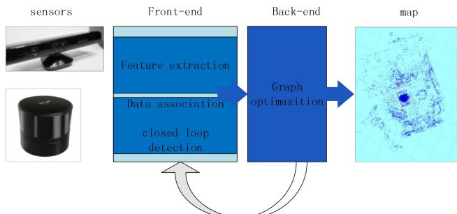
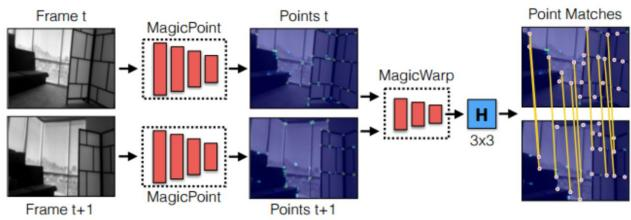
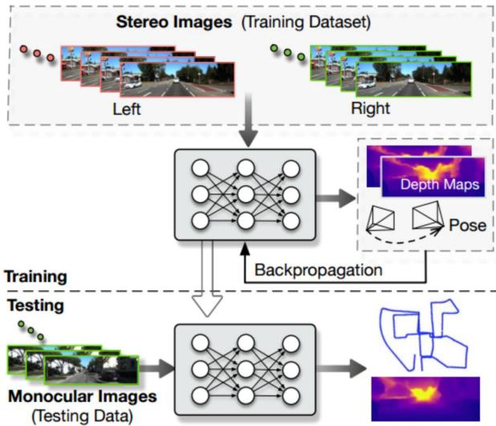
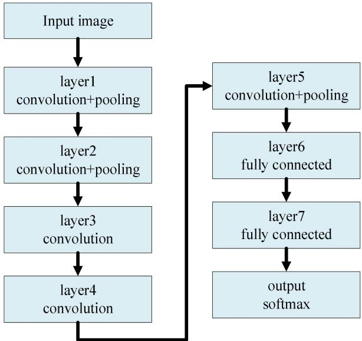
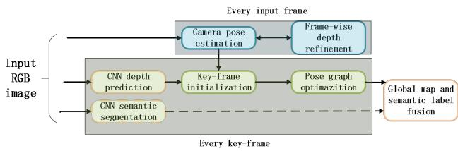

# A Survey of simultaneous localization and mapping for robot

Yujiao Jia1,2 ,Xinying Yan1,2 ,Yihan Xu1,2

1. Beijing Aerospace Automatic Control Institute of Beijing，China

2. National Key Laboratory of Science and Technology on Areospace Inteligence Control of Beijing，China jiayujiao90@163.com, lvxianweiwei@163.com, 1466282507@qq.com

Abstract—In unknown environment, it ’ s very important to obtain pose of the robot and environment map through sensors such as camera and lidar carried by the robot itself. In this paper, several common slam algorithms are introduced, moreover, the advantages and disadvantages of different algorithms are also compared. Traditional slam algorithms mainly include filter-based slam and graph-based slam. The filter-based slam algorithm is mature and easy to understand. It is mainly based on extended Kalman filter (EKF-SLAM) and particle filter (PF-SLAM). However, the linearization error exists in EKF model and the complexity increases sharply when the moving range is large. Although PF-SLAM does not have linearization problem, it cost much to obtain high precision and the algorithm has problem of particle consumption. Slam based on graph optimization can obtain globally consistent pose and map, but the algorithm is ineffective when the environment is in the absence of texture information . The combination oftraditional slam and deep learning can improve the robustness of slam algorithm, what ’ s more, the semantic map generated by deep learning has positive significance for intelligent navigation of robots. With the development of deep learning, sensors and computer technology, slam is bound to make further progress.

Keywords—SLAM， deep learning ， EKF， graph optimization

## I. INTRODUCTION

Precise positioning and maps are the basis for mobile robots to navigate. In urban roads, robots can obtain their own absolute position by GPS while navigating with known road maps. However, when the robot is in an unknown environment such as indoors, underground, or mountains, the robot cannot get the map of the current environment, and it is difficult to locate by GPS. SLAM (simultaneous localization and mapping) is the technology to solve this problem. The robot travels in an unknown environment through its own sensors such as odometer, laser radar, camera, RGB-D camera, etc. At the same time, they can acquire its own position and build the surrounding environment map [1,2,3].

This problem is a classical and challenging chicken-andegg problem because localizing the camera in the world requires the 3D model of the world, and building the 3D model in turn requires the pose of the camera. The coupling of location and mapping determines the complexity of SLAM. Current methods to solve SLAM problems mainly include filter-based SLAM, graph-based SLAM and SLAM based on deep Learning.

Filter-based method is based on the probability theory. According to the robot's control input and sensor observations, it it estimated to maximize probability of the robot pose and map[4,5].

SLAM based on graph optimization converts poses of robot,observations and control inputs into vertices and edges in graph theory, thus transforming SLAM problem into an optimization problem and solving it by least square method.

In recent years, the emergence of deep learning has promoted the development of SLAM. Deep learning is the mainstream recognition algorithm in the field of computer vision. It mainly relies on multi-layer neural network CNN to realize clustering, object recognition, feature extraction and other functions. At present, the fusion of SLAM and deep learning is mainly embodied in two aspects: one is to replace some steps in the process of classical SLAM, such as feature extraction, depth estimation, and the other is to combine SLAM with semantic map. Common methods for SLAM implementation [6,7] are described in detail below.

## II. FILTER-BASED SLAM

Filter-based SLAM is the earliest SLAM algorithm and one of the most mature SLAM algorithms. Based on Bayesian formula, the pose of the robot at the next moment is estimated priorily according to the control information of the robot, and then the pose of the robot is corrected according to the observation information. At present, filter-based SLAM algorithms mainly include extended Kalman filter EKF-SLAM and particle filter PF-SLAM.

## A. SLAM based on EKF

EKF-SLAM establishes prediction equation and observation equation for the robot based on Kalman filter. First, it estimates the position and attitude of the robot at the next moment using the prediction equation, and then corrects the estimated pose and the feature map by using the observation equation.

$$
x _ { c \_ t } = f ( x _ { c \_ t - 1 } , u _ { t - 1 } , W _ { t } )\tag{1}
$$

$$
z _ { i } = h ( x _ { c \_ t } , f _ { i } , V _ { t } ) \quad i = 1 , 2 . . . n\tag{2}
$$

Equation(1) is the prediction equation, (2) is the observation equation. $f _ { i }$ is the ith feature point in the current environment. $W _ { \iota }$ and $V _ { t }$ represents the noise.

$x _ { c \_ t }$ represents pose of the robot at the moment. $\boldsymbol { x } _ { c } = [ \boldsymbol { r } ^ { T } , \boldsymbol { q } ^ { T } , \boldsymbol { \nu } ^ { T } , \boldsymbol { \omega } ^ { T } ]$ , r is the three-dimensional position of the robot, q is the attitude quaternion, Q is the velocity and Z is the angular, therefore, x is a 13-dimensional vector.

For EKF-SLAM, the state vector includes the robot's pose and environmental feature points, i.e.

$$
\boldsymbol { x } = ( \boldsymbol { x } _ { c } ^ { T } ~ f _ { 1 } ^ { T } f _ { 2 } ^ { T } . . . f _ { n } ^ { T } ) ^ { T }\tag{3}
$$

The covariance matrix $\Sigma$ is:

$$
\left[ \begin{array} { c c c c } { \sum _ { x _ { c } x _ { c } } } & { \sum _ { x _ { c } f _ { 1 } } } & { \cdots } & { \sum _ { x _ { c } f _ { n } } } \\ { \sum _ { f _ { 1 } x _ { c } } } & { \sum _ { f _ { 1 } f _ { 1 } } } & { \cdots } & { \sum _ { f _ { 1 } f _ { n } } } \\ { \vdots } & { \vdots } & { \ddots } & { \vdots } \\ { \sum _ { f _ { n } x _ { c } } } & { \sum _ { f _ { n } f _ { 1 } } } & { \cdots } & { \sum _ { f _ { n } f _ { n } } } \end{array} \right]\tag{4}
$$

At this point, the SLAM problem is transformed into the process of estimating the state vector by extended Kalman filter. By the extended Kalman filter to predict and update the state vector, the pose of the robot and the feature map of the environment can be obtained at the same time.

EKF-SLAM is one of the most mature SLAM algorithms. It is easy to understand and mature based on its theory of probability and extended Kalman filtering. However, the use of extended Kalman filters to solve SLAM also has corresponding shortcomings, which are mainly caused by the defects of the mathematical model of the filter. First, since both equation (1) and equation (2) are nonlinear equations, the equations need to be linearized, and it is inevitable to introduce systematic errors after linearization. In addition, the extended Kalman filter must store the error covariance matrix of the state vector $\textstyle \sum$ . In the process of robot motion, the number of feature points in the feature map becomes larger and larger, and the memory occupied by $\textstyle \sum$ will increase dramatically, which will seriously consume the memory resources of the computer.

In order to solve the problem of increasing computational complexity of robots in large-scale exploration. Bo Zheng [8] and others improved the EKF-SLAM algorithm, which combines EKF-SLAM with local map. Firstly, according to the observed feature points, several local maps are generated. As the robot moves continuously, the number of feature points of the local map gradually increases. When the number of feature points is greater than a certain threshold, the local map is merged with the global map.Then the local map is initialized again. Compared with traditional EKF-SLAM, this method significantly reduces the computational complexity and improves the speed of the algorithm.

Dryanovski [9] and others use Kalman filter to update the position of feature points in the map, howerver，Kalman filter is not used to estimate the pose of the robot. In this paper, RGB-D camera is used to extract two-dimensional feature points of image， which are combined with depth information to obtain sparse 3D feature point cloud. Using ICP algorithm, the transformation relationship between the 3D feature point cloud of the current frame and the 3D feature map is obtained, and the current pose of the robot is therefore obtained. Since Kalman filter is used only for feature points, the pose and feature points in formula (4)are no longer coupled, and there is no correlation among multiple feature points. The covariance matrix $\Sigma$ becomes diagonal matrix, which greatly reduces the computational complexity. The single thread processing speed of this algorithm can reach 30Hz on CPU, which can meet the needs of real-time SLAM.

## B. SLAM based on particlefilter

PF-SLAM algorithm based on particle filter uses a group of weighted particles to represent the posterior probability distribution $p ( x _ { 1 : t } , m \mid z _ { 1 : t } , u _ { 1 : t - 1 } )$ of the estimated state. Each particle represents a possible pose trajectory of the robot and carries the corresponding environment map. When the number of particles is large enough, particle filter can represent any probability density function.

In order to reduce the complexity, Rao Blackwellized particle filter splits the estimation of pose and environment map:

$$
p ( x _ { 1 : t } , m \mid z _ { 1 : t } , u _ { 1 : t - 1 } ) = p ( m \mid z _ { 1 : t } , x _ { 1 : t } ) p ( x _ { 1 : t } \mid z _ { 1 : t } , u _ { 1 : t - 1 } )\tag{5}
$$

The above formulas allow the robot's poses to be estimated by using control and observation information, and then the environment map is estimated on the basis of the known robot's poses. PF-SLAM consists of four steps: sampling, weight calculation, resampling and map estimation. The first three steps are to estimate poses of the robot using particle filter.

The advantage of PF-SLAM is that it can approximate any probability distribution without linearization assumption and Gauss noise, so it can be widely used. However, the most significant drawback is that when the number of particles is large, the computational complexity of PF-SLAM will increase correspondingly, and when the number of particles is small, the accuracy of the algorithm will decrease. In addition, the problem of particle depletion will arise in resampling.

G. Grisettiyz [10] et al. improved the Rao Blackwellized particle filter. Since each particle of RBPF-SLAM carries a separate environmental map, a key issue is how to reduce the number of particles. An adaptive technique is proposed to reduce the number of particles. Firstly, a method for calculating the exact proposed distribution is proposed, which not only considers the motion of the robot, but also considers the recent observations. The method above greatly reduces the uncertainty of the robot pose in the prediction step of the filter. In addition,a selective re-sampling method is proposed, which greatly reduces the problem of particle depletion.

Hone He [11] et al. proposed a SLAM algorithm for mobile robot based on EKF and particle filter. In this method, particle filter algorithm is used to calculate the poses of mobile robot, and EKF algorithm is used to estimate the environmental map. This method reduces the computational complexity and has good robustness. The expected results can be obtained in SLAM of mobile robot. The error range is reduced from 0.5 m to 0.2 m, and the positioning effect is improved obviously. The experimental results show that the SLAM algorithm of mobile robot based on EKF and particle filter is more accurate than the extended Kalman filter.

The SLAM algorithm based on filtering is mature and easy to understand. However, both Kalman filter and particle filter can only estimate the pose of the robot at the current time, and it is difficult to obtain the global consistent pose and map. The SLAM based on graph optimization can optimize the historical pose of the robot globally, and then obtain the globally consistent pose and map.

## III. GRAPH-BASED SLAM

Graph-based SLAM is the most common SLAM algorithm at present. It mainly includes three steps: front-end inter-frame estimation, Closed-loop Detection and back-end graph optimization (Figure 1).

  
Fig.1 Overview of graph-based SLAM

Firstly, the feature points of the image are extracted by the feature point extraction algorithm, and the descriptors of the corresponding feature points are obtained. The commonly used feature extraction algorithms are SIFT, ORB, SURF and so on. The feature points are invariant to the view angle and the position of the robot. Then, by matching the feature point pairs between two frames, the transformation of the robot's posture between two frames is estimated, and the robot's poses $x _ { 1 \ldots t }$ at different times are obtained. This process is also called visual odometer.

Over time, the cumulative error of the visual odometer gradually increases, and when the robot returns to the position it has passed, closed loop detection is achieved.

Back-end graph optimization optimizes poses of the robot to obtains the global consistent poses according to the results of visual odometer and closed-loop detection. After obtaining the globally consistent robot poses, the globally consistent map can be obtained by transforming the observed values of each frame into the global coordinate system. In general, the performance of SLAM is improved in feature point extraction algorithm, inter-frame matching algorithm, closed-loop detection, graph optimization algorithm and so on.

Henry [12] et al. used RANSAC (Random Sampling Consistency) method to obtain the transformation matrix between two frames of RBG-D data. Then the transformation is used as the initial value of ICP algorithm to obtain the optimal transformation between two frames of depth image (dense point cloud). Finally, the sparse binding adjustment algorithm of the back end is used to optimize the pose of the robot, and the global consistent map is obtained.

Endres [13] compares the impact of SIFT, SURF, ORB and other feature extraction algorithms on SLAM in terms of accuracy and real-time performance. The error of pose estimation can be effectively reduced by matching the current frame with the historical multi-frame data, but the corresponding calculation time will increase, which makes it difficult to apply to real-time SLAM. G2o graph optimizer is the most commonly used back-end graph optimizer at present. After obtaining the robot's pose map at the front end, the g2o graph optimizer is used to optimize the pose and get the globally consistent map.

Dryanovski [9] and others use Shi-Tomasi algorithm to extract feature points of images, which takes into account both speed and robustness. When extracting feature points, no descriptor is generated. When matching feature points, ICP algorithm is directly selected to match the transformation matrix between the current feature point cloud and the environment feature point cloud. Therefore, the algorithm is faster and more suitable for real-time SLAM.

SLAM based on graph optimization is mature at present, but the algorithm still has obvious shortcomings. Firstly, when the texture is single or missing in the surrounding environment, the number of feature points is small, so the accuracy of interframe estimation is low. In addition, due to the manual selection of feature points extraction algorithm, there is still a great controversy on what is the best feature extraction algorithm. In addition, because the generated map does not contain semantic information, the performance of robot navigation is limited. The current combination of deep learning and SLAM solves the above problems to a certain extent [14,15].

## IV. SLAM BASED ON DEEP LEARNING

In recent years, deep learning has been used to extract image features, inter-frame estimation and closed-loop detection. In addition, the acquisition of image semantic information by CNN has been greatly developed. Combining SLAM with semantic information, the global consistent semantic map of the environment is significant for the intelligent navigation of robots. Robots can not only know the location of objects in the environment, but also know each object separately. It's possible to command a robot to grab an object somewhere.

Therefore, the combination of SLAM and deep learning is mainly embodied in two aspects. One is to replace one or more modules of SLAM through deep learning, such as depth information estimation, inter-frame estimation, feature extraction, and so on. The other is mainly the combination of SLAM and semantic map.

## A. Replace one or more modules of classical SLAM

DeTone D [16] and others show a point tracking system using two deep convolution neural networks. As shown in Figure 2, the first network MagicPoint extracts 2D feature points from a single image. These extracted points are used as SLAM. Then the output of MagicPoint is matched with the second network named MagicWarp. The difference between this method and the traditional method is that it only uses the location of points, but does not use the descriptor of local points. Both networks are trained with simple synthetic data, which can reach a speed of 30 frames per second on a singlecore CPU.

  
Fig.2 Deep Point-based Tracking Overview

Li R [17] proposed a new monocular vision odometer system called UnDeepVO (shown in Figure 3), which is used to estimate the pose of the monocular camera and the depth of the monocular image. UnDeepVO has two distinct characteristics: one is unsupervised deep learning method, the other is absolute scale recovery. UnDeepVO is trained to restore scale using binocular images, and then tested using continuous monocular images. Therefore, UnDeepVO is a monocular system. The loss function of training network is defined based on the dense information of time and space. Fig. 3 is an overview of the system. Experiments based on KITTI dataset show that UnDeepVO is more accurate than other mono-visual VO methods in pose estimation.

  
Fig.3 System overview of the proposed UnDeepVO

In recent years, many studies have used the convolutional neural network CNN to generate global descriptors of images and use them for closed-loop detection. Sunderhauf [18] conducted experiments on the AlexNet [19] network (shown in Figure 4) to evaluate the robustness of CNN layers in response to changes in appearance, viewing angles, and so on. Experiments show that the third convolutional layer is more robust to appearance changes, while layer 6 is more robust to viewing angle changes. Since the traditional CNN is mainly used for image classification, the effect of closed-loop detection is not particularly good, and the local feature aggregation statement VLAD has better effect in scene recognition. Arandjelovic [20] used VLAD to design a new pooling layer for CNN. NetVLAD makes it more suitable for closed loop detection. Experiments show that the NetVLADbased retraining algorithm can significantly improve the image matching accuracy.

  
Fig.4 Overview of AlexNet

## B. Combining SLAM with Semantic Map

Based on the monocular camera, Tateno K [21] used CNN convolutional neural network to estimate the depth information of RGB images and semantically segmented RGB images. Combined with traditional SLAM, the global semantic map was obtained. The system structure is shown in Figure 5. Although RGB-D cameras and stereo cameras can obtain the depth of images, they usually only get accurate results within the accuracy range of their own sensors, so it is difficult to seamlessly switch between indoor and outdoor environments. The paper uses monocular cameras for SLAM in large scale, and uses depth estimation to make up for the lack of absolute scale of the monocular camera. The evaluation results based on LSD-SLAM NYUDv2 data set and ICL-NUIM data set show that the method has good accuracy and robustness.

  
Fig.5 . CNN-SLAM Overview

Lingni Ma [22] and others carry out SLAM based on RGB-D image sequence and construct semantic maps. In this paper, DVO SLAM is used to obtain the pose of the robot, and the single-frame RGB-D image is semantically segmented by FuseNet. In addition, after getting the pose of the robot, the RGB-D image sequences are mapped to the global coordinate system, then the overlapping parts of the multi-frame images are associated, so that the multi-frame images can be segmented semantically and a consistent semantic map can be obtained. The experimental results show that the semantics segmentation results of multi-frame images in multi-view are more accurate than those of single-frame images. Therefore, the combination of SLAM and the semantic map obtained by deep learning is beneficial to the navigation of robots, moreover, SLAM also makes the results of semantic segmentation more accurate, which are mutually complementary.

Traditional front-end visual odometer and closed-loop detection have limitations due to the manual design features， and the combination of deep learning and SLAM can avoid the above problems. Meanwhile, the generated semantic map has a positive effect on the intelligent navigation of robots. In addition, the development of SLAM technology has a positive impact on deep learning. For example, the global consistent map and inter-frame relationship obtained by SLAM can provide the data set of image-to-image Association for deep learning.

However, the use of deep learning techniques to learn features currently lacks clear theoretical guidance, and the generated features do not have intuitive meaning. Many training parameters rely on expert experience, and the training effects may also depend on the training data set.

## V. CONCLUSIONS

simultaneous localization and mapping play an important role in the autonomous navigation of robots. From tracking front-end to optimization back-end, from filtering-based method to optimization-based method, from manual selection of feature points to features generated by deep learning, from simple sparse feature point map to dense point cloud map with semantic information, SLAM algorithm has made great progress over the years. With the advancement of sensors, computer technology and deep learning algorithm, SLAM will surely get more rapid development.

## REFERENCES

[1] Munoz-Salinas R, Marin-Jimenez M J, Medina-Carnicer R. SPM-SLAM: Simultaneous localization and mapping with squared planar markers[J]. Pattern Recognition, 2019, 86: 156-171.

[2] Dissanayake M W M G, Newman P, Clark S, et al. A solution to the simultaneous localization and map building (SLAM) problem[J]. IEEE Transactions on robotics and automation, 2001, 17(3): 229-241.

[3] Choset H, Nagatani K. Topological simultaneous localization and mapping (SLAM): toward exact localization without explicit localization[J]. IEEE Transactions on robotics and automation, 2001, 17(2): 125-137.

[4] Welch G, Bishop G. An introduction to the Kalman filter[J]. 1995.

[5] JU C, HE B, LIU B, et al. Simulation Research on Simultaneous Robot Localization and Mapping Based on Particle Filter [J][J]. Journal of System Simulation, 2007, 16.

[6] DeTone D, Malisiewicz T, Rabinovich A. Toward geometric deep SLAM[J]. arXiv preprint arXiv:1707.07410, 2017.

[7] Zhou T, Brown M, Snavely N, et al. Unsupervised learning of depth and ego-motion from video[C]//Proceedings of the IEEE Conference on Computer Vision and Pattern Recognition. 2017: 1851-1858.

[8] Zheng B, Zhang Z. An Improved EKF-SLAM for Mars Surface Exploration[J]. International Journal of Aerospace Engineering, 2019, 2019.

[9] Dryanovski I, Valenti R G, Xiao J Z. Fast visual odometry and mapping from RGB-D data[C]//IEEE International Conference on Robotics and Automation. Piscataway, USA: IEEE, 2013: 2305-2310

[10] Grisetti G, Stachniss C, Burgard W. Improving Grid-based SLAM with Rao-Blackwellized Particle Filters by Adaptive Proposals and Selective Resampling[C]// IEEE International Conference on Robotics & Automation. 2005.

[11] He H, Wang K, Sun L. A SLAM algorithm of fused EKF and Particle filter[C]//2018 WRC Symposium on Advanced Robotics and Automation (WRC SARA). IEEE, 2018: 172-177.

[12] Henry P, Krainin M, Herbst E, et al. RGB-D mapping: Using depth cameras for dense 3D modeling of indoor envi- ronments[C]//12th International Symposium on Experimental Robotics. Berlin, Germany: Springer, 2014: 477-491.

[13] Endres F, Hess J, Engelhard N, et al. An evaluation of the RGB-D SLAM system[C]//IEEE International Conference on Robotics and Automation. Piscataway, USA: IEEE, 2012: 1691-1696.

[14] Li Z, Chen Y, Gong L, et al. An 879GOPS 243mW 80fps VGA Fully Visual CNN-SLAM Processor for Wide-Range Autonomous Exploration[C]//2019 IEEE International Solid-State Circuits Conference-(ISSCC). IEEE, 2019: 134-136.

[15] Xiao L, Wang J, Qiu X, et al. Dynamic-SLAM: Semantic monocular visual localization and mapping based on deep learning in dynamic environment[J]. Robotics and Autonomous Systems, 2019, 117: 1-16.

[16] DeTone D, Malisiewicz T, Rabinovich A. Toward Geometric Deep SLAM[J]. arXiv preprint arXiv:1707.07410, 2017.

[17] Li R, Wang S, Long Z, et al. Undeepvo: Monocular visual odometry through unsupervised deep learning[C]//2018 IEEE International Conference on Robotics and Automation (ICRA). IEEE, 2018: 7286- 7291.

[18] Sunderhauf N, Shirazi S, Dayoub F, et al. On the performance of ConvNet features for place recognition[C]//IEEE/RSJ Inter- national Conference on Intelligent Robots and Systems. Piscat- away, USA: IEEE, 2015: 4297-4304.

[19] KrizhevskyA,SutskeverI,HintonGE.ImageNetclassification with deep convolutional neural networks[J]. Communications of the ACM, 2012, 60(6): 84-90.

[20] ArandjelovicR,GronatP,ToriiA,etal.NetVLAD:CNNarchi- tecture for weakly supervised place recognition[C]//IEEE Con- ference on Computer Vision and Pattern Recognition. Piscat- away, USA: IEEE, 2016: 5297-5307.

[21] Tateno K, Tombari F, Laina I, et al. CNN-SLAM: Real-time dense monocular SLAM with learned depth prediction[J]. arXiv preprint arXiv:1704.03489, 2017.

[22] Ma L, Stückler J, Kerl C, et al. Multi-View Deep Learning for Consistent Semantic Mapping with RGB-D Cameras[J]. 2017.