# A LiDAR SLAM With PCA-Based Feature Extraction and Two-Stage Matching

Shiyi Guo , Zheng Rong , Shuo Wang , and Yihong Wu

Abstract— Simultaneous localization and mapping (SLAM) has been studied for decades in the field of robotics, in which light detection and ranging (LiDAR) is widely used in various application areas benefiting from its accessibility of direct, accurate, and reliable 3-D measurements. However, the performance of LiDAR SLAM may be degraded when running in degenerate scenario, which makes it still a challenging problem to realize real-time, robust, and accurate state estimation in complex environments. In this article, we propose a keyframe-based 3-D LiDAR SLAM using an accurate principal component analysis (PCA)-based feature extraction method and an efficient two-stage matching strategy, toward a more robust, accurate, and globally consistent estimation performance. The effectiveness and performance are demonstrated and evaluated by comparing our method with the state-of-the-art open-source methods, LOAM and LeGo-LOAM, on KITTI datasets and custom datasets collected by our sensor system. The experimental results show obvious improvement of odometry accuracy and mapping consistency without loss of realtime performance.

Index Terms— Feature extraction, feature matching, light detection and ranging (LiDAR) simultaneous localization and mapping (SLAM), loop closing, trajectory measurement.

## I. INTRODUCTION

ELIABLE and accurate localization and mapping are unmanned vehicle to accomplish perception and further tasks [1], [2]. Using vision-based and light detection and ranging (LiDAR)-based sensors, great efforts have been devoted to achieve high-performance and real-time simultaneous localization and mapping (SLAM) systems that can support 6-DOF state estimation for robots and measurement devices [1]–[3].

Vision-based methods take advantage of the large field of view (FOV) and rich texture information measured by the camera but are limited by the lack of direct depth and their sensitivity to the illumination variation [4]. Compared with camera, LiDAR is more reliable for SLAM due to direct, accurate, and dependable depth measurement, which enables robust state estimation even in challenging environments.

In recent decades, many LiDAR-based localization and mapping methods have been proposed, including 2-D LiDAR-based methods such as Gmapping [5] and Hector SLAM [6], and 3-D LiDAR-based methods such as LOAM [7], LeGo-LOAM [8], and IMLS-SLAM [4]. Among them, LOAM-based [7] methods have achieved the state-of-theart performance and ranked top since their release on the KITTI odometry benchmark site [9]. Based on LOAM [7], LeGo-LOAM [8] uses explicit ground plane detection and loop detection to achieve better global mapping consistency and real-time performance. IMLS-SLAM [4] uses a scan-tomodel framework to achieve a very low-drift SLAM.

However, the existing pure-LiDAR SLAM systems have some challenges. Some real-time LiDAR SLAM systems with high speed show drift or even total failure in complex environments. Feature properties are very important for feature-based systems, such as viewpoint and distance-invariant to curvature evaluation, but there has not been a good feature that owns such properties, which leads to large drift of feature-based LiDAR SLAM in some cases. Accuracy, robustness, and efficiency of state estimation are not well balanced.

In this article, we propose a novel 3-D LiDAR odometry and mapping method. First, a principal component analysis (PCA)-based [10] curvature evaluation method is proposed to extract the edge and planar features, which is viewpoint and distance-invariant to curvature evaluation and helps to improve the matching accuracy and robustness. In addition, a two-stage matching strategy, including frame-to-sparse local map matching and keyframe-to-local map matching, is used in mapping to improve the localization accuracy and mapping consistency, which also retains computation efficiency. To further improve the global mapping consistency, an explicit normal distribution transform (NDT)-based [11] loop closing and a graph-based pose optimizer are utilized to reduce the cumulative error in large-scale scenarios. The proposed framework is extensively tested using KITTI and custom datasets, including various indoor and outdoor scenarios. The quantitative and qualitative experimental results show that the odometry accuracy and mapping consistency are obviously improved, and simultaneously, the real-time performance is not lost. In addition, the experimental results also prove the small uncertainty and the good repeatability of our system.

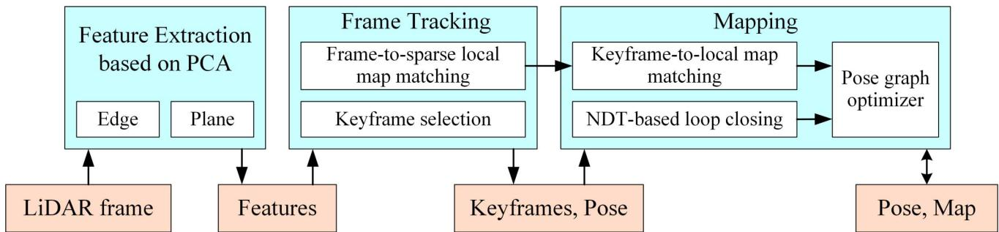  
Fig. 1. System diagram of our method, showing all the essential steps of each module: feature extraction, frame tracking, mapping, and optimizing.

The rest of this article is organized as follows. We review the related work in Section II and describe the details of our methods in Section III. Section IV presents the experimental results and analysis, followed by a conclusion in Section V.

## II. RELATED WORK

By the strategy used in scan matching, LiDAR-based SLAM can be categorized into two types: iterative closest point (ICP)-based [12] methods and feature-based methods.

ICP-based LiDAR SLAM uses ICP-like methods, such as ICP variants [13], [14] or NDT [11], to find frame-to-frame or frame-to-map correspondences and transformations. The representative works are Hector SLAM [6], Google Cartographer [15], IMLS-SLAM [4], and SuMa [16].

Hector SLAM proposed by Kohlbrecher et al. [6] estimates the pose of current frame by solving a least-squares problem constructed using the previous frame pose and the current scan. It is a 2-D LiDAR-based method and uses an occupancy grid map in its mapping module. This method is efficient, but its performance is heavily dependent on the provided initial value. Cartographer is a popular open-source LiDAR SLAM proposed by Hess et al. [15]. Through the introduction of submap and loop detection based on hector SLAM, Cartographer achieves the state-of-the-art performance on both 2-D and 3-D LiDARs. IMLS-SLAM uses a scan-to-model framework [4] to realize a low-drift 3-D LiDAR SLAM and ranks top 20 on the KITTI odometry benchmark. SuMa uses ICP-based matching associated with semantic information that is efficiently extracted by a fully convolutional neural network to remove dynamic objects and improve the accuracy of mapping [16]. All the ICP-based LiDAR SLAMs try to use all the points in the scan to find correspondence at the pointwise level, which inevitably leads to decreased computing efficiency and limits its application, especially on the resource-constrained platforms. IMLS-SLAM cannot achieve the real-time performance on modern laptops.

On the contrary, feature-based LiDAR SLAM uses extracted feature points instead of all the points from the original laser scan to realize point cloud registration and further state estimation. Many types of point features and feature descriptors have been designed for point cloud registration, such as Harris3D [17], ISS [18], NARF [19], and D3Feat [20]. However, the LiDAR point cloud in one frame is very sparse, while these features or descriptors have poor invariance on sparse point cloud. Meanwhile, LiDAR SLAM requires real-time performance, while these features or descriptors have slow matching speed. These lead to these features that are not suitable for LiDAR SLAM. LOAM [7], which ranks the top three on the KITTI odometry benchmark site [9] for several years, leverages an effective feature extraction and matching method to realize state-of-the-art performance through point-line and point-plane matching. Edge and planar features are extracted by rough curvature calculation and used for matching. Then, a fast frame-to-frame matching-based odometry and a frame-to-local map matching-based mapping are combined to achieve the final low-drift state estimation result. Recently, some improved versions based on LOAM are proposed, such as LeGo-LOAM [8], Loam livox [21], and I-LOAM [22]. The most famous one LeGo-LOAM [8] extends LOAM by adding ground detection, loop detection, and two-step optimizations to further decrease drift in large scene and improve computing efficiency. LOAM-livox [21] leverages points selection, dynamic objects filtering, and motion compensation to yield a more robust and low-drift estimation. I-LOAM [22] takes advantage of intensity information of LiDAR echo toward more robust feature correspondence searching. Besides, Huo et al. [23] proposed an improved LOAM with an edge and planar feature extraction method using the segmentation and clustering algorithm to achieve better accuracy.

Our system is a feature-based LiDAR SLAM. Compared with the previous feature-based LiDAR SLAM system, we propose a PCA-based method to achieve more accurate and robust feature extraction, which is invariant to view angle and distance changes. In addition, we utilize a keyframe and sparse local map-based two-stage matching strategy to ensure both accuracy and efficiency in complex environments. The NDT-based [11] loop closing and graph-based pose optimizer are used to further improve the consistency of state estimation in large scenes.

## III. METHODOLOGY

## A. System Overview

As shown in Fig. 1, the proposed system includes three modules: feature extraction, frame tracking, and mapping. In particular, a loop-closing submodule and a graph-based pose optimizer are included in the mapping module. Given an inputting laser frame, we extract the planar and edge features (Section III-B), track the LiDAR frame using frameto-sparse local map matching (Section III-C), and determine whether the current frame should be selected as a keyframe (Section III-D). In the mapping module, a keyframe-to-local map matching is performed to yield a more accurate pose estimation and a global map (Section III-E). Loop-closing submodule constructs loop constraints, which are added to the pose-graph optimizer to further refine the estimation consistency (Section III-F).

## B. Feature Extraction

Given a LiDAR frame after removing unstable points, i.e., a point cloud P. For each point $\mathbf p _ { i } = [ x _ { i } , y _ { i } , z _ { i } ] ^ { T }$ in the point cloud P, we find its m left neighbors $[ { \bf p } _ { i - m } , \ldots , { \bf p } _ { i - 1 } ]$ and m right neighbors $[ \mathbf { p } _ { i + 1 } , \ldots , \mathbf { p } _ { i + m } ]$ on the same laser channel. Using this point set with a size of $2 m + 1$ , we calculate its centroid c¯ as

$$
\bar { \mathbf { c } } = \frac { \sum _ { j = i - m } ^ { i + m } \mathbf { p } _ { j } } { 2 m + 1 }\tag{1}
$$

and construct its covariance matrix M

$$
\mathbf { M } = { \frac { 1 } { 2 m } } \mathbf { A } ^ { \mathbf { T } } \mathbf { A }\tag{2}
$$

in which A can be calculated by

$$
\mathbf { A } = [ \mathbf { p } _ { i - m } - \bar { \mathbf { c } } , \mathbf { p } _ { i - m + 1 } - \bar { \mathbf { c } } , \ldots , \mathbf { p } _ { i + m } - \bar { \mathbf { c } } ] ^ { T } .\tag{3}
$$

Since pi is a 3-D vector, we can get that A is a (2m $1 ) \times 3$ matrix and M is a $3 \times 3$ matrix. By eigenvalue decomposition (EVD) of M, we can get all its three eigenvalues in descending order, $\lambda _ { 1 } , \lambda _ { 2 } .$ , and $\lambda _ { 3 } .$ which present the spatial distribution characteristics of the current point set. Since the points in this point set all located on the same laser channel, which means that they are all located on the same plane, the smallest eigenvalue $\lambda _ { 3 }$ must be very close to 0 and has little effect on identifying the characteristic attributes of $p _ { i }$ By contrast, two biggest eigenvalues $\lambda _ { 1 }$ and $\lambda _ { 2 }$ have a great influence on judging the characteristic attributes of $\mathbf { p } _ { i } .$ , and the ratio of $\lambda _ { 1 }$ and $\lambda _ { 2 }$ is used to evaluate the curvature of pi

$$
\mathrm { r a t i o } = { \frac { \lambda _ { 1 } } { \lambda _ { 2 } } } .\tag{4}
$$

The value in (4) is used to approximately estimate the curvature. The larger value means smaller curvature and the smaller value means larger curvature. The specific diagram of principal direction obtained by PCA is shown in Fig. 2, in which $\lambda _ { 1 }$ corresponds to PCA first direction (red arrow) and $\lambda _ { 2 }$ corresponds to PCA second direction (purple arrow). From Fig. 2, we can intuitively see that the length of PCA second direction $[ \lambda _ { 2 }$ in (4)] of the edge point is close to that of PCA first direction $[ \lambda _ { 1 }$ in (4)], and the length of PCA second direction [λ2 in (4)] of planar point is much smaller than that of PCA first direction $[ \lambda _ { 1 }$ in (4)]. Namely, edge points correspond to small ratio in (4) and planar points correspond to very large ratio. If the ratio in (4) is large enough, the point can be determined as a planar point. On the contrary, the point will be identified as an edge point if the ratio is very small. Therefore, theoretically, a specified threshold between 1 and positive infinity ( ) of ratio in (4) can be set to distinguish edge points and planar points.

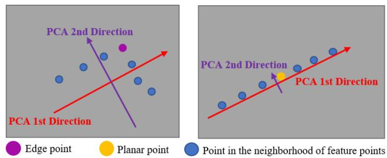  
Fig. 2. Diagram of principal direction obtained by PCA for two point sets, which are established by an edge point and its neighbors (left) and a planar point and its neighbors (right) on the same laser channel.

TABLE I  
PERCENTAGES OF EDGE POINTS/PLANAR POINTS THAT ARE CORRECTLY CLASSIFIED UNDER DIFFERENT THRESHOLDS IN POINTS SELECTED FROM AN OFFICE (THE SECOND COLUMN) AND A CORRIDOR (THE THIRD COLUMN) (%/%)
<table><tr><td rowspan=1 colspan=1>Threshold</td><td rowspan=1 colspan=1>Office</td><td rowspan=1 colspan=1>Corridor</td></tr><tr><td rowspan=1 colspan=1>6</td><td rowspan=1 colspan=1>58.2 / 99.7</td><td rowspan=1 colspan=1>60.7 / 99.2</td></tr><tr><td rowspan=1 colspan=1>10</td><td rowspan=1 colspan=1>76.5 / 98.8</td><td rowspan=1 colspan=1>77.8 / 98.1</td></tr><tr><td rowspan=1 colspan=1>20</td><td rowspan=1 colspan=1>98.4 / 97.6</td><td rowspan=1 colspan=1>97.9 / 96.5</td></tr><tr><td rowspan=1 colspan=1>50</td><td rowspan=1 colspan=1>99.3 / 96.4</td><td rowspan=1 colspan=1>99.2 / 94.6</td></tr><tr><td rowspan=1 colspan=1>100</td><td rowspan=1 colspan=1>99.9 / 94.2</td><td rowspan=1 colspan=1>99.7 / 90.5</td></tr><tr><td rowspan=1 colspan=1>300</td><td rowspan=1 colspan=1>100.0 / 89.1</td><td rowspan=1 colspan=1>99.9 / 81.0</td></tr><tr><td rowspan=1 colspan=1>570</td><td rowspan=1 colspan=1>100.0 / 53.5</td><td rowspan=1 colspan=1>100.0 / 50.3</td></tr></table>

If the threshold is too small, the edge points intersected by planes with small angle may be wrongly detected as planar points. If the threshold is too large, the measurement error of LiDAR may cause some planar points to be missed or wrongly detected. In implementation, the threshold of ratio is fixed to 20 in our system and 20 is an empirical value. It can ensure the accurate distinction between edge points and planar points and overcome the influence of measurement noise of LiDAR for most points in practice. To further prove the rationality of this threshold value, we choose two typical indoor scenes, office and corridor, for convenience. We manually select 4000 edge points and 7000 planar points from the point clouds collected in an office and 1000 edge points and 3000 planar points from the point clouds collected in a corridor. We calculate the ratio in (4) of these points. Then, we get that the median ratio of edge and planar points is 5.19 and 578, respectively. We choose different thresholds between 5.19 and 578 and calculate the percentages of edge points less than and planar points greater than these different thresholds in points selected from the office and corridor. The results are shown in Table I, from which we can see that the threshold value 20 achieves the best feature discrimination performance.

The edge point with local minimum of ratio in (4) is selected as the main feature point. We further remove the unstable edge points by eliminating other edge points close to the main feature point. Thus, all planar features and strong edge features are accurately determined.

To evaluate the effectiveness, we compare the features extracted by our method with that by LOAM, as shown in Fig. 3. The point cloud is collected in an office using a laser scanner. The edge features extracted by our method are more complete, while LOAM loses some obvious edge features as indicated by the red arrows. The planar features extracted by our method are complete and uniformly distributed, which will be of great help for scan matching. Quantitative experiments and comparison are presented in Section IV-B.

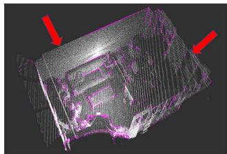  
(a)

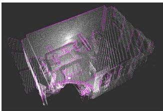

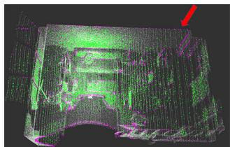  
(c)

(b)  
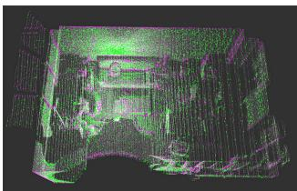  
(d)  
Fig. 3. Edge features (purple) and planar features (green) extracted by LOAM and our method from a point cloud (white) collected in an office. The red arrows indicate the obvious incompleteness of LOAM’s feature extraction. (a) Edge points by LOAM. (b) Edge points by ours. (c) Planar points by LOAM. (d) Planar points by ours.

## C. Initial Pose Estimation and Frame Tracking

Motivated by ORB-SLAM2 [24] and considering the difference between LiDAR and camera, we have designed a new tracking algorithm. We denote the extracted planar and edge features from the ith LiDAR frame as $\mathbf { F } _ { i } ^ { p }$ and Fe respectively, which constitute the feature set of the LiDAR frame $\mathbf { F } _ { i } \mathbf { \Psi } =$ $[ \mathbf { F } _ { i } ^ { e } , \mathbf { F } _ { i } ^ { p } ]$ . In order to improve the frame tracking efficiency, we build a sparse local map using the features extracted from the keyframes that are close to the current frame $\mathbf { F } _ { i } .$ These keyframes are denoted as a frame set KS . We assume that the closest keyframe is $\mathbf { F } _ { j }$ . For each keyframe in KS , we transform the planar and edge features to the coordinate frame of $\mathbf { F } _ { j }$ and downsample them to a sparse local map $\mathbf { S } \mathbf { M } _ { j } = [ \mathbf { S } \mathbf { \bar { M } } _ { j } ^ { e } , \mathbf { S } \mathbf { M } _ { j } ^ { p } ]$ corresponding to $\mathbf { F } _ { i } .$ , where SM and $\mathbf { S } \mathbf { M } _ { i } ^ { p }$ are, respectively, the edge and planar features in the built sparse local map. With the current frame $\mathbf { F } _ { i }$ and its surrounding sparse local map $\mathbf { S } \mathbf { M } _ { j }$ , frame-to-sparse local map matching is performed to estimate the current pose.

1) Initial Pose Estimation: We denote the transformation matrix between $\mathbf { F } _ { i }$ and $\mathbf { F } _ { j }$ as $\mathbf { T } _ { i } ^ { j }$ . If the previous frame tracking is successful, we use the constant velocity motion model to get the initial guess of the current pose and transform the current frame features to the previous frame. If enough feature correspondence is found, this initial pose $\bar { \mathbf { T } } _ { i } ^ { j }$ will be used in the following tracking computation. If not, i.e., the constant velocity motion model does not apply to the current motion, we use a plane-to-plane matching method [7] to get the reasonable initial pose estimation $\bar { \mathbf { T } } _ { i } ^ { j }$

2) Frame-to-Sparse Local Map Tracking: Unlike LOAM [7], for each edge feature $\mathbf { p } _ { i , k } ^ { e }$ in $\mathbf { F } _ { i } ^ { e } ,$ we try to find its two nearest neighbors in the KDtree [25] built from SMe by a nearest neighbor searching algorithm instead of finding the nearest two points on the different lines, denoted as ${ \bf p } _ { \mathrm { S M } , a } ^ { e } ,$ $\mathbf { p } _ { \mathrm { S M } , b } ^ { e } .$ This can reduce the time complexity of finding the corresponding feature points by more than 10 ms for each frame without loss of accuracy. The distance between $\mathbf { p } _ { i , k } ^ { e }$ and its corresponding edge can be calculated using the following equation:

$$
D _ { k } ^ { e } = \frac { \left| \left( \mathbf { T } _ { i } ^ { j } \mathbf { p } _ { i , k } ^ { e } - \mathbf { p } _ { \mathrm { S M } , a } ^ { e } \right) \times \left( \mathbf { T } _ { i } ^ { j } \mathbf { p } _ { i , k } ^ { e } - \mathbf { p } _ { \mathrm { S M } , b } ^ { e } \right) \right| } { \left| \mathbf { p } _ { \mathrm { S M } , a } ^ { e } - \mathbf { p } _ { \mathrm { S M } , b } ^ { e } \right| } .\tag{5}
$$

Similarly, three nearest neighbors can be searched for each planar feature $\mathbf { p } _ { i , k } ^ { p }$ , denoted as $\mathbf { p } _ { \mathrm { S M } , a } ^ { p } , \ \mathbf { p } _ { \mathrm { S M } , b } ^ { p } ,$ and $\mathbf { p } _ { \mathrm { S M } , c } ^ { p }$ . The distance between $\mathbf { p } _ { i , k } ^ { p }$ and its corresponding plane can be calculated using the following equation

$$
D _ { k } ^ { p } = { \frac { \left| \left( \mathbf { T } _ { i } ^ { j } \mathbf { p } _ { i , k } ^ { p } - \mathbf { p } _ { \mathrm { S M } , a } ^ { p } \right) \cdot \mathbf { s } \right| } { \left| \mathbf { s } \right| } }\tag{6}
$$

in which s can be calculated by

$$
\begin{array} { r } { \begin{array} { r } { \mathbf { s } = \big ( \mathbf { p } _ { \mathrm { S M } , a } ^ { p } - \mathbf { p } _ { \mathrm { S M } , b } ^ { p } \big ) \times \big ( \mathbf { p } _ { \mathrm { S M } , a } ^ { p } - \mathbf { p } _ { \mathrm { S M } , c } ^ { p } \big ) . } \end{array} } \end{array}\tag{7}
$$

Then, the pose of the current frame $\mathbf { T } _ { i } ^ { j }$ can be obtained by solving the following optimization problem

$$
\mathbf { T } _ { i } ^ { j } = \underset { \mathbf { T } _ { i } ^ { j } } { \arg \operatorname* { m i n } } ~ \left( \sum _ { \mathbf { p } _ { i , k } ^ { e } \in \mathbf { F } _ { i } ^ { e } } D _ { k } ^ { e } + \sum _ { \mathbf { p } _ { i , k } ^ { p } \in \mathbf { F } _ { i } ^ { p } } D _ { k } ^ { p } \right) .\tag{8}
$$

## D. Keyframe Maintenance

We use keyframe in both frame-tracking and mapping modules to get locally accurate and globally consistent estimation results without losing efficiency. The LiDAR frame is determined as a keyframe if all the following conditions are met.

1) The number of extracted feature points, including edge and planar features, needs to be greater than a certain threshold. The threshold is set to 160, which can ensure that there are enough feature points for matching in practice.

2) More than 25% of feature points lose corresponding edge or plane in the frame-to-sparse local map tracking, which means that these features cannot find the corresponding features in the previously established sparse local map or the rotation angle from the tracking result is more than 5 degrees. Setting these thresholds can ensure high computational efficiency and accuracy of localization.

The above two conditions can greatly improve the efficiency of our whole system without loss of accuracy. The reasons are given as follows. These conditions ensure that the current frame can provide enough feature information to the sparse local map for further tracking, and the local map can provide reasonable coverage of the environment to make sure that future tracking will not be lost. The effectiveness of the above two conditions is also verified in the experiments, which is shown in Section IV-C. Instead of using a simple distance criterion such as Hdl-graph-SLAM [26], our new keyframe selection strategy is more reliable and saves computing resources without loss of accuracy.

## E. Mapping

In order to efficiently index the global map and construct a local map, we divide the global map into several voxels with the size of 80 m 80 m 50 m. When a new keyframe is determined, keyframe-to-local map matching is performed.

We denote the edge features and planar features in keyframe $\mathbf { K } _ { i }$ as $\mathbf { F } _ { k i } ^ { e }$ and $\mathbf { F } _ { k i } ^ { p }$ respectively, and the transformation of $\mathbf { K } _ { i }$ in world frame as $\mathbf { T } _ { k i } ^ { w }$

For each feature point in Ki, we first construct a local map using the points in the voxel where the point is located and its eight adjacent voxels, denoted as M . For edge features, we use the method similar to Section III-C to find the correspondence points and compute the distance cost $D _ { m } ^ { e }$ . For each planar feature $\mathbf { p } _ { k i , m } ^ { p } ,$ n nearest planar neighbors are searched in the local map and fit using the equation

$$
\mathbf { A } _ { i } \mathbf { p } + B _ { i } = 0\tag{9}
$$

where ${ \bf A } _ { i }$ is the normal vector of the plane and $B _ { i }$ is the distance between the origin of world coordinate system and the plane. Then, the distance cost $\mathbf { D } _ { m } ^ { p }$ can be calculated by the following equation

$$
D _ { m } ^ { p } = \frac { \left| \mathbf { A } _ { i } \mathbf { T } _ { k i } ^ { w } \mathbf { p } _ { k i , m } ^ { p } + B _ { i } \right| } { \sqrt { \mathbf { A } _ { i } \mathbf { A } _ { i } ^ { T } } } .\tag{10}
$$

Compared with the previous planar cost used in tracking, the proposed planar cost is able to obtain higher accuracy. The reason is that our planar cost is much more robust to noise points than the previous cost. The previous function is only equivalent to finding the nearest three points to calculate the plane, which is easily affected by noise points. By contrast, the proposed planar cost in (10) sets multiple points to fit the plane, which has stronger suppression of noise points.

Thus, $\mathbf { T } _ { k i } ^ { w }$ can be obtained by solving the following optimization problem

$$
\mathbf { T } _ { k i } ^ { w } = \underset { \mathbf { T } _ { k i } ^ { w } } { \arg \operatorname* { m i n } } \left( \sum _ { \mathbf { p } _ { k i , m } ^ { e } \in \mathbf { F } _ { k i } ^ { e } } D _ { m } ^ { e } + \sum _ { \mathbf { p } _ { k i , m } ^ { p } \in \mathbf { F } _ { k i } ^ { p } } D _ { m } ^ { p } \right) .\tag{11}
$$

After getting $\mathbf { T } _ { k i } ^ { w }$ , the keyframe Ki can be inserted into the pose graph, and the feature points in the keyframe can be added to the global map. A downsampling operation is performed to maintain a constant density of the map.

## F. Loop Closing

In the loop-closing thread, we try to find loop candidates in all the previous keyframes for each newly inserted keyframe and add the corresponding loop constraints into the posegraph optimizer. We use the same criteria of loop closing as Hdl-graph-SLAM [26] to identify the candidate, and all the candidates form a frame set C.

The new keyframe $K _ { i }$ and its surrounding keyframes are used to build a sparse local map $M _ { 0 }$ , and n candidate frames in C are used to create a set of sparse local map $[ M _ { 1 } , \ldots , M _ { n } ]$ . We try to match these maps with $M _ { 0 }$ using the NDT [11] algorithm, which is a point cloud registration method. Compared with ICP [12], a classical point cloud matching algorithm using the nearest point matching strategy, NDT is less dependent on the initial value of pose. After matching these maps with $M _ { 0 }$ , we score these matching. If the maximum of the scores exceeds a certain threshold, a loop is detected and the corresponding keyframe $K _ { j }$ is identified as a loop correspondence. Thereafter, the transformation $T _ { i } ^ { j }$ can be calculated, which is used as a constraint in the pose graph.

Two types of factors are used as the edges in the pose graph.

1) Odometry Factor: After the frame tracking and mapping, we can get the relative transformation between keyframes $K _ { i }$ and $K _ { i + 1 }$

$$
T _ { i + 1 } ^ { i } = \left( T _ { i } ^ { w } \right) ^ { T } T _ { i + 1 } ^ { w }\tag{12}
$$

and use it as the factor linking the two corresponding vertices in the graph.

2) Loop Closure Factor: If keyframes $K _ { i }$ and $K _ { j }$ are detected as a loop correspondence, $T _ { i } ^ { j }$ calculated from the previous step is used as the factor linking $K _ { i }$ and $K _ { j }$

Once a loop is detected, the pose graph will be updated and optimized, and thus, the map points and poses of all keyframes will be updated. Then, the poses of all frames can be obtained by transform integration and a new map can be generated, which can effectively restrain the accumulated error of the system.

## IV. EXPERIMENTS

The proposed LiDAR SLAM framework is implemented in the robot operating system (ROS) [27] and uses Ceres [28] and g2o [29], which are used for pose calculation in (8) and (11) and pose-graph optimization in loop closing, respectively, to solve the optimization problem. A series of experiments has been carried out to qualitatively and quantitatively evaluate the proposed methods. The datasets used for the experiments include open-source KITTI [9] datasets and custom datasets collected using a 3-D LiDAR (Velodyne VLP-16) in various indoor and outdoor scenarios. The KITTI dataset provides accurate calibrate results, and the proposed system uses them directly without any specific process. For our measurement equipment, we use the factory-calibrated information of LiDAR in our algorithm. Since IMLS-SLAM [4] has no open-source code and Cartographer [15] needs inertial measurement unit (IMU) to work with 3-D LiDAR, we compare our method with other two state-of-the-art opensource algorithms, A-LOAM and LeGo-LOAM. In all the tests, the loop-closing module in LeGo-LOAM is enabled.

## A. Introduction to Experimental Platform

Our algorithm is implemented on KITTI odometry datasets and custom datasets. All the datasets are tested on a laptop with a 2.3-GHz Intel Eight-Core CPU and 8-GB memory.

The data acquisition platform of the KITTI dataset includes the following sensors: one LiDAR, one inertial navigation system, and multiple cameras. The model of LiDAR is Velodyne HDL-64E and its main parameters are shown in Table II. The inertial navigation system is built by global positioning system (GPS) and IMU, from which we can obtain the ground truth of trajectory. The calibration results are also given on datasets [9]. The laser point cloud sequences and their corresponding ground truth of trajectory are collected by the above equipment.

TABLE II  
COMPARISON OF THE MAIN PARAMETERS OF LIDAR SYSTEM USED IN THE KITTI DATASET AND OUR CUSTOM DATASET
<table><tr><td rowspan=1 colspan=1>Equipment type</td><td rowspan=1 colspan=1>Velodyne HDL-64</td><td rowspan=1 colspan=1>Velodyne VLP-16</td></tr><tr><td rowspan=1 colspan=1>Vertical beam</td><td rowspan=1 colspan=1>64</td><td rowspan=1 colspan=1>16</td></tr><tr><td rowspan=1 colspan=1>Measurement range</td><td rowspan=1 colspan=1>120 m</td><td rowspan=1 colspan=1>100 m</td></tr><tr><td rowspan=1 colspan=1>Horizontal viewing angle</td><td rowspan=1 colspan=1>360 degrees</td><td rowspan=1 colspan=1>360 degrees</td></tr><tr><td rowspan=1 colspan=1>Vertical viewing angle</td><td rowspan=1 colspan=1>26.8 degrees</td><td rowspan=1 colspan=1>30.0 degrees</td></tr><tr><td rowspan=1 colspan=1>Frequency</td><td rowspan=1 colspan=1>10 Hz</td><td rowspan=1 colspan=1>10 Hz</td></tr></table>

1 It is used in the KITTI dataset.  
2 It is used in our custom dataset.

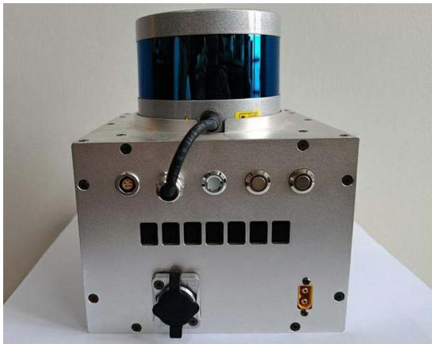  
Fig. 4. Picture of our data acquisition device. A Velodyne VLP-16 LiDAR sensor is assembled on the top of an aluminum alloy box.

The custom datasets are collected using our device, which is shown in Fig. 4. A Velodyne VLP-16 LiDAR sensor, whose main parameters are shown in Table II, is assembled on the top of an aluminum alloy box, in which there are multiple circuit board layers. We can use this hand-held device to obtain point cloud data in various indoor and outdoor scenes. The specific measurement procedure is given as follows. First, plan the motion path. Second, move along the path and record sensor data. Finally, input the data into our SLAM algorithm and calculate the trajectory. The measurement frequency of our whole trajectory measurement equipment is 10 Hz. The system can work in the scenes with enough objects within the measurement range of LiDAR.

## B. Comparison of Feature Extraction

To verify the effectiveness of our feature extraction algorithm, we test the LOAM using the original method and our feature extraction method (denoted as LOAM F) on the KITTI odometry dataset [9]. The RMSE of absolute trajectory error (ATE) of them is shown in Table III, which shows that the proposed method can provide more robust and accurate estimation results.

Then, we theoretically explain why our feature extraction approach achieves good performance in the above experimental results. Previously extracted planar points and edge points are obtained through curvature estimation by vector addition, such as LOAM [7]. However, it cannot adapt well to viewpoint. This is shown in Fig. 5. $( A _ { 1 } , B _ { 1 } , O , C _ { 1 } , D _ { 1 } )$ and $( A _ { 2 } , B _ { 2 } , O , D _ { 2 } , E _ { 2 } )$ , which are all in one plane, are the point sets scanned by the same LiDAR at two different positions, $p _ { 1 }$ and $p _ { 2 } . ~ O$ is the point where we plan to calculate the curvature and is a common viewpoint of two LiDARs. If LiDAR is in position $p _ { 1 } ,$ the numerical value of curvature estimation for $o$ (denoted as $g _ { 1 } )$ calculated by LOAM can be constructed as

TABLE III  
LOCALIZATION ERROR (RMSE ATE) OF LOAM BEFORE AND AFTER USING OUR FEATURE EXTRACTION METHOD (DENOTED AS LOAM + F) (METER)
<table><tr><td rowspan=1 colspan=1>Seq</td><td rowspan=1 colspan=1>LOAM</td><td rowspan=1 colspan=1>LOAM+F</td></tr><tr><td rowspan=1 colspan=1>00</td><td rowspan=1 colspan=1>4.510</td><td rowspan=1 colspan=1>3.412</td></tr><tr><td rowspan=1 colspan=1>02</td><td rowspan=1 colspan=1>Fail</td><td rowspan=1 colspan=1>12.21</td></tr><tr><td rowspan=1 colspan=1>08</td><td rowspan=1 colspan=1>4.323</td><td rowspan=1 colspan=1>4.289</td></tr></table>

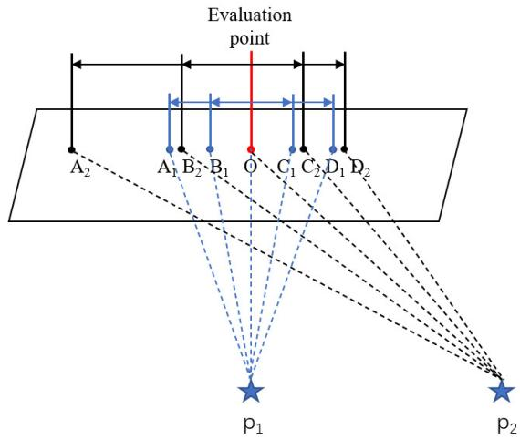  
Fig. 5. Feature extraction algorithm of LOAM is not robust to viewpoint changes. Because points in each scan are equiangular distribution rather than equidistant distribution, the results of the curvature calculated by LOAM at scene point O are different at different viewpoints, $p _ { 1 }$ and $p _ { 2 } ,$ which can be expressed by a formula: $\overrightarrow { O A _ { 1 } } + \overrightarrow { O B _ { 1 } } + \overrightarrow { O C _ { 1 } } + \overrightarrow { O D _ { 1 } } \neq \overrightarrow { O A _ { 2 } } + \overrightarrow { O B _ { 2 } } +$ $\overrightarrow { O C _ { 2 } } + \overrightarrow { O D _ { 2 } }$

$$
g _ { 1 } = \left| \overrightarrow { O A _ { 1 } } + \overrightarrow { O B _ { 1 } } + \overrightarrow { O C _ { 1 } } + \overrightarrow { O D _ { 1 } } \right| .\tag{13}
$$

Similar, if LiDAR is in position $p _ { 2 } ,$ the numerical value of curvature estimation for $o$ (denoted as $g _ { 2 } )$ in LOAM can be calculated as

$$
g _ { 2 } = \left| \overrightarrow { O A _ { 2 } } + \overrightarrow { O B _ { 2 } } + \overrightarrow { O C _ { 2 } } + \overrightarrow { O D _ { 2 } } \right| .\tag{14}
$$

Because the laser is scanning at an equal angle, for example, $\angle A _ { 1 } p _ { 1 } O = \angle A _ { 2 } p _ { 2 } O = \angle O p _ { 1 } D _ { 1 } = \angle O p _ { 2 } D _ { 2 }$ , then, we can get $| \overline { { O A _ { 2 } } } + \overline { { O D _ { 2 } } } | \leq | \overline { { O A _ { 1 } } } + \overline { { O D _ { 1 } } } |$ . Similarly, we can get $| \overline { { O B _ { 2 } } } +$ $\overrightarrow { O C _ { 2 } } | > | \overrightarrow { O B _ { 1 } } + \overrightarrow { O C _ { 1 } } |$ . Thus, we can get $g _ { 2 } \ > \ g _ { 1 }$ , which may cause $o$ to be incorrectly identified as an edge point at viewpoint $p _ { 2 }$ . Therefore, the feature extraction algorithm in LOAM cannot adapt well to view changes. In addition, due to the vector addition, this algorithm is easily affected by measurement errors of LiDAR. By contrast, we extract feature points based on PCA. For each planar point, as long as its left and right neighbors are both on a straight line, there is only one main direction. If the measurement noise is not considered, the length of the second main direction of the same planar point is always 0 in different viewpoints. Namely, $\lambda _ { 2 }$ in (4) is 0. Thus, ratio in (4) is always positive infinity ( ) in different viewpoints. Moreover, even if the measurement noise of LiDAR is considered, as long as the measurement noise is not very large, the length of the second main direction is much smaller than that of the first main direction. Namely, λ2 is much smaller than $\lambda _ { 1 }$ in (4), so the ratio is still very large. Therefore, when there is measurement noise, planar points under different viewpoints can be correctly detected. Based on the above analysis, regardless of whether measurement noise is considered or not, our PCA-based feature extraction method can correctly detect planar points from different perspectives without mistakenly detecting them as edge points. Thus, our PCA-based feature extraction is invariant to viewpoint and robust to measurement noise.

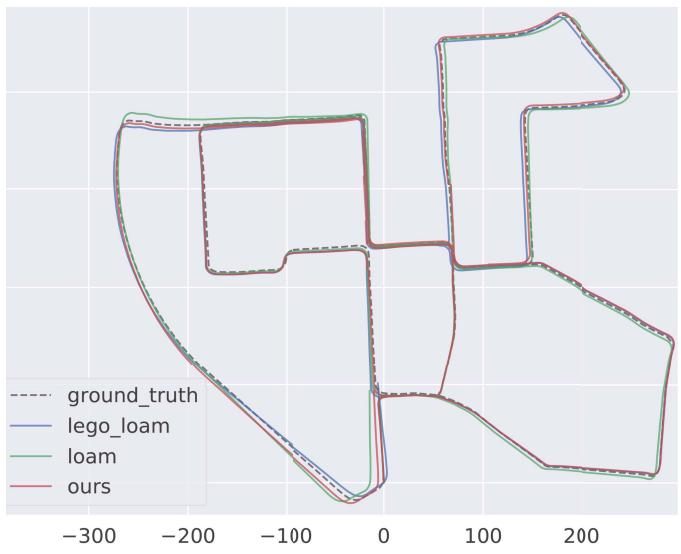  
(a)

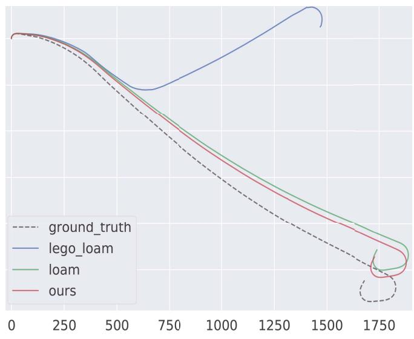  
(b)  
Fig. 6. Ground truth (gray dotted) and estimated trajectory estimated by our system with loop closing (red), LOAM (green), and LeGo-LOAM with loop closing (blue) on (a) KITTI-00 and (b) KITTI-01 sequences. ATE of our method is smaller than those of LOAM and LeGo-LOAM. For example, the RMSE ATE of our system is 36% and 30% lower than that of LOAM and LeGo-LOAM, respectively, as shown in (a). The unit of the horizontal axis is meter.

## C. Comparison of Keyframe Selection Strategy

In order to further prove the effectiveness of our keyframe selection strategy, we make comparisons with the other two strategies: our system with no keyframes (denoted as Ours NoKey) and our system with the keyframe selection of Hdlgraph-SLAM [25]. Our system with the keyframe selection method in Section III-D is denoted as Ours. The RMSE of ATE and the total execution time of mapping thread are shown in Table IV, from which we can see that the RMSE of ATE of ours is very close to the other two methods and the total execution time of mapping thread is lower than that of the other two methods. From the above experiments and analysis, it can be concluded that our keyframe selection strategy saves computing resources without loss of accuracy.

## D. Comparison of Trajectory Accuracy on KITTI Datasets

We have evaluated our LiDAR SLAM system on all 11 sequences with ground truths in the KITTI odometry dataset [9] and compared the results with LOAM, LeGo-LOAM, and the ground truths.

TABLE IV  
RMSE ATE/TOTAL EXECUTION TIME OF MAPPING THREAD FOR OUR SYSTEM WITH NOT SELECTING KEYFRAMES (DENOTED AS OURS NOKEY), CRITERION IN HDL-GRAPH-SLAM TO SELECT KEYFRAMES (DENOTED AS OURS HDLKEY), AND THE KEYFRAME SELECTION STRATEGY PROPOSED IN SECTION III-D (DENOTED AS OURS) ON THE KITTI ODOMETRY DATASET. THE BEST RESULTS ARE SHOWN IN Bold. M DENOTES METER AND S DENOTES SECOND
<table><tr><td>Method</td><td>KITTI-00</td><td>KITTT-05</td><td>KITTI-08</td></tr><tr><td>Ours+NoKey</td><td>2.881 m / 612.1 s</td><td>1.987 m / 372.2 s</td><td>4.068 m / 544.7 s</td></tr><tr><td>Ours+HdlKey</td><td>2.910 m / 264.2 s</td><td>1.979 m / 160.8 s</td><td>4.103 m / 258.9 s</td></tr><tr><td>Ours</td><td>2.903 m / 91.94 s</td><td>1.962 m / 51.59 s</td><td>4.110 m / 84.02 s</td></tr></table>

For quantitative evaluation, we compute the RMSE of ATE for these methods on different datasets using the evaluation tool EVO [30] and the results are shown in Table V. In addition, we test our method with and without loop closing (denoted as Ours w/ loop and Ours w/o loop, respectively) in parallel to investigate the help of loop detection on the state estimation performance. In order to show the experimental results more intuitively, the representative trajectory results on sequence-00 and sequence-01 are shown in Fig. 6, from which we can see the improvement of our method on the accuracy and robustness.

In Table V, we use marker “-” to indicate obvious estimation failures where the RMSE is larger than 30 m. Due to the point cloud segmentation module, LeGo-LOAM can extract few features for matching in some scenes, which leads to worse performance or even failure. Our method performs better than LOAM and LeGo-LOAM in nine sequences, which benefits from two aspects. First, frame-to-sparse local map matching utilizes more feature correspondences than the frame-to-frame matching in LOAM [7], which guarantees higher accuracy and robustness and consequently smaller drift, especially in large-scale scenario. This can be proved by the results of our methods without loop closing, which also outperforms LOAM and LeGo-LOAM in most cases. Second, the proposed feature extraction method providing stable and accurate features makes the system more robust. We notice that LOAM performs slightly better than ours in two data sequences. This is mainly because, in small scenario, the map built in our system is relatively sparse compared with LOAM, which makes keyframe-to-local map matching less accurate.

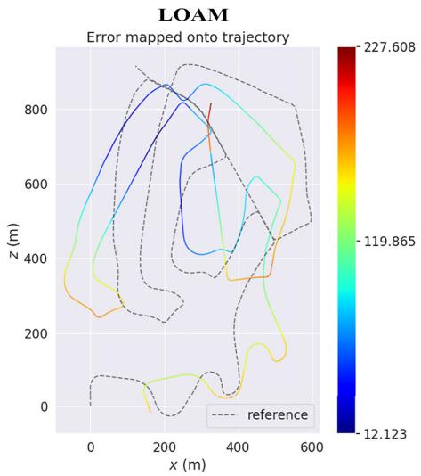

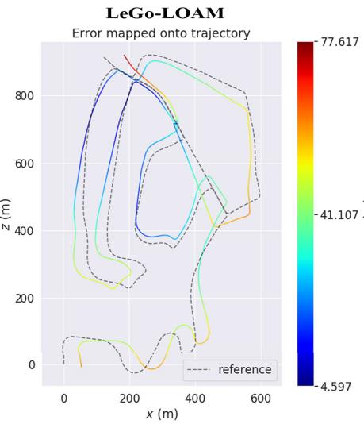

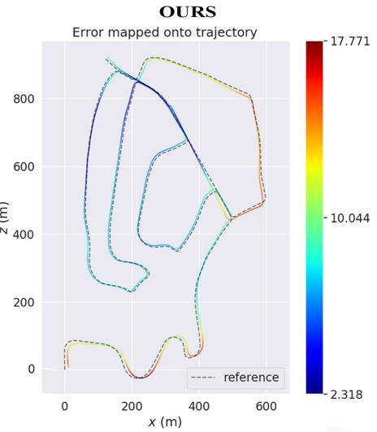  
Fig. 7. Error map of LOAM (left), LeGo-LOAM (middle), and ours (right) on KITTI-02. The color on trajectory indicates distance error between current point and ground truth, and the corresponding error value can be read from the color bar on the right.

TABLE V  
RMSE ATE ON KITTI ODOMETRY DATASETS (METER), “-” INDICATES FAILURES OR VALUE IS LARGER THAN 30
<table><tr><td rowspan=1 colspan=1>Seq</td><td rowspan=1 colspan=1>Description</td><td rowspan=1 colspan=1>LOAM</td><td rowspan=1 colspan=1>LeGo-LOAMw/ loop</td><td rowspan=1 colspan=1>Oursw/oloop</td><td rowspan=1 colspan=1>Oursw/loop</td></tr><tr><td rowspan=1 colspan=1>00</td><td rowspan=1 colspan=1>Urban, 470s</td><td rowspan=1 colspan=1>4.510</td><td rowspan=1 colspan=1>4.121</td><td rowspan=1 colspan=1>3.293</td><td rowspan=1 colspan=1>2.903</td></tr><tr><td rowspan=1 colspan=1>01</td><td rowspan=1 colspan=1>Highway, 114s</td><td rowspan=1 colspan=1>18.78</td><td rowspan=1 colspan=1>一</td><td rowspan=1 colspan=1>10.01</td><td rowspan=1 colspan=1>10.01</td></tr><tr><td rowspan=1 colspan=1>02</td><td rowspan=1 colspan=1>Urban+country, 483s</td><td rowspan=1 colspan=1>一</td><td rowspan=1 colspan=1>一</td><td rowspan=1 colspan=1>12.31</td><td rowspan=1 colspan=1>8.919</td></tr><tr><td rowspan=1 colspan=1>03</td><td rowspan=1 colspan=1>Country, 83s</td><td rowspan=1 colspan=1>0.852</td><td rowspan=1 colspan=1>1.161</td><td rowspan=1 colspan=1>0.798</td><td rowspan=1 colspan=1>0.798</td></tr><tr><td rowspan=1 colspan=1>04</td><td rowspan=1 colspan=1>Country, 28s</td><td rowspan=1 colspan=1>0.401</td><td rowspan=1 colspan=1>0.747</td><td rowspan=1 colspan=1>0.417</td><td rowspan=1 colspan=1>0.417</td></tr><tr><td rowspan=1 colspan=1>05</td><td rowspan=1 colspan=1>Urban, 287s</td><td rowspan=1 colspan=1>2.101</td><td rowspan=1 colspan=1>2.442</td><td rowspan=1 colspan=1>2.078</td><td rowspan=1 colspan=1>1.962</td></tr><tr><td rowspan=1 colspan=1>06</td><td rowspan=1 colspan=1>Urban, 114s</td><td rowspan=1 colspan=1>1.099</td><td rowspan=1 colspan=1>1.022</td><td rowspan=1 colspan=1>0.931</td><td rowspan=1 colspan=1>0.886</td></tr><tr><td rowspan=1 colspan=1>07</td><td rowspan=1 colspan=1>Urban, 114s</td><td rowspan=1 colspan=1>0.704</td><td rowspan=1 colspan=1>0.841</td><td rowspan=1 colspan=1>0.722</td><td rowspan=1 colspan=1>0.679</td></tr><tr><td rowspan=1 colspan=1>08</td><td rowspan=1 colspan=1>Urban+country, 423s</td><td rowspan=1 colspan=1>4.323</td><td rowspan=1 colspan=1>4.727</td><td rowspan=1 colspan=1>4.324</td><td rowspan=1 colspan=1>4.110</td></tr><tr><td rowspan=1 colspan=1>09</td><td rowspan=1 colspan=1>Urban+country, 164s</td><td rowspan=1 colspan=1>1.526</td><td rowspan=1 colspan=1>2.791</td><td rowspan=1 colspan=1>1.895</td><td rowspan=1 colspan=1>1.895</td></tr><tr><td rowspan=1 colspan=1>10</td><td rowspan=1 colspan=1>Urban+country, 124s</td><td rowspan=1 colspan=1>1.487</td><td rowspan=1 colspan=1>2.612</td><td rowspan=1 colspan=1>1.471</td><td rowspan=1 colspan=1>1.471</td></tr></table>

For further quantitative evaluation, we obtain the error maps of these systems on KITTI-02, which are calculated by trajectory error of each position after the trajectories of these systems are aligned with ground truth. We depict these error maps in Fig. 7, from which we can see that the error of each position calculated by our system is less than 18 m, while the error of LOAM and LeGo-LOAM can be up to 77 and 227 m, respectively.

## E. Repeatability and Uncertainty Analysis

We evaluate the uncertainty of the proposed LiDAR SLAM algorithm and the result repeatability of the trajectory measurement system on all 11 sequences with ground truths in the KITTI odometry dataset.

To evaluate the uncertainty of the proposed LiDAR SLAM algorithm, the RMSE of ATE is computed from ten independent executions for each sequence, as shown in Table VI.

The most existing SLAM systems use colored squares image to illustrate the uncertainty of RMSE ATE, such as ORB-SLAM3 [31] and DSO [32]. However, colored squares image is just a qualitative method. In this article, we use the standard deviation of different executions to illustrate the uncertainty of the proposed system for all sequences. Assuming that the system is executed N times and the RMSE ATE of the i th execution is $x _ { i }$ , we calculate the standard deviation (denoted as S· D) of N independent executions using the equation

$$
S \cdot D = \sqrt { \frac { 1 } { N } \sum _ { i = 1 } ^ { N } ( x _ { i } - \bar { x } ) ^ { 2 } }\tag{15}
$$

in which ¯x represents the mean of $[ x _ { 1 } , \ldots , x _ { N } ]$ . The smaller S D represents the smaller uncertainty. We use S D in (15) of ten different executions to show the uncertainty and the results are shown in the last row of Table VI. The results show that the difference among different executions is very small, which proves that the uncertainty of our LiDAR SLAM algorithm is small.

To evaluate the repeatability of the trajectory measurement system, theoretically, we need to collect multiple point cloud sequences on the same trajectory. However, it is extremely difficult to ensure that the motion trajectory of multiple collected data coincides completely. Thus, we use the method of adding noise to the point cloud sequence on the KITTI dataset to simulate multiple measurements to evaluate the repeatability of our system. The measurement noise of LiDAR is $\pm 3$ cm, so we add two types of noise: uniform distribution noise within 0.03 to 0.03 m and Gaussian noise with the mean value of 0 m and standard deviation within 0.015 m, to the measured distance of each point in the original point cloud, and then, we can get multiple groups of simulated laser point cloud sequences. We input these new sequences into our SLAM system and then compare the trajectories with ground truth corresponding to the original sequence. For each point cloud sequence in the KITTI dataset, we generate nine sequences.

TABLE VI  
RMSE ATE OF TEN DIFFERENT EXECUTIONS IN EACH SEQUENCE OF KITTI ODOMETRY DATASETS (METER)
<table><tr><td rowspan=1 colspan=1></td><td rowspan=1 colspan=1>Seq.00</td><td rowspan=1 colspan=1>Seq.01</td><td rowspan=1 colspan=1>Seq.02</td><td rowspan=1 colspan=1>Seq.03</td><td rowspan=1 colspan=1>Seq.04</td><td rowspan=1 colspan=1>Seq.05</td><td rowspan=1 colspan=1>Seq.06</td><td rowspan=1 colspan=1>Seq.07</td><td rowspan=1 colspan=1>Seq.08</td><td rowspan=1 colspan=1>Seq.09</td><td rowspan=1 colspan=1>Seq.10</td></tr><tr><td rowspan=1 colspan=1>1</td><td rowspan=1 colspan=1>2.921</td><td rowspan=1 colspan=1>10.00</td><td rowspan=1 colspan=1>8.902</td><td rowspan=1 colspan=1>0.781</td><td rowspan=1 colspan=1>0.423</td><td rowspan=1 colspan=1>1.812</td><td rowspan=1 colspan=1>0.904</td><td rowspan=1 colspan=1>0.718</td><td rowspan=1 colspan=1>4.053</td><td rowspan=1 colspan=1>1.927</td><td rowspan=1 colspan=1>1.486</td></tr><tr><td rowspan=1 colspan=1>2</td><td rowspan=1 colspan=1>2.849</td><td rowspan=1 colspan=1>9.930</td><td rowspan=1 colspan=1>8.791</td><td rowspan=1 colspan=1>0.752</td><td rowspan=1 colspan=1>0.413</td><td rowspan=1 colspan=1>2.021</td><td rowspan=1 colspan=1>0.828</td><td rowspan=1 colspan=1>0.730</td><td rowspan=1 colspan=1>4.173</td><td rowspan=1 colspan=1>1.847</td><td rowspan=1 colspan=1>1.509</td></tr><tr><td rowspan=1 colspan=1>3</td><td rowspan=1 colspan=1>2.780</td><td rowspan=1 colspan=1>10.13</td><td rowspan=1 colspan=1>9.031</td><td rowspan=1 colspan=1>0.843</td><td rowspan=1 colspan=1>0.412</td><td rowspan=1 colspan=1>1.948</td><td rowspan=1 colspan=1>0.881</td><td rowspan=1 colspan=1>0.641</td><td rowspan=1 colspan=1>4.284</td><td rowspan=1 colspan=1>1.828</td><td rowspan=1 colspan=1>1.414</td></tr><tr><td rowspan=1 colspan=1>4</td><td rowspan=1 colspan=1>2.902</td><td rowspan=1 colspan=1>9.991</td><td rowspan=1 colspan=1>8.827</td><td rowspan=1 colspan=1>0.810</td><td rowspan=1 colspan=1>0.433</td><td rowspan=1 colspan=1>1.971</td><td rowspan=1 colspan=1>0.832</td><td rowspan=1 colspan=1>0.691</td><td rowspan=1 colspan=1>4.092</td><td rowspan=1 colspan=1>1.919</td><td rowspan=1 colspan=1>1.460</td></tr><tr><td rowspan=1 colspan=1>5</td><td rowspan=1 colspan=1>2.941</td><td rowspan=1 colspan=1>10.09</td><td rowspan=1 colspan=1>8.961</td><td rowspan=1 colspan=1>0.820</td><td rowspan=1 colspan=1>0.402</td><td rowspan=1 colspan=1>1.878</td><td rowspan=1 colspan=1>0.919</td><td rowspan=1 colspan=1>0.610</td><td rowspan=1 colspan=1>4.107</td><td rowspan=1 colspan=1>1.841</td><td rowspan=1 colspan=1>1.453</td></tr><tr><td rowspan=1 colspan=1>6</td><td rowspan=1 colspan=1>3.020</td><td rowspan=1 colspan=1>9.979</td><td rowspan=1 colspan=1>9.002</td><td rowspan=1 colspan=1>0.766</td><td rowspan=1 colspan=1>0.438</td><td rowspan=1 colspan=1>1.981</td><td rowspan=1 colspan=1>0.892</td><td rowspan=1 colspan=1>0.743</td><td rowspan=1 colspan=1>4.241</td><td rowspan=1 colspan=1>1.788</td><td rowspan=1 colspan=1>1.487</td></tr><tr><td rowspan=1 colspan=1>7</td><td rowspan=1 colspan=1>2.891</td><td rowspan=1 colspan=1>9.947</td><td rowspan=1 colspan=1>8.926</td><td rowspan=1 colspan=1>0.759</td><td rowspan=1 colspan=1>0.428</td><td rowspan=1 colspan=1>1.893</td><td rowspan=1 colspan=1>0.841</td><td rowspan=1 colspan=1>0.702</td><td rowspan=1 colspan=1>4.104</td><td rowspan=1 colspan=1>1.856</td><td rowspan=1 colspan=1>1.410</td></tr><tr><td rowspan=1 colspan=1>8</td><td rowspan=1 colspan=1>2.840</td><td rowspan=1 colspan=1>9.951</td><td rowspan=1 colspan=1>8.991</td><td rowspan=1 colspan=1>0.771</td><td rowspan=1 colspan=1>0.431</td><td rowspan=1 colspan=1>1.941</td><td rowspan=1 colspan=1>0.856</td><td rowspan=1 colspan=1>0.711</td><td rowspan=1 colspan=1>4.089</td><td rowspan=1 colspan=1>1.872</td><td rowspan=1 colspan=1>1.412</td></tr><tr><td rowspan=1 colspan=1>9</td><td rowspan=1 colspan=1>2.981</td><td rowspan=1 colspan=1>10.00</td><td rowspan=1 colspan=1>9.003</td><td rowspan=1 colspan=1>0.799</td><td rowspan=1 colspan=1>0.417</td><td rowspan=1 colspan=1>1.902</td><td rowspan=1 colspan=1>0.901</td><td rowspan=1 colspan=1>0.703</td><td rowspan=1 colspan=1>4.075</td><td rowspan=1 colspan=1>1.921</td><td rowspan=1 colspan=1>1.497</td></tr><tr><td rowspan=1 colspan=1>10</td><td rowspan=1 colspan=1>2.877</td><td rowspan=1 colspan=1>10.08</td><td rowspan=1 colspan=1>8.783</td><td rowspan=1 colspan=1>0.801</td><td rowspan=1 colspan=1>0.415</td><td rowspan=1 colspan=1>1.955</td><td rowspan=1 colspan=1>0.853</td><td rowspan=1 colspan=1>0.661</td><td rowspan=1 colspan=1>4.281</td><td rowspan=1 colspan=1>1.796</td><td rowspan=1 colspan=1>1.473</td></tr><tr><td rowspan=1 colspan=1>S.D1</td><td rowspan=1 colspan=1>0.067</td><td rowspan=1 colspan=1>0.064</td><td rowspan=1 colspan=1>0.088</td><td rowspan=1 colspan=1>0.028</td><td rowspan=1 colspan=1>0.011</td><td rowspan=1 colspan=1>0.057</td><td rowspan=1 colspan=1>0.031</td><td rowspan=1 colspan=1>0.040</td><td rowspan=1 colspan=1>0.084</td><td rowspan=1 colspan=1>0.048</td><td rowspan=1 colspan=1>0.035</td></tr></table>

1 Standard deviation of RMSE ATE of ten different executions in each sequence.

TABLE VII  
RMSE ATE OF DIFFERENT EXECUTIONS IN EACH GROUP OF POINT CLOUD SEQUENCES, WHICH ARE OBTAINED BY ADDING DIFFERENT NOISES INTO ORIGINAL POINT CLOUD SEQUENCES ON KITTI ODOMETRY DATASETS (METER)
<table><tr><td rowspan=1 colspan=3></td><td rowspan=1 colspan=1>Seq.00</td><td rowspan=1 colspan=1>Seq.01</td><td rowspan=1 colspan=1>Seq.02</td><td rowspan=1 colspan=1>Seq.03</td><td rowspan=1 colspan=1>Seq.04</td><td rowspan=1 colspan=1>Seq.05</td><td rowspan=1 colspan=1>Seq.06</td><td rowspan=1 colspan=1>Seq.07</td><td rowspan=1 colspan=1>Seq.08</td><td rowspan=1 colspan=1>Seq.09</td><td rowspan=1 colspan=1>Seq.10</td></tr><tr><td rowspan=1 colspan=3>Original</td><td rowspan=1 colspan=1>2.890</td><td rowspan=1 colspan=1>10.02</td><td rowspan=1 colspan=1>8.861</td><td rowspan=1 colspan=1>0.783</td><td rowspan=1 colspan=1>0.421</td><td rowspan=1 colspan=1>1.908</td><td rowspan=1 colspan=1>0.891</td><td rowspan=1 colspan=1>0.702</td><td rowspan=1 colspan=1>4.149</td><td rowspan=1 colspan=1>1.882</td><td rowspan=1 colspan=1>1.453</td></tr><tr><td rowspan=1 colspan=2>Add uniform distribution noise</td><td rowspan=1 colspan=1>[-0.005, 0.005]1</td><td rowspan=1 colspan=1>2.945</td><td rowspan=1 colspan=1>10.09</td><td rowspan=1 colspan=1>8.870</td><td rowspan=1 colspan=1>0.803</td><td rowspan=1 colspan=1>0.394</td><td rowspan=1 colspan=1>2.033</td><td rowspan=1 colspan=1>0.913</td><td rowspan=1 colspan=1>0.690</td><td rowspan=1 colspan=1>4.210</td><td rowspan=1 colspan=1>1.919</td><td rowspan=1 colspan=1>1.461</td></tr><tr><td rowspan=1 colspan=2>Add uniform distribution noise</td><td rowspan=1 colspan=1>[-0.010, 0.010]</td><td rowspan=1 colspan=1>3.023</td><td rowspan=1 colspan=1>9.961</td><td rowspan=1 colspan=1>9.013</td><td rowspan=1 colspan=1>0.845</td><td rowspan=1 colspan=1>0.427</td><td rowspan=1 colspan=1>2.052</td><td rowspan=1 colspan=1>0.840</td><td rowspan=1 colspan=1>0.681</td><td rowspan=1 colspan=1>4.221</td><td rowspan=1 colspan=1>1.945</td><td rowspan=1 colspan=1>1.441</td></tr><tr><td rowspan=1 colspan=2>Add uniform distribution noise</td><td rowspan=1 colspan=1>[-0.015, 0.015]</td><td rowspan=1 colspan=1>2.955</td><td rowspan=1 colspan=1>9.940</td><td rowspan=1 colspan=1>9.103</td><td rowspan=1 colspan=1>0.751</td><td rowspan=1 colspan=1>0.452</td><td rowspan=1 colspan=1>1.948</td><td rowspan=1 colspan=1>0.959</td><td rowspan=1 colspan=1>0.743</td><td rowspan=1 colspan=1>4.051</td><td rowspan=1 colspan=1>1.934</td><td rowspan=1 colspan=1>1.519</td></tr><tr><td rowspan=1 colspan=1>Add u</td><td rowspan=1 colspan=1>niform distribution noise</td><td rowspan=1 colspan=1>[-0.020, 0.020]</td><td rowspan=1 colspan=1>2.863</td><td rowspan=1 colspan=1>10.11</td><td rowspan=1 colspan=1>8.804</td><td rowspan=1 colspan=1>0.834</td><td rowspan=1 colspan=1>0.412</td><td rowspan=1 colspan=1>2.046</td><td rowspan=1 colspan=1>0.962</td><td rowspan=1 colspan=1>0.758</td><td rowspan=1 colspan=1>4.345</td><td rowspan=1 colspan=1>1.840</td><td rowspan=1 colspan=1>1.496</td></tr><tr><td rowspan=1 colspan=1>Add u</td><td rowspan=1 colspan=1>niform distribution noise</td><td rowspan=1 colspan=1>[-0.025, 0.025]</td><td rowspan=1 colspan=1>2.856</td><td rowspan=1 colspan=1>9.915</td><td rowspan=1 colspan=1>8.892</td><td rowspan=1 colspan=1>0.851</td><td rowspan=1 colspan=1>0.435</td><td rowspan=1 colspan=1>1.925</td><td rowspan=1 colspan=1>0.936</td><td rowspan=1 colspan=1>0.631</td><td rowspan=1 colspan=1>4.236</td><td rowspan=1 colspan=1>1.832</td><td rowspan=1 colspan=1>1.542</td></tr><tr><td rowspan=1 colspan=2>Add uniform distribution noise</td><td rowspan=1 colspan=1>[-0.030, 0.030]</td><td rowspan=1 colspan=1>3.056</td><td rowspan=1 colspan=1>10.16</td><td rowspan=1 colspan=1>8.872</td><td rowspan=1 colspan=1>0.890</td><td rowspan=1 colspan=1>0.468</td><td rowspan=1 colspan=1>2.069</td><td rowspan=1 colspan=1>0.972</td><td rowspan=1 colspan=1>0.765</td><td rowspan=1 colspan=1>4.363</td><td rowspan=1 colspan=1>1.813</td><td rowspan=1 colspan=1>1.430</td></tr><tr><td rowspan=1 colspan=3>Add Gaussian noise [0, 0.005]2</td><td rowspan=1 colspan=1>3.007</td><td rowspan=1 colspan=1>10.06</td><td rowspan=1 colspan=1>8.931</td><td rowspan=1 colspan=1>0.823</td><td rowspan=1 colspan=1>0.432</td><td rowspan=1 colspan=1>1.901</td><td rowspan=1 colspan=1>0.901</td><td rowspan=1 colspan=1>0.682</td><td rowspan=1 colspan=1>4.202</td><td rowspan=1 colspan=1>1.861</td><td rowspan=1 colspan=1>1.478</td></tr><tr><td rowspan=1 colspan=3>Add Gaussian noise [0, 0.010]</td><td rowspan=1 colspan=1>2.824</td><td rowspan=1 colspan=1>9.936</td><td rowspan=1 colspan=1>9.013</td><td rowspan=1 colspan=1>0.827</td><td rowspan=1 colspan=1>0.421</td><td rowspan=1 colspan=1>1.917</td><td rowspan=1 colspan=1>0.883</td><td rowspan=1 colspan=1>0.696</td><td rowspan=1 colspan=1>4.132</td><td rowspan=1 colspan=1>1.946</td><td rowspan=1 colspan=1>1.427</td></tr><tr><td rowspan=1 colspan=3>Add Gaussian noise [0, 0.015]</td><td rowspan=1 colspan=1>3.051</td><td rowspan=1 colspan=1>10.13</td><td rowspan=1 colspan=1>9.062</td><td rowspan=1 colspan=1>0.774</td><td rowspan=1 colspan=1>0.459</td><td rowspan=1 colspan=1>2.041</td><td rowspan=1 colspan=1>0.865</td><td rowspan=1 colspan=1>0.776</td><td rowspan=1 colspan=1>4.339</td><td rowspan=1 colspan=1>1.825</td><td rowspan=1 colspan=1>1.378</td></tr><tr><td rowspan=1 colspan=3>S.D{3</td><td rowspan=1 colspan=1>0.081</td><td rowspan=1 colspan=1>0.085</td><td rowspan=1 colspan=1>0.094</td><td rowspan=1 colspan=1>0.039</td><td rowspan=1 colspan=1>0.021</td><td rowspan=1 colspan=1>0.066</td><td rowspan=1 colspan=1>0.042</td><td rowspan=1 colspan=1>0.044</td><td rowspan=1 colspan=1>0.096</td><td rowspan=1 colspan=1>0.050</td><td rowspan=1 colspan=1>0.046</td></tr></table>

1 Add uniform distribution noise [a b] means add uniform distribution noise within a m to b m into the measured distance of each point in the original point cloud  
2 Add Gaussian noise [a b] means add Gaussian noise with mean value of a m and standard deviation within b m into the measured distance of each point in the original point cloud Standard deviation of RMSE ATE of executions in each group.

The results are shown in Table VII, from which we can see that the standard deviation is very small. This proves the good repeatability of our system.

## F. Tests on Our Datasets

We also evaluate the proposed LiDAR SLAM system on custom datasets collected using our device shown in Fig. 4 and described in Section IV-A.

In the first test, the sensor moves around in a corridor with a trajectory length of 100 m. The results of LOAM, LeGo-LOAM with loop closing, and our method without and with loop closing are shown in Fig. 8. In this test, LeGo-LOAM failed totally, which is due to few feature matching, especially at corners. In addition, LeGo-LOAM has less robust ground detection module, which makes it easy to be affected when few ground points are scanned. The obvious drift in the localization result of LOAM blurs the resulting map, as shown in the yellow box, which is due to the large error of frameto-frame matching. The main reason for the large error is that the features extracted in one frame are not enough for frame-to-frame matching in some areas. Our method without loop closing gives significant improvements on the trajectory accuracy and mapping consistency, which leads to a clear and sharp global map. In addition, our method with loop closing shows a better performance on the trajectory accuracy and mapping consistency compared to our method without loop closing, which proves the effectiveness of our loop closing.

In the second test, we collect a dataset in a large-scale outdoor scenario with the trajectory length of about 800 m.

TABLE VIII  
AVERAGE RUNTIME OF EACH MODULE (ms)
<table><tr><td>Method</td><td>Feature Extraction</td><td>Odometry/Tracking</td><td>Mapping2</td></tr><tr><td>LOAM</td><td>32.9</td><td>68.2</td><td>134.8</td></tr><tr><td>LeGo-LOAM</td><td>10.3</td><td>15.5</td><td>101.5</td></tr><tr><td>Our method</td><td>51.6</td><td>45.1</td><td>97.7</td></tr></table>

1 The desired running frequency of both feature extraction and tracking module in our system is 10 Hz.  
2 The average frequency of mapping module in our system is 2.3 Hz in the experiment and the theoretical fastest frequency is 10 Hz.

The state estimation result of our method is shown in Fig. 9, in which the error between the starting point and ending point is smaller than 1 m, the odometry result has little drift, and the map is globally consistent.

## G. Runtime Comparison

The average time consumption of common modules of LOAM, LeGo-LOAM, and our system is listed in Table VIII, in which the desired running frequency of our system is also listed. Though our method spends more time in feature extraction because of expensive EVD computation, this does not affect the real-time performance. In the frame tracking and mapping module, our method is more efficient than LOAM, benefiting from the proposed keyframe and sparse local map-based frame tracking and mapping strategy. Frameto-local map matching in LOAM can guarantee the accuracy, but due to the excessive number of points in the map and that each frame is used to build the map, the real-time performance cannot be guaranteed. Our keyframe-to-sparse local map matching only uses the keyframe to construct the map, which can ensure the real-time performance, and the appropriate keyframe selection strategy can ensure matching accuracy. The result of the verification is shown in Table VIII, from which we can see that the average time of each module can meet the desired running frequency and attain a realtime level. In the tracking module, LeGo-LOAM is faster because it uses less feature points and a two-step optimization strategy. Overall, our method performs better in accuracy and robustness than LOAM and LeGo-LOAM while retaining realtime computing efficiency.

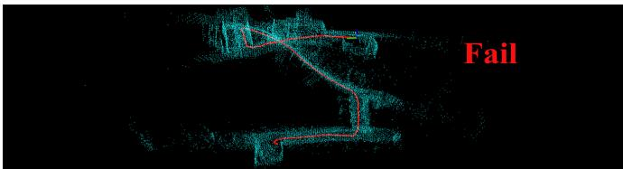

(a)  
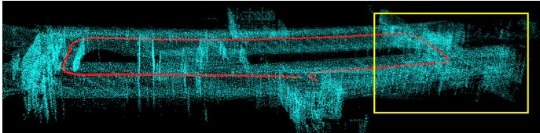  
(b)

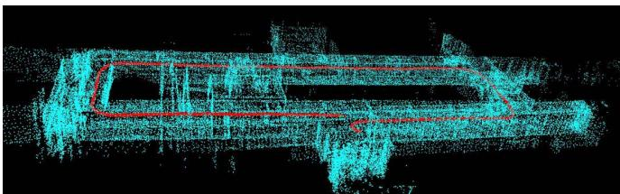

(c)  
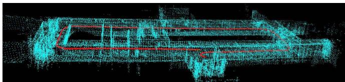  
(d)

Fig. 8. Test results of LeGo-LOAM with loop closing, LOAM, and our system with and without loop closing on an indoor dataset. LeGo-LOAM totally fails, which is due to less feature matching. LOAM drifts obviously in the yellow box for the large error of frame-to-frame matching. In contrast, our method shows the better performance on accuracy and robustness. (a) LeGo-LOAM with loop closing, total failure. (b) LOAM, large drift. (c) Our method without loop closing, small drift. (d) Our method with loop closing, high accuracy.  
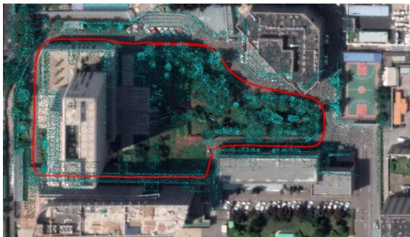  
Fig. 9. Test result of our system with loop closing on a large-scale outdoor dataset, showing low-drift trajectory (red) and consistent map (blue).

## V. CONCLUSION AND FUTURE WORK

In this article, we propose a keyframe-based 3-D LiDAR SLAM toward accurate and robust trajectory estimation in complex environments. A new feature extraction method and a two-stage matching strategy are well studied to yield improvements both in accuracy and efficiency. In addition, loop constraints are explicitly constructed and added to the pose graph to further refine the consistency of the estimation. The experiments in various datasets provide solid demonstrations for the effectiveness of our method that outperforms state-ofthe-art LiDAR SLAM algorithms. However, the performance of our system will degenerate when LiDAR undergoes aggressive motions or is in a dynamic environment.

Our future work includes three parts. First, we plan to add IMU to solve the problem raised by fast motion, in which cases the point cloud may not be registered correctly. Second, in dynamic environments, we will add vision to improve the robustness of the system, and vision can better identify dynamic objects. In addition, we plan to design a more efficient loop-closing method fusing LiDAR and camera measurement.

## REFERENCES

[1] G. He, X. Yuan, Y. Zhuang, and H. Hu, “An integrated GNSS/LiDAR-SLAM pose estimation framework for large-scale map building in partially GNSS-denied environments,” IEEE Trans. Instrum. Meas., vol. 70, pp. 1–9, 2020.

[2] X. Ban, H. Wang, T. Chen, Y. Wang, and Y. Xiao, “Monocular visual odometry based on depth and optical flow using deep learning,” IEEE Trans. Instrum. Meas., vol. 70, pp. 1–19, 2021.

[3] Y. Liu, Y. Wu, and W. Pan, “Dynamic RGB-D SLAM based on static probability and observation number,” IEEE Trans. Instrum. Meas., vol. 70, pp. 1–11, 2021.

[4] J.-E. Deschaud, “IMLS-SLAM: Scan-to-model matching based on 3D data,” in Proc. IEEE Int. Conf. Robot. Autom. (ICRA), May 2018, pp. 2480–2485.

[5] G. Grisetti, C. Stachniss, and W. Burgard, “Improved techniques for grid mapping with rao-blackwellized particle filters,” IEEE Trans. Robot., vol. 23, no. 1, pp. 34–46, Feb. 2007.

[6] S. Kohlbrecher, O. Von Stryk, J. Meyer, and U. Klingauf, “A flexible and scalable SLAM system with full 3D motion estimation,” in Proc. IEEE Int. Symp. Saf., Secur., Rescue Robot., Nov. 2011, pp. 155–160.

[7] J. Zhang and S. Singh, “LOAM: LiDAR odometry and mapping in realtime,” in Robotics: Science and Systems, vol. 2, no. 9. Berkeley, CA, USA: MIT Press, 2014.

[8] T. Shan and B. Englot, “LeGO-LOAM: Lightweight and groundoptimized LiDAR odometry and mapping on variable terrain,” in Proc. IEEE/RSJ Int. Conf. Intell. Robots Syst. (IROS), Oct. 2018, pp. 4758–4765.

[9] A. Geiger, P. Lenz, and R. Urtasun, “Are we ready for autonomous driving? The KITTI vision benchmark suite,” in Proc. IEEE Conf. Comput. Vis. Pattern Recognit., Jun. 2012, pp. 3354–3361.

[10] S. Wold, K. Esbensen, and P. Geladi, “Principal component analysis,” Chemometrics Intell. Lab. Syst., vol. 2, nos. 1–3, pp. 37–52, 1987.

[11] P. Biber and W. Strasser, “The normal distributions transform: A new approach to laser scan matching,” in Proc. IEEE/RSJ Int. Conf. Intell. Robots Syst. (IROS), vol. 3, Oct. 2003, pp. 2743–2748.

[12] P. J. Besl and N. D. McKay, “Method for registration of 3-D shapes,” in Proc. SPIE, vol. 1611, pp. 586–606, Apr. 1992.

[13] S. Rusinkiewicz and M. Levoy, “Efficient variants of the ICP algorithm,” in Proc. 3rd Int. Conf. 3D Digit. Imag. Model., 2001, pp. 145–152.

[14] A. Segal, D. Haehnel, and S. Thrun, “Generalized-ICP,” in Robotics: Science and Systems, vol. 2, no. 4. Seattle, WA, USA: MIT Press, 2009, p. 435.

[15] W. Hess, D. Kohler, H. Rapp, and D. Andor, “Real-time loop closure in 2D LIDAR SLAM,” in Proc. IEEE Int. Conf. Robot. Autom. (ICRA), May 2016, pp. 1271–1278.

[16] X. Chen, A. Milioto, E. Palazzolo, P. Giguere, J. Behley, and C. Stachniss, “SuMa : Efficient LiDAR-based semantic SLAM,” in Proc. IEEE/RSJ Int. Conf. Intell. Robots Syst. (IROS), Nov. 2019, pp. 4530–4537.

[17] I. Sipiran and B. Bustos, “Harris 3D: A robust extension of the Harris operator for interest point detection on 3D meshes,” Vis. Comput., vol. 27, no. 11, p. 963, 2011.

[18] Y. Zhong, “Intrinsic shape signatures: A shape descriptor for 3D object recognition,” in Proc. IEEE 12th Int. Conf. Comput. Vis. Workshops, ICCV Workshops, Sep. 2009, pp. 689–696.

[19] B. Steder, R. B. Rusu, K. Konolige, and W. Burgard, “NARF: 3D range image features for object recognition,” in Proc. Workshop Defining Solving Realistic Perception Problems Personal Robot. IEEE/RSJ Int. Conf. Intell. Robots Syst. (IROS), vol. 44, 2010, pp. 1–2.

[20] X. Bai, Z. Luo, L. Zhou, H. Fu, L. Quan, and C.-L. Tai, “D3Feat: Joint learning of dense detection and description of 3D local features,” in Proc. IEEE/CVF Conf. Comput. Vis. Pattern Recognit. (CVPR), Jun. 2020, pp. 6359–6367.

[21] J. Lin and F. Zhang, “Loam livox: A fast, robust, high-precision LiDAR odometry and mapping package for LiDARs of small FoV,” in Proc. IEEE Int. Conf. Robot. Automat. (ICRA), May 2020, pp. 3126–3131.

[22] Y. S. Park, H. Jang, and A. Kim, “I-LOAM: Intensity enhanced LiDAR odometry and mapping,” in Proc. 17th Int. Conf. Ubiquitous Robots (UR), Jun. 2020, pp. 455–458.

[23] X. Huo, L. Dou, H. Lu, B. Tian, and M. Du, “A line/plane feature-based LiDAR inertial odometry and mapping,” in Proc. Chin. Control Conf. (CCC), Jul. 2019, pp. 4377–4382.

[24] R. Mur-Artal and J. D. Tardós, “ORB-SLAM2: An open-source slam system for monocular, stereo, and RGB-D cameras,” IEEE Trans. Robot., vol. 33, no. 5, pp. 1255–1262, Oct. 2017.

[25] M. D. Berg, O. Cheong, M. V. Kreveld, and M. Overmars, Computational Geometry: Algorithms and Applications. Springer, Mar. 2008.

[26] K. Koide, J. Miura, and E. Menegatti, “A portable three-dimensional LIDAR-based system for long-term and wide-area people behavior measurement,” Int. J. Adv. Robotic Syst., vol. 16, no. 2, pp. 1–16, Mar. 2019.

[27] M. Quigley et al., “ROS: An open-source robot operating system,” in Proc. ICRA workshop open Source Softw., Kobe, Japan, vol. 3, no. 3, 2009, p. 5.

[28] S. Agarwal, K. Mierle, and Others. Ceres Solver. Accessed: Mar. 11, 2022. [Online]. Available: http://ceres-solver.org

[29] R. Kummerle, G. Grisetti, H. Strasdat, K. Konolige, and W. Burgard, “G2o: A general framework for graph optimization,” in Proc. IEEE Int. Conf. Robot. Autom., May 2011, pp. 3607–3613.

[30] M. Grupp. (2017). Evo: Python Package for the Evaluation of Odometry and Slam. [Online]. Available: https://github.com/MichaelGrupp/evo

[31] C. Campos, R. Elvira, J. J. G. Rodriguez, J. M. M. Montiel, and J. D. Tardos, “ORB-SLAM3: An accurate open-source library for visual, visual–inertial, and multimap SLAM,” IEEE Trans. Robot., vol. 37, no. 6, pp. 1874–1890, Dec. 2021.

[32] J. Engel, V. Koltun, and D. Cremers, “Direct sparse odometry,” IEEE Trans. Pattern Anal. Mach. Intell., vol. 40, no. 3, pp. 611–625, Mar. 2017.

Shiyi Guo received the B.S. degree from Beijing Normal University, Beijing, China, in 2018. He is currently pursuing the Ph.D. degree with the National Laboratory of Pattern Recognition (NLPR), Institute of Automation, Chinese Academy of Sciences (CASIA), Beijing.

His research interests include light detection and ranging (LiDAR) simultaneous localization and mapping (SLAM), 3-D reconstruction, and multisensor fusion.

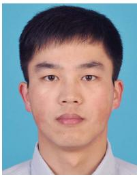

Zheng Rong received the bachelor’s degree in information engineering and the Ph.D. degree in electronics science and technology from the Beijing Institute of Technology, Beijing, China, in 2010 and 2017, respectively.

He was with the Robotics Institute, Carnegie Mellon University (CMU), Pittsburgh, PA, USA, as a Visiting Scholar. He is currently an Assistant Researcher with the National Laboratory of Pattern Recognition (NLPR), Institute of Automation, Chinese Academy of Sciences (CASIA), Beijing.

His main research interests lie in the area of robotics, with a focus on perception with multisensor fusion, including visual-inertial odometry/simultaneous localization and mapping (SLAM), 3-D reconstruction, and embedded systems.

Shuo Wang received the B.S. degree and the M.S. degree in automation from the Beijing University of Chemical Technology, Beijing, China, in 2017 and 2020, respectively. He is currently pursuing the Ph.D. degree with the School of Artificial Intelligence, University of Chinese Academy of Sciences, Beijing.

His research interests include image processing, computer vision, and multimodule sensors calibration.

Yihong Wu received the Ph.D. degree from the Institute of Systems Science, Chinese Academy of Sciences (CASIA), Beijing, China, in 2001.

She is currently a Professor with the National Laboratory of Pattern Recognition (NLPR), Institute of Automation, CASIA. Her research interests include geometric invariant application, 3-D vision, and robot vision.