www.lpr-journal.org

# A Progress Review on Solid-State LiDAR and Nanophotonics-Based LiDAR Sensors

Nanxi Li,\* Chong Pei Ho, Jin Xue, Leh Woon Lim, Guanyu Chen, Yuan Hsing Fu, and Lennon Yao Ting Lee

Light detection and ranging (LiDAR) sensors enable precision sensing of an object in 3D. LiDAR technology is widely used in metrology, environment monitoring, archaeology, and robotics. It also shows high potential to be applied in autonomous driving. In traditional LiDAR sensors, mechanical rotator is used for optical beam scanning, which brings about limitations on their reliability, size, and cost. These limitations can be overcome by a more compact solid-state solution. Solid-state LiDAR sensors are commonly categorized into the following three types: flash-based LiDAR, microelectromechanical system (MEMS)-based LiDAR, and optical phased array (OPA)-based LiDAR. Furthermore, advanced optics technology enables novel nanophotonics-based devices with high potential and superior advantages to be utilized in a LiDAR sensor. In this review, LiDAR sensor principles are introduced, including three commonly used sensing schemes: pulsed time offlight (TOF), amplitude-modulated continuous wave TOF, and frequency-modulated continuous wave. Recent advances in conventional solid-state LiDAR sensors are summarized and presented, including flash-based LiDAR, MEMS-based LiDAR, and OPA-based LiDAR. The recent progress on emerging nanophotonics-based LiDAR sensors is also covered. A summary is made and the future outlook on advanced LiDAR sensors is provided.

## 1. Introduction

Light detection and ranging (LiDAR) technology enables the accurate determination of an object’s distance (and velocity) information. Compared with more mature radio detection and ranging (RADAR) technology, LiDAR makes use of optical wave, which is at shorter wavelength regime compared with radio wave, and hence has potential to achieve higher precision in 3D sensing. LiDAR has been widely applied in metrology,[1–3] environment monitoring,[4–6] archaeology,[7,8] robotics,[9,10] and shows high potential to be used for autonomous driving.[11–13] The demand for advanced LiDAR technology in the fast-growing autonomous driving industry can be induced from the appearance and growth of startup companies in this area. Based on sensing/ranging mechanism, most LiDAR sensors can be categorized into the following three schemes: pulsed time of flight (TOF), amplitude-modulated continuous wave (AMCW) TOF, and frequency-modulated continuous wave (FMCW). Traditional LiDAR sensors make use of a mechanical rotation mechanism to achieve wide field-of-view (FOV) scanning, which places limitations on reliability, size, and cost.[14] These limitations can be overcome by using a solid-state approach.

There is a growing demand for compact ranging systems,[1] and solid-state LiDAR provides an alternative for traditional LiDAR using mechanical rotator, which is often bulky in size and can be removed. Therefore, solid-state Li-DARs have recently drawn significant interests in both academic research and industrial applications. Depending on the mapping/illumination method, solid-state LiDARs are commonly categorized into the following three types:[15,16] flashbased LiDAR,[17–19] microelectromechanical system (MEMS)- based LiDAR,[20–22] and optical phased array (OPA)-based LiDAR.[23–25] Flash-based LiDAR makes use of a photodetector (PD) array, hence it can capture the entire target scene within a single shot. Since there is no scanning involved, the flash Li-DAR promises superior long-term reliability. However, the resolution of flash-based LiDAR is constrained by the physical size of PD arrays. Incorporating MEMS mirrors can bring down the size of the LiDAR system and enable solid-state LiDAR scanning, with advantages of being compact and lightweight. OPA-based LiDAR is based on integrated photonics technology, which also provides a compact platform. The fabrication of OPA is compatible with complementary metal–oxide–semiconductor (CMOS) processes,[26–28] which brings down the manufacturing cost.

In addition to the above-mentioned three types of solid-state LiDAR, advanced nanophotonics technology also enables novel nanophotonics devices with high potential and superior advantages to be utilized in a LiDAR sensor. One example ofnanophotonics device is optical switch based on integrated photonics platform.[29] The switching networks formed by optical switches enable sequential illumination in LiDAR system for large sensing range. Another example is optical frequency comb (OFC),[2] which is also based on integrated photonics platform. OFC is a compact light source for high-performance LiDAR sensing. It has recently been demonstrated for LiDAR sensing with high resolution,[30] parallel scanning,[2] as well as the capability to capture object profile under fast moving speed.[1] One more typical example is metasurface-based spatial light modulator (SLM).[31] A metasurface is a thin layer ofpatterned nanostructures, which can control light phase and amplitude in sub-wavelength scale. Hence, it brings potential for compact LiDAR sensor with high precision.[16] A comprehensive review on nanophotonics devices for LiDAR sensing has been recently conducted by Kim et al.[16]

In this review, the recent advances in conventional solid-state LiDAR are summarized and presented, including flash-based Li-DAR, MEMS-based LiDAR, and OPA-based LiDAR. Followed by that, the recent progress on emerging nanophotonic-based Li-DAR sensors is also reviewed. At the end, the outlook on advanced LiDAR sensors is provided. A note worth mentioning is that for the LiDAR sensors covered in this review, we emphasize on the optics part of the system rather than the electronics part. The whole review is organized in the following way: Section 2 covers the LiDAR sensor principles and design rules; Section 3 presents recent advances on conventional solid-state LiDAR sensors; Section 4 focuses on emerging nanophotonics-based LiDAR sensors; Section 5 summarizes the review content and provides future prospect on advanced LiDAR sensors. The overall structure of this review can be visualized in Figure 1.

## 2. LiDAR Principles

As mentioned in the introduction, the three sensing schemes most commonly used in LiDAR sensors are: pulsed TOF, AMCW TOF, and FMCW. Good comparison and summary on these three sensing schemes have been made in refs. [34, 35]. In general, pulsed TOF and AMCW TOF are based on the modulation of light intensity, while FMCW is based on the modulation of light frequency. The mechanisms to obtain the distance information (for all three schemes) and velocity information (for FMCW Li-DAR) are explained in this section. The plot of LiDAR signal under diferent sensing schemes is illustrated in Figure 2. The power budget of the LiDAR system can be expressed using the following equation[23]

$$
P _ { \mathrm { R X } } = P _ { \mathrm { i n } } ~ \eta _ { \mathrm { T X } } \frac { \rho A _ { \mathrm { R X } } } { 4 \pi R ^ { 2 } } \eta _ { \mathrm { R X } }\tag{1}
$$

where $P _ { \mathrm { i n } }$ is the input optical power. $\eta _ { \mathrm { T X } }$ and $\eta _ { \mathrm { R X } }$ represent the eficiency oftransmitter and receiver, respectively. ρ is the reflectivity of the sensing object. $A _ { \mathrm { R X } }$ represents the area of receiver. R is the distance of the sensing object. Typically, a larger $A _ { \mathrm { R X } }$ contributes to higher received optical power, and hence longer sensing distance.[34] Also, a note worth mentioning is that the maximum input power or transmit power is mostly limited by eye-safety concerns.[34]

## 2.1. Pulsed TOF LiDAR

The pulsed TOF LiDAR works based on the time delay of an optical pulse emitted by the TX, reflected from the sensing object, and received by the RX. The sensing distance can be expressed using the following equation

$$
d = c { \frac { \Delta t } { 2 } }\tag{2}
$$

where $\Delta t$ is the time delay and c is the speed of light. The plot of TX and RX signal in time domain is illustrated in Figure 2a. The range resolution is limited by the resolution in time counting available, which is mainly determined by electronics timing resolution.[16] Contributed by high peak power, pulsed TOF Li-DAR can sense longer distance while maintaining low average power to comply with eye-safety limitation.[34]

## 2.2. AMCW TOF LiDAR

Comparing with pulsed TOF LiDAR, AMCW TOF LiDAR makes use of amplitude/intensity modulated optical signal rather than pulsed optical signal for sensing. It works based on the phase difference between the modulated light from TX and received light by RX. The sensing distance can be expressed as

$$
d = c { \frac { \Delta t } { 2 } } = c { \frac { \Delta \varphi } { 2 \times ( 2 \pi f ) } } = { \frac { c \Delta \varphi } { 4 \pi f } }\tag{3}
$$

where $\Delta \varphi$ is the phase shift and f is the modulation frequency of the optical signal. The plots of TX and RX signals can be visualized in Figure 2b. Since AMCW TOF LiDAR uses modulated optical signal rather than optical pulse, it is suitable for moderate range sensing rather than long range sensing.[34]

## 2.3. FMCW LiDAR

FMCW LiDAR sensor emits a frequency-modulated optical signal and collects the reflected signal. From the beat signal between the original and reflected signal, the distance and velocity information of a moving object can be obtained. The calculation process can be illustrated in the following two equations

$$
d = { \frac { c T } { 4 B } } ~ { \frac { f _ { \mathrm { u } } + f _ { \mathrm { d } } } { 2 } }\tag{4}
$$

$$
\nu = { \frac { c } { 2 f _ { \mathrm { c } } } } ~ { \frac { f _ { \mathrm { u } } - f _ { \mathrm { d } } } { 2 } }\tag{5}
$$

where T is the period of modulation, B is the chirp bandwidth, and c is the light propagation speed. $\cdot f _ { \mathrm { u } }$ and $f _ { \mathrm { d } }$ represent the beat frequency for upward and downward laser scan, respectively. Both have included Doppler frequency shift $f _ { \mathrm { c } }$ is the starting frequency without chirp or called optical carrier frequency. Please note that the above equation (5) assumes the angle between the target velocity vector and LiDAR line of sight is zero. If such an angle θ is considered, the denominator part on right side of equation (5) needs to be multiplied by a cos(θ).

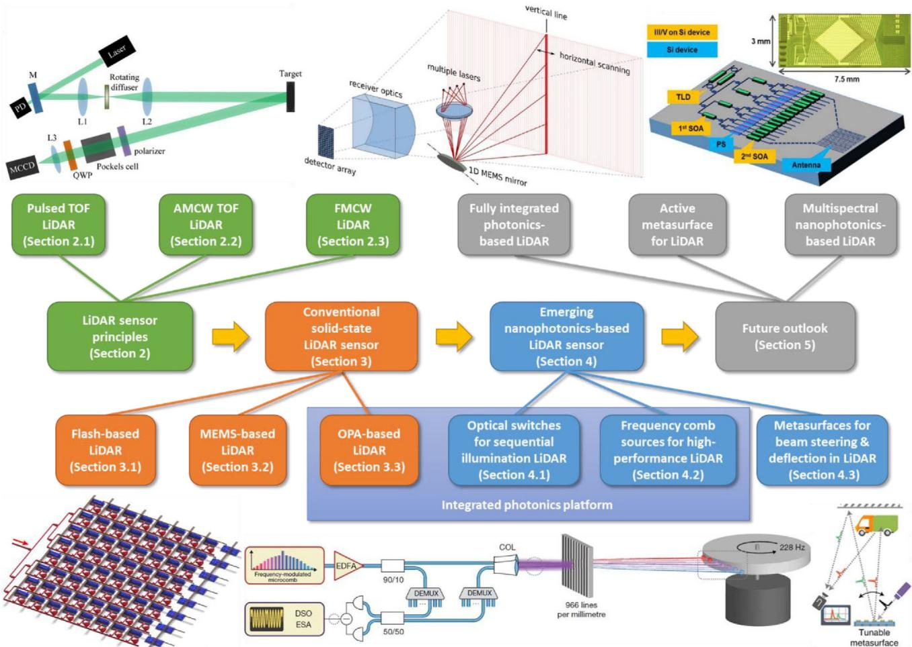  
Figure 1. Overview of review article, including conceptual organization of diferent LiDAR sensors. TOF: time of flight. AMCW: amplitude-modulated continuous wave. FMCW: frequency-modulated continuous wave. MEMS: microelectromechanical system. OPA: optical phased array. Inset images: top left: Schematic of a flash-based LiDAR. Adapted with permission.[19] Copyright 2016, The Optical Society. Top middle: Schematic of an MEMS-based LiDAR. Adapted with permission.[21] Copyright 2018, IARIA. Top right: Schematic of solid-state OPA-based beam scanner with integrated laser source and amplifiers. Adapted with permission.[14] Copyright 2020, IEEE. Bottom left: Schematic of RX (receiver) block formed by heterodyne PD pixel for LiDAR imager with sequential illumination enabled by optical switches. Adapted with permission.[32] Copyright 2021, Springer Nature. Bottom middle: Schematic of optical frequency comb (OFC)-based LiDAR for parallel sensing. Adapted with permission.[2] Copyright 2020, Springer Nature. Bottom right: Schematic of a metasurface-based LiDAR sensor setup. Adapted with permission.[33] Copyright 2021, Springer Nature.

Comparing with TOF, FMCW method has the following advantages:[32] the sensing system will not sufer from interference from nearby LiDAR systems due to the coherent detection nature of FMCW. In addition to distance information, it can obtain the velocity based on Doppler’s efect. Also, the FMCW method can achieve higher depth accuracy compared with TOF. Lastly, FMCW requires relatively lower optical peak power compared with the pulsed TOF method where a strong optical pulse is required.

In addition, it is worth mentioning that ref. [36] provides a comprehensive explanation on an implementation of FMCW RADAR in millimeter wavelength range, which can be used as a reference for FMCW sensor design.

## 3. Conventional Solid-State LiDAR Sensor

In the earlier section, LiDAR principles are introduced. In this section, we will move on to the review and discussion on solidstate LiDAR sensors. Solid-state LiDAR can be categorized into two main types: flash-based and scanning-based LiDAR. For scanning type LiDAR, including MEMS-based and OPA-based LiDAR, the advantage is higher signal-to-noise ratio compared with flash type LiDAR since there is increased optical power during laser point scanning.[18] In the meanwhile, the advantage of flash-based LiDAR is the capability to capture the sensing object with a single shot by using a PD array. Since there is no scanning part involved, the flash-based LiDAR has better long-term reliability and higher data acquisition rate. Key features and comparison of solid-state LiDAR, including flash-based, MEMS-based, and OPA-based LiDAR, have been summarized in refs. [15, 16, 35]. In this section, the recent research works in the past 5 years on three conventional types of solid-state LiDAR sensors are reviewed. Sections 3.1, 3.2, and 3.3 cover the flash-based, MEMSbased, and OPA-based LiDAR, respectively. For each type, a summary table is presented with key features, as listed in Tables 1–3.

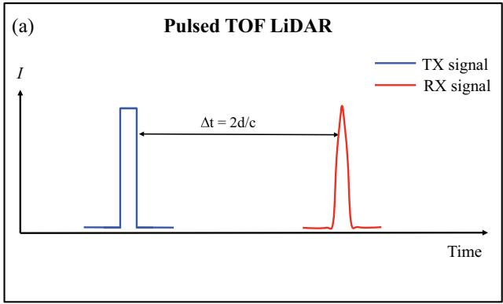

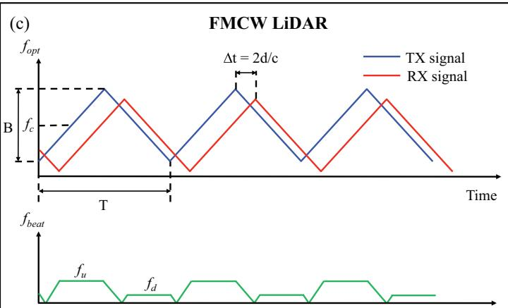

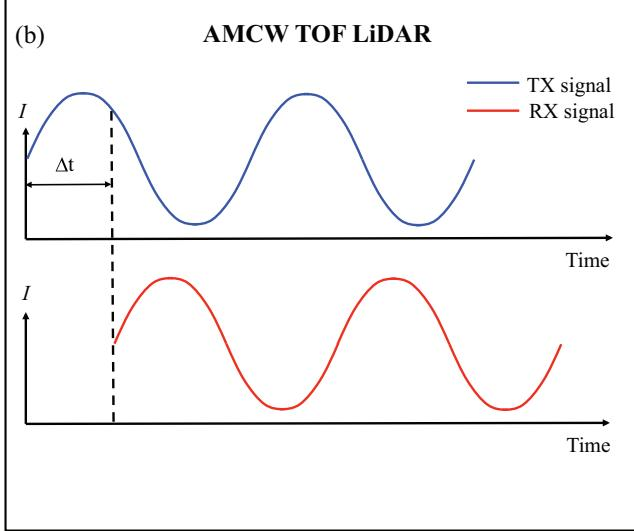

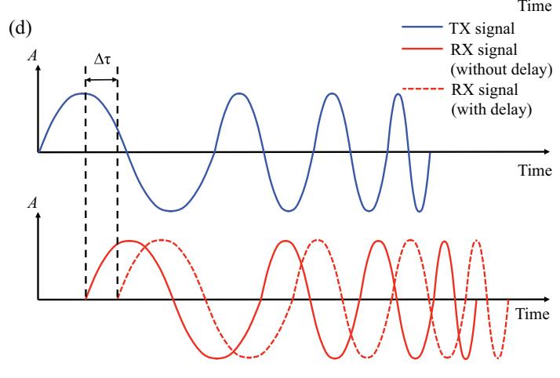  
Figure 2. Working principles of pulsed TOF, AMCW TOF, and FMCW LiDAR. a) Transmit pulsed optical signal (blue) and received pulsed optical signa (red) for pulsed TOF LiDAR sensing. TX: Transmitter. RX: Receiver. b) Transmit intensity plot of modulated optical signal (top) and received intensity plot of modulated optical signal (bottom) for AMCW TOF LiDAR sensing. c) Top plot: Transmit optical signal and received optical signal with linear triangular modulation for FMCW LiDAR sensing. Bottom plot: Beat signal with respect to time between TX and RX signal. d) Chirped sinusoidal TX and RX signal. The delay (∆τ) is due to the moving of the sensing object.

## 3.1. Flash-Based LiDAR

As mentioned earlier, a LiDAR system can obtain 3D image through two approaches: flash and scanning. The scanning approach makes use of one or a few detectors and a scanner to obtain 3D information, while the flash approach makes use of a 2D detector array to capture the sensing object and obtain 3D information.[19] The flash type LiDAR system enables the capture of 3D depth image with a single shot of optical pulse, and hence has relatively higher data acquisition rate compared with the scanning type. In the meanwhile, it requires optical pulse with high power and detector array with high sensitivity.[16]

In a LiDAR sensing system, the optical power of reflected signal is inversely proportional to the sensing distance squared, as indicated in Equation (1). Hence, for long-distance sensing, single-photon avalanche diodes (SPADs) have been extensively demonstrated for TOF-based LiDAR.[18,38–41] In the research work by Zhang et al.,[18] a SPAD flash LiDAR sensor with 252 × 144 pixel and 30 frames $\mathbf { S } ^ { - 1 }$ has been reported. The image sensor is fabricated on a 180 nm CMOS technology platform containing the SPAD array and time-to-digital converters (TDC). More details on the electronics of the image sensor can be found in ref. [18]. Its operational diagram is illustrated in Figure 3a. The 3D imaging is performed in real-time, with results shown in Figure 3b. Six frames of a 3D movie showing a hand clenching and unclenching are illustrated. The movie is captured at 30 frames $\mathbf { S } ^ { - 1 }$ , with the hand located at a distance of 0.7 m. Furthermore, in a later study by Hutchings et al.,[39] a 256 × 256 SPAD imaging sensor is reported for TOF LiDAR imaging. The sensor has a low power consumption of less than 100 mW, and reports long imaging distance up to 50 m. Also, in the research work by Hu et al.,[40] a noise filtering circuit is utilized in the pixel formed by SPADs to improve the signal-to-background noise ratio, and hence the TOF LiDAR detection range. More recently, the study by Padmanabhan et al.[41] reports a SPAD array with the capability to conduct photon coincidence to suppress the background light and hence improve the signal-to-background noise ratio. A maximum TOF LiDAR ranging distance of 100 m has been achieved. In addition, in the study by Beer et al.,[38] photon coincidence detection is also used to achieve ambient light suppression for SPAD-based LiDAR image sensor.

Table 1. Summary of flash-based LiDAR.
<table><tr><td>Sensing approach</td><td>Wavelength</td><td>Sensing distance</td><td>Pixel array</td><td>Remarks</td><td>Reference/Year</td></tr><tr><td>TOF</td><td>532 nm</td><td>16 m (5.2 mm range precision)</td><td>1024 × 1024 for micro-polarizer CCD (MCCD)</td><td>A Pockels cell is used to modulate light polarization state with time. Measured light intensity can be used to calculate the polarization state and</td><td>[19] / 2016</td></tr><tr><td>TOF</td><td>532 nm</td><td>17 m (&lt;4 mm precision)</td><td>1024 × 1024 (CCD, with pixel size: 7.4 μm)</td><td>A polarization modulator is used with a low bandwidth detector. Distance can be derived from intensity information.</td><td>[37] / 2017</td></tr><tr><td>TOF</td><td>905 nm</td><td>N.A.</td><td>2 × 192</td><td>Single-photon avalanche diode (SPAD)-based sensor array, fabricated in a 0.35 μm CMOS process. Ambient light rejection implemented for improved measurement quality.</td><td>[38] / 2018</td></tr><tr><td>TOF</td><td>637 nm</td><td>50 m (8.8 cm accuracy)</td><td>252 × 144</td><td>SPAD-based sensor array, fabricated on 180 nm CMOS technology platform.</td><td>[18] / 2019</td></tr><tr><td>TOF</td><td>671 nm</td><td>Up to 50 m (0.17 m accuracy)</td><td>256 × 256/64× 64</td><td>SPAD-based sensor array, fabricated on 90 nm 1P4M/40 nm 1P8M process.</td><td>[39] / 2019</td></tr><tr><td>TOF</td><td>905 nm</td><td>2–20 m (with precision up to 7 cm)</td><td>32× 32</td><td>SPAD-based sensor array, fabricated on 180 nm CMOS technology platform.</td><td>[40] / 2021</td></tr><tr><td>TOF</td><td>780 nm</td><td>100 m (0.07 m accuracy)</td><td>256 × 128</td><td>SPAD-based sensor array, fabricated on 45 nm CMOS technology platform.</td><td>[41] / 2021</td></tr></table>

Table 2. Summary of MEMS-based LiDAR.
<table><tr><td>Sensing approach</td><td>Mirror aperture</td><td>Wavelength</td><td>Sensing distance</td><td>Scanning dimension</td><td>Scanning angle</td><td>Scanning speed</td><td>Reference/Year</td></tr><tr><td>TOF</td><td>N.A.</td><td>N.A.</td><td>Target: &gt;200 m (20 cm resolution)</td><td>1D</td><td>± 15°</td><td>N.A. (LiDAR with 20 frame per second)</td><td>[21] / 2019</td></tr><tr><td>N.A. (mirror only)</td><td>2 mm × 4 mm</td><td>Visible wavelength (red)</td><td>N.A.</td><td>1D</td><td>&gt;±45°</td><td>1.5 kHz</td><td>[43] / 2020</td></tr><tr><td>TOF</td><td>5 mm (diameter)</td><td>Visible wavelength</td><td>2 m</td><td>2D</td><td>± 8°</td><td>N.A. (fast axis: few kHz)</td><td>[22] / 2016</td></tr><tr><td>N.A. (mirror only)</td><td>N.A.</td><td>Visible wavelength (red)</td><td>N.A.</td><td>2D</td><td>45.3°, 42.6° for two axes</td><td>710 Hz (7.5 Vac), 997 Hz (5 Vac)</td><td>[44] / 2016</td></tr><tr><td>N.A. (mirror only)</td><td>2 mm (diameter)</td><td>Visible wavelength (red)</td><td>N.A.</td><td>2D</td><td>41.9°, 40.3° for two axes</td><td>0.95 kHz, 1.46 kHz for two axes</td><td>[45] / 2017</td></tr><tr><td>N.A. (mirror only)</td><td>12 mm (diameter)</td><td>Visible wavelength (green)</td><td>N.A.</td><td>2D (micromirror + rotor)</td><td>26°</td><td>1.24 kHz for microscanning mirror</td><td>[46] / 2017</td></tr><tr><td>TOF</td><td>2 mm (diameter)</td><td>905 nm</td><td>80-250 cm (7.2 cm 2D resolution)</td><td></td><td>± 2.8°</td><td>N.A. (LiDAR with 41 Hz measurement rate)</td><td>[20] / 2018</td></tr><tr><td>TOF</td><td>0.7 mm × 0.7 mm</td><td>905 nm</td><td>N.A. (3.6 cm range resolution)</td><td>2D</td><td>17° (± 8.5°)</td><td>2.2 kHz</td><td>[47] / 2018</td></tr><tr><td>N.A. (mirror only)</td><td>2 mm × 2.5 mm</td><td>Visible wavelength (red)</td><td>N.A. (2D scan pattern at</td><td>2D</td><td>15°× 12°</td><td>0.7 kHz (rotational scanning resonant</td><td>[48] / 2019</td></tr><tr><td>TOF</td><td>1.2 mm × 1.4 mm</td><td>905 nm</td><td>distance of 7 m) 35 cm (1.5 cm depth accuracy at 30 cm)</td><td>2D</td><td>9°×8°</td><td>mode) N.A. (LiDAR frame rate: 6.25 fps)</td><td>[10] / 2021</td></tr></table>

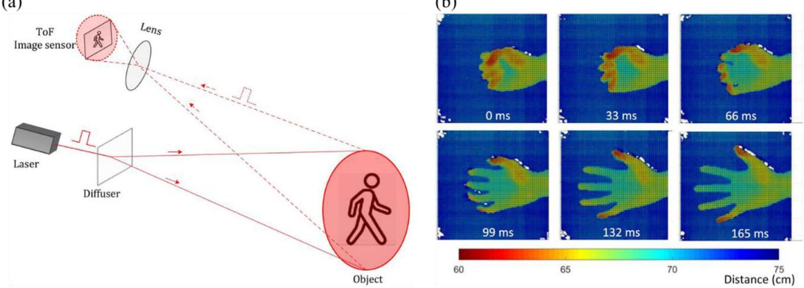

Table 3. Summary of OPA-based LiDAR.
<table><tr><td>Sensing approach</td><td>Wavelength</td><td>Sensing distance</td><td>Measured velocity (ν)</td><td>TX &amp; RX structure</td><td>Reference/Year</td></tr><tr><td>FMCW</td><td>Around 1550 nm</td><td>0.5–2 m (edge coupler without scanning, 20 mm resolution), 0.2–0.5 m (OPA with 2D</td><td>75–300 mm s-¹ (edge coupler)</td><td>Edge coupler (light collimated with 20× objective), 1D OPA</td><td>[23] / 2017</td></tr><tr><td>FMCW</td><td>C+L band (tunable laser)</td><td>185 m (1D scanning without phase shifter) and 6–12 m (2D scanning with phase shifter)</td><td>N.A. (demonstrate velocity sensing for a spinning target)</td><td>1D OPA (512 elements)</td><td>[24] / 2019</td></tr><tr><td>FMCW</td><td>1550 nm</td><td>10–40 cm (1D scanning without phase shifter, 3.3 cm resolution)</td><td>N.A.</td><td>1D OPA (128 elements)</td><td>[73] / 2019</td></tr><tr><td>TOF</td><td>Around 1300 nm</td><td>10 m (2D scanning, with precision of &lt;8 cm)</td><td>N.A.</td><td>TX: 1D OPA (32 elements)</td><td>[14] / 2020</td></tr><tr><td>TOF</td><td>940 nm</td><td>12 m maximum measurable range in indoor environment</td><td>N.A.</td><td>TX: 1D OPA with phase shifter and liquid crystal</td><td>[25] / 2021</td></tr></table>

(a)  
(b)

(c)  
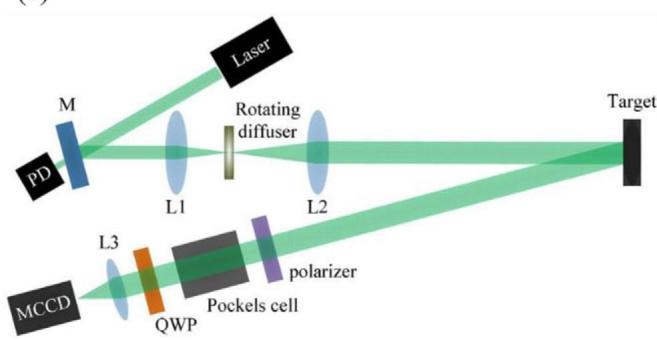

(d)  

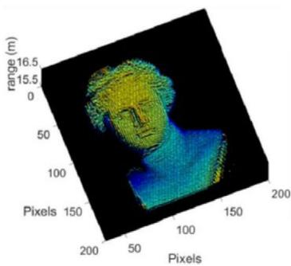  
Figure 3. Flash-based LiDAR sensors. a) Schematic offlash LiDAR with SPADs image sensor. b) Six frames ofa 3D movie showing a hand clenching and unclenching. The movie is captured at 30 frames $\mathsf { s } ^ { - 1 }$ , with the hand located at 0.7 m distance. a,b) Adapted with permission.[18] Copyright 2019, IEEE. c) Schematic of flash LiDAR. M: mirror; PD: photodetector. L1, L2: collimating lens. MCCD: micropolarizer CCD camera. d) Left: 2D image of sensing target. Right: Captured 3D image by LiDAR sensor. c,d) Adapted with permission.[19] Copyright 2016, The Optical Society.

In the meanwhile, the SPAD-based flash LiDAR sensors discussed above have limitations on range precision and spatial resolution, since it is technically challenging to increase the pixel count of the detector array.[19] To further improve the performance ofthe 3D LiDAR sensor in terms ofspatial resolution and ranging precision, in the research work by Jo et al.,[19] a novel flash LiDAR system with high spatial resolution (0.12 mrad) and high ranging precision (5.2 mm at 16 m) has been reported. The schematic offlash LiDAR is shown in Figure 3c. The laser source provides optical pulses at 532 nm wavelength. Most of the optical beam will be reflected by the mirror (M), while a small leaky portion will be collected by the PD behind the mirror to trigger a delay pulse generator (DPG) in the setup. The DPG then activates the Pockels cell after a delay time of τ. The optical beam from the laser is collimated by two lens L1 and L2. A rotating difuser is placed at the focal point for speckle reduction. The reflected signal from the sensing object is detected by a micropolarizer charge-coupled device camera (MCCD). From the polar ization state of the reflected signal, the TOF information can be obtained. Using the flash LiDAR setup mentioned above, a 3D image with 200 × 200 pixel resolution is obtained. The sensing target (Venus plaster) has a size of 60 cm × 30 cm. Its 2D and 3D sensing images are shown in Figure 3d left and right panel, respectively. Furthermore, the study by Zhang et al.[37] demonstrates two high-resolution flash LiDAR systems based on polarization modulation: one uses a polarization beam splitter together with two CCD imaging cameras, and the other uses a micropolarizer array with a CCD array. Both systems can achieve ranging precision ofa few mm. Compared with the conventional flash LiDAR, the advantage of the demonstrated system is the use of low bandwidth detector (e.g., a CCD) together with a polarization modulator, instead of high bandwidth detector, which has limitation on size, spatial resolution, and range precision.

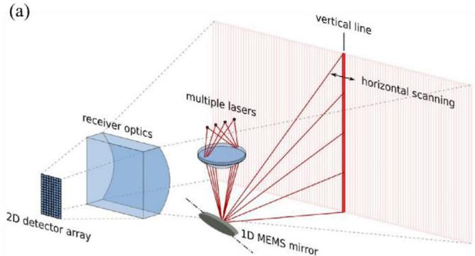

(b)  
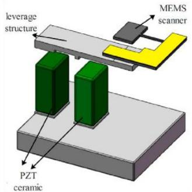

(c)  
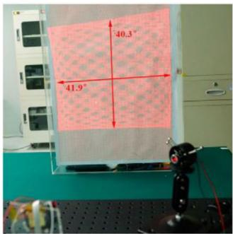

(d)  
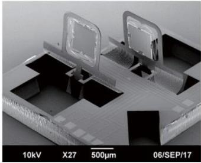

(e)  
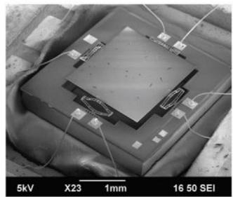  
(f)

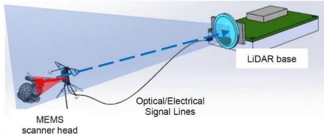  
Figure 4. 1D and 2D MEMS mirrors for LiDAR sensing. a) Schematic of LiDAR sensor with multiple laser beams to form vertical line and 1D MEMS mirror for horizontal scanning. a) Adapted with permission.[21] Copyright 2018, IARIA. b) Schematic of2D MEMS scanning mirror assembly, with bases consisting of two PZT ceramics. PZT: lead zirconate titanate. c) 2D scanning pattern by the packaged MEMS scanner. b,c) Adapted under the terms of a Creative Commons Attribution 4.0 International License.[45] Copyright 2017, The Authors, published by MDPI. d) SEM image of the fabricated vertical MEMS mirrors with forward scanning scheme. d) Adapted with permission.[47] Copyright 2018, IEEE. e) SEM image of fabricated large aperture 2D MEMS scanning mirror with mirror plate size of 2 × 2.5 mm2, and an optical FOV of 15° × 12°. e) Adapted with permission.[48] Copyright 2019, IEEE. f) Conceptual schematic of MEMS mirror mounted on micro-robot for zoom-in 3D scanning. f) Adapted with permission.[10] Copyright 2021, IEEE.

## 3.2. MEMS-Based LiDAR

MEMS technology is able to reduce the size and weight ofa scanning LiDAR system, enabling the use of miniaturized LiDAR sensors on small unmanned aerial vehicles (UAVs).[20] In the meanwhile, for MEMS mirror design, the trade-of between optical beam size (mirror size) and scanning speed needs to be considered and balanced.[16] A recent review by Wang et al.[42] has made a good summary on diferent kinds ofMEMS mirrors for LiDAR application. In this section, the focus is on reported demonstrations of MEMS-based LiDAR sensors as well as MEMS mirrors in the past 5 years, with key features summarized in Table 2.

## 3.2.1. 1D MEMS mirror

LiDAR sensor utilizing 1D scanning MEMS mirror has been demonstrated by Druml et al.[21] The schematic ofthe LiDAR sensor prototype is shown in Figure 4a. To achieve 2D scanning, the MEMS mirror performs horizontal scanning of a vertical line of laser beams. The work reported not only demonstrates a LiDAR prototype, but also shows the potential for future LiDAR systems with long sensing distance of >200 m at costs of <\$ 200. Furthermore, in the study by Schwarz et al.,[43] a resonant 1D MEMS mirror with scanning angle of >±45° and hence scanning FOV of up to 180° has been presented. The aluminum nitride (AlN)-based piezoelectric MEMS mirror with a size of 2 mm × 4 mm can achieve accurate scanning with a frequency of 1.5 kHz. Further, scandium-doped AlN, with higher piezoelectric coeficient than AlN, has been identified to further improve the device eficiency.

## 3.2.2. 2D MEMS mirror

The 2D MEMS mirror typically has a fast axis and a slow axis, which are used for horizontal scanning and vertical scanning, respectively. The scanning frequencies are typically within the range of 0.5–2 kHz and 10–30 Hz for the fast and slow axis, respectively.[42] The frame rate of the LiDAR scanner is limited by the scanning speed of the slow axis.

In 2016, the study by Kasturi et al.[22] demonstrated a 2D MEMS scan module with a weight of <40 g mounted on an UAV. The MEMS scan module is controlled by a smartphone through Bluetooth. Also, for proof-of-concept demonstration, the MEMS mirror is integrated with of-the-shelf laser range finder to demonstrate accurate distance measurement of2 m with ± 8° FOV. In the same year, the study by Ye et al.[44] demonstrated a 2D MEMS scanner with wedge-like structure for scanning angle amplification. Scanning angles of 45.3° and 42.6° have been demonstrated in the x- and y-axis, respectively. In 2017, a followup work by Ye et al.[45] demonstrated 2D MEMS mirror with a driving voltage of5 V and two-axis scanning frequencies of947.51 and 1464.66 Hz. The schematic of the 2D MEMS mirror assembly with base consists of two lead zirconate titanate (PZT) ceramics and its 2D scanning pattern are shown in Figure 4b,c, respectively. Also, in the same year, a Ti alloy-based microscanning mirror with large aperture size of 12 mm and fast scanning frequency of 1.24 kHz was demonstrated by the same group.[46] The large aperture size of the microscanning mirror enables the LiDAR system to work in longer ranging distance.

In 2018, the study by Wang et al.[20] demonstrated an electrothermal actuated MEMS scanner. The scanner has been applied in a LiDAR prototype, which has a volume of100 mm × 100 mm × 60 mm and a weight of <100 g. The LiDAR prototype is suitable for sensing applications used in small UAVs. In the same year, in the study by the same research group,[47] a novel design of MEMS mirrors bending vertically to the substrate has been demonstrated. The vertical mirror scheme is able to perform direct forward scanning without beam folding compared to the conventional case where mirrors are parallel to the substrate. Hence, in comparison with the conventional case, the direct forward scanning by vertical mirror takes less space and reduces eforts for optical alignment. This is important for a miniaturized LiDAR scanner. The scanning electron microscopy (SEM) image of the fabricated MEMS scanner is shown in Figure 4d. The MEMS scanning range is reported to be 17°, under only 4.5 V of driving voltage. The resonant frequency of scanning mode can achieve 2.2 kHz. The forward-view scanner has a compact size of 4 mm × 4.5 mm × 1.6 mm and a light weight of16 mg, and hence can be applied for small-size LiDAR in micro-air vehicles.[47] Also based on the electro-thermal actuation mechanism, in 2019, the same group reported a large aperture two-axis MEMS mirror, with mirror plate size of 2 × 2.5 mm2, and an optical FOV of 15° × 12°.[48] The SEM image of the fabricated MEMS mirror is shown in Figure 4e. In a follow-up research study by the same group,[10] a miniature LiDAR with a detached MEMS scanner has been demonstrated. The MEMS mirror has a weight of only 10 g, and dimensions of 36 mm × 30 mm × 13 mm. The LiDAR configuration with MEMS mirror mounted on micro-robots enables the zoom-in 3D scanning of the sensing object. The conceptual schematic of LiDAR sensor configuration is shown in Figure 4f.

## 3.3. OPA-Based LiDAR

The integrated photonics platform enables compact, functional optical devices on chip with a small footprint. These functional devices include laser sources,[49–52] optical modulators,[53–56] optical filters,[57–59] optical couplers,[60,61] PDs,[62–64] and nonlinear optical generators.[65–68] Also, among solid-state LiDAR approaches, integrated photonics provide an alternative and compact platform for optical beam scanning using OPA[14] which has drawn significant interests in the research community in recent years.[23,69] Compared with the MEMS-based LiDAR, OPA-based LiDAR does not need the mechanical moving parts, and hence has orders of magnitude faster speed and higher reliability by avoiding the issue of vulnerability to mechanical shocks.[16] The study by Heck[70] and more recent study by Guo et al.[71] have made comprehensive summaries on the research progress of OPA. Also, the review work by Sun et al.[72] has made a good summary on silicon photonics OPA and key components (e.g., antenna, phase shifter) for practical LiDAR solutions. In this section, our focus will be on OPA-based solid-state LiDAR sensors that have been demonstrated, with key features/parameters summarized in Table 3.

In the study by Sun et al.,[26] a large-scale 2D OPA with 64 × 64 antennas has been demonstrated on silicon photonics chip, which is fabricated on wafer-scale in CMOS-compatible fabrication line. Hence, the compact and robust OPA can be mass-produced with low cost. Also, the OPA has the potential to be integrated with other integrated photonics devices[27] as well as electronic circuits.[74] In 2017, the study by Poulton et al.[23] demonstrated the first LiDAR using a 1D OPA on the same silicon photonics platform. The FMCW sensing scheme enables the LiDAR system to capture both distance and velocity information simultaneously. The schematic ofan FMCW LiDAR system is shown in Figure 5a, including TX OPA and RX OPA. By steering these two OPAs, the range information for three targets at diferent locations is obtained, as shown in Figure 5b. The chip with OPAs can be packaged on a circuit board with an optical fiber, as shown in Figure 5c. In 2019, a follow-up study by the same group[24] demonstrated an FMCW LiDAR system using OPA for long-range sensing. The OPA containing 512 elements is wire-bonded onto a printed circuit board and packaged with a polarization maintaining fiber, as shown in Figure 5d. A look-up-table is generated for beam steering from the packaged OPA. Figure 5e shows the beam spots from the OPA captured by an IR camera. The beam spot steering speed has been reported to be ≈30 μs, which is limited by the interface between digitalto-analog converter and field programmable gate arrays (FPGA). A beam steering range of 56° × 15° has been demonstrated. Furthermore, a prototype OPA-based LiDAR system has been used for outdoor long-range sensing. The OPA without phase shifter has been used for the long-range sensing demonstration. Figure 5f top and bottom panels show the out-door map of test area and real-time data plot, respectively. The system is reported to have a frame rate of10 Hz and is claimed to be the first coherent OPA LiDAR for long-range sensing. The ranging distance is up to 185 m. Furthermore, the research work by Bhargava et al.[73] reports the first demonstration of integration between photonics (including OPAs) front end and CMOS electronics in a single chip, with the system schematic shown in Figure 5g. The photograph of bonded wafer and packaged optical device are illustrated in Figure 5h left panel. The microscopy image of the LiDAR chip is shown in Figure 5h right panel, including transmitter OPA and receiver OPA. The FMCW laser signal is coupled onto the chip through fiber-edge coupler, and then split into transmitter OPA and local oscillator (LO) path. The reflected signal from sensing target is collected by receiver OPA and beat with the signal from LO path. The photograph of LiDAR testing setup

(a)  
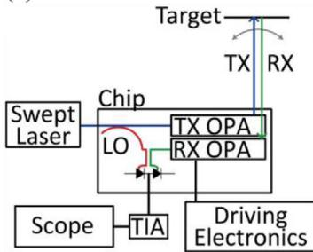

(b)  
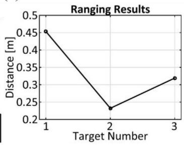  
(d)  
(e)

(c)  
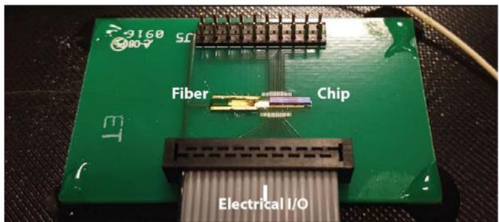

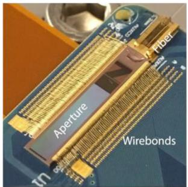

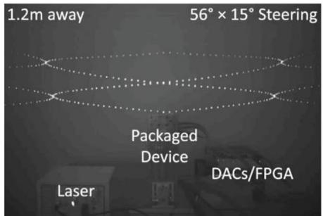

(f)  
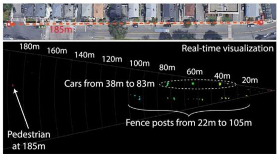

(g)  
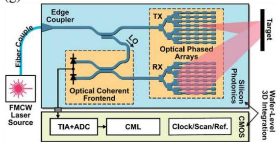  
(i)  
(h)

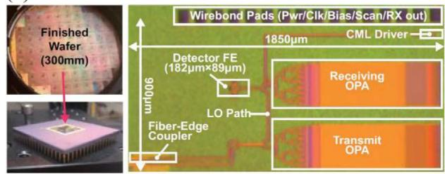

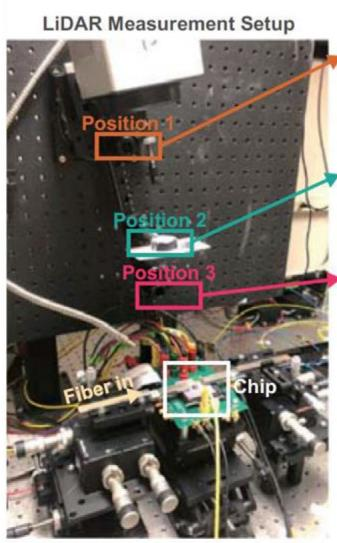

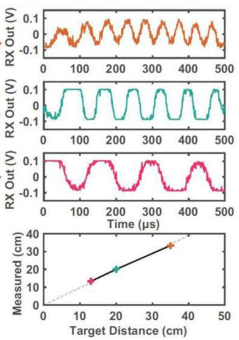  
Figure 5. Silicon photonics OPA-based LiDAR sensors. a) Schematic ofFMCW LiDAR sensor with TX and RX OPA. b) Ranging result for three targets at diferent locations, obtained through beam steering ofTX and RX OPAs. c) Optical image ofchip with OPAs packaged on a circuit board with an optical fiber attached to it. a–c) Adapted with permission.[23] Copyright 2017, The Optical Society. d) Photograph of512 element OPA wire bonded on a printed circuit board and packaged with a polarization maintaining fiber. e) IR image of beam spot steering captured by an IR camera, demonstrating steering range of $5 6 ^ { \circ } \times 1 5 ^ { \circ } . \mathsf { f } )$ Top: Outdoor map of test area for long-range sensing. Bottom: Image of real-time data for long-range sensing up to 185 m. d–f) Adapted with permission.[24] Copyright 2019, IEEE. g) Schematic of photonic-electronic-integrated LiDAR sensor system. h) Left panel: Photograph of bonded wafer and packaged optical device. Right panel: Microscopy image ofthe LiDAR chip, including transmitter OPA and receiver OPA. i) Photograph of LiDAR testing setup and the LiDAR measurement result. g–i) Adapted with permission.[73] Copyright 2019, IEEE.

www.lpr-journal.org

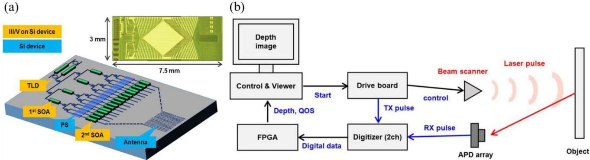

(c)  
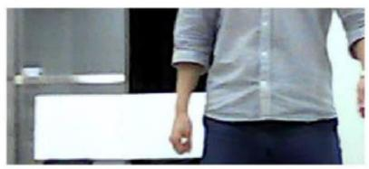

(d)  
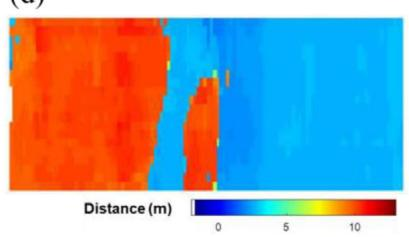

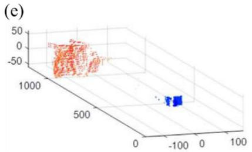  
Figure 6. Silicon photonics OPA integrated with optical source and amplifier for LiDAR sensing. a) Schematic ofsolid-state beam scanner with integrated laser source and amplifiers. Inset: Microscopy image of fabricated optical beam scanner, with size of 7.5 mm × 3 mm. TLD: tunable laser diode. SOA: semiconductor optical amplifier. PS: phase shifter. b) Configuration of OPA-based TOF LiDAR. QOS: quality of signal. c) Camera image of a pedestrian walking from a white wall 10 m away. d) Processed depth image for LiDAR demonstration. e) 3D point cloud plot obtained from TOF LiDAR sensing system. a–e) Adapted with permission.[14] Copyright 2020, IEEE.

together with the measurement results is illustrated in Figure 5i. Reflective tapes placed at three diferent positions are used as targets. The measured distances between the sensor chip and three diferent positions are presented at the bottom right of Figure 5i, showing sensing distance from 10 to 40 cm, and resolution of 3.3 cm.

In 2020, the study by Lee et al.[14] demonstrated the first chipscale LiDAR solution with integrated optical source and amplifier, which paves way for low-cost, compact fully integrated solidstate LiDAR sensor. The schematic ofthe chip-scale device based on III–V-on-Si is illustrated in Figure 6a, where the inset shows the microscopy image ofthe fabricated chip with a size of7.5 mm × 3 mm. The chip is fabricated on a silicon-on-insulator (SOI) wafer. The III–V gain layers are bonded on patterned SOI wafer. The LiDAR system based on TOF sensing mechanism is illustrated in Figure 6b. For TOF sensing, the modulated signal with 30 ns width at 1 MHz from a designed drive board is used to drive the beam scanner in pulsed mode. Semiconductor optical amplifiers (SOAs) in the optical scanner are driven by 100 mA current to enable optical beam power of 10 mW. An avalanche photodiode (APD) array is used for detection of reflected signal. TX signal from driving board and RX signal from APD are transferred to an analog-digital converter (ADC) circuit with 1 GHz sampling rate. The TOF is obtained by calculating the cross-correlation of TX signal and RX signals at FPGA and reconstructed for 3D depth image and point cloud plot. The 3D LiDAR scanning can achieve frame rate of >20 Hz. For LiDAR demonstration, a pedestrian walking from a wall 10 m away has been captured. The selected camera image, depth image, and 3D point cloud plot are illustrated in Figure 6 panels c, d, and e, respectively.

More recently, in 2021, Nakamura et al. demonstrated OPAbased LiDAR using liquid crystal (LC) as the tunable material.[25] The LC tuning provides one more dimension for beam steering in addition to OPA beam steering by phase shifter, and hence enables 2D beam steering at single wavelength. The OPA with LC is fabricated using a standard silicon photonics process and an LC process for commercial LC displays. The schematic of 1D OPA with LC is illustrated in Figure 7a. The vertical beam steering is enabled by 1D OPA and the horizontal beam steering is enabled by LC tuning. The LC tunable antenna is formed by LC core sandwiched by distributed Bragg reflectors (DBR), as illustrated in the right panel of Figure 7a. The top DBR has higher transmittance for light emission. The LC molecular orientation and refractive index can be changed by an applied electric field, and hence the phase change can be achieved for beam steering. The layout and the cross-section of eight-channel OPA are shown in Figure 7b. The thermal-optic phase shifter enables 1D OPA tuning in the vertical direction. The photonics components are based on silicon nitride $( \mathrm { S i } _ { 3 } \mathrm { N } _ { 4 } )$ platform, with working wavelength of 940 nm. The microscopy image ofthe fabricated device is shown in Figure 7c. The beam steering range of the OPA can achieve $1 5 ^ { \circ } \times 1 6 ^ { \circ }$ . Furthermore, a LiDAR system has been demonstrated by using LC-tunable device capable for 1D beam steering, with schematic shown in Figure 7d. Target tracking has been realized by detecting a person from a black-and-white camera and steering the beam toward the target person. By using a TOF camera with a synchronized laser diode coupled to LC beam steering device, the distance of the sensing target can be obtained. A maximum sensing distance of 12 m and refresh rate of 10 frames $\mathbf { S } ^ { - 1 }$ have been reported.

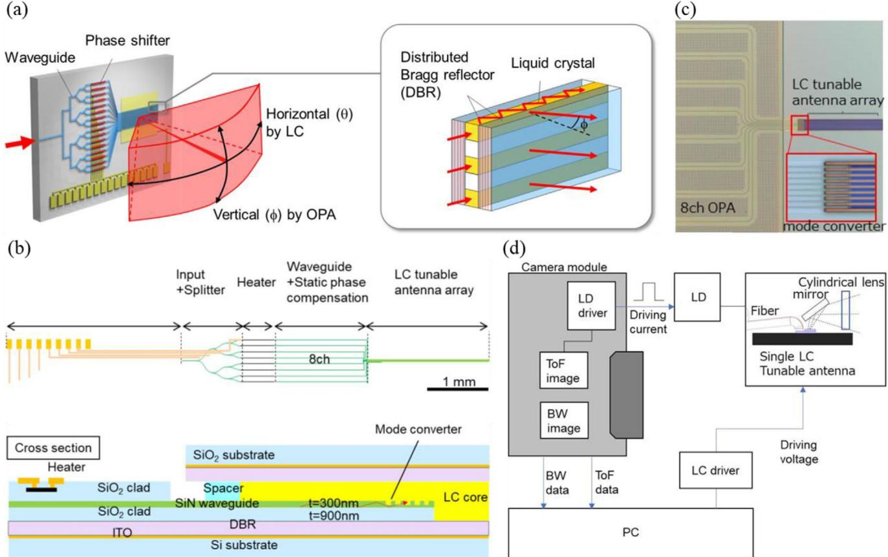  
Figure 7. Silicon photonic OPA integrated with liquid crystal (LC) for LiDAR sensing. a) Left panel: Schematic of 1D OPA with LC. Vertical beam steering is enabled by 1D OPA and the horizontal beam steering is enabled by LC. Right panel: LC tunable antenna formed by LC core sandwiched by distributed Bragg reflectors (DBR). Top DBR has higher transmittance for light emission. b) Layout and cross-section ofeight-channel OPA. c) Microscopy image of the fabricated OPA device. d) Schematic ofLiDAR system demonstrating target tracking and TOF sensing with LC-tunable beam steering. a–d) Adapted with permission.[25] Copyright 2021, Society of Photo‑Optical Instrumentation Engineers (SPIE).

## 4. Emerging Nanophotonics-Based LiDAR Sensor

With the advances in nanofabrication, nanostructures with suboptical wavelength dimension can be patterned in large scale, and hence enable light–matter interaction. The engineering and patterning of nanostructures contribute to the control and manipulation of electromagnetic waves in the optical wavelength regime. One example is integrated photonics technology, which demonstrates large-scale patterning of nanostructures (e.g., Bragg gratings[61,75] and high-Q microring resonator [76–78]) on photonic integrated circuit (PIC). The high-Q microring resonator enables the generation of OFC, which can be used for sensing. Another example is flat optics technology, where the nanostructures in a layer are engineered to obtain a desired phase profile,[79] and hence achieve various functionalities.[80] The metasurface brings the advantage of compactness, capability for dispersion control, and high optical beam quality without aberration. The novel nanophotonics devices mentioned here have also been demonstrated for LiDAR sensing. In this section, the recently demonstrated LiDAR sensors implementing novel nanophotonics devices including optical switches for sequential illumination LiDAR, OFCs as light source for parallel scanning and high-precision ranging in LiDAR, as well as metasurfaces for optical beam steering and deflection in LiDAR are reviewed.

A summary of nanophotonics-based LiDAR sensors with key features is also presented in Table 4.

## 4.1. Optical Switches for Sequential Illumination LiDAR

In the earlier section, OPA-based LiDAR sensors have been reviewed. Also based on integrated photonics platform, more recently, sequential illumination/flash LiDAR sensors have been demonstrated.[29,32,82–84] In such sequential flash approach, spatial scanning is achieved by controlling optical switches to sequentially switch the emission among diferent emitters. Com paring with the flash approach mentioned in the earlier section, sequential illumination/flash approach overcomes the limitation on optical power budget, and hence enables larger sensing range. For LiDAR sensor hardware, the PIC components covered in this section include optical switches and PDs. An additional note is that the OFC generator can also be on an integrated photonics platform, which will be discussed separately in later Section 4.2.

In 2018, the study by Martin et al.[29] reports a sequential flash LiDAR sensor working in the FMCW scheme. The sensor PIC includes two optical switching networks (SNs) to separately switch illumination among eight emission and eight collection channels on a single CMOS-compatible silicon photonics chip. The switching among eight channels by controlling SN enables spatial scanning, so that beam scanning by moving parts can be avoided. A frequency-modulated distributed feedback laser is used as the external of-chip light source. A part of the optical power goes into TX as well as delay line interferometer (DLI), and another part ofoptical power goes into RX as LO. The optical signal is coupled onto the photonics chip via grating coupler. DLI cascaded with a balanced photodetector (BPD) is used to monitor and control the chirp of laser source. The TX emits light in eight diferent directions through eight collimation lenses. The reflected light is collected and routed to the RX through eight external fiber circulators. These reflected signals will beat with the LO in BPDs in RX. The operation of LiDAR sensor with eight channels working is demonstrated by measuring a wall at 9.5 m distance.

Table 4. Summary of emerging nanophotonics-based LiDAR sensors.
<table><tr><td>Nanophotonics device</td><td>Sensing approach</td><td>Wavelength</td><td>Sensing distance</td><td>Measured velocity (v)</td><td>Reference/Year</td></tr><tr><td>Microdisk resonator (for OFC generation)</td><td>TOF</td><td>1520 to 1580 nm</td><td>26 m (without scanning, with ±0.466 m uncertainty)</td><td>N.A.</td><td>[30] / 2018</td></tr><tr><td>Microring resonator (for OFC generation)</td><td>TOF</td><td>1530 to 1620 nm</td><td>Up to 2 mm (spatial resolution of 2 μm, without scanning, object with moving speed of 150 m s−1)</td><td>N.A.</td><td>[1] / 2018</td></tr><tr><td>Optical switches (for sequential illumination) and PDs</td><td>FMCW</td><td>N.A. (C or L-band based on laser</td><td>Up to 60 m (single channel), 9.5 m (eight channels for spatial scanning), 28 cm resolution limited by modulation bandwidth</td><td>5 km h⁻¹ (target walking at 30 m)</td><td>[29] / 2018</td></tr><tr><td>Racetrack resonator and bus waveguide with an</td><td>TOF</td><td>Around 1550 nm</td><td>Up to 30 m (without scanning)</td><td>N.A.</td><td>[81] / 2020</td></tr><tr><td>inverse-designed reflector Microring resonator (for OFC generation)</td><td>FMCW</td><td>1500 to 1630 nm OFC span (1530-1560 nm used for LiDAR</td><td>10 m (without scanning, with &lt;1 cm measurement imprecision), 4–7 m (with 1D scanning mirror and spectrally dispersed</td><td>±10 m s−1</td><td>[2] / 2020</td></tr><tr><td>Optical switches (for sequential illumination)</td><td>TOF</td><td>sensing) 1550 nm</td><td>comb lines) 4.8–7.5 m (beam steering by switching light to N.A. a 2D fiber array, range error: 2 cm)</td><td></td><td>[82] / 2020</td></tr><tr><td>Metasurface-based SLM (for beam steering)</td><td>TOF</td><td>1560 nm</td><td>Up to 10 m (single-point measurement, with 4 cm accuracy), 2.4–4.7 m (with 2D beam</td><td>N.A.</td><td>[33] / 2021</td></tr><tr><td>Optical switches (for sequential illumination) and PD array</td><td>FMCW</td><td>1550 nm</td><td>steering) 17 m (1.8 mm precision, target with 85% reflectance); 75 m (3.1 mm precision, target with 30%</td><td>±10 mm s−1</td><td>[32] / 2021</td></tr><tr><td>Optical switches (for sequential illumination)</td><td>TOF</td><td>1544-1562 nm</td><td>reflectance) 1.08 and 11.22 m (multiple wavelengths with</td><td>N.A.</td><td>[83] / 2021</td></tr><tr><td>Optical switches (for sequential illumination)</td><td>FMCW</td><td>1550 nm</td><td>1D beam steering by thermal switching) 0.8, 5, and 10 m (with 2D scanning, 1.7 cm distance resolution)</td><td>N.A.</td><td>[84] / 2022</td></tr></table>

Also, sequential flash LiDAR sensors with optical switches and lens-assisted beam-steering (LABS) technology have been reported in recent studies.[82,83] LABS technology has attracted interest in research contributed by the advantage of low control complexity and high background suppression.[83] The more updated work by Li et al.[83] reports 2D beam steering by placing a cylindrical lens above emitter array on a PIC chip, with schematic shown in Figure 8a. 2D beam steering is achieved by both thermal switching among diferent emitters (along the x direction) and wavelength tuning ofinput signal (along the y direction). One point to emphasize is that at one time, only one emitter is switched on. A TOF LiDAR has been demonstrated using the beam steering device. The schematic of experiment setup is shown in Figure 8b. A pulse laser is used as light source, followed by a pulse picker to reduce the repetition rate in time domain, and a spectral filter to select out the wavelength in frequency domain. Then the signal is split into two paths: one path goes directly into the PD, and another path goes into the amplifier and LABS device transmitter. In this TOF LiDAR demonstration, optical signals with multiple wavelengths are emitted and collected simultaneously to improve the sensing speed. The returning signals are received by a fiber array and a few APDs, as plotted in Figure 8c together with reference signal. From the time delay between reference signal and returned signals, the target distance can be calculated as 1.08 and 11.22 m.

Furthermore, a study reported in 2021 by Rogers et al.[32] demonstrated a 3D imaging sensor based on sequential illumination/flash with optical switching tree on silicon photonics platform. The LiDAR sensor is based on FMCW scheme, with a TX focal plane array (FPA) and an RX FPA. The large-scale coherent receiver array with 512 pixels operates at the quantum noise limit. The heterodyne detector is integrated with electronic readout circuit through the monolithic integration of photonic and electronic circuit, which also provides the possibility for further scale-up ofthe pixel number. The trade-ofbetween the FOV and sensing range is eliminated by sequentially illuminating and reading out the sensing scene. The schematic of the RX block formed by heterodyne PD pixel is shown in Figure 9a. The zoom-in view of one RX pixel is illustrated in the inset of Figure 9a on the left side. The LO light is guided through a 1 × 8 switching tree and combines with the reflected light collected by grating couplers in each pixel. The heterodyne signal is detected by a Ge BPD and the generated photocurrent signal is amplified by a transimpedance amplifier (TIA). At the end of each row, there is an output amplifier to transmit the signal of from chip. The FMCW LiDAR sensing result is shown in Figure 9b. A 3D point cloud of a rotating basketball located at 17 m distance is illustrated in Figure 9c top panel. The velocity across the middle of the rotating basketball measured by FMCW scheme is shown in Figure 9c bottom panel.

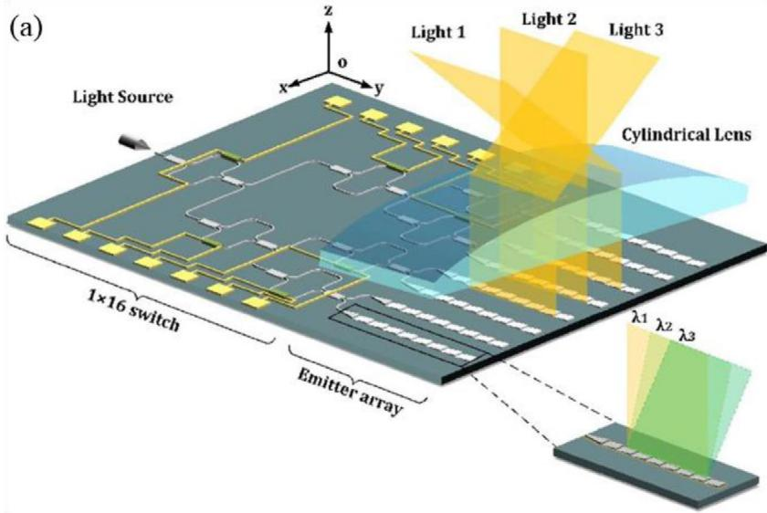  
(c)

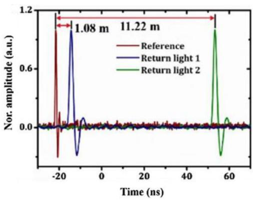

(b)  
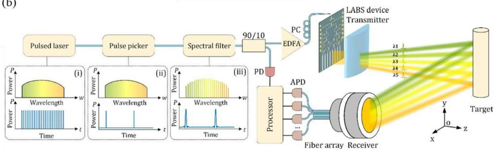  
Figure 8. A LiDAR sensor with optical switches for sequential illumination. a) Schematic of2D beam steering device with a cylindrical lens placed above emitter array on a chip with integrated optical switches. b) Schematic of TOF LiDAR sensing setup with the beam steering device. Inset: Optical source signal in frequency domain and time domain from i) pulsed laser, ii) pulse picker, iii) spectral filter. c) Plot of reference signal and two reflected signal from sensing object located at the distance of 1.08 and 11.12 m. a–c) Adapted with permission.[83] Copyright 2021, Chinese Laser Press.

More recently, the study by Zhang et al.[84] reported a 16384 pixel LiDAR realized through the monolithic integration of grating antennas and MEMS-based optical switches on a silicon photonics chip. Compared with optical switches based on thermally tuned Mach–Zehnder interferometer (MZI),[29,82,83] the MEMSbased optical switches have the advantages of smaller footprint, lower power consumption, and higher switching speed.[84] The schematic of switching array with a lens on top is illustrated in Figure 10a. The optical signal is routed to the selected grating antenna through row-selection and column-selection switches. These switches operate based on MEMS electrostatic actuation, with schematic of ON and OFF states shown in Figure 10b. Under ON state, the coupler tip (in green color) is pulled down to couple light from bus waveguide (in yellow color) to grating antenna. The emitted light from grating antenna is then collimated through the lens on top. 3D imaging at the distance of 0.8, 5, and 10 m with a distance resolution of 1.7 cm has been achieved by the LiDAR sensor working in FMCW scheme. At around 0.8 m distance, the point clouds captured by FMCW LiDAR sensor together with camera image of three letters at the same height and diferent heights are illustrated in Figure 10c,d, respectively.

In addition to integrated beam splitters, optical switches, gratings, and PDs discussed in the earlier works, the study by Yang et al.[81] demonstrated an optical pulse circulator on integrated photonics platform, which has potential applications in a LiDAR system. The circulator is formed by a high-Q silicon racetrack resonator and a silicon bus waveguide with an inverse-designed reflector. The geometrical asymmetry and optical nonlinearity contribute to the nonreciprocity ofthe device. Although the proof-ofconcept LiDAR demonstration reported in ref. [81] is not based on sequential illumination/flash, the integrated circulator has the potential to be implemented in various LiDAR systems including sequential illumination, e.g., to replace the of-chip circulator within the LiDAR system reported in ref. [29].

(a)  
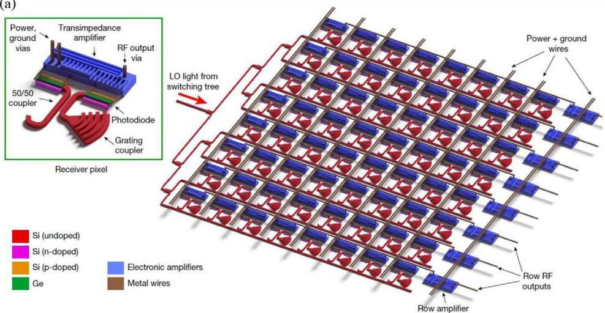

(b)  
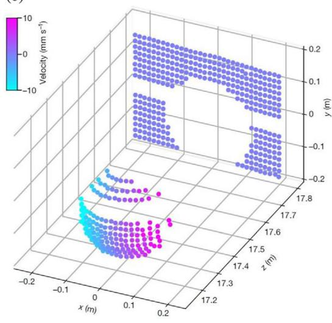

(c)  
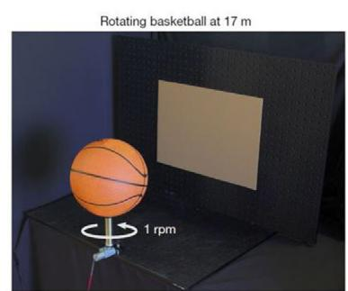

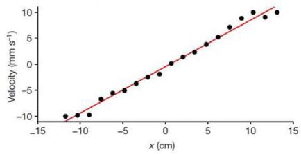  
Figure 9. A LiDAR image sensor based on sequential illumination enabled by optical switching tree. a) Schematic of RX block formed by heterodyne PD pixel. Inset: Zoom-in view of one RX pixel. Light from LO is guided by a 1 × 8 switching tree. Grating coupler is used to collect reflected light from sensing object. LO light and reflected light will have heterodyne detection in Ge BPD. The generated electrical signal is amplified by TIA. At the end of each row, there is an output amplifier to transmit the signal of from chip. b) 3D point cloud of a rotating basketball located at 17 m distance, with velocity information indicated in color bar. c) Top panel: Photograph of rotating basketball setup rotating at the speed of 1 rpm. Bottom panel: Measured velocity across the middle of the rotating basketball. a–c) Adapted with permission.[32] Copyright 2021, Springer Nature.

An additional note worth mentioning is that the sequential illumination/flash approach has been deployed in commercial Li-DAR sensors. One example is the LiDAR sensor from Ibeo Automotive Systems GmbH applied for autonomous driving. Another example is LiDAR sensor on iPhone and iPad from Apple Inc. applied for consumer electronics. Typical configuration is to use vertical cavity surface-emitting lasers (VCSEL) array on the transmitter side, and SPAD array on the receiver side. For the LiDAR sensor from Ibeo, the mapping between the emitter and receiver overcomes the power budget limitation constrained by eye-safety regulation, and hence enables longer sensing range from the Li-DAR system.

## 4.2. Frequency Comb Sources for High-Performance LiDAR

In addition to the above-mentioned OPA-based LiDAR and sequential illumination LiDAR with integrated optical switches, OFC can also be generated on an integrated photonics platform. OFC is a high-precision metrology tool consisting of a series of equal-distance optical frequency lines. It has been used in many areas, including optical frequency metrology,[85] optical frequency synthesis,[86–88] microwave photonics,[89–91] distance measurement,[92,93] chemical sensing, and spectroscopy.[94,95] Broadband light sources including OFC and supercontinuum can be generated through nonlinear optical efect of waveguide material.[66,96–99] Contributed by the nonlinear optical properties of the materials on integrated photonics platform, chip-scale OFCs have been demonstrated and investigated.[100–102] Recently, integrated OFCs have also been used as light source for LiDAR sensing.[1,2,30,103] In this section, recent research progress of Li-DAR sensors using integrated OFCs is reviewed.

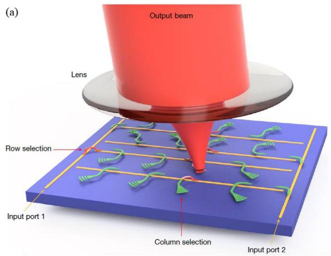

(b)  
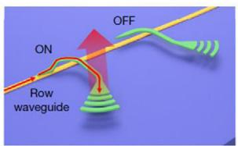

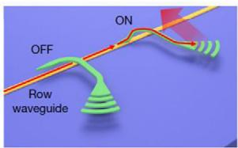

(c)  
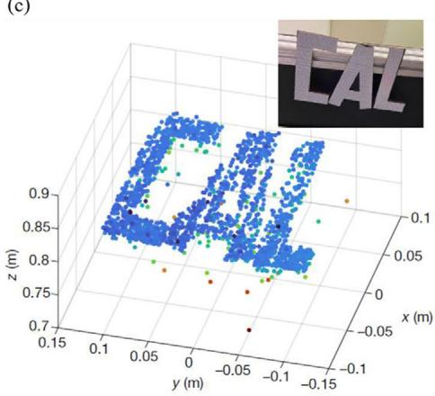

(d)  
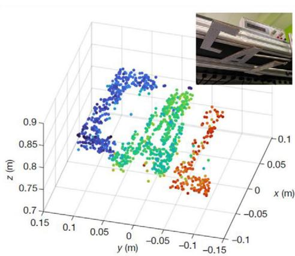  
Figure 10. A LiDAR sensor based on sequential illumination enabled by MEMS-actuated optical switches. a) Schematic of MEMS-actuated optical switching array with a lens on top. Light is routed to the selected grating antenna through row-selection and column-selection switches. The lens on top is to collimate the emitted light from selected grating antenna. b) Schematic of ON and OFF states for optical switches and grating antennas. Under ON state, the coupler tip (in green color) is pulled down to couple light from bus waveguide (in yellow color) to the selected grating antenna. c,d) Point clouds captured by FMCW LiDAR sensor and camera image of sensing target formed by three letters at the c) same height and d) diferent heights located at around 0.8 m distance. a–d) Adapted under the terms of a Creative Commons Attribution 4.0 International License.[84] Copyright 2022, The Authors, published by Springer Nature.

In 2018, the study by Suh and Vahala[30] reported dualfrequency combs used for TOF LiDAR sensing achieving 200 nm precision in distance measurement. Sensing distance up to 25 m with lower precision was also reported. The high precision and long range of LiDAR sensing is enabled by the use of dual frequency combs, which are generated by pumping a single microresonator in clock-wise (CW) and counter clock-wise (CCW) direction. Dual-comb from single resonator not only simplifies the system by avoiding the use of two resonators and pump sources, but also improves the mutual coherence between two combs.[30] The schematic of dual-comb generation setup and Li-DAR sensor setup is illustrated in Figure 11a. A CW pump laser source is amplified by an erbium-doped fiber amplifier (EDFA) and then split into two arms through a 50/50 coupler. In each arm, an acousto-optic modulator (AOM) is used to control the pump frequency, and a polarization controller (PC) is used to tune the polarization of pump light. The frequency of the pump laser is locked by the servo through a feedback loop with a PD detecting CCW soliton. Fiber Bragg grating (FBG) filter is used to attenuate the residual pump. Optical spectrum, electric spectrum, and time domain signals are monitored by optical spectrum analyzer (OSA), electric spectrum analyzer (ESA), and oscilloscope, respectively. For target distance sensing, the CW soliton is split into two arms through a 50/50 splitter. One arm is a reference beam (green dotted arrow), and another arm is a beam for target sensing (orange dotted arrow). The beams from both arms are combined with CCW beam (blue dotted arrow) to generate an interferogram. From the interferogram, the distance can be calculated based on the time interval between a reference peak and a target peak. Figure 11b shows the calculated distance data using CW (in red) and CCW (in blue) soliton as probe for LiDAR ranging. The average distance diference between two measurements can be obtained as 16.02 μm, from which the ambiguity-resolved distance can be calculated to be 26.3729 ± 0.466 m based on the Vernier efect.

(a)  
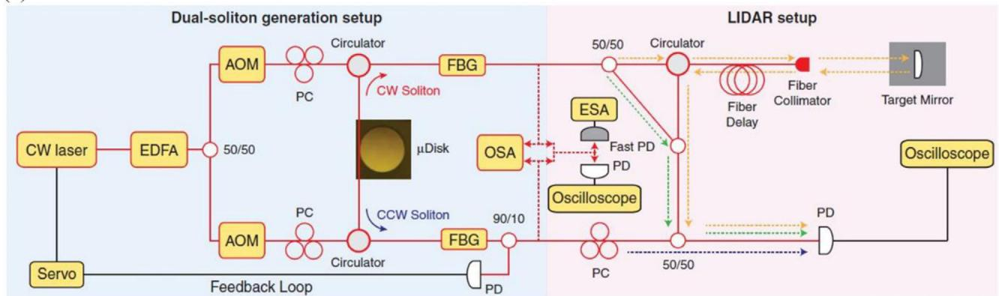

(b)  
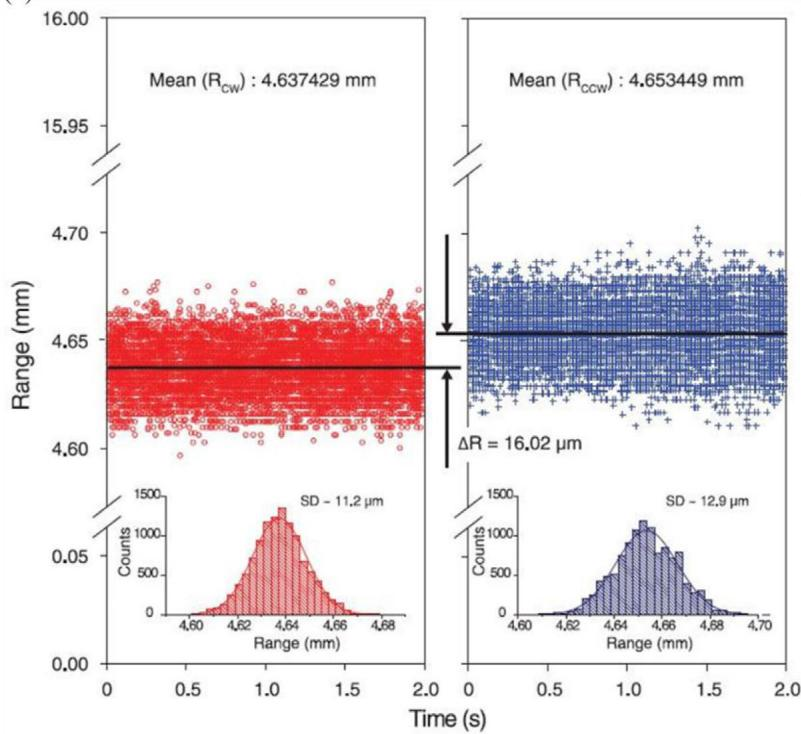

(c)  
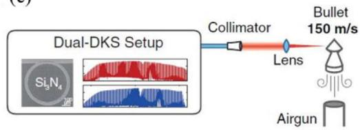

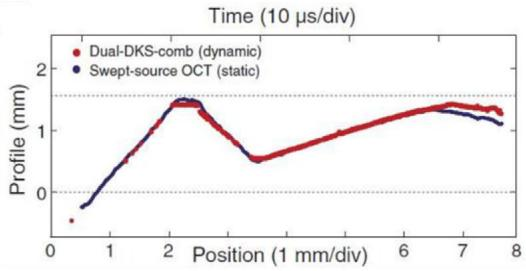

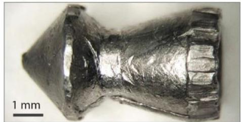  
Figure 11. LiDAR sensors based on dual-optical frequency comb. a) Schematic of dual-comb generation setup and LiDAR sensor setup. A CW pump laser is amplified by an EDFA and then split into two arms through a 50/50 coupler. In each arm, an AOM is used to control the pump frequency, and a PC is used to tune the polarization of pump light. The frequency of the pump laser is locked by the servo through a feedback loop with a PD detecting CCW soliton. FBG filter is used to attenuate pump signal. Optical spectrum, electric spectrum, and time domain signals are monitored by OSA, ESA, and oscilloscope, respectively. For LiDAR sensing, the CW soliton is split into two arms through a 50/50 splitter. One arm is a reference beam (green dotted arrow), and another arm is a beam for target sensing (orange dotted arrow). Optical beams from both arms are combined with CCW beam (blue dotted arrow) to generate interferogram. EDFA: erbium-doped fiber amplifier. AOM: acousto-optic modulator. PC: polarization controller. FBG: fiber Bragg grating. OSA: optical spectrum analyzer. ESA: electric spectrum analyzer. b) Calculated distance data using CW (in red) and CCW (in blue) soliton as probe for LiDAR ranging. ∆R = 16.02 μm, which can be used to obtain the absolute distance. Insets: Histograms ofrange measurements with Gaussian fitting curves and SD values. SD: standard deviation. a,b) Reproduced with permission.[30] Copyright 2018, AAAS. c) Top panel: Schematic of LiDAR setup for ultrafast sensing. Middle panel: Measured flying bullet profile by dual-comb system (in red) and static bullet profile by an optica coherence tomography system (in blue) for comparison. Bottom panel: A photograph of the bullet for reference. c) Reproduced with permission.[1] Copyright 2018, AAAS.

Another dual-comb-based LiDAR is demonstrated in the research work by Trocha et al.,[1] where dual-comb LiDAR sensing has been performed, and ultrafast ranging with 100 MHz acquisition rate has been achieved. The high acquisition rate is contributed by the large free spectral range of comb lines, and high ranging precision is contributed by the wide optical bandwidth (>11 THz). The ranging ofan in-flight gun projectile $( \nu = 1 5 0 \mathrm { m } \mathrm { \ s } ^ { - 1 } )$ has been demonstrated. The schematic ofLiDAR setup is shown in Figure 11c top panel. Two dissipative Kerr soliton combs are generated from two separate $\mathrm { S i } _ { 3 } \mathrm { N } .$ microring resonators. The sensing measurement is conducted for a flying bullet with moving speed of 150 m $\mathbf { S } ^ { - 1 }$ from an air gun. The measured bullet profile is plotted in red as shown in Figure 11c middle panel (in red). A reference measurement result for static bullet by an optical coherence tomography system has been included in the same plot (in blue) for comparison. A photograph of the bullet is illustrated in Figure 11c bottom panel as reference.

(a)  
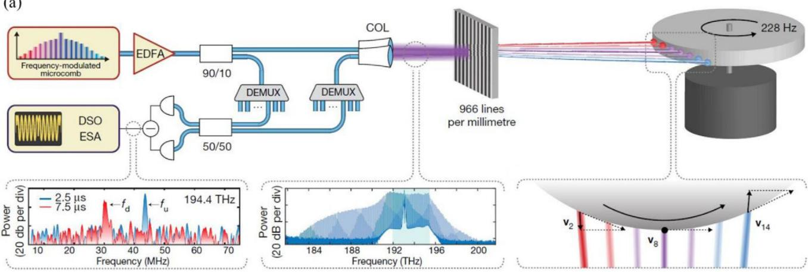

(b)  
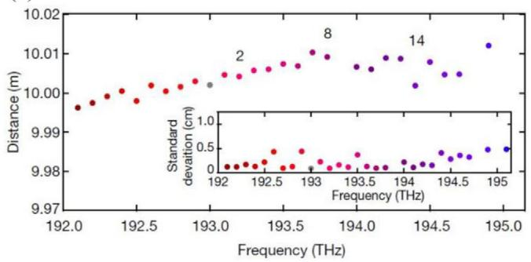

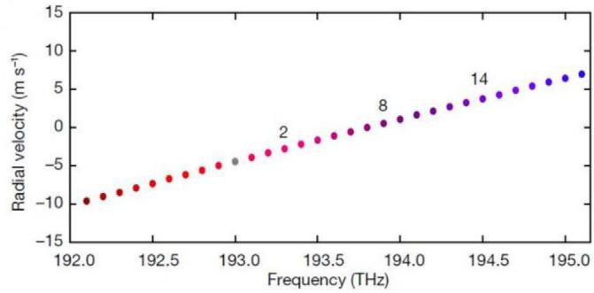  
Figure 12. A LiDAR sensor based on optical frequency comb for parallel sensing. a) Schematic ofexperimental setup for proof-of-concept demonstration ofparallel sensing system. Insets: Left: Radio frequency spectrum ofmixed signal with two peaks $( f _ { \natural }$ and $f _ { \mathrm { d } } )$ . Middle: Optical spectrum ofemitted comb. 30 comb line channels with optical power of > 0 dBm (for LiDAR sensing) are highlighted in blue shaded area. Right: Schematic of flywheel edge irradiated by the dispersed frequency comb lines. COL: collimator. b) Left panel: Distance measurement result of a static wheel, without correction for fiber path diference between sensing signal and LO. Right panel: Parallel velocity measurement result for flywheel with a rotating speed of 228 Hz. a,b) Adapted with permission.[2] Copyright 2020, Springer Nature.

Furthermore, in addition to the dual-comb approach, the research work by Riemensberger et al.[2] demonstrated a frequency comb-based FMCW LiDAR for massively parallel 3D sensing. In comparison with TOF LiDAR, although FMCW LiDAR has the advantages of obtaining velocity, free from interference, and operation with lower optical peak power, it has limitation on acquisition speed and requires precisely chirped coherent laser source.[2] The massively parallel 3D sensor reported in ref. [2] provided a solution to overcome the limitation. A frequencymodulated CW laser is used to pump a high- $\boldsymbol { Q } \ \mathrm { S i } _ { 3 } \mathrm { N } _ { 4 }$ microring resonator. The idea is to transfer the chirp from the pump source to multiple comb lines while retaining the repetition rate of the optical signal. In this way, an array of independent sources with frequency modulation can be obtained. These channels are later dispersed through difractive optics. Each channel can be used to measure distance and velocity information simultaneously at diferent locations. The distance and velocity information can be obtained through the homodyne detection between original signal and reflected signal from sensing object. Using the proposed sensor, a proof-of-concept demonstration of parallel sensing system has been performed, with schematic illustrated in Figure 12a. The frequency-modulated comb lines are first amplified by an EDFA, and then split into two arms by a 90/10 splitter. The signal in one arm is spectrally dispersed by a transmission grating (966 lines per millimeter) for the sensing of a flywheel. The signal in another arm is used as LO. The radio frequency spectrum of mixed signal has two peaks $\mathcal { f } _ { \mathrm { u } }$ and $f _ { \mathrm { d } } )$ , as illustrated in the inset ofFigure 12a. The optical spectrum ofemitted comb has also been illustrated in the middle part ofFigure 12a as inset. 30 comb line channels with optical power of>0 dBm (for LiDAR sensing) are highlighted in blue shaded area. The schematic of flywheel edge irradiated by the dispersed frequency comb lines is illustrated in the right part of Figure 12a inset. The distance measurement result of a static wheel is shown in Figure 12b left panel. The measurement imprecision of<1 cm can be observed.

The parallel velocity measurement result is presented in Figure 12b right panel, under a flywheel rotating speed of 228 Hz.

In addition, it is worth mentioning that the research work by Wang et al.[103] demonstrated a high-performance LiDAR using integrated soliton microcomb to achieve sensing with long distance, high precision, and high speed simultaneously. The ranging distance is up to 1179 m with up to 35 kHz high speed, and high precision (minimum Allan deviation of 5.6 μm at an average time of0.2 ms). The microcomb is generated by a high-index doped silica glass-integrated microring resonator, which has the advantage of compact integration. The sensing distance is obtained through dispersive interferometry method.

For the OFC-based LiDAR sensors discussed above,[1,2,30,103] the only integrated photonics component is the ring resonator for OFC generation. In the near future, more photonic components can be integrated on the same chip to achieve a fully integrated OFC-based LiDAR sensing system.[104] These integrated photonics components include pump source,[105–112] OPA,[26,70,71] and BPD.[23,29,113] Recently, the study by Xiang, et al.[114] demonstrated the monolithic integration of semiconductor pump source and $\mathrm { S i } _ { 3 } \mathrm { N } _ { 4 }$ microring resonator on silicon, which opens doors to lowcost compact integrated OFC source fabricated using CMOScompatible techniques. Also, a tunable laser source with remarkable performance (118 nm tuning range, sub-100 Hz linewidth) has been recently reported.[115] Furthermore, large-area silicon photonics OPAs[26] have been demonstrated. OPAs with BPDs, directional couplers, and edge couplers have also been demonstrated on a silicon photonics platform for LiDAR sensing.[23] In addition, diferent chips and photonic platforms can be connected through photonic wire bonding.[116,117] From the demonstrated photonics components mentioned here, silicon photonics platform shows significant potential to realize a fully integrated solid-state LiDAR sensor. The integration of LiDAR on photonic and electronic chips can further reduce the cost, size, and power consumption.[34]

## 4.3. Metasurfaces for Beam Steering and Deflection in LiDAR

Metasurface has become an emerging field in the area of optics and photonics in the past decade.[118,119] It is a thin layer of patterned nanostructures to manipulate the phase, amplitude, and polarization of light. By engineering the phase and amplitude profile of the meta-elements, various functional devices have been demonstrated, including lenses,[120–126] beam deflectors,[127–129] waveplates,[130–133] spectrum filters,[134–138] and holograms.[139–142] Metasurface is a disruptive technology to conventional optical devices, which are relatively bulky compared with the metasurface.[143] Furthermore, metasurface-based devices can be fabricated using a single-step lithography process, which is compatible with the CMOS fabrication line.[144–146] Contributed by the nature of sub-wavelength scale phase control meta-elements, metasurface-based LiDAR system has the capability to achieve high-resolution 3D sensing.[16] Also, optical beam steering can be achieved using metasurfaces with active tuning capability.[31,147]

A recent study by Park et al.[33] demonstrated an SLM based on an electrically tunable metasurface applied in LiDAR sensing. The all-solid-state metasurface array can achieve complete phase sweeping between $0 ^ { \circ }$ and $3 6 0 ^ { \circ }$ at an estimated rate of 5.4 MHz, and also independent adjustment ofamplitude, which overcomes the limitation ofearlier reported active metasurfaces. The functional tunable metasurface is formed by an array of plasmonic nanoresonators. The nanoresonator consists ofa gold (Au) layer at the top as antenna, an indium tin oxide layer in the middle, and an Al layer at the bottom as mirror. These three layers are electrically insulated by oxide layers in between. The real and imaginary part of reflection coeficient can be tuned by independently applying electric voltage on top electrode $( V _ { \mathrm { t } } )$ and bottom electrode $( V _ { \mathrm { b } } )$ . The fabricated SLM packaged with driving electronics is illustrated in Figure 13a. The driving electronics provide 100 independently controlled channels, 50 of them for $V _ { \mathrm { t } }$ and 50 of them for $V _ { \mathrm { b } } .$ Hence, the active array as shown in the left and right panels ofFigure 13a has 50 channels. Each channel contains 11 nanoantennas. Using the developed SLM, a proof-ofconcept TOF LiDAR sensor has been demonstrated, with setup schematic shown in Figure 13b. A pulse laser at 1560 nm is used as the light source. The SLM is used for beam steering. A lens together with an APD array is used as the RX. The sensing objects include a human model, a car model, and a screen located at 2.4, 3.4, and 4.7 m away, respectively. The scanning region and corresponding depth image are shown in Figure 13c top and bottom panels, respectively. Good agreement between the measurement results and the actual distances can be observed.

In addition to the SLM mentioned above, the demonstration ofdiferent active metasurface-based devices has shown potential to be applied in LiDAR sensors. These active metasurface-based devices include the ones utilizing MEMS technology,[148–152] the ones implementing LC for tuning,[31,153,154] and the ones using phase-change material (PCM).[155–158] Metasurfaces on MEMS actuator substrate enable flat optics devices to have larger beam steering angle, which corresponds to larger FOV in a LiDAR system. Megahertz-level modulation speed has been achieved in the research work by Holsteen et $\mathrm { a l . } ^ { \dot { \mathrm { [ 1 4 8 ] } } }$ The fast modulation speed corresponds to potential for high frame rate during Li-DAR scanning. Also, active metasurface using LC is an attractive approach since it can leverage on the well-developed LC display industry[153] and can also be tuned by either temperature or electric field. The study by Chung and Miller[154] demonstrated the feasibility of using LC-based metasurface to achieve wide beam deflection angle of144° and high eficiency of>80% through inverse design. More recently, the study by Zhang et al.[158] reports a large-scale non-volatile beam switching based on optical PCM. The works mentioned above show promise ofusing active metasurface for compact LiDAR sensing.

Furthermore, metalens has also been combined with active silicon photonic microring emitter array to achieve 2D beam steering, as reported by Chang et al.[159] The schematic of the novel beam steering device is illustrated in Figure 13d. Mach–Zehnder (MZ) switch tree enables switching among diferent microring emitters in 2D array. An aberration-free metalens is above the emitter array to convert the emission from diferent emitter location into diferent propagation direction in the far field. The use of metalens contributes to compact integration with photonics devices, and high optical beam quality without aberration. Also, the switching tree in PIC enables the device for single-wavelength operation, and lower power consumption compared with OPAbased beam steering.[159] The metalens is designed to have an

(a)  
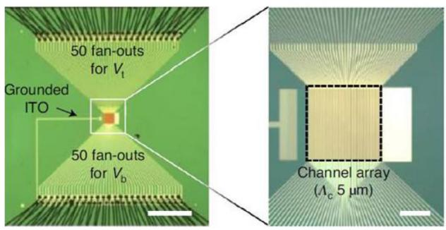

(b)  
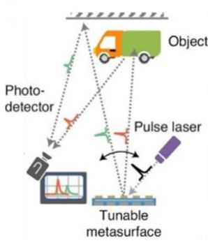

(c)  

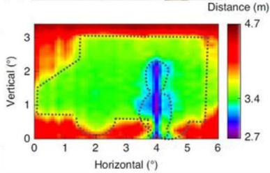

(d)  
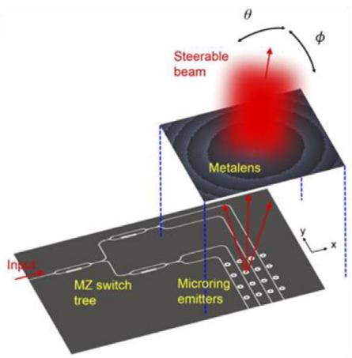

(e)  
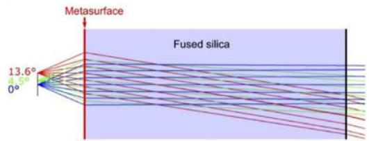

(f)  
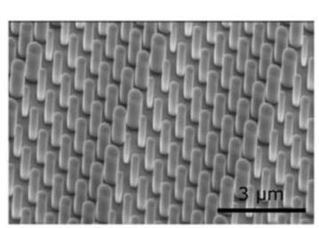

(g)  
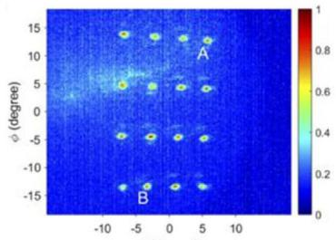  
Figure 13. Metasurfaces for LiDAR sensing. a) Left panel: Microscopy image of metasurface mounted in the center of fan-outs. Scale bar: 1 mm. Right panel: Zoom-in view of optical microscopy image of metasurface nanoantenna array located in the middle of fan-outs. Scale bar: 100 μm. b) Schematic of3D LiDAR sensor setup. A pulse laser at 1560 nm is used as light source. SLM is used for beam steering. Steered optical pulse hits the sensing object and is reflected and collected by RX formed by a lens together with an APD array. c) Top panel: Optical image of sensing objects including a human model, a car model, and a screen located at 2.4, 3.4, and 4.7 m away, respectively. Bottom panel: 3D depth image obtained from the LiDAR sensor. $\mathsf { a } { - } \mathsf { c } )$ Adapted with permission.[33] Copyright 2021, Springer Nature. d) Schematic of beam steering device with metalens placed above emitter array. MZ: Mach-Zehnder. e) Ray tracing of designed optical device. f) SEM image of fabricated metalens formed by silicon posts on fused silica substrate. g) Overlapped far-field angular distribution from 4 × 4 microring emitter array showing an FOV of $1 2 . 4 ^ { \circ } \times 2 6 . 8 ^ { \circ } . \mathsf { d - g } )$ Adapted with permission.[159] Copyright 2021, The Optical Society.

FOV of $\pm 1 3 . 6 ^ { \circ }$ , with ray tracing shown in Figure 13e. The fabricated metalens is formed by silicon posts on fused silica substrate, with SEM image shown in Figure 13f. The overlapped farfield angular distribution from 4 × 4 emitter array is illustrated in Figure 13g. An FOV of $1 2 . 4 ^ { \circ } \times 2 6 . 8 ^ { \circ }$ has been demonstrated experimentally. The novel solid-state device shows potential for LiDAR sensing with compact size, low power consumption, and high optical beam quality.

An additional note worth mentioning is that metasurfacebased dot projector/point cloud generators[129,160,161] also have the potential to be applied in 3D sensing. A remarkable work using such approach is the full-space random point cloud generated by a scrambling metasurface demonstrated in the research work by Li et al.[160] The metasurface is formed by amorphous silicon on $\mathrm { S i O } _ { 2 }$ substrate, which can be patterned by a single-step lithography process. Over 4044 points are observed in full space with angles covering up to 90°. Also, in the research work by Xie et al.,[147] metasurface beam deflectors are monolithically integrated on an array of $1 0 \times 1 0$ VCSEL. Such configuration enables the point cloud generation as well as the programming of emission angle by controlling each VCSEL independently. The point cloud 3D sensors have already been applied in consumer electronics, e.g., cellphones and tablets using point cloud for facial recognition. Metasurface-based dot projector/point cloud generators have the potential to further improve the compactness of commercial products.

## 5. Summary and Outlook

To sum up, in this review, first, diferent LiDAR sensing/ranging approaches are introduced. These approaches include pulsed TOF, AMCW TOF, and FMCW. The mechanism for each approach is explained with diagrams and equations. Next, recent research progress on conventional solid-state LiDAR sensors is reviewed which covers flash-based, MEMS-based, and OPA-based LiDAR sensors. Followed by that, LiDAR sensors utilizing novel nanophotonics devices are summarized and discussed. Nanophotonics devices implemented in LiDAR sensors include optical switches for sequential illumination, integrated resonator for OFC-based high-performance sensing, and metasurface-based SLM for beam steering.

In the near future, compact solid-state LiDAR sensors with high performance in terms of fast speed, high resolution, large FOV, and low power consumption are in need, and require further research and development.[15] Thanks to the advanced nanoscale semiconductor fabrication technology, photonics devices can be mass-produced with low cost. These devices have the potential to miniaturize and redesign the existing LiDAR sensing system for various applications.[16] Hence, we believe the future research and development work for advanced LiDAR sensors should leverage on the advancement of photonics technology, and can be directed in the following three pathways. First, as mentioned earlier, for OFC-based LiDAR sensors demonstrated so far,[1,2,30,103] the only integrated photonics component is the microring resonator. In future work, diferent photonics devices can be integrated on the same chip, including pump source, OPA, and PD, to achieve a fully integrated photonics-based Li-DAR sensing system. Also, diferent chips or photonic platforms can be linked up by photonic wire bonding.[116,117] In addition, the integration of photonic and electronic chips can further reduce the system size, cost, and power consumption.[34,73,162]

Second, the demonstration of active metasurface-based devices has shown potential to be applied in LiDAR sensors. The active tuning of the metasurface can be achieved by utilizing MEMS technology,[148–152] implementing LC,[31,153,154] and using PCM.[155–158] As mentioned earlier, the sub-wavelength scale phase control by meta-elements enables metasurface-based Li-DAR system to achieve high-resolution 3D sensing. Also, the large beam steering angle of active metasurface-based devices enables a LiDAR system with large FOV. The fast modulation speed of active metasurface contributes to high frame rate of a LiDAR system. Future eforts can be made toward the active metasurface-based LiDAR sensor, to demonstrate compact and high-performance 3D sensing system.

Last but not the least, further explorations on multispectral Li-DAR sensor can be conducted. In addition to the 3D information of the sensing object, multispectral LiDAR is capable of capturing information in one more dimension, which is the spectral domain. Spectral information can be used for sensing of materials and identification of chemical composition.[163–170] A recent review has been made to summarize the research progress toward compact spectral imaging and spectral LiDAR sensors.[104] Spectral LiDAR has been applied for environment monitoring[4,5,171] and shows potential to be applied in autonomous driving.[172] While nanophotonics-based spectral imaging systems have been demonstrated,[173–178] compact nanophotonics-based spectral Li-DAR sensing systems together with wide bandgap integrated photonics material[179–181] remain to be further explored. Potential applications include biometric identification, biomedical imaging, autonomous driving, archaeology, and art conservation.

## Acknowledgements

The authors thank Dr. Prakash Pitchappa, Dr. Yao Zhu, Dr. Chen Liu, and Dr. Elaine Cristina Schubert Barretto for discussions. This work is sup-

ported by Agency for Science, Technology and Research (A\*STAR) under Grant no.: A18A5b0056 and A19B3a0008.

## Conflict of Interest

The authors declare no conflict of interest.

## Author Contributions

N.L. conceived the review outline and consolidated the literatures. C.P.H. contributed to MEMS and OFC-related review contents. J.X. contributed to the solid-state LiDAR sensor part. L.W.L. contributed to OPA-based LiDAR sensor part. G.C., Y.H.F., L.Y.T.L. contributed to the nanophotonics components for LiDAR sensor. All authors participated in technical discussions and revision of the manuscript.

## Keywords

devices, integrated photonics, LiDAR, nanophotonics, sensors

Received: September 9, 2021   
Revised: May 16, 2022   
Published online: August 11, 2022

[1] P. Trocha, M. Karpov, D. Ganin, M. H. P. Pfeifer, A. Kordts, S. Wolf, J. Krockenberger, P. Marin-Palomo, C. Weimann, S. Randel, W. Freude, T. J. Kippenberg, C. Koos, Science 2018, 359, 887.

[2] J. Riemensberger, A. Lukashchuk, M. Karpov, W. Weng, E. Lucas, J. Liu, T. J. Kippenberg, Nature 2020, 581, 164.

[3] N. Kuse, M. E. Fermann, APL Photonics 2019, 4, 106105.

[4] C. Hopkinson, L. Chasmer, C. Gynan, C. Mahoney, M. Sitar, Can. J. Remote Sens. 2016, 42, 501.

[5] S. Morsy, A. Shaker, A. El-Rabbany, Sensors 2017, 17, 958.

[6] Y. Torres, J. J. Arranz, J. M. Gaspar-Escribano, A. Haghi, S. Martínez-Cuevas, B. Benito, J. C. Ojeda, Int. J. Appl. Earth Obs. Geoinf. 2019, 81, 161.

[7] A. F. Chase, D. Z. Chase, J. F. Weishampel, J. B. Drake, R. L. Shrestha, K. C. Slatton, J. J. Awe, W. E. Carter,J. Archaeol. Sci. 2011, 38, 387.

[8] A. F. Chase, D. Z. Chase, C. T. Fisher, S. J. Leisz, J. F. Weishampel, Proc. Natl. Acad. Sci. U. S. A. 2012, 109, 12916.

[9] U. Weiss, P. Biber, Rob. Auton. Syst. 2011, 59, 265.

[10] D. Wang, H. Xie, L. Thomas, S. Koppal, IEEE Sens.J. 2021, 21, 21941.

[11] A. Ibisch, S. Stümper, H. Altinger, M. Neuhausen, M. Tschentscher, M. Schlipsing, J. Salinen, A. Knoll, in 2013 IEEE Intelligent Vehicles Symp. IV, IEEE, Piscataway, NJ 2013, pp. 829–834.

[12] H. W. Yoo, N. Druml, D. Brunner, C. Schwarzl, T. Thurner, M. Hennecke, G. Schitter, e i Elektrotech. Informationstech. 2018, 135, 408.

[13] Y. Choi, N. Kim, S. Hwang, K. Park, J. S. Yoon, K. An, I. S. Kweon, IEEE Trans. Intell. Transp. Syst. 2018, 19, 934.

[14] J. Lee, D. Shin, B. Jang, H. Byun, C. Lee, C. Shin, I. Hwang, D. Shim, E. Lee, J. Kim, K. Son, T. Otsuka, K. Ha, H. Choo, in 2020 IEEE Int. Electron Devices Meet, IEDM, IEEE, Piscataway, NJ 2020, p. 7.2.1– 7.2.4.

[15] J. Chen, Y. Shi, Opto-Electron. Eng. 2019, 46, 190218.

[16] I. Kim, R. J. Martins, J. Jang, T. Badloe, S. Khadir, H.-Y. Jung, H. Kim, J. Kim, P. Genevet, J. Rho, Nat. Nanotechnol. 2021, 16, 508.

[17] J. Lemmetti, N. Sorri, I. Kallioniemi, P. Melanen, P. Uusimaa, Proc. SPIE 2021, 11668, 116680P.

[18] C. Zhang, S. Lindner, I. M. Antolovi´c, J. Mata Pavia, M. Wolf, E. Charbon, IEEEJ. Solid-State Circuits 2019, 54, 1137.

[19] S. Jo, H. J. Kong, H. Bang, J.-W. Kim, J. Kim, S. Choi, Opt. Express 2016, 24, A1580.

[20] D. Wang, S. Strassle, A. Stainsby, Y. Bai, S. Koppal, H. Xie, Proc. SPIE 2018, 10636, 106360G.

[21] N. Druml, I. Maksymova, T. Thurner, D. van Lierop, M. Hennecke, A. Foroutan, in Int. Conf. Sensor Device Technologies and Applications (SENSORDEVICES), IARIA, Venice, Italy 2018, pp. 48–53.

[22] A. Kasturi, V. Milanovic, B. H. Atwood, J. Yang, Proc. SPIE 2016, 9832, 98320M.

[23] C. V. Poulton, A. Yaacobi, D. B. Cole, M. J. Byrd, M. Raval, D. Vermeulen, M. R. Watts, Opt. Lett. 2017, 42, 4091.

[24] C. V. Poulton, M. J. Byrd, P. Russo, E. Timurdogan, M. Khandaker, D. Vermeulen, M. R. Watts, IEEEJ. Sel. Top. Quantum Electron. 2019, 25, 7700108.

[25] K. Nakamura, K. Narumi, K. Kikuchi, Y. Inada, Proc. SPIE 2021, 11690, Smart Photonic and Optoelectronic Integrated Circuits XXIII, 116900W.

[26] J. Sun, E. Timurdogan, A. Yaacobi, E. S. Hosseini, M. R. Watts, Nature 2013, 493, 195.

[27] J. Notaros, N. Li, C. V. Poulton, Z. Su, M. J. Byrd, E. S. Magden, E. Timurdogan, C. Baiocco, N. M. Fahrenkopf, M. R. Watts, J. Lightwave Technol. 2019, 37, 5982.

[28] C. V. Poulton, M. J. Byrd, M. Raval, Z. Su, N. Li, E. Timurdogan, D. Coolbaugh, D. Vermeulen, M. R. Watts, Opt. Lett. 2017, 42, 21.

[29] A. Martin, D. Dodane, L. Leviandier, D. Dolfi, A. Naughton, P. O’Brien, T. Spuessens, R. Baets, G. Lepage, P. Verheyen, P. De Heyn, P. Absil, P. Feneyrou, J. Bourderionnet, J. Lightwave Technol. 2018, 36, 4640.

[30] M.-G. Suh, K. J. Vahala, Science 2018, 359, 884.

[31] S.-Q. Li, X. Xu, R. Maruthiyodan Veetil, V. Valuckas, R. Paniagua-Domínguez, A. I. Kuznetsov, Science 2019, 364, 1087.

[32] C. Rogers, A. Y. Piggott, D. J. Thomson, R. F. Wiser, I. E. Opris, S. A. Fortune, A. J. Compston, A. Gondarenko, F. Meng, X. Chen, G. T. Reed, R. Nicolaescu, Nature 2021, 590, 256.

[33] J. Park, B. G. Jeong, S. I. Kim, D. Lee, J. Kim, C. Shin, C. B. Lee, T. Otsuka, J. Kyoung, S. Kim, K.-Y. Yang, Y.-Y. Park, J. Lee, I. Hwang, J. Jang, S. H. Song, M. L. Brongersma, K. Ha, S.-W. Hwang, H. Choo, B. L. Choi, Nat. Nanotechnol. 2021, 16, 69.

[34] B. Behroozpour, P. A. M. Sandborn, M. C. Wu, B. E. Boser, IEEE Commun. Mag. 2017, 55, 135.

[35] S. Royo, M. Ballesta-Garcia, Appl. Sci. 2019, 9, 4093.

[36] S. Rao, Tex. Instrum. TI MmWave Train. Ser. 2017.

[37] P. Zhang, X. Du, J. Zhao, Y. Song, H. Chen, Appl. Opt. 2017, 56, 3889.

[38] M. Beer, O. M. Schrey, J. F. Haase, J. Ruskowski, W. Brockherde, B. J. Hosticka, R. Kokozinski, Proc. SPIE 2018, 10540, 105402G.

[39] S. W. Hutchings, N. Johnston, I. Gyongy, T. Al Abbas, N. A. W. Dutton, M. Tyler, S. Chan, J. Leach, R. K. Henderson, IEEE J. Solid-State Circuits 2019, 54, 2947.

[40] J. Hu, B. Liu, R. Ma, M. Liu, Z. Zhu, IEEE Trans. Circuits Syst. Regul. Pap. 2022, 69, 645.

[41] P. Padmanabhan, C. Zhang, M. Cazzaniga, B. Efe, A. R. Ximenes, M.-J. Lee, E. Charbon, in 2021 IEEE Int. Solid- State Circuits Conf. (ISSCC), IEEE, Piscataway, NJ 2021, pp. 111–113.

[42] D. Wang, C. Watkins, H. Xie, Micromachines 2020, 11, 456.

[43] F. Schwarz, F. Senger, J. Albers, P. Malaurie, C. Janicke, L. Pohl, F. Heinrich, D. Kaden, H.-J. Quenzer, F. Lofink, Proc. SPIE 2020, 11293, 1129309.

[44] L. Ye, G. Zhang, Z. You, C. Zhang, in 2016 IEEE Sens. IEEE, Orlando, FL, USA 2016, pp. 1–3.

[45] L. Ye, G. Zhang, Z. You, Sensors 2017, 17, 521.

[46] L. Ye, G. Zhang, Z. You, Micromachines 2017, 8, 120.

[47] D. Wang, S. Strassle Rojas, A. Shuping, Z. Tasneem, S. Koppal, H. Xie, in 2018 IEEE 13th Annual Int. Conf. Nano/Micro Engineered and Molecular Systems (NEMS), IEEE, Piscataway, NJ 2018, pp. 185–188.

[48] D. Wang, C. Watkins, M. Aradhya, S. Koppal, H. Xie, in 2019 Int. Conf. Optical MEMS Nanophotonics (OMN), IEEE, Piscataway, NJ 2019, pp. 180–181.

[49] R. E. Camacho-Aguilera, Y. Cai, N. Patel, J. T. Bessette, M. Romagnoli, L. C. Kimerling, J. Michel, Opt. Express 2012, 20, 11316.

[50] J. D. Bradley, Z. Su, E. S. Magden, N. Li, M. Byrd, P. Purnawirman, T. N. Adam, G. Leake, D. Coolbaugh, M. R. Watts, Proc. SPIE 2016, 9744, 97440U.

[51] J. Faist, F. Capasso, D. L. Sivco, C. Sirtori, A. L. Hutchinson, A. Y. Cho, Science 1994, 264, 553.

[52] K. Shtyrkova, P. T. Callahan, N. Li, E. S. Magden, A. Ruocco, D. Vermeulen, F. X. Kärtner, M. R. Watts, E. P. Ippen, Opt. Express 2019, 27, 3542.

[53] P. Dong, R. Shafiiha, S. Liao, H. Liang, N.-N. Feng, D. Feng, G. Li, X. Zheng, A. V. Krishnamoorthy, M. Asghari, Opt. Express 2010, 18, 10941.

[54] J. C. Rosenberg, W. M. J. Green, S. Assefa, D. M. Gill, T. Barwicz, M. Yang, S. M. Shank, Y. A. Vlasov, Opt. Express 2012, 20, 26411.

[55] K. Alexander, J. P. George, J. Verbist, K. Neyts, B. Kuyken, D. Van Thourhout, J. Beeckman, Nat. Commun. 2018, 9, 3444.

[56] S. Zhu, Q. Zhong, T. Hu, Y. Li, Z. Xu, Y. Dong, N. Singh, in Optical Fiber Communication Conf. (OFC) 2019, Optical Society of America, San Diego, CA 2019, p. W2A.11.

[57] S. Li, D. Zhang, J. Zhao, Q. Yang, X. Xiao, S. Hu, L. Wang, M. Li, X. Tang, Y. Qiu, Opt. Express 2016, 24, 6341.

[58] N. Li, E. Timurdogan, C. V. Poulton, M. Byrd, E. S. Magden, Z. Su, Purnawirman, G. Leake, D. D. Coolbaugh, D. Vermeulen, M. R. Watts, Opt. Express 2016, 24, 22741.

[59] E. S. Magden, N. Li, M. Raval, C. V. Poulton, A. Ruocco, N. Singh, D. Vermeulen, E. P. Ippen, L. A. Kolodziejski, M. R. Watts, Nat. Commun. 2018, 9, 3009.

[60] M. J. Byrd, E. Timurdogan, Z. Su, C. V. Poulton, N. M. Fahrenkopf, G. Leake, D. D. Coolbaugh, M. R. Watts, Opt. Lett. 2017, 42, 851.

[61] S. Ghosh, C. R. Doerr, G. Piazza, Appl. Opt. 2012, 51, 3763.

[62] J. Michel, J. Liu, L. C. Kimerling, Nat. Photonics 2010, 4, 527.

[63] R. Going, T. J. Seok, J. Loo, K. Hsu, M. C. Wu, Opt. Express 2015, 23, 11975.

[64] N. Li, M. Xin, Z. Su, E. S. Magden, N. Singh, J. Notaros, E. Timurdogan, P. Purnawirman, J. D. B. Bradley, M. R. Watts, Sci. Rep. 2020, 10, 1114.

[65] M. Jankowski, C. Langrock, B. Desiatov, A. Marandi, C. Wang, M. Zhang, C. R. Phillips, M. Lonˇcar, M. M. Fejer, Optica 2020, 7, 40.

[66] N. Singh, D. Vermulen, A. Ruocco, N. Li, E. Ippen, F. X. Kärtner, M. R. Watts, Opt. Express 2019, 27, 31698.

[67] J. Leuthold, C. Koos, W. Freude, Nat. Photonics 2010, 4, 535.

[68] H. C. Frankis, Z. Su, N. Li, E. S. Magden, M. Ye, M. R. Watts, J. D. B. Bradley, in 2018 Conf. Lasers Electro-Opt. (CLEO), Optical Society of America, San Diego, CA 2018, pp. STh3I.3.

[69] J. Notaros, M. Notaros, M. Raval, C. V. Poulton, M. J. Byrd, N. Li, Z. Su, E. S. Magden, E. Timurdogan, T. Dyer, C. Baiocco, T. Kim, P. Bhargava, V. Stojanovic, M. R. Watts, in OSA Advanced Photonics Congress (AP) 2019 (IPR Networks. NOMA SPPCom PVLED), Optical Society of America, Burlingame, CA, 2019, p. IM4A.2.

[70] M. J. R. Heck, Nanophotonics 2017, 6, 93.

[71] Y. Guo, Y. Guo, C. Li, H. Zhang, X. Zhou, L. Zhang, Appl. Sci. 2021, 11, 4017.

[72] X. Sun, L. Zhang, Q. Zhang, W. Zhang, Appl. Sci. 2019, 9, 4225.

[73] P. Bhargava, T. Kim, C. V. Poulton, J. Notaros, A. Yaacobi, E. Timurdogan, C. Baiocco, N. Fahrenkopf, S. Kruger, T. Ngai, Y. Timalsina, M. R. Watts, V. Stojanovi´c, in 2019 Symp. VLSI Circuits IEEE, Kyoto, Japan 2019, pp. C262–C263.

[74] T. Kim, P. Bhargava, C. V. Poulton, J. Notaros, A. Yaacobi, E. Timurdogan, C. Baiocco, N. Fahrenkopf, S. Kruger, T. Ngai, Y. Timalsina, M. R. Watts, V. Stojanovi´c, IEEEJ. Solid-State Circuits 2019, 54, 3061.

[75] N. Li, P. Purnawirman, Z. Su, E. Salih Magden, P. T. Callahan, K. Shtyrkova, M. Xin, A. Ruocco, C. Baiocco, E. P. Ippen, F. X. Kärtner, J. D. B. Bradley, D. Vermeulen, M. R. Watts, Opt. Lett. 2017, 42, 1181.

[76] X. Liu, C. Sun, B. Xiong, L. Wang, J. Wang, Y. Han, Z. Hao, H. Li, Y. Luo, J. Yan, T. Wei, Y. Zhang, J. Wang, ACS Photonics 2018, 5, 1943.

[77] Z. Su, N. Li, H. C. Frankis, E. S. Magden, T. N. Adam, G. Leake, D. Coolbaugh, J. D. B. Bradley, M. R. Watts, Opt. Express 2018, 26, 11161.

[78] X. Liu, A. W. Bruch, Z. Gong, J. Lu, J. B. Surya, L. Zhang, J. Wang, J. Yan, H. X. Tang, Optica 2018, 5, 1279.

[79] N. Yu, P. Genevet, M. A. Kats, F. Aieta, J.-P. Tetienne, F. Capasso, Z. Gaburro, Science 2011, 334, 333.

[80] N. Yu, F. Capasso, Nat. Mater. 2014, 13, 139.

[81] K. Y. Yang, J. Skarda, M. Cotrufo, A. Dutt, G. H. Ahn, M. Sawaby, D. Vercruysse, A. Arbabian, S. Fan, A. Alù, J. Vuˇckovi´c, Nat. Photonics 2020, 14, 369.

[82] X. Cao, G. Qiu, K. Wu, C. Li, J. Chen, Opt. Lett. 2020, 45, 5816.

[83] C. Li, X. Cao, K. Wu, G. Qiu, M. Cai, G. Zhang, X. Li, J. Chen, Photonics Res. 2021, 9, 1871.

[84] X. Zhang, K. Kwon, J. Henriksson, J. Luo, M. C. Wu, Nature 2022, 603, 253.

[85] Th. Udem, R. Holzwarth, T. W. Hänsch, Nature 2002, 416, 233.

[86] N. Singh, M. Xin, N. Li, D. Vermeulen, A. Ruocco, E. S. Magden, K. Shtyrkova, E. Ippen, F. X. Kärtner, M. R. Watts, Laser Photonics Rev. 2020, 14, 1900449.

[87] D. T. Spencer, T. Drake, T. C. Briles, J. Stone, L. C. Sinclair, C. Fredrick, Q. Li, D. Westly, B. R. Ilic, A. Bluestone, N. Volet, T. Komljenovic, L. Chang, S. H. Lee, D. Y. Oh, M.-G. Suh, K. Y. Yang, M. H. P. Pfeifer, T. J. Kippenberg, E. Norberg, L. Theogarajan, K. Vahala, N. R. Newbury, K. Srinivasan, J. E. Bowers, S. A. Diddams, S. B. Papp, Nature 2018, 557, 81.

[88] M. Xin, N. Li, N. Singh, A. Ruocco, Z. Su, E. S. Magden, J. Notaros, D. Vermeulen, E. P. Ippen, M. R. Watts, F. X. Kärtner, Light: Sci. Appl. 2019, 8, 122.

[89] J. Liu, E. Lucas, A. S. Raja, J. He, J. Riemensberger, R. N. Wang, M. Karpov, H. Guo, R. Bouchand, T. J. Kippenberg, Nat. Photonics 2020, 14, 486.

[90] J. H. Wong, H. Q. Lam, S. Aditya, J. Zhou, N. Li, J. Xue, P. H. Lim, K. E. K. Lee, K. Wu, P. P. Shum, J. Lightwave Technol. 2012, 30, 3164.

[91] E. Lucas, P. Brochard, R. Bouchand, S. Schilt, T. Südmeyer, T. J. Kippenberg, Nat. Commun. 2020, 11, 374.

[92] Y. Na, C.-G. Jeon, C. Ahn, M. Hyun, D. Kwon, J. Shin, J. Kim, Nat. Photonics 2020, 14, 355.

[93] I. Coddington, W. C. Swann, L. Nenadovic, N. R. Newbury, Nat. Photonics 2009, 3, 351.

[94] S. A. Diddams, J. Opt. Soc. Am. B 2010, 27, B51.

[95] A. Schliesser, N. Picqué, T. W. Hänsch, Nat. Photonics 2012, 6, 440.

[96] C. Laforgue, S. Guerber, J. M. Ramirez, G. Marcaud, C. Alonso-Ramos, X. L. Roux, D. Marris-Morini, E. Cassan, C. Baudot, F. Boeuf, S. Cremer, S. Monfray, L. Vivien, Photonics Res. 2020, 8, 352.

[97] J. Luo, B. Sun, J. Liu, Z. Yan, N. Li, E. L. Tan, Q. Wang, X. Yu, Opt. Express 2016, 24, 13939.

[98] N. Singh, M. Xin, D. Vermeulen, K. Shtyrkova, N. Li, P. T. Callahan, E. S. Magden, A. Ruocco, N. Fahrenkopf, C. Baiocco, B. P.-P. Kuo, S. Radic, E. Ippen, F. X. Kärtner, M. R. Watts, Light: Sci. Appl. 2018, 7, 17131.

[99] J. M. Dudley, G. Genty, S. Coen, Rev. Mod. Phys. 2006, 78, 1135.

[100] A. L. Gaeta, M. Lipson, T. J. Kippenberg, Nat. Photonics 2019, 13, 158.

[101] B. Yao, S.-W. Huang, Y. Liu, A. K. Vinod, C. Choi, M. Hof, Y. Li, M. Yu, Z. Feng, D.-L. Kwong, Y. Huang, Y. Rao, X. Duan, C. W. Wong, Nature 2018, 558, 410.

[102] N. Li, G. Chen, L. W. Lim, C. P. Ho, J. Xue, Y. H. Fu, L. Y. T. Lee, Nanophotonics 2022, 11, 2989.

[103] J. Wang, Z. Lu, W. Wang, F. Zhang, J. Chen, Y. Wang, J. Zheng, S. T. Chu, W. Zhao, B. E. Little, X. Qu, W. Zhang, Photonics Res. 2020, 8, 1964.

[104] N. Li, C. P. Ho, I.-T. Wang, P. Pitchappa, Y. H. Fu, Y. Zhu, L. Y. T. Lee, Nanophotonics 2021, 10, 1437.

[105] J. Justice, C. Bower, M. Meitl, M. B. Mooney, M. A. Gubbins, B. Corbett, Nat. Photonics 2012, 6, 610.

[106] G. Singh, Purnawirman, J. D. B. Bradley, N. Li, E. S. Magden, M. Moresco, T. N. Adam, G. Leake, D. Coolbaugh, M. R. Watts, Opt. Lett. 2016, 41, 1189.

[107] D. Liang, X. Huang, G. Kurczveil, M. Fiorentino, R. G. Beausoleil, Nat. Photonics 2016, 10, 719.

[108] Purnawirman, N. Li, E. S. Magden, G. Singh, M. Moresco, T. N. Adam, G. Leake, D. Coolbaugh, J. D. B. Bradley, M. R. Watts, Opt. Lett. 2017, 42, 1772.

[109] E. S. Magden, N. Li, Purnawirman, J. D. B. Bradley, N. Singh, A. Ruocco, G. S. Petrich, G. Leake, D. D. Coolbaugh, E. P. Ippen, M. R. Watts, L. A. Kolodziejski, Opt. Express 2017, 25, 18058.

[110] Purnawirman, N. Li, E. S. Magden, G. Singh, N. Singh, A. Baldycheva, E. S. Hosseini, J. Sun, M. Moresco, T. N. Adam, G. Leake, D. Coolbaugh, J. D. B. Bradley, M. R. Watts, Opt. Express 2017, 25, 13705.

[111] Y. Hu, D. Liang, K. Mukherjee, Y. Li, C. Zhang, G. Kurczveil, X. Huang, R. G. Beausoleil, Light: Sci. Appl. 2019, 8, 93.

[112] Y. Wan, C. Xiang, J. Guo, R. Koscica, M. Kennedy, J. Selvidge, Z. Zhang, L. Chang, W. Xie, D. Huang, A. C. Gossard, J. E. Bowers, Laser Photonics Rev. 2021, 15, 2100057.

[113] M. S. Hai, M. N. Sakib, O. Liboiron-Ladouceur, Opt. Express 2013, 21, 32680.

[114] C. Xiang, J. Liu, J. Guo, L. Chang, R. N. Wang, W. Weng, J. Peters, W. Xie, Z. Zhang, J. Riemensberger, J. Selvidge, T. J. Kippenberg, J. E. Bowers, Science 2021, 373, 99.

[115] P. A. Morton, C. Xiang, J. B. Khurgin, C. Morton, M. Tran, J. Peters, J. Guo, M. Morton, J. E. Bowers, in 2021 Optical Fiber Communications Conf. Exhibition (OFC), IEEE, Piscataway, NJ 2021, pp. 1–3.

[116] N. Lindenmann, G. Balthasar, D. Hillerkuss, R. Schmogrow, M. Jordan, J. Leuthold, W. Freude, C. Koos, Opt. Express 2012, 20, 17667.

[117] M. R. Billah, M. Blaicher, T. Hoose, P.-I. Dietrich, P. Marin-Palomo, N. Lindenmann, A. Nesic, A. Hofmann, U. Troppenz, M. Moehrle, S. Randel, W. Freude, C. Koos, Optica 2018, 5, 876.

[118] W. T. Chen, A. Y. Zhu, F. Capasso, Nat. Rev. Mater. 2020, 5, 604.

[119] P. Genevet, F. Capasso, F. Aieta, M. Khorasaninejad, R. Devlin, Optica 2017, 4, 139.

[120] W. T. Chen, A. Y. Zhu, V. Sanjeev, M. Khorasaninejad, Z. Shi, E. Lee, F. Capasso, Nat. Nanotechnol. 2018, 13, 220.

[121] T. Hu, Q. Zhong, N. Li, Y. Dong, Z. Xu, Y. H. Fu, D. Li, V. Bliznetsov, Y. Zhou, K. H. Lai, Q. Lin, S. Zhu, N. Singh, Nanophotonics 2020, 9, 823.

[122] S. Wang, P. C. Wu, V.-C. Su, Y.-C. Lai, M.-K. Chen, H. Y. Kuo, B. H. Chen, Y. H. Chen, T.-T. Huang, J.-H. Wang, R.-M. Lin, C.-H. Kuan, T. Li, Z. Wang, S. Zhu, D. P. Tsai, Nat. Nanotechnol. 2018, 13, 227.

[123] A. She, S. Zhang, S. Shian, D. R. Clarke, F. Capasso, Sci. Adv. 2018, 4, eaap9957.

[124] M. Khorasaninejad, W. T. Chen, R. C. Devlin, J. Oh, A. Y. Zhu, F. Capasso, Science 2016, 352, 1190.

[125] T. Hu, Q. Zhong, N. Li, Y. Dong, Z. Xu, D. Li, Y. H. Fu, Y. Zhou, K. H. Lai, V. Bliznetsov, H.-J. Lee, W. L. Loh, S. Zhu, Q. Lin, N. Singh, in Optical Fiber Communication Conf. (OFC) 2020, Optical Society of America, San Diego, CA 2020, p. W4C.3.

[126] Q. Zhong, Y. Li, T. Hu, Y. Dong, Z. Xu, D. Li, N. Li, Y. H. Fu, S. Zhu, V. Bliznetsov, Q. Y. Lin, N. Singh, in 2019 IEEE 16th Int. Conf. Group IV Photonics (GFP), IEEE, Piscataway, NJ 2019, pp. 1–2.

[127] S. Kita, K. Takata, M. Ono, K. Nozaki, E. Kuramochi, K. Takeda, M. Notomi, APL Photonics 2017, 2, 046104.

[128] Y. F. Yu, A. Y. Zhu, R. Paniagua-Domínguez, Y. H. Fu, B. Luk’yanchuk, A. I. Kuznetsov, Laser Photonics Rev. 2015, 9, 412.

[129] N. Li, Y. H. Fu, Y. Dong, T. Hu, Z. Xu, Q. Zhong, D. Li, K. H. Lai, S. Zhu, Q. Lin, Y. Gu, N. Singh, Nanophotonics 2019, 8, 1855.

[130] Z. H. Jiang, L. Lin, D. Ma, S. Yun, D. H. Werner, Z. Liu, T. S. Mayer, Sci. Rep. 2014, 4, 7511.

[131] F. Ding, Z. Wang, S. He, V. M. Shalaev, A. V. Kildishev, ACS Nano 2015, 9, 4111.

[132] Y. Dong, Z. Xu, N. Li, J. Tong, Y. H. Fu, Y. Zhou, T. Hu, Q. Zhong, V. Bliznetsov, S. Zhu, Nanophotonics 2019, 9, 149.

[133] N. Yu, F. Aieta, P. Genevet, M. A. Kats, Z. Gaburro, F. Capasso, Nano Lett. 2012, 12, 6328.

[134] Z. Xu, Y. Dong, C.-K. Tseng, T. Hu, J. Tong, Q. Zhong, N. Li, L. Sim, K. H. Lai, Y. Lin, D. Li, Y. Li, V. Bliznetsov, Y.-H. Fu, S. Zhu, Q. Lin, D. H. Zhang, Y. Gu, N. Singh, D.-L. Kwong, Opt. Express 2019, 27, 26060.

[135] I. Koirala, S.-S. Lee, D.-Y. Choi, Opt. Express 2018, 26, 18320.

[136] Z. Xu, N. Li, Y. Dong, F. Y. Hsing, T. Hu, Q. Zhong, Y. Zhou, D. Li, S. Zhu, N. Singh, Photonics Res. 2020, 9, 13.

[137] C.-S. Park, V. R. Shrestha, W. Yue, S. Gao, S.-S. Lee, E.-S. Kim, D.-Y. Choi, Sci. Rep. 2017, 7, 2556.

[138] W. Yue, S. Gao, S.-S. Lee, E.-S. Kim, D.-Y. Choi, Laser Photonics Rev. 2017, 11, 1600285.

[139] L. Huang, X. Chen, H. Mühlenbernd, H. Zhang, S. Chen, B. Bai, Q. Tan, G. Jin, K.-W. Cheah, C.-W. Qiu, J. Li, T. Zentgraf, S. Zhang, Nat. Commun. 2013, 4, 2808.

[140] X. Ni, A. V. Kildishev, V. M. Shalaev, Nat. Commun. 2013, 4, 2807.

[141] Q. Wang, E. Plum, Q. Yang, X. Zhang, Q. Xu, Y. Xu, J. Han, W. Zhang, Light: Sci. Appl. 2018, 7, 25.

[143] F. Capasso, Nanophotonics 2018, 7, 953.

[142] G. Zheng, H. Mühlenbernd, M. Kenney, G. Li, T. Zentgraf, S. Zhang, Nat. Nanotechnol. 2015, 10, 308.

[144] A. She, S. Zhang, S. Shian, D. R. Clarke, F. Capasso, Opt. Express 2018, 26, 1573.

[145] N. Li, Z. Xu, Y. Dong, T. Hu, Q. Zhong, Y. H. Fu, S. Zhu, N. Singh, Nanophotonics 2020, 9, 3071.

[146] Q. Zhong, Y. Dong, D. Li, N. Li, T. Hu, Z. Xu, Y. Zhou, K. H. Lai, Y.-H. Fu, V. Bliznetsov, H.-J. Lee, W. L. Loh, S. Zhu, Q. Lin, N. Singh, in 2020 Optical Fiber Communication Conf. (OFC), Optical Society of America, San Diego, CA 2020, p. Th2A.8.

[147] Y.-Y. Xie, P.-N. Ni, Q.-H. Wang, Q. Kan, G. Briere, P.-P. Chen, Z.-Z. Zhao, A. Delga, H.-R. Ren, H.-D. Chen, C. Xu, P. Genevet, Nat. Nanotechnol. 2020, 15, 125.

[148] A. L. Holsteen, A. F. Cihan, M. L. Brongersma, Science 2019, 365, 257.

[149] E. Arbabi, A. Arbabi, S. M. Kamali, Y. Horie, M. Faraji-Dana, A. Faraon, Nat. Commun. 2018, 9, 812.

[150] T. Roy, S. Zhang, I. W. Jung, M. Troccoli, F. Capasso, D. Lopez, APL Photonics 2018, 3, 021302.

[151] C. Meng, P. C. V. Thrane, F. Ding, J. Gjessing, M. Thomaschewski, C. Wu, C. Dirdal, S. I. Bozhevolnyi, Sci. Adv. 2021, 7, eabg5639.

[152] S. He, H. Yang, Y. Jiang, W. Deng, W. Zhu, Micromachines 2019, 10, 505.

[153] A. Komar, R. Paniagua-Domínguez, A. Miroshnichenko, Y. F. Yu, Y. S. Kivshar, A. I. Kuznetsov, D. Neshev, ACS Photonics 2018, 5, 1742.

[154] H. Chung, O. D. Miller, ACS Photonics 2020, 7, 2236.

[155] Q. Wang, E. T. F. Rogers, B. Gholipour, C.-M. Wang, G. Yuan, J. Teng, N. I. Zheludev, Nat. Photonics 2016, 10, 60.

[156] X. Yin, T. Steinle, L. Huang, T. Taubner, M. Wuttig, T. Zentgraf, H. Giessen, Light: Sci. Appl. 2017, 6, e17016.

[157] C. Ruiz de Galarreta, I. Sinev, A. M. Alexeev, P. Trofimov, K. Ladutenko, S. Garcia-Cuevas Carrillo, E. Gemo, A. Baldycheva, J. Bertolotti, C. D. Wright, Optica 2020, 7, 476.

[158] Y. Zhang, C. Fowler, J. Liang, B. Azhar, M. Y. Shalaginov, S. Deckof-Jones, S. An, J. B. Chou, C. M. Roberts, V. Liberman, M. Kang, C. Ríos, K. A. Richardson, C. Rivero-Baleine, T. Gu, H. Zhang, J. Hu, Nat. Nanotechnol. 2021, 16, 661.

[159] Y.-C. Chang, M. C. Shin, C. T. Phare, S. A. Miller, E. Shim, M. Lipson, Opt. Express 2021, 29, 854.

[160] Z. Li, Q. Dai, M. Q. Mehmood, G. Hu, B. L. Yanchuk, J. Tao, C. Hao, I. Kim, H. Jeong, G. Zheng, S. Yu, A. Alù, J. Rho, C.-W. Qiu, Light: Sci. Appl. 2018, 7, 63.

[161] Y. Ni, S. Chen, Y. Wang, Q. Tan, S. Xiao, Y. Yang, Nano Lett. 2020, 20, 6719.

[162] S. B. N. Gourikutty, M. C. Jong, C. V. Kanna, D. S. W. Ho, J. Wu, R. Mandal, N. Li, T. G. Lim, J. T.-Y. Liow, S. Bhattacharya, in 2021 IEEE 23rd Electronics Packaging Technology Conf. (EPTC), IEEE, Piscataway, NJ 2021, pp. 37–41.

[163] A. Wilk, J. C. Carter, M. Chrisp, A. M. Manuel, P. Mirkarimi, J. B. Alameda, B. Mizaikof, Anal. Chem. 2013, 85, 11205.

[164] L. Tombez, E. J. Zhang, J. S. Orcutt, S. Kamlapurkar, W. M. J. Green, Optica 2017, 4, 1322.

[165] N. Li, H. Yuan, L. Xu, J. Tao, D. K. T. Ng, L. Y. T. Lee, D. D. Cheam, Y. Zeng, B. Qiang, Q. Wang, H. Cai, N. Singh, D. Zhao, ACS Sens. 2019, 4, 2746.

[166] E. J. Zhang, Y. Martin, J. S. Orcutt, C. Xiong, M. Glodde, N. Marchack, E. A. Duch, T. Barwicz, L. Schares, W. M. Green, Proc. SPIE 2019, 11010, 110100B.

[167] X. Jia, J. Roels, R. Baets, G. Roelkens, Sensors 2019, 19, 4260.

[168] N. Li, H. Yuan, L. Xu, Y. Zeng, B. Qiang, Q. J. Wang, S. Zheng, H. Cai, L. Y. T. Lee, N. Singh, D. Zhao, Opt. Express 2021, 29, 19084.

[169] E. Tütüncü, V. Kokoric, A. Wilk, F. Seichter, M. Schmid, W. E. Hunt, A. M. Manuel, P. Mirkarimi, J. B. Alameda, J. C. Carter, B. Mizaikof, ACS Sens. 2017, 2, 1287.

[170] S. Zheng, H. Cai, L. Xu, N. Li, Z. Gu, Y. Zhang, W. Chen, Y. Zhou, Q. Zhang, L. Y. T. Lee, Photonics Res. 2022, 10, 261.

[171] G. Zhao, M. Ljungholm, E. Malmqvist, G. Bianco, L.-A. Hansson, S. Svanberg, M. Brydegaard, Laser Photonics Rev. 2016, 10, 807.

[172] J. Taher, Master Thesis, Aalto University, 2019.

[173] S. P. Burgos, S. Yokogawa, H. A. Atwater, ACS Nano 2013, 7, 10038.

[174] Y. D. Shah, P. W. R. Connolly, J. P. Grant, D. Hao, C. Accarino, X. Ren, M. Kenney, V. Annese, K. G. Rew, Z. M. Greener, Y. Altmann, D. Faccio, G. S. Buller, D. R. S. Cumming, Optica 2020, 7, 632.

[175] Z. Wang, S. Yi, A. Chen, M. Zhou, T. S. Luk, A. James, J. Nogan, W. Ross, G. Joe, A. Shahsafi, K. X. Wang, M. A. Kats, Z. Yu, Nat. Commun. 2019, 10, 1020.

[176] M. Faraji-Dana, E. Arbabi, H. Kwon, S. M. Kamali, A. Arbabi, J. G. Bartholomew, A. Faraon, ACS Photonics 2019, 6, 2161.

[177] H. Park, K. B. Crozier, Sci. Rep. 2013, 3, 2460.

[178] F. Yesilkoy, E. R. Arvelo, Y. Jahani, M. Liu, A. Tittl, V. Cevher, Y. Kivshar, H. Altug, Nat. Photonics 2019, 13, 390.

[179] N. Li, C. P. Ho, S. Zhu, Y. H. Fu, Y. Zhu, L. Y. T. Lee, Nanophotonics 2021, 10, 2347.

[180] T.-J. Lu, M. Fanto, H. Choi, P. Thomas, J. Steidle, S. Mouradian, W. Kong, D. Zhu, H. Moon, K. Berggren, Opt. Express 2018, 26, 11147.

[181] C. Xiong, W. H. P. Pernice, X. Sun, C. Schuck, K. Y. Fong, H. X. Tang, NewJ. Phys. 2012, 14, 095014.

Nanxi Li is a scientist at Institute ofMicroelectronics (IME), Agency for Science, Technology and Research (A\*STAR). He received his B.E. degree (first class honor) in electrical and electronic engineering from Nanyang Technological University (NTU) in 2012. Upon graduation from NTU, he joined Singapore Institute of Manufacturing Technology (SIMTech) A\*STAR as a research engineer. In 2013, he started his graduate study at Harvard University, where he obtained his M.S. degree in 2015 and Ph.D. degree in 2018, both in applied physics. His research interests include silicon photonics, MEMS-based chemical sensors, metasurface, and fiber optics.