# Accurate Dynamic SLAM Using CRF-Based Long-Term Consistency

Zheng-Jun Du, Shi-Sheng Huang, Tai-Jiang Mu , Qunhe Zhao, Ralph R. Martin, and Kun Xu , Member, IEEE

Abstract—Accurate camera pose estimation is essential and challenging for real world dynamic 3D reconstruction and augmented reality applications. In this article, we present a novel RGB-D SLAM approach for accurate camera pose tracking in dynamic environments. Previous methods detect dynamic components only across a short time-span of consecutive frames. Instead, we provide a more accurate dynamic 3D landmark detection method, followed by the use of long-term consistency via conditional random fields, which leverages long-term observations from multiple frames. Specifically, we first introduce an efficient initial camera pose estimation method based on distinguishing dynamic from static points using graph-cut RANSAC. These static/dynamic labels are used as priors for the unary potential in the conditional random fields, which further improves the accuracy of dynamic 3D landmark detection. Evaluation using the TUM and Bonn RGB-D dynamic datasets shows that our approach significantly outperforms state-of-the-art methods, providing much more accurate camera trajectory estimation in a variety of highly dynamic environments. We also show that dynamic 3D reconstruction can benefit from the camera poses estimated by our RGB-D SLAM approach.

Index Terms—RGB-D SLAM, dynamic SLAM, long-term consistency, conditional random fields,graph-cut RANSAC

## 1 INTRODUCTION

CCURATE pose tracking in an unknown environment is a standing [1]. Visual simultaneous localization and mapping (SLAM) is a basic technique for pose tracking and 3D reconstruction; it has received intense research interest from the computer graphics, computer vision and mixed/augmented/virtual reality communities. Observed scenes often contain dynamic items such as moving people and objects, so an accurate visual SLAM method which is efficient and effective in such dynamic environments is urgently needed as a basis for various applications in augmented/virtual reality, robotics etc.

Although visual SLAM technology has made significant progress in the past few decades [2], [3], most works focus on static environments, and cannot estimate camera pose when faced with dynamic situations. The critical challenge for dynamic visual SLAM is that the presence of dynamic components violates the data relationships assumed in static SLAM, leading to poor pose estimation. Previous dynamic visual SLAM approaches [4], [5] often utilize an RGB-D depth camera and tackle the dynamic tracking problem following the DATMO—detection and tracking of moving objects—scheme [6]. However, these DATMO-based methods suffer from drawbacks arising from assumptions made about the moving objects e.g., the number of objects is predetermined, or the objects move slowly. Dynamic detection methods using foreground/background segmentation [7], dense scene flow [8] or static/dynamic edge point weighting [9] estimate the camera pose solely from static entities by detecting and eliminating the dynamic region. However, since the determination of points or regions as static or dynamic is based on only a few consecutive frames, moving object detection in these methods is not robust, with a consequent impact on the accuracy of camera pose estimation. Recent online 3D reconstruction methods [10], [11], [12], [13] aim to reconstruct dynamic 3D scenes. However, performing static/dynamic determination with ICP-style registration [10], [12], [13] or 2D CNNs [11] is expensive both in computation and memory, so they are unsuitable for use in a light-weight system to track camera positions for online applications in mixed and augmented reality, etc.

In this paper, we provide a more accurate and lightweight dynamic visual SLAM method using an RGB-D sensor, by analyzing frames over long-term timescales rather than short-term ones. The key component of our RGB-D SLAM system is a dynamic camera tracking module based on accurate dynamic 3D landmark detection. Our key observation is that moving objects can be determined more reliably using long-term observations rather than short-term observations. Based on this key observation, we first estimate the camera pose using an initial static/dynamic labelling from inlier/outlier determination with graph-cut (GC) RANSAC [14]. Then we build a long-term consistent conditional random field (LC-CRF) model to assist in 3D dynamic landmark detection, by analyzing observations of static and dynamic landmarks over a long-term series of consecutive frames. Solving the static-dynamic labeling problem with the aid of the CRF provides highly accurate dynamic detection results. Using the results to eliminate the dynamic 3D landmarks, we can estimate the camera pose with much higher precision from the remaining static 3D landmarks.

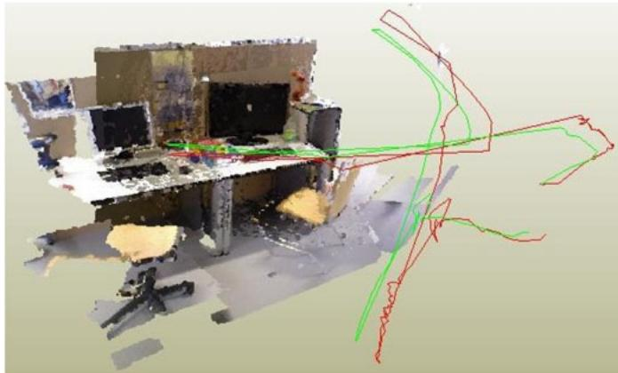  
Fig. 1. The reconstructed scene for fr3/walking-halfsphere from the TUM RBG-D dynamic dataset. As an accurate pose tracking technique for dynamic environments, our efficient approach utilizing CRF-based longterm consistency can estimate a camera trajectory (red) close to the ground truth (green).

Our LC-CRF based dynamic 3D landmark detection method is efficient, leading to a light-weight SLAM system for accurate 3D position tracking in dynamic environments. We have evaluated our approach on two public datasets: (i) the TUM RGB-D dynamic dataset [15] and (ii) the Bonn RGB-D dynamic dataset [13]; the latter has highly dynamic sequences. The results show that our approach typically outperforms state-of-the-art approaches, such as BaMVO [7] and SPW [9]. We also propose a dynamic 3D scene reconstruction method using our approach, which can provide good scene reconstruction quality, and more accurate camera position tracking results than other fusion-based dynamic reconstruction methods, e.g., MaskFusion [11]. In summary, this paper makes the following contributions:

1) A reliable dynamic 3D landmark detection method based on a long-term consistent conditional random field, which constitutes the main component of our dynamic camera tracking method, and

2) An efficient method for obtaining an initial estimate of the camera pose for each frame, based on GC-RANSAC filtering, which also provides strong static versus dynamic priors for dynamic 3D landmark detection.

## 2 RELATED WORK

Simultaneous localization and mapping has been studied for more than four decades, with sub-topics of lidar SLAM, visual SLAM, and sensor fusion SLAM according to the different sensors used. In this paper, we focus on visual SLAM, which utilizes cameras (monocular, stereo, or RGB-D) as the primary sensors for localization. In this section, we discuss works particularly relevant to ours, and refer readers to [2] for a more detailed overview of the progress of the visual SLAM in the past few decades.

## 2.1 Static Visual SLAM

There has been much progress in visual SLAM techniques since the pioneering work of MonoSLAM [16] in 2003. Current visual SLAM approaches can be divided into two categories: feature-based visual SLAM methods, which use sparse feature points as landmarks for camera tracking, e.g., PTAM [17] and ORB-SLAM2 [18], and direct visual SLAM methods, which directly use image intensity for camera tracking, e.g., DTAM [19], SVO [20], LSD-SLAM [21], Infini-TAM [22], PSM-SLAM [23] and DSO [24]. Direct visual SLAM techniques have the advantage of allowing efficient camera tracking without the time-consuming requirement for 2D feature detection needed by feature-based visual SLAM techniques, but they often suffer from lack of robustness in changing light conditions. Besides, there are also approaches to performing camera pose tracking by fusing multiple sensors, such as multiple cameras [25], inertial-cameras [26] and laser-inertial-camera [27], or with the aid of deep learning [28], [29].

Currently, most visual SLAM techniques assume a static environment and do not work well in dynamic environments which include human beings or other moving objects. Unlike these methods, our approach aims to provide robust camera tracking in dynamic scenarios. Like ORB-SLAM2 [18], it contains three components. The novelty of our SLAM system lies in the camera tracking subsystem, which in our case handles scenes with dynamic objects. We integrate our dynamic 3D landmark detection and elimination method into the camera tracking component, allowing it to work more accurately in dynamic environments.

## 2.2 Dynamic Visual SLAM

The detection and tracking of moving objects (DATMO) proposed by Wang et al. [6] in 2006 inspired many dynamic visual SLAM approaches to performing the camera pose tracking by detecting moving objects with the aid of dense scene flow [4] or object clustering [30], [31]. Kerl et al. [32] presented the dense visual odometry (DVO) algorithm, which uses a robust error function to reduce the influence of moving objects on camera pose estimation. However, since the error function is only computed across two consecutive frames, the DVO algorithm can only work well for slowly moving environments; rapidly changing ones cause incorrect data associations. Recently, Kim et al. [7] introduced a background-model-based dense-visual-odometry (BaMVO) algorithm to estimate the background of each frame and to perform camera pose estimation by eliminating foreground moving objects. Li et al. [9] provided a dynamic RGB-D SLAM method which uses foreground edge points to estimate the camera’s ego-motion. In this method, every edge point is assigned with a static weight which is used in an intensity-assisted iterative closest point (IAICP) algorithm for ego-motion estimation; this reduces the influence of dynamic components. Most of these methods detect dynamic components by analysis of only a few consecutive frames, two frames in DVO [32] and just the current frame in BaMVO [7] and Li et al. [9].

However, short-term analysis is not sufficiently informative for moving object detection, since many dynamic components may remain static for short periods, which may mislead short-term determination of static/dynamic status.

If not properly detected and eliminated, such dynamic components may be used as landmarks for later camera tracking, misleading downstream 3D to 2D data association, thus lowering the accuracy of camera pose estimation.

In this paper, instead, we provide a dynamic component detection method that uses long-term analysis. Distinguishing static from dynamic components can be performed more reliably using long-term observations. Based on this insight, we build a long-term consistent conditional random field using feature vectors derived from multiple visual observation errors over a long period of consecutive frames.

## 2.3 Dynamic Reconstruction

3D reconstruction with RGB-D cameras has made much progress in past decades. Here, we only focus on 3D reconstruction methods for dynamic scenes, and refer readers to the survey paper [33] for the state-of-the-art in 3D reconstruction approaches. Human movement is an important source of dynamism in indoor scenes, and DynamicFusion [34] proposed the first dense SLAM system to reconstruct dynamic scenes with humans by accurately determining a volumetric flow field that transforms the current scene into a canonical frame. Subsequent works such as KillingFusion [35], Sobolev-Fusion [36] extended the flow field with more accurate nonrigid motion estimation without templates or shape priors. To make the non-rigid registration robust for fast motion, Fusion4D [37] performs spatio-temporal coherent non-rigid registration across multiple views. Guo et al. [38] utilized a shading-based scheme for more accurate non-rigid registration, allowing the simultaneous reconstruction of a casual 3D scene with both a detailed geometric model and surface albedo. However, such non-rigid registration methods often require huge memory to store the non-rigid transformation flows, preventing their use for large indoor 3D scenes. Surfel-Warp [39] estimates a deformation field based on surfels but not truncated signed distance function (TSDF) voxels, which avoids the high memory consumption. However, such methods still need to solve the non-rigid registration problem, with real-time performance provided by GPU acceleration.

Recently, MaskFusion [11] proposed segmenting moving objects using a combination of 2D semantic detection and geometric priors. StaticFusion (SF) [12] presented a method for background reconstruction in dynamic environments, by joint estimation of camera motion and scene segmentation. Refusion [13] introduced direct tracking on the TSDF to estimate the camera pose in dynamic scenes. Bujanca et al. [40] presented a framework, FullFusion, for dense semantic reconstruction in dynamic scenes, which enables the incremental reconstruction of semanticallyannotated non-rigidly deforming objects; the RGB-D data is divided into static and dynamic frames using a segmentation module, and only static frames are used for camera pose estimation.

Unlike these works, our approach detects dynamic landmarks and estimates the camera motion from static parts, and thus avoids solving the time-consuming non-rigid registration problem, or detecting/segmenting moving objects with time-consuming camera pose estimation or the aid of a 2D CNN. With efficient and accurate static/dynamic identification, our lightweight SLAM system can accurately track the camera pose in dynamic scenes.

Other works [41], [42] use deep networks such as Faster-RCNN [43] to detect moving objects or segment scenes with semantic parts from multiple camera views [44]. Although such methods perform well, the problem of misclassification still exists. Furthermore, the computational cost is much higher due to the use of deep networks. We believe that a geometric approach to dynamic component detection is still not well explored and show that accuracy can be significantly improved without the need for a deep network.

## 3 METHOD

## 3.1 System Overview

An overview of our approach is given in Fig. 2. Our system has three components: camera tracking with dynamics, local mapping and loop closing. Local mapping and loop closing are performed as in ORB-SLAM2 [18]. Camera tracking with dynamics aims to efficiently estimate the ego-motion between frames by accurately detecting and eliminating dynamic 3D landmarks. It contains two main subcomponents.

The first subcomponent performs initial camera pose estimation using GC-RANSAC (see Section 3.2). In this subcomponent, we make an initial identification of static and dynamic points using 2D to 2D matching with GC-RAN-${ \mathrm { S A C } } ,$ which is both efficient and accurate. The points determined as static are then used for initial camera pose estimation. This initial static/dynamic identification is also used in the dynamic 3D landmark detection step later.

The second subcomponent performs dynamic 3D landmark detection using a long-term consistent CRF (see Section 3.3). Based on the initial camera pose estimation, we build a conditional random field with long-term consistency of observations (Fig. 3) and use it to more accurately identify static and dynamic feature points. This allows us to eliminate the dynamic points, and refine the camera pose estimation using the static points.

## 3.2 Initial Camera Pose Estimation

For each incoming frame, we need to determine a reasonable initial estimation of its camera pose. A general way to do this is to estimate the ego-motion between two consecutive frames by solving a perspective-n-point (PnP) problem [45] with 3D to 2D data association (as ORB-SLAM2 does). However, in dynamic scenarios, the 3D to 2D data association will contain incorrect matches due to the existence of moving objects. To overcome this issue, feature points on moving objects must be detected and eliminated, leaving static feature points to enable an accurate estimation of ego-motion.

In this step, we first roughly label landmarks as static or dynamic, and then estimate the ego-motion using only the static landmarks. As shown in Fig. 4, for an image pair $\{ K _ { i } , K _ { i } ^ { \prime } \}$ with fundamental matrix $\bar { F } ( K _ { i } , K _ { i } ^ { \prime } )$ , a 3D landmark $P _ { i }$ with its matching pair of 2D observations $( p _ { i } , p _ { i } ^ { \prime } )$ is likely to be static if $p ^ { \prime } \in \bar { K } _ { i } ^ { \prime }$ lies on the epipolar line $l _ { i } ^ { \prime } = F p _ { i } .$ , and otherwise be dynamic. Thus, we can formulate the static/ dynamic landmark identification problem as inlier/outlier identification during fundamental matrix estimation using the GC RANSAC algorithm [46]. Specifically, for a given set $M = \{ ( p _ { i } , p _ { i } ^ { \prime } ) | i = 1 , \ldots , n \}$ of n 2D to 2D matching pairs, on each iteration of RANSAC we label each matching pair as an inlier or an outlier for the estimated fundamental matrix $F .$ This is performed by optimizing the energy function $\begin{array} { r } { E ( L ) = \sum _ { i } \mathsf { \bar { B } } ( L _ { i } ) + \lambda \sum _ { ( i , j ) \in G } \mathsf { \bar { \Pi } } R ( L _ { i } , L _ { j } ) } \end{array}$ with $L = \{ L _ { i } \in$ $\{ 0 , 1 \} | i = 1 , \ldots , n \}$ Pbeing a label assignment for the matching pair set M, and G being a neighbor graph.

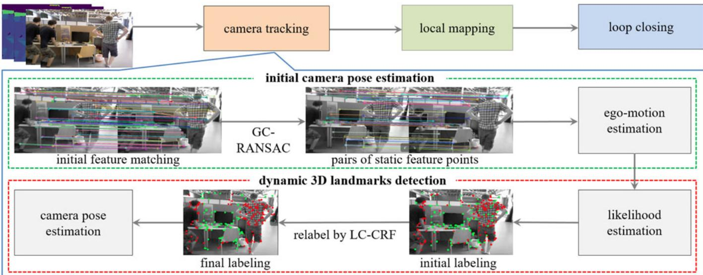  
Fig. 2. Overview of our approach. To achieve accurate pose estimation in dynamic scenes, camera tracking is performed in two stages, from coarse (initial camera pose estimation) to fine (dynamic 3D landmark detection). We first use GC-RANSAC to detect and remove dynamic feature points and estimate an initial camera pose using the remaining static feature points. Then, we apply LC-CRF to relabel all landmarks, and refine the camera pose using landmarks determined to be static.

The unary term of the energy function is formulated as:

$$
B ( L _ { i } ) = \left\{ \begin{array} { l l } { K \big ( \phi \big ( p _ { i } , p _ { i } ^ { \prime } , \theta \big ) , \epsilon \big ) } & { \mathrm { ~ i f ~ } L _ { i } = 0 } \\ { 1 - K \big ( \phi \big ( p _ { i } , p _ { i } ^ { \prime } , \theta \big ) , \epsilon \big ) } & { \mathrm { ~ i f ~ } L _ { i } = 1 } \end{array} , \right.\tag{1}
$$

where u is the angular parameter for fundamental matrix $F ,$ and $K ( \sigma , \epsilon ) = \exp ( - \sigma ^ { \hat { 2 } } / ( 2 \epsilon ^ { 2 } ) )$ . Label $L _ { i } = 0$ indicates an inlier pair and 1 indicates an outlier pair. $\phi \left( p _ { i } , p _ { i } ^ { \prime } , \theta \right)$ is the distance from matching pair $( p _ { i } , p _ { i } ^ { \prime } )$ - to the fundamental matrix $F ,$ and  is a threshold for inlier/outlier determination. The pairwise energy term is defined as:

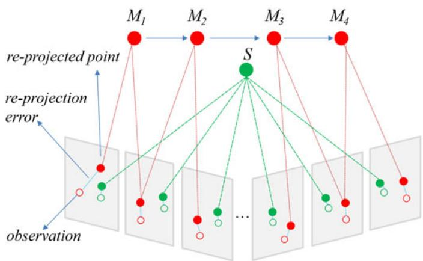  
Fig. 3. A static landmark has more consistent observations than a dynamic one. M is a dynamic landmark which moves from M to $M _ { 4 }$ quickly; just a few frames observe the same location. Static landmark S stays at the same location and is seen at the same position in more frames. Re-projected points from static landmarks triangulate to a consistent landmark, while re-projected points from dynamic landmarks triangulate to different landmarks.

$$
R ( L _ { i } , L _ { j } ) = \left\{ \begin{array} { l l } { 1 } & { \mathrm { ~ i f ~ } L _ { i } \neq L _ { j } } \\ { ( B ( L _ { i } ) + B ( L _ { j } ) ) / 2 } & { \mathrm { ~ i f ~ } L _ { i } = L _ { j } = 0 } \\ { 1 - ( B ( L _ { i } ) + B ( L _ { j } ) ) / 2 } & { \mathrm { ~ i f ~ } L _ { i } = L _ { j } = 1 . } \end{array} \right.\tag{2}
$$

We empirically set $\lambda = 0 . 1 4$ and $\epsilon = 0 . 1$ . The total energy can be efficiently optimized by the graph cut algorithm [47]. Fig. 5 shows an example of selecting static feature points using this GC-RANSAC-based method, which is summarized in Algorithm 1.

We later use the estimated fundamental matrix to derive static/dynamic priors for accurate dynamic point detection (see Section 3.3). Specifically, as shown in Fig. 4, for each 2D matching pair $( \widehat { p _ { i } , p _ { i } ^ { \prime } } ) , p _ { i } \in \dot { K } _ { i } , p _ { i } ^ { \prime } \in K _ { i } ^ { \prime } ,$ where $K _ { i }$ and $K _ { i } ^ { \prime }$ are the current frame and the previous frame, respectively, assuming $P _ { i }$ is the corresponding 3D landmark, and $l _ { i } \in$ $K , l _ { i } ^ { \prime } \in K ^ { \prime }$ are the corresponding epipolar lines $\boldsymbol { l } _ { i } = \boldsymbol { F } ^ { \intercal } \boldsymbol { p } _ { i } ^ { \prime } =$ $( \check { A _ { i } } , \check { B _ { i } } , C _ { i } ) , l _ { i } ^ { \prime } = F p _ { i } = ( \hat { A _ { i } ^ { \prime } } , B _ { i } ^ { \prime } , C _ { i } ^ { \prime } )$ , we compute the distances between the 2D feature point and the epipolar line as $d _ { i } =$

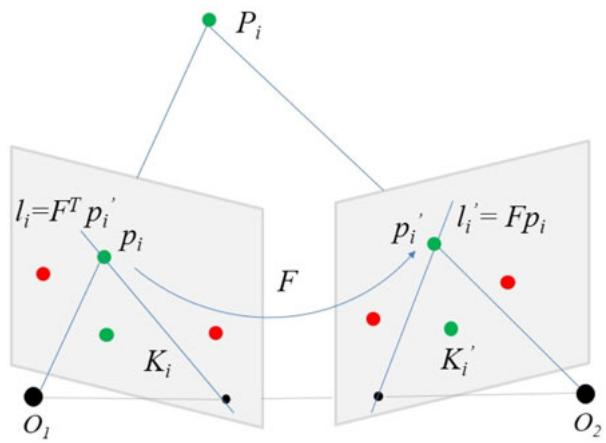  
Fig. 4. Fundamental matrix and epipolar constraint. For a matched pair $( p _ { i } , p _ { i } ^ { \prime } )$ , where $p _ { i }$ and $p _ { i } ^ { \prime }$ are related to the same 3D point $P _ { i } ,$ the epipolar constraint can be expressed as: p0>i $F p _ { i } = 0 , \mathsf { i . e . }$ p0 lies in the epipolar line $l _ { i } ^ { \prime } = F p _ { i }$ or p lies in the epipolar line $l _ { i } = F ^ { \top } p _ { i } ^ { \prime }$ , where F is the fundamental matrix.

Authorized licensed use limited to: Jiangnan University. Downloaded on September 16,2026 at 03:37:49 UTC from IEEE Xplore. Restrictions apply.

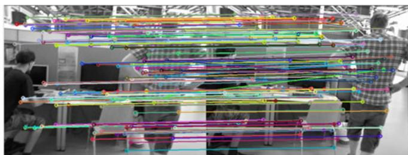

(a) Feature matching between reference frame and current frame before GC-RANSAC  
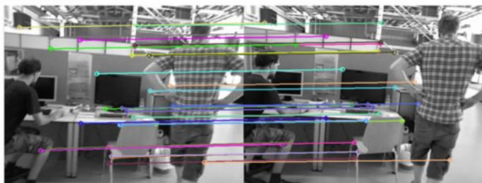  
(b) Feature point pairs labeled as inliers after GC-RANSAC  
Fig. 5. Static feature points selection by the GC-RANSAC. Left: current frame. Right: reference frame. We choose the 10th frame before the current frame as the reference frame. After GC-RANSAC filtering, inliers are almost static feature points, and are used for initial ego-motion estimation.

$| l _ { i } \cdot p _ { i } | / \sqrt { A _ { i } ^ { 2 } + B _ { i } ^ { 2 } }$ and $d _ { i } ^ { \prime } = | l _ { i } ^ { \prime } \cdot p _ { i } ^ { \prime } | / \sqrt { A _ { i } ^ { \prime 2 } + B _ { i } ^ { \prime 2 } }$ . In general, if fifiplandmark $P _ { i }$ fifififififififififi fififififififififififififififififififipis a static point, we expect the symmetric epipolar distance $\gamma _ { i } = ( d _ { i } \bar { + } d _ { i } ^ { \prime } ) / 2$ to be small. We thus define a likelihood of being static for each landmark $P _ { i }$ as $P _ { i } ^ { \gamma } =$ $\exp ( - ( \gamma _ { i } - \mu _ { \gamma } ) ^ { 2 } / ( 2 \sigma _ { \gamma } ^ { 2 } ) )$ Þ, where $\mu _ { \gamma }$ is the mean of $\gamma _ { i }$ . We then use $P _ { i } ^ { \gamma }$ as the static/dynamic identification prior for each landmark $P _ { i }$ for detecting dynamic points.

Algorithm 1. Initial Camera Pose Estimation   
Input:   
current frame $f _ { c } ,$ reference frame $f _ { r } ,$ previous frame $f _ { l }$   
Output:   
camera pose of current frame $T _ { c } ,$ static likelihood $P _ { i } ^ { \gamma }$ for   
each landmark $P _ { i }$   
1: Match features between frames $f _ { c }$ and $f _ { r }$   
2: Suggest static feature points by GC-RANSAC   
3: for each static feature point $p _ { i }$ in $f _ { c }$ do   
4: Find the corresponding 3D landmark $P _ { i }$ in $f _ { r }$   
5: end for   
6: Estimate ego-motion $T _ { c }$ on static landmarks by PnP   
7: Project all landmarks seen by $f _ { l }$ to $f _ { c }$   
8: Estimate fundamental matrix F by GC-RANSAC   
9: for each pair of feature points $p _ { i }$ and $\underline { { p } } _ { i } ^ { \prime }$ do   
10: Compute the epipolar line: ${ \boldsymbol { l } _ { i } = \boldsymbol { F } ^ { \top } \boldsymbol { p } _ { i } ^ { \prime } }$ and $l _ { i } ^ { \prime } = F p _ { i }$   
11: Compute distances $d _ { i }$ and $d _ { i } ^ { \prime }$   
12: Compute the static/dynamic identification prior:   
13: $P _ { i } ^ { \gamma } \stackrel { \star } { = } \exp ( - ( ( d _ { i } + d _ { i } ^ { \prime } ) \bar { / } 2 - \mu _ { \gamma } ) ^ { 2 } / ( 2 \sigma _ { \gamma } ^ { 2 } ) )$   
14: end for   
15: return $T _ { c }$

## 3.3 Dynamic Landmark Detection by CRF

After estimating the initial camera pose for the current frame, we now identify the 3D landmarks as static or dynamic. As shown in Fig. 3, the basis of our approach is that dynamic points tend to have more inconsistent observations than static points, especially over an extended time. Furthermore, dynamic points often have larger photometric re-projection errors between the re-projected point and the corresponding 2D feature point. Finally, we also note that points in the neighborhood of a static or dynamic point also tend to be static or dynamic, respectively. This key set of observations motivates us to use a long-term consistent conditional random field (LC-CRF) for dynamic point detection.

Specifically, we build the LC-CRF on the current detected landmarks, with a fully connected graph [48] linking each pair of landmarks. Each landmark $P _ { i }$ is assigned a label $x _ { i } =$ $\bar { L } _ { i } \in \{ 0 , 1 \}$ (0 for static and 1 for dynamic). Our goal is to find the optimal label assignment for all landmarks by minimizing the Gibbs energy E defined on the LC-CRF:

$$
E ( X ) = \sum _ { i } \psi _ { u } ( x _ { i } ) + \sum _ { i < j } \psi _ { p } ( x _ { i } , x _ { j } ) .\tag{3}
$$

Unary Potential $\psi _ { u } ( x _ { i } )$ . During SLAM processing, each landmark can be seen in several key-frames. We record the corresponding 2D observations $o _ { i } ^ { i } \in R ^ { 2 } , \mathrm { i . e . , }$ the 2D position in key-frame $j$ for each 3D landmark $P _ { i }$ . The photometric re-projection error $e _ { j } ^ { i }$ between $P _ { i }$ and $o _ { j } ^ { i }$ is calculated. By averaging the re-projection errors we obtain $\begin{array} { r } { \alpha _ { i } = ( \sum _ { j } e _ { j } ^ { i } ) / \beta _ { i } } \end{array}$ where $\beta _ { i }$ is the total number of observations of $P _ { i }$ P. As for the static likelihood prior $P _ { i } ^ { \gamma }$ for the landmark $P _ { i } ,$ we define a second static likelihood from all observations: $P _ { i } ^ { \beta } =$ $\exp ( - ( \beta _ { i } - \mu _ { \beta } ) ^ { 2 } / ( 2 \sigma _ { \beta } ^ { 2 } ) )$ , and a third one from the average re-projection error: $\breve { P } _ { i } ^ { \alpha } = \exp ( - ( \alpha _ { i } - \mu _ { \alpha } ) ^ { 2 } / ( 2 \sigma _ { \alpha } ^ { 2 } ) )$ , where $\mu _ { . }$ and s: and represent mean and standard deviation of respective quantities.

For each landmark, we thus have three different estimates of the likelihood that the landmark $P _ { i }$ is static: $P _ { i } ^ { \alpha } , P _ { i } ^ { \beta }$ and $P _ { i } ^ { \gamma }$ . We compute a weighted average of these estimates to give an overall likelihood that $P _ { i }$ is static: $P _ { i } ^ { s } =$ $\lambda _ { 1 } { \cal P } _ { i } ^ { \alpha } + \lambda _ { 2 } { \cal P } _ { i } ^ { \beta } + \lambda _ { 3 } { \cal P } _ { i } ^ { \gamma }$ , where $\lambda _ { 1 } + \lambda _ { 2 } + \lambda _ { 3 } = 1$ . If $P _ { i } ^ { s }$ exceeds a given threshold $t ,$ then $P _ { i }$ is initially labeled as static, and associated with a static confidence $c ;$ otherwise, it is labeled as dynamic, with static confidence 1 c. In our implementation, we set $\lambda _ { 1 } = \lambda _ { 2 } = \lambda _ { 3 } = 1 / 3$ . Following [49], the unary potential is then defined as:

$$
\begin{array} { r } { \psi _ { u } ( x _ { i } ) = \left\{ \begin{array} { l l } { - \log { ( c ) } I ( P _ { i } ^ { s } > t ) } & { \mathrm { ~ i f ~ } x _ { i } = 0 } \\ { - \log { ( 1 - c ) } I ( P _ { i } ^ { s } > t ) } & { \mathrm { ~ i f ~ } x _ { i } = 1 } \end{array} , \right. } \end{array}\tag{4}
$$

where $I ( \cdot )$ is the indicator function.

Pairwise Potential $\psi _ { p } ( x _ { i } , x _ { j } )$ . We design the pairwise potential to encourage consistent labeling between a landmark and its neighbors as follows:

$$
\psi _ { p } ( x _ { i } , x _ { j } ) = \mu ( x _ { i } , x _ { j } ) \sum _ { m } \omega ^ { ( m ) } k ^ { ( m ) } ( \mathbf { f } _ { i } , \mathbf { f } _ { j } ) ,\tag{5}
$$

where $\mu ( x _ { i } , x _ { j } ) = 1 _ { [ x _ { i } \neq x _ { j } ] }$ is a simple Potts model, $\mathbf { f } _ { i }$ and $\mathbf { f } _ { j }$ are feature vectors for nodes i and ${ \mathrm { ~ \it ~ { ~ j ~ } ~ } } ,$ and each $k ^ { ( m ) } ( \mathbf { f } _ { i } , \mathbf { f } _ { j } )$ is a Gaussian kernel. Here we use two Gaussian kernels, an observation kernel and a location kernel.

The observation kernel is based on the idea that landmarks with similar average re-projection errors ( ) and the number of observations (b) are likely to be in the same class. $\mathrm { A }$ dynamic landmark can be seen in the same position only for a few key-frames, while a static landmark can be seen across ptember 16,2026 at 03:37:49 UTC from IEEE Xplore. Restrictions apply.

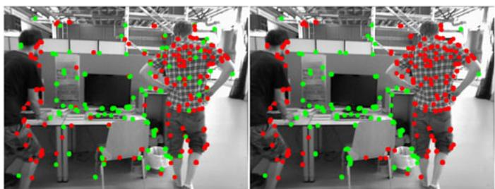

(a) Dynamic scene 1  
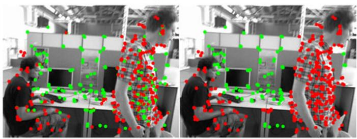

(b) Dynamic scene 2  
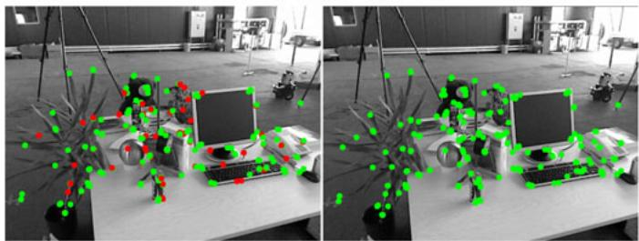  
(c) Static scene  
Fig. 6. Landmark detection in dynamic scenes (a,b) and a static scene (c). Left: Initial static/dynamic labeling. Right: final dynamic 3D landmark detection results after LC-CRF optimization. Green: Static points $( p _ { i } ^ { s } \geq t ) .$ Red: Dynamic points $( p _ { i } ^ { s } ~ < ~ t )$

many more key-frames over a long period. Similarly, static landmarks have lower average re-projection errors than dynamic landmarks. Thus, landmarks with different labels should have apparent differences both in the number of observations, and average re-projection error, so the observation kernel is defined as:

$$
k ^ { ( 1 ) } ( \mathbf { f } _ { i } , \mathbf { f } _ { j } ) = \exp \left( - \frac { \left| \alpha _ { i } - \alpha _ { j } \right| ^ { 2 } } { 2 \sigma _ { \alpha } ^ { 2 } } - \frac { \left| \beta _ { i } - \beta _ { j } \right| ^ { 2 } } { 2 \sigma _ { \beta } ^ { 2 } } \right) .\tag{6}
$$

The location kernel is based on the idea that nearby 3D landmarks are likely to belong to the same compact object which is either static (e.g., a table) or dynamic (e.g., a person), and hence be in the same class. Thus the location kernel penalizes pairs of landmarks with different labels but close to each other. This particularly helps to remove isolated landmarks surrounded by landmarks with the opposite label. As shown in Figs. 6a, 6b, some static feature points in the person are surrounded by dynamic ones (left image), and these are re-labeled as dynamic by LC-CRF inference (right image). The location kernel function is defined as:

$$
k ^ { ( 2 ) } ( \mathbf { f } _ { i } , \mathbf { f } _ { j } ) = \exp \left( - \frac { \left| P _ { i } - P _ { j } \right| ^ { 2 } } { 2 \sigma _ { P } ^ { 2 } } - \frac { \left| p _ { i } - p _ { j } \right| ^ { 2 } } { 2 \sigma _ { p } ^ { 2 } } \right) .\tag{7}
$$

The static/dynamic labeling problem represented by our LC-CRF can be solved efficiently using a mean field approximation method [48]. We show several examples illustrating landmark labeling results for sequences from the TUM RGB-D benchmark in Fig. 6. As can be seen, our method significantly improves the results for static/dynamic point labeling. Dynamic landmarks are accurately segmented even for highly dynamic scenes. We refer the reader to the supplementary video, for more results, which can be found on the Computer Society Digital Library at http://doi. ieeecomputersociety.org/10.1109/TVCG.2020.3028218..

After dynamic landmark detection, we discard dynamic landmarks and use the remaining static ones to estimate a more accurate camera pose for the current frame. These steps are summarized in Algorithm 2.

Algorithm 2. Dynamic Landmark Detection and Accu  
rate Pose Estimation   
Input:   
landmarks seen by the current frame $f _ { c }$   
Output:   
accurate camera pose of the current frame $T _ { c } ^ { * }$   
1: Initialize CRF graph   
2: for Each landmark do   
3: Compute the likelihood: $P _ { i } ^ { s } = ( P _ { i } ^ { \alpha } + P _ { i } ^ { \beta } + P _ { i } ^ { \gamma } ) / 3$   
4: Compute unary potentials from Eq. (4)   
5: end for   
6: for Each pair of landmarks do   
7: Compute pairwise potentials from Eqs. (6, 7)   
8: end for   
9: Determine the dynamic landmarks by CRF inference   
10: Estimate pose $T _ { c } ^ { * }$ from static landmarks   
11: Return $T _ { c } ^ { * }$

## 4 EXPERIMENTS

## 4.1 Preliminaries

To evaluate the accuracy of the estimated camera pose, we tested our method on the TUM [50] and Bonn [13] RGB-D dynamic datasets. For the former, we selected 6 different indoor dynamic sequences with moving people and violent camera shaking; for the latter, we selected 20 sequences of more complex dynamic motion in indoor scenes. The evaluation uses two metrics to measure the accuracy between the estimated camera poses and the ground truth: the absolute trajectory error (ATE, measured in meters) and the relative pose error (RPE, measured in meters per second), as defined in [50]. All experiments were performed on a desktop computer with a 3.6 GHz Intel Core i9-9900K CPU and 16 GB RAM, without GPU acceleration.

## 4.2 Parameter Choice

The main parameters in our LC-CRF SLAM are those in the unary and pairwise potentials in dynamic landmark detection. We performed an extensive study of these parameters to determine appropriate settings.

## 4.2.1 ParameterRanges

We first grouped these parameters into 6 pairs of parameters, and set the range for these parameter pairs as: $\{ \mu _ { \alpha } , \sigma _ { \alpha } \} \in$ $[ 1 . 1 , 2 . 0 ] \times [ 0 . 2 , 2 . 0 ] , \quad \{ \mu _ { \beta } , \sigma _ { \beta } \} \in [ 3 . 8 , 5 . 6 ] \times [ 1 . 3 , 2 . 2 ]$ and $\{ \mu _ { \gamma } , \sigma _ { \gamma } \} \in [ 0 . 1 , 1 . 0 ] \times [ 0 . 1 , 1 . 0 ] , \ \{ \sigma _ { P } , \sigma _ { p } \} \in [ 0 . 1 , 1 . 0 ] \times [ 1 0 , 2 8 ] ,$ $\{ w ^ { 1 } , w ^ { 2 } \} \in [ 2 , 2 0 ] \times [ 1 0 , 5 5 ]$ , threshold and confidence $\{ t , c \} \in$ $[ 0 . 1 , 1 . 0 ] \times [ 0 . 5 5 , 1 . 0 0 ]$ . Since the first four parameter pairs come from observations, e.g., concerns re-projection errors, we computed statistics for these observations on the test sequences beforehand and empirically set the ranges for the first four parameter pairs based on these statistics. The static likelihood threshold t was set to be less than 1, i.e., in ½0:1; 1, and the static confidence c for static landmarks was set to be over 0.5, i.e in ½0:55; 1:0. The ranges for the weight parameter pair $\{ w ^ { 1 } , w ^ { 2 } \}$ were set to penalize pairs of neighboring landmarks with different labels.

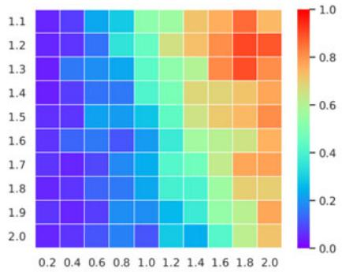

(a) validation of $\mu _ { \alpha }$ and $\sigma _ { \alpha }$  
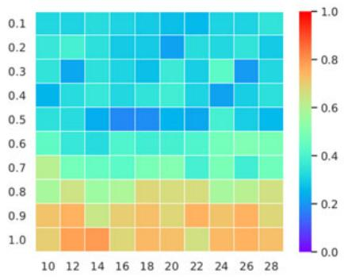

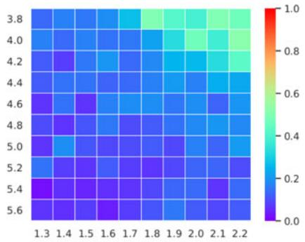  
(b) validation of $\mu _ { \beta }$ and $\sigma _ { \beta }$

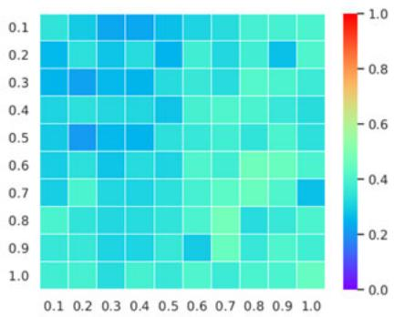  
(c) validation of $\mu _ { \gamma }$ and $\sigma _ { \gamma }$

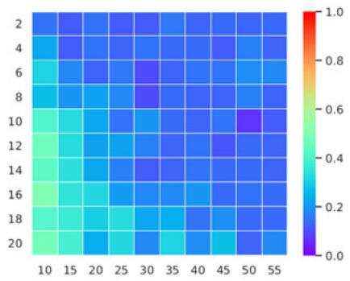

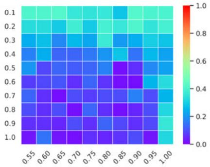  
(d) validation of $\sigma _ { P }$ and $\sigma _ { p }$  
(e) validation of $w ^ { 1 }$ and $w ^ { 2 }$  
(f) validation of t and c  
Fig. 7. Averaged ATE on TUM RGB-D dynamic sequences for parameter validation. $y -$ and x-axes represent (a) $\mu _ { \alpha }$ and $\sigma _ { \alpha } ,$ respectively; (b) $\mu _ { \beta }$ and $\sigma _ { \beta } ,$ respectively; ${ \bf \Pi } ( { \bf c } ) \mu _ { \gamma }$ and $\sigma _ { \gamma } ,$ respectively; (d) $\sigma _ { P }$ and $\sigma _ { p } ,$ respectively; (e) $w ^ { 1 }$ and $w ^ { 2 }$ , respectively; (f) t and $^ { c , }$ respectively. Red presents higher error, blue lower.

## 4.2.2 ParameterConfiguration

Since considering all parameter combinations is infeasible, we choose to select the parameter configuration of the 6 parameter pairs sequentially with parameter cross validation. Specifically, for each parameter pair, we evenly sampled n candidate values for the parameters and randomly selected m pairs of values of the parameters for the other 5 parameter pairs. For each parameter configuration, we performed LC-CRF SLAM on the six TUM RGB-D dynamic sequences and calculated the average ATE to assess the accuracy for this parameter configuration. In total, we thus considered 6nm parameter configurations in the parameter study. Typically, we set $n = 1 0 \times 1 0 , m = 1 0$

For each candidate value in each parameter pair, we further computed the average of the averaged ATE for its m corresponding parameter configurations. In total, this led to 6n averaged ATEs, as shown in Fig. 7. Typically, each pair of parameters tends to have an optimal choice within its m corresponding parameter configurations, independently of the choice for the other parameters. The parameter study led to the following parameter configuration: $\{ \mu _ { \alpha } = 1 . 7 , \sigma _ { \alpha } = 0 . 6 \}$ $\{ \mu _ { \beta } = 5 . 4 , \sigma _ { \beta } = 1 . 5 \} , ~ \{ \mu _ { \gamma } = 0 . 3 , \sigma _ { \gamma } = 0 . 2 \} , ~ \{ \sigma _ { P } = 0 . 5 , \sigma _ { p } = 1 . 5 \}$ 18g, $\{ w ^ { 1 } = 8 , w ^ { 2 } = 3 0 \}$ and $\{ t = 0 . 8 , c = 0 . 7 \}$ . These settings achieved relatively small ATE errors across all parameter configurations, and were used for all experiments in this paper. The supplementary materials available online detail the ATE errors for all 6nm parameter configurations.

## 4.3 Comparison With Unmodified ORB-SLAM

We first evaluate the performance of our dynamic camera tracking compared with the original ORB-SLAM to demonstrate the effectiveness of our dynamic point detection module as a dynamic SLAM method. We tested our method on the six dynamic sequences from the TMU RGB-D dataset, and compared the resulting ATE and RPE with those of ORB-SLAM in Table 1.

As can be seen, for highly dynamic sequences (those whose names begin with ‘walking’, i.e. fast moving persons or camera), our proposed method achieves significantly lower ATEs and RPEs than ORB-SLAM. In the last two scenarios with less dynamic contents, i.e., ‘sitting-xyz’ and ‘desk-with-person’, our algorithm also achieves slightly better results.

## 4.4 Comparison Using TUM Dataset

To evaluate the effectiveness of our approach for camera pose tracking of dynamic scenes, we compared our LC-CRF

TABLE 1  
ATE (m) and RPE (m/s, Translational RPE-RMSE) of Different Methods on TUM RGB-D Dynamic Datasets
<table><tr><td rowspan="3">Sequence</td><td colspan="10">ATE</td></tr><tr><td>BaMVO</td><td>DVO</td><td>SPW</td><td>FF</td><td>ORB-SLAM</td><td>RF</td><td>SF</td><td>MF</td><td>ours w/o GC</td><td>ours</td></tr><tr><td>Mean</td><td>Mean</td><td>Mean</td><td>Mean</td><td>Mean (Std)</td><td>Mean (Std)</td><td>Mean (Std)</td><td>Mean (Std)</td><td>Mean (Std)</td><td>Mean (Std)</td></tr><tr><td>fr3/walking-xyz</td><td></td><td>0.093</td><td>0.060</td><td>0.041</td><td>0.366 (0.256)</td><td>0.088 (0.065)</td><td>0.094 (0.064)</td><td>0.104 (0.330)</td><td>0.028 (0.016)</td><td>0.016 (0.011)</td></tr><tr><td>fr3/walking-halfsphere</td><td></td><td>0.047</td><td>0.043</td><td>0.029</td><td>0.382 (0.188)</td><td>0.063 (0.034)</td><td>0.434 (0.333)</td><td>0.106 (0.335)</td><td>0.058 (0.032)</td><td>0.028 (0.015)</td></tr><tr><td>fr3/walking-static</td><td></td><td>0.066</td><td>0.026</td><td>0.014</td><td>0.214 (0.084)</td><td>0.016 (0.008)</td><td>0.015 (0.008)</td><td>0.035 (0.129)</td><td>0.016 (0.007)</td><td>0.011 (0.008)</td></tr><tr><td>fr3/walking-rpy</td><td></td><td>0.133</td><td>0.179</td><td></td><td>0.745 (0.401)</td><td>0.257 (0.157)</td><td>1.183 (0.667)</td><td>0.827 (0.374)</td><td>0.100 (0.062)</td><td>0.046 (0.034)</td></tr><tr><td>fr3/sitting-xyz</td><td></td><td>0.048</td><td>0.040</td><td>0.043</td><td>0.011 (0.005)</td><td>0.035 (0.020)</td><td>0.039 (0.022)</td><td>0.031 (0.049)</td><td>0.024 (0.012)</td><td>0.009 (0.005)</td></tr><tr><td>fr2/desk-with-person</td><td></td><td>0.060</td><td>0.048</td><td></td><td>0.074 (0.016)</td><td>0.057 (0.018)</td><td>0.055 (0.027)</td><td>0.308 (0.121)</td><td>0.065 (0.014)</td><td>0.069 (0.015)</td></tr><tr><td>Mean (all sequences)</td><td></td><td>0.075</td><td>0.066</td><td>0.032*</td><td>0.299</td><td>0.086</td><td>0.303</td><td>0.235</td><td>0.049</td><td>0.030</td></tr><tr><td>Std (all sequences)</td><td></td><td>0.030</td><td>0.052</td><td>0.012*</td><td>0.242</td><td>0.080</td><td>0.418</td><td>0.280</td><td>0.029</td><td>0.021</td></tr><tr><td></td><td colspan="10"></td></tr><tr><td>fr3/walking-xyz</td><td>0.233</td><td>0.436</td><td>0.065</td><td>0.060</td><td>0.518 (0.388)</td><td>0.122 (0.080)</td><td>0.133 (0.083)</td><td>0.159 (0.736)</td><td>0.040 (0.021)</td><td>0.021 (0.015)</td></tr><tr><td>fr3/walking-halfsphere</td><td>0.174</td><td>0.263</td><td>0.053</td><td>0.071</td><td>0.570 (0.316)</td><td>0.092 (0.047)</td><td>0.579 (0.499)</td><td>0.085 (0.533)</td><td>0.085 (0.048)</td><td>0.035 (0.024)</td></tr><tr><td>fr3/walking-static</td><td>0.134</td><td>0.382</td><td>0.033</td><td>0.036</td><td>0.311 (0.212)</td><td>0.025 (0.013)</td><td>0.023 (0.011)</td><td>0.089 (0.384)</td><td>0.024 (0.012)</td><td>0.014 (0.011)</td></tr><tr><td>fr3/walking-rpy</td><td>0.358</td><td>0.404</td><td>0.225</td><td></td><td>1.093 (0.632)</td><td>0.356 (0.219)</td><td>1.751 (1.116)</td><td>0.534 (0.673)</td><td>0.187 (0.088)</td><td>0.050 (0.046)</td></tr><tr><td>fr3/sitting-xyz</td><td>0.048</td><td>0.045</td><td>0.022</td><td>0.036</td><td>0.016 (0.007)</td><td>0.050 (0.028)</td><td>0.056 (0.031)</td><td>0.085 (0.088)</td><td>0.034 (0.017)</td><td>0.012 (0.007)</td></tr><tr><td>fr2/desk-with-person</td><td>0.035</td><td>0.035</td><td>0.017</td><td></td><td>0.104 (0.052)</td><td>0.092 (0.043)</td><td>0.126 (0.082)</td><td>0.091 (0.316)</td><td>0.091 (0.051)</td><td>0.086 (0.045)</td></tr><tr><td>Mean (all sequences)</td><td>0.164</td><td>0.261</td><td>0.069</td><td>0.051*</td><td>0.435</td><td>0.123</td><td>0.444</td><td>0.174</td><td>0.077</td><td>0.036</td></tr><tr><td>Std (all sequênces)</td><td>0.111</td><td>0.165</td><td>0.072</td><td>0.015*</td><td>0.356</td><td>0.109</td><td>0.613</td><td>0.163</td><td>0.055</td><td>0.026</td></tr></table>

\* only 4 sequences are considered for FullFusion (FF).

SLAM method with other state-of-the-art dynamic SLAM systems, i.e. dense visual odometry (DVO) [32], background-model-based dense-visual-odometry (BaMVO) [7], and static point weighting (SPW) [9], as well as dynamic fusion methods: ReFusion(RF) [13], StaticFusion(SF) [12], MaskFusion(MF) [11] and FullFusion(FF) [40], using the standard TUM RGB-D dynamic dataset. To make a fair comparison, we used the results produced by publicly released code or reported in the original paper. Table 1 gives the corresponding ATE and translational RPE accuracy results for the various dynamic SLAM systems. Due to a lack of public source code or correct code, we do not show results for FullFusion with ‘fr3/walking-rpy’ and ‘fr2/deskwith-person’ sequences and only report the RPE for BaMVO from the original paper. Averages and standard deviations of accuracy results for every single sequence and for all sequences are also calculated (BaMVO, DVO, SPW and Fullfusion do not report the standard deviation in their original papers). As shown in Table 1, our full LC-CRF SLAM achieves an average ATE error of 0.030 m (with standard deviation 0.021 m) and an average RPE error of 0.036 m/s (with standard deviation 0.026 m/s), which is significantly lower than methods like DVO, RF, SF, MF and FF, and better than the SPW method. For all sequences, our LC-CRF SLAM achieves almost the lowest ATE and RPE errors, except for the ‘fr2/desk-with-person’ sequence. In this almost static scene, a few static landmarks are labeled as dynamic by the GC-RANSAC filter with its standard parameter settings, degrading the accuracy of the initial pose estimation.

## 4.5 Comparison Using Bonn Dataset

To further evaluate the accuracy of camera pose tracking, we compared our approach with three start-of-the-art dense reconstruction methods: ReFusion (RF) [13], StaticFusion (SF) [12] and MaskFusion (MF) [11], on the Bonn RGB-D dynamic dataset. Results were obtained by running available open source implementations for each method. Table 2 shows the statistics of ATE and RPE errors for both single sequence and all sequences. Our method outperforms the others in most sequences (17 of 20) in terms of ATE, and achieves the lowest RPE for half of the sequences.

The ATE between estimated trajectories and groundtruth is further visualized in Fig. 8. As can be seen clearly, the trajectories estimated by our LC-CRF SLAM are much closer to the real trajectories than those provided by RF, SF and MF. This confirms again that long-term consistency is effective for dynamic landmark detection in such highly dynamic scenes using only sparse feature points.

## 4.6 Effectiveness of GC-RANSAC Filter

We also evaluated the performance of the initial camera pose estimation using the GC-RANSAC filter from Section 3.2. We built a SLAM system without the initial camera pose estimation component by just assigning an initial camera pose using velocity prediction like ORB-SLAM. Consequently, the unary and pairwise potentials also do not contain the initial static/dynamic priors for the LC-CRF for the dynamic landmark detection. We compared such a system (without the GC-RANSAC filter) with our full LC-CRF SLAM system by evaluating the ATE and RPE of the six dynamic sequences of the TUM RGB-D dataset.

Table 1 includes ATE results for our LC-CRF SLAM with and without the GC-RANSAC filter. Without the GC-RAN-SAC filter, the ATEs are significantly greater for highly dynamic sequences such as fr3/walking-xyz and fr3/walkinghalfsphere. For less dynamic sequences, the ATEs are slightly increased. This shows that GC-RANSAC plays an effective role for camera pose estimation, especially in highly dynamic scenarios.

## 4.7 Dynamic Dense Reconstruction

To further evaluate the benefit of static/dynamic 3D landmark detection and intuitively show the accuracy of camera pose determined by our method, we considered a simple dense reconstruction method based on our dynamic RGB-D SLAM. Specifically, like MaskFusion [11], we recognise the dynamic regions, e.g., people, using the mask predicted by Mask R-CNN [51] as well as the dynamic points determined ptember 16,2026 at 03:37:49 UTC from IEEE Xplore. Restrictions apply.

TABLE 2  
ATE (m) and RPE (m/s, Translational RPE-RSME) for Different Methods on Bonn RGB-D Dynamic Datasets
<table><tr><td rowspan="3">Sequence</td><td colspan="4">ATE</td><td colspan="4">t.RPE</td></tr><tr><td>RF</td><td>SF</td><td>MF</td><td>ours</td><td>RF</td><td>SF</td><td>MF</td><td>ours</td></tr><tr><td>Mean (Std)</td><td>Mean (Std)</td><td>Mean (Std)</td><td>Mean (Std)</td><td>Mean (Std)</td><td>Mean (Std)</td><td>Mean (Std)</td><td>Mean (Std)</td></tr><tr><td>balloon</td><td>0.205 (0.126)</td><td>0.264 (0.095)</td><td>0.165 (0.073)</td><td>0.027 (0.014)</td><td>0.576 (0.370)</td><td>0.585 (0.372)</td><td>0.509 (0.317)</td><td>0.612 (0.373)</td></tr><tr><td>balloon2</td><td>0.195 (0.110)</td><td>0.250 (0.120)</td><td>0.114 (0.049)</td><td>0.024 (0.011)</td><td>0.540 (0.301)</td><td>0.534 (0.287)</td><td>0.499 (0.286)</td><td>0.541 (0.275)</td></tr><tr><td>balloon-tracking</td><td>0.445 (0.237)</td><td>0.202 (0.147)</td><td>0.194 (0.135)</td><td>0.025 (0.019)</td><td>1.031 (0.587)</td><td>0.900 (0.565)</td><td>0.991 (0.614)</td><td>0.965 (0.575)</td></tr><tr><td>balloon-tracking2</td><td>0.277 (0.137)</td><td>0.286 (0.098)</td><td>0.238 (0.097)</td><td>0.045 (0.023)</td><td>1.059 (0.687)</td><td>0.949 (0.624)</td><td>0.937 (0.600)</td><td>0.935 (0.596)</td></tr><tr><td>crowd</td><td>0.114 (0.062)</td><td>0.132 (0.081)</td><td>0.473 (0.161)</td><td>0.019 (0.012)</td><td>0.198 (0.104)</td><td>0.211 (0.128)</td><td>0.633 (0.400)</td><td>0.238 (0.170)</td></tr><tr><td>crowd2</td><td>0.192 (0.100)</td><td>0.193 (0.114)</td><td>0.653 (0.282)</td><td>0.031 (0.033)</td><td>0.315 (0.178)</td><td>0.313 (0.184)</td><td>0.854 (0.618)</td><td>0.199 (0.103)</td></tr><tr><td>crowd3</td><td>0.115 (0.067)</td><td>0.146 (0.094)</td><td>0.341 (0.108)</td><td>0.023 (0.015)</td><td>0.223 (0.125)</td><td>0.266 (0.153)</td><td>0.503 (0.306)</td><td>0.194 (0.109)</td></tr><tr><td>kidnapping-box</td><td>0.169 (0.078)</td><td>0.252 (0.097)</td><td>0.200 (0.106)</td><td>0.023 (0.015)</td><td>0.886 (0.754)</td><td>0.853 (0.715)</td><td>0.840 (0.683)</td><td>1.001 (0.801)</td></tr><tr><td>kidnapping-box2</td><td>0.132 (0.057)</td><td>0.186 (0.078)</td><td>0.182 (0.076)</td><td>0.020 (0.010)</td><td>1.077 (0.752)</td><td>1.030 (0.729)</td><td>1.027 (0.724)</td><td>1.184 (0.798)</td></tr><tr><td>moving-no-box</td><td>0.079 (0.035)</td><td>0.087 (0.046)</td><td>0.120 (0.050)</td><td>0.018 (0.009)</td><td>0.939 (0.584)</td><td>0.939 (0.583)</td><td>0.947 (0.604)</td><td>0.936 (0.586)</td></tr><tr><td>moving-no-box2</td><td>0.186 (0.092)</td><td>0.224 (0.110)</td><td>0.193 (0.084)</td><td>0.038 (0.019)</td><td>1.287 (0.791)</td><td>1.267 (0.782)</td><td>1.252 (0.765)</td><td>1.399 (0.850)</td></tr><tr><td>moving-o-box</td><td>0.319 (0.134)</td><td>0.376 (0.125)</td><td>0.216 (0.066)</td><td>0.253 (0.064)</td><td>1.274 (0.839)</td><td>0.894 (0.546)</td><td>0.847 (0.520)</td><td>1.158 (0.772)</td></tr><tr><td>moving-o-box2</td><td>0.608 (0.248)</td><td>0.242 (0.116)</td><td>0.298 (0.133)</td><td>0.341 (0.259)</td><td>1.523 (1.145)</td><td>0.649 (0.412)</td><td>0.576 (0.378)</td><td>1.143 (0.932)</td></tr><tr><td>person-tracking</td><td>0.354 (0.125)</td><td>0.390 (0.137)</td><td>0.301 (0.128)</td><td>0.035 (0.013)</td><td>1.209 (0.684)</td><td>1.197 (0.678)</td><td>1.312 (0.857)</td><td>1.193 (0.676)</td></tr><tr><td>person-tracking2</td><td>0.494 (0.235)</td><td>0.497 (0.214)</td><td>0.220 (0.069)</td><td>0.040 (0.014)</td><td>1.165 (0.681)</td><td>1.192 (0.701)</td><td>1.267 (0.837)</td><td>1.297 (0.892)</td></tr><tr><td>placing-no-box</td><td>0.109 (0.056)</td><td>0.133 (0.086)</td><td>0.325 (0.120)</td><td>0.014 (0.009)</td><td>0.355 (0.240)</td><td>0.361 (0.240)</td><td>0.598 (0.332)</td><td>0.333 (0.192)</td></tr><tr><td>placing-no-box2</td><td>0.121 (0.074)</td><td>0.209 (0.071)</td><td>0.153 (0.067)</td><td>0.016 (0.011)</td><td>0.282 (0.187)</td><td>0.361 (0.226)</td><td>0.330 (0.192)</td><td>0.271 (0.199)</td></tr><tr><td>placing-no-box3</td><td>0.181 (0.076)</td><td>0.219 (0.097)</td><td>0.156 (0.058)</td><td>0.036 (0.023)</td><td>0.511 (0.342)</td><td>0.534 (0.365)</td><td>0.491 (0.358)</td><td>0.482 (0.339)</td></tr><tr><td>placing-o-box</td><td>0.605 (0.365)</td><td>0.261 (0.107)</td><td>0.424 (0.144)</td><td>0.320 (0.095)</td><td>1.180 (0.862)</td><td>0.528 (0.285)</td><td>0.791 (0.443)</td><td>0.505 (0.257)</td></tr><tr><td>removing-no-box</td><td>0.050 (0.028)</td><td>0.061 (0.040)</td><td>0.058 (0.040)</td><td>0.013 (0.006)</td><td>0.262 (0.150)</td><td>0.274 (0.163)</td><td>0.263 (0.157)</td><td>0.240 (0.126)</td></tr><tr><td>Mean (Std)-all</td><td>0.248 (0.170)</td><td>0.231 (0.104)</td><td>0.251 (0.140)</td><td>0.068 (0.103)</td><td>0.795 (0.432)</td><td>0.692 (0.342)</td><td>0.773 (0.307)</td><td>0.741 (0.419)</td></tr><tr><td>Max (Min)-all</td><td>0.608 (0.050)</td><td>0.497 (0.061)</td><td>0.653 (0.058)</td><td>0.341 (0.013)</td><td>1.523 (1.198)</td><td>1.267 (0.211)</td><td>1.312 (0.263)</td><td>1.399 (0.194)</td></tr></table>

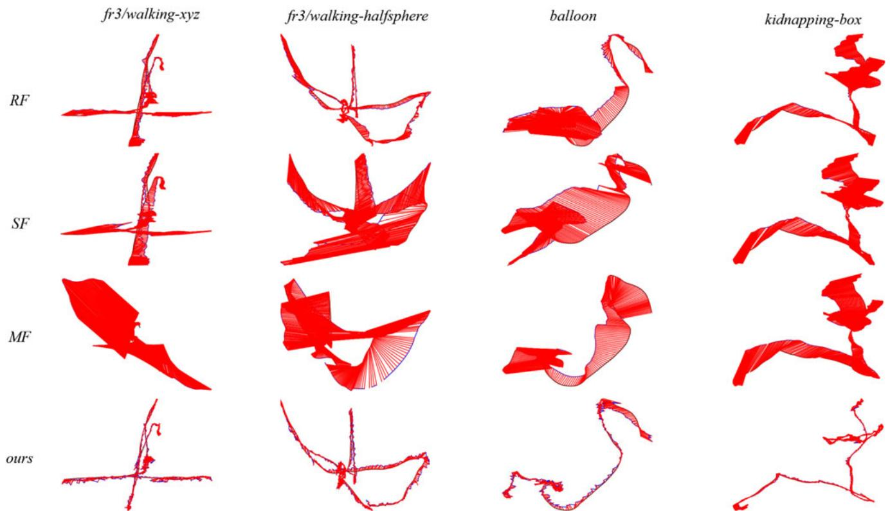  
Fig. 8. Demonstration of the camera trajectories (blue) estimated by approaches ReFusion, StaticFusion, MaskFusion and our LC-CRF method (each column), along with the ground truth trajectories (black) of sequences (from left to right) fr3/walking-xyz, fr3/walking-halfsphere (from the TUM dataset), balloon, and kidnapping-box (from the Bonn dataset). The red segments connecting the corresponding positions between ground truth trajectories and estimated trajectories represent the ATE.

by registration errors between the current frame and the previous one; finally we fuse the remaining static points using the camera poses tracked by our RGB-D SLAM method.

Example dense reconstruction results are shown in Figs. 1 and 9. As can be seen clearly, dynamic regions, e.g., moving people, are effectively removed from the reconstructed scenes. These results demonstrate that our method provides accurate camera poses and can produce good 3D reconstruction results for dynamic scenes.

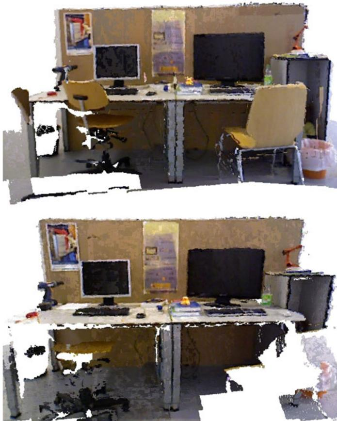  
Fig. 9. The reconstructed point clouds for two scenes (top: fr3/walkingxyz, bottom: fr3/walking-static) from TUM RGB-D dataset.

## 4.8 Impact of Dynamic Objects

Clearly, the accuracy of camera pose estimation for a dynamic scene will be affected by the presence of human beings and other moving objects. To quantitatively evaluate the impact of dynamic objects on the accuracy of pose estimation, we analyzed the relationship between the proportion of dynamic content in the scene and camera pose estimation error by computing the ATE and RPE for each frame, using the TUM dynamic dataset. Here we define the ratio of dynamic objects to be $r ( k ) = n _ { d } ( k ) / n ( k )$ , where $n _ { d } ( k )$ denotes the number of dynamic feature points in frame $f _ { k }$ and nðkÞ is the total number of feature points in that frame.

Fig. 10 shows the ATE and translational RPE with respect to the dynamic ratio. These errors increase with a greater proportion of dynamic feature points. As expected, the camera poses estimated by our approach get worse with increasing amounts of dynamic content. Our approach can still handle significant amounts of dynamic content (up to about 50 percent) while keeping the ATE and translational RPE under about 0.2 m and 0.2 m/s, respectively.

## 4.9 Timings

Our approach has two main processes, i.e., initial pose estimation and dynamic landmark detection. The time taken by these processes was recorded for both TUM and Bonn RGB-D sequences and listed in Table 3. While the initial pose estimation is expensive due to the time-consuming GC-RANSAC, our method still achieves a near-real-time processing rate: 16 and 13 fps for TUM and Bonn RGB-D sequences, respectively. These experiments were performed on a CPU without GPU acceleration.

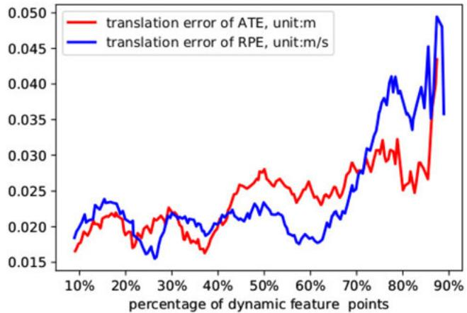  
Fig. 10. Variation in ATE and RPE translation error with differing proportions of dynamic content. x-axis: percentage of dynamic feature points compared to all feature points. y-axis: Red: ATE translation error. Blue: RPE translation error.

## 4.10 Discussion and Limitations

One of the main benefits of our approach comes from the unary and pairwise potentials used in dynamic landmark detection, which leverages information from widely separated frames, not just consecutive frames. The static likelihood is estimated for every landmark for every frame (see Section 3.3) of the whole video sequence, which implicitly enforces long-term consistency in the unary potential computation. Also, the observation kernel used in the pairwise potential computation leverages the total number of observations, again providing a feature across long spans of frames.

TABLE 3  
Time Taken for Each Step of the Tracking Thread (s)
<table><tr><td>Sequence</td><td>#Fr.</td><td>IPE</td><td>DLD</td><td>Total</td><td>FPS</td></tr><tr><td>fr3/walking-xyz</td><td>859</td><td>26.50</td><td>3.18</td><td>47.68</td><td>18.02</td></tr><tr><td>fr3/walking-halfsphere</td><td>1067</td><td>34.75</td><td>3.92</td><td>65.68</td><td>16.24</td></tr><tr><td>fr3/walking-static</td><td>743</td><td>17.71</td><td>4.81</td><td>40.31</td><td>18.43</td></tr><tr><td>fr3/walking-rpy</td><td>910</td><td>28.05</td><td>3.13</td><td>53.23</td><td>17.10</td></tr><tr><td>fr3/sitting-xyz</td><td>1261</td><td>60.81</td><td>4.42</td><td>92.56</td><td>13.62</td></tr><tr><td>fr2/desk-with-person</td><td>4067</td><td>149.40</td><td>13.44</td><td>241.82</td><td>16.82</td></tr><tr><td>balloon</td><td>439</td><td>12.74</td><td>1.91</td><td>25.40</td><td>17.28</td></tr><tr><td>balloon2</td><td>469</td><td>14.03</td><td>2.39</td><td>27.47</td><td>17.07</td></tr><tr><td>balloon-tracking</td><td>590</td><td>32.84</td><td>1.96</td><td>48.04</td><td>12.28</td></tr><tr><td>balloon-tracking2</td><td>451</td><td>17.81</td><td>1.74</td><td>26.39</td><td>17.09</td></tr><tr><td>crowd</td><td>928</td><td>32.61</td><td>3.91</td><td>58.51</td><td>15.86</td></tr><tr><td>crowd2</td><td>895</td><td>27.47</td><td>5.80</td><td>58.43</td><td>15.32</td></tr><tr><td>crowd3</td><td>854</td><td>32.43</td><td>5.38</td><td>59.41</td><td>14.38</td></tr><tr><td>kidnapping-box</td><td>1091</td><td>60.09</td><td>5.67</td><td>81.80</td><td>13.34</td></tr><tr><td>kidnapping-box2</td><td>1294</td><td>72.67</td><td>6.95</td><td>92.16</td><td>14.04</td></tr><tr><td>moving-no-box</td><td>778</td><td>39.46</td><td>3.52</td><td>61.33</td><td>12.69</td></tr><tr><td>moving-no-box2</td><td>937</td><td>61.83</td><td>4.81</td><td>80.58</td><td>11.63</td></tr><tr><td>moving-o-box</td><td>590</td><td>34.32</td><td>1.71</td><td>48.91</td><td>12.06</td></tr><tr><td>moving-o-box2</td><td>783</td><td>45.91</td><td>2.80</td><td>66.90</td><td>11.70</td></tr><tr><td>person-tracking</td><td>580</td><td>20.07</td><td>1.77</td><td>33.39</td><td>17.37</td></tr><tr><td>person-tracking2</td><td>567</td><td>26.25</td><td>1.62</td><td>41.27</td><td>13.74</td></tr><tr><td>placing-no-box</td><td>721</td><td>40.01</td><td>3.18</td><td>54.10</td><td>13.33</td></tr><tr><td>placing-no-box2</td><td>677</td><td>32.94</td><td>3.69</td><td>45.60</td><td>14.85</td></tr><tr><td>placing-no-box3</td><td>662</td><td>34.47</td><td>3.02</td><td>42.55</td><td>15.56</td></tr><tr><td>placing-o-box</td><td>998</td><td>54.48</td><td>2.95</td><td>68.36</td><td>14.60</td></tr><tr><td>removing-no-box</td><td>494</td><td>21.60</td><td>2.40</td><td>31.21</td><td>15.83</td></tr></table>

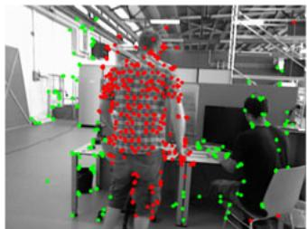  
(a) Failure case 1

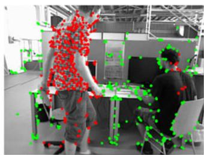  
(b) Failure case 2  
Fig. 11. Typical failure cases: in both frame 699 (a) and frame 727 (b) of the sequence of fr3/walking-xyz, the landmarks on the moving person are labeled as dynamic accurately; however, almost all landmarks for the person sitting stationary for a long time are labeled as static.

Our approach still suffers from four main drawbacks. First, wrong static/dynamic landmark detection occurs, influencing the final camera pose estimation. This happens mainly in highly dynamic scenes with insufficient reliable static landmarks for camera pose estimation. Another cause arises from the epipolar line constraints used in the GC-RANSAC filter. Some dynamic objects may move along the direction of the epipolar line between consecutive frames, leading to incorrect initial static/dynamic labeling. One possible solution to this problem may be introducing more structural prior hints, such as planarity constraints.

Second, it is not as effective for almost static scenes, mainly because it may wrongly label static feature points as dynamic, thereby lowering camera pose estimation accuracy. One possible solution is to allow the user to choose whether to use the dynamic object detection module. If it is turned off, the final pose estimate is mainly determined by the process of initial camera pose estimation.

Third, as shown in Fig. 11, our approach does not perform very well for objects which are stationary for a long time before starting to move, since our approach mainly relies on geometric rules to identify static/dynamic feature points without understanding the scene. This could be overcome by temporally matching object arrangements (including object locations and spatial relationships) for the whole scene, to infer when previously static objects start to move [52].

Lastly, initial ego-motion estimation depends on GC-RANSAC, a randomized algorithm. Thus the final result of dynamic landmark detection is inherently somewhat random. Nevertheless, our method is still typically superior to many existing methods. We hope to explore non-random initial ego-motion estimation methods to ensure that the system works robustly in various scenarios.

## 5 CONCLUSION

This paper has presented our LC-CRF SLAM system for accurate pose estimation and effective dynamic point detection. To reduce the impact of dynamic points on pose estimation, we first compute an initial pose using GC-RANSAC and assign each landmark a static/dynamic prior. Then, we use a CRF with appropriate unary and pairwise potentials to label each landmark as static or dynamic. We have shown that our proposed LC-CRF SLAM is significantly more accurate than existing methods for the highly dynamic examples in the public TUM RGB-D dataset and Bonn RGB-D dataset, and that it can be incorporated into the dynamic 3D reconstruction. In the future, we hope to explore potential AR/ VR applications for dynamic scenarios, taking advantage of the static/dynamic information identified by our lightweight camera pose tracking.

## ACKNOWLEDGEMENTS

The authors would like to thank the reviewers for their detailed and constructive comments on this article. This work was supported by the Natural Science Foundation of China (Grant No. 61863031, 61902210, 61521002) and the China Postdoctoral Science Foundation (Grant No. 2019M660646).

## REFERENCES

[1] K. Kim, M. Billinghurst, G. Bruder, H. B. Duh, and G. F. Welch, “Revisiting trends in augmented reality research: A review of the 2nd decade of ISMAR (2008–2017),” IEEE Trans. Vis. Comput. Graph., vol. 24, no. 11, pp. 2947–2962, Nov. 2018.

[2] C. Cadena et al., “Past, present, and future of simultaneous localization and mapping: Toward the robust-perception age,” IEEE Trans. Robot., vol. 32, no. 6, pp. 1309–1332, Dec. 2016.

[3] H. Durrant-Whyte and T. Bailey, “Simultaneous localization and mapping: Part I,” IEEE Robot. Autom. Magazine, vol. 13, no. 2, pp. 99–110, Jun. 2006.

[4] P. F. Alcantarilla, J. J. Yebes, J. Almaz-an, and L. M. Bergasa, “On combining visual slam and dense scene flow to increase the robustness of localization and mapping in dynamic environments,” in Proc. IEEE Int. Conf. Robot. Autom., 2012, pp. 1290–1297.

[5] D. Moratuwage, B. Vo, and D. Wang, “Collaborative multi-vehicle SLAM with moving object tracking,” in Proc. IEEE Int. Conf. Robot. Autom., 2013, pp. 5702–5708.

[6] C. C. Wang, C. Thorpe, M. Hebert, S. Thrun, and H. Durrant-Whyte, “Simultaneous localization, mapping and moving object tracking,” Int. J. Robot. Res., vol. 26, no. 9, pp. 889–916, Sep. 2007.

[7] D. Kim and J. Kim, “Effective background model-based RGB-D dense visual odometry in a dynamic environment,” IEEE Trans. Robot., vol. 32, no. 6, pp. 1565–1573, Dec. 2016.

[8] S. Meerits, D. Thomas, V. Nozick, and H. Saito, “FusionMLS: Highly dynamic 3D reconstruction with consumer-grade RGB-D cameras,” Comput. Vis. Media, vol. 4, no. 4, pp. 287–303, Dec. 2018.

[9] S. Li and D. Lee, “RGB-D SLAM in dynamic environments using static point weighting,” IEEE Robot. Autom. Lett., vol. 2, no. 4, pp. 2263–2270, Oct. 2017.

[10] H. Zhang and F. Xu, “MixedFusion: Real-time reconstruction of an indoor scene with dynamic objects,” IEEE Trans. Vis. Comput. Graph., vol. 24, no. 12, pp. 3137–3146, Dec. 2018.

[11] M. Runz, M. Buffier, and L. Agapito, “MaskFusion: Real-time recognition, tracking and reconstruction of multiple moving objects,” in Proc. IEEE Int. Symp. Mixed Augmented Reality, 2018, pp. 10–20.

[12] R. Scona, M. Jaimez, Y. R. Petillot, M. Fallon, and D. Cremers, "Staticfusion: Background reconstruction for dense RGB-D slam in dynamic environments,” in Proc. IEEE Int. Conf. Robot. Autom., 2018, pp. 3849–3856.

[13] E. Palazzolo, J. Behley, P. Lottes, P. Giguere, and C. Stachniss, “Refusion: 3D reconstruction in dynamic environments for rgb-d cameras exploiting residuals,” in Proc. IEEE/RSJ Int. Conf. Intell. Robots Syst., 2019, pp. 7855–7862.

[14] D. Barath and J. Matas, “Graph-cut RANSAC,” in Proc. IEEE/CVF Conf. Comput. Vis. Pattern Recognit., 2018, pp. 6733–6741.

[15] J. Sturm, N. Engelhard, F. Endres, W. Burgard, and D. Cremers, “A benchmark for the evaluation of RGB-D SLAM systems,” in Proc. IEEE/RSJ Int. Conf. Intell. Robots Syst., 2012, pp. 573–580.

[16] A. J. Davison, I. D. Reid, N. D. Molton, and O. Stasse, “MonoSLAM: Real-time single camera SLAM,” IEEE Trans. Pattern Anal. Mach. Intell., vol. 29, no. 6, pp. 1052–1067, Jun. 2007.

[17] G. Klein and D. Murray, “Parallel tracking and mapping for small AR workspaces,” in Proc. 6th IEEE ACM Int. Symp. Mixed Augmented Reality, 2007, pp. 225–234.

[18] R. Mur-Artal and J. D. Tardos, “Orb-SLAM2: An open-source-SLAM system for monocular, stereo, and RGB-D cameras,” IEEE Trans. Robot., vol. 33, no. 5, pp. 1255–1262, Oct. 2017.

[19] R. A. Newcombe, S. J. Lovegrove, and A. J. Davison, “DTAM: Dense tracking and mapping in real-time,” in Proc. Int. Conf. Comput. Vis., 2011, pp. 2320–2327.

[20] C. Forster, M. Pizzoli, and D. Scaramuzza, “SVO: Fast semi-direct monocular visual odometry,” in Proc. IEEE Int. Conf. Robot. Autom., 2014, pp. 15–22.

[21] J. Engel, T. Schops, and D. Cremers, “LSD-SLAM: large-scale€ direct monocular SLAM,” in Proc. 13th Eur. Conf. Comput. Vis., 2014, pp. 834–849.

[22] O. K€ahler, V. A. Prisacariu, C. Y. Ren, X. Sun, P. Torr, and D. Murray, “Very high frame rate volumetric integration of depth images on mobile devices,” IEEE Trans. Vis. Comput. Graph., vol. 21, no. 11, pp. 1241–1250, Nov. 2015.

[23] Z. Yan, M. Ye, and L. Ren, “Dense visual SLAM with probabilistic surfel map,” IEEE Trans. Vis. Comput. Graph., vol. 23, no. 11, pp. 2389–2398, Nov. 2017.

[24] J. Engel, V. Koltun, and D. Cremers, “Direct sparse odometry,” IEEE Trans. Pattern Anal.Mach. Intell., vol. 40, no. 3, pp. 611–625, Mar. 2018.

[25] A. Bapat, E. Dunn, and J. Frahm, “Towards kilo-hertz 6-DoF visual tracking using an egocentric cluster of rolling shutter cameras,” IEEE Trans. Vis. Comput. Graph., vol. 22, no. 11, pp. 2358–2367, Nov. 2016.

[26] J. R. Rambach, A. Tewari, A. Pagani, and D. Stricker, “Learning to fuse: A deep learning approach to visual-inertial camera pose estimation,” in Proc. IEEE Int. Symp. Mixed Augmented Reality, 2016, pp. 71–76.

[27] S. Yang, B. Li, M. Liu, Y.-K. Lai, L. Kobbelt, and S.-M. Hu, “HeteroFusion: Dense scene reconstruction integrating multisensors,” IEEE Trans. Vis. Comput. Graph., vol. 26, no. 11, pp. 3217–3230, Nov. 2020.

[28] M. Garon and J. Lalonde, “Deep 6-DoF tracking,” IEEE Trans. Vis. Comput. Graph., vol. 23, no. 11, pp. 2410–2418, Nov. 2017.

[29] J. Zhang, M. Gui, Q. Wang, R. Liu, J. Xu, and S. Chen, “Hierarchical topic model based object association for semantic SLAM,” IEEE Trans. Vis. Comput. Graph., vol. 25, no. 11, pp. 3052–3062, Nov. 2019.

[30] J. Huang, S. Yang, Z. Zhao, Y.-K. Lai, and S.-M. Hu, “ClusterSLAM: A SLAM backend for simultaneous rigid body clustering and motion estimation,” in Proc. IEEE Int. Conf. Comput. Vis., 2019, pp. 5875–5884.

[31] J. Huang, S. Yang, T.-J. Mu, and S.-M. Hu, “ClusterVO: Clustering moving instances and estimating visual odometry for self and surroundings,” in Proc. IEEE Conf. Comput. Vis. Pattern Recognit., 2020, pp. 2168–2177.

[32] C. Kerl, J. Sturm, and D. Cremers, “Robust odometry estimation for RGB-D cameras,” in Proc. IEEE Int. Conf. Robot. Autom., 2013, pp. 3748–3754.

[33] M. Zollhofer€ et al., “State of the art on 3D reconstruction with RGB-D cameras,” Comput. Graph. Forum, vol. 37, no. 2, pp. 625–652, May 2018.

[34] R. A. Newcombe, D. Fox, and S. M. Seitz, “DynamicFusion: Reconstruction and tracking of non-rigid scenes in real-time,” in Proc. IEEE Conf. Comput. Vis. Pattern Recognit., 2015, pp. 343–352.

[35] M. Slavcheva, M. Baust, D. Cremers, and S. Ilic, “KillingFusion: Non-rigid 3D reconstruction without correspondences,” in Proc. IEEE Conf. Comput. Vis. Pattern Recognit., 2017, pp. 5474–5483.

[36] M. Slavcheva, M. Baust, and S. Ilic, “SobolevFusion: 3D reconstruction of scenes undergoing free non-rigid motion,” in Proc. IEEE Conf. Comput. Vis. Pattern Recognit., 2018, pp. 2646–2655.

[37] M. Dou et al. “Fusion4D: Real-time performance capture of challenging scenes,” ACM Trans. Graph., vol. 35, no. 4, Jul. 2016, Art. no. 114.

[38] K. Guo, F. Xu, T. Yu, X. Liu, Q. Dai, and Y. Liu, “Real-time geometry, albedo, and motion reconstruction using a single RGB-D camera,” ACM Trans. Graph., vol. 36, no. 4, Jun. 2017, Art. no. 32.

[39] W. Gao and R. Tedrake, “Surfelwarp: Efficient non-volumetric single view dynamic reconstruction,” in Proc. Robot.: Sci. Syst., 2018, pp. 29:1–29:10.

[40] M. Bujanca, M. Luj-an, and B. Lennox, “FullFusion: A framework for semantic reconstruction of dynamic scenes,” in Proc. IEEE Int. Conf. Comput. Vis. Workshops, 2019, pp. 2168–2177.

[41] S. Yang, J. Wang, G. Wang, X. Hu, M. Zhou, and Q. Liao, “Robust RGB-D SLAM in dynamic environment using faster R-CNN,” in Proc. 3rd IEEE Int. Conf. Comput. Commun., 2017, pp. 2398–2402.

[42] F. Zhong, S. Wang, Z. Zhang, C. Chen, and Y. Wang, “Detect-SLAM: Making object detection and SLAM mutually beneficial,” in Proc. IEEE Winter Conf. Appl. Comput. Vis., 2018, pp. 1001–1010.

[43] S. Ren, K. He, R. Girshick, and J. Sun, “Faster R-CNN: Towards real-time object detection with region proposal networks,” IEEE Trans. Pattern Anal. Mach. Intell., vol. 39, no. 6, pp. 1137–1149, Jun. 2017.

[44] A. Dai and M. Nießner, “3DMV: Joint 3D-multi-view prediction for 3D semantic scene segmentation,” in Proc. Eur. Conf. Comput. Vis., 2018, pp. 458–474.

[45] L. Quan and Z. Lan, “Linear N-point camera pose determination,” IEEE Trans. Pattern Anal. Mach. Intell., vol. 21, no. 8, pp. 774–780, Aug. 1999.

[46] Y. Boykov and G. Funkalea, “Graph cuts and efficient N-D image segmentation,” Int. J. Comput. Vis., vol. 70, no. 2, pp. 109–131, Nov. 2006.

[47] Y. Y. Boykov and M.-P. Jolly, “Interactive graph cuts for optimal boundary & region segmentation of objects in N-D images,” in Proc. IEEE Int. Conf. Comput. Vis., 2001, vol. 1, pp. 105–112.

[48] P. Kr€ahenbuhl and V. Koltun, “Efficient inference in fully con-€ nected CRFs with gaussian edge potentials,” in Proc. Int. Conf. Neural Inf. Process. Syst., 2011, pp. 109–117.

[49] G. Narita, T. Seno, T. Ishikawa, and Y. Kaji, “PanopticFusion: Online volumetric semantic mapping at the level of stuff and things,” in Proc. Int. Conf. Intell. Robots Syst., 2019, pp. 4205–4212.

[50] J. Sturm, N. Engelhard, F. Endres, W. Burgard, and D. Cremers, “A benchmark for the evaluation of RGB-D SLAM systems,” in Proc. Int. Conf. Intell. Robots Syst., 2012, pp. 573–580.

[51] K. He, G. Gkioxari, P. Dollár, and R. Girshick, "Mask R-CNN," IEEE Trans. Pattern Anal. Mach. Intell., vol. 42, no. 2, pp. 386–397, Feb. 2020.

[52] M. Halber, Y. Shi, K. Xu, and T. Funkhouser, “Rescan: Inductive instance segmentation for indoor RGBD scans,” in Proc. IEEE Int. Conf. Comput. Vis., 2019, pp. 2541–2550.

  
Zheng-Jun Du received the bachelor’s degree from Qinghai University, in 2012, and the master’s degree from Tsinghua University, in 2015. He is currently working toward the PhD dehgree with the Department of Computer Science and Technology, Tsinghua University. His research interests include 3D reconstruction, dynamic SLAM, geometric modeling, and image processing.

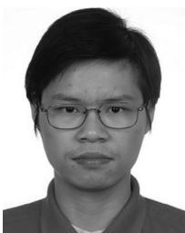  
Shi-Sheng Huang received the PhD degree in computer science and technology from Tsinghua University, Beijing, in 2015. He is currently a Post-Doc researcher with Tsinghua University. His primary research interests include fields of computer graphics, computer vision, and visual SLAM.

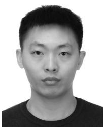

Tai-Jiang Mu received the bachelor’s and doctor’s degrees from the Department of Computer Science and Technology, Tsinghua University, in 2011 and 2016, respectively, where he is currently an assistant researcher with the Department of Computer Science and Technology, Tsinghua University. His research interests include visual media learning, SLAM, and human robot interaction.

Qunhe Zhao received the PhD degree from the Chinese Academy of Sciences, in 2017. He is currently a researcher in artificial intelligence at DeepBlue Technology (Shanghai) Co., Ltd. He is mainly responsible for perception and mapping algorithms for autonomous driving.

Kun Xu (Member, IEEE) received the bachelor’s and doctor’s degrees from the Department of Computer Science and Technology, Tsinghua University, in 2005 and 2009, respectively, where he is currently an associate professor. His research interests include computer graphics.

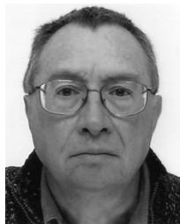

Ralph R. Martin is an emeritus professor with Cardiff University. His past activities have included editorial board memberships of various journals and chairing various conferences. He was a fellow of the Learned Society of Wales. In 2014, Ralph was awarded the Friendship Award, China’s highest Award for foreign nationals.

" For more information on this or any other computing topic, please visit our Digital Library at www.computer.org/csdl.