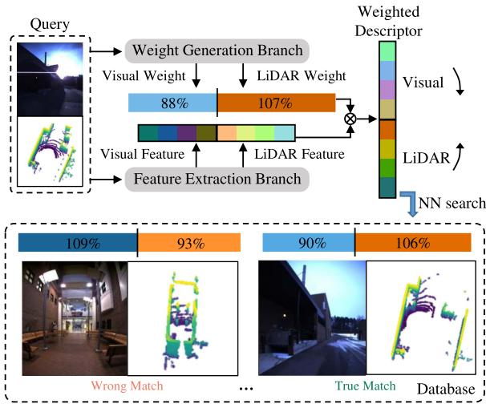
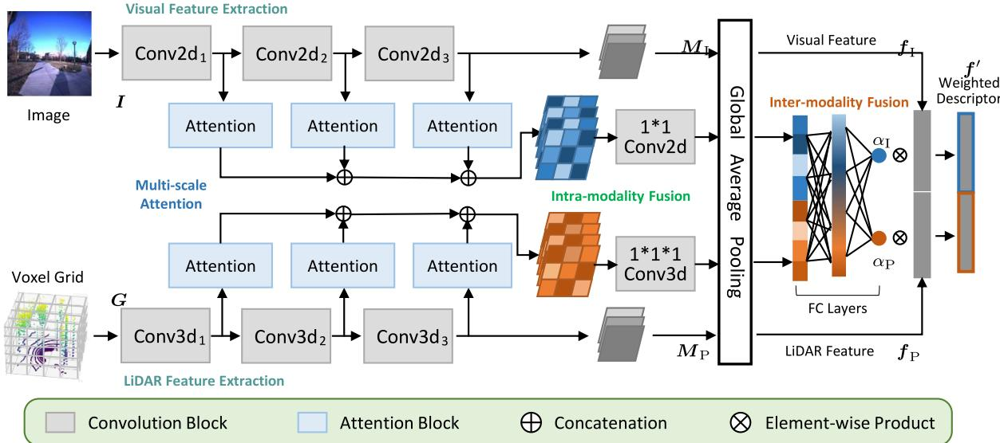
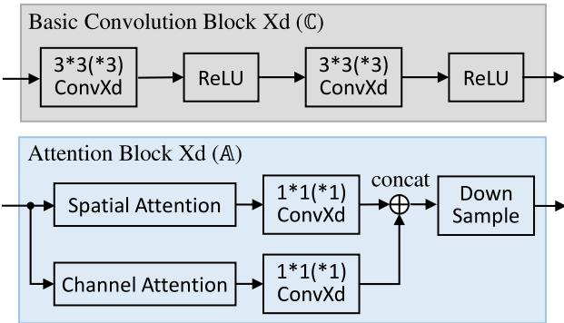
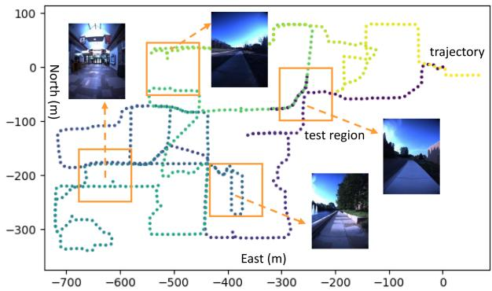
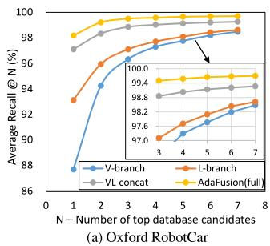
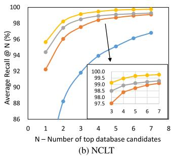
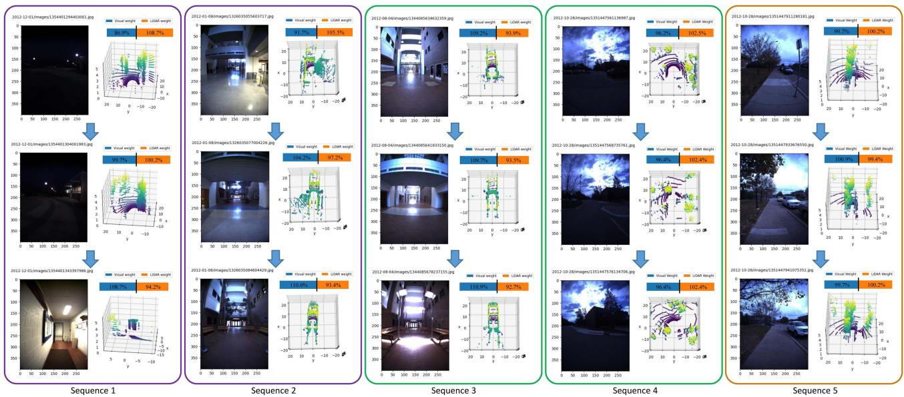

# AdaFusion: Visual-LiDAR Fusion With Adaptive Weights for Place Recognition

Haowen Lai , Peng Yin , Member, IEEE, and Sebastian Scherer , Senior Member, IEEE

Abstract—Recent years have witnessed the increasing application of place recognition in various environments, such as city roads, large buildings, and a mix of indoor and outdoor places. This task, however, still remains challenging due to the limitations of different sensors and the changing appearance of environments. Current works only consider the use of individual sensors or simply combine different sensors, ignoring the fact that the importance of different sensors varies as the environment changes. In this letter, an adaptive weighting visual-LiDAR fusion method, named AdaFusion, is proposed to learn the weights for both image and point cloud features. Features of these two modalities are thus contributed differently according to the current environmental situation. Weights are learned by the multi-scale attention branch of the network, which is then fused with the multi-modality feature extraction branch. Furthermore, to better utilize the potential relationship between images and point clouds, we design a two-stage fusion approach to combine the 2D and 3D attention. Our work is tested on two public datasets. Experiments show that the adaptive weights help improve recognition accuracy and system robustness to varying environments while being efficient in runtime.

Index Terms—Adaptive weights, multi-modality, place recognition, visual-LiDAR fusion.

## I. INTRODUCTION

OCALIZATION plays a significant role in much of the delivery and service robots. Place recognition, as a typical localization method that retrieves the most similar places regarding the query one, is thus extensively studied by researchers. There are some challenges in this task, one of which comes from the potential applications in various environments, making it hard to be coped with. Thus the capability to distinguish and select prominent information becomes a key way to improve the recognition accuracy.

Aimed at different hardware settings and application scenarios, researchers have utilized diverse sensors for place recognition, such as camera and LiDAR. Vision-based methods [1], [2], [3], [4] extract features from images and usually benefit from the abundant information that images encode. Their weaknesses, however, are also obvious. They are prone to light condition, season change and weather, especially in outdoor environments. In contrast, LiDARs are more robust to the variation of light and time [5], and several LiDAR-based methods [5], [6], [7], [8] have been developed for long-term localization. Despite the precise geometric structure information from point clouds, they may encounter failure in some degenerate places like corridors and tunnels. For most applications, robots seem to have a single and specific working scenario so that a proper type of sensors can be chosen. But that is not always the case for some tasks, e.g. food or package delivery robots that work in both indoor and outdoor environments. Considering the merits of these two sensors, recent studies start to focus on the combination of 2D and 3D data in a way that concatenates [9] or fuses image and point cloud features with fully-connected (FC) layers [10]. Although the cooperation with another sensor effectively brings improvement in performance, one issue remains unsolved – i.e., the two modalities are regarded as equally important at every time and every place.

To handle this issue, it is natural to adjust the importance based on salient regions of images and point clouds. One way enabling networks to learn where to look is to introduce attention. Unlike convolution operation, the attention mechanism focuses on long range interaction and is able to weight about the important or unnecessary features [11], [12], [13]. Several works have applied it to the task of place recognition, but they only concentrate on the improvement on feature representation, either in a vision-based [14], [15] or LiDAR-based way [16], [17], [18]. These attention augmented methods can, to some extent, strengthen the ability of feature extraction and make the recognition system more robust to appearance changes. Recently Lu et al. [19] combines the visual and the LiDAR branches that are respectively augmented with attention to exploit the complementary advantages of the two modalities. Still, the modality contribution issue is untouched, and feature from less distinctive modality may worsen the performance of the whole system.

In this letter, we propose AdaFusion, a multi-modality fusion network that learns the compact feature representation of both images and point clouds and then adjusts their contribution in different environmental situation. As shown in Fig. 1, AdaFusion mainly contains two branches: a feature extraction branch and a weight generation branch. The feature extraction branch encodes images and point clouds into distinctive descriptors separately, while the weight generation branch leverages the attention mechanism to learn the importance of different modalities. Moreover, to fully exploit the information in 2D and 3D data, these two branches are designed to work cooperatively. Multi-scale spatial and channel attention is first computed from different layers of the feature extraction branch and then fused together to produce adaptive weights. After that weighted features are concatenated to form a global descriptor. The contributions of our work are threefold:

  
Fig. 1. Place recognition with adaptive weights: Visual and LiDAR features are extracted and weighted so that distinctive modality contributes more in the combined descriptor. The query and the true match have similar adaptive weights, both of which emphasize less on image features for their poor quality for recognition, while the wrong match has lower weight in LiDAR for the featureless corridor. Darker colors represent relatively larger values.

\- We propose AdaFusion, a visual-LiDAR fusion network with adaptive weights for place recognition. The weights serve as dynamic adjustment to the contribution of the two modalities in different environments, making our method outperforms current state-of-the-art works.

\- We design an attention-based weight generation branch that can be trained in an end-to-end manner. It gives further inspiration to fuse different modalities using the attention mechanism.

\- Evaluation and comparison with other methods demonstrate the effectiveness and efficiency of AdaFusion under varying environmental situation.

## II. RELATED WORK

Place recognition methods generally encode sensor data into global descriptors which can be used for the retrieval of similar places with proper distance metric in the feature space. The encoding ways vary in terms of different sensors, hence we will have a brief review on the most frequently used types.

Vision-based place recognition: Visual place recognition has been studied for over two decades. Traditionally, handcrafted local feature descriptors [20], [21] are utilized to capture salient information of the image. Later, with the booming of deep learning, researchers start to replace the handcrafted ones with networks [1], [2], [3] for their strong power in extracting features. The occurrence of NetVLAD [4], a trainable framework combining CNNs and VLAD, has inspired works to implement both local and global descriptors in an end-to-end manner. Regarding the learning-based methods, some work has incorporated the attention mechanism [11], [12], [13] to enhance the resistance to visual appearance changes, since the context-aware attention distinguishes the important and unimportant regions of the image. For instance, Chen et al. [15] proposed a context flexible attention model and fuse multi-scale attention maps into a final mask. CAMAL [14] used similar multi-scaling technique but with proposed regional attention.

LiDAR-based place recognition: LiDARs can capture geometric structural information of the environment as point clouds that are sparse and unordered. Some methods project point clouds to 2D structures. For example, Scan Context [22] and Scan Context++ [23] adopt a bird’s-eye view (BEV) representation. Inspired by [22], DiSCO [24] proposed multi-layer BEV and uses CNNs for feature extraction. Range images with an overlap-based metric are used in OverlapNet [25] and OverlapTransformer [17]. Unlikely, MinkLoc3D [26] and Locus [27] directly operate in 3D space by discretizing it into voxel grids and applying 3D convolution. Another way is brought by PointNet [28] that can directly take point clouds as input. Since then a few works have been proposed based on Point-Net. For example, PointNetVLAD [5] combines PointNet and NetVLAD [4] to enable end-to-end training and extraction for global descriptor from 3D point clouds. Others like LPD-Net [7] and FusionVLAD [8] further deal with the feature aggregation and the viewpoint difference problems, respectively. Similar to vision-based methods, some researchers have applied the attention mechanism to networks for better concentration on important features, such as PCAN [16], OverlapTransformer [17] and Retriever [18].

Visual-LiDARfusionplace recognition: The idea of taking advantage of different modalities has recently caught researchers eyes. Since cameras and LiDARs capture different information from the environment, the combination ofthe two sensors indeed has strengths over other single-modality methods, as reported in [9], [10], [19], [29]. Ratz et al. [10] project segments of point clouds onto the image and use 2D and 3D convolution to extract features. Features of different modalities are then fused by FC layers. Oertel et al. [9] and Komorowski et al. (MinkLoc++) [29] adopt similar pipeline but without the projection and FC layers. Instead, the image and the point cloud features are concatenated directly. PIC-Net [19] further enhances the representation ability of features by integrating attention modules to the two feature extraction branches respectively. The function of attention is limited in each branch and the two modalities contribute equally, even when the environment is unfriendly for one of the sensors, say foggy days for cameras or corridors for LiDARs. In such cases advantages brought by multiple modalities may be lowered by the less informative sensor.

## III. PROPOSED METHOD

In this section, we show how AdaFusion leverages the weighted global descriptor to perform place recognition in varying environments. A brief illustration of the whole approach is shown in Fig. 1. Instead of simply extracting features from images and point clouds, the network also adjusts the importance of these two modalities. After that, nearest neighbor (NN) search is used to retrieve the most similar places in the database with the weighted descriptor. Please note that the adaptive weights in Fig. 1 have been divided by their average values, resulting in the percentage form. Further explanation can be found at Section IV-B.

  
Fig. 2. The network structure of AdaFusion: Our network is mainly composed of two branches. The feature extraction branch separately deals with images and point clouds to extract visual and LiDAR features with convolution. The weight generation branch firstly performs intra-modality fusion of the multi-scale attention, and then learns the adaptive weights with inter-modality fusion.

## A. Network Overview

There are two main aspects in AdaFusion, each of which is handled by a specific branch. The first one is feature extraction. Given a frame of image and point cloud, this branch utilizes 2D and 3D convolution to extract local visual and LiDAR features respectively in a parallel way, as shown in Fig. 2. Then these local features are aggregated to be global features using global average pooling (GAP). Although some techniques such as NetVLAD core [4] can enhance the ability of feature extraction, we leave them out for two reasons. Some researchers [9], [10] have shown that simple convolution structures can also achieve high performance, which gets verified in our experiments. Moreover, the adaptive weights are able to adjust the importance and contribution of visual and LiDAR features so that the performance gets improved. Unlike methods that solely rely on feature extraction to output global descriptors, the existence of adaptive weights relieves part of the pressure to design more powerful but complicated feature extraction branches.

Another aspect is the adaptive weights handled by the weight generation branch. As in Fig. 2, this branch contains three parts, namely multi-scale attention, intra-modality fusion and inter-modality fusion. The multi-scale attention is learned from different layers of the network. It has been reported that lower layers of the network often focus on fine details while higher ones correspond to semantic meaning [1]. This property benefits the later fusion process because information at different scales is considered. Since it may be difficult for the network to directly learn the importance of different modalities, we design a two-stage fusion approach. Attention is first merged within the same type of sensor, summarizing information of the specific modality. After dimension reduction by GAP, FC layers are utilized to perform inter-modality fusion and output the adaptive weights. Given the weights and features, it is easy to get the weighted global descriptor with element-wise product.

## B. Feature Extraction

In this part we show how to obtain features from images and point clouds. We adopt the $\mathrm { P y }$ Torch tradition to denote highdimensional array and omit the batch size for better illustration. For instance, 3D data is represented as $C \times H \times W$ and 4D data as $C \times D \times H \times W$ , where $C , D , H$ and W means Channel, Depth, Height and Width respectively.

Data preparation: Each frame $X = ( I , P )$ contains an RGB image $\pmb { \dot { I } } \in \mathbb { R } ^ { 3 \times H \times W }$ and point cloud $\dot { \boldsymbol { P } } \in \dot { \mathbb { R } } ^ { 3 \times N }$ . For images we separately normalize each channel to be in range [−1.0, 1.0]. However, the original data structure of P cannot be handled by convolutional operation. Instead, voxel grid $G \in \mathbb { R } ^ { 1 \times X \times Y \times \bar { Z } }$ with binary occupancy is utilized as the input, i.e. a voxel equals 1 if there is any point within it and 0 otherwise. Although other occupancy representations like point count, soft occupancy [9] and TDF [30] are also available, the binary one has been shown to be more robust and has better recognition performance [9].

Structure and blocks: Both the backbones of visual and Li-DAR feature extraction are divided into three convolution blocks Conv $\mathrm { X d } _ { i } , X \in \{ 2 , 3 \} , \ i = 1 , 2 , 3$ which are further constituted by basic convolution blocks (denoted as C). The structure of C is shown in Fig. 3, where convolution with kernel=3, stride=1 and padding=1 followed by ReLU activation function are repeated twice. Details of convolution blocks ConvXd are summarized in Fig. 4. Note that we add a batch normalization (BN) layer [31] for the last blocks Conv $\mathrm { \Delta X d _ { 3 } }$ to reduce the internal covariate shift before getting the local visual feature map $M _ { \mathrm { I } } = ( m _ { c . h . w } ^ { \mathrm { I } } ) \in \mathbb { R } ^ { C _ { 1 } \times \tilde { H _ { 1 } } \times W _ { 1 } }$ and the local LiDAR feature map $M _ { \mathrm { P } } = ( m _ { c , x , y , z } ^ { \mathrm { P } } ) \in \mathbb { R } ^ { C _ { 1 } \times X _ { 1 } \times Y _ { 1 } \times Z _ { 1 } }$ . The use of BN improves the ability of feature extraction a lot. We observe that when directly using single visual or LiDAR feature as global descriptor for searching nearest neighbors, about 10% improvement can be achieved with the BN layer compared to those without.

  
Fig. 3. Details of blocks: The basic convolution block (C) and the attention block (A) are used to build the network, where X can be either 2 or 3 depending on the data structure. The numbers in ConvXd mean the kernel size, and for all convolution the stride is 1. Concatenation is along the channel dimension of the feature map.

<table><tr><td>Block</td><td>Detail</td><td>Block</td><td>Detail</td></tr><tr><td> $\mathrm { \overline { { C o n v 2 d _ { 1 } } } }$ </td><td> $\overline { { \mathbb { C } _ { 6 4 } \mathbb { P } _ { \mathrm { M } } \mathbb { C } _ { 6 4 } \mathbb { P } _ { \mathrm { M } } } }$ </td><td> $\overline { { \mathrm { C o n v 3 d _ { 1 } } } }$ </td><td> $\overline { { \mathbb { C } _ { 3 2 } \mathbb { P } _ { \mathrm { A } } } }$ </td></tr><tr><td>Conv  $\mathrm { 2 d _ { 2 } }$ </td><td> $\mathbb { C } _ { 6 4 } \mathbb { C } _ { 1 2 8 } \mathbb { P } _ { \mathrm { M } }$ </td><td> $\mathrm { C o n v 3 d _ { 2 } }$ </td><td> $\mathbb { C } _ { 6 4 } \mathbb { C } _ { 6 4 } \mathbb { P } _ { \mathrm { A } }$ </td></tr><tr><td>Conv2d3</td><td> $\mathbb { C } _ { 1 2 8 } \mathbb { C } _ { 1 2 8 } \mathbb { B } \mathbb { P } _ { \mathrm { M } }$ </td><td> $\mathrm { C o n v 3 d _ { 3 } }$ </td><td> $\mathbb { C } _ { 1 2 8 } \mathbb { B } \mathbb { P } _ { \mathrm { A } }$ </td></tr></table>

Fig. 4. The composition of feature extraction structures: We denote basic convolution block $\mathbf { \bar { \Psi } } ( \mathbb { C } )$ with k output channels as $\mathbb { C } _ { k } ,$ max pooling as $\mathbb { P } _ { \mathrm { M } } ,$ average pooling as $\mathbb { P } _ { \mathrm { A } }$ and batch normalization as B. For all pooling operations, both kernel and stride equal 2.

Global features: To produce the global visual feature $\pmb { f } _ { \mathrm { I } } = [ f _ { \mathrm { I } } ^ { 1 } , \overleftarrow { f } _ { \mathrm { I } } ^ { 2 } , \ldots , f _ { \mathrm { I } } ^ { C _ { 1 } } ] ^ { \top }$ and the global LiDAR feature $f _ { \mathrm { P } } =$ $[ f _ { \mathrm { P } } ^ { 1 } , f _ { \mathrm { P } } ^ { 2 } , \ldots , f _ { \mathrm { P } } ^ { C _ { 1 } } ] ^ { \top }$ , we apply global average pooling (GAP) [2] to $M _ { \mathrm { I } }$ and MP, i.e.

$$
f _ { \mathrm { I } } ^ { c } = \frac { 1 } { H _ { 1 } W _ { 1 } } \sum _ { h = 1 } ^ { H _ { 1 } } \sum _ { w = 1 } ^ { W _ { 1 } } m _ { c , h , w } ^ { \mathrm { I } } , \qquad c = 1 , \ldots , C _ { 1 }\tag{1}
$$

$$
f _ { \mathrm { P } } ^ { c } = \frac { 1 } { X _ { 1 } Y _ { 1 } Z _ { 1 } } \sum _ { x = 1 } ^ { X _ { 1 } } \sum _ { y = 1 } ^ { Y _ { 1 } } \sum _ { z = 1 } ^ { Z _ { 1 } } m _ { c , x , y , z } ^ { \mathrm { P } } , \quad c = 1 , \dots , C _ { 1 }\tag{2}
$$

In fact, GAP is a special case of generalized-mean (GeM) pooling [2]. Compared to FC layers, the global pooling methods have less parameters and are more robust to resolution changes of the input data.

## C. Adaptive Weights

We propose a weight generation branch that utilizes a twostage fusion strategy to combine the attention information of images and point clouds. Slightly different from other attention augmented place recognition methods, the attention mechanism in our network does not serve as salient region masks. Instead, weights ${ \pmb { \alpha } } = [ \alpha _ { \mathrm { I } } , \alpha _ { \mathrm { P } } ] ^ { \top }$ are produced to change the contribution of visual and the LiDAR features.

Multi-scale attention: Like [15], multi-scale attention is used to fully exploit the information in different network layers. As shown in Fig. 2 and Fig. 3, for each modality we compute the spatial attention and the channel attention illustrated in [12] from the feature extraction branch. However, in [12] and other related work [11], [13], [15], [18], the attention only aims at 2D images. We hence extend it to 3D voxel grid form. Given the query map Q, the key map K and the value map V of shape $C _ { 2 } \times X _ { 2 } \times$ $Y _ { 2 } \times Z _ { 2 }$ , we first reshape them to shape $C _ { 2 } \times N$ , where $N =$ $X _ { 2 } \times Y _ { 2 } \times Z _ { 2 }$ . Then the spatial attention map $S _ { s } \in \mathbb { R } ^ { N \times N }$ and the channel attention map $\mathbf { \bar { \boldsymbol { S } } } _ { c } \in \mathbb { R } ^ { C _ { 2 } \times C _ { 2 } }$ are derived as

$$
\begin{array} { r } { \pmb { S } _ { s } = \mathrm { S o f t m a x } ( \pmb { K } ^ { \top } \pmb { Q } ) , \quad \pmb { S } _ { c } = \mathrm { S o f t m a x } ( \pmb { Q } \pmb { K } ^ { \top } ) , } \end{array}\tag{3}
$$

where the softmax operation is performed along the row (second dimension) of the matrix. Finally the spatial attention and the channel attention can be obtained by reshaping $V S _ { s } ^ { \top }$ and $S _ { c } V$ back to shape $C _ { 2 } \times X _ { 2 } \times Y _ { 2 } \times Z _ { 2 }$

The original spatial and channel attention in [12] have the same dimension as the input feature map, which may have large channel numbers when computing from higher layers of the network. To reduce computational cost and only keep useful information, we apply a kernel 1 convolution to linearly fuse the attention, as shown in Fig. 3. Before outputting from the attention block $( \mathbb { A } )$ , down sample with nearest interpolation is performed to ensure all the results have the same size.

Intra-modality fusion: Now the multi-scale attention of the same modality is concatenated along the channel dimension. As mentioned above, attention from different layers of the network concentrates on varying contents. To fuse and merge them, a convolutional layer whose kernel equals 1 is again applied to the attention of the same modality. This operation acts as a transformation of the number of channels.

Inter-modality fusion: One issue concerning fusing attention of different modalities is the inconsistency of the data structure. For example, in our case, the visual attention $A _ { \mathrm { I } }$ is of 3D shape $( C _ { 3 } \times H _ { 3 } \times W _ { 3 } )$ while the LiDAR attention $A _ { \mathrm { P } }$ is of 4D shape $( C _ { 3 } \times X _ { 3 } \times Y _ { 3 } \times Z _ { 3 } )$ . To handle this problem, we apply $\mathrm { G A P }$ to $A _ { \mathrm { I } }$ and $A _ { \mathrm { P } }$ respectively, which yields two 1D vectors $\mathbf { a } _ { \mathrm { I } } \in \mathbb { R } ^ { C _ { 3 } }$ and $\pmb { a } _ { \mathrm { P } } \in \mathbb { R } ^ { C _ { 3 } }$ that have the same shape and dimension. The length of these vectors can be easily controlled in the intramodality fusion stage, where $C _ { 3 } = 1 2 8$ is used in our network.

Since ${ \pmb a } _ { \mathrm { I } }$ and $\mathbf { a } _ { \mathrm { P } }$ are now of the same dimension, a FC layer is applied so that $\begin{array} { r } { \pmb { \alpha } = \mathrm { F C } ( [ \pmb { a } _ { \mathrm { I } } ^ { \top } , \pmb { a } _ { \mathrm { P } } ^ { \top } ] ^ { \top } ) } \end{array}$ , where ${ \pmb { \alpha } } = [ \alpha _ { \mathrm { I } } , \alpha _ { \mathrm { P } } ] ^ { \top }$ are the adaptive weights for visual and LiDAR features. The number of nodes from the input to the output layer is [256,64,32,2], with two hidden layers applied. All activation functions are ReLU, except that Sigmoid is used for the last one so as to make $\alpha _ { \mathrm { I } } , \alpha _ { \mathrm { P } } \in [ 0 , 1 ]$ . Finally the weighted global descriptor is derived as

$$
\begin{array} { r } { \pmb { f } ^ { \prime } = [ \alpha _ { \mathrm { I } } \pmb { f } _ { \mathrm { I } } ^ { \top } , \alpha _ { \mathrm { P } } \pmb { f } _ { \mathrm { P } } ^ { \top } ] ^ { \top } , } \end{array}\tag{4}
$$

which can then be used to perform NN search for retrievals.

## D. Implementation Details

When receiving a frame $X = ( I , P )$ , some pre-processing is made before feeding the network. We first use a height threshold to remove ground points from the point cloud $_ { r }$ and then convert it into voxel grid G with a resolution of $7 2 \times 7 2 \times 4 8$ voxels along the $X , Y , Z$ dimension respectively. Regions like part of the data collection car and the ground appear at the same place for every image $^ { I , }$ so they are determined manually and cropped. The remain is resized to resolution $3 0 0 \times 4 0 0$ for $H \times W$ . Data augmentation is also considered to enlarge the training set and to avoid over fitting. We randomly change the brightness, contrast and saturation of the image, and jitter the points in $_ { r }$ before converting it to the voxel grid.

Euclidean distance metric $\mathrm { d } _ { 2 } ( \cdot )$ is adopted to determine the true match (a.k.a. true positive, TP) and the wrong match (a.k.a. true negative, TN) of a query frame. Two frames $X _ { i }$ and $X _ { j }$ are deemed to be true match if their ground truth positions $\mathbf { \Delta } _ { \mathbf { \mathcal { X } } _ { i } }$ and $\boldsymbol { x } _ { j }$ are within a certain range, i.e. $\mathrm { d } _ { 2 } ( { \pmb x } _ { i } , { \pmb x } _ { j } ) \leq d _ { \mathrm { p o s } }$ . Similarly for the wrong match, it has $\mathrm { d } _ { 2 } ( { \pmb x } _ { i } , { \pmb x } _ { j } ) \geq d _ { \mathrm { n e g } } .$ . When training, we set $d _ { \mathrm { p o s } } = 1 0$ m and $d _ { \mathrm { n e g } } = 5 0 \mathrm { m }$ , while $d _ { \mathrm { p o s } } = d _ { \mathrm { n e g } } = 2 0$ m during testing.

Loss function: In the field of place recognition, metric learning techniques are applied since there are no specific classes. Some popular loss functions, such as contrastive loss [32], triplet loss [33] and lazy triplet loss [5], have been widely used in this task. The basic idea is that descriptors between true match should be pulled nearer, while those between wrong match should be pushed away. Here we adopt the pairwise margin-based loss with $L _ { 1 }$ distance metric [9]:

$$
\mathcal { L } ( \boldsymbol { f } _ { i } ^ { \prime } , \boldsymbol { f } _ { j } ^ { \prime } , y ) = \left\{ \left[ \mathrm { d } _ { 1 } ( \boldsymbol { f } _ { i } ^ { \prime } , \boldsymbol { f } _ { j } ^ { \prime } ) - ( m - a ) \right] _ { + } , y = 1 , \right.\tag{5}
$$

where $[ x ] _ { + } = \operatorname* { m a x } ( x , 0 )$ is the hinge loss. The label $y = 1$ for true match and $y = - 1$ otherwise. It is shown in [9] that the pairwise margin-based loss can achieve good performance and converge faster.

Training configuration: Our network is implemented in $\mathrm { P y }$ Torch and trained with a single Nvidia RTX 3090 GPU and 64 GB RAM. For each case, we train the network for 50 epochs and evaluate its performance every 2000 batches. The Adam optimizer is used with the initial learning rate set to $8 \times 1 0 ^ { - 4 }$ . It will be reduced by a factor of 0.9 if no improvement is achieved in the following 20 evaluations.

## IV. EXPERIMENTS

This section presents experimental results and analyses of AdaFusion. We compare it with state-of-the-art place recognition methods and show the advantages of our adaptive weights. All of the results reported about our method is based on the structure shown in Fig. 2. However, it should be noted that the performance of our network can be further improved by adding attention in the feature extraction branch. It is easy to implement and will not increase much computational cost owing to the reuse of attention blocks, but we leave it out for simplicity and better illustration of the adaptive weights.

TABLE I  
SEQUENCES USED IN THE EXPERIMENT AND THE NUMBER OF FRAMES, PAIRS AND TESTING QUERIES
<table><tr><td></td><td colspan="2">Sequences</td><td>Numbers1 ①: 5155</td></tr><tr><td>Roqar</td><td> $\overline { { 2 0 1 4 - 0 7  – 1 4 – 1 4 – 4 9 – 5 0 } }$   $2 0 1 4 - 1 2 \substack { - 0 2 - 1 5 - 3 0 - 0 8 }$   $2 0 1 4 - 1 2 - 1 2 - 1 0 { - } 4 5 { - } 1 5$   $2 0 1 5 { \cdot } 0 2 { \cdot } 1 3 { \cdot } 0 9 { \cdot } 1 6 { \cdot } 2 6$  2015-05-19-14-06-38</td><td> $2 0 1 4 - 1 1 - 1 8 - 1 3 - 2 0 - 1 2$   $2 0 1 4 - 1 2 \ – 0 9 - 1 3 \ – 2 1 \ – 0 2$   $2 0 1 5  – 0 2 – 0 3 – 0 8 – 4 5 – 1 0$   $2 0 1 5  – 0 3 – 1 0 – 1 4 – 1 8 – 1 0$  2015-08-13-16-02-58 2012-01-22</td><td>②: 2394 ③:65k ④: 14M ⑤: 21k</td></tr><tr><td>NIT</td><td>2012-01-08 2012-02-12 2012-03-31 2012-08-04 2012-11-04</td><td>2012-02-18 2012-05-26 2012-10-28 2012-12-01</td><td>①: 4356 ②: 1111 ③: 44k ④: 9M ⑤: 9.9k</td></tr></table>

1 ①: frames in training set, ②: frames in testing set, ③: positive training samples, ④: negative training samples, ⑤: testing queries

## A. Datasets and Evaluation

The proposed method is tested on two public datasets, namely Oxford RobotCar [34] and NCLT [35].

Oxford RobotCar Dataset: This dataset was repeatedly collected in the central Oxford, U.K. twice a week for more than one year, resulting in over 130 sequences. Due to the long time span, the sequences cover different outdoor conditions like season, weather and light changes. Although RGB images are provided, point clouds need to be generated by the accumulation of 2D laser points. For convenience we use the processed point clouds submaps from [5], where each submap represents a 20 m trajectory ofthe car with 10 m overlap. Then we construct frames X by associating images to submaps using their timestamps.

NCLT Dataset: Similar to the previous one, this dataset was collected in the University of Michigan’s North Campus for 15 months and has 27 sequences. But what makes it different is that it contains both indoor and outdoor scenarios, and is more challenging in viewpoint difference. Since RGB images and 3D LiDAR point clouds are already provided in this dataset, we directly associate them as frames X according to the timestamps. To make configurations of these two datasets similar, we select frames from each sequence for every 10 m trajectory ofthe robot.

For both datasets, we respectively choose 10 sequences which cover different environmental conditions. A list of these sequences can be found in Table I, in which those of the RobotCar dataset are identical to [9] for fair comparison. Besides, to construct training and testing sets, sequences are divided into geographically disjoint regions. Some of the testing frames can be seen in Fig. 5, where we deliberately include both indoor and outdoor places. Using the method introduced in Section III-D, we exhaustively view all frames as the query and search other frames to make true match pairs and wrong match pairs. These pairs can then be used by the pairwise margin-based loss for training. When it comes to testing, every two sequences are chosen as query and database, giving rise to a total number of $\mathrm { C _ { 1 0 } ^ { 2 } = 4 5 }$ combinations per dataset. Table I shows a summary of the number of frames, training pairs and testing queries.

Evaluation metric: We report the recall@N of all the evaluated methods. It represents the percentage that at least one true positive (i.e. true match) occurs in the top-N retrievals of the query using KNN search. In particular, average recall@1 (AR@1) and average recall@1% (AR@1%) of different methods are compared, where N equals 1 and 1% of the searching database respectively.

  
Fig. 5. The trajectory and the training & testing set of the NCLT dataset: Dots in the trajectory represent selected frames, and orange boxes with size 100 m × 100 m are test regions forming the testing set. The training set is comprised of the remaining disjoint region.

TABLE II  
AVERAGE RECALL (%) OF THE EVALUATED PLACE RECOGNITION METHODS ON THE OXFORD ROBOTCAR DATASET
<table><tr><td>Methods</td><td>Modality1</td><td>AR@1</td><td>AR@1%</td></tr><tr><td>NetVLAD [4]</td><td>V</td><td>51.52</td><td>63.19</td></tr><tr><td>Multi-Process Fusion [3]</td><td>V</td><td>66.30</td><td></td></tr><tr><td>PointNetVLAD [5]</td><td>L</td><td>63.87</td><td>81.29</td></tr><tr><td>Scan Context [22]</td><td>L</td><td>64.59</td><td>81.88</td></tr><tr><td>DiSCO [24]</td><td>L</td><td>75.01</td><td>88.44</td></tr><tr><td>Retriever [18]</td><td>L</td><td>79.25</td><td>91.93</td></tr><tr><td>Ref. [9]</td><td>V+L</td><td>98.00</td><td></td></tr><tr><td>PIC-Net [19]</td><td>V+L</td><td></td><td>98.22</td></tr><tr><td>MinkLoc++ [29]</td><td>V+L</td><td>96.70</td><td>99.10</td></tr><tr><td>CORAL [36]</td><td>V+L</td><td>88.93</td><td>96.13</td></tr><tr><td>AdaFusion (our)</td><td>V+L</td><td>98.18</td><td>99.21</td></tr></table>

1 V: Visual, L: LiDAR, V+L: Visual+LiDAR (multi-modality).

## B. Place Recognition Results

Both single modality (Visual or LiDAR) and multi-modality place recognition methods are compared with ours. For NetVLAD [4] and PointNetVLAD [5], we run the evaluation by ourselves with the released source codes, while the results of others are reported as in the original letters. Table II shows the recognition results on the Oxford RobotCar dataset. As we can see, all the compared multi-modality based methods outperform those based on single modality both in AR@1 and AR@1%, which indicates the effectiveness of the fusion approach. Moreover, although the performance of state-of-the-art fusion based methods is already high, ours can still improve AR@1 by 0.18% compared to [9] and AR@1% by 0.11% compared to MinkLoc++ [29], finally reaching 98.18% and 99.21% for AR@1 and AR@1% respectively.

Each branch of AdaFusion is tested on both datasets, as shown in Fig. 6. We separately train and evaluate the visual and the LiDAR feature extraction sub-branches. The trend of AR@N is similar in both datasets, where LiDAR feature (orange) is more distinctive than visual feature (blue). The direct concatenation of the two modalities without adaptive weights (gray, VL-concat)

  
Fig. 6. AR@N of the network: We show the results tested on the (a) Oxford RobotCar and (b) NCLT datasets, where “V” and “L” are short for “visual” and “LiDAR” respectively. The blue, orange and gray curves illustrate the performance of our feature extraction branch, while the yellow one shows that of the whole AdaFusion.

enhances the performance. When applying the adaptive weights (yellow, AdaFusion), further improvement is achieved. The effect of adaptive weights is more significant with a small N, as the performance of feature extraction branch gets better and the difference becomes smaller when the number of candidates increases.

To show how AdaFusion benefits from the dynamic adjustment of the two modalities, we investigate the adaptive weights in a series ofplaces. Fig. 7 presents five sequences, each ofwhich contains consecutive frames while the robot moves. Sequence 1 and 2 show that the weights change as environment varies. When a robot enter the bright house from the dark outside, as in Seq. 1, the quality of images is getting better and thus the visual weight increases. Similarly, Seq. 2 suggests that the LiDAR weight would decrease when the robot moves into the corridor where only walls appear in the point cloud. Sequence 3 and 4 illustrate the dominating modality. For example, as shown in Seq. 3, indoor environment is usually unfriendly for LiDAR sensor because it is easy to get walls in the point clouds, so camera is likely to become the dominant sensor. On the contrary, Seq. 4 shows that point clouds are usually more distinctive in outdoor environments, so the LiDAR weight is relatively larger. However, there are some difficult cases like the one in Seq. 5, where places are unfriendly to both images and point clouds. We cannot easily distinguish them apart using whether visual or Li-DAR information. As a consequence, the contribution of the two modalities is nearly equal in such case. Note that the percentages are neither the real weight values nor normalized ratios between the two modalities. In fact they are relative ratios compared to the average visual and LiDAR weights, i.e. $\bar { \alpha } _ { \mathrm { I } } = 0 . 4$ and $\bar { \alpha } _ { \mathrm { P } } = 0 . 6$ for this dataset. Apart from better illustration, this representation can reflect the current contribution of a modality with respect to its average standard, because each query is searched through the whole database.

## C. Ablation Study

In order to explore the effects between the feature extraction branch and the weight generation branch, we evaluate the AR@1 of each component of our network with respect to different feature dimensions, as shown in Table III. Our baseline is based on feature dimension $d _ { f } = 2 5 6 \left( \mathrm { D } { - } 2 5 6 \right)$ where $d _ { f _ { \mathrm { I } } } = d _ { f _ { \mathrm { P } } } = d _ { f } / 2$ As we can see, the decrease in feature dimension indeed lowers the recognition performance of the feature extraction branch, especially for the V-branch. The large difference in performance between the visual and the LiDAR feature may hinder the cooperation of these two modalities in the fused descriptor. The adaptive weights, to some extend, balance the performance difference and further improve the recognition recall. The evidence is that we have observed that the average visual and LiDAR weights $( \mathrm { i . e . } \bar { \alpha } _ { \mathrm { I } }$ and $\bar { \alpha } _ { \mathrm { P } } )$ are changed from 0.40 and 0.60 when $d _ { f } = 2 5 6$ to 0.32 and 0.68 when $d _ { f } = 1 2 8$ for the NCLT dataset, which coincides with the decreased performance of the visual feature. It shows that the adaptive weights can improve the robustness of the system and help achieve acceptable results even with simple feature extraction branch and low-dimension descriptor.

  
Fig. 7. Adaptive weights of different places: There are consecutive frames in each sequence. The weights are converted to relative ratios compared to the average visual and LiDAR weights for better illustration. A value higher than 100% means the corresponding modality contributes more in this place than the average contribution of all places.

TABLE III  
AR@1 (%) FOR DIFFERENT FEATURE DIMENSIONS, WHERE D AND IMPR. ARE SHORT FOR DIMENSION AND IMPROVEMENT, RESPECTIVELY
<table><tr><td></td><td>Types</td><td>D-128</td><td>D-192</td><td>D-256</td><td>D-512</td></tr><tr><td rowspan="4">Roqcar</td><td>V-branch</td><td>83.57</td><td>86.87</td><td>87.68</td><td>88.91</td></tr><tr><td>L-branch</td><td>89.47</td><td>91.45</td><td>93.12</td><td>93.27</td></tr><tr><td>VL-concat</td><td>96.35</td><td>96.59</td><td>97.10</td><td>97.32</td></tr><tr><td>AdaFusion</td><td>97.42</td><td>97.72</td><td>98.18</td><td>98.24</td></tr><tr><td rowspan="5">NCLT</td><td>Impr. V-branch</td><td>1.07 69.48</td><td>1.13 73.79</td><td>1.08 79.34</td><td>0.92 80.23</td></tr><tr><td>L-branch</td><td>90.75</td><td>91.07</td><td>92.23</td><td>93.54</td></tr><tr><td>VL-concat</td><td>92.61</td><td>93.35</td><td>94.39</td><td>95.81</td></tr><tr><td>AdaFusion</td><td>94.06</td><td>94.85</td><td>95.65</td><td></td></tr><tr><td>Impr.</td><td>1.45</td><td>1.50</td><td>1.26</td><td>96.97 1.16</td></tr></table>

TABLE IV  
ABLATION STUDY ON THE MODALITY DOMAIN GAP AND THE WEIGHTGENERATION BRANCH ON THE NCLT DATASET
<table><tr><td>Structures</td><td>AR@1 (%)</td><td>Runtime (ms)</td></tr><tr><td>一  $\overline { { \mathrm { V L } _ { \mathrm { R } } \mathrm { - c o n c a t } } }$ </td><td>88.70</td><td>2.74</td></tr><tr><td> ${ \mathrm { V L } } _ { \mathrm { R } ^ { - } } { \mathrm { w e i g h t s } }$ </td><td>90.15</td><td>5.50</td></tr><tr><td>VL-concat</td><td>94.39</td><td>2.46</td></tr><tr><td> $\scriptstyle \mathrm { V L - c o n c a t + M L P }$ </td><td>94.52</td><td>2.65</td></tr><tr><td> $\mathrm { V L - c o n c a t + A t t n B l k \ x 1 }$ </td><td>94.96</td><td>4.01</td></tr><tr><td> $\mathrm { V L - c o n c a t + A t t n B l k \ x } 2$ </td><td>95.37</td><td>4.54</td></tr><tr><td> $\mathrm { V L - c o n c a t + A t t n B l k } \ x 3$  (AdaFusion)</td><td>95.65</td><td>5.33</td></tr></table>

We also compare our approach with the state-of-the-art Li-DAR range image-based methods [17], [25] to see the gap of fusing different modalities. Similar to [17] and [25], point clouds are represented as range images and thus our original

L-branch is modified to use 2D convolution for feature extraction, which is denoted as $\mathrm { L _ { R } } .$ -branch. Replacing the LiDAR branch in VL-concat and AdaFusion with it, we get ${ \mathrm { V L } } _ { \mathrm { R } }$ -concat and $\mathrm { V L } _ { \mathrm { R } } .$ -weights respectively. Results in Table IV show that they decrease by 5.69% and 5.50% comparing to the results using voxel grid representation for LiDAR data. Although the domain gap between LiDAR range images and RGB images seems smaller, experiments verify that our structure works better. We find that the voxel grid-based L-branch outperforms the range image-based $\mathrm { L _ { R } }$ -branch by 10.14%, which may be the reason for the performance difference after fusion.

Experiments on the components of the weight generation branch are conducted to illustrate the effectiveness and efficiency of the adaptive weights. We evaluate the feature extraction baseline VL-concat with different number of attention blocks. Simpler approaches such as regressing weight coefficients for each modality with MLP are also tested. The AR@1 and runtime are summarized in Table IV. As we can see, simply regressing weights with MLP only gives a little improvement, while the proposed multi-scale attention significantly improves the recognition performance. However, the growth of performance gradually slows down as the number of attention blocks increases.

Hence we choose 3 attention blocks for our network. The runtime analysis also indicates that AdaFusion is efficient and can work in real time.

## V. CONCLUSION

This letter presents AdaFusion, an adaptive weighting visual-LiDAR fusion method for place recognition. To handle the issue that different modalities contribute equally even in environment unfriendly for one of them, we introduce the adaptive weights which dynamically adjust the importance of visual and LiDAR features in the global descriptor. The weights are learned from the weight generation branch which leverages multi-scale spatial and channel attention. Experiments on two public datasets show that our AdaFusion outperforms state-of-the-art fusion based methods. The presence of adaptive weights further improves the robustness of the system and makes it possible to obtain better results with less powerful but low-cost feature extraction structures.

## ACKNOWLEDGMENT

The authors want to thank Beijing Novauto Technology Co., Ltd for generously providing GPUs for training.

## REFERENCES

[1] Z. Chen et al., “Deep learning features at scale for visual place recognition,” in Proc. IEEE Int. Conf. Robot. Automat., 2017, pp. 3223–3230.

[2] F. Radenovi´c, G. Tolias, and O. Chum, “Fine-tuning CNN image retrieval with no human annotation,” IEEE Trans. Pattern Anal. Mach. Intell., vol. 41, no. 7, pp. 1655–1668, Jul. 2019.

[3] S. Hausler, A. Jacobson, and M. Milford, “Multi-process fusion: Visual place recognition using multiple image processing methods,” IEEE Robot. Automat. Lett., vol. 4, no. 2, pp. 1924–1931, Apr. 2019.

[4] R. Arandjelovic, P. Gronat, A. Torii, T. Pajdla, and J. Sivic, “Netvlad: CNN architecture for weakly supervised place recognition,” in Proc. IEEE Conf. Comput. Vis. Pattern Recognit., 2016, pp. 5297–5307.

[5] M. A. Uy and G. Hee Lee, “Pointnetvlad: Deep point cloud based retrieval for large-scale place recognition,” in Proc. IEEE Conf. Comput. Vis. Pattern Recognit., 2018, pp. 4470–4479.

[6] L. He, X. Wang, and H. Zhang, “M2DP: A novel 3D point cloud descriptor and its application in loop closure detection,” in Proc. IEEE/RSJ Int. Conf. Intell. Robots Syst., 2016, pp. 231–237.

[7] Z. Liu et al., “LPD-Net: 3D point cloud learning for large-scale place recognition and environment analysis,” in Proc. IEEE Int. Conf. Comput. Vis., 2019, pp. 2831–2840.

[8] P. Yin, L. Xu, J. Zhang, and H. Choset, “Fusionvlad: A multi-view deep fusion networks for viewpoint-free 3D place recognition,” IEEE Robot. Automat. Lett., vol. 6, no. 2, pp. 2304–2310, Apr. 2021.

[9] A. Oertel, T. Cieslewski, and D. Scaramuzza, “Augmenting visual place recognition with structural cues,” IEEE Robot. Automat. Lett., vol. 5, no. 4, pp. 5534–5541, Oct. 2020.

[10] S. Ratz, M. Dymczyk, R. Siegwart, and R. Dubé, “Oneshot global localization: Instant LiDAR-visual pose estimation,” in Proc. IEEE Int. Conf. Robot. Automat., 2020, pp. 5415–5421.

[11] I. Bello, B. Zoph, A. Vaswani, J. Shlens, and Q. V. Le, “Attention augmented convolutional networks,” in Proc. IEEE/CVF Int. Conf. Comput. Vis., 2019, pp. 3286–3295.

[12] J. Fu et al., “Dual attention network for scene segmentation,” in Proc. IEEE Conf. Comput. Vis. Pattern Recognit., 2019, pp. 3146–3154.

[13] S. Woo, J. Park, J.-Y. Lee, and I. S. Kweon, “CBAM: Convolutional block attention module,” in Proc. Eur. Conf. Comput. Vis., 2018, pp. 3–19.

[14] A. Khaliq, S. Ehsan, M. Milford, and K. McDonald-Maier, “CAMAL: Context-aware multi-scale attention framework for lightweight visual place recognition,” 2019, arXiv:1909.08153.

[15] Z. Chen, L. Liu, I. Sa, Z. Ge, and M. Chli, “Learning context flexible attention model for long-term visual place recognition,” IEEE Robot. Automat. Lett., vol. 3, no. 4, pp. 4015–4022, Oct. 2018.

[16] W. Zhang and C. Xiao, “PCAN: 3D attention map learning using contextual information for point cloud based retrieval,” in Proc. IEEE Conf. Comput. Vis. Pattern Recognit., 2019, pp. 12436–12445.

[17] J. Ma, J. Zhang, J. Xu, R. Ai, W. Gu, and X. Chen, “OverlapTransformer: An efficient and yaw-angle-invariant transformer network for LiDAR-based place recognition,” IEEE Robot. Automat. Lett., vol. 7, no. 3, pp. 6958–6965, Jul. 2022.

[18] L. Wiesmann, R. Marcuzzi, C. Stachniss, and J. Behley, “Retriever: Point cloud retrieval in compressed 3D maps,” in Proc. IEEE Intl. Conf. Robot. Automat., 2022, pp. 10925–10932.

[19] Y. Lu, F. Yang, F. Chen, and D. Xie, “PIC-Net: Point cloud and image collaboration network for large-scale place recognition,” 2020, arXiv:2008.00658.

[20] D. G. Lowe, “Distinctive image features from scale-invariant keypoints,” Int. J. Comput. Vis., vol. 60, no. 2, pp. 91–110, 2004.

[21] H. Bay, T. Tuytelaars, and L. Van Gool, “Surf: Speeded up robust features,” in Proc. Eur. Conf. Comput. Vis., 2006, pp. 404–417.

[22] G. Kim and A. Kim, “Scan context: Egocentric spatial descriptor for place recognition within 3D point cloud map,” in Proc. IEEE/RSJ Int. Conf. Intell. Robots Syst., 2018, pp. 4802–4809.

[23] G. Kim, S. Choi, and A. Kim, “Scan Context++: Structural place recognition robust to rotation and lateral variations in urban environments,” IEEE Trans. Robot., vol. 38, no. 3, pp. 1856–1874, Jun. 2022.

[24] X. Xu, H. Yin, Z. Chen, Y. Li, Y. Wang, and R. Xiong, “Disco: Differentiable scan context with orientation,” IEEE Robot. Automat. Lett., vol. 6, no. 2, pp. 2791–2798, Apr. 2021.

[25] X. Chen, T. Läbe, A. Milioto, T. Röhling, J. Behley, and C. Stachniss, “OverlapNet: A siamese network for computing LiDAR scan similarity with applications to loop closing and localization,” Auton. Robots, vol. 46, no. 1, pp. 61–81, 2022.

[26] J. Komorowski, “Minkloc3D: Point cloud based large-scale place recognition,” in Proc. IEEE/CVFWinter Conf.Appl. Comput. Vis., 2021, pp. 1790– 1799.

[27] K. Vidanapathirana, P. Moghadam, B. Harwood, M. Zhao, S. Sridharan, and C. Fookes, “Locus: LiDAR-based place recognition using spatiotemporal higher-order pooling,” in Proc. IEEE Int. Conf. Robot. Automat., 2021, pp. 5075–5081.

[28] C. R. Qi, H. Su, K. Mo, and L. J. Guibas, “Pointnet: Deep learning on point sets for 3D classification and segmentation,” in Proc. IEEE Conf. Comput. Vis. Pattern Recognit., 2017, pp. 652–660.

[29] J. Komorowski, M. Wysoczanska, and T. Trzcinski, “MinkLoc : LiDAR and monocular image fusion for place recognition,” in Proc. IEEE Int. Joint Conf. Neural Netw., 2021, pp. 1–8.

[30] A. Zeng, S. Song, M. Nießner, M. Fisher, J. Xiao, and T. Funkhouser, “3Dmatch: Learning local geometric descriptors from RGB-D reconstructions,” in Proc. IEEE Conf. Comput. Vis. Pattern Recognit., 2017, pp. 1802–1811.

[31] S. Ioffe and C. Szegedy, “Batch normalization: Accelerating deep network training by reducing internal covariate shift,” in Proc. Int. Conf. Mach. Learn., 2015, pp. 448–456.

[32] R. Hadsell, S. Chopra, and Y. LeCun, “Dimensionality reduction by learning an invariant mapping,” in Proc. IEEE Comput. Soc. Conf. Comput. Vis. Pattern Recognit., 2006, pp. 1735–1742.

[33] M. Schultz and T. Joachims, “Learning a distance metric from relative comparisons,” in Proc. Adv. Neural Inf. Process. Syst., 2004, vol. 16, pp. 41–48.

[34] W. Maddern, G. Pascoe, C. Linegar, and P. Newman, “1 year, 1000 km: The Oxford RobotCar dataset,” Int. J. Robot. Res., vol. 36, no. 1, pp. 3–15, 2017.

[35] N. Carlevaris-Bianco, A. K. Ushani, and R. M. Eustice, “University of michigan north campus long-term vision and LiDAR dataset,” Int. J. Robot. Res., vol. 35, no. 9, pp. 1023–1035, 2016.

[36] Y. Pan, X. Xu, W. Li, Y. Cui, Y. Wang, and R. Xiong, “Coral: Colored structural representation for bi-modal place recognition,” in Proc. IEEE/RSJ Int. Conf. Intell. Robots Syst., 2021, pp. 2084–2091.