# An Intensity-Augmented LiDAR-Inertial SLAM for Solid-State LiDARs in Degenerated Environments

Haisong Li , Bailing Tian , Hongming Shen , and Junjie Lu

Abstract— With development of light detection and ranging (LiDAR) technology, solid-state LiDARs receive a lot of attention for their high reliability, low cost, and lightweight. However, compared with traditional rotating LiDARs, these solid-state LiDARs pose new challenges on simultaneous localization and mapping (SLAM) due to their small field of view (FoV) in horizontal direction and irregular scanning pattern, which arises the issue of degeneracy in indoor environments. To this end, we propose an accurate, robust, and real-time LiDAR-inertial SLAM method for solid-state LiDARs. First, a novel feature extraction based on geometry and intensity is proposed, which is the core of handling with degeneracy. To make full use of extracted features, two multi-weighting functions are designed for planar and edge points respectively in the process of pose optimization. Lastly, a map management module using an image processing method is developed not only to keep time efficiency and space efficiency but also to reduce edge intensity outliers in line map. Qualitative and quantitative evaluations on public and recorded datasets show that the proposed method exhibits similar and even better accuracy with state-of-the-art SLAM methods in well-constrained scenarios, while only the proposed method can survive in the robustness test toward degenerated indoor lab environment.

Index Terms— Degenerated environments, intensity edge point, line map management, multi-weighting function, solid-state light detection and ranges (LiDARs).

## NOMENCLATURE

<table><tr><td> $^ I ( \cdot )$ </td><td>NOMENCLATURE Variable in the IMU frame.</td></tr><tr><td> $^ L ( \cdot )$ </td><td>Variable in the LiDAR frame.</td></tr><tr><td> $^ W ( \cdot )$   $( \cdot ) ^ { T }$ </td><td>Variable in the World frame.</td></tr><tr><td> $( \cdot ) _ { t }$ </td><td>Transpose of a vector or matrix. Variable obtained at time t.</td></tr><tr><td> $\mathbf { a } _ { t } , \mathbf { w } _ { t }$ </td><td>Raw IMU measurements.</td></tr><tr><td> $\mathcal { P } , \tilde { \mathcal { P } }$ </td><td>Raw point could and preprocessed</td></tr><tr><td> $\mathcal { F }$  T, ∆T, T</td><td>point cloud. Extracted features. Robot pose from IMU preintegration,</td></tr></table>

Manuscript received 10 April 2022; revised 2 June 2022; accepted 23 June 2022. Date of publication 12 July 2022; date of current version 19 July 2022. This work was supported in part by the National Natural Science Foundation of China under Grant 62022060, Grant 62073234, Grant 61903349, and Grant 61873340; and in part by the Tianjin Graduate Research and Innovation Program under Grant 2021YJSB139. The Associate Editor coordinating the review process was Dr. Yan Zhuang. (Corresponding author: Bailing Tian.)

The authors are with the School of Electrical and Information Engineering, Tianjin University, Tianjin 300072, China (e-mail: haisong\_li@tju.edu.cn; bailing\_tian@tju.edu.cn; shenhm@tju.edu.cn; lqzx1998@tju.edu.cn).

Digital Object Identifier 10.1109/TIM.2022.3190060

## I. INTRODUCTION

IMULTANEOUS localization and mapping (SLAM) plays S a key role in the robotic industries including exploration of unknown environment, robot navigation, and real-time map generation [1]–[4]. Visual odometry (VO) [5], [6] like monocular VO or stereo VO shows advantages of low cost and lightweight while can be affected by lighting condition. In contrast, light detection and ranging (LiDAR) can provide more reliable information regardless of illumination changes, which makes LiDAR SLAM more and more popular.

In recent years, except for traditional rotating LiDARs, there are all kinds of LiDARs coming into sight. In particular, the solid-state LiDAR attracts lots of attention of SLAM researchers for its low cost, lightweight, high reliability, and long detection range. These amazing characteristics make it possible for mobile robots such as UAVs to explore various challenging environments while producing a dense and highprecision map. Yet, solid-state LiDARs have shortcomings of small field of view (FoV) in horizontal direction and irregular scanning pattern, which poses new challenges on SLAM.

## A. Motivations

Considering that solid-state LiDARs like Livox AVIA are competitive products but rather fresh compared with traditional rotating LiDARs [7], only a limited amount of works are able to achieve SLAM with a solid-state LiDAR [8]–[12]. In view of the aforementioned special mechanism of solidstate LiDAR, it is urgent to design a dedicated feature extraction [13] for its nonrepetitive scanning model. Apart from keeping time-efficiency, tough degeneration problem [14] arisen from small FoV in horizontal direction is needed to be taken into account. This article innovatively combines not only geometry information but also intensity information to extract salient features (see Section III-C). Most of the LiDAR SLAM aims to improve accuracy of odometry by adopting various optimization model [15]–[17]. However, to further improve robustness and accuracy of odometry, the proposed method utilizes geometry and intensity information from feature extraction by designing two multiweighting functions for planar and edge features (see Section III-D). Besides, it is acknowledged that map management (see Section III-E) is essential for SLAM, which is especially significant for platform with limited computing resources such as UAVs and UGVs [18], [19].

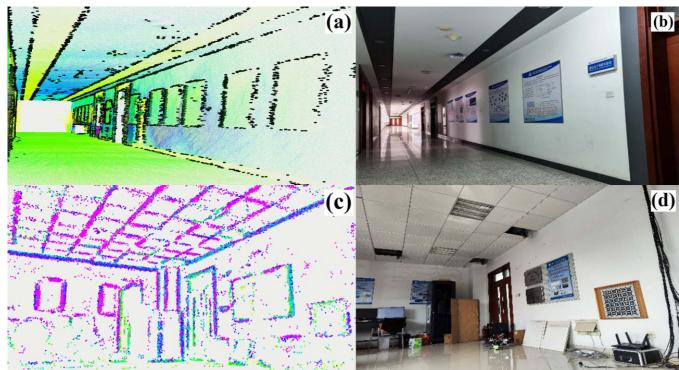  
Fig. 1. Overview of the proposed intensity-augmented LiDAR-inertial SLAM. Long-Corridor scenario: the colored points and black points in (a) are plane and line map respectively and (b) is real-world snapshot. Indoor lab scenario: the colored points in (c) are line map and (d) is real-world snapshot. It can be observed that there are lots of linelike points extracted by proposed intensity-augmented method while can be treated as planar points by traditional method.

## B. Contributions

In this article, we propose a LiDAR-inertial SLAM method (as shown in Fig. 1) for solid-state like AVIA LiDAR launched by Livox, which can achieve accurate, robust, and real-time localization and mapping, especially in some challenging degenerated environments. To summarize, our main contributions are listed as follows.

1) A novel feature extraction is proposed that can not only extract geometry planar points and edge points but also intensity edge points using intensity (reflectivity) returned by LiDAR measurements.

2) To improve accuracy and robustness, we design two multiweighting functions that jointly fuse the local geometry and intensity information and an iterative reweighed least-squares problem is solved for pose optimization.

3) To avoid intensity edge points degenerating to planar points, a line map management module based on an image processing method is developed for reduction of edge intensity outliers. Qualitative and quantitative evaluations have been conducted on various real-world scenarios and public datasets to show the accuracy, practicability of proposed method, and especially robustness in some degenerated environments.

## II. RELATED WORKS

There exists extensive works on LiDAR SLAM since a LiDAR shows the advantage of providing 3-D measurements directly compared with other external sensors. Due to limitation of onboard resources, it is time-consuming for a LiDAR SLAM system to deal with large number of points from raw LiDAR measurements. Therefore, a large quantity of feature-based LiDAR SLAM frameworks have been developed. One pioneering work is LOAM [20], which presents a framework that uses point-to-plane and point-to-line registration for real-time odometry and mapping. To speed up, LEGO-LOAM [21] performs segmentation and clustering on planar points to extract ground features and applies a two-stage optimization for pose estimation. LIO-SAM [22] proposes a framework for tightly coupled LiDAR-inertial odometry and mapping, which is easy to be incorporated from different sensors into the system. Different from selecting features by sampling uniformity in space, IMLS-SLAM [23] adopts a special sampling strategy based on contribution of the points to observability of robot state to guarantee time efficiency and accuracy. Based on extracting various classified geometric features from the scan, MULLS [24] proposes an efficient registration algorithm that can achieve pose optimization of point to point (plane and line) error metrics.

Despite methods mentioned above can be applied well in most scenarios, they are only suited for rotating LiDARs. To address the issue of small FoV and irregular scanning model for solid-state LiDARs, LOAM-Livox [8] develops a software package for robust, real-time odometry, and mapping for Livox MID-40 LiDAR. By fusing LiDAR features with IMU data, FAST-LIO [9] achieves a computationally efficient and accurate LiDAR-inertial odometry using a tightly coupled iterated extended Kalman filter. This is the most similar work compared with proposed method, while ours exploits both geometry and intensity information to handle with degeneracy delicately. FAST-LIO 2.0 [10] achieves a fast, robust, and accurate LiDAR localization and mapping by directly registering raw points to global map without feature extraction and using ikd-Tree toolkit. Beneficial from denseness of point cloud, CamVox [11] utilizes the feature of nonrepeating scanning model to perform automatic calibrations between the camera and a Livox LiDAR. To improve accuracy and time efficiency, LiLi-OM [12] presents a tightly coupled LiDAR-inertial SLAM system using a keyframe-based sliding window optimization.

Degeneracy is a tough problem in LiDAR SLAM for lacking of enough constraints on robot state. It is more severe for solid-state LiDARs with small FoV when the robot makes a turn in long narrow corridor or faces toward ceilings in indoor office. Through analysis of geometric structure of the problem constraints and a detailed explanation on the impact of environmental degradation on the state estimation, an online method is proposed in [14] to mitigate for degeneracy in optimization-based problems. It can be concluded from [13] that actively selecting a subset of features significantly improves both accuracy and efficiency of a LiDAR SLAM system and is helpful for dealing with degeneracy. In addition to extracting geometry features, semantic-based SLAM [25]–[27] have been explored in recent years. These methods not only use geometry plane and edge features but extract semantic information to obtain a better understanding of surrounding environment.

By performing a characteristics analysis for Livox MID-40 LiDAR, intensity distribution of laser points in FoV, measurement of accuracy, and effect of target surface color on reflection intensity are evaluated in [28]. It inspires us to combine geometry with intensity information to provide more constraints for state estimation. The intensity readings of an imaging LiDAR is utilized in [29] to obtain intensity image, which is further used for a real-time robust place recognition. Intensity SLAM [30] proposes a SLAM framework for traditional rotating LiDARs that leverages both geometry and intensity information. They use intensity information only to weigh up the difference between neighboring points and introduce trilinear interpolation to construct intensity residual which is less accurate. However, to improve accuracy and robustness, the proposed method uses intensity to extract edge points modeled as lines that are registered with their corresponding lines in line map.

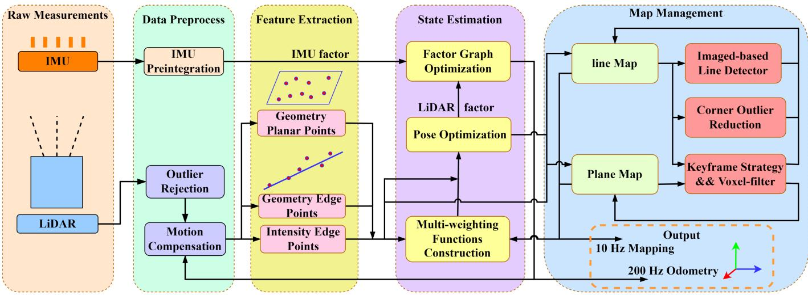  
Fig. 2. System pipeline: After preprocess of 10 Hz LiDAR and 200 Hz IMU measurements, geometry planar points (GeP), geometry edge points (GeE) and intensity edge points (InE) extracted in the module of feature extraction are fed for multiweighting pose optimization and map management. The outputs of pipeline are 200 Hz odometry and 10 Hz global map.

## III. METHODOLOGY

## A. System Pipeline

We first define notations and conventions used throughout this article. Denoting W as world frame, I as IMU frame, and L as LiDAR frame, ${ } ^ { B } \mathbf { T } _ { A }$ is a transformation matrix from frame A to frame B. Assuming that IMU is rigidly attached to LiDAR with a known extrinsic ${ } ^ { I } \mathbf { T } _ { L } = ( { } ^ { I } \mathbf { R } _ { L } , { } ^ { \bar { I } } \mathbf { p } _ { L } )$ where $^ { I } { \bf R } _ { L } \in \mathrm { ~  ~ \cal ~ S ~ } _ { \bf \mathrm { O } ( 3 ) }$ is the rotation matrix belonged to the special orthogonal group and ${ { \mathbf { } } ^ { I } } { { \mathbf { p } } _ { L } } \in \mathbf { \delta } { \mathbf { R } } ^ { 3 }$ is the position vector from frame L to $I ,$ the robot state x can be written as

$$
\mathbf { x } = \left[ ^ { W } \mathbf { R } _ { I } ^ { T } , ^ { W } \mathbf { p } _ { I } ^ { T } , ^ { W } \mathbf { v } _ { I } ^ { T } , ^ { W } \mathbf { b } ^ { T } \right] ^ { T }\tag{1}
$$

where ${ } ^ { W } { \mathbf { R } } _ { I } , \ { } ^ { W } { \mathbf { p } } _ { I }$ , and ${ \cal W } _ { \mathbf { V } _ { I } }$ are the orientation, position and speed of robot respectively and $^ W \mathbf { b }$ is the bias of IMU with respect to world frame. The transformation matrix $\mathbf { T } \in \mathrm { S E } ( 3 )$ , which is called the special Euclidean group, is represented as $\mathbf { T } = \{ \mathbf { R } , \mathbf { p } \}$

1) Notations: Throughout this article, nomenclature are defined as follows.

2) Workflow: The workflow of proposed method is shown in Fig. 2. First, raw measurements from IMU and LiDAR are preprocessed (see Section III-B) to provide high-frequency priori pose for state estimation module and a sound point cloud for following feature extraction module. Next, a novel feature extraction (see Section III-C) is proposed to extract geometry planar points (GeP), geometry edge points (GeE), and intensity edge points (InE) using both geometry and intensity information from processed point cloud. In the following state estimation module (see Section III-D), two multiweighting functions are designed for point to plane and point to line registration for obtaining 10 Hz LiDAR pose. High frequency but less accurate IMU pose from (see Section III-B1) is combined with LiDAR pose by factor-based optimization to extend the frequency of pose at 200 Hz. Lastly, Map management module (see Section III-E) is to keep time-efficiency and space-efficiency. Plane Map is maintained with key-frame strategy and voxel-based filter. Apart from that, line map is maintained carefully for intensity edge outlier reduction using an image-based line detection method.

## B. Data Preprocess

This section is mainly focused on data preprocess of IMU and LiDAR.

1) IMU Preprocess: IMU is usually important in estimation on robot state for its high frequency and for its non-dependence of the environment. However, it is less accurate and is able to accumulate errors when running for a long time. Consequently, IMU is needed to be combined with other external sensors to extend frequency of robot state for other needs such as control, planning, and so on [9], [22]. Once receiving an IMU input, IMU preprocess is performed to propagate robot state. The continuous model of IMU measurements of acceleration $\mathbf { a } _ { t }$ and angular velocity $\mathbf { W } _ { t }$ at time t is given as follows:

$$
\begin{array} { r l } & { \hat { \mathbf { a } } _ { t } = \mathbf { a } _ { t } - { } ^ { I } \mathbf { R } _ { W } { } ^ { W } \mathbf { g } + \mathbf { b } _ { \mathbf { a } } + \mathbf { n } _ { \mathbf { a } } } \\ & { \hat { \mathbf { w } } _ { t } = \mathbf { w } _ { t } + \mathbf { b } _ { \mathbf { g } } + \mathbf { n } _ { \mathbf { g } } } \end{array}\tag{2}
$$

where $\widehat { \mathbf { a } } _ { t }$ and $\hat { \mathbf { w } } _ { t }$ are raw acceleration and angular velocity from IMU measurements, $\mathbf { n _ { a } }$ and ${ \bf n _ { g } }$ are white noise of IMU measurements, ${ \bf b _ { a } }$ and ${ \bf b _ { g } }$ are IMU bias modeled as random walk process with Gaussian noises, $w _ { \mathbf { g } }$ is the constant gravity vector in frame W and ${ \mathbf { } } ^ { I } { \mathbf { R } } _ { W } = ( { \mathbf { } } ^ { W } { \mathbf { R } } _ { I } ) { \mathbf { \bar { \Gamma } } }$

Measurements from IMU can be used to infer the robot state from time $t _ { k }$ to $t _ { k + 1 }$ . The discrete kinematic model is

expressed as

$$
\begin{array} { l } { { \displaystyle { } ^ { W } \tilde { \mathbf { p } } _ { I } ^ { t _ { k } + 1 } = { } ^ { W } { \mathbf { p } } _ { I } ^ { t _ { k } } + { } ^ { W } { \mathbf { v } } _ { I } ^ { t _ { k } } \Delta t + \frac { 1 } { 2 } { } ^ { W } { \mathbf { g } } \Delta t ^ { 2 } } \ ~ } \\ { { \displaystyle ~ + \frac { 1 } { 2 } { } ^ { W } { \mathbf { R } } _ { I } ^ { t _ { k } } \left( \hat { \mathbf { a } } _ { t _ { k } } - \mathbf { b _ { a } } - \mathbf { n _ { a } } \right) \Delta t ^ { 2 } } \ ~ } \\ { { \displaystyle { } ^ { W } \tilde { \mathbf { v } } _ { I } ^ { t _ { k } + 1 } = { } ^ { W } { \mathbf { v } } _ { I } ^ { t _ { k } } + { } ^ { W } { \mathbf { R } } _ { I } ^ { t _ { k } } \left( \hat { \mathbf { a } } _ { t _ { k } } - \mathbf { b _ { a } } - \mathbf { n _ { a } } \right) \Delta t + { } ^ { W } { \mathbf { g } } \Delta t } \ ~ } \\ { { \displaystyle { } ^ { W } \tilde { \mathbf { R } } _ { I } ^ { t _ { k + 1 } } = { } ^ { W } { \mathbf { R } } _ { I } ^ { t _ { k } } \exp \Bigl ( \bigl ( \bigl ( \hat { \mathbf { w } } _ { t _ { k } } - \mathbf { b _ { g } } - \mathbf { n _ { g } } \bigr ) \Delta t \bigr ) ^ { \wedge } \Bigr ) } \ ~ } \end{array}\tag{3}
$$

where x˜ represents the estimated value of state x, $\begin{array} { r l } { \Delta t } & { { } = } \end{array}$ ${ t _ { k + 1 } - t _ { k } , \phi ^ { \wedge } \in \mathfrak { s o } ( 3 ) }$ called the Lie algebra denotes the skew symmetric matrix of vector $\phi \in \mathbb { R } ^ { 3 }$ and $\exp ( . ) : { \mathfrak { s o } } ( 3 ) \to$ SO(3) denotes exponential mapping function that associates so(3) with SO(3)

$$
\phi ^ { \wedge } = \left[ \begin{array} { c } { { \phi _ { x } } } \\ { { \phi _ { y } } } \\ { { \phi _ { z } } } \end{array} \right] ^ { \wedge } = \left[ \begin{array} { c c c } { { 0 } } & { { - \phi _ { z } } } & { { \phi _ { y } } } \\ { { \phi _ { z } } } & { { 0 } } & { { - \phi _ { x } } } \\ { { - \phi _ { y } } } & { { \phi _ { x } } } & { { 0 } } \end{array} \right]\tag{4}
$$

$$
\exp ( \phi ^ { \wedge } ) = I + \frac { \sin ( \| \phi \| ) } { \| \phi \| } \phi ^ { \wedge } + \frac { 1 - \cos ( \| \phi \| ) } { \| \phi \| ^ { 2 } } ( \phi ^ { \wedge } ) ^ { 2 } .\tag{5}
$$

Consequently, the estimated transformation matrix from frame I to frame $W$ at time $t _ { k }$ can be derived: $\begin{array} { r l } { W \tilde { \mathbf { T } } _ { I } ^ { t _ { k } } } & { { } = } \end{array}$ $( ^ { W } \tilde { \mathbf { R } } _ { I } ^ { t _ { k } } , ^ { W } \tilde { \mathbf { p } } _ { I } ^ { t _ { k } } )$ . Then IMU preintegration proposed in [15] is applied to achieve computation efficiency and obtain the relative motion between the scan-start time $t _ { j }$ and scan-end time $t _ { j + 1 } \colon \mathbf { \tilde { \Gamma } } ^ { W } \tilde { \mathbf { T } } _ { I } ^ { t _ { k } } ( t _ { k } ~ \in ~ [ t _ { j } , t _ { j + 1 } ] )$ . This is a huge topic and rather mature in state estimation with IMU information and there are lots of existing works on it. Due to space limitation, we strongly refer readers to have a better understanding of the residual and Jacobian of IMU preintegration with respect to robot state from [9], [15], [22]. The factor of IMU preintegration is then used in Section III-D2 to obtain 200 Hz pose.

2) LiDAR Preprocess: Giving that LiDAR measurements are noisy, point cloud $\mathcal { P }$ return from LiDAR is processed to provide a sound point cloud $\tilde { \mathcal { P } }$ for the following feature extraction and mapping. This section includes outlier rejection and motion undistortion. First, points with too large or too small intensity tend to have poor accuracy performance. Apart from that, points too close to LiDAR are considered to be located at the blind area, where the confidence of data drops rapidly. For Livox LiDAR with non-repetitive scanning model, points nearly coincident with neighborhood are redundant and potentially noisy when performing feature extraction. To increase the accuracy of state estimation and mapping, those points mentioned above are eliminated.

When robot moves aggressively, motion blur have a significant impact on the performance of localization and mapping. Compared with traditional rotating LiDARs, solid-state LiDARs suffer from more severe motion blur due to the mechanism of non-repetitive scanning model. To compensate motion, all points in a scan sampled at time $t _ { i } \in [ t _ { j } , t _ { j + 1 } ]$ are projected into the scan-end time $t _ { j + 1 } .$ . Searching the nearest transformation matrix ${ } ^ { W } { \bf T } _ { I } ^ { t _ { i } }$ obtained in Section III-D2 for each point in domain of time, the i th point ${ \boldsymbol { } } ^ { L } \mathbf { p } _ { i } ^ { t _ { i } } \in \tilde { \mathcal { P } }$ is transformed to ${ } ^ { L } { \bf p } _ { i } ^ { t _ { j + } }$

$$
\mathbf { \Lambda } ^ { L } \mathbf { p } _ { i } ^ { t _ { j + 1 } } = { ( \mathbf { \Lambda } ^ { I } \mathbf { T } _ { L } ) } ^ { \mathbf { T } } { \binom { W } { \mathbf { \Lambda } _ { I } ^ { t _ { j + 1 } } } } ^ { T _ { W } } \mathbf { T } _ { I } ^ { t _ { i } I } \mathbf { T } _ { L } ^ { \mathbf { \Lambda } _ { L } ^ { L } } \mathbf { p } _ { i } ^ { t _ { i } } .\tag{6}
$$

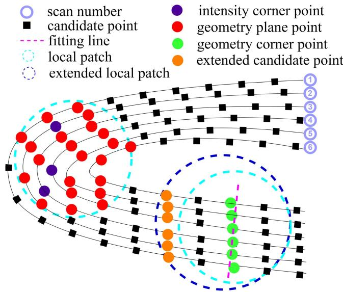  
Fig. 3. Schematic of assigning and extending patch. Every patch is assigned by nearest neighbor search strategy and extended by searching scan line in time domain if the number of points in patch is not enough.

Then, the transformed undistorted point cloud $\tilde { \mathcal P }$ is fed to the module of feature extraction.

## C. Feature Extraction

To extract features $\mathcal { F }$ from $\tilde { \mathcal { P } } , \mathrm { ~ a ~ }$ data construct $s$ is constructed as follows to represent the property for every point $\mathbf { p } _ { i } \in \tilde { \mathcal { P } }$

$$
{ \cal S } = \left[ \mathbf { p } , \pi , \mathbf { n } _ { f } , w _ { f } \right]\tag{7}
$$

where $\textbf { p } \in \ \mathbb { R } ^ { 3 }$ represents the 3-D coordinates in LiDAR frame, $\pi \in \{ \mathbf { G e p } $ , GeE, InE, Others} labels the feature point category, $\mathbf { n } _ { f } \in \mathbb { R } ^ { 3 }$ is the most representative eigenvector with respect to the category of feature and $\mathbf { W } _ { f }$ is a reserved parameter used to weigh up the reliability of feature point.

1) Patch Assignment and Extension: Before the process of feature extraction, it is necessary to assign a local patch $\mathbb { P } \in \tilde { \mathcal { P } }$ for every candidate point. Given a processed point cloud ${ \tilde { \mathcal { P } } } _ { : }$ it is sorted in time domain to determine the direction to expand patch. Shown in Fig. 3, a nearest neighbor search strategy is first used to guarantee that surrounding points are included in the patch. Besides, we additionally search on every scan line to obtain a certain number of points if selected points are not enough. This approach ensures that selecting points are enough and compact to represent its local information regardless of the irregular scanning model.

2) Planar Points: To determine whether a candidate point $\mathbf { p } _ { i } \in \mathbb { P }$ belongs to planar points, it is assumed that there exists a fitting plane (x, y, z) for every patch P. Within this patch, we find the farthest point ${ \bf p } _ { a }$ with respect to origin in LiDAR frame, the farthest point $\mathbf { p } _ { b }$ with respect to ${ \bf p } _ { a }$ and another point $\mathbf { p } _ { c }$ derived by

$$
\mathbf { p } _ { c } = \underset { \mathbf { p } _ { i } \in \mathbb { P } } { \mathrm { a r g m a x } } ~ \| ( \mathbf { p } _ { a } - \mathbf { p } _ { b } ) \times \left( \mathbf { p } _ { a } - \mathbf { p } _ { i } \right) \| _ { 2 } .\tag{8}
$$

Hence, the fitting plane $\Pi ( x , y , z )$ can be expressed as

$$
\Pi : n _ { x } \cdot x + n _ { y } \cdot y + n _ { z } \cdot z + { \bar { d } } _ { i } = 0\tag{9}
$$

where $n _ { x } , n _ { y } , n _ { z }$ , and $\bar { d } _ { i }$ are plane parameters calculated as

$$
\begin{array} { l } { \bar { \mathbf { n } } _ { i } = [ n _ { x } , n _ { y } , n _ { z } ] ^ { T } = \displaystyle \frac { ( \mathbf { p } _ { a } - \mathbf { p } _ { b } ) \times ( \mathbf { p } _ { a } - \mathbf { p } _ { c } ) } { \| ( \mathbf { p } _ { a } - \mathbf { p } _ { b } ) \times ( \mathbf { p } _ { a } - \mathbf { p } _ { c } ) \| _ { 2 } } } \\ { \bar { d } _ { i } = - ( n _ { x } \cdot p _ { x } + n _ { y } \cdot p _ { y } + n _ { z } \cdot p _ { z } ) } \\ { \bar { \mathbf { p } } = [ p _ { x } , p _ { y } , p _ { z } ] ^ { T } = \displaystyle \frac { 1 } { N } \sum _ { \mathbf { p } _ { i } \in \mathbb { P } } \mathbf { p } _ { i } } \end{array}\tag{10}
$$

where $\bar { \mathbf { n } } _ { i }$ is the normal vector of the fitting plane, p¯ is centroid of P and N is the number of points in P.

If there is no point whose distance with respect to fitting plane $\bar { d } _ { i }$ exceeds one-tenth of the average patch size (1 m), which means $( \bar { d } _ { i } < 0 . 1 )$ , points in this patch are all considered to be planar points. A planar patch with irregular intensity distribution is rather noisy than one with almost the same intensity. Consequently, the distribution of intensity in a planar patch can provide weighted information for evaluating the quality of extracted planar points. Assuming that the intensity of each planar patch is subject to a 1-D Gaussian distribution $\mathcal { T } \sim \mathcal { N } ( \bar { I } , \sigma _ { I } ^ { 2 } )$

$$
\begin{array} { l } { \displaystyle \bar { I } = \frac { 1 } { N } \sum _ { \mathbf { p } _ { i } \in \mathbb { P } } I _ { i } } \\ { \displaystyle \sigma _ { I } ^ { 2 } = \frac { 1 } { N - 1 } \sum _ { \mathbf { p } _ { i } \in \mathbb { P } } ( I _ { i } - \bar { I } ) ^ { 2 } } \end{array}\tag{11}
$$

where $I _ { i }$ is the intensity of $\mathbf { p } _ { i } , \bar { I }$ is the mean intensity of the patch, and $\sigma _ { I } ^ { 2 }$ is the variance of intensity distribution. Similar with $\mathcal { T } ,$ the distribution of distance $\bar { d } _ { i }$ can be expressed as: $\mathcal D \sim \mathcal N ( \bar { D } , \sigma _ { D } ^ { 2 } )$ . Considering the distribution of both intensity and distance, the weighting $\boldsymbol { w _ { i } ^ { p } }$ for a planar point is formulated as

$$
w _ { i } ^ { p } = e ^ { - 2 \cdot \sigma _ { I } \cdot \sigma _ { D } } .\tag{12}
$$

Accordingly, the data construct for a planar point can be assigned as $\mathbf { p } = \mathbf { p } _ { i } , \pi = \mathbf { G e P } , \mathbf { n } _ { f } = \bar { \mathbf { n } } _ { i } .$ , and $w _ { f } = w _ { i } ^ { p }$ Furthermore, we constantly judge current normal vector with existing normal vectors using cosine similarity and cluster planar patch into point clouds when extracting planar points. Lastly, different filter parameters are chosen according to the number of points for every clustered point cloud, which guarantees sound observability of robot state.

3) Edge Points: To extract edge points, not only geometry information but also intensity are utilized to weigh up the difference between candidate points pi and surrounding points. For every patch which is failed to fit the requirement of plane function described in (10), geometric edge points $\mathbf { p } _ { i } \in \mathbf { G e E }$ with large smoothness are extracted as in [20]. The intensity edge points (InE) are extracted within planar patches.

The effect of target surface color on reflection intensity $I _ { i }$ is not only correlated with the color and material of the target object’s surface but also the incident angle $\theta _ { i }$ and distance with LiDAR. Thanks to the process of extraction of planar points, normal vector $\bar { \mathbf { n } } _ { i }$ corresponding with every patch has been available. Thus, the intensity difference $\Delta I$ between point pi and point with same line $\mathbf { p } _ { i + 1 }$ is calibrated as

$$
\Delta I = \left| \frac { \| \mathbf { p } _ { i } \| _ { 2 } ^ { 2 } \cdot \cos ( \theta _ { i + 1 } ) } { \| \mathbf { p } _ { i + 1 } \| _ { 2 } ^ { 2 } \cdot \cos ( \theta _ { i } ) } I _ { i } - I _ { i + 1 } \right|\tag{13}
$$

where the incident angle $\theta _ { i }$ is calculated as

$$
\cos ( \theta _ { i } ) = \frac { ( \mathbf { p } _ { i } ) ^ { T } \cdot \bar { \mathbf { n } } _ { i } } { \| \mathbf { p } _ { i } \| _ { 2 } } .\tag{14}
$$

Points with intensity difference $\Delta I$ exceeds one-tenth of the maximum value of intensity reading, which means $( \Delta I > 2 5 )$ are attributed to intensity edge points. Giving that point which is considerably different geometrically also has significant difference with its neighborhood points in intensity, the weighting $\boldsymbol { w } _ { i } ^ { c }$ for a edge point is formulated as

$$
w _ { i } ^ { c } = \frac { 2 . 0 } { 1 . 0 + e ^ { - \Delta I / 2 5 5 } } .\tag{15}
$$

It is acceptable that edge points within a patch are not enough to fit into a line, so that the data construct for an edge point can be assigned as $\mathbf { p } = \mathbf { p } _ { i } , \pi = \mathbf { G e E }$ or InE, ${ \bf n } _ { f } = { \bf \nabla } /$ and $w _ { f } = w _ { i } ^ { c }$

## D. State Estimation

Given an initial transformation guess ${ } ^ { W } \tilde { \mathbf { T } } _ { I } ^ { t _ { j + 1 } }$ from IMU preprocess, this section seeks to obtain a more precise robot pose ${ } ^ { W } \mathbf { T } _ { I } ^ { t _ { j + 1 } }$ . In general, the pose optimization problem in LiDAR SLAM can be formulated as a maximum likelihood estimation (MLE) [16]. Assuming the measurement model to be Gaussian, the MLE problem can be solved as a nonlinear least-squares problem, which can be further simplified as an iterative re-weighted least-squares problem [13]

$$
^ { W } \mathbf { T } _ { I } ^ { t _ { j + 1 } } = \left\{ ^ { W } \mathbf { R } _ { I } ^ { t _ { j + 1 } } , ^ { W } \mathbf { p } _ { I } ^ { t _ { j + 1 } } \right\} = \underset { \mathbf { T } } { \mathrm { a r g m i n } } \sum _ { i } ^ { N } { w _ { i } { f _ { i } } ^ { 2 } } ( \mathbf { T } )\tag{16}
$$

where $w _ { i }$ is the weighting for each feature, N is the number of features of a scan, and $f ( \mathbf { T } )$ is the residual function with respect to transformation matrix T.

1) Multi-Weighting Functions: To distinguish and weigh the quality of each feature for pose optimization, two multi-weighting functions are designed for planar and edge points, respectively, which are based on residual, consistency of registration and the reserved weighting $w _ { f }$ received from Section III-C.

General robust kernel function [24] covering a family of M-estimators is usually used to punish large residual. To keep time-efficiency, we fix $\kappa \ = \ 1$ under various experiments, which is leading to a pseudo-Huber kernel function. The weighting function based on residual $\boldsymbol { w } _ { i } ^ { \mathrm { r e s } }$ for planar and edge points is expressed as

$$
w _ { i } ^ { \mathrm { r e s } } = \varepsilon ( \varepsilon ^ { 2 } + 1 ) ^ { - \frac { 1 } { 2 } }\tag{17}
$$

where $\varepsilon = f _ { i } / \sigma$ is the normalized residual, $f _ { i }$ is the residual, and σ $( \sigma = 0 . 1 )$ is the threshold of inlier noise.

With normal vector received from planar points extraction, the cosine similarity is then applied to judge consistency

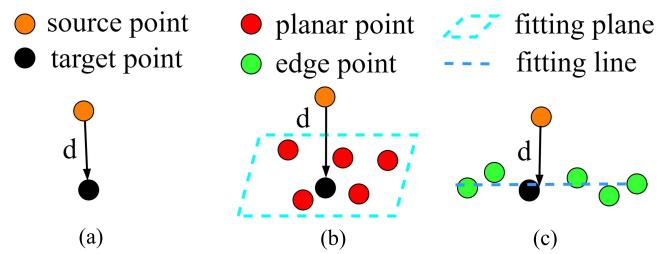  
Fig. 4. Overview of point to point, plane, and line registration. (a) Point to point. (b) Point to plane. (c) Point to line.

between the normal vector obtained from feature extraction ${ \mathbf { n } } _ { f }$ and the normal vector of corresponding plane $\mathbf { n } _ { c }$

$$
w _ { i } ^ { \mathrm { q u a } } = \frac { 2 ( \mathbf { n } _ { f } ) ^ { T } \cdot \mathbf { n } _ { c } } { ( ( \mathbf { n } _ { f } ) ^ { T } \cdot \mathbf { n } _ { c } ) ^ { 2 } + 1 } .\tag{18}
$$

At the stage of registration, performing eigendecomposition for corresponding line for edge points can determine the degree to which correspondences are able to be satisfied into a line equation. Points are considered to be lied in a line if the largest eigenvalue is three times greater than the second largest eigenvalue [12]. Consequently, the weighting function for edge points is designed as

$$
w _ { i } ^ { \mathfrak { q } \mathfrak { u } \mathfrak { a } } = \frac { 1 . 0 } { 1 . 0 + e ^ { - \lambda _ { 1 } / 3 \cdot \lambda _ { 2 } } }\tag{19}
$$

where $\lambda _ { 1 }$ and $\lambda _ { 2 }$ are largest and second largest eigenvalues respectively. Finally, the weighting function wi for each feature point is defined as $w _ { i } = w _ { i } ^ { \mathrm { r e s } } \cdot w _ { i } ^ { \mathrm { q u a } } \cdot w _ { f }$

2) Pose Optimization: As shown in Fig. 4, the distance $\mathbf { b } _ { i }$ between a feature point $\mathbf { p } _ { i }$ and its target point $\mathbf { p } _ { i } ^ { \prime }$ is defined as

$$
\mathbf { b } _ { i } = \mathbf { p } _ { i } - \left( \mathbf { R } \mathbf { p } _ { i } ^ { \prime } + \mathbf { p } \right)\tag{20}
$$

where R is the rotation matrix and p is the translation vector. The residual function $f _ { i }$ with respect to $\mathrm { ~ \bf ~ T ~ } = \mathrm { ~ \bf ~ \{ R , p \} ~ }$ is formulated as follows:

$$
f _ { i } ( \mathbf { T } ) = d _ { i } ( \mathbf { T } ) = \left\{ \begin{array} { l l } { \| \mathbf { b } _ { i } \times \mathbf { v } _ { c } \| _ { 2 } , } & { \mathrm { i f } ~ \mathbf { p } _ { i } \in \mathbf { G e E } ~ \mathrm { o r } ~ \mathbf { I n E } } \\ { | \mathbf { b } _ { i } \cdot \mathbf { n } _ { c } | , } & { \mathrm { i f } ~ \mathbf { p } _ { i } \in \mathbf { G e P } } \end{array} \right.\tag{21}
$$

where $d _ { i }$ is the distance between the feature and its correspondence (the fitting plane or line) and $\mathbf { n } _ { c }$ or ${ \bf v } _ { c }$ are normal or primary vector with respect to the fitting plane or line.

Approximating the above equation by its first order approximation made at $\mathbf { \widetilde { \mathbf { W } } } \mathbf { \widetilde { T } } _ { I } ^ { t _ { j + 1 } }$ leads to

$$
d _ { i } ( { \bf T } ) \approx d _ { i } \left( { \bf \Sigma } ^ { W } \tilde { \bf T } _ { I } ^ { t _ { j + 1 } } \right) + { \bf J } \cdot { \bf \Sigma } \Delta { \bf T }\tag{22}
$$

where -T is the error between the estimated pose $\mathbf { \nabla } ^ { W } \tilde { \mathbf { T } } _ { I } ^ { t _ { j + 1 } }$ and ground truth ${ } ^ { W } \mathbf { T } _ { I } ^ { t _ { j + 1 } }$ and J is the Jacobian matrix of ${ \bf d } _ { i }$ with respect to T.

Using the left perturbation model $\mathbf { R } ^ { \prime } = \exp \left( \theta \right) \mathbf { R }$ , where θ is the corresponding Lie algebra with respect to R, the transformation matrix is rewritten as $\mathbf { T } = [ \delta \theta , \mathbf { p } ]$ . Then, the

Jacobians of the plane and edge residual are calculated as

$$
\begin{array} { r l } & { \mathbf { J } _ { i } = \frac { \hat { \boldsymbol { \sigma } } d _ { i } } { \hat { \boldsymbol { \sigma } } \mathbf { T } } = ( \frac { \hat { \partial } d _ { i } } { \hat { \partial } \boldsymbol { \partial } \boldsymbol { \theta } } , \frac { \hat { \boldsymbol { \sigma } } d _ { i } } { \hat { \boldsymbol { \sigma } } \mathbf { p } } ) } \\ & { \quad = [ \frac { [ \frac { ( d _ { i } ) ^ { T } } { \| d _ { i } \| } \mathbf { v } _ { i } ^ { T } ( - \mathbf { R } \mathbf { p } _ { i } ) ^ { \boldsymbol { \wedge } } , \frac { ( d _ { i } ) ^ { T } } { \| d _ { i } \| } \mathbf { v } _ { i } ^ { T } ] , \quad \mathrm { i f ~ } \mathbf { p } _ { i } \in \mathbf { G e P } } { \mathrm { ~ a n d ~ } } } \\ & { \quad = \{ \begin{array} { l l } { [ \frac { ( d _ { i } ) ^ { T } } { \| d _ { i } \| } ( \mathbf { n } _ { i } ) ^ { \boldsymbol { \wedge } } ( - \mathbf { R } \mathbf { p } _ { i } ) ^ { \boldsymbol { \wedge } } , \frac { ( d _ { i } ) ^ { T } } { \| d _ { i } \| } ( \mathbf { n } _ { i } ) ^ { \boldsymbol { \wedge } } ] } \\ { \qquad \quad \mathrm { ~ i f ~ } \mathbf { p } _ { i } \in \mathbf { G e E ~ o r ~ I n E } . } \end{array}  } \end{array}\tag{23}
$$

Therefore, (16) can be solved by Gauss–Newton method and the relative transformation matrix -T is calculated as:

$$
\begin{array} { l } { \displaystyle \Delta \mathbf { T } = \underset { \Delta \mathbf { T } } { \mathrm { a r g m i n ~ } } ~ ( \mathbf { J } \Delta \mathbf { T } + \mathbf { d } ) ^ { T } \mathbf { Q } ( \mathbf { J } \Delta \mathbf { T } + \mathbf { d } ) } \\ { \displaystyle \quad = ( \mathbf { J } ^ { T } \mathbf { W } ^ { T } \mathbf { W } \mathbf { J } ) ^ { - 1 } ( - \mathbf { J } ^ { T } \mathbf { W } ^ { T } \mathbf { W } \mathbf { d } ) } \\ { \displaystyle \quad = \Bigg ( \sum _ { i = 1 } ^ { \mathbf { n } } \mathbf { J } _ { i } ^ { T } w _ { i } \mathbf { J } _ { i } \Bigg ) ^ { - 1 } \Bigg ( \sum _ { i = 1 } ^ { \mathbf { N } } - \mathbf { J } _ { i } ^ { T } w _ { i } d _ { i } \Bigg ) } \end{array}\tag{24}
$$

where $\mathbf { W } = \mathrm { d i a g } ( \sqrt { w _ { 1 } } , \ldots , \sqrt { w _ { n } } ) , \mathbf { Q } = \mathbf { W } ^ { T } \mathbf { W }$ is the weight matrix, and $\textbf { d } = ~ [ d _ { 1 } , \dots , d _ { n } ] .$ . The solution is optimized until convergence to find an optinum -T. Consequently, the transformation matrix ${ } ^ { W } \mathbf { T } _ { I } ^ { t _ { k } }$ is calculated as

$$
{ } ^ { W } \mathbf { T } _ { I } ^ { t _ { j + 1 } } = \Delta \mathbf { T } \cdot { } ^ { W } \mathbf { \tilde { T } } _ { I } ^ { t _ { j + 1 } } .\tag{25}
$$

Combining IMU preintegration factor in Section III-B1 and LiDAR odometry factor in (25), the robot state x is finally extended at 200 Hz through incremental optimization solver iSAM2 [31], using the GTSAM library [17].

## E. Map Management

There exists two global maps maintained in our method, which are plane map (P) containing geometry planar points and line map (E) containing geometry edge and intensity edge points. For most popular LiDAR SLAM, the map is maintained and updated by incrementally adding filtered features using keyframe strategy. To avoid out of memory and keep time efficiency, map is needed to be downsampled when registering features and mapping.

To reduce intensity edge outliers that lead to sound intensity edge points degenerating to planar points, 3-D points are converted into a 2-D image, allowing us using various existing image processing methods. In order to provide more compact information, all point clouds $\tilde { \mathcal { P } } _ { j } ( j = 1 , . . . , 5 0 )$ accumulated in a certain time (5 s) are merged into a local map $\mathcal { M } ( L )$ whose timestamp is $t _ { j } .$ After that, (L) is projected into a 2-D intensity image , which have intensity and depth two channels. For each point $\textbf { p } = ~ ( x , y , z )$ from (L), it is converted from 3-D coordinates to a image coordinates (u, v) using the equation below

$$
{ \binom { u } { \upsilon } } = { \binom { - { \mathrm { r o u n d } } { \Big ( } f _ { u } { \frac { z } { x } } { \Big ) } + c _ { u } } { - { \mathrm { r o u n d } } { \Big ( } f _ { \upsilon } { \frac { y } { x } } { \Big ) } + c _ { \upsilon } } }\tag{26}
$$

where round(·) is an integral function, $f _ { u } , f _ { v } , c _ { u } .$ , and $c _ { u }$ are the parameters similar with camera intrinsic which are used to adjust the resolution and offset of resulting image.

For the channel of depth, the value of each pixel $\mathcal { V } _ { D } ( u , v )$ is x value of its 3-D point in LiDAR frame. For the channel of intensity, the value of the pixel $\mathcal { \nu } _ { I } ( u , v )$ is determined by the intensity reading of its 3-D point. To enhance the visual contrast of intensity map, a mapping function is designed with extracted intensity edge points. Giving a point p with raw intensity reading I, the value in intensity image $\mathcal { \nu } _ { I } ( u , v )$ with respect to it is modified as

$$
\mathcal { V } _ { I } ( u , v ) = \left\{ \begin{array} { l l } { \mathrm { c l a m p } \bigg ( 1 5 0 , 2 5 5 , 2 5 5 \cdot \log \bigg ( \frac { I } { 2 5 5 } + 1 \bigg ) + 2 5 \bigg ) , } & { \mathrm { ~ i f ~ } \mathbf { p } _ { i } \in \mathrm { I n E } } \\ { \mathrm { ~ i f ~ } \mathbf { p } _ { i } \in \mathrm { I n E } } & { } \\ { \mathrm { c l a m p } \bigg ( 0 , 1 5 0 , \frac { I ^ { 2 } } { 2 5 5 } - 2 5 \bigg ) , } & { \mathrm { ~ o t h e r w i s e } } \end{array} \right.\tag{27}
$$

where clamp(MIN, MAX, x) is the function that limits the value x between an upper MAX and lower limit MIN. With values of $\mathcal { \nu } _ { I } ( u , v )$ setting in the range of (0, 255), the constructed intensity image is treated as a grayscale image.

Lines are then extracted in the intensity channel of 2-D image $\mathcal { \nu } _ { I } ( u , v )$ using LSD [32] approach, as described by LBD [33]. For LSD line detector, it returns a pair of points, which are starting point and ending point of a line segment in image coordinates. With the depth channel of 2-D image $\mathcal { V } _ { D } ( u , v )$ and (26), each pair of detected points $( u _ { 1 } , v _ { 1 } )$ and $\left( { { u } _ { 2 } } , { { v } _ { 2 } } \right)$ can be remapped to a pair of 3-D points $\begin{array} { r l } { \mathbf { p } _ { s } } & { { } = } \end{array}$ $( x _ { 1 } , y _ { 1 } , z _ { 1 } )$ and ${ \bf p } _ { e } ~ = ~ ( x _ { 2 } , y _ { 2 } , z _ { 2 } )$ . A unique line equation $\Xi ( x , y , z )$ in 3-D space is given by

$$
\Xi : { \frac { x - x _ { 1 } } { x _ { 2 } - x _ { 1 } } } = { \frac { y - y _ { 1 } } { y _ { 2 } - y _ { 1 } } } = { \frac { z - z _ { 1 } } { z _ { 2 } - z _ { 1 } } } .\tag{28}
$$

To reduce noisy edge points, we only keep the point $\mathbf { p } _ { i } ~ \in$ $\mathcal { M } ( L )$ , whose distance $d _ { l }$ with respect to one of the extracted lines does not exceed an acceptable threshold $( d _ { l } ~ < ~ 0 . 1 )$ Lastly, the adjusted local map ˆ (L) constituted with reserved points is returned to global line map (E).

## IV. EXPERIMENT

## A. Implementation and Evaluation Setup

To validate the accuracy and robustness of proposed LiDAR-inertial odometry and mapping, various qualitative and quantitative evaluations on public and recorded datasets are conducted.

For qualitative evaluation, there are the public FR-IOSB-Short dataset recorded at the Fraunhofer IOSB campus, public Outdoor-Mainbuilding dataset recorded at HKU campus and our recorded Long-Corridor dataset at Tianjin University. These datasets are recorded by traveling a loop, with finally returning back to the origin. For qualitative evaluation, a dataset is collected with raw measurements of LiDAR, IMU, and ground truth of robot state, which is available at Google-Drive. As shown in Fig. 5, the aerial platform used for recording dataset is equipped with a Livox AVIA LiDAR within an embedded IMU, an Intel RealSense camera, an onboard Xavier computer (8-core NVIDIA Carmel 64-bit ARM CPU, 16 GB RAM), and tracking devices. The ground truth of pose of the platform is provided by an OptiTrack motion capture system. It should be noticed that the camera is only used to obtain pictures for visualization.

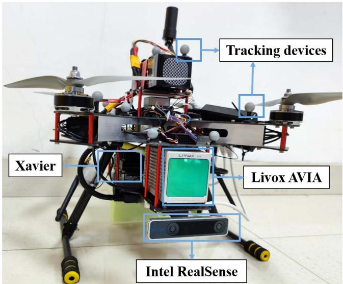  
Fig. 5. Our UAV platform is equipped with a Livox AVIA LiDAR within an embedded IMU, an Intel RealSense camera, an onboard Xavier computer and Tracking devices.

The proposed method is deployed to compare with competing state-of-the-art methods. These include works on LiLI-OM, Fast-LIO (with feature extraction), Fast-LIO 2.0 (without feature extraction), and the proposed method. The root mean square error (RMSE) of the absolute pose error (APE) on both translation and rotation are used to evaluate the accuracy of odometry while the end-to-end position error is used when ground truth is not available.

## B. Qualitative Evaluation

Through traveling a loop in a long corridor, the end-to-end error is shown in Table I. It can be observed that the proposed method delivers less drift than the other three methods in Outdoor-Mainbuilding dataset that contains abundant planar features and edge features. What is more, the proposed method achieves the best tracking accuracy of 0.42 m end-to-end position error in the recorded Long-Corridor dataset. As shown in Fig. 6, trajectory delivered from the proposed method differs from the others and is closer to $9 0 ^ { \circ }$ when making a turn.

As shown in Fig. 7, the proposed feature extraction on intensity edge points extracts the boundary of the billboard and the white wall, while traditional method can only extract planar features. The boundary of the billboard is constituted with lines that provide additional constraints on robot pose of roll, pitch, and z-axis. Furthermore, different filter parameters for planar cluster makes it possible for planar points lying on wall and floor to be distributed in space and number evenly, which further provide even constraints on robot pose.

## C. Quantitative Evaluation

The collected dataset (417 s) used for quantitative evaluation includes two parts: a normal part for accuracy evaluation in the first 260 s and a robustness test part in the remaining time. The first part is designed as ensuring enough features can be observed when our UAV moves, while the LiDAR is directly faced toward the ceilings, where there are almost no geometry edge points, in the robustness test part.

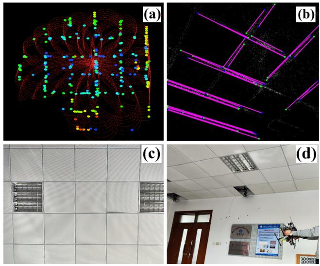

TABLE I  
QUALITATIVE EVALUATION
<table><tr><td></td><td>Out_Mainbuilding</td><td>FR-IOSB-Short</td><td>Long-Corridor</td></tr><tr><td>Length</td><td>0.14 km</td><td>0.49 km</td><td>0.16 km</td></tr><tr><td>LiLi-OM</td><td>0.52 m</td><td>1.76 m</td><td>2.19 m</td></tr><tr><td>FAST-LIO</td><td>0.12 m</td><td>2.39 m</td><td>1.96 m</td></tr><tr><td>FAST-LIO 2.0</td><td>0.08 m</td><td>3.08 m</td><td>1.39 m</td></tr><tr><td>Proposed</td><td>0.04 m</td><td>2.04 m</td><td>0.72 m</td></tr></table>

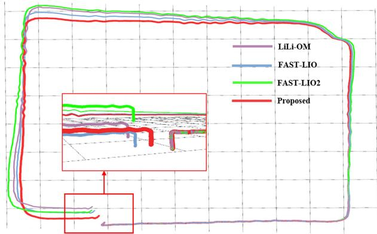  
Fig. 6. Trajectory of four tested method in Long-Corridor dataset. The proposed method achieves the best tracking accuracy of 0.72 m end-to-end position error.

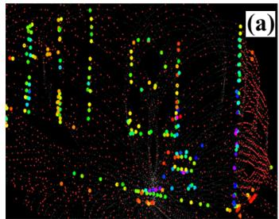

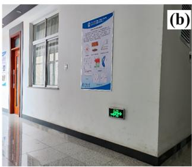  
Fig. 7. Long-Corridor experiment: (a) extracted features within a scan and (b) the real-world snapshot when making a turn: the colored points in (a) are intensity edge points and red points are filtered planar points.

The evaluation results of five methods are shown in Table II. Fast-LIO and Fast-LIO 2.0 are able to achieve accurate pose tracking in the first 260 s and LiLi-OM FAILS at 170 s. Once the UAV is faced toward ceilings, Fast-LIO and Fast-LIO 2.0 start drifting until odometry FAIL. Points lying on the gap between ceilings are potential intensity edge points that are useful for full pose estimation. However, the proposed method without line map management (proposed\* for short) FAILS at 320 s for the reason that there are accumulated intensity edge outliers in line map. The proposed method with line map management works SUCCESSFULLY during the test and delivers both the least RMSE of translation part and rotation part. It is shown in Fig. 8 that the trajectory of proposed method is closest to ground truth.

TABLE II  
QUANTITATIVE EVALUATION
<table><tr><td></td><td>Runtime</td><td>RMSE of Trans</td><td>RMSE of Rot</td></tr><tr><td>LiLi-OM</td><td>FAIL at 170 s</td><td>0.20 m</td><td>8.05°</td></tr><tr><td>FAST-LIO</td><td>FAIL at 270 s</td><td>0.11 m</td><td>6.88°</td></tr><tr><td>FAST-LIO 2.0</td><td>FAIL at 270 s</td><td>0.16 m</td><td>5.92°</td></tr><tr><td>Proposed*</td><td>FAIL at 320 s</td><td>0.14 m</td><td>4.92°</td></tr><tr><td>Proposed</td><td>SUCCESS</td><td>0.11 m</td><td>4.65°</td></tr></table>

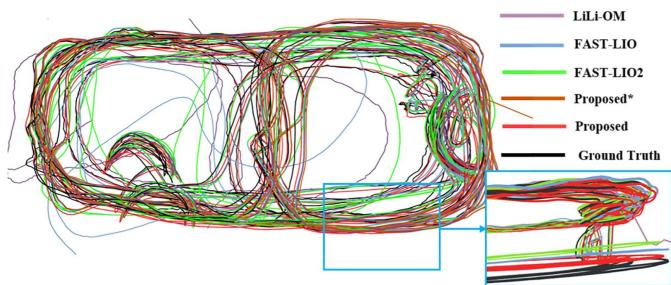  
Fig. 8. Trajectory of four tested method in indoor Lab dataset. Only the proposed method survives in the test of robustness.  
Fig. 9. Indoor lab experiment: (a) intensity edge points within a scan, (b) extracted line in intensity map using LSD approach, (c) captured picture in camera view, and (d) real-world snapshot when UVA faces toward to ceilings.

As shown in Fig. 9(c) and (d), this is a challenging scenario when LiDAR is faced toward ceilings. The extracted intensity edges within a scan are shown in Fig. 9(a), while there are almost none geometry edges when using traditional methods. There are accumulated edge outliers if there is no outlier rejection in mapping module and Fig. 9(b) shows the extracted line in intensity map using LSD approach. Due to the lack of constraints on robot state of y, z, and roll, the other methods drift when facing toward ceilings. Thanks to extracted intensity edge points and maintained line map, there are enough sound constraints for state estimation which make the proposed method survives in the test of robustness.

## D. Application: Real-Time Indoor Scenario Mapping

To attest practicability of the proposed intensity-augmented SLAM method, a real-world experiment is performed in a narrow indoor lab scenario. For this experiment, the proposed method is fully run onboard in real-time under our UAV platform. Although the onboard computer Xavier has a highlevel GPU, the proposed method is based on CPU.

TABLE III  
RUNTIME ANALYSIS
<table><tr><td></td><td>LiLi-OM [12]</td><td>Fast-LIO [9]</td><td>Fast-LIO 2.0 [10]</td><td>Proposed</td></tr><tr><td>Data Preprocess</td><td>3.29</td><td>0.08</td><td>0.08</td><td>0.98</td></tr><tr><td>Feature Extraction</td><td>8.07</td><td>1.13</td><td>0</td><td>8.47</td></tr><tr><td>Pose Optimization</td><td>39.30</td><td>1.57</td><td>2.46</td><td>13.99</td></tr><tr><td>Map Management</td><td>18.64</td><td>18.98</td><td>1.44</td><td>15.36</td></tr><tr><td>Sum</td><td>69.30</td><td>21.76</td><td>3.98</td><td>38.80</td></tr></table>

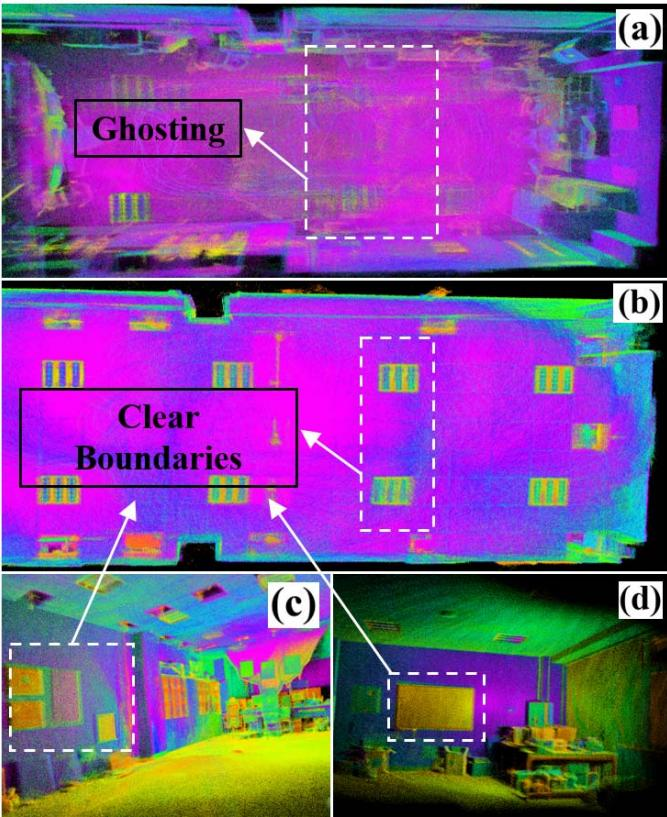  
Fig. 10. Real-time mapping results in indoor lab scenario. White dotted box in (a) mapping result by FAST-LIO 2.0 shows ghosting when odometry drifts; the clear boundaries between (b) ceilings, (c) screen, and (d) billboard shows the accuracy of odometry of the proposed method.

The average time consumption including data preprocess, feature extraction, pose optimization, and map management within a scan is investigated. Although Fast-lio 2.0 achieves the best time efficiency, the proposed method is still competitive in time efficiency at around 25 Hz. It should be noticed that the LiDAR frame rate is 10 Hz and this article is mainly focused on handling with degeneracy, the proposed method is able to achieve accurate, robust, and real-time localization and mapping in certain challenging environments.

It is common to evaluate the accuracy of odometry quantitatively with mapping result in LiDAR SLAM. As shown in Fig. 10(a), there exists ghosting in map if odometry drifts when run in the same environment. To show that the proposed method is able to perform accurate and robust localization and mapping, we constantly explore our lab to verify the mapping consistency. There are clear boundaries between (b) ceilings, (c) billboard, and (d) screen in Fig. 10, which exhibits the ability of producing high-quality map with the proposed method.

## V. CONCLUSION

We propose a robust, accurate, and real-time odometry and mapping for solid-state LiDARs with small FoV and irregular scanning pattern. Combining both geometry and intensity information makes it feasible to provide more constraints on robot pose in degenerated environments. Experiment shows low drift and strong robustness results of proposed method on public and recorded datasets. Considering that our platform has equipped with an onboard Xavier computer with a highlevel GPU, our future work will be focused on improved time-efficiency of mapping module using CUDA. In addition, learning-based feature extraction and registration are in the planning.

## REFERENCES

[1] G. He, X. Yuan, Y. Zhuang, and H. Hu, “An integrated GNSS/LiDAR-SLAM pose estimation framework for large-scale map building in partially GNSS-denied environments,” IEEE Trans. Instrum. Meas., vol. 70, pp. 1–9, 2021.

[2] X. Zhang, Y. Chu, Y. Liu, X. Zhang, and Y. Zhuang, “A novel informative autonomous exploration strategy with uniform sampling for quadrotors,” IEEE Trans. Ind. Electron., early access, Dec. 29, 2021, doi: 10.1109/TIE.2021.3137616.

[3] X. Zhang, Y. Fang, X. Zhang, P. Shen, J. Jiang, and X. Chen, “Attitudeconstrained time-optimal trajectory planning for rotorcrafts: Theory and application to visual servoing,” IEEE/ASME Trans. Mechatronics, vol. 25, no. 4, pp. 1912–1921, Aug. 2020.

[4] J. Wen, X. Zhang, H. Gao, J. Yuan, and Y. Fang, “E3MoP: Efficient motion planning based on heuristic-guided motion primitives pruning and path optimization with sparse-banded structure,” IEEE Trans. Autom. Sci. Eng., early access, Nov. 29, 2021, doi: 10.1109/TASE.2021.3128521.

[5] C. Li, X. Zhang, H. Gao, R. Wang, and Y. Fang, “Bridging the gap between visual servoing and visual SLAM: A novel integrated interactive framework,” IEEE Trans. Autom. Sci. Eng., vol. 19, no. 3, pp. 2245–2255, Jul. 2021.

[6] Q. Sun, J. Yuan, X. Zhang, and F. Duan, “Plane-edge-SLAM: Seamless fusion of planes and edges for SLAM in indoor environments,” IEEE Trans. Autom. Sci. Eng., vol. 18, no. 4, pp. 2061–2075, Oct. 2021.

[7] S. Guo, Z. Rong, S. Wang, and Y. Wu, “A LiDAR SLAM with PCAbased feature extraction and two-stage matching,” IEEE Trans. Instrum. Meas., vol. 71, pp. 1–11, 2022.

[8] J. Lin and F. Zhang, “Loam livox: A fast, robust, high-precision LiDAR odometry and mapping package for LiDARs of small FoV,” in Proc. IEEE Int. Conf. Robot. Autom. (ICRA), May 2020, pp. 3126–3131.

[9] W. Xu and F. Zhang, “FAST-LIO: A fast, robust LiDAR-inertial odometry package by tightly-coupled iterated Kalman filter,” IEEE Robot. Autom. Lett., vol. 6, no. 2, pp. 3317–3324, Apr. 2021.

[10] W. Xu, Y. Cai, D. He, J. Lin, and F. Zhang, “FAST-LIO2: Fast direct LiDAR-inertial odometry,” IEEE Trans. Robot., early access, Jan. 31, 2022, doi: 10.1109/TRO.2022.3141876.

[11] Y. Zhu, C. Zheng, C. Yuan, X. Huang, and X. Hong, “CamVox: A lowcost and accurate LiDAR-assisted visual SLAM system,” in Proc. IEEE Int. Conf. Robot. Autom. (ICRA), May 2021, pp. 5049–5055.

[12] K. Li, M. Li, and U. D. Hanebeck, “Towards high-performance solidstate-LiDAR-inertial odometry and mapping,” IEEE Robot. Autom. Lett., vol. 6, no. 3, pp. 5167–5174, Jul. 2021.

[13] J. Jiao et al., “Greedy-based feature selection for efficient LiDAR SLAM,” in Proc. IEEE Int. Conf. Robot. Autom. (ICRA), May 2021, pp. 5222–5228.

[14] J. Zhang, M. Kaess, and S. Singh, “On degeneracy of optimizationbased state estimation problems,” in Proc. IEEE Int. Conf. Robot. Autom. (ICRA), May 2016, pp. 809–816.

[15] C. Forster, L. Carlone, F. Dellaert, and D. Scaramuzza, “On-manifold preintegration for real-time visual–inertial odometry,” IEEE Trans. Robot., vol. 33, no. 1, pp. 1–21, Feb. 2017.

[16] T. D. Barfoot, State Estimation for Robotics. Cambridge, U.K.: Cambridge Univ. Press, 2017.

[17] F. Dellaert and M. Kaess, “Factor graphs for robot perception,” Found. Trends Robot., vol. 6, nos. 1–2, pp. 1–139, Aug. 2017, doi: 10.1561/2300000043.

[18] H. Shen, Q. Zong, B. Tian, and H. Lu, “Voxel-based localization and mapping for multirobot system in GPS-denied environments,” IEEE Trans. Ind. Electron., vol. 69, no. 10, pp. 10333–10342, Oct. 2022.

[19] H. Lu, Q. Zong, S. Lai, B. Tian, and L. Xie, “Real-time perceptionlimited motion planning using sampling-based MPC,” IEEE Trans. Ind. Electron., early access, Jan. 11, 2022, doi: 10.1109/TIE.2022.3140533.

[20] J. Zhang and S. Singh, “LOAM: LiDAR odometry and mapping in realtime,” in Proc. Robot., Sci. Syst., vol. 2, no. 9. Berkeley, CA, USA, 2014, pp. 1–9.

[21] T. Shan and B. Englot, “LeGO-LOAM: Lightweight and groundoptimized LiDAR odometry and mapping on variable terrain,” in Proc. IEEE/RSJ Int. Conf. Intell. Robots Syst. (IROS), Oct. 2018, pp. 4758–4765.

[22] T. Shan, B. Englot, D. Meyers, W. Wang, C. Ratti, and D. Rus, “LIO-SAM: Tightly-coupled LiDAR inertial odometry via smoothing and mapping,” in Proc. IEEE/RSJ Int. Conf. Intell. Robots Syst. (IROS), Oct. 2020, pp. 5135–5142.

[23] J.-E. Deschaud, “IMLS-SLAM: Scan-to-model matching based on 3D data,” in Proc. IEEE Int. Conf. Robot. Autom. (ICRA), May 2018, pp. 2480–2485.

[24] Y. Pan, P. Xiao, Y. He, Z. Shao, and Z. Li, “MULLS: Versatile LiDAR SLAM via multi-metric linear least square,” in Proc. IEEE Int. Conf. Robot. Autom. (ICRA), May 2021, pp. 11633–11640.

[25] X. Chen, A. Milioto, E. Palazzolo, P. Giguere, J. Behley, and C. Stachniss, “SuMa++: Efficient LiDAR-based semantic SLAM,” in Proc. IEEE/RSJ Int. Conf. Intell. Robots Syst. (IROS), Nov. 2019, pp. 4530–4537.

[26] T. Ran, L. Yuan, J. Zhang, L. He, R. Huang, and J. Mei, “Not only look but infer: Multiple hypothesis clustering of data association inference for semantic SLAM,” IEEE Trans. Instrum. Meas., vol. 70, pp. 1–9, 2021.

[27] G. Chen, B. Wang, X. Wang, H. Deng, B. Wang, and S. Zhang, “PSF-LO: Parameterized semantic features based LiDAR odometry,” in Proc. IEEE Int. Conf. Robot. Autom. (ICRA), May 2021, pp. 5056–5062.

[28] Y. Zhao, K. Huang, H. Lu, and J. Xiao, “Extrinsic calibration of a small FoV LiDAR and a camera,” in Proc. Chin. Autom. Congr. (CAC), Nov. 2020, pp. 3915–3920.

[29] T. Shan, B. Englot, F. Duarte, C. Ratti, and D. Rus, “Robust place recognition using an imaging LiDAR,” in Proc. IEEE Int. Conf. Robot. Autom. (ICRA), May 2021, pp. 5469–5475.

[30] H. Wang, C. Wang, and L. Xie, “Intensity-SLAM: Intensity assisted localization and mapping for large scale environment,” IEEE Robot. Autom. Lett., vol. 6, no. 2, pp. 1715–1721, Apr. 2021.

[31] M. Kaess, H. Johannsson, R. Roberts, V. Ila, J. Leonard, and F. Dellaert, “iSAM2: Incremental smoothing and mapping with fluid relinearization and incremental variable reordering,” in Proc. IEEE Int. Conf. Robot. Autom., May 2011, pp. 3281–3288.

[32] R. G. von Gioi, J. Jakubowicz, J.-M. Morel, and G. Randall, “LSD: A fast line segment detector with a false detection control,” IEEE Trans. Pattern Anal. Mach. Intell., vol. 32, no. 4, pp. 722–732, Apr. 2010.

[33] L. Zhang and R. Koch, “An efficient and robust line segment matching approach based on LBD descriptor and pairwise geometric consistency,” J. Vis. Commun. Image Represent., vol. 24, no. 7, pp. 794–805, 2013.

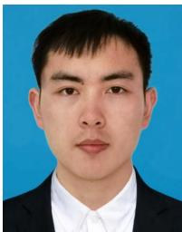

Haisong Li received the B.S. degree from Tianjin University, Tianjin, China, in 2020, where he is currently pursuing the M.S. degree in control engineering.

His main research interests include LiDAR SLAM, state estimation, and aerial robotics.

Bailing Tian received the B.S., M.S., and Ph.D. degrees in automatic control from Tianjin University, Tianjin, China, in 2006, 2008, and 2011, respectively.

He was an Academic Visitor with the School of Electrical and Electronic Engineering, The University of Manchester, Manchester, U.K., from June 2014 to June 2015. He is currently a Professor with the School of Electrical and Information Engineering, Tianjin University. His main research interests include finite-time control, motion planning, simultaneous localization and mapping, and integrated guidance and control for unmanned systems.

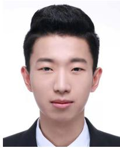

Hongming Shen received the B.S. degree in flight vehicle design and engineering from the North University of China, Taiyuan, China, in 2015, and the M.S. degree in aerospace transportation and control from the Beijing Institute of Technology, Beijing, China, in 2017. He is currently pursuing the Ph.D. degree in control theory and control engineering with Tianjin University, Tianjin, China.

His current research interests include state estimation, multisensor fusion, localization and mapping, and aerial robotics.

Junjie Lu received the B.S. degree from Tianjin University, Tianjin, China, in 2020, where he is currently pursuing the M.S. degree in control engineering.

His main research interests include SLAM, motion planning, and aerial robotics.