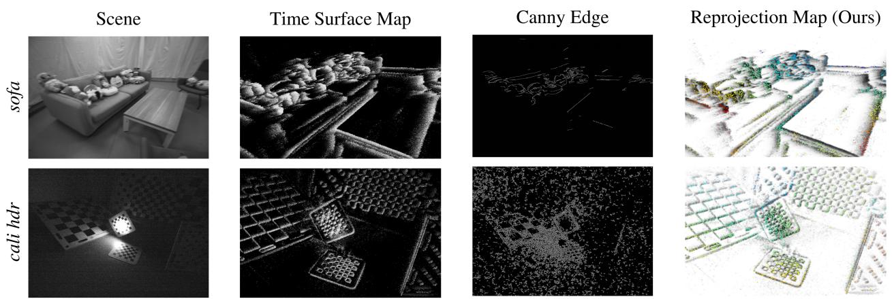
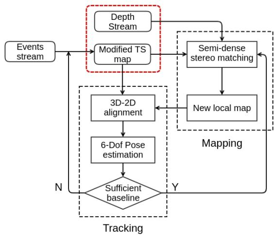
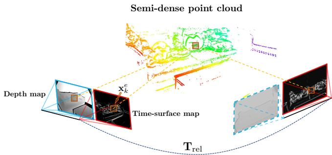
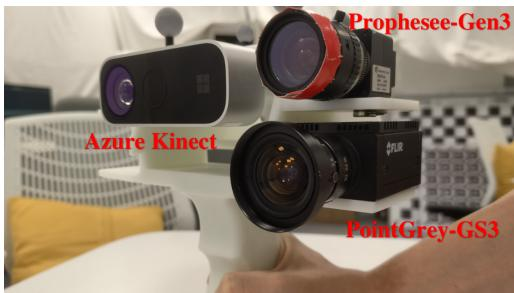
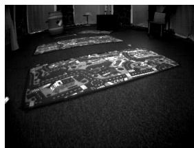
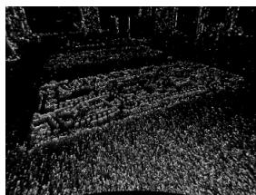
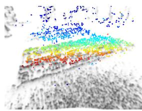
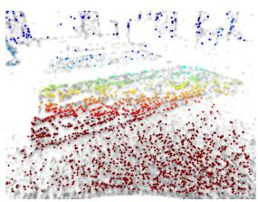

# DEVO: Depth-Event Camera Visual Odometry in Challenging Conditions

Yi-Fan Zuo1∗, Jiaqi Yang2∗, Jiaben Chen2, Xia Wang1, Yifu Wang2† and Laurent Kneip2†

  
Fig. 1: Challenging scenarios and results. sofa is captured under high dynamics. cali hdr is a challenging illumination scene with highly self-similar texture. Column 1: Example RGB images. Column 2: Corresponding time-surface map. Column 3: Canny edge detections. Column 4: Reprojected depth points.

Abstract— We present a novel real-time visual odometry framework for a stereo setup of a depth and high-resolution event camera. Our framework balances accuracy and robustness against computational efficiency towards strong performance in challenging scenarios. We extend conventional edgebased semi-dense visual odometry towards time-surface maps obtained from event streams. Semi-dense depth maps are generated by warping the corresponding depth values of the extrinsically calibrated depth camera. The tracking module updates the camera pose through efficient, geometric semidense 3D-2D edge alignment. Our approach is validated on both public and self-collected datasets captured under various conditions. We show that the proposed method performs comparable to state-of-the-art RGB-D camera-based alternatives in regular conditions, and eventually outperforms in challenging conditions such as high dynamics or low illumination.

## I. INTRODUCTION

Real-time localization and 3D mapping are increasingly important tasks to be solved in many emerging technologies such as robotics, intelligent transportation, and intelligence augmentation. Owing to their small scale and affordability, cameras are often considered as an exteroceptive sensor in such applications. Despite being attractive, pure visionbased solutions still lack robustness in more challenging conditions [1], [2], and are therefore often complemented by additional sensors such as an Inertial Measurement Unit (IMU), wheel encoders, or a depth camera. Especially the addition of the latter has been highly popular in indoor applications since the advent of consumer-grade RGB-D cameras in 2010 (e.g. Microsoft Kinect). RGB-D cameras provide high frequency and high resolution depth images, which significantly improves accuracy and robustness of monocular visual odometry and SLAM methods [3], [4], [5], [6], [7]. However, most RGB-D camera solutions still rely on sparse feature extraction or photometric image alignment, which is why they cannot handle challenging conditions such as highly dynamic motion or low illumination. KinectFusion [8], relies exclusively on depth images, but the method is power hungry and demands high frame-rate depth images as well as GPU resources for the real-time execution of depth fusion and ICP algorithms.

The present work introduces a fresh approach to depth camera-supported indoor visual odometry (VO) for a powerefficient handling of challenging conditions such as high dynamics or low illumination. Our core idea consists of exchanging the RGB camera against a Dynamic Vision Sensor, which pairs high dynamic range (HDR) with high temporal resolution. The basic functionality of a DVS— also called an event camera—as well as its advantages and challenges are well explained in the original work of Brandli et al. [9] or the recent survey by Gallego et al. [10]. Our method relies on an approach similar to Canny-VO [7] and extracts edges from the event stream, assigns depth from the depth camera, and registers subsequent views by 3D-2D edge alignment. The ability of event cameras to see in almost complete darkness paired with their high temporal resolution lead to excellent performance in the above mentioned challenging cases. At the same time, our method maintains high computational and energy efficiency owing to potentially low depth camera frame rates as well as semi-dense processing. Our contributions are as follows:

• We present DEVO, a novel visual odometry framework for a hybrid stereo setup of a depth and an event camera.

• The approach relies on thresholded time-surface maps for edge detection and semi-dense depth map extraction.

• Our method handles 6-DoF motion estimation, and we demonstrate high efficiency and successful operation in all conditions.

Our results are obtained on self-collected high-resolution RGB-D-event indoor datasets with ground truth captured by an external motion tracking system. Further tests are conducted on larger scale outdoor datasets where depth is obtained from a LiDAR scanner. A thorough comparison against state-of-the-art event-based and RGB-D based visual odometry frameworks proves that DEVO achieves high quality, continuous visual localization results and eventually outperforms alternative methods in challenging conditions.

## II. RELATED WORK

Next, we review classical RGB-D camera approaches as well as both pure and multi-sensor, event-based visual odometry solutions.

RGB-D camera-based solutions: The most straightforward solutions to RGB-D camera-based VO use only depth information [8], [11]. While they may potentially operate in dark environments, they require dense depth image processing at high frame rate, and therefore require high energy and computation resources (e.g. GPU). Approaches that also rely on images [3], [4], [5], [6] often perform dense photometric alignment, and thus still depend on exhaustive parallel computing. They furthermore have the disadvantage of degrading in challenging visual conditions (e.g. blur, low illumination). Most related to our method are approaches relying on sparsified, semi-dense depth maps [7], [12]. They have large convergence basins, stability under illumination changes, and high computational efficiency. Nonetheless, they still depend on intensity images for edge detection, and therefore continue to demonstrate high sensitivity to motion blur and low-illumination conditions.

Pure event camera-based solutions: Event cameras offer strong advantages such as high dynamic range, low latency, and low power consumption. However, the complicated nature of event data demands for novel theories and approaches, and full 6-DoF motion estimation with a single event camera remains a challenging problem. Many works rely on simplifying assumptions. Weikersdorfer et al. [13] proposed an event-based 2D SLAM framework for planar motions. Other works rely on a contrast maximization objective that utilizes image-to-image warping, a function that only works if the image transformation is at most a homography (e.g. pure rotation, planar homography) [14], [15], [16], [17], [18]. The first full 6-DoF solution is given by Kim et al. [19], who proposed a complex framework of three decoupled probabilistic filters estimating intensity, depth, and pose, respectively. A geometric solution is given by Rebecq et al. [20], which relies on their earlier ray-density based structure extraction method EMVS [21]. The success of these methods is however limited to small-scale environments and small, dedicated movements on mapping modules. Zhu et al. [22] finally present a promising learning-based approach, which however depends on vast amounts of training data, and provides no guarantees of optimality or generality. ESVO uses a stereo event camera [23], and we compare it against our approach.

Hybrid event-supported solutions: Owing to their difficult nature, event cameras are often combined with other sensors such as IMUs or regular cameras. Censi and Scaramuzza [24] present a VO framework that estimates relative poses by fusing events with absolute brightness information. Kueng et al. [25] detect features from grayscale images and track the features using the support of event data. Intensity-based methods do not take full advantage of event cameras and may fail due to motion blur in dark or varying illumination settings. While approaches that process images and events individually [26], [27] may continue to work if no regular image features are perceived, they still suffer from severe robustness issues if such conditions persist over extended time intervals. Another work that is closely related to ours is introduced by Weikersdorfer et al. [28], who extend their previous work [13] and include an RGB-D sensor. However, their method is based on an outdated, lowresolution event camera model and relies on a fully voxelized and thus limited-size environment. The accuracy of their probabilistic approach is highly depend on the frequency of depth updates, which limits the speed of the motion.

## III. DEPTH-EVENT VISUAL ODOMETRY

This section presents the details of our novel stereo depthevent odometry framework, which we denote DEVO. We start by seeing an overview of the entire pipeline followed by the details of the event data representation for efficient processing, the semi-dense depth map extraction module, and the final 6 Degree-of-Freedom (DoF) tracking module.

## A. Framework overview

A flowchart of our proposed method detailing all steps is illustrated in Figure 2. We start by generating time-surfaces maps which put our event sets into a suitable representation for efficient and accurate edge extraction and alignment. Details are introduced in Section III-B. The representation is used in both a tracking and a mapping module, which— in analogy to classical visual SLAM architectures—run in two parallel threads. The tracking thread processes only events and incrementally estimates the 6-DoF camera pose by efficient 3D-2D edge alignment. Details of the tracking thread are introduced in Section III-D. The local reference semi-dense depth map is updated at lower framerate inside the mapping thread. It proceeds by extracting the semidense edge map from the time-surface maps and assigning depth values from the depth camera readings. The local map is updated whenever sufficient displacements between the current and the reference view has been detected. The operations of the map generation and the reference frame selection strategy are detailed in Section III-C.

  
Fig. 2: Overview of our proposed DEVO visual localization and mapping pipeline for a stereo depth-event system.

## B. Event representation

Let us assume that we are given a set of N events $\mathcal { E } = \{ e _ { k } \} _ { k = 1 } ^ { N }$ occurring over a certain time interval. Each event $e _ { k } ~ = ~ \{ { \bf x } _ { k } , t _ { k } , b _ { k } \}$ is defined by its image location $\mathbf { x } _ { k } = [ x _ { k } \quad y _ { k } ] ^ { T }$ , timestamp $t _ { k }$ , and polarity $b _ { k }$ . It is common to not process events asynchronously at the very high rate they occur, but aggregate sets of events accumulated during regularly spaced time intervals into one of three possible representations. The first one is given by space-time volumes of events [29], which are often used in conjunction with accurate but more computationally demanding continuoustime motion representations. The second one is given by simply ignoring the temporal nature of the events, and projecting all events along the temporal dimension onto a virtual binary image in which we then perform feature extraction. Though very efficient, the method re-induces motion blur and requires a careful selection of the time interval length. The third representation is given by time-surface maps (TSM [29]), which create an interesting balance between accuracy and efficiency. A TSM is an image in which a high pixel value denotes a recent event. The value at each pixel location x is a function of an exponential decay kernel and given by

$$
\tau ( \mathbf { x } , t ) = \exp ( - \frac { t - t _ { l a s t } ( \mathbf { x } ) } { \tau } ) ,\tag{1}
$$

where t is an arbitrary time, and $t _ { l a s t } ( \mathbf { x } ) \leq t$ is the timestamp of the last event triggered at $\mathbf { x } , \tau$ denotes the constant decay rate parameter, which requires careful tuning as a function of motion dynamics. The TSM visualizes the history of moving brightness patterns at each pixel location and emphasizes on locations in which motion has been more recent. The values in a TSM are mapped from [0, 1] to [0, 255] for convenient visualization and processing. We use a modified

TSM in which we only consider pixels with a value above a certain threshold δ. Depending on the module $( \mathrm { i . e . }$ tracking, or mapping), other pixels are set to 0 or discarded.

## C. Mapping module

The mapping module performs semi-dense point cloud extraction. Let $\mathcal { T } _ { \mathrm { r e f } } ( \cdot ) ~ = ~ \mathcal { T } ( \cdot , t _ { \mathrm { r e f } } )$ be the TSM generated from the set of events $\mathcal { E }$ at time $t _ { \mathrm { r e f } }$ . The semi-dense region $\mathcal { X } ^ { \mathrm { r e f } }$ for which depth values will be extracted is simply given by all pixels for which the value is larger than δ, i.e. $\mathcal { X } ^ { \mathrm { r e f } } = \{ \mathbf { x } \ \mathrm { s . t . } \ \mathcal { T } _ { \mathrm { r e f } } ( \mathbf { x } ) > \delta \}$ . Based on the assumption that events are pre-dominantly triggered by high-gradient edges in the image, a proper choice of the decay rate τ and threshold $\delta$ will counteract motion blur and encourage the extracted semi-dense region to align tightly with effective appearance contours.

In order to retrieve the depth value for each point in the semi-dense region, we first warp the depth points from the depth camera at time $t _ { \mathrm { r e f } }$ to the event camera. The location in the event camera is given by

$$
\mathbf { x } _ { k } ^ { e } = \pi _ { e } \big ( \mathbf { T } _ { e d } \cdot D ( z _ { k } ^ { d } ) \cdot \pi _ { d } ^ { - 1 } ( \mathbf { x } _ { k } ^ { d } ) \big ) ,\tag{2}
$$

where $\pi _ { e / d }$ and $\pi _ { e / d } ^ { - 1 }$ represent the known camera-to-image and the image-to-camera transformations of the event and the depth camera, respectively. They are defined as mapping from the 2D image space to 3D homogeneous space and viceversa. $D ( a ) = \mathrm { d i a g } ( a , a , a , 1 )$ generates a diagonal matrix with elements $a , a ,$ a, and 1 along the diagonal. $\mathbf { T } _ { e d }$ is the known $4 \times 4$ Euclidean extrinsic transformation matrix from the depth to the event camera. Finally, $\mathbf { x } _ { k } ^ { d }$ and $z _ { k } ^ { d }$ are a point and its corresponding depth in the depth camera, and $\mathbf { x } _ { k } ^ { e }$ is the warped point in the depth frame. The depth $z _ { k } ^ { e }$ at the latter point is easily obtained by

$$
z _ { k } ^ { e } = [ 0 \mathrm { ~ 0 ~ 1 ~ } 0 ] \cdot \mathbf { T } _ { e d } \cdot D ( z _ { k } ^ { d } ) \cdot \pi _ { d } ^ { - 1 } ( \mathbf { x } _ { k } ^ { d } ) ,\tag{3}
$$

Note that the warping maps depth values onto sub-pixel locations rather than event camera pixel centers. It may furthermore induce occlusions or leave pixels with unobserved depths. In order to find a unique depth for each pixel, we create an individual list of nearby warped points from the depth image for each pixel in the semi-dense region. The value of the depth is conditionally set if the pixel is surrounded by warped points from the depth image. A simple depth clustering strategy identifies potential foreground points, and the final value is found by simple interpolation and ray intersection. This ensures that the depth of the pixels in the semi-dense region is always corresponding to foreground points and never affected by occlusions, depth measurement errors, or potential misalignments such as small errors in the extrinsic calibration parameters. The points that have a valid depth assigned to them are renormalized and multiplied by their depth, which finally results in the set $\mathcal { P } ^ { \mathrm { r e f } }$ for our semidense 3D point cloud. Note that—in combination with the reference frame poses identified by the tracking module— multiple local maps could be merged into a global map using classical point cloud fusion techniques. The focus of the present work remains however on the localization problem.

## D. 6-Dof Camera tracking

With local 3D semi-dense point clouds from the mapping module in hand, we may now proceed to the details of our continuous, 6-DoF motion tracking module. We use the existing event-based localization strategy of Zhou et al. [23] in order to align subsequent TSMs with respect to the local semi-dense point cloud. As shown in Figure 3, the local map (i.e. the reference frame) is furthermore updated by the mapping thread each time the baseline with respect to the previous reference frame exceeds a given threshold. Theoretically, given that events are triggered asynchronously and at very high rate (with temporal resolution in the order of micro-seconds), we could update the pose of the camera with high frequency. Here we choose a rate of 100Hz, which already leads to a strong ability in handling highly dynamic motion.

The tracking proceeds by constructing a potential field in the current view. Based on a hypothesized pose, the reprojected point locations from the semi-dense point cloud then lead to a sampling of this field, and the sum of squares of the sampled values is considered as an energy to be minimized over the pose parameters of the camera. The potential field is constructed by negating and offsetting the TSM at the current time $t _ { \mathrm { c u r } } , \mathrm { i . e . } \overline { { \mathcal { T } } } _ { \mathrm { c u r } } ( \cdot ) = 1 - \mathcal { T } ( \cdot , t _ { \mathrm { c u r } } )$

The detailed form of the objective to be minimized is as follows. The local semi-dense 3D point cloud at reference time $t _ { \mathrm { r e f } }$ is still given by $\mathcal { P } ^ { \mathrm { r e f } }$ . The absolute pose of the current view is given by

$$
{ \bf T } ( \pmb \theta ) = \left[ \begin{array} { c c } { { \bf R ( q ) } } & { { \bf t } } \\ { { \bf 0 ^ { \top } } } & { { 1 } } \end{array} \right] .\tag{4}
$$

where $\pmb { \theta } = [ \mathbf { t } ^ { T } \ \mathbf { q } ^ { T } ] ^ { T }$ represents a motion parameter vector, t the position of the camera expressed in a world frame, and $\mathbf { q }$ its orientation as a Rodriguez vector. The relative transformation from the current camera’s position to the nearest reference frame is then given as:

$$
\begin{array} { r l } { \mathbf { T } _ { \mathrm { r e l } } ( \pmb { \theta } _ { \mathrm { r e l } } ) } & { { } = \mathbf { T } _ { \mathrm { r e f } } ( \pmb { \theta } _ { \mathrm { r e f } } ) ^ { - 1 } \mathbf { T } _ { \mathrm { c u r } } ( \pmb { \theta } _ { \mathrm { c u r } } ) . } \end{array}
$$

We also define the warping function W that warps a 3D point from the local map to the current frame. It is given by

$$
W ( { \mathbf { x } _ { k } ^ { \mathrm { r e f } } } ; \theta _ { \mathrm { r e l } } ) = \pi _ { e } ( { \mathbf { T } ^ { - 1 } ( \theta _ { \mathrm { r e f } } ) } \cdot D ( z _ { k } ^ { e } ) \cdot \pi _ { e } ^ { - 1 } ( { \mathbf { x } _ { k } ^ { e } } ) ) .\tag{5}
$$

The final goal of the tracking module is to find the optimum motion parameters $\theta _ { \mathrm { r e l } }$ that maximize the alignment of the reprojection of the local map $\mathcal { P } ^ { \mathrm { r e f } }$ and the local minima in our current negated TSM $\overline { { \tau } } _ { \mathrm { c u r } } ( \cdot )$ . Using the W, the objective function to find the optimum $\theta _ { \mathrm { r e l } }$ can be expressed as

$$
\underset { \pmb { \theta } _ { \mathrm { r e l } } } { \arg \operatorname* { m i n } } \sum _ { \mathbf { x } _ { k } ^ { \mathrm { r e f } } \in \mathcal { P } ^ { \mathrm { r e f } } } \rho ( \overline { { T } } _ { \mathrm { c u r } } ( W ( \mathbf { x } _ { k } ^ { \mathrm { r e f } } ; \pmb { \theta } _ { \mathrm { r e l } } ) ) ^ { 2 } ) ,\tag{6}
$$

where $\rho$ is a robust loss function. Similar to [23], (6) is reformulated by using a forward compositional Lucas-Kanade method [30], which refines the incremental motion parameters $\Delta \theta _ { \mathrm { r e l } }$ by minimizing:

$$
\underset { \Delta \theta _ { \mathrm { r e l } } } { \arg \operatorname* { m i n } } \ : \sum _ { \mathbf x _ { k } ^ { \mathrm { r e f } } \in \mathcal P ^ { \mathrm { r e f } } } \rho ( \overline { T } _ { \mathrm { c u r } } ( W ( W ( { \mathbf x } _ { k } ^ { \mathrm { r e f } } ; \Delta \theta _ { \mathrm { r e l } } ) ; \theta _ { \mathrm { r e l } } ) ) ) ^ { 2 } ) ,\tag{7}
$$

  
Fig. 3: 6-Dof Camera tracking. Note that the depth image indicated in the dashed frame will not be used in tracking module.

and the new warping function $W ( W ( { \bf x } _ { k } ^ { \mathrm { r e f } } ; \Delta \theta _ { \mathrm { r e l } } ) ; \theta _ { \mathrm { r e l } } )$ is updated in each iteration. The new compositional approach is more efficient than the original method given that the Jacobian of the objective function remains constant at the position of zero increment and can be pre-computed. Smoothness, differentiability and convexity of this method are proven in [23].

## IV. EXPERIMENTAL EVALUATION

We evaluate the performance of our novel visual odometry pipeline on both public and self-collected sequences. We start by introducing further details about the implementation and our hardware configuration. Next, we compare our methods against several alternatives on both mild test cases and more challenging scenarios. Alternatives are given by state-of-theart event-based and RGB-D or depth-only based approaches. Both qualitative and quantitative results are provided, which demonstrate the effectiveness of our method. We conclude with an analysis of the computational performance of all above mentioned VO systems.

## A. Implementation details

Our first experiments are conducted on the Multi-Vehicle-Stereo-Event-Camera dataset (MVSEC) presented in [31]. These publicly available sequences include synchronized event streams, intensity images and depth images with ground truth trajectories. Next, in order to put a full stress test onto all methods, we test the methods on several other, selfcollected sequences with different types of textures, motion characteristics, and illumination conditions. For different types of scene textures, the sequences are named cali, table and sofa, respectively. cali is a scene with many calibration boards, table a standard desktop environment, and sofa a living room scene. For each texture, we capture datasets under three different motion speeds, denoted fast, mid and slow. More datasets are captured under a variety of illumination conditions, denoted bright, darkish, dim, dark, and hdr. All sequences are listed in Table IV. The sequences are collected by a custom-designed, hardware-synchronized multi-sensor system (cf. Figure 4), which contains a global-shutter industrial camera (PointGrey-GS3), a high-resolution event camera (Prophesee-Gen3), and an RGB-D sensor (Azure Kinect). Detailed specifications are listed in Table I. The multisensor system is intrinsically and extrinsically calibrated, and ground truth for all sequences is captured by a highly accurate external motion capture system.

  
Fig. 4: Full sensor system, with event camera, industrial camera and RGB-D sensor.

TABLE I: Specifications of sensors used in our experiments.
<table><tr><td>Sensor</td><td>Exposure Time</td><td>Resolution</td><td>Frame Rate</td></tr><tr><td>PointGrey-GS3</td><td>10ms</td><td> $1 2 2 4 \times 1 0 2 4$ </td><td>30fps</td></tr><tr><td>Azure Kinect</td><td>12.8ms</td><td> $6 4 0 \times 5 7 6$ </td><td>30fps</td></tr><tr><td>Prophesee-Gen3</td><td></td><td> $6 4 0 \times 4 8 0$ </td><td></td></tr></table>

## B. Comparison against event-based solutions

We first compare our proposed depth-event method DEVO against ESVO, an open-source event-based stereo visual odometry framework published in [23]. The two methods are evaluated on the public dataset MVSEC [31]. We choose both indoor and outdoor sequences, which are captured by a flying drone inside the room, and a stereo event camera mounted on a vehicle, respectively. Note that the depth measurements in MVSEC are obtained from a LiDAR, which can easily be considered as a replacement for the depth camera in our method.

Quantitative results are listed in Table II. As can be observed, DEVO clearly outperforms ESVO in all sequences. It should be noted that sequences indoor flying2 and indoor flying4 are much more challenging than the other two sequences owing to high noise in the event streams caused by a combination of difficult texture and highly dynamic platform motion. Examples of the sequence are indicated in Figure 5. The ground surface triggers a large number of noisy events for which depth is hard to observe. This severely influences the mapping result of ESVO and— due to the highly interleaved tracking and mapping modules—causes tracking failures in this fast exploration scenario. In contrast, DEVO directly reads the depth from the depth sensor, the quality of which is less influenced by the noisy nature of the texture. The independent depth readings significantly contribute to the robustness of the entire system when the inputs of the event camera degrade. Furthermore, the ability of any stereo method to perceive depths beyond a certain range is limited by the baseline of the system, which is why ESVO is unable to provide competitive results on the outdoor sequence.

  
(a) Scene

  
(b) Time Surface Map

  
(c) Reprojection Map by [23] (d) Reprojection Map (Ours)  
Fig. 5: Visualization of an image (top left) and TSM (top right) from sequence indoor flying2 and corresponding reprojections into a nearby frame for ESVO (bottom left) and DEVO (bottom right). The coloring indicates the depth of each point.

TABLE II: Comparison on MVSEC Datasets $[ \mathbf { R } _ { \mathrm { r p e } } ; \mathbf { \tilde { \eta } } ^ { \mathrm { o } } / \mathrm { s } , \mathbf { t } _ { \mathrm { r p e } } ;$ cm/s, $\mathbf { t } _ { \mathrm { a t e } } \colon$ cm]
<table><tr><td></td><td colspan="3">DEVO</td><td colspan="3">ESVO</td></tr><tr><td>Sequence</td><td> ${ \bf R } _ { \mathrm { r p e } }$ </td><td> $\mathbf { t } _ { \mathrm { r p e } }$ </td><td> $\mathbf { t } _ { \mathrm { a t e } }$ </td><td> $\mathbf { R } _ { \mathrm { r p e } }$ </td><td> $\mathbf { t } _ { \mathrm { r p e } }$ </td><td> $\mathbf { t } _ { \mathrm { a t e } }$ </td></tr><tr><td>upenn indoor flying1</td><td>0.30</td><td>0.88</td><td>20.58</td><td>0.37</td><td>1.63</td><td>21.68</td></tr><tr><td>upenn indoor flying2</td><td>0.36</td><td>1.12</td><td>11.33</td><td></td><td></td><td></td></tr><tr><td>upenn indoor flying3</td><td>0.53</td><td>1.21</td><td>10.60</td><td>0.54</td><td>2.14</td><td>25.40</td></tr><tr><td>upenn indoor flying4</td><td>0.53</td><td>1.44</td><td>13.16</td><td></td><td></td><td></td></tr><tr><td>upenn outdoor day1</td><td>0.30</td><td>7.77</td><td>88.70</td><td></td><td></td><td></td></tr></table>

## C. Comparison against RGB-D camera-based solutions

In order to analyze robustness under challenging illumination conditions, we compare our method against two classical approaches that rely on RGB-D cameras or depth sensors, only. They are given by KinectFusion [8] and Canny-VO [7]. We apply all methods to our self-collected datasets. We conduct three types of experiments, and all absolute trajectory errors (ATE) and relative pose errors (RPE) are summarized in Table IV:

• Variation of light conditions: We apply all methods on a series of sequences with different illumination conditions denoted bright, darkish, dim, dark and high dynamic range (hdr). As summarized in Table III, both DEVO and KinectFusion are able to continuously track through all sequences, while Canny-VO proves to be fragile when applied in poor illumination conditions. The reason is a lack of edge features caused by blur and poor contrast in dark scenarios.

TABLE III: Comparison for different light conditions
<table><tr><td>Sequence 一</td><td>DEVO</td><td>KinectFusion</td><td>Canny-VO</td></tr><tr><td>light</td><td>√</td><td>V</td><td>√</td></tr><tr><td>darkish</td><td>√</td><td>√</td><td>X</td></tr><tr><td>dim</td><td>√</td><td>√</td><td>X</td></tr><tr><td>dark</td><td>V√</td><td>VV</td><td>X</td></tr><tr><td>HDR</td><td></td><td></td><td>X</td></tr></table>

TABLE IV: Relative pose error and absolute trajectory error on self-collected datasets $[ \mathbf { R } _ { \mathrm { r p e } } \mathrm { : \quad }$ $^ { \circ } / \mathrm { s } , \mathbf { t } _ { \mathrm { r p e } } \mathrm { : }$ cm/s, $\mathbf { t } _ { \mathrm { a t e } } \colon \mathrm { c m } \cdot$
<table><tr><td></td><td colspan="3">DEVO</td><td colspan="3">Canny-VO</td><td colspan="3">KinectFusion</td></tr><tr><td>Sequence</td><td> $\mathbf { R } _ { \mathrm { r p e } }$ </td><td> $\mathbf { t } _ { \mathrm { r p e } }$ </td><td> $\mathbf { t } _ { \mathrm { a t e } }$ </td><td> $\mathbf { R } _ { \mathrm { r p e } }$ </td><td> $\mathbf { t } _ { \mathrm { r p e } }$ </td><td> $\mathbf { t } _ { \mathrm { a t e } }$ </td><td> $\mathbf { R } _ { \mathrm { r p e } }$ </td><td> $\mathbf { t } _ { \mathrm { r p e } }$ </td><td>tate</td></tr><tr><td>cali_bright_fast</td><td>3.73</td><td>2.03</td><td>23.67</td><td>3.81</td><td>1.47</td><td>15.55</td><td>3.74</td><td>1.81</td><td>15.34</td></tr><tr><td>cali_bright_mid</td><td>1.44</td><td>1.77</td><td>16.90</td><td>1.42</td><td>1.26</td><td>21.23</td><td>1.35</td><td>1.77</td><td>19.22</td></tr><tr><td>cali_bright_slow</td><td>0.97</td><td>0.78</td><td>11.85</td><td>1.03</td><td>0.59</td><td>7.16</td><td>0.99</td><td>0.89</td><td>14.52</td></tr><tr><td>cali_darkish_slow</td><td>1.03</td><td>0.91</td><td>18.02</td><td></td><td></td><td></td><td>1.02</td><td>0.93</td><td>11.34</td></tr><tr><td>cali_dim_slow</td><td>1.55</td><td>0.88</td><td>35.38</td><td></td><td></td><td></td><td>1.62</td><td>0.82</td><td>9.05</td></tr><tr><td>cali_dark_fast</td><td>0.58</td><td>0.87</td><td>26.43</td><td></td><td></td><td></td><td>0.63</td><td>0.92</td><td>12.61</td></tr><tr><td>cali_dark_mid</td><td>0.49</td><td>0.60</td><td>17.65</td><td></td><td></td><td></td><td>0.54</td><td>0.59</td><td>12.89</td></tr><tr><td>cali_dark_slow</td><td>0.24</td><td>0.31</td><td>9.85</td><td></td><td></td><td></td><td>0.26</td><td>0.23</td><td>8.97</td></tr><tr><td>cali_hdr_slow</td><td>0.92</td><td>0.79</td><td>21.55</td><td></td><td></td><td></td><td>0.95</td><td>0.71</td><td>11.10</td></tr><tr><td>table_bright_fast</td><td>1.50</td><td>2.42</td><td>46.37</td><td>1.51</td><td>2.22</td><td>30.81</td><td>1.38</td><td>2.75</td><td>27.00</td></tr><tr><td>table_bright_mid</td><td>1.16</td><td>1.53</td><td>27.83</td><td>1.18</td><td>1.25</td><td>19.68</td><td>1.10</td><td>1.79</td><td>21.71</td></tr><tr><td>table_bright_slow</td><td>0.63</td><td>1.00</td><td>19.5</td><td>0.64</td><td>0.82</td><td>26.94</td><td>0.59</td><td>1.15</td><td>22.48</td></tr><tr><td>sofa_brightfast</td><td>2.60</td><td>2.30</td><td>30.22</td><td>2.63</td><td>1.90</td><td>23.89</td><td>2.61</td><td>3.64</td><td>27.79</td></tr><tr><td>sofa_bright_mid</td><td>5.28</td><td>4.02</td><td>13.4</td><td>1.18</td><td>1.25</td><td>19.68</td><td>3.13</td><td>7.62</td><td>71.5</td></tr><tr><td>sofa_bright_slow</td><td>1.47</td><td>1.16</td><td>10.94</td><td>0.64</td><td>0.82</td><td>26.94</td><td>1.47</td><td>1.21</td><td>21.82</td></tr></table>

• Variation of motion characteristics: We evaluate the performance of all methods for different motion dynamics. The sequences are denoted $f a s t ,$ mid, or slow to indicate the different camera dynamics. As can be observed in Table IV, all methods have a remarkable ability to handle dynamic scenarios for standard depth camera frame rate.

• Variation of depth camera frame rate: In order to analyse each method’s ability to operate in an energysaving mode, we finally test all methods for different depth camera frame rates between 30Hz and 1Hz in the table environment and for three different camera dynamics. As indicated in Table V, only our method is able to maintain stable tracking for all depth camera frame rates down to 1Hz. While accuracy decreases for more agile motion, it should be noted that the motion on these sequences is highly aggressive.

## D. Computational Performance

As can be observed from the ATE and RPE errors listed in Table IV, DEVO has comparable performance with other state-of-the-art methods from the literature. Although Canny-VO demonstrates lowest RPE errors in good lighting conditions, it shows degrading performance when the illumination becomes more challenging. We perceive KinectFusion as the strongest competitor of our method as it achieves comparable accuracy on all sequences. However, it should be noted that KinectFusion results have been obtained by putting the software into a high-performance setting that requires sufficient computing power to run. KinectFusion results in this paper have been obtained by a 32 core CPU and two Nvidia RTX 2080Ti. By comparison, the other two methods run on an 8 core CPU, only. It should furthermore be noted that KinectFusion depends on sufficiently high depth camera framerates, which again induces larger energy consumption.

TABLE V: Comparison for different depth frame rates $[ \mathbf { R } _ { \mathrm { r p e } } \colon$ °/s, trpe: cm/s, $\mathbf { t } _ { \mathrm { a t e } } \colon$ cm]
<table><tr><td rowspan="2">Frequency Fast</td><td colspan="3">DEVO</td><td colspan="3">Canny-VO</td><td colspan="3">KinectFusion</td></tr><tr><td> ${ \bf R } _ { \mathrm { r p e } }$ </td><td> $\mathbf { t } _ { \mathrm { r p e } }$ </td><td> $\mathbf { t } _ { \mathrm { a t e } }$ </td><td> $\mathbf { R } _ { \mathrm { r p e } }$ </td><td> $\mathbf { t } _ { \mathrm { r p e } }$ </td><td> $\mathbf { t } _ { \mathrm { a t e } }$ </td><td> $\mathbf { R } _ { \mathrm { r p e } }$ </td><td> $\mathbf { t } _ { \mathrm { r p e } }$ </td><td> $\mathbf { t } _ { \mathrm { a t e } }$ </td></tr><tr><td>30</td><td>1.50</td><td>2.42</td><td>46.37</td><td>1.51</td><td></td><td>2.22 30.81</td><td>1.37</td><td>2.75</td><td>27.00</td></tr><tr><td>15</td><td>2.92</td><td>4.86</td><td>46.70</td><td>2.96</td><td>4.46</td><td>29.11</td><td>3.04</td><td>8.36</td><td>37.99</td></tr><tr><td>10</td><td>4.26</td><td>7.32</td><td>47.92</td><td>4.65</td><td></td><td>6.5534.68</td><td>4.83</td><td>17.33</td><td>66.78</td></tr><tr><td>5</td><td>7.73</td><td>14.73</td><td>57.89</td><td></td><td></td><td></td><td>9.01</td><td></td><td>26.86 55.09</td></tr><tr><td>1</td><td>18.58</td><td>49.16 76.04</td><td></td><td></td><td>=</td><td>1</td><td></td><td>=</td><td>=</td></tr><tr><td>Medium</td><td> ${ \bf R } _ { \mathrm { r p e } }$ </td><td> $\mathbf { t } _ { \mathrm { r p e } }$ </td><td> $\mathbf { t } _ { \mathrm { a t e } }$ </td><td> $\mathbf { R } _ { \mathrm { r p e } }$ </td><td> $\mathbf { t } _ { \mathrm { r p e } }$ </td><td> $\mathbf { t } _ { \mathrm { a t e } }$ </td><td> $\mathbf { R } _ { \mathrm { r p e } }$ </td><td> $\mathbf { t } _ { \mathrm { r p e } }$ </td><td> $\mathbf { t } _ { \mathrm { a t e } }$ </td></tr><tr><td>30</td><td>1.16</td><td>1.53</td><td>27.83</td><td>1.18</td><td>1.25</td><td>19.68</td><td>1.10</td><td>1.79</td><td>21.71</td></tr><tr><td>15</td><td>2.29</td><td>3.01</td><td>24.20</td><td></td><td></td><td>2.34 2.48 20.08</td><td>2.17</td><td>3.56</td><td>21.31</td></tr><tr><td>10</td><td>3.39</td><td>4.51</td><td>21.46</td><td></td><td></td><td>3.493.70 20.34</td><td>3.20</td><td>5.58</td><td>58.73</td></tr><tr><td>5</td><td>6.55</td><td>9.20</td><td>21.55</td><td></td><td></td><td></td><td></td><td></td><td>7.1615.80 37.07</td></tr><tr><td>1</td><td>18.46</td><td>35.24</td><td>51.93</td><td></td><td>=</td><td>=</td><td>=</td><td>=</td><td>=</td></tr><tr><td>Slow</td><td> ${ \bf R } _ { \mathrm { r p e } }$ </td><td> $\mathbf { t } _ { \mathrm { r p e } }$ </td><td> $\mathbf { t } _ { \mathrm { a t e } }$ </td><td> $\mathbf { R } _ { \mathrm { r p e } }$ </td><td> $\mathbf { t } _ { \mathrm { r p e } }$ </td><td> $\mathbf { t } _ { \mathrm { a t e } }$ </td><td> $\mathbf { R } _ { \mathrm { r p e } }$ </td><td> $\mathbf { t } _ { \mathrm { r p e } }$ </td><td> $\mathbf { t } _ { \mathrm { a t e } }$ </td></tr><tr><td>30</td><td>0.63</td><td>1.00</td><td>19.50</td><td>0.64</td><td>0.82</td><td>26.94</td><td>0.59</td><td>1.15</td><td>22.48</td></tr><tr><td>15</td><td>1.21</td><td>1.97</td><td>18.44</td><td>1.24</td><td>1.65</td><td>26.01</td><td>1.13</td><td>2.29</td><td>22.22</td></tr><tr><td>10</td><td>1.76</td><td>2.98</td><td>18.46</td><td>1.82</td><td>2.46</td><td>26.32</td><td>1.66</td><td>3.41</td><td>22.10</td></tr><tr><td>5</td><td>3.28</td><td>6.09</td><td>17.61</td><td>3.71</td><td></td><td>5.54 27.97</td><td></td><td></td><td></td></tr><tr><td>1</td><td></td><td></td><td>10.66 31.15 37.88</td><td></td><td>1</td><td></td><td></td><td>一</td><td></td></tr></table>

## V. CONCLUSION

We present a novel approach to visual odometry that relies on a stereo depth-event camera. In comparison to depthonly alternatives, it handles faster motion and works more efficiently by requiring lower depth image frame rates and by performing semi-dense image processing. In comparison to RGB-D visual odometry solutions, it successfully handles challenging or low illumination scenarios. In summary, our proposed method handles a large spectrum of challenging situations, and we believe that it could represent a highly interesting approach for intelligent mobile systems that require indoor localization. A pre-condition would however be that event cameras are becoming more affordable in the future.

[1] J. Fuentes-Pacheco, J. Ruiz-Ascencio, and J. M. Rendon-Mancha,´ “Visual simultaneous localization and mapping: a survey,” Artificial intelligence review, vol. 43, no. 1, pp. 55–81, 2015.

[2] C. Cadena, L. Carlone, H. Carrillo, Y. Latif, D. Scaramuzza, J. Neira, I. Reid, and J. J. Leonard, “Past, present, and future of simultaneous localization and mapping: Toward the robust-perception age,” IEEE Transactions on robotics, vol. 32, no. 6, pp. 1309–1332, 2016.

[3] F. Steinbrucker, J. Sturm, and D. Cremers, “Real-time visual odometry¨ from dense RGB-D images,” in IEEE International Conference on Computer Vision Workshops (ICCV Workshops), 2011.

[4] F. Endres, J. Hess, J. Sturm, D. Cremers, and W. Burgard, “3- d mapping with an rgb-d camera,” IEEE transactions on robotics, vol. 30, no. 1, pp. 177–187, 2013.

[5] C. Kerl, J. Sturm, and D. Cremers, “Robust odometry estimation for RGB-D cameras,” in Proceedings of the IEEE International Conference on Robotics and Automation (ICRA), 2013.

[6] P. Henry, M. Krainin, E. Herbst, X. Ren, and D. Fox, “Rgb-d mapping: Using depth cameras for dense 3d modeling of indoor environments,” in Experimental robotics. Springer, 2014, pp. 477–491.

[7] Y. Zhou, H. Li, and L. Kneip, “Canny-vo: Visual odometry with rgb-d cameras based on geometric 3-d–2-d edge alignment,” IEEE Transactions on Robotics, vol. 35, no. 1, pp. 184–199, 2018.

[8] R. A. Newcombe, S. Izadi, O. Hilliges, D. Molyneaux, D. Kim, A. J. Davison, P. Kohli, J. Shotton, S. Hodges, and A. Fitzgibbon, “Kinectfusion: Real-time dense surface mapping and tracking,” in Proceedings ofthe International Symposium on Mixed and Augmented Reality (ISMAR), 2011.

[9] C. Brandli, R. Berner, M. Yang, S.-C. Liu, and T. Delbruck, “A 240× 180 130 db 3 µs latency global shutter spatiotemporal vision sensor,” IEEE Journal of Solid-State Circuits, vol. 49, no. 10, pp. 2333–2341, 2014.

[10] G. Gallego, T. Delbruck, G. Orchard, C. Bartolozzi, B. Taba, A. Censi, S. Leutenegger, A. Davison, J. Conradt, and K. Daniilidis, “Eventbased vision: A survey,” IEEE Transactions on Pattern Analysis and Machine Intelligence, 2020.

[11] T. Whelan, R. F. Salas-Moreno, B. Glocker, A. J. Davison, and S. Leutenegger, “Elasticfusion: Real-time dense slam and light source estimation,” The International Journal of Robotics Research, vol. 35, no. 14, pp. 1697–1716, 2016.

[12] F. Schenk and F. Fraundorfer, “Reslam: A real-time robust edgebased slam system,” in 2019 International Conference on Robotics and Automation (ICRA). IEEE, 2019, pp. 154–160.

[13] D. Weikersdorfer, R. Hoffmann, and J. Conradt, “Simultaneous localization and mapping for event-based vision systems,” in International Conference on Computer Vision Systems. Springer, 2013, pp. 133– 142.

[14] G. Gallego and D. Scaramuzza, “Accurate angular velocity estimation with an event camera,” IEEE Robotics and Automation Letters, vol. 2, no. 2, pp. 632–639, 2017.

[15] T. Stoffregen and L. Kleeman, “Event cameras, contrast maximization and reward functions: an analysis,” in Proceedings of the IEEE/CVF Conference on Computer Vision and Pattern Recognition, 2019, pp. 12 300–12 308.

[16] G. Gallego, M. Gehrig, and D. Scaramuzza, “Focus is all you need: loss functions for event-based vision,” in Proceedings of the IEEE Conference on Computer Vision and Pattern Recognition, 2019, pp. 12 280–12 289.

[17] D. Liu, A. Parra, and T.-J. Chin, “Globally optimal contrast maximisation for event-based motion estimation,” in Proceedings of the IEEE/CVF Conference on Computer Vision and Pattern Recognition, 2020, pp. 6349–6358.

[18] X. Peng, L. Gao, Y. Wang, and L. Kneip, “Globally-optimal contrast maximisation for event cameras,” IEEE Transactions on Pattern Analysis and Machine Intelligence, 2021.

[19] H. Kim, S. Leutenegger, and A. J. Davison, “Real-time 3d reconstruction and 6-dof tracking with an event camera,” in European Conference on Computer Vision. Springer, 2016, pp. 349–364.

[20] H. Rebecq, T. Horstschafer, G. Gallego, and D. Scaramuzza, “Evo: A ¨ geometric approach to event-based 6-dof parallel tracking and mapping in real time,” IEEE Robotics and Automation Letters, vol. 2, no. 2, pp. 593–600, 2016.

[21] H. Rebecq, G. Gallego, E. Mueggler, and D. Scaramuzza, “Emvs: Event-based multi-view stereo—3d reconstruction with an event cam-

era in real-time,” International Journal of Computer Vision, vol. 126, no. 12, pp. 1394–1414, 2018.

[22] D. Zhu, Z. Xu, J. Dong, C. Ye, Y. Hu, H. Su, Z. Liu, and G. Chen, “Neuromorphic visual odometry system for intelligent vehicle application with bio-inspired vision sensor,” in 2019 IEEE International Conference on Robotics and Biomimetics (ROBIO). IEEE, 2019, pp. 2225–2232.

[23] Y. Zhou, G. Gallego, and S. Shen, “Event-based stereo visual odometry,” IEEE Transactions on Robotics, 2021.

[24] A. Censi and D. Scaramuzza, “Low-latency event-based visual odometry,” in 2014 IEEE International Conference on Robotics and Automation (ICRA). IEEE, 2014, pp. 703–710.

[25] B. Kueng, E. Mueggler, G. Gallego, and D. Scaramuzza, “Low-latency visual odometry using event-based feature tracks,” in 2016 IEEE/RSJ International Conference on Intelligent Robots and Systems (IROS). IEEE, 2016, pp. 16–23.

[26] H. Rebecq, T. Horstschaefer, and D. Scaramuzza, “Real-time visualinertial odometry for event cameras using keyframe-based nonlinear optimization,” 2017.

[27] A. R. Vidal, H. Rebecq, T. Horstschaefer, and D. Scaramuzza, “Ultimate slam? combining events, images, and imu for robust visual slam in hdr and high-speed scenarios,” IEEE Robotics and Automation Letters, vol. 3, no. 2, pp. 994–1001, 2018.

[28] D. Weikersdorfer, D. B. Adrian, D. Cremers, and J. Conradt, “Eventbased 3d slam with a depth-augmented dynamic vision sensor,” in 2014 IEEE international conference on robotics and automation (ICRA). IEEE, 2014, pp. 359–364.

[29] X. Lagorce, G. Orchard, F. Galluppi, B. E. Shi, and R. B. Benosman, “Hots: a hierarchy of event-based time-surfaces for pattern recognition,” IEEE transactions on pattern analysis and machine intelligence, vol. 39, no. 7, pp. 1346–1359, 2016.

[30] S. Baker and I. Matthews, “Lucas-kanade 20 years on: A unifying framework,” International journal of computer vision, vol. 56, no. 3, pp. 221–255, 2004.

[31] A. Z. Zhu, D. Thakur, T. Ozaslan, B. Pfrommer, V. Kumar, and K. Daniilidis, “The multi vehicle stereo event camera dataset: An event camera dataset for 3d perception,” IEEE Robotics and Automation Letters, pp. 2032–2039, 2018.