# DiSCo-SLAM: Distributed Scan Context-Enabled Multi-Robot LiDAR SLAM With Two-Stage Global-Local Graph Optimization

Yewei Huang , Tixiao Shan , Fanfei Chen, and Brendan Englot , Senior Member, IEEE

Abstract—We propose a novel framework for distributed,multirobot SLAM intended for use with 3D LiDAR observations. The framework, DiSCo-SLAM, is the first to use the lightweight Scan Context descriptor for multi-robot SLAM, permitting a dataefficient exchange of LiDAR observations among robots. Additionally, our framework includes a two-stage global and local optimization framework for distributed multi-robot SLAM which provides stable localization results that are resilient to the unknown initial conditions that typify the search for inter-robot loop closures. We compare our proposed framework with the widely used distributed Gauss-Seidel (DGS) approach, over a variety of multi-robot datasets, quantitatively demonstrating its accuracy, stability, and data-efficiency.

Index Terms—Multi-robot SLAM, distributed robot systems, range sensing.

## I. INTRODUCTION

IMULTANEOUS localization and mapping (SLAM) is a fundamental capability in robot navigation, in which a mobile robot maps an unknown environment, while using relative measurements of that environment as the basis for localizing itself. Although many successful single-robot SLAM solutions have been proposed, fast and accurate scene reconstruction with a robot team remains an open problem. In multi-robot SLAM, a group of robots traverse an unknown environment and build a map cooperatively, by exchanging information. Cooperative robot teams have the potential to be more efficient than a single robot in time-sensitive tasks, such as search-and-rescue, infrastructure inspection, household services, and logistical and transportation applications.

Single-robot SLAM solutions incorporating 3D LiDAR have become increasingly prevalent in recent years, since 3D LiDAR scans provide high-resolution point clouds spanning a large volumetric field of view, and are robust to a wide range of weather and lighting conditions. However, many robot teams are equipped with either cameras or 2D LiDAR scanners, since visual features and 2D LiDAR scans are lightweight and can be exchanged between robots under low-bandwidth conditions. Multi-robot SLAM has been successfully implemented with 3D LiDAR, but such frameworks have typically required a centralized server [1], or have not been applied in online experiments with 3D LiDAR [2], [3].

In this paper, we propose a distributed multi-robot SLAM framework intended for real-time use with 3D LiDAR, and with a two-stage global-local graph optimization procedure designed for robust compatibility with smoothing-and-mapping optimizers [4]. We use Scan Context [5], a lightweight LiDAR descriptor for loop closure detection, to compactly represent LiDAR scans and permit a low-bandwidth exchange of information with other robots. As descriptors are received from other robots, the recipient robot performs a radius search and requests the full set of point features from the best-matched keyframe. Unlike intrarobot loop closures, inter-robot loop closures often lack access to an accurate initial guess from odometry information. Since a widely-used optimization method, the distributed Gauss-Seidel (DGS) approach, is not reliable with a poor initial guess, we propose a two-stage global and local optimization strategy. In the global step, a factor graph containing a robot’s local-frame to global-frame transformations is optimized. In the subsequent local step, a local pose graph encompassing (1) local odometry, (2) intra-robot constraints, and (3) inter-robot constraints related to the local robot is optimized.

We validate our framework using several multi-robot 3D LiDAR datasets, including a unique dataset gathered with our Jackal unmanned ground vehicle (UGV) (Fig. 1(a)), capable of tightly-coupled lidar inertial odometry [6], equipped with a single-band RTK GNSS receiver for ground truth.

In summary, the novel contributions of our work include:

\- The first use of the Scan Context descriptor in multi-robot LiDAR SLAM, for data-efficient communication.

\- A two-stage global-local optimization for each robot; optimizing a global coordinate transformation graph ensures a high quality initial guess for stably and accurately optimizing a robot’s local pose graph.

A unique and publicly available large-scale three-robot SLAM dataset with tightly-coupled 3D lidar and inertial sensing, and GPS ground truth, gathered for this study.

The rest of our paper is organized as follows. After a review of the relevant background literature in Section II, the definition of distributed multi-robot SLAM and our proposed two-stage optimization for distributed multi-robot SLAM are presented in Section III. In Section IV, a framework for distributed multi-robot SLAM using the Scan Context LiDAR descriptor is presented. Experimental results are given in Section V, with conclusions in Section VI.

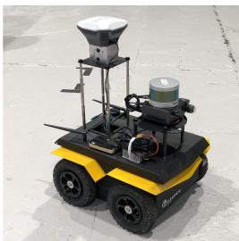

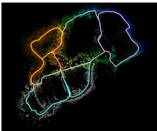  
(a) Our Jackal UGV instrumented with LiDAR, IMU, and a GPS used for ground truth.  
(b) SLAM-derived map, with pink, yellow and blue lines indicating the estimated trajectories of three robots.  
Fig. 1. Our mobile UGV platform (a) and a representative three-robot SLAM result using the proposed DiSCo-SLAM framework, over a new outdoor SLAM dataset gathered using our UGV (b).

## II. RELATED WORK

It is pivotal for a multi-robot SLAM algorithm, especially for distributed multi-robot SLAM [7], [8], whose communication bandwidth is limited, to establish accurate inter-robot measurement constraints, or loop closures. In single-robot SLAM, odometry measurements are frequently available to provide an accurate initial guess. In multi-robot SLAM, inter-robot constraints must be derived from perceptual data.

Since feature descriptors are easy to transfer and query, many vision-based methods [9]–[13] extract features from visual imagery and find potential data association using Bag of Words (BoW). Feature extractions are also widely used in 3D LiDAR SLAM methods. LeGO-LOAM [14] and [15] extract point features representing edge and planar structures to scale down the data while ensuring high performance. Segmap [16] extracts segments from LiDAR point clouds and describes them with CNN-based features. Recent research [17] also discusses the possibility of using visual features for LiDAR place recognition. DARE-SLAM [18] extracts visual features from 2D occupancy grid maps as geometric verification for inter-robot loop closures. We choose Scan Context [5] as our feature descriptor since it is lightweight and robust. Scan Context describes the raw LiDAR point cloud by projecting the scan onto a low-resolution 2D plane, which is easily searched and exchanged.

Although features enable robust performance in many cases, they cannot distinguish among repeated scenes in the environment. Many works address this issue through selectivity in accepting inter-robot loop closures. To ensure the correctness of inter-robot data association, [2], [19], [20] use a smart rendezvous approach; robots only exchange the present poses and observations when they meet. These meeting places are where inter-robot loop closures typically occur. However, a rendezvous approach only provides rough position information and may introduce uncertainties into subsequent optimization steps. Recent methods introduce an outlier rejection procedure to detect erroneous loop closures derived from feature matching. Agarwal [21] adds a scale factor to the covariance matrix to dynamically adjust the influence of each measurement. Pairwise consistent measurement set maximization (PCM) [22], proposed for multi-robot map merging, checks the consistency of interrobot measurements. It has been adopted by others for outlier rejection in multi-robot SLAM [3], and we also use it.

Another critical problem is the optimization of inter-robot constraints. Centralized methods [1], [9]–[12], which collect all messages from local robots using a global server, can easily handle this task by optimizing all measurements in one factor graph. Distributed methods maintain several graphs across robots, making it harder to resolve ambiguities arising among them. In the widely-used distributed Gauss-Seidel (DGS) approach [2], each robot optimizes its own graph, considering other robots only when there are overlapping constraints. DDF-SAM [23] optimizes a local pose graph and constrains these local graphs using a constrained factor graph (CFG) containing shared landmarks among robots. DDF-SAM 2.0 [24] uses a decision tree in both local and neighbor graphs to avoid double-counting measurements. Tian [25] proposes Riemannian Block-Coordinate Descent (RBCD), which achieves a better convergence than the DGS method by solving a rank-restricted relaxation of the pose graph optimization problem [26]. We adopt a two-stage optimization approach that is tailored to LiDAR SLAM with a data-efficient descriptor, with few restrictions on the prerequisites for relative pose estimation, and, unlike other works [2], [3], we perform local optimization in a single unified step that does not address rotation/translation separately.

## III. PROBLEM FORMULATION AND APPROACH

Let $\mathbf { X } = \{ \mathbf { x } _ { 0 } , \ldots , \mathbf { x } _ { t } \}$ be a set of 6DoF robot poses from time 0 to time $t ,$ with ${ \dot { \mathbf { X } } } \subset \operatorname { S E } ( 3 )$ . C contains all constraints between robot poses. For each pair of poses defining a constraint $\langle i , j \rangle \in { \mathcal { C } }$ , we define error ${ \bf e } _ { i j }$ between observed transformation $\mathbf { z } _ { i j } \in \mathrm { S E } ( 3 )$ and expected transformation $\hat { \mathbf { z } } _ { i j }$ as:

$$
\mathbf { e } _ { i j } ( \mathbf { x } _ { i } , \mathbf { x } _ { j } , \mathbf { z } _ { i j } ) = \mathbf { z } _ { i j } - \hat { \mathbf { z } } _ { i j } ( \mathbf { x } _ { i } , \mathbf { x } _ { j } ) ,\tag{1}
$$

$$
\begin{array} { r } { \hat { \bf z } _ { i j } ( { \bf x } _ { i } , { \bf x } _ { j } ) = { \bf x } _ { i } ^ { T } { \bf x } _ { j } . } \end{array}\tag{2}
$$

A single-agent SLAM problem can be represented as a nonlinear least squares problem [27]:

$$
\mathbf { X } ^ { * } = \underset { \mathbf { X } } { \arg \operatorname* { m i n } } ~ \sum _ { \langle i , j \rangle \in \mathcal { C } } \mathbf { F } _ { { i j } }\tag{3}
$$

$$
\mathbf { F } _ { i j } = \mathbf { e } _ { i j } ^ { T } \boldsymbol { \Omega } _ { i j } \mathbf { e } _ { i j } ,\tag{4}
$$

where $\mathbf { F } _ { i j }$ denotes the negative log-likelihood function of one constraint between $\mathbf { x } _ { i }$ and $\mathbf { x } _ { j } .$ , and $\Omega _ { i j }$ is the covariance. The SLAM system aims to find a set of robot poses which minimizes the total observation error.

We define a set of n robots: $\mathcal { N } = \{ 1 , 2 , \dots , n \}$ $\forall \alpha \in \mathcal { N } , \mathbf { X } _ { \alpha }$ denotes the poses of robot α and $\dot { \mathbb { X } } = \{ \mathbf { X } _ { \alpha } | \overset { \cdot } { \alpha } \in \mathcal { N } \}$ is a set containing the poses of all n robots. $\mathbb { C } = \mathrm { \bar { \{ } }  \langle i , j \rangle | \mathbf { x } _ { i } , \mathbf { x } _ { j } ^ { \top } \in \mathbb { X } \}$ is the set of all constraints. For the multi-agent SLAM problem, we wish to solve the following equation:

$$
\mathbb { X } ^ { * } = \underset { \mathbb { X } } { \mathrm { a r g } } \operatorname* { m i n } \{ \mathbf { F } _ { i n t r a } ( \mathbb { X } ) + \mathbf { F } _ { i n t e r } ( \mathbb { X } ) \} .\tag{5}
$$

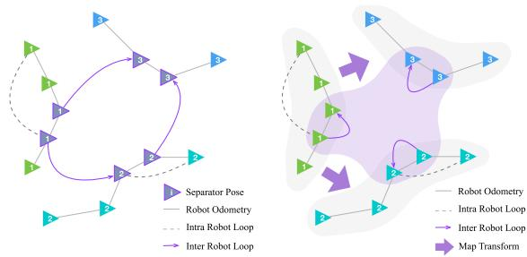  
(a) DGS method: separator poses are (b) Illustration of our method, where where robots rendezvous or share a global coordinate transformation common observations - they are in- graph (purple) and local pose graph cluded in each robot's optimization. (gray) are optimized by each robot,  
Fig. 2. Differences between DGS and our proposed method. Green, cyan and blue triangles indicate the poses of three different robots.

The cost function consists of two parts: intra-robot terms and inter-robot terms. $\mathcal { C } _ { \alpha } \subset \mathbb { C }$ indicates the set of intra-robot constraints between poses of robot $\alpha ,$ and $\mathcal { C } _ { \alpha \beta } \subset \mathbb { C }$ indicates interrobot constraints between poses of robots α and $\beta .$

$$
\mathbf { F } _ { i n t r a } ( \mathbb { X } ) = \sum _ { \alpha \in \mathcal { N } } \sum _ { \langle i , j \rangle \in \mathcal { C } _ { \alpha } } \mathbf { F } _ { i j }\tag{6}
$$

$$
\mathbf { F } _ { i n t e r } ( \mathbb { X } ) = \sum _ { \substack { \alpha , \beta \in \mathcal { N } , \alpha \neq \beta \langle i , j \rangle \in \mathcal { C } _ { \alpha \beta } } } \mathbf { F } _ { i j }\tag{7}
$$

In the distributed case, each robot optimizes its own contributions to the objective. For robot α, we have:

$$
\mathbb { X } _ { \alpha } ^ { * } = \underset { \mathbb { X } _ { \alpha } } { \arg \operatorname* { m i n } } ( \overbrace { \sum _ { \langle i , j \rangle \in \mathcal { C } _ { \alpha } } \mathbf { F } _ { i j } } ^ { \mathbf { F } _ { i n t r a } } + \overbrace { \sum _ { \beta \in \mathcal { N } , \alpha \neq \beta } \sum _ { \langle i , j \rangle \in \mathcal { C } _ { \alpha \beta } } \mathbf { F } _ { i j } } ^ { \mathbf { F } _ { i n t e r } } )\tag{8}
$$

$$
\mathbb { X } _ { \alpha } = \mathbf { X } _ { \alpha } \cup \left\{ \mathbf { x } _ { j } \left| { \mathbf { x } _ { j } \in \mathbf { X } _ { \beta } , \langle i , j \rangle \in \mathcal { C } _ { \alpha \beta } , } \right. \right\} ,\tag{9}
$$

where $\mathbb { X } _ { \alpha }$ contains all poses related to robot $\alpha . \forall \mathbf { x } \in \mathbb { X } _ { \alpha } .$ , the robot pose x consists of two parts, the rotation R and the translation t. Since the rotation $\mathbf { R } \in \mathrm { S O } ( 3 )$ is a non-convex component [2], (8) may fall into local minima instead of converging to a global minimal solution.

To address this, the widely used distributed Gauss-Seidel (DGS) method [2] (illustrated in Fig. 2(a)) rewrites $\mathbb { X } _ { \alpha }$ as two subsets: $\mathcal { R } _ { \alpha } .$ , containing the rotations of all poses, and $\sqcup _ { \alpha } .$ containing the translations of all poses. Additionally, DGS entails a two-stage optimization process. For robot $\alpha .$ the DGS method first approximates the rotation $\mathcal { R } _ { \alpha }$

$$
\mathcal { R } _ { \alpha } ^ { * } = \underset { \mathcal { R } _ { \alpha } } { \arg \operatorname* { m i n } } \left( \sum _ { \left. i , j \right. \in \mathcal { C } _ { \alpha } } \mathbf { G } _ { i j } + \sum _ { \beta \in \mathcal { N } , \alpha \neq \beta } \sum _ { \left. i , j \right. \in \mathcal { C } _ { \alpha \beta } } \mathbf { G } _ { i j } \right)\tag{10}
$$

$\mathbf { G } _ { i j }$ is the negative log-likelihood function only considering a robot’s rotation:

$$
\mathbf { G } _ { i j } = [ \mathbf { C } _ { i j } - \hat { \mathbf { C } } _ { i j } ( \mathbf { R } _ { i } , \mathbf { R } _ { j } ) ] ^ { T } \boldsymbol { \omega } _ { R } [ \mathbf { C } _ { i j } - \hat { \mathbf { C } } _ { i j } ( \mathbf { R } _ { i } , \mathbf { R } _ { j } ) ] .\tag{11}
$$

Similar to $\mathbf { z } _ { i j }$ and $\hat { \mathbf { z } } _ { i j } , ~ \mathbf { C } _ { i j }$ and $\hat { \mathbf { C } } _ { i j }$ are the observed and expected relative rotation between $\mathbf { R } _ { i }$ and ${ \bf R } _ { j }$ . We rewrite $\Omega _ { i j }$ as $\left[ \begin{array} { l l } { \omega _ { R } } & { 0 } \\ { 0 } & { \omega _ { t } } \end{array} \right]$ , where $\omega _ { R }$ is the rotation block of $\Omega _ { i j }$ . Then, the method performs a full-state graph optimization via the Gauss-Newton method, with the optimized rotation guess $\mathcal { R } _ { \alpha } ^ { * }$ to solve (8). However, the full-state optimization step requires a good rotation approximation, while the first step is still solving a non-convex problem. So DGS may require a long time to converge with a poor initial guess.

Inspired by the DGS method, we propose a two-stage globallocal graph optimization. The initial global optimization step solves the transformation among robots. ∀ pairs of separator poses $\langle \alpha _ { i } , \beta _ { j } \rangle \in \mathcal { C } _ { \alpha \beta }$ , with $\mathbf { x } _ { \alpha _ { i } } \in \mathbf { X } _ { \alpha } , \mathbf { x } _ { \beta _ { i } } \in \mathbf { X } _ { \beta } ,$ , we define the local robot frame for robot α as $\underline { { \mathcal { F } } } _ { \alpha } .$ . Let $\alpha ^ { \mathbf { X } } \alpha _ { i }$ be the pose at time i of robot α in its local coordinates, while ${ \boldsymbol { \beta } } \mathbf { X } _ { \alpha _ { i } }$ is $\mathbf { x } _ { \alpha _ { i } }$ in robot $\beta ^ { \bullet } { \bf s }$ local coordinates. $\exists \mathbf { T } _ { \beta \alpha }$ , transforming $\alpha ^ { \mathbf { X } } \alpha _ { i }$ to ${ \boldsymbol { \beta } } \mathbf { x } _ { \alpha _ { i } }$ gives us:

$$
{ } _ { \beta } \mathbf { x } _ { \alpha _ { i } } = \mathbf { T } _ { \beta \alpha } \cdot _ { \alpha } \mathbf { x } _ { \alpha _ { i } } = { } _ { \beta } \mathbf { x } _ { \beta _ { j } } \cdot _ { \beta } \mathbf { z } _ { \beta _ { j } \alpha _ { i } }\tag{12}
$$

$$
\mathbf { T } _ { \beta \alpha } = _ { \beta } \mathbf { x } _ { \beta _ { j } } \cdot _ { \beta } \mathbf { z } _ { \beta _ { j } \alpha _ { i } } \cdot ( _ { \alpha } \mathbf { x } _ { \alpha _ { i } } ) ^ { T } .\tag{13}
$$

Once there are inter-robot loop closures between robot $\beta$ and robot $\alpha , T _ { \beta \alpha }$ can be determined. $\mathbb { T } _ { \beta \alpha } = \{ \mathbf { T } _ { \beta \alpha } ^ { ( 1 ) } , . . . , \mathbf { T } _ { \beta \alpha } ^ { ( m ) } \}$ is the set of estimations of $\mathbf { T } _ { \beta \alpha }$ obtained from m inter-robot loop closures. Let us next assume the global frame $\underline { { \mathcal { F } } } _ { 9 }$ is aligned with the local frame of the first robot $\underline { { \mathcal { F } } } _ { 1 } \left( { _ g } \mathbf { x } _ { \alpha } = { _ { 1 } } \dot { \mathbf { x } } _ { \alpha } \right)$ . Let T be the set of transformations from any robot frame to the global frame:

$$
\mathbb { T } = \{ \mathbf { T } _ { g \alpha } \mid \forall \alpha \in \mathcal { N } , \alpha \neq g \} .\tag{14}
$$

We aim to minimize the total transformation error between local robot frames with the Levenberg-Marquardt method:

$$
\mathbb { T } ^ { * } = \underset { \mathbb { T } } { \arg \operatorname* { m i n } } \sum _ { \alpha , \beta \in \cal N } \mathbf { e } _ { \beta \alpha } ^ { T } \Omega _ { \beta \alpha } \mathbf { e } _ { \beta \alpha } .\tag{15}
$$

$\mathbf { e } _ { \beta \alpha }$ is the error of one transformation, and $\forall \mathbf { T } _ { \beta \alpha } ^ { ( i ) } \in \mathbb { T } _ { \beta \alpha }$

$$
\mathbf { e } _ { \beta \alpha } ( \mathbf { T } _ { g \beta } , \mathbf { T } _ { g \alpha } ) = \mathbf { T } _ { \beta \alpha } ^ { ( i ) } - \hat { \mathbf { T } } _ { \beta \alpha } ^ { ( i ) } ( \mathbf { T } _ { g \beta } , \mathbf { T } _ { g \alpha } ) .\tag{16}
$$

Next, all inter-robot constraints are transformed to local robot frames, and the local graph optimization step is performed. Let us suppose there are inter-robot constraints between robot α and robot $\beta .$ . To perform the local optimization of robot $\alpha ,$ we should transform the separator poses of robot $\beta$ into local coordinates. Accordingly, $\forall \mathbf { \bar { x } } _ { \beta _ { i } } \in \mathbf { X } _ { \beta } \cup \mathbb { X } _ { \alpha }$

$$
\begin{array} { r } { { \bf \Phi } _ { \alpha } { \bf x } _ { \beta _ { j } } = \hat { \bf T } _ { g \alpha } ^ { T } \cdot \hat { \bf T } _ { g \beta } \cdot { \bf x } _ { \beta _ { j } } . } \end{array}\tag{17}
$$

Finally, consider ${ \bf \Phi } _ { \alpha } \mathbb { X } _ { \alpha }$ as the initial value for separator poses. For any two sets of separator poses, $\langle \alpha _ { i } , \beta _ { j } \rangle , \langle \alpha _ { k } , \gamma _ { l } \rangle$ , a virtual intra-robot loop closure $\alpha { \bf z } _ { \beta _ { j } \gamma _ { l } }$ can be computed by (21).

We perform pose graph optimization using the Levenberg-Marquardt method on (8) with a modified inter-robot term, $\mathbf { F } _ { i n t e r } { : }$

$$
\mathbf { F } _ { i n t e r } = \sum _ { \alpha , \beta , \gamma \in \mathcal { N } , \ \left. \alpha _ { i } , \beta _ { j } \right. \in \mathcal { C } _ { \alpha \beta } , } \mathbf { e } _ { v i r } ^ { T } \Omega _ { v i r } \mathbf { e } _ { v i r }\tag{18}
$$

$$
\mathbf { e } _ { v i r } = \mathbf { z } _ { \alpha _ { i } \beta _ { j } } \cdot _ { \alpha } \mathbf { z } _ { \beta _ { j } \gamma _ { l } } \cdot ( \mathbf { z } _ { \alpha _ { k } \gamma _ { l } } ) ^ { T } - \hat { \mathbf { z } } _ { \alpha _ { i } \alpha _ { k } } ( \mathbf { x } _ { \alpha _ { i } } , \mathbf { x } _ { \alpha _ { k } } )\tag{19}
$$

This two-stage global and local optimization ensures a highquality initial guess for the local optimization step, which results in faster convergence. Furthermore, the introduction of local robot frames contributes to the numerical stability and consistency of the estimates and error covariances of the individual mobile robots. Thus, the SLAM systems of the local robots are only dealing with minor numerical changes in poses due to odometry drifts, which is beneficial for applications in active SLAM, path planning, and exploration.

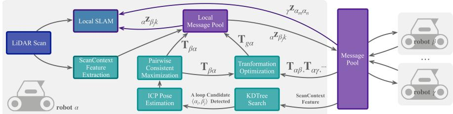  
Fig. 3. Overview of the architecture of DiSCo-SLAM, our proposed distributed multi-robot SLAM system, with robot α as the local robot.

## IV. ALGORITHMS

An overview of our distributed multi-robot SLAM system is shown in Figs. 2 and 3. Per the architecture shown in Fig. 3, once the system receives a LiDAR scan, the local SLAM thread and feature extraction thread are activated simultaneously. We adopt LIO-SAM [6] as our local SLAM framework, and alternatively use LeGO-LOAM [14] when tightly-coupled LiDAR-inertial data is unavailable. Scan Context [5], a lightweight spatial feature descriptor for 3D LiDAR, is used to describe and match features. Then, mobile robots exchange scan context features and perform scan matching. Once a potential inter-robot loop closure candidate is detected, incremental pairwise consistent measurement set maximization (PCM) [22] is performed to remove outliers, as in [3]. A two-stage optimization is performed by each robot, first establishing a global-to-local coordinate transformation, which informs a subsequent local pose graph optimization. Finally, coordinate transformations are exchanged among robots for further optimization.

## A. Scan Context Feature Description and Matching

Scan Context (SC) [5] describes a LiDAR scan by projecting the scan onto a 2D plane, where the z-coordinate value of each 3D point is encoded in the intensity of the corresponding 2D point. The 2D scan image is then divided into grid cells according to a specified number of sectors $N _ { s }$ and rings $N _ { r } .$ For the Velodyne VLP-16 Lidar employed in our work, we use $N _ { s } = 6 0$ and $\dot { N _ { r } } = 1 6 .$ . The value of each grid cell I is the maximum intensity of all points captured in the cell. Finally, a ring key feature of dimension $N _ { r }$ is extracted by counting the non-zero values of each ring.

A ring key KD tree is then built for loop closure candidate search. All SC features of the top N matched ring key features are further compared to identify the best loop closure candidate. The SC features are shifted along the sector axis to ensure rotation invariance. The shifting angle also serves as an initial rotation guess for the ICP scan-matching process when there is no coordinate transformation history.

## B. Incremental PCM

Unlike single-robot SLAM, for which incremental odometry measurements are frequently available to support an accurate initial guess, inter-robot loop closure candidates in multi-robot SLAM are only estimated by feature matching. Incremental pairwise consistent measurement set maximization (PCM) is introduced to avoid the acceptance of erroneous loop closures, which may result from different environmental regions with similar appearance, or objects in the environment arranged in repeating patterns.

Algorithm 1: Global-local optimization for robot $\alpha .$   
Global: History of Separator Poses $\mathbf { X } _ { s } ,$ Global Graph $_ { g } ,$   
Local Graph l   
Input: New Separator Pose Pair $\langle \mathbf { x } _ { \alpha _ { i } } , \mathbf { x } _ { \beta _ { j } } \rangle$ , Scan   
Matching Measurement $\mathbf { z } _ { \beta _ { j } \alpha _ { i } }$   
Output: Optimized Coordinate Transformation $\mathbf { T } ,$   
Optimized Poses $\mathbf { X } ^ { * }$   
$\mathbf { T } _ { \beta \alpha } ^ { \mathbf { i } }  \mathbf { z } _ { \beta _ { j } \alpha _ { i } } \cdot _ { \beta } \mathbf { x } _ { \beta _ { j } } \cdot ( _ { \alpha } \mathbf { x } _ { \alpha _ { i } } ) ^ { T }$   
$\mathtt { U p d a t e G r a p h } ( _ { g } , \mathbf { \bar { T } } _ { \beta \alpha } )$   
$\mathbf { T } \gets \mathsf { O p t i m i z e G r a p h } ( _ { g } )$   
# Calculate separator pose under local coordinate   
${ \bf \Pi } _ { \alpha } \mathbf { X } _ { s }$ ← TransformSeparatorPose(T, X )   
# Search for nearest inter-robot constraint   
$\mathbf { \Sigma } _ { \alpha } \mathbf { x } _ { k } \gets \mathrm { R a d i u s } \mathsf { S e a r c h } ( \mathbf { \Sigma } _ { \alpha } \mathbf { X } _ { s } , \mathbf { \Sigma } _ { \alpha } \mathbf { x } _ { \beta _ { j } } )$   
# Calculate virtual observation   
${ \bf \Delta } _ { \alpha } { \bf z } _ { \beta _ { j } k } \gets \tt B e t w e e n ( { \bf \Delta } _ { \alpha } { \bf x } _ { \beta _ { j } } , { \bf \Delta } _ { \alpha } { \bf x } _ { k } )$   
$\mathrm { U p d a t e G r a p h } ( _ { l } , \mathbf { z } _ { \beta _ { j } \alpha _ { i } } , _ { \alpha } \bar { \mathbf { z } } _ { \beta _ { j } k } )$   
$\bar { \mathbf { X ^ { \ast } } }  \mathsf { O p t } \dot { : }$ imizeGraph(l)   
$\mathbf { X } _ { s } \gets \mathbf { X } _ { s } \cup \mathbf { x } _ { j }$   
return $\mathbf { X } ^ { \ast } , \mathbf { T }$

PCM [22] checks the consistency of inter-robot constraints. A loop closure is accepted if any two inter-robot constraints $\mathbf { z } _ { \beta _ { j } \alpha _ { i } }$ and $\mathbf { z } _ { \beta _ { l } \alpha _ { k } }$ meet the following condition:

$$
\begin{array} { r } { \big \| \big ( \mathbf { z } _ { \beta _ { l } \beta _ { j } } \cdot \mathbf { z } _ { \beta _ { j } \alpha _ { i } } \cdot \mathbf { z } _ { \alpha _ { i } \alpha _ { k } } \big ) \cdot \mathbf { z } _ { \beta _ { l } { \alpha _ { k } } } { } ^ { - 1 } \big \| _ { 2 } ^ { 2 } < \epsilon . } \end{array}\tag{20}
$$

$\mathbf { z } _ { \beta _ { l } \beta _ { j } }$ is the intra-robot transformation of robot $\beta$ between timestamps l and ${ j } ; { \textbf { z } } _ { \beta _ { j } \alpha _ { i } }$ is the inter-robot transformation relating timestamp j of robot $\beta$ and timestamp i of robot α;  is a small threshold (in our experiments to follow, we choose $\epsilon = 5 )$ . To ensure robust real-time localization, we use a lazy initialization: incremental PCM will not be performed until there is a designated number of loop closure candidates. In our case, incremental PCM is performed after more than five loop closures are detected.

## C. Two-Stage Global and Local Optimization

As mentioned in Section III, the robots in our proposed framework perform a two-stage global and local optimization. Algorithm 1 presents the process of global and local optimization when a new inter-robot constraint pair is detected. In the global step, coordinate transformations between robots are treated as measurements. As shown in (15), only transformations from local robots to the global coordinate frame are optimized. The covariance matrices of these measurements are linearly related to the timestamp, since each robot’s dead reckoning error grows as time accumulates.

After global optimization, all separator poses from other robots are transformed to the local coordinate frame according to the latest coordinate transformation matrices. Then, a euclidean distance based radius search is performed to find the nearest inter-robot constraint. During the radius search, separator poses whose timestamps are too close to the present timestamp are discarded to avoid optimizing an ill-posed graph. Present separator pose $\alpha \mathbf { x } _ { \beta _ { j } }$ and nearest separator pose $\alpha \mathbf { x } _ { k }$ are converted to a virtual intra-robot loop closure:

$$
{ } _ { \alpha } \mathbf { Z } _ { \beta _ { j } k } = { } _ { \alpha } \mathbf { x } _ { \beta _ { j } } \mathbf { \Lambda } _ { \alpha } ^ { T } \mathbf { x } _ { k } .\tag{21}
$$

Finally, the virtual observations are added to the local pose graph and the local pose graph is optimized.

## D. Message Passing Between Robots

When two robots rendezvous, they share their past SC features (which each robot stores in a last in, first out buffer) as well as coordinate transformations between themselves and other robots. The shared coordinate transformations are added to the global factor graph for each robot’s global optimization step. Each recipient robot searches for neighbors of the shared SC features in its respective KD tree. Ifan SC feature match is found, the recipient robot will query its neighbor for a feature point cloud containing edge and planar features, and its corresponding pose in the neighbor robot’s local coordinates. The feature point cloud is then used for scan matching. If an inter-robot loop closure is detected, the recipient robot will send the resulting transformation to the related robot when it is feasible to do so. Our use of SC permits data-efficient communication, even when there are no communication constraints and message-passing can occur at all times. An overview of sizes/quantities of messages passed in a practical use-case is given in Section V-D.

## V. EXPERIMENTS AND RESULTS

## A. Experimental Setup

In the experiments to follow, we present results using four customized datasets configured for compatibility with 3D LiDARbased, distributed multi-robot SLAM. We refer to the four datasets as (1) the KITTI 08 dataset, (2) the KITTI 00 dataset, (3) the Stevens dataset, and (4) the Park dataset. We adapt our first two datasets from the KITTI Vision Benchmark raw data sequences 08 and 00 [28]. In sequence 08, 100 Hz raw inertial measurement unit (IMU) data is recorded with suitable temporal consistency to be used with LIO-SAM [6]. We use LeGO-LOAM [14] to run sequence 00 with LiDAR scans only. Since both LIO-SAM and LeGO-LOAM are configured to work with a 16-channel LiDAR, we downsample the KITTI LiDAR data from 64 beams to 16. We have modified sequences 08 and 00 into a synthetic two-robot dataset and a synthetic three-robot dataset respectively, where time-stamps have been adjusted to incorporate overlap and rendezvous.

The Stevens dataset is adapted from a dataset previously gathered on our campus [14] with a Clearpath Jackal UGV equipped with a Velodyne VLP-16 LiDAR, and only LiDAR data is used for LeGO-LOAM [14]. The dataset from this earlier paper has been modified into a two-robot dataset which includes overlap and rendezvous. Lacking RTK-GPS ground truth in this dataset, we use satellite imagery to qualitatively evaluate our experimental results.

Finally, the Park dataset was gathered specifically for this study, using a single Clearpath Jackal UGV, which is pictured in Fig. 1(a). Our UGV is equipped with a Velodyne VLP-16 LiDAR, a MicroStrain 3DM-GX5-25 IMU, and a Single-band RTK GNSS receiver, to both apply LIO-SAM [6] and evaluate it using RTK-GPS derived ground truth information. The data was collected in a suburban park environment. To generate a synthetic three-robot dataset from this single-robot mission, we rewrote the timestamps of each synthetic robot’s trajectory to achieve a meaningful synchronization of three intersecting robot trajectories. Each robot executes a “figure-eight” trajectory comprised of two large loops; the individual robots will accumulate errors along these loops, but there is sufficient overlap among robots that inter-robot constraints can alleviate these errors. This dataset has been made freely available, along with our optimization framework.1 DiSCo-SLAM’s application to this dataset is shown in our video.

In all four datasets, KITTI (08 and 00), Stevens, and Park, each robot trajectory includes intra-robot and inter-robot loop closures, and each robot encounters at least one rendezvous with every other robot. When GPS is available, it is used as ground truth for quantitative analysis, and not used for SLAM. We project the GPS measurements onto Universal Transverse Mercator (UTM) coordinates and perform a coordinate transformation to facilitate comparisons with our SLAM results. All experimental comparisons are performed using playback of previously gathered data on a desktop computer equipped with an Intel i9-9900 K CPU, 62.7 GB memory using the robot operating system (ROS) in Ubuntu Linux 18.04. All robot threads run concurrently on the same processor, and do not utilize GPUs.

## B. Performance of Two-Stage Optimization

In this section, we perform comparisons of multiple configurations of our proposed DiSCo-SLAM two-stage optimization framework, using the three-robot Park dataset. Displayed in Fig. 4 are multi-robot SLAM results for increasing levels of optimization. These comparisons are intended to display the efficacy of the proposed global and local optimization procedures in combination, versus their standalone performance. In Fig. 4(a), only the global optimization step is applied, and neither inter-robot nor intra-robot loop closure constraints are included in the local optimization step; it is produced using odometry only. Accordingly, overlap and rendezvous among robots fails to inform local pose-graph constraints, and thus results in a visible buildup oflocalization error in the result. The inclusion of intra-robot loop closures into the local optimization procedure, seen in Fig. 4(b), noticeably improves robot localization performance. Further improvements are apparent in Fig. 4(c), where inter-robot constraints are also added to each vehicle’s local pose graph, including them in the local optimization step. A further inspection of the benefits of utilizing inter-robot constraints in local pose graphs can be seen in Fig. 5. There, one can clearly note the higher consistency in pose estimates across overlapping robots, when leveraging these constraints.

(b) With  
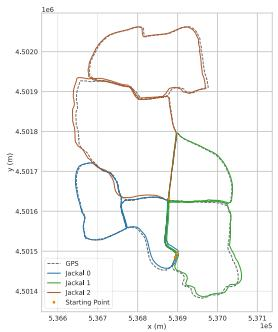

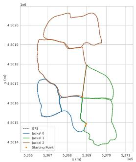

(a) DiSCo-SLAM, with global (b) DiSCo-SLAM, w/ global and 1otransformation optimization, and cal optimization, no inter-robot conlocally, only odometry. straints in local pose graphs.  
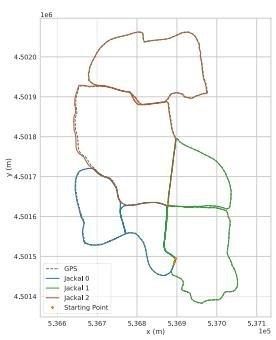

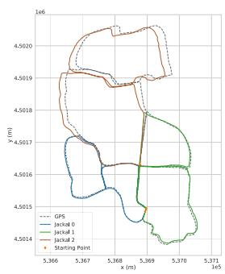  
(c) DiSCo-SLAM as proposed, full (d) DGS optimization with PCM. global and local optimization.

Fig. 4. Representative trajectory estimation results over the three-robot Park dataset, with different multi-robot SLAM configurations.  
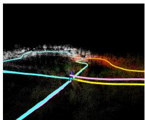  
(a) No inter-robot constraints (as in Fig. 4(b)).

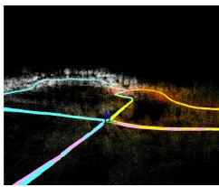  
constraints (as in Fig. 4(c)).  
Fig. 5. Park dataset, at a location where there is overlap among all three robot trajectories. The “jackal 2” robot from the plots of Fig. 4 (pink) is completing a large loop with no intra-robot constraints.

Quantitative pose estimation error metrics for a representative SLAM execution trace over the Park dataset are listed in Table I. To compute these errors relative to ground truth information, GPS data is collected at a rate of 5 Hz, while we generate one LiDAR keyframe per second. We match each keyframe pose with the nearest GPS pose according to their timestamps. The estimated trajectories are transformed from local SLAM coordinates into UTM coordinates using the starting points of the “jackal 1” and “jackal 2” trajectories as geometric constraints (the jackal 1 and jackal 2 trajectories are denoted in the plots of Fig. 4). The result in Table I with both intra- and inter- robot constraints added to the local pose graph achieves the highest accuracy.

## C. Comparison With Distributed Gauss-Seidel (DGS)

Due to its data-efficiency and relevance to real-time multirobot SLAM applications, we next compare our method against

TABLE I  
ROOT MEAN SQUARE ERROR (RMSE) W.R.T. GPS
<table><tr><td>Dataset</td><td>Configure</td><td>X (m)</td><td>Y (m)</td><td>Total (m)</td></tr><tr><td rowspan="4">Park</td><td>DiSCo-Odometry</td><td>4.87</td><td>3.35</td><td>5.91</td></tr><tr><td>DiSCo-Local</td><td>1.39</td><td>1.11</td><td>1.78</td></tr><tr><td>Full DiSCo-SLAM</td><td>1.31</td><td>0.52</td><td>1.43</td></tr><tr><td>DGS with PCM</td><td>11.84</td><td>5.38</td><td>13.00</td></tr><tr><td rowspan="2">KITTI 08</td><td>Full DiSCo-SLAM</td><td>5.57</td><td>4.39</td><td>7.09</td></tr><tr><td>DGS with PCM</td><td>14.81</td><td>19.47</td><td>24.46</td></tr><tr><td rowspan="2">KITTI 00</td><td>Full DiSCo-SLAM</td><td>3.48</td><td>5.61</td><td>6.60</td></tr><tr><td>DGS with PCM</td><td>14.54</td><td>14.78</td><td>20.73</td></tr></table>

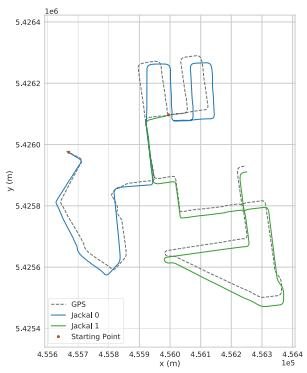  
(a) DGS optimization with PCM.

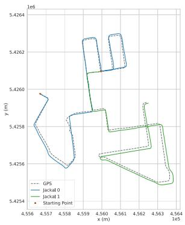  
(b) DiSCo-SLAM, with full global and local optimization.  
Fig. 6. Optimization result on the KITTI 08 dataset.

DGS optimization with PCM (summarized in Fig. 2 and Eqs. (10)-(11)), which comprises the back-end of DOOR-SLAM [3], a framework that has supported distributed multi-robot SLAM across different platforms and sensing modalities, including LiDAR. We test both DGS with PCM and DiSCo-SLAM with the same front-end on four datasets, (1) our modified KITTI 08 dataset, (2) our modified KITTI 00 dataset, (3) the Stevens campus dataset and (4) the Park dataset. The RMSE with respect to GPS is given in Table I.

Fig. 6 shows representative results optimized by DGS over the KITTI 08 dataset. We transform the trajectories to align them with the GPS data according to the starting point of both robots, although the GPS data undergoes a small amount of erroneous drift in this dataset. The rotation angles are incorrectly estimated by DGS at several corners in Fig. 6(a) where turns occur, while there are no significant errors in the result of DiSCo-SLAM when turning corners in Fig. 6(b).

The KITTI 00 dataset is challenging since only LiDAR scans are used, and the LiDAR frame spacing is larger than our VLP-16 datasets. Both DiSCo-SLAM and DGS with PCM achieve low accuracy since the LiDAR frame rate is low, and thus fewer interrobot loop closures are detected. The optimized robot trajectories of DGS with PCM (Fig. 7(a)) align well where there are interrobot loop closures. However, their rotation estimation falls into local minima and introduces errors. Fig. 7(b) shows the result for DiSCo-SLAM. Since drift accumulates locally due to a lack of intra-robot loop closures, we lower the threshold for PCM and model the covariances of inter-robot loop closure measurements as Cauchy distributions. Although the resulting trajectory aligns with GPS well for most parts, errors occur along the z-axis of “jackal 1” at the ending point due to the lack of intra-robot loop closures.

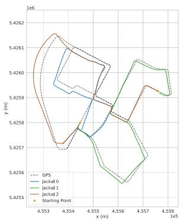  
(a) DGS optimization with PCM.

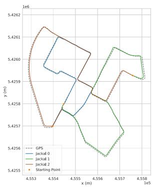  
(b) DiSCo-SLAM, with full global and local optimization.

Fig. 7. Optimization result on the KITTI 00 dataset.  
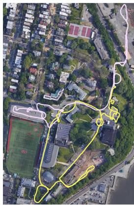

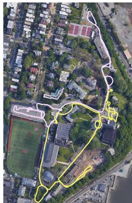  
(a) DGS optimization w/ PCM. (b) DiSCo-SLAM, with full global and local optimization.  
Fig. 8. Optimization result on the Stevens campus dataset.

For the Stevens dataset, GPS measurements along the path are not available, so we transform the trajectory estimates into UTM coordinates and project them onto satellite imagery. Fig. 8 shows the optimized trajectories using DiSCo-SLAM (Fig. 8(b)), and DGS with PCM (Fig. 8(a)). The yellow robot trajectory, aligned with the global frame, is well-optimized in both methods. DGS’s estimate of the pink robot trajectory drifts as time accumulates, while this robot’s trajectory estimate in our DiSCo-SLAM method aligns with the roadways depicted in the imagery.

The Park dataset was gathered with GPS signal available throughout, so we compared our method and the DGS method using the GPS data as ground truth. Figs. 4(d) and 4(c) show results from the Park dataset using DGS optimization and our method, respectively. For this dataset, we run multiple trials to examine the robustness of our method. After each trial, the SLAM trajectory estimates are compared against the GPS data, following the same procedure described in Section V-B. Table III shows the RMSE with respect to GPS ground truth data, across 40 trials of re-playing the same recorded dataset, using both methods. Although the lowest error in all the trials for DGS and our method is close, our method offers a more stable, consistent output. The DGS method’s rotation optimization step often hinders convergence to a global minimum under the infrequent arrival of inter-robot constraints, as evidenced by the buildup of drift for “jackal 2” in Fig. 4(d).

TABLE II  
RELATIVE POSE ESTIMATION ERROR AT TRAJ. CONNECTING POINTS
<table><tr><td>Dataset</td><td>Configure</td><td>Roll</td><td>Pitch</td><td>Yaw</td><td>Total (°)</td><td>X</td><td>Y</td><td>Z</td><td>Total (m)</td></tr><tr><td rowspan="4">Park</td><td>DiSCo-SLAM</td><td>0.30</td><td>0.50</td><td>0.60</td><td>0.83</td><td>0.52</td><td>0.95</td><td>1.36</td><td>1.74</td></tr><tr><td>DGS with PCM</td><td>0.12</td><td>0.01</td><td>0.22</td><td>0.25</td><td>0.16</td><td>0.04</td><td>0.03</td><td>0.16</td></tr><tr><td>DiSCo-SLAM</td><td>0.85</td><td>2.56</td><td>1.75</td><td>3.21</td><td>0.28</td><td>0.16</td><td>0.23</td><td>0.40</td></tr><tr><td>DGS with PCM</td><td>0.55</td><td>3.40</td><td>3.64</td><td>5.01</td><td>1.61</td><td>1.32</td><td>0.45</td><td>2.13</td></tr><tr><td rowspan="2">KITTI08</td><td>DiSCo-SLAM</td><td>1.09</td><td>0.99</td><td>0.45</td><td>1.54</td><td>3.60</td><td>4.28</td><td>0.27</td><td>5.6</td></tr><tr><td>DGS with PCM</td><td>1.79</td><td>1.25</td><td>14.03</td><td>14.19</td><td>22.58</td><td>7.82</td><td>0.37</td><td>23.90</td></tr><tr><td rowspan="4">KITTI00</td><td>DiSCo-SLAM</td><td>0.38</td><td>2.99</td><td>1.10</td><td>3.20</td><td>6.38</td><td>1.94</td><td>1.21</td><td>6.78</td></tr><tr><td>DGS with PCM</td><td>11.38</td><td>1.57</td><td>14.84</td><td>18.76</td><td>14.92</td><td>26.35</td><td>14.15</td><td>33.42</td></tr><tr><td>DiSCo-SLAM</td><td>0.56</td><td>7.43</td><td>0.62</td><td>7.48</td><td>2.08</td><td>6.74</td><td>14.00</td><td>15.67</td></tr><tr><td>DGS with PCM</td><td>0.20</td><td>0.40</td><td>0.75</td><td>0.87</td><td>0.67</td><td>11.35</td><td>1.49</td><td>11.47</td></tr><tr><td rowspan="2">Stevens</td><td>DiSCo-SLAM</td><td>3.22</td><td>5.07</td><td>0.26</td><td>6.01</td><td>0.32</td><td>0.99</td><td>0.23</td><td>1.07</td></tr><tr><td>DGS with PCM</td><td>1.61</td><td>3.63</td><td>4.28</td><td>5.84</td><td>0.50</td><td>1.28</td><td>0.99</td><td>1.70</td></tr></table>

TABLE III

RMSE W.R.T GPS FOR 40 TRIALS
<table><tr><td>RMSE</td><td>Min (m)</td><td>Max (m)</td><td>Mean (m)</td><td>STD (m)</td></tr><tr><td>DiSCo-SLAM</td><td>1.01</td><td>2.51</td><td>1.52</td><td>0.34</td></tr><tr><td>DGS with PCM</td><td>2.87</td><td>14.37</td><td>6.23</td><td>2.72</td></tr></table>

TABLE IV

DATA SIZES OF MESSAGES SENT (VLP-16)
<table><tr><td rowspan="2">Message Info</td><td rowspan="2">Mean (kB)</td><td rowspan="2">Min (kB)</td><td rowspan="2">Max (kB)</td><td colspan="2">No. Total Msgs.</td></tr><tr><td>Stevens</td><td>Park</td></tr><tr><td>SC Feature &amp; Local Pose</td><td>4.08</td><td>4.04</td><td>4.12</td><td>3936</td><td>4222</td></tr><tr><td>Feature Cloud (Edge)</td><td>9.65</td><td>5.08</td><td>15.90</td><td>37</td><td>837</td></tr><tr><td>Feature Cloud (Planar)</td><td>71.31</td><td>54.74</td><td>85.98</td><td>37</td><td>837</td></tr><tr><td>Feature Cloud (Other)</td><td>70.91</td><td>50.58</td><td>83.99</td><td>37</td><td>837</td></tr><tr><td>Coordinate Transformation</td><td>0.70</td><td>0.70</td><td>0.70</td><td>3</td><td>711</td></tr><tr><td>Inter-Robot Loop Closure</td><td>0.12</td><td>0.12</td><td>0.12</td><td>3</td><td>72</td></tr></table>

Because our RTK-GPS data only covers two translational degrees offreedom, we also compare relative pose estimation error. Since all of our multi-robot datasets are obtained by dividing single-robot datasets into several parts, we use the coincidence of the ending point of one robot’s trajectory and the starting point of the next as the basis for quantifying the rotational and translational errors across a representative inter-robot “rendezvous point” from each dataset, which are captured in Table II for all of our datasets. Although DiSCo-SLAM is not always superior, its worst-case performance is well below the levels occasionally reached by DGS.

## D. Communication and Computational Efficiency

To quantify the bandwidth requirements of the proposed SLAM framework, we have examined the sizes of the messages sent between robots during execution of the datasets. The results for Velodyne VLP-16 and VLP-64 LiDAR are shown in Tables IV and V respectively, which catalog the mean, minimum, and maximum size of each type of message exchanged, as well as the total quantity of each type of message exchanged, between robots during their execution ofthe trajectories. We assume there is no maximum communication range, so that messages can be exchanged between robots at any time. While a single laser scan from the Velodyne VLP-16 is 1.04 MB, the message size needed for our DiSCo-SLAM method for each LiDAR keyframe is around 200 KB.

TABLE V  
DATA SIZES OF MESSAGES SENT (VLP-64)
<table><tr><td rowspan="2">Message Info</td><td rowspan="2">Mean (kB)</td><td rowspan="2">Min (kB)</td><td rowspan="2">Max (kB)</td><td colspan="2">No. Total Msgs.</td></tr><tr><td>KITTI00</td><td>KITTI08</td></tr><tr><td>SC Feature &amp; Local Pose</td><td>15.75</td><td>15.75</td><td>15.75</td><td>1134</td><td>2333</td></tr><tr><td>Feature Cloud (Edge)</td><td>30.60</td><td>16.76</td><td>42.62</td><td>198</td><td>12</td></tr><tr><td>Feature Cloud (Planar)</td><td>309.70</td><td>242.39</td><td>383.03</td><td>198</td><td>12</td></tr><tr><td>Feature Cloud (Other)</td><td>89.18</td><td>69.46</td><td>115.96</td><td>198</td><td>12</td></tr><tr><td>Coordinate Transformation</td><td>0.70</td><td>0.70</td><td>0.70</td><td>130</td><td>8</td></tr><tr><td>Inter-Robot Loop Closure</td><td>0.12</td><td>0.12</td><td>0.12</td><td>24</td><td>7</td></tr></table>

TABLE VI

PROCESSING TIME FOR EACH ALGORITHMIC STEP (MS)
<table><tr><td rowspan="2">Subroutine</td><td colspan="2">Park</td><td colspan="2">KITTI08</td><td colspan="2">KITTI00</td><td colspan="2">Stevens</td></tr><tr><td>Mean Max Mean Max Mean Max Mean Max</td><td></td><td></td><td></td><td></td><td></td><td></td><td></td></tr><tr><td>SC Feature Description</td><td>&lt;1</td><td>9</td><td>&lt;1</td><td>6</td><td>&lt;1</td><td>6</td><td>&lt;1</td><td>10</td></tr><tr><td>SC Feature Matching</td><td>61</td><td>188</td><td>34</td><td>67</td><td>2</td><td>68</td><td>24</td><td>90</td></tr><tr><td>Cloud Scan Matching</td><td>193</td><td>614</td><td>112</td><td>147</td><td>19</td><td>147</td><td>314</td><td>677</td></tr><tr><td>Incremental PCM</td><td>55</td><td>346</td><td>7</td><td>10</td><td>&lt;1</td><td>10</td><td>5</td><td>20</td></tr><tr><td>Global Optimization</td><td>4</td><td>12</td><td>&lt;1</td><td>1</td><td>&lt;1</td><td>1</td><td>&lt;1</td><td>&lt;1</td></tr><tr><td>Local Optimization</td><td>7</td><td>36</td><td>2</td><td>14</td><td>&lt;1</td><td>14</td><td>7</td><td>20</td></tr></table>

Table VI shows the computation time of each key step of DiSCo-SLAM, using the computer described in Section V.A. The groupings of rows correspond to the groupings given in Tables IV and V (i.e., the algorithmic steps in one grouping yield the messages in the other). Feature description and matching are, by far, the most frequently performed steps, serving as an efficient filtering mechanism that permits costly point cloud matching to be invoked less frequently.

## VI. CONCLUSION

In this paper we have presented DiSCo-SLAM, a distributed multi-robot SLAM framework for 3D LiDAR observations, which requires a relatively low communication bandwidth for message passing. In DiSCo-SLAM, LiDAR scans are efficiently described using Scan Context descriptors and shared between robots. We also propose a two-stage global-local graph optimization procedure that offers robust output for relatively large scale multi-robot SLAM problems with limited occurrences of rendezvous, finding transformations relating robots that may be distant from one another. We compare our optimization strategy with the widely used distributed Gauss-Seidel method, showing the relative stability of our method.

## REFERENCES

[1] R. Dubé, A. Gawel, H. Sommer, J. Nieto, R. Siegwart, and C. Cadena, “An online multi-robot SLAM system for 3D lidars,” in Proc. IEEE/RSJ Int. Conf. Intell. Robots Syst., 2017, pp. 1004–1011.

[2] S. Choudhary, L. Carlone, C. Nieto, J. Rogers, H. Christensen, and F. Dellaert, “Distributed trajectory estimation with privacy and communication constraints: A two-stage distributed gauss-seidel approach,” in Proc. IEEE Int. Conf. Robot. Automat., 2016, pp. 5261–5268.

[3] P. Lajoie, B. Ramtoula, Y. Chang, L. Carlone, and G. Beltrame, “DOOR-SLAM: Distributed, online, and outlier resilient SLAM for robotic teams,” IEEE Robot. Automat. Lett., vol. 5, no. 2, pp. 1656–1663, Apr. 2020.

[4] F. Dellaert, “Factor graphs and GTSAM: A hands-on introduction,” Georgia Inst. Technol. Tech. Rep. No GT-RIM-CP&R-2012-002, 2012.

[5] G. Kim and A. Kim, “Scan context: Egocentric spatial descriptor for place recognition within 3D point cloud map,” in Proc. IEEE/RSJ Int. Conf. Intell. Robots Syst., 2018, pp. 4802–4809.

[6] T. Shan, B. Englot, D. Meyers, W. Wang, C. Ratti, and D. Rus, “LIO-SAM: Tightly-coupled lidar inertial odometry via smoothing and mapping,” in Prof. IEEE/RSJ Int. Conf. Intell. Robots Syst., 2020, pp. 5135–5142.

[7] S. Saeedi, M. Trentini, M. Seto, and H. Li, “Multiple-robot simultaneous localization and mapping: A review,” J. Field Robot., vol. 33, pp. 3–46, 2016.

[8] M. Kegeleirs, G. Grisetti, and M. Birattari, “Swarm SLAM: Challenges and perspectives,” Front. Robot. AI, vol. 8, 2021, Art. no. 618268.

[9] L. Riazuelo, J. Civera, and J. Montiel, “C2tam: A cloud framework for cooperative tracking and mapping,” Robot. Auton. Syst., vol. 62, no. 4, pp. 401–413, 2014.

[10] I. Deutsch, M. Liu, and R. Siegwart, “A framework for multi-robot pose graph SLAM,” in Proc. IEEE Int. Conf. Real-Time Comput. Robot., 2016, pp. 567–572.

[11] M. Karrer, P. Schmuck, and M. Chli, “CVI-SLAM - collaborative visualinertial SLAM,” IEEE Robot. Automat. Lett., vol. 3, no. 4, pp. 2762–2769, 2018.

[12] P. Zhang, H. Pengfei, B. Ding, and S. Shang, “Cloud-based framework for scalable and real-time multi-robot SLAM,” in Proc. IEEE Int. Conf. Web Serv., 2018, pp. 147–154.

[13] Y. Chang, Y. Tian, J. How, and L. Carlone, “Kimera-multi: A system for distributed multi-robot metric-semantic simultaneous localization and mapping,” in Proc. IEEE Int. Conf. Robot. Automat., 2021, pp. 11210– 11218.

[14] T. Shan and B. Englot, “LeGO-LOAM: Lightweight and ground-optimized lidar odometry and mapping on variable terrain,” in Proc. IEEE/RSJ Int. Conf. Intell. Robots Syst., 2018, pp. 4758–4765.

[15] H. Ye, Y. Chen, and M. Liu, “Tightly coupled 3D lidar inertial odometry and mapping,” in Proc. IEEE Int. Conf. Robot. Automat., 2019, pp. 3144– 3150.

[16] R. Dubé, A. Cramariuc, D. Dugas, J. Nieto, R. Siegwart, and C. Cadena, “SegMap: 3D segment mapping using data-driven descriptors,” in Proc. Robot.: Sci. Syst., 2018.

[17] L. Di Giammarino, I. Aloise, C. Stachniss, and G. Grisetti, “Visual place recognition using LiDAR intensity information,” 2021, arXiv:2103.09605.

[18] K. Ebadi, M. Palieri, S. Wood, C. Padgett, and A. Agha-mohammadi, “DARE-SLAM: Degeneracy-aware and resilient loop closing in perceptually-degraded environments,” J. Intell. Robotic Syst., vol. 102, 2021, Art. no. 2.

[19] M. Lazaro, L. Paz, P. Pinies, J. Castellanos, and G. Grisetti, “Multi-robot SLAM using condensed measurements,” in Proc. IEEE/RSJ Int. Conf. Intell. Robots Syst., 2013, pp. 1069–1076.

[20] W. Wang, N. Jadhav, P. Vohs, N. Hughes, M. Mazumder, and S. Gil, “Active rendezvous for multi-robot pose graph optimization using sensing over Wi-Fi,” in Proc. Int. Symp. Robot. Res., 2019, arXiv:1907.05538.

[21] P. Agarwal, G. Tipaldi, L. Spinello, C. Stachniss, and W. Burgard, “Robust map optimization using dynamic covariance scaling,” in Proc. IEEE Int. Conf. Robot. Automat., 2013, pp. 62–69.

[22] J. Mangelson, D. Dominic, R. Eustice, and R. Vasudevan, “Pairwise consistent measurement set maximization for robust multi-robot map merging,” in Proc. IEEE Int. Conf. Robot. Automat., 2018, pp. 2916–2923.

[23] A. Cunningham, M. Paluri, and F. Dellaert, “DDF-SAM: Fully distributed SLAM using constrained factor graphs,” in Proc. IEEE/RSJ Int. Conf. Intell. Robots Syst., 2010, pp. 3025–3030.

[24] A. Cunningham, V. Indelman, and F. Dellaert, “DDF-SAM 2.0: Consistent distributed smoothing and mapping,” in Proc. IEEE Int. Conf. Robot. Automat., 2013, pp. 5220–5227.

[25] Y. Tian, K. Khosoussi, D. Rosen, and J. How, “Distributed certifiably correct pose-graph optimization,” IEEE Trans. Robot., vol. 37, no. 6, pp. 2137–2156, Dec. 2021, doi: 10.1109/TRO.2021.3072346.

[26] D. Rosen, L. Carlone, A. Bandeira, and J. Leonard, “SE-Sync: A certifiably correct algorithm for synchronization over the special euclidean group,” Int. J. Robot. Res., vol. 38, no. 2-3, pp. 95–125, 2019.

[27] G. Grisetti, R. Kümmerle, C. Stachniss, and W. Burgard, “A tutorial on graph-based SLAM,” IEEE Intell. Transp. Syst. Mag., vol. 2, no. 4, pp. 31–43, winter 2010.

[28] A. Geiger, P. Lenz, C. Stiller, and R. Urtasun, “Vision meets robotics: The KITTI dataset,” Int. J. Robot. Res., vol. 32, no. 11, pp. 1231–1237, 2013.