# EKF-LOAM: An Adaptive Fusion of LiDAR SLAM With Wheel Odometry and Inertial Data for Confined Spaces With Few Geometric Features

Gilmar P. Cruz Júnior , Adriano M. C. Rezende , Victor R. F. Miranda , Rafael Fernandes Héctor Azpúrua , Armando A. Neto , Gustavo Pessin , and Gustavo M. Freitas

Abstract— A precise localization system and a map that properly represents the environment are fundamental for several robotic applications. Traditional LiDAR SLAM algorithms are particularly susceptible to underestimating the distance covered by real robots in environments with few geometric features. Common industrial confined spaces, such as ducts and galleries, have long and homogeneous structures, which are difficult to map. In this paper, we propose a novel approach, the EKF-LOAM, which fuses wheel odometry and IMU (Inertial Measurement Unit) data into the LeGO-LOAM algorithm using an Extended Kalman Filter. For that, the EKF-LOAM uses a simple and lightweight adaptive covariance matrix based on the number of detected geometric features. Simulated and real-world experiments with the EspeleoRobô, a service robot designed to inspect confined places, show that the EKF-LOAM method reduces the underestimating problem, with improvements greater than 50% when compared to the original LeGO-LOAM algorithm.

Note to Practitioners—This paper is motivated by the challenges of autonomous navigation for mobile ground robots within confined and unstructured environments. Here, we propose a data fusion framework that uses common sensors (such as LiDARs, wheel odometry, and inertial devices) to improve the simultaneous localization and mapping (SLAM) capabilities of a robot without GPS and compass. This approach does not need

artificial landmarks nor ideal light and, in scenarios with few geometric features, increases the performance of LiDAR SLAM techniques based on edge and planar features. We also provide a robust controller for the autonomous navigation of the robot during the mapping of a tunnel. Experiments carried out in simulation and real-world confined places show the effectiveness of our approach. In future work, we shall incorporate other sensors, such as cameras, to improve the SLAM process.

Index Terms— Mobile service robots, adaptive extended Kalman filtering, simultaneous localization and mapping in confined spaces, LiDAR SLAM, wheel odometry, vector field based navigation.

## I. INTRODUCTION

common in the last decades. An example is the exploration of confined environments, where autonomous agents mitigate the exposure of human operators to risks associated with such spaces. In this context, a mobile robot must be able to estimate its location, map the surrounding environment, and plan paths to the desired goal, employing navigation and control strategies to avoid obstacles and other possible causes of damage.

Aiming to increase operational safety, the Brazilian mining company Vale S.A. is designing the EspeleoRobô, a robotic platform for underground operations (Fig. 1). This device was originally conceived to inspect natural caves via teleoperation, but now it is also being used to monitor dam galleries and pipes, among other industrial confined spaces [1]. From a robotic perspective, such environments present challenging operating conditions, like lack of GPS signal, low visibility, interference in compasses and wireless communication devices, slippery and rough terrains, among others [2]. In the last three decades, these hard constraints are gaining attention from the academy and industry. Even the current DARPA (SubT) Challenge (2018-2021), a high-profile robotic competition, focuses on these types of underground environments [3].

Concerning localization and mapping, two tasks intrinsically connected, there are several Simultaneous Localization And Mapping (SLAM) algorithms in the literature based on different exteroceptive sensors such as sonars, cameras, and LiDARs (Light Detection And Ranging). On the other hand, proprioceptive sensors, like IMU and wheel encoders, are commonly used to improve odometry estimation. More specifically, LiDAR-based SLAMs present good performance in most confined environments, assuming a sufficient number of identifiable geometric features. However, in ducts and galleries, which have long and homogeneous structures, geometric features are scarce. As a result, the robot’s motion is usually underestimated, and the constructed map has a shorter size than the real structure [4].

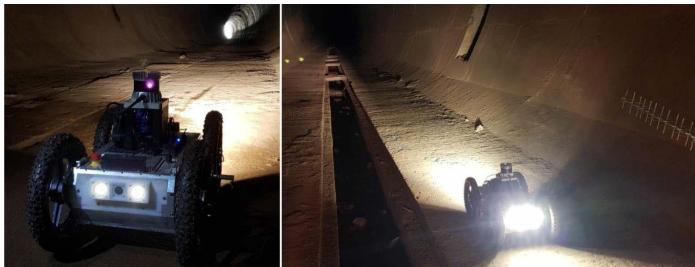  
Fig. 1. EspeleoRobô exploring a deactivated tunnel in Sabará, Brazil.

To deal with the over/underestimation of the robot path in environments with few geometric features, our novel solution proposes a sensor fusion strategy that merges information from wheels odometry, IMU, and LiDAR odometry estimation. This approach is called EKF-LOAM1 (Extended Kalman Filter - LiDAR Odometry And Mapping), which is an upgrade of the LeGO-LOAM (LightWeight and Ground Optimized - LOAM) algorithm [5]. The fused data is introduced between the Back-End and the Front-End stages of the LiDAR SLAM, providing the algorithm a better estimate of the robot’s displacement. Our framework also uses a simple and lightweight adaptive covariance scheme for the LiDAR odometry, which is defined according to the number of geometric features identified in the environment. Although it is not the purpose of this work to perform a fully autonomous generation of a map, a simple and robust controller based on artificial vector fields is also designed for the gallery or tunnel autonomous exploration.

Simulations and experimental results obtained at different indoor scenarios illustrate the performance of EKF-LOAM compared to LeGO-LOAM. Navigation experiments were also performed with the proposed method as localization feedback to a vector field-based navigation controller while following closed curves. The used controller also allows the robot to explore a tunnel relying only on the raw point cloud provided by the LiDAR, without the necessity of an accurate map and a global localization. In those cases, the precise map could be generated offline.

The remainder of this paper is structured as follows: Sec. II presents the related work. Sec. III describes the EspeleoRobô robotic platform. Sec. IV presents the kinematic model of the mobile robot, the adopted LiDAR SLAM technique, and the sensor fusion integration. Sec. V describes the navigation control approaches used in the experiments, including a novel strategy to autonomously explore tunnels. Indoor experiments and results are presented in Sec. VI. Finally, in Sec. VII, we conclude and discuss future directions.

## II. RELATED WORK

In the Mining Industry, there are many works focused on applying robotic systems to improve productivity and safety, and to reduce costs involved in such processes. Moreover, among the overall difficulties of traditional industrial environments, mining in extreme and unstructured places (such as underground caves) bears an increasing set of challenges for robots [6]. Many fundamental jobs can be performed by one or more autonomous agents in such scenarios, like navigation planning [7], explosive charging [8], localization and mapping [9], exploration [10], among others. Notably, essential tasks like robot localization and mapping in these scenarios are particularly challenging due to terrain irregularities, poor light conditions, and sources of communication interference.

Many state-of-the-art techniques address the SLAM problem by employing specific sensors such as RADARs, LiDARs, and mono or stereo cameras. The authors of [11] present a complete review of Visual SLAM and LiDAR techniques, describing the fusion of both methodologies and emphasizing the advantages and disadvantages of each modality.

Among the well-known SLAM techniques, visual approaches are widely studied, once they use sensors commonly available on mobile robots, such as monocular or depth cameras, with the capacity of generating textured maps. However, in badly illuminated spaces, cameras may not correctly identify a necessary number of features to track, causing pose estimation errors and, consequently, map building imperfections. Another solution, as described in our previous research [12], is the application of SLAM techniques based on LiDAR sensors. The results in [12] already point to the advantages of the LiDAR odometry over the visual odometry, especially for confined environments, where luminosity is weak. Additionally, the authors in [13] present a comparative survey of LiDAR-based techniques and their advantages. The current work considers an improved LiDAR odometry algorithm, which works in long and unstructured tunnels, places in which LiDAR SLAM techniques usually fail [4].

Although LiDAR sensors are suitable for obstacle detection and tracking, they present significant errors in spaces with homogeneous geometry, such as long symmetric corridors or tunnels. For example, in [14], the route performed inside a gallery resulted in overestimation, reaching errors higher than other known techniques. Also, when in the presence of dust and mist, as shown in [15], the experiments performed in a tunnel presented an error upper than 42.8% when compared with the actual extent. On the other hand, cameras represent good alternatives for achieving semantic detection in the environment. Nevertheless, they are highly susceptible to bad light conditions. Therefore, the fusion of the two techniques allows the exploration of the advantages of heterogeneous instrumentation devices.

One of the Visual SLAM techniques that benefited from fusion with LiDAR sensors is called LIMO (LiDAR Monocular Visual Odometry), described in [16]. This strategy uses point clouds of the LiDAR sensor as depth measures associated with the camera image. Another combination of LiDAR SLAM technique with Visual-SLAM is the V-LOAM (Visual-LiDAR Odometry And Mapping) presented in [17]. In this case, the point cloud of the LiDAR sensor is associated with the depth map generated by the Visual SLAM technique registered concerning the same coordinate system.

Several works focus on the localization and mapping for underground environments, a research topic recently encouraged by the DARPA Subterranean Challenge proposed by the North American defense agency. In this scope, the authors in [18] use LiDAR sensors, an RGB camera, a thermal camera, and an IMU to perform multimodal localization and mapping. With this purpose, the LOAM [19] techniques are applied to SLAM in different ways: merging IMU with LiDAR data, fusing camera and IMU by using the Robust Visual-Inertial Odometry (ROVIO) [20], and merging thermal camera and IMU by using the Keyframe-based Thermal–Inertial Odometry (KTIO) [21]. These three techniques adopted an Extended Kalman filter to merge data from the sensors. Likewise, a high-precision multi-modal sensor fusion framework, called Super Odometry, is proposed in [22]. The method employs an IMU-centric data processing pipeline modeled using a factor graph. The approach is based on three main components: IMU odometry, LiDAR odometry, and visual odometry, presenting robustness and extensibility, facilitating the integration with other sensors and techniques such as GPS and wheel odometry. As part of CoSTAR Team’s work, the authors in [23] present the Direct LiDAR Odometry (DLO) algorithm as a high-speed and computational-efficient localization solution using the direct dense point cloud scan without preprocessing.

Another work that attempts to optimize the advantages of each sensor is described in [24], which presents an algorithm for data fusion from LiDAR, Inertial Navigation System (INS), and GPS sensors using an Adaptive Kalman Filter. This approach is based on an adaptive noise measurement matrix related to parameters such as the precision of the estimation techniques. For the LiDAR technique, this parameter is measured by the error of the Iterative Closest Point (ICP) algorithm, given as a function of the number of features detected. However, most methods for ICP covariance estimation generally present high computational cost, with a trade-off between accuracy and execution time [25]. In [26], a multisensory odometry system for mobile robotic platforms is presented, merging estimations from a Visual technique, LiDAR, and IMU. It uses the best information from each sensor through a robust cost function based on Dynamic Covariance Scaling (DCS). In the performed experiments, the system presented good results while dealing with the different constraints of the tested environments. Furthermore, the authors in [27] propose a tightly coupled multi-source fusion framework called Lvio-Fusion. This approach uses a factor-graph optimization with a parallel reinforcement learning thread to adjust the weight of the different factors on the graph.

A novel methodology that eliminates the identified dynamical objects from the environment to obtain a more robust performance of the LiDAR SLAM is proposed in [28]. The presented technique merges data from the LiDAR sensor with a mmWRADAR (Millimeter-Wave RADAR) sensor. A sensor fusion-driven SLAM, labeled as “S2L-SLAM,” is presented in [29] and uses sonar and LiDAR with Deep Neural Networks. Another approach is described by [30], called Ground Robots LiDAR Odometry And Mapping (GR-LOAM). The methodology estimates the pose of a rover, which is given by the fusion of data from the LiDAR, IMU sensors, and the wheels’ encoders’ measurements. One of the functions of wheel odometry is to refine the pose estimation given by LiDAR by reducing the deviation and improving the feature’s alignment with the map.

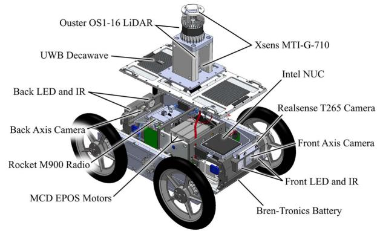  
Fig. 2. Robotic system architecture overview.

Some works in the literature focus on the autonomous or semi-autonomous exploration of environments. For instance, in [31] a human operator selects some points in the environment, and the robot autonomously moves safely towards these points while the map is constructed. In this case, the Dijkstra algorithm plans reference paths used by an artificial vector fields controller [32]. In [12] the authors already point to the robustness properties of this type of controller, a strong motivation for its use in unstructured environments.

## III. ROBOTIC PLATFORM

The EspeleoRobô is a service robot designed to inspect restricted and confined areas, including natural caves, dam galleries, and drain ducts [1]. With reduced dimensions $( 0 . 5 5 \times 0 . 2 5 \times 0 . 1 4 \mathrm { ~ m } )$ and weight (19 kg), and with an IP67 Ingress Protection code, it can move with different locomotion mechanisms that are easily replaced through quick-release pins. During the experiments in this paper, the EspeleoRobô used four wheels for locomotion, as illustrated in Fig. 2.

The robotic platform is equipped with six sets of reduction gears, motors, encoders, and MCD EPOS power drivers from Maxon Motors; 2 Bren-Tronics high-density military batteries; a pair of Axis-P12 HD cameras with LED and IR illumination systems, and a mini PC Intel NUC Core I7 running Robot Operating System (ROS) [33] with Ubuntu 16.04. For communication, the robot has a Ubiquiti Rocket M900 radio system. To sense the surroundings and estimate the robot’s pose, we are employing an Ouster OS1-16 multi-flash LiDAR2 and an Xsens MTi-G-710 GNSS/INS.3

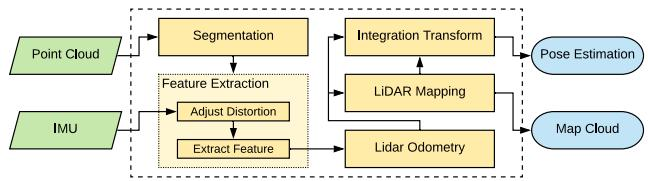  
Fig. 3. System overview of the LeGO-LOAM technique, adapted from [5].

## IV. PROPOSED POSE ESTIMATION AND MAPPING STRATEGY

This section describes the kinematic model used to compute the robot’s wheel odometry, the LiDAR SLAM technique used to estimate its pose and to generate the environment map, and the novel sensory fusion that incorporates wheel odometry with IMU data into the LiDAR SLAM for correction of both estimated pose and map.

## A. Wheel Odometry

Wheel odometry uses the kinematic model and sensor coupled to the wheels, such as encoders, to compute the robot trajectory. The basic idea is to estimate the path traveled by the robot measuring its wheel velocities. In this work, we consider a skid-steering model based in [34] to compute the robot’s linear and angular speeds, given by

$$
\left[ \begin{array} { l } { \upsilon } \\ { \omega } \end{array} \right] = \left[ \begin{array} { c c } { 1 / 2 } & { 1 / 2 } \\ { \frac { 1 } { 2 y _ { I C R } } } & { - \frac { 1 } { 2 y _ { I C R } } } \end{array} \right] \left[ \begin{array} { l } { r \Omega _ { r } } \\ { r \Omega _ { l } } \end{array} \right] ,\tag{1}
$$

where r is the wheel radius, and $\Omega _ { r }$ and $\Omega _ { l }$ are angular speeds of right and left wheels, respectively. The EspeleoRobô instantaneous center of rotation $y _ { I C R } ~ = ~ 0 . 4 3 7$ m was measured using an OptiTrack4 motion tracking system. The estimate of the robot’s position and orientation may be obtained via integration of (1).

## B. LiDAR SLAM

The localization and mapping strategy used in this paper is based on the LiDAR SLAM technique called $L e G O { - } L O A M ^ { 5 }$ [5], a lightweight version of the LOAM method [19] optimized for ground vehicles, adapted for the EspeleoRobô. This approach is lightweight and therefore allows its execution on embedded computers such as the Nvidia Jetson Nano, providing the odometry at 10 Hz and the map at 2 Hz.

According to Fig. 3, the LeGO-LOAM has 5 modules: Segmentation, Features Extraction, LiDAR Odometry, LiDAR Mapping, and Transform Integration. Inputs are the LiDAR raw point cloud and IMU data, while outputs are the robot pose and the environment (point cloud) map.

The point cloud of the LiDAR sensor is initially processed in the Segmentation module, where the points are remapped into a range image, the outliers removed, and the data is segmented. In the Feature Extraction module, the points are separated into two main sets, one for edge points and the other for points belonging to planes, referred to here as planar points.

These features are separated up to a maximum number for edges and planes per range image, discarding the additional features identified in the point cloud.

They are used to calculate the pose between two consecutive sweeps using point-to-edge and point-to-plane matching. In this stage, a two-step Levenberg-Marquardt is applied to estimate different pose components, where the pose is defined as $\mathbf { x } _ { \mathrm { { L } } } = [ x \ y \ z \phi \theta \ y ] ^ { T }$ . Planar points are used to compute the angular displacements of $\phi$ and $\theta ,$ and linear displacement of z. Edge points are used to compute the linear displacements of x and $y ,$ and angular displacement of $\psi .$ The method is similar to the one presented in [19], with an equivalent accuracy while computation time is reduced by about 35% [5].

In this strategy, the pose $\mathbf { X } _ { \mathrm { L } } [ k ]$ estimated by LiDAR odometry and the corresponding set of points L k registered with the Features Extraction module are used by the LiDAR mapping to build the map M k and estimate the pose with respect to the inertial frame, defined as $\mathbf { x } _ { \mathrm { M } } [ k ]$ . The relative pose of the LiDAR odometry given between $\mathbf { X } _ { \mathrm { L } } [ k ]$ and $\mathbf { x } _ { \mathrm { L } } [ k - 1 ]$ is integrated in the pose $\mathbf { x } _ { \mathrm { M } } [ k { - } 1 ]$ to represent the set of points L k with respect to the inertial frame. Thus, correspondences are performed between L k and M k generating the optimized pose $\mathbf { x } _ { \mathrm { M } } [ k ]$ and updating the map $\mathbf { M } [ k - 1 ]$ to M k .

The LiDAR Mapping module saves each set of features in a pose-graph node, also considering the outlier points. The graph’s restriction is given by the relative poses computed using the Levenberg-Marquardt technique. In this stage, the loop closure approach is applied to add restrictions in the graph’s nodes, enabling the correction of the estimated pose and the map. The final output map merges all pose sets of the graph using the Bayes-tree technique [35]. Finally, the poses generated with the LiDAR Odometry and LiDAR Mapping modules are integrated to form the output pose.

## C. EKF-LOAM: Sensor Fusion Integrated With LiDAR SLAM

LiDAR SLAM techniques accumulate significant errors when estimating the device’s position in environments with few geometric features, such as tunnels, galleries, or even extensive and homogeneous corridors. These environments characterize several places in which the EspeleoRobô is supposed to operate. Aiming to correct eventual errors in the odometry and map computation, we use a filter to incorporate the measurement of wheel speed with the IMU data in the LiDAR SLAM. This information is used between the stages of the Back-End and Front-End of the SLAM. Fig. 4 depicts the proposed structure.

In environments with few geometric features, LiDAR odometry presents errors in estimating the pose propagated to the LiDAR mapping, causing misalignment between the set of points L k and the map $\mathbf { M } [ k - 1 ]$ , and generating map deformations and incorrect pose estimations xM k . Therefore, our strategy uses an EKF to correct the pose estimate $\mathbf { X } _ { \mathrm { L } } [ k ]$ by combining LiDAR odometry with wheel odometry and IMU data. Thus, we propose an adaptive covariance matrix for LiDAR odometry according to the number of features identified in the environment. The new corrected pose is used in the mapping module to align the set L k with the map. Likewise, the corrected information is also used to integrate the transformations that generate the estimated output pose. The EKF integrated with the LiDAR SLAM allows to correct the pose estimation and the map in low feature environments.

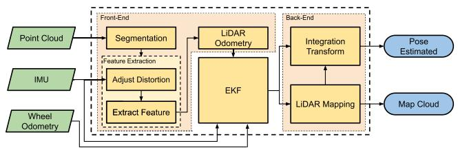  
Fig. 4. System overview of the EKF-LOAM. The extended Kalman filter is integrated between front-end and back-end stages of the LiDAR SLAM technique.

We have implemented the Extended Kalman Filter as a dedicated ROS package using a 12 DoF model to combine measurements from all available sensors. After receiving a message from any sensor, coming from LiDAR odometry, IMU, or wheels odometry, the filter executes the correction stage and publishes odometry messages in timing with the LiDAR odometry data measurement.

The filter state is defined in $\mathbf { x } = [ \mathbf { p } ^ { T } ~ \boldsymbol { \varphi } ^ { T } ~ \mathbf { v } ^ { T } ~ \boldsymbol { \omega } ^ { T } ] ^ { T } \in \mathbb { R } ^ { 1 2 }$ where $\mathbf { p } = [ p _ { x } ~ p _ { y } ~ p _ { z } ] ^ { T }$ and $\boldsymbol { \varphi } = [ \phi \theta \mathrm { \Delta } \psi ] ^ { T }$ are the position and orientation (roll pitch, and yaw) vectors, and $\mathbf { v } = [ \upsilon _ { x } \upsilon _ { y } \upsilon _ { z } ] ^ { T }$ and ${ \boldsymbol { \omega } } = [ \omega _ { x } \ \omega _ { y } \ \omega _ { z } ] ^ { T }$ are the linear and angular velocity vectors, respectively, with respect to the body frame. In the discretized implementation, the predicted state is given by

$$
\begin{array} { r } { \widehat { \bf x } = f ( \widehat { \bf x } , \Delta t ) = \left[ \begin{array} { c } { { \bf p } + { \bf R } ( \varphi ) { \bf v } \Delta _ { t } } \\ { \varphi + { \bf J } ( \varphi ) \omega \Delta _ { t } } \\ { { \bf v } } \\ { \omega } \end{array} \right] , } \end{array}\tag{2}
$$

where $\mathbf { R } ( \varphi ) \in \ S O ( 3 )$ is the rotation matrix, $\mathbf { J } ( \varphi )$ is the Jacobian matrix mapping the angular velocities to the Euler angles’ derivative, and t is the sample time step of the prediction stage. Note that this stage considers constant values for v and ω, that are modified only on the correction stage. Also, the covariance matrix V of the state transition is defined as

$$
\mathbf { V } = { \boldsymbol { \sigma } } _ { f } \ \mathbf { I } _ { 1 2 } ,\tag{3}
$$

where $\sigma _ { f } = 1 . 1 0 ^ { - 3 } ~ \mathrm { m } ^ { 2 }$ is a constant and ${ \mathbf I } _ { 1 2 }$ is the identity matrix. In the prediction stage, the covariance matrix P is propagated according to $\mathbf { P } \gets \mathcal { F } \mathbf { P } \mathcal { F } ^ { T } + \mathbf { V }$ , where $\mathcal { F } \in$ $\mathbb { R } ^ { 1 2 \times 1 2 }$ is the partial derivative of $f ( \cdot )$ with respect to x. The correction stage of wheel odometry uses the linear $v _ { \mathrm { W } , x }$ and angular $\omega _ { \mathrm { w , : } }$ z speeds of the robot, computed via (1), properly calibrated. Hence, the measurement model is given by

$$
h _ { \mathrm { W } } ( \widehat { \mathbf { x } } ) = \left[ \begin{array} { l } { \upsilon _ { x } } \\ { \omega _ { z } } \end{array} \right] .\tag{4}
$$

Similar to [36], two covariance matrices were considered in this paper, one for straight and another for turning motions. Hence, the covariance matrix of the wheel odometry measurement is defined as

$$
\begin{array} { r } { \mathbf { Q } _ { \mathrm { W } } = \mathrm { d i a g } \left( \sigma _ { { \upsilon } _ { \mathrm { w } , x } } ^ { 2 } , \sigma _ { \omega _ { \mathrm { w } , z } } ^ { 2 } \right) , } \end{array}\tag{5}
$$

where $\sigma _ { \upsilon _ { \mathrm { w } , x } } ^ { 2 }$ and $\sigma _ { \omega _ { \mathrm { w } , z } } ^ { 2 }$ take on two different values each, depending on the robot’s angular velocity, such that

$$
\begin{array} { r } { \big ( \sigma _ { v _ { \mathrm { w } , x } } ^ { 2 } , \sigma _ { \omega _ { \mathrm { w } , z } } ^ { 2 } \big ) = \left\{ \begin{array} { l l } { \big ( 5 \cdot 1 0 ^ { - 4 } , 2 . 5 \cdot 1 0 ^ { - 1 } \big ) \mathrm { m } ^ { 2 } , } & { \mathrm { i f ~ } \omega _ { \mathrm { w } , y } > 0 . 2 } \\ { \big ( 3 \cdot 1 0 ^ { - 3 } , 1 . 5 \big ) \mathrm { m } ^ { 2 } , } & { \mathrm { o t h e r w i s e } } \end{array} \right. , } \end{array}
$$

whose values were experimentally estimated.

The correction stage of the IMU uses the angular speed ${ \boldsymbol { \omega } } _ { I } = [ \omega _ { \mathrm { I } , x } ~ \omega _ { \mathrm { I } , y } ~ \omega _ { \mathrm { I } , z } ] ^ { T }$ . Hence, the measurement model of the inertial sensor is given by

$$
h _ { \mathrm { I } } ( \widehat { \bf x } ) = \omega ,\tag{6}
$$

and the covariance matrix is

$$
\begin{array} { r } { \mathbf Q _ { \mathrm { I } } = \mathrm { d i a g } \left( \sigma _ { \omega _ { \mathrm { I } , x } } ^ { 2 } , \sigma _ { \omega _ { \mathrm { I } , y } } ^ { 2 } , \sigma _ { \omega _ { \mathrm { I } , z } } ^ { 2 } \right) , } \end{array}\tag{7}
$$

where $\sigma _ { \omega _ { \mathrm { I } , x } } ^ { 2 } , \sigma _ { \omega _ { \mathrm { I } , y } } ^ { 2 } ,$ , and $\sigma _ { \omega _ { \mathrm { I } , z } } ^ { 2 }$ are the variance of $\omega _ { \mathrm { I } , x } , \ \omega _ { \mathrm { I } , y } ,$ and $\omega _ { \mathrm { I } , z }$ respectively, whose values were given by the manufacturer.

Finally, the correction stage of LiDAR odometry considers indirect measurements of linear and angular velocities, vL and $\omega _ { \mathrm { L } }$ , respectively. They are computed from two consecutive odometry values and the associated time interval $\Delta t _ { \mathrm { L } }$ . Thus, the measurement model of the LiDAR odometry is defined as

$$
h _ { \mathrm { L } } ( \widehat { \mathbf { x } } ) = \left[ \begin{array} { l } { \mathbf { v } } \\ { \omega } \end{array} \right] .\tag{8}
$$

Indirect measurements vL and ωL of the LiDAR odometry are computed as:

$$
\begin{array} { r } { \left[ \mathbf { \sigma } _ { \mathrm { { L } } } ^ { \mathbf { v } _ { \mathrm { L } } } \right] = \left[ \begin{array} { c c } { \mathbf { R } ( \varphi _ { \mathrm { L } , k - 1 } ) ^ { T } } & { \mathbb { O } _ { 3 \times 3 } } \\ { \mathbb { O } _ { 3 \times 3 } } & { \mathbf { J } ( \varphi _ { \mathrm { L } , k - 1 } ) ^ { - 1 } } \end{array} \right] \left[ \boldsymbol { \Delta } \mathbf { p } _ { \mathrm { L } } \right] \frac { 1 } { { \boldsymbol \Delta } t _ { \mathrm { L } } } , } \end{array}\tag{9}
$$

where $\Delta \mathbf { p } _ { \mathrm { { I } } }$ and $\Delta \varphi _ { \mathrm { L } }$ are the position and orientation variation between the current and last measurement of the LiDAR odometry. Also, the covariance matrix $\mathbf { Q } _ { \mathrm { L } }$ is given by:

$$
\begin{array} { r } { \mathbf { Q } _ { \mathrm { L } } = \mathrm { d i a g } \left( \mathbf { g } _ { x } , \mathbf { g } _ { y } , \mathbf { g } _ { z } , \mathbf { g } _ { \phi } , \mathbf { g } _ { \theta } , \mathbf { g } _ { \psi } \right) \boldsymbol { \xi } ( n _ { e } , n _ { p } ) , } \end{array}\tag{10}
$$

where $\begin{array} { r } { \mathtt { g } _ { x } = 4 . 8 \cdot 1 0 ^ { - 3 } , \mathtt { g } _ { v } = 2 . 2 \cdot 1 0 ^ { - 3 } , \mathtt { g } _ { z } = 1 . 6 \cdot 1 0 ^ { - 3 } } \end{array}$ ${ \tt g } _ { \phi } = 4 . 4 \cdot 1 0 ^ { - 3 } , { \tt g } _ { \theta } = 5 . 2 \cdot 1 0 ^ { - 3 } \mathrm { a n d } { \tt g } _ { \psi } = 5 \cdot 1 0 ^ { - 3 }$ are constants obtained experimentally, and $\xi ( n _ { e } , n _ { p } )$ is a function of the number of features associations used in the LiDAR odometry step, such at

$$
\xi ( n _ { e } , n _ { p } ) = \left( \frac { \ln _ { e } - \operatorname * { m i n } ( \ln _ { e } , n _ { e } ) } { \ln _ { e } } \right) \left( \frac { \ln _ { p } - \operatorname * { m i n } ( \ln _ { p } , n _ { p } ) } { \ln _ { p } } \right) + \xi _ { m i n } ,\tag{11}
$$

where $n _ { e }$ and $n _ { p }$ are the number of identified edge and planar features, respectively, $\mathrm { ~ n ~ e ~ } = ~ 5 0 0$ and $ { \mathrm { ~ n ~ } } _ { p } ~ = ~ 5 0 0 0$ are the maximum values for the quantity of edge and planar points used in our experiments, and $\xi _ { m i n } = 0 . 0 0 5$ is a lower bound for the function $\xi ( \cdot )$ . Generally speaking, as the number of features decreases, the error in the pose estimation provided by a LiDAR SLAM technique increases [26]. The function $\xi ( n _ { e } , n _ { p } )$ linearly approximates the maximum value of $1 + \xi _ { m i n }$ as $n _ { e }$ and $n _ { p }$ tends to zero, and goes to $\xi _ { m i n }$ as $n _ { e }$ and $n _ { p }$ tends to ${ \mathbb { n } } _ { e }$ and $\mathbb { n } _ { b } .$ , respectively. Based on this, the function $\xi ( n _ { e } , n _ { p } )$ corresponds to a heuristic used to increase the covariance matrix $\mathbf { Q } _ { \mathrm { L } }$ as the number of detected features decreases.

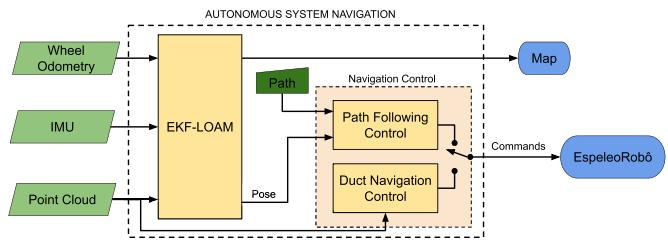  
Fig. 5. High-level diagram of the proposed navigation control system with two different strategies. The path follow control considers the pose estimated by EKF-LOAM, and the duct navigation control uses LiDAR sensor measurements only.

Since the LeGO-LOAM calculates each component of the LiDAR odometry using different features, as explained in Section IV-B, the covariance matrix has been adapted to:

$$
\begin{array} { r } { \mathbf { Q } _ { \mathrm { L } } = \mathrm { d i a g } \left( \mathbf { g } _ { x } \boldsymbol { \gamma } , \ \mathbf { g } _ { y } \boldsymbol { \gamma } , \ \mathbf { g } _ { z } \boldsymbol { \zeta } , \ \mathbf { g } _ { \phi } \boldsymbol { \zeta } , \ \mathbf { g } _ { \theta } \boldsymbol { \zeta } , \ \mathbf { g } _ { \psi } \boldsymbol { \gamma } \right) , } \end{array}\tag{12}
$$

where $\gamma$ and $\zeta$ are two particular cases of $\xi$ in which $\gamma =$ $\xi ( n _ { e } , 0 )$ and $\zeta = \xi ( 0 , n _ { b } )$ .

The prediction stage of the filter runs at a frequency of 200 Hz. The correction stages are executed in the same frequency as the associated measurements: wheel odometry is available at 20 Hz, IMU at 100 Hz, and LiDAR odometry at 10 Hz. The filter publishes an odometry message every time a correction is performed with the LiDAR odometry. This message includes the estimated pose and velocities, as well as the associated values of the covariance matrix estimated by the filter.

Note that the Kalman filter only receives correction on the velocity states. Thus, over time it is natural that its pose output accumulates error with respect to the robot’s actual pose due to the integration process in the prediction stage. However, the final blocks of the whole algorithm use the pose increment of the filter in the algorithm that fits the point cloud to the map. Thus, even with the EKF accumulating pose errors over time, the pose estimated by the Integration Transform block (Figure 4) is not affected. In fact, the output of the Lidar Odometry block considered in the LeGO-LOAM algorithm also suffers from this issue, but it is noisier and is significantly affected by over/underestimation effects.

## V. NAVIGATION CONTROL STRATEGIES

The performed experiments use the proposed SLAM strategy and a navigation control method based on artificial vector fields. The navigation control method generates artificial vector fields pointing to the reference path, which defines reference velocities for the robot to follow the path. The first strategy considers the pose estimated using the SLAM method as feedback to follow the reference path, and the second one only uses LiDAR measurements to move the robot inside a duct, keeping a fixed distance from the walls. The high-level diagram of the proposed navigation system is depicted in Fig. 5.

In order to control the robot, we use a path controller based on artificial vector fields [32], which considers a curve that the robot must follow defined by the zero level set of a scalar function $\alpha ( x , y )$ . Given the current robot’s position p, the vector field $\mathbf { F } ( \mathbf { p } ) : \mathbb { R } ^ { 2 } {  } \mathbb { R } ^ { 2 }$ is a function that returns a reference F to be followed. The vector field solves the navigation problem, since we attempt to impose $\dot { \mathbf { p } } = \mathbf { F } ( \mathbf { p } )$ . Fig. 6 shows an example scenario with a reference curve (in black) defined for circumnavigating a pillar. In blue is the vector field generated by the technique used in our experiments.

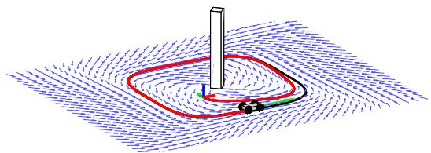  
Fig. 6. Illustration of the vector field control strategy used in this work. The blue vectors represent the field F, and the red line illustrates the robot path converging to the reference curve in black.

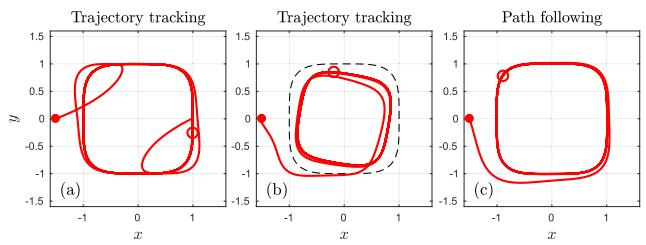  
Fig. 7. Comparison between trajectory tracking and path following controllers. Trajectory transient problem (left); Trajectory saturation problem (center); and path following (right) unharmed by the previous issues.

Now, consider $a ( x , y )$ is such that $\alpha > 0 \mathrm { i f } ( x , y )$ is outside the curve and $\boldsymbol { \alpha } < 0 \mathrm { i f } ( x , y )$ is inside the curve. Based on [32], the vector field F(p) is given by

$$
\mathbf { F } ( x , y ) = \upsilon _ { d } k _ { G } ( \alpha ) \frac { \nabla \alpha } { \| \nabla \alpha \| } + \upsilon _ { d } k _ { H } ( \alpha ) \frac { \nabla _ { H } \alpha } { \| \nabla \alpha \| } ,\tag{13}
$$

in which $\upsilon _ { d }$ is a reference velocity for the robot, $k _ { G } ( \alpha ) =$ $- ( 2 / \pi )$ atan $( k _ { f } \alpha )$ where $k _ { f }$ is a positive gain, and $k _ { H } ~ =$ $\sqrt { 1 - k _ { G } ^ { 2 } }$ . Also, $\nabla \alpha$ is the gradient of $\alpha$ and $\nabla _ { H } a$ is the Hamiltonian field of $a , i . e .$ the vector $\nabla \alpha$ rotated by $9 0 ^ { \circ }$

It is important to emphasize that the vector field is a path controller, not a trajectory controller. Note that $\mathbf { F } ( \mathbf { p } )$ depends only on the robot’s position. In a trajectory controller, we have a reference point ${ \bf p } _ { r } ( t )$ and a control law $\dot { \textbf { p } } = \textbf { u } ( \mathbf { p } , \mathbf { p } _ { r } )$ Since ${ \bf p } _ { r } ( t )$ is a function of time, law u also depends on time. By using a path controller, we seek control robustness regarding failures on the robot motion.

To illustrate some of the path-following advantages, Fig. 7 presents simulation results in which three common practical failures were induced. The first one is when the initial position of the robot is far from the reference for tracking. The second is when the robot stops for some time interval; this problem can be illustrated by a wheeled robot slipping. The third is when the controllers of the actuators are saturated. Figure 7a shows a response of trajectory tracking for the first two possible problems. They correspond to undesirable transient behaviors when the initial reference is far from the robot or when the robot returns to move after a motion failure. Figure 7b shows the third issue, also for trajectory tracking, when there is a saturation of the input velocity. When the robot’s maximum velocity is smaller than the velocity of the reference, the vehicle tends to perform a trajectory with a higher curvature radius and consequently does not follow the desired curve strictly. Figure 7c shows how the path controller passes through these failures without any problem in the curve following.

## A. Path Following Approach

In this work, we consider reference curves represented by the zero level set of a function $\alpha ( x , y )$ defined as

$$
\alpha ( x , y ) = \bigg [ \bigg ( \frac { x - c _ { x } } { a } \bigg ) ^ { n } + \bigg ( \frac { y - c _ { y } } { b } \bigg ) ^ { n } \bigg ] ^ { \frac { 1 } { n } } - 1 ,\tag{14}
$$

where $[ c _ { x } , c _ { y } ] ^ { T }$ is the center of the shape, and a and b define the size of the curve in the directions x and $y ,$ respectively. The parameter n is an even positive number that defines the curve’s shape. For instance, $n = 2$ gives an ellipse, while $n =$ 4 defines the curve illustrated in Fig. 6. The robot’s localization is provided by the SLAM system described in Section IV.

The vector field methodology resumed in Eq. (13) provides a reference velocity for the robot. Now it is necessary to compute the linear v and angular ω speeds. Since we are dealing with a nonholonomic robot, it is impossible to compute signals v and ω such that the robot always performs the velocity F given by the vector field. To deal with this lowerlevel control, we use Feedback Linearization [37]. It computes the necessary vand ω to make a point at a distance d in front of the robot to have the velocity $\mathbf { F } ,$ such as

$$
{ \left[ \begin{array} { l } { \upsilon } \\ { \omega } \end{array} \right] } = { \left[ \begin{array} { l l } { \cos ( \psi ) } & { \sin ( \psi ) } \\ { - { \frac { \sin ( \psi ) } { d } } } & { { \frac { \cos ( \psi ) } { d } } } \end{array} \right] } { \left[ \begin{array} { l } { F _ { x } } \\ { F _ { y } } \end{array} \right] } .\tag{15}
$$

We used $d = 0 . 2$ m in the control of the EspeleoRobô.

## B. Structure Following Approach

The proposed vector field methodology can control the robot to follow a duct/tunnel allowing autonomous mapping. We can apply the methodology without knowing the vehicle’s global position, with only local information provided by the LiDAR. We consider a scenario similar to Fig. 8, where the robot can sense the left and right walls of the tunnel (gray), and it is possible to define a straight reference path (in blue) that is at a distance  from the wall that is on the left of the robot. In orange, we depict the LiDAR beams on the left of the local frame (positive y).

Assume the world frame ${ \mathcal { F } } _ { 0 } .$ , whose x axis is aligned with the tunnel, and y axis getting into the wall. A simple α function representing the straight line at a distance  from the wall is

$$
\alpha ( x , y ) \equiv \alpha ( y ) = \epsilon + y .\tag{16}
$$

The vector field in $\operatorname { E q . }$ (13), computed with the function α in Eq. (16), can be written as

$$
\mathbf { F } = \upsilon _ { d } k _ { G } \left[ \mathbf { \Phi } _ { 1 } ^ { 0 } \right] + \upsilon _ { d } k _ { H } \left[ \mathbf { \Phi } _ { 0 } ^ { 1 } \right] = \upsilon _ { d } \left[ \begin{array} { l } { k _ { H } ( \alpha ) } \\ { k _ { G } ( \alpha ) } \end{array} \right] .\tag{17}
$$

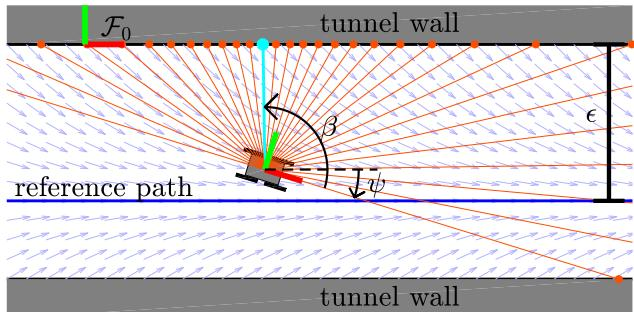  
Fig. 8. Illustration of the vector field technique applied to make the robot follow a wall (gray), relying only on local information obtained from LiDAR (orange lines). The blue line represents the reference path, and the cyan line illustrates the laser beam with the shortest distance to the wall.

Let $x _ { b } , y _ { b }$ be the distances measured by each laser beam of the LiDAR in the local frame of the robot. Then, the following two local coordinates can be easily computed

$$
\delta = \operatorname * { m i n } _ { y _ { b } > 0 } \sqrt { x _ { b } ^ { 2 } + y _ { b } ^ { 2 } } , \qquad \beta = \mathrm { a t a n } 2 ( y _ { b } ^ { * } , x _ { b } ^ { * } ) .\tag{18}
$$

The value $\delta$ corresponds to the distance between the robot and the left wall (cyan beam in Fig. 8), while $\beta$ is the angle of the correspondent beam in the local frame of the robot, computed from the optimizers of the minimization problem $( x _ { b } ^ { * }$ and $y _ { b } ^ { * } )$

The y coordinate and the yaw angle ψ of the robot with respect to the frame $\mathcal { F } _ { 0 }$ can be computed as:

$$
y = - \delta , \qquad \psi = \frac { \pi } { 2 } - \beta .\tag{19}
$$

Note that the x coordinate cannot be computed from the local measurements δ and $\beta .$ However, the function α in Eq. (16) does not depend on x, meaning that the vector field is invariant to displacements on x.

With y we can compute the vector field F in Eq. (17), and with $\psi$ we can compute the feedback linearization law defined in Eq. (15). Therefore, only by knowing the local coordinates δ and $\beta$ is it possible to compute the linear v and angular ω velocities necessary to make the robot follow the wall at a constant distance . The control law implementation does not depend on measurements with respect to the $\mathcal { F } _ { 0 }$ frame, which is only considered during the controller design. This is important to guide the robot without the necessity of odometry or a map. Thus, the proposed control is robust to many common problems in map generation, such as imperfections and delays.

## VI. EXPERIMENTS AND RESULTS

To evaluate the adaptive fusion of LiDAR SLAM with wheel odometry and IMU, we performed simulations and real-world experiments in representative confined spaces. The first set of experiments with the EspeleoRobô were performed in indoor scenarios at the UFMG School of Engineering (located in Belo Horizonte - MG, Brazil), allowing us to verify the indoor localization and mapping performance combined with the vector field navigation control. The subsequent experiments focus on environments with few geometric features. For this, we developed one virtual scenario representing a circular duct with

300m in length. This virtual section was imported into the EspeleoRobô simulator, implemented using the CoppeliaSim6 integrated with ROS [38]. The results allow us to compare the localization techniques with the ground truth provided by the simulator. Finally, we validate our proposed sensor fusion strategy at a real deactivated underground tunnel with scarce geometric features in Sabará - Brazil. Videos illustrating the results of the proposed EKF-LOAM and the experiments are available online.7

To compare the position estimated by our approach against other LiDAR SLAM techniques, we have proposed four metrics. Thus, consider p k as an element of a list $\mathcal { P }$ with N points representing the robot’s course. The first metric $\mathcal { M } _ { d i s t }$ compares the robot’s traveled path with the reference distance $l _ { m a x }$ and is given by

$$
\mathcal { M } _ { d i s t } = \left| \sum _ { k = 1 } ^ { N - 1 } \| \mathbf { p } [ k + 1 ] - \mathbf { p } [ k ] \| - l _ { m a x } \right| l _ { m a x } - 1 .\tag{20}
$$

It is important to note that the reference distance $l _ { m a x }$ can be measured manually, $\mathrm { e . g . }$ using a measuring tape, in case of simple movements such as straight lines. The following proposed metrics require further reference information, and here are evaluated considering simulation ground-truth data.

The second metric $\mathcal { M } _ { e n d }$ measures the distance between estimated and ground-truth $\mathbf { p } _ { g t } [ N ]$ final positions and is given by:

$$
\mathcal { M } _ { e n d } = \| \mathbf { p } [ N ] - \mathbf { p } _ { g t } [ N ] \| .\tag{21}
$$

The third metric $\mathcal { M } _ { p }$ gives the mean error between estimated position components (x, y, or z) and ground-truth

$$
\mathcal { M } _ { p } = \frac { 1 } { N } \sum _ { k = 1 } ^ { N } | p [ k ] - p _ { g t } [ k ] | ,\tag{22}
$$

where $p$ may represent each component $( x , y , z )$ of p[k].

Finally, the fourth metric $\mathcal { M } _ { \varphi }$ computes the estimated orientation mean error with respect to the ground-truth

$$
\mathcal { M } _ { \varphi } = \mathrm { a t a n 2 } \left( \overline { { S } } , \overline { { C } } \right) ,\tag{23}
$$

where $\varphi$ may represent each of the angles $\phi ,$ θ, or $\psi _ { : }$ , and $\overline { S }$ and $\overline { { C } }$ are defined as

$$
\overline { { S } } = \frac { 1 } { N } \sum _ { k = 1 } ^ { N } | \sin ( \varphi [ k ] - \varphi _ { g t } [ k ] ) | ,\tag{24}
$$

$$
\overline { { C } } = \frac { 1 } { N } \sum _ { k = 1 } ^ { N } | \cos ( \varphi [ k ] - \varphi _ { g t } [ k ] ) | .\tag{25}
$$

## A. Indoor Experiments

The indoor experiments took place at the UFMG School of Engineering main building, inside the auditorium hall and the inner courtyard. These environments have many geometric features, including doors, windows, in addition to benches, vegetation, pillars, among others. Still, the auditorium hall has two floors, connected through an inclined and long access corridor with few geometric features. Figure 9 illustrates the Google map 3D reconstruction of the building, together with 3 internal views.

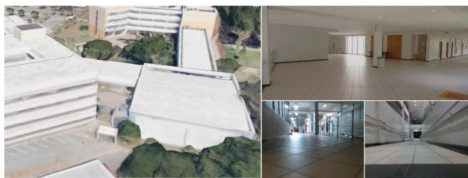  
Fig. 9. School of Engineering main building, including a 3D Google map reconstruction and 3 internal views.

1) Navigation Control Experiment: For autonomous navigation in the auditorium hall, the proposed EKF-LOAM method feedbacks the vector field controller described in Section V-A. The target curve is represented by the α function in Eq. (14) with a 3.6 m, b 3.6 m, $c _ { x } = 1 . 5$ m, $c _ { y } = 1 . 2$ m, and n  4. The $k _ { G } ( \alpha )$ function gain was set as $k _ { f } = 2$ . The origin corresponds to the robot’s initial position.

Figure 10 illustrates the localization estimations obtained with the LeGO-LOAM in red, wheel odometry with IMU data in black, and EKF-LOAM in blue. The integrated pose of the LeGO-LOAM technique presents elevated noise, although it is well scaled and does not accumulate errors over time. It is possible to note that the wheel odometry diverges over time. The novel fusion approach incorporates the advantages of both techniques combining smooth estimations with no accumulation of errors, resulting in superior results with respect to the wheel odometry with IMU data and the LeGO-LOAM.

Figure 11 shows the variances associated with inputs of the EKF. Note that, given the square-like shape of the curve, the robot switches between straight and curved movements. This reflects in the variance $\sigma _ { \upsilon _ { \mathrm { w } , x } } ^ { 2 }$ of the wheel odometry, in orange, which increases in curves. Due to the closed geometric form of the auditorium hall and the 360-degree angle of the LiDAR sensor, the adaptive variance associated with the linear velocity from the LiDAR odometry $( \sigma _ { ^ { \upsilon _ { \mathrm { L } , x } } } ^ { 2 } )$ did not present a significant variation, with values smaller than $\sigma _ { { \upsilon _ { \mathrm { w } , x } } } ^ { 2 }$ during both straight and curved movements. In the bottom frame, we see that the fixed variance of the IMU’s gyro is significantly smaller than the ones from the LiDAR odometry.

The EKF-LOAM output map is shown in Fig. 12. Note that the environment has significant geometric features, with an average of 239 edge and 2941 plane features detected by the LiDAR SLAM technique in each sensor scan.

2) Indoor Mapping in a Multi-Level Environment: We also evaluate the proposed sensor fusion strategy for localization and mapping in a multi-level environment. For that, the EspeleoRobô was teleoperated inside the auditorium hall, starting on the lower floor and crossing the access corridor until reaching the upper floor.

Figure 13 presents the position results, with both LeGO-LOAM (red) and EKF-LOAM (blue) estimating almost the same course until the access corridor located at position $x = 9 . 7 1$ m, $y = 2 5 . 9$ m. After that, the LiDAR odometry underestimates the traveled path, resulting in a difference of 8.82 m at the end of the experiment. It is possible to observe that the wheel odometry with IMU diverges, similar to the navigation control experiment.

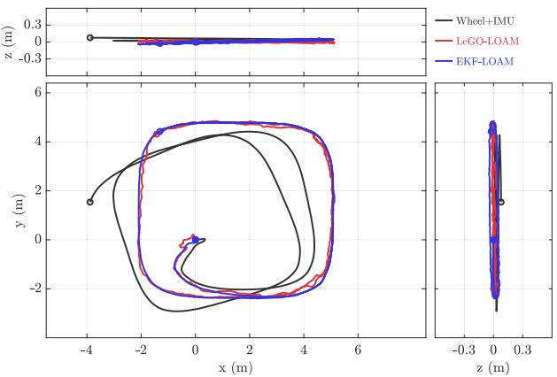  
Fig. 10. Paths estimated by wheel odometry with IMU data, LeGO-LOAM and EKF-LOAM during the navigation control experiment. Note that the EKF-LOAM incorporates both advantages of the wheel odometry (smooth path) and LeGO-LOAM (no accumulative errors).

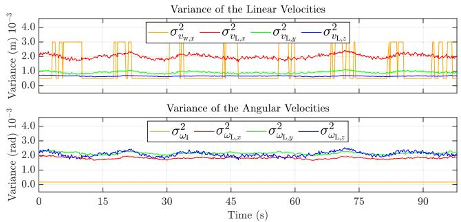  
Fig. 11. Variance of linear and angular velocities during navigation control experiment. The first graph shows the variance of linear velocities of wheel odometry $\sigma _ { { \upsilon } _ { \mathrm { w } , x } } ^ { 2 }$ (orange) and LiDAR odometry $\sigma _ { ^ { D } \mathrm { L } , x } ^ { 2 } ~ ( \mathrm { r e d } ) , \sigma _ { ^ { D } \mathrm { L } , y } ^ { 2 }$ (green), and $\sigma _ { \upsilon _ { \mathrm { L } , z } } ^ { 2 }$ (blue). The second graph illustrates the variance of angular velocities of Inertial sensor $\sigma _ { \omega _ { \mathrm { I } , z } } ^ { 2 }$ (orange) and LiDAR odometry $\sigma _ { \omega _ { \mathrm { L } , x } } ^ { 2 }$ (red), $\sigma _ { \omega _ { \mathrm { L } , y } } ^ { 2 }$ (green) and $\sigma _ { \omega _ { \mathrm { L } , z } } ^ { 2 }$ (blue). The variances $\sigma _ { ^ { \upsilon _ { \mathrm { L } , x } } } ^ { 2 } , \sigma _ { ^ { \upsilon _ { \mathrm { L } , y } } } ^ { 2 }$ in the first graph and $\sigma _ { \omega _ { \mathrm { L } , z } } ^ { 2 }$ in the second graph are computed using the heuristic $\gamma \left( n _ { e } \right)$ . Likewise, the variance $\sigma _ { { \upsilon } _ { \mathrm { L } . } } ^ { 2 }$ in the first graph and $\sigma _ { \omega _ { \mathrm { L } , x } } ^ { 2 }$ and $\sigma _ { \omega _ { \mathrm { L } , y } } ^ { 2 }$ in the second graph adopt the heuristic $\zeta ( n _ { p } )$ . Thus, these two groups of curves present similar profiles.

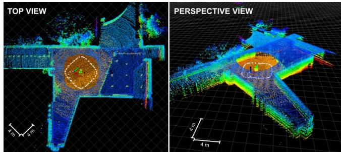  
Fig. 12. Mapping results in the Engineering School (UFMG) auditorium hall using the EKF-LOAM during the navigation control experiment.

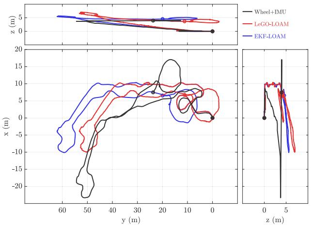  
Fig. 13. Paths estimated by wheel odometry and IMU data, LeGO-LOAM and EKF-LOAM during indoor mapping in a multi-level environment. Starting from the graph origin, the EKF-LOAM and LeGO-LOAM covered a similar course until the point (9.71, 25.9) m. After that, LeGO-LOAM underestimated the traveled path in the access corridor, resulting in a difference of 8.82 m at the end of the experiment.

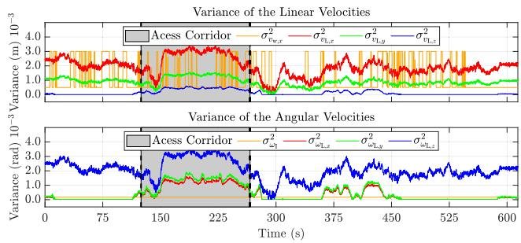  
Fig. 14. Variance of linear and angular velocities during indoor mapping in a multi-level environment. The first graph shows the variance of linear velocities of wheel odometry $\sigma _ { v _ { \mathrm { w } , x } } ^ { 2 }$ (orange) and LiDAR odometry $\sigma _ { \upsilon _ { \mathrm { L } , x } } ^ { 2 }$ (red), $\sigma _ { ^ { b _ { \mathrm { L } , y } } } ^ { 2 }$ (green), and $\sigma _ { \upsilon _ { \mathrm { L } , z } } ^ { 2 }$ (blue). The second graph illustrates the variance of angular velocities of the Inertial sensor $\sigma _ { \omega _ { \mathrm { I } , z } } ^ { 2 }$ (orange) and LiDAR odometry $\sigma _ { \omega _ { \mathrm { L } , . } } ^ { 2 }$ (red), $\sigma _ { \omega _ { \mathrm { L } , y } } ^ { 2 }$ (green) and $\sigma _ { \omega _ { \mathrm { L } , : } } ^ { 2 }$ (blue). It is possible to note the similar profiles of curves $\sigma _ { \upsilon _ { \mathrm { L } , x } } ^ { 2 } , \sigma _ { \upsilon _ { \mathrm { L } , y } } ^ { 2 } , \sigma _ { \omega _ { \mathrm { L } , z } } ^ { 2 }$ computed with γ (ne), and $\sigma _ { ^ { \upsilon _ { \mathrm { L } , z } } } ^ { 2 } , \sigma _ { \omega _ { \mathrm { L } , x } } ^ { 2 } .$ $\sigma _ { \omega _ { \mathrm { L } , y } } ^ { 2 }$ calculated using $\zeta ( n _ { p } )$ . The gray region between the two dashed lines represents the access corridor.

The LiDAR SLAM, even in an environment rich in geometric features with an average detection of 437 edge and 3132 plane features, presents underestimating problems while crossing the corridor, reaching minimum values of 288 edge and 1887 plane features. The fusion with wheel odometry allows the correction of both the estimated pose and final map. The effects can be noticed in Fig. 13, where the EKF-LOAM estimates a more realistic course performed by the robot, especially regarding the obtained values in z axis. In fact, the height difference between floors is around 5 m, as observed in the z component of the odometry estimated integrating the wheel odometry and IMU data to the LiDAR SLAM.

Figure 14 clearly shows how the adaptive variances of LiDAR odometry change throughout the experiment. In the first part of the graphs, before the access of the corridor, the robot passes through the auditorium lower floor. In the gray area of the graphs, the robot moves in the access corridor, and in the last part of the graph the robot is on the upper floor of the auditorium. In the gray area, the linear velocity variance of the LiDAR odometry presented values greater than the major variance value of the linear velocity of the wheel odometry. It shows that the adaptive variances were functional, indicating that in this part of the experiment, wheel odometry was effective in solving the underestimation problem. On the other hand, the variance of the LiDAR odometry angular velocities presented values lower than the variances of the IMU for almost the entire experiment. Note that the red $( \sigma _ { \upsilon _ { \mathrm { L } , x } } ^ { 2 } )$ and green $( \sigma _ { \upsilon _ { \mathrm { L } , y } } ^ { 2 } )$ curves in the first graph and the blue $( \sigma _ { \omega _ { \mathrm { L } , z } } ^ { 2 } )$ curve in the second graph are computed using the heuristic $\gamma \left( n _ { e } \right)$ that depends on edge features. Similarly, the blue curve $( \sigma _ { \upsilon _ { \mathrm { L } , z } } ^ { 2 } )$ in the first graph and the red $( \sigma _ { \omega _ { \mathrm { L } , x } } ^ { 2 } )$ and green $( \sigma _ { \omega _ { \mathrm { L } , y } } ^ { 2 } )$ curves in the second graph also adopt the heuristic $\zeta ( n _ { p } )$ based on the planar features. Thus, these two groups of curves present similar profiles, with different values due to the gains gx , gy, gz, gφ, gθ and $\operatorname { g } _ { \psi }$

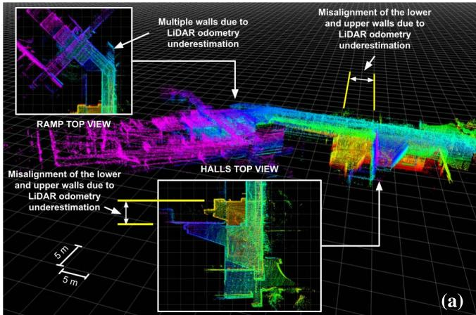

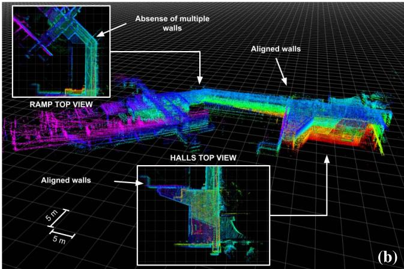  
Fig. 15. Mapping results in the Engineering School (UFMG) auditorium hall using: (a) LeGO-LOAM, and (b) EKF-LOAM. The LeGO-LOAM underestimation of the robot’s displacement results in a misalignment between the lower and upper floors walls of $\approx 9$ m and multiple representations of the same walls, as shown in subfigure (a). These errors are corrected by EKF-LOAM, as presented in subfigure (b).

Figure 15 illustrates the maps computed with the LeGO-LOAM and EKF-LOAM strategies. Note that the LeGO-LOAM position estimation error of 8.82 m results in a misalignment between the lower and upper floors walls of $\approx 9$ m, as indicated in Fig. 15a. It is also possible to observe multiple representations of the same wall, another problem caused by the LiDAR odometry underestimating error. These errors are corrected with the EKF-LOAM, as shown in Fig. 15b, aligning the walls of both floors and eliminating multiple representations of the same wall.

## B. Simulation in a Virtual Duct

To compare the localization and mapping strategies in confined environments with few geometric features, we perform a simulation in a virtual circular duct (Fig. 16) with ≈ 300 m length. The circular duct corresponds to an even more challenging environment for LiDAR SLAM techniques with no reference planes. The control strategy described in Section V-B commands the EspeleoRobô to navigate in the virtual scenario, traveling a total of 209 m covering straight and curved segments.

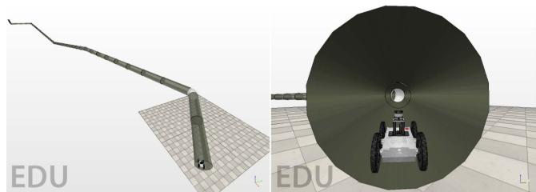  
Fig. 16. Circular duct scenario used in the simulation.

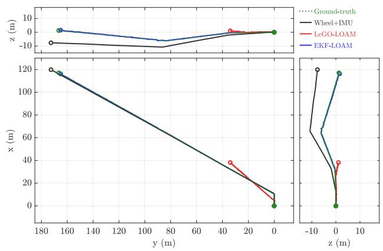  
Fig. 17. Paths estimated by wheel odometry and IMU data, LeGO-LOAM and EKF-LOAM while navigating in a virtual circular duct.

We use the proposed metrics $\mathcal { M } _ { d i s t } , \mathcal { M } _ { e n d } , \mathcal { M } _ { p } .$ , and $\mathcal { M } _ { \varphi }$ to compare the different localization techniques, computed with respect to the simulator’s ground-truth pose.

The simulation results of the robot moving in the virtual circular duct can be seen in Figs. 17 and 19. The metrics results are summarized in Table I.

In this scenario, the LiDAR SLAM technique identifies an average of 36 edge features, corresponding to the unions between the duct segments, and 1279 plane features. The few geometric features impact the LeGO-LOAM performance, presenting an error of 74.19% regarding the traveled distance $( \mathcal { M } _ { d i s t } )$ , and a difference of 154.35 m between the final estimated position and the ground truth $( \mathcal { M } _ { e n d } )$ . Figure 18 shows the adaptive variances associated to this experiment. Since the duct is homogeneous, and the simulation is not prone to actual sensor noise, the computed variances of the LiDAR odometry are relatively high and constant compared with wheel odometry and IMU. Again, there is an underestimation of the pose components x, y, and ψ due to the low number of edge features. The wheel odometry presents promising results, allowing the EKF-LOAM to correct the pose estimations and obtain an error of 1.55% with respect to the traveled distance $( \mathcal { M } _ { d i s t } )$ and a 1.728 m difference between the final estimated position and the ground truth $( \mathcal { M } _ { e n d } )$

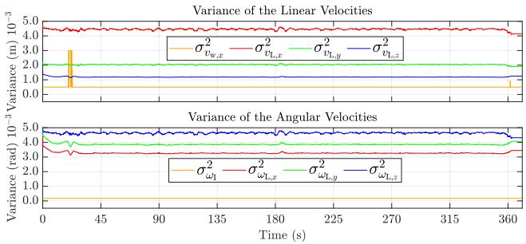  
Fig. 18. Variance of linear and angular velocities while navigating in a virtual circular duct. The first graph shows the variance of linear velocities of wheel odometry $\sigma _ { v _ { \mathrm { w } , x } } ^ { 2 }$ (orange) and LiDAR odometry $\sigma _ { ^ { \upsilon } \mathrm { L } , x } ^ { 2 } ~ ( \mathrm { r e d } ) , \sigma _ { ^ { \upsilon } \mathrm { L } , y } ^ { 2 }$ (green), and $\sigma _ { \upsilon _ { \mathrm { L } , z } } ^ { 2 }$ (blue). The second graph illustrates the variance of angular velocities of Inertial sensor $\sigma _ { \omega _ { \mathrm { I } , z } } ^ { 2 }$ (orange) and LiDAR odometry $\sigma _ { \omega _ { \mathrm { L } , x } } ^ { 2 }$ (red), $\sigma _ { \omega _ { \mathrm { L } , \mathrm { 1 } } } ^ { 2 }$ (green) and $\sigma _ { \omega _ { \mathrm { L } , } } ^ { 2 }$ (blue). It is possible to note the similar profiles of curves ,z $\sigma _ { { \upsilon } _ { \mathrm { L } , x } } ^ { 2 } , \sigma _ { { \upsilon } _ { \mathrm { L } , y } } ^ { 2 } , \sigma _ { \omega _ { \mathrm { L } , z } } ^ { 2 }$ computed with $\gamma \left( n _ { e } \right)$ , and $\sigma _ { { \upsilon } _ { \mathrm { L } , z } } ^ { 2 } , \sigma _ { \omega _ { \mathrm { L } , x } } ^ { 2 } , \sigma _ { \omega _ { \mathrm { L } , y } } ^ { 2 }$ calculated using $\zeta ( n _ { p } )$

TABLE I  
POSE ESTIMATION RESULTS OBTAINED BY WHEEL ODOMETRY WITH IMU, LEGO-LOAM AND EKF-LOAM IN A VIRTUAL CIRCULAR DUCT
<table><tr><td>Metrics</td><td>Wheel+IMU</td><td>LeGO-LOAM</td><td>EKF-LOAM</td></tr><tr><td> $\overline { { \mathcal { M } _ { d i s t } } }$  [%]</td><td>2.89</td><td>74.19</td><td>1.55</td></tr><tr><td> $\mathcal { M } _ { e n d }$  [m]</td><td>11.083</td><td>154.353</td><td>1.728</td></tr><tr><td> $\mathcal { M } _ { x } [ \mathrm { m } ]$ </td><td>0.216</td><td>39.479</td><td>0.038</td></tr><tr><td> $\mathcal { M } _ { y } [ \mathrm { m } ]$ </td><td>0.494</td><td>62.460</td><td>0.029</td></tr><tr><td>Mz[m]</td><td>4.212</td><td>2.327</td><td>0.038</td></tr><tr><td> $\mathcal { M } _ { \phi } [ ^ { \circ } ]$ </td><td>0.637</td><td>3.171</td><td>0.432</td></tr><tr><td> $M _ { \theta } [ ^ { \circ } ]$ </td><td>0.202</td><td>2.085</td><td>0.413</td></tr><tr><td> $\mathcal { M } _ { \psi } [ ^ { \circ } ]$ </td><td>0.082</td><td>11.482</td><td>0.376</td></tr></table>

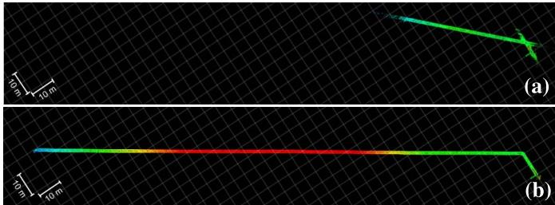  
Fig. 19. Mapping results in a virtual circular duct using: (a) LeGO-LOAM, and (b) EKF-LOAM.

Figure 19a presents errors in the map generated with LeGO-LOAM due to the underestimation of LiDAR odometry.

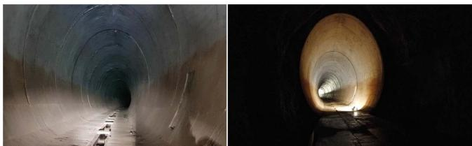  
Fig. 20. Mapping experiments in a deactivated tunnel in Sabará, Brazil.

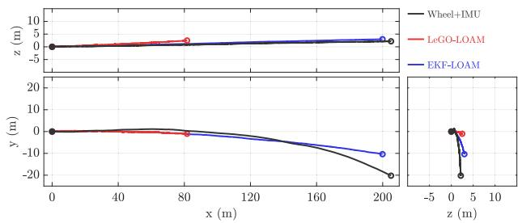  
Fig. 21. Paths estimated by wheel odometry and IMU data, LeGO-LOAM and EKF-LOAM while navigating in a deactivated tunnel.

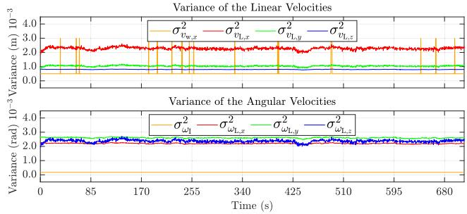  
Fig. 22. Variance of linear and angular velocities while navigating in a deactivated tunnel. The first graph shows the variance of linear velocities of wheel odometry $\sigma _ { { \upsilon } _ { \mathrm { w } , x } } ^ { 2 }$ (orange) and LiDAR odometry $\sigma _ { \upsilon _ { \mathrm { L } , x } } ^ { 2 }$ (red), $\sigma _ { ^ { \upsilon _ { \mathrm { L , y } } } } ^ { 2 }$ (green), and $\sigma _ { \upsilon _ { \mathrm { L } , z } } ^ { 2 }$ (blue). The second graph shows the variance of angular velocities of Inertial sensor $\sigma _ { \omega _ { \mathrm { I } , z } } ^ { 2 }$ (orange) and LiDAR odometry $\sigma _ { \omega _ { \mathrm { L } , x } } ^ { 2 }$ (red), $\sigma _ { \omega _ { \mathrm { L } , y } } ^ { 2 }$ (green) and $\sigma _ { \omega _ { \mathrm { L } , z } } ^ { 2 }$ (blue). It is possible to note the similar profiles of curves $\sigma _ { \upsilon _ { \mathrm { L } , x } } ^ { 2 } , \ \sigma _ { \upsilon _ { \mathrm { L } , y } } ^ { 2 } , \ \sigma _ { \omega _ { \mathrm { L } , z } } ^ { 2 }$ computed with $\gamma \left( n _ { e } \right)$ , and $\sigma _ { \upsilon _ { \mathrm { L } , z } } ^ { 2 } , \ \sigma _ { \omega _ { \mathrm { L } , x } } ^ { 2 } .$ $\sigma _ { \omega _ { \mathrm { L } , y } } ^ { 2 }$ calculated using $\zeta ( n _ { p } )$

By fusing the wheel odometry with IMU data with the LiDAR odometry, the EKF-LOAM prevents these errors by correcting the odometry and the final map, as illustrated in Fig. 19b.

## C. Deactivated Tunnel Experiment

The EKF-LOAM methodology is validated in field experiments mapping a confined space, consisting of a deactivated tunnel in the city of Sabará, Brazil (Fig. 20). The 2.2 km extension tunnel has a near elliptical cross-section with maximal values of 7.48 m high and 6 m width, presenting a 4 m width pavement with a drain channel in the middle. During the experiment, the EspeleoRobô traveled a total of 200 m inside the tunnel. The robot was set up for autonomous operation using the control method described in Section V-B to follow the left wall at a distance of $\epsilon = 3 . 2 \mathrm { ~ m ~ }$

Figure 21 presents the results of the robot’s position obtained with the LeGO-LOAM in red, wheel odometry with

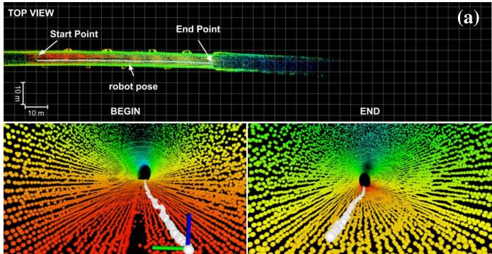

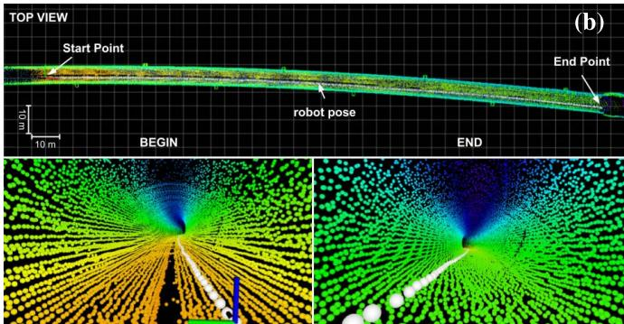  
Fig. 23. Mapping results in the deactivated tunnel using: (a) LeGO-LOAM, and (b) EKF-LOAM. The LeGO-LOAM underestimation of the robot’ displacement inside the tunnel causes a wrong construction of the map. However, the EKF-LOAM final map presents significantly smaller errors.

TABLE II  
POSE ESTIMATION RESULTS OBTAINED BY WHEEL ODOMETRY WITH IMU, LEGO-LOAM AND EKF-LOAM IN A DEACTIVATED TUNNEL
<table><tr><td>Metric</td><td>Wheel+IMU</td><td>LeGO-LOAM</td><td>EKF-LOAM</td></tr><tr><td> $\overline { { \mathcal { M } _ { \mathit { d i s t } } \mathrm { ~ [ ~ \% ~ ] ~ } } }$ </td><td>3.70</td><td>56.32</td><td>0.18</td></tr></table>

IMU data in black, and EKF-LOAM in blue. During the tunnel experiment, the LiDAR SLAM technique identifies minimum values of 203 edge and 2350 plane features, causing a significant underestimation in the LiDAR odometry. Due to that, the LeGO-LOAM estimates a total of only 87.37 m traveled inside the tunnel. The results obtained with wheel odometry integrated with IMU indicate a total distance of 207.40 m covered by the robot; the small overestimation is expected from wheel odometry due to wheel slippage. Note that this remarkable precision regarding $\mathcal { M } _ { d i s t }$ is mainly due that the robot executing a relatively straight path in a flat terrain with high friction coefficient. However, the wheel odometry alone is not reliable in most situations since it diverges over time when the robot executes curved movements, as illustrated in Fig. 10. Fusing the wheel and LiDAR odometry, the EKF-LOAM estimates a total course of 200.35 m.

The adaptive variances of linear and angular velocities of LiDAR odometry compared to wheel odometry and IMU sensor can be seen in Fig. 22. Due to the tunnel’s homogeneous structure, we observed a nearly constant number of detected features during the executed path. In some parts, e.g., in the escapes areas, the LiDAR odometry identifies more features, which reduces the related variances. These variances are relatively higher than the variances of wheel odometry and the IMU sensor. This fact allows the correction of underestimation in the filter output, providing a better initial pose to the mapping algorithm, and consequently improving the map.

Figure 23 illustrates the mapping results obtained in the tunnel experiment with the LeGO-LOAM and EKF-LOAM strategies. As observed in Fig. 21, the underestimation of the robot’s displacement inside the tunnel is evident when the LeGO-LOAM is used; this causes a wrong construction of the map, as shown in Fig. 23a. However, using the proposed EKF-LOAM to fuse wheel odometry and IMU data to the LiDAR SLAM estimations, the final map presents significantly smaller errors (Fig. 23b).

## VII. CONCLUSION AND FUTURE WORK

This work presented an improved LiDAR SLAM strategy, called EKF-LOAM, that merges information from wheel odometry and IMU into the SLAM process. Our method creates representative maps and estimates poses in environments with few geometric features for identification. This simple fusion approach employs an adaptive covariance matrix of LiDAR odometry that changes according to the number of detected features, allowing LiDAR SLAM to correct both the odometry estimation and the map, avoiding underestimation and scale issues. In scenarios such as ducts and tunnels, the proposed methodology increases the performance of the LiDAR SLAM techniques that estimate the ego-motion based on planar and edge features. A standard adaptive covariance matrix for the wheel odometry was also considered to take into account the wheel slip effects.

The EKF-LOAM methodology was validated experimentally using the EspeleoRobô, a service robot designed to inspect confined environments. Initial tests were performed in a hall with two floors and an access corridor. In the first experiment, we considered a path following controller that used the EKF-LOAM odometry to command the robot to follow a target curve. As we have shown, the EKF-LOAM also provides less noisy estimation when compared to the LeGO-LOAM. In a second teleoperated test, the LeGO-LOAM strategy presented an error of approximately 9m in the corridor length, generating a map with misalignment between the lower and upper floors walls. The EKF-LOAM corrected the odometry and the map, which was properly reconstructed without misalignment. During the simulation in a long duct scenario, as well as in the deactivated tunnel with the autonomous exploration experiment, the application of the EKF-LOAM algorithm reduced the estimation errors in odometry by more than 50% over the original LeGO-LOAM algorithm, obtaining a more precise representation of the environment.

To improve the performance of the EKF-LOAM technique, future work will focus on other strategies to adjust the covariance associated with LiDAR odometry according to the number, type, and reliability associated with the geometric features detected in the environment. Also, the integration of the proposed method with visual odometry could be investigated. For that, we intented to define the covariances as a function of the identified visual features as well. Another future work consists in the implementation of a state machine to automatically select the proper SLAM system parameters given the sensed operating or environmental conditions.

## REFERENCES

[1] H. Azpurua et al., “EspeleoRobô—A robotic device to inspect confined environments,” in Proc. Int. Conf. Adv. Robot. (ICAR), Dec. 2019, pp. 17–23.

[2] D. Tardioli et al., “Ground robotics in tunnels: Keys and lessons learned after 10 years of research and experiments,” J. Field Robot., vol. 36, no. 6, pp. 1074–1101, Sep. 2019.

[3] B. Allen. Unearthing the Subterranean Environment. Accessed: Jun. 10, 2021. [Online]. Available: https://www.subtchallenge.com/

[4] K. Ebadi et al., “LAMP: Large-scale autonomous mapping and positioning for exploration of perceptually-degraded subterranean environments,” in Proc. IEEE ICRA, May 2020, pp. 80–86.

[5] T. Shan and B. Englot, “LeGO-LOAM: Lightweight and groundoptimized LiDAR odometry and mapping on variable terrain,” in Proc. IEEE/RSJ IROS, Oct. 2018, pp. 4758–4765.

[6] J. A. Marshall, A. Bonchis, E. Nebot, and S. Scheding, “Robotics in mining,” in Springer Handbook of Robotics. Cham, Switzerland: Springer, 2016, pp. 1549–1576.

[7] T. Berglund, A. Brodnik, H. Jonsson, M. Staffanson, and I. Söderkvist, “Planning smooth and obstacle-avoiding B-spline paths for autonomous mining vehicles,” IEEE Trans. Autom. Sci. Eng., vol. 7, no. 1, pp. 167–172, Jan. 2010.

[8] A. Bonchis, E. Duff, J. Roberts, and M. Bosse, “Robotic explosive charging in mining and construction applications,” IEEE Trans. Autom. Sci. Eng., vol. 11, no. 1, pp. 245–250, Jan. 2014.

[9] C. Ye, S. Hong, and A. Tamjidi, “6-DOF pose estimation of a robotic navigation aid by tracking visual and geometric features,” IEEE Trans. Autom. Sci. Eng., vol. 12, no. 4, pp. 1169–1180, Oct. 2015.

[10] H. Gao, X. Zhang, J. Wen, J. Yuan, and Y. Fang, “Autonomous indoor exploration via polygon map construction and graph-based SLAM using directional endpoint features,” IEEE Trans. Autom. Sci. Eng., vol. 16, no. 4, pp. 1531–1542, Oct. 2019.

[11] C. Debeunne and D. Vivet, “A review of visual-LiDAR fusion based simultaneous localization and mapping,” Sensors, vol. 20, no. 7, p. 2068, 2020.

[12] A. M. C. Rezende et al., “Indoor localization and navigation control strategies for a mobile robot designed to inspect confined environments,” in Proc. IEEE CASE, Aug. 2020, pp. 1427–1433.

[13] M. U. Khan, S. A. A. Zaidi, A. Ishtiaq, S. U. R. Bukhari, S. Samer, and A. Farman, “A comparative survey of LiDAR-SLAM and LiDAR based sensor technologies,” in Proc. Mohammad Ali Jinnah Univ. Int. Conf. Comput. (MAJICC), Jul. 2021, pp. 1–8.

[14] L. Chang, X. Niu, and T. Liu, “GNSS/IMU/ODO/LiDAR-SLAM integrated navigation system using IMU/ODO pre-integration,” Sensors, vol. 20, no. 17, p. 4702, Aug. 2020.

[15] H. Kolvenbach et al., “Towards autonomous inspection of concrete deterioration in sewers with legged robots,” J. Field Robot., vol. 37, no. 8, pp. 1314–1327, Dec. 2020.

[16] J. Graeter, A. Wilczynski, and M. Lauer, “LIMO: LiDAR-monocular visual odometry,” in Proc. IEEE/RSJ IROS, Oct. 2018, pp. 7872–7879.

[17] J. Zhang and S. Singh, “Laser–visual–inertial odometry and mapping with high robustness and low drift,” J. Field Robot., vol. 35, no. 8, pp. 1242–1264, Dec. 2018.

[18] S. Khattak, H. Nguyen, F. Mascarich, T. Dang, and K. Alexis, “Complementary multi–modal sensor fusion for resilient robot pose estimation in subterranean environments,” in Proc. ICUAS, Sep. 2020, pp. 1024–1029.

[19] J. Zhang and S. Singh, “LOAM: LiDAR odometry and mapping in realtime,” in Proc. Robot., Sci. Syst., 2014, vol. 2, no. 9, pp. 1–9.

[20] M. Bloesch, S. Omari, M. Hutter, and R. Siegwart, “Robust visual inertial odometry using a direct EKF-based approach,” in Proc. IEEE/RSJ IROS, Sep. 2015, pp. 298–304.

[21] S. Khattak, C. Papachristos, and K. Alexis, “Keyframe-based direct thermal–inertial odometry,” in Proc. IEEE ICRA, May 2019, pp. 3563–3569.

[22] S. Zhao, H. Zhang, P. Wang, L. Nogueira, and S. Scherer, “Super odometry: IMU-centric LiDAR-visual-Inertial estimator for challenging environments,” in Proc. IEEE/RSJ Int. Conf. Intell. Robots Syst. (IROS), Sep. 2021, pp. 8729–8736.

[23] K. Chen, B. T. Lopez, A.-A. Agha-mohammadi, and A. Mehta, “Direct LiDAR odometry: Fast localization with dense point clouds,” IEEE Robot. Autom. Lett., vol. 7, no. 2, pp. 2000–2007, Apr. 2022.

[24] S. Hening, C. A. Ippolito, K. S. Krishnakumar, V. Stepanyan, and M. Teodorescu, “3D LiDAR SLAM integration with GPS/INS for UAVs in urban GPS-degraded environments,” in Proc. AIAA Inf. Syst.-AIAA Infotech@Aerosp., Jan. 2017, p. 448.

[25] M. Brossard, S. Bonnabel, and A. Barrau, “A new approach to 3D ICP covariance estimation,” IEEE Robot. Autom. Lett., vol. 5, no. 2, pp. 744–751, Apr. 2020.

[26] D. Wisth, M. Camurri, S. Das, and M. Fallon, “Unified multi-modal landmark tracking for tightly coupled LiDAR-visual-inertial odometry,” IEEE Robot. Autom. Lett., vol. 6, no. 2, pp. 1004–1011, Apr. 2021.

[27] Y. Jia et al., “Lvio-fusion: A self-adaptive multi-sensor fusion SLAM framework using actor-critic method,” in Proc. IEEE/RSJ Int. Conf. Intell. Robots Syst. (IROS), Sep. 2021, pp. 286–293.

[28] X. Dang, Z. Rong, and X. Liang, “Sensor fusion-based approach to eliminating moving objects for SLAM in dynamic environments,” Sensors, vol. 21, no. 1, p. 230, Jan. 2021.

[29] N. Balemans, P. Hellinckx, S. Latré, P. Reiter, and J. Steckel, “S2L-SLAM: Sensor fusion driven SLAM using sonar, LiDAR and deep neural networks,” in Proc. IEEE Sensors, Oct. 2021, pp. 1–4.

[30] Y. Su, T. Wang, S. Shao, C. Yao, and Z. Wang, “GR-LOAM: LiDARbased sensor fusion SLAM for ground robots on complex terrain,” Robot. Auton. Syst., vol. 140, Jun. 2021, Art. no. 103759.

[31] H. Azpúrua et al., “Towards semi-autonomous robotic inspection and mapping in confined spaces with the EspeleoRobô,” J. Intell. Robot. Syst., vol. 101, no. 4, pp. 1–27, Apr. 2021.

[32] V. M. Gonçalves, L. C. A. Pimenta, C. A. Maia, B. C. O. Dutra, and G. A. S. Pereira, “Vector fields for robot navigation along timevarying curves in n-dimensions,” IEEE Trans. Robot., vol. 26, no. 4, pp. 647–659, Aug. 2010.

[33] M. Quigley et al., “ROS: An open-source robot operating system,” in Proc. ICRA Workshop, 2009, vol. 3, no. 3, p. 5.

[34] A. Mandow, J. L. Martinez, J. Morales, J. L. Blanco, A. Garcia-Cerezo, and J. Gonzalez, “Experimental kinematics for wheeled skidsteer mobile robots,” in Proc. IEEE/RSJ IROS, Oct./Nov. 2007, pp. 1222–1227.

[35] M. Kaess, H. Johannsson, R. Roberts, V. Ila, J. Leonard, and F. Dellaert, “iSAM2: Incremental smoothing and mapping using the Bayes tree,” Int. J. Robot. Res., vol. 31, no. 2, pp. 216–235, 2012.

[36] J. Libby and G. Kantor, “Deployment of a point and line feature localization system for an outdoor agriculture vehicle,” in Proc. IEEE ICRA, May 2011, pp. 1565–1570.

[37] B. Siciliano, L. Sciavicco, L. Villani, and G. Oriolo, Robotics: Modelling, Planning and Control. London, U.K.: Springer, 2010.

[38] A. Cid et al., “A simulated environment for the development and validation of an inspection robot for confined spaces,” in Proc. Latin Amer. Robot. Symp. (LARS), Brazilian Symp. Robot. (SBR) Workshop Robot. Educ. (WRE), Nov. 2020, pp. 1–6.

  
Gilmar P. Cruz Júnior received the bachelor’s degree in control automation engineering from the Universidade Federal de Pelotas (UFPel) in 2018 and the M.Sc. degree in electrical engineering from the Universidade Federal de Minas Gerais (UFMG) in 2021, where he is currently pursuing the Ph.D. degree in control, automation, and robotics through the Graduate Program in Electrical Engineering (PPGEE). His research interests include mobile robotics, simultaneous localization and mapping, robot movements planning, adaptive filter, and robotic manipulator.

Adriano M. C. Rezende received the bachelor’s, master’s, and Ph.D. degrees in electrical engineering from the Universidade Federal de Minas Gerais (UFMG) in 2017, 2019, and 2022, respectively. During his under graduation course, he also spent a year at Colorado State University (CSU). In 2019, he was classified for the Artificial Intelligence Robotic Racing (AIRR). He is currently in a training program with the Near Earth Autonomy, Pittsburgh, PA, USA. His current research interests include robot navigation (ground and aerial), control theory, motion

planning, state estimation, optimization, and experimental robotics.

Victor R. F. Miranda received the bachelor’s degree in mechatronics engineering from the Universidade Federal de São João Del Rei (UFSJ) in 2017 and the M.Sc. degree in electrical engineering from the Universidade Federal de Minas Gerais (UFMG) in 2019, where he is currently pursuing the Ph.D. degree through the Graduate Program in Electrical Engineering (PPGEE). His main research interests include nonlinear and robust control theory, mobile robotics, reinforcement learning, multiagent systems, motion planning, localization, and filtering.

  
Armando A. Neto received the B.S.E. degree in automation and control engineering and the S.M. and Ph.D. degrees in computer science from the Universidade Federal de Minas Gerais (UFMG) in 2006, 2008, and 2012, respectively. Currently, he is an Assistant Professor with the Department of Electronic Engineering (DELT), UFMG. His research interests include real-time motion planning, multiagent control, robust control, reinforcement learning, and collision avoidance strategies.

Rafael Fernandes received the bachelor’s degree in electrical engineering from the Universidade Federal de Viçosa (UFV), Brazil, in 2017, and the M.Sc. degree in control, robotics, and automation from the Universidade Federal de Minas Gerais (UFMG), Brazil, through the Graduate Program in Electrical Engineering (PPGEE). He has worked with methods for visual reconstruction of confined environments using RGB-D cameras. He participated in robot soccer competitions, acquiring experience in image processing and artificial intelligence. His research interests include computer vision, digital image processing, mobile robotic, simultaneous localization and mapping, and artificial intelligence.

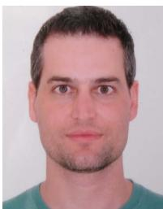

Gustavo Pessin received the D.Sc. degree in computer science from the University of São Paulo (USP), as a member of the Mobile Robotics Laboratory. During his D.Sc. degree, he carried out research with the Robotics Laboratory, Heriot-Watt University, Edinburgh, U.K., and the Communication and Distributed Systems Group, the University of Bern, Switzerland. In 2015, he held a Visiting Scholar position within the Media Laboratory, Massachusetts Institute of Technology (MIT). Currently, he is a Full Researcher within the Robotics Laboratory, Instituto

Tecnológico Vale (ITV). The bulk of his research is related to intelligent systems and mobile robots.

Héctor Azpúrua received the bachelor’s degree in computer science from the Universidad Nueva Esparta (UNE) in 2011 and the M.Sc. degree in robotics from Universidade Federal de Minas Gerais (UFMG), Brazil, in 2015, where he is currently pursuing the Ph.D. degree with the Computer Vision and Robotics Laboratory (VeRLab), Department of Computer Science (DCC). He is an Researcher with the Komatsu’s Data Analytics Group. He has worked in diverse research projects between academia and industry. His research interests include robotics, arti ficial intelligence, and digital security, emphasizing mobile robotics, machine learning, and real-time strategy games.

Gustavo M. Freitas received the B.Sc. degree in control and automation engineering from the Universidade Federal de Santa Catarina (UFSC) and the M.Sc. and D.Sc. degrees in control, automation, and robotics from the Universidade Federal do Rio de Janeiro (UFRJ), Brazil. His career has focused on robotics applied to environmental monitoring, agriculture, mining, and oil and gas production systems through his work at the Carnegie Mellon University (CMU)—Field Robotics Center (FRC), the Petrobras Robotics Laboratory, and the Instituto Tecnológico

Vale (ITV) Robotics Laboratory, Brazil. Currently, he is a Professor with the Electrical Department (DEE), Universidade Federal de Minas Gerais, Brazil.