# Efficient and Accurate Tightly-Coupled Visual-Lidar SLAM

Chih-Chung Chou and Cheng-Fu Chou

Abstract— We investigate a novel way to integrate visual SLAM and lidar SLAM. Instead of enhancing visual odometry via lidar depths or using visual odometry as the motion initial guess of lidar odometry, we propose tightly-coupled visual-lidar SLAM (TVL-SLAM), in which the visual and lidar frontend are run independently and which incorporates all of the visual and lidar measurements in the backend optimizations. To achieve large-scale bundle adjustments in TVL-SLAM, we focus on accurate and efficient lidar residual compression. The visual-lidar SLAM system implemented in this work is based on the opensource ORB-SLAM2 and a lidar SLAM method with average performance, whereas the resulting visual-lidar SLAM clearly outperforms existing visual/lidar SLAM approaches, achieving 0.52% error on KITTI training sequences and 0.56% error on testing sequences.

Index Terms— SLAM, lidar, vision.

## I. INTRODUCTION

ticular the integration of visual and lidar SLAM systems. Existing visual lidar odometry/SLAM works focus primarily on frontend integration, for instance assigning lidar depths to visual features [1], [3] and sequential composition of visual inertial odometry and lidar scan-to-map registration [5], [6], whereas visual and lidar backends, specifically, loop closing and bundle adjustments, are not integrated in a tightly coupled way. Existing visual lidar SLAM backends can be seen as vision-driven or lidar-driven. Vision-driven approaches [1], [2] assign lidar-determined depth values to visual features, and then follow conventional stereo visual/RGBD SLAM frameworks. Lidar-driven approaches [3], [6], however, use visual/visual-inertial odometry to predict camera motion and compensate using motion estimation in certain dimensions in lidar degenerate cases, after which the pose is refined by lidar SLAM; this can yield improved robustness under aggressive motions and lidar-degenerate scenes. The principle drawback of existing work is that no method fully utilizes all sensor measurements. Vision-driven approaches utilize only a small fraction of lidar point clouds to enhance visual features, abandoning most lidar measurements. Lidar-driven approaches, in turn, do not incorporate visual measurements in loop closing, nor do they utilize lidar measurements in visual odometry and mapping; thus, despite enhanced system robustness, overall SLAM accuracy improvements are small or nonexistent.

In recent years, tightly-coupled visual-inertial-lidar research has enhanced SLAM/odometry robustness and accuracy, for instance, LIC-Fusion [7], which tightly couples visual lidar and inertial measurements in both filtering and optimization frameworks but does not include loop closure. LVI-SAM [8], more like the lidar-driven approach, replaces the depth-enhanced vision frontend by a tightly-coupled visuallidar-inertial odometry, but only lidar factors are incorporated into loop closure. Thus, overall accuracy was not notably improved over their lidar-inertial work LIO-SAM [9]. In this paper, we propose TVL-SLAM, a tightly-coupled visual-lidar SLAM system that incorporates visual and lidar measurements in motion estimation, loop detection, loop closing, and extrinsics calibration. Compared to the above visualinertial-lidar approaches, TVL-SLAM does not incorporate inertial measurements; it focuses on visual-lidar integration and has the following additional contributions:

\- Both visual and lidar measurements are used in motion estimation. Outlier features are rejected by cross-validation of visual and lidar motion estimation. In this way, we overcome visual- or lidar-degenerate cases at higher accuracies than independent visual or lidar approaches.

\- Both visual and lidar loop detection results are incorporated in the loop closing procedure to ensure high accuracy. To improve the computational efficiency, a general lidar factor (GLF) is proposed to compress multiple lidar residuals into a 6-dimensional residual.

The visual-lidar SLAM framework is extended to SLAMwith-calibration to eliminate the negative effects of inaccurate camera-lidar extrinsics for tightly-coupled visual-lidar SLAM. This calibration method is markerless and does not require large overlaps in the camera and lidar FOVs.

\- The tightly coupled SLAM system is tested using the KITTI odometry datasets, on which we achieve 0.52% and 0.56% drift error on training and testing sequences. To our knowledge, these are better than all existing published state-of-the-art full-SLAM approaches(i.e., the approaches are with loop closing).

This paper is organized as follows: Section III presents an overall picture of the visual lidar SLAM system, including the system diagram, variable definitions and notations, and the factor graph of the SLAM backend. Section IV presents the individual visual and lidar SLAM systems, particularly the lidar odometry and lidar loop detection algorithms. Section V then focuses on the technical details of integrating the visual and lidar SLAM systems, including lidar residual compression, optimization across different Lie-algebra systems, visual outlier removal, and markerless camera-lidar calibration to extend SLAM to a SLAM-with-calibration framework. In the end, we compare and analyze the proposed approach with state-of-the-art methods using public SLAM datasets including KITTI [10] and KAIST [11].

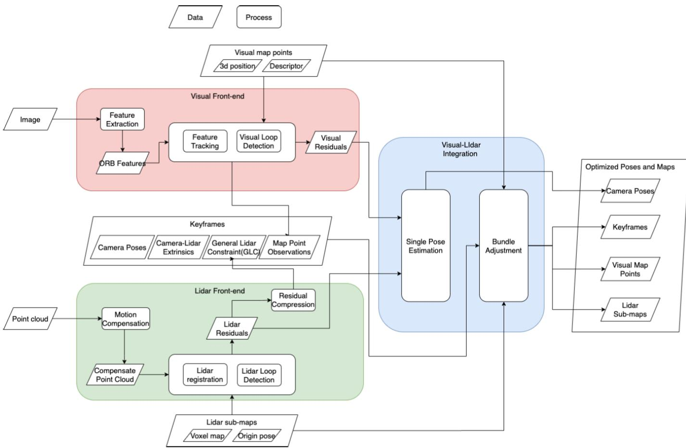  
Fig. 1. Proposed visual-lidar odometry system.

## II. SYSTEM OVERVIEW

## A. SLAM System Diagram

Figure 1 illustrates the proposed vision-lidar SLAM system. The input is a pair of a lidar point cloud and stereo camera images, and the output is the camera poses, a bunch of 3d visual map points, and the accumulated lidar maps. Initially, we make two reasonable assumptions. First, we assume that each input frame is a lidar point cloud and a stereo image pair acquired at the same timestamp. Second, we assume that the camera-lidar extrinsics are known and fixed during the SLAM process. In practical implementations, the first assumption is easily satisfied by compensating point clouds. Given the estimated sensor velocity, each point can be transformed to the position at the timestamp of nearest image. For the second assumption, we also propose an extended

SLAM-with-calibration approach to estimate the extrinsics in the tightly-coupled visual lidar SLAM process.

In the proposed visual-lidar SLAM, two types of maps are maintained with the camera poses. One is the visual map, composed of a number of 3d map points and visual descriptors. The other is the lidar voxel map, represented by a number of submaps and their map origin poses: each voxel is represented in the coordinate relative to the corresponding map origin pose.

For each input image-cloud pair, the input image is fed into the visual SLAM pipeline, which extracts ORB features and matches to a reference keyframe to compute an initial pose estimation, based on which the lidar point cloud is matched to the latest lidar submap to find a number of point-to-line and point-to-plane residuals. In the end, the pose is refined by solving a bunch optimization of all visual and lidar residuals.

After pose estimation, the point cloud is accumulated to the latest lidar submap using the refined pose. If the travel distance on this submap exceeds a threshold, a new lidar submap is created and the older one is stored for lidar loop detection. For input images, if certain conditions are met [4]—for example, the robot moves a certain distance or a number of frames are received—the current image is noted as a keyframe. All the keyframes and lidar map origin poses are optimized in local and global bundle adjustments.

A local bundle adjustment process is triggered when a new keyframe is added, and a global bundle adjustment is triggered when a visual or lidar loop is detected. The difference is that local bundle adjustment only optimizes poses and maps in a sliding window; state variables outside the sliding window are seen as constant. As with pose optimization, in the bundle adjustments, we optimize all the visual and lidar residuals in a tightly coupled manner.

## B. Variable and Coordinate Notation

Before presenting the algorithm, to help readers better understand the formulation and derivations in the paper, we here list the variable definitions and notation.

In visual-lidar SLAM, variables are represented under frame coordinates such as the world frame, camera frame, or lidar frame, and sensor poses are represented as transformations from sensor coordinates to the world coordinates. In this paper, we use the following coordinate systems:

W World coordinate. This is the global Euclidean coordinate system using which all 3d map points are represented.

M Lidar submap coordinate. Lidar voxels (containing a plane or a line equation) are represented under this coordinate.

L Lidar coordinate. This is the local coordinate of the lidar device.

C Camera coordinate. This is the local coordinate of the camera.

Below are the state variables in the proposed SLAM system: $T _ { M _ { i } } ^ { W }$ The lidar map origin pose. This is the SE(3) transformation from the i-th lidar submap coordinate to the world coordinate.

$T _ { L _ { j } } ^ { W }$ The lidar pose. This is the SE(3) transformation from the j-th lidar coordinate to the world coordinate.

$T _ { C _ { j } } ^ { W }$ The camera pose. This is the SE(3) transformation from the j-th camera coordinate to the world coordinate.

$T _ { L } ^ { C }$ The camera-lidar extrinsics. This is the SE(3) transformation from the lidar coordinate to the camera coordinate. In this work, we assume that the camera lidar extrinsics do not change, meaning $T _ { L _ { j } } ^ { W } = T _ { C _ { j } } ^ { W } T _ { L } ^ { C }$ for all camera and lidar poses.

$p _ { k } ^ { W }$ The k-th 3d map point tracked by the camera, represented in the world coordinate.

Compared to existing work [3], [12], our formulation has two additional merits. First, all the line and plane features are stored not in global coordinates but in local coordinates of the corresponding lidar submap. In this way, after loop closure, it is easy to adjust the positions of all map features by changing the map origin poses $\mathbf { \bar { \Gamma } } _ { M _ { i } } ^ { W }$ , which speeds up the loop closure and loop detection processes. Secondly, as we separate the map origin pose and lidar pose into two types of variables, we can represent a lidar loop closure factor as the constraint of a lidar pose to a lidar submap; This is quite convenient becuase we can directly extract the lidar factor from a scanto-map point cloud registration, which is already computed in lidar odometry and loop detections.

## III. SINGLE MODALITY SLAM SYSTEMS

## A. Visual and Tightly-Coupled SLAM Pipeline

The visual SLAM pipeline in this work follows the standard keyframe-based framework. To facilitate implementation, we use the ORB-SLAM2 [4] source code with minor changes, as in this paper we focus on the integration of visual and lidar SLAM rather than individual single-modality SLAM systems. ORB-SLAM2, one of the most popular open-source visual SLAM algorithms, has been widely tested and evaluated, which makes it suitable for use in evaluating the effect of tightly coupling visual and lidar SLAM.

In addition to the visual frontend, we also utilize the ORB-SLAM2 pipeline to implement the TVL-SLAM pipeline via the following modifications:

\- After visual pose tracking, we compute a lidar scanto-map registration and refine the pose by tightly-coupled visual-lidar localization.

\- For local and global bundle adjustments we follow the original ORB-SLAM2 implementation (solved using a g2o factor graph [13]) with the addition of lidar residuals and lidar map origin poses.

\- A lidar loop detection module runs with the ORB-SLAM2 loop detection module, and global bundle adjustment is triggered when any type of loop is detected.

\- To better evaluate SLAM accuracy, the SLAM pipeline is modified to be single-threaded and blocking.

## B. Lidar Odometry

The first step of lidar odometry is to undistort the point cloud and make sure that the points are uniformly distributed. Each raw point cloud is characterized by a deformation proportional to the vehicle speed. This is because point clouds are collected over a certain period of time, such that each point is received at its own timestamp. Given the lidar motion during the collection period, this deformation can be eliminated by transforming the lidar points to the pose at the beginning timestamp via a process termed motion compensation. In [12] motion compensation is calculated along with lidar motion estimation. In this paper, we calculate such compensation and estimation separately in the interest of simplicity and robustness. We assume that lidar velocity varies slowly, and estimate lidar motion by differentiating the estimated lidar poses. The resulting point cloud is uniformly downsampled, such that only one point is preserved for each 20cm-sized cube in the space.

Our lidar residuals are created by matching the sampled and compensated lidar point cloud to the nearest lidar submap. Motivated by Zhang and Singh [12], we use point-to-line and point-to-plane constraints of a lidar pose $T _ { L } ^ { W }$ and a lidar map that originates at $T _ { M } ^ { W }$ . In each lidar registration, we seek to solve the best $T _ { L } ^ { M } = T _ { M } ^ { W ^ { - 1 } } T _ { L } ^ { W }$ to minimize the following cost function:

$$
\begin{array} { l } { { \displaystyle T _ { L } ^ { M } = \mathrm { a r g m i n }  \sum _ { T _ { L } ^ { M } } ^ { N _ { 1 } } \| r _ { p l } ( T _ { L } ^ { M } , p _ { k } ^ { L } , \stackrel {  } { n } _ { k } ^ { M } , p _ { k } ^ { M } ) \| ^ { 2 } } } \\ { { \displaystyle \qquad + \sum _ { l = 1 } ^ { N _ { 2 } } \| r _ { p p } ( T _ { L } ^ { M } , p _ { l } ^ { L } , \stackrel {  } { n } _ { l } ^ { M } , p _ { l } ^ { M } ) \| ^ { 2 } ) } , } \end{array}\tag{1}
$$

where $r _ { p l }$ and $r _ { p p }$ are the point-to-line and point-to-plane residual functions. These represent the minimum distance from

a lidar point in the current cloud, $p ^ { L }$ , to the line or plane $( p ^ { M } , \vec { n } )$ in the lidar submap. For each point, we choose one residual function from the following two types of residuals:

$$
r _ { p l } ( T _ { L } ^ { M } , p ^ { L } , \vec { n } , p ^ { M } ) = \vec { n } ~ \times ( T _ { L } ^ { M } \cdot p ^ { L } - p ^ { M } )\tag{2}
$$

$$
r _ { p p } ( T _ { L } ^ { M } , p ^ { L } , \vec { n } , p ^ { M } ) = \vec { n } \cdot ( T _ { L } ^ { M } \cdot p ^ { L } - p ^ { M } ) .\tag{3}
$$

Here $p _ { M }$ is a 3d point on the corresponding line or plane and the 3d vector n is the line direction or the plane normal, which is normalized to unit length. Both $p _ { M }$ and $\vec { n }$ are represented under map coordinate M.

For each lidar point, we must determine whether it corresponds to a line or a plane residual. This is decided by the 3d normal distribution of the corresponding map voxel. For each map voxel, the line/plane equations can be found by computing the eigenvalues and eigenvectors of the covariance. In the three eigenvalues of the 3d covariance matrix, if one eigenvalue is considerably larger than the others, then the voxel is classified as a ‘Line’, and eigenvector n corresponds to the largest eigenvalue. If one eigenvalue is considerably smaller than the others, it is classified as a ‘Plane’; in this case n is the eigenvector of the smallest eigenvalue.

Our approach differs from [12] in two ways: We extract line and plane features from the accumulated lidar submaps only and not from the incoming point clouds. For the input cloud, we simply uniformly downsample it, after which all the points are used in the scan-to-map registration, as we have observed empirically that feature extraction is time-consuming and does little to improve lidar registration performance for lidar with more than 32 bins. To streamline map access, our lidar submaps are not implemented as a bunch of points sorted by a k-d tree. Instead, we use the 3d NDT voxel maps [14], in which the space is divided into fixed-sized voxels, and which support efficient query operations given a 3d point.

## C. Lidar Loop Detection

To ensure robust loop detection, we implemented the multiple-hypothesis framework described by Algorithm 1. The MHT detection module preserves multiple possible current poses of the lidar sensor along with their posterior probabilities. Although preserving more hypothesis poses improves the loop detection recall rate, it also consumes more computing power. From experiments, we found that preserving a maximum of M = 3 hypothesis poses is a good balance between computational efficiency and robustness.

In each detection process, each hypothesis pose is updated by the odometry input, and an efficient semi-global search (branch and bound) is conducted to find a new hypothesis pose around the best existing hypothesis $h _ { 1 } .$ . The posterior probability of the new hypothesis $p _ { M + 1 }$ is penalized by the factor $1 - \overline { { \frac { | h _ { 1 } - h _ { N + 1 } | } { r } } }$ , which represents the distance between the predicted and searched poses, divided by the drift estimates from the previous lidar submap to the current pose.

Note that even if the detected distance exceeds the estimated drift, we do not eliminate this hypothesis. Instead, we set the probability of the new hypothesis to a small value α, which can be tuned to an arbitary small value; one reasonable choice is to set it to 1/M, which is 1 divided by the maximum number of hypotheses, corresponding to the probability from a uniform distribution. Then all the posteriors are updated by multiplying their likelihood, as represented by the matching scores of the current lidar cloud to the previous lidar submaps using the hypothesis poses. If the best hypothesis continuously gets high matching scores for a period, then a loop is detected and the drift estimates are updated as well.

Algorithm 1 MHT Loop Detection   
Require:   
$P = \{ p _ { 1 } , p _ { 2 } , . . . , p _ { M } \} ;$ Posterior probabilities of hypotheses,   
sorted in descending order   
$H = \{ h _ { 1 } , h _ { 2 } , . . . , h _ { M } \} \colon$ : Hypothesis poses;   
$D \ = \ \{ d _ { 1 } , \ d _ { 2 } , \ . . . , \ d _ { N } \} \nonumber$ : Drift estimates between lidar   
submaps;   
Ensure:   
P: Updated posterior probabilities   
H: Updated hypothesis poses   
D: Updated drift estimates   
for $i = 1$ to M do   
$h _ { i } \gets P r e d i c t ( h _ { i } ) ;$   
end for   
Find $k ^ { * }$ as index of nearest submap to $h _ { 1 } ;$   
$r = \sum _ { k = k ^ { * } } ^ { N } d _ { k } ;$   
$h _ { M + 1 } \stackrel { \scriptscriptstyle \mathrm { \tiny ~ \wedge - \cdot } } { = } B r a n c h A n d B o u n d ( h _ { 1 } ) ;$   
$\begin{array} { r } { p _ { M + 1 } = p _ { 1 } \cdot \operatorname* { m a x } ( \alpha , 1 - \frac { | h _ { 1 } - h _ { N + 1 } | } { r } ) } \end{array}$   
Insert $h _ { M + 1 }$ into H, and $p _ { M + 1 }$ into $P ;$   
for i = 1 to $M + 1$ do   
$p _ { i } \gets p _ { i }$ · ComputeUpperBoun $l ( h _ { i } )$   
end for   
Sort P and H according to decreasing $p _ { i } ;$   
Preserve only first M elements of P and H, prune others;   
if loop is detected from current pose to k-th submap then   
for $i = k$ to N do   
$d _ { i } \gets 0 ;$   
end for   
end if

There are two keys to robust loop detection. The first is the semi-global search algorithm, and the other is the drift estimation model. Due to long-term odometry drift, when encountering a loop, the positional error of the current pose estimate can be up to tens of meters, in which case normal ICP matching does not work. Thus we need an efficient semi-global search. However, as introducing semi-global search also increases the number of false positives that are detected, we must reasonably estimate the current positional error to reject such false detections.

The semi-global search module is implemented as the branch-and-bound method in [15]. Given an initial pose, we search a best matched pose on the X-Y plane by comparing the current lidar cloud and the nearest lidar submap. We prevent search on the Z-dimension by assuming that the current height is the same as the ground plane of the lidar submap; also, orientation dimensions are not searched because the orientation error accumulates much more slowly than the positional error.

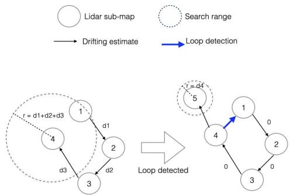  
Fig. 2. Modeling of loop detection search range.

To reduce false detections, we must properly estimate the maximum search range of each semi-global search. Here we propose estimating the search range according to SLAM drifts. As shown in Fig. 2, each lidar submap is associated with a drift estimate value $d _ { i }$ , which represents the odometry drift between two subsequent submaps, and is computed as a ratio of the distance between the center of two submaps. This ratio should be an estimate of the lidar odometry drift percentage. In this work, we set the ratio to 0.015 because the average drift of our lidar odometry is around 0.01 in KITTI experiments. During loop detection between two submaps, the search range is estimated by accumulating all drift estimates between the two maps. After a loop closes, we assume that the drift estimates within the loop are eliminated; thus for all the submaps in the loop, their drift estimates are set to zero.

In this work, loop detection is accepted if it meets the following three conditions: (1) the matching score is higher than a threshold for N subsequent lidar clouds, (2) the trajectory of the best hypothesis approximates the lidar odometry for N subsequent lidar clouds, and (3) the detected pose hypothesis falls within the above-mentioned search range.

## IV. TIGHTLY-COUPLED VISUAL-LIDAR SLAM (TVL-SLAM)

## A. Factor Graph Formulation

In TVL-SLAM, as we maintain both the lidar voxel maps and the visual map points, we must ensure that the two maps are mutually consistent. This is achieved by incorporating both visual and lidar residuals in the bundle adjustments. In this subsection, we will introduce the factor graph formulations of our bundle adjustments. In this formulation, we seek to estimate a set of state variables, including camera poses, lidar poses, visual map points, the lidar submap origin poses, and the camera-lidar extrinsics. This is achieved by minimizing the factors illustrated in Fig. 3, each of which depicts a residual function of certain state variables. Fig. 3 illustrates the factor graph formulation of the TVL-SLAM backend, in which the factors are linked with their input state variables. The factors in TVL-SLAM are listed as follows:

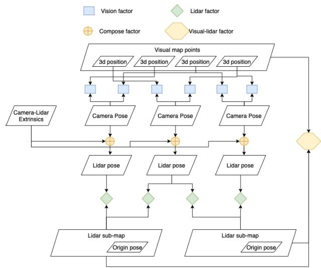  
Fig. 3. Factor graph representation of TVL-SLAM.

\- Visual factor $f _ { V } { : }$ the monocular or stereo projection of a 3d map point to an image. This is represented as $f _ { V } ( p _ { k } ^ { W } , \bar { T _ { C _ { i } } ^ { W } } ) = z _ { j , k } - \pi _ { k } ( p _ { k } ^ { W } , T _ { C _ { i } } ^ { W } )$

\- Lidar factor $f _ { L }$ : compresses the information of a scanto-map registration, and represents a lidar loop detection constraint. Using the GLF technique shown below, a lidar factor is a function to a scan-to-map transformation: $r _ { L } ( T _ { L _ { i } } ^ { M _ { i } } ) = \mathbf { A } ( T \ominus T _ { L _ { i } } ^ { M _ { i } } ) + \mathbf { b } .$ A is a 6-by-6 matrix and b is a 6-by-1 vector.

\- Compose factor: represents the compose operation of two SE(3) transformations. In this factor graph, the factor exists only between the camera poses and lidar poses: $T _ { L _ { i } } ^ { W } = T _ { C _ { i } } ^ { W } T _ { L } ^ { C }$

\- Visual-lidar factor $f _ { V L } \colon$ represents the constraints of visual map points to the lidar voxel maps. This is used to add constraints between the visual and lidar maps to account for degenerate motion during SLAM-withcalibration. This is described in greater detail below.

In a tightly coupled state estimation task, the factor graph is converted into the following non-linear optimization problem to jointly estimate all state variables:

$$
\begin{array} { r l r } {  { \operatorname* { a r g m i n } _ { T _ { M _ { i } } ^ { W } , T _ { C _ { j } } ^ { W } , T _ { L } ^ { C } , p _ { k } ^ { W } } ( \alpha _ { 1 } \sum _ { j , k } \| f _ { V } ( T _ { C _ { j } } ^ { W } , p _ { k } ^ { W } ) \| ^ { 2 } } } \\ & { } & { + \alpha _ { 2 } \sum _ { i , j } \| f _ { L } ( T _ { M _ { i } } ^ { W } , T _ { C _ { j } } ^ { W } T _ { L } ^ { C } ) \| ^ { 2 } } \\ & { } & { + \alpha _ { 3 } \sum _ { k , i } \| f _ { V L } ( T _ { M _ { i } } ^ { W } , p _ { k } ^ { W } ) \| ^ { 2 } ) } \end{array}\tag{4}
$$

Formulation 4 is applied for single pose estimation, local/global bundle adjustment, and SLAM-with-calibration. For each such task, each state variable can be set to fixed or adjustable, and $\alpha _ { 1 } , \alpha _ { 2 }$ , and $\alpha _ { 3 }$ can be set to 0 or 1 to enable or disable individual constraints.

In TVL-SLAM, the above factor graph is applied in the following tasks but with different configurations:

\- Single pose estimation In this task, only the latest camera pose is estimated. All other variables (lidar map origins, visual map points, and extrinsics) are fixed. $\alpha _ { 1 } = 1 , \alpha _ { 2 } =$ 1, $\alpha _ { 3 } = 0$

\- Local bundle adjustment The variables are camera poses, visual map points, and lidar map origins in a limited sliding window. Other variables are fixed. $\alpha _ { 1 } =$ $1 , a _ { 2 } = 1 , a _ { 3 } = 0 .$

\- Global bundle adjustment All variables are estimated except the camera-lidar extrinsics. $\begin{array} { r c l } { \alpha _ { 1 } } & { = } & { 1 , \alpha _ { 2 } } \end{array} =$ $1 , a _ { 3 } = ~ 0$

\- SLAM-with-calibration All variables are adjustable, including the camera-lidar extrinsics. Note that visual-lidar factors are activated in this task only. $\alpha _ { 1 } = 1 , \alpha _ { 2 } = 1 , \alpha _ { 3 } = 1$

## B. General Lidar Factor (GLF)

In the factor graph, each lidar factor represents a scanto-map lidar registration result formed by tens of thousands of point-to-line and point-to-plane residuals. The most straightforward way to construct the graph is to add all the residual functions as is; this, however, leads to two difficulties:

\- It is time-consuming to evaluate all the lidar residuals, particularly for global bundle adjustments, because there can be millions of residuals and Jacobians to compute in a single Gauss–Newton iteration.

\- Due to the different definitions of variables and Lie algebra, it could be necessary to re-implement the lidar residual functions.

To overcome these two difficulties, we compress multiple lidar residuals into a single residual, that is, the general lidar factor (GLF). In this way, each lidar registration in the lidar odometry and lidar loop detection is compressed into a single 6d residual function of a scan-to-map transformation $T _ { L _ { i } } ^ { \bar { M _ { i } } }$ . In the optimization process, we need only evaluate the error and Jacobians of this 6d residual as opposed to pointto-line/point-to-plane residuals. This considerably accelerates the global bundle adjustments. In addition, since the GLF is a simple function of the variable $T _ { L _ { j } } ^ { M _ { i } }$ , it is easy convert the variables and apply the chain rule to adapt a GLF to the visual bundle adjustments. With the Jacobian conversion technique shown below, we accurately and efficiently integrate visual and lidar SLAM backends.

Here is how we form the GLF. For the lidar registration problem in Equation (1), by linearizing the residual functions around the initial guess $\hat { T _ { L } ^ { M } }$ , the Gauss–Newton solution of Equation (1) is

$$
T _ { L } ^ { M * } = \tilde { T _ { L } ^ { M } } \oplus \delta x ,
$$

Hδx +r = 0,

$$
\begin{array} { r l } & { \mathbf { H } = \displaystyle \sum _ { i = 1 } ^ { N _ { 1 } } \mathbf { J } _ { p l , i } ^ { T } \mathbf { J } _ { p l , i } + \displaystyle \sum _ { j = 1 } ^ { N _ { 2 } } \mathbf { J } _ { p p , j } ^ { T } \mathbf { J } _ { p p , j } , } \\ & { \mathbf { r } = \displaystyle \sum _ { i = 1 } ^ { N _ { 1 } } \mathbf { J } _ { p l , i } ^ { T } \mathbf { r } _ { p l , i } + \displaystyle \sum _ { j = 1 } ^ { N _ { 2 } } \mathbf { J } _ { p p , j } ^ { T } \mathbf { r } _ { p p , j } , } \\ & { \mathbf { J } _ { p l , i } = \displaystyle \frac { \mathrm { d } \mathbf { r } _ { p l , i } ( T _ { L } ^ { M } \oplus \delta x ) } { \mathrm { d } \delta x } , \mathbf { J } _ { p p , j } = \displaystyle \frac { \mathrm { d } \mathbf { r } _ { p p , i } ( T _ { L } ^ { M } \oplus \delta x ) } { \mathrm { d } \delta x } . } \end{array}\tag{5}
$$

We then apply a Cholesky decomposition to H to get a 6-by-6 matrix A and a 6-by-1 vector b that satisfies

$$
\begin{array} { r } { \mathbf { A } ^ { T } \mathbf { A } = \mathbf { H } } \\ { \mathbf { A } ^ { T } \mathbf { b } = \mathbf { r } . } \end{array}\tag{6}
$$

Therefore, as long as the linearization point $\tilde { T _ { L } ^ { M } }$ is good enough, solving Equation (1) is equivalent to solving a problem with a single, linear residual:

$$
f _ { L } ( T _ { L } ^ { M } ) = \mathbf { A } ( \tilde { T _ { L } ^ { M } } \ominus T _ { L } ^ { M } ) + \mathbf { b } ,\tag{7}
$$

the general lidar factor (GLF). Since $\tilde { T _ { L } ^ { M } }$ derives from a scanto-map registration using a dense point cloud, it contains fewer errors, reducing the linearization error.

Experienced readers will note that the GLF uses part of the well-known marginalization technique [16]; however, we do not marginalize state variables but instead simply apply the Cholesky decomposition to convert the accumulated information matrix to a prior constraint to $T _ { L } ^ { M }$ . A similar idea is proposed in [17] to compress multiple visual residuals into a lower-dimensional residual via a different decomposition technique. Below we will compare the two approaches and show how to determine which one to use.

## C. Comparison of Residual Compression Methods

We have proposed GLF to compress a bunch of residuals into a single, low-dimensional residual; this, however, is not the only way to compress residual information. Another method is applied in [17], [18], in which QR decomposition is used to compress the measurements in a multiple-state constrained Kalman filter. In this section, we will prove that our method is mathematically equivalent to that in [17], [18] and is indeed more efficient, particularly when the measurement dimension is high and the state dimension is low, such as with the lidar registration problem.

In [17] and [18], a measurement with Gaussian noise can be represented as

$$
Z = h ( x ) + { \bf n } , ~ { \bf n } \sim N ( 0 , { \bf I } ) .\tag{8}
$$

Here we assume that the measurement covariance is identity. This is a reasonable assumption because for any measurement with invertible covariance, we can normalize it by scaling the whole measurement function by $\Sigma ^ { - \frac { 1 } { 2 } }$ . This does not change the effect of the measurement because the Jacobian and innovation are scaled as well.

By linearizing h(x) around xˆ, we create an unbiased measurement:

$$
\tilde { Z } = Z - h ( \tilde { x } ) = \mathbf { J } \delta x + \mathbf { n } .\tag{9}
$$

Applying a QR decomposition to the Jacobian of the measurement, J , we have

$$
\mathbf { J } = \left[ \mathbf { Q } _ { 1 } \quad \mathbf { Q } _ { 2 } \right] \left[ { \mathbf { R } } \right] .\tag{10}
$$

Here $\mathbf { Q } ~ = ~ \left[ \mathbf { Q } _ { 1 } \mathbf { Q } _ { 2 } \right]$ is an orthogonal matrix and R is an upper triangular matrix. Multiplying both sides of (9)

by ${ \bf Q } _ { 1 } ^ { T }$ yields

$$
\begin{array} { l } { { \bf Q } _ { 1 } ^ { T } \tilde { \cal Z } = { \bf Q } _ { 1 } ^ { T } \left[ { \bf Q } _ { 1 } \quad { \bf Q } _ { 2 } \right] \left[ \begin{array} { l } { { \bf R } } \\ { 0 } \end{array} \right] \delta x + { \bf Q } _ { 1 } ^ { T } n } \\ { = { \bf R } \delta x + { \bf n } , \quad { \bf n } \sim N ( 0 , { \bf I } ) . } \end{array}\tag{11}
$$

The noise still has identity covariance because $\mathbf { Q } _ { 1 } ^ { T } \mathbf { Q } _ { 1 } = I .$ Note that for QR decomposition, it is not strictly necessary to normalize the covariance; without normalization, we have n ∼ ${ \cal N } ( 0 , { \bf Q } _ { 1 } ^ { T } \Sigma { \bf Q } _ { 1 } )$ . We normalize only to simplify the following proof.

In this way, the high-dimensional measurement $\tilde { Z }$ is converted into a lower-dimensional measurement $\mathbf { Q } _ { 1 } ^ { T } \tilde { Z }$ with the same dimensions of δx, which in lidar registration is only 6.

The lidar factor in (7) can be adapted to the measurement form simply by substituting $\tilde { T _ { L } ^ { M } }$ for the x˜ in (9), the stacked $\mathbf { J } _ { p l , i }$ and $\mathbf { J } _ { p p , j }$ for the Jacobian J, and by using a block-diagonal matrix for , in which each block matches the covariance of a point-to-line/point-to-plane residual. However, we here choose not to apply QR decomposition to the Jacobian matrix. Instead, when computing the GLF, we apply a Cholesky decomposition to the Hessian matrix $\mathbf { J } ^ { \mathbf { T } } \Sigma ^ { - \mathbf { \hat { 1 } } } \bar { \mathbf { J } }$ If we express the measurement function of (8) in residual form, we seek to minimize the following residual:

$$
\begin{array} { c } { { r ( \delta x ) = Z - h ( \tilde { x } \oplus \delta x ) = Z - h ( \tilde { x } ) - \mathbf { J } \delta x } } \\ { { { } } } \\ { { { } = \tilde { Z } - \mathbf { J } \delta x = \mathbf { n } , \quad \mathbf { n } \sim N ( 0 , \mathbf { I } ) . } } \end{array}\tag{12}
$$

Using the GLF method to compress the N-dimensional residual $\tilde { Z } - \mathbf { J } \delta x$ , we have

$$
\begin{array} { r l } & { r ( \delta x ) = \mathbf { A } \delta x + \mathbf { b } } \\ & { \mathbf { A } ^ { T } \mathbf { A } = \mathbf { J } ^ { T } \mathbf { J } , \quad \mathbf { A } ^ { T } \mathbf { b } = - \mathbf { J } ^ { T } \tilde { Z } . } \end{array}\tag{13}
$$

Here A is the Cholesky decomposition result of the 6-by-6 Hessian matrix $\mathbf { J } ^ { T } \mathbf { J }$ . Note that the information matrix $\Sigma ^ { - 1 }$ is eliminated because we normalize this residual.

Below we will show that the Cholesky decomposition in (13) and QR decomposition in (11) are equivalent. Comparing (13) and (11), we find that they are equal if A = R and b = $- \mathbf { Q } _ { 1 } ^ { T } \tilde { Z }$ . This proof is straightforward. First, A = R because it is known that for any matrix J, the QR decomposition of J and the Cholesky decomposition of $\mathbf { J } ^ { T } \mathbf { J }$ give the same upper triangular matrix. Second, since ${ \mathbf { A } } ^ { T } { \mathbf { b } } = - { \mathbf { \bar { J } } } ^ { T } { \tilde { Z } }$ , by substituting A = R and $\mathbf { J } = \mathbf { Q } _ { 1 } \mathbf { R }$ , we have $b = - \mathbf { R } ^ { - T } \mathbf { R } \mathbf { Q } _ { 1 } ^ { T } \tilde { \tilde { Z } } = \mathbf { Q } _ { 1 } ^ { T } \tilde { Z }$

Though the QR method and the Cholesky method lead to the same compression result, their computation costs vary widely under different scenes. The time complexity when applying a QR decomposition to m-by-n matrix J is ${ \overset { \cdot } { O } } ( m ^ { 2 } n )$ , and the complexity of a Cholesky decomposition to $\mathbf { J } ^ { \mathbf { T } } \mathbf { J }$ is $O ( n ^ { 3 } )$ plus the time complexity of computing $\mathbf { J } ^ { \mathbf { T } } \mathbf { J }$ , which is also $O ( m ^ { 2 } n )$ At first glance, their complexities look the same, but in lidar registration cases the Cholesky method is often more efficient than the QR method, because the matrix multiplication $\mathbf { J } ^ { \mathbf { T } } \mathbf { J }$ is easily accelerated via SIMD operations and multiprocessing programming, making QR decomposition the real bottleneck. In lidar registration, the residual dimension m (which ranges from $1 0 ^ { 3 }$ to $1 0 ^ { 5 } )$ is often much larger than the state dimension n (often 6), which makes the Cholesky method more efficient than QR. Table I shows the results when applying the

TABLE I  
COMPUTATION TIME OF 1000 DECOMPOSITIONS
<table><tr><td rowspan=1 colspan=1>n</td><td rowspan=1 colspan=1>QR</td><td rowspan=1 colspan=1>Cholesky</td></tr><tr><td rowspan=1 colspan=1>3</td><td rowspan=1 colspan=1>94ms</td><td rowspan=1 colspan=1>55ms</td></tr><tr><td rowspan=1 colspan=1>4</td><td rowspan=1 colspan=1>147ms</td><td rowspan=1 colspan=1>43ms</td></tr><tr><td rowspan=1 colspan=1>5</td><td rowspan=1 colspan=1>192ms</td><td rowspan=1 colspan=1>74ms</td></tr><tr><td rowspan=1 colspan=1>6</td><td rowspan=1 colspan=1>264ms</td><td rowspan=1 colspan=1>96ms</td></tr><tr><td rowspan=1 colspan=1>7</td><td rowspan=1 colspan=1>339ms</td><td rowspan=1 colspan=1>147ms</td></tr><tr><td rowspan=1 colspan=1>8</td><td rowspan=1 colspan=1>485ms</td><td rowspan=1 colspan=1>137ms</td></tr><tr><td rowspan=1 colspan=1>9</td><td rowspan=1 colspan=1>512ms</td><td rowspan=1 colspan=1>175ms</td></tr><tr><td rowspan=1 colspan=1>10</td><td rowspan=1 colspan=1>607ms</td><td rowspan=1 colspan=1>212ms</td></tr></table>

QR and Cholesky methods to the same matrix J, which contains 10000 rows and n columns, where n ranges from 3 to 10. Again, the experiment was run on a 3.5GHz CPU with a single thread. Note that the computation time of the Cholesky method is determined mainly by the matrix multiplication $\mathbf { J } ^ { \mathbf { \bar { T } } } \mathbf { \bar { J } }$ (over 90%); thus in practical applications it is even cheaper to apply the Cholesky method because this method of multiplying $\mathbf { J } ^ { \mathbf { T } } \mathbf { J }$ is easily accelerated by multiprocessing.

Now we show when to use the QR method instead of the Cholesky method. Note that to apply the Cholesky method, one must compute the Hessian matrix $\mathbf { J } ^ { \mathbf { T } } \Sigma ^ { - 1 } \mathbf { J }$ or normalize the original residual by multiplying by $\Sigma ^ { - \frac { 1 } { 2 } }$ , which requires the measurement covariance  to be positive definite, which is often but not always true. One example is the well-known state variable marginalization technique: from the original measurement function in (9), if we separate the state variable as $\delta x ~ = ~ \biggl \lceil \delta x _ { 1 } \biggr \rceil$ and the Jacobian as $\begin{array} { r } { J { \bf \Pi } = \left[ { \bf J } _ { 1 } \ { \bf J } _ { 2 } \right] } \end{array}$ , then we can eliminate the partial state $\delta x _ { 1 }$ from the measurement function by multiplying both sides of the equation by $\mathbf { N } = \mathbf { I } - \mathbf { J _ { 1 } } ( \mathbf { J _ { 1 } ^ { T } } \mathbf { J _ { 1 } } ) ^ { - 1 } \mathbf { J _ { 1 } ^ { T } }$

$$
\begin{array} { r l } & { \mathbf { N } \tilde { Z } = \mathbf { N } ( \mathbf { J } _ { 1 } \delta x _ { 1 } + \mathbf { J } _ { 2 } \delta x _ { 2 } + \mathbf { n } ) } \\ & { \quad \quad = ( \mathbf { I } - \mathbf { J } _ { 1 } ( \mathbf { J } _ { 1 } ^ { T } \mathbf { J } _ { 1 } ) ^ { - 1 } \mathbf { J } _ { 1 } ^ { T } ) \mathbf { J } _ { 1 } \delta x _ { 1 } + \mathbf { N } ( \mathbf { J } _ { 2 } \delta x _ { 2 } + \mathbf { n } ) } \\ & { \quad \quad = \mathbf { N } \mathbf { J } _ { 2 } \delta x _ { 2 } + \mathbf { N } \mathbf { n } , \mathbf { N } \mathbf { n } \sim ( 0 , \mathbf { N } \Sigma \mathbf { N } ^ { \mathbf { T } } ) . } \end{array}\tag{14}
$$

Since $N J _ { 1 } = 0 $ , N must not be full-rank; the new measurement covariance $N \Sigma N ^ { T }$ is also not full-rank. In this case, we apply QR decomposition to compress the measurement. This shows that we should carefully arrange the order of state marginalization and residual/measurement compression. Before state marginalization, the original residual (with positive-definite covariance) should be compressed using Cholesky. If this is instead done after marginalization, the marginalized residuals can be compressed again using the QR method.

## D. Optimization Across Different Lie Algebra Systems

When optimizing a manifold such as SO(3) or SE(3), we must define the “retract” function to represent small increments on the manifold, and define the Jacobian as

$$
f ( X \oplus \delta x ) \approx f ( X ) + J \delta x .\tag{15}
$$

In an optimization problem on manifold X, all the Jacobians about X must be derived under the same ⊕ definition, which results in difficulty when we attempt to integrate two SLAM systems, because they might be implemented under different ⊕ definitions. For example, ORB-SLAM2 is a standard SE(3) exponential function to implement the plus function, whereas our lidar odometry treats an SE(3) variable as a composition of an SO(3) and a 3d Euclidean vector, and updates them individually to improve computational efficiency. Intuitively, to estimate state variables using both the lidar and visual residuals, we must re-implement all the lidar residuals under ORB-SLAM2’s definition, or vice versa. However, since both the proposed lidar SLAM and ORB-SLAM2 are mutual and complicated systems, we hope to reduce the effort of re-deriving Jacobians and also reduce the risk of modifying low-level source code.

In this paper, we propose an easy way to adapt the Jacobians under a Lie algebra definition to another definiton via variable substitution:

Lemma 1: Given a manifold X, a function $f ( X ) \ \in \mathbb { R } _ { n } ,$ and two different retract functions $\oplus _ { 1 } , \oplus _ { 2 }$ , and given that the first-order approximation $f ( X \oplus _ { 1 } \delta x ) \approx f ( X ) + \mathbf { J } _ { 1 } \delta x$ is valid, then

$$
\begin{array} { r } { f ( X \oplus _ { 2 } \delta x ) \approx f ( X ) + { \mathbf { J } } _ { 1 } { \mathbf { J } } _ { 1 2 } \delta x } \\ { { \mathbf { J } } _ { 1 2 } = \frac { \mathrm { d } X \ominus _ { 1 } ( X \oplus _ { 2 } \delta x ) } { \mathrm { d } \delta x } , } \end{array}\tag{16}
$$

where $\ominus _ { 1 }$ is the inverse operation $o f \oplus _ { 1 }$ , satisfies $X \ominus _ { 1 }$ X ⊕1 $\delta x = \delta x$ for any X and $\delta _ { x }$

Proof: Define a $\delta \boldsymbol { x } ^ { \prime }$ around the linearization point X which satisfies $X \oplus _ { 1 } \delta x = X \oplus _ { 2 } \delta x ^ { \prime }$ . Applying $\ominus _ { 1 }$ to both sides, we have $\delta x = X \ominus _ { 1 } ( X \oplus _ { 2 } \delta x ^ { \prime } )$

$$
g ( Y ) = X \ominus _ { 1 } Y
$$

$$
\delta x = g ( X \oplus _ { 2 } \delta x ^ { \prime } ) \approx
$$

$$
g ( X ) + J _ { 1 2 } \delta x ^ { \prime }
$$

$$
g ( X ) = X \ominus _ { 1 } X = 0 , \delta x = J _ { 1 2 } \delta x ^ { \prime }
$$

Then $f ( X \oplus _ { 2 } \delta x ^ { \prime } ) = f ( X \oplus _ { 1 } \delta x ) \approx f ( X ) + J _ { 1 } \delta x = f ( X ) +$ $J _ { 1 } J _ { 1 2 } \delta x ^ { \prime }$ -

As a practical example, here we present the $J _ { 1 2 }$ of our visual-lidar SLAM system in which the $\oplus _ { 1 }$ is the SE(3) plus a function of lidar-related residuals:

$$
[ \mathbf { R } | t ] \oplus _ { 1 } \delta x = [ \mathbf { R } \mathbf { E } \mathbf { x } \mathbf { p } ( \delta w ) | t + \delta t ] , \delta x = \left[ { \delta w \atop \delta t } \right] .\tag{17}
$$

Minus function $\ominus _ { 1 }$ is the inverse of $\oplus _ { 1 }$ , which should satisfy $T \ominus _ { 1 } ( T \oplus _ { 1 } \delta x ) = \delta x$ . Thus $\ominus _ { 1 }$ is defined as

$$
[ \mathbf { R } | t ] \ominus _ { 1 } \left[ \mathbf { R } ^ { \prime } | t ^ { \prime } \right] = \left[ \begin{array} { c } { \mathrm { L o g } ( \mathbf { R } ^ { T } \mathbf { R } ^ { \prime } ) } \\ { t ^ { \prime } - t } \end{array} \right] .\tag{18}
$$

Exp() and Log() are conversions between an SO(3) and a 3d Euclidean vector, matching the standard Rodrigues’ equations.

On the other hand, ORB-SLAM2’s visual residuals and Jacobians are implemented under the left-multiply exponential map:

$$
\begin{array} { r l } & { [ \mathbf { R } | t ] \oplus _ { 2 } \delta x = [ \mathbf { R } ^ { \prime } | t ^ { \prime } ] , \delta x = \left[ \delta w \right] , } \\ & { \quad { \left[ \begin{array} { l l } { \mathbf { R } ^ { \prime } } & { t ^ { \prime } } \\ { 0 } & { 1 } \end{array} \right] } = \mathbf { E x p } ( \delta x ) \left[ \mathbf { R } \begin{array} { l l } { \mathbf { R } } & { t } \\ { 0 } & { 1 } \end{array} \right] . } \end{array}\tag{19}
$$

Note that δν and δt have different physical meanings: δt represents the increment of translation, whereas δν matches the ‘twist’. Imagine a 3d transformation as a circular motion: twist represents the accumulated length of the curve.

Substituting (17) (18) (19) into the $J _ { 1 2 }$ derivation, and defining $t _ { + } ( \delta x )$ as the translation part of (19), we have

$$
[ \mathbf { R } ^ { \prime } | t ^ { \prime } ] \ominus _ { 1 } \left( [ \mathbf { R } | t ] \oplus _ { 2 } \delta x \right) = \left[ { \begin{array} { c } { \mathrm { L o g } ( \mathbf { R } ^ { \prime T } \cdot \mathrm { E x p } ( \delta w ) \cdot \mathbf { R } ) } \\ { t _ { + } ( \delta x ) - t ^ { \prime } } \end{array} } \right] .\tag{20}
$$

The resulting $\mathbf { J } _ { 1 2 }$ is

$$
\begin{array} { r } { [ { \bf J } _ { L } ( \mathrm { L o g } ( { \bf R } ^ { \prime T } { \bf R } ) ) \cdot { \bf R } ^ { \prime T } \quad 0 ] } \\ { - \hat { t } \qquad I ] , } \end{array}\tag{21}
$$

where $\mathbf { J } _ { L }$ is the SO(3) Jacobian using BCH approximation:

$$
\operatorname { E x p } ( \delta w ) \cdot \operatorname { E x p } ( w ) = \operatorname { E x p } ( w + \mathbf { J } _ { L } ( w ) \delta w ) .\tag{22}
$$

## E. Practical Implementation of Lie Algebra Adaptation

In this section, we present the derivation details of the Jacobian for (20). First, we clearly define the Jacobian for manifold operations. The most general form of a Jacobian definition is

$$
F ( X \oplus _ { 1 } \delta x ) = F ( X ) \oplus _ { 2 } J \delta x ,\tag{23}
$$

where δx is a Euclidean vector, X and $F ( X )$ are manifolds (note that they can be different), and J is the Jacobian matrix. Usually there are three specific forms of (23). When both $F ( X )$ and X are Euclidean vectors, this is ordinary Taylor expansion. When $F ( X ) \in \mathbb { R } _ { n }$ and X is a manifold such as SE(3) (e.g., (25)), it becomes $F ( X \oplus \delta x ) = F ( X ) + J \delta x$ When F(X) is a manifold but X is Euclidean, it becomes $F ( X + \delta x ) = F ( X ) \oplus J \delta x$

Define δx as (19) and rewrite (20) as

$$
\begin{array} { r l } & { f _ { w } ( \delta w ) = \mathrm { L o g } ( R ^ { \prime T } \cdot \mathrm { E x p } ( \delta w ) \cdot R ) } \\ & { f _ { t } ( \delta w , \delta \nu ) = t _ { + } ( \delta x ) - t ^ { \prime } . } \end{array}\tag{24}
$$

Then we seek the Jacobian of $f _ { w } , f _ { t }$ w.r.t. δw, δν:

$$
\begin{array} { r } { \left[ \begin{array} { c c } { \mathrm { d } f _ { w } } & { 0 } \\ { \mathrm { d } \delta w } & { 0 } \\ { \mathrm { d } f _ { t } } & { \mathrm { d } f _ { t } } \\ { \mathrm { d } \delta w } & { \mathrm { d } \delta \nu } \end{array} \right] . } \end{array}\tag{25}
$$

Define $F \left( R \right) = R ^ { \prime T } R$ , R⊕δw = Exp(δw)R and apply (23); then utilize the BCH Jacobian of (22), yielding

$$
\begin{array} { r l } & { \mathrm { L o g } ( R ^ { \prime T } \cdot \mathrm { E x p } ( \delta w ) \cdot R ) } \\ & { \quad = \mathrm { L o g } ( \mathrm { E x p } ( J _ { r } \delta w ) \cdot R ^ { \prime T } R ) } \\ & { \quad = \mathrm { L o g } ( \mathrm { E x p } ( J _ { L } J _ { r } \delta w + \mathrm { L o g } ( R ^ { \prime T } R ) ) ) } \\ & { \quad = J _ { L } J _ { r } \delta w + \mathrm { L o g } ( R ^ { \prime T } R ) . } \end{array}\tag{26}
$$

J can be derived as

$$
\begin{array} { r l } & { R ^ { \prime T } \cdot \mathbb { E } \mathbb { x p } ( \delta w ) \cdot R = \mathbb { E } \mathbb { x p } ( J _ { r } \delta w ) \cdot R ^ { \prime T } R } \\ & { R ^ { \prime T } \cdot \mathbb { E } \mathbb { x p } ( \delta w ) R ^ { \prime } = \mathbb { E } \mathbb { x p } ( R ^ { \prime T } \delta w ) = \mathbb { E } \mathbb { x p } ( J _ { r } \delta w ) } \\ & { J _ { r } = R ^ { \prime T } . } \end{array}\tag{27}
$$

Combining (28) and (27) gives

$$
\frac { \mathrm { d } f _ { w } } { \mathrm { d } \delta w } = J _ { L } J \delta w = J _ { L } R ^ { \prime T } .\tag{28}
$$

At first glance, $t _ { + } ( \delta x )$ seems troublesome. However, we can treat it as the common point transform function:

$$
\left[ \begin{array} { c c } { t _ { + } ( \delta x ) } \\ { 1 } \end{array} \right] = \mathrm { E x p } ( \delta x ) \left[ \begin{array} { c c } { R } & { t } \\ { 0 } & { 1 } \end{array} \right] \left[ \begin{array} { c c } { p } \\ { 1 } \end{array} \right] , \quad p = \left[ \begin{array} { c c } { 0 } \\ { 0 } \\ { 0 } \end{array} \right] .\tag{29}
$$

Using the fact that $\mathrm { E x p } ( \delta x ) \approx \left[ \begin{array} { c c } { I + \hat { \delta w } \ \delta \nu } \\ { 0 } & { 1 } \end{array} \right]$ , we have

$$
t _ { + } ( \delta x ) = t - \hat { t } \delta w + \delta \nu ,\tag{30}
$$

which results in

$$
\begin{array} { l } { \displaystyle \frac { \mathrm { d } f _ { t } } { \mathrm { d } \delta w } = - \hat { t } } \\ { \displaystyle \frac { \mathrm { d } f _ { t } } { \mathrm { d } \delta \nu } = I . } \end{array}\tag{31}
$$

## F. SLAM With Extrinsics Calibration

The camera-lidar extrinsics refer to the rigid transformation between camera and lidar devices, and is an essential parameter of TVL-SLAM. In previous sections, we assumed that the camera-lidar extrinsics are known and accurate, but this is not always true. Existing camera-lidar calibration approaches rely on matching features in both camera images and lidar point clouds. Early methods achieved this by detecting special marker boards in both camera and lidar FOVs [19], which does not work for online calibration. Recent works propose markerless calibration by aligning the edge features in images and point clouds [20], or image-cloud registration by maximizing mutual information [21]. Although the above markerless approaches require no marker boards, they assume features in images and point clouds that can be matched well, e.g., edge pixels in camera images with discontinuities in lidar point clouds, and image intensity with lidar intensity. For this reason, the above methods make strong demands w.r.t. the operating environments. For long-term, large-scale tasks, it is necessary to carefully choose the data for online calibration [22].

In this work, we seek to relax the assumptions in markerless calibration approaches. Here we propose estimating camera-lidar extrinsics in the SLAM process by making the extrinsics an adjustable variable in global bundle adjustment. In this way, we estimate extrinsics without marker boards. However, in this framework, since the camera-lidar extrinsics are constrained only by the difference in camera and lidar trajectories, given excessively monotonic vehicle motion, some dimensions of the extrinsics are not well-constrained. For example, if the vehicle moves only on the X-Y plane and rotates around the Z-axis, then the Z-axis difference between camera and lidar is not observable.

To ensure good convergence of the camera-lidar extrinsics, we must add direct constraints between the camera images and the lidar point clouds. In contrast to existing approaches, we propose adding pure geometry constraints between camera images and lidar point clouds via registration between visual map points and lidar voxel maps. In global bundle adjustments, each visual map point is matched to the nearest lidar voxel to create a visual-point-to-lidar plane (VPLP) constraint. With these constraints, even with monotonic vehicle motion, we still can observe the 6-DOF camera-lidar extrinsics.

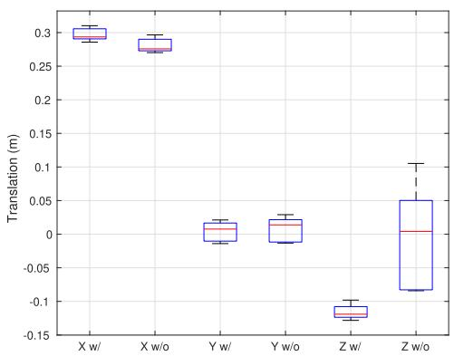  
Fig. 4. Extrinsics calibration results of KITTI 06 sequence. Adding VPLP constraints helps the converge of Z-axis translation.

The benefit of adding VPLP constraints is shown in Fig. 4, which represents the distributions of the estimated extrinsics in each GBA process of the KITTI sequences, with and without the added VPLP constraints. We find that KITTI sequences 06 lay approximately on a 2d plane because their Z-axis changes are much smaller than other sequences. As this kind of vehicle trajectory provides insufficient information to estimate the 6-DOF extrinsics, without VPLP constraints, the Z-axis of the extrinsics converges poorly, producing a deviation in excess of 10 centimeters. However, with the VPLP constraints, the extrinsics converge well for all sequences.

Compared to existing methods [20]–[22], this method is more robust to the operating environment because the VPLP constraint is a pure geometric constraint. It does require a good initial estimate of visual map points, so it is not suitable for short data sequences. In the experimental section, we use this calibration approach to re-calibrate the camera-lidar extrinsics of the KITTI and KAIST SLAM datasets, and show that the re-calibrated extrinsics improve visual-lidar SLAM performance.

## G. Moving Object Removal

In visual SLAM and visual-lidar SLAM, one critical issue is the removal of outlier features, particularly moving objects. A typical challenging scenario is shown in Fig. 5: in the beginning the preceding vehicle stops and many visual features on the vehicle are tracked by visual SLAM. When the vehicle begins to move again, if the tracked features are not properly rejected, the visual motion estimator falsely computes a backward motion, which further pollutes the local/global bundle adjustments and causes SLAM to fail.

In this work, we apply a multi-step outlier rejection mechanism with the assistance of lidar odometry. In the tightly-coupled pose estimation process, we use the initial pose estimation from lidar odometry instead of visual pose tracking to re-project visual map points onto the current image, and reject those visual feature matches with large re-projection error. Then the camera pose is estimated again using the selected visual feature matches and lidar residuals. The above operations are repeated several times; in each iteration, the visual features are re-projected and selected using the refined pose estimation. As shown in Fig. 5, this multi-step mechanism handily separates stable and moving visual features. When the front vehicle stops, the visual tracker captures all of the feature points on the vehicle, and when it resumes moving, the features are quickly dropped to avoid polluting motion estimation. Due to the initial stop-and-run vehicles, ORB-SLAM2 falsely estimates the vehicle motion, resulting in a zig-zag trajectory; in contrast, TVL-SLAM correctly rejects the outlier visual features and estimates a smooth trajectory.

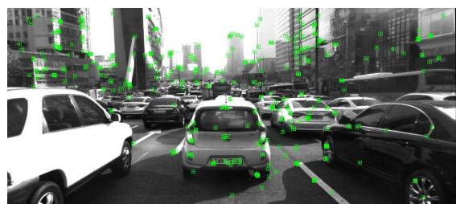

(a) Preceding vehicle remains stopped, other vehicles start moving forward  
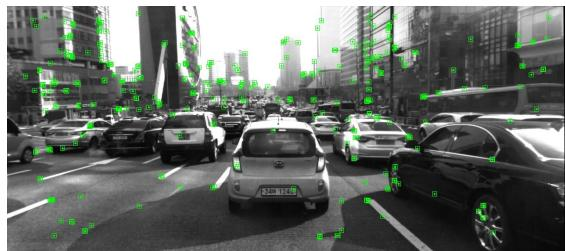  
(b) Preceding vehicle starts to move  
Fig. 5. A typical stop-and-run scenario. Green rectangles represent tracked visual feature points. In the first and second figure, the preceding vehicle stops, and then starts to move again in the third figure.

## V. EXPERIMENTS

## A. Overview

In this paper, we propose the following contributions to enhance the accuracy and robustness of SLAM systems:

\- Tightly-coupled visual-lidar odometry.

\- MHT-based lidar loop detection.

\- Camera-lidar and lidar-IMU extrinsics calibration.

\- Moving object rejection from visual-lidar cross validation.

We used two datasets to evaluate the effects of the above features. The first is the KITTI odometry dataset, the most widely evaluated dataset for autonomous driving. This dataset contains scenarios in urban, rural, and highway environments. Because of its scene diversity, we use it to evaluate the effects of the proposed visual-lidar odometry, loop detection, and extrinsics calibrations. The second is the KAIST urban dataset, which is focused on urban environments with extremely large loops and many moving objects. We use this dataset to evaluate the robustness of our loop detection and moving object rejection methods, and discuss how to deal with degenerate cases in visual and lidar frontends.

We evaluate the odometry/SLAM trajectories using two metrics. The first is the official evaluation metric of the KITTI competition, which focuses on trajectory smoothness and is computed as the relative transition error for 100-, 200-, …, and 800-meter distances. The second metric, which focuses on long-term drift, is the root-mean-square error (RMSE) of the whole SLAM trajectory compared with the ground-truth trajectory. We used the EVO evaluation tool [23] to compute the RMSE values. The RMSE values are said to be aligned, because before computing the RMSE values, an optimal 3d rigid transformation is computed to align the SLAM trajectory with the ground-truth trajectory. In this way, we avoid the abnormally large error caused by imperfect ground truth such as that in KITTI sequence 08, in which the ground-truth trajectory has a big jump at the beginning due to poor GPS convergence.

To evaluate the performance when composing a monocular/ stereo camera with lidar, we compare two variants of the proposed TVL-SLAM approach, both of which follow the pipeline and algorithms described in above sections, differing only in the number of measurements. The TVL-SLAM/ odometry uses monocular visual measurements in the local and global bundle adjustments; only the stereo measurements of the first input frame are utilized for the visual map initialization. The other variant is TVL-SLAM2, which uses all stereo measurements throughout the whole pipeline.

## B. Effects of GLF

The key contribution of GLF is to store the information of lidar registrations into a single 6-dimensional residual, so that it can guarantee both the accuracy and efficiency of SLAM. In this section we would like to show the superiority of GLF using two experiments. First, we will compare the accuracy of lidar SLAM approaches with and without GLF. Second, we will show the efficiency gain of compressing residuals using GLF in our lidar SLAM.

Table II compares the performances of LeGO-LOAM and our lidar SLAM. Our Lidar-SLAM here is with three different types of loop closing. The first is with no loop closure, the second is with fixed covariance, means that each lidar factor in the pose graph is with an identity covariance matrix, scaled by a fixed noise value. This method is applied by LeGO-LOAM and its extensions. The third is using GLF. The LeGO-LOAM without loop closing is named as LeGO-LOAM-NL here.

Because LeGO-LOAM does not export trajectory in camera coordinate, we were not able to compute its drifting percentage using official KITTI evaluation tool. So we only show its aligned RMSE value computed from evo. When without loop closing, the RMSE values of Lidar-SLAM and LeGO-LOAM are about the same except seq 01 and 02. However, after loop closing, in most sequences LeGO-LOAM does not improve(e.g 02, 06 and 09), while the Lidar-SLAM evidently reduced the errors. It shows that our factor graph formulation and lidar factors are more accurate than that in LeGO-LOAM.

Compared with fixed-covariance, GLF can better preserve the information of lidar registration and achieve better accuracy in the loop closure. Though the GLF and fixed-cov didn’t differ a lot on the local drifting, the GLF clearly out-performed on RMSE value, means that it helps on enhance global accuracy. Particularly for sequences with large loops and sparse loop detections, such as 02 and 08.

TABLE II  
RELATIVE TRANSLATION ERROR AND ALIGNED RMSE OF LIDAR SLAM WITH VARIOUS METHODS FOR LOOP CLOSURE
<table><tr><td rowspan=1 colspan=1>Seq</td><td rowspan=1 colspan=1>LeGO-LOAM-NL</td><td rowspan=1 colspan=1>LeGO-LOAM</td><td rowspan=1 colspan=1>No loops</td><td rowspan=1 colspan=1>Fixed cov</td><td rowspan=1 colspan=1>GLF</td></tr><tr><td rowspan=1 colspan=1>00</td><td rowspan=1 colspan=1>-/6.68m</td><td rowspan=1 colspan=1>-/2.96m</td><td rowspan=1 colspan=1>0.83%/7.28m</td><td rowspan=1 colspan=1>0.78%/1.55m</td><td rowspan=1 colspan=1>0.76%/1.47m</td></tr><tr><td rowspan=1 colspan=1>01</td><td rowspan=1 colspan=1>-/205.49m</td><td rowspan=1 colspan=1>-/205.49m</td><td rowspan=1 colspan=1>1.62%/14.19m</td><td rowspan=1 colspan=1>一</td><td rowspan=1 colspan=1></td></tr><tr><td rowspan=1 colspan=1>02</td><td rowspan=1 colspan=1>-/62.15m</td><td rowspan=1 colspan=1>-/66.77m</td><td rowspan=1 colspan=1>1.28%/40.68m</td><td rowspan=1 colspan=1>0.93%/4.72m</td><td rowspan=1 colspan=1>0.81%/3.95m</td></tr><tr><td rowspan=1 colspan=1>03</td><td rowspan=1 colspan=1>-/0.80m</td><td rowspan=1 colspan=1>-/0.80m</td><td rowspan=1 colspan=1>0.62%/0.69m</td><td rowspan=1 colspan=1>一</td><td rowspan=1 colspan=1>一</td></tr><tr><td rowspan=1 colspan=1>04</td><td rowspan=1 colspan=1>-/0.52m</td><td rowspan=1 colspan=1>-/0.52m</td><td rowspan=1 colspan=1>0.59%/0.30m</td><td rowspan=1 colspan=1>一</td><td rowspan=1 colspan=1>一</td></tr><tr><td rowspan=1 colspan=1>05</td><td rowspan=1 colspan=1>-/2.30m</td><td rowspan=1 colspan=1>-/1.89m</td><td rowspan=1 colspan=1>0.58%/5.29m</td><td rowspan=1 colspan=1>0.50%/0.62m</td><td rowspan=1 colspan=1>0.48%/0.53m</td></tr><tr><td rowspan=1 colspan=1>06</td><td rowspan=1 colspan=1>-/0.97m</td><td rowspan=1 colspan=1>-/0.96m</td><td rowspan=1 colspan=1>0.37%/0.53m</td><td rowspan=1 colspan=1>0.38%/0.42m</td><td rowspan=1 colspan=1>0.39%/0.44m</td></tr><tr><td rowspan=1 colspan=1>07</td><td rowspan=1 colspan=1>-/0.93m</td><td rowspan=1 colspan=1>-/1.01m</td><td rowspan=1 colspan=1>0.72%/1.49m</td><td rowspan=1 colspan=1>0.64%/0.50m</td><td rowspan=1 colspan=1>0.77%/0.52m</td></tr><tr><td rowspan=1 colspan=1>08</td><td rowspan=1 colspan=1>-/3.41m</td><td rowspan=1 colspan=1>-/3.04m</td><td rowspan=1 colspan=1>1.11%/4.51m</td><td rowspan=1 colspan=1>1.24%/3.93m</td><td rowspan=1 colspan=1>1.05%/3.38m</td></tr><tr><td rowspan=1 colspan=1>09</td><td rowspan=1 colspan=1>-/12.69m</td><td rowspan=1 colspan=1>-/12.69m</td><td rowspan=1 colspan=1>1.15%/2.63m</td><td rowspan=1 colspan=1>1.16%/1.75m</td><td rowspan=1 colspan=1>1.17%/1.76m</td></tr><tr><td rowspan=1 colspan=1>10</td><td rowspan=1 colspan=1>-/3.73m</td><td rowspan=1 colspan=1>-/3.73m</td><td rowspan=1 colspan=1>0.88%/1.19m</td><td rowspan=1 colspan=1>一</td><td rowspan=1 colspan=1>一</td></tr><tr><td rowspan=1 colspan=1>Total</td><td rowspan=1 colspan=1>I</td><td rowspan=1 colspan=1>-</td><td rowspan=1 colspan=1>0.99%</td><td rowspan=1 colspan=1>0.91%</td><td rowspan=1 colspan=1>0.85%</td></tr></table>

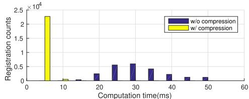

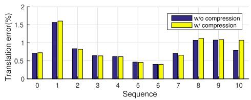  
Fig. 6. Computation cost vs. accuracy with and without GLF compression. The upper plot is the computation time distribution of each lidar registration; the lower plot is the relative translation error on the KITTI training sequences.

To evaluate the efficiency gain and accuracy loss when using GLF, we also ran our lidar SLAM on KITTI odometry sequences. Here the GLF is used in each scan-to-map registration of lidar odometry, all the lidar residuals are compressed into GLF before solving the Levenberg-Marquardt problem of Equation 1.

Figure 6 shows the computation time versus the translation error(in drifting percentage) of our lidar SLAM. Without GLF, the computation time of each scan-to-map registration ranges from 20 to 50ms, depending on the number of lidar points. With GLF, the computation time is reduced to less than 10ms (including the time to compute GLF).

Though GLF assumes that the linearization point $\tilde { T _ { L } ^ { M } }$ is good. In SLAM experiments, we found that this assumption is often valid even we use constant-velocity assumption to estimate the initial value of $\tilde { T _ { L } ^ { M } }$ . As shown in Figure 6, compared to the efficiency gain, the accuracy loss due to imperfect linearization point is quite minor. After using GLF, the difference of translation errors in most sequences is less than 0.05%. This experiment was run on a 3.5GHz CPU with single thread.

## C. Effects of Loop Detection

Table III compares the performance of TVL-odometry (no loop closure), TVL-SLAM with visual-only loop detection, and TVL-SLAM with both visual and lidar loop detection. Note that for sequences 01, 03, 04, and 10, which have no loops, the above algorithms yield the same performance.

TABLE III  
RELATIVE TRANSLATION ERROR AND ALIGNED RMSE OF TVL-SLAM USING VARIOUS METHODS FOR LOOP DETECTION
<table><tr><td rowspan=1 colspan=1>Seq</td><td rowspan=1 colspan=1>No loops</td><td rowspan=1 colspan=1>Visual loops</td><td rowspan=1 colspan=1>Visual and lidarloops</td></tr><tr><td rowspan=1 colspan=1>00</td><td rowspan=1 colspan=1>0.60%/4.35m</td><td rowspan=1 colspan=1>0.60%/0.88m</td><td rowspan=1 colspan=1>0.59%/0.84m</td></tr><tr><td rowspan=1 colspan=1>01</td><td rowspan=1 colspan=1>1.08%/6.56m</td><td rowspan=1 colspan=1>一</td><td rowspan=1 colspan=1>一</td></tr><tr><td rowspan=1 colspan=1>02</td><td rowspan=1 colspan=1>0.67%/5.40m</td><td rowspan=1 colspan=1>0.72%/2.63m</td><td rowspan=1 colspan=1>0.74%/2.16m</td></tr><tr><td rowspan=1 colspan=1>03</td><td rowspan=1 colspan=1>0.71%/0.75m</td><td rowspan=1 colspan=1>一</td><td rowspan=1 colspan=1>一</td></tr><tr><td rowspan=1 colspan=1>04</td><td rowspan=1 colspan=1>0.49%/0.18m</td><td rowspan=1 colspan=1>一</td><td rowspan=1 colspan=1>一</td></tr><tr><td rowspan=1 colspan=1>05</td><td rowspan=1 colspan=1>0.42%/2.47m</td><td rowspan=1 colspan=1>0.32%/0.43m</td><td rowspan=1 colspan=1>0.32%/0.41m</td></tr><tr><td rowspan=1 colspan=1>06</td><td rowspan=1 colspan=1>0.34%/0.55m</td><td rowspan=1 colspan=1>0.33%/0.34m</td><td rowspan=1 colspan=1>0.32%/0.32m</td></tr><tr><td rowspan=1 colspan=1>07</td><td rowspan=1 colspan=1>0.48%/0.78m</td><td rowspan=1 colspan=1>0.48%/0.63m</td><td rowspan=1 colspan=1>0.36%/0.37m</td></tr><tr><td rowspan=1 colspan=1>08</td><td rowspan=1 colspan=1>0.88%/2.62m</td><td rowspan=1 colspan=1>一</td><td rowspan=1 colspan=1>0.88%/2.52m</td></tr><tr><td rowspan=1 colspan=1>09</td><td rowspan=1 colspan=1>0.64%/2.28m</td><td rowspan=1 colspan=1>一</td><td rowspan=1 colspan=1>0.64%/1.32m</td></tr><tr><td rowspan=1 colspan=1>10</td><td rowspan=1 colspan=1>0.67%/1.05m</td><td rowspan=1 colspan=1>一</td><td rowspan=1 colspan=1>一</td></tr><tr><td rowspan=1 colspan=1>Total</td><td rowspan=1 colspan=1>0.67%/-</td><td rowspan=1 colspan=1>0.66%/-</td><td rowspan=1 colspan=1>0.66%/-</td></tr></table>

Compared with the lidar SLAM results in Table II, TVL-SLAM considerably improves the drift precentage. Even without loop closure, TVL odometry drift is lower than that of lidar SLAM on all sequences. Adding loop detection does little to improve the drift metric, but does reduce RMSE considerably. Compared to vision-only loop detection, adding lidar loop detection considerably improves sequences 00, 02, and 05 because in those sequences the vehicle revisits the same place in different orientations; in these cases visual loop detection cannot find loops. The number of visual and lidar loop detections are shown in Fig. 7. Furthermore, lidar loop detection often finds loops earlier than visual loop detection. On sequence 09, although the vehicle revisits the starting point in the same orientation, the overlapping trajectory is quite short and visual loop detection is unable to find a loop.

## D. Effect of Extrinsics Calibration

Table IV shows the performance of TVL-SLAM with different extrinsics. The first is with the original KITTI extrinsics. The second uses the camera-lidar extrinsics from the proposed SLAM-with-calibration approach. The third result is based on the second, but the trajectory is compensated by new camera-IMU extrinsics, which are computed as the hand-eye calibration of the proposed TVL-SLAM trajectory and the KITTI ground-truth poses. Since the camera intrinsics/extrinsics of sequences 00 to 02 are the same and sequences 05 to 12 have other intrinsics/extrinsics, we assume that the camera-IMU extrinsics of 00–02 are the same, but 05–12 have other camera-IMU extrinsics. Therefore, for sequences 00–02, we use the hand-eye calibration of 00. For 05–10 we use the hand-eye calibration of 05.

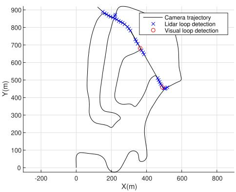  
Fig. 7. Visual and lidar loop detection on KITTI 02 sequences.

TABLE IV  
RELATIVE TRANSLATION ERROR AND ALIGNED RMSE OF EXTRINSICS CALIBRATION METHODS
<table><tr><td rowspan=1 colspan=1>Seq</td><td rowspan=1 colspan=1>No calib</td><td rowspan=1 colspan=1>VL calib</td><td rowspan=1 colspan=1>VL + LI calib</td></tr><tr><td rowspan=1 colspan=1>00</td><td rowspan=1 colspan=1>0.59%/0.84m</td><td rowspan=1 colspan=1>0.57%/0.88m</td><td rowspan=1 colspan=1>0.45%/0.88m</td></tr><tr><td rowspan=1 colspan=1>01</td><td rowspan=1 colspan=1>1.08%/6.56m</td><td rowspan=1 colspan=1>0.86%/4.40m</td><td rowspan=1 colspan=1>0.53%/4.23m</td></tr><tr><td rowspan=1 colspan=1>02</td><td rowspan=1 colspan=1>0.74%/2.16m</td><td rowspan=1 colspan=1>0.67%/1.87m</td><td rowspan=1 colspan=1>0.54%/1.88m</td></tr><tr><td rowspan=1 colspan=1>03</td><td rowspan=1 colspan=1>0.71%/0.75m</td><td rowspan=1 colspan=1>0.71%/0.74m</td><td rowspan=1 colspan=1>0.71%/0.74m</td></tr><tr><td rowspan=1 colspan=1>04</td><td rowspan=1 colspan=1>0.49%/0.18m</td><td rowspan=1 colspan=1>0.45%/0.22m</td><td rowspan=1 colspan=1>0.29%/0.22m</td></tr><tr><td rowspan=1 colspan=1>05</td><td rowspan=1 colspan=1>0.32%/0.41m</td><td rowspan=1 colspan=1>0.31%/0.42m</td><td rowspan=1 colspan=1>0.23%/0.43m</td></tr><tr><td rowspan=1 colspan=1>06</td><td rowspan=1 colspan=1>0.32%/0.32m</td><td rowspan=1 colspan=1>0.31%/0.28m</td><td rowspan=1 colspan=1>0.19%/0.30m</td></tr><tr><td rowspan=1 colspan=1>07</td><td rowspan=1 colspan=1>0.36%/0.37m</td><td rowspan=1 colspan=1>0.35%/0.35m</td><td rowspan=1 colspan=1>0.31%/0.37m</td></tr><tr><td rowspan=1 colspan=1>08</td><td rowspan=1 colspan=1>0.88%/2.52m</td><td rowspan=1 colspan=1>0.86%/2.14m</td><td rowspan=1 colspan=1>0.86%/2.14m</td></tr><tr><td rowspan=1 colspan=1>09</td><td rowspan=1 colspan=1>0.64%/1.32m</td><td rowspan=1 colspan=1>0.61%/1.18m</td><td rowspan=1 colspan=1>0.53%/1.14m</td></tr><tr><td rowspan=1 colspan=1>10</td><td rowspan=1 colspan=1>0.68%/1.05m</td><td rowspan=1 colspan=1>0.53%/0.63m</td><td rowspan=1 colspan=1>0.53%/0.64m</td></tr><tr><td rowspan=1 colspan=1>Total</td><td rowspan=1 colspan=1>0.66%/-</td><td rowspan=1 colspan=1>0.62%/-</td><td rowspan=1 colspan=1>0.52%/-</td></tr></table>

We find that camera-lidar re-calibration considerably improves the accuracy of visual-lidar odometry and improves the performance on almost all KITTI sequences and all metrics, in particular the RMSE values of sequences with no or few loops such as 01, 02, and 10. When there are many loops, the negative effects of using inaccurate extrinsics is eased because there are enough measurements. Note that although camera-IMU re-calibration has little effect on the aligned RMSE values, it considerably reduces short-term drift. This means that camera-IMU re-calibration does not reduce long-term drift; it merely improves local smoothness.

## E. Comparison of State-of-the-Art Methods on KITTI Dataset

In this subsection, we compare the performance of the proposed tightly-coupled visual-lidar SLAM (TVL-SLAM) with state-of-the-art visual/lidar SLAM approaches using the KITTI odometry dataset. For visual approaches, we choose ORB-SLAM2 [4] because we use it as the visual part in our approach, and SOFT-SLAM [24] because it is one of the best published stereo visual SLAM approaches.

For lidar approaches, we compare the algorithm in Section V (termed lidar SLAM) with the two best published lidar odometry/SLAM approaches: LOAM [12] and IMLS-SLAM [25]. For the proposed approach, we compare two variations to better understand the individual contributions of camera and lidar. TVL-SLAM is the monocular version of our approach, in which stereo input is used only in the first frame to facilitate visual map initialization. TVL-SLAM2, in contrast, uses all the lidar and stereo camera inputs. TVL-SLAM and TVL-SLAM2 here do not use online calibration; they instead use the camera-lidar extrinsics estimated by the algorithm in Section IV-C.

Comparisons to state-of-the-art methods are listed in Table V. As mentioned in Section V-B, we were unable to compute LeGO-LOAM drift using KITTI official evaluation tool. Thus the drift precentage here is taken from the LOAM paper [12]. Generally, visual approaches yield better performance than lidar approaches, particularly for long-term drift when there are no loop closures. This is because visual approaches can track distant visual features and therefore minimize orientation drift. However, as lidar approaches use no long-term tracking of feature points, high drift is more likely, particularly for pitch angle and height. Nevertheless, lidar SLAM performance approximates or exceeds that of visual SLAM on sequences with multiple loops such as 00, 02, 05, 06, and 08. This is because lidar point clouds provide more loop detections than camera images. As shown in Fig. 2, there are clearly more loop detections with lidar than with visual approaches. This is (1) because lidar receives more depth measurements than stereo cameras and thus detects loops earlier, and (2) because lidar has a 360-degree FOV. For example, the trajectory of sequence 06 is a long eclipse: when the vehicle rotates 180 degrees and returns, the front-viewing camera does not detect the loop because it is looking in reverse; by contrast, lidar loop detection detects it immediately.

The proposed TVL-SLAM successfully preserves the merits of visual and lidar odometry approaches, and even exceeds this. Table V shows that TVL-SLAM outperforms the individual lidar and visual SLAM systems on almost all sequences in terms of both relative translation error and total trajectory RMSE. Benefitting from the tightly coupled backend, even without stereo measurements, TVL-SLAM yields considerable improvements over the original lidar and visual SLAM algorithms. One interesting observation is that using only monocular measurements in the TVL-SLAM does not harm performance. Indeed, the monocular version of TVL-SLAM outperforms the stereo version in most sequences, particularly when there are few or no loop closures, such as 01 and 02, which implies that using only monocular measurements is better for low-drift visual-lidar odometry.

To better compare with existing works, we also submitted our TVL-SLAM results to the KITTI odometry competition because most related works provide neither open source code nor evaluations for KITTI training sequences. We list the results of published related works in Table VI. As of August 2021, TVL-SLAM achieved 0.56% and ranked 4th in all SLAM/odometry approaches. In all visual-lidar integrated approaches, TVL-SLAM ranked 2nd. If we only compare with full-SLAM approaches(means the approaches with loop closing, SOFT2, V-LOAM, and LOAM are without loop closures), TVL-SLAM is the 1st place.

TABLE V  
RELATIVE TRANSLATION ERROR AND ALIGNED RMSE FOR FIRST 11 KITTI SEQUENCES
<table><tr><td rowspan=1 colspan=1>Seq</td><td rowspan=1 colspan=1>LOAM/LeGO-LOAM</td><td rowspan=1 colspan=1>IMLS-SLAM</td><td rowspan=1 colspan=1>SOFT-SLAM</td><td rowspan=1 colspan=1>Lidar SLAM</td><td rowspan=1 colspan=1>ORB-SLAM2</td><td rowspan=1 colspan=1>ORB-SLAM3</td><td rowspan=1 colspan=1>TVL-SLAM</td><td rowspan=1 colspan=1>TVL-SLAM2</td></tr><tr><td rowspan=1 colspan=1>00</td><td rowspan=1 colspan=1>0.78%/2.96m</td><td rowspan=1 colspan=1>0.50%/-</td><td rowspan=1 colspan=1>0.66%/1.20m</td><td rowspan=1 colspan=1>0.76%/1.47m</td><td rowspan=1 colspan=1>0.74%/1.44m</td><td rowspan=1 colspan=1>0.71%/1.28m</td><td rowspan=1 colspan=1>0.45%/0.88m</td><td rowspan=1 colspan=1>0.46%/0.88m</td></tr><tr><td rowspan=1 colspan=1>01</td><td rowspan=1 colspan=1>1.43%/205.49m</td><td rowspan=1 colspan=1>0.82%/-</td><td rowspan=1 colspan=1>0.96%/3.02m</td><td rowspan=1 colspan=1>1.62%/14.19m</td><td rowspan=1 colspan=1>1.65%/13.03m</td><td rowspan=1 colspan=1>1.65%/11.81m</td><td rowspan=1 colspan=1>0.53%/4.23m</td><td rowspan=1 colspan=1>0.73%/6.01m</td></tr><tr><td rowspan=1 colspan=1>02</td><td rowspan=1 colspan=1>0.92%/66.77m</td><td rowspan=1 colspan=1>0.53%/-</td><td rowspan=1 colspan=1>1.36%/5.09m</td><td rowspan=1 colspan=1>0.81%/3.95m</td><td rowspan=1 colspan=1>0.79%/5.91m</td><td rowspan=1 colspan=1>0.77%/6.61m.</td><td rowspan=1 colspan=1>0.54%/1.88m</td><td rowspan=1 colspan=1>0.50%/2.33m</td></tr><tr><td rowspan=1 colspan=1>03</td><td rowspan=1 colspan=1>0.86%/0.80m</td><td rowspan=1 colspan=1>0.68%/-</td><td rowspan=1 colspan=1>0.70%/0.54m</td><td rowspan=1 colspan=1>0.62%/0.75m</td><td rowspan=1 colspan=1>0.71%/0.58m</td><td rowspan=1 colspan=1>0.90%/1.29m</td><td rowspan=1 colspan=1>0.71%/0.74m</td><td rowspan=1 colspan=1>0.69%/0.81m</td></tr><tr><td rowspan=1 colspan=1>04</td><td rowspan=1 colspan=1>0.71%/0.52m</td><td rowspan=1 colspan=1>0.33%/-</td><td rowspan=1 colspan=1>0.50%/0.35m</td><td rowspan=1 colspan=1>0.59%/0.18m</td><td rowspan=1 colspan=1>0.45%/0.17m</td><td rowspan=1 colspan=1>0.55%/0.22m</td><td rowspan=1 colspan=1>0.29%/0.22m</td><td rowspan=1 colspan=1>0.30%/0.18m</td></tr><tr><td rowspan=1 colspan=1>05</td><td rowspan=1 colspan=1>0.57%/1.89m</td><td rowspan=1 colspan=1>0.32%/-</td><td rowspan=1 colspan=1>0.43%/0.77m</td><td rowspan=1 colspan=1>0.48%/0.53m</td><td rowspan=1 colspan=1>0.53%/1.22m</td><td rowspan=1 colspan=1>0.42%/0.84m</td><td rowspan=1 colspan=1>0.23%/0.43m</td><td rowspan=1 colspan=1>0.27%/0.52m</td></tr><tr><td rowspan=1 colspan=1>06</td><td rowspan=1 colspan=1>0.65%/0.96m</td><td rowspan=1 colspan=1>0.33%/-</td><td rowspan=1 colspan=1>0.41%/0.52m</td><td rowspan=1 colspan=1>0.39%/0.44m</td><td rowspan=1 colspan=1>0.53%/0.87m</td><td rowspan=1 colspan=1>0.52%/0.81m.</td><td rowspan=1 colspan=1>0.19%/0.30m</td><td rowspan=1 colspan=1>0.22%/0.39m</td></tr><tr><td rowspan=1 colspan=1>07</td><td rowspan=1 colspan=1>0.63%/1.01m</td><td rowspan=1 colspan=1>0.33%/-</td><td rowspan=1 colspan=1>0.36%/0.33m</td><td rowspan=1 colspan=1>0.77%/0.52m</td><td rowspan=1 colspan=1>0.50%/0.71m</td><td rowspan=1 colspan=1>0.46%/0.44m</td><td rowspan=1 colspan=1>0.31%/0.37m</td><td rowspan=1 colspan=1>0.29%/0.31m</td></tr><tr><td rowspan=1 colspan=1>08</td><td rowspan=1 colspan=1>1.12%/3.04m</td><td rowspan=1 colspan=1>0.80%/-</td><td rowspan=1 colspan=1>0.78%/2.28m</td><td rowspan=1 colspan=1>1.05%/3.38m</td><td rowspan=1 colspan=1>1.04%/3.55m</td><td rowspan=1 colspan=1>1.02%/3.38m.</td><td rowspan=1 colspan=1>0.86%/2.14m</td><td rowspan=1 colspan=1>0.87%/1.99m</td></tr><tr><td rowspan=1 colspan=1>09</td><td rowspan=1 colspan=1>0.77%/12.67m</td><td rowspan=1 colspan=1>0.55%/-</td><td rowspan=1 colspan=1>0.59%/1.34m</td><td rowspan=1 colspan=1>1.17%/1.76m</td><td rowspan=1 colspan=1>0.85%/3.13m</td><td rowspan=1 colspan=1>1.03%/1.91m</td><td rowspan=1 colspan=1>0.53%/1.14m</td><td rowspan=1 colspan=1>0.57%/1.23m</td></tr><tr><td rowspan=1 colspan=1>10</td><td rowspan=1 colspan=1>0.79%/3.73m</td><td rowspan=1 colspan=1>0.53%/-</td><td rowspan=1 colspan=1>0.68%/0.93m</td><td rowspan=1 colspan=1>0.67%/1.05m</td><td rowspan=1 colspan=1>0.61%/1.17m</td><td rowspan=1 colspan=1>0.66%/1.14m.</td><td rowspan=1 colspan=1>0.53%/0.64m</td><td rowspan=1 colspan=1>0.52%/0.63m</td></tr><tr><td rowspan=1 colspan=1>Total</td><td rowspan=1 colspan=1>0.88%</td><td rowspan=1 colspan=1>0.55%</td><td rowspan=1 colspan=1>-%</td><td rowspan=1 colspan=1>0.83%</td><td rowspan=1 colspan=1>0.81%</td><td rowspan=1 colspan=1>0.80%</td><td rowspan=1 colspan=1>0.52%</td><td rowspan=1 colspan=1>0.54%</td></tr></table>

TABLE VI  
KITTI COMPETITION RANK, AUGUST 2021
<table><tr><td rowspan=1 colspan=1>Algorithm</td><td rowspan=1 colspan=1>Rank</td><td rowspan=1 colspan=1>Transerr(%)</td></tr><tr><td rowspan=1 colspan=1>SOFT2 [26]</td><td rowspan=1 colspan=1>1</td><td rowspan=1 colspan=1>0.53%</td></tr><tr><td rowspan=1 colspan=1>V-LOAM [3]</td><td rowspan=1 colspan=1>2</td><td rowspan=1 colspan=1>0.54%</td></tr><tr><td rowspan=1 colspan=1>LOAM [3]</td><td rowspan=1 colspan=1>3</td><td rowspan=1 colspan=1>0.55%</td></tr><tr><td rowspan=1 colspan=1>TVL-SLAM</td><td rowspan=1 colspan=1>4</td><td rowspan=1 colspan=1>0.56%</td></tr><tr><td rowspan=1 colspan=1>SOFT-SLAM[24]</td><td rowspan=1 colspan=1>11</td><td rowspan=1 colspan=1>0.65%</td></tr><tr><td rowspan=1 colspan=1>IMLS-SLAM[25]</td><td rowspan=1 colspan=1>16</td><td rowspan=1 colspan=1>0.69%</td></tr><tr><td rowspan=1 colspan=1>LIMO2-GP</td><td rowspan=1 colspan=1>29</td><td rowspan=1 colspan=1>0.84%</td></tr><tr><td rowspan=1 colspan=1>LIMO [2]</td><td rowspan=1 colspan=1>41</td><td rowspan=1 colspan=1>0.93%</td></tr><tr><td rowspan=1 colspan=1>DEMO [1]</td><td rowspan=1 colspan=1>57</td><td rowspan=1 colspan=1>1.14%</td></tr><tr><td rowspan=1 colspan=1>ORB-SLAM2 [4]</td><td rowspan=1 colspan=1>58</td><td rowspan=1 colspan=1>1.15%</td></tr><tr><td rowspan=1 colspan=1>Lidar SLAM</td><td rowspan=1 colspan=1>一</td><td rowspan=1 colspan=1>1.15%</td></tr></table>

In visual-lidar odometry/SLAM work, TVL-SLAM outperforms the vision-driven approaches DEMO [1], LIMO [2], and LIMO2-GP, an improved version of LIMO which adds stereo measurements and uses ground-plane fitting to constrain the height drift. Though TVL-SLAM is slightly worse than the latest V-LOAM, note that V-LOAM improves little over LOAM, and the performance of LOAM/V-LOAM in their latest publications [3], [12] were 0.88% and 0.75%. TVL-SLAM, however, is based on ORB-SLAM2 and a fundamental lidar SLAM. Both algorithms yield 1.15% performance, which clearly shows the merits of the proposed strategy for tight coupling.

## F. Experiments on KAIST Dataset

Here we present the experimental results on the KAIST urban dataset. In comparison to the KITTI dataset, the following features of KAIST translate to more significant experimental results:

\- It was collected in crowded city scenarios in East Asia, with many moving vehicles and pedestrians. This is difficult for vision-only and visual-driven SLAM approaches.

\- Instead of expensive 64-bin or 32-bin lidar, KAIST collects point cloud data using two 16-bin lidar, mounted at a 45-degree pitch angle. This is challenging for lidar-only and lidar-driven SLAM approaches.

TABLE VII  
ALIGNED RMSE OF KAIST SEQUENCES
<table><tr><td rowspan=1 colspan=1>Seq</td><td rowspan=1 colspan=1>LidarSLAM</td><td rowspan=1 colspan=1>ORB-SLAM2</td><td rowspan=1 colspan=1>TVL-SLAM</td><td rowspan=1 colspan=1>TVL-SLAM2</td></tr><tr><td rowspan=1 colspan=1>urban30-Gangnam</td><td rowspan=1 colspan=1>75.43m</td><td rowspan=1 colspan=1>120.82m</td><td rowspan=1 colspan=1>8.58m</td><td rowspan=1 colspan=1>9.63m</td></tr><tr><td rowspan=1 colspan=1>urban32-Yeouido</td><td rowspan=1 colspan=1>43.81m</td><td rowspan=1 colspan=1>23.24m</td><td rowspan=1 colspan=1>9.71m</td><td rowspan=1 colspan=1>15.30m</td></tr><tr><td rowspan=1 colspan=1>urban33-Yeouido</td><td rowspan=1 colspan=1>112.17m</td><td rowspan=1 colspan=1>34.04m</td><td rowspan=1 colspan=1>13.06m</td><td rowspan=1 colspan=1>14.05m</td></tr><tr><td rowspan=1 colspan=1>urban34-Yeouido</td><td rowspan=1 colspan=1>377.13m</td><td rowspan=1 colspan=1>46.67m</td><td rowspan=1 colspan=1>30.95m</td><td rowspan=1 colspan=1>28.49m</td></tr><tr><td rowspan=1 colspan=1>urban38-Pankyo</td><td rowspan=1 colspan=1>29.07m</td><td rowspan=1 colspan=1>63.70m</td><td rowspan=1 colspan=1>8.70m</td><td rowspan=1 colspan=1>14.44m</td></tr><tr><td rowspan=1 colspan=1>urban39-Pankyo</td><td rowspan=1 colspan=1>30.30m</td><td rowspan=1 colspan=1>73.44m</td><td rowspan=1 colspan=1>8.14m</td><td rowspan=1 colspan=1>14.20m</td></tr></table>

\- There are no overlaps between the FOV of stereo camera and lidar, making image-lidar alignment infeasible. Under this case vision-driven visual-lidar approaches [1], [3] are not applicable.

\- These are long trajectories (up to 11 kilometers in one sequence) and big loops (up to 7 kilometers), which require low drift and strong loop detection.

\- These include extreme lighting conditions and highway scenes with very few geometry features. With pure visual odometry, it is easy to lose tracking, and with pure lidar odometry, drift accumulates due to lidar-degenerate scenes.

The aligned RMSE values are listed in Table VII. ORB-SLAM2 exhibits reasonable performance on long sequences with few or no moving objects such as 32, 33, and 34. However, ORB-SLAM2 tends to fail in crowded urban scenes because of the moving vehicles, performing poorly in 38 and 39, as shown in Fig. 9(a)(c). As lidar SLAM is much stronger with moving objects than ORB-SLAM2, it yields reasonable results on sequences 38 and 39. Although these sequences have stop-and-run scenarios, they are composed of multiple small loops; thus lidar SLAM detects many loops with which to reduce drift. Nevertheless, for long sequences with only a few large loops (exceeding 2 kilometers) such as sequences 30, 32, and 33, lidar SLAM exhibits poor performance because it is weak at controlling pitch and height drift, as shown in Fig. 9(b). The KAIST urban34-Yeouido sequence is particularly challenging for single-modality SLAM approaches. In Fig. 10(a), on the highway, as there are few geometry features, pure lidar odometry drifts when there are nearby moving vehicles. On the other hand, due to poor lighting conditions, visual SLAM drifts because there are too few visual features. Due to the lidar-degenerate scenes, the lidar SLAM trajectory of sequence 34 shrinks. Benefitting from lane feature tracking on the ground, visual SLAM does not make serious errors on this sequence, although it does drift quickly in the scene of Fig. 10(b) because few visual features are trackable under such poor lighting conditions.

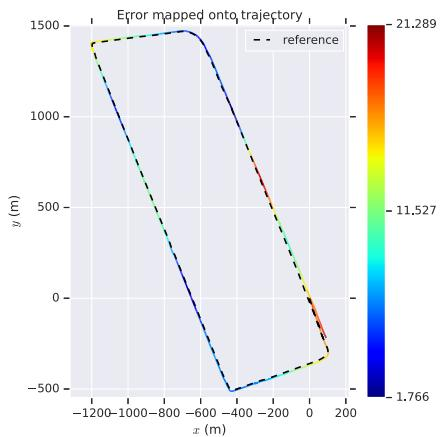  
(a) urban30-Gangnam

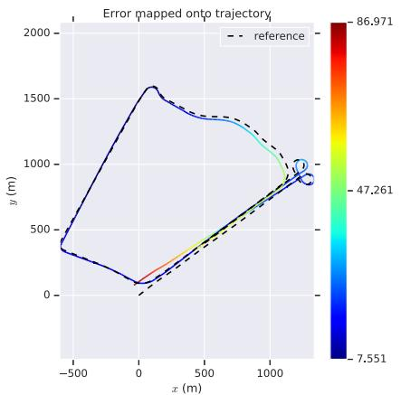  
(b) urban34-Yeouido

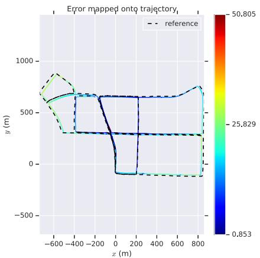  
(c) urban38-Pankyo

Fig. 8. TVL-SLAM trajectories on KAIST urban datasets.  
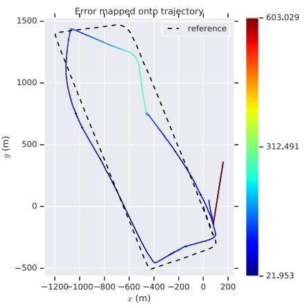  
(a) urban30-Gangnam, ORB-SLAM2

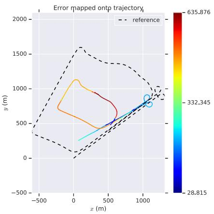  
(b) urban34-Yeouido, lidar SLAM

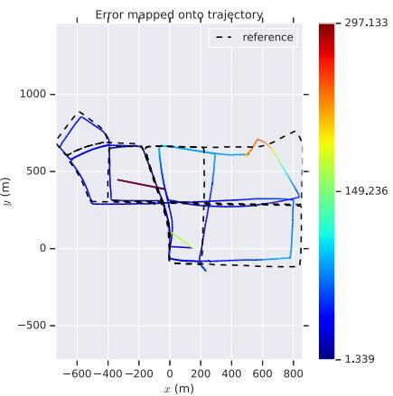  
(c) urban38-Pankyo, ORB-SLAM2  
Fig. 9. Failure cases of ORB-SLAM2 and lidar SLAM on KAIST.

TVL-SLAM preserves the merits of the above two approaches, and even improves on them. Table VII shows that the RMSE values of TVL-SLAM are less than the half of the individual visual/lidar SLAM approaches for most sequences. Note that the monocular version (TVL-SLAM) yields even better results on all sequences besides 34: this shows that the stereo camera improves the robustness in extreme cases, but not the accuracy of tightly-coupled SLAM. TVL-SLAM overcomes the most challenging sequence 34 because it uses both visual and lidar features. On the road with few geometry features, TVL-SLAM uses visual features on the ground to minimize large errors in motion estimation. Under extreme lighting conditions, even when there are few visual features, large numbers of lidar geometry features help to enhance the accuracy of motion estimation. As a result, TVL-SLAM considerably outperforms fundamental visual and lidar SLAM approaches in all KAIST sequences.

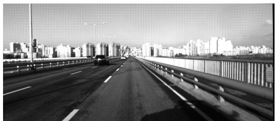

(a) Lidar degenerate case  
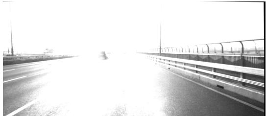  
(b) Challenging case for visual SLAM  
Fig. 10. Challenging cases for visual and lidar SLAM.

## VI. CONCLUSION AND FUTURE WORK

We propose TVL-SLAM, a tightly-coupled visual-lidar SLAM system. With this system we seek to enhance SLAM accuracy and robustness by properly utilizing all of the visual and lidar measurements. As to the technical contributions, we propose a new lidar residual compression method to efficiently insert a large amount of lidar measurements into the bundle adjustments. We also demonstrate how to extend the SLAM system to SLAM-with-calibration, and propose adding visual-lidar residuals to account for degenerate vehicle trajectories. We evaluate the proposed approach on the KITTI and KAIST datasets, showing considerable improvements over individual visual and lidar SLAM algorithms.

In this paper, as we focus on the integration of visual and lidar measurements, there remain unaddressed corner cases for the resulting SLAM system, such as crowded highway scenes, which often lack shape features and have many moving objects. In the future, we will attempt to integrate inertial and wheel speed sensors using the key concepts of this work—efficient residual compression and a tightly coupled framework—to enhance system robustness.

## ACKNOWLEDGMENT

The authors sincerely acknowledge the Associate Chairs and the anonymous reviewers for their helpful comments.

## REFERENCES

[1] J. Zhang, M. Kaess, and S. Singh, “Real-time depth enhanced monocular odometry,” in Proc. IEEE/RSJ Int. Conf. Intell. Robots Syst., Sep. 2014, pp. 4973–4980.

[2] J. Graeter, A. Wilczynski, and M. Lauer, “LIMO: LiDAR-monocular visual odometry,” in Proc. IEEE/RSJ Int. Conf. Intell. Robots Syst. (IROS), Oct. 2018, pp. 7872–7879.

[3] J. Zhang and S. Singh, “Visual-LiDAR odometry and mapping: Lowdrift, robust, and fast,” in Proc. IEEE Int. Conf. Robot. Autom. (ICRA), May 2015, pp. 2174–2181.

[4] R. Mur-Artal and J. D. Tardos, “ORB-SLAM2: An open-source SLAM system for monocular, stereo and RGB-D cameras,” 2016, arXiv:1610.06475.

[5] J. Zhang and S. Singh, “Laser-visual-inertial odometry and mapping with high robustness and low drift,” J. Field Robot., vol. 35, no. 8, pp. 1242–1264, Dec. 2018.

[6] J. Hsiung, M. Hsiao, E. Westman, R. Valencia, and M. Kaess, “Information sparsification in visual-inertial odometry,” in Proc. IEEE/RSJ Int. Conf. Intell. Robots Syst. (IROS), Oct. 2018, pp. 1146–1153.

[7] X. Zuo et al., “LIC-fusion 2.0: LiDAR-inertial-camera odometry with sliding-window plane-feature tracking,” 2020, arXiv:2008.07196.

[8] T. Shan, B. Englot, C. Ratti, and D. Rus, “LVI-SAM: Tightly-coupled LiDAR-Visual-Inertial odometry via smoothing and mapping,” 2021, arXiv:2104.10831.

[9] T. Shan, B. Englot, D. Meyers, W. Wang, C. Ratti, and D. Rus, “LIO-SAM: Tightly-coupled lidar inertial odometry via smoothing and mapping,” in Proc. IEEE/RSJ Int. Conf. Intell. Robots Syst. (IROS), Oct. 2020, pp. 5135–5142.

[10] B. Kitt, A. Geiger, and H. Lategahn, “Visual odometry based on stereo image sequences with RANSAC-based outlier rejection scheme,” in Proc. IEEE Intell. Vehicles Symp., Jun. 2010, pp. 486–492.

[11] J. Jeong, Y. Cho, Y.-S. Shin, H. Roh, and A. Kim, “Complex urban dataset with multi-level sensors from highly diverse urban environments,” Int. J. Robot. Res., vol. 38, no. 6, pp. 642–657, May 2019, doi: 10.1177/0278364919843996.

[12] J. Zhang and S. Singh, “LOAM: LiDAR odometry and mapping in realtime,” in Proc. Robot., Sci. Syst. Conf., 2014, pp. 1–9.

[13] R. Küemmerle, G. Grisetti, H. Strasdat, K. Konolige, and W. Burgard, “G2o: A general framework for graph optimization,” in Proc. IEEE Int. Conf. Robot. Autom., May 2011, pp. 3607–3613.

[14] P. Biber and W. Strasser, “The normal distributions transform: A new approach to laser scan matching,” in Proc. IEEE/RSJ Int. Conf. Intell. Robots Syst. (IROS), Oct. 2003, pp. 2743–2748.

[15] W. Hess, D. Kohler, H. Rapp, and D. Andor, “Real-time loop closure in 2D LiDAR SLAM,” in Proc. IEEE Int. Conf. Robot. Autom. (ICRA), May 2016, pp. 1271–1278.

[16] S. Leutenegger, S. Lynen, M. Bosse, R. Siegwart, and P. Furgale, “Keyframe-based visual–inertial odometry using nonlinear optimization,” Int. J. Robot. Res., vol. 34, no. 3, pp. 314–334, 2015.

[17] A. I. Mourikis and S. I. Roumeliotis, “A multi-state constraint Kalman filter for vision-aided inertial navigation,” in Proc. IEEE Int. Conf. Robot. Autom., Apr. 2007, pp. 3565–3572.

[18] X. Zuo, P. Geneva, W. Lee, Y. Liu, and G. Huang, “LIC-fusion: LiDARinertial-camera odometry,” in Proc. IEEE/RSJ Int. Conf. Intell. Robots Syst. (IROS), Nov. 2019, pp. 5848–5854.

[19] A. Geiger, F. Moosmann, O. Car, and B. Schuster, “Automatic camera and range sensor calibration using a single shot,” in Proc. IEEE Int. Conf. Robot. Autom., May 2012, pp. 3936–3943.

[20] J. Levinson and S. Thrun, “Automatic online calibration of cameras and lasers,” in Proc. Robot., Sci. Syst. IX, Jun. 2013, p. 7.

[21] G. Pandey, J. R. McBride, S. Savarese, and R. M. Eustice, “Automatic extrinsic calibration of vision and LiDAR by maximizing mutual information,” J. Field Robot., vol. 32, no. 5, pp. 696–722, Aug. 2015.

[22] T. Scott, A. A. Morye, P. Pinies, L. M. Paz, I. Posner, and P. Newman, “Choosing a time and place for calibration of lidar-camera systems,” in Proc. IEEE Int. Conf. Robot. Autom. (ICRA), May 2016, pp. 4349–4356.

[23] M. Grupp. (2017). EVO: Python Packagefor the Evaluation ofOdometry and SLAM. [Online]. Available: https://github.com/MichaelGrupp/evo

[24] I. Cviši´c, J. Cesi´ ´ c, I. Markovi´c, and I. Petrovi´c, “SOFT-SLAM: Computationally efficient stereo visual simultaneous localization and mapping for autonomous unmanned aerial vehicles,” J. Field Robot., vol. 35, pp. 578–595, Jun. 2018.

[25] J.-E. Deschaud, “IMLS-SLAM: Scan-to-model matching based on 3D data,” in Proc. IEEE Int. Conf. Robot. Autom. (ICRA), May 2018, pp. 2480–2485.

[26] I. Cvisic and I. Petrovic, “Stereo odometry based on careful feature selection and tracking,” in Proc. Eur. Conf. Mobile Robots (ECMR), Sep. 2015, pp. 1–6.

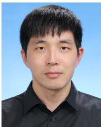  
Chih-Chung Chou received the B.S. and M.S. degrees from the Department of Electrical Engineering, National Taiwan University, Taipei, Taiwan, in 2007 and 2009, respectively, where he is currently pursuing the Ph.D. degree with the Department of Computer Science and Information Engineering. His current research interests include large-scale SLAM systems, multi-sensor fused localization and mapping, and their applications to autonomous driving.

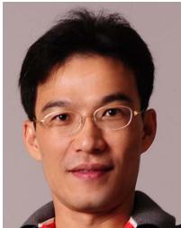

Cheng-Fu Chou received the M.S. and Ph.D. degrees in computer science from the University of Maryland, College Park, in 1999 and 2002, respectively. After his graduation, he joined the Department of Computer Science and Information Engineering, National Taiwan University, Taipei, Taiwan, where he is currently a Professor. He served as the Vice Chairman for his department from August 2013 to July 2014. From June 2002 to September 2002 and from August 2017 to July 2018, he was a Visiting Scholar with the Department of

Computer Science, University of Southern California, Los Angeles. He has been serving as the Director for the Information Technology Office, National Taiwan University Hospital, since August 2019. In November 2020, he was elected as a member of the IFIP WG7.3 on Computer Performance Modeling and Analysis. His current research interests include distributed machine learning systems, wireless networks, multimedia systems, and their performance evaluations.