# Elasticity Meets Continuous-Time: Map-Centric Dense 3D LiDAR SLAM

Chanoh Park , Student Member, IEEE, Peyman Moghadam , Senior Member, IEEE,

Jason L. Williams, Senior Member, IEEE, Soohwan Kim , Member, IEEE,

Sridha Sridharan , Life Senior Member, IEEE, and Clinton Fookes , Senior Member, IEEE

Abstract—Map-centric SLAM utilizes elasticity as a means of loop closure. This approach reduces the cost of loop closure while still providing large-scale fusion-based dense maps, when compared to trajectory-centric SLAM approaches. In this article, we present a novel framework, named ElasticLiDAR++, for multimodal map-centric SLAM. Having the advantages ofa map-centric approach, our method exhibits new features to overcome the shortcomings of existing systems associated with multimodal (LiDARinertial-visual) sensor fusion and LiDAR motion distortion. This is accomplished through the use of a local continuous-time trajectory representation. Also, our surface resolution preserving matching algorithm and normal-inverse-Wishart-based surfel fusion model enables nonredundant yet dense mapping. Furthermore, we present a robust metric loop closure model to make the approach stable regardless of where the loop closure occurs. Finally, we demonstrate our approach through both simulation and real data experiments using multiple sensor payload configurations and environments to illustrate its utility and robustness.

Index Terms—Continuous-time (CT), elasticity, LiDAR, mapcentric 3D SLAM, multimodal, sensor fusion.

## I. INTRODUCTION

M AP-CENTRIC SLAM solutions [1], [2], which havedemonstrated their accuracy and effectiveness by fusion- demonstrated their accuracy and effectiveness by fusionbased mapping and deformation-based loop closure, provide an alternative solution to the dominant trajectory-centric LiDAR SLAM [3]–[5]. Due to the benefit that its complexity does not increase over time, the high-quality reconstruction can be easily achieved through the fusion of redundant scans. Despite their success, previous map-centric approaches have a particular set of drawbacks [1], [2], [6]–[8]. First, the original map-centric work is dedicated to a pinhole camera model such as RGB-D [1] or multibeam LiDARs [6]. Second, asynchronous sensor fusion and handling high motion distortion of LiDAR [9], [10] are not well studied within the map-centric framework. This is far from ideal as LiDAR-based systems often need to be tightly fused with multimodal sensors to handle motion distortion effects. Lastly, the map-centric approach is extremely susceptible to loop closure failure. The sensor data history cannot be stored due to the extensive input data size which implies that, once incorrectly fused, the map is not recoverable.

In this article, we seek an algorithm that exhibits the desirable characteristics of the map-centric approach, but is able to handle these problematic situations described above. We propose to do this by introducing the Continuous-Time (CT) framework into the map-centric approach. The detailed contributions of this article are as follows.

1) We introduce a new constraint for local CT trajectory optimization to operate like a map-centric approach.

2) We detail the realization of a new CT trajectory optimization approach which is dedicated to the map-centric approach, improving local trajectory estimation accuracy.

3) We derive a novel probabilistic surfel representation using the normal-inverse-Wishart (NIW) distribution. To the best of our knowledge, this is the first approach to introduce the NIW distribution for surfel fusion.

4) We introduce a surface resolution preserving surfel matching method for nonpinhole type sensor data.

5) We implement a LiDAR only sequential metric localization to reduce failure on loop closure.

6) We demonstrate the solution on various environments and sensor configurations using simulation and real datasets.

7) We open source the relevant code.1

Our previous work in [2], [11], and [12] presented an approach for LiDAR mapping using probabilistic surfel fusion, a method for map deformation, and a method for robust visual-LiDAR metric localization, respectively. These approaches deal with the issues separately and independently. In this work, we reformulate the map-centric 3D dense mapping problem with our new trajectory optimization method and intensively revise the dense surfel fusion model. Furthermore, in the metric localization stage we weaken the dependency of the vision to reduce the uncertainty from unobservable parameters related to the vision while maintaining the accuracy. Finally, we evaluate, analyze, and demonstrate this new approach in a comprehensive manner across various sensing platforms and across different environments (Fig. 1) using simulation and real datasets to reveal its utility and robustness.

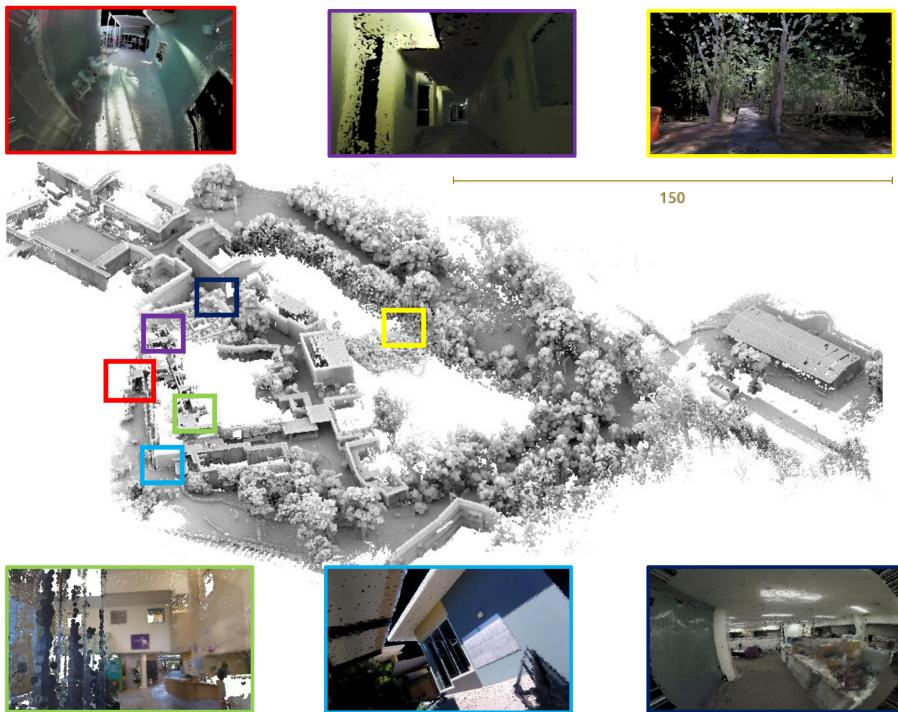  
Fig. 1. ElasticLiDAR++: Reconstructed surfel map of a mixed environment with various sensors and platforms. The point cloud on the center is composed of seven datasets and shaded by portion de ciel visible (PCV) algorithm. Images show the rendered colorized surfel cloud at different locations with various camera setups.

## II. RELATED WORK

## A. Map-Centric Approach

ElasticFusion [1] proposed a map-centric approach for RGB-D cameras that removes pose graph optimization yet performs globally consistent mapping by giving an elastic property to the map and directly deforming the map. The concept of mapcentric SLAM eliminated the need for a pose graph for globally consistent mapping and converted the time dependency of the global optimization to a space-dependent problem. Also, by confining the tracking and fusion within recent map elements, they drastically reduced the processing time per input frame.

Despite these improvements in the ElasticFusion method, some features of their approach are limited to RGB-D sensors and are not applicable to a LiDAR sensor model [11]. First, the original frame-to-frame motion model [1] is not an effective framework for handling asynchronous estimation and severe motion distortion of LiDAR. Second, the map fusion method which is based on a pin-hole camera model can be applied only to the LiDAR configuration with low vertical field of view [6]. For example, the pin-hole camera model cannot be applied for the spinning LiDAR system [3], [13], where the scan range often covers 360 degrees both vertically and horizontally. Third, conventional LiDAR loop closure models [14] are not suitable for the map-centric approach. The second and third points will be elaborated in further detail in the following sections.

In a broad sense, submap division and realignment approaches [8], [15], are also similar to the map-centric method due to its property that input frames are fused into the local submaps. While the approaches in this category successfully reduced global optimization cost, the map fusion policy between graph nodes cannot be defined which brings the discontinuity issue in the map maintenance.

Recently, Behley et al. [6] presented an approach analogous to the concept of map-centric, where new estimates are fused into the global map. Although, the density of their map representation is dedicated for localization rather than dense mapping, their results present an important direction toward the fusible LiDAR map representation along with our previous research on LiDAR surfel fusion [11].

## B. Map Fusion

1) Map Representation and Fusion Feasibility: The fusion between the global map and input frame is an essential step for high-quality map reconstruction and frame-to-model localization. A number of techniques exist for map representation and fusion in SLAM as shown in Fig. 2(a).

The most common dense map representation is to use a raw point cloud [15]. While this is a simple and efficient way to visualize the reconstruction result, the point representation is not suitable for element-wise map fusion and also requires a relatively greater number of map elements to make a dense visualization. The approaches that digitize the space [16]–[19] successfully modeled probabilistic fusion of space cells for the free and occupied space categorization by ray tracing. However, space digitization creates a nonsmooth reconstruction which limits its applications to navigation and obstacle avoidance, where map resolution is less important [20]. A mesh map representation provides a smooth object representation but the map update rule could be inefficient as the connections among the vertices are needed to be properly updated [21].

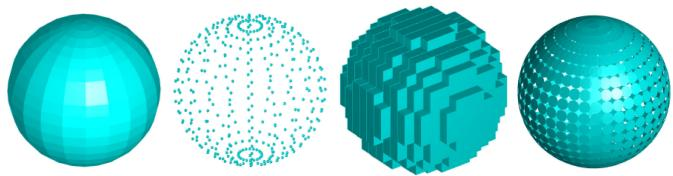  
(a)

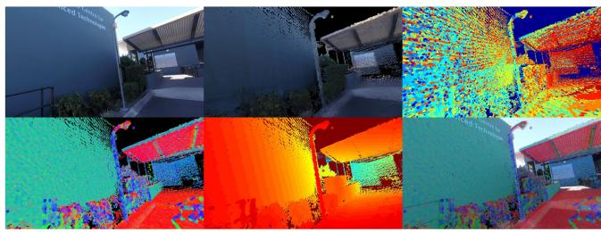  
(b)  
Fig. 2. (a) Comparison of different map representations: mesh, raw points, voxels and surfels. (b) Surfel map rendering example. From top left to right: Image from camera, rendered color surfel map, index map for color fusion where each color represents the identification number of a point. From bottom left to right: Normal map, depth map, blended color, and normal image.

In [22] and [23], the authors presented a multiresolution surfel map representation and fusion for a spinning 2D laser scanner. Although this representation is highly suitable for fast and robust map registration, large size surfels and its z direction volume does not make it ideal for a dense map representation.

On the other hand, a dense surfel map representation [1], [6], [24]–[27], originally designed to render 3D point clouds without a complicated mesh extraction step [28], is ideal for fusion, dense object representation, and rendering as shown in Fig. 2(b). Thus, a surfel representation has been popular in RGB-D reconstruction problems, where a rendered synthetic 2D image from the densely reconstructed object is immediately used for other purposes such as localization [29] or dynamic object handling [25]. For this reason, we also adapt the surfel representation. Despite its advantage, its introduction to a LiDAR-based system has not been actively studied in the LiDAR SLAM community due to the difficulties in the data association which will be discussed in the following section.

2) Map Element Matching: Data association is one of the most important components in map fusion. The simplest way to achieve this is to find a surfel with the closest distance either in Euclidean space [30] or using a Mahalanobis distance [31], [32]. However, generally it is challenging to control the map surface resolution without discretizing the environment [17].

The projective data association [25] provides an efficient map element matching but it is restricted to a projective sensor model. Behley et al. [6] applied projective data association and frameto-model registration for the multibeam LiDAR sensor. Their approach demonstrated that the projective data association can be successfully adapted to multibeam LiDAR.

While approaches in this category are computationally more efficient, the frame-to-model registration method is not suitable for handling severe motion distortion and an asynchronous multimodal sensor payload (Visual-LiDAR-Inertial). Furthermore, the projective data association is limited to LiDARs with a projective view model whereas modern LiDAR systems [33] often cover 360 degrees. Although projective data association can be imitated with LiDAR data by projecting the point cloud within the local sliding window onto a spherical image plane, this causes uneven spatial resolution, where the top and bottom is dense and around the equator is sparse. Dividing the spherical image plane into an equal gird for an even sensing plane requires a nearest neighbor search, significantly reducing the efficiency of the projective data association method.

3) Map Element Fusion: Once matchings of map elements are established, the next step is to fuse the measurements to improve estimation. Keller et al. [25] proposed a dense surfel fusion method by simplifying the Bayesian estimation from 3D to 1D. In their approach, each map element is independently updated, making its computation much simpler than the EKF case. They also utilized radial distortion as an initial uncertainty parameter and reduced the uncertainty whenever the surfel is observed again. ElasticFusion [1] further extended the uncertainty as a function of sensor motion to consider the uncertainty caused by motion blur. However, those simplified Bayesian models are not appropriate for dense 3D LiDAR mapping, where the existence of surfel degeneracy often causes slower convergence.

Furthermore, the approaches in this category mostly do not consider the sensor noise model [1], [6], [24], [25], or they are dedicated for RGB-D models only [27].

## C. Continuous-Time SLAM

1) Continuous-Time Trajectory Representation: The continuous-time trajectory representation models a system pose $\mathbf { T } ( \tau ) \in S E ( 3 )$ as a function of time, τ. There are a few different representations for continuous-time trajectories based on how to interpolate a pose at an arbitrary query time from a set of temporally nearby poses. However, their properties have not been well studied even though it was first introduced almost a decade ago.

The continuous-time trajectory representation proposed by Bosse and Zlot [22] utilized linear interpolation on a separated canonical representation of rotation $\mathbf { r } ( \tau ) \in \mathbb { R } ^ { 3 }$ and translation $\mathbf { t } ( \tau ) \in \mathbb { R } ^ { 3 }$ , where the approximation error quickly grows with large interpose motion. The amount of interpose motion is likely to be small when the trajectory sampling frequency is high, however, this is not the case for sparse global pose optimization, where it subsamples the original trajectory. Similarly, Gentil et al. [34] proposed a continuous-time trajectory by upsampling and interpolating the trajectory. The B-spline-based trajectory model by Furgale et al. [9] is smoother than the original method [22], but they keep the rotation $\mathbf { r } ( \tau ) \in \mathbb { R } ^ { 3 }$ and translation $\mathbf { t } ( \tau ) \in \mathbb { R } ^ { 3 }$ separately which causes a singularity in the rotation interpretation, requiring an unwarp of the rotation. SplineFusion [35] proposed a cumulative smooth trajectory on manifold se(3), addressing the singularity and accuracy problem of the method in [9].

On the other hand, the Gaussian process (GP)-based approach takes a slightly different direction. Tong et al. [36] showed that a GP can be utilized for the representation of continuous-time trajectories by probability conditioning. Anderson et al. [37] further improved efficiency by linear and time-varying stochastic differential equations. Dong et al. [38] extended this approach for the continuous-time trajectory estimation on general matrix Lie groups.

However, since millions of poses are interpolated per second for each LiDAR scan, spline-based and GP-based methods are computationally expensive. Thus, it is beneficial to utilize a linear interpolation method for the calculation of constraints or motion undistortion.

2) Optimization ofContinuous-Time Trajectory: Apart from how the trajectory is represented, how the trajectory can be optimized and updated is also an important aspect. During the trajectory optimization, small corrections on the trajectory are estimated through a nonlinear optimization in a way that reduces the sensor observation error. The estimated corrections are then applied to the trajectory which is referred to as update in the rest of the article.

There are two approaches toward the representation and update of the continuous-time trajectory. The first approach directly models the trajectory with a set of poses or control points and optimizes them with sensor measurements [35]. The second approach models the trajectory as a combination of discrete poses and corrections, and optimizes the corrections with measurements which is referred to as a composition trajectory method [39]. The former approach often models the continuous-time trajectory with splines. The B-spline method by [9] and [40] represents the trajectory as a set of control points without preserving the original discrete poses. Thus, their approach directly optimizes trajectory control points, where the local details of the trajectory are often lumped with a small number of control points, propagating unnecessary noise to the map. Although a great proof of concept, in their approach when the number of control points (state dimension to be optimized) are increased for a higher motion resolution, the computational complexity drastically increases in the optimization stage.

Hence, it has been applied for the offline applications [41] (100 control points per second) or used in real-time applications with a low-frequency motion assumption [42] (30 control points per second). SplineFusion [35] solved the singularity problem and increased interpolation accuracy by cumulative pose interpolation on manifold but still can underperform in terms of accuracy.

The latter approach for trajectory representation preserves the original discrete poses in high motion resolution but updates them with lower frequency corrections during the optimization. The related methods [3], [39] in this category usually build up the initial trajectory with IMU measurements, where the low-frequency motion largely drifts whereas the high-frequency motion is relatively more accurate. Thus, by reducing the state dimension with discrete poses, they made the trajectory optimization more efficient without compromising the motion resolution.

The GP-based approaches first calculate the mean vector and inverse kernel matrix for the positions and velocities at M measurement times from the GP prior, and then use them to update the states in the Gauss–Newton method. As a result, their approach suffers from a high level of complexity and a lack of accuracy as the spline-based method.

## III. OVERVIEW

Our proposed map-centric SLAM system (ElasticLiDAR++) is composed of three main components: Local mapping, global mapping, and loop closure detection as shown in Fig. 3. The local mapping part takes visual, IMU and LiDAR measurements to build motion-distortion-corrected maps using continuous-time trajectory optimization. This stage is similar to the sliding windows in [3], [22], and [39], but it is different in that it takes the sparse global map as a map prior. This enables the new local map to always be registered to the global map. The loop closure detection module keeps generating 2D features from the visual sensor and compares them to the previously generated key frames.

The global mapping part builds and fuses surfel maps. Note that two different surfel maps, a multiresolution 3D sparse surfel map and dense surfel map, are utilized for different purposes. The multiresolution 3D sparse surfels proposed in [22] are ideal for fast and robust continuous-time trajectory optimization, whereas it is too sparse for dense representation [23]. Thus, we utilize fixed size flat-shape hexagonal surfels [25], [28], [43] for dense surfel fusion. Note that the ellipsoid of the dense surfels is used only for the purpose of fusion to obtain recursive estimates of the normal vectors. For visualization, the ellipsoid is simplified as a flat and fixed-size surfel.

Global map consistency is achieved by nonrigid deformation using the estimated misalignment from the loop closure module. It is inspired by the global deformation in ElasticFusion [43], and we further extend it by considering surfel uncertainty propagation in LiDAR. Upon a visual loop closure detection, the loop closure module finds the six degrees-of-freedom (DoF) misalignment between the global map and the current frame over different places until the uncertainty of the misalignment is below a certain threshold. Table I compiles all states and parameters used in this work.

As noted above, there are two types of surfel map representations used in this article, the sparse surfel map $\mathbb { S } _ { g }$ and dense surfel map $\mathbb { M } _ { g } .$ . Each surfel map is individually updated with their local maps $\mathbb { S } _ { l }$ and $\mathbb { M } _ { l }$ which are extracted from the current laser scan.

The sparse surfel map consists of 3D ellipsoids extracted from laser points using multiresolution voxel hashing [22]. Each ellipsoid is defined with a centroid $\mathbf { c } \in \mathbb { R } ^ { 3 }$ and a covariance matrix $\bar { \Sigma _ { \mathrm { c } } } \in \mathbb { R } ^ { 3 \times 3 }$ which represents the distribution of points within the voxel. Likewise, the dense surfel map maintains the mean and covariance defining the ellipsoid of points in the surfel, which in turn allow fused estimates of position $\vec { p } \in \mathbb { R } ^ { 3 }$ and normal vector $\hat { \vec { n } } \in \mathbb { R } ^ { 3 }$ . Note that the ellipsoid of the dense surfel is only for the fusion purpose. For visualization, the ellipsoid is simplified as a flat and fixed-size surfel. In contrast to conventional surfels [1], [25], we associate uncertainty $\pmb { \Sigma } _ { \mathbf { p } } \in \mathbb { R } ^ { 3 \times 3 }$ and scatter $\mathbf { \Xi } _ { \mathbf { p } } \in \mathbb { R } ^ { 3 \times 3 }$ with the position of each disc surfel, which are later used to merge surfels based on Bayesian filtering. The normal nˆ of each surfel is extracted from the scatter matrix $\Xi _ { \mathbf { p } }$ . Note that 3D ellipsoid surfels are expressed with ellipsoids of their covariance matrices, while 2D disc surfels are expressed with discs with normal directions. For representation of surfel, dense surfels have color attributes $\mathbf { g } d \mathfrak { , } \sigma _ { d } .$ , where the color information is acquired from the image sensor and fused to the attributes.

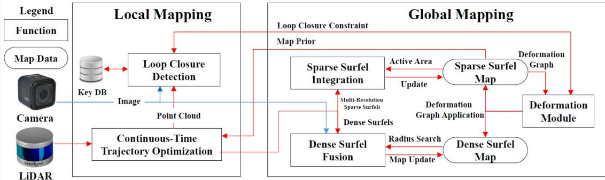  
Fig. 3. System block diagram of our method (named ElasticLiDAR++). The device local trajectory is tracked in the local mapping stage, while the globa consistent map is maintained in the second global mapping stage.

TABLE I  
VARIABLES USED TO PARAMETERIZE THE SYSTEM
<table><tr><td>Symbol</td><td>Description</td></tr><tr><td></td><td>Trajectory Optimization</td></tr><tr><td> $\mathbf { T } _ { k }$ </td><td>Discrete-time trajectory representation</td></tr><tr><td> $\mathbf { T } ( \tau )$ </td><td>Continuous-time trajectory representation</td></tr><tr><td> ${ \bf R } ( \tau )$ </td><td>Rotational component of  $\mathbf { \dot { T } } ( \bar { \boldsymbol { \tau } } )$ </td></tr><tr><td> $\mathbf { t } ( \tau )$ </td><td>Translational component of  $\mathbf { T } ( \tau )$ </td></tr><tr><td> $\mathbb { C }$ </td><td>Entire control points</td></tr><tr><td> $\mathbf { C } _ { k }$ </td><td>A set of local control points</td></tr><tr><td> $\Phi ( \tau )$ </td><td>The indexes k of local control points to recover  $\mathbf { T } ( \tau )$ </td></tr><tr><td> $\mathbf { e } _ { I }$ </td><td>Surfel to surfel constraint</td></tr><tr><td> $\mathbf { e } _ { M }$ </td><td>Surfel to map prior constraint</td></tr><tr><td> $\mathbf { e } _ { \alpha }$ </td><td>IMU acceleration constraint</td></tr><tr><td> $\mathbf { e } _ { \omega }$ </td><td>IMU angular velocity constraint</td></tr><tr><td> $_ \alpha$ </td><td>IMU acceleration</td></tr><tr><td> $\infty$ </td><td>IMU rotational</td></tr><tr><td colspan="2">Map Building</td></tr><tr><td> $\mathbb { M }$ </td><td>Dense surfel</td></tr><tr><td> $\mathbb { S }$ </td><td>Sparse surfel</td></tr><tr><td> $\varphi$ </td><td>Surfel element</td></tr><tr><td> $\mathbf { c }$ </td><td>Sparse surfel centroid</td></tr><tr><td> $\pmb { \Sigma } _ { \mathbf { c } }$ </td><td>Sparse surfel covariance</td></tr><tr><td> $\mathbf { p }$ </td><td>Dense surfel centroid</td></tr><tr><td> $\hat { \bf n }$ </td><td>Dense surfel normal</td></tr><tr><td> $\pmb { \Sigma } _ { \mathbf { p } }$ </td><td>Uncertainty of a dense surfel centroid</td></tr><tr><td> $\Xi$ </td><td>Scatter matrix of a dense surfel</td></tr></table>

## IV. LOCAL MAPPING

To deal with the asynchronous estimation and LiDAR motion distortion, we are introducing the concept of the continuous-time trajectory representation and optimization to the map-centric approach. In this section, we describe our proposed constraints for the map-centric local trajectory optimization that systematically couples the local continuous-time trajectory optimization method with the map-centric method. Also, in the later part of this section, we describe our strategy that improves the accuracy and efficiency of the trajectory optimization and update.

## A. Continuous-Time Trajectory Representation

Let $\mathbf { T } ( \tau )$ be composed of a translational component $\mathbf { t } ( \tau ) \in$ $\mathbb { R } ^ { 3 }$ and rotational component $\mathbf { R } ( \tau ) \in S O ( 3 )$ as

$$
\begin{array} { r } { \mathbf T ( \tau ) : = \left[ \begin{array} { l l } { \mathbf R ( \tau ) } & { \mathbf t ( \tau ) } \\ { \mathbf 0 ^ { T } } & { \mathrm 1 } \end{array} \right] . } \end{array}\tag{1}
$$

Then, utilizing the linear continuous-time trajectory representation, its value can be evaluated by an interpolation from two poses $\mathbf { T } _ { k } , \mathbf { T } _ { k + 1 } ,$ , where their timestamps satisfy $\tau _ { k } < \tau < \tau _ { k + 1 } .$ Given poses with timestamps, their interpolation at $\tau$ is given by

$$
\mathbf { T } ( \tau ) = \mathbf { T } _ { k } \mathbf { e } ^ { \alpha [ \pmb { \xi } ] _ { \times } }\tag{2}
$$

where the relative pose $[ \pmb { \xi } ] _ { \times } \in \mathfrak { s e } ( 3 )$ is defined by $\log ( \mathbf { T } _ { k } ^ { - 1 } \mathbf { T } _ { k + 1 } )$ and the exponential mapping $\mathbf { e } ^ { \alpha [ \pmb { \xi } ] } $ × linearly interpolates the relative pose on the manifold with the interpolation ratio $\alpha = ( \tau - \tau _ { k } ) / ( \tau _ { k + 1 } - \tau _ { k } )$

The linear interpolation error proportionally increases when the sensor is in high-speed motion. The error is propagated to the map deteriorating the map quality. To reduce the effect of the linear interpolation error, we have generated the trajectory at 100 Hz.

## B. Local Trajectory Constraints

When the motion of a device is relatively moderate compared to the scanning speed and the initial trajectory guess is fairly good, shapes of local features are often well preserved in the measurements even with the motion distortion. The first two geometrical constraints utilize this property of LiDAR scans [22], [44]. This process starts by transforming the LiDAR measurements with respect to the world frame and extracting sparse ellipsoidal surfels from multiresolution voxels [22]. Then, we calculate the point-to-plane errors between two corresponding new surfels a and b in their averaged normal directions $\mathbf { n } _ { a b }$ as

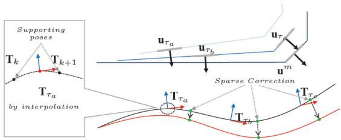  
Fig. 4. Illustration of geometrical constraints on the local trajectory. Two surfels $\mathbf { u } _ { \tau _ { a } }$ and $\mathbf { u } _ { \tau _ { b } }$ generated at $\tau _ { a } , \tau _ { b }$ within a local window forms constraints on the interpolated trajectory poses $\mathbf { T } _ { \tau _ { a } }$ and $\mathbf { T } _ { \tau _ { b } }$ . The constraint between the local scan $\mathbf { u } _ { \tau _ { c } }$ and the map prior $\mathbf { u } ^ { m }$ forces the trajectory to be fitted onto the map prior.

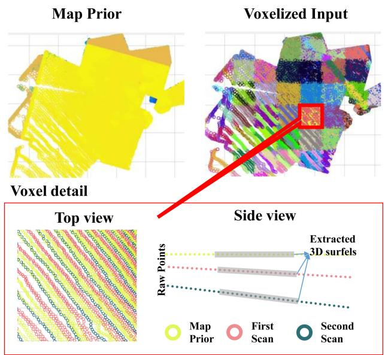  
Fig. 5. Visualization of the map prior and the point cloud input from LiDAR. The point cloud is voxelized and divided into different groups according to its time of generation. Extracted spatial features by multiresolution voxels form a surfel and then utilized to find a matched surfels. Third figure shows an example of two pairs of matched surfaces constraints.

$$
r _ { I } = \sum \| \mathbf { n } _ { a b } ^ { T } ( \mathbf { R } ( \tau _ { a } ) \mathbf { u } _ { \tau _ { a } } + \mathbf { t } ( \tau _ { a } ) - ( \mathbf { R } ( \tau _ { b } ) \mathbf { u } _ { \tau _ { b } } + \mathbf { t } ( \tau _ { b } ) ) ) \| ^ { 2 }\tag{3}
$$

where u is the centroid of a surfel, $\mathbf { t } ( \tau ) , \mathbf { R } ( \tau )$ are the interpolated sensor pose at time τ from the continuous-time trajectory. The visualization of the constraint is given in Figs. 4 and 5.

The second geometrical constraint defines the relationship between the current local map and the map prior. The map prior is obtained from the active global map which we will describe in Section V. The map prior constraint makes the local trajectory always aligned to the previously built global map, which is essential for map-centric operation. Thus, we define the constraint between a new surfel c and its corresponding global map surfel m as

$$
r _ { M } = \sum \left\| \mathbf { n } _ { m c } ^ { T } ( \mathbf { u } ^ { m } - ( \mathbf { R } ( \tau _ { c } ) \mathbf { u } _ { \tau _ { c } } + \mathbf { t } ( \tau _ { c } ) ) ) \right\| ^ { 2 }\tag{4}
$$

where $\mathbf { n } _ { m c }$ is the averaged normal directions of surfel m and c. Note that we do not have to transform the map prior $\mathbf { u } ^ { m }$ because they are points in the world coordinate system. The motion distortion is corrected based on the map prior. The initial map prior is given from a short period of stationary scanning at commencement.

On the other hand, the inertial information from the IMU offers a prior on the trajectory in terms of rotational velocity and translational acceleration. The IMU measurement constraints are written as

$$
r _ { \alpha } = \sum \| \pmb { \alpha } _ { \tau } - \mathbf { R } ( \tau ) ^ { T } \left( \frac { d ^ { 2 } } { d \tau ^ { 2 } } \mathbf { t } ( \tau ) - \mathbf { g } \right) + \mathbf { b } _ { \alpha } \| ^ { 2 }\tag{5}
$$

$$
r _ { \omega } = \sum \left\| \varpi _ { \tau } - \omega ( \tau ) + \mathbf { b } _ { \omega } \right\| ^ { 2 }\tag{6}
$$

where $_ { \alpha , \beta }$  are, respectively, acceleration and rotational velocity from IMU measured at time τ , g is the gravitational acceleration, ${ \bf R } ( \tau ) , { \bf t } ( \tau ) , \omega ( \tau )$ are, respectively, interpolated rotation, translation, and rotational velocity of the continuous-time trajectory at time τ, and $\mathbf { b } _ { \alpha } , \mathbf { b } _ { \omega }$ are the IMU biases. These two constraints form a strong restriction on local smoothness.

## C. Trajectory Optimization and Update

In this section, we detail our trajectory optimization method which improves the accuracy of the composition method. Compared to the number of interpolations required for the motion distortion correction of the point cloud, the number of interpo lations for the trajectory update is much fewer. It is not necessary to compromise accuracy for a fast interpolation by using linear interpolation for this stage. Therefore, we utilize B-spline for the smooth update.

We start by defining a set of control points $\mathbf { C } _ { k } \in \mathbb { C }$ which is created at an interval of $\tau _ { \mathrm { { s t e p } } }$ and longer than the discrete trajectory sampling interval. The trajectory corrections are achieved by finding a set of parameters that minimize the residuals of (3)–(6) as

$$
\hat { x } = \underset { x } { \operatorname { a r g m i n } } r _ { I } + r _ { M } + r _ { \alpha } + r _ { \omega }\tag{7}
$$

where $x = [ \mathbb { C } , \mathbf { b } _ { \omega } , \mathbf { b } _ { \alpha } , \tau _ { l } , \tau _ { c } ] . \tau _ { l } , \tau _ { c }$ are the time lag parameters and C is control points.

Then, the correction to the discrete trajectory is made by

$$
\mathbf { T } _ { k } ^ { \prime } = d \mathbf { T } ( \tau _ { k } , \mathbf { C } _ { k \in \Phi ( \tau _ { k } ) } ) \mathbf { T } _ { k }\tag{8}
$$

where the correction dT for each discrete trajectory at $\tau _ { k }$ is defined as an interpolation of neighboring trajectory elements $\mathbf { C } _ { k \in \Phi ( \tau ) } = \{ \mathbf { c } _ { \mathbf { t } k - 1 } , \mathbf { c } _ { \mathbf { r } k - 1 } , \cdot \cdot \cdot \mathbf { c } _ { \mathbf { t } k + 2 } , \mathbf { c } _ { \mathbf { r } k + 2 } \}$ $\Phi ( \tau )$ represents a set of neighbor indices at τ. Although the utilized control points are in Euclidean space as $\mathbf { c } _ { \mathbf { r } k } , \mathbf { c } _ { \mathbf { t } k } \in \mathbb { R } ^ { 3 }$ , in each iteration they always start from zero. Thus, it is free from the singularity problem. Note that the number of the control points to represent the correction trajectory is much less than the number of the base trajectory poses. This leads to the biggest advantage of deploying the composition method as it drastically reduces the pose optimization cost without compromising accuracy. This advantage will be further demonstrated in the following section.

For the recovery of the correction dT from the control points we have utilized the B-spline as

$$
\mathbf { t } _ { \tau } = \left[ t ^ { 3 } \quad t ^ { 2 } \quad t \quad 1 \right] { \frac { 1 } { 6 } } { \left[ \begin{array} { l l l l } { 1 } & { - 3 } & { 3 } & { - 1 } \\ { 0 } & { 3 } & { - 6 } & { 3 } \\ { 0 } & { 3 } & { 0 } & { - 3 } \\ { 0 } & { 1 } & { 4 } & { 1 } \end{array} \right] } \left[ { \begin{array} { l } { \mathbf { c } _ { \mathbf { t } _ { k - 1 } } } \\ { \mathbf { c } _ { \mathbf { t } _ { k } } } \\ { \mathbf { c } _ { \mathbf { t } _ { k + 1 } } } \\ { \mathbf { c } _ { \mathbf { t } _ { k + 2 } } } \end{array} } \right]\tag{9}
$$

where $t \in [ 0 , 1 ]$ . In a similar way, rotational component $\mathbf { r } _ { \tau } \in$ $\mathfrak { s o } ( 3 )$ is defined from separate control points $\mathbf { c _ { r } }$ and converted to $S O ( 3 )$ by an exponential mapping $\mathbf { R } _ { \tau } = \mathbf { e } ^ { [ \mathbf { r } _ { \tau } ] _ { \ast } }$

The approximation method in [3] utilized $S O ( 3 ) + \mathbb { R } ^ { 3 }$ update scheme, where the translation update is given as $( \mathbf { t } ^ { \prime } = \delta \mathbf { t } + \mathbf { t } )$ The selection of $S O ( 3 ) + \mathbb { R } ^ { 3 } \operatorname { o v e r } S E ( 3 )$ was reasonable as the $S E ( 3 )$ update with $( { \bf t } ^ { \prime } = \delta { \bf t } + { \bf e } ^ { [ \omega ] _ { \times } } { \bf t } )$ could cause an accuracy problem with linearization. Especially when t is large, the linearization error ofthe rotation enlarges the translation error in the second term $\mathbf { e } ^ { [ \omega ] _ { \times \mathbf { t } } }$ . Separately updating $S O ( 3 ) + \mathbb { R } ^ { 3 }$ reduces the linearization error in the large map global optimization. However, $S O ( 3 ) + \mathbb { R } ^ { 3 }$ results in suboptimal accuracy. Considering that our approach does not need a global trajectory optimization, we use a $S E ( 3 )$ update. Also, as the map grows, this problem can be solved by simply converting the trajectory and estimations in the local window to be relative to the first frame in the local window.

After the optimization, local dense and sparse surfel maps $\mathbb { M } _ { l }$ $\mathbb { S } _ { l }$ are built and updated by the optimized trajectory. Each dense surfel in the local dense map is composed of position $\mathbf { p } \in \mathbb { R } ^ { 3 }$ surfel normal n $\in \mathbb { R } ^ { 3 }$ , and timestamp t. Also, the uncertainties of position and scatter matrix $\Sigma _ { \mathbf { p } } \in \mathbb { R } ^ { 3 \times 3 } , \Xi \in \mathbb { R } ^ { 3 \times 3 }$ , which are utilized in dense surfel matching and fusion are calculated from their neighboring points. On the other hand, local sparse surfel maps S which are utilized in (3) and (4) are updated by the optimized trajectory. Each sparse surfel is defined with a centroid $\mathbf { c } \in \mathbb { R } ^ { 3 }$ and a covariance matrix $\pmb { \Sigma _ { c } } \in \mathbb { R } ^ { 3 \times 3 }$ which represents the distribution of points within the voxel. The local maps $\mathbb { M } _ { l } , \mathbb { S } _ { l }$ are fused into the global maps $\mathbb { M } _ { g } , \mathbb { S } _ { g }$ in the following section.

## D. Sensor Calibration

Spatiotemporal extrinsic parameters between the IMU and the camera and LiDAR must be properly estimated. The extrinsics LiDAR-to-base $\iota _ { \mathbf { T } _ { b } }$ and camera-to-base ${ } ^ { c } { \bf T } _ { b }$ are estimated prior to sensor operation and the time lags $\tau _ { l } , \tau _ { c }$ are continuously updated within the local trajectory optimization. For a detailed method, refer to our previous publications [45]–[47].

## E. Simulation on Trajectory Optimization

We demonstrate the performance of the proposed method by comparing it to the most popular spline based trajectory optimization model through simulation in order to have quantitative analysis with the trajectory ground truth. We have utilized a five second length of local window with a simulated angular velocity and linear acceleration at 100 Hz. The initial trajectory $\mathbf { t } _ { \mathrm { 0 } }$ is built by an accumulation of the simulated angular velocity and linear acceleration with a bias and Gaussian noise. Randomly generated sparse surfel features (1000) are utilized for the trajectory optimization and assigned with a timestamp. For simplicity, we have only utilized the local surfel to fix the surfel registration constraint in (4). The simulated trajectory optimization and corrections are visualized in Fig. 6.

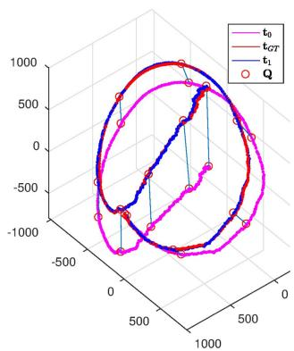  
(a)

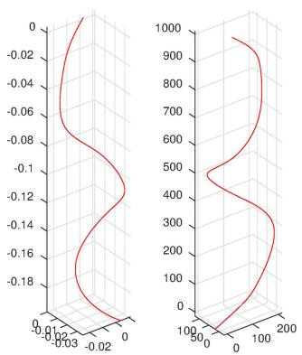  
(b)  
Fig. 6. (a) Visualization of the simulated trajectory, and (b) its trajectory corrections [rotation left (radian), translation right (mm)]. The initial trajectory t (purple) is pulled by the corrections (red circles) toward the ground truth trajectory $\mathbf { t } _ { G T }$ (red). Figure in (a) visualizes the correction in the first iteration of the optimization. Corrected trajectory t1 (blue) went through several more iterations.

To demonstrate the advantage of the proposed method in local trajectory estimation, we present the comparison of the composition trajectory model and approximation model along with a few different parameters in Table II. Interpolation represents the interpolation method utilized for the cost function. The composition model in this experiment has 500 discrete trajectory poses $S E ( 3 )$ , where the interpolation at τ is by taking two poses around the time stamp and interpolating either on euclidean (Linear) or manifold (Linear $\mathfrak { s e } ( 3 ) )$ space. Interpolation is directly calculated in the approximation model. “no. of states” is the actual dimension of the parameters in the optimization which is six times the “no. of compositions/controls” as rotation vector and translation representation is utilized. For the quantitative comparison, methods are evaluated by the absolute trajectory accuracy after the optimization.

Note that the spline only requires control points to represent and optimize the trajectory. However, the composition method normally stores the raw poses like the conventional pose graphs while optimization is done on sparser composition points or control points. Thus, the “no. of control points” field only applies to the spline method whereas the composition model requires both control points and poses fields.

The result in Table II shows that when the update is smoothed by the spline and properly computed on $S E ( 3 )$ the CT trajectory optimization result is better than the linear $S O ( 3 ) + \mathbb { R } ^ { 3 }$ composition method originally proposed in [3] and the approximation model [9].

To further assess the performance of the proposed method on the full sensor system, we have simulated our sensor configuration and processed the sensor data with the proposed method and the method in [3]. The simulated sensor configuration is with the rotating single beam LiDAR and IMU. Fig. 7 shows the simulated office like structure and reconstruction result. The mean relative trajectory error to the ground truth was 12.3 mm $( 1 . 5 \times 1 0 ^ { - 3 } \mathrm { r a d } )$ with the proposed method and 35.3 mm $( 6 . 5 \times 1 0 ^ { - 3 } \mathrm { r a d } )$ with the method in [3]. This indicates that the simulation result in Table II is also similar when full stack data are utilized.

TABLE II  
COMPARISON OF DIFFERENT CONTINUOUS-TIME TRAJECTORY OPTIMIZATIONS IN A SIMULATION
<table><tr><td rowspan="2">Model Interpolation</td><td colspan="2">Composition Model</td><td colspan="3">Approximation Model</td></tr><tr><td>Linear</td><td>Linear  $\overline { { \mathfrak { s e } ( 3 ) } }$ </td><td>Spline</td><td>Spline</td><td>Spline</td></tr><tr><td>Optimization Model</td><td>Linear Composition</td><td>Spline Composition</td><td>Spline Direct</td><td>Spline Direct</td><td>Spline Direct</td></tr><tr><td>Update Method</td><td> $S O ( 3 ) + \mathbb { R } ^ { 3 }$ </td><td>SE(3)</td><td>SE(3)</td><td> $S E ( 3 )$ </td><td> $S E ( 3 )$ </td></tr><tr><td>No. of Compositions/Controls</td><td>11</td><td>11</td><td>11</td><td>51</td><td>101</td></tr><tr><td>No. of Trajectory Poses</td><td>500</td><td>500</td><td>N/A</td><td>N/A</td><td>N/A</td></tr><tr><td>No. of States</td><td>66</td><td>66</td><td>66</td><td>306</td><td>606</td></tr><tr><td>Final t Accuracy (mm)</td><td>39.0</td><td>10.3</td><td>103.0</td><td>21.8</td><td>23.1</td></tr><tr><td>Final r Accuracy  $( 1 0 ^ { - 3 }$  rad)</td><td>5.0</td><td>1.2</td><td>93.7</td><td>10.8</td><td>5.1</td></tr><tr><td>Reference</td><td>[3]</td><td>Ours</td><td>[9]</td><td>[9]</td><td>[9]</td></tr></table>

1Our method has a significantly lower state dimension, compared to the same motion resolution in [9] but also higher accuracy than [3].

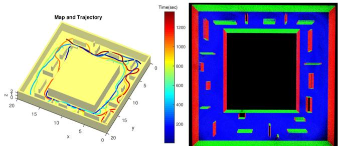  
Fig. 7. Trajectory optimization with simulated data. Left: Simulated map and the trajectory. Right: Top view of the reconstructed normal map.

## V. DENSE SURFEL MATCHING AND FUSION

In this section, we introduce our probabilistic surfel fusion. We will detail our two staged probabilistic surfel matching that can maintain surface resolution of the dense map to a specified value. Also, a new probabilistic surfel representation that can correctly track the surfel normal under the existence of degeneracy will be highlighted.

## A. Surfel Uncertainty Modeling

1) Uncertainty in Position and Orientation: We model the surfel position and shape as a random ellipse using a normal inverse Wishart model, based on the statistical model of LiDAR sensor noise measurements [48]. If the LiDAR points were noise-free, the normal inverse Wishart model would provide an exact closed-form estimate of the mean and covariance matrix from which the points were drawn. In practice, the positional uncertainty of the LiDAR points is higher along the beam direction. Therefore, we adopt the method of [49], which provides estimates under nonhomogeneous noise matrices. By estimating both the mean and covariance matrix, we recursively integrate knowledge on both the position and orientation of the surfel.

Surfels are modeled as a Gaussian distribution of points with mean and covariance to be estimated. The LiDAR uncertainty is an additional Gaussian measurement noise, such that the distribution of each point is $\mathcal { N } \{ { \bf z } ; \mu , { \bf \Sigma } \} + { \bf Q } _ { w } \}$ , where $\pmb { \mu }$ and Σ are the unknown surfel mean and covariance, and $\mathbf { Q } _ { w }$ is the measurement noise in world coordinates. Since points in the same surfel that are local in time will have the same geometry, this can be modeled as

$$
{ \bf Q } _ { w } = { } ^ { w } { \bf R } _ { l } { } ^ { l } { \bf R } _ { b } { \bf Q } _ { b } ( { } ^ { w } { \bf R } _ { l } { } ^ { l } { \bf R } _ { b } ) ^ { T }\tag{10}
$$

where $w _ { \mathbf { R } _ { l } }$ and ${ \boldsymbol { \mathbf { \mathit { l } } } } _ { \mathbf { \mathit { R } } _ { b } }$ are rotation matrices from LiDAR-toworld coordinates, and from beam-to-LiDAR coordinates, respectively. The beam-to-LiDAR is simply calculated by the current beam angle therefore it has only 2 DoF. Note that the uncertainty of the $\mathbf { Q } _ { b }$ along x and y axis is identical. The amount of uncertainty along the beam direction is defined by the sum of the distance uncertainty $\sigma _ { r } ^ { 2 }$ and additional uncertainty $\sigma _ { i } ^ { 2 }$ caused by the incident angle [50], [51]. The uncertainty covariance in beam coordinates is $\mathbf { Q } _ { b } = \mathrm { d i a g } ( \sigma _ { r } ^ { 2 } , \sigma _ { r } ^ { 2 } , \sigma _ { i } ^ { 2 } + \sigma _ { l } ^ { 2 } )$ , where $\sigma _ { r } ^ { 2 }$ is noise due to the beam radius, $\sigma _ { l } ^ { 2 }$ is the nominal depth variance following the model of [48], and $\sigma _ { i } ^ { 2 }$ is an additional uncertainty caused by the incidence angle [50], [51]. Surfel observations from different times are assumed conditionally independent given the surfel mean and covariance.

2) Uncertainty in Color: The local point cloud is rendered to the image frame for visualization. The color information ${ \mathbf { u } } _ { d } \in \mathbb { R } ^ { 3 }$ is achieved from the camera by interpolating its global pose by image time stamp and projecting the point cloud on it. However, the projection of the point cloud often causes miscolorization problems. Similar to the other surfel fusion work, our approach estimates the uncertainty of the color information and utilizes it for fusion.

We parameterize three uncertainty factors that affect the accuracy ofthe rendered point cloud as $\alpha _ { r } = w _ { r } ( r / r _ { t h } ) - 0 . 5 , \alpha _ { v } =$ $w _ { v } \sigma ( [ d _ { c } , d _ { d } , d _ { u } , d _ { l } , d _ { r } ] ) - 0 . 5 , \alpha _ { d } = w _ { d } d _ { c } - 0 . 5$ , where $\alpha _ { r } \mathrm { p e } \mathrm { - }$ nalizes the projected points around the edge of the image. r is distance from the optical center in pixel and $r _ { t h }$ is a heuristic threshold value. $\alpha _ { r }$ is to consider that the wide angle lenses often show low image quality around the corners. $\alpha _ { v }$ checks if the projected feature is around the object edge by looking at the standard deviation $\sigma ( )$ of the neighboring depths $d _ { d } , d _ { u } , d _ { l } , d _ { r }$ (down, up, left, right). $\alpha _ { d }$ gives more weight to the close object to the camera by checking the depth $d _ { c } . \ w _ { r } , w _ { v } , w _ { d }$ are the weights between the parameters which are set to be identical heuristically. Finally, combining the attributes in a sigmoid function, the color uncertainty $\sigma _ { c }$ is given by

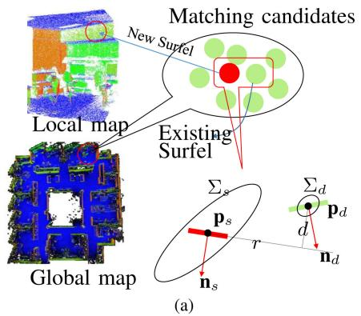

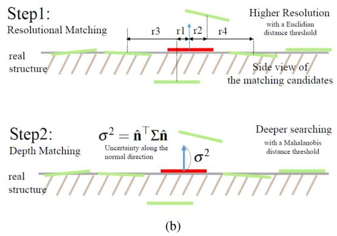  
Fig. 8. (a) Illustration of surfel matching between a local map surfel and the global map surfels. (b) Proposed two staged matching algorithm. The first step controls map resolution whereas the second step reduces map noise by searching deeper along the LiDAR beam direction.

$$
\sigma _ { c } = ( 1 + e ^ { - ( \alpha _ { r } + \alpha _ { v } + \alpha _ { d } ) } ) ^ { - 1 }\tag{11}
$$

where e represents exponential.

## B. Surfel Matching

The local surfels M are transformed into world coordinates to find matched surfels $\mathbb { B } _ { g }$ in the global dense surfel map $\mathbb { M } _ { g } .$ The matching process begins with finding a set of candidate surfels $\mathbb { A } _ { g }$ for each surfel $\varphi _ { l } \in \mathbb { M } _ { l }$ . For efficient matching, initial matching candidates are selected by the octree-based nearest neighbor search algorithm.

Then, the resolutional distance r between each source and destination pair in Fig. 8 is compared with a resolution threshold $\theta _ { r }$ to decide if their projections are close enough on the surface. If so, we check the depth d in the Mahalanobis distance. To consider the uncertainty only along the normal direction, we propagate the positional 3D uncertainties of source and destination surfel $\Sigma _ { d } , \Sigma _ { s }$ into 1D along each normal direction by $\boldsymbol { \sigma } ^ { 2 } = \hat { \mathbf { n } } ^ { T } \boldsymbol { \Sigma } \hat { \mathbf { n } }$

Finally, if the 1D Mahalanobis distance along the surface normal direction is less than a threshold $\theta _ { d } ,$ we assume that they are in correspondence, and put the matched surfel into $\mathbb { B } _ { g } .$ . Note that the resolutional distance d is compared in the Euclidean space to preserve the desired surface resolution in the Euclidean space. Algorithm 1 summarizes this surfel matching process. Note that our matching method enables the matching process to search more along the beam direction, while effectively maintaining the desired surface resolution without a voxel grid.

The RGB values of each matched point in the image are found by rendering the surfel map at each camera position.

## C. Surfel fusion

As described previously, surfels are modeled as a Gaussian distribution of points with mean μ and covariance Σ. These parameters are estimated recursively using a normal inverse Wishart model. In each update, the LiDAR points $\left\{ \mathbf { z } _ { i } \right\}$ are summarized via the noise uncertainty $\mathbf { Q } _ { w }$ given in (10), alongside the number of points n, the measurement mean, and the scatter

Algorithm 1: Finding Surfel Matches.   
Input: Global dense surfel map $\textstyle { \overline { { \mathbb { M } _ { g } } } }$ and a surfel $\overline { { \varphi _ { l } \in \mathbb { M } _ { l } } }$   
Output: A set of matched surfels $\mathbb { B } _ { g } \subseteq \mathbb { M } _ { g }$   
1 $\mathbb { A } _ { g } \gets O c t r e e S e a r c h ( \varphi _ { l } , \mathbb { M } _ { g } )$   
2 foreach $\varphi _ { g } \in \mathbb { A } _ { g }$ do   
3 $[ \ r , d \ ] ^ { \smile } - P o i n t { 2 P l a n e } { D i s t ( \varphi _ { g } , \varphi _ { l } ) }$   
4 if $r < \theta _ { r }$ then   
5 $\boldsymbol { \sigma } ^ { 2 } = \hat { \mathbf { n } } _ { s } ^ { T } \boldsymbol { \Sigma } _ { s } \hat { \mathbf { n } } _ { s } + \hat { \mathbf { n } } _ { d } ^ { T } \boldsymbol { \Sigma } _ { d } \hat { \mathbf { n } } _ { d }$   
6 if $d / \sigma < \theta _ { d }$ then   
7 $\mathbb { B } _ { g }  \mathbb { B } _ { g } \cup \varphi _ { g }$   
8 end   
9 end   
10 end

matrix

$$
\bar { \mathbf { z } } = \frac { 1 } { n } \sum _ { i = 1 } ^ { n } \mathbf { z } _ { i }\tag{12}
$$

$$
\bar { \mathbf Z } = \sum _ { i = 1 } ^ { n } ( { \mathbf z } _ { i } - \bar { \mathbf z } ) ( { \mathbf z } _ { i } - \bar { \mathbf z } ) ^ { T } .\tag{13}
$$

As described further in Appendix A, the method in Algorithm 2 recursively updates the surfel parameters, based on the random matrix approach in [49]. By directly estimating the surfel ellipsoids, surface centroids and normals are estimated through an integrated Bayesian model. Normal estimates may then be extracted from the estimated ellipsoid covariance via eigen decomposition. This is different from our previous work [2], [11] and other approaches [27], where normal vectors were extracted from each surfel, and fused by assuming an error model on these estimates. Our new approach uses an error model that is implied by the single point error model.

The colors are fused similarly with a Gaussian distribution $( \sigma _ { d , s } )$ but in R as there is no measurement to estimate the uncertainty of each color channel. The surfels that are not matched to the global map will be added to the global map as a new unstable surfel. To effectively remove the surfels generated from LiDAR data with non-Gaussian noise, any unstable surfels that are not reobserved on revisits will be deleted from the global map.

Algorithm 2: Surfel Fusion. Algorithm 3: Temporal Surfel Fusion.   
Input: Map surfel $\varphi _ { i } ^ { d } .$ , Input surfel $\varphi _ { i } ^ { s }$ Input: New Frame $\overline { { \mathbb { S } _ { l } , \mathbb { M } _ { l } } } ,$ Global Maps $\overline { { \mathbb { S } _ { g } } }$ , Mg   
Output: Updated map surfel $\varphi _ { i }$ Output: Updated Global Maps $\mathbb { S } _ { g } , \mathbb { M } _ { g }$   
1 foreach pair of matched surfels $\varphi _ { i } ^ { d } , \varphi _ { i } ^ { s }$ do 1 $\mathbb { C } \gets G e t C u r r e n t A c t i v e ( \mathbb { S } _ { g } , \mathbb { M } _ { g } )$   
2 Centroid Fusion: 2 $\mathbb { I }  G e t C u r r e n t I n a c t i v e ( \bar { \mathbb { S } } _ { g } , \bar { \mathbb { M } } _ { g } )$   
3 $\pmb { \Sigma } _ { d } {  } \pmb { \Sigma } _ { d } - \pmb { \mathrm { K } } \pmb { \Sigma } _ { d }$ 3 $\mathbb { S } _ { g } , \mathbb { M } _ { g } \gets S u r f e l F u s i o n ( \mathbb { S } _ { l } , \mathbb { M } _ { l } , \mathbb { C } )$   
4 $\mathbf { p } _ { d }  \mathbf { p } _ { d } + \mathbf { K } ( \mathbf { p } _ { s } - \mathbf { p } _ { d } )$ $\mathbf { R } , \mathbf { t } ,$ inlier, dist $]  I C P ( \mathbb { S } _ { l } , \mathbb { I } )$   
5 $\Xi _ { d }  \Xi _ { d } + \bar { \bf N } + \bar { \bf Y }$ 5 if inlier $> \theta _ { i n }$ & $d i s t > \theta _ { d }$ then   
6 Normal Extraction: 6 $[ \hat { \mathbf { R } } _ { j } , \hat { \mathbf { t } } _ { j } ] \gets G r a p h O p t i m i z a t i o n ( \mathbf { R } , \ \mathbf { t } , \mathbb { S } _ { l } , \mathbb { S } _ { g } )$   
7 [v, D] ← eigen\_decomposition $\left( \Xi _ { d } \right)$ 7 $\mathbb { S } _ { g } , \mathbb { M } _ { g } \gets M a p D e f o r m ( \hat { \mathbf { R } } _ { j } , \hat { \mathbf { t } } _ { j } , \mathbb { S } _ { g } , \mathbb { M } _ { g } )$   
8 $\hat { \mathbf { n } } _ { d } = \mathbf { v } _ { 3 }$ (eigen vector with smallest eigenvalue) 8 else   
9 Colour Fusion: 9 n $\gets N$ earestNeighborSearch(C, I)   
10 $\sigma _ { d } {  } ( \sigma _ { s _ { . } } ^ { - 1 } + \sigma _ { d _ { . } } ^ { - 1 } ) ^ { - 1 }$ 10 if $n < \theta _ { n }$ then   
11 $\mathbf { u } _ { d } {  } \frac { ( \sigma _ { d } ^ { - 1 } \mathbf { u } _ { d } { + } \sigma _ { s } ^ { - 1 } \mathbf { u } _ { s } ) } { ( \sigma _ { s } ^ { - 1 } { + } \sigma _ { d } ^ { - 1 } ) }$ 11 $\mathbb { S } _ { g } \gets S u r f e l F u s i o n ( \mathbb { C } , \mathbb { I } )$   
12 end   
12 end   
13 end

## D. Active and Inactive maps

One of the most important assumptions in the fusion is that the global map consistency should be guaranteed around the area where a fusion occurs. In the worst case, surfels will be fused right before the loop closure. Fusion of surfels with a misalignment will make an unwanted deformation in the local area. Thus, similar to [43], we introduce active A and inactive maps I according to the surfel timestamps so that new surfels are always optimized and fused within the active area. To detect the misalignment between the active and inactive areas, it finds the amount ofoverlap and misalignment by rigid iterative closest point (ICP). For a robust and fast ICP, only sparse surfels are utilized with a geometrical weight. When the overlap and misalignment is large enough after the ICP, it triggers deformation that will be described in the next section. To maintain the map coherency between active and inactive components, matched inactive components to active components are found and updated in every step. Algorithm 3 shows our temporal fusion method for LiDAR surfels.

## E. Simulation on Surfel Fusion

To demonstrate the importance of fusion in handling LiDAR data we have performed a surfel fusion experiment with a simulated degenerate surfel and have shown the results in Table III. Table III shows how a degenerate surfel normally converges over time in three different approaches. (a) is basically identical to one dimensional Bayesian fusion where the uncertainty is simply calculated by the sensor rotation velocity to consider image motion blur without knowing the geometrical surfel uncertainty. Thus, it takes more time to be recovered from the initially degenerate surfel normal. The difference between the method (b) and (c) is relatively smaller due to the highly tuned heuristic parameters in (b).

## VI. GLOBAL MAP BUILDING

As the proposed system does not maintain any trajectory, an alternative method for a loop closure is necessary. In this section, we describe our approach for maintaining the map to be globally consistent where we elastically deform the map upon the loop closure detection. Also, we highlight our sequential metric localization method that can stably and robustly estimate the misalignment.

## A. Map Deformation

Upon loop closure detection, map deformation is carried out to maintain global map consistency. Deformation nodes and loop closure constraints are only selected from the sparse surfel map $\mathbb { S } _ { g } .$ Then, once the optimal deformation is found by an optimization, it is applied to both entire map elements in $\mathbb { M } _ { g } , \mathbb { S } _ { g } .$ We adopted the graph deformation technique for the introduction of elasticity in the map and temporally connected deformation graph of [43]. However, our approach is different from [43] in that the number of deformation nodes is decided by the area of the reconstructed space and the uncertainty is also deformed along with the normal and centroid.

1) Graph Construction: Graph nodes are constructed from randomly selected surfel centroids of $\mathbb { S } _ { g } .$ . The centroids are selected to uniformly represent the space. The number of nodes is decided by the area ofthe space where the area is defined as a sum of all surfaces in $m ^ { 2 }$ . As the proposed dense surfel map fusion maintains a canonical form of surface without redundancy, the area of the map surface, A can be easily found by counting the number of total surfels. Thus, considering that each surfel of the map has a fixed radius circle, the total number of nodes n is

$$
n = \lceil \gamma \pi r ^ { 2 } ( E / A ) \rceil\tag{14}
$$

where $\gamma$ is the total number of map elements, r is the radius of the circle, and E is the number of nodes in the area. Denser nodes help reduce local spatial distortion but drastically increase the computational cost. To reject any temporally uncorrelated connection, we order the nodes by temporal sequence and define their neighbors according to their temporal closeness. The surfel timestamps are updated to the current time when they are revisited.

The deformation graph is composed of node positions ${ \bf g } _ { j } \in $ $\mathbb { R } ^ { 3 }$ , node rotations and translations, $\mathbf { R } _ { j } , \mathbf { t } _ { j } \in S E ( 3 )$ , and a set of neighbors $\mathbb { V } ( \mathbf { g } _ { j } )$ . Most of the time, the map is deformed by the difference between node translations. Regarding the number of neighbors, previous research [43] empirically indicates that four neighbor nodes are sufficient.

TABLE III  
SURFEL NORMAL CONVERGENCE COMPARISON OVER NUMBER OF FUSIONS
<table><tr><td>Number of Fused Observations</td><td>(a) ElasticFusion [1]</td><td>(b) ElasticLiDARFusion [2]</td><td>(c) ElasticLiDAR++</td></tr><tr><td>2</td><td>1.02</td><td>0.74</td><td>0.81</td></tr><tr><td>4</td><td>0.61</td><td>0.15</td><td>0.11</td></tr><tr><td>8</td><td>0.32</td><td>0.07</td><td>0.07</td></tr></table>

1Values represent the error of the normal direction of a simulated surfel fusion sequence in Rad. Each surfel is extracted from 10 points with ±3 cm Gaussian noise. Note that the centroid is not compared as its performance largely depends on the surfel matching algorithm rather than surfel fusion method.

2) Graph Deformation: Assuming that a set of graph node locations $\mathbf { g } _ { j }$ are established and their deformation attributes ${ \bf R } _ { j } , { \bf t } _ { j }$ are found, the graph deformation can be applied to the entire map. Given a set of node parameters, an influence function $\phi ( \mathbf { p } _ { i } )$ that deforms any given point $\mathbf { p } _ { i }$ by the jth node $\mathbf { g } _ { j }$ is defined as

$$
\phi ( \mathbf { p } _ { i } ) = \mathbf { R } _ { j } ( \mathbf { p } _ { i } - \mathbf { g } _ { j } ) + \mathbf { g } _ { j } + \mathbf { t } _ { j } .\tag{15}
$$

For a smooth blending of deformation, the complete deformation of a point is defined as a weighted sum of the influence function $\phi ( \mathbf { p } _ { i } )$ with its neighbor nodes $\mathbb { N } ( \mathbf { p } _ { i } )$ around the position. When selecting nodes, their temporal and spatial closeness are considered. Thus, the deformed pose $\mathbf { p } _ { i } ^ { \prime }$ is defined as

$$
\mathbf { p } _ { i } ^ { \prime } = \sum _ { j \in \mathbb { N } ( \mathbf { p } _ { i } ) } w _ { j } ( \mathbf { p } _ { i } ) \phi ( \mathbf { p } _ { i } )\tag{16}
$$

where the weight $w _ { j } ( \mathbf { p } _ { i } )$ is decided by the distance between the node $\mathbf { g } _ { j }$ and the point pi

$$
w _ { j } ( \mathbf { p } _ { i } ) = \left( 1 - \left\| \mathbf { p } _ { i } - \mathbf { g } _ { j } \right\| / d _ { \operatorname* { m a x } } \right)\tag{17}
$$

where $d _ { \mathrm { m a x } }$ represents the max distance between the node and point within $\mathbb { N } ( \mathbf { p } _ { i } )$ . Those nodes that are relatively far from the given point $\mathbf { p } _ { i }$ have smaller weights and less effect. Note that (16) will be applied to both sparse and dense maps $\mathbb { S } _ { g } , \mathbb { M } _ { g }$

Not only surfel centroids but other surfel attributes also need to be deformed. The new normal direction of the surfel is defined as

$$
\mathbf { n } _ { i } ^ { \prime } = \sum _ { j \in \mathbb { N } ( \mathbf { p } _ { i } ) } ^ { k } w _ { j } ( \mathbf { p } _ { i } ) \mathbf { R } _ { j } \mathbf { n } _ { i } .\tag{18}
$$

The uncertainty and geometry matrices $\Sigma _ { \mathbf { p } i } , \Xi _ { i } , \Sigma _ { \mathbf { c } i }$ are deformed by first-order linear propagation. The general form of the propagated uncertainty and geometry in the new deformed space is given as

$$
\Sigma _ { i } ^ { \prime } = \mathbf { R } _ { i } ^ { \prime } \Sigma _ { i } \mathbf { R } _ { i } ^ { \prime T }\tag{19}
$$

where ${ \bf R } _ { i } ^ { \prime }$ represents the blended rotation of the surfel location and is defined as

$$
\mathbf { R } _ { i } ^ { \prime } = \sum _ { j \in \mathbb { N } ( \mathbf { p } _ { i } ) } ^ { k } w _ { j } ( \mathbf { p } _ { i } ) \mathbf { R } _ { j } .\tag{20}
$$

3) Graph Optimization: In this section, we will describe constraints for the graph optimization, given a set of matched surfel centroid pairs psrc, $\mathbf { p } _ { \mathrm { d e s t } } \in \mathbb { S } _ { g }$ . During the optimization, the transformation ${ \bf R } _ { j } , { \bf t } _ { j }$ of each node which minimize the source and destination will be found. The first constraint that reduces the difference between the deformed source sets $\mathbf { p } _ { \mathrm { s r c } } ^ { \prime } = \phi ( \mathbf { p } _ { \mathrm { s r c } } )$ and target surfel $\mathbf { p } _ { \mathrm { d e s t } }$ is

$$
r _ { \mathrm { l o o p } } = \sum \| { \bf p } _ { s r c } ^ { \prime } - { \bf p } _ { \mathrm { d e s t } } \| ^ { 2 } .\tag{21}
$$

The distortion is applied over all the global map surfels including the destination surfels $\mathbf { p } _ { \mathrm { d e s t } }$ itself. To prevent the infinite loop of deformation between source and destination, the following pinning constraint will fix the destination surfels not to be deformed:

$$
r _ { \mathrm { p i n } } = \sum \| \mathbf { p } _ { d e s t } ^ { \prime } - \mathbf { p } _ { \mathrm { d e s t } } \| ^ { 2 } .\tag{22}
$$

To guarantee the smooth deformation over the whole region, the following term spreads the deformation to the neighboring nodes. When the node rotation ${ \bf R } _ { j }$ is near the identity matrix, the smoothness term indicates the distance between $\mathbf { t } _ { j }$ and its neighboring node translation $\mathbf { t } _ { k }$

$$
r _ { \mathrm { r e g } } = \sum _ { j } ^ { m } \sum _ { k \in \mathbb { V } ( \mathbf { g } _ { j } ) } \| \mathbf { R } _ { j } ( \mathbf { g } _ { k } - \mathbf { g } _ { j } ) + \mathbf { g } _ { j } + \mathbf { t } _ { j } - \mathbf { g } _ { k } - \mathbf { t } _ { k } \| ^ { 2 } .\tag{23}
$$

Then, the optimal node transformation $\hat { \bf R } _ { j } , \hat { \bf t } _ { j }$ that minimizes radical deformation and loop closing error is defined as

$$
[ \hat { \bf R } _ { j } , \hat { \bf t } _ { j } ] = \operatorname * { a r g m i n } _ { { \bf R } _ { j } , { \bf t } _ { j } \in S E ( 3 ) } \omega _ { \mathrm { r e g } } r _ { \mathrm { r e g } } + \omega _ { \mathrm { p i n } } r _ { \mathrm { p i n } } + \omega _ { \mathrm { l o o p } } r _ { \mathrm { l o o p } }\tag{24}
$$

where $\omega _ { \mathrm { r e g } } , \omega _ { \mathrm { p i n } } , \omega _ { \mathrm { l o o p } }$ represent the weights for each constraint to tune the elastic property. We follow the proposed values in [43].

Since the cost function is a nonlinear pose graph optimization problem in the form of $f ( \mathbf { T } ) = \mathbf { T } \mathbf { p } + \mathbf { c }$ on a manifold, we use the nonlinear iterative Gauss–Newton method.

4) Global Loop Closure: There are two sources of loop closure detection. For a loop where the source and destination distance is moderately close, the ICP method in Algorithm 3 will detect the misalignment first. However, for large-scale mapping where large misalignment can occur, an alternative place recognition such as [52] and [53] is required. We propose a robust method for place recognition and metric localization using both visual and geometrical information, which will be detailed in the following section. In both cases, loop closure constraints are given as follows:

$$
{ \bf p } _ { \mathrm { d e s t } } = { \bf R } { \bf p } _ { \mathrm { s r c } } + { \bf t }\tag{25}
$$

where $\mathbf { p } _ { \mathrm { s r c } }$ are randomly selected points from $\mathbb { S } _ { l }$ and R, t denote misalignment between $\mathbb { S } _ { l }$ and I. Note that we utilize a transformed destination $\mathbf { p } _ { \mathrm { d e s t } }$ from the $\mathbf { p } _ { \mathrm { s r c } }$ to prevent any unwanted deformation caused by source and destination point difference. This way, the deformation implicitly reduces the misalignment [R, t] to be [I, 0].

5) Misalignment Estimation for Global Loop Closure: The disadvantage of the map-centric method is that the result of an incorrect loop closure is more destructive and is not reversible. Thus, for reliable estimation of the misalignment [R, t] even with incorrect initial guesses and large drifts, we tightly fuse the surfel-based point-to-plane constraint with the 3D feature-based point-to-point constraint as

$$
r _ { p } = \mathbf { n } ^ { T } ( \mathbf { p } _ { r } - ( \mathbf { R } \mathbf { p } _ { s } + \mathbf { t } ) )\tag{26}
$$

$$
r _ { f } = { \bf p } _ { r } ^ { \prime } - ( { \bf R } { \bf p } _ { s } ^ { \prime } + { \bf t } )\tag{27}
$$

where the pair of the matched surfel centroids $\mathbf { p } _ { r } , \mathbf { p } _ { s }$ are acquired by the nearest neighbor method in the surface normal and centroid space. The matched sparse 3D features $ { \mathbf { p } } _ { r } ^ { \prime } ,  { \mathbf { p } } _ { s } ^ { \prime }$ are found through 3D feature matching such as FPFH [54], but is not limited by the types of feature descriptor. The surfel-based constraint and the 3D feature-based constraint are complementary to each other. While the surfel constraint lacks semantic correspondence which results in a suboptimal solution, the 3D feature often suffers from noisy LiDAR point cloud or partial observation. When combined, the 3D features roughly guide the optimization to where the surfel correspondence can be correctly found and surfel constraints refine the final result. Similar to our previous approach [12], [55], we sequentially estimate [R, t] at different places over time which greatly reduces the chance of failure. The concept of sequential verification is similar to our previous publication [12], however, 3D sparse features [55] are utilized instead of the features from 2D images which helps to reduce the error coming from time lag and extrinsics.

The sequential method drastically reduces the loop closure failure by an interaction between loop closure detection and loop closure. For example, when a similar place triggers a false positive, the sequential method can detect this by sequentially monitoring the residual of (26) and (27) and rejecting the false positive.

Refer to Appendix B and our previous work [12] for the details of the sequential pose fusion.

## VII. EXPERIMENTS

In this section, we present the quantitative and qualitative performance analysis of the proposed method in terms of trajectory estimation and reconstruction quality with various sensor payload configurations and environments. Also, we provide a qualitative comparison of the metric localization accuracy with various approaches.

We have utilized CT-SLAM [3] as a baseline method, which was first published in 2012, but has been optimized over the last ten years proving its robustness and accuracy under various robotic platforms and environments [55], [56].

## A. Experimental Setup

To demonstrate utility of the proposed method under various scenarios, we have collected multiple datasets with different sensor setups mounted to multiple robotic platforms as in Fig. 9. The collected datasets are categorized into three classes according to sensor types, environments, and robotic platforms.

Through Fig. 10(a) to (c), the datasets are collected with a single beam hand-held 3D spinning LiDAR. The device consists of a spinning Hokuyo UTM-30LX laser, an encoder, a Microstrain 3DM-GX3 IMU, and RGB camera. In the collected datasets sensors were moved with 0.9 m/s and 0.7 rad/s while rotor spins at 1 rotation/s. The datasets in Fig. 10(d) to (e) are collected with a hand-held multibeam LiDAR with Velodyne VLP-16, a Microstrain 3DM-GX3 IM, and an independent Gopro camera. Gopro does not share a common clock with LiDAR.

The dataset in Fig. 11(a) and (b) are presented to demonstrate the utility of the proposed method on realistic robotic platforms, respectively, a four legged robot and a ground robot. For those datasets, the same sensor payload (Velodyne VLP-16 LiDAR, IMU, and camera) was utilized while they are mounted on each platform as in Fig. 9.

Also, we have collected datasets in different environments to demonstrate the robustness of the method against different geometrical shapes. The datasets in Fig. 10(a) and (b) are collected indoors whereas Fig. 10(c) to (e) are collected outdoors. The outdoor dataset mixes structured (c) and (d) and unstructured places (e).

A shader-based surfel renderer is developed for the colorization and 3D scene rendering. Some of the scenes of the dataset are rendered and presented in the third row of Fig. 10. For the colorization, a distorted image is directly utilized along with the calibration parameters in the shader to avoid losing information and to reduce computational cost. Some of the datasets require a global loop closure detection. The global loop closure is found by 3D and 2D combined loop closure detection method [12], [55] and the misalignment is estimated using the sequential method described in Section VI using only the 3D point cloud. Detected loops are closed by the deformation graph as depicted in Fig. 12(b).

## B. Trajectory and Structure Comparison

To evaluate the trajectory estimation accuracy of the proposed method, we compared the deformed trajectory with the globally optimized trajectory from the benchmark method [3]. The trajectory is deformed using (16) by treating each translational component of the trajectory as a point. Note that in the proposed method, the trajectory is not required to be stored. They are saved and deformed only to evaluate accuracy of the proposed method. For the comparison, we utilized the absolute trajectory root mean square error (RMSE) metric, which estimates the Euclidean distances between the deformed trajectory and the globally optimized trajectory.

Table IV shows the error and trajectory statistics of each dataset visualized in Fig. 10. The trajectory error of each dataset varies from 0.2 to 0.5 m with high correlation to the map size. The trends shows that the difference gets larger when the map scale grows. In the baseline method the trajectory is aligned to the gravity direction, whereas in the proposed method, the gravitational alignment in the local map is ignored when they are integrated into the global map. Also, the proposed method does not count the gravity direction in the deformation graph optimization. These two factors result in the difference in the final map and trajectory. The initial position is aligned with the gravity direction but when the sensor scans further area from the initial location the gravity alignment faints, making the difference. A qualitative comparison of trajectories from the dataset (b) in Fig. 10 is presented in Fig. 13. The visual comparison shows that local details are well preserved and similar to the globally optimized trajectory, but there were overall 0.1 m offset between the two trajectories.

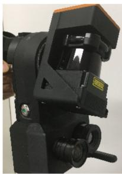  
(a)

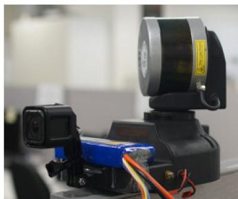  
(b)

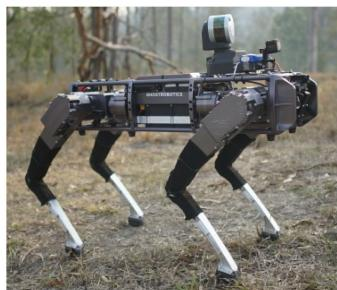  
(c)

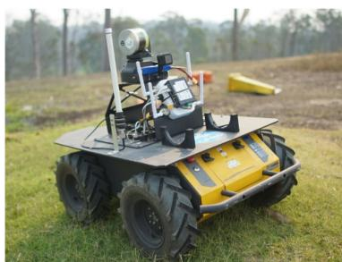  
(d)

Fig. 9. Experimental sensor payload configurations: (a) Hand-held single-beam LiDAR. (b) Hand-held multibeam LiDAR. (c) Legged robot with multibeam LiDAR. (d) Wheeled robot with multibeam LiDAR.  
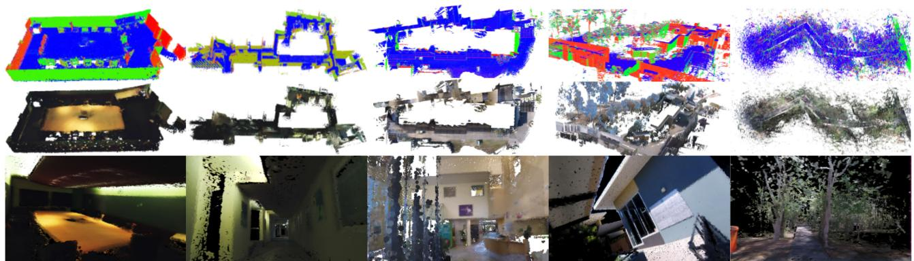  
(a)  
(b)  
(c)  
(d)  
(e)

Fig. 10. Visualization of the datasets collected with the hand-held devices. Starting from the top row, normal map, colorized map, details of the surfel rendered map.  
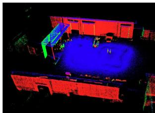

(a)  
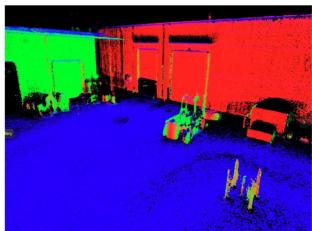

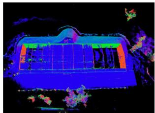

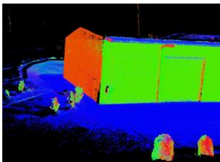  
(b)  
Fig. 11. Visualization of the datasets collected from the robotic platforms. (a) and (b) are, respectively, collected by the legged robot and the wheeled robot around industrial areas. The duration and the size of the datasets are, respectively, (a) 2.5 min, 72 × 42(m), and (b) 7 min, 38 × 49(m).

TABLE IV  
ABSOLUTE TRAJECTORY ESTIMATION RMSE IN METERS BETWEEN THE DEFORMED TRAJECTORY AND THE GLOBALLY OPTIMIZED TRAJECTORY (CT-SLAM [3])
<table><tr><td>Dataset</td><td>(a) Small room</td><td>(b) Multiple Floors</td><td>(c) In/outdoor</td><td>(d) Outdoor</td><td>(e) Unstructured</td><td>(f) Office</td></tr><tr><td>Traj Error(m)</td><td>0.173</td><td>0.245</td><td>0.233</td><td>0.552</td><td>0.301</td><td>0.189</td></tr><tr><td>Length(m)</td><td>130</td><td>300</td><td>360</td><td>210</td><td>110</td><td>330</td></tr><tr><td>Time(min)</td><td>6.1</td><td>11.4</td><td>9.1</td><td>3.5</td><td>4.1</td><td>14.6</td></tr><tr><td>Size(m)</td><td>10×6</td><td>55×20</td><td>60×25</td><td>60×69</td><td>47×17</td><td>20×20</td></tr><tr><td>No. of Beams</td><td>Single</td><td>Single</td><td>Single</td><td>Multi</td><td>Multi</td><td>Single</td></tr></table>

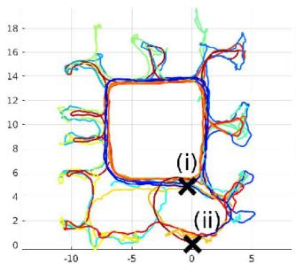  
(a)

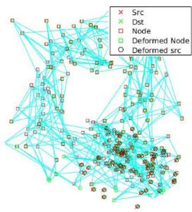  
(b)

Fig. 12. Scanning trajectory and deformation graph of Fig. 14. (a) Scanning path: Our proposed method closes a loop at (i) whereas trajectory-based SLAM does at (ii). Trajectory is colored by time: Blue at the start transitioning to red at the end. (b) Constructed graph (red squares) and its correction (green squares).  
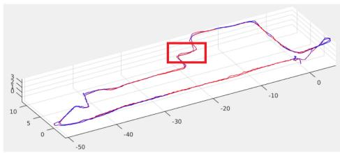  
(a)

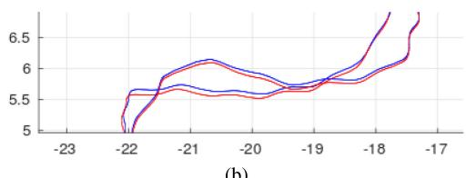  
(b)  
Fig. 13. Qualitative trajectory comparison between the global trajectory optimization (blue line) [3] and the deformed trajectory (red line) of the map dataset (b) in Fig. 10. (b) Details of the trajectory in the red box. Note that the trajectory includes two traverses. The unit is in meters.

Also, to visualize the structural difference of a highly redundant scanning case, we registered the two point clouds, respectively, from the baseline method [3] and the proposed method and calculated the point-to-mesh distances in Fig. 14. For the point-to-mesh distance, a fine mesh is extracted from the globally optimized point cloud of the baseline method [3]. The result shows the reconstruction difference was within ±0.02 meters but it was growing on the outer side.

## C. Surface Estimation

For a quantitative comparison on real datasets where ground truth is not available, known planar surfaces such as a floors or walls are utilized for calculating the relative noise level.

Table V shows statistical analysis of the multiple planar areas. The error in the table represents the mean projective distance, which is calculated from the mean plane of each patch. With the same data extracted from the planar patches, the analysis result on the relationship between the number of fusion steps and accuracy is given in Fig. 15 along with the comparison with the original raw point clouds on the left most side of each figure.

TABLE V  
SURFACE ESTIMATION STATISTICS
<table><tr><td rowspan="3">Patch No.</td><td colspan="4">CT-SLAM [3]</td><td colspan="4">Proposed method</td></tr><tr><td>Position Err.</td><td></td><td>Normal Err.</td><td></td><td>Position Err.</td><td></td><td>Normal Err.</td><td></td></tr><tr><td>mean</td><td>std.</td><td>mean</td><td>std.</td><td>mean</td><td>std.</td><td>mean</td><td>std.</td></tr><tr><td>a</td><td>8.2</td><td>14.8</td><td>0.101</td><td>0.082</td><td>3.4</td><td>4.7</td><td>0.069</td><td>0.075</td></tr><tr><td>b</td><td>9.3</td><td>16.8</td><td>0.120</td><td>0.116</td><td>3.2</td><td>4.4</td><td>0.085</td><td>0.076</td></tr><tr><td>c</td><td>8.9</td><td>17.3</td><td>0.092</td><td>0.120</td><td>3.4</td><td>6.2</td><td>0.076</td><td>0.082</td></tr><tr><td>d</td><td>9.4</td><td>17.0</td><td>0.085</td><td>0.099</td><td>3.9</td><td>5.3</td><td>0.078</td><td>0.080</td></tr><tr><td>f</td><td>8.0</td><td>13.7</td><td>0.096</td><td>0.087</td><td>3.4</td><td>4.7</td><td>0.083</td><td>0.080</td></tr><tr><td>g</td><td>9.1</td><td>16.0</td><td>0.106</td><td>0.115</td><td>4.5</td><td>6.5</td><td>0.078</td><td>0.082</td></tr></table>

1The projective distance errors and the normal error. Note that the point cloud from CT-SLAM [3] is undistorted by the globally optimized trajectory but unfused raw points. Units are mm for position error and radians for normal direction.

For relative comparison, the distance of each point in the area from the average plane of the area was used to calculate normal direction error and projective distance error. γ represents the number offusions where surfels with the same number offusions are utilized for the statistics. For example, for the calculation of γ = 2 surfels that are fused only two times are utilized.

The result in Fig. 15 indicates that the errors drastically are reduced when surfels are fused more than four times reaching ±10 mm and 0.2 rad (≈5 deg) error range. The surfels with low numbers of observations are removed from the global map after some period of time as they tend to have a higher possibility of being outliers or mixed pixels [57]. The development of the map and the surfel statistics changes over time are visualized in Fig. 16 with the dataset (f) in Fig. 10. The figure shows how the number of surfel observations impact uncertainties when the sensor makes multiple traverses on the same place.

## D. Evaluation of Localization for Loop Closure

For the initial loop closure detection, we have utilized the visual place voting method [52]. Once a place recognition triggers the proposed localization for the loop closure, a procedure for estimating 6 DoF misalignment starts where it finds only single misalignment between the very first revisited place found from the previous map and the new map. In the sense that the process includes 6 DoF registration with an unknown initial guess, the problem is closer to a large-scale global registration problem [58] or kidnap recovery problem rather than a place recognition problem [59]. To this end, we compare our method with the well-known global ICP registration libraries [60], [61] with different initial guesses.

We have utilized outdoor and indoor mixed point cloud datasets to evaluate the localization performance. The globally optimized trajectory was utilized for calculating the ground truth. To estimate the robustness against initial guess, initial poses are randomly generated with ten different loop closure scenarios. We have set the covariance for the random misalignment generation to be larger along the z axis (gravity direction) and smaller in x and y axis (orthogonal to gravity direction). The 6 DoF misalignment is estimated 50 times each with ten different locations which simulates 500 loop closure triggers. For each loop closure trigger, misalignment starts sequential estimation over different places along the trajectory which exactly simulates the loop closure procedure with real data.

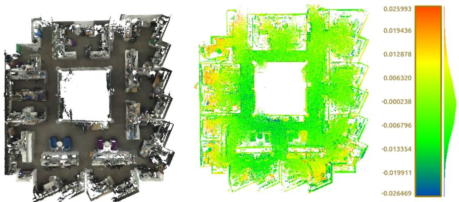  
Fig. 14. Visualization of the dataset (f) in Table IV: Colorization and structural difference. Color in the right side of the figure represents the difference between the deformed map and the baseline map by [3]. The bar on the right represents the histogram and range of the difference in color. The error range on the bar is in meter scale.

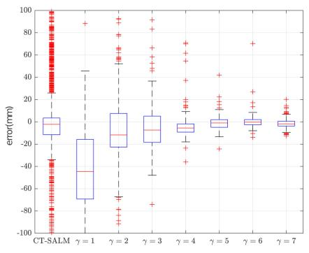  
(a)

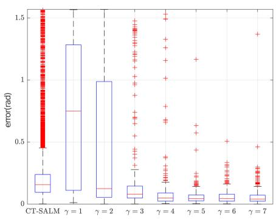  
(b)

Fig. 15. Number of fusions versus accuracy of a planar patch. (a) Centroid. (b) Normal.  
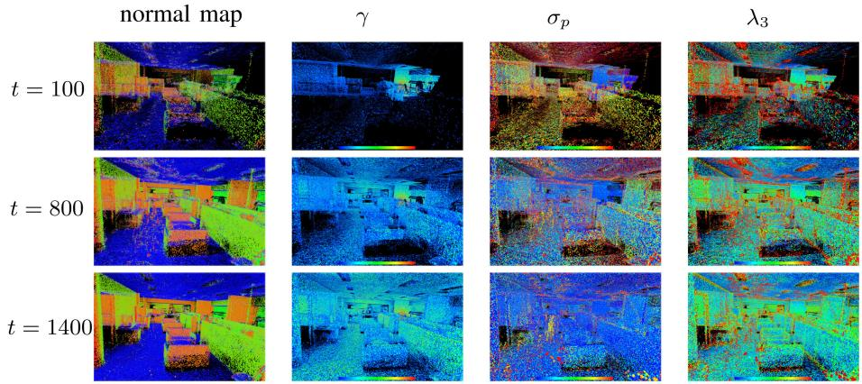  
Fig. 16. Map building process over time. Color represents attribute values of each surfel. Color shows, respectively, normal direction in the first column, number of observations (blue means low, red means high) in the second column, normal, and position uncertainty (blue means low, red means high) in the third and fourth column. t is in seconds.

The RMSE of the estimated pose is listed in Table VI along with the sparse ICP algorithm (a), the proposed method (e), and the other global registration algorithms (b), (c). The sparse surfel ICP (a) is solely based on (27) and utilizes the hierarchical surfels with normal and centroid space matching. This is the same configuration that we utilized in our previous work in [2]. In (b), Open3D [60] global registration is utilized with an initialization by FPFH [54] feature and RANSAC. Similar to (b), SHOT was utilized for the initial pose estimation, then refined by point-to-plane ICP in (c). Longer localization processing time drastically increases map fusion cost between the active map and the global map. Hence, we are not comparing to the time consuming algorithms such as GO-ICP [58] which could take several minutes to hours to process a single pair of point clouds.

The experiment shows that the surfel ICP (a) is prone to local minima problems with a large displacement. The large displacement frequently occurs especially in large-scale mapping scenarios. The pose estimation from Open3D registrations (b) is generally reasonable regardless of the initial guess. However, occasional registration failures occurred due to the failure in finding feature matching. SHOT (c) showed a moderate rotation estimation, yet the estimated translation often suffered from outliers even with a close initial guess. This is assumed to be due to the failure in the feature based pose initialization. The proposed method (d) shows the most stable result. Although both translation and rotation estimation is slightly increasing reaching up to 6 cm and 0.004 rad (≈0.22 deg) in the hard case scenario, they are within a reasonable range and still better than the other algorithms.

TABLE VI  
LOCALIZATION ACCURACY COMPARISON
<table><tr><td rowspan="2">Initial Guess</td><td colspan="2">(a) Sparse ICP</td><td colspan="2">(b) Open3D [60]</td><td colspan="2">(c) SHOT [61]</td><td colspan="2">(d) Proposed method</td></tr><tr><td> $e _ { \mathbf { t } }$ </td><td> $e _ { \mathbf { r } }$ </td><td> $e _ { \mathbf { t } }$ </td><td>er</td><td>et</td><td> $e _ { \mathbf { r } }$ </td><td>et</td><td> $e _ { \mathbf { r } }$ </td></tr><tr><td>Easy</td><td>0.04(0.04)</td><td>0.01(0.01)</td><td>0.30(0.65)</td><td>0.03(0.06)</td><td>1.49(1.52)</td><td>0.07(0.12)</td><td>0.03(0.01)</td><td>0.001(0.0005)</td></tr><tr><td>Medium</td><td>0.40(0.51)</td><td>0.19(0.31)</td><td>1.64(2.39)</td><td>0.30(0.38)</td><td>1.53(1.55)</td><td>0.11(0.29)</td><td>0.04(0.02)</td><td>0.004(0.001)</td></tr><tr><td>Hard</td><td>2.52(0.87)</td><td>2.42(1.55)</td><td>13.8(22.4)</td><td>0.38(0.63)</td><td>7.59(18.56)</td><td>0.30(0.71)</td><td>0.06(0.04)</td><td>0.004(0.001)</td></tr></table>

1The estimations are compared to the ground truth to calculate error norm of translation et and rotation $e _ { \mathbf { r } }$ with standard deviation in parentheses. Units are rotation vector norm and meter. For each noise level, initial poses are randomly generated according to the following parameters: Easy $\sigma _ { \theta z = 1 0 } , \sigma _ { \theta x y = 1 } , \sigma _ { t = 0 . 5 } ,$ medium $\sigma _ { \theta z = 5 0 } \mathrm { , } \sigma _ { \theta x y = 5 } \mathrm { , } \sigma _ { t = 5 } \mathrm { , }$ , hard σθz , σθx , σt (σθ in deg, σt in meter)

## VIII. DISCUSSION

## A. Trajectory Optimization

The composition model stores 500 raw poses and only optimizes the trajectory corrections whereas the approximation model entirely represents the trajectory as the abstracted few spline control points (Fig. 6). Because of this difference, with the same state dimension to be optimized, the approximation method has significantly lower accuracy. With relatively higher motion resolution (101 control points), the approximation method follows the ground truth trajectory reasonably but high-frequency motions are ignored. The ignorance of the high-frequency motion propagates noise to the map when the scanning equipment moves in a high-frequency motion such as in the case, where the device is mounted on a wheeled platform driving outdoors. Considering LiDAR measurements reach up to several hundred meters, even a small angular difference can cause a large displacement of the points.

## B. Map Estimation

While the local details are very similar to the baseline method in Fig. 13, there were overall structure movements about 0.1 m which are similar movements in the deformed trajectory as shown in Fig. 13(b). This could be problematic when the scanning scenario includes partial revisit of a space which does not make enough overlap to trigger a local loop closure. While the map-centric approach solves the time complexity problem, this is a fundamental weakness of the proposed method when used with a long range LiDAR. Thus, it is required to reduce the range of fusion according to the sensor reach and the environment.

The highly redundant scanning case in Fig. 14 showed a slightly different pattern to the dataset (b). The center part is close to the baseline method but the outer part of the map showed a difference of ±0.02 m. This is due to the loop closure which occurs in the first traverse as visualized at (i) in Fig. 12(a). The short distance makes a relatively small misalignment at the loop closure. As a result, the deformed map around this part is similar to the baseline method. However, when a new area is explored and the map grows, the difference starts to increase. Note that the difference in this case is not because of the map deformation but because of the accumulated small drifts.

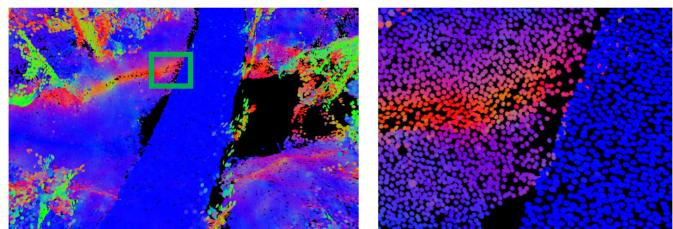  
Fig. 17. Visualization of surface resolution preservative fusion. Note that the surfel size is reduced in the left figure to show the surfels that are forming the surface. The color represents normal direction.

The statistics in Table V shows that the estimated surface is up to three times less noisy than the point cloud generated using the baseline CT-SLAM [3]. However, repeated non-Gaussian noises such as noises from mixed pixel problems [57] are not effectively fused by the proposed method. The repeated non-Gaussian noise pattern usually appears from stationary scans.

Regardless of the number of the original raw points in the proposed method, the surfel densities in patches are uniformly maintained after fusion. Fig. 17 visualizes a small patch of the dataset (e) in Fig. 10 with a reduced surfel size to show that the surface forming surfels are nonredundant and uniformly distributed. However, because ofthe restriction in surface resolution, objects which are smaller than the given surface resolution are often ignored, losing some details of the scene. When an excessive surface resolution is utilized, the computational cost significantly increases due to the matching and fusion cost, and this occurs without an increase in the reconstruction quality. With our experimental sensing payloads, we found that 0.02 m or higher resolution were acceptable.

The result in Fig. 16 shows that after the first traverse of the map (t=100 s), the number of observations of each surfel increases (second column) while the uncertainties decrease (third and forth column). The uncertainty of the overall surfel positions decrease whereas the scatterness along the z direction of the surfels around edges does not decrease after some point. This is due to the way the scatter matrix is extracted from the point cloud where surfels around edges and corners always have a high eigenvalue in the z direction.

The average elapsed time of the implemented algorithm took 2.1 s to process one second length of VLP16, IMU, and camera data on a computer with i7-6700 K CPU, 24 GB RAM, and GTX970 GPU. However, considering the most time consuming algorithm (surfel fusion) is implemented on Matlab with a single thread, the proposed algorithm is expected to be easily converted to real time by deploying parallelism in a modern programming language such as C++.

## C. Localizationfor Loop Closure

Compared to the methods (a)–(c) in Table VI, our proposed sequential metric localization method utilizes more point clouds collected at different locations. However, rather than utilizing a single large chunk of the point cloud, the proposed method (d) segments the map into frame level and runs independent registrations. While this approach provides an evaluation metric to decide the reliability of the current estimation, it also offers cross-validation ability between the independent misalignment estimations. These two components in the proposed method significantly contributed in reducing localization failures. However, the translation error is still relatively higher than the map reconstruction accuracy. Considering the surface reconstruction quality often goes below 1 cm, it is desirable to reduce the metric localization accuracy to a similar level.

Our previous work in [12] utilizes the 2D image only for the loop closure trigger. When the 2D image-based place recognition algorithm reports a possible revisit, the loop closure module initiates the sequential method described in Section VI-A5, and Appendix B. The proposed method is fundamentally free of the calibration error between the LiDAR and camera. Although we proposed a solution that can estimate time lag and extrinsics in our other work [45], time lag calibration is still very challenging especially under degenerate situations like wide featureless outdoor environments. This is the reason why we introduced the 3D only method.

While the result in Table VI shows the robustness of the proposed method, the details regarding the sequential approach have not been included here. A comprehensive set of experiments and details can be found in our previous work [12] with its demonstration on the deformation-based loop closure.

## IX. CONCLUSION

We present a new approach for dense LiDAR-based mapcentric SLAM. Our main contribution in this article is the identification of the problems that occur when applying a map-centric dense mapping approach to LiDAR sensors, followed by a new SLAM framework that successfully adapted the beneficial characteristics of the map-centric approach and a continuous-time representation.

We have tested our method with eight datasets collected in various challenging places in different scales with four different sensor types and configurations. Our experimental results indicated that the deformed map showed only 2-cm difference, while the surface estimation was up to 3 times less noisy after multiple revisits. Also, the sequential misalignment method provided a stable and accurate localization estimation within 6 cm even with the hardest cases where other common methods fail.

While this work demonstrates the use of a LiDAR device within a multimodal map-centric SLAM, we found a couple of limitations such as growing map distortion or the partial observation problem. The distortion in the 60-m scale map reached to 10 cm and is expected to be larger with extended map sizes. However, we believe these weakness can be solved by further introducing additional priors and constraints. We point to these challenges as areas for future work.

## APPENDIX A SURFEL FUSION

Here we briefly describe the method that we utilize for fusion of surfel ellipsoids. If points were observed noise-free, i.e., LiDAR points were distributed according to $\mathcal { N } \{ \mu , \mathbf { X } \}$ , where $\pmb { \mu }$ and X are the true surfel parameters, then a normal inverse Wishart model may be used to estimate the implied ellipsoid by accumulating the overall mean and sample covariance. A fast, approximate method for accommodating noisy observations of the form $\mathcal { N } \{ \mu , \mathbf { X } + \mathbf { Q } \}$ is proposed in [49]. The method maintains a state which includes the estimate of the surfel centroid $\hat { \mu } ,$ the covariance of this estimate, $\hat { \Sigma } ,$ the accrued sample matrix for the extent, $\hat { \Xi } .$ , and the count of points included in the estimates, ν. The updates due to a new surfel with n points with mean z¯, scatter matrix Z¯, and measurement noise $\mathbf { Q } _ { w }$ are

$$
\hat { \pmb { \mu } } ^ { + } = \hat { \pmb { \mu } } + \mathbf { K } ( \bar { \bf z } - \hat { \pmb { \mu } } )\tag{28}
$$

$$
\hat { \boldsymbol { \Sigma } } ^ { + } = \hat { \boldsymbol { \Sigma } } - \mathbf { K } \hat { \boldsymbol { \Sigma } }
$$

$$
\mathbf { K } = \hat { \pmb { \Sigma } } \mathbf { S } ^ { - 1 }\tag{29}
$$

$$
{ \bf S } = \hat { \bf Z } + \frac { { \bf Y } } { n }\tag{30}
$$

(31)

$$
\mathbf { Y } = \hat { \mathbf { X } } + \mathbf { Q } _ { w }\tag{32}
$$

$$
\hat { \mathbf { X } } = \frac { \hat { \mathbf { \Xi } } } { \nu - n _ { z } - 1 }\tag{33}
$$

where $n _ { z }$ is the measurement dimension, an the extent update of

$$
\nu ^ { + } = \nu + n\tag{34}
$$

$$
\hat { \bar { \mathbf { \Xi } } } ^ { + } = \hat { \Xi } + \bar { \mathbf { N } } + \bar { \mathbf { Y } }\tag{35}
$$

$$
\bar { \mathbf { N } } = \hat { \mathbf { X } } ^ { 1 / 2 } \mathbf { S } ^ { - 1 / 2 } \mathbf { N } \mathbf { S } ^ { - T / 2 } \hat { \mathbf { X } } ^ { T / 2 }\tag{36}
$$

$$
\bar { \mathbf { Y } } = \hat { \mathbf { X } } ^ { 1 / 2 } \mathbf { Y } ^ { - 1 / 2 } \bar { \mathbf { Z } } \mathbf { Y } ^ { - T / 2 } \hat { \mathbf { X } } ^ { T / 2 }\tag{37}
$$

$$
{ \bf N } = ( \bar { \bf z } - \hat { \pmb { \mu } } ) ( \bar { \bf z } - \hat { \pmb { \mu } } ) ^ { T } .\tag{38}
$$

The estimate of the covariance defining the object ellipsoid is Xˆ . An alternative method using variational inference has also been proposed [62], but this requires an iterative solution, and is avoided for performance reasons.

## APPENDIX B SEQUENTIAL POSE FUSION

The Bayesian fusion provides a closed-form solution on the vector fusion problem [2]. However, directly applying Euclidean Bayesian fusion on the poses causes a convergence to a suboptimal outcome as the pose vector is on a manifold. Thus, we utilize the sequential $S E ( 3 )$ pose fusion approach proposed in [12] and [63].

This begins by modeling an error $\epsilon _ { n } \sim { \mathcal { N } } ( \mathbf { 0 } , \Sigma _ { n } )$ between an individual estimation of a pose ${ \bf T } _ { n }$ and the ground truth $\mathbf { T } _ { G T }$ as

$$
\begin{array} { r l } & { \boldsymbol { \epsilon } _ { n } = \log ( \mathbf { T } _ { \boldsymbol { G T } } \mathbf { T } _ { n } ^ { - 1 } ) } \\ & { \quad = \log ( \mathbf { e } ^ { [ \boldsymbol { \xi } ] _ { \times } } \mathbf { T } ^ { * } \mathbf { T } _ { n } ^ { - 1 } ) } \\ & { \quad = \log ( \mathbf { e } ^ { [ \boldsymbol { \xi } ] _ { \times } } \mathbf { e } ^ { [ \boldsymbol { \xi } _ { n } ] _ { \times } } ) } \end{array}\tag{39}
$$

where the second and third equation substitute the ground truth which is not directly available and convert the error as a function of a small perturbation $\xi \in \mathfrak { s e } ( 3 )$ regarding our best guess so far on the pose $\mathbf { T } ^ { * }$ and the individual estimation. Thus, given N poses, the best pose that minimizes the sum of the error can be achieved by iteratively minimizing the following cost function regarding ξ:

$$
\begin{array} { l } { { \displaystyle V = \frac { 1 } { 2 } \sum _ { n } ^ { N } \epsilon _ { n } ^ { \top } \Sigma _ { n } \epsilon _ { n } } } \\ { { \displaystyle \epsilon _ { n } \approx \pmb { \xi } _ { n } + \Im _ { n } ^ { - 1 } \pmb { \xi } } } \end{array}\tag{40}
$$

(41)

where $\Im ^ { - 1 }$ in (41) is Baker–Campbell–Hausdorff approximation [63] of (39) which is also referred to the left Jacobian of SE(3).

The pose fusion model above suggests a framework for the $S E ( 3 )$ pose fusion problem. The multiple misalignment estimations in different places are fused by this framework. However, instead of following the original batch fusion, we sequentially fuse poses until the uncertainty is small enough.

Let $\mathbf { T } _ { c } , \pmb { \Sigma } _ { c } , \mathbf { T } _ { k } , \pmb { \Sigma } _ { k } ,$ , respectively, be $k _ { t h }$ new alignment estimation and fused alignment measurement up to the point with their corresponding uncertainties. Note that ideally $\mathbf { T } _ { c }$ and $\mathbf { T } _ { k }$ are identical as the new alignment estimation $\mathbf { T } _ { k }$ is always represented with respect to the first frame where the first alignment was estimated.

Fusion of the two alignments can be found by applying the Gauss–Newton as

$$
\begin{array} { r l } & { \mathbf { A } = \Im _ { c } ^ { - T } \pmb { \Sigma } _ { c } ^ { - 1 } \Im _ { c } ^ { - 1 } + \Im _ { k } ^ { - T } \pmb { \Sigma } _ { k } ^ { - 1 } \Im _ { k } ^ { - 1 } } \\ & { \mathbf { b } = \Im _ { c } ^ { - T } \pmb { \Sigma } _ { c } ^ { - 1 } \pmb { \xi } _ { c } + \Im _ { k } ^ { - T } \pmb { \Sigma } _ { k } ^ { - 1 } \pmb { \xi } _ { k } } \\ & { \pmb { \xi } = \mathbf { A } ^ { - 1 } \mathbf { b } . } \end{array}\tag{42}
$$

Then, the final fused misalignment $\mathbf { T } ^ { * }$ is evaluated by iteratively updating $\mathbf { T } ^ { * }$ with $\xi \operatorname { a s } , \mathbf { T } ^ { * } \gets \mathbf { e } ^ { [ \xi ] \times } \mathbf { T } ^ { * }$ , where the updated alignment $\mathbf { T } ^ { * }$ becomes the new $\mathbf { T } _ { c }$ at the end of the iteration and is utilized in the next fusion. The covariance of the next current alignment estimation is updated as follows:

$$
\begin{array} { r } { \pmb { \Sigma } _ { c } = ( \pmb { \Im } _ { c } ^ { - T } \pmb { \Sigma } _ { c } ^ { - 1 } \pmb { \Im } _ { c } ^ { - 1 } + \pmb { \Im } _ { k } ^ { - T } \pmb { \Sigma } _ { k } ^ { - 1 } \pmb { \Im } _ { k } ^ { - 1 } ) ^ { - 1 } . } \end{array}\tag{43}
$$

The fusion ofthe pose continues until $\Sigma _ { c }$ meets the predefined threshold.

## ACKNOWLEDGMENT

The authors would like to thank several individual members of the staff in the Robotics and Autonomous Systems Group, CSIRO, including G. Catt, E. Hernandez, B. Tam, M. Cox, and T. Lowe for their help. This paper is dedicated to the memory of Prof. Dr. A. Elfes (1953–2020).

## REFERENCES

[1] T. Whelan, S. Leutenegger, R. S. Moreno, B. Glocker, and A. Davison, “ElasticFusion: Dense SLAM without a pose graph,” in Proc. Robot.: Sci. Syst., 2015, pp. 1–9.

[2] C. Park, P. Moghadam, S. Kim, A. Elfes, C. Fookes, and S. Sridharan, “Elastic LiDAR fusion: Dense map-centric continuous-time SLAM,” in Proc. Int. Conf. Robot. Automat., 2018, pp. 1206–1213.

[3] M. Bosse, R. Zlot, and P. Flick, “Zebedee: Design of a spring-mounted 3-D range sensor with application to mobile mapping,” IEEE Trans. Robot., vol. 28, no. 5, pp. 1104–1119, Oct. 2012.

[4] S. Vidas, P. Moghadam, and S. Sridharan, “Real-time mobile 3D temperature mapping,” IEEE Sensors J., vol. 15, no. 2, pp. 1145–1152, Feb. 2015.

[5] Y.-S. Shin, Y. S. Park, and A. Kim, “DVL-SLAM: Sparse depth enhanced direct visual-LiDAR SLAM,” Auton. Robots, vol. 44, no. 2, pp. 115–130, Jan. 2020.

[6] J. Behley and C. Stachniss, “Efficient surfel-based SLAM using 3D laser range data in urban environments,” in Proc. Robot.: Sci. Syst., 2018, pp. 1–10.

[7] T. Whelan, M. Kaess, J. J. Leonard, and J. McDonald, “Deformation-based loop closure for large scale dense RGB-D SLAM,” in Proc. IEEE/RSJ Int. Conf. Intell. Robots Syst., 2013, pp. 548–555.

[8] W. Hess, D. Kohler, H. Rapp, and D. Andor, “Real-time loop closure in 2D LIDAR SLAM,” in Proc. IEEE Int. Conf. Robot. Automat., 2016, pp. 1271–1278.

[9] P. Furgale, T. D. Barfoot, and G. Sibley, “Continuous-time batch estimation using temporal basis functions,” in Proc. IEEE Int. Conf. Robot. Automat., 2012, pp. 2088–2095.

[10] S. Hong, H. Ko, and J. Kim, “VICP: Velocity updating iterative closest point algorithm,” in Proc. IEEE Int. Conf. on Robot. Automat., 2010, pp. 1893–1898.

[11] C. Park, S. Kim, P. Moghadam, C. Fookes, and S. Sridharan, “Probabilistic surfel fusion for dense LiDAR mapping,” in Proc. Int. Conf. Comput. Vision Workshops, 2017, pp. 2418–2426.

[12] C. Park, S. Kim, P. Moghadam, J. Guo, S. Sridharan, and C. Fookes, “Robust photogeometric localization over time for map-centric loop closure,” IEEE Robot. Automat. Lett., vol. 4, no. 2, pp. 1768–1775, Apr. 2019.

[13] J. Park, Q. Y. Zhou, and V. Koltun, “Colored point cloud registration revisited,” in Proc. Int. Conf. Comput. Vision, 2017, pp. 143–152.

[14] Y. Latif, C. Cadena, and J. Neira, “Robust loop closing over time for pose graph SLAM,” Int. J. Robot. Res., vol. 32, no. 14, pp. 1611–1626, Dec. 2013.

[15] D. Droeschel and S. Behnke, “Efficient continuous-time SLAM for 3D Lidar-based online mapping,” in Proc. IEEE Int. Conf. Robot. Automat., 2018, pp. 5000–5007.

[16] A. Elfes, “Using occupancy grids for mobile robot perception and navigation,” Computer, vol. 22, no. 6, pp. 46–57, Jun. 1989.

[17] A. Hornung, K. M. Wurm, M. Bennewitz, C. Stachniss, and W. Burgard, “OctoMap: An efficient probabilistic 3D mapping framework based on octrees,” Auton. Robots, vol. 34, no. 3, pp. 189–206, 2013.

[18] R. A. Newcombe et al., “KinectFusion: Real-time dense surface mapping and tracking,” in Proc. IEEE Int. Symp. Mixed Augmented Reality, 2011, pp. 127–136.

[19] T. Whelan, M. Kaess, M. Fallon, H. Johannsson, J. Leonard, and J. McDonald, “Kintinuous: Spatially extended kinectfusion,” in Proc. RSS Workshop RGB-D: Advanced Reasoning Depth Cameras, Jul. 2012, pp. 1–8.

[20] H. Oleynikova, M. Burri, Z. Taylor, J. Nieto, R. Siegwart, and E. Galceran, “Continuous-time trajectory optimization for online UAV replanning,” in Proc. IEEE Int. Conf. Intell. Robots Syst., 2016, pp. 5332–5339.

[21] M. Krainin, P. Henry, X. Ren, and D. Fox, “Manipulator and object tracking for in-hand 3D object modeling,” Int. J. Robot. Res., vol. 30, no. 11, pp. 1311–1327, Sep. 2011.

[22] M. Bosse and R. Zlot, “Continuous 3D scan-matching with a spinning 2D laser,” in Proc. Int. Conf. Robot. Automat., 2009, pp. 4312–4319.

[23] M. Schadler, J. Stückler, and S. Behnke, “Multi-resolution surfel mapping and real-time pose tracking using a continuously rotating 2D laser scanner,” in Proc. IEEE Int. Symp. Saf., Secur., Rescue Robot., 2013, pp. 1–6.

[24] P. Henry, M. Krainin, E. Herbst, X. Ren, and D. Fox, “RGB-D mapping: Using kinect-style depth cameras for dense 3D modeling of indoor environments,” Int. J. Robot. Res., vol. 31, no. 5, pp. 647–663, Apr. 2012.

[25] M. Keller, D. Lefloch, M. Lambers, S. Izadi, T. Weyrich, and A. Kolb, “Real-time 3D reconstruction in dynamic scenes using point-based fusion,” in Proc. Int. Conf. 3D Vision, 2013, pp. 1–8.

[26] X. Fu, F. Zhu, Q. Wu, Y. Sun, R. Lu, and R. Yang, “Real-time largescale dense mapping with surfels,” Sensors, vol. 18, no. 5, May 2018, Art. no. 1493.

[27] Z. Yan, M. Ye, and L. Ren, “Dense visual SLAM with probabilistic surfel map,” IEEE Trans. Visualization Comput. Graph., vol. 23, no. 11, pp. 2389–2398, Nov. 2017.

[28] H. Pfister, M. Zwicker, J. van Baar, and M. Gross, “Surfels: Surface elements as rendering primitives,” in Proc. 27th Annu. Conf. Comput. Graph. Interactive Techn., 2000, pp. 335–342.

[29] C. Kerl, J. Sturm, and D. Cremers, “Dense visual SLAM for RGB-D cameras,” in Proc. IEEE Int. Conf. Intell. Robots Syst., 2013, pp. 2100–2106.

[30] A. Nuchter, K. Lingemann, J. Hertzberg, and H. Surmann, “6D SLAM with approximate data association,” in Proc. IEEE Int. Conf. Adv. Robot., 2005, pp. 242–249.

[31] M. Montemerlo, S. Thrun, D. Koller, and B. Wegbreit, “FastSLAM: A factored solution to the simultaneous localization and mapping problem,” in Proc. 18th Nat. Conf. Artif. Intell., 2002, pp. 593–598.

[32] A. J. Davison, I. D. Reid, N. D. Molton, and O. Stasse, “MonoSLAM: Real-time single camera SLAM,” IEEE Trans. Pattern Anal. Mach. Intell., vol. 29, no. 6, pp. 1052–1067, Jun. 2007.

[33] Y. Tanahashi et al., “Development of coaxial 3D-LiDAR Systems using MEMS scanners for automotive applications,” in Proc. Ind. Opt. Devices Syst., vol. 10757, Sep. 2018, Art. no. 107570E.

[34] C. L. Gentil, T. Vidal-Calleja, and S. Huang, “IN2LAMA: INertial lidar localisation and MApping,” in Proc. IEEE Int. Conf. Robot. Automat., 2019, pp. 6388–6394.

[35] S. Lovegrove, A. Patron-Perez, and G. Sibley, “Spline fusion: A continuous-time representation for visual-inertial fusion with application to rolling shutter cameras,” in Proc. Brit. Mach. Vision Assoc., 2013, pp. 1–12.

[36] C. H. Tong, S. Anderson, H. Dong, and T. D. Barfoot, “Pose interpolation for laser-based visual odometry,” J. Field Robot., vol. 31, no. 5, pp. 731–757, 2014.

[37] S. Anderson, T. D. Barfoot, C. H. Tong, and S. Särkkä, “Batch nonlinear continuous-time trajectory estimation as exactly sparse Gaussian process regression,” Auton. Robots, vol. 39, no. 3, pp. 221–238, Oct. 2015.

[38] J. Dong, M. Mukadam, B. Boots, and F. Dellaert, “Sparse Gaussian processes on matrix lie groups: A unified framework for optimizing continuous-time trajectories,” in Proc. IEEE Int. Conf. Robot. Automat., 2018, pp. 6497–6504.

[39] R. Dubé, H. Sommer, A. Gawel, M. Bosse, and R. Siegwart, “Non-uniform sampling strategies for continuous correction based trajectory estimation,” in Proc. Int. Conf. Robot. Automat., 2016, pp. 4792–4798.

[40] J. Rehder, R. Siegwart, and P. Furgale, “A general approach to spatiotemporal calibration in multisensor systems,” IEEE Trans. Robot., vol. 32, no. 2, pp. 383–398, Apr. 2016.

[41] P. Furgale, J. Rehder, and R. Siegwart, “Unified temporal and spatial calibration for multi-sensor systems,” in Proc. IEEE/RSJ Int. Conf. Intell. Robots Syst., 2013, pp. 1280–1286.

[42] J. Kim, C. Cadena, and I. Reid, “Direct semi-dense SLAM for rolling shutter cameras,” in Proc. IEEE Int. Conf. Robot. Automat., 2016, pp. 1308–1315.

[43] T. Whelan, R. F. Salas-Moreno, B. Glocker, A. J. Davison, and S. Leutenegger, “ElasticFusion: Real-time dense SLAM and light source estimation,” Int. J. Robot. Res., vol. 35, no. 14, pp. 1697–1716, Dec. 2016.

[44] J. Zhang and S. Singh, “Visual-Lidar odometry and mapping: Lowdrift, robust, and fast,” in Proc. IEEE Int. Conf. Robot. Automat., 2015, pp. 2174–2181.

[45] C. Park, S. Kim, P. Moghadam, S. Sridharan, and C. Fookes, “Spatiotemporal camera-LiDAR calibration: A markerless and structureless approach,” IEEE Robot. Automat. Lett., vol. 5, no. 2, pp. 1556–1563, Jan. 2020.

[46] S. Vidas, P. Moghadam, and M. Bosse, “3D thermal mapping of building interiors using an RGB-D and thermal camera,” in Proc. IEEE Int. Conf. Robot. Automat., 2013, pp. 2311–2318.

[47] P. Moghadam, M. Bosse, and R. Zlot, “Line-based extrinsic calibration of range and image sensors,” in Proc. IEEE Int. Conf. Robot. Automat., 2013, pp. 3685–3691.

[48] F. Pomerleau, A. Breitenmoser, M. Liu, F. Colas, and R. Siegwart, “Noise characterization of depth sensors for surface inspections,” in Proc. Int. Conf. Appl. Robot. Power Ind., 2012, pp. 16–21.

[49] M. Feldmann, D. Fränken, and W. Koch, “Tracking of extended objects and group targets using random matrices,” IEEE Trans. Signal Process., vol. 59, no. 4, pp. 1409–1420, Apr. 2011.

[50] L. Kneip, F. Tache, G. Caprari, and R. Siegwart, “Characterization of the compact Hokuyo URG-04LX 2D laser range scanner,” in Proc. IEEE Int. Conf. Robot. Automat., 2009, pp. 1447–1454.

[51] Y. Okubo, C. Ye, and J. Borenstein, “Characterization ofthe Hokuyo URG-04LX laser rangefinder for mobile robot obstacle negotiation,” Proc. SPIE, vol. 7332, May 2009, Art. no. 733212.

[52] M. Bosse and R. Zlot, “Place recognition using keypoint voting in large 3D Lidar datasets,” in Proc. IEEE Int. Conf. Robot. Automat., 2013, pp. 2677–2684.

[53] R. Dubé, D. Dugas, E. Stumm, J. Nieto, R. Siegwart, and C. Cadena, “SegMatch: Segment based place recognition in 3D point clouds,” in Proc. IEEE Int. Conf. Robot. Automat., 2017, pp. 5266–5272.

[54] R. B. Rusu, N. Blodow, and M. Beetz, “Fast point feature histograms (FPFH) for 3D registration,” in Proc. Int. Conf. Robot. Automat., 2009, pp. 3212–3217.

[55] J. Guo, P. V. K. Borges, C. Park, and A. Gawel, “Local descriptor for robust place recognition using LiDAR intensity,” IEEE Robot. Automat. Lett., vol. 4, no. 2, pp. 1470–1477, Apr. 2019.

[56] V. Pavel, C. Mark, V. K. B. Paulo, and L. Tom, “Colourising point clouds using independent cameras,” IEEE Robot. Automat. Lett., vol. 3, no. 4, pp. 3575–3582, Oct. 2018.

[57] J. Tuley, N. Vandapel, and M. Hebert, “Analysis and removal of artifacts in 3-D LADAR data,” in Proc. IEEE Int. Conf. Robot. Automat., 2005, pp. 2203–2210.

[58] J. Yang, H. Li, D. Campbell, and Y. Jia, “Go-ICP: A globally optimal solution to 3D ICP point-set registration,” IEEE Trans. Pattern Anal. Mach. Intell., vol. 38, no. 11, pp. 2241–2254, Nov. 2016.

[59] S. Lynen, M. Bosse, P. Furgale, and R. Siegwart, “Placeless placerecognition,” in Proc. 2nd Int. Conf. 3D Vision, Dec. 2014, pp. 303–310.

[60] Q.-Y. Zhou, J. Park, and V. Koltun, “Open3D: A modern library for 3D data processing,” Jan. 2018, arXiv:1801.09847.

[61] F. Tombari, S. Salti, and L. Di Stefano, “Unique signatures of histograms for local surface description,” in Proc. Eur. Conf. Comput. Vision, 2010, pp. 356–369.

[62] U. Orguner, “A variational measurement update for extended target tracking with random matrices,” IEEE Trans. Signal Process., vol. 60, no. 7, pp. 3827–3834, Jul. 2012.

[63] T. D. Barfoot and P. T. Furgale, “Associating uncertainty with threedimensional poses for use in estimation problems,” IEEE Trans. Robot., vol. 30, no. 3, pp. 679–693, Jun. 2014.

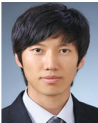  
sion, and motion planning.  
Chanoh Park (Student Member, IEEE) received the B.S. degree in electrical engineering from the Seoul National University of Science and Technology, Seoul, South Korea, in 2010, the M.S. degree in computer science from the Sungkyunkwan University, Seoul, in 2012, and the Ph.D degree in electrical engineering and robotics from the Queensland University of Technology, Brisbane, QLD, Australia, and Commonwealth Scientific and Industrial Research Organisation, Pullenvale, QLD, Australia, in 2021.

His research interests include SLAM, sensor fu-

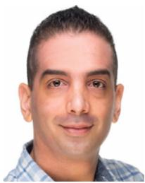

Peyman Moghadam (Senior Member, IEEE) received the Ph.D. degree in electrical and electronic engineering from Nanyang Technological University, Singapore, in 2012.

He is currently a Principal Research Scientist and Team Leader with the Robotics and Autonomous Systems Group, Commonwealth Scientific and Industrial Research Organisation, Pullenvale, QLD, Australia. He is also an Adjunct Professor with the Queensland University of Technology, Brisbane, QLD. His current research interests include 3D multimodal per-

ception (3D++), embodied AI, robotics, and machine learning.

Jason L. Williams (Senior Member, IEEE) received the B.E. electronics/BInfTech degree from the Queensland University of Technology, Brisbane, QLD, Australia, the M.Sc. degree in electrical engineering from the Air Force Institute of Technology, Wright-Patterson Air Force Base, OH, USA, and the Ph.D. degree from the Massachusetts Institute of Technology, Cambridge, MA, USA, in 1999, 2003, and 2007, respectively.

He is currently a Senior Research Scientist of Robotic Perception with the Robotics and Autonomous Systems Group, Commonwealth Scientific and Industrial Research Organisation, Pullenvale, QLD, Australia. He is also an Adjunct Associate Professor with the Queensland University of Technology, Brisbane. His research interests include SLAM, computer vision, multiple object tracking, and motion planning.

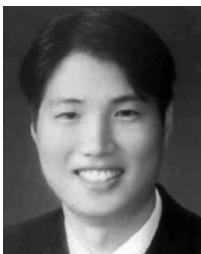

Soohwan Kim (Member, IEEE) received the B.S. degree in mechanical engineering from Seoul National University, Seoul, South Korea, in 2003, the M.S. degree in computer science from the University of Southern California, Los Angeles, CA, USA, in 2004, and the Ph.D. degree in engineering and computer science from The Australian National University, Canberra, ACT, Australia, in 2015.

He was a Research Scientist with the Electronics and Telecommunications Research Institute, Gwangju, South Korea, from 2005 to 2006, the Korea

Science and Technology Institute, Seoul, South Korea, from 2007 to 2011, the Bosch Research North America, Palo Alto, CA, from 2015 to 2016, and the Commonwealth Scientific and Industrial Research Organisation, Pullenvale, QLD, Australia from 2016 to 2018. From 2018 to 2019, he was a Senior Computer Vision Scientist with NVIDIA, CA. He is currently an Assistant Professor with Sun Moon University, Asan, South Korea. His research interests include robotics, computer vision, and machine learning.

Sridha Sridharan (Life Senior Member, IEEE) received the M.Sc. degree in communication engineering from the University of Manchester, Manchester, U.K., and the Ph.D. degree in signal processing from the University of New South Wales, Sydney, NSW, Australia, in 1985.

He is currently a Professor with the School of Electrical Engineering and Robotics, Queensland University of Technology (QUT), Brisbane, QLD, Australia. He is also the Research Leader of the research program with Signal Processing, Artificial Intelligence,

and Vision Technologies, QUT. From 1990 to 2021, he has authored or coauthored more than 600 papers including publications in journals and in refereed international conferences in his areas of interest. During this period, he has graduated over 80 Ph.D. students in these areas. His research interests include signal processing, computer vision, and machine learning. Dr. Sridharan was the recipient of a number of research grants from various funding bodies including Commonwealth competitive funding schemes, such as the Australian Research Council and the National Security Science and Technology unit.

  
recognition.

Clinton Fookes (Senior Member, IEEE) received the B.Eng. degree in aerospace/avionics, the Ph.D. degree in computer vision, and the MBA degree from the Queensland University of Technology (QUT), Brisbane, QLD, Australia, in 1999, 2004, and 2011, respectively.

He is currently a Professor of Vision and Signal Processing with the Faculty of Engineering and the School of Electrical Engineering and Robotics, QUT. His research interests include computer vision, machine learning, signal processing, and pattern

Dr. Fookes was the recipient of the Australian Institute of Policy and Science Young Tall Poppy Award, and an Australian Museum Eureka Prize. He is a Senior Fulbright Scholar. He serves on the Editorial Boards for the IEEE TRANSACTIONS ON IMAGE PROCESSING, Pattern Recognition, and the IEEE TRANSACTIONS ON INFORMATION FORENSICS AND SECURITY.