# Event-Based Line SLAM in Real-Time

William Chamorro , Joan Solà , and Juan Andrade-Cetto , Member, IEEE

Abstract—Event-based cameras generate asynchronous streams of events, triggered proportionally to the logarithmic change of brightness in the scene. These cameras have very low latency and high dynamic range suitable to address challenging motion scenarios in robotics. In this work, we explore a new event-based line-SLAM approach following a parallel tracking and mapping philosophy. Our fast tracking algorithm, produces accurate camera pose estimates at a high rate by minimizing the event-line reprojection error with an error-state Kalman filter formulated entirely with Lie theory. The mapping thread leverages the natural edge highlighting strength of events to recover and optimize straight lines in human-made scenarios. The proper manipulation of matrix sparsity as well as the information sharing between tracking and mapping nodes allow us to achieve real-time performance on a standard multi-core CPU. This system was tested on several scenarios rich in straight edge objects, and compared against, ground truth and frame and event based state-of-the-art approaches.

Index Terms—SLAM, localization, mapping.

## I. INTRODUCTION

VENT-BASED cameras are bio-inspired sensors that proness changes in the scene. Their constructive advantages like low latency (about $1 2 \mu \mathrm { s } )$ and high dynamic range (e.g., 120 dB for the DAVIS240 model compared to the 60 dB of standard cameras [1]) make them suitable for scenarios with challenging lighting conditions and very fast motion. In such conditions, classic computer vision techniques fail due to the low sensing latency and consequent image blurring. Due to the asynchronous nature ofevents, the direct application ofmost standard computer vision algorithms is not possible, which rely on full synchronous frames with image intensity values. In this sense, most of the literature related to event-based simultaneous localization and mapping (SLAM) propose solutions based on template alignment (tracking) and semi-dense reconstruction (mapping) [2], [3], without direct feature extraction from the image plane. Despite their outstanding results, the output dynamics is limited to rates in the range of hundreds of Hz to maintain a real-time response. Higher dynamic responses and denser maps have been achieved using Bayesian estimators, but recovering image intensity from events, resulting in high computational cost that becomes intractable for common robotic platforms [4].

As event cameras respond to changes in brightness, events naturally highlight edges as those found in geometrical shapes in human-made environments. Following such natural response of event cameras, we are interested in the problem of 6-DOF parallel tracking and mapping PTAM using events and a set of scattered 3D line segments extracted from edges in human-made scenarios. Our goal is to achieve a fast response without losing the fast asynchronous characteristic of the events or recovering image intensity. To this end, we designed a system that uses only event data. It estimates the ego-motion of the event camera at a kHz rate because of the use of small event windows ( 300μs) during the estimation process. Simultaneously we create a 3D lines map at a lower rate (in the order of Hz) by projecting the events into a spatial grid. This approach follows the PTAM philosophy of [5] in which the tracking and mapping modules run in parallel. A non-linear optimization thread links both modules because each component has independent states.

The main contributions of our approach are: (i) A line-based PTAM system that estimates structure and motion, and retrieves camera positions at a high rate ( 3.3 kHz) with observed dynamics exceeding those of the integrated DAVIS IMU. (ii) An adaptation over [6] to deal with 3D lines detection and extraction. (iii) A collection of bootstrapping algorithms that use event data and 2D features.

## II. RELATED WORK

The event-based SLAM problem has been a topic of interest since the development of the Dynamic Vision Sensor [7]. The literature presents a number of event-based solutions concerning ego-motion estimation, feature detection and optical flow, and in lesser proportion mapping and 3D reconstruction [8]. Regarding studies addressing simultaneous tracking and mapping, one of the first approaches [9] proposes a 3D SLAM system that combines an event camera and an RGB-D sensor to recover spatial information.

The PTAM solution presented in [4] uses interleaved Bayesian filters to estimate the camera pose, create semi-dense 3D maps, and recover image intensity in natural scenarios. Fast-motion tracking and 3D reconstructions in real-time was achieved using a GPU.

More recently EVO [10] also splits the problem into tracking and mapping. Its core is EMVS [6] -a space sweep approachthat creates a 3D semi-dense reconstruction from a given camera position. EVO initializes with a planar scene assumption, and on failure, it resorts to grayscale images using SVO [11] to aid in bootstrapping.

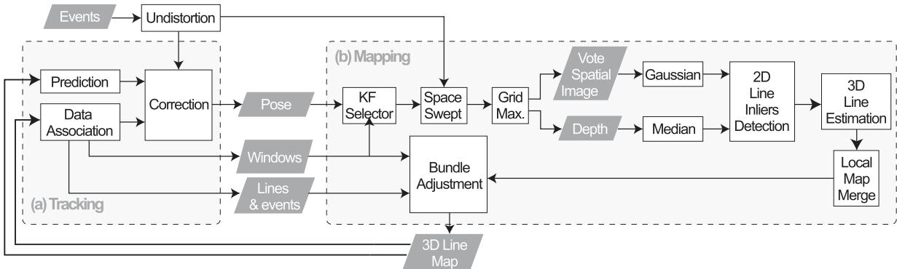  
Fig. 1. Event-based parallel tracking and mapping using lines.

Another PTAM [3] uses a stereo rig of event cameras. Similar to EVO, its tracking module is based on image-to-model alignment initially presented in [11]. This alignment minimizes the photometric error between the projected semi-dense map and a window of events. The estimation output rate is in the order of hundreds of $\mathrm { H z } ,$ but it is slow compared to the dynamics that event cameras can cope with. Our approach is a monocular PTAM system which tracking module uses fast event-line data associations to estimate the camera pose in a small event window. Our implementation runs in real-time on a standard CPU.

Other event-based visual [12] and visual-inertial [2], [13], [14] odometry systems cluster events to create synthetic images to detect corner-like features. These event integration and optimization processes lead to a bottleneck that limits the event camera capabilities. Nevertheless, these approaches outperform classic methods with standard cameras in absence of light or in fast-motion. In our work, the tracking module uses only event data and does not create an event image or extracts features directly from each window. The mapping module recovers 3D lines also using events and the estimated camera pose.

More related to our line-features approach, IDOL [15] -a visual-inertial system- tracks event clusters associated with line segments. It works in human-made scenarios with a reasonable number of lines. However, in densely populated line environments or high event rates, the computational burden becomes an issue to reach real-time performance. As discussed in [15], line extraction from event clusters is a time expensive strategy.

## III. SYSTEM OVERVIEW

Our method follows the PTAM philosophy of [5] and is aimed at human-made scenarios where straight geometrical shapes are prominent. It has two modules running in parallel at significantly different speeds and sharing information through the ROS environment. The tracking module (Fig. 1 a) produces 6-DOF camera pose and velocity estimates at a high rate as it uses small event windows. We do not extract lines directly from the event stream to avoid large event-integration bottlenecks or time-consuming line clustering as discussed in [15]. The mapping module (Fig. 1 b) uses the estimated camera pose to recover 3D lines from the scene. This is a slow and asynchronous process that updates the lines-map each time the camera moves a significant distance. A bundle adjustment prevents the system from diverging by linking both modules and correcting the pose and line estimations based on both modules’ outputs. The system uses a bootstrap that provides initial camera poses and 3D lines by observing a scene with at least 6 non-parallel lines at a moderate speed and low accelerations. Three known-scale launching options using a predefined marker are also described. These modules are detailed in the following subsections.

## A. Event-Based Tracking

The core of the tracking module is built upon our tracker [16]. It aims to minimize the event-line reprojection error to estimate the 3D camera pose. The state is updated at a high rate as we operate over a small window of events typically of size of 300 μs. We rely on [17] to create an undistortion lookup table for all pixel coordinates and to correct the lens radial distortion. This procedure is at least five times faster than using the ROS-OpenCV Pinhole Camera library and it is done once before starting the tracking process. Afterwards, the table accessing is asynchronous at the cost of locating the precomputed equivalent pixel coordinates of the incoming events.

1) State Prediction: The 6-DoF camera pose is estimated using a Lie-formulated error-state Kalman filter. The state transition at time k has the form $\mathbf { x } _ { k } = f ( \mathbf { x } _ { k - 1 } , \mathbf { n } _ { k } )$ , where ${ \bf n } _ { k }$ is the Gaussian perturbation. State transition is modeled with constant velocity:

$$
\begin{array} { r } { \mathbf { x } _ { k } = \left\{ \begin{array} { l l } { \mathbf { r } _ { \mathbf { k } } = \mathbf { r } _ { \mathbf { k } - 1 } + \mathbf { v } _ { \mathbf { k } - 1 } \pmb { \Delta t } } & { \in \mathbb { R } ^ { 3 } } \\ { \mathbf { R } _ { k } = \mathbf { R } _ { k - 1 } \oplus \omega _ { k - 1 } \Delta t } & { \in S O ( 3 ) } \\ { \mathbf { v } _ { k } = \mathbf { v } _ { k - 1 } + \mathbf { v _ { n } } } & { \in \mathbb { R } ^ { 3 } } \\ { \omega _ { k } = \omega _ { k - 1 } + \omega _ { \mathbf { n } } } & { \in \mathfrak { s o } ( 3 ) } \end{array} \right. , } \end{array}\tag{1}
$$

where r is the position, R the orientation, v the linear velocity, ω the angular velocity, $\mathbf { v _ { n } }$ the Gaussian perturbation in the linear velocity, and $\omega _ { \mathbf { n } }$ the perturbation in the angular velocity. Since the orientation R belongs to the $S O ( 3 )$ Lie group, the operator does the right plus operation described in Eq. (132) in [18]. Several filter variants were tested experimentally in [16] showing that the constant velocity model has the best results concerning accuracy and computational performance.

The error state $\delta \mathbf { x } = [ \delta \mathbf { r } ^ { T } , \delta \pmb { \theta } ^ { T } , \delta \mathbf { v } ^ { T } , \delta \pmb { \omega } ^ { T } ] ^ { T }$ is represented as Gaussian variables with mean δx and covariance $\mathbf { P } .$ The covariance propagation error is $\mathbf { P } _ { k } = \mathbf { F } \mathbf { P } _ { k - 1 } \mathbf { F } ^ { T } + \mathbf { Q } \in \mathbb { R } ^ { 1 2 \times 1 }$ 2 with state Jacobian F and noise covariance Q given by:

$$
\mathbf { F } = \left[ 0 \quad \mathbf { J } _ { \mathbf { R } } ^ { \mathbf { R } } \quad \mathbf { 0 } \quad \mathbf { J } _ { \omega } ^ { \mathbf { R } } \right] , \mathbf { Q } = \left[ \begin{array} { c c c c } { 0 } & & & \\ & { \mathbf { J } _ { \mathbf { \Omega } } ^ { \mathbf { R } } } & & { 0 } & { \mathbf { J } _ { \omega } ^ { \mathbf { R } } } \\ { 0 } & { 0 } & & { \mathbf { I } } & & { 0 } \\ & { 0 } & & { 0 } & & { \mathbf { I } } \end{array} \right] , \mathbf { Q } = \left[ \begin{array} { c c c c } { 0 } & & & \\ & { 0 } & & \\ & & { \sigma _ { \mathbf { v } } ^ { 2 } \mathbf { I } } & \\ & & & { \sigma _ { \omega } ^ { 2 } \mathbf { I } } \end{array} \right] \Delta t ,\tag{2}
$$

where we follow a Jacobian notation $\mathbf { J _ { b } ^ { a } } \triangleq \partial \mathbf { a } / \partial \mathbf { b }$ . The Jacobians with respect the orientation ${ \bf J _ { R } ^ { R } }$ and the angular velocity $\mathbf { J } _ { \omega } ^ { \mathbf { R } }$ are detailed in [16] but can be easily derived applying the properties for the Lie group $S O ( 3 )$ in [18].

2) State Correction: The events for the state correction are clustered into a small temporal window W of size $\Delta t ,$ in which an efficient data association can be performed. This association method enhances the performance since the tracker makes only one prediction per window at the central time. In this work we use 3D lines parametrized with an origin point $\mathbf { A } = \mathbf { p } _ { 1 } \in \mathbb { R } ^ { 3 }$ and a unit direction vector B $\mathbf { \Sigma } = \left( \mathbf { p } _ { 2 } - \mathbf { p } _ { 1 } \right)$ ).normalized $( ) \in \mathbb { R } ^ { 3 }$ , that have endpoints $\mathbf { p } _ { 1 }$ and p2. Any point in the 3D line follows the equation $\mathbf { A } + \lambda \mathbf { B } \forall \lambda \in \mathbb { R }$ . After the state prediction, all visible 3D-lines are projected onto the image plane as:

$$
\mathbf { l } = \boldsymbol { K } \mathbf { R } ^ { \top } ( \mathbf { A } - \mathbf { r } ) \times \mathbf { B } = [ a , b , c ] ^ { T } ,\tag{3}
$$

where contains the intrinsic camera parameters expressed in canonical form as in Eq. (31) in [19]. Each undistorted event $\mathbf { e } = [ u , v , 1 ] ^ { T }$ is matched with a single projected line and used to compute the measurement innovation z, described by the Euclidean event-to-line signed distance

$$
z = { \frac { \mathbf { e } ^ { T } \mathbf { l } } { \sqrt { a ^ { 2 } + b ^ { 2 } } } } ,\tag{4}
$$

and with a measurement noise $\sigma _ { z } .$ . It is worth noting that we consider a line as visible when its total or partial reprojection falls in front of the image plane. So far, occlusions are not taken into account but will be considered in future work.

The event-line data association process is summarized in Fig. 2. It aims at rapidly rejecting outliers and at ignoring ambiguous events. This process operates over W (Fig. 2 a) where the closest events to a specific line are mapped into cells using image tessellation (Fig. 2 b). Then, a positive match is determined when an event has distance thresholds $d _ { 1 } < \alpha .$ $d _ { 2 } > \beta$ and the orthogonal projection lies between the two projected endpoints (Fig. 2 c).

An EKF correction is applied for each valid event-line association. The innovation covariance is a scalar computed by $Z = \mathbf { H } \mathbf { P } \mathbf { H } ^ { \intercal } + \sigma _ { z } ^ { 2 } ;$ its Jacobian H is derived applying the chain rule:

$$
\mathbf { H } = \mathbf { J } _ { 1 } ^ { z } \left[ \mathbf { J } _ { \mathbf { r } } ^ { \mathbf { l } } \quad \mathbf { J } _ { \mathbf { R } } ^ { \mathbf { l } } \quad \mathbf { 0 } \quad \mathbf { 0 } \right] \in \mathbb { R } ^ { 1 \times 1 2 } ,\tag{5}
$$

having ${ \bf J } _ { 1 } ^ { z } = \underline { { \bf e } } ^ { \top } / \sqrt { a ^ { 2 } + b ^ { 2 } } , { \bf J } _ { \bf r } ^ { 1 } = K { \bf R } ^ { \top } [ { \bf B } ] _ { \times } , { \bf J } _ { \bf R } ^ { 1 } = \mathcal { K } [ { \bf R } ^ { \top } ( { \bf A } - { \bf r } )$ $\mathbf { \nabla } \times \mathbf { B } ]$ , and $[ \cdot ] _ { \times }$ as a skew-symmetric matrix. These are Jacobians of the rotation action computed in the Lie-theoretic sense [18]. The state is corrected by computing the Kalman gain $\mathbf { k } = \mathbf { P } \mathbf { H } ^ { \top } Z ^ { - 1 }$ and the observed error $\delta \mathbf { x } = \mathbf { k } z$ . Finally, the state is updated as $\mathbf { x }  \mathbf { x } \oplus \delta \mathbf { x }$ and its covariance $\mathbf { P } \gets$ $\mathbf { P } - \mathbf { k } Z \mathbf { k } ^ { \top }$

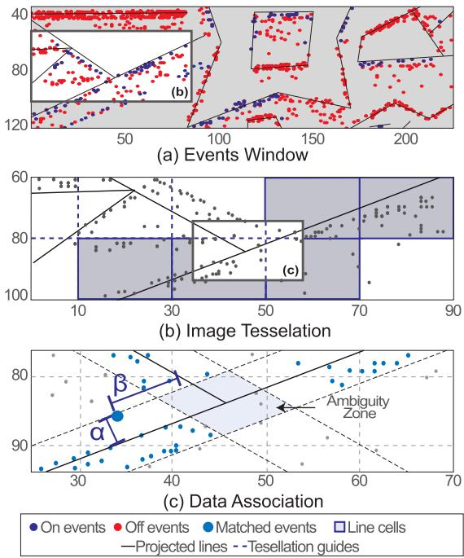  
Fig. 2. Tacking data association: (a) Section of an event window with reprojected lines, (b) Image tessellation and lines cell extraction, (c) Thresholding for data association.

## B. Event-Based Mapping

Event cameras naturally respond to the edges in the scene; thus, in man-made environments, the regions highlighted by the events will be rich in straight 3D lines. On this basis, we create a semi-dense 3D spatial grid following the space sweep algorithm proposed in [6]. Different works like [10], [20], [21] among others, have used the space sweep algorithm to create 3D reconstructions achieving accurate results and low-performance times. Departing from the mentioned spatial discretization, we detect, extract, and optimize a sparse set of 3D lines from straight edges of objects present in the scene.

1) Space Sweep Algorithm: The sweep algorithm is a process for spatial discretization using events; in the following paragraphs, we summarize the methodology originally stated in [6] and adapt its implementation to this work.

We use a grid of size $w \times h \times N$ , where w and h match the image size -dimensions aimed for this work-. N is the number of depth planes that can be arranged linearly or proportionally to the inverse depth (Fig. 3). This grid is located at a reference view point rv whose pose with respect to the world frame is $\mathbf { T } _ { \mathbf { r } \mathbf { v } } = ( \mathbf { R } _ { \mathbf { r } \mathbf { v } } \mid \mathbf { r } _ { \mathbf { r } \mathbf { v } } )$ . Their voxels are filled with votes from back-projection rays that pass through. These rays are infinite lines projecting each event into the 3D space using the camera model. They come from nearby positions $\mathbf { T } _ { \mathrm { i } } = \left( \mathbf { R } _ { \mathrm { i } } \mid \mathbf { r } _ { \mathrm { i } } \right)$ which represent the position of each event window W given by the tracking node. Since the camera pose does not change significantly during the micro-second lapse between events, we assume $\mathbf { T _ { i } }$ invariant for all the events inside W. To estimate the ray intersection with a depth plane in the grid, [6] proposes two steps. First, mapping the events from $\mathbf { T _ { i } }$ to the first depth plane $Z _ { 0 }$ of $\mathbf { T } _ { \mathbf { r } \mathbf { v } }$ via planar homography as:

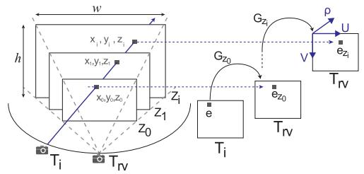  
Fig. 3. Space sweep algorithm.

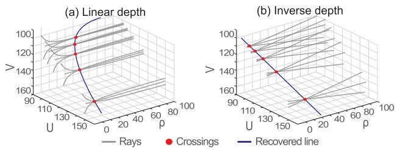  
Fig. 4. Rays and recovered line in a grid in: (a) Linear, (b) Inverse depth.

$$
\begin{array} { r l r l } & { \mathbf { H } _ { Z _ { 0 } } = ^ { \mathtt { r v } } \mathbf { R } _ { \mathrm { i } } + \frac { { \mathrm {  ~ \hat { \pi } { \mathbf { r } } { \mathbf { r } } _ { i } } } { \mathrm {  ~ \scriptstyle ~ { \mathbf ~ { n } } ~ } } ^ { \top } } { Z _ { 0 } } } & & { \in \mathbb { R } ^ { 3 \times 3 } } \\ & { \mathbf { G } _ { Z _ { 0 } } = \mathbf { K } \mathbf { H } _ { Z _ { 0 } } \mathbf { K } ^ { - 1 } } & & { \in \mathbb { R } ^ { 3 \times 3 } , } \end{array}\tag{6}
$$

where the transformation from i to $\mathtt { r v } .$ , noted as ${ } ^ { \mathrm { r v } } \mathbf { T } _ { \mathrm { i } } =$ ${ \bf T } _ { \bf r \nabla } { } ^ { - 1 } { \bf T } _ { \bf i } ,$ , provides the rotation $\mathbf { r v } _ { \mathbf { R } _ { \mathrm { i } } }$ and translation $^ { \mathtt { r v } } \mathbf { r } _ { \mathrm { i } }$ to compute $( 6 ) . \mathbf { n } = [ 0 , 0 , 1 ] ^ { \top }$ is a unit plane normal and K is the intrinsic camera matrix as in Eq. (2) in [19]. Therefore, any event e at i is mapped onto the plane $Z _ { 0 }$ of rv as $\underline { { \mathbf { e } } } _ { Z _ { 0 } } = \mathbf { G } _ { Z _ { 0 } } \underline { { \mathbf { e } } } .$

Second, transferring the events to any other depth plane $Z _ { i }$ in terms of $Z _ { 0 }$ using the homography ${ \mathbf { H } } _ { Z _ { i } } { } ^ { - 1 } { \mathbf { H } } _ { Z _ { 0 } }$ that leads to:

$$
\mathbf { G } _ { Z _ { i } } = \left[ \begin{array} { c c c } { \frac { Z _ { i } - c z } { Z _ { i } } } & { 0 } & { ( \frac { Z _ { 0 } - Z _ { i } } { Z 0 Z _ { i } } ) c x } \\ { 0 } & { \frac { Z _ { i } - c z } { Z _ { i } } } & { ( \frac { Z _ { 0 } - Z _ { i } } { Z 0 Z _ { i } } ) c y } \\ { 0 } & { 0 } & { \frac { Z _ { 0 } - c z } { Z _ { 0 } } } \end{array} \right] ,\tag{7}
$$

with $\mathbf { K } ^ { \mathrm { r v } } \mathbf { r _ { i } } = [ c x , c y , c z ] ^ { \top }$ . The mapping of an event onto a plane $Z _ { i }$ is given by $\underline { { \mathbf { e } } } _ { Z _ { i } } = \mathbf { G } _ { Z _ { i } } \underline { { \mathbf { e } } } _ { Z _ { 0 } }$ . Since (7) is computed only once per depth plane, the projection onto all the depth planes can be parallelized. A voxel located at $\left[ \mathbf { e } _ { Z _ { i } } ( 1 ) , \mathbf { e } _ { Z _ { i } } ( 2 ) , Z _ { i } \right]$ receives one vote. Note that since the estimated voxel coordinates are not integer numbers, the vote should be split proportionally to its closest neighbours to overcome rounding errors.

2) 3D Line Extraction: The shape ofthe back-projection rays that populate the grid depends on the disposition of the depth planes. Due to the non-linearity of the back-projection process, a ray in a grid with depth planes arranged linearly shows a curved shape as in Fig. 4(a), contrary to the almost straight ones in inverse depth in Fig. 4(b), as discussed in [6]. Therefore, we used an inverse depth arrangement to recover 3D inliers clustered in a quasi-straight path that are fitted into a 3D line.

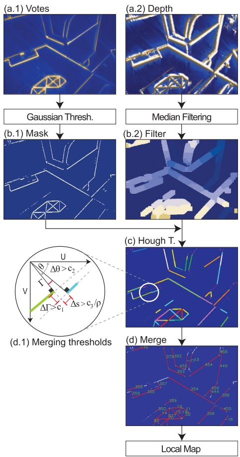  
Fig. 5. Line extraction process.

The line extraction process is explained in Fig. 5(a-b), and follows the same steps described in EMVS [6] Sec. 5. The process is summarized in the following paragraphs.

The grid is condensed into two spatial images of size $w \times h ,$ whose pixels belong to the local maxima along the depth planes and have a high probability of containing a 3D edge. The pixels in these images encode the number of votes (frame a.1) and the depth value (frame a.2).

An adaptive Gaussian thresholding highlights the edges and removes noise in empty spaces from the vote spatial image. Its result is a binary edge representation (frame b.1) that is later used as a mask for the depth spatial image. The depth map passes through a median filter that regularizes the depth value of the pixels in the given mask (frame b.2). The color gradient represents depth from far (dark) to near (light). Both operations were performed with OpenCV.

Fig. 5 frames c-d shows our 3D line searching and recovery process that complements EMVS. Pixels that belong to a line are rapidly clustered using the Hough transform. Due to sparsity in the mask, the detected lines are redundant and drawn with different colors in frame c. Similar line segments are grouped and merged into larger lines when the difference in their distance to the image origin is $\Delta \Gamma < c _ { 1 }$ , the difference in their angle is $\Delta \theta < c _ { 2 }$ , and the space that separates them is $\Delta s < c _ { 3 } / \bar { \rho }$ . This last threshold is inversely proportional to the mean scene depth ρ¯ to avoid merging non-related lines observed from a distant point of view (frame d.1). Note that other segment detectors like [22] could be used in this process, but they are affected by the events sparsity.

To compute the parameters of each 3D line L, all merged inlier points are used (all points for each segments in frame d). These N points have coordinates $\mathbf { x } _ { n } = \rho _ { n } [ u _ { n } , v _ { n } , 1 ] ^ { \top } \in$ $\mathbb { R } ^ { 3 } , \forall n \in [ 0 . . . \overset { \cdot } { N } ]$ ; where $( u _ { n } , v _ { n } )$ is the pixel position that falls in between the 2D-line endpoints, and $\rho _ { n }$ is the corresponding depth from the spatial depth image (b.2). The parameters of the 3D line are obtained by computing the principal direction ofsuch cluster of 3D points via singular value decomposition. More specifically, from the inliers covariance $\mathbf { C } = \dot { \mathbf { c c } } ^ { \top } / N \in \mathbb { R } ^ { 3 \times 3 }$ (where $\mathbf { c } = \left[ \left( \mathbf { x } _ { 0 } - { \bar { \mathbf { x } } } \right) \cdot \cdot \cdot \left( \mathbf { x } _ { n } - { \bar { \mathbf { x } } } \right) \right] \in \mathbb { R } ^ { 3 \times N }$ is a matrix of differences between each inlier and its mean x¯), we compute its singular value decomposition $\mathbf { C } = \mathbf { U } \mathbf { D } \mathbf { V } ^ { \top }$ . The parameters of L are obtained as a translation vector $\mathbf { A } = { \bar { \mathbf { x } } }$ and a director vector $\mathbf { B } = \mathbf { U } ( : , 3 )$ (singular vector corresponding to the largest singular value), and transformed from the reference view frame to the the world:

$$
\begin{array} { r l } & { \mathbf { \mathrm { \bf ~ \mathrm { \bf ~ v } } } } \mathbf { A } = \mathbf { R } _ { \mathrm { r v } } \mathbf { K } ^ { - 1 } \mathbf { A } + \mathbf { r } _ { \mathrm { r v } }  \\ & { \mathbf { \mathrm { \bf ~ \mathrm { \bf ~ v } } } } \\ & { \mathbf { \mathrm { \bf ~ \mathrm { \bf ~ v } } } } \end{array}\tag{8}
$$

After the frame transformation, wB is normalized. The line fitting is complemented with a RANSAC process to remove noisy inliers. All recovered 3D lines compose a local map that will be integrated into a large global map after a bundle adjustment optimization process.

3) Bundle Adjustment: To minimize the error accumulation from the space sweep process, we implement a bundle adjustment using the recovered lines and the events. For efficiency, the optimization process, uses information from the tracker like event-line association, windows of events, and pose estimation.

Let us call a keyframe to each reference view where we create a projective grid composed of a large number of event windows. As the camera moves, a new keyframe is selected when the camera traveled distance exceeds a threshold proportional to the mean scene depth. The optimization is computed using a cluster with the last J keyframes, where from each keyframe we uniformly select I event windows to be part of the optimization state. The next optimization cluster has an overlap of k keyframes with the previous one.

The tracking node provides the camera pose for all event windows $i \in [ 0 \cdots I ]$ in each keyframe $j \in [ 0 \cdots J ]$ noted as $\mathbf { T } _ { i j }$ . The mapping node provides the global map from which we select M lines that appear in at least 60% of all the event windows and have a minimum number of associated events. Thus, the state composed by camera poses and lines is arranged as ${ \bf X } = \left( { \bf T } _ { 0 0 } \cdot \cdot \cdot { \bf T } _ { I 0 } \cdot \cdot \cdot { \bf T } _ { I J } { \bf L } _ { 0 } { \bf L } _ { 1 } \cdot \cdot \cdot { \bf L } _ { M } \right)$

We rely on Ceres [23] to solve this non-linear optimization problem. In Ceres, the pose $\mathbf { T } _ { i j }$ has a SE(3) parametrization, and the lines have a local six-term parametrization. The latter corresponds to the origin point and the unit direction vector (the same parametrization followed until now). The optimal state $\mathbf { X } ^ { * } = \arg \operatorname* { m i n } _ { \mathbf { X } } \mathcal { C } ( \mathbf { X } )$ is estimated using Levenberg-Marquardt non-linear optimization with the cost function:

$$
\mathcal { C } ( \mathbf { X } ) = \sum _ { i , j , m } \left( \left\| \frac { \mathbf { l } _ { i j m } \underline { { \mathbf { e } } } _ { i } ^ { \top } } { \sqrt { \mathbf { l } _ { i j m } ( 1 ) ^ { 2 } + \mathbf { l } _ { i j m } ( 2 ) ^ { 2 } } } \right\| ^ { 2 } \right) ,\tag{9}
$$

which minimizes the distance from the events to the backprojected lines of the 3D-line m, in the window i of the keyframe j noted as $\mathbf { l } _ { i j m }$ . This back-projection is computed using Eq. (3) which relates the camera pose and line parameters. The optimization improves not only the camera poses, but also the parameters of the observed 3D lines, which are shared with the tracking node for further operations.

## C. System Bootstrapping

Our approach can launch through several methods, all described below. The performance of all these methods is displayed in the multimedia material. The first method (E+BA) organizes the events in windows of 3 ms. The first window is taken as an image and applied the Hough transform to detect 2D lines, see Fig. 7(a). These are then tracked over time using the methods described in Sec. III-A2, but taking the 2D segments from the previous windows instead of the 3D projected lines. Each n=50 windows we declare a keyframe. Once N=10 keyframes are declared, a bundle adjustment (Sec. III-B3) is arranged over the keyframes and all the tracked lines. The resulting lines are estimated up to scale and used as the initial map for the EKF tracker. The pose and velocity of the tracker are initialized by extrapolating the last states of the BA to the precise timestamp of the currently incoming events. A moderate motion ( 10 cm/s), 6 or more non-parallel lines, and enough baseline are needed to avoid noisy 2D-line detections and guarantee the solver’s convergence. Initially, all cameras are at the origin, and the lines have a random depth. This solution is sensitive to the event sparsity and subject to the conditions above. We are working on improving its robustness to launch our system in more complex scenarios.

Three other marker-based bootstrapping methods provide a scale factor. In these options, we detect Hough lines (E+Hough) or FAST corners (E+Fast) on an integrated-events image, where pixels values are the sum of event polarities. From the 2D - 3D matches of points or lines, we use a PnP [24] or a PnPL [25] algorithm to recover the initial camera pose. A gray-scale image (I+Fast) can be used if available instead of events in E+Fast.

These bootstrapping methods are robust low-cost solutions but limited to scenarios having this marker.

## IV. EXPERIMENTS AND RESULTS

We evaluate our approach in human-made environment datasets acquired using the DAVIS 240 C and 346 camera models. These datasets - named Office\_large, Office L\_shape, and $O f f i c e \_ f a r \ .$ - have different depths, camera speeds, and medium-textured surfaces. A synthetic world made of three orthogonal planes with strong line patterns (Trihedron dataset) was used also. Most sequences have challenging lighting conditions and fast motion. Additionally, our approach was tested in Dynamic\_6DOF sequence [26], the most representative human-made scenario. Only Dynamic\_6DOF sequence is aided with the first ground-truth readings during initialization due to E+BA limitations on small weak lines and noisy events. In our sequences we use E+BA to launch our PTAM system, since the conditions are ideal for E+BA producing reliable initial estimations. Axis were rotated for ease of visualization. Fig. 6 and Fig. 8 show the 3D reconstructions and tracking snapshots for the aforementioned scenarios. The ground truth was obtained with an Optitrack motion capture system. For all experiments, the events window was 300μs, the thresholding parameters are $\alpha = 2 . 5 \mathrm { p i x } , \beta = 1 . 5 \alpha$ , and the noise parameters $\sigma _ { v } = 3 \mathrm { { m } / \mathrm { { s } ^ { 3 / 2 } } }$ $\sigma _ { \omega } = 7 \mathrm { r a d / s ^ { 3 / 2 } }$ and $\sigma _ { z } = 3 . 5 \mathrm { p i x }$ (see Sec. III-A1 and Sec. III-A2). The grid depth was adjusted according to the scenario in a 0.5-3.5 m range. The merging thresholding parameters were $c _ { 1 } = 1 0 \mathrm { p i x } , c _ { 2 } = 1 0$ deg, and c3 = 5 pix/m (see Sec. III-B). We rely on manif [27] for Lie group computations in C++. Our PTAM system runs in a standard computer with an Intel Core i7-8700 K CPU, Ubuntu 18.04.5 and ROS Melodic.

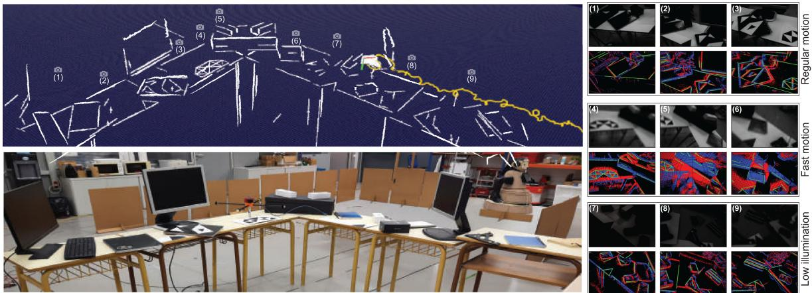  
Fig. 6. Sequence: Office\_large using lines and events with DAVIS346. Fast motion and challenging lighting conditions are included in this sequence.

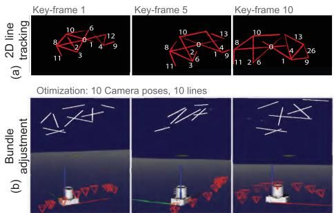  
Fig. 7. Bootstrap example: (a) 2D line tracking across event windows, (b) Bundle adjustment result with several views.

## A. Accuracy Evaluation

Fig. 6 shows how for a large office sequence, the edges in the scene are gradually recovered, included in a global map, and optimized as the camera moves. This sequence contains regular motion, challenging lighting conditions - by turning on and off the lights from the laboratory- and aggressive camera shaking (see the grayscale and event output ofthe DAVIS camera in the right frames in the figure). Here, the mapped lines are reprojected using the estimated camera pose and plotted in green over the events window. Notice also how poor illumination and fast motion affects the grayscale image, while the events still provide reliable information. The performance of our approach was compared against EVO [10] and the frame-based systems ORBSlam3 [28] and SVO [11] without loop-closing. EVO was bootstrapped with SVO in our sequences. We achieve low estimation error compared to the ground truth during regular motion. The other evaluated state-of-the-art approaches have similar performance, as shown in Fig. 9, with the exception of SVO, whose accuracy is being affected by the lack of texture in the scene, resulting in large drifts in translation. In poor illumination conditions, the frame-based approaches ORBSlam3 and SVO stop working immediately whilst EVO and our method remain unaffected. The grayed out zones in the figure highlight the time when lights were switched off. Fast-motion refers to aggressive camera shake (strong handshaking of about 6 Hz, 2.5 m/s and 12 rd/s). In such conditions, ORBSlam3 and SVO also produce inaccurate estimates and stop working as they cannot detect features. Our method, on the other hand, is still able to compute an accurate estimate of the camera pose. EVO, the other event-based method tested in these extreme motion conditions fails to compute accurate estimates, despite its configuration thresholds were set as suggested by its authors.

3D Reconstruction  
Tracking  
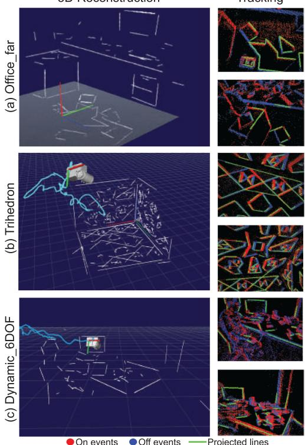  
Fig. 8. Reconstructed human-made scenarios.

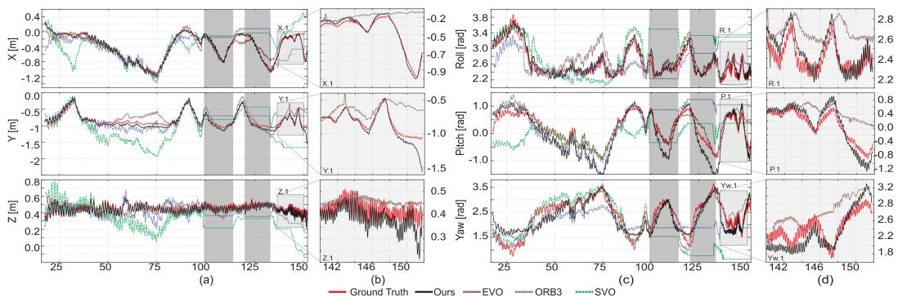  
Fig. 9. Estimated trajectory in Office\_large sequence: The grey zones at 100 s and 125 s mark lights off. Zoomed zones represent fast motion.

TABLE I  
RMSE IN CHALLENGING LIGHTING CONDITIONS AND FAST MOTION
<table><tr><td rowspan="2">Dataset</td><td colspan="2">Ours</td><td colspan="2">EVO</td></tr><tr><td>HDR</td><td>Fast</td><td>HDR</td><td>Fast</td></tr><tr><td>Office_large challenging</td><td>[m]</td><td>0.08 0.12 9.74</td><td>0.19</td><td>0.25</td></tr><tr><td>Trihedron challenging</td><td>[deg] [m] [deg]</td><td>7.17 0.03 0.05 2.55 3.16</td><td>8.19 0.05 3.36</td><td>13.52 0.13</td></tr></table>

TABLE II

RMSE FOR REGULAR MOTION AND REAL-TIME FACTORS
<table><tr><td rowspan=1 colspan=1>Dataset</td><td rowspan=1 colspan=1>Ours</td><td rowspan=1 colspan=1>EVO</td><td rowspan=1 colspan=1>ORB3</td><td rowspan=1 colspan=1>SVO</td></tr><tr><td rowspan=1 colspan=1>Office   [m]_large  [deg]</td><td rowspan=1 colspan=1>0.076.49</td><td rowspan=1 colspan=1>0.087.23</td><td rowspan=1 colspan=1>0.119.47</td><td rowspan=1 colspan=1>0.378.75</td></tr><tr><td rowspan=1 colspan=1>[m]Trihedron[deg]</td><td rowspan=1 colspan=1>0.031.74</td><td rowspan=1 colspan=1>0.052.03</td><td rowspan=1 colspan=1>0.084.62</td><td rowspan=1 colspan=1>0.124.23</td></tr><tr><td rowspan=1 colspan=1>Office [m]L_shape[deg]</td><td rowspan=1 colspan=1>0.031.97</td><td rowspan=1 colspan=1>0.042.48</td><td rowspan=1 colspan=1>0.030.84</td><td rowspan=1 colspan=1>0.052.77</td></tr><tr><td rowspan=1 colspan=1>Office_far[m][deg]</td><td rowspan=1 colspan=1>0.042.21</td><td rowspan=1 colspan=1>0.062.83</td><td rowspan=1 colspan=1>0.053.36</td><td rowspan=1 colspan=1>0.042.79</td></tr><tr><td rowspan=1 colspan=1>Dynamic[m]6dof  [deg]</td><td rowspan=1 colspan=1>0.052.6</td><td rowspan=1 colspan=1>0.042.9</td><td rowspan=1 colspan=1>0.062.79</td><td rowspan=1 colspan=1>0.123.51</td></tr><tr><td rowspan=1 colspan=1>RTF</td><td rowspan=1 colspan=1>3.571, 0.312</td><td rowspan=1 colspan=1>2.561, 0.372</td><td rowspan=1 colspan=1>1.313</td><td rowspan=1 colspan=1>1.453</td></tr><tr><td rowspan=1 colspan=1>Rate [1e6 ev/s]</td><td rowspan=1 colspan=1>0.9 - 1.95</td><td rowspan=1 colspan=1>0.95 - 1.7</td><td rowspan=1 colspan=1>-</td><td rowspan=1 colspan=1></td></tr></table>

1Tracking only,  
2Mapping only,  
3Tracking and mapping

In summary, compared to the ground truth, we achieve lower root mean squared errors (RMSE) in all sequences with high dynamic range (lights on and off) and fast motion, as shown in Tab. I. In these challenging conditions, the frame-based methods cannot be assessed. For regular motion scenarios with proper illumination, the RMSE errors are in Tab. II. The detection of small noisy lines from textured scenarios may lead to mistaken data associations and hence inaccurate pose estimates.

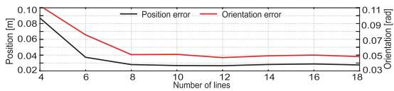  
Fig. 10. Mean error vs number of lines.

Experimentally we observe that the error in position and orientation increases as we reduce the number of lines in the scene (see Fig. 10). Having at least 6 lines in the image plane is key for achieving low errors. For more than 6 lines the error is (almost) constant, and it depends on such line’s quality. This analysis was performed by manually removing lines from the map and forcing the system to operate with a constant number of lines in a small sequence. The tracking performance on different speeds was also assessed in our previous work [16].

To assess the computational performance of our approach, we define a dimensionless real-time factor (RTF) as the sampling time of the DAVIS camera (30 ms) divided by the time required to process the incoming information for that same time period. For EVO and our approach, the computational performance is evaluated separately for the tracking and the mapping threads as they run at different frequencies. Our tracking module achieves a mean RTF of 3.57 in regular motion, meaning it requires onethird of the event stream time ( 8.5 ms) to produce more than 100 estimations and process all incoming events. The mapping node does not run on every stream of 30 ms but processes several of them simultaneously (usually > 5). Hence, RTF factors up to 0.2 in mapping allow the whole system to reach real-time performance. On average our implementation is able to handle from 0.9 to 1.95 millions events/s in sequences with regular and fast motion respectively to maintain real time. These values are reported in Table II

## B. Bootsrapping Analysis

A small scenario with a Dell screen 47 29.4cm aspect ratio 1.6, was reconstructed to assess the impact of these bootstrapping methods. This screen was mapped after initializing the system with a known marker (Fig, 11(a)) or by tracking the screen edges when using E+BA (Fig, 11(b)). The reconstructed screen aspect ratio (AR=a/b) is nearly constant for all bootstraps ( 1.54).

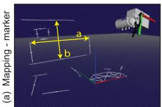

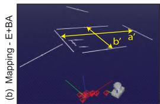  
Fig. 11. Screen reconstruction: (a) marker launch, (b) E+BA launch.

TABLE III BOOTSTRAPPING IMPACT COMPARISON
<table><tr><td rowspan=1 colspan=1></td><td rowspan=1 colspan=1>a[m]</td><td rowspan=1 colspan=1>b[m]</td><td rowspan=1 colspan=1>AR</td><td rowspan=1 colspan=1>SF</td><td rowspan=1 colspan=1>Time[ms]</td><td rowspan=1 colspan=1>∆r[mm]</td></tr><tr><td rowspan=1 colspan=1>I+Fast</td><td rowspan=1 colspan=1>0.466</td><td rowspan=1 colspan=1>0.304</td><td rowspan=1 colspan=1>1.54</td><td rowspan=1 colspan=1>1.02</td><td rowspan=1 colspan=1>0.26</td><td rowspan=1 colspan=1></td></tr><tr><td rowspan=1 colspan=1>E+Fast</td><td rowspan=1 colspan=1>0.462</td><td rowspan=1 colspan=1>0.296</td><td rowspan=1 colspan=1>1.56</td><td rowspan=1 colspan=1>0.99</td><td rowspan=1 colspan=1>0.32</td><td rowspan=1 colspan=1>0.34</td></tr><tr><td rowspan=1 colspan=1>E+Hough</td><td rowspan=1 colspan=1>0.473</td><td rowspan=1 colspan=1>0.307</td><td rowspan=1 colspan=1>1.55</td><td rowspan=1 colspan=1>1.03</td><td rowspan=1 colspan=1>0.52</td><td rowspan=1 colspan=1>0.41</td></tr><tr><td rowspan=1 colspan=1>E+BA</td><td rowspan=1 colspan=1>0.582</td><td rowspan=1 colspan=1>0.378</td><td rowspan=1 colspan=1>1.55</td><td rowspan=1 colspan=1>1.24</td><td rowspan=1 colspan=1>41</td><td rowspan=1 colspan=1>0.44</td></tr><tr><td rowspan=1 colspan=1>G. truth</td><td rowspan=1 colspan=1>0.470</td><td rowspan=1 colspan=1>0.293</td><td rowspan=1 colspan=1>1.6</td><td rowspan=1 colspan=1>1</td><td rowspan=1 colspan=1>-</td><td rowspan=1 colspan=1>I</td></tr></table>

E+BA reconstruction has a scale factor of 1.24, and markerbased approaches reach values close to 1. The estimation differences in position (Δr), taking as reference I+Fast, are minimal and are produced by noisy events and non-perfect initial edge detections The comparison values are reported in Table III. As expected, the computational cost of E+BA is higher than solving PnP or PnPL. It requires 41 ms to compute the initial lines and poses, though it is a one-time process. Additionally, E+BA has different axis orientation than marker-based bootstraps (see figure 11) requiring an additional rotation for ease of visualization.

## V. CONCLUSION

The real-time PTAM approach presented recovers and optimizes 3D lines successfully from human-made environments while producing an accurate camera pose estimation. Our tracking implementation is able to handle high dynamic motions exceeding linear velocities of 2.5 m/s and deficient lighting conditions. Our motivation has been to exploit the event rate fully, potentially achieving a throughput of estimates in the MHz range. However, we found that a trade-off between the size of windowed events and robustness against outliers was necessary, lowering this rate to 3.3 kHz. Our approach improves the throughput by a factor of 10-15 compared to EVO and reaches similar accuracy in normal conditions. In higher dynamics our performance is better. The accuracy is also comparable to that of modern frame-based systems ORB-SLAM3 and SVO in normal conditions. We exceed these systems in terms of dynamics and challenging illumination thanks the event camera design and our algorithmic implementation. Future work will be devoted to improve performances in less structured scenarios with challenging short or weak lines.

## REFERENCES

[1] C. Brandli, R. Berner, M. Yang, S. C. Liu, and T. Delbruck, “A 240 180 130 dB 3 µs latency global shutter spatiotemporal vision sensor,” IEEE J. Solid-State Circuits, vol. 49, no. 10, pp. 2333–2341, Oct. 2014.

[2] H. Rebecq, T. Horstschaefer, and D. Scaramuzza, “Real-time visualinertial odometry for event cameras using keyframe-based nonlinear optimization,” in Proc. Brit. Mach. Vis. Conf., 2017, pp. 1–8.

[3] Y. Zhou, G. Gallego, and S. Shen, “Event-based stereo visual odometry,” IEEE Trans. Robot., vol. 37, no. 5, pp. 1433–1450, Oct. 2021.

[4] H. Kim, S. Leutenegger, and A. J. Davison, “Real-time 3D reconstruction and 6-DoF tracking with an event camera,” in Proc. Eur. Conf. Comput. Vis., 2016, pp. 349–364.

[5] G. Klein and D. Murray, “Parallel tracking and mapping for small AR workspaces,” in Proc. 6th IEEE ACM Int. Sym. Mixed Augment. Real., 2007, pp. 225–234.

[6] H. Rebecq, G. Gallego, E. Mueggler, and D. Scaramuzza, “EMVS: Eventbased multi-view stereo–3D reconstruction with an event camera in realtime,” Int. J. Comput. Vis., vol. 126, no. 12, pp. 1394–1414, 2018.

[7] P. Lichtsteiner, C. Posch, and T. Delbruck, “A 128  128 120 dB 15 µs latency asynchronous temporal contrast vision sensor,” IEEE J. Solid-State Circuits, vol. 43, no. 2, pp. 566–576, 2008.

[8] G. Gallego et al., “Event-based vision: A survey,” IEEE Trans. Pattern Anal. Mach. Intell., vol. 44, no. 1, pp. 154–180, Jan. 2022.

[9] D. Weikersdorfer, D. B. Adrian, D. Cremers, and J. Conradt, “Event-based 3D SLAM with a depth-augmented dynamic vision sensor,” in Proc. IEEE Int. Conf. Robot. Autom., 2014, pp. 359–364.

[10] H. Rebecq, T. Horstschaefer, G. Gallego, and D. Scaramuzza, “EVO: A geometric approach to event-based 6-DOF parallel tracking and mapping in real time,” IEEE Robot. Autom. Lett., vol. 2, no. 2, pp. 593–600, Apr. 2017.

[11] C. Forster, M. Pizzoli, and D. Scaramuzza, “SVO: Fast semi-direct monocular visual odometry,” in Proc. IEEE Int. Conf. Robot. Autom., 2014, pp. 15–22.

[12] B. Kueng, E. Mueggler, G. Gallego, and D. Scaramuzza, “Low-latency visual odometry using event-based feature tracks,” in Proc. IEEE/RSJ Int. Conf. Intell. Robots Syst., 2016, pp. 16–23.

[13] A. Zihao Zhu, N. Atanasov, and K. Daniilidis, “Event-based visual inertial odometry,” in Proc. IEEE Conf. Comp. Vis. Pattern Recongit., 2017, pp. 5391–5399.

[14] A. R. Vidal, H. Rebecq, T. Horstschaefer, and D. Scaramuzza, “Ultimate SLAM? combining events, images, and IMU for robust visual SLAM in HDR and high-speed scenarios,” IEEE Robot. Autom. Lett., vol. 3, no. 2, pp. 994–1001, Apr. 2018.

[15] C. Le Gentil, F. Tschopp, I. Alzugaray, T. Vidal-Calleja, R. Siegwart, and J. Nieto, “IDOL: A framework for IMU-DVS odometry using lines,” in Proc. IEEE/RSJ Int. Conf. Intell. Robots Syst., 2020, pp. 5863–5870.

[16] W. Oswaldo, C. Hernández, J. Andrade-Cetto, and J. Solà, “High-speed event camera tracking,” in Proc. Brit. Mach. Vis. Conf., 2020, pp. 1–12.

[17] P. Drap and J. Lefèvre, “An exact formula for calculating inverse radial lens distortions,” Sensors, vol. 16, no. 6, 2016, Art. no. 807.

[18] J. Solà et al., “A micro lie theory for state estimation in robotics,” 2018. [Online]. Available: https://arxiv.org/abs/1812.01537

[19] J. Solà, T. Vidal-Calleja, J. Civera, and J. M. Martinez-Montiel, “Impact of landmark parametrization on monocular EKF-SLAM with points and lines,” Int. J. Comput. Vis., vol. 97, pp. 339–368, 2011.

[20] H. Cho, J. Jeong, and K.-J. Yoon, “EOMVS: Event-based omnidirectional multi-view stereo,” IEEE Robot. Autom. Lett., vol. 6, no. 4, pp. 6709–6716, Oct. 2021.

[21] G. Gallego, H. Rebecq, and D. Scaramuzza, “A unifying contrast maximization framework for event cameras, with applications to motion, depth, and optical flow estimation,” in Proc. IEEE Conf. Comp. Vis. Pattern Recongit., 2018, pp. 3867–3876.

[22] R. G. Von Gioi, J. Jakubowicz, J.-M. Morel, and G. Randall, “LSD: A line segment detector,” J. Img. Proc. Online, vol. 2, pp. 35–55, 2012.

[23] S. Agarwal et al., “Ceres solver,” 2022. [Online]. Available: http://ceressolver.org

[24] V. Lepetit, F. Moreno-Noguer, and P. Fua, “EPnP: An accurate O(n) solution to the PnP problem,” Int. J. Comput. Vis., vol. 81, pp. 155–166, 2009.

[25] A. Vakhitov, J. Funke, and F. Moreno-Noguer, “Accurate and linear time pose estimation from points and lines,” in Proc. Eur. Conf. Comput. Vis., 2016, pp. 583–599.

[26] E. Mueggler, H. Rebecq, G. Gallego, T. Delbruck, and D. Scaramuzza, “The event-camera dataset and simulator: Event-based data for pose estimation, visual odometry, and SLAM,” Int. J. Robot. Reas., vol. 36, no. 2, pp. 142–149, 2017.

[27] J. Deray and J. Solà, “Manif: A small C++ header-only library for lie theory,” 2019. [Online]. Available: https://github.com/artivis/manif

[28] C. Campos, R. Elvira, J. J. G. Rodríguez, J. M. M. Montiel, and J. D. Tardós, “ORB-SLAM3: An accurate open-source library for visual, visual-inertial, and multimap SLAM,” IEEE Trans. Robot., vol. 37, no. 6, pp. 1874–1890, Dec. 2021.