# FAST-LIO2: Fast Direct LiDAR-Inertial Odometry

Wei Xu , Yixi Cai , Graduate Student Member, IEEE, Dongjiao He , Graduate Student Member, IEEE, Jiarong Lin , Graduate Student Member, IEEE, and Fu Zhang , Member, IEEE

Abstract—This article presents FAST-LIO2: a fast, robust, and versatile LiDAR-inertial odometry framework. Building on a highly efficient tightly coupled iterated Kalman filter, FAST-LIO2 has two key novelties that allow fast, robust, and accurate LiDAR navigation (and mapping). The first one is directly registering raw points to the map (and subsequently update the map, i.e., mapping) without extracting features. This enables the exploitation of subtle features in the environment and, hence, increases the accuracy. The elimination of a hand-engineered feature extraction module also makes it naturally adaptable to emerging LiDARs of different scanning patterns; the second main novelty is maintaining a map by an incremental k-dimensional (k-d) tree data structure, incremental k-d tree (ikd-Tree), that enables incremental updates (i.e., point insertion and delete) and dynamic rebalancing. Compared with existing dynamic data structures (octree, R∗-tree, and nanoflann k-d tree), ikd-Tree achieves superior overall performance while naturally supports downsampling on the tree. We conduct an exhaustive benchmark comparison in 19 sequences from a variety of open LiDAR datasets. FAST-LIO2 achieves consistently higher accuracy at a much lower computation load than other state-of-the-art LiDAR-inertial navigation systems. Various real-world experiments on solid-state LiDARs with small field ofview are also conducted. Overall, FAST-LIO2 is computationally efficient $( \mathbf { e . g . }$ , up to 100 Hz odometry and mapping in large outdoor environments), robust $( \mathbf { e . g . }$ , reliable pose estimation in cluttered indoor environments with rotation up to 1000 deg/s), versatile (i.e., applicable to both multiline spinning and solid-state LiDARs, unmanned aerial vehicle (UAV) and handheld platforms, and Inteland ARM-based processors), while still achieving a higher accuracy than existing methods. Our implementation of the system FAST-LIO2 and the data structure ikd-Tree are both open-sourced on Github.

Index Terms—Aerial systems, sensor fusion, simultaneous localization and mapping (SLAM).

## NOTATIONS

Symbols Meaning $L$ LiDAR body frame at the LiDAR scan end time. $\mathbf { x } _ { i }$ State x at the ith IMU sample time.

Manuscript received 4 July 2021; revised 28 October 2021; accepted 4 January 2022. Date of publication 31 January 2022; date of current version 8 August 2022. This work was supported in part by the University Grants Committee of Hong Kong General Research Fund under Project 17206421 and in part by DJI under Grant 200009538. This paper was recommended for publication by Associate Editor Margarita Chli and Editor Francois Chaumette upon evaluation of the reviewers’ comments. (Wei Xu and Yixi Cai contributed equally to this work.) (Corresponding author: Fu Zhang.)

The authors are with the Mechatronics and Robotic Systems (MaRS) Laboratory, Department of Mechanical Engineering, University of Hong Kong, Hong Kong SAR, China (e-mail: xuweii@connect.hku.hk; yixicai@connect.hku.hk; hdj65822@connect.hku.hk; jiarong.lin@connect.hku.hk; fuzhang@hku.hk).

This article has supplementary material provided by the authors and color versions of one or more figures available at https://doi.org/10.1109/TRO.2022.3141876.

Digital Object Identifier 10.1109/TRO.2022.3141876

$\mathbf { x } _ { k }$ State x at the kth LiDAR scan end time.

x, x, x¯ Ground-true, propagated, and updated value of state x.

x Error between ground-true state x and its estimation ˆ.

$\widehat { \mathbf { x } } ^ { \kappa }$ Estimate of the state x in the κth iteration of the iterated Kalman filter.

## I. INTRODUCTION

B UILDING a dense 3-D map of an unknown environmentin real-time and simultaneously localizing in the map (i.e., SLAM) is crucial for autonomous robots to navigate in the unknown environment safely. The localization provides state feedback for the robot onboard controllers, while the dense 3-D map provides necessary information about the environment (i.e., free space and obstacles) for trajectory planning. Vision-based SLAM [1]–[4] is very accurate in localization but maintains only a sparse feature map and suffers from illumination variation and severe motion blur. On the other hand, real-time dense mapping [5]–[8] based on visual sensors at high resolution and accuracy with only the robot onboard computation resources is still a grand challenge.

Due to the ability to provide direct, dense, active, and accurate depth measurements of environments, 3-D light detection and ranging (LiDAR) sensor has emerged as an another essential sensor for robots [9], [10]. Over the last decade, LiDARs have been playing an increasingly important role in many autonomous robots, such as self-driving cars [11] and autonomous unmanned aerial vehicle (UAVs) [12], [13]. Recent developments in Li-DAR technologies have enabled the commercialization and mass production of more lightweight, cost-effective (in a cost range similar to global shutter cameras), and high performance (centimeter accuracy at hundreds of meters measuring range) solid-state LiDARs [14], [15], drawing much recent research interests [16]–[20]. The considerably reduced cost, size, weight, and power of these LiDARs hold the potential to benefit a broad scope of existing and emerging robotic applications.

The central requirement for adopting LiDAR-based SLAM approaches to these widespread applications is to obtain accurate, low-latency state estimation, and dense 3-D map with limited onboard computation resources. However, efficient and accurate LiDAR odometry and mapping are still challenging problems, which are given as follows.

1) Current LiDAR sensors produce a large amount of 3-D points from hundreds of thousands to millions per second. Processing such a large amount of data in real time and on limited onboard computing resources requires a high computation efficiency of the LiDAR odometry methods.

2) To reduce the computation load, features points, such as edge points or plane points, are usually extracted based on local smoothness. However, the performance ofthe feature extraction module is easily influenced by the environment. For example, in structure-less environments without large planes or long edges, the feature extraction will lead to few feature points. This situation is considerably worsened if the LiDAR field of view (FoV) is small, a typical phenomenon of emerging solid-state LiDARs [16]. Furthermore, the feature extraction also varies from LiDAR to LiDAR, depending on the scanning pattern (e.g., spinning, prism based [15], and MEMS based [14]) and point density. So the adoption of a LiDAR odometry method usually requires much hand-engineering work.

3) LiDAR points are usually sampled sequentially while the sensor undergoes continuous motion. This procedure creates significant motion distortion influencing the performance of the odometry and mapping, especially when the motion is severe. Inertial measurement units (IMUs) could mitigate this problem but introduces additional states (e.g., bias and extrinsic) to estimate.

4) LiDAR usually has a long measuring range (e.g., hundreds of meters) but with quite low resolution between scanning lines in a scan. The resultant point cloud measurements are sparsely distributed in a large 3-D space, necessitating a large and dense map to register these sparse points. Moreover, the map needs to support efficient inquiry for correspondence search while being updated in real time incorporating new measurements. Maintaining such a map is a very challenging task and very different from visual measurements, where an image measurement is of high resolution, so requiring only a sparse feature map because a feature point in the map can always find correspondence as long as it falls in the FoV.

In this work, we address these issues by two key novel techniques: incremental k-dimensional (k-d) tree and direct points registration. More specifically, our contributions are as follows.

1) We develop an incremental k-d tree data structure, incremental k-d tree (ikd-Tree), to represent a large dense point cloud map efficiently. Besides efficient nearest neighbor search, the new data structure supports incremental map update (i.e., point insertion, on-tree downsampling, and points delete) and dynamic rebalancing at minimal computation cost. These features make the ikd-Tree very suitable for LiDAR odometry and mapping application, leading to 100 Hz odometry and mapping on computationally constrained platforms such as an Intel i7-based micro-UAV onboard computer and even ARM-based processors. The ikd-Tree data structure toolbox is open-sourced on Github.1

2) Allowed by the increased computation efficiency of ikd-Tree, we directly register raw points to the map, which enables more accurate and reliable scan registration even with aggressive motion and in very cluttered environments. We term this raw points based registration as a direct method in analogy to visual SLAM [21]. The elimination of a hand-engineered feature extraction makes the system naturally applicable to different LiDAR sensors.

3) We integrate these two key techniques into a full tightly coupled lidar-inertial odometry system FAST-LIO [22] we recently developed. The system uses an IMU to compensate each point’s motion via a rigorous back-propagation step and estimates the system’s full state via an onmanifold iterated Kalman filter. The new system is termed as FAST-LIO2 and is open-sourced at Github2 to benefit the community.

4) We conduct various experiments to evaluate the effectiveness of the developed ikd-Tree, the direct point registration, and the overall system. Experiments on 18 sequences of various sizes show that ikd-Tree achieves superior performance against existing dynamic data structures (octree, R∗-tree, and nanoflann k-d tree) in the application of LiDAR odometry and mapping. Exhaustive benchmark comparison on 19 sequences from various open LiDAR datasets shows that FAST-LIO2 achieves consistently higher accuracy at a much lower computation load than the other state-of-the-art LiDAR-inertial navigation systems. We finally show the effectiveness of FAST-LIO2 on challenging real-world data collected by emerging solid-state LiDARs with very small FoV, including aggressive motion (e.g., rotation speed up to 1000 deg/s) and structure-less environments.

The rest of this article is organized as follows. In Section II, we discuss relevant research works. We give an overview of the complete system pipeline and the details of each key components in Sections III, IV, and V, respectively. The benchmark comparison on open datasets are presented in Section VI, and the real-world experiments are reported in Section VII. Finally, Section IX concludes this article.

## II. RELATED WORKS

## A. LiDAR(-Inertial) Odometry

Existing works on 3-D LiDAR SLAM typically inherit the LOAM structure proposed in [23]. It consists of three main modules: feature extraction, odometry, and mapping. In order to reduce the computation load, a new LiDAR scan first goes through feature points (i.e., edge and plane) extraction based on the local smoothness. Then, the odometry module (scan-to-scan) matches feature points from two consecutive scans to obtain a rough yet real-time (e.g., 10 Hz) LiDAR pose odometry. With the odometry, multiple scans are combined into a sweep, which is then registered and merged to a global map (i.e., mapping). In this process, the map points are used to build a k-d tree that enables a very efficient k-nearest neighbor search (kNN search). Then, the point cloud registration is achieved by the iterative closest point (ICP) [24]–[26] method. In order to lower the time for k-d tree building, the map points are downsampled at a prescribed resolution. The optimized mapping process is typically performed at a much low rate (1–2 Hz).

Subsequent LiDAR odometry works keep a framework similar to LOAM. For example, Lego-LOAM [27] introduces a ground point segmentation to lower the computation load and a loop closure module to reduce the long-term drift. Furthermore, LOAM-Livox [16] adopts the LOAM to an emerging solid-state LiDAR. In order to deal with the small FoV and nonrepetitive scanning, where the features’ points from two consecutive scans have very few correspondences, the odometry of LOAM-Livox is obtained by directly registering a new scan to the global map. Such a direct scan to map registration improves the odometry accuracy at the cost of increased computation load for building a k-d tree of the updated map points at every step.

Incorporating an IMU can considerably increase the accuracy and robustness of the LiDAR odometry by compensating for the motion distortion in a LiDAR scan and providing a good initial pose required by ICP. More tightly coupled LiDAR-inertial fusion works [17], [28]–[30] perform odometry in a small size local map consisting of a fixed number of recent LiDAR scans (or keyframes). Compared with scan-to-scan registration, the scan to local map registration is usually more accurate by using more recent information. More specifically, LIOM [28] presents a tightly coupled LiDAR inertial fusion method where the IMU preintegrations are introduced into the odometry. LILI-OM [17] develops a new feature extraction method for nonrepetitive scanning LiDARs and performs scan registration in a small map consisting of 20 recent LiDAR scans for the odometry. The odometry of LIO-SAM [29] requires a nine-axis IMU to produce attitude measurement as the prior of scan registration within a small local map. LINS [30] introduces a tightly coupled iterated Kalman filter and robocentric formula into the LiDAR pose optimization in the odometry. Since the local map in the previous works is usually small to obtain real-time performance, the odometry drifts quickly, necessitating a low-rate mapping process, such as map refining (LINS [30]), sliding window joint optimization (LILI-OM [17] and LIOM [28]) and factor graph smoothing [31] (LIO-SAM [29]). Compared with the previous methods, FAST-LIO [22] introduces a formal back-propagation that precisely considers the sampling time of LiDAR points and compensates the motion distortion via a rigorous kinematic model driven by IMU measurements. Furthermore, a new Kalman gain formula is used to reduce the computation complexity from the dimension of the measurements to the dimension of the state. The considerably increased computation efficiency allows a direct and real-time scan to map registration in odometry and update the map (i.e., mapping) at every step. However, to prevent the growing time ofbuilding a k-d tree ofthe updated map, the system can only work in small environments (e.g., hundreds of meters).

FAST-LIO2 builds on FAST-LIO [22], hence, inheriting the tightly coupled fusion framework, especially the backpropagation resolving motion distortion and fast Kalman gain computation boosting the efficiency. To systematically address the growing computation issue, we propose a new data structure ikd-Tree that supports incremental map update at every step and efficient kNN inquiries. Benefiting from the drastically decreased computation load, the odometry is performed by directly registering raw LiDAR points to the map, such that it improves the accuracy and robustness of odometry and mapping, especially when a new scan contains no prominent features (e.g., due to small FoV and/or structure-less environments). Compared with the previous tightly coupled LiDAR-inertial methods, which all use feature points, our method is more lightweight and achieves increased mapping rate and odometry accuracy, and eliminates the need for parameter tuning for feature extraction.

The idea of directly registering raw points in our work has been explored in LION [32], which is, however, a loosely coupled method as reviewed previously. This idea is also very similar to the generalized-ICP (G-ICP) proposed in [26], where a point is registered to a small local plane in the map. This ultimately assumes that the environment is smooth and hence can be viewed as a plane locally. However, the computation load of G-ICP is usually large [33]. Other works based on normal distribution transformation (NDT) [34]–[36] also register raw points, but NDT has lower stability compared with ICP and may diverge in some scenes [36].

## B. Dynamic Data Structure in Mapping

In order to achieve real-time mapping, a dynamic data structure is required to support both incremental updates and kNN search with high efficiency. Generally, the kNN search problem can be solved by building spatial indices for data points, which can be divided into two categories: partitioning the data and splitting the space. A well-known instance to partition the data is R-tree [37], which clusters the data into potential overlapped axis-aligned cuboids based on data proximity in space. Various R-trees splits the nodes by linear, quadratic, and exponential complexities, all supporting nearest neighbor search and pointwise updating (insertion, delete, and reinsertion). Furthermore, R-trees also support searching target data points in a given search area or satisfying a given condition. Another version of R-trees is R∗-tree, which outperforms the original ones [38]. The R∗-tree handles insertion by minimum overlap criterion and applies a forced reinsertion principle for the node splitting algorithm.

Octree [39] and k-d tree [40] are two well-known types of data structures to split the space for kNN search. The octree organizes 3-D point clouds by splitting the space equally into eight -axis-aligned cubes recursively. The subdivision of a cube stops when the cube is empty, or a stopping rule (e.g., minimal resolution or minimal point number) is met. New points are inserted to leaf nodes on the octree while a further subdivision is applied if necessary. The octree supports both kNN search and boxwise search, which returns data points in a given axis-aligned cuboid.

The k-d tree is a binary tree whose nodes represent an axis-aligned hyperplane to split the space into two parts. In the standard construction rule, the splitting node is chosen as the median point along the longest dimension to achieve a compact space division [41]. When considering the data characteristics of low dimensionality and storage on main memory in mapping, comparative studies show that k-d trees achieve the best performance in kNN problem [42], [43]. However, inserting new points to and deleting old points from a k-d tree deteriorates the tree’s balance property; thus, rebuilding is required to rebalance the tree. Mapping methods using k-d tree libraries, such as approximate nearest neighbour library (ANN) [44], libnabo [43], and fast library for approximate nearest neighbours (FLANN) [45], fully rebuild the k-d trees to update the map, which results in considerable computation. Although hardware-based methods to rebuild k-d trees have been thoroughly investigated in 3-D graphic applications [46]–[49], the proposed methods rely heavily on the computational sources, which are usually limited on onboard computers for robotic applications. Instead of rebuilding the tree in full scale, Galperin et al. proposed a scapegoat k-d tree where rebuilding is applied partially on the unbalanced subtrees to maintain a loose balance property of the entire tree [50]. Another approach to enable incremental operations is maintaining a set of k-d trees in a logarithmic method similar to [51], [52] and rebuilding a carefully chosen subset. The Bkd-tree maintains a k-d tree $\mathcal { T } _ { 0 }$ with maximal size M in the main memory and a set of k-d trees $\mathcal { T } _ { i }$ on the external memory where the ith tree has a size of $2 ^ { ( i - 1 ) }$ M[53]. When the tree $\mathcal { T } _ { 0 }$ is full, the points are extracted from $\mathcal { T } _ { 0 }$ to $\mathcal { T } _ { k - 1 }$ and inserted into the first empty tree $\mathcal { T } _ { k } .$ . The state-of-the-art implementation nanoflann k-d tree leverages the logarithmic structure for incremental updates, whereas lazy labels only mark the deleted points without removing them from the trees (hence, memory) [54].

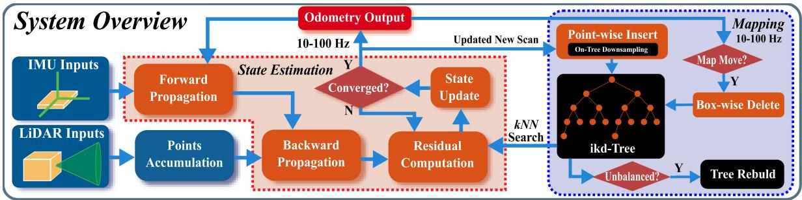  
Fig. 1. System overview of FAST-LIO2. The overall system consists of a state estimation module, which estimates the full LiDAR state by registering raw points in a scan to the map points via a tightly coupled iterated Kalman filter, and a mapping module, which incrementally adds the new points in each scan to a k-d tree structure (i.e., ikd-Tree) and rebalances the tree when necessary.

We propose a dynamic data structure based on the scapegoat k-d tree [50], named ikd-Tree, to achieve real-time mapping. Our ikd-Tree supports pointwise insertion with on-tree downsampling, which is a common requirement in mapping, whereas downsampling must be done outside before inserting new points into other dynamic data structures [38], [39], [54]. When it is required to remove unnecessary points in a given area with regular shapes (e.g., cuboids), the existing implementations of R-trees and octrees search the points within the given space and delete them one by one while common k-d trees use a radius search to obtain point indices. Compared with such an indirect and inefficient method, the ikd-Tree deletes the points in given axis-aligned cuboids directly by maintaining range information and lazy labels. Points labeled as “deleted” are removed during the rebuilding process. Furthermore, although incremental updates are available after applying the partial rebalancing methods as the scapegoat k-d tree [50] and nanoflann k-d tree [54], the mapping methods using k-d trees suffers from intermittent delay when rebuilding on a large number of points. In order to overcome this, the significant delay in ikd-Tree is avoided by parallel rebuilding, while the real-time ability and accuracy in the main thread are guaranteed.

## III. SYSTEM OVERVIEW

The pipeline of FAST-LIO2 is shown in Fig. 1. The sequentially sampled LiDAR raw points are first accumulated over a period between 10 ms (for 100 Hz update) and 100 ms (for 10 Hz update). The accumulated point cloud is called a scan. In order to perform state estimation, points in a new scan are registered to map points (i.e., odometry) maintained in a large local map via a tightly coupled iterated Kalman filter framework (big dashed block in red, see Section IV). Global map points in the large local map are organized by an incremental k-d tree structure ikd-Tree (big dashed block in blue, see Section V). If the FoV range of current LiDAR crosses the map border, the historical points in the furthest map area to the LiDAR pose will be deleted from ikd-Tree. As a result, the ikd-Tree tracks all map points in a large cube area with a certain length (referred to as “map size” in this article) and is used to compute the residual in the state estimation module. The optimized pose finally registers points in the new scan to the global frame and merges them into the map by inserting to the ikd-Tree at the rate of odometry (i.e., mapping).

## IV. STATE ESTIMATION

The state estimation of FAST-LIO2 is a tightly coupled iterated Kalman filter inherited from FAST-LIO [22] but further incorporates the online calibration of LiDAR-IMU extrinsic parameters. Here, we briefly explain the essential formulations and workflow of the filter and refer readers to [22] for more details. To ease the explanation, we use the notations summarized in the Nomenclature. Moreover, we encapsulate two operations, - (“boxplus”) and its inverse  (“boxminus”) from [22] and [55] to parameterize the state error on a manifold M with dimension

n

$$
\begin{array} { r l r l } & { \boxplus \colon } & { \mathcal { M } \times \mathbb { R } ^ { n } {  } \mathcal { M } ; } & { \boxplus \colon \mathcal { M } \times \mathcal { M } {  } \mathbb { R } ^ { n } } \\ & { S O ( 3 ) : } & { { \bf R } \boxplus { \bf r } { \bf { - } } { \bf R } \mathrm { E x p } ( { \bf r } ) ; } & { { \bf R } _ { 1 } \boxplus { \bf R } _ { 2 } { \bf { - } } \mathrm { L o g } ( { \bf R } _ { 2 } ^ { \mathrm { T } } { \bf R } _ { 1 } ) } \\ & { \mathbb { R } ^ { n } : } & { { \bf { a } } \boxplus { \bf b } { \bf { - } } { \bf { a } } { \bf { + } } { \bf b } ; } & { { \bf a } \boxplus { \bf b } { \bf { - } } { \bf { a - } } { \bf b } } \end{array}\tag{1}
$$

where $\begin{array} { r } { \mathrm { E x p } ( \mathbf { r } ) = \mathbf { I } + \frac { \mathbf { r } } { \Vert \mathbf { r } \Vert } \sin ( \Vert \mathbf { r } \Vert ) + \frac { \mathbf { r } ^ { 2 } } { \Vert \mathbf { r } \Vert ^ { 2 } } ( 1 - \cos ( \Vert \mathbf { r } \Vert ) ) } \end{array}$ is the exponential map on SO(3) and $\operatorname { L o g } ( \cdot )$ is its inverse map. For a compound manifold $\mathcal { M } = \mathrm { S O } ( 3 ) \times \mathbb { R } ^ { n }$ that is the Cartesian product between its submanifold components, we have

$$
{ \bf \Pi } _ { \mathbf { a } } ^ { \mathbf { \tilde { A } } } \mathbf { \Pi } _ { \mathbf { b } } \mathbf { \Pi } _ { } ^ { \mathbf { \tilde { r } } } \mathbf { \Pi } _ { } = \left[ \mathbf { R } \oplus \mathbf { r } _ { } \right] ; \mathbf { \Pi } _ { \mathbf { a } } ^ { \mathbf { \tilde { R } } _ { 1 } } \mathbf { \Pi } _ { \mathbf { a } } ^ { \mathbf { \tilde { r } } } \boxed { \mathbf { R } _ { 2 } } = \left[ \mathbf { R } _ { 1 } \boxplus \mathbf { R } _ { 2 } \right]\tag{2}
$$

## A. Kinematic Model

We first derive the system model, which consists of a state transition model and a measurement model.

1) State Transition Model: Take the first IMU frame (denoted as I) as the global frame (denoted as G) and denote ${ \cal I } { \bf T } _ { L } = ( { \bf \cal I } { \bf R } _ { L } , \ { \cal I } _ { } { \bf p } _ { L } )$ the unknown extrinsic between LiDAR and IMU, the kinematic model is

$$
\begin{array} { r l } & { ^ { G } \dot { \bf R } _ { I } = ^ { G } { \bf R } _ { I } \vert { \boldsymbol \omega } _ { m } - { \bf b } _ { \omega } - { \bf n } _ { \omega } \vert _ { \Lambda } , \ { ^ { G } } \dot { \bf p } _ { I } = { ^ { G } } { \bf v } _ { I } } \\ & { ^ { G } \dot { \bf v } _ { I } = { ^ { G } } { \bf R } _ { I } \left( { \bf a } _ { m } - { \bf b } _ { \bf a } - { \bf n } _ { \bf a } \right) + { ^ { G } } { \bf g } } \\ & { \quad \dot { \bf b } _ { \omega } = { \bf n } _ { \bf b \omega } , \ \dot { \bf b } _ { \bf a } = { \bf n } _ { \bf b a } } \\ & { \quad { ^ { G } \dot { \bf g } } = { \bf 0 } , { ^ { I } \dot { \bf R } _ { L } } = { \bf 0 } , { ^ { I } \dot { \bf p } _ { L } } = { \bf 0 } } \end{array}\tag{3}
$$

where ${ \displaystyle { \bf \Pi } ^ { G } { \bf p } _ { I } }$ and ${ \cal G } _ { \mathbf { R } _ { I } }$ denote the IMU position and attitude in the global frame, $G _ { \mathbf { V } _ { I } }$ is the IMU velocity in the global frame, $G _ { \mathbf { g } }$ is the gravity vector in the global frame, $\mathbf { a } _ { m }$ and $\omega _ { m }$ are IMU measurements, $\mathbf { n _ { a } }$ and $\mathbf { n } _ { \omega }$ denote the measurement noise of $\mathbf { a } _ { m }$ and $\omega _ { m } , \mathbf { b _ { a } } ,$ and $\mathbf { b } _ { \omega }$ are the IMU biases modeled as random walk process driven by $\mathbf { n _ { b a } }$ and $\mathbf { n } _ { \mathbf { b } \omega }$ , and the notation $\lfloor \mathbf { a } \rfloor _ { \wedge }$ denotes the skew-symmetric cross product matrix of vector $\mathbf { a } \in \mathbb { R } ^ { 3 }$

Denote i the index of IMU measurements, the continuous kinematic model (3) can be discretized at the IMU sampling period Δt[56]

$$
\mathbf { x } _ { i + 1 } = \mathbf { x } _ { i } \boxplus \left( \Delta t \mathbf { f } ( \mathbf { x } _ { i } , \mathbf { u } _ { i } , \mathbf { w } _ { i } ) \right)\tag{4}
$$

where the function f, state x, input u, and noise w are defined as follows:

$$
\begin{array} { r l } & { \mathbf { x } \triangleq [ e \mathbf { R } _ { \eta } ^ { \mathcal { F } } \mathbf { \Lambda } ^ { G } \mathbf { P } _ { \eta } ^ { \mathcal { F } } \mathbf { \Lambda } ^ { G } \mathbf { \Lambda } \mathbf { P } _ { \eta } ^ { \mathcal { F } } \mathbf { \Lambda } \mathbf { \Lambda } \mathbf { b } _ { \alpha } ^ { \mathcal { F } ^ { \prime } } \mathbf { b } _ { \alpha } ^ { \mathcal { F } ^ { \prime } } \mathbf { \Lambda } \mathbf { P } _ { \mathbf { k } } ^ { \mathcal { F } ^ { \prime } } \mathbf { \Lambda } \mathbf { P } _ { \mathbf { k } } ^ { \mathcal { F } ^ { \prime } } \mathbf { \Lambda } \mathbf { P } _ { \mathbf { k } } ^ { \mathcal { F } ^ { \prime } } ] ^ { T } \in \mathcal { M } } \\ & { \mathbf { u } \triangleq [ e _ { m } ^ { T } \mathbf { \Lambda } \mathbf { a } _ { m } ^ { \mathcal { F } } ] ^ { T } , \ \mathbf { w } \triangleq [ \mathbf { u } _ { \alpha } ^ { T } \mathbf { \Lambda } \mathbf { \Lambda } \mathbf { n } _ { \alpha } ^ { T } \mathbf { \Lambda } \mathbf { n } _ { \alpha } ^ { T } \mathbf { \Lambda } \mathbf { n } _ { \mathbf { k } \omega } ^ { T } \mathbf { \Lambda } \mathbf { n } _ { \mathbf { k } \omega } ^ { T } ] ^ { T } } \\ & { \qquad \quad \times [ e _ { m } ^ { T } - \mathbf { b } _ { \mathbf { k } } \alpha _ { m } - \mathbf { b } _ { m } ] } \\ & { \qquad \quad \overset { \mathrm { G e } } { \longrightarrow } \mathbf { R } _ { T } ( \mathbf { a } _ { m } , - \mathbf { b } _ { \mathbf { k } } \mathbf { \Lambda } \mathbf { \tilde { b } } _ { \mathbf { k } } \mathbf { \tilde { b } } _ { \mathbf { k } } ^ { \mathcal { F } } \mathbf { \Lambda } \mathbf { a } _ { m } ^ { \mathcal { F } } ) \Delta t } \\ &  \mathbf { f } ( \mathbf { x } , \mathbf { u } , \mathbf { w } ) = ( \begin{array} { c c }  \mathbf  \end{array} \end{array}\tag{5}
$$

and the operation - is defined on the state manifold M in the following [see (2)]:

$$
\mathcal { M } \triangleq \operatorname { S O } ( 3 ) \times \mathbb { R } ^ { 1 5 } \times \operatorname { S O } ( 3 ) \times \mathbb { R } ^ { 3 } ; \ \dim ( \mathcal { M } ) = 2 4\tag{6}
$$

which is the Cartesian product of each components. Notice that when compared to FAST-LIO, we further included the extrinsic parameters ${ ^ I } { \bf T } _ { L } = ( { ^ I } { \bf R } _ { L } , { ^ I } { \bf p } _ { L } )$ into the state x in (4), enabling the extrinsic to be estimated online along with other states detailed in the following.

2) Measurement Model: LiDAR typically samples points one after another. The resultant points are, therefore, sampled at different poses when the LiDAR undergoes continuous motion. To correct this in-scan motion, we employ the backpropagation proposed in [22], which estimates the LiDAR pose of each point in the scan with respect to the pose at the scan end time based on IMU measurements. The estimated relative pose enables us to project all points to the scan end time based on the exact sampling time of each individual point in the scan. As a result, points in the scan can be viewed as all sampled simultaneously at the scan end time.

Denote k the index of LiDAR scans and $\{ { } ^ { L } \mathbf { p } _ { j } , j = 1 , \dots , m \}$ the points in the kth scan, which are sampled at the local LiDAR coordinate frame L at the scan end time. Due to the LiDAR measurement noise, each measured point ${ } ^ { L } \mathbf { p } _ { j }$ is typically contaminated by a noise ${ \mathbf { } } ^ { L } { \mathbf { n } } _ { j }$ consisting of the ranging and beam-directing noise. Removing this noise leads to the true point location in the local LiDAR coordinate frame $^ L { \bf p } _ { j } ^ { \mathrm { g t } }$

$$
{ \bf \nabla } ^ { L } { \bf p } _ { j } ^ { \mathrm { g t } } = { \bf \nabla } ^ { L } { \bf p } _ { j } + { \bf \nabla } ^ { L } { \bf n } _ { j } .\tag{7}
$$

This true point, after projecting to the global frame using the corresponding LiDAR pose $\bar { { \boldsymbol { G } } }   { \mathbf { T } } _ { I _ { k } } = \bar { ( { \boldsymbol { G } } }  { \mathbf { R } } _ { I _ { k } } , { \mathbf { \Lambda } } ^ { G }  { \mathbf { p } } _ { I _ { k } } )$ and extrinsic ${ { I } _ { { \mathbf { T } } _ { L } } }$ , should lie exactly on a local small plane patch in the map, i.e., the measurement model is

$$
\mathbf { 0 } = { ^ { G } \mathbf { u } } _ { j } ^ { T } \left( { ^ { G } \mathbf { T } _ { I _ { k } } } ^ { I } \mathbf { T } _ { L } \left( { ^ { L } \mathbf { p } } _ { j } + { ^ { L } \mathbf { n } } _ { j } \right) - { ^ { G } \mathbf { q } } _ { j } \right)\tag{8}
$$

where ${ \bf G } _ { { \bf u } _ { j } }$ is the normal vector of the corresponding plane and ${ } ^ { G } { \bf q } _ { j }$ is a point lying on the plane (see Fig. 2). It should be noted that the ${ ^ G } \mathbf { T } _ { I _ { k } }$ and ${ { I } _ { { \mathbf { T } } _ { L } } }$ are all contained in the state vector $\mathbf { x } _ { k }$

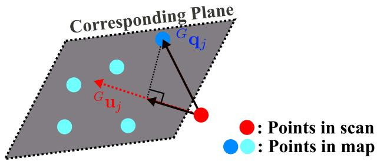  
Fig. 2. Measurement model. A LiDAR point is assumed to lie on a small plane formed by its nearby map points. ${ \mathrm { T h e } } ^ { G } { \mathbf { u } } _ { j }$ is the normal vector of the plane and ${ } ^ { G } \mathbf { q } _ { j }$ is a point lying on the plane.

The measurement contributed by the jth point measurement ${ } ^ { L } \mathbf { p } _ { j }$ can, therefore, be summarized from (8) to a more compact form given as follows:

$$
\mathbf { 0 } = \mathbf { h } _ { j } \left( \mathbf { x } _ { k } , { } ^ { L } \mathbf { n } _ { j } \right) \triangleq { } ^ { G } \mathbf { u } _ { j } ^ { T } \big ( { } ^ { G } \mathbf { T } _ { I _ { k } } { } ^ { I } \mathbf { T } _ { L } \big ( { } ^ { L } \mathbf { p } _ { j } + { } ^ { L } \mathbf { n } _ { j } \big ) - { } ^ { G } \mathbf { q } _ { j } \big )\tag{9}
$$

which defines an implicit measurement model for the state vector xk.

## B. Iterated Kalman Filter

Based on the state model (4) and measurement model (9) formulated on manifold M, we employ an iterated Kalman filter directly operating on the manifold M following the procedures in [22] and [56]. It consists of two key steps: propagation upon each IMU measurement and iterated update upon each LiDAR scan; both steps estimate the state naturally on the manifold M, thus avoiding any renormalization. Since the IMU measurements are typically at a higher frequency than a LiDAR scan (e.g., 200 Hz for IMU measurement and 10–100 Hz for LiDAR scans), multiple propagation steps are usually performed before an update.

1) Propagation: Assume the optimal state estimate after fusing the last $( \mathrm { i . e . , } k -$ 1th) LiDAR scan is $\bar { \bf x } _ { k - 1 }$ with covariance matrix $\bar { \mathbf { P } } _ { k - 1 }$ . The forward propagation is performed upon the arrival of an IMU measurement. More specifically, the state and covariance are propagated following (4) by setting the process noise $\mathbf { w } _ { i }$ to zero:

$$
\begin{array} { r l } & { \widehat { \mathbf { x } } _ { i + 1 } = \widehat { \mathbf { x } } _ { i } \boxplus \left( \Delta t \mathbf { f } ( \widehat { \mathbf { x } } _ { i } , \mathbf { u } _ { i } , \mathbf { 0 } ) \right) ; \widehat { \mathbf { x } } _ { 0 } = \bar { \mathbf { x } } _ { k - 1 } } \\ & { \widehat { \mathbf { P } } _ { i + 1 } = \mathbf { F } _ { \widetilde { \mathbf { x } } _ { i } } \widehat { \mathbf { P } } _ { i } \mathbf { F } _ { \widetilde { \mathbf { x } } _ { i } } ^ { T } + \mathbf { F } _ { \mathbf { w } _ { i } } \mathbf { Q } _ { i } \mathbf { F } _ { \mathbf { w } _ { i } } ^ { T } ; \widehat { \mathbf { P } } _ { 0 } = \bar { \mathbf { P } } _ { k - 1 } } \end{array}\tag{10}
$$

where $\mathbf { Q } _ { i }$ is the covariance of the noise $\mathbf { w } _ { i } .$ and the matrices $\mathbf { F } _ { \widetilde { \mathbf { x } } , }$ and $\mathbf { F } _ { \mathbf { w } _ { i } }$ are computed as follows (see more abstract derivation in [56] and more concrete derivation in [22]):

$$
\begin{array} { r l } & { \mathbf { F } _ { \widetilde { \mathbf { x } } _ { i } } = \frac { \partial ( \mathbf { x } _ { i + 1 } \boxplus \widehat { \mathbf { x } } _ { i + 1 } ) } { \partial \widetilde { \mathbf { x } } _ { i } } \big | _ { \widetilde { \mathbf { x } } _ { i } = \mathbf { 0 } , \ \mathbf { w } _ { i } = \mathbf { 0 } } } \\ & { \mathbf { F } _ { \mathbf { w } _ { i } } = \frac { \partial ( \mathbf { x } _ { i + 1 } \boxplus \widehat { \mathbf { x } } _ { i + 1 } ) } { \partial \mathbf { w } _ { i } } \Big | _ { \widetilde { \mathbf { x } } _ { i } = \mathbf { 0 } , \ \mathbf { w } _ { i } = \mathbf { 0 } } . } \end{array}\tag{11}
$$

The forward propagation continues until reaching the end time of a new (i.e., kth) scan where the propagated state and covariance are denoted as $\widehat { \mathbf { x } } _ { k }$ and $\widehat { \mathbf { P } } _ { k }$

2) Residual Computation: Assume that the estimate of state $\mathbf { x } _ { k }$ at the current iterated update (see Section IV-B3) is $\widehat { \mathbf { x } } _ { k } ^ { \kappa } .$ when $\kappa = 0$ (i.e., before the first iteration), $\widehat { \mathbf { x } } _ { k } ^ { \kappa } = \widehat { \mathbf { x } } _ { k }$ -, the pre-- -dicted state from the propagation in (10). Then, we project each measured LiDAR point ${ } ^ { L } \mathbf { p } _ { j }$ to the global frame ${ \bf \nabla } ^ { G } \widehat { \bf p } _ { j } = { \bf \nabla } $ $G \widehat { \mathbf { T } } _ { I _ { k } } ^ { \kappa  I } \widehat { \mathbf { T } } _ { L _ { k } } ^ { \kappa \ L } \mathbf { p } _ { j }$ -and search its nearest five points in the map - -represented by ikd-Tree (see Section V-A). The found nearest neighboring points are then used to fit a local small plane patch with normal vector ${ \bf \Pi } ^ { G } { \bf u } _ { j }$ and centroid ${ } ^ { G } { \bf q } _ { j }$ , which were used in the measurement model [see (8) and (9)]. Moreover, approximating the measurement equation (9) by its first-order approximation made at $\widehat { \mathbf { x } } _ { k } ^ { \kappa }$ leads to

$$
\begin{array} { r l } & { \mathbf { 0 } = \mathbf { h } _ { j } \left( \mathbf { x } _ { k } , { \mathbf { \xi } } ^ { L } \mathbf { n } _ { j } \right) \simeq \mathbf { h } _ { j } \left( \widehat { \mathbf { x } } _ { k } ^ { \kappa } , \mathbf { 0 } \right) + \mathbf { H } _ { j } ^ { \kappa } \widetilde { \mathbf { x } } _ { k } ^ { \kappa } + \mathbf { r } _ { j } } \\ & { \quad = \mathbf { z } _ { j } ^ { \kappa } + \mathbf { H } _ { j } ^ { \kappa } \widetilde { \mathbf { x } } _ { k } ^ { \kappa } + \mathbf { r } _ { j } } \end{array}\tag{12}
$$

where $\widetilde { \mathbf { x } } _ { k } ^ { \kappa } = \mathbf { x } _ { k } \boxminus \widehat { \mathbf { x } } _ { k } ^ { \kappa }$ (or equivalently $\mathbf { x } _ { k } = \widehat { \mathbf { x } } _ { k } ^ { \kappa } \mathbb { E } \widetilde { \mathbf { x } } _ { k } ^ { \kappa } )$ , Hκj is  - -the Jacobin matrix of the measurement model $\mathbf { h } _ { j } ( \mathbf { x } _ { k } , ^ { L } \mathbf { n } _ { j } )$ in (9) with respect to $\widetilde { \mathbf { x } } _ { k } ^ { \kappa }$ , evaluated at zero, $\mathbf { z } _ { j } ^ { \kappa }$ is the residual

$$
\mathbf { z } _ { j } ^ { \kappa } = \mathbf { h } _ { j } \left( \widehat { \mathbf { x } } _ { k } ^ { \kappa } , \mathbf { 0 } \right) = \mathbf { u } _ { j } ^ { T } \left( ^ { G } \widehat { \mathbf { T } } _ { I _ { k } } ^ { \kappa I } \widehat { \mathbf { T } } _ { L _ { k } } ^ { \kappa } \mathbf { \mathbf { \phi } } ^ { L } \mathbf { p } _ { j } - { } ^ { G } \mathbf { q } _ { j } \right)\tag{13}
$$

and $\mathbf { r } _ { j } = { ^ { G } \mathbf { u } _ { j } ^ { T G } } \mathbf { T } _ { I _ { k } } { ^ { I } } \mathbf { T } _ { L } { ^ { L } } \mathbf { n } _ { j } \in \mathcal { N } ( \mathbf { 0 } , \mathbf { R } _ { j } )$ is the total measurement noise with a covariance ${ \bf R } _ { j }$ due to the raw LiDAR measurement noise ${ \mathbf { } } ^ { L } { \mathbf { n } } _ { j }$ . In practice, we set ${ \bf R } _ { j }$ to a constant value and found that it works very well.

3) Iterated Update: The propagated state $\widehat { \mathbf { x } } _ { k }$ and covariance $\widehat { \mathbf { P } } _ { k }$ -from Section IV-B1 impose a prior Gaussian distribution -for the unknown state $\mathbf { x } _ { k }$ . More specifically, $\widehat { \mathbf { P } } _ { k }$ represents the covariance of the following error state:

$$
\begin{array} { r } { \mathbf { x } _ { k } \boxplus \widehat \mathbf { x } _ { k } = ( \widehat \mathbf { x } _ { k } ^ { \kappa } \boxplus \widetilde \mathbf { x } _ { k } ^ { \kappa } ) \boxplus \widehat \mathbf { x } _ { k } = \widehat \mathbf { x } _ { k } ^ { \kappa } \boxplus \widehat \mathbf { x } _ { k } + \mathbf { J } ^ { \kappa } \widetilde \mathbf { x } _ { k } ^ { \kappa } } \\ { \sim { \mathcal { N } } ( \mathbf { 0 } , \widehat \mathbf { P } _ { k } ) } \end{array}\tag{14}
$$

where $\mathbf { J } ^ { \kappa }$ is the partial differentiation of $( \widehat { \mathbf { x } } _ { k } ^ { \kappa } \boxplus \widetilde { \mathbf { x } } _ { k } ^ { \kappa } ) \boxplus \widehat { \mathbf { x } } _ { k }$ with respect to $\widetilde { \mathbf { x } } _ { k } ^ { \kappa }$ evaluated at zero

$$
\mathbf { J } ^ { \kappa } = \left[ \begin{array} { c c c c } { \mathbf { A } ( \delta ^ { G } \pmb { \theta } _ { I _ { k } } ) ^ { - T } } & { \mathbf { 0 } _ { 3 \times 1 5 } } & { \mathbf { 0 } _ { 3 \times 3 } } & { \mathbf { 0 } _ { 3 \times 3 } } \\ { \mathbf { 0 } _ { 1 5 \times 3 } } & { \mathbf { I } _ { 1 5 \times 1 5 } } & { \mathbf { 0 } _ { 3 \times 3 } } & { \mathbf { 0 } _ { 3 \times 3 } } \\ { \mathbf { 0 } _ { 3 \times 3 } } & { \mathbf { 0 } _ { 3 \times 1 5 } } & { \mathbf { A } \big ( \delta ^ { I } \pmb { \theta } _ { L _ { k } } \big ) ^ { - T } } & { \mathbf { 0 } _ { 3 \times 3 } } \\ { \mathbf { 0 } _ { 3 \times 3 } } & { \mathbf { 0 } _ { 3 \times 1 5 } } & { \mathbf { 0 } _ { 3 \times 3 } } & { \mathbf { I } _ { 3 \times 3 } } \end{array} \right]\tag{15}
$$

where ${ \bf A } ( \cdot ) ^ { - 1 }$ is defined in [22] and [56], $\delta ^ { G } \pmb { \theta } _ { I _ { k } } { = } ^ { G } \widehat { \mathbf { R } } _ { I _ { k } } ^ { \kappa } \ominus ^ { G } \widehat { \mathbf { R } } _ { I _ { k } }$ and $\delta ^ { I } \pmb { \theta } _ { L _ { k } } = { } ^ { I } \widehat { \bf R } _ { L _ { k } } ^ { \kappa } \ominus { } ^ { I } \widehat { \bf R } _ { L _ { k } }$ - -are the error states of IMU’s atti-- -tude and rotational extrinsic, respectively. For the first iteration, $\widehat { \mathbf { x } } _ { k } ^ { \kappa } = \widehat { \mathbf { x } } _ { k }$ , then $\mathbf { J } ^ { \kappa } = \mathbf { I }$

-Besides the prior distribution, we also have a distribution of the state due to the measurement (12)

$$
- \mathbf { r } _ { j } = \mathbf { z } _ { j } ^ { \kappa } + \mathbf { H } _ { j } ^ { \kappa } \widetilde { \mathbf { x } } _ { k } ^ { \kappa } \sim \mathcal { N } ( \mathbf { 0 } , \mathbf { R } _ { j } ) .\tag{16}
$$

Combining the prior distribution in (14) with the measurement model from (16) yields a posteriori distribution of the state $\mathbf { x } _ { k }$ equivalently represented by $\widetilde { \mathbf { x } } _ { k } ^ { \kappa }$ and its maximum a posteriori estimate (MAP)

$$
\operatorname* { m i n } _ {  { \widetilde { \mathbf { x } } } _ { k } ^ { \kappa } } \left( \| \mathbf { x } _ { k } \boxplus \widehat { \mathbf { x } } _ { k } \| _ { \widehat { \mathbf { P } } _ { k } } ^ { 2 } + \sum _ { j = 1 } ^ { m } \| \mathbf { z } _ { j } ^ { \kappa } + \mathbf { H } _ { j } ^ { \kappa } \widetilde { \mathbf { x } } _ { k } ^ { \kappa } \| _ { \mathbf { R } _ { j } } ^ { 2 } \right)\tag{17}
$$

Algorithm 1: State Estimation.   
Input : Last output $\bar { \bf x } _ { k - 1 }$ and $\bar { \mathbf { P } } _ { k - 1 } ;$   
LiDAR raw points in current scan;   
IMU inputs $( \mathbf { a } _ { m } , \omega _ { m } )$ during current scan.   
1 Forward propagation to obtain state prediction $\widehat { \mathbf { x } } _ { k }$ and   
its covariance $\widehat { \mathbf { P } } _ { k }$ via (10);   
2 Backward propagation to compensate motion [22];   
3 $\kappa = - 1 , \widehat { \mathbf { x } } _ { k } ^ { \kappa = 0 } = \widehat { \mathbf { x } } _ { k }$   
4 repeat   
5 $\kappa = \kappa + 1 ;$   
6 Compute $\mathbf { J } ^ { \kappa }$ via (15) and $\mathbf { P } = ( \mathbf { J } ^ { \kappa } ) ^ { - 1 } \widehat { \mathbf { P } } _ { k } ( \mathbf { J } ^ { \kappa } ) ^ { - T } ;$   
7 Compute residual $\mathbf { z } _ { j } ^ { \kappa }$ and Jacobin Hµ via (12) (13);   
8 Compute the state update $\widehat { \mathbf { x } } _ { k } ^ { \kappa + 1 }$ via (18);   
9 until $\| \widehat { \mathbf { x } } _ { k } ^ { \kappa + 1 } \ominus \widehat { \mathbf { x } } _ { k } ^ { \kappa } \| < \epsilon ;$   
10 $\bar { \mathbf { x } } _ { k } = \widehat { \mathbf { x } } _ { k } ^ { \kappa + 1 } ; \bar { \mathbf { P } } _ { k } = \left( \mathbf { I } - \mathbf { K } \mathbf { H } \right) \mathbf { P } ;$   
11 Obtain the transformed LiDAR points $\{ { \bf \Pi } ^ { G } \bar { \bf p } _ { j } \}$ via (20).   
Output: Current optimal estimate $\bar { \bf x } _ { k }$ and $\bar { \mathbf { P } } _ { k } ;$   
The transformed LiDAR points $\{ { ^ { G } \bar { \bf p } } _ { j } \}$

where $\| \mathbf { a } \| _ { \mathbf { M } } ^ { 2 } \triangleq \mathbf { a } ^ { T } \mathbf { M } ^ { - 1 } \mathbf { a }$ for any invertible matrix M and vector a of the proper dimension, and m is the number of measured points. This MAP problem can be solved by iterated Kalman filter given as follows (to simplify the notation, let $\mathbf { H } = [ { \textbf H } _ { 1 } ^ { \kappa ^ { T } } , \ldots , { \textbf H } _ { m } ^ { \kappa ^ { T } } ] ^ { T } , \mathbf { R } = \mathrm { d i a g } ( \mathbf { R } _ { 1 } , \tilde { \mathbf { \Omega } } \cdot \tilde { \mathbf { \Omega } } \mathbf { \cdot } \mathbf { R } _ { m } ) , \mathbf { P } =$ $( \mathbf { J } ^ { \kappa } ) ^ { - 1 } \widehat { \mathbf { P } } _ { k } ( \mathbf { J } ^ { \kappa } ) ^ { - T }$ , and $\mathbf { z } _ { k } ^ { \kappa } = [ \mathbf { z } _ { 1 } ^ { \kappa ^ { T } } , \ldots , \mathbf { z } _ { m } ^ { \kappa ^ { T } } ] ^ { T } )$

$$
\begin{array} { r } { \mathbf { K } = \left( \mathbf { H } ^ { T } \mathbf { R } ^ { - 1 } \mathbf { H } + \mathbf { P } ^ { - 1 } \right) ^ { - 1 } \mathbf { H } ^ { T } \mathbf { R } ^ { - 1 } \quad } \\ { \widehat { \mathbf { x } } _ { k } ^ { \kappa + 1 } = \widehat { \mathbf { x } } _ { k } ^ { \kappa } \boxplus \left( - \mathbf { K } \mathbf { z } _ { k } ^ { \kappa } - ( \mathbf { I } - \mathbf { K } \mathbf { H } ) ( \mathbf { J } ^ { \kappa } ) ^ { - 1 } \left( \widehat { \mathbf { x } } _ { k } ^ { \kappa } \boxplus \widehat { \mathbf { x } } _ { k } \right) \right) } \end{array}\tag{.(18}
$$

Note that the Kalman gain K computation needs to invert a matrix of the state dimension instead of the measurement dimension used in previous works.

The previous process repeats until convergence $( \mathrm { i } . \mathrm { e } . , \| \widehat { \mathbf { x } } _ { k } ^ { \kappa + 1 }$  $\widehat { \mathbf { x } } _ { k } ^ { \kappa } \| < \epsilon )$ -. After convergence, the optimal state and covariance -estimates are

$$
\bar { \mathbf { x } } _ { k } = \widehat { \mathbf { x } } _ { k } ^ { \kappa + 1 } , \bar { \mathbf { P } } _ { k } = \left( \mathbf { I } - \mathbf { K } \mathbf { H } \right) \mathbf { P } .\tag{19}
$$

With the state update $\bar { \bf x } _ { k } .$ , each LiDAR point $( ^ { L } { \bf p } _ { j } )$ in the kth scan is then transformed to the global frame via

$$
{ } ^ { G } \bar { \mathbf p } _ { j } = { } ^ { G } \bar { \mathbf T } _ { I _ { k } } { } ^ { I } \bar { \mathbf T } _ { L _ { k } } { } ^ { L } \mathbf p _ { j } ; j = 1 , \dots , m .\tag{20}
$$

The transformed LiDAR points $\{ { } ^ { G } \bar { \bf p } _ { j } \}$ are inserted into the map represented by ikd-Tree (see Section V). Our state estimation is summarized in Algorithm 1.

## V. MAPPING

In this section, we describe how to incrementally maintain a map (i.e., insertion and delete) and perform k-nearest search on it by ikd-Tree. In order to prove the time efficiency of ikd-Tree theoretically, a complete analysis of time complexity is provided.

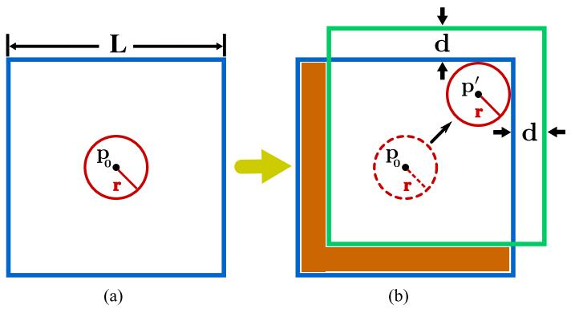  
Fig. 3. 2-D demonstration of map region management. (a) Blue rectangle is the initial map region with length L. The red circle is the initial detection area centered at the initial LiDAR position p0. (b) Detection area (dashed red circle) moves to a new position p(circle with solid red line) where the map boundaries are touched. The map region is moved to a new position (green rectangle) by distance d. The points in the subtraction area (orange area) are removed from the map (i.e., ikd-Tree).

## A. Map Management

The map points are organized into an ikd-Tree, which dynamically grows by merging a new scan of point cloud at the odometry rate. To prevent the size of the map from going unbound, only map points in a large local region of length L around the LiDAR current position are maintained on the ikd-Tree. A 2-D demonstration is shown in Fig. 3. The map region is initialized as a cube with length $L ,$ which is centered at the initial LiDAR position p . The detection area of LiDAR is assumed to be a detection ball centered at the LiDAR current position obtained from (19). The radius of the detection ball is assumed to be $r = \gamma R$ , where R is the LiDAR FoV range, and γ is a relaxation parameter larger than 1. When the LiDAR moves to a new position $\mathbf { p } ^ { \prime }$ where the detection ball touches the boundaries of the map, the map region is moved in a direction that increases the distance between the LiDAR detection area and the touching boundaries. The distance that the map region moves is set to a constant $d = ( \gamma - 1 ) R$ . All points in the subtraction area between the new map region and the old one will be deleted from the ikd-Tree by a boxwise delete operation detailed in Section V-C.

## B. Tree Structure and Construction

1) Data Structure: The ikd-Tree is a binary search tree. The attributes of a tree node in ikd-Tree are presented in Data Structure. Different from many existing implementations of k-d trees, which store a “bucket” of points only on leaf nodes [43]–[45], [53], [54], our ikd-Tree stores points on both leaf nodes and internal nodes to better support dynamic point insertion and tree rebalancing. Such storing mode has also shown to be more efficient in kNN search when a single k-d tree is used [41], which is the case of our ikd-Tree. Since a point corresponds to a single node on the ikd-Tree, we will use points and nodes interchangeably. The point information (e.g., point coordinates, intensity) are stored in point. The attributes leftchild and rightchild are pointers to its left and right child node, respectively. The division axis to split the space is recorded in axis. The number of tree nodes, including both valid and invalid nodes, of the (sub-)tree rooted at the current node is maintained in attribute treesize. When points are removed from the map, the nodes are not deleted from the tree immediately, but only setting the boolean variable deleted to be true (see Section V-C2 for details). If the entire (sub-)tree rooted at the current node is removed, treedeleted is set to true. The number of points deleted from the (sub-)tree is summed up into attribute invalidnum. The attribute range records the range information of the points on the (sub-)tree, which is interpreted as a circumscribed axis-aligned cuboid containing all the points. The circumscribed cuboid is represented by its two diagonal vertices with minimal and maximal coordinates on each dimension, respectively.

Data Structure: Tree node structure   
1 Struct TreeNode:   
2 PointType point;   
3 TreeNode \* leftchild, \* rightchild;   
4 int axis;   
5 int treesize, invalidnum;   
6 bool deleted, treedeleted;   
7 CuboidVertices range;   
8 end

2) Construction: Building the ikd-Tree is similar to building a static k-d tree in [40]. The ikd-Tree splits the space at the median point along the longest dimension recursively until there is only one point in the subspace. The attributes in Data Structure are initialized during the construction, including calculating the tree size and range information of (sub-)trees.

## C. Incremental Updates

The incremental updates on ikd-Tree refer to incremental operations followed by dynamic rebalancing detailed in Section V-D. Two types ofincremental operations are supported: pointwise operations and boxwise operations. The pointwise operations insert, delete or reinsert a single point to/from the k-d tree, while the boxwise operations insert, delete or reinsert all points in a given axis-aligned cuboid. In both cases, the point insertion is further integrated with on-tree downsampling, which maintains the map at a predetermined resolution. In this article, we only explain the pointwise insertion and boxwise delete as they are required by the map management of FAST-LIO2. Readers can refer to our open-source full implementation of ikd-Tree at Github repository and technical documents contained therein for more details.

1) Point Insertion With On-Tree Downsampling: In consideration of robotic applications, our ikd-Tree supports simultaneous point insertion and map downsampling. The algorithm is detailed in Algorithm 2. For a given point p in $\{ { \bar { \bf { \sigma } } } _ { \bar { \bf { p } } _ { j } } \}$ from the state estimation module (see Algorithm 1) and downsample resolution l, the algorithm partitions the space evenly into cubes of length l, then the cube $\mathbf { C } _ { D }$ that contains the point p is found (Line 2). The algorithm only keeps the point that is nearest to the center $\scriptstyle \mathbf { p } _ { \mathrm { c e n t e r } }$ of $\mathbf { C } _ { D }$ (Line 3). This is achieved by first searching all points contained in $\mathbf { C } _ { D }$ on the k-d tree and stores them in a point array V together with the new point p (Lines 4–5). The nearest point $\mathrm { \bf p } _ { \mathrm { n e a r e s t } }$ is obtained by comparing the distances of each point in V to the center $\scriptstyle \mathbf { p } _ { \mathrm { c e n t e r } }$ (Line 6). Then, existing points in $\mathbf { C } _ { D }$ are deleted (Line 7), after which the nearest point pnearest is inserted into the k-d tree (Line 8). The implementation of the boxwise search is similar to the boxwise delete, as introduced in Section V-C2.

TABLE I  
ATTRIBUTES INITIALIZATION OF A NEW TREE NODE TO INSERT
<table><tr><td>Attribute</td><td>Value</td><td>Attribute</td><td>Value</td></tr><tr><td>point</td><td>p</td><td> $\mathsf { a x i s } ^ { \mathrm { a } }$ </td><td>(father.axis + 1) mod k</td></tr><tr><td> $\mathtt { l e f t c h i l d }$ </td><td></td><td>NULL rightchild</td><td>NULL</td></tr><tr><td>treesize</td><td>1</td><td>invalidnum</td><td>0</td></tr><tr><td>deleted</td><td>false</td><td>treedeleted false</td><td></td></tr><tr><td> $\mathtt { r a n g e } ^ { \mathrm { b } }$ </td><td> $[ \mathbf { p } , \mathbf { p } ]$ </td><td></td><td></td></tr></table>

a Axis is initialized using the division axis of its father node.  
b Cuboid is initialized by setting minimal and maximal vertices as the point to insert.

The point insertion (Lines 11–24) on the ikd-Tree is implemented recursively. The algorithm searches down from the root node until an empty node is found to append a new node (Lines 12–14). The attributes of the new leaf node are initialized as Table I. At each nonempty node, the new point is compared with the point stored on the tree node along the division axis for further recursion (Lines 15–20). The attributes (e.g., treesize, range) of those visited nodes are updated with the latest information (Line 21) as introduced in Section V-C3. A balance criterion is checked and maintained for subtrees updated with the new point to keep the balance property of ikd-Tree (Line 22), as detailed in Section V-D.

2) Boxwise Delete Using Lazy Labels: In the delete operation, we use a lazy delete strategy. That is, the points are not removed from the tree immediately but only labeled as “deleted” by setting the attribute deleted to true (see Data Structure, Line 6). If all nodes on the sub-tree rooted at node T have been deleted, the attribute treedeleted of T is set to true. Therefore the attributes deleted and treedeleted are called lazy labels. Points labeled as “deleted” will be removed from the tree during a re-building process (see Section V-D).

Boxwise delete is implemented utilizing the range information in attribute range and the lazy labels on the tree nodes. As mentioned in Section V-B, the attribute range is represented by a circumscribed cuboid $\mathbf { C } _ { T }$ . The pseudocode is shown in Algorithm 3. Given the cuboid of points $\mathbf { C } _ { O }$ to be deleted from a (sub-)tree rooted at $T ,$ , the algorithm searches down the tree recursively and compares the circumscribed cuboid $\mathbf { C } _ { T }$ with the given cuboid $\mathbf { C } _ { O }$ . If there is no intersection between $\mathbf { C } _ { T }$ and $\mathbf { C } _ { O }$ , the recursion returns directly without updating the tree (Line 2). If the circumscribed cuboid $\mathbf { C } _ { T }$ is fully contained in the given cuboid $\mathbf { C } _ { O }$ , the boxwise delete set attributes deleted and treedeleted to true (Line 5). As all points on the (sub-)tree are deleted, the attribute invalidnum is equal to the treesize (Line 6). For the condition that $\mathbf { C } _ { T }$ intersects but not contained in $\mathbf { C } _ { O } ,$ , the current point p is first deleted from the tree if it is contained in $\mathbf { C } _ { O }$ (Line 9), after which the algorithm looks into the child nodes recursively (Lines 10–11). The attribute update of the current node T and the balance maintenance is applied after the boxwise delete operation (Lines 12–13).

Algorithm 2: Point Insertion with On-tree Downsam  
pling.   
Input: Downsample Resolution l,   
New Point to Insert p,   
Switch of Parallelly Re-building SW   
1 Algorithm Start   
2 CD ← FindCube (l, p)   
3 Pcenter ← Center $( { \bf C } _ { D } )$   
4 $V  \mathtt { B }$ oxwiseSearch (RootNode, $\mathbf { C } _ { D } )$   
5 V.push ${ \bf \Pi } ( { \bf p } )$ の   
6 pnearest ← FindNearest $( V , \mathbf { p } _ { c e n t e r } ) ;$   
7 BoxwiseDelete(RootNode, $\mathbf { C } _ { D } )$   
8 Insert (RootNode,pnearest,NULL,SW);   
9 Algorithm End   
10   
11 Function Insert (T, p, father,SW)   
12 if T is empty then   
13 Initialize(T,p,father);   
14 else   
15 ax ← T.axis;   
16 if $\mathbf { p } [ a x ] < T . p o i n t [ a X ]$ then   
17 Insert (T.leftchild,p,T,SW);   
18 else   
19 Insert (T.rightchild,p,T,SW);   
20 end   
21 AttributeUpdate(T);   
22 Rebalance(T,SW);   
23 end   
24 End Function

3) Attribute Update: After each incremental operation, attributes of the visited nodes are updated with the latest information using function AttributeUpdate. The function calculates the attributes treesize and invalidnum by summarizing the corresponding attributes on its two child nodes and the point information on itself; the attribute range is determined by merging the range information of the two child nodes and the point information stored on it; treedeleted is set true if the treedeleted of both child nodes are true and the node itself is deleted.

## D. Rebalancing

The ikd-Tree actively monitors the balance property after each incremental operation and dynamically rebalances itself by rebuilding only the relevant subtrees.

1) Balancing Criterion: The balancing criterion is composed of two subcriteria: α-balanced criterion and α-deleted criterion. Suppose a subtree of the ikd-Tree is rooted at T. The subtree is

Algorithm 3: Box-wise Delete.   
Input : Operation Cuboid $\mathbf { C } _ { O } .$   
k-d Tree Node T,   
Switch of Parallelly Re-building SW   
1 Function BoxwiseDelete $( \mathbf { \nabla } T , \mathbf { C } _ { O } , S \bar { W } )$   
2 $\mathbf { C } _ { T } \gets T .$ range;   
3 if $\mathbf { C } _ { T } \cap \mathbf { C } _ { O } = \emptyset$ then return;   
4 if $\mathbf { C } _ { T } \subseteq \mathbf { C } _ { O }$ then   
5 T.treedelete, T.delete ← true;   
6 T.invalidnum = T.treesize;   
7 else   
8 p ← T.point;   
9 if $\mathbf { p } \subset \mathbf { C } _ { O }$ then T.treedelete = true;   
10 BoxwiseDelete(T.leftchild,Co,SW);   
11 BoxwiseDelete(T.rightchild,Co,SW);   
12 AttributeUpdate(T);   
13 Rebalance(T,SW);   
14 end   
15 End Function

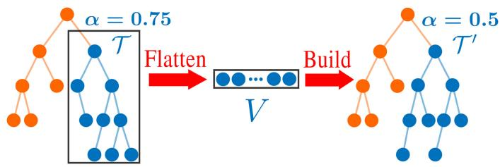  
Fig. 4. Rebuilding an unbalanced subtree.

α-balanced if and only if it satisfies the following condition:

$$
\begin{array} { r } { S ( T . \mathrm { l e f t c h i l d } ) < \alpha _ { \mathrm { b a l } } \left( S ( T ) - 1 \right) } \\ { S ( T . \mathrm { r i g h t c h i l d } ) < \alpha _ { \mathrm { b a l } } \left( S ( T ) - 1 \right) } \end{array}\tag{21}
$$

where $\alpha _ { \mathrm { b a l } } \in ( 0 . 5 , 1 )$ and S(T) is the treesize attribute of the node T.

The α-deleted criterion of a subtree rooted at T is

$$
I ( T ) < \alpha _ { \mathrm { d e l } } S ( T )\tag{22}
$$

where $\alpha _ { \mathrm { d e l } } \in ( 0 , 1 )$ and I(T) denotes the number of invalid nodes on the subtree (i.e., the attribute invalidnum of node T).

If a subtree of the ikd-Tree meets both criteria, the subtree is balanced. The entire tree is balanced if all subtrees are balanced. Violation of either criterion will trigger a rebuilding process to rebalance that subtree: the α-balanced criterion maintains the tree’s maximum height. It can be easily proved that the maximum height of an α-balanced tree is $\log _ { 1 / \alpha _ { \mathrm { b a l } } } ( n )$ , where n is the tree size; the α-deleted criterion ensures invalid nodes (i.e., labeled as “deleted”) on the subtrees are removed to reduce tree size. Reducing the height and size of the k-d tree allows highly efficient incremental operations and queries in the future.

2) Rebuild and Parallel Rebuild: Assuming rebuilding is triggered on a subtree T (see Fig. 4), the subtree is first flattened into a point storage array V. The tree nodes labeled as “deleted”

are discarded during the flattening. A new perfectly balanced k-d tree is then built with all points in V, as in Section V-B. When rebuilding a large subtree on the ikd-Tree, a considerable delay could occur and undermine the real-time performance of FAST-LIO2. To preserve high real-time ability, we design a double-thread rebuilding method. Instead of simply rebuilding in the second thread, our proposed method avoids information loss and memory conflicts in both threads by an operation logger, thus retaining full accuracy on k-nearest neighbor search at all times.

The rebuilding method is presented in Algorithm 4. When the balance criterion is violated, the subtree is rebuilt in the main thread when its tree size is smaller than a predetermined value $N _ { \mathrm { m a x } } ;$ otherwise, the subtree is rebuilt in the second thread. The rebuilding algorithm on the second thread is shown in function ParRebuild. Denote the subtree to rebuild in the second thread as $\tau$ and its root node as $T .$ The second thread will lock all incremental updates (i.e., point insertion and delete) but not queries on this subtree (Line 12). Then, the second thread copies all valid points contained in the subtree $\tau$ into a point array V (i.e., flatten) while leaving the original subtree unchanged for possible queries during the rebuilding process (Line 13). After the flattening, the original subtree is unlocked for the main thread to take further requests of incremental updates (Line 14). These requests will be simultaneously recorded in a queue named operation logger. Once the second thread completes building a new balanced k-d tree $\mathcal { T } ^ { \prime }$ from the point array V (Line 15), the recorded update requests will be performed again on $\mathcal { T } ^ { \prime }$ by function IncrementalUpdates (Lines 16–18). Note that the parallel rebuilding switch is set to false as it is already in the second thread. After all pending requests are processed, the point information on the original subtree $\tau$ is completely the same as that on the new subtree $\mathcal { T } ^ { \prime }$ except that the new subtree is more balanced than the original one in the tree structure. The algorithm locks the node $T$ from incremental updates and queries and replaces it with the new one $T ^ { \prime }$ (Lines 20–22). Finally, the algorithm frees the memory of the original subtree (Line 23). This design ensures that during the rebuilding process in the second thread, the mapping process in the main thread proceeds still at the odometry rate without any interruption, albeit at a lower efficiency due to the temporarily unbalanced k-d tree structure. We should note that LockUpdates does not block queries, which can be conducted parallelly in the main thread. In contrast, LockAll blocks all access, including queries, but it finishes very quickly (i.e., only one instruction), allowing timely queries in the main thread. The functions LockUpdates and LockAll are implemented by mutual exclusion (mutex).

## E. K-Nearest Neighbor Search

Although being similar to existing implementations in those well-known k-d tree libraries [43]–[45], the nearest search algorithm is thoroughly optimized on the ikd-Tree. The range information on the tree nodes is well utilized to speed up our nearest neighbor search using a “bounds-overlap-ball” test detailed in [41]. A priority queue q is maintained to store the k-nearest neighbors so far encountered and their distance to the target point. When recursively searching down the tree from its root node, the minimal distance $d _ { \mathrm { m i n } }$ from the target point to the cuboid $\mathbf { C } _ { T }$ of the tree node is calculated first. If the minimal distance $d _ { \mathrm { m i n } }$ is no smaller than the maximal distance in q, there is no need to process the node and its offspring nodes. Furthermore, in FAST-LIO2 (and many other LiDAR odometry), only when the neighbor points are within a given threshold around the target point would be viewed as inliers and, hence, used in the state estimation, this naturally provides a maximal search distance for a ranged search of k-nearest neighbors [43]. In either case, the ranged search prunes the algorithm by comparing $d _ { \mathrm { m i n } }$ with the maximal distance, thus reducing the amount of backtracking to improve the time performance. It should be noted that our ikd-Tree supports multithread k-nearest neighbor search for parallel computing architectures.

Algorithm 4: Rebuild (Sub-) Tree for Re-Balancing.   
Input: Root node T of (sub-) tree T for re-building   
Re-build Switch SW   
1 Function Rebalance (T,SW)   
2 if ViolateCriterion(T) then   
3 if T.treesize $< N _ { \mathrm { m a x } }$ or Not SW then   
4 Rebuild(T)   
5 else   
6 ThreadSpawn (ParRebuild,T)   
7 end   
8 end   
9 End Function   
10   
11 Function ParRebuild (T)   
12 LockUpdates (T);   
13 V ← Flatten (T) ;   
14 Unlock(T);   
15 $T ^ { \prime } \gets$ Build(V);   
16 foreach $o p$ in OperationLogger do   
17 IncrementalUpdates $( T ^ { \prime } , o p , f a l s e )$   
18 end   
19 $T _ { t e m p } \gets T ;$   
20 LockAll(T);   
21 $T \gets T ^ { \prime } ;$   
22 Unlock(T);   
23 Free $( T _ { t e m p } )$   
24 End Function

## F. Time Complexity Analysis

The time complexity of ikd-Tree breaks into the time for incremental operations (insertion and delete), rebuilding, and k-nearest neighbor search. Note that all analyses are provided under the assumption of low dimensions (e.g., 3-D in FAST-LIO2).

1) Incremental Operations: Since the insertion with on-tree downsampling relies on boxwise delete and boxwise search, the boxwise operations are discussed first. Suppose n denotes the tree size of the ikd-Tree, the time complexity of boxwise operations on the ikd-Tree is given in the following.

Lemma 1: Suppose points on the ikd-Tree are in the 3-D space $S _ { x } \times S _ { y } \times S _ { z }$ , and the operation cuboid is ${ \bf C } _ { O } = L _ { x } \times$

$L _ { y } \times L _ { z }$ . The time complexity of boxwise delete and search of Algorithm 3 with cuboid $\mathbf { C } _ { O }$ is

$$
O ( H ( n ) ) = \left\{ \begin{array} { l l } { O ( \log n ) } & { \mathrm { i f } \Delta _ { \operatorname* { m i n } } \geqslant \alpha ( \frac { 2 } { 3 } ) ( ^ { * } ) } \\ { O ( n ^ { 1 - a - b - c } ) } & { \mathrm { i f } \Delta _ { \operatorname* { m a x } } \leqslant 1 - \alpha ( \frac { 1 } { 3 } ) ( ^ { * * } ) } \\ { O ( n ^ { \alpha ( \frac { 1 } { 3 } ) - \Delta _ { \operatorname* { m i n } } - \Delta _ { \operatorname* { m e d } } } ) } & { \mathrm { i f } ( ^ { * } ) \mathrm { ~ a n d ~ } ( ^ { * * } ) \mathrm { ~ f a i l ~ a n d ~ } } \\ & { \Delta _ { \mathrm { m e d } } < \alpha \big ( \frac { 1 } { 3 } \big ) - \alpha \big ( \frac { 2 } { 3 } \big ) } \\ { O \big ( n ^ { \alpha ( \frac { 2 } { 3 } ) - \Delta _ { \operatorname* { m i n } } } \big ) } & { \mathrm { o t h e r w i s e } } \end{array} \right.\tag{23}
$$

where $\begin{array} { r } { a = \log _ { n } \frac { S _ { x } } { L _ { x } } , b = \log _ { n } \frac { S _ { y } } { L _ { y } } } \end{array}$ , and $\begin{array} { r } { c = \log _ { n } \frac { S _ { z } } { L _ { z } } , } \end{array}$ , with $a , b , c \geqslant 0 . \Delta _ { \mathrm { m i n } } , \Delta _ { m e d } ,$ and $\Delta _ { \mathrm { m a x } }$ are the minimal, median, and maximal value among $a , b ,$ and $c . \ \alpha ( u )$ is the Flajolet–Puech function with $u \in [ 0 , 1 ]$ , where particular value is provided: $\alpha ( \textstyle { \frac { 1 } { 3 } } ) = 0 . 7 1 6 2$ and $\alpha ( \textstyle { \frac { 2 } { 3 } } ) = 0 . 3 9 4 9$

Proof: The asymptotic time complexity for range search of an axis-aligned hypercube on a k-d tree is provided in [57]. The boxwise delete can be viewed as a range search except that lazy labels are attached to the tree nodes, which is O(1). Therefore, the conclusion of range search can be applied to the boxwise delete and search on the ikd-Tree, which leads to $O ( H ( n ) )$ 

The time complexity of insertion with on-tree downsampling is given in the following.

Lemma 2: The time complexity ofpoint insertion with on-tree downsampling in Algorithm 2 on ikd-Tree is O(log n).

Proof: The downsampling method on the ikd-Tree is composed of boxwise search and delete followed by the point insertion. By applying Lemma 1, the time complexity of downsample is $O ( H ( n ) )$ ). Generally, the downsample cube $\mathbf { C } _ { D }$ is very small comparing with the entire space. Therefore, the normalized range $\Delta x , \Delta y .$ , and Δz are small, and the value of $\Delta _ { \mathrm { m i n } }$ satisfies the condition $( ^ { * } )$ for the time complexity of $O ( \log n )$

The maximum height of the ikd-Tree can be easily proved to be $\log _ { 1 / \alpha _ { \mathrm { b a l } } } ( n )$ from (21) while that of a static k-d tree is $\log _ { 2 } n$ Hence, the lemma is directly obtained from [40] where the time complexity of point insertion on a k-d tree was proved to be $O ( \log n )$ . Summarizing the time complexity of both downsample and insertion concludes that the time complexity of insertion with on-tree downsampling is O(log n). 

2) Rebuild: The time complexity for rebuilding falls into two types: single-thread rebuilding and parallel double-thread rebuilding. In the former case, the rebuilding is performed by the main thread recursively. Each level takes the time of sorting $( \mathrm { i } . \mathrm { e } . , O ( n ) )$ and the total time over log n levels is $O ( n \log n )$ [40] when the dimension k is low. For parallel rebuilding, the time consumed in the main thread is only flattening (which suspends the main thread from further incremental updates, Algorithm 4, Lines 12–14) and tree update (which takes constant time $O ( 1 )$ , Algorithm 4, Lines 20–22) but not building (which is performed in parallel by the second thread, Algorithm $^ { 4 , }$ Lines 15–18), leading to time complexity of $O ( n )$ (viewed from the main thread). In summary, the time complexity of rebuilding the ikd-Tree is $O ( n )$ for double-thread parallel rebuilding and O(n log n) for single-thread rebuilding.

3) K-Nearest Neighbor Search: As the maximum height of the ikd-Tree is maintained no larger than $\log _ { 1 / \alpha _ { \mathrm { b a l } } } ( n )$ , where n is the tree size, the time complexity to search down from root to leaf nodes is $O ( \log n )$ . During the process of searching k-nearest neighbors on the tree, the number of backtracking is proportional to a constant ¯l, which is independent of the tree size [41]. Therefore, the expected time complexity to obtain k-nearest neighbors on the ikd-Tree is $O ( \log n )$

## VI. BENCHMARK RESULTS

In this section, extensive experiments in terms of accuracy, robustness, and computational efficiency are conducted on var ious open datasets. We first evaluate our data structure, i.e., $i k d \ – T r e e ,$ against other data structures for kNN search on 18 dataset sequences of different sizes. Then, in Section VI-C, we compare the accuracy and processing time of FAST-LIO2 on 19 sequences. All the sequences are chosen from five different datasets collected by both solid-state LiDAR [15] and spinning LiDARs. The first dataset is from the work LILI-OM [17] and is collected by a solid-state 3-D LiDAR Livox Horizon,3 which has nonrepetitive scan pattern and $8 1 . 7 ^ { \circ }$ (horizontal) $\times \ 2 5 . 1 ^ { \circ }$ (vertical) FoV, at a typical scan rate of 10 Hz, referred to as lili. The gyroscope and accelerometer measurements are sampled at 200 Hz by a six-axis Xsens MTi-670 IMU. The data are recorded in the university campus and urban streets with structured scenes. The second dataset is from the work LIO-SAM [29] in MIT campus and contains several sequences collected by a VLP-16 $\mathrm { L i D A R ^ { 4 } }$ sampled at 10 Hz and a MicroStrain 3DM-GX5-25 9-axis IMU sampled at 1000 Hz, referred to as liosam. It contains different kinds of scenes, including structured buildings and forests on campus. The third dataset “utbm” [58] is collected with a human-driving robocar in maximum 50 km/h speed, which has two 10 Hz Velodyne HDL-32E $\mathrm { L i D A R } ^ { 5 }$ and 100 Hz Xsens MTi-28A53G25 IMU. In this article, we only consider the left LiDAR. The fourth dataset $" u l h k "$ [59] contains the 10 Hz LiDAR data from Velodyne HDL-32E and 100 Hz IMU data from a nine-axis Xsens MTi-10 IMU. All the sequences of utbm and ulhk are collected in structured urban areas by a human-driving vehicle, while ulhk also contains many moving vehicles. The last one, “nclt” [60] is a large-scale, long-term autonomy unmanned ground vehicle dataset collected in the University of Michigan’s North Campus. The nclt dataset contains 10 Hz data from a Velodyne HDL-32E LiDAR and 50 Hz data from Microstrain MS25 IMU. The nclt dataset has a much longer duration and amount of data than other dataset and contains several open scenes, such as a large open parking lot. The datasets’ information, including the sensors’ type and data rate, is summarized in Table II. The details about all the 37 sequences used in this section, including name, duration, and distance, are listed in Table VIII of the Appendix.

## A. Implementation

We implemented the proposed FAST-LIO2 system in C++ and robots operating system. The iterated Kalman filter is implemented based on the IKFOM toolbox presented in our previous work [56]. In the default configuration, the local map size L is chosen as 1000 m, and the LiDAR raw points are directly fed into state estimation after a 1:4 (one out of four LiDAR points) temporal downsampling. Besides, the spatial downsample resolution (see Algorithm 2) is set to $l = 0 . 5$ m for all the experiments. The parameter of ikd-Tree is set to $\alpha _ { \mathrm { b a l } } = 0 . 6 , \alpha _ { \mathrm { d e l } } = 0 . 5$ , and $N _ { \mathrm { m a x } } = 1 5 0 0$ . The parameter of Kalman filter is set to ${ \bf R } _ { j } = 0 . 0 1$ . The computation platform for benchmark comparison is a lightweight UAV onboard computer: DJI Manifold $2 { \cdot } C ^ { 6 }$ with a 1.8 GHz quad-core Intel i7-8550 U CPU and 8 GB RAM. For FAST-LIO2, we also test it on an ARM processor that is typically used in embedded systems with reduced power and cost. The ARM platform is Khadas $\mathrm { V I M } 3 ^ { 7 }$ which has a low-power 2.2 GHz quad-core Cortex-A73 CPU and 4 GB RAM, denoted as the keyword “ARM.” We denote “FAST-LIO2 (ARM)” as the implementation of FAST-LIO2 on the ARM-based platform.

TABLE II  
DATASETS FOR BENCHMARK
<table><tr><td rowspan="2"></td><td colspan="2">LiDAR</td><td colspan="2">IMU</td></tr><tr><td>Type</td><td>Line</td><td>Type</td><td>Rate</td></tr><tr><td>lili</td><td>Solid-state</td><td>一</td><td> $6 { \mathrm { - } } { \mathrm { a x i s } }$ </td><td>200  $H z$ </td></tr><tr><td>utbm</td><td>Spinning</td><td>32</td><td> $6 \mathrm { - } \mathrm { { a x i s } }$ </td><td>100 Hz</td></tr><tr><td>ulhk</td><td>Spinning</td><td>32</td><td> $9 \mathrm { - } \mathrm { { a x i s } }$ </td><td>100 Hz</td></tr><tr><td>nclt</td><td>Spinning</td><td>32</td><td> $9 \mathrm { - } \mathrm { { a x i s } }$ </td><td>100 Hz</td></tr><tr><td>liosam</td><td>Spinning</td><td>16</td><td> $9 \mathrm { - a x i s }$ </td><td>1000 Hz</td></tr></table>

1In order to make LIO-SAM works, the IMU rate in dataset nclt is increased from 50 to 100 Hz through zero-order interpolation.

## B. Data Structure Evaluation

1) Evaluation Setup: We select three state-of-the-art implementations of a dynamic data structure to compare with our ikd-Tree: The boost geometry library implementation of R∗-tree [61], the point cloud library implementation of octree [62] and the nanoflann [54] implementation of the dynamic k-d tree. These tree data structure implementations are chosen because of their high implementation efficiency. Moreover, they support dynamic operations (i.e., point insertion, delete) and range (or radius) search that is necessary to be integrated with FAST-LIO2 for a fair comparison with ikd-Tree. For the map downsampling, since the other data structures do not support on-tree downsampling as ikd-Tree, we apply a similar approach as detailed in Section V-C by utilizing their ability of range search (for octree and R∗-tree) or radius search (for nanoflann k-d tree). More specifically, for octree and $\mathbf { R } ^ { * } .$ -tree, their range search directly returns points within a downsampling cube $\mathbf { C } _ { D }$ (see Algorithm 2). For nanoflann k-d tree, the points inside the circumcircle of the downsampling cube $\mathbf { C } _ { D }$ are obtained by radius search, after which points outside the cube are filtered out via a linear approach, while points inside the cube $\mathbf { C } _ { D }$ are retained. Finally, similar to Algorithm 2, points in $\mathbf { C } _ { D }$ other than the nearest point to the center are removed from the map. For the boxwise delete operation required by map move (see

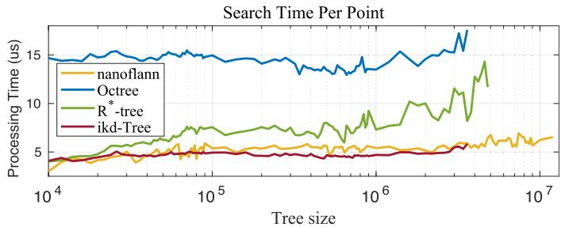

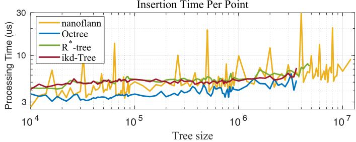  
Fig. 5. Data structure comparison over different tree size. The upper figure shows the average processing time of searching five nearest neighbors. The bottom figure shows the average processing time of inserting one point to the data structure.

Section V-A), it is achieved by removing points within the specified cuboid $\mathbf { C } _ { O }$ one by one according to the point indices obtained from the respective range or radius search.

All the four data structure implementations are integrated with FAST-LIO2, and their time performance are evaluated on 18 sequences of different sizes. We run the FAST-LIO2 with each data structure for each sequence and record the time for kNN search, point insertion (with map downsampling), boxwise delete due to map move, the number of new scan points, and the number of map points (i.e., tree size) at each step. The number of nearest neighbors to find is five.

2) Comparison Results: We first compare the time consumption of point insertion (with map downsampling) and kNN search at different tree sizes across all the 18 sequences. For each evaluated tree size S, we collect the processing time at tree size in range of [0.95s, 1.05s] to obtain a sufficient number of samples. Fig. 5 shows the average time consumption of insertion and kNN search per single target point. The octree achieves the best performance in point insertion, albeit the gap with the other is small (below $1 ~ \mu \mathrm { s } )$ , but its inquiry time is much higher due to the unbalanced tree structure. For nanoflann k-d tree, the insertion time is often slightly shorter than the ikd-Tree and $\mathrm { R ^ { * } } { \mathrm { - t r e e } }$ , but huge peaks occasionally occur due to its logarithmic structure of organizing a series of k-d trees. Such peaks severely degrade the real-time ability, especially when maintaining a large map. For k-nearest neighbor search, nanoflann k-d tree consumes slightly higher time than our ikd-Tree, especially when the tree size becomes large $( 1 0 ^ { 5 } - 1 0 ^ { 6 } )$ . The R∗-tree achieves a similar insertion time with ikd-Tree but with a significantly higher search time for large tree sizes. Finally, we can see that the time of insertion with on-tree downsampling and k NN search of ikd-Tree is indeed proportional to log n, which is consistent with the time complexity analysis in Section V-F.

TABLE III  
COMPARISON OF AVERAGE TIME CONSUMPTION PER SCAN ON INCREMENTAL UPDATES, kNN SEARCH, AND TOTAL TIME
<table><tr><td rowspan="2"></td><td colspan="4">Incremental Update [ms]</td><td colspan="4">kNN Searchb [ms]</td><td colspan="4">Total [ms]</td></tr><tr><td>ikd-Tree</td><td>nanoflann</td><td>Octree</td><td> $\mathrm { R ^ { * } } { \mathrm { - t r e e } }$ </td><td>ikd-Tree</td><td>nanoflann</td><td>Octree</td><td> ${ \mathrm { R } } ^ { * } { \mathrm { - t r e e } }$ </td><td>ikd-Tree</td><td>nanoflann</td><td>Octree</td><td> ${ \mathrm { R } } ^ { * } { \mathrm { - t r e e } }$ </td></tr><tr><td>utbm_1</td><td>3.23</td><td>3.43</td><td>2.12</td><td>3.94</td><td>15.19</td><td>15.80</td><td>42.88</td><td>22.56</td><td>18.42</td><td>19.22</td><td>45.00</td><td>26.50</td></tr><tr><td>utbm_2</td><td>3.40</td><td>3.65</td><td>2.24</td><td>4.18</td><td>15.52</td><td>16.09</td><td>44.70</td><td>23.46</td><td>18.93</td><td>19.75</td><td>46.94</td><td>27.64</td></tr><tr><td>utbm_3</td><td>3.77</td><td>4.17</td><td>2.36</td><td>4.52</td><td>16.83</td><td>18.54</td><td>45.72</td><td>23.12</td><td>20.60</td><td>22.70</td><td>48.08</td><td>27.64</td></tr><tr><td>utbm_4</td><td>3.52</td><td>3.70</td><td>2.26</td><td>4.32</td><td>16.53</td><td>17.60</td><td>44.80</td><td>24.74</td><td>20.06</td><td>21.30</td><td>47.06</td><td>29.06</td></tr><tr><td>utbm_5</td><td>3.34</td><td>3.60</td><td>2.21</td><td>4.21</td><td>15.51</td><td>16.65</td><td>45.42</td><td>23.38</td><td>18.85</td><td>20.25</td><td>47.63</td><td>27.58</td></tr><tr><td>utbm_6</td><td>3.61</td><td>4.12</td><td>2.34</td><td>4.60</td><td>16.25</td><td>17.14</td><td>43.06</td><td>23.49</td><td>19.86</td><td>21.27</td><td>45.40</td><td>28.09</td></tr><tr><td>utbm_7</td><td>3.82</td><td>4.62</td><td>2.55</td><td>5.26</td><td>15.42</td><td>16.97</td><td>42.06</td><td>25.87</td><td>19.24</td><td>21.59</td><td>44.61</td><td>31.13</td></tr><tr><td>ulhk_1</td><td>1.97</td><td>1.87</td><td>1.12</td><td>2.30</td><td>18.23</td><td>21.73</td><td>48.30</td><td>23.45</td><td>20.20</td><td>23.60</td><td>49.43</td><td>25.75</td></tr><tr><td>ulhk_2</td><td>3.51</td><td>3.43</td><td>2.32</td><td>4.23</td><td>22.26</td><td>26.07</td><td>64.56</td><td>31.75</td><td>25.77</td><td>29.49</td><td>66.88</td><td>35.98</td></tr><tr><td>ulhk_3</td><td>1.60</td><td>1.58</td><td>1.10</td><td>1.93</td><td>13.62</td><td>14.87</td><td>42.65</td><td>20.49</td><td>15.22</td><td>16.45</td><td>43.74</td><td>22.42</td></tr><tr><td>nclt_1</td><td>1.14</td><td>1.59</td><td>0.99</td><td>2.07</td><td>14.50</td><td>18.83</td><td>41.58</td><td>28.07</td><td>15.64</td><td>20.41</td><td>42.57</td><td>30.14</td></tr><tr><td>nclt_2</td><td>1.35</td><td>2.04</td><td>1.36</td><td>2.66</td><td>14.68</td><td>18.99</td><td>46.56</td><td>29.20</td><td>16.03</td><td>21.03</td><td>47.91</td><td>31.86</td></tr><tr><td>nclt_3</td><td>1.00</td><td>1.42</td><td>1.03</td><td>2.20</td><td>14.41</td><td>19.25</td><td>46.19</td><td>30.10</td><td>15.42</td><td>20.67</td><td>47.22</td><td>32.29</td></tr><tr><td>lili_1</td><td>1.41</td><td>1.42</td><td>0.83</td><td>1.79</td><td>9.20</td><td>9.71</td><td>26.31</td><td>12.65</td><td>10.61</td><td>11.13</td><td>27.15</td><td>14.44</td></tr><tr><td>lili_2</td><td>1.53 1.10</td><td>1.50</td><td>0.84</td><td>1.81</td><td>8.94</td><td>9.27</td><td>26.18</td><td>13.43</td><td>10.47</td><td>10.77</td><td>27.02</td><td>15.24</td></tr><tr><td>lili_3</td><td>0.96</td><td>1.14 0.99</td><td>0.63</td><td>1.38</td><td>8.46</td><td>8.87</td><td>25.45</td><td>13.18</td><td>9.57</td><td>10.00</td><td>26.08</td><td>14.56</td></tr><tr><td>lili_4</td><td></td><td></td><td>0.62</td><td>1.39</td><td>10.69</td><td>11.97</td><td>32.55</td><td>15.71</td><td>11.65</td><td>12.96</td><td>33.17</td><td>17.10</td></tr><tr><td> $l i l i \_ 5$ </td><td>1.22</td><td>1.28</td><td>0.80</td><td>1.63</td><td>10.23</td><td>11.34</td><td>33.53</td><td>12.78</td><td>11.45</td><td>12.62</td><td>34.33</td><td>14.41</td></tr></table>

aAverage time consumption per scan of incremental updates, including pointwise insertion with on-tree downsampling and boxwise delete. bAverage time consumption per scan of single-thread kNN search.

For any map data structure to be used in LiDAR odometry and mapping, the total time for map inquiry (i.e., kNN search) and incremental map update (i.e., point insertion with downsampling and box-delete due to map move) ultimately affects the real-time ability. This total time is summarized in Table III. It is seen that octree performs the best in incremental updates in most datasets, followed closely by the ikd-Tree and the nanoflann k-d tree. In kNN search, the ikd-Tree has the best performance, while the ikd-Tree and nanoflann k-d tree outperform the other two by large margins, which is consistent with the past comparative study [42], [43]. The ikd-Tree achieves the best overall performance among all other data structures.

We should remark that while the nanoflann k-d tree achieves seemly similar performance with ikd-Tree, the peak insertion time has more profound causes, and its impact on LiDAR odometry and mapping is severe. The nanoflann k-d tree deletes a point by only masking it without actually deleting it from the tree. Consequently, even with map downsampling and map move, the deleted points remain on the tree affecting the subsequent inquiry and insertion performance. The resultant tree size grows much quicker than ikd-Tree and others, a phenomenon also observed from Fig. 5. The effect could be small for short sequences (ulhk and lili) but becomes evident for long sequences (utbm and nclt). The tree size of nanoflann k-d tree exceeds $6 \times 1 0 ^ { 6 }$ in utbm datasets and $1 0 ^ { 7 }$ in nclt datasets, whereas the maximal tree size of ikd-Tree reaches $2 \times 1 0 ^ { 6 }$ and $3 . 6 \times 1 0 ^ { 6 }$ , respectively. The maximal processing time of incremental updates on nanoflann all exceeds 3 s in seven utbm datasets and 7 s in three nclt datasets, while our ikd-Tree keeps the maximal processing time at 214.4 ms in $n c l t \_ 2$ and smaller than 150 ms in the rest 17 sequences. While this peaked processing time of nanoflann does not heavily affect the overall real-time ability due to its low occurrence, it causes a catastrophic delay for subsequent control.

## C. Accuracy Evaluation

In this section, we compare the overall system FAST-LIO2 against other state-of-the-art LiDAR-inertial odometry and mapping systems, including LILI-OM [17], LIO-SAM [29], and LINS [30]. Since FAST-LIO2 is an odometry without any loop detection or correction, for the sake of fair comparison, the loop closure module of LILI-OM and LIO-SAM was deactivated, while all other functions, such as sliding window optimization, are enabled. We also perform ablation study on FAST-LIO2: to understand the influence of the map size, we run the algorithm in various map sizes L of 2000, 800, 600, and besides the default 1000 m; to evaluate the effectiveness of direct method against feature-based methods, we add a feature extraction module from FAST-LIO [22] (optimized for solid-state LiDAR) and BALM [20] (optimized for spinning LiDAR). The results are reported under the keyword “Feature.” All the experiments are conducted in the Manifold 2-C platform (Intel).

We perform evaluations on all the five datasets: lili, lisam, utbm, ulhk, and nclt. Since not all sequences have ground truth (affected by the weather, GPS quality, etc.), we select a total of19 sequences from the five datasets. These 19 sequences either have a good ground truth trajectory (as recommended by the dataset author) or end at the starting position. Therefore, two criteria, absolute translational error (RMSE) and end-to-end error, are computed and evaluated.

1) RMSE Benchmark: The RMSE are computed and reported in Table IV. It is seen that increasing the map size of FAST-LIO2 increases the overall accuracy as the new scan is registered to older historical points. When the map size is over 2000 m, the accuracy increment is not persistent as the odometry drift may cause possible false point matches with too old map points, a typical phenomenon of any odometry. Moreover, the direct method outperforms the feature-based variant of FAST-LIO2 in most sequences except for two, nclt\_4 and nclt\_6, where the difference is tiny and negligible. This proves the effectiveness of the direct method.

TABLE IV  
ABSOLUTE TRANSLATIONAL ERRORS (RMSE, METERS) IN SEQUENCES WITH GOOD QUALITY GROUND TRUTH
<table><tr><td></td><td>utbm_8</td><td>utbm_9</td><td>utbm_10</td><td>ulhk_4</td><td>nclt_4</td><td>nclt_5</td><td>nclt_6</td><td>nclt_7</td><td>nclt_8</td><td>nclt_9</td><td>nclt_10</td><td>liosam_1</td></tr><tr><td>FAST-LIO2 (2000m)</td><td>25.3</td><td>51.6</td><td>16.89</td><td>2.57</td><td>3.15</td><td>5.41</td><td>7.54</td><td>2.59</td><td>8.21</td><td>5.72</td><td>1.68</td><td>4.62</td></tr><tr><td>FAST-LIO2 (1000m)</td><td>27.29</td><td>51.6</td><td>16.8</td><td>2.57</td><td>3.21</td><td>5.42</td><td>7.55</td><td>2.21</td><td>5.88</td><td>5.56</td><td>1.62</td><td>4.58</td></tr><tr><td>FAST-LIO2 (800m)</td><td>25.8</td><td>51.86</td><td>17.23</td><td>2.57</td><td>3.25</td><td>5.4</td><td>7.55</td><td>2.49</td><td>6.49</td><td>5.95</td><td>1.67</td><td>4.58</td></tr><tr><td>FAST-LIO2 (600m)</td><td>27.75</td><td>52.09</td><td>17.3</td><td>2.57</td><td>3.05</td><td>5.41</td><td>7.58</td><td>2.47</td><td>6.47</td><td>5.8</td><td>1.69</td><td>4.58</td></tr><tr><td>FAST-LIO2 (Feature)</td><td>27.21</td><td>53.81</td><td>22.59</td><td>2.61</td><td>2.86</td><td>6.43</td><td>7.41</td><td>2.63</td><td>9.36</td><td>6.09</td><td>1.71</td><td>7.85</td></tr><tr><td>LILI-OM</td><td>59.48</td><td>782.11</td><td>17.59</td><td>2.29</td><td>11.6</td><td>11.5</td><td>275</td><td>13.1</td><td>21.5</td><td>5.2</td><td>68.9</td><td>18.78</td></tr><tr><td>LIO-SAM</td><td>a</td><td></td><td></td><td>3.52</td><td>1163</td><td>6.82</td><td>xb</td><td>23.3</td><td>27.0</td><td>7.9</td><td>1525</td><td>4.75</td></tr><tr><td>LINS</td><td>48.17</td><td>54.35</td><td>60.48</td><td>3.11</td><td>60.8</td><td>1135</td><td>128.76</td><td>397.2</td><td>107.3</td><td>11.86</td><td>3155</td><td>880.92</td></tr></table>

a Dataset utbm does not produce the attitude quaternion data, which is necessary for LIO-SAM; therefore, LIO-SAM does not work on all the sequences in utbm dataset, denoted as –.  
b ×denotes that the system totally failed.  
The bold values stand for the best result of each data sequence.

Compared with other LIO methods, FAST-LIO2 or its variant achieves the best performances in 17 of all 19 data sequences and is the most robust LIO method among all the experiments. The only two exceptions are on ulhk\_4 and nclt\_9, where LILI-OM shows slightly higher accuracy than FAST-LIO. Notably, LILI-OM shows very large drift in utbm\_9, nclt\_4, nclt\_6, nclt\_8, and nclt\_10. The reason is that its sliding-window back-end fusion (mapping) fails as the map point number grows large. Hence, its pose estimation relies solely on the front-end odometry that quickly accumulates the drift. LINS works similarly badly in nclt\_5, nclt\_6, nclt\_7, and nclt\_10. LIO-SAM also shows a large drift at nclt\_4 and nclt\_10 due to the failure of back-end factor graph optimization with the very long time and long-distance data. The video of an example, nclt\_10 sequence, is available online.8 Besides, on other sequences where LILI-OM, LIO-SAM, and LINS can work normally, their performance is still outperformed by FAST-LIO2 with large margins. Finally, it should be noted that the sequence liosam\_1 is directly drawn from the work LIO-SAM [29] so the algorithm has been well tuned for the data. However, FAST-LIO2 still achieves a higher accuracy.

2) Drift Benchmark: The end-to-end errors are reported in Table V. The overall trend is similar to the RMSE benchmark results. FAST-LIO2 or its variants achieves the lowest drift in five of the total seven sequences. We show an example, ulhk\_6 sequence, in the video available online.9 It should be noted that the LILI-OM has tuned parameters for each of their own sequences lili while parameters of FAST-LIO2 are kept the same among all the sequences. LIO-SAM shows good performance in its own sequences liosam\_2 and liosam\_3 but cannot keep it on other sequences, such as ulhk. The LINS performs worse than LIO-SAM in liosam and ulhk datasets and failed in liosam\_2 (garden sequence from [29]) because the two sequences are recorded with large rotation speeds, while the feature points used by LINS are too few. Also, in most of the sequences, the feature-based FAST-LIO performs similarly to the direct method except for the sequence lili\_7, which contains many trees and large open areas that feature extraction will remove many effective points from trees and faraway buildings.

TABLE V END TO END ERRORS (METERS)
<table><tr><td colspan="7"></td><td rowspan="2">Iiom2</td><td rowspan="2">3 liosam</td></tr><tr><td></td><td>&#x27;</td><td>Lii</td><td>li</td><td>uh</td><td>w−kk</td><td></td></tr><tr><td>FAST-LIO2 (2000m) FAST-LIO2</td><td>0.14</td><td>1.92</td><td>21.35</td><td>0.33</td><td>0.12</td><td>&lt;0.1</td><td>9.23</td></tr><tr><td>(1000m) FAST-LIO2</td><td>&lt;0.1</td><td>1.63</td><td>17.39</td><td>0.39</td><td>&lt;0.1</td><td>&lt;0.1</td><td>9.50</td></tr><tr><td>(800m)</td><td>&lt;0.1</td><td>1.88</td><td>21.59</td><td>0.40</td><td>&lt;0.1</td><td>&lt;0.1</td><td>9.49</td></tr><tr><td>FAST-LIO2 (600m)</td><td>0.22</td><td>1.37</td><td>23.74</td><td>0.39</td><td>&lt;0.1</td><td>&lt;0.1</td><td>9.23</td></tr><tr><td>FAST-LIO2 (Feature)</td><td>0.20</td><td>3.89</td><td>21.99</td><td>0.32</td><td>&lt;0.1</td><td>&lt;0.1</td><td>12.11</td></tr><tr><td>LILI-OM</td><td>0.80 a</td><td>4.13</td><td>15.60</td><td>1.84</td><td>7.89</td><td>1.95</td><td>13.79</td></tr><tr><td>LIO-SAM</td><td></td><td></td><td></td><td>0.83</td><td>2.88</td><td>&lt;0.1</td><td>8.61</td></tr><tr><td>LINS</td><td></td><td></td><td></td><td>0.90</td><td>6.92</td><td>xb</td><td>29.90</td></tr></table>

aSince the LIO-SAM and LINS are both developed only for spinning LiDAR, they do not work on the lili dataset, which is recorded by a solid-state LiDAR Livox Horizon. b × denotes that the system totally failed.  
The bold values stand for the best result of each data sequence.

## D. Processing Time Evaluation

Table VI tabulates the processing time of FAST-LIO2 with different configurations, LILI-OM, LIO-SAM, and LINS in all the sequences. The FAST-LIO2 is an integrated odometry and mapping architecture, where at each step the map is updated following immediately the odometry update. Therefore, the total time (“Total” in Table VI) includes all possible procedures occurred in the odometry, including feature extraction if any (e.g., for the feature-based variant), motion compensation, kNN search, state estimation, and mapping. It should be noted that the mapping includes point insertion, boxwise delete, and tree rebalancing. On the other hand, LILI-OM, LIO-SAM, and LINS all have separate odometry (including feature extraction and rough pose estimation) and mapping (such as back-end fusion in LILI-OM [17], incremental smoothing and mapping in LIO-SAM [29], and map-refining in LINS [30]), whose average processing time per LiDAR scan are referred to as “Odo.” and “Map.,” respectively, in Table VI. The two processing time is summed up to compare with FAST-LIO2.

TABLE VI  
AVERAGE PROCESSING TIME PER SCAN BENCHMARK IN MILLISECONDS
<table><tr><td></td><td>FAST-LIO2 (2000)</td><td>FAST-LIO2 (1000)</td><td>FAST-LIO2 (800)</td><td>FAST-LIO2 (600)</td><td>FAST-LIO2 (Feature)</td><td>FAST-LIO2 (ARM)</td><td colspan="2">LILI-OM</td><td colspan="2">LIO-SAM</td><td colspan="2">LINS</td></tr><tr><td></td><td>Total</td><td>Total</td><td>Total</td><td>Total</td><td>Total</td><td>Total</td><td>Odo.</td><td> $\mathrm { M a p . }$ </td><td>Odo.</td><td>Map.</td><td>Odo.</td><td>Map.</td></tr><tr><td>lili_6</td><td>13.15</td><td>12.56</td><td>13.22</td><td>15.92</td><td>15.35</td><td>45.58</td><td>68.95</td><td>58.46</td><td></td><td></td><td></td><td></td></tr><tr><td> $l i l i { \_ } 7$ </td><td>16.93</td><td>17.61</td><td>20.39</td><td>19.72</td><td>21.13</td><td>65.89</td><td>40.01</td><td>83.71</td><td></td><td></td><td></td><td></td></tr><tr><td> $l i l i \_ { \delta }$ </td><td>14.73</td><td>15.31</td><td>17.73</td><td>17.15</td><td>18.37</td><td>57.29</td><td>61.80</td><td>79.11</td><td></td><td></td><td></td><td></td></tr><tr><td> $u t b m \_ { \delta }$ </td><td>21.72</td><td>22.05</td><td>21.39</td><td>20.82</td><td>21.16</td><td>100.00</td><td>65.29</td><td>84.76</td><td></td><td></td><td>37.44</td><td>153.92</td></tr><tr><td> $u t b m \_ { g }$ </td><td>28.26</td><td>25.44</td><td>21.41</td><td>21.35</td><td>17.46</td><td>91.05</td><td>68.94</td><td>97.90</td><td></td><td></td><td>38.82</td><td>154.06</td></tr><tr><td> $u t b m \_ I O$ </td><td>23.90</td><td>22.48</td><td>23.09</td><td>20.74</td><td>15.30</td><td>94.62</td><td>66.10</td><td>97.29</td><td></td><td></td><td>33.61</td><td>166.12</td></tr><tr><td> $u l h k \_ { 4 }$ </td><td>20.86</td><td>20.14</td><td>19.96</td><td>20.04</td><td>29.35</td><td>91.12</td><td>52.40</td><td>74.80</td><td>39.50</td><td>95.29</td><td>34.72</td><td>93.70</td></tr><tr><td> $u l h k \_ 5$ </td><td>24.10</td><td>23.90</td><td>23.96</td><td>23.75</td><td>28.70</td><td>68.04</td><td>53.56</td><td>47.68</td><td>25.68</td><td>127.63</td><td>28.01</td><td>99.13</td></tr><tr><td> $u l h k \_ { \delta }$ </td><td>30.52</td><td>31.56</td><td>30.15</td><td>29.25</td><td>31.94</td><td>92.38</td><td>64.46</td><td>70.43</td><td>15.16</td><td>164.36</td><td>41.54</td><td>199.96</td></tr><tr><td> $n c l t \_ { 4 }$ </td><td>15.65</td><td>15.72</td><td>15.79</td><td>15.75</td><td>19.98</td><td>69.09</td><td>62.49</td><td>98.46</td><td>13.38</td><td>184.03</td><td>46.43</td><td>188.40</td></tr><tr><td> $n c l t \_ 5$ </td><td>16.56</td><td>16.60</td><td>16.61</td><td>16.58</td><td>13.54</td><td>68.95</td><td>67.64</td><td>83.34</td><td>19.09</td><td>184.46</td><td>47.83</td><td>198.88</td></tr><tr><td> $n c l t \_ { 6 }$ </td><td>15.92</td><td>15.84</td><td>15.83</td><td>15.68</td><td>14.72</td><td>66.64</td><td>76.10</td><td>133.25</td><td>X</td><td>X</td><td>54.48</td><td>195.31</td></tr><tr><td> $n c l t \_7$ </td><td>16.79</td><td>16.87</td><td>16.82</td><td>16.63</td><td>15.16</td><td>70.24</td><td>67.65</td><td>81.69</td><td>29.50</td><td>211.18</td><td>56.94</td><td>197.71</td></tr><tr><td> $n c l t \_ { 8 }$ </td><td>14.29</td><td>14.25</td><td>14.32</td><td>14.14</td><td>7.94</td><td>57.03</td><td>53.54</td><td>57.54</td><td>16.30</td><td>163.09</td><td>53.53</td><td>144.95</td></tr><tr><td> $n c l t \_ s$ </td><td>13.73</td><td>13.65</td><td>13.60</td><td>13.64</td><td>10.30</td><td>54.82</td><td>42.84</td><td>68.86</td><td>12.79</td><td>118.35</td><td>46.12</td><td>149.45</td></tr><tr><td> $n c l t \_ I O$ </td><td>21.85</td><td>21.79</td><td>21.78</td><td>21.61</td><td>20.62</td><td>89.65</td><td>82.92</td><td>130.96</td><td>23.13</td><td>324.62</td><td>83.12</td><td>252.68</td></tr><tr><td> $l i o s a m _ { - } I$ </td><td>16.95</td><td>14.77</td><td>14.65</td><td>16.19</td><td>15.93</td><td>60.60</td><td>48.45</td><td>84.28</td><td>13.47</td><td>135.39</td><td>24.13</td><td>179.44</td></tr><tr><td> $l i o s a m \_ { 2 }$ </td><td>11.11</td><td>11.47</td><td>11.52</td><td>11.19</td><td>19.68</td><td>45.27</td><td>42.58</td><td>99.01</td><td>13.09</td><td>154.69</td><td>20.71</td><td>160.66</td></tr><tr><td> $l i o s a m \_ { 3 }$ </td><td>19.38</td><td>16.64</td><td>12.00</td><td>13.01</td><td>12.37</td><td>44.26</td><td>38.42</td><td>64.02</td><td>11.32</td><td>124.35</td><td>40.47</td><td>117.25</td></tr></table>

The bold values stand for the best result of each data sequence.

From Table VI, we can see that the FAST-LIO2 consumes considerably less time than other LIO methods, being 8× faster than LILI-OM, 10× faster than LIO-SAM, and 6× faster than LINS. Even if only considering the processing time for odometry of other methods, FAST-LIO2 is still faster in most sequences except for four. The overall processing time of fast-LIO2, including both odometry and mapping, is almost the same as the odometry part of LIO-SAM, 3× faster than LILI-OM and over 2× faster than LINS. Comparing the different variants of FAST-LIO2, the processing time for different map sizes are very similar, meaning that the mapping and kNN search with our ikd-Tree is insensitive to map size. Furthermore, the feature-based variant and direct method FAST-LIO2 have roughly similar processing times. Although feature extraction takes additional processing time to extract the feature points, it leads to much fewer points (hence less time) for the subsequent kNN search and state estimation. On the other hand, the direct method saves the feature extraction time for points registration. Allowed by the superior computation efficiency of FAST-LIO2, we further implemented it with the default map size (1000 m, see Section VI-C) on the Khadas VIM3 (ARM)-embedded computer. The run-time results show that FAST-LIO2 can also achieve 10 Hz real-time performance that has not been demonstrated on an ARM-based platform by any prior work.

## VII. REAL-WORLD EXPERIMENTS

## A. Platforms

Besides the benchmark evaluation where the datasets are mainly collected on the ground, we also test our FAST-LIO2 in a variety of challenging data collected by other platforms (see Fig. 6), including a 280-mm wheelbase quadrotor for the application of UAV navigation, a handheld platform for the application of mobile mapping, and a GPS-navigated 750-mm wheelbase quadrotor UAV for the application of aerial mapping. The 280-mm wheelbase quadrotor is used for indoor aggressive flight test, see Section VII-B2, so that the LiDAR is installed face forward. The 750-mm wheelbase quadrotor UAV, developed by Ambit-Geospatial company,10 is used for the aerial scanning, see Section VII-C, so that the LiDAR is facing down to the ground. In all platforms, we use a solid-state 3-D LiDAR Livox $\mathrm { A v i a } , ^ { 1 1 }$ which has a built-in IMU (model BMI088), a 70.4◦ (horizontal) $\times 7 7 . 2 ^ { \circ }$ (vertical) circular FoV, and an unconventional nonrepetitive scan pattern that is different from the Livox Horizon or Velodyne LiDARs used previously in Section VI. Since FAST-LIO2 does not extract features, it is naturally adaptable to this new LiDAR. In all the following experiments, FAST-LIO2 uses the default configurations (i.e., direct method with map size 1000 m). Unless stated otherwise, the scan rate is set at 100 Hz, and the computation platform is the DJI manifold 2-C used in the previous section.

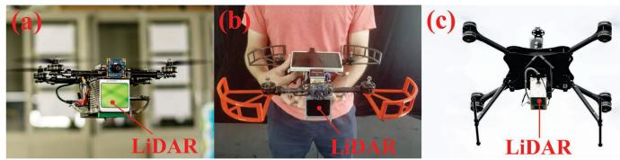  
Fig. 6. Three different platforms. (a) Small-scale quadrotor UAV with 280- mm wheelbase carrying a forward-looking Livox Avia LiDAR. (b) Handheld platforms. (c) Quadrotor UAV 750-mm wheelbase carrying a down-facing Livox Avia LiDAR. All three platforms carry the same DJI Manifold-2 C onboard computer. The video of real-world experiments is available online (see footnote 8).

## B. Private Dataset

1) Detail Evaluation ofProcessing Time: In order to validate the real-time performance of FAST-LIO2, we use the handheld platform to collect a sequence at 100 Hz scan rate in a large-scale outdoor–indoor hybrid scene. The sensor returns to the starting position after traveling around 650 m. It should be noted that the LILI-OM also supports solid-state LiDAR, but it fails in this data since its feature extraction module produces too few features at the 100 Hz scan rate. The map built by FAST-LIO2 in real-time is shown in Fig. 7, which shows small drift (i.e., 0.14 m) and good agreement with satellite maps.

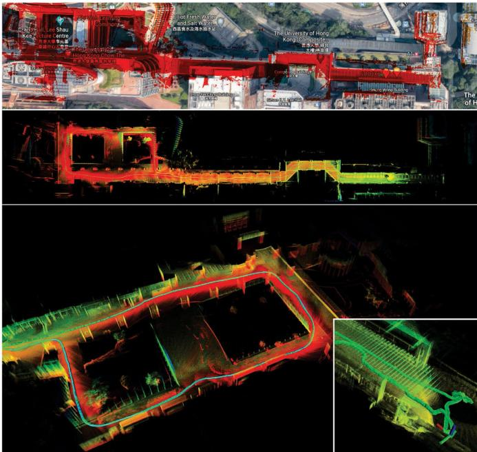  
Fig. 7. Large-scale scene experiment. The handheld platform is used to collect a sequence at 100 Hz scan rate in a large-scale outdoor–indoor hybrid scene (the Centennial campus of the University of Hong Kong).

TABLE VII  
MEAN TIME CONSUMPTION IN MILLISECONDS BY INDIVIDUAL COMPONENTS WHEN PROCESSING A LIDAR SCAN
<table><tr><td rowspan="2"></td><td>FAST-LIO</td><td colspan="2">FAST-LIO2</td></tr><tr><td>Intel</td><td>Intel</td><td>ARM</td></tr><tr><td>Preprocessing</td><td>0.03 ms</td><td>0.03 ms</td><td>0.05 ms</td></tr><tr><td>Feature extraction</td><td>0.90 ms</td><td>0 ms</td><td>0 ms</td></tr><tr><td>State estimation</td><td>0.99 ms</td><td>1.66 ms</td><td>4.75 ms</td></tr><tr><td>Mapping</td><td>13.81 ms</td><td>0.13 ms</td><td>0.43 ms</td></tr><tr><td>Total</td><td>15.83 ms</td><td>1.82 ms</td><td>5.23 ms</td></tr><tr><td>Num. of points used</td><td>447</td><td>756</td><td>756</td></tr><tr><td>Num. of threads</td><td>4</td><td>4</td><td>2</td></tr></table>

For the computation efficiency, we compare FAST-LIO2 with its predecessor FAST-LIO [22] on the Intel (manifold 2-C) computer. For FAST-LIO2, we additionally test on the ARM (Khadas VIM3) onboard computer. The difference between these two methods is that FAST-LIO is a feature-based method, and it retrieves map points in the current FoV to build a new static k-d tree for kNN search at every step. The detailed time consumption of individual components for processing a scan is given in Table VII. The preprocessing refers to data reception and formatting, which are identical for FAST-LIO and FAST-LIO2 and are below 0.1 ms. The feature extraction of FAST-LIO is

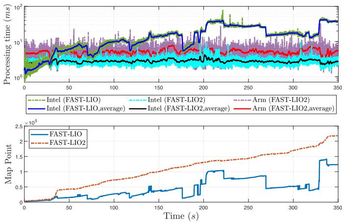  
Fig. 8. Processing time for each LiDAR scan of FAST-LIO and FAST-LIO2.

0.9 ms per scan, which is saved by FAST-LIO2. The feature extraction leads to fewer point numbers than FAST-LIO2 (447 versus 756), hence less time spent in state estimation (0.99 versus 1.66 ms). As a result, the overall odometry time of the two methods is nevertheless very close (1.92 ms for FAST-LIO versus 1.69 ms for FAST-LIO2). The difference between these two methods becomes drastic when looking at the mapping module, which includes map points retrieve and k-d tree building for FAST-LIO, and point insertion, boxwise delete due to map move, and tree rebalancing for FAST-LIO2. As can be seen, the averaging mapping time per scan for FAST-LIO exceeds 10 ms, hence cannot be processed in real-time for this large scene. On the other hand, the mapping time for FAST-LIO2 is well below the sampling period. The overall time for FAST-LIO2 when processing 756 points per scan, including both odometry and mapping, is only 1.82 ms for the Intel processor and 5.23 ms for the ARM processor.

The time consumption and the number of map points at each scan are shown in Fig. 8. As can be seen, the processing time for FAST-LIO2 running on the ARM processor occasionally exceeds the sampling period 10 ms, but this occurred very few and the average processing time is well below the sampling period. The occasional timeout usually does not affect a subsequent controller since the IMU-propagated state estimate could be used during this short period. On the Intel processor, the processing time for FAST-LIO2 is always below the sampling period. On the other hand, the processing time for FAST-LIO quickly grows above the sampling period due to the growing number of map points. Note that the considerably reduced processing time for FAST-LIO2 is achieved even at a much higher number of map points. Since FAST-LIO only retains map points within its current FoV, the number could drop if the LiDAR faces a new area containing few previously sampled map points. Even with fewer map points, the processing time for FAST-LIO is still much higher, as analyzed previously. Moreover, since FAST-LIO builds a new k-d tree at every step, the building time has a time complexity O(n log n) [40], where n is the number of map points in the current FoV. This is why the processing time for FAST-LIO is almost linearly correlated to the map size.

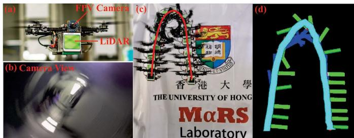  
Fig. 9. Flip experiment. (a) Small-scale UAV. (b) Onboard camera showing first-person view (FPV) images during the flip. (c) Third-person view images of the UAV during the flip. (d) Estimated UAV pose with FAST-LIO2.

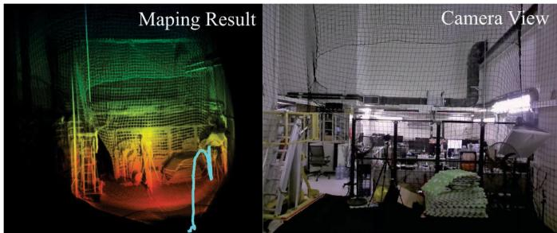  
Fig. 10. Actual environment and the 3-D map built by FAST-LIO2 during the flip.

In contrast, the incremental updates of our ikd-Tree has a time complexity of O(log n), leading to a much slower increment in processing time over map size.

2) Aggressive UAV Flight Experiment: In order to show the application of FAST-LIO2 in mobile robotic platforms, we deploy a small-scale quadrotor UAV carrying the Livox AVIA LiDAR sensor and conduct an aggressive flip experiment, as shown in Fig. 9. In this experiment, the UAV first takes off from the ground and hovers at the height of 1.2 m for a while, then it performs a quick flip, after which it returns to the hover flight under the control of an on-manifold model predictive controller [63] that takes state feedback from the FAST-LIO2. The pose estimated by FAST-LIO2 is shown in Fig. 9(d), which agrees well with the actual UAV pose. The real-time mapping (the point clouds are accumulated from the beginning, including all the scans during the flip) of the environment is shown in Fig. 10. In addition, Fig. 11 shows the position, attitude, angular velocity, and linear velocity during the experiments. The average and maximum angular velocity during the flip reaches 1023 deg/s and 1242 deg/s, respectively (from 44 to 44.5 s). The RMSE error during the flight (from 18.0 to 50.0 s) is 0.0186 m when compared to the ground-truth trajectory measured by a VICON motion capture system. FAST-LIO2 takes only 2.21 ms on average per scan, which suffices the real-time requirement of controllers. By providing a high-accuracy odometry and a high-resolution 3-D map of the environment at 100 Hz, FAST-LIO2 is very suitable for a robots’ real-time control and obstacle avoidance. For example, our prior work [64] demonstrated the application of FAST-LIO2 on an autonomous UAV avoiding dynamic small objects (down to 9 mm) in complex indoor and outdoor environments.

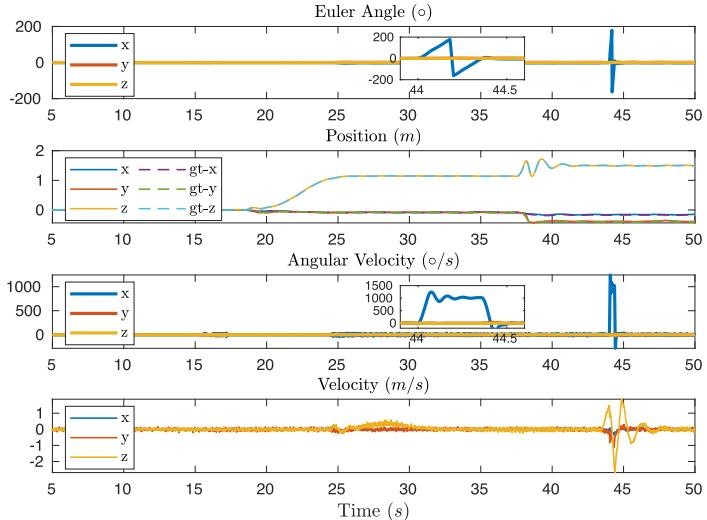  
Fig. 11. Attitude, position, angular velocity, and linear velocity in the UAV flip experiment. The notation “gt” stands for the position ground truth collected by a VICON motion capture system.

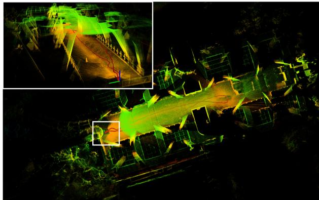  
Fig. 12. Mapping results of FAST-LIO2 in the fast motion handheld experiment.

3) Fast Motion Handheld Experiment: Here, we test FAST-LIO2 in a challenging fast motion with large velocity and angular velocity. The sensor is held on hands while rushing back and forth on a footbridge (see Fig. 12). Fig. 13 shows the attitude, position, angular velocity, linear velocity, and extrinsic estimates in the fast motion handheld experiments. It is seen that the maximum velocity reaches 7 m/s and angular velocity varies around ±100 deg/s. The initial states ofrotational and translation extrinsic are set to (5◦, 5◦, and 5◦) and (0, 0, and 0). It can be seen that both the rotational and translation extrinsic converge close to the ground truth with small differences possibly due to the manufacturing imperfections. In order to show the performance of FAST-LIO2, the experiment starts and ends at the same point. The end-to-end error in this experiment is less than 0.06 m (see Fig. 13), while the total trajectory length is 81 m.

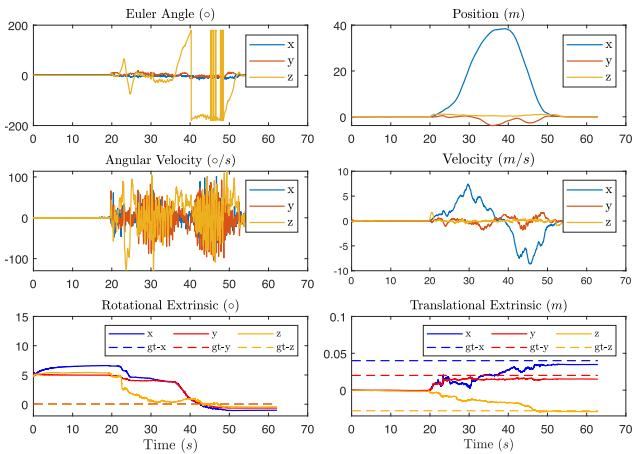  
Fig. 13. Attitude, position, angular velocity, linear velocity, rotational, and translational extrinsic in the fast motion handheld experiment. The extrinsic ground truth (denoted as gt in the figure) is obtained from the manufactuer’s manual. Note that the ground truth rotational extrinsic are all zeros, causing the gt-x, gt-y, and gt-z to overlap.

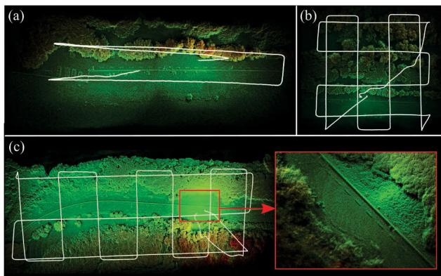  
Fig. 14. Real-time mapping results with FAST-LIO2 for airborne mapping. The data are collected in the Hong Kong Wetland Park by a UAV with a downfacing Livox Avia LiDAR. The flight heights are (a) 30 m, (b), 30 m, and (c) 50 m.

## C. Outdoor Aerial Experiment

One important application of 3-D LiDARs is airborne mapping. In order to validate FAST-LIO2 for this possible application, an aerial experiment is conducted. A larger UAV carrying our LiDAR sensor is deployed. The UAV is equipped with GPS, IMU, and other flight avionics and can perform automatic waypoints following based on the onboard GPS/IMU navigation. Note that the UAV-equipped GPS and IMU are only used for the UAV navigation, but not for FAST-LIO2, which uses data only from the LiDAR sensor. The LiDAR scan rate is set to 10 Hz in this experiment. A few flights are conducted in several locations in the Hong Kong Wetland Park at Nan Sang Wai, Hong Kong. The real-time mapping results are shown in Fig. 14. It is seen that FAST-LIO2 works quite well in these vegetation environments. Many fine structures, such as tree crowns, lane marks on the road, and road curbs, can be clearly seen. Fig. 14 also shows the flight trajectories computed by FAST-LIO2. We have visually compared these trajectories with the trajectories estimated by the UAV onboard GPS/IMU navigation, and they show good agreement. Due to technical difficulties, the GPS trajectories are not available here for quantitative evaluation. Finally, the average processing time per scan for these three environments is 19.6, 23.9, and 23.7 ms, respectively. It should be noted that the LILI-OM fails in all these three data sequences because the extracted features are too few when facing the ground.

## VIII. DISCUSSION

In this section, we discuss the proposed FAST-LIO2 framework in terms of efficiency, accuracy, robustness, and possible applications.

## A. Efficiency

Existing ICP-based LiDAR(-inertial) odometry methods, such as LOAM [23], LIO-SAM [29], LILI-OM [17], LINS [30], and our prior work [22], typically build a k-d tree of the pointcloud map from scratch, causing the building time to grow dynamically with the exploration of new areas. To bound this building time, only points in a local area are usually used to build the k-d tree, leading to a constant (and often significant) building time. In contrast, FAST-LIO2 uses an incremental k-d tree structure, ikd-Tree, which dynamically adds new points to the existing tree structure and only rebalances the updated (sub-)tree partially. This incremental update has a considerably lower computation cost than a complete k-d tree building and constitutes the key to the efficiency of FAST-LIO2. The resultant system is able to run at a very high odometry and mapping rate (e.g., up to 100 Hz) on computationally constrained platforms (UAV onboard computer and ARM-based processors).

## B. Accuracy

The accuracy of FAST-LIO2 benefits from twofold: direct registration of the raw LiDAR points (as opposed to feature points) and the use of larger local map (e.g., 1 km) in scan registration, both are enabled by our efficient map representation, ikd-Tree. The use of raw points enables to exploit more subtle features in the environments, while a larger local map establishes more geometrical constraints for registering a new scan. Since LiDARs points have extremely high temporal resolution, a temporal downsampling (e.g., one out of four LiDAR points) can effectively lower the computation load without affecting the accuracy. We also notice that further increasing the local map does not persistently improve the accuracy due to the possible false point matches caused by odometry drift.

The use of the center-most point in a downsampling cube leads to a more evenly distributed point map, which also contributes to the accuracy of FAST-LIO2. We also considered other alternative choices (e.g., mean or median point) and found they usually have lower accuracy. The primary reason is that the odometry drift will cause the new points, when added to the map, to bias the mean or median point in a downsampling cube. The biased map points will in turn further bias the plane estimation and, hence, the subsequent state estimate. Another drawback of using mean or median points is that they cause constant point update on the ikd-Tree, which leads to frequent tree rebuild and, hence, a higher computation cost.

Another possible way to improve the system accuracy is splitting a scan into multiple smaller subscans to be processed sequentially. The scan split will reduce the propagation time of IMU measurements, which in turn could improve the accuracy of the forward propagation for state prediction and the backward propagation for motion distortion compensation. However, fewer measurements in a subscan also make the state estimate more sensitive to false point matches. In FAST-LIO2, we choose 100 Hz update rate.

## C. Robustness

In Section VII, the FAST-LIO2 was proven to work stably in high angular speed (over 1000 deg/s) and high frame rate (100 Hz). Such robustness comes from two reasons: first, the direct raw point registration uses more LiDAR measurements in high frame rate and aggressive motion compared to the feature based methods; second, the timely updated (at the frame rate) map allows each new scan to be registered to map points of the most recent scans, which share large FoVs with the new scan. This allows FAST-LIO2 to reliably track even very fast robots motions.

## D. Applications

FAST-LIO2 is a computationally efficient, robust, and accurate odometry suitable for robots navigation and control. The dense point map it builds in real-time can be used for collision check in trajectory generation even in the presence of small dynamic obstacles [64], and the high-rate odometry provides low-latency feedback to controllers [63]. FAST-LIO2 could also be used in small-scale mapping applications where the odometry drift is not significant. For large-scale mapping, FAST-LIO2 can be used with additional back-end optimization, such as sliding window bundle adjustment [20] or incremental smoothing and mapping techniques [31], to achieve better long-term accuracy. A loop-closure module also can be easily integrated with FAST-LIO2.

FAST-LIO2 cannot work in completely degenerated environments where no geometrical structures exists in the LiDAR FoV (hence, no or very few LiDAR points). Examples include facing the LiDAR to open sea, sky, ground, single large wall, or in close proximity to objects (e.g., within 1 m) causing no points measurements. In these scenarios, FAST-LIO2 can be augmented by other sensors such as GPS and cameras [65].

## IX. CONCLUSION

This article proposed FAST-LIO2, a direct and robust LIO framework significantly faster than the current state-of-the-art LIO algorithms while achieving highly competitive or better accuracy in various datasets. The gain in speed is due to removing the feature extraction module and the highly efficient mapping. A novel incremental k-d tree (ikd-Tree) data structure, which supports dynamically point insertion, delete and parallel rebuilding, is developed and validated. A large amount of experiments in open datasets shows that the proposed ikd-Tree can achieve the best overall performance among the state-of-the-art data structure for kNN search in LiDAR odometry. As a result of the mapping efficiency, the accuracy and the robustness in fast motion and sparse scenes are also increased by utilizing more points in the odometry. A further benefit of FAST-LIO2 is that it is naturally adaptable to different LiDARs due to the removal of feature extraction, which has to be carefully designed for different LiDARs according to their respective scanning pattern and density.

DETAILS OF ALL THE SEQUENCES FOR THE BENCHMARK  
TABLE VIII
<table><tr><td>Name</td><td></td><td>Duration (min:sec)</td><td>Distance (km)</td></tr><tr><td>lili_1</td><td>FR-IOSB-Tree</td><td>2:58</td><td>0.36</td></tr><tr><td>lili_2</td><td>FR-IOSB-Long</td><td>6:00</td><td>1.16</td></tr><tr><td>lili_3</td><td>FR-IOSB-Short</td><td>4:39</td><td>0.49</td></tr><tr><td>lili_4</td><td>KA-URBAN-Campus-1</td><td>5:58</td><td>0.50</td></tr><tr><td>lili_5</td><td>KA-URBAN-Campus-2</td><td>2:07</td><td>0.20</td></tr><tr><td>lili_6</td><td>KA-URBAN-Schloss-1</td><td>10:37</td><td>0.65</td></tr><tr><td>lili_7</td><td>KA-URBAN-Schloss-2</td><td>12:17</td><td>1.10</td></tr><tr><td>lili_8</td><td>KA-URBAN-East</td><td>20:52</td><td>3.70</td></tr><tr><td> $u t b m \_ I$ </td><td>20180713</td><td>16:59</td><td>5.03</td></tr><tr><td>utbm_2</td><td>20180716</td><td>15:59</td><td>4.99</td></tr><tr><td>utbm_3</td><td>20180717</td><td>15:59</td><td>4.99</td></tr><tr><td>utbm_4</td><td>20180718</td><td>16:39</td><td>5.00</td></tr><tr><td>utbm_5</td><td>20180720</td><td>16:45</td><td>4.99</td></tr><tr><td>utbm_6</td><td>20190110</td><td>10:59</td><td>3.49</td></tr><tr><td>utbm_7</td><td>20190412</td><td>12:11</td><td>4.82</td></tr><tr><td>utbm_8</td><td>20180719</td><td>15:26</td><td>4.98</td></tr><tr><td>utbm_9</td><td>20190131</td><td>16:00</td><td>6.40</td></tr><tr><td>utbm_10</td><td>20190418</td><td>11:59</td><td>5.11</td></tr><tr><td>ulhk_1</td><td>HK-Data20190316-1</td><td>2:55</td><td>0.23</td></tr><tr><td>ulhk_2</td><td>HK-Data20190426-1</td><td>2:30</td><td>0.55</td></tr><tr><td>ulhk_3</td><td>HK-Data20190317</td><td>5:18</td><td>0.62</td></tr><tr><td>ulhk_4</td><td>HK-Data20190117</td><td>5:18</td><td>0.60</td></tr><tr><td> $u l h k \_ 5$ </td><td>HK-Data20190316-2</td><td>6:05</td><td>0.66</td></tr><tr><td> $u l h k \_ { \delta }$ </td><td>HK-Data20190426-2</td><td>4:20</td><td>0.74</td></tr><tr><td> $n c l t \_ I$ </td><td>20120118</td><td>93:53</td><td>6.60</td></tr><tr><td> $n c l t \_ 2$ </td><td>20120122</td><td>87:19</td><td>6.36</td></tr><tr><td> $n c l t \_ 3$ </td><td>20120202</td><td>98:37</td><td>6.45</td></tr><tr><td> $n c l t \_ { 4 }$ </td><td>20120115</td><td>111:46</td><td>4.01</td></tr><tr><td>nclt_5</td><td>20120429</td><td>43:17</td><td>1.86</td></tr><tr><td>nclt_6</td><td>20120511</td><td>84:32</td><td>3.13</td></tr><tr><td>nclt_7</td><td>20120615</td><td>55:10</td><td>1.62</td></tr><tr><td>nclt_8</td><td>20121201</td><td>75:50</td><td>2.27</td></tr><tr><td>nclt_9</td><td>20130110</td><td>17:02</td><td>0.26</td></tr><tr><td>nclt_10</td><td>20130405</td><td>69:06</td><td>1.40</td></tr><tr><td>liosam_1</td><td>park</td><td>9:11</td><td>0.66</td></tr><tr><td>liosam_2</td><td>garden</td><td>5:58</td><td>0.46</td></tr><tr><td>liosam_3</td><td>campus</td><td>16:26</td><td>1.44</td></tr></table>

As an odometry, FAST-LIO2 may drift over long distances. In the future, we could integrate loop closure [18] and LiDAR bundle adjustment [20] into FAST-LIO2 to correct this long-term drift. Furthermore, the fusion with other sensors, such as GPS or cameras [65], would be explored to enable FAST-LIO2 to work in partially or completely degenerated environments.

## APPENDIX

The detail information about all 37 sequences used in Section VI are listed in Table VIII.

## ACKNOWLEDGMENT

The authors would like to thank Livox Technology for the equipment support during the whole work. They would also like to thank Mr. Xiyuan Liu and Ambit-Geospatial for the help in the outdoor aerial experiment. They would also like to thank Mr. Guozheng Lu and Mr. Fangcheng Zhu for the help in the UAV controller design and Velodyne interface development.

## REFERENCES

[1] C. Forster, Z. Zhang, M. Gassner, M. Werlberger, and D. Scaramuzza, “SVO: Semidirect visual odometry for monocular and multicamera systems,” IEEE Trans. Robot., vol. 33, no. 2, pp. 249–265, Apr. 2017.

[2] C. Forster, L. Carlone, F. Dellaert, and D. Scaramuzza, “On-manifold preintegration for real-time visual-inertial odometry,” IEEE Trans. Robot., vol. 33, no. 1, pp. 1–21, Feb. 2017.

[3] T. Qin, P. Li, and S. Shen, “VINS-Mono: A robust and versatile monocular visual-inertial state estimator,” IEEE Trans. Robot., vol. 34, no. 4, pp. 1004–1020, Aug. 2018.

[4] C. Campos, R. Elvira, J. J. G. Rodríguez, J. M. Montiel, and J. D. Tardós, “ORB-SLAM3: An accurate open-source library for visual, visual-inertial, and multimap SLAM,” IEEE Trans. Robot., vol. 37, no. 6, pp. 1874–1890, Dec. 2021.

[5] R. Newcombe, “Dense visual SLAM,” Ph.D. dissertation, Dept. Comput., Imperial College London, London, U.K., 2012.

[6] M. Meilland, C. Barat, and A. Comport, “3D high dynamic range dense visual SLAM and its application to real-time object re-lighting,” in Proc. IEEE Int. Symp. Mixed Augmented Reality, 2013, pp. 143–152.

[7] M. Bloesch, J. Czarnowski, R. Clark, S. Leutenegger, and A. J. Davison, “CodeSLAM–Learning a compact, optimisable representation for dense visual SLAM,” in Proc. IEEE Conf. Comput. Vis. Pattern Recognit., 2018, pp. 2560–2568.

[8] C. Kerl, J. Sturm, and D. Cremers, “Dense visual slam for RGB-D cameras,” in Proc. IEEE/RSJInt. Conf. Intell. Robots Syst., 2013, pp. 2100– 2106.

[9] S. Thrun et al., “Stanley: The robot that won the DARPA Grand Challenge,” J. Field Robot., vol. 23, no. 9, pp. 661–692, 2006.

[10] C. Urmson et al., “Autonomous driving in urban environments: Boss and the urban challenge,” J. Field Robot., vol. 25, no. 8, pp. 425–466, 2008.

[11] J. Levinson et al., “Towards fully autonomous driving: Systems and algorithms,” in Proc. IEEE Intell. Veh. Symp. (IV), 2011, pp. 163–168.

[12] S. Liu et al., “Planning dynamically feasible trajectories for quadrotors using safe flight corridors in 3-D complex environments,” IEEE Robot. Automat. Lett., vol. 2, no. 3, pp. 1688–1695, Jul. 2017.

[13] F. Gao, W. Wu, W. Gao, and S. Shen, “Flying on point clouds: Online trajectory generation and autonomous navigation for quadrotors in cluttered environments,” J. Field Robot., vol. 36, no. 4, pp. 710–733, 2019.

[14] D. Wang, C. Watkins, and H. Xie, “Mems mirrors for LiDAR: A review,” Micromachines, vol. 11, no. 5, 2020, Art. no. 456.

[15] Z. Liu, F. Zhang, and X. Hong, “Low-cost retina-like robotic LiDARs based on incommensurable scanning,” IEEE/ASME Trans. Mechatronics, early access, Feb. 9, 2021, doi: 10.1109/TMECH.2021.3058173.

[16] J. Lin and F. Zhang, “Loam Livox: A fast, robust, high-precision LiDAR odometry and mapping package for LiDARs of small FOV,” in Proc. IEEE Int. Conf. Robot. Automat., 2020, pp. 3126–3131.

[17] K. Li, M. Li, and U. D. Hanebeck, “Towards high-performance solidstate-LiDAR-inertial odometry and mapping,” IEEE Robot.Automat. Lett., vol. 6, no. 3, pp. 5167–5174, Jul. 2021.

[18] J. Lin and F. Zhang, “A fast, complete, point cloud based loop closure for LiDAR odometry and mapping,” 2019, arXiv:1909.11811.

[19] H. Wang, C. Wang, and L. Xie, “Lightweight 3-D localization and mapping for solid-state LiDAR,” IEEE Robot. Automat. Lett., vol. 6, no. 2, pp. 1801–1807, Apr. 2021.

[20] Z. Liu and F. Zhang, “BALM: Bundle adjustment for LiDAR mapping,” IEEE Robot. Automat. Lett., vol. 6, no. 2, pp. 3184–3191, Apr. 2021.

[21] C. Forster, M. Pizzoli, and D. Scaramuzza, “SVO: Fast semi-direct monocular visual odometry,” in Proc. IEEE Int. Conf. Robot. Automat., 2014, pp. 15–22.

[22] W. Xu and F. Zhang, “FAST-LIO: A fast, robust LiDAR-inertial odometry package by tightly-coupled iterated Kalman filter,” IEEE Robot. Automat. Lett., vol. 6, no. 2, pp. 3317–3324, Apr. 2021.

[23] J. Zhang and S. Singh, “LOAM: LiDAR odometry and mapping in realtime,” in Robot., Sci. Syst., vol. 2, no. 9, 2014.

[24] G. C. Sharp, S. W. Lee, and D. K. Wehe, “ICP registration using invariant features,” IEEE Trans. Pattern Anal. Mach. Intell., vol. 24, no. 1, pp. 90–102, Jan. 2002.

[25] K.-L. Low, “Linear least-squares optimization for point-to-plane ICP surface registration,” Univ. North Carolina, Chapel Hill, NC, USA, Tech. Rep. TR04-004, 2004.

[26] A. Segal, D. Haehnel, and S. Thrun, “Generalized-ICP,” Robot., Sci. Syst., vol. 2, no. 4, 2009, Art. no. 435.

[27] T. Shan and B. Englot, “LeGO-LOAM: Lightweight and ground-optimized LiDAR odometry and mapping on variable terrain,” in Proc. IEEE/RSJInt. Conf. Intell. Robots Syst., 2018, pp. 4758–4765.

[28] H. Ye, Y. Chen, and M. Liu, “Tightly coupled 3D LiDAR inertial odometry and mapping,” in Proc. Int. Conf. Robot. Automat., 2019, pp. 3144–3150.

[29] T. Shan, B. Englot, D. Meyers, W. Wang, C. Ratti, and D. Rus, “LIO-SAM: Tightly-coupled LiDAR inertial odometry via smoothing and mapping,” in Proc. IEEE/RSJ Int. Conf. Intell. Robots Syst., 2020, pp. 5135–5142.

[30] C. Qin, H. Ye, C. E. Pranata, J. Han, S. Zhang, and M. Liu, “LINS: A LiDAR-inertial state estimator for robust and efficient navigation,” in Proc. IEEE Int. Conf. Robot. Automat., 2020, pp. 8899–8906.

[31] M. Kaess, H. Johannsson, R. Roberts, V. Ila, J. J. Leonard, and F. Dellaert, “ISAM2: Incremental smoothing and mapping using the Bayes tree,” Int. J. Robot. Res., vol. 31, no. 2, pp. 216–235, 2012.

[32] A. Tagliabue et al., “LION: LiDAR-inertial observability-aware navigator for vision-denied environments,” in Proc. Int. Symp. Exp. Robot., 2020, pp. 380–390.

[33] K. Koide, M. Yokozuka, S. Oishi, and A. Banno, “Voxelized GICP for fast and accurate 3D point cloud registration,” in IEEE Int. Conf. Robot. Automat., 2021, pp. 11054–11059.

[34] P. Biber and W. Straßer, “The normal distributions transform: A new approach to laser scan matching,” in Proc. IEEE/RSJ Int. Conf. Intell. Robots Syst. (Cat. No. 03CH37453), 2003, vol. 3, pp. 2743–2748.

[35] M. Magnusson, “The three-dimensional normal-distributions transform: An efficient representation for registration, surface analysis, and loop detection,” Ph.D. dissertation, Sch. Sci. Technol., Örebro Universitet, ÖrÖebro, Sweden, 2009.

[36] M. Magnusson, A. Nuchter, C. Lorken, A. J. Lilienthal, and J. Hertzberg, “Evaluation of 3D registration reliability and speed-A comparison of ICP and NDT,” in Proc. IEEE Int. Conf. Robot. Automat., 2009, pp. 3907–3912.

[37] A. Guttman, “R-Trees: A dynamic index structure for spatial searching,” in Proc. ACM SIGMOD Int. Conf. Manage. Data, 1984, pp. 47–57.

[38] N. Beckmann, H.-P. Kriegel, R. Schneider, and B. Seeger, “The R\*-tree: An efficient and robust access method for points and rectangles,” in Proc. ACM SIGMOD Int. Conf. Manage. Data, 1990, pp. 322–331.

[39] D. Meagher, “Geometric modeling using octree encoding,” Comput. Graph. Image Process., vol. 19, no. 2, pp. 129–147, 1982.

[40] J. L. Bentley, “Multidimensional binary search trees used for associative searching,” Commun. ACM, vol. 18, no. 9, pp. 509–517, 1975.

[41] J. H. Friedman, J. L. Bentley, and R. A. Finkel, “An algorithm for finding best matches in logarithmic expected time,” ACM Trans. Math. Softw., vol. 3, no. 3, pp. 209–226, 1977.

[42] J. L. Vermeulen, A. Hillebrand, and R. Geraerts, “A comparative study of K-nearest neighbour techniques in crowd simulation,” Comput. Animation Virtual Worlds, vol. 28, no. 3-4, 2017, Art. no. e1775.

[43] J. Elseberg, S. Magnenat, R. Siegwart, and A. Nüchter, “Comparison of nearest-neighbor-search strategies and implementations for efficient shape registration,” J. Softw. Eng. Robot., vol. 3, no. 1, pp. 2–12, 2012.

[44] S. Arya and D. Mount, “ANN: Library for approximate nearest neighbor searching,” in Proc. IEEE CGC Workshop Comput. Geometry, 1998.

[45] M. Muja and D. G. Lowe, “Fast approximate nearest neighbors with automatic algorithm configuration,” in Proc. 4th Int. Conf. Comput. Vis. Theory Appl. Volume, 1.

[46] W. Hunt, W. R. Mark, and G. Stoll, “Fast KD-tree construction with an adaptive error-bounded heuristic,” in Proc. IEEE Symp. Interactive Ray Tracing, 2006, pp. 81–88.

[47] S. Popov, J. Gunther, H.-P. Seidel, and P. Slusallek, “Experiences with streaming construction ofSAH KD-trees,” in Proc. IEEE Symp. Interactive Ray Tracing, 2006, pp. 89–94.

[48] M. Shevtsov, A. Soupikov, and A. Kapustin, “Highly parallel fast kdtree construction for interactive ray tracing of dynamic scenes,” Comput. Graph. Forum, vol. 26, no. 3, pp. 395–404, 2007.

[49] K. Zhou, Q. Hou, R. Wang, and B. Guo, “Real-time KD-tree construction on graphics hardware,” ACM Trans. Graph., vol. 27, no. 5, pp. 1–11, 2008.

[50] I. Galperin and R. L. Rivest, “Scapegoat trees,” in Proc. 4th Annu. ACM-SIAM Symp. Discrete Algorithms, 1993, vol. 93, pp. 165–174.

[51] J. L. Bentley and J. B. Saxe, “Decomposable searching problems I: Staticto-dynamic transformation,” J. Algorithms, vol. 1, no. 4, pp. 301–358, 1980.

[52] M. H. Overmars, The Design ofDynamic Data Structures, vol. 156. Berlin, Germany: Springer, 1987.

[53] O. Procopiuc, P. K. Agarwal, L. Arge, and J. S. Vitter, “BKD-Tree: A dynamic scalable kd-tree,” in Proc. Int. Symp. Spatial Temporal Databases, 2003, pp. 46–65.

[54] J. L. Blanco and P. K. Rai, “Nanoflann: AC header-only fork of FLANN, A library for nearest neighbor (NN) with kd-trees,” 2014. [Online]. Available: https://github.com/jlblancoc/nanoflann(v1.3.2)

[55] C. Hertzberg, R. Wagner, U. Frese, and L. Schröder, “Integrating generic sensor fusion algorithms with sound state representations through encapsulation of manifolds,” Inf. Fusion, vol. 14, no. 1, pp. 57–77, 2013.

[56] D. He, W. Xu, and F. Zhang, “Embedding manifold structures into Kalman filters,” 2021, arXiv:2102.03804.

[57] P. Chanzy, L. Devroye, and C. Zamora-Cura, “Analysis of range search for random kd trees,” Acta Informatica, vol. 37, no. 4-5, pp. 355–383, 2001.

[58] Z. Yan, L. Sun, T. Krajnik, and Y. Ruichek, “EU long-term dataset with multiple sensors for autonomous driving,” in Proc. IEEE/RSJ Int. Conf. Intell. Robots Syst., 2020, pp. 10697–10704.

[59] W. Wen et al., “UrbanLoco: A full sensor suite dataset for mapping and localization in urban scenes,” in Proc. IEEE Int. Conf. Robot. Automat., 2020, pp. 2310–2316.

[60] N. Carlevaris-Bianco, A. K. Ushani, and R. M. Eustice, “University of michigan north campus long-term vision and LiDAR dataset,” Int. J. Robot. Res., vol. 35, no. 9, pp. 1023–1035, 2016.

[61] G. Barend, L. Bruno, L. Mateusz, W. Adam, K. Menelaos, and F. Vissarion, “Boost geometry library,” Sep. 2017. [Online]. Available: https: //www.boost.org/doc/libs/1\_65\_1/libs/geometry/

[62] R. B. Rusu and S. Cousins, “3D is here: Point cloud library (PCL),” in Proc. IEEE Int. Conf. Robot. Automat., 2011, pp. 1–4.

[63] G. Lu, W. Xu, and F. Zhang, “Model predictive control for trajectory tracking on differentiable manifolds,” 2021, arXiv:2106.15233.

[64] F. Kong, W. Xu, Y. Cai, and F. Zhang, “Avoiding dynamic small obstacles with onboard sensing and computation on aerial robots,” IEEE Robot Automat. Lett., vol. 6, no. 4, pp. 7869–7876, Oct. 2021.

[65] J. Lin, C. Zheng, W. Xu, and F. Zhang, “R2 live: A robust, real-time, LiDAR-inertial-visual tightly-coupled state estimator and mapping,” IEEE Robot. Automat. Lett., vol. 6, no. 4, pp. 7469–7476, Oct. 2021.