# Faster-LIO: Lightweight Tightly Coupled Lidar-Inertial Odometry Using Parallel Sparse Incremental Voxels

Chunge Bai , Tao Xiao, Yajie Chen, Haoqian Wang , Member, IEEE, Fang Zhang, and Xiang Gao

Abstract—This letter presents an incremental voxel-based lidarinertial odometry (LIO) method for fast-tracking spinning and solid-state lidar scans. To achieve the high tracking speed, we neither use complicated tree-based structures to divide the spatial point cloud nor the strict k nearest neighbor (k-NN) queries to compute the point matching. Instead, we use the incremental voxels (iVox) as our point cloud spatial data structure, which is modified from the traditional voxels and supports incremental insertion and parallel approximated k-NN queries. We propose the linear iVox and PHC (Pseudo Hilbert Curve) iVox as two alternative underlying structures in our algorithm. The experiments show that the speed ofiVox reaches 1000–2000 Hz per scan in solid-state lidars and over 200 Hz for 32 lines spinning lidars only with a modern CPU while still preserving the same level of accuracy.

Index Terms—Lidar-inertial odometry, SLAM, nearest neighbor.

## I. INTRODUCTION

IGH-SPEED point cloud registration and threemany manufactured products-from high-definition maps (HD maps) [1]–[3] to autonomous vehicles [4], [5]. The most common real-time lidar tracking methods like LOAM [6], LeGO-LOAM [7] and BALM [8] require about 100 milliseconds per iteration to process a lidar scan. Most of the conventional spinning lidars provide multiple lines scans at this speed. As optical technology develops, modern solid-state lidar sensors like Livox and Cepton can provide dense point cloud scans in high frequencies like 100 Hz or even higher [9], [10]. It follows that looking for a highly efficient lidar tracking method has become an important research issue recently [11], [12]. For many real robots or vehicles, LIO is not the only algorithm running in the system. All the active modules must share the computation resource. The system would be more robust if we had a faster and more lightweight LIO. Besides, a faster LIO approach can also be used as the front-end of offline mapping systems to help reduce the computation time.

A lidar or vision-based SLAM system typically consists of a real-time front-end for point cloud tracking and a back-end for state optimization [13]–[15]. In a real-world lidar odometry system, people will also fuse inertial and GPS measurements into the state estimator in a loosely or tightly coupled form to make the system more robust against short-time sensor failures [16], [17]. It is not that easy to theoretically analyze the computation cost of a whole complicated SLAM system. However, generally speaking, for the front-end part (the LO/LIO module), the computation time cost basically comes from the following aspects:

The chosen spatial data structure. Since traditional registration methods normally rely on k nearest neighbor (k-NN) searching in point clouds, the registration efficiency can be improved by exploiting faster k-NN data structures [19]. Some of the data structures like R∗-tree [20], B∗-tree [21], designed for unvarying spatial databases, are unsuitable for real-time LIO, as LIO requires both fast construction and querying speed. Moreover, it would be even better to update the structure incrementally since the point cloud is sequentially processed. Thus, voxels and k-d trees (and their variants) [22], [23] are the better choices for LO/LIO system. Of course, voxels and k-d trees still have their limits. The voxels are easy to construct and delete almost in constant time but are incapable of strict k-NN search or range search. The k-d trees can provide strict k-NN search and range search results but require extra efforts to swing and balance the tree.

1) The state estimator formation: The pose estimator also affects the computation cost of an LIO module. In modern VIO or LIO systems, people tend to choose a compromise solution between the conventional, single-frame Kalman filter and full pose graph optimization/bundle adjustment, like sliding window filters (SWF) [24], multiple state constraints Kalman filters (MSCKF) [25], or iterated extended Kalman filters (IEKF) [26]. They both have the advantage of small computation costs like filters and relatively sufficient accuracy like optimization approaches.

2) The residual metric for matching: The residual metric to match point cloud can also affect the efficiency of the lidar system. In self-driving datasets, point-to-plane and point-to-line models generally perform better than point-to-point models because the lidar point clouds are sparse, and the same point is not always observable. Furthermore, for feature-based systems like [27], [28], the points will first be categorized into several semantic classes (floors, poles, planes) to accelerate the matching process. Those features reduce the number of registrated points, but extra feature extraction time is unavoidable in such systems.

This letter presents a sparse, incremental voxel-based LIO algorithm named Faster-LIO, which is basically developed from the FastLIO2 [18]. The idea of using sparse voxels instead of k-d tree (and their variants) in LIO is inspired by the following aspects: 1) Strict k-NN searches and range searches are unnecessary for residual computation, especially for LIO systems where the IMU measurement could obtain a roughly accurate initial guess. The dominant advantage of the k-d tree is its ability to provide strict k-NN and range/box search results via conditionally splitting the high dimensional space with hyperplanes. However, in the worst case, the search algorithm may dive into a very far-away branch to look for a potentially existing nearest neighbor, which is not likely to be useful for local plane coefficients estimation. In contrast, the search range in voxel-based algorithms is limited to a preset value so that discarding such neighbors does not affect most of the residuals. 2) The construction, iterating, balancing, removing of the k-d tree nodes affect the efficiency of LIO, while voxels do not have those problems. We use a conservative insertion and passive delete strategy in voxels instead of mandatory updates in each scan processing stage. Our contribution can be concluded as follows:

1) We propose the sparse incremental voxels (iVox) to organize the point cloud instead of tree-like structures. We show that iVox can achieve higher incremental update and k-NN search speed than ik-d tree and other commonly used data structures in LIO.

2) We propose two alternative underlying structures in iVox: the linear iVox and iVox-PHC. The experiments show that iVox-PHC has better computation efficiency when we have more points in each voxel, and linear iVox performs better if the numbers are small.

3) We use parallel k-NN search to build a tightly coupled LIO system that reaches the speed of over 1500 Hz for solidstate lidar and over 200 Hz for spinning lidar data (see Fig. 1). We also provide an open-source implementation for further studies1.

## II. RELATED WORK

Several recent studies are focused on fast point cloud registration, among which also fuse inertial measurements to form an LIO system. We briefly review these works here and discuss the difference between us.

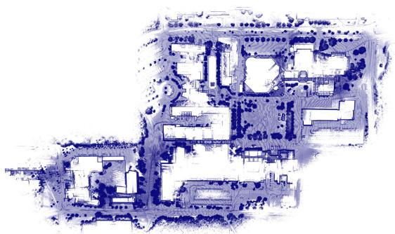

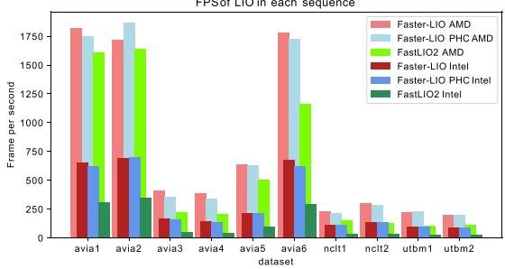  
Fig. 1. The reconstructed point cloud of Faster-LIO from NCLT dataset and the FPS compared with FastLIO2 [18], tested with AMD R7 5800X and Intel Xeon Gold 5218.

LiTAMIN and LiTAMIN2 [2], [29] propose a fast registration method by reducing the number of registered points and introducing the symmetric KL-divergence into traditional ICP. They are inspired by the famous NDT method, which first divides the points into separate voxels and then performs a normal distribution transform in each voxel. The letter reports about 500–1000 Hz frequency in the Kitti dataset with a 64-lines spinning lidar. The speed is impressive but is primarily achieved by reducing the number of involved points instead of using a more compact data structure for neighbor searching. Besides, they do not have an open-source implementation, and the reported accuracy is slightly lower than the traditional method [30].

FastLIO and FastLIO2 [18], [26] are LIO systems that achieve almost 100 Hz in large-scale scenarios. The incremental k-d tree significantly reduces the tree update time, which is also verified in our experiments. The Kalman gain computation in the iterated EKF is further improved by employing the SMW equalities to reduce the dimensions of the observation equations. Nevertheless, we show that iVox is even faster than the ik-d tree in FastLIO2 while accomplishing the same level of accuracy.

For spinning lidars, there are also low-latency approaches (LoLa-SLAM [31], LLOL [32]) that do not wait for a full scan but use partial scan data to perform the registration. Such acceleration is done by slicing the scans into several patterns, and the number of registration points is also much smaller than processing a full scan. Unfortunately, such methods are only available for spinning lidar and are hard to expand into solid-state lidars.

Deep learning registration approaches [33], [34] and GPU accelerated registrations [30] are widely used choices in SLAM if the target platform is equipped with GPU. With the parallel computing ability of GPU, most of the SLAM processes like feature detection, feature matching, and even the whole map can be stored within GPU memory and accelerated to a very high speed. However, we do not compare our approach with the GPU accelerated methods since the basic infrastructure is different.

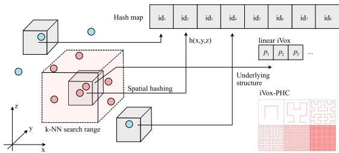  
Fig. 2. 3D points in the global map within the same voxel are mapped to the same 1-dimension hash index. There are two optional data structures within a voxel: the linear iVox and iVox-PHC.

For general spatial data storage, voxel hashing is also a common approach to replacing hierarchical tree-like structures. [35] employs hashed voxels for map management in visual SLAM systems and [36] uses voxel hashing for volumetric 3D reconstruction. Furthermore, this letter shows that the hashed voxels can be used for nearest neighbor searching and incremental mapping for LIO systems.

In the following sections, we first introduce the data structure and the principles of the iVox and its PHC version. Then we demonstrate comparative experiments between our approach and the state-of-the-art LIO algorithms.

## III. IVOX: INCREMENTAL SPARSE VOXELS

## A. Data Structure of IVox

In iVox, the point cloud is first stored in sparse voxels whose indices are hashed into an unordered map (see Fig. 2) by hash function. Since the lidar point cloud is sparse, we are not using any volumetric representations like TSDF [37] but a sparse hash map that only stores those voxels having at least one point. The hash index can be computed by any spatial hashing algorithms like [38]. We use this hash function in our implementation:

$$
\begin{array} { c } { { \bf p } = [ p _ { x } , p _ { y } , p _ { z } ] ^ { T } , ~ { \bf v } = \frac { 1 } { s } [ p _ { x } , p _ { y } , p _ { z } ] ^ { T } , } \\ { { \ i d _ { v } = \mathrm { h a s h } ( v ) = ( v _ { x } n _ { x } ) \mathrm { x o r } ( v _ { y } n _ { y } ) \mathrm { x o r } ( v _ { z } n _ { z } ) \mathrm { m o d } N , } } \end{array}\tag{1}
$$

where $p _ { x } , p _ { y } , p _ { z }$ are the coordinates of $\mathbf { p } \in \mathbb { R } ^ { 3 }$ . The s is the voxel size, $n _ { x } , n _ { y } , n _ { z }$ are large prime numbers and N is the size of hash map, correspondingly.

The points within each voxel are either stored as a vector or an underlying internal structure like PHC (see Section IV), which we call the linear iVox and iVox-PHC, correspondingly. The k-NN search complexity within each voxel is hereby $O ( n )$ or $O ( k )$ using linear iVox or iVox-PHC, where n is the number of points inside the voxel and k is the order of the discrete PHC curve. However, we will prevent inserting too many points into the same voxel at the incremental mapping step in LIO, so it would not make much difference.

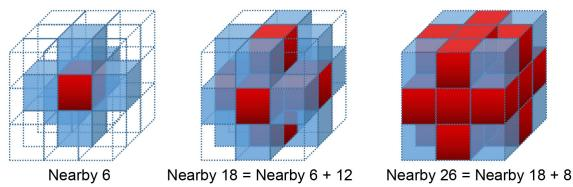  
Fig. 3. Find the nearby (6, 18, or 26) voxels of a given query point p (the center of 3 3 3 cubes).

## B. k-NN Search

The k-NN search is limited within a pre-defined range and then divided into three steps. Given an iVox structure V and a query point P, we will: 1) Find the voxel index and nearby voxels (from 6, 18, 26 voxels in our implementation, see Fig. 3), denoted as S. 2) Iterate through each voxel in S and search at most K neighbors in each voxel. 3) Merge the search results and select the best K neighbors. Note that step 2 can be parallelized for each voxel. However, since the algorithm is already parallelized at the point cloud level, it is unnecessary to perform a parallel search through each voxel here. The k-NN search in iVox is easy, effective, but not strict compared with tree-like algorithms, yet sufficient for LIO applications.

## C. Incremental Mapping

The incremental mapping of iVox has two aspects: incremental addition and deletion.

The addition is straightforward, which is done by inserting new points and creating new voxels if necessary. To avoid too many points accumulating in one voxel, we leave out unnecessary point insertions via a VoxelGrid-like filter in the same way as FastLIO2. Since we have already computed the voxel indices of the nearest neighbors, we will not insert the current point if any of its neighbors is closer to the center of the voxel grid than itself. The leaf size of the filter is the key parameter that tunes the trade-off between accuracy and speed. A larger leaf size prevents too many insertions into one voxel at the cost of k-NN accuracy. In our experience, a leaf size of 0.5 m generally works well in most datasets.

The incremental deletion is different from the k-d tree structure since traversing through the whole voxel hash map is too expensive. So, instead of actively deleting the points outside of the current FoV in the spatial window, we use a least recently used cache (LRU cache) strategy in the time window to maintain the local map (see Fig. 4). Alongside the voxel hash map, we also record the recently visited voxel queue and establish a maximum size. If the number of voxels exceeds the maximum value, we will eliminate the old voxels in memory because insertion and deletion are O(1) in a hash map and very computationally cheap for real-time LIO algorithms.

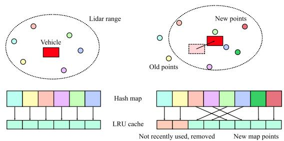  
Fig. 4. Update the iVox with LRU cache. Move the newly created voxels and the newly used voxels back, and delete those that have not been used for a fixed period.

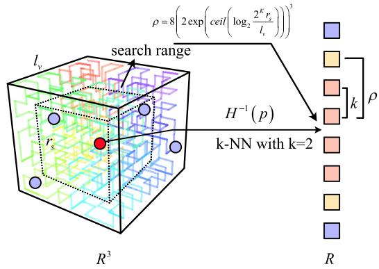  
Fig. 5. k-NN search of iVox-PHC.

## IV. IVOX-PHC

## A. The Underlying Structure of iVox-PHC

IVox-PHC is another implementation of iVox, which replaces the linear layout inside of each voxel with a pseudo-Hilbert curve (PHC). Although we prevent inserting too many points into the same voxel in the LIO pipeline, the performance of the k-NN search will still decrease linearly as the number of points grows. Space-filling curves like PHC are maps from a low dimensional space into a high dimensional space while keeping the locality. Hence, they are suitable for finding approximate nearest neighbors inside a voxel or in the whole point cloud [39], [40].

In the implementation, we split a voxel into $( 2 ^ { K } ) ^ { 3 }$ smaller cubes, where K is a configurable PHC order. For example, we use $K = 6$ while it can be determined according to the physical size of the voxel. The cubes are indexed from 0 to $( 2 ^ { \mathbf { \bar { K } } } ) ^ { \mathbf { \bar { 3 } } } - 1$ according to their positions in the PHC. Each cube stores the centroid of all the points inside the cube. And the centroid will be updated if an inserted point is located inside the range of the cube.

## B. k-NN Search of iVox-PHC

The k-NN search of iVox-PHC is slightly different from linear iVox, where we can use the filling function H to calculate the 1-dimensional index of any given 3-d point (see Fig. 5). Suppose the H function and its inverse are:

$$
H ( t ) = \mathbf { x } \in \mathbb { R } ^ { 3 } , H ^ { - 1 } ( \mathbf { x } ) = t \in \mathbb { R } ,\tag{2}
$$

where t is the one-dimensional index and x is the corresponding cube where the point locates. Then the k-NN search of a given point p, located in cube x, can be approximately solved by counting k-th cubes in front and behind of $H ^ { - 1 } ( \mathbf { x } )$ . The centroids of those cubes are returned as the k nearest neighbors.

If we want to add an extra range condition like limiting the search size within $r _ { s }$ , then the index search range $\rho$ in PHC can be calculated as:

$$
\rho = 8 \left( 2 \exp \left( \mathrm { c e i l } \left( \log _ { 2 } \frac { 2 ^ { K } r _ { s } } { l _ { v } } \right) \right) \right) ^ { 3 } ,\tag{3}
$$

where $l _ { v }$ is the physical size of each voxel. In this case, the index range will be both limited by min $( k , \rho )$

Note that the nearest neighbors in PHC are also approximated. For two points A and $B ,$ consider the length $l _ { A B }$ in PHC and the euclidian distance $d _ { A B } { \bf \Psi }$ in 3D space, we have:

$$
d _ { A B } < = l _ { A B } < = \sqrt { 3 } * d _ { A B }\tag{4}
$$

In an informally way, given a sufficiently large space, the nearest neighbor we have found via PHC is measured up to $\sqrt { 3 }$ times more distant than expected. Although this approximation brings inaccuracy, it does not affect the registration in LIO, as demonstrated in our later experiments.

## C. Complexity ofiVox and iVox-PHC

The time complexity comes from two aspects: incremental map update and k-NN search.

1) Incremental Map Update: Incremental map update involves the insertion and deletion of voxels in an LRU cache and the insertion of points in the voxel. Since the LRU cache is implemented by an unordered map with an inside double linked list, the time complexity of node insertion and deletion is $O ( 1 )$ . Point insertion of iVox-linear is also O(1), which is just an element insertion in a linked list. For iVoxel-PHC, the points are stored in a map indexed by the PHC index. Therefore, inserting an element in an ordered array takes time complexity $O ( \log ( n ) )$ , where n is the average number of points in a voxel. However, n is generally small because the point cloud is downsampled, which does not affect much in practice.

2) k-NN Search: For linear iVox, the time complexity of knn is $O ( n )$ because it calculates the distance from the query point to each point inside the voxel. For iVox-PHC, the time complexity of knn is $O ( \log ( n ) )$ , as we only search the PHC index in a 1-D ordered array. Moreover, for an iVox-PHC with a curve order of $\kappa ,$ the maximum number of points inside is $2 ^ { 3 \kappa }$ . In the worst case, the time complexity of knn in iVox-PHC is $O ( \log ( 2 ^ { 3 \kappa } ) ) =$ $O ( \kappa )$

Please note that the complexity discussed here is defined by the number of points within each voxel, not the whole point cloud. Usually, tree-like methods tend to discuss the search complexity of the whole cloud since the tree is built on it. However, for voxel-based methods, the number of all the points does not directly affect the search efficiency since the voxel index can be calculated in constant complexity.

## V. EXPERIMENTS

This section presents a series of experiments evaluating the accuracy and efficiency of the iVox module and the whole LIO system. All the experiments are conducted in desktop computers with AMD R7-5800X (8 cores, 3.8 G Hz) and Intel Xeon Gold 5128 (16 cores, 2.3 G Hz), denoted as “iVox AMD” and “iVox Intel,” correspondingly. The accuracy experiments are also conducted on laptops with an Intel i7-10750H CPU (6 cores, boost 5G Hz). Since our implementation performs heavy CPU parallelized computation, the number of cores, threads, and boost frequency will dominate the algorithm’s overall performance. We set the number of threads to the maximum thread of the CPU in the following experiments.

The datasets used in experiments are selected from the public dataset that provides IMU and lidar readings. We use the input data from AVIA (solid-state lidar dataset from FastLIO2 [18]), NCLT [41], ULHK [42] and UTBM robocar dataset [43], normally denoted in lower letters in figures and tables. Since the sequences of NCLT and UTBM are similar, we selected only part of them to do the experiments. When comparing the performance of the iVox data structure, we also use synthetic data for better evaluation.

Faster-LIO is basically developed under FastLIO2 with some code refactoring in the implementation. For example, we use libtbb and C++ 17 for parallelization instead of the omp in FastLIO2. We remove the unused logic (the feature extraction part) and simplify the overall pipeline (remove the box delete operation in map update, remove the cache for detected points, adjust the point-to-plane residual computation, etc.). Please refer to the code repository for more details.

## A. Comparative Study ofiVox, ik-d Tree, and the Others

First, we conduct experiments on the search and insert efficiency of iVox as a nearest neighbor data structure using uniformly randomly generated data. We set a local map size from 500 to 1000 k points within a 5 5 5 m cube and perform five nearest neighbors searches or insert 200 new points into the existing map. The insert and k-NN search time will increase as the number of points grows. We compare the linear iVox and iVox-PHC with several widely used NN algorithms, including ik-d tree [23], k-d tree FLANN (implemented in the Point Cloud Library [44], denoted as flann here), R-tree (implemented in Boost Geometry), Faiss-IVF [45], nmslib [46], and nanoflann [47]. The results are shown in Fig. 6. The insert time is plotted as solid lines, and the k-NN search time is dotted. Note that some static algorithms need extra build/train time when inserting new points, making the insert time longer than the others.

The experiments show that in terms of inserting new points to an existing structure, both iVox and ik-d tree perform well with little time gain. IVox versions are slightly faster because we only need to insert the new points into the hash map without any tree expanding or balancing operations. Moreover, for the k-NN search, iVox is much faster than others in small and medium map sizes, but the time cost also grows more quickly. The FLANN k-d tree is faster than ik-d tree, and both of them only grow a little even in the 1000 k points case. For these reasons, we would prefer using a small and medium local map in LIO rather than a large one with lots of points in each voxel.

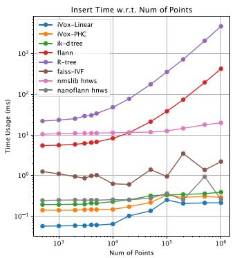

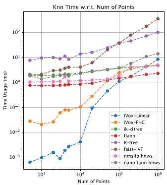  
Fig. 6. Insert and k-NN query time with relation to the number of processed points.

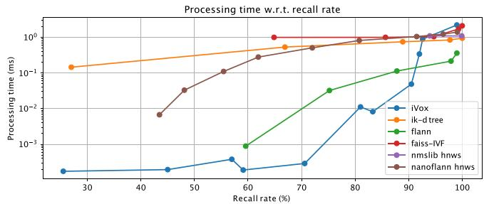  
Fig. 7. Processing time with relation to recall percent curve of the compared algorithms. Bottom-lower is better.

We further plot the processing time w.r.t. recall rate for better evaluation in Fig. 7. In the recall experiment, we use a 1000 points local map and the brute-force search as ground-truth results. Then we adjust the parameter settings in each algorithm to get the trade-offcurves. The recall experiment shows that iVox is faster in low recall rate scenarios, where the parameters are adjusted as small voxel size or small nearby ranges. However, if we want to know the exact neighbors, iVox may not be a good choice since we need a large voxel size or nearby search range to achieve a higher recall rate. Note that due to the system clock accuracy, data points below the 10−3 ms are not strictly accurate and may differ in each run.

## B. Efficiency

The efficiency of LIO is evaluated by computing the average processing time of each step and the average frames per second (FPS) both on AMD and Intel platforms. In the bottom part of Fig. 1, we show the FPS of the Faster-LIO and Faster-LIO PHC compared with the original FastLIO2 (default parameter setting with local map size $L = 1 0 0 0$ m and downsample resolution $l = 0 . 5 \mathrm { m } )$ . It can be seen that Faster-LIO typically achieves 1.5 to 2 times FPS compared with the original FastLIO2, both in solid-state lidar and spinning lidar datasets.

We further investigate the time cost of each algorithm step in LIO in Fig. 8, Fig. 9, and Fig. 10. The main steps in LIO include point cloud preprocess, downsampling, undistortion, and the IEKF+ICP step. The modular time cost is plotted in Fig. 7, which shows that the IEKF+ICP, including the point cloud residual computation, nearest neighbor searching, plane fitting, and IEKF iteration, is the dominant part of the computation. For this reason, we also plot the average IEKF+ICP processing time in Fig. 10 using different iVox versions and CPU platforms.

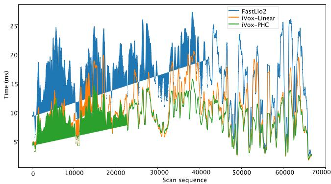  
Fig. 8. Time usage w.r.t. the number of processed scans in a NCLT sequence. The curve is smoothed in a 100 frames windows to reduce the statistical noises.

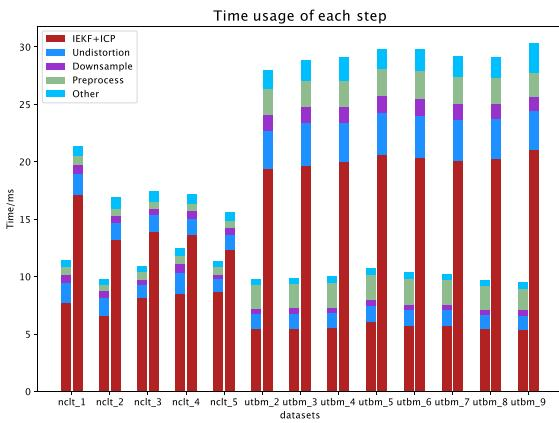  
Fig. 9. Time usage in each step compared with FastLIO2. Left: linear Faster-LIO, right: FastLIO2.

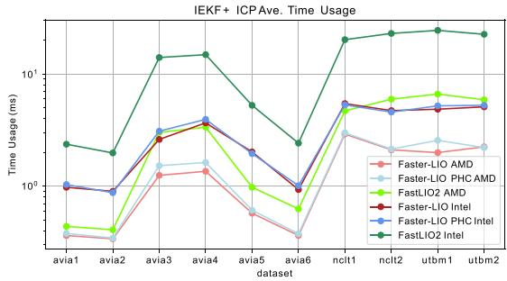  
Fig. 10. Average IEKF processing time compared with FastLIO2.

Both of the FPS and IEKF efficiency experiments show that iVox is significantly faster than ik-d tree, especially on a slower platform where the IEKF computation time plays a more important role (Intel v.s. AMD in our case). In the spinning lidar datasets (NCLT and UTBM), iVox can save almost 40% to 75% processing time in IEKF, and the overall FPS can be increased by 200% to 320%. While in the AVIA dataset, the number of scanned points in solid-state lidar is not so stable as the spinning lidar, the computation time of the iVox is generally shorter than ik-d tree, but not that obvious in sequences like AVIA1 or AVIA2.

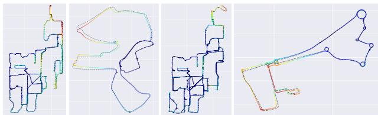  
Fig. 11. The ground-truth and estimated trajectories in NCLT and UTBM dataset. Dashed lines represent the reference ground-truth obtained from RTK and the colorful solid lines represent the estimated result. The color of the figure denotes the error of the estimated trajectory: red-large, blue-small.

Fig. 8 shows an experiment about the time cost w.r.t the number of processed scans in a single sequence of NCLT, which shows that our algorithm does not become slower as time grows and is generally faster than FastLIO2. Table I demonstrates more detailed results compared with state-of-the-art open-source LIO systems like LIO-SAM and LiLi-OM, among which we also get the fastest speed in most of the indicators.

## C. Accuracy

This section compares the Faster-LIO against FastLIO2 and other state-of-the-art mapping systems, including LIO-SAM [24] and LILI-OM [11]. Since Faster-LIO does not have loop closure detection, we manually disable the loop closure function in LIO-SAM and LiLi-OM while enabling all other functions for a fair comparison. Besides, LIO-SAM only takes 9-axis IMU measurements as its input, so we skip the UTBM dataset for LIO-SAM. The selected sequences all have good ground-truth trajectories, normally collected by RTK sensors.

We use the absolute traditional pose error (APE) as the accuracy indicator for whole trajectories and a translational relative pose error (RPE) error per 100 meters for drift evaluation. The RPE is described in percents, just like the Kitti dataset. The accuracy result is shown in Table II. It can be seen that we can achieve comparable accuracy (typically 0.5-1.5% translational drift) with FastLIO2 at a much faster speed. Fig. 11 shows the estimated trajectory in NCLT and UTBM dataset.

## D. Integration Into Other SLAM Systems

We further demonstrate the capability of integrating iVox into other lidar SLAM systems like LeGO-LOAM to save the incremental mapping time. This section shows a time comparison for processing one scan in the mapping module between our method and the LeGO-LOAM, using datasets gathered from a ground vehicle. We integrate the iVox into the mapping to search the closest corner and surface points. The results in Table III show that the iVox can be applied in other SLAM systems and achieves lower time-consume.

TABLE I  
TIME EVALUATION
<table><tr><td rowspan="2">Map ID</td><td colspan="2">Faster-LIO</td><td colspan="2">Faster-LIO PHC</td><td rowspan="2">Spd inc2</td><td colspan="2">FastLIO2</td><td colspan="2">LIO-SAM</td><td colspan="2">LiLi-OM</td></tr><tr><td> $\mathrm { p r e } ^ { 1 }$  (ms)</td><td>opt (ms)</td><td>pre (ms)</td><td>opt (ms)</td><td>pre (ms)</td><td>opt (ms)</td><td>pre (ms)</td><td>opt (ms)</td><td>pre (ms)</td><td>opt (ms)</td></tr><tr><td>nclt_2</td><td>2.74</td><td>6.58</td><td>0.52</td><td>5.45</td><td>2.66</td><td>2.73</td><td>13.20</td><td>6.48</td><td>35.71</td><td>12.28</td><td>18.37</td></tr><tr><td>nclt_4</td><td>3.31</td><td>8.50</td><td>2.17</td><td>7.22</td><td>1.74</td><td>2.72</td><td>13.65</td><td>8.08</td><td>55.00</td><td>9.47</td><td>18.05</td></tr><tr><td>utbm_2</td><td>2.08</td><td>5.47</td><td>3.79</td><td>5.90</td><td>3.49</td><td>7.01</td><td>19.35</td><td>_3</td><td></td><td>13.07</td><td>17.12</td></tr><tr><td>utbm_3</td><td>3.90</td><td>5.45</td><td>3.89</td><td>5.86</td><td>2.89</td><td>7.33</td><td>19.71</td><td></td><td></td><td>15.66</td><td>17.79</td></tr><tr><td>utbm_4</td><td>3.90</td><td>5.54</td><td>3.85</td><td>5.99</td><td>2.86</td><td>7.08</td><td>19.97</td><td></td><td></td><td>15.03</td><td>18.43</td></tr><tr><td>utbm_5</td><td>4.13</td><td>6.06</td><td>4.05</td><td>6.43</td><td>2.76</td><td>7.50</td><td>20.63</td><td></td><td></td><td>13.96</td><td>17.43</td></tr><tr><td>ulhk_1</td><td>4.25</td><td>3.03</td><td>5.04</td><td>4.95</td><td>2.86</td><td>5.03</td><td>11.60</td><td>9.23</td><td>26.37</td><td>14.28</td><td>11.63</td></tr><tr><td>ulhk_2</td><td>5.10</td><td>3.84</td><td>5.12</td><td>4.16</td><td>2.34</td><td>5.21</td><td>11.58</td><td>9.36</td><td>28.00</td><td>14.71</td><td>11.89</td></tr><tr><td>liosam_1</td><td>2.32</td><td>5.75</td><td>2.29</td><td>6.53</td><td>1.52</td><td>2.09</td><td>10.17</td><td>4.80</td><td>43.67</td><td></td><td></td></tr></table>

1The “pre” in Faster-LIO/FastLIO2 denotes the preprocssing+undistortion+downsampling, and “opt” is the pose computation. But LIO-SAM and LiLi-OM use distributed ROS nodes instead of sequentially processing the point clouds (and they are also keyframe-based approaches), so we separately calculate preprocessing and optimization for each keyframe.  
2Spd inc is short for speed increase against FastLIO2.  
3“-” means the algorithm failed in this sequence due to large drift or lack of necessary input data.

TABLE II  
ACCURACY EVALUATION IN APE AND RPE PER 100 METERS
<table><tr><td rowspan="2">Map ID</td><td colspan="2">Faster-LIO</td><td colspan="2">Faster-LIO PHC</td><td colspan="2">FastLIO2</td><td colspan="2">LIO-SAM1</td><td colspan="2">LiLi-OM</td><td rowspan="2">Dist (km)</td></tr><tr><td>APE (m)</td><td>RPE (%)</td><td>APE (m)</td><td>RPE (%)</td><td>APE (m)</td><td>RPE (%)</td><td>APE (m)</td><td>RPE (%)</td><td>APE (m)</td><td>RPE (%)</td></tr><tr><td>nclt_2</td><td>0.94</td><td>0.36</td><td>1.03</td><td>0.33</td><td>0.91</td><td>0.35</td><td>1.11</td><td>0.43</td><td></td><td></td><td>0.26</td></tr><tr><td>nclt_4</td><td>1.32</td><td>0.35</td><td>1.23</td><td>0.33</td><td>0.82</td><td>0.35</td><td>0.38</td><td>0.37</td><td></td><td></td><td>1.86</td></tr><tr><td>utbm_2</td><td>14.48</td><td>0.66</td><td>14.20</td><td>0.92</td><td>12.73</td><td>0.71</td><td></td><td></td><td>63.18</td><td>2.26</td><td>5.03</td></tr><tr><td>utbm_3</td><td>15.13</td><td>0.84</td><td>14.08</td><td>0.84</td><td>13.37</td><td>0.84</td><td></td><td></td><td>82.07</td><td>1.20</td><td>4.99</td></tr><tr><td>utbm_4</td><td>14.84</td><td>1.01</td><td>14.42</td><td>1.01</td><td>14.60</td><td>1.18</td><td></td><td></td><td>102.32</td><td>6.72</td><td>4.99</td></tr><tr><td>utbm_5</td><td>7.77</td><td>1.54</td><td>8.65</td><td>1.54</td><td>7.22</td><td>1.80</td><td></td><td></td><td>48.01</td><td>1.32</td><td>5.00</td></tr><tr><td>ulhk_1</td><td>1.24</td><td>1.53</td><td>1.43</td><td>1.50</td><td>1.21</td><td>1.48</td><td>2.39</td><td>1.87</td><td>9.99</td><td>1.88</td><td>0.60</td></tr><tr><td>ulhk_2</td><td>1.14</td><td>1.68</td><td>1.08</td><td>1.69</td><td>1.11</td><td>1.62</td><td>1.53</td><td>1.46</td><td>10.34</td><td>1.41</td><td>0.62</td></tr><tr><td>liosam_1</td><td>1.78</td><td>0.59</td><td>0.89</td><td>0.67</td><td>0.83</td><td>0.75</td><td>0.83</td><td>0.65</td><td></td><td></td><td>1.44</td></tr></table>

1We do not adjust the parameter settings for LIO-SAM and LiLi-OM, which may cause the older algorithms not perfectly running in newer datasets.

TABLE III  
RUNTIME FOR STEPS IN MAPPING MODULE COMPARED WITH LEGO-LOAM
<table><tr><td>Steps</td><td>LeGO-LOAM (ms)</td><td>iVox (ms)</td></tr><tr><td>Extract key frames</td><td>21.85</td><td>0</td></tr><tr><td>Down sample</td><td>1.092</td><td>1.42</td></tr><tr><td>Optimization</td><td>46.33</td><td>49.768</td></tr><tr><td>Add key frames</td><td>0.127</td><td>0.513</td></tr><tr><td>Totol runtime</td><td>69.41</td><td>51.706</td></tr></table>

The original LeGO-LOAM search several keyframes within a radius to construct a local map for each scan, where the iVox version uses dynamic point management and incremental map update strategy to avoid manually maintaining a point cloud map. As shown in Table III, such kinds of strategies reduce redundant information significantly and lead to a decreased time complexity directly. However, the number of features is small in LeGO-LOAM so that the NN search is not the bottleneck of the whole pipeline. As a result, we do not significantly improve the overall runtime like FasterLIO.

## VI. CONCLUSION

This letter proposes a lightweight lidar-inertial odometry algorithm called FasterLIO, which exploits the iVox and iVox-PHC as its spatial data structure for nearest neighbor search. The iVox and iVox-PHC represent the point cloud with incremental sparse voxels for better search and update efficiency, thus obtaining higher tracking speed than the traditional methods. Our experiments in public datasets show that FasterLIO achieves over 1000 Hz for solid-state lidars and over 200 Hz for spinning lidars, significantly faster than most of the present LIO systems while keeping the same level of accuracy.

## REFERENCES

[1] C. Le Gentil, T. Vidal-Calleja, and S. Huang, “IN2LAAMA: Inertial LiDAR localization autocalibration and mapping,” IEEE Trans. Robot., vol. 37, no. 1, pp. 275–290, Feb. 2021.

[2] M. Yokozuka, K. Koide, S. Oishi, and A. Banno, “LiTAMIN: LiDARbased tracking and mapping by stabilized ICP for geometry approximation with normal distributions,” in Proc. IEEE/RSJ Int. Conf. Intell. Robots Syst. 2020, pp. 5143–5150.

[3] G. Xiang et al., “Fully automatic large-scale point cloud mapping for low-speed self-driving vehicles in unstructured environments,” in Proc. IEEE Intell. Veh. Symp., 2021, pp. 881–888.

[4] P. Wei, X. Wang, and Y. Guo, “3D-LIDAR feature based localization for autonomous vehicles,” in Proc. IEEE 16th Int. Conf. Automat. Sci. Eng., 2020, pp. 288–293.

[5] X. Zheng and J. Zhu, “Efficient LiDAR odometry for autonomous driving,” IEEE Robot. Automat. Lett. vol. 6, no. 4, pp. 8458–8465, Oct. 2021, arXiv:2104.10879.

[6] J. Zhang and S. Singh, “LOAM: LiDAR odometry and mapping in realtime,” in Robot.: Sci. Syst., vol. 2, no. 9, pp. 1–9, 2014.

[7] T. Shan and B. Englot, “LeGO-LOAM: Lightweight and ground-optimized LiDAR odometry and mapping on variable terrain,” in Proc. IEEE/RSJInt. Conf. Intell. Robots Syst., 2018, pp. 4758–4765.

[8] Z. Liu and F. Zhang, “BALM: Bundle adjustment for LiDAR mapping,” IEEE Robot. Automat. Lett., vol. 6, no. 2, pp. 3184–3191, Apr. 2021.

[9] Z. Liu, F. Zhang, and X. Hong, “Low-cost retina-like robotic LiDARs based on incommensurable scanning,” IEEE/ASME Trans. Mechatronics, vol. 27, no. 1, pp. 58–68, Feb. 2022.

[10] D. Wang, C. Watkins, and H. Xie, “MEMS mirrors for LiDAR: A review,” Micromachines, vol. 11, no. 5, p. 456, 2020.

[11] K. Li, M. Li, and U. D. Hanebeck, “Towards high-performance solidstate-LiDAR-inertial odometry and mapping,” IEEE Robot.Automat. Lett., vol. 6, no. 3, pp. 5167–5174, Jul. 2021.

[12] D. V. Nam and K. Gon-Woo, “Solid-state LiDAR based-SLAM: A concise review and application,” in Proc. IEEE Int. Conf. Big Data Smart Comput., 2021, pp. 302–305.

[13] P. Geneva, K. Eckenhoff, Y. Yang, and G. Huang, “Lips: LiDAR-inertial 3D plane SLAM,” in Proc. IEEE/RSJ Int. Conf. Intell. Robots Syst., 2018, pp. 123–130.

[14] N. Rufus, U. K. R. Nair, A. S. B. Kumar, V. Madiraju, and K. M. Krishna, “SROM: Simple real-time odometry and mapping using LiDAR data for autonomous vehicles,” in Proc. IEEE Intell. Veh. Symp., 2020, pp. 1867–1872.

[15] W. Wang, J. Liu, C. Wang, B. Luo, and C. Zhang, “DV-LOAM: Direct visual LiDAR odometry and mapping,” Remote Sens., vol. 13, no. 16, 2021, Art. no. 3340.

[16] S. Hening, C. A. Ippolito, K. S. Krishnakumar, V. Stepanyan, and M. Teodorescu, “3D LiDAR SLAM integration with GPS/INS for UAVs in urban GPS-degraded environments,” in Proc. AIAA Inf. Syst.-AIAA Infotech, Aerosp., 2017, Art. no. 0448.

[17] C. Qian et al., “An integrated GNSS/INS/LiDAR-SLAM positioning method for highly accurate forest stem mapping,” Remote Sens., vol. 9, no. 1, p. 3, 2017.

[18] W. Xu, Y. Cai, D. He, J. Lin, and F. Zhang, “FAST-LIO2: Fast direct LiDAR-inertial odometry,” IEEE Trans. Robot., 2022.

[19] X. Huang, G. Mei, J. Zhang, and R. Abbas, “A comprehensive survey on point cloud registration,” 2021, arXiv:2103.02690.

[20] N. Beckmann, H.-P. Kriegel, R. Schneider, and B. Seeger, “The R\*-tree: An efficient and robust access method for points and rectangles,” in Proc. ACM SIGMOD Int. Conf. Manage. Data, 1990, pp. 322–331.

[21] M. Dolatshah, A. Hadian, and B. Minaei-Bidgoli, “Ball\*-tree: Efficient spatial indexing for constrained nearest-neighbor search in metric spaces,” 2015, arXiv:1511.00628.

[22] K. Koide, M. Yokozuka, S. Oishi, and A. Banno, “Voxelized GICP for fast and accurate 3D point cloud registration,” in Proc. IEEE Int. Conf. Robot. Automat., 2021, pp. 11054–11059.

[23] Y. Cai, W. Xu, and F. Zhang, “ikd-Tree: An incremental KD tree for robotic applications,” 2021, arXiv:2102.10808.

[24] T. Shan, B. Englot, D. Meyers, W. Wang, C. Ratti, and D. Rus, “LIO-SAM: Tightly-coupled LiDAR inertial odometry via smoothing and mapping,” in Proc. IEEE/RSJ Int. Conf. Intell. Robots Syst., 2020, pp. 5135–5142.

[25] X. Zuo, P. Geneva, W. Lee, Y. Liu, and G. Huang, “LIC-Fusion: LiDARinertial-camera odometry,” in Proc. IEEE/RSJ Int. Conf. Intell. Robots Syst., 2019, pp. 5848–5854.

[26] W. Xu and F. Zhang, “FAST-LIO: A fast, robust LiDAR-inertial odometry package by tightly-coupled iterated Kalman filter,” IEEE Robot. Automat. Lett., vol. 6, no. 2, pp. 3317–3324, Apr. 2021.

[27] Y. Pan, P. Xiao, Y. He, Z. Shao, and Z. Li, “MULLS: Versatile LiDAR SLAM via multi-metric linear least square,” in Proc. IEEE Int. Conf. Robot. Automat.2021, pp. 11633–11640, arXiv:2102.03771.

[28] S. Zhao, Z. Fang, H. Li, and S. Scherer, “A robust laser-inertial odometry and mapping method for large-scale highway environments,” in Proc. IEEE/RSJ Int. Conf. Intell. Robots Syst., 2019, pp. 1285–1292.

[29] M. Yokozuka, K. Koide, S. Oishi, and A. Banno, “LITAMIN2: Ultra light LiDAR-based SLAM using geometric approximation applied with KL-divergence,” in Proc. IEEE Int. Conf. Robot. Automat. 2021, pp. 11619–11625, arXiv:2103.00784.

[30] K. Koide, M. Yokozuka, S. Oishi, and A. Banno, “Globally consistent 3D LiDAR mapping with GPU-accelerated GICP matching cost factors,” IEEE Robot. Automat. Lett., vol. 6, no. 4, pp. 8591–8598, Oct. 2021.

[31] M. Karimi, M. Oelsch, O. Stengel, E. Babaians, and E. Steinbach, “LoLa-SLAM: Low-latency LiDAR SLAM using continuous scan slicing,” IEEE Robot. Automat. Lett., vol. 6, no. 2, pp. 2248–2255, Apr. 2021.

[32] C. Qu, S. S. Shivakumar, W. Liu, and C. J. Taylor, “LLOL: Low-latency odometry for spinning LiDARs,” 2021, arXiv:2110.01725.

[33] Q. Li et al., “LO-Net: Deep real-time LiDAR odometry,” in Proc. IEEE/CVF Conf. Comput. Vis. Pattern Recognit., 2019, pp. 8473–8482.

[34] C. Choy, W. Dong, and V. Koltun, “Deep global registration,” in Proc. IEEE/CVF Conf. Comput. Vis. Pattern Recognit., 2020, pp. 2514–2523.

[35] M. Muglikar, Z. Zhang, and D. Scaramuzza, “Voxel map for visual SLAM,” in Proc. IEEE Int. Conf. Robot. Automat., 2020, pp. 4181–4187.

[36] M. Nießner, M. Zollhöfer, S. Izadi, and M. Stamminger, “Real-time 3D reconstruction at scale using voxel hashing,” ACM Trans. Graph., vol. 32, no. 6, pp. 1–11, 2013.

[37] K. Daun, S. Kohlbrecher, J. Sturm, and O. von Stryk, “Large scale 2D laser SLAM using truncated signed distance functions,” in Proc. IEEE Int. Symp. Saf., Secur., Rescue Robot., 2019, pp. 222–228.

[38] M. Teschner, B. Heidelberger, M. Müller, D. Pomerantes, and M. H. Gross, “Optimized spatial hashing for collision detection of deformable objects,” in Proc. Vis., Model., Visual. Conf., 2003, vol. 3, pp. 47–54.

[39] H.-L. Chen and Y.-I. Chang, “Neighbor-finding based on space-filling curves,” Inf. Syst., vol. 30, no. 3, pp. 205–226, 2005.

[40] H.-L. Chen and Y.-I. Chang, “All-nearest-neighbors finding based on the Hilbert curve,” Expert Syst. Appl., vol. 38, no. 6, pp. 7462–7475, 2011.

[41] N. Carlevaris-Bianco, A. K. Ushani, and R. M. Eustice, “University of Michigan North Campus long-term vision and LiDAR dataset,” Int. J. Robot. Res., vol. 35, no. 9, pp. 1023–1035, 2015.

[42] W. Wen et al., “UrbanLoco: A full sensor suite dataset for mapping and localization in urban scenes,” in Proc. IEEE Int. Conf. Robot. Automat., 2020, pp. 2310–2316.

[43] Z. Yan, L. Sun, T. Krajnik, and Y. Ruichek, “EU long-term dataset with multiple sensors for autonomous driving,” in Proc. IEEE/RSJ Int. Conf. Intell. Robots Syst., 2020, pp. 10697–10704.

[44] R. B. Rusu and S. Cousins, “3D is here: Point cloud library (PCL),” in Proc. IEEE Int. Conf. Robot. Automat., 2011, pp. 1–4.

[45] J. Johnson, M. Douze, and H. Jégou, “Billion-scale similarity search with GPUs,” IEEE Trans. Big Data, vol. 7, no. 3, pp. 535–547, Jul. 2017, arXiv:1702.08734.

[46] L. D. Boytsov, Y. Novak, A. Malkov, and E. Nyberg, “Off the beaten path: Let’s replace term-based retrieval with k-NN search,” in Proc. 25th ACM Int. Conf. Inf. Knowl. Manage., S. Mukhopadhyay, C. Zhai, E. F. Bertino, J. Crestani, J. Mostafa Tang, L. Si, X. Zhou, Y. Chang, Y. Li, and P. Sondhi, Eds., Indianapolis, IN, USA, ACM, 2016, pp. 1099–1108. [Online]. Available: https://doi.org/10.1145/2983323.2983815

[47] J. L. Blanco and P. K. Rai, “nanoflann: A C+ header-only fork of FLANN, a library for Nearest Neighbor (NN) with KD-trees,” 2014. [Online]. Available: https://github.com/jlblancoc/nanoflann