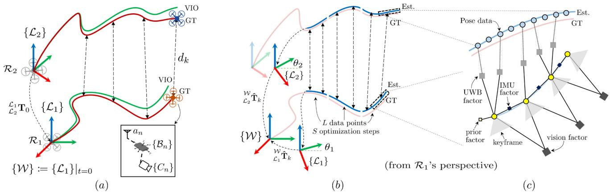
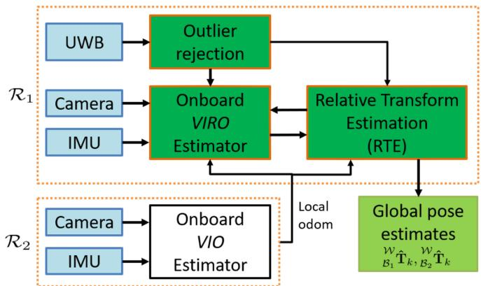
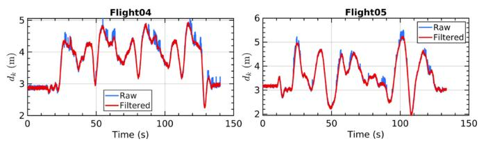
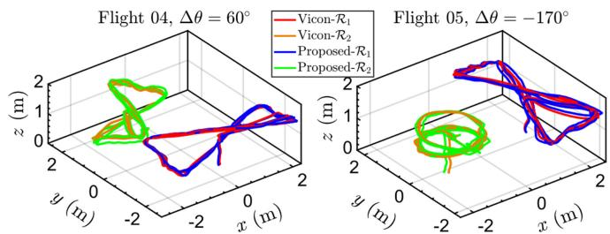
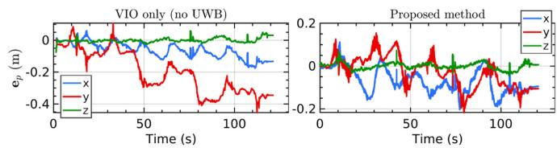
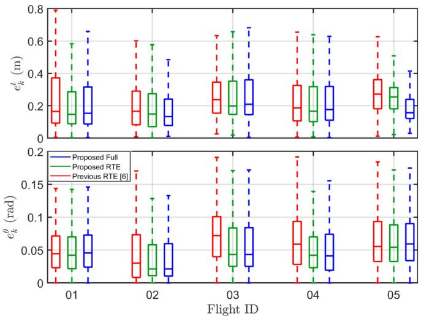
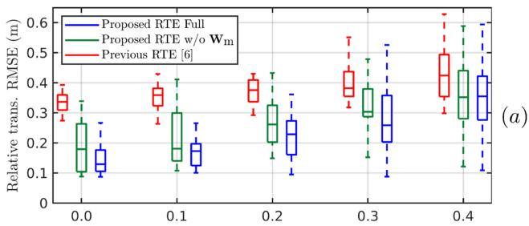
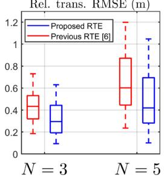
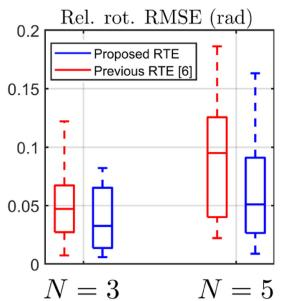
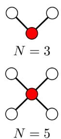

# Flexible and Resource-Efficient Multi-Robot Collaborative Visual-Inertial-Range Localization

Thien Hoang Nguyen , Graduate Student Member, IEEE, Thien-Minh Nguyen , Member, IEEE, and Lihua Xie , Fellow, IEEE

Abstract—In multi-robot systems, two important research problems are relative localization between the robots and global localization of all robots in a common frame. Traditional methods rely on detecting inter and intra-robot loop closures, which can be restrictive operation-wise since the robot must form loops. Ultrawideband sensors, which provide direct distance measurements and robot ID, can replace loop closures in many applications. However, existing research on UWB-aided multi-robot state estimation often ignores the odometry drift which leads to inaccurate global position in the long run. In this work, we present a UWBaided multi-robot localization system that does not rely on loop closure (flexible) and only requires odometry data from neighbors (resource-efficient). We propose a two-stage approach: 1) with a long sliding window, the relative transformation is refined based on range and odometry data, 2) onboard visual-inertial-range data are tightly fused in a short-term sliding window to provide more accurate local and global estimates. Simulation and real-life experiments with two quadrotors show that the system as a whole outperforms previous approaches as well as its individual parts.

Index Terms—Localization, multi-robot SLAM, sensor fusion.

## I. INTRODUCTION

ANY applications such as search and rescue or collabof robots in an unknown environment. In such scenarios, it is important to obtain the individual robots’ positions in a common global frame as well as relative poses between robots to perform other high level tasks such as path planning and collision avoidance. Without an external localization system such as GPS or motion capture system, each robot can only process onboard sensor data to obtain local odometry and optionally a map of the environment. As such, addressing the odometry drift due to accumulated errors as well as combining the maps obtained from the individual robots in real time are gaining more interest in recent years [1], [2].

Many multi-robot SLAM systems leverage LiDAR/visual loop closures to combine the information obtained from the individual robots [1]–[3]. However, there are a number of disadvantages when using loop closures as inter-robot measurements. Firstly, loop closures are only available when there are overlapping regions between the trajectories of the robots, which is not a guarantee for a mission in a completely unknown environment. Secondly, the typical processing pipeline, which comprises of a loop closure detection module, an outlier rejection module and a pose graph optimization (PGO) module, is brittle to outliers and does not run in real-time. Thirdly, each robot must have sufficient communication and computation resources to process, transmit and store the data. Even then, for centralized systems the communication bottleneck will quickly become apparent as the number of robots increases [1]. Ultra-wideband (UWB) sensors which provide 1D distance measurements and unique identification for each robot can compensate for these limitations. Furthermore, UWB can overcome visually challenging cases such as feature-less or low-light environments [4].

Relative positioning using vision, LiDAR or radar faces some common problems such as limited field-of-view, limited detection range, wrong association or partial occlusion of the target [5]. UWB sensor is not only unaffected by these issues but also provides accurate ranging measurements while requires very simple data processing. Various approaches have been introduced to estimate the relative position using range and odometry data [4]. However, they typically use odometry and UWB in a loosely-coupled manner, i.e. the odometry is obtained from a separate localization algorithm (typically visual-inertial odometry, or VIO) and fused together with UWB afterwards. Since the odometry drift is ignored, the global positions will be erroneous in the long-term despite accurate immediate relative poses.

In this work, we aim to combine UWB and other onboard sensors (specifically, camera and IMU) to achieve accurate relative and global localization for multi-robot systems. Compared to loop closure-based methods, our approach does not require any overlaps of the trajectories which allows more flexible missions. Furthermore, only odometry data from one neighbor robot needs to be communicated. Compared to UWB-aided relative localization methods, our tightly-coupled solution is capable of correcting the odometry drift in real-time without any extra visual measurements. We note that although the proposed framework, methodology and experiments are designed primarily for a pair of robots, they can be extended to general N-robot scenario.

TABLE I  
RELATED WORKS ON UWB-AIDED MULTI-ROBOT SLAM
<table><tr><td rowspan=1 colspan=1>Method</td><td rowspan=1 colspan=1>Data Exchange</td><td rowspan=1 colspan=1>Approach</td></tr><tr><td rowspan=1 colspan=1>[8]</td><td rowspan=1 colspan=1>Completed maps (offline)</td><td rowspan=1 colspan=1>Optimization, TC</td></tr><tr><td rowspan=1 colspan=1>[9]</td><td rowspan=1 colspan=1>Odom</td><td rowspan=1 colspan=1>Closed-form, LC</td></tr><tr><td rowspan=1 colspan=1>[10]</td><td rowspan=1 colspan=1>2D visual features</td><td rowspan=1 colspan=1>Optimization, TC</td></tr><tr><td rowspan=1 colspan=1>[11]</td><td rowspan=1 colspan=1>Odom, 2D visual features</td><td rowspan=1 colspan=1>MSCKF, LC</td></tr><tr><td rowspan=1 colspan=1>[12]</td><td rowspan=1 colspan=1>Odom, LiDAR scans</td><td rowspan=1 colspan=1>Graph-based, LC</td></tr><tr><td rowspan=1 colspan=1>[13]</td><td rowspan=1 colspan=1>Odom, keyframes, visualdetection, map database</td><td rowspan=1 colspan=1>Optimization, LC</td></tr><tr><td rowspan=1 colspan=1>[14]</td><td rowspan=1 colspan=1>Keyframes, dual variables</td><td rowspan=1 colspan=1>Optimization, TC</td></tr><tr><td rowspan=1 colspan=1>Ours</td><td rowspan=1 colspan=1>Odom</td><td rowspan=1 colspan=1>Optimization, LC+TC</td></tr></table>

Loosely-Coupled (LC), Tightly-Coupled (TC)

The main contributions of this work include:

\- a two-stage framework for accurate multi-robot relative and global localization, which loosely fuses the UWB and odometry data to correct the relative transformation in the long term while tightly fuses all onboard sensors for accurate short-term odometry;

\- a relative estimation method based on [6] improved with a spatially calibrated model of UWB measurement and a motion-compensated weighting scheme;

\- a so-called “range-focused” fusion method of camera-IMU-UWB data onboard the robot adapted from [7].

The letter is organized as follows. In Section II, the most related works are presented, followed by an overview of the problem in Section III. Next, our approach is described in details in Section IV, which is then verified with simulation and real-life experimental results with two flying quadrotors in Section V. The work is concluded in Section VI.

## II. LITERATURE REVIEW

UWB-based multi-robot localization systems typically require a set of anchors at known locations in the environment [4], [15]. As such, these systems need to be deployed in spacious areas such as warehouse or outdoor. On the other hand, recent single-robot approaches can reduce the requirement to only one unknown anchor and estimate its location online [7], [16], [17]. One possible alternative is to attach multiple UWB transceivers to at least one robot platform so that the relative pose can be estimated directly [18]. Compared to these solutions, this work focuses on system with one UWB transceiver on each platform and no anchors, which is the most flexible configuration in terms of deployment and platform design for real-world applications.

Table I presents a comparison of the most related works on the topic of UWB-aided multi-robot SLAM, which has started to attract more attention in recent years. In [8], a centralized PGO is introduced to merge the completed maps obtained from all of the robots after the mission. In [9], the authors present a close-form solution to estimate the relative frame transformation between robots with a minimum number ofranges. The methods in [10], [12] aim for online collaborative mapping to obtain a unified sparse and dense map, respectively. In these approaches, UWB ranges are used as constraints to combine the maps of the individual robots even when loop closures are not available.

However, there is no benefit of having UWB for the onboard odometry which will accumulate errors and inevitably drift.

In [13], a multi-modal fusion of UWB, visual detection and map-based localization for multi-Unmanned Aerial Vehicles (UAVs) systems is proposed. In [14], the relative range between a pair of UAVs is used as an adjustable baseline to form a virtual stereo rig. While both approaches can improve the accuracy of the odometry estimates, the operational conditions can be restrictive: [13] requires that the neighbor UAV is within the field of view (FoV) of the camera and not too far away (similarly for [12]), and [14] requires that the FoV of the cameras must overlap to have shared visual features (similarly for [10], [11]). In contrast, our method aims to achieve accurate relative and global localization using only UWB and odometry data. Without relying on visual information (loop closure, target detection, map features etc.), the trajectory and operation of the robots can be freely designed. Furthermore, the exchange data consists of only odometry from one robot in a pair which significantly reduces the requirement for communication bandwidth. To achieve these goals, we adapt and enhance the relative estimation method proposed in [6] and our own tightly-coupled visual-inertial-range fusion scheme [7] which was developed for single-anchor scenario.

## III. SYSTEM OVERVIEW

## A. Frames and Notation

We consider a team of N robots denoted as $\{ { \mathcal { R } } _ { n } \} , n \in$ $\{ 1 , \ldots , N \}$ . Each robot is equipped with a camera, an IMU and a UWB sensor. Let $\{ B _ { n } \} , \{ { \cal L } _ { n } \}$ and $a _ { n }$ denote the IMU body frame, local odometry frame and UWB sensor’s antenna of robot n, respectively. The z-axis of $\{ { \mathcal { L } } _ { n } \}$ points to the reverse direction of gravity. Without loss of generality, the world frame {W} is set to coincide with the first robot’s local frame at initialization, i.e. $\{ \mathcal { W } \} : = \{ \mathcal { L } _ { 1 } \} | _ { t = 0 } . \mathrm { F i g }$ . 1 a shows an overview of the coordinate frames in a two-robot scenario. Let ${ \mathbf { } ^ { A } \mathbf { p } } \in \mathbb { R } ^ { 3 }$ and ${ \mathbf { \boldsymbol { \mathbf { \mathit { A } } } } } \mathbf { \mathbf { \boldsymbol { R } } } \in S O ( 3 )$ denote the position vector and rotation matrix in frame $\{ A \} . ^ { A } \mathbf { q } \in \mathbb { H }$ is the corresponding quaternion of $\mathbf { \partial } \cdot { \mathbf { { \mathit { A } } } } _ { \mathbf { R } . \mathbf { \partial } \mathbf { A } }$ homogeneous transformation matrix T in frame {A} is defined as:

$$
{ \mathbf { \Sigma } } ^ { A } \mathbf { T } : = \left[ \begin{array} { l l } { { \mathbf { \Sigma } } ^ { A } \mathbf { R } } & { { \mathbf { \Sigma } } ^ { A } \mathbf { p } } \\ { \mathbf { 0 } ^ { \top } } & { { \mathbf { \Sigma } } ^ { 1 } } \end{array} \right] \in S E ( 3 ) .\tag{1}
$$

Denote ${ } ^ { A } B \mathbf { T } , { } ^ { A } B \mathbf { R }$ as the transformation and rotation matrices from frame {B} to $\{ A \} . ( ^ { A } B \mathbf { T } ) _ { \mathrm { p } } \in \mathbb { R } ^ { 3 }$ extracts the translation part of $^ { A } B \mathbf { T } . \dot { t _ { k } }$ is the timestamp of a new measurement, which corresponds to UWB range $d _ { k }$ for the relative transformation estimation (RTE) module or camera frame $C _ { k }$ for the visualinertial-range odometry (VIRO) module. The estimated value of a variable and the Huber loss function are indicated as (ˆ.) and $\rho ( . )$ , respectively. Since it has been established that VIO systems have 4 unobservable directions [19], the rotation of each odometry frame in the world frame can be sufficiently determined by a yaw angle $\theta _ { n } , \ \mathrm { i . e . } \ ^ { \mathcal { W } } \mathcal { L } _ { n } \mathbf { R } ( \theta _ { n } )$ . Finally, let $B _ { n } { } _ { a _ { n } \mathbf { p } }$ be the position of the UWB antenna $a _ { n }$ in the body frame $\{ B _ { n } \}$ , which is pre-calibrated.

  
Fig. 1. Conceptual overview of the proposed system, simplified for two robots scenario: (a) The coordinate frames and sensor configuration on two robots $\mathcal { R } _ { 1 }$ and $\mathcal { R } _ { 2 } .$ . Without any corrections, the VIO estimates will drift over time compared to the ground truth (GT). (b) Illustration of the sliding window of the RTE module. (c) Illustration of the factor graph of the VIRO module, assuming R1 has access to UWB data and R2 provides odometry data via WiFi/UWB network.

  
Fig. 2. System architecture: R1 is the robot with access to UWB data while R2 provides self odometry estimates. All of the proposed UWB-aided components run onboard $\mathcal { R } _ { 1 }$ . The final estimates can be shared with $\mathcal { R } _ { 2 }$ if necessary.

## B. Problem Formulation

Our main objective is to accurately localize all $\{ B _ { n } \}$ in {W}. We assume to have an initial guess of the relative transformation between the local frames of any pair of robots, ${ \mathcal { L } } _ { i } { \mathcal { L } } _ { j } { \hat { \mathbf { T } } } _ { 0 }$ , before the mission begins. When no initial guess is available, one can estimate it by applying previous methods specialized in relative state estimation such as [18], [20] which use only range and odometry data, or [21] which combines distance, odometry and visual detection.

Fig. 2 illustrates the main components of the proposed system. In this letter, the focus is on the simplest configuration with two robots, $N = 2$ , and only robot $\mathcal { R } _ { 1 }$ has direct access to UWB data. Robot $\mathcal { R } _ { 2 }$ provides odometry data and can potentially receive periodic updates from $\mathcal { R } _ { 1 }$ to correct its local drift. The reason is that our real system uses two-way ranging (TWR) UWB sensor, which has the advantage that clock synchronization between the UWBs is not required but only one robot with the requester UWB will obtain UWB data directly. Broadcasting all range data to the neighbors will lead to bandwidth consumption and delay issues, which should be avoided. To save memory usage, R only keeps the odometry data that is closest in time to a UWB range data and discard all others. While $\mathcal { R } _ { 2 }$ only runs the VIO estimator, $\mathcal { R } _ { 1 }$ runs the full UWB-aided system including:

1) the RTE module which loosely fuses range and odometry data in a long (e.g., 10s) sliding window to correct the drift over time;

2) the VIRO module which tightly fuses onboard sensors in a short (e.g., 10 keyframes) sliding window to improve the local odometry accuracy compared to VIO.

Fig. 1(b)and (c) illustrate the sliding window of the RTE module and the factor graph of the VIRO module, respectively. The reasons to employ two separate sliding windows are as follows. Firstly, the data that RTE and VIRO modules required are inherently different. RTE relies on having spatially diverse motion to ensure observability [20]. Hence, the data are collected over a long period of time but each data point is a simple combination of 3D poses and 1D distance. In contrast, each keyframe in the VIRO’s sliding window contains rich visual information and a sufficient number of landmarks shared between the keyframes is required [19]. Secondly, increasing the length of the VIRO’s sliding window to match that of RTE will increase the computation and memory usage significantly, which will make the system not real-time unless other performance parameters are sacrificed (number of tracking features, quality of features etc.). For these reasons, we opt for a two-stage approach in this work. The length of the RTE’s sliding window is empirically determined whereas the VIRO’s sliding window contains 10 keyframes similar to standard VIO pipelines.

## C. UWB Outlier Rejection

To avoid fusing spurious UWB measurement, outlier rejection is required. In our previous works using UWB anchor [7], [22], a new range measurement at $t _ { k }$ is compared to the predicted range based on robot’s odometry and anchor position. If the difference is greater than a threshold, the measurement is deemed as an outlier. However, this method is not suitable for multi-robot case since the predicted range relies on the odometries as well as the relative frame transformation, both ofwhich might be erroneous. In [8], switchable constraints are used to eliminate any ranges that do not fit well with the complete pose graph. This solution can avoid using specific criteria to detect outliers but only works offline since the whole trajectories are required.

  
Fig. 3. Raw and filtered UWB data in our real-life experiments, corresponding to the trajectories in Fig. 4.

  
Fig. 4. Overview of some of the real-life flight trajectories. $\Delta \theta$ is the initial relative heading between the quadrotors.

In this work, UWB outliers are detected based on the variance of range data in a short temporal window. The new data is admitted if the overall variance is below a certain threshold, otherwise it is discarded. This method comes from the observation that the variance is noticeably larger when outliers are present compared to normal noise, even when both robots are moving. We note that if the robots are moving at high velocities or erratically, the range data variance will also be high and this method might not be effective. Nonetheless, the filtered results are satisfactory in our real-life experiments. Fig. 3 shows the raw and filtered UWB data in two flight tests (Fig. 4) where we process the last 20 samples and the maximum variance is set as 0.01.

## IV. METHODOLOGY

## A. Relative Transformation Estimation (RTE)

In this section, we present our enhancements of the relative transformation estimation method proposed in [6].

1) Problem Formulation: State-of-the-art VIO systems are accurate in the short term, but will drift over time due to accumulated errors. The drift can be modeled as a random walk of the odometry reference frame [6] with 4 degrees of freedom (DoF) noise $\pmb { \Sigma } _ { \mathrm { d r i f t } }$ that acts on the 3D translation and the rotation around the gravity axis:

$$
\begin{array} { r } { { \mathbf \nu } ^ { \mathcal { W } } \mathcal { L } _ { n } \mathbf { T } _ { k + 1 } = { \mathbf \nu } ^ { \mathcal { W } } \mathcal { L } _ { n } \mathbf { T } _ { k } + \pmb { \nu } _ { k } , \pmb { \nu } _ { k } \sim \mathcal { N } ( \mathbf { 0 } , \pmb { \Sigma } _ { \mathrm { d r i f t } } ) . } \end{array}\tag{2}
$$

By estimating the low dynamic relative frame transformations instead of discrete robot poses, the complexity of the estimation problem is greatly reduced. Since the transformation changes slowly over time, every L data points can be associated with one pair of states $( ^ { \mathcal { W } } \mathcal { L } _ { 1 } \mathbf { T } _ { k } , ^ { \mathcal { W } } \mathcal { L } _ { 2 } \mathbf { T } _ { k } )$ to reduce the update rate by a factor of L.

The state vector of the RTE process for N robots with S optimization steps can be represented as:

$$
\begin{array} { r } { \mathcal { X } _ { k } ^ { \mathrm { R } } = \left[ \overbrace { \mathcal { W } \mathcal { L } _ { 1 } \mathbf { T } _ { k - ( S - 1 ) L } , \mathcal { W } \mathcal { L } _ { 1 } \mathbf { T } _ { k - ( S - 2 ) L } , \ldots } ^ { S \mathrm { o p t i m i z a t i o n ~ s t e p s } } , \overbrace { { \mathscr { W } \mathcal { L } _ { 1 } \mathbf { T } _ { k - ( S - 1 ) L } } } ^ { S \mathrm { o p t i m i z a t i o n ~ s t e p s } } , \ldots , \overbrace { { \mathscr { W } \mathcal { L } _ { 1 } \mathbf { T } _ { k } } , \ldots , \mathbf { T } _ { k } } ^ { \mathcal { W } \mathrm { o p t i m i z a t i o n } } , \ldots , \overbrace { { \mathscr { W } \mathcal { L } _ { 1 } \mathbf { T } _ { k - ( S - 1 ) L } } } ^ { S \mathrm { o p t i m i z a t i o n } } \right] } \\ { \mathcal { W } _ { \mathcal { L } _ { N } } \mathbf { T } _ { k - ( S - 1 ) L } , \mathcal { W } _ { \mathcal { L } _ { N } } \mathbf { T } _ { k - ( S - 2 ) L } , \ldots , \mathcal { W } _ { \mathcal { L } _ { N } } \mathbf { T } _ { k } \Bigg ] , } \end{array}\tag{3}
$$

which consists of the 3D translation and yaw angle of each transformation. For each step $j \in \{ 0 , \ldots , S - 1 \}$ , the collected data consist of range and associated robot poses:

$$
\mathcal { T } _ { k - j L } = \{ d _ { k - i } , ^ { w } \mathcal { B } _ { 1 } \hat { \mathbf { T } } _ { k - i } , ^ { w } \mathcal { B } _ { 2 } \hat { \mathbf { T } } _ { k - i } \} _ { i = 0 } ^ { i = L - 1 } .\tag{4}
$$

The overall cost function to be minimized is:

$$
E _ { \mathrm { R T E } } ( \mathcal { X } _ { k } ^ { \mathrm { R } } ) = E _ { \mathrm { p } } ( \mathcal { X } _ { k } ^ { \mathrm { R } } ) + E _ { \mathrm { r } } ( \mathcal { X } _ { k } ^ { \mathrm { R } } ) + E _ { \mathrm { d } } ( \mathcal { X } _ { k } ^ { \mathrm { R } } ) ,\tag{5}
$$

where $E _ { \mathrm { p } } , E _ { \mathrm { r } }$ and $E _ { \mathrm { d } }$ are the prior, range and drift costs, respectively, and weill be specified later. The authors in [6] adapt an asynchronous version Alternative Direct Method of Multiplier (ADMM) to solve the problem in a distributed manner and has demonstrated encouraging results with photo-realistic simulation. However, we found that the performance with real-world experiments can be further enhanced. Specifically, we propose the following changes in the formulation of the range and drift costs. The prior cost remains unchanged.

2) Prior Cost: The prior cost is defined as

$$
E _ { \mathfrak { p } } ( \mathcal { X } _ { k } ^ { \mathtt { R } } ) = \| \mathcal { X } _ { k } ^ { \mathtt { R } }  \hat { \mathcal { X } } _ { k - L } ^ { \mathtt { R } } \| _ { \Sigma _ { k - L } ^ { - 1 } } ^ { 2 }\tag{6}
$$

which carries the results from the last update at $t _ { k - L }$ . The weight is the covariance of the previous estimates. The - operation, as used in [6], is simple subtraction for vector variables and logarithmic mapping to corresponding tangent vector for quaternion variables.

3) Spatially Calibrated UWB Range Cost: In [6], the spatial offset of the UWB antenna in the body frame is neglected. In our recent works [7], [22], it has been shown that taking the offset into account can improve the accuracy of the localization systems. This is especially important for real robotic platforms where the UWB antenna is often located at the boundary of the platform to improve signal reliability.

The position of UWB antenna in the local frame $\{ { \mathcal { L } } _ { n } \}$ is

$$
\begin{array} { r } { \mathcal { L } _ { n } } { a } _ { n } \mathbf { p } _ { k } = \mathcal { L } _ { n }  \beta _ { n } \mathbf { p } _ { k } + \mathcal { L } _ { n }  \beta _ { n } \mathbf { R } _ { k } ^ { \mathcal { B } _ { n } }  { a } _ { n } \mathbf { p } ,  \end{array}\tag{7}
$$

while the rotation part is identity. The range measurement corresponds to the relative position between the UWB antennas in the world frame {W}:

$$
\begin{array} { r } { {  { \mathcal { W } } _ { a _ { 1 2 } { \mathbf { p } } } } = \left( {  { \mathcal { W } } }  { \mathcal { L } } _ { 1 } { \mathbf { T } } _ { k - j L } {  { \mathcal { L } } ^ { _ 1 } } a _ { 1 } { \mathbf { T } } _ { i } \right) _ { \mathrm { p } } - \left( {  { \mathcal { W } } }  { \mathcal { L } } _ { 2 } { \mathbf { T } } _ { k - j L } {  { \mathcal { L } } ^ { _ 2 } } a _ { 2 } { \mathbf { T } } _ { i } \right) _ { \mathrm { p } } . } \end{array}\tag{8}
$$

The UWB range cost is defined as

$$
E _ { \mathrm { r } } ( \mathcal { X } _ { k } ^ { \mathrm { R } } ) = \sum _ { \begin{array} { c } { i \in \mathcal { T } _ { k - j L } } \\ { j \in \{ 0 , \ldots , S - 1 \} } \end{array} } \left\| d _ { i } - \right\| ^ { { \mathcal { W } } } a _ { 1 2 } \mathbf { p } \big \| \big \| _ { \mathrm { W _ { r } } } ^ { 2 } ,\tag{9}
$$

  
Fig. 5. Position error of $\mathcal { R } _ { 1 }$ (UAV1) in flight 05.

which consists ofall available UWB measurements in the sliding window, segmented for each of S optimization steps. With the measurements from UWB and VIO corrupted by Gaussian noises $\mathcal { N } ( 0 , \sigma _ { \mathrm { r } } ^ { 2 } )$ and $\mathcal { N } ( \mathbf { 0 } , \pmb { \Sigma } _ { \mathrm { V I O } } )$ respectively, the weight is calculated as

$$
\mathrm { W _ { r } } = ( \sigma _ { \mathrm { r } } ^ { 2 } + \sigma _ { \mathrm { V I O } } ^ { 2 } ) ^ { - 1 } ,\tag{10}
$$

where $\sigma _ { \mathrm { V I O } }$ is the maximum singular value of the 4-DoF noise $\pmb { \Sigma } _ { \mathrm { V I O } }$ used in [6].

4) Motion-Compensated Drift Cost: The drift cost, which accounts for the changes in the relative frame transformations following the model in (2), is

$$
E _ { \mathrm { d } } ( \mathcal { X } _ { k } ^ { \mathrm { R } } ) = \sum _ { \begin{array} { l } { j \in \{ 0 , \dots , S - 2 \} } \\ { n \in \{ 1 , 2 \} } \end{array} } \left. ^ { \mathcal { W } } \mathcal { L } _ { n } \mathbf { T } _ { k - ( j + 1 ) L } \big \boxtimes ^ { \mathcal { W } } \mathcal { L } _ { n } \mathbf { T } _ { k - j L } \right. _ { \mathbf { W } _ { \mathrm { d } } ^ { j } } ^ { 2 } .\tag{11}
$$

In [6], the weight is calculated based on the odometry model $( \mathbf { W } _ { \mathrm { d } } = \Sigma _ { \mathrm { d r i f t } } ^ { - 1 } )$ which is static regardless of the robot’s actual motion. In practice, we observe the odometry is more likely to drift in the direction that the robot is moving. Fig. 5 shows an example where the VIO’s drift is significantly larger in the y axis, along which the UAV moves the most. An analysis of the VIO drift characteristic in [23] has also shown similar observation: when the UAV flies fast in the x direction, the error accumulates mostly on the x axis compared to the y and z axes, and vice versa when the UAV flies in the y axis.

With this insight, we propose a motion-compensated weight based on the local motion:

$$
\mathbf { W } _ { \mathrm { m } } ^ { j } = \left( \gamma \mathrm { d i a g } \{ ^ { \mathcal { L } _ { n } } \mathcal { B } _ { n } \bar { \mathbf { v } } _ { k - j L } ^ { \top } , ^ { \mathcal { L } _ { n } } \mathcal { B } _ { n } \bar { \omega } _ { k - j L } ^ { z } \} \Delta t _ { k - j L } \right) ^ { 2 }\tag{12}
$$

with $\Delta t _ { k - j L } = t _ { k } - t _ { k - j L }$ and ${ \mathcal { L } } _ { n } { \mathcal { B } } _ { n } { \bar { \mathbf { v } } } _ { k - j L } , { \mathcal { L } } _ { n } { \mathcal { B } } _ { n } { \bar { \omega } } _ { k - j L } ^ { z }$ as the average translation and yaw rotation velocity from $t _ { k - j L }$ to $t _ { k }$ respectively. γ is a tuning parameter. Note that each diagonal element of $\dot { \mathbf { W } } _ { \mathrm { m } } ^ { j }$ is only applied when there is actual motion (i.e., $| ^ { \mathcal { L } _ { n } } B _ { n } \bar { v } _ { k - j L } | > 0 . 0 5 , ~ | ^ { \mathcal { L } _ { n } } B _ { n } \bar { \omega } _ { k - j L } ^ { z } | > 0 . 1 )$ , otherwise it is set to zero. Given $\pmb { \Sigma } _ { \mathrm { d r i f t } }$ defined in (2), the drift residual weight is

$$
\mathbf { W } _ { \mathrm { d } } ^ { j } = \pmb { \Sigma } _ { \mathrm { d r i f t } } ^ { - 1 } + ( ^ { \mathcal { W } } \mathcal { L } _ { n } \hat { \mathbf { R } } _ { k - j L } ) \mathbf { W } _ { \mathrm { m } } ^ { j } ( ^ { \mathcal { W } } \mathcal { L } _ { n } \hat { \mathbf { R } } _ { k - j L } ) ^ { \top } ,\tag{13}
$$

with a slight abuse of notation, that is, $\begin{array} { r l } {  { \mathcal { W } \mathcal { L } _ { n } \hat { \mathbf { R } } _ { k - j L } } } \end{array}$ being a 4×4 transformation matrix with only the rotation part. γ is empirically tuned such that the total value of $\mathbf { W } _ { \mathrm { d } } ^ { j }$ at maximum speed is many times higher than that at stationary.

## B. Collaborative Tightly-Coupled VIRO

In this section, we introduce the evolved version ofour anchorbased tightly-coupled VIRO method [7]. The main difference is that the UWB factor now also incorporates the uncertainty of the other robot’s odometry data besides the UWB noise. The following formulation and notation are viewed from $\mathcal { R } _ { 1 } \mathrm { { ' s } }$ perspective.

1) Problem Formulation: At time $t _ { k }$ , the state vector of the odometry process $\mathcal { X } _ { k } ^ { \mathrm { O } }$ includes K keyframes $\mathbf { x } _ { i }$ and the visual landmarks visible within the sliding window $\mathcal { X } _ { L }$ :

$$
\begin{array} { r l } & { \mathcal { X } _ { k } ^ { 0 } = \{ \mathcal { X } _ { L } , \mathcal { X } _ { B } \} , \ \mathcal { X } _ { B } = [ { \bf x } _ { 1 } , \ldots , { \bf x } _ { i } , \ldots , { \bf x } _ { K } ] , } \\ & { { \bf x } _ { i } = [ ^ { \mathcal { L } _ { 1 } } \mathcal { B } _ { 1 } { \bf p } _ { i } , ^ { \mathcal { L } _ { 1 } } \mathcal { B } _ { 1 } { \bf q } _ { i } , ^ { \mathcal { L } _ { 1 } } \mathcal { B } _ { 1 } { \bf v } _ { i } , { \bf b } _ { a i } ^ { n } , { \bf b } _ { g _ { i } } ^ { n } ] , i \in [ 1 , K ] , } \end{array}\tag{14}
$$

with $\mathbf { b } _ { a i } ^ { n }$ and $\mathbf { b } _ { g _ { i } } ^ { n }$ being the IMU accelerometer and gyroscope biases, respectively. The cost function to be optimized is

$$
E _ { \mathrm { V I R O } } ( \mathcal { X } _ { k } ^ { 0 } ) = E _ { \mathrm { V I } } ( \mathcal { X } _ { k } ^ { 0 } ) + E _ { \mathrm { R } } ( \mathcal { X } _ { k } ^ { 0 } ) ,\tag{15}
$$

where $E _ { \mathrm { V I } }$ consists of the cost of the visual $\bf ( e _ { V } )$ , IMU $( \mathbf { e _ { I } } )$ and prior (eP) residuals

$$
{ \cal E } _ { \mathrm { { V I } } } ( { \cal X } _ { k } ^ { 0 } ) = \sum _ { ( a , b ) \in \mathcal { C } } \rho \left( \left\| \mathbf { e } _ { \mathbf { V } } ^ { a , b } \right\| ^ { 2 } \right) + \sum _ { i = 1 } ^ { K } \left\| \mathbf { e } _ { \mathbf { I } } ^ { i } \right\| ^ { 2 } + \left\| \mathbf { e } _ { \mathbf { P } } \right\| ^ { 2 } .\tag{16}
$$

A detailed explanation of the measurements as well as the processing pipeline for $E _ { \mathrm { V I } }$ can be found in [24]. In this work, we focus on the newly introduced UWB cost

$$
E _ { \mathrm { R } } ( \mathcal { X } _ { k } ^ { 0 } ) = \gamma _ { \mathrm { r } } \sum _ { i = 1 } ^ { K - 1 } \sum _ { j \in \mathcal { D } _ { i } } e _ { \mathrm { R } } ^ { j } ,\tag{17}
$$

where $\mathcal { D } _ { i }$ is the set of all UWB ranges available between the i-th and $( i + 1 )$ -th keyframe, $\gamma _ { \mathrm { r } } = ( \sigma _ { \mathrm { r } } ^ { 2 } + \sigma _ { \mathrm { V I O } } ^ { 2 } ) ^ { - 1 }$ is the weight for the UWB residual $e _ { \mathbf { R } } ^ { j }$ . The formulation of the range residual $e _ { \mathbf { R } } ^ { j }$ is introduced in the following section.

2) Inter-Robot Range-Focused UWB Factor: Let $t _ { i }$ be the timestamp of the i-th keyframe. For each range data $d _ { j }$ measured at $t _ { j } \in [ t _ { i } , t _ { i + 1 } )$ , the UWB residual is

$$
e _ { \mathbf { R } } ^ { j } = d _ { j } - \left. ^ { \mathcal { L } _ { 1 } } a _ { 1 } \mathbf { p } _ { j } - ^ { \mathcal { L } _ { 1 } } a _ { 2 } \hat { \mathbf { p } } _ { j } \right. , \forall j \in \mathcal { D } _ { i } ,\tag{18}
$$

where the UWB antenna position in $\{ \mathcal { L } _ { 1 } \}$ frame is

$$
\begin{array} { r } { ^ { \mathcal { L } _ { 1 } } a _ { 1 } \mathbf { p } _ { j } : = ^ { \mathcal { L } _ { 1 } } \mathcal { B } _ { 1 } \mathbf { p } _ { j } + ^ { \mathcal { L } _ { 1 } } \mathcal { B } _ { 1 } \mathbf { R } _ { j } ^ { \mathcal { B } _ { 1 } } a _ { 1 } \mathbf { p } . } \end{array}\tag{19}
$$

The benefits of the so-called “range-focused” formulation compared to traditional approach (one nearest range data associated to one keyframe) are two-fold: first, all available UWB data in the sliding window are utilized instead of only a single range data nearest to the keyframe; second, the time-offset between the UWB range and keyframe is taken into account to enhance the performance of the system. Specifically, our formulation relates the pseudo body pose at $t _ { j } ~ ( ^ { \mathcal { L } _ { 1 } } B _ { 1 } \mathbf { p } _ { j } , ^ { \mathcal { L } _ { 1 } } B _ { 1 } \mathbf { R } _ { j } )$ to the i-th keyframe state by combining a prediction based on constant velocity motion model and prediction based on pre-integrated IMU measurements

$$
{ \mathcal { L } } _ { 1 }  { \mathcal { B } } _ { 1 }  { \mathbf { p } } _ { j } : =  { \mathcal { L } } _ { 1 }  { \mathcal { B } } _ { 1 }  { \mathbf { p } } _ { i } + \frac { 1 } { 2 } \Delta \hat {  { \mathbf { p } } } _ { j } ^ { i } + \frac { 1 } { 2 }  { \mathcal { L } } _ { 1 }  { \mathcal { B } } _ { 1 }  { \mathbf { v } } _ { i } ( t _ { j } - t _ { i } ) ,\tag{20}
$$

$$
{ } ^ { \mathcal { L } _ { 1 } } B _ { 1 } \mathbf { R } _ { j } : = { } ^ { \mathcal { L } _ { 1 } } B _ { 1 } \mathbf { R } _ { i } \Delta \hat { \gamma } _ { j } ^ { i } .\tag{21}
$$

$\Delta \hat { { \bf p } } _ { j } ^ { i }$ and $\Delta \hat { \gamma } _ { j } ^ { i }$ are computed by taking the difference in the pseudo position and orientation measurements at $t _ { j }$ and $t _ { i } ,$ , respectively. Both are readily available from the IMU propagation pipeline [24]. The position of UWB antenna $a _ { 2 }$ in $\{ \mathcal { L } _ { 1 } \}$ frame is $\mathcal { L } _ { 1 } _ { a _ { 2 } \hat { \mathbf { p } } _ { \mathcal { I } } }$ , which is extracted from

$$
{ } ^ { \mathcal { L } _ { 1 } } a _ { 2 } \hat { \mathbf { T } } _ { j } = ( ^ { \mathcal { W } } \mathcal { L } _ { 1 } \hat { \mathbf { T } } _ { k ^ { \prime } } ) ^ { - 1 \mathcal { W } } \mathcal { L } _ { 2 } \hat { \mathbf { T } } _ { k ^ { \prime } } { } ^ { \mathcal { L } _ { 2 } } \mathcal { B } _ { 2 } \hat { \mathbf { T } } _ { j } { } ^ { \mathcal { B } _ { 2 } } a _ { 2 } \mathbf { T } .\tag{22}
$$

Here, $( ^ { \mathcal { W } } \mathcal { L } _ { 1 } \hat { \mathbf { T } } _ { k ^ { \prime } } , ^ { \mathcal { W } } \mathcal { L } _ { 2 } \hat { \mathbf { T } } _ { k ^ { \prime } } )$ are the latest estimates from the RTE module $( t _ { k ^ { \prime } } < t _ { i = 1 } ) , ^ { \mathcal { L } _ { 2 } } B _ { 2 } \hat { \mathbf { T } } _ { j }$ is the odometry data received from $\mathcal { R } _ { 2 }$ and $B _ { ^ 2 a _ { 2 } \mathbf { T } }$ is a constant.

Remark IV.1: It should be noted that both RTE and VIRO modules have their respective degenerate cases. Specifically, RTE might suffer from flip and/or rotation ambiguity in the solutions depending on both robots’ trajectories. Detailed analysis of these degenerate motion patterns can be found in [25]. Since the VIRO module relies mainly on camera and IMU, it has four unobservable DoFs similar to VIO (three for global translation and one for global rotation about the gravity axis) [19]. In this work, we assume the motions sufficiently cover all unobservable cases for RTE and VIRO, which is achieved by moving both robots randomly in all 3D directions during the VIO initialization.

## C. Global and Relative Pose Estimates

At time $t _ { k }$ , given the latest relative frame transformation estimates from the RTE module and current odometry estimate from VIRO, the global pose estimates are

$$
{ } ^ { \mathcal { W } } \mathcal { B } _ { n } \hat { \mathbf { T } } _ { k } = { } ^ { \mathcal { W } } \mathcal { L } _ { n } \hat { \mathbf { T } } _ { k ^ { \prime } } { } ^ { \mathcal { L } _ { n } } \mathcal { B } _ { n } \hat { \mathbf { T } } _ { k } , \forall n \in \{ 1 , \ldots , N \} ,\tag{23}
$$

and the relative position estimate between $\mathcal { R } _ { 1 }$ and $\mathcal { R } _ { 2 }$ is

$$
{ } ^ { \mathcal { B } _ { 1 } } { \mathcal { B } } _ { 2 } \hat { \mathbf { p } } _ { k } = \left( ( { } ^ { \mathcal { W } } { \mathcal { B } } _ { 1 } \hat { \mathbf { T } } _ { k } ) ^ { - 1 \mathcal { W } } { \mathcal { B } } _ { 2 } \hat { \mathbf { T } } _ { k } \right) _ { \mathrm { p } }\tag{24}
$$

all of which are available to robot $\mathcal { R } _ { 1 }$ locally and can be transmitted to $\mathcal { R } _ { 2 }$ if necessary. In Section V, all results are calculated based on these global and relative pose estimates.

## V. EXPERIMENTAL RESULTS

## A. Experiment Setup and Performance Metrics

Our real-life setup consists of two quadrotors equipped with an Intel Realsense T265, a Humatics P440 UWB and an UP Squared computer board. The T265 sensor provides image@30Hz and IMU@200Hz. UWB sensor provides ranges@47Hz. The noise level of UWB is empirically determined to be $\sigma _ { \mathrm { r } } = 0 . 1 \ \mathrm { m }$ , but a method to calibrate inter-robot relative ranges can be found in [26]. We report 5 flight tests conducted in a 6 m×6 m room with VICON ground truth. Each flight has different trajectory shapes, different initial relative positions and headings (Fig. 4). All computation are done on an Intel NUC i7, with separate processes to simulate individual robot. Since the trajectories did not overlap, loop closure-based SLAM methods did not work and hence were not included in the evaluation. The global pose estimates are evaluated with absolute trajectory error (ATE) and relative pose error (RPE) [27]. The relative transformation estimates accuracy is evaluated with the relative translation and rotation RMSE, which are calculated as follows. First, the relative position error at each instance $t _ { k }$ is defined as $\mathbf { e } _ { k } ^ { p } = { } ^ { B _ { 1 } } B _ { 2 } \mathbf { p } _ { k } - { } ^ { B _ { 1 } } B _ { 2 } \hat { \mathbf { p } } _ { k }$ . The relative translation error is $e _ { k } ^ { t } = { \bf e } _ { k } ^ { p ^ { \top } } { \bf e } _ { k } ^ { p }$ . Finally, the translation RMSE $= \sqrt { ( 1 / K ) \sum _ { k = 1 } ^ { K } e _ { k } ^ { t } }$ . The relative rotation RMSE is defined similarly.

  
Fig. 6. Relative localization results in real-life experiments: translation (top) and rotation (bottom) error.

TABLE II ATE (M) RESULTS IN REAL FLIGHTS
<table><tr><td rowspan=2 colspan=2>FlightID</td><td rowspan=2 colspan=1>VINS[24]</td><td rowspan=1 colspan=2>VIROonly</td><td rowspan=1 colspan=1>O</td><td rowspan=1 colspan=2>VIO + RTE</td><td rowspan=1 colspan=1>VIRO + RTE</td></tr><tr><td></td><td></td><td rowspan=1 colspan=1>[6]</td><td rowspan=1 colspan=1>Ours</td><td rowspan=1 colspan=1>α = 1</td><td rowspan=1 colspan=1>α = 2</td></tr><tr><td rowspan=1 colspan=1>01</td><td rowspan=1 colspan=1> $\overline { { \mathcal { R } _ { 1 } } }$  $\mathcal { R } _ { 2 }$ </td><td rowspan=1 colspan=1>0.1150.105</td><td rowspan=1 colspan=2>0.1210.128</td><td rowspan=1 colspan=1>0.1280.105</td><td rowspan=1 colspan=1>0.1020.126</td><td rowspan=1 colspan=1>0.0740.087</td><td rowspan=1 colspan=1>0.0920.076</td></tr><tr><td rowspan=1 colspan=1>02</td><td rowspan=1 colspan=1> $\overline { { \mathcal { R } _ { 1 } } }$  $\mathcal { R } _ { 2 }$ </td><td rowspan=1 colspan=1>0.1350.074</td><td rowspan=1 colspan=2>0.0810.116</td><td rowspan=1 colspan=1>0.0910.097</td><td rowspan=1 colspan=1>0.1090.085</td><td rowspan=1 colspan=1>0.0730.067</td><td rowspan=1 colspan=1>0.0690.079</td></tr><tr><td rowspan=1 colspan=1>03</td><td rowspan=1 colspan=1> $\overline { { \mathcal { R } _ { 1 } } }$  $\mathcal { R } _ { 2 }$ </td><td rowspan=1 colspan=1>0.0650.071</td><td rowspan=1 colspan=2>0.1630.103</td><td rowspan=1 colspan=1>0.0590.063</td><td rowspan=1 colspan=1>0.0610.063</td><td rowspan=1 colspan=1>0.0570.045</td><td rowspan=1 colspan=1>0.0480.040</td></tr><tr><td rowspan=1 colspan=1>04</td><td rowspan=1 colspan=1> $\overline { { \mathcal { R } _ { 1 } } }$  $\mathcal { R } _ { 2 }$ </td><td rowspan=1 colspan=1>0.0780.143</td><td rowspan=1 colspan=2>0.0680.093</td><td rowspan=1 colspan=1>0.0730.116</td><td rowspan=1 colspan=1>0.0830.122</td><td rowspan=1 colspan=1>0.0650.105</td><td rowspan=1 colspan=1>0.0860.077</td></tr><tr><td rowspan=1 colspan=1>05</td><td rowspan=1 colspan=1> $\mathcal { R } _ { 1 }$  $\mathcal { R } _ { 2 }$ </td><td rowspan=1 colspan=1>0.1460.130</td><td rowspan=1 colspan=2>0.1290.106</td><td rowspan=1 colspan=1>0.1200.103</td><td rowspan=1 colspan=1>0.0960.101</td><td rowspan=1 colspan=1>0.0910.095</td><td rowspan=1 colspan=1>0.1110.093</td></tr></table>

The First and second Best Results for Each Row are Highlighted. is the ID of the Robot With Access to UWB, I.e. Robot $\mathcal { R } _ { \alpha }$ Runs Both the RTE and VIRO Modules While the Other Robot Runs VIO.

## B. Relative Localization

1) Real-Life Experiments: Fig. 6 shows the relative translation error in real-life experiments. When used as a standalone module, our proposed RTE method improves upon the previous work by 11.5% average of all experiments. Although the performance of the full system (RTE + VIRO) is only marginally enhanced compared to the standalone RTE, it should be viewed in tandem with the global localization results (Table II and III). It is clear that while the RTE module can improve the relative localization results, the global positions might actually degrade since the drift of one robot’s trajectory would adversely affect the other.

2) Simulation: The goal of this simulation is to evaluate the performance of the RTE module with erroneous initial guess of the relative frame transformation, the main assumption in this work. The simulated trajectories are designed such that the sliding window contains 3D movements as well as yaw rotation. The position of UWB antennas in the body frame are $B _ { n } { \boldsymbol { a } } _ { n } \mathbf { p } =$ $[ 0 . 1 , - 0 . 1 ; 0 . 1 ] ^ { \top }$ . For each trial, the initial guess is corrupted by Gaussian noises:

TABLE III  
RPE RESULTS IN REAL FLIGHTS
<table><tr><td rowspan=2 colspan=2>FlightID</td><td rowspan=1 colspan=3>Translation (m/s)</td><td rowspan=1 colspan=3>Rotation (deg/s)</td></tr><tr><td rowspan=1 colspan=1>VINS</td><td rowspan=1 colspan=1>VIRO</td><td rowspan=1 colspan=1>α = 1</td><td rowspan=1 colspan=1>VINS</td><td rowspan=1 colspan=1>VIRO</td><td rowspan=1 colspan=1>α = 1</td></tr><tr><td rowspan=1 colspan=1>01</td><td rowspan=1 colspan=1> $\overline { { \mathcal { R } _ { 1 } } }$  $\mathcal { R } _ { 2 }$ </td><td rowspan=1 colspan=1>0.1000.058</td><td rowspan=1 colspan=1>0.1020.085</td><td rowspan=1 colspan=1>0.0220.012</td><td rowspan=1 colspan=1>2.28912.466</td><td rowspan=1 colspan=1>2.3092.376</td><td rowspan=1 colspan=1>0.8616.927</td></tr><tr><td rowspan=1 colspan=1>02</td><td rowspan=1 colspan=1> $\overline { { \mathcal { R } _ { 1 } } }$  $\mathcal { R } _ { 2 }$ </td><td rowspan=1 colspan=1>0.0980.059</td><td rowspan=1 colspan=1>0.1000.060</td><td rowspan=1 colspan=1>0.0170.010</td><td rowspan=1 colspan=1>2.2107.415</td><td rowspan=1 colspan=1>4.17410.362</td><td rowspan=1 colspan=1>1.8945.190</td></tr><tr><td rowspan=1 colspan=1>03</td><td rowspan=1 colspan=1> $\overline { { \mathcal { R } _ { 1 } } }$  $\mathcal { R } _ { 2 }$ </td><td rowspan=1 colspan=1>0.1280.057</td><td rowspan=1 colspan=1>0.1290.058</td><td rowspan=1 colspan=1>0.0240.011</td><td rowspan=1 colspan=1>2.66926.977</td><td rowspan=1 colspan=1>7.84426.914</td><td rowspan=1 colspan=1>2.51013.347</td></tr><tr><td rowspan=1 colspan=1>04</td><td rowspan=1 colspan=1> $\overline { { \mathcal { R } _ { 1 } } }$  $\mathcal { R } _ { 2 }$ </td><td rowspan=1 colspan=1>0.1310.103</td><td rowspan=1 colspan=1>0.1320.105</td><td rowspan=1 colspan=1>0.0250.019</td><td rowspan=1 colspan=1>4.15710.781</td><td rowspan=1 colspan=1>5.40810.749</td><td rowspan=1 colspan=1>4.4143.962</td></tr><tr><td rowspan=1 colspan=1>05</td><td rowspan=1 colspan=1> $\overline { { \mathcal { R } _ { 1 } } }$  $\mathcal { R } _ { 2 }$ </td><td rowspan=1 colspan=1>0.1380.090</td><td rowspan=1 colspan=1>0.1390.091</td><td rowspan=1 colspan=1>0.0280.019</td><td rowspan=1 colspan=1>5.4181.773</td><td rowspan=1 colspan=1>5.4271.797</td><td rowspan=1 colspan=1>2.7810.618</td></tr></table>

The First and second Best Results are Ranked for Each Row and Separately for the translation/ Rotation Part. All Results Reported in This Table and Table II are Obtained From the Same Experiments.

$$
{ } ^ { \mathcal { L } _ { 1 } } \mathcal { L } _ { 2 } \hat { \mathbf { p } } _ { 0 } = { } ^ { \mathcal { L } _ { 1 } } \mathcal { L } _ { 2 } \mathbf { p } _ { 0 } + \eta _ { p } , \Delta \hat { \theta } _ { 0 } = \Delta \theta _ { 0 } + \eta _ { \theta } ,\tag{25}
$$

where $\eta _ { p } \sim \mathcal { N } ( \mathbf { 0 } , \sigma _ { p } ^ { 2 } \cdot \mathbf { I } _ { 3 \times 1 } ) , \eta _ { \theta } \sim \mathcal { N } ( 0 , \sigma _ { \theta } ^ { 2 } )$ $\Delta \theta _ { 0 }$ is the initial relative heading between $\mathcal { R } _ { 2 }$ and $\mathcal { R } _ { 1 }$ . The UWB noise is $\sigma _ { \mathrm { r } } { = } 0 . 0 5$ . The value of $\sigma _ { p }$ varies while $\sigma _ { \theta }$ is fixed at $2 ^ { \circ }$ to emulate the typical situation in practice: relative position is difficult to measure/estimate accurately while relative heading can be obtained with an external compass or common visual landmarks. For each value of $\sigma _ { p } ,$ , 100 trials were carried out for both the previous method [6] and ours. All shared parameters are set as recommended in [6] $( L { = } 5 , S { = } 1 0 0 )$ while the ones specific for our method $( \gamma$ in (12)) is tuned once for the $\sigma _ { p } { = } 0$ case. Fig. 7 a shows the statistical results of the simulation. It can be seen as the error in the initial guess increases, the accuracy of both methods degrade but ours always outperform the previous approach. The difference becomes more prevalent as the noise level increases. It is clear that the proposed RTE method without the motion-compensated weight $\mathbf { W _ { \mathrm { m } } }$ can already surpass the previous method, but the full RTE is much more stable and reliable across all scenarios. Fig. 7(b)-(c) shows the results of the same simulation with N=3 and N=5 robots, with $\sigma _ { p } { = } 0 . 0 2$ and $\sigma _ { \theta } = 2$ in all runs. The reported results are the relative transformation from the center robot to other robots (Fig. 7(d)), across all time steps. It is evident that the proposed RTE outperforms the previous method in general cases.

## C. Global Localization

We compare the results of VINS-Mono [24] (serves as baseline without UWB), the standalone RTE and VIRO modules, as well as the full proposed system. The parameters for VIO and initial guess of the relative transformation are the same in all experiments. The results of the RTE module are extracted from the same experiments for the relative localization in Section V-B. Under these settings, Table II and III show the ATE and

  
(b)  
(c)

  
(d)  
Fig. 7. Simulation results for the RTE module. (a) Performance with varying $\sigma _ { p } ,$ same $\sigma _ { \theta }$ for $N { = } 2$ robots. (b)-(c) Performance with $N { = } 3$ and $N { = } 5$ cases, the same $\sigma _ { p }$ and $\sigma _ { \theta }$ in all runs. (d) Network configuration, where the red node denotes the center robot and the white nodes denote the neighbor robot. The edge represents the pairwise measurement and communication link.

TABLE IV  
COMPUTATION USAGE EVALUATION OF DIFFERENT MODULES IN THE PROPOSED SYSTEM (MEAN ± STANDARD DEVIATION)
<table><tr><td>Module</td><td>Optimization time (ms)</td><td>CPU Usage (%)</td></tr><tr><td>VIO</td><td> $\overline { { 1 1 . 4 \pm 3 . 8 } }$ </td><td> $1 7 5 \pm 5 8$ </td></tr><tr><td>VIRO</td><td> $2 0 . 4 \pm 1 3 . 2$ </td><td> $2 0 2 \pm 8 1 . 2$ </td></tr><tr><td>Previous RTE [6]</td><td> $\overline { { 1 0 . 7 \pm 6 . 1 } }$ </td><td> $\overline { { 5 0 . 3 \pm 2 4 . 6 } }$ </td></tr><tr><td>Proposed RTE</td><td> $1 0 . 9 \pm 6 . 4$ </td><td> $5 7 . 5 \pm 3 1 . 3$ </td></tr></table>

RPE results, respectively. Without the RTE correcting the relative transformation, the performance of VIRO depends on the accuracy of the other robot’s odometry, the initial guess and the UWB data. As a result, it often degrades the ATE results since the odometry will inevitably drift, the initial guess is not error-free and UWB data is noisy. Similarly, the RTE module provides inaccurate overall global positions despite satisfactory relative localization results presented in the previous section. Across all experiments, the full proposed system consistently produces the best ATE results, with an overall 26.2% error reduction compared to the baseline. The improvements occur regardless of which robot runs the processes $( \mathcal { R } _ { \alpha } )$ , which demonstrates that the system is able to generalize and the enhancements are not due to specific setup or experiment conditions. Nonetheless, it should be noted that the proposed system can only reduce but not completely eliminate the drift of the localization estimates.

## D. Evaluation of Computational Demand

Table IV shows the optimization time (referring to the time taken by the solver) and the CPU usage ofthe whole process. The results are evaluated from 5 runs with real data from flight 02. It is noticeable that the VIRO module requires more computational resources (time and CPU) than the VIO due to the additional

UWB cost in the optimization problem. Since the number of range residuals in the sliding window varies due to outlier rejection, the deviation in computational demand for VIRO is also more significant. For the RTE module, our method uses slightly more CPU but can solve the optimization in comparable amount of time as the previous method. The reason is that both methods essentially solve for the same optimization problem but the proposed method needs more steps to construct the residuals and weights, thus requires more CPU usage. Overall, the proposed system runs in real-time with extra resources available for other tasks such as planning and control.

## VI. CONCLUSION

We present a multi-robot collaborative localization method that does not require loop closures in the robots’ trajectory, making it flexible, and only uses odometry data from neighboring robots, making it resource-efficient. The system consists of two main components: the RTE module, with a long sliding window consisting ofrange and odometry data and a good initial guess, to estimate the relative transformation based on the drift model as well as the actual motion of the robots; and the VIRO module which tightly fuses all local sensor data (camera, IMU, UWB) in a keyframe-based optimization scheme. The proposed RTE module not only improves the overall accuracy compared to previous work but also is less affected by the quality of the initial guess as shown in simulation. Real-life experiments with 2 UAVs showed that the full proposed method outperforms previous method that focuses only on the relative formation estimation as well as the individual modules in each respective metric for relative and global localization. Validating the system with N > 2 robots and decoupling the computation demand from the number of robots are the main future works.

## REFERENCES

[1] K. Ebadi et al., “LAMP: Large-scale autonomous mapping and positioning for exploration of perceptually-degraded subterranean environments,” in Proc. IEEE Int. Conf. Robot. Automat., 2020, pp. 80–86.

[2] P.-Y. Lajoie, B. Ramtoula, Y. Chang, L. Carlone, and G. Beltrame, “DOOR-SLAM: Distributed, online, and outlier resilient SLAM for robotic teams,” IEEE Robot. Automat. Lett., vol. 5, no. 2, pp. 1656–1663, Apr. 2020.

[3] Y. Jang, C. Oh, Y. Lee, and H. J. Kim, “Multirobot collaborative monocular SLAM utilizing rendezvous,” IEEE Trans. Robot., vol. 37, no. 5, pp. 1469–1486, Oct. 2021.

[4] W. Shule, C. M. Almansa, J. P. Queralta, Z. Zou, and T. Westerlund, “UWBbased localization for multi-UAV systems and collaborative heterogeneous multi-robot systems,” Procedia Comput. Sci., vol. 175, pp. 357–364, 2020.

[5] F. de Ponte Müller, “Survey on ranging sensors and cooperative techniques for relative positioning of vehicles,” Sensors, vol. 17, no. 2, pp. 271–288, 2017.

[6] T. Ziegler, M. Karrer, P. Schmuck, and M. Chli, “Distributed formation estimation via pairwise distance measurements,” IEEE Robot. Automat. Lett., vol. 6, no. 2, pp. 3017–3024, Apr. 2021.

[7] T. H. Nguyen, T.-M. Nguyen, and L. Xie, “Range-focused fusion of camera-IMU-UWB for accurate and drift-reduced localization,” IEEE Robot. Automat. Lett., vol. 6, no. 2, pp. 1678–1685, Apr. 2021. [Online]. Available: https://doi.org/10.1109/lra.2021.3057838

[8] E. R. Boroson, R. Hewitt, N. Ayanian, and J.-P. de la Croix, “Inter-robot range measurements in pose graph optimization,” in Proc. IEEE/RSJ Int. Conf. Intell. Robots Syst., 2020, pp. 4806–4813.

[9] F. Molina Martel, J. Sidorenko, C. Bodensteiner, M. Arens, and U. Hugentobler, “Unique 4-DOF relative pose estimation with six distances for UWB/V-SLAM-Based devices,” Sensors, vol. 19, no. 20, 2019, Art. no. 4366.

[10] C. Zhu, G. Giorgi, Y.-H. Lee, and C. Günther, “Enhancing accuracy in visual slam by tightly coupling sparse ranging measurements between two rovers,” in Proc. IEEE/ION Position, Location Navigation Symp., 2018, pp. 440–446.

[11] B. Chenchana, O. Labbani-Igbida, S. Renault, and S. Boria, “Range-based collaborative MSCKF localization,” in Proc. 25th Int. Conf. Mechatronics Mach. Vis. Pract., 2018, pp. 1–6.

[12] J. P. Queralta, L. Qingqing, F. Schiano, and T. Westerlund, “VIO-UWB-Based collaborative localization and dense scene reconstruction within heterogeneous multi-robot systems,” 2020, arXiv:2011.00830.

[13] H. Xu, L. Wang, Y. Zhang, K. Qiu, and S. Shen, “Decentralized Visual-Inertial-UWB fusion for relative state estimation of aerial swarm,” in Proc. IEEE Int. Conf. Robot. Automat., 2020, pp. 8776–8782.

[14] M. Karrer and M. Chli, “Distributed variable-baseline stereo SLAM from two UAVs,” IEEE Int. Conf. Robot. Automat. (ICRA), pp. 82–88, 2021, arXiv:2009.04801.

[15] S. Yuan, H. Wang, and L. Xie, “Survey on localization systems and algorithms for unmanned systems,” Unmanned Syst., vol. 09, no. 02, pp. 129–163, Feb. 2021. [Online]. Available: https://doi.org/10.1142/ S230138502150014X

[16] N. Funabiki, B. Morrell, J. Nash, and A. akbar Agha-mohammadi, “Rangeaided pose-graph-based SLAM: Applications of deployable ranging beacons for unknown environment exploration,” IEEE Robot. Automat. Lett., vol. 6, no. 1, pp. 48–55, Jan. 2021.

[17] Y. Cao and G. Beltrame, “VIR-SLAM: Visual, inertial, and ranging SLAM for single and multi-robot systems,” Auton. Robots, vol. 45, no. 06, pp. 905–917, Jul. 2021.

[18] T.-M. Nguyen, A. H. Zaini, C. Wang, K. Guo, and L. Xie, “Robust targetrelative localization with ultra-wideband ranging and communication,” in Proc. IEEE Int. Conf. Robot. Automat., 2018, pp. 2312–2319.

[19] G. Huang, “Visual-inertial navigation: A concise review,” in Proc. Int. Conf. Robot. Automat., 2019, pp. 9572–9582.

[20] K. Guo, Z. Qiu, W. Meng, L. Xie, and R. Teo, “Ultra-wideband based cooperative relative localization algorithm and experiments for multiple unmanned aerial vehicles in GPS denied environments,” Int. J. Micro Air Veh., vol. 9, no. 3, pp. 169–186, Mar. 2017.

[21] T. Nguyen, K. Mohta, C. J. Taylor, and V. Kumar, “Vision-based multi-MAV localization with anonymous relative measurements using coupled probabilistic data association filter,” in Proc. IEEE Int. Conf. Robot. Automat., 2020, pp. 3349–3355.

[22] T.-M. Nguyen, M. Cao, S. Yuan, Y. Lyu, T. H. Nguyen, and L. Xie, “VIRAL-Fusion: A visual-inertial-ranging-LiDAR sensor fusion approach,” IEEE Trans. Robot., pp. 1–20, 2021, doi: 10.1109/TRO.2021.3094157.

[23] Y. Mulgaonkar, W. Liu, D. Thakur, K. Daniilidis, C. J. Taylor, and V. Kumar, “The Tiercel: A novel autonomous micro aerial vehicle that can map the environment by flying into obstacles,” in Proc. IEEE Int. Conf. Robot. Automat., 2020, pp. 7448–7454.

[24] T. Qin, P. Li, and S. Shen, “VINS-Mono: A robust and versatile monocular visual-inertial state estimator,” IEEE Trans. Robot., vol. 34, no. 4, pp. 1004–1020, Aug. 2018.

[25] A. Cornejo and R. Nagpal, “Distributed Range-Based Relative Localization of Robot Swarms,” in Algorithmic Foundations ofRobotics XI. Berlin, Germany: Springer, 2015, pp. 91–107.

[26] S. Güler, M. Abdelkader, and J. S. Shamma, “Peer-to-peer relative localization of aerial robots with ultrawideband sensors,” IEEE Trans. Control Syst. Technol., vol. 29, no. 5, pp. 1981–1996, Sep. 2021.

[27] Z. Zhang and D. Scaramuzza, “A tutorial on quantitative trajectory evaluation for Visual(-Inertial) odometry,” in Proc. IEEE/RSJ Int. Conf. Intell. Robots Syst., 2018, pp. 7244–7251.